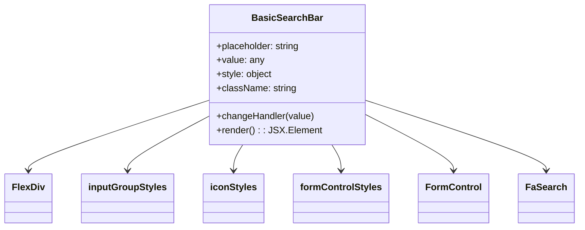

# Diagram: web/portal/src/components/search-bar/BasicSearchBar.js


> Auto-generated by Obscura crawlers

## Diagram 1



### SVG

<svg id="container" width="953.640625" xmlns="http://www.w3.org/2000/svg" class="classDiagram" height="390" viewBox="0 0 953.640625 390" role="graphics-document document" aria-roledescription="class"><style>#container{font-family:"trebuchet ms",verdana,arial,sans-serif;font-size:16px;fill:#333;}@keyframes edge-animation-frame{from{stroke-dashoffset:0;}}@keyframes dash{to{stroke-dashoffset:0;}}#container .edge-animation-slow{stroke-dasharray:9,5!important;stroke-dashoffset:900;animation:dash 50s linear infinite;stroke-linecap:round;}#container .edge-animation-fast{stroke-dasharray:9,5!important;stroke-dashoffset:900;animation:dash 20s linear infinite;stroke-linecap:round;}#container .error-icon{fill:#552222;}#container .error-text{fill:#552222;stroke:#552222;}#container .edge-thickness-normal{stroke-width:1px;}#container .edge-thickness-thick{stroke-width:3.5px;}#container .edge-pattern-solid{stroke-dasharray:0;}#container .edge-thickness-invisible{stroke-width:0;fill:none;}#container .edge-pattern-dashed{stroke-dasharray:3;}#container .edge-pattern-dotted{stroke-dasharray:2;}#container .marker{fill:#333333;stroke:#333333;}#container .marker.cross{stroke:#333333;}#container svg{font-family:"trebuchet ms",verdana,arial,sans-serif;font-size:16px;}#container p{margin:0;}#container g.classGroup text{fill:#9370DB;stroke:none;font-family:"trebuchet ms",verdana,arial,sans-serif;font-size:10px;}#container g.classGroup text .title{font-weight:bolder;}#container .nodeLabel,#container .edgeLabel{color:#131300;}#container .edgeLabel .label rect{fill:#ECECFF;}#container .label text{fill:#131300;}#container .labelBkg{background:#ECECFF;}#container .edgeLabel .label span{background:#ECECFF;}#container .classTitle{font-weight:bolder;}#container .node rect,#container .node circle,#container .node ellipse,#container .node polygon,#container .node path{fill:#ECECFF;stroke:#9370DB;stroke-width:1px;}#container .divider{stroke:#9370DB;stroke-width:1;}#container g.clickable{cursor:pointer;}#container g.classGroup rect{fill:#ECECFF;stroke:#9370DB;}#container g.classGroup line{stroke:#9370DB;stroke-width:1;}#container .classLabel .box{stroke:none;stroke-width:0;fill:#ECECFF;opacity:0.5;}#container .classLabel .label{fill:#9370DB;font-size:10px;}#container .relation{stroke:#333333;stroke-width:1;fill:none;}#container .dashed-line{stroke-dasharray:3;}#container .dotted-line{stroke-dasharray:1 2;}#container #compositionStart,#container .composition{fill:#333333!important;stroke:#333333!important;stroke-width:1;}#container #compositionEnd,#container .composition{fill:#333333!important;stroke:#333333!important;stroke-width:1;}#container #dependencyStart,#container .dependency{fill:#333333!important;stroke:#333333!important;stroke-width:1;}#container #dependencyStart,#container .dependency{fill:#333333!important;stroke:#333333!important;stroke-width:1;}#container #extensionStart,#container .extension{fill:transparent!important;stroke:#333333!important;stroke-width:1;}#container #extensionEnd,#container .extension{fill:transparent!important;stroke:#333333!important;stroke-width:1;}#container #aggregationStart,#container .aggregation{fill:transparent!important;stroke:#333333!important;stroke-width:1;}#container #aggregationEnd,#container .aggregation{fill:transparent!important;stroke:#333333!important;stroke-width:1;}#container #lollipopStart,#container .lollipop{fill:#ECECFF!important;stroke:#333333!important;stroke-width:1;}#container #lollipopEnd,#container .lollipop{fill:#ECECFF!important;stroke:#333333!important;stroke-width:1;}#container .edgeTerminals{font-size:11px;line-height:initial;}#container .classTitleText{text-anchor:middle;font-size:18px;fill:#333;}#container .label-icon{display:inline-block;height:1em;overflow:visible;vertical-align:-0.125em;}#container .node .label-icon path{fill:currentColor;stroke:revert;stroke-width:revert;}#container :root{--mermaid-font-family:"trebuchet ms",verdana,arial,sans-serif;}</style><g><defs><marker id="container_class-aggregationStart" class="marker aggregation class" refX="18" refY="7" markerWidth="190" markerHeight="240" orient="auto"><path d="M 18,7 L9,13 L1,7 L9,1 Z"></path></marker></defs><defs><marker id="container_class-aggregationEnd" class="marker aggregation class" refX="1" refY="7" markerWidth="20" markerHeight="28" orient="auto"><path d="M 18,7 L9,13 L1,7 L9,1 Z"></path></marker></defs><defs><marker id="container_class-extensionStart" class="marker extension class" refX="18" refY="7" markerWidth="190" markerHeight="240" orient="auto"><path d="M 1,7 L18,13 V 1 Z"></path></marker></defs><defs><marker id="container_class-extensionEnd" class="marker extension class" refX="1" refY="7" markerWidth="20" markerHeight="28" orient="auto"><path d="M 1,1 V 13 L18,7 Z"></path></marker></defs><defs><marker id="container_class-compositionStart" class="marker composition class" refX="18" refY="7" markerWidth="190" markerHeight="240" orient="auto"><path d="M 18,7 L9,13 L1,7 L9,1 Z"></path></marker></defs><defs><marker id="container_class-compositionEnd" class="marker composition class" refX="1" refY="7" markerWidth="20" markerHeight="28" orient="auto"><path d="M 18,7 L9,13 L1,7 L9,1 Z"></path></marker></defs><defs><marker id="container_class-dependencyStart" class="marker dependency class" refX="6" refY="7" markerWidth="190" markerHeight="240" orient="auto"><path d="M 5,7 L9,13 L1,7 L9,1 Z"></path></marker></defs><defs><marker id="container_class-dependencyEnd" class="marker dependency class" refX="13" refY="7" markerWidth="20" markerHeight="28" orient="auto"><path d="M 18,7 L9,13 L14,7 L9,1 Z"></path></marker></defs><defs><marker id="container_class-lollipopStart" class="marker lollipop class" refX="13" refY="7" markerWidth="190" markerHeight="240" orient="auto"><circle stroke="black" fill="transparent" cx="7" cy="7" r="6"></circle></marker></defs><defs><marker id="container_class-lollipopEnd" class="marker lollipop class" refX="1" refY="7" markerWidth="190" markerHeight="240" orient="auto"><circle stroke="black" fill="transparent" cx="7" cy="7" r="6"></circle></marker></defs><g class="root"><g class="clusters"></g><g class="edgePaths"><path d="M348.293,170.764L297.933,187.804C247.573,204.843,146.853,238.921,96.493,259.127C46.133,279.333,46.133,285.667,46.133,288.833L46.133,292" id="id_BasicSearchBar_FlexDiv_1" class="edge-thickness-normal edge-pattern-solid relation" style=";;;" data-edge="true" data-et="edge" data-id="id_BasicSearchBar_FlexDiv_1" data-points="W3sieCI6MzQ4LjI5Mjk2ODc1LCJ5IjoxNzAuNzY0MjIxNzEzODA2NTN9LHsieCI6NDYuMTMyODEyNSwieSI6MjczfSx7IngiOjQ2LjEzMjgxMjUsInkiOjI5OH1d" marker-end="url(#container_class-dependencyEnd)"></path><path d="M348.293,197.27L325.264,209.892C302.234,222.514,256.176,247.757,233.146,263.545C210.117,279.333,210.117,285.667,210.117,288.833L210.117,292" id="id_BasicSearchBar_inputGroupStyles_2" class="edge-thickness-normal edge-pattern-solid relation" style=";;;" data-edge="true" data-et="edge" data-id="id_BasicSearchBar_inputGroupStyles_2" data-points="W3sieCI6MzQ4LjI5Mjk2ODc1LCJ5IjoxOTcuMjcwNDc0OTgxMTc0OTd9LHsieCI6MjEwLjExNzE4NzUsInkiOjI3M30seyJ4IjoyMTAuMTE3MTg3NSwieSI6Mjk4fV0=" marker-end="url(#container_class-dependencyEnd)"></path><path d="M400.935,248L398.374,252.167C395.813,256.333,390.692,264.667,388.131,272C385.57,279.333,385.57,285.667,385.57,288.833L385.57,292" id="id_BasicSearchBar_iconStyles_3" class="edge-thickness-normal edge-pattern-solid relation" style=";;;" data-edge="true" data-et="edge" data-id="id_BasicSearchBar_iconStyles_3" data-points="W3sieCI6NDAwLjkzNDY3MTMzNjIwNjg2LCJ5IjoyNDh9LHsieCI6Mzg1LjU3MDMxMjUsInkiOjI3M30seyJ4IjozODUuNTcwMzEyNSwieSI6Mjk4fV0=" marker-end="url(#container_class-dependencyEnd)"></path><path d="M548.433,248L550.993,252.167C553.554,256.333,558.675,264.667,561.236,272C563.797,279.333,563.797,285.667,563.797,288.833L563.797,292" id="id_BasicSearchBar_formControlStyles_4" class="edge-thickness-normal edge-pattern-solid relation" style=";;;" data-edge="true" data-et="edge" data-id="id_BasicSearchBar_formControlStyles_4" data-points="W3sieCI6NTQ4LjQzMjUxNjE2Mzc5MzEsInkiOjI0OH0seyJ4Ijo1NjMuNzk2ODc1LCJ5IjoyNzN9LHsieCI6NTYzLjc5Njg3NSwieSI6Mjk4fV0=" marker-end="url(#container_class-dependencyEnd)"></path><path d="M601.074,194.683L625.814,207.736C650.555,220.789,700.035,246.894,724.775,263.114C749.516,279.333,749.516,285.667,749.516,288.833L749.516,292" id="id_BasicSearchBar_FormControl_5" class="edge-thickness-normal edge-pattern-solid relation" style=";;;" data-edge="true" data-et="edge" data-id="id_BasicSearchBar_FormControl_5" data-points="W3sieCI6NjAxLjA3NDIxODc1LCJ5IjoxOTQuNjgzMDU5MjU0OTQyNjN9LHsieCI6NzQ5LjUxNTYyNSwieSI6MjczfSx7IngiOjc0OS41MTU2MjUsInkiOjI5OH1d" marker-end="url(#container_class-dependencyEnd)"></path><path d="M601.074,170.976L651.083,187.98C701.091,204.984,801.108,238.992,851.117,259.163C901.125,279.333,901.125,285.667,901.125,288.833L901.125,292" id="id_BasicSearchBar_FaSearch_6" class="edge-thickness-normal edge-pattern-solid relation" style=";;;" data-edge="true" data-et="edge" data-id="id_BasicSearchBar_FaSearch_6" data-points="W3sieCI6NjAxLjA3NDIxODc1LCJ5IjoxNzAuOTc1NzUzMTkwMDA4MTZ9LHsieCI6OTAxLjEyNSwieSI6MjczfSx7IngiOjkwMS4xMjUsInkiOjI5OH1d" marker-end="url(#container_class-dependencyEnd)"></path></g><g class="edgeLabels"><g class="edgeLabel"><g class="label" data-id="id_BasicSearchBar_FlexDiv_1" transform="translate(0, 0)"><foreignObject width="0" height="0"><div xmlns="http://www.w3.org/1999/xhtml" class="labelBkg" style="display: table-cell; white-space: nowrap; line-height: 1.5; max-width: 200px; text-align: center;"><span class="edgeLabel"></span></div></foreignObject></g></g><g class="edgeLabel"><g class="label" data-id="id_BasicSearchBar_inputGroupStyles_2" transform="translate(0, 0)"><foreignObject width="0" height="0"><div xmlns="http://www.w3.org/1999/xhtml" class="labelBkg" style="display: table-cell; white-space: nowrap; line-height: 1.5; max-width: 200px; text-align: center;"><span class="edgeLabel"></span></div></foreignObject></g></g><g class="edgeLabel"><g class="label" data-id="id_BasicSearchBar_iconStyles_3" transform="translate(0, 0)"><foreignObject width="0" height="0"><div xmlns="http://www.w3.org/1999/xhtml" class="labelBkg" style="display: table-cell; white-space: nowrap; line-height: 1.5; max-width: 200px; text-align: center;"><span class="edgeLabel"></span></div></foreignObject></g></g><g class="edgeLabel"><g class="label" data-id="id_BasicSearchBar_formControlStyles_4" transform="translate(0, 0)"><foreignObject width="0" height="0"><div xmlns="http://www.w3.org/1999/xhtml" class="labelBkg" style="display: table-cell; white-space: nowrap; line-height: 1.5; max-width: 200px; text-align: center;"><span class="edgeLabel"></span></div></foreignObject></g></g><g class="edgeLabel"><g class="label" data-id="id_BasicSearchBar_FormControl_5" transform="translate(0, 0)"><foreignObject width="0" height="0"><div xmlns="http://www.w3.org/1999/xhtml" class="labelBkg" style="display: table-cell; white-space: nowrap; line-height: 1.5; max-width: 200px; text-align: center;"><span class="edgeLabel"></span></div></foreignObject></g></g><g class="edgeLabel"><g class="label" data-id="id_BasicSearchBar_FaSearch_6" transform="translate(0, 0)"><foreignObject width="0" height="0"><div xmlns="http://www.w3.org/1999/xhtml" class="labelBkg" style="display: table-cell; white-space: nowrap; line-height: 1.5; max-width: 200px; text-align: center;"><span class="edgeLabel"></span></div></foreignObject></g></g></g><g class="nodes"><g class="node default" id="classId-BasicSearchBar-0" transform="translate(474.68359375, 128)"><g class="basic label-container"><path d="M-126.390625 -120 L126.390625 -120 L126.390625 120 L-126.390625 120" stroke="none" stroke-width="0" fill="#ECECFF" style=""></path><path d="M-126.390625 -120 C-43.49059459997886 -120, 39.409435800042274 -120, 126.390625 -120 M-126.390625 -120 C-28.965474801467167 -120, 68.45967539706567 -120, 126.390625 -120 M126.390625 -120 C126.390625 -32.96063400946822, 126.390625 54.078731981063555, 126.390625 120 M126.390625 -120 C126.390625 -40.20218467444768, 126.390625 39.59563065110464, 126.390625 120 M126.390625 120 C48.03757129735659 120, -30.315482405286815 120, -126.390625 120 M126.390625 120 C43.536961468615715 120, -39.31670206276857 120, -126.390625 120 M-126.390625 120 C-126.390625 67.89005301906218, -126.390625 15.780106038124345, -126.390625 -120 M-126.390625 120 C-126.390625 64.2454515368567, -126.390625 8.490903073713397, -126.390625 -120" stroke="#9370DB" stroke-width="1.3" fill="none" stroke-dasharray="0 0" style=""></path></g><g class="annotation-group text" transform="translate(0, -96)"></g><g class="label-group text" transform="translate(-56.4375, -96)"><g class="label" style="font-weight: bolder" transform="translate(0,-12)"><foreignObject width="112.875" height="24"><div xmlns="http://www.w3.org/1999/xhtml" style="display: table-cell; white-space: nowrap; line-height: 1.5; max-width: 162px; text-align: center;"><span class="nodeLabel markdown-node-label" style=""><p>BasicSearchBar</p></span></div></foreignObject></g></g><g class="members-group text" transform="translate(-114.390625, -48)"><g class="label" style="" transform="translate(0,-12)"><foreignObject width="144.515625" height="24"><div xmlns="http://www.w3.org/1999/xhtml" style="display: table-cell; white-space: nowrap; line-height: 1.5; max-width: 203px; text-align: center;"><span class="nodeLabel markdown-node-label" style=""><p>+placeholder: string</p></span></div></foreignObject></g><g class="label" style="" transform="translate(0,12)"><foreignObject width="80.625" height="24"><div xmlns="http://www.w3.org/1999/xhtml" style="display: table-cell; white-space: nowrap; line-height: 1.5; max-width: 138px; text-align: center;"><span class="nodeLabel markdown-node-label" style=""><p>+value: any</p></span></div></foreignObject></g><g class="label" style="" transform="translate(0,36)"><foreignObject width="95.90625" height="24"><div xmlns="http://www.w3.org/1999/xhtml" style="display: table-cell; white-space: nowrap; line-height: 1.5; max-width: 153px; text-align: center;"><span class="nodeLabel markdown-node-label" style=""><p>+style: object</p></span></div></foreignObject></g><g class="label" style="" transform="translate(0,60)"><foreignObject width="135.359375" height="24"><div xmlns="http://www.w3.org/1999/xhtml" style="display: table-cell; white-space: nowrap; line-height: 1.5; max-width: 193px; text-align: center;"><span class="nodeLabel markdown-node-label" style=""><p>+className: string</p></span></div></foreignObject></g></g><g class="methods-group text" transform="translate(-114.390625, 72)"><g class="label" style="" transform="translate(0,-12)"><foreignObject width="167.15625" height="24"><div xmlns="http://www.w3.org/1999/xhtml" style="display: table-cell; white-space: nowrap; line-height: 1.5; max-width: 225px; text-align: center;"><span class="nodeLabel markdown-node-label" style=""><p>+changeHandler(value)</p></span></div></foreignObject></g><g class="label" style="" transform="translate(0,12)"><foreignObject width="172.34375" height="24"><div xmlns="http://www.w3.org/1999/xhtml" style="display: table-cell; white-space: nowrap; line-height: 1.5; max-width: 230px; text-align: center;"><span class="nodeLabel markdown-node-label" style=""><p>+render() : : JSX.Element</p></span></div></foreignObject></g></g><g class="divider" style=""><path d="M-126.390625 -72 C-39.53430369718349 -72, 47.32201760563302 -72, 126.390625 -72 M-126.390625 -72 C-59.36145576518345 -72, 7.6677134696330995 -72, 126.390625 -72" stroke="#9370DB" stroke-width="1.3" fill="none" stroke-dasharray="0 0" style=""></path></g><g class="divider" style=""><path d="M-126.390625 48 C-73.12788994969215 48, -19.865154899384294 48, 126.390625 48 M-126.390625 48 C-32.77500583256972 48, 60.840613334860564 48, 126.390625 48" stroke="#9370DB" stroke-width="1.3" fill="none" stroke-dasharray="0 0" style=""></path></g></g><g class="node default" id="classId-FlexDiv-1" transform="translate(46.1328125, 340)"><g class="basic label-container"><path d="M-38.1328125 -42 L38.1328125 -42 L38.1328125 42 L-38.1328125 42" stroke="none" stroke-width="0" fill="#ECECFF" style=""></path><path d="M-38.1328125 -42 C-9.455293832818004 -42, 19.222224834363992 -42, 38.1328125 -42 M-38.1328125 -42 C-16.887392868670478 -42, 4.358026762659044 -42, 38.1328125 -42 M38.1328125 -42 C38.1328125 -11.121019887537944, 38.1328125 19.757960224924112, 38.1328125 42 M38.1328125 -42 C38.1328125 -14.50185081077528, 38.1328125 12.996298378449438, 38.1328125 42 M38.1328125 42 C21.17301096249425 42, 4.213209424988499 42, -38.1328125 42 M38.1328125 42 C7.676104137913018 42, -22.780604224173963 42, -38.1328125 42 M-38.1328125 42 C-38.1328125 9.147048581424734, -38.1328125 -23.705902837150532, -38.1328125 -42 M-38.1328125 42 C-38.1328125 8.91019666410822, -38.1328125 -24.17960667178356, -38.1328125 -42" stroke="#9370DB" stroke-width="1.3" fill="none" stroke-dasharray="0 0" style=""></path></g><g class="annotation-group text" transform="translate(0, -18)"></g><g class="label-group text" transform="translate(-26.1328125, -18)"><g class="label" style="font-weight: bolder" transform="translate(0,-12)"><foreignObject width="52.265625" height="24"><div xmlns="http://www.w3.org/1999/xhtml" style="display: table-cell; white-space: nowrap; line-height: 1.5; max-width: 101px; text-align: center;"><span class="nodeLabel markdown-node-label" style=""><p>FlexDiv</p></span></div></foreignObject></g></g><g class="members-group text" transform="translate(-26.1328125, 30)"></g><g class="methods-group text" transform="translate(-26.1328125, 60)"></g><g class="divider" style=""><path d="M-38.1328125 6 C-22.660238115657016 6, -7.187663731314036 6, 38.1328125 6 M-38.1328125 6 C-16.247429065650767 6, 5.637954368698466 6, 38.1328125 6" stroke="#9370DB" stroke-width="1.3" fill="none" stroke-dasharray="0 0" style=""></path></g><g class="divider" style=""><path d="M-38.1328125 24 C-22.494484637408057 24, -6.856156774816114 24, 38.1328125 24 M-38.1328125 24 C-10.170698672507413 24, 17.791415154985174 24, 38.1328125 24" stroke="#9370DB" stroke-width="1.3" fill="none" stroke-dasharray="0 0" style=""></path></g></g><g class="node default" id="classId-FormControl-2" transform="translate(749.515625, 340)"><g class="basic label-container"><path d="M-57.09375 -42 L57.09375 -42 L57.09375 42 L-57.09375 42" stroke="none" stroke-width="0" fill="#ECECFF" style=""></path><path d="M-57.09375 -42 C-14.022953890747743 -42, 29.047842218504513 -42, 57.09375 -42 M-57.09375 -42 C-16.324627960751876 -42, 24.44449407849625 -42, 57.09375 -42 M57.09375 -42 C57.09375 -14.955069979358132, 57.09375 12.089860041283735, 57.09375 42 M57.09375 -42 C57.09375 -19.514033607330145, 57.09375 2.9719327853397104, 57.09375 42 M57.09375 42 C31.316575273385684 42, 5.539400546771368 42, -57.09375 42 M57.09375 42 C32.467065669798544 42, 7.84038133959708 42, -57.09375 42 M-57.09375 42 C-57.09375 9.318852313872377, -57.09375 -23.362295372255247, -57.09375 -42 M-57.09375 42 C-57.09375 10.395271090353774, -57.09375 -21.209457819292453, -57.09375 -42" stroke="#9370DB" stroke-width="1.3" fill="none" stroke-dasharray="0 0" style=""></path></g><g class="annotation-group text" transform="translate(0, -18)"></g><g class="label-group text" transform="translate(-45.09375, -18)"><g class="label" style="font-weight: bolder" transform="translate(0,-12)"><foreignObject width="90.1875" height="24"><div xmlns="http://www.w3.org/1999/xhtml" style="display: table-cell; white-space: nowrap; line-height: 1.5; max-width: 140px; text-align: center;"><span class="nodeLabel markdown-node-label" style=""><p>FormControl</p></span></div></foreignObject></g></g><g class="members-group text" transform="translate(-45.09375, 30)"></g><g class="methods-group text" transform="translate(-45.09375, 60)"></g><g class="divider" style=""><path d="M-57.09375 6 C-18.915881433936917 6, 19.261987132126166 6, 57.09375 6 M-57.09375 6 C-27.96298259223749 6, 1.1677848155250174 6, 57.09375 6" stroke="#9370DB" stroke-width="1.3" fill="none" stroke-dasharray="0 0" style=""></path></g><g class="divider" style=""><path d="M-57.09375 24 C-14.91577005242145 24, 27.2622098951571 24, 57.09375 24 M-57.09375 24 C-33.34849307596909 24, -9.603236151938184 24, 57.09375 24" stroke="#9370DB" stroke-width="1.3" fill="none" stroke-dasharray="0 0" style=""></path></g></g><g class="node default" id="classId-FaSearch-3" transform="translate(901.125, 340)"><g class="basic label-container"><path d="M-44.515625 -42 L44.515625 -42 L44.515625 42 L-44.515625 42" stroke="none" stroke-width="0" fill="#ECECFF" style=""></path><path d="M-44.515625 -42 C-20.86087905479294 -42, 2.7938668904141224 -42, 44.515625 -42 M-44.515625 -42 C-23.358041616973683 -42, -2.2004582339473657 -42, 44.515625 -42 M44.515625 -42 C44.515625 -18.92477112327885, 44.515625 4.1504577534423035, 44.515625 42 M44.515625 -42 C44.515625 -19.512714609616886, 44.515625 2.9745707807662285, 44.515625 42 M44.515625 42 C13.739992368806927 42, -17.035640262386146 42, -44.515625 42 M44.515625 42 C14.460005936519 42, -15.595613126962 42, -44.515625 42 M-44.515625 42 C-44.515625 19.27506765933657, -44.515625 -3.449864681326858, -44.515625 -42 M-44.515625 42 C-44.515625 22.767073352045802, -44.515625 3.5341467040916044, -44.515625 -42" stroke="#9370DB" stroke-width="1.3" fill="none" stroke-dasharray="0 0" style=""></path></g><g class="annotation-group text" transform="translate(0, -18)"></g><g class="label-group text" transform="translate(-32.515625, -18)"><g class="label" style="font-weight: bolder" transform="translate(0,-12)"><foreignObject width="65.03125" height="24"><div xmlns="http://www.w3.org/1999/xhtml" style="display: table-cell; white-space: nowrap; line-height: 1.5; max-width: 114px; text-align: center;"><span class="nodeLabel markdown-node-label" style=""><p>FaSearch</p></span></div></foreignObject></g></g><g class="members-group text" transform="translate(-32.515625, 30)"></g><g class="methods-group text" transform="translate(-32.515625, 60)"></g><g class="divider" style=""><path d="M-44.515625 6 C-21.925908809945938 6, 0.6638073801081248 6, 44.515625 6 M-44.515625 6 C-24.61091340213501 6, -4.706201804270023 6, 44.515625 6" stroke="#9370DB" stroke-width="1.3" fill="none" stroke-dasharray="0 0" style=""></path></g><g class="divider" style=""><path d="M-44.515625 24 C-22.141524945277325 24, 0.23257510944534943 24, 44.515625 24 M-44.515625 24 C-19.524115494689994 24, 5.467394010620012 24, 44.515625 24" stroke="#9370DB" stroke-width="1.3" fill="none" stroke-dasharray="0 0" style=""></path></g></g><g class="node default" id="classId-inputGroupStyles-4" transform="translate(210.1171875, 340)"><g class="basic label-container"><path d="M-75.8515625 -42 L75.8515625 -42 L75.8515625 42 L-75.8515625 42" stroke="none" stroke-width="0" fill="#ECECFF" style=""></path><path d="M-75.8515625 -42 C-17.785703032135835 -42, 40.28015643572833 -42, 75.8515625 -42 M-75.8515625 -42 C-27.583150837017584 -42, 20.685260825964832 -42, 75.8515625 -42 M75.8515625 -42 C75.8515625 -12.13546556254665, 75.8515625 17.7290688749067, 75.8515625 42 M75.8515625 -42 C75.8515625 -11.419783225437762, 75.8515625 19.160433549124477, 75.8515625 42 M75.8515625 42 C34.151917638002054 42, -7.547727223995892 42, -75.8515625 42 M75.8515625 42 C44.65888877537036 42, 13.466215050740715 42, -75.8515625 42 M-75.8515625 42 C-75.8515625 22.33030915444043, -75.8515625 2.6606183088808635, -75.8515625 -42 M-75.8515625 42 C-75.8515625 24.642113388492167, -75.8515625 7.284226776984333, -75.8515625 -42" stroke="#9370DB" stroke-width="1.3" fill="none" stroke-dasharray="0 0" style=""></path></g><g class="annotation-group text" transform="translate(0, -18)"></g><g class="label-group text" transform="translate(-63.8515625, -18)"><g class="label" style="font-weight: bolder" transform="translate(0,-12)"><foreignObject width="127.703125" height="24"><div xmlns="http://www.w3.org/1999/xhtml" style="display: table-cell; white-space: nowrap; line-height: 1.5; max-width: 176px; text-align: center;"><span class="nodeLabel markdown-node-label" style=""><p>inputGroupStyles</p></span></div></foreignObject></g></g><g class="members-group text" transform="translate(-63.8515625, 30)"></g><g class="methods-group text" transform="translate(-63.8515625, 60)"></g><g class="divider" style=""><path d="M-75.8515625 6 C-28.748228616659397 6, 18.355105266681207 6, 75.8515625 6 M-75.8515625 6 C-41.890616014473785 6, -7.929669528947571 6, 75.8515625 6" stroke="#9370DB" stroke-width="1.3" fill="none" stroke-dasharray="0 0" style=""></path></g><g class="divider" style=""><path d="M-75.8515625 24 C-36.87426283759212 24, 2.10303682481576 24, 75.8515625 24 M-75.8515625 24 C-29.71890469519026 24, 16.413753109619478 24, 75.8515625 24" stroke="#9370DB" stroke-width="1.3" fill="none" stroke-dasharray="0 0" style=""></path></g></g><g class="node default" id="classId-iconStyles-5" transform="translate(385.5703125, 340)"><g class="basic label-container"><path d="M-49.6015625 -42 L49.6015625 -42 L49.6015625 42 L-49.6015625 42" stroke="none" stroke-width="0" fill="#ECECFF" style=""></path><path d="M-49.6015625 -42 C-21.71238805254181 -42, 6.176786394916377 -42, 49.6015625 -42 M-49.6015625 -42 C-17.941208590974288 -42, 13.719145318051424 -42, 49.6015625 -42 M49.6015625 -42 C49.6015625 -11.893532863864777, 49.6015625 18.212934272270445, 49.6015625 42 M49.6015625 -42 C49.6015625 -19.111980976096298, 49.6015625 3.776038047807404, 49.6015625 42 M49.6015625 42 C15.549408768299045 42, -18.50274496340191 42, -49.6015625 42 M49.6015625 42 C18.831278122517627 42, -11.939006254964745 42, -49.6015625 42 M-49.6015625 42 C-49.6015625 22.776675730352974, -49.6015625 3.5533514607059473, -49.6015625 -42 M-49.6015625 42 C-49.6015625 20.316196504441567, -49.6015625 -1.3676069911168653, -49.6015625 -42" stroke="#9370DB" stroke-width="1.3" fill="none" stroke-dasharray="0 0" style=""></path></g><g class="annotation-group text" transform="translate(0, -18)"></g><g class="label-group text" transform="translate(-37.6015625, -18)"><g class="label" style="font-weight: bolder" transform="translate(0,-12)"><foreignObject width="75.203125" height="24"><div xmlns="http://www.w3.org/1999/xhtml" style="display: table-cell; white-space: nowrap; line-height: 1.5; max-width: 124px; text-align: center;"><span class="nodeLabel markdown-node-label" style=""><p>iconStyles</p></span></div></foreignObject></g></g><g class="members-group text" transform="translate(-37.6015625, 30)"></g><g class="methods-group text" transform="translate(-37.6015625, 60)"></g><g class="divider" style=""><path d="M-49.6015625 6 C-21.04415759621705 6, 7.513247307565898 6, 49.6015625 6 M-49.6015625 6 C-14.119776600087725 6, 21.36200929982455 6, 49.6015625 6" stroke="#9370DB" stroke-width="1.3" fill="none" stroke-dasharray="0 0" style=""></path></g><g class="divider" style=""><path d="M-49.6015625 24 C-11.569526341827256 24, 26.462509816345488 24, 49.6015625 24 M-49.6015625 24 C-19.85656105322948 24, 9.888440393541039 24, 49.6015625 24" stroke="#9370DB" stroke-width="1.3" fill="none" stroke-dasharray="0 0" style=""></path></g></g><g class="node default" id="classId-formControlStyles-6" transform="translate(563.796875, 340)"><g class="basic label-container"><path d="M-78.625 -42 L78.625 -42 L78.625 42 L-78.625 42" stroke="none" stroke-width="0" fill="#ECECFF" style=""></path><path d="M-78.625 -42 C-15.759528359609888 -42, 47.105943280780224 -42, 78.625 -42 M-78.625 -42 C-26.262337793753247 -42, 26.100324412493507 -42, 78.625 -42 M78.625 -42 C78.625 -8.527043184723269, 78.625 24.945913630553463, 78.625 42 M78.625 -42 C78.625 -15.442324127666282, 78.625 11.115351744667436, 78.625 42 M78.625 42 C37.651703010012476 42, -3.3215939799750487 42, -78.625 42 M78.625 42 C39.3961346426134 42, 0.1672692852267943 42, -78.625 42 M-78.625 42 C-78.625 12.974809257543164, -78.625 -16.05038148491367, -78.625 -42 M-78.625 42 C-78.625 21.152206110892514, -78.625 0.3044122217850287, -78.625 -42" stroke="#9370DB" stroke-width="1.3" fill="none" stroke-dasharray="0 0" style=""></path></g><g class="annotation-group text" transform="translate(0, -18)"></g><g class="label-group text" transform="translate(-66.625, -18)"><g class="label" style="font-weight: bolder" transform="translate(0,-12)"><foreignObject width="133.25" height="24"><div xmlns="http://www.w3.org/1999/xhtml" style="display: table-cell; white-space: nowrap; line-height: 1.5; max-width: 180px; text-align: center;"><span class="nodeLabel markdown-node-label" style=""><p>formControlStyles</p></span></div></foreignObject></g></g><g class="members-group text" transform="translate(-66.625, 30)"></g><g class="methods-group text" transform="translate(-66.625, 60)"></g><g class="divider" style=""><path d="M-78.625 6 C-36.541791509460396 6, 5.541416981079209 6, 78.625 6 M-78.625 6 C-33.14070457496444 6, 12.343590850071124 6, 78.625 6" stroke="#9370DB" stroke-width="1.3" fill="none" stroke-dasharray="0 0" style=""></path></g><g class="divider" style=""><path d="M-78.625 24 C-35.97714503620798 24, 6.670709927584042 24, 78.625 24 M-78.625 24 C-17.48650651186683 24, 43.65198697626634 24, 78.625 24" stroke="#9370DB" stroke-width="1.3" fill="none" stroke-dasharray="0 0" style=""></path></g></g></g></g></g></svg>

## Diagram 2

```mermaid
flowchart TD
    A[BasicSearchBar] --> B[FlexDiv (container)]
    B --> C[div (inputGroupStyles)]
    C --> D[FaSearch (icon)\n(iconStyles)]
    C --> E[FormControl (input)\n(formControlStyles)]
    A -->|props| F[placeholder, value, changeHandler, style, className]
    F --> E
    style inputGroupStyles fill:#f9f,stroke:#333,stroke-width:1px
    style iconStyles fill:#ccf,stroke:#333,stroke-width:1px
    style formControlStyles fill:#cfc,stroke:#333,stroke-width:1px
```

> SVG rendering failed for this diagram.
