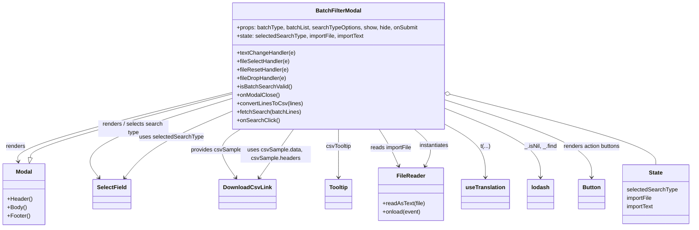
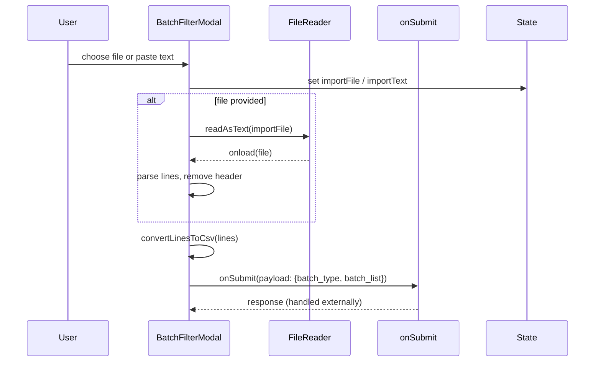

# Diagram: web/portal/src/components/search-bar/BatchFilterModal.js

> Auto-generated by Obscura crawlers

## Diagram 1

### SVG

<svg id="container" width="1954.064453125" xmlns="http://www.w3.org/2000/svg" class="classDiagram" height="648" viewBox="0 0 1954.064453125 648" role="graphics-document document" aria-roledescription="class"><g><defs><marker id="container_class-aggregationStart" class="marker aggregation class" refX="18" refY="7" markerWidth="190" markerHeight="240" orient="auto"><path d="M 18,7 L9,13 L1,7 L9,1 Z"></path></marker></defs><defs><marker id="container_class-aggregationEnd" class="marker aggregation class" refX="1" refY="7" markerWidth="20" markerHeight="28" orient="auto"><path d="M 18,7 L9,13 L1,7 L9,1 Z"></path></marker></defs><defs><marker id="container_class-extensionStart" class="marker extension class" refX="18" refY="7" markerWidth="190" markerHeight="240" orient="auto"><path d="M 1,7 L18,13 V 1 Z"></path></marker></defs><defs><marker id="container_class-extensionEnd" class="marker extension class" refX="1" refY="7" markerWidth="20" markerHeight="28" orient="auto"><path d="M 1,1 V 13 L18,7 Z"></path></marker></defs><defs><marker id="container_class-compositionStart" class="marker composition class" refX="18" refY="7" markerWidth="190" markerHeight="240" orient="auto"><path d="M 18,7 L9,13 L1,7 L9,1 Z"></path></marker></defs><defs><marker id="container_class-compositionEnd" class="marker composition class" refX="1" refY="7" markerWidth="20" markerHeight="28" orient="auto"><path d="M 18,7 L9,13 L1,7 L9,1 Z"></path></marker></defs><defs><marker id="container_class-dependencyStart" class="marker dependency class" refX="6" refY="7" markerWidth="190" markerHeight="240" orient="auto"><path d="M 5,7 L9,13 L1,7 L9,1 Z"></path></marker></defs><defs><marker id="container_class-dependencyEnd" class="marker dependency class" refX="13" refY="7" markerWidth="20" markerHeight="28" orient="auto"><path d="M 18,7 L9,13 L14,7 L9,1 Z"></path></marker></defs><defs><marker id="container_class-lollipopStart" class="marker lollipop class" refX="13" refY="7" markerWidth="190" markerHeight="240" orient="auto"><circle stroke="black" fill="transparent" cx="7" cy="7" r="6"></circle></marker></defs><defs><marker id="container_class-lollipopEnd" class="marker lollipop class" refX="1" refY="7" markerWidth="190" markerHeight="240" orient="auto"><circle stroke="black" fill="transparent" cx="7" cy="7" r="6"></circle></marker></defs><g class="root"><g class="clusters"></g><g class="edgePaths"><path d="M653.922,263.61L552.074,289.175C450.225,314.74,246.529,365.87,145.941,398.617C45.354,431.363,47.875,445.727,49.136,452.909L50.397,460.09" id="id_BatchFilterModal_Modal_1" class="edge-thickness-normal edge-pattern-solid relation" style=";;;" data-edge="true" data-et="edge" data-id="id_BatchFilterModal_Modal_1" data-points="W3sieCI6NjUzLjkyMTg3NSwieSI6MjYzLjYxMDA0NDAxNTg5MzY2fSx7IngiOjQyLjgzMjAzMTI1LCJ5Ijo0MTd9LHsieCI6NTEuNDM0MDUzMzA4ODIzNTMsInkiOjQ2Nn1d" marker-end="url(#container_class-dependencyEnd)"></path><path d="M653.922,280.645L580.032,303.371C506.142,326.097,358.362,371.548,295.974,409.15C233.587,446.751,256.591,476.502,268.094,491.378L279.596,506.253" id="id_BatchFilterModal_SelectField_2" class="edge-thickness-normal edge-pattern-solid relation" style=";;;" data-edge="true" data-et="edge" data-id="id_BatchFilterModal_SelectField_2" data-points="W3sieCI6NjUzLjkyMTg3NSwieSI6MjgwLjY0NDk5MzkxNDIxMTM0fSx7IngiOjIxMC41ODIwMzEyNSwieSI6NDE3fSx7IngiOjI4My4yNjYyNTY4OTMzODI0LCJ5Ijo1MTF9XQ==" marker-end="url(#container_class-dependencyEnd)"></path><path d="M678.353,368L665.795,376.167C653.236,384.333,628.12,400.667,626.032,423.683C623.944,446.699,644.884,476.398,655.354,491.247L665.824,506.096" id="id_BatchFilterModal_DownloadCsvLink_3" class="edge-thickness-normal edge-pattern-solid relation" style=";;;" data-edge="true" data-et="edge" data-id="id_BatchFilterModal_DownloadCsvLink_3" data-points="W3sieCI6Njc4LjM1Mjc3MzYwODA3ODcsInkiOjM2OH0seyJ4Ijo2MDMuMDAzOTA2MjUsInkiOjQxN30seyJ4Ijo2NjkuMjgxMjUsInkiOjUxMX1d" marker-end="url(#container_class-dependencyEnd)"></path><path d="M955.145,368L955.145,376.167C955.145,384.333,955.145,400.667,955.145,423.5C955.145,446.333,955.145,475.667,955.145,490.333L955.145,505" id="id_BatchFilterModal_Tooltip_4" class="edge-thickness-normal edge-pattern-solid relation" style=";;;" data-edge="true" data-et="edge" data-id="id_BatchFilterModal_Tooltip_4" data-points="W3sieCI6OTU1LjE0NDUzMTI1LCJ5IjozNjh9LHsieCI6OTU1LjE0NDUzMTI1LCJ5Ijo0MTd9LHsieCI6OTU1LjE0NDUzMTI1LCJ5Ijo1MTF9XQ==" marker-end="url(#container_class-dependencyEnd)"></path><path d="M1070.953,368L1076.207,376.167C1081.461,384.333,1091.97,400.667,1101.379,418.088C1110.788,435.509,1119.098,454.018,1123.253,463.272L1127.408,472.526" id="id_BatchFilterModal_FileReader_5" class="edge-thickness-normal edge-pattern-solid relation" style=";;;" data-edge="true" data-et="edge" data-id="id_BatchFilterModal_FileReader_5" data-points="W3sieCI6MTA3MC45NTI5MDMyNDc4MTY1LCJ5IjozNjh9LHsieCI6MTEwMi40Nzg1MTU2MjUsInkiOjQxN30seyJ4IjoxMTI5Ljg2NTA5MDc2Mjg2NzYsInkiOjQ3OH1d" marker-end="url(#container_class-dependencyEnd)"></path><path d="M1256.367,353.986L1275.426,364.489C1294.485,374.991,1332.603,395.995,1351.662,421.164C1370.721,446.333,1370.721,475.667,1370.721,490.333L1370.721,505" id="id_BatchFilterModal_useTranslation_6" class="edge-thickness-normal edge-pattern-solid relation" style=";;;" data-edge="true" data-et="edge" data-id="id_BatchFilterModal_useTranslation_6" data-points="W3sieCI6MTI1Ni4zNjcxODc1LCJ5IjozNTMuOTg2Mzg5Mzc4NDUxNH0seyJ4IjoxMzcwLjcyMDcwMzEyNSwieSI6NDE3fSx7IngiOjEzNzAuNzIwNzAzMTI1LCJ5Ijo1MTF9XQ==" marker-end="url(#container_class-dependencyEnd)"></path><path d="M1256.367,309.389L1300.873,327.324C1345.378,345.259,1434.389,381.13,1478.895,413.731C1523.4,446.333,1523.4,475.667,1523.4,490.333L1523.4,505" id="id_BatchFilterModal_lodash_7" class="edge-thickness-normal edge-pattern-solid relation" style=";;;" data-edge="true" data-et="edge" data-id="id_BatchFilterModal_lodash_7" data-points="W3sieCI6MTI1Ni4zNjcxODc1LCJ5IjozMDkuMzg4OTYwODc2MDM1ODd9LHsieCI6MTUyMy40MDAzOTA2MjUsInkiOjQxN30seyJ4IjoxNTIzLjQwMDM5MDYyNSwieSI6NTExfV0=" marker-end="url(#container_class-dependencyEnd)"></path><path d="M1256.367,284.162L1325.719,306.301C1395.071,328.441,1533.775,372.721,1603.127,409.527C1672.479,446.333,1672.479,475.667,1672.479,490.333L1672.479,505" id="id_BatchFilterModal_Button_8" class="edge-thickness-normal edge-pattern-solid relation" style=";;;" data-edge="true" data-et="edge" data-id="id_BatchFilterModal_Button_8" data-points="W3sieCI6MTI1Ni4zNjcxODc1LCJ5IjoyODQuMTYxNjA2NDI1NzAyOH0seyJ4IjoxNjcyLjQ3ODUxNTYyNSwieSI6NDE3fSx7IngiOjE2NzIuNDc4NTE1NjI1LCJ5Ijo1MTF9XQ==" marker-end="url(#container_class-dependencyEnd)"></path><path d="M84.963,449.01L85.899,443.675C86.836,438.34,88.709,427.67,183.535,397.466C278.362,367.262,466.142,317.524,560.032,292.655L653.922,267.786" id="id_Modal_BatchFilterModal_9" class="edge-thickness-normal edge-pattern-solid relation" style=";;;" data-edge="true" data-et="edge" data-id="id_Modal_BatchFilterModal_9" data-points="W3sieCI6ODEuOTgwMDA5MTkxMTc2NDYsInkiOjQ2Nn0seyJ4Ijo5MC41ODIwMzEyNSwieSI6NDE3fSx7IngiOjY1My45MjE4NzUsInkiOjI2Ny43ODYwMDUzODU2NzE5Nn1d" marker-start="url(#container_class-extensionStart)"></path><path d="M1202.097,472.59L1206.539,463.325C1210.982,454.06,1219.868,435.53,1214.553,418.098C1209.239,400.667,1189.724,384.333,1179.966,376.167L1170.209,368" id="id_FileReader_BatchFilterModal_10" class="edge-thickness-normal edge-pattern-solid relation" style=";;;" data-edge="true" data-et="edge" data-id="id_FileReader_BatchFilterModal_10" data-points="W3sieCI6MTE5OS41MDIyNTQ3MTA0NzgsInkiOjQ3OH0seyJ4IjoxMjI4Ljc1MzkwNjI1LCJ5Ijo0MTd9LHsieCI6MTE3MC4yMDg2Njg4MDQ1ODUyLCJ5IjozNjh9XQ==" marker-start="url(#container_class-dependencyStart)"></path><path d="M351.888,506.253L363.391,491.378C374.893,476.502,397.898,446.751,448.237,415.228C498.576,383.706,576.249,350.412,615.085,333.765L653.922,317.117" id="id_SelectField_BatchFilterModal_11" class="edge-thickness-normal edge-pattern-solid relation" style=";;;" data-edge="true" data-et="edge" data-id="id_SelectField_BatchFilterModal_11" data-points="W3sieCI6MzQ4LjIxODExODEwNjYxNzYsInkiOjUxMX0seyJ4Ijo0MjAuOTAyMzQzNzUsInkiOjQxN30seyJ4Ijo2NTMuOTIxODc1LCJ5IjozMTcuMTE3NDQ4NzgxMTI5ODR9XQ==" marker-start="url(#container_class-dependencyStart)"></path><path d="M731.965,506.096L742.435,491.247C752.905,476.398,773.845,446.699,790.034,423.683C806.223,400.667,817.66,384.333,823.379,376.167L829.098,368" id="id_DownloadCsvLink_BatchFilterModal_12" class="edge-thickness-normal edge-pattern-solid relation" style=";;;" data-edge="true" data-et="edge" data-id="id_DownloadCsvLink_BatchFilterModal_12" data-points="W3sieCI6NzI4LjUwNzgxMjUsInkiOjUxMX0seyJ4Ijo3OTQuNzg1MTU2MjUsInkiOjQxN30seyJ4Ijo4MjkuMDk3ODYwOTQ0MzIzMiwieSI6MzY4fV0=" marker-start="url(#container_class-dependencyStart)"></path><path d="M1273.082,269.119L1369.683,293.766C1466.284,318.412,1659.487,367.706,1756.088,401.02C1852.689,434.333,1852.689,451.667,1852.689,460.333L1852.689,469" id="id_BatchFilterModal_State_13" class="edge-thickness-normal edge-pattern-solid relation" style=";;;" data-edge="true" data-et="edge" data-id="id_BatchFilterModal_State_13" data-points="W3sieCI6MTI1Ni4zNjcxODc1LCJ5IjoyNjQuODU0MDc4OTQzNjQ2Mn0seyJ4IjoxODUyLjY4OTQ1MzEyNSwieSI6NDE3fSx7IngiOjE4NTIuNjg5NDUzMTI1LCJ5Ijo0Njl9XQ==" marker-start="url(#container_class-aggregationStart)"></path></g><g class="edgeLabels"><g class="edgeLabel" transform="translate(42.83203125, 417)"><g class="label" data-id="id_BatchFilterModal_Modal_1" transform="translate(-27.75, -12)"><foreignObject width="55.5" height="24">

renders

</foreignObject></g></g><g class="edgeLabel" transform="translate(375.46544, 366.28794)"><g class="label" data-id="id_BatchFilterModal_SelectField_2" transform="translate(-100, -24)"><foreignObject width="200" height="48">

renders / selects search type

</foreignObject></g></g><g class="edgeLabel" transform="translate(610.24609, 427.27147)"><g class="label" data-id="id_BatchFilterModal_DownloadCsvLink_3" transform="translate(-71.78125, -12)"><foreignObject width="143.5625" height="24">

provides csvSample

</foreignObject></g></g><g class="edgeLabel" transform="translate(955.14453125, 417)"><g class="label" data-id="id_BatchFilterModal_Tooltip_4" transform="translate(-36.640625, -12)"><foreignObject width="73.28125" height="24">

csvTooltip

</foreignObject></g></g><g class="edgeLabel" transform="translate(1104.23974, 420.9229)"><g class="label" data-id="id_BatchFilterModal_FileReader_5" transform="translate(-59.203125, -12)"><foreignObject width="118.40625" height="24">

reads importFile

</foreignObject></g></g><g class="edgeLabel" transform="translate(1370.720703125, 417)"><g class="label" data-id="id_BatchFilterModal_useTranslation_6" transform="translate(-13.8359375, -12)"><foreignObject width="27.671875" height="24">

t(...)

</foreignObject></g></g><g class="edgeLabel" transform="translate(1523.400390625, 417)"><g class="label" data-id="id_BatchFilterModal_lodash_7" transform="translate(-46.25, -12)"><foreignObject width="92.5" height="24">

_.isNil, _.find

</foreignObject></g></g><g class="edgeLabel" transform="translate(1672.478515625, 417)"><g class="label" data-id="id_BatchFilterModal_Button_8" transform="translate(-82.828125, -12)"><foreignObject width="165.65625" height="24">

renders action buttons

</foreignObject></g></g><g class="edgeLabel"><g class="label" data-id="id_Modal_BatchFilterModal_9" transform="translate(0, 0)"><foreignObject width="0" height="0">

</foreignObject></g></g><g class="edgeLabel" transform="translate(1225.42044, 414.21002)"><g class="label" data-id="id_FileReader_BatchFilterModal_10" transform="translate(-42.9140625, -12)"><foreignObject width="85.828125" height="24">

instantiates

</foreignObject></g></g><g class="edgeLabel" transform="translate(482.80559, 390.46551)"><g class="label" data-id="id_SelectField_BatchFilterModal_11" transform="translate(-90.3203125, -12)"><foreignObject width="180.640625" height="24">

uses selectedSearchType

</foreignObject></g></g><g class="edgeLabel" transform="translate(778.88178, 439.55547)"><g class="label" data-id="id_DownloadCsvLink_BatchFilterModal_12" transform="translate(-100, -24)"><foreignObject width="200" height="48">

uses csvSample.data, csvSample.headers

</foreignObject></g></g><g class="edgeLabel"><g class="label" data-id="id_BatchFilterModal_State_13" transform="translate(0, 0)"><foreignObject width="0" height="0">

</foreignObject></g></g></g><g class="nodes"><g class="node default" id="classId-BatchFilterModal-0" transform="translate(955.14453125, 188)"><g class="basic label-container"><path d="M-301.22265625 -180 L301.22265625 -180 L301.22265625 180 L-301.22265625 180" stroke="none" stroke-width="0" fill="#ECECFF" style=""></path><path d="M-301.22265625 -180 C-105.48774864665282 -180, 90.24715895669436 -180, 301.22265625 -180 M-301.22265625 -180 C-139.97689995263872 -180, 21.268856344722565 -180, 301.22265625 -180 M301.22265625 -180 C301.22265625 -94.49753467081982, 301.22265625 -8.995069341639635, 301.22265625 180 M301.22265625 -180 C301.22265625 -50.66862960740613, 301.22265625 78.66274078518774, 301.22265625 180 M301.22265625 180 C174.79315110671482 180, 48.36364596342963 180, -301.22265625 180 M301.22265625 180 C147.93375225382763 180, -5.355151742344731 180, -301.22265625 180 M-301.22265625 180 C-301.22265625 96.7481805218693, -301.22265625 13.496361043738602, -301.22265625 -180 M-301.22265625 180 C-301.22265625 83.0765604142618, -301.22265625 -13.846879171476388, -301.22265625 -180" stroke="#9370DB" stroke-width="1.3" fill="none" stroke-dasharray="0 0" style=""></path></g><g class="annotation-group text" transform="translate(0, -156)"></g><g class="label-group text" transform="translate(-62.0234375, -156)"><g class="label" style="font-weight: bolder" transform="translate(0,-12)"><foreignObject width="124.046875" height="24">

BatchFilterModal

</foreignObject></g></g><g class="members-group text" transform="translate(-289.22265625, -108)"><g class="label" style="" transform="translate(0,-12)"><foreignObject width="516.421875" height="24">

+props: batchType, batchList, searchTypeOptions, show, hide, onSubmit

</foreignObject></g><g class="label" style="" transform="translate(0,12)"><foreignObject width="364.125" height="24">

+state: selectedSearchType, importFile, importText

</foreignObject></g></g><g class="methods-group text" transform="translate(-289.22265625, -36)"><g class="label" style="" transform="translate(0,-12)"><foreignObject width="165.71875" height="24">

+textChangeHandler(e)

</foreignObject></g><g class="label" style="" transform="translate(0,12)"><foreignObject width="151.59375" height="24">

+fileSelectHandler(e)

</foreignObject></g><g class="label" style="" transform="translate(0,36)"><foreignObject width="147.53125" height="24">

+fileResetHandler(e)

</foreignObject></g><g class="label" style="" transform="translate(0,60)"><foreignObject width="142.25" height="24">

+fileDropHandler(e)

</foreignObject></g><g class="label" style="" transform="translate(0,84)"><foreignObject width="155.609375" height="24">

+isBatchSearchValid()

</foreignObject></g><g class="label" style="" transform="translate(0,108)"><foreignObject width="120.609375" height="24">

+onModalClose()

</foreignObject></g><g class="label" style="" transform="translate(0,132)"><foreignObject width="186.15625" height="24">

+convertLinesToCsv(lines)

</foreignObject></g><g class="label" style="" transform="translate(0,156)"><foreignObject width="181.953125" height="24">

+fetchSearch(batchLines)

</foreignObject></g><g class="label" style="" transform="translate(0,180)"><foreignObject width="119.625" height="24">

+onSearchClick()

</foreignObject></g></g><g class="divider" style=""><path d="M-301.22265625 -132 C-75.61981773772672 -132, 149.98302077454656 -132, 301.22265625 -132 M-301.22265625 -132 C-137.78768234847374 -132, 25.647291553052526 -132, 301.22265625 -132" stroke="#9370DB" stroke-width="1.3" fill="none" stroke-dasharray="0 0" style=""></path></g><g class="divider" style=""><path d="M-301.22265625 -60 C-88.98341257638981 -60, 123.25583109722038 -60, 301.22265625 -60 M-301.22265625 -60 C-122.07979698878012 -60, 57.063062272439765 -60, 301.22265625 -60" stroke="#9370DB" stroke-width="1.3" fill="none" stroke-dasharray="0 0" style=""></path></g></g><g class="node default" id="classId-Modal-1" transform="translate(66.70703125, 553)"><g class="basic label-container"><path d="M-58.70703125 -87 L58.70703125 -87 L58.70703125 87 L-58.70703125 87" stroke="none" stroke-width="0" fill="#ECECFF" style=""></path><path d="M-58.70703125 -87 C-25.307187240548643 -87, 8.092656768902714 -87, 58.70703125 -87 M-58.70703125 -87 C-30.928897430290117 -87, -3.150763610580235 -87, 58.70703125 -87 M58.70703125 -87 C58.70703125 -50.79140304278344, 58.70703125 -14.582806085566887, 58.70703125 87 M58.70703125 -87 C58.70703125 -31.151281358197238, 58.70703125 24.697437283605524, 58.70703125 87 M58.70703125 87 C14.88499662628115 87, -28.9370379974377 87, -58.70703125 87 M58.70703125 87 C22.964475117330096 87, -12.778081015339808 87, -58.70703125 87 M-58.70703125 87 C-58.70703125 41.266306047797535, -58.70703125 -4.46738790440493, -58.70703125 -87 M-58.70703125 87 C-58.70703125 46.98669999771314, -58.70703125 6.973399995426277, -58.70703125 -87" stroke="#9370DB" stroke-width="1.3" fill="none" stroke-dasharray="0 0" style=""></path></g><g class="annotation-group text" transform="translate(0, -63)"></g><g class="label-group text" transform="translate(-22.4453125, -63)"><g class="label" style="font-weight: bolder" transform="translate(0,-12)"><foreignObject width="44.890625" height="24">

Modal

</foreignObject></g></g><g class="members-group text" transform="translate(-46.70703125, -15)"></g><g class="methods-group text" transform="translate(-46.70703125, 15)"><g class="label" style="" transform="translate(0,-12)"><foreignObject width="70.96875" height="24">

+Header()

</foreignObject></g><g class="label" style="" transform="translate(0,12)"><foreignObject width="54.875" height="24">

+Body()

</foreignObject></g><g class="label" style="" transform="translate(0,36)"><foreignObject width="64.78125" height="24">

+Footer()

</foreignObject></g></g><g class="divider" style=""><path d="M-58.70703125 -39 C-20.444029068203406 -39, 17.818973113593188 -39, 58.70703125 -39 M-58.70703125 -39 C-26.22232110824281 -39, 6.262389033514381 -39, 58.70703125 -39" stroke="#9370DB" stroke-width="1.3" fill="none" stroke-dasharray="0 0" style=""></path></g><g class="divider" style=""><path d="M-58.70703125 -15 C-34.49991110875874 -15, -10.292790967517469 -15, 58.70703125 -15 M-58.70703125 -15 C-12.14525164098621 -15, 34.41652796802758 -15, 58.70703125 -15" stroke="#9370DB" stroke-width="1.3" fill="none" stroke-dasharray="0 0" style=""></path></g></g><g class="node default" id="classId-SelectField-2" transform="translate(315.7421875, 553)"><g class="basic label-container"><path d="M-52.140625 -42 L52.140625 -42 L52.140625 42 L-52.140625 42" stroke="none" stroke-width="0" fill="#ECECFF" style=""></path><path d="M-52.140625 -42 C-13.426923571874205 -42, 25.28677785625159 -42, 52.140625 -42 M-52.140625 -42 C-11.736670251035662 -42, 28.667284497928677 -42, 52.140625 -42 M52.140625 -42 C52.140625 -15.54947989316345, 52.140625 10.901040213673099, 52.140625 42 M52.140625 -42 C52.140625 -20.174357485736373, 52.140625 1.651285028527255, 52.140625 42 M52.140625 42 C26.972931563868237 42, 1.805238127736473 42, -52.140625 42 M52.140625 42 C28.25185240168017 42, 4.363079803360343 42, -52.140625 42 M-52.140625 42 C-52.140625 17.05033364359428, -52.140625 -7.899332712811443, -52.140625 -42 M-52.140625 42 C-52.140625 20.78130293764904, -52.140625 -0.4373941247019175, -52.140625 -42" stroke="#9370DB" stroke-width="1.3" fill="none" stroke-dasharray="0 0" style=""></path></g><g class="annotation-group text" transform="translate(0, -18)"></g><g class="label-group text" transform="translate(-40.140625, -18)"><g class="label" style="font-weight: bolder" transform="translate(0,-12)"><foreignObject width="80.28125" height="24">

SelectField

</foreignObject></g></g><g class="members-group text" transform="translate(-40.140625, 30)"></g><g class="methods-group text" transform="translate(-40.140625, 60)"></g><g class="divider" style=""><path d="M-52.140625 6 C-28.01091875651526 6, -3.881212513030519 6, 52.140625 6 M-52.140625 6 C-13.865381700479908 6, 24.409861599040184 6, 52.140625 6" stroke="#9370DB" stroke-width="1.3" fill="none" stroke-dasharray="0 0" style=""></path></g><g class="divider" style=""><path d="M-52.140625 24 C-18.095505708260404 24, 15.949613583479191 24, 52.140625 24 M-52.140625 24 C-11.685952078845503 24, 28.768720842308994 24, 52.140625 24" stroke="#9370DB" stroke-width="1.3" fill="none" stroke-dasharray="0 0" style=""></path></g></g><g class="node default" id="classId-DownloadCsvLink-3" transform="translate(698.89453125, 553)"><g class="basic label-container"><path d="M-76.3515625 -42 L76.3515625 -42 L76.3515625 42 L-76.3515625 42" stroke="none" stroke-width="0" fill="#ECECFF" style=""></path><path d="M-76.3515625 -42 C-20.326127332096682 -42, 35.699307835806636 -42, 76.3515625 -42 M-76.3515625 -42 C-24.11182114284398 -42, 28.12792021431204 -42, 76.3515625 -42 M76.3515625 -42 C76.3515625 -23.794547643247487, 76.3515625 -5.589095286494974, 76.3515625 42 M76.3515625 -42 C76.3515625 -14.619052237181855, 76.3515625 12.761895525636291, 76.3515625 42 M76.3515625 42 C30.53798602101321 42, -15.275590457973578 42, -76.3515625 42 M76.3515625 42 C20.315294083590544 42, -35.72097433281891 42, -76.3515625 42 M-76.3515625 42 C-76.3515625 17.91101563587451, -76.3515625 -6.177968728250981, -76.3515625 -42 M-76.3515625 42 C-76.3515625 13.022987519663996, -76.3515625 -15.954024960672008, -76.3515625 -42" stroke="#9370DB" stroke-width="1.3" fill="none" stroke-dasharray="0 0" style=""></path></g><g class="annotation-group text" transform="translate(0, -18)"></g><g class="label-group text" transform="translate(-64.3515625, -18)"><g class="label" style="font-weight: bolder" transform="translate(0,-12)"><foreignObject width="128.703125" height="24">

DownloadCsvLink

</foreignObject></g></g><g class="members-group text" transform="translate(-64.3515625, 30)"></g><g class="methods-group text" transform="translate(-64.3515625, 60)"></g><g class="divider" style=""><path d="M-76.3515625 6 C-32.50073987142211 6, 11.350082757155775 6, 76.3515625 6 M-76.3515625 6 C-39.21408680628011 6, -2.076611112560215 6, 76.3515625 6" stroke="#9370DB" stroke-width="1.3" fill="none" stroke-dasharray="0 0" style=""></path></g><g class="divider" style=""><path d="M-76.3515625 24 C-27.37823791320887 24, 21.59508667358226 24, 76.3515625 24 M-76.3515625 24 C-28.14334796339979 24, 20.06486657320042 24, 76.3515625 24" stroke="#9370DB" stroke-width="1.3" fill="none" stroke-dasharray="0 0" style=""></path></g></g><g class="node default" id="classId-FileReader-4" transform="translate(1163.537109375, 553)"><g class="basic label-container"><path d="M-91.09765625 -75 L91.09765625 -75 L91.09765625 75 L-91.09765625 75" stroke="none" stroke-width="0" fill="#ECECFF" style=""></path><path d="M-91.09765625 -75 C-40.04338036852263 -75, 11.010895512954747 -75, 91.09765625 -75 M-91.09765625 -75 C-23.05738921983047 -75, 44.98287781033906 -75, 91.09765625 -75 M91.09765625 -75 C91.09765625 -20.018716940249575, 91.09765625 34.96256611950085, 91.09765625 75 M91.09765625 -75 C91.09765625 -34.200212602898944, 91.09765625 6.599574794202113, 91.09765625 75 M91.09765625 75 C52.72780227503707 75, 14.357948300074142 75, -91.09765625 75 M91.09765625 75 C51.77398155116103 75, 12.450306852322058 75, -91.09765625 75 M-91.09765625 75 C-91.09765625 39.638975710853245, -91.09765625 4.27795142170649, -91.09765625 -75 M-91.09765625 75 C-91.09765625 29.03048562595658, -91.09765625 -16.93902874808684, -91.09765625 -75" stroke="#9370DB" stroke-width="1.3" fill="none" stroke-dasharray="0 0" style=""></path></g><g class="annotation-group text" transform="translate(0, -51)"></g><g class="label-group text" transform="translate(-38.6328125, -51)"><g class="label" style="font-weight: bolder" transform="translate(0,-12)"><foreignObject width="77.265625" height="24">

FileReader

</foreignObject></g></g><g class="members-group text" transform="translate(-79.09765625, -3)"></g><g class="methods-group text" transform="translate(-79.09765625, 27)"><g class="label" style="" transform="translate(0,-12)"><foreignObject width="119.5625" height="24">

+readAsText(file)

</foreignObject></g><g class="label" style="" transform="translate(0,12)"><foreignObject width="109.484375" height="24">

+onload(event)

</foreignObject></g></g><g class="divider" style=""><path d="M-91.09765625 -27 C-40.93440481393349 -27, 9.22884662213302 -27, 91.09765625 -27 M-91.09765625 -27 C-54.54996922342028 -27, -18.002282196840554 -27, 91.09765625 -27" stroke="#9370DB" stroke-width="1.3" fill="none" stroke-dasharray="0 0" style=""></path></g><g class="divider" style=""><path d="M-91.09765625 -3 C-49.8862968583457 -3, -8.674937466691404 -3, 91.09765625 -3 M-91.09765625 -3 C-51.05731362716481 -3, -11.01697100432962 -3, 91.09765625 -3" stroke="#9370DB" stroke-width="1.3" fill="none" stroke-dasharray="0 0" style=""></path></g></g><g class="node default" id="classId-Tooltip-5" transform="translate(955.14453125, 553)"><g class="basic label-container"><path d="M-37.7265625 -42 L37.7265625 -42 L37.7265625 42 L-37.7265625 42" stroke="none" stroke-width="0" fill="#ECECFF" style=""></path><path d="M-37.7265625 -42 C-12.036918331183106 -42, 13.652725837633788 -42, 37.7265625 -42 M-37.7265625 -42 C-21.658634114367285 -42, -5.590705728734569 -42, 37.7265625 -42 M37.7265625 -42 C37.7265625 -14.86147540988081, 37.7265625 12.277049180238379, 37.7265625 42 M37.7265625 -42 C37.7265625 -17.82317211775831, 37.7265625 6.353655764483378, 37.7265625 42 M37.7265625 42 C12.98475271727079 42, -11.757057065458419 42, -37.7265625 42 M37.7265625 42 C8.740147891456818 42, -20.246266717086364 42, -37.7265625 42 M-37.7265625 42 C-37.7265625 24.69844452427954, -37.7265625 7.396889048559082, -37.7265625 -42 M-37.7265625 42 C-37.7265625 20.47044665678417, -37.7265625 -1.0591066864316616, -37.7265625 -42" stroke="#9370DB" stroke-width="1.3" fill="none" stroke-dasharray="0 0" style=""></path></g><g class="annotation-group text" transform="translate(0, -18)"></g><g class="label-group text" transform="translate(-25.7265625, -18)"><g class="label" style="font-weight: bolder" transform="translate(0,-12)"><foreignObject width="51.453125" height="24">

Tooltip

</foreignObject></g></g><g class="members-group text" transform="translate(-25.7265625, 30)"></g><g class="methods-group text" transform="translate(-25.7265625, 60)"></g><g class="divider" style=""><path d="M-37.7265625 6 C-11.290060766448995 6, 15.14644096710201 6, 37.7265625 6 M-37.7265625 6 C-21.156765317013075 6, -4.586968134026151 6, 37.7265625 6" stroke="#9370DB" stroke-width="1.3" fill="none" stroke-dasharray="0 0" style=""></path></g><g class="divider" style=""><path d="M-37.7265625 24 C-10.874843507608073 24, 15.976875484783854 24, 37.7265625 24 M-37.7265625 24 C-11.214432823931698 24, 15.297696852136603 24, 37.7265625 24" stroke="#9370DB" stroke-width="1.3" fill="none" stroke-dasharray="0 0" style=""></path></g></g><g class="node default" id="classId-useTranslation-6" transform="translate(1370.720703125, 553)"><g class="basic label-container"><path d="M-66.0859375 -42 L66.0859375 -42 L66.0859375 42 L-66.0859375 42" stroke="none" stroke-width="0" fill="#ECECFF" style=""></path><path d="M-66.0859375 -42 C-15.366529177915936 -42, 35.35287914416813 -42, 66.0859375 -42 M-66.0859375 -42 C-14.10244368405462 -42, 37.88105013189076 -42, 66.0859375 -42 M66.0859375 -42 C66.0859375 -20.129163977906938, 66.0859375 1.7416720441861244, 66.0859375 42 M66.0859375 -42 C66.0859375 -10.458988585580336, 66.0859375 21.082022828839328, 66.0859375 42 M66.0859375 42 C28.115333814144236 42, -9.855269871711528 42, -66.0859375 42 M66.0859375 42 C23.498156274609777 42, -19.089624950780447 42, -66.0859375 42 M-66.0859375 42 C-66.0859375 19.23250264244007, -66.0859375 -3.5349947151198577, -66.0859375 -42 M-66.0859375 42 C-66.0859375 11.879598602303606, -66.0859375 -18.24080279539279, -66.0859375 -42" stroke="#9370DB" stroke-width="1.3" fill="none" stroke-dasharray="0 0" style=""></path></g><g class="annotation-group text" transform="translate(0, -18)"></g><g class="label-group text" transform="translate(-54.0859375, -18)"><g class="label" style="font-weight: bolder" transform="translate(0,-12)"><foreignObject width="108.171875" height="24">

useTranslation

</foreignObject></g></g><g class="members-group text" transform="translate(-54.0859375, 30)"></g><g class="methods-group text" transform="translate(-54.0859375, 60)"></g><g class="divider" style=""><path d="M-66.0859375 6 C-28.032747664226626 6, 10.020442171546748 6, 66.0859375 6 M-66.0859375 6 C-30.301012585002283 6, 5.483912329995434 6, 66.0859375 6" stroke="#9370DB" stroke-width="1.3" fill="none" stroke-dasharray="0 0" style=""></path></g><g class="divider" style=""><path d="M-66.0859375 24 C-37.30400715145076 24, -8.522076802901516 24, 66.0859375 24 M-66.0859375 24 C-31.414290867683853 24, 3.257355764632294 24, 66.0859375 24" stroke="#9370DB" stroke-width="1.3" fill="none" stroke-dasharray="0 0" style=""></path></g></g><g class="node default" id="classId-lodash-7" transform="translate(1523.400390625, 553)"><g class="basic label-container"><path d="M-36.59375 -42 L36.59375 -42 L36.59375 42 L-36.59375 42" stroke="none" stroke-width="0" fill="#ECECFF" style=""></path><path d="M-36.59375 -42 C-21.264547257077403 -42, -5.935344514154803 -42, 36.59375 -42 M-36.59375 -42 C-7.903156022214215 -42, 20.78743795557157 -42, 36.59375 -42 M36.59375 -42 C36.59375 -20.93917347399585, 36.59375 0.12165305200829835, 36.59375 42 M36.59375 -42 C36.59375 -12.591934259572671, 36.59375 16.816131480854658, 36.59375 42 M36.59375 42 C12.113339379866535 42, -12.367071240266931 42, -36.59375 42 M36.59375 42 C7.385011562514013 42, -21.823726874971975 42, -36.59375 42 M-36.59375 42 C-36.59375 13.796354636826148, -36.59375 -14.407290726347703, -36.59375 -42 M-36.59375 42 C-36.59375 13.59553933374563, -36.59375 -14.808921332508739, -36.59375 -42" stroke="#9370DB" stroke-width="1.3" fill="none" stroke-dasharray="0 0" style=""></path></g><g class="annotation-group text" transform="translate(0, -18)"></g><g class="label-group text" transform="translate(-24.59375, -18)"><g class="label" style="font-weight: bolder" transform="translate(0,-12)"><foreignObject width="49.1875" height="24">

lodash

</foreignObject></g></g><g class="members-group text" transform="translate(-24.59375, 30)"></g><g class="methods-group text" transform="translate(-24.59375, 60)"></g><g class="divider" style=""><path d="M-36.59375 6 C-15.328258434556755 6, 5.93723313088649 6, 36.59375 6 M-36.59375 6 C-19.156859926012956 6, -1.719969852025912 6, 36.59375 6" stroke="#9370DB" stroke-width="1.3" fill="none" stroke-dasharray="0 0" style=""></path></g><g class="divider" style=""><path d="M-36.59375 24 C-14.309009367842119 24, 7.975731264315762 24, 36.59375 24 M-36.59375 24 C-20.212427012249744 24, -3.8311040244994885 24, 36.59375 24" stroke="#9370DB" stroke-width="1.3" fill="none" stroke-dasharray="0 0" style=""></path></g></g><g class="node default" id="classId-Button-8" transform="translate(1672.478515625, 553)"><g class="basic label-container"><path d="M-36.8359375 -42 L36.8359375 -42 L36.8359375 42 L-36.8359375 42" stroke="none" stroke-width="0" fill="#ECECFF" style=""></path><path d="M-36.8359375 -42 C-20.21166200978136 -42, -3.5873865195627204 -42, 36.8359375 -42 M-36.8359375 -42 C-15.54485255003097 -42, 5.746232399938059 -42, 36.8359375 -42 M36.8359375 -42 C36.8359375 -21.07100940407208, 36.8359375 -0.14201880814415802, 36.8359375 42 M36.8359375 -42 C36.8359375 -15.607306391492955, 36.8359375 10.78538721701409, 36.8359375 42 M36.8359375 42 C14.90089357086515 42, -7.034150358269699 42, -36.8359375 42 M36.8359375 42 C20.03190515283738 42, 3.2278728056747568 42, -36.8359375 42 M-36.8359375 42 C-36.8359375 23.00971452004515, -36.8359375 4.019429040090301, -36.8359375 -42 M-36.8359375 42 C-36.8359375 11.81013284768434, -36.8359375 -18.37973430463132, -36.8359375 -42" stroke="#9370DB" stroke-width="1.3" fill="none" stroke-dasharray="0 0" style=""></path></g><g class="annotation-group text" transform="translate(0, -18)"></g><g class="label-group text" transform="translate(-24.8359375, -18)"><g class="label" style="font-weight: bolder" transform="translate(0,-12)"><foreignObject width="49.671875" height="24">

Button

</foreignObject></g></g><g class="members-group text" transform="translate(-24.8359375, 30)"></g><g class="methods-group text" transform="translate(-24.8359375, 60)"></g><g class="divider" style=""><path d="M-36.8359375 6 C-8.84244188233561 6, 19.15105373532878 6, 36.8359375 6 M-36.8359375 6 C-20.80655667354259 6, -4.777175847085182 6, 36.8359375 6" stroke="#9370DB" stroke-width="1.3" fill="none" stroke-dasharray="0 0" style=""></path></g><g class="divider" style=""><path d="M-36.8359375 24 C-9.497368286638913 24, 17.841200926722173 24, 36.8359375 24 M-36.8359375 24 C-15.516804133336151 24, 5.802329233327697 24, 36.8359375 24" stroke="#9370DB" stroke-width="1.3" fill="none" stroke-dasharray="0 0" style=""></path></g></g><g class="node default" id="classId-State-9" transform="translate(1852.689453125, 553)"><g class="basic label-container"><path d="M-93.375 -84 L93.375 -84 L93.375 84 L-93.375 84" stroke="none" stroke-width="0" fill="#ECECFF" style=""></path><path d="M-93.375 -84 C-48.0932876244007 -84, -2.811575248801404 -84, 93.375 -84 M-93.375 -84 C-18.856931613504486 -84, 55.66113677299103 -84, 93.375 -84 M93.375 -84 C93.375 -30.080795919505817, 93.375 23.838408160988365, 93.375 84 M93.375 -84 C93.375 -34.82014416491777, 93.375 14.359711670164458, 93.375 84 M93.375 84 C29.032305322629156 84, -35.31038935474169 84, -93.375 84 M93.375 84 C53.397538576978675 84, 13.420077153957351 84, -93.375 84 M-93.375 84 C-93.375 43.948069387881745, -93.375 3.8961387757634895, -93.375 -84 M-93.375 84 C-93.375 46.3095461882175, -93.375 8.619092376435006, -93.375 -84" stroke="#9370DB" stroke-width="1.3" fill="none" stroke-dasharray="0 0" style=""></path></g><g class="annotation-group text" transform="translate(0, -60)"></g><g class="label-group text" transform="translate(-19.3125, -60)"><g class="label" style="font-weight: bolder" transform="translate(0,-12)"><foreignObject width="38.625" height="24">

State

</foreignObject></g></g><g class="members-group text" transform="translate(-81.375, -12)"><g class="label" style="" transform="translate(0,-12)"><foreignObject width="143.4375" height="24">

selectedSearchType

</foreignObject></g><g class="label" style="" transform="translate(0,12)"><foreignObject width="74.171875" height="24">

importFile

</foreignObject></g><g class="label" style="" transform="translate(0,36)"><foreignObject width="78.53125" height="24">

importText

</foreignObject></g></g><g class="methods-group text" transform="translate(-81.375, 84)"></g><g class="divider" style=""><path d="M-93.375 -36 C-37.31836368198667 -36, 18.738272636026664 -36, 93.375 -36 M-93.375 -36 C-55.55293945516554 -36, -17.730878910331086 -36, 93.375 -36" stroke="#9370DB" stroke-width="1.3" fill="none" stroke-dasharray="0 0" style=""></path></g><g class="divider" style=""><path d="M-93.375 60 C-44.895367027980186 60, 3.584265944039629 60, 93.375 60 M-93.375 60 C-48.75893417182155 60, -4.1428683436431015 60, 93.375 60" stroke="#9370DB" stroke-width="1.3" fill="none" stroke-dasharray="0 0" style=""></path></g></g></g></g></g></svg>

## Diagram 2

### SVG

<svg id="container" width="1127" xmlns="http://www.w3.org/2000/svg" height="700" viewBox="-50 -10 1127 700" role="graphics-document document" aria-roledescription="sequence"><g><rect x="877" y="614" fill="#eaeaea" stroke="#666" width="150" height="65" name="State" rx="3" ry="3" class="actor actor-bottom"></rect><text x="952" y="646.5" dominant-baseline="central" alignment-baseline="central" class="actor actor-box" style="text-anchor: middle; font-size: 16px; font-weight: 400;"><tspan x="952" dy="0">State</tspan></text></g><g><rect x="677" y="614" fill="#eaeaea" stroke="#666" width="150" height="65" name="Server" rx="3" ry="3" class="actor actor-bottom"></rect><text x="752" y="646.5" dominant-baseline="central" alignment-baseline="central" class="actor actor-box" style="text-anchor: middle; font-size: 16px; font-weight: 400;"><tspan x="752" dy="0">onSubmit</tspan></text></g><g><rect x="477" y="614" fill="#eaeaea" stroke="#666" width="150" height="65" name="FR" rx="3" ry="3" class="actor actor-bottom"></rect><text x="552" y="646.5" dominant-baseline="central" alignment-baseline="central" class="actor actor-box" style="text-anchor: middle; font-size: 16px; font-weight: 400;"><tspan x="552" dy="0">FileReader</tspan></text></g><g><rect x="244" y="614" fill="#eaeaea" stroke="#666" width="150" height="65" name="UI" rx="3" ry="3" class="actor actor-bottom"></rect><text x="319" y="646.5" dominant-baseline="central" alignment-baseline="central" class="actor actor-box" style="text-anchor: middle; font-size: 16px; font-weight: 400;"><tspan x="319" dy="0">BatchFilterModal</tspan></text></g><g><rect x="0" y="614" fill="#eaeaea" stroke="#666" width="150" height="65" name="User" rx="3" ry="3" class="actor actor-bottom"></rect><text x="75" y="646.5" dominant-baseline="central" alignment-baseline="central" class="actor actor-box" style="text-anchor: middle; font-size: 16px; font-weight: 400;"><tspan x="75" dy="0">User</tspan></text></g><g><line id="actor4" x1="952" y1="65" x2="952" y2="614" class="actor-line 200" stroke-width="0.5px" stroke="#999" name="State"></line><g id="root-4"><rect x="877" y="0" fill="#eaeaea" stroke="#666" width="150" height="65" name="State" rx="3" ry="3" class="actor actor-top"></rect><text x="952" y="32.5" dominant-baseline="central" alignment-baseline="central" class="actor actor-box" style="text-anchor: middle; font-size: 16px; font-weight: 400;"><tspan x="952" dy="0">State</tspan></text></g></g><g><line id="actor3" x1="752" y1="65" x2="752" y2="614" class="actor-line 200" stroke-width="0.5px" stroke="#999" name="Server"></line><g id="root-3"><rect x="677" y="0" fill="#eaeaea" stroke="#666" width="150" height="65" name="Server" rx="3" ry="3" class="actor actor-top"></rect><text x="752" y="32.5" dominant-baseline="central" alignment-baseline="central" class="actor actor-box" style="text-anchor: middle; font-size: 16px; font-weight: 400;"><tspan x="752" dy="0">onSubmit</tspan></text></g></g><g><line id="actor2" x1="552" y1="65" x2="552" y2="614" class="actor-line 200" stroke-width="0.5px" stroke="#999" name="FR"></line><g id="root-2"><rect x="477" y="0" fill="#eaeaea" stroke="#666" width="150" height="65" name="FR" rx="3" ry="3" class="actor actor-top"></rect><text x="552" y="32.5" dominant-baseline="central" alignment-baseline="central" class="actor actor-box" style="text-anchor: middle; font-size: 16px; font-weight: 400;"><tspan x="552" dy="0">FileReader</tspan></text></g></g><g><line id="actor1" x1="319" y1="65" x2="319" y2="614" class="actor-line 200" stroke-width="0.5px" stroke="#999" name="UI"></line><g id="root-1"><rect x="244" y="0" fill="#eaeaea" stroke="#666" width="150" height="65" name="UI" rx="3" ry="3" class="actor actor-top"></rect><text x="319" y="32.5" dominant-baseline="central" alignment-baseline="central" class="actor actor-box" style="text-anchor: middle; font-size: 16px; font-weight: 400;"><tspan x="319" dy="0">BatchFilterModal</tspan></text></g></g><g><line id="actor0" x1="75" y1="65" x2="75" y2="614" class="actor-line 200" stroke-width="0.5px" stroke="#999" name="User"></line><g id="root-0"><rect x="0" y="0" fill="#eaeaea" stroke="#666" width="150" height="65" name="User" rx="3" ry="3" class="actor actor-top"></rect><text x="75" y="32.5" dominant-baseline="central" alignment-baseline="central" class="actor actor-box" style="text-anchor: middle; font-size: 16px; font-weight: 400;"><tspan x="75" dy="0">User</tspan></text></g></g><g></g><defs><symbol id="computer" width="24" height="24"><path transform="scale(.5)" d="M2 2v13h20v-13h-20zm18 11h-16v-9h16v9zm-10.228 6l.466-1h3.524l.467 1h-4.457zm14.228 3h-24l2-6h2.104l-1.33 4h18.45l-1.297-4h2.073l2 6zm-5-10h-14v-7h14v7z"></path></symbol></defs><defs><symbol id="database" fill-rule="evenodd" clip-rule="evenodd"><path transform="scale(.5)" d="M12.258.001l.256.004.255.005.253.008.251.01.249.012.247.015.246.016.242.019.241.02.239.023.236.024.233.027.231.028.229.031.225.032.223.034.22.036.217.038.214.04.211.041.208.043.205.045.201.046.198.048.194.05.191.051.187.053.183.054.18.056.175.057.172.059.168.06.163.061.16.063.155.064.15.066.074.033.073.033.071.034.07.034.069.035.068.035.067.035.066.035.064.036.064.036.062.036.06.036.06.037.058.037.058.037.055.038.055.038.053.038.052.038.051.039.05.039.048.039.047.039.045.04.044.04.043.04.041.04.04.041.039.041.037.041.036.041.034.041.033.042.032.042.03.042.029.042.027.042.026.043.024.043.023.043.021.043.02.043.018.044.017.043.015.044.013.044.012.044.011.045.009.044.007.045.006.045.004.045.002.045.001.045v17l-.001.045-.002.045-.004.045-.006.045-.007.045-.009.044-.011.045-.012.044-.013.044-.015.044-.017.043-.018.044-.02.043-.021.043-.023.043-.024.043-.026.043-.027.042-.029.042-.03.042-.032.042-.033.042-.034.041-.036.041-.037.041-.039.041-.04.041-.041.04-.043.04-.044.04-.045.04-.047.039-.048.039-.05.039-.051.039-.052.038-.053.038-.055.038-.055.038-.058.037-.058.037-.06.037-.06.036-.062.036-.064.036-.064.036-.066.035-.067.035-.068.035-.069.035-.07.034-.071.034-.073.033-.074.033-.15.066-.155.064-.16.063-.163.061-.168.06-.172.059-.175.057-.18.056-.183.054-.187.053-.191.051-.194.05-.198.048-.201.046-.205.045-.208.043-.211.041-.214.04-.217.038-.22.036-.223.034-.225.032-.229.031-.231.028-.233.027-.236.024-.239.023-.241.02-.242.019-.246.016-.247.015-.249.012-.251.01-.253.008-.255.005-.256.004-.258.001-.258-.001-.256-.004-.255-.005-.253-.008-.251-.01-.249-.012-.247-.015-.245-.016-.243-.019-.241-.02-.238-.023-.236-.024-.234-.027-.231-.028-.228-.031-.226-.032-.223-.034-.22-.036-.217-.038-.214-.04-.211-.041-.208-.043-.204-.045-.201-.046-.198-.048-.195-.05-.19-.051-.187-.053-.184-.054-.179-.056-.176-.057-.172-.059-.167-.06-.164-.061-.159-.063-.155-.064-.151-.066-.074-.033-.072-.033-.072-.034-.07-.034-.069-.035-.068-.035-.067-.035-.066-.035-.064-.036-.063-.036-.062-.036-.061-.036-.06-.037-.058-.037-.057-.037-.056-.038-.055-.038-.053-.038-.052-.038-.051-.039-.049-.039-.049-.039-.046-.039-.046-.04-.044-.04-.043-.04-.041-.04-.04-.041-.039-.041-.037-.041-.036-.041-.034-.041-.033-.042-.032-.042-.03-.042-.029-.042-.027-.042-.026-.043-.024-.043-.023-.043-.021-.043-.02-.043-.018-.044-.017-.043-.015-.044-.013-.044-.012-.044-.011-.045-.009-.044-.007-.045-.006-.045-.004-.045-.002-.045-.001-.045v-17l.001-.045.002-.045.004-.045.006-.045.007-.045.009-.044.011-.045.012-.044.013-.044.015-.044.017-.043.018-.044.02-.043.021-.043.023-.043.024-.043.026-.043.027-.042.029-.042.03-.042.032-.042.033-.042.034-.041.036-.041.037-.041.039-.041.04-.041.041-.04.043-.04.044-.04.046-.04.046-.039.049-.039.049-.039.051-.039.052-.038.053-.038.055-.038.056-.038.057-.037.058-.037.06-.037.061-.036.062-.036.063-.036.064-.036.066-.035.067-.035.068-.035.069-.035.07-.034.072-.034.072-.033.074-.033.151-.066.155-.064.159-.063.164-.061.167-.06.172-.059.176-.057.179-.056.184-.054.187-.053.19-.051.195-.05.198-.048.201-.046.204-.045.208-.043.211-.041.214-.04.217-.038.22-.036.223-.034.226-.032.228-.031.231-.028.234-.027.236-.024.238-.023.241-.02.243-.019.245-.016.247-.015.249-.012.251-.01.253-.008.255-.005.256-.004.258-.001.258.001zm-9.258 20.499v.01l.001.021.003.021.004.022.005.021.006.022.007.022.009.023.01.022.011.023.012.023.013.023.015.023.016.024.017.023.018.024.019.024.021.024.022.025.023.024.024.025.052.049.056.05.061.051.066.051.07.051.075.051.079.052.084.052.088.052.092.052.097.052.102.051.105.052.11.052.114.051.119.051.123.051.127.05.131.05.135.05.139.048.144.049.147.047.152.047.155.047.16.045.163.045.167.043.171.043.176.041.178.041.183.039.187.039.19.037.194.035.197.035.202.033.204.031.209.03.212.029.216.027.219.025.222.024.226.021.23.02.233.018.236.016.24.015.243.012.246.01.249.008.253.005.256.004.259.001.26-.001.257-.004.254-.005.25-.008.247-.011.244-.012.241-.014.237-.016.233-.018.231-.021.226-.021.224-.024.22-.026.216-.027.212-.028.21-.031.205-.031.202-.034.198-.034.194-.036.191-.037.187-.039.183-.04.179-.04.175-.042.172-.043.168-.044.163-.045.16-.046.155-.046.152-.047.148-.048.143-.049.139-.049.136-.05.131-.05.126-.05.123-.051.118-.052.114-.051.11-.052.106-.052.101-.052.096-.052.092-.052.088-.053.083-.051.079-.052.074-.052.07-.051.065-.051.06-.051.056-.05.051-.05.023-.024.023-.025.021-.024.02-.024.019-.024.018-.024.017-.024.015-.023.014-.024.013-.023.012-.023.01-.023.01-.022.008-.022.006-.022.006-.022.004-.022.004-.021.001-.021.001-.021v-4.127l-.077.055-.08.053-.083.054-.085.053-.087.052-.09.052-.093.051-.095.05-.097.05-.1.049-.102.049-.105.048-.106.047-.109.047-.111.046-.114.045-.115.045-.118.044-.12.043-.122.042-.124.042-.126.041-.128.04-.13.04-.132.038-.134.038-.135.037-.138.037-.139.035-.142.035-.143.034-.144.033-.147.032-.148.031-.15.03-.151.03-.153.029-.154.027-.156.027-.158.026-.159.025-.161.024-.162.023-.163.022-.165.021-.166.02-.167.019-.169.018-.169.017-.171.016-.173.015-.173.014-.175.013-.175.012-.177.011-.178.01-.179.008-.179.008-.181.006-.182.005-.182.004-.184.003-.184.002h-.37l-.184-.002-.184-.003-.182-.004-.182-.005-.181-.006-.179-.008-.179-.008-.178-.01-.176-.011-.176-.012-.175-.013-.173-.014-.172-.015-.171-.016-.17-.017-.169-.018-.167-.019-.166-.02-.165-.021-.163-.022-.162-.023-.161-.024-.159-.025-.157-.026-.156-.027-.155-.027-.153-.029-.151-.03-.15-.03-.148-.031-.146-.032-.145-.033-.143-.034-.141-.035-.14-.035-.137-.037-.136-.037-.134-.038-.132-.038-.13-.04-.128-.04-.126-.041-.124-.042-.122-.042-.12-.044-.117-.043-.116-.045-.113-.045-.112-.046-.109-.047-.106-.047-.105-.048-.102-.049-.1-.049-.097-.05-.095-.05-.093-.052-.09-.051-.087-.052-.085-.053-.083-.054-.08-.054-.077-.054v4.127zm0-5.654v.011l.001.021.003.021.004.021.005.022.006.022.007.022.009.022.01.022.011.023.012.023.013.023.015.024.016.023.017.024.018.024.019.024.021.024.022.024.023.025.024.024.052.05.056.05.061.05.066.051.07.051.075.052.079.051.084.052.088.052.092.052.097.052.102.052.105.052.11.051.114.051.119.052.123.05.127.051.131.05.135.049.139.049.144.048.147.048.152.047.155.046.16.045.163.045.167.044.171.042.176.042.178.04.183.04.187.038.19.037.194.036.197.034.202.033.204.032.209.03.212.028.216.027.219.025.222.024.226.022.23.02.233.018.236.016.24.014.243.012.246.01.249.008.253.006.256.003.259.001.26-.001.257-.003.254-.006.25-.008.247-.01.244-.012.241-.015.237-.016.233-.018.231-.02.226-.022.224-.024.22-.025.216-.027.212-.029.21-.03.205-.032.202-.033.198-.035.194-.036.191-.037.187-.039.183-.039.179-.041.175-.042.172-.043.168-.044.163-.045.16-.045.155-.047.152-.047.148-.048.143-.048.139-.05.136-.049.131-.05.126-.051.123-.051.118-.051.114-.052.11-.052.106-.052.101-.052.096-.052.092-.052.088-.052.083-.052.079-.052.074-.051.07-.052.065-.051.06-.05.056-.051.051-.049.023-.025.023-.024.021-.025.02-.024.019-.024.018-.024.017-.024.015-.023.014-.023.013-.024.012-.022.01-.023.01-.023.008-.022.006-.022.006-.022.004-.021.004-.022.001-.021.001-.021v-4.139l-.077.054-.08.054-.083.054-.085.052-.087.053-.09.051-.093.051-.095.051-.097.05-.1.049-.102.049-.105.048-.106.047-.109.047-.111.046-.114.045-.115.044-.118.044-.12.044-.122.042-.124.042-.126.041-.128.04-.13.039-.132.039-.134.038-.135.037-.138.036-.139.036-.142.035-.143.033-.144.033-.147.033-.148.031-.15.03-.151.03-.153.028-.154.028-.156.027-.158.026-.159.025-.161.024-.162.023-.163.022-.165.021-.166.02-.167.019-.169.018-.169.017-.171.016-.173.015-.173.014-.175.013-.175.012-.177.011-.178.009-.179.009-.179.007-.181.007-.182.005-.182.004-.184.003-.184.002h-.37l-.184-.002-.184-.003-.182-.004-.182-.005-.181-.007-.179-.007-.179-.009-.178-.009-.176-.011-.176-.012-.175-.013-.173-.014-.172-.015-.171-.016-.17-.017-.169-.018-.167-.019-.166-.02-.165-.021-.163-.022-.162-.023-.161-.024-.159-.025-.157-.026-.156-.027-.155-.028-.153-.028-.151-.03-.15-.03-.148-.031-.146-.033-.145-.033-.143-.033-.141-.035-.14-.036-.137-.036-.136-.037-.134-.038-.132-.039-.13-.039-.128-.04-.126-.041-.124-.042-.122-.043-.12-.043-.117-.044-.116-.044-.113-.046-.112-.046-.109-.046-.106-.047-.105-.048-.102-.049-.1-.049-.097-.05-.095-.051-.093-.051-.09-.051-.087-.053-.085-.052-.083-.054-.08-.054-.077-.054v4.139zm0-5.666v.011l.001.02.003.022.004.021.005.022.006.021.007.022.009.023.01.022.011.023.012.023.013.023.015.023.016.024.017.024.018.023.019.024.021.025.022.024.023.024.024.025.052.05.056.05.061.05.066.051.07.051.075.052.079.051.084.052.088.052.092.052.097.052.102.052.105.051.11.052.114.051.119.051.123.051.127.05.131.05.135.05.139.049.144.048.147.048.152.047.155.046.16.045.163.045.167.043.171.043.176.042.178.04.183.04.187.038.19.037.194.036.197.034.202.033.204.032.209.03.212.028.216.027.219.025.222.024.226.021.23.02.233.018.236.017.24.014.243.012.246.01.249.008.253.006.256.003.259.001.26-.001.257-.003.254-.006.25-.008.247-.01.244-.013.241-.014.237-.016.233-.018.231-.02.226-.022.224-.024.22-.025.216-.027.212-.029.21-.03.205-.032.202-.033.198-.035.194-.036.191-.037.187-.039.183-.039.179-.041.175-.042.172-.043.168-.044.163-.045.16-.045.155-.047.152-.047.148-.048.143-.049.139-.049.136-.049.131-.051.126-.05.123-.051.118-.052.114-.051.11-.052.106-.052.101-.052.096-.052.092-.052.088-.052.083-.052.079-.052.074-.052.07-.051.065-.051.06-.051.056-.05.051-.049.023-.025.023-.025.021-.024.02-.024.019-.024.018-.024.017-.024.015-.023.014-.024.013-.023.012-.023.01-.022.01-.023.008-.022.006-.022.006-.022.004-.022.004-.021.001-.021.001-.021v-4.153l-.077.054-.08.054-.083.053-.085.053-.087.053-.09.051-.093.051-.095.051-.097.05-.1.049-.102.048-.105.048-.106.048-.109.046-.111.046-.114.046-.115.044-.118.044-.12.043-.122.043-.124.042-.126.041-.128.04-.13.039-.132.039-.134.038-.135.037-.138.036-.139.036-.142.034-.143.034-.144.033-.147.032-.148.032-.15.03-.151.03-.153.028-.154.028-.156.027-.158.026-.159.024-.161.024-.162.023-.163.023-.165.021-.166.02-.167.019-.169.018-.169.017-.171.016-.173.015-.173.014-.175.013-.175.012-.177.01-.178.01-.179.009-.179.007-.181.006-.182.006-.182.004-.184.003-.184.001-.185.001-.185-.001-.184-.001-.184-.003-.182-.004-.182-.006-.181-.006-.179-.007-.179-.009-.178-.01-.176-.01-.176-.012-.175-.013-.173-.014-.172-.015-.171-.016-.17-.017-.169-.018-.167-.019-.166-.02-.165-.021-.163-.023-.162-.023-.161-.024-.159-.024-.157-.026-.156-.027-.155-.028-.153-.028-.151-.03-.15-.03-.148-.032-.146-.032-.145-.033-.143-.034-.141-.034-.14-.036-.137-.036-.136-.037-.134-.038-.132-.039-.13-.039-.128-.041-.126-.041-.124-.041-.122-.043-.12-.043-.117-.044-.116-.044-.113-.046-.112-.046-.109-.046-.106-.048-.105-.048-.102-.048-.1-.05-.097-.049-.095-.051-.093-.051-.09-.052-.087-.052-.085-.053-.083-.053-.08-.054-.077-.054v4.153zm8.74-8.179l-.257.004-.254.005-.25.008-.247.011-.244.012-.241.014-.237.016-.233.018-.231.021-.226.022-.224.023-.22.026-.216.027-.212.028-.21.031-.205.032-.202.033-.198.034-.194.036-.191.038-.187.038-.183.04-.179.041-.175.042-.172.043-.168.043-.163.045-.16.046-.155.046-.152.048-.148.048-.143.048-.139.049-.136.05-.131.05-.126.051-.123.051-.118.051-.114.052-.11.052-.106.052-.101.052-.096.052-.092.052-.088.052-.083.052-.079.052-.074.051-.07.052-.065.051-.06.05-.056.05-.051.05-.023.025-.023.024-.021.024-.02.025-.019.024-.018.024-.017.023-.015.024-.014.023-.013.023-.012.023-.01.023-.01.022-.008.022-.006.023-.006.021-.004.022-.004.021-.001.021-.001.021.001.021.001.021.004.021.004.022.006.021.006.023.008.022.01.022.01.023.012.023.013.023.014.023.015.024.017.023.018.024.019.024.02.025.021.024.023.024.023.025.051.05.056.05.06.05.065.051.07.052.074.051.079.052.083.052.088.052.092.052.096.052.101.052.106.052.11.052.114.052.118.051.123.051.126.051.131.05.136.05.139.049.143.048.148.048.152.048.155.046.16.046.163.045.168.043.172.043.175.042.179.041.183.04.187.038.191.038.194.036.198.034.202.033.205.032.21.031.212.028.216.027.22.026.224.023.226.022.231.021.233.018.237.016.241.014.244.012.247.011.25.008.254.005.257.004.26.001.26-.001.257-.004.254-.005.25-.008.247-.011.244-.012.241-.014.237-.016.233-.018.231-.021.226-.022.224-.023.22-.026.216-.027.212-.028.21-.031.205-.032.202-.033.198-.034.194-.036.191-.038.187-.038.183-.04.179-.041.175-.042.172-.043.168-.043.163-.045.16-.046.155-.046.152-.048.148-.048.143-.048.139-.049.136-.05.131-.05.126-.051.123-.051.118-.051.114-.052.11-.052.106-.052.101-.052.096-.052.092-.052.088-.052.083-.052.079-.052.074-.051.07-.052.065-.051.06-.05.056-.05.051-.05.023-.025.023-.024.021-.024.02-.025.019-.024.018-.024.017-.023.015-.024.014-.023.013-.023.012-.023.01-.023.01-.022.008-.022.006-.023.006-.021.004-.022.004-.021.001-.021.001-.021-.001-.021-.001-.021-.004-.021-.004-.022-.006-.021-.006-.023-.008-.022-.01-.022-.01-.023-.012-.023-.013-.023-.014-.023-.015-.024-.017-.023-.018-.024-.019-.024-.02-.025-.021-.024-.023-.024-.023-.025-.051-.05-.056-.05-.06-.05-.065-.051-.07-.052-.074-.051-.079-.052-.083-.052-.088-.052-.092-.052-.096-.052-.101-.052-.106-.052-.11-.052-.114-.052-.118-.051-.123-.051-.126-.051-.131-.05-.136-.05-.139-.049-.143-.048-.148-.048-.152-.048-.155-.046-.16-.046-.163-.045-.168-.043-.172-.043-.175-.042-.179-.041-.183-.04-.187-.038-.191-.038-.194-.036-.198-.034-.202-.033-.205-.032-.21-.031-.212-.028-.216-.027-.22-.026-.224-.023-.226-.022-.231-.021-.233-.018-.237-.016-.241-.014-.244-.012-.247-.011-.25-.008-.254-.005-.257-.004-.26-.001-.26.001z"></path></symbol></defs><defs><symbol id="clock" width="24" height="24"><path transform="scale(.5)" d="M12 2c5.514 0 10 4.486 10 10s-4.486 10-10 10-10-4.486-10-10 4.486-10 10-10zm0-2c-6.627 0-12 5.373-12 12s5.373 12 12 12 12-5.373 12-12-5.373-12-12-12zm5.848 12.459c.202.038.202.333.001.372-1.907.361-6.045 1.111-6.547 1.111-.719 0-1.301-.582-1.301-1.301 0-.512.77-5.447 1.125-7.445.034-.192.312-.181.343.014l.985 6.238 5.394 1.011z"></path></symbol></defs><defs><marker id="arrowhead" refX="7.9" refY="5" markerUnits="userSpaceOnUse" markerWidth="12" markerHeight="12" orient="auto-start-reverse"><path d="M -1 0 L 10 5 L 0 10 z"></path></marker></defs><defs><marker id="crosshead" markerWidth="15" markerHeight="8" orient="auto" refX="4" refY="4.5"><path fill="none" stroke="#000000" stroke-width="1pt" d="M 1,2 L 6,7 M 6,2 L 1,7" style="stroke-dasharray: 0, 0;"></path></marker></defs><defs><marker id="filled-head" refX="15.5" refY="7" markerWidth="20" markerHeight="28" orient="auto"><path d="M 18,7 L9,13 L14,7 L9,1 Z"></path></marker></defs><defs><marker id="sequencenumber" refX="15" refY="15" markerWidth="60" markerHeight="40" orient="auto"><circle cx="15" cy="15" r="6"></circle></marker></defs><g><line x1="211.5" y1="171" x2="563" y2="171" class="loopLine"></line><line x1="563" y1="171" x2="563" y2="420" class="loopLine"></line><line x1="211.5" y1="420" x2="563" y2="420" class="loopLine"></line><line x1="211.5" y1="171" x2="211.5" y2="420" class="loopLine"></line><polygon points="211.5,171 261.5,171 261.5,184 253.1,191 211.5,191" class="labelBox"></polygon><text x="237" y="184" text-anchor="middle" dominant-baseline="middle" alignment-baseline="middle" class="labelText" style="font-size: 16px; font-weight: 400;">alt</text><text x="412.25" y="189" text-anchor="middle" class="loopText" style="font-size: 16px; font-weight: 400;"><tspan x="412.25">[file provided]</tspan></text></g><text x="196" y="80" text-anchor="middle" dominant-baseline="middle" alignment-baseline="middle" class="messageText" dy="1em" style="font-size: 16px; font-weight: 400;">choose file or paste text</text><line x1="76" y1="113" x2="315" y2="113" class="messageLine0" stroke-width="2" stroke="none" marker-end="url(#arrowhead)" style="fill: none;"></line><text x="634" y="128" text-anchor="middle" dominant-baseline="middle" alignment-baseline="middle" class="messageText" dy="1em" style="font-size: 16px; font-weight: 400;">set importFile / importText</text><line x1="320" y1="161" x2="948" y2="161" class="messageLine0" stroke-width="2" stroke="none" marker-end="url(#arrowhead)" style="fill: none;"></line><text x="434" y="221" text-anchor="middle" dominant-baseline="middle" alignment-baseline="middle" class="messageText" dy="1em" style="font-size: 16px; font-weight: 400;">readAsText(importFile)</text><line x1="320" y1="254" x2="548" y2="254" class="messageLine0" stroke-width="2" stroke="none" marker-end="url(#arrowhead)" style="fill: none;"></line><text x="437" y="269" text-anchor="middle" dominant-baseline="middle" alignment-baseline="middle" class="messageText" dy="1em" style="font-size: 16px; font-weight: 400;">onload(file)</text><line x1="551" y1="302" x2="323" y2="302" class="messageLine1" stroke-width="2" stroke="none" marker-end="url(#arrowhead)" style="stroke-dasharray: 3, 3; fill: none;"></line><text x="320" y="317" text-anchor="middle" dominant-baseline="middle" alignment-baseline="middle" class="messageText" dy="1em" style="font-size: 16px; font-weight: 400;">parse lines, remove header</text><path d="M 320,350 C 380,340 380,380 320,370" class="messageLine0" stroke-width="2" stroke="none" marker-end="url(#arrowhead)" style="fill: none;"></path><text x="320" y="435" text-anchor="middle" dominant-baseline="middle" alignment-baseline="middle" class="messageText" dy="1em" style="font-size: 16px; font-weight: 400;">convertLinesToCsv(lines)</text><path d="M 320,468 C 380,458 380,498 320,488" class="messageLine0" stroke-width="2" stroke="none" marker-end="url(#arrowhead)" style="fill: none;"></path><text x="534" y="513" text-anchor="middle" dominant-baseline="middle" alignment-baseline="middle" class="messageText" dy="1em" style="font-size: 16px; font-weight: 400;">onSubmit(payload: {batch_type, batch_list})</text><line x1="320" y1="546" x2="748" y2="546" class="messageLine0" stroke-width="2" stroke="none" marker-end="url(#arrowhead)" style="fill: none;"></line><text x="537" y="561" text-anchor="middle" dominant-baseline="middle" alignment-baseline="middle" class="messageText" dy="1em" style="font-size: 16px; font-weight: 400;">response (handled externally)</text><line x1="751" y1="594" x2="323" y2="594" class="messageLine1" stroke-width="2" stroke="none" marker-end="url(#arrowhead)" style="stroke-dasharray: 3, 3; fill: none;"></line></svg>
