# Diagram: web/portal/src/components/search-bar/FilterButtons.js

> Auto-generated by Obscura crawlers

## Mermaid

```mermaid
classDiagram
    class FilterPopover {
        +closeFilter()
        +openFilter()
        +render()
        -popper.scheduleUpdate()
    }
    class ButtonWrapper {
        <<styled>>
    }
    class FilterButton {
        +openFilter(filterKey)
        +closeFilter(filterKey)
        +clearSearchFilter(filterKey)
        +render()
        -containerRef
        -targetRef
    }
    class SelectFilterButton {
        +setSearchFilter()
        +clearSearchFilter()
        +render()
    }
    class SelectFilterButtonField {
        +setSearchFilter()
        +clearSearchFilter()
        +render()
    }
    class MultiSelectFilterButton {
        +setSearchFilter()
        +clearSearchFilter()
        +render()
    }
    class MultiSelectFilterButtonField {
        +setSearchFilter()
        +clearSearchFilter()
        +render()
    }
    class AsyncSelectFilterButton {
        +setSearchFilter()
        +clearSearchFilter()
        +render()
    }
    class AsyncSelectFilterButtonField {
        +setSearchFilter()
        +clearSearchFilter()
        +fetchNext()
        +onTextChange()
        +render()
    }
    class DateRangeFilterButton {
        +setSearchFilter()
        +clearSearchFilter()
        +updateFilterValue()
        +handleDateTypeCheckChange()
        +onToDateChange()
        +onFromDateChange()
        +render()
    }
    class DateRangeFilterButtonField {
        +setSearchFilter()
        +clearSearchFilter()
        +updateFilterValue()
        +render()
    }
    class BatchFilterButton {
        +setSearchFilter()
        +clearSearchFilter()
        +onSearchClick()
        +render()
    }
    class TextFilterButton {
        +setSearchFilter()
        +clearSearchFilter()
        +closeFilter()
        +render()
    }
    class NFilterButton {
        +getStateForFilter()
        +getFilterValueLabel()
        +render()
    }
    class SearchableSelectList {
        +onChange()
        +onTextChange()
        +render()
    }
    class Utils {
        +getFilterValues(selectedFilters, options)
        +parseDateTime()
        +getDateFormatFromUserPreferences()
        +getTimeFormatFromUserPreferences()
    }

    %% Relationships / usage
    FilterButton *-- ButtonWrapper : uses
    FilterPopover <|-- FilterButton : composes
    SelectFilterButton --> FilterButton : extends/uses
    SelectFilterButton --> SelectFilterButtonField : contains
    SelectFilterButtonField --> SearchableSelectList : uses
    MultiSelectFilterButton --> FilterButton : extends/uses
    MultiSelectFilterButton --> MultiSelectFilterButtonField : contains
    MultiSelectFilterButtonField --> SearchableSelectList : uses
    AsyncSelectFilterButton --> FilterButton : extends/uses
    AsyncSelectFilterButton --> AsyncSelectFilterButtonField : contains
    AsyncSelectFilterButtonField --> SearchableSelectList : uses
    DateRangeFilterButton --> FilterButton : extends/uses
    DateRangeFilterButton --> DateRangeFilterButtonField : contains
    DateRangeFilterButtonField --> DateTimePicker : uses
    BatchFilterButton --> BatchFilterModal : uses
    TextFilterButton --> FilterButton : extends/uses
    NFilterButton --> FilterButton : extends/uses
    NFilterButton --> Utils : uses
    SelectFilterButtonField ..> Utils : uses getFilterValues
    MultiSelectFilterButtonField ..> Utils : uses getFilterValues
    AsyncSelectFilterButtonField ..> Utils : uses getFilterValues
    DateRangeFilterButton ..> Utils : uses parseDateTime,getDateFormatFromUserPreferences,getTimeFormatFromUserPreferences

    %% UI/icon/third-party
    class DateTimePicker
    class Overlay
    class MdClose
    class Tooltip
    class Icon
    class Checkbox
    FilterPopover --> Overlay : rendered inside
    FilterButton --> Overlay : toggles
    FilterPopover --> Tooltip : may render
    DateRangeFilterButtonField --> DateTimePicker : uses
    FilterButton --> MdClose : uses
    FilterPopover --> Icon : uses
    MultiSelectFilterButtonField --> Checkbox : may use
    SearchableSelectList ..> SearchableSelectList : supports async/multi modes
```

### SVG

<svg id="container" width="3458.140625" xmlns="http://www.w3.org/2000/svg" class="classDiagram" height="1020.25" viewBox="0 0 3458.140625 1020.25" role="graphics-document document" aria-roledescription="class"><g><defs><marker id="container_class-aggregationStart" class="marker aggregation class" refX="18" refY="7" markerWidth="190" markerHeight="240" orient="auto"><path d="M 18,7 L9,13 L1,7 L9,1 Z"></path></marker></defs><defs><marker id="container_class-aggregationEnd" class="marker aggregation class" refX="1" refY="7" markerWidth="20" markerHeight="28" orient="auto"><path d="M 18,7 L9,13 L1,7 L9,1 Z"></path></marker></defs><defs><marker id="container_class-extensionStart" class="marker extension class" refX="18" refY="7" markerWidth="190" markerHeight="240" orient="auto"><path d="M 1,7 L18,13 V 1 Z"></path></marker></defs><defs><marker id="container_class-extensionEnd" class="marker extension class" refX="1" refY="7" markerWidth="20" markerHeight="28" orient="auto"><path d="M 1,1 V 13 L18,7 Z"></path></marker></defs><defs><marker id="container_class-compositionStart" class="marker composition class" refX="18" refY="7" markerWidth="190" markerHeight="240" orient="auto"><path d="M 18,7 L9,13 L1,7 L9,1 Z"></path></marker></defs><defs><marker id="container_class-compositionEnd" class="marker composition class" refX="1" refY="7" markerWidth="20" markerHeight="28" orient="auto"><path d="M 18,7 L9,13 L1,7 L9,1 Z"></path></marker></defs><defs><marker id="container_class-dependencyStart" class="marker dependency class" refX="6" refY="7" markerWidth="190" markerHeight="240" orient="auto"><path d="M 5,7 L9,13 L1,7 L9,1 Z"></path></marker></defs><defs><marker id="container_class-dependencyEnd" class="marker dependency class" refX="13" refY="7" markerWidth="20" markerHeight="28" orient="auto"><path d="M 18,7 L9,13 L14,7 L9,1 Z"></path></marker></defs><defs><marker id="container_class-lollipopStart" class="marker lollipop class" refX="13" refY="7" markerWidth="190" markerHeight="240" orient="auto"><circle stroke="black" fill="transparent" cx="7" cy="7" r="6"></circle></marker></defs><defs><marker id="container_class-lollipopEnd" class="marker lollipop class" refX="1" refY="7" markerWidth="190" markerHeight="240" orient="auto"><circle stroke="black" fill="transparent" cx="7" cy="7" r="6"></circle></marker></defs><g class="root"><g class="clusters"></g><g class="edgePaths"><path d="M1805.741,563.219L1823.579,574.183C1841.417,585.146,1877.092,607.073,1904.735,631.703C1932.378,656.333,1951.989,683.667,1961.794,697.333L1971.599,711" id="id_FilterButton_ButtonWrapper_1" class="edge-thickness-normal edge-pattern-solid relation" style=";;;" data-edge="true" data-et="edge" data-id="id_FilterButton_ButtonWrapper_1" data-points="W3sieCI6MTc5MS4wNDQ5MjE4NzUsInkiOjU1NC4xODY1MzM3MjY4NTE1fSx7IngiOjE5MTIuNzY3NTc4MTI1LCJ5Ijo2Mjl9LHsieCI6MTk3MS41OTkwOTIzNzEzMjM0LCJ5Ijo3MTF9XQ==" marker-start="url(#container_class-compositionStart)"></path><path d="M3396.759,254.974L3405.525,264.978C3414.292,274.982,3431.826,294.991,3164.207,329.21C2896.588,363.428,2343.816,411.857,2067.431,436.071L1791.045,460.285" id="id_FilterPopover_FilterButton_2" class="edge-thickness-normal edge-pattern-solid relation" style=";;;" data-edge="true" data-et="edge" data-id="id_FilterPopover_FilterButton_2" data-points="W3sieCI6MzM4NS4zODk4NzU1NDUwNTgsInkiOjI0Mn0seyJ4IjozNDQ5LjM1OTM3NSwieSI6MzE1fSx7IngiOjE3OTEuMDQ0OTIxODc1LCJ5Ijo0NjAuMjg0OTAyNDcwODk3MX1d" marker-start="url(#container_class-extensionStart)"></path><path d="M1581.79,230L1594.379,244.167C1606.969,258.333,1632.147,286.667,1644.737,306C1657.326,325.333,1657.326,335.667,1657.326,340.833L1657.326,346" id="id_SelectFilterButton_FilterButton_3" class="edge-thickness-normal edge-pattern-solid relation" style=";;;" data-edge="true" data-et="edge" data-id="id_SelectFilterButton_FilterButton_3" data-points="W3sieCI6MTU4MS43OTAwMjc3MDcxMjIxLCJ5IjoyMzB9LHsieCI6MTY1Ny4zMjYxNzE4NzUsInkiOjMxNX0seyJ4IjoxNjU3LjMyNjE3MTg3NSwieSI6MzUyfV0=" marker-end="url(#container_class-dependencyEnd)"></path><path d="M1425.47,230L1412.605,244.167C1399.74,258.333,1374.009,286.667,1359.01,311.519C1344.011,336.372,1339.744,357.744,1337.61,368.43L1335.476,379.116" id="id_SelectFilterButton_SelectFilterButtonField_4" class="edge-thickness-normal edge-pattern-solid relation" style=";;;" data-edge="true" data-et="edge" data-id="id_SelectFilterButton_SelectFilterButtonField_4" data-points="W3sieCI6MTQyNS40Njk4MDYwNTAxNDUzLCJ5IjoyMzB9LHsieCI6MTM0OC4yNzkyOTY4NzUsInkiOjMxNX0seyJ4IjoxMzM0LjMwMDg5MzIxMjU3OTcsInkiOjM4NX1d" marker-end="url(#container_class-dependencyEnd)"></path><path d="M1346.947,559L1350.972,570.667C1354.998,582.333,1363.049,605.667,1284.955,635.681C1206.862,665.696,1042.624,702.392,960.506,720.741L878.387,739.089" id="id_SelectFilterButtonField_SearchableSelectList_5" class="edge-thickness-normal edge-pattern-solid relation" style=";;;" data-edge="true" data-et="edge" data-id="id_SelectFilterButtonField_SearchableSelectList_5" data-points="W3sieCI6MTM0Ni45NDY1NDQwODgzNzU3LCJ5Ijo1NTl9LHsieCI6MTM3MS4wOTk2MDkzNzUsInkiOjYyOX0seyJ4Ijo4NzIuNTMxMjUsInkiOjc0MC4zOTY5ODA1Mzg3NTQxfV0=" marker-end="url(#container_class-dependencyEnd)"></path><path d="M1129.254,230L1146.14,244.167C1163.026,258.333,1196.797,286.667,1261.584,318.456C1326.371,350.245,1422.174,385.49,1470.075,403.112L1517.976,420.735" id="id_MultiSelectFilterButton_FilterButton_6" class="edge-thickness-normal edge-pattern-solid relation" style=";;;" data-edge="true" data-et="edge" data-id="id_MultiSelectFilterButton_FilterButton_6" data-points="W3sieCI6MTEyOS4yNTQ0Mjg1OTczODM4LCJ5IjoyMzB9LHsieCI6MTIzMC41NjgzNTkzNzUsInkiOjMxNX0seyJ4IjoxNTIzLjYwNzQyMTg3NSwieSI6NDIyLjgwNjE4NzY0MzAyMDZ9XQ==" marker-end="url(#container_class-dependencyEnd)"></path><path d="M977.653,230L969.852,244.167C962.052,258.333,946.451,286.667,938.65,311.5C930.85,336.333,930.85,357.667,930.85,368.333L930.85,379" id="id_MultiSelectFilterButton_MultiSelectFilterButtonField_7" class="edge-thickness-normal edge-pattern-solid relation" style=";;;" data-edge="true" data-et="edge" data-id="id_MultiSelectFilterButton_MultiSelectFilterButtonField_7" data-points="W3sieCI6OTc3LjY1MjUwMjcyNTI5MDcsInkiOjIzMH0seyJ4Ijo5MzAuODQ5NjA5Mzc1LCJ5IjozMTV9LHsieCI6OTMwLjg0OTYwOTM3NSwieSI6Mzg1fV0=" marker-end="url(#container_class-dependencyEnd)"></path><path d="M1024.621,559L1037.195,570.667C1049.77,582.333,1074.919,605.667,1050.498,632.234C1026.078,658.802,952.087,688.604,915.092,703.505L878.097,718.406" id="id_MultiSelectFilterButtonField_SearchableSelectList_8" class="edge-thickness-normal edge-pattern-solid relation" style=";;;" data-edge="true" data-et="edge" data-id="id_MultiSelectFilterButtonField_SearchableSelectList_8" data-points="W3sieCI6MTAyNC42MjA1MDkwNTY1Mjg2LCJ5Ijo1NTl9LHsieCI6MTEwMC4wNjgzNTkzNzUsInkiOjYyOX0seyJ4Ijo4NzIuNTMxMjUsInkiOjcyMC42NDgxODkxNzQ5NjI2fV0=" marker-end="url(#container_class-dependencyEnd)"></path><path d="M501.922,230L511.045,244.167C520.168,258.333,538.414,286.667,707.705,323.68C876.996,360.693,1197.332,406.386,1357.5,429.232L1517.668,452.079" id="id_AsyncSelectFilterButton_FilterButton_9" class="edge-thickness-normal edge-pattern-solid relation" style=";;;" data-edge="true" data-et="edge" data-id="id_AsyncSelectFilterButton_FilterButton_9" data-points="W3sieCI6NTAxLjkyMjI5NTE0ODk4MjYsInkiOjIzMH0seyJ4Ijo1NTYuNjYwMTU2MjUsInkiOjMxNX0seyJ4IjoxNTIzLjYwNzQyMTg3NSwieSI6NDUyLjkyNjIzNjA2ODAwNTd9XQ==" marker-end="url(#container_class-dependencyEnd)"></path><path d="M420.655,230L416.545,244.167C412.435,258.333,404.214,286.667,400.104,307.5C395.994,328.333,395.994,341.667,395.994,348.333L395.994,355" id="id_AsyncSelectFilterButton_AsyncSelectFilterButtonField_10" class="edge-thickness-normal edge-pattern-solid relation" style=";;;" data-edge="true" data-et="edge" data-id="id_AsyncSelectFilterButton_AsyncSelectFilterButtonField_10" data-points="W3sieCI6NDIwLjY1NTE4MjU5NDQ3Njc0LCJ5IjoyMzB9LHsieCI6Mzk1Ljk5NDE0MDYyNSwieSI6MzE1fSx7IngiOjM5NS45OTQxNDA2MjUsInkiOjM2MX1d" marker-end="url(#container_class-dependencyEnd)"></path><path d="M485.766,583L491.966,590.667C498.167,598.333,510.568,613.667,537.455,633.083C564.342,652.499,605.715,675.997,626.401,687.746L647.087,699.496" id="id_AsyncSelectFilterButtonField_SearchableSelectList_11" class="edge-thickness-normal edge-pattern-solid relation" style=";;;" data-edge="true" data-et="edge" data-id="id_AsyncSelectFilterButtonField_SearchableSelectList_11" data-points="W3sieCI6NDg1Ljc2NTk5ODIwODU5ODcsInkiOjU4M30seyJ4Ijo1MjIuOTY4NzUsInkiOjYyOX0seyJ4Ijo2NTIuMzA0Njg3NSwieSI6NzAyLjQ1ODk0NzEyODAxMTl9XQ==" marker-end="url(#container_class-dependencyEnd)"></path><path d="M2690.852,278L2698.121,284.167C2705.39,290.333,2719.928,302.667,2570.95,331.607C2421.972,360.548,2109.477,406.096,1953.23,428.87L1796.982,451.644" id="id_DateRangeFilterButton_FilterButton_12" class="edge-thickness-normal edge-pattern-solid relation" style=";;;" data-edge="true" data-et="edge" data-id="id_DateRangeFilterButton_FilterButton_12" data-points="W3sieCI6MjY5MC44NTE1NTExNDQ2MjIsInkiOjI3OH0seyJ4IjoyNzM0LjQ2Njc5Njg3NSwieSI6MzE1fSx7IngiOjE3OTEuMDQ0OTIxODc1LCJ5Ijo0NTIuNTA5NjUzNzQxODIyMjZ9XQ==" marker-end="url(#container_class-dependencyEnd)"></path><path d="M2612.516,278L2616.207,284.167C2619.898,290.333,2627.28,302.667,2630.971,317.5C2634.662,332.333,2634.662,349.667,2634.662,358.333L2634.662,367" id="id_DateRangeFilterButton_DateRangeFilterButtonField_13" class="edge-thickness-normal edge-pattern-solid relation" style=";;;" data-edge="true" data-et="edge" data-id="id_DateRangeFilterButton_DateRangeFilterButtonField_13" data-points="W3sieCI6MjYxMi41MTY0NzY2NTMzNDMsInkiOjI3OH0seyJ4IjoyNjM0LjY2MjEwOTM3NSwieSI6MzE1fSx7IngiOjI2MzQuNjYyMTA5Mzc1LCJ5IjozNzN9XQ==" marker-end="url(#container_class-dependencyEnd)"></path><path d="M2770.014,531.093L2807.39,547.411C2844.766,563.729,2919.518,596.364,2972.199,627.65C3024.88,658.935,3055.491,688.87,3070.797,703.837L3086.102,718.805" id="id_DateRangeFilterButtonField_DateTimePicker_14" class="edge-thickness-normal edge-pattern-solid relation" style=";;;" data-edge="true" data-et="edge" data-id="id_DateRangeFilterButtonField_DateTimePicker_14" data-points="W3sieCI6Mjc3MC4wMTM2NzE4NzUsInkiOjUzMS4wOTI3NjA2NjAyMjUyfSx7IngiOjI5OTQuMjY5NTMxMjUsInkiOjYyOX0seyJ4IjozMDkwLjM5MTY1OTAwNzM1MywieSI6NzIzfV0=" marker-end="url(#container_class-dependencyEnd)"></path><path d="M122.051,242L122.051,254.167C122.051,266.333,122.051,290.667,122.051,321C122.051,351.333,122.051,387.667,122.051,405.833L122.051,424" id="id_BatchFilterButton_BatchFilterModal_15" class="edge-thickness-normal edge-pattern-solid relation" style=";;;" data-edge="true" data-et="edge" data-id="id_BatchFilterButton_BatchFilterModal_15" data-points="W3sieCI6MTIyLjA1MDc4MTI1LCJ5IjoyNDJ9LHsieCI6MTIyLjA1MDc4MTI1LCJ5IjozMTV9LHsieCI6MTIyLjA1MDc4MTI1LCJ5Ijo0MzB9XQ==" marker-end="url(#container_class-dependencyEnd)"></path><path d="M2958.67,242L2958.67,254.167C2958.67,266.333,2958.67,290.667,2765.059,326.191C2571.447,361.716,2184.224,408.433,1990.613,431.791L1797.002,455.149" id="id_TextFilterButton_FilterButton_16" class="edge-thickness-normal edge-pattern-solid relation" style=";;;" data-edge="true" data-et="edge" data-id="id_TextFilterButton_FilterButton_16" data-points="W3sieCI6Mjk1OC42Njk5MjE4NzUsInkiOjI0Mn0seyJ4IjoyOTU4LjY2OTkyMTg3NSwieSI6MzE1fSx7IngiOjE3OTEuMDQ0OTIxODc1LCJ5Ijo0NTUuODY3NTY0Nzc2NzkzMjR9XQ==" marker-end="url(#container_class-dependencyEnd)"></path><path d="M784.242,230L792.043,244.167C799.843,258.333,815.444,286.667,937.689,322.579C1059.934,358.491,1288.824,401.982,1403.268,423.727L1517.713,445.472" id="id_NFilterButton_FilterButton_17" class="edge-thickness-normal edge-pattern-solid relation" style=";;;" data-edge="true" data-et="edge" data-id="id_NFilterButton_FilterButton_17" data-points="W3sieCI6Nzg0LjI0MjAyODUyNDcwOTMsInkiOjIzMH0seyJ4Ijo4MzEuMDQ0OTIxODc1LCJ5IjozMTV9LHsieCI6MTUyMy42MDc0MjE4NzUsInkiOjQ0Ni41OTIzNzU0Nzc0NzgyfV0=" marker-end="url(#container_class-dependencyEnd)"></path><path d="M684.623,230L676.202,244.167C667.781,258.333,650.94,286.667,642.519,327C634.098,367.333,634.098,419.667,634.098,472C634.098,524.333,634.098,576.667,683.373,617.137C732.649,657.607,831.2,686.214,880.476,700.518L929.752,714.822" id="id_NFilterButton_Utils_18" class="edge-thickness-normal edge-pattern-solid relation" style=";;;" data-edge="true" data-et="edge" data-id="id_NFilterButton_Utils_18" data-points="W3sieCI6Njg0LjYyMzM1MzQ3MDIwMzUsInkiOjIzMH0seyJ4Ijo2MzQuMDk3NjU2MjUsInkiOjMxNX0seyJ4Ijo2MzQuMDk3NjU2MjUsInkiOjQ3Mn0seyJ4Ijo2MzQuMDk3NjU2MjUsInkiOjYyOX0seyJ4Ijo5MzUuNTEzNjcxODc1LCJ5Ijo3MTYuNDk0MjE1ODgyMDQxNX1d" marker-end="url(#container_class-dependencyEnd)"></path><path d="M1286.909,559L1282.883,570.667C1278.858,582.333,1270.807,605.667,1260.282,622.853C1249.758,640.039,1236.76,651.077,1230.261,656.597L1223.762,662.116" id="id_SelectFilterButtonField_Utils_19" class="edge-thickness-normal edge-pattern-dashed relation" style=";;;" data-edge="true" data-et="edge" data-id="id_SelectFilterButtonField_Utils_19" data-points="W3sieCI6MTI4Ni45MDg5MjQ2NjE2MjQzLCJ5Ijo1NTl9LHsieCI6MTI2Mi43NTU4NTkzNzUsInkiOjYyOX0seyJ4IjoxMjE5LjE4ODE4OTMzODIzNTQsInkiOjY2Nn1d" marker-end="url(#container_class-dependencyEnd)"></path><path d="M964.583,559L969.107,570.667C973.63,582.333,982.677,605.667,991.597,622.725C1000.517,639.783,1009.309,650.567,1013.706,655.958L1018.102,661.35" id="id_MultiSelectFilterButtonField_Utils_20" class="edge-thickness-normal edge-pattern-dashed relation" style=";;;" data-edge="true" data-et="edge" data-id="id_MultiSelectFilterButtonField_Utils_20" data-points="W3sieCI6OTY0LjU4Mjg4OTYyOTc3NzEsInkiOjU1OX0seyJ4Ijo5OTEuNzI0NjA5Mzc1LCJ5Ijo2Mjl9LHsieCI6MTAyMS44OTMzODIzNTI5NDEyLCJ5Ijo2NjZ9XQ==" marker-end="url(#container_class-dependencyEnd)"></path><path d="M357.694,583L355.049,590.667C352.404,598.333,347.113,613.667,442.432,638.845C537.751,664.024,733.679,699.049,831.643,716.561L929.607,734.073" id="id_AsyncSelectFilterButtonField_Utils_21" class="edge-thickness-normal edge-pattern-dashed relation" style=";;;" data-edge="true" data-et="edge" data-id="id_AsyncSelectFilterButtonField_Utils_21" data-points="W3sieCI6MzU3LjY5NDI3OTk1NjIxMDIsInkiOjU4M30seyJ4IjozNDEuODIyMjY1NjI1LCJ5Ijo2Mjl9LHsieCI6OTM1LjUxMzY3MTg3NSwieSI6NzM1LjEyODc4MjE2MDg4Mjd9XQ==" marker-end="url(#container_class-dependencyEnd)"></path><path d="M2362.52,218.288L2326.296,234.407C2290.072,250.525,2217.625,282.763,2181.401,325.048C2145.178,367.333,2145.178,419.667,2145.178,472C2145.178,524.333,2145.178,576.667,2000.259,621.738C1855.341,666.809,1565.504,704.617,1420.585,723.522L1275.666,742.426" id="id_DateRangeFilterButton_Utils_22" class="edge-thickness-normal edge-pattern-dashed relation" style=";;;" data-edge="true" data-et="edge" data-id="id_DateRangeFilterButton_Utils_22" data-points="W3sieCI6MjM2Mi41MTk1MzEyNSwieSI6MjE4LjI4Nzk2ODU5MTMwODA0fSx7IngiOjIxNDUuMTc3NzM0Mzc1LCJ5IjozMTV9LHsieCI6MjE0NS4xNzc3MzQzNzUsInkiOjQ3Mn0seyJ4IjoyMTQ1LjE3NzczNDM3NSwieSI6NjI5fSx7IngiOjEyNjkuNzE2Nzk2ODc1LCJ5Ijo3NDMuMjAxOTY2MzA4OTc0M31d" marker-end="url(#container_class-dependencyEnd)"></path><path d="M3352.897,242L3359.565,254.167C3366.233,266.333,3379.57,290.667,3386.238,329C3392.906,367.333,3392.906,419.667,3392.906,472C3392.906,524.333,3392.906,576.667,3256.727,624.295C3120.549,671.924,2848.191,714.848,2712.012,736.31L2575.833,757.772" id="id_FilterPopover_Overlay_23" class="edge-thickness-normal edge-pattern-solid relation" style=";;;" data-edge="true" data-et="edge" data-id="id_FilterPopover_Overlay_23" data-points="W3sieCI6MzM1Mi44OTY1MDcwODU3NTU3LCJ5IjoyNDJ9LHsieCI6MzM5Mi45MDYyNSwieSI6MzE1fSx7IngiOjMzOTIuOTA2MjUsInkiOjQ3Mn0seyJ4IjozMzkyLjkwNjI1LCJ5Ijo2Mjl9LHsieCI6MjU2OS45MDYyNSwieSI6NzU4LjcwNTgwMTQwNTA4NDN9XQ==" marker-end="url(#container_class-dependencyEnd)"></path><path d="M1698.207,592L1700.308,598.167C1702.409,604.333,1706.611,616.667,1837.595,644.231C1968.579,671.796,2226.346,714.591,2355.229,735.989L2484.112,757.387" id="id_FilterButton_Overlay_24" class="edge-thickness-normal edge-pattern-solid relation" style=";;;" data-edge="true" data-et="edge" data-id="id_FilterButton_Overlay_24" data-points="W3sieCI6MTY5OC4yMDc0NDE3Nzk0NTg2LCJ5Ijo1OTJ9LHsieCI6MTcxMC44MTI1LCJ5Ijo2Mjl9LHsieCI6MjQ5MC4wMzEyNSwieSI6NzU4LjM2OTM5Njg2NDE1MTN9XQ==" marker-end="url(#container_class-dependencyEnd)"></path><path d="M3278.093,242L3275.569,254.167C3273.044,266.333,3267.995,290.667,3265.47,321C3262.945,351.333,3262.945,387.667,3262.945,405.833L3262.945,424" id="id_FilterPopover_Tooltip_25" class="edge-thickness-normal edge-pattern-solid relation" style=";;;" data-edge="true" data-et="edge" data-id="id_FilterPopover_Tooltip_25" data-points="W3sieCI6MzI3OC4wOTM0MDkzMzg2NjI3LCJ5IjoyNDJ9LHsieCI6MzI2Mi45NDUzMTI1LCJ5IjozMTV9LHsieCI6MzI2Mi45NDUzMTI1LCJ5Ijo0MzB9XQ==" marker-end="url(#container_class-dependencyEnd)"></path><path d="M2499.311,565.821L2484.12,576.351C2468.929,586.881,2438.548,607.94,2531.661,638.782C2624.774,669.623,2841.382,710.246,2949.686,730.557L3057.99,750.869" id="id_DateRangeFilterButtonField_DateTimePicker_26" class="edge-thickness-normal edge-pattern-solid relation" style=";;;" data-edge="true" data-et="edge" data-id="id_DateRangeFilterButtonField_DateTimePicker_26" data-points="W3sieCI6MjQ5OS4zMTA1NDY4NzUsInkiOjU2NS44MjE0NjQ5MTIxMjk0fSx7IngiOjI0MDguMTY2MDE1NjI1LCJ5Ijo2Mjl9LHsieCI6MzA2My44ODY3MTg3NSwieSI6NzUxLjk3NDY3NDcxNDMwNjJ9XQ==" marker-end="url(#container_class-dependencyEnd)"></path><path d="M1523.607,562.009L1507.02,573.174C1490.433,584.339,1457.258,606.67,1479.305,636.593C1501.351,666.517,1578.619,704.033,1617.252,722.792L1655.886,741.55" id="id_FilterButton_MdClose_27" class="edge-thickness-normal edge-pattern-solid relation" style=";;;" data-edge="true" data-et="edge" data-id="id_FilterButton_MdClose_27" data-points="W3sieCI6MTUyMy42MDc0MjE4NzUsInkiOjU2Mi4wMDg3NzU3NDk0NTU3fSx7IngiOjE0MjQuMDgzOTg0Mzc1LCJ5Ijo2Mjl9LHsieCI6MTY2MS4yODMyMDMxMjUsInkiOjc0NC4xNzA4ODA2OTE3MjN9XQ==" marker-end="url(#container_class-dependencyEnd)"></path><path d="M3211.884,242L3201.222,254.167C3190.56,266.333,3169.237,290.667,3158.576,321C3147.914,351.333,3147.914,387.667,3147.914,405.833L3147.914,424" id="id_FilterPopover_Icon_28" class="edge-thickness-normal edge-pattern-solid relation" style=";;;" data-edge="true" data-et="edge" data-id="id_FilterPopover_Icon_28" data-points="W3sieCI6MzIxMS44ODM1NjE5NTQ5NDIsInkiOjI0Mn0seyJ4IjozMTQ3LjkxNDA2MjUsInkiOjMxNX0seyJ4IjozMTQ3LjkxNDA2MjUsInkiOjQzMH1d" marker-end="url(#container_class-dependencyEnd)"></path><path d="M860.367,559L850.915,570.667C841.463,582.333,822.56,605.667,749.499,637.238C676.437,668.808,549.219,708.617,485.609,728.521L422,748.425" id="id_MultiSelectFilterButtonField_Checkbox_29" class="edge-thickness-normal edge-pattern-solid relation" style=";;;" data-edge="true" data-et="edge" data-id="id_MultiSelectFilterButtonField_Checkbox_29" data-points="W3sieCI6ODYwLjM2NjY2NTAwNzk2MTcsInkiOjU1OX0seyJ4Ijo4MDMuNjU2MjUsInkiOjYyOX0seyJ4Ijo0MTYuMjczNDM3NSwieSI6NzUwLjIxNzI4NTAxNTgxODJ9XQ==" marker-end="url(#container_class-dependencyEnd)"></path><path d="M804.515,852L807.499,858.167C810.482,864.333,816.45,876.667,819.434,887C822.418,897.333,822.418,905.667,822.418,909.833L822.418,914" id="SearchableSelectList-cyclic-special-1" class="edge-thickness-normal edge-pattern-dashed relation" style=";;;" data-edge="true" data-et="edge" data-id="SearchableSelectList-cyclic-special-1" data-points="W3sieCI6ODA0LjUxNDc0Mjk0MzU0ODQsInkiOjg1Mn0seyJ4Ijo4MjIuNDE3OTY4NzUsInkiOjg4OX0seyJ4Ijo4MjIuNDE3OTY4NzUsInkiOjkxNH1d"></path><path d="M822.418,914.1L822.418,922.267C822.418,930.433,822.418,946.767,812.426,963.102C802.435,979.436,782.451,995.773,772.46,1003.941L762.468,1012.109" id="SearchableSelectList-cyclic-special-mid" class="edge-thickness-normal edge-pattern-dashed relation" style=";;;" data-edge="true" data-et="edge" data-id="SearchableSelectList-cyclic-special-mid" data-points="W3sieCI6ODIyLjQxNzk2ODc1LCJ5Ijo5MTQuMTAwMDAwMDAxNDkwMX0seyJ4Ijo4MjIuNDE3OTY4NzUsInkiOjk2My4xMDAwMDAwMDE0OTAxfSx7IngiOjc2Mi40Njc5Njg3NTA3NDUxLCJ5IjoxMDEyLjEwOTEyNTAwMTYyNTR9XQ=="></path><path d="M762.368,1012.109L752.376,1003.941C742.385,995.773,722.401,979.436,712.41,963.093C702.418,946.75,702.418,930.4,702.418,918.05C702.418,905.7,702.418,897.35,704.966,887.908C707.515,878.467,712.611,867.934,715.16,862.667L717.708,857.401" id="SearchableSelectList-cyclic-special-2" class="edge-thickness-normal edge-pattern-dashed relation" style=";;;" data-edge="true" data-et="edge" data-id="SearchableSelectList-cyclic-special-2" data-points="W3sieCI6NzYyLjM2Nzk2ODc0OTI1NDksInkiOjEwMTIuMTA5MTI1MDAxNjI1NH0seyJ4Ijo3MDIuNDE3OTY4NzUsInkiOjk2My4xMDAwMDAwMDE0OTAxfSx7IngiOjcwMi40MTc5Njg3NSwieSI6OTE0LjA1MDAwMDAwMDc0NTF9LHsieCI6NzAyLjQxNzk2ODc1LCJ5Ijo4ODl9LHsieCI6NzIwLjMyMTE5NDU1NjQ1MTYsInkiOjg1Mn1d" marker-end="url(#container_class-dependencyEnd)"></path></g><g class="edgeLabels"><g class="edgeLabel" transform="translate(1894.89618, 618.01584)"><g class="label" data-id="id_FilterButton_ButtonWrapper_1" transform="translate(-16.4921875, -12)"><foreignObject width="32.984375" height="24">

uses

</foreignObject></g></g><g class="edgeLabel" transform="translate(2668.54813, 383.40686)"><g class="label" data-id="id_FilterPopover_FilterButton_2" transform="translate(-36.453125, -12)"><foreignObject width="72.90625" height="24">

composes

</foreignObject></g></g><g class="edgeLabel" transform="translate(1657.326171875, 315)"><g class="label" data-id="id_SelectFilterButton_FilterButton_3" transform="translate(-48.9140625, -12)"><foreignObject width="97.828125" height="24">

extends/uses

</foreignObject></g></g><g class="edgeLabel" transform="translate(1362.88017, 298.92193)"><g class="label" data-id="id_SelectFilterButton_SelectFilterButtonField_4" transform="translate(-30.890625, -12)"><foreignObject width="61.78125" height="24">

contains

</foreignObject></g></g><g class="edgeLabel" transform="translate(1157.94936, 676.62495)"><g class="label" data-id="id_SelectFilterButtonField_SearchableSelectList_5" transform="translate(-16.4921875, -12)"><foreignObject width="32.984375" height="24">

uses

</foreignObject></g></g><g class="edgeLabel" transform="translate(1315.03025, 346.0727)"><g class="label" data-id="id_MultiSelectFilterButton_FilterButton_6" transform="translate(-48.9140625, -12)"><foreignObject width="97.828125" height="24">

extends/uses

</foreignObject></g></g><g class="edgeLabel" transform="translate(930.849609375, 315)"><g class="label" data-id="id_MultiSelectFilterButton_MultiSelectFilterButtonField_7" transform="translate(-30.890625, -12)"><foreignObject width="61.78125" height="24">

contains

</foreignObject></g></g><g class="edgeLabel" transform="translate(1034.03293, 655.59798)"><g class="label" data-id="id_MultiSelectFilterButtonField_SearchableSelectList_8" transform="translate(-16.4921875, -12)"><foreignObject width="32.984375" height="24">

uses

</foreignObject></g></g><g class="edgeLabel" transform="translate(990.09027, 376.82487)"><g class="label" data-id="id_AsyncSelectFilterButton_FilterButton_9" transform="translate(-48.9140625, -12)"><foreignObject width="97.828125" height="24">

extends/uses

</foreignObject></g></g><g class="edgeLabel" transform="translate(395.994140625, 315)"><g class="label" data-id="id_AsyncSelectFilterButton_AsyncSelectFilterButtonField_10" transform="translate(-30.890625, -12)"><foreignObject width="61.78125" height="24">

contains

</foreignObject></g></g><g class="edgeLabel" transform="translate(561.91534, 651.1205)"><g class="label" data-id="id_AsyncSelectFilterButtonField_SearchableSelectList_11" transform="translate(-16.4921875, -12)"><foreignObject width="32.984375" height="24">

uses

</foreignObject></g></g><g class="edgeLabel" transform="translate(2291.05443, 379.63013)"><g class="label" data-id="id_DateRangeFilterButton_FilterButton_12" transform="translate(-48.9140625, -12)"><foreignObject width="97.828125" height="24">

extends/uses

</foreignObject></g></g><g class="edgeLabel" transform="translate(2634.662109375, 315)"><g class="label" data-id="id_DateRangeFilterButton_DateRangeFilterButtonField_13" transform="translate(-30.890625, -12)"><foreignObject width="61.78125" height="24">

contains

</foreignObject></g></g><g class="edgeLabel" transform="translate(2943.74863, 606.94322)"><g class="label" data-id="id_DateRangeFilterButtonField_DateTimePicker_14" transform="translate(-16.4921875, -12)"><foreignObject width="32.984375" height="24">

uses

</foreignObject></g></g><g class="edgeLabel" transform="translate(122.05078125, 315)"><g class="label" data-id="id_BatchFilterButton_BatchFilterModal_15" transform="translate(-16.4921875, -12)"><foreignObject width="32.984375" height="24">

uses

</foreignObject></g></g><g class="edgeLabel" transform="translate(2958.669921875, 315)"><g class="label" data-id="id_TextFilterButton_FilterButton_16" transform="translate(-48.9140625, -12)"><foreignObject width="97.828125" height="24">

extends/uses

</foreignObject></g></g><g class="edgeLabel" transform="translate(1129.66217, 371.73965)"><g class="label" data-id="id_NFilterButton_FilterButton_17" transform="translate(-48.9140625, -12)"><foreignObject width="97.828125" height="24">

extends/uses

</foreignObject></g></g><g class="edgeLabel" transform="translate(634.09765625, 472)"><g class="label" data-id="id_NFilterButton_Utils_18" transform="translate(-16.4921875, -12)"><foreignObject width="32.984375" height="24">

uses

</foreignObject></g></g><g class="edgeLabel" transform="translate(1265.51053, 621.01645)"><g class="label" data-id="id_SelectFilterButtonField_Utils_19" transform="translate(-71.8515625, -12)"><foreignObject width="143.703125" height="24">

uses getFilterValues

</foreignObject></g></g><g class="edgeLabel" transform="translate(991.724609375, 629)"><g class="label" data-id="id_MultiSelectFilterButtonField_Utils_20" transform="translate(-71.8515625, -12)"><foreignObject width="143.703125" height="24">

uses getFilterValues

</foreignObject></g></g><g class="edgeLabel" transform="translate(614.717, 677.7829)"><g class="label" data-id="id_AsyncSelectFilterButtonField_Utils_21" transform="translate(-71.8515625, -12)"><foreignObject width="143.703125" height="24">

uses getFilterValues

</foreignObject></g></g><g class="edgeLabel" transform="translate(2145.177734375, 472)"><g class="label" data-id="id_DateRangeFilterButton_Utils_22" transform="translate(-319.1328125, -24)"><foreignObject width="638.265625" height="48">

uses parseDateTime,getDateFormatFromUserPreferences,getTimeFormatFromUserPreferences

</foreignObject></g></g><g class="edgeLabel" transform="translate(3392.90625, 472)"><g class="label" data-id="id_FilterPopover_Overlay_23" transform="translate(-57.234375, -12)"><foreignObject width="114.46875" height="24">

rendered inside

</foreignObject></g></g><g class="edgeLabel" transform="translate(2081.14169, 690.48372)"><g class="label" data-id="id_FilterButton_Overlay_24" transform="translate(-26.1640625, -12)"><foreignObject width="52.328125" height="24">

toggles

</foreignObject></g></g><g class="edgeLabel" transform="translate(3262.9453125, 315)"><g class="label" data-id="id_FilterPopover_Tooltip_25" transform="translate(-41.2734375, -12)"><foreignObject width="82.546875" height="24">

may render

</foreignObject></g></g><g class="edgeLabel" transform="translate(2681.52642, 680.26635)"><g class="label" data-id="id_DateRangeFilterButtonField_DateTimePicker_26" transform="translate(-16.4921875, -12)"><foreignObject width="32.984375" height="24">

uses

</foreignObject></g></g><g class="edgeLabel" transform="translate(1488.72312, 660.38521)"><g class="label" data-id="id_FilterButton_MdClose_27" transform="translate(-16.4921875, -12)"><foreignObject width="32.984375" height="24">

uses

</foreignObject></g></g><g class="edgeLabel" transform="translate(3147.9140625, 315)"><g class="label" data-id="id_FilterPopover_Icon_28" transform="translate(-16.4921875, -12)"><foreignObject width="32.984375" height="24">

uses

</foreignObject></g></g><g class="edgeLabel" transform="translate(652.95397, 676.15677)"><g class="label" data-id="id_MultiSelectFilterButtonField_Checkbox_29" transform="translate(-29.8984375, -12)"><foreignObject width="59.796875" height="24">

may use

</foreignObject></g></g><g class="edgeLabel"><g class="label" data-id="SearchableSelectList-cyclic-special-1" transform="translate(0, 0)"><foreignObject width="0" height="0">

</foreignObject></g></g><g class="edgeLabel" transform="translate(822.41796875, 963.1000000014901)"><g class="label" data-id="SearchableSelectList-cyclic-special-mid" transform="translate(-100, -24)"><foreignObject width="200" height="48">

supports async/multi modes

</foreignObject></g></g><g class="edgeLabel"><g class="label" data-id="SearchableSelectList-cyclic-special-2" transform="translate(0, 0)"><foreignObject width="0" height="0">

</foreignObject></g></g></g><g class="nodes"><g class="node default" id="classId-FilterPopover-0" transform="translate(3298.63671875, 143)"><g class="basic label-container"><path d="M-131.69921875 -99 L131.69921875 -99 L131.69921875 99 L-131.69921875 99" stroke="none" stroke-width="0" fill="#ECECFF" style=""></path><path d="M-131.69921875 -99 C-42.440405246944806 -99, 46.81840825611039 -99, 131.69921875 -99 M-131.69921875 -99 C-56.35067465517582 -99, 18.997869439648355 -99, 131.69921875 -99 M131.69921875 -99 C131.69921875 -34.997299871828574, 131.69921875 29.005400256342853, 131.69921875 99 M131.69921875 -99 C131.69921875 -33.10885945298553, 131.69921875 32.782281094028946, 131.69921875 99 M131.69921875 99 C62.89179894614796 99, -5.915620857704084 99, -131.69921875 99 M131.69921875 99 C46.609251251951335 99, -38.48071624609733 99, -131.69921875 99 M-131.69921875 99 C-131.69921875 45.51935561401815, -131.69921875 -7.961288771963694, -131.69921875 -99 M-131.69921875 99 C-131.69921875 29.81077610108801, -131.69921875 -39.37844779782398, -131.69921875 -99" stroke="#9370DB" stroke-width="1.3" fill="none" stroke-dasharray="0 0" style=""></path></g><g class="annotation-group text" transform="translate(0, -75)"></g><g class="label-group text" transform="translate(-49.1484375, -75)"><g class="label" style="font-weight: bolder" transform="translate(0,-12)"><foreignObject width="98.296875" height="24">

FilterPopover

</foreignObject></g></g><g class="members-group text" transform="translate(-119.69921875, -27)"></g><g class="methods-group text" transform="translate(-119.69921875, 3)"><g class="label" style="" transform="translate(0,-12)"><foreignObject width="93.078125" height="24">

+closeFilter()

</foreignObject></g><g class="label" style="" transform="translate(0,12)"><foreignObject width="92.234375" height="24">

+openFilter()

</foreignObject></g><g class="label" style="" transform="translate(0,36)"><foreignObject width="66.609375" height="24">

+render()

</foreignObject></g><g class="label" style="" transform="translate(0,60)"><foreignObject width="190.25" height="24">

-popper.scheduleUpdate()

</foreignObject></g></g><g class="divider" style=""><path d="M-131.69921875 -51 C-43.77774405831538 -51, 44.143730633369245 -51, 131.69921875 -51 M-131.69921875 -51 C-78.92111349194661 -51, -26.143008233893227 -51, 131.69921875 -51" stroke="#9370DB" stroke-width="1.3" fill="none" stroke-dasharray="0 0" style=""></path></g><g class="divider" style=""><path d="M-131.69921875 -27 C-37.287476408528306 -27, 57.12426593294339 -27, 131.69921875 -27 M-131.69921875 -27 C-31.453224420061105 -27, 68.79276990987779 -27, 131.69921875 -27" stroke="#9370DB" stroke-width="1.3" fill="none" stroke-dasharray="0 0" style=""></path></g></g><g class="node default" id="classId-ButtonWrapper-1" transform="translate(2010.341796875, 765)"><g class="basic label-container"><path d="M-68.0625 -54 L68.0625 -54 L68.0625 54 L-68.0625 54" stroke="none" stroke-width="0" fill="#ECECFF" style=""></path><path d="M-68.0625 -54 C-33.12985800782538 -54, 1.802783984349233 -54, 68.0625 -54 M-68.0625 -54 C-28.07330212151136 -54, 11.915895756977278 -54, 68.0625 -54 M68.0625 -54 C68.0625 -32.25380150199125, 68.0625 -10.507603003982489, 68.0625 54 M68.0625 -54 C68.0625 -22.367072052018212, 68.0625 9.265855895963576, 68.0625 54 M68.0625 54 C39.84323827286016 54, 11.623976545720332 54, -68.0625 54 M68.0625 54 C18.825471694150167 54, -30.411556611699666 54, -68.0625 54 M-68.0625 54 C-68.0625 20.9090269691551, -68.0625 -12.1819460616898, -68.0625 -54 M-68.0625 54 C-68.0625 18.407284587779053, -68.0625 -17.185430824441895, -68.0625 -54" stroke="#9370DB" stroke-width="1.3" fill="none" stroke-dasharray="0 0" style=""></path></g><g class="annotation-group text" transform="translate(-31.1015625, -30)"><g class="label" style="" transform="translate(0,-12)"><foreignObject width="62.203125" height="24">

«styled»

</foreignObject></g></g><g class="label-group text" transform="translate(-56.0625, -6)"><g class="label" style="font-weight: bolder" transform="translate(0,-12)"><foreignObject width="112.125" height="24">

ButtonWrapper

</foreignObject></g></g><g class="members-group text" transform="translate(-56.0625, 42)"></g><g class="methods-group text" transform="translate(-56.0625, 72)"></g><g class="divider" style=""><path d="M-68.0625 18 C-28.912468154301393 18, 10.237563691397213 18, 68.0625 18 M-68.0625 18 C-15.482259753865918 18, 37.097980492268164 18, 68.0625 18" stroke="#9370DB" stroke-width="1.3" fill="none" stroke-dasharray="0 0" style=""></path></g><g class="divider" style=""><path d="M-68.0625 36 C-29.916247074926247 36, 8.230005850147506 36, 68.0625 36 M-68.0625 36 C-21.457680292294796 36, 25.147139415410408 36, 68.0625 36" stroke="#9370DB" stroke-width="1.3" fill="none" stroke-dasharray="0 0" style=""></path></g></g><g class="node default" id="classId-FilterButton-2" transform="translate(1657.326171875, 472)"><g class="basic label-container"><path d="M-133.71875 -120 L133.71875 -120 L133.71875 120 L-133.71875 120" stroke="none" stroke-width="0" fill="#ECECFF" style=""></path><path d="M-133.71875 -120 C-46.08411562560971 -120, 41.550518748780576 -120, 133.71875 -120 M-133.71875 -120 C-33.540795853516244 -120, 66.63715829296751 -120, 133.71875 -120 M133.71875 -120 C133.71875 -44.15826361252391, 133.71875 31.68347277495218, 133.71875 120 M133.71875 -120 C133.71875 -63.721678179982916, 133.71875 -7.443356359965833, 133.71875 120 M133.71875 120 C30.026245516642064 120, -73.66625896671587 120, -133.71875 120 M133.71875 120 C47.815878593721465 120, -38.08699281255707 120, -133.71875 120 M-133.71875 120 C-133.71875 44.71185491790598, -133.71875 -30.576290164188038, -133.71875 -120 M-133.71875 120 C-133.71875 69.2475930509471, -133.71875 18.49518610189422, -133.71875 -120" stroke="#9370DB" stroke-width="1.3" fill="none" stroke-dasharray="0 0" style=""></path></g><g class="annotation-group text" transform="translate(0, -96)"></g><g class="label-group text" transform="translate(-43.703125, -96)"><g class="label" style="font-weight: bolder" transform="translate(0,-12)"><foreignObject width="87.40625" height="24">

FilterButton

</foreignObject></g></g><g class="members-group text" transform="translate(-121.71875, -48)"><g class="label" style="" transform="translate(0,-12)"><foreignObject width="99.171875" height="24">

-containerRef

</foreignObject></g><g class="label" style="" transform="translate(0,12)"><foreignObject width="72.765625" height="24">

-targetRef

</foreignObject></g></g><g class="methods-group text" transform="translate(-121.71875, 24)"><g class="label" style="" transform="translate(0,-12)"><foreignObject width="152.28125" height="24">

+openFilter(filterKey)

</foreignObject></g><g class="label" style="" transform="translate(0,12)"><foreignObject width="153.125" height="24">

+closeFilter(filterKey)

</foreignObject></g><g class="label" style="" transform="translate(0,36)"><foreignObject width="199.734375" height="24">

+clearSearchFilter(filterKey)

</foreignObject></g><g class="label" style="" transform="translate(0,60)"><foreignObject width="66.609375" height="24">

+render()

</foreignObject></g></g><g class="divider" style=""><path d="M-133.71875 -72 C-49.83929297775562 -72, 34.04016404448876 -72, 133.71875 -72 M-133.71875 -72 C-78.99087068449438 -72, -24.262991368988764 -72, 133.71875 -72" stroke="#9370DB" stroke-width="1.3" fill="none" stroke-dasharray="0 0" style=""></path></g><g class="divider" style=""><path d="M-133.71875 0 C-79.03304468403495 0, -24.347339368069896 0, 133.71875 0 M-133.71875 0 C-53.39463565540511 0, 26.92947868918978 0, 133.71875 0" stroke="#9370DB" stroke-width="1.3" fill="none" stroke-dasharray="0 0" style=""></path></g></g><g class="node default" id="classId-SelectFilterButton-3" transform="translate(1504.4765625, 143)"><g class="basic label-container"><path d="M-115.02734375 -87 L115.02734375 -87 L115.02734375 87 L-115.02734375 87" stroke="none" stroke-width="0" fill="#ECECFF" style=""></path><path d="M-115.02734375 -87 C-42.24394347549662 -87, 30.539456799006757 -87, 115.02734375 -87 M-115.02734375 -87 C-52.638584890833044 -87, 9.750173968333911 -87, 115.02734375 -87 M115.02734375 -87 C115.02734375 -19.789209422995057, 115.02734375 47.421581154009885, 115.02734375 87 M115.02734375 -87 C115.02734375 -49.99751747044491, 115.02734375 -12.995034940889823, 115.02734375 87 M115.02734375 87 C24.179468218368612 87, -66.66840731326278 87, -115.02734375 87 M115.02734375 87 C57.30656440509288 87, -0.4142149398142436 87, -115.02734375 87 M-115.02734375 87 C-115.02734375 44.141086462899764, -115.02734375 1.2821729257995287, -115.02734375 -87 M-115.02734375 87 C-115.02734375 23.65004307283106, -115.02734375 -39.69991385433788, -115.02734375 -87" stroke="#9370DB" stroke-width="1.3" fill="none" stroke-dasharray="0 0" style=""></path></g><g class="annotation-group text" transform="translate(0, -63)"></g><g class="label-group text" transform="translate(-66.3671875, -63)"><g class="label" style="font-weight: bolder" transform="translate(0,-12)"><foreignObject width="132.734375" height="24">

SelectFilterButton

</foreignObject></g></g><g class="members-group text" transform="translate(-103.02734375, -15)"></g><g class="methods-group text" transform="translate(-103.02734375, 15)"><g class="label" style="" transform="translate(0,-12)"><foreignObject width="125.953125" height="24">

+setSearchFilter()

</foreignObject></g><g class="label" style="" transform="translate(0,12)"><foreignObject width="139.6875" height="24">

+clearSearchFilter()

</foreignObject></g><g class="label" style="" transform="translate(0,36)"><foreignObject width="66.609375" height="24">

+render()

</foreignObject></g></g><g class="divider" style=""><path d="M-115.02734375 -39 C-32.26982415198097 -39, 50.48769544603806 -39, 115.02734375 -39 M-115.02734375 -39 C-58.808739159741435 -39, -2.5901345694828706 -39, 115.02734375 -39" stroke="#9370DB" stroke-width="1.3" fill="none" stroke-dasharray="0 0" style=""></path></g><g class="divider" style=""><path d="M-115.02734375 -15 C-62.45640658240631 -15, -9.885469414812619 -15, 115.02734375 -15 M-115.02734375 -15 C-47.76332017835047 -15, 19.500703393299062 -15, 115.02734375 -15" stroke="#9370DB" stroke-width="1.3" fill="none" stroke-dasharray="0 0" style=""></path></g></g><g class="node default" id="classId-SelectFilterButtonField-4" transform="translate(1316.927734375, 472)"><g class="basic label-container"><path d="M-123.76171875 -87 L123.76171875 -87 L123.76171875 87 L-123.76171875 87" stroke="none" stroke-width="0" fill="#ECECFF" style=""></path><path d="M-123.76171875 -87 C-66.5444903106331 -87, -9.327261871266188 -87, 123.76171875 -87 M-123.76171875 -87 C-32.31534720263234 -87, 59.13102434473532 -87, 123.76171875 -87 M123.76171875 -87 C123.76171875 -28.910373246078457, 123.76171875 29.179253507843086, 123.76171875 87 M123.76171875 -87 C123.76171875 -31.14533496239686, 123.76171875 24.70933007520628, 123.76171875 87 M123.76171875 87 C46.53769529381387 87, -30.686328162372263 87, -123.76171875 87 M123.76171875 87 C60.72622317729799 87, -2.3092723954040224 87, -123.76171875 87 M-123.76171875 87 C-123.76171875 49.83527700972025, -123.76171875 12.670554019440502, -123.76171875 -87 M-123.76171875 87 C-123.76171875 41.55322671845805, -123.76171875 -3.893546563083902, -123.76171875 -87" stroke="#9370DB" stroke-width="1.3" fill="none" stroke-dasharray="0 0" style=""></path></g><g class="annotation-group text" transform="translate(0, -63)"></g><g class="label-group text" transform="translate(-83.8359375, -63)"><g class="label" style="font-weight: bolder" transform="translate(0,-12)"><foreignObject width="167.671875" height="24">

SelectFilterButtonField

</foreignObject></g></g><g class="members-group text" transform="translate(-111.76171875, -15)"></g><g class="methods-group text" transform="translate(-111.76171875, 15)"><g class="label" style="" transform="translate(0,-12)"><foreignObject width="125.953125" height="24">

+setSearchFilter()

</foreignObject></g><g class="label" style="" transform="translate(0,12)"><foreignObject width="139.6875" height="24">

+clearSearchFilter()

</foreignObject></g><g class="label" style="" transform="translate(0,36)"><foreignObject width="66.609375" height="24">

+render()

</foreignObject></g></g><g class="divider" style=""><path d="M-123.76171875 -39 C-36.07278913370125 -39, 51.6161404825975 -39, 123.76171875 -39 M-123.76171875 -39 C-66.44819982943767 -39, -9.134680908875339 -39, 123.76171875 -39" stroke="#9370DB" stroke-width="1.3" fill="none" stroke-dasharray="0 0" style=""></path></g><g class="divider" style=""><path d="M-123.76171875 -15 C-61.274756766205655 -15, 1.2122052175886893 -15, 123.76171875 -15 M-123.76171875 -15 C-52.82906250904392 -15, 18.103593731912156 -15, 123.76171875 -15" stroke="#9370DB" stroke-width="1.3" fill="none" stroke-dasharray="0 0" style=""></path></g></g><g class="node default" id="classId-MultiSelectFilterButton-5" transform="translate(1025.556640625, 143)"><g class="basic label-container"><path d="M-124.31640625 -87 L124.31640625 -87 L124.31640625 87 L-124.31640625 87" stroke="none" stroke-width="0" fill="#ECECFF" style=""></path><path d="M-124.31640625 -87 C-36.60589485429011 -87, 51.10461654141977 -87, 124.31640625 -87 M-124.31640625 -87 C-56.902255926548534 -87, 10.511894396902932 -87, 124.31640625 -87 M124.31640625 -87 C124.31640625 -27.2725395798046, 124.31640625 32.4549208403908, 124.31640625 87 M124.31640625 -87 C124.31640625 -50.09958424057164, 124.31640625 -13.199168481143275, 124.31640625 87 M124.31640625 87 C50.37785046275239 87, -23.560705324495217 87, -124.31640625 87 M124.31640625 87 C42.41897868109021 87, -39.47844888781958 87, -124.31640625 87 M-124.31640625 87 C-124.31640625 48.786411658576554, -124.31640625 10.572823317153109, -124.31640625 -87 M-124.31640625 87 C-124.31640625 47.10167061971596, -124.31640625 7.203341239431921, -124.31640625 -87" stroke="#9370DB" stroke-width="1.3" fill="none" stroke-dasharray="0 0" style=""></path></g><g class="annotation-group text" transform="translate(0, -63)"></g><g class="label-group text" transform="translate(-84.9453125, -63)"><g class="label" style="font-weight: bolder" transform="translate(0,-12)"><foreignObject width="169.890625" height="24">

MultiSelectFilterButton

</foreignObject></g></g><g class="members-group text" transform="translate(-112.31640625, -15)"></g><g class="methods-group text" transform="translate(-112.31640625, 15)"><g class="label" style="" transform="translate(0,-12)"><foreignObject width="125.953125" height="24">

+setSearchFilter()

</foreignObject></g><g class="label" style="" transform="translate(0,12)"><foreignObject width="139.6875" height="24">

+clearSearchFilter()

</foreignObject></g><g class="label" style="" transform="translate(0,36)"><foreignObject width="66.609375" height="24">

+render()

</foreignObject></g></g><g class="divider" style=""><path d="M-124.31640625 -39 C-74.1707790699929 -39, -24.02515188998582 -39, 124.31640625 -39 M-124.31640625 -39 C-71.09637419715813 -39, -17.87634214431627 -39, 124.31640625 -39" stroke="#9370DB" stroke-width="1.3" fill="none" stroke-dasharray="0 0" style=""></path></g><g class="divider" style=""><path d="M-124.31640625 -15 C-69.11524572802912 -15, -13.914085206058246 -15, 124.31640625 -15 M-124.31640625 -15 C-37.02957703088144 -15, 50.25725218823712 -15, 124.31640625 -15" stroke="#9370DB" stroke-width="1.3" fill="none" stroke-dasharray="0 0" style=""></path></g></g><g class="node default" id="classId-MultiSelectFilterButtonField-6" transform="translate(930.849609375, 472)"><g class="basic label-container"><path d="M-133.0546875 -87 L133.0546875 -87 L133.0546875 87 L-133.0546875 87" stroke="none" stroke-width="0" fill="#ECECFF" style=""></path><path d="M-133.0546875 -87 C-71.94611448036923 -87, -10.837541460738478 -87, 133.0546875 -87 M-133.0546875 -87 C-50.2517680151098 -87, 32.55115146978039 -87, 133.0546875 -87 M133.0546875 -87 C133.0546875 -33.75912880119666, 133.0546875 19.48174239760668, 133.0546875 87 M133.0546875 -87 C133.0546875 -36.86733901555796, 133.0546875 13.26532196888408, 133.0546875 87 M133.0546875 87 C30.49923513715966 87, -72.05621722568068 87, -133.0546875 87 M133.0546875 87 C63.16681304579143 87, -6.7210614084171425 87, -133.0546875 87 M-133.0546875 87 C-133.0546875 21.673600002699132, -133.0546875 -43.652799994601736, -133.0546875 -87 M-133.0546875 87 C-133.0546875 26.16133792029921, -133.0546875 -34.67732415940158, -133.0546875 -87" stroke="#9370DB" stroke-width="1.3" fill="none" stroke-dasharray="0 0" style=""></path></g><g class="annotation-group text" transform="translate(0, -63)"></g><g class="label-group text" transform="translate(-102.421875, -63)"><g class="label" style="font-weight: bolder" transform="translate(0,-12)"><foreignObject width="204.84375" height="24">

MultiSelectFilterButtonField

</foreignObject></g></g><g class="members-group text" transform="translate(-121.0546875, -15)"></g><g class="methods-group text" transform="translate(-121.0546875, 15)"><g class="label" style="" transform="translate(0,-12)"><foreignObject width="125.953125" height="24">

+setSearchFilter()

</foreignObject></g><g class="label" style="" transform="translate(0,12)"><foreignObject width="139.6875" height="24">

+clearSearchFilter()

</foreignObject></g><g class="label" style="" transform="translate(0,36)"><foreignObject width="66.609375" height="24">

+render()

</foreignObject></g></g><g class="divider" style=""><path d="M-133.0546875 -39 C-74.61723391512336 -39, -16.17978033024673 -39, 133.0546875 -39 M-133.0546875 -39 C-59.94792662004997 -39, 13.158834259900061 -39, 133.0546875 -39" stroke="#9370DB" stroke-width="1.3" fill="none" stroke-dasharray="0 0" style=""></path></g><g class="divider" style=""><path d="M-133.0546875 -15 C-75.26706188196371 -15, -17.479436263927425 -15, 133.0546875 -15 M-133.0546875 -15 C-45.64275527077824 -15, 41.76917695844352 -15, 133.0546875 -15" stroke="#9370DB" stroke-width="1.3" fill="none" stroke-dasharray="0 0" style=""></path></g></g><g class="node default" id="classId-AsyncSelectFilterButton-7" transform="translate(445.896484375, 143)"><g class="basic label-container"><path d="M-125.5390625 -87 L125.5390625 -87 L125.5390625 87 L-125.5390625 87" stroke="none" stroke-width="0" fill="#ECECFF" style=""></path><path d="M-125.5390625 -87 C-66.18446594672146 -87, -6.8298693934429195 -87, 125.5390625 -87 M-125.5390625 -87 C-71.04988885159909 -87, -16.56071520319817 -87, 125.5390625 -87 M125.5390625 -87 C125.5390625 -45.563147000384944, 125.5390625 -4.126294000769889, 125.5390625 87 M125.5390625 -87 C125.5390625 -44.85252847203237, 125.5390625 -2.7050569440647365, 125.5390625 87 M125.5390625 87 C34.823617786105316 87, -55.89182692778937 87, -125.5390625 87 M125.5390625 87 C41.61685266968338 87, -42.305357160633235 87, -125.5390625 87 M-125.5390625 87 C-125.5390625 49.45523599004033, -125.5390625 11.910471980080658, -125.5390625 -87 M-125.5390625 87 C-125.5390625 42.10583058297218, -125.5390625 -2.7883388340556365, -125.5390625 -87" stroke="#9370DB" stroke-width="1.3" fill="none" stroke-dasharray="0 0" style=""></path></g><g class="annotation-group text" transform="translate(0, -63)"></g><g class="label-group text" transform="translate(-87.390625, -63)"><g class="label" style="font-weight: bolder" transform="translate(0,-12)"><foreignObject width="174.78125" height="24">

AsyncSelectFilterButton

</foreignObject></g></g><g class="members-group text" transform="translate(-113.5390625, -15)"></g><g class="methods-group text" transform="translate(-113.5390625, 15)"><g class="label" style="" transform="translate(0,-12)"><foreignObject width="125.953125" height="24">

+setSearchFilter()

</foreignObject></g><g class="label" style="" transform="translate(0,12)"><foreignObject width="139.6875" height="24">

+clearSearchFilter()

</foreignObject></g><g class="label" style="" transform="translate(0,36)"><foreignObject width="66.609375" height="24">

+render()

</foreignObject></g></g><g class="divider" style=""><path d="M-125.5390625 -39 C-45.875197592276365 -39, 33.78866731544727 -39, 125.5390625 -39 M-125.5390625 -39 C-60.07190539461618 -39, 5.3952517107676385 -39, 125.5390625 -39" stroke="#9370DB" stroke-width="1.3" fill="none" stroke-dasharray="0 0" style=""></path></g><g class="divider" style=""><path d="M-125.5390625 -15 C-43.98753147236256 -15, 37.563999555274876 -15, 125.5390625 -15 M-125.5390625 -15 C-37.00638608491033 -15, 51.526290330179336 -15, 125.5390625 -15" stroke="#9370DB" stroke-width="1.3" fill="none" stroke-dasharray="0 0" style=""></path></g></g><g class="node default" id="classId-AsyncSelectFilterButtonField-8" transform="translate(395.994140625, 472)"><g class="basic label-container"><path d="M-134.2734375 -111 L134.2734375 -111 L134.2734375 111 L-134.2734375 111" stroke="none" stroke-width="0" fill="#ECECFF" style=""></path><path d="M-134.2734375 -111 C-54.559473028349046 -111, 25.154491443301907 -111, 134.2734375 -111 M-134.2734375 -111 C-75.06125701960451 -111, -15.849076539209037 -111, 134.2734375 -111 M134.2734375 -111 C134.2734375 -44.51266884310216, 134.2734375 21.974662313795676, 134.2734375 111 M134.2734375 -111 C134.2734375 -65.03710716451134, 134.2734375 -19.07421432902268, 134.2734375 111 M134.2734375 111 C69.20933732095014 111, 4.145237141900282 111, -134.2734375 111 M134.2734375 111 C36.7255090075064 111, -60.82241948498719 111, -134.2734375 111 M-134.2734375 111 C-134.2734375 58.31708549542823, -134.2734375 5.634170990856461, -134.2734375 -111 M-134.2734375 111 C-134.2734375 25.276629211446604, -134.2734375 -60.44674157710679, -134.2734375 -111" stroke="#9370DB" stroke-width="1.3" fill="none" stroke-dasharray="0 0" style=""></path></g><g class="annotation-group text" transform="translate(0, -87)"></g><g class="label-group text" transform="translate(-104.859375, -87)"><g class="label" style="font-weight: bolder" transform="translate(0,-12)"><foreignObject width="209.71875" height="24">

AsyncSelectFilterButtonField

</foreignObject></g></g><g class="members-group text" transform="translate(-122.2734375, -39)"></g><g class="methods-group text" transform="translate(-122.2734375, -9)"><g class="label" style="" transform="translate(0,-12)"><foreignObject width="125.953125" height="24">

+setSearchFilter()

</foreignObject></g><g class="label" style="" transform="translate(0,12)"><foreignObject width="139.6875" height="24">

+clearSearchFilter()

</foreignObject></g><g class="label" style="" transform="translate(0,36)"><foreignObject width="87.640625" height="24">

+fetchNext()

</foreignObject></g><g class="label" style="" transform="translate(0,60)"><foreignObject width="119.625" height="24">

+onTextChange()

</foreignObject></g><g class="label" style="" transform="translate(0,84)"><foreignObject width="66.609375" height="24">

+render()

</foreignObject></g></g><g class="divider" style=""><path d="M-134.2734375 -63 C-47.55682108403913 -63, 39.15979533192174 -63, 134.2734375 -63 M-134.2734375 -63 C-54.775275069497354 -63, 24.72288736100529 -63, 134.2734375 -63" stroke="#9370DB" stroke-width="1.3" fill="none" stroke-dasharray="0 0" style=""></path></g><g class="divider" style=""><path d="M-134.2734375 -39 C-34.432616272178166 -39, 65.40820495564367 -39, 134.2734375 -39 M-134.2734375 -39 C-32.60701143317195 -39, 69.0594146336561 -39, 134.2734375 -39" stroke="#9370DB" stroke-width="1.3" fill="none" stroke-dasharray="0 0" style=""></path></g></g><g class="node default" id="classId-DateRangeFilterButton-9" transform="translate(2531.71484375, 143)"><g class="basic label-container"><path d="M-169.1953125 -135 L169.1953125 -135 L169.1953125 135 L-169.1953125 135" stroke="none" stroke-width="0" fill="#ECECFF" style=""></path><path d="M-169.1953125 -135 C-36.18590470803869 -135, 96.82350308392262 -135, 169.1953125 -135 M-169.1953125 -135 C-41.88311171129995 -135, 85.4290890774001 -135, 169.1953125 -135 M169.1953125 -135 C169.1953125 -63.2560804371457, 169.1953125 8.487839125708604, 169.1953125 135 M169.1953125 -135 C169.1953125 -43.08516724718653, 169.1953125 48.829665505626934, 169.1953125 135 M169.1953125 135 C69.96446523856284 135, -29.266382022874325 135, -169.1953125 135 M169.1953125 135 C95.38889261996806 135, 21.582472739936122 135, -169.1953125 135 M-169.1953125 135 C-169.1953125 52.79589668740233, -169.1953125 -29.408206625195334, -169.1953125 -135 M-169.1953125 135 C-169.1953125 36.933808209550975, -169.1953125 -61.13238358089805, -169.1953125 -135" stroke="#9370DB" stroke-width="1.3" fill="none" stroke-dasharray="0 0" style=""></path></g><g class="annotation-group text" transform="translate(0, -111)"></g><g class="label-group text" transform="translate(-83.078125, -111)"><g class="label" style="font-weight: bolder" transform="translate(0,-12)"><foreignObject width="166.15625" height="24">

DateRangeFilterButton

</foreignObject></g></g><g class="members-group text" transform="translate(-157.1953125, -63)"></g><g class="methods-group text" transform="translate(-157.1953125, -33)"><g class="label" style="" transform="translate(0,-12)"><foreignObject width="125.953125" height="24">

+setSearchFilter()

</foreignObject></g><g class="label" style="" transform="translate(0,12)"><foreignObject width="139.6875" height="24">

+clearSearchFilter()

</foreignObject></g><g class="label" style="" transform="translate(0,36)"><foreignObject width="146.15625" height="24">

+updateFilterValue()

</foreignObject></g><g class="label" style="" transform="translate(0,60)"><foreignObject width="231.3125" height="24">

+handleDateTypeCheckChange()

</foreignObject></g><g class="label" style="" transform="translate(0,84)"><foreignObject width="139.953125" height="24">

+onToDateChange()

</foreignObject></g><g class="label" style="" transform="translate(0,108)"><foreignObject width="159.265625" height="24">

+onFromDateChange()

</foreignObject></g><g class="label" style="" transform="translate(0,132)"><foreignObject width="66.609375" height="24">

+render()

</foreignObject></g></g><g class="divider" style=""><path d="M-169.1953125 -87 C-41.46993555269812 -87, 86.25544139460376 -87, 169.1953125 -87 M-169.1953125 -87 C-77.43094825085241 -87, 14.33341599829518 -87, 169.1953125 -87" stroke="#9370DB" stroke-width="1.3" fill="none" stroke-dasharray="0 0" style=""></path></g><g class="divider" style=""><path d="M-169.1953125 -63 C-74.61647904199624 -63, 19.962354416007514 -63, 169.1953125 -63 M-169.1953125 -63 C-92.92680440912191 -63, -16.658296318243828 -63, 169.1953125 -63" stroke="#9370DB" stroke-width="1.3" fill="none" stroke-dasharray="0 0" style=""></path></g></g><g class="node default" id="classId-DateRangeFilterButtonField-10" transform="translate(2634.662109375, 472)"><g class="basic label-container"><path d="M-135.3515625 -99 L135.3515625 -99 L135.3515625 99 L-135.3515625 99" stroke="none" stroke-width="0" fill="#ECECFF" style=""></path><path d="M-135.3515625 -99 C-39.83694056490866 -99, 55.67768137018268 -99, 135.3515625 -99 M-135.3515625 -99 C-62.49838395916916 -99, 10.354794581661679 -99, 135.3515625 -99 M135.3515625 -99 C135.3515625 -30.00512502499724, 135.3515625 38.98974995000552, 135.3515625 99 M135.3515625 -99 C135.3515625 -56.127463808355856, 135.3515625 -13.254927616711711, 135.3515625 99 M135.3515625 99 C34.21243965613343 99, -66.92668318773315 99, -135.3515625 99 M135.3515625 99 C71.64122950299858 99, 7.9308965059971825 99, -135.3515625 99 M-135.3515625 99 C-135.3515625 32.77033031063647, -135.3515625 -33.459339378727066, -135.3515625 -99 M-135.3515625 99 C-135.3515625 54.681166224203274, -135.3515625 10.362332448406548, -135.3515625 -99" stroke="#9370DB" stroke-width="1.3" fill="none" stroke-dasharray="0 0" style=""></path></g><g class="annotation-group text" transform="translate(0, -75)"></g><g class="label-group text" transform="translate(-100.546875, -75)"><g class="label" style="font-weight: bolder" transform="translate(0,-12)"><foreignObject width="201.09375" height="24">

DateRangeFilterButtonField

</foreignObject></g></g><g class="members-group text" transform="translate(-123.3515625, -27)"></g><g class="methods-group text" transform="translate(-123.3515625, 3)"><g class="label" style="" transform="translate(0,-12)"><foreignObject width="125.953125" height="24">

+setSearchFilter()

</foreignObject></g><g class="label" style="" transform="translate(0,12)"><foreignObject width="139.6875" height="24">

+clearSearchFilter()

</foreignObject></g><g class="label" style="" transform="translate(0,36)"><foreignObject width="146.15625" height="24">

+updateFilterValue()

</foreignObject></g><g class="label" style="" transform="translate(0,60)"><foreignObject width="66.609375" height="24">

+render()

</foreignObject></g></g><g class="divider" style=""><path d="M-135.3515625 -51 C-53.42990253828577 -51, 28.491757423428453 -51, 135.3515625 -51 M-135.3515625 -51 C-75.43099544241835 -51, -15.510428384836686 -51, 135.3515625 -51" stroke="#9370DB" stroke-width="1.3" fill="none" stroke-dasharray="0 0" style=""></path></g><g class="divider" style=""><path d="M-135.3515625 -27 C-58.57277388670269 -27, 18.206014726594617 -27, 135.3515625 -27 M-135.3515625 -27 C-28.87479333485382 -27, 77.60197583029236 -27, 135.3515625 -27" stroke="#9370DB" stroke-width="1.3" fill="none" stroke-dasharray="0 0" style=""></path></g></g><g class="node default" id="classId-BatchFilterButton-11" transform="translate(122.05078125, 143)"><g class="basic label-container"><path d="M-114.05078125 -99 L114.05078125 -99 L114.05078125 99 L-114.05078125 99" stroke="none" stroke-width="0" fill="#ECECFF" style=""></path><path d="M-114.05078125 -99 C-62.62255152094966 -99, -11.194321791899327 -99, 114.05078125 -99 M-114.05078125 -99 C-32.87797481879633 -99, 48.294831612407336 -99, 114.05078125 -99 M114.05078125 -99 C114.05078125 -40.05635364130835, 114.05078125 18.887292717383303, 114.05078125 99 M114.05078125 -99 C114.05078125 -48.49359888291694, 114.05078125 2.0128022341661165, 114.05078125 99 M114.05078125 99 C65.47240311267208 99, 16.89402497534418 99, -114.05078125 99 M114.05078125 99 C26.393471982039628 99, -61.263837285920744 99, -114.05078125 99 M-114.05078125 99 C-114.05078125 44.8715392635558, -114.05078125 -9.256921472888394, -114.05078125 -99 M-114.05078125 99 C-114.05078125 25.62335657687703, -114.05078125 -47.75328684624594, -114.05078125 -99" stroke="#9370DB" stroke-width="1.3" fill="none" stroke-dasharray="0 0" style=""></path></g><g class="annotation-group text" transform="translate(0, -75)"></g><g class="label-group text" transform="translate(-64.4140625, -75)"><g class="label" style="font-weight: bolder" transform="translate(0,-12)"><foreignObject width="128.828125" height="24">

BatchFilterButton

</foreignObject></g></g><g class="members-group text" transform="translate(-102.05078125, -27)"></g><g class="methods-group text" transform="translate(-102.05078125, 3)"><g class="label" style="" transform="translate(0,-12)"><foreignObject width="125.953125" height="24">

+setSearchFilter()

</foreignObject></g><g class="label" style="" transform="translate(0,12)"><foreignObject width="139.6875" height="24">

+clearSearchFilter()

</foreignObject></g><g class="label" style="" transform="translate(0,36)"><foreignObject width="119.625" height="24">

+onSearchClick()

</foreignObject></g><g class="label" style="" transform="translate(0,60)"><foreignObject width="66.609375" height="24">

+render()

</foreignObject></g></g><g class="divider" style=""><path d="M-114.05078125 -51 C-61.24799244096233 -51, -8.445203631924656 -51, 114.05078125 -51 M-114.05078125 -51 C-50.70704124387595 -51, 12.636698762248102 -51, 114.05078125 -51" stroke="#9370DB" stroke-width="1.3" fill="none" stroke-dasharray="0 0" style=""></path></g><g class="divider" style=""><path d="M-114.05078125 -27 C-36.69624487037443 -27, 40.65829150925114 -27, 114.05078125 -27 M-114.05078125 -27 C-26.42209044528437 -27, 61.20660035943126 -27, 114.05078125 -27" stroke="#9370DB" stroke-width="1.3" fill="none" stroke-dasharray="0 0" style=""></path></g></g><g class="node default" id="classId-TextFilterButton-12" transform="translate(2958.669921875, 143)"><g class="basic label-container"><path d="M-111.3828125 -99 L111.3828125 -99 L111.3828125 99 L-111.3828125 99" stroke="none" stroke-width="0" fill="#ECECFF" style=""></path><path d="M-111.3828125 -99 C-41.18517668989213 -99, 29.012459120215738 -99, 111.3828125 -99 M-111.3828125 -99 C-44.733252992432824 -99, 21.91630651513435 -99, 111.3828125 -99 M111.3828125 -99 C111.3828125 -34.473651818352124, 111.3828125 30.052696363295752, 111.3828125 99 M111.3828125 -99 C111.3828125 -24.04590374018848, 111.3828125 50.90819251962304, 111.3828125 99 M111.3828125 99 C49.535182653981956 99, -12.312447192036089 99, -111.3828125 99 M111.3828125 99 C61.306251093124416 99, 11.229689686248832 99, -111.3828125 99 M-111.3828125 99 C-111.3828125 35.6935452213217, -111.3828125 -27.612909557356602, -111.3828125 -99 M-111.3828125 99 C-111.3828125 51.616358626369944, -111.3828125 4.232717252739889, -111.3828125 -99" stroke="#9370DB" stroke-width="1.3" fill="none" stroke-dasharray="0 0" style=""></path></g><g class="annotation-group text" transform="translate(0, -75)"></g><g class="label-group text" transform="translate(-59.078125, -75)"><g class="label" style="font-weight: bolder" transform="translate(0,-12)"><foreignObject width="118.15625" height="24">

TextFilterButton

</foreignObject></g></g><g class="members-group text" transform="translate(-99.3828125, -27)"></g><g class="methods-group text" transform="translate(-99.3828125, 3)"><g class="label" style="" transform="translate(0,-12)"><foreignObject width="125.953125" height="24">

+setSearchFilter()

</foreignObject></g><g class="label" style="" transform="translate(0,12)"><foreignObject width="139.6875" height="24">

+clearSearchFilter()

</foreignObject></g><g class="label" style="" transform="translate(0,36)"><foreignObject width="93.078125" height="24">

+closeFilter()

</foreignObject></g><g class="label" style="" transform="translate(0,60)"><foreignObject width="66.609375" height="24">

+render()

</foreignObject></g></g><g class="divider" style=""><path d="M-111.3828125 -51 C-64.28226921653327 -51, -17.18172593306653 -51, 111.3828125 -51 M-111.3828125 -51 C-48.10596766701917 -51, 15.170877165961656 -51, 111.3828125 -51" stroke="#9370DB" stroke-width="1.3" fill="none" stroke-dasharray="0 0" style=""></path></g><g class="divider" style=""><path d="M-111.3828125 -27 C-62.14691512322512 -27, -12.911017746450241 -27, 111.3828125 -27 M-111.3828125 -27 C-59.74549035515102 -27, -8.10816821030204 -27, 111.3828125 -27" stroke="#9370DB" stroke-width="1.3" fill="none" stroke-dasharray="0 0" style=""></path></g></g><g class="node default" id="classId-NFilterButton-13" transform="translate(736.337890625, 143)"><g class="basic label-container"><path d="M-114.90234375 -87 L114.90234375 -87 L114.90234375 87 L-114.90234375 87" stroke="none" stroke-width="0" fill="#ECECFF" style=""></path><path d="M-114.90234375 -87 C-28.835914096444696 -87, 57.23051555711061 -87, 114.90234375 -87 M-114.90234375 -87 C-60.65332153096754 -87, -6.404299311935077 -87, 114.90234375 -87 M114.90234375 -87 C114.90234375 -40.57838243558625, 114.90234375 5.8432351288275015, 114.90234375 87 M114.90234375 -87 C114.90234375 -49.668327398092806, 114.90234375 -12.336654796185613, 114.90234375 87 M114.90234375 87 C44.118859399757014 87, -26.664624950485972 87, -114.90234375 87 M114.90234375 87 C46.130637583268125 87, -22.64106858346375 87, -114.90234375 87 M-114.90234375 87 C-114.90234375 25.2045000032437, -114.90234375 -36.5909999935126, -114.90234375 -87 M-114.90234375 87 C-114.90234375 26.18388845239788, -114.90234375 -34.63222309520424, -114.90234375 -87" stroke="#9370DB" stroke-width="1.3" fill="none" stroke-dasharray="0 0" style=""></path></g><g class="annotation-group text" transform="translate(0, -63)"></g><g class="label-group text" transform="translate(-49.0078125, -63)"><g class="label" style="font-weight: bolder" transform="translate(0,-12)"><foreignObject width="98.015625" height="24">

NFilterButton

</foreignObject></g></g><g class="members-group text" transform="translate(-102.90234375, -15)"></g><g class="methods-group text" transform="translate(-102.90234375, 15)"><g class="label" style="" transform="translate(0,-12)"><foreignObject width="138.015625" height="24">

+getStateForFilter()

</foreignObject></g><g class="label" style="" transform="translate(0,12)"><foreignObject width="156.796875" height="24">

+getFilterValueLabel()

</foreignObject></g><g class="label" style="" transform="translate(0,36)"><foreignObject width="66.609375" height="24">

+render()

</foreignObject></g></g><g class="divider" style=""><path d="M-114.90234375 -39 C-68.32074967450684 -39, -21.739155599013685 -39, 114.90234375 -39 M-114.90234375 -39 C-64.36797357433448 -39, -13.83360339866897 -39, 114.90234375 -39" stroke="#9370DB" stroke-width="1.3" fill="none" stroke-dasharray="0 0" style=""></path></g><g class="divider" style=""><path d="M-114.90234375 -15 C-34.85393102927755 -15, 45.194481691444906 -15, 114.90234375 -15 M-114.90234375 -15 C-54.73031225077065 -15, 5.441719248458696 -15, 114.90234375 -15" stroke="#9370DB" stroke-width="1.3" fill="none" stroke-dasharray="0 0" style=""></path></g></g><g class="node default" id="classId-SearchableSelectList-14" transform="translate(762.41796875, 765)"><g class="basic label-container"><path d="M-110.11328125 -87 L110.11328125 -87 L110.11328125 87 L-110.11328125 87" stroke="none" stroke-width="0" fill="#ECECFF" style=""></path><path d="M-110.11328125 -87 C-26.300109113517777 -87, 57.513063022964445 -87, 110.11328125 -87 M-110.11328125 -87 C-23.02824351574705 -87, 64.0567942185059 -87, 110.11328125 -87 M110.11328125 -87 C110.11328125 -44.09932223216063, 110.11328125 -1.1986444643212621, 110.11328125 87 M110.11328125 -87 C110.11328125 -37.67546424510317, 110.11328125 11.649071509793657, 110.11328125 87 M110.11328125 87 C35.819517930741554 87, -38.47424538851689 87, -110.11328125 87 M110.11328125 87 C32.79955687719006 87, -44.51416749561989 87, -110.11328125 87 M-110.11328125 87 C-110.11328125 37.321531005950604, -110.11328125 -12.356937988098792, -110.11328125 -87 M-110.11328125 87 C-110.11328125 27.17951183616281, -110.11328125 -32.64097632767438, -110.11328125 -87" stroke="#9370DB" stroke-width="1.3" fill="none" stroke-dasharray="0 0" style=""></path></g><g class="annotation-group text" transform="translate(0, -63)"></g><g class="label-group text" transform="translate(-76.6015625, -63)"><g class="label" style="font-weight: bolder" transform="translate(0,-12)"><foreignObject width="153.203125" height="24">

SearchableSelectList

</foreignObject></g></g><g class="members-group text" transform="translate(-98.11328125, -15)"></g><g class="methods-group text" transform="translate(-98.11328125, 15)"><g class="label" style="" transform="translate(0,-12)"><foreignObject width="90.125" height="24">

+onChange()

</foreignObject></g><g class="label" style="" transform="translate(0,12)"><foreignObject width="119.625" height="24">

+onTextChange()

</foreignObject></g><g class="label" style="" transform="translate(0,36)"><foreignObject width="66.609375" height="24">

+render()

</foreignObject></g></g><g class="divider" style=""><path d="M-110.11328125 -39 C-65.61977933884295 -39, -21.126277427685892 -39, 110.11328125 -39 M-110.11328125 -39 C-60.24584021151933 -39, -10.378399173038659 -39, 110.11328125 -39" stroke="#9370DB" stroke-width="1.3" fill="none" stroke-dasharray="0 0" style=""></path></g><g class="divider" style=""><path d="M-110.11328125 -15 C-48.323588601171664 -15, 13.466104047656671 -15, 110.11328125 -15 M-110.11328125 -15 C-59.50489953847274 -15, -8.896517826945484 -15, 110.11328125 -15" stroke="#9370DB" stroke-width="1.3" fill="none" stroke-dasharray="0 0" style=""></path></g></g><g class="node default" id="classId-Utils-15" transform="translate(1102.615234375, 765)"><g class="basic label-container"><path d="M-167.1015625 -99 L167.1015625 -99 L167.1015625 99 L-167.1015625 99" stroke="none" stroke-width="0" fill="#ECECFF" style=""></path><path d="M-167.1015625 -99 C-53.03549307464674 -99, 61.030576350706525 -99, 167.1015625 -99 M-167.1015625 -99 C-90.98779750243882 -99, -14.874032504877647 -99, 167.1015625 -99 M167.1015625 -99 C167.1015625 -44.08489044007155, 167.1015625 10.830219119856906, 167.1015625 99 M167.1015625 -99 C167.1015625 -21.43002020520946, 167.1015625 56.13995958958108, 167.1015625 99 M167.1015625 99 C58.79992324161749 99, -49.501716016765016 99, -167.1015625 99 M167.1015625 99 C36.47585419852129 99, -94.14985410295742 99, -167.1015625 99 M-167.1015625 99 C-167.1015625 27.283796843815182, -167.1015625 -44.432406312369636, -167.1015625 -99 M-167.1015625 99 C-167.1015625 31.48630471459127, -167.1015625 -36.02739057081746, -167.1015625 -99" stroke="#9370DB" stroke-width="1.3" fill="none" stroke-dasharray="0 0" style=""></path></g><g class="annotation-group text" transform="translate(0, -75)"></g><g class="label-group text" transform="translate(-16.796875, -75)"><g class="label" style="font-weight: bolder" transform="translate(0,-12)"><foreignObject width="33.59375" height="24">

Utils

</foreignObject></g></g><g class="members-group text" transform="translate(-155.1015625, -27)"></g><g class="methods-group text" transform="translate(-155.1015625, 3)"><g class="label" style="" transform="translate(0,-12)"><foreignObject width="293.40625" height="24">

+getFilterValues(selectedFilters, options)

</foreignObject></g><g class="label" style="" transform="translate(0,12)"><foreignObject width="126.859375" height="24">

+parseDateTime()

</foreignObject></g><g class="label" style="" transform="translate(0,36)"><foreignObject width="278.578125" height="24">

+getDateFormatFromUserPreferences()

</foreignObject></g><g class="label" style="" transform="translate(0,60)"><foreignObject width="280.703125" height="24">

+getTimeFormatFromUserPreferences()

</foreignObject></g></g><g class="divider" style=""><path d="M-167.1015625 -51 C-60.52567881158974 -51, 46.050204876820516 -51, 167.1015625 -51 M-167.1015625 -51 C-41.02957358754904 -51, 85.04241532490192 -51, 167.1015625 -51" stroke="#9370DB" stroke-width="1.3" fill="none" stroke-dasharray="0 0" style=""></path></g><g class="divider" style=""><path d="M-167.1015625 -27 C-60.21652741078847 -27, 46.668507678423055 -27, 167.1015625 -27 M-167.1015625 -27 C-100.03936463137627 -27, -32.977166762752546 -27, 167.1015625 -27" stroke="#9370DB" stroke-width="1.3" fill="none" stroke-dasharray="0 0" style=""></path></g></g><g class="node default" id="classId-DateTimePicker-16" transform="translate(3133.33984375, 765)"><g class="basic label-container"><path d="M-69.453125 -42 L69.453125 -42 L69.453125 42 L-69.453125 42" stroke="none" stroke-width="0" fill="#ECECFF" style=""></path><path d="M-69.453125 -42 C-24.32467469064281 -42, 20.803775618714383 -42, 69.453125 -42 M-69.453125 -42 C-37.68769568734673 -42, -5.922266374693464 -42, 69.453125 -42 M69.453125 -42 C69.453125 -9.671025567829275, 69.453125 22.65794886434145, 69.453125 42 M69.453125 -42 C69.453125 -18.393511045016936, 69.453125 5.212977909966128, 69.453125 42 M69.453125 42 C23.536072267323483 42, -22.380980465353034 42, -69.453125 42 M69.453125 42 C33.28488128893327 42, -2.883362422133459 42, -69.453125 42 M-69.453125 42 C-69.453125 16.003375025217487, -69.453125 -9.993249949565026, -69.453125 -42 M-69.453125 42 C-69.453125 23.398867076658867, -69.453125 4.797734153317734, -69.453125 -42" stroke="#9370DB" stroke-width="1.3" fill="none" stroke-dasharray="0 0" style=""></path></g><g class="annotation-group text" transform="translate(0, -18)"></g><g class="label-group text" transform="translate(-57.453125, -18)"><g class="label" style="font-weight: bolder" transform="translate(0,-12)"><foreignObject width="114.90625" height="24">

DateTimePicker

</foreignObject></g></g><g class="members-group text" transform="translate(-57.453125, 30)"></g><g class="methods-group text" transform="translate(-57.453125, 60)"></g><g class="divider" style=""><path d="M-69.453125 6 C-23.22088408672343 6, 23.01135682655314 6, 69.453125 6 M-69.453125 6 C-39.72485949220539 6, -9.99659398441078 6, 69.453125 6" stroke="#9370DB" stroke-width="1.3" fill="none" stroke-dasharray="0 0" style=""></path></g><g class="divider" style=""><path d="M-69.453125 24 C-24.004873486789165 24, 21.44337802642167 24, 69.453125 24 M-69.453125 24 C-35.32374880682065 24, -1.1943726136413062 24, 69.453125 24" stroke="#9370DB" stroke-width="1.3" fill="none" stroke-dasharray="0 0" style=""></path></g></g><g class="node default" id="classId-BatchFilterModal-17" transform="translate(122.05078125, 472)"><g class="basic label-container"><path d="M-74.0234375 -42 L74.0234375 -42 L74.0234375 42 L-74.0234375 42" stroke="none" stroke-width="0" fill="#ECECFF" style=""></path><path d="M-74.0234375 -42 C-40.83279050064967 -42, -7.642143501299344 -42, 74.0234375 -42 M-74.0234375 -42 C-18.850302192239532 -42, 36.322833115520936 -42, 74.0234375 -42 M74.0234375 -42 C74.0234375 -11.121007945300043, 74.0234375 19.757984109399914, 74.0234375 42 M74.0234375 -42 C74.0234375 -23.481603801601704, 74.0234375 -4.963207603203408, 74.0234375 42 M74.0234375 42 C29.61316664554095 42, -14.7971042089181 42, -74.0234375 42 M74.0234375 42 C28.58132181097473 42, -16.860793878050544 42, -74.0234375 42 M-74.0234375 42 C-74.0234375 11.051197865209538, -74.0234375 -19.897604269580924, -74.0234375 -42 M-74.0234375 42 C-74.0234375 14.019163732839186, -74.0234375 -13.961672534321629, -74.0234375 -42" stroke="#9370DB" stroke-width="1.3" fill="none" stroke-dasharray="0 0" style=""></path></g><g class="annotation-group text" transform="translate(0, -18)"></g><g class="label-group text" transform="translate(-62.0234375, -18)"><g class="label" style="font-weight: bolder" transform="translate(0,-12)"><foreignObject width="124.046875" height="24">

BatchFilterModal

</foreignObject></g></g><g class="members-group text" transform="translate(-62.0234375, 30)"></g><g class="methods-group text" transform="translate(-62.0234375, 60)"></g><g class="divider" style=""><path d="M-74.0234375 6 C-17.058915343314517 6, 39.905606813370966 6, 74.0234375 6 M-74.0234375 6 C-32.787682467515744 6, 8.448072564968513 6, 74.0234375 6" stroke="#9370DB" stroke-width="1.3" fill="none" stroke-dasharray="0 0" style=""></path></g><g class="divider" style=""><path d="M-74.0234375 24 C-28.79523626356243 24, 16.43296497287514 24, 74.0234375 24 M-74.0234375 24 C-25.602881539611396 24, 22.81767442077721 24, 74.0234375 24" stroke="#9370DB" stroke-width="1.3" fill="none" stroke-dasharray="0 0" style=""></path></g></g><g class="node default" id="classId-Overlay-18" transform="translate(2529.96875, 765)"><g class="basic label-container"><path d="M-39.9375 -42 L39.9375 -42 L39.9375 42 L-39.9375 42" stroke="none" stroke-width="0" fill="#ECECFF" style=""></path><path d="M-39.9375 -42 C-13.946968333795176 -42, 12.043563332409647 -42, 39.9375 -42 M-39.9375 -42 C-21.576611826283436 -42, -3.215723652566872 -42, 39.9375 -42 M39.9375 -42 C39.9375 -17.205592699526413, 39.9375 7.588814600947174, 39.9375 42 M39.9375 -42 C39.9375 -10.177364442392896, 39.9375 21.645271115214207, 39.9375 42 M39.9375 42 C10.601239245440564 42, -18.735021509118873 42, -39.9375 42 M39.9375 42 C13.502854257226389 42, -12.931791485547222 42, -39.9375 42 M-39.9375 42 C-39.9375 23.595459606337066, -39.9375 5.190919212674132, -39.9375 -42 M-39.9375 42 C-39.9375 21.81170883583667, -39.9375 1.6234176716733373, -39.9375 -42" stroke="#9370DB" stroke-width="1.3" fill="none" stroke-dasharray="0 0" style=""></path></g><g class="annotation-group text" transform="translate(0, -18)"></g><g class="label-group text" transform="translate(-27.9375, -18)"><g class="label" style="font-weight: bolder" transform="translate(0,-12)"><foreignObject width="55.875" height="24">

Overlay

</foreignObject></g></g><g class="members-group text" transform="translate(-27.9375, 30)"></g><g class="methods-group text" transform="translate(-27.9375, 60)"></g><g class="divider" style=""><path d="M-39.9375 6 C-16.154671830391145 6, 7.6281563392177105 6, 39.9375 6 M-39.9375 6 C-15.10846168628927 6, 9.720576627421458 6, 39.9375 6" stroke="#9370DB" stroke-width="1.3" fill="none" stroke-dasharray="0 0" style=""></path></g><g class="divider" style=""><path d="M-39.9375 24 C-12.262571456626986 24, 15.412357086746027 24, 39.9375 24 M-39.9375 24 C-14.32659454535462 24, 11.28431090929076 24, 39.9375 24" stroke="#9370DB" stroke-width="1.3" fill="none" stroke-dasharray="0 0" style=""></path></g></g><g class="node default" id="classId-MdClose-19" transform="translate(1704.181640625, 765)"><g class="basic label-container"><path d="M-42.8984375 -42 L42.8984375 -42 L42.8984375 42 L-42.8984375 42" stroke="none" stroke-width="0" fill="#ECECFF" style=""></path><path d="M-42.8984375 -42 C-10.032653635414022 -42, 22.833130229171957 -42, 42.8984375 -42 M-42.8984375 -42 C-22.443649062494185 -42, -1.9888606249883694 -42, 42.8984375 -42 M42.8984375 -42 C42.8984375 -12.259999837897851, 42.8984375 17.480000324204298, 42.8984375 42 M42.8984375 -42 C42.8984375 -23.281297914579174, 42.8984375 -4.562595829158347, 42.8984375 42 M42.8984375 42 C14.513646254732976 42, -13.871144990534049 42, -42.8984375 42 M42.8984375 42 C17.511686057469394 42, -7.8750653850612125 42, -42.8984375 42 M-42.8984375 42 C-42.8984375 12.863718613429874, -42.8984375 -16.27256277314025, -42.8984375 -42 M-42.8984375 42 C-42.8984375 19.548663555488577, -42.8984375 -2.9026728890228455, -42.8984375 -42" stroke="#9370DB" stroke-width="1.3" fill="none" stroke-dasharray="0 0" style=""></path></g><g class="annotation-group text" transform="translate(0, -18)"></g><g class="label-group text" transform="translate(-30.8984375, -18)"><g class="label" style="font-weight: bolder" transform="translate(0,-12)"><foreignObject width="61.796875" height="24">

MdClose

</foreignObject></g></g><g class="members-group text" transform="translate(-30.8984375, 30)"></g><g class="methods-group text" transform="translate(-30.8984375, 60)"></g><g class="divider" style=""><path d="M-42.8984375 6 C-20.94016381735766 6, 1.0181098652846785 6, 42.8984375 6 M-42.8984375 6 C-11.977249593632887 6, 18.943938312734225 6, 42.8984375 6" stroke="#9370DB" stroke-width="1.3" fill="none" stroke-dasharray="0 0" style=""></path></g><g class="divider" style=""><path d="M-42.8984375 24 C-19.733195461091917 24, 3.432046577816166 24, 42.8984375 24 M-42.8984375 24 C-23.14898593108175 24, -3.3995343621635 24, 42.8984375 24" stroke="#9370DB" stroke-width="1.3" fill="none" stroke-dasharray="0 0" style=""></path></g></g><g class="node default" id="classId-Tooltip-20" transform="translate(3262.9453125, 472)"><g class="basic label-container"><path d="M-37.7265625 -42 L37.7265625 -42 L37.7265625 42 L-37.7265625 42" stroke="none" stroke-width="0" fill="#ECECFF" style=""></path><path d="M-37.7265625 -42 C-17.139373138470244 -42, 3.4478162230595117 -42, 37.7265625 -42 M-37.7265625 -42 C-22.135685998626276 -42, -6.544809497252551 -42, 37.7265625 -42 M37.7265625 -42 C37.7265625 -21.221374952115355, 37.7265625 -0.44274990423070903, 37.7265625 42 M37.7265625 -42 C37.7265625 -15.99838194974176, 37.7265625 10.003236100516482, 37.7265625 42 M37.7265625 42 C11.462601318773796 42, -14.801359862452408 42, -37.7265625 42 M37.7265625 42 C11.056899880533269 42, -15.612762738933462 42, -37.7265625 42 M-37.7265625 42 C-37.7265625 23.69694580620479, -37.7265625 5.393891612409583, -37.7265625 -42 M-37.7265625 42 C-37.7265625 17.04162808826441, -37.7265625 -7.9167438234711796, -37.7265625 -42" stroke="#9370DB" stroke-width="1.3" fill="none" stroke-dasharray="0 0" style=""></path></g><g class="annotation-group text" transform="translate(0, -18)"></g><g class="label-group text" transform="translate(-25.7265625, -18)"><g class="label" style="font-weight: bolder" transform="translate(0,-12)"><foreignObject width="51.453125" height="24">

Tooltip

</foreignObject></g></g><g class="members-group text" transform="translate(-25.7265625, 30)"></g><g class="methods-group text" transform="translate(-25.7265625, 60)"></g><g class="divider" style=""><path d="M-37.7265625 6 C-10.017953644564965 6, 17.69065521087007 6, 37.7265625 6 M-37.7265625 6 C-13.491548773142743 6, 10.743464953714515 6, 37.7265625 6" stroke="#9370DB" stroke-width="1.3" fill="none" stroke-dasharray="0 0" style=""></path></g><g class="divider" style=""><path d="M-37.7265625 24 C-18.124829418354185 24, 1.4769036632916297 24, 37.7265625 24 M-37.7265625 24 C-11.244509906156953 24, 15.237542687686094 24, 37.7265625 24" stroke="#9370DB" stroke-width="1.3" fill="none" stroke-dasharray="0 0" style=""></path></g></g><g class="node default" id="classId-Icon-21" transform="translate(3147.9140625, 472)"><g class="basic label-container"><path d="M-27.3046875 -42 L27.3046875 -42 L27.3046875 42 L-27.3046875 42" stroke="none" stroke-width="0" fill="#ECECFF" style=""></path><path d="M-27.3046875 -42 C-8.065183740239888 -42, 11.174320019520223 -42, 27.3046875 -42 M-27.3046875 -42 C-16.072624488876457 -42, -4.840561477752914 -42, 27.3046875 -42 M27.3046875 -42 C27.3046875 -16.652592093431625, 27.3046875 8.69481581313675, 27.3046875 42 M27.3046875 -42 C27.3046875 -10.887911762411736, 27.3046875 20.224176475176527, 27.3046875 42 M27.3046875 42 C10.849229405857326 42, -5.6062286882853485 42, -27.3046875 42 M27.3046875 42 C14.665293823760551 42, 2.025900147521103 42, -27.3046875 42 M-27.3046875 42 C-27.3046875 20.486202995173752, -27.3046875 -1.0275940096524963, -27.3046875 -42 M-27.3046875 42 C-27.3046875 9.493706030835355, -27.3046875 -23.01258793832929, -27.3046875 -42" stroke="#9370DB" stroke-width="1.3" fill="none" stroke-dasharray="0 0" style=""></path></g><g class="annotation-group text" transform="translate(0, -18)"></g><g class="label-group text" transform="translate(-15.3046875, -18)"><g class="label" style="font-weight: bolder" transform="translate(0,-12)"><foreignObject width="30.609375" height="24">

Icon

</foreignObject></g></g><g class="members-group text" transform="translate(-15.3046875, 30)"></g><g class="methods-group text" transform="translate(-15.3046875, 60)"></g><g class="divider" style=""><path d="M-27.3046875 6 C-13.709992840315255 6, -0.11529818063051067 6, 27.3046875 6 M-27.3046875 6 C-12.676372698482655 6, 1.951942103034689 6, 27.3046875 6" stroke="#9370DB" stroke-width="1.3" fill="none" stroke-dasharray="0 0" style=""></path></g><g class="divider" style=""><path d="M-27.3046875 24 C-15.559510519978762 24, -3.8143335399575236 24, 27.3046875 24 M-27.3046875 24 C-13.342820672099698 24, 0.6190461558006035 24, 27.3046875 24" stroke="#9370DB" stroke-width="1.3" fill="none" stroke-dasharray="0 0" style=""></path></g></g><g class="node default" id="classId-Checkbox-22" transform="translate(369.03125, 765)"><g class="basic label-container"><path d="M-47.2421875 -42 L47.2421875 -42 L47.2421875 42 L-47.2421875 42" stroke="none" stroke-width="0" fill="#ECECFF" style=""></path><path d="M-47.2421875 -42 C-11.159113234026307 -42, 24.923961031947385 -42, 47.2421875 -42 M-47.2421875 -42 C-24.14064425279615 -42, -1.0391010055923005 -42, 47.2421875 -42 M47.2421875 -42 C47.2421875 -9.958268466160384, 47.2421875 22.083463067679233, 47.2421875 42 M47.2421875 -42 C47.2421875 -21.001731119544186, 47.2421875 -0.0034622390883711773, 47.2421875 42 M47.2421875 42 C17.430860948496324 42, -12.380465603007352 42, -47.2421875 42 M47.2421875 42 C17.535636551727833 42, -12.170914396544333 42, -47.2421875 42 M-47.2421875 42 C-47.2421875 19.695425608081045, -47.2421875 -2.6091487838379095, -47.2421875 -42 M-47.2421875 42 C-47.2421875 14.822172202195183, -47.2421875 -12.355655595609633, -47.2421875 -42" stroke="#9370DB" stroke-width="1.3" fill="none" stroke-dasharray="0 0" style=""></path></g><g class="annotation-group text" transform="translate(0, -18)"></g><g class="label-group text" transform="translate(-35.2421875, -18)"><g class="label" style="font-weight: bolder" transform="translate(0,-12)"><foreignObject width="70.484375" height="24">

Checkbox

</foreignObject></g></g><g class="members-group text" transform="translate(-35.2421875, 30)"></g><g class="methods-group text" transform="translate(-35.2421875, 60)"></g><g class="divider" style=""><path d="M-47.2421875 6 C-24.966340663369866 6, -2.6904938267397327 6, 47.2421875 6 M-47.2421875 6 C-21.07539331926128 6, 5.091400861477439 6, 47.2421875 6" stroke="#9370DB" stroke-width="1.3" fill="none" stroke-dasharray="0 0" style=""></path></g><g class="divider" style=""><path d="M-47.2421875 24 C-21.760487957709337 24, 3.721211584581326 24, 47.2421875 24 M-47.2421875 24 C-23.6347848252854 24, -0.0273821505708014 24, 47.2421875 24" stroke="#9370DB" stroke-width="1.3" fill="none" stroke-dasharray="0 0" style=""></path></g></g><g class="label edgeLabel" id="SearchableSelectList---SearchableSelectList---1" transform="translate(822.41796875, 914.0500000007451)"><rect width="0.1" height="0.1"></rect><g class="label" style="" transform="translate(0, 0)"><rect></rect><foreignObject width="0" height="0">

</foreignObject></g></g><g class="label edgeLabel" id="SearchableSelectList---SearchableSelectList---2" transform="translate(762.41796875, 1012.1500000022352)"><rect width="0.1" height="0.1"></rect><g class="label" style="" transform="translate(0, 0)"><rect></rect><foreignObject width="0" height="0">

</foreignObject></g></g></g></g></g></svg>
