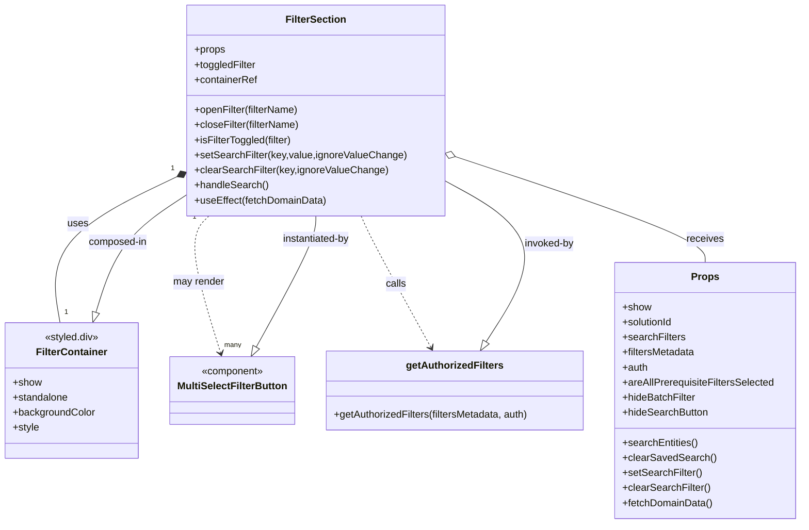

# Diagram: web/portal/src/components/search-bar/FilterSection.js


> Auto-generated by Obscura crawlers

## Diagram 1



### SVG

<svg id="container" width="1271.2421875" xmlns="http://www.w3.org/2000/svg" class="classDiagram" height="834" viewBox="0 0 1271.2421875 834" role="graphics-document document" aria-roledescription="class"><style>#container{font-family:"trebuchet ms",verdana,arial,sans-serif;font-size:16px;fill:#333;}@keyframes edge-animation-frame{from{stroke-dashoffset:0;}}@keyframes dash{to{stroke-dashoffset:0;}}#container .edge-animation-slow{stroke-dasharray:9,5!important;stroke-dashoffset:900;animation:dash 50s linear infinite;stroke-linecap:round;}#container .edge-animation-fast{stroke-dasharray:9,5!important;stroke-dashoffset:900;animation:dash 20s linear infinite;stroke-linecap:round;}#container .error-icon{fill:#552222;}#container .error-text{fill:#552222;stroke:#552222;}#container .edge-thickness-normal{stroke-width:1px;}#container .edge-thickness-thick{stroke-width:3.5px;}#container .edge-pattern-solid{stroke-dasharray:0;}#container .edge-thickness-invisible{stroke-width:0;fill:none;}#container .edge-pattern-dashed{stroke-dasharray:3;}#container .edge-pattern-dotted{stroke-dasharray:2;}#container .marker{fill:#333333;stroke:#333333;}#container .marker.cross{stroke:#333333;}#container svg{font-family:"trebuchet ms",verdana,arial,sans-serif;font-size:16px;}#container p{margin:0;}#container g.classGroup text{fill:#9370DB;stroke:none;font-family:"trebuchet ms",verdana,arial,sans-serif;font-size:10px;}#container g.classGroup text .title{font-weight:bolder;}#container .nodeLabel,#container .edgeLabel{color:#131300;}#container .edgeLabel .label rect{fill:#ECECFF;}#container .label text{fill:#131300;}#container .labelBkg{background:#ECECFF;}#container .edgeLabel .label span{background:#ECECFF;}#container .classTitle{font-weight:bolder;}#container .node rect,#container .node circle,#container .node ellipse,#container .node polygon,#container .node path{fill:#ECECFF;stroke:#9370DB;stroke-width:1px;}#container .divider{stroke:#9370DB;stroke-width:1;}#container g.clickable{cursor:pointer;}#container g.classGroup rect{fill:#ECECFF;stroke:#9370DB;}#container g.classGroup line{stroke:#9370DB;stroke-width:1;}#container .classLabel .box{stroke:none;stroke-width:0;fill:#ECECFF;opacity:0.5;}#container .classLabel .label{fill:#9370DB;font-size:10px;}#container .relation{stroke:#333333;stroke-width:1;fill:none;}#container .dashed-line{stroke-dasharray:3;}#container .dotted-line{stroke-dasharray:1 2;}#container #compositionStart,#container .composition{fill:#333333!important;stroke:#333333!important;stroke-width:1;}#container #compositionEnd,#container .composition{fill:#333333!important;stroke:#333333!important;stroke-width:1;}#container #dependencyStart,#container .dependency{fill:#333333!important;stroke:#333333!important;stroke-width:1;}#container #dependencyStart,#container .dependency{fill:#333333!important;stroke:#333333!important;stroke-width:1;}#container #extensionStart,#container .extension{fill:transparent!important;stroke:#333333!important;stroke-width:1;}#container #extensionEnd,#container .extension{fill:transparent!important;stroke:#333333!important;stroke-width:1;}#container #aggregationStart,#container .aggregation{fill:transparent!important;stroke:#333333!important;stroke-width:1;}#container #aggregationEnd,#container .aggregation{fill:transparent!important;stroke:#333333!important;stroke-width:1;}#container #lollipopStart,#container .lollipop{fill:#ECECFF!important;stroke:#333333!important;stroke-width:1;}#container #lollipopEnd,#container .lollipop{fill:#ECECFF!important;stroke:#333333!important;stroke-width:1;}#container .edgeTerminals{font-size:11px;line-height:initial;}#container .classTitleText{text-anchor:middle;font-size:18px;fill:#333;}#container .label-icon{display:inline-block;height:1em;overflow:visible;vertical-align:-0.125em;}#container .node .label-icon path{fill:currentColor;stroke:revert;stroke-width:revert;}#container :root{--mermaid-font-family:"trebuchet ms",verdana,arial,sans-serif;}</style><g><defs><marker id="container_class-aggregationStart" class="marker aggregation class" refX="18" refY="7" markerWidth="190" markerHeight="240" orient="auto"><path d="M 18,7 L9,13 L1,7 L9,1 Z"></path></marker></defs><defs><marker id="container_class-aggregationEnd" class="marker aggregation class" refX="1" refY="7" markerWidth="20" markerHeight="28" orient="auto"><path d="M 18,7 L9,13 L1,7 L9,1 Z"></path></marker></defs><defs><marker id="container_class-extensionStart" class="marker extension class" refX="18" refY="7" markerWidth="190" markerHeight="240" orient="auto"><path d="M 1,7 L18,13 V 1 Z"></path></marker></defs><defs><marker id="container_class-extensionEnd" class="marker extension class" refX="1" refY="7" markerWidth="20" markerHeight="28" orient="auto"><path d="M 1,1 V 13 L18,7 Z"></path></marker></defs><defs><marker id="container_class-compositionStart" class="marker composition class" refX="18" refY="7" markerWidth="190" markerHeight="240" orient="auto"><path d="M 18,7 L9,13 L1,7 L9,1 Z"></path></marker></defs><defs><marker id="container_class-compositionEnd" class="marker composition class" refX="1" refY="7" markerWidth="20" markerHeight="28" orient="auto"><path d="M 18,7 L9,13 L1,7 L9,1 Z"></path></marker></defs><defs><marker id="container_class-dependencyStart" class="marker dependency class" refX="6" refY="7" markerWidth="190" markerHeight="240" orient="auto"><path d="M 5,7 L9,13 L1,7 L9,1 Z"></path></marker></defs><defs><marker id="container_class-dependencyEnd" class="marker dependency class" refX="13" refY="7" markerWidth="20" markerHeight="28" orient="auto"><path d="M 18,7 L9,13 L14,7 L9,1 Z"></path></marker></defs><defs><marker id="container_class-lollipopStart" class="marker lollipop class" refX="13" refY="7" markerWidth="190" markerHeight="240" orient="auto"><circle stroke="black" fill="transparent" cx="7" cy="7" r="6"></circle></marker></defs><defs><marker id="container_class-lollipopEnd" class="marker lollipop class" refX="1" refY="7" markerWidth="190" markerHeight="240" orient="auto"><circle stroke="black" fill="transparent" cx="7" cy="7" r="6"></circle></marker></defs><g class="root"><g class="clusters"></g><g class="edgePaths"><path d="M277.757,281.139L243.281,297.783C208.805,314.426,139.854,347.713,109.249,386.523C78.644,425.333,86.385,469.667,90.255,491.833L94.126,514" id="id_FilterSection_FilterContainer_1" class="edge-thickness-normal edge-pattern-solid relation" style=";;;" data-edge="true" data-et="edge" data-id="id_FilterSection_FilterContainer_1" data-points="W3sieCI6MjkzLjI5MTAxNTYyNSwieSI6MjczLjYzOTg4MDk2NjA2OTh9LHsieCI6NzAuOTAyMzQzNzUsInkiOjM4MX0seyJ4Ijo5NC4xMjYwMzczNDQzOTgzNCwieSI6NTE0fV0=" marker-start="url(#container_class-compositionStart)"></path><path d="M329.903,344L323.822,350.167C317.742,356.333,305.582,368.667,308.463,405.041C311.344,441.416,329.266,501.832,338.228,532.04L347.189,562.248" id="id_FilterSection_MultiSelectFilterButton_2" class="edge-thickness-normal edge-pattern-dashed relation" style=";;;" data-edge="true" data-et="edge" data-id="id_FilterSection_MultiSelectFilterButton_2" data-points="W3sieCI6MzI5LjkwMjYyMDA0NTczMTc0LCJ5IjozNDR9LHsieCI6MjkzLjQyMTg3NSwieSI6MzgxfSx7IngiOjM0OC44OTUwNjYxMzA3MDU0LCJ5Ijo1Njh9XQ==" marker-end="url(#container_class-dependencyEnd)"></path><path d="M571.177,344L573.953,350.167C576.729,356.333,582.282,368.667,600.662,403.621C619.042,438.575,650.25,496.15,665.853,524.938L681.457,553.725" id="id_FilterSection_getAuthorizedFilters_3" class="edge-thickness-normal edge-pattern-dashed relation" style=";;;" data-edge="true" data-et="edge" data-id="id_FilterSection_getAuthorizedFilters_3" data-points="W3sieCI6NTcxLjE3NjkzNDA3MDEyMTksInkiOjM0NH0seyJ4Ijo1ODcuODMzOTg0Mzc1LCJ5IjozODF9LHsieCI6Njg0LjMxNjUyNzgxMzc5NjcsInkiOjU1OX1d" marker-end="url(#container_class-dependencyEnd)"></path><path d="M714.186,247.874L781.681,270.062C849.176,292.249,984.166,336.625,1051.661,364.979C1119.156,393.333,1119.156,405.667,1119.156,411.833L1119.156,418" id="id_FilterSection_Props_4" class="edge-thickness-normal edge-pattern-solid relation" style=";;;" data-edge="true" data-et="edge" data-id="id_FilterSection_Props_4" data-points="W3sieCI6Njk3Ljc5ODgyODEyNSwieSI6MjQyLjQ4NzAwNzA2ODgzMTA4fSx7IngiOjExMTkuMTU2MjUsInkiOjM4MX0seyJ4IjoxMTE5LjE1NjI1LCJ5Ijo0MTh9XQ==" marker-start="url(#container_class-aggregationStart)"></path><path d="M149.928,497.462L155.686,478.052C161.444,458.642,172.96,419.821,196.854,388.459C220.748,357.096,257.02,333.193,275.155,321.241L293.291,309.289" id="id_FilterContainer_FilterSection_5" class="edge-thickness-normal edge-pattern-solid relation" style=";;;" data-edge="true" data-et="edge" data-id="id_FilterContainer_FilterSection_5" data-points="W3sieCI6MTQ1LjAyMjM2NzczODU4OTIsInkiOjUxNH0seyJ4IjoxODQuNDc2NTYyNSwieSI6MzgxfSx7IngiOjI5My4yOTEwMTU2MjUsInkiOjMwOS4yODkxOTM2MTgyNjM2NX1d" marker-start="url(#container_class-extensionStart)"></path><path d="M402.404,552.835L417.928,524.195C433.451,495.556,464.498,438.278,480.021,403.472C495.545,368.667,495.545,356.333,495.545,350.167L495.545,344" id="id_MultiSelectFilterButton_FilterSection_6" class="edge-thickness-normal edge-pattern-solid relation" style=";;;" data-edge="true" data-et="edge" data-id="id_MultiSelectFilterButton_FilterSection_6" data-points="W3sieCI6Mzk0LjE4NDA0NzU4ODE3NDMsInkiOjU2OH0seyJ4Ijo0OTUuNTQ0OTIxODc1LCJ5IjozODF9LHsieCI6NDk1LjU0NDkyMTg3NSwieSI6MzQ0fV0=" marker-start="url(#container_class-extensionStart)"></path><path d="M768.419,544.501L785.983,517.251C803.548,490.001,838.677,435.5,826.907,392.352C815.137,349.204,756.468,317.408,727.133,301.51L697.799,285.612" id="id_getAuthorizedFilters_FilterSection_7" class="edge-thickness-normal edge-pattern-solid relation" style=";;;" data-edge="true" data-et="edge" data-id="id_getAuthorizedFilters_FilterSection_7" data-points="W3sieCI6NzU5LjA3Mjg2NTMzOTczMDIsInkiOjU1OX0seyJ4Ijo4NzMuODA2NjQwNjI1LCJ5IjozODF9LHsieCI6Njk3Ljc5ODgyODEyNSwieSI6Mjg1LjYxMjA3MjA4MTM3NTV9XQ==" marker-start="url(#container_class-extensionStart)"></path></g><g class="edgeLabels"><g class="edgeLabel" transform="translate(121.30388, 356.66821)"><g class="label" data-id="id_FilterSection_FilterContainer_1" transform="translate(-16.4921875, -12)"><foreignObject width="32.984375" height="24"><div xmlns="http://www.w3.org/1999/xhtml" class="labelBkg" style="display: table-cell; white-space: nowrap; line-height: 1.5; max-width: 200px; text-align: center;"><span class="edgeLabel"><p>uses</p></span></div></foreignObject></g></g><g class="edgeLabel" transform="translate(313.7698, 449.5928)"><g class="label" data-id="id_FilterSection_MultiSelectFilterButton_2" transform="translate(-41.2734375, -12)"><foreignObject width="82.546875" height="24"><div xmlns="http://www.w3.org/1999/xhtml" class="labelBkg" style="display: table-cell; white-space: nowrap; line-height: 1.5; max-width: 200px; text-align: center;"><span class="edgeLabel"><p>may render</p></span></div></foreignObject></g></g><g class="edgeLabel" transform="translate(626.40719, 452.16344)"><g class="label" data-id="id_FilterSection_getAuthorizedFilters_3" transform="translate(-16.4453125, -12)"><foreignObject width="32.890625" height="24"><div xmlns="http://www.w3.org/1999/xhtml" class="labelBkg" style="display: table-cell; white-space: nowrap; line-height: 1.5; max-width: 200px; text-align: center;"><span class="edgeLabel"><p>calls</p></span></div></foreignObject></g></g><g class="edgeLabel" transform="translate(1119.15625, 381)"><g class="label" data-id="id_FilterSection_Props_4" transform="translate(-29.4921875, -12)"><foreignObject width="58.984375" height="24"><div xmlns="http://www.w3.org/1999/xhtml" class="labelBkg" style="display: table-cell; white-space: nowrap; line-height: 1.5; max-width: 200px; text-align: center;"><span class="edgeLabel"><p>receives</p></span></div></foreignObject></g></g><g class="edgeLabel" transform="translate(183.28071, 385.03121)"><g class="label" data-id="id_FilterContainer_FilterSection_5" transform="translate(-47.671875, -12)"><foreignObject width="95.34375" height="24"><div xmlns="http://www.w3.org/1999/xhtml" class="labelBkg" style="display: table-cell; white-space: nowrap; line-height: 1.5; max-width: 200px; text-align: center;"><span class="edgeLabel"><p>composed-in</p></span></div></foreignObject></g></g><g class="edgeLabel" transform="translate(495.544921875, 381)"><g class="label" data-id="id_MultiSelectFilterButton_FilterSection_6" transform="translate(-55.84375, -12)"><foreignObject width="111.6875" height="24"><div xmlns="http://www.w3.org/1999/xhtml" class="labelBkg" style="display: table-cell; white-space: nowrap; line-height: 1.5; max-width: 200px; text-align: center;"><span class="edgeLabel"><p>instantiated-by</p></span></div></foreignObject></g></g><g class="edgeLabel" transform="translate(870.66998, 385.86627)"><g class="label" data-id="id_getAuthorizedFilters_FilterSection_7" transform="translate(-40.515625, -12)"><foreignObject width="81.03125" height="24"><div xmlns="http://www.w3.org/1999/xhtml" class="labelBkg" style="display: table-cell; white-space: nowrap; line-height: 1.5; max-width: 200px; text-align: center;"><span class="edgeLabel"><p>invoked-by</p></span></div></foreignObject></g></g><g class="edgeTerminals" transform="translate(271.01012247162964, 267.73972303920976)"><g class="inner" transform="translate(0, 0)"><foreignObject style="width: 9px; height: 12px;"><div xmlns="http://www.w3.org/1999/xhtml" style="display: inline-block; padding-right: 1px; white-space: nowrap;"><span class="edgeLabel">1</span></div></foreignObject></g></g><g class="edgeTerminals" transform="translate(306.9347145498689, 345.9301116468747)"><g class="inner" transform="translate(0, 0)"><foreignObject style="width: 9px; height: 12px;"><div xmlns="http://www.w3.org/1999/xhtml" style="display: inline-block; padding-right: 1px; white-space: nowrap;"><span class="edgeLabel">1</span></div></foreignObject></g></g><g class="edgeTerminals" transform="translate(100.8922574061878, 489.1806652707195)"><g class="inner" transform="translate(0, 0)"></g><foreignObject style="width: 9px; height: 12px;"><div xmlns="http://www.w3.org/1999/xhtml" style="display: inline-block; padding-right: 1px; white-space: nowrap;"><span class="edgeLabel">1</span></div></foreignObject></g><g class="edgeTerminals" transform="translate(353.29868572018233, 541.9566635706394)"><g class="inner" transform="translate(0, 0)"></g><foreignObject style="width: 36px; height: 12px;"><div xmlns="http://www.w3.org/1999/xhtml" style="display: inline-block; padding-right: 1px; white-space: nowrap;"><span class="edgeLabel">many</span></div></foreignObject></g></g><g class="nodes"><g class="node default" id="classId-FilterSection-0" transform="translate(495.544921875, 176)"><g class="basic label-container"><path d="M-202.25390625 -168 L202.25390625 -168 L202.25390625 168 L-202.25390625 168" stroke="none" stroke-width="0" fill="#ECECFF" style=""></path><path d="M-202.25390625 -168 C-62.9572461953031 -168, 76.3394138593938 -168, 202.25390625 -168 M-202.25390625 -168 C-64.99713909993719 -168, 72.25962805012563 -168, 202.25390625 -168 M202.25390625 -168 C202.25390625 -69.49853732815097, 202.25390625 29.002925343698053, 202.25390625 168 M202.25390625 -168 C202.25390625 -77.78635738264747, 202.25390625 12.427285234705067, 202.25390625 168 M202.25390625 168 C113.6877163598259 168, 25.121526469651798 168, -202.25390625 168 M202.25390625 168 C88.41827503003226 168, -25.417356189935475 168, -202.25390625 168 M-202.25390625 168 C-202.25390625 75.4384232597397, -202.25390625 -17.123153480520614, -202.25390625 -168 M-202.25390625 168 C-202.25390625 92.59752354427816, -202.25390625 17.195047088556322, -202.25390625 -168" stroke="#9370DB" stroke-width="1.3" fill="none" stroke-dasharray="0 0" style=""></path></g><g class="annotation-group text" transform="translate(0, -144)"></g><g class="label-group text" transform="translate(-46.3203125, -144)"><g class="label" style="font-weight: bolder" transform="translate(0,-12)"><foreignObject width="92.640625" height="24"><div xmlns="http://www.w3.org/1999/xhtml" style="display: table-cell; white-space: nowrap; line-height: 1.5; max-width: 141px; text-align: center;"><span class="nodeLabel markdown-node-label" style=""><p>FilterSection</p></span></div></foreignObject></g></g><g class="members-group text" transform="translate(-190.25390625, -96)"><g class="label" style="" transform="translate(0,-12)"><foreignObject width="49.515625" height="24"><div xmlns="http://www.w3.org/1999/xhtml" style="display: table-cell; white-space: nowrap; line-height: 1.5; max-width: 107px; text-align: center;"><span class="nodeLabel markdown-node-label" style=""><p>+props</p></span></div></foreignObject></g><g class="label" style="" transform="translate(0,12)"><foreignObject width="99.25" height="24"><div xmlns="http://www.w3.org/1999/xhtml" style="display: table-cell; white-space: nowrap; line-height: 1.5; max-width: 157px; text-align: center;"><span class="nodeLabel markdown-node-label" style=""><p>+toggledFilter</p></span></div></foreignObject></g><g class="label" style="" transform="translate(0,36)"><foreignObject width="100.71875" height="24"><div xmlns="http://www.w3.org/1999/xhtml" style="display: table-cell; white-space: nowrap; line-height: 1.5; max-width: 160px; text-align: center;"><span class="nodeLabel markdown-node-label" style=""><p>+containerRef</p></span></div></foreignObject></g></g><g class="methods-group text" transform="translate(-190.25390625, 0)"><g class="label" style="" transform="translate(0,-12)"><foreignObject width="168.609375" height="24"><div xmlns="http://www.w3.org/1999/xhtml" style="display: table-cell; white-space: nowrap; line-height: 1.5; max-width: 226px; text-align: center;"><span class="nodeLabel markdown-node-label" style=""><p>+openFilter(filterName)</p></span></div></foreignObject></g><g class="label" style="" transform="translate(0,12)"><foreignObject width="169.46875" height="24"><div xmlns="http://www.w3.org/1999/xhtml" style="display: table-cell; white-space: nowrap; line-height: 1.5; max-width: 227px; text-align: center;"><span class="nodeLabel markdown-node-label" style=""><p>+closeFilter(filterName)</p></span></div></foreignObject></g><g class="label" style="" transform="translate(0,36)"><foreignObject width="157.859375" height="24"><div xmlns="http://www.w3.org/1999/xhtml" style="display: table-cell; white-space: nowrap; line-height: 1.5; max-width: 215px; text-align: center;"><span class="nodeLabel markdown-node-label" style=""><p>+isFilterToggled(filter)</p></span></div></foreignObject></g><g class="label" style="" transform="translate(0,60)"><foreignObject width="334.1875" height="24"><div xmlns="http://www.w3.org/1999/xhtml" style="display: table-cell; white-space: nowrap; line-height: 1.5; max-width: 392px; text-align: center;"><span class="nodeLabel markdown-node-label" style=""><p>+setSearchFilter(key,value,ignoreValueChange)</p></span></div></foreignObject></g><g class="label" style="" transform="translate(0,84)"><foreignObject width="306" height="24"><div xmlns="http://www.w3.org/1999/xhtml" style="display: table-cell; white-space: nowrap; line-height: 1.5; max-width: 363px; text-align: center;"><span class="nodeLabel markdown-node-label" style=""><p>+clearSearchFilter(key,ignoreValueChange)</p></span></div></foreignObject></g><g class="label" style="" transform="translate(0,108)"><foreignObject width="117.421875" height="24"><div xmlns="http://www.w3.org/1999/xhtml" style="display: table-cell; white-space: nowrap; line-height: 1.5; max-width: 175px; text-align: center;"><span class="nodeLabel markdown-node-label" style=""><p>+handleSearch()</p></span></div></foreignObject></g><g class="label" style="" transform="translate(0,132)"><foreignObject width="210.453125" height="24"><div xmlns="http://www.w3.org/1999/xhtml" style="display: table-cell; white-space: nowrap; line-height: 1.5; max-width: 268px; text-align: center;"><span class="nodeLabel markdown-node-label" style=""><p>+useEffect(fetchDomainData)</p></span></div></foreignObject></g></g><g class="divider" style=""><path d="M-202.25390625 -120 C-70.95368119479429 -120, 60.34654386041143 -120, 202.25390625 -120 M-202.25390625 -120 C-98.26594795489581 -120, 5.722010340208385 -120, 202.25390625 -120" stroke="#9370DB" stroke-width="1.3" fill="none" stroke-dasharray="0 0" style=""></path></g><g class="divider" style=""><path d="M-202.25390625 -24 C-79.77081693258182 -24, 42.71227238483635 -24, 202.25390625 -24 M-202.25390625 -24 C-105.35223643499572 -24, -8.450566619991434 -24, 202.25390625 -24" stroke="#9370DB" stroke-width="1.3" fill="none" stroke-dasharray="0 0" style=""></path></g></g><g class="node default" id="classId-FilterContainer-1" transform="translate(112.984375, 622)"><g class="basic label-container"><path d="M-104.984375 -108 L104.984375 -108 L104.984375 108 L-104.984375 108" stroke="none" stroke-width="0" fill="#ECECFF" style=""></path><path d="M-104.984375 -108 C-32.2766975625933 -108, 40.4309798748134 -108, 104.984375 -108 M-104.984375 -108 C-54.2108490164632 -108, -3.4373230329264004 -108, 104.984375 -108 M104.984375 -108 C104.984375 -46.503532931226694, 104.984375 14.992934137546612, 104.984375 108 M104.984375 -108 C104.984375 -24.088244549962397, 104.984375 59.823510900075206, 104.984375 108 M104.984375 108 C36.41741256206471 108, -32.149549875870576 108, -104.984375 108 M104.984375 108 C54.8040482633543 108, 4.623721526708593 108, -104.984375 108 M-104.984375 108 C-104.984375 54.92961693395881, -104.984375 1.8592338679176237, -104.984375 -108 M-104.984375 108 C-104.984375 44.73201337540611, -104.984375 -18.535973249187776, -104.984375 -108" stroke="#9370DB" stroke-width="1.3" fill="none" stroke-dasharray="0 0" style=""></path></g><g class="annotation-group text" transform="translate(-43.9140625, -84)"><g class="label" style="" transform="translate(0,-12)"><foreignObject width="87.828125" height="24"><div xmlns="http://www.w3.org/1999/xhtml" style="display: table-cell; white-space: nowrap; line-height: 1.5; max-width: 138px; text-align: center;"><span class="nodeLabel markdown-node-label" style=""><p>«styled.div»</p></span></div></foreignObject></g></g><g class="label-group text" transform="translate(-54.46875, -60)"><g class="label" style="font-weight: bolder" transform="translate(0,-12)"><foreignObject width="108.9375" height="24"><div xmlns="http://www.w3.org/1999/xhtml" style="display: table-cell; white-space: nowrap; line-height: 1.5; max-width: 158px; text-align: center;"><span class="nodeLabel markdown-node-label" style=""><p>FilterContainer</p></span></div></foreignObject></g></g><g class="members-group text" transform="translate(-92.984375, -12)"><g class="label" style="" transform="translate(0,-12)"><foreignObject width="45.65625" height="24"><div xmlns="http://www.w3.org/1999/xhtml" style="display: table-cell; white-space: nowrap; line-height: 1.5; max-width: 104px; text-align: center;"><span class="nodeLabel markdown-node-label" style=""><p>+show</p></span></div></foreignObject></g><g class="label" style="" transform="translate(0,12)"><foreignObject width="89.375" height="24"><div xmlns="http://www.w3.org/1999/xhtml" style="display: table-cell; white-space: nowrap; line-height: 1.5; max-width: 147px; text-align: center;"><span class="nodeLabel markdown-node-label" style=""><p>+standalone</p></span></div></foreignObject></g><g class="label" style="" transform="translate(0,36)"><foreignObject width="131.5" height="24"><div xmlns="http://www.w3.org/1999/xhtml" style="display: table-cell; white-space: nowrap; line-height: 1.5; max-width: 190px; text-align: center;"><span class="nodeLabel markdown-node-label" style=""><p>+backgroundColor</p></span></div></foreignObject></g><g class="label" style="" transform="translate(0,60)"><foreignObject width="42.359375" height="24"><div xmlns="http://www.w3.org/1999/xhtml" style="display: table-cell; white-space: nowrap; line-height: 1.5; max-width: 100px; text-align: center;"><span class="nodeLabel markdown-node-label" style=""><p>+style</p></span></div></foreignObject></g></g><g class="methods-group text" transform="translate(-92.984375, 108)"></g><g class="divider" style=""><path d="M-104.984375 -36 C-44.702907521410694 -36, 15.578559957178612 -36, 104.984375 -36 M-104.984375 -36 C-54.97992274617759 -36, -4.975470492355186 -36, 104.984375 -36" stroke="#9370DB" stroke-width="1.3" fill="none" stroke-dasharray="0 0" style=""></path></g><g class="divider" style=""><path d="M-104.984375 84 C-52.29643351587552 84, 0.39150796824895906 84, 104.984375 84 M-104.984375 84 C-35.95212917717727 84, 33.08011664564546 84, 104.984375 84" stroke="#9370DB" stroke-width="1.3" fill="none" stroke-dasharray="0 0" style=""></path></g></g><g class="node default" id="classId-MultiSelectFilterButton-2" transform="translate(364.9140625, 622)"><g class="basic label-container"><path d="M-96.9453125 -54 L96.9453125 -54 L96.9453125 54 L-96.9453125 54" stroke="none" stroke-width="0" fill="#ECECFF" style=""></path><path d="M-96.9453125 -54 C-22.23370619997887 -54, 52.47790010004226 -54, 96.9453125 -54 M-96.9453125 -54 C-23.570655884542063 -54, 49.804000730915874 -54, 96.9453125 -54 M96.9453125 -54 C96.9453125 -25.181046415054237, 96.9453125 3.637907169891527, 96.9453125 54 M96.9453125 -54 C96.9453125 -28.650104340857467, 96.9453125 -3.3002086817149348, 96.9453125 54 M96.9453125 54 C46.08262895079961 54, -4.780054598400781 54, -96.9453125 54 M96.9453125 54 C29.67530354144992 54, -37.59470541710016 54, -96.9453125 54 M-96.9453125 54 C-96.9453125 27.228947091353156, -96.9453125 0.4578941827063119, -96.9453125 -54 M-96.9453125 54 C-96.9453125 24.026952504843866, -96.9453125 -5.946094990312268, -96.9453125 -54" stroke="#9370DB" stroke-width="1.3" fill="none" stroke-dasharray="0 0" style=""></path></g><g class="annotation-group text" transform="translate(-50.2109375, -30)"><g class="label" style="" transform="translate(0,-12)"><foreignObject width="100.421875" height="24"><div xmlns="http://www.w3.org/1999/xhtml" style="display: table-cell; white-space: nowrap; line-height: 1.5; max-width: 150px; text-align: center;"><span class="nodeLabel markdown-node-label" style=""><p>«component»</p></span></div></foreignObject></g></g><g class="label-group text" transform="translate(-84.9453125, -6)"><g class="label" style="font-weight: bolder" transform="translate(0,-12)"><foreignObject width="169.890625" height="24"><div xmlns="http://www.w3.org/1999/xhtml" style="display: table-cell; white-space: nowrap; line-height: 1.5; max-width: 217px; text-align: center;"><span class="nodeLabel markdown-node-label" style=""><p>MultiSelectFilterButton</p></span></div></foreignObject></g></g><g class="members-group text" transform="translate(-84.9453125, 42)"></g><g class="methods-group text" transform="translate(-84.9453125, 72)"></g><g class="divider" style=""><path d="M-96.9453125 18 C-45.92399042151877 18, 5.097331656962453 18, 96.9453125 18 M-96.9453125 18 C-32.861724878010506 18, 31.22186274397899 18, 96.9453125 18" stroke="#9370DB" stroke-width="1.3" fill="none" stroke-dasharray="0 0" style=""></path></g><g class="divider" style=""><path d="M-96.9453125 36 C-45.93172084109085 36, 5.081870817818299 36, 96.9453125 36 M-96.9453125 36 C-57.637787756517966 36, -18.330263013035932 36, 96.9453125 36" stroke="#9370DB" stroke-width="1.3" fill="none" stroke-dasharray="0 0" style=""></path></g></g><g class="node default" id="classId-getAuthorizedFilters-3" transform="translate(718.46484375, 622)"><g class="basic label-container"><path d="M-206.60546875 -63 L206.60546875 -63 L206.60546875 63 L-206.60546875 63" stroke="none" stroke-width="0" fill="#ECECFF" style=""></path><path d="M-206.60546875 -63 C-49.05973256129005 -63, 108.4860036274199 -63, 206.60546875 -63 M-206.60546875 -63 C-85.84596572613432 -63, 34.91353729773135 -63, 206.60546875 -63 M206.60546875 -63 C206.60546875 -36.29292413331484, 206.60546875 -9.58584826662969, 206.60546875 63 M206.60546875 -63 C206.60546875 -37.22672773065213, 206.60546875 -11.453455461304252, 206.60546875 63 M206.60546875 63 C117.63415694363587 63, 28.662845137271745 63, -206.60546875 63 M206.60546875 63 C75.36481053488151 63, -55.87584768023697 63, -206.60546875 63 M-206.60546875 63 C-206.60546875 32.72760781072409, -206.60546875 2.4552156214481755, -206.60546875 -63 M-206.60546875 63 C-206.60546875 28.293164265510143, -206.60546875 -6.4136714689797145, -206.60546875 -63" stroke="#9370DB" stroke-width="1.3" fill="none" stroke-dasharray="0 0" style=""></path></g><g class="annotation-group text" transform="translate(0, -39)"></g><g class="label-group text" transform="translate(-74.3203125, -39)"><g class="label" style="font-weight: bolder" transform="translate(0,-12)"><foreignObject width="148.640625" height="24"><div xmlns="http://www.w3.org/1999/xhtml" style="display: table-cell; white-space: nowrap; line-height: 1.5; max-width: 196px; text-align: center;"><span class="nodeLabel markdown-node-label" style=""><p>getAuthorizedFilters</p></span></div></foreignObject></g></g><g class="members-group text" transform="translate(-194.60546875, 9)"></g><g class="methods-group text" transform="translate(-194.60546875, 39)"><g class="label" style="" transform="translate(0,-12)"><foreignObject width="314.890625" height="24"><div xmlns="http://www.w3.org/1999/xhtml" style="display: table-cell; white-space: nowrap; line-height: 1.5; max-width: 372px; text-align: center;"><span class="nodeLabel markdown-node-label" style=""><p>+getAuthorizedFilters(filtersMetadata, auth)</p></span></div></foreignObject></g></g><g class="divider" style=""><path d="M-206.60546875 -15 C-123.32045685875941 -15, -40.03544496751883 -15, 206.60546875 -15 M-206.60546875 -15 C-98.48869876216358 -15, 9.62807122567284 -15, 206.60546875 -15" stroke="#9370DB" stroke-width="1.3" fill="none" stroke-dasharray="0 0" style=""></path></g><g class="divider" style=""><path d="M-206.60546875 9 C-90.73921937398535 9, 25.1270300020293 9, 206.60546875 9 M-206.60546875 9 C-48.3375249092976 9, 109.9304189314048 9, 206.60546875 9" stroke="#9370DB" stroke-width="1.3" fill="none" stroke-dasharray="0 0" style=""></path></g></g><g class="node default" id="classId-Props-4" transform="translate(1119.15625, 622)"><g class="basic label-container"><path d="M-144.0859375 -204 L144.0859375 -204 L144.0859375 204 L-144.0859375 204" stroke="none" stroke-width="0" fill="#ECECFF" style=""></path><path d="M-144.0859375 -204 C-84.8223001563479 -204, -25.5586628126958 -204, 144.0859375 -204 M-144.0859375 -204 C-45.275398834469186 -204, 53.53513983106163 -204, 144.0859375 -204 M144.0859375 -204 C144.0859375 -65.5409160006648, 144.0859375 72.91816799867041, 144.0859375 204 M144.0859375 -204 C144.0859375 -121.6935060491635, 144.0859375 -39.387012098327006, 144.0859375 204 M144.0859375 204 C46.02816345538493 204, -52.029610589230145 204, -144.0859375 204 M144.0859375 204 C61.648375746265415 204, -20.78918600746917 204, -144.0859375 204 M-144.0859375 204 C-144.0859375 98.94242883371713, -144.0859375 -6.115142332565739, -144.0859375 -204 M-144.0859375 204 C-144.0859375 52.84281073092828, -144.0859375 -98.31437853814344, -144.0859375 -204" stroke="#9370DB" stroke-width="1.3" fill="none" stroke-dasharray="0 0" style=""></path></g><g class="annotation-group text" transform="translate(0, -180)"></g><g class="label-group text" transform="translate(-20.921875, -180)"><g class="label" style="font-weight: bolder" transform="translate(0,-12)"><foreignObject width="41.84375" height="24"><div xmlns="http://www.w3.org/1999/xhtml" style="display: table-cell; white-space: nowrap; line-height: 1.5; max-width: 91px; text-align: center;"><span class="nodeLabel markdown-node-label" style=""><p>Props</p></span></div></foreignObject></g></g><g class="members-group text" transform="translate(-132.0859375, -132)"><g class="label" style="" transform="translate(0,-12)"><foreignObject width="45.65625" height="24"><div xmlns="http://www.w3.org/1999/xhtml" style="display: table-cell; white-space: nowrap; line-height: 1.5; max-width: 104px; text-align: center;"><span class="nodeLabel markdown-node-label" style=""><p>+show</p></span></div></foreignObject></g><g class="label" style="" transform="translate(0,12)"><foreignObject width="82.109375" height="24"><div xmlns="http://www.w3.org/1999/xhtml" style="display: table-cell; white-space: nowrap; line-height: 1.5; max-width: 139px; text-align: center;"><span class="nodeLabel markdown-node-label" style=""><p>+solutionId</p></span></div></foreignObject></g><g class="label" style="" transform="translate(0,36)"><foreignObject width="99.609375" height="24"><div xmlns="http://www.w3.org/1999/xhtml" style="display: table-cell; white-space: nowrap; line-height: 1.5; max-width: 157px; text-align: center;"><span class="nodeLabel markdown-node-label" style=""><p>+searchFilters</p></span></div></foreignObject></g><g class="label" style="" transform="translate(0,60)"><foreignObject width="117.484375" height="24"><div xmlns="http://www.w3.org/1999/xhtml" style="display: table-cell; white-space: nowrap; line-height: 1.5; max-width: 175px; text-align: center;"><span class="nodeLabel markdown-node-label" style=""><p>+filtersMetadata</p></span></div></foreignObject></g><g class="label" style="" transform="translate(0,84)"><foreignObject width="40.921875" height="24"><div xmlns="http://www.w3.org/1999/xhtml" style="display: table-cell; white-space: nowrap; line-height: 1.5; max-width: 98px; text-align: center;"><span class="nodeLabel markdown-node-label" style=""><p>+auth</p></span></div></foreignObject></g><g class="label" style="" transform="translate(0,108)"><foreignObject width="243.25" height="24"><div xmlns="http://www.w3.org/1999/xhtml" style="display: table-cell; white-space: nowrap; line-height: 1.5; max-width: 301px; text-align: center;"><span class="nodeLabel markdown-node-label" style=""><p>+areAllPrerequisiteFiltersSelected</p></span></div></foreignObject></g><g class="label" style="" transform="translate(0,132)"><foreignObject width="118.09375" height="24"><div xmlns="http://www.w3.org/1999/xhtml" style="display: table-cell; white-space: nowrap; line-height: 1.5; max-width: 176px; text-align: center;"><span class="nodeLabel markdown-node-label" style=""><p>+hideBatchFilter</p></span></div></foreignObject></g><g class="label" style="" transform="translate(0,156)"><foreignObject width="137.9375" height="24"><div xmlns="http://www.w3.org/1999/xhtml" style="display: table-cell; white-space: nowrap; line-height: 1.5; max-width: 195px; text-align: center;"><span class="nodeLabel markdown-node-label" style=""><p>+hideSearchButton</p></span></div></foreignObject></g></g><g class="methods-group text" transform="translate(-132.0859375, 84)"><g class="label" style="" transform="translate(0,-12)"><foreignObject width="120.359375" height="24"><div xmlns="http://www.w3.org/1999/xhtml" style="display: table-cell; white-space: nowrap; line-height: 1.5; max-width: 178px; text-align: center;"><span class="nodeLabel markdown-node-label" style=""><p>+searchEntities()</p></span></div></foreignObject></g><g class="label" style="" transform="translate(0,12)"><foreignObject width="146.046875" height="24"><div xmlns="http://www.w3.org/1999/xhtml" style="display: table-cell; white-space: nowrap; line-height: 1.5; max-width: 203px; text-align: center;"><span class="nodeLabel markdown-node-label" style=""><p>+clearSavedSearch()</p></span></div></foreignObject></g><g class="label" style="" transform="translate(0,36)"><foreignObject width="125.953125" height="24"><div xmlns="http://www.w3.org/1999/xhtml" style="display: table-cell; white-space: nowrap; line-height: 1.5; max-width: 183px; text-align: center;"><span class="nodeLabel markdown-node-label" style=""><p>+setSearchFilter()</p></span></div></foreignObject></g><g class="label" style="" transform="translate(0,60)"><foreignObject width="139.6875" height="24"><div xmlns="http://www.w3.org/1999/xhtml" style="display: table-cell; white-space: nowrap; line-height: 1.5; max-width: 197px; text-align: center;"><span class="nodeLabel markdown-node-label" style=""><p>+clearSearchFilter()</p></span></div></foreignObject></g><g class="label" style="" transform="translate(0,84)"><foreignObject width="143.765625" height="24"><div xmlns="http://www.w3.org/1999/xhtml" style="display: table-cell; white-space: nowrap; line-height: 1.5; max-width: 201px; text-align: center;"><span class="nodeLabel markdown-node-label" style=""><p>+fetchDomainData()</p></span></div></foreignObject></g></g><g class="divider" style=""><path d="M-144.0859375 -156 C-30.391466240659582 -156, 83.30300501868084 -156, 144.0859375 -156 M-144.0859375 -156 C-75.86485268963202 -156, -7.643767879264033 -156, 144.0859375 -156" stroke="#9370DB" stroke-width="1.3" fill="none" stroke-dasharray="0 0" style=""></path></g><g class="divider" style=""><path d="M-144.0859375 60 C-39.195871273990335 60, 65.69419495201933 60, 144.0859375 60 M-144.0859375 60 C-62.66159033543417 60, 18.76275682913166 60, 144.0859375 60" stroke="#9370DB" stroke-width="1.3" fill="none" stroke-dasharray="0 0" style=""></path></g></g></g></g></g></svg>

## Diagram 2

```mermaid
flowchart TD
    A[Start: Render FilterSection] --> B{fetchDomainData exists?}
    B -- yes --> B1[call fetchDomainData()]
    B -- no --> C[compute authorizedFilters = getAuthorizedFilters(filtersMetadata, auth)]
    B1 --> C
    C --> D[Map authorizedFilters -> filterComponents]
    D --> E{filter f.hidden(props) === true?}
    E -- true --> E1[skip render f]
    E -- false --> F{!f.prerequisiteForSearchAndFilters && !areAllPrerequisiteFiltersSelected?}
    F -- true --> F1[skip render f]
    F -- false --> G{hideBatchFilter && f.queryKey === "batch"?}
    G -- true --> G1[skip render f]
    G -- false --> H[choose Component = f.Component or MultiSelectFilterButton]
    H --> I[render <Component ...props toggled/isFilterToggled ...>]
    I --> J[attach handlers: openFilter, closeFilter, onSearchClick -> handleSearch]
    J --> K[FilterContainer displays filterComponents when show or standalone]
    K --> L[User interacts -> openFilter/closeFilter/setSearchFilter/clearSearchFilter]
    L --> M{hideSearchButton ? ignore value change on set/clear}
    M -- yes --> N[setSearchFilter/clearSearchFilter called with ignore=true]
    M -- no --> O[setSearchFilter/clearSearchFilter called normally]
    N --> P[searchEntities called when handleSearch invoked]
    O --> P
    P --> Z[End]
```

> SVG rendering failed for this diagram.
