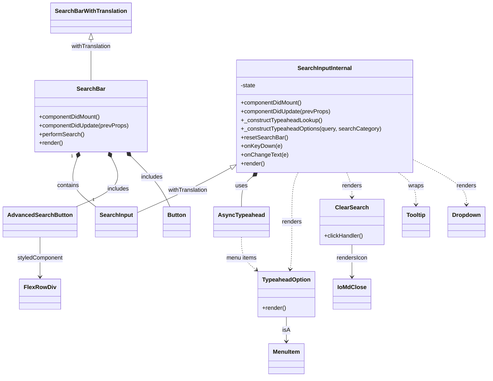

# Diagram: web/portal/src/components/search-bar/SearchBar.js


> Auto-generated by Obscura crawlers

## Diagram 1



### SVG

<svg id="container" width="1324.67578125" xmlns="http://www.w3.org/2000/svg" class="classDiagram" height="1044" viewBox="0 0 1324.67578125 1044" role="graphics-document document" aria-roledescription="class"><style>#container{font-family:"trebuchet ms",verdana,arial,sans-serif;font-size:16px;fill:#333;}@keyframes edge-animation-frame{from{stroke-dashoffset:0;}}@keyframes dash{to{stroke-dashoffset:0;}}#container .edge-animation-slow{stroke-dasharray:9,5!important;stroke-dashoffset:900;animation:dash 50s linear infinite;stroke-linecap:round;}#container .edge-animation-fast{stroke-dasharray:9,5!important;stroke-dashoffset:900;animation:dash 20s linear infinite;stroke-linecap:round;}#container .error-icon{fill:#552222;}#container .error-text{fill:#552222;stroke:#552222;}#container .edge-thickness-normal{stroke-width:1px;}#container .edge-thickness-thick{stroke-width:3.5px;}#container .edge-pattern-solid{stroke-dasharray:0;}#container .edge-thickness-invisible{stroke-width:0;fill:none;}#container .edge-pattern-dashed{stroke-dasharray:3;}#container .edge-pattern-dotted{stroke-dasharray:2;}#container .marker{fill:#333333;stroke:#333333;}#container .marker.cross{stroke:#333333;}#container svg{font-family:"trebuchet ms",verdana,arial,sans-serif;font-size:16px;}#container p{margin:0;}#container g.classGroup text{fill:#9370DB;stroke:none;font-family:"trebuchet ms",verdana,arial,sans-serif;font-size:10px;}#container g.classGroup text .title{font-weight:bolder;}#container .nodeLabel,#container .edgeLabel{color:#131300;}#container .edgeLabel .label rect{fill:#ECECFF;}#container .label text{fill:#131300;}#container .labelBkg{background:#ECECFF;}#container .edgeLabel .label span{background:#ECECFF;}#container .classTitle{font-weight:bolder;}#container .node rect,#container .node circle,#container .node ellipse,#container .node polygon,#container .node path{fill:#ECECFF;stroke:#9370DB;stroke-width:1px;}#container .divider{stroke:#9370DB;stroke-width:1;}#container g.clickable{cursor:pointer;}#container g.classGroup rect{fill:#ECECFF;stroke:#9370DB;}#container g.classGroup line{stroke:#9370DB;stroke-width:1;}#container .classLabel .box{stroke:none;stroke-width:0;fill:#ECECFF;opacity:0.5;}#container .classLabel .label{fill:#9370DB;font-size:10px;}#container .relation{stroke:#333333;stroke-width:1;fill:none;}#container .dashed-line{stroke-dasharray:3;}#container .dotted-line{stroke-dasharray:1 2;}#container #compositionStart,#container .composition{fill:#333333!important;stroke:#333333!important;stroke-width:1;}#container #compositionEnd,#container .composition{fill:#333333!important;stroke:#333333!important;stroke-width:1;}#container #dependencyStart,#container .dependency{fill:#333333!important;stroke:#333333!important;stroke-width:1;}#container #dependencyStart,#container .dependency{fill:#333333!important;stroke:#333333!important;stroke-width:1;}#container #extensionStart,#container .extension{fill:transparent!important;stroke:#333333!important;stroke-width:1;}#container #extensionEnd,#container .extension{fill:transparent!important;stroke:#333333!important;stroke-width:1;}#container #aggregationStart,#container .aggregation{fill:transparent!important;stroke:#333333!important;stroke-width:1;}#container #aggregationEnd,#container .aggregation{fill:transparent!important;stroke:#333333!important;stroke-width:1;}#container #lollipopStart,#container .lollipop{fill:#ECECFF!important;stroke:#333333!important;stroke-width:1;}#container #lollipopEnd,#container .lollipop{fill:#ECECFF!important;stroke:#333333!important;stroke-width:1;}#container .edgeTerminals{font-size:11px;line-height:initial;}#container .classTitleText{text-anchor:middle;font-size:18px;fill:#333;}#container .label-icon{display:inline-block;height:1em;overflow:visible;vertical-align:-0.125em;}#container .node .label-icon path{fill:currentColor;stroke:revert;stroke-width:revert;}#container :root{--mermaid-font-family:"trebuchet ms",verdana,arial,sans-serif;}</style><g><defs><marker id="container_class-aggregationStart" class="marker aggregation class" refX="18" refY="7" markerWidth="190" markerHeight="240" orient="auto"><path d="M 18,7 L9,13 L1,7 L9,1 Z"></path></marker></defs><defs><marker id="container_class-aggregationEnd" class="marker aggregation class" refX="1" refY="7" markerWidth="20" markerHeight="28" orient="auto"><path d="M 18,7 L9,13 L1,7 L9,1 Z"></path></marker></defs><defs><marker id="container_class-extensionStart" class="marker extension class" refX="18" refY="7" markerWidth="190" markerHeight="240" orient="auto"><path d="M 1,7 L18,13 V 1 Z"></path></marker></defs><defs><marker id="container_class-extensionEnd" class="marker extension class" refX="1" refY="7" markerWidth="20" markerHeight="28" orient="auto"><path d="M 1,1 V 13 L18,7 Z"></path></marker></defs><defs><marker id="container_class-compositionStart" class="marker composition class" refX="18" refY="7" markerWidth="190" markerHeight="240" orient="auto"><path d="M 18,7 L9,13 L1,7 L9,1 Z"></path></marker></defs><defs><marker id="container_class-compositionEnd" class="marker composition class" refX="1" refY="7" markerWidth="20" markerHeight="28" orient="auto"><path d="M 18,7 L9,13 L1,7 L9,1 Z"></path></marker></defs><defs><marker id="container_class-dependencyStart" class="marker dependency class" refX="6" refY="7" markerWidth="190" markerHeight="240" orient="auto"><path d="M 5,7 L9,13 L1,7 L9,1 Z"></path></marker></defs><defs><marker id="container_class-dependencyEnd" class="marker dependency class" refX="13" refY="7" markerWidth="20" markerHeight="28" orient="auto"><path d="M 18,7 L9,13 L14,7 L9,1 Z"></path></marker></defs><defs><marker id="container_class-lollipopStart" class="marker lollipop class" refX="13" refY="7" markerWidth="190" markerHeight="240" orient="auto"><circle stroke="black" fill="transparent" cx="7" cy="7" r="6"></circle></marker></defs><defs><marker id="container_class-lollipopEnd" class="marker lollipop class" refX="1" refY="7" markerWidth="190" markerHeight="240" orient="auto"><circle stroke="black" fill="transparent" cx="7" cy="7" r="6"></circle></marker></defs><g class="root"><g class="clusters"></g><g class="edgePaths"><path d="M187.746,436.89L182.246,449.908C176.746,462.927,165.746,488.963,176.416,512.541C187.086,536.118,219.426,557.237,235.596,567.796L251.766,578.355" id="id_SearchBar_SearchInput_1" class="edge-thickness-normal edge-pattern-solid relation" style=";;;" data-edge="true" data-et="edge" data-id="id_SearchBar_SearchInput_1" data-points="W3sieCI6MTk0LjQ1OTQxOTUyNzIwMjA3LCJ5Ijo0MjF9LHsieCI6MTU0Ljc0NjA5Mzc1LCJ5Ijo1MTV9LHsieCI6MjUxLjc2NTYyNSwieSI6NTc4LjM1NDg0NTI5MjQ1MjF9XQ==" marker-start="url(#container_class-compositionStart)"></path><path d="M236.285,109.25L236.285,112.542C236.285,115.833,236.285,122.417,236.285,141.375C236.285,160.333,236.285,191.667,236.285,207.333L236.285,223" id="id_SearchBarWithTranslation_SearchBar_2" class="edge-thickness-normal edge-pattern-solid relation" style=";;;" data-edge="true" data-et="edge" data-id="id_SearchBarWithTranslation_SearchBar_2" data-points="W3sieCI6MjM2LjI4NTE1NjI1LCJ5Ijo5Mn0seyJ4IjoyMzYuMjg1MTU2MjUsInkiOjEyOX0seyJ4IjoyMzYuMjg1MTU2MjUsInkiOjIyM31d" marker-start="url(#container_class-extensionStart)"></path><path d="M612.164,466.148L597.602,474.29C583.04,482.432,553.915,498.716,512.555,519.213C471.194,539.71,417.597,564.419,390.799,576.774L364,589.129" id="id_SearchInputInternal_SearchInput_3" class="edge-thickness-normal edge-pattern-solid relation" style=";;;" data-edge="true" data-et="edge" data-id="id_SearchInputInternal_SearchInput_3" data-points="W3sieCI6NjI3LjIyMDcwMzEyNSwieSI6NDU3LjcyOTg3OTU5NDQyMzN9LHsieCI6NTI0Ljc5MTAxNTYyNSwieSI6NTE1fSx7IngiOjM2NCwieSI6NTg5LjEyODYwMDYyODUwNjF9XQ==" marker-start="url(#container_class-extensionStart)"></path><path d="M675.567,489.25L670.578,493.542C665.589,497.833,655.612,506.417,650.623,520.375C645.635,534.333,645.635,553.667,645.635,563.333L645.635,573" id="id_SearchInputInternal_AsyncTypeahead_4" class="edge-thickness-normal edge-pattern-solid relation" style=";;;" data-edge="true" data-et="edge" data-id="id_SearchInputInternal_AsyncTypeahead_4" data-points="W3sieCI6Njg4LjY0MzY3MTA2NTQxNDUsInkiOjQ3OH0seyJ4Ijo2NDUuNjM0NzY1NjI1LCJ5Ijo1MTV9LHsieCI6NjQ1LjYzNDc2NTYyNSwieSI6NTczfV0=" marker-start="url(#container_class-compositionStart)"></path><path d="M798.211,478L795.374,484.167C792.537,490.333,786.863,502.667,784.026,525.5C781.189,548.333,781.189,581.667,781.189,615C781.189,648.333,781.189,681.667,780.918,703.501C780.646,725.336,780.103,735.672,779.831,740.84L779.56,746.008" id="id_SearchInputInternal_TypeaheadOption_5" class="edge-thickness-normal edge-pattern-dashed relation" style=";;;" data-edge="true" data-et="edge" data-id="id_SearchInputInternal_TypeaheadOption_5" data-points="W3sieCI6Nzk4LjIxMTE5MDQ5NTQ2NjMsInkiOjQ3OH0seyJ4Ijo3ODEuMTg5NDUzMTI1LCJ5Ijo1MTV9LHsieCI6NzgxLjE4OTQ1MzEyNSwieSI6NjE1fSx7IngiOjc4MS4xODk0NTMxMjUsInkiOjcxNX0seyJ4Ijo3NzkuMjQ0Nzg1MTU2MjUsInkiOjc1Mn1d" marker-end="url(#container_class-dependencyEnd)"></path><path d="M937.498,478L940.167,484.167C942.836,490.333,948.174,502.667,950.843,514C953.512,525.333,953.512,535.667,953.512,540.833L953.512,546" id="id_SearchInputInternal_ClearSearch_6" class="edge-thickness-normal edge-pattern-dashed relation" style=";;;" data-edge="true" data-et="edge" data-id="id_SearchInputInternal_ClearSearch_6" data-points="W3sieCI6OTM3LjQ5NzU4MTM2MzM0MiwieSI6NDc4fSx7IngiOjk1My41MTE3MTg3NSwieSI6NTE1fSx7IngiOjk1My41MTE3MTg3NSwieSI6NTUyfV0=" marker-end="url(#container_class-dependencyEnd)"></path><path d="M1079.769,478L1088.062,484.167C1096.355,490.333,1112.941,502.667,1121.234,517.5C1129.527,532.333,1129.527,549.667,1129.527,558.333L1129.527,567" id="id_SearchInputInternal_Tooltip_7" class="edge-thickness-normal edge-pattern-dashed relation" style=";;;" data-edge="true" data-et="edge" data-id="id_SearchInputInternal_Tooltip_7" data-points="W3sieCI6MTA3OS43NjkyNzgyNTQ1MzM3LCJ5Ijo0Nzh9LHsieCI6MTEyOS41MjczNDM3NSwieSI6NTE1fSx7IngiOjExMjkuNTI3MzQzNzUsInkiOjU3M31d" marker-end="url(#container_class-dependencyEnd)"></path><path d="M1112.736,440.02L1138.441,452.517C1164.146,465.013,1215.555,490.007,1241.26,511.17C1266.965,532.333,1266.965,549.667,1266.965,558.333L1266.965,567" id="id_SearchInputInternal_Dropdown_8" class="edge-thickness-normal edge-pattern-dashed relation" style=";;;" data-edge="true" data-et="edge" data-id="id_SearchInputInternal_Dropdown_8" data-points="W3sieCI6MTExMi43MzYzMjgxMjUsInkiOjQ0MC4wMTk4MjcxMTU0MjUzfSx7IngiOjEyNjYuOTY0ODQzNzUsInkiOjUxNX0seyJ4IjoxMjY2Ljk2NDg0Mzc1LCJ5Ijo1NzN9XQ==" marker-end="url(#container_class-dependencyEnd)"></path><path d="M285.128,436.875L290.664,449.896C296.201,462.916,307.273,488.958,292.175,511.646C277.076,534.333,235.807,553.667,215.172,563.333L194.537,573" id="id_SearchBar_AdvancedSearchButton_9" class="edge-thickness-normal edge-pattern-solid relation" style=";;;" data-edge="true" data-et="edge" data-id="id_SearchBar_AdvancedSearchButton_9" data-points="W3sieCI6Mjc4LjM3ODM5MDEzOTI0ODcsInkiOjQyMX0seyJ4IjozMTguMzQ1NzAzMTI1LCJ5Ijo1MTV9LHsieCI6MTk0LjUzNzIyNjU2MjUsInkiOjU3M31d" marker-start="url(#container_class-compositionStart)"></path><path d="M341.284,433.561L354.058,447.135C366.833,460.708,392.382,487.854,409.807,511.094C427.231,534.333,436.531,553.667,441.181,563.333L445.831,573" id="id_SearchBar_Button_10" class="edge-thickness-normal edge-pattern-solid relation" style=";;;" data-edge="true" data-et="edge" data-id="id_SearchBar_Button_10" data-points="W3sieCI6MzI5LjQ2MTMzMjE3MjkyNzQsInkiOjQyMX0seyJ4Ijo0MTcuOTMxNjQwNjI1LCJ5Ijo1MTV9LHsieCI6NDQ1LjgzMDU0Njg3NSwieSI6NTczfV0=" marker-start="url(#container_class-compositionStart)"></path><path d="M645.635,657L645.635,666.667C645.635,676.333,645.635,695.667,653.614,711.457C661.593,727.247,677.551,739.495,685.531,745.619L693.51,751.742" id="id_AsyncTypeahead_TypeaheadOption_11" class="edge-thickness-normal edge-pattern-dashed relation" style=";;;" data-edge="true" data-et="edge" data-id="id_AsyncTypeahead_TypeaheadOption_11" data-points="W3sieCI6NjQ1LjYzNDc2NTYyNSwieSI6NjU3fSx7IngiOjY0NS42MzQ3NjU2MjUsInkiOjcxNX0seyJ4Ijo2OTguMjY5NTMxMjUsInkiOjc1NS4zOTU0MjUxNzk1MDAzfV0=" marker-end="url(#container_class-dependencyEnd)"></path><path d="M953.512,678L953.512,684.167C953.512,690.333,953.512,702.667,953.512,717.5C953.512,732.333,953.512,749.667,953.512,758.333L953.512,767" id="id_ClearSearch_IoMdClose_12" class="edge-thickness-normal edge-pattern-solid relation" style=";;;" data-edge="true" data-et="edge" data-id="id_ClearSearch_IoMdClose_12" data-points="W3sieCI6OTUzLjUxMTcxODc1LCJ5Ijo2Nzh9LHsieCI6OTUzLjUxMTcxODc1LCJ5Ijo3MTV9LHsieCI6OTUzLjUxMTcxODc1LCJ5Ijo3NzN9XQ==" marker-end="url(#container_class-dependencyEnd)"></path><path d="M775.934,878L775.934,884.167C775.934,890.333,775.934,902.667,775.934,914C775.934,925.333,775.934,935.667,775.934,940.833L775.934,946" id="id_TypeaheadOption_MenuItem_13" class="edge-thickness-normal edge-pattern-solid relation" style=";;;" data-edge="true" data-et="edge" data-id="id_TypeaheadOption_MenuItem_13" data-points="W3sieCI6Nzc1LjkzMzU5Mzc1LCJ5Ijo4Nzh9LHsieCI6Nzc1LjkzMzU5Mzc1LCJ5Ijo5MTV9LHsieCI6Nzc1LjkzMzU5Mzc1LCJ5Ijo5NTJ9XQ==" marker-end="url(#container_class-dependencyEnd)"></path><path d="M104.883,657L104.883,666.667C104.883,676.333,104.883,695.667,104.883,714C104.883,732.333,104.883,749.667,104.883,758.333L104.883,767" id="id_AdvancedSearchButton_FlexRowDiv_14" class="edge-thickness-normal edge-pattern-solid relation" style=";;;" data-edge="true" data-et="edge" data-id="id_AdvancedSearchButton_FlexRowDiv_14" data-points="W3sieCI6MTA0Ljg4MjgxMjUsInkiOjY1N30seyJ4IjoxMDQuODgyODEyNSwieSI6NzE1fSx7IngiOjEwNC44ODI4MTI1LCJ5Ijo3NzN9XQ==" marker-end="url(#container_class-dependencyEnd)"></path></g><g class="edgeLabels"><g class="edgeLabel" transform="translate(160.53532, 518.78043)"><g class="label" data-id="id_SearchBar_SearchInput_1" transform="translate(-30.890625, -12)"><foreignObject width="61.78125" height="24"><div xmlns="http://www.w3.org/1999/xhtml" class="labelBkg" style="display: table-cell; white-space: nowrap; line-height: 1.5; max-width: 200px; text-align: center;"><span class="edgeLabel"><p>contains</p></span></div></foreignObject></g></g><g class="edgeLabel" transform="translate(236.28515625, 129)"><g class="label" data-id="id_SearchBarWithTranslation_SearchBar_2" transform="translate(-56.2109375, -12)"><foreignObject width="112.421875" height="24"><div xmlns="http://www.w3.org/1999/xhtml" class="labelBkg" style="display: table-cell; white-space: nowrap; line-height: 1.5; max-width: 200px; text-align: center;"><span class="edgeLabel"><p>withTranslation</p></span></div></foreignObject></g></g><g class="edgeLabel" transform="translate(497.68177, 527.49803)"><g class="label" data-id="id_SearchInputInternal_SearchInput_3" transform="translate(-56.2109375, -12)"><foreignObject width="112.421875" height="24"><div xmlns="http://www.w3.org/1999/xhtml" class="labelBkg" style="display: table-cell; white-space: nowrap; line-height: 1.5; max-width: 200px; text-align: center;"><span class="edgeLabel"><p>withTranslation</p></span></div></foreignObject></g></g><g class="edgeLabel" transform="translate(645.634765625, 515)"><g class="label" data-id="id_SearchInputInternal_AsyncTypeahead_4" transform="translate(-16.4921875, -12)"><foreignObject width="32.984375" height="24"><div xmlns="http://www.w3.org/1999/xhtml" class="labelBkg" style="display: table-cell; white-space: nowrap; line-height: 1.5; max-width: 200px; text-align: center;"><span class="edgeLabel"><p>uses</p></span></div></foreignObject></g></g><g class="edgeLabel" transform="translate(781.189453125, 615)"><g class="label" data-id="id_SearchInputInternal_TypeaheadOption_5" transform="translate(-27.75, -12)"><foreignObject width="55.5" height="24"><div xmlns="http://www.w3.org/1999/xhtml" class="labelBkg" style="display: table-cell; white-space: nowrap; line-height: 1.5; max-width: 200px; text-align: center;"><span class="edgeLabel"><p>renders</p></span></div></foreignObject></g></g><g class="edgeLabel" transform="translate(953.51171875, 515)"><g class="label" data-id="id_SearchInputInternal_ClearSearch_6" transform="translate(-27.75, -12)"><foreignObject width="55.5" height="24"><div xmlns="http://www.w3.org/1999/xhtml" class="labelBkg" style="display: table-cell; white-space: nowrap; line-height: 1.5; max-width: 200px; text-align: center;"><span class="edgeLabel"><p>renders</p></span></div></foreignObject></g></g><g class="edgeLabel" transform="translate(1129.52734375, 515)"><g class="label" data-id="id_SearchInputInternal_Tooltip_7" transform="translate(-21.390625, -12)"><foreignObject width="42.78125" height="24"><div xmlns="http://www.w3.org/1999/xhtml" class="labelBkg" style="display: table-cell; white-space: nowrap; line-height: 1.5; max-width: 200px; text-align: center;"><span class="edgeLabel"><p>wraps</p></span></div></foreignObject></g></g><g class="edgeLabel" transform="translate(1266.96484375, 515)"><g class="label" data-id="id_SearchInputInternal_Dropdown_8" transform="translate(-27.75, -12)"><foreignObject width="55.5" height="24"><div xmlns="http://www.w3.org/1999/xhtml" class="labelBkg" style="display: table-cell; white-space: nowrap; line-height: 1.5; max-width: 200px; text-align: center;"><span class="edgeLabel"><p>renders</p></span></div></foreignObject></g></g><g class="edgeLabel" transform="translate(302.6901, 522.33411)"><g class="label" data-id="id_SearchBar_AdvancedSearchButton_9" transform="translate(-30.6484375, -12)"><foreignObject width="61.296875" height="24"><div xmlns="http://www.w3.org/1999/xhtml" class="labelBkg" style="display: table-cell; white-space: nowrap; line-height: 1.5; max-width: 200px; text-align: center;"><span class="edgeLabel"><p>includes</p></span></div></foreignObject></g></g><g class="edgeLabel" transform="translate(395.75186, 491.4339)"><g class="label" data-id="id_SearchBar_Button_10" transform="translate(-30.6484375, -12)"><foreignObject width="61.296875" height="24"><div xmlns="http://www.w3.org/1999/xhtml" class="labelBkg" style="display: table-cell; white-space: nowrap; line-height: 1.5; max-width: 200px; text-align: center;"><span class="edgeLabel"><p>includes</p></span></div></foreignObject></g></g><g class="edgeLabel" transform="translate(645.634765625, 715)"><g class="label" data-id="id_AsyncTypeahead_TypeaheadOption_11" transform="translate(-42.65625, -12)"><foreignObject width="85.3125" height="24"><div xmlns="http://www.w3.org/1999/xhtml" class="labelBkg" style="display: table-cell; white-space: nowrap; line-height: 1.5; max-width: 200px; text-align: center;"><span class="edgeLabel"><p>menu items</p></span></div></foreignObject></g></g><g class="edgeLabel" transform="translate(953.51171875, 715)"><g class="label" data-id="id_ClearSearch_IoMdClose_12" transform="translate(-43.1328125, -12)"><foreignObject width="86.265625" height="24"><div xmlns="http://www.w3.org/1999/xhtml" class="labelBkg" style="display: table-cell; white-space: nowrap; line-height: 1.5; max-width: 200px; text-align: center;"><span class="edgeLabel"><p>rendersIcon</p></span></div></foreignObject></g></g><g class="edgeLabel" transform="translate(775.93359375, 915)"><g class="label" data-id="id_TypeaheadOption_MenuItem_13" transform="translate(-10.578125, -12)"><foreignObject width="21.15625" height="24"><div xmlns="http://www.w3.org/1999/xhtml" class="labelBkg" style="display: table-cell; white-space: nowrap; line-height: 1.5; max-width: 200px; text-align: center;"><span class="edgeLabel"><p>isA</p></span></div></foreignObject></g></g><g class="edgeLabel" transform="translate(104.8828125, 715)"><g class="label" data-id="id_AdvancedSearchButton_FlexRowDiv_14" transform="translate(-63.8671875, -12)"><foreignObject width="127.734375" height="24"><div xmlns="http://www.w3.org/1999/xhtml" class="labelBkg" style="display: table-cell; white-space: nowrap; line-height: 1.5; max-width: 200px; text-align: center;"><span class="edgeLabel"><p>styledComponent</p></span></div></foreignObject></g></g><g class="edgeTerminals" transform="translate(173.83139814993825, 431.2827376797999)"><g class="inner" transform="translate(0, 0)"><foreignObject style="width: 9px; height: 12px;"><div xmlns="http://www.w3.org/1999/xhtml" style="display: inline-block; padding-right: 1px; white-space: nowrap;"><span class="edgeLabel">1</span></div></foreignObject></g></g><g class="edgeTerminals" transform="translate(240.31445175237278, 551.2272082239583)"><g class="inner" transform="translate(0, 0)"></g><foreignObject style="width: 9px; height: 12px;"><div xmlns="http://www.w3.org/1999/xhtml" style="display: inline-block; padding-right: 1px; white-space: nowrap;"><span class="edgeLabel">1</span></div></foreignObject></g></g><g class="nodes"><g class="node default" id="classId-SearchBar-0" transform="translate(236.28515625, 322)"><g class="basic label-container"><path d="M-155.90234375 -99 L155.90234375 -99 L155.90234375 99 L-155.90234375 99" stroke="none" stroke-width="0" fill="#ECECFF" style=""></path><path d="M-155.90234375 -99 C-87.43160582661443 -99, -18.96086790322886 -99, 155.90234375 -99 M-155.90234375 -99 C-91.44419943157433 -99, -26.986055113148666 -99, 155.90234375 -99 M155.90234375 -99 C155.90234375 -58.79595945895006, 155.90234375 -18.591918917900117, 155.90234375 99 M155.90234375 -99 C155.90234375 -39.467076523080806, 155.90234375 20.06584695383839, 155.90234375 99 M155.90234375 99 C34.11762180634027 99, -87.66710013731947 99, -155.90234375 99 M155.90234375 99 C67.80577828448595 99, -20.290787181028094 99, -155.90234375 99 M-155.90234375 99 C-155.90234375 51.48303955157831, -155.90234375 3.9660791031566163, -155.90234375 -99 M-155.90234375 99 C-155.90234375 49.97317275547318, -155.90234375 0.9463455109463581, -155.90234375 -99" stroke="#9370DB" stroke-width="1.3" fill="none" stroke-dasharray="0 0" style=""></path></g><g class="annotation-group text" transform="translate(0, -75)"></g><g class="label-group text" transform="translate(-37.2421875, -75)"><g class="label" style="font-weight: bolder" transform="translate(0,-12)"><foreignObject width="74.484375" height="24"><div xmlns="http://www.w3.org/1999/xhtml" style="display: table-cell; white-space: nowrap; line-height: 1.5; max-width: 124px; text-align: center;"><span class="nodeLabel markdown-node-label" style=""><p>SearchBar</p></span></div></foreignObject></g></g><g class="members-group text" transform="translate(-143.90234375, -27)"></g><g class="methods-group text" transform="translate(-143.90234375, 3)"><g class="label" style="" transform="translate(0,-12)"><foreignObject width="171.484375" height="24"><div xmlns="http://www.w3.org/1999/xhtml" style="display: table-cell; white-space: nowrap; line-height: 1.5; max-width: 229px; text-align: center;"><span class="nodeLabel markdown-node-label" style=""><p>+componentDidMount()</p></span></div></foreignObject></g><g class="label" style="" transform="translate(0,12)"><foreignObject width="250.5625" height="24"><div xmlns="http://www.w3.org/1999/xhtml" style="display: table-cell; white-space: nowrap; line-height: 1.5; max-width: 308px; text-align: center;"><span class="nodeLabel markdown-node-label" style=""><p>+componentDidUpdate(prevProps)</p></span></div></foreignObject></g><g class="label" style="" transform="translate(0,36)"><foreignObject width="125.890625" height="24"><div xmlns="http://www.w3.org/1999/xhtml" style="display: table-cell; white-space: nowrap; line-height: 1.5; max-width: 183px; text-align: center;"><span class="nodeLabel markdown-node-label" style=""><p>+performSearch()</p></span></div></foreignObject></g><g class="label" style="" transform="translate(0,60)"><foreignObject width="66.609375" height="24"><div xmlns="http://www.w3.org/1999/xhtml" style="display: table-cell; white-space: nowrap; line-height: 1.5; max-width: 124px; text-align: center;"><span class="nodeLabel markdown-node-label" style=""><p>+render()</p></span></div></foreignObject></g></g><g class="divider" style=""><path d="M-155.90234375 -51 C-55.65235115854064 -51, 44.59764143291872 -51, 155.90234375 -51 M-155.90234375 -51 C-64.44504358042867 -51, 27.012256589142652 -51, 155.90234375 -51" stroke="#9370DB" stroke-width="1.3" fill="none" stroke-dasharray="0 0" style=""></path></g><g class="divider" style=""><path d="M-155.90234375 -27 C-33.34740289132155 -27, 89.2075379673569 -27, 155.90234375 -27 M-155.90234375 -27 C-71.11287366742437 -27, 13.676596415151266 -27, 155.90234375 -27" stroke="#9370DB" stroke-width="1.3" fill="none" stroke-dasharray="0 0" style=""></path></g></g><g class="node default" id="classId-SearchBarWithTranslation-1" transform="translate(236.28515625, 50)"><g class="basic label-container"><path d="M-107.203125 -42 L107.203125 -42 L107.203125 42 L-107.203125 42" stroke="none" stroke-width="0" fill="#ECECFF" style=""></path><path d="M-107.203125 -42 C-64.30090063580948 -42, -21.39867627161898 -42, 107.203125 -42 M-107.203125 -42 C-53.38106357627256 -42, 0.4409978474548808 -42, 107.203125 -42 M107.203125 -42 C107.203125 -11.288169399526257, 107.203125 19.423661200947485, 107.203125 42 M107.203125 -42 C107.203125 -13.368153565904741, 107.203125 15.263692868190518, 107.203125 42 M107.203125 42 C23.233392610751807 42, -60.73633977849639 42, -107.203125 42 M107.203125 42 C36.42434034642578 42, -34.35444430714844 42, -107.203125 42 M-107.203125 42 C-107.203125 9.511827570697733, -107.203125 -22.976344858604534, -107.203125 -42 M-107.203125 42 C-107.203125 14.563321584146532, -107.203125 -12.873356831706936, -107.203125 -42" stroke="#9370DB" stroke-width="1.3" fill="none" stroke-dasharray="0 0" style=""></path></g><g class="annotation-group text" transform="translate(0, -18)"></g><g class="label-group text" transform="translate(-95.203125, -18)"><g class="label" style="font-weight: bolder" transform="translate(0,-12)"><foreignObject width="190.40625" height="24"><div xmlns="http://www.w3.org/1999/xhtml" style="display: table-cell; white-space: nowrap; line-height: 1.5; max-width: 237px; text-align: center;"><span class="nodeLabel markdown-node-label" style=""><p>SearchBarWithTranslation</p></span></div></foreignObject></g></g><g class="members-group text" transform="translate(-95.203125, 30)"></g><g class="methods-group text" transform="translate(-95.203125, 60)"></g><g class="divider" style=""><path d="M-107.203125 6 C-32.90857281061517 6, 41.38597937876966 6, 107.203125 6 M-107.203125 6 C-58.57216740625391 6, -9.941209812507822 6, 107.203125 6" stroke="#9370DB" stroke-width="1.3" fill="none" stroke-dasharray="0 0" style=""></path></g><g class="divider" style=""><path d="M-107.203125 24 C-59.836137785616884 24, -12.469150571233769 24, 107.203125 24 M-107.203125 24 C-61.58499344763237 24, -15.966861895264742 24, 107.203125 24" stroke="#9370DB" stroke-width="1.3" fill="none" stroke-dasharray="0 0" style=""></path></g></g><g class="node default" id="classId-SearchInputInternal-2" transform="translate(869.978515625, 322)"><g class="basic label-container"><path d="M-242.7578125 -156 L242.7578125 -156 L242.7578125 156 L-242.7578125 156" stroke="none" stroke-width="0" fill="#ECECFF" style=""></path><path d="M-242.7578125 -156 C-71.0079381557893 -156, 100.74193618842139 -156, 242.7578125 -156 M-242.7578125 -156 C-77.97139695224325 -156, 86.8150185955135 -156, 242.7578125 -156 M242.7578125 -156 C242.7578125 -47.82213363489163, 242.7578125 60.355732730216744, 242.7578125 156 M242.7578125 -156 C242.7578125 -50.53568339980808, 242.7578125 54.92863320038384, 242.7578125 156 M242.7578125 156 C142.7713695706413 156, 42.784926641282624 156, -242.7578125 156 M242.7578125 156 C58.91355077065333 156, -124.93071095869334 156, -242.7578125 156 M-242.7578125 156 C-242.7578125 89.38697745830906, -242.7578125 22.773954916618123, -242.7578125 -156 M-242.7578125 156 C-242.7578125 67.41914186220032, -242.7578125 -21.16171627559936, -242.7578125 -156" stroke="#9370DB" stroke-width="1.3" fill="none" stroke-dasharray="0 0" style=""></path></g><g class="annotation-group text" transform="translate(0, -132)"></g><g class="label-group text" transform="translate(-72.9375, -132)"><g class="label" style="font-weight: bolder" transform="translate(0,-12)"><foreignObject width="145.875" height="24"><div xmlns="http://www.w3.org/1999/xhtml" style="display: table-cell; white-space: nowrap; line-height: 1.5; max-width: 195px; text-align: center;"><span class="nodeLabel markdown-node-label" style=""><p>SearchInputInternal</p></span></div></foreignObject></g></g><g class="members-group text" transform="translate(-230.7578125, -84)"><g class="label" style="" transform="translate(0,-12)"><foreignObject width="42.546875" height="24"><div xmlns="http://www.w3.org/1999/xhtml" style="display: table-cell; white-space: nowrap; line-height: 1.5; max-width: 100px; text-align: center;"><span class="nodeLabel markdown-node-label" style=""><p>-state</p></span></div></foreignObject></g></g><g class="methods-group text" transform="translate(-230.7578125, -36)"><g class="label" style="" transform="translate(0,-12)"><foreignObject width="171.484375" height="24"><div xmlns="http://www.w3.org/1999/xhtml" style="display: table-cell; white-space: nowrap; line-height: 1.5; max-width: 229px; text-align: center;"><span class="nodeLabel markdown-node-label" style=""><p>+componentDidMount()</p></span></div></foreignObject></g><g class="label" style="" transform="translate(0,12)"><foreignObject width="250.5625" height="24"><div xmlns="http://www.w3.org/1999/xhtml" style="display: table-cell; white-space: nowrap; line-height: 1.5; max-width: 308px; text-align: center;"><span class="nodeLabel markdown-node-label" style=""><p>+componentDidUpdate(prevProps)</p></span></div></foreignObject></g><g class="label" style="" transform="translate(0,36)"><foreignObject width="224.921875" height="24"><div xmlns="http://www.w3.org/1999/xhtml" style="display: table-cell; white-space: nowrap; line-height: 1.5; max-width: 282px; text-align: center;"><span class="nodeLabel markdown-node-label" style=""><p>+_constructTypeaheadLookup()</p></span></div></foreignObject></g><g class="label" style="" transform="translate(0,60)"><foreignObject width="388.578125" height="24"><div xmlns="http://www.w3.org/1999/xhtml" style="display: table-cell; white-space: nowrap; line-height: 1.5; max-width: 446px; text-align: center;"><span class="nodeLabel markdown-node-label" style=""><p>+_constructTypeaheadOptions(query, searchCategory)</p></span></div></foreignObject></g><g class="label" style="" transform="translate(0,84)"><foreignObject width="128.0625" height="24"><div xmlns="http://www.w3.org/1999/xhtml" style="display: table-cell; white-space: nowrap; line-height: 1.5; max-width: 185px; text-align: center;"><span class="nodeLabel markdown-node-label" style=""><p>+resetSearchBar()</p></span></div></foreignObject></g><g class="label" style="" transform="translate(0,108)"><foreignObject width="112.03125" height="24"><div xmlns="http://www.w3.org/1999/xhtml" style="display: table-cell; white-space: nowrap; line-height: 1.5; max-width: 169px; text-align: center;"><span class="nodeLabel markdown-node-label" style=""><p>+onKeyDown(e)</p></span></div></foreignObject></g><g class="label" style="" transform="translate(0,132)"><foreignObject width="128.34375" height="24"><div xmlns="http://www.w3.org/1999/xhtml" style="display: table-cell; white-space: nowrap; line-height: 1.5; max-width: 186px; text-align: center;"><span class="nodeLabel markdown-node-label" style=""><p>+onChangeText(e)</p></span></div></foreignObject></g><g class="label" style="" transform="translate(0,156)"><foreignObject width="66.609375" height="24"><div xmlns="http://www.w3.org/1999/xhtml" style="display: table-cell; white-space: nowrap; line-height: 1.5; max-width: 124px; text-align: center;"><span class="nodeLabel markdown-node-label" style=""><p>+render()</p></span></div></foreignObject></g></g><g class="divider" style=""><path d="M-242.7578125 -108 C-68.08531990795319 -108, 106.58717268409362 -108, 242.7578125 -108 M-242.7578125 -108 C-99.592247811699 -108, 43.57331687660201 -108, 242.7578125 -108" stroke="#9370DB" stroke-width="1.3" fill="none" stroke-dasharray="0 0" style=""></path></g><g class="divider" style=""><path d="M-242.7578125 -60 C-106.32483362627741 -60, 30.10814524744518 -60, 242.7578125 -60 M-242.7578125 -60 C-106.7858210279717 -60, 29.186170444056586 -60, 242.7578125 -60" stroke="#9370DB" stroke-width="1.3" fill="none" stroke-dasharray="0 0" style=""></path></g></g><g class="node default" id="classId-SearchInput-3" transform="translate(307.8828125, 615)"><g class="basic label-container"><path d="M-56.1171875 -42 L56.1171875 -42 L56.1171875 42 L-56.1171875 42" stroke="none" stroke-width="0" fill="#ECECFF" style=""></path><path d="M-56.1171875 -42 C-13.801848096627694 -42, 28.513491306744612 -42, 56.1171875 -42 M-56.1171875 -42 C-26.471934107619106 -42, 3.1733192847617886 -42, 56.1171875 -42 M56.1171875 -42 C56.1171875 -10.228879514899589, 56.1171875 21.542240970200822, 56.1171875 42 M56.1171875 -42 C56.1171875 -20.666597220302084, 56.1171875 0.6668055593958329, 56.1171875 42 M56.1171875 42 C28.705356034493157 42, 1.2935245689863137 42, -56.1171875 42 M56.1171875 42 C32.55913304822295 42, 9.0010785964459 42, -56.1171875 42 M-56.1171875 42 C-56.1171875 18.9411709554897, -56.1171875 -4.117658089020601, -56.1171875 -42 M-56.1171875 42 C-56.1171875 15.744389286671797, -56.1171875 -10.511221426656405, -56.1171875 -42" stroke="#9370DB" stroke-width="1.3" fill="none" stroke-dasharray="0 0" style=""></path></g><g class="annotation-group text" transform="translate(0, -18)"></g><g class="label-group text" transform="translate(-44.1171875, -18)"><g class="label" style="font-weight: bolder" transform="translate(0,-12)"><foreignObject width="88.234375" height="24"><div xmlns="http://www.w3.org/1999/xhtml" style="display: table-cell; white-space: nowrap; line-height: 1.5; max-width: 138px; text-align: center;"><span class="nodeLabel markdown-node-label" style=""><p>SearchInput</p></span></div></foreignObject></g></g><g class="members-group text" transform="translate(-44.1171875, 30)"></g><g class="methods-group text" transform="translate(-44.1171875, 60)"></g><g class="divider" style=""><path d="M-56.1171875 6 C-18.138837575063945 6, 19.83951234987211 6, 56.1171875 6 M-56.1171875 6 C-25.22753718089125 6, 5.662113138217499 6, 56.1171875 6" stroke="#9370DB" stroke-width="1.3" fill="none" stroke-dasharray="0 0" style=""></path></g><g class="divider" style=""><path d="M-56.1171875 24 C-12.70604238076789 24, 30.70510273846422 24, 56.1171875 24 M-56.1171875 24 C-25.567110972437334 24, 4.9829655551253325 24, 56.1171875 24" stroke="#9370DB" stroke-width="1.3" fill="none" stroke-dasharray="0 0" style=""></path></g></g><g class="node default" id="classId-TypeaheadOption-4" transform="translate(775.93359375, 815)"><g class="basic label-container"><path d="M-77.6640625 -63 L77.6640625 -63 L77.6640625 63 L-77.6640625 63" stroke="none" stroke-width="0" fill="#ECECFF" style=""></path><path d="M-77.6640625 -63 C-22.15498387876103 -63, 33.35409474247794 -63, 77.6640625 -63 M-77.6640625 -63 C-30.14726471667729 -63, 17.369533066645417 -63, 77.6640625 -63 M77.6640625 -63 C77.6640625 -32.43117823253317, 77.6640625 -1.8623564650663411, 77.6640625 63 M77.6640625 -63 C77.6640625 -26.551203612885182, 77.6640625 9.897592774229636, 77.6640625 63 M77.6640625 63 C32.04164759549737 63, -13.580767309005253 63, -77.6640625 63 M77.6640625 63 C36.463841663830166 63, -4.736379172339667 63, -77.6640625 63 M-77.6640625 63 C-77.6640625 18.1866710441925, -77.6640625 -26.626657911615, -77.6640625 -63 M-77.6640625 63 C-77.6640625 29.632542954375246, -77.6640625 -3.7349140912495074, -77.6640625 -63" stroke="#9370DB" stroke-width="1.3" fill="none" stroke-dasharray="0 0" style=""></path></g><g class="annotation-group text" transform="translate(0, -39)"></g><g class="label-group text" transform="translate(-64.71875, -39)"><g class="label" style="font-weight: bolder" transform="translate(0,-12)"><foreignObject width="129.4375" height="24"><div xmlns="http://www.w3.org/1999/xhtml" style="display: table-cell; white-space: nowrap; line-height: 1.5; max-width: 178px; text-align: center;"><span class="nodeLabel markdown-node-label" style=""><p>TypeaheadOption</p></span></div></foreignObject></g></g><g class="members-group text" transform="translate(-65.6640625, 9)"></g><g class="methods-group text" transform="translate(-65.6640625, 39)"><g class="label" style="" transform="translate(0,-12)"><foreignObject width="66.609375" height="24"><div xmlns="http://www.w3.org/1999/xhtml" style="display: table-cell; white-space: nowrap; line-height: 1.5; max-width: 124px; text-align: center;"><span class="nodeLabel markdown-node-label" style=""><p>+render()</p></span></div></foreignObject></g></g><g class="divider" style=""><path d="M-77.6640625 -15 C-27.047927048669465 -15, 23.56820840266107 -15, 77.6640625 -15 M-77.6640625 -15 C-46.470173378319345 -15, -15.27628425663869 -15, 77.6640625 -15" stroke="#9370DB" stroke-width="1.3" fill="none" stroke-dasharray="0 0" style=""></path></g><g class="divider" style=""><path d="M-77.6640625 9 C-40.54776152892905 9, -3.4314605578581023 9, 77.6640625 9 M-77.6640625 9 C-46.41729417192274 9, -15.170525843845482 9, 77.6640625 9" stroke="#9370DB" stroke-width="1.3" fill="none" stroke-dasharray="0 0" style=""></path></g></g><g class="node default" id="classId-ClearSearch-5" transform="translate(953.51171875, 615)"><g class="basic label-container"><path d="M-88.2890625 -63 L88.2890625 -63 L88.2890625 63 L-88.2890625 63" stroke="none" stroke-width="0" fill="#ECECFF" style=""></path><path d="M-88.2890625 -63 C-26.414524149013893 -63, 35.460014201972214 -63, 88.2890625 -63 M-88.2890625 -63 C-47.520169941456906 -63, -6.751277382913813 -63, 88.2890625 -63 M88.2890625 -63 C88.2890625 -31.86964401473496, 88.2890625 -0.7392880294699182, 88.2890625 63 M88.2890625 -63 C88.2890625 -24.095685178532428, 88.2890625 14.808629642935145, 88.2890625 63 M88.2890625 63 C32.91883523288037 63, -22.451392034239262 63, -88.2890625 63 M88.2890625 63 C18.358279371764908 63, -51.572503756470184 63, -88.2890625 63 M-88.2890625 63 C-88.2890625 30.432781432808596, -88.2890625 -2.1344371343828072, -88.2890625 -63 M-88.2890625 63 C-88.2890625 30.546916455462807, -88.2890625 -1.906167089074387, -88.2890625 -63" stroke="#9370DB" stroke-width="1.3" fill="none" stroke-dasharray="0 0" style=""></path></g><g class="annotation-group text" transform="translate(0, -39)"></g><g class="label-group text" transform="translate(-43.5, -39)"><g class="label" style="font-weight: bolder" transform="translate(0,-12)"><foreignObject width="87" height="24"><div xmlns="http://www.w3.org/1999/xhtml" style="display: table-cell; white-space: nowrap; line-height: 1.5; max-width: 136px; text-align: center;"><span class="nodeLabel markdown-node-label" style=""><p>ClearSearch</p></span></div></foreignObject></g></g><g class="members-group text" transform="translate(-76.2890625, 9)"></g><g class="methods-group text" transform="translate(-76.2890625, 39)"><g class="label" style="" transform="translate(0,-12)"><foreignObject width="109.078125" height="24"><div xmlns="http://www.w3.org/1999/xhtml" style="display: table-cell; white-space: nowrap; line-height: 1.5; max-width: 166px; text-align: center;"><span class="nodeLabel markdown-node-label" style=""><p>+clickHandler()</p></span></div></foreignObject></g></g><g class="divider" style=""><path d="M-88.2890625 -15 C-42.75744148308069 -15, 2.7741795338386197 -15, 88.2890625 -15 M-88.2890625 -15 C-51.91634261577817 -15, -15.54362273155634 -15, 88.2890625 -15" stroke="#9370DB" stroke-width="1.3" fill="none" stroke-dasharray="0 0" style=""></path></g><g class="divider" style=""><path d="M-88.2890625 9 C-50.83866200371484 9, -13.388261507429675 9, 88.2890625 9 M-88.2890625 9 C-28.599655539514686 9, 31.08975142097063 9, 88.2890625 9" stroke="#9370DB" stroke-width="1.3" fill="none" stroke-dasharray="0 0" style=""></path></g></g><g class="node default" id="classId-AdvancedSearchButton-6" transform="translate(104.8828125, 615)"><g class="basic label-container"><path d="M-96.8828125 -42 L96.8828125 -42 L96.8828125 42 L-96.8828125 42" stroke="none" stroke-width="0" fill="#ECECFF" style=""></path><path d="M-96.8828125 -42 C-57.471523856571686 -42, -18.060235213143372 -42, 96.8828125 -42 M-96.8828125 -42 C-44.01235551521599 -42, 8.858101469568027 -42, 96.8828125 -42 M96.8828125 -42 C96.8828125 -20.70698289553109, 96.8828125 0.5860342089378179, 96.8828125 42 M96.8828125 -42 C96.8828125 -15.639893156212128, 96.8828125 10.720213687575743, 96.8828125 42 M96.8828125 42 C22.8388243218984 42, -51.2051638562032 42, -96.8828125 42 M96.8828125 42 C20.943215624900347 42, -54.996381250199306 42, -96.8828125 42 M-96.8828125 42 C-96.8828125 19.470590213975157, -96.8828125 -3.0588195720496856, -96.8828125 -42 M-96.8828125 42 C-96.8828125 24.910551548214354, -96.8828125 7.821103096428708, -96.8828125 -42" stroke="#9370DB" stroke-width="1.3" fill="none" stroke-dasharray="0 0" style=""></path></g><g class="annotation-group text" transform="translate(0, -18)"></g><g class="label-group text" transform="translate(-84.8828125, -18)"><g class="label" style="font-weight: bolder" transform="translate(0,-12)"><foreignObject width="169.765625" height="24"><div xmlns="http://www.w3.org/1999/xhtml" style="display: table-cell; white-space: nowrap; line-height: 1.5; max-width: 218px; text-align: center;"><span class="nodeLabel markdown-node-label" style=""><p>AdvancedSearchButton</p></span></div></foreignObject></g></g><g class="members-group text" transform="translate(-84.8828125, 30)"></g><g class="methods-group text" transform="translate(-84.8828125, 60)"></g><g class="divider" style=""><path d="M-96.8828125 6 C-52.397665078124355 6, -7.91251765624871 6, 96.8828125 6 M-96.8828125 6 C-23.016338344688734 6, 50.85013581062253 6, 96.8828125 6" stroke="#9370DB" stroke-width="1.3" fill="none" stroke-dasharray="0 0" style=""></path></g><g class="divider" style=""><path d="M-96.8828125 24 C-56.97999360434613 24, -17.077174708692255 24, 96.8828125 24 M-96.8828125 24 C-41.67885519556831 24, 13.52510210886338 24, 96.8828125 24" stroke="#9370DB" stroke-width="1.3" fill="none" stroke-dasharray="0 0" style=""></path></g></g><g class="node default" id="classId-AsyncTypeahead-7" transform="translate(645.634765625, 615)"><g class="basic label-container"><path d="M-72.8046875 -42 L72.8046875 -42 L72.8046875 42 L-72.8046875 42" stroke="none" stroke-width="0" fill="#ECECFF" style=""></path><path d="M-72.8046875 -42 C-21.013652391053398 -42, 30.777382717893204 -42, 72.8046875 -42 M-72.8046875 -42 C-37.255109875485864 -42, -1.7055322509717286 -42, 72.8046875 -42 M72.8046875 -42 C72.8046875 -19.899699433080887, 72.8046875 2.2006011338382265, 72.8046875 42 M72.8046875 -42 C72.8046875 -24.59088753994535, 72.8046875 -7.1817750798906985, 72.8046875 42 M72.8046875 42 C25.944381846371222 42, -20.915923807257556 42, -72.8046875 42 M72.8046875 42 C21.4575891300277 42, -29.8895092399446 42, -72.8046875 42 M-72.8046875 42 C-72.8046875 9.397172710682682, -72.8046875 -23.205654578634636, -72.8046875 -42 M-72.8046875 42 C-72.8046875 17.050131705025894, -72.8046875 -7.899736589948212, -72.8046875 -42" stroke="#9370DB" stroke-width="1.3" fill="none" stroke-dasharray="0 0" style=""></path></g><g class="annotation-group text" transform="translate(0, -18)"></g><g class="label-group text" transform="translate(-60.8046875, -18)"><g class="label" style="font-weight: bolder" transform="translate(0,-12)"><foreignObject width="121.609375" height="24"><div xmlns="http://www.w3.org/1999/xhtml" style="display: table-cell; white-space: nowrap; line-height: 1.5; max-width: 170px; text-align: center;"><span class="nodeLabel markdown-node-label" style=""><p>AsyncTypeahead</p></span></div></foreignObject></g></g><g class="members-group text" transform="translate(-60.8046875, 30)"></g><g class="methods-group text" transform="translate(-60.8046875, 60)"></g><g class="divider" style=""><path d="M-72.8046875 6 C-33.440913863427944 6, 5.922859773144111 6, 72.8046875 6 M-72.8046875 6 C-30.382747899344963 6, 12.039191701310074 6, 72.8046875 6" stroke="#9370DB" stroke-width="1.3" fill="none" stroke-dasharray="0 0" style=""></path></g><g class="divider" style=""><path d="M-72.8046875 24 C-37.33665370420129 24, -1.8686199084025787 24, 72.8046875 24 M-72.8046875 24 C-31.89473327604715 24, 9.015220947905703 24, 72.8046875 24" stroke="#9370DB" stroke-width="1.3" fill="none" stroke-dasharray="0 0" style=""></path></g></g><g class="node default" id="classId-Tooltip-8" transform="translate(1129.52734375, 615)"><g class="basic label-container"><path d="M-37.7265625 -42 L37.7265625 -42 L37.7265625 42 L-37.7265625 42" stroke="none" stroke-width="0" fill="#ECECFF" style=""></path><path d="M-37.7265625 -42 C-13.553690341613258 -42, 10.619181816773484 -42, 37.7265625 -42 M-37.7265625 -42 C-19.930103051270414 -42, -2.133643602540829 -42, 37.7265625 -42 M37.7265625 -42 C37.7265625 -10.748198955882412, 37.7265625 20.503602088235176, 37.7265625 42 M37.7265625 -42 C37.7265625 -21.91892285800885, 37.7265625 -1.8378457160177035, 37.7265625 42 M37.7265625 42 C16.511480561827657 42, -4.703601376344686 42, -37.7265625 42 M37.7265625 42 C9.406517605177715 42, -18.91352728964457 42, -37.7265625 42 M-37.7265625 42 C-37.7265625 19.174536401174507, -37.7265625 -3.6509271976509865, -37.7265625 -42 M-37.7265625 42 C-37.7265625 14.912067038851454, -37.7265625 -12.175865922297092, -37.7265625 -42" stroke="#9370DB" stroke-width="1.3" fill="none" stroke-dasharray="0 0" style=""></path></g><g class="annotation-group text" transform="translate(0, -18)"></g><g class="label-group text" transform="translate(-25.7265625, -18)"><g class="label" style="font-weight: bolder" transform="translate(0,-12)"><foreignObject width="51.453125" height="24"><div xmlns="http://www.w3.org/1999/xhtml" style="display: table-cell; white-space: nowrap; line-height: 1.5; max-width: 101px; text-align: center;"><span class="nodeLabel markdown-node-label" style=""><p>Tooltip</p></span></div></foreignObject></g></g><g class="members-group text" transform="translate(-25.7265625, 30)"></g><g class="methods-group text" transform="translate(-25.7265625, 60)"></g><g class="divider" style=""><path d="M-37.7265625 6 C-15.556129706055636 6, 6.614303087888729 6, 37.7265625 6 M-37.7265625 6 C-8.342528798336886 6, 21.041504903326228 6, 37.7265625 6" stroke="#9370DB" stroke-width="1.3" fill="none" stroke-dasharray="0 0" style=""></path></g><g class="divider" style=""><path d="M-37.7265625 24 C-15.413650822121834 24, 6.8992608557563315 24, 37.7265625 24 M-37.7265625 24 C-9.437289676224687 24, 18.851983147550627 24, 37.7265625 24" stroke="#9370DB" stroke-width="1.3" fill="none" stroke-dasharray="0 0" style=""></path></g></g><g class="node default" id="classId-Dropdown-9" transform="translate(1266.96484375, 615)"><g class="basic label-container"><path d="M-49.7109375 -42 L49.7109375 -42 L49.7109375 42 L-49.7109375 42" stroke="none" stroke-width="0" fill="#ECECFF" style=""></path><path d="M-49.7109375 -42 C-28.072731260467833 -42, -6.434525020935666 -42, 49.7109375 -42 M-49.7109375 -42 C-10.004392779792788 -42, 29.702151940414424 -42, 49.7109375 -42 M49.7109375 -42 C49.7109375 -18.25761752559043, 49.7109375 5.484764948819141, 49.7109375 42 M49.7109375 -42 C49.7109375 -18.166021354692244, 49.7109375 5.667957290615512, 49.7109375 42 M49.7109375 42 C16.23540279047613 42, -17.24013191904774 42, -49.7109375 42 M49.7109375 42 C10.236170351082144 42, -29.23859679783571 42, -49.7109375 42 M-49.7109375 42 C-49.7109375 13.911771067858801, -49.7109375 -14.176457864282398, -49.7109375 -42 M-49.7109375 42 C-49.7109375 22.069586280625412, -49.7109375 2.139172561250824, -49.7109375 -42" stroke="#9370DB" stroke-width="1.3" fill="none" stroke-dasharray="0 0" style=""></path></g><g class="annotation-group text" transform="translate(0, -18)"></g><g class="label-group text" transform="translate(-37.7109375, -18)"><g class="label" style="font-weight: bolder" transform="translate(0,-12)"><foreignObject width="75.421875" height="24"><div xmlns="http://www.w3.org/1999/xhtml" style="display: table-cell; white-space: nowrap; line-height: 1.5; max-width: 125px; text-align: center;"><span class="nodeLabel markdown-node-label" style=""><p>Dropdown</p></span></div></foreignObject></g></g><g class="members-group text" transform="translate(-37.7109375, 30)"></g><g class="methods-group text" transform="translate(-37.7109375, 60)"></g><g class="divider" style=""><path d="M-49.7109375 6 C-16.364276454463933 6, 16.982384591072133 6, 49.7109375 6 M-49.7109375 6 C-12.691431221820437 6, 24.328075056359125 6, 49.7109375 6" stroke="#9370DB" stroke-width="1.3" fill="none" stroke-dasharray="0 0" style=""></path></g><g class="divider" style=""><path d="M-49.7109375 24 C-14.969278293855304 24, 19.772380912289393 24, 49.7109375 24 M-49.7109375 24 C-11.733641143799446 24, 26.24365521240111 24, 49.7109375 24" stroke="#9370DB" stroke-width="1.3" fill="none" stroke-dasharray="0 0" style=""></path></g></g><g class="node default" id="classId-Button-10" transform="translate(466.033203125, 615)"><g class="basic label-container"><path d="M-36.8359375 -42 L36.8359375 -42 L36.8359375 42 L-36.8359375 42" stroke="none" stroke-width="0" fill="#ECECFF" style=""></path><path d="M-36.8359375 -42 C-8.779920909118314 -42, 19.276095681763373 -42, 36.8359375 -42 M-36.8359375 -42 C-7.3980498679348905 -42, 22.03983776413022 -42, 36.8359375 -42 M36.8359375 -42 C36.8359375 -22.545822129883625, 36.8359375 -3.09164425976725, 36.8359375 42 M36.8359375 -42 C36.8359375 -13.542879978234456, 36.8359375 14.914240043531088, 36.8359375 42 M36.8359375 42 C12.008596983494744 42, -12.818743533010512 42, -36.8359375 42 M36.8359375 42 C8.674857267406214 42, -19.486222965187572 42, -36.8359375 42 M-36.8359375 42 C-36.8359375 8.566697468051757, -36.8359375 -24.866605063896486, -36.8359375 -42 M-36.8359375 42 C-36.8359375 17.46835715934379, -36.8359375 -7.063285681312422, -36.8359375 -42" stroke="#9370DB" stroke-width="1.3" fill="none" stroke-dasharray="0 0" style=""></path></g><g class="annotation-group text" transform="translate(0, -18)"></g><g class="label-group text" transform="translate(-24.8359375, -18)"><g class="label" style="font-weight: bolder" transform="translate(0,-12)"><foreignObject width="49.671875" height="24"><div xmlns="http://www.w3.org/1999/xhtml" style="display: table-cell; white-space: nowrap; line-height: 1.5; max-width: 99px; text-align: center;"><span class="nodeLabel markdown-node-label" style=""><p>Button</p></span></div></foreignObject></g></g><g class="members-group text" transform="translate(-24.8359375, 30)"></g><g class="methods-group text" transform="translate(-24.8359375, 60)"></g><g class="divider" style=""><path d="M-36.8359375 6 C-17.970166425671028 6, 0.8956046486579439 6, 36.8359375 6 M-36.8359375 6 C-17.54830106902267 6, 1.7393353619546588 6, 36.8359375 6" stroke="#9370DB" stroke-width="1.3" fill="none" stroke-dasharray="0 0" style=""></path></g><g class="divider" style=""><path d="M-36.8359375 24 C-9.10785754897038 24, 18.62022240205924 24, 36.8359375 24 M-36.8359375 24 C-11.077413123719793 24, 14.681111252560413 24, 36.8359375 24" stroke="#9370DB" stroke-width="1.3" fill="none" stroke-dasharray="0 0" style=""></path></g></g><g class="node default" id="classId-IoMdClose-11" transform="translate(953.51171875, 815)"><g class="basic label-container"><path d="M-49.9140625 -42 L49.9140625 -42 L49.9140625 42 L-49.9140625 42" stroke="none" stroke-width="0" fill="#ECECFF" style=""></path><path d="M-49.9140625 -42 C-29.30789438989065 -42, -8.701726279781298 -42, 49.9140625 -42 M-49.9140625 -42 C-10.959019479078584 -42, 27.99602354184283 -42, 49.9140625 -42 M49.9140625 -42 C49.9140625 -24.75837493376094, 49.9140625 -7.516749867521881, 49.9140625 42 M49.9140625 -42 C49.9140625 -17.215110040870815, 49.9140625 7.569779918258369, 49.9140625 42 M49.9140625 42 C11.385675385150257 42, -27.142711729699485 42, -49.9140625 42 M49.9140625 42 C21.560049607583785 42, -6.793963284832429 42, -49.9140625 42 M-49.9140625 42 C-49.9140625 18.288110410657502, -49.9140625 -5.423779178684995, -49.9140625 -42 M-49.9140625 42 C-49.9140625 13.354533722166629, -49.9140625 -15.290932555666743, -49.9140625 -42" stroke="#9370DB" stroke-width="1.3" fill="none" stroke-dasharray="0 0" style=""></path></g><g class="annotation-group text" transform="translate(0, -18)"></g><g class="label-group text" transform="translate(-37.9140625, -18)"><g class="label" style="font-weight: bolder" transform="translate(0,-12)"><foreignObject width="75.828125" height="24"><div xmlns="http://www.w3.org/1999/xhtml" style="display: table-cell; white-space: nowrap; line-height: 1.5; max-width: 125px; text-align: center;"><span class="nodeLabel markdown-node-label" style=""><p>IoMdClose</p></span></div></foreignObject></g></g><g class="members-group text" transform="translate(-37.9140625, 30)"></g><g class="methods-group text" transform="translate(-37.9140625, 60)"></g><g class="divider" style=""><path d="M-49.9140625 6 C-22.621395711740455 6, 4.671271076519091 6, 49.9140625 6 M-49.9140625 6 C-13.485258903206443 6, 22.943544693587114 6, 49.9140625 6" stroke="#9370DB" stroke-width="1.3" fill="none" stroke-dasharray="0 0" style=""></path></g><g class="divider" style=""><path d="M-49.9140625 24 C-20.268974259309214 24, 9.376113981381572 24, 49.9140625 24 M-49.9140625 24 C-21.88619327049019 24, 6.141675959019622 24, 49.9140625 24" stroke="#9370DB" stroke-width="1.3" fill="none" stroke-dasharray="0 0" style=""></path></g></g><g class="node default" id="classId-MenuItem-12" transform="translate(775.93359375, 994)"><g class="basic label-container"><path d="M-48.3671875 -42 L48.3671875 -42 L48.3671875 42 L-48.3671875 42" stroke="none" stroke-width="0" fill="#ECECFF" style=""></path><path d="M-48.3671875 -42 C-24.49553803645101 -42, -0.6238885729020183 -42, 48.3671875 -42 M-48.3671875 -42 C-17.31934719839605 -42, 13.728493103207903 -42, 48.3671875 -42 M48.3671875 -42 C48.3671875 -21.40101816058927, 48.3671875 -0.8020363211785408, 48.3671875 42 M48.3671875 -42 C48.3671875 -12.90172559873388, 48.3671875 16.19654880253224, 48.3671875 42 M48.3671875 42 C10.475004084303329 42, -27.417179331393342 42, -48.3671875 42 M48.3671875 42 C28.394995996727953 42, 8.422804493455907 42, -48.3671875 42 M-48.3671875 42 C-48.3671875 8.403702896927584, -48.3671875 -25.192594206144832, -48.3671875 -42 M-48.3671875 42 C-48.3671875 20.441967060329198, -48.3671875 -1.1160658793416047, -48.3671875 -42" stroke="#9370DB" stroke-width="1.3" fill="none" stroke-dasharray="0 0" style=""></path></g><g class="annotation-group text" transform="translate(0, -18)"></g><g class="label-group text" transform="translate(-36.3671875, -18)"><g class="label" style="font-weight: bolder" transform="translate(0,-12)"><foreignObject width="72.734375" height="24"><div xmlns="http://www.w3.org/1999/xhtml" style="display: table-cell; white-space: nowrap; line-height: 1.5; max-width: 123px; text-align: center;"><span class="nodeLabel markdown-node-label" style=""><p>MenuItem</p></span></div></foreignObject></g></g><g class="members-group text" transform="translate(-36.3671875, 30)"></g><g class="methods-group text" transform="translate(-36.3671875, 60)"></g><g class="divider" style=""><path d="M-48.3671875 6 C-25.511848341925976 6, -2.656509183851952 6, 48.3671875 6 M-48.3671875 6 C-21.532243323307988 6, 5.3027008533840245 6, 48.3671875 6" stroke="#9370DB" stroke-width="1.3" fill="none" stroke-dasharray="0 0" style=""></path></g><g class="divider" style=""><path d="M-48.3671875 24 C-21.75601771709602 24, 4.855152065807957 24, 48.3671875 24 M-48.3671875 24 C-19.873278124800684 24, 8.620631250398631 24, 48.3671875 24" stroke="#9370DB" stroke-width="1.3" fill="none" stroke-dasharray="0 0" style=""></path></g></g><g class="node default" id="classId-FlexRowDiv-13" transform="translate(104.8828125, 815)"><g class="basic label-container"><path d="M-53.609375 -42 L53.609375 -42 L53.609375 42 L-53.609375 42" stroke="none" stroke-width="0" fill="#ECECFF" style=""></path><path d="M-53.609375 -42 C-14.391947524645957 -42, 24.825479950708086 -42, 53.609375 -42 M-53.609375 -42 C-14.405198698475104 -42, 24.798977603049792 -42, 53.609375 -42 M53.609375 -42 C53.609375 -21.545703474512287, 53.609375 -1.0914069490245737, 53.609375 42 M53.609375 -42 C53.609375 -22.03075388793606, 53.609375 -2.0615077758721227, 53.609375 42 M53.609375 42 C23.195079127988173 42, -7.2192167440236545 42, -53.609375 42 M53.609375 42 C16.25290354798755 42, -21.1035679040249 42, -53.609375 42 M-53.609375 42 C-53.609375 9.203936620468944, -53.609375 -23.59212675906211, -53.609375 -42 M-53.609375 42 C-53.609375 17.8445830015937, -53.609375 -6.3108339968125975, -53.609375 -42" stroke="#9370DB" stroke-width="1.3" fill="none" stroke-dasharray="0 0" style=""></path></g><g class="annotation-group text" transform="translate(0, -18)"></g><g class="label-group text" transform="translate(-41.609375, -18)"><g class="label" style="font-weight: bolder" transform="translate(0,-12)"><foreignObject width="83.21875" height="24"><div xmlns="http://www.w3.org/1999/xhtml" style="display: table-cell; white-space: nowrap; line-height: 1.5; max-width: 132px; text-align: center;"><span class="nodeLabel markdown-node-label" style=""><p>FlexRowDiv</p></span></div></foreignObject></g></g><g class="members-group text" transform="translate(-41.609375, 30)"></g><g class="methods-group text" transform="translate(-41.609375, 60)"></g><g class="divider" style=""><path d="M-53.609375 6 C-25.55032861532933 6, 2.508717769341338 6, 53.609375 6 M-53.609375 6 C-24.374735763330428 6, 4.859903473339145 6, 53.609375 6" stroke="#9370DB" stroke-width="1.3" fill="none" stroke-dasharray="0 0" style=""></path></g><g class="divider" style=""><path d="M-53.609375 24 C-27.839493678966242 24, -2.0696123579324848 24, 53.609375 24 M-53.609375 24 C-26.286856764364664 24, 1.0356614712706715 24, 53.609375 24" stroke="#9370DB" stroke-width="1.3" fill="none" stroke-dasharray="0 0" style=""></path></g></g></g></g></g></svg>

## Diagram 2

```mermaid
flowchart TD
    User[User] -->|types| InputField[AsyncTypeahead Input]
    InputField -->|onInputChange| SetSearchText[setSearchText / clearSavedSearch]
    SetSearchText --> UpdateState[Search state updated]
    InputField -->|onSearch(q)| ConstructOptions[_constructTypeaheadOptions_]
    ConstructOptions --> Lookup[_constructTypeaheadLookup_]
    Lookup --> TypeaheadOptionsState[setState(typeaheadOptions)]
    TypeaheadOptionsState --> RenderMenu[render -> Menu]
    RenderMenu --> TypeaheadOptionNode[TypeaheadOption nodes]
    TypeaheadOptionNode -->|selects| OnChange[onChange -> setSearchCategory / setSearchText / setSearchValue]
    OnChange --> MaybeSearch[if Enter or performSearch()]
    MaybeSearch -->|calls| SearchEntities[searchEntities(solutionId, true)]
    InputField -->|may trigger| LazyLoad[callLazyLoadPropertyFetchIfItExists]
    LazyLoad -->|invokes| LoaderFunction[props[category.loaderProperty](query, maxResults)]
    LoaderFunction -->|updates props| PropsUpdated[external props updated]
    PropsUpdated --> SearchInputInternal
    SearchInputInternal -->|componentDidUpdate| ConstructOptions
```

> SVG rendering failed for this diagram.
