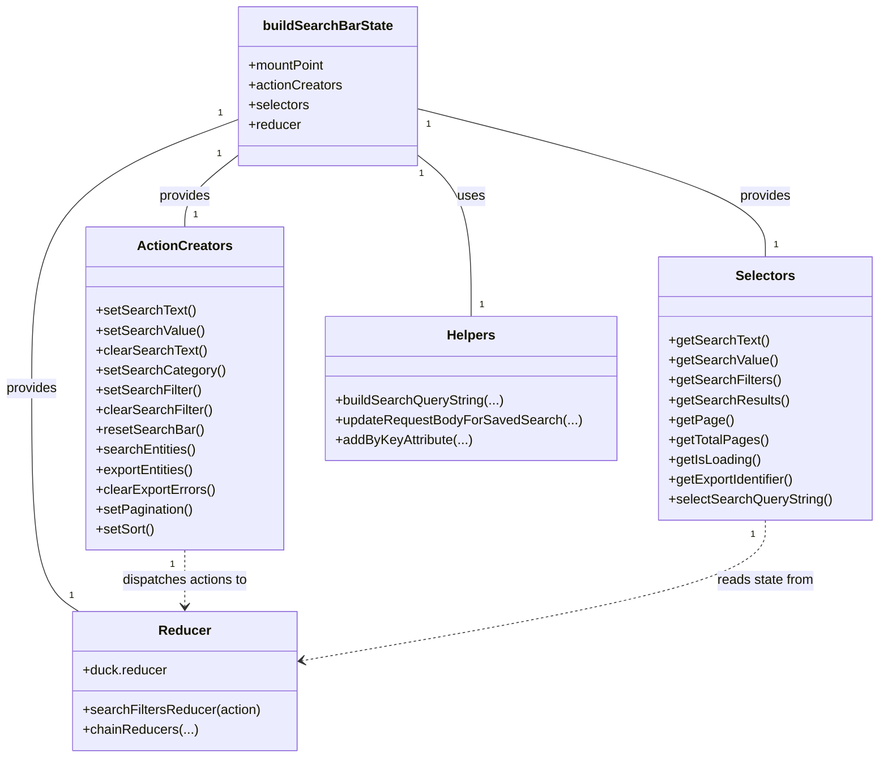
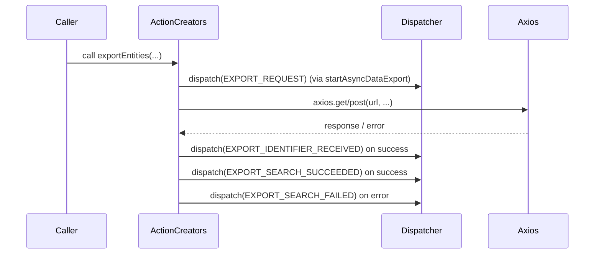

# Diagram: web/portal/src/components/search-bar/SearchBarStateBuilder.js


> Auto-generated by Obscura crawlers

## Diagram 1



### SVG

<svg id="container" width="1041.8828125" xmlns="http://www.w3.org/2000/svg" class="classDiagram" height="914" viewBox="0 0 1041.8828125 914" role="graphics-document document" aria-roledescription="class"><style>#container{font-family:"trebuchet ms",verdana,arial,sans-serif;font-size:16px;fill:#333;}@keyframes edge-animation-frame{from{stroke-dashoffset:0;}}@keyframes dash{to{stroke-dashoffset:0;}}#container .edge-animation-slow{stroke-dasharray:9,5!important;stroke-dashoffset:900;animation:dash 50s linear infinite;stroke-linecap:round;}#container .edge-animation-fast{stroke-dasharray:9,5!important;stroke-dashoffset:900;animation:dash 20s linear infinite;stroke-linecap:round;}#container .error-icon{fill:#552222;}#container .error-text{fill:#552222;stroke:#552222;}#container .edge-thickness-normal{stroke-width:1px;}#container .edge-thickness-thick{stroke-width:3.5px;}#container .edge-pattern-solid{stroke-dasharray:0;}#container .edge-thickness-invisible{stroke-width:0;fill:none;}#container .edge-pattern-dashed{stroke-dasharray:3;}#container .edge-pattern-dotted{stroke-dasharray:2;}#container .marker{fill:#333333;stroke:#333333;}#container .marker.cross{stroke:#333333;}#container svg{font-family:"trebuchet ms",verdana,arial,sans-serif;font-size:16px;}#container p{margin:0;}#container g.classGroup text{fill:#9370DB;stroke:none;font-family:"trebuchet ms",verdana,arial,sans-serif;font-size:10px;}#container g.classGroup text .title{font-weight:bolder;}#container .nodeLabel,#container .edgeLabel{color:#131300;}#container .edgeLabel .label rect{fill:#ECECFF;}#container .label text{fill:#131300;}#container .labelBkg{background:#ECECFF;}#container .edgeLabel .label span{background:#ECECFF;}#container .classTitle{font-weight:bolder;}#container .node rect,#container .node circle,#container .node ellipse,#container .node polygon,#container .node path{fill:#ECECFF;stroke:#9370DB;stroke-width:1px;}#container .divider{stroke:#9370DB;stroke-width:1;}#container g.clickable{cursor:pointer;}#container g.classGroup rect{fill:#ECECFF;stroke:#9370DB;}#container g.classGroup line{stroke:#9370DB;stroke-width:1;}#container .classLabel .box{stroke:none;stroke-width:0;fill:#ECECFF;opacity:0.5;}#container .classLabel .label{fill:#9370DB;font-size:10px;}#container .relation{stroke:#333333;stroke-width:1;fill:none;}#container .dashed-line{stroke-dasharray:3;}#container .dotted-line{stroke-dasharray:1 2;}#container #compositionStart,#container .composition{fill:#333333!important;stroke:#333333!important;stroke-width:1;}#container #compositionEnd,#container .composition{fill:#333333!important;stroke:#333333!important;stroke-width:1;}#container #dependencyStart,#container .dependency{fill:#333333!important;stroke:#333333!important;stroke-width:1;}#container #dependencyStart,#container .dependency{fill:#333333!important;stroke:#333333!important;stroke-width:1;}#container #extensionStart,#container .extension{fill:transparent!important;stroke:#333333!important;stroke-width:1;}#container #extensionEnd,#container .extension{fill:transparent!important;stroke:#333333!important;stroke-width:1;}#container #aggregationStart,#container .aggregation{fill:transparent!important;stroke:#333333!important;stroke-width:1;}#container #aggregationEnd,#container .aggregation{fill:transparent!important;stroke:#333333!important;stroke-width:1;}#container #lollipopStart,#container .lollipop{fill:#ECECFF!important;stroke:#333333!important;stroke-width:1;}#container #lollipopEnd,#container .lollipop{fill:#ECECFF!important;stroke:#333333!important;stroke-width:1;}#container .edgeTerminals{font-size:11px;line-height:initial;}#container .classTitleText{text-anchor:middle;font-size:18px;fill:#333;}#container .label-icon{display:inline-block;height:1em;overflow:visible;vertical-align:-0.125em;}#container .node .label-icon path{fill:currentColor;stroke:revert;stroke-width:revert;}#container :root{--mermaid-font-family:"trebuchet ms",verdana,arial,sans-serif;}</style><g><defs><marker id="container_class-aggregationStart" class="marker aggregation class" refX="18" refY="7" markerWidth="190" markerHeight="240" orient="auto"><path d="M 18,7 L9,13 L1,7 L9,1 Z"></path></marker></defs><defs><marker id="container_class-aggregationEnd" class="marker aggregation class" refX="1" refY="7" markerWidth="20" markerHeight="28" orient="auto"><path d="M 18,7 L9,13 L1,7 L9,1 Z"></path></marker></defs><defs><marker id="container_class-extensionStart" class="marker extension class" refX="18" refY="7" markerWidth="190" markerHeight="240" orient="auto"><path d="M 1,7 L18,13 V 1 Z"></path></marker></defs><defs><marker id="container_class-extensionEnd" class="marker extension class" refX="1" refY="7" markerWidth="20" markerHeight="28" orient="auto"><path d="M 1,1 V 13 L18,7 Z"></path></marker></defs><defs><marker id="container_class-compositionStart" class="marker composition class" refX="18" refY="7" markerWidth="190" markerHeight="240" orient="auto"><path d="M 18,7 L9,13 L1,7 L9,1 Z"></path></marker></defs><defs><marker id="container_class-compositionEnd" class="marker composition class" refX="1" refY="7" markerWidth="20" markerHeight="28" orient="auto"><path d="M 18,7 L9,13 L1,7 L9,1 Z"></path></marker></defs><defs><marker id="container_class-dependencyStart" class="marker dependency class" refX="6" refY="7" markerWidth="190" markerHeight="240" orient="auto"><path d="M 5,7 L9,13 L1,7 L9,1 Z"></path></marker></defs><defs><marker id="container_class-dependencyEnd" class="marker dependency class" refX="13" refY="7" markerWidth="20" markerHeight="28" orient="auto"><path d="M 18,7 L9,13 L14,7 L9,1 Z"></path></marker></defs><defs><marker id="container_class-lollipopStart" class="marker lollipop class" refX="13" refY="7" markerWidth="190" markerHeight="240" orient="auto"><circle stroke="black" fill="transparent" cx="7" cy="7" r="6"></circle></marker></defs><defs><marker id="container_class-lollipopEnd" class="marker lollipop class" refX="1" refY="7" markerWidth="190" markerHeight="240" orient="auto"><circle stroke="black" fill="transparent" cx="7" cy="7" r="6"></circle></marker></defs><g class="root"><g class="clusters"></g><g class="edgePaths"><path d="M283.061,187.809L272.673,196.007C262.285,204.206,241.51,220.603,231.122,234.968C220.734,249.333,220.734,261.667,220.734,267.833L220.734,274" id="id_buildSearchBarState_ActionCreators_1" class="edge-thickness-normal edge-pattern-solid relation" style=";;;" data-edge="true" data-et="edge" data-id="id_buildSearchBarState_ActionCreators_1" data-points="W3sieCI6MjgzLjA2MDU0Njg3NSwieSI6MTg3LjgwODg1MjY3NTYyMjEyfSx7IngiOjIyMC43MzQzNzUsInkiOjIzN30seyJ4IjoyMjAuNzM0Mzc1LCJ5IjoyNzR9XQ=="></path><path d="M495.436,131.289L563.993,148.907C632.551,166.526,769.666,201.763,838.224,231.548C906.781,261.333,906.781,285.667,906.781,297.833L906.781,310" id="id_buildSearchBarState_Selectors_2" class="edge-thickness-normal edge-pattern-solid relation" style=";;;" data-edge="true" data-et="edge" data-id="id_buildSearchBarState_Selectors_2" data-points="W3sieCI6NDk1LjQzNTU0Njg3NSwieSI6MTMxLjI4ODk0OTYwNjk0NzAzfSx7IngiOjkwNi43ODEyNSwieSI6MjM3fSx7IngiOjkwNi43ODEyNSwieSI6MzEwfV0="></path><path d="M283.061,144.359L242.436,159.799C201.811,175.239,120.562,206.12,79.937,260.226C39.313,314.333,39.313,391.667,39.313,469C39.313,546.333,39.313,623.667,48.559,668.5C57.805,713.333,76.297,725.667,85.543,731.833L94.789,738" id="id_buildSearchBarState_Reducer_3" class="edge-thickness-normal edge-pattern-solid relation" style=";;;" data-edge="true" data-et="edge" data-id="id_buildSearchBarState_Reducer_3" data-points="W3sieCI6MjgzLjA2MDU0Njg3NSwieSI6MTQ0LjM1ODY4MjEyMzM4MjF9LHsieCI6MzkuMzEyNSwieSI6MjM3fSx7IngiOjM5LjMxMjUsInkiOjQ2OX0seyJ4IjozOS4zMTI1LCJ5Ijo3MDF9LHsieCI6OTQuNzg4NjEwNTM3MTkwMDgsInkiOjczOH1d"></path><path d="M495.436,187.809L505.823,196.007C516.211,204.206,536.986,220.603,547.374,252.968C557.762,285.333,557.762,333.667,557.762,357.833L557.762,382" id="id_buildSearchBarState_Helpers_4" class="edge-thickness-normal edge-pattern-solid relation" style=";;;" data-edge="true" data-et="edge" data-id="id_buildSearchBarState_Helpers_4" data-points="W3sieCI6NDk1LjQzNTU0Njg3NSwieSI6MTg3LjgwODg1MjY3NTYyMjEyfSx7IngiOjU1Ny43NjE3MTg3NSwieSI6MjM3fSx7IngiOjU1Ny43NjE3MTg3NSwieSI6MzgyfV0="></path><path d="M220.734,664L220.734,670.167C220.734,676.333,220.734,688.667,220.734,700C220.734,711.333,220.734,721.667,220.734,726.833L220.734,732" id="id_ActionCreators_Reducer_5" class="edge-thickness-normal edge-pattern-dashed relation" style=";;;" data-edge="true" data-et="edge" data-id="id_ActionCreators_Reducer_5" data-points="W3sieCI6MjIwLjczNDM3NSwieSI6NjY0fSx7IngiOjIyMC43MzQzNzUsInkiOjcwMX0seyJ4IjoyMjAuNzM0Mzc1LCJ5Ijo3Mzh9XQ==" marker-end="url(#container_class-dependencyEnd)"></path><path d="M906.781,628L906.781,640.167C906.781,652.333,906.781,676.667,815.8,704.88C724.819,733.093,542.856,765.187,451.875,781.233L360.893,797.28" id="id_Selectors_Reducer_6" class="edge-thickness-normal edge-pattern-dashed relation" style=";;;" data-edge="true" data-et="edge" data-id="id_Selectors_Reducer_6" data-points="W3sieCI6OTA2Ljc4MTI1LCJ5Ijo2Mjh9LHsieCI6OTA2Ljc4MTI1LCJ5Ijo3MDF9LHsieCI6MzU0Ljk4NDM3NSwieSI6Nzk4LjMyMTk1MzIxOTMwNDR9XQ==" marker-end="url(#container_class-dependencyEnd)"></path></g><g class="edgeLabels"><g class="edgeLabel" transform="translate(220.734375, 237)"><g class="label" data-id="id_buildSearchBarState_ActionCreators_1" transform="translate(-31.3125, -12)"><foreignObject width="62.625" height="24"><div xmlns="http://www.w3.org/1999/xhtml" class="labelBkg" style="display: table-cell; white-space: nowrap; line-height: 1.5; max-width: 200px; text-align: center;"><span class="edgeLabel"><p>provides</p></span></div></foreignObject></g></g><g class="edgeLabel" transform="translate(906.78125, 237)"><g class="label" data-id="id_buildSearchBarState_Selectors_2" transform="translate(-31.3125, -12)"><foreignObject width="62.625" height="24"><div xmlns="http://www.w3.org/1999/xhtml" class="labelBkg" style="display: table-cell; white-space: nowrap; line-height: 1.5; max-width: 200px; text-align: center;"><span class="edgeLabel"><p>provides</p></span></div></foreignObject></g></g><g class="edgeLabel" transform="translate(39.3125, 469)"><g class="label" data-id="id_buildSearchBarState_Reducer_3" transform="translate(-31.3125, -12)"><foreignObject width="62.625" height="24"><div xmlns="http://www.w3.org/1999/xhtml" class="labelBkg" style="display: table-cell; white-space: nowrap; line-height: 1.5; max-width: 200px; text-align: center;"><span class="edgeLabel"><p>provides</p></span></div></foreignObject></g></g><g class="edgeLabel" transform="translate(557.76171875, 237)"><g class="label" data-id="id_buildSearchBarState_Helpers_4" transform="translate(-16.4921875, -12)"><foreignObject width="32.984375" height="24"><div xmlns="http://www.w3.org/1999/xhtml" class="labelBkg" style="display: table-cell; white-space: nowrap; line-height: 1.5; max-width: 200px; text-align: center;"><span class="edgeLabel"><p>uses</p></span></div></foreignObject></g></g><g class="edgeLabel" transform="translate(220.734375, 701)"><g class="label" data-id="id_ActionCreators_Reducer_5" transform="translate(-77.2734375, -12)"><foreignObject width="154.546875" height="24"><div xmlns="http://www.w3.org/1999/xhtml" class="labelBkg" style="display: table-cell; white-space: nowrap; line-height: 1.5; max-width: 200px; text-align: center;"><span class="edgeLabel"><p>dispatches actions to</p></span></div></foreignObject></g></g><g class="edgeLabel" transform="translate(906.78125, 701)"><g class="label" data-id="id_Selectors_Reducer_6" transform="translate(-59.3515625, -12)"><foreignObject width="118.703125" height="24"><div xmlns="http://www.w3.org/1999/xhtml" class="labelBkg" style="display: table-cell; white-space: nowrap; line-height: 1.5; max-width: 200px; text-align: center;"><span class="edgeLabel"><p>reads state from</p></span></div></foreignObject></g></g><g class="edgeTerminals" transform="translate(260.03055988789856, 186.87626520475206)"><g class="inner" transform="translate(0, 0)"><foreignObject style="width: 9px; height: 12px;"><div xmlns="http://www.w3.org/1999/xhtml" style="display: inline-block; padding-right: 1px; white-space: nowrap;"><span class="edgeLabel">1</span></div></foreignObject></g></g><g class="edgeTerminals" transform="translate(508.6512943618244, 150.17264530656024)"><g class="inner" transform="translate(0, 0)"><foreignObject style="width: 9px; height: 12px;"><div xmlns="http://www.w3.org/1999/xhtml" style="display: inline-block; padding-right: 1px; white-space: nowrap;"><span class="edgeLabel">1</span></div></foreignObject></g></g><g class="edgeTerminals" transform="translate(261.3730915189753, 136.55456247621876)"><g class="inner" transform="translate(0, 0)"><foreignObject style="width: 9px; height: 12px;"><div xmlns="http://www.w3.org/1999/xhtml" style="display: inline-block; padding-right: 1px; white-space: nowrap;"><span class="edgeLabel">1</span></div></foreignObject></g></g><g class="edgeTerminals" transform="translate(499.8794011905323, 210.42526849897845)"><g class="inner" transform="translate(0, 0)"><foreignObject style="width: 9px; height: 12px;"><div xmlns="http://www.w3.org/1999/xhtml" style="display: inline-block; padding-right: 1px; white-space: nowrap;"><span class="edgeLabel">1</span></div></foreignObject></g></g><g class="edgeTerminals" transform="translate(205.73437750000014, 681.5000021428572)"><g class="inner" transform="translate(0, 0)"><foreignObject style="width: 9px; height: 12px;"><div xmlns="http://www.w3.org/1999/xhtml" style="display: inline-block; padding-right: 1px; white-space: nowrap;"><span class="edgeLabel">1</span></div></foreignObject></g></g><g class="edgeTerminals" transform="translate(891.78125, 645.5)"><g class="inner" transform="translate(0, 0)"><foreignObject style="width: 9px; height: 12px;"><div xmlns="http://www.w3.org/1999/xhtml" style="display: inline-block; padding-right: 1px; white-space: nowrap;"><span class="edgeLabel">1</span></div></foreignObject></g></g><g class="edgeTerminals" transform="translate(230.73437749999985, 251.5000021428571)"><g class="inner" transform="translate(0, 0)"></g><foreignObject style="width: 9px; height: 12px;"><div xmlns="http://www.w3.org/1999/xhtml" style="display: inline-block; padding-right: 1px; white-space: nowrap;"><span class="edgeLabel">1</span></div></foreignObject></g><g class="edgeTerminals" transform="translate(916.78125, 287.5)"><g class="inner" transform="translate(0, 0)"></g><foreignObject style="width: 9px; height: 12px;"><div xmlns="http://www.w3.org/1999/xhtml" style="display: inline-block; padding-right: 1px; white-space: nowrap;"><span class="edgeLabel">1</span></div></foreignObject></g><g class="edgeTerminals" transform="translate(83.55264239229588, 710.8107537275303)"><g class="inner" transform="translate(0, 0)"></g><foreignObject style="width: 9px; height: 12px;"><div xmlns="http://www.w3.org/1999/xhtml" style="display: inline-block; padding-right: 1px; white-space: nowrap;"><span class="edgeLabel">1</span></div></foreignObject></g><g class="edgeTerminals" transform="translate(567.761719375, 359.50000053571426)"><g class="inner" transform="translate(0, 0)"></g><foreignObject style="width: 9px; height: 12px;"><div xmlns="http://www.w3.org/1999/xhtml" style="display: inline-block; padding-right: 1px; white-space: nowrap;"><span class="edgeLabel">1</span></div></foreignObject></g></g><g class="nodes"><g class="node default" id="classId-buildSearchBarState-0" transform="translate(389.248046875, 104)"><g class="basic label-container"><path d="M-106.1875 -96 L106.1875 -96 L106.1875 96 L-106.1875 96" stroke="none" stroke-width="0" fill="#ECECFF" style=""></path><path d="M-106.1875 -96 C-63.18588617859703 -96, -20.18427235719406 -96, 106.1875 -96 M-106.1875 -96 C-22.63875080433074 -96, 60.90999839133852 -96, 106.1875 -96 M106.1875 -96 C106.1875 -45.23318138785705, 106.1875 5.533637224285897, 106.1875 96 M106.1875 -96 C106.1875 -41.263469852902745, 106.1875 13.47306029419451, 106.1875 96 M106.1875 96 C36.455713761970316 96, -33.27607247605937 96, -106.1875 96 M106.1875 96 C43.60801462946314 96, -18.971470741073716 96, -106.1875 96 M-106.1875 96 C-106.1875 34.22205197922472, -106.1875 -27.555896041550554, -106.1875 -96 M-106.1875 96 C-106.1875 29.551366318509963, -106.1875 -36.897267362980074, -106.1875 -96" stroke="#9370DB" stroke-width="1.3" fill="none" stroke-dasharray="0 0" style=""></path></g><g class="annotation-group text" transform="translate(0, -72)"></g><g class="label-group text" transform="translate(-75.296875, -72)"><g class="label" style="font-weight: bolder" transform="translate(0,-12)"><foreignObject width="150.59375" height="24"><div xmlns="http://www.w3.org/1999/xhtml" style="display: table-cell; white-space: nowrap; line-height: 1.5; max-width: 198px; text-align: center;"><span class="nodeLabel markdown-node-label" style=""><p>buildSearchBarState</p></span></div></foreignObject></g></g><g class="members-group text" transform="translate(-94.1875, -24)"><g class="label" style="" transform="translate(0,-12)"><foreignObject width="93.34375" height="24"><div xmlns="http://www.w3.org/1999/xhtml" style="display: table-cell; white-space: nowrap; line-height: 1.5; max-width: 151px; text-align: center;"><span class="nodeLabel markdown-node-label" style=""><p>+mountPoint</p></span></div></foreignObject></g><g class="label" style="" transform="translate(0,12)"><foreignObject width="113.078125" height="24"><div xmlns="http://www.w3.org/1999/xhtml" style="display: table-cell; white-space: nowrap; line-height: 1.5; max-width: 170px; text-align: center;"><span class="nodeLabel markdown-node-label" style=""><p>+actionCreators</p></span></div></foreignObject></g><g class="label" style="" transform="translate(0,36)"><foreignObject width="73.453125" height="24"><div xmlns="http://www.w3.org/1999/xhtml" style="display: table-cell; white-space: nowrap; line-height: 1.5; max-width: 131px; text-align: center;"><span class="nodeLabel markdown-node-label" style=""><p>+selectors</p></span></div></foreignObject></g><g class="label" style="" transform="translate(0,60)"><foreignObject width="63.515625" height="24"><div xmlns="http://www.w3.org/1999/xhtml" style="display: table-cell; white-space: nowrap; line-height: 1.5; max-width: 122px; text-align: center;"><span class="nodeLabel markdown-node-label" style=""><p>+reducer</p></span></div></foreignObject></g></g><g class="methods-group text" transform="translate(-94.1875, 96)"></g><g class="divider" style=""><path d="M-106.1875 -48 C-40.821076726753176 -48, 24.545346546493647 -48, 106.1875 -48 M-106.1875 -48 C-38.94460434769492 -48, 28.29829130461016 -48, 106.1875 -48" stroke="#9370DB" stroke-width="1.3" fill="none" stroke-dasharray="0 0" style=""></path></g><g class="divider" style=""><path d="M-106.1875 72 C-61.73865712476136 72, -17.28981424952272 72, 106.1875 72 M-106.1875 72 C-60.840925001973105 72, -15.49435000394621 72, 106.1875 72" stroke="#9370DB" stroke-width="1.3" fill="none" stroke-dasharray="0 0" style=""></path></g></g><g class="node default" id="classId-ActionCreators-1" transform="translate(220.734375, 469)"><g class="basic label-container"><path d="M-115.109375 -195 L115.109375 -195 L115.109375 195 L-115.109375 195" stroke="none" stroke-width="0" fill="#ECECFF" style=""></path><path d="M-115.109375 -195 C-23.981076155048285 -195, 67.14722268990343 -195, 115.109375 -195 M-115.109375 -195 C-44.62915274415562 -195, 25.851069511688763 -195, 115.109375 -195 M115.109375 -195 C115.109375 -63.063876383920956, 115.109375 68.87224723215809, 115.109375 195 M115.109375 -195 C115.109375 -105.21124030925134, 115.109375 -15.422480618502675, 115.109375 195 M115.109375 195 C65.56236657793082 195, 16.01535815586162 195, -115.109375 195 M115.109375 195 C48.018422440869614 195, -19.072530118260772 195, -115.109375 195 M-115.109375 195 C-115.109375 66.98595082458436, -115.109375 -61.02809835083127, -115.109375 -195 M-115.109375 195 C-115.109375 39.05092244016785, -115.109375 -116.8981551196643, -115.109375 -195" stroke="#9370DB" stroke-width="1.3" fill="none" stroke-dasharray="0 0" style=""></path></g><g class="annotation-group text" transform="translate(0, -171)"></g><g class="label-group text" transform="translate(-53.96875, -171)"><g class="label" style="font-weight: bolder" transform="translate(0,-12)"><foreignObject width="107.9375" height="24"><div xmlns="http://www.w3.org/1999/xhtml" style="display: table-cell; white-space: nowrap; line-height: 1.5; max-width: 156px; text-align: center;"><span class="nodeLabel markdown-node-label" style=""><p>ActionCreators</p></span></div></foreignObject></g></g><g class="members-group text" transform="translate(-103.109375, -123)"></g><g class="methods-group text" transform="translate(-103.109375, -93)"><g class="label" style="" transform="translate(0,-12)"><foreignObject width="118.53125" height="24"><div xmlns="http://www.w3.org/1999/xhtml" style="display: table-cell; white-space: nowrap; line-height: 1.5; max-width: 176px; text-align: center;"><span class="nodeLabel markdown-node-label" style=""><p>+setSearchText()</p></span></div></foreignObject></g><g class="label" style="" transform="translate(0,12)"><foreignObject width="128.546875" height="24"><div xmlns="http://www.w3.org/1999/xhtml" style="display: table-cell; white-space: nowrap; line-height: 1.5; max-width: 186px; text-align: center;"><span class="nodeLabel markdown-node-label" style=""><p>+setSearchValue()</p></span></div></foreignObject></g><g class="label" style="" transform="translate(0,36)"><foreignObject width="132.265625" height="24"><div xmlns="http://www.w3.org/1999/xhtml" style="display: table-cell; white-space: nowrap; line-height: 1.5; max-width: 190px; text-align: center;"><span class="nodeLabel markdown-node-label" style=""><p>+clearSearchText()</p></span></div></foreignObject></g><g class="label" style="" transform="translate(0,60)"><foreignObject width="152.25" height="24"><div xmlns="http://www.w3.org/1999/xhtml" style="display: table-cell; white-space: nowrap; line-height: 1.5; max-width: 210px; text-align: center;"><span class="nodeLabel markdown-node-label" style=""><p>+setSearchCategory()</p></span></div></foreignObject></g><g class="label" style="" transform="translate(0,84)"><foreignObject width="125.953125" height="24"><div xmlns="http://www.w3.org/1999/xhtml" style="display: table-cell; white-space: nowrap; line-height: 1.5; max-width: 183px; text-align: center;"><span class="nodeLabel markdown-node-label" style=""><p>+setSearchFilter()</p></span></div></foreignObject></g><g class="label" style="" transform="translate(0,108)"><foreignObject width="139.6875" height="24"><div xmlns="http://www.w3.org/1999/xhtml" style="display: table-cell; white-space: nowrap; line-height: 1.5; max-width: 197px; text-align: center;"><span class="nodeLabel markdown-node-label" style=""><p>+clearSearchFilter()</p></span></div></foreignObject></g><g class="label" style="" transform="translate(0,132)"><foreignObject width="128.0625" height="24"><div xmlns="http://www.w3.org/1999/xhtml" style="display: table-cell; white-space: nowrap; line-height: 1.5; max-width: 185px; text-align: center;"><span class="nodeLabel markdown-node-label" style=""><p>+resetSearchBar()</p></span></div></foreignObject></g><g class="label" style="" transform="translate(0,156)"><foreignObject width="120.359375" height="24"><div xmlns="http://www.w3.org/1999/xhtml" style="display: table-cell; white-space: nowrap; line-height: 1.5; max-width: 178px; text-align: center;"><span class="nodeLabel markdown-node-label" style=""><p>+searchEntities()</p></span></div></foreignObject></g><g class="label" style="" transform="translate(0,180)"><foreignObject width="120.046875" height="24"><div xmlns="http://www.w3.org/1999/xhtml" style="display: table-cell; white-space: nowrap; line-height: 1.5; max-width: 177px; text-align: center;"><span class="nodeLabel markdown-node-label" style=""><p>+exportEntities()</p></span></div></foreignObject></g><g class="label" style="" transform="translate(0,204)"><foreignObject width="144.203125" height="24"><div xmlns="http://www.w3.org/1999/xhtml" style="display: table-cell; white-space: nowrap; line-height: 1.5; max-width: 202px; text-align: center;"><span class="nodeLabel markdown-node-label" style=""><p>+clearExportErrors()</p></span></div></foreignObject></g><g class="label" style="" transform="translate(0,228)"><foreignObject width="117.203125" height="24"><div xmlns="http://www.w3.org/1999/xhtml" style="display: table-cell; white-space: nowrap; line-height: 1.5; max-width: 175px; text-align: center;"><span class="nodeLabel markdown-node-label" style=""><p>+setPagination()</p></span></div></foreignObject></g><g class="label" style="" transform="translate(0,252)"><foreignObject width="70.34375" height="24"><div xmlns="http://www.w3.org/1999/xhtml" style="display: table-cell; white-space: nowrap; line-height: 1.5; max-width: 128px; text-align: center;"><span class="nodeLabel markdown-node-label" style=""><p>+setSort()</p></span></div></foreignObject></g></g><g class="divider" style=""><path d="M-115.109375 -147 C-66.71435567991767 -147, -18.319336359835347 -147, 115.109375 -147 M-115.109375 -147 C-66.69372349790294 -147, -18.278071995805888 -147, 115.109375 -147" stroke="#9370DB" stroke-width="1.3" fill="none" stroke-dasharray="0 0" style=""></path></g><g class="divider" style=""><path d="M-115.109375 -123 C-66.11699103766665 -123, -17.124607075333316 -123, 115.109375 -123 M-115.109375 -123 C-51.27133774481227 -123, 12.566699510375457 -123, 115.109375 -123" stroke="#9370DB" stroke-width="1.3" fill="none" stroke-dasharray="0 0" style=""></path></g></g><g class="node default" id="classId-Selectors-2" transform="translate(906.78125, 469)"><g class="basic label-container"><path d="M-127.1015625 -159 L127.1015625 -159 L127.1015625 159 L-127.1015625 159" stroke="none" stroke-width="0" fill="#ECECFF" style=""></path><path d="M-127.1015625 -159 C-32.02454830166511 -159, 63.05246589666979 -159, 127.1015625 -159 M-127.1015625 -159 C-50.3468197609061 -159, 26.4079229781878 -159, 127.1015625 -159 M127.1015625 -159 C127.1015625 -51.346702618264516, 127.1015625 56.30659476347097, 127.1015625 159 M127.1015625 -159 C127.1015625 -91.39810743216682, 127.1015625 -23.79621486433365, 127.1015625 159 M127.1015625 159 C55.040472192075285 159, -17.02061811584943 159, -127.1015625 159 M127.1015625 159 C52.43598939630233 159, -22.229583707395335 159, -127.1015625 159 M-127.1015625 159 C-127.1015625 49.925800153964346, -127.1015625 -59.14839969207131, -127.1015625 -159 M-127.1015625 159 C-127.1015625 43.78762898692614, -127.1015625 -71.42474202614773, -127.1015625 -159" stroke="#9370DB" stroke-width="1.3" fill="none" stroke-dasharray="0 0" style=""></path></g><g class="annotation-group text" transform="translate(0, -135)"></g><g class="label-group text" transform="translate(-34.171875, -135)"><g class="label" style="font-weight: bolder" transform="translate(0,-12)"><foreignObject width="68.34375" height="24"><div xmlns="http://www.w3.org/1999/xhtml" style="display: table-cell; white-space: nowrap; line-height: 1.5; max-width: 117px; text-align: center;"><span class="nodeLabel markdown-node-label" style=""><p>Selectors</p></span></div></foreignObject></g></g><g class="members-group text" transform="translate(-115.1015625, -87)"></g><g class="methods-group text" transform="translate(-115.1015625, -57)"><g class="label" style="" transform="translate(0,-12)"><foreignObject width="119.125" height="24"><div xmlns="http://www.w3.org/1999/xhtml" style="display: table-cell; white-space: nowrap; line-height: 1.5; max-width: 176px; text-align: center;"><span class="nodeLabel markdown-node-label" style=""><p>+getSearchText()</p></span></div></foreignObject></g><g class="label" style="" transform="translate(0,12)"><foreignObject width="129.140625" height="24"><div xmlns="http://www.w3.org/1999/xhtml" style="display: table-cell; white-space: nowrap; line-height: 1.5; max-width: 187px; text-align: center;"><span class="nodeLabel markdown-node-label" style=""><p>+getSearchValue()</p></span></div></foreignObject></g><g class="label" style="" transform="translate(0,36)"><foreignObject width="133.78125" height="24"><div xmlns="http://www.w3.org/1999/xhtml" style="display: table-cell; white-space: nowrap; line-height: 1.5; max-width: 191px; text-align: center;"><span class="nodeLabel markdown-node-label" style=""><p>+getSearchFilters()</p></span></div></foreignObject></g><g class="label" style="" transform="translate(0,60)"><foreignObject width="142.5" height="24"><div xmlns="http://www.w3.org/1999/xhtml" style="display: table-cell; white-space: nowrap; line-height: 1.5; max-width: 200px; text-align: center;"><span class="nodeLabel markdown-node-label" style=""><p>+getSearchResults()</p></span></div></foreignObject></g><g class="label" style="" transform="translate(0,84)"><foreignObject width="74.65625" height="24"><div xmlns="http://www.w3.org/1999/xhtml" style="display: table-cell; white-space: nowrap; line-height: 1.5; max-width: 132px; text-align: center;"><span class="nodeLabel markdown-node-label" style=""><p>+getPage()</p></span></div></foreignObject></g><g class="label" style="" transform="translate(0,108)"><foreignObject width="117.765625" height="24"><div xmlns="http://www.w3.org/1999/xhtml" style="display: table-cell; white-space: nowrap; line-height: 1.5; max-width: 175px; text-align: center;"><span class="nodeLabel markdown-node-label" style=""><p>+getTotalPages()</p></span></div></foreignObject></g><g class="label" style="" transform="translate(0,132)"><foreignObject width="110.34375" height="24"><div xmlns="http://www.w3.org/1999/xhtml" style="display: table-cell; white-space: nowrap; line-height: 1.5; max-width: 168px; text-align: center;"><span class="nodeLabel markdown-node-label" style=""><p>+getIsLoading()</p></span></div></foreignObject></g><g class="label" style="" transform="translate(0,156)"><foreignObject width="154.8125" height="24"><div xmlns="http://www.w3.org/1999/xhtml" style="display: table-cell; white-space: nowrap; line-height: 1.5; max-width: 212px; text-align: center;"><span class="nodeLabel markdown-node-label" style=""><p>+getExportIdentifier()</p></span></div></foreignObject></g><g class="label" style="" transform="translate(0,180)"><foreignObject width="196.03125" height="24"><div xmlns="http://www.w3.org/1999/xhtml" style="display: table-cell; white-space: nowrap; line-height: 1.5; max-width: 253px; text-align: center;"><span class="nodeLabel markdown-node-label" style=""><p>+selectSearchQueryString()</p></span></div></foreignObject></g></g><g class="divider" style=""><path d="M-127.1015625 -111 C-72.53984315464709 -111, -17.978123809294175 -111, 127.1015625 -111 M-127.1015625 -111 C-39.24204934022367 -111, 48.617463819552654 -111, 127.1015625 -111" stroke="#9370DB" stroke-width="1.3" fill="none" stroke-dasharray="0 0" style=""></path></g><g class="divider" style=""><path d="M-127.1015625 -87 C-57.91601082009936 -87, 11.269540859801282 -87, 127.1015625 -87 M-127.1015625 -87 C-35.4928386806279 -87, 56.115885138744204 -87, 127.1015625 -87" stroke="#9370DB" stroke-width="1.3" fill="none" stroke-dasharray="0 0" style=""></path></g></g><g class="node default" id="classId-Reducer-3" transform="translate(220.734375, 822)"><g class="basic label-container"><path d="M-134.25 -84 L134.25 -84 L134.25 84 L-134.25 84" stroke="none" stroke-width="0" fill="#ECECFF" style=""></path><path d="M-134.25 -84 C-59.89956326010066 -84, 14.450873479798673 -84, 134.25 -84 M-134.25 -84 C-61.20409219833398 -84, 11.841815603332037 -84, 134.25 -84 M134.25 -84 C134.25 -29.843227733903987, 134.25 24.313544532192026, 134.25 84 M134.25 -84 C134.25 -36.04179995710609, 134.25 11.916400085787814, 134.25 84 M134.25 84 C36.58449663333481 84, -61.08100673333038 84, -134.25 84 M134.25 84 C54.145638520979716 84, -25.958722958040568 84, -134.25 84 M-134.25 84 C-134.25 18.60603749324072, -134.25 -46.78792501351856, -134.25 -84 M-134.25 84 C-134.25 45.318595503247884, -134.25 6.637191006495769, -134.25 -84" stroke="#9370DB" stroke-width="1.3" fill="none" stroke-dasharray="0 0" style=""></path></g><g class="annotation-group text" transform="translate(0, -60)"></g><g class="label-group text" transform="translate(-29.90625, -60)"><g class="label" style="font-weight: bolder" transform="translate(0,-12)"><foreignObject width="59.8125" height="24"><div xmlns="http://www.w3.org/1999/xhtml" style="display: table-cell; white-space: nowrap; line-height: 1.5; max-width: 110px; text-align: center;"><span class="nodeLabel markdown-node-label" style=""><p>Reducer</p></span></div></foreignObject></g></g><g class="members-group text" transform="translate(-122.25, -12)"><g class="label" style="" transform="translate(0,-12)"><foreignObject width="102.140625" height="24"><div xmlns="http://www.w3.org/1999/xhtml" style="display: table-cell; white-space: nowrap; line-height: 1.5; max-width: 160px; text-align: center;"><span class="nodeLabel markdown-node-label" style=""><p>+duck.reducer</p></span></div></foreignObject></g></g><g class="methods-group text" transform="translate(-122.25, 36)"><g class="label" style="" transform="translate(0,-12)"><foreignObject width="214.59375" height="24"><div xmlns="http://www.w3.org/1999/xhtml" style="display: table-cell; white-space: nowrap; line-height: 1.5; max-width: 272px; text-align: center;"><span class="nodeLabel markdown-node-label" style=""><p>+searchFiltersReducer(action)</p></span></div></foreignObject></g><g class="label" style="" transform="translate(0,12)"><foreignObject width="135.984375" height="24"><div xmlns="http://www.w3.org/1999/xhtml" style="display: table-cell; white-space: nowrap; line-height: 1.5; max-width: 193px; text-align: center;"><span class="nodeLabel markdown-node-label" style=""><p>+chainReducers(...)</p></span></div></foreignObject></g></g><g class="divider" style=""><path d="M-134.25 -36 C-55.294531437472585 -36, 23.66093712505483 -36, 134.25 -36 M-134.25 -36 C-50.22868126428672 -36, 33.79263747142656 -36, 134.25 -36" stroke="#9370DB" stroke-width="1.3" fill="none" stroke-dasharray="0 0" style=""></path></g><g class="divider" style=""><path d="M-134.25 12 C-58.97672169702899 12, 16.296556605942015 12, 134.25 12 M-134.25 12 C-79.66195453414491 12, -25.073909068289822 12, 134.25 12" stroke="#9370DB" stroke-width="1.3" fill="none" stroke-dasharray="0 0" style=""></path></g></g><g class="node default" id="classId-Helpers-4" transform="translate(557.76171875, 469)"><g class="basic label-container"><path d="M-171.91796875 -87 L171.91796875 -87 L171.91796875 87 L-171.91796875 87" stroke="none" stroke-width="0" fill="#ECECFF" style=""></path><path d="M-171.91796875 -87 C-87.27174571238234 -87, -2.6255226747646816 -87, 171.91796875 -87 M-171.91796875 -87 C-39.13363579361004 -87, 93.65069716277992 -87, 171.91796875 -87 M171.91796875 -87 C171.91796875 -44.014329723251166, 171.91796875 -1.0286594465023313, 171.91796875 87 M171.91796875 -87 C171.91796875 -29.001968384532645, 171.91796875 28.99606323093471, 171.91796875 87 M171.91796875 87 C86.83587098558878 87, 1.7537732211775676 87, -171.91796875 87 M171.91796875 87 C83.22386402877784 87, -5.470240692444321 87, -171.91796875 87 M-171.91796875 87 C-171.91796875 49.76186772671706, -171.91796875 12.523735453434114, -171.91796875 -87 M-171.91796875 87 C-171.91796875 34.680964792909904, -171.91796875 -17.63807041418019, -171.91796875 -87" stroke="#9370DB" stroke-width="1.3" fill="none" stroke-dasharray="0 0" style=""></path></g><g class="annotation-group text" transform="translate(0, -63)"></g><g class="label-group text" transform="translate(-28.2890625, -63)"><g class="label" style="font-weight: bolder" transform="translate(0,-12)"><foreignObject width="56.578125" height="24"><div xmlns="http://www.w3.org/1999/xhtml" style="display: table-cell; white-space: nowrap; line-height: 1.5; max-width: 106px; text-align: center;"><span class="nodeLabel markdown-node-label" style=""><p>Helpers</p></span></div></foreignObject></g></g><g class="members-group text" transform="translate(-159.91796875, -15)"></g><g class="methods-group text" transform="translate(-159.91796875, 15)"><g class="label" style="" transform="translate(0,-12)"><foreignObject width="202.109375" height="24"><div xmlns="http://www.w3.org/1999/xhtml" style="display: table-cell; white-space: nowrap; line-height: 1.5; max-width: 259px; text-align: center;"><span class="nodeLabel markdown-node-label" style=""><p>+buildSearchQueryString(...)</p></span></div></foreignObject></g><g class="label" style="" transform="translate(0,12)"><foreignObject width="291.546875" height="24"><div xmlns="http://www.w3.org/1999/xhtml" style="display: table-cell; white-space: nowrap; line-height: 1.5; max-width: 349px; text-align: center;"><span class="nodeLabel markdown-node-label" style=""><p>+updateRequestBodyForSavedSearch(...)</p></span></div></foreignObject></g><g class="label" style="" transform="translate(0,36)"><foreignObject width="165.28125" height="24"><div xmlns="http://www.w3.org/1999/xhtml" style="display: table-cell; white-space: nowrap; line-height: 1.5; max-width: 223px; text-align: center;"><span class="nodeLabel markdown-node-label" style=""><p>+addByKeyAttribute(...)</p></span></div></foreignObject></g></g><g class="divider" style=""><path d="M-171.91796875 -39 C-79.45880004532341 -39, 13.000368659353171 -39, 171.91796875 -39 M-171.91796875 -39 C-74.82866792170867 -39, 22.260632906582657 -39, 171.91796875 -39" stroke="#9370DB" stroke-width="1.3" fill="none" stroke-dasharray="0 0" style=""></path></g><g class="divider" style=""><path d="M-171.91796875 -15 C-74.56703948823295 -15, 22.7838897735341 -15, 171.91796875 -15 M-171.91796875 -15 C-58.369288211519816 -15, 55.17939232696037 -15, 171.91796875 -15" stroke="#9370DB" stroke-width="1.3" fill="none" stroke-dasharray="0 0" style=""></path></g></g></g></g></g></svg>

## Diagram 2

```mermaid
flowchart TD
    subgraph Export Flow
        A[exportEntities(entitiesUrl,...)] --> B{batchFilter?}
        B -- yes --> C[batchExport(...) ]
        B -- no --> D[startAsyncDataExport(dispatch, url, config, ...)]
        C --> E[ensurePagination(url, {pageSize:1000000})]
        E --> D
        D --> F[(axios.get/post)]
        F --> G[response.data.csvIdentifier]
        G --> H[dispatch(EXPORT_IDENTIFIER_RECEIVED)]
        H --> I[dispatch(EXPORT_SEARCH_SUCCEEDED)]
        F -->|error| J[dispatch(EXPORT_SEARCH_FAILED)]
    end
```

> SVG rendering failed for this diagram.

## Diagram 3



### SVG

<svg id="container" width="1138" xmlns="http://www.w3.org/2000/svg" height="507" viewBox="-50 -10 1138 507" role="graphics-document document" aria-roledescription="sequence"><g><rect x="888" y="421" fill="#eaeaea" stroke="#666" width="150" height="65" name="Axios" rx="3" ry="3" class="actor actor-bottom"></rect><text x="963" y="453.5" dominant-baseline="central" alignment-baseline="central" class="actor actor-box" style="text-anchor: middle; font-size: 16px; font-weight: 400;"><tspan x="963" dy="0">Axios</tspan></text></g><g><rect x="688" y="421" fill="#eaeaea" stroke="#666" width="150" height="65" name="Dispatcher" rx="3" ry="3" class="actor actor-bottom"></rect><text x="763" y="453.5" dominant-baseline="central" alignment-baseline="central" class="actor actor-box" style="text-anchor: middle; font-size: 16px; font-weight: 400;"><tspan x="763" dy="0">Dispatcher</tspan></text></g><g><rect x="223" y="421" fill="#eaeaea" stroke="#666" width="150" height="65" name="ActionCreators" rx="3" ry="3" class="actor actor-bottom"></rect><text x="298" y="453.5" dominant-baseline="central" alignment-baseline="central" class="actor actor-box" style="text-anchor: middle; font-size: 16px; font-weight: 400;"><tspan x="298" dy="0">ActionCreators</tspan></text></g><g><rect x="0" y="421" fill="#eaeaea" stroke="#666" width="150" height="65" name="Caller" rx="3" ry="3" class="actor actor-bottom"></rect><text x="75" y="453.5" dominant-baseline="central" alignment-baseline="central" class="actor actor-box" style="text-anchor: middle; font-size: 16px; font-weight: 400;"><tspan x="75" dy="0">Caller</tspan></text></g><g><line id="actor3" x1="963" y1="65" x2="963" y2="421" class="actor-line 200" stroke-width="0.5px" stroke="#999" name="Axios"></line><g id="root-3"><rect x="888" y="0" fill="#eaeaea" stroke="#666" width="150" height="65" name="Axios" rx="3" ry="3" class="actor actor-top"></rect><text x="963" y="32.5" dominant-baseline="central" alignment-baseline="central" class="actor actor-box" style="text-anchor: middle; font-size: 16px; font-weight: 400;"><tspan x="963" dy="0">Axios</tspan></text></g></g><g><line id="actor2" x1="763" y1="65" x2="763" y2="421" class="actor-line 200" stroke-width="0.5px" stroke="#999" name="Dispatcher"></line><g id="root-2"><rect x="688" y="0" fill="#eaeaea" stroke="#666" width="150" height="65" name="Dispatcher" rx="3" ry="3" class="actor actor-top"></rect><text x="763" y="32.5" dominant-baseline="central" alignment-baseline="central" class="actor actor-box" style="text-anchor: middle; font-size: 16px; font-weight: 400;"><tspan x="763" dy="0">Dispatcher</tspan></text></g></g><g><line id="actor1" x1="298" y1="65" x2="298" y2="421" class="actor-line 200" stroke-width="0.5px" stroke="#999" name="ActionCreators"></line><g id="root-1"><rect x="223" y="0" fill="#eaeaea" stroke="#666" width="150" height="65" name="ActionCreators" rx="3" ry="3" class="actor actor-top"></rect><text x="298" y="32.5" dominant-baseline="central" alignment-baseline="central" class="actor actor-box" style="text-anchor: middle; font-size: 16px; font-weight: 400;"><tspan x="298" dy="0">ActionCreators</tspan></text></g></g><g><line id="actor0" x1="75" y1="65" x2="75" y2="421" class="actor-line 200" stroke-width="0.5px" stroke="#999" name="Caller"></line><g id="root-0"><rect x="0" y="0" fill="#eaeaea" stroke="#666" width="150" height="65" name="Caller" rx="3" ry="3" class="actor actor-top"></rect><text x="75" y="32.5" dominant-baseline="central" alignment-baseline="central" class="actor actor-box" style="text-anchor: middle; font-size: 16px; font-weight: 400;"><tspan x="75" dy="0">Caller</tspan></text></g></g><style>#container{font-family:"trebuchet ms",verdana,arial,sans-serif;font-size:16px;fill:#333;}@keyframes edge-animation-frame{from{stroke-dashoffset:0;}}@keyframes dash{to{stroke-dashoffset:0;}}#container .edge-animation-slow{stroke-dasharray:9,5!important;stroke-dashoffset:900;animation:dash 50s linear infinite;stroke-linecap:round;}#container .edge-animation-fast{stroke-dasharray:9,5!important;stroke-dashoffset:900;animation:dash 20s linear infinite;stroke-linecap:round;}#container .error-icon{fill:#552222;}#container .error-text{fill:#552222;stroke:#552222;}#container .edge-thickness-normal{stroke-width:1px;}#container .edge-thickness-thick{stroke-width:3.5px;}#container .edge-pattern-solid{stroke-dasharray:0;}#container .edge-thickness-invisible{stroke-width:0;fill:none;}#container .edge-pattern-dashed{stroke-dasharray:3;}#container .edge-pattern-dotted{stroke-dasharray:2;}#container .marker{fill:#333333;stroke:#333333;}#container .marker.cross{stroke:#333333;}#container svg{font-family:"trebuchet ms",verdana,arial,sans-serif;font-size:16px;}#container p{margin:0;}#container .actor{stroke:hsl(259.6261682243, 59.7765363128%, 87.9019607843%);fill:#ECECFF;}#container text.actor&gt;tspan{fill:black;stroke:none;}#container .actor-line{stroke:hsl(259.6261682243, 59.7765363128%, 87.9019607843%);}#container .innerArc{stroke-width:1.5;stroke-dasharray:none;}#container .messageLine0{stroke-width:1.5;stroke-dasharray:none;stroke:#333;}#container .messageLine1{stroke-width:1.5;stroke-dasharray:2,2;stroke:#333;}#container #arrowhead path{fill:#333;stroke:#333;}#container .sequenceNumber{fill:white;}#container #sequencenumber{fill:#333;}#container #crosshead path{fill:#333;stroke:#333;}#container .messageText{fill:#333;stroke:none;}#container .labelBox{stroke:hsl(259.6261682243, 59.7765363128%, 87.9019607843%);fill:#ECECFF;}#container .labelText,#container .labelText&gt;tspan{fill:black;stroke:none;}#container .loopText,#container .loopText&gt;tspan{fill:black;stroke:none;}#container .loopLine{stroke-width:2px;stroke-dasharray:2,2;stroke:hsl(259.6261682243, 59.7765363128%, 87.9019607843%);fill:hsl(259.6261682243, 59.7765363128%, 87.9019607843%);}#container .note{stroke:#aaaa33;fill:#fff5ad;}#container .noteText,#container .noteText&gt;tspan{fill:black;stroke:none;}#container .activation0{fill:#f4f4f4;stroke:#666;}#container .activation1{fill:#f4f4f4;stroke:#666;}#container .activation2{fill:#f4f4f4;stroke:#666;}#container .actorPopupMenu{position:absolute;}#container .actorPopupMenuPanel{position:absolute;fill:#ECECFF;box-shadow:0px 8px 16px 0px rgba(0,0,0,0.2);filter:drop-shadow(3px 5px 2px rgb(0 0 0 / 0.4));}#container .actor-man line{stroke:hsl(259.6261682243, 59.7765363128%, 87.9019607843%);fill:#ECECFF;}#container .actor-man circle,#container line{stroke:hsl(259.6261682243, 59.7765363128%, 87.9019607843%);fill:#ECECFF;stroke-width:2px;}#container :root{--mermaid-font-family:"trebuchet ms",verdana,arial,sans-serif;}</style><g></g><defs><symbol id="computer" width="24" height="24"><path transform="scale(.5)" d="M2 2v13h20v-13h-20zm18 11h-16v-9h16v9zm-10.228 6l.466-1h3.524l.467 1h-4.457zm14.228 3h-24l2-6h2.104l-1.33 4h18.45l-1.297-4h2.073l2 6zm-5-10h-14v-7h14v7z"></path></symbol></defs><defs><symbol id="database" fill-rule="evenodd" clip-rule="evenodd"><path transform="scale(.5)" d="M12.258.001l.256.004.255.005.253.008.251.01.249.012.247.015.246.016.242.019.241.02.239.023.236.024.233.027.231.028.229.031.225.032.223.034.22.036.217.038.214.04.211.041.208.043.205.045.201.046.198.048.194.05.191.051.187.053.183.054.18.056.175.057.172.059.168.06.163.061.16.063.155.064.15.066.074.033.073.033.071.034.07.034.069.035.068.035.067.035.066.035.064.036.064.036.062.036.06.036.06.037.058.037.058.037.055.038.055.038.053.038.052.038.051.039.05.039.048.039.047.039.045.04.044.04.043.04.041.04.04.041.039.041.037.041.036.041.034.041.033.042.032.042.03.042.029.042.027.042.026.043.024.043.023.043.021.043.02.043.018.044.017.043.015.044.013.044.012.044.011.045.009.044.007.045.006.045.004.045.002.045.001.045v17l-.001.045-.002.045-.004.045-.006.045-.007.045-.009.044-.011.045-.012.044-.013.044-.015.044-.017.043-.018.044-.02.043-.021.043-.023.043-.024.043-.026.043-.027.042-.029.042-.03.042-.032.042-.033.042-.034.041-.036.041-.037.041-.039.041-.04.041-.041.04-.043.04-.044.04-.045.04-.047.039-.048.039-.05.039-.051.039-.052.038-.053.038-.055.038-.055.038-.058.037-.058.037-.06.037-.06.036-.062.036-.064.036-.064.036-.066.035-.067.035-.068.035-.069.035-.07.034-.071.034-.073.033-.074.033-.15.066-.155.064-.16.063-.163.061-.168.06-.172.059-.175.057-.18.056-.183.054-.187.053-.191.051-.194.05-.198.048-.201.046-.205.045-.208.043-.211.041-.214.04-.217.038-.22.036-.223.034-.225.032-.229.031-.231.028-.233.027-.236.024-.239.023-.241.02-.242.019-.246.016-.247.015-.249.012-.251.01-.253.008-.255.005-.256.004-.258.001-.258-.001-.256-.004-.255-.005-.253-.008-.251-.01-.249-.012-.247-.015-.245-.016-.243-.019-.241-.02-.238-.023-.236-.024-.234-.027-.231-.028-.228-.031-.226-.032-.223-.034-.22-.036-.217-.038-.214-.04-.211-.041-.208-.043-.204-.045-.201-.046-.198-.048-.195-.05-.19-.051-.187-.053-.184-.054-.179-.056-.176-.057-.172-.059-.167-.06-.164-.061-.159-.063-.155-.064-.151-.066-.074-.033-.072-.033-.072-.034-.07-.034-.069-.035-.068-.035-.067-.035-.066-.035-.064-.036-.063-.036-.062-.036-.061-.036-.06-.037-.058-.037-.057-.037-.056-.038-.055-.038-.053-.038-.052-.038-.051-.039-.049-.039-.049-.039-.046-.039-.046-.04-.044-.04-.043-.04-.041-.04-.04-.041-.039-.041-.037-.041-.036-.041-.034-.041-.033-.042-.032-.042-.03-.042-.029-.042-.027-.042-.026-.043-.024-.043-.023-.043-.021-.043-.02-.043-.018-.044-.017-.043-.015-.044-.013-.044-.012-.044-.011-.045-.009-.044-.007-.045-.006-.045-.004-.045-.002-.045-.001-.045v-17l.001-.045.002-.045.004-.045.006-.045.007-.045.009-.044.011-.045.012-.044.013-.044.015-.044.017-.043.018-.044.02-.043.021-.043.023-.043.024-.043.026-.043.027-.042.029-.042.03-.042.032-.042.033-.042.034-.041.036-.041.037-.041.039-.041.04-.041.041-.04.043-.04.044-.04.046-.04.046-.039.049-.039.049-.039.051-.039.052-.038.053-.038.055-.038.056-.038.057-.037.058-.037.06-.037.061-.036.062-.036.063-.036.064-.036.066-.035.067-.035.068-.035.069-.035.07-.034.072-.034.072-.033.074-.033.151-.066.155-.064.159-.063.164-.061.167-.06.172-.059.176-.057.179-.056.184-.054.187-.053.19-.051.195-.05.198-.048.201-.046.204-.045.208-.043.211-.041.214-.04.217-.038.22-.036.223-.034.226-.032.228-.031.231-.028.234-.027.236-.024.238-.023.241-.02.243-.019.245-.016.247-.015.249-.012.251-.01.253-.008.255-.005.256-.004.258-.001.258.001zm-9.258 20.499v.01l.001.021.003.021.004.022.005.021.006.022.007.022.009.023.01.022.011.023.012.023.013.023.015.023.016.024.017.023.018.024.019.024.021.024.022.025.023.024.024.025.052.049.056.05.061.051.066.051.07.051.075.051.079.052.084.052.088.052.092.052.097.052.102.051.105.052.11.052.114.051.119.051.123.051.127.05.131.05.135.05.139.048.144.049.147.047.152.047.155.047.16.045.163.045.167.043.171.043.176.041.178.041.183.039.187.039.19.037.194.035.197.035.202.033.204.031.209.03.212.029.216.027.219.025.222.024.226.021.23.02.233.018.236.016.24.015.243.012.246.01.249.008.253.005.256.004.259.001.26-.001.257-.004.254-.005.25-.008.247-.011.244-.012.241-.014.237-.016.233-.018.231-.021.226-.021.224-.024.22-.026.216-.027.212-.028.21-.031.205-.031.202-.034.198-.034.194-.036.191-.037.187-.039.183-.04.179-.04.175-.042.172-.043.168-.044.163-.045.16-.046.155-.046.152-.047.148-.048.143-.049.139-.049.136-.05.131-.05.126-.05.123-.051.118-.052.114-.051.11-.052.106-.052.101-.052.096-.052.092-.052.088-.053.083-.051.079-.052.074-.052.07-.051.065-.051.06-.051.056-.05.051-.05.023-.024.023-.025.021-.024.02-.024.019-.024.018-.024.017-.024.015-.023.014-.024.013-.023.012-.023.01-.023.01-.022.008-.022.006-.022.006-.022.004-.022.004-.021.001-.021.001-.021v-4.127l-.077.055-.08.053-.083.054-.085.053-.087.052-.09.052-.093.051-.095.05-.097.05-.1.049-.102.049-.105.048-.106.047-.109.047-.111.046-.114.045-.115.045-.118.044-.12.043-.122.042-.124.042-.126.041-.128.04-.13.04-.132.038-.134.038-.135.037-.138.037-.139.035-.142.035-.143.034-.144.033-.147.032-.148.031-.15.03-.151.03-.153.029-.154.027-.156.027-.158.026-.159.025-.161.024-.162.023-.163.022-.165.021-.166.02-.167.019-.169.018-.169.017-.171.016-.173.015-.173.014-.175.013-.175.012-.177.011-.178.01-.179.008-.179.008-.181.006-.182.005-.182.004-.184.003-.184.002h-.37l-.184-.002-.184-.003-.182-.004-.182-.005-.181-.006-.179-.008-.179-.008-.178-.01-.176-.011-.176-.012-.175-.013-.173-.014-.172-.015-.171-.016-.17-.017-.169-.018-.167-.019-.166-.02-.165-.021-.163-.022-.162-.023-.161-.024-.159-.025-.157-.026-.156-.027-.155-.027-.153-.029-.151-.03-.15-.03-.148-.031-.146-.032-.145-.033-.143-.034-.141-.035-.14-.035-.137-.037-.136-.037-.134-.038-.132-.038-.13-.04-.128-.04-.126-.041-.124-.042-.122-.042-.12-.044-.117-.043-.116-.045-.113-.045-.112-.046-.109-.047-.106-.047-.105-.048-.102-.049-.1-.049-.097-.05-.095-.05-.093-.052-.09-.051-.087-.052-.085-.053-.083-.054-.08-.054-.077-.054v4.127zm0-5.654v.011l.001.021.003.021.004.021.005.022.006.022.007.022.009.022.01.022.011.023.012.023.013.023.015.024.016.023.017.024.018.024.019.024.021.024.022.024.023.025.024.024.052.05.056.05.061.05.066.051.07.051.075.052.079.051.084.052.088.052.092.052.097.052.102.052.105.052.11.051.114.051.119.052.123.05.127.051.131.05.135.049.139.049.144.048.147.048.152.047.155.046.16.045.163.045.167.044.171.042.176.042.178.04.183.04.187.038.19.037.194.036.197.034.202.033.204.032.209.03.212.028.216.027.219.025.222.024.226.022.23.02.233.018.236.016.24.014.243.012.246.01.249.008.253.006.256.003.259.001.26-.001.257-.003.254-.006.25-.008.247-.01.244-.012.241-.015.237-.016.233-.018.231-.02.226-.022.224-.024.22-.025.216-.027.212-.029.21-.03.205-.032.202-.033.198-.035.194-.036.191-.037.187-.039.183-.039.179-.041.175-.042.172-.043.168-.044.163-.045.16-.045.155-.047.152-.047.148-.048.143-.048.139-.05.136-.049.131-.05.126-.051.123-.051.118-.051.114-.052.11-.052.106-.052.101-.052.096-.052.092-.052.088-.052.083-.052.079-.052.074-.051.07-.052.065-.051.06-.05.056-.051.051-.049.023-.025.023-.024.021-.025.02-.024.019-.024.018-.024.017-.024.015-.023.014-.023.013-.024.012-.022.01-.023.01-.023.008-.022.006-.022.006-.022.004-.021.004-.022.001-.021.001-.021v-4.139l-.077.054-.08.054-.083.054-.085.052-.087.053-.09.051-.093.051-.095.051-.097.05-.1.049-.102.049-.105.048-.106.047-.109.047-.111.046-.114.045-.115.044-.118.044-.12.044-.122.042-.124.042-.126.041-.128.04-.13.039-.132.039-.134.038-.135.037-.138.036-.139.036-.142.035-.143.033-.144.033-.147.033-.148.031-.15.03-.151.03-.153.028-.154.028-.156.027-.158.026-.159.025-.161.024-.162.023-.163.022-.165.021-.166.02-.167.019-.169.018-.169.017-.171.016-.173.015-.173.014-.175.013-.175.012-.177.011-.178.009-.179.009-.179.007-.181.007-.182.005-.182.004-.184.003-.184.002h-.37l-.184-.002-.184-.003-.182-.004-.182-.005-.181-.007-.179-.007-.179-.009-.178-.009-.176-.011-.176-.012-.175-.013-.173-.014-.172-.015-.171-.016-.17-.017-.169-.018-.167-.019-.166-.02-.165-.021-.163-.022-.162-.023-.161-.024-.159-.025-.157-.026-.156-.027-.155-.028-.153-.028-.151-.03-.15-.03-.148-.031-.146-.033-.145-.033-.143-.033-.141-.035-.14-.036-.137-.036-.136-.037-.134-.038-.132-.039-.13-.039-.128-.04-.126-.041-.124-.042-.122-.043-.12-.043-.117-.044-.116-.044-.113-.046-.112-.046-.109-.046-.106-.047-.105-.048-.102-.049-.1-.049-.097-.05-.095-.051-.093-.051-.09-.051-.087-.053-.085-.052-.083-.054-.08-.054-.077-.054v4.139zm0-5.666v.011l.001.02.003.022.004.021.005.022.006.021.007.022.009.023.01.022.011.023.012.023.013.023.015.023.016.024.017.024.018.023.019.024.021.025.022.024.023.024.024.025.052.05.056.05.061.05.066.051.07.051.075.052.079.051.084.052.088.052.092.052.097.052.102.052.105.051.11.052.114.051.119.051.123.051.127.05.131.05.135.05.139.049.144.048.147.048.152.047.155.046.16.045.163.045.167.043.171.043.176.042.178.04.183.04.187.038.19.037.194.036.197.034.202.033.204.032.209.03.212.028.216.027.219.025.222.024.226.021.23.02.233.018.236.017.24.014.243.012.246.01.249.008.253.006.256.003.259.001.26-.001.257-.003.254-.006.25-.008.247-.01.244-.013.241-.014.237-.016.233-.018.231-.02.226-.022.224-.024.22-.025.216-.027.212-.029.21-.03.205-.032.202-.033.198-.035.194-.036.191-.037.187-.039.183-.039.179-.041.175-.042.172-.043.168-.044.163-.045.16-.045.155-.047.152-.047.148-.048.143-.049.139-.049.136-.049.131-.051.126-.05.123-.051.118-.052.114-.051.11-.052.106-.052.101-.052.096-.052.092-.052.088-.052.083-.052.079-.052.074-.052.07-.051.065-.051.06-.051.056-.05.051-.049.023-.025.023-.025.021-.024.02-.024.019-.024.018-.024.017-.024.015-.023.014-.024.013-.023.012-.023.01-.022.01-.023.008-.022.006-.022.006-.022.004-.022.004-.021.001-.021.001-.021v-4.153l-.077.054-.08.054-.083.053-.085.053-.087.053-.09.051-.093.051-.095.051-.097.05-.1.049-.102.048-.105.048-.106.048-.109.046-.111.046-.114.046-.115.044-.118.044-.12.043-.122.043-.124.042-.126.041-.128.04-.13.039-.132.039-.134.038-.135.037-.138.036-.139.036-.142.034-.143.034-.144.033-.147.032-.148.032-.15.03-.151.03-.153.028-.154.028-.156.027-.158.026-.159.024-.161.024-.162.023-.163.023-.165.021-.166.02-.167.019-.169.018-.169.017-.171.016-.173.015-.173.014-.175.013-.175.012-.177.01-.178.01-.179.009-.179.007-.181.006-.182.006-.182.004-.184.003-.184.001-.185.001-.185-.001-.184-.001-.184-.003-.182-.004-.182-.006-.181-.006-.179-.007-.179-.009-.178-.01-.176-.01-.176-.012-.175-.013-.173-.014-.172-.015-.171-.016-.17-.017-.169-.018-.167-.019-.166-.02-.165-.021-.163-.023-.162-.023-.161-.024-.159-.024-.157-.026-.156-.027-.155-.028-.153-.028-.151-.03-.15-.03-.148-.032-.146-.032-.145-.033-.143-.034-.141-.034-.14-.036-.137-.036-.136-.037-.134-.038-.132-.039-.13-.039-.128-.041-.126-.041-.124-.041-.122-.043-.12-.043-.117-.044-.116-.044-.113-.046-.112-.046-.109-.046-.106-.048-.105-.048-.102-.048-.1-.05-.097-.049-.095-.051-.093-.051-.09-.052-.087-.052-.085-.053-.083-.053-.08-.054-.077-.054v4.153zm8.74-8.179l-.257.004-.254.005-.25.008-.247.011-.244.012-.241.014-.237.016-.233.018-.231.021-.226.022-.224.023-.22.026-.216.027-.212.028-.21.031-.205.032-.202.033-.198.034-.194.036-.191.038-.187.038-.183.04-.179.041-.175.042-.172.043-.168.043-.163.045-.16.046-.155.046-.152.048-.148.048-.143.048-.139.049-.136.05-.131.05-.126.051-.123.051-.118.051-.114.052-.11.052-.106.052-.101.052-.096.052-.092.052-.088.052-.083.052-.079.052-.074.051-.07.052-.065.051-.06.05-.056.05-.051.05-.023.025-.023.024-.021.024-.02.025-.019.024-.018.024-.017.023-.015.024-.014.023-.013.023-.012.023-.01.023-.01.022-.008.022-.006.023-.006.021-.004.022-.004.021-.001.021-.001.021.001.021.001.021.004.021.004.022.006.021.006.023.008.022.01.022.01.023.012.023.013.023.014.023.015.024.017.023.018.024.019.024.02.025.021.024.023.024.023.025.051.05.056.05.06.05.065.051.07.052.074.051.079.052.083.052.088.052.092.052.096.052.101.052.106.052.11.052.114.052.118.051.123.051.126.051.131.05.136.05.139.049.143.048.148.048.152.048.155.046.16.046.163.045.168.043.172.043.175.042.179.041.183.04.187.038.191.038.194.036.198.034.202.033.205.032.21.031.212.028.216.027.22.026.224.023.226.022.231.021.233.018.237.016.241.014.244.012.247.011.25.008.254.005.257.004.26.001.26-.001.257-.004.254-.005.25-.008.247-.011.244-.012.241-.014.237-.016.233-.018.231-.021.226-.022.224-.023.22-.026.216-.027.212-.028.21-.031.205-.032.202-.033.198-.034.194-.036.191-.038.187-.038.183-.04.179-.041.175-.042.172-.043.168-.043.163-.045.16-.046.155-.046.152-.048.148-.048.143-.048.139-.049.136-.05.131-.05.126-.051.123-.051.118-.051.114-.052.11-.052.106-.052.101-.052.096-.052.092-.052.088-.052.083-.052.079-.052.074-.051.07-.052.065-.051.06-.05.056-.05.051-.05.023-.025.023-.024.021-.024.02-.025.019-.024.018-.024.017-.023.015-.024.014-.023.013-.023.012-.023.01-.023.01-.022.008-.022.006-.023.006-.021.004-.022.004-.021.001-.021.001-.021-.001-.021-.001-.021-.004-.021-.004-.022-.006-.021-.006-.023-.008-.022-.01-.022-.01-.023-.012-.023-.013-.023-.014-.023-.015-.024-.017-.023-.018-.024-.019-.024-.02-.025-.021-.024-.023-.024-.023-.025-.051-.05-.056-.05-.06-.05-.065-.051-.07-.052-.074-.051-.079-.052-.083-.052-.088-.052-.092-.052-.096-.052-.101-.052-.106-.052-.11-.052-.114-.052-.118-.051-.123-.051-.126-.051-.131-.05-.136-.05-.139-.049-.143-.048-.148-.048-.152-.048-.155-.046-.16-.046-.163-.045-.168-.043-.172-.043-.175-.042-.179-.041-.183-.04-.187-.038-.191-.038-.194-.036-.198-.034-.202-.033-.205-.032-.21-.031-.212-.028-.216-.027-.22-.026-.224-.023-.226-.022-.231-.021-.233-.018-.237-.016-.241-.014-.244-.012-.247-.011-.25-.008-.254-.005-.257-.004-.26-.001-.26.001z"></path></symbol></defs><defs><symbol id="clock" width="24" height="24"><path transform="scale(.5)" d="M12 2c5.514 0 10 4.486 10 10s-4.486 10-10 10-10-4.486-10-10 4.486-10 10-10zm0-2c-6.627 0-12 5.373-12 12s5.373 12 12 12 12-5.373 12-12-5.373-12-12-12zm5.848 12.459c.202.038.202.333.001.372-1.907.361-6.045 1.111-6.547 1.111-.719 0-1.301-.582-1.301-1.301 0-.512.77-5.447 1.125-7.445.034-.192.312-.181.343.014l.985 6.238 5.394 1.011z"></path></symbol></defs><defs><marker id="arrowhead" refX="7.9" refY="5" markerUnits="userSpaceOnUse" markerWidth="12" markerHeight="12" orient="auto-start-reverse"><path d="M -1 0 L 10 5 L 0 10 z"></path></marker></defs><defs><marker id="crosshead" markerWidth="15" markerHeight="8" orient="auto" refX="4" refY="4.5"><path fill="none" stroke="#000000" stroke-width="1pt" d="M 1,2 L 6,7 M 6,2 L 1,7" style="stroke-dasharray: 0, 0;"></path></marker></defs><defs><marker id="filled-head" refX="15.5" refY="7" markerWidth="20" markerHeight="28" orient="auto"><path d="M 18,7 L9,13 L14,7 L9,1 Z"></path></marker></defs><defs><marker id="sequencenumber" refX="15" refY="15" markerWidth="60" markerHeight="40" orient="auto"><circle cx="15" cy="15" r="6"></circle></marker></defs><text x="185" y="80" text-anchor="middle" dominant-baseline="middle" alignment-baseline="middle" class="messageText" dy="1em" style="font-size: 16px; font-weight: 400;">call exportEntities(...)</text><line x1="76" y1="113" x2="294" y2="113" class="messageLine0" stroke-width="2" stroke="none" marker-end="url(#arrowhead)" style="fill: none;"></line><text x="529" y="128" text-anchor="middle" dominant-baseline="middle" alignment-baseline="middle" class="messageText" dy="1em" style="font-size: 16px; font-weight: 400;">dispatch(EXPORT_REQUEST) (via startAsyncDataExport)</text><line x1="299" y1="161" x2="759" y2="161" class="messageLine0" stroke-width="2" stroke="none" marker-end="url(#arrowhead)" style="fill: none;"></line><text x="629" y="176" text-anchor="middle" dominant-baseline="middle" alignment-baseline="middle" class="messageText" dy="1em" style="font-size: 16px; font-weight: 400;">axios.get/post(url, ...)</text><line x1="299" y1="209" x2="959" y2="209" class="messageLine0" stroke-width="2" stroke="none" marker-end="url(#arrowhead)" style="fill: none;"></line><text x="632" y="224" text-anchor="middle" dominant-baseline="middle" alignment-baseline="middle" class="messageText" dy="1em" style="font-size: 16px; font-weight: 400;">response / error</text><line x1="962" y1="257" x2="302" y2="257" class="messageLine1" stroke-width="2" stroke="none" marker-end="url(#arrowhead)" style="stroke-dasharray: 3, 3; fill: none;"></line><text x="529" y="272" text-anchor="middle" dominant-baseline="middle" alignment-baseline="middle" class="messageText" dy="1em" style="font-size: 16px; font-weight: 400;">dispatch(EXPORT_IDENTIFIER_RECEIVED) on success</text><line x1="299" y1="305" x2="759" y2="305" class="messageLine0" stroke-width="2" stroke="none" marker-end="url(#arrowhead)" style="fill: none;"></line><text x="529" y="320" text-anchor="middle" dominant-baseline="middle" alignment-baseline="middle" class="messageText" dy="1em" style="font-size: 16px; font-weight: 400;">dispatch(EXPORT_SEARCH_SUCCEEDED) on success</text><line x1="299" y1="353" x2="759" y2="353" class="messageLine0" stroke-width="2" stroke="none" marker-end="url(#arrowhead)" style="fill: none;"></line><text x="529" y="368" text-anchor="middle" dominant-baseline="middle" alignment-baseline="middle" class="messageText" dy="1em" style="font-size: 16px; font-weight: 400;">dispatch(EXPORT_SEARCH_FAILED) on error</text><line x1="299" y1="401" x2="759" y2="401" class="messageLine0" stroke-width="2" stroke="none" marker-end="url(#arrowhead)" style="fill: none;"></line></svg>
