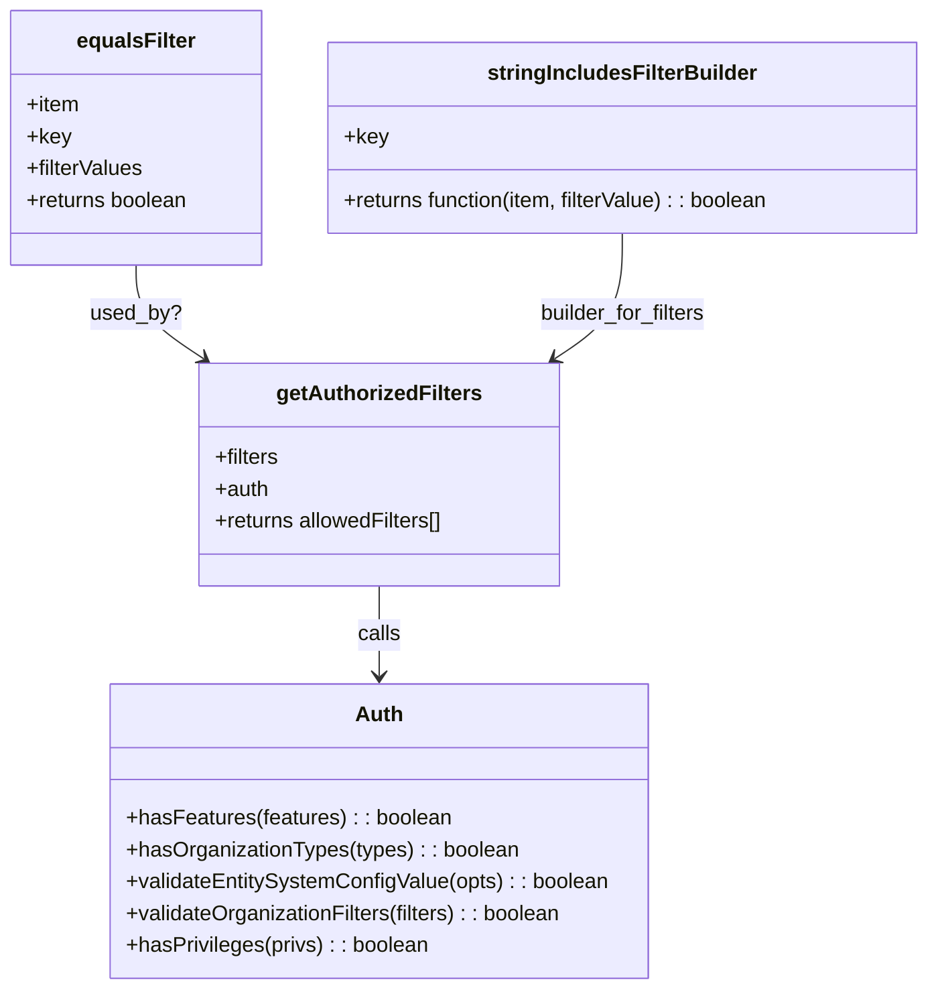

# Diagram: web/portal/src/components/search-bar/filters.js


> Auto-generated by Obscura crawlers

## Diagram 1



### SVG

<svg id="container" width="709.140625" xmlns="http://www.w3.org/2000/svg" class="classDiagram" height="746" viewBox="0 0 709.140625 746" role="graphics-document document" aria-roledescription="class"><style>#container{font-family:"trebuchet ms",verdana,arial,sans-serif;font-size:16px;fill:#333;}@keyframes edge-animation-frame{from{stroke-dashoffset:0;}}@keyframes dash{to{stroke-dashoffset:0;}}#container .edge-animation-slow{stroke-dasharray:9,5!important;stroke-dashoffset:900;animation:dash 50s linear infinite;stroke-linecap:round;}#container .edge-animation-fast{stroke-dasharray:9,5!important;stroke-dashoffset:900;animation:dash 20s linear infinite;stroke-linecap:round;}#container .error-icon{fill:#552222;}#container .error-text{fill:#552222;stroke:#552222;}#container .edge-thickness-normal{stroke-width:1px;}#container .edge-thickness-thick{stroke-width:3.5px;}#container .edge-pattern-solid{stroke-dasharray:0;}#container .edge-thickness-invisible{stroke-width:0;fill:none;}#container .edge-pattern-dashed{stroke-dasharray:3;}#container .edge-pattern-dotted{stroke-dasharray:2;}#container .marker{fill:#333333;stroke:#333333;}#container .marker.cross{stroke:#333333;}#container svg{font-family:"trebuchet ms",verdana,arial,sans-serif;font-size:16px;}#container p{margin:0;}#container g.classGroup text{fill:#9370DB;stroke:none;font-family:"trebuchet ms",verdana,arial,sans-serif;font-size:10px;}#container g.classGroup text .title{font-weight:bolder;}#container .nodeLabel,#container .edgeLabel{color:#131300;}#container .edgeLabel .label rect{fill:#ECECFF;}#container .label text{fill:#131300;}#container .labelBkg{background:#ECECFF;}#container .edgeLabel .label span{background:#ECECFF;}#container .classTitle{font-weight:bolder;}#container .node rect,#container .node circle,#container .node ellipse,#container .node polygon,#container .node path{fill:#ECECFF;stroke:#9370DB;stroke-width:1px;}#container .divider{stroke:#9370DB;stroke-width:1;}#container g.clickable{cursor:pointer;}#container g.classGroup rect{fill:#ECECFF;stroke:#9370DB;}#container g.classGroup line{stroke:#9370DB;stroke-width:1;}#container .classLabel .box{stroke:none;stroke-width:0;fill:#ECECFF;opacity:0.5;}#container .classLabel .label{fill:#9370DB;font-size:10px;}#container .relation{stroke:#333333;stroke-width:1;fill:none;}#container .dashed-line{stroke-dasharray:3;}#container .dotted-line{stroke-dasharray:1 2;}#container #compositionStart,#container .composition{fill:#333333!important;stroke:#333333!important;stroke-width:1;}#container #compositionEnd,#container .composition{fill:#333333!important;stroke:#333333!important;stroke-width:1;}#container #dependencyStart,#container .dependency{fill:#333333!important;stroke:#333333!important;stroke-width:1;}#container #dependencyStart,#container .dependency{fill:#333333!important;stroke:#333333!important;stroke-width:1;}#container #extensionStart,#container .extension{fill:transparent!important;stroke:#333333!important;stroke-width:1;}#container #extensionEnd,#container .extension{fill:transparent!important;stroke:#333333!important;stroke-width:1;}#container #aggregationStart,#container .aggregation{fill:transparent!important;stroke:#333333!important;stroke-width:1;}#container #aggregationEnd,#container .aggregation{fill:transparent!important;stroke:#333333!important;stroke-width:1;}#container #lollipopStart,#container .lollipop{fill:#ECECFF!important;stroke:#333333!important;stroke-width:1;}#container #lollipopEnd,#container .lollipop{fill:#ECECFF!important;stroke:#333333!important;stroke-width:1;}#container .edgeTerminals{font-size:11px;line-height:initial;}#container .classTitleText{text-anchor:middle;font-size:18px;fill:#333;}#container .label-icon{display:inline-block;height:1em;overflow:visible;vertical-align:-0.125em;}#container .node .label-icon path{fill:currentColor;stroke:revert;stroke-width:revert;}#container :root{--mermaid-font-family:"trebuchet ms",verdana,arial,sans-serif;}</style><g><defs><marker id="container_class-aggregationStart" class="marker aggregation class" refX="18" refY="7" markerWidth="190" markerHeight="240" orient="auto"><path d="M 18,7 L9,13 L1,7 L9,1 Z"></path></marker></defs><defs><marker id="container_class-aggregationEnd" class="marker aggregation class" refX="1" refY="7" markerWidth="20" markerHeight="28" orient="auto"><path d="M 18,7 L9,13 L1,7 L9,1 Z"></path></marker></defs><defs><marker id="container_class-extensionStart" class="marker extension class" refX="18" refY="7" markerWidth="190" markerHeight="240" orient="auto"><path d="M 1,7 L18,13 V 1 Z"></path></marker></defs><defs><marker id="container_class-extensionEnd" class="marker extension class" refX="1" refY="7" markerWidth="20" markerHeight="28" orient="auto"><path d="M 1,1 V 13 L18,7 Z"></path></marker></defs><defs><marker id="container_class-compositionStart" class="marker composition class" refX="18" refY="7" markerWidth="190" markerHeight="240" orient="auto"><path d="M 18,7 L9,13 L1,7 L9,1 Z"></path></marker></defs><defs><marker id="container_class-compositionEnd" class="marker composition class" refX="1" refY="7" markerWidth="20" markerHeight="28" orient="auto"><path d="M 18,7 L9,13 L1,7 L9,1 Z"></path></marker></defs><defs><marker id="container_class-dependencyStart" class="marker dependency class" refX="6" refY="7" markerWidth="190" markerHeight="240" orient="auto"><path d="M 5,7 L9,13 L1,7 L9,1 Z"></path></marker></defs><defs><marker id="container_class-dependencyEnd" class="marker dependency class" refX="13" refY="7" markerWidth="20" markerHeight="28" orient="auto"><path d="M 18,7 L9,13 L14,7 L9,1 Z"></path></marker></defs><defs><marker id="container_class-lollipopStart" class="marker lollipop class" refX="13" refY="7" markerWidth="190" markerHeight="240" orient="auto"><circle stroke="black" fill="transparent" cx="7" cy="7" r="6"></circle></marker></defs><defs><marker id="container_class-lollipopEnd" class="marker lollipop class" refX="1" refY="7" markerWidth="190" markerHeight="240" orient="auto"><circle stroke="black" fill="transparent" cx="7" cy="7" r="6"></circle></marker></defs><g class="root"><g class="clusters"></g><g class="edgePaths"><path d="M103.703,200L103.703,206.167C103.703,212.333,103.703,224.667,112.334,236.454C120.964,248.242,138.225,259.484,146.855,265.105L155.486,270.726" id="id_equalsFilter_getAuthorizedFilters_1" class="edge-thickness-normal edge-pattern-solid relation" style=";;;" data-edge="true" data-et="edge" data-id="id_equalsFilter_getAuthorizedFilters_1" data-points="W3sieCI6MTAzLjcwMzEyNSwieSI6MjAwfSx7IngiOjEwMy43MDMxMjUsInkiOjIzN30seyJ4IjoxNjAuNTEzNDYyMDM1MTIzOTgsInkiOjI3NH1d" marker-end="url(#container_class-dependencyEnd)"></path><path d="M475.273,176L475.273,186.167C475.273,196.333,475.273,216.667,466.643,232.454C458.013,248.242,440.752,259.484,432.121,265.105L423.491,270.726" id="id_stringIncludesFilterBuilder_getAuthorizedFilters_2" class="edge-thickness-normal edge-pattern-solid relation" style=";;;" data-edge="true" data-et="edge" data-id="id_stringIncludesFilterBuilder_getAuthorizedFilters_2" data-points="W3sieCI6NDc1LjI3MzQzNzUsInkiOjE3Nn0seyJ4Ijo0NzUuMjczNDM3NSwieSI6MjM3fSx7IngiOjQxOC40NjMxMDA0NjQ4NzYsInkiOjI3NH1d" marker-end="url(#container_class-dependencyEnd)"></path><path d="M289.488,442L289.488,448.167C289.488,454.333,289.488,466.667,289.488,478C289.488,489.333,289.488,499.667,289.488,504.833L289.488,510" id="id_getAuthorizedFilters_Auth_3" class="edge-thickness-normal edge-pattern-solid relation" style=";;;" data-edge="true" data-et="edge" data-id="id_getAuthorizedFilters_Auth_3" data-points="W3sieCI6Mjg5LjQ4ODI4MTI1LCJ5Ijo0NDJ9LHsieCI6Mjg5LjQ4ODI4MTI1LCJ5Ijo0Nzl9LHsieCI6Mjg5LjQ4ODI4MTI1LCJ5Ijo1MTZ9XQ==" marker-end="url(#container_class-dependencyEnd)"></path></g><g class="edgeLabels"><g class="edgeLabel" transform="translate(103.703125, 237)"><g class="label" data-id="id_equalsFilter_getAuthorizedFilters_1" transform="translate(-33.7890625, -12)"><foreignObject width="67.578125" height="24"><div xmlns="http://www.w3.org/1999/xhtml" class="labelBkg" style="display: table-cell; white-space: nowrap; line-height: 1.5; max-width: 200px; text-align: center;"><span class="edgeLabel"><p>used_by?</p></span></div></foreignObject></g></g><g class="edgeLabel" transform="translate(475.2734375, 237)"><g class="label" data-id="id_stringIncludesFilterBuilder_getAuthorizedFilters_2" transform="translate(-64.0625, -12)"><foreignObject width="128.125" height="24"><div xmlns="http://www.w3.org/1999/xhtml" class="labelBkg" style="display: table-cell; white-space: nowrap; line-height: 1.5; max-width: 200px; text-align: center;"><span class="edgeLabel"><p>builder_for_filters</p></span></div></foreignObject></g></g><g class="edgeLabel" transform="translate(289.48828125, 479)"><g class="label" data-id="id_getAuthorizedFilters_Auth_3" transform="translate(-16.4453125, -12)"><foreignObject width="32.890625" height="24"><div xmlns="http://www.w3.org/1999/xhtml" class="labelBkg" style="display: table-cell; white-space: nowrap; line-height: 1.5; max-width: 200px; text-align: center;"><span class="edgeLabel"><p>calls</p></span></div></foreignObject></g></g></g><g class="nodes"><g class="node default" id="classId-equalsFilter-0" transform="translate(103.703125, 104)"><g class="basic label-container"><path d="M-95.703125 -96 L95.703125 -96 L95.703125 96 L-95.703125 96" stroke="none" stroke-width="0" fill="#ECECFF" style=""></path><path d="M-95.703125 -96 C-38.68678271855915 -96, 18.3295595628817 -96, 95.703125 -96 M-95.703125 -96 C-53.4678496325059 -96, -11.232574265011806 -96, 95.703125 -96 M95.703125 -96 C95.703125 -33.79395619110231, 95.703125 28.41208761779538, 95.703125 96 M95.703125 -96 C95.703125 -45.87784929667354, 95.703125 4.244301406652923, 95.703125 96 M95.703125 96 C29.97127119035916 96, -35.76058261928168 96, -95.703125 96 M95.703125 96 C46.99757197166833 96, -1.7079810566633427 96, -95.703125 96 M-95.703125 96 C-95.703125 33.29304656734669, -95.703125 -29.413906865306615, -95.703125 -96 M-95.703125 96 C-95.703125 34.06489269531565, -95.703125 -27.870214609368702, -95.703125 -96" stroke="#9370DB" stroke-width="1.3" fill="none" stroke-dasharray="0 0" style=""></path></g><g class="annotation-group text" transform="translate(0, -72)"></g><g class="label-group text" transform="translate(-43.203125, -72)"><g class="label" style="font-weight: bolder" transform="translate(0,-12)"><foreignObject width="86.40625" height="24"><div xmlns="http://www.w3.org/1999/xhtml" style="display: table-cell; white-space: nowrap; line-height: 1.5; max-width: 136px; text-align: center;"><span class="nodeLabel markdown-node-label" style=""><p>equalsFilter</p></span></div></foreignObject></g></g><g class="members-group text" transform="translate(-83.703125, -24)"><g class="label" style="" transform="translate(0,-12)"><foreignObject width="40.46875" height="24"><div xmlns="http://www.w3.org/1999/xhtml" style="display: table-cell; white-space: nowrap; line-height: 1.5; max-width: 98px; text-align: center;"><span class="nodeLabel markdown-node-label" style=""><p>+item</p></span></div></foreignObject></g><g class="label" style="" transform="translate(0,12)"><foreignObject width="32.5625" height="24"><div xmlns="http://www.w3.org/1999/xhtml" style="display: table-cell; white-space: nowrap; line-height: 1.5; max-width: 90px; text-align: center;"><span class="nodeLabel markdown-node-label" style=""><p>+key</p></span></div></foreignObject></g><g class="label" style="" transform="translate(0,36)"><foreignObject width="89.0625" height="24"><div xmlns="http://www.w3.org/1999/xhtml" style="display: table-cell; white-space: nowrap; line-height: 1.5; max-width: 146px; text-align: center;"><span class="nodeLabel markdown-node-label" style=""><p>+filterValues</p></span></div></foreignObject></g><g class="label" style="" transform="translate(0,60)"><foreignObject width="124.203125" height="24"><div xmlns="http://www.w3.org/1999/xhtml" style="display: table-cell; white-space: nowrap; line-height: 1.5; max-width: 182px; text-align: center;"><span class="nodeLabel markdown-node-label" style=""><p>+returns boolean</p></span></div></foreignObject></g></g><g class="methods-group text" transform="translate(-83.703125, 96)"></g><g class="divider" style=""><path d="M-95.703125 -48 C-22.811898252854547 -48, 50.079328494290905 -48, 95.703125 -48 M-95.703125 -48 C-52.48761899612995 -48, -9.272112992259906 -48, 95.703125 -48" stroke="#9370DB" stroke-width="1.3" fill="none" stroke-dasharray="0 0" style=""></path></g><g class="divider" style=""><path d="M-95.703125 72 C-53.68401526151323 72, -11.664905523026462 72, 95.703125 72 M-95.703125 72 C-55.60348913040253 72, -15.503853260805059 72, 95.703125 72" stroke="#9370DB" stroke-width="1.3" fill="none" stroke-dasharray="0 0" style=""></path></g></g><g class="node default" id="classId-stringIncludesFilterBuilder-1" transform="translate(475.2734375, 104)"><g class="basic label-container"><path d="M-225.8671875 -72 L225.8671875 -72 L225.8671875 72 L-225.8671875 72" stroke="none" stroke-width="0" fill="#ECECFF" style=""></path><path d="M-225.8671875 -72 C-106.64323146739268 -72, 12.580724565214638 -72, 225.8671875 -72 M-225.8671875 -72 C-109.51693106072977 -72, 6.833325378540451 -72, 225.8671875 -72 M225.8671875 -72 C225.8671875 -16.206213590078598, 225.8671875 39.587572819842805, 225.8671875 72 M225.8671875 -72 C225.8671875 -38.606414261193116, 225.8671875 -5.212828522386232, 225.8671875 72 M225.8671875 72 C97.70491144925705 72, -30.457364601485892 72, -225.8671875 72 M225.8671875 72 C81.36766044160203 72, -63.131866616795946 72, -225.8671875 72 M-225.8671875 72 C-225.8671875 18.38078044962458, -225.8671875 -35.23843910075084, -225.8671875 -72 M-225.8671875 72 C-225.8671875 17.49953611461727, -225.8671875 -37.00092777076546, -225.8671875 -72" stroke="#9370DB" stroke-width="1.3" fill="none" stroke-dasharray="0 0" style=""></path></g><g class="annotation-group text" transform="translate(0, -48)"></g><g class="label-group text" transform="translate(-97.65625, -48)"><g class="label" style="font-weight: bolder" transform="translate(0,-12)"><foreignObject width="195.3125" height="24"><div xmlns="http://www.w3.org/1999/xhtml" style="display: table-cell; white-space: nowrap; line-height: 1.5; max-width: 244px; text-align: center;"><span class="nodeLabel markdown-node-label" style=""><p>stringIncludesFilterBuilder</p></span></div></foreignObject></g></g><g class="members-group text" transform="translate(-213.8671875, 0)"><g class="label" style="" transform="translate(0,-12)"><foreignObject width="32.5625" height="24"><div xmlns="http://www.w3.org/1999/xhtml" style="display: table-cell; white-space: nowrap; line-height: 1.5; max-width: 90px; text-align: center;"><span class="nodeLabel markdown-node-label" style=""><p>+key</p></span></div></foreignObject></g></g><g class="methods-group text" transform="translate(-213.8671875, 48)"><g class="label" style="" transform="translate(0,-12)"><foreignObject width="330.078125" height="24"><div xmlns="http://www.w3.org/1999/xhtml" style="display: table-cell; white-space: nowrap; line-height: 1.5; max-width: 387px; text-align: center;"><span class="nodeLabel markdown-node-label" style=""><p>+returns function(item, filterValue) : : boolean</p></span></div></foreignObject></g></g><g class="divider" style=""><path d="M-225.8671875 -24 C-59.458425991644305 -24, 106.95033551671139 -24, 225.8671875 -24 M-225.8671875 -24 C-53.23753162757052 -24, 119.39212424485896 -24, 225.8671875 -24" stroke="#9370DB" stroke-width="1.3" fill="none" stroke-dasharray="0 0" style=""></path></g><g class="divider" style=""><path d="M-225.8671875 24 C-49.58006870926201 24, 126.70705008147598 24, 225.8671875 24 M-225.8671875 24 C-80.84083501929143 24, 64.18551746141713 24, 225.8671875 24" stroke="#9370DB" stroke-width="1.3" fill="none" stroke-dasharray="0 0" style=""></path></g></g><g class="node default" id="classId-getAuthorizedFilters-2" transform="translate(289.48828125, 358)"><g class="basic label-container"><path d="M-137.24609375 -84 L137.24609375 -84 L137.24609375 84 L-137.24609375 84" stroke="none" stroke-width="0" fill="#ECECFF" style=""></path><path d="M-137.24609375 -84 C-27.972780783289537 -84, 81.30053218342093 -84, 137.24609375 -84 M-137.24609375 -84 C-45.3362197667945 -84, 46.573654216411 -84, 137.24609375 -84 M137.24609375 -84 C137.24609375 -37.876500949378595, 137.24609375 8.24699810124281, 137.24609375 84 M137.24609375 -84 C137.24609375 -40.198507043290505, 137.24609375 3.6029859134189905, 137.24609375 84 M137.24609375 84 C66.35718424219476 84, -4.531725265610476 84, -137.24609375 84 M137.24609375 84 C35.56984861968115 84, -66.1063965106377 84, -137.24609375 84 M-137.24609375 84 C-137.24609375 21.3317363482605, -137.24609375 -41.336527303479, -137.24609375 -84 M-137.24609375 84 C-137.24609375 18.989620282372627, -137.24609375 -46.020759435254746, -137.24609375 -84" stroke="#9370DB" stroke-width="1.3" fill="none" stroke-dasharray="0 0" style=""></path></g><g class="annotation-group text" transform="translate(0, -60)"></g><g class="label-group text" transform="translate(-74.3203125, -60)"><g class="label" style="font-weight: bolder" transform="translate(0,-12)"><foreignObject width="148.640625" height="24"><div xmlns="http://www.w3.org/1999/xhtml" style="display: table-cell; white-space: nowrap; line-height: 1.5; max-width: 196px; text-align: center;"><span class="nodeLabel markdown-node-label" style=""><p>getAuthorizedFilters</p></span></div></foreignObject></g></g><g class="members-group text" transform="translate(-125.24609375, -12)"><g class="label" style="" transform="translate(0,-12)"><foreignObject width="49.296875" height="24"><div xmlns="http://www.w3.org/1999/xhtml" style="display: table-cell; white-space: nowrap; line-height: 1.5; max-width: 107px; text-align: center;"><span class="nodeLabel markdown-node-label" style=""><p>+filters</p></span></div></foreignObject></g><g class="label" style="" transform="translate(0,12)"><foreignObject width="40.921875" height="24"><div xmlns="http://www.w3.org/1999/xhtml" style="display: table-cell; white-space: nowrap; line-height: 1.5; max-width: 98px; text-align: center;"><span class="nodeLabel markdown-node-label" style=""><p>+auth</p></span></div></foreignObject></g><g class="label" style="" transform="translate(0,36)"><foreignObject width="176.171875" height="24"><div xmlns="http://www.w3.org/1999/xhtml" style="display: table-cell; white-space: nowrap; line-height: 1.5; max-width: 234px; text-align: center;"><span class="nodeLabel markdown-node-label" style=""><p>+returns allowedFilters[]</p></span></div></foreignObject></g></g><g class="methods-group text" transform="translate(-125.24609375, 84)"></g><g class="divider" style=""><path d="M-137.24609375 -36 C-72.76842285569222 -36, -8.290751961384444 -36, 137.24609375 -36 M-137.24609375 -36 C-34.45928771207362 -36, 68.32751832585276 -36, 137.24609375 -36" stroke="#9370DB" stroke-width="1.3" fill="none" stroke-dasharray="0 0" style=""></path></g><g class="divider" style=""><path d="M-137.24609375 60 C-71.38351791354275 60, -5.520942077085493 60, 137.24609375 60 M-137.24609375 60 C-45.86137128557661 60, 45.52335117884678 60, 137.24609375 60" stroke="#9370DB" stroke-width="1.3" fill="none" stroke-dasharray="0 0" style=""></path></g></g><g class="node default" id="classId-Auth-3" transform="translate(289.48828125, 627)"><g class="basic label-container"><path d="M-203.41015625 -111 L203.41015625 -111 L203.41015625 111 L-203.41015625 111" stroke="none" stroke-width="0" fill="#ECECFF" style=""></path><path d="M-203.41015625 -111 C-103.31618528451877 -111, -3.2222143190375334 -111, 203.41015625 -111 M-203.41015625 -111 C-68.75748682032633 -111, 65.89518260934733 -111, 203.41015625 -111 M203.41015625 -111 C203.41015625 -66.45354452495405, 203.41015625 -21.907089049908123, 203.41015625 111 M203.41015625 -111 C203.41015625 -59.85104970102483, 203.41015625 -8.702099402049654, 203.41015625 111 M203.41015625 111 C52.677468104257656 111, -98.05522004148469 111, -203.41015625 111 M203.41015625 111 C49.08475984441125 111, -105.2406365611775 111, -203.41015625 111 M-203.41015625 111 C-203.41015625 41.57152018853685, -203.41015625 -27.856959622926297, -203.41015625 -111 M-203.41015625 111 C-203.41015625 60.264320272558344, -203.41015625 9.528640545116687, -203.41015625 -111" stroke="#9370DB" stroke-width="1.3" fill="none" stroke-dasharray="0 0" style=""></path></g><g class="annotation-group text" transform="translate(0, -87)"></g><g class="label-group text" transform="translate(-17.0078125, -87)"><g class="label" style="font-weight: bolder" transform="translate(0,-12)"><foreignObject width="34.015625" height="24"><div xmlns="http://www.w3.org/1999/xhtml" style="display: table-cell; white-space: nowrap; line-height: 1.5; max-width: 84px; text-align: center;"><span class="nodeLabel markdown-node-label" style=""><p>Auth</p></span></div></foreignObject></g></g><g class="members-group text" transform="translate(-191.41015625, -39)"></g><g class="methods-group text" transform="translate(-191.41015625, -9)"><g class="label" style="" transform="translate(0,-12)"><foreignObject width="244.5625" height="24"><div xmlns="http://www.w3.org/1999/xhtml" style="display: table-cell; white-space: nowrap; line-height: 1.5; max-width: 302px; text-align: center;"><span class="nodeLabel markdown-node-label" style=""><p>+hasFeatures(features) : : boolean</p></span></div></foreignObject></g><g class="label" style="" transform="translate(0,12)"><foreignObject width="296.140625" height="24"><div xmlns="http://www.w3.org/1999/xhtml" style="display: table-cell; white-space: nowrap; line-height: 1.5; max-width: 354px; text-align: center;"><span class="nodeLabel markdown-node-label" style=""><p>+hasOrganizationTypes(types) : : boolean</p></span></div></foreignObject></g><g class="label" style="" transform="translate(0,36)"><foreignObject width="365.8125" height="24"><div xmlns="http://www.w3.org/1999/xhtml" style="display: table-cell; white-space: nowrap; line-height: 1.5; max-width: 423px; text-align: center;"><span class="nodeLabel markdown-node-label" style=""><p>+validateEntitySystemConfigValue(opts) : : boolean</p></span></div></foreignObject></g><g class="label" style="" transform="translate(0,60)"><foreignObject width="333.71875" height="24"><div xmlns="http://www.w3.org/1999/xhtml" style="display: table-cell; white-space: nowrap; line-height: 1.5; max-width: 391px; text-align: center;"><span class="nodeLabel markdown-node-label" style=""><p>+validateOrganizationFilters(filters) : : boolean</p></span></div></foreignObject></g><g class="label" style="" transform="translate(0,84)"><foreignObject width="228.640625" height="24"><div xmlns="http://www.w3.org/1999/xhtml" style="display: table-cell; white-space: nowrap; line-height: 1.5; max-width: 286px; text-align: center;"><span class="nodeLabel markdown-node-label" style=""><p>+hasPrivileges(privs) : : boolean</p></span></div></foreignObject></g></g><g class="divider" style=""><path d="M-203.41015625 -63 C-49.55754062583989 -63, 104.29507499832022 -63, 203.41015625 -63 M-203.41015625 -63 C-108.48412581166062 -63, -13.558095373321237 -63, 203.41015625 -63" stroke="#9370DB" stroke-width="1.3" fill="none" stroke-dasharray="0 0" style=""></path></g><g class="divider" style=""><path d="M-203.41015625 -39 C-93.33325434366405 -39, 16.743647562671896 -39, 203.41015625 -39 M-203.41015625 -39 C-51.176282546841975 -39, 101.05759115631605 -39, 203.41015625 -39" stroke="#9370DB" stroke-width="1.3" fill="none" stroke-dasharray="0 0" style=""></path></g></g></g></g></g></svg>

## Diagram 2

```mermaid
flowchart TD
  Start([start]) --> ForEach{for each item in filters}
  ForEach --> NeedsFeatureCheck{requiredFeatures?.length > 0}
  NeedsFeatureCheck -- yes --> FeatureCall[auth.hasFeatures(item.requiredFeatures)]
  NeedsFeatureCheck -- no --> FeatureTrue[hasRequiredFeatures = true]
  FeatureCall --> FeatureResult{hasRequiredFeatures}
  FeatureResult --> ContinueChecks

  ContinueChecks --> NeedsOrgCheck{requiredOrgTypes?.length > 0}
  NeedsOrgCheck -- yes --> OrgCall[auth.hasOrganizationTypes(item.requiredOrgTypes)]
  NeedsOrgCheck -- no --> OrgTrue[hasRequiredOrgs = true]
  OrgCall --> OrgResult{hasRequiredOrgs}
  OrgResult --> ContinueChecks2

  ContinueChecks2 --> NeedsEntityConfig{requiredEntitySystemConfig?.length > 0}
  NeedsEntityConfig -- yes --> EntityCall[auth.validateEntitySystemConfigValue(item.requiredEntitySystemConfig)]
  NeedsEntityConfig -- no --> EntityTrue[hasRequiredEntitySystemConfigOptions = true]
  EntityCall --> EntityResult{hasRequiredEntitySystemConfigOptions}
  EntityResult --> ContinueChecks3

  ContinueChecks3 --> NeedsOrgFilters{!_.isNil(item.requiredOrgFilters)}
  NeedsOrgFilters -- yes --> OrgFiltersCall[auth.validateOrganizationFilters(item.requiredOrgFilters)]
  NeedsOrgFilters -- no --> OrgFiltersTrue[hasOrganizationFilters = true]
  OrgFiltersCall --> OrgFiltersResult{hasOrganizationFilters}
  OrgFiltersResult --> ContinueChecks4

  ContinueChecks4 --> NeedPrivilegeCheck{requiredPrivileges?.length > 0}
  NeedPrivilegeCheck -- yes --> PrivCall[auth.hasPrivileges(item.requiredPrivileges)]
  NeedPrivilegeCheck -- no --> PrivTrue[hasRequiredPrivilege = true]
  PrivCall --> PrivResult{hasRequiredPrivilege}
  PrivResult --> FinalDecision

  FeatureTrue --> ContinueChecks
  OrgTrue --> ContinueChecks2
  EntityTrue --> ContinueChecks3
  OrgFiltersTrue --> ContinueChecks4
  PrivTrue --> FinalDecision

  FinalDecision --> AllTrue?{all checks true?}
  AllTrue? -- yes --> Push[allowedFilters.push(item)]
  AllTrue? -- no --> Skip[skip item]
  Push --> ForEach
  Skip --> ForEach
  ForEach --> End([return allowedFilters])
```

> SVG rendering failed for this diagram.
