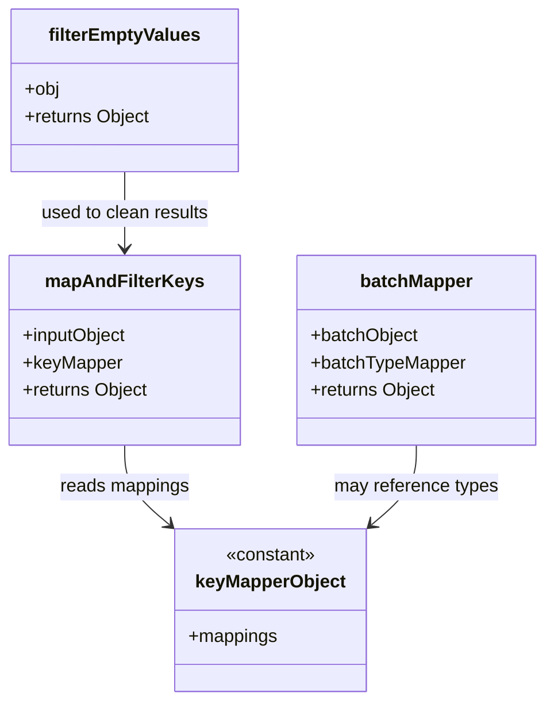
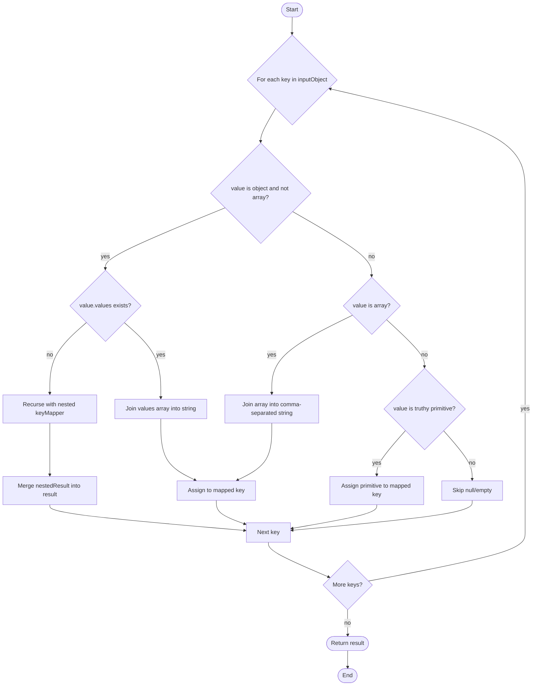

# Diagram: web/portal/src/components/search-bar/key-mapper.js

> Auto-generated by Obscura crawlers

## Diagram 1

### SVG

<svg id="container" width="477.796875" xmlns="http://www.w3.org/2000/svg" class="classDiagram" height="620" viewBox="0 0 477.796875 620" role="graphics-document document" aria-roledescription="class"><g><defs><marker id="container_class-aggregationStart" class="marker aggregation class" refX="18" refY="7" markerWidth="190" markerHeight="240" orient="auto"><path d="M 18,7 L9,13 L1,7 L9,1 Z"></path></marker></defs><defs><marker id="container_class-aggregationEnd" class="marker aggregation class" refX="1" refY="7" markerWidth="20" markerHeight="28" orient="auto"><path d="M 18,7 L9,13 L1,7 L9,1 Z"></path></marker></defs><defs><marker id="container_class-extensionStart" class="marker extension class" refX="18" refY="7" markerWidth="190" markerHeight="240" orient="auto"><path d="M 1,7 L18,13 V 1 Z"></path></marker></defs><defs><marker id="container_class-extensionEnd" class="marker extension class" refX="1" refY="7" markerWidth="20" markerHeight="28" orient="auto"><path d="M 1,1 V 13 L18,7 Z"></path></marker></defs><defs><marker id="container_class-compositionStart" class="marker composition class" refX="18" refY="7" markerWidth="190" markerHeight="240" orient="auto"><path d="M 18,7 L9,13 L1,7 L9,1 Z"></path></marker></defs><defs><marker id="container_class-compositionEnd" class="marker composition class" refX="1" refY="7" markerWidth="20" markerHeight="28" orient="auto"><path d="M 18,7 L9,13 L1,7 L9,1 Z"></path></marker></defs><defs><marker id="container_class-dependencyStart" class="marker dependency class" refX="6" refY="7" markerWidth="190" markerHeight="240" orient="auto"><path d="M 5,7 L9,13 L1,7 L9,1 Z"></path></marker></defs><defs><marker id="container_class-dependencyEnd" class="marker dependency class" refX="13" refY="7" markerWidth="20" markerHeight="28" orient="auto"><path d="M 18,7 L9,13 L14,7 L9,1 Z"></path></marker></defs><defs><marker id="container_class-lollipopStart" class="marker lollipop class" refX="13" refY="7" markerWidth="190" markerHeight="240" orient="auto"><circle stroke="black" fill="transparent" cx="7" cy="7" r="6"></circle></marker></defs><defs><marker id="container_class-lollipopEnd" class="marker lollipop class" refX="1" refY="7" markerWidth="190" markerHeight="240" orient="auto"><circle stroke="black" fill="transparent" cx="7" cy="7" r="6"></circle></marker></defs><g class="root"><g class="clusters"></g><g class="edgePaths"><path d="M109.043,394L109.043,400.167C109.043,406.333,109.043,418.667,115.646,430.458C122.248,442.25,135.454,453.499,142.057,459.124L148.659,464.749" id="id_mapAndFilterKeys_keyMapperObject_1" class="edge-thickness-normal edge-pattern-solid relation" style=";;;" data-edge="true" data-et="edge" data-id="id_mapAndFilterKeys_keyMapperObject_1" data-points="W3sieCI6MTA5LjA0Mjk2ODc1LCJ5IjozOTR9LHsieCI6MTA5LjA0Mjk2ODc1LCJ5Ijo0MzF9LHsieCI6MTUzLjIyNjU2MjUsInkiOjQ2OC42NDAwMjQ0MjM3NTIxfV0=" marker-end="url(#container_class-dependencyEnd)"></path><path d="M364.941,394L364.941,400.167C364.941,406.333,364.941,418.667,358.339,430.458C351.736,442.25,338.531,453.499,331.928,459.124L325.325,464.749" id="id_batchMapper_keyMapperObject_2" class="edge-thickness-normal edge-pattern-solid relation" style=";;;" data-edge="true" data-et="edge" data-id="id_batchMapper_keyMapperObject_2" data-points="W3sieCI6MzY0Ljk0MTQwNjI1LCJ5IjozOTR9LHsieCI6MzY0Ljk0MTQwNjI1LCJ5Ijo0MzF9LHsieCI6MzIwLjc1NzgxMjUsInkiOjQ2OC42NDAwMjQ0MjM3NTIxfV0=" marker-end="url(#container_class-dependencyEnd)"></path><path d="M109.043,152L109.043,158.167C109.043,164.333,109.043,176.667,109.043,188C109.043,199.333,109.043,209.667,109.043,214.833L109.043,220" id="id_filterEmptyValues_mapAndFilterKeys_3" class="edge-thickness-normal edge-pattern-solid relation" style=";;;" data-edge="true" data-et="edge" data-id="id_filterEmptyValues_mapAndFilterKeys_3" data-points="W3sieCI6MTA5LjA0Mjk2ODc1LCJ5IjoxNTJ9LHsieCI6MTA5LjA0Mjk2ODc1LCJ5IjoxODl9LHsieCI6MTA5LjA0Mjk2ODc1LCJ5IjoyMjZ9XQ==" marker-end="url(#container_class-dependencyEnd)"></path></g><g class="edgeLabels"><g class="edgeLabel" transform="translate(109.04296875, 431)"><g class="label" data-id="id_mapAndFilterKeys_keyMapperObject_1" transform="translate(-57.6171875, -12)"><foreignObject width="115.234375" height="24">

reads mappings

</foreignObject></g></g><g class="edgeLabel" transform="translate(364.94140625, 431)"><g class="label" data-id="id_batchMapper_keyMapperObject_2" transform="translate(-72.984375, -12)"><foreignObject width="145.96875" height="24">

may reference types

</foreignObject></g></g><g class="edgeLabel" transform="translate(109.04296875, 189)"><g class="label" data-id="id_filterEmptyValues_mapAndFilterKeys_3" transform="translate(-75.359375, -12)"><foreignObject width="150.71875" height="24">

used to clean results

</foreignObject></g></g></g><g class="nodes"><g class="node default" id="classId-mapAndFilterKeys-0" transform="translate(109.04296875, 310)"><g class="basic label-container"><path d="M-101.04296875 -84 L101.04296875 -84 L101.04296875 84 L-101.04296875 84" stroke="none" stroke-width="0" fill="#ECECFF" style=""></path><path d="M-101.04296875 -84 C-29.76621068124217 -84, 41.51054738751566 -84, 101.04296875 -84 M-101.04296875 -84 C-32.12997112896943 -84, 36.78302649206114 -84, 101.04296875 -84 M101.04296875 -84 C101.04296875 -31.31127967537092, 101.04296875 21.377440649258162, 101.04296875 84 M101.04296875 -84 C101.04296875 -31.909495105661897, 101.04296875 20.181009788676207, 101.04296875 84 M101.04296875 84 C55.467870000337165 84, 9.892771250674329 84, -101.04296875 84 M101.04296875 84 C56.99625458912056 84, 12.949540428241122 84, -101.04296875 84 M-101.04296875 84 C-101.04296875 20.58514356626437, -101.04296875 -42.82971286747126, -101.04296875 -84 M-101.04296875 84 C-101.04296875 17.466261650674568, -101.04296875 -49.067476698650864, -101.04296875 -84" stroke="#9370DB" stroke-width="1.3" fill="none" stroke-dasharray="0 0" style=""></path></g><g class="annotation-group text" transform="translate(0, -60)"></g><g class="label-group text" transform="translate(-66.1328125, -60)"><g class="label" style="font-weight: bolder" transform="translate(0,-12)"><foreignObject width="132.265625" height="24">

mapAndFilterKeys

</foreignObject></g></g><g class="members-group text" transform="translate(-89.04296875, -12)"><g class="label" style="" transform="translate(0,-12)"><foreignObject width="93.671875" height="24">

+inputObject

</foreignObject></g><g class="label" style="" transform="translate(0,12)"><foreignObject width="87.625" height="24">

+keyMapper

</foreignObject></g><g class="label" style="" transform="translate(0,36)"><foreignObject width="111.953125" height="24">

+returns Object

</foreignObject></g></g><g class="methods-group text" transform="translate(-89.04296875, 84)"></g><g class="divider" style=""><path d="M-101.04296875 -36 C-50.216331337267036 -36, 0.6103060754659282 -36, 101.04296875 -36 M-101.04296875 -36 C-35.70392911867529 -36, 29.63511051264942 -36, 101.04296875 -36" stroke="#9370DB" stroke-width="1.3" fill="none" stroke-dasharray="0 0" style=""></path></g><g class="divider" style=""><path d="M-101.04296875 60 C-34.64592118557489 60, 31.751126378850216 60, 101.04296875 60 M-101.04296875 60 C-51.65901625614197 60, -2.275063762283935 60, 101.04296875 60" stroke="#9370DB" stroke-width="1.3" fill="none" stroke-dasharray="0 0" style=""></path></g></g><g class="node default" id="classId-batchMapper-1" transform="translate(364.94140625, 310)"><g class="basic label-container"><path d="M-104.85546875 -84 L104.85546875 -84 L104.85546875 84 L-104.85546875 84" stroke="none" stroke-width="0" fill="#ECECFF" style=""></path><path d="M-104.85546875 -84 C-62.58087380878321 -84, -20.30627886756642 -84, 104.85546875 -84 M-104.85546875 -84 C-46.43827269019482 -84, 11.978923369610357 -84, 104.85546875 -84 M104.85546875 -84 C104.85546875 -40.211147760423984, 104.85546875 3.5777044791520325, 104.85546875 84 M104.85546875 -84 C104.85546875 -26.33846430108266, 104.85546875 31.32307139783468, 104.85546875 84 M104.85546875 84 C28.290266914943643 84, -48.27493492011271 84, -104.85546875 84 M104.85546875 84 C56.0354528511673 84, 7.215436952334599 84, -104.85546875 84 M-104.85546875 84 C-104.85546875 25.37282039164517, -104.85546875 -33.25435921670966, -104.85546875 -84 M-104.85546875 84 C-104.85546875 20.835284454050118, -104.85546875 -42.329431091899764, -104.85546875 -84" stroke="#9370DB" stroke-width="1.3" fill="none" stroke-dasharray="0 0" style=""></path></g><g class="annotation-group text" transform="translate(0, -60)"></g><g class="label-group text" transform="translate(-48.3203125, -60)"><g class="label" style="font-weight: bolder" transform="translate(0,-12)"><foreignObject width="96.640625" height="24">

batchMapper

</foreignObject></g></g><g class="members-group text" transform="translate(-92.85546875, -12)"><g class="label" style="" transform="translate(0,-12)"><foreignObject width="95.796875" height="24">

+batchObject

</foreignObject></g><g class="label" style="" transform="translate(0,12)"><foreignObject width="137.390625" height="24">

+batchTypeMapper

</foreignObject></g><g class="label" style="" transform="translate(0,36)"><foreignObject width="111.953125" height="24">

+returns Object

</foreignObject></g></g><g class="methods-group text" transform="translate(-92.85546875, 84)"></g><g class="divider" style=""><path d="M-104.85546875 -36 C-28.755652835325947 -36, 47.34416307934811 -36, 104.85546875 -36 M-104.85546875 -36 C-38.64538912218268 -36, 27.564690505634644 -36, 104.85546875 -36" stroke="#9370DB" stroke-width="1.3" fill="none" stroke-dasharray="0 0" style=""></path></g><g class="divider" style=""><path d="M-104.85546875 60 C-22.344377765885625 60, 60.16671321822875 60, 104.85546875 60 M-104.85546875 60 C-23.575988592143574 60, 57.70349156571285 60, 104.85546875 60" stroke="#9370DB" stroke-width="1.3" fill="none" stroke-dasharray="0 0" style=""></path></g></g><g class="node default" id="classId-filterEmptyValues-2" transform="translate(109.04296875, 80)"><g class="basic label-container"><path d="M-100.1640625 -72 L100.1640625 -72 L100.1640625 72 L-100.1640625 72" stroke="none" stroke-width="0" fill="#ECECFF" style=""></path><path d="M-100.1640625 -72 C-55.695750665599164 -72, -11.227438831198327 -72, 100.1640625 -72 M-100.1640625 -72 C-33.8605512306565 -72, 32.442960038687005 -72, 100.1640625 -72 M100.1640625 -72 C100.1640625 -16.813433697462777, 100.1640625 38.373132605074446, 100.1640625 72 M100.1640625 -72 C100.1640625 -31.5241360148285, 100.1640625 8.951727970343, 100.1640625 72 M100.1640625 72 C27.057000502801557 72, -46.050061494396886 72, -100.1640625 72 M100.1640625 72 C34.43371074015086 72, -31.296641019698285 72, -100.1640625 72 M-100.1640625 72 C-100.1640625 23.988425440068184, -100.1640625 -24.023149119863632, -100.1640625 -72 M-100.1640625 72 C-100.1640625 32.10921634645808, -100.1640625 -7.781567307083833, -100.1640625 -72" stroke="#9370DB" stroke-width="1.3" fill="none" stroke-dasharray="0 0" style=""></path></g><g class="annotation-group text" transform="translate(0, -48)"></g><g class="label-group text" transform="translate(-64.375, -48)"><g class="label" style="font-weight: bolder" transform="translate(0,-12)"><foreignObject width="128.75" height="24">

filterEmptyValues

</foreignObject></g></g><g class="members-group text" transform="translate(-88.1640625, 0)"><g class="label" style="" transform="translate(0,-12)"><foreignObject width="31.3125" height="24">

+obj

</foreignObject></g><g class="label" style="" transform="translate(0,12)"><foreignObject width="111.953125" height="24">

+returns Object

</foreignObject></g></g><g class="methods-group text" transform="translate(-88.1640625, 72)"></g><g class="divider" style=""><path d="M-100.1640625 -24 C-43.41553180580898 -24, 13.332998888382036 -24, 100.1640625 -24 M-100.1640625 -24 C-49.67108418725157 -24, 0.8218941254968541 -24, 100.1640625 -24" stroke="#9370DB" stroke-width="1.3" fill="none" stroke-dasharray="0 0" style=""></path></g><g class="divider" style=""><path d="M-100.1640625 48 C-37.542425236905494 48, 25.079212026189012 48, 100.1640625 48 M-100.1640625 48 C-38.58126407005944 48, 23.00153435988112 48, 100.1640625 48" stroke="#9370DB" stroke-width="1.3" fill="none" stroke-dasharray="0 0" style=""></path></g></g><g class="node default" id="classId-keyMapperObject-3" transform="translate(236.9921875, 540)"><g class="basic label-container"><path d="M-83.765625 -72 L83.765625 -72 L83.765625 72 L-83.765625 72" stroke="none" stroke-width="0" fill="#ECECFF" style=""></path><path d="M-83.765625 -72 C-22.18772953596274 -72, 39.39016592807452 -72, 83.765625 -72 M-83.765625 -72 C-49.70565092795614 -72, -15.645676855912285 -72, 83.765625 -72 M83.765625 -72 C83.765625 -19.205351424157264, 83.765625 33.58929715168547, 83.765625 72 M83.765625 -72 C83.765625 -14.886996287635604, 83.765625 42.22600742472879, 83.765625 72 M83.765625 72 C28.49167602672449 72, -26.782272946551018 72, -83.765625 72 M83.765625 72 C24.85421959448685 72, -34.0571858110263 72, -83.765625 72 M-83.765625 72 C-83.765625 23.04959584134049, -83.765625 -25.90080831731902, -83.765625 -72 M-83.765625 72 C-83.765625 40.75425959914378, -83.765625 9.508519198287566, -83.765625 -72" stroke="#9370DB" stroke-width="1.3" fill="none" stroke-dasharray="0 0" style=""></path></g><g class="annotation-group text" transform="translate(-40.4921875, -48)"><g class="label" style="" transform="translate(0,-12)"><foreignObject width="80.984375" height="24">

«constant»

</foreignObject></g></g><g class="label-group text" transform="translate(-64.546875, -24)"><g class="label" style="font-weight: bolder" transform="translate(0,-12)"><foreignObject width="129.09375" height="24">

keyMapperObject

</foreignObject></g></g><g class="members-group text" transform="translate(-71.765625, 24)"><g class="label" style="" transform="translate(0,-12)"><foreignObject width="78.984375" height="24">

+mappings

</foreignObject></g></g><g class="methods-group text" transform="translate(-71.765625, 72)"></g><g class="divider" style=""><path d="M-83.765625 0 C-25.811916091038228 0, 32.141792817923545 0, 83.765625 0 M-83.765625 0 C-37.07185806758939 0, 9.621908864821222 0, 83.765625 0" stroke="#9370DB" stroke-width="1.3" fill="none" stroke-dasharray="0 0" style=""></path></g><g class="divider" style=""><path d="M-83.765625 48 C-36.7712484769057 48, 10.223128046188606 48, 83.765625 48 M-83.765625 48 C-27.402423048116404 48, 28.960778903767192 48, 83.765625 48" stroke="#9370DB" stroke-width="1.3" fill="none" stroke-dasharray="0 0" style=""></path></g></g></g></g></g></svg>

## Diagram 2

### SVG

<svg id="container" width="1486.3203125" xmlns="http://www.w3.org/2000/svg" class="flowchart" height="1903.125" viewBox="0 0 1486.3203125 1903.125" role="graphics-document document" aria-roledescription="flowchart-v2"><g><marker id="container_flowchart-v2-pointEnd" class="marker flowchart-v2" viewBox="0 0 10 10" refX="5" refY="5" markerUnits="userSpaceOnUse" markerWidth="8" markerHeight="8" orient="auto"><path d="M 0 0 L 10 5 L 0 10 z" class="arrowMarkerPath" style="stroke-width: 1; stroke-dasharray: 1, 0;"></path></marker><marker id="container_flowchart-v2-pointStart" class="marker flowchart-v2" viewBox="0 0 10 10" refX="4.5" refY="5" markerUnits="userSpaceOnUse" markerWidth="8" markerHeight="8" orient="auto"><path d="M 0 5 L 10 10 L 10 0 z" class="arrowMarkerPath" style="stroke-width: 1; stroke-dasharray: 1, 0;"></path></marker><marker id="container_flowchart-v2-circleEnd" class="marker flowchart-v2" viewBox="0 0 10 10" refX="11" refY="5" markerUnits="userSpaceOnUse" markerWidth="11" markerHeight="11" orient="auto"><circle cx="5" cy="5" r="5" class="arrowMarkerPath" style="stroke-width: 1; stroke-dasharray: 1, 0;"></circle></marker><marker id="container_flowchart-v2-circleStart" class="marker flowchart-v2" viewBox="0 0 10 10" refX="-1" refY="5" markerUnits="userSpaceOnUse" markerWidth="11" markerHeight="11" orient="auto"><circle cx="5" cy="5" r="5" class="arrowMarkerPath" style="stroke-width: 1; stroke-dasharray: 1, 0;"></circle></marker><marker id="container_flowchart-v2-crossEnd" class="marker cross flowchart-v2" viewBox="0 0 11 11" refX="12" refY="5.2" markerUnits="userSpaceOnUse" markerWidth="11" markerHeight="11" orient="auto"><path d="M 1,1 l 9,9 M 10,1 l -9,9" class="arrowMarkerPath" style="stroke-width: 2; stroke-dasharray: 1, 0;"></path></marker><marker id="container_flowchart-v2-crossStart" class="marker cross flowchart-v2" viewBox="0 0 11 11" refX="-1" refY="5.2" markerUnits="userSpaceOnUse" markerWidth="11" markerHeight="11" orient="auto"><path d="M 1,1 l 9,9 M 10,1 l -9,9" class="arrowMarkerPath" style="stroke-width: 2; stroke-dasharray: 1, 0;"></path></marker><g class="root"><g class="clusters"></g><g class="edgePaths"><path d="M813.418,47.5L813.335,51.583C813.251,55.667,813.085,63.833,813.001,71.417C812.918,79,812.918,86,812.918,89.5L812.918,93" id="L_Start_ForEachKey_0" class="edge-thickness-normal edge-pattern-solid edge-thickness-normal edge-pattern-solid flowchart-link" style=";" data-edge="true" data-et="edge" data-id="L_Start_ForEachKey_0" data-points="W3sieCI6ODEzLjQxNzk2ODc1LCJ5Ijo0Ny41fSx7IngiOjgxMi45MTc5Njg3NSwieSI6NzJ9LHsieCI6ODEyLjkxNzk2ODc1LCJ5Ijo5N31d" marker-end="url(#container_flowchart-v2-pointEnd)"></path><path d="M766.84,303.141L760.02,314.987C753.2,326.834,739.559,350.526,732.738,365.872C725.918,381.219,725.918,388.219,725.918,391.719L725.918,395.219" id="L_ForEachKey_IsObject_0" class="edge-thickness-normal edge-pattern-solid edge-thickness-normal edge-pattern-solid flowchart-link" style=";" data-edge="true" data-et="edge" data-id="L_ForEachKey_IsObject_0" data-points="W3sieCI6NzY2Ljg0MDMzODk4NDI2NzMsInkiOjMwMy4xNDExMjAyMzQyNjczNn0seyJ4Ijo3MjUuOTE3OTY4NzUsInkiOjM3NC4yMTg3NX0seyJ4Ijo3MjUuOTE3OTY4NzUsInkiOjM5OS4yMTg3NX1d" marker-end="url(#container_flowchart-v2-pointEnd)"></path><path d="M627.072,578.373L571.338,601.014C515.604,623.655,404.136,668.937,348.402,697.078C292.668,725.219,292.668,736.219,292.668,741.719L292.668,747.219" id="L_IsObject_HasValues_0" class="edge-thickness-normal edge-pattern-solid edge-thickness-normal edge-pattern-solid flowchart-link" style=";" data-edge="true" data-et="edge" data-id="L_IsObject_HasValues_0" data-points="W3sieCI6NjI3LjA3MjI1NjgwOTA4OSwieSI6NTc4LjM3MzAzODA1OTA4OX0seyJ4IjoyOTIuNjY3OTY4NzUsInkiOjcxNC4yMTg3NX0seyJ4IjoyOTIuNjY3OTY4NzUsInkiOjc1MS4yMTg3NX1d" marker-end="url(#container_flowchart-v2-pointEnd)"></path><path d="M344.81,894.03L361.897,908.887C378.985,923.744,413.161,953.458,430.248,988.79C447.336,1024.122,447.336,1065.073,447.336,1085.548L447.336,1106.023" id="L_HasValues_JoinValues_0" class="edge-thickness-normal edge-pattern-solid edge-thickness-normal edge-pattern-solid flowchart-link" style=";" data-edge="true" data-et="edge" data-id="L_HasValues_JoinValues_0" data-points="W3sieCI6MzQ0LjgwOTcxODk1ODU1NTY2LCJ5Ijo4OTQuMDMwMTI0NzkxNDQ0M30seyJ4Ijo0NDcuMzM1OTM3NSwieSI6OTgzLjE3MTg3NX0seyJ4Ijo0NDcuMzM1OTM3NSwieSI6MTExMC4wMjM0Mzc1fV0=" marker-end="url(#container_flowchart-v2-pointEnd)"></path><path d="M447.336,1164.023L447.336,1185.165C447.336,1206.307,447.336,1248.591,463.358,1277.606C479.379,1306.62,511.423,1322.366,527.444,1330.238L543.466,1338.111" id="L_JoinValues_AssignMappedKey_0" class="edge-thickness-normal edge-pattern-solid edge-thickness-normal edge-pattern-solid flowchart-link" style=";" data-edge="true" data-et="edge" data-id="L_JoinValues_AssignMappedKey_0" data-points="W3sieCI6NDQ3LjMzNTkzNzUsInkiOjExNjQuMDIzNDM3NX0seyJ4Ijo0NDcuMzM1OTM3NSwieSI6MTI5MC44NzV9LHsieCI6NTQ3LjA1NjA3NTI0NjcxMDUsInkiOjEzMzkuODc1fV0=" marker-end="url(#container_flowchart-v2-pointEnd)"></path><path d="M240.526,894.03L223.439,908.887C206.351,923.744,172.175,953.458,155.088,986.79C138,1020.122,138,1057.073,138,1075.548L138,1094.023" id="L_HasValues_Recurse_0" class="edge-thickness-normal edge-pattern-solid edge-thickness-normal edge-pattern-solid flowchart-link" style=";" data-edge="true" data-et="edge" data-id="L_HasValues_Recurse_0" data-points="W3sieCI6MjQwLjUyNjIxODU0MTQ0NDMsInkiOjg5NC4wMzAxMjQ3OTE0NDQzfSx7IngiOjEzOCwieSI6OTgzLjE3MTg3NX0seyJ4IjoxMzgsInkiOjEwOTguMDIzNDM3NX1d" marker-end="url(#container_flowchart-v2-pointEnd)"></path><path d="M138,1176.023L138,1195.165C138,1214.307,138,1252.591,138,1277.233C138,1301.875,138,1312.875,138,1318.375L138,1323.875" id="L_Recurse_MergeNested_0" class="edge-thickness-normal edge-pattern-solid edge-thickness-normal edge-pattern-solid flowchart-link" style=";" data-edge="true" data-et="edge" data-id="L_Recurse_MergeNested_0" data-points="W3sieCI6MTM4LCJ5IjoxMTc2LjAyMzQzNzV9LHsieCI6MTM4LCJ5IjoxMjkwLjg3NX0seyJ4IjoxMzgsInkiOjEzMjcuODc1fV0=" marker-end="url(#container_flowchart-v2-pointEnd)"></path><path d="M138,1405.875L138,1410.042C138,1414.208,138,1422.542,228.601,1434.45C319.201,1446.359,500.403,1461.844,591.004,1469.586L681.604,1477.328" id="L_MergeNested_NextKey_0" class="edge-thickness-normal edge-pattern-solid edge-thickness-normal edge-pattern-solid flowchart-link" style=";" data-edge="true" data-et="edge" data-id="L_MergeNested_NextKey_0" data-points="W3sieCI6MTM4LCJ5IjoxNDA1Ljg3NX0seyJ4IjoxMzgsInkiOjE0MzAuODc1fSx7IngiOjY4NS41ODk4NDM3NSwieSI6MTQ3Ny42NjgzNTczNDEzOTZ9XQ==" marker-end="url(#container_flowchart-v2-pointEnd)"></path><path d="M814.512,588.625L851.302,609.557C888.092,630.49,961.673,672.354,998.464,701.945C1035.254,731.536,1035.254,748.854,1035.254,757.513L1035.254,766.172" id="L_IsObject_IsArray_0" class="edge-thickness-normal edge-pattern-solid edge-thickness-normal edge-pattern-solid flowchart-link" style=";" data-edge="true" data-et="edge" data-id="L_IsObject_IsArray_0" data-points="W3sieCI6ODE0LjUxMTY0NTgxMDAyNiwieSI6NTg4LjYyNTA3MjkzOTk3NH0seyJ4IjoxMDM1LjI1MzkwNjI1LCJ5Ijo3MTQuMjE4NzV9LHsieCI6MTAzNS4yNTM5MDYyNSwieSI6NzcwLjE3MTg3NX1d" marker-end="url(#container_flowchart-v2-pointEnd)"></path><path d="M982.295,874.26L944.691,892.412C907.087,910.564,831.88,946.868,794.276,983.495C756.672,1020.122,756.672,1057.073,756.672,1075.548L756.672,1094.023" id="L_IsArray_JoinArray_0" class="edge-thickness-normal edge-pattern-solid edge-thickness-normal edge-pattern-solid flowchart-link" style=";" data-edge="true" data-et="edge" data-id="L_IsArray_JoinArray_0" data-points="W3sieCI6OTgyLjI5NDc4ODQ2MjY1MjQsInkiOjg3NC4yNTk2MzIyMTI2NTI0fSx7IngiOjc1Ni42NzE4NzUsInkiOjk4My4xNzE4NzV9LHsieCI6NzU2LjY3MTg3NSwieSI6MTA5OC4wMjM0Mzc1fV0=" marker-end="url(#container_flowchart-v2-pointEnd)"></path><path d="M756.672,1176.023L756.672,1195.165C756.672,1214.307,756.672,1252.591,740.65,1279.606C724.628,1306.62,692.585,1322.366,676.563,1330.238L660.542,1338.111" id="L_JoinArray_AssignMappedKey_0" class="edge-thickness-normal edge-pattern-solid edge-thickness-normal edge-pattern-solid flowchart-link" style=";" data-edge="true" data-et="edge" data-id="L_JoinArray_AssignMappedKey_0" data-points="W3sieCI6NzU2LjY3MTg3NSwieSI6MTE3Ni4wMjM0Mzc1fSx7IngiOjc1Ni42NzE4NzUsInkiOjEyOTAuODc1fSx7IngiOjY1Ni45NTE3MzcyNTMyODk1LCJ5IjoxMzM5Ljg3NX1d" marker-end="url(#container_flowchart-v2-pointEnd)"></path><path d="M1076.452,886.021L1094.323,902.213C1112.194,918.405,1147.937,950.788,1165.808,972.48C1183.68,994.172,1183.68,1005.172,1183.68,1010.672L1183.68,1016.172" id="L_IsArray_IsPrimitive_0" class="edge-thickness-normal edge-pattern-solid edge-thickness-normal edge-pattern-solid flowchart-link" style=";" data-edge="true" data-et="edge" data-id="L_IsArray_IsPrimitive_0" data-points="W3sieCI6MTA3Ni40NTE1MjM3ODQzMTIzLCJ5Ijo4ODYuMDIxMTMyNDY1Njg3N30seyJ4IjoxMTgzLjY3OTY4NzUsInkiOjk4My4xNzE4NzV9LHsieCI6MTE4My42Nzk2ODc1LCJ5IjoxMDIwLjE3MTg3NX1d" marker-end="url(#container_flowchart-v2-pointEnd)"></path><path d="M1129.269,1199.464L1115.993,1214.699C1102.717,1229.934,1076.165,1260.405,1062.889,1281.14C1049.613,1301.875,1049.613,1312.875,1049.613,1318.375L1049.613,1323.875" id="L_IsPrimitive_AssignPrimitive_0" class="edge-thickness-normal edge-pattern-solid edge-thickness-normal edge-pattern-solid flowchart-link" style=";" data-edge="true" data-et="edge" data-id="L_IsPrimitive_AssignPrimitive_0" data-points="W3sieCI6MTEyOS4yNjg4MTA5Njc3NTA2LCJ5IjoxMTk5LjQ2NDEyMzQ2Nzc1MDZ9LHsieCI6MTA0OS42MTMyODEyNSwieSI6MTI5MC44NzV9LHsieCI6MTA0OS42MTMyODEyNSwieSI6MTMyNy44NzV9XQ==" marker-end="url(#container_flowchart-v2-pointEnd)"></path><path d="M1238.091,1199.464L1251.366,1214.699C1264.642,1229.934,1291.194,1260.405,1304.47,1283.14C1317.746,1305.875,1317.746,1320.875,1317.746,1328.375L1317.746,1335.875" id="L_IsPrimitive_Skip_0" class="edge-thickness-normal edge-pattern-solid edge-thickness-normal edge-pattern-solid flowchart-link" style=";" data-edge="true" data-et="edge" data-id="L_IsPrimitive_Skip_0" data-points="W3sieCI6MTIzOC4wOTA1NjQwMzIyNDk0LCJ5IjoxMTk5LjQ2NDEyMzQ2Nzc1MDZ9LHsieCI6MTMxNy43NDYwOTM3NSwieSI6MTI5MC44NzV9LHsieCI6MTMxNy43NDYwOTM3NSwieSI6MTMzOS44NzV9XQ==" marker-end="url(#container_flowchart-v2-pointEnd)"></path><path d="M602.004,1393.875L602.004,1400.042C602.004,1406.208,602.004,1418.542,615.308,1429.495C628.611,1440.449,655.219,1450.023,668.522,1454.81L681.826,1459.597" id="L_AssignMappedKey_NextKey_0" class="edge-thickness-normal edge-pattern-solid edge-thickness-normal edge-pattern-solid flowchart-link" style=";" data-edge="true" data-et="edge" data-id="L_AssignMappedKey_NextKey_0" data-points="W3sieCI6NjAyLjAwMzkwNjI1LCJ5IjoxMzkzLjg3NX0seyJ4Ijo2MDIuMDAzOTA2MjUsInkiOjE0MzAuODc1fSx7IngiOjY4NS41ODk4NDM3NSwieSI6MTQ2MC45NTExMTYzMzY5MDE0fV0=" marker-end="url(#container_flowchart-v2-pointEnd)"></path><path d="M1049.613,1405.875L1049.613,1410.042C1049.613,1414.208,1049.613,1422.542,1009.91,1433.52C970.206,1444.498,890.799,1458.122,851.095,1464.934L811.392,1471.745" id="L_AssignPrimitive_NextKey_0" class="edge-thickness-normal edge-pattern-solid edge-thickness-normal edge-pattern-solid flowchart-link" style=";" data-edge="true" data-et="edge" data-id="L_AssignPrimitive_NextKey_0" data-points="W3sieCI6MTA0OS42MTMyODEyNSwieSI6MTQwNS44NzV9LHsieCI6MTA0OS42MTMyODEyNSwieSI6MTQzMC44NzV9LHsieCI6ODA3LjQ0OTIxODc1LCJ5IjoxNDcyLjQyMTY1NDI5NDI1NzJ9XQ==" marker-end="url(#container_flowchart-v2-pointEnd)"></path><path d="M1317.746,1393.875L1317.746,1400.042C1317.746,1406.208,1317.746,1418.542,1233.361,1432.39C1148.975,1446.239,980.204,1461.602,895.818,1469.284L811.433,1476.966" id="L_Skip_NextKey_0" class="edge-thickness-normal edge-pattern-solid edge-thickness-normal edge-pattern-solid flowchart-link" style=";" data-edge="true" data-et="edge" data-id="L_Skip_NextKey_0" data-points="W3sieCI6MTMxNy43NDYwOTM3NSwieSI6MTM5My44NzV9LHsieCI6MTMxNy43NDYwOTM3NSwieSI6MTQzMC44NzV9LHsieCI6ODA3LjQ0OTIxODc1LCJ5IjoxNDc3LjMyODQzNzY0MTA0MX1d" marker-end="url(#container_flowchart-v2-pointEnd)"></path><path d="M746.52,1509.875L746.52,1514.042C746.52,1518.208,746.52,1526.542,774.898,1542.47C803.276,1558.399,860.032,1581.922,888.41,1593.684L916.788,1605.446" id="L_NextKey_LoopEnd_0" class="edge-thickness-normal edge-pattern-solid edge-thickness-normal edge-pattern-solid flowchart-link" style=";" data-edge="true" data-et="edge" data-id="L_NextKey_LoopEnd_0" data-points="W3sieCI6NzQ2LjUxOTUzMTI1LCJ5IjoxNTA5Ljg3NX0seyJ4Ijo3NDYuNTE5NTMxMjUsInkiOjE1MzQuODc1fSx7IngiOjkyMC40ODM0Mjk5NzMzNjAxLCJ5IjoxNjA2Ljk3NzUwNzUyNjY0fV0=" marker-end="url(#container_flowchart-v2-pointEnd)"></path><path d="M1023.87,1616.16L1097.611,1602.612C1171.351,1589.065,1318.832,1561.97,1392.572,1539.756C1466.313,1517.542,1466.313,1500.208,1466.313,1482.875C1466.313,1465.542,1466.313,1448.208,1466.313,1428.875C1466.313,1409.542,1466.313,1388.208,1466.313,1364.875C1466.313,1341.542,1466.313,1316.208,1466.313,1277.9C1466.313,1239.591,1466.313,1188.307,1466.313,1137.023C1466.313,1085.74,1466.313,1034.456,1466.313,986.401C1466.313,938.346,1466.313,893.521,1466.313,848.695C1466.313,803.87,1466.313,759.044,1466.313,707.298C1466.313,655.552,1466.313,596.885,1466.313,540.219C1466.313,483.552,1466.313,428.885,1375.133,380.465C1283.954,332.045,1101.596,289.871,1010.417,268.785L919.237,247.698" id="L_LoopEnd_ForEachKey_0" class="edge-thickness-normal edge-pattern-solid edge-thickness-normal edge-pattern-solid flowchart-link" style=";" data-edge="true" data-et="edge" data-id="L_LoopEnd_ForEachKey_0" data-points="W3sieCI6MTAyMy44NzA0NjI0MTIzMjcyLCJ5IjoxNjE2LjE1OTUyNDkxMjMyNzJ9LHsieCI6MTQ2Ni4zMTI1LCJ5IjoxNTM0Ljg3NX0seyJ4IjoxNDY2LjMxMjUsInkiOjE0ODIuODc1fSx7IngiOjE0NjYuMzEyNSwieSI6MTQzMC44NzV9LHsieCI6MTQ2Ni4zMTI1LCJ5IjoxMzY2Ljg3NX0seyJ4IjoxNDY2LjMxMjUsInkiOjEyOTAuODc1fSx7IngiOjE0NjYuMzEyNSwieSI6MTEzNy4wMjM0Mzc1fSx7IngiOjE0NjYuMzEyNSwieSI6OTgzLjE3MTg3NX0seyJ4IjoxNDY2LjMxMjUsInkiOjg0OC42OTUzMTI1fSx7IngiOjE0NjYuMzEyNSwieSI6NzE0LjIxODc1fSx7IngiOjE0NjYuMzEyNSwieSI6NTM4LjIxODc1fSx7IngiOjE0NjYuMzEyNSwieSI6Mzc0LjIxODc1fSx7IngiOjkxNS4zNDAzMTI5MTA0Mzk1LCJ5IjoyNDYuNzk2NDA1ODM5NTYwNX1d" marker-end="url(#container_flowchart-v2-pointEnd)"></path><path d="M967.586,1693.125L967.586,1699.292C967.586,1705.458,967.586,1717.792,967.66,1729.542C967.735,1741.292,967.884,1752.459,967.958,1758.042L968.033,1763.625" id="L_LoopEnd_ReturnResult_0" class="edge-thickness-normal edge-pattern-solid edge-thickness-normal edge-pattern-solid flowchart-link" style=";" data-edge="true" data-et="edge" data-id="L_LoopEnd_ReturnResult_0" data-points="W3sieCI6OTY3LjU4NTkzNzUsInkiOjE2OTMuMTI1fSx7IngiOjk2Ny41ODU5Mzc1LCJ5IjoxNzMwLjEyNX0seyJ4Ijo5NjguMDg1OTM3NSwieSI6MTc2Ny42MjV9XQ==" marker-end="url(#container_flowchart-v2-pointEnd)"></path><path d="M968.086,1806.625L968.003,1810.708C967.919,1814.792,967.753,1822.958,967.74,1830.625C967.726,1838.292,967.867,1845.459,967.937,1849.042L968.008,1852.626" id="L_ReturnResult_End_0" class="edge-thickness-normal edge-pattern-solid edge-thickness-normal edge-pattern-solid flowchart-link" style=";" data-edge="true" data-et="edge" data-id="L_ReturnResult_End_0" data-points="W3sieCI6OTY4LjA4NTkzNzUsInkiOjE4MDYuNjI1fSx7IngiOjk2Ny41ODU5Mzc1LCJ5IjoxODMxLjEyNX0seyJ4Ijo5NjguMDg1OTM3NSwieSI6MTg1Ni42MjV9XQ==" marker-end="url(#container_flowchart-v2-pointEnd)"></path></g><g class="edgeLabels"><g class="edgeLabel"><g class="label" data-id="L_Start_ForEachKey_0" transform="translate(0, 0)"><foreignObject width="0" height="0">

</foreignObject></g></g><g class="edgeLabel"><g class="label" data-id="L_ForEachKey_IsObject_0" transform="translate(0, 0)"><foreignObject width="0" height="0">

</foreignObject></g></g><g class="edgeLabel" transform="translate(292.66796875, 714.21875)"><g class="label" data-id="L_IsObject_HasValues_0" transform="translate(-12.0078125, -12)"><foreignObject width="24.015625" height="24">

yes

</foreignObject></g></g><g class="edgeLabel" transform="translate(447.3359375, 983.171875)"><g class="label" data-id="L_HasValues_JoinValues_0" transform="translate(-12.0078125, -12)"><foreignObject width="24.015625" height="24">

yes

</foreignObject></g></g><g class="edgeLabel"><g class="label" data-id="L_JoinValues_AssignMappedKey_0" transform="translate(0, 0)"><foreignObject width="0" height="0">

</foreignObject></g></g><g class="edgeLabel" transform="translate(138, 983.171875)"><g class="label" data-id="L_HasValues_Recurse_0" transform="translate(-9.3671875, -12)"><foreignObject width="18.734375" height="24">

no

</foreignObject></g></g><g class="edgeLabel"><g class="label" data-id="L_Recurse_MergeNested_0" transform="translate(0, 0)"><foreignObject width="0" height="0">

</foreignObject></g></g><g class="edgeLabel"><g class="label" data-id="L_MergeNested_NextKey_0" transform="translate(0, 0)"><foreignObject width="0" height="0">

</foreignObject></g></g><g class="edgeLabel" transform="translate(1035.25390625, 714.21875)"><g class="label" data-id="L_IsObject_IsArray_0" transform="translate(-9.3671875, -12)"><foreignObject width="18.734375" height="24">

no

</foreignObject></g></g><g class="edgeLabel" transform="translate(756.671875, 983.171875)"><g class="label" data-id="L_IsArray_JoinArray_0" transform="translate(-12.0078125, -12)"><foreignObject width="24.015625" height="24">

yes

</foreignObject></g></g><g class="edgeLabel"><g class="label" data-id="L_JoinArray_AssignMappedKey_0" transform="translate(0, 0)"><foreignObject width="0" height="0">

</foreignObject></g></g><g class="edgeLabel" transform="translate(1183.6796875, 983.171875)"><g class="label" data-id="L_IsArray_IsPrimitive_0" transform="translate(-9.3671875, -12)"><foreignObject width="18.734375" height="24">

no

</foreignObject></g></g><g class="edgeLabel" transform="translate(1049.61328125, 1290.875)"><g class="label" data-id="L_IsPrimitive_AssignPrimitive_0" transform="translate(-12.0078125, -12)"><foreignObject width="24.015625" height="24">

yes

</foreignObject></g></g><g class="edgeLabel" transform="translate(1317.74609375, 1290.875)"><g class="label" data-id="L_IsPrimitive_Skip_0" transform="translate(-9.3671875, -12)"><foreignObject width="18.734375" height="24">

no

</foreignObject></g></g><g class="edgeLabel"><g class="label" data-id="L_AssignMappedKey_NextKey_0" transform="translate(0, 0)"><foreignObject width="0" height="0">

</foreignObject></g></g><g class="edgeLabel"><g class="label" data-id="L_AssignPrimitive_NextKey_0" transform="translate(0, 0)"><foreignObject width="0" height="0">

</foreignObject></g></g><g class="edgeLabel"><g class="label" data-id="L_Skip_NextKey_0" transform="translate(0, 0)"><foreignObject width="0" height="0">

</foreignObject></g></g><g class="edgeLabel"><g class="label" data-id="L_NextKey_LoopEnd_0" transform="translate(0, 0)"><foreignObject width="0" height="0">

</foreignObject></g></g><g class="edgeLabel" transform="translate(1466.3125, 1137.0234375)"><g class="label" data-id="L_LoopEnd_ForEachKey_0" transform="translate(-12.0078125, -12)"><foreignObject width="24.015625" height="24">

yes

</foreignObject></g></g><g class="edgeLabel" transform="translate(967.5859375, 1730.125)"><g class="label" data-id="L_LoopEnd_ReturnResult_0" transform="translate(-9.3671875, -12)"><foreignObject width="18.734375" height="24">

no

</foreignObject></g></g><g class="edgeLabel"><g class="label" data-id="L_ReturnResult_End_0" transform="translate(0, 0)"><foreignObject width="0" height="0">

</foreignObject></g></g></g><g class="nodes"><g class="node default" id="flowchart-Start-0" transform="translate(812.91796875, 27.5)"><g class="basic label-container outer-path"><path d="M-10.3984375 -19.5 C-3.587867251751902 -19.5, 3.2227029964961957 -19.5, 10.3984375 -19.5 C10.3984375 -19.5, 10.398437499999998 -19.5, 10.398437499999998 -19.5 C10.754456021431627 -19.4885831789657, 11.110474542863258 -19.477166357931402, 11.6478067896239 -19.45993515863156 C11.933587058915846 -19.432366279754024, 12.21936732820779 -19.40479740087649, 12.892042152847864 -19.3399052695533 C13.310290474749731 -19.272286124432384, 13.728538796651598 -19.204666979311472, 14.126030759676757 -19.140403561325776 C14.516323637322017 -19.051321758902294, 14.906616514967276 -18.962239956478808, 15.34470188623539 -18.862249829261074 C15.750140177984928 -18.741917872458835, 16.155578469734465 -18.621585915656592, 16.543047751460602 -18.50658706670804 C17.001352412354322 -18.337926714977307, 17.459657073248046 -18.16926636324657, 17.716144095147794 -18.074876768247425 C17.953133722581498 -17.969968490230045, 18.190123350015202 -17.86506021221266, 18.85917041279238 -17.568892924097174 C19.231205679042727 -17.37480236399433, 19.60324094529307 -17.180711803891487, 19.967429764076783 -16.990714730406097 C20.30967879391227 -16.783241357241277, 20.65192782374776 -16.575767984076453, 21.036368073605697 -16.342718045390892 C21.31248062743105 -16.150113880562138, 21.588593181256407 -15.95750971573338, 22.061592844578712 -15.627565626425154 C22.424138091756685 -15.338445439534926, 22.786683338934658 -15.049325252644698, 23.03889120850187 -14.848196188198123 C23.40569462871058 -14.51507502705125, 23.772498048919292 -14.181953865904374, 23.964247236767985 -14.007812326905688 C24.149473183217236 -13.816551329863815, 24.334699129666486 -13.625290332821942, 24.833858442968648 -13.10986736009568 C25.136691009822883 -12.754142995407491, 25.43952357667712 -12.3984186307193, 25.644151408126582 -12.158051136245305 C25.89664557845329 -11.819731950699644, 26.149139748779994 -11.481412765153983, 26.391796464640635 -11.156274872382312 C26.579231076416878 -10.868324975453422, 26.76666568819312 -10.580375078524535, 27.073721378604247 -10.108655082055241 C27.290994315252043 -9.722864981766511, 27.508267251899834 -9.33707488147778, 27.6871239742735 -9.019496659696287 C27.878341920217093 -8.622428503535808, 28.069559866160684 -8.225360347375327, 28.22948364880834 -7.893275190886684 C28.390371935779765 -7.495878011503845, 28.551260222751193 -7.098480832121007, 28.698571729970325 -6.734618561215508 C28.84216325904593 -6.302143753843027, 28.985754788121532 -5.869668946470546, 29.09246063421488 -5.548287939305138 C29.177581351875943 -5.223685751311102, 29.26270206953701 -4.899083563317065, 29.40953178754556 -4.339158212148133 C29.475672925365302 -3.999537448378187, 29.541814063185043 -3.6599166846082416, 29.648482276581777 -3.1121979531509023 C29.706004203129993 -2.666069249832134, 29.76352612967821 -2.2199405465133655, 29.808330202509367 -1.872449005199798 C29.84002131176066 -1.378834398007943, 29.871712421011953 -0.8852197908160878, 29.888418715913414 -0.6250057626472757 C29.888418715913414 -0.1962063253107424, 29.888418715913414 0.23259311202579092, 29.888418715913414 0.625005762647271 C29.869843486299974 0.9143299575320637, 29.851268256686534 1.2036541524168562, 29.808330202509367 1.8724490051997846 C29.75175014756269 2.3112727383706178, 29.69517009261601 2.7500964715414513, 29.648482276581777 3.1121979531508885 C29.571935405965572 3.50524995557828, 29.495388535349363 3.898301958005672, 29.40953178754556 4.339158212148129 C29.29388960553067 4.7801519718096435, 29.178247423515774 5.221145731471157, 29.092460634214884 5.548287939305125 C28.95555394491243 5.960629074365455, 28.818647255609978 6.372970209425785, 28.69857172997033 6.734618561215495 C28.551868303058136 7.096978862006424, 28.40516487614594 7.459339162797352, 28.229483648808344 7.893275190886679 C28.080608719322775 8.20241716737666, 27.931733789837207 8.511559143866641, 27.687123974273504 9.019496659696284 C27.545802862092582 9.270426604687875, 27.40448174991166 9.521356549679467, 27.07372137860425 10.108655082055236 C26.858863022368002 10.438735214781179, 26.644004666131757 10.768815347507124, 26.39179646464064 11.156274872382301 C26.15615825059217 11.472008612124332, 25.920520036543703 11.787742351866363, 25.644151408126582 12.158051136245302 C25.440319010925524 12.397484268389634, 25.236486613724466 12.636917400533966, 24.83385844296866 13.10986736009567 C24.572595858132694 13.379642428995936, 24.31133327329673 13.6494174978962, 23.96424723676799 14.007812326905684 C23.677863241051092 14.26789869451047, 23.391479245334192 14.527985062115253, 23.038891208501887 14.848196188198111 C22.831215000791758 15.013812437350953, 22.623538793081632 15.179428686503794, 22.061592844578715 15.627565626425152 C21.84235174425158 15.780498727219094, 21.623110643924445 15.933431828013036, 21.036368073605708 16.34271804539089 C20.690583555676834 16.552334652214753, 20.344799037747965 16.761951259038618, 19.967429764076787 16.990714730406093 C19.658218866922088 17.15202985739267, 19.34900796976739 17.313344984379242, 18.859170412792388 17.56889292409717 C18.528025387371173 17.715481003782976, 18.19688036194996 17.862069083468782, 17.716144095147804 18.07487676824742 C17.432214359757577 18.179365535488728, 17.148284624367346 18.283854302730035, 16.543047751460616 18.506587066708033 C16.146976507774372 18.62413893281373, 15.750905264088127 18.741690798919425, 15.344701886235413 18.86224982926107 C14.966558609920165 18.948558564464538, 14.588415333604917 19.034867299668004, 14.126030759676766 19.140403561325773 C13.638194844127003 19.21927308892783, 13.150358928577239 19.29814261652989, 12.892042152847878 19.3399052695533 C12.553364995753611 19.37257704757931, 12.214687838659342 19.40524882560532, 11.6478067896239 19.45993515863156 C11.257418179359178 19.472454161517415, 10.867029569094454 19.48497316440327, 10.398437500000004 19.5 C10.398437500000002 19.5, 10.398437500000002 19.5, 10.3984375 19.5 C4.0575592551998 19.5, -2.2833189896003994 19.5, -10.398437499999996 19.5 C-10.649382635588086 19.491952677936766, -10.900327771176176 19.48390535587353, -11.647806789623893 19.45993515863156 C-12.139495364470008 19.41250255315818, -12.631183939316122 19.365069947684805, -12.892042152847871 19.3399052695533 C-13.290390330975558 19.27550342534987, -13.688738509103247 19.211101581146448, -14.126030759676759 19.140403561325773 C-14.572220353926197 19.03856369809755, -15.018409948175632 18.936723834869326, -15.344701886235388 18.862249829261074 C-15.602059827379748 18.78586734322883, -15.859417768524107 18.709484857196582, -16.54304775146059 18.506587066708043 C-16.972188010238792 18.348659484548598, -17.401328269016997 18.190731902389153, -17.716144095147797 18.074876768247425 C-17.978787177593773 17.958612466678815, -18.24143026003975 17.842348165110206, -18.85917041279238 17.568892924097174 C-19.300275978698302 17.338768432905656, -19.741381544604224 17.108643941714135, -19.96742976407678 16.990714730406097 C-20.383768659828277 16.73832764512261, -20.80010755557977 16.485940559839126, -21.036368073605686 16.3427180453909 C-21.33654538560136 16.13332734700912, -21.636722697597033 15.923936648627341, -22.061592844578712 15.627565626425156 C-22.386426128911886 15.368519726346179, -22.71125941324506 15.1094738262672, -23.03889120850187 14.848196188198125 C-23.27244538313145 14.636088466304374, -23.505999557761033 14.423980744410622, -23.964247236767974 14.007812326905697 C-24.279835936143435 13.681941084486448, -24.5954246355189 13.3560698420672, -24.833858442968655 13.109867360095677 C-25.035494152797998 12.873014581933212, -25.237129862627345 12.636161803770747, -25.64415140812658 12.158051136245307 C-25.831502956149784 11.90701712997136, -26.01885450417299 11.655983123697414, -26.391796464640635 11.156274872382316 C-26.5535774736252 10.907735798298337, -26.715358482609766 10.65919672421436, -27.073721378604244 10.108655082055249 C-27.31014326979061 9.688864073941374, -27.546565160976975 9.269073065827502, -27.6871239742735 9.019496659696289 C-27.806886865956095 8.770806452602004, -27.926649757638693 8.522116245507718, -28.22948364880834 7.893275190886686 C-28.38342187130665 7.5130448051227985, -28.53736009380496 7.132814419358912, -28.698571729970325 6.73461856121551 C-28.830796693148447 6.3363780393099125, -28.963021656326564 5.938137517404315, -29.09246063421488 5.5482879393051325 C-29.179558673751387 5.2161453660233175, -29.26665671328789 4.8840027927415015, -29.409531787545557 4.339158212148136 C-29.467941029732224 4.039239098317321, -29.52635027191889 3.739319984486505, -29.648482276581777 3.112197953150904 C-29.70919906784256 2.641290510018828, -29.76991585910335 2.1703830668867523, -29.808330202509364 1.872449005199809 C-29.834113921941096 1.4708467628068258, -29.859897641372832 1.0692445204138425, -29.888418715913414 0.6250057626472781 C-29.888418715913414 0.17042128054452116, -29.888418715913414 -0.2841632015582358, -29.888418715913414 -0.6250057626472687 C-29.871954412924264 -0.8814505714494252, -29.85549010993512 -1.1378953802515817, -29.808330202509367 -1.8724490051997822 C-29.77514575845865 -2.129821000247471, -29.741961314407934 -2.38719299529516, -29.648482276581777 -3.112197953150895 C-29.58522867978632 -3.43699180404315, -29.521975082990863 -3.761785654935405, -29.40953178754556 -4.339158212148126 C-29.29856163629446 -4.762335493636367, -29.187591485043356 -5.185512775124606, -29.092460634214884 -5.548287939305123 C-28.973652785323633 -5.906118250705522, -28.854844936432382 -6.263948562105922, -28.698571729970332 -6.734618561215485 C-28.601553582510057 -6.97425526116064, -28.504535435049785 -7.213891961105794, -28.229483648808344 -7.893275190886676 C-28.01514403882545 -8.338355977149122, -27.800804428842557 -8.78343676341157, -27.687123974273504 -9.019496659696282 C-27.502719424091698 -9.346925611529617, -27.31831487390989 -9.67435456336295, -27.073721378604247 -10.108655082055243 C-26.927943903560177 -10.332608430456043, -26.78216642851611 -10.556561778856842, -26.39179646464064 -11.156274872382308 C-26.126396988190034 -11.511885992436422, -25.860997511739427 -11.867497112490534, -25.644151408126586 -12.158051136245302 C-25.455014705756568 -12.380221869032368, -25.26587800338655 -12.602392601819433, -24.833858442968662 -13.10986736009567 C-24.494143497282185 -13.460650932632701, -24.15442855159571 -13.811434505169732, -23.964247236767996 -14.007812326905677 C-23.726012584738132 -14.224170734535718, -23.48777793270827 -14.44052914216576, -23.038891208501887 -14.848196188198107 C-22.67496098165014 -15.138420859522313, -22.311030754798395 -15.42864553084652, -22.06159284457872 -15.627565626425149 C-21.70134489189814 -15.878859003332595, -21.34109693921756 -16.13015238024004, -21.03636807360571 -16.342718045390885 C-20.77249627550648 -16.50267868008145, -20.508624477407245 -16.66263931477201, -19.96742976407679 -16.99071473040609 C-19.71513158716544 -17.122338527696048, -19.46283341025409 -17.253962324986002, -18.859170412792388 -17.56889292409717 C-18.601986801553412 -17.6827404797119, -18.344803190314437 -17.79658803532663, -17.716144095147804 -18.07487676824742 C-17.42287646694407 -18.182801966362632, -17.12960883874034 -18.290727164477843, -16.54304775146062 -18.506587066708033 C-16.10188572505883 -18.637521640437352, -15.660723698657035 -18.768456214166672, -15.344701886235413 -18.862249829261067 C-15.099419129329997 -18.918234017905153, -14.854136372424579 -18.974218206549242, -14.126030759676768 -19.140403561325773 C-13.634183595903469 -19.21992159643292, -13.14233643213017 -19.299439631540064, -12.89204215284788 -19.3399052695533 C-12.632457798744163 -19.364947059997824, -12.372873444640444 -19.389988850442347, -11.647806789623903 -19.45993515863156 C-11.366260690885774 -19.468963794021853, -11.084714592147645 -19.47799242941215, -10.398437500000005 -19.5 C-10.398437500000004 -19.5, -10.398437500000004 -19.5, -10.3984375 -19.5" stroke="none" stroke-width="0" fill="#ECECFF" style=""></path><path d="M-10.3984375 -19.5 C-6.101552394932093 -19.5, -1.8046672898641862 -19.5, 10.3984375 -19.5 M-10.3984375 -19.5 C-5.557599170151418 -19.5, -0.716760840302836 -19.5, 10.3984375 -19.5 M10.3984375 -19.5 C10.3984375 -19.5, 10.398437499999998 -19.5, 10.398437499999998 -19.5 M10.3984375 -19.5 C10.3984375 -19.5, 10.398437499999998 -19.5, 10.398437499999998 -19.5 M10.398437499999998 -19.5 C10.888042113666305 -19.48429933299729, 11.377646727332612 -19.46859866599458, 11.6478067896239 -19.45993515863156 M10.398437499999998 -19.5 C10.724105555601577 -19.489556459331272, 11.049773611203157 -19.479112918662548, 11.6478067896239 -19.45993515863156 M11.6478067896239 -19.45993515863156 C11.968549916596945 -19.428993454922516, 12.28929304356999 -19.398051751213472, 12.892042152847864 -19.3399052695533 M11.6478067896239 -19.45993515863156 C12.136967929659823 -19.412746371754636, 12.626129069695747 -19.365557584877713, 12.892042152847864 -19.3399052695533 M12.892042152847864 -19.3399052695533 C13.210677116144879 -19.288390839738483, 13.529312079441894 -19.236876409923667, 14.126030759676757 -19.140403561325776 M12.892042152847864 -19.3399052695533 C13.15612572129358 -19.297210286205654, 13.420209289739297 -19.254515302858014, 14.126030759676757 -19.140403561325776 M14.126030759676757 -19.140403561325776 C14.579707570660583 -19.036854789736584, 15.03338438164441 -18.93330601814739, 15.34470188623539 -18.862249829261074 M14.126030759676757 -19.140403561325776 C14.551876087555945 -19.043207144137817, 14.977721415435132 -18.946010726949858, 15.34470188623539 -18.862249829261074 M15.34470188623539 -18.862249829261074 C15.631906964074739 -18.777008869728572, 15.919112041914088 -18.691767910196074, 16.543047751460602 -18.50658706670804 M15.34470188623539 -18.862249829261074 C15.722535868246402 -18.75011068669125, 16.10036985025741 -18.637971544121424, 16.543047751460602 -18.50658706670804 M16.543047751460602 -18.50658706670804 C16.78245060913409 -18.41848460206844, 17.021853466807578 -18.33038213742884, 17.716144095147794 -18.074876768247425 M16.543047751460602 -18.50658706670804 C16.802111942964295 -18.411249049471547, 17.061176134467985 -18.315911032235054, 17.716144095147794 -18.074876768247425 M17.716144095147794 -18.074876768247425 C18.048304167359355 -17.927839357457824, 18.380464239570912 -17.780801946668227, 18.85917041279238 -17.568892924097174 M17.716144095147794 -18.074876768247425 C18.00511929522143 -17.94695601931957, 18.294094495295067 -17.81903527039171, 18.85917041279238 -17.568892924097174 M18.85917041279238 -17.568892924097174 C19.09729730053126 -17.444662279291354, 19.33542418827014 -17.32043163448553, 19.967429764076783 -16.990714730406097 M18.85917041279238 -17.568892924097174 C19.25205588757076 -17.363924823560453, 19.644941362349137 -17.15895672302373, 19.967429764076783 -16.990714730406097 M19.967429764076783 -16.990714730406097 C20.193110394083927 -16.853905806249173, 20.41879102409107 -16.71709688209225, 21.036368073605697 -16.342718045390892 M19.967429764076783 -16.990714730406097 C20.181793699287038 -16.860766053139326, 20.396157634497293 -16.730817375872558, 21.036368073605697 -16.342718045390892 M21.036368073605697 -16.342718045390892 C21.341423233869754 -16.129924771215737, 21.64647839413381 -15.917131497040584, 22.061592844578712 -15.627565626425154 M21.036368073605697 -16.342718045390892 C21.391257883485636 -16.09516227695091, 21.74614769336558 -15.847606508510927, 22.061592844578712 -15.627565626425154 M22.061592844578712 -15.627565626425154 C22.450839267991164 -15.31715196203607, 22.84008569140362 -15.006738297646985, 23.03889120850187 -14.848196188198123 M22.061592844578712 -15.627565626425154 C22.340983638462056 -15.404758903204458, 22.6203744323454 -15.181952179983762, 23.03889120850187 -14.848196188198123 M23.03889120850187 -14.848196188198123 C23.258594559005438 -14.648667418302894, 23.478297909509003 -14.449138648407665, 23.964247236767985 -14.007812326905688 M23.03889120850187 -14.848196188198123 C23.290781087714237 -14.619436464538444, 23.542670966926607 -14.390676740878764, 23.964247236767985 -14.007812326905688 M23.964247236767985 -14.007812326905688 C24.224036386141137 -13.739558701092077, 24.483825535514292 -13.471305075278465, 24.833858442968648 -13.10986736009568 M23.964247236767985 -14.007812326905688 C24.277550665779884 -13.684300813761002, 24.590854094791784 -13.360789300616318, 24.833858442968648 -13.10986736009568 M24.833858442968648 -13.10986736009568 C25.025013020109288 -12.885326316782713, 25.216167597249928 -12.660785273469747, 25.644151408126582 -12.158051136245305 M24.833858442968648 -13.10986736009568 C25.021658038920172 -12.889267268591286, 25.2094576348717 -12.66866717708689, 25.644151408126582 -12.158051136245305 M25.644151408126582 -12.158051136245305 C25.844740988926404 -11.889279372060287, 26.045330569726225 -11.620507607875268, 26.391796464640635 -11.156274872382312 M25.644151408126582 -12.158051136245305 C25.88645354100975 -11.833388352360274, 26.12875567389292 -11.508725568475242, 26.391796464640635 -11.156274872382312 M26.391796464640635 -11.156274872382312 C26.583959711603992 -10.861060521989678, 26.77612295856735 -10.565846171597045, 27.073721378604247 -10.108655082055241 M26.391796464640635 -11.156274872382312 C26.583533699282988 -10.861714991315065, 26.77527093392534 -10.567155110247816, 27.073721378604247 -10.108655082055241 M27.073721378604247 -10.108655082055241 C27.222189511848452 -9.845034877451429, 27.37065764509266 -9.581414672847618, 27.6871239742735 -9.019496659696287 M27.073721378604247 -10.108655082055241 C27.207190076604313 -9.87166789358492, 27.340658774604375 -9.634680705114599, 27.6871239742735 -9.019496659696287 M27.6871239742735 -9.019496659696287 C27.859197530187984 -8.662182239055577, 28.031271086102468 -8.304867818414866, 28.22948364880834 -7.893275190886684 M27.6871239742735 -9.019496659696287 C27.87025326787461 -8.63922476319441, 28.053382561475715 -8.258952866692532, 28.22948364880834 -7.893275190886684 M28.22948364880834 -7.893275190886684 C28.360537739287402 -7.569569053644937, 28.49159182976646 -7.24586291640319, 28.698571729970325 -6.734618561215508 M28.22948364880834 -7.893275190886684 C28.3575214585208 -7.577019325454266, 28.485559268233256 -7.260763460021847, 28.698571729970325 -6.734618561215508 M28.698571729970325 -6.734618561215508 C28.853118029392135 -6.269149730965875, 29.007664328813945 -5.803680900716243, 29.09246063421488 -5.548287939305138 M28.698571729970325 -6.734618561215508 C28.80769431219185 -6.405958729886652, 28.91681689441337 -6.077298898557794, 29.09246063421488 -5.548287939305138 M29.09246063421488 -5.548287939305138 C29.21524489326864 -5.080058344498655, 29.338029152322402 -4.611828749692172, 29.40953178754556 -4.339158212148133 M29.09246063421488 -5.548287939305138 C29.175270368657696 -5.232498531908745, 29.258080103100514 -4.9167091245123515, 29.40953178754556 -4.339158212148133 M29.40953178754556 -4.339158212148133 C29.483220343937504 -3.960783049157418, 29.556908900329447 -3.5824078861667026, 29.648482276581777 -3.1121979531509023 M29.40953178754556 -4.339158212148133 C29.48727799763698 -3.9399478549960265, 29.565024207728396 -3.5407374978439194, 29.648482276581777 -3.1121979531509023 M29.648482276581777 -3.1121979531509023 C29.70861266339112 -2.6458385471455794, 29.76874305020046 -2.179479141140257, 29.808330202509367 -1.872449005199798 M29.648482276581777 -3.1121979531509023 C29.682110188139255 -2.8513865116933492, 29.715738099696733 -2.590575070235796, 29.808330202509367 -1.872449005199798 M29.808330202509367 -1.872449005199798 C29.824696348289756 -1.6175330741551348, 29.841062494070144 -1.3626171431104717, 29.888418715913414 -0.6250057626472757 M29.808330202509367 -1.872449005199798 C29.834859908636016 -1.4592274178839004, 29.86138961476266 -1.046005830568003, 29.888418715913414 -0.6250057626472757 M29.888418715913414 -0.6250057626472757 C29.888418715913414 -0.2568321881996375, 29.888418715913414 0.11134138624800072, 29.888418715913414 0.625005762647271 M29.888418715913414 -0.6250057626472757 C29.888418715913414 -0.18848891885462027, 29.888418715913414 0.24802792493803516, 29.888418715913414 0.625005762647271 M29.888418715913414 0.625005762647271 C29.869741227418622 0.9159227221510352, 29.851063738923827 1.2068396816547993, 29.808330202509367 1.8724490051997846 M29.888418715913414 0.625005762647271 C29.867191917345686 0.9556302843030478, 29.845965118777958 1.2862548059588246, 29.808330202509367 1.8724490051997846 M29.808330202509367 1.8724490051997846 C29.775359999925147 2.1281593857400867, 29.742389797340927 2.3838697662803887, 29.648482276581777 3.1121979531508885 M29.808330202509367 1.8724490051997846 C29.773091664479807 2.145752147520647, 29.737853126450247 2.41905528984151, 29.648482276581777 3.1121979531508885 M29.648482276581777 3.1121979531508885 C29.58387065135149 3.4439649930365883, 29.5192590261212 3.7757320329222877, 29.40953178754556 4.339158212148129 M29.648482276581777 3.1121979531508885 C29.559056279022386 3.571381550427083, 29.469630281462997 4.030565147703278, 29.40953178754556 4.339158212148129 M29.40953178754556 4.339158212148129 C29.31132570967075 4.713660549868166, 29.21311963179594 5.0881628875882035, 29.092460634214884 5.548287939305125 M29.40953178754556 4.339158212148129 C29.302046724032575 4.749045343644354, 29.194561660519586 5.158932475140579, 29.092460634214884 5.548287939305125 M29.092460634214884 5.548287939305125 C28.96573511086154 5.929965024675232, 28.8390095875082 6.311642110045338, 28.69857172997033 6.734618561215495 M29.092460634214884 5.548287939305125 C28.997582085995365 5.834047009698563, 28.90270353777585 6.119806080092001, 28.69857172997033 6.734618561215495 M28.69857172997033 6.734618561215495 C28.58468442464939 7.015922407219477, 28.47079711932845 7.297226253223458, 28.229483648808344 7.893275190886679 M28.69857172997033 6.734618561215495 C28.545962190618006 7.111567073920459, 28.39335265126568 7.4885155866254225, 28.229483648808344 7.893275190886679 M28.229483648808344 7.893275190886679 C28.055396189508098 8.254771524998556, 27.881308730207852 8.616267859110435, 27.687123974273504 9.019496659696284 M28.229483648808344 7.893275190886679 C28.05182092328795 8.262195641803139, 27.874158197767553 8.6311160927196, 27.687123974273504 9.019496659696284 M27.687123974273504 9.019496659696284 C27.556780099252276 9.250935408545045, 27.426436224231047 9.482374157393807, 27.07372137860425 10.108655082055236 M27.687123974273504 9.019496659696284 C27.519711089172258 9.316755189586415, 27.352298204071015 9.614013719476546, 27.07372137860425 10.108655082055236 M27.07372137860425 10.108655082055236 C26.88686863184257 10.395711078069121, 26.700015885080894 10.682767074083007, 26.39179646464064 11.156274872382301 M27.07372137860425 10.108655082055236 C26.802740369385916 10.52495468080414, 26.531759360167577 10.941254279553041, 26.39179646464064 11.156274872382301 M26.39179646464064 11.156274872382301 C26.186931992771157 11.430774601150079, 25.982067520901673 11.705274329917854, 25.644151408126582 12.158051136245302 M26.39179646464064 11.156274872382301 C26.12981743288169 11.507302908158518, 25.867838401122736 11.858330943934737, 25.644151408126582 12.158051136245302 M25.644151408126582 12.158051136245302 C25.459669555663424 12.374754017463308, 25.275187703200263 12.591456898681317, 24.83385844296866 13.10986736009567 M25.644151408126582 12.158051136245302 C25.334832993650647 12.521394146605125, 25.025514579174715 12.884737156964947, 24.83385844296866 13.10986736009567 M24.83385844296866 13.10986736009567 C24.52475822802883 13.429038709620649, 24.215658013089 13.748210059145627, 23.96424723676799 14.007812326905684 M24.83385844296866 13.10986736009567 C24.54921603369083 13.403784017251445, 24.264573624413003 13.69770067440722, 23.96424723676799 14.007812326905684 M23.96424723676799 14.007812326905684 C23.624253504043704 14.316585639224662, 23.284259771319423 14.625358951543642, 23.038891208501887 14.848196188198111 M23.96424723676799 14.007812326905684 C23.6263885795437 14.314646620146569, 23.288529922319416 14.621480913387453, 23.038891208501887 14.848196188198111 M23.038891208501887 14.848196188198111 C22.690011310071704 15.12641862311218, 22.341131411641516 15.404641058026249, 22.061592844578715 15.627565626425152 M23.038891208501887 14.848196188198111 C22.704208733375076 15.11509655583704, 22.369526258248264 15.381996923475969, 22.061592844578715 15.627565626425152 M22.061592844578715 15.627565626425152 C21.70323956051547 15.877537364524029, 21.344886276452222 16.127509102622906, 21.036368073605708 16.34271804539089 M22.061592844578715 15.627565626425152 C21.81685927097444 15.798281173025844, 21.57212569737017 15.968996719626535, 21.036368073605708 16.34271804539089 M21.036368073605708 16.34271804539089 C20.7043681356578 16.54397835882311, 20.37236819770989 16.74523867225533, 19.967429764076787 16.990714730406093 M21.036368073605708 16.34271804539089 C20.800364727285704 16.48578466083968, 20.564361380965703 16.628851276288476, 19.967429764076787 16.990714730406093 M19.967429764076787 16.990714730406093 C19.647688386583276 17.15752360224033, 19.327947009089765 17.32433247407457, 18.859170412792388 17.56889292409717 M19.967429764076787 16.990714730406093 C19.545111425301616 17.211037937237293, 19.122793086526446 17.431361144068493, 18.859170412792388 17.56889292409717 M18.859170412792388 17.56889292409717 C18.61498769706907 17.67698536892498, 18.37080498134575 17.785077813752793, 17.716144095147804 18.07487676824742 M18.859170412792388 17.56889292409717 C18.488795444056404 17.732846935973505, 18.118420475320416 17.89680094784984, 17.716144095147804 18.07487676824742 M17.716144095147804 18.07487676824742 C17.34922856491228 18.209905075104075, 16.98231303467676 18.344933381960725, 16.543047751460616 18.506587066708033 M17.716144095147804 18.07487676824742 C17.387500849763565 18.195820520493676, 17.05885760437933 18.316764272739935, 16.543047751460616 18.506587066708033 M16.543047751460616 18.506587066708033 C16.084831532810018 18.64258323517752, 15.626615314159416 18.778579403647004, 15.344701886235413 18.86224982926107 M16.543047751460616 18.506587066708033 C16.168019710853724 18.617893420597802, 15.792991670246833 18.729199774487576, 15.344701886235413 18.86224982926107 M15.344701886235413 18.86224982926107 C14.90764386670432 18.962005470148924, 14.470585847173226 19.06176111103678, 14.126030759676766 19.140403561325773 M15.344701886235413 18.86224982926107 C14.945773914988598 18.953302535449858, 14.546845943741783 19.044355241638645, 14.126030759676766 19.140403561325773 M14.126030759676766 19.140403561325773 C13.721302550171234 19.205836879524487, 13.316574340665705 19.271270197723197, 12.892042152847878 19.3399052695533 M14.126030759676766 19.140403561325773 C13.825183840813946 19.18904215806481, 13.524336921951125 19.237680754803854, 12.892042152847878 19.3399052695533 M12.892042152847878 19.3399052695533 C12.56672997480325 19.37128774412413, 12.241417796758622 19.402670218694958, 11.6478067896239 19.45993515863156 M12.892042152847878 19.3399052695533 C12.465523473095427 19.381051013625257, 12.039004793342976 19.422196757697215, 11.6478067896239 19.45993515863156 M11.6478067896239 19.45993515863156 C11.350098509099361 19.469482083733965, 11.05239022857482 19.479029008836374, 10.398437500000004 19.5 M11.6478067896239 19.45993515863156 C11.37434921110808 19.468704410921674, 11.10089163259226 19.47747366321179, 10.398437500000004 19.5 M10.398437500000004 19.5 C10.398437500000002 19.5, 10.398437500000002 19.5, 10.3984375 19.5 M10.398437500000004 19.5 C10.398437500000002 19.5, 10.398437500000002 19.5, 10.3984375 19.5 M10.3984375 19.5 C2.349260773068517 19.5, -5.699915953862966 19.5, -10.398437499999996 19.5 M10.3984375 19.5 C5.4735365496365205 19.5, 0.548635599273041 19.5, -10.398437499999996 19.5 M-10.398437499999996 19.5 C-10.735291489721487 19.489197748196148, -11.072145479442975 19.478395496392295, -11.647806789623893 19.45993515863156 M-10.398437499999996 19.5 C-10.781572449926959 19.48771360788278, -11.16470739985392 19.475427215765563, -11.647806789623893 19.45993515863156 M-11.647806789623893 19.45993515863156 C-12.104932793904783 19.415836762773036, -12.562058798185676 19.371738366914514, -12.892042152847871 19.3399052695533 M-11.647806789623893 19.45993515863156 C-11.925346892844955 19.43316119866463, -12.202886996066017 19.406387238697707, -12.892042152847871 19.3399052695533 M-12.892042152847871 19.3399052695533 C-13.293110287706693 19.275063683839164, -13.694178422565516 19.210222098125026, -14.126030759676759 19.140403561325773 M-12.892042152847871 19.3399052695533 C-13.277648665272265 19.277563399047686, -13.66325517769666 19.215221528542077, -14.126030759676759 19.140403561325773 M-14.126030759676759 19.140403561325773 C-14.581653423411929 19.036410661543965, -15.037276087147097 18.932417761762153, -15.344701886235388 18.862249829261074 M-14.126030759676759 19.140403561325773 C-14.604782972633688 19.03113149286851, -15.083535185590618 18.92185942441125, -15.344701886235388 18.862249829261074 M-15.344701886235388 18.862249829261074 C-15.70414607486856 18.755568680835797, -16.063590263501734 18.64888753241052, -16.54304775146059 18.506587066708043 M-15.344701886235388 18.862249829261074 C-15.644638763443472 18.773230138506513, -15.944575640651557 18.684210447751948, -16.54304775146059 18.506587066708043 M-16.54304775146059 18.506587066708043 C-16.876355166645055 18.38392685686019, -17.20966258182952 18.261266647012338, -17.716144095147797 18.074876768247425 M-16.54304775146059 18.506587066708043 C-16.979761429226016 18.345872396353382, -17.41647510699144 18.185157725998724, -17.716144095147797 18.074876768247425 M-17.716144095147797 18.074876768247425 C-18.08187307675467 17.912979397054837, -18.44760205836154 17.75108202586225, -18.85917041279238 17.568892924097174 M-17.716144095147797 18.074876768247425 C-18.148671258387736 17.883409823543534, -18.581198421627672 17.691942878839644, -18.85917041279238 17.568892924097174 M-18.85917041279238 17.568892924097174 C-19.09661278896355 17.445019388537776, -19.33405516513472 17.321145852978376, -19.96742976407678 16.990714730406097 M-18.85917041279238 17.568892924097174 C-19.26528243824069 17.357024540547958, -19.671394463688998 17.145156156998745, -19.96742976407678 16.990714730406097 M-19.96742976407678 16.990714730406097 C-20.225752285589998 16.834118099793145, -20.48407480710322 16.67752146918019, -21.036368073605686 16.3427180453909 M-19.96742976407678 16.990714730406097 C-20.393537145843716 16.732405931494053, -20.819644527610656 16.474097132582013, -21.036368073605686 16.3427180453909 M-21.036368073605686 16.3427180453909 C-21.44546002354888 16.05735321041562, -21.85455197349207 15.771988375440337, -22.061592844578712 15.627565626425156 M-21.036368073605686 16.3427180453909 C-21.33753836270113 16.132634689169606, -21.638708651796573 15.922551332948315, -22.061592844578712 15.627565626425156 M-22.061592844578712 15.627565626425156 C-22.3045982595838 15.433775274604274, -22.547603674588885 15.239984922783393, -23.03889120850187 14.848196188198125 M-22.061592844578712 15.627565626425156 C-22.32345631828507 15.418736474624026, -22.585319791991434 15.209907322822897, -23.03889120850187 14.848196188198125 M-23.03889120850187 14.848196188198125 C-23.274017794281352 14.634660444101753, -23.50914438006083 14.421124700005382, -23.964247236767974 14.007812326905697 M-23.03889120850187 14.848196188198125 C-23.286056279147367 14.623727410667293, -23.533221349792864 14.39925863313646, -23.964247236767974 14.007812326905697 M-23.964247236767974 14.007812326905697 C-24.22524297763179 13.738312796314975, -24.486238718495603 13.468813265724254, -24.833858442968655 13.109867360095677 M-23.964247236767974 14.007812326905697 C-24.296115636423224 13.665130957359318, -24.627984036078473 13.32244958781294, -24.833858442968655 13.109867360095677 M-24.833858442968655 13.109867360095677 C-25.118320443851747 12.775722107512006, -25.402782444734843 12.441576854928334, -25.64415140812658 12.158051136245307 M-24.833858442968655 13.109867360095677 C-25.132167557832375 12.759456499507255, -25.430476672696095 12.409045638918833, -25.64415140812658 12.158051136245307 M-25.64415140812658 12.158051136245307 C-25.934370057271654 11.769184585853758, -26.224588706416725 11.380318035462208, -26.391796464640635 11.156274872382316 M-25.64415140812658 12.158051136245307 C-25.87881086023441 11.843628848336687, -26.11347031234224 11.529206560428067, -26.391796464640635 11.156274872382316 M-26.391796464640635 11.156274872382316 C-26.61507055851136 10.813265906707839, -26.838344652382084 10.470256941033364, -27.073721378604244 10.108655082055249 M-26.391796464640635 11.156274872382316 C-26.61431166486606 10.814431771138494, -26.83682686509149 10.472588669894671, -27.073721378604244 10.108655082055249 M-27.073721378604244 10.108655082055249 C-27.29174643422604 9.72152951836787, -27.509771489847843 9.33440395468049, -27.6871239742735 9.019496659696289 M-27.073721378604244 10.108655082055249 C-27.31327528167095 9.683302869697236, -27.552829184737657 9.257950657339224, -27.6871239742735 9.019496659696289 M-27.6871239742735 9.019496659696289 C-27.883828995655907 8.611034473982505, -28.08053401703831 8.20257228826872, -28.22948364880834 7.893275190886686 M-27.6871239742735 9.019496659696289 C-27.796552820128067 8.79226531987707, -27.90598166598263 8.565033980057848, -28.22948364880834 7.893275190886686 M-28.22948364880834 7.893275190886686 C-28.384950866617153 7.509268157144741, -28.54041808442597 7.1252611234027965, -28.698571729970325 6.73461856121551 M-28.22948364880834 7.893275190886686 C-28.344441304373884 7.609327559084722, -28.459398959939428 7.325379927282757, -28.698571729970325 6.73461856121551 M-28.698571729970325 6.73461856121551 C-28.85150825277048 6.273998121667229, -29.004444775570633 5.813377682118949, -29.09246063421488 5.5482879393051325 M-28.698571729970325 6.73461856121551 C-28.80253566267442 6.421495760313965, -28.906499595378513 6.10837295941242, -29.09246063421488 5.5482879393051325 M-29.09246063421488 5.5482879393051325 C-29.189330013414935 5.1788830129607994, -29.286199392614993 4.809478086616466, -29.409531787545557 4.339158212148136 M-29.09246063421488 5.5482879393051325 C-29.21515203620463 5.080412448728233, -29.337843438194376 4.612536958151334, -29.409531787545557 4.339158212148136 M-29.409531787545557 4.339158212148136 C-29.501783781620176 3.86546372004083, -29.594035775694795 3.3917692279335245, -29.648482276581777 3.112197953150904 M-29.409531787545557 4.339158212148136 C-29.47170366340288 4.0199187696514045, -29.5338755392602 3.7006793271546723, -29.648482276581777 3.112197953150904 M-29.648482276581777 3.112197953150904 C-29.704739740173103 2.6758761748293143, -29.76099720376443 2.2395543965077245, -29.808330202509364 1.872449005199809 M-29.648482276581777 3.112197953150904 C-29.687056732111945 2.8130220934467602, -29.72563118764211 2.513846233742616, -29.808330202509364 1.872449005199809 M-29.808330202509364 1.872449005199809 C-29.83057341033798 1.5259930888749207, -29.852816618166596 1.1795371725500323, -29.888418715913414 0.6250057626472781 M-29.808330202509364 1.872449005199809 C-29.83762523685213 1.4161551987850913, -29.8669202711949 0.9598613923703736, -29.888418715913414 0.6250057626472781 M-29.888418715913414 0.6250057626472781 C-29.888418715913414 0.2540815504875495, -29.888418715913414 -0.11684266167217916, -29.888418715913414 -0.6250057626472687 M-29.888418715913414 0.6250057626472781 C-29.888418715913414 0.28776216953756056, -29.888418715913414 -0.04948142357215701, -29.888418715913414 -0.6250057626472687 M-29.888418715913414 -0.6250057626472687 C-29.862515341062796 -1.0284717347734973, -29.83661196621218 -1.4319377068997259, -29.808330202509367 -1.8724490051997822 M-29.888418715913414 -0.6250057626472687 C-29.868314070607067 -0.9381518414712351, -29.84820942530072 -1.2512979202952015, -29.808330202509367 -1.8724490051997822 M-29.808330202509367 -1.8724490051997822 C-29.756193690184684 -2.276809499271162, -29.70405717786 -2.6811699933425412, -29.648482276581777 -3.112197953150895 M-29.808330202509367 -1.8724490051997822 C-29.765687028990936 -2.203181038161657, -29.723043855472508 -2.533913071123531, -29.648482276581777 -3.112197953150895 M-29.648482276581777 -3.112197953150895 C-29.57100217266445 -3.5100419113406147, -29.493522068747122 -3.9078858695303342, -29.40953178754556 -4.339158212148126 M-29.648482276581777 -3.112197953150895 C-29.58454202204229 -3.440517646433581, -29.520601767502804 -3.7688373397162667, -29.40953178754556 -4.339158212148126 M-29.40953178754556 -4.339158212148126 C-29.291036789977532 -4.791030993931832, -29.1725417924095 -5.242903775715538, -29.092460634214884 -5.548287939305123 M-29.40953178754556 -4.339158212148126 C-29.309722866281092 -4.719772886389659, -29.20991394501662 -5.1003875606311935, -29.092460634214884 -5.548287939305123 M-29.092460634214884 -5.548287939305123 C-28.945806716960067 -5.9899861719481, -28.79915279970525 -6.431684404591079, -28.698571729970332 -6.734618561215485 M-29.092460634214884 -5.548287939305123 C-28.938482097845895 -6.012046757700417, -28.784503561476907 -6.475805576095711, -28.698571729970332 -6.734618561215485 M-28.698571729970332 -6.734618561215485 C-28.576443305629066 -7.036278130530871, -28.454314881287797 -7.337937699846256, -28.229483648808344 -7.893275190886676 M-28.698571729970332 -6.734618561215485 C-28.5804277462254 -7.0264364852240035, -28.462283762480467 -7.318254409232523, -28.229483648808344 -7.893275190886676 M-28.229483648808344 -7.893275190886676 C-28.034445381605565 -8.298276325883641, -27.839407114402785 -8.703277460880606, -27.687123974273504 -9.019496659696282 M-28.229483648808344 -7.893275190886676 C-28.019229171212025 -8.329873112340575, -27.808974693615703 -8.766471033794474, -27.687123974273504 -9.019496659696282 M-27.687123974273504 -9.019496659696282 C-27.529163712506303 -9.299971099674915, -27.3712034507391 -9.580445539653546, -27.073721378604247 -10.108655082055243 M-27.687123974273504 -9.019496659696282 C-27.557397546623722 -9.249839068213712, -27.42767111897394 -9.480181476731142, -27.073721378604247 -10.108655082055243 M-27.073721378604247 -10.108655082055243 C-26.845753599522563 -10.458874808644714, -26.617785820440876 -10.809094535234184, -26.39179646464064 -11.156274872382308 M-27.073721378604247 -10.108655082055243 C-26.863803536089133 -10.431145258991835, -26.65388569357402 -10.753635435928427, -26.39179646464064 -11.156274872382308 M-26.39179646464064 -11.156274872382308 C-26.104351254159095 -11.541425267630194, -25.816906043677548 -11.92657566287808, -25.644151408126586 -12.158051136245302 M-26.39179646464064 -11.156274872382308 C-26.128024189664135 -11.50970569070223, -25.864251914687628 -11.86313650902215, -25.644151408126586 -12.158051136245302 M-25.644151408126586 -12.158051136245302 C-25.414571944350847 -12.427728237837844, -25.184992480575108 -12.697405339430388, -24.833858442968662 -13.10986736009567 M-25.644151408126586 -12.158051136245302 C-25.44221562353142 -12.395256399302435, -25.24027983893626 -12.63246166235957, -24.833858442968662 -13.10986736009567 M-24.833858442968662 -13.10986736009567 C-24.531158115690054 -13.42243030016989, -24.228457788411447 -13.734993240244108, -23.964247236767996 -14.007812326905677 M-24.833858442968662 -13.10986736009567 C-24.510866162022694 -13.443383408331817, -24.187873881076726 -13.776899456567964, -23.964247236767996 -14.007812326905677 M-23.964247236767996 -14.007812326905677 C-23.63133060333587 -14.310158404897303, -23.298413969903745 -14.61250448288893, -23.038891208501887 -14.848196188198107 M-23.964247236767996 -14.007812326905677 C-23.77830651818456 -14.17667876780133, -23.59236579960113 -14.345545208696983, -23.038891208501887 -14.848196188198107 M-23.038891208501887 -14.848196188198107 C-22.750013527943885 -15.078568451085188, -22.461135847385883 -15.308940713972266, -22.06159284457872 -15.627565626425149 M-23.038891208501887 -14.848196188198107 C-22.77157512712069 -15.061373649519936, -22.504259045739495 -15.274551110841765, -22.06159284457872 -15.627565626425149 M-22.06159284457872 -15.627565626425149 C-21.687696176565826 -15.888379756305053, -21.313799508552933 -16.149193886184957, -21.03636807360571 -16.342718045390885 M-22.06159284457872 -15.627565626425149 C-21.66325261335131 -15.905430527858702, -21.264912382123903 -16.183295429292254, -21.03636807360571 -16.342718045390885 M-21.03636807360571 -16.342718045390885 C-20.741816116870588 -16.52127717254315, -20.447264160135468 -16.699836299695413, -19.96742976407679 -16.99071473040609 M-21.03636807360571 -16.342718045390885 C-20.7177591727947 -16.53586063341625, -20.399150271983693 -16.729003221441612, -19.96742976407679 -16.99071473040609 M-19.96742976407679 -16.99071473040609 C-19.586477297290386 -17.189457388316857, -19.205524830503983 -17.388200046227624, -18.859170412792388 -17.56889292409717 M-19.96742976407679 -16.99071473040609 C-19.663862409202277 -17.14908562499995, -19.360295054327764 -17.307456519593813, -18.859170412792388 -17.56889292409717 M-18.859170412792388 -17.56889292409717 C-18.50669863105338 -17.724921726169118, -18.154226849314366 -17.880950528241062, -17.716144095147804 -18.07487676824742 M-18.859170412792388 -17.56889292409717 C-18.482347593482263 -17.735701208153984, -18.105524774172135 -17.9025094922108, -17.716144095147804 -18.07487676824742 M-17.716144095147804 -18.07487676824742 C-17.275731735982454 -18.23695258754749, -16.835319376817104 -18.399028406847556, -16.54304775146062 -18.506587066708033 M-17.716144095147804 -18.07487676824742 C-17.369593984319717 -18.202410412506264, -17.023043873491634 -18.329944056765108, -16.54304775146062 -18.506587066708033 M-16.54304775146062 -18.506587066708033 C-16.16260184989245 -18.619501413292177, -15.782155948324279 -18.73241575987632, -15.344701886235413 -18.862249829261067 M-16.54304775146062 -18.506587066708033 C-16.24392637798366 -18.595364720235864, -15.944805004506696 -18.6841423737637, -15.344701886235413 -18.862249829261067 M-15.344701886235413 -18.862249829261067 C-15.046215098611752 -18.930377490727846, -14.74772831098809 -18.998505152194628, -14.126030759676768 -19.140403561325773 M-15.344701886235413 -18.862249829261067 C-15.035864063393202 -18.932740046969663, -14.727026240550991 -19.00323026467826, -14.126030759676768 -19.140403561325773 M-14.126030759676768 -19.140403561325773 C-13.74687752144372 -19.201702116506016, -13.36772428321067 -19.263000671686257, -12.89204215284788 -19.3399052695533 M-14.126030759676768 -19.140403561325773 C-13.71991020629862 -19.206061982884023, -13.313789652920471 -19.271720404442274, -12.89204215284788 -19.3399052695533 M-12.89204215284788 -19.3399052695533 C-12.529836142286625 -19.374846847775682, -12.16763013172537 -19.409788425998066, -11.647806789623903 -19.45993515863156 M-12.89204215284788 -19.3399052695533 C-12.49898510533739 -19.377823010206374, -12.1059280578269 -19.415740750859452, -11.647806789623903 -19.45993515863156 M-11.647806789623903 -19.45993515863156 C-11.30066134660844 -19.47106743731145, -10.953515903592976 -19.482199715991342, -10.398437500000005 -19.5 M-11.647806789623903 -19.45993515863156 C-11.321120098108208 -19.470411364971397, -10.994433406592515 -19.480887571311236, -10.398437500000005 -19.5 M-10.398437500000005 -19.5 C-10.398437500000004 -19.5, -10.398437500000002 -19.5, -10.3984375 -19.5 M-10.398437500000005 -19.5 C-10.398437500000004 -19.5, -10.398437500000002 -19.5, -10.3984375 -19.5" stroke="#9370DB" stroke-width="1.3" fill="none" stroke-dasharray="0 0" style=""></path></g><g class="label" style="" transform="translate(-17.5234375, -12)"><rect></rect><foreignObject width="35.046875" height="24">

Start

</foreignObject></g></g><g class="node default" id="flowchart-ForEachKey-1" transform="translate(812.91796875, 223.109375)"><polygon points="126.109375,0 252.21875,-126.109375 126.109375,-252.21875 0,-126.109375" class="label-container" transform="translate(-125.609375, 126.109375)"></polygon><g class="label" style="" transform="translate(-99.109375, -12)"><rect></rect><foreignObject width="198.21875" height="24">

For each key in inputObject

</foreignObject></g></g><g class="node default" id="flowchart-IsObject-3" transform="translate(725.91796875, 538.21875)"><polygon points="139,0 278,-139 139,-278 0,-139" class="label-container" transform="translate(-138.5, 139)"></polygon><g class="label" style="" transform="translate(-100, -24)"><rect></rect><foreignObject width="200" height="48">

value is object and not array?

</foreignObject></g></g><g class="node default" id="flowchart-HasValues-5" transform="translate(292.66796875, 848.6953125)"><polygon points="97.4765625,0 194.953125,-97.4765625 97.4765625,-194.953125 0,-97.4765625" class="label-container" transform="translate(-96.9765625, 97.4765625)"></polygon><g class="label" style="" transform="translate(-70.4765625, -12)"><rect></rect><foreignObject width="140.953125" height="24">

value.values exists?

</foreignObject></g></g><g class="node default" id="flowchart-JoinValues-7" transform="translate(447.3359375, 1137.0234375)"><rect class="basic label-container" style="" x="-129.3359375" y="-27" width="258.671875" height="54"></rect><g class="label" style="" transform="translate(-99.3359375, -12)"><rect></rect><foreignObject width="198.671875" height="24">

Join values array into string

</foreignObject></g></g><g class="node default" id="flowchart-AssignMappedKey-9" transform="translate(602.00390625, 1366.875)"><rect class="basic label-container" style="" x="-109.03125" y="-27" width="218.0625" height="54"></rect><g class="label" style="" transform="translate(-79.03125, -12)"><rect></rect><foreignObject width="158.0625" height="24">

Assign to mapped key

</foreignObject></g></g><g class="node default" id="flowchart-Recurse-11" transform="translate(138, 1137.0234375)"><rect class="basic label-container" style="" x="-130" y="-39" width="260" height="78"></rect><g class="label" style="" transform="translate(-100, -24)"><rect></rect><foreignObject width="200" height="48">

Recurse with nested keyMapper

</foreignObject></g></g><g class="node default" id="flowchart-MergeNested-13" transform="translate(138, 1366.875)"><rect class="basic label-container" style="" x="-130" y="-39" width="260" height="78"></rect><g class="label" style="" transform="translate(-100, -24)"><rect></rect><foreignObject width="200" height="48">

Merge nestedResult into result

</foreignObject></g></g><g class="node default" id="flowchart-NextKey-15" transform="translate(746.51953125, 1482.875)"><rect class="basic label-container" style="" x="-60.9296875" y="-27" width="121.859375" height="54"></rect><g class="label" style="" transform="translate(-30.9296875, -12)"><rect></rect><foreignObject width="61.859375" height="24">

Next key

</foreignObject></g></g><g class="node default" id="flowchart-IsArray-17" transform="translate(1035.25390625, 848.6953125)"><polygon points="78.5234375,0 157.046875,-78.5234375 78.5234375,-157.046875 0,-78.5234375" class="label-container" transform="translate(-78.0234375, 78.5234375)"></polygon><g class="label" style="" transform="translate(-51.5234375, -12)"><rect></rect><foreignObject width="103.046875" height="24">

value is array?

</foreignObject></g></g><g class="node default" id="flowchart-JoinArray-19" transform="translate(756.671875, 1137.0234375)"><rect class="basic label-container" style="" x="-130" y="-39" width="260" height="78"></rect><g class="label" style="" transform="translate(-100, -24)"><rect></rect><foreignObject width="200" height="48">

Join array into comma-separated string

</foreignObject></g></g><g class="node default" id="flowchart-IsPrimitive-23" transform="translate(1183.6796875, 1137.0234375)"><polygon points="116.8515625,0 233.703125,-116.8515625 116.8515625,-233.703125 0,-116.8515625" class="label-container" transform="translate(-116.3515625, 116.8515625)"></polygon><g class="label" style="" transform="translate(-89.8515625, -12)"><rect></rect><foreignObject width="179.703125" height="24">

value is truthy primitive?

</foreignObject></g></g><g class="node default" id="flowchart-AssignPrimitive-25" transform="translate(1049.61328125, 1366.875)"><rect class="basic label-container" style="" x="-130" y="-39" width="260" height="78"></rect><g class="label" style="" transform="translate(-100, -24)"><rect></rect><foreignObject width="200" height="48">

Assign primitive to mapped key

</foreignObject></g></g><g class="node default" id="flowchart-Skip-27" transform="translate(1317.74609375, 1366.875)"><rect class="basic label-container" style="" x="-88.1328125" y="-27" width="176.265625" height="54"></rect><g class="label" style="" transform="translate(-58.1328125, -12)"><rect></rect><foreignObject width="116.265625" height="24">

Skip null/empty

</foreignObject></g></g><g class="node default" id="flowchart-LoopEnd-35" transform="translate(967.5859375, 1626.5)"><polygon points="66.625,0 133.25,-66.625 66.625,-133.25 0,-66.625" class="label-container" transform="translate(-66.125, 66.625)"></polygon><g class="label" style="" transform="translate(-39.625, -12)"><rect></rect><foreignObject width="79.25" height="24">

More keys?

</foreignObject></g></g><g class="node default" id="flowchart-ReturnResult-39" transform="translate(967.5859375, 1786.625)"><g class="basic label-container outer-path"><path d="M-40.234375 -19.5 C-10.9367417330601 -19.5, 18.3608915338798 -19.5, 40.234375 -19.5 C40.234375 -19.5, 40.234375 -19.5, 40.234375 -19.5 C40.61730093328555 -19.487720310639645, 41.0002268665711 -19.475440621279294, 41.4837442896239 -19.45993515863156 C41.85424809406482 -19.42419310221316, 42.224751898505744 -19.388451045794763, 42.727979652847864 -19.3399052695533 C43.19383726306234 -19.264589023913548, 43.65969487327681 -19.189272778273796, 43.96196825967676 -19.140403561325776 C44.37445165412366 -19.04625691824897, 44.786935048570555 -18.95211027517217, 45.18063938623539 -18.862249829261074 C45.641905358536505 -18.7253485099166, 46.10317133083762 -18.58844719057213, 46.378985251460605 -18.50658706670804 C46.70848437012978 -18.38532834518132, 47.03798348879895 -18.2640696236546, 47.5520815951478 -18.074876768247425 C47.95019004956973 -17.898645964942546, 48.34829850399166 -17.722415161637667, 48.69510791279238 -17.568892924097174 C49.018089183116125 -17.400393802248654, 49.34107045343987 -17.231894680400135, 49.80336726407678 -16.990714730406097 C50.07803930324577 -16.82420692610979, 50.35271134241474 -16.657699121813483, 50.8723055736057 -16.342718045390892 C51.10237257617908 -16.182233263835727, 51.332439578752464 -16.021748482280557, 51.89753034457871 -15.627565626425154 C52.26888201722996 -15.331422549568812, 52.640233689881214 -15.03527947271247, 52.874828708501866 -14.848196188198123 C53.21647904246779 -14.537918394462759, 53.55812937643371 -14.227640600727394, 53.80018473676799 -14.007812326905688 C54.04338053977308 -13.756692693556172, 54.286576342778176 -13.505573060206654, 54.66979594296865 -13.10986736009568 C54.88217169276411 -12.860398719863431, 55.09454744255957 -12.61093007963118, 55.48008890812658 -12.158051136245305 C55.63310792148656 -11.953019598661827, 55.78612693484654 -11.747988061078349, 56.227733964640635 -11.156274872382312 C56.46621310087165 -10.789906878516868, 56.70469223710266 -10.423538884651425, 56.90965887860425 -10.108655082055241 C57.04924234216247 -9.860810508149253, 57.1888258057207 -9.612965934243265, 57.523061474273504 -9.019496659696287 C57.7170952060307 -8.6165814640457, 57.911128937787886 -8.21366626839511, 58.06542114880834 -7.893275190886684 C58.174742560454234 -7.623249190535615, 58.28406397210013 -7.353223190184545, 58.534509229970325 -6.734618561215508 C58.68985609560427 -6.266738553087839, 58.84520296123821 -5.7988585449601695, 58.92839813421488 -5.548287939305138 C59.01531081846372 -5.2168522060686975, 59.102223502712555 -4.885416472832257, 59.24546928754556 -4.339158212148133 C59.30682970617313 -4.024085431024597, 59.36819012480071 -3.709012649901061, 59.484419776581774 -3.1121979531509023 C59.51722725648437 -2.8577496175960717, 59.55003473638696 -2.603301282041241, 59.64426770250937 -1.872449005199798 C59.662231714888364 -1.5926450121071345, 59.68019572726736 -1.312841019014471, 59.72435621591342 -0.6250057626472757 C59.72435621591342 -0.18342714933329568, 59.72435621591342 0.25815146398068434, 59.72435621591342 0.625005762647271 C59.70287264133955 0.9596297778644614, 59.68138906676569 1.2942537930816518, 59.64426770250937 1.8724490051997846 C59.604529053105054 2.1806541226956937, 59.56479040370075 2.488859240191603, 59.484419776581774 3.1121979531508885 C59.425346675270376 3.4155258432805287, 59.366273573958985 3.718853733410169, 59.24546928754556 4.339158212148129 C59.11939588021776 4.8199307548494135, 58.99332247288996 5.300703297550697, 58.92839813421489 5.548287939305125 C58.82220703952863 5.868118597246881, 58.71601594484236 6.187949255188636, 58.534509229970325 6.734618561215495 C58.371732288919155 7.1366807526899505, 58.208955347867985 7.538742944164406, 58.06542114880834 7.893275190886679 C57.88446708453386 8.26903017714936, 57.703513020259386 8.644785163412042, 57.523061474273504 9.019496659696284 C57.304602355453426 9.407392946545867, 57.086143236633355 9.79528923339545, 56.90965887860425 10.108655082055236 C56.67885729455627 10.463228294056105, 56.44805571050831 10.817801506056972, 56.22773396464064 11.156274872382301 C55.99043763686879 11.474230333456395, 55.75314130909694 11.79218579453049, 55.48008890812658 12.158051136245302 C55.24570995539752 12.43336599066107, 55.01133100266847 12.70868084507684, 54.66979594296866 13.10986736009567 C54.378837203627015 13.410306146622679, 54.08787846428537 13.710744933149686, 53.80018473676799 14.007812326905684 C53.53507842059775 14.248574868922747, 53.2699721044275 14.48933741093981, 52.87482870850189 14.848196188198111 C52.53986818548101 15.115318291633391, 52.20490766246013 15.382440395068672, 51.89753034457871 15.627565626425152 C51.55917950060963 15.863584528206015, 51.220828656640556 16.099603429986878, 50.87230557360571 16.34271804539089 C50.52012582612746 16.55621147795012, 50.167946078649216 16.769704910509354, 49.80336726407678 16.990714730406093 C49.552456825266155 17.121614545617792, 49.30154638645553 17.25251436082949, 48.69510791279239 17.56889292409717 C48.26138336971768 17.760889913334903, 47.82765882664297 17.952886902572637, 47.552081595147804 18.07487676824742 C47.29468330587654 18.16960171806295, 47.03728501660528 18.264326667878475, 46.37898525146062 18.506587066708033 C46.00669749576093 18.617080118421395, 45.63440974006124 18.727573170134757, 45.18063938623541 18.86224982926107 C44.726432162241565 18.96591966415853, 44.27222493824772 19.06958949905599, 43.961968259676766 19.140403561325773 C43.65885637083904 19.18940834084525, 43.355744482001306 19.238413120364733, 42.72797965284788 19.3399052695533 C42.38879901834456 19.37262561743944, 42.049618383841235 19.40534596532558, 41.4837442896239 19.45993515863156 C41.05172693833878 19.473789114216512, 40.61970958705367 19.487643069801464, 40.23437500000001 19.5 C40.23437500000001 19.5, 40.234375 19.5, 40.234375 19.5 C22.909267005294552 19.5, 5.584159010589104 19.5, -40.23437499999999 19.5 C-40.558973241658855 19.48959076618215, -40.88357148331772 19.479181532364297, -41.48374428962389 19.45993515863156 C-41.82896275164146 19.42663234878667, -42.17418121365904 19.393329538941778, -42.72797965284787 19.3399052695533 C-43.05102959237083 19.287677060620926, -43.374079531893784 19.23544885168855, -43.96196825967676 19.140403561325773 C-44.431736491251094 19.03318202799313, -44.90150472282543 18.925960494660487, -45.180639386235384 18.862249829261074 C-45.53479058709348 18.75713961182398, -45.88894178795157 18.652029394386886, -46.37898525146059 18.506587066708043 C-46.72841926388206 18.37799212000434, -47.07785327630353 18.24939717330064, -47.5520815951478 18.074876768247425 C-47.9949659883759 17.878824985064085, -48.43785038160401 17.682773201880746, -48.69510791279238 17.568892924097174 C-49.07770199210725 17.369293837981807, -49.46029607142213 17.169694751866444, -49.80336726407678 16.990714730406097 C-50.02527479589721 16.856193080543147, -50.24718232771764 16.721671430680196, -50.872305573605686 16.3427180453909 C-51.14083708343498 16.15540208867569, -51.409368593264276 15.968086131960481, -51.89753034457871 15.627565626425156 C-52.282788731834295 15.320332314745075, -52.66804711908988 15.013099003064992, -52.874828708501866 14.848196188198125 C-53.12342656922807 14.622426188625541, -53.37202442995428 14.396656189052957, -53.800184736767974 14.007812326905697 C-54.02035087369113 13.780472714556533, -54.24051701061428 13.553133102207369, -54.669795942968655 13.109867360095677 C-54.942348110039234 12.789712075996924, -55.21490027710981 12.469556791898171, -55.480088908126575 12.158051136245307 C-55.66494481994981 11.910361055122184, -55.84980073177305 11.662670973999063, -56.227733964640635 11.156274872382316 C-56.46078502859315 10.79824585517814, -56.693836092545666 10.440216837973962, -56.90965887860425 10.108655082055249 C-57.137808260855316 9.70355275123836, -57.365957643106384 9.298450420421473, -57.523061474273504 9.019496659696289 C-57.6464526357326 8.76327227277856, -57.7698437971917 8.50704788586083, -58.06542114880834 7.893275190886686 C-58.228094139564675 7.491469758650214, -58.39076713032102 7.089664326413743, -58.534509229970325 6.73461856121551 C-58.62271960387461 6.468942969430268, -58.71092997777889 6.203267377645025, -58.92839813421488 5.5482879393051325 C-59.022750767332745 5.18848045653684, -59.11710340045062 4.828672973768547, -59.24546928754556 4.339158212148136 C-59.29976886659365 4.060341349956262, -59.35406844564175 3.781524487764389, -59.484419776581774 3.112197953150904 C-59.54059885351756 2.676484126250505, -59.59677793045334 2.240770299350106, -59.64426770250937 1.872449005199809 C-59.67464037681975 1.3993700864341647, -59.70501305113013 0.9262911676685205, -59.72435621591342 0.6250057626472781 C-59.72435621591342 0.27090551858165474, -59.72435621591342 -0.08319472548396867, -59.72435621591342 -0.6250057626472687 C-59.701468727602425 -0.9814968675389619, -59.67858123929144 -1.3379879724306551, -59.64426770250937 -1.8724490051997822 C-59.59771284443526 -2.233519291126031, -59.55115798636114 -2.59458957705228, -59.484419776581774 -3.112197953150895 C-59.419005385434815 -3.4480870263540853, -59.35359099428785 -3.7839760995572753, -59.24546928754556 -4.339158212148126 C-59.131714094331976 -4.77295606568415, -59.017958901118384 -5.2067539192201755, -58.92839813421489 -5.548287939305123 C-58.819386013025266 -5.876615079605459, -58.71037389183565 -6.204942219905796, -58.53450922997033 -6.734618561215485 C-58.41717306366684 -7.024441160525563, -58.29983689736334 -7.314263759835641, -58.06542114880834 -7.893275190886676 C-57.9406428970422 -8.152379900505956, -57.815864645276065 -8.411484610125234, -57.523061474273504 -9.019496659696282 C-57.37903860931597 -9.275223840324882, -57.23501574435844 -9.53095102095348, -56.90965887860425 -10.108655082055243 C-56.668536152110676 -10.479084340467365, -56.4274134256171 -10.849513598879488, -56.22773396464064 -11.156274872382308 C-55.97988604512766 -11.488368505119743, -55.732038125614665 -11.820462137857177, -55.48008890812659 -12.158051136245302 C-55.315170630295945 -12.351773529501022, -55.1502523524653 -12.545495922756745, -54.66979594296866 -13.10986736009567 C-54.494285280982965 -13.291096528289238, -54.31877461899726 -13.472325696482807, -53.800184736767996 -14.007812326905677 C-53.53255330427116 -14.25086811275963, -53.264921871774334 -14.493923898613582, -52.87482870850189 -14.848196188198107 C-52.63097325579682 -15.042664422464272, -52.387117803091755 -15.237132656730436, -51.89753034457872 -15.627565626425149 C-51.56594935471972 -15.858862171041084, -51.234368364860714 -16.09015871565702, -50.872305573605715 -16.342718045390885 C-50.51259872070204 -16.5607744534932, -50.15289186779836 -16.77883086159551, -49.80336726407679 -16.99071473040609 C-49.57153564677519 -17.111661136657098, -49.33970402947359 -17.232607542908106, -48.69510791279239 -17.56889292409717 C-48.37554589383988 -17.71035355041696, -48.05598387488737 -17.851814176736752, -47.552081595147804 -18.07487676824742 C-47.116224247597714 -18.23527630116701, -46.68036690004763 -18.395675834086592, -46.37898525146062 -18.506587066708033 C-46.085110692393556 -18.593807493260098, -45.79123613332649 -18.681027919812163, -45.18063938623541 -18.862249829261067 C-44.90735800961083 -18.924624520147983, -44.63407663298626 -18.986999211034902, -43.961968259676766 -19.140403561325773 C-43.51863492779663 -19.212078256322815, -43.0753015959165 -19.28375295131986, -42.72797965284788 -19.3399052695533 C-42.40502581489697 -19.371060237891605, -42.082071976946075 -19.402215206229915, -41.4837442896239 -19.45993515863156 C-41.22642368516393 -19.46818692957242, -40.96910308070396 -19.476438700513278, -40.23437500000001 -19.5 C-40.23437500000001 -19.5, -40.23437500000001 -19.5, -40.234375 -19.5" stroke="none" stroke-width="0" fill="#ECECFF" style=""></path><path d="M-40.234375 -19.5 C-23.25270314004173 -19.5, -6.271031280083463 -19.5, 40.234375 -19.5 M-40.234375 -19.5 C-23.264381197099183 -19.5, -6.294387394198367 -19.5, 40.234375 -19.5 M40.234375 -19.5 C40.234375 -19.5, 40.234375 -19.5, 40.234375 -19.5 M40.234375 -19.5 C40.234375 -19.5, 40.234375 -19.5, 40.234375 -19.5 M40.234375 -19.5 C40.6065260061529 -19.488065841580667, 40.978677012305795 -19.476131683161334, 41.4837442896239 -19.45993515863156 M40.234375 -19.5 C40.51040358687002 -19.49114830047613, 40.78643217374003 -19.48229660095226, 41.4837442896239 -19.45993515863156 M41.4837442896239 -19.45993515863156 C41.941414174000286 -19.415784295314335, 42.399084058376665 -19.37163343199711, 42.727979652847864 -19.3399052695533 M41.4837442896239 -19.45993515863156 C41.83877143769483 -19.42568611663977, 42.19379858576576 -19.391437074647982, 42.727979652847864 -19.3399052695533 M42.727979652847864 -19.3399052695533 C43.16376268580599 -19.269451248332523, 43.59954571876412 -19.19899722711175, 43.96196825967676 -19.140403561325776 M42.727979652847864 -19.3399052695533 C43.09687222718684 -19.280265578938813, 43.46576480152583 -19.220625888324328, 43.96196825967676 -19.140403561325776 M43.96196825967676 -19.140403561325776 C44.35603889704991 -19.050459509896587, 44.75010953442306 -18.9605154584674, 45.18063938623539 -18.862249829261074 M43.96196825967676 -19.140403561325776 C44.328654707557554 -19.056709772449683, 44.69534115543834 -18.973015983573585, 45.18063938623539 -18.862249829261074 M45.18063938623539 -18.862249829261074 C45.65082691382751 -18.72270063913643, 46.121014441419625 -18.583151449011787, 46.378985251460605 -18.50658706670804 M45.18063938623539 -18.862249829261074 C45.53310512745685 -18.757639847396977, 45.885570868678315 -18.653029865532876, 46.378985251460605 -18.50658706670804 M46.378985251460605 -18.50658706670804 C46.7168548145567 -18.382247944256672, 47.054724377652796 -18.257908821805305, 47.5520815951478 -18.074876768247425 M46.378985251460605 -18.50658706670804 C46.746529367009465 -18.3713274346455, 47.11407348255832 -18.236067802582962, 47.5520815951478 -18.074876768247425 M47.5520815951478 -18.074876768247425 C47.884371537356564 -17.927781867862517, 48.21666147956534 -17.78068696747761, 48.69510791279238 -17.568892924097174 M47.5520815951478 -18.074876768247425 C47.86447669627405 -17.936588723850253, 48.17687179740032 -17.798300679453078, 48.69510791279238 -17.568892924097174 M48.69510791279238 -17.568892924097174 C49.126659223306206 -17.34375288182392, 49.558210533820024 -17.118612839550668, 49.80336726407678 -16.990714730406097 M48.69510791279238 -17.568892924097174 C49.1072585147495 -17.353874219051203, 49.519409116706626 -17.138855514005233, 49.80336726407678 -16.990714730406097 M49.80336726407678 -16.990714730406097 C50.157740849221724 -16.77589138056089, 50.512114434366666 -16.56106803071568, 50.8723055736057 -16.342718045390892 M49.80336726407678 -16.990714730406097 C50.21805825605008 -16.739326614077115, 50.63274924802337 -16.48793849774813, 50.8723055736057 -16.342718045390892 M50.8723055736057 -16.342718045390892 C51.138093579965535 -16.157315837931627, 51.40388158632537 -15.971913630472363, 51.89753034457871 -15.627565626425154 M50.8723055736057 -16.342718045390892 C51.22167291573297 -16.099014511391395, 51.57104025786024 -15.8553109773919, 51.89753034457871 -15.627565626425154 M51.89753034457871 -15.627565626425154 C52.17682411234584 -15.404836278950166, 52.45611788011297 -15.182106931475175, 52.874828708501866 -14.848196188198123 M51.89753034457871 -15.627565626425154 C52.19454861859413 -15.390701456886072, 52.491566892609555 -15.153837287346988, 52.874828708501866 -14.848196188198123 M52.874828708501866 -14.848196188198123 C53.129551685330625 -14.616863520242893, 53.38427466215939 -14.385530852287662, 53.80018473676799 -14.007812326905688 M52.874828708501866 -14.848196188198123 C53.1361009538236 -14.610915647881722, 53.397373199145335 -14.37363510756532, 53.80018473676799 -14.007812326905688 M53.80018473676799 -14.007812326905688 C54.049034589257545 -13.750854423257364, 54.29788444174711 -13.49389651960904, 54.66979594296865 -13.10986736009568 M53.80018473676799 -14.007812326905688 C54.019466491873665 -13.781385911392166, 54.23874824697934 -13.554959495878641, 54.66979594296865 -13.10986736009568 M54.66979594296865 -13.10986736009568 C54.984863186358055 -12.739771448176459, 55.29993042974747 -12.369675536257239, 55.48008890812658 -12.158051136245305 M54.66979594296865 -13.10986736009568 C54.90126862215984 -12.837966379949139, 55.13274130135103 -12.566065399802598, 55.48008890812658 -12.158051136245305 M55.48008890812658 -12.158051136245305 C55.6425772129196 -11.940331610811755, 55.80506551771261 -11.722612085378206, 56.227733964640635 -11.156274872382312 M55.48008890812658 -12.158051136245305 C55.647080296219215 -11.934297889429596, 55.81407168431185 -11.710544642613884, 56.227733964640635 -11.156274872382312 M56.227733964640635 -11.156274872382312 C56.45051222391003 -10.814027641805707, 56.67329048317943 -10.471780411229101, 56.90965887860425 -10.108655082055241 M56.227733964640635 -11.156274872382312 C56.36704597513968 -10.942254213742991, 56.50635798563873 -10.728233555103671, 56.90965887860425 -10.108655082055241 M56.90965887860425 -10.108655082055241 C57.08030585307871 -9.8056540989959, 57.25095282755318 -9.502653115936557, 57.523061474273504 -9.019496659696287 M56.90965887860425 -10.108655082055241 C57.07634120963507 -9.812693724893776, 57.24302354066588 -9.516732367732311, 57.523061474273504 -9.019496659696287 M57.523061474273504 -9.019496659696287 C57.68258716981716 -8.688238139596793, 57.842112865360825 -8.356979619497299, 58.06542114880834 -7.893275190886684 M57.523061474273504 -9.019496659696287 C57.66045098216562 -8.73420440689376, 57.79784049005774 -8.448912154091232, 58.06542114880834 -7.893275190886684 M58.06542114880834 -7.893275190886684 C58.22489650315545 -7.4993679824031085, 58.38437185750255 -7.105460773919533, 58.534509229970325 -6.734618561215508 M58.06542114880834 -7.893275190886684 C58.22837853987514 -7.490767284384863, 58.39133593094194 -7.088259377883042, 58.534509229970325 -6.734618561215508 M58.534509229970325 -6.734618561215508 C58.62126825980735 -6.473314186520557, 58.708027289644384 -6.212009811825604, 58.92839813421488 -5.548287939305138 M58.534509229970325 -6.734618561215508 C58.63890588508965 -6.420192469344242, 58.74330254020897 -6.105766377472976, 58.92839813421488 -5.548287939305138 M58.92839813421488 -5.548287939305138 C58.9954407201905 -5.292625502539523, 59.06248330616613 -5.036963065773907, 59.24546928754556 -4.339158212148133 M58.92839813421488 -5.548287939305138 C59.00821046672083 -5.243928924576213, 59.08802279922679 -4.939569909847289, 59.24546928754556 -4.339158212148133 M59.24546928754556 -4.339158212148133 C59.297863486525564 -4.07012507390368, 59.35025768550557 -3.8010919356592257, 59.484419776581774 -3.1121979531509023 M59.24546928754556 -4.339158212148133 C59.31751550505702 -3.9692161122002534, 59.38956172256848 -3.5992740122523736, 59.484419776581774 -3.1121979531509023 M59.484419776581774 -3.1121979531509023 C59.532589534681776 -2.7386028215219556, 59.58075929278177 -2.3650076898930092, 59.64426770250937 -1.872449005199798 M59.484419776581774 -3.1121979531509023 C59.54532653651007 -2.639817150547202, 59.60623329643836 -2.1674363479435024, 59.64426770250937 -1.872449005199798 M59.64426770250937 -1.872449005199798 C59.67611625242388 -1.3763821325944423, 59.707964802338395 -0.8803152599890868, 59.72435621591342 -0.6250057626472757 M59.64426770250937 -1.872449005199798 C59.66546660144375 -1.542259042853607, 59.686665500378126 -1.2120690805074157, 59.72435621591342 -0.6250057626472757 M59.72435621591342 -0.6250057626472757 C59.72435621591342 -0.37346488634547126, 59.72435621591342 -0.12192401004366682, 59.72435621591342 0.625005762647271 M59.72435621591342 -0.6250057626472757 C59.72435621591342 -0.1477902329963524, 59.72435621591342 0.3294252966545709, 59.72435621591342 0.625005762647271 M59.72435621591342 0.625005762647271 C59.704019415224366 0.9417678489492471, 59.68368261453532 1.2585299352512231, 59.64426770250937 1.8724490051997846 M59.72435621591342 0.625005762647271 C59.70537179730104 0.9207034064819712, 59.68638737868866 1.2164010503166716, 59.64426770250937 1.8724490051997846 M59.64426770250937 1.8724490051997846 C59.592654111288354 2.272753826453551, 59.54104052006734 2.6730586477073177, 59.484419776581774 3.1121979531508885 M59.64426770250937 1.8724490051997846 C59.60744669127796 2.158025497179493, 59.570625680046554 2.4436019891592013, 59.484419776581774 3.1121979531508885 M59.484419776581774 3.1121979531508885 C59.40753770925185 3.506971119859374, 59.33065564192192 3.901744286567859, 59.24546928754556 4.339158212148129 M59.484419776581774 3.1121979531508885 C59.40904441334881 3.4992345127634956, 59.33366905011585 3.886271072376103, 59.24546928754556 4.339158212148129 M59.24546928754556 4.339158212148129 C59.12930359919854 4.782148328343117, 59.013137910851526 5.225138444538106, 58.92839813421489 5.548287939305125 M59.24546928754556 4.339158212148129 C59.13885070583643 4.745741072990649, 59.032232124127304 5.152323933833169, 58.92839813421489 5.548287939305125 M58.92839813421489 5.548287939305125 C58.819904380316984 5.875053839913434, 58.711410626419074 6.201819740521744, 58.534509229970325 6.734618561215495 M58.92839813421489 5.548287939305125 C58.80811679731622 5.910556161815433, 58.687835460417546 6.27282438432574, 58.534509229970325 6.734618561215495 M58.534509229970325 6.734618561215495 C58.43927125586586 6.969858198554493, 58.34403328176139 7.2050978358934925, 58.06542114880834 7.893275190886679 M58.534509229970325 6.734618561215495 C58.35585489635458 7.175898219292955, 58.17720056273883 7.617177877370414, 58.06542114880834 7.893275190886679 M58.06542114880834 7.893275190886679 C57.88597321608153 8.265902662764574, 57.70652528335472 8.63853013464247, 57.523061474273504 9.019496659696284 M58.06542114880834 7.893275190886679 C57.886293538187566 8.265237507057591, 57.7071659275668 8.637199823228505, 57.523061474273504 9.019496659696284 M57.523061474273504 9.019496659696284 C57.31531301365498 9.388375088337268, 57.10756455303645 9.75725351697825, 56.90965887860425 10.108655082055236 M57.523061474273504 9.019496659696284 C57.319615640364084 9.380735338927046, 57.116169806454664 9.741974018157809, 56.90965887860425 10.108655082055236 M56.90965887860425 10.108655082055236 C56.655480757656484 10.499140932213272, 56.40130263670872 10.88962678237131, 56.22773396464064 11.156274872382301 M56.90965887860425 10.108655082055236 C56.64178534721789 10.520180760379581, 56.37391181583154 10.931706438703925, 56.22773396464064 11.156274872382301 M56.22773396464064 11.156274872382301 C56.06761957069648 11.370813573546112, 55.90750517675232 11.585352274709921, 55.48008890812658 12.158051136245302 M56.22773396464064 11.156274872382301 C55.98445526388937 11.482246168243428, 55.7411765631381 11.808217464104553, 55.48008890812658 12.158051136245302 M55.48008890812658 12.158051136245302 C55.22818021435483 12.453957421960343, 54.976271520583076 12.749863707675384, 54.66979594296866 13.10986736009567 M55.48008890812658 12.158051136245302 C55.19228006177832 12.496127783953261, 54.904471215430064 12.83420443166122, 54.66979594296866 13.10986736009567 M54.66979594296866 13.10986736009567 C54.4201553013568 13.367641818437761, 54.170514659744946 13.625416276779852, 53.80018473676799 14.007812326905684 M54.66979594296866 13.10986736009567 C54.46695512803252 13.319317155057862, 54.264114313096364 13.528766950020053, 53.80018473676799 14.007812326905684 M53.80018473676799 14.007812326905684 C53.59880545985145 14.190699657997596, 53.39742618293491 14.373586989089508, 52.87482870850189 14.848196188198111 M53.80018473676799 14.007812326905684 C53.528845946430245 14.254235037059443, 53.2575071560925 14.5006577472132, 52.87482870850189 14.848196188198111 M52.87482870850189 14.848196188198111 C52.60185149894538 15.0658882485908, 52.32887428938887 15.28358030898349, 51.89753034457871 15.627565626425152 M52.87482870850189 14.848196188198111 C52.564068622144134 15.096019087395213, 52.25330853578639 15.343841986592317, 51.89753034457871 15.627565626425152 M51.89753034457871 15.627565626425152 C51.603241629338655 15.83284869462346, 51.308952914098604 16.038131762821767, 50.87230557360571 16.34271804539089 M51.89753034457871 15.627565626425152 C51.648861108802585 15.80102652058486, 51.40019187302645 15.97448741474457, 50.87230557360571 16.34271804539089 M50.87230557360571 16.34271804539089 C50.46608325171992 16.588972404145395, 50.05986092983414 16.835226762899897, 49.80336726407678 16.990714730406093 M50.87230557360571 16.34271804539089 C50.52223641678091 16.554932025492793, 50.17216725995612 16.7671460055947, 49.80336726407678 16.990714730406093 M49.80336726407678 16.990714730406093 C49.545522272379465 17.125232297416986, 49.28767728068214 17.25974986442788, 48.69510791279239 17.56889292409717 M49.80336726407678 16.990714730406093 C49.56529129932031 17.114918808724614, 49.32721533456383 17.239122887043134, 48.69510791279239 17.56889292409717 M48.69510791279239 17.56889292409717 C48.421263120016334 17.690115890541975, 48.147418327240274 17.81133885698678, 47.552081595147804 18.07487676824742 M48.69510791279239 17.56889292409717 C48.38677252386665 17.705383854330258, 48.0784371349409 17.841874784563345, 47.552081595147804 18.07487676824742 M47.552081595147804 18.07487676824742 C47.24802305014144 18.186773123496142, 46.94396450513508 18.298669478744863, 46.37898525146062 18.506587066708033 M47.552081595147804 18.07487676824742 C47.27966552137219 18.17512840158343, 47.00724944759657 18.275380034919436, 46.37898525146062 18.506587066708033 M46.37898525146062 18.506587066708033 C45.9210914676573 18.64248753820734, 45.46319768385398 18.77838800970665, 45.18063938623541 18.86224982926107 M46.37898525146062 18.506587066708033 C45.913143006555664 18.64484659973998, 45.44730076165071 18.783106132771934, 45.18063938623541 18.86224982926107 M45.18063938623541 18.86224982926107 C44.78722705242467 18.952043627197973, 44.393814718613925 19.041837425134872, 43.961968259676766 19.140403561325773 M45.18063938623541 18.86224982926107 C44.77750450829302 18.95426273445049, 44.37436963035062 19.046275639639912, 43.961968259676766 19.140403561325773 M43.961968259676766 19.140403561325773 C43.68139098335742 19.185765119451812, 43.40081370703806 19.231126677577848, 42.72797965284788 19.3399052695533 M43.961968259676766 19.140403561325773 C43.60736224273635 19.19773351213397, 43.25275622579593 19.25506346294216, 42.72797965284788 19.3399052695533 M42.72797965284788 19.3399052695533 C42.2836317552208 19.382770976830848, 41.83928385759372 19.4256366841084, 41.4837442896239 19.45993515863156 M42.72797965284788 19.3399052695533 C42.3034553025489 19.38085862306141, 41.87893095224992 19.421811976569526, 41.4837442896239 19.45993515863156 M41.4837442896239 19.45993515863156 C41.18616848688019 19.469477835429387, 40.88859268413648 19.479020512227216, 40.23437500000001 19.5 M41.4837442896239 19.45993515863156 C41.09844272355118 19.47229102991151, 40.713141157478454 19.48464690119146, 40.23437500000001 19.5 M40.23437500000001 19.5 C40.23437500000001 19.5, 40.234375 19.5, 40.234375 19.5 M40.23437500000001 19.5 C40.23437500000001 19.5, 40.234375 19.5, 40.234375 19.5 M40.234375 19.5 C23.89681511389169 19.5, 7.559255227783382 19.5, -40.23437499999999 19.5 M40.234375 19.5 C15.997416049763757 19.5, -8.239542900472486 19.5, -40.23437499999999 19.5 M-40.23437499999999 19.5 C-40.5231539769478 19.490739420283465, -40.81193295389562 19.481478840566925, -41.48374428962389 19.45993515863156 M-40.23437499999999 19.5 C-40.57794309888382 19.48898243978353, -40.92151119776764 19.477964879567065, -41.48374428962389 19.45993515863156 M-41.48374428962389 19.45993515863156 C-41.959924312677785 19.413998644497816, -42.436104335731685 19.36806213036407, -42.72797965284787 19.3399052695533 M-41.48374428962389 19.45993515863156 C-41.73619486665329 19.43558155508177, -41.98864544368269 19.411227951531984, -42.72797965284787 19.3399052695533 M-42.72797965284787 19.3399052695533 C-43.01451142492055 19.293581034731666, -43.30104319699322 19.247256799910037, -43.96196825967676 19.140403561325773 M-42.72797965284787 19.3399052695533 C-43.001690645171486 19.295653798974865, -43.27540163749511 19.251402328396427, -43.96196825967676 19.140403561325773 M-43.96196825967676 19.140403561325773 C-44.22183761814128 19.081090076062292, -44.4817069766058 19.021776590798808, -45.180639386235384 18.862249829261074 M-43.96196825967676 19.140403561325773 C-44.4334206117724 19.032797638474054, -44.904872963868044 18.925191715622336, -45.180639386235384 18.862249829261074 M-45.180639386235384 18.862249829261074 C-45.63776840516821 18.726576335961, -46.09489742410104 18.59090284266092, -46.37898525146059 18.506587066708043 M-45.180639386235384 18.862249829261074 C-45.497716932630254 18.76814287786508, -45.814794479025124 18.67403592646909, -46.37898525146059 18.506587066708043 M-46.37898525146059 18.506587066708043 C-46.66457303855381 18.401488121113175, -46.95016082564703 18.296389175518303, -47.5520815951478 18.074876768247425 M-46.37898525146059 18.506587066708043 C-46.84795870002157 18.33400050249457, -47.31693214858255 18.16141393828109, -47.5520815951478 18.074876768247425 M-47.5520815951478 18.074876768247425 C-47.997723213375245 17.87760444334705, -48.44336483160269 17.680332118446675, -48.69510791279238 17.568892924097174 M-47.5520815951478 18.074876768247425 C-47.978880519301505 17.885945545064835, -48.405679443455206 17.697014321882243, -48.69510791279238 17.568892924097174 M-48.69510791279238 17.568892924097174 C-49.05077035629999 17.38334405513192, -49.406432799807604 17.19779518616667, -49.80336726407678 16.990714730406097 M-48.69510791279238 17.568892924097174 C-48.990863514878946 17.41459741592912, -49.28661911696551 17.26030190776106, -49.80336726407678 16.990714730406097 M-49.80336726407678 16.990714730406097 C-50.142960869278 16.784851091259576, -50.48255447447922 16.578987452113058, -50.872305573605686 16.3427180453909 M-49.80336726407678 16.990714730406097 C-50.05403566960116 16.838758069886158, -50.304704075125535 16.68680140936622, -50.872305573605686 16.3427180453909 M-50.872305573605686 16.3427180453909 C-51.13771547765379 16.15757958573651, -51.403125381701905 15.972441126082119, -51.89753034457871 15.627565626425156 M-50.872305573605686 16.3427180453909 C-51.26212771686964 16.070794993378566, -51.651949860133605 15.798871941366233, -51.89753034457871 15.627565626425156 M-51.89753034457871 15.627565626425156 C-52.24688831750372 15.348961939823564, -52.596246290428724 15.07035825322197, -52.874828708501866 14.848196188198125 M-51.89753034457871 15.627565626425156 C-52.22325561930045 15.367808387748157, -52.54898089402219 15.108051149071157, -52.874828708501866 14.848196188198125 M-52.874828708501866 14.848196188198125 C-53.12865314131335 14.617679554145209, -53.38247757412484 14.387162920092292, -53.800184736767974 14.007812326905697 M-52.874828708501866 14.848196188198125 C-53.180795115698636 14.570325592609539, -53.48676152289541 14.292454997020952, -53.800184736767974 14.007812326905697 M-53.800184736767974 14.007812326905697 C-54.094721663927906 13.703678767681629, -54.38925859108783 13.39954520845756, -54.669795942968655 13.109867360095677 M-53.800184736767974 14.007812326905697 C-54.011054586073065 13.790071894761587, -54.22192443537816 13.572331462617479, -54.669795942968655 13.109867360095677 M-54.669795942968655 13.109867360095677 C-54.83967644244361 12.910316058938129, -55.009556941918575 12.710764757780582, -55.480088908126575 12.158051136245307 M-54.669795942968655 13.109867360095677 C-54.91547553517102 12.821278131529954, -55.16115512737339 12.532688902964233, -55.480088908126575 12.158051136245307 M-55.480088908126575 12.158051136245307 C-55.74794550693196 11.799147696084242, -56.01580210573735 11.440244255923176, -56.227733964640635 11.156274872382316 M-55.480088908126575 12.158051136245307 C-55.74150587641019 11.807776214321017, -56.00292284469379 11.457501292396726, -56.227733964640635 11.156274872382316 M-56.227733964640635 11.156274872382316 C-56.392693948466224 10.90285203926825, -56.55765393229182 10.649429206154185, -56.90965887860425 10.108655082055249 M-56.227733964640635 11.156274872382316 C-56.36893306279911 10.93935514034413, -56.51013216095758 10.722435408305945, -56.90965887860425 10.108655082055249 M-56.90965887860425 10.108655082055249 C-57.096919582001746 9.776154740970586, -57.28418028539924 9.443654399885922, -57.523061474273504 9.019496659696289 M-56.90965887860425 10.108655082055249 C-57.041074406094985 9.8753135057303, -57.172489933585716 9.641971929405353, -57.523061474273504 9.019496659696289 M-57.523061474273504 9.019496659696289 C-57.72951174487821 8.590798255457473, -57.93596201548291 8.162099851218656, -58.06542114880834 7.893275190886686 M-57.523061474273504 9.019496659696289 C-57.665372038730716 8.723985727642594, -57.807682603187935 8.428474795588901, -58.06542114880834 7.893275190886686 M-58.06542114880834 7.893275190886686 C-58.188897801797786 7.588285470744072, -58.31237445478723 7.283295750601458, -58.534509229970325 6.73461856121551 M-58.06542114880834 7.893275190886686 C-58.162307174752485 7.653964833640774, -58.25919320069662 7.414654476394862, -58.534509229970325 6.73461856121551 M-58.534509229970325 6.73461856121551 C-58.67899166213824 6.299460495675116, -58.82347409430616 5.864302430134723, -58.92839813421488 5.5482879393051325 M-58.534509229970325 6.73461856121551 C-58.62372944165123 6.465901498942881, -58.71294965333213 6.197184436670252, -58.92839813421488 5.5482879393051325 M-58.92839813421488 5.5482879393051325 C-59.00164175464923 5.268978270603072, -59.074885375083575 4.989668601901013, -59.24546928754556 4.339158212148136 M-58.92839813421488 5.5482879393051325 C-58.99967671875671 5.276471804113184, -59.07095530329854 5.0046556689212345, -59.24546928754556 4.339158212148136 M-59.24546928754556 4.339158212148136 C-59.29872074133789 4.065723251623263, -59.35197219513022 3.79228829109839, -59.484419776581774 3.112197953150904 M-59.24546928754556 4.339158212148136 C-59.29758778793608 4.071540727891763, -59.3497062883266 3.8039232436353903, -59.484419776581774 3.112197953150904 M-59.484419776581774 3.112197953150904 C-59.53519363212805 2.7184059559658302, -59.58596748767433 2.324613958780756, -59.64426770250937 1.872449005199809 M-59.484419776581774 3.112197953150904 C-59.53293722842508 2.7359061775087916, -59.58145468026838 2.3596144018666787, -59.64426770250937 1.872449005199809 M-59.64426770250937 1.872449005199809 C-59.66294788011471 1.5814901606286271, -59.681628057720054 1.2905313160574452, -59.72435621591342 0.6250057626472781 M-59.64426770250937 1.872449005199809 C-59.672514816759886 1.4324774000877103, -59.70076193101041 0.9925057949756115, -59.72435621591342 0.6250057626472781 M-59.72435621591342 0.6250057626472781 C-59.72435621591342 0.21627788086811406, -59.72435621591342 -0.19245000091105002, -59.72435621591342 -0.6250057626472687 M-59.72435621591342 0.6250057626472781 C-59.72435621591342 0.20473234686203845, -59.72435621591342 -0.21554106892320124, -59.72435621591342 -0.6250057626472687 M-59.72435621591342 -0.6250057626472687 C-59.70482166437453 -0.929272170871692, -59.68528711283563 -1.2335385790961153, -59.64426770250937 -1.8724490051997822 M-59.72435621591342 -0.6250057626472687 C-59.696715256012126 -1.0555360244911447, -59.669074296110836 -1.4860662863350207, -59.64426770250937 -1.8724490051997822 M-59.64426770250937 -1.8724490051997822 C-59.58805179111025 -2.3084485129239933, -59.53183587971114 -2.7444480206482043, -59.484419776581774 -3.112197953150895 M-59.64426770250937 -1.8724490051997822 C-59.608452527293665 -2.1502244316664942, -59.572637352077955 -2.427999858133206, -59.484419776581774 -3.112197953150895 M-59.484419776581774 -3.112197953150895 C-59.415772508197186 -3.464687167700447, -59.3471252398126 -3.8171763822499987, -59.24546928754556 -4.339158212148126 M-59.484419776581774 -3.112197953150895 C-59.399473661644976 -3.5483782999836175, -59.31452754670818 -3.9845586468163394, -59.24546928754556 -4.339158212148126 M-59.24546928754556 -4.339158212148126 C-59.12884622468154 -4.783892495603825, -59.012223161817516 -5.228626779059525, -58.92839813421489 -5.548287939305123 M-59.24546928754556 -4.339158212148126 C-59.17699853327451 -4.600266873596269, -59.10852777900346 -4.861375535044411, -58.92839813421489 -5.548287939305123 M-58.92839813421489 -5.548287939305123 C-58.78865618797532 -5.969168416523182, -58.64891424173576 -6.390048893741241, -58.53450922997033 -6.734618561215485 M-58.92839813421489 -5.548287939305123 C-58.844907835622024 -5.799747416294248, -58.76141753702916 -6.051206893283374, -58.53450922997033 -6.734618561215485 M-58.53450922997033 -6.734618561215485 C-58.37738935278717 -7.1227076955640705, -58.220269475604006 -7.510796829912656, -58.06542114880834 -7.893275190886676 M-58.53450922997033 -6.734618561215485 C-58.43039496598711 -6.9917828061663965, -58.32628070200389 -7.248947051117308, -58.06542114880834 -7.893275190886676 M-58.06542114880834 -7.893275190886676 C-57.85865040406302 -8.322639066535531, -57.6518796593177 -8.752002942184387, -57.523061474273504 -9.019496659696282 M-58.06542114880834 -7.893275190886676 C-57.85081519380177 -8.338909048289661, -57.6362092387952 -8.784542905692648, -57.523061474273504 -9.019496659696282 M-57.523061474273504 -9.019496659696282 C-57.31765198666714 -9.384222004907478, -57.11224249906077 -9.748947350118677, -56.90965887860425 -10.108655082055243 M-57.523061474273504 -9.019496659696282 C-57.30608980015178 -9.404751837863833, -57.08911812603006 -9.790007016031385, -56.90965887860425 -10.108655082055243 M-56.90965887860425 -10.108655082055243 C-56.755223776527096 -10.345908870477237, -56.60078867444994 -10.583162658899232, -56.22773396464064 -11.156274872382308 M-56.90965887860425 -10.108655082055243 C-56.767193243989986 -10.327520554202183, -56.624727609375725 -10.546386026349124, -56.22773396464064 -11.156274872382308 M-56.22773396464064 -11.156274872382308 C-56.07701474555124 -11.358224895158779, -55.926295526461836 -11.560174917935251, -55.48008890812659 -12.158051136245302 M-56.22773396464064 -11.156274872382308 C-56.05309239039318 -11.390278671699187, -55.87845081614572 -11.624282471016066, -55.48008890812659 -12.158051136245302 M-55.48008890812659 -12.158051136245302 C-55.230071813270214 -12.45173544223931, -54.98005471841384 -12.745419748233319, -54.66979594296866 -13.10986736009567 M-55.48008890812659 -12.158051136245302 C-55.20841966574036 -12.477169286769978, -54.93675042335413 -12.796287437294655, -54.66979594296866 -13.10986736009567 M-54.66979594296866 -13.10986736009567 C-54.429388067531946 -13.358108229337724, -54.18898019209524 -13.606349098579777, -53.800184736767996 -14.007812326905677 M-54.66979594296866 -13.10986736009567 C-54.39379250238046 -13.394863572806887, -54.11778906179225 -13.679859785518104, -53.800184736767996 -14.007812326905677 M-53.800184736767996 -14.007812326905677 C-53.524604841052856 -14.258086696749686, -53.249024945337716 -14.508361066593695, -52.87482870850189 -14.848196188198107 M-53.800184736767996 -14.007812326905677 C-53.57777065555886 -14.209802910705704, -53.35535657434971 -14.411793494505732, -52.87482870850189 -14.848196188198107 M-52.87482870850189 -14.848196188198107 C-52.65580180275924 -15.02286431697712, -52.436774897016605 -15.197532445756131, -51.89753034457872 -15.627565626425149 M-52.87482870850189 -14.848196188198107 C-52.668422531317965 -15.012799621803234, -52.46201635413404 -15.177403055408359, -51.89753034457872 -15.627565626425149 M-51.89753034457872 -15.627565626425149 C-51.49956459181648 -15.90516930789231, -51.10159883905425 -16.18277298935947, -50.872305573605715 -16.342718045390885 M-51.89753034457872 -15.627565626425149 C-51.62761161690056 -15.815849246260038, -51.35769288922239 -16.004132866094928, -50.872305573605715 -16.342718045390885 M-50.872305573605715 -16.342718045390885 C-50.499619574390394 -16.568642488261247, -50.126933575175066 -16.79456693113161, -49.80336726407679 -16.99071473040609 M-50.872305573605715 -16.342718045390885 C-50.514152431315374 -16.559832584988776, -50.155999289025026 -16.77694712458667, -49.80336726407679 -16.99071473040609 M-49.80336726407679 -16.99071473040609 C-49.532562006995065 -17.13199365956658, -49.261756749913346 -17.273272588727068, -48.69510791279239 -17.56889292409717 M-49.80336726407679 -16.99071473040609 C-49.41815594668417 -17.191679227950193, -49.032944629291556 -17.3926437254943, -48.69510791279239 -17.56889292409717 M-48.69510791279239 -17.56889292409717 C-48.42127663317426 -17.690109908667814, -48.14744535355613 -17.81132689323846, -47.552081595147804 -18.07487676824742 M-48.69510791279239 -17.56889292409717 C-48.44890104203725 -17.67788140231314, -48.20269417128211 -17.78686988052911, -47.552081595147804 -18.07487676824742 M-47.552081595147804 -18.07487676824742 C-47.206566631393486 -18.202029468814324, -46.861051667639174 -18.329182169381223, -46.37898525146062 -18.506587066708033 M-47.552081595147804 -18.07487676824742 C-47.26473860169524 -18.180621646007477, -46.97739560824268 -18.286366523767533, -46.37898525146062 -18.506587066708033 M-46.37898525146062 -18.506587066708033 C-46.065365126391626 -18.59966787360288, -45.75174500132264 -18.692748680497726, -45.18063938623541 -18.862249829261067 M-46.37898525146062 -18.506587066708033 C-46.1348618419913 -18.579041613208602, -45.89073843252198 -18.65149615970917, -45.18063938623541 -18.862249829261067 M-45.18063938623541 -18.862249829261067 C-44.79417524108714 -18.95045774847693, -44.407711095938865 -19.03866566769279, -43.961968259676766 -19.140403561325773 M-45.18063938623541 -18.862249829261067 C-44.75209652870433 -18.960061939989046, -44.32355367117325 -19.05787405071702, -43.961968259676766 -19.140403561325773 M-43.961968259676766 -19.140403561325773 C-43.483934814121525 -19.217688301598407, -43.00590136856629 -19.29497304187104, -42.72797965284788 -19.3399052695533 M-43.961968259676766 -19.140403561325773 C-43.593970708838974 -19.1998985514816, -43.22597315800119 -19.259393541637422, -42.72797965284788 -19.3399052695533 M-42.72797965284788 -19.3399052695533 C-42.386126736378245 -19.37288340926684, -42.044273819908604 -19.405861548980383, -41.4837442896239 -19.45993515863156 M-42.72797965284788 -19.3399052695533 C-42.33504956640278 -19.37781076242509, -41.94211947995769 -19.41571625529688, -41.4837442896239 -19.45993515863156 M-41.4837442896239 -19.45993515863156 C-41.17429447312143 -19.469858611939266, -40.864844656618956 -19.479782065246972, -40.23437500000001 -19.5 M-41.4837442896239 -19.45993515863156 C-41.159304355250505 -19.470339315842892, -40.83486442087711 -19.480743473054222, -40.23437500000001 -19.5 M-40.23437500000001 -19.5 C-40.23437500000001 -19.5, -40.234375 -19.5, -40.234375 -19.5 M-40.23437500000001 -19.5 C-40.23437500000001 -19.5, -40.234375 -19.5, -40.234375 -19.5" stroke="#9370DB" stroke-width="1.3" fill="none" stroke-dasharray="0 0" style=""></path></g><g class="label" style="" transform="translate(-47.359375, -12)"><rect></rect><foreignObject width="94.71875" height="24">

Return result

</foreignObject></g></g><g class="node default" id="flowchart-End-41" transform="translate(967.5859375, 1875.625)"><g class="basic label-container outer-path"><path d="M-6.5546875 -19.5 C-2.32822700925263 -19.5, 1.8982334814947404 -19.5, 6.5546875 -19.5 C6.5546875 -19.5, 6.5546875 -19.5, 6.554687499999999 -19.5 C6.815229549879236 -19.491644923574707, 7.075771599758473 -19.48328984714942, 7.8040567896239 -19.45993515863156 C8.276005844265732 -19.414406800932042, 8.747954898907564 -19.368878443232525, 9.048292152847864 -19.3399052695533 C9.429800055730443 -19.27822603045322, 9.811307958613021 -19.21654679135314, 10.282280759676757 -19.140403561325776 C10.71896008388728 -19.040734355173623, 11.155639408097802 -18.94106514902147, 11.50095188623539 -18.862249829261074 C11.788127459677373 -18.77701762647884, 12.075303033119356 -18.691785423696604, 12.699297751460602 -18.50658706670804 C12.96141445441261 -18.410125697041458, 13.22353115736462 -18.313664327374877, 13.872394095147794 -18.074876768247425 C14.166246204392191 -17.94479715629804, 14.46009831363659 -17.81471754434866, 15.015420412792382 -17.568892924097174 C15.31388623053338 -17.413183498158176, 15.612352048274378 -17.25747407221918, 16.123679764076783 -16.990714730406097 C16.401593352870403 -16.822241879677872, 16.679506941664023 -16.65376902894965, 17.192618073605697 -16.342718045390892 C17.50088652413739 -16.12768331902613, 17.80915497466908 -15.912648592661366, 18.217842844578712 -15.627565626425154 C18.52381145108391 -15.383563804903828, 18.829780057589105 -15.139561983382501, 19.19514120850187 -14.848196188198123 C19.48729364863733 -14.582871071997078, 19.779446088772794 -14.31754595579603, 20.120497236767985 -14.007812326905688 C20.294736960579087 -13.827895506723356, 20.46897668439019 -13.647978686541027, 20.990108442968648 -13.10986736009568 C21.170067996401617 -12.898476628644637, 21.35002754983459 -12.687085897193596, 21.800401408126582 -12.158051136245305 C22.088090091105926 -11.772574510031172, 22.37577877408527 -11.387097883817038, 22.548046464640635 -11.156274872382312 C22.790340503592773 -10.784046163492404, 23.03263454254491 -10.411817454602495, 23.229971378604247 -10.108655082055241 C23.370715015912342 -9.858750502176024, 23.51145865322044 -9.608845922296807, 23.8433739742735 -9.019496659696287 C23.962535424748744 -8.772055358137854, 24.081696875223983 -8.524614056579418, 24.38573364880834 -7.893275190886684 C24.560821959440826 -7.460803678522243, 24.735910270073315 -7.028332166157801, 24.854821729970325 -6.734618561215508 C24.97937765544029 -6.359475958991649, 25.103933580910258 -5.984333356767792, 25.24871063421488 -5.548287939305138 C25.360035226754164 -5.123759019569242, 25.471359819293447 -4.699230099833347, 25.56578178754556 -4.339158212148133 C25.625819315182216 -4.030878196669868, 25.685856842818872 -3.7225981811916027, 25.804732276581777 -3.1121979531509023 C25.845647229261388 -2.7948696597391245, 25.886562181940995 -2.4775413663273467, 25.964580202509367 -1.872449005199798 C25.981591797322302 -1.6074796844761705, 25.998603392135234 -1.342510363752543, 26.044668715913414 -0.6250057626472757 C26.044668715913414 -0.3101390217953116, 26.044668715913414 0.00472771905665248, 26.044668715913414 0.625005762647271 C26.02836894729095 0.878887815878564, 26.012069178668487 1.132769869109857, 25.964580202509367 1.8724490051997846 C25.93084050699579 2.134127420946627, 25.897100811482208 2.3958058366934702, 25.804732276581777 3.1121979531508885 C25.750480887991028 3.390767367529352, 25.69622949940028 3.6693367819078158, 25.56578178754556 4.339158212148129 C25.49797784832719 4.597724018800924, 25.43017390910882 4.856289825453718, 25.248710634214884 5.548287939305125 C25.160926704466824 5.812679149236472, 25.073142774718768 6.077070359167818, 24.85482172997033 6.734618561215495 C24.67248651157952 7.184990075852426, 24.49015129318871 7.635361590489357, 24.385733648808344 7.893275190886679 C24.223385826623215 8.230393917341022, 24.061038004438085 8.567512643795364, 23.843373974273504 9.019496659696284 C23.674341623522594 9.319630714836078, 23.50530927277168 9.619764769975871, 23.22997137860425 10.108655082055236 C23.036866508705433 10.405316018137903, 22.843761638806612 10.70197695422057, 22.54804646464064 11.156274872382301 C22.281923914855128 11.512854844831857, 22.01580136506961 11.86943481728141, 21.800401408126582 12.158051136245302 C21.507033949739267 12.502657245948319, 21.21366649135195 12.847263355651336, 20.99010844296866 13.10986736009567 C20.650431295600665 13.46061190276557, 20.310754148232668 13.811356445435472, 20.12049723676799 14.007812326905684 C19.86990422255727 14.235394272084035, 19.61931120834655 14.462976217262385, 19.195141208501887 14.848196188198111 C18.822246745479806 15.145569599319813, 18.449352282457728 15.442943010441516, 18.217842844578715 15.627565626425152 C17.81244849341511 15.910351176558265, 17.407054142251507 16.193136726691378, 17.192618073605708 16.34271804539089 C16.96343098700779 16.481652604139367, 16.734243900409872 16.620587162887844, 16.123679764076787 16.990714730406093 C15.805649072136152 17.156631138683142, 15.487618380195515 17.32254754696019, 15.015420412792386 17.56889292409717 C14.71669676674706 17.70112902087932, 14.417973120701733 17.83336511766147, 13.872394095147804 18.07487676824742 C13.610210240976565 18.171362850183417, 13.348026386805326 18.267848932119414, 12.699297751460616 18.506587066708033 C12.303618321642647 18.624022644514298, 11.907938891824676 18.741458222320563, 11.500951886235413 18.86224982926107 C11.210028178370258 18.92865126712668, 10.919104470505106 18.995052704992286, 10.282280759676766 19.140403561325773 C9.833232232070698 19.213002244845782, 9.384183704464629 19.28560092836579, 9.048292152847878 19.3399052695533 C8.609962406675445 19.382190412997907, 8.171632660503013 19.424475556442513, 7.804056789623901 19.45993515863156 C7.4332528188376426 19.47182612024853, 7.062448848051384 19.4837170818655, 6.5546875000000036 19.5 C6.554687500000003 19.5, 6.554687500000002 19.5, 6.5546875 19.5 C2.8858644707905596 19.5, -0.7829585584188807 19.5, -6.5546874999999964 19.5 C-7.029241352828195 19.48478198160284, -7.5037952056563935 19.46956396320568, -7.8040567896238935 19.45993515863156 C-8.21703955270223 19.420095208161833, -8.630022315780568 19.380255257692106, -9.048292152847871 19.3399052695533 C-9.512519132987304 19.264852651538355, -9.976746113126735 19.189800033523408, -10.282280759676759 19.140403561325773 C-10.731665095921244 19.03783451908482, -11.181049432165729 18.935265476843867, -11.500951886235388 18.862249829261074 C-11.799215138109847 18.773726861720494, -12.097478389984309 18.68520389417991, -12.699297751460593 18.506587066708043 C-13.027230809915881 18.385904669816536, -13.355163868371172 18.265222272925026, -13.872394095147797 18.074876768247425 C-14.268934813317898 17.899339955275988, -14.665475531488001 17.723803142304547, -15.01542041279238 17.568892924097174 C-15.29879937546247 17.421054300785077, -15.582178338132561 17.27321567747298, -16.12367976407678 16.990714730406097 C-16.503238543569598 16.76062396774258, -16.882797323062416 16.530533205079056, -17.192618073605686 16.3427180453909 C-17.54435734378807 16.09735995705927, -17.896096613970453 15.852001868727635, -18.217842844578712 15.627565626425156 C-18.542860003008126 15.368373091647522, -18.86787716143754 15.109180556869887, -19.19514120850187 14.848196188198125 C-19.527526228225295 14.546332907711014, -19.859911247948716 14.244469627223902, -20.120497236767974 14.007812326905697 C-20.34443206406736 13.77658123232784, -20.568366891366743 13.545350137749987, -20.990108442968655 13.109867360095677 C-21.159604599078538 12.910767530524508, -21.329100755188417 12.711667700953338, -21.80040140812658 12.158051136245307 C-22.067871600131333 11.799665445994705, -22.335341792136088 11.441279755744102, -22.548046464640635 11.156274872382316 C-22.69662870510228 10.928012651115147, -22.845210945563927 10.699750429847978, -23.229971378604244 10.108655082055249 C-23.388692170101933 9.826830244528152, -23.54741296159962 9.545005407001055, -23.8433739742735 9.019496659696289 C-23.96648402931761 8.763855996263999, -24.089594084361718 8.508215332831709, -24.38573364880834 7.893275190886686 C-24.541846415826058 7.507673638117901, -24.69795918284378 7.1220720853491155, -24.854821729970325 6.73461856121551 C-25.008472694964407 6.271846335610024, -25.16212365995849 5.809074110004539, -25.24871063421488 5.5482879393051325 C-25.33659265459269 5.213155707295978, -25.4244746749705 4.878023475286823, -25.565781787545557 4.339158212148136 C-25.621579546411027 4.052648513234457, -25.6773773052765 3.7661388143207777, -25.804732276581777 3.112197953150904 C-25.862134222881878 2.666999792943717, -25.91953616918198 2.22180163273653, -25.964580202509364 1.872449005199809 C-25.981195557708304 1.6136514363029848, -25.997810912907244 1.3548538674061603, -26.044668715913414 0.6250057626472781 C-26.044668715913414 0.36124483284320846, -26.044668715913414 0.09748390303913879, -26.044668715913414 -0.6250057626472687 C-26.015358086553825 -1.0815424740370738, -25.986047457194235 -1.5380791854268787, -25.964580202509367 -1.8724490051997822 C-25.913847243793278 -2.2659238146459324, -25.863114285077184 -2.659398624092083, -25.804732276581777 -3.112197953150895 C-25.73140412247402 -3.4887225265833637, -25.658075968366266 -3.865247100015832, -25.56578178754556 -4.339158212148126 C-25.493199798453976 -4.615944793787405, -25.420617809362387 -4.892731375426685, -25.248710634214884 -5.548287939305123 C-25.11067479768375 -5.9640298859130665, -24.97263896115261 -6.379771832521011, -24.854821729970332 -6.734618561215485 C-24.70066165817784 -7.1153969190251685, -24.54650158638535 -7.496175276834853, -24.385733648808344 -7.893275190886676 C-24.170741806021088 -8.339710352522934, -23.955749963233828 -8.786145514159191, -23.843373974273504 -9.019496659696282 C-23.694305953278814 -9.284182025746304, -23.54523793228412 -9.548867391796325, -23.229971378604247 -10.108655082055243 C-22.964732674221647 -10.516132958551703, -22.69949396983905 -10.923610835048162, -22.54804646464064 -11.156274872382308 C-22.293473047815997 -11.497380058811954, -22.03889963099135 -11.838485245241602, -21.800401408126586 -12.158051136245302 C-21.612282697553923 -12.379026077941823, -21.42416398698126 -12.600001019638343, -20.990108442968662 -13.10986736009567 C-20.716489356513314 -13.392401531405598, -20.442870270057966 -13.674935702715526, -20.120497236767996 -14.007812326905677 C-19.92574625617481 -14.184680014651828, -19.730995275581623 -14.36154770239798, -19.195141208501887 -14.848196188198107 C-18.920023398446155 -15.06759532052516, -18.644905588390422 -15.28699445285221, -18.21784284457872 -15.627565626425149 C-17.880817462635704 -15.862659943274956, -17.543792080692686 -16.097754260124763, -17.19261807360571 -16.342718045390885 C-16.915887163311073 -16.510473949462835, -16.639156253016434 -16.678229853534784, -16.12367976407679 -16.99071473040609 C-15.729510649210997 -17.196352505154206, -15.335341534345206 -17.401990279902325, -15.01542041279239 -17.56889292409717 C-14.716203229124424 -17.70134749534459, -14.416986045456458 -17.833802066592007, -13.872394095147806 -18.07487676824742 C-13.439995236600092 -18.23400354524421, -13.007596378052378 -18.393130322241003, -12.699297751460618 -18.506587066708033 C-12.352629867413327 -18.60947627499641, -12.005961983366037 -18.712365483284792, -11.500951886235413 -18.862249829261067 C-11.135232416785643 -18.945722911620404, -10.769512947335873 -19.029195993979744, -10.282280759676768 -19.140403561325773 C-9.915124609704764 -19.199762520314778, -9.547968459732761 -19.259121479303783, -9.04829215284788 -19.3399052695533 C-8.756298935863144 -19.368073504022593, -8.464305718878409 -19.39624173849189, -7.804056789623903 -19.45993515863156 C-7.510491792278386 -19.469349216706828, -7.216926794932868 -19.478763274782093, -6.554687500000006 -19.5 C-6.554687500000004 -19.5, -6.554687500000003 -19.5, -6.5546875 -19.5" stroke="none" stroke-width="0" fill="#ECECFF" style=""></path><path d="M-6.5546875 -19.5 C-3.399784735821453 -19.5, -0.24488197164290604 -19.5, 6.5546875 -19.5 M-6.5546875 -19.5 C-2.0383280734162668 -19.5, 2.4780313531674665 -19.5, 6.5546875 -19.5 M6.5546875 -19.5 C6.5546875 -19.5, 6.554687499999999 -19.5, 6.554687499999999 -19.5 M6.5546875 -19.5 C6.5546875 -19.5, 6.5546875 -19.5, 6.554687499999999 -19.5 M6.554687499999999 -19.5 C6.9977617328258725 -19.48579147174495, 7.440835965651746 -19.471582943489903, 7.8040567896239 -19.45993515863156 M6.554687499999999 -19.5 C6.993591042551847 -19.48592521766428, 7.432494585103694 -19.471850435328566, 7.8040567896239 -19.45993515863156 M7.8040567896239 -19.45993515863156 C8.291879888312163 -19.412875450994214, 8.779702987000428 -19.36581574335687, 9.048292152847864 -19.3399052695533 M7.8040567896239 -19.45993515863156 C8.062742163728183 -19.4349800917064, 8.321427537832466 -19.410025024781238, 9.048292152847864 -19.3399052695533 M9.048292152847864 -19.3399052695533 C9.40101944235954 -19.282879056826037, 9.75374673187122 -19.22585284409877, 10.282280759676757 -19.140403561325776 M9.048292152847864 -19.3399052695533 C9.443677642418239 -19.27598240985983, 9.839063131988611 -19.21205955016636, 10.282280759676757 -19.140403561325776 M10.282280759676757 -19.140403561325776 C10.725942953849664 -19.039140560672195, 11.169605148022573 -18.937877560018613, 11.50095188623539 -18.862249829261074 M10.282280759676757 -19.140403561325776 C10.631016094941788 -19.06080699676227, 10.979751430206818 -18.981210432198765, 11.50095188623539 -18.862249829261074 M11.50095188623539 -18.862249829261074 C11.88475553149651 -18.74833892197402, 12.268559176757627 -18.634428014686964, 12.699297751460602 -18.50658706670804 M11.50095188623539 -18.862249829261074 C11.782346826943618 -18.778733287931058, 12.063741767651848 -18.69521674660104, 12.699297751460602 -18.50658706670804 M12.699297751460602 -18.50658706670804 C12.998931159659666 -18.396319202709922, 13.29856456785873 -18.286051338711804, 13.872394095147794 -18.074876768247425 M12.699297751460602 -18.50658706670804 C12.951950749375367 -18.413608427976694, 13.204603747290134 -18.32062978924535, 13.872394095147794 -18.074876768247425 M13.872394095147794 -18.074876768247425 C14.187145247100124 -17.935545770039315, 14.501896399052455 -17.796214771831206, 15.015420412792382 -17.568892924097174 M13.872394095147794 -18.074876768247425 C14.118598017299686 -17.965889595290644, 14.36480193945158 -17.85690242233386, 15.015420412792382 -17.568892924097174 M15.015420412792382 -17.568892924097174 C15.386776590862235 -17.375156643863118, 15.758132768932088 -17.18142036362906, 16.123679764076783 -16.990714730406097 M15.015420412792382 -17.568892924097174 C15.326230625376224 -17.406743435275626, 15.637040837960066 -17.244593946454078, 16.123679764076783 -16.990714730406097 M16.123679764076783 -16.990714730406097 C16.503862467433482 -16.760245741429706, 16.884045170790184 -16.529776752453316, 17.192618073605697 -16.342718045390892 M16.123679764076783 -16.990714730406097 C16.476114945609908 -16.777066452221696, 16.828550127143032 -16.563418174037295, 17.192618073605697 -16.342718045390892 M17.192618073605697 -16.342718045390892 C17.464676223412507 -16.152942057293153, 17.736734373219317 -15.963166069195411, 18.217842844578712 -15.627565626425154 M17.192618073605697 -16.342718045390892 C17.423416127692622 -16.181723313946588, 17.654214181779547 -16.020728582502283, 18.217842844578712 -15.627565626425154 M18.217842844578712 -15.627565626425154 C18.441943822728668 -15.448851059928048, 18.66604480087862 -15.270136493430943, 19.19514120850187 -14.848196188198123 M18.217842844578712 -15.627565626425154 C18.52788697614794 -15.380313682119539, 18.837931107717168 -15.133061737813923, 19.19514120850187 -14.848196188198123 M19.19514120850187 -14.848196188198123 C19.390606818378856 -14.67067949304448, 19.586072428255843 -14.493162797890836, 20.120497236767985 -14.007812326905688 M19.19514120850187 -14.848196188198123 C19.445233822753885 -14.621068693022412, 19.695326437005896 -14.393941197846702, 20.120497236767985 -14.007812326905688 M20.120497236767985 -14.007812326905688 C20.4096131141315 -13.709276446672883, 20.698728991495013 -13.410740566440078, 20.990108442968648 -13.10986736009568 M20.120497236767985 -14.007812326905688 C20.360787201693984 -13.75969320994658, 20.60107716661998 -13.511574092987471, 20.990108442968648 -13.10986736009568 M20.990108442968648 -13.10986736009568 C21.17431087150341 -12.893492706123642, 21.358513300038172 -12.677118052151602, 21.800401408126582 -12.158051136245305 M20.990108442968648 -13.10986736009568 C21.206663474917057 -12.855489497238686, 21.423218506865464 -12.601111634381693, 21.800401408126582 -12.158051136245305 M21.800401408126582 -12.158051136245305 C22.00287517438351 -11.886754735200592, 22.205348940640437 -11.615458334155878, 22.548046464640635 -11.156274872382312 M21.800401408126582 -12.158051136245305 C22.039210249078053 -11.838069045303307, 22.27801909002952 -11.518086954361308, 22.548046464640635 -11.156274872382312 M22.548046464640635 -11.156274872382312 C22.736192062881138 -10.867232709317722, 22.92433766112164 -10.578190546253133, 23.229971378604247 -10.108655082055241 M22.548046464640635 -11.156274872382312 C22.782329281513704 -10.796353551920193, 23.016612098386773 -10.436432231458074, 23.229971378604247 -10.108655082055241 M23.229971378604247 -10.108655082055241 C23.373729544051738 -9.853397902210453, 23.51748770949923 -9.598140722365665, 23.8433739742735 -9.019496659696287 M23.229971378604247 -10.108655082055241 C23.39461839190886 -9.816307637614921, 23.559265405213473 -9.523960193174599, 23.8433739742735 -9.019496659696287 M23.8433739742735 -9.019496659696287 C24.036970535566276 -8.61748925786901, 24.23056709685905 -8.215481856041734, 24.38573364880834 -7.893275190886684 M23.8433739742735 -9.019496659696287 C23.973554911295977 -8.749173158543277, 24.103735848318454 -8.478849657390267, 24.38573364880834 -7.893275190886684 M24.38573364880834 -7.893275190886684 C24.543200781122547 -7.504328329650702, 24.700667913436753 -7.11538146841472, 24.854821729970325 -6.734618561215508 M24.38573364880834 -7.893275190886684 C24.5688744689089 -7.440913824451429, 24.752015289009456 -6.988552458016173, 24.854821729970325 -6.734618561215508 M24.854821729970325 -6.734618561215508 C24.938891980524645 -6.481412361321282, 25.02296223107896 -6.228206161427056, 25.24871063421488 -5.548287939305138 M24.854821729970325 -6.734618561215508 C24.961243395324075 -6.4140934611597205, 25.067665060677825 -6.093568361103933, 25.24871063421488 -5.548287939305138 M25.24871063421488 -5.548287939305138 C25.352850021482414 -5.151159321358089, 25.456989408749948 -4.754030703411041, 25.56578178754556 -4.339158212148133 M25.24871063421488 -5.548287939305138 C25.340317572180204 -5.1989509821453055, 25.431924510145524 -4.849614024985473, 25.56578178754556 -4.339158212148133 M25.56578178754556 -4.339158212148133 C25.6588364166334 -3.86134235888491, 25.751891045721237 -3.3835265056216866, 25.804732276581777 -3.1121979531509023 M25.56578178754556 -4.339158212148133 C25.65631071437321 -3.874311306183613, 25.74683964120086 -3.4094644002190932, 25.804732276581777 -3.1121979531509023 M25.804732276581777 -3.1121979531509023 C25.8385635792212 -2.849809050625873, 25.87239488186063 -2.587420148100843, 25.964580202509367 -1.872449005199798 M25.804732276581777 -3.1121979531509023 C25.838241072793927 -2.852310346789727, 25.871749869006077 -2.5924227404285514, 25.964580202509367 -1.872449005199798 M25.964580202509367 -1.872449005199798 C25.981540440175124 -1.6082796134982174, 25.998500677840877 -1.3441102217966368, 26.044668715913414 -0.6250057626472757 M25.964580202509367 -1.872449005199798 C25.98176443267502 -1.604790749508816, 25.99894866284067 -1.3371324938178342, 26.044668715913414 -0.6250057626472757 M26.044668715913414 -0.6250057626472757 C26.044668715913414 -0.22077939260571922, 26.044668715913414 0.18344697743583727, 26.044668715913414 0.625005762647271 M26.044668715913414 -0.6250057626472757 C26.044668715913414 -0.26663398307131925, 26.044668715913414 0.0917377965046372, 26.044668715913414 0.625005762647271 M26.044668715913414 0.625005762647271 C26.025658766209137 0.9211010738466252, 26.006648816504857 1.2171963850459793, 25.964580202509367 1.8724490051997846 M26.044668715913414 0.625005762647271 C26.02308536671509 0.9611838481770784, 26.001502017516767 1.2973619337068856, 25.964580202509367 1.8724490051997846 M25.964580202509367 1.8724490051997846 C25.91475950314205 2.2588485112828156, 25.864938803774738 2.645248017365847, 25.804732276581777 3.1121979531508885 M25.964580202509367 1.8724490051997846 C25.90691900517608 2.31965786522545, 25.849257807842793 2.766866725251115, 25.804732276581777 3.1121979531508885 M25.804732276581777 3.1121979531508885 C25.71721155885099 3.561598341188237, 25.629690841120205 4.0109987292255855, 25.56578178754556 4.339158212148129 M25.804732276581777 3.1121979531508885 C25.754605443506037 3.3695886466848997, 25.704478610430296 3.6269793402189108, 25.56578178754556 4.339158212148129 M25.56578178754556 4.339158212148129 C25.47303480330333 4.692842659860995, 25.3802878190611 5.046527107573861, 25.248710634214884 5.548287939305125 M25.56578178754556 4.339158212148129 C25.463243788111566 4.730180044240026, 25.360705788677567 5.121201876331924, 25.248710634214884 5.548287939305125 M25.248710634214884 5.548287939305125 C25.144042679392793 5.863531142655382, 25.039374724570706 6.178774346005638, 24.85482172997033 6.734618561215495 M25.248710634214884 5.548287939305125 C25.095489980391555 6.009764136225073, 24.942269326568226 6.471240333145019, 24.85482172997033 6.734618561215495 M24.85482172997033 6.734618561215495 C24.67357904430063 7.182291498908599, 24.492336358630933 7.629964436601703, 24.385733648808344 7.893275190886679 M24.85482172997033 6.734618561215495 C24.70362210835837 7.10808454984285, 24.552422486746412 7.481550538470206, 24.385733648808344 7.893275190886679 M24.385733648808344 7.893275190886679 C24.24670299281192 8.181975322842746, 24.107672336815494 8.470675454798812, 23.843373974273504 9.019496659696284 M24.385733648808344 7.893275190886679 C24.252009719548607 8.170955791228248, 24.11828579028887 8.448636391569819, 23.843373974273504 9.019496659696284 M23.843373974273504 9.019496659696284 C23.68769750022636 9.295916003319366, 23.53202102617922 9.572335346942449, 23.22997137860425 10.108655082055236 M23.843373974273504 9.019496659696284 C23.67726197194002 9.314445340503594, 23.51114996960653 9.609394021310903, 23.22997137860425 10.108655082055236 M23.22997137860425 10.108655082055236 C23.062507041806548 10.365925273847397, 22.895042705008844 10.62319546563956, 22.54804646464064 11.156274872382301 M23.22997137860425 10.108655082055236 C23.082201399782644 10.335669451320511, 22.93443142096104 10.562683820585788, 22.54804646464064 11.156274872382301 M22.54804646464064 11.156274872382301 C22.3314986807303 11.446429174913206, 22.114950896819956 11.73658347744411, 21.800401408126582 12.158051136245302 M22.54804646464064 11.156274872382301 C22.313248458656965 11.47088280986204, 22.078450452673287 11.785490747341779, 21.800401408126582 12.158051136245302 M21.800401408126582 12.158051136245302 C21.4981114769773 12.513138090157607, 21.195821545828018 12.868225044069915, 20.99010844296866 13.10986736009567 M21.800401408126582 12.158051136245302 C21.623372190397482 12.365999728637753, 21.446342972668383 12.573948321030205, 20.99010844296866 13.10986736009567 M20.99010844296866 13.10986736009567 C20.79603048399777 13.310268786829878, 20.60195252502688 13.510670213564085, 20.12049723676799 14.007812326905684 M20.99010844296866 13.10986736009567 C20.81183426483225 13.29395008560374, 20.633560086695844 13.47803281111181, 20.12049723676799 14.007812326905684 M20.12049723676799 14.007812326905684 C19.91548327802386 14.194000579865001, 19.71046931927973 14.380188832824318, 19.195141208501887 14.848196188198111 M20.12049723676799 14.007812326905684 C19.923349380506934 14.186856793715538, 19.72620152424588 14.365901260525392, 19.195141208501887 14.848196188198111 M19.195141208501887 14.848196188198111 C18.928028834286636 15.061211198475972, 18.660916460071384 15.274226208753833, 18.217842844578715 15.627565626425152 M19.195141208501887 14.848196188198111 C18.82905807865804 15.14013774236736, 18.462974948814196 15.432079296536608, 18.217842844578715 15.627565626425152 M18.217842844578715 15.627565626425152 C17.922727190620396 15.833425531275719, 17.627611536662076 16.039285436126285, 17.192618073605708 16.34271804539089 M18.217842844578715 15.627565626425152 C17.80888259964503 15.912838589687219, 17.39992235471135 16.198111552949285, 17.192618073605708 16.34271804539089 M17.192618073605708 16.34271804539089 C16.93268500000297 16.500291002145165, 16.672751926400228 16.657863958899437, 16.123679764076787 16.990714730406093 M17.192618073605708 16.34271804539089 C16.802598464370593 16.57915022451885, 16.41257885513548 16.815582403646808, 16.123679764076787 16.990714730406093 M16.123679764076787 16.990714730406093 C15.72440494181025 17.199016149434815, 15.325130119543712 17.40731756846354, 15.015420412792386 17.56889292409717 M16.123679764076787 16.990714730406093 C15.803550796479204 17.15772580774936, 15.483421828881623 17.32473688509263, 15.015420412792386 17.56889292409717 M15.015420412792386 17.56889292409717 C14.700141730421874 17.708457444372776, 14.384863048051361 17.84802196464838, 13.872394095147804 18.07487676824742 M15.015420412792386 17.56889292409717 C14.632921816312578 17.738213706341057, 14.25042321983277 17.907534488584943, 13.872394095147804 18.07487676824742 M13.872394095147804 18.07487676824742 C13.46371877508803 18.225273063782662, 13.055043455028255 18.375669359317907, 12.699297751460616 18.506587066708033 M13.872394095147804 18.07487676824742 C13.515363253867395 18.20626741819553, 13.158332412586988 18.337658068143636, 12.699297751460616 18.506587066708033 M12.699297751460616 18.506587066708033 C12.298819121354258 18.625447021968373, 11.898340491247902 18.744306977228717, 11.500951886235413 18.86224982926107 M12.699297751460616 18.506587066708033 C12.390948059747345 18.598103636647974, 12.082598368034072 18.68962020658791, 11.500951886235413 18.86224982926107 M11.500951886235413 18.86224982926107 C11.04852691226404 18.96551287722117, 10.596101938292666 19.068775925181267, 10.282280759676766 19.140403561325773 M11.500951886235413 18.86224982926107 C11.099031143106178 18.953985616102358, 10.697110399976943 19.045721402943645, 10.282280759676766 19.140403561325773 M10.282280759676766 19.140403561325773 C9.86169901508898 19.208399956130584, 9.441117270501193 19.276396350935396, 9.048292152847878 19.3399052695533 M10.282280759676766 19.140403561325773 C9.99414244600564 19.186987529334125, 9.706004132334515 19.233571497342478, 9.048292152847878 19.3399052695533 M9.048292152847878 19.3399052695533 C8.697554241305294 19.37374053405576, 8.34681632976271 19.407575798558216, 7.804056789623901 19.45993515863156 M9.048292152847878 19.3399052695533 C8.717329202295613 19.37183286735189, 8.386366251743347 19.403760465150487, 7.804056789623901 19.45993515863156 M7.804056789623901 19.45993515863156 C7.420151932209434 19.472246240183367, 7.036247074794968 19.484557321735174, 6.5546875000000036 19.5 M7.804056789623901 19.45993515863156 C7.309074913990754 19.47580826395934, 6.814093038357607 19.49168136928712, 6.5546875000000036 19.5 M6.5546875000000036 19.5 C6.554687500000002 19.5, 6.554687500000001 19.5, 6.5546875 19.5 M6.5546875000000036 19.5 C6.554687500000003 19.5, 6.554687500000001 19.5, 6.5546875 19.5 M6.5546875 19.5 C2.532682667714089 19.5, -1.4893221645718224 19.5, -6.5546874999999964 19.5 M6.5546875 19.5 C3.5414017117733683 19.5, 0.5281159235467365 19.5, -6.5546874999999964 19.5 M-6.5546874999999964 19.5 C-6.883390038890251 19.489459149358467, -7.212092577780505 19.478918298716938, -7.8040567896238935 19.45993515863156 M-6.5546874999999964 19.5 C-6.876403553018701 19.489683192361998, -7.198119606037405 19.479366384724, -7.8040567896238935 19.45993515863156 M-7.8040567896238935 19.45993515863156 C-8.218194760469231 19.41998376665789, -8.632332731314568 19.38003237468422, -9.048292152847871 19.3399052695533 M-7.8040567896238935 19.45993515863156 C-8.133077647535108 19.42819491217434, -8.462098505446324 19.39645466571712, -9.048292152847871 19.3399052695533 M-9.048292152847871 19.3399052695533 C-9.333192463857616 19.293844796704153, -9.61809277486736 19.247784323855008, -10.282280759676759 19.140403561325773 M-9.048292152847871 19.3399052695533 C-9.354565933743304 19.29038929984677, -9.660839714638739 19.24087333014024, -10.282280759676759 19.140403561325773 M-10.282280759676759 19.140403561325773 C-10.68574531572079 19.048315409261004, -11.089209871764824 18.956227257196236, -11.500951886235388 18.862249829261074 M-10.282280759676759 19.140403561325773 C-10.5672464336302 19.075362005820708, -10.85221210758364 19.010320450315646, -11.500951886235388 18.862249829261074 M-11.500951886235388 18.862249829261074 C-11.937122282596054 18.73279674512636, -12.373292678956721 18.603343660991648, -12.699297751460593 18.506587066708043 M-11.500951886235388 18.862249829261074 C-11.75535070485961 18.786745595260054, -12.009749523483832 18.711241361259034, -12.699297751460593 18.506587066708043 M-12.699297751460593 18.506587066708043 C-13.13380057379497 18.346686011588933, -13.568303396129345 18.186784956469822, -13.872394095147797 18.074876768247425 M-12.699297751460593 18.506587066708043 C-13.068641321026082 18.370665218933414, -13.43798489059157 18.234743371158782, -13.872394095147797 18.074876768247425 M-13.872394095147797 18.074876768247425 C-14.253479335077511 17.906181637022534, -14.634564575007223 17.737486505797644, -15.01542041279238 17.568892924097174 M-13.872394095147797 18.074876768247425 C-14.188498812721015 17.934946586691044, -14.504603530294233 17.795016405134668, -15.01542041279238 17.568892924097174 M-15.01542041279238 17.568892924097174 C-15.242693552727475 17.450324672568428, -15.46996669266257 17.331756421039685, -16.12367976407678 16.990714730406097 M-15.01542041279238 17.568892924097174 C-15.451967560785 17.341146556611218, -15.88851470877762 17.11340018912526, -16.12367976407678 16.990714730406097 M-16.12367976407678 16.990714730406097 C-16.526993042471705 16.74622385091119, -16.93030632086663 16.50173297141628, -17.192618073605686 16.3427180453909 M-16.12367976407678 16.990714730406097 C-16.542542634254332 16.736797596993014, -16.961405504431887 16.48288046357993, -17.192618073605686 16.3427180453909 M-17.192618073605686 16.3427180453909 C-17.527552978248348 16.109081955010517, -17.862487882891013 15.875445864630134, -18.217842844578712 15.627565626425156 M-17.192618073605686 16.3427180453909 C-17.409966957340114 16.1911048729793, -17.627315841074537 16.039491700567694, -18.217842844578712 15.627565626425156 M-18.217842844578712 15.627565626425156 C-18.420719313747703 15.465777041032462, -18.623595782916695 15.30398845563977, -19.19514120850187 14.848196188198125 M-18.217842844578712 15.627565626425156 C-18.60198421215654 15.321223108212942, -18.986125579734374 15.014880590000727, -19.19514120850187 14.848196188198125 M-19.19514120850187 14.848196188198125 C-19.42595820348771 14.638574300435014, -19.65677519847355 14.428952412671903, -20.120497236767974 14.007812326905697 M-19.19514120850187 14.848196188198125 C-19.521847446078933 14.551490227403997, -19.848553683655993 14.25478426660987, -20.120497236767974 14.007812326905697 M-20.120497236767974 14.007812326905697 C-20.34786873977218 13.77303258250629, -20.575240242776385 13.538252838106883, -20.990108442968655 13.109867360095677 M-20.120497236767974 14.007812326905697 C-20.430084016522972 13.688138559261343, -20.73967079627797 13.36846479161699, -20.990108442968655 13.109867360095677 M-20.990108442968655 13.109867360095677 C-21.223022113284564 12.836273709779322, -21.455935783600474 12.562680059462968, -21.80040140812658 12.158051136245307 M-20.990108442968655 13.109867360095677 C-21.216313622611736 12.844153884647561, -21.442518802254817 12.578440409199443, -21.80040140812658 12.158051136245307 M-21.80040140812658 12.158051136245307 C-22.056897914136314 11.814369185504669, -22.313394420146054 11.47068723476403, -22.548046464640635 11.156274872382316 M-21.80040140812658 12.158051136245307 C-22.01177311679217 11.874832302992216, -22.22314482545776 11.591613469739126, -22.548046464640635 11.156274872382316 M-22.548046464640635 11.156274872382316 C-22.739401643648264 10.862301931366307, -22.930756822655894 10.568328990350297, -23.229971378604244 10.108655082055249 M-22.548046464640635 11.156274872382316 C-22.68647922593004 10.943604976640477, -22.82491198721944 10.730935080898641, -23.229971378604244 10.108655082055249 M-23.229971378604244 10.108655082055249 C-23.435730690370114 9.743308588625318, -23.641490002135985 9.377962095195388, -23.8433739742735 9.019496659696289 M-23.229971378604244 10.108655082055249 C-23.438749590698478 9.737948225395503, -23.64752780279271 9.367241368735757, -23.8433739742735 9.019496659696289 M-23.8433739742735 9.019496659696289 C-24.04516979747449 8.600463315080505, -24.246965620675482 8.181429970464722, -24.38573364880834 7.893275190886686 M-23.8433739742735 9.019496659696289 C-24.000146736768652 8.693954663975354, -24.156919499263804 8.36841266825442, -24.38573364880834 7.893275190886686 M-24.38573364880834 7.893275190886686 C-24.513856651402783 7.576808897388675, -24.641979653997225 7.260342603890663, -24.854821729970325 6.73461856121551 M-24.38573364880834 7.893275190886686 C-24.56257134912135 7.456482652189205, -24.73940904943436 7.019690113491725, -24.854821729970325 6.73461856121551 M-24.854821729970325 6.73461856121551 C-24.9647700258139 6.403471812016634, -25.07471832165747 6.072325062817757, -25.24871063421488 5.5482879393051325 M-24.854821729970325 6.73461856121551 C-24.999231723657992 6.299678668836119, -25.14364171734566 5.864738776456727, -25.24871063421488 5.5482879393051325 M-25.24871063421488 5.5482879393051325 C-25.350734090637825 5.159228282718719, -25.452757547060774 4.770168626132307, -25.565781787545557 4.339158212148136 M-25.24871063421488 5.5482879393051325 C-25.312819304239152 5.3038137956292415, -25.37692797426342 5.059339651953351, -25.565781787545557 4.339158212148136 M-25.565781787545557 4.339158212148136 C-25.62578215723615 4.031068994869569, -25.685782526926744 3.7229797775910036, -25.804732276581777 3.112197953150904 M-25.565781787545557 4.339158212148136 C-25.621132755830757 4.054942688434925, -25.676483724115958 3.7707271647217127, -25.804732276581777 3.112197953150904 M-25.804732276581777 3.112197953150904 C-25.852421177129443 2.7423322577417677, -25.900110077677112 2.3724665623326313, -25.964580202509364 1.872449005199809 M-25.804732276581777 3.112197953150904 C-25.85625038894277 2.712633647081015, -25.907768501303764 2.3130693410111256, -25.964580202509364 1.872449005199809 M-25.964580202509364 1.872449005199809 C-25.994108410813038 1.4125233261293573, -26.02363661911671 0.9525976470589056, -26.044668715913414 0.6250057626472781 M-25.964580202509364 1.872449005199809 C-25.99136776135274 1.455211153685912, -26.018155320196115 1.037973302172015, -26.044668715913414 0.6250057626472781 M-26.044668715913414 0.6250057626472781 C-26.044668715913414 0.3093807359232159, -26.044668715913414 -0.006244290800846319, -26.044668715913414 -0.6250057626472687 M-26.044668715913414 0.6250057626472781 C-26.044668715913414 0.32927814815854894, -26.044668715913414 0.03355053366981975, -26.044668715913414 -0.6250057626472687 M-26.044668715913414 -0.6250057626472687 C-26.018176179322865 -1.0376484044357028, -25.99168364273232 -1.450291046224137, -25.964580202509367 -1.8724490051997822 M-26.044668715913414 -0.6250057626472687 C-26.01761316741204 -1.046417769401867, -25.990557618910664 -1.4678297761564654, -25.964580202509367 -1.8724490051997822 M-25.964580202509367 -1.8724490051997822 C-25.911759860749502 -2.2821131453330468, -25.858939518989636 -2.6917772854663116, -25.804732276581777 -3.112197953150895 M-25.964580202509367 -1.8724490051997822 C-25.922565234004264 -2.1983088041313925, -25.880550265499163 -2.524168603063003, -25.804732276581777 -3.112197953150895 M-25.804732276581777 -3.112197953150895 C-25.71724428686697 -3.561430289743256, -25.629756297152163 -4.010662626335617, -25.56578178754556 -4.339158212148126 M-25.804732276581777 -3.112197953150895 C-25.74697237395809 -3.408782845563781, -25.689212471334404 -3.705367737976667, -25.56578178754556 -4.339158212148126 M-25.56578178754556 -4.339158212148126 C-25.447317231598547 -4.79091490683742, -25.328852675651532 -5.242671601526713, -25.248710634214884 -5.548287939305123 M-25.56578178754556 -4.339158212148126 C-25.484792853046013 -4.648004120221147, -25.403803918546465 -4.956850028294169, -25.248710634214884 -5.548287939305123 M-25.248710634214884 -5.548287939305123 C-25.135368824312433 -5.889655412166296, -25.022027014409986 -6.23102288502747, -24.854821729970332 -6.734618561215485 M-25.248710634214884 -5.548287939305123 C-25.145761092565596 -5.858355555970859, -25.04281155091631 -6.1684231726365955, -24.854821729970332 -6.734618561215485 M-24.854821729970332 -6.734618561215485 C-24.723592669861517 -7.058756876825538, -24.592363609752702 -7.3828951924355914, -24.385733648808344 -7.893275190886676 M-24.854821729970332 -6.734618561215485 C-24.71944058898492 -7.069012596865755, -24.584059447999508 -7.403406632516026, -24.385733648808344 -7.893275190886676 M-24.385733648808344 -7.893275190886676 C-24.226624589916405 -8.223668556064274, -24.06751553102447 -8.554061921241871, -23.843373974273504 -9.019496659696282 M-24.385733648808344 -7.893275190886676 C-24.204824300438034 -8.268937323617584, -24.023914952067724 -8.644599456348493, -23.843373974273504 -9.019496659696282 M-23.843373974273504 -9.019496659696282 C-23.62142583530852 -9.413588055114753, -23.399477696343535 -9.807679450533223, -23.229971378604247 -10.108655082055243 M-23.843373974273504 -9.019496659696282 C-23.637683843734088 -9.384720314853286, -23.43199371319467 -9.74994397001029, -23.229971378604247 -10.108655082055243 M-23.229971378604247 -10.108655082055243 C-22.98117770627806 -10.490868973203636, -22.73238403395187 -10.873082864352027, -22.54804646464064 -11.156274872382308 M-23.229971378604247 -10.108655082055243 C-22.996539613669352 -10.467268958200886, -22.763107848734453 -10.825882834346531, -22.54804646464064 -11.156274872382308 M-22.54804646464064 -11.156274872382308 C-22.249128687629426 -11.556797461607635, -21.950210910618214 -11.957320050832962, -21.800401408126586 -12.158051136245302 M-22.54804646464064 -11.156274872382308 C-22.260537130024467 -11.541511188128768, -21.97302779540829 -11.926747503875227, -21.800401408126586 -12.158051136245302 M-21.800401408126586 -12.158051136245302 C-21.61904784371739 -12.371079352310494, -21.437694279308193 -12.584107568375684, -20.990108442968662 -13.10986736009567 M-21.800401408126586 -12.158051136245302 C-21.578401053497775 -12.418825384970337, -21.35640069886896 -12.679599633695371, -20.990108442968662 -13.10986736009567 M-20.990108442968662 -13.10986736009567 C-20.663355640968543 -13.447266455064748, -20.336602838968428 -13.784665550033825, -20.120497236767996 -14.007812326905677 M-20.990108442968662 -13.10986736009567 C-20.784199826607384 -13.32248491190049, -20.578291210246103 -13.535102463705313, -20.120497236767996 -14.007812326905677 M-20.120497236767996 -14.007812326905677 C-19.751914583101687 -14.342549340802803, -19.383331929435382 -14.67728635469993, -19.195141208501887 -14.848196188198107 M-20.120497236767996 -14.007812326905677 C-19.790073156844148 -14.307894733750437, -19.4596490769203 -14.6079771405952, -19.195141208501887 -14.848196188198107 M-19.195141208501887 -14.848196188198107 C-18.825558239787654 -15.142928770731867, -18.45597527107342 -15.437661353265629, -18.21784284457872 -15.627565626425149 M-19.195141208501887 -14.848196188198107 C-18.90895009281617 -15.076425987092035, -18.622758977130452 -15.304655785985961, -18.21784284457872 -15.627565626425149 M-18.21784284457872 -15.627565626425149 C-17.910286111426508 -15.842103889555737, -17.602729378274297 -16.056642152686326, -17.19261807360571 -16.342718045390885 M-18.21784284457872 -15.627565626425149 C-18.00295316434381 -15.777463364932691, -17.788063484108903 -15.927361103440235, -17.19261807360571 -16.342718045390885 M-17.19261807360571 -16.342718045390885 C-16.905440467084926 -16.516806798106728, -16.61826286056414 -16.690895550822567, -16.12367976407679 -16.99071473040609 M-17.19261807360571 -16.342718045390885 C-16.81480275784844 -16.571751910092186, -16.436987442091173 -16.800785774793486, -16.12367976407679 -16.99071473040609 M-16.12367976407679 -16.99071473040609 C-15.757169222159618 -17.181923045363074, -15.390658680242447 -17.373131360320055, -15.01542041279239 -17.56889292409717 M-16.12367976407679 -16.99071473040609 C-15.89323237589281 -17.110938985213078, -15.662784987708827 -17.231163240020063, -15.01542041279239 -17.56889292409717 M-15.01542041279239 -17.56889292409717 C-14.742355504458823 -17.689770658833734, -14.469290596125255 -17.8106483935703, -13.872394095147806 -18.07487676824742 M-15.01542041279239 -17.56889292409717 C-14.576398783030905 -17.763234776478644, -14.137377153269423 -17.957576628860117, -13.872394095147806 -18.07487676824742 M-13.872394095147806 -18.07487676824742 C-13.60490796578858 -18.173314136466292, -13.337421836429355 -18.27175150468516, -12.699297751460618 -18.506587066708033 M-13.872394095147806 -18.07487676824742 C-13.459917099546233 -18.226672115524348, -13.04744010394466 -18.37846746280128, -12.699297751460618 -18.506587066708033 M-12.699297751460618 -18.506587066708033 C-12.38806440891516 -18.59895948907837, -12.076831066369701 -18.69133191144871, -11.500951886235413 -18.862249829261067 M-12.699297751460618 -18.506587066708033 C-12.42112328468203 -18.589147788280343, -12.142948817903445 -18.671708509852657, -11.500951886235413 -18.862249829261067 M-11.500951886235413 -18.862249829261067 C-11.032822699317881 -18.969097261346562, -10.56469351240035 -19.075944693432056, -10.282280759676768 -19.140403561325773 M-11.500951886235413 -18.862249829261067 C-11.204318442147745 -18.929954477159953, -10.907684998060079 -18.99765912505884, -10.282280759676768 -19.140403561325773 M-10.282280759676768 -19.140403561325773 C-9.847187191238312 -19.210746115269885, -9.412093622799857 -19.281088669214, -9.04829215284788 -19.3399052695533 M-10.282280759676768 -19.140403561325773 C-10.025881372514979 -19.181856225835148, -9.76948198535319 -19.22330889034452, -9.04829215284788 -19.3399052695533 M-9.04829215284788 -19.3399052695533 C-8.721534462341392 -19.37142719097284, -8.394776771834904 -19.402949112392385, -7.804056789623903 -19.45993515863156 M-9.04829215284788 -19.3399052695533 C-8.760109349815536 -19.3677059179713, -8.471926546783193 -19.3955065663893, -7.804056789623903 -19.45993515863156 M-7.804056789623903 -19.45993515863156 C-7.552745849154162 -19.467994211345353, -7.30143490868442 -19.476053264059146, -6.554687500000006 -19.5 M-7.804056789623903 -19.45993515863156 C-7.484830849621577 -19.470172113191836, -7.165604909619251 -19.480409067752113, -6.554687500000006 -19.5 M-6.554687500000006 -19.5 C-6.554687500000004 -19.5, -6.554687500000002 -19.5, -6.5546875 -19.5 M-6.554687500000006 -19.5 C-6.5546875000000036 -19.5, -6.554687500000002 -19.5, -6.5546875 -19.5" stroke="#9370DB" stroke-width="1.3" fill="none" stroke-dasharray="0 0" style=""></path></g><g class="label" style="" transform="translate(-13.6796875, -12)"><rect></rect><foreignObject width="27.359375" height="24">

End

</foreignObject></g></g></g></g></g></svg>
