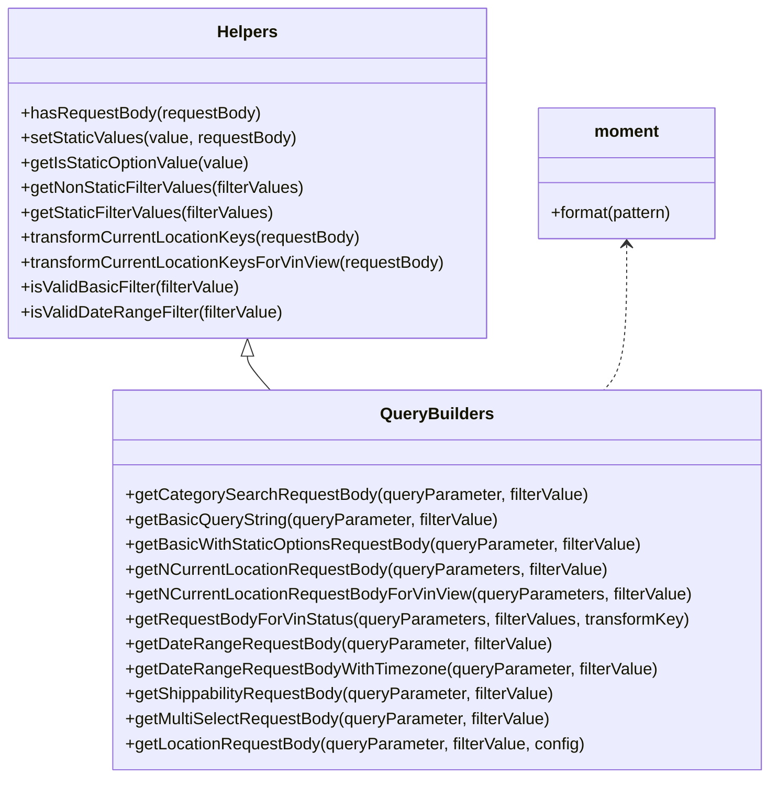

# Diagram: web/portal/src/components/search-bar/open-search-filter-request-builder.js


> Auto-generated by Obscura crawlers

## Diagram 1

```mermaid
flowchart LR
  subgraph Helpers
    HR[hasRequestBody(requestBody)]
    GS[setStaticValues(value, requestBody)]
    GI[getIsStaticOptionValue(value)]
    GNS[getNonStaticFilterValues(filterValues)]
    GSS[getStaticFilterValues(filterValues)]
    TR1[transformCurrentLocationKeys(requestBody)]
    TR2[transformCurrentLocationKeysForVinView(requestBody)]
    IV[isValidBasicFilter(filterValue)]
    ID[isValidDateRangeFilter(filterValue)]
  end

  subgraph QueryBuilders
    CSG[getCategorySearchRequestBody(queryParameter, filterValue)]
    BQS[getBasicQueryString(queryParameter, filterValue)]
    BWS[getBasicWithStaticOptionsRequestBody(queryParameter, filterValue)]
    NCL[getNCurrentLocationRequestBody(queryParameters, filterValue)]
    NCLV[getNCurrentLocationRequestBodyForVinView(queryParameters, filterValue)]
    RSV[getRequestBodyForVinStatus(queryParameters, filterValues, transformKey)]
    DTR[getDateRangeRequestBody(queryParameter, filterValue)]
    DTT[getDateRangeRequestBodyWithTimezone(queryParameter, filterValue)]
    SHP[getShippabilityRequestBody(queryParameter, filterValue)]
    MSR[getMultiSelectRequestBody(queryParameter, filterValue)]
    LOC[getLocationRequestBody(queryParameter, filterValue, config)]
  end

  CSG -->|uses| GNS
  BQS -->|uses| IV
  BWS --> GNS
  BWS --> GSS
  BWS --> GS
  BWS --> HR
  MSR --> GNS
  MSR --> GSS
  MSR --> GS
  MSR --> HR
  NCL --> MSR
  NCL --> BWS
  NCL --> TR1
  NCLV --> MSR
  NCLV --> BWS
  NCLV --> TR2
  LOC --> GNS
  LOC --> GSS
  LOC --> GS
  LOC --> HR
  DTR --> ID
  DTR -->|formats| moment[(moment)]
  DTT --> ID
  DTT -->|formats| moment
  RSV -->|reads| filterValues[(filterValues)]
  RSV -->|outputs| transformKey
  SHP --> HR
  GI -->|used by| GNS
  GI -->|used by| GSS
```

> SVG rendering failed for this diagram.

## Diagram 2



### SVG

<svg id="container" width="742.990234375" xmlns="http://www.w3.org/2000/svg" class="classDiagram" height="750" viewBox="0 0 742.990234375 750" role="graphics-document document" aria-roledescription="class"><style>#container{font-family:"trebuchet ms",verdana,arial,sans-serif;font-size:16px;fill:#333;}@keyframes edge-animation-frame{from{stroke-dashoffset:0;}}@keyframes dash{to{stroke-dashoffset:0;}}#container .edge-animation-slow{stroke-dasharray:9,5!important;stroke-dashoffset:900;animation:dash 50s linear infinite;stroke-linecap:round;}#container .edge-animation-fast{stroke-dasharray:9,5!important;stroke-dashoffset:900;animation:dash 20s linear infinite;stroke-linecap:round;}#container .error-icon{fill:#552222;}#container .error-text{fill:#552222;stroke:#552222;}#container .edge-thickness-normal{stroke-width:1px;}#container .edge-thickness-thick{stroke-width:3.5px;}#container .edge-pattern-solid{stroke-dasharray:0;}#container .edge-thickness-invisible{stroke-width:0;fill:none;}#container .edge-pattern-dashed{stroke-dasharray:3;}#container .edge-pattern-dotted{stroke-dasharray:2;}#container .marker{fill:#333333;stroke:#333333;}#container .marker.cross{stroke:#333333;}#container svg{font-family:"trebuchet ms",verdana,arial,sans-serif;font-size:16px;}#container p{margin:0;}#container g.classGroup text{fill:#9370DB;stroke:none;font-family:"trebuchet ms",verdana,arial,sans-serif;font-size:10px;}#container g.classGroup text .title{font-weight:bolder;}#container .nodeLabel,#container .edgeLabel{color:#131300;}#container .edgeLabel .label rect{fill:#ECECFF;}#container .label text{fill:#131300;}#container .labelBkg{background:#ECECFF;}#container .edgeLabel .label span{background:#ECECFF;}#container .classTitle{font-weight:bolder;}#container .node rect,#container .node circle,#container .node ellipse,#container .node polygon,#container .node path{fill:#ECECFF;stroke:#9370DB;stroke-width:1px;}#container .divider{stroke:#9370DB;stroke-width:1;}#container g.clickable{cursor:pointer;}#container g.classGroup rect{fill:#ECECFF;stroke:#9370DB;}#container g.classGroup line{stroke:#9370DB;stroke-width:1;}#container .classLabel .box{stroke:none;stroke-width:0;fill:#ECECFF;opacity:0.5;}#container .classLabel .label{fill:#9370DB;font-size:10px;}#container .relation{stroke:#333333;stroke-width:1;fill:none;}#container .dashed-line{stroke-dasharray:3;}#container .dotted-line{stroke-dasharray:1 2;}#container #compositionStart,#container .composition{fill:#333333!important;stroke:#333333!important;stroke-width:1;}#container #compositionEnd,#container .composition{fill:#333333!important;stroke:#333333!important;stroke-width:1;}#container #dependencyStart,#container .dependency{fill:#333333!important;stroke:#333333!important;stroke-width:1;}#container #dependencyStart,#container .dependency{fill:#333333!important;stroke:#333333!important;stroke-width:1;}#container #extensionStart,#container .extension{fill:transparent!important;stroke:#333333!important;stroke-width:1;}#container #extensionEnd,#container .extension{fill:transparent!important;stroke:#333333!important;stroke-width:1;}#container #aggregationStart,#container .aggregation{fill:transparent!important;stroke:#333333!important;stroke-width:1;}#container #aggregationEnd,#container .aggregation{fill:transparent!important;stroke:#333333!important;stroke-width:1;}#container #lollipopStart,#container .lollipop{fill:#ECECFF!important;stroke:#333333!important;stroke-width:1;}#container #lollipopEnd,#container .lollipop{fill:#ECECFF!important;stroke:#333333!important;stroke-width:1;}#container .edgeTerminals{font-size:11px;line-height:initial;}#container .classTitleText{text-anchor:middle;font-size:18px;fill:#333;}#container .label-icon{display:inline-block;height:1em;overflow:visible;vertical-align:-0.125em;}#container .node .label-icon path{fill:currentColor;stroke:revert;stroke-width:revert;}#container :root{--mermaid-font-family:"trebuchet ms",verdana,arial,sans-serif;}</style><g><defs><marker id="container_class-aggregationStart" class="marker aggregation class" refX="18" refY="7" markerWidth="190" markerHeight="240" orient="auto"><path d="M 18,7 L9,13 L1,7 L9,1 Z"></path></marker></defs><defs><marker id="container_class-aggregationEnd" class="marker aggregation class" refX="1" refY="7" markerWidth="20" markerHeight="28" orient="auto"><path d="M 18,7 L9,13 L1,7 L9,1 Z"></path></marker></defs><defs><marker id="container_class-extensionStart" class="marker extension class" refX="18" refY="7" markerWidth="190" markerHeight="240" orient="auto"><path d="M 1,7 L18,13 V 1 Z"></path></marker></defs><defs><marker id="container_class-extensionEnd" class="marker extension class" refX="1" refY="7" markerWidth="20" markerHeight="28" orient="auto"><path d="M 1,1 V 13 L18,7 Z"></path></marker></defs><defs><marker id="container_class-compositionStart" class="marker composition class" refX="18" refY="7" markerWidth="190" markerHeight="240" orient="auto"><path d="M 18,7 L9,13 L1,7 L9,1 Z"></path></marker></defs><defs><marker id="container_class-compositionEnd" class="marker composition class" refX="1" refY="7" markerWidth="20" markerHeight="28" orient="auto"><path d="M 18,7 L9,13 L1,7 L9,1 Z"></path></marker></defs><defs><marker id="container_class-dependencyStart" class="marker dependency class" refX="6" refY="7" markerWidth="190" markerHeight="240" orient="auto"><path d="M 5,7 L9,13 L1,7 L9,1 Z"></path></marker></defs><defs><marker id="container_class-dependencyEnd" class="marker dependency class" refX="13" refY="7" markerWidth="20" markerHeight="28" orient="auto"><path d="M 18,7 L9,13 L14,7 L9,1 Z"></path></marker></defs><defs><marker id="container_class-lollipopStart" class="marker lollipop class" refX="13" refY="7" markerWidth="190" markerHeight="240" orient="auto"><circle stroke="black" fill="transparent" cx="7" cy="7" r="6"></circle></marker></defs><defs><marker id="container_class-lollipopEnd" class="marker lollipop class" refX="1" refY="7" markerWidth="190" markerHeight="240" orient="auto"><circle stroke="black" fill="transparent" cx="7" cy="7" r="6"></circle></marker></defs><g class="root"><g class="clusters"></g><g class="edgePaths"><path d="M238.934,343.25L238.934,344.542C238.934,345.833,238.934,348.417,242.624,353.875C246.314,359.333,253.694,367.667,257.384,371.833L261.074,376" id="id_Helpers_QueryBuilders_1" class="edge-thickness-normal edge-pattern-solid relation" style=";;;" data-edge="true" data-et="edge" data-id="id_Helpers_QueryBuilders_1" data-points="W3sieCI6MjM4LjkzMzU5Mzc1LCJ5IjozMjZ9LHsieCI6MjM4LjkzMzU5Mzc1LCJ5IjozNTF9LHsieCI6MjYxLjA3NDA5NjY3OTY4NzUsInkiOjM3Nn1d" marker-start="url(#container_class-extensionStart)"></path><path d="M607.352,236L607.352,255.167C607.352,274.333,607.352,312.667,603.661,336C599.971,359.333,592.591,367.667,588.901,371.833L585.211,376" id="id_moment_QueryBuilders_2" class="edge-thickness-normal edge-pattern-dashed relation" style=";;;" data-edge="true" data-et="edge" data-id="id_moment_QueryBuilders_2" data-points="W3sieCI6NjA3LjM1MTU2MjUsInkiOjIzMH0seyJ4Ijo2MDcuMzUxNTYyNSwieSI6MzUxfSx7IngiOjU4NS4yMTEwNTk1NzAzMTI1LCJ5IjozNzZ9XQ==" marker-start="url(#container_class-dependencyStart)"></path></g><g class="edgeLabels"><g class="edgeLabel"><g class="label" data-id="id_Helpers_QueryBuilders_1" transform="translate(0, 0)"><foreignObject width="0" height="0"><div xmlns="http://www.w3.org/1999/xhtml" class="labelBkg" style="display: table-cell; white-space: nowrap; line-height: 1.5; max-width: 200px; text-align: center;"><span class="edgeLabel"></span></div></foreignObject></g></g><g class="edgeLabel"><g class="label" data-id="id_moment_QueryBuilders_2" transform="translate(0, 0)"><foreignObject width="0" height="0"><div xmlns="http://www.w3.org/1999/xhtml" class="labelBkg" style="display: table-cell; white-space: nowrap; line-height: 1.5; max-width: 200px; text-align: center;"><span class="edgeLabel"></span></div></foreignObject></g></g></g><g class="nodes"><g class="node default" id="classId-Helpers-0" transform="translate(238.93359375, 167)"><g class="basic label-container"><path d="M-230.93359375 -159 L230.93359375 -159 L230.93359375 159 L-230.93359375 159" stroke="none" stroke-width="0" fill="#ECECFF" style=""></path><path d="M-230.93359375 -159 C-87.32944412710444 -159, 56.274705495791125 -159, 230.93359375 -159 M-230.93359375 -159 C-107.14273726086671 -159, 16.64811922826658 -159, 230.93359375 -159 M230.93359375 -159 C230.93359375 -48.50514532602095, 230.93359375 61.9897093479581, 230.93359375 159 M230.93359375 -159 C230.93359375 -73.43794686445096, 230.93359375 12.124106271098071, 230.93359375 159 M230.93359375 159 C86.55765610694971 159, -57.818281536100585 159, -230.93359375 159 M230.93359375 159 C117.44155312389476 159, 3.9495124977895273 159, -230.93359375 159 M-230.93359375 159 C-230.93359375 63.77528272055177, -230.93359375 -31.449434558896456, -230.93359375 -159 M-230.93359375 159 C-230.93359375 75.97621876207633, -230.93359375 -7.047562475847343, -230.93359375 -159" stroke="#9370DB" stroke-width="1.3" fill="none" stroke-dasharray="0 0" style=""></path></g><g class="annotation-group text" transform="translate(0, -135)"></g><g class="label-group text" transform="translate(-28.2890625, -135)"><g class="label" style="font-weight: bolder" transform="translate(0,-12)"><foreignObject width="56.578125" height="24"><div xmlns="http://www.w3.org/1999/xhtml" style="display: table-cell; white-space: nowrap; line-height: 1.5; max-width: 106px; text-align: center;"><span class="nodeLabel markdown-node-label" style=""><p>Helpers</p></span></div></foreignObject></g></g><g class="members-group text" transform="translate(-218.93359375, -87)"></g><g class="methods-group text" transform="translate(-218.93359375, -57)"><g class="label" style="" transform="translate(0,-12)"><foreignObject width="231.046875" height="24"><div xmlns="http://www.w3.org/1999/xhtml" style="display: table-cell; white-space: nowrap; line-height: 1.5; max-width: 288px; text-align: center;"><span class="nodeLabel markdown-node-label" style=""><p>+hasRequestBody(requestBody)</p></span></div></foreignObject></g><g class="label" style="" transform="translate(0,12)"><foreignObject width="266.921875" height="24"><div xmlns="http://www.w3.org/1999/xhtml" style="display: table-cell; white-space: nowrap; line-height: 1.5; max-width: 324px; text-align: center;"><span class="nodeLabel markdown-node-label" style=""><p>+setStaticValues(value, requestBody)</p></span></div></foreignObject></g><g class="label" style="" transform="translate(0,36)"><foreignObject width="222.125" height="24"><div xmlns="http://www.w3.org/1999/xhtml" style="display: table-cell; white-space: nowrap; line-height: 1.5; max-width: 279px; text-align: center;"><span class="nodeLabel markdown-node-label" style=""><p>+getIsStaticOptionValue(value)</p></span></div></foreignObject></g><g class="label" style="" transform="translate(0,60)"><foreignObject width="276.828125" height="24"><div xmlns="http://www.w3.org/1999/xhtml" style="display: table-cell; white-space: nowrap; line-height: 1.5; max-width: 334px; text-align: center;"><span class="nodeLabel markdown-node-label" style=""><p>+getNonStaticFilterValues(filterValues)</p></span></div></foreignObject></g><g class="label" style="" transform="translate(0,84)"><foreignObject width="247.171875" height="24"><div xmlns="http://www.w3.org/1999/xhtml" style="display: table-cell; white-space: nowrap; line-height: 1.5; max-width: 305px; text-align: center;"><span class="nodeLabel markdown-node-label" style=""><p>+getStaticFilterValues(filterValues)</p></span></div></foreignObject></g><g class="label" style="" transform="translate(0,108)"><foreignObject width="330.375" height="24"><div xmlns="http://www.w3.org/1999/xhtml" style="display: table-cell; white-space: nowrap; line-height: 1.5; max-width: 388px; text-align: center;"><span class="nodeLabel markdown-node-label" style=""><p>+transformCurrentLocationKeys(requestBody)</p></span></div></foreignObject></g><g class="label" style="" transform="translate(0,132)"><foreignObject width="409.578125" height="24"><div xmlns="http://www.w3.org/1999/xhtml" style="display: table-cell; white-space: nowrap; line-height: 1.5; max-width: 467px; text-align: center;"><span class="nodeLabel markdown-node-label" style=""><p>+transformCurrentLocationKeysForVinView(requestBody)</p></span></div></foreignObject></g><g class="label" style="" transform="translate(0,156)"><foreignObject width="214.578125" height="24"><div xmlns="http://www.w3.org/1999/xhtml" style="display: table-cell; white-space: nowrap; line-height: 1.5; max-width: 272px; text-align: center;"><span class="nodeLabel markdown-node-label" style=""><p>+isValidBasicFilter(filterValue)</p></span></div></foreignObject></g><g class="label" style="" transform="translate(0,180)"><foreignObject width="254.171875" height="24"><div xmlns="http://www.w3.org/1999/xhtml" style="display: table-cell; white-space: nowrap; line-height: 1.5; max-width: 312px; text-align: center;"><span class="nodeLabel markdown-node-label" style=""><p>+isValidDateRangeFilter(filterValue)</p></span></div></foreignObject></g></g><g class="divider" style=""><path d="M-230.93359375 -111 C-112.36204825023127 -111, 6.209497249537463 -111, 230.93359375 -111 M-230.93359375 -111 C-69.21735945609586 -111, 92.49887483780827 -111, 230.93359375 -111" stroke="#9370DB" stroke-width="1.3" fill="none" stroke-dasharray="0 0" style=""></path></g><g class="divider" style=""><path d="M-230.93359375 -87 C-63.32875938443175 -87, 104.2760749811365 -87, 230.93359375 -87 M-230.93359375 -87 C-91.36366527374415 -87, 48.20626320251171 -87, 230.93359375 -87" stroke="#9370DB" stroke-width="1.3" fill="none" stroke-dasharray="0 0" style=""></path></g></g><g class="node default" id="classId-QueryBuilders-1" transform="translate(423.142578125, 559)"><g class="basic label-container"><path d="M-311.84765625 -183 L311.84765625 -183 L311.84765625 183 L-311.84765625 183" stroke="none" stroke-width="0" fill="#ECECFF" style=""></path><path d="M-311.84765625 -183 C-76.03004622668644 -183, 159.78756379662713 -183, 311.84765625 -183 M-311.84765625 -183 C-123.9325815345332 -183, 63.9824931809336 -183, 311.84765625 -183 M311.84765625 -183 C311.84765625 -60.239635786118995, 311.84765625 62.52072842776201, 311.84765625 183 M311.84765625 -183 C311.84765625 -97.61394523349418, 311.84765625 -12.227890466988356, 311.84765625 183 M311.84765625 183 C172.7567455515392 183, 33.66583485307842 183, -311.84765625 183 M311.84765625 183 C77.31222379672735 183, -157.2232086565453 183, -311.84765625 183 M-311.84765625 183 C-311.84765625 39.612231902785936, -311.84765625 -103.77553619442813, -311.84765625 -183 M-311.84765625 183 C-311.84765625 55.67745459510789, -311.84765625 -71.64509080978422, -311.84765625 -183" stroke="#9370DB" stroke-width="1.3" fill="none" stroke-dasharray="0 0" style=""></path></g><g class="annotation-group text" transform="translate(0, -159)"></g><g class="label-group text" transform="translate(-52.1640625, -159)"><g class="label" style="font-weight: bolder" transform="translate(0,-12)"><foreignObject width="104.328125" height="24"><div xmlns="http://www.w3.org/1999/xhtml" style="display: table-cell; white-space: nowrap; line-height: 1.5; max-width: 153px; text-align: center;"><span class="nodeLabel markdown-node-label" style=""><p>QueryBuilders</p></span></div></foreignObject></g></g><g class="members-group text" transform="translate(-299.84765625, -111)"></g><g class="methods-group text" transform="translate(-299.84765625, -81)"><g class="label" style="" transform="translate(0,-12)"><foreignObject width="444.953125" height="24"><div xmlns="http://www.w3.org/1999/xhtml" style="display: table-cell; white-space: nowrap; line-height: 1.5; max-width: 502px; text-align: center;"><span class="nodeLabel markdown-node-label" style=""><p>+getCategorySearchRequestBody(queryParameter, filterValue)</p></span></div></foreignObject></g><g class="label" style="" transform="translate(0,12)"><foreignObject width="361.4375" height="24"><div xmlns="http://www.w3.org/1999/xhtml" style="display: table-cell; white-space: nowrap; line-height: 1.5; max-width: 419px; text-align: center;"><span class="nodeLabel markdown-node-label" style=""><p>+getBasicQueryString(queryParameter, filterValue)</p></span></div></foreignObject></g><g class="label" style="" transform="translate(0,36)"><foreignObject width="501.890625" height="24"><div xmlns="http://www.w3.org/1999/xhtml" style="display: table-cell; white-space: nowrap; line-height: 1.5; max-width: 559px; text-align: center;"><span class="nodeLabel markdown-node-label" style=""><p>+getBasicWithStaticOptionsRequestBody(queryParameter, filterValue)</p></span></div></foreignObject></g><g class="label" style="" transform="translate(0,60)"><foreignObject width="468.328125" height="24"><div xmlns="http://www.w3.org/1999/xhtml" style="display: table-cell; white-space: nowrap; line-height: 1.5; max-width: 526px; text-align: center;"><span class="nodeLabel markdown-node-label" style=""><p>+getNCurrentLocationRequestBody(queryParameters, filterValue)</p></span></div></foreignObject></g><g class="label" style="" transform="translate(0,84)"><foreignObject width="547.53125" height="24"><div xmlns="http://www.w3.org/1999/xhtml" style="display: table-cell; white-space: nowrap; line-height: 1.5; max-width: 605px; text-align: center;"><span class="nodeLabel markdown-node-label" style=""><p>+getNCurrentLocationRequestBodyForVinView(queryParameters, filterValue)</p></span></div></foreignObject></g><g class="label" style="" transform="translate(0,108)"><foreignObject width="545.453125" height="24"><div xmlns="http://www.w3.org/1999/xhtml" style="display: table-cell; white-space: nowrap; line-height: 1.5; max-width: 603px; text-align: center;"><span class="nodeLabel markdown-node-label" style=""><p>+getRequestBodyForVinStatus(queryParameters, filterValues, transformKey)</p></span></div></foreignObject></g><g class="label" style="" transform="translate(0,132)"><foreignObject width="410.515625" height="24"><div xmlns="http://www.w3.org/1999/xhtml" style="display: table-cell; white-space: nowrap; line-height: 1.5; max-width: 468px; text-align: center;"><span class="nodeLabel markdown-node-label" style=""><p>+getDateRangeRequestBody(queryParameter, filterValue)</p></span></div></foreignObject></g><g class="label" style="" transform="translate(0,156)"><foreignObject width="512.828125" height="24"><div xmlns="http://www.w3.org/1999/xhtml" style="display: table-cell; white-space: nowrap; line-height: 1.5; max-width: 570px; text-align: center;"><span class="nodeLabel markdown-node-label" style=""><p>+getDateRangeRequestBodyWithTimezone(queryParameter, filterValue)</p></span></div></foreignObject></g><g class="label" style="" transform="translate(0,180)"><foreignObject width="419.984375" height="24"><div xmlns="http://www.w3.org/1999/xhtml" style="display: table-cell; white-space: nowrap; line-height: 1.5; max-width: 477px; text-align: center;"><span class="nodeLabel markdown-node-label" style=""><p>+getShippabilityRequestBody(queryParameter, filterValue)</p></span></div></foreignObject></g><g class="label" style="" transform="translate(0,204)"><foreignObject width="413.953125" height="24"><div xmlns="http://www.w3.org/1999/xhtml" style="display: table-cell; white-space: nowrap; line-height: 1.5; max-width: 471px; text-align: center;"><span class="nodeLabel markdown-node-label" style=""><p>+getMultiSelectRequestBody(queryParameter, filterValue)</p></span></div></foreignObject></g><g class="label" style="" transform="translate(0,228)"><foreignObject width="446.625" height="24"><div xmlns="http://www.w3.org/1999/xhtml" style="display: table-cell; white-space: nowrap; line-height: 1.5; max-width: 504px; text-align: center;"><span class="nodeLabel markdown-node-label" style=""><p>+getLocationRequestBody(queryParameter, filterValue, config)</p></span></div></foreignObject></g></g><g class="divider" style=""><path d="M-311.84765625 -135 C-93.86610291322427 -135, 124.11545042355147 -135, 311.84765625 -135 M-311.84765625 -135 C-165.82495471587123 -135, -19.802253181742458 -135, 311.84765625 -135" stroke="#9370DB" stroke-width="1.3" fill="none" stroke-dasharray="0 0" style=""></path></g><g class="divider" style=""><path d="M-311.84765625 -111 C-148.83846454509637 -111, 14.170727159807257 -111, 311.84765625 -111 M-311.84765625 -111 C-182.50793267128884 -111, -53.16820909257768 -111, 311.84765625 -111" stroke="#9370DB" stroke-width="1.3" fill="none" stroke-dasharray="0 0" style=""></path></g></g><g class="node default" id="classId-moment-2" transform="translate(607.3515625, 167)"><g class="basic label-container"><path d="M-87.484375 -63 L87.484375 -63 L87.484375 63 L-87.484375 63" stroke="none" stroke-width="0" fill="#ECECFF" style=""></path><path d="M-87.484375 -63 C-32.87772856127613 -63, 21.728917877447742 -63, 87.484375 -63 M-87.484375 -63 C-36.42426325464525 -63, 14.635848490709506 -63, 87.484375 -63 M87.484375 -63 C87.484375 -22.909223078977917, 87.484375 17.181553842044167, 87.484375 63 M87.484375 -63 C87.484375 -34.04897726460466, 87.484375 -5.097954529209325, 87.484375 63 M87.484375 63 C43.46368294910284 63, -0.5570091017943213 63, -87.484375 63 M87.484375 63 C38.09254081929436 63, -11.299293361411273 63, -87.484375 63 M-87.484375 63 C-87.484375 30.562720020224063, -87.484375 -1.874559959551874, -87.484375 -63 M-87.484375 63 C-87.484375 18.526633999005625, -87.484375 -25.94673200198875, -87.484375 -63" stroke="#9370DB" stroke-width="1.3" fill="none" stroke-dasharray="0 0" style=""></path></g><g class="annotation-group text" transform="translate(0, -39)"></g><g class="label-group text" transform="translate(-30.3125, -39)"><g class="label" style="font-weight: bolder" transform="translate(0,-12)"><foreignObject width="60.625" height="24"><div xmlns="http://www.w3.org/1999/xhtml" style="display: table-cell; white-space: nowrap; line-height: 1.5; max-width: 111px; text-align: center;"><span class="nodeLabel markdown-node-label" style=""><p>moment</p></span></div></foreignObject></g></g><g class="members-group text" transform="translate(-75.484375, 9)"></g><g class="methods-group text" transform="translate(-75.484375, 39)"><g class="label" style="" transform="translate(0,-12)"><foreignObject width="120.65625" height="24"><div xmlns="http://www.w3.org/1999/xhtml" style="display: table-cell; white-space: nowrap; line-height: 1.5; max-width: 178px; text-align: center;"><span class="nodeLabel markdown-node-label" style=""><p>+format(pattern)</p></span></div></foreignObject></g></g><g class="divider" style=""><path d="M-87.484375 -15 C-30.832540845834743 -15, 25.819293308330515 -15, 87.484375 -15 M-87.484375 -15 C-18.09497125050258 -15, 51.29443249899484 -15, 87.484375 -15" stroke="#9370DB" stroke-width="1.3" fill="none" stroke-dasharray="0 0" style=""></path></g><g class="divider" style=""><path d="M-87.484375 9 C-27.040970593446538 9, 33.402433813106924 9, 87.484375 9 M-87.484375 9 C-35.93640930441327 9, 15.611556391173465 9, 87.484375 9" stroke="#9370DB" stroke-width="1.3" fill="none" stroke-dasharray="0 0" style=""></path></g></g></g></g></g></svg>
