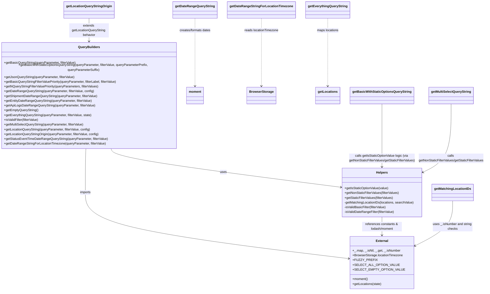

# Diagram: web/portal/src/components/search-bar/search-filter-query-strings.js

> Auto-generated by Obscura crawlers

## Mermaid

### SVG

<svg id="container" width="2429.34375" xmlns="http://www.w3.org/2000/svg" class="classDiagram" height="1438" viewBox="0 0 2429.34375 1438" role="graphics-document document" aria-roledescription="class"><g><defs><marker id="container_class-aggregationStart" class="marker aggregation class" refX="18" refY="7" markerWidth="190" markerHeight="240" orient="auto"><path d="M 18,7 L9,13 L1,7 L9,1 Z"></path></marker></defs><defs><marker id="container_class-aggregationEnd" class="marker aggregation class" refX="1" refY="7" markerWidth="20" markerHeight="28" orient="auto"><path d="M 18,7 L9,13 L1,7 L9,1 Z"></path></marker></defs><defs><marker id="container_class-extensionStart" class="marker extension class" refX="18" refY="7" markerWidth="190" markerHeight="240" orient="auto"><path d="M 1,7 L18,13 V 1 Z"></path></marker></defs><defs><marker id="container_class-extensionEnd" class="marker extension class" refX="1" refY="7" markerWidth="20" markerHeight="28" orient="auto"><path d="M 1,1 V 13 L18,7 Z"></path></marker></defs><defs><marker id="container_class-compositionStart" class="marker composition class" refX="18" refY="7" markerWidth="190" markerHeight="240" orient="auto"><path d="M 18,7 L9,13 L1,7 L9,1 Z"></path></marker></defs><defs><marker id="container_class-compositionEnd" class="marker composition class" refX="1" refY="7" markerWidth="20" markerHeight="28" orient="auto"><path d="M 18,7 L9,13 L1,7 L9,1 Z"></path></marker></defs><defs><marker id="container_class-dependencyStart" class="marker dependency class" refX="6" refY="7" markerWidth="190" markerHeight="240" orient="auto"><path d="M 5,7 L9,13 L1,7 L9,1 Z"></path></marker></defs><defs><marker id="container_class-dependencyEnd" class="marker dependency class" refX="13" refY="7" markerWidth="20" markerHeight="28" orient="auto"><path d="M 18,7 L9,13 L14,7 L9,1 Z"></path></marker></defs><defs><marker id="container_class-lollipopStart" class="marker lollipop class" refX="13" refY="7" markerWidth="190" markerHeight="240" orient="auto"><circle stroke="black" fill="transparent" cx="7" cy="7" r="6"></circle></marker></defs><defs><marker id="container_class-lollipopEnd" class="marker lollipop class" refX="1" refY="7" markerWidth="190" markerHeight="240" orient="auto"><circle stroke="black" fill="transparent" cx="7" cy="7" r="6"></circle></marker></defs><g class="root"><g class="clusters"></g><g class="edgePaths"><path d="M567.837,724L571.399,732.167C574.961,740.333,582.085,756.667,769.465,788.954C956.845,821.24,1324.481,869.481,1508.299,893.601L1692.117,917.721" id="id_QueryBuilders_Helpers_1" class="edge-thickness-normal edge-pattern-solid relation" style=";;;" data-edge="true" data-et="edge" data-id="id_QueryBuilders_Helpers_1" data-points="W3sieCI6NTY3LjgzNjY1MDY0NzYxNTEsInkiOjcyNH0seyJ4Ijo1ODkuMjA4OTg0Mzc1LCJ5Ijo3NzN9LHsieCI6MTY5OC4wNjY0MDYyNSwieSI6OTE4LjUwMTcxNDI3NTQ5N31d" marker-end="url(#container_class-dependencyEnd)"></path><path d="M441.308,724L440.818,732.167C440.328,740.333,439.348,756.667,438.857,793.5C438.367,830.333,438.367,887.667,438.367,945C438.367,1002.333,438.367,1059.667,655.35,1115.203C872.333,1170.739,1306.299,1224.479,1523.281,1251.349L1740.264,1278.218" id="id_QueryBuilders_External_2" class="edge-thickness-normal edge-pattern-solid relation" style=";;;" data-edge="true" data-et="edge" data-id="id_QueryBuilders_External_2" data-points="W3sieCI6NDQxLjMwODE2OTcxNjI4MjksInkiOjcyNH0seyJ4Ijo0MzguMzY3MTg3NSwieSI6NzczfSx7IngiOjQzOC4zNjcxODc1LCJ5Ijo5NDV9LHsieCI6NDM4LjM2NzE4NzUsInkiOjExMTd9LHsieCI6MTc0Ni4yMTg3NSwieSI6MTI3OC45NTU3Njk5NTAyOTE0fV0=" marker-end="url(#container_class-dependencyEnd)"></path><path d="M1900.008,1068L1900.008,1076.167C1900.008,1084.333,1900.008,1100.667,1900.008,1116C1900.008,1131.333,1900.008,1145.667,1900.008,1152.833L1900.008,1160" id="id_Helpers_External_3" class="edge-thickness-normal edge-pattern-solid relation" style=";;;" data-edge="true" data-et="edge" data-id="id_Helpers_External_3" data-points="W3sieCI6MTkwMC4wMDc4MTI1LCJ5IjoxMDY4fSx7IngiOjE5MDAuMDA3ODEyNSwieSI6MTExN30seyJ4IjoxOTAwLjAwNzgxMjUsInkiOjExNjZ9XQ==" marker-end="url(#container_class-dependencyEnd)"></path><path d="M997.539,92L997.539,102.167C997.539,112.333,997.539,132.667,997.539,187.5C997.539,242.333,997.539,331.667,997.539,376.333L997.539,421" id="id_getDateRangeQueryString_moment_4" class="edge-thickness-normal edge-pattern-dashed relation" style=";;;" data-edge="true" data-et="edge" data-id="id_getDateRangeQueryString_moment_4" data-points="W3sieCI6OTk3LjUzOTA2MjUsInkiOjkyfSx7IngiOjk5Ny41MzkwNjI1LCJ5IjoxNTN9LHsieCI6OTk3LjUzOTA2MjUsInkiOjQyN31d" marker-end="url(#container_class-dependencyEnd)"></path><path d="M1317.766,92L1317.766,102.167C1317.766,112.333,1317.766,132.667,1317.766,187.5C1317.766,242.333,1317.766,331.667,1317.766,376.333L1317.766,421" id="id_getDateRangeStringForLocationTimezone_BrowserStorage_5" class="edge-thickness-normal edge-pattern-dashed relation" style=";;;" data-edge="true" data-et="edge" data-id="id_getDateRangeStringForLocationTimezone_BrowserStorage_5" data-points="W3sieCI6MTMxNy43NjU2MjUsInkiOjkyfSx7IngiOjEzMTcuNzY1NjI1LCJ5IjoxNTN9LHsieCI6MTMxNy43NjU2MjUsInkiOjQyN31d" marker-end="url(#container_class-dependencyEnd)"></path><path d="M1637.453,92L1637.453,102.167C1637.453,112.333,1637.453,132.667,1637.453,187.5C1637.453,242.333,1637.453,331.667,1637.453,376.333L1637.453,421" id="id_getEverythingQueryString_getLocations_6" class="edge-thickness-normal edge-pattern-dashed relation" style=";;;" data-edge="true" data-et="edge" data-id="id_getEverythingQueryString_getLocations_6" data-points="W3sieCI6MTYzNy40NTMxMjUsInkiOjkyfSx7IngiOjE2MzcuNDUzMTI1LCJ5IjoxNTN9LHsieCI6MTYzNy40NTMxMjUsInkiOjQyN31d" marker-end="url(#container_class-dependencyEnd)"></path><path d="M2251.793,987L2251.793,1008.667C2251.793,1030.333,2251.793,1073.667,2219.683,1111.855C2187.573,1150.043,2123.352,1183.085,2091.242,1199.606L2059.132,1216.128" id="id_getMatchingLocationIDs_External_7" class="edge-thickness-normal edge-pattern-solid relation" style=";;;" data-edge="true" data-et="edge" data-id="id_getMatchingLocationIDs_External_7" data-points="W3sieCI6MjI1MS43OTI5Njg3NSwieSI6OTg3fSx7IngiOjIyNTEuNzkyOTY4NzUsInkiOjExMTd9LHsieCI6MjA1My43OTY4NzUsInkiOjEyMTguODcyNjY5NTMxNTE5fV0=" marker-end="url(#container_class-dependencyEnd)"></path><path d="M1900.008,511L1900.008,554.667C1900.008,598.333,1900.008,685.667,1900.008,736.5C1900.008,787.333,1900.008,801.667,1900.008,808.833L1900.008,816" id="id_getBasicWithStaticOptionsQueryString_Helpers_8" class="edge-thickness-normal edge-pattern-solid relation" style=";;;" data-edge="true" data-et="edge" data-id="id_getBasicWithStaticOptionsQueryString_Helpers_8" data-points="W3sieCI6MTkwMC4wMDc4MTI1LCJ5Ijo1MTF9LHsieCI6MTkwMC4wMDc4MTI1LCJ5Ijo3NzN9LHsieCI6MTkwMC4wMDc4MTI1LCJ5Ijo4MjJ9XQ==" marker-end="url(#container_class-dependencyEnd)"></path><path d="M2255.094,511L2255.094,554.667C2255.094,598.333,2255.094,685.667,2230.47,741.261C2205.846,796.855,2156.597,820.711,2131.973,832.638L2107.349,844.566" id="id_getMultiSelectQueryString_Helpers_9" class="edge-thickness-normal edge-pattern-solid relation" style=";;;" data-edge="true" data-et="edge" data-id="id_getMultiSelectQueryString_Helpers_9" data-points="W3sieCI6MjI1NS4wOTM3NSwieSI6NTExfSx7IngiOjIyNTUuMDkzNzUsInkiOjc3M30seyJ4IjoyMTAxLjk0OTIxODc1LCJ5Ijo4NDcuMTgxNjQ2MTY4NDAxMX1d" marker-end="url(#container_class-dependencyEnd)"></path><path d="M456.613,92L456.613,102.167C456.613,112.333,456.613,132.667,456.613,152C456.613,171.333,456.613,189.667,456.613,198.833L456.613,208" id="id_getLocationQueryStringOrigin_QueryBuilders_10" class="edge-thickness-normal edge-pattern-solid relation" style=";;;" data-edge="true" data-et="edge" data-id="id_getLocationQueryStringOrigin_QueryBuilders_10" data-points="W3sieCI6NDU2LjYxMzI4MTI1LCJ5Ijo5Mn0seyJ4Ijo0NTYuNjEzMjgxMjUsInkiOjE1M30seyJ4Ijo0NTYuNjEzMjgxMjUsInkiOjIxNH1d" marker-end="url(#container_class-dependencyEnd)"></path></g><g class="edgeLabels"><g class="edgeLabel" transform="translate(1117.13579, 842.27334)"><g class="label" data-id="id_QueryBuilders_Helpers_1" transform="translate(-16.4921875, -12)"><foreignObject width="32.984375" height="24">

uses

</foreignObject></g></g><g class="edgeLabel" transform="translate(438.3671875, 945)"><g class="label" data-id="id_QueryBuilders_External_2" transform="translate(-28.25, -12)"><foreignObject width="56.5" height="24">

imports

</foreignObject></g></g><g class="edgeLabel" transform="translate(1900.0078125, 1117)"><g class="label" data-id="id_Helpers_External_3" transform="translate(-100, -24)"><foreignObject width="200" height="48">

references constants &amp; lodash/moment

</foreignObject></g></g><g class="edgeLabel" transform="translate(997.5390625, 153)"><g class="label" data-id="id_getDateRangeQueryString_moment_4" transform="translate(-80.40625, -12)"><foreignObject width="160.8125" height="24">

creates/formats dates

</foreignObject></g></g><g class="edgeLabel" transform="translate(1317.765625, 153)"><g class="label" data-id="id_getDateRangeStringForLocationTimezone_BrowserStorage_5" transform="translate(-86.4140625, -12)"><foreignObject width="172.828125" height="24">

reads locationTimezone

</foreignObject></g></g><g class="edgeLabel" transform="translate(1637.453125, 153)"><g class="label" data-id="id_getEverythingQueryString_getLocations_6" transform="translate(-55.1328125, -12)"><foreignObject width="110.265625" height="24">

maps locations

</foreignObject></g></g><g class="edgeLabel" transform="translate(2251.79296875, 1117)"><g class="label" data-id="id_getMatchingLocationIDs_External_7" transform="translate(-100, -24)"><foreignObject width="200" height="48">

uses _.isNumber and string checks

</foreignObject></g></g><g class="edgeLabel" transform="translate(1900.0078125, 773)"><g class="label" data-id="id_getBasicWithStaticOptionsQueryString_Helpers_8" transform="translate(-168.8359375, -24)"><foreignObject width="337.671875" height="48">

calls getIsStaticOptionValue logic (via getNonStaticFilterValues/getStaticFilterValues)

</foreignObject></g></g><g class="edgeLabel" transform="translate(2255.09375, 773)"><g class="label" data-id="id_getMultiSelectQueryString_Helpers_9" transform="translate(-166.25, -24)"><foreignObject width="332.5" height="48">

calls getNonStaticFilterValues/getStaticFilterValues

</foreignObject></g></g><g class="edgeLabel" transform="translate(456.61328125, 153)"><g class="label" data-id="id_getLocationQueryStringOrigin_QueryBuilders_10" transform="translate(-100, -36)"><foreignObject width="200" height="72">

extends getLocationQueryString behavior

</foreignObject></g></g></g><g class="nodes"><g class="node default" id="classId-QueryBuilders-0" transform="translate(456.61328125, 469)"><g class="basic label-container"><path d="M-448.61328125 -255 L448.61328125 -255 L448.61328125 255 L-448.61328125 255" stroke="none" stroke-width="0" fill="#ECECFF" style=""></path><path d="M-448.61328125 -255 C-133.44264810346505 -255, 181.7279850430699 -255, 448.61328125 -255 M-448.61328125 -255 C-264.0348402056733 -255, -79.4563991613465 -255, 448.61328125 -255 M448.61328125 -255 C448.61328125 -83.28856405399262, 448.61328125 88.42287189201477, 448.61328125 255 M448.61328125 -255 C448.61328125 -55.0608131588921, 448.61328125 144.8783736822158, 448.61328125 255 M448.61328125 255 C254.6114335134761 255, 60.6095857769522 255, -448.61328125 255 M448.61328125 255 C158.11372652508885 255, -132.3858281998223 255, -448.61328125 255 M-448.61328125 255 C-448.61328125 57.62510186177565, -448.61328125 -139.7497962764487, -448.61328125 -255 M-448.61328125 255 C-448.61328125 110.19211668931169, -448.61328125 -34.61576662137662, -448.61328125 -255" stroke="#9370DB" stroke-width="1.3" fill="none" stroke-dasharray="0 0" style=""></path></g><g class="annotation-group text" transform="translate(0, -231)"></g><g class="label-group text" transform="translate(-52.1640625, -231)"><g class="label" style="font-weight: bolder" transform="translate(0,-12)"><foreignObject width="104.328125" height="24">

QueryBuilders

</foreignObject></g></g><g class="members-group text" transform="translate(-436.61328125, -183)"></g><g class="methods-group text" transform="translate(-436.61328125, -153)"><g class="label" style="" transform="translate(0,-12)"><foreignObject width="361.4375" height="24">

+getBasicQueryString(queryParameter, filterValue)

</foreignObject></g><g class="label" style="" transform="translate(0,12)"><foreignObject width="821.0625" height="24">

+getBasicWithStaticOptionsQueryString(queryParameter, filterValue, queryParameterPrefix, queryParameterSuffix)

</foreignObject></g><g class="label" style="" transform="translate(0,36)"><foreignObject width="354.59375" height="24">

+getJsonQueryString(queryParameter, filterValue)

</foreignObject></g><g class="label" style="" transform="translate(0,60)"><foreignObject width="573.03125" height="24">

+getBasicQueryStringFilterValuePriority(queryParameter, filterLabel, filterValue)

</foreignObject></g><g class="label" style="" transform="translate(0,84)"><foreignObject width="480.15625" height="24">

+getNQueryStringFilterValuePriority(queryParameters, filterValues)

</foreignObject></g><g class="label" style="" transform="translate(0,108)"><foreignObject width="452.5" height="24">

+getDateRangeQueryString(queryParameter, filterValue, config)

</foreignObject></g><g class="label" style="" transform="translate(0,132)"><foreignObject width="470.71875" height="24">

+getShipmentDateRangeQueryString(queryParameter, filterValue)

</foreignObject></g><g class="label" style="" transform="translate(0,156)"><foreignObject width="442.65625" height="24">

+getEntityDateRangeQueryString(queryParameter, filterValue)

</foreignObject></g><g class="label" style="" transform="translate(0,180)"><foreignObject width="456.796875" height="24">

+getApiLogsDateRangeQueryString(queryParameter, filterValue)

</foreignObject></g><g class="label" style="" transform="translate(0,204)"><foreignObject width="172.125" height="24">

+getEmptyQueryString()

</foreignObject></g><g class="label" style="" transform="translate(0,228)"><foreignObject width="443.71875" height="24">

+getEverythingQueryString(queryParameter, filterValue, state)

</foreignObject></g><g class="label" style="" transform="translate(0,252)"><foreignObject width="176.6875" height="24">

+isValidFilter(filterValue)

</foreignObject></g><g class="label" style="" transform="translate(0,276)"><foreignObject width="404.453125" height="24">

+getMultiSelectQueryString(queryParameter, filterValue)

</foreignObject></g><g class="label" style="" transform="translate(0,300)"><foreignObject width="437.125" height="24">

+getLocationQueryString(queryParameter, filterValue, config)

</foreignObject></g><g class="label" style="" transform="translate(0,324)"><foreignObject width="481.09375" height="24">

+getLocationQueryStringOrigin(queryParameter, filterValue, config)

</foreignObject></g><g class="label" style="" transform="translate(0,348)"><foreignObject width="521.796875" height="24">

+getStatusEventTimeDateRangeQueryString(queryParameter, filterValue)

</foreignObject></g><g class="label" style="" transform="translate(0,372)"><foreignObject width="512.234375" height="24">

+getDateRangeStringForLocationTimezone(queryParameter, filterValue)

</foreignObject></g></g><g class="divider" style=""><path d="M-448.61328125 -207 C-255.77433392764198 -207, -62.93538660528395 -207, 448.61328125 -207 M-448.61328125 -207 C-165.60379877320509 -207, 117.40568370358983 -207, 448.61328125 -207" stroke="#9370DB" stroke-width="1.3" fill="none" stroke-dasharray="0 0" style=""></path></g><g class="divider" style=""><path d="M-448.61328125 -183 C-212.09465749594193 -183, 24.42396625811614 -183, 448.61328125 -183 M-448.61328125 -183 C-231.42977159576967 -183, -14.24626194153933 -183, 448.61328125 -183" stroke="#9370DB" stroke-width="1.3" fill="none" stroke-dasharray="0 0" style=""></path></g></g><g class="node default" id="classId-Helpers-1" transform="translate(1900.0078125, 945)"><g class="basic label-container"><path d="M-201.94140625 -123 L201.94140625 -123 L201.94140625 123 L-201.94140625 123" stroke="none" stroke-width="0" fill="#ECECFF" style=""></path><path d="M-201.94140625 -123 C-53.756280460438916 -123, 94.42884532912217 -123, 201.94140625 -123 M-201.94140625 -123 C-82.4119748278186 -123, 37.11745659436281 -123, 201.94140625 -123 M201.94140625 -123 C201.94140625 -44.35291997603784, 201.94140625 34.29416004792432, 201.94140625 123 M201.94140625 -123 C201.94140625 -51.74589525250106, 201.94140625 19.508209494997885, 201.94140625 123 M201.94140625 123 C67.21147976470297 123, -67.51844672059406 123, -201.94140625 123 M201.94140625 123 C89.99090649280177 123, -21.95959326439646 123, -201.94140625 123 M-201.94140625 123 C-201.94140625 32.591342742614884, -201.94140625 -57.81731451477023, -201.94140625 -123 M-201.94140625 123 C-201.94140625 33.015720550022834, -201.94140625 -56.96855889995433, -201.94140625 -123" stroke="#9370DB" stroke-width="1.3" fill="none" stroke-dasharray="0 0" style=""></path></g><g class="annotation-group text" transform="translate(0, -99)"></g><g class="label-group text" transform="translate(-28.2890625, -99)"><g class="label" style="font-weight: bolder" transform="translate(0,-12)"><foreignObject width="56.578125" height="24">

Helpers

</foreignObject></g></g><g class="members-group text" transform="translate(-189.94140625, -51)"></g><g class="methods-group text" transform="translate(-189.94140625, -21)"><g class="label" style="" transform="translate(0,-12)"><foreignObject width="222.125" height="24">

+getIsStaticOptionValue(value)

</foreignObject></g><g class="label" style="" transform="translate(0,12)"><foreignObject width="276.828125" height="24">

+getNonStaticFilterValues(filterValues)

</foreignObject></g><g class="label" style="" transform="translate(0,36)"><foreignObject width="247.171875" height="24">

+getStaticFilterValues(filterValues)

</foreignObject></g><g class="label" style="" transform="translate(0,60)"><foreignObject width="351.59375" height="24">

-getMatchingLocationIDs(locations, searchValue)

</foreignObject></g><g class="label" style="" transform="translate(0,84)"><foreignObject width="213.046875" height="24">

-isValidBasicFilter(filterValue)

</foreignObject></g><g class="label" style="" transform="translate(0,108)"><foreignObject width="252.625" height="24">

-isValidDateRangeFilter(filterValue)

</foreignObject></g></g><g class="divider" style=""><path d="M-201.94140625 -75 C-100.30577655319341 -75, 1.3298531436131782 -75, 201.94140625 -75 M-201.94140625 -75 C-109.97957892800035 -75, -18.0177516060007 -75, 201.94140625 -75" stroke="#9370DB" stroke-width="1.3" fill="none" stroke-dasharray="0 0" style=""></path></g><g class="divider" style=""><path d="M-201.94140625 -51 C-86.18476876576284 -51, 29.57186871847432 -51, 201.94140625 -51 M-201.94140625 -51 C-105.07285617083281 -51, -8.204306091665615 -51, 201.94140625 -51" stroke="#9370DB" stroke-width="1.3" fill="none" stroke-dasharray="0 0" style=""></path></g></g><g class="node default" id="classId-External-2" transform="translate(1900.0078125, 1298)"><g class="basic label-container"><path d="M-153.7890625 -132 L153.7890625 -132 L153.7890625 132 L-153.7890625 132" stroke="none" stroke-width="0" fill="#ECECFF" style=""></path><path d="M-153.7890625 -132 C-66.28024565394932 -132, 21.228571192101356 -132, 153.7890625 -132 M-153.7890625 -132 C-92.11513304827768 -132, -30.44120359655537 -132, 153.7890625 -132 M153.7890625 -132 C153.7890625 -70.17504760841803, 153.7890625 -8.350095216836053, 153.7890625 132 M153.7890625 -132 C153.7890625 -29.350449422115503, 153.7890625 73.299101155769, 153.7890625 132 M153.7890625 132 C51.28077812149064 132, -51.22750625701872 132, -153.7890625 132 M153.7890625 132 C75.02267374866473 132, -3.743715002670541 132, -153.7890625 132 M-153.7890625 132 C-153.7890625 51.18000383092662, -153.7890625 -29.639992338146754, -153.7890625 -132 M-153.7890625 132 C-153.7890625 77.32612907957335, -153.7890625 22.65225815914671, -153.7890625 -132" stroke="#9370DB" stroke-width="1.3" fill="none" stroke-dasharray="0 0" style=""></path></g><g class="annotation-group text" transform="translate(0, -108)"></g><g class="label-group text" transform="translate(-30.171875, -108)"><g class="label" style="font-weight: bolder" transform="translate(0,-12)"><foreignObject width="60.34375" height="24">

External

</foreignObject></g></g><g class="members-group text" transform="translate(-141.7890625, -60)"><g class="label" style="" transform="translate(0,-12)"><foreignObject width="236.328125" height="24">

+_.map, _.isNil, _.get, _.isNumber

</foreignObject></g><g class="label" style="" transform="translate(0,12)"><foreignObject width="253.40625" height="24">

+BrowserStorage.locationTimezone

</foreignObject></g><g class="label" style="" transform="translate(0,36)"><foreignObject width="107.46875" height="24">

+FUZZY_PREFIX

</foreignObject></g><g class="label" style="" transform="translate(0,60)"><foreignObject width="205.390625" height="24">

+SELECT_ALL_OPTION_VALUE

</foreignObject></g><g class="label" style="" transform="translate(0,84)"><foreignObject width="225.96875" height="24">

+SELECT_EMPTY_OPTION_VALUE

</foreignObject></g></g><g class="methods-group text" transform="translate(-141.7890625, 84)"><g class="label" style="" transform="translate(0,-12)"><foreignObject width="79" height="24">

+moment()

</foreignObject></g><g class="label" style="" transform="translate(0,12)"><foreignObject width="146.59375" height="24">

+getLocations(state)

</foreignObject></g></g><g class="divider" style=""><path d="M-153.7890625 -84 C-32.6361090351586 -84, 88.5168444296828 -84, 153.7890625 -84 M-153.7890625 -84 C-66.10588853816508 -84, 21.57728542366985 -84, 153.7890625 -84" stroke="#9370DB" stroke-width="1.3" fill="none" stroke-dasharray="0 0" style=""></path></g><g class="divider" style=""><path d="M-153.7890625 60 C-57.7801068011381 60, 38.22884889772379 60, 153.7890625 60 M-153.7890625 60 C-61.9607695454098 60, 29.867523409180393 60, 153.7890625 60" stroke="#9370DB" stroke-width="1.3" fill="none" stroke-dasharray="0 0" style=""></path></g></g><g class="node default" id="classId-getDateRangeQueryString-3" transform="translate(997.5390625, 50)"><g class="basic label-container"><path d="M-107.1328125 -42 L107.1328125 -42 L107.1328125 42 L-107.1328125 42" stroke="none" stroke-width="0" fill="#ECECFF" style=""></path><path d="M-107.1328125 -42 C-39.50185445998595 -42, 28.1291035800281 -42, 107.1328125 -42 M-107.1328125 -42 C-22.49164996270642 -42, 62.14951257458716 -42, 107.1328125 -42 M107.1328125 -42 C107.1328125 -10.866324835595048, 107.1328125 20.267350328809904, 107.1328125 42 M107.1328125 -42 C107.1328125 -13.153468620690745, 107.1328125 15.69306275861851, 107.1328125 42 M107.1328125 42 C50.19789934574065 42, -6.737013808518697 42, -107.1328125 42 M107.1328125 42 C30.80068180021901 42, -45.53144889956198 42, -107.1328125 42 M-107.1328125 42 C-107.1328125 14.198433084246922, -107.1328125 -13.603133831506156, -107.1328125 -42 M-107.1328125 42 C-107.1328125 23.590759609054018, -107.1328125 5.181519218108036, -107.1328125 -42" stroke="#9370DB" stroke-width="1.3" fill="none" stroke-dasharray="0 0" style=""></path></g><g class="annotation-group text" transform="translate(0, -18)"></g><g class="label-group text" transform="translate(-95.1328125, -18)"><g class="label" style="font-weight: bolder" transform="translate(0,-12)"><foreignObject width="190.265625" height="24">

getDateRangeQueryString

</foreignObject></g></g><g class="members-group text" transform="translate(-95.1328125, 30)"></g><g class="methods-group text" transform="translate(-95.1328125, 60)"></g><g class="divider" style=""><path d="M-107.1328125 6 C-33.89163396665252 6, 39.34954456669496 6, 107.1328125 6 M-107.1328125 6 C-21.61545762239402 6, 63.90189725521196 6, 107.1328125 6" stroke="#9370DB" stroke-width="1.3" fill="none" stroke-dasharray="0 0" style=""></path></g><g class="divider" style=""><path d="M-107.1328125 24 C-33.92020058850869 24, 39.292411322982616 24, 107.1328125 24 M-107.1328125 24 C-30.733986353671938 24, 45.664839792656124 24, 107.1328125 24" stroke="#9370DB" stroke-width="1.3" fill="none" stroke-dasharray="0 0" style=""></path></g></g><g class="node default" id="classId-moment-4" transform="translate(997.5390625, 469)"><g class="basic label-container"><path d="M-42.3125 -42 L42.3125 -42 L42.3125 42 L-42.3125 42" stroke="none" stroke-width="0" fill="#ECECFF" style=""></path><path d="M-42.3125 -42 C-14.070905644949399 -42, 14.170688710101203 -42, 42.3125 -42 M-42.3125 -42 C-14.418168227994677 -42, 13.476163544010646 -42, 42.3125 -42 M42.3125 -42 C42.3125 -18.39308642604527, 42.3125 5.213827147909463, 42.3125 42 M42.3125 -42 C42.3125 -11.065061002026976, 42.3125 19.869877995946048, 42.3125 42 M42.3125 42 C21.977608620164016 42, 1.6427172403280323 42, -42.3125 42 M42.3125 42 C21.56754263703973 42, 0.8225852740794579 42, -42.3125 42 M-42.3125 42 C-42.3125 10.4116765191425, -42.3125 -21.176646961715, -42.3125 -42 M-42.3125 42 C-42.3125 17.817071566397136, -42.3125 -6.3658568672057285, -42.3125 -42" stroke="#9370DB" stroke-width="1.3" fill="none" stroke-dasharray="0 0" style=""></path></g><g class="annotation-group text" transform="translate(0, -18)"></g><g class="label-group text" transform="translate(-30.3125, -18)"><g class="label" style="font-weight: bolder" transform="translate(0,-12)"><foreignObject width="60.625" height="24">

moment

</foreignObject></g></g><g class="members-group text" transform="translate(-30.3125, 30)"></g><g class="methods-group text" transform="translate(-30.3125, 60)"></g><g class="divider" style=""><path d="M-42.3125 6 C-14.746974441708968 6, 12.818551116582064 6, 42.3125 6 M-42.3125 6 C-24.065052257989798 6, -5.817604515979596 6, 42.3125 6" stroke="#9370DB" stroke-width="1.3" fill="none" stroke-dasharray="0 0" style=""></path></g><g class="divider" style=""><path d="M-42.3125 24 C-21.1016156882169 24, 0.10926862356620148 24, 42.3125 24 M-42.3125 24 C-22.892282814703684 24, -3.4720656294073677 24, 42.3125 24" stroke="#9370DB" stroke-width="1.3" fill="none" stroke-dasharray="0 0" style=""></path></g></g><g class="node default" id="classId-getDateRangeStringForLocationTimezone-5" transform="translate(1317.765625, 50)"><g class="basic label-container"><path d="M-163.09375 -42 L163.09375 -42 L163.09375 42 L-163.09375 42" stroke="none" stroke-width="0" fill="#ECECFF" style=""></path><path d="M-163.09375 -42 C-71.24953731282606 -42, 20.594675374347872 -42, 163.09375 -42 M-163.09375 -42 C-43.233823235904 -42, 76.626103528192 -42, 163.09375 -42 M163.09375 -42 C163.09375 -9.323142671659099, 163.09375 23.353714656681802, 163.09375 42 M163.09375 -42 C163.09375 -20.02343055449119, 163.09375 1.9531388910176233, 163.09375 42 M163.09375 42 C80.88573165787359 42, -1.3222866842528163 42, -163.09375 42 M163.09375 42 C76.55011926804212 42, -9.993511463915752 42, -163.09375 42 M-163.09375 42 C-163.09375 11.829646507881478, -163.09375 -18.340706984237045, -163.09375 -42 M-163.09375 42 C-163.09375 9.145345549016128, -163.09375 -23.709308901967745, -163.09375 -42" stroke="#9370DB" stroke-width="1.3" fill="none" stroke-dasharray="0 0" style=""></path></g><g class="annotation-group text" transform="translate(0, -18)"></g><g class="label-group text" transform="translate(-151.09375, -18)"><g class="label" style="font-weight: bolder" transform="translate(0,-12)"><foreignObject width="302.1875" height="24">

getDateRangeStringForLocationTimezone

</foreignObject></g></g><g class="members-group text" transform="translate(-151.09375, 30)"></g><g class="methods-group text" transform="translate(-151.09375, 60)"></g><g class="divider" style=""><path d="M-163.09375 6 C-38.81855618039272 6, 85.45663763921456 6, 163.09375 6 M-163.09375 6 C-71.15261014650758 6, 20.788529706984832 6, 163.09375 6" stroke="#9370DB" stroke-width="1.3" fill="none" stroke-dasharray="0 0" style=""></path></g><g class="divider" style=""><path d="M-163.09375 24 C-55.851927984190056 24, 51.38989403161989 24, 163.09375 24 M-163.09375 24 C-38.33994133043437 24, 86.41386733913126 24, 163.09375 24" stroke="#9370DB" stroke-width="1.3" fill="none" stroke-dasharray="0 0" style=""></path></g></g><g class="node default" id="classId-BrowserStorage-6" transform="translate(1317.765625, 469)"><g class="basic label-container"><path d="M-70.1328125 -42 L70.1328125 -42 L70.1328125 42 L-70.1328125 42" stroke="none" stroke-width="0" fill="#ECECFF" style=""></path><path d="M-70.1328125 -42 C-34.39323382835873 -42, 1.3463448432825373 -42, 70.1328125 -42 M-70.1328125 -42 C-31.027657426036683 -42, 8.077497647926634 -42, 70.1328125 -42 M70.1328125 -42 C70.1328125 -16.971086210418918, 70.1328125 8.057827579162165, 70.1328125 42 M70.1328125 -42 C70.1328125 -10.613212042962083, 70.1328125 20.773575914075835, 70.1328125 42 M70.1328125 42 C33.08553147267394 42, -3.9617495546521155 42, -70.1328125 42 M70.1328125 42 C19.37300685312765 42, -31.386798793744703 42, -70.1328125 42 M-70.1328125 42 C-70.1328125 19.01247190509341, -70.1328125 -3.9750561898131807, -70.1328125 -42 M-70.1328125 42 C-70.1328125 18.025024532087553, -70.1328125 -5.949950935824894, -70.1328125 -42" stroke="#9370DB" stroke-width="1.3" fill="none" stroke-dasharray="0 0" style=""></path></g><g class="annotation-group text" transform="translate(0, -18)"></g><g class="label-group text" transform="translate(-58.1328125, -18)"><g class="label" style="font-weight: bolder" transform="translate(0,-12)"><foreignObject width="116.265625" height="24">

BrowserStorage

</foreignObject></g></g><g class="members-group text" transform="translate(-58.1328125, 30)"></g><g class="methods-group text" transform="translate(-58.1328125, 60)"></g><g class="divider" style=""><path d="M-70.1328125 6 C-16.04701959698788 6, 38.03877330602424 6, 70.1328125 6 M-70.1328125 6 C-27.049397614003105 6, 16.03401727199379 6, 70.1328125 6" stroke="#9370DB" stroke-width="1.3" fill="none" stroke-dasharray="0 0" style=""></path></g><g class="divider" style=""><path d="M-70.1328125 24 C-26.61091498042653 24, 16.910982539146943 24, 70.1328125 24 M-70.1328125 24 C-40.84443539998456 24, -11.556058299969116 24, 70.1328125 24" stroke="#9370DB" stroke-width="1.3" fill="none" stroke-dasharray="0 0" style=""></path></g></g><g class="node default" id="classId-getEverythingQueryString-7" transform="translate(1637.453125, 50)"><g class="basic label-container"><path d="M-106.59375 -42 L106.59375 -42 L106.59375 42 L-106.59375 42" stroke="none" stroke-width="0" fill="#ECECFF" style=""></path><path d="M-106.59375 -42 C-25.48515033383015 -42, 55.6234493323397 -42, 106.59375 -42 M-106.59375 -42 C-27.679452009159988 -42, 51.234845981680024 -42, 106.59375 -42 M106.59375 -42 C106.59375 -17.955559491560425, 106.59375 6.088881016879149, 106.59375 42 M106.59375 -42 C106.59375 -19.70873160460743, 106.59375 2.5825367907851415, 106.59375 42 M106.59375 42 C53.893662301151984 42, 1.1935746023039684 42, -106.59375 42 M106.59375 42 C41.46627576369383 42, -23.66119847261234 42, -106.59375 42 M-106.59375 42 C-106.59375 18.00150677284952, -106.59375 -5.996986454300959, -106.59375 -42 M-106.59375 42 C-106.59375 10.472413668600506, -106.59375 -21.055172662798988, -106.59375 -42" stroke="#9370DB" stroke-width="1.3" fill="none" stroke-dasharray="0 0" style=""></path></g><g class="annotation-group text" transform="translate(0, -18)"></g><g class="label-group text" transform="translate(-94.59375, -18)"><g class="label" style="font-weight: bolder" transform="translate(0,-12)"><foreignObject width="189.1875" height="24">

getEverythingQueryString

</foreignObject></g></g><g class="members-group text" transform="translate(-94.59375, 30)"></g><g class="methods-group text" transform="translate(-94.59375, 60)"></g><g class="divider" style=""><path d="M-106.59375 6 C-62.70562650235596 6, -18.817503004711924 6, 106.59375 6 M-106.59375 6 C-33.774894715770046 6, 39.04396056845991 6, 106.59375 6" stroke="#9370DB" stroke-width="1.3" fill="none" stroke-dasharray="0 0" style=""></path></g><g class="divider" style=""><path d="M-106.59375 24 C-30.747609775917155 24, 45.09853044816569 24, 106.59375 24 M-106.59375 24 C-60.32328046814612 24, -14.052810936292246 24, 106.59375 24" stroke="#9370DB" stroke-width="1.3" fill="none" stroke-dasharray="0 0" style=""></path></g></g><g class="node default" id="classId-getLocations-8" transform="translate(1637.453125, 469)"><g class="basic label-container"><path d="M-58.9453125 -42 L58.9453125 -42 L58.9453125 42 L-58.9453125 42" stroke="none" stroke-width="0" fill="#ECECFF" style=""></path><path d="M-58.9453125 -42 C-24.06502160546266 -42, 10.815269289074678 -42, 58.9453125 -42 M-58.9453125 -42 C-26.902935850140608 -42, 5.139440799718784 -42, 58.9453125 -42 M58.9453125 -42 C58.9453125 -13.349259036466208, 58.9453125 15.301481927067584, 58.9453125 42 M58.9453125 -42 C58.9453125 -23.995552347200626, 58.9453125 -5.991104694401251, 58.9453125 42 M58.9453125 42 C34.04729573182459 42, 9.14927896364918 42, -58.9453125 42 M58.9453125 42 C30.739914290728237 42, 2.5345160814564736 42, -58.9453125 42 M-58.9453125 42 C-58.9453125 22.08065159639786, -58.9453125 2.161303192795721, -58.9453125 -42 M-58.9453125 42 C-58.9453125 21.914125838355087, -58.9453125 1.828251676710174, -58.9453125 -42" stroke="#9370DB" stroke-width="1.3" fill="none" stroke-dasharray="0 0" style=""></path></g><g class="annotation-group text" transform="translate(0, -18)"></g><g class="label-group text" transform="translate(-46.9453125, -18)"><g class="label" style="font-weight: bolder" transform="translate(0,-12)"><foreignObject width="93.890625" height="24">

getLocations

</foreignObject></g></g><g class="members-group text" transform="translate(-46.9453125, 30)"></g><g class="methods-group text" transform="translate(-46.9453125, 60)"></g><g class="divider" style=""><path d="M-58.9453125 6 C-34.490621066396585 6, -10.03592963279317 6, 58.9453125 6 M-58.9453125 6 C-26.414454108901026 6, 6.116404282197948 6, 58.9453125 6" stroke="#9370DB" stroke-width="1.3" fill="none" stroke-dasharray="0 0" style=""></path></g><g class="divider" style=""><path d="M-58.9453125 24 C-20.61816693436149 24, 17.70897863127702 24, 58.9453125 24 M-58.9453125 24 C-14.00120523641268 24, 30.94290202717464 24, 58.9453125 24" stroke="#9370DB" stroke-width="1.3" fill="none" stroke-dasharray="0 0" style=""></path></g></g><g class="node default" id="classId-getMatchingLocationIDs-9" transform="translate(2251.79296875, 945)"><g class="basic label-container"><path d="M-99.84375 -42 L99.84375 -42 L99.84375 42 L-99.84375 42" stroke="none" stroke-width="0" fill="#ECECFF" style=""></path><path d="M-99.84375 -42 C-25.983249517251664 -42, 47.87725096549667 -42, 99.84375 -42 M-99.84375 -42 C-40.00687791833539 -42, 19.829994163329218 -42, 99.84375 -42 M99.84375 -42 C99.84375 -9.47613474688361, 99.84375 23.04773050623278, 99.84375 42 M99.84375 -42 C99.84375 -11.58206037476224, 99.84375 18.83587925047552, 99.84375 42 M99.84375 42 C37.69001358615968 42, -24.46372282768064 42, -99.84375 42 M99.84375 42 C30.44230017895653 42, -38.95914964208694 42, -99.84375 42 M-99.84375 42 C-99.84375 21.652937664835072, -99.84375 1.305875329670144, -99.84375 -42 M-99.84375 42 C-99.84375 10.225376390223964, -99.84375 -21.549247219552072, -99.84375 -42" stroke="#9370DB" stroke-width="1.3" fill="none" stroke-dasharray="0 0" style=""></path></g><g class="annotation-group text" transform="translate(0, -18)"></g><g class="label-group text" transform="translate(-87.84375, -18)"><g class="label" style="font-weight: bolder" transform="translate(0,-12)"><foreignObject width="175.6875" height="24">

getMatchingLocationIDs

</foreignObject></g></g><g class="members-group text" transform="translate(-87.84375, 30)"></g><g class="methods-group text" transform="translate(-87.84375, 60)"></g><g class="divider" style=""><path d="M-99.84375 6 C-28.623896533113893 6, 42.595956933772214 6, 99.84375 6 M-99.84375 6 C-22.67922347555161 6, 54.48530304889678 6, 99.84375 6" stroke="#9370DB" stroke-width="1.3" fill="none" stroke-dasharray="0 0" style=""></path></g><g class="divider" style=""><path d="M-99.84375 24 C-48.99547220410324 24, 1.8528055917935262 24, 99.84375 24 M-99.84375 24 C-21.479972996971 24, 56.883804006058 24, 99.84375 24" stroke="#9370DB" stroke-width="1.3" fill="none" stroke-dasharray="0 0" style=""></path></g></g><g class="node default" id="classId-getBasicWithStaticOptionsQueryString-10" transform="translate(1900.0078125, 469)"><g class="basic label-container"><path d="M-153.609375 -42 L153.609375 -42 L153.609375 42 L-153.609375 42" stroke="none" stroke-width="0" fill="#ECECFF" style=""></path><path d="M-153.609375 -42 C-58.35463682060974 -42, 36.90010135878052 -42, 153.609375 -42 M-153.609375 -42 C-41.598309934802174 -42, 70.41275513039565 -42, 153.609375 -42 M153.609375 -42 C153.609375 -24.34426997153121, 153.609375 -6.688539943062423, 153.609375 42 M153.609375 -42 C153.609375 -18.2868073746237, 153.609375 5.4263852507526025, 153.609375 42 M153.609375 42 C31.002165793453784 42, -91.60504341309243 42, -153.609375 42 M153.609375 42 C41.93706582614222 42, -69.73524334771557 42, -153.609375 42 M-153.609375 42 C-153.609375 17.467810848952855, -153.609375 -7.0643783020942905, -153.609375 -42 M-153.609375 42 C-153.609375 10.219465589924226, -153.609375 -21.561068820151547, -153.609375 -42" stroke="#9370DB" stroke-width="1.3" fill="none" stroke-dasharray="0 0" style=""></path></g><g class="annotation-group text" transform="translate(0, -18)"></g><g class="label-group text" transform="translate(-141.609375, -18)"><g class="label" style="font-weight: bolder" transform="translate(0,-12)"><foreignObject width="283.21875" height="24">

getBasicWithStaticOptionsQueryString

</foreignObject></g></g><g class="members-group text" transform="translate(-141.609375, 30)"></g><g class="methods-group text" transform="translate(-141.609375, 60)"></g><g class="divider" style=""><path d="M-153.609375 6 C-66.1100409256158 6, 21.389293148768388 6, 153.609375 6 M-153.609375 6 C-37.6445504422677 6, 78.3202741154646 6, 153.609375 6" stroke="#9370DB" stroke-width="1.3" fill="none" stroke-dasharray="0 0" style=""></path></g><g class="divider" style=""><path d="M-153.609375 24 C-48.21173350080916 24, 57.18590799838168 24, 153.609375 24 M-153.609375 24 C-40.85380714095034 24, 71.90176071809933 24, 153.609375 24" stroke="#9370DB" stroke-width="1.3" fill="none" stroke-dasharray="0 0" style=""></path></g></g><g class="node default" id="classId-getMultiSelectQueryString-11" transform="translate(2255.09375, 469)"><g class="basic label-container"><path d="M-109.0078125 -42 L109.0078125 -42 L109.0078125 42 L-109.0078125 42" stroke="none" stroke-width="0" fill="#ECECFF" style=""></path><path d="M-109.0078125 -42 C-43.44240699448771 -42, 22.122998511024576 -42, 109.0078125 -42 M-109.0078125 -42 C-24.95817338661196 -42, 59.09146572677608 -42, 109.0078125 -42 M109.0078125 -42 C109.0078125 -20.16553954338024, 109.0078125 1.6689209132395177, 109.0078125 42 M109.0078125 -42 C109.0078125 -17.770700242416986, 109.0078125 6.4585995151660285, 109.0078125 42 M109.0078125 42 C49.485424358306446 42, -10.036963783387108 42, -109.0078125 42 M109.0078125 42 C36.75612998835922 42, -35.49555252328156 42, -109.0078125 42 M-109.0078125 42 C-109.0078125 15.6217765965756, -109.0078125 -10.7564468068488, -109.0078125 -42 M-109.0078125 42 C-109.0078125 17.33538868367216, -109.0078125 -7.329222632655679, -109.0078125 -42" stroke="#9370DB" stroke-width="1.3" fill="none" stroke-dasharray="0 0" style=""></path></g><g class="annotation-group text" transform="translate(0, -18)"></g><g class="label-group text" transform="translate(-97.0078125, -18)"><g class="label" style="font-weight: bolder" transform="translate(0,-12)"><foreignObject width="194.015625" height="24">

getMultiSelectQueryString

</foreignObject></g></g><g class="members-group text" transform="translate(-97.0078125, 30)"></g><g class="methods-group text" transform="translate(-97.0078125, 60)"></g><g class="divider" style=""><path d="M-109.0078125 6 C-59.351008149949934 6, -9.694203799899867 6, 109.0078125 6 M-109.0078125 6 C-32.63920156522822 6, 43.72940936954356 6, 109.0078125 6" stroke="#9370DB" stroke-width="1.3" fill="none" stroke-dasharray="0 0" style=""></path></g><g class="divider" style=""><path d="M-109.0078125 24 C-34.08419468189521 24, 40.839423136209575 24, 109.0078125 24 M-109.0078125 24 C-47.59104770259138 24, 13.825717094817236 24, 109.0078125 24" stroke="#9370DB" stroke-width="1.3" fill="none" stroke-dasharray="0 0" style=""></path></g></g><g class="node default" id="classId-getLocationQueryStringOrigin-12" transform="translate(456.61328125, 50)"><g class="basic label-container"><path d="M-121.375 -42 L121.375 -42 L121.375 42 L-121.375 42" stroke="none" stroke-width="0" fill="#ECECFF" style=""></path><path d="M-121.375 -42 C-28.618877877412814 -42, 64.13724424517437 -42, 121.375 -42 M-121.375 -42 C-59.59764445691959 -42, 2.1797110861608218 -42, 121.375 -42 M121.375 -42 C121.375 -18.58464097034612, 121.375 4.830718059307763, 121.375 42 M121.375 -42 C121.375 -9.221977259455592, 121.375 23.556045481088816, 121.375 42 M121.375 42 C34.98755432312734 42, -51.39989135374532 42, -121.375 42 M121.375 42 C25.11321472901828 42, -71.14857054196344 42, -121.375 42 M-121.375 42 C-121.375 22.01202022508052, -121.375 2.0240404501610385, -121.375 -42 M-121.375 42 C-121.375 14.201388747264975, -121.375 -13.59722250547005, -121.375 -42" stroke="#9370DB" stroke-width="1.3" fill="none" stroke-dasharray="0 0" style=""></path></g><g class="annotation-group text" transform="translate(0, -18)"></g><g class="label-group text" transform="translate(-109.375, -18)"><g class="label" style="font-weight: bolder" transform="translate(0,-12)"><foreignObject width="218.75" height="24">

getLocationQueryStringOrigin

</foreignObject></g></g><g class="members-group text" transform="translate(-109.375, 30)"></g><g class="methods-group text" transform="translate(-109.375, 60)"></g><g class="divider" style=""><path d="M-121.375 6 C-36.92376313621227 6, 47.527473727575455 6, 121.375 6 M-121.375 6 C-65.84146807954792 6, -10.30793615909586 6, 121.375 6" stroke="#9370DB" stroke-width="1.3" fill="none" stroke-dasharray="0 0" style=""></path></g><g class="divider" style=""><path d="M-121.375 24 C-55.87448919995771 24, 9.626021600084584 24, 121.375 24 M-121.375 24 C-58.31419186440615 24, 4.746616271187705 24, 121.375 24" stroke="#9370DB" stroke-width="1.3" fill="none" stroke-dasharray="0 0" style=""></path></g></g></g></g></g></svg>
