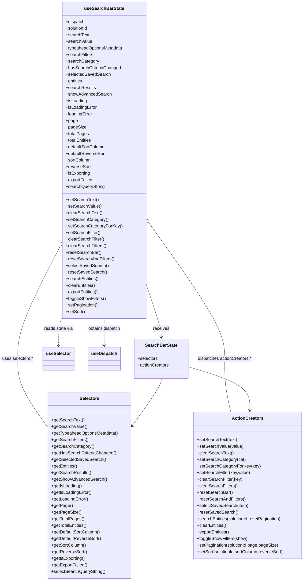

# Diagram: web/portal/src/components/search-bar/useSearchBarState.js

> Auto-generated by Obscura crawlers

## Mermaid

### SVG

<svg id="container" width="1097.259765625" xmlns="http://www.w3.org/2000/svg" class="classDiagram" height="2114" viewBox="0 0 1097.259765625 2114" role="graphics-document document" aria-roledescription="class"><g><defs><marker id="container_class-aggregationStart" class="marker aggregation class" refX="18" refY="7" markerWidth="190" markerHeight="240" orient="auto"><path d="M 18,7 L9,13 L1,7 L9,1 Z"></path></marker></defs><defs><marker id="container_class-aggregationEnd" class="marker aggregation class" refX="1" refY="7" markerWidth="20" markerHeight="28" orient="auto"><path d="M 18,7 L9,13 L1,7 L9,1 Z"></path></marker></defs><defs><marker id="container_class-extensionStart" class="marker extension class" refX="18" refY="7" markerWidth="190" markerHeight="240" orient="auto"><path d="M 1,7 L18,13 V 1 Z"></path></marker></defs><defs><marker id="container_class-extensionEnd" class="marker extension class" refX="1" refY="7" markerWidth="20" markerHeight="28" orient="auto"><path d="M 1,1 V 13 L18,7 Z"></path></marker></defs><defs><marker id="container_class-compositionStart" class="marker composition class" refX="18" refY="7" markerWidth="190" markerHeight="240" orient="auto"><path d="M 18,7 L9,13 L1,7 L9,1 Z"></path></marker></defs><defs><marker id="container_class-compositionEnd" class="marker composition class" refX="1" refY="7" markerWidth="20" markerHeight="28" orient="auto"><path d="M 18,7 L9,13 L1,7 L9,1 Z"></path></marker></defs><defs><marker id="container_class-dependencyStart" class="marker dependency class" refX="6" refY="7" markerWidth="190" markerHeight="240" orient="auto"><path d="M 5,7 L9,13 L1,7 L9,1 Z"></path></marker></defs><defs><marker id="container_class-dependencyEnd" class="marker dependency class" refX="13" refY="7" markerWidth="20" markerHeight="28" orient="auto"><path d="M 18,7 L9,13 L14,7 L9,1 Z"></path></marker></defs><defs><marker id="container_class-lollipopStart" class="marker lollipop class" refX="13" refY="7" markerWidth="190" markerHeight="240" orient="auto"><circle stroke="black" fill="transparent" cx="7" cy="7" r="6"></circle></marker></defs><defs><marker id="container_class-lollipopEnd" class="marker lollipop class" refX="1" refY="7" markerWidth="190" markerHeight="240" orient="auto"><circle stroke="black" fill="transparent" cx="7" cy="7" r="6"></circle></marker></defs><g class="root"><g class="clusters"></g><g class="edgePaths"><path d="M523.66,1040.575L532.314,1066.646C540.967,1092.717,558.275,1144.858,566.928,1176.096C575.582,1207.333,575.582,1217.667,575.582,1222.833L575.582,1228" id="id_useSearchBarState_SearchBarState_1" class="edge-thickness-normal edge-pattern-solid relation" style=";;;" data-edge="true" data-et="edge" data-id="id_useSearchBarState_SearchBarState_1" data-points="W3sieCI6NTIzLjY2MDE1NjI1LCJ5IjoxMDQwLjU3NTQ5NTc4NjA1ODZ9LHsieCI6NTc1LjU4MjAzMTI1LCJ5IjoxMTk3fSx7IngiOjU3NS41ODIwMzEyNSwieSI6MTIzNH1d" marker-end="url(#container_class-dependencyEnd)"></path><path d="M212.811,900.9L188.004,950.25C163.197,999.6,113.583,1098.3,88.776,1165.817C63.969,1233.333,63.969,1269.667,63.969,1304C63.969,1338.333,63.969,1370.667,81.37,1411.595C98.771,1452.523,133.574,1502.045,150.976,1526.806L168.377,1551.568" id="id_useSearchBarState_Selectors_2" class="edge-thickness-normal edge-pattern-solid relation" style=";;;" data-edge="true" data-et="edge" data-id="id_useSearchBarState_Selectors_2" data-points="W3sieCI6MjIwLjU1ODU5Mzc1LCJ5Ijo4ODUuNDg3NzY2ODQ3NTIzfSx7IngiOjYzLjk2ODc1LCJ5IjoxMTk3fSx7IngiOjYzLjk2ODc1LCJ5IjoxMzA2fSx7IngiOjYzLjk2ODc1LCJ5IjoxNDAzfSx7IngiOjE2OC4zNzY5NTMxMjUsInkiOjE1NTEuNTY3NjI4NDQyNTAzNX1d" marker-start="url(#container_class-aggregationStart)"></path><path d="M533.626,812.195L579.02,876.329C624.415,940.463,715.203,1068.732,760.598,1151.032C805.992,1233.333,805.992,1269.667,805.992,1304C805.992,1338.333,805.992,1370.667,809.756,1403C813.521,1435.333,821.049,1467.667,824.813,1483.833L828.577,1500" id="id_useSearchBarState_ActionCreators_3" class="edge-thickness-normal edge-pattern-solid relation" style=";;;" data-edge="true" data-et="edge" data-id="id_useSearchBarState_ActionCreators_3" data-points="W3sieCI6NTIzLjY2MDE1NjI1LCJ5Ijo3OTguMTE0NTYzMjY0MTMwMn0seyJ4Ijo4MDUuOTkyMTg3NSwieSI6MTE5N30seyJ4Ijo4MDUuOTkyMTg3NSwieSI6MTMwNn0seyJ4Ijo4MDUuOTkyMTg3NSwieSI6MTQwM30seyJ4Ijo4MjguNTc3MTg1OTk3NTk2MiwieSI6MTUwMH1d" marker-start="url(#container_class-aggregationStart)"></path><path d="M220.559,1157.765L218.831,1164.304C217.104,1170.843,213.65,1183.922,211.923,1200.628C210.195,1217.333,210.195,1237.667,210.195,1247.833L210.195,1258" id="id_useSearchBarState_useSelector_4" class="edge-thickness-normal edge-pattern-dashed relation" style=";;;" data-edge="true" data-et="edge" data-id="id_useSearchBarState_useSelector_4" data-points="W3sieCI6MjIwLjU1ODU5Mzc1LCJ5IjoxMTU3Ljc2NTA0MjIxOTU0MTZ9LHsieCI6MjEwLjE5NTMxMjUsInkiOjExOTd9LHsieCI6MjEwLjE5NTMxMjUsInkiOjEyNjR9XQ==" marker-end="url(#container_class-dependencyEnd)"></path><path d="M372.109,1160L372.109,1166.167C372.109,1172.333,372.109,1184.667,372.109,1201C372.109,1217.333,372.109,1237.667,372.109,1247.833L372.109,1258" id="id_useSearchBarState_useDispatch_5" class="edge-thickness-normal edge-pattern-dashed relation" style=";;;" data-edge="true" data-et="edge" data-id="id_useSearchBarState_useDispatch_5" data-points="W3sieCI6MzcyLjEwOTM3NSwieSI6MTE2MH0seyJ4IjozNzIuMTA5Mzc1LCJ5IjoxMTk3fSx7IngiOjM3Mi4xMDkzNzUsInkiOjEyNjR9XQ==" marker-end="url(#container_class-dependencyEnd)"></path><path d="M575.582,1378L575.582,1382.167C575.582,1386.333,575.582,1394.667,558.756,1422.776C541.929,1450.886,508.276,1498.772,491.45,1522.716L474.624,1546.659" id="id_SearchBarState_Selectors_6" class="edge-thickness-normal edge-pattern-solid relation" style=";;;" data-edge="true" data-et="edge" data-id="id_SearchBarState_Selectors_6" data-points="W3sieCI6NTc1LjU4MjAzMTI1LCJ5IjoxMzc4fSx7IngiOjU3NS41ODIwMzEyNSwieSI6MTQwM30seyJ4Ijo0NzEuMTczODI4MTI1LCJ5IjoxNTUxLjU2NzYyODQ0MjUwMzV9XQ==" marker-end="url(#container_class-dependencyEnd)"></path><path d="M672.398,1334.882L710.456,1346.235C748.514,1357.588,824.629,1380.294,862.27,1406.814C899.911,1433.334,899.077,1463.668,898.661,1478.835L898.244,1494.002" id="id_SearchBarState_ActionCreators_7" class="edge-thickness-normal edge-pattern-solid relation" style=";;;" data-edge="true" data-et="edge" data-id="id_SearchBarState_ActionCreators_7" data-points="W3sieCI6NjcyLjM5ODQzNzUsInkiOjEzMzQuODgxNTY3NDg3MzcxfSx7IngiOjkwMC43NDQxNDA2MjUsInkiOjE0MDN9LHsieCI6ODk4LjA3OTMwNTQ2MDE2NDgsInkiOjE1MDB9XQ==" marker-end="url(#container_class-dependencyEnd)"></path></g><g class="edgeLabels"><g class="edgeLabel" transform="translate(575.58203125, 1197)"><g class="label" data-id="id_useSearchBarState_SearchBarState_1" transform="translate(-29.4921875, -12)"><foreignObject width="58.984375" height="24">

receives

</foreignObject></g></g><g class="edgeLabel" transform="translate(63.96875, 1306)"><g class="label" data-id="id_useSearchBarState_Selectors_2" transform="translate(-55.96875, -12)"><foreignObject width="111.9375" height="24">

uses selectors.*

</foreignObject></g></g><g class="edgeLabel" transform="translate(805.9921875, 1306)"><g class="label" data-id="id_useSearchBarState_ActionCreators_3" transform="translate(-98.59375, -12)"><foreignObject width="197.1875" height="24">

dispatches actionCreators.*

</foreignObject></g></g><g class="edgeLabel" transform="translate(210.1953125, 1197)"><g class="label" data-id="id_useSearchBarState_useSelector_4" transform="translate(-52.8359375, -12)"><foreignObject width="105.671875" height="24">

reads state via

</foreignObject></g></g><g class="edgeLabel" transform="translate(372.109375, 1197)"><g class="label" data-id="id_useSearchBarState_useDispatch_5" transform="translate(-60.4921875, -12)"><foreignObject width="120.984375" height="24">

obtains dispatch

</foreignObject></g></g><g class="edgeLabel"><g class="label" data-id="id_SearchBarState_Selectors_6" transform="translate(0, 0)"><foreignObject width="0" height="0">

</foreignObject></g></g><g class="edgeLabel"><g class="label" data-id="id_SearchBarState_ActionCreators_7" transform="translate(0, 0)"><foreignObject width="0" height="0">

</foreignObject></g></g></g><g class="nodes"><g class="node default" id="classId-useSearchBarState-0" transform="translate(372.109375, 584)"><g class="basic label-container"><path d="M-151.55078125 -576 L151.55078125 -576 L151.55078125 576 L-151.55078125 576" stroke="none" stroke-width="0" fill="#ECECFF" style=""></path><path d="M-151.55078125 -576 C-53.55192838852227 -576, 44.44692447295546 -576, 151.55078125 -576 M-151.55078125 -576 C-55.215332577043554 -576, 41.12011609591289 -576, 151.55078125 -576 M151.55078125 -576 C151.55078125 -197.18313541081375, 151.55078125 181.6337291783725, 151.55078125 576 M151.55078125 -576 C151.55078125 -196.11896666750715, 151.55078125 183.7620666649857, 151.55078125 576 M151.55078125 576 C32.23185005857293 576, -87.08708113285414 576, -151.55078125 576 M151.55078125 576 C49.753860615810424 576, -52.04306001837915 576, -151.55078125 576 M-151.55078125 576 C-151.55078125 157.3837062588201, -151.55078125 -261.2325874823598, -151.55078125 -576 M-151.55078125 576 C-151.55078125 249.09561427189067, -151.55078125 -77.80877145621866, -151.55078125 -576" stroke="#9370DB" stroke-width="1.3" fill="none" stroke-dasharray="0 0" style=""></path></g><g class="annotation-group text" transform="translate(0, -552)"></g><g class="label-group text" transform="translate(-69.4140625, -552)"><g class="label" style="font-weight: bolder" transform="translate(0,-12)"><foreignObject width="138.828125" height="24">

useSearchBarState

</foreignObject></g></g><g class="members-group text" transform="translate(-139.55078125, -504)"><g class="label" style="" transform="translate(0,-12)"><foreignObject width="70.15625" height="24">

+dispatch

</foreignObject></g><g class="label" style="" transform="translate(0,12)"><foreignObject width="82.109375" height="24">

+solutionId

</foreignObject></g><g class="label" style="" transform="translate(0,36)"><foreignObject width="84.953125" height="24">

+searchText

</foreignObject></g><g class="label" style="" transform="translate(0,60)"><foreignObject width="94.96875" height="24">

+searchValue

</foreignObject></g><g class="label" style="" transform="translate(0,84)"><foreignObject width="209.6875" height="24">

+typeaheadOptionsMetadata

</foreignObject></g><g class="label" style="" transform="translate(0,108)"><foreignObject width="99.609375" height="24">

+searchFilters

</foreignObject></g><g class="label" style="" transform="translate(0,132)"><foreignObject width="118.65625" height="24">

+searchCategory

</foreignObject></g><g class="label" style="" transform="translate(0,156)"><foreignObject width="197.75" height="24">

+hasSearchCriteriaChanged

</foreignObject></g><g class="label" style="" transform="translate(0,180)"><foreignObject width="160.96875" height="24">

+selectedSavedSearch

</foreignObject></g><g class="label" style="" transform="translate(0,204)"><foreignObject width="62.859375" height="24">

+entities

</foreignObject></g><g class="label" style="" transform="translate(0,228)"><foreignObject width="108.328125" height="24">

+searchResults

</foreignObject></g><g class="label" style="" transform="translate(0,252)"><foreignObject width="164.40625" height="24">

+showAdvancedSearch

</foreignObject></g><g class="label" style="" transform="translate(0,276)"><foreignObject width="77.203125" height="24">

+isLoading

</foreignObject></g><g class="label" style="" transform="translate(0,300)"><foreignObject width="113" height="24">

+isLoadingError

</foreignObject></g><g class="label" style="" transform="translate(0,324)"><foreignObject width="98.0625" height="24">

+loadingError

</foreignObject></g><g class="label" style="" transform="translate(0,348)"><foreignObject width="42.65625" height="24">

+page

</foreignObject></g><g class="label" style="" transform="translate(0,372)"><foreignObject width="71.5" height="24">

+pageSize

</foreignObject></g><g class="label" style="" transform="translate(0,396)"><foreignObject width="82.90625" height="24">

+totalPages

</foreignObject></g><g class="label" style="" transform="translate(0,420)"><foreignObject width="96.234375" height="24">

+totalEntities

</foreignObject></g><g class="label" style="" transform="translate(0,444)"><foreignObject width="144.859375" height="24">

+defaultSortColumn

</foreignObject></g><g class="label" style="" transform="translate(0,468)"><foreignObject width="146.53125" height="24">

+defaultReverseSort

</foreignObject></g><g class="label" style="" transform="translate(0,492)"><foreignObject width="91.828125" height="24">

+sortColumn

</foreignObject></g><g class="label" style="" transform="translate(0,516)"><foreignObject width="91.015625" height="24">

+reverseSort

</foreignObject></g><g class="label" style="" transform="translate(0,540)"><foreignObject width="89.296875" height="24">

+isExporting

</foreignObject></g><g class="label" style="" transform="translate(0,564)"><foreignObject width="98.140625" height="24">

+exportFailed

</foreignObject></g><g class="label" style="" transform="translate(0,588)"><foreignObject width="141.46875" height="24">

+searchQueryString

</foreignObject></g></g><g class="methods-group text" transform="translate(-139.55078125, 144)"><g class="label" style="" transform="translate(0,-12)"><foreignObject width="118.53125" height="24">

+setSearchText()

</foreignObject></g><g class="label" style="" transform="translate(0,12)"><foreignObject width="128.546875" height="24">

+setSearchValue()

</foreignObject></g><g class="label" style="" transform="translate(0,36)"><foreignObject width="132.265625" height="24">

+clearSearchText()

</foreignObject></g><g class="label" style="" transform="translate(0,60)"><foreignObject width="152.25" height="24">

+setSearchCategory()

</foreignObject></g><g class="label" style="" transform="translate(0,84)"><foreignObject width="200.796875" height="24">

+setSearchCategoryForKey()

</foreignObject></g><g class="label" style="" transform="translate(0,108)"><foreignObject width="125.953125" height="24">

+setSearchFilter()

</foreignObject></g><g class="label" style="" transform="translate(0,132)"><foreignObject width="139.6875" height="24">

+clearSearchFilter()

</foreignObject></g><g class="label" style="" transform="translate(0,156)"><foreignObject width="146.921875" height="24">

+clearSearchFilters()

</foreignObject></g><g class="label" style="" transform="translate(0,180)"><foreignObject width="128.0625" height="24">

+resetSearchBar()

</foreignObject></g><g class="label" style="" transform="translate(0,204)"><foreignObject width="175.71875" height="24">

+resetSearchAndFilters()

</foreignObject></g><g class="label" style="" transform="translate(0,228)"><foreignObject width="153.28125" height="24">

+selectSavedSearch()

</foreignObject></g><g class="label" style="" transform="translate(0,252)"><foreignObject width="146.734375" height="24">

+resetSavedSearch()

</foreignObject></g><g class="label" style="" transform="translate(0,276)"><foreignObject width="120.359375" height="24">

+searchEntities()

</foreignObject></g><g class="label" style="" transform="translate(0,300)"><foreignObject width="108.59375" height="24">

+clearEntities()

</foreignObject></g><g class="label" style="" transform="translate(0,324)"><foreignObject width="120.046875" height="24">

+exportEntities()

</foreignObject></g><g class="label" style="" transform="translate(0,348)"><foreignObject width="146.203125" height="24">

+toggleShowFilters()

</foreignObject></g><g class="label" style="" transform="translate(0,372)"><foreignObject width="117.203125" height="24">

+setPagination()

</foreignObject></g><g class="label" style="" transform="translate(0,396)"><foreignObject width="70.34375" height="24">

+setSort()

</foreignObject></g></g><g class="divider" style=""><path d="M-151.55078125 -528 C-67.53186731689227 -528, 16.48704661621545 -528, 151.55078125 -528 M-151.55078125 -528 C-89.45127419315914 -528, -27.351767136318273 -528, 151.55078125 -528" stroke="#9370DB" stroke-width="1.3" fill="none" stroke-dasharray="0 0" style=""></path></g><g class="divider" style=""><path d="M-151.55078125 120 C-65.8142070414843 120, 19.92236716703141 120, 151.55078125 120 M-151.55078125 120 C-73.60509006111496 120, 4.340601127770071 120, 151.55078125 120" stroke="#9370DB" stroke-width="1.3" fill="none" stroke-dasharray="0 0" style=""></path></g></g><g class="node default" id="classId-SearchBarState-1" transform="translate(575.58203125, 1306)"><g class="basic label-container"><path d="M-96.81640625 -72 L96.81640625 -72 L96.81640625 72 L-96.81640625 72" stroke="none" stroke-width="0" fill="#ECECFF" style=""></path><path d="M-96.81640625 -72 C-55.12598416090143 -72, -13.435562071802863 -72, 96.81640625 -72 M-96.81640625 -72 C-29.645405450209623 -72, 37.525595349580755 -72, 96.81640625 -72 M96.81640625 -72 C96.81640625 -43.03670231137207, 96.81640625 -14.073404622744135, 96.81640625 72 M96.81640625 -72 C96.81640625 -31.278478347111168, 96.81640625 9.443043305777664, 96.81640625 72 M96.81640625 72 C29.73423402013566 72, -37.34793820972868 72, -96.81640625 72 M96.81640625 72 C32.47319545802813 72, -31.87001533394374 72, -96.81640625 72 M-96.81640625 72 C-96.81640625 27.52813029939, -96.81640625 -16.94373940122, -96.81640625 -72 M-96.81640625 72 C-96.81640625 25.15655041482259, -96.81640625 -21.68689917035482, -96.81640625 -72" stroke="#9370DB" stroke-width="1.3" fill="none" stroke-dasharray="0 0" style=""></path></g><g class="annotation-group text" transform="translate(0, -48)"></g><g class="label-group text" transform="translate(-56.5546875, -48)"><g class="label" style="font-weight: bolder" transform="translate(0,-12)"><foreignObject width="113.109375" height="24">

SearchBarState

</foreignObject></g></g><g class="members-group text" transform="translate(-84.81640625, 0)"><g class="label" style="" transform="translate(0,-12)"><foreignObject width="73.453125" height="24">

+selectors

</foreignObject></g><g class="label" style="" transform="translate(0,12)"><foreignObject width="113.078125" height="24">

+actionCreators

</foreignObject></g></g><g class="methods-group text" transform="translate(-84.81640625, 72)"></g><g class="divider" style=""><path d="M-96.81640625 -24 C-40.925372191018475 -24, 14.96566186796305 -24, 96.81640625 -24 M-96.81640625 -24 C-35.402906170440765 -24, 26.01059390911847 -24, 96.81640625 -24" stroke="#9370DB" stroke-width="1.3" fill="none" stroke-dasharray="0 0" style=""></path></g><g class="divider" style=""><path d="M-96.81640625 48 C-42.37820600912416 48, 12.059994231751674 48, 96.81640625 48 M-96.81640625 48 C-52.26857926718655 48, -7.720752284373106 48, 96.81640625 48" stroke="#9370DB" stroke-width="1.3" fill="none" stroke-dasharray="0 0" style=""></path></g></g><g class="node default" id="classId-Selectors-2" transform="translate(319.775390625, 1767)"><g class="basic label-container"><path d="M-151.3984375 -339 L151.3984375 -339 L151.3984375 339 L-151.3984375 339" stroke="none" stroke-width="0" fill="#ECECFF" style=""></path><path d="M-151.3984375 -339 C-77.8615730377959 -339, -4.3247085755918135 -339, 151.3984375 -339 M-151.3984375 -339 C-38.70697022440619 -339, 73.98449705118762 -339, 151.3984375 -339 M151.3984375 -339 C151.3984375 -96.6543048230684, 151.3984375 145.6913903538632, 151.3984375 339 M151.3984375 -339 C151.3984375 -75.50109096480082, 151.3984375 187.99781807039835, 151.3984375 339 M151.3984375 339 C84.12036790955206 339, 16.842298319104117 339, -151.3984375 339 M151.3984375 339 C81.36716294853908 339, 11.33588839707815 339, -151.3984375 339 M-151.3984375 339 C-151.3984375 200.41495690936455, -151.3984375 61.829913818729096, -151.3984375 -339 M-151.3984375 339 C-151.3984375 89.40046021325617, -151.3984375 -160.19907957348767, -151.3984375 -339" stroke="#9370DB" stroke-width="1.3" fill="none" stroke-dasharray="0 0" style=""></path></g><g class="annotation-group text" transform="translate(0, -315)"></g><g class="label-group text" transform="translate(-34.171875, -315)"><g class="label" style="font-weight: bolder" transform="translate(0,-12)"><foreignObject width="68.34375" height="24">

Selectors

</foreignObject></g></g><g class="members-group text" transform="translate(-139.3984375, -267)"></g><g class="methods-group text" transform="translate(-139.3984375, -237)"><g class="label" style="" transform="translate(0,-12)"><foreignObject width="119.125" height="24">

+getSearchText()

</foreignObject></g><g class="label" style="" transform="translate(0,12)"><foreignObject width="129.140625" height="24">

+getSearchValue()

</foreignObject></g><g class="label" style="" transform="translate(0,36)"><foreignObject width="244.625" height="24">

+getTypeaheadOptionsMetadata()

</foreignObject></g><g class="label" style="" transform="translate(0,60)"><foreignObject width="133.78125" height="24">

+getSearchFilters()

</foreignObject></g><g class="label" style="" transform="translate(0,84)"><foreignObject width="152.84375" height="24">

+getSearchCategory()

</foreignObject></g><g class="label" style="" transform="translate(0,108)"><foreignObject width="232.1875" height="24">

+getHasSearchCriteriaChanged()

</foreignObject></g><g class="label" style="" transform="translate(0,132)"><foreignObject width="195.140625" height="24">

+getSelectedSavedSearch()

</foreignObject></g><g class="label" style="" transform="translate(0,156)"><foreignObject width="95.46875" height="24">

+getEntities()

</foreignObject></g><g class="label" style="" transform="translate(0,180)"><foreignObject width="142.5" height="24">

+getSearchResults()

</foreignObject></g><g class="label" style="" transform="translate(0,204)"><foreignObject width="198.578125" height="24">

+getShowAdvancedSearch()

</foreignObject></g><g class="label" style="" transform="translate(0,228)"><foreignObject width="110.34375" height="24">

+getIsLoading()

</foreignObject></g><g class="label" style="" transform="translate(0,252)"><foreignObject width="146.140625" height="24">

+getIsLoadingError()

</foreignObject></g><g class="label" style="" transform="translate(0,276)"><foreignObject width="133.9375" height="24">

+getLoadingError()

</foreignObject></g><g class="label" style="" transform="translate(0,300)"><foreignObject width="74.65625" height="24">

+getPage()

</foreignObject></g><g class="label" style="" transform="translate(0,324)"><foreignObject width="103.5" height="24">

+getPageSize()

</foreignObject></g><g class="label" style="" transform="translate(0,348)"><foreignObject width="117.765625" height="24">

+getTotalPages()

</foreignObject></g><g class="label" style="" transform="translate(0,372)"><foreignObject width="131.09375" height="24">

+getTotalEntities()

</foreignObject></g><g class="label" style="" transform="translate(0,396)"><foreignObject width="178.515625" height="24">

+getDefaultSortColumn()

</foreignObject></g><g class="label" style="" transform="translate(0,420)"><foreignObject width="180.203125" height="24">

+getDefaultReverseSort()

</foreignObject></g><g class="label" style="" transform="translate(0,444)"><foreignObject width="126.015625" height="24">

+getSortColumn()

</foreignObject></g><g class="label" style="" transform="translate(0,468)"><foreignObject width="127.6875" height="24">

+getReverseSort()

</foreignObject></g><g class="label" style="" transform="translate(0,492)"><foreignObject width="122.4375" height="24">

+getIsExporting()

</foreignObject></g><g class="label" style="" transform="translate(0,516)"><foreignObject width="131.046875" height="24">

+getExportFailed()

</foreignObject></g><g class="label" style="" transform="translate(0,540)"><foreignObject width="196.03125" height="24">

+selectSearchQueryString()

</foreignObject></g></g><g class="divider" style=""><path d="M-151.3984375 -291 C-51.89050198397311 -291, 47.61743353205378 -291, 151.3984375 -291 M-151.3984375 -291 C-47.291004001747 -291, 56.816429496506004 -291, 151.3984375 -291" stroke="#9370DB" stroke-width="1.3" fill="none" stroke-dasharray="0 0" style=""></path></g><g class="divider" style=""><path d="M-151.3984375 -267 C-50.97431951845512 -267, 49.44979846308976 -267, 151.3984375 -267 M-151.3984375 -267 C-70.64735778795975 -267, 10.103721924080503 -267, 151.3984375 -267" stroke="#9370DB" stroke-width="1.3" fill="none" stroke-dasharray="0 0" style=""></path></g></g><g class="node default" id="classId-ActionCreators-3" transform="translate(890.744140625, 1767)"><g class="basic label-container"><path d="M-198.515625 -267 L198.515625 -267 L198.515625 267 L-198.515625 267" stroke="none" stroke-width="0" fill="#ECECFF" style=""></path><path d="M-198.515625 -267 C-55.40176676808099 -267, 87.71209146383802 -267, 198.515625 -267 M-198.515625 -267 C-59.87525921094263 -267, 78.76510657811474 -267, 198.515625 -267 M198.515625 -267 C198.515625 -151.43645774521343, 198.515625 -35.87291549042689, 198.515625 267 M198.515625 -267 C198.515625 -136.08952204738088, 198.515625 -5.179044094761764, 198.515625 267 M198.515625 267 C83.85754439182794 267, -30.800536216344113 267, -198.515625 267 M198.515625 267 C102.80871032611195 267, 7.101795652223899 267, -198.515625 267 M-198.515625 267 C-198.515625 109.15108250705876, -198.515625 -48.69783498588248, -198.515625 -267 M-198.515625 267 C-198.515625 67.30404307716867, -198.515625 -132.39191384566266, -198.515625 -267" stroke="#9370DB" stroke-width="1.3" fill="none" stroke-dasharray="0 0" style=""></path></g><g class="annotation-group text" transform="translate(0, -243)"></g><g class="label-group text" transform="translate(-53.96875, -243)"><g class="label" style="font-weight: bolder" transform="translate(0,-12)"><foreignObject width="107.9375" height="24">

ActionCreators

</foreignObject></g></g><g class="members-group text" transform="translate(-186.515625, -195)"></g><g class="methods-group text" transform="translate(-186.515625, -165)"><g class="label" style="" transform="translate(0,-12)"><foreignObject width="146.1875" height="24">

+setSearchText(text)

</foreignObject></g><g class="label" style="" transform="translate(0,12)"><foreignObject width="167.4375" height="24">

+setSearchValue(value)

</foreignObject></g><g class="label" style="" transform="translate(0,36)"><foreignObject width="132.265625" height="24">

+clearSearchText()

</foreignObject></g><g class="label" style="" transform="translate(0,60)"><foreignObject width="174.21875" height="24">

+setSearchCategory(cat)

</foreignObject></g><g class="label" style="" transform="translate(0,84)"><foreignObject width="225.375" height="24">

+setSearchCategoryForKey(key)

</foreignObject></g><g class="label" style="" transform="translate(0,108)"><foreignObject width="191.96875" height="24">

+setSearchFilter(key,value)

</foreignObject></g><g class="label" style="" transform="translate(0,132)"><foreignObject width="164.265625" height="24">

+clearSearchFilter(key)

</foreignObject></g><g class="label" style="" transform="translate(0,156)"><foreignObject width="146.921875" height="24">

+clearSearchFilters()

</foreignObject></g><g class="label" style="" transform="translate(0,180)"><foreignObject width="128.0625" height="24">

+resetSearchBar()

</foreignObject></g><g class="label" style="" transform="translate(0,204)"><foreignObject width="175.71875" height="24">

+resetSearchAndFilters()

</foreignObject></g><g class="label" style="" transform="translate(0,228)"><foreignObject width="185.765625" height="24">

+selectSavedSearch(item)

</foreignObject></g><g class="label" style="" transform="translate(0,252)"><foreignObject width="146.734375" height="24">

+resetSavedSearch()

</foreignObject></g><g class="label" style="" transform="translate(0,276)"><foreignObject width="311.578125" height="24">

+searchEntities(solutionId,resetPagination)

</foreignObject></g><g class="label" style="" transform="translate(0,300)"><foreignObject width="108.59375" height="24">

+clearEntities()

</foreignObject></g><g class="label" style="" transform="translate(0,324)"><foreignObject width="120.046875" height="24">

+exportEntities()

</foreignObject></g><g class="label" style="" transform="translate(0,348)"><foreignObject width="183.859375" height="24">

+toggleShowFilters(show)

</foreignObject></g><g class="label" style="" transform="translate(0,372)"><foreignObject width="297.015625" height="24">

+setPagination(solutionId,page,pageSize)

</foreignObject></g><g class="label" style="" transform="translate(0,396)"><foreignObject width="319.0625" height="24">

+setSort(solutionId,sortColumn,reverseSort)

</foreignObject></g></g><g class="divider" style=""><path d="M-198.515625 -219 C-39.81807651405373 -219, 118.87947197189254 -219, 198.515625 -219 M-198.515625 -219 C-55.24976055239978 -219, 88.01610389520044 -219, 198.515625 -219" stroke="#9370DB" stroke-width="1.3" fill="none" stroke-dasharray="0 0" style=""></path></g><g class="divider" style=""><path d="M-198.515625 -195 C-60.40355424613924 -195, 77.70851650772153 -195, 198.515625 -195 M-198.515625 -195 C-105.40385705434136 -195, -12.292089108682717 -195, 198.515625 -195" stroke="#9370DB" stroke-width="1.3" fill="none" stroke-dasharray="0 0" style=""></path></g></g><g class="node default" id="classId-useSelector-4" transform="translate(210.1953125, 1306)"><g class="basic label-container"><path d="M-55.2578125 -42 L55.2578125 -42 L55.2578125 42 L-55.2578125 42" stroke="none" stroke-width="0" fill="#ECECFF" style=""></path><path d="M-55.2578125 -42 C-14.635627110388626 -42, 25.98655827922275 -42, 55.2578125 -42 M-55.2578125 -42 C-17.36833461869071 -42, 20.52114326261858 -42, 55.2578125 -42 M55.2578125 -42 C55.2578125 -17.60208334262007, 55.2578125 6.795833314759861, 55.2578125 42 M55.2578125 -42 C55.2578125 -18.51802031295939, 55.2578125 4.96395937408122, 55.2578125 42 M55.2578125 42 C16.193761743379028 42, -22.870289013241944 42, -55.2578125 42 M55.2578125 42 C25.737264370309934 42, -3.783283759380133 42, -55.2578125 42 M-55.2578125 42 C-55.2578125 16.732914431443962, -55.2578125 -8.534171137112075, -55.2578125 -42 M-55.2578125 42 C-55.2578125 20.54694844429271, -55.2578125 -0.9061031114145806, -55.2578125 -42" stroke="#9370DB" stroke-width="1.3" fill="none" stroke-dasharray="0 0" style=""></path></g><g class="annotation-group text" transform="translate(0, -18)"></g><g class="label-group text" transform="translate(-43.2578125, -18)"><g class="label" style="font-weight: bolder" transform="translate(0,-12)"><foreignObject width="86.515625" height="24">

useSelector

</foreignObject></g></g><g class="members-group text" transform="translate(-43.2578125, 30)"></g><g class="methods-group text" transform="translate(-43.2578125, 60)"></g><g class="divider" style=""><path d="M-55.2578125 6 C-15.963169490725129 6, 23.331473518549743 6, 55.2578125 6 M-55.2578125 6 C-16.056178758487775 6, 23.14545498302445 6, 55.2578125 6" stroke="#9370DB" stroke-width="1.3" fill="none" stroke-dasharray="0 0" style=""></path></g><g class="divider" style=""><path d="M-55.2578125 24 C-24.890588767075247 24, 5.476634965849506 24, 55.2578125 24 M-55.2578125 24 C-20.05700035622349 24, 15.14381178755302 24, 55.2578125 24" stroke="#9370DB" stroke-width="1.3" fill="none" stroke-dasharray="0 0" style=""></path></g></g><g class="node default" id="classId-useDispatch-5" transform="translate(372.109375, 1306)"><g class="basic label-container"><path d="M-56.65625 -42 L56.65625 -42 L56.65625 42 L-56.65625 42" stroke="none" stroke-width="0" fill="#ECECFF" style=""></path><path d="M-56.65625 -42 C-13.817243308456185 -42, 29.02176338308763 -42, 56.65625 -42 M-56.65625 -42 C-18.35394422530498 -42, 19.948361549390043 -42, 56.65625 -42 M56.65625 -42 C56.65625 -10.225105374606954, 56.65625 21.54978925078609, 56.65625 42 M56.65625 -42 C56.65625 -8.915465451682465, 56.65625 24.16906909663507, 56.65625 42 M56.65625 42 C19.170092785176116 42, -18.316064429647767 42, -56.65625 42 M56.65625 42 C30.441263647144464 42, 4.226277294288927 42, -56.65625 42 M-56.65625 42 C-56.65625 24.397940837732023, -56.65625 6.795881675464045, -56.65625 -42 M-56.65625 42 C-56.65625 17.066147216304685, -56.65625 -7.8677055673906295, -56.65625 -42" stroke="#9370DB" stroke-width="1.3" fill="none" stroke-dasharray="0 0" style=""></path></g><g class="annotation-group text" transform="translate(0, -18)"></g><g class="label-group text" transform="translate(-44.65625, -18)"><g class="label" style="font-weight: bolder" transform="translate(0,-12)"><foreignObject width="89.3125" height="24">

useDispatch

</foreignObject></g></g><g class="members-group text" transform="translate(-44.65625, 30)"></g><g class="methods-group text" transform="translate(-44.65625, 60)"></g><g class="divider" style=""><path d="M-56.65625 6 C-22.92335427829189 6, 10.809541443416222 6, 56.65625 6 M-56.65625 6 C-19.083561269558736 6, 18.48912746088253 6, 56.65625 6" stroke="#9370DB" stroke-width="1.3" fill="none" stroke-dasharray="0 0" style=""></path></g><g class="divider" style=""><path d="M-56.65625 24 C-17.446797783616752 24, 21.762654432766496 24, 56.65625 24 M-56.65625 24 C-27.023448634062845 24, 2.60935273187431 24, 56.65625 24" stroke="#9370DB" stroke-width="1.3" fill="none" stroke-dasharray="0 0" style=""></path></g></g></g></g></g></svg>
