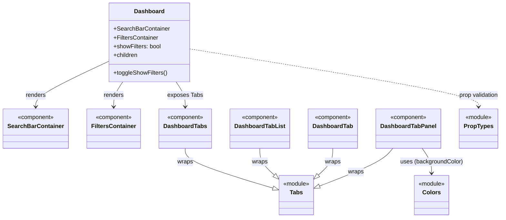

# Diagram: web/portal/src/components/templates/Dashboard.template.js

> Auto-generated by Obscura crawlers

## Mermaid

```mermaid
classDiagram
class Dashboard {
  +SearchBarContainer
  +FiltersContainer
  +showFilters: bool
  +toggleShowFilters()
  +children
}
class SearchBarContainer <<component>>
class FiltersContainer <<component>>
class DashboardTabs <<component>>
class DashboardTabList <<component>>
class DashboardTab <<component>>
class DashboardTabPanel <<component>>
class Tabs <<module>>
class Colors <<module>>
class PropTypes <<module>>

Dashboard --> SearchBarContainer : renders
Dashboard --> FiltersContainer : renders
Dashboard --> DashboardTabs : exposes Tabs
Dashboard ..> PropTypes : prop validation
DashboardTabs --|> Tabs : wraps
DashboardTabList --|> Tabs : wraps
DashboardTab --|> Tabs : wraps
DashboardTabPanel --|> Tabs : wraps
DashboardTabPanel --> Colors : uses (backgroundColor)
```

> SVG rendering failed for this diagram.
