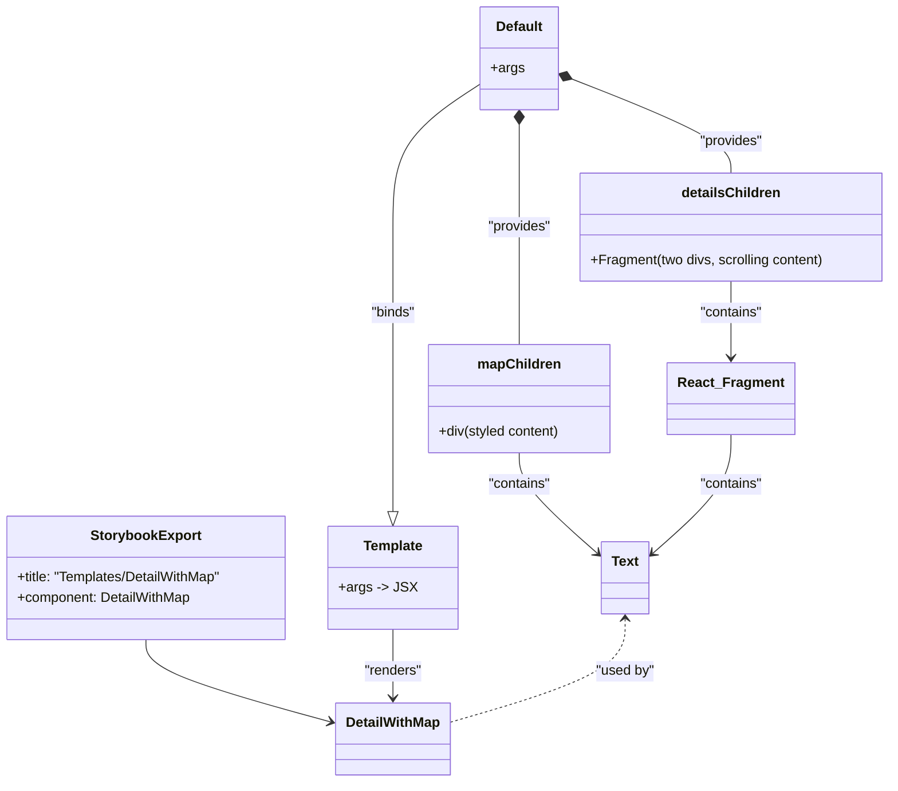

# Diagram: web/portal/src/components/templates/DetailWithMap.template.stories.js

> Auto-generated by Obscura crawlers

## Mermaid

### SVG

<svg id="container" width="1042.099609375" xmlns="http://www.w3.org/2000/svg" class="classDiagram" height="912" viewBox="0 0 1042.099609375 912" role="graphics-document document" aria-roledescription="class"><g><defs><marker id="container_class-aggregationStart" class="marker aggregation class" refX="18" refY="7" markerWidth="190" markerHeight="240" orient="auto"><path d="M 18,7 L9,13 L1,7 L9,1 Z"></path></marker></defs><defs><marker id="container_class-aggregationEnd" class="marker aggregation class" refX="1" refY="7" markerWidth="20" markerHeight="28" orient="auto"><path d="M 18,7 L9,13 L1,7 L9,1 Z"></path></marker></defs><defs><marker id="container_class-extensionStart" class="marker extension class" refX="18" refY="7" markerWidth="190" markerHeight="240" orient="auto"><path d="M 1,7 L18,13 V 1 Z"></path></marker></defs><defs><marker id="container_class-extensionEnd" class="marker extension class" refX="1" refY="7" markerWidth="20" markerHeight="28" orient="auto"><path d="M 1,1 V 13 L18,7 Z"></path></marker></defs><defs><marker id="container_class-compositionStart" class="marker composition class" refX="18" refY="7" markerWidth="190" markerHeight="240" orient="auto"><path d="M 18,7 L9,13 L1,7 L9,1 Z"></path></marker></defs><defs><marker id="container_class-compositionEnd" class="marker composition class" refX="1" refY="7" markerWidth="20" markerHeight="28" orient="auto"><path d="M 18,7 L9,13 L1,7 L9,1 Z"></path></marker></defs><defs><marker id="container_class-dependencyStart" class="marker dependency class" refX="6" refY="7" markerWidth="190" markerHeight="240" orient="auto"><path d="M 5,7 L9,13 L1,7 L9,1 Z"></path></marker></defs><defs><marker id="container_class-dependencyEnd" class="marker dependency class" refX="13" refY="7" markerWidth="20" markerHeight="28" orient="auto"><path d="M 18,7 L9,13 L14,7 L9,1 Z"></path></marker></defs><defs><marker id="container_class-lollipopStart" class="marker lollipop class" refX="13" refY="7" markerWidth="190" markerHeight="240" orient="auto"><circle stroke="black" fill="transparent" cx="7" cy="7" r="6"></circle></marker></defs><defs><marker id="container_class-lollipopEnd" class="marker lollipop class" refX="1" refY="7" markerWidth="190" markerHeight="240" orient="auto"><circle stroke="black" fill="transparent" cx="7" cy="7" r="6"></circle></marker></defs><g class="root"><g class="clusters"></g><g class="edgePaths"><path d="M174.473,746L174.473,752.167C174.473,758.333,174.473,770.667,210.37,786.715C246.268,802.763,318.064,822.526,353.962,832.408L389.86,842.289" id="id_StorybookExport_DetailWithMap_1" class="edge-thickness-normal edge-pattern-solid relation" style=";;;" data-edge="true" data-et="edge" data-id="id_StorybookExport_DetailWithMap_1" data-points="W3sieCI6MTc0LjQ3MjY1NjI1LCJ5Ijo3NDZ9LHsieCI6MTc0LjQ3MjY1NjI1LCJ5Ijo3ODN9LHsieCI6Mzk1LjY0NDUzMTI1LCJ5Ijo4NDMuODgxNzIwNDMwMTA3NX1d" marker-end="url(#container_class-dependencyEnd)"></path><path d="M461.465,734L461.465,742.167C461.465,750.333,461.465,766.667,461.465,780C461.465,793.333,461.465,803.667,461.465,808.833L461.465,814" id="id_Template_DetailWithMap_2" class="edge-thickness-normal edge-pattern-solid relation" style=";;;" data-edge="true" data-et="edge" data-id="id_Template_DetailWithMap_2" data-points="W3sieCI6NDYxLjQ2NDg0Mzc1LCJ5Ijo3MzR9LHsieCI6NDYxLjQ2NDg0Mzc1LCJ5Ijo3ODN9LHsieCI6NDYxLjQ2NDg0Mzc1LCJ5Ijo4MjB9XQ==" marker-end="url(#container_class-dependencyEnd)"></path><path d="M562.119,97.688L545.343,108.907C528.568,120.126,495.016,142.563,478.241,170.448C461.465,198.333,461.465,231.667,461.465,265C461.465,298.333,461.465,331.667,461.465,365C461.465,398.333,461.465,431.667,461.465,465C461.465,498.333,461.465,531.667,461.465,553.625C461.465,575.583,461.465,586.167,461.465,591.458L461.465,596.75" id="id_Default_Template_3" class="edge-thickness-normal edge-pattern-solid relation" style=";;;" data-edge="true" data-et="edge" data-id="id_Default_Template_3" data-points="W3sieCI6NTYyLjExOTE0MDYyNSwieSI6OTcuNjg4NDEzMTE1MTk1NTl9LHsieCI6NDYxLjQ2NDg0Mzc1LCJ5IjoxNjV9LHsieCI6NDYxLjQ2NDg0Mzc1LCJ5IjoyNjV9LHsieCI6NDYxLjQ2NDg0Mzc1LCJ5IjozNjV9LHsieCI6NDYxLjQ2NDg0Mzc1LCJ5Ijo0NjV9LHsieCI6NDYxLjQ2NDg0Mzc1LCJ5Ijo1NjV9LHsieCI6NDYxLjQ2NDg0Mzc1LCJ5Ijo2MTR9XQ==" marker-end="url(#container_class-extensionEnd)"></path><path d="M606.514,145.25L606.514,148.542C606.514,151.833,606.514,158.417,606.514,178.375C606.514,198.333,606.514,231.667,606.514,265C606.514,298.333,606.514,331.667,606.514,354.5C606.514,377.333,606.514,389.667,606.514,395.833L606.514,402" id="id_Default_mapChildren_4" class="edge-thickness-normal edge-pattern-solid relation" style=";;;" data-edge="true" data-et="edge" data-id="id_Default_mapChildren_4" data-points="W3sieCI6NjA2LjUxMzY3MTg3NSwieSI6MTI4fSx7IngiOjYwNi41MTM2NzE4NzUsInkiOjE2NX0seyJ4Ijo2MDYuNTEzNjcxODc1LCJ5IjoyNjV9LHsieCI6NjA2LjUxMzY3MTg3NSwieSI6MzY1fSx7IngiOjYwNi41MTM2NzE4NzUsInkiOjQwMn1d" marker-start="url(#container_class-compositionStart)"></path><path d="M666.991,91.457L698.592,103.715C730.192,115.972,793.394,140.486,824.995,158.91C856.596,177.333,856.596,189.667,856.596,195.833L856.596,202" id="id_Default_detailsChildren_5" class="edge-thickness-normal edge-pattern-solid relation" style=";;;" data-edge="true" data-et="edge" data-id="id_Default_detailsChildren_5" data-points="W3sieCI6NjUwLjkwODIwMzEyNSwieSI6ODUuMjE5NDI4MDAwMTg3NDN9LHsieCI6ODU2LjU5NTcwMzEyNSwieSI6MTY1fSx7IngiOjg1Ni41OTU3MDMxMjUsInkiOjIwMn1d" marker-start="url(#container_class-compositionStart)"></path><path d="M606.514,528L606.514,534.167C606.514,540.333,606.514,552.667,622.036,572.365C637.559,592.062,668.604,619.125,684.126,632.656L699.649,646.187" id="id_mapChildren_Text_6" class="edge-thickness-normal edge-pattern-solid relation" style=";;;" data-edge="true" data-et="edge" data-id="id_mapChildren_Text_6" data-points="W3sieCI6NjA2LjUxMzY3MTg3NSwieSI6NTI4fSx7IngiOjYwNi41MTM2NzE4NzUsInkiOjU2NX0seyJ4Ijo3MDQuMTcxODc1LCJ5Ijo2NTAuMTMwMDE5ODM3MjQwOX1d" marker-end="url(#container_class-dependencyEnd)"></path><path d="M856.596,328L856.596,334.167C856.596,340.333,856.596,352.667,856.596,367.5C856.596,382.333,856.596,399.667,856.596,408.333L856.596,417" id="id_detailsChildren_React_Fragment_7" class="edge-thickness-normal edge-pattern-solid relation" style=";;;" data-edge="true" data-et="edge" data-id="id_detailsChildren_React_Fragment_7" data-points="W3sieCI6ODU2LjU5NTcwMzEyNSwieSI6MzI4fSx7IngiOjg1Ni41OTU3MDMxMjUsInkiOjM2NX0seyJ4Ijo4NTYuNTk1NzAzMTI1LCJ5Ijo0MjN9XQ==" marker-end="url(#container_class-dependencyEnd)"></path><path d="M856.596,507L856.596,516.667C856.596,526.333,856.596,545.667,841.073,568.865C825.551,592.062,794.505,619.125,778.983,632.656L763.46,646.187" id="id_React_Fragment_Text_8" class="edge-thickness-normal edge-pattern-solid relation" style=";;;" data-edge="true" data-et="edge" data-id="id_React_Fragment_Text_8" data-points="W3sieCI6ODU2LjU5NTcwMzEyNSwieSI6NTA3fSx7IngiOjg1Ni41OTU3MDMxMjUsInkiOjU2NX0seyJ4Ijo3NTguOTM3NSwieSI6NjUwLjEzMDAxOTgzNzI0MDl9XQ==" marker-end="url(#container_class-dependencyEnd)"></path><path d="M731.555,722L731.555,732.167C731.555,742.333,731.555,762.667,697.51,782.791C663.465,802.916,595.375,822.832,561.33,832.79L527.285,842.748" id="id_Text_DetailWithMap_9" class="edge-thickness-normal edge-pattern-dashed relation" style=";;;" data-edge="true" data-et="edge" data-id="id_Text_DetailWithMap_9" data-points="W3sieCI6NzMxLjU1NDY4NzUsInkiOjcxNn0seyJ4Ijo3MzEuNTU0Njg3NSwieSI6NzgzfSx7IngiOjUyNy4yODUxNTYyNSwieSI6ODQyLjc0Nzg3MDM1NTYzOTd9XQ==" marker-start="url(#container_class-dependencyStart)"></path></g><g class="edgeLabels"><g class="edgeLabel"><g class="label" data-id="id_StorybookExport_DetailWithMap_1" transform="translate(0, 0)"><foreignObject width="0" height="0">

</foreignObject></g></g><g class="edgeLabel" transform="translate(461.46484375, 783)"><g class="label" data-id="id_Template_DetailWithMap_2" transform="translate(-34.015625, -12)"><foreignObject width="68.03125" height="24">

"renders"

</foreignObject></g></g><g class="edgeLabel" transform="translate(461.46484375, 365)"><g class="label" data-id="id_Default_Template_3" transform="translate(-26.484375, -12)"><foreignObject width="52.96875" height="24">

"binds"

</foreignObject></g></g><g class="edgeLabel" transform="translate(606.513671875, 265)"><g class="label" data-id="id_Default_mapChildren_4" transform="translate(-37.578125, -12)"><foreignObject width="75.15625" height="24">

"provides"

</foreignObject></g></g><g class="edgeLabel" transform="translate(856.595703125, 165)"><g class="label" data-id="id_Default_detailsChildren_5" transform="translate(-37.578125, -12)"><foreignObject width="75.15625" height="24">

"provides"

</foreignObject></g></g><g class="edgeLabel" transform="translate(606.513671875, 565)"><g class="label" data-id="id_mapChildren_Text_6" transform="translate(-37.078125, -12)"><foreignObject width="74.15625" height="24">

"contains"

</foreignObject></g></g><g class="edgeLabel" transform="translate(856.595703125, 365)"><g class="label" data-id="id_detailsChildren_React_Fragment_7" transform="translate(-37.078125, -12)"><foreignObject width="74.15625" height="24">

"contains"

</foreignObject></g></g><g class="edgeLabel" transform="translate(856.595703125, 565)"><g class="label" data-id="id_React_Fragment_Text_8" transform="translate(-37.078125, -12)"><foreignObject width="74.15625" height="24">

"contains"

</foreignObject></g></g><g class="edgeLabel" transform="translate(731.5546875, 783)"><g class="label" data-id="id_Text_DetailWithMap_9" transform="translate(-34.703125, -12)"><foreignObject width="69.40625" height="24">

"used by"

</foreignObject></g></g></g><g class="nodes"><g class="node default" id="classId-StorybookExport-0" transform="translate(174.47265625, 674)"><g class="basic label-container"><path d="M-166.47265625 -72 L166.47265625 -72 L166.47265625 72 L-166.47265625 72" stroke="none" stroke-width="0" fill="#ECECFF" style=""></path><path d="M-166.47265625 -72 C-74.50121528964458 -72, 17.470225670710846 -72, 166.47265625 -72 M-166.47265625 -72 C-79.49921417813916 -72, 7.4742278937216895 -72, 166.47265625 -72 M166.47265625 -72 C166.47265625 -38.58203083143235, 166.47265625 -5.164061662864697, 166.47265625 72 M166.47265625 -72 C166.47265625 -39.96660321859016, 166.47265625 -7.933206437180317, 166.47265625 72 M166.47265625 72 C58.636110814965846 72, -49.20043462006831 72, -166.47265625 72 M166.47265625 72 C62.878890487826894 72, -40.71487527434621 72, -166.47265625 72 M-166.47265625 72 C-166.47265625 36.7232624355069, -166.47265625 1.446524871013807, -166.47265625 -72 M-166.47265625 72 C-166.47265625 35.70073787269191, -166.47265625 -0.59852425461618, -166.47265625 -72" stroke="#9370DB" stroke-width="1.3" fill="none" stroke-dasharray="0 0" style=""></path></g><g class="annotation-group text" transform="translate(0, -48)"></g><g class="label-group text" transform="translate(-62.1328125, -48)"><g class="label" style="font-weight: bolder" transform="translate(0,-12)"><foreignObject width="124.265625" height="24">

StorybookExport

</foreignObject></g></g><g class="members-group text" transform="translate(-154.47265625, 0)"><g class="label" style="" transform="translate(0,-12)"><foreignObject width="246.8125" height="24">

+title: "Templates/DetailWithMap"

</foreignObject></g><g class="label" style="" transform="translate(0,12)"><foreignObject width="204.75" height="24">

+component: DetailWithMap

</foreignObject></g></g><g class="methods-group text" transform="translate(-154.47265625, 72)"></g><g class="divider" style=""><path d="M-166.47265625 -24 C-98.22598865952747 -24, -29.979321069054947 -24, 166.47265625 -24 M-166.47265625 -24 C-68.01877785469381 -24, 30.435100540612382 -24, 166.47265625 -24" stroke="#9370DB" stroke-width="1.3" fill="none" stroke-dasharray="0 0" style=""></path></g><g class="divider" style=""><path d="M-166.47265625 48 C-36.36093892739089 48, 93.75077839521822 48, 166.47265625 48 M-166.47265625 48 C-72.58491982613297 48, 21.30281659773405 48, 166.47265625 48" stroke="#9370DB" stroke-width="1.3" fill="none" stroke-dasharray="0 0" style=""></path></g></g><g class="node default" id="classId-DetailWithMap-1" transform="translate(461.46484375, 862)"><g class="basic label-container"><path d="M-65.8203125 -42 L65.8203125 -42 L65.8203125 42 L-65.8203125 42" stroke="none" stroke-width="0" fill="#ECECFF" style=""></path><path d="M-65.8203125 -42 C-26.67309667814112 -42, 12.474119143717758 -42, 65.8203125 -42 M-65.8203125 -42 C-16.000740841161694 -42, 33.81883081767661 -42, 65.8203125 -42 M65.8203125 -42 C65.8203125 -10.424221630803174, 65.8203125 21.15155673839365, 65.8203125 42 M65.8203125 -42 C65.8203125 -16.8443644105247, 65.8203125 8.311271178950598, 65.8203125 42 M65.8203125 42 C35.10221709251828 42, 4.384121685036561 42, -65.8203125 42 M65.8203125 42 C34.4368251590748 42, 3.0533378181495934 42, -65.8203125 42 M-65.8203125 42 C-65.8203125 15.046123275620182, -65.8203125 -11.907753448759635, -65.8203125 -42 M-65.8203125 42 C-65.8203125 23.768409810024202, -65.8203125 5.536819620048405, -65.8203125 -42" stroke="#9370DB" stroke-width="1.3" fill="none" stroke-dasharray="0 0" style=""></path></g><g class="annotation-group text" transform="translate(0, -18)"></g><g class="label-group text" transform="translate(-53.8203125, -18)"><g class="label" style="font-weight: bolder" transform="translate(0,-12)"><foreignObject width="107.640625" height="24">

DetailWithMap

</foreignObject></g></g><g class="members-group text" transform="translate(-53.8203125, 30)"></g><g class="methods-group text" transform="translate(-53.8203125, 60)"></g><g class="divider" style=""><path d="M-65.8203125 6 C-17.53643752462763 6, 30.74743745074474 6, 65.8203125 6 M-65.8203125 6 C-37.29804687886044 6, -8.77578125772088 6, 65.8203125 6" stroke="#9370DB" stroke-width="1.3" fill="none" stroke-dasharray="0 0" style=""></path></g><g class="divider" style=""><path d="M-65.8203125 24 C-31.79947310784471 24, 2.2213662843105766 24, 65.8203125 24 M-65.8203125 24 C-23.829248446677852 24, 18.161815606644296 24, 65.8203125 24" stroke="#9370DB" stroke-width="1.3" fill="none" stroke-dasharray="0 0" style=""></path></g></g><g class="node default" id="classId-Template-2" transform="translate(461.46484375, 674)"><g class="basic label-container"><path d="M-70.51953125 -60 L70.51953125 -60 L70.51953125 60 L-70.51953125 60" stroke="none" stroke-width="0" fill="#ECECFF" style=""></path><path d="M-70.51953125 -60 C-16.496483144417553 -60, 37.526564961164894 -60, 70.51953125 -60 M-70.51953125 -60 C-36.34079862683997 -60, -2.1620660036799393 -60, 70.51953125 -60 M70.51953125 -60 C70.51953125 -25.243737017288588, 70.51953125 9.512525965422824, 70.51953125 60 M70.51953125 -60 C70.51953125 -29.234935993895967, 70.51953125 1.530128012208067, 70.51953125 60 M70.51953125 60 C28.318343511050372 60, -13.882844227899255 60, -70.51953125 60 M70.51953125 60 C20.4161471368757 60, -29.6872369762486 60, -70.51953125 60 M-70.51953125 60 C-70.51953125 12.477334605036454, -70.51953125 -35.04533078992709, -70.51953125 -60 M-70.51953125 60 C-70.51953125 28.144638065050074, -70.51953125 -3.7107238698998515, -70.51953125 -60" stroke="#9370DB" stroke-width="1.3" fill="none" stroke-dasharray="0 0" style=""></path></g><g class="annotation-group text" transform="translate(0, -36)"></g><g class="label-group text" transform="translate(-33.9140625, -36)"><g class="label" style="font-weight: bolder" transform="translate(0,-12)"><foreignObject width="67.828125" height="24">

Template

</foreignObject></g></g><g class="members-group text" transform="translate(-58.51953125, 12)"><g class="label" style="" transform="translate(0,-12)"><foreignObject width="83.125" height="24">

+args -&gt; JSX

</foreignObject></g></g><g class="methods-group text" transform="translate(-58.51953125, 60)"></g><g class="divider" style=""><path d="M-70.51953125 -12 C-41.319358498890246 -12, -12.119185747780492 -12, 70.51953125 -12 M-70.51953125 -12 C-23.742124245658033 -12, 23.035282758683934 -12, 70.51953125 -12" stroke="#9370DB" stroke-width="1.3" fill="none" stroke-dasharray="0 0" style=""></path></g><g class="divider" style=""><path d="M-70.51953125 36 C-35.127923830941214 36, 0.26368358811757275 36, 70.51953125 36 M-70.51953125 36 C-37.54588259278252 36, -4.572233935565038 36, 70.51953125 36" stroke="#9370DB" stroke-width="1.3" fill="none" stroke-dasharray="0 0" style=""></path></g></g><g class="node default" id="classId-Default-3" transform="translate(606.513671875, 68)"><g class="basic label-container"><path d="M-44.39453125 -60 L44.39453125 -60 L44.39453125 60 L-44.39453125 60" stroke="none" stroke-width="0" fill="#ECECFF" style=""></path><path d="M-44.39453125 -60 C-22.79878563408725 -60, -1.203040018174498 -60, 44.39453125 -60 M-44.39453125 -60 C-17.63345013439001 -60, 9.12763098121998 -60, 44.39453125 -60 M44.39453125 -60 C44.39453125 -21.91428902553114, 44.39453125 16.17142194893772, 44.39453125 60 M44.39453125 -60 C44.39453125 -26.960574769316636, 44.39453125 6.078850461366727, 44.39453125 60 M44.39453125 60 C18.06139549496208 60, -8.271740260075838 60, -44.39453125 60 M44.39453125 60 C21.878159797944342 60, -0.6382116541113163 60, -44.39453125 60 M-44.39453125 60 C-44.39453125 24.21374719020261, -44.39453125 -11.572505619594779, -44.39453125 -60 M-44.39453125 60 C-44.39453125 33.22453566808386, -44.39453125 6.449071336167719, -44.39453125 -60" stroke="#9370DB" stroke-width="1.3" fill="none" stroke-dasharray="0 0" style=""></path></g><g class="annotation-group text" transform="translate(0, -36)"></g><g class="label-group text" transform="translate(-26.7109375, -36)"><g class="label" style="font-weight: bolder" transform="translate(0,-12)"><foreignObject width="53.421875" height="24">

Default

</foreignObject></g></g><g class="members-group text" transform="translate(-32.39453125, 12)"><g class="label" style="" transform="translate(0,-12)"><foreignObject width="38.078125" height="24">

+args

</foreignObject></g></g><g class="methods-group text" transform="translate(-32.39453125, 60)"></g><g class="divider" style=""><path d="M-44.39453125 -12 C-21.796761959047913 -12, 0.8010073319041737 -12, 44.39453125 -12 M-44.39453125 -12 C-9.215458170012994 -12, 25.963614909974012 -12, 44.39453125 -12" stroke="#9370DB" stroke-width="1.3" fill="none" stroke-dasharray="0 0" style=""></path></g><g class="divider" style=""><path d="M-44.39453125 36 C-21.666293709278747 36, 1.0619438314425054 36, 44.39453125 36 M-44.39453125 36 C-14.597348209668969 36, 15.199834830662063 36, 44.39453125 36" stroke="#9370DB" stroke-width="1.3" fill="none" stroke-dasharray="0 0" style=""></path></g></g><g class="node default" id="classId-Text-4" transform="translate(731.5546875, 674)"><g class="basic label-container"><path d="M-27.3828125 -42 L27.3828125 -42 L27.3828125 42 L-27.3828125 42" stroke="none" stroke-width="0" fill="#ECECFF" style=""></path><path d="M-27.3828125 -42 C-11.402927875247489 -42, 4.5769567495050225 -42, 27.3828125 -42 M-27.3828125 -42 C-15.907257141315585 -42, -4.431701782631169 -42, 27.3828125 -42 M27.3828125 -42 C27.3828125 -14.671202180697762, 27.3828125 12.657595638604477, 27.3828125 42 M27.3828125 -42 C27.3828125 -18.16004753084922, 27.3828125 5.679904938301561, 27.3828125 42 M27.3828125 42 C7.219397393062245 42, -12.94401771387551 42, -27.3828125 42 M27.3828125 42 C7.241349951256961 42, -12.900112597486078 42, -27.3828125 42 M-27.3828125 42 C-27.3828125 15.667910019947232, -27.3828125 -10.664179960105535, -27.3828125 -42 M-27.3828125 42 C-27.3828125 24.732763972062674, -27.3828125 7.465527944125348, -27.3828125 -42" stroke="#9370DB" stroke-width="1.3" fill="none" stroke-dasharray="0 0" style=""></path></g><g class="annotation-group text" transform="translate(0, -18)"></g><g class="label-group text" transform="translate(-15.3828125, -18)"><g class="label" style="font-weight: bolder" transform="translate(0,-12)"><foreignObject width="30.765625" height="24">

Text

</foreignObject></g></g><g class="members-group text" transform="translate(-15.3828125, 30)"></g><g class="methods-group text" transform="translate(-15.3828125, 60)"></g><g class="divider" style=""><path d="M-27.3828125 6 C-13.23840440530128 6, 0.9060036893974406 6, 27.3828125 6 M-27.3828125 6 C-7.265177116921265 6, 12.85245826615747 6, 27.3828125 6" stroke="#9370DB" stroke-width="1.3" fill="none" stroke-dasharray="0 0" style=""></path></g><g class="divider" style=""><path d="M-27.3828125 24 C-7.678067511665262 24, 12.026677476669477 24, 27.3828125 24 M-27.3828125 24 C-7.4436198102523825 24, 12.495572879495235 24, 27.3828125 24" stroke="#9370DB" stroke-width="1.3" fill="none" stroke-dasharray="0 0" style=""></path></g></g><g class="node default" id="classId-React_Fragment-5" transform="translate(856.595703125, 465)"><g class="basic label-container"><path d="M-70.7578125 -42 L70.7578125 -42 L70.7578125 42 L-70.7578125 42" stroke="none" stroke-width="0" fill="#ECECFF" style=""></path><path d="M-70.7578125 -42 C-32.35023960143727 -42, 6.057333297125453 -42, 70.7578125 -42 M-70.7578125 -42 C-24.528391086656228 -42, 21.701030326687544 -42, 70.7578125 -42 M70.7578125 -42 C70.7578125 -9.52387451356114, 70.7578125 22.95225097287772, 70.7578125 42 M70.7578125 -42 C70.7578125 -21.602553280633266, 70.7578125 -1.2051065612665326, 70.7578125 42 M70.7578125 42 C34.84838673177399 42, -1.0610390364520157 42, -70.7578125 42 M70.7578125 42 C21.754525920608714 42, -27.248760658782572 42, -70.7578125 42 M-70.7578125 42 C-70.7578125 22.224719011170706, -70.7578125 2.449438022341411, -70.7578125 -42 M-70.7578125 42 C-70.7578125 14.109853642214354, -70.7578125 -13.780292715571292, -70.7578125 -42" stroke="#9370DB" stroke-width="1.3" fill="none" stroke-dasharray="0 0" style=""></path></g><g class="annotation-group text" transform="translate(0, -18)"></g><g class="label-group text" transform="translate(-58.7578125, -18)"><g class="label" style="font-weight: bolder" transform="translate(0,-12)"><foreignObject width="117.515625" height="24">

React_Fragment

</foreignObject></g></g><g class="members-group text" transform="translate(-58.7578125, 30)"></g><g class="methods-group text" transform="translate(-58.7578125, 60)"></g><g class="divider" style=""><path d="M-70.7578125 6 C-38.082392198042776 6, -5.406971896085551 6, 70.7578125 6 M-70.7578125 6 C-40.241194532308796 6, -9.724576564617593 6, 70.7578125 6" stroke="#9370DB" stroke-width="1.3" fill="none" stroke-dasharray="0 0" style=""></path></g><g class="divider" style=""><path d="M-70.7578125 24 C-14.44496987187793 24, 41.86787275624414 24, 70.7578125 24 M-70.7578125 24 C-41.414524649961194 24, -12.071236799922389 24, 70.7578125 24" stroke="#9370DB" stroke-width="1.3" fill="none" stroke-dasharray="0 0" style=""></path></g></g><g class="node default" id="classId-mapChildren-6" transform="translate(606.513671875, 465)"><g class="basic label-container"><path d="M-107.1953125 -63 L107.1953125 -63 L107.1953125 63 L-107.1953125 63" stroke="none" stroke-width="0" fill="#ECECFF" style=""></path><path d="M-107.1953125 -63 C-39.05170281031219 -63, 29.091906879375614 -63, 107.1953125 -63 M-107.1953125 -63 C-28.3916883733105 -63, 50.411935753379 -63, 107.1953125 -63 M107.1953125 -63 C107.1953125 -26.030187921034667, 107.1953125 10.939624157930666, 107.1953125 63 M107.1953125 -63 C107.1953125 -27.456768298947118, 107.1953125 8.086463402105764, 107.1953125 63 M107.1953125 63 C25.718936436426688 63, -55.757439627146624 63, -107.1953125 63 M107.1953125 63 C64.19362055496592 63, 21.19192860993182 63, -107.1953125 63 M-107.1953125 63 C-107.1953125 16.42354033420736, -107.1953125 -30.15291933158528, -107.1953125 -63 M-107.1953125 63 C-107.1953125 16.619945094696533, -107.1953125 -29.760109810606934, -107.1953125 -63" stroke="#9370DB" stroke-width="1.3" fill="none" stroke-dasharray="0 0" style=""></path></g><g class="annotation-group text" transform="translate(0, -39)"></g><g class="label-group text" transform="translate(-46.453125, -39)"><g class="label" style="font-weight: bolder" transform="translate(0,-12)"><foreignObject width="92.90625" height="24">

mapChildren

</foreignObject></g></g><g class="members-group text" transform="translate(-95.1953125, 9)"></g><g class="methods-group text" transform="translate(-95.1953125, 39)"><g class="label" style="" transform="translate(0,-12)"><foreignObject width="143.9375" height="24">

+div(styled content)

</foreignObject></g></g><g class="divider" style=""><path d="M-107.1953125 -15 C-62.90879896000596 -15, -18.62228542001192 -15, 107.1953125 -15 M-107.1953125 -15 C-62.67494040455545 -15, -18.1545683091109 -15, 107.1953125 -15" stroke="#9370DB" stroke-width="1.3" fill="none" stroke-dasharray="0 0" style=""></path></g><g class="divider" style=""><path d="M-107.1953125 9 C-51.55453955801425 9, 4.0862333839715035 9, 107.1953125 9 M-107.1953125 9 C-56.27304639228126 9, -5.350780284562518 9, 107.1953125 9" stroke="#9370DB" stroke-width="1.3" fill="none" stroke-dasharray="0 0" style=""></path></g></g><g class="node default" id="classId-detailsChildren-7" transform="translate(856.595703125, 265)"><g class="basic label-container"><path d="M-177.50390625 -63 L177.50390625 -63 L177.50390625 63 L-177.50390625 63" stroke="none" stroke-width="0" fill="#ECECFF" style=""></path><path d="M-177.50390625 -63 C-62.43095217099862 -63, 52.642001908002754 -63, 177.50390625 -63 M-177.50390625 -63 C-91.2986263736822 -63, -5.093346497364394 -63, 177.50390625 -63 M177.50390625 -63 C177.50390625 -20.748048220262348, 177.50390625 21.503903559475305, 177.50390625 63 M177.50390625 -63 C177.50390625 -26.351321440158777, 177.50390625 10.297357119682445, 177.50390625 63 M177.50390625 63 C90.8429402702721 63, 4.18197429054419 63, -177.50390625 63 M177.50390625 63 C51.50726032459055 63, -74.4893856008189 63, -177.50390625 63 M-177.50390625 63 C-177.50390625 20.425446426389612, -177.50390625 -22.149107147220775, -177.50390625 -63 M-177.50390625 63 C-177.50390625 34.933092224159765, -177.50390625 6.86618444831953, -177.50390625 -63" stroke="#9370DB" stroke-width="1.3" fill="none" stroke-dasharray="0 0" style=""></path></g><g class="annotation-group text" transform="translate(0, -39)"></g><g class="label-group text" transform="translate(-55.6171875, -39)"><g class="label" style="font-weight: bolder" transform="translate(0,-12)"><foreignObject width="111.234375" height="24">

detailsChildren

</foreignObject></g></g><g class="members-group text" transform="translate(-165.50390625, 9)"></g><g class="methods-group text" transform="translate(-165.50390625, 39)"><g class="label" style="" transform="translate(0,-12)"><foreignObject width="275.390625" height="24">

+Fragment(two divs, scrolling content)

</foreignObject></g></g><g class="divider" style=""><path d="M-177.50390625 -15 C-75.33335534723525 -15, 26.83719555552949 -15, 177.50390625 -15 M-177.50390625 -15 C-70.86935275148548 -15, 35.76520074702904 -15, 177.50390625 -15" stroke="#9370DB" stroke-width="1.3" fill="none" stroke-dasharray="0 0" style=""></path></g><g class="divider" style=""><path d="M-177.50390625 9 C-104.8294839325985 9, -32.15506161519701 9, 177.50390625 9 M-177.50390625 9 C-80.31878292170472 9, 16.866340406590552 9, 177.50390625 9" stroke="#9370DB" stroke-width="1.3" fill="none" stroke-dasharray="0 0" style=""></path></g></g></g></g></g></svg>
