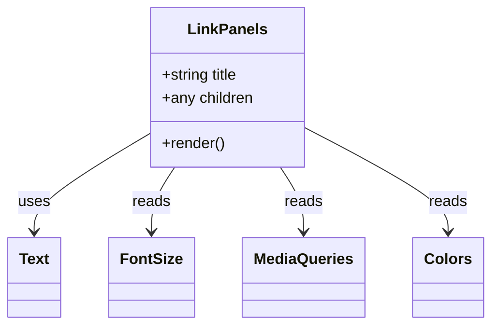

# Diagram: web/portal/src/components/templates/LinkPanels.template.js


> Auto-generated by Obscura crawlers

## Diagram 1



### SVG

<svg id="container" width="501.46875" xmlns="http://www.w3.org/2000/svg" class="classDiagram" height="342" viewBox="0 0 501.46875 342" role="graphics-document document" aria-roledescription="class"><style>#container{font-family:"trebuchet ms",verdana,arial,sans-serif;font-size:16px;fill:#333;}@keyframes edge-animation-frame{from{stroke-dashoffset:0;}}@keyframes dash{to{stroke-dashoffset:0;}}#container .edge-animation-slow{stroke-dasharray:9,5!important;stroke-dashoffset:900;animation:dash 50s linear infinite;stroke-linecap:round;}#container .edge-animation-fast{stroke-dasharray:9,5!important;stroke-dashoffset:900;animation:dash 20s linear infinite;stroke-linecap:round;}#container .error-icon{fill:#552222;}#container .error-text{fill:#552222;stroke:#552222;}#container .edge-thickness-normal{stroke-width:1px;}#container .edge-thickness-thick{stroke-width:3.5px;}#container .edge-pattern-solid{stroke-dasharray:0;}#container .edge-thickness-invisible{stroke-width:0;fill:none;}#container .edge-pattern-dashed{stroke-dasharray:3;}#container .edge-pattern-dotted{stroke-dasharray:2;}#container .marker{fill:#333333;stroke:#333333;}#container .marker.cross{stroke:#333333;}#container svg{font-family:"trebuchet ms",verdana,arial,sans-serif;font-size:16px;}#container p{margin:0;}#container g.classGroup text{fill:#9370DB;stroke:none;font-family:"trebuchet ms",verdana,arial,sans-serif;font-size:10px;}#container g.classGroup text .title{font-weight:bolder;}#container .nodeLabel,#container .edgeLabel{color:#131300;}#container .edgeLabel .label rect{fill:#ECECFF;}#container .label text{fill:#131300;}#container .labelBkg{background:#ECECFF;}#container .edgeLabel .label span{background:#ECECFF;}#container .classTitle{font-weight:bolder;}#container .node rect,#container .node circle,#container .node ellipse,#container .node polygon,#container .node path{fill:#ECECFF;stroke:#9370DB;stroke-width:1px;}#container .divider{stroke:#9370DB;stroke-width:1;}#container g.clickable{cursor:pointer;}#container g.classGroup rect{fill:#ECECFF;stroke:#9370DB;}#container g.classGroup line{stroke:#9370DB;stroke-width:1;}#container .classLabel .box{stroke:none;stroke-width:0;fill:#ECECFF;opacity:0.5;}#container .classLabel .label{fill:#9370DB;font-size:10px;}#container .relation{stroke:#333333;stroke-width:1;fill:none;}#container .dashed-line{stroke-dasharray:3;}#container .dotted-line{stroke-dasharray:1 2;}#container #compositionStart,#container .composition{fill:#333333!important;stroke:#333333!important;stroke-width:1;}#container #compositionEnd,#container .composition{fill:#333333!important;stroke:#333333!important;stroke-width:1;}#container #dependencyStart,#container .dependency{fill:#333333!important;stroke:#333333!important;stroke-width:1;}#container #dependencyStart,#container .dependency{fill:#333333!important;stroke:#333333!important;stroke-width:1;}#container #extensionStart,#container .extension{fill:transparent!important;stroke:#333333!important;stroke-width:1;}#container #extensionEnd,#container .extension{fill:transparent!important;stroke:#333333!important;stroke-width:1;}#container #aggregationStart,#container .aggregation{fill:transparent!important;stroke:#333333!important;stroke-width:1;}#container #aggregationEnd,#container .aggregation{fill:transparent!important;stroke:#333333!important;stroke-width:1;}#container #lollipopStart,#container .lollipop{fill:#ECECFF!important;stroke:#333333!important;stroke-width:1;}#container #lollipopEnd,#container .lollipop{fill:#ECECFF!important;stroke:#333333!important;stroke-width:1;}#container .edgeTerminals{font-size:11px;line-height:initial;}#container .classTitleText{text-anchor:middle;font-size:18px;fill:#333;}#container .label-icon{display:inline-block;height:1em;overflow:visible;vertical-align:-0.125em;}#container .node .label-icon path{fill:currentColor;stroke:revert;stroke-width:revert;}#container :root{--mermaid-font-family:"trebuchet ms",verdana,arial,sans-serif;}</style><g><defs><marker id="container_class-aggregationStart" class="marker aggregation class" refX="18" refY="7" markerWidth="190" markerHeight="240" orient="auto"><path d="M 18,7 L9,13 L1,7 L9,1 Z"></path></marker></defs><defs><marker id="container_class-aggregationEnd" class="marker aggregation class" refX="1" refY="7" markerWidth="20" markerHeight="28" orient="auto"><path d="M 18,7 L9,13 L1,7 L9,1 Z"></path></marker></defs><defs><marker id="container_class-extensionStart" class="marker extension class" refX="18" refY="7" markerWidth="190" markerHeight="240" orient="auto"><path d="M 1,7 L18,13 V 1 Z"></path></marker></defs><defs><marker id="container_class-extensionEnd" class="marker extension class" refX="1" refY="7" markerWidth="20" markerHeight="28" orient="auto"><path d="M 1,1 V 13 L18,7 Z"></path></marker></defs><defs><marker id="container_class-compositionStart" class="marker composition class" refX="18" refY="7" markerWidth="190" markerHeight="240" orient="auto"><path d="M 18,7 L9,13 L1,7 L9,1 Z"></path></marker></defs><defs><marker id="container_class-compositionEnd" class="marker composition class" refX="1" refY="7" markerWidth="20" markerHeight="28" orient="auto"><path d="M 18,7 L9,13 L1,7 L9,1 Z"></path></marker></defs><defs><marker id="container_class-dependencyStart" class="marker dependency class" refX="6" refY="7" markerWidth="190" markerHeight="240" orient="auto"><path d="M 5,7 L9,13 L1,7 L9,1 Z"></path></marker></defs><defs><marker id="container_class-dependencyEnd" class="marker dependency class" refX="13" refY="7" markerWidth="20" markerHeight="28" orient="auto"><path d="M 18,7 L9,13 L14,7 L9,1 Z"></path></marker></defs><defs><marker id="container_class-lollipopStart" class="marker lollipop class" refX="13" refY="7" markerWidth="190" markerHeight="240" orient="auto"><circle stroke="black" fill="transparent" cx="7" cy="7" r="6"></circle></marker></defs><defs><marker id="container_class-lollipopEnd" class="marker lollipop class" refX="1" refY="7" markerWidth="190" markerHeight="240" orient="auto"><circle stroke="black" fill="transparent" cx="7" cy="7" r="6"></circle></marker></defs><g class="root"><g class="clusters"></g><g class="edgePaths"><path d="M152.844,141.164L133.267,153.137C113.69,165.11,74.536,189.055,54.96,206.194C35.383,223.333,35.383,233.667,35.383,238.833L35.383,244" id="id_LinkPanels_Text_1" class="edge-thickness-normal edge-pattern-solid relation" style=";;;" data-edge="true" data-et="edge" data-id="id_LinkPanels_Text_1" data-points="W3sieCI6MTUyLjg0Mzc1LCJ5IjoxNDEuMTY0NDYxOTk0MDc3fSx7IngiOjM1LjM4MjgxMjUsInkiOjIxM30seyJ4IjozNS4zODI4MTI1LCJ5IjoyNTB9XQ==" marker-end="url(#container_class-dependencyEnd)"></path><path d="M179.346,176L175.39,182.167C171.434,188.333,163.522,200.667,159.565,212C155.609,223.333,155.609,233.667,155.609,238.833L155.609,244" id="id_LinkPanels_FontSize_2" class="edge-thickness-normal edge-pattern-solid relation" style=";;;" data-edge="true" data-et="edge" data-id="id_LinkPanels_FontSize_2" data-points="W3sieCI6MTc5LjM0NTk0NTI0NzkzMzg4LCJ5IjoxNzZ9LHsieCI6MTU1LjYwOTM3NSwieSI6MjEzfSx7IngiOjE1NS42MDkzNzUsInkiOjI1MH1d" marker-end="url(#container_class-dependencyEnd)"></path><path d="M287.123,176L291.079,182.167C295.035,188.333,302.947,200.667,306.903,212C310.859,223.333,310.859,233.667,310.859,238.833L310.859,244" id="id_LinkPanels_MediaQueries_3" class="edge-thickness-normal edge-pattern-solid relation" style=";;;" data-edge="true" data-et="edge" data-id="id_LinkPanels_MediaQueries_3" data-points="W3sieCI6Mjg3LjEyMjgwNDc1MjA2NjE0LCJ5IjoxNzZ9LHsieCI6MzEwLjg1OTM3NSwieSI6MjEzfSx7IngiOjMxMC44NTkzNzUsInkiOjI1MH1d" marker-end="url(#container_class-dependencyEnd)"></path><path d="M313.625,135.207L337.749,148.172C361.872,161.138,410.12,187.069,434.243,205.201C458.367,223.333,458.367,233.667,458.367,238.833L458.367,244" id="id_LinkPanels_Colors_4" class="edge-thickness-normal edge-pattern-solid relation" style=";;;" data-edge="true" data-et="edge" data-id="id_LinkPanels_Colors_4" data-points="W3sieCI6MzEzLjYyNSwieSI6MTM1LjIwNjc4NzY2MDA2MTc2fSx7IngiOjQ1OC4zNjcxODc1LCJ5IjoyMTN9LHsieCI6NDU4LjM2NzE4NzUsInkiOjI1MH1d" marker-end="url(#container_class-dependencyEnd)"></path></g><g class="edgeLabels"><g class="edgeLabel" transform="translate(35.3828125, 213)"><g class="label" data-id="id_LinkPanels_Text_1" transform="translate(-16.4921875, -12)"><foreignObject width="32.984375" height="24"><div xmlns="http://www.w3.org/1999/xhtml" class="labelBkg" style="display: table-cell; white-space: nowrap; line-height: 1.5; max-width: 200px; text-align: center;"><span class="edgeLabel"><p>uses</p></span></div></foreignObject></g></g><g class="edgeLabel" transform="translate(155.609375, 213)"><g class="label" data-id="id_LinkPanels_FontSize_2" transform="translate(-20.0078125, -12)"><foreignObject width="40.015625" height="24"><div xmlns="http://www.w3.org/1999/xhtml" class="labelBkg" style="display: table-cell; white-space: nowrap; line-height: 1.5; max-width: 200px; text-align: center;"><span class="edgeLabel"><p>reads</p></span></div></foreignObject></g></g><g class="edgeLabel" transform="translate(310.859375, 213)"><g class="label" data-id="id_LinkPanels_MediaQueries_3" transform="translate(-20.0078125, -12)"><foreignObject width="40.015625" height="24"><div xmlns="http://www.w3.org/1999/xhtml" class="labelBkg" style="display: table-cell; white-space: nowrap; line-height: 1.5; max-width: 200px; text-align: center;"><span class="edgeLabel"><p>reads</p></span></div></foreignObject></g></g><g class="edgeLabel" transform="translate(458.3671875, 213)"><g class="label" data-id="id_LinkPanels_Colors_4" transform="translate(-20.0078125, -12)"><foreignObject width="40.015625" height="24"><div xmlns="http://www.w3.org/1999/xhtml" class="labelBkg" style="display: table-cell; white-space: nowrap; line-height: 1.5; max-width: 200px; text-align: center;"><span class="edgeLabel"><p>reads</p></span></div></foreignObject></g></g></g><g class="nodes"><g class="node default" id="classId-LinkPanels-0" transform="translate(233.234375, 92)"><g class="basic label-container"><path d="M-80.390625 -84 L80.390625 -84 L80.390625 84 L-80.390625 84" stroke="none" stroke-width="0" fill="#ECECFF" style=""></path><path d="M-80.390625 -84 C-23.823693757813437 -84, 32.743237484373125 -84, 80.390625 -84 M-80.390625 -84 C-40.49875703157006 -84, -0.606889063140116 -84, 80.390625 -84 M80.390625 -84 C80.390625 -49.26266331636754, 80.390625 -14.525326632735073, 80.390625 84 M80.390625 -84 C80.390625 -30.75453828623909, 80.390625 22.49092342752182, 80.390625 84 M80.390625 84 C19.47850536082695 84, -41.4336142783461 84, -80.390625 84 M80.390625 84 C43.66042947379968 84, 6.930233947599362 84, -80.390625 84 M-80.390625 84 C-80.390625 26.722987359713883, -80.390625 -30.554025280572233, -80.390625 -84 M-80.390625 84 C-80.390625 38.617686558173126, -80.390625 -6.764626883653747, -80.390625 -84" stroke="#9370DB" stroke-width="1.3" fill="none" stroke-dasharray="0 0" style=""></path></g><g class="annotation-group text" transform="translate(0, -60)"></g><g class="label-group text" transform="translate(-39.4375, -60)"><g class="label" style="font-weight: bolder" transform="translate(0,-12)"><foreignObject width="78.875" height="24"><div xmlns="http://www.w3.org/1999/xhtml" style="display: table-cell; white-space: nowrap; line-height: 1.5; max-width: 127px; text-align: center;"><span class="nodeLabel markdown-node-label" style=""><p>LinkPanels</p></span></div></foreignObject></g></g><g class="members-group text" transform="translate(-68.390625, -12)"><g class="label" style="" transform="translate(0,-12)"><foreignObject width="83.09375" height="24"><div xmlns="http://www.w3.org/1999/xhtml" style="display: table-cell; white-space: nowrap; line-height: 1.5; max-width: 140px; text-align: center;"><span class="nodeLabel markdown-node-label" style=""><p>+string title</p></span></div></foreignObject></g><g class="label" style="" transform="translate(0,12)"><foreignObject width="97.34375" height="24"><div xmlns="http://www.w3.org/1999/xhtml" style="display: table-cell; white-space: nowrap; line-height: 1.5; max-width: 155px; text-align: center;"><span class="nodeLabel markdown-node-label" style=""><p>+any children</p></span></div></foreignObject></g></g><g class="methods-group text" transform="translate(-68.390625, 60)"><g class="label" style="" transform="translate(0,-12)"><foreignObject width="66.609375" height="24"><div xmlns="http://www.w3.org/1999/xhtml" style="display: table-cell; white-space: nowrap; line-height: 1.5; max-width: 124px; text-align: center;"><span class="nodeLabel markdown-node-label" style=""><p>+render()</p></span></div></foreignObject></g></g><g class="divider" style=""><path d="M-80.390625 -36 C-21.62642453697653 -36, 37.13777592604694 -36, 80.390625 -36 M-80.390625 -36 C-43.688363146670866 -36, -6.986101293341733 -36, 80.390625 -36" stroke="#9370DB" stroke-width="1.3" fill="none" stroke-dasharray="0 0" style=""></path></g><g class="divider" style=""><path d="M-80.390625 36 C-32.674779397253324 36, 15.041066205493351 36, 80.390625 36 M-80.390625 36 C-36.16052036459685 36, 8.069584270806303 36, 80.390625 36" stroke="#9370DB" stroke-width="1.3" fill="none" stroke-dasharray="0 0" style=""></path></g></g><g class="node default" id="classId-Text-1" transform="translate(35.3828125, 292)"><g class="basic label-container"><path d="M-27.3828125 -42 L27.3828125 -42 L27.3828125 42 L-27.3828125 42" stroke="none" stroke-width="0" fill="#ECECFF" style=""></path><path d="M-27.3828125 -42 C-8.160191376024141 -42, 11.062429747951718 -42, 27.3828125 -42 M-27.3828125 -42 C-6.500806037049138 -42, 14.381200425901724 -42, 27.3828125 -42 M27.3828125 -42 C27.3828125 -14.571412699140389, 27.3828125 12.857174601719223, 27.3828125 42 M27.3828125 -42 C27.3828125 -20.479851069286557, 27.3828125 1.040297861426886, 27.3828125 42 M27.3828125 42 C10.490906081435927 42, -6.401000337128146 42, -27.3828125 42 M27.3828125 42 C14.415936020561515 42, 1.449059541123031 42, -27.3828125 42 M-27.3828125 42 C-27.3828125 22.521716469155546, -27.3828125 3.043432938311092, -27.3828125 -42 M-27.3828125 42 C-27.3828125 24.261738843934992, -27.3828125 6.523477687869985, -27.3828125 -42" stroke="#9370DB" stroke-width="1.3" fill="none" stroke-dasharray="0 0" style=""></path></g><g class="annotation-group text" transform="translate(0, -18)"></g><g class="label-group text" transform="translate(-15.3828125, -18)"><g class="label" style="font-weight: bolder" transform="translate(0,-12)"><foreignObject width="30.765625" height="24"><div xmlns="http://www.w3.org/1999/xhtml" style="display: table-cell; white-space: nowrap; line-height: 1.5; max-width: 80px; text-align: center;"><span class="nodeLabel markdown-node-label" style=""><p>Text</p></span></div></foreignObject></g></g><g class="members-group text" transform="translate(-15.3828125, 30)"></g><g class="methods-group text" transform="translate(-15.3828125, 60)"></g><g class="divider" style=""><path d="M-27.3828125 6 C-9.360859146322902 6, 8.661094207354196 6, 27.3828125 6 M-27.3828125 6 C-15.987378707604561 6, -4.5919449152091225 6, 27.3828125 6" stroke="#9370DB" stroke-width="1.3" fill="none" stroke-dasharray="0 0" style=""></path></g><g class="divider" style=""><path d="M-27.3828125 24 C-8.199534082985743 24, 10.983744334028515 24, 27.3828125 24 M-27.3828125 24 C-8.645123212977783 24, 10.092566074044434 24, 27.3828125 24" stroke="#9370DB" stroke-width="1.3" fill="none" stroke-dasharray="0 0" style=""></path></g></g><g class="node default" id="classId-FontSize-2" transform="translate(155.609375, 292)"><g class="basic label-container"><path d="M-42.84375 -42 L42.84375 -42 L42.84375 42 L-42.84375 42" stroke="none" stroke-width="0" fill="#ECECFF" style=""></path><path d="M-42.84375 -42 C-16.041504635379496 -42, 10.760740729241007 -42, 42.84375 -42 M-42.84375 -42 C-14.251230012905665 -42, 14.341289974188669 -42, 42.84375 -42 M42.84375 -42 C42.84375 -16.871721359504782, 42.84375 8.256557280990435, 42.84375 42 M42.84375 -42 C42.84375 -19.915082971408598, 42.84375 2.169834057182804, 42.84375 42 M42.84375 42 C21.12713499446068 42, -0.589480011078642 42, -42.84375 42 M42.84375 42 C17.31804528732541 42, -8.207659425349178 42, -42.84375 42 M-42.84375 42 C-42.84375 16.62031104875487, -42.84375 -8.759377902490257, -42.84375 -42 M-42.84375 42 C-42.84375 11.371876131683319, -42.84375 -19.256247736633362, -42.84375 -42" stroke="#9370DB" stroke-width="1.3" fill="none" stroke-dasharray="0 0" style=""></path></g><g class="annotation-group text" transform="translate(0, -18)"></g><g class="label-group text" transform="translate(-30.84375, -18)"><g class="label" style="font-weight: bolder" transform="translate(0,-12)"><foreignObject width="61.6875" height="24"><div xmlns="http://www.w3.org/1999/xhtml" style="display: table-cell; white-space: nowrap; line-height: 1.5; max-width: 111px; text-align: center;"><span class="nodeLabel markdown-node-label" style=""><p>FontSize</p></span></div></foreignObject></g></g><g class="members-group text" transform="translate(-30.84375, 30)"></g><g class="methods-group text" transform="translate(-30.84375, 60)"></g><g class="divider" style=""><path d="M-42.84375 6 C-24.757200405831533 6, -6.670650811663066 6, 42.84375 6 M-42.84375 6 C-9.296833421248003 6, 24.250083157503994 6, 42.84375 6" stroke="#9370DB" stroke-width="1.3" fill="none" stroke-dasharray="0 0" style=""></path></g><g class="divider" style=""><path d="M-42.84375 24 C-16.755450282803054 24, 9.332849434393893 24, 42.84375 24 M-42.84375 24 C-24.598554734502834 24, -6.353359469005667 24, 42.84375 24" stroke="#9370DB" stroke-width="1.3" fill="none" stroke-dasharray="0 0" style=""></path></g></g><g class="node default" id="classId-MediaQueries-3" transform="translate(310.859375, 292)"><g class="basic label-container"><path d="M-62.40625 -42 L62.40625 -42 L62.40625 42 L-62.40625 42" stroke="none" stroke-width="0" fill="#ECECFF" style=""></path><path d="M-62.40625 -42 C-15.210496869225459 -42, 31.985256261549083 -42, 62.40625 -42 M-62.40625 -42 C-30.46168063133986 -42, 1.4828887373202804 -42, 62.40625 -42 M62.40625 -42 C62.40625 -24.302903686376478, 62.40625 -6.605807372752956, 62.40625 42 M62.40625 -42 C62.40625 -14.819670802043749, 62.40625 12.360658395912502, 62.40625 42 M62.40625 42 C33.20445281392165 42, 4.002655627843296 42, -62.40625 42 M62.40625 42 C34.02461785798836 42, 5.642985715976721 42, -62.40625 42 M-62.40625 42 C-62.40625 21.978776133006683, -62.40625 1.9575522660133657, -62.40625 -42 M-62.40625 42 C-62.40625 14.221544435890475, -62.40625 -13.556911128219049, -62.40625 -42" stroke="#9370DB" stroke-width="1.3" fill="none" stroke-dasharray="0 0" style=""></path></g><g class="annotation-group text" transform="translate(0, -18)"></g><g class="label-group text" transform="translate(-50.40625, -18)"><g class="label" style="font-weight: bolder" transform="translate(0,-12)"><foreignObject width="100.8125" height="24"><div xmlns="http://www.w3.org/1999/xhtml" style="display: table-cell; white-space: nowrap; line-height: 1.5; max-width: 150px; text-align: center;"><span class="nodeLabel markdown-node-label" style=""><p>MediaQueries</p></span></div></foreignObject></g></g><g class="members-group text" transform="translate(-50.40625, 30)"></g><g class="methods-group text" transform="translate(-50.40625, 60)"></g><g class="divider" style=""><path d="M-62.40625 6 C-27.494178477717362 6, 7.417893044565275 6, 62.40625 6 M-62.40625 6 C-14.365493558862859 6, 33.67526288227428 6, 62.40625 6" stroke="#9370DB" stroke-width="1.3" fill="none" stroke-dasharray="0 0" style=""></path></g><g class="divider" style=""><path d="M-62.40625 24 C-30.242002636988325 24, 1.9222447260233508 24, 62.40625 24 M-62.40625 24 C-17.46007254417639 24, 27.486104911647217 24, 62.40625 24" stroke="#9370DB" stroke-width="1.3" fill="none" stroke-dasharray="0 0" style=""></path></g></g><g class="node default" id="classId-Colors-4" transform="translate(458.3671875, 292)"><g class="basic label-container"><path d="M-35.1015625 -42 L35.1015625 -42 L35.1015625 42 L-35.1015625 42" stroke="none" stroke-width="0" fill="#ECECFF" style=""></path><path d="M-35.1015625 -42 C-12.563996321233617 -42, 9.973569857532766 -42, 35.1015625 -42 M-35.1015625 -42 C-14.898640281100068 -42, 5.304281937799864 -42, 35.1015625 -42 M35.1015625 -42 C35.1015625 -15.441018404750128, 35.1015625 11.117963190499744, 35.1015625 42 M35.1015625 -42 C35.1015625 -14.107463529226024, 35.1015625 13.785072941547952, 35.1015625 42 M35.1015625 42 C14.382397954389514 42, -6.336766591220972 42, -35.1015625 42 M35.1015625 42 C17.0738638610517 42, -0.9538347778966028 42, -35.1015625 42 M-35.1015625 42 C-35.1015625 12.392118962842758, -35.1015625 -17.215762074314483, -35.1015625 -42 M-35.1015625 42 C-35.1015625 12.152520573149904, -35.1015625 -17.694958853700193, -35.1015625 -42" stroke="#9370DB" stroke-width="1.3" fill="none" stroke-dasharray="0 0" style=""></path></g><g class="annotation-group text" transform="translate(0, -18)"></g><g class="label-group text" transform="translate(-23.1015625, -18)"><g class="label" style="font-weight: bolder" transform="translate(0,-12)"><foreignObject width="46.203125" height="24"><div xmlns="http://www.w3.org/1999/xhtml" style="display: table-cell; white-space: nowrap; line-height: 1.5; max-width: 95px; text-align: center;"><span class="nodeLabel markdown-node-label" style=""><p>Colors</p></span></div></foreignObject></g></g><g class="members-group text" transform="translate(-23.1015625, 30)"></g><g class="methods-group text" transform="translate(-23.1015625, 60)"></g><g class="divider" style=""><path d="M-35.1015625 6 C-7.230648612862296 6, 20.640265274275407 6, 35.1015625 6 M-35.1015625 6 C-8.372127687004848 6, 18.357307125990303 6, 35.1015625 6" stroke="#9370DB" stroke-width="1.3" fill="none" stroke-dasharray="0 0" style=""></path></g><g class="divider" style=""><path d="M-35.1015625 24 C-12.26811552542479 24, 10.56533144915042 24, 35.1015625 24 M-35.1015625 24 C-7.108093483485948 24, 20.885375533028103 24, 35.1015625 24" stroke="#9370DB" stroke-width="1.3" fill="none" stroke-dasharray="0 0" style=""></path></g></g></g></g></g></svg>

## Diagram 2

```mermaid
flowchart TD
  A[LinkPanels(props)] --> B{title ?}
  B -->|yes| C[Title Container\n(div with border-bottom)]
  C --> D[Text Component\nblock, size=FontSize.size24,\ncolor=Colors.background.GRAY_BLUE]
  B -->|no| E[skip Title]
  A --> F[Grid Container\ndisplay: grid; gap: 1em]
  F --> G{Viewport width}
  G -->|mediumAndUp| H[gridTemplateColumns: repeat(3, 1fr)]
  G -->|medium| I[gridTemplateColumns: repeat(2, 1fr)]
  G -->|smallAndDown| J[gridTemplateColumns: repeat(1, 1fr)]
  F --> K[children (panels)]
  D --> L[renders title text]
  K --> M[panel items displayed in grid]
```

> SVG rendering failed for this diagram.
