# Diagram: web/portal/src/components/templates/Search.template.js

> Auto-generated by Obscura crawlers

## Mermaid

```mermaid
classDiagram
class Search {
  +bool isLoading
  +array searchResults
  +object exportProps
  +object tableProps
  +bool showFilters
  +func toggleShowFilters()
}
class TotalCount {
  +int count
  +bool isLoading
}
class TotalCountLabelContext {
  +int count
  +bool isLoading
}
class BaseTable
class ExportModal
class ExportAlert
class DownloadDataButton
class ResetSearchButton
class SaveThisSearchButton
class SavedSearchModalContainer
class SearchBarContainer
class FiltersContainer
class Loader
class Alert
class Separator
class Text
class LocalizedNumber
class MediaQueries
class Colors

Search "1" o-- "1" TotalCountLabelContext : provides
Search "1" --> "1" TotalCount : uses
Search --> BaseTable : renders
Search --> ExportModal : conditionally renders
Search --> ExportAlert : conditionally renders
Search --> DownloadDataButton : conditionally renders
Search --> ResetSearchButton : may render
Search --> SaveThisSearchButton : may render
Search --> SavedSearchModalContainer : may render
Search --> SearchBarContainer : may render
Search --> FiltersContainer : may render
Search --> Loader : shows when exporting
Search --> Alert : shows error/warning
Search --> Separator : layout helper
TotalCount --> Loader : wraps count display
TotalCount --> LocalizedNumber : formats count
FiltersContainer ..|> Colors : uses
Search ..> MediaQueries : responsive behavior
BaseTable : +props (data, pageSize, height)
ExportModal : +props (exportIdentifier, exportName, resetExport)
ExportAlert : +props (exportFailed, onDismiss)
DownloadDataButton : +props (onClick, isDisabled, isExporting)
SavedSearchModalContainer : +props (show, hide)
```

### SVG

<svg id="container" width="3888.4609375" xmlns="http://www.w3.org/2000/svg" class="classDiagram" height="632" viewBox="0 0 3888.4609375 632" role="graphics-document document" aria-roledescription="class"><g><defs><marker id="container_class-aggregationStart" class="marker aggregation class" refX="18" refY="7" markerWidth="190" markerHeight="240" orient="auto"><path d="M 18,7 L9,13 L1,7 L9,1 Z"></path></marker></defs><defs><marker id="container_class-aggregationEnd" class="marker aggregation class" refX="1" refY="7" markerWidth="20" markerHeight="28" orient="auto"><path d="M 18,7 L9,13 L1,7 L9,1 Z"></path></marker></defs><defs><marker id="container_class-extensionStart" class="marker extension class" refX="18" refY="7" markerWidth="190" markerHeight="240" orient="auto"><path d="M 1,7 L18,13 V 1 Z"></path></marker></defs><defs><marker id="container_class-extensionEnd" class="marker extension class" refX="1" refY="7" markerWidth="20" markerHeight="28" orient="auto"><path d="M 1,1 V 13 L18,7 Z"></path></marker></defs><defs><marker id="container_class-compositionStart" class="marker composition class" refX="18" refY="7" markerWidth="190" markerHeight="240" orient="auto"><path d="M 18,7 L9,13 L1,7 L9,1 Z"></path></marker></defs><defs><marker id="container_class-compositionEnd" class="marker composition class" refX="1" refY="7" markerWidth="20" markerHeight="28" orient="auto"><path d="M 18,7 L9,13 L1,7 L9,1 Z"></path></marker></defs><defs><marker id="container_class-dependencyStart" class="marker dependency class" refX="6" refY="7" markerWidth="190" markerHeight="240" orient="auto"><path d="M 5,7 L9,13 L1,7 L9,1 Z"></path></marker></defs><defs><marker id="container_class-dependencyEnd" class="marker dependency class" refX="13" refY="7" markerWidth="20" markerHeight="28" orient="auto"><path d="M 18,7 L9,13 L14,7 L9,1 Z"></path></marker></defs><defs><marker id="container_class-lollipopStart" class="marker lollipop class" refX="13" refY="7" markerWidth="190" markerHeight="240" orient="auto"><circle stroke="black" fill="transparent" cx="7" cy="7" r="6"></circle></marker></defs><defs><marker id="container_class-lollipopEnd" class="marker lollipop class" refX="1" refY="7" markerWidth="190" markerHeight="240" orient="auto"><circle stroke="black" fill="transparent" cx="7" cy="7" r="6"></circle></marker></defs><g class="root"><g class="clusters"></g><g class="edgePaths"><path d="M2253.268,138.063L1930.716,162.553C1608.163,187.042,963.058,236.021,640.506,266.677C317.953,297.333,317.953,309.667,317.953,315.833L317.953,322" id="id_Search_TotalCountLabelContext_1" class="edge-thickness-normal edge-pattern-solid relation" style=";;;" data-edge="true" data-et="edge" data-id="id_Search_TotalCountLabelContext_1" data-points="W3sieCI6MjI3MC40Njg3NSwieSI6MTM2Ljc1NzM1MDIxODc0OTc2fSx7IngiOjMxNy45NTMxMjUsInkiOjI4NX0seyJ4IjozMTcuOTUzMTI1LCJ5IjozMjJ9XQ==" marker-start="url(#container_class-aggregationStart)"></path><path d="M2501.156,151.552L2610.081,173.793C2719.007,196.035,2936.857,240.517,3045.782,267.925C3154.707,295.333,3154.707,305.667,3154.707,310.833L3154.707,316" id="id_Search_TotalCount_2" class="edge-thickness-normal edge-pattern-solid relation" style=";;;" data-edge="true" data-et="edge" data-id="id_Search_TotalCount_2" data-points="W3sieCI6MjUwMS4xNTYyNSwieSI6MTUxLjU1MTk1NDE1NDk2MDd9LHsieCI6MzE1NC43MDcwMzEyNSwieSI6Mjg1fSx7IngiOjMxNTQuNzA3MDMxMjUsInkiOjMyMn1d" marker-end="url(#container_class-dependencyEnd)"></path><path d="M2270.469,138.26L1995.513,162.716C1720.557,187.173,1170.646,236.087,895.69,267.21C620.734,298.333,620.734,311.667,620.734,318.333L620.734,325" id="id_Search_BaseTable_3" class="edge-thickness-normal edge-pattern-solid relation" style=";;;" data-edge="true" data-et="edge" data-id="id_Search_BaseTable_3" data-points="W3sieCI6MjI3MC40Njg3NSwieSI6MTM4LjI1OTU4NDgyNzE1ODg1fSx7IngiOjYyMC43MzQzNzUsInkiOjI4NX0seyJ4Ijo2MjAuNzM0Mzc1LCJ5IjozMzF9XQ==" marker-end="url(#container_class-dependencyEnd)"></path><path d="M2270.469,141.32L2063.11,165.267C1855.751,189.214,1441.034,237.107,1233.675,267.72C1026.316,298.333,1026.316,311.667,1026.316,318.333L1026.316,325" id="id_Search_ExportModal_4" class="edge-thickness-normal edge-pattern-solid relation" style=";;;" data-edge="true" data-et="edge" data-id="id_Search_ExportModal_4" data-points="W3sieCI6MjI3MC40Njg3NSwieSI6MTQxLjMyMDM1MzY0NjY1Nzl9LHsieCI6MTAyNi4zMTY0MDYyNSwieSI6Mjg1fSx7IngiOjEwMjYuMzE2NDA2MjUsInkiOjMzMX1d" marker-end="url(#container_class-dependencyEnd)"></path><path d="M2270.469,147.17L2132.247,170.141C1994.025,193.113,1717.581,239.057,1579.359,268.695C1441.137,298.333,1441.137,311.667,1441.137,318.333L1441.137,325" id="id_Search_ExportAlert_5" class="edge-thickness-normal edge-pattern-solid relation" style=";;;" data-edge="true" data-et="edge" data-id="id_Search_ExportAlert_5" data-points="W3sieCI6MjI3MC40Njg3NSwieSI6MTQ3LjE2OTUwNjczMzg3NDQ3fSx7IngiOjE0NDEuMTM2NzE4NzUsInkiOjI4NX0seyJ4IjoxNDQxLjEzNjcxODc1LCJ5IjozMzF9XQ==" marker-end="url(#container_class-dependencyEnd)"></path><path d="M2270.469,160.809L2197.701,181.508C2124.934,202.206,1979.398,243.603,1906.631,270.968C1833.863,298.333,1833.863,311.667,1833.863,318.333L1833.863,325" id="id_Search_DownloadDataButton_6" class="edge-thickness-normal edge-pattern-solid relation" style=";;;" data-edge="true" data-et="edge" data-id="id_Search_DownloadDataButton_6" data-points="W3sieCI6MjI3MC40Njg3NSwieSI6MTYwLjgwOTEyMTA4MzY1OTQ4fSx7IngiOjE4MzMuODYzMjgxMjUsInkiOjI4NX0seyJ4IjoxODMzLjg2MzI4MTI1LCJ5IjozMzF9XQ==" marker-end="url(#container_class-dependencyEnd)"></path><path d="M2270.469,208.112L2252.018,220.926C2233.568,233.741,2196.667,259.371,2178.216,282.352C2159.766,305.333,2159.766,325.667,2159.766,335.833L2159.766,346" id="id_Search_ResetSearchButton_7" class="edge-thickness-normal edge-pattern-solid relation" style=";;;" data-edge="true" data-et="edge" data-id="id_Search_ResetSearchButton_7" data-points="W3sieCI6MjI3MC40Njg3NSwieSI6MjA4LjExMTU2NDI0OTY3MTd9LHsieCI6MjE1OS43NjU2MjUsInkiOjI4NX0seyJ4IjoyMTU5Ljc2NTYyNSwieSI6MzUyfV0=" marker-end="url(#container_class-dependencyEnd)"></path><path d="M2385.813,248L2385.813,254.167C2385.813,260.333,2385.813,272.667,2385.813,289C2385.813,305.333,2385.813,325.667,2385.813,335.833L2385.813,346" id="id_Search_SaveThisSearchButton_8" class="edge-thickness-normal edge-pattern-solid relation" style=";;;" data-edge="true" data-et="edge" data-id="id_Search_SaveThisSearchButton_8" data-points="W3sieCI6MjM4NS44MTI1LCJ5IjoyNDh9LHsieCI6MjM4NS44MTI1LCJ5IjoyODV9LHsieCI6MjM4NS44MTI1LCJ5IjozNTJ9XQ==" marker-end="url(#container_class-dependencyEnd)"></path><path d="M2501.156,193.36L2528.11,208.633C2555.064,223.906,2608.971,254.453,2635.925,276.393C2662.879,298.333,2662.879,311.667,2662.879,318.333L2662.879,325" id="id_Search_SavedSearchModalContainer_9" class="edge-thickness-normal edge-pattern-solid relation" style=";;;" data-edge="true" data-et="edge" data-id="id_Search_SavedSearchModalContainer_9" data-points="W3sieCI6MjUwMS4xNTYyNSwieSI6MTkzLjM1OTY2OTUyODY4MzZ9LHsieCI6MjY2Mi44Nzg5MDYyNSwieSI6Mjg1fSx7IngiOjI2NjIuODc4OTA2MjUsInkiOjMzMX1d" marker-end="url(#container_class-dependencyEnd)"></path><path d="M2501.156,161.223L2572.779,181.852C2644.401,202.482,2787.646,243.741,2859.268,274.537C2930.891,305.333,2930.891,325.667,2930.891,335.833L2930.891,346" id="id_Search_SearchBarContainer_10" class="edge-thickness-normal edge-pattern-solid relation" style=";;;" data-edge="true" data-et="edge" data-id="id_Search_SearchBarContainer_10" data-points="W3sieCI6MjUwMS4xNTYyNSwieSI6MTYxLjIyMjcwMzE2NzU1MDUyfSx7IngiOjI5MzAuODkwNjI1LCJ5IjoyODV9LHsieCI6MjkzMC44OTA2MjUsInkiOjM1Mn1d" marker-end="url(#container_class-dependencyEnd)"></path><path d="M2501.156,140.713L2719.335,164.761C2937.513,188.809,3373.87,236.904,3592.048,271.119C3810.227,305.333,3810.227,325.667,3810.227,335.833L3810.227,346" id="id_Search_FiltersContainer_11" class="edge-thickness-normal edge-pattern-solid relation" style=";;;" data-edge="true" data-et="edge" data-id="id_Search_FiltersContainer_11" data-points="W3sieCI6MjUwMS4xNTYyNSwieSI6MTQwLjcxMzI3NTc0Mzg2NH0seyJ4IjozODEwLjIyNjU2MjUsInkiOjI4NX0seyJ4IjozODEwLjIyNjU2MjUsInkiOjM1Mn1d" marker-end="url(#container_class-dependencyEnd)"></path><path d="M2270.469,135.884L1906.883,160.737C1543.297,185.589,816.125,235.295,452.539,278.314C88.953,321.333,88.953,357.667,88.953,394C88.953,430.333,88.953,466.667,88.953,490C88.953,513.333,88.953,523.667,88.953,528.833L88.953,534" id="id_Search_Loader_12" class="edge-thickness-normal edge-pattern-solid relation" style=";;;" data-edge="true" data-et="edge" data-id="id_Search_Loader_12" data-points="W3sieCI6MjI3MC40Njg3NSwieSI6MTM1Ljg4NDIzMDUwNDk2OTQyfSx7IngiOjg4Ljk1MzEyNSwieSI6Mjg1fSx7IngiOjg4Ljk1MzEyNSwieSI6Mzk0fSx7IngiOjg4Ljk1MzEyNSwieSI6NTAzfSx7IngiOjg4Ljk1MzEyNSwieSI6NTQwfV0=" marker-end="url(#container_class-dependencyEnd)"></path><path d="M2501.156,147.313L2638.206,170.261C2775.255,193.209,3049.354,239.104,3186.404,272.219C3323.453,305.333,3323.453,325.667,3323.453,335.833L3323.453,346" id="id_Search_Alert_13" class="edge-thickness-normal edge-pattern-solid relation" style=";;;" data-edge="true" data-et="edge" data-id="id_Search_Alert_13" data-points="W3sieCI6MjUwMS4xNTYyNSwieSI6MTQ3LjMxMzMzNjMzMjg4MzR9LHsieCI6MzMyMy40NTMxMjUsInkiOjI4NX0seyJ4IjozMzIzLjQ1MzEyNSwieSI6MzUyfV0=" marker-end="url(#container_class-dependencyEnd)"></path><path d="M2501.156,144.75L2662.125,168.125C2823.094,191.5,3145.031,238.25,3306,271.792C3466.969,305.333,3466.969,325.667,3466.969,335.833L3466.969,346" id="id_Search_Separator_14" class="edge-thickness-normal edge-pattern-solid relation" style=";;;" data-edge="true" data-et="edge" data-id="id_Search_Separator_14" data-points="W3sieCI6MjUwMS4xNTYyNSwieSI6MTQ0Ljc0OTYzMTQ3MDkzNjc4fSx7IngiOjM0NjYuOTY4NzUsInkiOjI4NX0seyJ4IjozNDY2Ljk2ODc1LCJ5IjozNTJ9XQ==" marker-end="url(#container_class-dependencyEnd)"></path><path d="M3065.734,400.523L2832.767,417.602C2599.799,434.682,2133.863,468.841,1644.949,498.726C1156.035,528.611,644.143,554.222,388.197,567.028L132.25,579.834" id="id_TotalCount_Loader_15" class="edge-thickness-normal edge-pattern-solid relation" style=";;;" data-edge="true" data-et="edge" data-id="id_TotalCount_Loader_15" data-points="W3sieCI6MzA2NS43MzQzNzUsInkiOjQwMC41MjI4MzczNTE2MDU1fSx7IngiOjE2NjcuOTI3NzM0Mzc1LCJ5Ijo1MDN9LHsieCI6MTI2LjI1NzgxMjUsInkiOjU4MC4xMzM1NTQzMzY0NjV9XQ==" marker-end="url(#container_class-dependencyEnd)"></path><path d="M3243.68,433.161L3270.125,444.801C3296.571,456.44,3349.462,479.72,3375.908,496.527C3402.354,513.333,3402.354,523.667,3402.354,528.833L3402.354,534" id="id_TotalCount_LocalizedNumber_16" class="edge-thickness-normal edge-pattern-solid relation" style=";;;" data-edge="true" data-et="edge" data-id="id_TotalCount_LocalizedNumber_16" data-points="W3sieCI6MzI0My42Nzk2ODc1LCJ5Ijo0MzMuMTYwNzM5Nzc2ODA1MX0seyJ4IjozNDAyLjM1MzUxNTYyNSwieSI6NTAzfSx7IngiOjM0MDIuMzUzNTE1NjI1LCJ5Ijo1NDB9XQ==" marker-end="url(#container_class-dependencyEnd)"></path><path d="M3810.227,436L3810.227,447.167C3810.227,458.333,3810.227,480.667,3810.227,495.125C3810.227,509.583,3810.227,516.167,3810.227,519.458L3810.227,522.75" id="id_FiltersContainer_Colors_17" class="edge-thickness-normal edge-pattern-dashed relation" style=";;;" data-edge="true" data-et="edge" data-id="id_FiltersContainer_Colors_17" data-points="W3sieCI6MzgxMC4yMjY1NjI1LCJ5Ijo0MzZ9LHsieCI6MzgxMC4yMjY1NjI1LCJ5Ijo1MDN9LHsieCI6MzgxMC4yMjY1NjI1LCJ5Ijo1NDB9XQ==" marker-end="url(#container_class-extensionEnd)"></path><path d="M2501.156,142.583L2688.895,166.319C2876.633,190.055,3252.109,237.528,3439.848,271.431C3627.586,305.333,3627.586,325.667,3627.586,335.833L3627.586,346" id="id_Search_MediaQueries_18" class="edge-thickness-normal edge-pattern-dashed relation" style=";;;" data-edge="true" data-et="edge" data-id="id_Search_MediaQueries_18" data-points="W3sieCI6MjUwMS4xNTYyNSwieSI6MTQyLjU4MzE1MDM1ODI5NTU0fSx7IngiOjM2MjcuNTg1OTM3NSwieSI6Mjg1fSx7IngiOjM2MjcuNTg1OTM3NSwieSI6MzUyfV0=" marker-end="url(#container_class-dependencyEnd)"></path></g><g class="edgeLabels"><g class="edgeLabel" transform="translate(317.953125, 285)"><g class="label" data-id="id_Search_TotalCountLabelContext_1" transform="translate(-31.3125, -12)"><foreignObject width="62.625" height="24">

provides

</foreignObject></g></g><g class="edgeLabel" transform="translate(3154.70703125, 285)"><g class="label" data-id="id_Search_TotalCount_2" transform="translate(-16.4921875, -12)"><foreignObject width="32.984375" height="24">

uses

</foreignObject></g></g><g class="edgeLabel" transform="translate(620.734375, 285)"><g class="label" data-id="id_Search_BaseTable_3" transform="translate(-27.75, -12)"><foreignObject width="55.5" height="24">

renders

</foreignObject></g></g><g class="edgeLabel" transform="translate(1026.31640625, 285)"><g class="label" data-id="id_Search_ExportModal_4" transform="translate(-77.25, -12)"><foreignObject width="154.5" height="24">

conditionally renders

</foreignObject></g></g><g class="edgeLabel" transform="translate(1441.13671875, 285)"><g class="label" data-id="id_Search_ExportAlert_5" transform="translate(-77.25, -12)"><foreignObject width="154.5" height="24">

conditionally renders

</foreignObject></g></g><g class="edgeLabel" transform="translate(1833.86328125, 285)"><g class="label" data-id="id_Search_DownloadDataButton_6" transform="translate(-77.25, -12)"><foreignObject width="154.5" height="24">

conditionally renders

</foreignObject></g></g><g class="edgeLabel" transform="translate(2159.765625, 285)"><g class="label" data-id="id_Search_ResetSearchButton_7" transform="translate(-41.2734375, -12)"><foreignObject width="82.546875" height="24">

may render

</foreignObject></g></g><g class="edgeLabel" transform="translate(2385.8125, 285)"><g class="label" data-id="id_Search_SaveThisSearchButton_8" transform="translate(-41.2734375, -12)"><foreignObject width="82.546875" height="24">

may render

</foreignObject></g></g><g class="edgeLabel" transform="translate(2662.87890625, 285)"><g class="label" data-id="id_Search_SavedSearchModalContainer_9" transform="translate(-41.2734375, -12)"><foreignObject width="82.546875" height="24">

may render

</foreignObject></g></g><g class="edgeLabel" transform="translate(2930.890625, 285)"><g class="label" data-id="id_Search_SearchBarContainer_10" transform="translate(-41.2734375, -12)"><foreignObject width="82.546875" height="24">

may render

</foreignObject></g></g><g class="edgeLabel" transform="translate(3810.2265625, 285)"><g class="label" data-id="id_Search_FiltersContainer_11" transform="translate(-41.2734375, -12)"><foreignObject width="82.546875" height="24">

may render

</foreignObject></g></g><g class="edgeLabel" transform="translate(88.953125, 394)"><g class="label" data-id="id_Search_Loader_12" transform="translate(-80.953125, -12)"><foreignObject width="161.90625" height="24">

shows when exporting

</foreignObject></g></g><g class="edgeLabel" transform="translate(3323.453125, 285)"><g class="label" data-id="id_Search_Alert_13" transform="translate(-75.140625, -12)"><foreignObject width="150.28125" height="24">

shows error/warning

</foreignObject></g></g><g class="edgeLabel" transform="translate(3466.96875, 285)"><g class="label" data-id="id_Search_Separator_14" transform="translate(-48.375, -12)"><foreignObject width="96.75" height="24">

layout helper

</foreignObject></g></g><g class="edgeLabel" transform="translate(1596.99633, 506.54887)"><g class="label" data-id="id_TotalCount_Loader_15" transform="translate(-72.1953125, -12)"><foreignObject width="144.390625" height="24">

wraps count display

</foreignObject></g></g><g class="edgeLabel" transform="translate(3402.353515625, 503)"><g class="label" data-id="id_TotalCount_LocalizedNumber_16" transform="translate(-50.8828125, -12)"><foreignObject width="101.765625" height="24">

formats count

</foreignObject></g></g><g class="edgeLabel" transform="translate(3810.2265625, 503)"><g class="label" data-id="id_FiltersContainer_Colors_17" transform="translate(-16.4921875, -12)"><foreignObject width="32.984375" height="24">

uses

</foreignObject></g></g><g class="edgeLabel" transform="translate(3627.5859375, 285)"><g class="label" data-id="id_Search_MediaQueries_18" transform="translate(-73.421875, -12)"><foreignObject width="146.84375" height="24">

responsive behavior

</foreignObject></g></g><g class="edgeTerminals" transform="translate(2251.8833802096815, 123.12525235060333)"><g class="inner" transform="translate(0, 0)"><foreignObject style="width: 9px; height: 12px;">
1
</foreignObject></g></g><g class="edgeTerminals" transform="translate(2515.3015404940775, 169.7497778108559)"><g class="inner" transform="translate(0, 0)"><foreignObject style="width: 9px; height: 12px;">
1
</foreignObject></g></g><g class="edgeTerminals" transform="translate(327.9531274999998, 299.5000021428571)"><g class="inner" transform="translate(0, 0)"></g><foreignObject style="width: 9px; height: 12px;">
1
</foreignObject></g><g class="edgeTerminals" transform="translate(3164.707030625, 299.49999946428574)"><g class="inner" transform="translate(0, 0)"></g><foreignObject style="width: 9px; height: 12px;">
1
</foreignObject></g></g><g class="nodes"><g class="node default" id="classId-Search-0" transform="translate(2385.8125, 128)"><g class="basic label-container"><path d="M-115.34375 -120 L115.34375 -120 L115.34375 120 L-115.34375 120" stroke="none" stroke-width="0" fill="#ECECFF" style=""></path><path d="M-115.34375 -120 C-23.91760497863403 -120, 67.50854004273194 -120, 115.34375 -120 M-115.34375 -120 C-68.2032273374513 -120, -21.062704674902605 -120, 115.34375 -120 M115.34375 -120 C115.34375 -48.05034712255713, 115.34375 23.899305754885745, 115.34375 120 M115.34375 -120 C115.34375 -47.085013449524325, 115.34375 25.82997310095135, 115.34375 120 M115.34375 120 C64.10027421482019 120, 12.856798429640392 120, -115.34375 120 M115.34375 120 C33.075529623200694 120, -49.19269075359861 120, -115.34375 120 M-115.34375 120 C-115.34375 52.1561242065487, -115.34375 -15.687751586902607, -115.34375 -120 M-115.34375 120 C-115.34375 41.78002788939507, -115.34375 -36.439944221209856, -115.34375 -120" stroke="#9370DB" stroke-width="1.3" fill="none" stroke-dasharray="0 0" style=""></path></g><g class="annotation-group text" transform="translate(0, -96)"></g><g class="label-group text" transform="translate(-24.71875, -96)"><g class="label" style="font-weight: bolder" transform="translate(0,-12)"><foreignObject width="49.4375" height="24">

Search

</foreignObject></g></g><g class="members-group text" transform="translate(-103.34375, -48)"><g class="label" style="" transform="translate(0,-12)"><foreignObject width="114.328125" height="24">

+bool isLoading

</foreignObject></g><g class="label" style="" transform="translate(0,12)"><foreignObject width="149.15625" height="24">

+array searchResults

</foreignObject></g><g class="label" style="" transform="translate(0,36)"><foreignObject width="145.828125" height="24">

+object exportProps

</foreignObject></g><g class="label" style="" transform="translate(0,60)"><foreignObject width="135.890625" height="24">

+object tableProps

</foreignObject></g><g class="label" style="" transform="translate(0,84)"><foreignObject width="126.9375" height="24">

+bool showFilters

</foreignObject></g></g><g class="methods-group text" transform="translate(-103.34375, 96)"><g class="label" style="" transform="translate(0,-12)"><foreignObject width="181.96875" height="24">

+func toggleShowFilters()

</foreignObject></g></g><g class="divider" style=""><path d="M-115.34375 -72 C-56.07490441344245 -72, 3.193941173115107 -72, 115.34375 -72 M-115.34375 -72 C-26.10978741692496 -72, 63.12417516615008 -72, 115.34375 -72" stroke="#9370DB" stroke-width="1.3" fill="none" stroke-dasharray="0 0" style=""></path></g><g class="divider" style=""><path d="M-115.34375 72 C-52.62671211442669 72, 10.090325771146624 72, 115.34375 72 M-115.34375 72 C-51.12570276467157 72, 13.092344470656855 72, 115.34375 72" stroke="#9370DB" stroke-width="1.3" fill="none" stroke-dasharray="0 0" style=""></path></g></g><g class="node default" id="classId-TotalCount-1" transform="translate(3154.70703125, 394)"><g class="basic label-container"><path d="M-88.97265625 -72 L88.97265625 -72 L88.97265625 72 L-88.97265625 72" stroke="none" stroke-width="0" fill="#ECECFF" style=""></path><path d="M-88.97265625 -72 C-44.976663772670115 -72, -0.9806712953402297 -72, 88.97265625 -72 M-88.97265625 -72 C-29.279310650221248 -72, 30.414034949557504 -72, 88.97265625 -72 M88.97265625 -72 C88.97265625 -30.633184127992656, 88.97265625 10.733631744014687, 88.97265625 72 M88.97265625 -72 C88.97265625 -41.44543704321089, 88.97265625 -10.890874086421768, 88.97265625 72 M88.97265625 72 C29.180677231445415 72, -30.61130178710917 72, -88.97265625 72 M88.97265625 72 C23.86039791134121 72, -41.25186042731758 72, -88.97265625 72 M-88.97265625 72 C-88.97265625 22.66100051723064, -88.97265625 -26.67799896553872, -88.97265625 -72 M-88.97265625 72 C-88.97265625 41.06222908955057, -88.97265625 10.124458179101147, -88.97265625 -72" stroke="#9370DB" stroke-width="1.3" fill="none" stroke-dasharray="0 0" style=""></path></g><g class="annotation-group text" transform="translate(0, -48)"></g><g class="label-group text" transform="translate(-39.6171875, -48)"><g class="label" style="font-weight: bolder" transform="translate(0,-12)"><foreignObject width="79.234375" height="24">

TotalCount

</foreignObject></g></g><g class="members-group text" transform="translate(-76.97265625, 0)"><g class="label" style="" transform="translate(0,-12)"><foreignObject width="73.03125" height="24">

+int count

</foreignObject></g><g class="label" style="" transform="translate(0,12)"><foreignObject width="114.328125" height="24">

+bool isLoading

</foreignObject></g></g><g class="methods-group text" transform="translate(-76.97265625, 72)"></g><g class="divider" style=""><path d="M-88.97265625 -24 C-20.078863164603106 -24, 48.81492992079379 -24, 88.97265625 -24 M-88.97265625 -24 C-39.70556646651952 -24, 9.561523316960958 -24, 88.97265625 -24" stroke="#9370DB" stroke-width="1.3" fill="none" stroke-dasharray="0 0" style=""></path></g><g class="divider" style=""><path d="M-88.97265625 48 C-44.70711536143925 48, -0.44157447287850005 48, 88.97265625 48 M-88.97265625 48 C-52.487832049153376 48, -16.00300784830675 48, 88.97265625 48" stroke="#9370DB" stroke-width="1.3" fill="none" stroke-dasharray="0 0" style=""></path></g></g><g class="node default" id="classId-TotalCountLabelContext-2" transform="translate(317.953125, 394)"><g class="basic label-container"><path d="M-113.046875 -72 L113.046875 -72 L113.046875 72 L-113.046875 72" stroke="none" stroke-width="0" fill="#ECECFF" style=""></path><path d="M-113.046875 -72 C-48.16412872482478 -72, 16.718617550350444 -72, 113.046875 -72 M-113.046875 -72 C-27.85717080240778 -72, 57.33253339518444 -72, 113.046875 -72 M113.046875 -72 C113.046875 -36.98000348948696, 113.046875 -1.9600069789739223, 113.046875 72 M113.046875 -72 C113.046875 -39.08716797386468, 113.046875 -6.174335947729361, 113.046875 72 M113.046875 72 C48.68305940057691 72, -15.680756198846183 72, -113.046875 72 M113.046875 72 C41.71838964686984 72, -29.610095706260324 72, -113.046875 72 M-113.046875 72 C-113.046875 21.64344242343755, -113.046875 -28.713115153124903, -113.046875 -72 M-113.046875 72 C-113.046875 14.467859937137519, -113.046875 -43.06428012572496, -113.046875 -72" stroke="#9370DB" stroke-width="1.3" fill="none" stroke-dasharray="0 0" style=""></path></g><g class="annotation-group text" transform="translate(0, -48)"></g><g class="label-group text" transform="translate(-87.765625, -48)"><g class="label" style="font-weight: bolder" transform="translate(0,-12)"><foreignObject width="175.53125" height="24">

TotalCountLabelContext

</foreignObject></g></g><g class="members-group text" transform="translate(-101.046875, 0)"><g class="label" style="" transform="translate(0,-12)"><foreignObject width="73.03125" height="24">

+int count

</foreignObject></g><g class="label" style="" transform="translate(0,12)"><foreignObject width="114.328125" height="24">

+bool isLoading

</foreignObject></g></g><g class="methods-group text" transform="translate(-101.046875, 72)"></g><g class="divider" style=""><path d="M-113.046875 -24 C-39.189022558359795 -24, 34.66882988328041 -24, 113.046875 -24 M-113.046875 -24 C-49.15122665739222 -24, 14.744421685215556 -24, 113.046875 -24" stroke="#9370DB" stroke-width="1.3" fill="none" stroke-dasharray="0 0" style=""></path></g><g class="divider" style=""><path d="M-113.046875 48 C-61.294401802485446 48, -9.541928604970892 48, 113.046875 48 M-113.046875 48 C-59.979555132995685 48, -6.91223526599137 48, 113.046875 48" stroke="#9370DB" stroke-width="1.3" fill="none" stroke-dasharray="0 0" style=""></path></g></g><g class="node default" id="classId-BaseTable-3" transform="translate(620.734375, 394)"><g class="basic label-container"><path d="M-139.734375 -63 L139.734375 -63 L139.734375 63 L-139.734375 63" stroke="none" stroke-width="0" fill="#ECECFF" style=""></path><path d="M-139.734375 -63 C-41.30197234013889 -63, 57.13043031972222 -63, 139.734375 -63 M-139.734375 -63 C-72.04549404298807 -63, -4.356613085976136 -63, 139.734375 -63 M139.734375 -63 C139.734375 -29.04999495296201, 139.734375 4.900010094075981, 139.734375 63 M139.734375 -63 C139.734375 -26.987478759504725, 139.734375 9.02504248099055, 139.734375 63 M139.734375 63 C47.68356587139844 63, -44.367243257203114 63, -139.734375 63 M139.734375 63 C63.22613939161329 63, -13.282096216773425 63, -139.734375 63 M-139.734375 63 C-139.734375 30.274572521775696, -139.734375 -2.450854956448609, -139.734375 -63 M-139.734375 63 C-139.734375 33.509295143427494, -139.734375 4.0185902868549945, -139.734375 -63" stroke="#9370DB" stroke-width="1.3" fill="none" stroke-dasharray="0 0" style=""></path></g><g class="annotation-group text" transform="translate(0, -39)"></g><g class="label-group text" transform="translate(-37.359375, -39)"><g class="label" style="font-weight: bolder" transform="translate(0,-12)"><foreignObject width="74.71875" height="24">

BaseTable

</foreignObject></g></g><g class="members-group text" transform="translate(-127.734375, 9)"></g><g class="methods-group text" transform="translate(-127.734375, 39)"><g class="label" style="" transform="translate(0,-12)"><foreignObject width="218.109375" height="24">

+props(data, pageSize, height)

</foreignObject></g></g><g class="divider" style=""><path d="M-139.734375 -15 C-61.349066370455446 -15, 17.036242259089107 -15, 139.734375 -15 M-139.734375 -15 C-41.21312340929643 -15, 57.30812818140714 -15, 139.734375 -15" stroke="#9370DB" stroke-width="1.3" fill="none" stroke-dasharray="0 0" style=""></path></g><g class="divider" style=""><path d="M-139.734375 9 C-71.94142250212875 9, -4.14847000425749 9, 139.734375 9 M-139.734375 9 C-82.04928939731857 9, -24.36420379463715 9, 139.734375 9" stroke="#9370DB" stroke-width="1.3" fill="none" stroke-dasharray="0 0" style=""></path></g></g><g class="node default" id="classId-ExportModal-4" transform="translate(1026.31640625, 394)"><g class="basic label-container"><path d="M-215.84765625 -63 L215.84765625 -63 L215.84765625 63 L-215.84765625 63" stroke="none" stroke-width="0" fill="#ECECFF" style=""></path><path d="M-215.84765625 -63 C-112.44389294438082 -63, -9.040129638761641 -63, 215.84765625 -63 M-215.84765625 -63 C-121.09372843503496 -63, -26.339800620069923 -63, 215.84765625 -63 M215.84765625 -63 C215.84765625 -16.102658691488607, 215.84765625 30.794682617022787, 215.84765625 63 M215.84765625 -63 C215.84765625 -29.01247398181858, 215.84765625 4.97505203636284, 215.84765625 63 M215.84765625 63 C113.0082450221946 63, 10.1688337943892 63, -215.84765625 63 M215.84765625 63 C80.8949519455833 63, -54.0577523588334 63, -215.84765625 63 M-215.84765625 63 C-215.84765625 30.114186941248924, -215.84765625 -2.7716261175021515, -215.84765625 -63 M-215.84765625 63 C-215.84765625 18.937183129654727, -215.84765625 -25.125633740690546, -215.84765625 -63" stroke="#9370DB" stroke-width="1.3" fill="none" stroke-dasharray="0 0" style=""></path></g><g class="annotation-group text" transform="translate(0, -39)"></g><g class="label-group text" transform="translate(-46.4921875, -39)"><g class="label" style="font-weight: bolder" transform="translate(0,-12)"><foreignObject width="92.984375" height="24">

ExportModal

</foreignObject></g></g><g class="members-group text" transform="translate(-203.84765625, 9)"></g><g class="methods-group text" transform="translate(-203.84765625, 39)"><g class="label" style="" transform="translate(0,-12)"><foreignObject width="361.203125" height="24">

+props(exportIdentifier, exportName, resetExport)

</foreignObject></g></g><g class="divider" style=""><path d="M-215.84765625 -15 C-112.26010929868949 -15, -8.672562347378971 -15, 215.84765625 -15 M-215.84765625 -15 C-81.05040715727989 -15, 53.746841935440216 -15, 215.84765625 -15" stroke="#9370DB" stroke-width="1.3" fill="none" stroke-dasharray="0 0" style=""></path></g><g class="divider" style=""><path d="M-215.84765625 9 C-79.0343197419518 9, 57.77901676609639 9, 215.84765625 9 M-215.84765625 9 C-107.574329376682 9, 0.6989974966359966 9, 215.84765625 9" stroke="#9370DB" stroke-width="1.3" fill="none" stroke-dasharray="0 0" style=""></path></g></g><g class="node default" id="classId-ExportAlert-5" transform="translate(1441.13671875, 394)"><g class="basic label-container"><path d="M-148.97265625 -63 L148.97265625 -63 L148.97265625 63 L-148.97265625 63" stroke="none" stroke-width="0" fill="#ECECFF" style=""></path><path d="M-148.97265625 -63 C-71.79948296125441 -63, 5.373690327491175 -63, 148.97265625 -63 M-148.97265625 -63 C-37.6317929303749 -63, 73.7090703892502 -63, 148.97265625 -63 M148.97265625 -63 C148.97265625 -26.455046477293607, 148.97265625 10.089907045412787, 148.97265625 63 M148.97265625 -63 C148.97265625 -37.798229227114945, 148.97265625 -12.596458454229897, 148.97265625 63 M148.97265625 63 C58.17148057087175 63, -32.6296951082565 63, -148.97265625 63 M148.97265625 63 C82.90692312448427 63, 16.84118999896853 63, -148.97265625 63 M-148.97265625 63 C-148.97265625 12.977515566997326, -148.97265625 -37.04496886600535, -148.97265625 -63 M-148.97265625 63 C-148.97265625 19.977620746799545, -148.97265625 -23.04475850640091, -148.97265625 -63" stroke="#9370DB" stroke-width="1.3" fill="none" stroke-dasharray="0 0" style=""></path></g><g class="annotation-group text" transform="translate(0, -39)"></g><g class="label-group text" transform="translate(-41.8203125, -39)"><g class="label" style="font-weight: bolder" transform="translate(0,-12)"><foreignObject width="83.640625" height="24">

ExportAlert

</foreignObject></g></g><g class="members-group text" transform="translate(-136.97265625, 9)"></g><g class="methods-group text" transform="translate(-136.97265625, 39)"><g class="label" style="" transform="translate(0,-12)"><foreignObject width="232.125" height="24">

+props(exportFailed, onDismiss)

</foreignObject></g></g><g class="divider" style=""><path d="M-148.97265625 -15 C-32.24217459632992 -15, 84.48830705734017 -15, 148.97265625 -15 M-148.97265625 -15 C-35.39680651529052 -15, 78.17904321941896 -15, 148.97265625 -15" stroke="#9370DB" stroke-width="1.3" fill="none" stroke-dasharray="0 0" style=""></path></g><g class="divider" style=""><path d="M-148.97265625 9 C-81.3541248460939 9, -13.735593442187792 9, 148.97265625 9 M-148.97265625 9 C-44.61008917899498 9, 59.752477892010035 9, 148.97265625 9" stroke="#9370DB" stroke-width="1.3" fill="none" stroke-dasharray="0 0" style=""></path></g></g><g class="node default" id="classId-DownloadDataButton-6" transform="translate(1833.86328125, 394)"><g class="basic label-container"><path d="M-193.75390625 -63 L193.75390625 -63 L193.75390625 63 L-193.75390625 63" stroke="none" stroke-width="0" fill="#ECECFF" style=""></path><path d="M-193.75390625 -63 C-84.88362426384477 -63, 23.98665772231047 -63, 193.75390625 -63 M-193.75390625 -63 C-100.35137809737888 -63, -6.948849944757768 -63, 193.75390625 -63 M193.75390625 -63 C193.75390625 -22.456825312836287, 193.75390625 18.086349374327426, 193.75390625 63 M193.75390625 -63 C193.75390625 -25.396640110162764, 193.75390625 12.206719779674472, 193.75390625 63 M193.75390625 63 C73.26319711622537 63, -47.22751201754926 63, -193.75390625 63 M193.75390625 63 C65.23157239531457 63, -63.290761459370856 63, -193.75390625 63 M-193.75390625 63 C-193.75390625 13.475641711081494, -193.75390625 -36.04871657783701, -193.75390625 -63 M-193.75390625 63 C-193.75390625 30.772838479265616, -193.75390625 -1.4543230414687685, -193.75390625 -63" stroke="#9370DB" stroke-width="1.3" fill="none" stroke-dasharray="0 0" style=""></path></g><g class="annotation-group text" transform="translate(0, -39)"></g><g class="label-group text" transform="translate(-78.3203125, -39)"><g class="label" style="font-weight: bolder" transform="translate(0,-12)"><foreignObject width="156.640625" height="24">

DownloadDataButton

</foreignObject></g></g><g class="members-group text" transform="translate(-181.75390625, 9)"></g><g class="methods-group text" transform="translate(-181.75390625, 39)"><g class="label" style="" transform="translate(0,-12)"><foreignObject width="285.1875" height="24">

+props(onClick, isDisabled, isExporting)

</foreignObject></g></g><g class="divider" style=""><path d="M-193.75390625 -15 C-80.82782282300232 -15, 32.09826060399536 -15, 193.75390625 -15 M-193.75390625 -15 C-100.62644809467555 -15, -7.498989939351105 -15, 193.75390625 -15" stroke="#9370DB" stroke-width="1.3" fill="none" stroke-dasharray="0 0" style=""></path></g><g class="divider" style=""><path d="M-193.75390625 9 C-110.96050454467819 9, -28.167102839356374 9, 193.75390625 9 M-193.75390625 9 C-106.08334172327481 9, -18.412777196549627 9, 193.75390625 9" stroke="#9370DB" stroke-width="1.3" fill="none" stroke-dasharray="0 0" style=""></path></g></g><g class="node default" id="classId-ResetSearchButton-7" transform="translate(2159.765625, 394)"><g class="basic label-container"><path d="M-82.1484375 -42 L82.1484375 -42 L82.1484375 42 L-82.1484375 42" stroke="none" stroke-width="0" fill="#ECECFF" style=""></path><path d="M-82.1484375 -42 C-39.99416550234042 -42, 2.1601064953191553 -42, 82.1484375 -42 M-82.1484375 -42 C-43.527600040685265 -42, -4.906762581370529 -42, 82.1484375 -42 M82.1484375 -42 C82.1484375 -15.266980192502924, 82.1484375 11.466039614994152, 82.1484375 42 M82.1484375 -42 C82.1484375 -22.728152700468296, 82.1484375 -3.4563054009365928, 82.1484375 42 M82.1484375 42 C21.281206418237538 42, -39.586024663524924 42, -82.1484375 42 M82.1484375 42 C33.17361677699777 42, -15.801203946004463 42, -82.1484375 42 M-82.1484375 42 C-82.1484375 21.568896326176155, -82.1484375 1.13779265235231, -82.1484375 -42 M-82.1484375 42 C-82.1484375 12.228029718077774, -82.1484375 -17.54394056384445, -82.1484375 -42" stroke="#9370DB" stroke-width="1.3" fill="none" stroke-dasharray="0 0" style=""></path></g><g class="annotation-group text" transform="translate(0, -18)"></g><g class="label-group text" transform="translate(-70.1484375, -18)"><g class="label" style="font-weight: bolder" transform="translate(0,-12)"><foreignObject width="140.296875" height="24">

ResetSearchButton

</foreignObject></g></g><g class="members-group text" transform="translate(-70.1484375, 30)"></g><g class="methods-group text" transform="translate(-70.1484375, 60)"></g><g class="divider" style=""><path d="M-82.1484375 6 C-35.87398393838048 6, 10.400469623239033 6, 82.1484375 6 M-82.1484375 6 C-34.77614826518482 6, 12.596140969630355 6, 82.1484375 6" stroke="#9370DB" stroke-width="1.3" fill="none" stroke-dasharray="0 0" style=""></path></g><g class="divider" style=""><path d="M-82.1484375 24 C-47.17688727589116 24, -12.205337051782323 24, 82.1484375 24 M-82.1484375 24 C-36.58810230235518 24, 8.972232895289636 24, 82.1484375 24" stroke="#9370DB" stroke-width="1.3" fill="none" stroke-dasharray="0 0" style=""></path></g></g><g class="node default" id="classId-SaveThisSearchButton-8" transform="translate(2385.8125, 394)"><g class="basic label-container"><path d="M-93.8984375 -42 L93.8984375 -42 L93.8984375 42 L-93.8984375 42" stroke="none" stroke-width="0" fill="#ECECFF" style=""></path><path d="M-93.8984375 -42 C-41.95502966488089 -42, 9.98837817023822 -42, 93.8984375 -42 M-93.8984375 -42 C-26.530999091375577 -42, 40.836439317248846 -42, 93.8984375 -42 M93.8984375 -42 C93.8984375 -8.43913450828083, 93.8984375 25.12173098343834, 93.8984375 42 M93.8984375 -42 C93.8984375 -23.541834555337072, 93.8984375 -5.083669110674144, 93.8984375 42 M93.8984375 42 C30.293968116821326 42, -33.31050126635735 42, -93.8984375 42 M93.8984375 42 C37.78072766608296 42, -18.33698216783408 42, -93.8984375 42 M-93.8984375 42 C-93.8984375 12.037228825187192, -93.8984375 -17.925542349625616, -93.8984375 -42 M-93.8984375 42 C-93.8984375 20.52813206298938, -93.8984375 -0.9437358740212431, -93.8984375 -42" stroke="#9370DB" stroke-width="1.3" fill="none" stroke-dasharray="0 0" style=""></path></g><g class="annotation-group text" transform="translate(0, -18)"></g><g class="label-group text" transform="translate(-81.8984375, -18)"><g class="label" style="font-weight: bolder" transform="translate(0,-12)"><foreignObject width="163.796875" height="24">

SaveThisSearchButton

</foreignObject></g></g><g class="members-group text" transform="translate(-81.8984375, 30)"></g><g class="methods-group text" transform="translate(-81.8984375, 60)"></g><g class="divider" style=""><path d="M-93.8984375 6 C-40.33473923629904 6, 13.228959027401913 6, 93.8984375 6 M-93.8984375 6 C-40.22049417346362 6, 13.457449153072758 6, 93.8984375 6" stroke="#9370DB" stroke-width="1.3" fill="none" stroke-dasharray="0 0" style=""></path></g><g class="divider" style=""><path d="M-93.8984375 24 C-46.05232889646737 24, 1.793779707065255 24, 93.8984375 24 M-93.8984375 24 C-36.655359716641854 24, 20.587718066716292 24, 93.8984375 24" stroke="#9370DB" stroke-width="1.3" fill="none" stroke-dasharray="0 0" style=""></path></g></g><g class="node default" id="classId-SavedSearchModalContainer-9" transform="translate(2662.87890625, 394)"><g class="basic label-container"><path d="M-133.16796875 -63 L133.16796875 -63 L133.16796875 63 L-133.16796875 63" stroke="none" stroke-width="0" fill="#ECECFF" style=""></path><path d="M-133.16796875 -63 C-42.72101289448091 -63, 47.725942961038186 -63, 133.16796875 -63 M-133.16796875 -63 C-32.672519852655824 -63, 67.82292904468835 -63, 133.16796875 -63 M133.16796875 -63 C133.16796875 -16.564732250379578, 133.16796875 29.870535499240845, 133.16796875 63 M133.16796875 -63 C133.16796875 -33.5179529058029, 133.16796875 -4.035905811605808, 133.16796875 63 M133.16796875 63 C68.96414249936194 63, 4.760316248723882 63, -133.16796875 63 M133.16796875 63 C69.94564542117323 63, 6.72332209234645 63, -133.16796875 63 M-133.16796875 63 C-133.16796875 33.34393890665861, -133.16796875 3.6878778133172148, -133.16796875 -63 M-133.16796875 63 C-133.16796875 23.39455492551825, -133.16796875 -16.2108901489635, -133.16796875 -63" stroke="#9370DB" stroke-width="1.3" fill="none" stroke-dasharray="0 0" style=""></path></g><g class="annotation-group text" transform="translate(0, -39)"></g><g class="label-group text" transform="translate(-104.8515625, -39)"><g class="label" style="font-weight: bolder" transform="translate(0,-12)"><foreignObject width="209.703125" height="24">

SavedSearchModalContainer

</foreignObject></g></g><g class="members-group text" transform="translate(-121.16796875, 9)"></g><g class="methods-group text" transform="translate(-121.16796875, 39)"><g class="label" style="" transform="translate(0,-12)"><foreignObject width="137.484375" height="24">

+props(show, hide)

</foreignObject></g></g><g class="divider" style=""><path d="M-133.16796875 -15 C-62.71988524591413 -15, 7.728198258171744 -15, 133.16796875 -15 M-133.16796875 -15 C-71.99560694506755 -15, -10.823245140135086 -15, 133.16796875 -15" stroke="#9370DB" stroke-width="1.3" fill="none" stroke-dasharray="0 0" style=""></path></g><g class="divider" style=""><path d="M-133.16796875 9 C-27.712463462417986 9, 77.74304182516403 9, 133.16796875 9 M-133.16796875 9 C-55.897901270233646 9, 21.372166209532708 9, 133.16796875 9" stroke="#9370DB" stroke-width="1.3" fill="none" stroke-dasharray="0 0" style=""></path></g></g><g class="node default" id="classId-SearchBarContainer-10" transform="translate(2930.890625, 394)"><g class="basic label-container"><path d="M-84.84375 -42 L84.84375 -42 L84.84375 42 L-84.84375 42" stroke="none" stroke-width="0" fill="#ECECFF" style=""></path><path d="M-84.84375 -42 C-17.635644862082955 -42, 49.57246027583409 -42, 84.84375 -42 M-84.84375 -42 C-24.36209252619306 -42, 36.11956494761388 -42, 84.84375 -42 M84.84375 -42 C84.84375 -11.491140727286137, 84.84375 19.017718545427726, 84.84375 42 M84.84375 -42 C84.84375 -14.48266398772298, 84.84375 13.034672024554041, 84.84375 42 M84.84375 42 C40.448102668195034 42, -3.947544663609932 42, -84.84375 42 M84.84375 42 C35.70016313077703 42, -13.443423738445944 42, -84.84375 42 M-84.84375 42 C-84.84375 13.593505583749213, -84.84375 -14.812988832501574, -84.84375 -42 M-84.84375 42 C-84.84375 22.671743975880798, -84.84375 3.3434879517615954, -84.84375 -42" stroke="#9370DB" stroke-width="1.3" fill="none" stroke-dasharray="0 0" style=""></path></g><g class="annotation-group text" transform="translate(0, -18)"></g><g class="label-group text" transform="translate(-72.84375, -18)"><g class="label" style="font-weight: bolder" transform="translate(0,-12)"><foreignObject width="145.6875" height="24">

SearchBarContainer

</foreignObject></g></g><g class="members-group text" transform="translate(-72.84375, 30)"></g><g class="methods-group text" transform="translate(-72.84375, 60)"></g><g class="divider" style=""><path d="M-84.84375 6 C-30.963654025614133 6, 22.916441948771734 6, 84.84375 6 M-84.84375 6 C-47.902660610612344 6, -10.961571221224688 6, 84.84375 6" stroke="#9370DB" stroke-width="1.3" fill="none" stroke-dasharray="0 0" style=""></path></g><g class="divider" style=""><path d="M-84.84375 24 C-48.18602029832925 24, -11.528290596658493 24, 84.84375 24 M-84.84375 24 C-20.108348724555157 24, 44.62705255088969 24, 84.84375 24" stroke="#9370DB" stroke-width="1.3" fill="none" stroke-dasharray="0 0" style=""></path></g></g><g class="node default" id="classId-FiltersContainer-11" transform="translate(3810.2265625, 394)"><g class="basic label-container"><path d="M-70.234375 -42 L70.234375 -42 L70.234375 42 L-70.234375 42" stroke="none" stroke-width="0" fill="#ECECFF" style=""></path><path d="M-70.234375 -42 C-14.598663347775215 -42, 41.03704830444957 -42, 70.234375 -42 M-70.234375 -42 C-25.936864203440642 -42, 18.360646593118716 -42, 70.234375 -42 M70.234375 -42 C70.234375 -16.25129201852213, 70.234375 9.497415962955742, 70.234375 42 M70.234375 -42 C70.234375 -15.126671432088386, 70.234375 11.746657135823227, 70.234375 42 M70.234375 42 C20.236831743937636 42, -29.76071151212473 42, -70.234375 42 M70.234375 42 C23.269673443297698 42, -23.695028113404604 42, -70.234375 42 M-70.234375 42 C-70.234375 18.656776904914327, -70.234375 -4.6864461901713454, -70.234375 -42 M-70.234375 42 C-70.234375 10.285204123542727, -70.234375 -21.429591752914547, -70.234375 -42" stroke="#9370DB" stroke-width="1.3" fill="none" stroke-dasharray="0 0" style=""></path></g><g class="annotation-group text" transform="translate(0, -18)"></g><g class="label-group text" transform="translate(-58.234375, -18)"><g class="label" style="font-weight: bolder" transform="translate(0,-12)"><foreignObject width="116.46875" height="24">

FiltersContainer

</foreignObject></g></g><g class="members-group text" transform="translate(-58.234375, 30)"></g><g class="methods-group text" transform="translate(-58.234375, 60)"></g><g class="divider" style=""><path d="M-70.234375 6 C-14.40812968144943 6, 41.41811563710114 6, 70.234375 6 M-70.234375 6 C-34.290367361336216 6, 1.6536402773275682 6, 70.234375 6" stroke="#9370DB" stroke-width="1.3" fill="none" stroke-dasharray="0 0" style=""></path></g><g class="divider" style=""><path d="M-70.234375 24 C-14.310459127189063 24, 41.613456745621875 24, 70.234375 24 M-70.234375 24 C-25.678625201314432 24, 18.877124597371136 24, 70.234375 24" stroke="#9370DB" stroke-width="1.3" fill="none" stroke-dasharray="0 0" style=""></path></g></g><g class="node default" id="classId-Loader-12" transform="translate(88.953125, 582)"><g class="basic label-container"><path d="M-37.3046875 -42 L37.3046875 -42 L37.3046875 42 L-37.3046875 42" stroke="none" stroke-width="0" fill="#ECECFF" style=""></path><path d="M-37.3046875 -42 C-22.30313538056435 -42, -7.301583261128698 -42, 37.3046875 -42 M-37.3046875 -42 C-17.13841617108346 -42, 3.0278551578330806 -42, 37.3046875 -42 M37.3046875 -42 C37.3046875 -14.18001579068153, 37.3046875 13.63996841863694, 37.3046875 42 M37.3046875 -42 C37.3046875 -23.733749283711933, 37.3046875 -5.467498567423867, 37.3046875 42 M37.3046875 42 C18.845752059608127 42, 0.38681661921625476 42, -37.3046875 42 M37.3046875 42 C14.29822576346152 42, -8.70823597307696 42, -37.3046875 42 M-37.3046875 42 C-37.3046875 18.409904105016754, -37.3046875 -5.180191789966493, -37.3046875 -42 M-37.3046875 42 C-37.3046875 12.549460888567367, -37.3046875 -16.901078222865266, -37.3046875 -42" stroke="#9370DB" stroke-width="1.3" fill="none" stroke-dasharray="0 0" style=""></path></g><g class="annotation-group text" transform="translate(0, -18)"></g><g class="label-group text" transform="translate(-25.3046875, -18)"><g class="label" style="font-weight: bolder" transform="translate(0,-12)"><foreignObject width="50.609375" height="24">

Loader

</foreignObject></g></g><g class="members-group text" transform="translate(-25.3046875, 30)"></g><g class="methods-group text" transform="translate(-25.3046875, 60)"></g><g class="divider" style=""><path d="M-37.3046875 6 C-14.106697066653918 6, 9.091293366692163 6, 37.3046875 6 M-37.3046875 6 C-14.264382768373856 6, 8.775921963252287 6, 37.3046875 6" stroke="#9370DB" stroke-width="1.3" fill="none" stroke-dasharray="0 0" style=""></path></g><g class="divider" style=""><path d="M-37.3046875 24 C-8.837858336139682 24, 19.628970827720636 24, 37.3046875 24 M-37.3046875 24 C-21.088924132723882 24, -4.873160765447764 24, 37.3046875 24" stroke="#9370DB" stroke-width="1.3" fill="none" stroke-dasharray="0 0" style=""></path></g></g><g class="node default" id="classId-Alert-13" transform="translate(3323.453125, 394)"><g class="basic label-container"><path d="M-29.7734375 -42 L29.7734375 -42 L29.7734375 42 L-29.7734375 42" stroke="none" stroke-width="0" fill="#ECECFF" style=""></path><path d="M-29.7734375 -42 C-10.83247146149143 -42, 8.10849457701714 -42, 29.7734375 -42 M-29.7734375 -42 C-9.16212864987692 -42, 11.449180200246161 -42, 29.7734375 -42 M29.7734375 -42 C29.7734375 -11.63002869018041, 29.7734375 18.73994261963918, 29.7734375 42 M29.7734375 -42 C29.7734375 -16.514700723624053, 29.7734375 8.970598552751895, 29.7734375 42 M29.7734375 42 C6.592897183765658 42, -16.587643132468685 42, -29.7734375 42 M29.7734375 42 C16.84049354471813 42, 3.907549589436261 42, -29.7734375 42 M-29.7734375 42 C-29.7734375 18.386739507647544, -29.7734375 -5.226520984704912, -29.7734375 -42 M-29.7734375 42 C-29.7734375 20.234129692904837, -29.7734375 -1.5317406141903263, -29.7734375 -42" stroke="#9370DB" stroke-width="1.3" fill="none" stroke-dasharray="0 0" style=""></path></g><g class="annotation-group text" transform="translate(0, -18)"></g><g class="label-group text" transform="translate(-17.7734375, -18)"><g class="label" style="font-weight: bolder" transform="translate(0,-12)"><foreignObject width="35.546875" height="24">

Alert

</foreignObject></g></g><g class="members-group text" transform="translate(-17.7734375, 30)"></g><g class="methods-group text" transform="translate(-17.7734375, 60)"></g><g class="divider" style=""><path d="M-29.7734375 6 C-15.972679315042186 6, -2.171921130084371 6, 29.7734375 6 M-29.7734375 6 C-14.110521151071225 6, 1.5523951978575496 6, 29.7734375 6" stroke="#9370DB" stroke-width="1.3" fill="none" stroke-dasharray="0 0" style=""></path></g><g class="divider" style=""><path d="M-29.7734375 24 C-16.981786715230207 24, -4.190135930460411 24, 29.7734375 24 M-29.7734375 24 C-8.132723038132383 24, 13.507991423735234 24, 29.7734375 24" stroke="#9370DB" stroke-width="1.3" fill="none" stroke-dasharray="0 0" style=""></path></g></g><g class="node default" id="classId-Separator-14" transform="translate(3466.96875, 394)"><g class="basic label-container"><path d="M-48.2109375 -42 L48.2109375 -42 L48.2109375 42 L-48.2109375 42" stroke="none" stroke-width="0" fill="#ECECFF" style=""></path><path d="M-48.2109375 -42 C-24.796333643099505 -42, -1.3817297861990099 -42, 48.2109375 -42 M-48.2109375 -42 C-17.166606567687875 -42, 13.87772436462425 -42, 48.2109375 -42 M48.2109375 -42 C48.2109375 -14.766558841832829, 48.2109375 12.466882316334342, 48.2109375 42 M48.2109375 -42 C48.2109375 -10.192646283043032, 48.2109375 21.614707433913935, 48.2109375 42 M48.2109375 42 C12.204658288492979 42, -23.801620923014042 42, -48.2109375 42 M48.2109375 42 C20.955149091913842 42, -6.300639316172315 42, -48.2109375 42 M-48.2109375 42 C-48.2109375 15.547033256612501, -48.2109375 -10.905933486774998, -48.2109375 -42 M-48.2109375 42 C-48.2109375 16.750821914321328, -48.2109375 -8.498356171357344, -48.2109375 -42" stroke="#9370DB" stroke-width="1.3" fill="none" stroke-dasharray="0 0" style=""></path></g><g class="annotation-group text" transform="translate(0, -18)"></g><g class="label-group text" transform="translate(-36.2109375, -18)"><g class="label" style="font-weight: bolder" transform="translate(0,-12)"><foreignObject width="72.421875" height="24">

Separator

</foreignObject></g></g><g class="members-group text" transform="translate(-36.2109375, 30)"></g><g class="methods-group text" transform="translate(-36.2109375, 60)"></g><g class="divider" style=""><path d="M-48.2109375 6 C-28.081772150342807 6, -7.952606800685615 6, 48.2109375 6 M-48.2109375 6 C-22.531070796500604 6, 3.1487959069987923 6, 48.2109375 6" stroke="#9370DB" stroke-width="1.3" fill="none" stroke-dasharray="0 0" style=""></path></g><g class="divider" style=""><path d="M-48.2109375 24 C-24.18990883712542 24, -0.16888017425083746 24, 48.2109375 24 M-48.2109375 24 C-10.408141197054967 24, 27.394655105890067 24, 48.2109375 24" stroke="#9370DB" stroke-width="1.3" fill="none" stroke-dasharray="0 0" style=""></path></g></g><g class="node default" id="classId-Text-15" transform="translate(2578.5390625, 128)"><g class="basic label-container"><path d="M-27.3828125 -42 L27.3828125 -42 L27.3828125 42 L-27.3828125 42" stroke="none" stroke-width="0" fill="#ECECFF" style=""></path><path d="M-27.3828125 -42 C-11.842548473024774 -42, 3.6977155539504523 -42, 27.3828125 -42 M-27.3828125 -42 C-12.919715428781132 -42, 1.543381642437737 -42, 27.3828125 -42 M27.3828125 -42 C27.3828125 -23.813075557830768, 27.3828125 -5.626151115661536, 27.3828125 42 M27.3828125 -42 C27.3828125 -10.947129195542814, 27.3828125 20.10574160891437, 27.3828125 42 M27.3828125 42 C12.3035984761281 42, -2.7756155477438007 42, -27.3828125 42 M27.3828125 42 C11.29139547389428 42, -4.80002155221144 42, -27.3828125 42 M-27.3828125 42 C-27.3828125 18.60396481183878, -27.3828125 -4.792070376322442, -27.3828125 -42 M-27.3828125 42 C-27.3828125 11.09576614840875, -27.3828125 -19.8084677031825, -27.3828125 -42" stroke="#9370DB" stroke-width="1.3" fill="none" stroke-dasharray="0 0" style=""></path></g><g class="annotation-group text" transform="translate(0, -18)"></g><g class="label-group text" transform="translate(-15.3828125, -18)"><g class="label" style="font-weight: bolder" transform="translate(0,-12)"><foreignObject width="30.765625" height="24">

Text

</foreignObject></g></g><g class="members-group text" transform="translate(-15.3828125, 30)"></g><g class="methods-group text" transform="translate(-15.3828125, 60)"></g><g class="divider" style=""><path d="M-27.3828125 6 C-12.463107412139 6, 2.4565976757220014 6, 27.3828125 6 M-27.3828125 6 C-14.251409726616892 6, -1.1200069532337835 6, 27.3828125 6" stroke="#9370DB" stroke-width="1.3" fill="none" stroke-dasharray="0 0" style=""></path></g><g class="divider" style=""><path d="M-27.3828125 24 C-6.695038356376809 24, 13.992735787246382 24, 27.3828125 24 M-27.3828125 24 C-5.537328960608516 24, 16.30815457878297 24, 27.3828125 24" stroke="#9370DB" stroke-width="1.3" fill="none" stroke-dasharray="0 0" style=""></path></g></g><g class="node default" id="classId-LocalizedNumber-16" transform="translate(3402.353515625, 582)"><g class="basic label-container"><path d="M-75.125 -42 L75.125 -42 L75.125 42 L-75.125 42" stroke="none" stroke-width="0" fill="#ECECFF" style=""></path><path d="M-75.125 -42 C-36.43622826242345 -42, 2.2525434751531037 -42, 75.125 -42 M-75.125 -42 C-35.308687551086756 -42, 4.507624897826489 -42, 75.125 -42 M75.125 -42 C75.125 -22.69187607897972, 75.125 -3.3837521579594423, 75.125 42 M75.125 -42 C75.125 -15.839640099226365, 75.125 10.32071980154727, 75.125 42 M75.125 42 C26.22158940044708 42, -22.68182119910584 42, -75.125 42 M75.125 42 C33.18978945073456 42, -8.745421098530883 42, -75.125 42 M-75.125 42 C-75.125 9.160538935313447, -75.125 -23.678922129373106, -75.125 -42 M-75.125 42 C-75.125 22.530658149983818, -75.125 3.061316299967636, -75.125 -42" stroke="#9370DB" stroke-width="1.3" fill="none" stroke-dasharray="0 0" style=""></path></g><g class="annotation-group text" transform="translate(0, -18)"></g><g class="label-group text" transform="translate(-63.125, -18)"><g class="label" style="font-weight: bolder" transform="translate(0,-12)"><foreignObject width="126.25" height="24">

LocalizedNumber

</foreignObject></g></g><g class="members-group text" transform="translate(-63.125, 30)"></g><g class="methods-group text" transform="translate(-63.125, 60)"></g><g class="divider" style=""><path d="M-75.125 6 C-44.12225420071196 6, -13.119508401423914 6, 75.125 6 M-75.125 6 C-43.84009071813489 6, -12.55518143626977 6, 75.125 6" stroke="#9370DB" stroke-width="1.3" fill="none" stroke-dasharray="0 0" style=""></path></g><g class="divider" style=""><path d="M-75.125 24 C-40.3845915478107 24, -5.6441830956214005 24, 75.125 24 M-75.125 24 C-23.28365556921475 24, 28.557688861570497 24, 75.125 24" stroke="#9370DB" stroke-width="1.3" fill="none" stroke-dasharray="0 0" style=""></path></g></g><g class="node default" id="classId-MediaQueries-17" transform="translate(3627.5859375, 394)"><g class="basic label-container"><path d="M-62.40625 -42 L62.40625 -42 L62.40625 42 L-62.40625 42" stroke="none" stroke-width="0" fill="#ECECFF" style=""></path><path d="M-62.40625 -42 C-26.035487161916542 -42, 10.335275676166916 -42, 62.40625 -42 M-62.40625 -42 C-19.47287220441377 -42, 23.460505591172463 -42, 62.40625 -42 M62.40625 -42 C62.40625 -11.48295300565109, 62.40625 19.03409398869782, 62.40625 42 M62.40625 -42 C62.40625 -15.70446149846737, 62.40625 10.591077003065259, 62.40625 42 M62.40625 42 C29.697884976383783 42, -3.0104800472324342 42, -62.40625 42 M62.40625 42 C16.156721330550447 42, -30.092807338899107 42, -62.40625 42 M-62.40625 42 C-62.40625 21.643721173099294, -62.40625 1.2874423461985884, -62.40625 -42 M-62.40625 42 C-62.40625 11.665398709455921, -62.40625 -18.669202581088157, -62.40625 -42" stroke="#9370DB" stroke-width="1.3" fill="none" stroke-dasharray="0 0" style=""></path></g><g class="annotation-group text" transform="translate(0, -18)"></g><g class="label-group text" transform="translate(-50.40625, -18)"><g class="label" style="font-weight: bolder" transform="translate(0,-12)"><foreignObject width="100.8125" height="24">

MediaQueries

</foreignObject></g></g><g class="members-group text" transform="translate(-50.40625, 30)"></g><g class="methods-group text" transform="translate(-50.40625, 60)"></g><g class="divider" style=""><path d="M-62.40625 6 C-27.190898072617287 6, 8.024453854765426 6, 62.40625 6 M-62.40625 6 C-33.63181584830338 6, -4.857381696606765 6, 62.40625 6" stroke="#9370DB" stroke-width="1.3" fill="none" stroke-dasharray="0 0" style=""></path></g><g class="divider" style=""><path d="M-62.40625 24 C-31.31923632207582 24, -0.23222264415164062 24, 62.40625 24 M-62.40625 24 C-12.99154519137727 24, 36.42315961724546 24, 62.40625 24" stroke="#9370DB" stroke-width="1.3" fill="none" stroke-dasharray="0 0" style=""></path></g></g><g class="node default" id="classId-Colors-18" transform="translate(3810.2265625, 582)"><g class="basic label-container"><path d="M-35.1015625 -42 L35.1015625 -42 L35.1015625 42 L-35.1015625 42" stroke="none" stroke-width="0" fill="#ECECFF" style=""></path><path d="M-35.1015625 -42 C-19.29728750385415 -42, -3.4930125077083005 -42, 35.1015625 -42 M-35.1015625 -42 C-8.772625352091108 -42, 17.556311795817784 -42, 35.1015625 -42 M35.1015625 -42 C35.1015625 -23.964330363388353, 35.1015625 -5.928660726776705, 35.1015625 42 M35.1015625 -42 C35.1015625 -12.607395318350367, 35.1015625 16.785209363299266, 35.1015625 42 M35.1015625 42 C9.3219368939695 42, -16.457688712061 42, -35.1015625 42 M35.1015625 42 C11.055259450855445 42, -12.99104359828911 42, -35.1015625 42 M-35.1015625 42 C-35.1015625 9.35582974266314, -35.1015625 -23.28834051467372, -35.1015625 -42 M-35.1015625 42 C-35.1015625 22.024479008826336, -35.1015625 2.048958017652673, -35.1015625 -42" stroke="#9370DB" stroke-width="1.3" fill="none" stroke-dasharray="0 0" style=""></path></g><g class="annotation-group text" transform="translate(0, -18)"></g><g class="label-group text" transform="translate(-23.1015625, -18)"><g class="label" style="font-weight: bolder" transform="translate(0,-12)"><foreignObject width="46.203125" height="24">

Colors

</foreignObject></g></g><g class="members-group text" transform="translate(-23.1015625, 30)"></g><g class="methods-group text" transform="translate(-23.1015625, 60)"></g><g class="divider" style=""><path d="M-35.1015625 6 C-7.91657427931273 6, 19.26841394137454 6, 35.1015625 6 M-35.1015625 6 C-20.75611824480088 6, -6.4106739896017615 6, 35.1015625 6" stroke="#9370DB" stroke-width="1.3" fill="none" stroke-dasharray="0 0" style=""></path></g><g class="divider" style=""><path d="M-35.1015625 24 C-13.729842554957479 24, 7.6418773900850425 24, 35.1015625 24 M-35.1015625 24 C-15.732942304907311 24, 3.6356778901853772 24, 35.1015625 24" stroke="#9370DB" stroke-width="1.3" fill="none" stroke-dasharray="0 0" style=""></path></g></g></g></g></g></svg>
