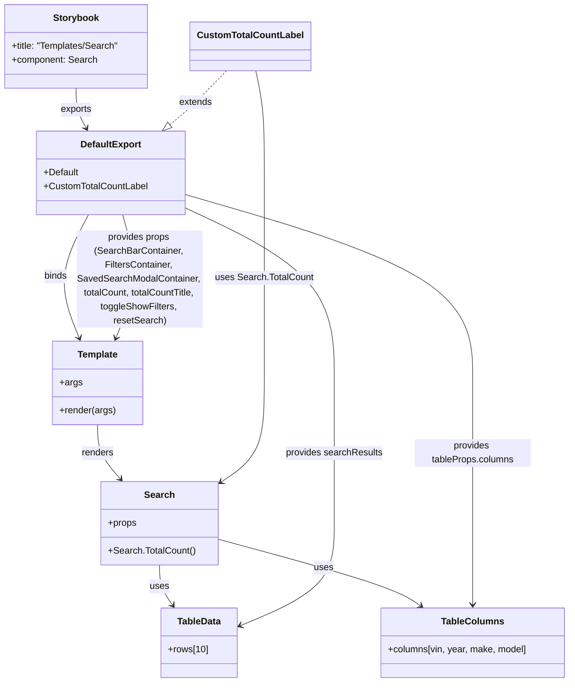

# Diagram: web/portal/src/components/templates/Search.template.stories.tsx


> Auto-generated by Obscura crawlers

## Diagram 1



### SVG

<svg id="container" width="977.658203125" xmlns="http://www.w3.org/2000/svg" class="classDiagram" height="1176" viewBox="0 0 977.658203125 1176" role="graphics-document document" aria-roledescription="class"><style>#container{font-family:"trebuchet ms",verdana,arial,sans-serif;font-size:16px;fill:#333;}@keyframes edge-animation-frame{from{stroke-dashoffset:0;}}@keyframes dash{to{stroke-dashoffset:0;}}#container .edge-animation-slow{stroke-dasharray:9,5!important;stroke-dashoffset:900;animation:dash 50s linear infinite;stroke-linecap:round;}#container .edge-animation-fast{stroke-dasharray:9,5!important;stroke-dashoffset:900;animation:dash 20s linear infinite;stroke-linecap:round;}#container .error-icon{fill:#552222;}#container .error-text{fill:#552222;stroke:#552222;}#container .edge-thickness-normal{stroke-width:1px;}#container .edge-thickness-thick{stroke-width:3.5px;}#container .edge-pattern-solid{stroke-dasharray:0;}#container .edge-thickness-invisible{stroke-width:0;fill:none;}#container .edge-pattern-dashed{stroke-dasharray:3;}#container .edge-pattern-dotted{stroke-dasharray:2;}#container .marker{fill:#333333;stroke:#333333;}#container .marker.cross{stroke:#333333;}#container svg{font-family:"trebuchet ms",verdana,arial,sans-serif;font-size:16px;}#container p{margin:0;}#container g.classGroup text{fill:#9370DB;stroke:none;font-family:"trebuchet ms",verdana,arial,sans-serif;font-size:10px;}#container g.classGroup text .title{font-weight:bolder;}#container .nodeLabel,#container .edgeLabel{color:#131300;}#container .edgeLabel .label rect{fill:#ECECFF;}#container .label text{fill:#131300;}#container .labelBkg{background:#ECECFF;}#container .edgeLabel .label span{background:#ECECFF;}#container .classTitle{font-weight:bolder;}#container .node rect,#container .node circle,#container .node ellipse,#container .node polygon,#container .node path{fill:#ECECFF;stroke:#9370DB;stroke-width:1px;}#container .divider{stroke:#9370DB;stroke-width:1;}#container g.clickable{cursor:pointer;}#container g.classGroup rect{fill:#ECECFF;stroke:#9370DB;}#container g.classGroup line{stroke:#9370DB;stroke-width:1;}#container .classLabel .box{stroke:none;stroke-width:0;fill:#ECECFF;opacity:0.5;}#container .classLabel .label{fill:#9370DB;font-size:10px;}#container .relation{stroke:#333333;stroke-width:1;fill:none;}#container .dashed-line{stroke-dasharray:3;}#container .dotted-line{stroke-dasharray:1 2;}#container #compositionStart,#container .composition{fill:#333333!important;stroke:#333333!important;stroke-width:1;}#container #compositionEnd,#container .composition{fill:#333333!important;stroke:#333333!important;stroke-width:1;}#container #dependencyStart,#container .dependency{fill:#333333!important;stroke:#333333!important;stroke-width:1;}#container #dependencyStart,#container .dependency{fill:#333333!important;stroke:#333333!important;stroke-width:1;}#container #extensionStart,#container .extension{fill:transparent!important;stroke:#333333!important;stroke-width:1;}#container #extensionEnd,#container .extension{fill:transparent!important;stroke:#333333!important;stroke-width:1;}#container #aggregationStart,#container .aggregation{fill:transparent!important;stroke:#333333!important;stroke-width:1;}#container #aggregationEnd,#container .aggregation{fill:transparent!important;stroke:#333333!important;stroke-width:1;}#container #lollipopStart,#container .lollipop{fill:#ECECFF!important;stroke:#333333!important;stroke-width:1;}#container #lollipopEnd,#container .lollipop{fill:#ECECFF!important;stroke:#333333!important;stroke-width:1;}#container .edgeTerminals{font-size:11px;line-height:initial;}#container .classTitleText{text-anchor:middle;font-size:18px;fill:#333;}#container .label-icon{display:inline-block;height:1em;overflow:visible;vertical-align:-0.125em;}#container .node .label-icon path{fill:currentColor;stroke:revert;stroke-width:revert;}#container :root{--mermaid-font-family:"trebuchet ms",verdana,arial,sans-serif;}</style><g><defs><marker id="container_class-aggregationStart" class="marker aggregation class" refX="18" refY="7" markerWidth="190" markerHeight="240" orient="auto"><path d="M 18,7 L9,13 L1,7 L9,1 Z"></path></marker></defs><defs><marker id="container_class-aggregationEnd" class="marker aggregation class" refX="1" refY="7" markerWidth="20" markerHeight="28" orient="auto"><path d="M 18,7 L9,13 L1,7 L9,1 Z"></path></marker></defs><defs><marker id="container_class-extensionStart" class="marker extension class" refX="18" refY="7" markerWidth="190" markerHeight="240" orient="auto"><path d="M 1,7 L18,13 V 1 Z"></path></marker></defs><defs><marker id="container_class-extensionEnd" class="marker extension class" refX="1" refY="7" markerWidth="20" markerHeight="28" orient="auto"><path d="M 1,1 V 13 L18,7 Z"></path></marker></defs><defs><marker id="container_class-compositionStart" class="marker composition class" refX="18" refY="7" markerWidth="190" markerHeight="240" orient="auto"><path d="M 18,7 L9,13 L1,7 L9,1 Z"></path></marker></defs><defs><marker id="container_class-compositionEnd" class="marker composition class" refX="1" refY="7" markerWidth="20" markerHeight="28" orient="auto"><path d="M 18,7 L9,13 L1,7 L9,1 Z"></path></marker></defs><defs><marker id="container_class-dependencyStart" class="marker dependency class" refX="6" refY="7" markerWidth="190" markerHeight="240" orient="auto"><path d="M 5,7 L9,13 L1,7 L9,1 Z"></path></marker></defs><defs><marker id="container_class-dependencyEnd" class="marker dependency class" refX="13" refY="7" markerWidth="20" markerHeight="28" orient="auto"><path d="M 18,7 L9,13 L14,7 L9,1 Z"></path></marker></defs><defs><marker id="container_class-lollipopStart" class="marker lollipop class" refX="13" refY="7" markerWidth="190" markerHeight="240" orient="auto"><circle stroke="black" fill="transparent" cx="7" cy="7" r="6"></circle></marker></defs><defs><marker id="container_class-lollipopEnd" class="marker lollipop class" refX="1" refY="7" markerWidth="190" markerHeight="240" orient="auto"><circle stroke="black" fill="transparent" cx="7" cy="7" r="6"></circle></marker></defs><g class="root"><g class="clusters"></g><g class="edgePaths"><path d="M133.738,152L133.738,158.167C133.738,164.333,133.738,176.667,136.778,188.133C139.818,199.598,145.897,210.197,148.937,215.496L151.977,220.795" id="id_Storybook_DefaultExport_1" class="edge-thickness-normal edge-pattern-solid relation" style=";;;" data-edge="true" data-et="edge" data-id="id_Storybook_DefaultExport_1" data-points="W3sieCI6MTMzLjczODI4MTI1LCJ5IjoxNTJ9LHsieCI6MTMzLjczODI4MTI1LCJ5IjoxODl9LHsieCI6MTU0Ljk2MjQ5NjQxNjI4NDQsInkiOjIyNn1d" marker-end="url(#container_class-dependencyEnd)"></path><path d="M157.2,370L147.344,388.167C137.488,406.333,117.775,442.667,114.927,478.074C112.08,513.481,126.097,547.961,133.106,565.201L140.115,582.442" id="id_DefaultExport_Template_2" class="edge-thickness-normal edge-pattern-solid relation" style=";;;" data-edge="true" data-et="edge" data-id="id_DefaultExport_Template_2" data-points="W3sieCI6MTU3LjIwMDIyMjI4OTM2NDYzLCJ5IjozNzB9LHsieCI6OTguMDYyNSwieSI6NDc5fSx7IngiOjE0Mi4zNzQzMzA5NzM3NTY5LCJ5Ijo1ODh9XQ==" marker-end="url(#container_class-dependencyEnd)"></path><path d="M171.645,732L171.645,740.167C171.645,748.333,171.645,764.667,178.088,780.245C184.532,795.824,197.42,810.648,203.864,818.06L210.308,825.472" id="id_Template_Search_3" class="edge-thickness-normal edge-pattern-solid relation" style=";;;" data-edge="true" data-et="edge" data-id="id_Template_Search_3" data-points="W3sieCI6MTcxLjY0NDUzMTI1LCJ5Ijo3MzJ9LHsieCI6MTcxLjY0NDUzMTI1LCJ5Ijo3ODF9LHsieCI6MjE0LjI0NDI4NTg5ODc2MDMyLCJ5Ijo4MzB9XQ==" marker-end="url(#container_class-dependencyEnd)"></path><path d="M276.84,974L276.84,980.167C276.84,986.333,276.84,998.667,280.504,1010.175C284.167,1021.684,291.495,1032.368,295.159,1037.71L298.823,1043.052" id="id_Search_TableData_4" class="edge-thickness-normal edge-pattern-solid relation" style=";;;" data-edge="true" data-et="edge" data-id="id_Search_TableData_4" data-points="W3sieCI6Mjc2LjgzOTg0Mzc1LCJ5Ijo5NzR9LHsieCI6Mjc2LjgzOTg0Mzc1LCJ5IjoxMDExfSx7IngiOjMwMi4yMTYyNTMyMjE2NDk1LCJ5IjoxMDQ4fV0=" marker-end="url(#container_class-dependencyEnd)"></path><path d="M374.895,928.793L425.036,942.494C475.178,956.195,575.462,983.598,633.438,1002.885C691.414,1022.172,707.083,1033.344,714.917,1038.93L722.751,1044.517" id="id_Search_TableColumns_5" class="edge-thickness-normal edge-pattern-solid relation" style=";;;" data-edge="true" data-et="edge" data-id="id_Search_TableColumns_5" data-points="W3sieCI6Mzc0Ljg5NDUzMTI1LCJ5Ijo5MjguNzkzMTY0OTA0MDM0NX0seyJ4Ijo2NzUuNzQ2MDkzNzUsInkiOjEwMTF9LHsieCI6NzI3LjYzNjUzNzUzMjIxNjUsInkiOjEwNDh9XQ==" marker-end="url(#container_class-dependencyEnd)"></path><path d="M323.424,358.94L365.177,378.95C406.931,398.96,490.438,438.98,532.192,489.157C573.945,539.333,573.945,599.667,573.945,650C573.945,700.333,573.945,740.667,573.945,781C573.945,821.333,573.945,861.667,573.945,900C573.945,938.333,573.945,974.667,547.137,1004.111C520.329,1033.555,466.713,1056.111,439.905,1067.388L413.097,1078.666" id="id_DefaultExport_TableData_6" class="edge-thickness-normal edge-pattern-solid relation" style=";;;" data-edge="true" data-et="edge" data-id="id_DefaultExport_TableData_6" data-points="W3sieCI6MzIzLjQyMzgyODEyNSwieSI6MzU4Ljk0MDE4Mjk2MjQ2MTE3fSx7IngiOjU3My45NDUzMTI1LCJ5Ijo0Nzl9LHsieCI6NTczLjk0NTMxMjUsInkiOjY2MH0seyJ4Ijo1NzMuOTQ1MzEyNSwieSI6NzgxfSx7IngiOjU3My45NDUzMTI1LCJ5Ijo5MDJ9LHsieCI6NTczLjk0NTMxMjUsInkiOjEwMTF9LHsieCI6NDA3LjU2NjQwNjI1LCJ5IjoxMDgwLjk5MjU2Mjg1MTUyODJ9XQ==" marker-end="url(#container_class-dependencyEnd)"></path><path d="M323.424,335.393L404.817,359.327C486.21,383.262,648.997,431.131,730.39,485.232C811.783,539.333,811.783,599.667,811.783,650C811.783,700.333,811.783,740.667,811.783,781C811.783,821.333,811.783,861.667,811.783,900C811.783,938.333,811.783,974.667,811.783,998C811.783,1021.333,811.783,1031.667,811.783,1036.833L811.783,1042" id="id_DefaultExport_TableColumns_7" class="edge-thickness-normal edge-pattern-solid relation" style=";;;" data-edge="true" data-et="edge" data-id="id_DefaultExport_TableColumns_7" data-points="W3sieCI6MzIzLjQyMzgyODEyNSwieSI6MzM1LjM5Mjc4MzAyNzU0OTF9LHsieCI6ODExLjc4MzIwMzEyNSwieSI6NDc5fSx7IngiOjgxMS43ODMyMDMxMjUsInkiOjY2MH0seyJ4Ijo4MTEuNzgzMjAzMTI1LCJ5Ijo3ODF9LHsieCI6ODExLjc4MzIwMzEyNSwieSI6OTAyfSx7IngiOjgxMS43ODMyMDMxMjUsInkiOjEwMTF9LHsieCI6ODExLjc4MzIwMzEyNSwieSI6MTA0OH1d" marker-end="url(#container_class-dependencyEnd)"></path><path d="M215.741,370L220.655,388.167C225.569,406.333,235.398,442.667,233.304,478.074C231.209,513.481,217.192,547.961,210.183,565.201L203.174,582.442" id="id_DefaultExport_Template_8" class="edge-thickness-normal edge-pattern-solid relation" style=";;;" data-edge="true" data-et="edge" data-id="id_DefaultExport_Template_8" data-points="W3sieCI6MjE1Ljc0MDYyMjg0MTg1MDg0LCJ5IjozNzB9LHsieCI6MjQ1LjIyNjU2MjUsInkiOjQ3OX0seyJ4IjoyMDAuOTE0NzMxNTI2MjQzMSwieSI6NTg4fV0=" marker-end="url(#container_class-dependencyEnd)"></path><path d="M390.829,122L380.052,133.167C369.276,144.333,347.722,166.667,331.798,182.152C315.874,197.637,305.58,206.275,300.433,210.593L295.286,214.912" id="id_CustomTotalCountLabel_DefaultExport_9" class="edge-thickness-normal edge-pattern-dashed relation" style=";;;" data-edge="true" data-et="edge" data-id="id_CustomTotalCountLabel_DefaultExport_9" data-points="W3sieCI6MzkwLjgyOTMwNzYyNjE0NjgsInkiOjEyMn0seyJ4IjozMjYuMTY3OTY4NzUsInkiOjE4OX0seyJ4IjoyODIuMDcyMDE0NzY0OTA4MjYsInkiOjIyNn1d" marker-end="url(#container_class-extensionEnd)"></path><path d="M440.709,122L443.194,133.167C445.678,144.333,450.648,166.667,453.132,196C455.617,225.333,455.617,261.667,455.617,310C455.617,358.333,455.617,418.667,455.617,479C455.617,539.333,455.617,599.667,455.617,650C455.617,700.333,455.617,740.667,442.992,769.379C430.366,798.091,405.115,815.181,392.489,823.726L379.863,832.272" id="id_CustomTotalCountLabel_Search_10" class="edge-thickness-normal edge-pattern-solid relation" style=";;;" data-edge="true" data-et="edge" data-id="id_CustomTotalCountLabel_Search_10" data-points="W3sieCI6NDQwLjcwODgyMzEwNzc5ODE0LCJ5IjoxMjJ9LHsieCI6NDU1LjYxNzE4NzUsInkiOjE4OX0seyJ4Ijo0NTUuNjE3MTg3NSwieSI6Mjk4fSx7IngiOjQ1NS42MTcxODc1LCJ5Ijo0Nzl9LHsieCI6NDU1LjYxNzE4NzUsInkiOjY2MH0seyJ4Ijo0NTUuNjE3MTg3NSwieSI6NzgxfSx7IngiOjM3NC44OTQ1MzEyNSwieSI6ODM1LjYzNDY3MTI2OTY5MjF9XQ==" marker-end="url(#container_class-dependencyEnd)"></path></g><g class="edgeLabels"><g class="edgeLabel" transform="translate(133.73828125, 189)"><g class="label" data-id="id_Storybook_DefaultExport_1" transform="translate(-27.3046875, -12)"><foreignObject width="54.609375" height="24"><div xmlns="http://www.w3.org/1999/xhtml" class="labelBkg" style="display: table-cell; white-space: nowrap; line-height: 1.5; max-width: 200px; text-align: center;"><span class="edgeLabel"><p>exports</p></span></div></foreignObject></g></g><g class="edgeLabel" transform="translate(99.57573, 476.21089)"><g class="label" data-id="id_DefaultExport_Template_2" transform="translate(-20.21875, -12)"><foreignObject width="40.4375" height="24"><div xmlns="http://www.w3.org/1999/xhtml" class="labelBkg" style="display: table-cell; white-space: nowrap; line-height: 1.5; max-width: 200px; text-align: center;"><span class="edgeLabel"><p>binds</p></span></div></foreignObject></g></g><g class="edgeLabel" transform="translate(171.64453125, 781)"><g class="label" data-id="id_Template_Search_3" transform="translate(-27.75, -12)"><foreignObject width="55.5" height="24"><div xmlns="http://www.w3.org/1999/xhtml" class="labelBkg" style="display: table-cell; white-space: nowrap; line-height: 1.5; max-width: 200px; text-align: center;"><span class="edgeLabel"><p>renders</p></span></div></foreignObject></g></g><g class="edgeLabel" transform="translate(276.83984375, 1011)"><g class="label" data-id="id_Search_TableData_4" transform="translate(-16.4921875, -12)"><foreignObject width="32.984375" height="24"><div xmlns="http://www.w3.org/1999/xhtml" class="labelBkg" style="display: table-cell; white-space: nowrap; line-height: 1.5; max-width: 200px; text-align: center;"><span class="edgeLabel"><p>uses</p></span></div></foreignObject></g></g><g class="edgeLabel" transform="translate(556.05885, 978.2958)"><g class="label" data-id="id_Search_TableColumns_5" transform="translate(-16.4921875, -12)"><foreignObject width="32.984375" height="24"><div xmlns="http://www.w3.org/1999/xhtml" class="labelBkg" style="display: table-cell; white-space: nowrap; line-height: 1.5; max-width: 200px; text-align: center;"><span class="edgeLabel"><p>uses</p></span></div></foreignObject></g></g><g class="edgeLabel" transform="translate(573.9453125, 781)"><g class="label" data-id="id_DefaultExport_TableData_6" transform="translate(-83.6015625, -12)"><foreignObject width="167.203125" height="24"><div xmlns="http://www.w3.org/1999/xhtml" class="labelBkg" style="display: table-cell; white-space: nowrap; line-height: 1.5; max-width: 200px; text-align: center;"><span class="edgeLabel"><p>provides searchResults</p></span></div></foreignObject></g></g><g class="edgeLabel" transform="translate(811.783203125, 781)"><g class="label" data-id="id_DefaultExport_TableColumns_7" transform="translate(-100, -24)"><foreignObject width="200" height="48"><div xmlns="http://www.w3.org/1999/xhtml" class="labelBkg" style="display: table; white-space: break-spaces; line-height: 1.5; max-width: 200px; text-align: center; width: 200px;"><span class="edgeLabel"><p>provides tableProps.columns</p></span></div></foreignObject></g></g><g class="edgeLabel" transform="translate(244.33307, 481.19785)"><g class="label" data-id="id_DefaultExport_Template_8" transform="translate(-106.9453125, -84)"><foreignObject width="213.890625" height="168"><div xmlns="http://www.w3.org/1999/xhtml" class="labelBkg" style="display: table; white-space: break-spaces; line-height: 1.5; max-width: 200px; text-align: center; width: 200px;"><span class="edgeLabel"><p>provides props (SearchBarContainer, FiltersContainer, SavedSearchModalContainer, totalCount, totalCountTitle, toggleShowFilters, resetSearch)</p></span></div></foreignObject></g></g><g class="edgeLabel" transform="translate(338.51183, 176.20968)"><g class="label" data-id="id_CustomTotalCountLabel_DefaultExport_9" transform="translate(-28.5078125, -12)"><foreignObject width="57.015625" height="24"><div xmlns="http://www.w3.org/1999/xhtml" class="labelBkg" style="display: table-cell; white-space: nowrap; line-height: 1.5; max-width: 200px; text-align: center;"><span class="edgeLabel"><p>extends</p></span></div></foreignObject></g></g><g class="edgeLabel" transform="translate(455.6171875, 479)"><g class="label" data-id="id_CustomTotalCountLabel_Search_10" transform="translate(-83.4453125, -12)"><foreignObject width="166.890625" height="24"><div xmlns="http://www.w3.org/1999/xhtml" class="labelBkg" style="display: table-cell; white-space: nowrap; line-height: 1.5; max-width: 200px; text-align: center;"><span class="edgeLabel"><p>uses Search.TotalCount</p></span></div></foreignObject></g></g></g><g class="nodes"><g class="node default" id="classId-Storybook-0" transform="translate(133.73828125, 80)"><g class="basic label-container"><path d="M-125.73828125 -72 L125.73828125 -72 L125.73828125 72 L-125.73828125 72" stroke="none" stroke-width="0" fill="#ECECFF" style=""></path><path d="M-125.73828125 -72 C-38.52758337735477 -72, 48.683114495290454 -72, 125.73828125 -72 M-125.73828125 -72 C-34.985200112438974 -72, 55.76788102512205 -72, 125.73828125 -72 M125.73828125 -72 C125.73828125 -21.535672531983522, 125.73828125 28.928654936032956, 125.73828125 72 M125.73828125 -72 C125.73828125 -37.49982346325029, 125.73828125 -2.9996469265005743, 125.73828125 72 M125.73828125 72 C43.26198084417433 72, -39.21431956165134 72, -125.73828125 72 M125.73828125 72 C73.36620377039338 72, 20.99412629078678 72, -125.73828125 72 M-125.73828125 72 C-125.73828125 18.672898166089418, -125.73828125 -34.654203667821164, -125.73828125 -72 M-125.73828125 72 C-125.73828125 28.829932767002923, -125.73828125 -14.340134465994154, -125.73828125 -72" stroke="#9370DB" stroke-width="1.3" fill="none" stroke-dasharray="0 0" style=""></path></g><g class="annotation-group text" transform="translate(0, -48)"></g><g class="label-group text" transform="translate(-38.0859375, -48)"><g class="label" style="font-weight: bolder" transform="translate(0,-12)"><foreignObject width="76.171875" height="24"><div xmlns="http://www.w3.org/1999/xhtml" style="display: table-cell; white-space: nowrap; line-height: 1.5; max-width: 125px; text-align: center;"><span class="nodeLabel markdown-node-label" style=""><p>Storybook</p></span></div></foreignObject></g></g><g class="members-group text" transform="translate(-113.73828125, 0)"><g class="label" style="" transform="translate(0,-12)"><foreignObject width="189.390625" height="24"><div xmlns="http://www.w3.org/1999/xhtml" style="display: table-cell; white-space: nowrap; line-height: 1.5; max-width: 247px; text-align: center;"><span class="nodeLabel markdown-node-label" style=""><p>+title: "Templates/Search"</p></span></div></foreignObject></g><g class="label" style="" transform="translate(0,12)"><foreignObject width="147.3125" height="24"><div xmlns="http://www.w3.org/1999/xhtml" style="display: table-cell; white-space: nowrap; line-height: 1.5; max-width: 205px; text-align: center;"><span class="nodeLabel markdown-node-label" style=""><p>+component: Search</p></span></div></foreignObject></g></g><g class="methods-group text" transform="translate(-113.73828125, 72)"></g><g class="divider" style=""><path d="M-125.73828125 -24 C-49.130439390389455 -24, 27.47740246922109 -24, 125.73828125 -24 M-125.73828125 -24 C-51.92323603402669 -24, 21.891809181946627 -24, 125.73828125 -24" stroke="#9370DB" stroke-width="1.3" fill="none" stroke-dasharray="0 0" style=""></path></g><g class="divider" style=""><path d="M-125.73828125 48 C-56.62936424339688 48, 12.479552763206243 48, 125.73828125 48 M-125.73828125 48 C-40.28385598490313 48, 45.170569280193746 48, 125.73828125 48" stroke="#9370DB" stroke-width="1.3" fill="none" stroke-dasharray="0 0" style=""></path></g></g><g class="node default" id="classId-Template-1" transform="translate(171.64453125, 660)"><g class="basic label-container"><path d="M-77.42578125 -72 L77.42578125 -72 L77.42578125 72 L-77.42578125 72" stroke="none" stroke-width="0" fill="#ECECFF" style=""></path><path d="M-77.42578125 -72 C-17.228174529445447 -72, 42.96943219110911 -72, 77.42578125 -72 M-77.42578125 -72 C-38.212215695646194 -72, 1.0013498587076128 -72, 77.42578125 -72 M77.42578125 -72 C77.42578125 -42.02948357794804, 77.42578125 -12.058967155896092, 77.42578125 72 M77.42578125 -72 C77.42578125 -17.826169532293328, 77.42578125 36.347660935413344, 77.42578125 72 M77.42578125 72 C42.10510400079304 72, 6.784426751586082 72, -77.42578125 72 M77.42578125 72 C43.407395431008865 72, 9.38900961201773 72, -77.42578125 72 M-77.42578125 72 C-77.42578125 25.256264043041867, -77.42578125 -21.487471913916266, -77.42578125 -72 M-77.42578125 72 C-77.42578125 24.635875589587897, -77.42578125 -22.728248820824206, -77.42578125 -72" stroke="#9370DB" stroke-width="1.3" fill="none" stroke-dasharray="0 0" style=""></path></g><g class="annotation-group text" transform="translate(0, -48)"></g><g class="label-group text" transform="translate(-33.9140625, -48)"><g class="label" style="font-weight: bolder" transform="translate(0,-12)"><foreignObject width="67.828125" height="24"><div xmlns="http://www.w3.org/1999/xhtml" style="display: table-cell; white-space: nowrap; line-height: 1.5; max-width: 117px; text-align: center;"><span class="nodeLabel markdown-node-label" style=""><p>Template</p></span></div></foreignObject></g></g><g class="members-group text" transform="translate(-65.42578125, 0)"><g class="label" style="" transform="translate(0,-12)"><foreignObject width="38.078125" height="24"><div xmlns="http://www.w3.org/1999/xhtml" style="display: table-cell; white-space: nowrap; line-height: 1.5; max-width: 95px; text-align: center;"><span class="nodeLabel markdown-node-label" style=""><p>+args</p></span></div></foreignObject></g></g><g class="methods-group text" transform="translate(-65.42578125, 48)"><g class="label" style="" transform="translate(0,-12)"><foreignObject width="96.9375" height="24"><div xmlns="http://www.w3.org/1999/xhtml" style="display: table-cell; white-space: nowrap; line-height: 1.5; max-width: 154px; text-align: center;"><span class="nodeLabel markdown-node-label" style=""><p>+render(args)</p></span></div></foreignObject></g></g><g class="divider" style=""><path d="M-77.42578125 -24 C-30.073456934356066 -24, 17.278867381287867 -24, 77.42578125 -24 M-77.42578125 -24 C-35.25538748820062 -24, 6.915006273598763 -24, 77.42578125 -24" stroke="#9370DB" stroke-width="1.3" fill="none" stroke-dasharray="0 0" style=""></path></g><g class="divider" style=""><path d="M-77.42578125 24 C-18.532966079665215 24, 40.35984909066957 24, 77.42578125 24 M-77.42578125 24 C-28.140683210608593 24, 21.144414828782814 24, 77.42578125 24" stroke="#9370DB" stroke-width="1.3" fill="none" stroke-dasharray="0 0" style=""></path></g></g><g class="node default" id="classId-Search-2" transform="translate(276.83984375, 902)"><g class="basic label-container"><path d="M-98.0546875 -72 L98.0546875 -72 L98.0546875 72 L-98.0546875 72" stroke="none" stroke-width="0" fill="#ECECFF" style=""></path><path d="M-98.0546875 -72 C-48.52000831278811 -72, 1.0146708744237856 -72, 98.0546875 -72 M-98.0546875 -72 C-44.14907689065705 -72, 9.756533718685901 -72, 98.0546875 -72 M98.0546875 -72 C98.0546875 -18.2473504225731, 98.0546875 35.5052991548538, 98.0546875 72 M98.0546875 -72 C98.0546875 -26.619394673793963, 98.0546875 18.761210652412075, 98.0546875 72 M98.0546875 72 C32.28088192388424 72, -33.492923652231525 72, -98.0546875 72 M98.0546875 72 C55.600997098730254 72, 13.147306697460508 72, -98.0546875 72 M-98.0546875 72 C-98.0546875 40.39556550630545, -98.0546875 8.791131012610904, -98.0546875 -72 M-98.0546875 72 C-98.0546875 33.73206041788487, -98.0546875 -4.535879164230266, -98.0546875 -72" stroke="#9370DB" stroke-width="1.3" fill="none" stroke-dasharray="0 0" style=""></path></g><g class="annotation-group text" transform="translate(0, -48)"></g><g class="label-group text" transform="translate(-24.71875, -48)"><g class="label" style="font-weight: bolder" transform="translate(0,-12)"><foreignObject width="49.4375" height="24"><div xmlns="http://www.w3.org/1999/xhtml" style="display: table-cell; white-space: nowrap; line-height: 1.5; max-width: 99px; text-align: center;"><span class="nodeLabel markdown-node-label" style=""><p>Search</p></span></div></foreignObject></g></g><g class="members-group text" transform="translate(-86.0546875, 0)"><g class="label" style="" transform="translate(0,-12)"><foreignObject width="49.515625" height="24"><div xmlns="http://www.w3.org/1999/xhtml" style="display: table-cell; white-space: nowrap; line-height: 1.5; max-width: 107px; text-align: center;"><span class="nodeLabel markdown-node-label" style=""><p>+props</p></span></div></foreignObject></g></g><g class="methods-group text" transform="translate(-86.0546875, 48)"><g class="label" style="" transform="translate(0,-12)"><foreignObject width="147.390625" height="24"><div xmlns="http://www.w3.org/1999/xhtml" style="display: table-cell; white-space: nowrap; line-height: 1.5; max-width: 205px; text-align: center;"><span class="nodeLabel markdown-node-label" style=""><p>+Search.TotalCount()</p></span></div></foreignObject></g></g><g class="divider" style=""><path d="M-98.0546875 -24 C-40.39496101896767 -24, 17.26476546206466 -24, 98.0546875 -24 M-98.0546875 -24 C-26.368642046860714 -24, 45.31740340627857 -24, 98.0546875 -24" stroke="#9370DB" stroke-width="1.3" fill="none" stroke-dasharray="0 0" style=""></path></g><g class="divider" style=""><path d="M-98.0546875 24 C-20.83915655287926 24, 56.37637439424148 24, 98.0546875 24 M-98.0546875 24 C-32.99592835755696 24, 32.062830784886074 24, 98.0546875 24" stroke="#9370DB" stroke-width="1.3" fill="none" stroke-dasharray="0 0" style=""></path></g></g><g class="node default" id="classId-DefaultExport-3" transform="translate(196.263671875, 298)"><g class="basic label-container"><path d="M-127.16015625 -72 L127.16015625 -72 L127.16015625 72 L-127.16015625 72" stroke="none" stroke-width="0" fill="#ECECFF" style=""></path><path d="M-127.16015625 -72 C-67.32055795053859 -72, -7.480959651077185 -72, 127.16015625 -72 M-127.16015625 -72 C-31.893264248490013 -72, 63.373627753019974 -72, 127.16015625 -72 M127.16015625 -72 C127.16015625 -16.862281272914345, 127.16015625 38.27543745417131, 127.16015625 72 M127.16015625 -72 C127.16015625 -25.21349647543711, 127.16015625 21.573007049125778, 127.16015625 72 M127.16015625 72 C59.973131084333275 72, -7.21389408133345 72, -127.16015625 72 M127.16015625 72 C74.23981619064116 72, 21.31947613128233 72, -127.16015625 72 M-127.16015625 72 C-127.16015625 15.118907157427145, -127.16015625 -41.76218568514571, -127.16015625 -72 M-127.16015625 72 C-127.16015625 20.724311834043647, -127.16015625 -30.551376331912707, -127.16015625 -72" stroke="#9370DB" stroke-width="1.3" fill="none" stroke-dasharray="0 0" style=""></path></g><g class="annotation-group text" transform="translate(0, -48)"></g><g class="label-group text" transform="translate(-50.7578125, -48)"><g class="label" style="font-weight: bolder" transform="translate(0,-12)"><foreignObject width="101.515625" height="24"><div xmlns="http://www.w3.org/1999/xhtml" style="display: table-cell; white-space: nowrap; line-height: 1.5; max-width: 150px; text-align: center;"><span class="nodeLabel markdown-node-label" style=""><p>DefaultExport</p></span></div></foreignObject></g></g><g class="members-group text" transform="translate(-115.16015625, 0)"><g class="label" style="" transform="translate(0,-12)"><foreignObject width="60.5" height="24"><div xmlns="http://www.w3.org/1999/xhtml" style="display: table-cell; white-space: nowrap; line-height: 1.5; max-width: 118px; text-align: center;"><span class="nodeLabel markdown-node-label" style=""><p>+Default</p></span></div></foreignObject></g><g class="label" style="" transform="translate(0,12)"><foreignObject width="179.5625" height="24"><div xmlns="http://www.w3.org/1999/xhtml" style="display: table-cell; white-space: nowrap; line-height: 1.5; max-width: 237px; text-align: center;"><span class="nodeLabel markdown-node-label" style=""><p>+CustomTotalCountLabel</p></span></div></foreignObject></g></g><g class="methods-group text" transform="translate(-115.16015625, 72)"></g><g class="divider" style=""><path d="M-127.16015625 -24 C-68.24221703348464 -24, -9.324277816969271 -24, 127.16015625 -24 M-127.16015625 -24 C-45.616397620982525 -24, 35.92736100803495 -24, 127.16015625 -24" stroke="#9370DB" stroke-width="1.3" fill="none" stroke-dasharray="0 0" style=""></path></g><g class="divider" style=""><path d="M-127.16015625 48 C-26.293781389329723 48, 74.57259347134055 48, 127.16015625 48 M-127.16015625 48 C-62.49460867258969 48, 2.1709389048206162 48, 127.16015625 48" stroke="#9370DB" stroke-width="1.3" fill="none" stroke-dasharray="0 0" style=""></path></g></g><g class="node default" id="classId-TableData-4" transform="translate(343.3671875, 1108)"><g class="basic label-container"><path d="M-64.19921875 -60 L64.19921875 -60 L64.19921875 60 L-64.19921875 60" stroke="none" stroke-width="0" fill="#ECECFF" style=""></path><path d="M-64.19921875 -60 C-37.843667230952306 -60, -11.488115711904605 -60, 64.19921875 -60 M-64.19921875 -60 C-24.759144579871233 -60, 14.680929590257534 -60, 64.19921875 -60 M64.19921875 -60 C64.19921875 -26.953905704258986, 64.19921875 6.092188591482028, 64.19921875 60 M64.19921875 -60 C64.19921875 -30.61286516346733, 64.19921875 -1.2257303269346593, 64.19921875 60 M64.19921875 60 C34.39998943238751 60, 4.600760114775014 60, -64.19921875 60 M64.19921875 60 C19.54250374869867 60, -25.114211252602658 60, -64.19921875 60 M-64.19921875 60 C-64.19921875 14.184440700638646, -64.19921875 -31.631118598722708, -64.19921875 -60 M-64.19921875 60 C-64.19921875 29.156524802143554, -64.19921875 -1.6869503957128913, -64.19921875 -60" stroke="#9370DB" stroke-width="1.3" fill="none" stroke-dasharray="0 0" style=""></path></g><g class="annotation-group text" transform="translate(0, -36)"></g><g class="label-group text" transform="translate(-36.7265625, -36)"><g class="label" style="font-weight: bolder" transform="translate(0,-12)"><foreignObject width="73.453125" height="24"><div xmlns="http://www.w3.org/1999/xhtml" style="display: table-cell; white-space: nowrap; line-height: 1.5; max-width: 122px; text-align: center;"><span class="nodeLabel markdown-node-label" style=""><p>TableData</p></span></div></foreignObject></g></g><g class="members-group text" transform="translate(-52.19921875, 12)"><g class="label" style="" transform="translate(0,-12)"><foreignObject width="67.671875" height="24"><div xmlns="http://www.w3.org/1999/xhtml" style="display: table-cell; white-space: nowrap; line-height: 1.5; max-width: 125px; text-align: center;"><span class="nodeLabel markdown-node-label" style=""><p>+rows[10]</p></span></div></foreignObject></g></g><g class="methods-group text" transform="translate(-52.19921875, 60)"></g><g class="divider" style=""><path d="M-64.19921875 -12 C-35.062999495268514 -12, -5.926780240537028 -12, 64.19921875 -12 M-64.19921875 -12 C-35.371057445478286 -12, -6.5428961409565645 -12, 64.19921875 -12" stroke="#9370DB" stroke-width="1.3" fill="none" stroke-dasharray="0 0" style=""></path></g><g class="divider" style=""><path d="M-64.19921875 36 C-28.955600661563203 36, 6.288017426873594 36, 64.19921875 36 M-64.19921875 36 C-23.212152271104358 36, 17.774914207791284 36, 64.19921875 36" stroke="#9370DB" stroke-width="1.3" fill="none" stroke-dasharray="0 0" style=""></path></g></g><g class="node default" id="classId-TableColumns-5" transform="translate(811.783203125, 1108)"><g class="basic label-container"><path d="M-157.875 -60 L157.875 -60 L157.875 60 L-157.875 60" stroke="none" stroke-width="0" fill="#ECECFF" style=""></path><path d="M-157.875 -60 C-77.91795026223532 -60, 2.0390994755293548 -60, 157.875 -60 M-157.875 -60 C-94.08856541892708 -60, -30.30213083785415 -60, 157.875 -60 M157.875 -60 C157.875 -28.359415857683942, 157.875 3.281168284632116, 157.875 60 M157.875 -60 C157.875 -14.155792096650075, 157.875 31.68841580669985, 157.875 60 M157.875 60 C65.9840601644228 60, -25.9068796711544 60, -157.875 60 M157.875 60 C54.72769914081577 60, -48.419601718368455 60, -157.875 60 M-157.875 60 C-157.875 25.651780950296583, -157.875 -8.696438099406834, -157.875 -60 M-157.875 60 C-157.875 33.712793569221084, -157.875 7.425587138442168, -157.875 -60" stroke="#9370DB" stroke-width="1.3" fill="none" stroke-dasharray="0 0" style=""></path></g><g class="annotation-group text" transform="translate(0, -36)"></g><g class="label-group text" transform="translate(-51.140625, -36)"><g class="label" style="font-weight: bolder" transform="translate(0,-12)"><foreignObject width="102.28125" height="24"><div xmlns="http://www.w3.org/1999/xhtml" style="display: table-cell; white-space: nowrap; line-height: 1.5; max-width: 152px; text-align: center;"><span class="nodeLabel markdown-node-label" style=""><p>TableColumns</p></span></div></foreignObject></g></g><g class="members-group text" transform="translate(-145.875, 12)"><g class="label" style="" transform="translate(0,-12)"><foreignObject width="240.609375" height="24"><div xmlns="http://www.w3.org/1999/xhtml" style="display: table-cell; white-space: nowrap; line-height: 1.5; max-width: 298px; text-align: center;"><span class="nodeLabel markdown-node-label" style=""><p>+columns[vin, year, make, model]</p></span></div></foreignObject></g></g><g class="methods-group text" transform="translate(-145.875, 60)"></g><g class="divider" style=""><path d="M-157.875 -12 C-74.61368646939013 -12, 8.647627061219737 -12, 157.875 -12 M-157.875 -12 C-73.89840738962525 -12, 10.078185220749504 -12, 157.875 -12" stroke="#9370DB" stroke-width="1.3" fill="none" stroke-dasharray="0 0" style=""></path></g><g class="divider" style=""><path d="M-157.875 36 C-42.186852664676294 36, 73.50129467064741 36, 157.875 36 M-157.875 36 C-49.95129019574948 36, 57.97241960850104 36, 157.875 36" stroke="#9370DB" stroke-width="1.3" fill="none" stroke-dasharray="0 0" style=""></path></g></g><g class="node default" id="classId-CustomTotalCountLabel-6" transform="translate(431.36328125, 80)"><g class="basic label-container"><path d="M-98.8828125 -42 L98.8828125 -42 L98.8828125 42 L-98.8828125 42" stroke="none" stroke-width="0" fill="#ECECFF" style=""></path><path d="M-98.8828125 -42 C-34.959996181175875 -42, 28.96282013764825 -42, 98.8828125 -42 M-98.8828125 -42 C-21.8028176735624 -42, 55.2771771528752 -42, 98.8828125 -42 M98.8828125 -42 C98.8828125 -23.620329636834725, 98.8828125 -5.240659273669451, 98.8828125 42 M98.8828125 -42 C98.8828125 -23.76828462928261, 98.8828125 -5.536569258565223, 98.8828125 42 M98.8828125 42 C26.53262972430028 42, -45.81755305139944 42, -98.8828125 42 M98.8828125 42 C24.313566611547728 42, -50.255679276904544 42, -98.8828125 42 M-98.8828125 42 C-98.8828125 15.575428509038083, -98.8828125 -10.849142981923833, -98.8828125 -42 M-98.8828125 42 C-98.8828125 10.08036676431919, -98.8828125 -21.83926647136162, -98.8828125 -42" stroke="#9370DB" stroke-width="1.3" fill="none" stroke-dasharray="0 0" style=""></path></g><g class="annotation-group text" transform="translate(0, -18)"></g><g class="label-group text" transform="translate(-86.8828125, -18)"><g class="label" style="font-weight: bolder" transform="translate(0,-12)"><foreignObject width="173.765625" height="24"><div xmlns="http://www.w3.org/1999/xhtml" style="display: table-cell; white-space: nowrap; line-height: 1.5; max-width: 222px; text-align: center;"><span class="nodeLabel markdown-node-label" style=""><p>CustomTotalCountLabel</p></span></div></foreignObject></g></g><g class="members-group text" transform="translate(-86.8828125, 30)"></g><g class="methods-group text" transform="translate(-86.8828125, 60)"></g><g class="divider" style=""><path d="M-98.8828125 6 C-26.171203509869798 6, 46.540405480260404 6, 98.8828125 6 M-98.8828125 6 C-27.423081340168082 6, 44.036649819663836 6, 98.8828125 6" stroke="#9370DB" stroke-width="1.3" fill="none" stroke-dasharray="0 0" style=""></path></g><g class="divider" style=""><path d="M-98.8828125 24 C-46.30709631962706 24, 6.268619860745886 24, 98.8828125 24 M-98.8828125 24 C-26.84855861741144 24, 45.18569526517712 24, 98.8828125 24" stroke="#9370DB" stroke-width="1.3" fill="none" stroke-dasharray="0 0" style=""></path></g></g></g></g></g></svg>

## Diagram 2

```mermaid
flowchart TD
    A[Template] -->|renders| B[Search Component]
    B --> C[SearchBarContainer]
    B --> D[FiltersContainer]
    B --> E[SavedSearchModalContainer]
    B --> F[Table]
    F --> G[Columns: vin, year, make, model]
    F --> H[Rows: 10 items]
    A -->|args| I[Default.args]
    I --> C
    I --> D
    I --> E
    I --> F
    I --> J[totalCount: 10]
    I --> K[totalCountTitle: "Cars"]
    I --> L[toggleShowFilters action]
    I --> M[resetSearch action]
    N[CustomTotalCountLabel] -->|overrides| I
    N --> B: uses Search.TotalCount()
```

> SVG rendering failed for this diagram.
