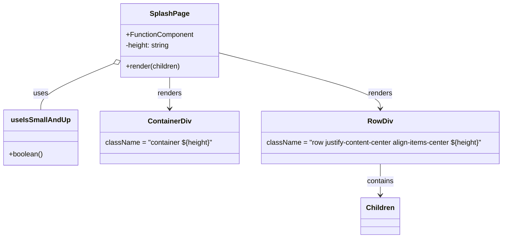

# Diagram: web/portal/src/components/templates/SplashPage.template.tsx


> Auto-generated by Obscura crawlers

## Diagram 1



### SVG

<svg id="container" width="1151.8515625" xmlns="http://www.w3.org/2000/svg" class="classDiagram" height="542" viewBox="0 0 1151.8515625 542" role="graphics-document document" aria-roledescription="class"><style>#container{font-family:"trebuchet ms",verdana,arial,sans-serif;font-size:16px;fill:#333;}@keyframes edge-animation-frame{from{stroke-dashoffset:0;}}@keyframes dash{to{stroke-dashoffset:0;}}#container .edge-animation-slow{stroke-dasharray:9,5!important;stroke-dashoffset:900;animation:dash 50s linear infinite;stroke-linecap:round;}#container .edge-animation-fast{stroke-dasharray:9,5!important;stroke-dashoffset:900;animation:dash 20s linear infinite;stroke-linecap:round;}#container .error-icon{fill:#552222;}#container .error-text{fill:#552222;stroke:#552222;}#container .edge-thickness-normal{stroke-width:1px;}#container .edge-thickness-thick{stroke-width:3.5px;}#container .edge-pattern-solid{stroke-dasharray:0;}#container .edge-thickness-invisible{stroke-width:0;fill:none;}#container .edge-pattern-dashed{stroke-dasharray:3;}#container .edge-pattern-dotted{stroke-dasharray:2;}#container .marker{fill:#333333;stroke:#333333;}#container .marker.cross{stroke:#333333;}#container svg{font-family:"trebuchet ms",verdana,arial,sans-serif;font-size:16px;}#container p{margin:0;}#container g.classGroup text{fill:#9370DB;stroke:none;font-family:"trebuchet ms",verdana,arial,sans-serif;font-size:10px;}#container g.classGroup text .title{font-weight:bolder;}#container .nodeLabel,#container .edgeLabel{color:#131300;}#container .edgeLabel .label rect{fill:#ECECFF;}#container .label text{fill:#131300;}#container .labelBkg{background:#ECECFF;}#container .edgeLabel .label span{background:#ECECFF;}#container .classTitle{font-weight:bolder;}#container .node rect,#container .node circle,#container .node ellipse,#container .node polygon,#container .node path{fill:#ECECFF;stroke:#9370DB;stroke-width:1px;}#container .divider{stroke:#9370DB;stroke-width:1;}#container g.clickable{cursor:pointer;}#container g.classGroup rect{fill:#ECECFF;stroke:#9370DB;}#container g.classGroup line{stroke:#9370DB;stroke-width:1;}#container .classLabel .box{stroke:none;stroke-width:0;fill:#ECECFF;opacity:0.5;}#container .classLabel .label{fill:#9370DB;font-size:10px;}#container .relation{stroke:#333333;stroke-width:1;fill:none;}#container .dashed-line{stroke-dasharray:3;}#container .dotted-line{stroke-dasharray:1 2;}#container #compositionStart,#container .composition{fill:#333333!important;stroke:#333333!important;stroke-width:1;}#container #compositionEnd,#container .composition{fill:#333333!important;stroke:#333333!important;stroke-width:1;}#container #dependencyStart,#container .dependency{fill:#333333!important;stroke:#333333!important;stroke-width:1;}#container #dependencyStart,#container .dependency{fill:#333333!important;stroke:#333333!important;stroke-width:1;}#container #extensionStart,#container .extension{fill:transparent!important;stroke:#333333!important;stroke-width:1;}#container #extensionEnd,#container .extension{fill:transparent!important;stroke:#333333!important;stroke-width:1;}#container #aggregationStart,#container .aggregation{fill:transparent!important;stroke:#333333!important;stroke-width:1;}#container #aggregationEnd,#container .aggregation{fill:transparent!important;stroke:#333333!important;stroke-width:1;}#container #lollipopStart,#container .lollipop{fill:#ECECFF!important;stroke:#333333!important;stroke-width:1;}#container #lollipopEnd,#container .lollipop{fill:#ECECFF!important;stroke:#333333!important;stroke-width:1;}#container .edgeTerminals{font-size:11px;line-height:initial;}#container .classTitleText{text-anchor:middle;font-size:18px;fill:#333;}#container .label-icon{display:inline-block;height:1em;overflow:visible;vertical-align:-0.125em;}#container .node .label-icon path{fill:currentColor;stroke:revert;stroke-width:revert;}#container :root{--mermaid-font-family:"trebuchet ms",verdana,arial,sans-serif;}</style><g><defs><marker id="container_class-aggregationStart" class="marker aggregation class" refX="18" refY="7" markerWidth="190" markerHeight="240" orient="auto"><path d="M 18,7 L9,13 L1,7 L9,1 Z"></path></marker></defs><defs><marker id="container_class-aggregationEnd" class="marker aggregation class" refX="1" refY="7" markerWidth="20" markerHeight="28" orient="auto"><path d="M 18,7 L9,13 L1,7 L9,1 Z"></path></marker></defs><defs><marker id="container_class-extensionStart" class="marker extension class" refX="18" refY="7" markerWidth="190" markerHeight="240" orient="auto"><path d="M 1,7 L18,13 V 1 Z"></path></marker></defs><defs><marker id="container_class-extensionEnd" class="marker extension class" refX="1" refY="7" markerWidth="20" markerHeight="28" orient="auto"><path d="M 1,1 V 13 L18,7 Z"></path></marker></defs><defs><marker id="container_class-compositionStart" class="marker composition class" refX="18" refY="7" markerWidth="190" markerHeight="240" orient="auto"><path d="M 18,7 L9,13 L1,7 L9,1 Z"></path></marker></defs><defs><marker id="container_class-compositionEnd" class="marker composition class" refX="1" refY="7" markerWidth="20" markerHeight="28" orient="auto"><path d="M 18,7 L9,13 L1,7 L9,1 Z"></path></marker></defs><defs><marker id="container_class-dependencyStart" class="marker dependency class" refX="6" refY="7" markerWidth="190" markerHeight="240" orient="auto"><path d="M 5,7 L9,13 L1,7 L9,1 Z"></path></marker></defs><defs><marker id="container_class-dependencyEnd" class="marker dependency class" refX="13" refY="7" markerWidth="20" markerHeight="28" orient="auto"><path d="M 18,7 L9,13 L14,7 L9,1 Z"></path></marker></defs><defs><marker id="container_class-lollipopStart" class="marker lollipop class" refX="13" refY="7" markerWidth="190" markerHeight="240" orient="auto"><circle stroke="black" fill="transparent" cx="7" cy="7" r="6"></circle></marker></defs><defs><marker id="container_class-lollipopEnd" class="marker lollipop class" refX="1" refY="7" markerWidth="190" markerHeight="240" orient="auto"><circle stroke="black" fill="transparent" cx="7" cy="7" r="6"></circle></marker></defs><g class="root"><g class="clusters"></g><g class="edgePaths"><path d="M255.464,144.439L228.001,155.865C200.539,167.292,145.613,190.146,118.15,207.74C90.688,225.333,90.688,237.667,90.688,243.833L90.688,250" id="id_SplashPage_useIsSmallAndUp_1" class="edge-thickness-normal edge-pattern-solid relation" style=";;;" data-edge="true" data-et="edge" data-id="id_SplashPage_useIsSmallAndUp_1" data-points="W3sieCI6MjcxLjM5MDYyNSwieSI6MTM3LjgxMTgwOTkwMjQ3OTY0fSx7IngiOjkwLjY4NzUsInkiOjIxM30seyJ4Ijo5MC42ODc1LCJ5IjoyNTB9XQ==" marker-start="url(#container_class-aggregationStart)"></path><path d="M381.492,176L381.492,182.167C381.492,188.333,381.492,200.667,381.492,212.5C381.492,224.333,381.492,235.667,381.492,241.333L381.492,247" id="id_SplashPage_ContainerDiv_2" class="edge-thickness-normal edge-pattern-solid relation" style=";;;" data-edge="true" data-et="edge" data-id="id_SplashPage_ContainerDiv_2" data-points="W3sieCI6MzgxLjQ5MjE4NzUsInkiOjE3Nn0seyJ4IjozODEuNDkyMTg3NSwieSI6MjEzfSx7IngiOjM4MS40OTIxODc1LCJ5IjoyNTN9XQ==" marker-end="url(#container_class-dependencyEnd)"></path><path d="M491.594,119.455L554.117,135.046C616.639,150.637,741.685,181.818,804.208,203.076C866.73,224.333,866.73,235.667,866.73,241.333L866.73,247" id="id_SplashPage_RowDiv_3" class="edge-thickness-normal edge-pattern-solid relation" style=";;;" data-edge="true" data-et="edge" data-id="id_SplashPage_RowDiv_3" data-points="W3sieCI6NDkxLjU5Mzc1LCJ5IjoxMTkuNDU1MTQ4NDg1MzYwNzd9LHsieCI6ODY2LjczMDQ2ODc1LCJ5IjoyMTN9LHsieCI6ODY2LjczMDQ2ODc1LCJ5IjoyNTN9XQ==" marker-end="url(#container_class-dependencyEnd)"></path><path d="M866.73,373L866.73,379.667C866.73,386.333,866.73,399.667,866.73,411.5C866.73,423.333,866.73,433.667,866.73,438.833L866.73,444" id="id_RowDiv_Children_4" class="edge-thickness-normal edge-pattern-solid relation" style=";;;" data-edge="true" data-et="edge" data-id="id_RowDiv_Children_4" data-points="W3sieCI6ODY2LjczMDQ2ODc1LCJ5IjozNzN9LHsieCI6ODY2LjczMDQ2ODc1LCJ5Ijo0MTN9LHsieCI6ODY2LjczMDQ2ODc1LCJ5Ijo0NTB9XQ==" marker-end="url(#container_class-dependencyEnd)"></path></g><g class="edgeLabels"><g class="edgeLabel" transform="translate(90.6875, 213)"><g class="label" data-id="id_SplashPage_useIsSmallAndUp_1" transform="translate(-16.4921875, -12)"><foreignObject width="32.984375" height="24"><div xmlns="http://www.w3.org/1999/xhtml" class="labelBkg" style="display: table-cell; white-space: nowrap; line-height: 1.5; max-width: 200px; text-align: center;"><span class="edgeLabel"><p>uses</p></span></div></foreignObject></g></g><g class="edgeLabel" transform="translate(381.4921875, 213)"><g class="label" data-id="id_SplashPage_ContainerDiv_2" transform="translate(-27.75, -12)"><foreignObject width="55.5" height="24"><div xmlns="http://www.w3.org/1999/xhtml" class="labelBkg" style="display: table-cell; white-space: nowrap; line-height: 1.5; max-width: 200px; text-align: center;"><span class="edgeLabel"><p>renders</p></span></div></foreignObject></g></g><g class="edgeLabel" transform="translate(866.73046875, 213)"><g class="label" data-id="id_SplashPage_RowDiv_3" transform="translate(-27.75, -12)"><foreignObject width="55.5" height="24"><div xmlns="http://www.w3.org/1999/xhtml" class="labelBkg" style="display: table-cell; white-space: nowrap; line-height: 1.5; max-width: 200px; text-align: center;"><span class="edgeLabel"><p>renders</p></span></div></foreignObject></g></g><g class="edgeLabel" transform="translate(866.73046875, 413)"><g class="label" data-id="id_RowDiv_Children_4" transform="translate(-30.890625, -12)"><foreignObject width="61.78125" height="24"><div xmlns="http://www.w3.org/1999/xhtml" class="labelBkg" style="display: table-cell; white-space: nowrap; line-height: 1.5; max-width: 200px; text-align: center;"><span class="edgeLabel"><p>contains</p></span></div></foreignObject></g></g></g><g class="nodes"><g class="node default" id="classId-SplashPage-0" transform="translate(381.4921875, 92)"><g class="basic label-container"><path d="M-110.1015625 -84 L110.1015625 -84 L110.1015625 84 L-110.1015625 84" stroke="none" stroke-width="0" fill="#ECECFF" style=""></path><path d="M-110.1015625 -84 C-27.796135708398026 -84, 54.50929108320395 -84, 110.1015625 -84 M-110.1015625 -84 C-51.06318179130513 -84, 7.975198917389747 -84, 110.1015625 -84 M110.1015625 -84 C110.1015625 -25.713351817638163, 110.1015625 32.573296364723674, 110.1015625 84 M110.1015625 -84 C110.1015625 -33.90268529543108, 110.1015625 16.194629409137846, 110.1015625 84 M110.1015625 84 C41.02654854266238 84, -28.048465414675235 84, -110.1015625 84 M110.1015625 84 C40.54288942682406 84, -29.015783646351878 84, -110.1015625 84 M-110.1015625 84 C-110.1015625 20.73362888409899, -110.1015625 -42.53274223180202, -110.1015625 -84 M-110.1015625 84 C-110.1015625 31.480886810100394, -110.1015625 -21.038226379799212, -110.1015625 -84" stroke="#9370DB" stroke-width="1.3" fill="none" stroke-dasharray="0 0" style=""></path></g><g class="annotation-group text" transform="translate(0, -60)"></g><g class="label-group text" transform="translate(-41.8125, -60)"><g class="label" style="font-weight: bolder" transform="translate(0,-12)"><foreignObject width="83.625" height="24"><div xmlns="http://www.w3.org/1999/xhtml" style="display: table-cell; white-space: nowrap; line-height: 1.5; max-width: 132px; text-align: center;"><span class="nodeLabel markdown-node-label" style=""><p>SplashPage</p></span></div></foreignObject></g></g><g class="members-group text" transform="translate(-98.1015625, -12)"><g class="label" style="" transform="translate(0,-12)"><foreignObject width="154.390625" height="24"><div xmlns="http://www.w3.org/1999/xhtml" style="display: table-cell; white-space: nowrap; line-height: 1.5; max-width: 212px; text-align: center;"><span class="nodeLabel markdown-node-label" style=""><p>+FunctionComponent</p></span></div></foreignObject></g><g class="label" style="" transform="translate(0,12)"><foreignObject width="102.3125" height="24"><div xmlns="http://www.w3.org/1999/xhtml" style="display: table-cell; white-space: nowrap; line-height: 1.5; max-width: 160px; text-align: center;"><span class="nodeLabel markdown-node-label" style=""><p>-height: string</p></span></div></foreignObject></g></g><g class="methods-group text" transform="translate(-98.1015625, 60)"><g class="label" style="" transform="translate(0,-12)"><foreignObject width="126.125" height="24"><div xmlns="http://www.w3.org/1999/xhtml" style="display: table-cell; white-space: nowrap; line-height: 1.5; max-width: 183px; text-align: center;"><span class="nodeLabel markdown-node-label" style=""><p>+render(children)</p></span></div></foreignObject></g></g><g class="divider" style=""><path d="M-110.1015625 -36 C-56.67525937770101 -36, -3.248956255402021 -36, 110.1015625 -36 M-110.1015625 -36 C-62.09406635241978 -36, -14.08657020483956 -36, 110.1015625 -36" stroke="#9370DB" stroke-width="1.3" fill="none" stroke-dasharray="0 0" style=""></path></g><g class="divider" style=""><path d="M-110.1015625 36 C-30.881719048336038 36, 48.338124403327924 36, 110.1015625 36 M-110.1015625 36 C-24.05189243570244 36, 61.99777762859512 36, 110.1015625 36" stroke="#9370DB" stroke-width="1.3" fill="none" stroke-dasharray="0 0" style=""></path></g></g><g class="node default" id="classId-useIsSmallAndUp-1" transform="translate(90.6875, 313)"><g class="basic label-container"><path d="M-82.6875 -63 L82.6875 -63 L82.6875 63 L-82.6875 63" stroke="none" stroke-width="0" fill="#ECECFF" style=""></path><path d="M-82.6875 -63 C-26.719429345289193 -63, 29.248641309421615 -63, 82.6875 -63 M-82.6875 -63 C-32.244812981693556 -63, 18.197874036612887 -63, 82.6875 -63 M82.6875 -63 C82.6875 -15.83850767550333, 82.6875 31.32298464899334, 82.6875 63 M82.6875 -63 C82.6875 -22.926669028916216, 82.6875 17.14666194216757, 82.6875 63 M82.6875 63 C36.48754418797931 63, -9.71241162404138 63, -82.6875 63 M82.6875 63 C20.743900871220198 63, -41.199698257559604 63, -82.6875 63 M-82.6875 63 C-82.6875 27.076594142791997, -82.6875 -8.846811714416006, -82.6875 -63 M-82.6875 63 C-82.6875 26.168405179842615, -82.6875 -10.66318964031477, -82.6875 -63" stroke="#9370DB" stroke-width="1.3" fill="none" stroke-dasharray="0 0" style=""></path></g><g class="annotation-group text" transform="translate(0, -39)"></g><g class="label-group text" transform="translate(-63.578125, -39)"><g class="label" style="font-weight: bolder" transform="translate(0,-12)"><foreignObject width="127.15625" height="24"><div xmlns="http://www.w3.org/1999/xhtml" style="display: table-cell; white-space: nowrap; line-height: 1.5; max-width: 176px; text-align: center;"><span class="nodeLabel markdown-node-label" style=""><p>useIsSmallAndUp</p></span></div></foreignObject></g></g><g class="members-group text" transform="translate(-70.6875, 9)"></g><g class="methods-group text" transform="translate(-70.6875, 39)"><g class="label" style="" transform="translate(0,-12)"><foreignObject width="77.796875" height="24"><div xmlns="http://www.w3.org/1999/xhtml" style="display: table-cell; white-space: nowrap; line-height: 1.5; max-width: 135px; text-align: center;"><span class="nodeLabel markdown-node-label" style=""><p>+boolean()</p></span></div></foreignObject></g></g><g class="divider" style=""><path d="M-82.6875 -15 C-17.06754559730058 -15, 48.55240880539884 -15, 82.6875 -15 M-82.6875 -15 C-24.17286813464475 -15, 34.3417637307105 -15, 82.6875 -15" stroke="#9370DB" stroke-width="1.3" fill="none" stroke-dasharray="0 0" style=""></path></g><g class="divider" style=""><path d="M-82.6875 9 C-36.33599032774184 9, 10.01551934451632 9, 82.6875 9 M-82.6875 9 C-41.558335222790085 9, -0.42917044558016926 9, 82.6875 9" stroke="#9370DB" stroke-width="1.3" fill="none" stroke-dasharray="0 0" style=""></path></g></g><g class="node default" id="classId-ContainerDiv-2" transform="translate(381.4921875, 313)"><g class="basic label-container"><path d="M-158.1171875 -60 L158.1171875 -60 L158.1171875 60 L-158.1171875 60" stroke="none" stroke-width="0" fill="#ECECFF" style=""></path><path d="M-158.1171875 -60 C-61.42676120768496 -60, 35.26366508463008 -60, 158.1171875 -60 M-158.1171875 -60 C-43.04154779887291 -60, 72.03409190225418 -60, 158.1171875 -60 M158.1171875 -60 C158.1171875 -32.44333260066724, 158.1171875 -4.8866652013344805, 158.1171875 60 M158.1171875 -60 C158.1171875 -16.942896229031902, 158.1171875 26.114207541936196, 158.1171875 60 M158.1171875 60 C66.14682155662197 60, -25.823544386756055 60, -158.1171875 60 M158.1171875 60 C51.67806173244294 60, -54.76106403511412 60, -158.1171875 60 M-158.1171875 60 C-158.1171875 26.597283586475882, -158.1171875 -6.805432827048236, -158.1171875 -60 M-158.1171875 60 C-158.1171875 34.83596664626843, -158.1171875 9.671933292536863, -158.1171875 -60" stroke="#9370DB" stroke-width="1.3" fill="none" stroke-dasharray="0 0" style=""></path></g><g class="annotation-group text" transform="translate(0, -36)"></g><g class="label-group text" transform="translate(-47.171875, -36)"><g class="label" style="font-weight: bolder" transform="translate(0,-12)"><foreignObject width="94.34375" height="24"><div xmlns="http://www.w3.org/1999/xhtml" style="display: table-cell; white-space: nowrap; line-height: 1.5; max-width: 143px; text-align: center;"><span class="nodeLabel markdown-node-label" style=""><p>ContainerDiv</p></span></div></foreignObject></g></g><g class="members-group text" transform="translate(-146.1171875, 12)"><g class="label" style="" transform="translate(0,-12)"><foreignObject width="245.0625" height="24"><div xmlns="http://www.w3.org/1999/xhtml" style="display: table-cell; white-space: nowrap; line-height: 1.5; max-width: 295px; text-align: center;"><span class="nodeLabel markdown-node-label" style=""><p>className = "container ${height}"</p></span></div></foreignObject></g></g><g class="methods-group text" transform="translate(-146.1171875, 60)"></g><g class="divider" style=""><path d="M-158.1171875 -12 C-53.14978133642934 -12, 51.817624827141316 -12, 158.1171875 -12 M-158.1171875 -12 C-78.25941711234651 -12, 1.5983532753069767 -12, 158.1171875 -12" stroke="#9370DB" stroke-width="1.3" fill="none" stroke-dasharray="0 0" style=""></path></g><g class="divider" style=""><path d="M-158.1171875 36 C-69.48310201285426 36, 19.15098347429148 36, 158.1171875 36 M-158.1171875 36 C-74.83020102906652 36, 8.45678544186697 36, 158.1171875 36" stroke="#9370DB" stroke-width="1.3" fill="none" stroke-dasharray="0 0" style=""></path></g></g><g class="node default" id="classId-RowDiv-3" transform="translate(866.73046875, 313)"><g class="basic label-container"><path d="M-277.12109375 -60 L277.12109375 -60 L277.12109375 60 L-277.12109375 60" stroke="none" stroke-width="0" fill="#ECECFF" style=""></path><path d="M-277.12109375 -60 C-115.70125093063285 -60, 45.718591888734295 -60, 277.12109375 -60 M-277.12109375 -60 C-131.9292454571164 -60, 13.262602835767211 -60, 277.12109375 -60 M277.12109375 -60 C277.12109375 -15.236369934540754, 277.12109375 29.527260130918492, 277.12109375 60 M277.12109375 -60 C277.12109375 -33.25066584143724, 277.12109375 -6.501331682874479, 277.12109375 60 M277.12109375 60 C120.86530555171373 60, -35.390482646572536 60, -277.12109375 60 M277.12109375 60 C71.05211960309194 60, -135.01685454381612 60, -277.12109375 60 M-277.12109375 60 C-277.12109375 34.88988912136655, -277.12109375 9.779778242733109, -277.12109375 -60 M-277.12109375 60 C-277.12109375 24.24398067117459, -277.12109375 -11.51203865765082, -277.12109375 -60" stroke="#9370DB" stroke-width="1.3" fill="none" stroke-dasharray="0 0" style=""></path></g><g class="annotation-group text" transform="translate(0, -36)"></g><g class="label-group text" transform="translate(-27.0546875, -36)"><g class="label" style="font-weight: bolder" transform="translate(0,-12)"><foreignObject width="54.109375" height="24"><div xmlns="http://www.w3.org/1999/xhtml" style="display: table-cell; white-space: nowrap; line-height: 1.5; max-width: 103px; text-align: center;"><span class="nodeLabel markdown-node-label" style=""><p>RowDiv</p></span></div></foreignObject></g></g><g class="members-group text" transform="translate(-265.12109375, 12)"><g class="label" style="" transform="translate(0,-12)"><foreignObject width="503.1875" height="24"><div xmlns="http://www.w3.org/1999/xhtml" style="display: table-cell; white-space: nowrap; line-height: 1.5; max-width: 553px; text-align: center;"><span class="nodeLabel markdown-node-label" style=""><p>className = "row justify-content-center align-items-center ${height}"</p></span></div></foreignObject></g></g><g class="methods-group text" transform="translate(-265.12109375, 60)"></g><g class="divider" style=""><path d="M-277.12109375 -12 C-142.20095019806308 -12, -7.280806646126166 -12, 277.12109375 -12 M-277.12109375 -12 C-77.33011051569562 -12, 122.46087271860875 -12, 277.12109375 -12" stroke="#9370DB" stroke-width="1.3" fill="none" stroke-dasharray="0 0" style=""></path></g><g class="divider" style=""><path d="M-277.12109375 36 C-60.41820802293776 36, 156.28467770412448 36, 277.12109375 36 M-277.12109375 36 C-110.3413750943765 36, 56.438343561246995 36, 277.12109375 36" stroke="#9370DB" stroke-width="1.3" fill="none" stroke-dasharray="0 0" style=""></path></g></g><g class="node default" id="classId-Children-4" transform="translate(866.73046875, 492)"><g class="basic label-container"><path d="M-42.53125 -42 L42.53125 -42 L42.53125 42 L-42.53125 42" stroke="none" stroke-width="0" fill="#ECECFF" style=""></path><path d="M-42.53125 -42 C-14.506941154291948 -42, 13.517367691416105 -42, 42.53125 -42 M-42.53125 -42 C-21.117184406170583 -42, 0.2968811876588333 -42, 42.53125 -42 M42.53125 -42 C42.53125 -19.12685379532072, 42.53125 3.74629240935856, 42.53125 42 M42.53125 -42 C42.53125 -22.655837350148733, 42.53125 -3.3116747002974662, 42.53125 42 M42.53125 42 C17.809455727869874 42, -6.912338544260251 42, -42.53125 42 M42.53125 42 C25.32033100963859 42, 8.10941201927718 42, -42.53125 42 M-42.53125 42 C-42.53125 23.835005151266806, -42.53125 5.670010302533612, -42.53125 -42 M-42.53125 42 C-42.53125 14.517110583683873, -42.53125 -12.965778832632253, -42.53125 -42" stroke="#9370DB" stroke-width="1.3" fill="none" stroke-dasharray="0 0" style=""></path></g><g class="annotation-group text" transform="translate(0, -18)"></g><g class="label-group text" transform="translate(-30.53125, -18)"><g class="label" style="font-weight: bolder" transform="translate(0,-12)"><foreignObject width="61.0625" height="24"><div xmlns="http://www.w3.org/1999/xhtml" style="display: table-cell; white-space: nowrap; line-height: 1.5; max-width: 111px; text-align: center;"><span class="nodeLabel markdown-node-label" style=""><p>Children</p></span></div></foreignObject></g></g><g class="members-group text" transform="translate(-30.53125, 30)"></g><g class="methods-group text" transform="translate(-30.53125, 60)"></g><g class="divider" style=""><path d="M-42.53125 6 C-12.719631273796331 6, 17.091987452407338 6, 42.53125 6 M-42.53125 6 C-17.14426964095268 6, 8.242710718094642 6, 42.53125 6" stroke="#9370DB" stroke-width="1.3" fill="none" stroke-dasharray="0 0" style=""></path></g><g class="divider" style=""><path d="M-42.53125 24 C-23.40676098035824 24, -4.2822719607164785 24, 42.53125 24 M-42.53125 24 C-22.078741066045243 24, -1.626232132090486 24, 42.53125 24" stroke="#9370DB" stroke-width="1.3" fill="none" stroke-dasharray="0 0" style=""></path></g></g></g></g></g></svg>

## Diagram 2

```mermaid
flowchart TD
    Start([Start]) --> CallHook{Call hook}
    CallHook -->|useIsSmallAndUp() === true| SetTall[Set height = "h-100"]
    CallHook -->|useIsSmallAndUp() === false| SetEmpty[Set height = ""]
    SetTall --> BuildContainer[Create <div class="container ${height}">]
    SetEmpty --> BuildContainer
    BuildContainer --> BuildRow[Create <div class="row justify-content-center align-items-center ${height}">]
    BuildRow --> InsertChildren[Insert {children}]
    InsertChildren --> End([Render complete])
```

> SVG rendering failed for this diagram.
