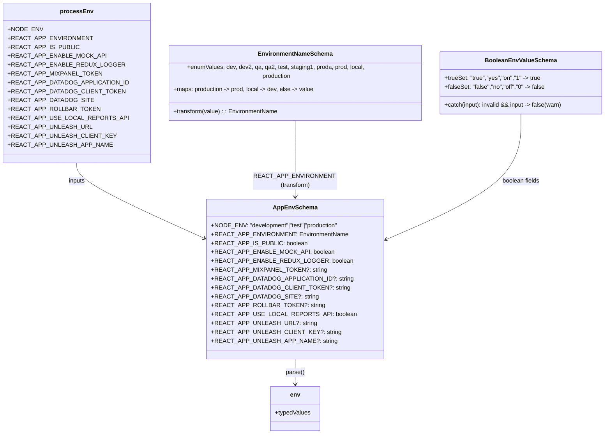

# Diagram: web/portal/src/env.ts


> Auto-generated by Obscura crawlers

## Diagram 1



### SVG

<svg id="container" width="1586.2890625" xmlns="http://www.w3.org/2000/svg" class="classDiagram" height="1172" viewBox="0 0 1586.2890625 1172" role="graphics-document document" aria-roledescription="class"><style>#container{font-family:"trebuchet ms",verdana,arial,sans-serif;font-size:16px;fill:#333;}@keyframes edge-animation-frame{from{stroke-dashoffset:0;}}@keyframes dash{to{stroke-dashoffset:0;}}#container .edge-animation-slow{stroke-dasharray:9,5!important;stroke-dashoffset:900;animation:dash 50s linear infinite;stroke-linecap:round;}#container .edge-animation-fast{stroke-dasharray:9,5!important;stroke-dashoffset:900;animation:dash 20s linear infinite;stroke-linecap:round;}#container .error-icon{fill:#552222;}#container .error-text{fill:#552222;stroke:#552222;}#container .edge-thickness-normal{stroke-width:1px;}#container .edge-thickness-thick{stroke-width:3.5px;}#container .edge-pattern-solid{stroke-dasharray:0;}#container .edge-thickness-invisible{stroke-width:0;fill:none;}#container .edge-pattern-dashed{stroke-dasharray:3;}#container .edge-pattern-dotted{stroke-dasharray:2;}#container .marker{fill:#333333;stroke:#333333;}#container .marker.cross{stroke:#333333;}#container svg{font-family:"trebuchet ms",verdana,arial,sans-serif;font-size:16px;}#container p{margin:0;}#container g.classGroup text{fill:#9370DB;stroke:none;font-family:"trebuchet ms",verdana,arial,sans-serif;font-size:10px;}#container g.classGroup text .title{font-weight:bolder;}#container .nodeLabel,#container .edgeLabel{color:#131300;}#container .edgeLabel .label rect{fill:#ECECFF;}#container .label text{fill:#131300;}#container .labelBkg{background:#ECECFF;}#container .edgeLabel .label span{background:#ECECFF;}#container .classTitle{font-weight:bolder;}#container .node rect,#container .node circle,#container .node ellipse,#container .node polygon,#container .node path{fill:#ECECFF;stroke:#9370DB;stroke-width:1px;}#container .divider{stroke:#9370DB;stroke-width:1;}#container g.clickable{cursor:pointer;}#container g.classGroup rect{fill:#ECECFF;stroke:#9370DB;}#container g.classGroup line{stroke:#9370DB;stroke-width:1;}#container .classLabel .box{stroke:none;stroke-width:0;fill:#ECECFF;opacity:0.5;}#container .classLabel .label{fill:#9370DB;font-size:10px;}#container .relation{stroke:#333333;stroke-width:1;fill:none;}#container .dashed-line{stroke-dasharray:3;}#container .dotted-line{stroke-dasharray:1 2;}#container #compositionStart,#container .composition{fill:#333333!important;stroke:#333333!important;stroke-width:1;}#container #compositionEnd,#container .composition{fill:#333333!important;stroke:#333333!important;stroke-width:1;}#container #dependencyStart,#container .dependency{fill:#333333!important;stroke:#333333!important;stroke-width:1;}#container #dependencyStart,#container .dependency{fill:#333333!important;stroke:#333333!important;stroke-width:1;}#container #extensionStart,#container .extension{fill:transparent!important;stroke:#333333!important;stroke-width:1;}#container #extensionEnd,#container .extension{fill:transparent!important;stroke:#333333!important;stroke-width:1;}#container #aggregationStart,#container .aggregation{fill:transparent!important;stroke:#333333!important;stroke-width:1;}#container #aggregationEnd,#container .aggregation{fill:transparent!important;stroke:#333333!important;stroke-width:1;}#container #lollipopStart,#container .lollipop{fill:#ECECFF!important;stroke:#333333!important;stroke-width:1;}#container #lollipopEnd,#container .lollipop{fill:#ECECFF!important;stroke:#333333!important;stroke-width:1;}#container .edgeTerminals{font-size:11px;line-height:initial;}#container .classTitleText{text-anchor:middle;font-size:18px;fill:#333;}#container .label-icon{display:inline-block;height:1em;overflow:visible;vertical-align:-0.125em;}#container .node .label-icon path{fill:currentColor;stroke:revert;stroke-width:revert;}#container :root{--mermaid-font-family:"trebuchet ms",verdana,arial,sans-serif;}</style><g><defs><marker id="container_class-aggregationStart" class="marker aggregation class" refX="18" refY="7" markerWidth="190" markerHeight="240" orient="auto"><path d="M 18,7 L9,13 L1,7 L9,1 Z"></path></marker></defs><defs><marker id="container_class-aggregationEnd" class="marker aggregation class" refX="1" refY="7" markerWidth="20" markerHeight="28" orient="auto"><path d="M 18,7 L9,13 L1,7 L9,1 Z"></path></marker></defs><defs><marker id="container_class-extensionStart" class="marker extension class" refX="18" refY="7" markerWidth="190" markerHeight="240" orient="auto"><path d="M 1,7 L18,13 V 1 Z"></path></marker></defs><defs><marker id="container_class-extensionEnd" class="marker extension class" refX="1" refY="7" markerWidth="20" markerHeight="28" orient="auto"><path d="M 1,1 V 13 L18,7 Z"></path></marker></defs><defs><marker id="container_class-compositionStart" class="marker composition class" refX="18" refY="7" markerWidth="190" markerHeight="240" orient="auto"><path d="M 18,7 L9,13 L1,7 L9,1 Z"></path></marker></defs><defs><marker id="container_class-compositionEnd" class="marker composition class" refX="1" refY="7" markerWidth="20" markerHeight="28" orient="auto"><path d="M 18,7 L9,13 L1,7 L9,1 Z"></path></marker></defs><defs><marker id="container_class-dependencyStart" class="marker dependency class" refX="6" refY="7" markerWidth="190" markerHeight="240" orient="auto"><path d="M 5,7 L9,13 L1,7 L9,1 Z"></path></marker></defs><defs><marker id="container_class-dependencyEnd" class="marker dependency class" refX="13" refY="7" markerWidth="20" markerHeight="28" orient="auto"><path d="M 18,7 L9,13 L14,7 L9,1 Z"></path></marker></defs><defs><marker id="container_class-lollipopStart" class="marker lollipop class" refX="13" refY="7" markerWidth="190" markerHeight="240" orient="auto"><circle stroke="black" fill="transparent" cx="7" cy="7" r="6"></circle></marker></defs><defs><marker id="container_class-lollipopEnd" class="marker lollipop class" refX="1" refY="7" markerWidth="190" markerHeight="240" orient="auto"><circle stroke="black" fill="transparent" cx="7" cy="7" r="6"></circle></marker></defs><g class="root"><g class="clusters"></g><g class="edgePaths"><path d="M183.176,440L183.176,448.167C183.176,456.333,183.176,472.667,240.774,507.869C298.372,543.072,413.568,597.144,471.166,624.181L528.764,651.217" id="id_processEnv_AppEnvSchema_1" class="edge-thickness-normal edge-pattern-solid relation" style=";;;" data-edge="true" data-et="edge" data-id="id_processEnv_AppEnvSchema_1" data-points="W3sieCI6MTgzLjE3NTc4MTI1LCJ5Ijo0NDB9LHsieCI6MTgzLjE3NTc4MTI1LCJ5Ijo0ODl9LHsieCI6NTM0LjE5NTMxMjUsInkiOjY1My43NjYyMDI4NTQ4Mjk5fV0=" marker-end="url(#container_class-dependencyEnd)"></path><path d="M747.734,308L747.734,338.167C747.734,368.333,747.734,428.667,747.734,466C747.734,503.333,747.734,517.667,747.734,524.833L747.734,532" id="id_EnvironmentNameSchema_AppEnvSchema_2" class="edge-thickness-normal edge-pattern-solid relation" style=";;;" data-edge="true" data-et="edge" data-id="id_EnvironmentNameSchema_AppEnvSchema_2" data-points="W3sieCI6NzQ3LjczNDM3NSwieSI6MzA4fSx7IngiOjc0Ny43MzQzNzUsInkiOjQ4OX0seyJ4Ijo3NDcuNzM0Mzc1LCJ5Ijo1Mzh9XQ==" marker-end="url(#container_class-dependencyEnd)"></path><path d="M1357.703,308L1357.703,338.167C1357.703,368.333,1357.703,428.667,1292.549,487.14C1227.394,545.612,1097.085,602.225,1031.931,630.531L966.777,658.837" id="id_BooleanEnvValueSchema_AppEnvSchema_3" class="edge-thickness-normal edge-pattern-solid relation" style=";;;" data-edge="true" data-et="edge" data-id="id_BooleanEnvValueSchema_AppEnvSchema_3" data-points="W3sieCI6MTM1Ny43MDMxMjUsInkiOjMwOH0seyJ4IjoxMzU3LjcwMzEyNSwieSI6NDg5fSx7IngiOjk2MS4yNzM0Mzc1LCJ5Ijo2NjEuMjI4Mjc3NTc1Njk1NX1d" marker-end="url(#container_class-dependencyEnd)"></path><path d="M747.734,970L747.734,976.167C747.734,982.333,747.734,994.667,747.734,1006C747.734,1017.333,747.734,1027.667,747.734,1032.833L747.734,1038" id="id_AppEnvSchema_env_4" class="edge-thickness-normal edge-pattern-solid relation" style=";;;" data-edge="true" data-et="edge" data-id="id_AppEnvSchema_env_4" data-points="W3sieCI6NzQ3LjczNDM3NSwieSI6OTcwfSx7IngiOjc0Ny43MzQzNzUsInkiOjEwMDd9LHsieCI6NzQ3LjczNDM3NSwieSI6MTA0NH1d" marker-end="url(#container_class-dependencyEnd)"></path></g><g class="edgeLabels"><g class="edgeLabel" transform="translate(183.17578125, 489)"><g class="label" data-id="id_processEnv_AppEnvSchema_1" transform="translate(-22.9765625, -12)"><foreignObject width="45.953125" height="24"><div xmlns="http://www.w3.org/1999/xhtml" class="labelBkg" style="display: table-cell; white-space: nowrap; line-height: 1.5; max-width: 200px; text-align: center;"><span class="edgeLabel"><p>inputs</p></span></div></foreignObject></g></g><g class="edgeLabel" transform="translate(747.734375, 489)"><g class="label" data-id="id_EnvironmentNameSchema_AppEnvSchema_2" transform="translate(-100, -24)"><foreignObject width="200" height="48"><div xmlns="http://www.w3.org/1999/xhtml" class="labelBkg" style="display: table; white-space: break-spaces; line-height: 1.5; max-width: 200px; text-align: center; width: 200px;"><span class="edgeLabel"><p>REACT_APP_ENVIRONMENT (transform)</p></span></div></foreignObject></g></g><g class="edgeLabel" transform="translate(1357.703125, 489)"><g class="label" data-id="id_BooleanEnvValueSchema_AppEnvSchema_3" transform="translate(-51.625, -12)"><foreignObject width="103.25" height="24"><div xmlns="http://www.w3.org/1999/xhtml" class="labelBkg" style="display: table-cell; white-space: nowrap; line-height: 1.5; max-width: 200px; text-align: center;"><span class="edgeLabel"><p>boolean fields</p></span></div></foreignObject></g></g><g class="edgeLabel" transform="translate(747.734375, 1007)"><g class="label" data-id="id_AppEnvSchema_env_4" transform="translate(-25.2734375, -12)"><foreignObject width="50.546875" height="24"><div xmlns="http://www.w3.org/1999/xhtml" class="labelBkg" style="display: table-cell; white-space: nowrap; line-height: 1.5; max-width: 200px; text-align: center;"><span class="edgeLabel"><p>parse()</p></span></div></foreignObject></g></g></g><g class="nodes"><g class="node default" id="classId-EnvironmentNameSchema-0" transform="translate(747.734375, 224)"><g class="basic label-container"><path d="M-339.3828125 -84 L339.3828125 -84 L339.3828125 84 L-339.3828125 84" stroke="none" stroke-width="0" fill="#ECECFF" style=""></path><path d="M-339.3828125 -84 C-131.56291420151354 -84, 76.25698409697293 -84, 339.3828125 -84 M-339.3828125 -84 C-181.05488735395173 -84, -22.726962207903455 -84, 339.3828125 -84 M339.3828125 -84 C339.3828125 -20.09397132302955, 339.3828125 43.8120573539409, 339.3828125 84 M339.3828125 -84 C339.3828125 -34.558028063915394, 339.3828125 14.883943872169212, 339.3828125 84 M339.3828125 84 C146.8168063599724 84, -45.74919978005522 84, -339.3828125 84 M339.3828125 84 C181.92608688914166 84, 24.469361278283316 84, -339.3828125 84 M-339.3828125 84 C-339.3828125 42.69312429587086, -339.3828125 1.3862485917417189, -339.3828125 -84 M-339.3828125 84 C-339.3828125 25.438001566600015, -339.3828125 -33.12399686679997, -339.3828125 -84" stroke="#9370DB" stroke-width="1.3" fill="none" stroke-dasharray="0 0" style=""></path></g><g class="annotation-group text" transform="translate(0, -60)"></g><g class="label-group text" transform="translate(-95.640625, -60)"><g class="label" style="font-weight: bolder" transform="translate(0,-12)"><foreignObject width="191.28125" height="24"><div xmlns="http://www.w3.org/1999/xhtml" style="display: table-cell; white-space: nowrap; line-height: 1.5; max-width: 241px; text-align: center;"><span class="nodeLabel markdown-node-label" style=""><p>EnvironmentNameSchema</p></span></div></foreignObject></g></g><g class="members-group text" transform="translate(-327.3828125, -12)"><g class="label" style="" transform="translate(0,-12)"><foreignObject width="559.125" height="24"><div xmlns="http://www.w3.org/1999/xhtml" style="display: table-cell; white-space: nowrap; line-height: 1.5; max-width: 616px; text-align: center;"><span class="nodeLabel markdown-node-label" style=""><p>+enumValues: dev, dev2, qa, qa2, test, staging1, proda, prod, local, production</p></span></div></foreignObject></g><g class="label" style="" transform="translate(0,12)"><foreignObject width="383.203125" height="24"><div xmlns="http://www.w3.org/1999/xhtml" style="display: table-cell; white-space: nowrap; line-height: 1.5; max-width: 504px; text-align: center;"><span class="nodeLabel markdown-node-label" style=""><p>+maps: production -&gt; prod, local -&gt; dev, else -&gt; value</p></span></div></foreignObject></g></g><g class="methods-group text" transform="translate(-327.3828125, 60)"><g class="label" style="" transform="translate(0,-12)"><foreignObject width="283.046875" height="24"><div xmlns="http://www.w3.org/1999/xhtml" style="display: table-cell; white-space: nowrap; line-height: 1.5; max-width: 340px; text-align: center;"><span class="nodeLabel markdown-node-label" style=""><p>+transform(value) : : EnvironmentName</p></span></div></foreignObject></g></g><g class="divider" style=""><path d="M-339.3828125 -36 C-144.52503856173686 -36, 50.33273537652627 -36, 339.3828125 -36 M-339.3828125 -36 C-160.4207046899743 -36, 18.541403120051427 -36, 339.3828125 -36" stroke="#9370DB" stroke-width="1.3" fill="none" stroke-dasharray="0 0" style=""></path></g><g class="divider" style=""><path d="M-339.3828125 36 C-75.50741119182533 36, 188.36799011634935 36, 339.3828125 36 M-339.3828125 36 C-152.768799797118 36, 33.845212905764015 36, 339.3828125 36" stroke="#9370DB" stroke-width="1.3" fill="none" stroke-dasharray="0 0" style=""></path></g></g><g class="node default" id="classId-BooleanEnvValueSchema-1" transform="translate(1357.703125, 224)"><g class="basic label-container"><path d="M-220.5859375 -84 L220.5859375 -84 L220.5859375 84 L-220.5859375 84" stroke="none" stroke-width="0" fill="#ECECFF" style=""></path><path d="M-220.5859375 -84 C-113.08043358626712 -84, -5.574929672534239 -84, 220.5859375 -84 M-220.5859375 -84 C-58.860817139858625 -84, 102.86430322028275 -84, 220.5859375 -84 M220.5859375 -84 C220.5859375 -23.786643449111416, 220.5859375 36.42671310177717, 220.5859375 84 M220.5859375 -84 C220.5859375 -28.775584370779875, 220.5859375 26.44883125844025, 220.5859375 84 M220.5859375 84 C125.72001535155654 84, 30.85409320311308 84, -220.5859375 84 M220.5859375 84 C116.99020811509723 84, 13.394478730194464 84, -220.5859375 84 M-220.5859375 84 C-220.5859375 27.814752738719058, -220.5859375 -28.370494522561884, -220.5859375 -84 M-220.5859375 84 C-220.5859375 43.384631778845204, -220.5859375 2.769263557690408, -220.5859375 -84" stroke="#9370DB" stroke-width="1.3" fill="none" stroke-dasharray="0 0" style=""></path></g><g class="annotation-group text" transform="translate(0, -60)"></g><g class="label-group text" transform="translate(-91.25, -60)"><g class="label" style="font-weight: bolder" transform="translate(0,-12)"><foreignObject width="182.5" height="24"><div xmlns="http://www.w3.org/1999/xhtml" style="display: table-cell; white-space: nowrap; line-height: 1.5; max-width: 232px; text-align: center;"><span class="nodeLabel markdown-node-label" style=""><p>BooleanEnvValueSchema</p></span></div></foreignObject></g></g><g class="members-group text" transform="translate(-208.5859375, -12)"><g class="label" style="" transform="translate(0,-12)"><foreignObject width="254.234375" height="24"><div xmlns="http://www.w3.org/1999/xhtml" style="display: table-cell; white-space: nowrap; line-height: 1.5; max-width: 333px; text-align: center;"><span class="nodeLabel markdown-node-label" style=""><p>+trueSet: "true","yes","on","1" -&gt; true</p></span></div></foreignObject></g><g class="label" style="" transform="translate(0,12)"><foreignObject width="266.359375" height="24"><div xmlns="http://www.w3.org/1999/xhtml" style="display: table-cell; white-space: nowrap; line-height: 1.5; max-width: 345px; text-align: center;"><span class="nodeLabel markdown-node-label" style=""><p>+falseSet: "false","no","off","0" -&gt; false</p></span></div></foreignObject></g></g><g class="methods-group text" transform="translate(-208.5859375, 60)"><g class="label" style="" transform="translate(0,-12)"><foreignObject width="325.921875" height="24"><div xmlns="http://www.w3.org/1999/xhtml" style="display: table-cell; white-space: nowrap; line-height: 1.5; max-width: 404px; text-align: center;"><span class="nodeLabel markdown-node-label" style=""><p>+catch(input): invalid &amp;&amp; input -&gt; false(warn)</p></span></div></foreignObject></g></g><g class="divider" style=""><path d="M-220.5859375 -36 C-63.431972853698085 -36, 93.72199179260383 -36, 220.5859375 -36 M-220.5859375 -36 C-120.29699924626486 -36, -20.00806099252972 -36, 220.5859375 -36" stroke="#9370DB" stroke-width="1.3" fill="none" stroke-dasharray="0 0" style=""></path></g><g class="divider" style=""><path d="M-220.5859375 36 C-123.91856222062053 36, -27.25118694124106 36, 220.5859375 36 M-220.5859375 36 C-121.0863522579907 36, -21.586767015981394 36, 220.5859375 36" stroke="#9370DB" stroke-width="1.3" fill="none" stroke-dasharray="0 0" style=""></path></g></g><g class="node default" id="classId-AppEnvSchema-2" transform="translate(747.734375, 754)"><g class="basic label-container"><path d="M-213.5390625 -216 L213.5390625 -216 L213.5390625 216 L-213.5390625 216" stroke="none" stroke-width="0" fill="#ECECFF" style=""></path><path d="M-213.5390625 -216 C-122.17077396512164 -216, -30.80248543024328 -216, 213.5390625 -216 M-213.5390625 -216 C-110.06255282076215 -216, -6.5860431415243 -216, 213.5390625 -216 M213.5390625 -216 C213.5390625 -54.03594050106017, 213.5390625 107.92811899787966, 213.5390625 216 M213.5390625 -216 C213.5390625 -71.11649521079053, 213.5390625 73.76700957841894, 213.5390625 216 M213.5390625 216 C70.38290187872167 216, -72.77325874255666 216, -213.5390625 216 M213.5390625 216 C122.73798837370245 216, 31.9369142474049 216, -213.5390625 216 M-213.5390625 216 C-213.5390625 70.90012359803777, -213.5390625 -74.19975280392447, -213.5390625 -216 M-213.5390625 216 C-213.5390625 57.298966720448846, -213.5390625 -101.40206655910231, -213.5390625 -216" stroke="#9370DB" stroke-width="1.3" fill="none" stroke-dasharray="0 0" style=""></path></g><g class="annotation-group text" transform="translate(0, -192)"></g><g class="label-group text" transform="translate(-55.65625, -192)"><g class="label" style="font-weight: bolder" transform="translate(0,-12)"><foreignObject width="111.3125" height="24"><div xmlns="http://www.w3.org/1999/xhtml" style="display: table-cell; white-space: nowrap; line-height: 1.5; max-width: 161px; text-align: center;"><span class="nodeLabel markdown-node-label" style=""><p>AppEnvSchema</p></span></div></foreignObject></g></g><g class="members-group text" transform="translate(-201.5390625, -144)"><g class="label" style="" transform="translate(0,-12)"><foreignObject width="347.421875" height="24"><div xmlns="http://www.w3.org/1999/xhtml" style="display: table-cell; white-space: nowrap; line-height: 1.5; max-width: 405px; text-align: center;"><span class="nodeLabel markdown-node-label" style=""><p>+NODE_ENV: "development"|"test"|"production"</p></span></div></foreignObject></g><g class="label" style="" transform="translate(0,12)"><foreignObject width="340.71875" height="24"><div xmlns="http://www.w3.org/1999/xhtml" style="display: table-cell; white-space: nowrap; line-height: 1.5; max-width: 398px; text-align: center;"><span class="nodeLabel markdown-node-label" style=""><p>+REACT_APP_ENVIRONMENT: EnvironmentName</p></span></div></foreignObject></g><g class="label" style="" transform="translate(0,36)"><foreignObject width="234.375" height="24"><div xmlns="http://www.w3.org/1999/xhtml" style="display: table-cell; white-space: nowrap; line-height: 1.5; max-width: 292px; text-align: center;"><span class="nodeLabel markdown-node-label" style=""><p>+REACT_APP_IS_PUBLIC: boolean</p></span></div></foreignObject></g><g class="label" style="" transform="translate(0,60)"><foreignObject width="298.3125" height="24"><div xmlns="http://www.w3.org/1999/xhtml" style="display: table-cell; white-space: nowrap; line-height: 1.5; max-width: 356px; text-align: center;"><span class="nodeLabel markdown-node-label" style=""><p>+REACT_APP_ENABLE_MOCK_API: boolean</p></span></div></foreignObject></g><g class="label" style="" transform="translate(0,84)"><foreignObject width="337.84375" height="24"><div xmlns="http://www.w3.org/1999/xhtml" style="display: table-cell; white-space: nowrap; line-height: 1.5; max-width: 395px; text-align: center;"><span class="nodeLabel markdown-node-label" style=""><p>+REACT_APP_ENABLE_REDUX_LOGGER: boolean</p></span></div></foreignObject></g><g class="label" style="" transform="translate(0,108)"><foreignObject width="277.359375" height="24"><div xmlns="http://www.w3.org/1999/xhtml" style="display: table-cell; white-space: nowrap; line-height: 1.5; max-width: 335px; text-align: center;"><span class="nodeLabel markdown-node-label" style=""><p>+REACT_APP_MIXPANEL_TOKEN?: string</p></span></div></foreignObject></g><g class="label" style="" transform="translate(0,132)"><foreignObject width="342.109375" height="24"><div xmlns="http://www.w3.org/1999/xhtml" style="display: table-cell; white-space: nowrap; line-height: 1.5; max-width: 400px; text-align: center;"><span class="nodeLabel markdown-node-label" style=""><p>+REACT_APP_DATADOG_APPLICATION_ID?: string</p></span></div></foreignObject></g><g class="label" style="" transform="translate(0,156)"><foreignObject width="329.5" height="24"><div xmlns="http://www.w3.org/1999/xhtml" style="display: table-cell; white-space: nowrap; line-height: 1.5; max-width: 388px; text-align: center;"><span class="nodeLabel markdown-node-label" style=""><p>+REACT_APP_DATADOG_CLIENT_TOKEN?: string</p></span></div></foreignObject></g><g class="label" style="" transform="translate(0,180)"><foreignObject width="256.265625" height="24"><div xmlns="http://www.w3.org/1999/xhtml" style="display: table-cell; white-space: nowrap; line-height: 1.5; max-width: 314px; text-align: center;"><span class="nodeLabel markdown-node-label" style=""><p>+REACT_APP_DATADOG_SITE?: string</p></span></div></foreignObject></g><g class="label" style="" transform="translate(0,204)"><foreignObject width="271.625" height="24"><div xmlns="http://www.w3.org/1999/xhtml" style="display: table-cell; white-space: nowrap; line-height: 1.5; max-width: 330px; text-align: center;"><span class="nodeLabel markdown-node-label" style=""><p>+REACT_APP_ROLLBAR_TOKEN?: string</p></span></div></foreignObject></g><g class="label" style="" transform="translate(0,228)"><foreignObject width="345.828125" height="24"><div xmlns="http://www.w3.org/1999/xhtml" style="display: table-cell; white-space: nowrap; line-height: 1.5; max-width: 403px; text-align: center;"><span class="nodeLabel markdown-node-label" style=""><p>+REACT_APP_USE_LOCAL_REPORTS_API: boolean</p></span></div></foreignObject></g><g class="label" style="" transform="translate(0,252)"><foreignObject width="252.5" height="24"><div xmlns="http://www.w3.org/1999/xhtml" style="display: table-cell; white-space: nowrap; line-height: 1.5; max-width: 311px; text-align: center;"><span class="nodeLabel markdown-node-label" style=""><p>+REACT_APP_UNLEASH_URL?: string</p></span></div></foreignObject></g><g class="label" style="" transform="translate(0,276)"><foreignObject width="309.015625" height="24"><div xmlns="http://www.w3.org/1999/xhtml" style="display: table-cell; white-space: nowrap; line-height: 1.5; max-width: 367px; text-align: center;"><span class="nodeLabel markdown-node-label" style=""><p>+REACT_APP_UNLEASH_CLIENT_KEY?: string</p></span></div></foreignObject></g><g class="label" style="" transform="translate(0,300)"><foreignObject width="301.609375" height="24"><div xmlns="http://www.w3.org/1999/xhtml" style="display: table-cell; white-space: nowrap; line-height: 1.5; max-width: 360px; text-align: center;"><span class="nodeLabel markdown-node-label" style=""><p>+REACT_APP_UNLEASH_APP_NAME?: string</p></span></div></foreignObject></g></g><g class="methods-group text" transform="translate(-201.5390625, 216)"></g><g class="divider" style=""><path d="M-213.5390625 -168 C-53.107786132179314 -168, 107.32349023564137 -168, 213.5390625 -168 M-213.5390625 -168 C-95.17071488899971 -168, 23.197632722000577 -168, 213.5390625 -168" stroke="#9370DB" stroke-width="1.3" fill="none" stroke-dasharray="0 0" style=""></path></g><g class="divider" style=""><path d="M-213.5390625 192 C-101.4422770171684 192, 10.654508465663213 192, 213.5390625 192 M-213.5390625 192 C-48.25463778840003 192, 117.02978692319994 192, 213.5390625 192" stroke="#9370DB" stroke-width="1.3" fill="none" stroke-dasharray="0 0" style=""></path></g></g><g class="node default" id="classId-processEnv-3" transform="translate(183.17578125, 224)"><g class="basic label-container"><path d="M-175.17578125 -216 L175.17578125 -216 L175.17578125 216 L-175.17578125 216" stroke="none" stroke-width="0" fill="#ECECFF" style=""></path><path d="M-175.17578125 -216 C-83.61917746861918 -216, 7.93742631276163 -216, 175.17578125 -216 M-175.17578125 -216 C-91.27537669083658 -216, -7.374972131673161 -216, 175.17578125 -216 M175.17578125 -216 C175.17578125 -62.82651255136841, 175.17578125 90.34697489726318, 175.17578125 216 M175.17578125 -216 C175.17578125 -44.2741772827394, 175.17578125 127.4516454345212, 175.17578125 216 M175.17578125 216 C64.67634556501446 216, -45.823090119971084 216, -175.17578125 216 M175.17578125 216 C71.075390629764 216, -33.024999990472 216, -175.17578125 216 M-175.17578125 216 C-175.17578125 112.43829407450033, -175.17578125 8.876588149000668, -175.17578125 -216 M-175.17578125 216 C-175.17578125 101.48662948653102, -175.17578125 -13.02674102693797, -175.17578125 -216" stroke="#9370DB" stroke-width="1.3" fill="none" stroke-dasharray="0 0" style=""></path></g><g class="annotation-group text" transform="translate(0, -192)"></g><g class="label-group text" transform="translate(-40.9765625, -192)"><g class="label" style="font-weight: bolder" transform="translate(0,-12)"><foreignObject width="81.953125" height="24"><div xmlns="http://www.w3.org/1999/xhtml" style="display: table-cell; white-space: nowrap; line-height: 1.5; max-width: 131px; text-align: center;"><span class="nodeLabel markdown-node-label" style=""><p>processEnv</p></span></div></foreignObject></g></g><g class="members-group text" transform="translate(-163.17578125, -144)"><g class="label" style="" transform="translate(0,-12)"><foreignObject width="85.5625" height="24"><div xmlns="http://www.w3.org/1999/xhtml" style="display: table-cell; white-space: nowrap; line-height: 1.5; max-width: 143px; text-align: center;"><span class="nodeLabel markdown-node-label" style=""><p>+NODE_ENV</p></span></div></foreignObject></g><g class="label" style="" transform="translate(0,12)"><foreignObject width="199.15625" height="24"><div xmlns="http://www.w3.org/1999/xhtml" style="display: table-cell; white-space: nowrap; line-height: 1.5; max-width: 257px; text-align: center;"><span class="nodeLabel markdown-node-label" style=""><p>+REACT_APP_ENVIRONMENT</p></span></div></foreignObject></g><g class="label" style="" transform="translate(0,36)"><foreignObject width="166.859375" height="24"><div xmlns="http://www.w3.org/1999/xhtml" style="display: table-cell; white-space: nowrap; line-height: 1.5; max-width: 224px; text-align: center;"><span class="nodeLabel markdown-node-label" style=""><p>+REACT_APP_IS_PUBLIC</p></span></div></foreignObject></g><g class="label" style="" transform="translate(0,60)"><foreignObject width="230.796875" height="24"><div xmlns="http://www.w3.org/1999/xhtml" style="display: table-cell; white-space: nowrap; line-height: 1.5; max-width: 288px; text-align: center;"><span class="nodeLabel markdown-node-label" style=""><p>+REACT_APP_ENABLE_MOCK_API</p></span></div></foreignObject></g><g class="label" style="" transform="translate(0,84)"><foreignObject width="270.328125" height="24"><div xmlns="http://www.w3.org/1999/xhtml" style="display: table-cell; white-space: nowrap; line-height: 1.5; max-width: 328px; text-align: center;"><span class="nodeLabel markdown-node-label" style=""><p>+REACT_APP_ENABLE_REDUX_LOGGER</p></span></div></foreignObject></g><g class="label" style="" transform="translate(0,108)"><foreignObject width="220.296875" height="24"><div xmlns="http://www.w3.org/1999/xhtml" style="display: table-cell; white-space: nowrap; line-height: 1.5; max-width: 278px; text-align: center;"><span class="nodeLabel markdown-node-label" style=""><p>+REACT_APP_MIXPANEL_TOKEN</p></span></div></foreignObject></g><g class="label" style="" transform="translate(0,132)"><foreignObject width="285.375" height="24"><div xmlns="http://www.w3.org/1999/xhtml" style="display: table-cell; white-space: nowrap; line-height: 1.5; max-width: 343px; text-align: center;"><span class="nodeLabel markdown-node-label" style=""><p>+REACT_APP_DATADOG_APPLICATION_ID</p></span></div></foreignObject></g><g class="label" style="" transform="translate(0,156)"><foreignObject width="272.4375" height="24"><div xmlns="http://www.w3.org/1999/xhtml" style="display: table-cell; white-space: nowrap; line-height: 1.5; max-width: 330px; text-align: center;"><span class="nodeLabel markdown-node-label" style=""><p>+REACT_APP_DATADOG_CLIENT_TOKEN</p></span></div></foreignObject></g><g class="label" style="" transform="translate(0,180)"><foreignObject width="199.203125" height="24"><div xmlns="http://www.w3.org/1999/xhtml" style="display: table-cell; white-space: nowrap; line-height: 1.5; max-width: 257px; text-align: center;"><span class="nodeLabel markdown-node-label" style=""><p>+REACT_APP_DATADOG_SITE</p></span></div></foreignObject></g><g class="label" style="" transform="translate(0,204)"><foreignObject width="214.5625" height="24"><div xmlns="http://www.w3.org/1999/xhtml" style="display: table-cell; white-space: nowrap; line-height: 1.5; max-width: 272px; text-align: center;"><span class="nodeLabel markdown-node-label" style=""><p>+REACT_APP_ROLLBAR_TOKEN</p></span></div></foreignObject></g><g class="label" style="" transform="translate(0,228)"><foreignObject width="278.3125" height="24"><div xmlns="http://www.w3.org/1999/xhtml" style="display: table-cell; white-space: nowrap; line-height: 1.5; max-width: 336px; text-align: center;"><span class="nodeLabel markdown-node-label" style=""><p>+REACT_APP_USE_LOCAL_REPORTS_API</p></span></div></foreignObject></g><g class="label" style="" transform="translate(0,252)"><foreignObject width="196.734375" height="24"><div xmlns="http://www.w3.org/1999/xhtml" style="display: table-cell; white-space: nowrap; line-height: 1.5; max-width: 254px; text-align: center;"><span class="nodeLabel markdown-node-label" style=""><p>+REACT_APP_UNLEASH_URL</p></span></div></foreignObject></g><g class="label" style="" transform="translate(0,276)"><foreignObject width="251.953125" height="24"><div xmlns="http://www.w3.org/1999/xhtml" style="display: table-cell; white-space: nowrap; line-height: 1.5; max-width: 310px; text-align: center;"><span class="nodeLabel markdown-node-label" style=""><p>+REACT_APP_UNLEASH_CLIENT_KEY</p></span></div></foreignObject></g><g class="label" style="" transform="translate(0,300)"><foreignObject width="244.546875" height="24"><div xmlns="http://www.w3.org/1999/xhtml" style="display: table-cell; white-space: nowrap; line-height: 1.5; max-width: 302px; text-align: center;"><span class="nodeLabel markdown-node-label" style=""><p>+REACT_APP_UNLEASH_APP_NAME</p></span></div></foreignObject></g></g><g class="methods-group text" transform="translate(-163.17578125, 216)"></g><g class="divider" style=""><path d="M-175.17578125 -168 C-71.10786341262454 -168, 32.96005442475092 -168, 175.17578125 -168 M-175.17578125 -168 C-46.72276565920157 -168, 81.73024993159686 -168, 175.17578125 -168" stroke="#9370DB" stroke-width="1.3" fill="none" stroke-dasharray="0 0" style=""></path></g><g class="divider" style=""><path d="M-175.17578125 192 C-55.5018557106894 192, 64.1720698286212 192, 175.17578125 192 M-175.17578125 192 C-102.7186096171522 192, -30.261437984304393 192, 175.17578125 192" stroke="#9370DB" stroke-width="1.3" fill="none" stroke-dasharray="0 0" style=""></path></g></g><g class="node default" id="classId-env-4" transform="translate(747.734375, 1104)"><g class="basic label-container"><path d="M-66.6796875 -60 L66.6796875 -60 L66.6796875 60 L-66.6796875 60" stroke="none" stroke-width="0" fill="#ECECFF" style=""></path><path d="M-66.6796875 -60 C-14.039544348472432 -60, 38.600598803055135 -60, 66.6796875 -60 M-66.6796875 -60 C-18.4883530478522 -60, 29.7029814042956 -60, 66.6796875 -60 M66.6796875 -60 C66.6796875 -25.163269522450562, 66.6796875 9.673460955098875, 66.6796875 60 M66.6796875 -60 C66.6796875 -21.14235294859165, 66.6796875 17.7152941028167, 66.6796875 60 M66.6796875 60 C31.691031114898834 60, -3.2976252702023316 60, -66.6796875 60 M66.6796875 60 C21.664815340274743 60, -23.350056819450515 60, -66.6796875 60 M-66.6796875 60 C-66.6796875 24.918940526904642, -66.6796875 -10.162118946190716, -66.6796875 -60 M-66.6796875 60 C-66.6796875 12.882095353812254, -66.6796875 -34.23580929237549, -66.6796875 -60" stroke="#9370DB" stroke-width="1.3" fill="none" stroke-dasharray="0 0" style=""></path></g><g class="annotation-group text" transform="translate(0, -36)"></g><g class="label-group text" transform="translate(-13.09375, -36)"><g class="label" style="font-weight: bolder" transform="translate(0,-12)"><foreignObject width="26.1875" height="24"><div xmlns="http://www.w3.org/1999/xhtml" style="display: table-cell; white-space: nowrap; line-height: 1.5; max-width: 76px; text-align: center;"><span class="nodeLabel markdown-node-label" style=""><p>env</p></span></div></foreignObject></g></g><g class="members-group text" transform="translate(-54.6796875, 12)"><g class="label" style="" transform="translate(0,-12)"><foreignObject width="96.265625" height="24"><div xmlns="http://www.w3.org/1999/xhtml" style="display: table-cell; white-space: nowrap; line-height: 1.5; max-width: 154px; text-align: center;"><span class="nodeLabel markdown-node-label" style=""><p>+typedValues</p></span></div></foreignObject></g></g><g class="methods-group text" transform="translate(-54.6796875, 60)"></g><g class="divider" style=""><path d="M-66.6796875 -12 C-28.337503077039756 -12, 10.004681345920488 -12, 66.6796875 -12 M-66.6796875 -12 C-35.16037821220719 -12, -3.641068924414391 -12, 66.6796875 -12" stroke="#9370DB" stroke-width="1.3" fill="none" stroke-dasharray="0 0" style=""></path></g><g class="divider" style=""><path d="M-66.6796875 36 C-27.130048333585393 36, 12.419590832829215 36, 66.6796875 36 M-66.6796875 36 C-26.222173732419357 36, 14.235340035161286 36, 66.6796875 36" stroke="#9370DB" stroke-width="1.3" fill="none" stroke-dasharray="0 0" style=""></path></g></g></g></g></g></svg>

## Diagram 2

```mermaid
flowchart TD
    P[process.env variables]
    ENVS[EnvironmentNameSchema<br/>production → prod<br/>local → dev]
    BOOL[BooleanEnvValueSchema<br/>"true","yes","on","1" → true<br/>"false","no","off","0" → false<br/>catch → false (warn if input)]
    SCHEMA[AppEnvSchema<br/>NODE_ENV, REACT_APP_* fields]
    PARSE[AppEnvSchema.parse(...)]
    RESULT[env (typed result)]
    P --> SCHEMA
    P -.-> ENVS
    P -.-> BOOL
    ENVS --> SCHEMA
    BOOL --> SCHEMA
    SCHEMA --> PARSE
    PARSE --> RESULT
```

> SVG rendering failed for this diagram.
