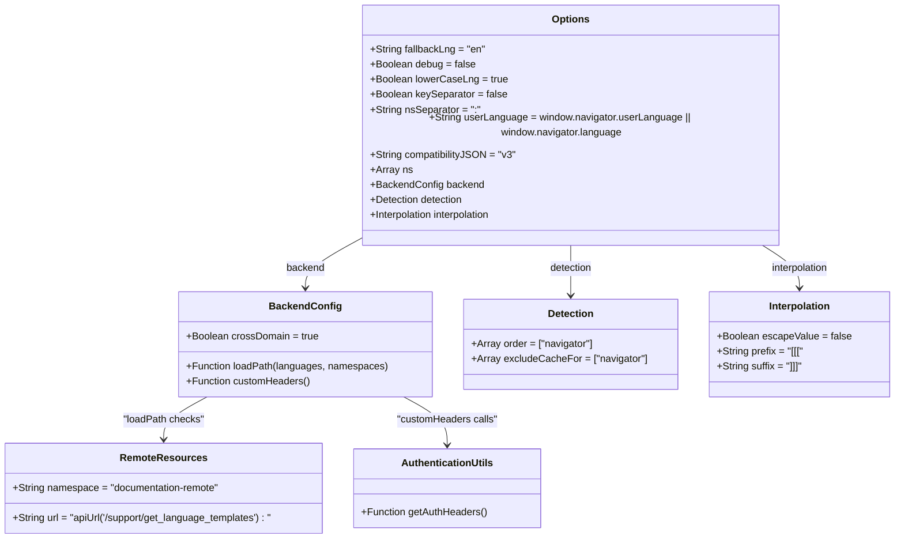

# Diagram: web/portal/src/i18n.js


> Auto-generated by Obscura crawlers

## Diagram 1

```mermaid
flowchart LR
  Backend["Backend\n(i18next-http-backend)"]
  LangDet["LanguageDetector\n(i18next-browser-languagedetector)"]
  InitReact["initReactI18next"]
  I18n["i18n\n(i18next instance)"]
  Options["options\n(configuration object)"]
  Remote["remoteResources\n(array of remote namespaces)"]
  ApiUrl["apiUrl(module)"]
  Auth["AuthenticationUtils\n(getAuthHeaders)"]
  Navigator["window.navigator\n(userLanguage)"]
  Namespaces["ns\n(namespace list)"]
  Interp["interpolation\n(prefix/suffix configured)"]

  Backend -->|use| I18n
  LangDet -->|use| I18n
  InitReact -->|use| I18n
  I18n -->|init(options)| Options
  Options -->|has -> ns| Namespaces
  Options -->|backend.loadPath checks| Remote
  Remote -->|uses| ApiUrl
  Options -->|backend.customHeaders calls| Auth
  Auth -->|reads i18n.language| I18n
  Navigator -->|provides userLanguage| Options
  Options -->|interpolation config| Interp
```

> SVG rendering failed for this diagram.

## Diagram 2



### SVG

<svg id="container" width="1424.056640625" xmlns="http://www.w3.org/2000/svg" class="classDiagram" height="836" viewBox="0 0 1424.056640625 836" role="graphics-document document" aria-roledescription="class"><style>#container{font-family:"trebuchet ms",verdana,arial,sans-serif;font-size:16px;fill:#333;}@keyframes edge-animation-frame{from{stroke-dashoffset:0;}}@keyframes dash{to{stroke-dashoffset:0;}}#container .edge-animation-slow{stroke-dasharray:9,5!important;stroke-dashoffset:900;animation:dash 50s linear infinite;stroke-linecap:round;}#container .edge-animation-fast{stroke-dasharray:9,5!important;stroke-dashoffset:900;animation:dash 20s linear infinite;stroke-linecap:round;}#container .error-icon{fill:#552222;}#container .error-text{fill:#552222;stroke:#552222;}#container .edge-thickness-normal{stroke-width:1px;}#container .edge-thickness-thick{stroke-width:3.5px;}#container .edge-pattern-solid{stroke-dasharray:0;}#container .edge-thickness-invisible{stroke-width:0;fill:none;}#container .edge-pattern-dashed{stroke-dasharray:3;}#container .edge-pattern-dotted{stroke-dasharray:2;}#container .marker{fill:#333333;stroke:#333333;}#container .marker.cross{stroke:#333333;}#container svg{font-family:"trebuchet ms",verdana,arial,sans-serif;font-size:16px;}#container p{margin:0;}#container g.classGroup text{fill:#9370DB;stroke:none;font-family:"trebuchet ms",verdana,arial,sans-serif;font-size:10px;}#container g.classGroup text .title{font-weight:bolder;}#container .nodeLabel,#container .edgeLabel{color:#131300;}#container .edgeLabel .label rect{fill:#ECECFF;}#container .label text{fill:#131300;}#container .labelBkg{background:#ECECFF;}#container .edgeLabel .label span{background:#ECECFF;}#container .classTitle{font-weight:bolder;}#container .node rect,#container .node circle,#container .node ellipse,#container .node polygon,#container .node path{fill:#ECECFF;stroke:#9370DB;stroke-width:1px;}#container .divider{stroke:#9370DB;stroke-width:1;}#container g.clickable{cursor:pointer;}#container g.classGroup rect{fill:#ECECFF;stroke:#9370DB;}#container g.classGroup line{stroke:#9370DB;stroke-width:1;}#container .classLabel .box{stroke:none;stroke-width:0;fill:#ECECFF;opacity:0.5;}#container .classLabel .label{fill:#9370DB;font-size:10px;}#container .relation{stroke:#333333;stroke-width:1;fill:none;}#container .dashed-line{stroke-dasharray:3;}#container .dotted-line{stroke-dasharray:1 2;}#container #compositionStart,#container .composition{fill:#333333!important;stroke:#333333!important;stroke-width:1;}#container #compositionEnd,#container .composition{fill:#333333!important;stroke:#333333!important;stroke-width:1;}#container #dependencyStart,#container .dependency{fill:#333333!important;stroke:#333333!important;stroke-width:1;}#container #dependencyStart,#container .dependency{fill:#333333!important;stroke:#333333!important;stroke-width:1;}#container #extensionStart,#container .extension{fill:transparent!important;stroke:#333333!important;stroke-width:1;}#container #extensionEnd,#container .extension{fill:transparent!important;stroke:#333333!important;stroke-width:1;}#container #aggregationStart,#container .aggregation{fill:transparent!important;stroke:#333333!important;stroke-width:1;}#container #aggregationEnd,#container .aggregation{fill:transparent!important;stroke:#333333!important;stroke-width:1;}#container #lollipopStart,#container .lollipop{fill:#ECECFF!important;stroke:#333333!important;stroke-width:1;}#container #lollipopEnd,#container .lollipop{fill:#ECECFF!important;stroke:#333333!important;stroke-width:1;}#container .edgeTerminals{font-size:11px;line-height:initial;}#container .classTitleText{text-anchor:middle;font-size:18px;fill:#333;}#container .label-icon{display:inline-block;height:1em;overflow:visible;vertical-align:-0.125em;}#container .node .label-icon path{fill:currentColor;stroke:revert;stroke-width:revert;}#container :root{--mermaid-font-family:"trebuchet ms",verdana,arial,sans-serif;}</style><g><defs><marker id="container_class-aggregationStart" class="marker aggregation class" refX="18" refY="7" markerWidth="190" markerHeight="240" orient="auto"><path d="M 18,7 L9,13 L1,7 L9,1 Z"></path></marker></defs><defs><marker id="container_class-aggregationEnd" class="marker aggregation class" refX="1" refY="7" markerWidth="20" markerHeight="28" orient="auto"><path d="M 18,7 L9,13 L1,7 L9,1 Z"></path></marker></defs><defs><marker id="container_class-extensionStart" class="marker extension class" refX="18" refY="7" markerWidth="190" markerHeight="240" orient="auto"><path d="M 1,7 L18,13 V 1 Z"></path></marker></defs><defs><marker id="container_class-extensionEnd" class="marker extension class" refX="1" refY="7" markerWidth="20" markerHeight="28" orient="auto"><path d="M 1,1 V 13 L18,7 Z"></path></marker></defs><defs><marker id="container_class-compositionStart" class="marker composition class" refX="18" refY="7" markerWidth="190" markerHeight="240" orient="auto"><path d="M 18,7 L9,13 L1,7 L9,1 Z"></path></marker></defs><defs><marker id="container_class-compositionEnd" class="marker composition class" refX="1" refY="7" markerWidth="20" markerHeight="28" orient="auto"><path d="M 18,7 L9,13 L1,7 L9,1 Z"></path></marker></defs><defs><marker id="container_class-dependencyStart" class="marker dependency class" refX="6" refY="7" markerWidth="190" markerHeight="240" orient="auto"><path d="M 5,7 L9,13 L1,7 L9,1 Z"></path></marker></defs><defs><marker id="container_class-dependencyEnd" class="marker dependency class" refX="13" refY="7" markerWidth="20" markerHeight="28" orient="auto"><path d="M 18,7 L9,13 L14,7 L9,1 Z"></path></marker></defs><defs><marker id="container_class-lollipopStart" class="marker lollipop class" refX="13" refY="7" markerWidth="190" markerHeight="240" orient="auto"><circle stroke="black" fill="transparent" cx="7" cy="7" r="6"></circle></marker></defs><defs><marker id="container_class-lollipopEnd" class="marker lollipop class" refX="1" refY="7" markerWidth="190" markerHeight="240" orient="auto"><circle stroke="black" fill="transparent" cx="7" cy="7" r="6"></circle></marker></defs><g class="root"><g class="clusters"></g><g class="edgePaths"><path d="M575.889,361.858L562.016,369.048C548.144,376.239,520.399,390.619,506.527,402.976C492.654,415.333,492.654,425.667,492.654,430.833L492.654,436" id="id_Options_BackendConfig_1" class="edge-thickness-normal edge-pattern-solid relation" style=";;;" data-edge="true" data-et="edge" data-id="id_Options_BackendConfig_1" data-points="W3sieCI6NTc1Ljg4ODY3MTg3NSwieSI6MzYxLjg1Nzk0NTI2ODEwNzg3fSx7IngiOjQ5Mi42NTQyOTY4NzUsInkiOjQwNX0seyJ4Ijo0OTIuNjU0Mjk2ODc1LCJ5Ijo0NDJ9XQ==" marker-end="url(#container_class-dependencyEnd)"></path><path d="M911.314,368L911.314,374.167C911.314,380.333,911.314,392.667,911.314,406C911.314,419.333,911.314,433.667,911.314,440.833L911.314,448" id="id_Options_Detection_2" class="edge-thickness-normal edge-pattern-solid relation" style=";;;" data-edge="true" data-et="edge" data-id="id_Options_Detection_2" data-points="W3sieCI6OTExLjMxNDQ1MzEyNSwieSI6MzY4fSx7IngiOjkxMS4zMTQ0NTMxMjUsInkiOjQwNX0seyJ4Ijo5MTEuMzE0NDUzMTI1LCJ5Ijo0NTR9XQ==" marker-end="url(#container_class-dependencyEnd)"></path><path d="M1211.682,368L1221.972,374.167C1232.262,380.333,1252.843,392.667,1263.133,404C1273.424,415.333,1273.424,425.667,1273.424,430.833L1273.424,436" id="id_Options_Interpolation_3" class="edge-thickness-normal edge-pattern-solid relation" style=";;;" data-edge="true" data-et="edge" data-id="id_Options_Interpolation_3" data-points="W3sieCI6MTIxMS42ODE2NzY2MjczMDQxLCJ5IjozNjh9LHsieCI6MTI3My40MjM4MjgxMjUsInkiOjQwNX0seyJ4IjoxMjczLjQyMzgyODEyNSwieSI6NDQyfV0=" marker-end="url(#container_class-dependencyEnd)"></path><path d="M334.665,610L323.066,616.167C311.468,622.333,288.271,634.667,276.673,646C265.074,657.333,265.074,667.667,265.074,672.833L265.074,678" id="id_BackendConfig_RemoteResources_4" class="edge-thickness-normal edge-pattern-solid relation" style=";;;" data-edge="true" data-et="edge" data-id="id_BackendConfig_RemoteResources_4" data-points="W3sieCI6MzM0LjY2NDgyMTE1MTg1OTU0LCJ5Ijo2MTB9LHsieCI6MjY1LjA3NDIxODc1LCJ5Ijo2NDd9LHsieCI6MjY1LjA3NDIxODc1LCJ5Ijo2ODR9XQ==" marker-end="url(#container_class-dependencyEnd)"></path><path d="M650.644,610L662.242,616.167C673.841,622.333,697.038,634.667,708.636,647.5C720.234,660.333,720.234,673.667,720.234,680.333L720.234,687" id="id_BackendConfig_AuthenticationUtils_5" class="edge-thickness-normal edge-pattern-solid relation" style=";;;" data-edge="true" data-et="edge" data-id="id_BackendConfig_AuthenticationUtils_5" data-points="W3sieCI6NjUwLjY0Mzc3MjU5ODE0MDUsInkiOjYxMH0seyJ4Ijo3MjAuMjM0Mzc1LCJ5Ijo2NDd9LHsieCI6NzIwLjIzNDM3NSwieSI6NjkzfV0=" marker-end="url(#container_class-dependencyEnd)"></path></g><g class="edgeLabels"><g class="edgeLabel" transform="translate(492.654296875, 405)"><g class="label" data-id="id_Options_BackendConfig_1" transform="translate(-30.7109375, -12)"><foreignObject width="61.421875" height="24"><div xmlns="http://www.w3.org/1999/xhtml" class="labelBkg" style="display: table-cell; white-space: nowrap; line-height: 1.5; max-width: 200px; text-align: center;"><span class="edgeLabel"><p>backend</p></span></div></foreignObject></g></g><g class="edgeLabel" transform="translate(911.314453125, 405)"><g class="label" data-id="id_Options_Detection_2" transform="translate(-34.6015625, -12)"><foreignObject width="69.203125" height="24"><div xmlns="http://www.w3.org/1999/xhtml" class="labelBkg" style="display: table-cell; white-space: nowrap; line-height: 1.5; max-width: 200px; text-align: center;"><span class="edgeLabel"><p>detection</p></span></div></foreignObject></g></g><g class="edgeLabel" transform="translate(1273.423828125, 405)"><g class="label" data-id="id_Options_Interpolation_3" transform="translate(-47.75, -12)"><foreignObject width="95.5" height="24"><div xmlns="http://www.w3.org/1999/xhtml" class="labelBkg" style="display: table-cell; white-space: nowrap; line-height: 1.5; max-width: 200px; text-align: center;"><span class="edgeLabel"><p>interpolation</p></span></div></foreignObject></g></g><g class="edgeLabel" transform="translate(265.07421875, 647)"><g class="label" data-id="id_BackendConfig_RemoteResources_4" transform="translate(-65.046875, -12)"><foreignObject width="130.09375" height="24"><div xmlns="http://www.w3.org/1999/xhtml" class="labelBkg" style="display: table-cell; white-space: nowrap; line-height: 1.5; max-width: 200px; text-align: center;"><span class="edgeLabel"><p>"loadPath checks"</p></span></div></foreignObject></g></g><g class="edgeLabel" transform="translate(720.234375, 647)"><g class="label" data-id="id_BackendConfig_AuthenticationUtils_5" transform="translate(-81.1015625, -12)"><foreignObject width="162.203125" height="24"><div xmlns="http://www.w3.org/1999/xhtml" class="labelBkg" style="display: table-cell; white-space: nowrap; line-height: 1.5; max-width: 200px; text-align: center;"><span class="edgeLabel"><p>"customHeaders calls"</p></span></div></foreignObject></g></g></g><g class="nodes"><g class="node default" id="classId-Options-0" transform="translate(911.314453125, 188)"><g class="basic label-container"><path d="M-335.42578125 -180 L335.42578125 -180 L335.42578125 180 L-335.42578125 180" stroke="none" stroke-width="0" fill="#ECECFF" style=""></path><path d="M-335.42578125 -180 C-153.8657203828319 -180, 27.69434048433618 -180, 335.42578125 -180 M-335.42578125 -180 C-186.64199695437227 -180, -37.85821265874455 -180, 335.42578125 -180 M335.42578125 -180 C335.42578125 -100.27580684611185, 335.42578125 -20.551613692223697, 335.42578125 180 M335.42578125 -180 C335.42578125 -56.52055182683753, 335.42578125 66.95889634632493, 335.42578125 180 M335.42578125 180 C92.63719996755151 180, -150.15138131489698 180, -335.42578125 180 M335.42578125 180 C133.71133972735328 180, -68.00310179529345 180, -335.42578125 180 M-335.42578125 180 C-335.42578125 97.6474521241937, -335.42578125 15.294904248387411, -335.42578125 -180 M-335.42578125 180 C-335.42578125 42.62722288056659, -335.42578125 -94.74555423886682, -335.42578125 -180" stroke="#9370DB" stroke-width="1.3" fill="none" stroke-dasharray="0 0" style=""></path></g><g class="annotation-group text" transform="translate(0, -156)"></g><g class="label-group text" transform="translate(-28.8046875, -156)"><g class="label" style="font-weight: bolder" transform="translate(0,-12)"><foreignObject width="57.609375" height="24"><div xmlns="http://www.w3.org/1999/xhtml" style="display: table-cell; white-space: nowrap; line-height: 1.5; max-width: 107px; text-align: center;"><span class="nodeLabel markdown-node-label" style=""><p>Options</p></span></div></foreignObject></g></g><g class="members-group text" transform="translate(-323.42578125, -108)"><g class="label" style="" transform="translate(0,-12)"><foreignObject width="183.8125" height="24"><div xmlns="http://www.w3.org/1999/xhtml" style="display: table-cell; white-space: nowrap; line-height: 1.5; max-width: 241px; text-align: center;"><span class="nodeLabel markdown-node-label" style=""><p>+String fallbackLng = "en"</p></span></div></foreignObject></g><g class="label" style="" transform="translate(0,12)"><foreignObject width="168.234375" height="24"><div xmlns="http://www.w3.org/1999/xhtml" style="display: table-cell; white-space: nowrap; line-height: 1.5; max-width: 226px; text-align: center;"><span class="nodeLabel markdown-node-label" style=""><p>+Boolean debug = false</p></span></div></foreignObject></g><g class="label" style="" transform="translate(0,36)"><foreignObject width="217.71875" height="24"><div xmlns="http://www.w3.org/1999/xhtml" style="display: table-cell; white-space: nowrap; line-height: 1.5; max-width: 275px; text-align: center;"><span class="nodeLabel markdown-node-label" style=""><p>+Boolean lowerCaseLng = true</p></span></div></foreignObject></g><g class="label" style="" transform="translate(0,60)"><foreignObject width="218.25" height="24"><div xmlns="http://www.w3.org/1999/xhtml" style="display: table-cell; white-space: nowrap; line-height: 1.5; max-width: 276px; text-align: center;"><span class="nodeLabel markdown-node-label" style=""><p>+Boolean keySeparator = false</p></span></div></foreignObject></g><g class="label" style="" transform="translate(0,84)"><foreignObject width="175.265625" height="24"><div xmlns="http://www.w3.org/1999/xhtml" style="display: table-cell; white-space: nowrap; line-height: 1.5; max-width: 233px; text-align: center;"><span class="nodeLabel markdown-node-label" style=""><p>+String nsSeparator = ":"</p></span></div></foreignObject></g><g class="label" style="" transform="translate(0,108)"><foreignObject width="618.046875" height="24"><div xmlns="http://www.w3.org/1999/xhtml" style="display: table-cell; white-space: nowrap; line-height: 1.5; max-width: 675px; text-align: center;"><span class="nodeLabel markdown-node-label" style=""><p>+String userLanguage = window.navigator.userLanguage || window.navigator.language</p></span></div></foreignObject></g><g class="label" style="" transform="translate(0,132)"><foreignObject width="230.453125" height="24"><div xmlns="http://www.w3.org/1999/xhtml" style="display: table-cell; white-space: nowrap; line-height: 1.5; max-width: 288px; text-align: center;"><span class="nodeLabel markdown-node-label" style=""><p>+String compatibilityJSON = "v3"</p></span></div></foreignObject></g><g class="label" style="" transform="translate(0,156)"><foreignObject width="66.21875" height="24"><div xmlns="http://www.w3.org/1999/xhtml" style="display: table-cell; white-space: nowrap; line-height: 1.5; max-width: 124px; text-align: center;"><span class="nodeLabel markdown-node-label" style=""><p>+Array ns</p></span></div></foreignObject></g><g class="label" style="" transform="translate(0,180)"><foreignObject width="180.3125" height="24"><div xmlns="http://www.w3.org/1999/xhtml" style="display: table-cell; white-space: nowrap; line-height: 1.5; max-width: 238px; text-align: center;"><span class="nodeLabel markdown-node-label" style=""><p>+BackendConfig backend</p></span></div></foreignObject></g><g class="label" style="" transform="translate(0,204)"><foreignObject width="151.375" height="24"><div xmlns="http://www.w3.org/1999/xhtml" style="display: table-cell; white-space: nowrap; line-height: 1.5; max-width: 209px; text-align: center;"><span class="nodeLabel markdown-node-label" style=""><p>+Detection detection</p></span></div></foreignObject></g><g class="label" style="" transform="translate(0,228)"><foreignObject width="203.421875" height="24"><div xmlns="http://www.w3.org/1999/xhtml" style="display: table-cell; white-space: nowrap; line-height: 1.5; max-width: 261px; text-align: center;"><span class="nodeLabel markdown-node-label" style=""><p>+Interpolation interpolation</p></span></div></foreignObject></g></g><g class="methods-group text" transform="translate(-323.42578125, 180)"></g><g class="divider" style=""><path d="M-335.42578125 -132 C-172.98828633623106 -132, -10.550791422462112 -132, 335.42578125 -132 M-335.42578125 -132 C-68.03142612473499 -132, 199.36292900053002 -132, 335.42578125 -132" stroke="#9370DB" stroke-width="1.3" fill="none" stroke-dasharray="0 0" style=""></path></g><g class="divider" style=""><path d="M-335.42578125 156 C-137.9319719576368 156, 59.56183733472642 156, 335.42578125 156 M-335.42578125 156 C-112.99190514850693 156, 109.44197095298614 156, 335.42578125 156" stroke="#9370DB" stroke-width="1.3" fill="none" stroke-dasharray="0 0" style=""></path></g></g><g class="node default" id="classId-BackendConfig-1" transform="translate(492.654296875, 526)"><g class="basic label-container"><path d="M-199.18359375 -84 L199.18359375 -84 L199.18359375 84 L-199.18359375 84" stroke="none" stroke-width="0" fill="#ECECFF" style=""></path><path d="M-199.18359375 -84 C-91.93111007407461 -84, 15.32137360185078 -84, 199.18359375 -84 M-199.18359375 -84 C-50.12437981207427 -84, 98.93483412585147 -84, 199.18359375 -84 M199.18359375 -84 C199.18359375 -25.077209324219865, 199.18359375 33.84558135156027, 199.18359375 84 M199.18359375 -84 C199.18359375 -40.22301172135158, 199.18359375 3.553976557296835, 199.18359375 84 M199.18359375 84 C50.93649128712539 84, -97.31061117574922 84, -199.18359375 84 M199.18359375 84 C90.66096567549548 84, -17.86166239900905 84, -199.18359375 84 M-199.18359375 84 C-199.18359375 29.277775784143678, -199.18359375 -25.444448431712644, -199.18359375 -84 M-199.18359375 84 C-199.18359375 21.699079946751766, -199.18359375 -40.60184010649647, -199.18359375 -84" stroke="#9370DB" stroke-width="1.3" fill="none" stroke-dasharray="0 0" style=""></path></g><g class="annotation-group text" transform="translate(0, -60)"></g><g class="label-group text" transform="translate(-54.2265625, -60)"><g class="label" style="font-weight: bolder" transform="translate(0,-12)"><foreignObject width="108.453125" height="24"><div xmlns="http://www.w3.org/1999/xhtml" style="display: table-cell; white-space: nowrap; line-height: 1.5; max-width: 157px; text-align: center;"><span class="nodeLabel markdown-node-label" style=""><p>BackendConfig</p></span></div></foreignObject></g></g><g class="members-group text" transform="translate(-187.18359375, -12)"><g class="label" style="" transform="translate(0,-12)"><foreignObject width="211.78125" height="24"><div xmlns="http://www.w3.org/1999/xhtml" style="display: table-cell; white-space: nowrap; line-height: 1.5; max-width: 269px; text-align: center;"><span class="nodeLabel markdown-node-label" style=""><p>+Boolean crossDomain = true</p></span></div></foreignObject></g></g><g class="methods-group text" transform="translate(-187.18359375, 36)"><g class="label" style="" transform="translate(0,-12)"><foreignObject width="320.140625" height="24"><div xmlns="http://www.w3.org/1999/xhtml" style="display: table-cell; white-space: nowrap; line-height: 1.5; max-width: 378px; text-align: center;"><span class="nodeLabel markdown-node-label" style=""><p>+Function loadPath(languages, namespaces)</p></span></div></foreignObject></g><g class="label" style="" transform="translate(0,12)"><foreignObject width="197.90625" height="24"><div xmlns="http://www.w3.org/1999/xhtml" style="display: table-cell; white-space: nowrap; line-height: 1.5; max-width: 255px; text-align: center;"><span class="nodeLabel markdown-node-label" style=""><p>+Function customHeaders()</p></span></div></foreignObject></g></g><g class="divider" style=""><path d="M-199.18359375 -36 C-41.16566295681932 -36, 116.85226783636136 -36, 199.18359375 -36 M-199.18359375 -36 C-49.70954981010743 -36, 99.76449412978513 -36, 199.18359375 -36" stroke="#9370DB" stroke-width="1.3" fill="none" stroke-dasharray="0 0" style=""></path></g><g class="divider" style=""><path d="M-199.18359375 12 C-51.53914843427003 12, 96.10529688145994 12, 199.18359375 12 M-199.18359375 12 C-64.68821707871112 12, 69.80715959257776 12, 199.18359375 12" stroke="#9370DB" stroke-width="1.3" fill="none" stroke-dasharray="0 0" style=""></path></g></g><g class="node default" id="classId-Detection-2" transform="translate(911.314453125, 526)"><g class="basic label-container"><path d="M-169.4765625 -72 L169.4765625 -72 L169.4765625 72 L-169.4765625 72" stroke="none" stroke-width="0" fill="#ECECFF" style=""></path><path d="M-169.4765625 -72 C-58.20943351465283 -72, 53.05769547069434 -72, 169.4765625 -72 M-169.4765625 -72 C-95.4156906294687 -72, -21.354818758937398 -72, 169.4765625 -72 M169.4765625 -72 C169.4765625 -23.94517916917468, 169.4765625 24.10964166165064, 169.4765625 72 M169.4765625 -72 C169.4765625 -28.780578011839815, 169.4765625 14.43884397632037, 169.4765625 72 M169.4765625 72 C76.9140090927839 72, -15.6485443144322 72, -169.4765625 72 M169.4765625 72 C68.2688479278333 72, -32.93886664433339 72, -169.4765625 72 M-169.4765625 72 C-169.4765625 14.889565347630167, -169.4765625 -42.220869304739665, -169.4765625 -72 M-169.4765625 72 C-169.4765625 34.89694262061407, -169.4765625 -2.206114758771861, -169.4765625 -72" stroke="#9370DB" stroke-width="1.3" fill="none" stroke-dasharray="0 0" style=""></path></g><g class="annotation-group text" transform="translate(0, -48)"></g><g class="label-group text" transform="translate(-35.453125, -48)"><g class="label" style="font-weight: bolder" transform="translate(0,-12)"><foreignObject width="70.90625" height="24"><div xmlns="http://www.w3.org/1999/xhtml" style="display: table-cell; white-space: nowrap; line-height: 1.5; max-width: 120px; text-align: center;"><span class="nodeLabel markdown-node-label" style=""><p>Detection</p></span></div></foreignObject></g></g><g class="members-group text" transform="translate(-157.4765625, 0)"><g class="label" style="" transform="translate(0,-12)"><foreignObject width="196.8125" height="24"><div xmlns="http://www.w3.org/1999/xhtml" style="display: table-cell; white-space: nowrap; line-height: 1.5; max-width: 254px; text-align: center;"><span class="nodeLabel markdown-node-label" style=""><p>+Array order = ["navigator"]</p></span></div></foreignObject></g><g class="label" style="" transform="translate(0,12)"><foreignObject width="279.5" height="24"><div xmlns="http://www.w3.org/1999/xhtml" style="display: table-cell; white-space: nowrap; line-height: 1.5; max-width: 337px; text-align: center;"><span class="nodeLabel markdown-node-label" style=""><p>+Array excludeCacheFor = ["navigator"]</p></span></div></foreignObject></g></g><g class="methods-group text" transform="translate(-157.4765625, 72)"></g><g class="divider" style=""><path d="M-169.4765625 -24 C-40.72441743327218 -24, 88.02772763345564 -24, 169.4765625 -24 M-169.4765625 -24 C-38.50604991673913 -24, 92.46446266652174 -24, 169.4765625 -24" stroke="#9370DB" stroke-width="1.3" fill="none" stroke-dasharray="0 0" style=""></path></g><g class="divider" style=""><path d="M-169.4765625 48 C-42.375835793161656 48, 84.72489091367669 48, 169.4765625 48 M-169.4765625 48 C-54.84634317184347 48, 59.783876156313056 48, 169.4765625 48" stroke="#9370DB" stroke-width="1.3" fill="none" stroke-dasharray="0 0" style=""></path></g></g><g class="node default" id="classId-Interpolation-3" transform="translate(1273.423828125, 526)"><g class="basic label-container"><path d="M-142.6328125 -84 L142.6328125 -84 L142.6328125 84 L-142.6328125 84" stroke="none" stroke-width="0" fill="#ECECFF" style=""></path><path d="M-142.6328125 -84 C-66.49214328423814 -84, 9.648525931523722 -84, 142.6328125 -84 M-142.6328125 -84 C-55.08849804782807 -84, 32.455816404343864 -84, 142.6328125 -84 M142.6328125 -84 C142.6328125 -28.679762595287826, 142.6328125 26.640474809424347, 142.6328125 84 M142.6328125 -84 C142.6328125 -18.453768855620737, 142.6328125 47.092462288758526, 142.6328125 84 M142.6328125 84 C60.669921661584425 84, -21.29296917683115 84, -142.6328125 84 M142.6328125 84 C53.58058587775746 84, -35.471640744485086 84, -142.6328125 84 M-142.6328125 84 C-142.6328125 41.52466779185736, -142.6328125 -0.950664416285278, -142.6328125 -84 M-142.6328125 84 C-142.6328125 33.41584433548447, -142.6328125 -17.168311329031056, -142.6328125 -84" stroke="#9370DB" stroke-width="1.3" fill="none" stroke-dasharray="0 0" style=""></path></g><g class="annotation-group text" transform="translate(0, -60)"></g><g class="label-group text" transform="translate(-48.328125, -60)"><g class="label" style="font-weight: bolder" transform="translate(0,-12)"><foreignObject width="96.65625" height="24"><div xmlns="http://www.w3.org/1999/xhtml" style="display: table-cell; white-space: nowrap; line-height: 1.5; max-width: 146px; text-align: center;"><span class="nodeLabel markdown-node-label" style=""><p>Interpolation</p></span></div></foreignObject></g></g><g class="members-group text" transform="translate(-130.6328125, -12)"><g class="label" style="" transform="translate(0,-12)"><foreignObject width="212.9375" height="24"><div xmlns="http://www.w3.org/1999/xhtml" style="display: table-cell; white-space: nowrap; line-height: 1.5; max-width: 270px; text-align: center;"><span class="nodeLabel markdown-node-label" style=""><p>+Boolean escapeValue = false</p></span></div></foreignObject></g><g class="label" style="" transform="translate(0,12)"><foreignObject width="140.21875" height="24"><div xmlns="http://www.w3.org/1999/xhtml" style="display: table-cell; white-space: nowrap; line-height: 1.5; max-width: 198px; text-align: center;"><span class="nodeLabel markdown-node-label" style=""><p>+String prefix = "[[["</p></span></div></foreignObject></g><g class="label" style="" transform="translate(0,36)"><foreignObject width="138.4375" height="24"><div xmlns="http://www.w3.org/1999/xhtml" style="display: table-cell; white-space: nowrap; line-height: 1.5; max-width: 196px; text-align: center;"><span class="nodeLabel markdown-node-label" style=""><p>+String suffix = "]]]"</p></span></div></foreignObject></g></g><g class="methods-group text" transform="translate(-130.6328125, 84)"></g><g class="divider" style=""><path d="M-142.6328125 -36 C-57.77420230487587 -36, 27.084407890248258 -36, 142.6328125 -36 M-142.6328125 -36 C-79.61450211384206 -36, -16.596191727684115 -36, 142.6328125 -36" stroke="#9370DB" stroke-width="1.3" fill="none" stroke-dasharray="0 0" style=""></path></g><g class="divider" style=""><path d="M-142.6328125 60 C-75.89549763032362 60, -9.158182760647236 60, 142.6328125 60 M-142.6328125 60 C-67.33731286264512 60, 7.958186774709759 60, 142.6328125 60" stroke="#9370DB" stroke-width="1.3" fill="none" stroke-dasharray="0 0" style=""></path></g></g><g class="node default" id="classId-RemoteResources-4" transform="translate(265.07421875, 756)"><g class="basic label-container"><path d="M-257.07421875 -72 L257.07421875 -72 L257.07421875 72 L-257.07421875 72" stroke="none" stroke-width="0" fill="#ECECFF" style=""></path><path d="M-257.07421875 -72 C-111.97525022246236 -72, 33.12371830507527 -72, 257.07421875 -72 M-257.07421875 -72 C-78.34118126082933 -72, 100.39185622834134 -72, 257.07421875 -72 M257.07421875 -72 C257.07421875 -41.66635357704624, 257.07421875 -11.332707154092468, 257.07421875 72 M257.07421875 -72 C257.07421875 -41.84892243643387, 257.07421875 -11.697844872867726, 257.07421875 72 M257.07421875 72 C58.26510261993349 72, -140.54401351013303 72, -257.07421875 72 M257.07421875 72 C104.39953906742153 72, -48.27514061515694 72, -257.07421875 72 M-257.07421875 72 C-257.07421875 14.588635432411166, -257.07421875 -42.82272913517767, -257.07421875 -72 M-257.07421875 72 C-257.07421875 38.6777102452563, -257.07421875 5.3554204905126, -257.07421875 -72" stroke="#9370DB" stroke-width="1.3" fill="none" stroke-dasharray="0 0" style=""></path></g><g class="annotation-group text" transform="translate(0, -48)"></g><g class="label-group text" transform="translate(-65.2890625, -48)"><g class="label" style="font-weight: bolder" transform="translate(0,-12)"><foreignObject width="130.578125" height="24"><div xmlns="http://www.w3.org/1999/xhtml" style="display: table-cell; white-space: nowrap; line-height: 1.5; max-width: 179px; text-align: center;"><span class="nodeLabel markdown-node-label" style=""><p>RemoteResources</p></span></div></foreignObject></g></g><g class="members-group text" transform="translate(-245.07421875, 0)"><g class="label" style="" transform="translate(0,-12)"><foreignObject width="334.546875" height="24"><div xmlns="http://www.w3.org/1999/xhtml" style="display: table-cell; white-space: nowrap; line-height: 1.5; max-width: 392px; text-align: center;"><span class="nodeLabel markdown-node-label" style=""><p>+String namespace = "documentation-remote"</p></span></div></foreignObject></g></g><g class="methods-group text" transform="translate(-245.07421875, 48)"><g class="label" style="" transform="translate(0,-12)"><foreignObject width="424.859375" height="24"><div xmlns="http://www.w3.org/1999/xhtml" style="display: table-cell; white-space: nowrap; line-height: 1.5; max-width: 482px; text-align: center;"><span class="nodeLabel markdown-node-label" style=""><p>+String url = "apiUrl('/support/get_language_templates') : "</p></span></div></foreignObject></g></g><g class="divider" style=""><path d="M-257.07421875 -24 C-110.92251255007594 -24, 35.22919364984813 -24, 257.07421875 -24 M-257.07421875 -24 C-96.96445077474613 -24, 63.14531720050775 -24, 257.07421875 -24" stroke="#9370DB" stroke-width="1.3" fill="none" stroke-dasharray="0 0" style=""></path></g><g class="divider" style=""><path d="M-257.07421875 24 C-82.94392228038501 24, 91.18637418922998 24, 257.07421875 24 M-257.07421875 24 C-56.10655941140163 24, 144.86109992719673 24, 257.07421875 24" stroke="#9370DB" stroke-width="1.3" fill="none" stroke-dasharray="0 0" style=""></path></g></g><g class="node default" id="classId-AuthenticationUtils-5" transform="translate(720.234375, 756)"><g class="basic label-container"><path d="M-148.0859375 -63 L148.0859375 -63 L148.0859375 63 L-148.0859375 63" stroke="none" stroke-width="0" fill="#ECECFF" style=""></path><path d="M-148.0859375 -63 C-51.294375936115 -63, 45.497185627769994 -63, 148.0859375 -63 M-148.0859375 -63 C-77.52936731494731 -63, -6.972797129894616 -63, 148.0859375 -63 M148.0859375 -63 C148.0859375 -24.546087518464716, 148.0859375 13.907824963070567, 148.0859375 63 M148.0859375 -63 C148.0859375 -22.697431857369935, 148.0859375 17.60513628526013, 148.0859375 63 M148.0859375 63 C49.129112171854715 63, -49.82771315629057 63, -148.0859375 63 M148.0859375 63 C35.903335924448626 63, -76.27926565110275 63, -148.0859375 63 M-148.0859375 63 C-148.0859375 26.5847253169118, -148.0859375 -9.830549366176399, -148.0859375 -63 M-148.0859375 63 C-148.0859375 17.211463440481573, -148.0859375 -28.577073119036854, -148.0859375 -63" stroke="#9370DB" stroke-width="1.3" fill="none" stroke-dasharray="0 0" style=""></path></g><g class="annotation-group text" transform="translate(0, -39)"></g><g class="label-group text" transform="translate(-70.9375, -39)"><g class="label" style="font-weight: bolder" transform="translate(0,-12)"><foreignObject width="141.875" height="24"><div xmlns="http://www.w3.org/1999/xhtml" style="display: table-cell; white-space: nowrap; line-height: 1.5; max-width: 190px; text-align: center;"><span class="nodeLabel markdown-node-label" style=""><p>AuthenticationUtils</p></span></div></foreignObject></g></g><g class="members-group text" transform="translate(-136.0859375, 9)"></g><g class="methods-group text" transform="translate(-136.0859375, 39)"><g class="label" style="" transform="translate(0,-12)"><foreignObject width="201.234375" height="24"><div xmlns="http://www.w3.org/1999/xhtml" style="display: table-cell; white-space: nowrap; line-height: 1.5; max-width: 259px; text-align: center;"><span class="nodeLabel markdown-node-label" style=""><p>+Function getAuthHeaders()</p></span></div></foreignObject></g></g><g class="divider" style=""><path d="M-148.0859375 -15 C-30.5030609533175 -15, 87.079815593365 -15, 148.0859375 -15 M-148.0859375 -15 C-46.7759191871386 -15, 54.534099125722804 -15, 148.0859375 -15" stroke="#9370DB" stroke-width="1.3" fill="none" stroke-dasharray="0 0" style=""></path></g><g class="divider" style=""><path d="M-148.0859375 9 C-53.71609627449122 9, 40.65374495101756 9, 148.0859375 9 M-148.0859375 9 C-59.703518257476006 9, 28.67890098504799 9, 148.0859375 9" stroke="#9370DB" stroke-width="1.3" fill="none" stroke-dasharray="0 0" style=""></path></g></g></g></g></g></svg>
