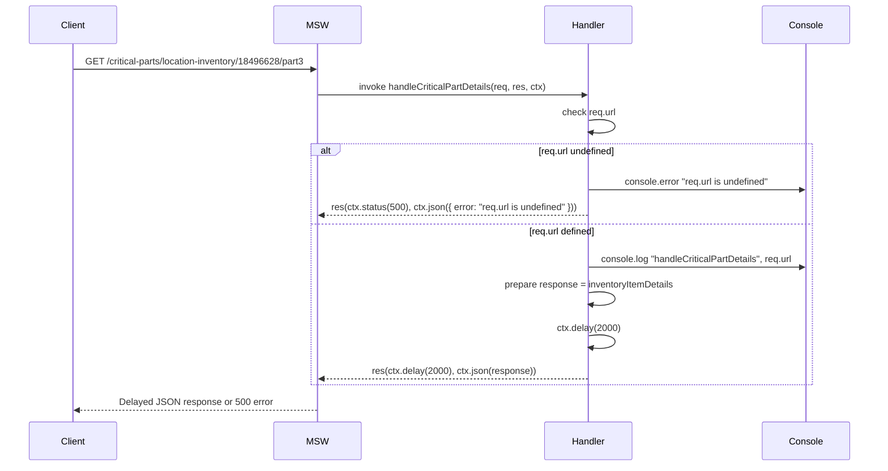
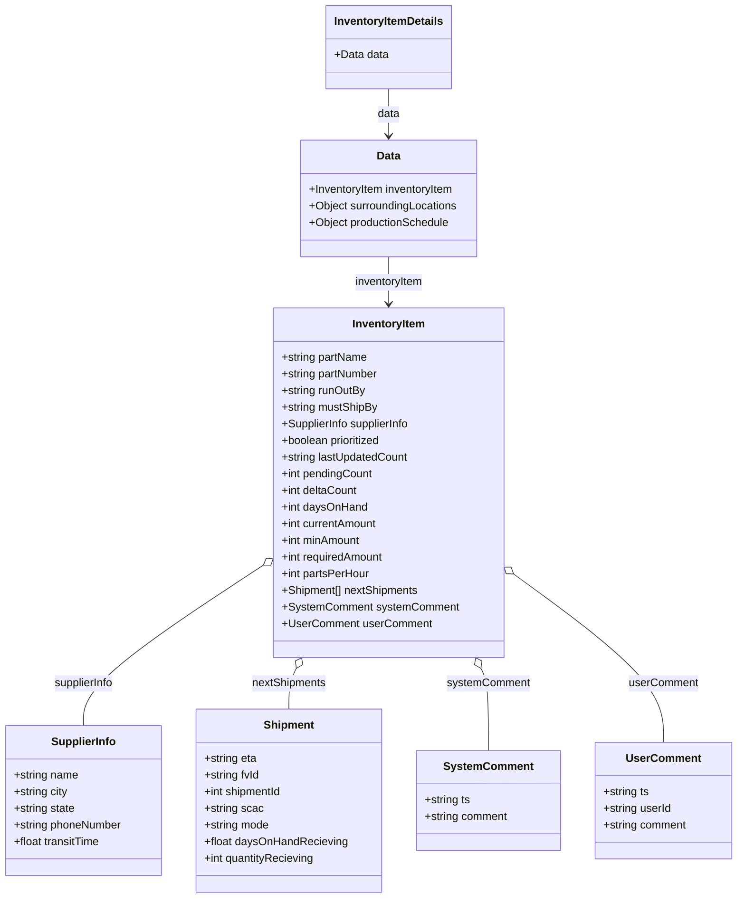

# Diagram: web/portal/src/mocks/handlers/critical-parts/critical-part-details.js

> Auto-generated by Obscura crawlers

## Diagram 1

### SVG

<svg id="container" width="1616" xmlns="http://www.w3.org/2000/svg" height="841" viewBox="-50 -10 1616 841" role="graphics-document document" aria-roledescription="sequence"><g><rect x="1366" y="755" fill="#eaeaea" stroke="#666" width="150" height="65" name="Console" rx="3" ry="3" class="actor actor-bottom"></rect><text x="1441" y="787.5" dominant-baseline="central" alignment-baseline="central" class="actor actor-box" style="text-anchor: middle; font-size: 16px; font-weight: 400;"><tspan x="1441" dy="0">Console</tspan></text></g><g><rect x="963" y="755" fill="#eaeaea" stroke="#666" width="150" height="65" name="Handler" rx="3" ry="3" class="actor actor-bottom"></rect><text x="1038" y="787.5" dominant-baseline="central" alignment-baseline="central" class="actor actor-box" style="text-anchor: middle; font-size: 16px; font-weight: 400;"><tspan x="1038" dy="0">Handler</tspan></text></g><g><rect x="463" y="755" fill="#eaeaea" stroke="#666" width="150" height="65" name="MSW" rx="3" ry="3" class="actor actor-bottom"></rect><text x="538" y="787.5" dominant-baseline="central" alignment-baseline="central" class="actor actor-box" style="text-anchor: middle; font-size: 16px; font-weight: 400;"><tspan x="538" dy="0">MSW</tspan></text></g><g><rect x="0" y="755" fill="#eaeaea" stroke="#666" width="150" height="65" name="Client" rx="3" ry="3" class="actor actor-bottom"></rect><text x="75" y="787.5" dominant-baseline="central" alignment-baseline="central" class="actor actor-box" style="text-anchor: middle; font-size: 16px; font-weight: 400;"><tspan x="75" dy="0">Client</tspan></text></g><g><line id="actor3" x1="1441" y1="65" x2="1441" y2="755" class="actor-line 200" stroke-width="0.5px" stroke="#999" name="Console"></line><g id="root-3"><rect x="1366" y="0" fill="#eaeaea" stroke="#666" width="150" height="65" name="Console" rx="3" ry="3" class="actor actor-top"></rect><text x="1441" y="32.5" dominant-baseline="central" alignment-baseline="central" class="actor actor-box" style="text-anchor: middle; font-size: 16px; font-weight: 400;"><tspan x="1441" dy="0">Console</tspan></text></g></g><g><line id="actor2" x1="1038" y1="65" x2="1038" y2="755" class="actor-line 200" stroke-width="0.5px" stroke="#999" name="Handler"></line><g id="root-2"><rect x="963" y="0" fill="#eaeaea" stroke="#666" width="150" height="65" name="Handler" rx="3" ry="3" class="actor actor-top"></rect><text x="1038" y="32.5" dominant-baseline="central" alignment-baseline="central" class="actor actor-box" style="text-anchor: middle; font-size: 16px; font-weight: 400;"><tspan x="1038" dy="0">Handler</tspan></text></g></g><g><line id="actor1" x1="538" y1="65" x2="538" y2="755" class="actor-line 200" stroke-width="0.5px" stroke="#999" name="MSW"></line><g id="root-1"><rect x="463" y="0" fill="#eaeaea" stroke="#666" width="150" height="65" name="MSW" rx="3" ry="3" class="actor actor-top"></rect><text x="538" y="32.5" dominant-baseline="central" alignment-baseline="central" class="actor actor-box" style="text-anchor: middle; font-size: 16px; font-weight: 400;"><tspan x="538" dy="0">MSW</tspan></text></g></g><g><line id="actor0" x1="75" y1="65" x2="75" y2="755" class="actor-line 200" stroke-width="0.5px" stroke="#999" name="Client"></line><g id="root-0"><rect x="0" y="0" fill="#eaeaea" stroke="#666" width="150" height="65" name="Client" rx="3" ry="3" class="actor actor-top"></rect><text x="75" y="32.5" dominant-baseline="central" alignment-baseline="central" class="actor actor-box" style="text-anchor: middle; font-size: 16px; font-weight: 400;"><tspan x="75" dy="0">Client</tspan></text></g></g><g></g><defs><symbol id="computer" width="24" height="24"><path transform="scale(.5)" d="M2 2v13h20v-13h-20zm18 11h-16v-9h16v9zm-10.228 6l.466-1h3.524l.467 1h-4.457zm14.228 3h-24l2-6h2.104l-1.33 4h18.45l-1.297-4h2.073l2 6zm-5-10h-14v-7h14v7z"></path></symbol></defs><defs><symbol id="database" fill-rule="evenodd" clip-rule="evenodd"><path transform="scale(.5)" d="M12.258.001l.256.004.255.005.253.008.251.01.249.012.247.015.246.016.242.019.241.02.239.023.236.024.233.027.231.028.229.031.225.032.223.034.22.036.217.038.214.04.211.041.208.043.205.045.201.046.198.048.194.05.191.051.187.053.183.054.18.056.175.057.172.059.168.06.163.061.16.063.155.064.15.066.074.033.073.033.071.034.07.034.069.035.068.035.067.035.066.035.064.036.064.036.062.036.06.036.06.037.058.037.058.037.055.038.055.038.053.038.052.038.051.039.05.039.048.039.047.039.045.04.044.04.043.04.041.04.04.041.039.041.037.041.036.041.034.041.033.042.032.042.03.042.029.042.027.042.026.043.024.043.023.043.021.043.02.043.018.044.017.043.015.044.013.044.012.044.011.045.009.044.007.045.006.045.004.045.002.045.001.045v17l-.001.045-.002.045-.004.045-.006.045-.007.045-.009.044-.011.045-.012.044-.013.044-.015.044-.017.043-.018.044-.02.043-.021.043-.023.043-.024.043-.026.043-.027.042-.029.042-.03.042-.032.042-.033.042-.034.041-.036.041-.037.041-.039.041-.04.041-.041.04-.043.04-.044.04-.045.04-.047.039-.048.039-.05.039-.051.039-.052.038-.053.038-.055.038-.055.038-.058.037-.058.037-.06.037-.06.036-.062.036-.064.036-.064.036-.066.035-.067.035-.068.035-.069.035-.07.034-.071.034-.073.033-.074.033-.15.066-.155.064-.16.063-.163.061-.168.06-.172.059-.175.057-.18.056-.183.054-.187.053-.191.051-.194.05-.198.048-.201.046-.205.045-.208.043-.211.041-.214.04-.217.038-.22.036-.223.034-.225.032-.229.031-.231.028-.233.027-.236.024-.239.023-.241.02-.242.019-.246.016-.247.015-.249.012-.251.01-.253.008-.255.005-.256.004-.258.001-.258-.001-.256-.004-.255-.005-.253-.008-.251-.01-.249-.012-.247-.015-.245-.016-.243-.019-.241-.02-.238-.023-.236-.024-.234-.027-.231-.028-.228-.031-.226-.032-.223-.034-.22-.036-.217-.038-.214-.04-.211-.041-.208-.043-.204-.045-.201-.046-.198-.048-.195-.05-.19-.051-.187-.053-.184-.054-.179-.056-.176-.057-.172-.059-.167-.06-.164-.061-.159-.063-.155-.064-.151-.066-.074-.033-.072-.033-.072-.034-.07-.034-.069-.035-.068-.035-.067-.035-.066-.035-.064-.036-.063-.036-.062-.036-.061-.036-.06-.037-.058-.037-.057-.037-.056-.038-.055-.038-.053-.038-.052-.038-.051-.039-.049-.039-.049-.039-.046-.039-.046-.04-.044-.04-.043-.04-.041-.04-.04-.041-.039-.041-.037-.041-.036-.041-.034-.041-.033-.042-.032-.042-.03-.042-.029-.042-.027-.042-.026-.043-.024-.043-.023-.043-.021-.043-.02-.043-.018-.044-.017-.043-.015-.044-.013-.044-.012-.044-.011-.045-.009-.044-.007-.045-.006-.045-.004-.045-.002-.045-.001-.045v-17l.001-.045.002-.045.004-.045.006-.045.007-.045.009-.044.011-.045.012-.044.013-.044.015-.044.017-.043.018-.044.02-.043.021-.043.023-.043.024-.043.026-.043.027-.042.029-.042.03-.042.032-.042.033-.042.034-.041.036-.041.037-.041.039-.041.04-.041.041-.04.043-.04.044-.04.046-.04.046-.039.049-.039.049-.039.051-.039.052-.038.053-.038.055-.038.056-.038.057-.037.058-.037.06-.037.061-.036.062-.036.063-.036.064-.036.066-.035.067-.035.068-.035.069-.035.07-.034.072-.034.072-.033.074-.033.151-.066.155-.064.159-.063.164-.061.167-.06.172-.059.176-.057.179-.056.184-.054.187-.053.19-.051.195-.05.198-.048.201-.046.204-.045.208-.043.211-.041.214-.04.217-.038.22-.036.223-.034.226-.032.228-.031.231-.028.234-.027.236-.024.238-.023.241-.02.243-.019.245-.016.247-.015.249-.012.251-.01.253-.008.255-.005.256-.004.258-.001.258.001zm-9.258 20.499v.01l.001.021.003.021.004.022.005.021.006.022.007.022.009.023.01.022.011.023.012.023.013.023.015.023.016.024.017.023.018.024.019.024.021.024.022.025.023.024.024.025.052.049.056.05.061.051.066.051.07.051.075.051.079.052.084.052.088.052.092.052.097.052.102.051.105.052.11.052.114.051.119.051.123.051.127.05.131.05.135.05.139.048.144.049.147.047.152.047.155.047.16.045.163.045.167.043.171.043.176.041.178.041.183.039.187.039.19.037.194.035.197.035.202.033.204.031.209.03.212.029.216.027.219.025.222.024.226.021.23.02.233.018.236.016.24.015.243.012.246.01.249.008.253.005.256.004.259.001.26-.001.257-.004.254-.005.25-.008.247-.011.244-.012.241-.014.237-.016.233-.018.231-.021.226-.021.224-.024.22-.026.216-.027.212-.028.21-.031.205-.031.202-.034.198-.034.194-.036.191-.037.187-.039.183-.04.179-.04.175-.042.172-.043.168-.044.163-.045.16-.046.155-.046.152-.047.148-.048.143-.049.139-.049.136-.05.131-.05.126-.05.123-.051.118-.052.114-.051.11-.052.106-.052.101-.052.096-.052.092-.052.088-.053.083-.051.079-.052.074-.052.07-.051.065-.051.06-.051.056-.05.051-.05.023-.024.023-.025.021-.024.02-.024.019-.024.018-.024.017-.024.015-.023.014-.024.013-.023.012-.023.01-.023.01-.022.008-.022.006-.022.006-.022.004-.022.004-.021.001-.021.001-.021v-4.127l-.077.055-.08.053-.083.054-.085.053-.087.052-.09.052-.093.051-.095.05-.097.05-.1.049-.102.049-.105.048-.106.047-.109.047-.111.046-.114.045-.115.045-.118.044-.12.043-.122.042-.124.042-.126.041-.128.04-.13.04-.132.038-.134.038-.135.037-.138.037-.139.035-.142.035-.143.034-.144.033-.147.032-.148.031-.15.03-.151.03-.153.029-.154.027-.156.027-.158.026-.159.025-.161.024-.162.023-.163.022-.165.021-.166.02-.167.019-.169.018-.169.017-.171.016-.173.015-.173.014-.175.013-.175.012-.177.011-.178.01-.179.008-.179.008-.181.006-.182.005-.182.004-.184.003-.184.002h-.37l-.184-.002-.184-.003-.182-.004-.182-.005-.181-.006-.179-.008-.179-.008-.178-.01-.176-.011-.176-.012-.175-.013-.173-.014-.172-.015-.171-.016-.17-.017-.169-.018-.167-.019-.166-.02-.165-.021-.163-.022-.162-.023-.161-.024-.159-.025-.157-.026-.156-.027-.155-.027-.153-.029-.151-.03-.15-.03-.148-.031-.146-.032-.145-.033-.143-.034-.141-.035-.14-.035-.137-.037-.136-.037-.134-.038-.132-.038-.13-.04-.128-.04-.126-.041-.124-.042-.122-.042-.12-.044-.117-.043-.116-.045-.113-.045-.112-.046-.109-.047-.106-.047-.105-.048-.102-.049-.1-.049-.097-.05-.095-.05-.093-.052-.09-.051-.087-.052-.085-.053-.083-.054-.08-.054-.077-.054v4.127zm0-5.654v.011l.001.021.003.021.004.021.005.022.006.022.007.022.009.022.01.022.011.023.012.023.013.023.015.024.016.023.017.024.018.024.019.024.021.024.022.024.023.025.024.024.052.05.056.05.061.05.066.051.07.051.075.052.079.051.084.052.088.052.092.052.097.052.102.052.105.052.11.051.114.051.119.052.123.05.127.051.131.05.135.049.139.049.144.048.147.048.152.047.155.046.16.045.163.045.167.044.171.042.176.042.178.04.183.04.187.038.19.037.194.036.197.034.202.033.204.032.209.03.212.028.216.027.219.025.222.024.226.022.23.02.233.018.236.016.24.014.243.012.246.01.249.008.253.006.256.003.259.001.26-.001.257-.003.254-.006.25-.008.247-.01.244-.012.241-.015.237-.016.233-.018.231-.02.226-.022.224-.024.22-.025.216-.027.212-.029.21-.03.205-.032.202-.033.198-.035.194-.036.191-.037.187-.039.183-.039.179-.041.175-.042.172-.043.168-.044.163-.045.16-.045.155-.047.152-.047.148-.048.143-.048.139-.05.136-.049.131-.05.126-.051.123-.051.118-.051.114-.052.11-.052.106-.052.101-.052.096-.052.092-.052.088-.052.083-.052.079-.052.074-.051.07-.052.065-.051.06-.05.056-.051.051-.049.023-.025.023-.024.021-.025.02-.024.019-.024.018-.024.017-.024.015-.023.014-.023.013-.024.012-.022.01-.023.01-.023.008-.022.006-.022.006-.022.004-.021.004-.022.001-.021.001-.021v-4.139l-.077.054-.08.054-.083.054-.085.052-.087.053-.09.051-.093.051-.095.051-.097.05-.1.049-.102.049-.105.048-.106.047-.109.047-.111.046-.114.045-.115.044-.118.044-.12.044-.122.042-.124.042-.126.041-.128.04-.13.039-.132.039-.134.038-.135.037-.138.036-.139.036-.142.035-.143.033-.144.033-.147.033-.148.031-.15.03-.151.03-.153.028-.154.028-.156.027-.158.026-.159.025-.161.024-.162.023-.163.022-.165.021-.166.02-.167.019-.169.018-.169.017-.171.016-.173.015-.173.014-.175.013-.175.012-.177.011-.178.009-.179.009-.179.007-.181.007-.182.005-.182.004-.184.003-.184.002h-.37l-.184-.002-.184-.003-.182-.004-.182-.005-.181-.007-.179-.007-.179-.009-.178-.009-.176-.011-.176-.012-.175-.013-.173-.014-.172-.015-.171-.016-.17-.017-.169-.018-.167-.019-.166-.02-.165-.021-.163-.022-.162-.023-.161-.024-.159-.025-.157-.026-.156-.027-.155-.028-.153-.028-.151-.03-.15-.03-.148-.031-.146-.033-.145-.033-.143-.033-.141-.035-.14-.036-.137-.036-.136-.037-.134-.038-.132-.039-.13-.039-.128-.04-.126-.041-.124-.042-.122-.043-.12-.043-.117-.044-.116-.044-.113-.046-.112-.046-.109-.046-.106-.047-.105-.048-.102-.049-.1-.049-.097-.05-.095-.051-.093-.051-.09-.051-.087-.053-.085-.052-.083-.054-.08-.054-.077-.054v4.139zm0-5.666v.011l.001.02.003.022.004.021.005.022.006.021.007.022.009.023.01.022.011.023.012.023.013.023.015.023.016.024.017.024.018.023.019.024.021.025.022.024.023.024.024.025.052.05.056.05.061.05.066.051.07.051.075.052.079.051.084.052.088.052.092.052.097.052.102.052.105.051.11.052.114.051.119.051.123.051.127.05.131.05.135.05.139.049.144.048.147.048.152.047.155.046.16.045.163.045.167.043.171.043.176.042.178.04.183.04.187.038.19.037.194.036.197.034.202.033.204.032.209.03.212.028.216.027.219.025.222.024.226.021.23.02.233.018.236.017.24.014.243.012.246.01.249.008.253.006.256.003.259.001.26-.001.257-.003.254-.006.25-.008.247-.01.244-.013.241-.014.237-.016.233-.018.231-.02.226-.022.224-.024.22-.025.216-.027.212-.029.21-.03.205-.032.202-.033.198-.035.194-.036.191-.037.187-.039.183-.039.179-.041.175-.042.172-.043.168-.044.163-.045.16-.045.155-.047.152-.047.148-.048.143-.049.139-.049.136-.049.131-.051.126-.05.123-.051.118-.052.114-.051.11-.052.106-.052.101-.052.096-.052.092-.052.088-.052.083-.052.079-.052.074-.052.07-.051.065-.051.06-.051.056-.05.051-.049.023-.025.023-.025.021-.024.02-.024.019-.024.018-.024.017-.024.015-.023.014-.024.013-.023.012-.023.01-.022.01-.023.008-.022.006-.022.006-.022.004-.022.004-.021.001-.021.001-.021v-4.153l-.077.054-.08.054-.083.053-.085.053-.087.053-.09.051-.093.051-.095.051-.097.05-.1.049-.102.048-.105.048-.106.048-.109.046-.111.046-.114.046-.115.044-.118.044-.12.043-.122.043-.124.042-.126.041-.128.04-.13.039-.132.039-.134.038-.135.037-.138.036-.139.036-.142.034-.143.034-.144.033-.147.032-.148.032-.15.03-.151.03-.153.028-.154.028-.156.027-.158.026-.159.024-.161.024-.162.023-.163.023-.165.021-.166.02-.167.019-.169.018-.169.017-.171.016-.173.015-.173.014-.175.013-.175.012-.177.01-.178.01-.179.009-.179.007-.181.006-.182.006-.182.004-.184.003-.184.001-.185.001-.185-.001-.184-.001-.184-.003-.182-.004-.182-.006-.181-.006-.179-.007-.179-.009-.178-.01-.176-.01-.176-.012-.175-.013-.173-.014-.172-.015-.171-.016-.17-.017-.169-.018-.167-.019-.166-.02-.165-.021-.163-.023-.162-.023-.161-.024-.159-.024-.157-.026-.156-.027-.155-.028-.153-.028-.151-.03-.15-.03-.148-.032-.146-.032-.145-.033-.143-.034-.141-.034-.14-.036-.137-.036-.136-.037-.134-.038-.132-.039-.13-.039-.128-.041-.126-.041-.124-.041-.122-.043-.12-.043-.117-.044-.116-.044-.113-.046-.112-.046-.109-.046-.106-.048-.105-.048-.102-.048-.1-.05-.097-.049-.095-.051-.093-.051-.09-.052-.087-.052-.085-.053-.083-.053-.08-.054-.077-.054v4.153zm8.74-8.179l-.257.004-.254.005-.25.008-.247.011-.244.012-.241.014-.237.016-.233.018-.231.021-.226.022-.224.023-.22.026-.216.027-.212.028-.21.031-.205.032-.202.033-.198.034-.194.036-.191.038-.187.038-.183.04-.179.041-.175.042-.172.043-.168.043-.163.045-.16.046-.155.046-.152.048-.148.048-.143.048-.139.049-.136.05-.131.05-.126.051-.123.051-.118.051-.114.052-.11.052-.106.052-.101.052-.096.052-.092.052-.088.052-.083.052-.079.052-.074.051-.07.052-.065.051-.06.05-.056.05-.051.05-.023.025-.023.024-.021.024-.02.025-.019.024-.018.024-.017.023-.015.024-.014.023-.013.023-.012.023-.01.023-.01.022-.008.022-.006.023-.006.021-.004.022-.004.021-.001.021-.001.021.001.021.001.021.004.021.004.022.006.021.006.023.008.022.01.022.01.023.012.023.013.023.014.023.015.024.017.023.018.024.019.024.02.025.021.024.023.024.023.025.051.05.056.05.06.05.065.051.07.052.074.051.079.052.083.052.088.052.092.052.096.052.101.052.106.052.11.052.114.052.118.051.123.051.126.051.131.05.136.05.139.049.143.048.148.048.152.048.155.046.16.046.163.045.168.043.172.043.175.042.179.041.183.04.187.038.191.038.194.036.198.034.202.033.205.032.21.031.212.028.216.027.22.026.224.023.226.022.231.021.233.018.237.016.241.014.244.012.247.011.25.008.254.005.257.004.26.001.26-.001.257-.004.254-.005.25-.008.247-.011.244-.012.241-.014.237-.016.233-.018.231-.021.226-.022.224-.023.22-.026.216-.027.212-.028.21-.031.205-.032.202-.033.198-.034.194-.036.191-.038.187-.038.183-.04.179-.041.175-.042.172-.043.168-.043.163-.045.16-.046.155-.046.152-.048.148-.048.143-.048.139-.049.136-.05.131-.05.126-.051.123-.051.118-.051.114-.052.11-.052.106-.052.101-.052.096-.052.092-.052.088-.052.083-.052.079-.052.074-.051.07-.052.065-.051.06-.05.056-.05.051-.05.023-.025.023-.024.021-.024.02-.025.019-.024.018-.024.017-.023.015-.024.014-.023.013-.023.012-.023.01-.023.01-.022.008-.022.006-.023.006-.021.004-.022.004-.021.001-.021.001-.021-.001-.021-.001-.021-.004-.021-.004-.022-.006-.021-.006-.023-.008-.022-.01-.022-.01-.023-.012-.023-.013-.023-.014-.023-.015-.024-.017-.023-.018-.024-.019-.024-.02-.025-.021-.024-.023-.024-.023-.025-.051-.05-.056-.05-.06-.05-.065-.051-.07-.052-.074-.051-.079-.052-.083-.052-.088-.052-.092-.052-.096-.052-.101-.052-.106-.052-.11-.052-.114-.052-.118-.051-.123-.051-.126-.051-.131-.05-.136-.05-.139-.049-.143-.048-.148-.048-.152-.048-.155-.046-.16-.046-.163-.045-.168-.043-.172-.043-.175-.042-.179-.041-.183-.04-.187-.038-.191-.038-.194-.036-.198-.034-.202-.033-.205-.032-.21-.031-.212-.028-.216-.027-.22-.026-.224-.023-.226-.022-.231-.021-.233-.018-.237-.016-.241-.014-.244-.012-.247-.011-.25-.008-.254-.005-.257-.004-.26-.001-.26.001z"></path></symbol></defs><defs><symbol id="clock" width="24" height="24"><path transform="scale(.5)" d="M12 2c5.514 0 10 4.486 10 10s-4.486 10-10 10-10-4.486-10-10 4.486-10 10-10zm0-2c-6.627 0-12 5.373-12 12s5.373 12 12 12 12-5.373 12-12-5.373-12-12-12zm5.848 12.459c.202.038.202.333.001.372-1.907.361-6.045 1.111-6.547 1.111-.719 0-1.301-.582-1.301-1.301 0-.512.77-5.447 1.125-7.445.034-.192.312-.181.343.014l.985 6.238 5.394 1.011z"></path></symbol></defs><defs><marker id="arrowhead" refX="7.9" refY="5" markerUnits="userSpaceOnUse" markerWidth="12" markerHeight="12" orient="auto-start-reverse"><path d="M -1 0 L 10 5 L 0 10 z"></path></marker></defs><defs><marker id="crosshead" markerWidth="15" markerHeight="8" orient="auto" refX="4" refY="4.5"><path fill="none" stroke="#000000" stroke-width="1pt" d="M 1,2 L 6,7 M 6,2 L 1,7" style="stroke-dasharray: 0, 0;"></path></marker></defs><defs><marker id="filled-head" refX="15.5" refY="7" markerWidth="20" markerHeight="28" orient="auto"><path d="M 18,7 L9,13 L14,7 L9,1 Z"></path></marker></defs><defs><marker id="sequencenumber" refX="15" refY="15" markerWidth="60" markerHeight="40" orient="auto"><circle cx="15" cy="15" r="6"></circle></marker></defs><g><line x1="527" y1="249" x2="1452" y2="249" class="loopLine"></line><line x1="1452" y1="249" x2="1452" y2="687" class="loopLine"></line><line x1="527" y1="687" x2="1452" y2="687" class="loopLine"></line><line x1="527" y1="249" x2="527" y2="687" class="loopLine"></line><line x1="527" y1="395" x2="1452" y2="395" class="loopLine" style="stroke-dasharray: 3, 3;"></line><polygon points="527,249 577,249 577,262 568.6,269 527,269" class="labelBox"></polygon><text x="552" y="262" text-anchor="middle" dominant-baseline="middle" alignment-baseline="middle" class="labelText" style="font-size: 16px; font-weight: 400;">alt</text><text x="1014.5" y="267" text-anchor="middle" class="loopText" style="font-size: 16px; font-weight: 400;"><tspan x="1014.5">[req.url undefined]</tspan></text><text x="989.5" y="413" text-anchor="middle" class="loopText" style="font-size: 16px; font-weight: 400;">[req.url defined]</text></g><text x="305" y="80" text-anchor="middle" dominant-baseline="middle" alignment-baseline="middle" class="messageText" dy="1em" style="font-size: 16px; font-weight: 400;">GET /critical-parts/location-inventory/18496628/part3</text><line x1="76" y1="113" x2="534" y2="113" class="messageLine0" stroke-width="2" stroke="none" marker-end="url(#arrowhead)" style="fill: none;"></line><text x="787" y="128" text-anchor="middle" dominant-baseline="middle" alignment-baseline="middle" class="messageText" dy="1em" style="font-size: 16px; font-weight: 400;">invoke handleCriticalPartDetails(req, res, ctx)</text><line x1="539" y1="161" x2="1034" y2="161" class="messageLine0" stroke-width="2" stroke="none" marker-end="url(#arrowhead)" style="fill: none;"></line><text x="1039" y="176" text-anchor="middle" dominant-baseline="middle" alignment-baseline="middle" class="messageText" dy="1em" style="font-size: 16px; font-weight: 400;">check req.url</text><path d="M 1039,209 C 1099,199 1099,239 1039,229" class="messageLine0" stroke-width="2" stroke="none" marker-end="url(#arrowhead)" style="fill: none;"></path><text x="1238" y="299" text-anchor="middle" dominant-baseline="middle" alignment-baseline="middle" class="messageText" dy="1em" style="font-size: 16px; font-weight: 400;">console.error "req.url is undefined"</text><line x1="1039" y1="332" x2="1437" y2="332" class="messageLine0" stroke-width="2" stroke="none" marker-end="url(#arrowhead)" style="fill: none;"></line><text x="790" y="347" text-anchor="middle" dominant-baseline="middle" alignment-baseline="middle" class="messageText" dy="1em" style="font-size: 16px; font-weight: 400;">res(ctx.status(500), ctx.json({ error: "req.url is undefined" }))</text><line x1="1037" y1="380" x2="542" y2="380" class="messageLine1" stroke-width="2" stroke="none" marker-end="url(#arrowhead)" style="stroke-dasharray: 3, 3; fill: none;"></line><text x="1238" y="440" text-anchor="middle" dominant-baseline="middle" alignment-baseline="middle" class="messageText" dy="1em" style="font-size: 16px; font-weight: 400;">console.log "handleCriticalPartDetails", req.url</text><line x1="1039" y1="473" x2="1437" y2="473" class="messageLine0" stroke-width="2" stroke="none" marker-end="url(#arrowhead)" style="fill: none;"></line><text x="1039" y="488" text-anchor="middle" dominant-baseline="middle" alignment-baseline="middle" class="messageText" dy="1em" style="font-size: 16px; font-weight: 400;">prepare response = inventoryItemDetails</text><path d="M 1039,521 C 1099,511 1099,551 1039,541" class="messageLine0" stroke-width="2" stroke="none" marker-end="url(#arrowhead)" style="fill: none;"></path><text x="1039" y="566" text-anchor="middle" dominant-baseline="middle" alignment-baseline="middle" class="messageText" dy="1em" style="font-size: 16px; font-weight: 400;">ctx.delay(2000)</text><path d="M 1039,599 C 1099,589 1099,629 1039,619" class="messageLine0" stroke-width="2" stroke="none" marker-end="url(#arrowhead)" style="fill: none;"></path><text x="790" y="644" text-anchor="middle" dominant-baseline="middle" alignment-baseline="middle" class="messageText" dy="1em" style="font-size: 16px; font-weight: 400;">res(ctx.delay(2000), ctx.json(response))</text><line x1="1037" y1="677" x2="542" y2="677" class="messageLine1" stroke-width="2" stroke="none" marker-end="url(#arrowhead)" style="stroke-dasharray: 3, 3; fill: none;"></line><text x="308" y="702" text-anchor="middle" dominant-baseline="middle" alignment-baseline="middle" class="messageText" dy="1em" style="font-size: 16px; font-weight: 400;">Delayed JSON response or 500 error</text><line x1="537" y1="735" x2="79" y2="735" class="messageLine1" stroke-width="2" stroke="none" marker-end="url(#arrowhead)" style="stroke-dasharray: 3, 3; fill: none;"></line></svg>

## Diagram 2

### SVG

<svg id="container" width="1063.7265625" xmlns="http://www.w3.org/2000/svg" class="classDiagram" height="1294" viewBox="0 0 1063.7265625 1294" role="graphics-document document" aria-roledescription="class"><g><defs><marker id="container_class-aggregationStart" class="marker aggregation class" refX="18" refY="7" markerWidth="190" markerHeight="240" orient="auto"><path d="M 18,7 L9,13 L1,7 L9,1 Z"></path></marker></defs><defs><marker id="container_class-aggregationEnd" class="marker aggregation class" refX="1" refY="7" markerWidth="20" markerHeight="28" orient="auto"><path d="M 18,7 L9,13 L1,7 L9,1 Z"></path></marker></defs><defs><marker id="container_class-extensionStart" class="marker extension class" refX="18" refY="7" markerWidth="190" markerHeight="240" orient="auto"><path d="M 1,7 L18,13 V 1 Z"></path></marker></defs><defs><marker id="container_class-extensionEnd" class="marker extension class" refX="1" refY="7" markerWidth="20" markerHeight="28" orient="auto"><path d="M 1,1 V 13 L18,7 Z"></path></marker></defs><defs><marker id="container_class-compositionStart" class="marker composition class" refX="18" refY="7" markerWidth="190" markerHeight="240" orient="auto"><path d="M 18,7 L9,13 L1,7 L9,1 Z"></path></marker></defs><defs><marker id="container_class-compositionEnd" class="marker composition class" refX="1" refY="7" markerWidth="20" markerHeight="28" orient="auto"><path d="M 18,7 L9,13 L1,7 L9,1 Z"></path></marker></defs><defs><marker id="container_class-dependencyStart" class="marker dependency class" refX="6" refY="7" markerWidth="190" markerHeight="240" orient="auto"><path d="M 5,7 L9,13 L1,7 L9,1 Z"></path></marker></defs><defs><marker id="container_class-dependencyEnd" class="marker dependency class" refX="13" refY="7" markerWidth="20" markerHeight="28" orient="auto"><path d="M 18,7 L9,13 L14,7 L9,1 Z"></path></marker></defs><defs><marker id="container_class-lollipopStart" class="marker lollipop class" refX="13" refY="7" markerWidth="190" markerHeight="240" orient="auto"><circle stroke="black" fill="transparent" cx="7" cy="7" r="6"></circle></marker></defs><defs><marker id="container_class-lollipopEnd" class="marker lollipop class" refX="1" refY="7" markerWidth="190" markerHeight="240" orient="auto"><circle stroke="black" fill="transparent" cx="7" cy="7" r="6"></circle></marker></defs><g class="root"><g class="clusters"></g><g class="edgePaths"><path d="M561.771,128L561.771,134.167C561.771,140.333,561.771,152.667,561.771,164C561.771,175.333,561.771,185.667,561.771,190.833L561.771,196" id="id_InventoryItemDetails_Data_1" class="edge-thickness-normal edge-pattern-solid relation" style=";;;" data-edge="true" data-et="edge" data-id="id_InventoryItemDetails_Data_1" data-points="W3sieCI6NTYxLjc3MTQ4NDM3NSwieSI6MTI4fSx7IngiOjU2MS43NzE0ODQzNzUsInkiOjE2NX0seyJ4Ijo1NjEuNzcxNDg0Mzc1LCJ5IjoyMDJ9XQ==" marker-end="url(#container_class-dependencyEnd)"></path><path d="M561.771,370L561.771,376.167C561.771,382.333,561.771,394.667,561.771,406C561.771,417.333,561.771,427.667,561.771,432.833L561.771,438" id="id_Data_InventoryItem_2" class="edge-thickness-normal edge-pattern-solid relation" style=";;;" data-edge="true" data-et="edge" data-id="id_Data_InventoryItem_2" data-points="W3sieCI6NTYxLjc3MTQ4NDM3NSwieSI6MzcwfSx7IngiOjU2MS43NzE0ODQzNzUsInkiOjQwN30seyJ4Ijo1NjEuNzcxNDg0Mzc1LCJ5Ijo0NDR9XQ==" marker-end="url(#container_class-dependencyEnd)"></path><path d="M383.488,813.147L339.898,841.789C296.308,870.431,209.129,927.716,165.539,966.525C121.949,1005.333,121.949,1025.667,121.949,1035.833L121.949,1046" id="id_InventoryItem_SupplierInfo_3" class="edge-thickness-normal edge-pattern-solid relation" style=";;;" data-edge="true" data-et="edge" data-id="id_InventoryItem_SupplierInfo_3" data-points="W3sieCI6Mzk3LjkwNDI5Njg3NSwieSI6ODAzLjY3NDQ0MjM1NzMwODd9LHsieCI6MTIxLjk0OTIxODc1LCJ5Ijo5ODV9LHsieCI6MTIxLjk0OTIxODc1LCJ5IjoxMDQ2fV0=" marker-start="url(#container_class-aggregationStart)"></path><path d="M429.295,963.458L427.517,967.048C425.738,970.638,422.182,977.819,420.403,987.576C418.625,997.333,418.625,1009.667,418.625,1015.833L418.625,1022" id="id_InventoryItem_Shipment_4" class="edge-thickness-normal edge-pattern-solid relation" style=";;;" data-edge="true" data-et="edge" data-id="id_InventoryItem_Shipment_4" data-points="W3sieCI6NDM2Ljk1MTcxMjUzMjQzOTQ0LCJ5Ijo5NDh9LHsieCI6NDE4LjYyNSwieSI6OTg1fSx7IngiOjQxOC42MjUsInkiOjEwMjJ9XQ==" marker-start="url(#container_class-aggregationStart)"></path><path d="M694.248,963.458L696.026,967.048C697.804,970.638,701.361,977.819,703.14,997.576C704.918,1017.333,704.918,1049.667,704.918,1065.833L704.918,1082" id="id_InventoryItem_SystemComment_5" class="edge-thickness-normal edge-pattern-solid relation" style=";;;" data-edge="true" data-et="edge" data-id="id_InventoryItem_SystemComment_5" data-points="W3sieCI6Njg2LjU5MTI1NjIxNzU2MDYsInkiOjk0OH0seyJ4Ijo3MDQuOTE3OTY4NzUsInkiOjk4NX0seyJ4Ijo3MDQuOTE3OTY4NzUsInkiOjEwODJ9XQ==" marker-start="url(#container_class-aggregationStart)"></path><path d="M739.564,825.972L775.821,852.476C812.078,878.981,884.592,931.991,920.849,972.662C957.105,1013.333,957.105,1041.667,957.105,1055.833L957.105,1070" id="id_InventoryItem_UserComment_6" class="edge-thickness-normal edge-pattern-solid relation" style=";;;" data-edge="true" data-et="edge" data-id="id_InventoryItem_UserComment_6" data-points="W3sieCI6NzI1LjYzODY3MTg3NSwieSI6ODE1Ljc5MTQxNDQ5ODIyNH0seyJ4Ijo5NTcuMTA1NDY4NzUsInkiOjk4NX0seyJ4Ijo5NTcuMTA1NDY4NzUsInkiOjEwNzB9XQ==" marker-start="url(#container_class-aggregationStart)"></path></g><g class="edgeLabels"><g class="edgeLabel" transform="translate(561.771484375, 165)"><g class="label" data-id="id_InventoryItemDetails_Data_1" transform="translate(-16.3203125, -12)"><foreignObject width="32.640625" height="24">

data

</foreignObject></g></g><g class="edgeLabel" transform="translate(561.771484375, 407)"><g class="label" data-id="id_Data_InventoryItem_2" transform="translate(-50.6484375, -12)"><foreignObject width="101.296875" height="24">

inventoryItem

</foreignObject></g></g><g class="edgeLabel" transform="translate(121.94921875, 985)"><g class="label" data-id="id_InventoryItem_SupplierInfo_3" transform="translate(-44.265625, -12)"><foreignObject width="88.53125" height="24">

supplierInfo

</foreignObject></g></g><g class="edgeLabel" transform="translate(418.625, 985)"><g class="label" data-id="id_InventoryItem_Shipment_4" transform="translate(-54.328125, -12)"><foreignObject width="108.65625" height="24">

nextShipments

</foreignObject></g></g><g class="edgeLabel" transform="translate(704.91796875, 985)"><g class="label" data-id="id_InventoryItem_SystemComment_5" transform="translate(-59.84375, -12)"><foreignObject width="119.6875" height="24">

systemComment

</foreignObject></g></g><g class="edgeLabel" transform="translate(957.10546875, 985)"><g class="label" data-id="id_InventoryItem_UserComment_6" transform="translate(-50.484375, -12)"><foreignObject width="100.96875" height="24">

userComment

</foreignObject></g></g></g><g class="nodes"><g class="node default" id="classId-InventoryItemDetails-0" transform="translate(561.771484375, 68)"><g class="basic label-container"><path d="M-89.50390625 -60 L89.50390625 -60 L89.50390625 60 L-89.50390625 60" stroke="none" stroke-width="0" fill="#ECECFF" style=""></path><path d="M-89.50390625 -60 C-51.7008363429702 -60, -13.897766435940397 -60, 89.50390625 -60 M-89.50390625 -60 C-20.131378582647955 -60, 49.24114908470409 -60, 89.50390625 -60 M89.50390625 -60 C89.50390625 -14.918839375080331, 89.50390625 30.162321249839337, 89.50390625 60 M89.50390625 -60 C89.50390625 -30.785339972371847, 89.50390625 -1.570679944743695, 89.50390625 60 M89.50390625 60 C39.17827164506829 60, -11.147362959863415 60, -89.50390625 60 M89.50390625 60 C33.32747730590923 60, -22.848951638181546 60, -89.50390625 60 M-89.50390625 60 C-89.50390625 28.682183247650645, -89.50390625 -2.63563350469871, -89.50390625 -60 M-89.50390625 60 C-89.50390625 20.248052217711333, -89.50390625 -19.503895564577334, -89.50390625 -60" stroke="#9370DB" stroke-width="1.3" fill="none" stroke-dasharray="0 0" style=""></path></g><g class="annotation-group text" transform="translate(0, -36)"></g><g class="label-group text" transform="translate(-76.9140625, -36)"><g class="label" style="font-weight: bolder" transform="translate(0,-12)"><foreignObject width="153.828125" height="24">

InventoryItemDetails

</foreignObject></g></g><g class="members-group text" transform="translate(-77.50390625, 12)"><g class="label" style="" transform="translate(0,-12)"><foreignObject width="78.09375" height="24">

+Data data

</foreignObject></g></g><g class="methods-group text" transform="translate(-77.50390625, 60)"></g><g class="divider" style=""><path d="M-89.50390625 -12 C-32.0262686388901 -12, 25.451368972219797 -12, 89.50390625 -12 M-89.50390625 -12 C-25.3584514876288 -12, 38.7870032747424 -12, 89.50390625 -12" stroke="#9370DB" stroke-width="1.3" fill="none" stroke-dasharray="0 0" style=""></path></g><g class="divider" style=""><path d="M-89.50390625 36 C-34.68537232637851 36, 20.133161597242974 36, 89.50390625 36 M-89.50390625 36 C-39.74255939799545 36, 10.0187874540091 36, 89.50390625 36" stroke="#9370DB" stroke-width="1.3" fill="none" stroke-dasharray="0 0" style=""></path></g></g><g class="node default" id="classId-Data-1" transform="translate(561.771484375, 286)"><g class="basic label-container"><path d="M-129.1875 -84 L129.1875 -84 L129.1875 84 L-129.1875 84" stroke="none" stroke-width="0" fill="#ECECFF" style=""></path><path d="M-129.1875 -84 C-55.86249088860502 -84, 17.462518222789953 -84, 129.1875 -84 M-129.1875 -84 C-69.4072819312168 -84, -9.627063862433616 -84, 129.1875 -84 M129.1875 -84 C129.1875 -47.401172295446784, 129.1875 -10.802344590893568, 129.1875 84 M129.1875 -84 C129.1875 -44.08193799853172, 129.1875 -4.1638759970634425, 129.1875 84 M129.1875 84 C35.411801959850465 84, -58.36389608029907 84, -129.1875 84 M129.1875 84 C61.48071349828692 84, -6.2260730034261655 84, -129.1875 84 M-129.1875 84 C-129.1875 26.520409477126748, -129.1875 -30.959181045746504, -129.1875 -84 M-129.1875 84 C-129.1875 44.67010666930305, -129.1875 5.340213338606105, -129.1875 -84" stroke="#9370DB" stroke-width="1.3" fill="none" stroke-dasharray="0 0" style=""></path></g><g class="annotation-group text" transform="translate(0, -60)"></g><g class="label-group text" transform="translate(-16.890625, -60)"><g class="label" style="font-weight: bolder" transform="translate(0,-12)"><foreignObject width="33.78125" height="24">

Data

</foreignObject></g></g><g class="members-group text" transform="translate(-117.1875, -12)"><g class="label" style="" transform="translate(0,-12)"><foreignObject width="215.03125" height="24">

+InventoryItem inventoryItem

</foreignObject></g><g class="label" style="" transform="translate(0,12)"><foreignObject width="217.484375" height="24">

+Object surroundingLocations

</foreignObject></g><g class="label" style="" transform="translate(0,36)"><foreignObject width="206.1875" height="24">

+Object productionSchedule

</foreignObject></g></g><g class="methods-group text" transform="translate(-117.1875, 84)"></g><g class="divider" style=""><path d="M-129.1875 -36 C-41.201763287742295 -36, 46.78397342451541 -36, 129.1875 -36 M-129.1875 -36 C-61.35925635956379 -36, 6.468987280872426 -36, 129.1875 -36" stroke="#9370DB" stroke-width="1.3" fill="none" stroke-dasharray="0 0" style=""></path></g><g class="divider" style=""><path d="M-129.1875 60 C-56.53850998504464 60, 16.11048002991072 60, 129.1875 60 M-129.1875 60 C-29.674891724684542 60, 69.83771655063092 60, 129.1875 60" stroke="#9370DB" stroke-width="1.3" fill="none" stroke-dasharray="0 0" style=""></path></g></g><g class="node default" id="classId-InventoryItem-2" transform="translate(561.771484375, 696)"><g class="basic label-container"><path d="M-163.8671875 -252 L163.8671875 -252 L163.8671875 252 L-163.8671875 252" stroke="none" stroke-width="0" fill="#ECECFF" style=""></path><path d="M-163.8671875 -252 C-59.748220938038955 -252, 44.37074562392209 -252, 163.8671875 -252 M-163.8671875 -252 C-38.454470307908935 -252, 86.95824688418213 -252, 163.8671875 -252 M163.8671875 -252 C163.8671875 -103.35653119363442, 163.8671875 45.28693761273115, 163.8671875 252 M163.8671875 -252 C163.8671875 -122.67253022452331, 163.8671875 6.654939550953372, 163.8671875 252 M163.8671875 252 C79.14769812411673 252, -5.571791251766541 252, -163.8671875 252 M163.8671875 252 C83.85993897574299 252, 3.8526904514859837 252, -163.8671875 252 M-163.8671875 252 C-163.8671875 134.4648291601574, -163.8671875 16.929658320314786, -163.8671875 -252 M-163.8671875 252 C-163.8671875 148.73368848535824, -163.8671875 45.46737697071646, -163.8671875 -252" stroke="#9370DB" stroke-width="1.3" fill="none" stroke-dasharray="0 0" style=""></path></g><g class="annotation-group text" transform="translate(0, -228)"></g><g class="label-group text" transform="translate(-51.421875, -228)"><g class="label" style="font-weight: bolder" transform="translate(0,-12)"><foreignObject width="102.84375" height="24">

InventoryItem

</foreignObject></g></g><g class="members-group text" transform="translate(-151.8671875, -180)"><g class="label" style="" transform="translate(0,-12)"><foreignObject width="125.921875" height="24">

+string partName

</foreignObject></g><g class="label" style="" transform="translate(0,12)"><foreignObject width="142.21875" height="24">

+string partNumber

</foreignObject></g><g class="label" style="" transform="translate(0,36)"><foreignObject width="122.484375" height="24">

+string runOutBy

</foreignObject></g><g class="label" style="" transform="translate(0,60)"><foreignObject width="139.84375" height="24">

+string mustShipBy

</foreignObject></g><g class="label" style="" transform="translate(0,84)"><foreignObject width="189.890625" height="24">

+SupplierInfo supplierInfo

</foreignObject></g><g class="label" style="" transform="translate(0,108)"><foreignObject width="147.359375" height="24">

+boolean prioritized

</foreignObject></g><g class="label" style="" transform="translate(0,132)"><foreignObject width="184.90625" height="24">

+string lastUpdatedCount

</foreignObject></g><g class="label" style="" transform="translate(0,156)"><foreignObject width="133.71875" height="24">

+int pendingCount

</foreignObject></g><g class="label" style="" transform="translate(0,180)"><foreignObject width="111.6875" height="24">

+int deltaCount

</foreignObject></g><g class="label" style="" transform="translate(0,204)"><foreignObject width="124.140625" height="24">

+int daysOnHand

</foreignObject></g><g class="label" style="" transform="translate(0,228)"><foreignObject width="141.125" height="24">

+int currentAmount

</foreignObject></g><g class="label" style="" transform="translate(0,252)"><foreignObject width="116.1875" height="24">

+int minAmount

</foreignObject></g><g class="label" style="" transform="translate(0,276)"><foreignObject width="150.375" height="24">

+int requiredAmount

</foreignObject></g><g class="label" style="" transform="translate(0,300)"><foreignObject width="128.796875" height="24">

+int partsPerHour

</foreignObject></g><g class="label" style="" transform="translate(0,324)"><foreignObject width="200.25" height="24">

+Shipment[] nextShipments

</foreignObject></g><g class="label" style="" transform="translate(0,348)"><foreignObject width="252.3125" height="24">

+SystemComment systemComment

</foreignObject></g><g class="label" style="" transform="translate(0,372)"><foreignObject width="215.359375" height="24">

+UserComment userComment

</foreignObject></g></g><g class="methods-group text" transform="translate(-151.8671875, 252)"></g><g class="divider" style=""><path d="M-163.8671875 -204 C-96.20081583720697 -204, -28.53444417441395 -204, 163.8671875 -204 M-163.8671875 -204 C-36.55499691401704 -204, 90.75719367196592 -204, 163.8671875 -204" stroke="#9370DB" stroke-width="1.3" fill="none" stroke-dasharray="0 0" style=""></path></g><g class="divider" style=""><path d="M-163.8671875 228 C-94.92819574270614 228, -25.989203985412274 228, 163.8671875 228 M-163.8671875 228 C-66.70208731706543 228, 30.463012865869132 228, 163.8671875 228" stroke="#9370DB" stroke-width="1.3" fill="none" stroke-dasharray="0 0" style=""></path></g></g><g class="node default" id="classId-SupplierInfo-3" transform="translate(121.94921875, 1154)"><g class="basic label-container"><path d="M-113.94921875 -108 L113.94921875 -108 L113.94921875 108 L-113.94921875 108" stroke="none" stroke-width="0" fill="#ECECFF" style=""></path><path d="M-113.94921875 -108 C-63.65131452186771 -108, -13.353410293735422 -108, 113.94921875 -108 M-113.94921875 -108 C-36.39682541867404 -108, 41.15556791265192 -108, 113.94921875 -108 M113.94921875 -108 C113.94921875 -41.252789831816614, 113.94921875 25.494420336366773, 113.94921875 108 M113.94921875 -108 C113.94921875 -64.36363748867154, 113.94921875 -20.7272749773431, 113.94921875 108 M113.94921875 108 C65.28283160910006 108, 16.616444468200115 108, -113.94921875 108 M113.94921875 108 C50.22416200889227 108, -13.500894732215457 108, -113.94921875 108 M-113.94921875 108 C-113.94921875 32.80856736705708, -113.94921875 -42.38286526588584, -113.94921875 -108 M-113.94921875 108 C-113.94921875 22.14111699932826, -113.94921875 -63.71776600134348, -113.94921875 -108" stroke="#9370DB" stroke-width="1.3" fill="none" stroke-dasharray="0 0" style=""></path></g><g class="annotation-group text" transform="translate(0, -84)"></g><g class="label-group text" transform="translate(-45.3671875, -84)"><g class="label" style="font-weight: bolder" transform="translate(0,-12)"><foreignObject width="90.734375" height="24">

SupplierInfo

</foreignObject></g></g><g class="members-group text" transform="translate(-101.94921875, -36)"><g class="label" style="" transform="translate(0,-12)"><foreignObject width="94.375" height="24">

+string name

</foreignObject></g><g class="label" style="" transform="translate(0,12)"><foreignObject width="79.59375" height="24">

+string city

</foreignObject></g><g class="label" style="" transform="translate(0,36)"><foreignObject width="89.953125" height="24">

+string state

</foreignObject></g><g class="label" style="" transform="translate(0,60)"><foreignObject width="158.53125" height="24">

+string phoneNumber

</foreignObject></g><g class="label" style="" transform="translate(0,84)"><foreignObject width="127.5" height="24">

+float transitTime

</foreignObject></g></g><g class="methods-group text" transform="translate(-101.94921875, 108)"></g><g class="divider" style=""><path d="M-113.94921875 -60 C-48.85757354184723 -60, 16.23407166630554 -60, 113.94921875 -60 M-113.94921875 -60 C-60.701048163801346 -60, -7.452877577602692 -60, 113.94921875 -60" stroke="#9370DB" stroke-width="1.3" fill="none" stroke-dasharray="0 0" style=""></path></g><g class="divider" style=""><path d="M-113.94921875 84 C-40.503380869187296 84, 32.94245701162541 84, 113.94921875 84 M-113.94921875 84 C-29.503181185194563 84, 54.94285637961087 84, 113.94921875 84" stroke="#9370DB" stroke-width="1.3" fill="none" stroke-dasharray="0 0" style=""></path></g></g><g class="node default" id="classId-Shipment-4" transform="translate(418.625, 1154)"><g class="basic label-container"><path d="M-132.7265625 -132 L132.7265625 -132 L132.7265625 132 L-132.7265625 132" stroke="none" stroke-width="0" fill="#ECECFF" style=""></path><path d="M-132.7265625 -132 C-36.81532033967464 -132, 59.095921820650716 -132, 132.7265625 -132 M-132.7265625 -132 C-66.34060973828156 -132, 0.04534302343688523 -132, 132.7265625 -132 M132.7265625 -132 C132.7265625 -63.929767167923174, 132.7265625 4.140465664153652, 132.7265625 132 M132.7265625 -132 C132.7265625 -74.7610417671899, 132.7265625 -17.52208353437979, 132.7265625 132 M132.7265625 132 C77.86039496490417 132, 22.994227429808333 132, -132.7265625 132 M132.7265625 132 C63.09023055091657 132, -6.546101398166854 132, -132.7265625 132 M-132.7265625 132 C-132.7265625 42.46953967540516, -132.7265625 -47.06092064918968, -132.7265625 -132 M-132.7265625 132 C-132.7265625 61.93327102857066, -132.7265625 -8.133457942858684, -132.7265625 -132" stroke="#9370DB" stroke-width="1.3" fill="none" stroke-dasharray="0 0" style=""></path></g><g class="annotation-group text" transform="translate(0, -108)"></g><g class="label-group text" transform="translate(-35.109375, -108)"><g class="label" style="font-weight: bolder" transform="translate(0,-12)"><foreignObject width="70.21875" height="24">

Shipment

</foreignObject></g></g><g class="members-group text" transform="translate(-120.7265625, -60)"><g class="label" style="" transform="translate(0,-12)"><foreignObject width="76.953125" height="24">

+string eta

</foreignObject></g><g class="label" style="" transform="translate(0,12)"><foreignObject width="81.390625" height="24">

+string fvId

</foreignObject></g><g class="label" style="" transform="translate(0,36)"><foreignObject width="114.625" height="24">

+int shipmentId

</foreignObject></g><g class="label" style="" transform="translate(0,60)"><foreignObject width="85.171875" height="24">

+string scac

</foreignObject></g><g class="label" style="" transform="translate(0,84)"><foreignObject width="95.203125" height="24">

+string mode

</foreignObject></g><g class="label" style="" transform="translate(0,108)"><foreignObject width="206.34375" height="24">

+float daysOnHandRecieving

</foreignObject></g><g class="label" style="" transform="translate(0,132)"><foreignObject width="161.765625" height="24">

+int quantityRecieving

</foreignObject></g></g><g class="methods-group text" transform="translate(-120.7265625, 132)"></g><g class="divider" style=""><path d="M-132.7265625 -84 C-66.69318933307305 -84, -0.6598161661461006 -84, 132.7265625 -84 M-132.7265625 -84 C-38.33942628152093 -84, 56.04770993695814 -84, 132.7265625 -84" stroke="#9370DB" stroke-width="1.3" fill="none" stroke-dasharray="0 0" style=""></path></g><g class="divider" style=""><path d="M-132.7265625 108 C-43.543840277614635 108, 45.63888194477073 108, 132.7265625 108 M-132.7265625 108 C-45.33639713024472 108, 42.05376823951056 108, 132.7265625 108" stroke="#9370DB" stroke-width="1.3" fill="none" stroke-dasharray="0 0" style=""></path></g></g><g class="node default" id="classId-SystemComment-5" transform="translate(704.91796875, 1154)"><g class="basic label-container"><path d="M-103.56640625 -72 L103.56640625 -72 L103.56640625 72 L-103.56640625 72" stroke="none" stroke-width="0" fill="#ECECFF" style=""></path><path d="M-103.56640625 -72 C-43.78532963825869 -72, 15.995746973482625 -72, 103.56640625 -72 M-103.56640625 -72 C-51.99965524735219 -72, -0.4329042447043747 -72, 103.56640625 -72 M103.56640625 -72 C103.56640625 -39.68983481314573, 103.56640625 -7.379669626291459, 103.56640625 72 M103.56640625 -72 C103.56640625 -16.87171815708787, 103.56640625 38.25656368582426, 103.56640625 72 M103.56640625 72 C44.26722546215245 72, -15.031955325695094 72, -103.56640625 72 M103.56640625 72 C23.870742909334012 72, -55.824920431331975 72, -103.56640625 72 M-103.56640625 72 C-103.56640625 42.017807921640994, -103.56640625 12.035615843281981, -103.56640625 -72 M-103.56640625 72 C-103.56640625 26.087705095395613, -103.56640625 -19.824589809208774, -103.56640625 -72" stroke="#9370DB" stroke-width="1.3" fill="none" stroke-dasharray="0 0" style=""></path></g><g class="annotation-group text" transform="translate(0, -48)"></g><g class="label-group text" transform="translate(-61.3046875, -48)"><g class="label" style="font-weight: bolder" transform="translate(0,-12)"><foreignObject width="122.609375" height="24">

SystemComment

</foreignObject></g></g><g class="members-group text" transform="translate(-91.56640625, 0)"><g class="label" style="" transform="translate(0,-12)"><foreignObject width="67.109375" height="24">

+string ts

</foreignObject></g><g class="label" style="" transform="translate(0,12)"><foreignObject width="121.828125" height="24">

+string comment

</foreignObject></g></g><g class="methods-group text" transform="translate(-91.56640625, 72)"></g><g class="divider" style=""><path d="M-103.56640625 -24 C-39.219964698424135 -24, 25.12647685315173 -24, 103.56640625 -24 M-103.56640625 -24 C-38.54600699798175 -24, 26.474392254036502 -24, 103.56640625 -24" stroke="#9370DB" stroke-width="1.3" fill="none" stroke-dasharray="0 0" style=""></path></g><g class="divider" style=""><path d="M-103.56640625 48 C-37.15083026313408 48, 29.264745723731835 48, 103.56640625 48 M-103.56640625 48 C-36.038192786642455 48, 31.49002067671509 48, 103.56640625 48" stroke="#9370DB" stroke-width="1.3" fill="none" stroke-dasharray="0 0" style=""></path></g></g><g class="node default" id="classId-UserComment-6" transform="translate(957.10546875, 1154)"><g class="basic label-container"><path d="M-98.62109375 -84 L98.62109375 -84 L98.62109375 84 L-98.62109375 84" stroke="none" stroke-width="0" fill="#ECECFF" style=""></path><path d="M-98.62109375 -84 C-33.33445333624633 -84, 31.952187077507347 -84, 98.62109375 -84 M-98.62109375 -84 C-41.00052354793835 -84, 16.6200466541233 -84, 98.62109375 -84 M98.62109375 -84 C98.62109375 -42.099492717935775, 98.62109375 -0.19898543587154904, 98.62109375 84 M98.62109375 -84 C98.62109375 -18.085634301451122, 98.62109375 47.828731397097755, 98.62109375 84 M98.62109375 84 C22.263094437471935 84, -54.09490487505613 84, -98.62109375 84 M98.62109375 84 C52.34628165438634 84, 6.071469558772677 84, -98.62109375 84 M-98.62109375 84 C-98.62109375 22.38968016378486, -98.62109375 -39.22063967243028, -98.62109375 -84 M-98.62109375 84 C-98.62109375 35.219561328244346, -98.62109375 -13.560877343511308, -98.62109375 -84" stroke="#9370DB" stroke-width="1.3" fill="none" stroke-dasharray="0 0" style=""></path></g><g class="annotation-group text" transform="translate(0, -60)"></g><g class="label-group text" transform="translate(-51.4140625, -60)"><g class="label" style="font-weight: bolder" transform="translate(0,-12)"><foreignObject width="102.828125" height="24">

UserComment

</foreignObject></g></g><g class="members-group text" transform="translate(-86.62109375, -12)"><g class="label" style="" transform="translate(0,-12)"><foreignObject width="67.109375" height="24">

+string ts

</foreignObject></g><g class="label" style="" transform="translate(0,12)"><foreignObject width="99.828125" height="24">

+string userId

</foreignObject></g><g class="label" style="" transform="translate(0,36)"><foreignObject width="121.828125" height="24">

+string comment

</foreignObject></g></g><g class="methods-group text" transform="translate(-86.62109375, 84)"></g><g class="divider" style=""><path d="M-98.62109375 -36 C-37.28711906427575 -36, 24.0468556214485 -36, 98.62109375 -36 M-98.62109375 -36 C-34.60622888657366 -36, 29.40863597685268 -36, 98.62109375 -36" stroke="#9370DB" stroke-width="1.3" fill="none" stroke-dasharray="0 0" style=""></path></g><g class="divider" style=""><path d="M-98.62109375 60 C-46.17609001815343 60, 6.268913713693138 60, 98.62109375 60 M-98.62109375 60 C-54.443497552016474 60, -10.265901354032948 60, 98.62109375 60" stroke="#9370DB" stroke-width="1.3" fill="none" stroke-dasharray="0 0" style=""></path></g></g></g></g></g></svg>
