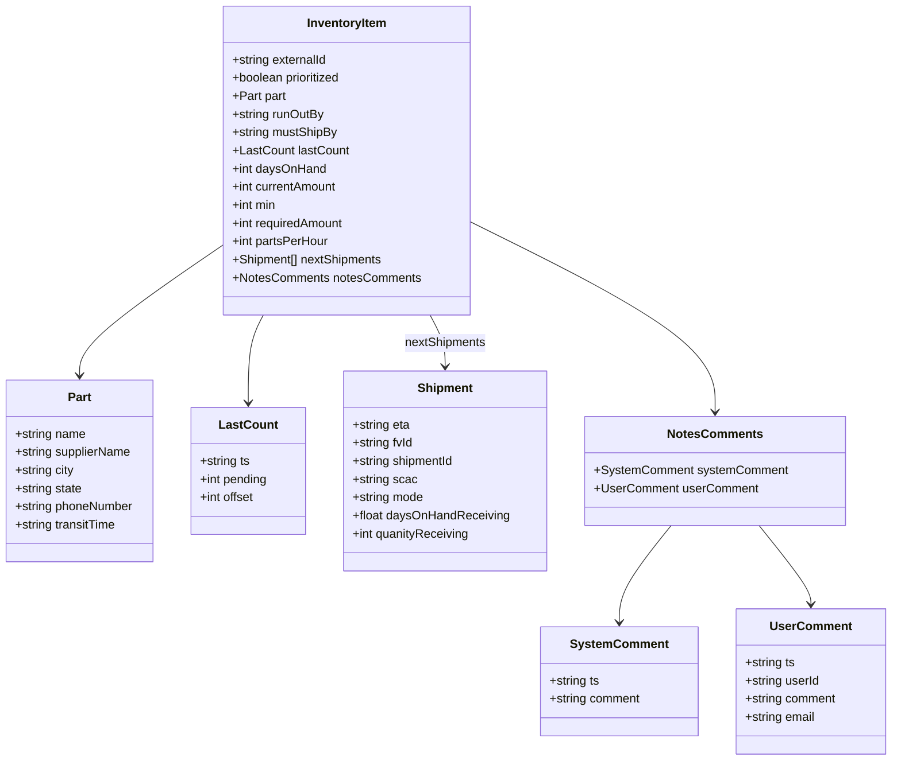

# Diagram: web/portal/src/mocks/handlers/critical-parts/critical-parts.js


> Auto-generated by Obscura crawlers

## Diagram 1



### SVG

<svg id="container" width="1173.53125" xmlns="http://www.w3.org/2000/svg" class="classDiagram" height="1004" viewBox="0 0 1173.53125 1004" role="graphics-document document" aria-roledescription="class"><style>#container{font-family:"trebuchet ms",verdana,arial,sans-serif;font-size:16px;fill:#333;}@keyframes edge-animation-frame{from{stroke-dashoffset:0;}}@keyframes dash{to{stroke-dashoffset:0;}}#container .edge-animation-slow{stroke-dasharray:9,5!important;stroke-dashoffset:900;animation:dash 50s linear infinite;stroke-linecap:round;}#container .edge-animation-fast{stroke-dasharray:9,5!important;stroke-dashoffset:900;animation:dash 20s linear infinite;stroke-linecap:round;}#container .error-icon{fill:#552222;}#container .error-text{fill:#552222;stroke:#552222;}#container .edge-thickness-normal{stroke-width:1px;}#container .edge-thickness-thick{stroke-width:3.5px;}#container .edge-pattern-solid{stroke-dasharray:0;}#container .edge-thickness-invisible{stroke-width:0;fill:none;}#container .edge-pattern-dashed{stroke-dasharray:3;}#container .edge-pattern-dotted{stroke-dasharray:2;}#container .marker{fill:#333333;stroke:#333333;}#container .marker.cross{stroke:#333333;}#container svg{font-family:"trebuchet ms",verdana,arial,sans-serif;font-size:16px;}#container p{margin:0;}#container g.classGroup text{fill:#9370DB;stroke:none;font-family:"trebuchet ms",verdana,arial,sans-serif;font-size:10px;}#container g.classGroup text .title{font-weight:bolder;}#container .nodeLabel,#container .edgeLabel{color:#131300;}#container .edgeLabel .label rect{fill:#ECECFF;}#container .label text{fill:#131300;}#container .labelBkg{background:#ECECFF;}#container .edgeLabel .label span{background:#ECECFF;}#container .classTitle{font-weight:bolder;}#container .node rect,#container .node circle,#container .node ellipse,#container .node polygon,#container .node path{fill:#ECECFF;stroke:#9370DB;stroke-width:1px;}#container .divider{stroke:#9370DB;stroke-width:1;}#container g.clickable{cursor:pointer;}#container g.classGroup rect{fill:#ECECFF;stroke:#9370DB;}#container g.classGroup line{stroke:#9370DB;stroke-width:1;}#container .classLabel .box{stroke:none;stroke-width:0;fill:#ECECFF;opacity:0.5;}#container .classLabel .label{fill:#9370DB;font-size:10px;}#container .relation{stroke:#333333;stroke-width:1;fill:none;}#container .dashed-line{stroke-dasharray:3;}#container .dotted-line{stroke-dasharray:1 2;}#container #compositionStart,#container .composition{fill:#333333!important;stroke:#333333!important;stroke-width:1;}#container #compositionEnd,#container .composition{fill:#333333!important;stroke:#333333!important;stroke-width:1;}#container #dependencyStart,#container .dependency{fill:#333333!important;stroke:#333333!important;stroke-width:1;}#container #dependencyStart,#container .dependency{fill:#333333!important;stroke:#333333!important;stroke-width:1;}#container #extensionStart,#container .extension{fill:transparent!important;stroke:#333333!important;stroke-width:1;}#container #extensionEnd,#container .extension{fill:transparent!important;stroke:#333333!important;stroke-width:1;}#container #aggregationStart,#container .aggregation{fill:transparent!important;stroke:#333333!important;stroke-width:1;}#container #aggregationEnd,#container .aggregation{fill:transparent!important;stroke:#333333!important;stroke-width:1;}#container #lollipopStart,#container .lollipop{fill:#ECECFF!important;stroke:#333333!important;stroke-width:1;}#container #lollipopEnd,#container .lollipop{fill:#ECECFF!important;stroke:#333333!important;stroke-width:1;}#container .edgeTerminals{font-size:11px;line-height:initial;}#container .classTitleText{text-anchor:middle;font-size:18px;fill:#333;}#container .label-icon{display:inline-block;height:1em;overflow:visible;vertical-align:-0.125em;}#container .node .label-icon path{fill:currentColor;stroke:revert;stroke-width:revert;}#container :root{--mermaid-font-family:"trebuchet ms",verdana,arial,sans-serif;}</style><g><defs><marker id="container_class-aggregationStart" class="marker aggregation class" refX="18" refY="7" markerWidth="190" markerHeight="240" orient="auto"><path d="M 18,7 L9,13 L1,7 L9,1 Z"></path></marker></defs><defs><marker id="container_class-aggregationEnd" class="marker aggregation class" refX="1" refY="7" markerWidth="20" markerHeight="28" orient="auto"><path d="M 18,7 L9,13 L1,7 L9,1 Z"></path></marker></defs><defs><marker id="container_class-extensionStart" class="marker extension class" refX="18" refY="7" markerWidth="190" markerHeight="240" orient="auto"><path d="M 1,7 L18,13 V 1 Z"></path></marker></defs><defs><marker id="container_class-extensionEnd" class="marker extension class" refX="1" refY="7" markerWidth="20" markerHeight="28" orient="auto"><path d="M 1,1 V 13 L18,7 Z"></path></marker></defs><defs><marker id="container_class-compositionStart" class="marker composition class" refX="18" refY="7" markerWidth="190" markerHeight="240" orient="auto"><path d="M 18,7 L9,13 L1,7 L9,1 Z"></path></marker></defs><defs><marker id="container_class-compositionEnd" class="marker composition class" refX="1" refY="7" markerWidth="20" markerHeight="28" orient="auto"><path d="M 18,7 L9,13 L1,7 L9,1 Z"></path></marker></defs><defs><marker id="container_class-dependencyStart" class="marker dependency class" refX="6" refY="7" markerWidth="190" markerHeight="240" orient="auto"><path d="M 5,7 L9,13 L1,7 L9,1 Z"></path></marker></defs><defs><marker id="container_class-dependencyEnd" class="marker dependency class" refX="13" refY="7" markerWidth="20" markerHeight="28" orient="auto"><path d="M 18,7 L9,13 L14,7 L9,1 Z"></path></marker></defs><defs><marker id="container_class-lollipopStart" class="marker lollipop class" refX="13" refY="7" markerWidth="190" markerHeight="240" orient="auto"><circle stroke="black" fill="transparent" cx="7" cy="7" r="6"></circle></marker></defs><defs><marker id="container_class-lollipopEnd" class="marker lollipop class" refX="1" refY="7" markerWidth="190" markerHeight="240" orient="auto"><circle stroke="black" fill="transparent" cx="7" cy="7" r="6"></circle></marker></defs><g class="root"><g class="clusters"></g><g class="edgePaths"><path d="M299.057,322.136L267.014,343.947C234.971,365.758,170.886,409.379,138.843,438.356C106.801,467.333,106.801,481.667,106.801,488.833L106.801,496" id="id_InventoryItem_Part_1" class="edge-thickness-normal edge-pattern-solid relation" style=";;;" data-edge="true" data-et="edge" data-id="id_InventoryItem_Part_1" data-points="W3sieCI6Mjk5LjA1NjY0MDYyNSwieSI6MzIyLjEzNjMzMTI5MDQ0MTgzfSx7IngiOjEwNi44MDA3ODEyNSwieSI6NDUzfSx7IngiOjEwNi44MDA3ODEyNSwieSI6NTAyfV0=" marker-end="url(#container_class-dependencyEnd)"></path><path d="M351.423,416L348.115,422.167C344.807,428.333,338.191,440.667,334.882,460C331.574,479.333,331.574,505.667,331.574,518.833L331.574,532" id="id_InventoryItem_LastCount_2" class="edge-thickness-normal edge-pattern-solid relation" style=";;;" data-edge="true" data-et="edge" data-id="id_InventoryItem_LastCount_2" data-points="W3sieCI6MzUxLjQyMzI3NzAzNTc4ODQsInkiOjQxNn0seyJ4IjozMzEuNTc0MjE4NzUsInkiOjQ1M30seyJ4IjozMzEuNTc0MjE4NzUsInkiOjUzOH1d" marker-end="url(#container_class-dependencyEnd)"></path><path d="M570.299,416L573.608,422.167C576.916,428.333,583.532,440.667,586.84,452C590.148,463.333,590.148,473.667,590.148,478.833L590.148,484" id="id_InventoryItem_Shipment_3" class="edge-thickness-normal edge-pattern-solid relation" style=";;;" data-edge="true" data-et="edge" data-id="id_InventoryItem_Shipment_3" data-points="W3sieCI6NTcwLjI5OTM3OTIxNDIxMTYsInkiOjQxNn0seyJ4Ijo1OTAuMTQ4NDM3NSwieSI6NDUzfSx7IngiOjU5MC4xNDg0Mzc1LCJ5Ijo0OTB9XQ==" marker-end="url(#container_class-dependencyEnd)"></path><path d="M622.666,293.247L675.691,319.873C728.716,346.498,834.766,399.749,887.791,441.541C940.816,483.333,940.816,513.667,940.816,528.833L940.816,544" id="id_InventoryItem_NotesComments_4" class="edge-thickness-normal edge-pattern-solid relation" style=";;;" data-edge="true" data-et="edge" data-id="id_InventoryItem_NotesComments_4" data-points="W3sieCI6NjIyLjY2NjAxNTYyNSwieSI6MjkzLjI0NzA0MDUzNTIwNjM0fSx7IngiOjk0MC44MTY0MDYyNSwieSI6NDUzfSx7IngiOjk0MC44MTY0MDYyNSwieSI6NTUwfV0=" marker-end="url(#container_class-dependencyEnd)"></path><path d="M882.99,694L871.612,708.167C860.234,722.333,837.478,750.667,826.101,772C814.723,793.333,814.723,807.667,814.723,814.833L814.723,822" id="id_NotesComments_SystemComment_5" class="edge-thickness-normal edge-pattern-solid relation" style=";;;" data-edge="true" data-et="edge" data-id="id_NotesComments_SystemComment_5" data-points="W3sieCI6ODgyLjk4OTk3MzEyODk4MDksInkiOjY5NH0seyJ4Ijo4MTQuNzIyNjU2MjUsInkiOjc3OX0seyJ4Ijo4MTQuNzIyNjU2MjUsInkiOjgyOH1d" marker-end="url(#container_class-dependencyEnd)"></path><path d="M998.643,694L1010.021,708.167C1021.399,722.333,1044.154,750.667,1055.532,768C1066.91,785.333,1066.91,791.667,1066.91,794.833L1066.91,798" id="id_NotesComments_UserComment_6" class="edge-thickness-normal edge-pattern-solid relation" style=";;;" data-edge="true" data-et="edge" data-id="id_NotesComments_UserComment_6" data-points="W3sieCI6OTk4LjY0MjgzOTM3MTAxOTEsInkiOjY5NH0seyJ4IjoxMDY2LjkxMDE1NjI1LCJ5Ijo3Nzl9LHsieCI6MTA2Ni45MTAxNTYyNSwieSI6ODA0fV0=" marker-end="url(#container_class-dependencyEnd)"></path></g><g class="edgeLabels"><g class="edgeLabel"><g class="label" data-id="id_InventoryItem_Part_1" transform="translate(0, 0)"><foreignObject width="0" height="0"><div xmlns="http://www.w3.org/1999/xhtml" class="labelBkg" style="display: table-cell; white-space: nowrap; line-height: 1.5; max-width: 200px; text-align: center;"><span class="edgeLabel"></span></div></foreignObject></g></g><g class="edgeLabel"><g class="label" data-id="id_InventoryItem_LastCount_2" transform="translate(0, 0)"><foreignObject width="0" height="0"><div xmlns="http://www.w3.org/1999/xhtml" class="labelBkg" style="display: table-cell; white-space: nowrap; line-height: 1.5; max-width: 200px; text-align: center;"><span class="edgeLabel"></span></div></foreignObject></g></g><g class="edgeLabel" transform="translate(590.1484375, 453)"><g class="label" data-id="id_InventoryItem_Shipment_3" transform="translate(-54.328125, -12)"><foreignObject width="108.65625" height="24"><div xmlns="http://www.w3.org/1999/xhtml" class="labelBkg" style="display: table-cell; white-space: nowrap; line-height: 1.5; max-width: 200px; text-align: center;"><span class="edgeLabel"><p>nextShipments</p></span></div></foreignObject></g></g><g class="edgeLabel"><g class="label" data-id="id_InventoryItem_NotesComments_4" transform="translate(0, 0)"><foreignObject width="0" height="0"><div xmlns="http://www.w3.org/1999/xhtml" class="labelBkg" style="display: table-cell; white-space: nowrap; line-height: 1.5; max-width: 200px; text-align: center;"><span class="edgeLabel"></span></div></foreignObject></g></g><g class="edgeLabel"><g class="label" data-id="id_NotesComments_SystemComment_5" transform="translate(0, 0)"><foreignObject width="0" height="0"><div xmlns="http://www.w3.org/1999/xhtml" class="labelBkg" style="display: table-cell; white-space: nowrap; line-height: 1.5; max-width: 200px; text-align: center;"><span class="edgeLabel"></span></div></foreignObject></g></g><g class="edgeLabel"><g class="label" data-id="id_NotesComments_UserComment_6" transform="translate(0, 0)"><foreignObject width="0" height="0"><div xmlns="http://www.w3.org/1999/xhtml" class="labelBkg" style="display: table-cell; white-space: nowrap; line-height: 1.5; max-width: 200px; text-align: center;"><span class="edgeLabel"></span></div></foreignObject></g></g></g><g class="nodes"><g class="node default" id="classId-InventoryItem-0" transform="translate(460.861328125, 212)"><g class="basic label-container"><path d="M-161.8046875 -204 L161.8046875 -204 L161.8046875 204 L-161.8046875 204" stroke="none" stroke-width="0" fill="#ECECFF" style=""></path><path d="M-161.8046875 -204 C-67.1502982190948 -204, 27.504091061810414 -204, 161.8046875 -204 M-161.8046875 -204 C-77.86112499060637 -204, 6.082437518787259 -204, 161.8046875 -204 M161.8046875 -204 C161.8046875 -85.77701369908593, 161.8046875 32.445972601828146, 161.8046875 204 M161.8046875 -204 C161.8046875 -97.39958361554854, 161.8046875 9.200832768902927, 161.8046875 204 M161.8046875 204 C75.55564369946534 204, -10.69340010106933 204, -161.8046875 204 M161.8046875 204 C40.75865101163512 204, -80.28738547672975 204, -161.8046875 204 M-161.8046875 204 C-161.8046875 53.47062661635914, -161.8046875 -97.05874676728172, -161.8046875 -204 M-161.8046875 204 C-161.8046875 77.8263161482527, -161.8046875 -48.3473677034946, -161.8046875 -204" stroke="#9370DB" stroke-width="1.3" fill="none" stroke-dasharray="0 0" style=""></path></g><g class="annotation-group text" transform="translate(0, -180)"></g><g class="label-group text" transform="translate(-51.421875, -180)"><g class="label" style="font-weight: bolder" transform="translate(0,-12)"><foreignObject width="102.84375" height="24"><div xmlns="http://www.w3.org/1999/xhtml" style="display: table-cell; white-space: nowrap; line-height: 1.5; max-width: 152px; text-align: center;"><span class="nodeLabel markdown-node-label" style=""><p>InventoryItem</p></span></div></foreignObject></g></g><g class="members-group text" transform="translate(-149.8046875, -132)"><g class="label" style="" transform="translate(0,-12)"><foreignObject width="127.53125" height="24"><div xmlns="http://www.w3.org/1999/xhtml" style="display: table-cell; white-space: nowrap; line-height: 1.5; max-width: 185px; text-align: center;"><span class="nodeLabel markdown-node-label" style=""><p>+string externalId</p></span></div></foreignObject></g><g class="label" style="" transform="translate(0,12)"><foreignObject width="147.359375" height="24"><div xmlns="http://www.w3.org/1999/xhtml" style="display: table-cell; white-space: nowrap; line-height: 1.5; max-width: 205px; text-align: center;"><span class="nodeLabel markdown-node-label" style=""><p>+boolean prioritized</p></span></div></foreignObject></g><g class="label" style="" transform="translate(0,36)"><foreignObject width="71.296875" height="24"><div xmlns="http://www.w3.org/1999/xhtml" style="display: table-cell; white-space: nowrap; line-height: 1.5; max-width: 129px; text-align: center;"><span class="nodeLabel markdown-node-label" style=""><p>+Part part</p></span></div></foreignObject></g><g class="label" style="" transform="translate(0,60)"><foreignObject width="122.484375" height="24"><div xmlns="http://www.w3.org/1999/xhtml" style="display: table-cell; white-space: nowrap; line-height: 1.5; max-width: 180px; text-align: center;"><span class="nodeLabel markdown-node-label" style=""><p>+string runOutBy</p></span></div></foreignObject></g><g class="label" style="" transform="translate(0,84)"><foreignObject width="139.84375" height="24"><div xmlns="http://www.w3.org/1999/xhtml" style="display: table-cell; white-space: nowrap; line-height: 1.5; max-width: 197px; text-align: center;"><span class="nodeLabel markdown-node-label" style=""><p>+string mustShipBy</p></span></div></foreignObject></g><g class="label" style="" transform="translate(0,108)"><foreignObject width="153.125" height="24"><div xmlns="http://www.w3.org/1999/xhtml" style="display: table-cell; white-space: nowrap; line-height: 1.5; max-width: 211px; text-align: center;"><span class="nodeLabel markdown-node-label" style=""><p>+LastCount lastCount</p></span></div></foreignObject></g><g class="label" style="" transform="translate(0,132)"><foreignObject width="124.140625" height="24"><div xmlns="http://www.w3.org/1999/xhtml" style="display: table-cell; white-space: nowrap; line-height: 1.5; max-width: 182px; text-align: center;"><span class="nodeLabel markdown-node-label" style=""><p>+int daysOnHand</p></span></div></foreignObject></g><g class="label" style="" transform="translate(0,156)"><foreignObject width="141.125" height="24"><div xmlns="http://www.w3.org/1999/xhtml" style="display: table-cell; white-space: nowrap; line-height: 1.5; max-width: 199px; text-align: center;"><span class="nodeLabel markdown-node-label" style=""><p>+int currentAmount</p></span></div></foreignObject></g><g class="label" style="" transform="translate(0,180)"><foreignObject width="59.5" height="24"><div xmlns="http://www.w3.org/1999/xhtml" style="display: table-cell; white-space: nowrap; line-height: 1.5; max-width: 117px; text-align: center;"><span class="nodeLabel markdown-node-label" style=""><p>+int min</p></span></div></foreignObject></g><g class="label" style="" transform="translate(0,204)"><foreignObject width="150.375" height="24"><div xmlns="http://www.w3.org/1999/xhtml" style="display: table-cell; white-space: nowrap; line-height: 1.5; max-width: 208px; text-align: center;"><span class="nodeLabel markdown-node-label" style=""><p>+int requiredAmount</p></span></div></foreignObject></g><g class="label" style="" transform="translate(0,228)"><foreignObject width="128.796875" height="24"><div xmlns="http://www.w3.org/1999/xhtml" style="display: table-cell; white-space: nowrap; line-height: 1.5; max-width: 187px; text-align: center;"><span class="nodeLabel markdown-node-label" style=""><p>+int partsPerHour</p></span></div></foreignObject></g><g class="label" style="" transform="translate(0,252)"><foreignObject width="200.25" height="24"><div xmlns="http://www.w3.org/1999/xhtml" style="display: table-cell; white-space: nowrap; line-height: 1.5; max-width: 258px; text-align: center;"><span class="nodeLabel markdown-node-label" style=""><p>+Shipment[] nextShipments</p></span></div></foreignObject></g><g class="label" style="" transform="translate(0,276)"><foreignObject width="248.1875" height="24"><div xmlns="http://www.w3.org/1999/xhtml" style="display: table-cell; white-space: nowrap; line-height: 1.5; max-width: 306px; text-align: center;"><span class="nodeLabel markdown-node-label" style=""><p>+NotesComments notesComments</p></span></div></foreignObject></g></g><g class="methods-group text" transform="translate(-149.8046875, 204)"></g><g class="divider" style=""><path d="M-161.8046875 -156 C-69.67289830166858 -156, 22.458890896662837 -156, 161.8046875 -156 M-161.8046875 -156 C-55.04004255497898 -156, 51.72460239004204 -156, 161.8046875 -156" stroke="#9370DB" stroke-width="1.3" fill="none" stroke-dasharray="0 0" style=""></path></g><g class="divider" style=""><path d="M-161.8046875 180 C-57.94669562702377 180, 45.91129624595246 180, 161.8046875 180 M-161.8046875 180 C-33.409539538112654 180, 94.98560842377469 180, 161.8046875 180" stroke="#9370DB" stroke-width="1.3" fill="none" stroke-dasharray="0 0" style=""></path></g></g><g class="node default" id="classId-Part-1" transform="translate(106.80078125, 622)"><g class="basic label-container"><path d="M-98.80078125 -120 L98.80078125 -120 L98.80078125 120 L-98.80078125 120" stroke="none" stroke-width="0" fill="#ECECFF" style=""></path><path d="M-98.80078125 -120 C-29.39652870677064 -120, 40.00772383645872 -120, 98.80078125 -120 M-98.80078125 -120 C-30.5115446192264 -120, 37.7776920115472 -120, 98.80078125 -120 M98.80078125 -120 C98.80078125 -30.326300875457804, 98.80078125 59.34739824908439, 98.80078125 120 M98.80078125 -120 C98.80078125 -38.44768138972563, 98.80078125 43.10463722054874, 98.80078125 120 M98.80078125 120 C24.732627831126678 120, -49.335525587746645 120, -98.80078125 120 M98.80078125 120 C29.243258596149715 120, -40.31426405770057 120, -98.80078125 120 M-98.80078125 120 C-98.80078125 48.96613935309199, -98.80078125 -22.06772129381602, -98.80078125 -120 M-98.80078125 120 C-98.80078125 57.916762042373726, -98.80078125 -4.166475915252548, -98.80078125 -120" stroke="#9370DB" stroke-width="1.3" fill="none" stroke-dasharray="0 0" style=""></path></g><g class="annotation-group text" transform="translate(0, -96)"></g><g class="label-group text" transform="translate(-15.0703125, -96)"><g class="label" style="font-weight: bolder" transform="translate(0,-12)"><foreignObject width="30.140625" height="24"><div xmlns="http://www.w3.org/1999/xhtml" style="display: table-cell; white-space: nowrap; line-height: 1.5; max-width: 79px; text-align: center;"><span class="nodeLabel markdown-node-label" style=""><p>Part</p></span></div></foreignObject></g></g><g class="members-group text" transform="translate(-86.80078125, -48)"><g class="label" style="" transform="translate(0,-12)"><foreignObject width="94.375" height="24"><div xmlns="http://www.w3.org/1999/xhtml" style="display: table-cell; white-space: nowrap; line-height: 1.5; max-width: 152px; text-align: center;"><span class="nodeLabel markdown-node-label" style=""><p>+string name</p></span></div></foreignObject></g><g class="label" style="" transform="translate(0,12)"><foreignObject width="155.8125" height="24"><div xmlns="http://www.w3.org/1999/xhtml" style="display: table-cell; white-space: nowrap; line-height: 1.5; max-width: 213px; text-align: center;"><span class="nodeLabel markdown-node-label" style=""><p>+string supplierName</p></span></div></foreignObject></g><g class="label" style="" transform="translate(0,36)"><foreignObject width="79.59375" height="24"><div xmlns="http://www.w3.org/1999/xhtml" style="display: table-cell; white-space: nowrap; line-height: 1.5; max-width: 137px; text-align: center;"><span class="nodeLabel markdown-node-label" style=""><p>+string city</p></span></div></foreignObject></g><g class="label" style="" transform="translate(0,60)"><foreignObject width="89.953125" height="24"><div xmlns="http://www.w3.org/1999/xhtml" style="display: table-cell; white-space: nowrap; line-height: 1.5; max-width: 147px; text-align: center;"><span class="nodeLabel markdown-node-label" style=""><p>+string state</p></span></div></foreignObject></g><g class="label" style="" transform="translate(0,84)"><foreignObject width="158.53125" height="24"><div xmlns="http://www.w3.org/1999/xhtml" style="display: table-cell; white-space: nowrap; line-height: 1.5; max-width: 217px; text-align: center;"><span class="nodeLabel markdown-node-label" style=""><p>+string phoneNumber</p></span></div></foreignObject></g><g class="label" style="" transform="translate(0,108)"><foreignObject width="136.3125" height="24"><div xmlns="http://www.w3.org/1999/xhtml" style="display: table-cell; white-space: nowrap; line-height: 1.5; max-width: 194px; text-align: center;"><span class="nodeLabel markdown-node-label" style=""><p>+string transitTime</p></span></div></foreignObject></g></g><g class="methods-group text" transform="translate(-86.80078125, 120)"></g><g class="divider" style=""><path d="M-98.80078125 -72 C-34.58491799562799 -72, 29.63094525874402 -72, 98.80078125 -72 M-98.80078125 -72 C-26.344969406315954 -72, 46.11084243736809 -72, 98.80078125 -72" stroke="#9370DB" stroke-width="1.3" fill="none" stroke-dasharray="0 0" style=""></path></g><g class="divider" style=""><path d="M-98.80078125 96 C-49.08952500654909 96, 0.6217312369018231 96, 98.80078125 96 M-98.80078125 96 C-47.44248520891757 96, 3.9158108321648655 96, 98.80078125 96" stroke="#9370DB" stroke-width="1.3" fill="none" stroke-dasharray="0 0" style=""></path></g></g><g class="node default" id="classId-LastCount-2" transform="translate(331.57421875, 622)"><g class="basic label-container"><path d="M-75.97265625 -84 L75.97265625 -84 L75.97265625 84 L-75.97265625 84" stroke="none" stroke-width="0" fill="#ECECFF" style=""></path><path d="M-75.97265625 -84 C-22.134335784550707 -84, 31.703984680898586 -84, 75.97265625 -84 M-75.97265625 -84 C-24.73189456322865 -84, 26.5088671235427 -84, 75.97265625 -84 M75.97265625 -84 C75.97265625 -37.11721522694691, 75.97265625 9.765569546106178, 75.97265625 84 M75.97265625 -84 C75.97265625 -30.07526471942512, 75.97265625 23.849470561149758, 75.97265625 84 M75.97265625 84 C36.26400317882023 84, -3.4446498923595357 84, -75.97265625 84 M75.97265625 84 C40.353848690612 84, 4.735041131223994 84, -75.97265625 84 M-75.97265625 84 C-75.97265625 22.928721945683698, -75.97265625 -38.142556108632604, -75.97265625 -84 M-75.97265625 84 C-75.97265625 31.871786476297743, -75.97265625 -20.256427047404514, -75.97265625 -84" stroke="#9370DB" stroke-width="1.3" fill="none" stroke-dasharray="0 0" style=""></path></g><g class="annotation-group text" transform="translate(0, -60)"></g><g class="label-group text" transform="translate(-36.6796875, -60)"><g class="label" style="font-weight: bolder" transform="translate(0,-12)"><foreignObject width="73.359375" height="24"><div xmlns="http://www.w3.org/1999/xhtml" style="display: table-cell; white-space: nowrap; line-height: 1.5; max-width: 122px; text-align: center;"><span class="nodeLabel markdown-node-label" style=""><p>LastCount</p></span></div></foreignObject></g></g><g class="members-group text" transform="translate(-63.97265625, -12)"><g class="label" style="" transform="translate(0,-12)"><foreignObject width="67.109375" height="24"><div xmlns="http://www.w3.org/1999/xhtml" style="display: table-cell; white-space: nowrap; line-height: 1.5; max-width: 124px; text-align: center;"><span class="nodeLabel markdown-node-label" style=""><p>+string ts</p></span></div></foreignObject></g><g class="label" style="" transform="translate(0,12)"><foreignObject width="91.265625" height="24"><div xmlns="http://www.w3.org/1999/xhtml" style="display: table-cell; white-space: nowrap; line-height: 1.5; max-width: 149px; text-align: center;"><span class="nodeLabel markdown-node-label" style=""><p>+int pending</p></span></div></foreignObject></g><g class="label" style="" transform="translate(0,36)"><foreignObject width="73.84375" height="24"><div xmlns="http://www.w3.org/1999/xhtml" style="display: table-cell; white-space: nowrap; line-height: 1.5; max-width: 131px; text-align: center;"><span class="nodeLabel markdown-node-label" style=""><p>+int offset</p></span></div></foreignObject></g></g><g class="methods-group text" transform="translate(-63.97265625, 84)"></g><g class="divider" style=""><path d="M-75.97265625 -36 C-36.373576209746176 -36, 3.225503830507648 -36, 75.97265625 -36 M-75.97265625 -36 C-36.963818334380974 -36, 2.0450195812380514 -36, 75.97265625 -36" stroke="#9370DB" stroke-width="1.3" fill="none" stroke-dasharray="0 0" style=""></path></g><g class="divider" style=""><path d="M-75.97265625 60 C-45.145289648696675 60, -14.31792304739335 60, 75.97265625 60 M-75.97265625 60 C-32.19232027338616 60, 11.588015703227683 60, 75.97265625 60" stroke="#9370DB" stroke-width="1.3" fill="none" stroke-dasharray="0 0" style=""></path></g></g><g class="node default" id="classId-Shipment-3" transform="translate(590.1484375, 622)"><g class="basic label-container"><path d="M-132.6015625 -132 L132.6015625 -132 L132.6015625 132 L-132.6015625 132" stroke="none" stroke-width="0" fill="#ECECFF" style=""></path><path d="M-132.6015625 -132 C-50.631731906508136 -132, 31.338098686983727 -132, 132.6015625 -132 M-132.6015625 -132 C-58.252300776499325 -132, 16.09696094700135 -132, 132.6015625 -132 M132.6015625 -132 C132.6015625 -62.50151736510357, 132.6015625 6.996965269792867, 132.6015625 132 M132.6015625 -132 C132.6015625 -51.273961586490245, 132.6015625 29.45207682701951, 132.6015625 132 M132.6015625 132 C37.7738321474249 132, -57.053898205150205 132, -132.6015625 132 M132.6015625 132 C43.316877050402226 132, -45.96780839919555 132, -132.6015625 132 M-132.6015625 132 C-132.6015625 42.254843216445906, -132.6015625 -47.49031356710819, -132.6015625 -132 M-132.6015625 132 C-132.6015625 60.23864090744284, -132.6015625 -11.522718185114314, -132.6015625 -132" stroke="#9370DB" stroke-width="1.3" fill="none" stroke-dasharray="0 0" style=""></path></g><g class="annotation-group text" transform="translate(0, -108)"></g><g class="label-group text" transform="translate(-35.109375, -108)"><g class="label" style="font-weight: bolder" transform="translate(0,-12)"><foreignObject width="70.21875" height="24"><div xmlns="http://www.w3.org/1999/xhtml" style="display: table-cell; white-space: nowrap; line-height: 1.5; max-width: 120px; text-align: center;"><span class="nodeLabel markdown-node-label" style=""><p>Shipment</p></span></div></foreignObject></g></g><g class="members-group text" transform="translate(-120.6015625, -60)"><g class="label" style="" transform="translate(0,-12)"><foreignObject width="76.953125" height="24"><div xmlns="http://www.w3.org/1999/xhtml" style="display: table-cell; white-space: nowrap; line-height: 1.5; max-width: 134px; text-align: center;"><span class="nodeLabel markdown-node-label" style=""><p>+string eta</p></span></div></foreignObject></g><g class="label" style="" transform="translate(0,12)"><foreignObject width="81.390625" height="24"><div xmlns="http://www.w3.org/1999/xhtml" style="display: table-cell; white-space: nowrap; line-height: 1.5; max-width: 139px; text-align: center;"><span class="nodeLabel markdown-node-label" style=""><p>+string fvId</p></span></div></foreignObject></g><g class="label" style="" transform="translate(0,36)"><foreignObject width="136.59375" height="24"><div xmlns="http://www.w3.org/1999/xhtml" style="display: table-cell; white-space: nowrap; line-height: 1.5; max-width: 194px; text-align: center;"><span class="nodeLabel markdown-node-label" style=""><p>+string shipmentId</p></span></div></foreignObject></g><g class="label" style="" transform="translate(0,60)"><foreignObject width="85.171875" height="24"><div xmlns="http://www.w3.org/1999/xhtml" style="display: table-cell; white-space: nowrap; line-height: 1.5; max-width: 143px; text-align: center;"><span class="nodeLabel markdown-node-label" style=""><p>+string scac</p></span></div></foreignObject></g><g class="label" style="" transform="translate(0,84)"><foreignObject width="95.203125" height="24"><div xmlns="http://www.w3.org/1999/xhtml" style="display: table-cell; white-space: nowrap; line-height: 1.5; max-width: 153px; text-align: center;"><span class="nodeLabel markdown-node-label" style=""><p>+string mode</p></span></div></foreignObject></g><g class="label" style="" transform="translate(0,108)"><foreignObject width="206.09375" height="24"><div xmlns="http://www.w3.org/1999/xhtml" style="display: table-cell; white-space: nowrap; line-height: 1.5; max-width: 264px; text-align: center;"><span class="nodeLabel markdown-node-label" style=""><p>+float daysOnHandReceiving</p></span></div></foreignObject></g><g class="label" style="" transform="translate(0,132)"><foreignObject width="155.734375" height="24"><div xmlns="http://www.w3.org/1999/xhtml" style="display: table-cell; white-space: nowrap; line-height: 1.5; max-width: 214px; text-align: center;"><span class="nodeLabel markdown-node-label" style=""><p>+int quanityReceiving</p></span></div></foreignObject></g></g><g class="methods-group text" transform="translate(-120.6015625, 132)"></g><g class="divider" style=""><path d="M-132.6015625 -84 C-63.61385272768398 -84, 5.373857044632047 -84, 132.6015625 -84 M-132.6015625 -84 C-58.71176562003552 -84, 15.178031259928957 -84, 132.6015625 -84" stroke="#9370DB" stroke-width="1.3" fill="none" stroke-dasharray="0 0" style=""></path></g><g class="divider" style=""><path d="M-132.6015625 108 C-39.51535753083205 108, 53.5708474383359 108, 132.6015625 108 M-132.6015625 108 C-44.20015873632977 108, 44.20124502734046 108, 132.6015625 108" stroke="#9370DB" stroke-width="1.3" fill="none" stroke-dasharray="0 0" style=""></path></g></g><g class="node default" id="classId-NotesComments-4" transform="translate(940.81640625, 622)"><g class="basic label-container"><path d="M-168.06640625 -72 L168.06640625 -72 L168.06640625 72 L-168.06640625 72" stroke="none" stroke-width="0" fill="#ECECFF" style=""></path><path d="M-168.06640625 -72 C-92.1448591164036 -72, -16.22331198280719 -72, 168.06640625 -72 M-168.06640625 -72 C-63.24514346322174 -72, 41.576119323556526 -72, 168.06640625 -72 M168.06640625 -72 C168.06640625 -38.88908031712243, 168.06640625 -5.7781606342448555, 168.06640625 72 M168.06640625 -72 C168.06640625 -37.64950942201315, 168.06640625 -3.299018844026307, 168.06640625 72 M168.06640625 72 C96.86635705863057 72, 25.66630786726114 72, -168.06640625 72 M168.06640625 72 C59.30433274434189 72, -49.45774076131622 72, -168.06640625 72 M-168.06640625 72 C-168.06640625 33.03629852220969, -168.06640625 -5.927402955580618, -168.06640625 -72 M-168.06640625 72 C-168.06640625 36.357401147321745, -168.06640625 0.7148022946434907, -168.06640625 -72" stroke="#9370DB" stroke-width="1.3" fill="none" stroke-dasharray="0 0" style=""></path></g><g class="annotation-group text" transform="translate(0, -48)"></g><g class="label-group text" transform="translate(-59.8203125, -48)"><g class="label" style="font-weight: bolder" transform="translate(0,-12)"><foreignObject width="119.640625" height="24"><div xmlns="http://www.w3.org/1999/xhtml" style="display: table-cell; white-space: nowrap; line-height: 1.5; max-width: 169px; text-align: center;"><span class="nodeLabel markdown-node-label" style=""><p>NotesComments</p></span></div></foreignObject></g></g><g class="members-group text" transform="translate(-156.06640625, 0)"><g class="label" style="" transform="translate(0,-12)"><foreignObject width="252.3125" height="24"><div xmlns="http://www.w3.org/1999/xhtml" style="display: table-cell; white-space: nowrap; line-height: 1.5; max-width: 310px; text-align: center;"><span class="nodeLabel markdown-node-label" style=""><p>+SystemComment systemComment</p></span></div></foreignObject></g><g class="label" style="" transform="translate(0,12)"><foreignObject width="215.359375" height="24"><div xmlns="http://www.w3.org/1999/xhtml" style="display: table-cell; white-space: nowrap; line-height: 1.5; max-width: 273px; text-align: center;"><span class="nodeLabel markdown-node-label" style=""><p>+UserComment userComment</p></span></div></foreignObject></g></g><g class="methods-group text" transform="translate(-156.06640625, 72)"></g><g class="divider" style=""><path d="M-168.06640625 -24 C-94.6342572684689 -24, -21.2021082869378 -24, 168.06640625 -24 M-168.06640625 -24 C-57.63261312561761 -24, 52.80117999876478 -24, 168.06640625 -24" stroke="#9370DB" stroke-width="1.3" fill="none" stroke-dasharray="0 0" style=""></path></g><g class="divider" style=""><path d="M-168.06640625 48 C-98.72680483515998 48, -29.387203420319963 48, 168.06640625 48 M-168.06640625 48 C-83.53068300160459 48, 1.005040246790827 48, 168.06640625 48" stroke="#9370DB" stroke-width="1.3" fill="none" stroke-dasharray="0 0" style=""></path></g></g><g class="node default" id="classId-SystemComment-5" transform="translate(814.72265625, 900)"><g class="basic label-container"><path d="M-103.56640625 -72 L103.56640625 -72 L103.56640625 72 L-103.56640625 72" stroke="none" stroke-width="0" fill="#ECECFF" style=""></path><path d="M-103.56640625 -72 C-59.45748313669504 -72, -15.348560023390078 -72, 103.56640625 -72 M-103.56640625 -72 C-47.623881131870974 -72, 8.318643986258053 -72, 103.56640625 -72 M103.56640625 -72 C103.56640625 -26.66543827363006, 103.56640625 18.669123452739882, 103.56640625 72 M103.56640625 -72 C103.56640625 -31.183450431616286, 103.56640625 9.633099136767427, 103.56640625 72 M103.56640625 72 C52.63404420915981 72, 1.7016821683196213 72, -103.56640625 72 M103.56640625 72 C46.29049057081504 72, -10.985425108369924 72, -103.56640625 72 M-103.56640625 72 C-103.56640625 31.30752353206252, -103.56640625 -9.384952935874963, -103.56640625 -72 M-103.56640625 72 C-103.56640625 22.13227050705148, -103.56640625 -27.73545898589704, -103.56640625 -72" stroke="#9370DB" stroke-width="1.3" fill="none" stroke-dasharray="0 0" style=""></path></g><g class="annotation-group text" transform="translate(0, -48)"></g><g class="label-group text" transform="translate(-61.3046875, -48)"><g class="label" style="font-weight: bolder" transform="translate(0,-12)"><foreignObject width="122.609375" height="24"><div xmlns="http://www.w3.org/1999/xhtml" style="display: table-cell; white-space: nowrap; line-height: 1.5; max-width: 171px; text-align: center;"><span class="nodeLabel markdown-node-label" style=""><p>SystemComment</p></span></div></foreignObject></g></g><g class="members-group text" transform="translate(-91.56640625, 0)"><g class="label" style="" transform="translate(0,-12)"><foreignObject width="67.109375" height="24"><div xmlns="http://www.w3.org/1999/xhtml" style="display: table-cell; white-space: nowrap; line-height: 1.5; max-width: 124px; text-align: center;"><span class="nodeLabel markdown-node-label" style=""><p>+string ts</p></span></div></foreignObject></g><g class="label" style="" transform="translate(0,12)"><foreignObject width="121.828125" height="24"><div xmlns="http://www.w3.org/1999/xhtml" style="display: table-cell; white-space: nowrap; line-height: 1.5; max-width: 179px; text-align: center;"><span class="nodeLabel markdown-node-label" style=""><p>+string comment</p></span></div></foreignObject></g></g><g class="methods-group text" transform="translate(-91.56640625, 72)"></g><g class="divider" style=""><path d="M-103.56640625 -24 C-33.616711579026315 -24, 36.33298309194737 -24, 103.56640625 -24 M-103.56640625 -24 C-59.916403384260164 -24, -16.266400518520328 -24, 103.56640625 -24" stroke="#9370DB" stroke-width="1.3" fill="none" stroke-dasharray="0 0" style=""></path></g><g class="divider" style=""><path d="M-103.56640625 48 C-33.146813003931726 48, 37.27278024213655 48, 103.56640625 48 M-103.56640625 48 C-30.726691390566444 48, 42.11302346886711 48, 103.56640625 48" stroke="#9370DB" stroke-width="1.3" fill="none" stroke-dasharray="0 0" style=""></path></g></g><g class="node default" id="classId-UserComment-6" transform="translate(1066.91015625, 900)"><g class="basic label-container"><path d="M-98.62109375 -96 L98.62109375 -96 L98.62109375 96 L-98.62109375 96" stroke="none" stroke-width="0" fill="#ECECFF" style=""></path><path d="M-98.62109375 -96 C-26.098477280645312 -96, 46.424139188709376 -96, 98.62109375 -96 M-98.62109375 -96 C-49.59402438264753 -96, -0.5669550152950649 -96, 98.62109375 -96 M98.62109375 -96 C98.62109375 -47.95150515053415, 98.62109375 0.09698969893169362, 98.62109375 96 M98.62109375 -96 C98.62109375 -28.50810649549976, 98.62109375 38.98378700900048, 98.62109375 96 M98.62109375 96 C41.28984139256174 96, -16.04141096487652 96, -98.62109375 96 M98.62109375 96 C55.163388664864605 96, 11.705683579729211 96, -98.62109375 96 M-98.62109375 96 C-98.62109375 32.996394062164995, -98.62109375 -30.00721187567001, -98.62109375 -96 M-98.62109375 96 C-98.62109375 34.956995778781476, -98.62109375 -26.08600844243705, -98.62109375 -96" stroke="#9370DB" stroke-width="1.3" fill="none" stroke-dasharray="0 0" style=""></path></g><g class="annotation-group text" transform="translate(0, -72)"></g><g class="label-group text" transform="translate(-51.4140625, -72)"><g class="label" style="font-weight: bolder" transform="translate(0,-12)"><foreignObject width="102.828125" height="24"><div xmlns="http://www.w3.org/1999/xhtml" style="display: table-cell; white-space: nowrap; line-height: 1.5; max-width: 152px; text-align: center;"><span class="nodeLabel markdown-node-label" style=""><p>UserComment</p></span></div></foreignObject></g></g><g class="members-group text" transform="translate(-86.62109375, -24)"><g class="label" style="" transform="translate(0,-12)"><foreignObject width="67.109375" height="24"><div xmlns="http://www.w3.org/1999/xhtml" style="display: table-cell; white-space: nowrap; line-height: 1.5; max-width: 124px; text-align: center;"><span class="nodeLabel markdown-node-label" style=""><p>+string ts</p></span></div></foreignObject></g><g class="label" style="" transform="translate(0,12)"><foreignObject width="99.828125" height="24"><div xmlns="http://www.w3.org/1999/xhtml" style="display: table-cell; white-space: nowrap; line-height: 1.5; max-width: 157px; text-align: center;"><span class="nodeLabel markdown-node-label" style=""><p>+string userId</p></span></div></foreignObject></g><g class="label" style="" transform="translate(0,36)"><foreignObject width="121.828125" height="24"><div xmlns="http://www.w3.org/1999/xhtml" style="display: table-cell; white-space: nowrap; line-height: 1.5; max-width: 179px; text-align: center;"><span class="nodeLabel markdown-node-label" style=""><p>+string comment</p></span></div></foreignObject></g><g class="label" style="" transform="translate(0,60)"><foreignObject width="94.203125" height="24"><div xmlns="http://www.w3.org/1999/xhtml" style="display: table-cell; white-space: nowrap; line-height: 1.5; max-width: 152px; text-align: center;"><span class="nodeLabel markdown-node-label" style=""><p>+string email</p></span></div></foreignObject></g></g><g class="methods-group text" transform="translate(-86.62109375, 96)"></g><g class="divider" style=""><path d="M-98.62109375 -48 C-27.270471861558093 -48, 44.080150026883814 -48, 98.62109375 -48 M-98.62109375 -48 C-51.09352248859203 -48, -3.5659512271840583 -48, 98.62109375 -48" stroke="#9370DB" stroke-width="1.3" fill="none" stroke-dasharray="0 0" style=""></path></g><g class="divider" style=""><path d="M-98.62109375 72 C-20.078945893451206 72, 58.46320196309759 72, 98.62109375 72 M-98.62109375 72 C-29.150293648789642 72, 40.320506452420716 72, 98.62109375 72" stroke="#9370DB" stroke-width="1.3" fill="none" stroke-dasharray="0 0" style=""></path></g></g></g></g></g></svg>

## Diagram 2

```mermaid
flowchart TD
    Client[Client request to /critical-parts/271419?pageNumber=&pageSize=] --> MSW[msw.rest.get handler]
    MSW --> CheckURL{req.url defined?}
    CheckURL -- No --> ErrURL[Return 500: "req.url is undefined"]
    CheckURL -- Yes --> Parse[Parse pageNumber & pageSize as ints]
    Parse --> ValidateNums{pageNumber and pageSize valid numbers?}
    ValidateNums -- No --> ErrNums[Return 500: "pageNumber or pageSize is undefined or not a number"]
    ValidateNums -- Yes --> CalcStart[Compute startIndex = pageNumber * pageSize]
    CalcStart --> CalcEnd[Compute endIndex = startIndex + pageSize]
    CalcEnd --> Slice[Slice inventoryItemsList.data from startIndex to endIndex]
    Slice --> ComputeTP[totalPages = ceil(totalCount / pageSize)]
    ComputeTP --> BuildResp[Build response: { meta: { totalPages, currentPage, totalCount }, data }]
    BuildResp --> Delay[Apply ctx.delay(2000)]
    Delay --> Respond[Return JSON response to client]
```

> SVG rendering failed for this diagram.
