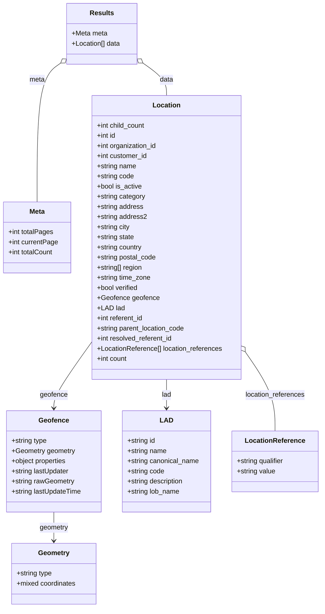

# Diagram: web/portal/src/mocks/handlers/critical-parts/location.js


> Auto-generated by Obscura crawlers

## Diagram 1

```mermaid
flowchart TD
  Import[Import apiUrl & rest]
  Setup[Define handleLocationOptions = rest.get(apiUrl("/location/locations"), handler)]
  Import --> Setup
  Request[Incoming request to /location/locations]
  Setup --> Request
  CheckUrl{req.url defined?}
  Request --> CheckUrl
  Err[Log error: req.url is undefined]
  Resp500[Return 500 + error JSON]
  CheckUrl -- No --> Err --> Resp500
  GetFeature[featureName = req.url.searchParams.get(feature_name)]
  CheckUrl -- Yes --> GetFeature
  IsCritical{featureName == Critical Parts?}
  GetFeature --> IsCritical
  RespResults[Return 200 + results JSON]
  RespEmpty[Return 200 + empty data + meta { currentPage:1, totalPages:1 }]
  IsCritical -- Yes --> RespResults
  IsCritical -- No --> RespEmpty
```

> SVG rendering failed for this diagram.

## Diagram 2



### SVG

<svg id="container" width="765.3515625" xmlns="http://www.w3.org/2000/svg" class="classDiagram" height="1438" viewBox="0 0 765.3515625 1438" role="graphics-document document" aria-roledescription="class"><style>#container{font-family:"trebuchet ms",verdana,arial,sans-serif;font-size:16px;fill:#333;}@keyframes edge-animation-frame{from{stroke-dashoffset:0;}}@keyframes dash{to{stroke-dashoffset:0;}}#container .edge-animation-slow{stroke-dasharray:9,5!important;stroke-dashoffset:900;animation:dash 50s linear infinite;stroke-linecap:round;}#container .edge-animation-fast{stroke-dasharray:9,5!important;stroke-dashoffset:900;animation:dash 20s linear infinite;stroke-linecap:round;}#container .error-icon{fill:#552222;}#container .error-text{fill:#552222;stroke:#552222;}#container .edge-thickness-normal{stroke-width:1px;}#container .edge-thickness-thick{stroke-width:3.5px;}#container .edge-pattern-solid{stroke-dasharray:0;}#container .edge-thickness-invisible{stroke-width:0;fill:none;}#container .edge-pattern-dashed{stroke-dasharray:3;}#container .edge-pattern-dotted{stroke-dasharray:2;}#container .marker{fill:#333333;stroke:#333333;}#container .marker.cross{stroke:#333333;}#container svg{font-family:"trebuchet ms",verdana,arial,sans-serif;font-size:16px;}#container p{margin:0;}#container g.classGroup text{fill:#9370DB;stroke:none;font-family:"trebuchet ms",verdana,arial,sans-serif;font-size:10px;}#container g.classGroup text .title{font-weight:bolder;}#container .nodeLabel,#container .edgeLabel{color:#131300;}#container .edgeLabel .label rect{fill:#ECECFF;}#container .label text{fill:#131300;}#container .labelBkg{background:#ECECFF;}#container .edgeLabel .label span{background:#ECECFF;}#container .classTitle{font-weight:bolder;}#container .node rect,#container .node circle,#container .node ellipse,#container .node polygon,#container .node path{fill:#ECECFF;stroke:#9370DB;stroke-width:1px;}#container .divider{stroke:#9370DB;stroke-width:1;}#container g.clickable{cursor:pointer;}#container g.classGroup rect{fill:#ECECFF;stroke:#9370DB;}#container g.classGroup line{stroke:#9370DB;stroke-width:1;}#container .classLabel .box{stroke:none;stroke-width:0;fill:#ECECFF;opacity:0.5;}#container .classLabel .label{fill:#9370DB;font-size:10px;}#container .relation{stroke:#333333;stroke-width:1;fill:none;}#container .dashed-line{stroke-dasharray:3;}#container .dotted-line{stroke-dasharray:1 2;}#container #compositionStart,#container .composition{fill:#333333!important;stroke:#333333!important;stroke-width:1;}#container #compositionEnd,#container .composition{fill:#333333!important;stroke:#333333!important;stroke-width:1;}#container #dependencyStart,#container .dependency{fill:#333333!important;stroke:#333333!important;stroke-width:1;}#container #dependencyStart,#container .dependency{fill:#333333!important;stroke:#333333!important;stroke-width:1;}#container #extensionStart,#container .extension{fill:transparent!important;stroke:#333333!important;stroke-width:1;}#container #extensionEnd,#container .extension{fill:transparent!important;stroke:#333333!important;stroke-width:1;}#container #aggregationStart,#container .aggregation{fill:transparent!important;stroke:#333333!important;stroke-width:1;}#container #aggregationEnd,#container .aggregation{fill:transparent!important;stroke:#333333!important;stroke-width:1;}#container #lollipopStart,#container .lollipop{fill:#ECECFF!important;stroke:#333333!important;stroke-width:1;}#container #lollipopEnd,#container .lollipop{fill:#ECECFF!important;stroke:#333333!important;stroke-width:1;}#container .edgeTerminals{font-size:11px;line-height:initial;}#container .classTitleText{text-anchor:middle;font-size:18px;fill:#333;}#container .label-icon{display:inline-block;height:1em;overflow:visible;vertical-align:-0.125em;}#container .node .label-icon path{fill:currentColor;stroke:revert;stroke-width:revert;}#container :root{--mermaid-font-family:"trebuchet ms",verdana,arial,sans-serif;}</style><g><defs><marker id="container_class-aggregationStart" class="marker aggregation class" refX="18" refY="7" markerWidth="190" markerHeight="240" orient="auto"><path d="M 18,7 L9,13 L1,7 L9,1 Z"></path></marker></defs><defs><marker id="container_class-aggregationEnd" class="marker aggregation class" refX="1" refY="7" markerWidth="20" markerHeight="28" orient="auto"><path d="M 18,7 L9,13 L1,7 L9,1 Z"></path></marker></defs><defs><marker id="container_class-extensionStart" class="marker extension class" refX="18" refY="7" markerWidth="190" markerHeight="240" orient="auto"><path d="M 1,7 L18,13 V 1 Z"></path></marker></defs><defs><marker id="container_class-extensionEnd" class="marker extension class" refX="1" refY="7" markerWidth="20" markerHeight="28" orient="auto"><path d="M 1,1 V 13 L18,7 Z"></path></marker></defs><defs><marker id="container_class-compositionStart" class="marker composition class" refX="18" refY="7" markerWidth="190" markerHeight="240" orient="auto"><path d="M 18,7 L9,13 L1,7 L9,1 Z"></path></marker></defs><defs><marker id="container_class-compositionEnd" class="marker composition class" refX="1" refY="7" markerWidth="20" markerHeight="28" orient="auto"><path d="M 18,7 L9,13 L1,7 L9,1 Z"></path></marker></defs><defs><marker id="container_class-dependencyStart" class="marker dependency class" refX="6" refY="7" markerWidth="190" markerHeight="240" orient="auto"><path d="M 5,7 L9,13 L1,7 L9,1 Z"></path></marker></defs><defs><marker id="container_class-dependencyEnd" class="marker dependency class" refX="13" refY="7" markerWidth="20" markerHeight="28" orient="auto"><path d="M 18,7 L9,13 L14,7 L9,1 Z"></path></marker></defs><defs><marker id="container_class-lollipopStart" class="marker lollipop class" refX="13" refY="7" markerWidth="190" markerHeight="240" orient="auto"><circle stroke="black" fill="transparent" cx="7" cy="7" r="6"></circle></marker></defs><defs><marker id="container_class-lollipopEnd" class="marker lollipop class" refX="1" refY="7" markerWidth="190" markerHeight="240" orient="auto"><circle stroke="black" fill="transparent" cx="7" cy="7" r="6"></circle></marker></defs><g class="root"><g class="clusters"></g><g class="edgePaths"><path d="M143.746,149.597L134.477,156.164C125.209,162.731,106.673,175.866,97.405,230.599C88.137,285.333,88.137,381.667,88.137,429.833L88.137,478" id="id_Results_Meta_1" class="edge-thickness-normal edge-pattern-solid relation" style=";;;" data-edge="true" data-et="edge" data-id="id_Results_Meta_1" data-points="W3sieCI6MTU3LjgyMDMxMjUsInkiOjEzOS42MjMzODc1MDYzNDg0fSx7IngiOjg4LjEzNjcxODc1LCJ5IjoxODl9LHsieCI6ODguMTM2NzE4NzUsInkiOjQ3OH1d" marker-start="url(#container_class-aggregationStart)"></path><path d="M340.184,149.597L349.452,156.164C358.72,162.731,377.257,175.866,386.525,188.599C395.793,201.333,395.793,213.667,395.793,219.833L395.793,226" id="id_Results_Location_2" class="edge-thickness-normal edge-pattern-solid relation" style=";;;" data-edge="true" data-et="edge" data-id="id_Results_Location_2" data-points="W3sieCI6MzI2LjEwOTM3NSwieSI6MTM5LjYyMzM4NzUwNjM0ODR9LHsieCI6Mzk1Ljc5Mjk2ODc1LCJ5IjoxODl9LHsieCI6Mzk1Ljc5Mjk2ODc1LCJ5IjoyMjZ9XQ==" marker-start="url(#container_class-aggregationStart)"></path><path d="M218.273,808.836L203.151,829.864C188.029,850.891,157.784,892.945,142.661,919.139C127.539,945.333,127.539,955.667,127.539,960.833L127.539,966" id="id_Location_Geofence_3" class="edge-thickness-normal edge-pattern-solid relation" style=";;;" data-edge="true" data-et="edge" data-id="id_Location_Geofence_3" data-points="W3sieCI6MjE4LjI3MzQzNzUsInkiOjgwOC44MzYyMzg0MDUxOTU3fSx7IngiOjEyNy41MzkwNjI1LCJ5Ijo5MzV9LHsieCI6MTI3LjUzOTA2MjUsInkiOjk3Mn1d" marker-end="url(#container_class-dependencyEnd)"></path><path d="M395.793,898L395.793,904.167C395.793,910.333,395.793,922.667,395.793,934C395.793,945.333,395.793,955.667,395.793,960.833L395.793,966" id="id_Location_LAD_4" class="edge-thickness-normal edge-pattern-solid relation" style=";;;" data-edge="true" data-et="edge" data-id="id_Location_LAD_4" data-points="W3sieCI6Mzk1Ljc5Mjk2ODc1LCJ5Ijo4OTh9LHsieCI6Mzk1Ljc5Mjk2ODc1LCJ5Ijo5MzV9LHsieCI6Mzk1Ljc5Mjk2ODc1LCJ5Ijo5NzJ9XQ==" marker-end="url(#container_class-dependencyEnd)"></path><path d="M583.134,832.486L594.968,849.571C606.802,866.657,630.469,900.829,642.303,932.081C654.137,963.333,654.137,991.667,654.137,1005.833L654.137,1020" id="id_Location_LocationReference_5" class="edge-thickness-normal edge-pattern-solid relation" style=";;;" data-edge="true" data-et="edge" data-id="id_Location_LocationReference_5" data-points="W3sieCI6NTczLjMxMjUsInkiOjgxOC4zMDQ5NjI1MDE1MTJ9LHsieCI6NjU0LjEzNjcxODc1LCJ5Ijo5MzV9LHsieCI6NjU0LjEzNjcxODc1LCJ5IjoxMDIwfV0=" marker-start="url(#container_class-aggregationStart)"></path><path d="M127.539,1212L127.539,1218.167C127.539,1224.333,127.539,1236.667,127.539,1248C127.539,1259.333,127.539,1269.667,127.539,1274.833L127.539,1280" id="id_Geofence_Geometry_6" class="edge-thickness-normal edge-pattern-solid relation" style=";;;" data-edge="true" data-et="edge" data-id="id_Geofence_Geometry_6" data-points="W3sieCI6MTI3LjUzOTA2MjUsInkiOjEyMTJ9LHsieCI6MTI3LjUzOTA2MjUsInkiOjEyNDl9LHsieCI6MTI3LjUzOTA2MjUsInkiOjEyODZ9XQ==" marker-end="url(#container_class-dependencyEnd)"></path></g><g class="edgeLabels"><g class="edgeLabel" transform="translate(88.13671875, 189)"><g class="label" data-id="id_Results_Meta_1" transform="translate(-18.40625, -12)"><foreignObject width="36.8125" height="24"><div xmlns="http://www.w3.org/1999/xhtml" class="labelBkg" style="display: table-cell; white-space: nowrap; line-height: 1.5; max-width: 200px; text-align: center;"><span class="edgeLabel"><p>meta</p></span></div></foreignObject></g></g><g class="edgeLabel" transform="translate(395.79296875, 189)"><g class="label" data-id="id_Results_Location_2" transform="translate(-16.3203125, -12)"><foreignObject width="32.640625" height="24"><div xmlns="http://www.w3.org/1999/xhtml" class="labelBkg" style="display: table-cell; white-space: nowrap; line-height: 1.5; max-width: 200px; text-align: center;"><span class="edgeLabel"><p>data</p></span></div></foreignObject></g></g><g class="edgeLabel" transform="translate(127.5390625, 935)"><g class="label" data-id="id_Location_Geofence_3" transform="translate(-32.7421875, -12)"><foreignObject width="65.484375" height="24"><div xmlns="http://www.w3.org/1999/xhtml" class="labelBkg" style="display: table-cell; white-space: nowrap; line-height: 1.5; max-width: 200px; text-align: center;"><span class="edgeLabel"><p>geofence</p></span></div></foreignObject></g></g><g class="edgeLabel" transform="translate(395.79296875, 935)"><g class="label" data-id="id_Location_LAD_4" transform="translate(-11.4453125, -12)"><foreignObject width="22.890625" height="24"><div xmlns="http://www.w3.org/1999/xhtml" class="labelBkg" style="display: table-cell; white-space: nowrap; line-height: 1.5; max-width: 200px; text-align: center;"><span class="edgeLabel"><p>lad</p></span></div></foreignObject></g></g><g class="edgeLabel" transform="translate(654.13671875, 935)"><g class="label" data-id="id_Location_LocationReference_5" transform="translate(-71.5625, -12)"><foreignObject width="143.125" height="24"><div xmlns="http://www.w3.org/1999/xhtml" class="labelBkg" style="display: table-cell; white-space: nowrap; line-height: 1.5; max-width: 200px; text-align: center;"><span class="edgeLabel"><p>location_references</p></span></div></foreignObject></g></g><g class="edgeLabel" transform="translate(127.5390625, 1249)"><g class="label" data-id="id_Geofence_Geometry_6" transform="translate(-34.1953125, -12)"><foreignObject width="68.390625" height="24"><div xmlns="http://www.w3.org/1999/xhtml" class="labelBkg" style="display: table-cell; white-space: nowrap; line-height: 1.5; max-width: 200px; text-align: center;"><span class="edgeLabel"><p>geometry</p></span></div></foreignObject></g></g></g><g class="nodes"><g class="node default" id="classId-Results-0" transform="translate(241.96484375, 80)"><g class="basic label-container"><path d="M-84.14453125 -72 L84.14453125 -72 L84.14453125 72 L-84.14453125 72" stroke="none" stroke-width="0" fill="#ECECFF" style=""></path><path d="M-84.14453125 -72 C-34.38042110009682 -72, 15.383689049806364 -72, 84.14453125 -72 M-84.14453125 -72 C-39.600970737656084 -72, 4.942589774687832 -72, 84.14453125 -72 M84.14453125 -72 C84.14453125 -31.829441985321417, 84.14453125 8.341116029357167, 84.14453125 72 M84.14453125 -72 C84.14453125 -23.5830361676409, 84.14453125 24.833927664718203, 84.14453125 72 M84.14453125 72 C47.73821566100361 72, 11.331900072007215 72, -84.14453125 72 M84.14453125 72 C33.04887716708028 72, -18.046776915839445 72, -84.14453125 72 M-84.14453125 72 C-84.14453125 36.82451749807838, -84.14453125 1.6490349961567574, -84.14453125 -72 M-84.14453125 72 C-84.14453125 29.3608679556216, -84.14453125 -13.2782640887568, -84.14453125 -72" stroke="#9370DB" stroke-width="1.3" fill="none" stroke-dasharray="0 0" style=""></path></g><g class="annotation-group text" transform="translate(0, -48)"></g><g class="label-group text" transform="translate(-27.0078125, -48)"><g class="label" style="font-weight: bolder" transform="translate(0,-12)"><foreignObject width="54.015625" height="24"><div xmlns="http://www.w3.org/1999/xhtml" style="display: table-cell; white-space: nowrap; line-height: 1.5; max-width: 103px; text-align: center;"><span class="nodeLabel markdown-node-label" style=""><p>Results</p></span></div></foreignObject></g></g><g class="members-group text" transform="translate(-72.14453125, 0)"><g class="label" style="" transform="translate(0,-12)"><foreignObject width="84.5625" height="24"><div xmlns="http://www.w3.org/1999/xhtml" style="display: table-cell; white-space: nowrap; line-height: 1.5; max-width: 142px; text-align: center;"><span class="nodeLabel markdown-node-label" style=""><p>+Meta meta</p></span></div></foreignObject></g><g class="label" style="" transform="translate(0,12)"><foreignObject width="117.28125" height="24"><div xmlns="http://www.w3.org/1999/xhtml" style="display: table-cell; white-space: nowrap; line-height: 1.5; max-width: 175px; text-align: center;"><span class="nodeLabel markdown-node-label" style=""><p>+Location[] data</p></span></div></foreignObject></g></g><g class="methods-group text" transform="translate(-72.14453125, 72)"></g><g class="divider" style=""><path d="M-84.14453125 -24 C-25.251998884952336 -24, 33.64053348009533 -24, 84.14453125 -24 M-84.14453125 -24 C-24.23175645706938 -24, 35.68101833586124 -24, 84.14453125 -24" stroke="#9370DB" stroke-width="1.3" fill="none" stroke-dasharray="0 0" style=""></path></g><g class="divider" style=""><path d="M-84.14453125 48 C-24.334107334344175 48, 35.47631658131165 48, 84.14453125 48 M-84.14453125 48 C-24.814532019781147 48, 34.515467210437706 48, 84.14453125 48" stroke="#9370DB" stroke-width="1.3" fill="none" stroke-dasharray="0 0" style=""></path></g></g><g class="node default" id="classId-Meta-1" transform="translate(88.13671875, 562)"><g class="basic label-container"><path d="M-80.13671875 -84 L80.13671875 -84 L80.13671875 84 L-80.13671875 84" stroke="none" stroke-width="0" fill="#ECECFF" style=""></path><path d="M-80.13671875 -84 C-44.45265109252877 -84, -8.768583435057536 -84, 80.13671875 -84 M-80.13671875 -84 C-44.73556442923849 -84, -9.334410108476973 -84, 80.13671875 -84 M80.13671875 -84 C80.13671875 -33.27975323732573, 80.13671875 17.440493525348543, 80.13671875 84 M80.13671875 -84 C80.13671875 -37.23640622857686, 80.13671875 9.527187542846278, 80.13671875 84 M80.13671875 84 C31.327611877369613 84, -17.481494995260775 84, -80.13671875 84 M80.13671875 84 C29.088620979729704 84, -21.95947679054059 84, -80.13671875 84 M-80.13671875 84 C-80.13671875 18.918646880440974, -80.13671875 -46.16270623911805, -80.13671875 -84 M-80.13671875 84 C-80.13671875 21.73294449275778, -80.13671875 -40.53411101448444, -80.13671875 -84" stroke="#9370DB" stroke-width="1.3" fill="none" stroke-dasharray="0 0" style=""></path></g><g class="annotation-group text" transform="translate(0, -60)"></g><g class="label-group text" transform="translate(-18.0859375, -60)"><g class="label" style="font-weight: bolder" transform="translate(0,-12)"><foreignObject width="36.171875" height="24"><div xmlns="http://www.w3.org/1999/xhtml" style="display: table-cell; white-space: nowrap; line-height: 1.5; max-width: 86px; text-align: center;"><span class="nodeLabel markdown-node-label" style=""><p>Meta</p></span></div></foreignObject></g></g><g class="members-group text" transform="translate(-68.13671875, -12)"><g class="label" style="" transform="translate(0,-12)"><foreignObject width="106.890625" height="24"><div xmlns="http://www.w3.org/1999/xhtml" style="display: table-cell; white-space: nowrap; line-height: 1.5; max-width: 164px; text-align: center;"><span class="nodeLabel markdown-node-label" style=""><p>+int totalPages</p></span></div></foreignObject></g><g class="label" style="" transform="translate(0,12)"><foreignObject width="118.1875" height="24"><div xmlns="http://www.w3.org/1999/xhtml" style="display: table-cell; white-space: nowrap; line-height: 1.5; max-width: 176px; text-align: center;"><span class="nodeLabel markdown-node-label" style=""><p>+int currentPage</p></span></div></foreignObject></g><g class="label" style="" transform="translate(0,36)"><foreignObject width="108.125" height="24"><div xmlns="http://www.w3.org/1999/xhtml" style="display: table-cell; white-space: nowrap; line-height: 1.5; max-width: 166px; text-align: center;"><span class="nodeLabel markdown-node-label" style=""><p>+int totalCount</p></span></div></foreignObject></g></g><g class="methods-group text" transform="translate(-68.13671875, 84)"></g><g class="divider" style=""><path d="M-80.13671875 -36 C-43.58135149610214 -36, -7.025984242204274 -36, 80.13671875 -36 M-80.13671875 -36 C-26.444777875855983 -36, 27.247162998288033 -36, 80.13671875 -36" stroke="#9370DB" stroke-width="1.3" fill="none" stroke-dasharray="0 0" style=""></path></g><g class="divider" style=""><path d="M-80.13671875 60 C-30.259246123817498 60, 19.618226502365005 60, 80.13671875 60 M-80.13671875 60 C-38.65499422334951 60, 2.8267303033009767 60, 80.13671875 60" stroke="#9370DB" stroke-width="1.3" fill="none" stroke-dasharray="0 0" style=""></path></g></g><g class="node default" id="classId-Location-2" transform="translate(395.79296875, 562)"><g class="basic label-container"><path d="M-177.51953125 -336 L177.51953125 -336 L177.51953125 336 L-177.51953125 336" stroke="none" stroke-width="0" fill="#ECECFF" style=""></path><path d="M-177.51953125 -336 C-52.06024710940859 -336, 73.39903703118281 -336, 177.51953125 -336 M-177.51953125 -336 C-46.46681774877939 -336, 84.58589575244122 -336, 177.51953125 -336 M177.51953125 -336 C177.51953125 -69.41118474608305, 177.51953125 197.1776305078339, 177.51953125 336 M177.51953125 -336 C177.51953125 -166.67198916554418, 177.51953125 2.6560216689116487, 177.51953125 336 M177.51953125 336 C82.50348959524248 336, -12.51255205951503 336, -177.51953125 336 M177.51953125 336 C70.01805902744469 336, -37.483413195110614 336, -177.51953125 336 M-177.51953125 336 C-177.51953125 101.70599062424236, -177.51953125 -132.58801875151528, -177.51953125 -336 M-177.51953125 336 C-177.51953125 183.7033227902935, -177.51953125 31.406645580586996, -177.51953125 -336" stroke="#9370DB" stroke-width="1.3" fill="none" stroke-dasharray="0 0" style=""></path></g><g class="annotation-group text" transform="translate(0, -312)"></g><g class="label-group text" transform="translate(-31.3515625, -312)"><g class="label" style="font-weight: bolder" transform="translate(0,-12)"><foreignObject width="62.703125" height="24"><div xmlns="http://www.w3.org/1999/xhtml" style="display: table-cell; white-space: nowrap; line-height: 1.5; max-width: 112px; text-align: center;"><span class="nodeLabel markdown-node-label" style=""><p>Location</p></span></div></foreignObject></g></g><g class="members-group text" transform="translate(-165.51953125, -264)"><g class="label" style="" transform="translate(0,-12)"><foreignObject width="116.75" height="24"><div xmlns="http://www.w3.org/1999/xhtml" style="display: table-cell; white-space: nowrap; line-height: 1.5; max-width: 174px; text-align: center;"><span class="nodeLabel markdown-node-label" style=""><p>+int child_count</p></span></div></foreignObject></g><g class="label" style="" transform="translate(0,12)"><foreignObject width="45.96875" height="24"><div xmlns="http://www.w3.org/1999/xhtml" style="display: table-cell; white-space: nowrap; line-height: 1.5; max-width: 103px; text-align: center;"><span class="nodeLabel markdown-node-label" style=""><p>+int id</p></span></div></foreignObject></g><g class="label" style="" transform="translate(0,36)"><foreignObject width="144.640625" height="24"><div xmlns="http://www.w3.org/1999/xhtml" style="display: table-cell; white-space: nowrap; line-height: 1.5; max-width: 202px; text-align: center;"><span class="nodeLabel markdown-node-label" style=""><p>+int organization_id</p></span></div></foreignObject></g><g class="label" style="" transform="translate(0,60)"><foreignObject width="120.78125" height="24"><div xmlns="http://www.w3.org/1999/xhtml" style="display: table-cell; white-space: nowrap; line-height: 1.5; max-width: 178px; text-align: center;"><span class="nodeLabel markdown-node-label" style=""><p>+int customer_id</p></span></div></foreignObject></g><g class="label" style="" transform="translate(0,84)"><foreignObject width="94.375" height="24"><div xmlns="http://www.w3.org/1999/xhtml" style="display: table-cell; white-space: nowrap; line-height: 1.5; max-width: 152px; text-align: center;"><span class="nodeLabel markdown-node-label" style=""><p>+string name</p></span></div></foreignObject></g><g class="label" style="" transform="translate(0,108)"><foreignObject width="88.828125" height="24"><div xmlns="http://www.w3.org/1999/xhtml" style="display: table-cell; white-space: nowrap; line-height: 1.5; max-width: 146px; text-align: center;"><span class="nodeLabel markdown-node-label" style=""><p>+string code</p></span></div></foreignObject></g><g class="label" style="" transform="translate(0,132)"><foreignObject width="107.9375" height="24"><div xmlns="http://www.w3.org/1999/xhtml" style="display: table-cell; white-space: nowrap; line-height: 1.5; max-width: 165px; text-align: center;"><span class="nodeLabel markdown-node-label" style=""><p>+bool is_active</p></span></div></foreignObject></g><g class="label" style="" transform="translate(0,156)"><foreignObject width="115.765625" height="24"><div xmlns="http://www.w3.org/1999/xhtml" style="display: table-cell; white-space: nowrap; line-height: 1.5; max-width: 173px; text-align: center;"><span class="nodeLabel markdown-node-label" style=""><p>+string category</p></span></div></foreignObject></g><g class="label" style="" transform="translate(0,180)"><foreignObject width="110.90625" height="24"><div xmlns="http://www.w3.org/1999/xhtml" style="display: table-cell; white-space: nowrap; line-height: 1.5; max-width: 168px; text-align: center;"><span class="nodeLabel markdown-node-label" style=""><p>+string address</p></span></div></foreignObject></g><g class="label" style="" transform="translate(0,204)"><foreignObject width="118.65625" height="24"><div xmlns="http://www.w3.org/1999/xhtml" style="display: table-cell; white-space: nowrap; line-height: 1.5; max-width: 176px; text-align: center;"><span class="nodeLabel markdown-node-label" style=""><p>+string address2</p></span></div></foreignObject></g><g class="label" style="" transform="translate(0,228)"><foreignObject width="79.59375" height="24"><div xmlns="http://www.w3.org/1999/xhtml" style="display: table-cell; white-space: nowrap; line-height: 1.5; max-width: 137px; text-align: center;"><span class="nodeLabel markdown-node-label" style=""><p>+string city</p></span></div></foreignObject></g><g class="label" style="" transform="translate(0,252)"><foreignObject width="89.953125" height="24"><div xmlns="http://www.w3.org/1999/xhtml" style="display: table-cell; white-space: nowrap; line-height: 1.5; max-width: 147px; text-align: center;"><span class="nodeLabel markdown-node-label" style=""><p>+string state</p></span></div></foreignObject></g><g class="label" style="" transform="translate(0,276)"><foreignObject width="109.046875" height="24"><div xmlns="http://www.w3.org/1999/xhtml" style="display: table-cell; white-space: nowrap; line-height: 1.5; max-width: 167px; text-align: center;"><span class="nodeLabel markdown-node-label" style=""><p>+string country</p></span></div></foreignObject></g><g class="label" style="" transform="translate(0,300)"><foreignObject width="142.046875" height="24"><div xmlns="http://www.w3.org/1999/xhtml" style="display: table-cell; white-space: nowrap; line-height: 1.5; max-width: 199px; text-align: center;"><span class="nodeLabel markdown-node-label" style=""><p>+string postal_code</p></span></div></foreignObject></g><g class="label" style="" transform="translate(0,324)"><foreignObject width="110.140625" height="24"><div xmlns="http://www.w3.org/1999/xhtml" style="display: table-cell; white-space: nowrap; line-height: 1.5; max-width: 168px; text-align: center;"><span class="nodeLabel markdown-node-label" style=""><p>+string[] region</p></span></div></foreignObject></g><g class="label" style="" transform="translate(0,348)"><foreignObject width="128.90625" height="24"><div xmlns="http://www.w3.org/1999/xhtml" style="display: table-cell; white-space: nowrap; line-height: 1.5; max-width: 186px; text-align: center;"><span class="nodeLabel markdown-node-label" style=""><p>+string time_zone</p></span></div></foreignObject></g><g class="label" style="" transform="translate(0,372)"><foreignObject width="99.8125" height="24"><div xmlns="http://www.w3.org/1999/xhtml" style="display: table-cell; white-space: nowrap; line-height: 1.5; max-width: 157px; text-align: center;"><span class="nodeLabel markdown-node-label" style=""><p>+bool verified</p></span></div></foreignObject></g><g class="label" style="" transform="translate(0,396)"><foreignObject width="145.203125" height="24"><div xmlns="http://www.w3.org/1999/xhtml" style="display: table-cell; white-space: nowrap; line-height: 1.5; max-width: 203px; text-align: center;"><span class="nodeLabel markdown-node-label" style=""><p>+Geofence geofence</p></span></div></foreignObject></g><g class="label" style="" transform="translate(0,420)"><foreignObject width="62.546875" height="24"><div xmlns="http://www.w3.org/1999/xhtml" style="display: table-cell; white-space: nowrap; line-height: 1.5; max-width: 120px; text-align: center;"><span class="nodeLabel markdown-node-label" style=""><p>+LAD lad</p></span></div></foreignObject></g><g class="label" style="" transform="translate(0,444)"><foreignObject width="112.203125" height="24"><div xmlns="http://www.w3.org/1999/xhtml" style="display: table-cell; white-space: nowrap; line-height: 1.5; max-width: 170px; text-align: center;"><span class="nodeLabel markdown-node-label" style=""><p>+int referent_id</p></span></div></foreignObject></g><g class="label" style="" transform="translate(0,468)"><foreignObject width="211.75" height="24"><div xmlns="http://www.w3.org/1999/xhtml" style="display: table-cell; white-space: nowrap; line-height: 1.5; max-width: 269px; text-align: center;"><span class="nodeLabel markdown-node-label" style=""><p>+string parent_location_code</p></span></div></foreignObject></g><g class="label" style="" transform="translate(0,492)"><foreignObject width="182.375" height="24"><div xmlns="http://www.w3.org/1999/xhtml" style="display: table-cell; white-space: nowrap; line-height: 1.5; max-width: 240px; text-align: center;"><span class="nodeLabel markdown-node-label" style=""><p>+int resolved_referent_id</p></span></div></foreignObject></g><g class="label" style="" transform="translate(0,516)"><foreignObject width="299.6875" height="24"><div xmlns="http://www.w3.org/1999/xhtml" style="display: table-cell; white-space: nowrap; line-height: 1.5; max-width: 357px; text-align: center;"><span class="nodeLabel markdown-node-label" style=""><p>+LocationReference[] location_references</p></span></div></foreignObject></g><g class="label" style="" transform="translate(0,540)"><foreignObject width="73.03125" height="24"><div xmlns="http://www.w3.org/1999/xhtml" style="display: table-cell; white-space: nowrap; line-height: 1.5; max-width: 131px; text-align: center;"><span class="nodeLabel markdown-node-label" style=""><p>+int count</p></span></div></foreignObject></g></g><g class="methods-group text" transform="translate(-165.51953125, 336)"></g><g class="divider" style=""><path d="M-177.51953125 -288 C-77.26156269213097 -288, 22.99640586573807 -288, 177.51953125 -288 M-177.51953125 -288 C-56.112466675063644 -288, 65.29459789987271 -288, 177.51953125 -288" stroke="#9370DB" stroke-width="1.3" fill="none" stroke-dasharray="0 0" style=""></path></g><g class="divider" style=""><path d="M-177.51953125 312 C-37.24555090188096 312, 103.02842944623808 312, 177.51953125 312 M-177.51953125 312 C-38.414173664811955 312, 100.69118392037609 312, 177.51953125 312" stroke="#9370DB" stroke-width="1.3" fill="none" stroke-dasharray="0 0" style=""></path></g></g><g class="node default" id="classId-Geofence-3" transform="translate(127.5390625, 1092)"><g class="basic label-container"><path d="M-113.125 -120 L113.125 -120 L113.125 120 L-113.125 120" stroke="none" stroke-width="0" fill="#ECECFF" style=""></path><path d="M-113.125 -120 C-55.234672904327 -120, 2.6556541913460023 -120, 113.125 -120 M-113.125 -120 C-56.51871678388646 -120, 0.08756643222707794 -120, 113.125 -120 M113.125 -120 C113.125 -26.871059682928802, 113.125 66.2578806341424, 113.125 120 M113.125 -120 C113.125 -71.11312300946912, 113.125 -22.226246018938227, 113.125 120 M113.125 120 C64.09766179157904 120, 15.0703235831581 120, -113.125 120 M113.125 120 C58.197770098105764 120, 3.2705401962115275 120, -113.125 120 M-113.125 120 C-113.125 37.67547692948315, -113.125 -44.64904614103369, -113.125 -120 M-113.125 120 C-113.125 32.619360906754466, -113.125 -54.76127818649107, -113.125 -120" stroke="#9370DB" stroke-width="1.3" fill="none" stroke-dasharray="0 0" style=""></path></g><g class="annotation-group text" transform="translate(0, -96)"></g><g class="label-group text" transform="translate(-34.140625, -96)"><g class="label" style="font-weight: bolder" transform="translate(0,-12)"><foreignObject width="68.28125" height="24"><div xmlns="http://www.w3.org/1999/xhtml" style="display: table-cell; white-space: nowrap; line-height: 1.5; max-width: 118px; text-align: center;"><span class="nodeLabel markdown-node-label" style=""><p>Geofence</p></span></div></foreignObject></g></g><g class="members-group text" transform="translate(-101.125, -48)"><g class="label" style="" transform="translate(0,-12)"><foreignObject width="85.65625" height="24"><div xmlns="http://www.w3.org/1999/xhtml" style="display: table-cell; white-space: nowrap; line-height: 1.5; max-width: 143px; text-align: center;"><span class="nodeLabel markdown-node-label" style=""><p>+string type</p></span></div></foreignObject></g><g class="label" style="" transform="translate(0,12)"><foreignObject width="151.03125" height="24"><div xmlns="http://www.w3.org/1999/xhtml" style="display: table-cell; white-space: nowrap; line-height: 1.5; max-width: 209px; text-align: center;"><span class="nodeLabel markdown-node-label" style=""><p>+Geometry geometry</p></span></div></foreignObject></g><g class="label" style="" transform="translate(0,36)"><foreignObject width="133.125" height="24"><div xmlns="http://www.w3.org/1999/xhtml" style="display: table-cell; white-space: nowrap; line-height: 1.5; max-width: 190px; text-align: center;"><span class="nodeLabel markdown-node-label" style=""><p>+object properties</p></span></div></foreignObject></g><g class="label" style="" transform="translate(0,60)"><foreignObject width="139.0625" height="24"><div xmlns="http://www.w3.org/1999/xhtml" style="display: table-cell; white-space: nowrap; line-height: 1.5; max-width: 197px; text-align: center;"><span class="nodeLabel markdown-node-label" style=""><p>+string lastUpdater</p></span></div></foreignObject></g><g class="label" style="" transform="translate(0,84)"><foreignObject width="149.984375" height="24"><div xmlns="http://www.w3.org/1999/xhtml" style="display: table-cell; white-space: nowrap; line-height: 1.5; max-width: 207px; text-align: center;"><span class="nodeLabel markdown-node-label" style=""><p>+string rawGeometry</p></span></div></foreignObject></g><g class="label" style="" transform="translate(0,108)"><foreignObject width="168.109375" height="24"><div xmlns="http://www.w3.org/1999/xhtml" style="display: table-cell; white-space: nowrap; line-height: 1.5; max-width: 225px; text-align: center;"><span class="nodeLabel markdown-node-label" style=""><p>+string lastUpdateTime</p></span></div></foreignObject></g></g><g class="methods-group text" transform="translate(-101.125, 120)"></g><g class="divider" style=""><path d="M-113.125 -72 C-32.52412921706721 -72, 48.076741565865575 -72, 113.125 -72 M-113.125 -72 C-62.345022507186734 -72, -11.565045014373467 -72, 113.125 -72" stroke="#9370DB" stroke-width="1.3" fill="none" stroke-dasharray="0 0" style=""></path></g><g class="divider" style=""><path d="M-113.125 96 C-43.53714653600041 96, 26.050706927999187 96, 113.125 96 M-113.125 96 C-49.022954177498974 96, 15.079091645002052 96, 113.125 96" stroke="#9370DB" stroke-width="1.3" fill="none" stroke-dasharray="0 0" style=""></path></g></g><g class="node default" id="classId-Geometry-4" transform="translate(127.5390625, 1358)"><g class="basic label-container"><path d="M-100.91015625 -72 L100.91015625 -72 L100.91015625 72 L-100.91015625 72" stroke="none" stroke-width="0" fill="#ECECFF" style=""></path><path d="M-100.91015625 -72 C-34.9251267955169 -72, 31.059902658966195 -72, 100.91015625 -72 M-100.91015625 -72 C-37.66085828127001 -72, 25.58843968745998 -72, 100.91015625 -72 M100.91015625 -72 C100.91015625 -23.676549050147955, 100.91015625 24.64690189970409, 100.91015625 72 M100.91015625 -72 C100.91015625 -32.792468117255645, 100.91015625 6.415063765488711, 100.91015625 72 M100.91015625 72 C21.893027296582247 72, -57.124101656835506 72, -100.91015625 72 M100.91015625 72 C56.03663191788327 72, 11.16310758576654 72, -100.91015625 72 M-100.91015625 72 C-100.91015625 42.56382198081644, -100.91015625 13.127643961632877, -100.91015625 -72 M-100.91015625 72 C-100.91015625 35.53291783226282, -100.91015625 -0.9341643354743638, -100.91015625 -72" stroke="#9370DB" stroke-width="1.3" fill="none" stroke-dasharray="0 0" style=""></path></g><g class="annotation-group text" transform="translate(0, -48)"></g><g class="label-group text" transform="translate(-35.8671875, -48)"><g class="label" style="font-weight: bolder" transform="translate(0,-12)"><foreignObject width="71.734375" height="24"><div xmlns="http://www.w3.org/1999/xhtml" style="display: table-cell; white-space: nowrap; line-height: 1.5; max-width: 121px; text-align: center;"><span class="nodeLabel markdown-node-label" style=""><p>Geometry</p></span></div></foreignObject></g></g><g class="members-group text" transform="translate(-88.91015625, 0)"><g class="label" style="" transform="translate(0,-12)"><foreignObject width="85.65625" height="24"><div xmlns="http://www.w3.org/1999/xhtml" style="display: table-cell; white-space: nowrap; line-height: 1.5; max-width: 143px; text-align: center;"><span class="nodeLabel markdown-node-label" style=""><p>+string type</p></span></div></foreignObject></g><g class="label" style="" transform="translate(0,12)"><foreignObject width="141.953125" height="24"><div xmlns="http://www.w3.org/1999/xhtml" style="display: table-cell; white-space: nowrap; line-height: 1.5; max-width: 199px; text-align: center;"><span class="nodeLabel markdown-node-label" style=""><p>+mixed coordinates</p></span></div></foreignObject></g></g><g class="methods-group text" transform="translate(-88.91015625, 72)"></g><g class="divider" style=""><path d="M-100.91015625 -24 C-35.89342011161145 -24, 29.123316026777104 -24, 100.91015625 -24 M-100.91015625 -24 C-27.46270452363889 -24, 45.98474720272222 -24, 100.91015625 -24" stroke="#9370DB" stroke-width="1.3" fill="none" stroke-dasharray="0 0" style=""></path></g><g class="divider" style=""><path d="M-100.91015625 48 C-37.0795759130731 48, 26.7510044238538 48, 100.91015625 48 M-100.91015625 48 C-45.253472674617335 48, 10.40321090076533 48, 100.91015625 48" stroke="#9370DB" stroke-width="1.3" fill="none" stroke-dasharray="0 0" style=""></path></g></g><g class="node default" id="classId-LAD-5" transform="translate(395.79296875, 1092)"><g class="basic label-container"><path d="M-105.12890625 -120 L105.12890625 -120 L105.12890625 120 L-105.12890625 120" stroke="none" stroke-width="0" fill="#ECECFF" style=""></path><path d="M-105.12890625 -120 C-54.71280581682612 -120, -4.296705383652238 -120, 105.12890625 -120 M-105.12890625 -120 C-52.855386189699786 -120, -0.5818661293995717 -120, 105.12890625 -120 M105.12890625 -120 C105.12890625 -39.04411726062645, 105.12890625 41.9117654787471, 105.12890625 120 M105.12890625 -120 C105.12890625 -44.31743923755654, 105.12890625 31.365121524886916, 105.12890625 120 M105.12890625 120 C28.63956385531408 120, -47.84977853937184 120, -105.12890625 120 M105.12890625 120 C53.93322638973327 120, 2.7375465294665418 120, -105.12890625 120 M-105.12890625 120 C-105.12890625 60.803550447743895, -105.12890625 1.6071008954877897, -105.12890625 -120 M-105.12890625 120 C-105.12890625 39.41935817085711, -105.12890625 -41.16128365828578, -105.12890625 -120" stroke="#9370DB" stroke-width="1.3" fill="none" stroke-dasharray="0 0" style=""></path></g><g class="annotation-group text" transform="translate(0, -96)"></g><g class="label-group text" transform="translate(-14.0390625, -96)"><g class="label" style="font-weight: bolder" transform="translate(0,-12)"><foreignObject width="28.078125" height="24"><div xmlns="http://www.w3.org/1999/xhtml" style="display: table-cell; white-space: nowrap; line-height: 1.5; max-width: 77px; text-align: center;"><span class="nodeLabel markdown-node-label" style=""><p>LAD</p></span></div></foreignObject></g></g><g class="members-group text" transform="translate(-93.12890625, -48)"><g class="label" style="" transform="translate(0,-12)"><foreignObject width="67.9375" height="24"><div xmlns="http://www.w3.org/1999/xhtml" style="display: table-cell; white-space: nowrap; line-height: 1.5; max-width: 125px; text-align: center;"><span class="nodeLabel markdown-node-label" style=""><p>+string id</p></span></div></foreignObject></g><g class="label" style="" transform="translate(0,12)"><foreignObject width="94.375" height="24"><div xmlns="http://www.w3.org/1999/xhtml" style="display: table-cell; white-space: nowrap; line-height: 1.5; max-width: 152px; text-align: center;"><span class="nodeLabel markdown-node-label" style=""><p>+string name</p></span></div></foreignObject></g><g class="label" style="" transform="translate(0,36)"><foreignObject width="172.21875" height="24"><div xmlns="http://www.w3.org/1999/xhtml" style="display: table-cell; white-space: nowrap; line-height: 1.5; max-width: 230px; text-align: center;"><span class="nodeLabel markdown-node-label" style=""><p>+string canonical_name</p></span></div></foreignObject></g><g class="label" style="" transform="translate(0,60)"><foreignObject width="88.828125" height="24"><div xmlns="http://www.w3.org/1999/xhtml" style="display: table-cell; white-space: nowrap; line-height: 1.5; max-width: 146px; text-align: center;"><span class="nodeLabel markdown-node-label" style=""><p>+string code</p></span></div></foreignObject></g><g class="label" style="" transform="translate(0,84)"><foreignObject width="136.46875" height="24"><div xmlns="http://www.w3.org/1999/xhtml" style="display: table-cell; white-space: nowrap; line-height: 1.5; max-width: 194px; text-align: center;"><span class="nodeLabel markdown-node-label" style=""><p>+string description</p></span></div></foreignObject></g><g class="label" style="" transform="translate(0,108)"><foreignObject width="125.828125" height="24"><div xmlns="http://www.w3.org/1999/xhtml" style="display: table-cell; white-space: nowrap; line-height: 1.5; max-width: 183px; text-align: center;"><span class="nodeLabel markdown-node-label" style=""><p>+string lob_name</p></span></div></foreignObject></g></g><g class="methods-group text" transform="translate(-93.12890625, 120)"></g><g class="divider" style=""><path d="M-105.12890625 -72 C-49.257883906115886 -72, 6.613138437768228 -72, 105.12890625 -72 M-105.12890625 -72 C-46.73296140439132 -72, 11.662983441217364 -72, 105.12890625 -72" stroke="#9370DB" stroke-width="1.3" fill="none" stroke-dasharray="0 0" style=""></path></g><g class="divider" style=""><path d="M-105.12890625 96 C-28.484511929046576 96, 48.15988239190685 96, 105.12890625 96 M-105.12890625 96 C-28.695634529983565 96, 47.73763719003287 96, 105.12890625 96" stroke="#9370DB" stroke-width="1.3" fill="none" stroke-dasharray="0 0" style=""></path></g></g><g class="node default" id="classId-LocationReference-6" transform="translate(654.13671875, 1092)"><g class="basic label-container"><path d="M-103.21484375 -72 L103.21484375 -72 L103.21484375 72 L-103.21484375 72" stroke="none" stroke-width="0" fill="#ECECFF" style=""></path><path d="M-103.21484375 -72 C-47.64541831956444 -72, 7.924007110871116 -72, 103.21484375 -72 M-103.21484375 -72 C-53.560833144117545 -72, -3.9068225382350903 -72, 103.21484375 -72 M103.21484375 -72 C103.21484375 -40.388655779842594, 103.21484375 -8.777311559685188, 103.21484375 72 M103.21484375 -72 C103.21484375 -20.749899547979794, 103.21484375 30.500200904040412, 103.21484375 72 M103.21484375 72 C60.75350766690722 72, 18.292171583814437 72, -103.21484375 72 M103.21484375 72 C49.190313471106144 72, -4.834216807787712 72, -103.21484375 72 M-103.21484375 72 C-103.21484375 14.860677865530441, -103.21484375 -42.27864426893912, -103.21484375 -72 M-103.21484375 72 C-103.21484375 20.58629628823148, -103.21484375 -30.82740742353704, -103.21484375 -72" stroke="#9370DB" stroke-width="1.3" fill="none" stroke-dasharray="0 0" style=""></path></g><g class="annotation-group text" transform="translate(0, -48)"></g><g class="label-group text" transform="translate(-67.8515625, -48)"><g class="label" style="font-weight: bolder" transform="translate(0,-12)"><foreignObject width="135.703125" height="24"><div xmlns="http://www.w3.org/1999/xhtml" style="display: table-cell; white-space: nowrap; line-height: 1.5; max-width: 184px; text-align: center;"><span class="nodeLabel markdown-node-label" style=""><p>LocationReference</p></span></div></foreignObject></g></g><g class="members-group text" transform="translate(-91.21484375, 0)"><g class="label" style="" transform="translate(0,-12)"><foreignObject width="114.578125" height="24"><div xmlns="http://www.w3.org/1999/xhtml" style="display: table-cell; white-space: nowrap; line-height: 1.5; max-width: 173px; text-align: center;"><span class="nodeLabel markdown-node-label" style=""><p>+string qualifier</p></span></div></foreignObject></g><g class="label" style="" transform="translate(0,12)"><foreignObject width="92.75" height="24"><div xmlns="http://www.w3.org/1999/xhtml" style="display: table-cell; white-space: nowrap; line-height: 1.5; max-width: 150px; text-align: center;"><span class="nodeLabel markdown-node-label" style=""><p>+string value</p></span></div></foreignObject></g></g><g class="methods-group text" transform="translate(-91.21484375, 72)"></g><g class="divider" style=""><path d="M-103.21484375 -24 C-55.01087294233221 -24, -6.806902134664426 -24, 103.21484375 -24 M-103.21484375 -24 C-23.1239058300077 -24, 56.9670320899846 -24, 103.21484375 -24" stroke="#9370DB" stroke-width="1.3" fill="none" stroke-dasharray="0 0" style=""></path></g><g class="divider" style=""><path d="M-103.21484375 48 C-35.40824711374769 48, 32.39834952250462 48, 103.21484375 48 M-103.21484375 48 C-23.081508438126704 48, 57.05182687374659 48, 103.21484375 48" stroke="#9370DB" stroke-width="1.3" fill="none" stroke-dasharray="0 0" style=""></path></g></g></g></g></g></svg>
