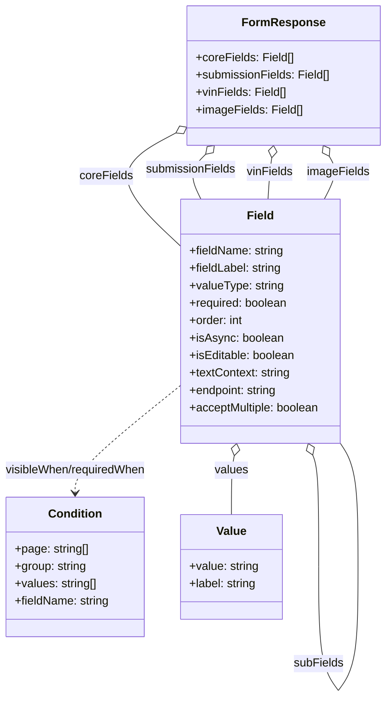
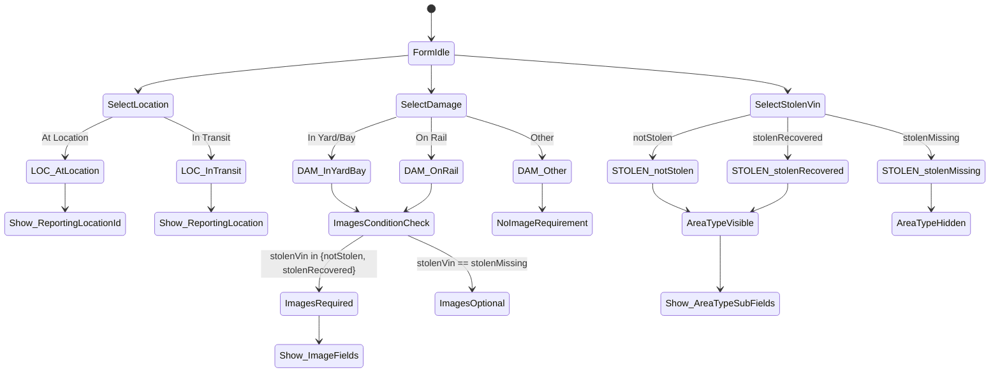

# Diagram: web/portal/src/mocks/handlers/damage-view/damage-view-get-fields.js

> Auto-generated by Obscura crawlers

## Diagram 1

### SVG

<svg id="container" width="534.7301025390625" xmlns="http://www.w3.org/2000/svg" class="classDiagram" height="958.1499633789062" viewBox="0 0 534.7301025390625 958.1499633789062" role="graphics-document document" aria-roledescription="class"><g><defs><marker id="container_class-aggregationStart" class="marker aggregation class" refX="18" refY="7" markerWidth="190" markerHeight="240" orient="auto"><path d="M 18,7 L9,13 L1,7 L9,1 Z"></path></marker></defs><defs><marker id="container_class-aggregationEnd" class="marker aggregation class" refX="1" refY="7" markerWidth="20" markerHeight="28" orient="auto"><path d="M 18,7 L9,13 L1,7 L9,1 Z"></path></marker></defs><defs><marker id="container_class-extensionStart" class="marker extension class" refX="18" refY="7" markerWidth="190" markerHeight="240" orient="auto"><path d="M 1,7 L18,13 V 1 Z"></path></marker></defs><defs><marker id="container_class-extensionEnd" class="marker extension class" refX="1" refY="7" markerWidth="20" markerHeight="28" orient="auto"><path d="M 1,1 V 13 L18,7 Z"></path></marker></defs><defs><marker id="container_class-compositionStart" class="marker composition class" refX="18" refY="7" markerWidth="190" markerHeight="240" orient="auto"><path d="M 18,7 L9,13 L1,7 L9,1 Z"></path></marker></defs><defs><marker id="container_class-compositionEnd" class="marker composition class" refX="1" refY="7" markerWidth="20" markerHeight="28" orient="auto"><path d="M 18,7 L9,13 L1,7 L9,1 Z"></path></marker></defs><defs><marker id="container_class-dependencyStart" class="marker dependency class" refX="6" refY="7" markerWidth="190" markerHeight="240" orient="auto"><path d="M 5,7 L9,13 L1,7 L9,1 Z"></path></marker></defs><defs><marker id="container_class-dependencyEnd" class="marker dependency class" refX="13" refY="7" markerWidth="20" markerHeight="28" orient="auto"><path d="M 18,7 L9,13 L14,7 L9,1 Z"></path></marker></defs><defs><marker id="container_class-lollipopStart" class="marker lollipop class" refX="13" refY="7" markerWidth="190" markerHeight="240" orient="auto"><circle stroke="black" fill="transparent" cx="7" cy="7" r="6"></circle></marker></defs><defs><marker id="container_class-lollipopEnd" class="marker lollipop class" refX="1" refY="7" markerWidth="190" markerHeight="240" orient="auto"><circle stroke="black" fill="transparent" cx="7" cy="7" r="6"></circle></marker></defs><g class="root"><g class="clusters"></g><g class="edgePaths"><path d="M247.977,181.28L230.311,190.567C212.644,199.853,177.312,218.427,177.777,244.56C178.243,270.694,214.506,304.389,232.638,321.236L250.769,338.083" id="id_FormResponse_Field_1" class="edge-thickness-normal edge-pattern-solid relation" style=";;;" data-edge="true" data-et="edge" data-id="id_FormResponse_Field_1" data-points="W3sieCI6MjYzLjI0NTcwMzEyNTM3MjUzLCJ5IjoxNzMuMjUzNTI5MDIwNDM2OTl9LHsieCI6MTQxLjk3OTY4NzUwMDc0NTA2LCJ5IjoyMzd9LHsieCI6MjUwLjc2OTE0MDYyNTM3MjUzLCJ5IjozMzguMDgyODQ4OTUyODM3MTR9XQ==" marker-start="url(#container_class-aggregationStart)"></path><path d="M286.011,212.151L281.837,216.293C277.664,220.434,269.318,228.717,268.202,239.025C267.087,249.333,273.201,261.667,276.259,267.833L279.316,274" id="id_FormResponse_Field_2" class="edge-thickness-normal edge-pattern-solid relation" style=";;;" data-edge="true" data-et="edge" data-id="id_FormResponse_Field_2" data-points="W3sieCI6Mjk4LjI1NDUyNTk2Mzk4NzMsInkiOjIwMH0seyJ4IjoyNjAuOTcxODc1MDAwNzQ1MDYsInkiOjIzN30seyJ4IjoyNzkuMzE2MTMzNzY1OTIxNzMsInkiOjI3NH1d" marker-start="url(#container_class-aggregationStart)"></path><path d="M378.251,217.064L377.759,220.387C377.267,223.709,376.284,230.355,375.41,239.844C374.536,249.333,373.773,261.667,373.391,267.833L373.009,274" id="id_FormResponse_Field_3" class="edge-thickness-normal edge-pattern-solid relation" style=";;;" data-edge="true" data-et="edge" data-id="id_FormResponse_Field_3" data-points="W3sieCI6MzgwLjc3NzA4MjM1NDk2NDcsInkiOjIwMH0seyJ4IjozNzUuMzAwMDAwMDAwNzQ1MDYsInkiOjIzN30seyJ4IjozNzMuMDA5NDI2NDQ4ODQ4NTYsInkiOjI3NH1d" marker-start="url(#container_class-aggregationStart)"></path><path d="M457.716,215.018L459.786,218.682C461.856,222.346,465.996,229.673,464.831,239.503C463.667,249.333,457.198,261.667,453.963,267.833L450.729,274" id="id_FormResponse_Field_4" class="edge-thickness-normal edge-pattern-solid relation" style=";;;" data-edge="true" data-et="edge" data-id="id_FormResponse_Field_4" data-points="W3sieCI6NDQ5LjIzMDA4OTg3Mzc2MTcsInkiOjIwMH0seyJ4Ijo0NzAuMTM1OTM3NTAwNzQ1MDYsInkiOjIzN30seyJ4Ijo0NTAuNzI4NjMzNzY1OTIxNywieSI6Mjc0fV0=" marker-start="url(#container_class-aggregationStart)"></path><path d="M326.697,626.934L326.048,630.278C325.399,633.622,324.1,640.311,323.45,653.822C322.801,667.333,322.801,687.667,322.801,697.833L322.801,708" id="id_Field_Value_5" class="edge-thickness-normal edge-pattern-solid relation" style=";;;" data-edge="true" data-et="edge" data-id="id_Field_Value_5" data-points="W3sieCI6MzI5Ljk4NTY3NjQ0ODIzOCwieSI6NjEwfSx7IngiOjMyMi44MDA3ODEyNSwieSI6NjQ3fSx7IngiOjMyMi44MDA3ODEyNSwieSI6NzA4fV0=" marker-start="url(#container_class-aggregationStart)"></path><path d="M434.805,626.059L436.174,629.549C437.543,633.039,440.281,640.02,441.65,665.668C443.019,691.317,443.019,735.633,443.019,757.792L443.019,779.95" id="Field-cyclic-special-1" class="edge-thickness-normal edge-pattern-solid relation" style=";;;" data-edge="true" data-et="edge" data-id="Field-cyclic-special-1" data-points="W3sieCI6NDI4LjUwNTc2NzkxMjI2MzIsInkiOjYxMH0seyJ4Ijo0NDMuMDE4NzUwMDAwNzQ1MDYsInkiOjY0N30seyJ4Ijo0NDMuMDE4NzUwMDAwNzQ1MDYsInkiOjc3OS45NDk5OTk5OTkyNTQ5fV0=" marker-start="url(#container_class-aggregationStart)"></path><path d="M443.019,780.05L443.019,802.208C443.019,824.367,443.019,868.683,447.532,897.008C452.046,925.333,461.072,937.667,465.586,943.833L470.099,950" id="Field-cyclic-special-mid" class="edge-thickness-normal edge-pattern-solid relation" style=";;;" data-edge="true" data-et="edge" data-id="Field-cyclic-special-mid" data-points="W3sieCI6NDQzLjAxODc1MDAwMDc0NTA2LCJ5Ijo3ODAuMDUwMDAwMDAwNzQ1MX0seyJ4Ijo0NDMuMDE4NzUwMDAwNzQ1MDYsInkiOjkxM30seyJ4Ijo0NzAuMDk5MzQyMTA1NDYzNiwieSI6OTUwfV0="></path><path d="M470.173,950L474.686,943.833C479.199,937.667,488.226,925.333,492.74,897C497.253,868.667,497.253,824.333,497.253,780C497.253,735.667,497.253,691.333,493.203,663C489.153,634.667,481.052,622.333,477.002,616.167L472.951,610" id="Field-cyclic-special-2" class="edge-thickness-normal edge-pattern-solid relation" style=";;;" data-edge="true" data-et="edge" data-id="Field-cyclic-special-2" data-points="W3sieCI6NDcwLjE3MjUzMjg5NjAyNjUsInkiOjk1MH0seyJ4Ijo0OTcuMjUzMTI1MDAwNzQ1MDYsInkiOjkxM30seyJ4Ijo0OTcuMjUzMTI1MDAwNzQ1MDYsInkiOjc4MH0seyJ4Ijo0OTcuMjUzMTI1MDAwNzQ1MDYsInkiOjY0N30seyJ4Ijo0NzIuOTUxNDk5NjE5NTgwMjYsInkiOjYxMH1d"></path><path d="M250.769,531.735L226.826,550.946C202.883,570.156,154.996,608.578,131.053,632.956C107.109,657.333,107.109,667.667,107.109,672.833L107.109,678" id="id_Field_Condition_7" class="edge-thickness-normal edge-pattern-dashed relation" style=";;;" data-edge="true" data-et="edge" data-id="id_Field_Condition_7" data-points="W3sieCI6MjUwLjc2OTE0MDYyNTM3MjUzLCJ5Ijo1MzEuNzM0NjQ5Nzg5ODc5Mn0seyJ4IjoxMDcuMTA5Mzc1LCJ5Ijo2NDd9LHsieCI6MTA3LjEwOTM3NSwieSI6Njg0fV0=" marker-end="url(#container_class-dependencyEnd)"></path></g><g class="edgeLabels"><g class="edgeLabel" transform="translate(146.19272, 240.91458)"><g class="label" data-id="id_FormResponse_Field_1" transform="translate(-36.6328125, -12)"><foreignObject width="73.265625" height="24">

coreFields

</foreignObject></g></g><g class="edgeLabel" transform="translate(264.95676, 233.04533)"><g class="label" data-id="id_FormResponse_Field_2" transform="translate(-62.359375, -12)"><foreignObject width="124.71875" height="24">

submissionFields

</foreignObject></g></g><g class="edgeLabel" transform="translate(375.30000000074506, 237)"><g class="label" data-id="id_FormResponse_Field_3" transform="translate(-31.96875, -12)"><foreignObject width="63.9375" height="24">

vinFields

</foreignObject></g></g><g class="edgeLabel" transform="translate(469.95963, 236.68796)"><g class="label" data-id="id_FormResponse_Field_4" transform="translate(-42.8671875, -12)"><foreignObject width="85.734375" height="24">

imageFields

</foreignObject></g></g><g class="edgeLabel" transform="translate(322.80078125, 647)"><g class="label" data-id="id_Field_Value_5" transform="translate(-23.1796875, -12)"><foreignObject width="46.359375" height="24">

values

</foreignObject></g></g><g class="edgeLabel"><g class="label" data-id="Field-cyclic-special-1" transform="translate(0, 0)"><foreignObject width="0" height="0">

</foreignObject></g></g><g class="edgeLabel" transform="translate(443.01875000074506, 913)"><g class="label" data-id="Field-cyclic-special-mid" transform="translate(-34.234375, -12)"><foreignObject width="68.46875" height="24">

subFields

</foreignObject></g></g><g class="edgeLabel"><g class="label" data-id="Field-cyclic-special-2" transform="translate(0, 0)"><foreignObject width="0" height="0">

</foreignObject></g></g><g class="edgeLabel" transform="translate(107.109375, 647)"><g class="label" data-id="id_Field_Condition_7" transform="translate(-99.109375, -12)"><foreignObject width="198.21875" height="24">

visibleWhen/requiredWhen

</foreignObject></g></g></g><g class="nodes"><g class="node default" id="classId-FormResponse-0" transform="translate(394.98789062537253, 104)"><g class="basic label-container"><path d="M-131.7421875 -96 L131.7421875 -96 L131.7421875 96 L-131.7421875 96" stroke="none" stroke-width="0" fill="#ECECFF" style=""></path><path d="M-131.7421875 -96 C-34.63406684119387 -96, 62.47405381761226 -96, 131.7421875 -96 M-131.7421875 -96 C-67.59428266705778 -96, -3.446377834115566 -96, 131.7421875 -96 M131.7421875 -96 C131.7421875 -47.309960729316664, 131.7421875 1.3800785413666716, 131.7421875 96 M131.7421875 -96 C131.7421875 -31.021872467239007, 131.7421875 33.95625506552199, 131.7421875 96 M131.7421875 96 C46.86154999146309 96, -38.019087517073814 96, -131.7421875 96 M131.7421875 96 C41.04955952635095 96, -49.643068447298106 96, -131.7421875 96 M-131.7421875 96 C-131.7421875 50.09379955825903, -131.7421875 4.187599116518058, -131.7421875 -96 M-131.7421875 96 C-131.7421875 41.2381879463924, -131.7421875 -13.523624107215198, -131.7421875 -96" stroke="#9370DB" stroke-width="1.3" fill="none" stroke-dasharray="0 0" style=""></path></g><g class="annotation-group text" transform="translate(0, -72)"></g><g class="label-group text" transform="translate(-53.703125, -72)"><g class="label" style="font-weight: bolder" transform="translate(0,-12)"><foreignObject width="107.40625" height="24">

FormResponse

</foreignObject></g></g><g class="members-group text" transform="translate(-119.7421875, -24)"><g class="label" style="" transform="translate(0,-12)"><foreignObject width="134.34375" height="24">

+coreFields: Field[]

</foreignObject></g><g class="label" style="" transform="translate(0,12)"><foreignObject width="185.78125" height="24">

+submissionFields: Field[]

</foreignObject></g><g class="label" style="" transform="translate(0,36)"><foreignObject width="124.859375" height="24">

+vinFields: Field[]

</foreignObject></g><g class="label" style="" transform="translate(0,60)"><foreignObject width="146.8125" height="24">

+imageFields: Field[]

</foreignObject></g></g><g class="methods-group text" transform="translate(-119.7421875, 96)"></g><g class="divider" style=""><path d="M-131.7421875 -48 C-66.33145383623945 -48, -0.9207201724788945 -48, 131.7421875 -48 M-131.7421875 -48 C-40.345148510371644 -48, 51.05189047925671 -48, 131.7421875 -48" stroke="#9370DB" stroke-width="1.3" fill="none" stroke-dasharray="0 0" style=""></path></g><g class="divider" style=""><path d="M-131.7421875 72 C-43.726253996065424 72, 44.28967950786915 72, 131.7421875 72 M-131.7421875 72 C-57.91554428089202 72, 15.911098938215957 72, 131.7421875 72" stroke="#9370DB" stroke-width="1.3" fill="none" stroke-dasharray="0 0" style=""></path></g></g><g class="node default" id="classId-Field-1" transform="translate(362.60898437537253, 442)"><g class="basic label-container"><path d="M-111.83984375 -168 L111.83984375 -168 L111.83984375 168 L-111.83984375 168" stroke="none" stroke-width="0" fill="#ECECFF" style=""></path><path d="M-111.83984375 -168 C-44.35182332291593 -168, 23.136197104168133 -168, 111.83984375 -168 M-111.83984375 -168 C-30.59748963091687 -168, 50.64486448816626 -168, 111.83984375 -168 M111.83984375 -168 C111.83984375 -66.57291528280155, 111.83984375 34.85416943439691, 111.83984375 168 M111.83984375 -168 C111.83984375 -55.95490155786639, 111.83984375 56.090196884267215, 111.83984375 168 M111.83984375 168 C66.43597976532166 168, 21.03211578064331 168, -111.83984375 168 M111.83984375 168 C57.611635893259844 168, 3.383428036519689 168, -111.83984375 168 M-111.83984375 168 C-111.83984375 77.42386011437685, -111.83984375 -13.152279771246299, -111.83984375 -168 M-111.83984375 168 C-111.83984375 88.23926191365308, -111.83984375 8.478523827306162, -111.83984375 -168" stroke="#9370DB" stroke-width="1.3" fill="none" stroke-dasharray="0 0" style=""></path></g><g class="annotation-group text" transform="translate(0, -144)"></g><g class="label-group text" transform="translate(-17.4765625, -144)"><g class="label" style="font-weight: bolder" transform="translate(0,-12)"><foreignObject width="34.953125" height="24">

Field

</foreignObject></g></g><g class="members-group text" transform="translate(-99.83984375, -96)"><g class="label" style="" transform="translate(0,-12)"><foreignObject width="131.625" height="24">

+fieldName: string

</foreignObject></g><g class="label" style="" transform="translate(0,12)"><foreignObject width="129.140625" height="24">

+fieldLabel: string

</foreignObject></g><g class="label" style="" transform="translate(0,36)"><foreignObject width="130.15625" height="24">

+valueType: string

</foreignObject></g><g class="label" style="" transform="translate(0,60)"><foreignObject width="137.296875" height="24">

+required: boolean

</foreignObject></g><g class="label" style="" transform="translate(0,84)"><foreignObject width="75.40625" height="24">

+order: int

</foreignObject></g><g class="label" style="" transform="translate(0,108)"><foreignObject width="128.828125" height="24">

+isAsync: boolean

</foreignObject></g><g class="label" style="" transform="translate(0,132)"><foreignObject width="147.015625" height="24">

+isEditable: boolean

</foreignObject></g><g class="label" style="" transform="translate(0,156)"><foreignObject width="140.34375" height="24">

+textContext: string

</foreignObject></g><g class="label" style="" transform="translate(0,180)"><foreignObject width="123.9375" height="24">

+endpoint: string

</foreignObject></g><g class="label" style="" transform="translate(0,204)"><foreignObject width="182.203125" height="24">

+acceptMultiple: boolean

</foreignObject></g></g><g class="methods-group text" transform="translate(-99.83984375, 168)"></g><g class="divider" style=""><path d="M-111.83984375 -120 C-43.20341195478039 -120, 25.433019840439215 -120, 111.83984375 -120 M-111.83984375 -120 C-34.45850266979839 -120, 42.922838410403216 -120, 111.83984375 -120" stroke="#9370DB" stroke-width="1.3" fill="none" stroke-dasharray="0 0" style=""></path></g><g class="divider" style=""><path d="M-111.83984375 144 C-45.59690563200593 144, 20.646032485988144 144, 111.83984375 144 M-111.83984375 144 C-31.154443903250638 144, 49.530955943498725 144, 111.83984375 144" stroke="#9370DB" stroke-width="1.3" fill="none" stroke-dasharray="0 0" style=""></path></g></g><g class="node default" id="classId-Condition-2" transform="translate(107.109375, 780)"><g class="basic label-container"><path d="M-95.5234375 -96 L95.5234375 -96 L95.5234375 96 L-95.5234375 96" stroke="none" stroke-width="0" fill="#ECECFF" style=""></path><path d="M-95.5234375 -96 C-29.54378650686057 -96, 36.43586448627886 -96, 95.5234375 -96 M-95.5234375 -96 C-37.32804504191684 -96, 20.867347416166325 -96, 95.5234375 -96 M95.5234375 -96 C95.5234375 -49.12034713338683, 95.5234375 -2.2406942667736587, 95.5234375 96 M95.5234375 -96 C95.5234375 -24.192339595100265, 95.5234375 47.61532080979947, 95.5234375 96 M95.5234375 96 C19.710708881110904 96, -56.10201973777819 96, -95.5234375 96 M95.5234375 96 C32.72865153843337 96, -30.066134423133263 96, -95.5234375 96 M-95.5234375 96 C-95.5234375 55.55748858174709, -95.5234375 15.114977163494174, -95.5234375 -96 M-95.5234375 96 C-95.5234375 56.595266562688515, -95.5234375 17.19053312537703, -95.5234375 -96" stroke="#9370DB" stroke-width="1.3" fill="none" stroke-dasharray="0 0" style=""></path></g><g class="annotation-group text" transform="translate(0, -72)"></g><g class="label-group text" transform="translate(-35.421875, -72)"><g class="label" style="font-weight: bolder" transform="translate(0,-12)"><foreignObject width="70.84375" height="24">

Condition

</foreignObject></g></g><g class="members-group text" transform="translate(-83.5234375, -24)"><g class="label" style="" transform="translate(0,-12)"><foreignObject width="102.6875" height="24">

+page: string[]

</foreignObject></g><g class="label" style="" transform="translate(0,12)"><foreignObject width="99.875" height="24">

+group: string

</foreignObject></g><g class="label" style="" transform="translate(0,36)"><foreignObject width="114.203125" height="24">

+values: string[]

</foreignObject></g><g class="label" style="" transform="translate(0,60)"><foreignObject width="131.625" height="24">

+fieldName: string

</foreignObject></g></g><g class="methods-group text" transform="translate(-83.5234375, 96)"></g><g class="divider" style=""><path d="M-95.5234375 -48 C-22.866038816981444 -48, 49.79135986603711 -48, 95.5234375 -48 M-95.5234375 -48 C-32.763130002945445 -48, 29.99717749410911 -48, 95.5234375 -48" stroke="#9370DB" stroke-width="1.3" fill="none" stroke-dasharray="0 0" style=""></path></g><g class="divider" style=""><path d="M-95.5234375 72 C-21.96534447109019 72, 51.59274855781962 72, 95.5234375 72 M-95.5234375 72 C-51.587016425525164 72, -7.6505953510503275 72, 95.5234375 72" stroke="#9370DB" stroke-width="1.3" fill="none" stroke-dasharray="0 0" style=""></path></g></g><g class="node default" id="classId-Value-3" transform="translate(322.80078125, 780)"><g class="basic label-container"><path d="M-70.16796875 -72 L70.16796875 -72 L70.16796875 72 L-70.16796875 72" stroke="none" stroke-width="0" fill="#ECECFF" style=""></path><path d="M-70.16796875 -72 C-22.623986638738216 -72, 24.919995472523567 -72, 70.16796875 -72 M-70.16796875 -72 C-31.130842337150696 -72, 7.906284075698608 -72, 70.16796875 -72 M70.16796875 -72 C70.16796875 -21.063545476041966, 70.16796875 29.872909047916067, 70.16796875 72 M70.16796875 -72 C70.16796875 -21.194730667178035, 70.16796875 29.61053866564393, 70.16796875 72 M70.16796875 72 C30.140278068640285 72, -9.88741261271943 72, -70.16796875 72 M70.16796875 72 C30.900251771351833 72, -8.367465207296334 72, -70.16796875 72 M-70.16796875 72 C-70.16796875 28.76275227483916, -70.16796875 -14.474495450321683, -70.16796875 -72 M-70.16796875 72 C-70.16796875 14.551671402585, -70.16796875 -42.89665719483, -70.16796875 -72" stroke="#9370DB" stroke-width="1.3" fill="none" stroke-dasharray="0 0" style=""></path></g><g class="annotation-group text" transform="translate(0, -48)"></g><g class="label-group text" transform="translate(-19.9140625, -48)"><g class="label" style="font-weight: bolder" transform="translate(0,-12)"><foreignObject width="39.828125" height="24">

Value

</foreignObject></g></g><g class="members-group text" transform="translate(-58.16796875, 0)"><g class="label" style="" transform="translate(0,-12)"><foreignObject width="96.421875" height="24">

+value: string

</foreignObject></g><g class="label" style="" transform="translate(0,12)"><foreignObject width="94.09375" height="24">

+label: string

</foreignObject></g></g><g class="methods-group text" transform="translate(-58.16796875, 72)"></g><g class="divider" style=""><path d="M-70.16796875 -24 C-22.11996224111816 -24, 25.92804426776368 -24, 70.16796875 -24 M-70.16796875 -24 C-19.55864922243149 -24, 31.050670305137018 -24, 70.16796875 -24" stroke="#9370DB" stroke-width="1.3" fill="none" stroke-dasharray="0 0" style=""></path></g><g class="divider" style=""><path d="M-70.16796875 48 C-25.445663863848225 48, 19.27664102230355 48, 70.16796875 48 M-70.16796875 48 C-17.872429700722194 48, 34.42310934855561 48, 70.16796875 48" stroke="#9370DB" stroke-width="1.3" fill="none" stroke-dasharray="0 0" style=""></path></g></g><g class="label edgeLabel" id="Field---Field---1" transform="translate(443.01875000074506, 780)"><rect width="0.1" height="0.1"></rect><g class="label" style="" transform="translate(0, 0)"><rect></rect><foreignObject width="0" height="0">

</foreignObject></g></g><g class="label edgeLabel" id="Field---Field---2" transform="translate(470.13593750074506, 950.0500000007451)"><rect width="0.1" height="0.1"></rect><g class="label" style="" transform="translate(0, 0)"><rect></rect><foreignObject width="0" height="0">

</foreignObject></g></g></g></g></g></svg>

## Diagram 2

```mermaid
flowchart TD
GET["GET /damageview/submission/:submissionId/fields"] --> Response["responseBody"]
Response --> Core["coreFields"]
Response --> Submission["submissionFields"]
Response --> Vin["vinFields"]
Response --> Images["imageFields"]
Submission --> LocationNode["location: dropdown (At Location, In Transit)"]
LocationNode -->|At Location| ReportingId["reportingLocationId: async dropdown (endpoint)"]
LocationNode -->|In Transit| ReportingInput["reportingLocation: input"]
Submission --> DamageNode["damageLocation: dropdown (In Yard/Bay, On Rail, Other)"]
DamageNode -->|In Yard/Bay| BayRelated["Bay fields: bayLocation, bayTag, frontRight, frontLeft, rearRight, rearLeft, overviewDamagedArea, closeupDamage, dashboardOverview, overviewWholeUnit"]
DamageNode -->|On Rail| RailRelated["Rail fields: railcarPosition, railcar, overviewDamagedArea, closeupDamage"]
DamageNode -->|Other| OtherRelated["Other fields: repairLocation"]
Submission --> OtherSubmission["other submissionFields: chockCondition, primaryChockType, railcarNumber, railcarType, secondarySubmitterEmail, secondarySubmitterPhoneNumber, unloadDate, additionalEmails, inProgressStatus, inProgressStatusUpdated, rejectedComments"]
Vin --> StolenVinNode["stolenVin: dropdown (notStolen, stolenMissing, stolenRecovered)"]
StolenVinNode -->|notStolen / stolenRecovered| AreaType["areaTypeSeverity: multiple_values → subFields(area, type, severity)"]
AreaType --> AreaNode["area: dropdown (codes 01..99)"]
AreaType --> TypeNode["type: dropdown (damage types)"]
AreaType --> SeverityNode["severity: dropdown (1..6)"]
Vin --> CommentsNode["comments: textarea (required)"]
Vin --> PositionNode["railcarPosition / bayLocation requiredWhen damageLocation == On Rail / In Yard/Bay"]
Images --> ImageRule["Images required when damageLocation ∈ {On Rail, In Yard/Bay} AND stolenVin ∈ {notStolen, stolenRecovered}"]
ImageRule --> BayTag["bayTag"]
ImageRule --> VINImage["vin"]
ImageRule --> FrontRight["frontRight"]
ImageRule --> FrontLeft["frontLeft"]
ImageRule --> RearRight["rearRight"]
ImageRule --> RearLeft["rearLeft"]
ImageRule --> OverviewDamagedArea["overviewDamagedArea"]
ImageRule --> CloseupDamage["closeupDamage"]
ImageRule --> RailcarImage["railcar"]
ImageRule --> DashboardOverview["dashboardOverview"]
ImageRule --> OverviewWholeUnit["overviewWholeUnit"]
ImageRule --> InteriorDamage["interiorDamage"]
ImageRule --> AdditionalPhoto["additionalPhoto"]
```

### SVG

<svg id="container" width="4458.921875" xmlns="http://www.w3.org/2000/svg" class="flowchart" height="1070" viewBox="0 0 4458.921875 1070" role="graphics-document document" aria-roledescription="flowchart-v2"><g><marker id="container_flowchart-v2-pointEnd" class="marker flowchart-v2" viewBox="0 0 10 10" refX="5" refY="5" markerUnits="userSpaceOnUse" markerWidth="8" markerHeight="8" orient="auto"><path d="M 0 0 L 10 5 L 0 10 z" class="arrowMarkerPath" style="stroke-width: 1; stroke-dasharray: 1, 0;"></path></marker><marker id="container_flowchart-v2-pointStart" class="marker flowchart-v2" viewBox="0 0 10 10" refX="4.5" refY="5" markerUnits="userSpaceOnUse" markerWidth="8" markerHeight="8" orient="auto"><path d="M 0 5 L 10 10 L 10 0 z" class="arrowMarkerPath" style="stroke-width: 1; stroke-dasharray: 1, 0;"></path></marker><marker id="container_flowchart-v2-circleEnd" class="marker flowchart-v2" viewBox="0 0 10 10" refX="11" refY="5" markerUnits="userSpaceOnUse" markerWidth="11" markerHeight="11" orient="auto"><circle cx="5" cy="5" r="5" class="arrowMarkerPath" style="stroke-width: 1; stroke-dasharray: 1, 0;"></circle></marker><marker id="container_flowchart-v2-circleStart" class="marker flowchart-v2" viewBox="0 0 10 10" refX="-1" refY="5" markerUnits="userSpaceOnUse" markerWidth="11" markerHeight="11" orient="auto"><circle cx="5" cy="5" r="5" class="arrowMarkerPath" style="stroke-width: 1; stroke-dasharray: 1, 0;"></circle></marker><marker id="container_flowchart-v2-crossEnd" class="marker cross flowchart-v2" viewBox="0 0 11 11" refX="12" refY="5.2" markerUnits="userSpaceOnUse" markerWidth="11" markerHeight="11" orient="auto"><path d="M 1,1 l 9,9 M 10,1 l -9,9" class="arrowMarkerPath" style="stroke-width: 2; stroke-dasharray: 1, 0;"></path></marker><marker id="container_flowchart-v2-crossStart" class="marker cross flowchart-v2" viewBox="0 0 11 11" refX="-1" refY="5.2" markerUnits="userSpaceOnUse" markerWidth="11" markerHeight="11" orient="auto"><path d="M 1,1 l 9,9 M 10,1 l -9,9" class="arrowMarkerPath" style="stroke-width: 2; stroke-dasharray: 1, 0;"></path></marker><g class="root"><g class="clusters"></g><g class="edgePaths"><path d="M1537.852,86L1537.852,90.167C1537.852,94.333,1537.852,102.667,1537.852,110.333C1537.852,118,1537.852,125,1537.852,128.5L1537.852,132" id="L_GET_Response_0" class="edge-thickness-normal edge-pattern-solid edge-thickness-normal edge-pattern-solid flowchart-link" style=";" data-edge="true" data-et="edge" data-id="L_GET_Response_0" data-points="W3sieCI6MTUzNy44NTE1NjI1LCJ5Ijo4Nn0seyJ4IjoxNTM3Ljg1MTU2MjUsInkiOjExMX0seyJ4IjoxNTM3Ljg1MTU2MjUsInkiOjEzNn1d" marker-end="url(#container_flowchart-v2-pointEnd)"></path><path d="M1456.438,169.024L1352.884,176.687C1249.331,184.35,1042.224,199.675,938.671,210.837C835.117,222,835.117,229,835.117,232.5L835.117,236" id="L_Response_Core_0" class="edge-thickness-normal edge-pattern-solid edge-thickness-normal edge-pattern-solid flowchart-link" style=";" data-edge="true" data-et="edge" data-id="L_Response_Core_0" data-points="W3sieCI6MTQ1Ni40Mzc1LCJ5IjoxNjkuMDI0MzY5MDkzOTQxMX0seyJ4Ijo4MzUuMTE3MTg3NSwieSI6MjE1fSx7IngiOjgzNS4xMTcxODc1LCJ5IjoyNDB9XQ==" marker-end="url(#container_flowchart-v2-pointEnd)"></path><path d="M1456.438,171.574L1387.716,178.812C1318.995,186.05,1181.552,200.525,1112.831,211.262C1044.109,222,1044.109,229,1044.109,232.5L1044.109,236" id="L_Response_Submission_0" class="edge-thickness-normal edge-pattern-solid edge-thickness-normal edge-pattern-solid flowchart-link" style=";" data-edge="true" data-et="edge" data-id="L_Response_Submission_0" data-points="W3sieCI6MTQ1Ni40Mzc1LCJ5IjoxNzEuNTc0Mzc2MTc2ODM4MjN9LHsieCI6MTA0NC4xMDkzNzUsInkiOjIxNX0seyJ4IjoxMDQ0LjEwOTM3NSwieSI6MjQwfV0=" marker-end="url(#container_flowchart-v2-pointEnd)"></path><path d="M1619.266,169.526L1713.82,177.105C1808.375,184.684,1997.484,199.842,2092.039,210.921C2186.594,222,2186.594,229,2186.594,232.5L2186.594,236" id="L_Response_Vin_0" class="edge-thickness-normal edge-pattern-solid edge-thickness-normal edge-pattern-solid flowchart-link" style=";" data-edge="true" data-et="edge" data-id="L_Response_Vin_0" data-points="W3sieCI6MTYxOS4yNjU2MjUsInkiOjE2OS41MjU3NTI5NTk0NTI3N30seyJ4IjoyMTg2LjU5Mzc1LCJ5IjoyMTV9LHsieCI6MjE4Ni41OTM3NSwieSI6MjQwfV0=" marker-end="url(#container_flowchart-v2-pointEnd)"></path><path d="M1619.266,165.885L1850.229,174.071C2081.193,182.257,2543.12,198.628,2774.083,210.314C3005.047,222,3005.047,229,3005.047,232.5L3005.047,236" id="L_Response_Images_0" class="edge-thickness-normal edge-pattern-solid edge-thickness-normal edge-pattern-solid flowchart-link" style=";" data-edge="true" data-et="edge" data-id="L_Response_Images_0" data-points="W3sieCI6MTYxOS4yNjU2MjUsInkiOjE2NS44ODU0NTg1NDM4ODQyM30seyJ4IjozMDA1LjA0Njg3NSwieSI6MjE1fSx7IngiOjMwMDUuMDQ2ODc1LCJ5IjoyNDB9XQ==" marker-end="url(#container_flowchart-v2-pointEnd)"></path><path d="M951.75,272.991L833.541,280.659C715.332,288.328,478.914,303.664,360.705,330.832C242.496,358,242.496,397,242.496,416.5L242.496,436" id="L_Submission_LocationNode_0" class="edge-thickness-normal edge-pattern-solid edge-thickness-normal edge-pattern-solid flowchart-link" style=";" data-edge="true" data-et="edge" data-id="L_Submission_LocationNode_0" data-points="W3sieCI6OTUxLjc1LCJ5IjoyNzIuOTkxMjc3MzU1NzIzMDd9LHsieCI6MjQyLjQ5NjA5Mzc1LCJ5IjozMTl9LHsieCI6MjQyLjQ5NjA5Mzc1LCJ5Ijo0NDB9XQ==" marker-end="url(#container_flowchart-v2-pointEnd)"></path><path d="M220.347,518L206.623,542.167C192.898,566.333,165.449,614.667,151.725,658.333C138,702,138,741,138,760.5L138,780" id="L_LocationNode_ReportingId_0" class="edge-thickness-normal edge-pattern-solid edge-thickness-normal edge-pattern-solid flowchart-link" style=";" data-edge="true" data-et="edge" data-id="L_LocationNode_ReportingId_0" data-points="W3sieCI6MjIwLjM0NzQ2NTE4MzQyMzksInkiOjUxOH0seyJ4IjoxMzgsInkiOjY2M30seyJ4IjoxMzgsInkiOjc4NH1d" marker-end="url(#container_flowchart-v2-pointEnd)"></path><path d="M283.522,518L308.944,542.167C334.366,566.333,385.21,614.667,410.633,660.333C436.055,706,436.055,749,436.055,770.5L436.055,792" id="L_LocationNode_ReportingInput_0" class="edge-thickness-normal edge-pattern-solid edge-thickness-normal edge-pattern-solid flowchart-link" style=";" data-edge="true" data-et="edge" data-id="L_LocationNode_ReportingInput_0" data-points="W3sieCI6MjgzLjUyMjEwMDAzMzk2NzQsInkiOjUxOH0seyJ4Ijo0MzYuMDU0Njg3NSwieSI6NjYzfSx7IngiOjQzNi4wNTQ2ODc1LCJ5Ijo3OTZ9XQ==" marker-end="url(#container_flowchart-v2-pointEnd)"></path><path d="M1044.109,294L1044.109,298.167C1044.109,302.333,1044.109,310.667,1044.109,332.333C1044.109,354,1044.109,389,1044.109,406.5L1044.109,424" id="L_Submission_DamageNode_0" class="edge-thickness-normal edge-pattern-solid edge-thickness-normal edge-pattern-solid flowchart-link" style=";" data-edge="true" data-et="edge" data-id="L_Submission_DamageNode_0" data-points="W3sieCI6MTA0NC4xMDkzNzUsInkiOjI5NH0seyJ4IjoxMDQ0LjEwOTM3NSwieSI6MzE5fSx7IngiOjEwNDQuMTA5Mzc1LCJ5Ijo0Mjh9XQ==" marker-end="url(#container_flowchart-v2-pointEnd)"></path><path d="M958.185,530L920.839,552.167C883.493,574.333,808.801,618.667,771.455,648.333C734.109,678,734.109,693,734.109,700.5L734.109,708" id="L_DamageNode_BayRelated_0" class="edge-thickness-normal edge-pattern-solid edge-thickness-normal edge-pattern-solid flowchart-link" style=";" data-edge="true" data-et="edge" data-id="L_DamageNode_BayRelated_0" data-points="W3sieCI6OTU4LjE4NTQ2MTk1NjUyMTcsInkiOjUzMH0seyJ4Ijo3MzQuMTA5Mzc1LCJ5Ijo2NjN9LHsieCI6NzM0LjEwOTM3NSwieSI6NzEyfV0=" marker-end="url(#container_flowchart-v2-pointEnd)"></path><path d="M1044.109,530L1044.109,552.167C1044.109,574.333,1044.109,618.667,1044.109,656.333C1044.109,694,1044.109,725,1044.109,740.5L1044.109,756" id="L_DamageNode_RailRelated_0" class="edge-thickness-normal edge-pattern-solid edge-thickness-normal edge-pattern-solid flowchart-link" style=";" data-edge="true" data-et="edge" data-id="L_DamageNode_RailRelated_0" data-points="W3sieCI6MTA0NC4xMDkzNzUsInkiOjUzMH0seyJ4IjoxMDQ0LjEwOTM3NSwieSI6NjYzfSx7IngiOjEwNDQuMTA5Mzc1LCJ5Ijo3NjB9XQ==" marker-end="url(#container_flowchart-v2-pointEnd)"></path><path d="M1138,530L1178.808,552.167C1219.617,574.333,1301.234,618.667,1342.043,662.333C1382.852,706,1382.852,749,1382.852,770.5L1382.852,792" id="L_DamageNode_OtherRelated_0" class="edge-thickness-normal edge-pattern-solid edge-thickness-normal edge-pattern-solid flowchart-link" style=";" data-edge="true" data-et="edge" data-id="L_DamageNode_OtherRelated_0" data-points="W3sieCI6MTEzNy45OTk4NzI2MjIyODI1LCJ5Ijo1MzB9LHsieCI6MTM4Mi44NTE1NjI1LCJ5Ijo2NjN9LHsieCI6MTM4Mi44NTE1NjI1LCJ5Ijo3OTZ9XQ==" marker-end="url(#container_flowchart-v2-pointEnd)"></path><path d="M1136.469,281.178L1177.533,287.482C1218.596,293.785,1300.724,306.393,1341.788,316.196C1382.852,326,1382.852,333,1382.852,336.5L1382.852,340" id="L_Submission_OtherSubmission_0" class="edge-thickness-normal edge-pattern-solid edge-thickness-normal edge-pattern-solid flowchart-link" style=";" data-edge="true" data-et="edge" data-id="L_Submission_OtherSubmission_0" data-points="W3sieCI6MTEzNi40Njg3NSwieSI6MjgxLjE3ODAwMjI2MDE5OTd9LHsieCI6MTM4Mi44NTE1NjI1LCJ5IjozMTl9LHsieCI6MTM4Mi44NTE1NjI1LCJ5IjozNDR9XQ==" marker-end="url(#container_flowchart-v2-pointEnd)"></path><path d="M2124.625,273.93L2057.453,281.442C1990.281,288.953,1855.938,303.977,1788.766,328.988C1721.594,354,1721.594,389,1721.594,406.5L1721.594,424" id="L_Vin_StolenVinNode_0" class="edge-thickness-normal edge-pattern-solid edge-thickness-normal edge-pattern-solid flowchart-link" style=";" data-edge="true" data-et="edge" data-id="L_Vin_StolenVinNode_0" data-points="W3sieCI6MjEyNC42MjUsInkiOjI3My45Mjk4Mzg3MDk2Nzc0fSx7IngiOjE3MjEuNTkzNzUsInkiOjMxOX0seyJ4IjoxNzIxLjU5Mzc1LCJ5Ijo0Mjh9XQ==" marker-end="url(#container_flowchart-v2-pointEnd)"></path><path d="M1721.594,530L1721.594,552.167C1721.594,574.333,1721.594,618.667,1721.594,656.333C1721.594,694,1721.594,725,1721.594,740.5L1721.594,756" id="L_StolenVinNode_AreaType_0" class="edge-thickness-normal edge-pattern-solid edge-thickness-normal edge-pattern-solid flowchart-link" style=";" data-edge="true" data-et="edge" data-id="L_StolenVinNode_AreaType_0" data-points="W3sieCI6MTcyMS41OTM3NSwieSI6NTMwfSx7IngiOjE3MjEuNTkzNzUsInkiOjY2M30seyJ4IjoxNzIxLjU5Mzc1LCJ5Ijo3NjB9XQ==" marker-end="url(#container_flowchart-v2-pointEnd)"></path><path d="M1591.594,880.032L1561.594,893.194C1531.594,906.355,1471.594,932.677,1441.594,949.339C1411.594,966,1411.594,973,1411.594,976.5L1411.594,980" id="L_AreaType_AreaNode_0" class="edge-thickness-normal edge-pattern-solid edge-thickness-normal edge-pattern-solid flowchart-link" style=";" data-edge="true" data-et="edge" data-id="L_AreaType_AreaNode_0" data-points="W3sieCI6MTU5MS41OTM3NSwieSI6ODgwLjAzMjI1ODA2NDUxNjF9LHsieCI6MTQxMS41OTM3NSwieSI6OTU5fSx7IngiOjE0MTEuNTkzNzUsInkiOjk4NH1d" marker-end="url(#container_flowchart-v2-pointEnd)"></path><path d="M1721.594,886L1721.594,898.167C1721.594,910.333,1721.594,934.667,1721.594,950.333C1721.594,966,1721.594,973,1721.594,976.5L1721.594,980" id="L_AreaType_TypeNode_0" class="edge-thickness-normal edge-pattern-solid edge-thickness-normal edge-pattern-solid flowchart-link" style=";" data-edge="true" data-et="edge" data-id="L_AreaType_TypeNode_0" data-points="W3sieCI6MTcyMS41OTM3NSwieSI6ODg2fSx7IngiOjE3MjEuNTkzNzUsInkiOjk1OX0seyJ4IjoxNzIxLjU5Mzc1LCJ5Ijo5ODR9XQ==" marker-end="url(#container_flowchart-v2-pointEnd)"></path><path d="M1851.594,882.309L1879.611,895.091C1907.628,907.872,1963.661,933.436,1991.678,951.718C2019.695,970,2019.695,981,2019.695,986.5L2019.695,992" id="L_AreaType_SeverityNode_0" class="edge-thickness-normal edge-pattern-solid edge-thickness-normal edge-pattern-solid flowchart-link" style=";" data-edge="true" data-et="edge" data-id="L_AreaType_SeverityNode_0" data-points="W3sieCI6MTg1MS41OTM3NSwieSI6ODgyLjMwODY0NTg1NzkwMjl9LHsieCI6MjAxOS42OTUzMTI1LCJ5Ijo5NTl9LHsieCI6MjAxOS42OTUzMTI1LCJ5Ijo5OTZ9XQ==" marker-end="url(#container_flowchart-v2-pointEnd)"></path><path d="M2145.001,294L2138.582,298.167C2132.163,302.333,2119.326,310.667,2112.907,334.333C2106.488,358,2106.488,397,2106.488,416.5L2106.488,436" id="L_Vin_CommentsNode_0" class="edge-thickness-normal edge-pattern-solid edge-thickness-normal edge-pattern-solid flowchart-link" style=";" data-edge="true" data-et="edge" data-id="L_Vin_CommentsNode_0" data-points="W3sieCI6MjE0NS4wMDA1MjU4NDEzNDYsInkiOjI5NH0seyJ4IjoyMTA2LjQ4ODI4MTI1LCJ5IjozMTl9LHsieCI6MjEwNi40ODgyODEyNSwieSI6NDQwfV0=" marker-end="url(#container_flowchart-v2-pointEnd)"></path><path d="M2248.563,281.017L2276.55,287.347C2304.538,293.678,2360.513,306.339,2388.501,328.169C2416.488,350,2416.488,381,2416.488,396.5L2416.488,412" id="L_Vin_PositionNode_0" class="edge-thickness-normal edge-pattern-solid edge-thickness-normal edge-pattern-solid flowchart-link" style=";" data-edge="true" data-et="edge" data-id="L_Vin_PositionNode_0" data-points="W3sieCI6MjI0OC41NjI1LCJ5IjoyODEuMDE2NzUzNjA2NDQzMTZ9LHsieCI6MjQxNi40ODgyODEyNSwieSI6MzE5fSx7IngiOjI0MTYuNDg4MjgxMjUsInkiOjQxNn1d" marker-end="url(#container_flowchart-v2-pointEnd)"></path><path d="M3005.047,294L3005.047,298.167C3005.047,302.333,3005.047,310.667,3005.047,328.333C3005.047,346,3005.047,373,3005.047,386.5L3005.047,400" id="L_Images_ImageRule_0" class="edge-thickness-normal edge-pattern-solid edge-thickness-normal edge-pattern-solid flowchart-link" style=";" data-edge="true" data-et="edge" data-id="L_Images_ImageRule_0" data-points="W3sieCI6MzAwNS4wNDY4NzUsInkiOjI5NH0seyJ4IjozMDA1LjA0Njg3NSwieSI6MzE5fSx7IngiOjMwMDUuMDQ2ODc1LCJ5Ijo0MDR9XQ==" marker-end="url(#container_flowchart-v2-pointEnd)"></path><path d="M2875.047,501.815L2721.974,528.679C2568.901,555.543,2262.755,609.272,2109.682,657.636C1956.609,706,1956.609,749,1956.609,770.5L1956.609,792" id="L_ImageRule_BayTag_0" class="edge-thickness-normal edge-pattern-solid edge-thickness-normal edge-pattern-solid flowchart-link" style=";" data-edge="true" data-et="edge" data-id="L_ImageRule_BayTag_0" data-points="W3sieCI6Mjg3NS4wNDY4NzUsInkiOjUwMS44MTQ5MDMxMjk2NTcyNH0seyJ4IjoxOTU2LjYwOTM3NSwieSI6NjYzfSx7IngiOjE5NTYuNjA5Mzc1LCJ5Ijo3OTZ9XQ==" marker-end="url(#container_flowchart-v2-pointEnd)"></path><path d="M2875.047,505.503L2746.29,531.753C2617.534,558.002,2360.021,610.501,2231.264,658.251C2102.508,706,2102.508,749,2102.508,770.5L2102.508,792" id="L_ImageRule_VINImage_0" class="edge-thickness-normal edge-pattern-solid edge-thickness-normal edge-pattern-solid flowchart-link" style=";" data-edge="true" data-et="edge" data-id="L_ImageRule_VINImage_0" data-points="W3sieCI6Mjg3NS4wNDY4NzUsInkiOjUwNS41MDMwMDgwMDY5MjQ5fSx7IngiOjIxMDIuNTA3ODEyNSwieSI6NjYzfSx7IngiOjIxMDIuNTA3ODEyNSwieSI6Nzk2fV0=" marker-end="url(#container_flowchart-v2-pointEnd)"></path><path d="M2875.047,511.105L2772.539,536.421C2670.031,561.737,2465.016,612.368,2362.508,659.184C2260,706,2260,749,2260,770.5L2260,792" id="L_ImageRule_FrontRight_0" class="edge-thickness-normal edge-pattern-solid edge-thickness-normal edge-pattern-solid flowchart-link" style=";" data-edge="true" data-et="edge" data-id="L_ImageRule_FrontRight_0" data-points="W3sieCI6Mjg3NS4wNDY4NzUsInkiOjUxMS4xMDUzNjI0OTgxNjQ5NH0seyJ4IjoyMjYwLCJ5Ijo2NjN9LHsieCI6MjI2MCwieSI6Nzk2fV0=" marker-end="url(#container_flowchart-v2-pointEnd)"></path><path d="M2875.047,521.191L2802.223,544.826C2729.398,568.461,2583.75,615.73,2510.926,660.865C2438.102,706,2438.102,749,2438.102,770.5L2438.102,792" id="L_ImageRule_FrontLeft_0" class="edge-thickness-normal edge-pattern-solid edge-thickness-normal edge-pattern-solid flowchart-link" style=";" data-edge="true" data-et="edge" data-id="L_ImageRule_FrontLeft_0" data-points="W3sieCI6Mjg3NS4wNDY4NzUsInkiOjUyMS4xOTEwMTgyMDMzNjV9LHsieCI6MjQzOC4xMDE1NjI1LCJ5Ijo2NjN9LHsieCI6MjQzOC4xMDE1NjI1LCJ5Ijo3OTZ9XQ==" marker-end="url(#container_flowchart-v2-pointEnd)"></path><path d="M2875.047,540.013L2831.372,560.511C2787.698,581.009,2700.349,622.004,2656.674,664.002C2613,706,2613,749,2613,770.5L2613,792" id="L_ImageRule_RearRight_0" class="edge-thickness-normal edge-pattern-solid edge-thickness-normal edge-pattern-solid flowchart-link" style=";" data-edge="true" data-et="edge" data-id="L_ImageRule_RearRight_0" data-points="W3sieCI6Mjg3NS4wNDY4NzUsInkiOjU0MC4wMTMxMTIyNzEzMzI0fSx7IngiOjI2MTMsInkiOjY2M30seyJ4IjoyNjEzLCJ5Ijo3OTZ9XQ==" marker-end="url(#container_flowchart-v2-pointEnd)"></path><path d="M2915.226,554L2893.47,572.167C2871.713,590.333,2828.2,626.667,2806.444,666.333C2784.688,706,2784.688,749,2784.688,770.5L2784.688,792" id="L_ImageRule_RearLeft_0" class="edge-thickness-normal edge-pattern-solid edge-thickness-normal edge-pattern-solid flowchart-link" style=";" data-edge="true" data-et="edge" data-id="L_ImageRule_RearLeft_0" data-points="W3sieCI6MjkxNS4yMjY0Nzc1ODE1MjE1LCJ5Ijo1NTR9LHsieCI6Mjc4NC42ODc1LCJ5Ijo2NjN9LHsieCI6Mjc4NC42ODc1LCJ5Ijo3OTZ9XQ==" marker-end="url(#container_flowchart-v2-pointEnd)"></path><path d="M3005.047,554L3005.047,572.167C3005.047,590.333,3005.047,626.667,3005.047,666.333C3005.047,706,3005.047,749,3005.047,770.5L3005.047,792" id="L_ImageRule_OverviewDamagedArea_0" class="edge-thickness-normal edge-pattern-solid edge-thickness-normal edge-pattern-solid flowchart-link" style=";" data-edge="true" data-et="edge" data-id="L_ImageRule_OverviewDamagedArea_0" data-points="W3sieCI6MzAwNS4wNDY4NzUsInkiOjU1NH0seyJ4IjozMDA1LjA0Njg3NSwieSI6NjYzfSx7IngiOjMwMDUuMDQ2ODc1LCJ5Ijo3OTZ9XQ==" marker-end="url(#container_flowchart-v2-pointEnd)"></path><path d="M3106.675,554L3131.292,572.167C3155.908,590.333,3205.142,626.667,3229.758,666.333C3254.375,706,3254.375,749,3254.375,770.5L3254.375,792" id="L_ImageRule_CloseupDamage_0" class="edge-thickness-normal edge-pattern-solid edge-thickness-normal edge-pattern-solid flowchart-link" style=";" data-edge="true" data-et="edge" data-id="L_ImageRule_CloseupDamage_0" data-points="W3sieCI6MzEwNi42NzUxODY4MjA2NTIsInkiOjU1NH0seyJ4IjozMjU0LjM3NSwieSI6NjYzfSx7IngiOjMyNTQuMzc1LCJ5Ijo3OTZ9XQ==" marker-end="url(#container_flowchart-v2-pointEnd)"></path><path d="M3135.047,533.427L3186.628,555.023C3238.208,576.618,3341.37,619.809,3392.951,662.905C3444.531,706,3444.531,749,3444.531,770.5L3444.531,792" id="L_ImageRule_RailcarImage_0" class="edge-thickness-normal edge-pattern-solid edge-thickness-normal edge-pattern-solid flowchart-link" style=";" data-edge="true" data-et="edge" data-id="L_ImageRule_RailcarImage_0" data-points="W3sieCI6MzEzNS4wNDY4NzUsInkiOjUzMy40Mjc0MTg0OTQ2ODQ4fSx7IngiOjM0NDQuNTMxMjUsInkiOjY2M30seyJ4IjozNDQ0LjUzMTI1LCJ5Ijo3OTZ9XQ==" marker-end="url(#container_flowchart-v2-pointEnd)"></path><path d="M3135.047,516.121L3220.776,540.601C3306.505,565.081,3477.964,614.04,3563.693,660.02C3649.422,706,3649.422,749,3649.422,770.5L3649.422,792" id="L_ImageRule_DashboardOverview_0" class="edge-thickness-normal edge-pattern-solid edge-thickness-normal edge-pattern-solid flowchart-link" style=";" data-edge="true" data-et="edge" data-id="L_ImageRule_DashboardOverview_0" data-points="W3sieCI6MzEzNS4wNDY4NzUsInkiOjUxNi4xMjEyNDE1MTMwOTQxfSx7IngiOjM2NDkuNDIxODc1LCJ5Ijo2NjN9LHsieCI6MzY0OS40MjE4NzUsInkiOjc5Nn1d" marker-end="url(#container_flowchart-v2-pointEnd)"></path><path d="M3135.047,505.684L3262.781,531.904C3390.516,558.123,3645.984,610.561,3773.719,658.281C3901.453,706,3901.453,749,3901.453,770.5L3901.453,792" id="L_ImageRule_OverviewWholeUnit_0" class="edge-thickness-normal edge-pattern-solid edge-thickness-normal edge-pattern-solid flowchart-link" style=";" data-edge="true" data-et="edge" data-id="L_ImageRule_OverviewWholeUnit_0" data-points="W3sieCI6MzEzNS4wNDY4NzUsInkiOjUwNS42ODQzMjk3ODkwODg0fSx7IngiOjM5MDEuNDUzMTI1LCJ5Ijo2NjN9LHsieCI6MzkwMS40NTMxMjUsInkiOjc5Nn1d" marker-end="url(#container_flowchart-v2-pointEnd)"></path><path d="M3135.047,500.12L3302.143,527.267C3469.24,554.413,3803.432,608.707,3970.529,657.353C4137.625,706,4137.625,749,4137.625,770.5L4137.625,792" id="L_ImageRule_InteriorDamage_0" class="edge-thickness-normal edge-pattern-solid edge-thickness-normal edge-pattern-solid flowchart-link" style=";" data-edge="true" data-et="edge" data-id="L_ImageRule_InteriorDamage_0" data-points="W3sieCI6MzEzNS4wNDY4NzUsInkiOjUwMC4xMTk5NTU4NTI5MzUxfSx7IngiOjQxMzcuNjI1LCJ5Ijo2NjN9LHsieCI6NDEzNy42MjUsInkiOjc5Nn1d" marker-end="url(#container_flowchart-v2-pointEnd)"></path><path d="M3135.047,496.623L3339.595,524.353C3544.143,552.082,3953.24,607.541,4157.788,656.771C4362.336,706,4362.336,749,4362.336,770.5L4362.336,792" id="L_ImageRule_AdditionalPhoto_0" class="edge-thickness-normal edge-pattern-solid edge-thickness-normal edge-pattern-solid flowchart-link" style=";" data-edge="true" data-et="edge" data-id="L_ImageRule_AdditionalPhoto_0" data-points="W3sieCI6MzEzNS4wNDY4NzUsInkiOjQ5Ni42MjMzNjQ1ODgxODk5M30seyJ4Ijo0MzYyLjMzNTkzNzUsInkiOjY2M30seyJ4Ijo0MzYyLjMzNTkzNzUsInkiOjc5Nn1d" marker-end="url(#container_flowchart-v2-pointEnd)"></path></g><g class="edgeLabels"><g class="edgeLabel"><g class="label" data-id="L_GET_Response_0" transform="translate(0, 0)"><foreignObject width="0" height="0">

</foreignObject></g></g><g class="edgeLabel"><g class="label" data-id="L_Response_Core_0" transform="translate(0, 0)"><foreignObject width="0" height="0">

</foreignObject></g></g><g class="edgeLabel"><g class="label" data-id="L_Response_Submission_0" transform="translate(0, 0)"><foreignObject width="0" height="0">

</foreignObject></g></g><g class="edgeLabel"><g class="label" data-id="L_Response_Vin_0" transform="translate(0, 0)"><foreignObject width="0" height="0">

</foreignObject></g></g><g class="edgeLabel"><g class="label" data-id="L_Response_Images_0" transform="translate(0, 0)"><foreignObject width="0" height="0">

</foreignObject></g></g><g class="edgeLabel"><g class="label" data-id="L_Submission_LocationNode_0" transform="translate(0, 0)"><foreignObject width="0" height="0">

</foreignObject></g></g><g class="edgeLabel" transform="translate(138, 663)"><g class="label" data-id="L_LocationNode_ReportingId_0" transform="translate(-40.6484375, -12)"><foreignObject width="81.296875" height="24">

At Location

</foreignObject></g></g><g class="edgeLabel" transform="translate(436.0546875, 663)"><g class="label" data-id="L_LocationNode_ReportingInput_0" transform="translate(-33.796875, -12)"><foreignObject width="67.59375" height="24">

In Transit

</foreignObject></g></g><g class="edgeLabel"><g class="label" data-id="L_Submission_DamageNode_0" transform="translate(0, 0)"><foreignObject width="0" height="0">

</foreignObject></g></g><g class="edgeLabel" transform="translate(734.109375, 663)"><g class="label" data-id="L_DamageNode_BayRelated_0" transform="translate(-42.1171875, -12)"><foreignObject width="84.234375" height="24">

In Yard/Bay

</foreignObject></g></g><g class="edgeLabel" transform="translate(1044.109375, 663)"><g class="label" data-id="L_DamageNode_RailRelated_0" transform="translate(-26.0625, -12)"><foreignObject width="52.125" height="24">

On Rail

</foreignObject></g></g><g class="edgeLabel" transform="translate(1382.8515625, 663)"><g class="label" data-id="L_DamageNode_OtherRelated_0" transform="translate(-20.5625, -12)"><foreignObject width="41.125" height="24">

Other

</foreignObject></g></g><g class="edgeLabel"><g class="label" data-id="L_Submission_OtherSubmission_0" transform="translate(0, 0)"><foreignObject width="0" height="0">

</foreignObject></g></g><g class="edgeLabel"><g class="label" data-id="L_Vin_StolenVinNode_0" transform="translate(0, 0)"><foreignObject width="0" height="0">

</foreignObject></g></g><g class="edgeLabel" transform="translate(1721.59375, 663)"><g class="label" data-id="L_StolenVinNode_AreaType_0" transform="translate(-100, -24)"><foreignObject width="200" height="48">

notStolen / stolenRecovered

</foreignObject></g></g><g class="edgeLabel"><g class="label" data-id="L_AreaType_AreaNode_0" transform="translate(0, 0)"><foreignObject width="0" height="0">

</foreignObject></g></g><g class="edgeLabel"><g class="label" data-id="L_AreaType_TypeNode_0" transform="translate(0, 0)"><foreignObject width="0" height="0">

</foreignObject></g></g><g class="edgeLabel"><g class="label" data-id="L_AreaType_SeverityNode_0" transform="translate(0, 0)"><foreignObject width="0" height="0">

</foreignObject></g></g><g class="edgeLabel"><g class="label" data-id="L_Vin_CommentsNode_0" transform="translate(0, 0)"><foreignObject width="0" height="0">

</foreignObject></g></g><g class="edgeLabel"><g class="label" data-id="L_Vin_PositionNode_0" transform="translate(0, 0)"><foreignObject width="0" height="0">

</foreignObject></g></g><g class="edgeLabel"><g class="label" data-id="L_Images_ImageRule_0" transform="translate(0, 0)"><foreignObject width="0" height="0">

</foreignObject></g></g><g class="edgeLabel"><g class="label" data-id="L_ImageRule_BayTag_0" transform="translate(0, 0)"><foreignObject width="0" height="0">

</foreignObject></g></g><g class="edgeLabel"><g class="label" data-id="L_ImageRule_VINImage_0" transform="translate(0, 0)"><foreignObject width="0" height="0">

</foreignObject></g></g><g class="edgeLabel"><g class="label" data-id="L_ImageRule_FrontRight_0" transform="translate(0, 0)"><foreignObject width="0" height="0">

</foreignObject></g></g><g class="edgeLabel"><g class="label" data-id="L_ImageRule_FrontLeft_0" transform="translate(0, 0)"><foreignObject width="0" height="0">

</foreignObject></g></g><g class="edgeLabel"><g class="label" data-id="L_ImageRule_RearRight_0" transform="translate(0, 0)"><foreignObject width="0" height="0">

</foreignObject></g></g><g class="edgeLabel"><g class="label" data-id="L_ImageRule_RearLeft_0" transform="translate(0, 0)"><foreignObject width="0" height="0">

</foreignObject></g></g><g class="edgeLabel"><g class="label" data-id="L_ImageRule_OverviewDamagedArea_0" transform="translate(0, 0)"><foreignObject width="0" height="0">

</foreignObject></g></g><g class="edgeLabel"><g class="label" data-id="L_ImageRule_CloseupDamage_0" transform="translate(0, 0)"><foreignObject width="0" height="0">

</foreignObject></g></g><g class="edgeLabel"><g class="label" data-id="L_ImageRule_RailcarImage_0" transform="translate(0, 0)"><foreignObject width="0" height="0">

</foreignObject></g></g><g class="edgeLabel"><g class="label" data-id="L_ImageRule_DashboardOverview_0" transform="translate(0, 0)"><foreignObject width="0" height="0">

</foreignObject></g></g><g class="edgeLabel"><g class="label" data-id="L_ImageRule_OverviewWholeUnit_0" transform="translate(0, 0)"><foreignObject width="0" height="0">

</foreignObject></g></g><g class="edgeLabel"><g class="label" data-id="L_ImageRule_InteriorDamage_0" transform="translate(0, 0)"><foreignObject width="0" height="0">

</foreignObject></g></g><g class="edgeLabel"><g class="label" data-id="L_ImageRule_AdditionalPhoto_0" transform="translate(0, 0)"><foreignObject width="0" height="0">

</foreignObject></g></g></g><g class="nodes"><g class="node default" id="flowchart-GET-0" transform="translate(1537.8515625, 47)"><rect class="basic label-container" style="" x="-201.7265625" y="-39" width="403.453125" height="78"></rect><g class="label" style="" transform="translate(-171.7265625, -24)"><rect></rect><foreignObject width="343.453125" height="48">

GET /damageview/submission/:submissionId/fields

</foreignObject></g></g><g class="node default" id="flowchart-Response-1" transform="translate(1537.8515625, 163)"><rect class="basic label-container" style="" x="-81.4140625" y="-27" width="162.828125" height="54"></rect><g class="label" style="" transform="translate(-51.4140625, -12)"><rect></rect><foreignObject width="102.828125" height="24">

responseBody

</foreignObject></g></g><g class="node default" id="flowchart-Core-3" transform="translate(835.1171875, 267)"><rect class="basic label-container" style="" x="-66.6328125" y="-27" width="133.265625" height="54"></rect><g class="label" style="" transform="translate(-36.6328125, -12)"><rect></rect><foreignObject width="73.265625" height="24">

coreFields

</foreignObject></g></g><g class="node default" id="flowchart-Submission-5" transform="translate(1044.109375, 267)"><rect class="basic label-container" style="" x="-92.359375" y="-27" width="184.71875" height="54"></rect><g class="label" style="" transform="translate(-62.359375, -12)"><rect></rect><foreignObject width="124.71875" height="24">

submissionFields

</foreignObject></g></g><g class="node default" id="flowchart-Vin-7" transform="translate(2186.59375, 267)"><rect class="basic label-container" style="" x="-61.96875" y="-27" width="123.9375" height="54"></rect><g class="label" style="" transform="translate(-31.96875, -12)"><rect></rect><foreignObject width="63.9375" height="24">

vinFields

</foreignObject></g></g><g class="node default" id="flowchart-Images-9" transform="translate(3005.046875, 267)"><rect class="basic label-container" style="" x="-72.8671875" y="-27" width="145.734375" height="54"></rect><g class="label" style="" transform="translate(-42.8671875, -12)"><rect></rect><foreignObject width="85.734375" height="24">

imageFields

</foreignObject></g></g><g class="node default" id="flowchart-LocationNode-11" transform="translate(242.49609375, 479)"><rect class="basic label-container" style="" x="-130" y="-39" width="260" height="78"></rect><g class="label" style="" transform="translate(-100, -24)"><rect></rect><foreignObject width="200" height="48">

location: dropdown (At Location, In Transit)

</foreignObject></g></g><g class="node default" id="flowchart-ReportingId-13" transform="translate(138, 823)"><rect class="basic label-container" style="" x="-130" y="-39" width="260" height="78"></rect><g class="label" style="" transform="translate(-100, -24)"><rect></rect><foreignObject width="200" height="48">

reportingLocationId: async dropdown (endpoint)

</foreignObject></g></g><g class="node default" id="flowchart-ReportingInput-15" transform="translate(436.0546875, 823)"><rect class="basic label-container" style="" x="-118.0546875" y="-27" width="236.109375" height="54"></rect><g class="label" style="" transform="translate(-88.0546875, -12)"><rect></rect><foreignObject width="176.109375" height="24">

reportingLocation: input

</foreignObject></g></g><g class="node default" id="flowchart-DamageNode-17" transform="translate(1044.109375, 479)"><rect class="basic label-container" style="" x="-130" y="-51" width="260" height="102"></rect><g class="label" style="" transform="translate(-100, -36)"><rect></rect><foreignObject width="200" height="72">

damageLocation: dropdown (In Yard/Bay, On Rail, Other)

</foreignObject></g></g><g class="node default" id="flowchart-BayRelated-19" transform="translate(734.109375, 823)"><rect class="basic label-container" style="" x="-130" y="-111" width="260" height="222"></rect><g class="label" style="" transform="translate(-100, -96)"><rect></rect><foreignObject width="200" height="192">

Bay fields: bayLocation, bayTag, frontRight, frontLeft, rearRight, rearLeft, overviewDamagedArea, closeupDamage, dashboardOverview, overviewWholeUnit

</foreignObject></g></g><g class="node default" id="flowchart-RailRelated-21" transform="translate(1044.109375, 823)"><rect class="basic label-container" style="" x="-130" y="-63" width="260" height="126"></rect><g class="label" style="" transform="translate(-100, -48)"><rect></rect><foreignObject width="200" height="96">

Rail fields: railcarPosition, railcar, overviewDamagedArea, closeupDamage

</foreignObject></g></g><g class="node default" id="flowchart-OtherRelated-23" transform="translate(1382.8515625, 823)"><rect class="basic label-container" style="" x="-129.140625" y="-27" width="258.28125" height="54"></rect><g class="label" style="" transform="translate(-99.140625, -12)"><rect></rect><foreignObject width="198.28125" height="24">

Other fields: repairLocation

</foreignObject></g></g><g class="node default" id="flowchart-OtherSubmission-25" transform="translate(1382.8515625, 479)"><rect class="basic label-container" style="" x="-158.7421875" y="-135" width="317.484375" height="270"></rect><g class="label" style="" transform="translate(-128.7421875, -120)"><rect></rect><foreignObject width="257.484375" height="240">

other submissionFields: chockCondition, primaryChockType, railcarNumber, railcarType, secondarySubmitterEmail, secondarySubmitterPhoneNumber, unloadDate, additionalEmails, inProgressStatus, inProgressStatusUpdated, rejectedComments

</foreignObject></g></g><g class="node default" id="flowchart-StolenVinNode-27" transform="translate(1721.59375, 479)"><rect class="basic label-container" style="" x="-130" y="-51" width="260" height="102"></rect><g class="label" style="" transform="translate(-100, -36)"><rect></rect><foreignObject width="200" height="72">

stolenVin: dropdown (notStolen, stolenMissing, stolenRecovered)

</foreignObject></g></g><g class="node default" id="flowchart-AreaType-29" transform="translate(1721.59375, 823)"><rect class="basic label-container" style="" x="-130" y="-63" width="260" height="126"></rect><g class="label" style="" transform="translate(-100, -48)"><rect></rect><foreignObject width="200" height="96">

areaTypeSeverity: multiple_values → subFields(area, type, severity)

</foreignObject></g></g><g class="node default" id="flowchart-AreaNode-31" transform="translate(1411.59375, 1023)"><rect class="basic label-container" style="" x="-130" y="-39" width="260" height="78"></rect><g class="label" style="" transform="translate(-100, -24)"><rect></rect><foreignObject width="200" height="48">

area: dropdown (codes 01..99)

</foreignObject></g></g><g class="node default" id="flowchart-TypeNode-33" transform="translate(1721.59375, 1023)"><rect class="basic label-container" style="" x="-130" y="-39" width="260" height="78"></rect><g class="label" style="" transform="translate(-100, -24)"><rect></rect><foreignObject width="200" height="48">

type: dropdown (damage types)

</foreignObject></g></g><g class="node default" id="flowchart-SeverityNode-35" transform="translate(2019.6953125, 1023)"><rect class="basic label-container" style="" x="-118.1015625" y="-27" width="236.203125" height="54"></rect><g class="label" style="" transform="translate(-88.1015625, -12)"><rect></rect><foreignObject width="176.203125" height="24">

severity: dropdown (1..6)

</foreignObject></g></g><g class="node default" id="flowchart-CommentsNode-37" transform="translate(2106.48828125, 479)"><rect class="basic label-container" style="" x="-130" y="-39" width="260" height="78"></rect><g class="label" style="" transform="translate(-100, -24)"><rect></rect><foreignObject width="200" height="48">

comments: textarea (required)

</foreignObject></g></g><g class="node default" id="flowchart-PositionNode-39" transform="translate(2416.48828125, 479)"><rect class="basic label-container" style="" x="-130" y="-63" width="260" height="126"></rect><g class="label" style="" transform="translate(-100, -48)"><rect></rect><foreignObject width="200" height="96">

railcarPosition / bayLocation requiredWhen damageLocation == On Rail / In Yard/Bay

</foreignObject></g></g><g class="node default" id="flowchart-ImageRule-41" transform="translate(3005.046875, 479)"><rect class="basic label-container" style="" x="-130" y="-75" width="260" height="150"></rect><g class="label" style="" transform="translate(-100, -60)"><rect></rect><foreignObject width="200" height="120">

Images required when damageLocation ∈ {On Rail, In Yard/Bay} AND stolenVin ∈ {notStolen, stolenRecovered}

</foreignObject></g></g><g class="node default" id="flowchart-BayTag-43" transform="translate(1956.609375, 823)"><rect class="basic label-container" style="" x="-55.015625" y="-27" width="110.03125" height="54"></rect><g class="label" style="" transform="translate(-25.015625, -12)"><rect></rect><foreignObject width="50.03125" height="24">

bayTag

</foreignObject></g></g><g class="node default" id="flowchart-VINImage-45" transform="translate(2102.5078125, 823)"><rect class="basic label-container" style="" x="-40.8828125" y="-27" width="81.765625" height="54"></rect><g class="label" style="" transform="translate(-10.8828125, -12)"><rect></rect><foreignObject width="21.765625" height="24">

vin

</foreignObject></g></g><g class="node default" id="flowchart-FrontRight-47" transform="translate(2260, 823)"><rect class="basic label-container" style="" x="-66.609375" y="-27" width="133.21875" height="54"></rect><g class="label" style="" transform="translate(-36.609375, -12)"><rect></rect><foreignObject width="73.21875" height="24">

frontRight

</foreignObject></g></g><g class="node default" id="flowchart-FrontLeft-49" transform="translate(2438.1015625, 823)"><rect class="basic label-container" style="" x="-61.4921875" y="-27" width="122.984375" height="54"></rect><g class="label" style="" transform="translate(-31.4921875, -12)"><rect></rect><foreignObject width="62.984375" height="24">

frontLeft

</foreignObject></g></g><g class="node default" id="flowchart-RearRight-51" transform="translate(2613, 823)"><rect class="basic label-container" style="" x="-63.40625" y="-27" width="126.8125" height="54"></rect><g class="label" style="" transform="translate(-33.40625, -12)"><rect></rect><foreignObject width="66.8125" height="24">

rearRight

</foreignObject></g></g><g class="node default" id="flowchart-RearLeft-53" transform="translate(2784.6875, 823)"><rect class="basic label-container" style="" x="-58.28125" y="-27" width="116.5625" height="54"></rect><g class="label" style="" transform="translate(-28.28125, -12)"><rect></rect><foreignObject width="56.5625" height="24">

rearLeft

</foreignObject></g></g><g class="node default" id="flowchart-OverviewDamagedArea-55" transform="translate(3005.046875, 823)"><rect class="basic label-container" style="" x="-112.078125" y="-27" width="224.15625" height="54"></rect><g class="label" style="" transform="translate(-82.078125, -12)"><rect></rect><foreignObject width="164.15625" height="24">

overviewDamagedArea

</foreignObject></g></g><g class="node default" id="flowchart-CloseupDamage-57" transform="translate(3254.375, 823)"><rect class="basic label-container" style="" x="-87.25" y="-27" width="174.5" height="54"></rect><g class="label" style="" transform="translate(-57.25, -12)"><rect></rect><foreignObject width="114.5" height="24">

closeupDamage

</foreignObject></g></g><g class="node default" id="flowchart-RailcarImage-59" transform="translate(3444.53125, 823)"><rect class="basic label-container" style="" x="-52.90625" y="-27" width="105.8125" height="54"></rect><g class="label" style="" transform="translate(-22.90625, -12)"><rect></rect><foreignObject width="45.8125" height="24">

railcar

</foreignObject></g></g><g class="node default" id="flowchart-DashboardOverview-61" transform="translate(3649.421875, 823)"><rect class="basic label-container" style="" x="-101.984375" y="-27" width="203.96875" height="54"></rect><g class="label" style="" transform="translate(-71.984375, -12)"><rect></rect><foreignObject width="143.96875" height="24">

dashboardOverview

</foreignObject></g></g><g class="node default" id="flowchart-OverviewWholeUnit-63" transform="translate(3901.453125, 823)"><rect class="basic label-container" style="" x="-100.046875" y="-27" width="200.09375" height="54"></rect><g class="label" style="" transform="translate(-70.046875, -12)"><rect></rect><foreignObject width="140.09375" height="24">

overviewWholeUnit

</foreignObject></g></g><g class="node default" id="flowchart-InteriorDamage-65" transform="translate(4137.625, 823)"><rect class="basic label-container" style="" x="-86.125" y="-27" width="172.25" height="54"></rect><g class="label" style="" transform="translate(-56.125, -12)"><rect></rect><foreignObject width="112.25" height="24">

interiorDamage

</foreignObject></g></g><g class="node default" id="flowchart-AdditionalPhoto-67" transform="translate(4362.3359375, 823)"><rect class="basic label-container" style="" x="-88.5859375" y="-27" width="177.171875" height="54"></rect><g class="label" style="" transform="translate(-58.5859375, -12)"><rect></rect><foreignObject width="117.171875" height="24">

additionalPhoto

</foreignObject></g></g></g></g></g></svg>

## Diagram 3

### SVG

<svg id="container" width="1672.5078125" xmlns="http://www.w3.org/2000/svg" class="statediagram" height="642" viewBox="0 0 1672.5078125 642" role="graphics-document document" aria-roledescription="stateDiagram"><g><defs><marker id="container_stateDiagram-barbEnd" refX="19" refY="7" markerWidth="20" markerHeight="14" markerUnits="userSpaceOnUse" orient="auto"><path d="M 19,7 L9,13 L14,7 L9,1 Z"></path></marker></defs><g class="root"><g class="clusters"></g><g class="edgePaths"><path d="M736.469,22L736.469,26.167C736.469,30.333,736.469,38.667,736.552,47.083C736.635,55.5,736.802,64,736.885,68.25L736.969,72.5" id="edge0" class="edge-thickness-normal edge-pattern-solid transition" style="fill:none;;;fill:none" data-edge="true" data-et="edge" data-id="edge0" data-points="W3sieCI6NzM2LjQ2ODc1LCJ5IjoyMn0seyJ4Ijo3MzYuNDY4NzUsInkiOjQ3fSx7IngiOjczNi45Njg3NSwieSI6NzIuNX1d" marker-end="url(#container_stateDiagram-barbEnd)"></path><path d="M696.891,96.132L620.728,102.943C544.565,109.755,392.24,123.377,316.16,134.439C240.081,145.5,240.247,154,240.331,158.25L240.414,162.5" id="edge1" class="edge-thickness-normal edge-pattern-solid transition" style="fill:none;;;fill:none" data-edge="true" data-et="edge" data-id="edge1" data-points="W3sieCI6Njk2Ljg5MDYyNSwieSI6OTYuMTMyMDU4NDAyNDI5MjR9LHsieCI6MjM5LjkxNDA2MjUsInkiOjEzN30seyJ4IjoyNDAuNDE0MDYyNSwieSI6MTYyLjV9XQ==" marker-end="url(#container_stateDiagram-barbEnd)"></path><path d="M195.968,202.5L182.18,208.583C168.393,214.667,140.817,226.833,127.113,239.167C113.409,251.5,113.576,264,113.659,270.25L113.742,276.5" id="edge2" class="edge-thickness-normal edge-pattern-solid transition" style="fill:none;;;fill:none" data-edge="true" data-et="edge" data-id="edge2" data-points="W3sieCI6MTk1Ljk2Nzc5MDU3MDE3NTQ1LCJ5IjoyMDIuNX0seyJ4IjoxMTMuMjQyMTg3NSwieSI6MjM5fSx7IngiOjExMy43NDIxODc1LCJ5IjoyNzYuNX1d" marker-end="url(#container_stateDiagram-barbEnd)"></path><path d="M284.86,202.5L298.481,208.583C312.102,214.667,339.344,226.833,353.048,239.167C366.753,251.5,366.919,264,367.003,270.25L367.086,276.5" id="edge3" class="edge-thickness-normal edge-pattern-solid transition" style="fill:none;;;fill:none" data-edge="true" data-et="edge" data-id="edge3" data-points="W3sieCI6Mjg0Ljg2MDMzNDQyOTgyNDU1LCJ5IjoyMDIuNX0seyJ4IjozNjYuNTg1OTM3NSwieSI6MjM5fSx7IngiOjM2Ny4wODU5Mzc1LCJ5IjoyNzYuNX1d" marker-end="url(#container_stateDiagram-barbEnd)"></path><path d="M113.742,316.5L113.659,320.583C113.576,324.667,113.409,332.833,113.409,341.167C113.409,349.5,113.576,358,113.659,362.25L113.742,366.5" id="edge4" class="edge-thickness-normal edge-pattern-solid transition" style="fill:none;;;fill:none" data-edge="true" data-et="edge" data-id="edge4" data-points="W3sieCI6MTEzLjc0MjE4NzUsInkiOjMxNi41fSx7IngiOjExMy4yNDIxODc1LCJ5IjozNDF9LHsieCI6MTEzLjc0MjE4NzUsInkiOjM2Ni41fV0=" marker-end="url(#container_stateDiagram-barbEnd)"></path><path d="M367.086,316.5L367.003,320.583C366.919,324.667,366.753,332.833,366.753,341.167C366.753,349.5,366.919,358,367.003,362.25L367.086,366.5" id="edge5" class="edge-thickness-normal edge-pattern-solid transition" style="fill:none;;;fill:none" data-edge="true" data-et="edge" data-id="edge5" data-points="W3sieCI6MzY3LjA4NTkzNzUsInkiOjMxNi41fSx7IngiOjM2Ni41ODU5Mzc1LCJ5IjozNDF9LHsieCI6MzY3LjA4NTkzNzUsInkiOjM2Ni41fV0=" marker-end="url(#container_stateDiagram-barbEnd)"></path><path d="M736.969,112.5L736.885,116.583C736.802,120.667,736.635,128.833,736.635,137.167C736.635,145.5,736.802,154,736.885,158.25L736.969,162.5" id="edge6" class="edge-thickness-normal edge-pattern-solid transition" style="fill:none;;;fill:none" data-edge="true" data-et="edge" data-id="edge6" data-points="W3sieCI6NzM2Ljk2ODc1LCJ5IjoxMTIuNX0seyJ4Ijo3MzYuNDY4NzUsInkiOjEzN30seyJ4Ijo3MzYuOTY4NzUsInkiOjE2Mi41fV0=" marker-end="url(#container_stateDiagram-barbEnd)"></path><path d="M680.627,201.939L662.399,208.116C644.17,214.292,607.714,226.646,589.569,239.073C571.424,251.5,571.591,264,571.674,270.25L571.758,276.5" id="edge7" class="edge-thickness-normal edge-pattern-solid transition" style="fill:none;;;fill:none" data-edge="true" data-et="edge" data-id="edge7" data-points="W3sieCI6NjgwLjYyNjc2OTU0ODE0NTgsInkiOjIwMS45Mzg3NDI1ODE3NzE4M30seyJ4Ijo1NzEuMjU3ODEyNSwieSI6MjM5fSx7IngiOjU3MS43NTc4MTI1LCJ5IjoyNzYuNX1d" marker-end="url(#container_stateDiagram-barbEnd)"></path><path d="M736.969,202.5L736.885,208.583C736.802,214.667,736.635,226.833,736.635,239.167C736.635,251.5,736.802,264,736.885,270.25L736.969,276.5" id="edge8" class="edge-thickness-normal edge-pattern-solid transition" style="fill:none;;;fill:none" data-edge="true" data-et="edge" data-id="edge8" data-points="W3sieCI6NzM2Ljk2ODc1LCJ5IjoyMDIuNX0seyJ4Ijo3MzYuNDY4NzUsInkiOjIzOX0seyJ4Ijo3MzYuOTY4NzUsInkiOjI3Ni41fV0=" marker-end="url(#container_stateDiagram-barbEnd)"></path><path d="M795.264,200.13L816.877,206.609C838.49,213.087,881.716,226.043,903.412,238.772C925.108,251.5,925.275,264,925.358,270.25L925.441,276.5" id="edge9" class="edge-thickness-normal edge-pattern-solid transition" style="fill:none;;;fill:none" data-edge="true" data-et="edge" data-id="edge9" data-points="W3sieCI6Nzk1LjI2MzczODQzMTg0MjUsInkiOjIwMC4xMzAyMTk3MTg0OTA0Mn0seyJ4Ijo5MjQuOTQxNDA2MjUsInkiOjIzOX0seyJ4Ijo5MjUuNDQxNDA2MjUsInkiOjI3Ni41fV0=" marker-end="url(#container_stateDiagram-barbEnd)"></path><path d="M571.758,316.5L571.674,320.583C571.591,324.667,571.424,332.833,579.073,341.167C586.722,349.5,602.186,358,609.918,362.25L617.65,366.5" id="edge10" class="edge-thickness-normal edge-pattern-solid transition" style="fill:none;;;fill:none" data-edge="true" data-et="edge" data-id="edge10" data-points="W3sieCI6NTcxLjc1NzgxMjUsInkiOjMxNi41fSx7IngiOjU3MS4yNTc4MTI1LCJ5IjozNDF9LHsieCI6NjE3LjY0OTczOTU4MzMzMzQsInkiOjM2Ni41fV0=" marker-end="url(#container_stateDiagram-barbEnd)"></path><path d="M736.969,316.5L736.885,320.583C736.802,324.667,736.635,332.833,728.987,341.167C721.338,349.5,706.207,358,698.642,362.25L691.077,366.5" id="edge11" class="edge-thickness-normal edge-pattern-solid transition" style="fill:none;;;fill:none" data-edge="true" data-et="edge" data-id="edge11" data-points="W3sieCI6NzM2Ljk2ODc1LCJ5IjozMTYuNX0seyJ4Ijo3MzYuNDY4NzUsInkiOjM0MX0seyJ4Ijo2OTEuMDc2ODIyOTE2NjY2NiwieSI6MzY2LjV9XQ==" marker-end="url(#container_stateDiagram-barbEnd)"></path><path d="M925.441,316.5L925.358,320.583C925.275,324.667,925.108,332.833,925.108,341.167C925.108,349.5,925.275,358,925.358,362.25L925.441,366.5" id="edge12" class="edge-thickness-normal edge-pattern-solid transition" style="fill:none;;;fill:none" data-edge="true" data-et="edge" data-id="edge12" data-points="W3sieCI6OTI1LjQ0MTQwNjI1LCJ5IjozMTYuNX0seyJ4Ijo5MjQuOTQxNDA2MjUsInkiOjM0MX0seyJ4Ijo5MjUuNDQxNDA2MjUsInkiOjM2Ni41fV0=" marker-end="url(#container_stateDiagram-barbEnd)"></path><path d="M777.047,95.504L870.362,102.42C963.677,109.336,1150.307,123.168,1243.706,134.334C1337.104,145.5,1337.271,154,1337.354,158.25L1337.438,162.5" id="edge13" class="edge-thickness-normal edge-pattern-solid transition" style="fill:none;;;fill:none" data-edge="true" data-et="edge" data-id="edge13" data-points="W3sieCI6Nzc3LjA0Njg3NSwieSI6OTUuNTAzNTEyODgwNTYyMDZ9LHsieCI6MTMzNi45Mzc1LCJ5IjoxMzd9LHsieCI6MTMzNy40Mzc1LCJ5IjoxNjIuNX1d" marker-end="url(#container_stateDiagram-barbEnd)"></path><path d="M1272.99,198.863L1246.231,205.553C1219.473,212.242,1165.955,225.621,1139.28,238.561C1112.604,251.5,1112.771,264,1112.854,270.25L1112.938,276.5" id="edge14" class="edge-thickness-normal edge-pattern-solid transition" style="fill:none;;;fill:none" data-edge="true" data-et="edge" data-id="edge14" data-points="W3sieCI6MTI3Mi45OTAyMzYwOTEyNzc3LCJ5IjoxOTguODYzMDAyNDE3ODA0OH0seyJ4IjoxMTEyLjQzNzUsInkiOjIzOX0seyJ4IjoxMTEyLjkzNzUsInkiOjI3Ni41fV0=" marker-end="url(#container_stateDiagram-barbEnd)"></path><path d="M1402.058,197.937L1430.972,204.781C1459.885,211.625,1517.712,225.312,1546.709,238.406C1575.706,251.5,1575.872,264,1575.956,270.25L1576.039,276.5" id="edge15" class="edge-thickness-normal edge-pattern-solid transition" style="fill:none;;;fill:none" data-edge="true" data-et="edge" data-id="edge15" data-points="W3sieCI6MTQwMi4wNTgwMDMxMDUxMDU0LCJ5IjoxOTcuOTM3MzIwMDE3NTEyNTJ9LHsieCI6MTU3NS41MzkwNjI1LCJ5IjoyMzl9LHsieCI6MTU3Ni4wMzkwNjI1LCJ5IjoyNzYuNX1d" marker-end="url(#container_stateDiagram-barbEnd)"></path><path d="M1337.438,202.5L1337.354,208.583C1337.271,214.667,1337.104,226.833,1337.104,239.167C1337.104,251.5,1337.271,264,1337.354,270.25L1337.438,276.5" id="edge16" class="edge-thickness-normal edge-pattern-solid transition" style="fill:none;;;fill:none" data-edge="true" data-et="edge" data-id="edge16" data-points="W3sieCI6MTMzNy40Mzc1LCJ5IjoyMDIuNX0seyJ4IjoxMzM2LjkzNzUsInkiOjIzOX0seyJ4IjoxMzM3LjQzNzUsInkiOjI3Ni41fV0=" marker-end="url(#container_stateDiagram-barbEnd)"></path><path d="M1112.938,316.5L1112.854,320.583C1112.771,324.667,1112.604,332.833,1122.998,341.167C1133.391,349.5,1154.345,358,1164.822,362.25L1175.299,366.5" id="edge17" class="edge-thickness-normal edge-pattern-solid transition" style="fill:none;;;fill:none" data-edge="true" data-et="edge" data-id="edge17" data-points="W3sieCI6MTExMi45Mzc1LCJ5IjozMTYuNX0seyJ4IjoxMTEyLjQzNzUsInkiOjM0MX0seyJ4IjoxMTc1LjI5ODYxMTExMTExMSwieSI6MzY2LjV9XQ==" marker-end="url(#container_stateDiagram-barbEnd)"></path><path d="M1337.438,316.5L1337.354,320.583C1337.271,324.667,1337.104,332.833,1326.711,341.167C1316.317,349.5,1295.697,358,1285.387,362.25L1275.076,366.5" id="edge18" class="edge-thickness-normal edge-pattern-solid transition" style="fill:none;;;fill:none" data-edge="true" data-et="edge" data-id="edge18" data-points="W3sieCI6MTMzNy40Mzc1LCJ5IjozMTYuNX0seyJ4IjoxMzM2LjkzNzUsInkiOjM0MX0seyJ4IjoxMjc1LjA3NjM4ODg4ODg4OSwieSI6MzY2LjV9XQ==" marker-end="url(#container_stateDiagram-barbEnd)"></path><path d="M1576.039,316.5L1575.956,320.583C1575.872,324.667,1575.706,332.833,1575.706,341.167C1575.706,349.5,1575.872,358,1575.956,362.25L1576.039,366.5" id="edge19" class="edge-thickness-normal edge-pattern-solid transition" style="fill:none;;;fill:none" data-edge="true" data-et="edge" data-id="edge19" data-points="W3sieCI6MTU3Ni4wMzkwNjI1LCJ5IjozMTYuNX0seyJ4IjoxNTc1LjUzOTA2MjUsInkiOjM0MX0seyJ4IjoxNTc2LjAzOTA2MjUsInkiOjM2Ni41fV0=" marker-end="url(#container_stateDiagram-barbEnd)"></path><path d="M623.106,406.5L610.26,414.583C597.413,422.667,571.72,438.833,558.957,455.167C546.194,471.5,546.361,488,546.444,496.25L546.527,504.5" id="edge20" class="edge-thickness-normal edge-pattern-solid transition" style="fill:none;;;fill:none" data-edge="true" data-et="edge" data-id="edge20" data-points="W3sieCI6NjIzLjEwNjQ4Nzc3MTczOTEsInkiOjQwNi41fSx7IngiOjU0Ni4wMjczNDM3NSwieSI6NDU1fSx7IngiOjU0Ni41MjczNDM3NSwieSI6NTA0LjV9XQ==" marker-end="url(#container_stateDiagram-barbEnd)"></path><path d="M698.236,406.5L716.067,414.583C733.898,422.667,769.56,438.833,787.475,455.167C805.389,471.5,805.556,488,805.639,496.25L805.723,504.5" id="edge21" class="edge-thickness-normal edge-pattern-solid transition" style="fill:none;;;fill:none" data-edge="true" data-et="edge" data-id="edge21" data-points="W3sieCI6Njk4LjIzNTU2Mzg1ODY5NTYsInkiOjQwNi41fSx7IngiOjgwNS4yMjI2NTYyNSwieSI6NDU1fSx7IngiOjgwNS43MjI2NTYyNSwieSI6NTA0LjV9XQ==" marker-end="url(#container_stateDiagram-barbEnd)"></path><path d="M546.527,544.5L546.444,548.583C546.361,552.667,546.194,560.833,546.194,569.167C546.194,577.5,546.361,586,546.444,590.25L546.527,594.5" id="edge22" class="edge-thickness-normal edge-pattern-solid transition" style="fill:none;;;fill:none" data-edge="true" data-et="edge" data-id="edge22" data-points="W3sieCI6NTQ2LjUyNzM0Mzc1LCJ5Ijo1NDQuNX0seyJ4Ijo1NDYuMDI3MzQzNzUsInkiOjU2OX0seyJ4Ijo1NDYuNTI3MzQzNzUsInkiOjU5NC41fV0=" marker-end="url(#container_stateDiagram-barbEnd)"></path><path d="M1225.188,406.5L1225.104,414.583C1225.021,422.667,1224.854,438.833,1224.854,455.167C1224.854,471.5,1225.021,488,1225.104,496.25L1225.188,504.5" id="edge23" class="edge-thickness-normal edge-pattern-solid transition" style="fill:none;;;fill:none" data-edge="true" data-et="edge" data-id="edge23" data-points="W3sieCI6MTIyNS4xODc1LCJ5Ijo0MDYuNX0seyJ4IjoxMjI0LjY4NzUsInkiOjQ1NX0seyJ4IjoxMjI1LjE4NzUsInkiOjUwNC41fV0=" marker-end="url(#container_stateDiagram-barbEnd)"></path></g><g class="edgeLabels"><g class="edgeLabel"><g class="label" data-id="edge0" transform="translate(0, 0)"><foreignObject width="0" height="0">

</foreignObject></g></g><g class="edgeLabel"><g class="label" data-id="edge1" transform="translate(0, 0)"><foreignObject width="0" height="0">

</foreignObject></g></g><g class="edgeLabel" transform="translate(113.2421875, 239)"><g class="label" data-id="edge2" transform="translate(-40.6484375, -12)"><foreignObject width="81.296875" height="24">

At Location

</foreignObject></g></g><g class="edgeLabel" transform="translate(366.5859375, 239)"><g class="label" data-id="edge3" transform="translate(-33.796875, -12)"><foreignObject width="67.59375" height="24">

In Transit

</foreignObject></g></g><g class="edgeLabel"><g class="label" data-id="edge4" transform="translate(0, 0)"><foreignObject width="0" height="0">

</foreignObject></g></g><g class="edgeLabel"><g class="label" data-id="edge5" transform="translate(0, 0)"><foreignObject width="0" height="0">

</foreignObject></g></g><g class="edgeLabel"><g class="label" data-id="edge6" transform="translate(0, 0)"><foreignObject width="0" height="0">

</foreignObject></g></g><g class="edgeLabel" transform="translate(571.2578125, 239)"><g class="label" data-id="edge7" transform="translate(-42.1171875, -12)"><foreignObject width="84.234375" height="24">

In Yard/Bay

</foreignObject></g></g><g class="edgeLabel" transform="translate(736.46875, 239)"><g class="label" data-id="edge8" transform="translate(-26.0625, -12)"><foreignObject width="52.125" height="24">

On Rail

</foreignObject></g></g><g class="edgeLabel" transform="translate(924.94140625, 239)"><g class="label" data-id="edge9" transform="translate(-20.5625, -12)"><foreignObject width="41.125" height="24">

Other

</foreignObject></g></g><g class="edgeLabel"><g class="label" data-id="edge10" transform="translate(0, 0)"><foreignObject width="0" height="0">

</foreignObject></g></g><g class="edgeLabel"><g class="label" data-id="edge11" transform="translate(0, 0)"><foreignObject width="0" height="0">

</foreignObject></g></g><g class="edgeLabel"><g class="label" data-id="edge12" transform="translate(0, 0)"><foreignObject width="0" height="0">

</foreignObject></g></g><g class="edgeLabel"><g class="label" data-id="edge13" transform="translate(0, 0)"><foreignObject width="0" height="0">

</foreignObject></g></g><g class="edgeLabel" transform="translate(1112.4375, 239)"><g class="label" data-id="edge14" transform="translate(-35.40625, -12)"><foreignObject width="70.8125" height="24">

notStolen

</foreignObject></g></g><g class="edgeLabel" transform="translate(1575.5390625, 239)"><g class="label" data-id="edge15" transform="translate(-49.5078125, -12)"><foreignObject width="99.015625" height="24">

stolenMissing

</foreignObject></g></g><g class="edgeLabel" transform="translate(1336.9375, 239)"><g class="label" data-id="edge16" transform="translate(-60.171875, -12)"><foreignObject width="120.34375" height="24">

stolenRecovered

</foreignObject></g></g><g class="edgeLabel"><g class="label" data-id="edge17" transform="translate(0, 0)"><foreignObject width="0" height="0">

</foreignObject></g></g><g class="edgeLabel"><g class="label" data-id="edge18" transform="translate(0, 0)"><foreignObject width="0" height="0">

</foreignObject></g></g><g class="edgeLabel"><g class="label" data-id="edge19" transform="translate(0, 0)"><foreignObject width="0" height="0">

</foreignObject></g></g><g class="edgeLabel" transform="translate(546.02734375, 455)"><g class="label" data-id="edge20" transform="translate(-100, -24)"><foreignObject width="200" height="48">

stolenVin in {notStolen, stolenRecovered}

</foreignObject></g></g><g class="edgeLabel" transform="translate(805.22265625, 455)"><g class="label" data-id="edge21" transform="translate(-95.671875, -12)"><foreignObject width="191.34375" height="24">

stolenVin == stolenMissing

</foreignObject></g></g><g class="edgeLabel"><g class="label" data-id="edge22" transform="translate(0, 0)"><foreignObject width="0" height="0">

</foreignObject></g></g><g class="edgeLabel"><g class="label" data-id="edge23" transform="translate(0, 0)"><foreignObject width="0" height="0">

</foreignObject></g></g></g><g class="nodes"><g class="node default" id="state-root_start-0" transform="translate(736.46875, 15)"><circle class="state-start" r="7" width="14" height="14"></circle></g><g class="node  statediagram-state" id="state-FormIdle-13" transform="translate(736.46875, 92)"><g class="basic label-container outer-path"><path d="M-35.078125 -20 C-11.798557414142461 -20, 11.481010171715077 -20, 35.078125 -20 C35.078125 -20, 35.078125 -20, 35.078125 -20 C35.20881821274321 -19.994594488736233, 35.33951142548643 -19.989188977472462, 35.49102172736166 -19.982922465033347 C35.60025045134983 -19.969307118787206, 35.709479175338004 -19.95569177254107, 35.90109795140367 -19.931806517013612 C36.02070692286212 -19.906727153023198, 36.140315894320565 -19.881647789032787, 36.305552435703994 -19.847001329696653 C36.436584013726026 -19.807991538747928, 36.567615591748066 -19.768981747799202, 36.70162234602342 -19.729086208503173 C36.83170365537493 -19.678328324086774, 36.96178496472645 -19.62757043967037, 37.086602123264846 -19.578866633275286 C37.23313836883949 -19.507229427987063, 37.379674614414135 -19.43559222269884, 37.457861965185366 -19.397368756032446 C37.55374085369203 -19.340237339198577, 37.649619742198695 -19.283105922364708, 37.812865790612136 -19.185832391312644 C37.94115308266563 -19.09423702531757, 38.06944037471913 -19.0026416593225, 38.14918856344834 -18.94570254698197 C38.21483341064904 -18.890104197490277, 38.28047825784975 -18.83450584799859, 38.464532858128706 -18.678619553365657 C38.53828083247622 -18.604871579018145, 38.61202880682373 -18.531123604670633, 38.75674455336566 -18.386407858128706 C38.836789183588884 -18.291899341809785, 38.91683381381211 -18.19739082549086, 39.02382754698197 -18.07106356344834 C39.11938198075748 -17.937231251959737, 39.21493641453299 -17.803398940471133, 39.263957391312644 -17.734740790612136 C39.31732298682539 -17.64518176572157, 39.370688582338126 -17.555622740831005, 39.47549375603245 -17.37973696518537 C39.51714222892486 -17.294543652199238, 39.55879070181727 -17.209350339213106, 39.65699163327529 -17.008477123264846 C39.69600264348819 -16.908500472425942, 39.735013653701095 -16.808523821587034, 39.807211208503176 -16.623497346023417 C39.85067120956581 -16.477517775726263, 39.89413121062845 -16.331538205429105, 39.92512632969665 -16.227427435703994 C39.943047531791485 -16.141957303738867, 39.96096873388632 -16.05648717177374, 40.00993151701361 -15.82297295140367 C40.028900144592825 -15.670797681761012, 40.04786877217204 -15.518622412118352, 40.06104746503335 -15.412896727361662 C40.066454503185014 -15.282166597872765, 40.07186154133667 -15.151436468383869, 40.078125 -15 C40.078125 -15, 40.078125 -15, 40.078125 -15 C40.078125 -8.400134132914769, 40.078125 -1.8002682658295353, 40.078125 15 C40.078125 15, 40.078125 15, 40.078125 15 C40.072484849209374 15.136366273459394, 40.066844698418755 15.27273254691879, 40.06104746503335 15.412896727361662 C40.04646162838404 15.529911182719761, 40.03187579173473 15.646925638077859, 40.00993151701361 15.822972951403669 C39.98385200667826 15.947351839502412, 39.95777249634291 16.071730727601153, 39.92512632969665 16.227427435703994 C39.88448457496256 16.363940683452288, 39.843842820228474 16.500453931200582, 39.807211208503176 16.623497346023417 C39.7693296417524 16.720579481338646, 39.73144807500162 16.81766161665388, 39.65699163327529 17.008477123264846 C39.59364187502905 17.13806112495944, 39.53029211678282 17.26764512665403, 39.47549375603245 17.379736965185366 C39.418779778501936 17.474915300149988, 39.36206580097142 17.570093635114606, 39.263957391312644 17.734740790612133 C39.169022448735085 17.867705450693133, 39.074087506157525 18.000670110774134, 39.02382754698197 18.07106356344834 C38.96255846047083 18.143403837196068, 38.901289373959685 18.215744110943792, 38.75674455336566 18.386407858128706 C38.677200018840345 18.465952392654017, 38.597655484315034 18.54549692717933, 38.464532858128706 18.678619553365657 C38.394832299643184 18.737652915094657, 38.32513174115766 18.796686276823657, 38.14918856344834 18.94570254698197 C38.02973944239785 19.030987580170194, 37.910290321347354 19.11627261335842, 37.812865790612136 19.185832391312644 C37.7037051038356 19.250878042083492, 37.59454441705907 19.31592369285434, 37.457861965185366 19.397368756032446 C37.37424729545524 19.438245477263255, 37.29063262572511 19.479122198494064, 37.086602123264846 19.578866633275286 C36.94322075413019 19.634814217123292, 36.799839384995536 19.690761800971295, 36.70162234602342 19.729086208503173 C36.595888827388976 19.760564440853464, 36.49015530875453 19.792042673203753, 36.305552435703994 19.847001329696653 C36.18117283317355 19.873080989832577, 36.0567932306431 19.899160649968504, 35.90109795140367 19.931806517013612 C35.76770572125829 19.948433841161158, 35.634313491112906 19.965061165308704, 35.49102172736166 19.982922465033347 C35.36070145570294 19.988312551339764, 35.230381184044205 19.993702637646177, 35.078125 20 C35.078125 20, 35.078125 20, 35.078125 20 C12.633399769392355 20, -9.81132546121529 20, -35.078125 20 C-35.078125 20, -35.078125 20, -35.078125 20 C-35.22283986556861 19.994014548885545, -35.367554731137226 19.988029097771086, -35.49102172736166 19.982922465033347 C-35.57738208077939 19.972157658206083, -35.66374243419711 19.961392851378818, -35.90109795140367 19.931806517013612 C-36.05644784028947 19.899233070709958, -36.21179772917527 19.866659624406303, -36.305552435703994 19.847001329696653 C-36.449824949468784 19.80404954138296, -36.594097463233574 19.76109775306927, -36.70162234602342 19.729086208503173 C-36.79700188258171 19.69186899784893, -36.892381419139994 19.65465178719468, -37.086602123264846 19.578866633275286 C-37.16544841653098 19.540321029252397, -37.24429470979711 19.501775425229507, -37.457861965185366 19.397368756032446 C-37.53897948075979 19.349033208270143, -37.620096996334226 19.300697660507836, -37.812865790612136 19.185832391312644 C-37.88355291825315 19.135362752240994, -37.95424004589417 19.084893113169343, -38.14918856344834 18.94570254698197 C-38.26957173978009 18.843743197603814, -38.38995491611183 18.741783848225662, -38.464532858128706 18.67861955336566 C-38.57959668968189 18.563555721812474, -38.69466052123507 18.44849189025929, -38.75674455336566 18.386407858128706 C-38.85285738493196 18.272927652333387, -38.94897021649827 18.159447446538067, -39.02382754698197 18.07106356344834 C-39.08667662151404 17.983037957652726, -39.149525696046105 17.89501235185711, -39.263957391312644 17.734740790612133 C-39.31981477452713 17.64100000639407, -39.37567215774162 17.54725922217601, -39.47549375603244 17.37973696518537 C-39.543080608890435 17.241485847931852, -39.610667461748434 17.10323473067833, -39.65699163327528 17.00847712326485 C-39.691314477475366 16.920515212213022, -39.72563732167544 16.832553301161195, -39.807211208503176 16.623497346023417 C-39.83996408880676 16.51348236038593, -39.87271696911034 16.40346737474844, -39.92512632969665 16.227427435703994 C-39.943810159514705 16.13832016534833, -39.962493989332756 16.04921289499266, -40.00993151701361 15.82297295140367 C-40.027563443881405 15.681521324804903, -40.0451953707492 15.540069698206134, -40.06104746503335 15.412896727361664 C-40.06635138458681 15.284659775712035, -40.07165530414027 15.156422824062407, -40.078125 15 C-40.078125 15, -40.078125 15, -40.078125 15 C-40.078125 5.8665896925128145, -40.078125 -3.266820614974371, -40.078125 -15 C-40.078125 -15, -40.078125 -15, -40.078125 -15 C-40.07336997132602 -15.11496599373581, -40.06861494265203 -15.22993198747162, -40.06104746503335 -15.41289672736166 C-40.0428910316855 -15.558556192123637, -40.02473459833765 -15.704215656885614, -40.00993151701361 -15.822972951403669 C-39.979558216193766 -15.967829865328959, -39.94918491537391 -16.11268677925425, -39.92512632969665 -16.227427435703994 C-39.89088677150345 -16.342436084346314, -39.856647213310254 -16.45744473298863, -39.807211208503176 -16.623497346023417 C-39.75053023107886 -16.768758241812378, -39.69384925365454 -16.91401913760134, -39.65699163327529 -17.008477123264846 C-39.59121372345667 -17.14302798838846, -39.52543581363805 -17.277578853512075, -39.47549375603245 -17.379736965185366 C-39.412152644738214 -17.486037065624462, -39.34881153344398 -17.592337166063558, -39.263957391312644 -17.734740790612133 C-39.20867334798754 -17.81217091095607, -39.15338930466244 -17.889601031300007, -39.02382754698197 -18.07106356344834 C-38.9424671185506 -18.167125639775968, -38.861106690119236 -18.263187716103594, -38.75674455336566 -18.386407858128706 C-38.65664676815567 -18.486505643338692, -38.556548982945685 -18.586603428548678, -38.464532858128706 -18.678619553365657 C-38.358047127269586 -18.768808366846816, -38.251561396410466 -18.85899718032797, -38.14918856344834 -18.945702546981966 C-38.02692675993283 -19.032995796850795, -37.904664956417314 -19.120289046719623, -37.812865790612136 -19.185832391312644 C-37.72247655585793 -19.239692684527014, -37.63208732110373 -19.293552977741385, -37.457861965185366 -19.397368756032446 C-37.31051959046386 -19.46940005384676, -37.16317721574236 -19.54143135166107, -37.086602123264846 -19.578866633275286 C-37.007916036867115 -19.609570039463815, -36.92922995046938 -19.64027344565234, -36.70162234602342 -19.729086208503173 C-36.56441433900413 -19.769934802033916, -36.427206331984834 -19.810783395564656, -36.305552435703994 -19.847001329696653 C-36.214331157748965 -19.866128420295368, -36.12310987979394 -19.885255510894083, -35.90109795140367 -19.931806517013612 C-35.81426775049762 -19.94262989026922, -35.72743754959157 -19.95345326352483, -35.49102172736166 -19.982922465033347 C-35.34068801740654 -19.989140313270678, -35.19035430745142 -19.99535816150801, -35.078125 -20 C-35.078125 -20, -35.078125 -20, -35.078125 -20" stroke="none" stroke-width="0" fill="#ECECFF" style=""></path><path d="M-35.078125 -20 C-17.632558520598767 -20, -0.18699204119753432 -20, 35.078125 -20 M-35.078125 -20 C-7.266701204627346 -20, 20.54472259074531 -20, 35.078125 -20 M35.078125 -20 C35.078125 -20, 35.078125 -20, 35.078125 -20 M35.078125 -20 C35.078125 -20, 35.078125 -20, 35.078125 -20 M35.078125 -20 C35.204189542436765 -19.994785931956216, 35.33025408487354 -19.989571863912435, 35.49102172736166 -19.982922465033347 M35.078125 -20 C35.22892325763407 -19.993762937928544, 35.37972151526814 -19.987525875857084, 35.49102172736166 -19.982922465033347 M35.49102172736166 -19.982922465033347 C35.62373713287775 -19.96637950698786, 35.756452538393845 -19.949836548942375, 35.90109795140367 -19.931806517013612 M35.49102172736166 -19.982922465033347 C35.58252430448459 -19.971516680689682, 35.67402688160753 -19.960110896346016, 35.90109795140367 -19.931806517013612 M35.90109795140367 -19.931806517013612 C36.04012087234374 -19.902656475885824, 36.17914379328381 -19.87350643475803, 36.305552435703994 -19.847001329696653 M35.90109795140367 -19.931806517013612 C36.043217472016835 -19.902007187213016, 36.185336992630006 -19.872207857412416, 36.305552435703994 -19.847001329696653 M36.305552435703994 -19.847001329696653 C36.430795213757726 -19.80971493916801, 36.55603799181146 -19.772428548639372, 36.70162234602342 -19.729086208503173 M36.305552435703994 -19.847001329696653 C36.45983716733261 -19.801068774977665, 36.614121898961216 -19.755136220258677, 36.70162234602342 -19.729086208503173 M36.70162234602342 -19.729086208503173 C36.82003264586091 -19.682882366130848, 36.93844294569841 -19.636678523758523, 37.086602123264846 -19.578866633275286 M36.70162234602342 -19.729086208503173 C36.79604683666126 -19.692241657923493, 36.890471327299096 -19.655397107343813, 37.086602123264846 -19.578866633275286 M37.086602123264846 -19.578866633275286 C37.225666329662545 -19.51088228535584, 37.36473053606025 -19.442897937436395, 37.457861965185366 -19.397368756032446 M37.086602123264846 -19.578866633275286 C37.205690434844165 -19.520647905269936, 37.32477874642349 -19.462429177264582, 37.457861965185366 -19.397368756032446 M37.457861965185366 -19.397368756032446 C37.54650464907304 -19.34454918124036, 37.63514733296072 -19.291729606448275, 37.812865790612136 -19.185832391312644 M37.457861965185366 -19.397368756032446 C37.59673569086611 -19.31461797707877, 37.73560941654686 -19.231867198125094, 37.812865790612136 -19.185832391312644 M37.812865790612136 -19.185832391312644 C37.93002089442508 -19.102185254950438, 38.04717599823802 -19.018538118588232, 38.14918856344834 -18.94570254698197 M37.812865790612136 -19.185832391312644 C37.942670600543124 -19.093153538378466, 38.07247541047412 -19.00047468544429, 38.14918856344834 -18.94570254698197 M38.14918856344834 -18.94570254698197 C38.2583959391508 -18.853208617903093, 38.36760331485326 -18.760714688824212, 38.464532858128706 -18.678619553365657 M38.14918856344834 -18.94570254698197 C38.26054467790406 -18.851388729012125, 38.371900792359774 -18.757074911042277, 38.464532858128706 -18.678619553365657 M38.464532858128706 -18.678619553365657 C38.559217047705474 -18.58393536378889, 38.65390123728224 -18.489251174212125, 38.75674455336566 -18.386407858128706 M38.464532858128706 -18.678619553365657 C38.5309479096928 -18.61220450180156, 38.5973629612569 -18.545789450237464, 38.75674455336566 -18.386407858128706 M38.75674455336566 -18.386407858128706 C38.81016854824805 -18.32333026656405, 38.863592543130444 -18.260252674999393, 39.02382754698197 -18.07106356344834 M38.75674455336566 -18.386407858128706 C38.81949822800068 -18.31231473449534, 38.8822519026357 -18.23822161086198, 39.02382754698197 -18.07106356344834 M39.02382754698197 -18.07106356344834 C39.09842445818956 -17.96658408863635, 39.173021369397155 -17.862104613824357, 39.263957391312644 -17.734740790612136 M39.02382754698197 -18.07106356344834 C39.07409628312059 -18.000657817872497, 39.12436501925921 -17.930252072296653, 39.263957391312644 -17.734740790612136 M39.263957391312644 -17.734740790612136 C39.3415495017687 -17.604524427712445, 39.419141612224756 -17.474308064812753, 39.47549375603245 -17.37973696518537 M39.263957391312644 -17.734740790612136 C39.34823918681569 -17.593297687639982, 39.43252098231874 -17.45185458466783, 39.47549375603245 -17.37973696518537 M39.47549375603245 -17.37973696518537 C39.51381307374749 -17.3013535479603, 39.55213239146254 -17.222970130735227, 39.65699163327529 -17.008477123264846 M39.47549375603245 -17.37973696518537 C39.531433005770985 -17.265311400927697, 39.58737225550952 -17.150885836670028, 39.65699163327529 -17.008477123264846 M39.65699163327529 -17.008477123264846 C39.714002542250356 -16.862370685377122, 39.77101345122543 -16.7162642474894, 39.807211208503176 -16.623497346023417 M39.65699163327529 -17.008477123264846 C39.690177445289635 -16.92342917596851, 39.72336325730398 -16.83838122867218, 39.807211208503176 -16.623497346023417 M39.807211208503176 -16.623497346023417 C39.85070015387863 -16.477420553493324, 39.89418909925407 -16.33134376096323, 39.92512632969665 -16.227427435703994 M39.807211208503176 -16.623497346023417 C39.83608681414946 -16.526505896385856, 39.86496241979575 -16.429514446748296, 39.92512632969665 -16.227427435703994 M39.92512632969665 -16.227427435703994 C39.9495937281053 -16.110737061935318, 39.97406112651394 -15.994046688166645, 40.00993151701361 -15.82297295140367 M39.92512632969665 -16.227427435703994 C39.95573809244871 -16.081433244674933, 39.98634985520077 -15.935439053645869, 40.00993151701361 -15.82297295140367 M40.00993151701361 -15.82297295140367 C40.02177262921229 -15.727977969074145, 40.03361374141097 -15.632982986744617, 40.06104746503335 -15.412896727361662 M40.00993151701361 -15.82297295140367 C40.02543158974218 -15.698624063372575, 40.040931662470754 -15.57427517534148, 40.06104746503335 -15.412896727361662 M40.06104746503335 -15.412896727361662 C40.06660431185349 -15.278544558212667, 40.07216115867364 -15.144192389063672, 40.078125 -15 M40.06104746503335 -15.412896727361662 C40.06740035387101 -15.259298036714265, 40.07375324270867 -15.105699346066867, 40.078125 -15 M40.078125 -15 C40.078125 -15, 40.078125 -15, 40.078125 -15 M40.078125 -15 C40.078125 -15, 40.078125 -15, 40.078125 -15 M40.078125 -15 C40.078125 -5.859725249223644, 40.078125 3.280549501552713, 40.078125 15 M40.078125 -15 C40.078125 -3.164285533933917, 40.078125 8.671428932132166, 40.078125 15 M40.078125 15 C40.078125 15, 40.078125 15, 40.078125 15 M40.078125 15 C40.078125 15, 40.078125 15, 40.078125 15 M40.078125 15 C40.073099268764594 15.12151097823848, 40.06807353752918 15.243021956476959, 40.06104746503335 15.412896727361662 M40.078125 15 C40.07254552646837 15.134899232594709, 40.06696605293674 15.26979846518942, 40.06104746503335 15.412896727361662 M40.06104746503335 15.412896727361662 C40.04625294866499 15.53158530976888, 40.03145843229663 15.650273892176097, 40.00993151701361 15.822972951403669 M40.06104746503335 15.412896727361662 C40.04958573353969 15.504848138887585, 40.03812400204604 15.59679955041351, 40.00993151701361 15.822972951403669 M40.00993151701361 15.822972951403669 C39.98585191731285 15.93781382832705, 39.96177231761208 16.05265470525043, 39.92512632969665 16.227427435703994 M40.00993151701361 15.822972951403669 C39.99196939380405 15.908638245113961, 39.974007270594484 15.994303538824255, 39.92512632969665 16.227427435703994 M39.92512632969665 16.227427435703994 C39.891868911757726 16.339137133384863, 39.8586114938188 16.450846831065732, 39.807211208503176 16.623497346023417 M39.92512632969665 16.227427435703994 C39.89898349783571 16.315239660004483, 39.87284066597476 16.40305188430497, 39.807211208503176 16.623497346023417 M39.807211208503176 16.623497346023417 C39.75126582354281 16.76687307989201, 39.69532043858245 16.910248813760607, 39.65699163327529 17.008477123264846 M39.807211208503176 16.623497346023417 C39.771947307686105 16.713870978491926, 39.73668340686903 16.804244610960435, 39.65699163327529 17.008477123264846 M39.65699163327529 17.008477123264846 C39.609504806905335 17.10561297917256, 39.56201798053538 17.202748835080268, 39.47549375603245 17.379736965185366 M39.65699163327529 17.008477123264846 C39.60448955513789 17.115871840635073, 39.55198747700049 17.223266558005296, 39.47549375603245 17.379736965185366 M39.47549375603245 17.379736965185366 C39.42567541927817 17.463342921766845, 39.37585708252389 17.54694887834832, 39.263957391312644 17.734740790612133 M39.47549375603245 17.379736965185366 C39.41333922848921 17.484045721151137, 39.351184700945964 17.588354477116905, 39.263957391312644 17.734740790612133 M39.263957391312644 17.734740790612133 C39.19090998804836 17.837050044519355, 39.11786258478408 17.939359298426577, 39.02382754698197 18.07106356344834 M39.263957391312644 17.734740790612133 C39.20645276287512 17.815281033916474, 39.14894813443758 17.895821277220815, 39.02382754698197 18.07106356344834 M39.02382754698197 18.07106356344834 C38.92220131248254 18.191053431785974, 38.82057507798312 18.311043300123607, 38.75674455336566 18.386407858128706 M39.02382754698197 18.07106356344834 C38.92803350515488 18.184167374909812, 38.83223946332779 18.297271186371287, 38.75674455336566 18.386407858128706 M38.75674455336566 18.386407858128706 C38.66327833681572 18.479874074678644, 38.56981212026578 18.57334029122858, 38.464532858128706 18.678619553365657 M38.75674455336566 18.386407858128706 C38.67914081513033 18.464011596364028, 38.60153707689501 18.541615334599353, 38.464532858128706 18.678619553365657 M38.464532858128706 18.678619553365657 C38.35605951693482 18.770491786928638, 38.24758617574093 18.862364020491615, 38.14918856344834 18.94570254698197 M38.464532858128706 18.678619553365657 C38.34913487757572 18.776356657297114, 38.233736897022744 18.874093761228576, 38.14918856344834 18.94570254698197 M38.14918856344834 18.94570254698197 C38.057926800892574 19.010862193029883, 37.9666650383368 19.076021839077796, 37.812865790612136 19.185832391312644 M38.14918856344834 18.94570254698197 C38.076016456509706 18.997946427169882, 38.00284434957108 19.050190307357795, 37.812865790612136 19.185832391312644 M37.812865790612136 19.185832391312644 C37.6914777362419 19.258163971714684, 37.57008968187167 19.330495552116727, 37.457861965185366 19.397368756032446 M37.812865790612136 19.185832391312644 C37.67711853747703 19.266720196998623, 37.54137128434192 19.347608002684602, 37.457861965185366 19.397368756032446 M37.457861965185366 19.397368756032446 C37.3103726737936 19.469471877030344, 37.16288338240184 19.541574998028242, 37.086602123264846 19.578866633275286 M37.457861965185366 19.397368756032446 C37.35959402541101 19.445409024481116, 37.26132608563666 19.493449292929785, 37.086602123264846 19.578866633275286 M37.086602123264846 19.578866633275286 C36.97451148711319 19.622604535225303, 36.862420850961534 19.666342437175324, 36.70162234602342 19.729086208503173 M37.086602123264846 19.578866633275286 C36.97588747261308 19.62206762401715, 36.86517282196132 19.665268614759015, 36.70162234602342 19.729086208503173 M36.70162234602342 19.729086208503173 C36.56233742998944 19.770553124637562, 36.42305251395546 19.812020040771948, 36.305552435703994 19.847001329696653 M36.70162234602342 19.729086208503173 C36.56555832161139 19.76959422365554, 36.429494297199355 19.810102238807914, 36.305552435703994 19.847001329696653 M36.305552435703994 19.847001329696653 C36.15287768754765 19.879013857975, 36.00020293939131 19.911026386253347, 35.90109795140367 19.931806517013612 M36.305552435703994 19.847001329696653 C36.14930134958238 19.879763737189663, 35.993050263460766 19.91252614468267, 35.90109795140367 19.931806517013612 M35.90109795140367 19.931806517013612 C35.806223954431374 19.94363254840324, 35.711349957459085 19.955458579792865, 35.49102172736166 19.982922465033347 M35.90109795140367 19.931806517013612 C35.80463197097493 19.94383098893414, 35.708165990546185 19.955855460854664, 35.49102172736166 19.982922465033347 M35.49102172736166 19.982922465033347 C35.34799056241795 19.988838277774843, 35.20495939747424 19.994754090516334, 35.078125 20 M35.49102172736166 19.982922465033347 C35.39784708295438 19.98677619683219, 35.304672438547094 19.99062992863103, 35.078125 20 M35.078125 20 C35.078125 20, 35.078125 20, 35.078125 20 M35.078125 20 C35.078125 20, 35.078125 20, 35.078125 20 M35.078125 20 C20.642534381236732 20, 6.206943762473465 20, -35.078125 20 M35.078125 20 C13.642400027126065 20, -7.7933249457478695 20, -35.078125 20 M-35.078125 20 C-35.078125 20, -35.078125 20, -35.078125 20 M-35.078125 20 C-35.078125 20, -35.078125 20, -35.078125 20 M-35.078125 20 C-35.19579579516841 19.995133099911246, -35.313466590336816 19.990266199822493, -35.49102172736166 19.982922465033347 M-35.078125 20 C-35.2259152839274 19.99388734864132, -35.37370556785479 19.987774697282642, -35.49102172736166 19.982922465033347 M-35.49102172736166 19.982922465033347 C-35.59097188497866 19.970463690879225, -35.69092204259565 19.958004916725102, -35.90109795140367 19.931806517013612 M-35.49102172736166 19.982922465033347 C-35.651603477255684 19.962905970783584, -35.81218522714971 19.942889476533825, -35.90109795140367 19.931806517013612 M-35.90109795140367 19.931806517013612 C-36.04197738555481 19.902267206000747, -36.182856819705954 19.872727894987886, -36.305552435703994 19.847001329696653 M-35.90109795140367 19.931806517013612 C-36.00537544515643 19.90994182584584, -36.10965293890919 19.888077134678074, -36.305552435703994 19.847001329696653 M-36.305552435703994 19.847001329696653 C-36.44662637093435 19.80500179947101, -36.5877003061647 19.76300226924537, -36.70162234602342 19.729086208503173 M-36.305552435703994 19.847001329696653 C-36.451815695081784 19.803456870735413, -36.598078954459574 19.759912411774177, -36.70162234602342 19.729086208503173 M-36.70162234602342 19.729086208503173 C-36.81905660141529 19.683263219855363, -36.93649085680717 19.637440231207552, -37.086602123264846 19.578866633275286 M-36.70162234602342 19.729086208503173 C-36.79023635553818 19.694508914693273, -36.878850365052934 19.659931620883373, -37.086602123264846 19.578866633275286 M-37.086602123264846 19.578866633275286 C-37.209939019518984 19.518570898783647, -37.33327591577313 19.45827516429201, -37.457861965185366 19.397368756032446 M-37.086602123264846 19.578866633275286 C-37.19686336490952 19.524963196811097, -37.30712460655419 19.471059760346908, -37.457861965185366 19.397368756032446 M-37.457861965185366 19.397368756032446 C-37.56979937974809 19.33066853463549, -37.681736794310815 19.263968313238532, -37.812865790612136 19.185832391312644 M-37.457861965185366 19.397368756032446 C-37.533948892522126 19.352030788217117, -37.61003581985888 19.30669282040179, -37.812865790612136 19.185832391312644 M-37.812865790612136 19.185832391312644 C-37.935052751308056 19.098592578189912, -38.05723971200398 19.01135276506718, -38.14918856344834 18.94570254698197 M-37.812865790612136 19.185832391312644 C-37.89880957410111 19.124469709337948, -37.98475335759008 19.06310702736325, -38.14918856344834 18.94570254698197 M-38.14918856344834 18.94570254698197 C-38.26465841233278 18.847904573678733, -38.380128261217216 18.750106600375496, -38.464532858128706 18.67861955336566 M-38.14918856344834 18.94570254698197 C-38.21463095705607 18.890275666936823, -38.2800733506638 18.83484878689168, -38.464532858128706 18.67861955336566 M-38.464532858128706 18.67861955336566 C-38.53012004913261 18.613032362361754, -38.59570724013652 18.547445171357847, -38.75674455336566 18.386407858128706 M-38.464532858128706 18.67861955336566 C-38.547456314317316 18.59569609717705, -38.630379770505925 18.51277264098844, -38.75674455336566 18.386407858128706 M-38.75674455336566 18.386407858128706 C-38.82555886882846 18.305158949391735, -38.894373184291254 18.223910040654765, -39.02382754698197 18.07106356344834 M-38.75674455336566 18.386407858128706 C-38.83812640882884 18.290320482952417, -38.91950826429203 18.194233107776128, -39.02382754698197 18.07106356344834 M-39.02382754698197 18.07106356344834 C-39.10614872349899 17.955765581947897, -39.18846990001601 17.840467600447454, -39.263957391312644 17.734740790612133 M-39.02382754698197 18.07106356344834 C-39.09177949821912 17.97589093414268, -39.159731449456274 17.880718304837018, -39.263957391312644 17.734740790612133 M-39.263957391312644 17.734740790612133 C-39.31281433391632 17.652748261592656, -39.361671276520006 17.57075573257318, -39.47549375603244 17.37973696518537 M-39.263957391312644 17.734740790612133 C-39.32074440007602 17.6394398934248, -39.37753140883941 17.544138996237468, -39.47549375603244 17.37973696518537 M-39.47549375603244 17.37973696518537 C-39.5437037924583 17.24021110556897, -39.61191382888417 17.100685245952572, -39.65699163327528 17.00847712326485 M-39.47549375603244 17.37973696518537 C-39.54581300797374 17.23589663627196, -39.61613225991504 17.092056307358547, -39.65699163327528 17.00847712326485 M-39.65699163327528 17.00847712326485 C-39.69728331758422 16.90521838600371, -39.73757500189316 16.801959648742567, -39.807211208503176 16.623497346023417 M-39.65699163327528 17.00847712326485 C-39.708116660051125 16.877454908684847, -39.75924168682697 16.746432694104847, -39.807211208503176 16.623497346023417 M-39.807211208503176 16.623497346023417 C-39.85054786042914 16.47793209817283, -39.8938845123551 16.332366850322245, -39.92512632969665 16.227427435703994 M-39.807211208503176 16.623497346023417 C-39.85065775438653 16.477562970876786, -39.89410430026989 16.331628595730155, -39.92512632969665 16.227427435703994 M-39.92512632969665 16.227427435703994 C-39.9537876634574 16.090735267072414, -39.98244899721815 15.954043098440835, -40.00993151701361 15.82297295140367 M-39.92512632969665 16.227427435703994 C-39.94963130091723 16.110557868978425, -39.97413627213781 15.993688302252854, -40.00993151701361 15.82297295140367 M-40.00993151701361 15.82297295140367 C-40.0279851209151 15.678138432920074, -40.04603872481658 15.533303914436479, -40.06104746503335 15.412896727361664 M-40.00993151701361 15.82297295140367 C-40.020864446139065 15.735263841680137, -40.031797375264524 15.647554731956603, -40.06104746503335 15.412896727361664 M-40.06104746503335 15.412896727361664 C-40.06746624963902 15.257704823934398, -40.07388503424469 15.102512920507134, -40.078125 15 M-40.06104746503335 15.412896727361664 C-40.06763690928226 15.253578654184263, -40.07422635353117 15.09426058100686, -40.078125 15 M-40.078125 15 C-40.078125 15, -40.078125 15, -40.078125 15 M-40.078125 15 C-40.078125 15, -40.078125 15, -40.078125 15 M-40.078125 15 C-40.078125 8.5867802890217, -40.078125 2.1735605780434, -40.078125 -15 M-40.078125 15 C-40.078125 6.428490694889501, -40.078125 -2.1430186102209987, -40.078125 -15 M-40.078125 -15 C-40.078125 -15, -40.078125 -15, -40.078125 -15 M-40.078125 -15 C-40.078125 -15, -40.078125 -15, -40.078125 -15 M-40.078125 -15 C-40.071330943337145 -15.164265145237836, -40.0645368866743 -15.328530290475674, -40.06104746503335 -15.41289672736166 M-40.078125 -15 C-40.07149389273986 -15.160325391916516, -40.06486278547972 -15.320650783833031, -40.06104746503335 -15.41289672736166 M-40.06104746503335 -15.41289672736166 C-40.04128877899488 -15.571410218289323, -40.02153009295642 -15.729923709216987, -40.00993151701361 -15.822972951403669 M-40.06104746503335 -15.41289672736166 C-40.045074105311556 -15.541042546694744, -40.029100745589766 -15.669188366027827, -40.00993151701361 -15.822972951403669 M-40.00993151701361 -15.822972951403669 C-39.98075464453111 -15.962123836942073, -39.951577772048616 -16.10127472248048, -39.92512632969665 -16.227427435703994 M-40.00993151701361 -15.822972951403669 C-39.99008988066952 -15.917602054281886, -39.97024824432543 -16.0122311571601, -39.92512632969665 -16.227427435703994 M-39.92512632969665 -16.227427435703994 C-39.885583242085204 -16.360250325639555, -39.846040154473755 -16.493073215575116, -39.807211208503176 -16.623497346023417 M-39.92512632969665 -16.227427435703994 C-39.88236442235095 -16.371062150540162, -39.83960251500526 -16.514696865376333, -39.807211208503176 -16.623497346023417 M-39.807211208503176 -16.623497346023417 C-39.763017626592735 -16.736755789828578, -39.71882404468229 -16.85001423363374, -39.65699163327529 -17.008477123264846 M-39.807211208503176 -16.623497346023417 C-39.764708430940814 -16.732422629650923, -39.722205653378445 -16.841347913278426, -39.65699163327529 -17.008477123264846 M-39.65699163327529 -17.008477123264846 C-39.5909313939392 -17.143605502647123, -39.52487115460311 -17.278733882029403, -39.47549375603245 -17.379736965185366 M-39.65699163327529 -17.008477123264846 C-39.59700116323302 -17.131189591107283, -39.53701069319074 -17.253902058949723, -39.47549375603245 -17.379736965185366 M-39.47549375603245 -17.379736965185366 C-39.42016488956559 -17.472590783857534, -39.364836023098725 -17.565444602529702, -39.263957391312644 -17.734740790612133 M-39.47549375603245 -17.379736965185366 C-39.408550363147654 -17.49208247416028, -39.34160697026285 -17.604427983135196, -39.263957391312644 -17.734740790612133 M-39.263957391312644 -17.734740790612133 C-39.18362850757581 -17.84724839245776, -39.103299623838986 -17.95975599430339, -39.02382754698197 -18.07106356344834 M-39.263957391312644 -17.734740790612133 C-39.17021152410435 -17.86604004701781, -39.07646565689606 -17.99733930342348, -39.02382754698197 -18.07106356344834 M-39.02382754698197 -18.07106356344834 C-38.942748660844906 -18.16679322341723, -38.861669774707835 -18.26252288338612, -38.75674455336566 -18.386407858128706 M-39.02382754698197 -18.07106356344834 C-38.94420480654441 -18.16507395543859, -38.86458206610686 -18.259084347428836, -38.75674455336566 -18.386407858128706 M-38.75674455336566 -18.386407858128706 C-38.642877128525754 -18.500275282968612, -38.529009703685844 -18.614142707808515, -38.464532858128706 -18.678619553365657 M-38.75674455336566 -18.386407858128706 C-38.68709434194879 -18.45605806954557, -38.61744413053193 -18.525708280962434, -38.464532858128706 -18.678619553365657 M-38.464532858128706 -18.678619553365657 C-38.400535736882034 -18.732822350161815, -38.33653861563536 -18.78702514695797, -38.14918856344834 -18.945702546981966 M-38.464532858128706 -18.678619553365657 C-38.35454507609468 -18.77177445289108, -38.24455729406066 -18.864929352416503, -38.14918856344834 -18.945702546981966 M-38.14918856344834 -18.945702546981966 C-38.031714163166335 -19.02957765664127, -37.91423976288433 -19.113452766300576, -37.812865790612136 -19.185832391312644 M-38.14918856344834 -18.945702546981966 C-38.06951367619964 -19.00258932307135, -37.98983878895094 -19.059476099160737, -37.812865790612136 -19.185832391312644 M-37.812865790612136 -19.185832391312644 C-37.732390516060036 -19.233785246491358, -37.651915241507936 -19.281738101670072, -37.457861965185366 -19.397368756032446 M-37.812865790612136 -19.185832391312644 C-37.70881245164907 -19.24783472335722, -37.604759112686 -19.309837055401793, -37.457861965185366 -19.397368756032446 M-37.457861965185366 -19.397368756032446 C-37.35802233515766 -19.446177377026846, -37.258182705129954 -19.494985998021242, -37.086602123264846 -19.578866633275286 M-37.457861965185366 -19.397368756032446 C-37.32781882382516 -19.460942973983872, -37.197775682464965 -19.5245171919353, -37.086602123264846 -19.578866633275286 M-37.086602123264846 -19.578866633275286 C-36.94244801613626 -19.635115740424183, -36.79829390900767 -19.691364847573084, -36.70162234602342 -19.729086208503173 M-37.086602123264846 -19.578866633275286 C-36.953736051765055 -19.63071113525384, -36.820869980265265 -19.682555637232394, -36.70162234602342 -19.729086208503173 M-36.70162234602342 -19.729086208503173 C-36.60944056838441 -19.75652991275571, -36.51725879074539 -19.783973617008247, -36.305552435703994 -19.847001329696653 M-36.70162234602342 -19.729086208503173 C-36.59485547804441 -19.760872082282475, -36.488088610065404 -19.792657956061777, -36.305552435703994 -19.847001329696653 M-36.305552435703994 -19.847001329696653 C-36.185996035579635 -19.872069670637483, -36.066439635455275 -19.89713801157831, -35.90109795140367 -19.931806517013612 M-36.305552435703994 -19.847001329696653 C-36.17705721818299 -19.873943943548625, -36.048562000661974 -19.9008865574006, -35.90109795140367 -19.931806517013612 M-35.90109795140367 -19.931806517013612 C-35.77078981690665 -19.948049409039502, -35.64048168240963 -19.964292301065388, -35.49102172736166 -19.982922465033347 M-35.90109795140367 -19.931806517013612 C-35.748149601974426 -19.95087150888773, -35.59520125254518 -19.969936500761847, -35.49102172736166 -19.982922465033347 M-35.49102172736166 -19.982922465033347 C-35.39050354205277 -19.987079927930587, -35.28998535674387 -19.991237390827823, -35.078125 -20 M-35.49102172736166 -19.982922465033347 C-35.385653194836934 -19.987280539775362, -35.2802846623122 -19.99163861451738, -35.078125 -20 M-35.078125 -20 C-35.078125 -20, -35.078125 -20, -35.078125 -20 M-35.078125 -20 C-35.078125 -20, -35.078125 -20, -35.078125 -20" stroke="#9370DB" stroke-width="1.3" fill="none" stroke-dasharray="0 0" style=""></path></g><g class="label" style="" transform="translate(-32.078125, -12)"><rect></rect><foreignObject width="64.15625" height="24">

FormIdle

</foreignObject></g></g><g class="node  statediagram-state" id="state-SelectLocation-3" transform="translate(239.9140625, 182)"><g class="basic label-container outer-path"><path d="M-56.15625 -20 C-25.519114862512737 -20, 5.118020274974526 -20, 56.15625 -20 C56.15625 -20, 56.15625 -20, 56.15625 -20 C56.25590545463602 -19.99587821990734, 56.35556090927205 -19.991756439814676, 56.56914672736166 -19.982922465033347 C56.720062962335334 -19.964110775961956, 56.870979197309 -19.945299086890564, 56.97922295140367 -19.931806517013612 C57.07723251079032 -19.91125607347726, 57.175242070176964 -19.890705629940914, 57.383677435703994 -19.847001329696653 C57.47610955918689 -19.81948309425719, 57.56854168266978 -19.79196485881773, 57.77974734602342 -19.729086208503173 C57.92657506337683 -19.671793855407238, 58.07340278073024 -19.614501502311306, 58.164727123264846 -19.578866633275286 C58.291026786442 -19.517122490292948, 58.41732644961917 -19.455378347310614, 58.535986965185366 -19.397368756032446 C58.66420753323516 -19.320965881176228, 58.79242810128494 -19.24456300632001, 58.890990790612136 -19.185832391312644 C58.96320163276073 -19.13427484099305, 59.03541247490932 -19.082717290673454, 59.22731356344834 -18.94570254698197 C59.294372671723366 -18.88890637946136, 59.36143177999839 -18.832110211940755, 59.542657858128706 -18.678619553365657 C59.62963499270231 -18.591642418792055, 59.71661212727591 -18.50466528421845, 59.83486955336566 -18.386407858128706 C59.894522156600324 -18.315976162579013, 59.954174759835 -18.24554446702932, 60.10195254698197 -18.07106356344834 C60.15824058957586 -17.992227254636052, 60.21452863216975 -17.913390945823767, 60.342082391312644 -17.734740790612136 C60.387940993143054 -17.6577801266616, 60.433799594973465 -17.580819462711066, 60.55361875603245 -17.37973696518537 C60.62359917031075 -17.236589739789817, 60.69357958458905 -17.093442514394265, 60.73511663327529 -17.008477123264846 C60.785494835953166 -16.879368854816274, 60.83587303863104 -16.750260586367705, 60.885336208503176 -16.623497346023417 C60.92845748066493 -16.478655546048135, 60.971578752826694 -16.33381374607285, 61.00325132969665 -16.227427435703994 C61.03426183836484 -16.079531538199433, 61.06527234703304 -15.93163564069487, 61.08805651701361 -15.82297295140367 C61.10452979151015 -15.690816580156465, 61.12100306600669 -15.558660208909261, 61.13917246503335 -15.412896727361662 C61.14418535991098 -15.29169610364035, 61.1491982547886 -15.170495479919039, 61.15625 -15 C61.15625 -15, 61.15625 -15, 61.15625 -15 C61.15625 -3.4982542235623217, 61.15625 8.003491552875357, 61.15625 15 C61.15625 15, 61.15625 15, 61.15625 15 C61.15019457153497 15.1464067619165, 61.14413914306994 15.292813523833, 61.13917246503335 15.412896727361662 C61.12480167628187 15.528185967139347, 61.11043088753039 15.64347520691703, 61.08805651701361 15.822972951403669 C61.062263828041154 15.94598392569801, 61.0364711390687 16.06899489999235, 61.00325132969665 16.227427435703994 C60.965019887704216 16.355844585668, 60.92678844571178 16.484261735632, 60.885336208503176 16.623497346023417 C60.850482313356125 16.712820224012866, 60.81562841820908 16.802143102002315, 60.73511663327529 17.008477123264846 C60.677030632229204 17.127293937509517, 60.61894463118312 17.246110751754188, 60.55361875603245 17.379736965185366 C60.49891708184292 17.4715382194059, 60.444215407653395 17.56333947362644, 60.342082391312644 17.734740790612133 C60.279435231293746 17.822483597536433, 60.216788071274856 17.91022640446073, 60.10195254698197 18.07106356344834 C60.003123630227535 18.187750644965494, 59.9042947134731 18.304437726482647, 59.83486955336566 18.386407858128706 C59.76919742854839 18.45207998294598, 59.70352530373111 18.517752107763247, 59.542657858128706 18.678619553365657 C59.45664287718915 18.751470526073035, 59.37062789624959 18.824321498780417, 59.22731356344834 18.94570254698197 C59.101361409522546 19.03563065639978, 58.975409255596745 19.125558765817583, 58.890990790612136 19.185832391312644 C58.77202023349962 19.256723456021646, 58.65304967638709 19.32761452073065, 58.535986965185366 19.397368756032446 C58.39201962024142 19.46775010232739, 58.24805227529747 19.538131448622334, 58.164727123264846 19.578866633275286 C58.032617885776475 19.630415817706183, 57.9005086482881 19.681965002137076, 57.77974734602342 19.729086208503173 C57.67217042793609 19.76111324464853, 57.56459350984876 19.793140280793885, 57.383677435703994 19.847001329696653 C57.22400177796926 19.880481794346657, 57.06432612023452 19.913962258996662, 56.97922295140367 19.931806517013612 C56.88195150265827 19.943931390455106, 56.784680053912865 19.956056263896595, 56.56914672736166 19.982922465033347 C56.4471537967536 19.987968129966212, 56.325160866145524 19.993013794899078, 56.15625 20 C56.15625 20, 56.15625 20, 56.15625 20 C31.32609255702583 20, 6.495935114051662 20, -56.15625 20 C-56.15625 20, -56.15625 20, -56.15625 20 C-56.294550445887936 19.994279851245985, -56.43285089177587 19.98855970249197, -56.56914672736166 19.982922465033347 C-56.683233847957545 19.968701520281616, -56.79732096855342 19.95448057552988, -56.97922295140367 19.931806517013612 C-57.08614166874052 19.90938801949806, -57.19306038607736 19.88696952198251, -57.383677435703994 19.847001329696653 C-57.49444184330355 19.814025336808196, -57.605206250903095 19.78104934391974, -57.77974734602342 19.729086208503173 C-57.925466471061576 19.672226429470978, -58.07118559609973 19.615366650438784, -58.164727123264846 19.578866633275286 C-58.26230872381005 19.531161895630362, -58.35989032435526 19.48345715798544, -58.535986965185366 19.397368756032446 C-58.634584419872276 19.338617425367147, -58.733181874559186 19.279866094701845, -58.890990790612136 19.185832391312644 C-59.01177743400526 19.099592385527064, -59.13256407739839 19.013352379741484, -59.22731356344834 18.94570254698197 C-59.34140758028108 18.84906984398576, -59.455501597113816 18.75243714098955, -59.542657858128706 18.67861955336566 C-59.62479791656463 18.59647949492974, -59.70693797500055 18.514339436493813, -59.83486955336566 18.386407858128706 C-59.939058023493104 18.263392763901606, -60.04324649362056 18.140377669674503, -60.10195254698197 18.07106356344834 C-60.1971071801419 17.937791207562036, -60.292261813301835 17.80451885167573, -60.342082391312644 17.734740790612133 C-60.40356125785652 17.631565940108818, -60.46504012440041 17.528391089605506, -60.55361875603244 17.37973696518537 C-60.59549585319125 17.294075993787516, -60.63737295035006 17.208415022389662, -60.73511663327528 17.00847712326485 C-60.76901627339178 16.921599791327154, -60.80291591350828 16.834722459389454, -60.885336208503176 16.623497346023417 C-60.91469478363395 16.52488363048415, -60.94405335876472 16.42626991494489, -61.00325132969665 16.227427435703994 C-61.0212520367336 16.141578127283058, -61.03925274377055 16.05572881886212, -61.08805651701361 15.82297295140367 C-61.103153798749695 15.701855442534612, -61.11825108048578 15.580737933665553, -61.13917246503335 15.412896727361664 C-61.1430247629325 15.319756751452603, -61.14687706083164 15.226616775543542, -61.15625 15 C-61.15625 15, -61.15625 15, -61.15625 15 C-61.15625 3.36370731860778, -61.15625 -8.27258536278444, -61.15625 -15 C-61.15625 -15, -61.15625 -15, -61.15625 -15 C-61.149476550939774 -15.163766899343399, -61.142703101879555 -15.327533798686797, -61.13917246503335 -15.41289672736166 C-61.12317047376951 -15.541272242417985, -61.107168482505685 -15.66964775747431, -61.08805651701361 -15.822972951403669 C-61.06348079365718 -15.940179950537857, -61.03890507030074 -16.057386949672047, -61.00325132969665 -16.227427435703994 C-60.96507429526256 -16.355661833901, -60.92689726082847 -16.483896232098004, -60.885336208503176 -16.623497346023417 C-60.8398254278576 -16.740131480878603, -60.79431464721202 -16.856765615733785, -60.73511663327529 -17.008477123264846 C-60.688055461871194 -17.10474228802323, -60.6409942904671 -17.201007452781614, -60.55361875603245 -17.379736965185366 C-60.495708300048136 -17.476923250077192, -60.437797844063816 -17.574109534969022, -60.342082391312644 -17.734740790612133 C-60.278880658068665 -17.82326032566584, -60.21567892482469 -17.911779860719545, -60.10195254698197 -18.07106356344834 C-60.040498043488 -18.14362275861401, -59.97904353999403 -18.21618195377968, -59.83486955336566 -18.386407858128706 C-59.750179158365135 -18.471098253129227, -59.665488763364614 -18.555788648129752, -59.542657858128706 -18.678619553365657 C-59.44121401632436 -18.76453810464469, -59.339770174520005 -18.850456655923722, -59.22731356344834 -18.945702546981966 C-59.15810067628827 -18.995119598581738, -59.0888877891282 -19.044536650181506, -58.890990790612136 -19.185832391312644 C-58.80260496653964 -19.238498910876437, -58.71421914246714 -19.29116543044023, -58.535986965185366 -19.397368756032446 C-58.388639167965685 -19.469402704744585, -58.24129137074601 -19.541436653456728, -58.164727123264846 -19.578866633275286 C-58.05323244900298 -19.622371990174297, -57.94173777474111 -19.665877347073305, -57.77974734602342 -19.729086208503173 C-57.66797478034988 -19.76236234305445, -57.55620221467635 -19.795638477605728, -57.383677435703994 -19.847001329696653 C-57.283231399059204 -19.8680626487908, -57.18278536241441 -19.889123967884945, -56.97922295140367 -19.931806517013612 C-56.86755105785895 -19.94572640402738, -56.75587916431423 -19.95964629104115, -56.56914672736166 -19.982922465033347 C-56.456221172912784 -19.987593100514164, -56.343295618463905 -19.992263735994985, -56.15625 -20 C-56.15625 -20, -56.15625 -20, -56.15625 -20" stroke="none" stroke-width="0" fill="#ECECFF" style=""></path><path d="M-56.15625 -20 C-16.936735354117765 -20, 22.28277929176447 -20, 56.15625 -20 M-56.15625 -20 C-24.309555803002898 -20, 7.537138393994205 -20, 56.15625 -20 M56.15625 -20 C56.15625 -20, 56.15625 -20, 56.15625 -20 M56.15625 -20 C56.15625 -20, 56.15625 -20, 56.15625 -20 M56.15625 -20 C56.290821712890725 -19.99443407278353, 56.42539342578145 -19.98886814556706, 56.56914672736166 -19.982922465033347 M56.15625 -20 C56.25742919892507 -19.995815197377365, 56.35860839785014 -19.99163039475473, 56.56914672736166 -19.982922465033347 M56.56914672736166 -19.982922465033347 C56.653422756735544 -19.9724174689272, 56.73769878610942 -19.96191247282105, 56.97922295140367 -19.931806517013612 M56.56914672736166 -19.982922465033347 C56.717813774641364 -19.96439113691563, 56.86648082192106 -19.945859808797916, 56.97922295140367 -19.931806517013612 M56.97922295140367 -19.931806517013612 C57.12155974636754 -19.901961629572476, 57.2638965413314 -19.87211674213134, 57.383677435703994 -19.847001329696653 M56.97922295140367 -19.931806517013612 C57.08544972947435 -19.909533103905225, 57.19167650754502 -19.88725969079684, 57.383677435703994 -19.847001329696653 M57.383677435703994 -19.847001329696653 C57.50120458115824 -19.812011982516545, 57.61873172661249 -19.777022635336433, 57.77974734602342 -19.729086208503173 M57.383677435703994 -19.847001329696653 C57.48762489109245 -19.81605483141306, 57.5915723464809 -19.785108333129465, 57.77974734602342 -19.729086208503173 M57.77974734602342 -19.729086208503173 C57.86811885907217 -19.694603537107934, 57.95649037212092 -19.660120865712692, 58.164727123264846 -19.578866633275286 M57.77974734602342 -19.729086208503173 C57.89774436308192 -19.683043629571632, 58.01574138014041 -19.637001050640094, 58.164727123264846 -19.578866633275286 M58.164727123264846 -19.578866633275286 C58.295000577588056 -19.515179822177046, 58.42527403191126 -19.45149301107881, 58.535986965185366 -19.397368756032446 M58.164727123264846 -19.578866633275286 C58.24957702900812 -19.537386041954136, 58.33442693475139 -19.49590545063299, 58.535986965185366 -19.397368756032446 M58.535986965185366 -19.397368756032446 C58.61843459831831 -19.348240630239072, 58.70088223145125 -19.2991125044457, 58.890990790612136 -19.185832391312644 M58.535986965185366 -19.397368756032446 C58.61613263553431 -19.349612302328694, 58.69627830588326 -19.301855848624943, 58.890990790612136 -19.185832391312644 M58.890990790612136 -19.185832391312644 C59.01828441069974 -19.09494649346471, 59.14557803078735 -19.00406059561678, 59.22731356344834 -18.94570254698197 M58.890990790612136 -19.185832391312644 C59.008306792932245 -19.102070375624386, 59.12562279525235 -19.018308359936132, 59.22731356344834 -18.94570254698197 M59.22731356344834 -18.94570254698197 C59.34590070745784 -18.845264359385876, 59.464487851467325 -18.744826171789782, 59.542657858128706 -18.678619553365657 M59.22731356344834 -18.94570254698197 C59.30080208260895 -18.883460946214335, 59.374290601769566 -18.8212193454467, 59.542657858128706 -18.678619553365657 M59.542657858128706 -18.678619553365657 C59.64166097222468 -18.579616439269685, 59.74066408632065 -18.480613325173717, 59.83486955336566 -18.386407858128706 M59.542657858128706 -18.678619553365657 C59.62082197670685 -18.60045543478751, 59.698986095285 -18.522291316209362, 59.83486955336566 -18.386407858128706 M59.83486955336566 -18.386407858128706 C59.94155633925894 -18.260443008050817, 60.048243125152226 -18.13447815797293, 60.10195254698197 -18.07106356344834 M59.83486955336566 -18.386407858128706 C59.93833288094512 -18.264248938090162, 60.04179620852459 -18.142090018051622, 60.10195254698197 -18.07106356344834 M60.10195254698197 -18.07106356344834 C60.17652996475489 -17.966611390890346, 60.251107382527806 -17.862159218332348, 60.342082391312644 -17.734740790612136 M60.10195254698197 -18.07106356344834 C60.15333393955885 -17.9990994455695, 60.20471533213572 -17.927135327690657, 60.342082391312644 -17.734740790612136 M60.342082391312644 -17.734740790612136 C60.394997235248454 -17.64593822447201, 60.44791207918426 -17.557135658331884, 60.55361875603245 -17.37973696518537 M60.342082391312644 -17.734740790612136 C60.40056649624852 -17.636591798563423, 60.45905060118441 -17.53844280651471, 60.55361875603245 -17.37973696518537 M60.55361875603245 -17.37973696518537 C60.5908139666859 -17.30365294570714, 60.62800917733936 -17.227568926228912, 60.73511663327529 -17.008477123264846 M60.55361875603245 -17.37973696518537 C60.60547911555248 -17.273654904227786, 60.657339475072504 -17.167572843270207, 60.73511663327529 -17.008477123264846 M60.73511663327529 -17.008477123264846 C60.778323392935306 -16.897747688142946, 60.821530152595315 -16.787018253021046, 60.885336208503176 -16.623497346023417 M60.73511663327529 -17.008477123264846 C60.784612200906395 -16.881630854580116, 60.83410776853751 -16.75478458589539, 60.885336208503176 -16.623497346023417 M60.885336208503176 -16.623497346023417 C60.92102769945864 -16.50361174120178, 60.9567191904141 -16.38372613638014, 61.00325132969665 -16.227427435703994 M60.885336208503176 -16.623497346023417 C60.90906025025449 -16.54380969448432, 60.9327842920058 -16.46412204294522, 61.00325132969665 -16.227427435703994 M61.00325132969665 -16.227427435703994 C61.03481659305622 -16.076885791757338, 61.066381856415795 -15.926344147810681, 61.08805651701361 -15.82297295140367 M61.00325132969665 -16.227427435703994 C61.03589528359333 -16.071741280687835, 61.06853923749 -15.91605512567168, 61.08805651701361 -15.82297295140367 M61.08805651701361 -15.82297295140367 C61.108127650067956 -15.661952863270074, 61.1281987831223 -15.500932775136476, 61.13917246503335 -15.412896727361662 M61.08805651701361 -15.82297295140367 C61.10543757981448 -15.683533874572596, 61.12281864261535 -15.544094797741522, 61.13917246503335 -15.412896727361662 M61.13917246503335 -15.412896727361662 C61.145683725956566 -15.255468952718338, 61.15219498687978 -15.098041178075013, 61.15625 -15 M61.13917246503335 -15.412896727361662 C61.14564173645833 -15.256484165185368, 61.15211100788331 -15.100071603009072, 61.15625 -15 M61.15625 -15 C61.15625 -15, 61.15625 -15, 61.15625 -15 M61.15625 -15 C61.15625 -15, 61.15625 -15, 61.15625 -15 M61.15625 -15 C61.15625 -5.731602421712344, 61.15625 3.5367951565753124, 61.15625 15 M61.15625 -15 C61.15625 -3.5191918228922567, 61.15625 7.9616163542154865, 61.15625 15 M61.15625 15 C61.15625 15, 61.15625 15, 61.15625 15 M61.15625 15 C61.15625 15, 61.15625 15, 61.15625 15 M61.15625 15 C61.15084245593876 15.130742361254784, 61.145434911877516 15.261484722509566, 61.13917246503335 15.412896727361662 M61.15625 15 C61.151206317190024 15.121945007295036, 61.14616263438005 15.243890014590072, 61.13917246503335 15.412896727361662 M61.13917246503335 15.412896727361662 C61.1243123104726 15.532111890281094, 61.109452155911846 15.651327053200525, 61.08805651701361 15.822972951403669 M61.13917246503335 15.412896727361662 C61.12362703461768 15.537609496134024, 61.108081604202006 15.662322264906384, 61.08805651701361 15.822972951403669 M61.08805651701361 15.822972951403669 C61.068710023266775 15.91524061095322, 61.04936352951994 16.00750827050277, 61.00325132969665 16.227427435703994 M61.08805651701361 15.822972951403669 C61.058709442893026 15.962935565775375, 61.029362368772446 16.102898180147083, 61.00325132969665 16.227427435703994 M61.00325132969665 16.227427435703994 C60.964469884532804 16.357692013755013, 60.925688439368955 16.487956591806036, 60.885336208503176 16.623497346023417 M61.00325132969665 16.227427435703994 C60.96608969646444 16.352251161385922, 60.92892806323223 16.47707488706785, 60.885336208503176 16.623497346023417 M60.885336208503176 16.623497346023417 C60.836483999181354 16.748694828667983, 60.78763178985953 16.873892311312545, 60.73511663327529 17.008477123264846 M60.885336208503176 16.623497346023417 C60.83989627862412 16.739949905925606, 60.79445634874506 16.85640246582779, 60.73511663327529 17.008477123264846 M60.73511663327529 17.008477123264846 C60.68564667278609 17.109669544851464, 60.636176712296894 17.21086196643808, 60.55361875603245 17.379736965185366 M60.73511663327529 17.008477123264846 C60.67226647898395 17.13703916873529, 60.60941632469261 17.265601214205727, 60.55361875603245 17.379736965185366 M60.55361875603245 17.379736965185366 C60.48779662327357 17.490200756874813, 60.421974490514685 17.60066454856426, 60.342082391312644 17.734740790612133 M60.55361875603245 17.379736965185366 C60.493500002573086 17.48062925141819, 60.43338124911373 17.581521537651017, 60.342082391312644 17.734740790612133 M60.342082391312644 17.734740790612133 C60.27902268926734 17.823061398594938, 60.215962987222035 17.911382006577742, 60.10195254698197 18.07106356344834 M60.342082391312644 17.734740790612133 C60.2607977148688 17.84858706343544, 60.17951303842496 17.962433336258744, 60.10195254698197 18.07106356344834 M60.10195254698197 18.07106356344834 C60.00869393666043 18.18117379658795, 59.915435326338894 18.291284029727557, 59.83486955336566 18.386407858128706 M60.10195254698197 18.07106356344834 C59.997076343688796 18.19489066268983, 59.892200140395616 18.31871776193132, 59.83486955336566 18.386407858128706 M59.83486955336566 18.386407858128706 C59.74494896627986 18.476328445214506, 59.65502837919406 18.566249032300302, 59.542657858128706 18.678619553365657 M59.83486955336566 18.386407858128706 C59.72820570117692 18.49307171031744, 59.62154184898819 18.59973556250618, 59.542657858128706 18.678619553365657 M59.542657858128706 18.678619553365657 C59.44363150328964 18.762490597629, 59.34460514845057 18.846361641892344, 59.22731356344834 18.94570254698197 M59.542657858128706 18.678619553365657 C59.46024402474429 18.748420509676016, 59.37783019135988 18.818221465986376, 59.22731356344834 18.94570254698197 M59.22731356344834 18.94570254698197 C59.1588318054487 18.994597582394736, 59.09035004744905 19.0434926178075, 58.890990790612136 19.185832391312644 M59.22731356344834 18.94570254698197 C59.13695308599507 19.01021868783535, 59.046592608541786 19.074734828688733, 58.890990790612136 19.185832391312644 M58.890990790612136 19.185832391312644 C58.758123544383565 19.265004085374628, 58.625256298154994 19.344175779436615, 58.535986965185366 19.397368756032446 M58.890990790612136 19.185832391312644 C58.781916339420576 19.250826656828323, 58.672841888229016 19.315820922344006, 58.535986965185366 19.397368756032446 M58.535986965185366 19.397368756032446 C58.43590861406268 19.44629408065891, 58.33583026294 19.495219405285372, 58.164727123264846 19.578866633275286 M58.535986965185366 19.397368756032446 C58.43292524878559 19.447752559071308, 58.329863532385815 19.498136362110174, 58.164727123264846 19.578866633275286 M58.164727123264846 19.578866633275286 C58.0655331312169 19.617572249080283, 57.96633913916896 19.656277864885283, 57.77974734602342 19.729086208503173 M58.164727123264846 19.578866633275286 C58.016112669303205 19.6368561731592, 57.86749821534156 19.694845713043115, 57.77974734602342 19.729086208503173 M57.77974734602342 19.729086208503173 C57.64226235745617 19.770017263013518, 57.50477736888892 19.810948317523863, 57.383677435703994 19.847001329696653 M57.77974734602342 19.729086208503173 C57.67323331395471 19.76079680977066, 57.566719281886 19.792507411038144, 57.383677435703994 19.847001329696653 M57.383677435703994 19.847001329696653 C57.29880223488761 19.86479778784756, 57.21392703407123 19.88259424599847, 56.97922295140367 19.931806517013612 M57.383677435703994 19.847001329696653 C57.29978501619507 19.86459172027728, 57.21589259668614 19.8821821108579, 56.97922295140367 19.931806517013612 M56.97922295140367 19.931806517013612 C56.86478757231895 19.94607087214071, 56.75035219323423 19.9603352272678, 56.56914672736166 19.982922465033347 M56.97922295140367 19.931806517013612 C56.84023407274335 19.94913146267102, 56.701245194083036 19.966456408328426, 56.56914672736166 19.982922465033347 M56.56914672736166 19.982922465033347 C56.45562176120051 19.98761789236597, 56.34209679503936 19.992313319698596, 56.15625 20 M56.56914672736166 19.982922465033347 C56.43388309550118 19.988517010230094, 56.2986194636407 19.99411155542684, 56.15625 20 M56.15625 20 C56.15625 20, 56.15625 20, 56.15625 20 M56.15625 20 C56.15625 20, 56.15625 20, 56.15625 20 M56.15625 20 C28.781742998602144 20, 1.407235997204289 20, -56.15625 20 M56.15625 20 C12.895622001288778 20, -30.365005997422443 20, -56.15625 20 M-56.15625 20 C-56.15625 20, -56.15625 20, -56.15625 20 M-56.15625 20 C-56.15625 20, -56.15625 20, -56.15625 20 M-56.15625 20 C-56.29233156995392 19.994371624633466, -56.42841313990785 19.988743249266932, -56.56914672736166 19.982922465033347 M-56.15625 20 C-56.269375252306546 19.99532110495469, -56.38250050461309 19.990642209909385, -56.56914672736166 19.982922465033347 M-56.56914672736166 19.982922465033347 C-56.67769206347397 19.969392302997097, -56.786237399586284 19.95586214096085, -56.97922295140367 19.931806517013612 M-56.56914672736166 19.982922465033347 C-56.655359023891485 19.972176113477914, -56.74157132042131 19.961429761922478, -56.97922295140367 19.931806517013612 M-56.97922295140367 19.931806517013612 C-57.06949811710182 19.91287780529381, -57.159773282799975 19.89394909357401, -57.383677435703994 19.847001329696653 M-56.97922295140367 19.931806517013612 C-57.07594869176152 19.911525262019964, -57.17267443211937 19.891244007026316, -57.383677435703994 19.847001329696653 M-57.383677435703994 19.847001329696653 C-57.538573986624236 19.80088662848271, -57.69347053754448 19.754771927268774, -57.77974734602342 19.729086208503173 M-57.383677435703994 19.847001329696653 C-57.48545070377569 19.81670211502202, -57.587223971847386 19.78640290034739, -57.77974734602342 19.729086208503173 M-57.77974734602342 19.729086208503173 C-57.91579978394652 19.67599838248807, -58.05185222186961 19.622910556472966, -58.164727123264846 19.578866633275286 M-57.77974734602342 19.729086208503173 C-57.90639795933722 19.679666985834707, -58.03304857265102 19.630247763166242, -58.164727123264846 19.578866633275286 M-58.164727123264846 19.578866633275286 C-58.29914284302803 19.51315479199753, -58.43355856279121 19.447442950719775, -58.535986965185366 19.397368756032446 M-58.164727123264846 19.578866633275286 C-58.249368285514905 19.5374880904297, -58.33400944776497 19.49610954758412, -58.535986965185366 19.397368756032446 M-58.535986965185366 19.397368756032446 C-58.65302098251058 19.327631618569857, -58.7700549998358 19.25789448110727, -58.890990790612136 19.185832391312644 M-58.535986965185366 19.397368756032446 C-58.64229833748981 19.334020928164335, -58.74860970979426 19.27067310029622, -58.890990790612136 19.185832391312644 M-58.890990790612136 19.185832391312644 C-59.00637556995394 19.103449242328054, -59.12176034929574 19.02106609334346, -59.22731356344834 18.94570254698197 M-58.890990790612136 19.185832391312644 C-58.98622416751311 19.117837067126104, -59.08145754441407 19.049841742939563, -59.22731356344834 18.94570254698197 M-59.22731356344834 18.94570254698197 C-59.34580768612704 18.84534314443421, -59.46430180880574 18.744983741886454, -59.542657858128706 18.67861955336566 M-59.22731356344834 18.94570254698197 C-59.3039686421403 18.880779007097754, -59.38062372083225 18.815855467213538, -59.542657858128706 18.67861955336566 M-59.542657858128706 18.67861955336566 C-59.65265698762139 18.56862042387297, -59.76265611711408 18.458621294380283, -59.83486955336566 18.386407858128706 M-59.542657858128706 18.67861955336566 C-59.64929708113605 18.57198033035832, -59.75593630414338 18.46534110735098, -59.83486955336566 18.386407858128706 M-59.83486955336566 18.386407858128706 C-59.92174824037445 18.283830386210365, -60.00862692738324 18.181252914292024, -60.10195254698197 18.07106356344834 M-59.83486955336566 18.386407858128706 C-59.93363303588998 18.269798034661058, -60.0323965184143 18.153188211193406, -60.10195254698197 18.07106356344834 M-60.10195254698197 18.07106356344834 C-60.15713750138507 17.99377222577466, -60.21232245578817 17.916480888100978, -60.342082391312644 17.734740790612133 M-60.10195254698197 18.07106356344834 C-60.17342866283378 17.970955034490405, -60.24490477868558 17.870846505532473, -60.342082391312644 17.734740790612133 M-60.342082391312644 17.734740790612133 C-60.39945617636458 17.638455155753892, -60.45682996141652 17.542169520895655, -60.55361875603244 17.37973696518537 M-60.342082391312644 17.734740790612133 C-60.42496507913979 17.59564569327857, -60.50784776696693 17.45655059594501, -60.55361875603244 17.37973696518537 M-60.55361875603244 17.37973696518537 C-60.59915729879072 17.2865863871039, -60.644695841549 17.193435809022432, -60.73511663327528 17.00847712326485 M-60.55361875603244 17.37973696518537 C-60.60503490907543 17.27456354309978, -60.656451062118414 17.16939012101419, -60.73511663327528 17.00847712326485 M-60.73511663327528 17.00847712326485 C-60.779986957840876 16.893484336673584, -60.82485728240646 16.778491550082318, -60.885336208503176 16.623497346023417 M-60.73511663327528 17.00847712326485 C-60.79323215892173 16.85953979546522, -60.851347684568175 16.71060246766559, -60.885336208503176 16.623497346023417 M-60.885336208503176 16.623497346023417 C-60.915596835204965 16.52185369266769, -60.94585746190676 16.42021003931196, -61.00325132969665 16.227427435703994 M-60.885336208503176 16.623497346023417 C-60.922942171252046 16.497181143803843, -60.960548134000916 16.37086494158427, -61.00325132969665 16.227427435703994 M-61.00325132969665 16.227427435703994 C-61.03559079405657 16.073193457877256, -61.067930258416474 15.918959480050514, -61.08805651701361 15.82297295140367 M-61.00325132969665 16.227427435703994 C-61.03230137977927 16.08888139392533, -61.06135142986189 15.95033535214667, -61.08805651701361 15.82297295140367 M-61.08805651701361 15.82297295140367 C-61.09921644814153 15.733442724638854, -61.11037637926945 15.643912497874037, -61.13917246503335 15.412896727361664 M-61.08805651701361 15.82297295140367 C-61.10753513059376 15.666706333724237, -61.127013744173915 15.510439716044804, -61.13917246503335 15.412896727361664 M-61.13917246503335 15.412896727361664 C-61.14517676860905 15.26772605130484, -61.15118107218475 15.122555375248014, -61.15625 15 M-61.13917246503335 15.412896727361664 C-61.14470247578468 15.279193394535175, -61.15023248653603 15.145490061708687, -61.15625 15 M-61.15625 15 C-61.15625 15, -61.15625 15, -61.15625 15 M-61.15625 15 C-61.15625 15, -61.15625 15, -61.15625 15 M-61.15625 15 C-61.15625 5.714405997299506, -61.15625 -3.5711880054009875, -61.15625 -15 M-61.15625 15 C-61.15625 8.743710083506535, -61.15625 2.487420167013072, -61.15625 -15 M-61.15625 -15 C-61.15625 -15, -61.15625 -15, -61.15625 -15 M-61.15625 -15 C-61.15625 -15, -61.15625 -15, -61.15625 -15 M-61.15625 -15 C-61.15017110990543 -15.14697401181972, -61.14409221981085 -15.29394802363944, -61.13917246503335 -15.41289672736166 M-61.15625 -15 C-61.15273766333734 -15.08492047103024, -61.14922532667469 -15.169840942060478, -61.13917246503335 -15.41289672736166 M-61.13917246503335 -15.41289672736166 C-61.12765128637309 -15.505325052073307, -61.116130107712834 -15.597753376784954, -61.08805651701361 -15.822972951403669 M-61.13917246503335 -15.41289672736166 C-61.122118252110475 -15.549713660439396, -61.105064039187596 -15.686530593517132, -61.08805651701361 -15.822972951403669 M-61.08805651701361 -15.822972951403669 C-61.06429607861246 -15.93629167829205, -61.0405356402113 -16.04961040518043, -61.00325132969665 -16.227427435703994 M-61.08805651701361 -15.822972951403669 C-61.056787195928415 -15.972103181924417, -61.025517874843224 -16.121233412445168, -61.00325132969665 -16.227427435703994 M-61.00325132969665 -16.227427435703994 C-60.970983243473924 -16.335814026728617, -60.938715157251195 -16.444200617753236, -60.885336208503176 -16.623497346023417 M-61.00325132969665 -16.227427435703994 C-60.968776264974686 -16.343227136832063, -60.934301200252726 -16.459026837960128, -60.885336208503176 -16.623497346023417 M-60.885336208503176 -16.623497346023417 C-60.84999454023037 -16.714070279400218, -60.814652871957556 -16.80464321277702, -60.73511663327529 -17.008477123264846 M-60.885336208503176 -16.623497346023417 C-60.8545251468473 -16.702459329738637, -60.82371408519142 -16.781421313453855, -60.73511663327529 -17.008477123264846 M-60.73511663327529 -17.008477123264846 C-60.69152811560979 -17.097638861263523, -60.647939597944294 -17.1868005992622, -60.55361875603245 -17.379736965185366 M-60.73511663327529 -17.008477123264846 C-60.68535480011113 -17.110266579950796, -60.635592966946966 -17.21205603663675, -60.55361875603245 -17.379736965185366 M-60.55361875603245 -17.379736965185366 C-60.48601886581102 -17.493184218847045, -60.41841897558959 -17.606631472508727, -60.342082391312644 -17.734740790612133 M-60.55361875603245 -17.379736965185366 C-60.48795604186058 -17.489933217965802, -60.422293327688706 -17.60012947074624, -60.342082391312644 -17.734740790612133 M-60.342082391312644 -17.734740790612133 C-60.27317557059343 -17.83125079783847, -60.20426874987422 -17.927760805064814, -60.10195254698197 -18.07106356344834 M-60.342082391312644 -17.734740790612133 C-60.27694418865192 -17.825972519835492, -60.211805985991184 -17.91720424905885, -60.10195254698197 -18.07106356344834 M-60.10195254698197 -18.07106356344834 C-60.02827572683217 -18.158053620620638, -59.954598906682364 -18.24504367779294, -59.83486955336566 -18.386407858128706 M-60.10195254698197 -18.07106356344834 C-60.0122335430713 -18.176994591195772, -59.92251453916062 -18.2829256189432, -59.83486955336566 -18.386407858128706 M-59.83486955336566 -18.386407858128706 C-59.75288619093552 -18.46839122055884, -59.67090282850539 -18.550374582988972, -59.542657858128706 -18.678619553365657 M-59.83486955336566 -18.386407858128706 C-59.750699342163024 -18.47057806933134, -59.66652913096039 -18.55474828053397, -59.542657858128706 -18.678619553365657 M-59.542657858128706 -18.678619553365657 C-59.42905435123161 -18.774836815638125, -59.315450844334514 -18.871054077910593, -59.22731356344834 -18.945702546981966 M-59.542657858128706 -18.678619553365657 C-59.45089290301989 -18.756340505775373, -59.359127947911084 -18.834061458185086, -59.22731356344834 -18.945702546981966 M-59.22731356344834 -18.945702546981966 C-59.15197303549223 -18.999494650018363, -59.076632507536125 -19.05328675305476, -58.890990790612136 -19.185832391312644 M-59.22731356344834 -18.945702546981966 C-59.09787425612916 -19.038120436067235, -58.96843494880997 -19.130538325152504, -58.890990790612136 -19.185832391312644 M-58.890990790612136 -19.185832391312644 C-58.79202260593415 -19.24480462910341, -58.693054421256164 -19.30377686689418, -58.535986965185366 -19.397368756032446 M-58.890990790612136 -19.185832391312644 C-58.761628140248895 -19.26291579951384, -58.632265489885654 -19.339999207715042, -58.535986965185366 -19.397368756032446 M-58.535986965185366 -19.397368756032446 C-58.44631884753021 -19.441204827627434, -58.35665072987505 -19.485040899222422, -58.164727123264846 -19.578866633275286 M-58.535986965185366 -19.397368756032446 C-58.43995801061311 -19.444314451313016, -58.34392905604085 -19.49126014659359, -58.164727123264846 -19.578866633275286 M-58.164727123264846 -19.578866633275286 C-58.01782620240721 -19.636187550467206, -57.87092528154957 -19.69350846765913, -57.77974734602342 -19.729086208503173 M-58.164727123264846 -19.578866633275286 C-58.01269798162688 -19.638188588425137, -57.860668839988904 -19.697510543574992, -57.77974734602342 -19.729086208503173 M-57.77974734602342 -19.729086208503173 C-57.69845252039175 -19.753288726712725, -57.61715769476008 -19.777491244922274, -57.383677435703994 -19.847001329696653 M-57.77974734602342 -19.729086208503173 C-57.677452897228775 -19.759540585401716, -57.57515844843413 -19.789994962300263, -57.383677435703994 -19.847001329696653 M-57.383677435703994 -19.847001329696653 C-57.243802442263444 -19.876330031639974, -57.103927448822894 -19.905658733583298, -56.97922295140367 -19.931806517013612 M-57.383677435703994 -19.847001329696653 C-57.228666107592844 -19.879503787270977, -57.07365477948169 -19.9120062448453, -56.97922295140367 -19.931806517013612 M-56.97922295140367 -19.931806517013612 C-56.83156279764063 -19.950212335985366, -56.68390264387759 -19.96861815495712, -56.56914672736166 -19.982922465033347 M-56.97922295140367 -19.931806517013612 C-56.89610137308536 -19.942167610945752, -56.81297979476705 -19.952528704877896, -56.56914672736166 -19.982922465033347 M-56.56914672736166 -19.982922465033347 C-56.44740995118493 -19.987957535340563, -56.325673175008205 -19.992992605647782, -56.15625 -20 M-56.56914672736166 -19.982922465033347 C-56.472568059277705 -19.986916988292894, -56.37598939119375 -19.99091151155244, -56.15625 -20 M-56.15625 -20 C-56.15625 -20, -56.15625 -20, -56.15625 -20 M-56.15625 -20 C-56.15625 -20, -56.15625 -20, -56.15625 -20" stroke="#9370DB" stroke-width="1.3" fill="none" stroke-dasharray="0 0" style=""></path></g><g class="label" style="" transform="translate(-53.15625, -12)"><rect></rect><foreignObject width="106.3125" height="24">

SelectLocation

</foreignObject></g></g><g class="node  statediagram-state" id="state-LOC_AtLocation-4" transform="translate(113.2421875, 296)"><g class="basic label-container outer-path"><path d="M-59.3359375 -20 C-18.360152072123462 -20, 22.615633355753076 -20, 59.3359375 -20 C59.3359375 -20, 59.3359375 -20, 59.3359375 -20 C59.48900899535681 -19.99366891612085, 59.642080490713624 -19.987337832241696, 59.74883422736166 -19.982922465033347 C59.860174637043556 -19.969043897439988, 59.97151504672546 -19.955165329846633, 60.15891045140367 -19.931806517013612 C60.24304834475076 -19.914164655981715, 60.327186238097845 -19.896522794949817, 60.563364935703994 -19.847001329696653 C60.70330916070844 -19.805338128777354, 60.8432533857129 -19.76367492785805, 60.95943484602342 -19.729086208503173 C61.0399733710265 -19.697659978527835, 61.12051189602958 -19.666233748552497, 61.344414623264846 -19.578866633275286 C61.419628234310935 -19.54209693937568, 61.49484184535702 -19.50532724547607, 61.715674465185366 -19.397368756032446 C61.84183772552495 -19.3221917704849, 61.96800098586452 -19.247014784937353, 62.070678290612136 -19.185832391312644 C62.18405581247691 -19.104882396620354, 62.29743333434169 -19.023932401928068, 62.40700106344834 -18.94570254698197 C62.53214225925926 -18.839713360668064, 62.65728345507017 -18.733724174354155, 62.722345358128706 -18.678619553365657 C62.80016815753176 -18.6007967539626, 62.877990956934816 -18.52297395455955, 63.01455705336566 -18.386407858128706 C63.09675077077588 -18.28936191936287, 63.178944488186104 -18.19231598059704, 63.28164004698197 -18.07106356344834 C63.33318510241759 -17.99887022147361, 63.384730157853205 -17.926676879498878, 63.521769891312644 -17.734740790612136 C63.59486137340877 -17.61207745665248, 63.6679528555049 -17.48941412269282, 63.73330625603245 -17.37973696518537 C63.80377776076498 -17.23558519820963, 63.87424926549751 -17.091433431233888, 63.91480413327529 -17.008477123264846 C63.973204643040965 -16.85880944376123, 64.03160515280665 -16.709141764257616, 64.06502370850318 -16.623497346023417 C64.09586170808976 -16.51991433133399, 64.12669970767635 -16.41633131664456, 64.18293882969665 -16.227427435703994 C64.20172501207117 -16.137832023623144, 64.22051119444569 -16.048236611542293, 64.26774401701361 -15.82297295140367 C64.28630315012943 -15.674082839325827, 64.30486228324523 -15.525192727247985, 64.31885996503335 -15.412896727361662 C64.32283404368584 -15.316812364302589, 64.32680812233832 -15.220728001243517, 64.3359375 -15 C64.3359375 -15, 64.3359375 -15, 64.3359375 -15 C64.3359375 -4.590334493069644, 64.3359375 5.819331013860712, 64.3359375 15 C64.3359375 15, 64.3359375 15, 64.3359375 15 C64.33208487402142 15.093147908138512, 64.32823224804284 15.186295816277024, 64.31885996503335 15.412896727361662 C64.30209238026737 15.54741419428778, 64.28532479550137 15.681931661213898, 64.26774401701361 15.822972951403669 C64.24761304023342 15.918981982097316, 64.22748206345322 16.01499101279096, 64.18293882969665 16.227427435703994 C64.15601570037 16.317860632990275, 64.12909257104334 16.408293830276556, 64.06502370850318 16.623497346023417 C64.00884981205576 16.767458704643314, 63.95267591560834 16.91142006326321, 63.91480413327529 17.008477123264846 C63.85629788642105 17.128153564049907, 63.79779163956682 17.247830004834967, 63.73330625603245 17.379736965185366 C63.68315471222542 17.463902115352987, 63.633003168418384 17.548067265520604, 63.521769891312644 17.734740790612133 C63.46482939430182 17.814490918692755, 63.407888897291 17.894241046773377, 63.28164004698197 18.07106356344834 C63.21861784702339 18.14547373433213, 63.15559564706481 18.219883905215916, 63.01455705336566 18.386407858128706 C62.90872879016312 18.492236121331246, 62.80290052696058 18.598064384533785, 62.722345358128706 18.678619553365657 C62.60144775544136 18.781014599641985, 62.48055015275402 18.88340964591831, 62.40700106344834 18.94570254698197 C62.280803944478706 19.035805558079335, 62.15460682550907 19.125908569176705, 62.070678290612136 19.185832391312644 C61.94435697422084 19.261103557824473, 61.81803565782955 19.336374724336302, 61.715674465185366 19.397368756032446 C61.63081402753083 19.438854496091274, 61.54595358987629 19.480340236150106, 61.344414623264846 19.578866633275286 C61.19572809446219 19.636884296849434, 61.04704156565954 19.694901960423582, 60.95943484602342 19.729086208503173 C60.82602330224303 19.768804545957252, 60.69261175846265 19.80852288341133, 60.563364935703994 19.847001329696653 C60.46373890062757 19.867890712542582, 60.364112865551135 19.888780095388512, 60.15891045140367 19.931806517013612 C60.02610861504597 19.94836024865227, 59.89330677868827 19.964913980290927, 59.74883422736166 19.982922465033347 C59.63313397811422 19.987707862739935, 59.517433728866784 19.99249326044652, 59.3359375 20 C59.3359375 20, 59.3359375 20, 59.3359375 20 C33.54102799832117 20, 7.746118496642339 20, -59.3359375 20 C-59.3359375 20, -59.3359375 20, -59.3359375 20 C-59.491209277325666 19.993577911785454, -59.64648105465133 19.987155823570912, -59.74883422736166 19.982922465033347 C-59.871041074833414 19.967689397382046, -59.993247922305166 19.952456329730747, -60.15891045140367 19.931806517013612 C-60.303604763918536 19.90146731012424, -60.44829907643339 19.87112810323487, -60.563364935703994 19.847001329696653 C-60.649633817212234 19.82131797089248, -60.73590269872047 19.79563461208831, -60.95943484602342 19.729086208503173 C-61.10008852951754 19.67420297089489, -61.240742213011664 19.61931973328661, -61.344414623264846 19.578866633275286 C-61.42248729048867 19.54069923197891, -61.50055995771248 19.502531830682532, -61.715674465185366 19.397368756032446 C-61.83935514812929 19.323671065522863, -61.96303583107321 19.24997337501328, -62.070678290612136 19.185832391312644 C-62.16080037291199 19.121486461327226, -62.25092245521184 19.05714053134181, -62.40700106344834 18.94570254698197 C-62.47290968329187 18.88988079345771, -62.5388183031354 18.83405903993345, -62.722345358128706 18.67861955336566 C-62.83034028983429 18.570624621660073, -62.93833522153987 18.46262968995449, -63.01455705336566 18.386407858128706 C-63.100584794422396 18.28483509619743, -63.186612535479135 18.183262334266153, -63.28164004698197 18.07106356344834 C-63.331412224414734 18.001353291612112, -63.3811844018475 17.93164301977588, -63.521769891312644 17.734740790612133 C-63.5749871688693 17.64543067536819, -63.628204446425954 17.55612056012425, -63.73330625603244 17.37973696518537 C-63.7832490324113 17.277577383237876, -63.833191808790154 17.175417801290386, -63.91480413327528 17.00847712326485 C-63.963079187121274 16.884758763339025, -64.01135424096726 16.7610404034132, -64.06502370850318 16.623497346023417 C-64.08955594609705 16.541095012502517, -64.11408818369094 16.45869267898162, -64.18293882969665 16.227427435703994 C-64.20460934826812 16.124075993526464, -64.22627986683959 16.02072455134893, -64.26774401701361 15.82297295140367 C-64.27945101192363 15.729053921168271, -64.29115800683364 15.635134890932871, -64.31885996503335 15.412896727361664 C-64.32516770279034 15.260389689197057, -64.33147544054732 15.107882651032451, -64.3359375 15 C-64.3359375 15, -64.3359375 15, -64.3359375 15 C-64.3359375 3.905968755889349, -64.3359375 -7.188062488221302, -64.3359375 -15 C-64.3359375 -15, -64.3359375 -15, -64.3359375 -15 C-64.32963927998964 -15.152276920267557, -64.32334105997927 -15.304553840535114, -64.31885996503335 -15.41289672736166 C-64.30794263104431 -15.500480725551505, -64.29702529705526 -15.588064723741349, -64.26774401701361 -15.822972951403669 C-64.24931880960746 -15.910846794919046, -64.2308936022013 -15.998720638434422, -64.18293882969665 -16.227427435703994 C-64.15404627156273 -16.324475827743758, -64.12515371342882 -16.421524219783517, -64.06502370850318 -16.623497346023417 C-64.02139054328909 -16.735319564925135, -63.97775737807501 -16.847141783826856, -63.91480413327529 -17.008477123264846 C-63.87479364031969 -17.09031989473696, -63.83478314736408 -17.172162666209076, -63.73330625603245 -17.379736965185366 C-63.670756994416095 -17.484708170400307, -63.60820773279974 -17.589679375615248, -63.521769891312644 -17.734740790612133 C-63.45533098965845 -17.82779426212382, -63.38889208800426 -17.920847733635505, -63.28164004698197 -18.07106356344834 C-63.20129408794959 -18.16592785801994, -63.12094812891721 -18.260792152591545, -63.01455705336566 -18.386407858128706 C-62.91251291036544 -18.488452001128923, -62.81046876736522 -18.590496144129137, -62.722345358128706 -18.678619553365657 C-62.6116048262328 -18.772411999502662, -62.5008642943369 -18.86620444563967, -62.40700106344834 -18.945702546981966 C-62.285594453419165 -19.03238520043767, -62.16418784338998 -19.119067853893373, -62.070678290612136 -19.185832391312644 C-61.994782167368214 -19.23105666456673, -61.918886044124285 -19.276280937820815, -61.715674465185366 -19.397368756032446 C-61.578325648001005 -19.464514501265278, -61.440976830816645 -19.53166024649811, -61.344414623264846 -19.578866633275286 C-61.24056295702744 -19.6193896791887, -61.136711290790046 -19.659912725102117, -60.95943484602342 -19.729086208503173 C-60.86873858449268 -19.756087655448656, -60.778042322961944 -19.78308910239414, -60.563364935703994 -19.847001329696653 C-60.434220201084635 -19.87408013296259, -60.305075466465276 -19.901158936228523, -60.15891045140367 -19.931806517013612 C-60.05736056585931 -19.944464697045927, -59.95581068031495 -19.95712287707824, -59.74883422736166 -19.982922465033347 C-59.625877290908115 -19.988008001542912, -59.50292035445457 -19.993093538052477, -59.3359375 -20 C-59.3359375 -20, -59.3359375 -20, -59.3359375 -20" stroke="none" stroke-width="0" fill="#ECECFF" style=""></path><path d="M-59.3359375 -20 C-18.78851683713254 -20, 21.75890382573492 -20, 59.3359375 -20 M-59.3359375 -20 C-25.077616621471 -20, 9.180704257057997 -20, 59.3359375 -20 M59.3359375 -20 C59.3359375 -20, 59.3359375 -20, 59.3359375 -20 M59.3359375 -20 C59.3359375 -20, 59.3359375 -20, 59.3359375 -20 M59.3359375 -20 C59.46734277761162 -19.99456503751542, 59.59874805522325 -19.989130075030847, 59.74883422736166 -19.982922465033347 M59.3359375 -20 C59.48002261572847 -19.994040595531597, 59.624107731456945 -19.9880811910632, 59.74883422736166 -19.982922465033347 M59.74883422736166 -19.982922465033347 C59.843842408966296 -19.971079707546743, 59.93885059057093 -19.959236950060138, 60.15891045140367 -19.931806517013612 M59.74883422736166 -19.982922465033347 C59.889064158852285 -19.965442822301974, 60.02929409034291 -19.947963179570596, 60.15891045140367 -19.931806517013612 M60.15891045140367 -19.931806517013612 C60.263452737440744 -19.909886304742376, 60.36799502347782 -19.887966092471135, 60.563364935703994 -19.847001329696653 M60.15891045140367 -19.931806517013612 C60.305782839148684 -19.901010615774062, 60.452655226893704 -19.870214714534516, 60.563364935703994 -19.847001329696653 M60.563364935703994 -19.847001329696653 C60.706223404056175 -19.804470520942015, 60.849081872408355 -19.761939712187377, 60.95943484602342 -19.729086208503173 M60.563364935703994 -19.847001329696653 C60.647388424616146 -19.821986453231574, 60.7314119135283 -19.796971576766495, 60.95943484602342 -19.729086208503173 M60.95943484602342 -19.729086208503173 C61.083231211678466 -19.680780716727185, 61.20702757733351 -19.6324752249512, 61.344414623264846 -19.578866633275286 M60.95943484602342 -19.729086208503173 C61.05238453210248 -19.69281712844808, 61.14533421818153 -19.656548048392985, 61.344414623264846 -19.578866633275286 M61.344414623264846 -19.578866633275286 C61.42656351295844 -19.538706488240166, 61.50871240265203 -19.49854634320505, 61.715674465185366 -19.397368756032446 M61.344414623264846 -19.578866633275286 C61.470099358006664 -19.517423110486863, 61.59578409274849 -19.45597958769844, 61.715674465185366 -19.397368756032446 M61.715674465185366 -19.397368756032446 C61.83610207823022 -19.32560947443945, 61.956529691275065 -19.253850192846453, 62.070678290612136 -19.185832391312644 M61.715674465185366 -19.397368756032446 C61.81700253362965 -19.336990332737948, 61.91833060207394 -19.276611909443453, 62.070678290612136 -19.185832391312644 M62.070678290612136 -19.185832391312644 C62.20104174281571 -19.092754675462285, 62.33140519501928 -18.999676959611925, 62.40700106344834 -18.94570254698197 M62.070678290612136 -19.185832391312644 C62.1740102432331 -19.112054795201598, 62.27734219585407 -19.03827719909055, 62.40700106344834 -18.94570254698197 M62.40700106344834 -18.94570254698197 C62.512926726495685 -18.855988086740492, 62.61885238954304 -18.766273626499014, 62.722345358128706 -18.678619553365657 M62.40700106344834 -18.94570254698197 C62.485155745880334 -18.879508907518073, 62.56331042831233 -18.813315268054172, 62.722345358128706 -18.678619553365657 M62.722345358128706 -18.678619553365657 C62.82359246610835 -18.577372445386008, 62.924839574088004 -18.476125337406362, 63.01455705336566 -18.386407858128706 M62.722345358128706 -18.678619553365657 C62.83357523890035 -18.56738967259401, 62.944805119672 -18.456159791822365, 63.01455705336566 -18.386407858128706 M63.01455705336566 -18.386407858128706 C63.115799672145926 -18.266870924014803, 63.217042290926194 -18.1473339899009, 63.28164004698197 -18.07106356344834 M63.01455705336566 -18.386407858128706 C63.095722328874906 -18.290576198420823, 63.176887604384156 -18.194744538712936, 63.28164004698197 -18.07106356344834 M63.28164004698197 -18.07106356344834 C63.33271844051137 -17.999523822140002, 63.38379683404078 -17.92798408083166, 63.521769891312644 -17.734740790612136 M63.28164004698197 -18.07106356344834 C63.339529109097256 -17.989984887277256, 63.397418171212536 -17.90890621110617, 63.521769891312644 -17.734740790612136 M63.521769891312644 -17.734740790612136 C63.5938305859521 -17.61380734120829, 63.66589128059155 -17.49287389180444, 63.73330625603245 -17.37973696518537 M63.521769891312644 -17.734740790612136 C63.596104938807166 -17.60999048463618, 63.670439986301695 -17.485240178660227, 63.73330625603245 -17.37973696518537 M63.73330625603245 -17.37973696518537 C63.797014844144485 -17.249418965268447, 63.86072343225652 -17.119100965351524, 63.91480413327529 -17.008477123264846 M63.73330625603245 -17.37973696518537 C63.7721757590088 -17.300228126020148, 63.81104526198516 -17.220719286854926, 63.91480413327529 -17.008477123264846 M63.91480413327529 -17.008477123264846 C63.95704944249303 -16.900211674454535, 63.99929475171077 -16.791946225644228, 64.06502370850318 -16.623497346023417 M63.91480413327529 -17.008477123264846 C63.96296646911527 -16.88504763483116, 64.01112880495525 -16.761618146397478, 64.06502370850318 -16.623497346023417 M64.06502370850318 -16.623497346023417 C64.10441272262187 -16.491191979827278, 64.14380173674058 -16.35888661363114, 64.18293882969665 -16.227427435703994 M64.06502370850318 -16.623497346023417 C64.09453204854111 -16.5243805790286, 64.12404038857905 -16.425263812033776, 64.18293882969665 -16.227427435703994 M64.18293882969665 -16.227427435703994 C64.21207569368343 -16.088467359431093, 64.24121255767021 -15.949507283158189, 64.26774401701361 -15.82297295140367 M64.18293882969665 -16.227427435703994 C64.21040795391318 -16.096421175112248, 64.23787707812971 -15.965414914520503, 64.26774401701361 -15.82297295140367 M64.26774401701361 -15.82297295140367 C64.2872983234177 -15.666099090219477, 64.30685262982178 -15.509225229035284, 64.31885996503335 -15.412896727361662 M64.26774401701361 -15.82297295140367 C64.28575777096225 -15.678458128021676, 64.30377152491087 -15.533943304639683, 64.31885996503335 -15.412896727361662 M64.31885996503335 -15.412896727361662 C64.32383694470857 -15.29256445317462, 64.3288139243838 -15.172232178987578, 64.3359375 -15 M64.31885996503335 -15.412896727361662 C64.32560529155313 -15.249809768357162, 64.33235061807292 -15.086722809352661, 64.3359375 -15 M64.3359375 -15 C64.3359375 -15, 64.3359375 -15, 64.3359375 -15 M64.3359375 -15 C64.3359375 -15, 64.3359375 -15, 64.3359375 -15 M64.3359375 -15 C64.3359375 -7.25902886339766, 64.3359375 0.4819422732046803, 64.3359375 15 M64.3359375 -15 C64.3359375 -5.81506643980533, 64.3359375 3.3698671203893404, 64.3359375 15 M64.3359375 15 C64.3359375 15, 64.3359375 15, 64.3359375 15 M64.3359375 15 C64.3359375 15, 64.3359375 15, 64.3359375 15 M64.3359375 15 C64.33184530153812 15.098940236745268, 64.32775310307623 15.197880473490535, 64.31885996503335 15.412896727361662 M64.3359375 15 C64.33229105421432 15.088162930677644, 64.32864460842863 15.176325861355286, 64.31885996503335 15.412896727361662 M64.31885996503335 15.412896727361662 C64.30219460695325 15.546594083637922, 64.28552924887316 15.68029143991418, 64.26774401701361 15.822972951403669 M64.31885996503335 15.412896727361662 C64.298465740981 15.576508803741945, 64.27807151692865 15.740120880122229, 64.26774401701361 15.822972951403669 M64.26774401701361 15.822972951403669 C64.24458947795159 15.933402011840055, 64.22143493888956 16.043831072276443, 64.18293882969665 16.227427435703994 M64.26774401701361 15.822972951403669 C64.24463525138222 15.933183708339197, 64.22152648575083 16.043394465274723, 64.18293882969665 16.227427435703994 M64.18293882969665 16.227427435703994 C64.14269757421043 16.36259543019231, 64.10245631872421 16.49776342468063, 64.06502370850318 16.623497346023417 M64.18293882969665 16.227427435703994 C64.15045898724371 16.33652530336779, 64.11797914479077 16.44562317103158, 64.06502370850318 16.623497346023417 M64.06502370850318 16.623497346023417 C64.01072995097252 16.762640321551356, 63.95643619344187 16.901783297079298, 63.91480413327529 17.008477123264846 M64.06502370850318 16.623497346023417 C64.00678355166178 16.772754076201835, 63.94854339482039 16.92201080638025, 63.91480413327529 17.008477123264846 M63.91480413327529 17.008477123264846 C63.86615906610943 17.107982198588925, 63.817513998943575 17.207487273913003, 63.73330625603245 17.379736965185366 M63.91480413327529 17.008477123264846 C63.86705712496456 17.106145189838987, 63.81931011665383 17.203813256413127, 63.73330625603245 17.379736965185366 M63.73330625603245 17.379736965185366 C63.66742328607271 17.490302854871352, 63.60154031611297 17.60086874455734, 63.521769891312644 17.734740790612133 M63.73330625603245 17.379736965185366 C63.68466824159359 17.46136208533824, 63.636030227154734 17.542987205491112, 63.521769891312644 17.734740790612133 M63.521769891312644 17.734740790612133 C63.464190802990295 17.815385321473883, 63.40661171466795 17.896029852335637, 63.28164004698197 18.07106356344834 M63.521769891312644 17.734740790612133 C63.46461751830338 17.814787669492276, 63.40746514529412 17.89483454837242, 63.28164004698197 18.07106356344834 M63.28164004698197 18.07106356344834 C63.218416732888485 18.14571118934251, 63.155193418795 18.22035881523668, 63.01455705336566 18.386407858128706 M63.28164004698197 18.07106356344834 C63.20521902306236 18.16129369588912, 63.128797999142755 18.251523828329905, 63.01455705336566 18.386407858128706 M63.01455705336566 18.386407858128706 C62.923353122816195 18.477611788678168, 62.83214919226673 18.568815719227626, 62.722345358128706 18.678619553365657 M63.01455705336566 18.386407858128706 C62.89884325587216 18.502121655622204, 62.78312945837866 18.6178354531157, 62.722345358128706 18.678619553365657 M62.722345358128706 18.678619553365657 C62.642435781764256 18.74629951217278, 62.56252620539981 18.813979470979902, 62.40700106344834 18.94570254698197 M62.722345358128706 18.678619553365657 C62.62117303256631 18.764308142118207, 62.52000070700391 18.84999673087076, 62.40700106344834 18.94570254698197 M62.40700106344834 18.94570254698197 C62.274476383366355 19.040323349878232, 62.14195170328437 19.134944152774498, 62.070678290612136 19.185832391312644 M62.40700106344834 18.94570254698197 C62.330801181000766 19.000108217332055, 62.25460129855318 19.054513887682138, 62.070678290612136 19.185832391312644 M62.070678290612136 19.185832391312644 C61.94661688055499 19.25975694593949, 61.82255547049785 19.333681500566335, 61.715674465185366 19.397368756032446 M62.070678290612136 19.185832391312644 C61.9761217706702 19.242175847513508, 61.881565250728265 19.29851930371437, 61.715674465185366 19.397368756032446 M61.715674465185366 19.397368756032446 C61.57819426461441 19.464578730689198, 61.44071406404346 19.53178870534595, 61.344414623264846 19.578866633275286 M61.715674465185366 19.397368756032446 C61.59209277419001 19.457784163380865, 61.468511083194656 19.518199570729283, 61.344414623264846 19.578866633275286 M61.344414623264846 19.578866633275286 C61.265569793638896 19.60963198126368, 61.18672496401294 19.640397329252067, 60.95943484602342 19.729086208503173 M61.344414623264846 19.578866633275286 C61.219429847493785 19.627635844117517, 61.09444507172272 19.676405054959748, 60.95943484602342 19.729086208503173 M60.95943484602342 19.729086208503173 C60.85685303489631 19.75962613687477, 60.7542712237692 19.790166065246368, 60.563364935703994 19.847001329696653 M60.95943484602342 19.729086208503173 C60.83229505782974 19.76693736341994, 60.705155269636066 19.804788518336707, 60.563364935703994 19.847001329696653 M60.563364935703994 19.847001329696653 C60.41192101289201 19.878755781039438, 60.26047709008003 19.91051023238222, 60.15891045140367 19.931806517013612 M60.563364935703994 19.847001329696653 C60.44063336147647 19.872735434635743, 60.31790178724896 19.898469539574833, 60.15891045140367 19.931806517013612 M60.15891045140367 19.931806517013612 C60.00854770811228 19.950549213418757, 59.8581849648209 19.9692919098239, 59.74883422736166 19.982922465033347 M60.15891045140367 19.931806517013612 C60.02773519652745 19.948157495482047, 59.89655994165123 19.964508473950485, 59.74883422736166 19.982922465033347 M59.74883422736166 19.982922465033347 C59.665206664255564 19.986381326628706, 59.581579101149465 19.989840188224065, 59.3359375 20 M59.74883422736166 19.982922465033347 C59.59906782901669 19.989116849088916, 59.44930143067171 19.995311233144488, 59.3359375 20 M59.3359375 20 C59.3359375 20, 59.3359375 20, 59.3359375 20 M59.3359375 20 C59.3359375 20, 59.3359375 20, 59.3359375 20 M59.3359375 20 C25.823513221451996 20, -7.688911057096007 20, -59.3359375 20 M59.3359375 20 C18.080429701789697 20, -23.175078096420606 20, -59.3359375 20 M-59.3359375 20 C-59.3359375 20, -59.3359375 20, -59.3359375 20 M-59.3359375 20 C-59.3359375 20, -59.3359375 20, -59.3359375 20 M-59.3359375 20 C-59.499878483221785 19.993219350777306, -59.66381946644357 19.986438701554615, -59.74883422736166 19.982922465033347 M-59.3359375 20 C-59.43480165535612 19.995910948287648, -59.533665810712236 19.991821896575296, -59.74883422736166 19.982922465033347 M-59.74883422736166 19.982922465033347 C-59.87951702550951 19.966632871232086, -60.01019982365735 19.95034327743083, -60.15891045140367 19.931806517013612 M-59.74883422736166 19.982922465033347 C-59.853593547907785 19.969864229345266, -59.95835286845391 19.956805993657188, -60.15891045140367 19.931806517013612 M-60.15891045140367 19.931806517013612 C-60.24384751879083 19.913997086806944, -60.32878458617799 19.896187656600272, -60.563364935703994 19.847001329696653 M-60.15891045140367 19.931806517013612 C-60.279049755916844 19.90661595387523, -60.39918906043001 19.88142539073685, -60.563364935703994 19.847001329696653 M-60.563364935703994 19.847001329696653 C-60.64419558708056 19.822937002150212, -60.725026238457126 19.79887267460377, -60.95943484602342 19.729086208503173 M-60.563364935703994 19.847001329696653 C-60.64581115625362 19.822456026368222, -60.728257376803256 19.797910723039795, -60.95943484602342 19.729086208503173 M-60.95943484602342 19.729086208503173 C-61.04851748878422 19.69432605343323, -61.137600131545014 19.659565898363283, -61.344414623264846 19.578866633275286 M-60.95943484602342 19.729086208503173 C-61.039959375912 19.69766543943846, -61.120483905800576 19.666244670373747, -61.344414623264846 19.578866633275286 M-61.344414623264846 19.578866633275286 C-61.42834263540929 19.53783672827229, -61.51227064755373 19.49680682326929, -61.715674465185366 19.397368756032446 M-61.344414623264846 19.578866633275286 C-61.469166337721965 19.517879236310282, -61.593918052179085 19.456891839345275, -61.715674465185366 19.397368756032446 M-61.715674465185366 19.397368756032446 C-61.830936156060936 19.328687695905938, -61.94619784693651 19.26000663577943, -62.070678290612136 19.185832391312644 M-61.715674465185366 19.397368756032446 C-61.8026930087447 19.345516958814137, -61.88971155230403 19.29366516159583, -62.070678290612136 19.185832391312644 M-62.070678290612136 19.185832391312644 C-62.16737009073878 19.116795772957424, -62.26406189086541 19.0477591546022, -62.40700106344834 18.94570254698197 M-62.070678290612136 19.185832391312644 C-62.187174229712355 19.102655889509375, -62.30367016881257 19.019479387706102, -62.40700106344834 18.94570254698197 M-62.40700106344834 18.94570254698197 C-62.47154784498987 18.891034211663317, -62.5360946265314 18.836365876344665, -62.722345358128706 18.67861955336566 M-62.40700106344834 18.94570254698197 C-62.498981109861745 18.867799421529963, -62.59096115627515 18.78989629607796, -62.722345358128706 18.67861955336566 M-62.722345358128706 18.67861955336566 C-62.821542566671454 18.57942234482291, -62.92073977521421 18.480225136280158, -63.01455705336566 18.386407858128706 M-62.722345358128706 18.67861955336566 C-62.83196739265009 18.568997518844274, -62.94158942717148 18.459375484322884, -63.01455705336566 18.386407858128706 M-63.01455705336566 18.386407858128706 C-63.11150763875855 18.27193851825942, -63.20845822415146 18.157469178390134, -63.28164004698197 18.07106356344834 M-63.01455705336566 18.386407858128706 C-63.095501521727115 18.290836904927577, -63.176445990088574 18.19526595172645, -63.28164004698197 18.07106356344834 M-63.28164004698197 18.07106356344834 C-63.34330548495838 17.984695743795633, -63.40497092293478 17.89832792414293, -63.521769891312644 17.734740790612133 M-63.28164004698197 18.07106356344834 C-63.34572072020697 17.981312996356962, -63.40980139343197 17.89156242926558, -63.521769891312644 17.734740790612133 M-63.521769891312644 17.734740790612133 C-63.56892914071588 17.655597358396218, -63.61608839011911 17.5764539261803, -63.73330625603244 17.37973696518537 M-63.521769891312644 17.734740790612133 C-63.60524136251681 17.59465758727861, -63.68871283372097 17.454574383945086, -63.73330625603244 17.37973696518537 M-63.73330625603244 17.37973696518537 C-63.78242414289943 17.27926472170393, -63.83154202976641 17.178792478222498, -63.91480413327528 17.00847712326485 M-63.73330625603244 17.37973696518537 C-63.7839706104371 17.276101371794315, -63.834634964841754 17.172465778403264, -63.91480413327528 17.00847712326485 M-63.91480413327528 17.00847712326485 C-63.95128020835098 16.91499695441215, -63.98775628342668 16.82151678555945, -64.06502370850318 16.623497346023417 M-63.91480413327528 17.00847712326485 C-63.966298533647354 16.876508285286526, -64.01779293401943 16.744539447308206, -64.06502370850318 16.623497346023417 M-64.06502370850318 16.623497346023417 C-64.10272771219252 16.496851830089835, -64.14043171588185 16.37020631415625, -64.18293882969665 16.227427435703994 M-64.06502370850318 16.623497346023417 C-64.10974495040222 16.473281342434998, -64.15446619230127 16.323065338846575, -64.18293882969665 16.227427435703994 M-64.18293882969665 16.227427435703994 C-64.2050425261652 16.122010073403953, -64.22714622263373 16.01659271110391, -64.26774401701361 15.82297295140367 M-64.18293882969665 16.227427435703994 C-64.21472566734805 16.07582905550372, -64.24651250499943 15.924230675303452, -64.26774401701361 15.82297295140367 M-64.26774401701361 15.82297295140367 C-64.28453579845112 15.688261367375667, -64.30132757988864 15.55354978334766, -64.31885996503335 15.412896727361664 M-64.26774401701361 15.82297295140367 C-64.28653284331367 15.672240132356022, -64.30532166961373 15.521507313308373, -64.31885996503335 15.412896727361664 M-64.31885996503335 15.412896727361664 C-64.32474781942523 15.270541532988789, -64.3306356738171 15.128186338615913, -64.3359375 15 M-64.31885996503335 15.412896727361664 C-64.32484615885217 15.268163904857238, -64.33083235267098 15.12343108235281, -64.3359375 15 M-64.3359375 15 C-64.3359375 15, -64.3359375 15, -64.3359375 15 M-64.3359375 15 C-64.3359375 15, -64.3359375 15, -64.3359375 15 M-64.3359375 15 C-64.3359375 3.3684217231069695, -64.3359375 -8.263156553786061, -64.3359375 -15 M-64.3359375 15 C-64.3359375 7.890958829568887, -64.3359375 0.7819176591377737, -64.3359375 -15 M-64.3359375 -15 C-64.3359375 -15, -64.3359375 -15, -64.3359375 -15 M-64.3359375 -15 C-64.3359375 -15, -64.3359375 -15, -64.3359375 -15 M-64.3359375 -15 C-64.32980306424338 -15.148316982109415, -64.32366862848674 -15.29663396421883, -64.31885996503335 -15.41289672736166 M-64.3359375 -15 C-64.3313483448575 -15.110955541499136, -64.32675918971499 -15.221911082998272, -64.31885996503335 -15.41289672736166 M-64.31885996503335 -15.41289672736166 C-64.29922083946815 -15.570451047828438, -64.27958171390294 -15.728005368295218, -64.26774401701361 -15.822972951403669 M-64.31885996503335 -15.41289672736166 C-64.30768886105417 -15.502516588004655, -64.296517757075 -15.592136448647649, -64.26774401701361 -15.822972951403669 M-64.26774401701361 -15.822972951403669 C-64.24378180202527 -15.937253994962749, -64.21981958703692 -16.051535038521827, -64.18293882969665 -16.227427435703994 M-64.26774401701361 -15.822972951403669 C-64.24407979185513 -15.93583281629692, -64.22041556669666 -16.048692681190172, -64.18293882969665 -16.227427435703994 M-64.18293882969665 -16.227427435703994 C-64.15555974722439 -16.319392152609364, -64.12818066475211 -16.411356869514737, -64.06502370850318 -16.623497346023417 M-64.18293882969665 -16.227427435703994 C-64.15450238401237 -16.322943773031884, -64.1260659383281 -16.418460110359774, -64.06502370850318 -16.623497346023417 M-64.06502370850318 -16.623497346023417 C-64.0220138978056 -16.733722044212232, -63.97900408710804 -16.843946742401048, -63.91480413327529 -17.008477123264846 M-64.06502370850318 -16.623497346023417 C-64.02761101511115 -16.719377861903013, -63.99019832171913 -16.81525837778261, -63.91480413327529 -17.008477123264846 M-63.91480413327529 -17.008477123264846 C-63.84699415769809 -17.14718464533542, -63.7791841821209 -17.285892167405997, -63.73330625603245 -17.379736965185366 M-63.91480413327529 -17.008477123264846 C-63.872437937087156 -17.095138562718134, -63.830071740899015 -17.181800002171425, -63.73330625603245 -17.379736965185366 M-63.73330625603245 -17.379736965185366 C-63.685525528550656 -17.459923372190033, -63.63774480106886 -17.5401097791947, -63.521769891312644 -17.734740790612133 M-63.73330625603245 -17.379736965185366 C-63.664511142578725 -17.49519006224076, -63.595716029125 -17.610643159296153, -63.521769891312644 -17.734740790612133 M-63.521769891312644 -17.734740790612133 C-63.44052901037584 -17.848525724011317, -63.35928812943904 -17.962310657410498, -63.28164004698197 -18.07106356344834 M-63.521769891312644 -17.734740790612133 C-63.47341805554133 -17.802461750177386, -63.425066219770024 -17.87018270974264, -63.28164004698197 -18.07106356344834 M-63.28164004698197 -18.07106356344834 C-63.177131403937814 -18.194456685123864, -63.07262276089366 -18.317849806799387, -63.01455705336566 -18.386407858128706 M-63.28164004698197 -18.07106356344834 C-63.19100197120579 -18.178079737296855, -63.10036389542961 -18.285095911145365, -63.01455705336566 -18.386407858128706 M-63.01455705336566 -18.386407858128706 C-62.95178774887384 -18.449177162620522, -62.889018444382025 -18.511946467112338, -62.722345358128706 -18.678619553365657 M-63.01455705336566 -18.386407858128706 C-62.942769443715214 -18.45819546777915, -62.87098183406477 -18.529983077429595, -62.722345358128706 -18.678619553365657 M-62.722345358128706 -18.678619553365657 C-62.63235223101934 -18.754839844009016, -62.54235910390998 -18.831060134652372, -62.40700106344834 -18.945702546981966 M-62.722345358128706 -18.678619553365657 C-62.652728569048314 -18.73758196602764, -62.58311177996793 -18.79654437868962, -62.40700106344834 -18.945702546981966 M-62.40700106344834 -18.945702546981966 C-62.27372369383914 -19.040860759871244, -62.14044632422994 -19.13601897276052, -62.070678290612136 -19.185832391312644 M-62.40700106344834 -18.945702546981966 C-62.28984215776491 -19.029352397827527, -62.172683252081484 -19.11300224867309, -62.070678290612136 -19.185832391312644 M-62.070678290612136 -19.185832391312644 C-61.92961612984219 -19.269887194533208, -61.78855396907224 -19.353941997753775, -61.715674465185366 -19.397368756032446 M-62.070678290612136 -19.185832391312644 C-61.970162646159935 -19.24572671498458, -61.869647001707726 -19.305621038656522, -61.715674465185366 -19.397368756032446 M-61.715674465185366 -19.397368756032446 C-61.61529352884862 -19.446442005556342, -61.51491259251188 -19.49551525508024, -61.344414623264846 -19.578866633275286 M-61.715674465185366 -19.397368756032446 C-61.618610831589116 -19.44482027506576, -61.52154719799287 -19.49227179409907, -61.344414623264846 -19.578866633275286 M-61.344414623264846 -19.578866633275286 C-61.218776985861986 -19.627890591516753, -61.09313934845913 -19.676914549758216, -60.95943484602342 -19.729086208503173 M-61.344414623264846 -19.578866633275286 C-61.26276045700501 -19.61072818781987, -61.18110629074518 -19.642589742364457, -60.95943484602342 -19.729086208503173 M-60.95943484602342 -19.729086208503173 C-60.83531685921302 -19.766037734170034, -60.71119887240262 -19.80298925983689, -60.563364935703994 -19.847001329696653 M-60.95943484602342 -19.729086208503173 C-60.82249303523429 -19.76985555198254, -60.685551224445156 -19.810624895461906, -60.563364935703994 -19.847001329696653 M-60.563364935703994 -19.847001329696653 C-60.480162341938225 -19.864447079029286, -60.39695974817245 -19.88189282836192, -60.15891045140367 -19.931806517013612 M-60.563364935703994 -19.847001329696653 C-60.43083060899386 -19.87479085568503, -60.298296282283715 -19.902580381673413, -60.15891045140367 -19.931806517013612 M-60.15891045140367 -19.931806517013612 C-60.02966882807062 -19.94791646856155, -59.900427204737575 -19.96402642010949, -59.74883422736166 -19.982922465033347 M-60.15891045140367 -19.931806517013612 C-60.010452129702905 -19.950311827515048, -59.86199380800213 -19.968817138016483, -59.74883422736166 -19.982922465033347 M-59.74883422736166 -19.982922465033347 C-59.61135491089711 -19.988608651623192, -59.47387559443256 -19.994294838213037, -59.3359375 -20 M-59.74883422736166 -19.982922465033347 C-59.5905544753351 -19.98946896400179, -59.43227472330854 -19.996015462970234, -59.3359375 -20 M-59.3359375 -20 C-59.3359375 -20, -59.3359375 -20, -59.3359375 -20 M-59.3359375 -20 C-59.3359375 -20, -59.3359375 -20, -59.3359375 -20" stroke="#9370DB" stroke-width="1.3" fill="none" stroke-dasharray="0 0" style=""></path></g><g class="label" style="" transform="translate(-56.3359375, -12)"><rect></rect><foreignObject width="112.671875" height="24">

LOC_AtLocation

</foreignObject></g></g><g class="node  statediagram-state" id="state-LOC_InTransit-5" transform="translate(366.5859375, 296)"><g class="basic label-container outer-path"><path d="M-52.4765625 -20 C-14.328449623020667 -20, 23.819663253958666 -20, 52.4765625 -20 C52.4765625 -20, 52.4765625 -20, 52.4765625 -20 C52.639927517678004 -19.99324317288841, 52.80329253535601 -19.98648634577682, 52.88945922736166 -19.982922465033347 C53.03903931246544 -19.96427732686955, 53.18861939756921 -19.94563218870575, 53.29953545140367 -19.931806517013612 C53.39638086363574 -19.911500169466652, 53.49322627586781 -19.891193821919693, 53.703989935703994 -19.847001329696653 C53.78480831049033 -19.822940657049482, 53.86562668527666 -19.79887998440231, 54.10005984602342 -19.729086208503173 C54.22195231986902 -19.681523617616538, 54.34384479371462 -19.633961026729903, 54.485039623264846 -19.578866633275286 C54.59181732714682 -19.526666194652055, 54.698595031028795 -19.474465756028824, 54.856299465185366 -19.397368756032446 C54.98205432069631 -19.322435126940793, 55.10780917620724 -19.247501497849136, 55.211303290612136 -19.185832391312644 C55.28751850714649 -19.13141577263504, 55.36373372368084 -19.076999153957438, 55.54762606344834 -18.94570254698197 C55.65240613594318 -18.85695835244494, 55.75718620843803 -18.76821415790791, 55.862970358128706 -18.678619553365657 C55.95323899997117 -18.588350911523193, 56.04350764181363 -18.498082269680726, 56.15518205336566 -18.386407858128706 C56.22281746822176 -18.306550874707842, 56.29045288307787 -18.226693891286978, 56.42226504698197 -18.07106356344834 C56.51711580119022 -17.938216816515066, 56.61196655539847 -17.80537006958179, 56.662394891312644 -17.734740790612136 C56.73495174262057 -17.61297468288238, 56.80750859392848 -17.491208575152626, 56.87393125603245 -17.37973696518537 C56.93000023816942 -17.265046029065143, 56.98606922030638 -17.150355092944917, 57.05542913327529 -17.008477123264846 C57.098142836961074 -16.899011282310607, 57.14085654064686 -16.78954544135637, 57.205648708503176 -16.623497346023417 C57.248824447949595 -16.478472593663973, 57.29200018739601 -16.33344784130453, 57.32356382969665 -16.227427435703994 C57.352444999094914 -16.089686822841415, 57.381326168493175 -15.951946209978836, 57.40836901701361 -15.82297295140367 C57.42838509064337 -15.662394575921562, 57.44840116427312 -15.501816200439453, 57.45948496503335 -15.412896727361662 C57.46391002536057 -15.30590863270666, 57.468335085687784 -15.198920538051658, 57.4765625 -15 C57.4765625 -15, 57.4765625 -15, 57.4765625 -15 C57.4765625 -7.172861256349861, 57.4765625 0.6542774873002788, 57.4765625 15 C57.4765625 15, 57.4765625 15, 57.4765625 15 C57.47122111140639 15.129142869516865, 57.46587972281278 15.258285739033733, 57.45948496503335 15.412896727361662 C57.44093128055929 15.561743127867638, 57.422377596085234 15.710589528373612, 57.40836901701361 15.822972951403669 C57.37877910722886 15.964093702163353, 57.34918919744411 16.10521445292304, 57.32356382969665 16.227427435703994 C57.27861786805867 16.378398259589826, 57.23367190642068 16.529369083475657, 57.205648708503176 16.623497346023417 C57.15030430662089 16.765332892262187, 57.0949599047386 16.907168438500957, 57.05542913327529 17.008477123264846 C56.987959169394905 17.14648914029301, 56.92048920551452 17.284501157321174, 56.87393125603245 17.379736965185366 C56.792801395003025 17.51589043960068, 56.71167153397361 17.652043914015994, 56.662394891312644 17.734740790612133 C56.572668101703755 17.860410978601745, 56.48294131209487 17.986081166591354, 56.42226504698197 18.07106356344834 C56.332030453379424 18.17760334679464, 56.241795859776886 18.28414313014094, 56.15518205336566 18.386407858128706 C56.0685532881564 18.473036623337965, 55.98192452294714 18.559665388547224, 55.862970358128706 18.678619553365657 C55.7381738929685 18.78431676771198, 55.613377427808295 18.89001398205831, 55.54762606344834 18.94570254698197 C55.43897760201526 19.02327605742457, 55.33032914058217 19.100849567867172, 55.211303290612136 19.185832391312644 C55.111341785288545 19.245396519734786, 55.01138027996495 19.30496064815693, 54.856299465185366 19.397368756032446 C54.7608800233121 19.444016478711276, 54.66546058143882 19.490664201390107, 54.485039623264846 19.578866633275286 C54.33565833631631 19.637155392319197, 54.18627704936777 19.695444151363112, 54.10005984602342 19.729086208503173 C53.951135401671536 19.773422936557726, 53.80221095731966 19.81775966461228, 53.703989935703994 19.847001329696653 C53.55959469860983 19.877277827064784, 53.41519946151567 19.907554324432915, 53.29953545140367 19.931806517013612 C53.149190077435215 19.95054704833491, 52.99884470346675 19.96928757965621, 52.88945922736166 19.982922465033347 C52.79130377381007 19.98698220462224, 52.69314832025849 19.991041944211137, 52.4765625 20 C52.4765625 20, 52.4765625 20, 52.4765625 20 C21.554182423408744 20, -9.368197653182513 20, -52.4765625 20 C-52.4765625 20, -52.4765625 20, -52.4765625 20 C-52.59706853504192 19.995015833522658, -52.71757457008385 19.99003166704531, -52.88945922736166 19.982922465033347 C-53.01655820490041 19.96707959400514, -53.14365718243916 19.95123672297693, -53.29953545140367 19.931806517013612 C-53.399646833834865 19.91081536752908, -53.499758216266066 19.88982421804455, -53.703989935703994 19.847001329696653 C-53.7907342564243 19.821176426506376, -53.877478577144615 19.795351523316096, -54.10005984602342 19.729086208503173 C-54.21201044864669 19.68540294780549, -54.323961051269954 19.64171968710781, -54.485039623264846 19.578866633275286 C-54.61341962522654 19.51610547463247, -54.741799627188236 19.45334431598966, -54.856299465185366 19.397368756032446 C-54.928101914891066 19.354583782742477, -54.999904364596766 19.31179880945251, -55.211303290612136 19.185832391312644 C-55.339929992392605 19.093994691430353, -55.468556694173074 19.00215699154806, -55.54762606344834 18.94570254698197 C-55.656868865600906 18.853178613230405, -55.766111667753464 18.760654679478836, -55.862970358128706 18.67861955336566 C-55.92509754241095 18.616492369083414, -55.9872247266932 18.554365184801167, -56.15518205336566 18.386407858128706 C-56.22584301357312 18.30297862006172, -56.296503973780574 18.219549381994735, -56.42226504698197 18.07106356344834 C-56.48896860803446 17.977639413385887, -56.55567216908695 17.884215263323433, -56.662394891312644 17.734740790612133 C-56.724254859199526 17.630926369532766, -56.78611482708641 17.5271119484534, -56.87393125603244 17.37973696518537 C-56.93223720326295 17.260470243829385, -56.99054315049346 17.141203522473397, -57.05542913327528 17.00847712326485 C-57.089457277288595 16.92127046406407, -57.12348542130191 16.834063804863288, -57.205648708503176 16.623497346023417 C-57.231010920170604 16.538307178732328, -57.25637313183804 16.453117011441236, -57.32356382969665 16.227427435703994 C-57.344527215537774 16.12744846415982, -57.3654906013789 16.027469492615648, -57.40836901701361 15.82297295140367 C-57.426484289842115 15.677643695725308, -57.44459956267061 15.532314440046946, -57.45948496503335 15.412896727361664 C-57.463116761238524 15.325087990884688, -57.46674855744371 15.237279254407714, -57.4765625 15 C-57.4765625 15, -57.4765625 15, -57.4765625 15 C-57.4765625 3.193199199689513, -57.4765625 -8.613601600620974, -57.4765625 -15 C-57.4765625 -15, -57.4765625 -15, -57.4765625 -15 C-57.47140782349458 -15.124628587430887, -57.46625314698916 -15.249257174861775, -57.45948496503335 -15.41289672736166 C-57.44778414258603 -15.506766239192451, -57.43608332013872 -15.600635751023244, -57.40836901701361 -15.822972951403669 C-57.374518017205126 -15.984415772341256, -57.34066701739665 -16.14585859327884, -57.32356382969665 -16.227427435703994 C-57.287132055012336 -16.349799609738564, -57.25070028032801 -16.472171783773135, -57.205648708503176 -16.623497346023417 C-57.153045737413066 -16.75830720726678, -57.100442766322956 -16.89311706851014, -57.05542913327529 -17.008477123264846 C-57.019102906259974 -17.082783608300097, -56.98277667924466 -17.15709009333535, -56.87393125603245 -17.379736965185366 C-56.823070264838535 -17.465092721689704, -56.77220927364462 -17.550448478194042, -56.662394891312644 -17.734740790612133 C-56.58601384282137 -17.841719105166597, -56.5096327943301 -17.94869741972106, -56.42226504698197 -18.07106356344834 C-56.34158488077156 -18.166322455689397, -56.26090471456116 -18.261581347930452, -56.15518205336566 -18.386407858128706 C-56.04298629734344 -18.498603614150927, -55.930790541321215 -18.610799370173147, -55.862970358128706 -18.678619553365657 C-55.74667795449479 -18.777114195004454, -55.63038555086088 -18.87560883664325, -55.54762606344834 -18.945702546981966 C-55.469858558515945 -19.00122747827318, -55.39209105358355 -19.056752409564396, -55.211303290612136 -19.185832391312644 C-55.07811212030368 -19.26519710223078, -54.944920949995215 -19.344561813148914, -54.856299465185366 -19.397368756032446 C-54.76987057899121 -19.439621263859728, -54.683441692797054 -19.481873771687013, -54.485039623264846 -19.578866633275286 C-54.380491280197006 -19.6196615233315, -54.275942937129166 -19.660456413387717, -54.10005984602342 -19.729086208503173 C-53.942079469815475 -19.776119004283412, -53.78409909360753 -19.823151800063652, -53.703989935703994 -19.847001329696653 C-53.57499911474479 -19.874047860661783, -53.44600829378559 -19.90109439162691, -53.29953545140367 -19.931806517013612 C-53.16191423629983 -19.948960983586492, -53.024293021195994 -19.966115450159368, -52.88945922736166 -19.982922465033347 C-52.7300585078858 -19.989515327558447, -52.57065778840994 -19.996108190083547, -52.4765625 -20 C-52.4765625 -20, -52.4765625 -20, -52.4765625 -20" stroke="none" stroke-width="0" fill="#ECECFF" style=""></path><path d="M-52.4765625 -20 C-10.610774758324702 -20, 31.255012983350596 -20, 52.4765625 -20 M-52.4765625 -20 C-21.71686660806513 -20, 9.042829283869743 -20, 52.4765625 -20 M52.4765625 -20 C52.4765625 -20, 52.4765625 -20, 52.4765625 -20 M52.4765625 -20 C52.4765625 -20, 52.4765625 -20, 52.4765625 -20 M52.4765625 -20 C52.633748927028336 -19.993498721287978, 52.790935354056664 -19.98699744257596, 52.88945922736166 -19.982922465033347 M52.4765625 -20 C52.58972801136286 -19.995319439827806, 52.70289352272572 -19.990638879655613, 52.88945922736166 -19.982922465033347 M52.88945922736166 -19.982922465033347 C52.97860548990121 -19.971810394996197, 53.067751752440756 -19.960698324959047, 53.29953545140367 -19.931806517013612 M52.88945922736166 -19.982922465033347 C53.03923789679531 -19.964252573358646, 53.18901656622896 -19.94558268168394, 53.29953545140367 -19.931806517013612 M53.29953545140367 -19.931806517013612 C53.45262940341302 -19.899706090930547, 53.60572335542236 -19.867605664847485, 53.703989935703994 -19.847001329696653 M53.29953545140367 -19.931806517013612 C53.447018826396636 -19.900882505220164, 53.5945022013896 -19.86995849342672, 53.703989935703994 -19.847001329696653 M53.703989935703994 -19.847001329696653 C53.86140577418489 -19.800136604079707, 54.01882161266578 -19.753271878462762, 54.10005984602342 -19.729086208503173 M53.703989935703994 -19.847001329696653 C53.80273754212764 -19.817602893522547, 53.90148514855128 -19.78820445734844, 54.10005984602342 -19.729086208503173 M54.10005984602342 -19.729086208503173 C54.23841129472634 -19.675101305698053, 54.37676274342926 -19.62111640289293, 54.485039623264846 -19.578866633275286 M54.10005984602342 -19.729086208503173 C54.21920864877455 -19.68259420139974, 54.33835745152568 -19.63610219429631, 54.485039623264846 -19.578866633275286 M54.485039623264846 -19.578866633275286 C54.62740276739012 -19.509269532972997, 54.76976591151541 -19.439672432670708, 54.856299465185366 -19.397368756032446 M54.485039623264846 -19.578866633275286 C54.5919921802928 -19.526580714157692, 54.69894473732075 -19.474294795040098, 54.856299465185366 -19.397368756032446 M54.856299465185366 -19.397368756032446 C54.95630848412267 -19.337776315641815, 55.05631750305998 -19.27818387525118, 55.211303290612136 -19.185832391312644 M54.856299465185366 -19.397368756032446 C54.96998729582709 -19.329625513046487, 55.08367512646882 -19.261882270060525, 55.211303290612136 -19.185832391312644 M55.211303290612136 -19.185832391312644 C55.284894610740416 -19.133289198660332, 55.35848593086869 -19.08074600600802, 55.54762606344834 -18.94570254698197 M55.211303290612136 -19.185832391312644 C55.30753644712848 -19.117123238201053, 55.40376960364481 -19.048414085089462, 55.54762606344834 -18.94570254698197 M55.54762606344834 -18.94570254698197 C55.67041595411729 -18.841704814538694, 55.79320584478623 -18.737707082095422, 55.862970358128706 -18.678619553365657 M55.54762606344834 -18.94570254698197 C55.66591448037614 -18.845517368318017, 55.784202897303935 -18.745332189654064, 55.862970358128706 -18.678619553365657 M55.862970358128706 -18.678619553365657 C55.92880482600336 -18.612785085491, 55.994639293878016 -18.546950617616346, 56.15518205336566 -18.386407858128706 M55.862970358128706 -18.678619553365657 C55.96514830932411 -18.576441602170252, 56.067326260519515 -18.474263650974848, 56.15518205336566 -18.386407858128706 M56.15518205336566 -18.386407858128706 C56.23815097213916 -18.288446640842782, 56.32111989091266 -18.190485423556854, 56.42226504698197 -18.07106356344834 M56.15518205336566 -18.386407858128706 C56.248559539823106 -18.276157268200652, 56.341937026280554 -18.1659066782726, 56.42226504698197 -18.07106356344834 M56.42226504698197 -18.07106356344834 C56.51585171126495 -17.939987284613125, 56.60943837554794 -17.80891100577791, 56.662394891312644 -17.734740790612136 M56.42226504698197 -18.07106356344834 C56.497538181565545 -17.965636978869547, 56.57281131614912 -17.860210394290753, 56.662394891312644 -17.734740790612136 M56.662394891312644 -17.734740790612136 C56.73122468658893 -17.61922948994859, 56.80005448186522 -17.503718189285042, 56.87393125603245 -17.37973696518537 M56.662394891312644 -17.734740790612136 C56.71264684497036 -17.65040713097264, 56.76289879862807 -17.56607347133314, 56.87393125603245 -17.37973696518537 M56.87393125603245 -17.37973696518537 C56.94192671812717 -17.240650024378763, 57.00992218022189 -17.10156308357216, 57.05542913327529 -17.008477123264846 M56.87393125603245 -17.37973696518537 C56.934621121744584 -17.25559386063369, 56.995310987456726 -17.13145075608201, 57.05542913327529 -17.008477123264846 M57.05542913327529 -17.008477123264846 C57.086149238266756 -16.929748241502892, 57.116869343258216 -16.851019359740942, 57.205648708503176 -16.623497346023417 M57.05542913327529 -17.008477123264846 C57.11224777762535 -16.862863417382233, 57.1690664219754 -16.71724971149962, 57.205648708503176 -16.623497346023417 M57.205648708503176 -16.623497346023417 C57.23476134217324 -16.525709733288444, 57.2638739758433 -16.427922120553472, 57.32356382969665 -16.227427435703994 M57.205648708503176 -16.623497346023417 C57.242833973418314 -16.498594242917775, 57.28001923833345 -16.37369113981213, 57.32356382969665 -16.227427435703994 M57.32356382969665 -16.227427435703994 C57.34244108595944 -16.137397672333076, 57.36131834222223 -16.04736790896216, 57.40836901701361 -15.82297295140367 M57.32356382969665 -16.227427435703994 C57.35443431342319 -16.080199347768122, 57.385304797149736 -15.93297125983225, 57.40836901701361 -15.82297295140367 M57.40836901701361 -15.82297295140367 C57.42291595436868 -15.706270564515707, 57.43746289172376 -15.589568177627745, 57.45948496503335 -15.412896727361662 M57.40836901701361 -15.82297295140367 C57.42203791973377 -15.713314572141792, 57.43570682245392 -15.603656192879912, 57.45948496503335 -15.412896727361662 M57.45948496503335 -15.412896727361662 C57.46321380635884 -15.322741656202183, 57.466942647684334 -15.232586585042704, 57.4765625 -15 M57.45948496503335 -15.412896727361662 C57.46549806708506 -15.267513323767982, 57.47151116913676 -15.1221299201743, 57.4765625 -15 M57.4765625 -15 C57.4765625 -15, 57.4765625 -15, 57.4765625 -15 M57.4765625 -15 C57.4765625 -15, 57.4765625 -15, 57.4765625 -15 M57.4765625 -15 C57.4765625 -7.2227247919277, 57.4765625 0.5545504161446004, 57.4765625 15 M57.4765625 -15 C57.4765625 -8.734632964341895, 57.4765625 -2.4692659286837877, 57.4765625 15 M57.4765625 15 C57.4765625 15, 57.4765625 15, 57.4765625 15 M57.4765625 15 C57.4765625 15, 57.4765625 15, 57.4765625 15 M57.4765625 15 C57.47037410641262 15.149621562177716, 57.46418571282524 15.299243124355431, 57.45948496503335 15.412896727361662 M57.4765625 15 C57.47198355132036 15.110708771978494, 57.467404602640734 15.221417543956989, 57.45948496503335 15.412896727361662 M57.45948496503335 15.412896727361662 C57.441195952129334 15.559619807802985, 57.422906939225314 15.706342888244308, 57.40836901701361 15.822972951403669 M57.45948496503335 15.412896727361662 C57.44365744393087 15.539872560562358, 57.427829922828394 15.666848393763052, 57.40836901701361 15.822972951403669 M57.40836901701361 15.822972951403669 C57.377498576893295 15.970200831371915, 57.346628136772985 16.117428711340164, 57.32356382969665 16.227427435703994 M57.40836901701361 15.822972951403669 C57.38719281250583 15.923966901710289, 57.36601660799805 16.024960852016907, 57.32356382969665 16.227427435703994 M57.32356382969665 16.227427435703994 C57.2923646026616 16.33222379200451, 57.26116537562654 16.437020148305024, 57.205648708503176 16.623497346023417 M57.32356382969665 16.227427435703994 C57.29809323530759 16.31298165413968, 57.272622640918534 16.398535872575366, 57.205648708503176 16.623497346023417 M57.205648708503176 16.623497346023417 C57.16566139045958 16.725976059397166, 57.12567407241599 16.828454772770915, 57.05542913327529 17.008477123264846 M57.205648708503176 16.623497346023417 C57.155953300201894 16.75085576245301, 57.10625789190061 16.878214178882605, 57.05542913327529 17.008477123264846 M57.05542913327529 17.008477123264846 C56.98468370958702 17.153189200420247, 56.91393828589875 17.29790127757565, 56.87393125603245 17.379736965185366 M57.05542913327529 17.008477123264846 C56.99640442954943 17.129214084531608, 56.93737972582357 17.249951045798372, 56.87393125603245 17.379736965185366 M56.87393125603245 17.379736965185366 C56.795713916603155 17.511002597687288, 56.71749657717387 17.642268230189206, 56.662394891312644 17.734740790612133 M56.87393125603245 17.379736965185366 C56.82469422369827 17.46236736707606, 56.7754571913641 17.544997768966752, 56.662394891312644 17.734740790612133 M56.662394891312644 17.734740790612133 C56.56769361168786 17.867378185365467, 56.47299233206308 18.000015580118802, 56.42226504698197 18.07106356344834 M56.662394891312644 17.734740790612133 C56.6114002362004 17.806163248969945, 56.560405581088155 17.87758570732776, 56.42226504698197 18.07106356344834 M56.42226504698197 18.07106356344834 C56.35124601472243 18.154915576388337, 56.280226982462885 18.238767589328333, 56.15518205336566 18.386407858128706 M56.42226504698197 18.07106356344834 C56.3685166588366 18.134524165414852, 56.314768270691225 18.19798476738136, 56.15518205336566 18.386407858128706 M56.15518205336566 18.386407858128706 C56.065492857599374 18.47609705389499, 55.97580366183309 18.565786249661272, 55.862970358128706 18.678619553365657 M56.15518205336566 18.386407858128706 C56.08995166929987 18.451638242194495, 56.02472128523408 18.51686862626028, 55.862970358128706 18.678619553365657 M55.862970358128706 18.678619553365657 C55.787776594589175 18.742305422449704, 55.71258283104965 18.805991291533747, 55.54762606344834 18.94570254698197 M55.862970358128706 18.678619553365657 C55.774411883886394 18.753624755012652, 55.685853409644075 18.82862995665965, 55.54762606344834 18.94570254698197 M55.54762606344834 18.94570254698197 C55.448044020332716 19.01680275916752, 55.348461977217084 19.087902971353067, 55.211303290612136 19.185832391312644 M55.54762606344834 18.94570254698197 C55.44897568702674 19.016137561933572, 55.35032531060513 19.086572576885175, 55.211303290612136 19.185832391312644 M55.211303290612136 19.185832391312644 C55.08078822003544 19.263602492910152, 54.95027314945873 19.341372594507657, 54.856299465185366 19.397368756032446 M55.211303290612136 19.185832391312644 C55.1261266649708 19.23658664368051, 55.04095003932946 19.287340896048377, 54.856299465185366 19.397368756032446 M54.856299465185366 19.397368756032446 C54.77107207306837 19.439033889196754, 54.68584468095136 19.480699022361062, 54.485039623264846 19.578866633275286 M54.856299465185366 19.397368756032446 C54.74496554183289 19.45179659462943, 54.63363161848042 19.506224433226407, 54.485039623264846 19.578866633275286 M54.485039623264846 19.578866633275286 C54.36526432595628 19.62560309931361, 54.24548902864772 19.67233956535194, 54.10005984602342 19.729086208503173 M54.485039623264846 19.578866633275286 C54.37093334940157 19.62339103950099, 54.2568270755383 19.667915445726692, 54.10005984602342 19.729086208503173 M54.10005984602342 19.729086208503173 C54.00285467653669 19.75802544130532, 53.905649507049965 19.78696467410747, 53.703989935703994 19.847001329696653 M54.10005984602342 19.729086208503173 C53.96697986217895 19.76870583628755, 53.833899878334485 19.808325464071924, 53.703989935703994 19.847001329696653 M53.703989935703994 19.847001329696653 C53.60914624938317 19.866887959457188, 53.514302563062344 19.886774589217723, 53.29953545140367 19.931806517013612 M53.703989935703994 19.847001329696653 C53.59132567775286 19.870624540392413, 53.47866141980174 19.894247751088173, 53.29953545140367 19.931806517013612 M53.29953545140367 19.931806517013612 C53.16639798418914 19.948402084994946, 53.033260516974615 19.964997652976276, 52.88945922736166 19.982922465033347 M53.29953545140367 19.931806517013612 C53.17227596464392 19.947669395495353, 53.04501647788418 19.963532273977094, 52.88945922736166 19.982922465033347 M52.88945922736166 19.982922465033347 C52.79771635542258 19.98671697828486, 52.7059734834835 19.990511491536378, 52.4765625 20 M52.88945922736166 19.982922465033347 C52.776693728402606 19.98758648057014, 52.663928229443556 19.99225049610693, 52.4765625 20 M52.4765625 20 C52.4765625 20, 52.4765625 20, 52.4765625 20 M52.4765625 20 C52.4765625 20, 52.4765625 20, 52.4765625 20 M52.4765625 20 C15.659106587702603 20, -21.158349324594795 20, -52.4765625 20 M52.4765625 20 C26.08825491768693 20, -0.30005266462614344 20, -52.4765625 20 M-52.4765625 20 C-52.4765625 20, -52.4765625 20, -52.4765625 20 M-52.4765625 20 C-52.4765625 20, -52.4765625 20, -52.4765625 20 M-52.4765625 20 C-52.58104519394 19.995678563812866, -52.68552788787999 19.99135712762573, -52.88945922736166 19.982922465033347 M-52.4765625 20 C-52.613545061315676 19.99433435935509, -52.75052762263136 19.988668718710183, -52.88945922736166 19.982922465033347 M-52.88945922736166 19.982922465033347 C-53.03561062942582 19.964704711764732, -53.181762031489974 19.946486958496116, -53.29953545140367 19.931806517013612 M-52.88945922736166 19.982922465033347 C-53.049714993554545 19.962946604609556, -53.20997075974743 19.942970744185764, -53.29953545140367 19.931806517013612 M-53.29953545140367 19.931806517013612 C-53.401769145296846 19.910370365611524, -53.504002839190015 19.888934214209435, -53.703989935703994 19.847001329696653 M-53.29953545140367 19.931806517013612 C-53.393940039765894 19.91201195641308, -53.48834462812811 19.892217395812555, -53.703989935703994 19.847001329696653 M-53.703989935703994 19.847001329696653 C-53.79459898637499 19.820025846549044, -53.885208037045984 19.793050363401434, -54.10005984602342 19.729086208503173 M-53.703989935703994 19.847001329696653 C-53.859765628657456 19.800624896559402, -54.015541321610925 19.75424846342215, -54.10005984602342 19.729086208503173 M-54.10005984602342 19.729086208503173 C-54.22259769835849 19.681271790148497, -54.345135550693556 19.63345737179382, -54.485039623264846 19.578866633275286 M-54.10005984602342 19.729086208503173 C-54.25074701617256 19.67028789225317, -54.4014341863217 19.611489576003173, -54.485039623264846 19.578866633275286 M-54.485039623264846 19.578866633275286 C-54.59243773626278 19.52636289511665, -54.699835849260715 19.473859156958014, -54.856299465185366 19.397368756032446 M-54.485039623264846 19.578866633275286 C-54.570134544072914 19.537266261387725, -54.655229464880975 19.49566588950016, -54.856299465185366 19.397368756032446 M-54.856299465185366 19.397368756032446 C-54.93348823254371 19.35137423407326, -55.01067699990206 19.30537971211407, -55.211303290612136 19.185832391312644 M-54.856299465185366 19.397368756032446 C-54.93723026936029 19.349144464115497, -55.01816107353522 19.30092017219855, -55.211303290612136 19.185832391312644 M-55.211303290612136 19.185832391312644 C-55.294104977881744 19.126713122918495, -55.37690666515135 19.067593854524343, -55.54762606344834 18.94570254698197 M-55.211303290612136 19.185832391312644 C-55.312966178556565 19.11324648447549, -55.41462906650099 19.040660577638334, -55.54762606344834 18.94570254698197 M-55.54762606344834 18.94570254698197 C-55.63503753577678 18.871668806401523, -55.72244900810523 18.797635065821076, -55.862970358128706 18.67861955336566 M-55.54762606344834 18.94570254698197 C-55.612857709157595 18.890454161301783, -55.678089354866856 18.8352057756216, -55.862970358128706 18.67861955336566 M-55.862970358128706 18.67861955336566 C-55.93267277511523 18.608917136379137, -56.00237519210175 18.539214719392614, -56.15518205336566 18.386407858128706 M-55.862970358128706 18.67861955336566 C-55.938949313116055 18.60264059837831, -56.0149282681034 18.526661643390966, -56.15518205336566 18.386407858128706 M-56.15518205336566 18.386407858128706 C-56.22164354362485 18.3079369248603, -56.288105033884044 18.229465991591894, -56.42226504698197 18.07106356344834 M-56.15518205336566 18.386407858128706 C-56.22233008892021 18.307126322361807, -56.28947812447476 18.227844786594908, -56.42226504698197 18.07106356344834 M-56.42226504698197 18.07106356344834 C-56.5161899042329 17.93951361589006, -56.610114761483835 17.80796366833178, -56.662394891312644 17.734740790612133 M-56.42226504698197 18.07106356344834 C-56.48409423681613 17.98446639504888, -56.54592342665028 17.897869226649416, -56.662394891312644 17.734740790612133 M-56.662394891312644 17.734740790612133 C-56.73269764973983 17.6167575388305, -56.80300040816703 17.49877428704887, -56.87393125603244 17.37973696518537 M-56.662394891312644 17.734740790612133 C-56.70572212937227 17.662028303202618, -56.749049367431894 17.589315815793103, -56.87393125603244 17.37973696518537 M-56.87393125603244 17.37973696518537 C-56.94592020706002 17.23248121220065, -57.0179091580876 17.085225459215927, -57.05542913327528 17.00847712326485 M-56.87393125603244 17.37973696518537 C-56.930296565288884 17.26443988225393, -56.98666187454533 17.149142799322494, -57.05542913327528 17.00847712326485 M-57.05542913327528 17.00847712326485 C-57.09502291246625 16.907006963533938, -57.134616691657214 16.805536803803026, -57.205648708503176 16.623497346023417 M-57.05542913327528 17.00847712326485 C-57.08748612935361 16.92632208328061, -57.11954312543193 16.844167043296373, -57.205648708503176 16.623497346023417 M-57.205648708503176 16.623497346023417 C-57.2335041489369 16.529932570930733, -57.26135958937063 16.436367795838045, -57.32356382969665 16.227427435703994 M-57.205648708503176 16.623497346023417 C-57.2392943561777 16.5104836076478, -57.27294000385223 16.397469869272186, -57.32356382969665 16.227427435703994 M-57.32356382969665 16.227427435703994 C-57.34754267263803 16.113067089800566, -57.3715215155794 15.998706743897134, -57.40836901701361 15.82297295140367 M-57.32356382969665 16.227427435703994 C-57.34586877190177 16.121050288475924, -57.368173714106895 16.014673141247858, -57.40836901701361 15.82297295140367 M-57.40836901701361 15.82297295140367 C-57.42048309343259 15.725788121461115, -57.43259716985157 15.628603291518559, -57.45948496503335 15.412896727361664 M-57.40836901701361 15.82297295140367 C-57.41883057874015 15.739045373092047, -57.42929214046668 15.655117794780425, -57.45948496503335 15.412896727361664 M-57.45948496503335 15.412896727361664 C-57.464886260679634 15.28230543885199, -57.47028755632592 15.151714150342318, -57.4765625 15 M-57.45948496503335 15.412896727361664 C-57.464240219927134 15.297925264135296, -57.46899547482092 15.18295380090893, -57.4765625 15 M-57.4765625 15 C-57.4765625 15, -57.4765625 15, -57.4765625 15 M-57.4765625 15 C-57.4765625 15, -57.4765625 15, -57.4765625 15 M-57.4765625 15 C-57.4765625 8.64154592887991, -57.4765625 2.283091857759821, -57.4765625 -15 M-57.4765625 15 C-57.4765625 7.607348518917865, -57.4765625 0.21469703783573024, -57.4765625 -15 M-57.4765625 -15 C-57.4765625 -15, -57.4765625 -15, -57.4765625 -15 M-57.4765625 -15 C-57.4765625 -15, -57.4765625 -15, -57.4765625 -15 M-57.4765625 -15 C-57.471524847727615 -15.121799202338964, -57.46648719545523 -15.243598404677927, -57.45948496503335 -15.41289672736166 M-57.4765625 -15 C-57.47272962053686 -15.092670481412654, -57.46889674107373 -15.185340962825306, -57.45948496503335 -15.41289672736166 M-57.45948496503335 -15.41289672736166 C-57.44512428338115 -15.528104883225849, -57.43076360172895 -15.643313039090037, -57.40836901701361 -15.822972951403669 M-57.45948496503335 -15.41289672736166 C-57.44238752909614 -15.550060415829792, -57.42529009315892 -15.687224104297925, -57.40836901701361 -15.822972951403669 M-57.40836901701361 -15.822972951403669 C-57.384190446908654 -15.938285839828405, -57.360011876803696 -16.05359872825314, -57.32356382969665 -16.227427435703994 M-57.40836901701361 -15.822972951403669 C-57.375425493066686 -15.98008782150223, -57.34248196911977 -16.13720269160079, -57.32356382969665 -16.227427435703994 M-57.32356382969665 -16.227427435703994 C-57.29631524312759 -16.31895382459717, -57.26906665655852 -16.41048021349035, -57.205648708503176 -16.623497346023417 M-57.32356382969665 -16.227427435703994 C-57.293412583867976 -16.32870368518337, -57.26326133803931 -16.429979934662747, -57.205648708503176 -16.623497346023417 M-57.205648708503176 -16.623497346023417 C-57.158048194806554 -16.745487007701684, -57.11044768110993 -16.86747666937995, -57.05542913327529 -17.008477123264846 M-57.205648708503176 -16.623497346023417 C-57.16418799549524 -16.72975204707587, -57.122727282487304 -16.836006748128323, -57.05542913327529 -17.008477123264846 M-57.05542913327529 -17.008477123264846 C-57.00200535968851 -17.117757198811333, -56.94858158610174 -17.22703727435782, -56.87393125603245 -17.379736965185366 M-57.05542913327529 -17.008477123264846 C-57.00541412557055 -17.110784456751006, -56.955399117865824 -17.213091790237165, -56.87393125603245 -17.379736965185366 M-56.87393125603245 -17.379736965185366 C-56.816346955023015 -17.476375891404757, -56.75876265401358 -17.57301481762415, -56.662394891312644 -17.734740790612133 M-56.87393125603245 -17.379736965185366 C-56.817260986572684 -17.474841948542867, -56.76059071711291 -17.56994693190037, -56.662394891312644 -17.734740790612133 M-56.662394891312644 -17.734740790612133 C-56.600232130512374 -17.82180515421831, -56.538069369712105 -17.90886951782449, -56.42226504698197 -18.07106356344834 M-56.662394891312644 -17.734740790612133 C-56.599726925565754 -17.82251273777158, -56.537058959818864 -17.910284684931025, -56.42226504698197 -18.07106356344834 M-56.42226504698197 -18.07106356344834 C-56.35183504235297 -18.154220112779118, -56.28140503772397 -18.2373766621099, -56.15518205336566 -18.386407858128706 M-56.42226504698197 -18.07106356344834 C-56.320944125035055 -18.190692949936405, -56.21962320308813 -18.310322336424466, -56.15518205336566 -18.386407858128706 M-56.15518205336566 -18.386407858128706 C-56.07376545160217 -18.467824459892192, -55.992348849838685 -18.54924106165568, -55.862970358128706 -18.678619553365657 M-56.15518205336566 -18.386407858128706 C-56.055804514189795 -18.485785397304568, -55.95642697501393 -18.585162936480433, -55.862970358128706 -18.678619553365657 M-55.862970358128706 -18.678619553365657 C-55.7982767485205 -18.733412245713293, -55.733583138912294 -18.788204938060932, -55.54762606344834 -18.945702546981966 M-55.862970358128706 -18.678619553365657 C-55.76299287669749 -18.763296160760547, -55.66301539526628 -18.84797276815544, -55.54762606344834 -18.945702546981966 M-55.54762606344834 -18.945702546981966 C-55.426300750791974 -19.032327155229154, -55.30497543813561 -19.118951763476343, -55.211303290612136 -19.185832391312644 M-55.54762606344834 -18.945702546981966 C-55.478303390042235 -18.995197984454773, -55.40898071663612 -19.04469342192758, -55.211303290612136 -19.185832391312644 M-55.211303290612136 -19.185832391312644 C-55.13720252203724 -19.229986865390302, -55.063101753462355 -19.27414133946796, -54.856299465185366 -19.397368756032446 M-55.211303290612136 -19.185832391312644 C-55.082725623160485 -19.2624480512261, -54.954147955708834 -19.33906371113956, -54.856299465185366 -19.397368756032446 M-54.856299465185366 -19.397368756032446 C-54.763058594311964 -19.442951440246965, -54.66981772343857 -19.488534124461484, -54.485039623264846 -19.578866633275286 M-54.856299465185366 -19.397368756032446 C-54.71934837414415 -19.464320064801775, -54.58239728310292 -19.5312713735711, -54.485039623264846 -19.578866633275286 M-54.485039623264846 -19.578866633275286 C-54.34773059787717 -19.632444781240594, -54.21042157248949 -19.6860229292059, -54.10005984602342 -19.729086208503173 M-54.485039623264846 -19.578866633275286 C-54.408011831608185 -19.60892297084792, -54.330984039951524 -19.638979308420552, -54.10005984602342 -19.729086208503173 M-54.10005984602342 -19.729086208503173 C-53.97998247809576 -19.764834789808845, -53.859905110168086 -19.80058337111452, -53.703989935703994 -19.847001329696653 M-54.10005984602342 -19.729086208503173 C-53.94914012613465 -19.774016955822045, -53.79822040624588 -19.818947703140914, -53.703989935703994 -19.847001329696653 M-53.703989935703994 -19.847001329696653 C-53.56762566422886 -19.87559391065368, -53.431261392753726 -19.904186491610705, -53.29953545140367 -19.931806517013612 M-53.703989935703994 -19.847001329696653 C-53.54696685589602 -19.879925607243575, -53.38994377608804 -19.9128498847905, -53.29953545140367 -19.931806517013612 M-53.29953545140367 -19.931806517013612 C-53.16038489302348 -19.949151616027084, -53.021234334643296 -19.966496715040552, -52.88945922736166 -19.982922465033347 M-53.29953545140367 -19.931806517013612 C-53.20093997818507 -19.944096429933573, -53.10234450496647 -19.956386342853538, -52.88945922736166 -19.982922465033347 M-52.88945922736166 -19.982922465033347 C-52.79480535810375 -19.986837378024568, -52.70015148884583 -19.99075229101579, -52.4765625 -20 M-52.88945922736166 -19.982922465033347 C-52.805628297884 -19.986389737924053, -52.721797368406335 -19.989857010814756, -52.4765625 -20 M-52.4765625 -20 C-52.4765625 -20, -52.4765625 -20, -52.4765625 -20 M-52.4765625 -20 C-52.4765625 -20, -52.4765625 -20, -52.4765625 -20" stroke="#9370DB" stroke-width="1.3" fill="none" stroke-dasharray="0 0" style=""></path></g><g class="label" style="" transform="translate(-49.4765625, -12)"><rect></rect><foreignObject width="98.953125" height="24">

LOC_InTransit

</foreignObject></g></g><g class="node  statediagram-state" id="state-Show_ReportingLocationId-4" transform="translate(113.2421875, 386)"><g class="basic label-container outer-path"><path d="M-100.2421875 -20 C-42.970522920785534 -20, 14.301141658428932 -20, 100.2421875 -20 C100.2421875 -20, 100.2421875 -20, 100.2421875 -20 C100.37418485493396 -19.99454054901623, 100.50618220986793 -19.989081098032457, 100.65508422736166 -19.982922465033347 C100.79820610838826 -19.965082341168245, 100.94132798941486 -19.947242217303145, 101.06516045140367 -19.931806517013612 C101.19101967188739 -19.9054166136178, 101.31687889237112 -19.879026710221986, 101.469614935704 -19.847001329696653 C101.56962190882574 -19.817227963811998, 101.66962888194746 -19.787454597927344, 101.86568484602341 -19.729086208503173 C101.99831955574999 -19.67733198416867, 102.13095426547656 -19.625577759834172, 102.25066462326485 -19.578866633275286 C102.35323587039908 -19.528722606049744, 102.45580711753331 -19.4785785788242, 102.62192446518537 -19.397368756032446 C102.75166740444924 -19.320058744832014, 102.8814103437131 -19.242748733631583, 102.97692829061214 -19.185832391312644 C103.10410756458379 -19.095028135022286, 103.23128683855545 -19.00422387873193, 103.31325106344833 -18.94570254698197 C103.38997733440834 -18.880718710322462, 103.46670360536837 -18.815734873662954, 103.6285953581287 -18.678619553365657 C103.7315928835368 -18.575622027957564, 103.83459040894489 -18.472624502549476, 103.92080705336566 -18.386407858128706 C104.02289714953214 -18.26587030935568, 104.12498724569863 -18.145332760582658, 104.18789004698196 -18.07106356344834 C104.2714667018548 -17.954007175103285, 104.35504335672765 -17.83695078675823, 104.42801989131264 -17.734740790612136 C104.50385370374153 -17.607475232538434, 104.57968751617041 -17.48020967446473, 104.63955625603245 -17.37973696518537 C104.6962569760115 -17.26375378865469, 104.75295769599053 -17.147770612124013, 104.82105413327528 -17.008477123264846 C104.85225230456847 -16.928523062573564, 104.88345047586165 -16.848569001882282, 104.97127370850318 -16.623497346023417 C105.0092478877644 -16.49594432634099, 105.04722206702563 -16.368391306658562, 105.08918882969665 -16.227427435703994 C105.11242332772535 -16.116617033469353, 105.13565782575407 -16.005806631234716, 105.17399401701361 -15.82297295140367 C105.18786608870492 -15.711684654909286, 105.20173816039623 -15.6003963584149, 105.22510996503335 -15.412896727361662 C105.23126517337795 -15.264077510379952, 105.23742038172256 -15.115258293398242, 105.2421875 -15 C105.2421875 -15, 105.2421875 -15, 105.2421875 -15 C105.2421875 -4.062046439654159, 105.2421875 6.875907120691682, 105.2421875 15 C105.2421875 15, 105.2421875 15, 105.2421875 15 C105.23756804052606 15.111688232680974, 105.23294858105211 15.22337646536195, 105.22510996503335 15.412896727361662 C105.21202677978756 15.517856205017555, 105.19894359454176 15.622815682673446, 105.17399401701361 15.822972951403669 C105.14285614908164 15.971476253089294, 105.11171828114968 16.11997955477492, 105.08918882969665 16.227427435703994 C105.06091840216148 16.32238612789899, 105.03264797462631 16.41734482009399, 104.97127370850318 16.623497346023417 C104.92239263292232 16.748768806549705, 104.87351155734147 16.874040267075998, 104.82105413327528 17.008477123264846 C104.76050602315078 17.13233026212737, 104.69995791302627 17.25618340098989, 104.63955625603245 17.379736965185366 C104.58230240228896 17.47582132933848, 104.52504854854547 17.571905693491594, 104.42801989131264 17.734740790612133 C104.36554071988797 17.82224831487103, 104.30306154846332 17.909755839129925, 104.18789004698196 18.07106356344834 C104.09825211636078 18.176898868143745, 104.00861418573962 18.28273417283915, 103.92080705336566 18.386407858128706 C103.80658218108502 18.500632730409343, 103.69235730880438 18.614857602689984, 103.6285953581287 18.678619553365657 C103.5100787480031 18.778998001809413, 103.39156213787749 18.87937645025317, 103.31325106344833 18.94570254698197 C103.18487366672584 19.037362246474174, 103.05649627000334 19.129021945966375, 102.97692829061214 19.185832391312644 C102.86470665981155 19.25270196882761, 102.75248502901097 19.31957154634257, 102.62192446518537 19.397368756032446 C102.52797487189748 19.44329791352325, 102.43402527860961 19.489227071014056, 102.25066462326485 19.578866633275286 C102.15095603483411 19.61777304521194, 102.05124744640338 19.6566794571486, 101.86568484602341 19.729086208503173 C101.71878420680159 19.77282042366552, 101.57188356757976 19.81655463882787, 101.469614935704 19.847001329696653 C101.32730621561129 19.87684033045635, 101.18499749551856 19.906679331216043, 101.06516045140367 19.931806517013612 C100.95580801626659 19.94543728383838, 100.84645558112952 19.95906805066315, 100.65508422736166 19.982922465033347 C100.54309862478559 19.987554223817135, 100.4311130222095 19.992185982600923, 100.2421875 20 C100.2421875 20, 100.2421875 20, 100.2421875 20 C43.798571957098495 20, -12.645043585803009 20, -100.2421875 20 C-100.2421875 20, -100.2421875 20, -100.2421875 20 C-100.34302150282006 19.995829474793876, -100.44385550564013 19.991658949587755, -100.65508422736166 19.982922465033347 C-100.74149473365775 19.972151406656312, -100.82790523995385 19.96138034827928, -101.06516045140367 19.931806517013612 C-101.18410731809443 19.906865981793867, -101.30305418478521 19.881925446574122, -101.469614935704 19.847001329696653 C-101.5755031587716 19.815477039841085, -101.68139138183919 19.783952749985517, -101.86568484602341 19.729086208503173 C-101.99404025085647 19.679001774119666, -102.12239565568954 19.62891733973616, -102.25066462326485 19.578866633275286 C-102.33004920865986 19.540057874265788, -102.40943379405488 19.501249115256293, -102.62192446518537 19.397368756032446 C-102.7320731387218 19.33173439293623, -102.84222181225824 19.26610002984002, -102.97692829061214 19.185832391312644 C-103.10063430178708 19.097507996994345, -103.22434031296203 19.009183602676046, -103.31325106344833 18.94570254698197 C-103.43380833717565 18.843595744631394, -103.55436561090295 18.741488942280814, -103.6285953581287 18.67861955336566 C-103.72631048190362 18.580904429590746, -103.82402560567854 18.483189305815827, -103.92080705336566 18.386407858128706 C-104.0000667315664 18.292826132911433, -104.07932640976716 18.199244407694156, -104.18789004698196 18.07106356344834 C-104.2694575587719 17.956821155075446, -104.35102507056186 17.842578746702554, -104.42801989131264 17.734740790612133 C-104.48810746890584 17.633900824233454, -104.54819504649905 17.533060857854775, -104.63955625603245 17.37973696518537 C-104.70996284391833 17.23571798774189, -104.78036943180422 17.09169901029841, -104.82105413327528 17.00847712326485 C-104.85393243574188 16.92421725539833, -104.88681073820848 16.839957387531804, -104.97127370850318 16.623497346023417 C-105.00790317860516 16.50046112478648, -105.04453264870715 16.377424903549546, -105.08918882969665 16.227427435703994 C-105.11785749412616 16.090700305509973, -105.14652615855566 15.953973175315948, -105.17399401701361 15.82297295140367 C-105.1869798106654 15.71879479501185, -105.1999656043172 15.61461663862003, -105.22510996503335 15.412896727361664 C-105.23128696529373 15.263550630433478, -105.23746396555411 15.114204533505292, -105.2421875 15 C-105.2421875 15, -105.2421875 15, -105.2421875 15 C-105.2421875 5.115788190123794, -105.2421875 -4.7684236197524115, -105.2421875 -15 C-105.2421875 -15, -105.2421875 -15, -105.2421875 -15 C-105.23818261723135 -15.096829137921642, -105.23417773446268 -15.193658275843283, -105.22510996503335 -15.41289672736166 C-105.21212231089817 -15.517089809428052, -105.19913465676298 -15.621282891494445, -105.17399401701361 -15.822972951403669 C-105.14408105565863 -15.965634405749707, -105.11416809430365 -16.108295860095744, -105.08918882969665 -16.227427435703994 C-105.05455949428938 -16.343745322929642, -105.0199301588821 -16.46006321015529, -104.97127370850318 -16.623497346023417 C-104.91907197310157 -16.757278928324123, -104.86687023769996 -16.891060510624825, -104.82105413327528 -17.008477123264846 C-104.7818276080183 -17.088716263177826, -104.74260108276133 -17.168955403090806, -104.63955625603245 -17.379736965185366 C-104.56912470234386 -17.497936363304554, -104.49869314865526 -17.61613576142374, -104.42801989131264 -17.734740790612133 C-104.36194643790903 -17.827282420002298, -104.29587298450541 -17.919824049392464, -104.18789004698196 -18.07106356344834 C-104.10533980734836 -18.1685304472079, -104.02278956771475 -18.265997330967455, -103.92080705336566 -18.386407858128706 C-103.84729302498386 -18.459921886510507, -103.77377899660206 -18.533435914892305, -103.6285953581287 -18.678619553365657 C-103.53004084592361 -18.762090967303276, -103.43148633371851 -18.845562381240896, -103.31325106344833 -18.945702546981966 C-103.19424234444661 -19.03067313915116, -103.0752336254449 -19.115643731320354, -102.97692829061214 -19.185832391312644 C-102.8479791215531 -19.262669418135093, -102.71902995249405 -19.339506444957546, -102.62192446518537 -19.397368756032446 C-102.52145970293687 -19.446482985547505, -102.42099494068837 -19.495597215062567, -102.25066462326485 -19.578866633275286 C-102.16762383218115 -19.61126925050512, -102.08458304109745 -19.643671867734955, -101.86568484602341 -19.729086208503173 C-101.73217279377987 -19.76883446862319, -101.59866074153634 -19.808582728743204, -101.469614935704 -19.847001329696653 C-101.38645639936568 -19.864437841158196, -101.30329786302738 -19.881874352619736, -101.06516045140367 -19.931806517013612 C-100.95452080815778 -19.945597734161815, -100.84388116491189 -19.95938895131002, -100.65508422736167 -19.982922465033347 C-100.52595234824851 -19.988263399060497, -100.39682046913535 -19.993604333087646, -100.2421875 -20 C-100.2421875 -20, -100.2421875 -20, -100.2421875 -20" stroke="none" stroke-width="0" fill="#ECECFF" style=""></path><path d="M-100.2421875 -20 C-25.396876979645143 -20, 49.448433540709715 -20, 100.2421875 -20 M-100.2421875 -20 C-57.792690433625864 -20, -15.343193367251729 -20, 100.2421875 -20 M100.2421875 -20 C100.2421875 -20, 100.2421875 -20, 100.2421875 -20 M100.2421875 -20 C100.2421875 -20, 100.2421875 -20, 100.2421875 -20 M100.2421875 -20 C100.38564863250629 -19.994066403668572, 100.52910976501259 -19.988132807337145, 100.65508422736166 -19.982922465033347 M100.2421875 -20 C100.39360202269076 -19.993737449017257, 100.54501654538151 -19.987474898034513, 100.65508422736166 -19.982922465033347 M100.65508422736166 -19.982922465033347 C100.80001215570577 -19.96485721760489, 100.94494008404989 -19.946791970176434, 101.06516045140367 -19.931806517013612 M100.65508422736166 -19.982922465033347 C100.7402514843621 -19.972306377519402, 100.82541874136255 -19.961690290005457, 101.06516045140367 -19.931806517013612 M101.06516045140367 -19.931806517013612 C101.15455069817212 -19.913063353281306, 101.24394094494056 -19.894320189548996, 101.469614935704 -19.847001329696653 M101.06516045140367 -19.931806517013612 C101.16054129205756 -19.91180725783345, 101.25592213271145 -19.891807998653285, 101.469614935704 -19.847001329696653 M101.469614935704 -19.847001329696653 C101.59474710643073 -19.809747868395977, 101.71987927715746 -19.772494407095305, 101.86568484602341 -19.729086208503173 M101.469614935704 -19.847001329696653 C101.5968176478869 -19.80913144149664, 101.72402036006979 -19.77126155329663, 101.86568484602341 -19.729086208503173 M101.86568484602341 -19.729086208503173 C101.97355646537876 -19.68699457201562, 102.08142808473413 -19.64490293552807, 102.25066462326485 -19.578866633275286 M101.86568484602341 -19.729086208503173 C102.01252587034288 -19.671788663012972, 102.15936689466236 -19.61449111752277, 102.25066462326485 -19.578866633275286 M102.25066462326485 -19.578866633275286 C102.38266001872127 -19.514338016451983, 102.51465541417768 -19.44980939962868, 102.62192446518537 -19.397368756032446 M102.25066462326485 -19.578866633275286 C102.364577196851 -19.52317816939456, 102.47848977043716 -19.467489705513827, 102.62192446518537 -19.397368756032446 M102.62192446518537 -19.397368756032446 C102.72157393266184 -19.337990561809058, 102.82122340013831 -19.27861236758567, 102.97692829061214 -19.185832391312644 M102.62192446518537 -19.397368756032446 C102.69919255989917 -19.35132696522939, 102.77646065461299 -19.30528517442633, 102.97692829061214 -19.185832391312644 M102.97692829061214 -19.185832391312644 C103.04474141651417 -19.137414750041696, 103.11255454241622 -19.08899710877075, 103.31325106344833 -18.94570254698197 M102.97692829061214 -19.185832391312644 C103.06096800196953 -19.125829190709645, 103.14500771332693 -19.06582599010665, 103.31325106344833 -18.94570254698197 M103.31325106344833 -18.94570254698197 C103.41554190301937 -18.85906662518782, 103.51783274259041 -18.772430703393667, 103.6285953581287 -18.678619553365657 M103.31325106344833 -18.94570254698197 C103.43841581348497 -18.839693411256516, 103.56358056352158 -18.733684275531058, 103.6285953581287 -18.678619553365657 M103.6285953581287 -18.678619553365657 C103.68869795811602 -18.618516953378347, 103.74880055810333 -18.55841435339104, 103.92080705336566 -18.386407858128706 M103.6285953581287 -18.678619553365657 C103.71331548747536 -18.593899424019014, 103.79803561682199 -18.509179294672375, 103.92080705336566 -18.386407858128706 M103.92080705336566 -18.386407858128706 C103.97602714265906 -18.32120962190019, 104.03124723195246 -18.25601138567168, 104.18789004698196 -18.07106356344834 M103.92080705336566 -18.386407858128706 C104.00325692211186 -18.28905948205197, 104.08570679085807 -18.191711105975237, 104.18789004698196 -18.07106356344834 M104.18789004698196 -18.07106356344834 C104.26261059206935 -17.966410928613758, 104.33733113715674 -17.861758293779175, 104.42801989131264 -17.734740790612136 M104.18789004698196 -18.07106356344834 C104.26462855858578 -17.963584590654023, 104.3413670701896 -17.856105617859704, 104.42801989131264 -17.734740790612136 M104.42801989131264 -17.734740790612136 C104.4850049226831 -17.639107568610925, 104.54198995405356 -17.543474346609713, 104.63955625603245 -17.37973696518537 M104.42801989131264 -17.734740790612136 C104.472039668832 -17.660866072028863, 104.51605944635135 -17.586991353445587, 104.63955625603245 -17.37973696518537 M104.63955625603245 -17.37973696518537 C104.70825570420372 -17.239209997842554, 104.776955152375 -17.09868303049974, 104.82105413327528 -17.008477123264846 M104.63955625603245 -17.37973696518537 C104.70297895200632 -17.25000376698423, 104.76640164798017 -17.12027056878309, 104.82105413327528 -17.008477123264846 M104.82105413327528 -17.008477123264846 C104.85740157584948 -16.915326611260802, 104.89374901842366 -16.822176099256755, 104.97127370850318 -16.623497346023417 M104.82105413327528 -17.008477123264846 C104.8709825466559 -16.88052156599393, 104.92091096003651 -16.752566008723015, 104.97127370850318 -16.623497346023417 M104.97127370850318 -16.623497346023417 C104.9969850535306 -16.537134460448343, 105.02269639855803 -16.450771574873272, 105.08918882969665 -16.227427435703994 M104.97127370850318 -16.623497346023417 C105.01797305773296 -16.466636997035057, 105.06467240696273 -16.309776648046697, 105.08918882969665 -16.227427435703994 M105.08918882969665 -16.227427435703994 C105.10620125122435 -16.14629147700413, 105.12321367275204 -16.065155518304266, 105.17399401701361 -15.82297295140367 M105.08918882969665 -16.227427435703994 C105.11338226571 -16.112043648511133, 105.13757570172335 -15.996659861318275, 105.17399401701361 -15.82297295140367 M105.17399401701361 -15.82297295140367 C105.18686913940903 -15.719682651985796, 105.19974426180443 -15.616392352567923, 105.22510996503335 -15.412896727361662 M105.17399401701361 -15.82297295140367 C105.1847892322192 -15.73636864764467, 105.1955844474248 -15.649764343885668, 105.22510996503335 -15.412896727361662 M105.22510996503335 -15.412896727361662 C105.22950437348435 -15.306649726746626, 105.23389878193534 -15.200402726131589, 105.2421875 -15 M105.22510996503335 -15.412896727361662 C105.23119117708144 -15.265866575881693, 105.23727238912954 -15.118836424401724, 105.2421875 -15 M105.2421875 -15 C105.2421875 -15, 105.2421875 -15, 105.2421875 -15 M105.2421875 -15 C105.2421875 -15, 105.2421875 -15, 105.2421875 -15 M105.2421875 -15 C105.2421875 -5.326865015875411, 105.2421875 4.346269968249178, 105.2421875 15 M105.2421875 -15 C105.2421875 -6.840532670831182, 105.2421875 1.3189346583376356, 105.2421875 15 M105.2421875 15 C105.2421875 15, 105.2421875 15, 105.2421875 15 M105.2421875 15 C105.2421875 15, 105.2421875 15, 105.2421875 15 M105.2421875 15 C105.23830547104109 15.09385880665957, 105.23442344208219 15.18771761331914, 105.22510996503335 15.412896727361662 M105.2421875 15 C105.23560743482298 15.159091308126435, 105.22902736964596 15.31818261625287, 105.22510996503335 15.412896727361662 M105.22510996503335 15.412896727361662 C105.20900752533458 15.542078087100569, 105.19290508563583 15.671259446839475, 105.17399401701361 15.822972951403669 M105.22510996503335 15.412896727361662 C105.20859633257663 15.54537686918458, 105.19208270011993 15.677857011007498, 105.17399401701361 15.822972951403669 M105.17399401701361 15.822972951403669 C105.14560552407421 15.95836388249088, 105.11721703113481 16.09375481357809, 105.08918882969665 16.227427435703994 M105.17399401701361 15.822972951403669 C105.14617092937769 15.955667340950498, 105.11834784174178 16.088361730497326, 105.08918882969665 16.227427435703994 M105.08918882969665 16.227427435703994 C105.05812560347698 16.33176697331825, 105.02706237725732 16.4361065109325, 104.97127370850318 16.623497346023417 M105.08918882969665 16.227427435703994 C105.0578443641383 16.332711639604643, 105.02649989857997 16.43799584350529, 104.97127370850318 16.623497346023417 M104.97127370850318 16.623497346023417 C104.9392473039379 16.705573986678793, 104.90722089937263 16.78765062733417, 104.82105413327528 17.008477123264846 M104.97127370850318 16.623497346023417 C104.91960817191072 16.755904768546404, 104.86794263531826 16.88831219106939, 104.82105413327528 17.008477123264846 M104.82105413327528 17.008477123264846 C104.77659724297962 17.099415145869727, 104.73214035268396 17.190353168474605, 104.63955625603245 17.379736965185366 M104.82105413327528 17.008477123264846 C104.78420212801124 17.08385910489802, 104.74735012274722 17.159241086531193, 104.63955625603245 17.379736965185366 M104.63955625603245 17.379736965185366 C104.55547279274063 17.52084722376083, 104.47138932944883 17.66195748233629, 104.42801989131264 17.734740790612133 M104.63955625603245 17.379736965185366 C104.55982835614165 17.513537645233765, 104.48010045625085 17.64733832528216, 104.42801989131264 17.734740790612133 M104.42801989131264 17.734740790612133 C104.34358758242261 17.852995596973283, 104.25915527353258 17.971250403334434, 104.18789004698196 18.07106356344834 M104.42801989131264 17.734740790612133 C104.37227452980272 17.812817027274974, 104.3165291682928 17.890893263937816, 104.18789004698196 18.07106356344834 M104.18789004698196 18.07106356344834 C104.12455557323607 18.145842435296114, 104.06122109949015 18.22062130714389, 103.92080705336566 18.386407858128706 M104.18789004698196 18.07106356344834 C104.10620646643883 18.16750718475335, 104.02452288589572 18.263950806058357, 103.92080705336566 18.386407858128706 M103.92080705336566 18.386407858128706 C103.83913715267258 18.468077758821796, 103.75746725197948 18.549747659514885, 103.6285953581287 18.678619553365657 M103.92080705336566 18.386407858128706 C103.82632891800583 18.480885993488545, 103.73185078264598 18.575364128848385, 103.6285953581287 18.678619553365657 M103.6285953581287 18.678619553365657 C103.54512127502922 18.749318495378184, 103.46164719192971 18.820017437390714, 103.31325106344833 18.94570254698197 M103.6285953581287 18.678619553365657 C103.51884689161517 18.771571762984497, 103.40909842510163 18.864523972603337, 103.31325106344833 18.94570254698197 M103.31325106344833 18.94570254698197 C103.22822432542664 19.006410471077967, 103.14319758740494 19.06711839517396, 102.97692829061214 19.185832391312644 M103.31325106344833 18.94570254698197 C103.24174822472884 18.99675459256937, 103.17024538600934 19.04780663815677, 102.97692829061214 19.185832391312644 M102.97692829061214 19.185832391312644 C102.8369780385639 19.269224640746337, 102.69702778651566 19.352616890180034, 102.62192446518537 19.397368756032446 M102.97692829061214 19.185832391312644 C102.88119703325177 19.242875839077538, 102.78546577589138 19.299919286842435, 102.62192446518537 19.397368756032446 M102.62192446518537 19.397368756032446 C102.48617933676061 19.46373050560305, 102.35043420833584 19.530092255173653, 102.25066462326485 19.578866633275286 M102.62192446518537 19.397368756032446 C102.49964753259697 19.457146305863198, 102.37737060000858 19.516923855693946, 102.25066462326485 19.578866633275286 M102.25066462326485 19.578866633275286 C102.16713430885997 19.61146026309778, 102.08360399445509 19.64405389292027, 101.86568484602341 19.729086208503173 M102.25066462326485 19.578866633275286 C102.12234069549315 19.628938785271338, 101.99401676772145 19.67901093726739, 101.86568484602341 19.729086208503173 M101.86568484602341 19.729086208503173 C101.75315427005631 19.76258801249639, 101.64062369408921 19.79608981648961, 101.469614935704 19.847001329696653 M101.86568484602341 19.729086208503173 C101.77829004792133 19.75510476720049, 101.69089524981923 19.78112332589781, 101.469614935704 19.847001329696653 M101.469614935704 19.847001329696653 C101.31750797832085 19.878894804769395, 101.16540102093768 19.910788279842137, 101.06516045140367 19.931806517013612 M101.469614935704 19.847001329696653 C101.32755874412955 19.87678738079421, 101.18550255255509 19.90657343189177, 101.06516045140367 19.931806517013612 M101.06516045140367 19.931806517013612 C100.92712748836729 19.949012307912756, 100.78909452533091 19.9662180988119, 100.65508422736166 19.982922465033347 M101.06516045140367 19.931806517013612 C100.94858227061098 19.946337972095055, 100.83200408981831 19.960869427176497, 100.65508422736166 19.982922465033347 M100.65508422736166 19.982922465033347 C100.51961373118404 19.98852556620154, 100.38414323500642 19.994128667369733, 100.2421875 20 M100.65508422736166 19.982922465033347 C100.5312702467551 19.988043449151288, 100.40745626614854 19.99316443326923, 100.2421875 20 M100.2421875 20 C100.2421875 20, 100.2421875 20, 100.2421875 20 M100.2421875 20 C100.2421875 20, 100.2421875 20, 100.2421875 20 M100.2421875 20 C26.536685537987907 20, -47.168816424024186 20, -100.2421875 20 M100.2421875 20 C39.63744003663424 20, -20.967307426731523 20, -100.2421875 20 M-100.2421875 20 C-100.2421875 20, -100.2421875 20, -100.2421875 20 M-100.2421875 20 C-100.2421875 20, -100.2421875 20, -100.2421875 20 M-100.2421875 20 C-100.35327378682591 19.99540543719078, -100.4643600736518 19.99081087438156, -100.65508422736166 19.982922465033347 M-100.2421875 20 C-100.35881374896051 19.995176302661978, -100.47543999792103 19.990352605323956, -100.65508422736166 19.982922465033347 M-100.65508422736166 19.982922465033347 C-100.77249519353086 19.96828720336298, -100.88990615970005 19.95365194169261, -101.06516045140367 19.931806517013612 M-100.65508422736166 19.982922465033347 C-100.73904216264523 19.972457119314207, -100.8230000979288 19.961991773595066, -101.06516045140367 19.931806517013612 M-101.06516045140367 19.931806517013612 C-101.17803833237711 19.908138514280367, -101.29091621335054 19.88447051154712, -101.469614935704 19.847001329696653 M-101.06516045140367 19.931806517013612 C-101.14730153016828 19.91458334397079, -101.22944260893289 19.897360170927968, -101.469614935704 19.847001329696653 M-101.469614935704 19.847001329696653 C-101.56362933325406 19.819012030857703, -101.65764373080411 19.79102273201875, -101.86568484602341 19.729086208503173 M-101.469614935704 19.847001329696653 C-101.58542798044368 19.81252229240939, -101.70124102518335 19.77804325512213, -101.86568484602341 19.729086208503173 M-101.86568484602341 19.729086208503173 C-101.9673903301879 19.68940060543329, -102.0690958143524 19.649715002363404, -102.25066462326485 19.578866633275286 M-101.86568484602341 19.729086208503173 C-101.96081428017285 19.691966588111693, -102.0559437143223 19.654846967720214, -102.25066462326485 19.578866633275286 M-102.25066462326485 19.578866633275286 C-102.33412959181013 19.5380630964943, -102.4175945603554 19.497259559713314, -102.62192446518537 19.397368756032446 M-102.25066462326485 19.578866633275286 C-102.34675601673345 19.531890413478287, -102.44284741020206 19.484914193681284, -102.62192446518537 19.397368756032446 M-102.62192446518537 19.397368756032446 C-102.73796247376924 19.32822511095862, -102.85400048235313 19.259081465884794, -102.97692829061214 19.185832391312644 M-102.62192446518537 19.397368756032446 C-102.7308280398826 19.33247631080668, -102.83973161457983 19.267583865580917, -102.97692829061214 19.185832391312644 M-102.97692829061214 19.185832391312644 C-103.04427977521453 19.137744355594375, -103.11163125981695 19.089656319876102, -103.31325106344833 18.94570254698197 M-102.97692829061214 19.185832391312644 C-103.05521079439289 19.12993975791121, -103.13349329817363 19.07404712450978, -103.31325106344833 18.94570254698197 M-103.31325106344833 18.94570254698197 C-103.43849448533669 18.839626779596994, -103.56373790722506 18.733551012212022, -103.6285953581287 18.67861955336566 M-103.31325106344833 18.94570254698197 C-103.38320978015874 18.886450536389837, -103.45316849686914 18.827198525797705, -103.6285953581287 18.67861955336566 M-103.6285953581287 18.67861955336566 C-103.70101127915235 18.60620363234202, -103.77342720017599 18.53378771131838, -103.92080705336566 18.386407858128706 M-103.6285953581287 18.67861955336566 C-103.71107259908074 18.596142312413637, -103.79354984003275 18.513665071461613, -103.92080705336566 18.386407858128706 M-103.92080705336566 18.386407858128706 C-104.00602507031805 18.285791135640878, -104.09124308727044 18.18517441315305, -104.18789004698196 18.07106356344834 M-103.92080705336566 18.386407858128706 C-103.99175320555665 18.30264189452306, -104.06269935774762 18.21887593091741, -104.18789004698196 18.07106356344834 M-104.18789004698196 18.07106356344834 C-104.27426607091414 17.950086414787762, -104.3606420948463 17.829109266127187, -104.42801989131264 17.734740790612133 M-104.18789004698196 18.07106356344834 C-104.26303885900802 17.96581110344531, -104.33818767103406 17.860558643442282, -104.42801989131264 17.734740790612133 M-104.42801989131264 17.734740790612133 C-104.48683265639812 17.636040235665345, -104.5456454214836 17.53733968071856, -104.63955625603245 17.37973696518537 M-104.42801989131264 17.734740790612133 C-104.47379423188845 17.65792153529251, -104.51956857246424 17.581102279972885, -104.63955625603245 17.37973696518537 M-104.63955625603245 17.37973696518537 C-104.70006468336668 17.255964998767787, -104.76057311070089 17.132193032350205, -104.82105413327528 17.00847712326485 M-104.63955625603245 17.37973696518537 C-104.67599787259519 17.305194447058224, -104.71243948915794 17.230651928931074, -104.82105413327528 17.00847712326485 M-104.82105413327528 17.00847712326485 C-104.85726064894715 16.91568777595843, -104.89346716461903 16.822898428652007, -104.97127370850318 16.623497346023417 M-104.82105413327528 17.00847712326485 C-104.8658217259235 16.89374761601391, -104.9105893185717 16.77901810876297, -104.97127370850318 16.623497346023417 M-104.97127370850318 16.623497346023417 C-105.01656686389259 16.47136031888392, -105.06186001928201 16.319223291744425, -105.08918882969665 16.227427435703994 M-104.97127370850318 16.623497346023417 C-105.0042314381057 16.51279428371991, -105.03718916770823 16.402091221416406, -105.08918882969665 16.227427435703994 M-105.08918882969665 16.227427435703994 C-105.11128381520862 16.12205161786082, -105.1333788007206 16.016675800017644, -105.17399401701361 15.82297295140367 M-105.08918882969665 16.227427435703994 C-105.11852302315758 16.087526252015046, -105.1478572166185 15.947625068326097, -105.17399401701361 15.82297295140367 M-105.17399401701361 15.82297295140367 C-105.19221578782319 15.676789318732586, -105.21043755863278 15.530605686061502, -105.22510996503335 15.412896727361664 M-105.17399401701361 15.82297295140367 C-105.19428676162798 15.660174990898387, -105.21457950624234 15.497377030393102, -105.22510996503335 15.412896727361664 M-105.22510996503335 15.412896727361664 C-105.22907349096644 15.31706750553427, -105.23303701689953 15.221238283706878, -105.2421875 15 M-105.22510996503335 15.412896727361664 C-105.22982043183686 15.299008140319781, -105.23453089864034 15.1851195532779, -105.2421875 15 M-105.2421875 15 C-105.2421875 15, -105.2421875 15, -105.2421875 15 M-105.2421875 15 C-105.2421875 15, -105.2421875 15, -105.2421875 15 M-105.2421875 15 C-105.2421875 3.7348271675078966, -105.2421875 -7.530345664984207, -105.2421875 -15 M-105.2421875 15 C-105.2421875 3.390501654906341, -105.2421875 -8.218996690187318, -105.2421875 -15 M-105.2421875 -15 C-105.2421875 -15, -105.2421875 -15, -105.2421875 -15 M-105.2421875 -15 C-105.2421875 -15, -105.2421875 -15, -105.2421875 -15 M-105.2421875 -15 C-105.23710937852215 -15.122777657515677, -105.23203125704431 -15.245555315031353, -105.22510996503335 -15.41289672736166 M-105.2421875 -15 C-105.23863530726568 -15.085884101998415, -105.23508311453136 -15.171768203996828, -105.22510996503335 -15.41289672736166 M-105.22510996503335 -15.41289672736166 C-105.21283983268377 -15.511333511522821, -105.20056970033419 -15.609770295683981, -105.17399401701361 -15.822972951403669 M-105.22510996503335 -15.41289672736166 C-105.20509436914158 -15.573471270204506, -105.18507877324981 -15.73404581304735, -105.17399401701361 -15.822972951403669 M-105.17399401701361 -15.822972951403669 C-105.14307412413815 -15.970436682375974, -105.11215423126269 -16.11790041334828, -105.08918882969665 -16.227427435703994 M-105.17399401701361 -15.822972951403669 C-105.15165059405153 -15.929533621777038, -105.12930717108944 -16.036094292150405, -105.08918882969665 -16.227427435703994 M-105.08918882969665 -16.227427435703994 C-105.05945283507165 -16.32730888097729, -105.02971684044667 -16.42719032625059, -104.97127370850318 -16.623497346023417 M-105.08918882969665 -16.227427435703994 C-105.04734180818805 -16.367989103183852, -105.00549478667946 -16.50855077066371, -104.97127370850318 -16.623497346023417 M-104.97127370850318 -16.623497346023417 C-104.92470525676873 -16.7428420595736, -104.8781368050343 -16.86218677312378, -104.82105413327528 -17.008477123264846 M-104.97127370850318 -16.623497346023417 C-104.93128224478471 -16.72598668385131, -104.89129078106625 -16.828476021679204, -104.82105413327528 -17.008477123264846 M-104.82105413327528 -17.008477123264846 C-104.7547970555031 -17.144008142103733, -104.68853997773091 -17.279539160942623, -104.63955625603245 -17.379736965185366 M-104.82105413327528 -17.008477123264846 C-104.76015862040146 -17.133040885809354, -104.69926310752761 -17.257604648353862, -104.63955625603245 -17.379736965185366 M-104.63955625603245 -17.379736965185366 C-104.58601182963781 -17.469596107019242, -104.53246740324316 -17.55945524885312, -104.42801989131264 -17.734740790612133 M-104.63955625603245 -17.379736965185366 C-104.58737281467944 -17.467312079415905, -104.53518937332645 -17.55488719364644, -104.42801989131264 -17.734740790612133 M-104.42801989131264 -17.734740790612133 C-104.35247176927058 -17.84055251909002, -104.27692364722851 -17.94636424756791, -104.18789004698196 -18.07106356344834 M-104.42801989131264 -17.734740790612133 C-104.33652856982425 -17.862882359267175, -104.24503724833586 -17.991023927922217, -104.18789004698196 -18.07106356344834 M-104.18789004698196 -18.07106356344834 C-104.12828511578533 -18.14143897272908, -104.06868018458871 -18.21181438200982, -103.92080705336566 -18.386407858128706 M-104.18789004698196 -18.07106356344834 C-104.11996173498132 -18.151266369874293, -104.05203342298067 -18.231469176300244, -103.92080705336566 -18.386407858128706 M-103.92080705336566 -18.386407858128706 C-103.84331966532766 -18.46389524616671, -103.76583227728965 -18.541382634204716, -103.6285953581287 -18.678619553365657 M-103.92080705336566 -18.386407858128706 C-103.85028129613917 -18.45693361535519, -103.7797555389127 -18.52745937258167, -103.6285953581287 -18.678619553365657 M-103.6285953581287 -18.678619553365657 C-103.50557438900562 -18.782812999276185, -103.38255341988254 -18.887006445186714, -103.31325106344833 -18.945702546981966 M-103.6285953581287 -18.678619553365657 C-103.55552090908382 -18.74051045463454, -103.48244646003896 -18.80240135590342, -103.31325106344833 -18.945702546981966 M-103.31325106344833 -18.945702546981966 C-103.19736870292085 -19.028440962104657, -103.08148634239338 -19.111179377227348, -102.97692829061214 -19.185832391312644 M-103.31325106344833 -18.945702546981966 C-103.19406968863093 -19.030796413034142, -103.07488831381352 -19.115890279086315, -102.97692829061214 -19.185832391312644 M-102.97692829061214 -19.185832391312644 C-102.89270063690292 -19.236021179146434, -102.8084729831937 -19.286209966980223, -102.62192446518537 -19.397368756032446 M-102.97692829061214 -19.185832391312644 C-102.84043505617976 -19.267164705368593, -102.70394182174738 -19.34849701942454, -102.62192446518537 -19.397368756032446 M-102.62192446518537 -19.397368756032446 C-102.47601817350159 -19.468697995629146, -102.33011188181781 -19.540027235225843, -102.25066462326485 -19.578866633275286 M-102.62192446518537 -19.397368756032446 C-102.50714525564825 -19.453480892413353, -102.39236604611114 -19.50959302879426, -102.25066462326485 -19.578866633275286 M-102.25066462326485 -19.578866633275286 C-102.1364336875084 -19.62343968272265, -102.02220275175195 -19.66801273217002, -101.86568484602341 -19.729086208503173 M-102.25066462326485 -19.578866633275286 C-102.11527138897013 -19.631697237236406, -101.97987815467542 -19.684527841197525, -101.86568484602341 -19.729086208503173 M-101.86568484602341 -19.729086208503173 C-101.73903087532432 -19.76679272928526, -101.61237690462524 -19.804499250067348, -101.469614935704 -19.847001329696653 M-101.86568484602341 -19.729086208503173 C-101.77995607062729 -19.75460877075096, -101.69422729523117 -19.780131332998742, -101.469614935704 -19.847001329696653 M-101.469614935704 -19.847001329696653 C-101.32214001982668 -19.877923567800067, -101.17466510394937 -19.908845805903482, -101.06516045140367 -19.931806517013612 M-101.469614935704 -19.847001329696653 C-101.36182704388426 -19.869602073936356, -101.25403915206451 -19.892202818176063, -101.06516045140367 -19.931806517013612 M-101.06516045140367 -19.931806517013612 C-100.95551824231062 -19.945473404124325, -100.84587603321756 -19.959140291235038, -100.65508422736167 -19.982922465033347 M-101.06516045140367 -19.931806517013612 C-100.97400821750455 -19.94316863111997, -100.88285598360544 -19.95453074522633, -100.65508422736167 -19.982922465033347 M-100.65508422736167 -19.982922465033347 C-100.49030668051455 -19.989737714783526, -100.32552913366744 -19.996552964533702, -100.2421875 -20 M-100.65508422736167 -19.982922465033347 C-100.56956057268881 -19.986459749556, -100.48403691801596 -19.98999703407866, -100.2421875 -20 M-100.2421875 -20 C-100.2421875 -20, -100.2421875 -20, -100.2421875 -20 M-100.2421875 -20 C-100.2421875 -20, -100.2421875 -20, -100.2421875 -20" stroke="#9370DB" stroke-width="1.3" fill="none" stroke-dasharray="0 0" style=""></path></g><g class="label" style="" transform="translate(-97.2421875, -12)"><rect></rect><foreignObject width="194.484375" height="24">

Show_ReportingLocationId

</foreignObject></g></g><g class="node  statediagram-state" id="state-Show_ReportingLocation-5" transform="translate(366.5859375, 386)"><g class="basic label-container outer-path"><path d="M-93.1015625 -20 C-34.24752038383989 -20, 24.606521732320218 -20, 93.1015625 -20 C93.1015625 -20, 93.1015625 -20, 93.1015625 -20 C93.20983352210615 -19.9955218774009, 93.31810454421229 -19.991043754801797, 93.51445922736166 -19.982922465033347 C93.63576301477144 -19.96780196370138, 93.75706680218123 -19.952681462369412, 93.92453545140367 -19.931806517013612 C94.02455433027002 -19.910834763486967, 94.12457320913636 -19.889863009960322, 94.328989935704 -19.847001329696653 C94.42462290558456 -19.818530160997003, 94.52025587546512 -19.790058992297357, 94.72505984602341 -19.729086208503173 C94.86091805761042 -19.676074169839588, 94.99677626919744 -19.623062131176006, 95.11003962326485 -19.578866633275286 C95.21793484249955 -19.526119874685815, 95.32583006173424 -19.473373116096344, 95.48129946518537 -19.397368756032446 C95.59933993934021 -19.327031900471805, 95.71738041349505 -19.25669504491117, 95.83630329061214 -19.185832391312644 C95.9337388187247 -19.11626476138191, 96.03117434683726 -19.046697131451175, 96.17262606344833 -18.94570254698197 C96.2982349723234 -18.839317227909575, 96.42384388119847 -18.73293190883718, 96.4879703581287 -18.678619553365657 C96.58866764586011 -18.577922265634253, 96.68936493359152 -18.47722497790285, 96.78018205336566 -18.386407858128706 C96.83399729405045 -18.32286832351807, 96.88781253473522 -18.259328788907432, 97.04726504698196 -18.07106356344834 C97.10119031543803 -17.99553652571743, 97.1551155838941 -17.920009487986515, 97.28739489131264 -17.734740790612136 C97.36599517735276 -17.602832490775196, 97.44459546339286 -17.470924190938256, 97.49893125603245 -17.37973696518537 C97.53699870052097 -17.30186876288008, 97.57506614500949 -17.22400056057479, 97.68042913327528 -17.008477123264846 C97.73399330295902 -16.87120392114267, 97.78755747264275 -16.733930719020492, 97.83064870850318 -16.623497346023417 C97.8565161092425 -16.536610278552107, 97.88238350998185 -16.449723211080798, 97.94856382969665 -16.227427435703994 C97.96955104040055 -16.127334838179053, 97.99053825110443 -16.027242240654108, 98.03336901701361 -15.82297295140367 C98.04846055654362 -15.701901509217805, 98.06355209607364 -15.58083006703194, 98.08448496503335 -15.412896727361662 C98.08826973948881 -15.321389317802192, 98.09205451394426 -15.22988190824272, 98.1015625 -15 C98.1015625 -15, 98.1015625 -15, 98.1015625 -15 C98.1015625 -8.422332980240554, 98.1015625 -1.8446659604811106, 98.1015625 15 C98.1015625 15, 98.1015625 15, 98.1015625 15 C98.09614953704288 15.130873378077641, 98.09073657408577 15.261746756155281, 98.08448496503335 15.412896727361662 C98.06910370086653 15.536292477120314, 98.05372243669973 15.659688226878965, 98.03336901701361 15.822972951403669 C98.00551144987644 15.955831781232305, 97.97765388273925 16.088690611060944, 97.94856382969665 16.227427435703994 C97.9246271968269 16.30782916822235, 97.90069056395717 16.38823090074071, 97.83064870850318 16.623497346023417 C97.79050482642359 16.726377298633864, 97.750360944344 16.829257251244307, 97.68042913327528 17.008477123264846 C97.62706740645434 17.117630280123212, 97.5737056796334 17.226783436981577, 97.49893125603245 17.379736965185366 C97.43550491528892 17.486180099095698, 97.37207857454538 17.592623233006034, 97.28739489131264 17.734740790612133 C97.20768338023039 17.846383708254763, 97.12797186914814 17.958026625897393, 97.04726504698196 18.07106356344834 C96.98392527194967 18.145848694513127, 96.92058549691738 18.220633825577917, 96.78018205336566 18.386407858128706 C96.67696489068574 18.48962502080863, 96.57374772800581 18.592842183488553, 96.4879703581287 18.678619553365657 C96.40702882962714 18.747173531048972, 96.32608730112557 18.815727508732287, 96.17262606344833 18.94570254698197 C96.039155874028 19.040998430570266, 95.90568568460766 19.13629431415856, 95.83630329061214 19.185832391312644 C95.74148171181594 19.242333788308652, 95.64666013301974 19.298835185304664, 95.48129946518537 19.397368756032446 C95.34553160030792 19.463741620777473, 95.20976373543046 19.5301144855225, 95.11003962326485 19.578866633275286 C94.98914608559119 19.62603943805808, 94.86825254791754 19.673212242840872, 94.72505984602341 19.729086208503173 C94.5742268386527 19.77399114038692, 94.42339383128198 19.818896072270665, 94.328989935704 19.847001329696653 C94.23482551086234 19.86674553330242, 94.14066108602066 19.88648973690819, 93.92453545140367 19.931806517013612 C93.76228893924433 19.95203052366334, 93.60004242708499 19.972254530313066, 93.51445922736166 19.982922465033347 C93.43183643154825 19.986339769146078, 93.34921363573484 19.989757073258808, 93.1015625 20 C93.1015625 20, 93.1015625 20, 93.1015625 20 C41.18139959206864 20, -10.738763315862727 20, -93.1015625 20 C-93.1015625 20, -93.1015625 20, -93.1015625 20 C-93.19336497089752 19.99620302171733, -93.28516744179505 19.99240604343466, -93.51445922736166 19.982922465033347 C-93.60430667145295 19.97172299280692, -93.69415411554424 19.960523520580495, -93.92453545140367 19.931806517013612 C-94.03595563252533 19.908444161797654, -94.14737581364699 19.88508180658169, -94.328989935704 19.847001329696653 C-94.41177420178067 19.822355385854383, -94.49455846785735 19.797709442012117, -94.72505984602341 19.729086208503173 C-94.84400555974614 19.682673446984534, -94.96295127346886 19.6362606854659, -95.11003962326485 19.578866633275286 C-95.21731066453026 19.526425016701335, -95.32458170579568 19.473983400127384, -95.48129946518537 19.397368756032446 C-95.61210085317393 19.319428046288987, -95.7429022411625 19.241487336545532, -95.83630329061214 19.185832391312644 C-95.94121447060459 19.11092724853064, -96.04612565059703 19.036022105748636, -96.17262606344833 18.94570254698197 C-96.27355655997783 18.860218776972424, -96.37448705650733 18.774735006962878, -96.4879703581287 18.67861955336566 C-96.5768903871514 18.58969952434298, -96.66581041617407 18.500779495320295, -96.78018205336566 18.386407858128706 C-96.85371252181127 18.299590598087022, -96.92724299025689 18.212773338045338, -97.04726504698196 18.07106356344834 C-97.103062093581 17.992914937314147, -97.15885914018004 17.914766311179953, -97.28739489131264 17.734740790612133 C-97.35888592353699 17.614763358093775, -97.43037695576133 17.494785925575414, -97.49893125603245 17.37973696518537 C-97.56053133618308 17.25373198724056, -97.6221314163337 17.127727009295754, -97.68042913327528 17.00847712326485 C-97.74048756432683 16.854560555649623, -97.80054599537837 16.700643988034397, -97.83064870850318 16.623497346023417 C-97.87098490859547 16.48801043822498, -97.91132110868777 16.35252353042654, -97.94856382969665 16.227427435703994 C-97.96867322473413 16.131521333061006, -97.98878261977163 16.035615230418017, -98.03336901701361 15.82297295140367 C-98.05214090662163 15.67237600648114, -98.07091279622966 15.521779061558611, -98.08448496503335 15.412896727361664 C-98.08812613226242 15.324861420416326, -98.0917672994915 15.236826113470988, -98.1015625 15 C-98.1015625 15, -98.1015625 15, -98.1015625 15 C-98.1015625 3.954888933924849, -98.1015625 -7.090222132150302, -98.1015625 -15 C-98.1015625 -15, -98.1015625 -15, -98.1015625 -15 C-98.09618973913423 -15.129901381124748, -98.09081697826846 -15.259802762249498, -98.08448496503335 -15.41289672736166 C-98.07112026924221 -15.52011461527762, -98.05775557345109 -15.627332503193582, -98.03336901701361 -15.822972951403669 C-98.01627403485016 -15.904502659830635, -97.99917905268669 -15.9860323682576, -97.94856382969665 -16.227427435703994 C-97.91038249830443 -16.355676267128956, -97.87220116691219 -16.483925098553918, -97.83064870850318 -16.623497346023417 C-97.7791582710338 -16.755456027952533, -97.72766783356442 -16.887414709881647, -97.68042913327528 -17.008477123264846 C-97.634235339285 -17.102968039164637, -97.58804154529471 -17.197458955064427, -97.49893125603245 -17.379736965185366 C-97.43255896322857 -17.49112404456026, -97.3661866704247 -17.602511123935148, -97.28739489131264 -17.734740790612133 C-97.22658067250015 -17.819916403647223, -97.16576645368765 -17.905092016682314, -97.04726504698196 -18.07106356344834 C-96.98774379950027 -18.14134016755356, -96.92822255201858 -18.211616771658786, -96.78018205336566 -18.386407858128706 C-96.69508354854224 -18.471506362952123, -96.60998504371882 -18.55660486777554, -96.4879703581287 -18.678619553365657 C-96.40739370617065 -18.746864496380557, -96.32681705421261 -18.815109439395453, -96.17262606344833 -18.945702546981966 C-96.08051454824104 -19.011468904761617, -95.98840303303375 -19.07723526254127, -95.83630329061214 -19.185832391312644 C-95.70884811095706 -19.26177919367888, -95.58139293130198 -19.33772599604512, -95.48129946518537 -19.397368756032446 C-95.40699264484302 -19.433695146969416, -95.33268582450067 -19.470021537906383, -95.11003962326485 -19.578866633275286 C-94.96976670775035 -19.633601294756872, -94.82949379223584 -19.688335956238458, -94.72505984602341 -19.729086208503173 C-94.6078555392271 -19.763979442450534, -94.49065123243079 -19.79887267639789, -94.328989935704 -19.847001329696653 C-94.1837871523906 -19.877447151700924, -94.03858436907718 -19.907892973705195, -93.92453545140367 -19.931806517013612 C-93.76173856671325 -19.952099127527795, -93.59894168202281 -19.972391738041974, -93.51445922736167 -19.982922465033347 C-93.39361490005446 -19.987920623382283, -93.27277057274723 -19.992918781731216, -93.1015625 -20 C-93.1015625 -20, -93.1015625 -20, -93.1015625 -20" stroke="none" stroke-width="0" fill="#ECECFF" style=""></path><path d="M-93.1015625 -20 C-19.41852408693252 -20, 54.26451432613496 -20, 93.1015625 -20 M-93.1015625 -20 C-44.11379881550942 -20, 4.873964868981162 -20, 93.1015625 -20 M93.1015625 -20 C93.1015625 -20, 93.1015625 -20, 93.1015625 -20 M93.1015625 -20 C93.1015625 -20, 93.1015625 -20, 93.1015625 -20 M93.1015625 -20 C93.1942909892285 -19.996164721315854, 93.28701947845701 -19.992329442631704, 93.51445922736166 -19.982922465033347 M93.1015625 -20 C93.22386071640221 -19.994941708353288, 93.34615893280443 -19.989883416706576, 93.51445922736166 -19.982922465033347 M93.51445922736166 -19.982922465033347 C93.64897512243466 -19.966155076198643, 93.78349101750769 -19.949387687363934, 93.92453545140367 -19.931806517013612 M93.51445922736166 -19.982922465033347 C93.61012004420463 -19.970998356649122, 93.70578086104761 -19.959074248264894, 93.92453545140367 -19.931806517013612 M93.92453545140367 -19.931806517013612 C94.07146326394114 -19.90099899441718, 94.2183910764786 -19.870191471820746, 94.328989935704 -19.847001329696653 M93.92453545140367 -19.931806517013612 C94.05200761734878 -19.905078414519277, 94.17947978329389 -19.87835031202494, 94.328989935704 -19.847001329696653 M94.328989935704 -19.847001329696653 C94.43404093345458 -19.8157262926173, 94.53909193120516 -19.78445125553795, 94.72505984602341 -19.729086208503173 M94.328989935704 -19.847001329696653 C94.4746460805803 -19.803637616553655, 94.6203022254566 -19.760273903410656, 94.72505984602341 -19.729086208503173 M94.72505984602341 -19.729086208503173 C94.83519838763146 -19.68611001620774, 94.94533692923953 -19.643133823912304, 95.11003962326485 -19.578866633275286 M94.72505984602341 -19.729086208503173 C94.87764865214713 -19.66954587159332, 95.03023745827083 -19.610005534683474, 95.11003962326485 -19.578866633275286 M95.11003962326485 -19.578866633275286 C95.20391189485838 -19.532975276057517, 95.29778416645189 -19.487083918839748, 95.48129946518537 -19.397368756032446 M95.11003962326485 -19.578866633275286 C95.2338218436382 -19.51835319308755, 95.35760406401153 -19.457839752899808, 95.48129946518537 -19.397368756032446 M95.48129946518537 -19.397368756032446 C95.59041939684565 -19.33234739003973, 95.69953932850592 -19.267326024047016, 95.83630329061214 -19.185832391312644 M95.48129946518537 -19.397368756032446 C95.58478653559129 -19.335703846808286, 95.68827360599721 -19.274038937584127, 95.83630329061214 -19.185832391312644 M95.83630329061214 -19.185832391312644 C95.94880518814757 -19.105507580375008, 96.06130708568301 -19.025182769437368, 96.17262606344833 -18.94570254698197 M95.83630329061214 -19.185832391312644 C95.95990607119882 -19.097581702217692, 96.08350885178551 -19.009331013122743, 96.17262606344833 -18.94570254698197 M96.17262606344833 -18.94570254698197 C96.26910303842129 -18.863990717323087, 96.36558001339425 -18.782278887664205, 96.4879703581287 -18.678619553365657 M96.17262606344833 -18.94570254698197 C96.25842032314421 -18.87303851563206, 96.34421458284008 -18.800374484282155, 96.4879703581287 -18.678619553365657 M96.4879703581287 -18.678619553365657 C96.56899963903378 -18.59759027246059, 96.65002891993885 -18.516560991555522, 96.78018205336566 -18.386407858128706 M96.4879703581287 -18.678619553365657 C96.56286743717828 -18.603722474316086, 96.63776451622785 -18.528825395266516, 96.78018205336566 -18.386407858128706 M96.78018205336566 -18.386407858128706 C96.83935765227741 -18.316539360518846, 96.89853325118916 -18.246670862908985, 97.04726504698196 -18.07106356344834 M96.78018205336566 -18.386407858128706 C96.85872383168108 -18.293673755704354, 96.9372656099965 -18.200939653280003, 97.04726504698196 -18.07106356344834 M97.04726504698196 -18.07106356344834 C97.11109866526881 -17.981659018327175, 97.17493228355566 -17.89225447320601, 97.28739489131264 -17.734740790612136 M97.04726504698196 -18.07106356344834 C97.12882191508473 -17.956836062486868, 97.21037878318751 -17.842608561525395, 97.28739489131264 -17.734740790612136 M97.28739489131264 -17.734740790612136 C97.3369445675262 -17.651585704592897, 97.38649424373978 -17.568430618573657, 97.49893125603245 -17.37973696518537 M97.28739489131264 -17.734740790612136 C97.36764684613328 -17.600060632914246, 97.44789880095392 -17.465380475216357, 97.49893125603245 -17.37973696518537 M97.49893125603245 -17.37973696518537 C97.56605121451254 -17.242440895646823, 97.63317117299263 -17.105144826108276, 97.68042913327528 -17.008477123264846 M97.49893125603245 -17.37973696518537 C97.5599043746948 -17.255014457463155, 97.62087749335714 -17.13029194974094, 97.68042913327528 -17.008477123264846 M97.68042913327528 -17.008477123264846 C97.71604739648562 -16.917195337814196, 97.75166565969595 -16.82591355236355, 97.83064870850318 -16.623497346023417 M97.68042913327528 -17.008477123264846 C97.71232394220276 -16.926737733325634, 97.74421875113022 -16.844998343386422, 97.83064870850318 -16.623497346023417 M97.83064870850318 -16.623497346023417 C97.87167664123793 -16.48568694923657, 97.91270457397266 -16.347876552449726, 97.94856382969665 -16.227427435703994 M97.83064870850318 -16.623497346023417 C97.85505782491322 -16.541508569269006, 97.87946694132326 -16.459519792514595, 97.94856382969665 -16.227427435703994 M97.94856382969665 -16.227427435703994 C97.98094455650889 -16.07299666821844, 98.01332528332114 -15.918565900732887, 98.03336901701361 -15.82297295140367 M97.94856382969665 -16.227427435703994 C97.97356894178498 -16.108172587804688, 97.99857405387331 -15.988917739905379, 98.03336901701361 -15.82297295140367 M98.03336901701361 -15.82297295140367 C98.04591949118013 -15.722287133072538, 98.05846996534663 -15.621601314741405, 98.08448496503335 -15.412896727361662 M98.03336901701361 -15.82297295140367 C98.04880255778303 -15.699157814102875, 98.06423609855247 -15.57534267680208, 98.08448496503335 -15.412896727361662 M98.08448496503335 -15.412896727361662 C98.08891790896793 -15.305718024654373, 98.0933508529025 -15.198539321947083, 98.1015625 -15 M98.08448496503335 -15.412896727361662 C98.09091577040778 -15.257414188541862, 98.0973465757822 -15.101931649722063, 98.1015625 -15 M98.1015625 -15 C98.1015625 -15, 98.1015625 -15, 98.1015625 -15 M98.1015625 -15 C98.1015625 -15, 98.1015625 -15, 98.1015625 -15 M98.1015625 -15 C98.1015625 -3.747844846726478, 98.1015625 7.504310306547044, 98.1015625 15 M98.1015625 -15 C98.1015625 -5.58176131491283, 98.1015625 3.8364773701743395, 98.1015625 15 M98.1015625 15 C98.1015625 15, 98.1015625 15, 98.1015625 15 M98.1015625 15 C98.1015625 15, 98.1015625 15, 98.1015625 15 M98.1015625 15 C98.0956845771034 15.142115072955956, 98.08980665420678 15.284230145911911, 98.08448496503335 15.412896727361662 M98.1015625 15 C98.09738045607963 15.101112499653672, 98.09319841215927 15.202224999307345, 98.08448496503335 15.412896727361662 M98.08448496503335 15.412896727361662 C98.07059053680285 15.524364378549224, 98.05669610857235 15.635832029736788, 98.03336901701361 15.822972951403669 M98.08448496503335 15.412896727361662 C98.06718588903344 15.551678067438155, 98.04988681303352 15.690459407514648, 98.03336901701361 15.822972951403669 M98.03336901701361 15.822972951403669 C98.0108080719143 15.930571032419277, 97.98824712681497 16.038169113434886, 97.94856382969665 16.227427435703994 M98.03336901701361 15.822972951403669 C98.01345207547344 15.917961201230455, 97.99353513393326 16.012949451057242, 97.94856382969665 16.227427435703994 M97.94856382969665 16.227427435703994 C97.90424357017336 16.376296563234447, 97.85992331065009 16.525165690764897, 97.83064870850318 16.623497346023417 M97.94856382969665 16.227427435703994 C97.90217376773856 16.383248907059702, 97.85578370578047 16.53907037841541, 97.83064870850318 16.623497346023417 M97.83064870850318 16.623497346023417 C97.77114778488793 16.775985144529756, 97.71164686127267 16.928472943036095, 97.68042913327528 17.008477123264846 M97.83064870850318 16.623497346023417 C97.77904104482131 16.75575645298771, 97.72743338113943 16.888015559952006, 97.68042913327528 17.008477123264846 M97.68042913327528 17.008477123264846 C97.62730051150163 17.117153456127692, 97.57417188972798 17.225829788990538, 97.49893125603245 17.379736965185366 M97.68042913327528 17.008477123264846 C97.6433302057965 17.084364192361335, 97.60623127831772 17.160251261457823, 97.49893125603245 17.379736965185366 M97.49893125603245 17.379736965185366 C97.43633923059623 17.48477993734997, 97.37374720516003 17.589822909514577, 97.28739489131264 17.734740790612133 M97.49893125603245 17.379736965185366 C97.42735040094604 17.499865139916235, 97.35576954585963 17.619993314647104, 97.28739489131264 17.734740790612133 M97.28739489131264 17.734740790612133 C97.19272129428758 17.867339413472184, 97.09804769726252 17.999938036332235, 97.04726504698196 18.07106356344834 M97.28739489131264 17.734740790612133 C97.22687733580631 17.819500900834544, 97.16635978029997 17.90426101105696, 97.04726504698196 18.07106356344834 M97.04726504698196 18.07106356344834 C96.98078313779625 18.149558605297738, 96.91430122861053 18.22805364714714, 96.78018205336566 18.386407858128706 M97.04726504698196 18.07106356344834 C96.94866667149999 18.187478445399456, 96.85006829601802 18.30389332735057, 96.78018205336566 18.386407858128706 M96.78018205336566 18.386407858128706 C96.6909128257496 18.475677085744767, 96.60164359813353 18.564946313360828, 96.4879703581287 18.678619553365657 M96.78018205336566 18.386407858128706 C96.68663356904123 18.479956342453132, 96.5930850847168 18.57350482677756, 96.4879703581287 18.678619553365657 M96.4879703581287 18.678619553365657 C96.36421294980107 18.783436731465684, 96.24045554147345 18.88825390956571, 96.17262606344833 18.94570254698197 M96.4879703581287 18.678619553365657 C96.36764488117862 18.780530033860362, 96.24731940422852 18.882440514355068, 96.17262606344833 18.94570254698197 M96.17262606344833 18.94570254698197 C96.08469559840727 19.00848369232094, 95.9967651333662 19.07126483765991, 95.83630329061214 19.185832391312644 M96.17262606344833 18.94570254698197 C96.0577855347196 19.02769710849778, 95.94294500599085 19.109691670013586, 95.83630329061214 19.185832391312644 M95.83630329061214 19.185832391312644 C95.74692875299147 19.239088056273612, 95.6575542153708 19.29234372123458, 95.48129946518537 19.397368756032446 M95.83630329061214 19.185832391312644 C95.74424133795975 19.240689408049526, 95.65217938530735 19.295546424786412, 95.48129946518537 19.397368756032446 M95.48129946518537 19.397368756032446 C95.37270156561912 19.450459034103847, 95.26410366605289 19.503549312175245, 95.11003962326485 19.578866633275286 M95.48129946518537 19.397368756032446 C95.36672955079382 19.453378574251385, 95.25215963640227 19.509388392470328, 95.11003962326485 19.578866633275286 M95.11003962326485 19.578866633275286 C95.00761833782663 19.618831542868904, 94.90519705238839 19.65879645246252, 94.72505984602341 19.729086208503173 M95.11003962326485 19.578866633275286 C95.01648428989876 19.615372037635122, 94.92292895653267 19.651877441994955, 94.72505984602341 19.729086208503173 M94.72505984602341 19.729086208503173 C94.59511545966559 19.767772328469817, 94.46517107330779 19.80645844843646, 94.328989935704 19.847001329696653 M94.72505984602341 19.729086208503173 C94.61490579730396 19.761880489680028, 94.50475174858451 19.794674770856883, 94.328989935704 19.847001329696653 M94.328989935704 19.847001329696653 C94.24710356862406 19.86417109531548, 94.16521720154411 19.881340860934305, 93.92453545140367 19.931806517013612 M94.328989935704 19.847001329696653 C94.19875730304247 19.874308241194363, 94.06852467038095 19.901615152692074, 93.92453545140367 19.931806517013612 M93.92453545140367 19.931806517013612 C93.78108629862975 19.949687435259474, 93.63763714585583 19.967568353505335, 93.51445922736166 19.982922465033347 M93.92453545140367 19.931806517013612 C93.82180579001879 19.944611755951087, 93.7190761286339 19.957416994888558, 93.51445922736166 19.982922465033347 M93.51445922736166 19.982922465033347 C93.41732406913836 19.98694000489531, 93.32018891091506 19.990957544757276, 93.1015625 20 M93.51445922736166 19.982922465033347 C93.40882244627237 19.987291634618064, 93.30318566518308 19.991660804202777, 93.1015625 20 M93.1015625 20 C93.1015625 20, 93.1015625 20, 93.1015625 20 M93.1015625 20 C93.1015625 20, 93.1015625 20, 93.1015625 20 M93.1015625 20 C24.334856443017784 20, -44.43184961396443 20, -93.1015625 20 M93.1015625 20 C19.34967177055779 20, -54.40221895888442 20, -93.1015625 20 M-93.1015625 20 C-93.1015625 20, -93.1015625 20, -93.1015625 20 M-93.1015625 20 C-93.1015625 20, -93.1015625 20, -93.1015625 20 M-93.1015625 20 C-93.21730992379013 19.995212651139894, -93.33305734758025 19.99042530227979, -93.51445922736166 19.982922465033347 M-93.1015625 20 C-93.24981590815307 19.993868193681656, -93.39806931630613 19.987736387363313, -93.51445922736166 19.982922465033347 M-93.51445922736166 19.982922465033347 C-93.64137291622609 19.967102690214308, -93.76828660509052 19.951282915395264, -93.92453545140367 19.931806517013612 M-93.51445922736166 19.982922465033347 C-93.66560327755352 19.964082378824624, -93.81674732774539 19.945242292615898, -93.92453545140367 19.931806517013612 M-93.92453545140367 19.931806517013612 C-94.04080109243466 19.907428175694893, -94.15706673346565 19.883049834376177, -94.328989935704 19.847001329696653 M-93.92453545140367 19.931806517013612 C-94.02591391456684 19.910549688638152, -94.12729237773 19.88929286026269, -94.328989935704 19.847001329696653 M-94.328989935704 19.847001329696653 C-94.40937406293907 19.823069938146833, -94.48975819017414 19.799138546597014, -94.72505984602341 19.729086208503173 M-94.328989935704 19.847001329696653 C-94.48730377792161 19.799869256783968, -94.64561762013923 19.75273718387128, -94.72505984602341 19.729086208503173 M-94.72505984602341 19.729086208503173 C-94.81372647204434 19.69448838366886, -94.90239309806526 19.65989055883454, -95.11003962326485 19.578866633275286 M-94.72505984602341 19.729086208503173 C-94.86715884636216 19.673639006512076, -95.0092578467009 19.61819180452098, -95.11003962326485 19.578866633275286 M-95.11003962326485 19.578866633275286 C-95.20919090617755 19.53039452468022, -95.30834218909025 19.48192241608515, -95.48129946518537 19.397368756032446 M-95.11003962326485 19.578866633275286 C-95.20004946277255 19.534863504046157, -95.29005930228024 19.490860374817025, -95.48129946518537 19.397368756032446 M-95.48129946518537 19.397368756032446 C-95.57970217906883 19.338733465698752, -95.67810489295229 19.280098175365058, -95.83630329061214 19.185832391312644 M-95.48129946518537 19.397368756032446 C-95.59210471378657 19.331343159117278, -95.70290996238775 19.26531756220211, -95.83630329061214 19.185832391312644 M-95.83630329061214 19.185832391312644 C-95.92228770757495 19.124440697595244, -96.00827212453778 19.063049003877847, -96.17262606344833 18.94570254698197 M-95.83630329061214 19.185832391312644 C-95.90614533894696 19.135966127268304, -95.97598738728176 19.08609986322396, -96.17262606344833 18.94570254698197 M-96.17262606344833 18.94570254698197 C-96.27957803309091 18.855118849394373, -96.3865300027335 18.764535151806776, -96.4879703581287 18.67861955336566 M-96.17262606344833 18.94570254698197 C-96.2632236894985 18.868970271852223, -96.35382131554867 18.792237996722477, -96.4879703581287 18.67861955336566 M-96.4879703581287 18.67861955336566 C-96.57127794594052 18.595311965553847, -96.65458553375234 18.512004377742034, -96.78018205336566 18.386407858128706 M-96.4879703581287 18.67861955336566 C-96.57729175636575 18.58929815512862, -96.66661315460279 18.499976756891577, -96.78018205336566 18.386407858128706 M-96.78018205336566 18.386407858128706 C-96.8501141026313 18.30383924358448, -96.92004615189691 18.22127062904026, -97.04726504698196 18.07106356344834 M-96.78018205336566 18.386407858128706 C-96.83831836592256 18.317766443599304, -96.89645467847944 18.2491250290699, -97.04726504698196 18.07106356344834 M-97.04726504698196 18.07106356344834 C-97.11819607291156 17.97171848042773, -97.18912709884115 17.872373397407117, -97.28739489131264 17.734740790612133 M-97.04726504698196 18.07106356344834 C-97.12279826544646 17.965272708729586, -97.19833148391096 17.85948185401083, -97.28739489131264 17.734740790612133 M-97.28739489131264 17.734740790612133 C-97.34290156406192 17.641588574496456, -97.39840823681119 17.54843635838078, -97.49893125603245 17.37973696518537 M-97.28739489131264 17.734740790612133 C-97.37058657784151 17.59512712654748, -97.45377826437036 17.455513462482827, -97.49893125603245 17.37973696518537 M-97.49893125603245 17.37973696518537 C-97.54750333250401 17.280381194712874, -97.59607540897558 17.181025424240378, -97.68042913327528 17.00847712326485 M-97.49893125603245 17.37973696518537 C-97.56656351773607 17.241392962653478, -97.63419577943971 17.103048960121583, -97.68042913327528 17.00847712326485 M-97.68042913327528 17.00847712326485 C-97.72105100618776 16.90437218513511, -97.76167287910025 16.80026724700537, -97.83064870850318 16.623497346023417 M-97.68042913327528 17.00847712326485 C-97.71488471244868 16.920175041630188, -97.74934029162208 16.831872959995525, -97.83064870850318 16.623497346023417 M-97.83064870850318 16.623497346023417 C-97.8665882614127 16.50277851578585, -97.90252781432224 16.38205968554828, -97.94856382969665 16.227427435703994 M-97.83064870850318 16.623497346023417 C-97.87351609218737 16.47950834241149, -97.91638347587157 16.33551933879956, -97.94856382969665 16.227427435703994 M-97.94856382969665 16.227427435703994 C-97.97403137605599 16.10596713763684, -97.99949892241533 15.984506839569681, -98.03336901701361 15.82297295140367 M-97.94856382969665 16.227427435703994 C-97.97859708965744 16.084192250998893, -98.00863034961822 15.94095706629379, -98.03336901701361 15.82297295140367 M-98.03336901701361 15.82297295140367 C-98.04735720719398 15.710753097667775, -98.06134539737435 15.598533243931877, -98.08448496503335 15.412896727361664 M-98.03336901701361 15.82297295140367 C-98.04751181759723 15.709512740150815, -98.06165461818085 15.596052528897962, -98.08448496503335 15.412896727361664 M-98.08448496503335 15.412896727361664 C-98.08893025448215 15.30541953764019, -98.09337554393096 15.197942347918717, -98.1015625 15 M-98.08448496503335 15.412896727361664 C-98.09074792018471 15.261472432774749, -98.09701087533607 15.110048138187834, -98.1015625 15 M-98.1015625 15 C-98.1015625 15, -98.1015625 15, -98.1015625 15 M-98.1015625 15 C-98.1015625 15, -98.1015625 15, -98.1015625 15 M-98.1015625 15 C-98.1015625 4.794764708319978, -98.1015625 -5.410470583360045, -98.1015625 -15 M-98.1015625 15 C-98.1015625 3.1908116046272266, -98.1015625 -8.618376790745547, -98.1015625 -15 M-98.1015625 -15 C-98.1015625 -15, -98.1015625 -15, -98.1015625 -15 M-98.1015625 -15 C-98.1015625 -15, -98.1015625 -15, -98.1015625 -15 M-98.1015625 -15 C-98.09684880488155 -15.113966640501161, -98.09213510976309 -15.227933281002322, -98.08448496503335 -15.41289672736166 M-98.1015625 -15 C-98.0950557588027 -15.157318497745802, -98.0885490176054 -15.314636995491604, -98.08448496503335 -15.41289672736166 M-98.08448496503335 -15.41289672736166 C-98.0695760974154 -15.532502689382554, -98.05466722979746 -15.652108651403447, -98.03336901701361 -15.822972951403669 M-98.08448496503335 -15.41289672736166 C-98.06494246549838 -15.569675868277747, -98.0453999659634 -15.726455009193833, -98.03336901701361 -15.822972951403669 M-98.03336901701361 -15.822972951403669 C-98.00533046425119 -15.956694941258739, -97.97729191148875 -16.090416931113808, -97.94856382969665 -16.227427435703994 M-98.03336901701361 -15.822972951403669 C-98.00008964787673 -15.981689540658852, -97.96681027873986 -16.140406129914037, -97.94856382969665 -16.227427435703994 M-97.94856382969665 -16.227427435703994 C-97.91882065525355 -16.327332997561182, -97.88907748081046 -16.42723855941837, -97.83064870850318 -16.623497346023417 M-97.94856382969665 -16.227427435703994 C-97.91901195409234 -16.326690436088523, -97.88946007848803 -16.42595343647305, -97.83064870850318 -16.623497346023417 M-97.83064870850318 -16.623497346023417 C-97.77634522300909 -16.762665252184988, -97.722041737515 -16.901833158346562, -97.68042913327528 -17.008477123264846 M-97.83064870850318 -16.623497346023417 C-97.79507518229481 -16.71466448036401, -97.75950165608644 -16.805831614704605, -97.68042913327528 -17.008477123264846 M-97.68042913327528 -17.008477123264846 C-97.62221450385204 -17.12755705106048, -97.56399987442879 -17.246636978856113, -97.49893125603245 -17.379736965185366 M-97.68042913327528 -17.008477123264846 C-97.63117275586119 -17.109232653688302, -97.5819163784471 -17.209988184111758, -97.49893125603245 -17.379736965185366 M-97.49893125603245 -17.379736965185366 C-97.45036500710145 -17.46124164727616, -97.40179875817047 -17.542746329366956, -97.28739489131264 -17.734740790612133 M-97.49893125603245 -17.379736965185366 C-97.44883064672322 -17.463816636236462, -97.398730037414 -17.54789630728756, -97.28739489131264 -17.734740790612133 M-97.28739489131264 -17.734740790612133 C-97.23708735875606 -17.805200873952202, -97.18677982619947 -17.875660957292276, -97.04726504698196 -18.07106356344834 M-97.28739489131264 -17.734740790612133 C-97.21280056424969 -17.839216646104354, -97.13820623718675 -17.94369250159658, -97.04726504698196 -18.07106356344834 M-97.04726504698196 -18.07106356344834 C-96.97326126631525 -18.158439662173485, -96.89925748564853 -18.245815760898626, -96.78018205336566 -18.386407858128706 M-97.04726504698196 -18.07106356344834 C-96.96853313662426 -18.16402215435083, -96.88980122626656 -18.256980745253312, -96.78018205336566 -18.386407858128706 M-96.78018205336566 -18.386407858128706 C-96.68612221323397 -18.480467698260394, -96.59206237310228 -18.574527538392083, -96.4879703581287 -18.678619553365657 M-96.78018205336566 -18.386407858128706 C-96.68387804993364 -18.482711861560727, -96.58757404650162 -18.579015864992744, -96.4879703581287 -18.678619553365657 M-96.4879703581287 -18.678619553365657 C-96.4119187420138 -18.743031986518808, -96.3358671258989 -18.80744441967196, -96.17262606344833 -18.945702546981966 M-96.4879703581287 -18.678619553365657 C-96.41358378952971 -18.74162176320872, -96.33919722093071 -18.804623973051783, -96.17262606344833 -18.945702546981966 M-96.17262606344833 -18.945702546981966 C-96.07401049817123 -19.016112707254116, -95.97539493289413 -19.08652286752627, -95.83630329061214 -19.185832391312644 M-96.17262606344833 -18.945702546981966 C-96.09255462972632 -19.002872451811353, -96.01248319600431 -19.060042356640743, -95.83630329061214 -19.185832391312644 M-95.83630329061214 -19.185832391312644 C-95.71402508033384 -19.258694389505536, -95.59174687005554 -19.331556387698427, -95.48129946518537 -19.397368756032446 M-95.83630329061214 -19.185832391312644 C-95.733888571612 -19.246858317793986, -95.63147385261186 -19.30788424427533, -95.48129946518537 -19.397368756032446 M-95.48129946518537 -19.397368756032446 C-95.36211019026665 -19.455636842006836, -95.24292091534791 -19.513904927981223, -95.11003962326485 -19.578866633275286 M-95.48129946518537 -19.397368756032446 C-95.37053083110061 -19.451520241545865, -95.25976219701585 -19.505671727059283, -95.11003962326485 -19.578866633275286 M-95.11003962326485 -19.578866633275286 C-95.02092432220707 -19.61363953165226, -94.93180902114928 -19.648412430029232, -94.72505984602341 -19.729086208503173 M-95.11003962326485 -19.578866633275286 C-95.03187871965945 -19.609365112502335, -94.95371781605404 -19.639863591729384, -94.72505984602341 -19.729086208503173 M-94.72505984602341 -19.729086208503173 C-94.57488805758089 -19.77379428698296, -94.42471626913837 -19.81850236546274, -94.328989935704 -19.847001329696653 M-94.72505984602341 -19.729086208503173 C-94.62629561837508 -19.758489593030266, -94.52753139072676 -19.78789297755736, -94.328989935704 -19.847001329696653 M-94.328989935704 -19.847001329696653 C-94.22180536611774 -19.869475570566983, -94.11462079653148 -19.89194981143731, -93.92453545140367 -19.931806517013612 M-94.328989935704 -19.847001329696653 C-94.23600043176027 -19.866499178296603, -94.14301092781653 -19.885997026896558, -93.92453545140367 -19.931806517013612 M-93.92453545140367 -19.931806517013612 C-93.7921473563754 -19.94830867584934, -93.65975926134712 -19.96481083468507, -93.51445922736167 -19.982922465033347 M-93.92453545140367 -19.931806517013612 C-93.76310945108018 -19.95192824696966, -93.60168345075671 -19.972049976925707, -93.51445922736167 -19.982922465033347 M-93.51445922736167 -19.982922465033347 C-93.35909339851868 -19.989348443247422, -93.20372756967569 -19.995774421461498, -93.1015625 -20 M-93.51445922736167 -19.982922465033347 C-93.38397329013004 -19.988319403318542, -93.25348735289842 -19.993716341603736, -93.1015625 -20 M-93.1015625 -20 C-93.1015625 -20, -93.1015625 -20, -93.1015625 -20 M-93.1015625 -20 C-93.1015625 -20, -93.1015625 -20, -93.1015625 -20" stroke="#9370DB" stroke-width="1.3" fill="none" stroke-dasharray="0 0" style=""></path></g><g class="label" style="" transform="translate(-90.1015625, -12)"><rect></rect><foreignObject width="180.203125" height="24">

Show_ReportingLocation

</foreignObject></g></g><g class="node  statediagram-state" id="state-SelectDamage-9" transform="translate(736.46875, 182)"><g class="basic label-container outer-path"><path d="M-54.046875 -20 C-15.86331121237017 -20, 22.32025257525966 -20, 54.046875 -20 C54.046875 -20, 54.046875 -20, 54.046875 -20 C54.20336799333465 -19.9935274019177, 54.3598609866693 -19.987054803835402, 54.45977172736166 -19.982922465033347 C54.5912987703144 -19.966527636226903, 54.72282581326714 -19.95013280742046, 54.86984795140367 -19.931806517013612 C55.018039779764464 -19.90073395817001, 55.166231608125265 -19.86966139932641, 55.274302435703994 -19.847001329696653 C55.42395398525745 -19.802448133044688, 55.5736055348109 -19.75789493639272, 55.67037234602342 -19.729086208503173 C55.7578427756579 -19.694955140947247, 55.845313205292385 -19.66082407339132, 56.055352123264846 -19.578866633275286 C56.1408884956549 -19.537050448859706, 56.22642486804495 -19.495234264444125, 56.426611965185366 -19.397368756032446 C56.51366767093863 -19.345494814953014, 56.60072337669189 -19.29362087387358, 56.781615790612136 -19.185832391312644 C56.88103259400681 -19.11485015802021, 56.98044939740149 -19.043867924727778, 57.11793856344834 -18.94570254698197 C57.24026626597591 -18.842096267926294, 57.36259396850348 -18.73848998887062, 57.433282858128706 -18.678619553365657 C57.49205633712052 -18.61984607437384, 57.55082981611234 -18.561072595382022, 57.72549455336566 -18.386407858128706 C57.80516157910759 -18.292345178578387, 57.88482860484952 -18.198282499028064, 57.99257754698197 -18.07106356344834 C58.04281165249103 -18.000706321087037, 58.0930457580001 -17.930349078725733, 58.232707391312644 -17.734740790612136 C58.28923506892015 -17.639875107259126, 58.345762746527654 -17.54500942390612, 58.44424375603245 -17.37973696518537 C58.50483178369178 -17.255802173700275, 58.565419811351106 -17.13186738221518, 58.62574163327529 -17.008477123264846 C58.65755130028833 -16.926955933351827, 58.689360967301376 -16.84543474343881, 58.775961208503176 -16.623497346023417 C58.80237226247823 -16.534784179523108, 58.82878331645328 -16.4460710130228, 58.89387632969665 -16.227427435703994 C58.922654095913465 -16.090179975226928, 58.95143186213027 -15.952932514749858, 58.97868151701361 -15.82297295140367 C58.989858242592895 -15.733307991635403, 59.00103496817218 -15.643643031867137, 59.02979746503335 -15.412896727361662 C59.03366438313349 -15.319403267582894, 59.037531301233635 -15.225909807804126, 59.046875 -15 C59.046875 -15, 59.046875 -15, 59.046875 -15 C59.046875 -8.750560134628456, 59.046875 -2.501120269256912, 59.046875 15 C59.046875 15, 59.046875 15, 59.046875 15 C59.04156574633147 15.128365918661583, 59.036256492662936 15.256731837323168, 59.02979746503335 15.412896727361662 C59.00948157629755 15.575880360916027, 58.98916568756176 15.73886399447039, 58.97868151701361 15.822972951403669 C58.95868593052439 15.918336276191283, 58.938690344035166 16.013699600978896, 58.89387632969665 16.227427435703994 C58.85745747612876 16.34975620847355, 58.82103862256087 16.472084981243103, 58.775961208503176 16.623497346023417 C58.72140226156189 16.763319943764873, 58.666843314620614 16.903142541506334, 58.62574163327529 17.008477123264846 C58.57445177184547 17.113392211726648, 58.523161910415645 17.218307300188446, 58.44424375603245 17.379736965185366 C58.360933793784056 17.519549121518452, 58.27762383153567 17.659361277851538, 58.232707391312644 17.734740790612133 C58.143596713346795 17.859548060555294, 58.054486035380954 17.984355330498452, 57.99257754698197 18.07106356344834 C57.89255433288331 18.189160749175254, 57.792531118784645 18.307257934902168, 57.72549455336566 18.386407858128706 C57.654787820657 18.457114590837364, 57.58408108794834 18.52782132354602, 57.433282858128706 18.678619553365657 C57.34479835422328 18.753562105333085, 57.25631385031786 18.828504657300513, 57.11793856344834 18.94570254698197 C57.01873709046794 19.016531037313666, 56.919535617487526 19.087359527645365, 56.781615790612136 19.185832391312644 C56.663803014762046 19.256033568133535, 56.54599023891195 19.326234744954427, 56.426611965185366 19.397368756032446 C56.28290953178134 19.46762059496698, 56.13920709837732 19.537872433901512, 56.055352123264846 19.578866633275286 C55.96087381468642 19.61573218368055, 55.86639550610799 19.65259773408581, 55.67037234602342 19.729086208503173 C55.529202903576525 19.77111417245912, 55.38803346112964 19.813142136415074, 55.274302435703994 19.847001329696653 C55.133187741711275 19.87658996951092, 54.992073047718556 19.90617860932519, 54.86984795140367 19.931806517013612 C54.717591541541914 19.95078525871059, 54.56533513168016 19.969764000407565, 54.45977172736166 19.982922465033347 C54.32892973434028 19.988334129894938, 54.1980877413189 19.99374579475653, 54.046875 20 C54.046875 20, 54.046875 20, 54.046875 20 C25.510861879300748 20, -3.025151241398504 20, -54.046875 20 C-54.046875 20, -54.046875 20, -54.046875 20 C-54.17735697989052 19.994603225391646, -54.30783895978103 19.98920645078329, -54.45977172736166 19.982922465033347 C-54.58448426240262 19.967377063752267, -54.709196797443575 19.95183166247119, -54.86984795140367 19.931806517013612 C-54.96355944816164 19.912157282440134, -55.05727094491961 19.892508047866656, -55.274302435703994 19.847001329696653 C-55.39552074864575 19.810913074343276, -55.51673906158751 19.7748248189899, -55.67037234602342 19.729086208503173 C-55.758011878145304 19.694889156951906, -55.84565141026719 19.66069210540064, -56.055352123264846 19.578866633275286 C-56.16377254170132 19.525863120441237, -56.272192960137794 19.47285960760719, -56.426611965185366 19.397368756032446 C-56.52284608221681 19.340025668942104, -56.61908019924826 19.282682581851763, -56.781615790612136 19.185832391312644 C-56.898421845274235 19.102434471254018, -57.015227899936335 19.019036551195388, -57.11793856344834 18.94570254698197 C-57.21583206018192 18.86279098459054, -57.3137255569155 18.77987942219911, -57.433282858128706 18.67861955336566 C-57.50263658709602 18.609265824398346, -57.571990316063335 18.53991209543103, -57.72549455336566 18.386407858128706 C-57.8280652180003 18.26530290323752, -57.93063588263494 18.14419794834633, -57.99257754698197 18.07106356344834 C-58.055662333975455 17.9827078218096, -58.11874712096895 17.894352080170865, -58.232707391312644 17.734740790612133 C-58.29245988715019 17.634463163977006, -58.35221238298772 17.534185537341884, -58.44424375603244 17.37973696518537 C-58.516562975444764 17.231805637421637, -58.58888219485708 17.0838743096579, -58.62574163327528 17.00847712326485 C-58.66669345583777 16.903526596651915, -58.707645278400264 16.798576070038983, -58.775961208503176 16.623497346023417 C-58.809635708142444 16.510386695606567, -58.84331020778171 16.397276045189713, -58.89387632969665 16.227427435703994 C-58.919926824951105 16.103186926871338, -58.94597732020556 15.978946418038682, -58.97868151701361 15.82297295140367 C-58.99874471840581 15.662016494801694, -59.01880791979801 15.501060038199718, -59.02979746503335 15.412896727361664 C-59.03586689726757 15.266151385522495, -59.04193632950178 15.119406043683325, -59.046875 15 C-59.046875 15, -59.046875 15, -59.046875 15 C-59.046875 5.435884579251514, -59.046875 -4.128230841496972, -59.046875 -15 C-59.046875 -15, -59.046875 -15, -59.046875 -15 C-59.04023750305955 -15.160479880142933, -59.0336000061191 -15.320959760285868, -59.02979746503335 -15.41289672736166 C-59.010906400646014 -15.564449748526403, -58.99201533625869 -15.716002769691146, -58.97868151701361 -15.822972951403669 C-58.954774205005656 -15.936992150642588, -58.93086689299769 -16.05101134988151, -58.89387632969665 -16.227427435703994 C-58.85986958843222 -16.34165406606771, -58.825862847167784 -16.45588069643143, -58.775961208503176 -16.623497346023417 C-58.74126976292932 -16.712403901437014, -58.70657831735547 -16.801310456850608, -58.62574163327529 -17.008477123264846 C-58.5690659237042 -17.12440914018834, -58.51239021413311 -17.24034115711184, -58.44424375603245 -17.379736965185366 C-58.400388935817006 -17.45333484969334, -58.35653411560156 -17.526932734201317, -58.232707391312644 -17.734740790612133 C-58.14954517466792 -17.851216722102947, -58.06638295802319 -17.96769265359376, -57.99257754698197 -18.07106356344834 C-57.92518575072063 -18.1506329069379, -57.85779395445928 -18.230202250427457, -57.72549455336566 -18.386407858128706 C-57.630292609805814 -18.481609801688546, -57.53509066624598 -18.57681174524839, -57.433282858128706 -18.678619553365657 C-57.3163678771098 -18.77764149115202, -57.19945289609089 -18.876663428938386, -57.11793856344834 -18.945702546981966 C-57.046962394492475 -18.996378557585807, -56.97598622553661 -19.047054568189644, -56.781615790612136 -19.185832391312644 C-56.65738021745296 -19.259860724622516, -56.53314464429379 -19.333889057932385, -56.426611965185366 -19.397368756032446 C-56.27902739277282 -19.469518457083076, -56.13144282036026 -19.54166815813371, -56.055352123264846 -19.578866633275286 C-55.968183647343224 -19.612879878126837, -55.88101517142161 -19.646893122978387, -55.67037234602342 -19.729086208503173 C-55.53576211460489 -19.769161410728955, -55.401151883186365 -19.809236612954734, -55.274302435703994 -19.847001329696653 C-55.12820922612696 -19.877633854454906, -54.98211601654993 -19.90826637921316, -54.86984795140367 -19.931806517013612 C-54.74673262008761 -19.94715282705801, -54.623617288771555 -19.962499137102405, -54.45977172736166 -19.982922465033347 C-54.30554944247893 -19.989301145919367, -54.15132715759619 -19.995679826805386, -54.046875 -20 C-54.046875 -20, -54.046875 -20, -54.046875 -20" stroke="none" stroke-width="0" fill="#ECECFF" style=""></path><path d="M-54.046875 -20 C-16.471183315651587 -20, 21.104508368696827 -20, 54.046875 -20 M-54.046875 -20 C-19.353165964358993 -20, 15.340543071282013 -20, 54.046875 -20 M54.046875 -20 C54.046875 -20, 54.046875 -20, 54.046875 -20 M54.046875 -20 C54.046875 -20, 54.046875 -20, 54.046875 -20 M54.046875 -20 C54.149521253174015 -19.99575451956479, 54.25216750634803 -19.991509039129586, 54.45977172736166 -19.982922465033347 M54.046875 -20 C54.19501257087319 -19.993872984746993, 54.34315014174637 -19.987745969493986, 54.45977172736166 -19.982922465033347 M54.45977172736166 -19.982922465033347 C54.61953329106821 -19.963008206885235, 54.779294854774754 -19.943093948737125, 54.86984795140367 -19.931806517013612 M54.45977172736166 -19.982922465033347 C54.549413306571246 -19.971748653837665, 54.63905488578082 -19.960574842641982, 54.86984795140367 -19.931806517013612 M54.86984795140367 -19.931806517013612 C54.953439501169775 -19.914279212184017, 55.03703105093587 -19.896751907354417, 55.274302435703994 -19.847001329696653 M54.86984795140367 -19.931806517013612 C55.01924183804034 -19.90048191305441, 55.168635724676996 -19.869157309095208, 55.274302435703994 -19.847001329696653 M55.274302435703994 -19.847001329696653 C55.426079408698364 -19.801815367070567, 55.57785638169274 -19.75662940444448, 55.67037234602342 -19.729086208503173 M55.274302435703994 -19.847001329696653 C55.42814717739947 -19.801199765656175, 55.581991919094946 -19.755398201615698, 55.67037234602342 -19.729086208503173 M55.67037234602342 -19.729086208503173 C55.78138182898752 -19.68577017383604, 55.89239131195161 -19.642454139168912, 56.055352123264846 -19.578866633275286 M55.67037234602342 -19.729086208503173 C55.803735810395985 -19.6770476232234, 55.93709927476854 -19.625009037943627, 56.055352123264846 -19.578866633275286 M56.055352123264846 -19.578866633275286 C56.14164631784384 -19.536679972166322, 56.22794051242284 -19.494493311057358, 56.426611965185366 -19.397368756032446 M56.055352123264846 -19.578866633275286 C56.15406758598341 -19.530607584190466, 56.25278304870198 -19.482348535105647, 56.426611965185366 -19.397368756032446 M56.426611965185366 -19.397368756032446 C56.49839456000297 -19.354595613687806, 56.57017715482058 -19.311822471343167, 56.781615790612136 -19.185832391312644 M56.426611965185366 -19.397368756032446 C56.534662186614085 -19.33298479898431, 56.642712408042804 -19.268600841936177, 56.781615790612136 -19.185832391312644 M56.781615790612136 -19.185832391312644 C56.90515964538022 -19.097623774443516, 57.02870350014831 -19.009415157574384, 57.11793856344834 -18.94570254698197 M56.781615790612136 -19.185832391312644 C56.90655480225082 -19.096627651584136, 57.03149381388949 -19.007422911855627, 57.11793856344834 -18.94570254698197 M57.11793856344834 -18.94570254698197 C57.22031156592691 -18.858997036754864, 57.32268456840549 -18.77229152652776, 57.433282858128706 -18.678619553365657 M57.11793856344834 -18.94570254698197 C57.207031985396405 -18.870244267739817, 57.29612540734447 -18.79478598849767, 57.433282858128706 -18.678619553365657 M57.433282858128706 -18.678619553365657 C57.504378808579304 -18.607523602915055, 57.57547475902991 -18.536427652464457, 57.72549455336566 -18.386407858128706 M57.433282858128706 -18.678619553365657 C57.51566408549083 -18.59623832600353, 57.59804531285296 -18.513857098641402, 57.72549455336566 -18.386407858128706 M57.72549455336566 -18.386407858128706 C57.788608090709296 -18.311889845398163, 57.85172162805293 -18.23737183266762, 57.99257754698197 -18.07106356344834 M57.72549455336566 -18.386407858128706 C57.815576081567286 -18.28004879875976, 57.90565760976892 -18.173689739390813, 57.99257754698197 -18.07106356344834 M57.99257754698197 -18.07106356344834 C58.06691081236341 -17.966953347591005, 58.14124407774485 -17.862843131733666, 58.232707391312644 -17.734740790612136 M57.99257754698197 -18.07106356344834 C58.084239562367685 -17.942682923115157, 58.17590157775341 -17.814302282781977, 58.232707391312644 -17.734740790612136 M58.232707391312644 -17.734740790612136 C58.290116740400045 -17.638395471601456, 58.34752608948745 -17.54205015259078, 58.44424375603245 -17.37973696518537 M58.232707391312644 -17.734740790612136 C58.28554926758081 -17.646060680018508, 58.33839114384897 -17.55738056942488, 58.44424375603245 -17.37973696518537 M58.44424375603245 -17.37973696518537 C58.50447442431018 -17.256533163999087, 58.56470509258792 -17.133329362812805, 58.62574163327529 -17.008477123264846 M58.44424375603245 -17.37973696518537 C58.48575117889049 -17.294832174656136, 58.52725860174853 -17.209927384126903, 58.62574163327529 -17.008477123264846 M58.62574163327529 -17.008477123264846 C58.67059427380096 -16.89352965698379, 58.71544691432663 -16.778582190702735, 58.775961208503176 -16.623497346023417 M58.62574163327529 -17.008477123264846 C58.660184508405386 -16.92020759930284, 58.69462738353549 -16.83193807534084, 58.775961208503176 -16.623497346023417 M58.775961208503176 -16.623497346023417 C58.81613315163265 -16.48856216763744, 58.856305094762114 -16.353626989251463, 58.89387632969665 -16.227427435703994 M58.775961208503176 -16.623497346023417 C58.819386661878525 -16.477633819362296, 58.862812115253874 -16.331770292701172, 58.89387632969665 -16.227427435703994 M58.89387632969665 -16.227427435703994 C58.91980343963468 -16.103775378428445, 58.945730549572694 -15.980123321152895, 58.97868151701361 -15.82297295140367 M58.89387632969665 -16.227427435703994 C58.91606514722352 -16.121604112461732, 58.93825396475039 -16.01578078921947, 58.97868151701361 -15.82297295140367 M58.97868151701361 -15.82297295140367 C58.99823280014133 -15.666123344367248, 59.01778408326904 -15.509273737330824, 59.02979746503335 -15.412896727361662 M58.97868151701361 -15.82297295140367 C58.99842414638641 -15.664588274614891, 59.018166775759205 -15.506203597826111, 59.02979746503335 -15.412896727361662 M59.02979746503335 -15.412896727361662 C59.03466017844361 -15.295327156746483, 59.03952289185387 -15.177757586131305, 59.046875 -15 M59.02979746503335 -15.412896727361662 C59.03450503377388 -15.29907820902201, 59.039212602514425 -15.185259690682356, 59.046875 -15 M59.046875 -15 C59.046875 -15, 59.046875 -15, 59.046875 -15 M59.046875 -15 C59.046875 -15, 59.046875 -15, 59.046875 -15 M59.046875 -15 C59.046875 -8.592153659804584, 59.046875 -2.1843073196091662, 59.046875 15 M59.046875 -15 C59.046875 -8.533107369188619, 59.046875 -2.066214738377237, 59.046875 15 M59.046875 15 C59.046875 15, 59.046875 15, 59.046875 15 M59.046875 15 C59.046875 15, 59.046875 15, 59.046875 15 M59.046875 15 C59.04159483564281 15.127662603957367, 59.036314671285616 15.255325207914733, 59.02979746503335 15.412896727361662 M59.046875 15 C59.04225853139253 15.111615920196716, 59.03764206278505 15.223231840393431, 59.02979746503335 15.412896727361662 M59.02979746503335 15.412896727361662 C59.01779608187499 15.509177478859385, 59.00579469871664 15.60545823035711, 58.97868151701361 15.822972951403669 M59.02979746503335 15.412896727361662 C59.017264974704226 15.513438270874142, 59.00473248437511 15.61397981438662, 58.97868151701361 15.822972951403669 M58.97868151701361 15.822972951403669 C58.957733303175544 15.92287956434732, 58.93678508933747 16.022786177290975, 58.89387632969665 16.227427435703994 M58.97868151701361 15.822972951403669 C58.95453072070062 15.93815338054072, 58.930379924387616 16.05333380967777, 58.89387632969665 16.227427435703994 M58.89387632969665 16.227427435703994 C58.86327647000222 16.330210552595975, 58.832676610307786 16.432993669487953, 58.775961208503176 16.623497346023417 M58.89387632969665 16.227427435703994 C58.8579267841066 16.34817983076377, 58.821977238516546 16.468932225823544, 58.775961208503176 16.623497346023417 M58.775961208503176 16.623497346023417 C58.735994590885895 16.72592300875115, 58.69602797326861 16.82834867147888, 58.62574163327529 17.008477123264846 M58.775961208503176 16.623497346023417 C58.735942419269016 16.726056713146285, 58.695923630034855 16.828616080269153, 58.62574163327529 17.008477123264846 M58.62574163327529 17.008477123264846 C58.563617832502636 17.135553388864896, 58.50149403172999 17.262629654464945, 58.44424375603245 17.379736965185366 M58.62574163327529 17.008477123264846 C58.554141028871356 17.15493850053402, 58.48254042446742 17.301399877803195, 58.44424375603245 17.379736965185366 M58.44424375603245 17.379736965185366 C58.369801655461664 17.504666929404223, 58.29535955489089 17.629596893623077, 58.232707391312644 17.734740790612133 M58.44424375603245 17.379736965185366 C58.38814113220954 17.473889316247995, 58.33203850838663 17.568041667310624, 58.232707391312644 17.734740790612133 M58.232707391312644 17.734740790612133 C58.15749423831405 17.840083365754136, 58.08228108531545 17.94542594089614, 57.99257754698197 18.07106356344834 M58.232707391312644 17.734740790612133 C58.17155313825882 17.82039265123411, 58.11039888520501 17.906044511856084, 57.99257754698197 18.07106356344834 M57.99257754698197 18.07106356344834 C57.9166305478506 18.160734015879235, 57.84068354871923 18.250404468310126, 57.72549455336566 18.386407858128706 M57.99257754698197 18.07106356344834 C57.918475720638504 18.15855542448528, 57.84437389429503 18.246047285522216, 57.72549455336566 18.386407858128706 M57.72549455336566 18.386407858128706 C57.66352372347768 18.448378688016682, 57.601552893589705 18.510349517904658, 57.433282858128706 18.678619553365657 M57.72549455336566 18.386407858128706 C57.663393800618046 18.448508610876317, 57.601293047870435 18.510609363623924, 57.433282858128706 18.678619553365657 M57.433282858128706 18.678619553365657 C57.35438677501304 18.745441127177518, 57.275490691897375 18.812262700989383, 57.11793856344834 18.94570254698197 M57.433282858128706 18.678619553365657 C57.35536620509058 18.744611592216646, 57.27744955205247 18.810603631067636, 57.11793856344834 18.94570254698197 M57.11793856344834 18.94570254698197 C57.046734752294256 18.996541090991325, 56.97553094114017 19.047379635000677, 56.781615790612136 19.185832391312644 M57.11793856344834 18.94570254698197 C57.03860849312641 19.002343128517683, 56.95927842280448 19.058983710053397, 56.781615790612136 19.185832391312644 M56.781615790612136 19.185832391312644 C56.65163417523202 19.26328462260864, 56.5216525598519 19.340736853904637, 56.426611965185366 19.397368756032446 M56.781615790612136 19.185832391312644 C56.64833375789864 19.26525124447228, 56.51505172518515 19.344670097631916, 56.426611965185366 19.397368756032446 M56.426611965185366 19.397368756032446 C56.34229951716689 19.438586600282285, 56.25798706914842 19.479804444532125, 56.055352123264846 19.578866633275286 M56.426611965185366 19.397368756032446 C56.33924671045576 19.440079026543195, 56.251881455726156 19.482789297053944, 56.055352123264846 19.578866633275286 M56.055352123264846 19.578866633275286 C55.921478112508645 19.631104434372144, 55.787604101752436 19.683342235469002, 55.67037234602342 19.729086208503173 M56.055352123264846 19.578866633275286 C55.95996705790599 19.616086001274205, 55.864581992547144 19.653305369273127, 55.67037234602342 19.729086208503173 M55.67037234602342 19.729086208503173 C55.52811031622054 19.771439449808245, 55.38584828641766 19.813792691113317, 55.274302435703994 19.847001329696653 M55.67037234602342 19.729086208503173 C55.51911990228518 19.774116012003823, 55.367867458546954 19.819145815504474, 55.274302435703994 19.847001329696653 M55.274302435703994 19.847001329696653 C55.184423709260045 19.865846916846156, 55.094544982816096 19.88469250399566, 54.86984795140367 19.931806517013612 M55.274302435703994 19.847001329696653 C55.11386552574592 19.88064141215262, 54.95342861578785 19.914281494608588, 54.86984795140367 19.931806517013612 M54.86984795140367 19.931806517013612 C54.74087480769437 19.947883002611352, 54.61190166398506 19.963959488209092, 54.45977172736166 19.982922465033347 M54.86984795140367 19.931806517013612 C54.77502717464486 19.943625914510545, 54.68020639788605 19.95544531200748, 54.45977172736166 19.982922465033347 M54.45977172736166 19.982922465033347 C54.36455478667356 19.986860666831188, 54.269337845985454 19.99079886862903, 54.046875 20 M54.45977172736166 19.982922465033347 C54.37593101192666 19.986390142674242, 54.292090296491665 19.989857820315134, 54.046875 20 M54.046875 20 C54.046875 20, 54.046875 20, 54.046875 20 M54.046875 20 C54.046875 20, 54.046875 20, 54.046875 20 M54.046875 20 C12.85831238057414 20, -28.33025023885172 20, -54.046875 20 M54.046875 20 C12.270166073317377 20, -29.506542853365247 20, -54.046875 20 M-54.046875 20 C-54.046875 20, -54.046875 20, -54.046875 20 M-54.046875 20 C-54.046875 20, -54.046875 20, -54.046875 20 M-54.046875 20 C-54.209334168144466 19.993280639102256, -54.37179333628893 19.986561278204512, -54.45977172736166 19.982922465033347 M-54.046875 20 C-54.137244561770466 19.996262287277215, -54.227614123540924 19.99252457455443, -54.45977172736166 19.982922465033347 M-54.45977172736166 19.982922465033347 C-54.56829502895121 19.969395049597495, -54.67681833054076 19.955867634161645, -54.86984795140367 19.931806517013612 M-54.45977172736166 19.982922465033347 C-54.57211125848687 19.96891935708196, -54.68445078961208 19.954916249130573, -54.86984795140367 19.931806517013612 M-54.86984795140367 19.931806517013612 C-55.022190279616346 19.89986368986774, -55.17453260782903 19.86792086272187, -55.274302435703994 19.847001329696653 M-54.86984795140367 19.931806517013612 C-55.03074100662984 19.898070790952726, -55.191634061856014 19.864335064891836, -55.274302435703994 19.847001329696653 M-55.274302435703994 19.847001329696653 C-55.41325718849431 19.805632707418667, -55.55221194128463 19.764264085140677, -55.67037234602342 19.729086208503173 M-55.274302435703994 19.847001329696653 C-55.41680216499009 19.804577322189353, -55.559301894276174 19.76215331468205, -55.67037234602342 19.729086208503173 M-55.67037234602342 19.729086208503173 C-55.7504481466514 19.697840534139285, -55.830523947279374 19.666594859775397, -56.055352123264846 19.578866633275286 M-55.67037234602342 19.729086208503173 C-55.757785720613114 19.694977403894807, -55.84519909520281 19.66086859928644, -56.055352123264846 19.578866633275286 M-56.055352123264846 19.578866633275286 C-56.142629336836265 19.536199403464114, -56.229906550407684 19.49353217365294, -56.426611965185366 19.397368756032446 M-56.055352123264846 19.578866633275286 C-56.20134540322644 19.50749486770086, -56.34733868318804 19.436123102126434, -56.426611965185366 19.397368756032446 M-56.426611965185366 19.397368756032446 C-56.56661998779395 19.313942082816673, -56.70662801040254 19.2305154096009, -56.781615790612136 19.185832391312644 M-56.426611965185366 19.397368756032446 C-56.509317557336345 19.348086920028045, -56.59202314948733 19.298805084023645, -56.781615790612136 19.185832391312644 M-56.781615790612136 19.185832391312644 C-56.878785893266446 19.11645427151658, -56.97595599592075 19.047076151720518, -57.11793856344834 18.94570254698197 M-56.781615790612136 19.185832391312644 C-56.8640175084914 19.126998695574283, -56.94641922637066 19.068164999835922, -57.11793856344834 18.94570254698197 M-57.11793856344834 18.94570254698197 C-57.20891791420819 18.868646967514962, -57.29989726496805 18.791591388047955, -57.433282858128706 18.67861955336566 M-57.11793856344834 18.94570254698197 C-57.18195708784417 18.891481622643166, -57.24597561224 18.837260698304366, -57.433282858128706 18.67861955336566 M-57.433282858128706 18.67861955336566 C-57.50629829260459 18.605604118889772, -57.57931372708048 18.532588684413884, -57.72549455336566 18.386407858128706 M-57.433282858128706 18.67861955336566 C-57.527034530618394 18.584867880875972, -57.62078620310808 18.491116208386284, -57.72549455336566 18.386407858128706 M-57.72549455336566 18.386407858128706 C-57.81689123655731 18.27849599819725, -57.908287919748965 18.170584138265795, -57.99257754698197 18.07106356344834 M-57.72549455336566 18.386407858128706 C-57.818833533232294 18.27620273284651, -57.91217251309893 18.165997607564318, -57.99257754698197 18.07106356344834 M-57.99257754698197 18.07106356344834 C-58.07480543940637 17.955896234448755, -58.15703333183076 17.84072890544917, -58.232707391312644 17.734740790612133 M-57.99257754698197 18.07106356344834 C-58.07910773039606 17.949870500999268, -58.16563791381016 17.828677438550194, -58.232707391312644 17.734740790612133 M-58.232707391312644 17.734740790612133 C-58.30774372241984 17.60881357888033, -58.38278005352705 17.482886367148527, -58.44424375603244 17.37973696518537 M-58.232707391312644 17.734740790612133 C-58.276730068150265 17.660861206344993, -58.32075274498788 17.586981622077857, -58.44424375603244 17.37973696518537 M-58.44424375603244 17.37973696518537 C-58.502318170653744 17.260943851351414, -58.56039258527504 17.142150737517458, -58.62574163327528 17.00847712326485 M-58.44424375603244 17.37973696518537 C-58.50345245030375 17.258623645242384, -58.56266114457505 17.137510325299402, -58.62574163327528 17.00847712326485 M-58.62574163327528 17.00847712326485 C-58.67161628547508 16.890910465536557, -58.71749093767488 16.773343807808264, -58.775961208503176 16.623497346023417 M-58.62574163327528 17.00847712326485 C-58.678257257831554 16.87389111200303, -58.73077288238782 16.73930510074121, -58.775961208503176 16.623497346023417 M-58.775961208503176 16.623497346023417 C-58.80601539358532 16.522547117844656, -58.83606957866746 16.421596889665896, -58.89387632969665 16.227427435703994 M-58.775961208503176 16.623497346023417 C-58.79980704863224 16.54340058094515, -58.8236528887613 16.463303815866887, -58.89387632969665 16.227427435703994 M-58.89387632969665 16.227427435703994 C-58.91250152262977 16.138599817475853, -58.93112671556288 16.04977219924771, -58.97868151701361 15.82297295140367 M-58.89387632969665 16.227427435703994 C-58.92113659696173 16.097417259588486, -58.94839686422681 15.967407083472976, -58.97868151701361 15.82297295140367 M-58.97868151701361 15.82297295140367 C-58.991279761185595 15.721903899576425, -59.00387800535758 15.620834847749181, -59.02979746503335 15.412896727361664 M-58.97868151701361 15.82297295140367 C-58.998197485439405 15.666406655548546, -59.017713453865206 15.50984035969342, -59.02979746503335 15.412896727361664 M-59.02979746503335 15.412896727361664 C-59.036342348933545 15.254656024085085, -59.04288723283374 15.096415320808505, -59.046875 15 M-59.02979746503335 15.412896727361664 C-59.03329934905515 15.328228977886978, -59.03680123307695 15.243561228412291, -59.046875 15 M-59.046875 15 C-59.046875 15, -59.046875 15, -59.046875 15 M-59.046875 15 C-59.046875 15, -59.046875 15, -59.046875 15 M-59.046875 15 C-59.046875 6.699381158830434, -59.046875 -1.601237682339132, -59.046875 -15 M-59.046875 15 C-59.046875 3.643460296408634, -59.046875 -7.713079407182732, -59.046875 -15 M-59.046875 -15 C-59.046875 -15, -59.046875 -15, -59.046875 -15 M-59.046875 -15 C-59.046875 -15, -59.046875 -15, -59.046875 -15 M-59.046875 -15 C-59.042934581056336 -15.095270546331692, -59.03899416211268 -15.190541092663386, -59.02979746503335 -15.41289672736166 M-59.046875 -15 C-59.040614015166646 -15.151376656689747, -59.034353030333286 -15.302753313379496, -59.02979746503335 -15.41289672736166 M-59.02979746503335 -15.41289672736166 C-59.014348319027796 -15.536837057220813, -58.99889917302225 -15.660777387079964, -58.97868151701361 -15.822972951403669 M-59.02979746503335 -15.41289672736166 C-59.01770745667571 -15.509888471973786, -59.00561744831807 -15.606880216585912, -58.97868151701361 -15.822972951403669 M-58.97868151701361 -15.822972951403669 C-58.953992133373355 -15.940722021287714, -58.92930274973309 -16.05847109117176, -58.89387632969665 -16.227427435703994 M-58.97868151701361 -15.822972951403669 C-58.946531578028164 -15.976303041272436, -58.914381639042716 -16.1296331311412, -58.89387632969665 -16.227427435703994 M-58.89387632969665 -16.227427435703994 C-58.86101637340766 -16.337802083236486, -58.82815641711867 -16.448176730768978, -58.775961208503176 -16.623497346023417 M-58.89387632969665 -16.227427435703994 C-58.85626689241929 -16.353755308659046, -58.818657455141924 -16.4800831816141, -58.775961208503176 -16.623497346023417 M-58.775961208503176 -16.623497346023417 C-58.73398583019914 -16.731071021189248, -58.6920104518951 -16.838644696355075, -58.62574163327529 -17.008477123264846 M-58.775961208503176 -16.623497346023417 C-58.73500180162852 -16.728467309562618, -58.694042394753865 -16.83343727310182, -58.62574163327529 -17.008477123264846 M-58.62574163327529 -17.008477123264846 C-58.55507305607419 -17.15303200841827, -58.48440447887309 -17.297586893571687, -58.44424375603245 -17.379736965185366 M-58.62574163327529 -17.008477123264846 C-58.55774713487047 -17.147562092812247, -58.489752636465646 -17.286647062359652, -58.44424375603245 -17.379736965185366 M-58.44424375603245 -17.379736965185366 C-58.38766683217879 -17.47468529440306, -58.33108990832512 -17.56963362362075, -58.232707391312644 -17.734740790612133 M-58.44424375603245 -17.379736965185366 C-58.37879393147537 -17.489575943093726, -58.313344106918294 -17.599414921002086, -58.232707391312644 -17.734740790612133 M-58.232707391312644 -17.734740790612133 C-58.15380399131514 -17.845251878258626, -58.07490059131763 -17.95576296590512, -57.99257754698197 -18.07106356344834 M-58.232707391312644 -17.734740790612133 C-58.18401687743201 -17.80293609838323, -58.135326363551364 -17.871131406154333, -57.99257754698197 -18.07106356344834 M-57.99257754698197 -18.07106356344834 C-57.932512695092186 -18.14198200006537, -57.8724478432024 -18.212900436682393, -57.72549455336566 -18.386407858128706 M-57.99257754698197 -18.07106356344834 C-57.917038423546465 -18.16025243795513, -57.841499300110954 -18.249441312461922, -57.72549455336566 -18.386407858128706 M-57.72549455336566 -18.386407858128706 C-57.624260003973255 -18.48764240752111, -57.523025454580846 -18.588876956913516, -57.433282858128706 -18.678619553365657 M-57.72549455336566 -18.386407858128706 C-57.63057086502167 -18.4813315464727, -57.53564717667767 -18.576255234816692, -57.433282858128706 -18.678619553365657 M-57.433282858128706 -18.678619553365657 C-57.352352500383255 -18.74716406990116, -57.271422142637796 -18.815708586436664, -57.11793856344834 -18.945702546981966 M-57.433282858128706 -18.678619553365657 C-57.31428578548096 -18.779404932807996, -57.19528871283321 -18.88019031225034, -57.11793856344834 -18.945702546981966 M-57.11793856344834 -18.945702546981966 C-57.004824383547735 -19.02646451912577, -56.891710203647136 -19.10722649126957, -56.781615790612136 -19.185832391312644 M-57.11793856344834 -18.945702546981966 C-57.01694425193843 -19.017811099419983, -56.91594994042852 -19.089919651858, -56.781615790612136 -19.185832391312644 M-56.781615790612136 -19.185832391312644 C-56.706618354421735 -19.23052116331658, -56.63162091823134 -19.275209935320518, -56.426611965185366 -19.397368756032446 M-56.781615790612136 -19.185832391312644 C-56.705559467399695 -19.23115212302813, -56.62950314418726 -19.276471854743622, -56.426611965185366 -19.397368756032446 M-56.426611965185366 -19.397368756032446 C-56.32731561055293 -19.445911785869747, -56.228019255920486 -19.49445481570705, -56.055352123264846 -19.578866633275286 M-56.426611965185366 -19.397368756032446 C-56.28174809365848 -19.46818838746713, -56.136884222131584 -19.539008018901814, -56.055352123264846 -19.578866633275286 M-56.055352123264846 -19.578866633275286 C-55.94223597450062 -19.62300469148846, -55.829119825736385 -19.667142749701636, -55.67037234602342 -19.729086208503173 M-56.055352123264846 -19.578866633275286 C-55.945025564121785 -19.621916190240537, -55.834699004978724 -19.66496574720579, -55.67037234602342 -19.729086208503173 M-55.67037234602342 -19.729086208503173 C-55.58629912493591 -19.75411589087835, -55.502225903848405 -19.779145573253523, -55.274302435703994 -19.847001329696653 M-55.67037234602342 -19.729086208503173 C-55.58010724053455 -19.755959294733525, -55.48984213504568 -19.78283238096388, -55.274302435703994 -19.847001329696653 M-55.274302435703994 -19.847001329696653 C-55.15136785097814 -19.872778001460954, -55.02843326625228 -19.898554673225252, -54.86984795140367 -19.931806517013612 M-55.274302435703994 -19.847001329696653 C-55.12204779985267 -19.878925769687925, -54.969793164001345 -19.9108502096792, -54.86984795140367 -19.931806517013612 M-54.86984795140367 -19.931806517013612 C-54.78585146562753 -19.942276668046638, -54.7018549798514 -19.952746819079668, -54.45977172736166 -19.982922465033347 M-54.86984795140367 -19.931806517013612 C-54.74154945307244 -19.947798908152674, -54.6132509547412 -19.963791299291735, -54.45977172736166 -19.982922465033347 M-54.45977172736166 -19.982922465033347 C-54.34240974580533 -19.987776592496626, -54.22504776424899 -19.992630719959905, -54.046875 -20 M-54.45977172736166 -19.982922465033347 C-54.31606959762982 -19.988866029083756, -54.17236746789797 -19.994809593134164, -54.046875 -20 M-54.046875 -20 C-54.046875 -20, -54.046875 -20, -54.046875 -20 M-54.046875 -20 C-54.046875 -20, -54.046875 -20, -54.046875 -20" stroke="#9370DB" stroke-width="1.3" fill="none" stroke-dasharray="0 0" style=""></path></g><g class="label" style="" transform="translate(-51.046875, -12)"><rect></rect><foreignObject width="102.09375" height="24">

SelectDamage

</foreignObject></g></g><g class="node  statediagram-state" id="state-DAM_InYardBay-10" transform="translate(571.2578125, 296)"><g class="basic label-container outer-path"><path d="M-58.5546875 -20 C-15.24036155124152 -20, 28.07396439751696 -20, 58.5546875 -20 C58.5546875 -20, 58.5546875 -20, 58.5546875 -20 C58.646998652688474 -19.996181982482828, 58.73930980537694 -19.99236396496566, 58.96758422736166 -19.982922465033347 C59.08685551641631 -19.968055314357137, 59.20612680547095 -19.953188163680927, 59.37766045140367 -19.931806517013612 C59.50056033742789 -19.906037120801955, 59.62346022345212 -19.880267724590293, 59.782114935703994 -19.847001329696653 C59.877099249032256 -19.81872327441962, 59.97208356236052 -19.79044521914259, 60.17818484602342 -19.729086208503173 C60.297329415128864 -19.682595853373414, 60.41647398423431 -19.636105498243655, 60.563164623264846 -19.578866633275286 C60.65069729048564 -19.536074519784652, 60.73822995770644 -19.493282406294014, 60.934424465185366 -19.397368756032446 C61.008438314901284 -19.353266074352888, 61.0824521646172 -19.309163392673327, 61.289428290612136 -19.185832391312644 C61.40037022086101 -19.10662137560964, 61.51131215110988 -19.02741035990664, 61.62575106344834 -18.94570254698197 C61.71369599417378 -18.87121699018654, 61.80164092489922 -18.796731433391106, 61.941095358128706 -18.678619553365657 C62.019851495831155 -18.599863415663208, 62.098607633533604 -18.52110727796076, 62.23330705336566 -18.386407858128706 C62.33304993463455 -18.268641660748454, 62.432792815903454 -18.150875463368198, 62.50039004698197 -18.07106356344834 C62.574453223121814 -17.967331631110483, 62.648516399261666 -17.863599698772624, 62.740519891312644 -17.734740790612136 C62.7949708933183 -17.643360218595916, 62.84942189532395 -17.551979646579692, 62.95205625603245 -17.37973696518537 C62.99141591772406 -17.29922549034249, 63.030775579415675 -17.21871401549961, 63.13355413327529 -17.008477123264846 C63.17479331301108 -16.902790163331566, 63.21603249274687 -16.797103203398283, 63.283773708503176 -16.623497346023417 C63.318616909413386 -16.50646109723642, 63.353460110323596 -16.389424848449423, 63.40168882969665 -16.227427435703994 C63.42761189375987 -16.10379467409021, 63.453534957823074 -15.980161912476422, 63.48649401701361 -15.82297295140367 C63.50367648923231 -15.685127061811063, 63.520858961451005 -15.547281172218456, 63.53760996503335 -15.412896727361662 C63.542243043010146 -15.300879229639163, 63.54687612098695 -15.188861731916663, 63.5546875 -15 C63.5546875 -15, 63.5546875 -15, 63.5546875 -15 C63.5546875 -7.345991374570185, 63.5546875 0.3080172508596295, 63.5546875 15 C63.5546875 15, 63.5546875 15, 63.5546875 15 C63.54981217786611 15.117874421446032, 63.54493685573221 15.235748842892065, 63.53760996503335 15.412896727361662 C63.52480800986583 15.515600044796441, 63.51200605469831 15.61830336223122, 63.48649401701361 15.822972951403669 C63.46252858178983 15.937269352969768, 63.43856314656605 16.05156575453587, 63.40168882969665 16.227427435703994 C63.3666157721703 16.34523575925477, 63.33154271464395 16.46304408280555, 63.283773708503176 16.623497346023417 C63.23130445991612 16.75796450586212, 63.178835211329066 16.892431665700823, 63.13355413327529 17.008477123264846 C63.07556688324354 17.12709193908107, 63.01757963321178 17.245706754897288, 62.95205625603245 17.379736965185366 C62.883615875450424 17.494594743669296, 62.81517549486839 17.60945252215323, 62.740519891312644 17.734740790612133 C62.650195421968654 17.8612480811549, 62.55987095262466 17.987755371697673, 62.50039004698197 18.07106356344834 C62.43830855680488 18.144363040391923, 62.376227066627784 18.217662517335505, 62.23330705336566 18.386407858128706 C62.155419420296894 18.464295491197472, 62.077531787228125 18.542183124266234, 61.941095358128706 18.678619553365657 C61.83934338384187 18.76479907954495, 61.737591409555044 18.85097860572424, 61.62575106344834 18.94570254698197 C61.54867239221731 19.000735660463512, 61.471593720986284 19.055768773945054, 61.289428290612136 19.185832391312644 C61.16405591345579 19.260538112773673, 61.03868353629945 19.335243834234706, 60.934424465185366 19.397368756032446 C60.85798528951403 19.434737591968947, 60.781546113842694 19.47210642790545, 60.563164623264846 19.578866633275286 C60.461924507256924 19.61837064912699, 60.36068439124901 19.6578746649787, 60.17818484602342 19.729086208503173 C60.06355731028575 19.763212304468695, 59.948929774548084 19.79733840043422, 59.782114935703994 19.847001329696653 C59.635370317799534 19.877770440417905, 59.488625699895074 19.908539551139157, 59.37766045140367 19.931806517013612 C59.23712761371496 19.949323916963202, 59.09659477602626 19.966841316912795, 58.96758422736166 19.982922465033347 C58.86874459178673 19.987010502600047, 58.76990495621179 19.99109854016675, 58.5546875 20 C58.5546875 20, 58.5546875 20, 58.5546875 20 C21.504015984286738 20, -15.546655531426524 20, -58.5546875 20 C-58.5546875 20, -58.5546875 20, -58.5546875 20 C-58.70244999680019 19.993888497925404, -58.85021249360039 19.987776995850805, -58.96758422736166 19.982922465033347 C-59.05556975880966 19.97195507997587, -59.14355529025766 19.960987694918394, -59.37766045140367 19.931806517013612 C-59.5300658410717 19.89985046727103, -59.682471230739736 19.867894417528447, -59.782114935703994 19.847001329696653 C-59.912820446594075 19.808088613139038, -60.04352595748416 19.769175896581423, -60.17818484602342 19.729086208503173 C-60.315306615057864 19.675581128193635, -60.45242838409231 19.622076047884097, -60.563164623264846 19.578866633275286 C-60.65871512240693 19.5321548406018, -60.75426562154902 19.485443047928314, -60.934424465185366 19.397368756032446 C-61.04821093876116 19.329566734615995, -61.161997412336945 19.26176471319954, -61.289428290612136 19.185832391312644 C-61.37395103004055 19.125484315295704, -61.45847376946897 19.065136239278765, -61.62575106344834 18.94570254698197 C-61.7447161639613 18.844944246556487, -61.86368126447426 18.744185946131, -61.941095358128706 18.67861955336566 C-62.02399472397273 18.595720187521636, -62.10689408981675 18.512820821677614, -62.23330705336566 18.386407858128706 C-62.300795342963276 18.30672458517229, -62.368283632560896 18.227041312215874, -62.50039004698197 18.07106356344834 C-62.56799445478347 17.976377699010605, -62.63559886258496 17.881691834572866, -62.740519891312644 17.734740790612133 C-62.786499215072645 17.657577529122996, -62.83247853883264 17.58041426763386, -62.95205625603244 17.37973696518537 C-63.01094572194061 17.259276637296256, -63.06983518784878 17.138816309407147, -63.13355413327528 17.00847712326485 C-63.17021460665102 16.914524382070198, -63.206875080026755 16.820571640875546, -63.283773708503176 16.623497346023417 C-63.32839791540397 16.473607277248682, -63.373022122304754 16.323717208473948, -63.40168882969665 16.227427435703994 C-63.42103779726786 16.13514797794505, -63.44038676483906 16.0428685201861, -63.48649401701361 15.82297295140367 C-63.498424871576 15.727258013540254, -63.510355726138386 15.631543075676838, -63.53760996503335 15.412896727361664 C-63.54138543352623 15.321614315232964, -63.54516090201911 15.230331903104263, -63.5546875 15 C-63.5546875 15, -63.5546875 15, -63.5546875 15 C-63.5546875 6.847518343267719, -63.5546875 -1.3049633134645617, -63.5546875 -15 C-63.5546875 -15, -63.5546875 -15, -63.5546875 -15 C-63.55038190631661 -15.1040996575146, -63.54607631263321 -15.208199315029201, -63.53760996503335 -15.41289672736166 C-63.52516169016396 -15.512762654768599, -63.51271341529457 -15.612628582175535, -63.48649401701361 -15.822972951403669 C-63.45528166592734 -15.971831479540857, -63.424069314841056 -16.120690007678046, -63.40168882969665 -16.227427435703994 C-63.36513973691701 -16.350193674274337, -63.328590644137364 -16.472959912844683, -63.283773708503176 -16.623497346023417 C-63.23192533057634 -16.75637335072736, -63.18007695264949 -16.8892493554313, -63.13355413327529 -17.008477123264846 C-63.084202010404226 -17.10942850415091, -63.034849887533156 -17.21037988503697, -62.95205625603245 -17.379736965185366 C-62.87372262833768 -17.51119775457746, -62.79538900064291 -17.642658543969553, -62.740519891312644 -17.734740790612133 C-62.68564762720345 -17.811594178280146, -62.63077536309425 -17.888447565948162, -62.50039004698197 -18.07106356344834 C-62.399080011318084 -18.19068009652632, -62.29776997565419 -18.310296629604302, -62.23330705336566 -18.386407858128706 C-62.12552461139049 -18.494190300103874, -62.01774216941532 -18.601972742079038, -61.941095358128706 -18.678619553365657 C-61.820120745828326 -18.781079823457137, -61.69914613352795 -18.88354009354862, -61.62575106344834 -18.945702546981966 C-61.52008294052543 -19.02114813662853, -61.414414817602506 -19.096593726275096, -61.289428290612136 -19.185832391312644 C-61.181684006659175 -19.250034049194355, -61.07393972270621 -19.314235707076065, -60.934424465185366 -19.397368756032446 C-60.82447036849455 -19.451122038478243, -60.714516271803745 -19.504875320924043, -60.563164623264846 -19.578866633275286 C-60.421041657773756 -19.63432318649785, -60.278918692282666 -19.68977973972041, -60.17818484602342 -19.729086208503173 C-60.09399911320662 -19.754149387071443, -60.00981338038983 -19.779212565639714, -59.782114935703994 -19.847001329696653 C-59.67648134198204 -19.86915036512656, -59.57084774826009 -19.891299400556473, -59.37766045140367 -19.931806517013612 C-59.24219279553429 -19.948692542707864, -59.10672513966491 -19.965578568402112, -58.96758422736166 -19.982922465033347 C-58.81678089311691 -19.989159737074974, -58.66597755887216 -19.9953970091166, -58.5546875 -20 C-58.5546875 -20, -58.5546875 -20, -58.5546875 -20" stroke="none" stroke-width="0" fill="#ECECFF" style=""></path><path d="M-58.5546875 -20 C-13.28547663140035 -20, 31.9837342371993 -20, 58.5546875 -20 M-58.5546875 -20 C-32.20319725350176 -20, -5.851707007003526 -20, 58.5546875 -20 M58.5546875 -20 C58.5546875 -20, 58.5546875 -20, 58.5546875 -20 M58.5546875 -20 C58.5546875 -20, 58.5546875 -20, 58.5546875 -20 M58.5546875 -20 C58.66160470724095 -19.995577871597913, 58.768521914481894 -19.99115574319583, 58.96758422736166 -19.982922465033347 M58.5546875 -20 C58.648068598808976 -19.996137729183943, 58.74144969761795 -19.992275458367885, 58.96758422736166 -19.982922465033347 M58.96758422736166 -19.982922465033347 C59.10258471064589 -19.966094672341107, 59.23758519393012 -19.949266879648867, 59.37766045140367 -19.931806517013612 M58.96758422736166 -19.982922465033347 C59.09543301687976 -19.966986130039384, 59.223281806397864 -19.95104979504542, 59.37766045140367 -19.931806517013612 M59.37766045140367 -19.931806517013612 C59.53900733402807 -19.897975633354008, 59.70035421665247 -19.864144749694404, 59.782114935703994 -19.847001329696653 M59.37766045140367 -19.931806517013612 C59.52095682951396 -19.90176042614505, 59.66425320762425 -19.871714335276486, 59.782114935703994 -19.847001329696653 M59.782114935703994 -19.847001329696653 C59.91025300633632 -19.80885297322109, 60.03839107696865 -19.770704616745526, 60.17818484602342 -19.729086208503173 M59.782114935703994 -19.847001329696653 C59.87096528834125 -19.82054943363907, 59.95981564097852 -19.794097537581486, 60.17818484602342 -19.729086208503173 M60.17818484602342 -19.729086208503173 C60.28846874037817 -19.68605329938998, 60.39875263473292 -19.643020390276785, 60.563164623264846 -19.578866633275286 M60.17818484602342 -19.729086208503173 C60.27670065754736 -19.69064521955981, 60.37521646907129 -19.652204230616444, 60.563164623264846 -19.578866633275286 M60.563164623264846 -19.578866633275286 C60.7060245516694 -19.50902666993758, 60.84888448007396 -19.439186706599877, 60.934424465185366 -19.397368756032446 M60.563164623264846 -19.578866633275286 C60.67033264415534 -19.526475380293757, 60.77750066504583 -19.474084127312228, 60.934424465185366 -19.397368756032446 M60.934424465185366 -19.397368756032446 C61.03037101252845 -19.340197023282883, 61.12631755987153 -19.283025290533317, 61.289428290612136 -19.185832391312644 M60.934424465185366 -19.397368756032446 C61.04975069305643 -19.328649240203664, 61.1650769209275 -19.259929724374885, 61.289428290612136 -19.185832391312644 M61.289428290612136 -19.185832391312644 C61.411052172688464 -19.098994608596975, 61.53267605476479 -19.01215682588131, 61.62575106344834 -18.94570254698197 M61.289428290612136 -19.185832391312644 C61.390631582330975 -19.113574629873362, 61.491834874049815 -19.04131686843408, 61.62575106344834 -18.94570254698197 M61.62575106344834 -18.94570254698197 C61.70714190237062 -18.87676802278409, 61.788532741292904 -18.807833498586216, 61.941095358128706 -18.678619553365657 M61.62575106344834 -18.94570254698197 C61.75173441913781 -18.83900008763518, 61.87771777482729 -18.732297628288393, 61.941095358128706 -18.678619553365657 M61.941095358128706 -18.678619553365657 C62.04028245232191 -18.57943245917245, 62.13946954651512 -18.48024536497924, 62.23330705336566 -18.386407858128706 M61.941095358128706 -18.678619553365657 C61.999917429128764 -18.6197974823656, 62.05873950012882 -18.560975411365543, 62.23330705336566 -18.386407858128706 M62.23330705336566 -18.386407858128706 C62.30143165183261 -18.305973296709926, 62.36955625029955 -18.225538735291146, 62.50039004698197 -18.07106356344834 M62.23330705336566 -18.386407858128706 C62.33113843913176 -18.270898559223905, 62.42896982489787 -18.155389260319108, 62.50039004698197 -18.07106356344834 M62.50039004698197 -18.07106356344834 C62.58735076598647 -17.94926749838635, 62.67431148499097 -17.827471433324362, 62.740519891312644 -17.734740790612136 M62.50039004698197 -18.07106356344834 C62.59369609541263 -17.940380311568266, 62.68700214384329 -17.80969705968819, 62.740519891312644 -17.734740790612136 M62.740519891312644 -17.734740790612136 C62.78806487499625 -17.654950012748053, 62.83560985867986 -17.57515923488397, 62.95205625603245 -17.37973696518537 M62.740519891312644 -17.734740790612136 C62.80622799244494 -17.624468368684152, 62.87193609357724 -17.514195946756164, 62.95205625603245 -17.37973696518537 M62.95205625603245 -17.37973696518537 C63.00962648688518 -17.261975175734154, 63.067196717737914 -17.14421338628294, 63.13355413327529 -17.008477123264846 M62.95205625603245 -17.37973696518537 C63.01469413669453 -17.2516091323638, 63.07733201735661 -17.123481299542235, 63.13355413327529 -17.008477123264846 M63.13355413327529 -17.008477123264846 C63.16572380549373 -16.92603331908157, 63.197893477712164 -16.843589514898287, 63.283773708503176 -16.623497346023417 M63.13355413327529 -17.008477123264846 C63.18669011306604 -16.872301277791205, 63.239826092856795 -16.736125432317568, 63.283773708503176 -16.623497346023417 M63.283773708503176 -16.623497346023417 C63.31918680407788 -16.504546854801912, 63.35459989965259 -16.38559636358041, 63.40168882969665 -16.227427435703994 M63.283773708503176 -16.623497346023417 C63.30738555262637 -16.544186559673925, 63.33099739674957 -16.464875773324433, 63.40168882969665 -16.227427435703994 M63.40168882969665 -16.227427435703994 C63.42201807690879 -16.130472809960768, 63.44234732412093 -16.033518184217538, 63.48649401701361 -15.82297295140367 M63.40168882969665 -16.227427435703994 C63.42286789446524 -16.126419844188067, 63.44404695923383 -16.025412252672137, 63.48649401701361 -15.82297295140367 M63.48649401701361 -15.82297295140367 C63.498957950717944 -15.72298140144341, 63.51142188442227 -15.622989851483151, 63.53760996503335 -15.412896727361662 M63.48649401701361 -15.82297295140367 C63.50329808930244 -15.688162764374143, 63.52010216159127 -15.553352577344613, 63.53760996503335 -15.412896727361662 M63.53760996503335 -15.412896727361662 C63.542106212810786 -15.304187478846705, 63.54660246058823 -15.195478230331748, 63.5546875 -15 M63.53760996503335 -15.412896727361662 C63.541702157396436 -15.313956638071721, 63.54579434975952 -15.21501654878178, 63.5546875 -15 M63.5546875 -15 C63.5546875 -15, 63.5546875 -15, 63.5546875 -15 M63.5546875 -15 C63.5546875 -15, 63.5546875 -15, 63.5546875 -15 M63.5546875 -15 C63.5546875 -8.93054726452941, 63.5546875 -2.8610945290588212, 63.5546875 15 M63.5546875 -15 C63.5546875 -5.78447458658872, 63.5546875 3.4310508268225597, 63.5546875 15 M63.5546875 15 C63.5546875 15, 63.5546875 15, 63.5546875 15 M63.5546875 15 C63.5546875 15, 63.5546875 15, 63.5546875 15 M63.5546875 15 C63.550806262040844 15.093839682048696, 63.546925024081695 15.187679364097391, 63.53760996503335 15.412896727361662 M63.5546875 15 C63.54936737813645 15.128628687390387, 63.544047256272904 15.257257374780774, 63.53760996503335 15.412896727361662 M63.53760996503335 15.412896727361662 C63.52101194957807 15.546053829365611, 63.50441393412279 15.679210931369559, 63.48649401701361 15.822972951403669 M63.53760996503335 15.412896727361662 C63.51839736740924 15.56702923967837, 63.49918476978513 15.721161751995075, 63.48649401701361 15.822972951403669 M63.48649401701361 15.822972951403669 C63.465954882731445 15.920928574483904, 63.44541574844928 16.018884197564137, 63.40168882969665 16.227427435703994 M63.48649401701361 15.822972951403669 C63.46845058932274 15.909026003965733, 63.450407161631865 15.995079056527798, 63.40168882969665 16.227427435703994 M63.40168882969665 16.227427435703994 C63.366019852362896 16.347237418603356, 63.33035087502914 16.467047401502718, 63.283773708503176 16.623497346023417 M63.40168882969665 16.227427435703994 C63.36104990265794 16.363931185390943, 63.320410975619225 16.50043493507789, 63.283773708503176 16.623497346023417 M63.283773708503176 16.623497346023417 C63.23052544878174 16.759960940298363, 63.1772771890603 16.89642453457331, 63.13355413327529 17.008477123264846 M63.283773708503176 16.623497346023417 C63.2398948902173 16.73594911979316, 63.19601607193143 16.848400893562896, 63.13355413327529 17.008477123264846 M63.13355413327529 17.008477123264846 C63.075717681490985 17.126783476335596, 63.01788122970669 17.24508982940635, 62.95205625603245 17.379736965185366 M63.13355413327529 17.008477123264846 C63.0651456087532 17.14840899677159, 62.99673708423111 17.288340870278333, 62.95205625603245 17.379736965185366 M62.95205625603245 17.379736965185366 C62.89585251328684 17.474059015696263, 62.83964877054123 17.56838106620716, 62.740519891312644 17.734740790612133 M62.95205625603245 17.379736965185366 C62.9020292904598 17.4636930460999, 62.85200232488716 17.547649127014434, 62.740519891312644 17.734740790612133 M62.740519891312644 17.734740790612133 C62.64495862644253 17.868582669644024, 62.54939736157241 18.002424548675915, 62.50039004698197 18.07106356344834 M62.740519891312644 17.734740790612133 C62.65249488456054 17.858027483410826, 62.564469877808435 17.98131417620952, 62.50039004698197 18.07106356344834 M62.50039004698197 18.07106356344834 C62.41621481433715 18.17044907283075, 62.332039581692335 18.269834582213157, 62.23330705336566 18.386407858128706 M62.50039004698197 18.07106356344834 C62.42240096173666 18.163145102397912, 62.34441187649136 18.25522664134748, 62.23330705336566 18.386407858128706 M62.23330705336566 18.386407858128706 C62.15058947301864 18.469125438475718, 62.06787189267163 18.551843018822733, 61.941095358128706 18.678619553365657 M62.23330705336566 18.386407858128706 C62.1197445322999 18.499970379194465, 62.00618201123414 18.61353290026022, 61.941095358128706 18.678619553365657 M61.941095358128706 18.678619553365657 C61.86816697128876 18.740386746257364, 61.79523858444881 18.802153939149072, 61.62575106344834 18.94570254698197 M61.941095358128706 18.678619553365657 C61.851937150631485 18.75413270316898, 61.762778943134265 18.829645852972302, 61.62575106344834 18.94570254698197 M61.62575106344834 18.94570254698197 C61.527418967590535 19.015910313978896, 61.42908687173272 19.086118080975822, 61.289428290612136 19.185832391312644 M61.62575106344834 18.94570254698197 C61.53120394435809 19.013207892509413, 61.43665682526784 19.080713238036857, 61.289428290612136 19.185832391312644 M61.289428290612136 19.185832391312644 C61.16110954667044 19.262293766302633, 61.03279080272875 19.338755141292623, 60.934424465185366 19.397368756032446 M61.289428290612136 19.185832391312644 C61.15751038816601 19.26443839926585, 61.025592485719876 19.343044407219057, 60.934424465185366 19.397368756032446 M60.934424465185366 19.397368756032446 C60.79786176109113 19.464130193993064, 60.66129905699689 19.530891631953686, 60.563164623264846 19.578866633275286 M60.934424465185366 19.397368756032446 C60.82003605584316 19.45328984183962, 60.70564764650096 19.509210927646794, 60.563164623264846 19.578866633275286 M60.563164623264846 19.578866633275286 C60.411215824675736 19.63815723847019, 60.25926702608663 19.697447843665092, 60.17818484602342 19.729086208503173 M60.563164623264846 19.578866633275286 C60.4803863685028 19.611166808514525, 60.397608113740745 19.64346698375376, 60.17818484602342 19.729086208503173 M60.17818484602342 19.729086208503173 C60.07278812663925 19.760464171372295, 59.967391407255086 19.791842134241417, 59.782114935703994 19.847001329696653 M60.17818484602342 19.729086208503173 C60.054142927272345 19.766015087727574, 59.93010100852127 19.802943966951972, 59.782114935703994 19.847001329696653 M59.782114935703994 19.847001329696653 C59.64153952620852 19.87647689344283, 59.50096411671304 19.905952457189013, 59.37766045140367 19.931806517013612 M59.782114935703994 19.847001329696653 C59.64542771066345 19.875661626895365, 59.50874048562291 19.904321924094074, 59.37766045140367 19.931806517013612 M59.37766045140367 19.931806517013612 C59.28780387625006 19.94300712742577, 59.19794730109645 19.95420773783793, 58.96758422736166 19.982922465033347 M59.37766045140367 19.931806517013612 C59.224953122620924 19.950841465695476, 59.07224579383818 19.969876414377335, 58.96758422736166 19.982922465033347 M58.96758422736166 19.982922465033347 C58.83856012063731 19.988258941561522, 58.70953601391296 19.9935954180897, 58.5546875 20 M58.96758422736166 19.982922465033347 C58.88497575867147 19.986339176571878, 58.80236728998129 19.98975588811041, 58.5546875 20 M58.5546875 20 C58.5546875 20, 58.5546875 20, 58.5546875 20 M58.5546875 20 C58.5546875 20, 58.5546875 20, 58.5546875 20 M58.5546875 20 C15.512923085631122 20, -27.528841328737755 20, -58.5546875 20 M58.5546875 20 C28.109637616045124 20, -2.335412267909753 20, -58.5546875 20 M-58.5546875 20 C-58.5546875 20, -58.5546875 20, -58.5546875 20 M-58.5546875 20 C-58.5546875 20, -58.5546875 20, -58.5546875 20 M-58.5546875 20 C-58.69167007701156 19.994334358705906, -58.82865265402311 19.98866871741181, -58.96758422736166 19.982922465033347 M-58.5546875 20 C-58.69303351086506 19.99427796666459, -58.83137952173012 19.98855593332918, -58.96758422736166 19.982922465033347 M-58.96758422736166 19.982922465033347 C-59.12146294035457 19.96374150346196, -59.275341653347475 19.944560541890574, -59.37766045140367 19.931806517013612 M-58.96758422736166 19.982922465033347 C-59.11571356387217 19.964458162493113, -59.263842900382684 19.945993859952875, -59.37766045140367 19.931806517013612 M-59.37766045140367 19.931806517013612 C-59.49117388263927 19.90800525340399, -59.604687313874884 19.884203989794365, -59.782114935703994 19.847001329696653 M-59.37766045140367 19.931806517013612 C-59.4622763857912 19.914064421316127, -59.54689232017872 19.89632232561864, -59.782114935703994 19.847001329696653 M-59.782114935703994 19.847001329696653 C-59.885713836918015 19.816158600486773, -59.98931273813204 19.785315871276897, -60.17818484602342 19.729086208503173 M-59.782114935703994 19.847001329696653 C-59.883527247181 19.816809576456226, -59.984939558658 19.7866178232158, -60.17818484602342 19.729086208503173 M-60.17818484602342 19.729086208503173 C-60.32071242744816 19.67347177365338, -60.46324000887289 19.617857338803585, -60.563164623264846 19.578866633275286 M-60.17818484602342 19.729086208503173 C-60.304194721056035 19.679917002687855, -60.43020459608865 19.630747796872537, -60.563164623264846 19.578866633275286 M-60.563164623264846 19.578866633275286 C-60.675611533201575 19.523894688692057, -60.78805844313831 19.468922744108824, -60.934424465185366 19.397368756032446 M-60.563164623264846 19.578866633275286 C-60.665323373385654 19.52892426355172, -60.767482123506454 19.478981893828152, -60.934424465185366 19.397368756032446 M-60.934424465185366 19.397368756032446 C-61.02662929997545 19.34242660002149, -61.11883413476553 19.287484444010534, -61.289428290612136 19.185832391312644 M-60.934424465185366 19.397368756032446 C-61.05472644341106 19.325684336542395, -61.17502842163677 19.253999917052344, -61.289428290612136 19.185832391312644 M-61.289428290612136 19.185832391312644 C-61.3818365452876 19.11985416562498, -61.47424479996306 19.053875939937317, -61.62575106344834 18.94570254698197 M-61.289428290612136 19.185832391312644 C-61.38802009148003 19.11543919850254, -61.48661189234792 19.045046005692438, -61.62575106344834 18.94570254698197 M-61.62575106344834 18.94570254698197 C-61.703320782775 18.880004345995832, -61.78089050210167 18.814306145009695, -61.941095358128706 18.67861955336566 M-61.62575106344834 18.94570254698197 C-61.74529900432504 18.84445060594914, -61.86484694520175 18.743198664916314, -61.941095358128706 18.67861955336566 M-61.941095358128706 18.67861955336566 C-62.02608874594592 18.593626165548443, -62.11108213376314 18.508632777731226, -62.23330705336566 18.386407858128706 M-61.941095358128706 18.67861955336566 C-62.015029047414195 18.60468586408017, -62.08896273669968 18.530752174794685, -62.23330705336566 18.386407858128706 M-62.23330705336566 18.386407858128706 C-62.319046205229405 18.285175832813728, -62.40478535709316 18.183943807498746, -62.50039004698197 18.07106356344834 M-62.23330705336566 18.386407858128706 C-62.309865088305514 18.296015957082002, -62.386423123245365 18.205624056035298, -62.50039004698197 18.07106356344834 M-62.50039004698197 18.07106356344834 C-62.57308216705112 17.969251914616674, -62.64577428712026 17.867440265785003, -62.740519891312644 17.734740790612133 M-62.50039004698197 18.07106356344834 C-62.560090716644375 17.98744757303697, -62.61979138630677 17.903831582625596, -62.740519891312644 17.734740790612133 M-62.740519891312644 17.734740790612133 C-62.78489821585169 17.66026435249115, -62.82927654039074 17.585787914370165, -62.95205625603244 17.37973696518537 M-62.740519891312644 17.734740790612133 C-62.78330246484527 17.662942368218886, -62.8260850383779 17.59114394582564, -62.95205625603244 17.37973696518537 M-62.95205625603244 17.37973696518537 C-63.004177475267575 17.273121307151815, -63.0562986945027 17.166505649118257, -63.13355413327528 17.00847712326485 M-62.95205625603244 17.37973696518537 C-63.0010166156936 17.279586948753757, -63.04997697535476 17.179436932322144, -63.13355413327528 17.00847712326485 M-63.13355413327528 17.00847712326485 C-63.17218506729685 16.909474524224812, -63.21081600131842 16.81047192518478, -63.283773708503176 16.623497346023417 M-63.13355413327528 17.00847712326485 C-63.18871482322053 16.867112390370426, -63.243875513165776 16.725747657476003, -63.283773708503176 16.623497346023417 M-63.283773708503176 16.623497346023417 C-63.30919609041215 16.53810507045368, -63.33461847232112 16.45271279488394, -63.40168882969665 16.227427435703994 M-63.283773708503176 16.623497346023417 C-63.31611554266694 16.51486304003149, -63.3484573768307 16.406228734039566, -63.40168882969665 16.227427435703994 M-63.40168882969665 16.227427435703994 C-63.42688512330275 16.10726080133709, -63.45208141690885 15.987094166970188, -63.48649401701361 15.82297295140367 M-63.40168882969665 16.227427435703994 C-63.423552258166005 16.123155964036116, -63.44541568663536 16.018884492368237, -63.48649401701361 15.82297295140367 M-63.48649401701361 15.82297295140367 C-63.500235102998886 15.712735483971729, -63.51397618898417 15.602498016539787, -63.53760996503335 15.412896727361664 M-63.48649401701361 15.82297295140367 C-63.50607639633359 15.665873876058427, -63.525658775653575 15.508774800713185, -63.53760996503335 15.412896727361664 M-63.53760996503335 15.412896727361664 C-63.54237371606448 15.297719846473274, -63.54713746709562 15.182542965584885, -63.5546875 15 M-63.53760996503335 15.412896727361664 C-63.541838783614416 15.310653320679215, -63.546067602195485 15.208409913996768, -63.5546875 15 M-63.5546875 15 C-63.5546875 15, -63.5546875 15, -63.5546875 15 M-63.5546875 15 C-63.5546875 15, -63.5546875 15, -63.5546875 15 M-63.5546875 15 C-63.5546875 8.059210839809587, -63.5546875 1.118421679619173, -63.5546875 -15 M-63.5546875 15 C-63.5546875 5.8338750889021735, -63.5546875 -3.332249822195653, -63.5546875 -15 M-63.5546875 -15 C-63.5546875 -15, -63.5546875 -15, -63.5546875 -15 M-63.5546875 -15 C-63.5546875 -15, -63.5546875 -15, -63.5546875 -15 M-63.5546875 -15 C-63.54956403513019 -15.123873959656846, -63.54444057026038 -15.247747919313694, -63.53760996503335 -15.41289672736166 M-63.5546875 -15 C-63.54977711956294 -15.118722053066902, -63.54486673912588 -15.237444106133804, -63.53760996503335 -15.41289672736166 M-63.53760996503335 -15.41289672736166 C-63.52693226021325 -15.498558307430004, -63.51625455539315 -15.584219887498348, -63.48649401701361 -15.822972951403669 M-63.53760996503335 -15.41289672736166 C-63.52459247925007 -15.517329132967602, -63.51157499346678 -15.621761538573542, -63.48649401701361 -15.822972951403669 M-63.48649401701361 -15.822972951403669 C-63.45862084686037 -15.955906195428115, -63.43074767670713 -16.088839439452563, -63.40168882969665 -16.227427435703994 M-63.48649401701361 -15.822972951403669 C-63.45259282298982 -15.984655159530996, -63.41869162896603 -16.146337367658322, -63.40168882969665 -16.227427435703994 M-63.40168882969665 -16.227427435703994 C-63.367153181905586 -16.34343063177404, -63.332617534114526 -16.459433827844087, -63.283773708503176 -16.623497346023417 M-63.40168882969665 -16.227427435703994 C-63.36956057471279 -16.335344341876684, -63.337432319728926 -16.443261248049375, -63.283773708503176 -16.623497346023417 M-63.283773708503176 -16.623497346023417 C-63.248659673565 -16.71348690516069, -63.213545638626826 -16.803476464297965, -63.13355413327529 -17.008477123264846 M-63.283773708503176 -16.623497346023417 C-63.22534873290394 -16.773227726084787, -63.16692375730471 -16.92295810614616, -63.13355413327529 -17.008477123264846 M-63.13355413327529 -17.008477123264846 C-63.093884010133266 -17.08962365715499, -63.05421388699124 -17.170770191045136, -62.95205625603245 -17.379736965185366 M-63.13355413327529 -17.008477123264846 C-63.093268868474006 -17.09088194953089, -63.052983603672715 -17.17328677579693, -62.95205625603245 -17.379736965185366 M-62.95205625603245 -17.379736965185366 C-62.89523234574265 -17.47509979112457, -62.83840843545285 -17.57046261706378, -62.740519891312644 -17.734740790612133 M-62.95205625603245 -17.379736965185366 C-62.89155407086866 -17.48127273284533, -62.83105188570487 -17.582808500505298, -62.740519891312644 -17.734740790612133 M-62.740519891312644 -17.734740790612133 C-62.67940436636076 -17.820338409152438, -62.61828884140887 -17.90593602769274, -62.50039004698197 -18.07106356344834 M-62.740519891312644 -17.734740790612133 C-62.6545587931715 -17.85513679954413, -62.568597695030356 -17.975532808476128, -62.50039004698197 -18.07106356344834 M-62.50039004698197 -18.07106356344834 C-62.39602205264199 -18.194290621512643, -62.291654058302015 -18.317517679576945, -62.23330705336566 -18.386407858128706 M-62.50039004698197 -18.07106356344834 C-62.4175534008231 -18.168868606753275, -62.334716754664235 -18.266673650058213, -62.23330705336566 -18.386407858128706 M-62.23330705336566 -18.386407858128706 C-62.12534680874885 -18.494368102745508, -62.01738656413205 -18.60232834736231, -61.941095358128706 -18.678619553365657 M-62.23330705336566 -18.386407858128706 C-62.13116012396256 -18.4885547875318, -62.02901319455947 -18.590701716934895, -61.941095358128706 -18.678619553365657 M-61.941095358128706 -18.678619553365657 C-61.81766349898137 -18.783161005374843, -61.69423163983403 -18.88770245738403, -61.62575106344834 -18.945702546981966 M-61.941095358128706 -18.678619553365657 C-61.81747702454367 -18.783318941167227, -61.69385869095863 -18.888018328968794, -61.62575106344834 -18.945702546981966 M-61.62575106344834 -18.945702546981966 C-61.49319396715193 -19.040346494610475, -61.360636870855515 -19.134990442238983, -61.289428290612136 -19.185832391312644 M-61.62575106344834 -18.945702546981966 C-61.53019471037633 -19.013928471722316, -61.43463835730432 -19.08215439646267, -61.289428290612136 -19.185832391312644 M-61.289428290612136 -19.185832391312644 C-61.197659530308314 -19.240514703330483, -61.1058907700045 -19.295197015348318, -60.934424465185366 -19.397368756032446 M-61.289428290612136 -19.185832391312644 C-61.15630955096293 -19.26515394292585, -61.023190811313725 -19.344475494539054, -60.934424465185366 -19.397368756032446 M-60.934424465185366 -19.397368756032446 C-60.85725842386132 -19.435092934933934, -60.780092382537276 -19.47281711383542, -60.563164623264846 -19.578866633275286 M-60.934424465185366 -19.397368756032446 C-60.83682838727906 -19.44508057122794, -60.73923230937276 -19.492792386423435, -60.563164623264846 -19.578866633275286 M-60.563164623264846 -19.578866633275286 C-60.410945420220195 -19.63826275061616, -60.25872621717554 -19.69765886795703, -60.17818484602342 -19.729086208503173 M-60.563164623264846 -19.578866633275286 C-60.47785932280974 -19.6121528648038, -60.39255402235463 -19.64543909633231, -60.17818484602342 -19.729086208503173 M-60.17818484602342 -19.729086208503173 C-60.038523482378565 -19.770665197947103, -59.89886211873372 -19.81224418739103, -59.782114935703994 -19.847001329696653 M-60.17818484602342 -19.729086208503173 C-60.06020377778454 -19.7642106943514, -59.94222270954565 -19.799335180199634, -59.782114935703994 -19.847001329696653 M-59.782114935703994 -19.847001329696653 C-59.65847242857655 -19.872926437179192, -59.53482992144911 -19.89885154466173, -59.37766045140367 -19.931806517013612 M-59.782114935703994 -19.847001329696653 C-59.68767675607038 -19.86680293364612, -59.59323857643677 -19.886604537595588, -59.37766045140367 -19.931806517013612 M-59.37766045140367 -19.931806517013612 C-59.215732543999586 -19.951990809622014, -59.053804636595494 -19.972175102230413, -58.96758422736166 -19.982922465033347 M-59.37766045140367 -19.931806517013612 C-59.259725893340004 -19.946507044345562, -59.14179133527634 -19.961207571677516, -58.96758422736166 -19.982922465033347 M-58.96758422736166 -19.982922465033347 C-58.881109487283666 -19.98649908673934, -58.79463474720566 -19.990075708445328, -58.5546875 -20 M-58.96758422736166 -19.982922465033347 C-58.877599946454275 -19.98664424242176, -58.78761566554689 -19.990366019810175, -58.5546875 -20 M-58.5546875 -20 C-58.5546875 -20, -58.5546875 -20, -58.5546875 -20 M-58.5546875 -20 C-58.5546875 -20, -58.5546875 -20, -58.5546875 -20" stroke="#9370DB" stroke-width="1.3" fill="none" stroke-dasharray="0 0" style=""></path></g><g class="label" style="" transform="translate(-55.5546875, -12)"><rect></rect><foreignObject width="111.109375" height="24">

DAM_InYardBay

</foreignObject></g></g><g class="node  statediagram-state" id="state-DAM_OnRail-11" transform="translate(736.46875, 296)"><g class="basic label-container outer-path"><path d="M-46.65625 -20 C-16.63310883371564 -20, 13.390032332568722 -20, 46.65625 -20 C46.65625 -20, 46.65625 -20, 46.65625 -20 C46.77526952825897 -19.995077315897987, 46.89428905651794 -19.99015463179597, 47.06914672736166 -19.982922465033347 C47.18766785108401 -19.968148822368292, 47.30618897480635 -19.953375179703237, 47.47922295140367 -19.931806517013612 C47.63508147103729 -19.899126422057222, 47.7909399906709 -19.86644632710083, 47.883677435703994 -19.847001329696653 C48.02809047608178 -19.804007704797623, 48.172503516459564 -19.761014079898594, 48.27974734602342 -19.729086208503173 C48.402735050509044 -19.68109625729465, 48.525722754994675 -19.63310630608613, 48.664727123264846 -19.578866633275286 C48.78017362901938 -19.522428275651794, 48.89562013477392 -19.4659899180283, 49.035986965185366 -19.397368756032446 C49.17322023330424 -19.3155954776133, 49.31045350142312 -19.233822199194154, 49.390990790612136 -19.185832391312644 C49.492605812237066 -19.113280660370727, 49.594220833861996 -19.040728929428806, 49.72731356344834 -18.94570254698197 C49.839455871590424 -18.850722856926094, 49.95159817973251 -18.755743166870214, 50.042657858128706 -18.678619553365657 C50.15691473271556 -18.564362678778803, 50.27117160730241 -18.45010580419195, 50.33486955336566 -18.386407858128706 C50.43626146818413 -18.26669465051559, 50.5376533830026 -18.146981442902472, 50.60195254698197 -18.07106356344834 C50.65699759335032 -17.993968179169467, 50.71204263971866 -17.91687279489059, 50.842082391312644 -17.734740790612136 C50.92078732574297 -17.602656868116174, 50.99949226017329 -17.470572945620212, 51.05361875603245 -17.37973696518537 C51.11429018892024 -17.255631565578533, 51.174961621808045 -17.1315261659717, 51.23511663327529 -17.008477123264846 C51.28544069937886 -16.87950759496572, 51.33576476548243 -16.750538066666593, 51.385336208503176 -16.623497346023417 C51.41018414370395 -16.540034602933453, 51.43503207890472 -16.456571859843493, 51.50325132969665 -16.227427435703994 C51.5295004750377 -16.102239521165707, 51.555749620378755 -15.97705160662742, 51.58805651701361 -15.82297295140367 C51.599294115118276 -15.732819643549847, 51.61053171322295 -15.642666335696022, 51.63917246503335 -15.412896727361662 C51.64284373101774 -15.324133699606737, 51.646514997002136 -15.235370671851813, 51.65625 -15 C51.65625 -15, 51.65625 -15, 51.65625 -15 C51.65625 -8.546319213777311, 51.65625 -2.092638427554622, 51.65625 15 C51.65625 15, 51.65625 15, 51.65625 15 C51.65164333908817 15.111378791978746, 51.647036678176335 15.222757583957492, 51.63917246503335 15.412896727361662 C51.62237117332509 15.547684607263417, 51.605569881616844 15.682472487165171, 51.58805651701361 15.822972951403669 C51.562397403547706 15.945346874895751, 51.5367382900818 16.067720798387832, 51.50325132969665 16.227427435703994 C51.46246182177112 16.364436977673854, 51.42167231384559 16.501446519643714, 51.385336208503176 16.623497346023417 C51.35205949689779 16.708778249006503, 51.3187827852924 16.794059151989593, 51.23511663327529 17.008477123264846 C51.18720191134446 17.106488253532255, 51.13928718941363 17.20449938379966, 51.05361875603245 17.379736965185366 C50.980750203389675 17.502026175249842, 50.9078816507469 17.62431538531432, 50.842082391312644 17.734740790612133 C50.792138076376126 17.8046921560231, 50.74219376143961 17.87464352143407, 50.60195254698197 18.07106356344834 C50.523020597927676 18.164258339593584, 50.444088648873375 18.257453115738826, 50.33486955336566 18.386407858128706 C50.27190677518351 18.449370636310853, 50.20894399700136 18.512333414493003, 50.042657858128706 18.678619553365657 C49.96330721841662 18.74582611697625, 49.883956578704534 18.813032680586844, 49.72731356344834 18.94570254698197 C49.59965231200609 19.036850928571987, 49.47199106056384 19.127999310162, 49.390990790612136 19.185832391312644 C49.26460226857637 19.261143603696382, 49.1382137465406 19.33645481608012, 49.035986965185366 19.397368756032446 C48.91330903897076 19.457342339701835, 48.79063111275615 19.517315923371225, 48.664727123264846 19.578866633275286 C48.554012689761755 19.622067539285478, 48.44329825625866 19.665268445295666, 48.27974734602342 19.729086208503173 C48.132804587004976 19.772832963272275, 47.98586182798654 19.816579718041375, 47.883677435703994 19.847001329696653 C47.766584665995246 19.871553101661277, 47.649491896286506 19.896104873625905, 47.47922295140367 19.931806517013612 C47.34826351391278 19.94813059387302, 47.21730407642188 19.964454670732433, 47.06914672736166 19.982922465033347 C46.92430218529527 19.988913279607427, 46.77945764322888 19.994904094181503, 46.65625 20 C46.65625 20, 46.65625 20, 46.65625 20 C20.323930460569304 20, -6.008389078861391 20, -46.65625 20 C-46.65625 20, -46.65625 20, -46.65625 20 C-46.76153966951774 19.99564518705608, -46.86682933903548 19.99129037411216, -47.06914672736166 19.982922465033347 C-47.22237330832064 19.963822791635216, -47.37559988927963 19.944723118237086, -47.47922295140367 19.931806517013612 C-47.560558121925716 19.914752325159338, -47.641893292447755 19.897698133305067, -47.883677435703994 19.847001329696653 C-48.0235484150174 19.80535993496437, -48.16341939433081 19.763718540232087, -48.27974734602342 19.729086208503173 C-48.417653105374754 19.675275214222697, -48.555558864726095 19.621464219942222, -48.664727123264846 19.578866633275286 C-48.79931115776561 19.51307250793626, -48.93389519226637 19.447278382597236, -49.035986965185366 19.397368756032446 C-49.14340236839764 19.33336306853564, -49.25081777160991 19.269357381038837, -49.390990790612136 19.185832391312644 C-49.48675597500015 19.117457363878533, -49.582521159388165 19.049082336444418, -49.72731356344834 18.94570254698197 C-49.84265952714024 18.848009499084537, -49.95800549083214 18.750316451187103, -50.042657858128706 18.67861955336566 C-50.12886848227841 18.592408929215953, -50.215079106428114 18.506198305066246, -50.33486955336566 18.386407858128706 C-50.415665014660604 18.29101283723857, -50.496460475955544 18.195617816348427, -50.60195254698197 18.07106356344834 C-50.664739700891275 17.983124682880913, -50.72752685480057 17.895185802313485, -50.842082391312644 17.734740790612133 C-50.917387430938966 17.60836262779994, -50.99269247056528 17.48198446498775, -51.05361875603244 17.37973696518537 C-51.094803346326174 17.29549253922135, -51.1359879366199 17.21124811325733, -51.23511663327528 17.00847712326485 C-51.281791073452 16.8888607846163, -51.32846551362872 16.769244445967747, -51.385336208503176 16.623497346023417 C-51.42391838550087 16.49390209794381, -51.46250056249857 16.364306849864203, -51.50325132969665 16.227427435703994 C-51.52421060782053 16.1274680547617, -51.545169885944404 16.0275086738194, -51.58805651701361 15.82297295140367 C-51.6052018228173 15.685425228307384, -51.622347128620994 15.547877505211096, -51.63917246503335 15.412896727361664 C-51.644367879740756 15.287283181017605, -51.649563294448164 15.161669634673546, -51.65625 15 C-51.65625 15, -51.65625 15, -51.65625 15 C-51.65625 6.397955993265992, -51.65625 -2.2040880134680165, -51.65625 -15 C-51.65625 -15, -51.65625 -15, -51.65625 -15 C-51.65171283605979 -15.109698510123156, -51.64717567211957 -15.219397020246312, -51.63917246503335 -15.41289672736166 C-51.621069670763085 -15.558125874165166, -51.60296687649282 -15.70335502096867, -51.58805651701361 -15.822972951403669 C-51.554574955142265 -15.98265384202695, -51.52109339327091 -16.142334732650234, -51.50325132969665 -16.227427435703994 C-51.45673630059149 -16.3836686643074, -51.41022127148632 -16.539909892910806, -51.385336208503176 -16.623497346023417 C-51.35403236423519 -16.70372222333923, -51.3227285199672 -16.783947100655045, -51.23511663327529 -17.008477123264846 C-51.17825329284034 -17.124792945254914, -51.12138995240538 -17.24110876724498, -51.05361875603245 -17.379736965185366 C-50.98444251124884 -17.4958296831413, -50.91526626646523 -17.61192240109723, -50.842082391312644 -17.734740790612133 C-50.7772623093513 -17.825526964073724, -50.71244222738996 -17.916313137535315, -50.60195254698197 -18.07106356344834 C-50.51648847182504 -18.17197080630929, -50.43102439666812 -18.272878049170238, -50.33486955336566 -18.386407858128706 C-50.231591502500606 -18.48968590899376, -50.12831345163555 -18.59296395985881, -50.042657858128706 -18.678619553365657 C-49.91882253777332 -18.78350271958712, -49.79498721741794 -18.88838588580858, -49.72731356344834 -18.945702546981966 C-49.6503600249834 -19.000646317385765, -49.57340648651846 -19.055590087789565, -49.390990790612136 -19.185832391312644 C-49.276400790930275 -19.25411321036242, -49.16181079124842 -19.322394029412195, -49.035986965185366 -19.397368756032446 C-48.89309978196856 -19.467222043435964, -48.75021259875175 -19.537075330839485, -48.664727123264846 -19.578866633275286 C-48.56352203516898 -19.618356981193298, -48.46231694707311 -19.65784732911131, -48.27974734602342 -19.729086208503173 C-48.16769992231318 -19.76244417183736, -48.055652498602946 -19.795802135171545, -47.883677435703994 -19.847001329696653 C-47.75457546393306 -19.874071166536176, -47.625473492162115 -19.9011410033757, -47.47922295140367 -19.931806517013612 C-47.35403002029025 -19.947411799602676, -47.228837089176835 -19.96301708219174, -47.06914672736166 -19.982922465033347 C-46.91451929821402 -19.989317902810114, -46.75989186906638 -19.99571334058688, -46.65625 -20 C-46.65625 -20, -46.65625 -20, -46.65625 -20" stroke="none" stroke-width="0" fill="#ECECFF" style=""></path><path d="M-46.65625 -20 C-26.07534896791791 -20, -5.494447935835822 -20, 46.65625 -20 M-46.65625 -20 C-20.480126728137083 -20, 5.695996543725833 -20, 46.65625 -20 M46.65625 -20 C46.65625 -20, 46.65625 -20, 46.65625 -20 M46.65625 -20 C46.65625 -20, 46.65625 -20, 46.65625 -20 M46.65625 -20 C46.794284303191 -19.994290858989356, 46.93231860638199 -19.988581717978708, 47.06914672736166 -19.982922465033347 M46.65625 -20 C46.741031714419655 -19.99649340235321, 46.82581342883932 -19.992986804706415, 47.06914672736166 -19.982922465033347 M47.06914672736166 -19.982922465033347 C47.20599250914856 -19.965864656122626, 47.34283829093546 -19.948806847211902, 47.47922295140367 -19.931806517013612 M47.06914672736166 -19.982922465033347 C47.19235638698457 -19.967564396977764, 47.315566046607486 -19.95220632892218, 47.47922295140367 -19.931806517013612 M47.47922295140367 -19.931806517013612 C47.635109052182756 -19.899120638899166, 47.79099515296184 -19.866434760784724, 47.883677435703994 -19.847001329696653 M47.47922295140367 -19.931806517013612 C47.56528562813118 -19.913761071347455, 47.65134830485869 -19.895715625681298, 47.883677435703994 -19.847001329696653 M47.883677435703994 -19.847001329696653 C48.02585022018978 -19.80467465787365, 48.16802300467557 -19.76234798605065, 48.27974734602342 -19.729086208503173 M47.883677435703994 -19.847001329696653 C48.02420552406493 -19.805164305124894, 48.16473361242587 -19.763327280553135, 48.27974734602342 -19.729086208503173 M48.27974734602342 -19.729086208503173 C48.43006541431731 -19.670431916244013, 48.5803834826112 -19.611777623984853, 48.664727123264846 -19.578866633275286 M48.27974734602342 -19.729086208503173 C48.429836699566486 -19.670521161016723, 48.57992605310955 -19.61195611353027, 48.664727123264846 -19.578866633275286 M48.664727123264846 -19.578866633275286 C48.77472811107573 -19.525090427157725, 48.88472909888661 -19.471314221040164, 49.035986965185366 -19.397368756032446 M48.664727123264846 -19.578866633275286 C48.76146849878985 -19.531572656613246, 48.85820987431486 -19.48427867995121, 49.035986965185366 -19.397368756032446 M49.035986965185366 -19.397368756032446 C49.15581403314571 -19.325967321636938, 49.275641101106054 -19.254565887241434, 49.390990790612136 -19.185832391312644 M49.035986965185366 -19.397368756032446 C49.1113747862494 -19.352447365135145, 49.18676260731343 -19.307525974237848, 49.390990790612136 -19.185832391312644 M49.390990790612136 -19.185832391312644 C49.459893140764464 -19.136637058874797, 49.52879549091679 -19.087441726436946, 49.72731356344834 -18.94570254698197 M49.390990790612136 -19.185832391312644 C49.5164007939402 -19.0962913699815, 49.641810797268256 -19.006750348650353, 49.72731356344834 -18.94570254698197 M49.72731356344834 -18.94570254698197 C49.810217934777874 -18.875486126225052, 49.89312230610741 -18.80526970546813, 50.042657858128706 -18.678619553365657 M49.72731356344834 -18.94570254698197 C49.85155043473968 -18.840479284466156, 49.97578730603102 -18.735256021950345, 50.042657858128706 -18.678619553365657 M50.042657858128706 -18.678619553365657 C50.14065083312977 -18.58062657836459, 50.23864380813084 -18.482633603363528, 50.33486955336566 -18.386407858128706 M50.042657858128706 -18.678619553365657 C50.122253847077225 -18.599023564417134, 50.20184983602575 -18.51942757546861, 50.33486955336566 -18.386407858128706 M50.33486955336566 -18.386407858128706 C50.407601309827974 -18.300533635543708, 50.4803330662903 -18.214659412958714, 50.60195254698197 -18.07106356344834 M50.33486955336566 -18.386407858128706 C50.392858680366956 -18.31794022525641, 50.45084780736826 -18.249472592384112, 50.60195254698197 -18.07106356344834 M50.60195254698197 -18.07106356344834 C50.65643265240208 -17.994759428198627, 50.71091275782219 -17.918455292948913, 50.842082391312644 -17.734740790612136 M50.60195254698197 -18.07106356344834 C50.67727501290757 -17.965567886026108, 50.75259747883318 -17.860072208603874, 50.842082391312644 -17.734740790612136 M50.842082391312644 -17.734740790612136 C50.92658785478827 -17.592922324349626, 51.011093318263896 -17.451103858087116, 51.05361875603245 -17.37973696518537 M50.842082391312644 -17.734740790612136 C50.91304670007261 -17.61564731412205, 50.98401100883259 -17.496553837631968, 51.05361875603245 -17.37973696518537 M51.05361875603245 -17.37973696518537 C51.119035851177024 -17.24592415827425, 51.1844529463216 -17.112111351363133, 51.23511663327529 -17.008477123264846 M51.05361875603245 -17.37973696518537 C51.121600035509935 -17.240679035386016, 51.18958131498742 -17.101621105586663, 51.23511663327529 -17.008477123264846 M51.23511663327529 -17.008477123264846 C51.27006263476996 -16.918918196936602, 51.30500863626462 -16.829359270608357, 51.385336208503176 -16.623497346023417 M51.23511663327529 -17.008477123264846 C51.268088540449654 -16.92397736709155, 51.301060447624025 -16.83947761091825, 51.385336208503176 -16.623497346023417 M51.385336208503176 -16.623497346023417 C51.43103747443695 -16.469989499729696, 51.47673874037072 -16.31648165343597, 51.50325132969665 -16.227427435703994 M51.385336208503176 -16.623497346023417 C51.41982168718539 -16.507662665019488, 51.4543071658676 -16.39182798401556, 51.50325132969665 -16.227427435703994 M51.50325132969665 -16.227427435703994 C51.520341542421896 -16.14592047377091, 51.53743175514714 -16.064413511837827, 51.58805651701361 -15.82297295140367 M51.50325132969665 -16.227427435703994 C51.53231078932966 -16.088836517721763, 51.56137024896266 -15.950245599739532, 51.58805651701361 -15.82297295140367 M51.58805651701361 -15.82297295140367 C51.608358726567566 -15.660099058692502, 51.62866093612153 -15.497225165981332, 51.63917246503335 -15.412896727361662 M51.58805651701361 -15.82297295140367 C51.60317659086622 -15.701672593434798, 51.61829666471882 -15.580372235465926, 51.63917246503335 -15.412896727361662 M51.63917246503335 -15.412896727361662 C51.64426983919106 -15.289653582963581, 51.649367213348775 -15.166410438565501, 51.65625 -15 M51.63917246503335 -15.412896727361662 C51.64491741865697 -15.273996555019908, 51.6506623722806 -15.135096382678153, 51.65625 -15 M51.65625 -15 C51.65625 -15, 51.65625 -15, 51.65625 -15 M51.65625 -15 C51.65625 -15, 51.65625 -15, 51.65625 -15 M51.65625 -15 C51.65625 -5.778382150328616, 51.65625 3.443235699342768, 51.65625 15 M51.65625 -15 C51.65625 -3.3880931572450237, 51.65625 8.223813685509953, 51.65625 15 M51.65625 15 C51.65625 15, 51.65625 15, 51.65625 15 M51.65625 15 C51.65625 15, 51.65625 15, 51.65625 15 M51.65625 15 C51.649775861001764 15.156530249247057, 51.64330172200353 15.313060498494115, 51.63917246503335 15.412896727361662 M51.65625 15 C51.65057132639336 15.137297669278013, 51.64489265278673 15.274595338556026, 51.63917246503335 15.412896727361662 M51.63917246503335 15.412896727361662 C51.62579296689115 15.520233366713695, 51.61241346874894 15.627570006065728, 51.58805651701361 15.822972951403669 M51.63917246503335 15.412896727361662 C51.61991384404497 15.567398460795584, 51.600655223056606 15.721900194229503, 51.58805651701361 15.822972951403669 M51.58805651701361 15.822972951403669 C51.56195136548538 15.947474127958735, 51.53584621395714 16.0719753045138, 51.50325132969665 16.227427435703994 M51.58805651701361 15.822972951403669 C51.55698502824061 15.971159676363762, 51.52591353946761 16.119346401323853, 51.50325132969665 16.227427435703994 M51.50325132969665 16.227427435703994 C51.456899067851936 16.38312193871703, 51.41054680600722 16.53881644173006, 51.385336208503176 16.623497346023417 M51.50325132969665 16.227427435703994 C51.477695876385994 16.313266690232833, 51.45214042307533 16.399105944761672, 51.385336208503176 16.623497346023417 M51.385336208503176 16.623497346023417 C51.35486810621753 16.70158040019997, 51.32440000393188 16.77966345437652, 51.23511663327529 17.008477123264846 M51.385336208503176 16.623497346023417 C51.33405849614084 16.75491086022591, 51.282780783778506 16.886324374428405, 51.23511663327529 17.008477123264846 M51.23511663327529 17.008477123264846 C51.18611629695452 17.108708913260706, 51.137115960633764 17.208940703256566, 51.05361875603245 17.379736965185366 M51.23511663327529 17.008477123264846 C51.16980907138842 17.142065876316163, 51.10450150950156 17.275654629367484, 51.05361875603245 17.379736965185366 M51.05361875603245 17.379736965185366 C50.98832305034789 17.489317298253226, 50.92302734466332 17.598897631321087, 50.842082391312644 17.734740790612133 M51.05361875603245 17.379736965185366 C50.994503375483966 17.478945374406486, 50.93538799493548 17.578153783627606, 50.842082391312644 17.734740790612133 M50.842082391312644 17.734740790612133 C50.79087780997404 17.806457268943753, 50.73967322863544 17.878173747275373, 50.60195254698197 18.07106356344834 M50.842082391312644 17.734740790612133 C50.75262050045711 17.86003996481336, 50.66315860960158 17.985339139014584, 50.60195254698197 18.07106356344834 M50.60195254698197 18.07106356344834 C50.50740813566159 18.182691938958556, 50.41286372434122 18.294320314468766, 50.33486955336566 18.386407858128706 M50.60195254698197 18.07106356344834 C50.51849304566387 18.16960401045015, 50.43503354434576 18.26814445745196, 50.33486955336566 18.386407858128706 M50.33486955336566 18.386407858128706 C50.2600456963055 18.461231715188866, 50.18522183924534 18.53605557224903, 50.042657858128706 18.678619553365657 M50.33486955336566 18.386407858128706 C50.272372835702306 18.448904575792053, 50.20987611803896 18.5114012934554, 50.042657858128706 18.678619553365657 M50.042657858128706 18.678619553365657 C49.94097684427519 18.76473897912367, 49.83929583042167 18.850858404881684, 49.72731356344834 18.94570254698197 M50.042657858128706 18.678619553365657 C49.955785563481584 18.752196633744386, 49.86891326883447 18.825773714123116, 49.72731356344834 18.94570254698197 M49.72731356344834 18.94570254698197 C49.59709951869082 19.038673587966223, 49.466885473933296 19.131644628950472, 49.390990790612136 19.185832391312644 M49.72731356344834 18.94570254698197 C49.592902436594684 19.04167024698484, 49.45849130974103 19.137637946987713, 49.390990790612136 19.185832391312644 M49.390990790612136 19.185832391312644 C49.287729724463865 19.247362631230022, 49.1844686583156 19.308892871147396, 49.035986965185366 19.397368756032446 M49.390990790612136 19.185832391312644 C49.315956825275926 19.230542929962905, 49.240922859939715 19.275253468613165, 49.035986965185366 19.397368756032446 M49.035986965185366 19.397368756032446 C48.90450034491181 19.46164864782477, 48.77301372463825 19.525928539617095, 48.664727123264846 19.578866633275286 M49.035986965185366 19.397368756032446 C48.94687125085645 19.4409347740968, 48.85775553652752 19.484500792161157, 48.664727123264846 19.578866633275286 M48.664727123264846 19.578866633275286 C48.54797280645764 19.62442430906406, 48.43121848965045 19.669981984852836, 48.27974734602342 19.729086208503173 M48.664727123264846 19.578866633275286 C48.51900961109558 19.635725782964087, 48.37329209892632 19.692584932652885, 48.27974734602342 19.729086208503173 M48.27974734602342 19.729086208503173 C48.130822383928525 19.7734230906965, 47.98189742183363 19.817759972889828, 47.883677435703994 19.847001329696653 M48.27974734602342 19.729086208503173 C48.12747171234328 19.77442062884762, 47.97519607866313 19.819755049192064, 47.883677435703994 19.847001329696653 M47.883677435703994 19.847001329696653 C47.79940763809346 19.864670848144165, 47.71513784048293 19.882340366591677, 47.47922295140367 19.931806517013612 M47.883677435703994 19.847001329696653 C47.7680172582617 19.87125271865102, 47.65235708081941 19.895504107605394, 47.47922295140367 19.931806517013612 M47.47922295140367 19.931806517013612 C47.38588748775152 19.943440770424882, 47.292552024099365 19.95507502383615, 47.06914672736166 19.982922465033347 M47.47922295140367 19.931806517013612 C47.33004688635425 19.950401294130156, 47.18087082130483 19.9689960712467, 47.06914672736166 19.982922465033347 M47.06914672736166 19.982922465033347 C46.911884762146045 19.989426868027905, 46.75462279693043 19.995931271022464, 46.65625 20 M47.06914672736166 19.982922465033347 C46.923348874104946 19.98895270884992, 46.77755102084823 19.994982952666486, 46.65625 20 M46.65625 20 C46.65625 20, 46.65625 20, 46.65625 20 M46.65625 20 C46.65625 20, 46.65625 20, 46.65625 20 M46.65625 20 C10.74161208619342 20, -25.17302582761316 20, -46.65625 20 M46.65625 20 C26.992956814598692 20, 7.329663629197384 20, -46.65625 20 M-46.65625 20 C-46.65625 20, -46.65625 20, -46.65625 20 M-46.65625 20 C-46.65625 20, -46.65625 20, -46.65625 20 M-46.65625 20 C-46.7585512801431 19.995768787754894, -46.86085256028621 19.991537575509785, -47.06914672736166 19.982922465033347 M-46.65625 20 C-46.75243491931794 19.99602176230988, -46.848619838635884 19.992043524619763, -47.06914672736166 19.982922465033347 M-47.06914672736166 19.982922465033347 C-47.203291408387294 19.966201347981393, -47.337436089412925 19.94948023092944, -47.47922295140367 19.931806517013612 M-47.06914672736166 19.982922465033347 C-47.196627324613786 19.967032025157476, -47.32410792186591 19.9511415852816, -47.47922295140367 19.931806517013612 M-47.47922295140367 19.931806517013612 C-47.57730596707254 19.91124067131456, -47.6753889827414 19.890674825615505, -47.883677435703994 19.847001329696653 M-47.47922295140367 19.931806517013612 C-47.57486320448829 19.91175286476665, -47.670503457572906 19.891699212519693, -47.883677435703994 19.847001329696653 M-47.883677435703994 19.847001329696653 C-48.01964223783569 19.806522854297004, -48.15560703996738 19.766044378897355, -48.27974734602342 19.729086208503173 M-47.883677435703994 19.847001329696653 C-48.03308088361801 19.802521996103003, -48.182484331532024 19.758042662509354, -48.27974734602342 19.729086208503173 M-48.27974734602342 19.729086208503173 C-48.38811645321142 19.686800451660943, -48.49648556039942 19.644514694818714, -48.664727123264846 19.578866633275286 M-48.27974734602342 19.729086208503173 C-48.419832932262295 19.67442464313176, -48.55991851850117 19.61976307776035, -48.664727123264846 19.578866633275286 M-48.664727123264846 19.578866633275286 C-48.76650195104163 19.52911195174903, -48.86827677881843 19.479357270222778, -49.035986965185366 19.397368756032446 M-48.664727123264846 19.578866633275286 C-48.81178535633631 19.506974243849374, -48.95884358940776 19.435081854423462, -49.035986965185366 19.397368756032446 M-49.035986965185366 19.397368756032446 C-49.164180422093295 19.320982035910294, -49.29237387900122 19.244595315788146, -49.390990790612136 19.185832391312644 M-49.035986965185366 19.397368756032446 C-49.173272676713346 19.315564228124366, -49.310558388241326 19.233759700216282, -49.390990790612136 19.185832391312644 M-49.390990790612136 19.185832391312644 C-49.4637860688412 19.13385756165201, -49.53658134707027 19.081882731991378, -49.72731356344834 18.94570254698197 M-49.390990790612136 19.185832391312644 C-49.48530408007713 19.11849399692871, -49.57961736954212 19.051155602544778, -49.72731356344834 18.94570254698197 M-49.72731356344834 18.94570254698197 C-49.80213831443654 18.882329215586267, -49.87696306542474 18.81895588419056, -50.042657858128706 18.67861955336566 M-49.72731356344834 18.94570254698197 C-49.790854921335864 18.89188576206044, -49.85439627922339 18.838068977138906, -50.042657858128706 18.67861955336566 M-50.042657858128706 18.67861955336566 C-50.146871045331984 18.57440636616238, -50.25108423253527 18.470193178959097, -50.33486955336566 18.386407858128706 M-50.042657858128706 18.67861955336566 C-50.12932859637096 18.591948815123402, -50.21599933461322 18.505278076881144, -50.33486955336566 18.386407858128706 M-50.33486955336566 18.386407858128706 C-50.41978756828331 18.286145347373964, -50.504705583200966 18.185882836619218, -50.60195254698197 18.07106356344834 M-50.33486955336566 18.386407858128706 C-50.42143803176813 18.284196648819744, -50.50800651017061 18.18198543951078, -50.60195254698197 18.07106356344834 M-50.60195254698197 18.07106356344834 C-50.657992952690115 17.99257409167458, -50.71403335839826 17.914084619900823, -50.842082391312644 17.734740790612133 M-50.60195254698197 18.07106356344834 C-50.683834437946665 17.95638083964498, -50.76571632891136 17.84169811584162, -50.842082391312644 17.734740790612133 M-50.842082391312644 17.734740790612133 C-50.9031525390332 17.632251858797066, -50.96422268675375 17.529762926982002, -51.05361875603244 17.37973696518537 M-50.842082391312644 17.734740790612133 C-50.91765566733202 17.607912469049314, -50.993228943351404 17.481084147486495, -51.05361875603244 17.37973696518537 M-51.05361875603244 17.37973696518537 C-51.12007783843429 17.243792739272028, -51.18653692083614 17.107848513358686, -51.23511663327528 17.00847712326485 M-51.05361875603244 17.37973696518537 C-51.12069086774747 17.242538767769098, -51.187762979462505 17.105340570352826, -51.23511663327528 17.00847712326485 M-51.23511663327528 17.00847712326485 C-51.271180050517046 16.916054505804798, -51.30724346775881 16.82363188834475, -51.385336208503176 16.623497346023417 M-51.23511663327528 17.00847712326485 C-51.27186135528209 16.91430847133304, -51.3086060772889 16.82013981940123, -51.385336208503176 16.623497346023417 M-51.385336208503176 16.623497346023417 C-51.40978527463748 16.54137438051063, -51.43423434077179 16.459251414997844, -51.50325132969665 16.227427435703994 M-51.385336208503176 16.623497346023417 C-51.42810662259566 16.479834057528482, -51.47087703668814 16.336170769033544, -51.50325132969665 16.227427435703994 M-51.50325132969665 16.227427435703994 C-51.5292962968974 16.103213291368398, -51.55534126409814 15.978999147032805, -51.58805651701361 15.82297295140367 M-51.50325132969665 16.227427435703994 C-51.52708655152116 16.11375205031533, -51.55092177334566 16.000076664926667, -51.58805651701361 15.82297295140367 M-51.58805651701361 15.82297295140367 C-51.60418936725389 15.693547623969385, -51.62032221749417 15.5641222965351, -51.63917246503335 15.412896727361664 M-51.58805651701361 15.82297295140367 C-51.605759043494146 15.680954941440556, -51.62346156997468 15.53893693147744, -51.63917246503335 15.412896727361664 M-51.63917246503335 15.412896727361664 C-51.64590740715791 15.250060839885396, -51.65264234928247 15.087224952409128, -51.65625 15 M-51.63917246503335 15.412896727361664 C-51.64494845895108 15.27324606990149, -51.65072445286881 15.133595412441315, -51.65625 15 M-51.65625 15 C-51.65625 15, -51.65625 15, -51.65625 15 M-51.65625 15 C-51.65625 15, -51.65625 15, -51.65625 15 M-51.65625 15 C-51.65625 4.401607604538997, -51.65625 -6.196784790922006, -51.65625 -15 M-51.65625 15 C-51.65625 8.906099353192673, -51.65625 2.8121987063853435, -51.65625 -15 M-51.65625 -15 C-51.65625 -15, -51.65625 -15, -51.65625 -15 M-51.65625 -15 C-51.65625 -15, -51.65625 -15, -51.65625 -15 M-51.65625 -15 C-51.65104058681042 -15.125951998438504, -51.645831173620834 -15.251903996877008, -51.63917246503335 -15.41289672736166 M-51.65625 -15 C-51.650207712099885 -15.146089052348923, -51.64416542419977 -15.292178104697847, -51.63917246503335 -15.41289672736166 M-51.63917246503335 -15.41289672736166 C-51.62153717637715 -15.554375323811275, -51.60390188772096 -15.695853920260888, -51.58805651701361 -15.822972951403669 M-51.63917246503335 -15.41289672736166 C-51.6240180429108 -15.53447264333908, -51.60886362078825 -15.6560485593165, -51.58805651701361 -15.822972951403669 M-51.58805651701361 -15.822972951403669 C-51.555391029932416 -15.97876180288589, -51.52272554285122 -16.13455065436811, -51.50325132969665 -16.227427435703994 M-51.58805651701361 -15.822972951403669 C-51.56480290887447 -15.933874493934178, -51.541549300735326 -16.04477603646469, -51.50325132969665 -16.227427435703994 M-51.50325132969665 -16.227427435703994 C-51.47665329383133 -16.316768663302476, -51.45005525796602 -16.406109890900954, -51.385336208503176 -16.623497346023417 M-51.50325132969665 -16.227427435703994 C-51.470922101735084 -16.336019398209174, -51.43859287377351 -16.44461136071435, -51.385336208503176 -16.623497346023417 M-51.385336208503176 -16.623497346023417 C-51.32626651458952 -16.77487999751941, -51.26719682067586 -16.9262626490154, -51.23511663327529 -17.008477123264846 M-51.385336208503176 -16.623497346023417 C-51.33732080356222 -16.746550282834647, -51.28930539862126 -16.86960321964588, -51.23511663327529 -17.008477123264846 M-51.23511663327529 -17.008477123264846 C-51.17603796436739 -17.129324472075847, -51.11695929545949 -17.250171820886848, -51.05361875603245 -17.379736965185366 M-51.23511663327529 -17.008477123264846 C-51.1820042957515 -17.117120146162186, -51.128891958227705 -17.225763169059526, -51.05361875603245 -17.379736965185366 M-51.05361875603245 -17.379736965185366 C-51.00940088453313 -17.453944128361684, -50.96518301303381 -17.528151291538, -50.842082391312644 -17.734740790612133 M-51.05361875603245 -17.379736965185366 C-50.986358016030564 -17.492615051340117, -50.91909727602867 -17.605493137494868, -50.842082391312644 -17.734740790612133 M-50.842082391312644 -17.734740790612133 C-50.78685361755818 -17.81209350110599, -50.73162484380371 -17.88944621159985, -50.60195254698197 -18.07106356344834 M-50.842082391312644 -17.734740790612133 C-50.78302095911205 -17.81746147325259, -50.723959526911464 -17.900182155893045, -50.60195254698197 -18.07106356344834 M-50.60195254698197 -18.07106356344834 C-50.519599192043316 -18.168297985887826, -50.43724583710466 -18.265532408327314, -50.33486955336566 -18.386407858128706 M-50.60195254698197 -18.07106356344834 C-50.541243529154826 -18.142742565350424, -50.48053451132769 -18.214421567252504, -50.33486955336566 -18.386407858128706 M-50.33486955336566 -18.386407858128706 C-50.27277078868143 -18.448506622812936, -50.2106720239972 -18.510605387497165, -50.042657858128706 -18.678619553365657 M-50.33486955336566 -18.386407858128706 C-50.23300989923619 -18.48826751225818, -50.13115024510671 -18.59012716638765, -50.042657858128706 -18.678619553365657 M-50.042657858128706 -18.678619553365657 C-49.92329304413756 -18.779716393838143, -49.80392823014641 -18.88081323431063, -49.72731356344834 -18.945702546981966 M-50.042657858128706 -18.678619553365657 C-49.94417290188001 -18.76203205641327, -49.84568794563131 -18.845444559460883, -49.72731356344834 -18.945702546981966 M-49.72731356344834 -18.945702546981966 C-49.64275657468783 -19.006075076552012, -49.55819958592731 -19.066447606122054, -49.390990790612136 -19.185832391312644 M-49.72731356344834 -18.945702546981966 C-49.6091057268137 -19.03010132013185, -49.49089789017906 -19.11450009328173, -49.390990790612136 -19.185832391312644 M-49.390990790612136 -19.185832391312644 C-49.2801500842988 -19.25187911643824, -49.16930937798548 -19.317925841563838, -49.035986965185366 -19.397368756032446 M-49.390990790612136 -19.185832391312644 C-49.29845892162125 -19.240969417409563, -49.20592705263036 -19.29610644350648, -49.035986965185366 -19.397368756032446 M-49.035986965185366 -19.397368756032446 C-48.92718268594236 -19.450559926979963, -48.81837840669936 -19.503751097927477, -48.664727123264846 -19.578866633275286 M-49.035986965185366 -19.397368756032446 C-48.89974429784755 -19.463973737556437, -48.76350163050973 -19.53057871908043, -48.664727123264846 -19.578866633275286 M-48.664727123264846 -19.578866633275286 C-48.58456948116363 -19.610144242281127, -48.50441183906242 -19.641421851286967, -48.27974734602342 -19.729086208503173 M-48.664727123264846 -19.578866633275286 C-48.56970309544445 -19.61594512398954, -48.47467906762406 -19.653023614703798, -48.27974734602342 -19.729086208503173 M-48.27974734602342 -19.729086208503173 C-48.13674890032313 -19.771658690319907, -47.993750454622834 -19.81423117213664, -47.883677435703994 -19.847001329696653 M-48.27974734602342 -19.729086208503173 C-48.179230849234635 -19.759011266155834, -48.07871435244585 -19.788936323808496, -47.883677435703994 -19.847001329696653 M-47.883677435703994 -19.847001329696653 C-47.782422140409984 -19.86823233248575, -47.68116684511597 -19.889463335274847, -47.47922295140367 -19.931806517013612 M-47.883677435703994 -19.847001329696653 C-47.7777756263594 -19.869206604028598, -47.6718738170148 -19.89141187836054, -47.47922295140367 -19.931806517013612 M-47.47922295140367 -19.931806517013612 C-47.370291982515155 -19.945384748125285, -47.26136101362664 -19.958962979236958, -47.06914672736166 -19.982922465033347 M-47.47922295140367 -19.931806517013612 C-47.384802704891435 -19.943575988467376, -47.2903824583792 -19.95534545992114, -47.06914672736166 -19.982922465033347 M-47.06914672736166 -19.982922465033347 C-46.94709689485114 -19.987970483446308, -46.82504706234062 -19.993018501859268, -46.65625 -20 M-47.06914672736166 -19.982922465033347 C-46.93417508894916 -19.988504933291754, -46.79920345053666 -19.994087401550157, -46.65625 -20 M-46.65625 -20 C-46.65625 -20, -46.65625 -20, -46.65625 -20 M-46.65625 -20 C-46.65625 -20, -46.65625 -20, -46.65625 -20" stroke="#9370DB" stroke-width="1.3" fill="none" stroke-dasharray="0 0" style=""></path></g><g class="label" style="" transform="translate(-43.65625, -12)"><rect></rect><foreignObject width="87.3125" height="24">

DAM_OnRail

</foreignObject></g></g><g class="node  statediagram-state" id="state-DAM_Other-12" transform="translate(924.94140625, 296)"><g class="basic label-container outer-path"><path d="M-43.28125 -20 C-23.940612590156945 -20, -4.599975180313891 -20, 43.28125 -20 C43.28125 -20, 43.28125 -20, 43.28125 -20 C43.38476193061636 -19.99571871488093, 43.48827386123271 -19.99143742976186, 43.69414672736166 -19.982922465033347 C43.82921103242891 -19.96608671696415, 43.96427533749615 -19.949250968894955, 44.10422295140367 -19.931806517013612 C44.24778746281257 -19.90170420450455, 44.391351974221465 -19.87160189199549, 44.508677435703994 -19.847001329696653 C44.63898604036033 -19.808206777244504, 44.76929464501667 -19.76941222479235, 44.90474734602342 -19.729086208503173 C45.0462195076422 -19.673883599739604, 45.187691669260985 -19.618680990976035, 45.289727123264846 -19.578866633275286 C45.3813717640678 -19.534064298392053, 45.473016404870755 -19.48926196350882, 45.660986965185366 -19.397368756032446 C45.732065830580815 -19.355014945404953, 45.803144695976265 -19.31266113477746, 46.015990790612136 -19.185832391312644 C46.140323334193916 -19.097060661453988, 46.2646558777757 -19.00828893159533, 46.35231356344834 -18.94570254698197 C46.46846479024631 -18.847327476023885, 46.58461601704427 -18.7489524050658, 46.667657858128706 -18.678619553365657 C46.75234590084618 -18.593931510648183, 46.837033943563654 -18.50924346793071, 46.95986955336566 -18.386407858128706 C47.03239358020138 -18.30077890145037, 47.1049176070371 -18.21514994477204, 47.22695254698197 -18.07106356344834 C47.29520948329732 -17.97546377596307, 47.36346641961267 -17.879863988477805, 47.467082391312644 -17.734740790612136 C47.547515094766126 -17.599757297569585, 47.62794779821961 -17.464773804527034, 47.67861875603245 -17.37973696518537 C47.724390590609495 -17.286109181061203, 47.77016242518654 -17.19248139693704, 47.86011663327529 -17.008477123264846 C47.91072044967258 -16.87879065640697, 47.96132426606987 -16.749104189549094, 48.010336208503176 -16.623497346023417 C48.049412257078565 -16.492243212556538, 48.088488305653954 -16.360989079089663, 48.12825132969665 -16.227427435703994 C48.1475318953023 -16.135474201877564, 48.16681246090795 -16.043520968051133, 48.21305651701361 -15.82297295140367 C48.22360529053877 -15.738345718943835, 48.23415406406393 -15.653718486483998, 48.26417246503335 -15.412896727361662 C48.26823367783545 -15.314705654798777, 48.272294890637546 -15.216514582235892, 48.28125 -15 C48.28125 -15, 48.28125 -15, 48.28125 -15 C48.28125 -6.971274845284546, 48.28125 1.0574503094309087, 48.28125 15 C48.28125 15, 48.28125 15, 48.28125 15 C48.27668347136043 15.110408483095771, 48.27211694272086 15.220816966191544, 48.26417246503335 15.412896727361662 C48.24794185286081 15.543106347088028, 48.231711240688284 15.67331596681439, 48.21305651701361 15.822972951403669 C48.19548243362137 15.90678759836498, 48.17790835022914 15.99060224532629, 48.12825132969665 16.227427435703994 C48.08559702822179 16.37070070879139, 48.04294272674693 16.513973981878788, 48.010336208503176 16.623497346023417 C47.97897358129747 16.703872871097584, 47.94761095409176 16.78424839617175, 47.86011663327529 17.008477123264846 C47.805319770887444 17.120565896846664, 47.75052290849959 17.232654670428484, 47.67861875603245 17.379736965185366 C47.606868901631394 17.500148757360805, 47.53511904723034 17.62056054953624, 47.467082391312644 17.734740790612133 C47.4034403551679 17.823877008248065, 47.33979831902316 17.913013225884, 47.22695254698197 18.07106356344834 C47.13061496885612 18.184809127005085, 47.034277390730274 18.298554690561826, 46.95986955336566 18.386407858128706 C46.87696404375728 18.46931336773708, 46.79405853414891 18.552218877345453, 46.667657858128706 18.678619553365657 C46.56679357776158 18.764047241146447, 46.465929297394446 18.84947492892724, 46.35231356344834 18.94570254698197 C46.24971642569879 19.018955495358945, 46.14711928794924 19.092208443735924, 46.015990790612136 19.185832391312644 C45.93700082631583 19.232900193684912, 45.85801086201953 19.27996799605718, 45.660986965185366 19.397368756032446 C45.57992562695475 19.43699722955442, 45.498864288724135 19.4766257030764, 45.289727123264846 19.578866633275286 C45.19854340392638 19.6144466309699, 45.107359684587905 19.650026628664516, 44.90474734602342 19.729086208503173 C44.78676580752066 19.764210834355023, 44.668784269017905 19.799335460206873, 44.508677435703994 19.847001329696653 C44.3605085186979 19.878069084534356, 44.21233960169181 19.909136839372064, 44.10422295140367 19.931806517013612 C44.00915216863214 19.943657077727533, 43.91408138586061 19.955507638441453, 43.69414672736166 19.982922465033347 C43.54482130621143 19.98909861013723, 43.3954958850612 19.99527475524111, 43.28125 20 C43.28125 20, 43.28125 20, 43.28125 20 C19.594974167930527 20, -4.091301664138946 20, -43.28125 20 C-43.28125 20, -43.28125 20, -43.28125 20 C-43.39318225501905 19.995370447687492, -43.5051145100381 19.990740895374984, -43.69414672736166 19.982922465033347 C-43.782391120340684 19.97192281291968, -43.87063551331971 19.96092316080601, -44.10422295140367 19.931806517013612 C-44.203023490606924 19.911090222450472, -44.30182402981018 19.89037392788733, -44.508677435703994 19.847001329696653 C-44.6660711654351 19.8001431861397, -44.823464895166204 19.753285042582746, -44.90474734602342 19.729086208503173 C-45.04059540249445 19.676078132378137, -45.17644345896549 19.623070056253102, -45.289727123264846 19.578866633275286 C-45.42705633325727 19.511730473414513, -45.56438554324969 19.44459431355374, -45.660986965185366 19.397368756032446 C-45.75713866763072 19.340074777376135, -45.853290370076074 19.282780798719823, -46.015990790612136 19.185832391312644 C-46.14714191217637 19.092192290348233, -46.2782930337406 18.998552189383823, -46.35231356344834 18.94570254698197 C-46.43660848552878 18.8743083898157, -46.52090340760922 18.802914232649428, -46.667657858128706 18.67861955336566 C-46.752605527210825 18.59367188428354, -46.837553196292944 18.508724215201422, -46.95986955336566 18.386407858128706 C-47.0202106903024 18.315163212373143, -47.08055182723915 18.24391856661758, -47.22695254698197 18.07106356344834 C-47.28059490124699 17.99593277169623, -47.33423725551202 17.920801979944116, -47.467082391312644 17.734740790612133 C-47.51903584482923 17.647551645771948, -47.57098929834582 17.560362500931767, -47.67861875603244 17.37973696518537 C-47.7179996131802 17.299182134343976, -47.757380470327945 17.21862730350258, -47.86011663327528 17.00847712326485 C-47.89538148260194 16.918101059974607, -47.9306463319286 16.827724996684363, -48.010336208503176 16.623497346023417 C-48.035189476513175 16.540016690343013, -48.06004274452318 16.456536034662612, -48.12825132969665 16.227427435703994 C-48.16097685292476 16.07135225870789, -48.19370237615287 15.915277081711782, -48.21305651701361 15.82297295140367 C-48.231741537119895 15.673072914562441, -48.25042655722618 15.52317287772121, -48.26417246503335 15.412896727361664 C-48.26766045440815 15.328564919478366, -48.27114844378295 15.244233111595067, -48.28125 15 C-48.28125 15, -48.28125 15, -48.28125 15 C-48.28125 8.18441257099316, -48.28125 1.3688251419863189, -48.28125 -15 C-48.28125 -15, -48.28125 -15, -48.28125 -15 C-48.27689836909911 -15.105212734810488, -48.27254673819822 -15.210425469620978, -48.26417246503335 -15.41289672736166 C-48.253483846188566 -15.498645864879393, -48.24279522734378 -15.584395002397125, -48.21305651701361 -15.822972951403669 C-48.19318833648092 -15.917728649322271, -48.173320155948225 -16.01248434724087, -48.12825132969665 -16.227427435703994 C-48.09516913748332 -16.33854856054773, -48.06208694526999 -16.449669685391463, -48.010336208503176 -16.623497346023417 C-47.959265206430516 -16.754381107155105, -47.90819420435785 -16.885264868286793, -47.86011663327529 -17.008477123264846 C-47.81375774839633 -17.10330573797502, -47.767398863517364 -17.19813435268519, -47.67861875603245 -17.379736965185366 C-47.627467359247454 -17.465580085155064, -47.57631596246246 -17.55142320512476, -47.467082391312644 -17.734740790612133 C-47.38817523621419 -17.845257137604737, -47.30926808111573 -17.955773484597344, -47.22695254698197 -18.07106356344834 C-47.12623066506923 -18.189985664704558, -47.02550878315649 -18.30890776596077, -46.95986955336566 -18.386407858128706 C-46.84631479114455 -18.499962620349816, -46.73276002892344 -18.613517382570926, -46.667657858128706 -18.678619553365657 C-46.58787593322548 -18.746191396900112, -46.50809400832225 -18.81376324043457, -46.35231356344834 -18.945702546981966 C-46.251314928273096 -19.017814186457695, -46.15031629309785 -19.089925825933424, -46.015990790612136 -19.185832391312644 C-45.9339710199087 -19.2347055664366, -45.85195124920526 -19.283578741560557, -45.660986965185366 -19.397368756032446 C-45.52418662017113 -19.46424636955976, -45.387386275156885 -19.531123983087078, -45.289727123264846 -19.578866633275286 C-45.1676696594388 -19.62649360345207, -45.04561219561276 -19.674120573628848, -44.90474734602342 -19.729086208503173 C-44.82320495586473 -19.753362429865742, -44.74166256570604 -19.777638651228315, -44.508677435703994 -19.847001329696653 C-44.37280130277711 -19.875491558763347, -44.236925169850224 -19.903981787830045, -44.10422295140367 -19.931806517013612 C-44.01462440592449 -19.942974964060394, -43.92502586044532 -19.954143411107175, -43.69414672736166 -19.982922465033347 C-43.54116172613391 -19.98924997148886, -43.38817672490616 -19.99557747794437, -43.28125 -20 C-43.28125 -20, -43.28125 -20, -43.28125 -20" stroke="none" stroke-width="0" fill="#ECECFF" style=""></path><path d="M-43.28125 -20 C-11.648620718311633 -20, 19.984008563376733 -20, 43.28125 -20 M-43.28125 -20 C-9.977729358055072 -20, 23.325791283889856 -20, 43.28125 -20 M43.28125 -20 C43.28125 -20, 43.28125 -20, 43.28125 -20 M43.28125 -20 C43.28125 -20, 43.28125 -20, 43.28125 -20 M43.28125 -20 C43.381438163214874 -19.99585618691754, 43.48162632642974 -19.991712373835078, 43.69414672736166 -19.982922465033347 M43.28125 -20 C43.4347335699161 -19.993651872591006, 43.58821713983219 -19.98730374518201, 43.69414672736166 -19.982922465033347 M43.69414672736166 -19.982922465033347 C43.852424588951315 -19.963193150161235, 44.010702450540975 -19.943463835289123, 44.10422295140367 -19.931806517013612 M43.69414672736166 -19.982922465033347 C43.79954600718565 -19.96978445850447, 43.90494528700963 -19.956646451975598, 44.10422295140367 -19.931806517013612 M44.10422295140367 -19.931806517013612 C44.21262738568251 -19.90907649741472, 44.32103181996134 -19.88634647781583, 44.508677435703994 -19.847001329696653 M44.10422295140367 -19.931806517013612 C44.2344374147681 -19.904503415216876, 44.364651878132534 -19.87720031342014, 44.508677435703994 -19.847001329696653 M44.508677435703994 -19.847001329696653 C44.653012894535806 -19.80403080182458, 44.79734835336762 -19.76106027395251, 44.90474734602342 -19.729086208503173 M44.508677435703994 -19.847001329696653 C44.628526654047484 -19.81132067146508, 44.74837587239098 -19.77564001323351, 44.90474734602342 -19.729086208503173 M44.90474734602342 -19.729086208503173 C45.03686747179535 -19.67753277545085, 45.168987597567266 -19.62597934239853, 45.289727123264846 -19.578866633275286 M44.90474734602342 -19.729086208503173 C45.018824069396295 -19.684573332914603, 45.13290079276917 -19.640060457326037, 45.289727123264846 -19.578866633275286 M45.289727123264846 -19.578866633275286 C45.395361865474726 -19.527224954565817, 45.5009966076846 -19.475583275856348, 45.660986965185366 -19.397368756032446 M45.289727123264846 -19.578866633275286 C45.3848062483624 -19.53238528133039, 45.47988537345996 -19.4859039293855, 45.660986965185366 -19.397368756032446 M45.660986965185366 -19.397368756032446 C45.7356469584143 -19.352881056389585, 45.81030695164323 -19.30839335674672, 46.015990790612136 -19.185832391312644 M45.660986965185366 -19.397368756032446 C45.78298634933274 -19.324672902150972, 45.9049857334801 -19.251977048269495, 46.015990790612136 -19.185832391312644 M46.015990790612136 -19.185832391312644 C46.08929736164036 -19.13349250561006, 46.16260393266859 -19.081152619907478, 46.35231356344834 -18.94570254698197 M46.015990790612136 -19.185832391312644 C46.141295544719526 -19.09636651648069, 46.26660029882691 -19.006900641648734, 46.35231356344834 -18.94570254698197 M46.35231356344834 -18.94570254698197 C46.4313610960217 -18.878752702022588, 46.510408628595066 -18.811802857063203, 46.667657858128706 -18.678619553365657 M46.35231356344834 -18.94570254698197 C46.466610438041805 -18.84889803222659, 46.58090731263527 -18.75209351747121, 46.667657858128706 -18.678619553365657 M46.667657858128706 -18.678619553365657 C46.7397585306092 -18.606518880885165, 46.81185920308969 -18.53441820840467, 46.95986955336566 -18.386407858128706 M46.667657858128706 -18.678619553365657 C46.7760958161645 -18.570181595329863, 46.88453377420029 -18.461743637294074, 46.95986955336566 -18.386407858128706 M46.95986955336566 -18.386407858128706 C47.062618940468454 -18.265091886018112, 47.16536832757125 -18.143775913907515, 47.22695254698197 -18.07106356344834 M46.95986955336566 -18.386407858128706 C47.05199844307102 -18.277631483600118, 47.14412733277639 -18.168855109071533, 47.22695254698197 -18.07106356344834 M47.22695254698197 -18.07106356344834 C47.28662170094208 -17.98749171352443, 47.34629085490219 -17.903919863600525, 47.467082391312644 -17.734740790612136 M47.22695254698197 -18.07106356344834 C47.31564494575155 -17.946842129970033, 47.404337344521124 -17.822620696491725, 47.467082391312644 -17.734740790612136 M47.467082391312644 -17.734740790612136 C47.52740442764826 -17.633507351694718, 47.58772646398387 -17.532273912777296, 47.67861875603245 -17.37973696518537 M47.467082391312644 -17.734740790612136 C47.55132145708524 -17.593369397380243, 47.63556052285784 -17.451998004148354, 47.67861875603245 -17.37973696518537 M47.67861875603245 -17.37973696518537 C47.720955041604924 -17.293136708874336, 47.7632913271774 -17.2065364525633, 47.86011663327529 -17.008477123264846 M47.67861875603245 -17.37973696518537 C47.71971088029982 -17.295681681501407, 47.7608030045672 -17.211626397817444, 47.86011663327529 -17.008477123264846 M47.86011663327529 -17.008477123264846 C47.911674734350655 -16.87634503437513, 47.96323283542603 -16.744212945485415, 48.010336208503176 -16.623497346023417 M47.86011663327529 -17.008477123264846 C47.90949713891501 -16.88192573319196, 47.958877644554725 -16.75537434311907, 48.010336208503176 -16.623497346023417 M48.010336208503176 -16.623497346023417 C48.05043936298524 -16.48879322463111, 48.09054251746729 -16.354089103238806, 48.12825132969665 -16.227427435703994 M48.010336208503176 -16.623497346023417 C48.05577566840851 -16.470868890677654, 48.10121512831385 -16.31824043533189, 48.12825132969665 -16.227427435703994 M48.12825132969665 -16.227427435703994 C48.15997577091887 -16.076126637719874, 48.19170021214109 -15.924825839735757, 48.21305651701361 -15.82297295140367 M48.12825132969665 -16.227427435703994 C48.146538597435125 -16.14021145662972, 48.1648258651736 -16.05299547755545, 48.21305651701361 -15.82297295140367 M48.21305651701361 -15.82297295140367 C48.226846791071885 -15.712340874069636, 48.24063706513016 -15.601708796735602, 48.26417246503335 -15.412896727361662 M48.21305651701361 -15.82297295140367 C48.22339996117747 -15.73999296784421, 48.23374340534133 -15.657012984284748, 48.26417246503335 -15.412896727361662 M48.26417246503335 -15.412896727361662 C48.26806598485231 -15.318760097320544, 48.27195950467129 -15.224623467279427, 48.28125 -15 M48.26417246503335 -15.412896727361662 C48.270677240166954 -15.25562576465336, 48.27718201530056 -15.098354801945058, 48.28125 -15 M48.28125 -15 C48.28125 -15, 48.28125 -15, 48.28125 -15 M48.28125 -15 C48.28125 -15, 48.28125 -15, 48.28125 -15 M48.28125 -15 C48.28125 -4.3469604531410475, 48.28125 6.306079093717905, 48.28125 15 M48.28125 -15 C48.28125 -4.824143987681479, 48.28125 5.351712024637042, 48.28125 15 M48.28125 15 C48.28125 15, 48.28125 15, 48.28125 15 M48.28125 15 C48.28125 15, 48.28125 15, 48.28125 15 M48.28125 15 C48.27472779790134 15.157692307876111, 48.26820559580269 15.315384615752222, 48.26417246503335 15.412896727361662 M48.28125 15 C48.276124291874154 15.12392819658732, 48.2709985837483 15.247856393174638, 48.26417246503335 15.412896727361662 M48.26417246503335 15.412896727361662 C48.2447302556802 15.568871293176128, 48.22528804632705 15.724845858990596, 48.21305651701361 15.822972951403669 M48.26417246503335 15.412896727361662 C48.25054531084438 15.522220180231866, 48.236918156655406 15.63154363310207, 48.21305651701361 15.822972951403669 M48.21305651701361 15.822972951403669 C48.184954686674025 15.956996725862343, 48.15685285633443 16.091020500321015, 48.12825132969665 16.227427435703994 M48.21305651701361 15.822972951403669 C48.18382635101411 15.962378005379382, 48.15459618501461 16.101783059355093, 48.12825132969665 16.227427435703994 M48.12825132969665 16.227427435703994 C48.09156014775541 16.350670943355045, 48.054868965814165 16.47391445100609, 48.010336208503176 16.623497346023417 M48.12825132969665 16.227427435703994 C48.102662892579694 16.31337748088521, 48.077074455462736 16.399327526066426, 48.010336208503176 16.623497346023417 M48.010336208503176 16.623497346023417 C47.95198445583193 16.773040071802956, 47.893632703160684 16.922582797582496, 47.86011663327529 17.008477123264846 M48.010336208503176 16.623497346023417 C47.975723221737546 16.712202828744157, 47.94111023497191 16.800908311464894, 47.86011663327529 17.008477123264846 M47.86011663327529 17.008477123264846 C47.823365691225064 17.083652376789946, 47.78661474917483 17.158827630315045, 47.67861875603245 17.379736965185366 M47.86011663327529 17.008477123264846 C47.810030174040996 17.110930613190806, 47.7599437148067 17.213384103116763, 47.67861875603245 17.379736965185366 M47.67861875603245 17.379736965185366 C47.6362231446018 17.450885981379926, 47.593827533171144 17.522034997574487, 47.467082391312644 17.734740790612133 M47.67861875603245 17.379736965185366 C47.62121778792944 17.476068219089438, 47.56381681982643 17.572399472993514, 47.467082391312644 17.734740790612133 M47.467082391312644 17.734740790612133 C47.38563406123609 17.84881627460947, 47.30418573115953 17.962891758606805, 47.22695254698197 18.07106356344834 M47.467082391312644 17.734740790612133 C47.40671827301777 17.81928599864878, 47.346354154722896 17.903831206685425, 47.22695254698197 18.07106356344834 M47.22695254698197 18.07106356344834 C47.161454954839954 18.148396424360325, 47.09595736269794 18.22572928527231, 46.95986955336566 18.386407858128706 M47.22695254698197 18.07106356344834 C47.14161401907264 18.17182257295416, 47.05627549116331 18.272581582459974, 46.95986955336566 18.386407858128706 M46.95986955336566 18.386407858128706 C46.85710648243326 18.489170929061107, 46.754343411500855 18.591933999993504, 46.667657858128706 18.678619553365657 M46.95986955336566 18.386407858128706 C46.84654596384945 18.499731447644912, 46.733222374333245 18.61305503716112, 46.667657858128706 18.678619553365657 M46.667657858128706 18.678619553365657 C46.558151425060046 18.77136677111338, 46.44864499199139 18.864113988861106, 46.35231356344834 18.94570254698197 M46.667657858128706 18.678619553365657 C46.56293611158984 18.76731434833786, 46.45821436505098 18.856009143310057, 46.35231356344834 18.94570254698197 M46.35231356344834 18.94570254698197 C46.23070602449793 19.03252866093002, 46.109098485547506 19.119354774878065, 46.015990790612136 19.185832391312644 M46.35231356344834 18.94570254698197 C46.22701680047895 19.035162716251058, 46.101720037509565 19.12462288552015, 46.015990790612136 19.185832391312644 M46.015990790612136 19.185832391312644 C45.90014342961976 19.254862435079776, 45.784296068627384 19.32389247884691, 45.660986965185366 19.397368756032446 M46.015990790612136 19.185832391312644 C45.917083500885965 19.244768343588117, 45.818176211159795 19.30370429586359, 45.660986965185366 19.397368756032446 M45.660986965185366 19.397368756032446 C45.52640899056836 19.46315991887482, 45.39183101595137 19.52895108171719, 45.289727123264846 19.578866633275286 M45.660986965185366 19.397368756032446 C45.550961951558556 19.451156707655706, 45.44093693793175 19.504944659278966, 45.289727123264846 19.578866633275286 M45.289727123264846 19.578866633275286 C45.1707660357423 19.62528539366923, 45.051804948219754 19.67170415406318, 44.90474734602342 19.729086208503173 M45.289727123264846 19.578866633275286 C45.17040493277377 19.62542629648479, 45.0510827422827 19.67198595969429, 44.90474734602342 19.729086208503173 M44.90474734602342 19.729086208503173 C44.80473247292426 19.75886192631301, 44.704717599825095 19.788637644122844, 44.508677435703994 19.847001329696653 M44.90474734602342 19.729086208503173 C44.776800467725366 19.76717764455464, 44.64885358942732 19.805269080606106, 44.508677435703994 19.847001329696653 M44.508677435703994 19.847001329696653 C44.3923890548519 19.871384439054452, 44.27610067399981 19.895767548412255, 44.10422295140367 19.931806517013612 M44.508677435703994 19.847001329696653 C44.415528588723724 19.866532589017925, 44.322379741743454 19.886063848339194, 44.10422295140367 19.931806517013612 M44.10422295140367 19.931806517013612 C43.97865862692439 19.947458093737453, 43.85309430244512 19.96310967046129, 43.69414672736166 19.982922465033347 M44.10422295140367 19.931806517013612 C43.9751148733006 19.947899822165994, 43.846006795197525 19.963993127318375, 43.69414672736166 19.982922465033347 M43.69414672736166 19.982922465033347 C43.609061828033454 19.986441602500715, 43.52397692870525 19.98996073996808, 43.28125 20 M43.69414672736166 19.982922465033347 C43.54804326773748 19.988965348822774, 43.4019398081133 19.9950082326122, 43.28125 20 M43.28125 20 C43.28125 20, 43.28125 20, 43.28125 20 M43.28125 20 C43.28125 20, 43.28125 20, 43.28125 20 M43.28125 20 C14.100134867490429 20, -15.080980265019143 20, -43.28125 20 M43.28125 20 C17.288335871552064 20, -8.704578256895871 20, -43.28125 20 M-43.28125 20 C-43.28125 20, -43.28125 20, -43.28125 20 M-43.28125 20 C-43.28125 20, -43.28125 20, -43.28125 20 M-43.28125 20 C-43.420811357056664 19.994227699574278, -43.56037271411333 19.988455399148556, -43.69414672736166 19.982922465033347 M-43.28125 20 C-43.394100537148596 19.995332467257672, -43.5069510742972 19.990664934515344, -43.69414672736166 19.982922465033347 M-43.69414672736166 19.982922465033347 C-43.834898393318426 19.96537778816859, -43.97565005927519 19.947833111303833, -44.10422295140367 19.931806517013612 M-43.69414672736166 19.982922465033347 C-43.7914529888258 19.97079325219099, -43.888759250289944 19.958664039348633, -44.10422295140367 19.931806517013612 M-44.10422295140367 19.931806517013612 C-44.24443361648948 19.90240743212769, -44.38464428157529 19.873008347241765, -44.508677435703994 19.847001329696653 M-44.10422295140367 19.931806517013612 C-44.24530679461825 19.902224345927273, -44.386390637832825 19.872642174840937, -44.508677435703994 19.847001329696653 M-44.508677435703994 19.847001329696653 C-44.61781790089534 19.814508805410295, -44.726958366086684 19.782016281123934, -44.90474734602342 19.729086208503173 M-44.508677435703994 19.847001329696653 C-44.607624113952475 19.81754362727247, -44.706570792200964 19.78808592484829, -44.90474734602342 19.729086208503173 M-44.90474734602342 19.729086208503173 C-45.00331555015351 19.690624775901448, -45.101883754283605 19.652163343299723, -45.289727123264846 19.578866633275286 M-44.90474734602342 19.729086208503173 C-45.034229923593976 19.67856194995267, -45.16371250116453 19.628037691402167, -45.289727123264846 19.578866633275286 M-45.289727123264846 19.578866633275286 C-45.3873283654689 19.531152293408457, -45.48492960767296 19.483437953541628, -45.660986965185366 19.397368756032446 M-45.289727123264846 19.578866633275286 C-45.395181771410606 19.52731299718894, -45.50063641955636 19.47575936110259, -45.660986965185366 19.397368756032446 M-45.660986965185366 19.397368756032446 C-45.759229983813846 19.338828623416173, -45.85747300244232 19.280288490799897, -46.015990790612136 19.185832391312644 M-45.660986965185366 19.397368756032446 C-45.76177638824637 19.337311295719445, -45.86256581130738 19.277253835406448, -46.015990790612136 19.185832391312644 M-46.015990790612136 19.185832391312644 C-46.14986843585848 19.090245589856238, -46.28374608110483 18.994658788399832, -46.35231356344834 18.94570254698197 M-46.015990790612136 19.185832391312644 C-46.1478698460839 19.091672555527946, -46.27974890155567 18.997512719743245, -46.35231356344834 18.94570254698197 M-46.35231356344834 18.94570254698197 C-46.437703547248844 18.873380919849303, -46.523093531049355 18.801059292716634, -46.667657858128706 18.67861955336566 M-46.35231356344834 18.94570254698197 C-46.44219619386841 18.8695758422606, -46.53207882428849 18.793449137539227, -46.667657858128706 18.67861955336566 M-46.667657858128706 18.67861955336566 C-46.75851341303181 18.587763998462563, -46.8493689679349 18.496908443559462, -46.95986955336566 18.386407858128706 M-46.667657858128706 18.67861955336566 C-46.73041366165068 18.615863749843683, -46.79316946517266 18.553107946321706, -46.95986955336566 18.386407858128706 M-46.95986955336566 18.386407858128706 C-47.0425810673565 18.288750558095376, -47.125292581347345 18.191093258062047, -47.22695254698197 18.07106356344834 M-46.95986955336566 18.386407858128706 C-47.04138244305964 18.290165771128464, -47.122895332753615 18.19392368412822, -47.22695254698197 18.07106356344834 M-47.22695254698197 18.07106356344834 C-47.30318768828636 17.964289604624025, -47.37942282959075 17.85751564579971, -47.467082391312644 17.734740790612133 M-47.22695254698197 18.07106356344834 C-47.293240082124974 17.97822209392624, -47.35952761726798 17.885380624404142, -47.467082391312644 17.734740790612133 M-47.467082391312644 17.734740790612133 C-47.52744074119019 17.633446409708128, -47.58779909106773 17.532152028804127, -47.67861875603244 17.37973696518537 M-47.467082391312644 17.734740790612133 C-47.53471413455296 17.621240080687414, -47.60234587779327 17.507739370762696, -47.67861875603244 17.37973696518537 M-47.67861875603244 17.37973696518537 C-47.74038532098083 17.253391437143573, -47.80215188592922 17.127045909101774, -47.86011663327528 17.00847712326485 M-47.67861875603244 17.37973696518537 C-47.72218114291188 17.290628678563916, -47.765743529791315 17.201520391942466, -47.86011663327528 17.00847712326485 M-47.86011663327528 17.00847712326485 C-47.89227982798048 16.92604991952529, -47.92444302268568 16.84362271578573, -48.010336208503176 16.623497346023417 M-47.86011663327528 17.00847712326485 C-47.90882780299052 16.883641094154168, -47.95753897270577 16.75880506504349, -48.010336208503176 16.623497346023417 M-48.010336208503176 16.623497346023417 C-48.04483521753147 16.507617217388127, -48.079334226559766 16.391737088752834, -48.12825132969665 16.227427435703994 M-48.010336208503176 16.623497346023417 C-48.049533899597165 16.491834622539027, -48.088731590691154 16.360171899054638, -48.12825132969665 16.227427435703994 M-48.12825132969665 16.227427435703994 C-48.15173141063957 16.115445794845133, -48.17521149158248 16.003464153986272, -48.21305651701361 15.82297295140367 M-48.12825132969665 16.227427435703994 C-48.14899568229075 16.128493081615105, -48.16974003488485 16.02955872752621, -48.21305651701361 15.82297295140367 M-48.21305651701361 15.82297295140367 C-48.22555196754546 15.722728558600366, -48.23804741807731 15.622484165797061, -48.26417246503335 15.412896727361664 M-48.21305651701361 15.82297295140367 C-48.227809188223546 15.704620070577361, -48.242561859433486 15.586267189751052, -48.26417246503335 15.412896727361664 M-48.26417246503335 15.412896727361664 C-48.27079058562686 15.252885324095137, -48.27740870622038 15.09287392082861, -48.28125 15 M-48.26417246503335 15.412896727361664 C-48.26872577360852 15.302807875953699, -48.2732790821837 15.192719024545733, -48.28125 15 M-48.28125 15 C-48.28125 15, -48.28125 15, -48.28125 15 M-48.28125 15 C-48.28125 15, -48.28125 15, -48.28125 15 M-48.28125 15 C-48.28125 8.37933681787248, -48.28125 1.7586736357449588, -48.28125 -15 M-48.28125 15 C-48.28125 6.09153898964569, -48.28125 -2.8169220207086205, -48.28125 -15 M-48.28125 -15 C-48.28125 -15, -48.28125 -15, -48.28125 -15 M-48.28125 -15 C-48.28125 -15, -48.28125 -15, -48.28125 -15 M-48.28125 -15 C-48.275203791791604 -15.146183836664221, -48.269157583583215 -15.292367673328444, -48.26417246503335 -15.41289672736166 M-48.28125 -15 C-48.2754874537515 -15.139325522794856, -48.269724907503 -15.278651045589712, -48.26417246503335 -15.41289672736166 M-48.26417246503335 -15.41289672736166 C-48.24565370044842 -15.5614629840606, -48.227134935863496 -15.71002924075954, -48.21305651701361 -15.822972951403669 M-48.26417246503335 -15.41289672736166 C-48.25125734632459 -15.516507896053973, -48.23834222761584 -15.620119064746286, -48.21305651701361 -15.822972951403669 M-48.21305651701361 -15.822972951403669 C-48.181461529175 -15.97365635789127, -48.1498665413364 -16.12433976437887, -48.12825132969665 -16.227427435703994 M-48.21305651701361 -15.822972951403669 C-48.185204723013406 -15.955804247879549, -48.1573529290132 -16.088635544355427, -48.12825132969665 -16.227427435703994 M-48.12825132969665 -16.227427435703994 C-48.08910364087401 -16.358922204519587, -48.049955952051356 -16.49041697333518, -48.010336208503176 -16.623497346023417 M-48.12825132969665 -16.227427435703994 C-48.08361475343134 -16.37735905244177, -48.03897817716603 -16.527290669179543, -48.010336208503176 -16.623497346023417 M-48.010336208503176 -16.623497346023417 C-47.96729188258772 -16.733810499134783, -47.92424755667227 -16.844123652246147, -47.86011663327529 -17.008477123264846 M-48.010336208503176 -16.623497346023417 C-47.97485306336304 -16.714432853537346, -47.9393699182229 -16.805368361051276, -47.86011663327529 -17.008477123264846 M-47.86011663327529 -17.008477123264846 C-47.79176718347339 -17.1482881575, -47.723417733671496 -17.28809919173516, -47.67861875603245 -17.379736965185366 M-47.86011663327529 -17.008477123264846 C-47.799679385490734 -17.13210348958639, -47.73924213770617 -17.255729855907937, -47.67861875603245 -17.379736965185366 M-47.67861875603245 -17.379736965185366 C-47.609632837135 -17.495510275091743, -47.540646918237556 -17.611283584998116, -47.467082391312644 -17.734740790612133 M-47.67861875603245 -17.379736965185366 C-47.5946556746666 -17.52064519682194, -47.51069259330074 -17.66155342845851, -47.467082391312644 -17.734740790612133 M-47.467082391312644 -17.734740790612133 C-47.37291076609186 -17.86663635821651, -47.27873914087108 -17.99853192582089, -47.22695254698197 -18.07106356344834 M-47.467082391312644 -17.734740790612133 C-47.387770368328745 -17.845824190360066, -47.30845834534485 -17.956907590108, -47.22695254698197 -18.07106356344834 M-47.22695254698197 -18.07106356344834 C-47.1593817306247 -18.150844275565753, -47.09181091426743 -18.230624987683168, -46.95986955336566 -18.386407858128706 M-47.22695254698197 -18.07106356344834 C-47.14183502193993 -18.171561635361822, -47.05671749689789 -18.272059707275304, -46.95986955336566 -18.386407858128706 M-46.95986955336566 -18.386407858128706 C-46.90084460841902 -18.44543280307534, -46.841819663472386 -18.504457748021977, -46.667657858128706 -18.678619553365657 M-46.95986955336566 -18.386407858128706 C-46.88448734466609 -18.461790066828275, -46.80910513596652 -18.537172275527844, -46.667657858128706 -18.678619553365657 M-46.667657858128706 -18.678619553365657 C-46.5676614148785 -18.763312220602014, -46.4676649716283 -18.84800488783837, -46.35231356344834 -18.945702546981966 M-46.667657858128706 -18.678619553365657 C-46.54477066827029 -18.782699694018746, -46.42188347841187 -18.886779834671835, -46.35231356344834 -18.945702546981966 M-46.35231356344834 -18.945702546981966 C-46.26964109562246 -19.004729554466618, -46.18696862779658 -19.06375656195127, -46.015990790612136 -19.185832391312644 M-46.35231356344834 -18.945702546981966 C-46.24753381395506 -19.02051385019123, -46.142754064461776 -19.09532515340049, -46.015990790612136 -19.185832391312644 M-46.015990790612136 -19.185832391312644 C-45.8958842165785 -19.257400375177273, -45.77577764254487 -19.3289683590419, -45.660986965185366 -19.397368756032446 M-46.015990790612136 -19.185832391312644 C-45.92147200119489 -19.242153365000757, -45.82695321177765 -19.29847433868887, -45.660986965185366 -19.397368756032446 M-45.660986965185366 -19.397368756032446 C-45.534386374415426 -19.45926001355055, -45.40778578364548 -19.521151271068657, -45.289727123264846 -19.578866633275286 M-45.660986965185366 -19.397368756032446 C-45.546792247509934 -19.453195151753622, -45.43259752983451 -19.509021547474795, -45.289727123264846 -19.578866633275286 M-45.289727123264846 -19.578866633275286 C-45.17361982078758 -19.62417184328909, -45.05751251831031 -19.6694770533029, -44.90474734602342 -19.729086208503173 M-45.289727123264846 -19.578866633275286 C-45.192217355032696 -19.61691506290804, -45.09470758680055 -19.65496349254079, -44.90474734602342 -19.729086208503173 M-44.90474734602342 -19.729086208503173 C-44.789808865289 -19.763304876805098, -44.67487038455458 -19.797523545107023, -44.508677435703994 -19.847001329696653 M-44.90474734602342 -19.729086208503173 C-44.79303831767515 -19.762343427173153, -44.68132928932688 -19.79560064584313, -44.508677435703994 -19.847001329696653 M-44.508677435703994 -19.847001329696653 C-44.382223472858136 -19.873515937452, -44.25576951001228 -19.90003054520735, -44.10422295140367 -19.931806517013612 M-44.508677435703994 -19.847001329696653 C-44.4249278674229 -19.864561767524606, -44.34117829914181 -19.88212220535256, -44.10422295140367 -19.931806517013612 M-44.10422295140367 -19.931806517013612 C-43.99681422859511 -19.9451950003493, -43.889405505786556 -19.95858348368499, -43.69414672736166 -19.982922465033347 M-44.10422295140367 -19.931806517013612 C-43.97377178670596 -19.948067237735422, -43.84332062200825 -19.964327958457236, -43.69414672736166 -19.982922465033347 M-43.69414672736166 -19.982922465033347 C-43.58012376878006 -19.987638489484837, -43.46610081019847 -19.99235451393633, -43.28125 -20 M-43.69414672736166 -19.982922465033347 C-43.60131264987943 -19.986762110879972, -43.5084785723972 -19.9906017567266, -43.28125 -20 M-43.28125 -20 C-43.28125 -20, -43.28125 -20, -43.28125 -20 M-43.28125 -20 C-43.28125 -20, -43.28125 -20, -43.28125 -20" stroke="#9370DB" stroke-width="1.3" fill="none" stroke-dasharray="0 0" style=""></path></g><g class="label" style="" transform="translate(-40.28125, -12)"><rect></rect><foreignObject width="80.5625" height="24">

DAM_Other

</foreignObject></g></g><g class="node  statediagram-state" id="state-ImagesConditionCheck-21" transform="translate(653.86328125, 386)"><g class="basic label-container outer-path"><path d="M-85.2109375 -20 C-22.412914835597718 -20, 40.385107828804564 -20, 85.2109375 -20 C85.2109375 -20, 85.2109375 -20, 85.2109375 -20 C85.331470504711 -19.995014718048893, 85.45200350942203 -19.99002943609778, 85.62383422736166 -19.982922465033347 C85.71457747471287 -19.97161133104702, 85.80532072206408 -19.960300197060693, 86.03391045140367 -19.931806517013612 C86.17058681477498 -19.903148497267445, 86.30726317814629 -19.87449047752128, 86.438364935704 -19.847001329696653 C86.53794075046932 -19.8173563252162, 86.63751656523462 -19.78771132073575, 86.83443484602341 -19.729086208503173 C86.98093727420358 -19.671920783636512, 87.12743970238375 -19.61475535876985, 87.21941462326485 -19.578866633275286 C87.34103258898618 -19.519411232715857, 87.46265055470752 -19.45995583215643, 87.59067446518537 -19.397368756032446 C87.70693346883368 -19.328093426483125, 87.82319247248198 -19.258818096933805, 87.94567829061214 -19.185832391312644 C88.02382081704263 -19.130039699818337, 88.10196334347313 -19.074247008324026, 88.28200106344833 -18.94570254698197 C88.38685105420141 -18.856899134700928, 88.4917010449545 -18.76809572241989, 88.5973453581287 -18.678619553365657 C88.70592431686005 -18.57004059463432, 88.81450327559138 -18.461461635902985, 88.88955705336566 -18.386407858128706 C88.96539694908485 -18.296863862457617, 89.04123684480403 -18.207319866786527, 89.15664004698196 -18.07106356344834 C89.24984504223931 -17.940521845343657, 89.34305003749667 -17.809980127238976, 89.39676989131264 -17.734740790612136 C89.47968436443612 -17.595592350668632, 89.5625988375596 -17.45644391072513, 89.60830625603245 -17.37973696518537 C89.67460943030774 -17.24411165444226, 89.74091260458303 -17.108486343699152, 89.78980413327528 -17.008477123264846 C89.8377740954893 -16.8855406461818, 89.8857440577033 -16.76260416909875, 89.94002370850318 -16.623497346023417 C89.9742834120585 -16.508421030302536, 90.00854311561382 -16.39334471458166, 90.05793882969665 -16.227427435703994 C90.0807517333284 -16.118627709346644, 90.10356463696013 -16.009827982989293, 90.14274401701361 -15.82297295140367 C90.15962537631786 -15.687542731513993, 90.17650673562211 -15.552112511624317, 90.19385996503335 -15.412896727361662 C90.19971248253024 -15.271395900338609, 90.20556500002715 -15.129895073315557, 90.2109375 -15 C90.2109375 -15, 90.2109375 -15, 90.2109375 -15 C90.2109375 -6.190747548050169, 90.2109375 2.6185049038996624, 90.2109375 15 C90.2109375 15, 90.2109375 15, 90.2109375 15 C90.20747887804008 15.083621769255371, 90.20402025608017 15.167243538510743, 90.19385996503335 15.412896727361662 C90.18285858480974 15.501154984053047, 90.17185720458613 15.58941324074443, 90.14274401701361 15.822972951403669 C90.11435503727746 15.958366204131035, 90.08596605754131 16.0937594568584, 90.05793882969665 16.227427435703994 C90.02322065484033 16.344043729378807, 89.98850247998399 16.460660023053624, 89.94002370850318 16.623497346023417 C89.88030308752306 16.77654818062179, 89.82058246654296 16.929599015220163, 89.78980413327528 17.008477123264846 C89.75248006740777 17.084824720296307, 89.71515600154027 17.161172317327768, 89.60830625603245 17.379736965185366 C89.55723776678037 17.46544094836227, 89.50616927752831 17.55114493153918, 89.39676989131264 17.734740790612133 C89.31102839179242 17.854829232538854, 89.22528689227218 17.974917674465576, 89.15664004698196 18.07106356344834 C89.10292370007252 18.134486334399078, 89.04920735316308 18.197909105349815, 88.88955705336566 18.386407858128706 C88.80238116589683 18.473583745597534, 88.715205278428 18.560759633066358, 88.5973453581287 18.678619553365657 C88.47196388917874 18.784812240647696, 88.34658242022877 18.891004927929732, 88.28200106344833 18.94570254698197 C88.19699112342545 19.00639847753734, 88.11198118340258 19.067094408092704, 87.94567829061214 19.185832391312644 C87.8292650124129 19.25519964854087, 87.71285173421366 19.324566905769093, 87.59067446518537 19.397368756032446 C87.4874085994094 19.447852361619915, 87.38414273363344 19.49833596720739, 87.21941462326485 19.578866633275286 C87.07232002466996 19.63626312375479, 86.92522542607509 19.693659614234296, 86.83443484602341 19.729086208503173 C86.71785779142776 19.76379270137949, 86.60128073683212 19.798499194255808, 86.438364935704 19.847001329696653 C86.3048084737339 19.875005174911422, 86.17125201176378 19.903009020126188, 86.03391045140367 19.931806517013612 C85.87627769723485 19.951455419329577, 85.71864494306604 19.97110432164554, 85.62383422736166 19.982922465033347 C85.48318966402779 19.988739567202092, 85.34254510069393 19.99455666937084, 85.2109375 20 C85.2109375 20, 85.2109375 20, 85.2109375 20 C41.73029211116408 20, -1.7503532776718345 20, -85.2109375 20 C-85.2109375 20, -85.2109375 20, -85.2109375 20 C-85.30431337061636 19.996137945423587, -85.39768924123273 19.992275890847175, -85.62383422736166 19.982922465033347 C-85.75235558763518 19.966902294182148, -85.88087694790872 19.95088212333095, -86.03391045140367 19.931806517013612 C-86.11723180555009 19.91433586624777, -86.2005531596965 19.89686521548193, -86.438364935704 19.847001329696653 C-86.56553040389234 19.80914252951423, -86.69269587208066 19.771283729331806, -86.83443484602341 19.729086208503173 C-86.96665265338936 19.677494659974588, -87.09887046075531 19.625903111446004, -87.21941462326485 19.578866633275286 C-87.3291404677126 19.5252249365517, -87.43886631216037 19.471583239828117, -87.59067446518537 19.397368756032446 C-87.66336381941755 19.35405530235453, -87.73605317364972 19.310741848676617, -87.94567829061214 19.185832391312644 C-88.06877548690801 19.09794268246302, -88.1918726832039 19.010052973613394, -88.28200106344833 18.94570254698197 C-88.36861214685771 18.872346701236363, -88.45522323026711 18.798990855490757, -88.5973453581287 18.67861955336566 C-88.68471395086856 18.59125096062581, -88.7720825436084 18.50388236788596, -88.88955705336566 18.386407858128706 C-88.98014238665391 18.27945395721802, -89.07072771994216 18.172500056307335, -89.15664004698196 18.07106356344834 C-89.21119301711421 17.99465737481956, -89.26574598724646 17.91825118619078, -89.39676989131264 17.734740790612133 C-89.45829541707333 17.631487635839594, -89.519820942834 17.528234481067056, -89.60830625603245 17.37973696518537 C-89.67131966596885 17.250840974955334, -89.73433307590527 17.1219449847253, -89.78980413327528 17.00847712326485 C-89.8410910284785 16.87704007545807, -89.89237792368174 16.745603027651292, -89.94002370850318 16.623497346023417 C-89.9694130644575 16.524780239520386, -89.99880242041182 16.426063133017355, -90.05793882969665 16.227427435703994 C-90.0914256089475 16.06772166225692, -90.12491238819834 15.908015888809839, -90.14274401701361 15.82297295140367 C-90.15838148130516 15.697521843506927, -90.1740189455967 15.57207073561018, -90.19385996503335 15.412896727361664 C-90.19820076939222 15.30794575420369, -90.20254157375106 15.202994781045716, -90.2109375 15 C-90.2109375 15, -90.2109375 15, -90.2109375 15 C-90.2109375 4.993063193459848, -90.2109375 -5.013873613080303, -90.2109375 -15 C-90.2109375 -15, -90.2109375 -15, -90.2109375 -15 C-90.20566393361668 -15.127503079657082, -90.20039036723335 -15.255006159314162, -90.19385996503335 -15.41289672736166 C-90.18157987106746 -15.51141342830339, -90.16929977710157 -15.60993012924512, -90.14274401701361 -15.822972951403669 C-90.11338691279333 -15.96298340151432, -90.08402980857305 -16.102993851624973, -90.05793882969665 -16.227427435703994 C-90.03201045827713 -16.31451930007998, -90.0060820868576 -16.401611164455968, -89.94002370850318 -16.623497346023417 C-89.90531002873678 -16.712460882789003, -89.87059634897038 -16.801424419554586, -89.78980413327528 -17.008477123264846 C-89.71833902925992 -17.15466133005904, -89.64687392524458 -17.30084553685323, -89.60830625603245 -17.379736965185366 C-89.5288874923037 -17.51301884781446, -89.44946872857496 -17.646300730443553, -89.39676989131264 -17.734740790612133 C-89.32277254425362 -17.83838052358569, -89.2487751971946 -17.94202025655925, -89.15664004698196 -18.07106356344834 C-89.05093752407754 -18.195866296411253, -88.94523500117312 -18.32066902937417, -88.88955705336566 -18.386407858128706 C-88.80446697047475 -18.471497941019617, -88.71937688758383 -18.55658802391053, -88.5973453581287 -18.678619553365657 C-88.48824100923687 -18.771026223187054, -88.37913666034503 -18.863432893008447, -88.28200106344833 -18.945702546981966 C-88.16561712945158 -19.02879907867845, -88.04923319545483 -19.111895610374933, -87.94567829061214 -19.185832391312644 C-87.86526094504714 -19.233750728307427, -87.78484359948213 -19.281669065302207, -87.59067446518537 -19.397368756032446 C-87.49079168065975 -19.44619847397534, -87.39090889613415 -19.495028191918237, -87.21941462326485 -19.578866633275286 C-87.13677994702732 -19.611110784000406, -87.05414527078979 -19.643354934725526, -86.83443484602341 -19.729086208503173 C-86.67689640481 -19.77598743453504, -86.51935796359658 -19.822888660566907, -86.438364935704 -19.847001329696653 C-86.30073382976101 -19.875859537908454, -86.16310272381801 -19.904717746120255, -86.03391045140367 -19.931806517013612 C-85.92914156633384 -19.94486594491833, -85.82437268126401 -19.957925372823045, -85.62383422736167 -19.982922465033347 C-85.53859590032337 -19.986447948317743, -85.45335757328507 -19.989973431602138, -85.2109375 -20 C-85.2109375 -20, -85.2109375 -20, -85.2109375 -20" stroke="none" stroke-width="0" fill="#ECECFF" style=""></path><path d="M-85.2109375 -20 C-48.174403999352606 -20, -11.137870498705212 -20, 85.2109375 -20 M-85.2109375 -20 C-24.44362731515183 -20, 36.32368286969634 -20, 85.2109375 -20 M85.2109375 -20 C85.2109375 -20, 85.2109375 -20, 85.2109375 -20 M85.2109375 -20 C85.2109375 -20, 85.2109375 -20, 85.2109375 -20 M85.2109375 -20 C85.34288610533201 -19.99454256531468, 85.47483471066401 -19.98908513062936, 85.62383422736166 -19.982922465033347 M85.2109375 -20 C85.36792612096943 -19.99350690260709, 85.52491474193884 -19.987013805214186, 85.62383422736166 -19.982922465033347 M85.62383422736166 -19.982922465033347 C85.7116529448953 -19.971975873308608, 85.79947166242896 -19.961029281583873, 86.03391045140367 -19.931806517013612 M85.62383422736166 -19.982922465033347 C85.71417433063995 -19.9716615829033, 85.80451443391826 -19.960400700773256, 86.03391045140367 -19.931806517013612 M86.03391045140367 -19.931806517013612 C86.18756463625363 -19.899588622456758, 86.34121882110357 -19.867370727899903, 86.438364935704 -19.847001329696653 M86.03391045140367 -19.931806517013612 C86.19096065919184 -19.8988765513274, 86.34801086698003 -19.86594658564119, 86.438364935704 -19.847001329696653 M86.438364935704 -19.847001329696653 C86.55883724919238 -19.811135168003165, 86.67930956268077 -19.775269006309674, 86.83443484602341 -19.729086208503173 M86.438364935704 -19.847001329696653 C86.52282946215838 -19.821855150666327, 86.60729398861275 -19.796708971635997, 86.83443484602341 -19.729086208503173 M86.83443484602341 -19.729086208503173 C86.91402609186025 -19.69802960800551, 86.99361733769707 -19.666973007507845, 87.21941462326485 -19.578866633275286 M86.83443484602341 -19.729086208503173 C86.95433470871923 -19.682301136899913, 87.07423457141505 -19.635516065296656, 87.21941462326485 -19.578866633275286 M87.21941462326485 -19.578866633275286 C87.322584537272 -19.52842993564928, 87.42575445127915 -19.477993238023277, 87.59067446518537 -19.397368756032446 M87.21941462326485 -19.578866633275286 C87.301493738555 -19.538740598867506, 87.38357285384512 -19.498614564459725, 87.59067446518537 -19.397368756032446 M87.59067446518537 -19.397368756032446 C87.70557302145365 -19.328904077165042, 87.8204715777219 -19.26043939829764, 87.94567829061214 -19.185832391312644 M87.59067446518537 -19.397368756032446 C87.67223346088564 -19.348770143214985, 87.75379245658591 -19.300171530397524, 87.94567829061214 -19.185832391312644 M87.94567829061214 -19.185832391312644 C88.0450328194786 -19.11489462117874, 88.14438734834506 -19.043956851044836, 88.28200106344833 -18.94570254698197 M87.94567829061214 -19.185832391312644 C88.06955242936806 -19.097387956208795, 88.193426568124 -19.008943521104946, 88.28200106344833 -18.94570254698197 M88.28200106344833 -18.94570254698197 C88.38701138944108 -18.85676333767997, 88.49202171543384 -18.767824128377967, 88.5973453581287 -18.678619553365657 M88.28200106344833 -18.94570254698197 C88.36378184942146 -18.876437754479106, 88.4455626353946 -18.80717296197624, 88.5973453581287 -18.678619553365657 M88.5973453581287 -18.678619553365657 C88.70339608586798 -18.572568825626384, 88.80944681360725 -18.46651809788711, 88.88955705336566 -18.386407858128706 M88.5973453581287 -18.678619553365657 C88.66005409490882 -18.61591081658555, 88.72276283168893 -18.553202079805448, 88.88955705336566 -18.386407858128706 M88.88955705336566 -18.386407858128706 C88.97014384265395 -18.29125921581126, 89.05073063194224 -18.19611057349381, 89.15664004698196 -18.07106356344834 M88.88955705336566 -18.386407858128706 C88.9817201012361 -18.27759115313082, 89.07388314910654 -18.16877444813294, 89.15664004698196 -18.07106356344834 M89.15664004698196 -18.07106356344834 C89.22553207567933 -17.97457427373765, 89.29442410437667 -17.87808498402696, 89.39676989131264 -17.734740790612136 M89.15664004698196 -18.07106356344834 C89.22114559901198 -17.980717916564956, 89.28565115104198 -17.89037226968157, 89.39676989131264 -17.734740790612136 M89.39676989131264 -17.734740790612136 C89.44547594989679 -17.653001477649408, 89.49418200848092 -17.571262164686683, 89.60830625603245 -17.37973696518537 M89.39676989131264 -17.734740790612136 C89.45653613596879 -17.634440090482276, 89.51630238062492 -17.534139390352415, 89.60830625603245 -17.37973696518537 M89.60830625603245 -17.37973696518537 C89.65136122933042 -17.291666609634532, 89.6944162026284 -17.203596254083696, 89.78980413327528 -17.008477123264846 M89.60830625603245 -17.37973696518537 C89.66465756502741 -17.264468520246524, 89.72100887402237 -17.149200075307675, 89.78980413327528 -17.008477123264846 M89.78980413327528 -17.008477123264846 C89.84585903885794 -16.864820712096332, 89.90191394444058 -16.721164300927818, 89.94002370850318 -16.623497346023417 M89.78980413327528 -17.008477123264846 C89.8303298852372 -16.90461852201949, 89.87085563719911 -16.800759920774134, 89.94002370850318 -16.623497346023417 M89.94002370850318 -16.623497346023417 C89.9791984817281 -16.491911602304246, 90.01837325495303 -16.36032585858507, 90.05793882969665 -16.227427435703994 M89.94002370850318 -16.623497346023417 C89.98160126675955 -16.483840789652806, 90.02317882501593 -16.344184233282192, 90.05793882969665 -16.227427435703994 M90.05793882969665 -16.227427435703994 C90.08586134436788 -16.094258856882135, 90.11378385903912 -15.961090278060276, 90.14274401701361 -15.82297295140367 M90.05793882969665 -16.227427435703994 C90.08115147794848 -16.116721239833616, 90.1043641262003 -16.006015043963234, 90.14274401701361 -15.82297295140367 M90.14274401701361 -15.82297295140367 C90.15797685179353 -15.700767972135832, 90.17320968657347 -15.578562992867994, 90.19385996503335 -15.412896727361662 M90.14274401701361 -15.82297295140367 C90.1560986047719 -15.715836154890763, 90.16945319253018 -15.608699358377855, 90.19385996503335 -15.412896727361662 M90.19385996503335 -15.412896727361662 C90.199230917235 -15.28303907570373, 90.20460186943664 -15.153181424045798, 90.2109375 -15 M90.19385996503335 -15.412896727361662 C90.19942754978663 -15.278284938925571, 90.20499513453993 -15.143673150489478, 90.2109375 -15 M90.2109375 -15 C90.2109375 -15, 90.2109375 -15, 90.2109375 -15 M90.2109375 -15 C90.2109375 -15, 90.2109375 -15, 90.2109375 -15 M90.2109375 -15 C90.2109375 -7.722925116130031, 90.2109375 -0.44585023226006193, 90.2109375 15 M90.2109375 -15 C90.2109375 -8.04367347841407, 90.2109375 -1.0873469568281386, 90.2109375 15 M90.2109375 15 C90.2109375 15, 90.2109375 15, 90.2109375 15 M90.2109375 15 C90.2109375 15, 90.2109375 15, 90.2109375 15 M90.2109375 15 C90.20552143004406 15.13094849838326, 90.20010536008812 15.26189699676652, 90.19385996503335 15.412896727361662 M90.2109375 15 C90.20673597879622 15.101583416949218, 90.20253445759244 15.203166833898434, 90.19385996503335 15.412896727361662 M90.19385996503335 15.412896727361662 C90.17654661117078 15.551792611181035, 90.1592332573082 15.690688495000407, 90.14274401701361 15.822972951403669 M90.19385996503335 15.412896727361662 C90.17445625665547 15.568562420208425, 90.1550525482776 15.724228113055187, 90.14274401701361 15.822972951403669 M90.14274401701361 15.822972951403669 C90.12395518210829 15.912581013984004, 90.10516634720297 16.002189076564342, 90.05793882969665 16.227427435703994 M90.14274401701361 15.822972951403669 C90.1165016594962 15.94812849332666, 90.09025930197876 16.073284035249653, 90.05793882969665 16.227427435703994 M90.05793882969665 16.227427435703994 C90.02057555449181 16.35292846483274, 89.98321227928696 16.47842949396149, 89.94002370850318 16.623497346023417 M90.05793882969665 16.227427435703994 C90.03257616574605 16.31261912218749, 90.00721350179545 16.397810808670986, 89.94002370850318 16.623497346023417 M89.94002370850318 16.623497346023417 C89.89158546272365 16.747633931031558, 89.84314721694415 16.8717705160397, 89.78980413327528 17.008477123264846 M89.94002370850318 16.623497346023417 C89.88165088564482 16.773094070064694, 89.82327806278646 16.92269079410597, 89.78980413327528 17.008477123264846 M89.78980413327528 17.008477123264846 C89.73023216217028 17.130333537848397, 89.67066019106528 17.252189952431944, 89.60830625603245 17.379736965185366 M89.78980413327528 17.008477123264846 C89.75315772735237 17.08343854472374, 89.71651132142946 17.15839996618264, 89.60830625603245 17.379736965185366 M89.60830625603245 17.379736965185366 C89.54281244135647 17.489649768038728, 89.47731862668049 17.599562570892086, 89.39676989131264 17.734740790612133 M89.60830625603245 17.379736965185366 C89.53719527708964 17.499076586001753, 89.46608429814684 17.618416206818143, 89.39676989131264 17.734740790612133 M89.39676989131264 17.734740790612133 C89.30138721499947 17.86833254080712, 89.2060045386863 18.00192429100211, 89.15664004698196 18.07106356344834 M89.39676989131264 17.734740790612133 C89.31436771166565 17.85015222405502, 89.23196553201868 17.965563657497906, 89.15664004698196 18.07106356344834 M89.15664004698196 18.07106356344834 C89.06239228124919 18.182341690175118, 88.96814451551641 18.29361981690189, 88.88955705336566 18.386407858128706 M89.15664004698196 18.07106356344834 C89.09837567324888 18.139856179522756, 89.0401112995158 18.208648795597167, 88.88955705336566 18.386407858128706 M88.88955705336566 18.386407858128706 C88.82974210008187 18.446222811412493, 88.76992714679808 18.50603776469628, 88.5973453581287 18.678619553365657 M88.88955705336566 18.386407858128706 C88.81804560230665 18.457919309187712, 88.74653415124764 18.529430760246715, 88.5973453581287 18.678619553365657 M88.5973453581287 18.678619553365657 C88.52327159112738 18.741356833769615, 88.44919782412606 18.80409411417357, 88.28200106344833 18.94570254698197 M88.5973453581287 18.678619553365657 C88.51343863054059 18.74968492656829, 88.42953190295248 18.82075029977092, 88.28200106344833 18.94570254698197 M88.28200106344833 18.94570254698197 C88.15454892546185 19.0367016244343, 88.02709678747539 19.12770070188663, 87.94567829061214 19.185832391312644 M88.28200106344833 18.94570254698197 C88.20970320252971 18.997322227509184, 88.13740534161107 19.048941908036394, 87.94567829061214 19.185832391312644 M87.94567829061214 19.185832391312644 C87.80852556239708 19.267557678365925, 87.67137283418204 19.349282965419206, 87.59067446518537 19.397368756032446 M87.94567829061214 19.185832391312644 C87.86261782428056 19.235325686430215, 87.77955735794897 19.284818981547787, 87.59067446518537 19.397368756032446 M87.59067446518537 19.397368756032446 C87.46795757293734 19.457361389034816, 87.34524068068932 19.517354022037186, 87.21941462326485 19.578866633275286 M87.59067446518537 19.397368756032446 C87.50140816562907 19.44100839072868, 87.41214186607276 19.484648025424914, 87.21941462326485 19.578866633275286 M87.21941462326485 19.578866633275286 C87.13506423525223 19.611780256812498, 87.05071384723959 19.64469388034971, 86.83443484602341 19.729086208503173 M87.21941462326485 19.578866633275286 C87.09023672053476 19.629272007334126, 86.96105881780467 19.679677381392963, 86.83443484602341 19.729086208503173 M86.83443484602341 19.729086208503173 C86.72222718058943 19.76249187786547, 86.61001951515544 19.79589754722777, 86.438364935704 19.847001329696653 M86.83443484602341 19.729086208503173 C86.68190087694445 19.774497538628108, 86.52936690786548 19.819908868753046, 86.438364935704 19.847001329696653 M86.438364935704 19.847001329696653 C86.28648621519133 19.878846948530175, 86.13460749467866 19.910692567363697, 86.03391045140367 19.931806517013612 M86.438364935704 19.847001329696653 C86.30611131972306 19.874731996834665, 86.17385770374213 19.902462663972678, 86.03391045140367 19.931806517013612 M86.03391045140367 19.931806517013612 C85.90551101124895 19.94781149053785, 85.77711157109424 19.963816464062088, 85.62383422736166 19.982922465033347 M86.03391045140367 19.931806517013612 C85.89360903911522 19.949295069817143, 85.75330762682677 19.966783622620675, 85.62383422736166 19.982922465033347 M85.62383422736166 19.982922465033347 C85.45937632942987 19.98972449400659, 85.29491843149809 19.99652652297984, 85.2109375 20 M85.62383422736166 19.982922465033347 C85.50773458739782 19.987724381662154, 85.39163494743399 19.99252629829096, 85.2109375 20 M85.2109375 20 C85.2109375 20, 85.2109375 20, 85.2109375 20 M85.2109375 20 C85.2109375 20, 85.2109375 20, 85.2109375 20 M85.2109375 20 C41.29059216226413 20, -2.629753175471734 20, -85.2109375 20 M85.2109375 20 C41.52021027741525 20, -2.1705169451694957 20, -85.2109375 20 M-85.2109375 20 C-85.2109375 20, -85.2109375 20, -85.2109375 20 M-85.2109375 20 C-85.2109375 20, -85.2109375 20, -85.2109375 20 M-85.2109375 20 C-85.31402559622985 19.995736244800824, -85.4171136924597 19.991472489601648, -85.62383422736166 19.982922465033347 M-85.2109375 20 C-85.30536025982572 19.996094645765602, -85.39978301965144 19.9921892915312, -85.62383422736166 19.982922465033347 M-85.62383422736166 19.982922465033347 C-85.71499031943364 19.971559870006242, -85.80614641150562 19.960197274979137, -86.03391045140367 19.931806517013612 M-85.62383422736166 19.982922465033347 C-85.72684244225523 19.970082504437226, -85.82985065714882 19.957242543841105, -86.03391045140367 19.931806517013612 M-86.03391045140367 19.931806517013612 C-86.19365824039791 19.898310928028952, -86.35340602939213 19.864815339044295, -86.438364935704 19.847001329696653 M-86.03391045140367 19.931806517013612 C-86.12461662154068 19.91278743316644, -86.21532279167768 19.893768349319267, -86.438364935704 19.847001329696653 M-86.438364935704 19.847001329696653 C-86.5459143927934 19.814982469044597, -86.6534638498828 19.782963608392542, -86.83443484602341 19.729086208503173 M-86.438364935704 19.847001329696653 C-86.52350487855139 19.821654070493953, -86.6086448213988 19.796306811291252, -86.83443484602341 19.729086208503173 M-86.83443484602341 19.729086208503173 C-86.93550483787489 19.689648575303305, -87.03657482972638 19.650210942103435, -87.21941462326485 19.578866633275286 M-86.83443484602341 19.729086208503173 C-86.9369064119036 19.68910167942022, -87.03937797778381 19.64911715033726, -87.21941462326485 19.578866633275286 M-87.21941462326485 19.578866633275286 C-87.30672394482664 19.53618370682409, -87.39403326638842 19.49350078037289, -87.59067446518537 19.397368756032446 M-87.21941462326485 19.578866633275286 C-87.36632488509291 19.507046582582355, -87.51323514692096 19.435226531889423, -87.59067446518537 19.397368756032446 M-87.59067446518537 19.397368756032446 C-87.66981055648512 19.350213880865795, -87.74894664778486 19.303059005699144, -87.94567829061214 19.185832391312644 M-87.59067446518537 19.397368756032446 C-87.70535881846783 19.329031714440152, -87.82004317175029 19.26069467284786, -87.94567829061214 19.185832391312644 M-87.94567829061214 19.185832391312644 C-88.0231459235254 19.130521564527836, -88.10061355643867 19.075210737743024, -88.28200106344833 18.94570254698197 M-87.94567829061214 19.185832391312644 C-88.0671094449646 19.099132213546948, -88.18854059931705 19.012432035781252, -88.28200106344833 18.94570254698197 M-88.28200106344833 18.94570254698197 C-88.39185675493242 18.852659522445574, -88.50171244641649 18.75961649790918, -88.5973453581287 18.67861955336566 M-88.28200106344833 18.94570254698197 C-88.38288098806885 18.860261609194445, -88.48376091268938 18.77482067140692, -88.5973453581287 18.67861955336566 M-88.5973453581287 18.67861955336566 C-88.69752101588281 18.578443895611557, -88.79769667363692 18.478268237857453, -88.88955705336566 18.386407858128706 M-88.5973453581287 18.67861955336566 C-88.66937617726737 18.606588734227, -88.74140699640603 18.534557915088342, -88.88955705336566 18.386407858128706 M-88.88955705336566 18.386407858128706 C-88.9627808872917 18.299952640780162, -89.03600472121772 18.213497423431622, -89.15664004698196 18.07106356344834 M-88.88955705336566 18.386407858128706 C-88.98705091573457 18.271297072345927, -89.08454477810349 18.156186286563152, -89.15664004698196 18.07106356344834 M-89.15664004698196 18.07106356344834 C-89.21132105521758 17.994478046298052, -89.2660020634532 17.917892529147764, -89.39676989131264 17.734740790612133 M-89.15664004698196 18.07106356344834 C-89.21295307737233 17.992192257049552, -89.2692661077627 17.913320950650768, -89.39676989131264 17.734740790612133 M-89.39676989131264 17.734740790612133 C-89.46537827840247 17.619601060828515, -89.5339866654923 17.504461331044897, -89.60830625603245 17.37973696518537 M-89.39676989131264 17.734740790612133 C-89.46369216100229 17.622430730932642, -89.53061443069193 17.51012067125315, -89.60830625603245 17.37973696518537 M-89.60830625603245 17.37973696518537 C-89.64964306063159 17.29518117988303, -89.69097986523073 17.210625394580692, -89.78980413327528 17.00847712326485 M-89.60830625603245 17.37973696518537 C-89.65001032474467 17.294429929132114, -89.6917143934569 17.20912289307886, -89.78980413327528 17.00847712326485 M-89.78980413327528 17.00847712326485 C-89.82704483484775 16.91303738464268, -89.86428553642021 16.817597646020516, -89.94002370850318 16.623497346023417 M-89.78980413327528 17.00847712326485 C-89.8219637014883 16.92605921342824, -89.8541232697013 16.843641303591628, -89.94002370850318 16.623497346023417 M-89.94002370850318 16.623497346023417 C-89.98566862271068 16.47017878184167, -90.03131353691816 16.316860217659926, -90.05793882969665 16.227427435703994 M-89.94002370850318 16.623497346023417 C-89.98682710432098 16.4662875107065, -90.03363050013877 16.309077675389585, -90.05793882969665 16.227427435703994 M-90.05793882969665 16.227427435703994 C-90.0815580636493 16.114782143710464, -90.10517729760194 16.002136851716934, -90.14274401701361 15.82297295140367 M-90.05793882969665 16.227427435703994 C-90.08642843978355 16.091554254827173, -90.11491804987043 15.95568107395035, -90.14274401701361 15.82297295140367 M-90.14274401701361 15.82297295140367 C-90.15911248096837 15.69165741971595, -90.17548094492312 15.56034188802823, -90.19385996503335 15.412896727361664 M-90.14274401701361 15.82297295140367 C-90.15671020699322 15.710929593646167, -90.17067639697282 15.598886235888662, -90.19385996503335 15.412896727361664 M-90.19385996503335 15.412896727361664 C-90.19810969979773 15.310147613991816, -90.2023594345621 15.207398500621968, -90.2109375 15 M-90.19385996503335 15.412896727361664 C-90.20052768534629 15.251686113444158, -90.2071954056592 15.090475499526653, -90.2109375 15 M-90.2109375 15 C-90.2109375 15, -90.2109375 15, -90.2109375 15 M-90.2109375 15 C-90.2109375 15, -90.2109375 15, -90.2109375 15 M-90.2109375 15 C-90.2109375 7.593133040030206, -90.2109375 0.18626608006041145, -90.2109375 -15 M-90.2109375 15 C-90.2109375 8.117357600726741, -90.2109375 1.2347152014534828, -90.2109375 -15 M-90.2109375 -15 C-90.2109375 -15, -90.2109375 -15, -90.2109375 -15 M-90.2109375 -15 C-90.2109375 -15, -90.2109375 -15, -90.2109375 -15 M-90.2109375 -15 C-90.2054469555804 -15.13274912490093, -90.1999564111608 -15.26549824980186, -90.19385996503335 -15.41289672736166 M-90.2109375 -15 C-90.20677566743397 -15.10062383415968, -90.20261383486795 -15.20124766831936, -90.19385996503335 -15.41289672736166 M-90.19385996503335 -15.41289672736166 C-90.18343769226037 -15.496509111172447, -90.1730154194874 -15.580121494983235, -90.14274401701361 -15.822972951403669 M-90.19385996503335 -15.41289672736166 C-90.18271323329833 -15.502321062376295, -90.1715665015633 -15.591745397390927, -90.14274401701361 -15.822972951403669 M-90.14274401701361 -15.822972951403669 C-90.11476228526719 -15.95642394940722, -90.08678055352078 -16.08987494741077, -90.05793882969665 -16.227427435703994 M-90.14274401701361 -15.822972951403669 C-90.11781890427103 -15.941846264928097, -90.09289379152845 -16.060719578452524, -90.05793882969665 -16.227427435703994 M-90.05793882969665 -16.227427435703994 C-90.02517469989671 -16.337480207733677, -89.99241057009677 -16.447532979763356, -89.94002370850318 -16.623497346023417 M-90.05793882969665 -16.227427435703994 C-90.02579441169195 -16.335398632506692, -89.99364999368724 -16.44336982930939, -89.94002370850318 -16.623497346023417 M-89.94002370850318 -16.623497346023417 C-89.88375233480481 -16.76770851742769, -89.82748096110645 -16.91191968883196, -89.78980413327528 -17.008477123264846 M-89.94002370850318 -16.623497346023417 C-89.89171352063073 -16.74730574674225, -89.84340333275827 -16.871114147461082, -89.78980413327528 -17.008477123264846 M-89.78980413327528 -17.008477123264846 C-89.71869180415162 -17.15393971748423, -89.64757947502794 -17.299402311703613, -89.60830625603245 -17.379736965185366 M-89.78980413327528 -17.008477123264846 C-89.74700927666635 -17.096015401623827, -89.7042144200574 -17.183553679982808, -89.60830625603245 -17.379736965185366 M-89.60830625603245 -17.379736965185366 C-89.54500984922115 -17.485962041821928, -89.48171344240984 -17.59218711845849, -89.39676989131264 -17.734740790612133 M-89.60830625603245 -17.379736965185366 C-89.54582522408904 -17.484593666234858, -89.48334419214564 -17.58945036728435, -89.39676989131264 -17.734740790612133 M-89.39676989131264 -17.734740790612133 C-89.34172475120393 -17.811836306182567, -89.28667961109521 -17.888931821753, -89.15664004698196 -18.07106356344834 M-89.39676989131264 -17.734740790612133 C-89.33196077301474 -17.825511608507654, -89.26715165471684 -17.91628242640318, -89.15664004698196 -18.07106356344834 M-89.15664004698196 -18.07106356344834 C-89.10121135898981 -18.13650809169506, -89.04578267099768 -18.201952619941775, -88.88955705336566 -18.386407858128706 M-89.15664004698196 -18.07106356344834 C-89.08052203480338 -18.160935930602538, -89.0044040226248 -18.25080829775673, -88.88955705336566 -18.386407858128706 M-88.88955705336566 -18.386407858128706 C-88.81605190309904 -18.459913008395336, -88.7425467528324 -18.533418158661966, -88.5973453581287 -18.678619553365657 M-88.88955705336566 -18.386407858128706 C-88.78214519153934 -18.493819719955027, -88.67473332971302 -18.601231581781345, -88.5973453581287 -18.678619553365657 M-88.5973453581287 -18.678619553365657 C-88.48130382906945 -18.77690171507838, -88.36526230001019 -18.875183876791105, -88.28200106344833 -18.945702546981966 M-88.5973453581287 -18.678619553365657 C-88.49484512621969 -18.765432821423587, -88.39234489431067 -18.85224608948152, -88.28200106344833 -18.945702546981966 M-88.28200106344833 -18.945702546981966 C-88.21380236395666 -18.99439548250455, -88.14560366446499 -19.04308841802714, -87.94567829061214 -19.185832391312644 M-88.28200106344833 -18.945702546981966 C-88.1775592495503 -19.020272568813827, -88.07311743565228 -19.094842590645687, -87.94567829061214 -19.185832391312644 M-87.94567829061214 -19.185832391312644 C-87.85596086145246 -19.2392923752822, -87.76624343229277 -19.292752359251754, -87.59067446518537 -19.397368756032446 M-87.94567829061214 -19.185832391312644 C-87.81516015900694 -19.263604316887232, -87.68464202740174 -19.34137624246182, -87.59067446518537 -19.397368756032446 M-87.59067446518537 -19.397368756032446 C-87.48247948348501 -19.45026205956175, -87.37428450178464 -19.503155363091057, -87.21941462326485 -19.578866633275286 M-87.59067446518537 -19.397368756032446 C-87.47586290220279 -19.453496709049066, -87.3610513392202 -19.509624662065683, -87.21941462326485 -19.578866633275286 M-87.21941462326485 -19.578866633275286 C-87.07775451960659 -19.634142577250227, -86.93609441594832 -19.689418521225168, -86.83443484602341 -19.729086208503173 M-87.21941462326485 -19.578866633275286 C-87.07855927312346 -19.633828561453516, -86.93770392298207 -19.688790489631746, -86.83443484602341 -19.729086208503173 M-86.83443484602341 -19.729086208503173 C-86.72292040415492 -19.76228549626816, -86.61140596228641 -19.79548478403315, -86.438364935704 -19.847001329696653 M-86.83443484602341 -19.729086208503173 C-86.70616844586712 -19.76727277033334, -86.57790204571083 -19.805459332163505, -86.438364935704 -19.847001329696653 M-86.438364935704 -19.847001329696653 C-86.31054508147902 -19.87380233475691, -86.18272522725402 -19.900603339817163, -86.03391045140367 -19.931806517013612 M-86.438364935704 -19.847001329696653 C-86.33739250493437 -19.868173022032025, -86.23642007416474 -19.889344714367393, -86.03391045140367 -19.931806517013612 M-86.03391045140367 -19.931806517013612 C-85.92415664373796 -19.9454873148719, -85.81440283607226 -19.959168112730186, -85.62383422736167 -19.982922465033347 M-86.03391045140367 -19.931806517013612 C-85.89424769803588 -19.949215461065705, -85.75458494466808 -19.966624405117802, -85.62383422736167 -19.982922465033347 M-85.62383422736167 -19.982922465033347 C-85.47266855984162 -19.989174723290095, -85.32150289232159 -19.995426981546842, -85.2109375 -20 M-85.62383422736167 -19.982922465033347 C-85.50713250985065 -19.98774928377371, -85.39043079233964 -19.992576102514068, -85.2109375 -20 M-85.2109375 -20 C-85.2109375 -20, -85.2109375 -20, -85.2109375 -20 M-85.2109375 -20 C-85.2109375 -20, -85.2109375 -20, -85.2109375 -20" stroke="#9370DB" stroke-width="1.3" fill="none" stroke-dasharray="0 0" style=""></path></g><g class="label" style="" transform="translate(-82.2109375, -12)"><rect></rect><foreignObject width="164.421875" height="24">

ImagesConditionCheck

</foreignObject></g></g><g class="node  statediagram-state" id="state-NoImageRequirement-12" transform="translate(924.94140625, 386)"><g class="basic label-container outer-path"><path d="M-81.796875 -20 C-32.69488239401891 -20, 16.407110211962177 -20, 81.796875 -20 C81.796875 -20, 81.796875 -20, 81.796875 -20 C81.94839620681034 -19.99373303652943, 82.09991741362069 -19.98746607305886, 82.20977172736166 -19.982922465033347 C82.34476376851828 -19.966095724651215, 82.4797558096749 -19.949268984269082, 82.61984795140367 -19.931806517013612 C82.76377088653284 -19.901629050953495, 82.90769382166201 -19.87145158489338, 83.024302435704 -19.847001329696653 C83.12312519138523 -19.817580520619213, 83.22194794706647 -19.788159711541773, 83.42037234602341 -19.729086208503173 C83.54703673988965 -19.679661608646466, 83.67370113375587 -19.630237008789756, 83.80535212326485 -19.578866633275286 C83.93125473257074 -19.517316598102767, 84.05715734187662 -19.455766562930247, 84.17661196518537 -19.397368756032446 C84.28133966496894 -19.334964592158858, 84.3860673647525 -19.27256042828527, 84.53161579061214 -19.185832391312644 C84.63022882407003 -19.11542403872466, 84.72884185752793 -19.045015686136676, 84.86793856344833 -18.94570254698197 C84.93202287650483 -18.89142590248988, 84.99610718956134 -18.837149257997787, 85.1832828581287 -18.678619553365657 C85.27012223631831 -18.59178017517605, 85.35696161450792 -18.50494079698645, 85.47549455336566 -18.386407858128706 C85.53026276165598 -18.32174315679236, 85.58503096994629 -18.25707845545601, 85.74257754698196 -18.07106356344834 C85.79651007144086 -17.995526363053138, 85.85044259589978 -17.919989162657938, 85.98270739131264 -17.734740790612136 C86.05507755135909 -17.613287991244682, 86.12744771140554 -17.49183519187723, 86.19424375603245 -17.37973696518537 C86.2661822140745 -17.23258449725338, 86.33812067211656 -17.08543202932139, 86.37574163327528 -17.008477123264846 C86.4183106730972 -16.899382024019882, 86.46087971291912 -16.790286924774914, 86.52596120850318 -16.623497346023417 C86.55235716124037 -16.534834903686924, 86.57875311397757 -16.446172461350432, 86.64387632969665 -16.227427435703994 C86.66702326963123 -16.117034617168247, 86.6901702095658 -16.006641798632497, 86.72868151701361 -15.82297295140367 C86.74108984840801 -15.723427469376974, 86.7534981798024 -15.623881987350275, 86.77979746503335 -15.412896727361662 C86.78578802720494 -15.268058287824733, 86.79177858937653 -15.123219848287802, 86.796875 -15 C86.796875 -15, 86.796875 -15, 86.796875 -15 C86.796875 -4.510367206949381, 86.796875 5.9792655861012385, 86.796875 15 C86.796875 15, 86.796875 15, 86.796875 15 C86.79201418089963 15.117523770424699, 86.78715336179926 15.235047540849397, 86.77979746503335 15.412896727361662 C86.7682261818389 15.50572701425907, 86.75665489864443 15.598557301156479, 86.72868151701361 15.822972951403669 C86.71090441678705 15.9077558300455, 86.69312731656048 15.992538708687334, 86.64387632969665 16.227427435703994 C86.6005956593917 16.37280464460427, 86.55731498908676 16.518181853504547, 86.52596120850318 16.623497346023417 C86.48950173382808 16.71693497169547, 86.45304225915298 16.81037259736752, 86.37574163327528 17.008477123264846 C86.3166813850509 17.129286791965473, 86.2576211368265 17.2500964606661, 86.19424375603245 17.379736965185366 C86.11138432596114 17.51879303096848, 86.02852489588982 17.657849096751598, 85.98270739131264 17.734740790612133 C85.92024523878497 17.822224478422704, 85.85778308625729 17.909708166233276, 85.74257754698196 18.07106356344834 C85.64262035091832 18.189082801828608, 85.54266315485467 18.307102040208875, 85.47549455336566 18.386407858128706 C85.39645145182453 18.46545095966984, 85.31740835028339 18.544494061210973, 85.1832828581287 18.678619553365657 C85.07074955781994 18.77393039689449, 84.95821625751115 18.86924124042332, 84.86793856344833 18.94570254698197 C84.73342056542681 19.041746551532064, 84.5989025674053 19.13779055608216, 84.53161579061214 19.185832391312644 C84.41836829198844 19.253313253367214, 84.30512079336474 19.320794115421783, 84.17661196518537 19.397368756032446 C84.0709259247738 19.4490355129046, 83.96523988436222 19.500702269776752, 83.80535212326485 19.578866633275286 C83.72061135952589 19.611932581893594, 83.63587059578694 19.644998530511902, 83.42037234602341 19.729086208503173 C83.33376506325929 19.754870313726247, 83.24715778049517 19.78065441894932, 83.024302435704 19.847001329696653 C82.91396554367317 19.870136543076306, 82.80362865164233 19.89327175645596, 82.61984795140367 19.931806517013612 C82.48915516873306 19.948097355384338, 82.35846238606246 19.96438819375506, 82.20977172736166 19.982922465033347 C82.07931029370327 19.988318389843254, 81.94884886004489 19.993714314653165, 81.796875 20 C81.796875 20, 81.796875 20, 81.796875 20 C44.109642132508554 20, 6.422409265017109 20, -81.796875 20 C-81.796875 20, -81.796875 20, -81.796875 20 C-81.92957312996724 19.994511564746457, -82.06227125993446 19.98902312949291, -82.20977172736166 19.982922465033347 C-82.30660121469363 19.97085268202459, -82.4034307020256 19.958782899015826, -82.61984795140367 19.931806517013612 C-82.70271219102784 19.914431713083914, -82.785576430652 19.89705690915422, -83.024302435704 19.847001329696653 C-83.10777223280456 19.822151294425936, -83.19124202990511 19.79730125915522, -83.42037234602341 19.729086208503173 C-83.50381497299325 19.696526794424006, -83.58725759996311 19.66396738034484, -83.80535212326485 19.578866633275286 C-83.93342261260774 19.516256786131724, -84.06149310195063 19.45364693898816, -84.17661196518537 19.397368756032446 C-84.25893759057159 19.348313331075964, -84.34126321595782 19.299257906119486, -84.53161579061214 19.185832391312644 C-84.61442586870577 19.126707131985288, -84.69723594679941 19.067581872657936, -84.86793856344833 18.94570254698197 C-84.95798047648749 18.869440936763805, -85.04802238952665 18.793179326545637, -85.1832828581287 18.67861955336566 C-85.25689199451595 18.605010416978413, -85.3305011309032 18.53140128059117, -85.47549455336566 18.386407858128706 C-85.53116285799597 18.320680415051918, -85.58683116262627 18.25495297197513, -85.74257754698196 18.07106356344834 C-85.80990575453367 17.976764541529597, -85.87723396208538 17.88246551961085, -85.98270739131264 17.734740790612133 C-86.03410039020798 17.648492209985516, -86.08549338910332 17.562243629358903, -86.19424375603245 17.37973696518537 C-86.25582414764085 17.253772260797376, -86.31740453924927 17.127807556409387, -86.37574163327528 17.00847712326485 C-86.43397954819794 16.859226138631758, -86.49221746312058 16.709975153998666, -86.52596120850318 16.623497346023417 C-86.5585886019006 16.51390386347365, -86.591215995298 16.404310380923885, -86.64387632969665 16.227427435703994 C-86.67303290015444 16.088373374961254, -86.70218947061224 15.949319314218513, -86.72868151701361 15.82297295140367 C-86.74259310259906 15.711367655829083, -86.7565046881845 15.599762360254495, -86.77979746503335 15.412896727361664 C-86.78557045236703 15.273318762401885, -86.7913434397007 15.133740797442107, -86.796875 15 C-86.796875 15, -86.796875 15, -86.796875 15 C-86.796875 4.045216254562158, -86.796875 -6.909567490875684, -86.796875 -15 C-86.796875 -15, -86.796875 -15, -86.796875 -15 C-86.79292667240568 -15.095461759875235, -86.78897834481135 -15.190923519750472, -86.77979746503335 -15.41289672736166 C-86.7643720840084 -15.536646403346904, -86.74894670298345 -15.660396079332148, -86.72868151701361 -15.822972951403669 C-86.69510965591618 -15.98308449878361, -86.66153779481874 -16.143196046163553, -86.64387632969665 -16.227427435703994 C-86.6007276247338 -16.372361380833844, -86.55757891977095 -16.517295325963698, -86.52596120850318 -16.623497346023417 C-86.48619241647589 -16.72541602521418, -86.44642362444861 -16.827334704404947, -86.37574163327528 -17.008477123264846 C-86.33681832930998 -17.088096014111983, -86.29789502534467 -17.167714904959116, -86.19424375603245 -17.379736965185366 C-86.13473852524153 -17.47959962753025, -86.07523329445061 -17.57946228987513, -85.98270739131264 -17.734740790612133 C-85.89146911667568 -17.862527945100272, -85.8002308420387 -17.990315099588408, -85.74257754698196 -18.07106356344834 C-85.6478458110328 -18.182913112729846, -85.55311407508361 -18.294762662011355, -85.47549455336566 -18.386407858128706 C-85.4116679284775 -18.450234483016875, -85.34784130358932 -18.514061107905043, -85.1832828581287 -18.678619553365657 C-85.09588759736944 -18.752639563447406, -85.00849233661017 -18.826659573529156, -84.86793856344833 -18.945702546981966 C-84.74169518691879 -19.035838585342304, -84.61545181038925 -19.125974623702643, -84.53161579061214 -19.185832391312644 C-84.45884872733428 -19.2291921495311, -84.38608166405643 -19.27255190774956, -84.17661196518537 -19.397368756032446 C-84.09627606390423 -19.436642585039895, -84.01594016262308 -19.47591641404734, -83.80535212326485 -19.578866633275286 C-83.69447430809998 -19.62213129100773, -83.58359649293511 -19.665395948740173, -83.42037234602341 -19.729086208503173 C-83.29104171953686 -19.767589604239273, -83.16171109305033 -19.80609299997537, -83.024302435704 -19.847001329696653 C-82.92860464275431 -19.86706704678459, -82.83290684980463 -19.887132763872525, -82.61984795140367 -19.931806517013612 C-82.50463639847456 -19.946167622109513, -82.38942484554545 -19.960528727205414, -82.20977172736167 -19.982922465033347 C-82.08862437625123 -19.98793315653949, -81.96747702514078 -19.992943848045638, -81.796875 -20 C-81.796875 -20, -81.796875 -20, -81.796875 -20" stroke="none" stroke-width="0" fill="#ECECFF" style=""></path><path d="M-81.796875 -20 C-37.67245481429611 -20, 6.4519653714077805 -20, 81.796875 -20 M-81.796875 -20 C-21.66770696261777 -20, 38.46146107476446 -20, 81.796875 -20 M81.796875 -20 C81.796875 -20, 81.796875 -20, 81.796875 -20 M81.796875 -20 C81.796875 -20, 81.796875 -20, 81.796875 -20 M81.796875 -20 C81.92899440332836 -19.994535501057296, 82.06111380665673 -19.989071002114592, 82.20977172736166 -19.982922465033347 M81.796875 -20 C81.88359502499232 -19.99641323323491, 81.97031504998465 -19.99282646646982, 82.20977172736166 -19.982922465033347 M82.20977172736166 -19.982922465033347 C82.30405152454739 -19.971170500569873, 82.39833132173312 -19.9594185361064, 82.61984795140367 -19.931806517013612 M82.20977172736166 -19.982922465033347 C82.31130012129708 -19.970266963927294, 82.4128285152325 -19.957611462821237, 82.61984795140367 -19.931806517013612 M82.61984795140367 -19.931806517013612 C82.71322117361358 -19.91222821115406, 82.80659439582348 -19.89264990529451, 83.024302435704 -19.847001329696653 M82.61984795140367 -19.931806517013612 C82.71706080578046 -19.91142312495084, 82.81427366015726 -19.891039732888068, 83.024302435704 -19.847001329696653 M83.024302435704 -19.847001329696653 C83.1208425555674 -19.818260090745817, 83.2173826754308 -19.789518851794984, 83.42037234602341 -19.729086208503173 M83.024302435704 -19.847001329696653 C83.13213010504502 -19.81489964166864, 83.23995777438606 -19.78279795364062, 83.42037234602341 -19.729086208503173 M83.42037234602341 -19.729086208503173 C83.56519037268578 -19.6725780391483, 83.71000839934814 -19.61606986979342, 83.80535212326485 -19.578866633275286 M83.42037234602341 -19.729086208503173 C83.54320633255503 -19.681156238226436, 83.66604031908665 -19.6332262679497, 83.80535212326485 -19.578866633275286 M83.80535212326485 -19.578866633275286 C83.92252248922607 -19.52158553174888, 84.03969285518728 -19.464304430222473, 84.17661196518537 -19.397368756032446 M83.80535212326485 -19.578866633275286 C83.89793854038712 -19.533603892004155, 83.99052495750936 -19.48834115073302, 84.17661196518537 -19.397368756032446 M84.17661196518537 -19.397368756032446 C84.27412893986696 -19.339261251703963, 84.37164591454852 -19.28115374737548, 84.53161579061214 -19.185832391312644 M84.17661196518537 -19.397368756032446 C84.27385453825592 -19.339424759573774, 84.37109711132646 -19.281480763115102, 84.53161579061214 -19.185832391312644 M84.53161579061214 -19.185832391312644 C84.62147491027861 -19.121674213038727, 84.71133402994509 -19.057516034764813, 84.86793856344833 -18.94570254698197 M84.53161579061214 -19.185832391312644 C84.60713751077137 -19.131910919529787, 84.68265923093058 -19.07798944774693, 84.86793856344833 -18.94570254698197 M84.86793856344833 -18.94570254698197 C84.94927897354746 -18.876810733818605, 85.03061938364658 -18.80791892065524, 85.1832828581287 -18.678619553365657 M84.86793856344833 -18.94570254698197 C84.95452364263095 -18.872368725692965, 85.04110872181356 -18.79903490440396, 85.1832828581287 -18.678619553365657 M85.1832828581287 -18.678619553365657 C85.29566228183073 -18.56624012966364, 85.40804170553275 -18.45386070596162, 85.47549455336566 -18.386407858128706 M85.1832828581287 -18.678619553365657 C85.2862084553424 -18.575693956151962, 85.3891340525561 -18.472768358938268, 85.47549455336566 -18.386407858128706 M85.47549455336566 -18.386407858128706 C85.54276838360896 -18.30697779685347, 85.61004221385224 -18.22754773557823, 85.74257754698196 -18.07106356344834 M85.47549455336566 -18.386407858128706 C85.53154816305987 -18.320225486222608, 85.58760177275407 -18.254043114316513, 85.74257754698196 -18.07106356344834 M85.74257754698196 -18.07106356344834 C85.79938625522087 -17.99149801702737, 85.85619496345979 -17.9119324706064, 85.98270739131264 -17.734740790612136 M85.74257754698196 -18.07106356344834 C85.83072209906538 -17.947609436995496, 85.9188666511488 -17.82415531054265, 85.98270739131264 -17.734740790612136 M85.98270739131264 -17.734740790612136 C86.03270965323563 -17.650826167770987, 86.08271191515861 -17.566911544929834, 86.19424375603245 -17.37973696518537 M85.98270739131264 -17.734740790612136 C86.02855865483707 -17.657792441928045, 86.07440991836151 -17.580844093243957, 86.19424375603245 -17.37973696518537 M86.19424375603245 -17.37973696518537 C86.23719204618425 -17.291884833498024, 86.28014033633603 -17.204032701810675, 86.37574163327528 -17.008477123264846 M86.19424375603245 -17.37973696518537 C86.24062158492941 -17.284869599866994, 86.28699941382638 -17.190002234548622, 86.37574163327528 -17.008477123264846 M86.37574163327528 -17.008477123264846 C86.42534579808824 -16.881352543855215, 86.47494996290119 -16.754227964445587, 86.52596120850318 -16.623497346023417 M86.37574163327528 -17.008477123264846 C86.42902493996127 -16.87192371131747, 86.48230824664724 -16.735370299370096, 86.52596120850318 -16.623497346023417 M86.52596120850318 -16.623497346023417 C86.56257043881931 -16.500529109028754, 86.59917966913544 -16.377560872034092, 86.64387632969665 -16.227427435703994 M86.52596120850318 -16.623497346023417 C86.57088475483931 -16.47260181380928, 86.61580830117545 -16.321706281595144, 86.64387632969665 -16.227427435703994 M86.64387632969665 -16.227427435703994 C86.66756550127437 -16.11444859588187, 86.69125467285208 -16.00146975605975, 86.72868151701361 -15.82297295140367 M86.64387632969665 -16.227427435703994 C86.662129402331 -16.1403745405594, 86.68038247496534 -16.0533216454148, 86.72868151701361 -15.82297295140367 M86.72868151701361 -15.82297295140367 C86.74102927501329 -15.723913417695384, 86.75337703301297 -15.624853883987097, 86.77979746503335 -15.412896727361662 M86.72868151701361 -15.82297295140367 C86.74544934404366 -15.688453540921147, 86.7622171710737 -15.553934130438623, 86.77979746503335 -15.412896727361662 M86.77979746503335 -15.412896727361662 C86.78649413131065 -15.2509862645504, 86.79319079758793 -15.08907580173914, 86.796875 -15 M86.77979746503335 -15.412896727361662 C86.786239776356 -15.257136000362225, 86.79268208767863 -15.10137527336279, 86.796875 -15 M86.796875 -15 C86.796875 -15, 86.796875 -15, 86.796875 -15 M86.796875 -15 C86.796875 -15, 86.796875 -15, 86.796875 -15 M86.796875 -15 C86.796875 -3.768263167514414, 86.796875 7.463473664971172, 86.796875 15 M86.796875 -15 C86.796875 -5.1657111548865124, 86.796875 4.668577690226975, 86.796875 15 M86.796875 15 C86.796875 15, 86.796875 15, 86.796875 15 M86.796875 15 C86.796875 15, 86.796875 15, 86.796875 15 M86.796875 15 C86.79154735206986 15.128810650904075, 86.78621970413971 15.257621301808152, 86.77979746503335 15.412896727361662 M86.796875 15 C86.79196023138661 15.118828149388676, 86.78704546277322 15.237656298777354, 86.77979746503335 15.412896727361662 M86.77979746503335 15.412896727361662 C86.76354991555968 15.543242226099657, 86.74730236608602 15.67358772483765, 86.72868151701361 15.822972951403669 M86.77979746503335 15.412896727361662 C86.76780090901754 15.50913875324706, 86.75580435300174 15.605380779132457, 86.72868151701361 15.822972951403669 M86.72868151701361 15.822972951403669 C86.71158636330819 15.90450347795181, 86.69449120960275 15.986034004499952, 86.64387632969665 16.227427435703994 M86.72868151701361 15.822972951403669 C86.71112349064113 15.90671101892626, 86.69356546426864 15.990449086448848, 86.64387632969665 16.227427435703994 M86.64387632969665 16.227427435703994 C86.60715473066266 16.35077311256859, 86.57043313162866 16.474118789433184, 86.52596120850318 16.623497346023417 M86.64387632969665 16.227427435703994 C86.5972320667733 16.384102753050755, 86.55058780384994 16.540778070397515, 86.52596120850318 16.623497346023417 M86.52596120850318 16.623497346023417 C86.47214268498277 16.761422401162967, 86.41832416146237 16.899347456302518, 86.37574163327528 17.008477123264846 M86.52596120850318 16.623497346023417 C86.47360300822217 16.757679913444235, 86.42124480794116 16.89186248086505, 86.37574163327528 17.008477123264846 M86.37574163327528 17.008477123264846 C86.30609725690732 17.150936972128147, 86.23645288053935 17.29339682099145, 86.19424375603245 17.379736965185366 M86.37574163327528 17.008477123264846 C86.33187826019933 17.09820108699194, 86.28801488712337 17.18792505071903, 86.19424375603245 17.379736965185366 M86.19424375603245 17.379736965185366 C86.12148706197834 17.501838452316548, 86.04873036792424 17.623939939447727, 85.98270739131264 17.734740790612133 M86.19424375603245 17.379736965185366 C86.13568032220095 17.478019088298545, 86.07711688836947 17.576301211411725, 85.98270739131264 17.734740790612133 M85.98270739131264 17.734740790612133 C85.89368071327851 17.859430411330834, 85.8046540352444 17.984120032049532, 85.74257754698196 18.07106356344834 M85.98270739131264 17.734740790612133 C85.89304841520445 17.860315999884488, 85.80338943909625 17.985891209156847, 85.74257754698196 18.07106356344834 M85.74257754698196 18.07106356344834 C85.6657997130693 18.16171498065186, 85.58902187915663 18.252366397855376, 85.47549455336566 18.386407858128706 M85.74257754698196 18.07106356344834 C85.67635627339926 18.14925087342275, 85.61013499981657 18.227438183397165, 85.47549455336566 18.386407858128706 M85.47549455336566 18.386407858128706 C85.38416560853734 18.477736802957022, 85.29283666370902 18.569065747785338, 85.1832828581287 18.678619553365657 M85.47549455336566 18.386407858128706 C85.4164445705509 18.44545784094348, 85.35739458773611 18.504507823758253, 85.1832828581287 18.678619553365657 M85.1832828581287 18.678619553365657 C85.07120906822966 18.773541211429905, 84.95913527833062 18.868462869494152, 84.86793856344833 18.94570254698197 M85.1832828581287 18.678619553365657 C85.09839065080673 18.75051958532669, 85.01349844348476 18.82241961728772, 84.86793856344833 18.94570254698197 M84.86793856344833 18.94570254698197 C84.76296329623392 19.02065344716096, 84.65798802901952 19.09560434733995, 84.53161579061214 19.185832391312644 M84.86793856344833 18.94570254698197 C84.79871283711955 18.995128765572005, 84.72948711079077 19.04455498416204, 84.53161579061214 19.185832391312644 M84.53161579061214 19.185832391312644 C84.42310885303395 19.25048849211543, 84.31460191545577 19.315144592918216, 84.17661196518537 19.397368756032446 M84.53161579061214 19.185832391312644 C84.39216389393829 19.26892768539914, 84.25271199726443 19.352022979485636, 84.17661196518537 19.397368756032446 M84.17661196518537 19.397368756032446 C84.0489800856565 19.4597641799037, 83.9213482061276 19.522159603774956, 83.80535212326485 19.578866633275286 M84.17661196518537 19.397368756032446 C84.06980778196841 19.44958213961376, 83.96300359875144 19.501795523195074, 83.80535212326485 19.578866633275286 M83.80535212326485 19.578866633275286 C83.69630396344533 19.621417357276556, 83.58725580362581 19.663968081277826, 83.42037234602341 19.729086208503173 M83.80535212326485 19.578866633275286 C83.7096101893996 19.616225251797516, 83.61386825553434 19.653583870319743, 83.42037234602341 19.729086208503173 M83.42037234602341 19.729086208503173 C83.27573118791295 19.772147746993703, 83.1310900298025 19.815209285484237, 83.024302435704 19.847001329696653 M83.42037234602341 19.729086208503173 C83.32696030795653 19.75689617715417, 83.23354826988964 19.78470614580517, 83.024302435704 19.847001329696653 M83.024302435704 19.847001329696653 C82.94089400472632 19.864490238554005, 82.85748557374863 19.881979147411357, 82.61984795140367 19.931806517013612 M83.024302435704 19.847001329696653 C82.94036482191386 19.864601196521534, 82.85642720812372 19.882201063346415, 82.61984795140367 19.931806517013612 M82.61984795140367 19.931806517013612 C82.4887105837198 19.94815277284845, 82.35757321603592 19.96449902868328, 82.20977172736166 19.982922465033347 M82.61984795140367 19.931806517013612 C82.49941872110728 19.946818004915084, 82.37898949081088 19.961829492816552, 82.20977172736166 19.982922465033347 M82.20977172736166 19.982922465033347 C82.12138227263769 19.986578279922888, 82.03299281791372 19.990234094812433, 81.796875 20 M82.20977172736166 19.982922465033347 C82.08594786543841 19.988043857845568, 81.96212400351517 19.993165250657793, 81.796875 20 M81.796875 20 C81.796875 20, 81.796875 20, 81.796875 20 M81.796875 20 C81.796875 20, 81.796875 20, 81.796875 20 M81.796875 20 C31.712576724110875 20, -18.37172155177825 20, -81.796875 20 M81.796875 20 C16.812179370547412 20, -48.172516258905176 20, -81.796875 20 M-81.796875 20 C-81.796875 20, -81.796875 20, -81.796875 20 M-81.796875 20 C-81.796875 20, -81.796875 20, -81.796875 20 M-81.796875 20 C-81.9143515043476 19.995141135839038, -82.0318280086952 19.990282271678076, -82.20977172736166 19.982922465033347 M-81.796875 20 C-81.89116775319987 19.99610002287942, -81.98546050639973 19.992200045758842, -82.20977172736166 19.982922465033347 M-82.20977172736166 19.982922465033347 C-82.32991339586715 19.96794682167173, -82.45005506437265 19.952971178310115, -82.61984795140367 19.931806517013612 M-82.20977172736166 19.982922465033347 C-82.36147108871963 19.964013159359954, -82.5131704500776 19.94510385368656, -82.61984795140367 19.931806517013612 M-82.61984795140367 19.931806517013612 C-82.76436912146343 19.901503614279363, -82.90889029152319 19.87120071154511, -83.024302435704 19.847001329696653 M-82.61984795140367 19.931806517013612 C-82.74816990452278 19.904900232886316, -82.87649185764188 19.87799394875902, -83.024302435704 19.847001329696653 M-83.024302435704 19.847001329696653 C-83.1046422402489 19.82308313358342, -83.18498204479377 19.799164937470184, -83.42037234602341 19.729086208503173 M-83.024302435704 19.847001329696653 C-83.179687368775 19.800741230816804, -83.33507230184601 19.75448113193696, -83.42037234602341 19.729086208503173 M-83.42037234602341 19.729086208503173 C-83.54336201956194 19.681095488967824, -83.66635169310048 19.633104769432478, -83.80535212326485 19.578866633275286 M-83.42037234602341 19.729086208503173 C-83.52694011079501 19.68750333765296, -83.63350787556661 19.645920466802746, -83.80535212326485 19.578866633275286 M-83.80535212326485 19.578866633275286 C-83.91088758867755 19.5272734880346, -84.01642305409025 19.475680342793908, -84.17661196518537 19.397368756032446 M-83.80535212326485 19.578866633275286 C-83.91079493955885 19.527318781428804, -84.01623775585284 19.47577092958232, -84.17661196518537 19.397368756032446 M-84.17661196518537 19.397368756032446 C-84.29792510789184 19.325081813293135, -84.41923825059831 19.252794870553824, -84.53161579061214 19.185832391312644 M-84.17661196518537 19.397368756032446 C-84.29408558724873 19.327369671003215, -84.41155920931209 19.257370585973984, -84.53161579061214 19.185832391312644 M-84.53161579061214 19.185832391312644 C-84.62379116651975 19.12002043786934, -84.71596654242738 19.054208484426038, -84.86793856344833 18.94570254698197 M-84.53161579061214 19.185832391312644 C-84.66121091059345 19.093303254124883, -84.79080603057477 19.000774116937123, -84.86793856344833 18.94570254698197 M-84.86793856344833 18.94570254698197 C-84.96452999592145 18.863893776765416, -85.06112142839457 18.78208500654886, -85.1832828581287 18.67861955336566 M-84.86793856344833 18.94570254698197 C-84.97398773971415 18.855883476380665, -85.08003691597995 18.766064405779357, -85.1832828581287 18.67861955336566 M-85.1832828581287 18.67861955336566 C-85.28576897858704 18.57613343290732, -85.3882550990454 18.47364731244898, -85.47549455336566 18.386407858128706 M-85.1832828581287 18.67861955336566 C-85.25302325649166 18.60887915500271, -85.3227636548546 18.539138756639765, -85.47549455336566 18.386407858128706 M-85.47549455336566 18.386407858128706 C-85.56519967651906 18.280493219360423, -85.65490479967245 18.174578580592144, -85.74257754698196 18.07106356344834 M-85.47549455336566 18.386407858128706 C-85.57187680202534 18.272609552172327, -85.66825905068502 18.158811246215947, -85.74257754698196 18.07106356344834 M-85.74257754698196 18.07106356344834 C-85.82551213754536 17.95490644212066, -85.90844672810876 17.838749320792974, -85.98270739131264 17.734740790612133 M-85.74257754698196 18.07106356344834 C-85.82148705492713 17.960543921088874, -85.90039656287232 17.850024278729403, -85.98270739131264 17.734740790612133 M-85.98270739131264 17.734740790612133 C-86.05743035774269 17.609339472663606, -86.13215332417275 17.483938154715077, -86.19424375603245 17.37973696518537 M-85.98270739131264 17.734740790612133 C-86.05393264424168 17.615209393302308, -86.12515789717072 17.495677995992484, -86.19424375603245 17.37973696518537 M-86.19424375603245 17.37973696518537 C-86.25988558905162 17.24546444960403, -86.32552742207078 17.111191934022685, -86.37574163327528 17.00847712326485 M-86.19424375603245 17.37973696518537 C-86.23405475815309 17.29830225873846, -86.27386576027374 17.216867552291546, -86.37574163327528 17.00847712326485 M-86.37574163327528 17.00847712326485 C-86.4189449930158 16.897756401389877, -86.4621483527563 16.787035679514908, -86.52596120850318 16.623497346023417 M-86.37574163327528 17.00847712326485 C-86.41120071573363 16.91760328311924, -86.44665979819199 16.82672944297363, -86.52596120850318 16.623497346023417 M-86.52596120850318 16.623497346023417 C-86.5696216599704 16.47684447468595, -86.61328211143763 16.330191603348485, -86.64387632969665 16.227427435703994 M-86.52596120850318 16.623497346023417 C-86.55470573231113 16.52694619251944, -86.5834502561191 16.43039503901546, -86.64387632969665 16.227427435703994 M-86.64387632969665 16.227427435703994 C-86.66245231528286 16.13883449807438, -86.68102830086906 16.050241560444768, -86.72868151701361 15.82297295140367 M-86.64387632969665 16.227427435703994 C-86.67755916165278 16.066786644030827, -86.7112419936089 15.906145852357664, -86.72868151701361 15.82297295140367 M-86.72868151701361 15.82297295140367 C-86.74650043862232 15.680021164869668, -86.76431936023104 15.537069378335667, -86.77979746503335 15.412896727361664 M-86.72868151701361 15.82297295140367 C-86.74157045178038 15.719571842633517, -86.75445938654714 15.616170733863363, -86.77979746503335 15.412896727361664 M-86.77979746503335 15.412896727361664 C-86.78591862059179 15.264900830841045, -86.79203977615023 15.116904934320427, -86.796875 15 M-86.77979746503335 15.412896727361664 C-86.78491538362688 15.289156864301921, -86.79003330222041 15.16541700124218, -86.796875 15 M-86.796875 15 C-86.796875 15, -86.796875 15, -86.796875 15 M-86.796875 15 C-86.796875 15, -86.796875 15, -86.796875 15 M-86.796875 15 C-86.796875 6.3385544667071585, -86.796875 -2.322891066585683, -86.796875 -15 M-86.796875 15 C-86.796875 3.0939965173167927, -86.796875 -8.812006965366415, -86.796875 -15 M-86.796875 -15 C-86.796875 -15, -86.796875 -15, -86.796875 -15 M-86.796875 -15 C-86.796875 -15, -86.796875 -15, -86.796875 -15 M-86.796875 -15 C-86.79134787468239 -15.133633569471215, -86.78582074936476 -15.26726713894243, -86.77979746503335 -15.41289672736166 M-86.796875 -15 C-86.79136113090652 -15.133313063521324, -86.78584726181305 -15.266626127042647, -86.77979746503335 -15.41289672736166 M-86.77979746503335 -15.41289672736166 C-86.75983961209353 -15.57300802903187, -86.73988175915372 -15.733119330702081, -86.72868151701361 -15.822972951403669 M-86.77979746503335 -15.41289672736166 C-86.76196783600666 -15.555934413848718, -86.74413820697997 -15.698972100335777, -86.72868151701361 -15.822972951403669 M-86.72868151701361 -15.822972951403669 C-86.70467487658749 -15.93746586959087, -86.68066823616137 -16.051958787778073, -86.64387632969665 -16.227427435703994 M-86.72868151701361 -15.822972951403669 C-86.70098616758095 -15.955058129524211, -86.67329081814827 -16.08714330764475, -86.64387632969665 -16.227427435703994 M-86.64387632969665 -16.227427435703994 C-86.60278364374368 -16.365455334716813, -86.56169095779072 -16.503483233729632, -86.52596120850318 -16.623497346023417 M-86.64387632969665 -16.227427435703994 C-86.61965968493368 -16.308769711592195, -86.5954430401707 -16.39011198748039, -86.52596120850318 -16.623497346023417 M-86.52596120850318 -16.623497346023417 C-86.48234511335542 -16.735275818094376, -86.43872901820767 -16.847054290165335, -86.37574163327528 -17.008477123264846 M-86.52596120850318 -16.623497346023417 C-86.47765925020977 -16.747284656138685, -86.42935729191638 -16.87107196625395, -86.37574163327528 -17.008477123264846 M-86.37574163327528 -17.008477123264846 C-86.33158861354379 -17.09879356869575, -86.2874355938123 -17.189110014126655, -86.19424375603245 -17.379736965185366 M-86.37574163327528 -17.008477123264846 C-86.32233313680666 -17.117725948966655, -86.26892464033806 -17.226974774668466, -86.19424375603245 -17.379736965185366 M-86.19424375603245 -17.379736965185366 C-86.12602505735629 -17.494222713428943, -86.05780635868012 -17.60870846167252, -85.98270739131264 -17.734740790612133 M-86.19424375603245 -17.379736965185366 C-86.12601502314784 -17.494239553003485, -86.05778629026324 -17.6087421408216, -85.98270739131264 -17.734740790612133 M-85.98270739131264 -17.734740790612133 C-85.90422964110624 -17.84465571863341, -85.82575189089982 -17.954570646654684, -85.74257754698196 -18.07106356344834 M-85.98270739131264 -17.734740790612133 C-85.91395543199711 -17.831033900947382, -85.84520347268159 -17.92732701128263, -85.74257754698196 -18.07106356344834 M-85.74257754698196 -18.07106356344834 C-85.66498264904749 -18.162679686319475, -85.58738775111301 -18.25429580919061, -85.47549455336566 -18.386407858128706 M-85.74257754698196 -18.07106356344834 C-85.64648334229956 -18.184521776523397, -85.55038913761716 -18.297979989598453, -85.47549455336566 -18.386407858128706 M-85.47549455336566 -18.386407858128706 C-85.3835410540583 -18.478361357436075, -85.29158755475092 -18.570314856743444, -85.1832828581287 -18.678619553365657 M-85.47549455336566 -18.386407858128706 C-85.41220129054356 -18.449701120950802, -85.34890802772146 -18.5129943837729, -85.1832828581287 -18.678619553365657 M-85.1832828581287 -18.678619553365657 C-85.10415238859 -18.745639642351527, -85.02502191905127 -18.812659731337398, -84.86793856344833 -18.945702546981966 M-85.1832828581287 -18.678619553365657 C-85.07743273504664 -18.768270034520125, -84.97158261196458 -18.857920515674593, -84.86793856344833 -18.945702546981966 M-84.86793856344833 -18.945702546981966 C-84.78498607986415 -19.004929481875294, -84.70203359627996 -19.064156416768625, -84.53161579061214 -19.185832391312644 M-84.86793856344833 -18.945702546981966 C-84.73711412803867 -19.039109398515244, -84.606289692629 -19.132516250048525, -84.53161579061214 -19.185832391312644 M-84.53161579061214 -19.185832391312644 C-84.39230099842057 -19.268845988860427, -84.25298620622898 -19.351859586408207, -84.17661196518537 -19.397368756032446 M-84.53161579061214 -19.185832391312644 C-84.45502370223817 -19.231471369769988, -84.37843161386421 -19.277110348227332, -84.17661196518537 -19.397368756032446 M-84.17661196518537 -19.397368756032446 C-84.05199682476255 -19.45828938602049, -83.92738168433975 -19.51921001600853, -83.80535212326485 -19.578866633275286 M-84.17661196518537 -19.397368756032446 C-84.09638644197655 -19.43658862448839, -84.01616091876774 -19.47580849294433, -83.80535212326485 -19.578866633275286 M-83.80535212326485 -19.578866633275286 C-83.66968694989204 -19.63180334819395, -83.53402177651924 -19.684740063112613, -83.42037234602341 -19.729086208503173 M-83.80535212326485 -19.578866633275286 C-83.70079714162515 -19.619664113710282, -83.59624215998542 -19.66046159414528, -83.42037234602341 -19.729086208503173 M-83.42037234602341 -19.729086208503173 C-83.28514521320106 -19.769345070234262, -83.14991808037871 -19.809603931965356, -83.024302435704 -19.847001329696653 M-83.42037234602341 -19.729086208503173 C-83.32258105048003 -19.75819993859281, -83.22478975493664 -19.787313668682447, -83.024302435704 -19.847001329696653 M-83.024302435704 -19.847001329696653 C-82.93661718504606 -19.86538699333899, -82.84893193438812 -19.88377265698133, -82.61984795140367 -19.931806517013612 M-83.024302435704 -19.847001329696653 C-82.93589890515865 -19.86553760079363, -82.84749537461329 -19.88407387189061, -82.61984795140367 -19.931806517013612 M-82.61984795140367 -19.931806517013612 C-82.46861768624895 -19.95065734990625, -82.31738742109422 -19.969508182798887, -82.20977172736167 -19.982922465033347 M-82.61984795140367 -19.931806517013612 C-82.49369650801057 -19.94753127803374, -82.36754506461746 -19.963256039053867, -82.20977172736167 -19.982922465033347 M-82.20977172736167 -19.982922465033347 C-82.11303837187782 -19.98692338621108, -82.01630501639396 -19.99092430738881, -81.796875 -20 M-82.20977172736167 -19.982922465033347 C-82.0903461377395 -19.987861943957576, -81.97092054811733 -19.992801422881804, -81.796875 -20 M-81.796875 -20 C-81.796875 -20, -81.796875 -20, -81.796875 -20 M-81.796875 -20 C-81.796875 -20, -81.796875 -20, -81.796875 -20" stroke="#9370DB" stroke-width="1.3" fill="none" stroke-dasharray="0 0" style=""></path></g><g class="label" style="" transform="translate(-78.796875, -12)"><rect></rect><foreignObject width="157.59375" height="24">

NoImageRequirement

</foreignObject></g></g><g class="node  statediagram-state" id="state-SelectStolenVin-16" transform="translate(1336.9375, 182)"><g class="basic label-container outer-path"><path d="M-59.640625 -20 C-28.4403469492417 -20, 2.7599311015165995 -20, 59.640625 -20 C59.640625 -20, 59.640625 -20, 59.640625 -20 C59.77274556695289 -19.99453545292943, 59.904866133905784 -19.98907090585886, 60.05352172736166 -19.982922465033347 C60.139686145976015 -19.97218208145385, 60.22585056459037 -19.96144169787436, 60.46359795140367 -19.931806517013612 C60.62216141722846 -19.89855925448379, 60.780724883053246 -19.865311991953963, 60.868052435703994 -19.847001329696653 C60.982701223259525 -19.812868906790825, 61.097350010815056 -19.778736483884998, 61.26412234602342 -19.729086208503173 C61.41633399570134 -19.669693038495144, 61.56854564537926 -19.610299868487115, 61.649102123264846 -19.578866633275286 C61.77986118506832 -19.514942423145722, 61.9106202468718 -19.451018213016155, 62.020361965185366 -19.397368756032446 C62.12693966747855 -19.333862229937445, 62.23351736977175 -19.27035570384244, 62.375365790612136 -19.185832391312644 C62.49670775054907 -19.09919589713559, 62.618049710486005 -19.012559402958537, 62.71168856344834 -18.94570254698197 C62.8341590586173 -18.841975328728175, 62.956629553786264 -18.738248110474384, 63.027032858128706 -18.678619553365657 C63.10903598046508 -18.59661643102928, 63.19103910280146 -18.514613308692905, 63.31924455336566 -18.386407858128706 C63.42460053487378 -18.262014285819248, 63.52995651638191 -18.13762071350979, 63.58632754698197 -18.07106356344834 C63.653806596524 -17.976553274177196, 63.72128564606603 -17.882042984906047, 63.826457391312644 -17.734740790612136 C63.91023834204156 -17.594138213622344, 63.99401929277048 -17.45353563663255, 64.03799375603245 -17.37973696518537 C64.09175792317987 -17.269760603481508, 64.14552209032729 -17.159784241777647, 64.21949163327528 -17.008477123264846 C64.25155950344686 -16.926294215368, 64.28362737361842 -16.844111307471156, 64.36971120850318 -16.623497346023417 C64.40129718985146 -16.517401904884544, 64.43288317119975 -16.411306463745667, 64.48762632969665 -16.227427435703994 C64.51545434621086 -16.094709539258737, 64.54328236272505 -15.961991642813484, 64.57243151701361 -15.82297295140367 C64.59008478535435 -15.681350113451503, 64.6077380536951 -15.539727275499335, 64.62354746503335 -15.412896727361662 C64.62939706226322 -15.271466505885552, 64.6352466594931 -15.130036284409444, 64.640625 -15 C64.640625 -15, 64.640625 -15, 64.640625 -15 C64.640625 -5.819876864131663, 64.640625 3.360246271736674, 64.640625 15 C64.640625 15, 64.640625 15, 64.640625 15 C64.63634529100902 15.103473823352573, 64.63206558201804 15.206947646705144, 64.62354746503335 15.412896727361662 C64.60541241877422 15.558384614819042, 64.58727737251509 15.703872502276422, 64.57243151701361 15.822972951403669 C64.53859376283972 15.984352601013173, 64.50475600866585 16.145732250622675, 64.48762632969665 16.227427435703994 C64.44692710103747 16.364133734963627, 64.4062278723783 16.500840034223263, 64.36971120850318 16.623497346023417 C64.33121968757308 16.722142659930547, 64.29272816664299 16.820787973837678, 64.21949163327528 17.008477123264846 C64.1588500923298 17.132521377926373, 64.09820855138432 17.256565632587904, 64.03799375603245 17.379736965185366 C63.98413058395993 17.470131031286915, 63.93026741188742 17.56052509738846, 63.826457391312644 17.734740790612133 C63.75982580886813 17.82806412836162, 63.693194226423614 17.92138746611111, 63.58632754698197 18.07106356344834 C63.500349112477465 18.1725781092434, 63.41437067797296 18.274092655038462, 63.31924455336566 18.386407858128706 C63.24335869939647 18.462293712097896, 63.16747284542728 18.538179566067086, 63.027032858128706 18.678619553365657 C62.928221070165606 18.7623088687551, 62.8294092822025 18.845998184144538, 62.71168856344834 18.94570254698197 C62.599767161216455 19.025612892239213, 62.48784575898456 19.105523237496456, 62.375365790612136 19.185832391312644 C62.28361610176495 19.24050333920898, 62.19186641291776 19.295174287105315, 62.020361965185366 19.397368756032446 C61.9205461671535 19.44616572627401, 61.820730369121634 19.494962696515575, 61.649102123264846 19.578866633275286 C61.565614507310464 19.611443602110693, 61.48212689135609 19.6440205709461, 61.26412234602342 19.729086208503173 C61.137308290208345 19.766840388689218, 61.01049423439328 19.804594568875267, 60.868052435703994 19.847001329696653 C60.75240351908402 19.87125035750488, 60.636754602464045 19.895499385313105, 60.46359795140367 19.931806517013612 C60.34185308730635 19.946981998497346, 60.22010822320902 19.962157479981077, 60.05352172736166 19.982922465033347 C59.944423827450855 19.987434787551425, 59.83532592754005 19.991947110069507, 59.640625 20 C59.640625 20, 59.640625 20, 59.640625 20 C28.152829754593263 20, -3.334965490813474 20, -59.640625 20 C-59.640625 20, -59.640625 20, -59.640625 20 C-59.757682163803466 19.995158479892236, -59.874739327606925 19.990316959784476, -60.05352172736166 19.982922465033347 C-60.15598950420705 19.970149869969678, -60.25845728105243 19.957377274906012, -60.46359795140367 19.931806517013612 C-60.557460794676935 19.912125548413, -60.6513236379502 19.892444579812388, -60.868052435703994 19.847001329696653 C-60.98718009458671 19.811535489023925, -61.10630775346943 19.776069648351193, -61.26412234602342 19.729086208503173 C-61.38328847907182 19.68258743909676, -61.502454612120225 19.63608866969035, -61.649102123264846 19.578866633275286 C-61.78422302213812 19.51281005093721, -61.91934392101139 19.446753468599137, -62.020361965185366 19.397368756032446 C-62.15260818749275 19.318567111905935, -62.28485440980013 19.23976546777942, -62.375365790612136 19.185832391312644 C-62.48947289311987 19.104361486053577, -62.6035799956276 19.02289058079451, -62.71168856344834 18.94570254698197 C-62.78122558313254 18.886807695552246, -62.85076260281674 18.82791284412252, -63.027032858128706 18.67861955336566 C-63.13159026401832 18.574062147476045, -63.23614766990793 18.46950474158643, -63.31924455336566 18.386407858128706 C-63.39322640895668 18.299057646291516, -63.46720826454771 18.211707434454322, -63.58632754698197 18.07106356344834 C-63.642182484564415 17.992833855947044, -63.698037422146854 17.914604148445747, -63.826457391312644 17.734740790612133 C-63.87571159419385 17.652081572825466, -63.92496579707505 17.569422355038803, -64.03799375603245 17.37973696518537 C-64.08772912340434 17.27800164514278, -64.13746449077625 17.17626632510019, -64.21949163327528 17.00847712326485 C-64.26857163544355 16.882695857587027, -64.31765163761182 16.7569145919092, -64.36971120850318 16.623497346023417 C-64.4027057529667 16.512670624781684, -64.4357002974302 16.401843903539955, -64.48762632969665 16.227427435703994 C-64.51064620133987 16.117640633638217, -64.5336660729831 16.007853831572444, -64.57243151701361 15.82297295140367 C-64.58837402937289 15.69507460414991, -64.60431654173216 15.56717625689615, -64.62354746503335 15.412896727361664 C-64.62782881232802 15.309383293478144, -64.63211015962267 15.205869859594623, -64.640625 15 C-64.640625 15, -64.640625 15, -64.640625 15 C-64.640625 6.613711970615858, -64.640625 -1.7725760587682835, -64.640625 -15 C-64.640625 -15, -64.640625 -15, -64.640625 -15 C-64.63678914771326 -15.09274235766067, -64.63295329542652 -15.185484715321342, -64.62354746503335 -15.41289672736166 C-64.6034399594937 -15.574208612713411, -64.58333245395404 -15.735520498065164, -64.57243151701361 -15.822972951403669 C-64.54412868176546 -15.957955362228903, -64.5158258465173 -16.09293777305414, -64.48762632969665 -16.227427435703994 C-64.44602991588923 -16.367147326754132, -64.4044335020818 -16.50686721780427, -64.36971120850318 -16.623497346023417 C-64.33153868829538 -16.721325131144265, -64.29336616808759 -16.81915291626511, -64.21949163327528 -17.008477123264846 C-64.15874467660524 -17.13273700923749, -64.09799771993521 -17.256996895210136, -64.03799375603245 -17.379736965185366 C-63.95359763876901 -17.52137192482633, -63.86920152150558 -17.66300688446729, -63.826457391312644 -17.734740790612133 C-63.739964817606975 -17.855881177387104, -63.6534722439013 -17.977021564162076, -63.58632754698197 -18.07106356344834 C-63.51065594106805 -18.16040885972181, -63.43498433515414 -18.249754155995277, -63.31924455336566 -18.386407858128706 C-63.23586279669601 -18.469789614798348, -63.15248104002637 -18.55317137146799, -63.027032858128706 -18.678619553365657 C-62.94193628269109 -18.750692676291226, -62.85683970725347 -18.822765799216796, -62.71168856344834 -18.945702546981966 C-62.62465970000422 -19.00783996115371, -62.5376308365601 -19.069977375325454, -62.375365790612136 -19.185832391312644 C-62.29181102501132 -19.23562022486335, -62.208256259410504 -19.285408058414056, -62.020361965185366 -19.397368756032446 C-61.94470814572214 -19.434353654713806, -61.86905432625892 -19.471338553395167, -61.649102123264846 -19.578866633275286 C-61.5486458150872 -19.618064806362558, -61.44818950690955 -19.657262979449825, -61.26412234602342 -19.729086208503173 C-61.124852836963974 -19.770548537782506, -60.985583327904536 -19.812010867061844, -60.868052435703994 -19.847001329696653 C-60.74624474862766 -19.87254171587144, -60.624437061551326 -19.898082102046224, -60.46359795140367 -19.931806517013612 C-60.34310878819262 -19.946825475545104, -60.222619624981576 -19.961844434076593, -60.05352172736166 -19.982922465033347 C-59.927380795681785 -19.988139692559596, -59.80123986400191 -19.993356920085844, -59.640625 -20 C-59.640625 -20, -59.640625 -20, -59.640625 -20" stroke="none" stroke-width="0" fill="#ECECFF" style=""></path><path d="M-59.640625 -20 C-22.48490458758102 -20, 14.670815824837959 -20, 59.640625 -20 M-59.640625 -20 C-12.059431683372878 -20, 35.52176163325424 -20, 59.640625 -20 M59.640625 -20 C59.640625 -20, 59.640625 -20, 59.640625 -20 M59.640625 -20 C59.640625 -20, 59.640625 -20, 59.640625 -20 M59.640625 -20 C59.79380394497711 -19.99366447197168, 59.946982889954214 -19.98732894394336, 60.05352172736166 -19.982922465033347 M59.640625 -20 C59.7486420807249 -19.99553238049412, 59.85665916144979 -19.991064760988237, 60.05352172736166 -19.982922465033347 M60.05352172736166 -19.982922465033347 C60.20884916928879 -19.963560919588634, 60.36417661121592 -19.94419937414392, 60.46359795140367 -19.931806517013612 M60.05352172736166 -19.982922465033347 C60.17865127411628 -19.96732508329637, 60.30378082087089 -19.951727701559392, 60.46359795140367 -19.931806517013612 M60.46359795140367 -19.931806517013612 C60.605224691533465 -19.90211051241479, 60.74685143166325 -19.872414507815964, 60.868052435703994 -19.847001329696653 M60.46359795140367 -19.931806517013612 C60.61441610948585 -19.900183274736836, 60.76523426756803 -19.868560032460056, 60.868052435703994 -19.847001329696653 M60.868052435703994 -19.847001329696653 C60.94897143543993 -19.82291069970403, 61.02989043517586 -19.7988200697114, 61.26412234602342 -19.729086208503173 M60.868052435703994 -19.847001329696653 C60.94836756891296 -19.82309047855836, 61.02868270212192 -19.799179627420063, 61.26412234602342 -19.729086208503173 M61.26412234602342 -19.729086208503173 C61.34659256473519 -19.696906229303735, 61.429062783446966 -19.664726250104298, 61.649102123264846 -19.578866633275286 M61.26412234602342 -19.729086208503173 C61.36890597460074 -19.688199509756263, 61.473689603178066 -19.647312811009353, 61.649102123264846 -19.578866633275286 M61.649102123264846 -19.578866633275286 C61.79052097861717 -19.509731167624647, 61.93193983396949 -19.440595701974004, 62.020361965185366 -19.397368756032446 M61.649102123264846 -19.578866633275286 C61.7312418456351 -19.538710969871463, 61.81338156800535 -19.49855530646764, 62.020361965185366 -19.397368756032446 M62.020361965185366 -19.397368756032446 C62.12013223330442 -19.337918580250108, 62.21990250142347 -19.278468404467766, 62.375365790612136 -19.185832391312644 M62.020361965185366 -19.397368756032446 C62.13781241990577 -19.327383475743215, 62.25526287462617 -19.257398195453984, 62.375365790612136 -19.185832391312644 M62.375365790612136 -19.185832391312644 C62.50336859151891 -19.09444014809216, 62.631371392425685 -19.00304790487168, 62.71168856344834 -18.94570254698197 M62.375365790612136 -19.185832391312644 C62.442786632377945 -19.137694835531516, 62.510207474143755 -19.089557279750384, 62.71168856344834 -18.94570254698197 M62.71168856344834 -18.94570254698197 C62.790933369232214 -18.878585620136178, 62.870178175016086 -18.811468693290387, 63.027032858128706 -18.678619553365657 M62.71168856344834 -18.94570254698197 C62.8160138449346 -18.85734354078064, 62.92033912642087 -18.768984534579314, 63.027032858128706 -18.678619553365657 M63.027032858128706 -18.678619553365657 C63.142898980256156 -18.562753431238203, 63.25876510238361 -18.446887309110753, 63.31924455336566 -18.386407858128706 M63.027032858128706 -18.678619553365657 C63.13994959896566 -18.565702812528706, 63.25286633980261 -18.452786071691754, 63.31924455336566 -18.386407858128706 M63.31924455336566 -18.386407858128706 C63.400673392436566 -18.2902650095116, 63.482102231507476 -18.19412216089449, 63.58632754698197 -18.07106356344834 M63.31924455336566 -18.386407858128706 C63.42220382914201 -18.264844070929513, 63.52516310491837 -18.14328028373032, 63.58632754698197 -18.07106356344834 M63.58632754698197 -18.07106356344834 C63.6546459700411 -17.975377658420214, 63.72296439310023 -17.879691753392088, 63.826457391312644 -17.734740790612136 M63.58632754698197 -18.07106356344834 C63.67329787894566 -17.949254034599303, 63.760268210909345 -17.82744450575026, 63.826457391312644 -17.734740790612136 M63.826457391312644 -17.734740790612136 C63.903838265746394 -17.604878927498262, 63.981219140180144 -17.47501706438439, 64.03799375603245 -17.37973696518537 M63.826457391312644 -17.734740790612136 C63.890294642955 -17.627608059236206, 63.95413189459736 -17.520475327860275, 64.03799375603245 -17.37973696518537 M64.03799375603245 -17.37973696518537 C64.08873514959342 -17.275943785681307, 64.13947654315439 -17.172150606177247, 64.21949163327528 -17.008477123264846 M64.03799375603245 -17.37973696518537 C64.10502523665241 -17.242621880002492, 64.17205671727235 -17.10550679481961, 64.21949163327528 -17.008477123264846 M64.21949163327528 -17.008477123264846 C64.2738597408619 -16.86914360487367, 64.3282278484485 -16.72981008648249, 64.36971120850318 -16.623497346023417 M64.21949163327528 -17.008477123264846 C64.25264811956599 -16.923504331357133, 64.2858046058567 -16.838531539449423, 64.36971120850318 -16.623497346023417 M64.36971120850318 -16.623497346023417 C64.40474326293528 -16.505826749438413, 64.43977531736739 -16.38815615285341, 64.48762632969665 -16.227427435703994 M64.36971120850318 -16.623497346023417 C64.39952844743931 -16.52334300591951, 64.42934568637543 -16.423188665815605, 64.48762632969665 -16.227427435703994 M64.48762632969665 -16.227427435703994 C64.50859409689963 -16.127427568486972, 64.52956186410262 -16.027427701269946, 64.57243151701361 -15.82297295140367 M64.48762632969665 -16.227427435703994 C64.50946196324797 -16.1232885240787, 64.53129759679928 -16.019149612453404, 64.57243151701361 -15.82297295140367 M64.57243151701361 -15.82297295140367 C64.5921473368771 -15.664803353132918, 64.61186315674058 -15.506633754862163, 64.62354746503335 -15.412896727361662 M64.57243151701361 -15.82297295140367 C64.587839748183 -15.699360859641837, 64.60324797935239 -15.575748767880004, 64.62354746503335 -15.412896727361662 M64.62354746503335 -15.412896727361662 C64.6294133985035 -15.271071532011586, 64.63527933197363 -15.129246336661511, 64.640625 -15 M64.62354746503335 -15.412896727361662 C64.62747741952933 -15.317879188048304, 64.6314073740253 -15.222861648734945, 64.640625 -15 M64.640625 -15 C64.640625 -15, 64.640625 -15, 64.640625 -15 M64.640625 -15 C64.640625 -15, 64.640625 -15, 64.640625 -15 M64.640625 -15 C64.640625 -5.101513119877676, 64.640625 4.796973760244647, 64.640625 15 M64.640625 -15 C64.640625 -5.91063230355838, 64.640625 3.1787353928832403, 64.640625 15 M64.640625 15 C64.640625 15, 64.640625 15, 64.640625 15 M64.640625 15 C64.640625 15, 64.640625 15, 64.640625 15 M64.640625 15 C64.63648325557574 15.100138147671057, 64.63234151115147 15.200276295342112, 64.62354746503335 15.412896727361662 M64.640625 15 C64.63649456249478 15.099864771573442, 64.63236412498954 15.199729543146884, 64.62354746503335 15.412896727361662 M64.62354746503335 15.412896727361662 C64.60785211387562 15.538812230978808, 64.5921567627179 15.664727734595955, 64.57243151701361 15.822972951403669 M64.62354746503335 15.412896727361662 C64.60312491689189 15.576736032932887, 64.58270236875042 15.740575338504112, 64.57243151701361 15.822972951403669 M64.57243151701361 15.822972951403669 C64.54385323388469 15.9592690334098, 64.51527495075577 16.09556511541593, 64.48762632969665 16.227427435703994 M64.57243151701361 15.822972951403669 C64.54799712756275 15.939505898233955, 64.52356273811189 16.05603884506424, 64.48762632969665 16.227427435703994 M64.48762632969665 16.227427435703994 C64.45891695845764 16.32386051381031, 64.4302075872186 16.42029359191663, 64.36971120850318 16.623497346023417 M64.48762632969665 16.227427435703994 C64.44643418728674 16.365789403066834, 64.40524204487684 16.504151370429675, 64.36971120850318 16.623497346023417 M64.36971120850318 16.623497346023417 C64.32328053300208 16.742488969348575, 64.27684985750098 16.861480592673736, 64.21949163327528 17.008477123264846 M64.36971120850318 16.623497346023417 C64.31409207715244 16.766036963548547, 64.25847294580169 16.908576581073678, 64.21949163327528 17.008477123264846 M64.21949163327528 17.008477123264846 C64.1568100881898 17.13669427309209, 64.09412854310432 17.26491142291933, 64.03799375603245 17.379736965185366 M64.21949163327528 17.008477123264846 C64.16204621589209 17.125983602683384, 64.1046007985089 17.24349008210192, 64.03799375603245 17.379736965185366 M64.03799375603245 17.379736965185366 C63.99276308674335 17.45564382236102, 63.947532417454255 17.53155067953667, 63.826457391312644 17.734740790612133 M64.03799375603245 17.379736965185366 C63.96964685034104 17.49443787256207, 63.901299944649644 17.609138779938775, 63.826457391312644 17.734740790612133 M63.826457391312644 17.734740790612133 C63.77752743618053 17.80327145672177, 63.72859748104841 17.87180212283141, 63.58632754698197 18.07106356344834 M63.826457391312644 17.734740790612133 C63.77538404805555 17.806273458574008, 63.72431070479845 17.87780612653588, 63.58632754698197 18.07106356344834 M63.58632754698197 18.07106356344834 C63.53083568320299 18.136582683205624, 63.47534381942401 18.20210180296291, 63.31924455336566 18.386407858128706 M63.58632754698197 18.07106356344834 C63.53036146468798 18.137142591948283, 63.474395382393986 18.203221620448225, 63.31924455336566 18.386407858128706 M63.31924455336566 18.386407858128706 C63.24886340480395 18.45678900669041, 63.17848225624225 18.52717015525212, 63.027032858128706 18.678619553365657 M63.31924455336566 18.386407858128706 C63.2357110716169 18.469941339877465, 63.15217758986814 18.553474821626228, 63.027032858128706 18.678619553365657 M63.027032858128706 18.678619553365657 C62.9502111492853 18.743684221789145, 62.8733894404419 18.808748890212634, 62.71168856344834 18.94570254698197 M63.027032858128706 18.678619553365657 C62.911113482319024 18.776798256553437, 62.79519410650935 18.87497695974122, 62.71168856344834 18.94570254698197 M62.71168856344834 18.94570254698197 C62.64275539060182 18.994919886400485, 62.57382221775529 19.044137225818996, 62.375365790612136 19.185832391312644 M62.71168856344834 18.94570254698197 C62.63312484792391 19.001795961709224, 62.554561132399485 19.057889376436474, 62.375365790612136 19.185832391312644 M62.375365790612136 19.185832391312644 C62.2750679230753 19.2455969481097, 62.17477005553846 19.305361504906756, 62.020361965185366 19.397368756032446 M62.375365790612136 19.185832391312644 C62.283286317737335 19.240699847836062, 62.191206844862535 19.295567304359484, 62.020361965185366 19.397368756032446 M62.020361965185366 19.397368756032446 C61.916832239447494 19.44798135489516, 61.813302513709615 19.498593953757872, 61.649102123264846 19.578866633275286 M62.020361965185366 19.397368756032446 C61.873326201867606 19.469250160665126, 61.726290438549846 19.541131565297807, 61.649102123264846 19.578866633275286 M61.649102123264846 19.578866633275286 C61.54922718364712 19.617837955646532, 61.449352244029384 19.65680927801778, 61.26412234602342 19.729086208503173 M61.649102123264846 19.578866633275286 C61.51509232033739 19.63115742064179, 61.38108251740993 19.683448208008297, 61.26412234602342 19.729086208503173 M61.26412234602342 19.729086208503173 C61.12370203262159 19.77089114707942, 60.98328171921976 19.812696085655666, 60.868052435703994 19.847001329696653 M61.26412234602342 19.729086208503173 C61.15355966682329 19.762002144245034, 61.04299698762317 19.794918079986893, 60.868052435703994 19.847001329696653 M60.868052435703994 19.847001329696653 C60.78715281253173 19.8639641968753, 60.706253189359465 19.88092706405395, 60.46359795140367 19.931806517013612 M60.868052435703994 19.847001329696653 C60.70932180237259 19.880283643566646, 60.5505911690412 19.913565957436635, 60.46359795140367 19.931806517013612 M60.46359795140367 19.931806517013612 C60.37921671927705 19.942324626629212, 60.29483548715043 19.952842736244815, 60.05352172736166 19.982922465033347 M60.46359795140367 19.931806517013612 C60.30372949748604 19.95173409901264, 60.14386104356841 19.971661681011668, 60.05352172736166 19.982922465033347 M60.05352172736166 19.982922465033347 C59.94191754802138 19.98753844803541, 59.8303133686811 19.99215443103747, 59.640625 20 M60.05352172736166 19.982922465033347 C59.912159654390265 19.98876924362022, 59.77079758141886 19.99461602220709, 59.640625 20 M59.640625 20 C59.640625 20, 59.640625 20, 59.640625 20 M59.640625 20 C59.640625 20, 59.640625 20, 59.640625 20 M59.640625 20 C17.392231581922744 20, -24.856161836154513 20, -59.640625 20 M59.640625 20 C21.58612256160272 20, -16.468379876794558 20, -59.640625 20 M-59.640625 20 C-59.640625 20, -59.640625 20, -59.640625 20 M-59.640625 20 C-59.640625 20, -59.640625 20, -59.640625 20 M-59.640625 20 C-59.7313628057311 19.996247056594342, -59.822100611462204 19.99249411318868, -60.05352172736166 19.982922465033347 M-59.640625 20 C-59.743201379729335 19.995757409551842, -59.84577775945866 19.991514819103685, -60.05352172736166 19.982922465033347 M-60.05352172736166 19.982922465033347 C-60.14067726964607 19.97205853801722, -60.22783281193047 19.961194611001094, -60.46359795140367 19.931806517013612 M-60.05352172736166 19.982922465033347 C-60.144021962212264 19.97164162252363, -60.23452219706287 19.960360780013914, -60.46359795140367 19.931806517013612 M-60.46359795140367 19.931806517013612 C-60.55534829915447 19.912568492144477, -60.64709864690526 19.893330467275344, -60.868052435703994 19.847001329696653 M-60.46359795140367 19.931806517013612 C-60.61362965756768 19.900348176363163, -60.763661363731686 19.86888983571271, -60.868052435703994 19.847001329696653 M-60.868052435703994 19.847001329696653 C-61.00660636735115 19.805752037043163, -61.1451602989983 19.764502744389677, -61.26412234602342 19.729086208503173 M-60.868052435703994 19.847001329696653 C-60.96305552272332 19.81871768524963, -61.05805860974266 19.790434040802605, -61.26412234602342 19.729086208503173 M-61.26412234602342 19.729086208503173 C-61.38136149642381 19.68333935005928, -61.498600646824194 19.63759249161539, -61.649102123264846 19.578866633275286 M-61.26412234602342 19.729086208503173 C-61.393243222700306 19.67870308607934, -61.52236409937719 19.62831996365551, -61.649102123264846 19.578866633275286 M-61.649102123264846 19.578866633275286 C-61.78904835671896 19.510451088602697, -61.92899459017307 19.442035543930103, -62.020361965185366 19.397368756032446 M-61.649102123264846 19.578866633275286 C-61.758821091782295 19.525228297989205, -61.86854006029974 19.47158996270312, -62.020361965185366 19.397368756032446 M-62.020361965185366 19.397368756032446 C-62.11149058598783 19.343067884363503, -62.2026192067903 19.288767012694557, -62.375365790612136 19.185832391312644 M-62.020361965185366 19.397368756032446 C-62.112792606244284 19.342292048690435, -62.2052232473032 19.287215341348425, -62.375365790612136 19.185832391312644 M-62.375365790612136 19.185832391312644 C-62.468545735786584 19.11930318919888, -62.56172568096103 19.052773987085118, -62.71168856344834 18.94570254698197 M-62.375365790612136 19.185832391312644 C-62.48538678716738 19.1072789096286, -62.59540778372262 19.028725427944554, -62.71168856344834 18.94570254698197 M-62.71168856344834 18.94570254698197 C-62.83492828364431 18.84132382836352, -62.95816800384028 18.736945109745072, -63.027032858128706 18.67861955336566 M-62.71168856344834 18.94570254698197 C-62.79595928152431 18.874328889561784, -62.88022999960029 18.802955232141596, -63.027032858128706 18.67861955336566 M-63.027032858128706 18.67861955336566 C-63.09862516303132 18.607027248463044, -63.17021746793394 18.53543494356043, -63.31924455336566 18.386407858128706 M-63.027032858128706 18.67861955336566 C-63.09027930336405 18.615373108130314, -63.1535257485994 18.552126662894967, -63.31924455336566 18.386407858128706 M-63.31924455336566 18.386407858128706 C-63.41289474684314 18.27583528363052, -63.50654494032064 18.16526270913233, -63.58632754698197 18.07106356344834 M-63.31924455336566 18.386407858128706 C-63.41898375714454 18.268646002752707, -63.51872296092343 18.150884147376704, -63.58632754698197 18.07106356344834 M-63.58632754698197 18.07106356344834 C-63.65774120281014 17.97104251519651, -63.729154858638324 17.87102146694468, -63.826457391312644 17.734740790612133 M-63.58632754698197 18.07106356344834 C-63.6479718519565 17.98472534240638, -63.70961615693102 17.89838712136442, -63.826457391312644 17.734740790612133 M-63.826457391312644 17.734740790612133 C-63.90635286377564 17.600658887501947, -63.98624833623863 17.466576984391764, -64.03799375603245 17.37973696518537 M-63.826457391312644 17.734740790612133 C-63.88486830429742 17.63671463050613, -63.943279217282196 17.538688470400132, -64.03799375603245 17.37973696518537 M-64.03799375603245 17.37973696518537 C-64.10180663746156 17.249205629878524, -64.16561951889067 17.118674294571683, -64.21949163327528 17.00847712326485 M-64.03799375603245 17.37973696518537 C-64.07616540565255 17.301655607876476, -64.11433705527264 17.223574250567584, -64.21949163327528 17.00847712326485 M-64.21949163327528 17.00847712326485 C-64.25309803823124 16.922351288637735, -64.28670444318722 16.836225454010616, -64.36971120850318 16.623497346023417 M-64.21949163327528 17.00847712326485 C-64.27405635022173 16.86863973826749, -64.32862106716817 16.728802353270126, -64.36971120850318 16.623497346023417 M-64.36971120850318 16.623497346023417 C-64.40982082193207 16.488771529411093, -64.44993043536098 16.354045712798765, -64.48762632969665 16.227427435703994 M-64.36971120850318 16.623497346023417 C-64.40313012144323 16.51124519619593, -64.43654903438326 16.398993046368442, -64.48762632969665 16.227427435703994 M-64.48762632969665 16.227427435703994 C-64.51160584432829 16.113063886362855, -64.5355853589599 15.998700337021718, -64.57243151701361 15.82297295140367 M-64.48762632969665 16.227427435703994 C-64.52084924125708 16.06898010497755, -64.55407215281751 15.910532774251099, -64.57243151701361 15.82297295140367 M-64.57243151701361 15.82297295140367 C-64.58968287446397 15.684574432019689, -64.60693423191432 15.546175912635707, -64.62354746503335 15.412896727361664 M-64.57243151701361 15.82297295140367 C-64.58520056862825 15.720533601776307, -64.59796962024289 15.618094252148941, -64.62354746503335 15.412896727361664 M-64.62354746503335 15.412896727361664 C-64.62886924540491 15.284227940944673, -64.63419102577646 15.155559154527682, -64.640625 15 M-64.62354746503335 15.412896727361664 C-64.62744749290302 15.31860274716214, -64.63134752077268 15.224308766962618, -64.640625 15 M-64.640625 15 C-64.640625 15, -64.640625 15, -64.640625 15 M-64.640625 15 C-64.640625 15, -64.640625 15, -64.640625 15 M-64.640625 15 C-64.640625 6.506667644146605, -64.640625 -1.9866647117067906, -64.640625 -15 M-64.640625 15 C-64.640625 6.728952589126855, -64.640625 -1.5420948217462893, -64.640625 -15 M-64.640625 -15 C-64.640625 -15, -64.640625 -15, -64.640625 -15 M-64.640625 -15 C-64.640625 -15, -64.640625 -15, -64.640625 -15 M-64.640625 -15 C-64.63522458170814 -15.13057007603533, -64.62982416341629 -15.26114015207066, -64.62354746503335 -15.41289672736166 M-64.640625 -15 C-64.63471800996246 -15.142817851629248, -64.62881101992491 -15.285635703258496, -64.62354746503335 -15.41289672736166 M-64.62354746503335 -15.41289672736166 C-64.60974991244267 -15.52358719651278, -64.59595235985198 -15.634277665663902, -64.57243151701361 -15.822972951403669 M-64.62354746503335 -15.41289672736166 C-64.60852831503793 -15.53338742658658, -64.5935091650425 -15.653878125811499, -64.57243151701361 -15.822972951403669 M-64.57243151701361 -15.822972951403669 C-64.54783482706993 -15.940279944777595, -64.52323813712626 -16.057586938151523, -64.48762632969665 -16.227427435703994 M-64.57243151701361 -15.822972951403669 C-64.5496246735314 -15.93174377558264, -64.52681783004918 -16.040514599761615, -64.48762632969665 -16.227427435703994 M-64.48762632969665 -16.227427435703994 C-64.46070981341094 -16.31783842017729, -64.43379329712525 -16.408249404650583, -64.36971120850318 -16.623497346023417 M-64.48762632969665 -16.227427435703994 C-64.44466699391893 -16.37172530095358, -64.4017076581412 -16.516023166203173, -64.36971120850318 -16.623497346023417 M-64.36971120850318 -16.623497346023417 C-64.31914441385821 -16.753088934261488, -64.26857761921325 -16.88268052249956, -64.21949163327528 -17.008477123264846 M-64.36971120850318 -16.623497346023417 C-64.3161924825364 -16.76065408588024, -64.26267375656963 -16.897810825737064, -64.21949163327528 -17.008477123264846 M-64.21949163327528 -17.008477123264846 C-64.18317927904654 -17.0827552310616, -64.1468669248178 -17.157033338858355, -64.03799375603245 -17.379736965185366 M-64.21949163327528 -17.008477123264846 C-64.15501045842373 -17.140375474616953, -64.09052928357218 -17.272273825969062, -64.03799375603245 -17.379736965185366 M-64.03799375603245 -17.379736965185366 C-63.96634798703349 -17.499974079517752, -63.89470221803453 -17.620211193850142, -63.826457391312644 -17.734740790612133 M-64.03799375603245 -17.379736965185366 C-63.95457731767064 -17.51972781149277, -63.87116087930884 -17.659718657800177, -63.826457391312644 -17.734740790612133 M-63.826457391312644 -17.734740790612133 C-63.74667079665752 -17.846488869341645, -63.66688420200239 -17.95823694807116, -63.58632754698197 -18.07106356344834 M-63.826457391312644 -17.734740790612133 C-63.73385896446858 -17.864432956795277, -63.64126053762452 -17.99412512297842, -63.58632754698197 -18.07106356344834 M-63.58632754698197 -18.07106356344834 C-63.50630612879712 -18.16554467336534, -63.42628471061227 -18.260025783282334, -63.31924455336566 -18.386407858128706 M-63.58632754698197 -18.07106356344834 C-63.51204726820108 -18.158766122880003, -63.43776698942018 -18.24646868231167, -63.31924455336566 -18.386407858128706 M-63.31924455336566 -18.386407858128706 C-63.241036886964 -18.464615524530366, -63.16282922056234 -18.542823190932026, -63.027032858128706 -18.678619553365657 M-63.31924455336566 -18.386407858128706 C-63.22983808027032 -18.475814331224043, -63.14043160717498 -18.56522080431938, -63.027032858128706 -18.678619553365657 M-63.027032858128706 -18.678619553365657 C-62.92565289947041 -18.764483998379962, -62.8242729408121 -18.850348443394267, -62.71168856344834 -18.945702546981966 M-63.027032858128706 -18.678619553365657 C-62.90505804915808 -18.78192694682484, -62.78308324018745 -18.88523434028402, -62.71168856344834 -18.945702546981966 M-62.71168856344834 -18.945702546981966 C-62.625856489091426 -19.006985470169397, -62.54002441473451 -19.068268393356828, -62.375365790612136 -19.185832391312644 M-62.71168856344834 -18.945702546981966 C-62.62659787676426 -19.006456129545313, -62.54150719008018 -19.067209712108664, -62.375365790612136 -19.185832391312644 M-62.375365790612136 -19.185832391312644 C-62.27779442879777 -19.243972303337983, -62.18022306698341 -19.302112215363323, -62.020361965185366 -19.397368756032446 M-62.375365790612136 -19.185832391312644 C-62.29807054651479 -19.231890359636857, -62.22077530241746 -19.27794832796107, -62.020361965185366 -19.397368756032446 M-62.020361965185366 -19.397368756032446 C-61.878969627811024 -19.466491257833596, -61.73757729043669 -19.53561375963475, -61.649102123264846 -19.578866633275286 M-62.020361965185366 -19.397368756032446 C-61.881769521981454 -19.465122472979818, -61.74317707877754 -19.53287618992719, -61.649102123264846 -19.578866633275286 M-61.649102123264846 -19.578866633275286 C-61.53198836585772 -19.624564563221377, -61.414874608450596 -19.670262493167467, -61.26412234602342 -19.729086208503173 M-61.649102123264846 -19.578866633275286 C-61.56701749016896 -19.610896156500523, -61.48493285707307 -19.64292567972576, -61.26412234602342 -19.729086208503173 M-61.26412234602342 -19.729086208503173 C-61.11480022250882 -19.773541330774115, -60.96547809899422 -19.817996453045062, -60.868052435703994 -19.847001329696653 M-61.26412234602342 -19.729086208503173 C-61.13710725868103 -19.766900238368002, -61.01009217133863 -19.804714268232832, -60.868052435703994 -19.847001329696653 M-60.868052435703994 -19.847001329696653 C-60.744706714963144 -19.872864207617933, -60.621360994222286 -19.898727085539214, -60.46359795140367 -19.931806517013612 M-60.868052435703994 -19.847001329696653 C-60.78519007169567 -19.864375740351065, -60.702327707687346 -19.881750151005477, -60.46359795140367 -19.931806517013612 M-60.46359795140367 -19.931806517013612 C-60.36036752499699 -19.944674176245957, -60.25713709859031 -19.9575418354783, -60.05352172736166 -19.982922465033347 M-60.46359795140367 -19.931806517013612 C-60.30884914960142 -19.951095935041977, -60.154100347799165 -19.970385353070345, -60.05352172736166 -19.982922465033347 M-60.05352172736166 -19.982922465033347 C-59.92004020168377 -19.98844330177316, -59.78655867600588 -19.993964138512972, -59.640625 -20 M-60.05352172736166 -19.982922465033347 C-59.956004367369694 -19.986955812877394, -59.858487007377725 -19.990989160721444, -59.640625 -20 M-59.640625 -20 C-59.640625 -20, -59.640625 -20, -59.640625 -20 M-59.640625 -20 C-59.640625 -20, -59.640625 -20, -59.640625 -20" stroke="#9370DB" stroke-width="1.3" fill="none" stroke-dasharray="0 0" style=""></path></g><g class="label" style="" transform="translate(-56.640625, -12)"><rect></rect><foreignObject width="113.28125" height="24">

SelectStolenVin

</foreignObject></g></g><g class="node  statediagram-state" id="state-STOLEN_notStolen-17" transform="translate(1112.4375, 296)"><g class="basic label-container outer-path"><path d="M-69.8671875 -20 C-17.88883252429069 -20, 34.08952245141862 -20, 69.8671875 -20 C69.8671875 -20, 69.8671875 -20, 69.8671875 -20 C70.00949291308345 -19.994114204577485, 70.1517983261669 -19.98822840915497, 70.28008422736166 -19.982922465033347 C70.42893015010686 -19.964368840112108, 70.57777607285207 -19.94581521519087, 70.69016045140367 -19.931806517013612 C70.82403773166783 -19.90373540327648, 70.957915011932 -19.875664289539348, 71.094614935704 -19.847001329696653 C71.18258950834968 -19.820810164639216, 71.27056408099536 -19.79461899958178, 71.49068484602341 -19.729086208503173 C71.58707140370352 -19.691476056987856, 71.68345796138361 -19.653865905472543, 71.87566462326485 -19.578866633275286 C72.0220931040289 -19.507282110992755, 72.16852158479296 -19.43569758871022, 72.24692446518537 -19.397368756032446 C72.37744101362115 -19.319597773822068, 72.50795756205693 -19.24182679161169, 72.60192829061214 -19.185832391312644 C72.68863166048375 -19.123927375084804, 72.77533503035538 -19.062022358856968, 72.93825106344833 -18.94570254698197 C73.03629809670393 -18.862660945789706, 73.13434512995953 -18.779619344597442, 73.2535953581287 -18.678619553365657 C73.36977943034512 -18.562435481149244, 73.48596350256153 -18.44625140893283, 73.54580705336566 -18.386407858128706 C73.61950393767962 -18.29939411124255, 73.69320082199359 -18.212380364356395, 73.81289004698196 -18.07106356344834 C73.89493227858077 -17.956156268614205, 73.97697451017957 -17.84124897378007, 74.05301989131264 -17.734740790612136 C74.09750401676911 -17.660086795641924, 74.14198814222557 -17.58543280067171, 74.26455625603245 -17.37973696518537 C74.3334972446744 -17.23871591891267, 74.40243823331636 -17.097694872639973, 74.44605413327528 -17.008477123264846 C74.48724632360059 -16.90291058686993, 74.5284385139259 -16.79734405047501, 74.59627370850318 -16.623497346023417 C74.63527947529512 -16.49247928490574, 74.67428524208707 -16.36146122378807, 74.71418882969665 -16.227427435703994 C74.7431047061794 -16.089521297165426, 74.77202058266215 -15.951615158626856, 74.79899401701361 -15.82297295140367 C74.8146694207192 -15.697217475648051, 74.83034482442478 -15.571461999892431, 74.85010996503335 -15.412896727361662 C74.85624226550209 -15.264631371753445, 74.86237456597084 -15.11636601614523, 74.8671875 -15 C74.8671875 -15, 74.8671875 -15, 74.8671875 -15 C74.8671875 -4.5961106449636056, 74.8671875 5.807778710072789, 74.8671875 15 C74.8671875 15, 74.8671875 15, 74.8671875 15 C74.86375299463391 15.083038683775532, 74.86031848926784 15.166077367551063, 74.85010996503335 15.412896727361662 C74.83307979126111 15.549520807044237, 74.81604961748887 15.686144886726812, 74.79899401701361 15.822972951403669 C74.76739938905958 15.973654641523028, 74.73580476110556 16.124336331642386, 74.71418882969665 16.227427435703994 C74.68495334984999 16.325627681472437, 74.65571787000331 16.42382792724088, 74.59627370850318 16.623497346023417 C74.55436347935445 16.730904058213476, 74.51245325020571 16.838310770403538, 74.44605413327528 17.008477123264846 C74.38963011552862 17.123894296332494, 74.33320609778195 17.239311469400143, 74.26455625603245 17.379736965185366 C74.19700539047011 17.493101944853446, 74.12945452490777 17.606466924521524, 74.05301989131264 17.734740790612133 C74.00306362951278 17.804708888646307, 73.95310736771293 17.874676986680484, 73.81289004698196 18.07106356344834 C73.73216076478914 18.166380446820256, 73.65143148259632 18.261697330192167, 73.54580705336566 18.386407858128706 C73.46052415304327 18.471690758451096, 73.37524125272088 18.556973658773483, 73.2535953581287 18.678619553365657 C73.13193764759332 18.781658378149952, 73.01027993705793 18.88469720293425, 72.93825106344833 18.94570254698197 C72.83707151937024 19.017943352931663, 72.73589197529213 19.090184158881353, 72.60192829061214 19.185832391312644 C72.47799618401046 19.259679897803792, 72.35406407740878 19.333527404294944, 72.24692446518537 19.397368756032446 C72.15109207372747 19.444218357461832, 72.05525968226958 19.491067958891218, 71.87566462326485 19.578866633275286 C71.74747637961849 19.62888584116134, 71.61928813597211 19.678905049047394, 71.49068484602341 19.729086208503173 C71.37757686099062 19.76275991462323, 71.2644688759578 19.796433620743286, 71.094614935704 19.847001329696653 C70.94230459817517 19.878937449101503, 70.78999426064632 19.910873568506354, 70.69016045140367 19.931806517013612 C70.59444920938839 19.94373691088901, 70.49873796737312 19.955667304764408, 70.28008422736166 19.982922465033347 C70.1971589601815 19.986352279454344, 70.11423369300134 19.989782093875345, 69.8671875 20 C69.8671875 20, 69.8671875 20, 69.8671875 20 C31.935105214082185 20, -5.99697707183563 20, -69.8671875 20 C-69.8671875 20, -69.8671875 20, -69.8671875 20 C-70.00438452417602 19.994325489105574, -70.14158154835204 19.988650978211147, -70.28008422736166 19.982922465033347 C-70.43672961423627 19.963396637922255, -70.5933750011109 19.94387081081116, -70.69016045140367 19.931806517013612 C-70.81700242429164 19.90521055210788, -70.94384439717962 19.878614587202147, -71.094614935704 19.847001329696653 C-71.18138558974142 19.821168586738196, -71.26815624377886 19.795335843779736, -71.49068484602341 19.729086208503173 C-71.588117006515 19.691068061504758, -71.6855491670066 19.653049914506344, -71.87566462326485 19.578866633275286 C-71.9786088194475 19.528540282369764, -72.08155301563013 19.478213931464243, -72.24692446518537 19.397368756032446 C-72.36594904362907 19.326445501597032, -72.48497362207277 19.25552224716162, -72.60192829061214 19.185832391312644 C-72.68597572907387 19.125823673663195, -72.7700231675356 19.065814956013742, -72.93825106344833 18.94570254698197 C-73.01598999893561 18.879861027218528, -73.09372893442288 18.81401950745509, -73.2535953581287 18.67861955336566 C-73.324031590841 18.608183320653367, -73.3944678235533 18.537747087941074, -73.54580705336566 18.386407858128706 C-73.62714092653647 18.29037713553797, -73.70847479970728 18.19434641294723, -73.81289004698196 18.07106356344834 C-73.89310374749364 17.958717285747063, -73.97331744800532 17.846371008045786, -74.05301989131264 17.734740790612133 C-74.13326047322148 17.600079719122895, -74.21350105513032 17.46541864763366, -74.26455625603245 17.37973696518537 C-74.32436900972574 17.257388021945154, -74.38418176341904 17.135039078704942, -74.44605413327528 17.00847712326485 C-74.50396530496857 16.86006350976306, -74.56187647666188 16.711649896261267, -74.59627370850318 16.623497346023417 C-74.62923746338876 16.51277404515091, -74.66220121827433 16.4020507442784, -74.71418882969665 16.227427435703994 C-74.73334586376961 16.13606335077194, -74.75250289784259 16.044699265839885, -74.79899401701361 15.82297295140367 C-74.81410919724166 15.701711852397105, -74.82922437746973 15.580450753390538, -74.85010996503335 15.412896727361664 C-74.85566321455914 15.278631532771112, -74.86121646408495 15.144366338180559, -74.8671875 15 C-74.8671875 15, -74.8671875 15, -74.8671875 15 C-74.8671875 7.0061501377557756, -74.8671875 -0.9876997244884489, -74.8671875 -15 C-74.8671875 -15, -74.8671875 -15, -74.8671875 -15 C-74.86178294853477 -15.130670006954148, -74.85637839706953 -15.261340013908296, -74.85010996503335 -15.41289672736166 C-74.83528590091953 -15.53182235570778, -74.82046183680569 -15.650747984053899, -74.79899401701361 -15.822972951403669 C-74.7650844170237 -15.984695249421744, -74.73117481703378 -16.14641754743982, -74.71418882969665 -16.227427435703994 C-74.67402573061956 -16.362332907441676, -74.63386263154248 -16.497238379179354, -74.59627370850318 -16.623497346023417 C-74.54663929216674 -16.750699453443318, -74.4970048758303 -16.87790156086322, -74.44605413327528 -17.008477123264846 C-74.39083801810469 -17.12142349212112, -74.3356219029341 -17.234369860977395, -74.26455625603245 -17.379736965185366 C-74.18504962587464 -17.513166306708747, -74.10554299571683 -17.64659564823213, -74.05301989131264 -17.734740790612133 C-73.96727739523148 -17.854830628309298, -73.8815348991503 -17.974920466006463, -73.81289004698196 -18.07106356344834 C-73.70713281827312 -18.195930887432482, -73.60137558956427 -18.320798211416626, -73.54580705336566 -18.386407858128706 C-73.44279934716972 -18.48941556432464, -73.33979164097379 -18.592423270520573, -73.2535953581287 -18.678619553365657 C-73.13990809796657 -18.774907751035176, -73.02622083780444 -18.871195948704695, -72.93825106344833 -18.945702546981966 C-72.81310318623595 -19.035056413863774, -72.68795530902355 -19.124410280745582, -72.60192829061214 -19.185832391312644 C-72.48743450490139 -19.254055879279694, -72.37294071919065 -19.32227936724674, -72.24692446518537 -19.397368756032446 C-72.11097469697326 -19.463830547899065, -71.97502492876114 -19.530292339765683, -71.87566462326485 -19.578866633275286 C-71.76703148884489 -19.62125541386312, -71.65839835442493 -19.663644194450956, -71.49068484602341 -19.729086208503173 C-71.34997491813867 -19.77097736904671, -71.20926499025391 -19.812868529590254, -71.094614935704 -19.847001329696653 C-70.96896121015051 -19.873348145336664, -70.84330748459703 -19.899694960976678, -70.69016045140367 -19.931806517013612 C-70.54099873645563 -19.950399505391882, -70.3918370215076 -19.968992493770156, -70.28008422736167 -19.982922465033347 C-70.1559932320166 -19.988054906565623, -70.03190223667154 -19.9931873480979, -69.8671875 -20 C-69.8671875 -20, -69.8671875 -20, -69.8671875 -20" stroke="none" stroke-width="0" fill="#ECECFF" style=""></path><path d="M-69.8671875 -20 C-22.029116137537983 -20, 25.808955224924034 -20, 69.8671875 -20 M-69.8671875 -20 C-14.490025609538833 -20, 40.887136280922334 -20, 69.8671875 -20 M69.8671875 -20 C69.8671875 -20, 69.8671875 -20, 69.8671875 -20 M69.8671875 -20 C69.8671875 -20, 69.8671875 -20, 69.8671875 -20 M69.8671875 -20 C69.95114543650487 -19.996527474059793, 70.03510337300973 -19.993054948119585, 70.28008422736166 -19.982922465033347 M69.8671875 -20 C69.98617191747046 -19.99507876809094, 70.1051563349409 -19.99015753618188, 70.28008422736166 -19.982922465033347 M70.28008422736166 -19.982922465033347 C70.41065204918947 -19.966647203015434, 70.54121987101728 -19.95037194099752, 70.69016045140367 -19.931806517013612 M70.28008422736166 -19.982922465033347 C70.39063035996848 -19.969142903974145, 70.50117649257531 -19.955363342914946, 70.69016045140367 -19.931806517013612 M70.69016045140367 -19.931806517013612 C70.8424283647147 -19.8998792930318, 70.99469627802576 -19.867952069049988, 71.094614935704 -19.847001329696653 M70.69016045140367 -19.931806517013612 C70.79015107200264 -19.910840688622553, 70.89014169260162 -19.889874860231494, 71.094614935704 -19.847001329696653 M71.094614935704 -19.847001329696653 C71.23281769760156 -19.80585658480734, 71.37102045949912 -19.764711839918032, 71.49068484602341 -19.729086208503173 M71.094614935704 -19.847001329696653 C71.17763188799151 -19.82228611216801, 71.26064884027902 -19.797570894639364, 71.49068484602341 -19.729086208503173 M71.49068484602341 -19.729086208503173 C71.58895036339888 -19.69074288463961, 71.68721588077433 -19.65239956077605, 71.87566462326485 -19.578866633275286 M71.49068484602341 -19.729086208503173 C71.57631984604981 -19.695671327802728, 71.66195484607623 -19.66225644710228, 71.87566462326485 -19.578866633275286 M71.87566462326485 -19.578866633275286 C71.954280896093 -19.540433479392444, 72.03289716892112 -19.502000325509602, 72.24692446518537 -19.397368756032446 M71.87566462326485 -19.578866633275286 C71.98770420167045 -19.524093820943612, 72.09974378007607 -19.469321008611935, 72.24692446518537 -19.397368756032446 M72.24692446518537 -19.397368756032446 C72.37028744025312 -19.323860378325588, 72.49365041532087 -19.250352000618726, 72.60192829061214 -19.185832391312644 M72.24692446518537 -19.397368756032446 C72.37132206218912 -19.323243877466926, 72.49571965919289 -19.24911899890141, 72.60192829061214 -19.185832391312644 M72.60192829061214 -19.185832391312644 C72.71186244459423 -19.107340914034058, 72.82179659857631 -19.028849436755472, 72.93825106344833 -18.94570254698197 M72.60192829061214 -19.185832391312644 C72.68788984364879 -19.12445702212476, 72.77385139668544 -19.063081652936873, 72.93825106344833 -18.94570254698197 M72.93825106344833 -18.94570254698197 C73.05988040884888 -18.84268774624141, 73.18150975424943 -18.739672945500853, 73.2535953581287 -18.678619553365657 M72.93825106344833 -18.94570254698197 C73.05284415599012 -18.84864714842202, 73.1674372485319 -18.751591749862072, 73.2535953581287 -18.678619553365657 M73.2535953581287 -18.678619553365657 C73.3361067886677 -18.596108122826656, 73.4186182192067 -18.513596692287656, 73.54580705336566 -18.386407858128706 M73.2535953581287 -18.678619553365657 C73.34665427529124 -18.58556063620312, 73.43971319245378 -18.492501719040586, 73.54580705336566 -18.386407858128706 M73.54580705336566 -18.386407858128706 C73.61038667401125 -18.31015884411448, 73.67496629465685 -18.233909830100252, 73.81289004698196 -18.07106356344834 M73.54580705336566 -18.386407858128706 C73.60934035879438 -18.311394226156626, 73.67287366422312 -18.23638059418455, 73.81289004698196 -18.07106356344834 M73.81289004698196 -18.07106356344834 C73.87153128519715 -17.988931399101784, 73.93017252341234 -17.906799234755226, 74.05301989131264 -17.734740790612136 M73.81289004698196 -18.07106356344834 C73.86666739845045 -17.995743696348608, 73.92044474991893 -17.920423829248875, 74.05301989131264 -17.734740790612136 M74.05301989131264 -17.734740790612136 C74.11529219740005 -17.63023437674585, 74.17756450348746 -17.525727962879568, 74.26455625603245 -17.37973696518537 M74.05301989131264 -17.734740790612136 C74.10185030831403 -17.652792777297087, 74.15068072531541 -17.570844763982034, 74.26455625603245 -17.37973696518537 M74.26455625603245 -17.37973696518537 C74.33252124783108 -17.240712352365623, 74.40048623962971 -17.101687739545877, 74.44605413327528 -17.008477123264846 M74.26455625603245 -17.37973696518537 C74.33219670718721 -17.24137621086344, 74.39983715834197 -17.10301545654151, 74.44605413327528 -17.008477123264846 M74.44605413327528 -17.008477123264846 C74.50535629628872 -16.856498704525393, 74.56465845930215 -16.70452028578594, 74.59627370850318 -16.623497346023417 M74.44605413327528 -17.008477123264846 C74.47919582472538 -16.923542247284075, 74.51233751617549 -16.838607371303308, 74.59627370850318 -16.623497346023417 M74.59627370850318 -16.623497346023417 C74.63907822938504 -16.479719494842428, 74.6818827502669 -16.335941643661442, 74.71418882969665 -16.227427435703994 M74.59627370850318 -16.623497346023417 C74.62889677056268 -16.513918412181237, 74.66151983262219 -16.404339478339054, 74.71418882969665 -16.227427435703994 M74.71418882969665 -16.227427435703994 C74.74342411866127 -16.08799794918734, 74.77265940762588 -15.948568462670682, 74.79899401701361 -15.82297295140367 M74.71418882969665 -16.227427435703994 C74.74539877843199 -16.078580364903832, 74.77660872716731 -15.929733294103672, 74.79899401701361 -15.82297295140367 M74.79899401701361 -15.82297295140367 C74.81866693110157 -15.665147563484085, 74.83833984518954 -15.5073221755645, 74.85010996503335 -15.412896727361662 M74.79899401701361 -15.82297295140367 C74.81382195681832 -15.704016230438906, 74.82864989662302 -15.585059509474142, 74.85010996503335 -15.412896727361662 M74.85010996503335 -15.412896727361662 C74.85504088126706 -15.293678164509007, 74.85997179750076 -15.174459601656352, 74.8671875 -15 M74.85010996503335 -15.412896727361662 C74.85455463625698 -15.305434484946993, 74.85899930748059 -15.197972242532325, 74.8671875 -15 M74.8671875 -15 C74.8671875 -15, 74.8671875 -15, 74.8671875 -15 M74.8671875 -15 C74.8671875 -15, 74.8671875 -15, 74.8671875 -15 M74.8671875 -15 C74.8671875 -7.408109560274118, 74.8671875 0.18378087945176347, 74.8671875 15 M74.8671875 -15 C74.8671875 -4.650705767565281, 74.8671875 5.698588464869438, 74.8671875 15 M74.8671875 15 C74.8671875 15, 74.8671875 15, 74.8671875 15 M74.8671875 15 C74.8671875 15, 74.8671875 15, 74.8671875 15 M74.8671875 15 C74.86221220263009 15.1202915997946, 74.85723690526018 15.240583199589201, 74.85010996503335 15.412896727361662 M74.8671875 15 C74.86166240729514 15.133584425425477, 74.8561373145903 15.267168850850954, 74.85010996503335 15.412896727361662 M74.85010996503335 15.412896727361662 C74.83721140762928 15.516375033463033, 74.82431285022523 15.619853339564404, 74.79899401701361 15.822972951403669 M74.85010996503335 15.412896727361662 C74.83554009743719 15.52978307144985, 74.82097022984101 15.64666941553804, 74.79899401701361 15.822972951403669 M74.79899401701361 15.822972951403669 C74.76820267366976 15.969823601547306, 74.73741133032593 16.116674251690945, 74.71418882969665 16.227427435703994 M74.79899401701361 15.822972951403669 C74.78146220549485 15.90658599455596, 74.7639303939761 15.99019903770825, 74.71418882969665 16.227427435703994 M74.71418882969665 16.227427435703994 C74.6671949819937 16.385276987626458, 74.62020113429075 16.543126539548926, 74.59627370850318 16.623497346023417 M74.71418882969665 16.227427435703994 C74.68106911481303 16.338674596975505, 74.64794939992942 16.449921758247015, 74.59627370850318 16.623497346023417 M74.59627370850318 16.623497346023417 C74.56119999985467 16.71338355773749, 74.52612629120617 16.803269769451564, 74.44605413327528 17.008477123264846 M74.59627370850318 16.623497346023417 C74.5492695088663 16.74395878574031, 74.50226530922944 16.864420225457206, 74.44605413327528 17.008477123264846 M74.44605413327528 17.008477123264846 C74.38137876259613 17.140772708531486, 74.31670339191697 17.273068293798122, 74.26455625603245 17.379736965185366 M74.44605413327528 17.008477123264846 C74.39314526116154 17.11670395101369, 74.3402363890478 17.22493077876253, 74.26455625603245 17.379736965185366 M74.26455625603245 17.379736965185366 C74.1923634404822 17.50089214208658, 74.12017062493194 17.622047318987796, 74.05301989131264 17.734740790612133 M74.26455625603245 17.379736965185366 C74.182125286159 17.51807398197902, 74.09969431628555 17.65641099877267, 74.05301989131264 17.734740790612133 M74.05301989131264 17.734740790612133 C73.99997268161628 17.809038030532612, 73.94692547191993 17.883335270453088, 73.81289004698196 18.07106356344834 M74.05301989131264 17.734740790612133 C73.98845834489025 17.82516486252163, 73.92389679846785 17.915588934431124, 73.81289004698196 18.07106356344834 M73.81289004698196 18.07106356344834 C73.7583172386278 18.135497556516032, 73.70374443027363 18.199931549583727, 73.54580705336566 18.386407858128706 M73.81289004698196 18.07106356344834 C73.73288023644034 18.165530968246888, 73.65287042589871 18.259998373045438, 73.54580705336566 18.386407858128706 M73.54580705336566 18.386407858128706 C73.48441753603329 18.44779737546108, 73.42302801870092 18.50918689279345, 73.2535953581287 18.678619553365657 M73.54580705336566 18.386407858128706 C73.4798109661233 18.452403945371074, 73.41381487888093 18.518400032613442, 73.2535953581287 18.678619553365657 M73.2535953581287 18.678619553365657 C73.13958387000129 18.775182358113987, 73.02557238187387 18.871745162862318, 72.93825106344833 18.94570254698197 M73.2535953581287 18.678619553365657 C73.14090339226918 18.77406477976107, 73.02821142640965 18.86951000615648, 72.93825106344833 18.94570254698197 M72.93825106344833 18.94570254698197 C72.83998852685812 19.01586064961642, 72.74172599026791 19.08601875225087, 72.60192829061214 19.185832391312644 M72.93825106344833 18.94570254698197 C72.80445887003626 19.0412283370014, 72.67066667662417 19.13675412702083, 72.60192829061214 19.185832391312644 M72.60192829061214 19.185832391312644 C72.48124427271985 19.257744457032008, 72.36056025482756 19.329656522751367, 72.24692446518537 19.397368756032446 M72.60192829061214 19.185832391312644 C72.52738530647491 19.230250368670486, 72.45284232233769 19.27466834602833, 72.24692446518537 19.397368756032446 M72.24692446518537 19.397368756032446 C72.10774569954582 19.465409108552624, 71.96856693390626 19.533449461072806, 71.87566462326485 19.578866633275286 M72.24692446518537 19.397368756032446 C72.15957033050361 19.440073590283056, 72.07221619582185 19.48277842453367, 71.87566462326485 19.578866633275286 M71.87566462326485 19.578866633275286 C71.77847413919827 19.616790477840034, 71.68128365513168 19.65471432240478, 71.49068484602341 19.729086208503173 M71.87566462326485 19.578866633275286 C71.79338467011866 19.610972370620654, 71.71110471697247 19.64307810796602, 71.49068484602341 19.729086208503173 M71.49068484602341 19.729086208503173 C71.38715772282526 19.759907568471867, 71.2836305996271 19.790728928440558, 71.094614935704 19.847001329696653 M71.49068484602341 19.729086208503173 C71.36773349650673 19.765690411199284, 71.24478214699003 19.802294613895395, 71.094614935704 19.847001329696653 M71.094614935704 19.847001329696653 C70.98952175601416 19.869037052219916, 70.88442857632432 19.89107277474318, 70.69016045140367 19.931806517013612 M71.094614935704 19.847001329696653 C70.9975547736669 19.86735270554259, 70.9004946116298 19.887704081388527, 70.69016045140367 19.931806517013612 M70.69016045140367 19.931806517013612 C70.55324393362972 19.948873143155925, 70.41632741585575 19.96593976929824, 70.28008422736166 19.982922465033347 M70.69016045140367 19.931806517013612 C70.6075487923182 19.942104049579665, 70.52493713323274 19.95240158214572, 70.28008422736166 19.982922465033347 M70.28008422736166 19.982922465033347 C70.16577583951047 19.987650294926755, 70.05146745165929 19.99237812482016, 69.8671875 20 M70.28008422736166 19.982922465033347 C70.13751492283676 19.988819175086615, 69.99494561831186 19.994715885139886, 69.8671875 20 M69.8671875 20 C69.8671875 20, 69.8671875 20, 69.8671875 20 M69.8671875 20 C69.8671875 20, 69.8671875 20, 69.8671875 20 M69.8671875 20 C32.355787046128675 20, -5.155613407742649 20, -69.8671875 20 M69.8671875 20 C37.81594323515241 20, 5.764698970304821 20, -69.8671875 20 M-69.8671875 20 C-69.8671875 20, -69.8671875 20, -69.8671875 20 M-69.8671875 20 C-69.8671875 20, -69.8671875 20, -69.8671875 20 M-69.8671875 20 C-70.01080411396343 19.994059972907937, -70.15442072792688 19.98811994581587, -70.28008422736166 19.982922465033347 M-69.8671875 20 C-69.95914737268149 19.99619651153139, -70.05110724536296 19.992393023062778, -70.28008422736166 19.982922465033347 M-70.28008422736166 19.982922465033347 C-70.38090972345202 19.97035458005231, -70.48173521954239 19.957786695071267, -70.69016045140367 19.931806517013612 M-70.28008422736166 19.982922465033347 C-70.36450856066837 19.97239898286125, -70.44893289397507 19.961875500689157, -70.69016045140367 19.931806517013612 M-70.69016045140367 19.931806517013612 C-70.7776412713532 19.91346371798322, -70.86512209130274 19.89512091895283, -71.094614935704 19.847001329696653 M-70.69016045140367 19.931806517013612 C-70.78484395238348 19.911953474587076, -70.87952745336328 19.892100432160536, -71.094614935704 19.847001329696653 M-71.094614935704 19.847001329696653 C-71.25161125574701 19.80026150013002, -71.40860757579001 19.753521670563384, -71.49068484602341 19.729086208503173 M-71.094614935704 19.847001329696653 C-71.17643449046386 19.822642592857175, -71.25825404522372 19.798283856017697, -71.49068484602341 19.729086208503173 M-71.49068484602341 19.729086208503173 C-71.61121146416457 19.68205657616624, -71.73173808230574 19.63502694382931, -71.87566462326485 19.578866633275286 M-71.49068484602341 19.729086208503173 C-71.59707318561237 19.687573349576482, -71.70346152520133 19.646060490649788, -71.87566462326485 19.578866633275286 M-71.87566462326485 19.578866633275286 C-72.01846132051021 19.509057581767717, -72.16125801775557 19.43924853026015, -72.24692446518537 19.397368756032446 M-71.87566462326485 19.578866633275286 C-71.98370567746659 19.526048580314708, -72.09174673166832 19.473230527354133, -72.24692446518537 19.397368756032446 M-72.24692446518537 19.397368756032446 C-72.36697051712021 19.325836835510934, -72.48701656905504 19.25430491498942, -72.60192829061214 19.185832391312644 M-72.24692446518537 19.397368756032446 C-72.36456590669809 19.32726967231671, -72.4822073482108 19.25717058860097, -72.60192829061214 19.185832391312644 M-72.60192829061214 19.185832391312644 C-72.71245248002421 19.10691963683431, -72.82297666943629 19.02800688235597, -72.93825106344833 18.94570254698197 M-72.60192829061214 19.185832391312644 C-72.72892621827418 19.09515761379867, -72.85592414593623 19.004482836284694, -72.93825106344833 18.94570254698197 M-72.93825106344833 18.94570254698197 C-73.03211767981196 18.86620157828856, -73.12598429617557 18.78670060959515, -73.2535953581287 18.67861955336566 M-72.93825106344833 18.94570254698197 C-73.01145094954946 18.88370540594577, -73.08465083565058 18.821708264909564, -73.2535953581287 18.67861955336566 M-73.2535953581287 18.67861955336566 C-73.35404951546214 18.578165396032233, -73.45450367279557 18.477711238698806, -73.54580705336566 18.386407858128706 M-73.2535953581287 18.67861955336566 C-73.34794559173555 18.584269319758814, -73.4422958253424 18.489919086151968, -73.54580705336566 18.386407858128706 M-73.54580705336566 18.386407858128706 C-73.608797754639 18.312034877672303, -73.67178845591235 18.237661897215897, -73.81289004698196 18.07106356344834 M-73.54580705336566 18.386407858128706 C-73.64438689707939 18.270014856595022, -73.7429667407931 18.153621855061342, -73.81289004698196 18.07106356344834 M-73.81289004698196 18.07106356344834 C-73.89336481061518 17.958351644095274, -73.97383957424842 17.845639724742206, -74.05301989131264 17.734740790612133 M-73.81289004698196 18.07106356344834 C-73.89068601668228 17.962103528438863, -73.96848198638259 17.85314349342939, -74.05301989131264 17.734740790612133 M-74.05301989131264 17.734740790612133 C-74.1364474855831 17.594731222274344, -74.21987507985357 17.454721653936556, -74.26455625603245 17.37973696518537 M-74.05301989131264 17.734740790612133 C-74.13319194379352 17.600194726342156, -74.21336399627441 17.465648662072184, -74.26455625603245 17.37973696518537 M-74.26455625603245 17.37973696518537 C-74.31328947346674 17.28005157560516, -74.36202269090103 17.180366186024955, -74.44605413327528 17.00847712326485 M-74.26455625603245 17.37973696518537 C-74.32485180879456 17.2564004406649, -74.38514736155669 17.13306391614443, -74.44605413327528 17.00847712326485 M-74.44605413327528 17.00847712326485 C-74.49070293949326 16.894052039544455, -74.53535174571124 16.779626955824057, -74.59627370850318 16.623497346023417 M-74.44605413327528 17.00847712326485 C-74.5031710343411 16.862099050928563, -74.56028793540689 16.715720978592277, -74.59627370850318 16.623497346023417 M-74.59627370850318 16.623497346023417 C-74.63548710533327 16.49178186790142, -74.67470050216335 16.360066389779423, -74.71418882969665 16.227427435703994 M-74.59627370850318 16.623497346023417 C-74.63558975407143 16.49143707686774, -74.67490579963969 16.359376807712064, -74.71418882969665 16.227427435703994 M-74.71418882969665 16.227427435703994 C-74.74686461749178 16.071589457864405, -74.7795404052869 15.915751480024815, -74.79899401701361 15.82297295140367 M-74.71418882969665 16.227427435703994 C-74.74585309700065 16.076413620295263, -74.77751736430464 15.925399804886533, -74.79899401701361 15.82297295140367 M-74.79899401701361 15.82297295140367 C-74.81831196646401 15.667995257088116, -74.8376299159144 15.51301756277256, -74.85010996503335 15.412896727361664 M-74.79899401701361 15.82297295140367 C-74.80953507700492 15.738407600547465, -74.82007613699624 15.65384224969126, -74.85010996503335 15.412896727361664 M-74.85010996503335 15.412896727361664 C-74.85668966698674 15.253814201173178, -74.86326936894012 15.09473167498469, -74.8671875 15 M-74.85010996503335 15.412896727361664 C-74.85639465766619 15.260946868928317, -74.86267935029903 15.108997010494969, -74.8671875 15 M-74.8671875 15 C-74.8671875 15, -74.8671875 15, -74.8671875 15 M-74.8671875 15 C-74.8671875 15, -74.8671875 15, -74.8671875 15 M-74.8671875 15 C-74.8671875 5.602243854304845, -74.8671875 -3.7955122913903097, -74.8671875 -15 M-74.8671875 15 C-74.8671875 8.906909910446913, -74.8671875 2.8138198208938245, -74.8671875 -15 M-74.8671875 -15 C-74.8671875 -15, -74.8671875 -15, -74.8671875 -15 M-74.8671875 -15 C-74.8671875 -15, -74.8671875 -15, -74.8671875 -15 M-74.8671875 -15 C-74.86157475919372 -15.135703561138838, -74.85596201838742 -15.271407122277678, -74.85010996503335 -15.41289672736166 M-74.8671875 -15 C-74.86135447785117 -15.14102947296472, -74.85552145570233 -15.282058945929439, -74.85010996503335 -15.41289672736166 M-74.85010996503335 -15.41289672736166 C-74.8347159408756 -15.536394843780963, -74.81932191671784 -15.659892960200263, -74.79899401701361 -15.822972951403669 M-74.85010996503335 -15.41289672736166 C-74.83627587822721 -15.523880291206378, -74.82244179142107 -15.634863855051098, -74.79899401701361 -15.822972951403669 M-74.79899401701361 -15.822972951403669 C-74.76870730828479 -15.967416888710058, -74.73842059955598 -16.11186082601645, -74.71418882969665 -16.227427435703994 M-74.79899401701361 -15.822972951403669 C-74.77494193338009 -15.937682598184884, -74.75088984974657 -16.0523922449661, -74.71418882969665 -16.227427435703994 M-74.71418882969665 -16.227427435703994 C-74.66881139818447 -16.379847541349847, -74.62343396667231 -16.532267646995695, -74.59627370850318 -16.623497346023417 M-74.71418882969665 -16.227427435703994 C-74.67197839285339 -16.36920979377512, -74.62976795601013 -16.510992151846246, -74.59627370850318 -16.623497346023417 M-74.59627370850318 -16.623497346023417 C-74.54272214166882 -16.760738249810725, -74.48917057483446 -16.897979153598037, -74.44605413327528 -17.008477123264846 M-74.59627370850318 -16.623497346023417 C-74.54170027353798 -16.763357073388004, -74.4871268385728 -16.903216800752595, -74.44605413327528 -17.008477123264846 M-74.44605413327528 -17.008477123264846 C-74.39542336365217 -17.11204401788721, -74.34479259402906 -17.21561091250958, -74.26455625603245 -17.379736965185366 M-74.44605413327528 -17.008477123264846 C-74.40056293596025 -17.101530854694218, -74.35507173864521 -17.19458458612359, -74.26455625603245 -17.379736965185366 M-74.26455625603245 -17.379736965185366 C-74.18285735376827 -17.51684541401102, -74.10115845150409 -17.653953862836673, -74.05301989131264 -17.734740790612133 M-74.26455625603245 -17.379736965185366 C-74.19695514868134 -17.493186261454206, -74.12935404133023 -17.606635557723042, -74.05301989131264 -17.734740790612133 M-74.05301989131264 -17.734740790612133 C-73.98332684002034 -17.83235198227128, -73.91363378872803 -17.929963173930428, -73.81289004698196 -18.07106356344834 M-74.05301989131264 -17.734740790612133 C-73.97986143646851 -17.837205581934395, -73.90670298162439 -17.939670373256654, -73.81289004698196 -18.07106356344834 M-73.81289004698196 -18.07106356344834 C-73.72994804516875 -18.168992999939313, -73.64700604335553 -18.26692243643028, -73.54580705336566 -18.386407858128706 M-73.81289004698196 -18.07106356344834 C-73.74497494427295 -18.15125077369313, -73.67705984156395 -18.231437983937916, -73.54580705336566 -18.386407858128706 M-73.54580705336566 -18.386407858128706 C-73.45397323584322 -18.47824167565115, -73.36213941832077 -18.570075493173594, -73.2535953581287 -18.678619553365657 M-73.54580705336566 -18.386407858128706 C-73.46648802689137 -18.465726884602997, -73.38716900041707 -18.54504591107729, -73.2535953581287 -18.678619553365657 M-73.2535953581287 -18.678619553365657 C-73.14664484903771 -18.76920201392916, -73.03969433994672 -18.859784474492663, -72.93825106344833 -18.945702546981966 M-73.2535953581287 -18.678619553365657 C-73.18008815795889 -18.740876976140996, -73.10658095778908 -18.80313439891633, -72.93825106344833 -18.945702546981966 M-72.93825106344833 -18.945702546981966 C-72.846862924932 -19.01095242373143, -72.75547478641566 -19.07620230048089, -72.60192829061214 -19.185832391312644 M-72.93825106344833 -18.945702546981966 C-72.8303052657451 -19.022774365164356, -72.72235946804186 -19.09984618334675, -72.60192829061214 -19.185832391312644 M-72.60192829061214 -19.185832391312644 C-72.46161274669234 -19.269442307455925, -72.32129720277254 -19.353052223599207, -72.24692446518537 -19.397368756032446 M-72.60192829061214 -19.185832391312644 C-72.47659665840017 -19.260513834056674, -72.35126502618819 -19.3351952768007, -72.24692446518537 -19.397368756032446 M-72.24692446518537 -19.397368756032446 C-72.1023268752902 -19.468058210309657, -71.95772928539502 -19.538747664586868, -71.87566462326485 -19.578866633275286 M-72.24692446518537 -19.397368756032446 C-72.13878242375985 -19.450236178638423, -72.03064038233431 -19.503103601244405, -71.87566462326485 -19.578866633275286 M-71.87566462326485 -19.578866633275286 C-71.7614507019343 -19.623433043673067, -71.64723678060372 -19.66799945407085, -71.49068484602341 -19.729086208503173 M-71.87566462326485 -19.578866633275286 C-71.77958197427392 -19.6163581992521, -71.68349932528301 -19.653849765228912, -71.49068484602341 -19.729086208503173 M-71.49068484602341 -19.729086208503173 C-71.3378833701024 -19.77457717886555, -71.18508189418138 -19.82006814922792, -71.094614935704 -19.847001329696653 M-71.49068484602341 -19.729086208503173 C-71.3613137275058 -19.767601659239226, -71.23194260898819 -19.806117109975276, -71.094614935704 -19.847001329696653 M-71.094614935704 -19.847001329696653 C-70.99439267383363 -19.868015728154734, -70.89417041196327 -19.88903012661282, -70.69016045140367 -19.931806517013612 M-71.094614935704 -19.847001329696653 C-70.98556030083371 -19.86986768202294, -70.87650566596344 -19.89273403434922, -70.69016045140367 -19.931806517013612 M-70.69016045140367 -19.931806517013612 C-70.59741198256086 -19.943367601598204, -70.50466351371803 -19.954928686182797, -70.28008422736167 -19.982922465033347 M-70.69016045140367 -19.931806517013612 C-70.55249565487178 -19.94896641600583, -70.4148308583399 -19.96612631499805, -70.28008422736167 -19.982922465033347 M-70.28008422736167 -19.982922465033347 C-70.1407202305798 -19.988686602577722, -70.00135623379795 -19.994450740122097, -69.8671875 -20 M-70.28008422736167 -19.982922465033347 C-70.18992758327383 -19.98665137141564, -70.099770939186 -19.99038027779793, -69.8671875 -20 M-69.8671875 -20 C-69.8671875 -20, -69.8671875 -20, -69.8671875 -20 M-69.8671875 -20 C-69.8671875 -20, -69.8671875 -20, -69.8671875 -20" stroke="#9370DB" stroke-width="1.3" fill="none" stroke-dasharray="0 0" style=""></path></g><g class="label" style="" transform="translate(-66.8671875, -12)"><rect></rect><foreignObject width="133.734375" height="24">

STOLEN_notStolen

</foreignObject></g></g><g class="node  statediagram-state" id="state-STOLEN_stolenMissing-19" transform="translate(1575.5390625, 296)"><g class="basic label-container outer-path"><path d="M-83.96875 -20 C-34.147258204369194 -20, 15.674233591261611 -20, 83.96875 -20 C83.96875 -20, 83.96875 -20, 83.96875 -20 C84.10536234998602 -19.994349671408948, 84.24197469997203 -19.9886993428179, 84.38164672736166 -19.982922465033347 C84.5241561762581 -19.965158680753657, 84.66666562515456 -19.947394896473966, 84.79172295140367 -19.931806517013612 C84.90134857869347 -19.908820440167084, 85.01097420598327 -19.885834363320555, 85.196177435704 -19.847001329696653 C85.27908084380505 -19.82231991573692, 85.3619842519061 -19.79763850177719, 85.59224734602341 -19.729086208503173 C85.70353949627827 -19.685659876716926, 85.81483164653312 -19.642233544930676, 85.97722712326485 -19.578866633275286 C86.05665951636652 -19.540034502502152, 86.13609190946818 -19.501202371729015, 86.34848696518537 -19.397368756032446 C86.43336285171962 -19.346793705275623, 86.51823873825386 -19.296218654518803, 86.70349079061214 -19.185832391312644 C86.79635740113675 -19.119526905838867, 86.88922401166134 -19.05322142036509, 87.03981356344833 -18.94570254698197 C87.126861696827 -18.871976538794463, 87.21390983020568 -18.798250530606953, 87.3551578581287 -18.678619553365657 C87.42806303380914 -18.60571437768523, 87.50096820948956 -18.532809202004803, 87.64736955336566 -18.386407858128706 C87.71397503048449 -18.30776691989638, 87.7805805076033 -18.22912598166405, 87.91445254698196 -18.07106356344834 C87.987453929701 -17.968818765325135, 88.06045531242006 -17.86657396720193, 88.15458239131264 -17.734740790612136 C88.22848775110465 -17.610711593644243, 88.30239311089666 -17.486682396676347, 88.36611875603245 -17.37973696518537 C88.43694420839472 -17.23486118676078, 88.50776966075699 -17.089985408336194, 88.54761663327528 -17.008477123264846 C88.58498875997826 -16.912700570899258, 88.62236088668124 -16.81692401853367, 88.69783620850318 -16.623497346023417 C88.74279611464594 -16.472479683371667, 88.78775602078872 -16.32146202071992, 88.81575132969665 -16.227427435703994 C88.83936087424003 -16.114828354622215, 88.8629704187834 -16.002229273540436, 88.90055651701361 -15.82297295140367 C88.91341433324743 -15.719821490169778, 88.92627214948126 -15.616670028935886, 88.95167246503335 -15.412896727361662 C88.95740274219796 -15.274351399083386, 88.96313301936254 -15.13580607080511, 88.96875 -15 C88.96875 -15, 88.96875 -15, 88.96875 -15 C88.96875 -5.740138477823734, 88.96875 3.5197230443525314, 88.96875 15 C88.96875 15, 88.96875 15, 88.96875 15 C88.9619970505732 15.163271263903631, 88.9552441011464 15.326542527807261, 88.95167246503335 15.412896727361662 C88.93695539428468 15.530964004510592, 88.92223832353599 15.649031281659521, 88.90055651701361 15.822972951403669 C88.87749192853967 15.932973017814243, 88.85442734006573 16.04297308422482, 88.81575132969665 16.227427435703994 C88.77140021094301 16.37640021756204, 88.72704909218938 16.525372999420085, 88.69783620850318 16.623497346023417 C88.63926808317063 16.77359458741001, 88.58069995783808 16.923691828796603, 88.54761663327528 17.008477123264846 C88.50723206610881 17.091085075765548, 88.46684749894233 17.173693028266253, 88.36611875603245 17.379736965185366 C88.28291225778611 17.519375486519248, 88.19970575953975 17.65901400785313, 88.15458239131264 17.734740790612133 C88.07818106805796 17.841747501739576, 88.00177974480327 17.948754212867023, 87.91445254698196 18.07106356344834 C87.84060291559702 18.15825765846042, 87.76675328421207 18.2454517534725, 87.64736955336566 18.386407858128706 C87.57030269135194 18.463474720142433, 87.4932358293382 18.54054158215616, 87.3551578581287 18.678619553365657 C87.26026461877699 18.75899002737628, 87.16537137942525 18.83936050138691, 87.03981356344833 18.94570254698197 C86.91555158809372 19.034423892094868, 86.79128961273909 19.123145237207762, 86.70349079061214 19.185832391312644 C86.62043917418184 19.23532041303367, 86.53738755775156 19.284808434754694, 86.34848696518537 19.397368756032446 C86.26670040508377 19.43735176892349, 86.18491384498216 19.477334781814534, 85.97722712326485 19.578866633275286 C85.87438609067786 19.618995328714597, 85.77154505809087 19.659124024153908, 85.59224734602341 19.729086208503173 C85.50581188839335 19.75481915916747, 85.41937643076328 19.78055210983177, 85.196177435704 19.847001329696653 C85.04396439333962 19.87891704845083, 84.89175135097524 19.91083276720501, 84.79172295140367 19.931806517013612 C84.63936839136548 19.950797493117324, 84.48701383132729 19.969788469221033, 84.38164672736166 19.982922465033347 C84.27408150389898 19.98737139558462, 84.1665162804363 19.991820326135894, 83.96875 20 C83.96875 20, 83.96875 20, 83.96875 20 C37.96502015308223 20, -8.038709693835543 20, -83.96875 20 C-83.96875 20, -83.96875 20, -83.96875 20 C-84.09104382492234 19.99494188998624, -84.21333764984469 19.98988377997248, -84.38164672736166 19.982922465033347 C-84.52806600495765 19.96467132111451, -84.67448528255366 19.946420177195673, -84.79172295140367 19.931806517013612 C-84.94500578271833 19.89966648710493, -85.09828861403297 19.86752645719625, -85.196177435704 19.847001329696653 C-85.33419768456262 19.80591092129326, -85.47221793342125 19.764820512889873, -85.59224734602341 19.729086208503173 C-85.73731281199873 19.672481488028772, -85.88237827797407 19.615876767554372, -85.97722712326485 19.578866633275286 C-86.06414869920803 19.536373264106455, -86.15107027515121 19.493879894937628, -86.34848696518537 19.397368756032446 C-86.47853538284366 19.319876719218684, -86.60858380050195 19.242384682404925, -86.70349079061214 19.185832391312644 C-86.80561402324372 19.112917804686326, -86.9077372558753 19.04000321806001, -87.03981356344833 18.94570254698197 C-87.1182650295472 18.87925754457432, -87.19671649564609 18.81281254216667, -87.3551578581287 18.67861955336566 C-87.45823495568011 18.575542455814258, -87.56131205323152 18.472465358262856, -87.64736955336566 18.386407858128706 C-87.7304891144425 18.28826877781131, -87.81360867551936 18.190129697493916, -87.91445254698196 18.07106356344834 C-87.99369074504705 17.960083561932606, -88.07292894311212 17.84910356041687, -88.15458239131264 17.734740790612133 C-88.19838115286483 17.66123698467987, -88.24217991441702 17.587733178747605, -88.36611875603245 17.37973696518537 C-88.42569756493405 17.257866563665303, -88.48527637383566 17.135996162145236, -88.54761663327528 17.00847712326485 C-88.59499630604977 16.88705342836477, -88.64237597882425 16.765629733464685, -88.69783620850318 16.623497346023417 C-88.73445148060867 16.50050881501603, -88.77106675271416 16.37752028400864, -88.81575132969665 16.227427435703994 C-88.83624598381702 16.12968394824269, -88.85674063793739 16.031940460781385, -88.90055651701361 15.82297295140367 C-88.91521929899909 15.70534120429737, -88.92988208098457 15.587709457191073, -88.95167246503335 15.412896727361664 C-88.95596676802651 15.309070053568528, -88.96026107101966 15.205243379775393, -88.96875 15 C-88.96875 15, -88.96875 15, -88.96875 15 C-88.96875 3.1801458437865247, -88.96875 -8.63970831242695, -88.96875 -15 C-88.96875 -15, -88.96875 -15, -88.96875 -15 C-88.9645363733434 -15.101876099813689, -88.9603227466868 -15.20375219962738, -88.95167246503335 -15.41289672736166 C-88.93909323791061 -15.513813215457922, -88.92651401078786 -15.614729703554184, -88.90055651701361 -15.822972951403669 C-88.87713581770376 -15.934671388268344, -88.85371511839391 -16.04636982513302, -88.81575132969665 -16.227427435703994 C-88.78235023170716 -16.3396197461674, -88.74894913371767 -16.45181205663081, -88.69783620850318 -16.623497346023417 C-88.64094277463285 -16.769302721019805, -88.5840493407625 -16.915108096016198, -88.54761663327528 -17.008477123264846 C-88.48751889695629 -17.131409007783347, -88.42742116063731 -17.254340892301848, -88.36611875603245 -17.379736965185366 C-88.30339570181472 -17.484999832017913, -88.24067264759701 -17.590262698850456, -88.15458239131264 -17.734740790612133 C-88.10544086806517 -17.8035677763042, -88.05629934481769 -17.872394761996265, -87.91445254698196 -18.07106356344834 C-87.84255462107643 -18.15595328415528, -87.7706566951709 -18.240843004862224, -87.64736955336566 -18.386407858128706 C-87.53545307544898 -18.49832433604539, -87.42353659753229 -18.61024081396207, -87.3551578581287 -18.678619553365657 C-87.23208363527492 -18.782858102885346, -87.10900941242113 -18.887096652405035, -87.03981356344833 -18.945702546981966 C-86.96945447797498 -18.99593796844775, -86.89909539250161 -19.04617338991353, -86.70349079061214 -19.185832391312644 C-86.61480862806135 -19.23867549028188, -86.52612646551056 -19.29151858925112, -86.34848696518537 -19.397368756032446 C-86.26488656380647 -19.43823850189138, -86.18128616242758 -19.47910824775031, -85.97722712326485 -19.578866633275286 C-85.83493813999971 -19.634387966834304, -85.69264915673456 -19.68990930039332, -85.59224734602341 -19.729086208503173 C-85.50476663338186 -19.755130345067098, -85.41728592074031 -19.781174481631023, -85.196177435704 -19.847001329696653 C-85.05352112398096 -19.87691321275699, -84.91086481225791 -19.90682509581732, -84.79172295140367 -19.931806517013612 C-84.66231671449034 -19.947936987622935, -84.53291047757702 -19.964067458232254, -84.38164672736167 -19.982922465033347 C-84.25216485579718 -19.988277874855363, -84.12268298423268 -19.993633284677376, -83.96875 -20 C-83.96875 -20, -83.96875 -20, -83.96875 -20" stroke="none" stroke-width="0" fill="#ECECFF" style=""></path><path d="M-83.96875 -20 C-44.55751894045894 -20, -5.146287880917882 -20, 83.96875 -20 M-83.96875 -20 C-49.37349846942927 -20, -14.778246938858544 -20, 83.96875 -20 M83.96875 -20 C83.96875 -20, 83.96875 -20, 83.96875 -20 M83.96875 -20 C83.96875 -20, 83.96875 -20, 83.96875 -20 M83.96875 -20 C84.129138664948 -19.993366275747917, 84.289527329896 -19.986732551495837, 84.38164672736166 -19.982922465033347 M83.96875 -20 C84.0596985515185 -19.996238340084098, 84.15064710303699 -19.992476680168195, 84.38164672736166 -19.982922465033347 M84.38164672736166 -19.982922465033347 C84.51314235275541 -19.966531552421547, 84.64463797814915 -19.95014063980975, 84.79172295140367 -19.931806517013612 M84.38164672736166 -19.982922465033347 C84.53375767381003 -19.963961855331938, 84.6858686202584 -19.945001245630532, 84.79172295140367 -19.931806517013612 M84.79172295140367 -19.931806517013612 C84.89722197310225 -19.909685698369753, 85.00272099480082 -19.88756487972589, 85.196177435704 -19.847001329696653 M84.79172295140367 -19.931806517013612 C84.91799552518714 -19.905329942545098, 85.04426809897062 -19.878853368076584, 85.196177435704 -19.847001329696653 M85.196177435704 -19.847001329696653 C85.33218701462617 -19.8065095236689, 85.46819659354836 -19.76601771764115, 85.59224734602341 -19.729086208503173 M85.196177435704 -19.847001329696653 C85.28845816703436 -19.8195281656538, 85.38073889836473 -19.79205500161095, 85.59224734602341 -19.729086208503173 M85.59224734602341 -19.729086208503173 C85.6868710194711 -19.69216393654991, 85.7814946929188 -19.65524166459665, 85.97722712326485 -19.578866633275286 M85.59224734602341 -19.729086208503173 C85.72236469938963 -19.678314259668596, 85.85248205275585 -19.627542310834016, 85.97722712326485 -19.578866633275286 M85.97722712326485 -19.578866633275286 C86.06477590509598 -19.536066641831695, 86.15232468692712 -19.493266650388104, 86.34848696518537 -19.397368756032446 M85.97722712326485 -19.578866633275286 C86.1255368255629 -19.506362437824553, 86.27384652786095 -19.43385824237382, 86.34848696518537 -19.397368756032446 M86.34848696518537 -19.397368756032446 C86.45700457972978 -19.33270629313872, 86.5655221942742 -19.268043830244995, 86.70349079061214 -19.185832391312644 M86.34848696518537 -19.397368756032446 C86.43043713336559 -19.348537055010127, 86.5123873015458 -19.299705353987807, 86.70349079061214 -19.185832391312644 M86.70349079061214 -19.185832391312644 C86.78038570277394 -19.130930479284736, 86.85728061493575 -19.07602856725683, 87.03981356344833 -18.94570254698197 M86.70349079061214 -19.185832391312644 C86.8234210589876 -19.100203825537342, 86.94335132736306 -19.01457525976204, 87.03981356344833 -18.94570254698197 M87.03981356344833 -18.94570254698197 C87.11673410699468 -18.880554169835086, 87.19365465054105 -18.815405792688203, 87.3551578581287 -18.678619553365657 M87.03981356344833 -18.94570254698197 C87.15506626092817 -18.848088491536735, 87.27031895840798 -18.750474436091505, 87.3551578581287 -18.678619553365657 M87.3551578581287 -18.678619553365657 C87.44351615603519 -18.590261255459176, 87.53187445394168 -18.50190295755269, 87.64736955336566 -18.386407858128706 M87.3551578581287 -18.678619553365657 C87.42234108491577 -18.611436326578588, 87.48952431170285 -18.544253099791522, 87.64736955336566 -18.386407858128706 M87.64736955336566 -18.386407858128706 C87.72085906939144 -18.29963895051776, 87.7943485854172 -18.212870042906815, 87.91445254698196 -18.07106356344834 M87.64736955336566 -18.386407858128706 C87.72914901456379 -18.28985103074825, 87.81092847576193 -18.193294203367792, 87.91445254698196 -18.07106356344834 M87.91445254698196 -18.07106356344834 C87.97878008231865 -17.980967244457013, 88.04310761765535 -17.890870925465684, 88.15458239131264 -17.734740790612136 M87.91445254698196 -18.07106356344834 C87.9941650869467 -17.959419204766135, 88.07387762691144 -17.84777484608393, 88.15458239131264 -17.734740790612136 M88.15458239131264 -17.734740790612136 C88.19830804707722 -17.66135967202158, 88.2420337028418 -17.587978553431025, 88.36611875603245 -17.37973696518537 M88.15458239131264 -17.734740790612136 C88.20302589528947 -17.653442101133237, 88.2514693992663 -17.57214341165434, 88.36611875603245 -17.37973696518537 M88.36611875603245 -17.37973696518537 C88.41713582947024 -17.275379873479988, 88.46815290290803 -17.171022781774603, 88.54761663327528 -17.008477123264846 M88.36611875603245 -17.37973696518537 C88.42580581202363 -17.25764514070448, 88.4854928680148 -17.13555331622359, 88.54761663327528 -17.008477123264846 M88.54761663327528 -17.008477123264846 C88.58428366855686 -16.914507565346764, 88.62095070383845 -16.820538007428684, 88.69783620850318 -16.623497346023417 M88.54761663327528 -17.008477123264846 C88.58517701377278 -16.912218117771765, 88.62273739427027 -16.815959112278684, 88.69783620850318 -16.623497346023417 M88.69783620850318 -16.623497346023417 C88.72644696782264 -16.52739549951606, 88.7550577271421 -16.43129365300871, 88.81575132969665 -16.227427435703994 M88.69783620850318 -16.623497346023417 C88.73946416295057 -16.483671511831144, 88.78109211739796 -16.34384567763887, 88.81575132969665 -16.227427435703994 M88.81575132969665 -16.227427435703994 C88.83807748984333 -16.120949095472486, 88.86040364999002 -16.01447075524098, 88.90055651701361 -15.82297295140367 M88.81575132969665 -16.227427435703994 C88.8369809122382 -16.12617891388109, 88.85821049477977 -16.02493039205819, 88.90055651701361 -15.82297295140367 M88.90055651701361 -15.82297295140367 C88.91357039113994 -15.718569520211828, 88.92658426526629 -15.614166089019985, 88.95167246503335 -15.412896727361662 M88.90055651701361 -15.82297295140367 C88.91216515143876 -15.729843015331449, 88.92377378586392 -15.636713079259225, 88.95167246503335 -15.412896727361662 M88.95167246503335 -15.412896727361662 C88.9563832375142 -15.299000749722865, 88.96109400999505 -15.185104772084065, 88.96875 -15 M88.95167246503335 -15.412896727361662 C88.9551901197306 -15.327847678109498, 88.95870777442786 -15.242798628857333, 88.96875 -15 M88.96875 -15 C88.96875 -15, 88.96875 -15, 88.96875 -15 M88.96875 -15 C88.96875 -15, 88.96875 -15, 88.96875 -15 M88.96875 -15 C88.96875 -6.121782193723822, 88.96875 2.7564356125523553, 88.96875 15 M88.96875 -15 C88.96875 -8.696928828461258, 88.96875 -2.393857656922517, 88.96875 15 M88.96875 15 C88.96875 15, 88.96875 15, 88.96875 15 M88.96875 15 C88.96875 15, 88.96875 15, 88.96875 15 M88.96875 15 C88.96376013552592 15.120643799901432, 88.95877027105185 15.241287599802863, 88.95167246503335 15.412896727361662 M88.96875 15 C88.9639588809088 15.115838579573731, 88.9591677618176 15.231677159147463, 88.95167246503335 15.412896727361662 M88.95167246503335 15.412896727361662 C88.93471703609413 15.548921168769345, 88.9177616071549 15.684945610177028, 88.90055651701361 15.822972951403669 M88.95167246503335 15.412896727361662 C88.93165226617747 15.573508197351831, 88.91163206732158 15.734119667341998, 88.90055651701361 15.822972951403669 M88.90055651701361 15.822972951403669 C88.87335552650552 15.9527004237019, 88.84615453599743 16.08242789600013, 88.81575132969665 16.227427435703994 M88.90055651701361 15.822972951403669 C88.87274565486283 15.955609034938325, 88.84493479271204 16.088245118472983, 88.81575132969665 16.227427435703994 M88.81575132969665 16.227427435703994 C88.78308354334156 16.337156595806917, 88.75041575698647 16.446885755909843, 88.69783620850318 16.623497346023417 M88.81575132969665 16.227427435703994 C88.78744145608545 16.3225186249328, 88.75913158247423 16.417609814161604, 88.69783620850318 16.623497346023417 M88.69783620850318 16.623497346023417 C88.64073150623884 16.76984415551086, 88.58362680397451 16.916190964998304, 88.54761663327528 17.008477123264846 M88.69783620850318 16.623497346023417 C88.65342517312045 16.737313075316788, 88.60901413773773 16.85112880461016, 88.54761663327528 17.008477123264846 M88.54761663327528 17.008477123264846 C88.48658279563027 17.133323833651282, 88.42554895798526 17.25817054403772, 88.36611875603245 17.379736965185366 M88.54761663327528 17.008477123264846 C88.50716625735492 17.0912196897232, 88.46671588143458 17.17396225618155, 88.36611875603245 17.379736965185366 M88.36611875603245 17.379736965185366 C88.31128205989181 17.471764815477094, 88.25644536375118 17.563792665768826, 88.15458239131264 17.734740790612133 M88.36611875603245 17.379736965185366 C88.3056328753144 17.481245370454857, 88.24514699459635 17.582753775724353, 88.15458239131264 17.734740790612133 M88.15458239131264 17.734740790612133 C88.08448652011663 17.832916166649735, 88.0143906489206 17.931091542687337, 87.91445254698196 18.07106356344834 M88.15458239131264 17.734740790612133 C88.06799778726773 17.85601007389709, 87.98141318322281 17.97727935718205, 87.91445254698196 18.07106356344834 M87.91445254698196 18.07106356344834 C87.8592306630847 18.136263918561628, 87.80400877918744 18.20146427367492, 87.64736955336566 18.386407858128706 M87.91445254698196 18.07106356344834 C87.83773837112415 18.16163981972852, 87.76102419526634 18.2522160760087, 87.64736955336566 18.386407858128706 M87.64736955336566 18.386407858128706 C87.56896338257903 18.464814028915345, 87.49055721179238 18.54322019970198, 87.3551578581287 18.678619553365657 M87.64736955336566 18.386407858128706 C87.57478034047261 18.45899707102176, 87.50219112757955 18.53158628391481, 87.3551578581287 18.678619553365657 M87.3551578581287 18.678619553365657 C87.2488339116153 18.768671342495637, 87.14250996510191 18.858723131625613, 87.03981356344833 18.94570254698197 M87.3551578581287 18.678619553365657 C87.26491102901886 18.755054718642608, 87.174664199909 18.831489883919563, 87.03981356344833 18.94570254698197 M87.03981356344833 18.94570254698197 C86.90916360453535 19.03898482469102, 86.77851364562237 19.13226710240007, 86.70349079061214 19.185832391312644 M87.03981356344833 18.94570254698197 C86.90780047872002 19.03995807781651, 86.77578739399172 19.134213608651056, 86.70349079061214 19.185832391312644 M86.70349079061214 19.185832391312644 C86.56591088743887 19.267812219391367, 86.42833098426561 19.349792047470086, 86.34848696518537 19.397368756032446 M86.70349079061214 19.185832391312644 C86.59330826969008 19.25148692307296, 86.48312574876803 19.317141454833276, 86.34848696518537 19.397368756032446 M86.34848696518537 19.397368756032446 C86.27153398706703 19.43498877467961, 86.19458100894869 19.472608793326778, 85.97722712326485 19.578866633275286 M86.34848696518537 19.397368756032446 C86.24063552709019 19.45009411132701, 86.13278408899501 19.502819466621578, 85.97722712326485 19.578866633275286 M85.97722712326485 19.578866633275286 C85.83105280970975 19.63590402741795, 85.68487849615465 19.692941421560615, 85.59224734602341 19.729086208503173 M85.97722712326485 19.578866633275286 C85.8271499791926 19.637426916611442, 85.67707283512033 19.6959871999476, 85.59224734602341 19.729086208503173 M85.59224734602341 19.729086208503173 C85.4526429833641 19.770648228018455, 85.31303862070479 19.812210247533734, 85.196177435704 19.847001329696653 M85.59224734602341 19.729086208503173 C85.5107401142486 19.753351962761357, 85.4292328824738 19.77761771701954, 85.196177435704 19.847001329696653 M85.196177435704 19.847001329696653 C85.07923889449519 19.87152076334551, 84.96230035328637 19.89604019699437, 84.79172295140367 19.931806517013612 M85.196177435704 19.847001329696653 C85.09846625514122 19.867489209772756, 85.00075507457844 19.887977089848864, 84.79172295140367 19.931806517013612 M84.79172295140367 19.931806517013612 C84.65664177405932 19.94864436820996, 84.52156059671498 19.9654822194063, 84.38164672736166 19.982922465033347 M84.79172295140367 19.931806517013612 C84.68862408609604 19.94465777717206, 84.58552522078841 19.95750903733051, 84.38164672736166 19.982922465033347 M84.38164672736166 19.982922465033347 C84.25568756759003 19.98813217441786, 84.12972840781839 19.99334188380237, 83.96875 20 M84.38164672736166 19.982922465033347 C84.21768299928286 19.989704054990284, 84.05371927120405 19.996485644947224, 83.96875 20 M83.96875 20 C83.96875 20, 83.96875 20, 83.96875 20 M83.96875 20 C83.96875 20, 83.96875 20, 83.96875 20 M83.96875 20 C33.75370312383878 20, -16.461343752322435 20, -83.96875 20 M83.96875 20 C25.670949439595184 20, -32.62685112080963 20, -83.96875 20 M-83.96875 20 C-83.96875 20, -83.96875 20, -83.96875 20 M-83.96875 20 C-83.96875 20, -83.96875 20, -83.96875 20 M-83.96875 20 C-84.10927706831669 19.994187757461113, -84.24980413663337 19.98837551492222, -84.38164672736166 19.982922465033347 M-83.96875 20 C-84.05858474265719 19.996284407559365, -84.14841948531438 19.992568815118727, -84.38164672736166 19.982922465033347 M-84.38164672736166 19.982922465033347 C-84.4841390242671 19.97014681354738, -84.58663132117253 19.957371162061417, -84.79172295140367 19.931806517013612 M-84.38164672736166 19.982922465033347 C-84.49993337003724 19.96817805040029, -84.61822001271281 19.953433635767233, -84.79172295140367 19.931806517013612 M-84.79172295140367 19.931806517013612 C-84.89828270962708 19.90946328530926, -85.0048424678505 19.88712005360491, -85.196177435704 19.847001329696653 M-84.79172295140367 19.931806517013612 C-84.92858634144167 19.903109281899294, -85.06544973147966 19.87441204678498, -85.196177435704 19.847001329696653 M-85.196177435704 19.847001329696653 C-85.31044406230508 19.812982681036445, -85.42471068890615 19.778964032376237, -85.59224734602341 19.729086208503173 M-85.196177435704 19.847001329696653 C-85.3080912783173 19.813683135178078, -85.42000512093061 19.780364940659506, -85.59224734602341 19.729086208503173 M-85.59224734602341 19.729086208503173 C-85.67253700748135 19.69775708538448, -85.75282666893929 19.666427962265793, -85.97722712326485 19.578866633275286 M-85.59224734602341 19.729086208503173 C-85.70851637287127 19.683717893444143, -85.82478539971912 19.638349578385117, -85.97722712326485 19.578866633275286 M-85.97722712326485 19.578866633275286 C-86.08887855001616 19.524283576724734, -86.20052997676746 19.469700520174186, -86.34848696518537 19.397368756032446 M-85.97722712326485 19.578866633275286 C-86.06987331696202 19.53357466901737, -86.16251951065918 19.488282704759452, -86.34848696518537 19.397368756032446 M-86.34848696518537 19.397368756032446 C-86.48908291636384 19.313591753430114, -86.62967886754231 19.229814750827778, -86.70349079061214 19.185832391312644 M-86.34848696518537 19.397368756032446 C-86.43658164758143 19.344875719252332, -86.5246763299775 19.29238268247222, -86.70349079061214 19.185832391312644 M-86.70349079061214 19.185832391312644 C-86.80969373577689 19.110004945924963, -86.91589668094163 19.034177500537286, -87.03981356344833 18.94570254698197 M-86.70349079061214 19.185832391312644 C-86.82358426373115 19.100087299590164, -86.94367773685016 19.01434220786768, -87.03981356344833 18.94570254698197 M-87.03981356344833 18.94570254698197 C-87.1598925020345 18.844000873830197, -87.27997144062064 18.742299200678428, -87.3551578581287 18.67861955336566 M-87.03981356344833 18.94570254698197 C-87.13170097969505 18.867877875279195, -87.22358839594177 18.790053203576424, -87.3551578581287 18.67861955336566 M-87.3551578581287 18.67861955336566 C-87.46318830911287 18.570589102381504, -87.57121876009703 18.462558651397348, -87.64736955336566 18.386407858128706 M-87.3551578581287 18.67861955336566 C-87.42384735318137 18.609930058313, -87.49253684823402 18.54124056326034, -87.64736955336566 18.386407858128706 M-87.64736955336566 18.386407858128706 C-87.70186604310021 18.322063974284927, -87.75636253283476 18.257720090441147, -87.91445254698196 18.07106356344834 M-87.64736955336566 18.386407858128706 C-87.72199869218842 18.298293400423944, -87.79662783101118 18.21017894271918, -87.91445254698196 18.07106356344834 M-87.91445254698196 18.07106356344834 C-87.99116370594206 17.963622900415178, -88.06787486490215 17.856182237382015, -88.15458239131264 17.734740790612133 M-87.91445254698196 18.07106356344834 C-87.99376404316865 17.95998090152581, -88.07307553935534 17.84889823960328, -88.15458239131264 17.734740790612133 M-88.15458239131264 17.734740790612133 C-88.21310437795759 17.63652822485282, -88.27162636460254 17.53831565909351, -88.36611875603245 17.37973696518537 M-88.15458239131264 17.734740790612133 C-88.20562730770989 17.64907636779002, -88.25667222410713 17.563411944967907, -88.36611875603245 17.37973696518537 M-88.36611875603245 17.37973696518537 C-88.43299852440788 17.24293221235884, -88.49987829278332 17.106127459532313, -88.54761663327528 17.00847712326485 M-88.36611875603245 17.37973696518537 C-88.41756279106006 17.27450650958862, -88.46900682608768 17.169276053991872, -88.54761663327528 17.00847712326485 M-88.54761663327528 17.00847712326485 C-88.58439071544352 16.914233227687927, -88.62116479761177 16.819989332111003, -88.69783620850318 16.623497346023417 M-88.54761663327528 17.00847712326485 C-88.578605125815 16.929060423165073, -88.60959361835472 16.849643723065295, -88.69783620850318 16.623497346023417 M-88.69783620850318 16.623497346023417 C-88.73985410403559 16.482361722815032, -88.781871999568 16.341226099606647, -88.81575132969665 16.227427435703994 M-88.69783620850318 16.623497346023417 C-88.736158874293 16.494773780725374, -88.77448154008282 16.36605021542733, -88.81575132969665 16.227427435703994 M-88.81575132969665 16.227427435703994 C-88.8457059950946 16.084567085656808, -88.87566066049256 15.941706735609621, -88.90055651701361 15.82297295140367 M-88.81575132969665 16.227427435703994 C-88.84897343361006 16.068983956822866, -88.88219553752344 15.910540477941737, -88.90055651701361 15.82297295140367 M-88.90055651701361 15.82297295140367 C-88.91426791365579 15.712973665873498, -88.92797931029799 15.602974380343326, -88.95167246503335 15.412896727361664 M-88.90055651701361 15.82297295140367 C-88.91205135105369 15.730755975650293, -88.92354618509378 15.638538999896916, -88.95167246503335 15.412896727361664 M-88.95167246503335 15.412896727361664 C-88.95846090336784 15.248767420779616, -88.96524934170233 15.084638114197567, -88.96875 15 M-88.95167246503335 15.412896727361664 C-88.95553526808912 15.319502760182763, -88.9593980711449 15.226108793003863, -88.96875 15 M-88.96875 15 C-88.96875 15, -88.96875 15, -88.96875 15 M-88.96875 15 C-88.96875 15, -88.96875 15, -88.96875 15 M-88.96875 15 C-88.96875 7.560211208561899, -88.96875 0.1204224171237982, -88.96875 -15 M-88.96875 15 C-88.96875 4.6902097657407715, -88.96875 -5.619580468518457, -88.96875 -15 M-88.96875 -15 C-88.96875 -15, -88.96875 -15, -88.96875 -15 M-88.96875 -15 C-88.96875 -15, -88.96875 -15, -88.96875 -15 M-88.96875 -15 C-88.96403893992886 -15.113902930931157, -88.95932787985771 -15.227805861862315, -88.95167246503335 -15.41289672736166 M-88.96875 -15 C-88.96494001787693 -15.092116874771342, -88.96113003575384 -15.184233749542685, -88.95167246503335 -15.41289672736166 M-88.95167246503335 -15.41289672736166 C-88.94078109039597 -15.500272467398743, -88.9298897157586 -15.587648207435823, -88.90055651701361 -15.822972951403669 M-88.95167246503335 -15.41289672736166 C-88.93548634489211 -15.542749411045586, -88.91930022475087 -15.67260209472951, -88.90055651701361 -15.822972951403669 M-88.90055651701361 -15.822972951403669 C-88.88151376176641 -15.9137920156241, -88.8624710065192 -16.004611079844533, -88.81575132969665 -16.227427435703994 M-88.90055651701361 -15.822972951403669 C-88.86886448047811 -15.974119204350297, -88.8371724439426 -16.125265457296926, -88.81575132969665 -16.227427435703994 M-88.81575132969665 -16.227427435703994 C-88.78560053949602 -16.328702154755785, -88.75544974929537 -16.429976873807576, -88.69783620850318 -16.623497346023417 M-88.81575132969665 -16.227427435703994 C-88.78698764875985 -16.324042936869475, -88.75822396782304 -16.420658438034955, -88.69783620850318 -16.623497346023417 M-88.69783620850318 -16.623497346023417 C-88.66142442977556 -16.71681273745796, -88.62501265104794 -16.8101281288925, -88.54761663327528 -17.008477123264846 M-88.69783620850318 -16.623497346023417 C-88.66397526925573 -16.71027549613396, -88.63011433000828 -16.7970536462445, -88.54761663327528 -17.008477123264846 M-88.54761663327528 -17.008477123264846 C-88.48452341285602 -17.137536368446934, -88.42143019243676 -17.266595613629026, -88.36611875603245 -17.379736965185366 M-88.54761663327528 -17.008477123264846 C-88.49376568662079 -17.11863099528764, -88.43991473996631 -17.228784867310434, -88.36611875603245 -17.379736965185366 M-88.36611875603245 -17.379736965185366 C-88.3079781790792 -17.47730944289275, -88.24983760212594 -17.574881920600134, -88.15458239131264 -17.734740790612133 M-88.36611875603245 -17.379736965185366 C-88.32000801733666 -17.457120769392933, -88.27389727864087 -17.5345045736005, -88.15458239131264 -17.734740790612133 M-88.15458239131264 -17.734740790612133 C-88.07214911445708 -17.85019577840557, -87.98971583760151 -17.965650766199005, -87.91445254698196 -18.07106356344834 M-88.15458239131264 -17.734740790612133 C-88.0633031511969 -17.862585320823186, -87.97202391108115 -17.99042985103424, -87.91445254698196 -18.07106356344834 M-87.91445254698196 -18.07106356344834 C-87.85556432368591 -18.140592757309893, -87.79667610038987 -18.21012195117144, -87.64736955336566 -18.386407858128706 M-87.91445254698196 -18.07106356344834 C-87.84073665206354 -18.15809975611277, -87.76702075714513 -18.245135948777193, -87.64736955336566 -18.386407858128706 M-87.64736955336566 -18.386407858128706 C-87.56409019370335 -18.469687217791023, -87.48081083404102 -18.55296657745334, -87.3551578581287 -18.678619553365657 M-87.64736955336566 -18.386407858128706 C-87.57745984901484 -18.45631756247953, -87.50755014466401 -18.526227266830357, -87.3551578581287 -18.678619553365657 M-87.3551578581287 -18.678619553365657 C-87.28206865731057 -18.740522948749156, -87.20897945649244 -18.802426344132655, -87.03981356344833 -18.945702546981966 M-87.3551578581287 -18.678619553365657 C-87.28946277864547 -18.734260447430433, -87.22376769916225 -18.78990134149521, -87.03981356344833 -18.945702546981966 M-87.03981356344833 -18.945702546981966 C-86.96812928008647 -18.99688414155398, -86.89644499672463 -19.048065736126, -86.70349079061214 -19.185832391312644 M-87.03981356344833 -18.945702546981966 C-86.92492068318853 -19.02773448677252, -86.81002780292872 -19.10976642656307, -86.70349079061214 -19.185832391312644 M-86.70349079061214 -19.185832391312644 C-86.62118474707654 -19.234876148018813, -86.53887870354095 -19.283919904724986, -86.34848696518537 -19.397368756032446 M-86.70349079061214 -19.185832391312644 C-86.61744633374525 -19.237103758847994, -86.53140187687836 -19.288375126383347, -86.34848696518537 -19.397368756032446 M-86.34848696518537 -19.397368756032446 C-86.26433059595504 -19.438510298012194, -86.18017422672473 -19.479651839991945, -85.97722712326485 -19.578866633275286 M-86.34848696518537 -19.397368756032446 C-86.25700878671219 -19.4420897124414, -86.16553060823901 -19.486810668850357, -85.97722712326485 -19.578866633275286 M-85.97722712326485 -19.578866633275286 C-85.82742777291726 -19.637318521163717, -85.67762842256965 -19.695770409052148, -85.59224734602341 -19.729086208503173 M-85.97722712326485 -19.578866633275286 C-85.8895977170245 -19.61305973369532, -85.80196831078413 -19.647252834115353, -85.59224734602341 -19.729086208503173 M-85.59224734602341 -19.729086208503173 C-85.49020572147101 -19.75946531636363, -85.38816409691862 -19.78984442422409, -85.196177435704 -19.847001329696653 M-85.59224734602341 -19.729086208503173 C-85.51124346645621 -19.75320210831643, -85.430239586889 -19.777318008129686, -85.196177435704 -19.847001329696653 M-85.196177435704 -19.847001329696653 C-85.10235691336479 -19.866673424530553, -85.00853639102557 -19.886345519364454, -84.79172295140367 -19.931806517013612 M-85.196177435704 -19.847001329696653 C-85.10672889425949 -19.86575671653716, -85.01728035281498 -19.884512103377666, -84.79172295140367 -19.931806517013612 M-84.79172295140367 -19.931806517013612 C-84.6503630141678 -19.94942701481424, -84.50900307693192 -19.96704751261487, -84.38164672736167 -19.982922465033347 M-84.79172295140367 -19.931806517013612 C-84.68030675485737 -19.945694531429766, -84.56889055831108 -19.95958254584592, -84.38164672736167 -19.982922465033347 M-84.38164672736167 -19.982922465033347 C-84.28231175416515 -19.98703098991562, -84.18297678096863 -19.991139514797897, -83.96875 -20 M-84.38164672736167 -19.982922465033347 C-84.26297413249691 -19.987830799864035, -84.14430153763213 -19.992739134694723, -83.96875 -20 M-83.96875 -20 C-83.96875 -20, -83.96875 -20, -83.96875 -20 M-83.96875 -20 C-83.96875 -20, -83.96875 -20, -83.96875 -20" stroke="#9370DB" stroke-width="1.3" fill="none" stroke-dasharray="0 0" style=""></path></g><g class="label" style="" transform="translate(-80.96875, -12)"><rect></rect><foreignObject width="161.9375" height="24">

STOLEN_stolenMissing

</foreignObject></g></g><g class="node  statediagram-state" id="state-STOLEN_stolenRecovered-18" transform="translate(1336.9375, 296)"><g class="basic label-container outer-path"><path d="M-94.6328125 -20 C-39.61383129343984 -20, 15.405149913120326 -20, 94.6328125 -20 C94.6328125 -20, 94.6328125 -20, 94.6328125 -20 C94.71667923108524 -19.996531246343853, 94.80054596217047 -19.993062492687706, 95.04570922736166 -19.982922465033347 C95.13978888954613 -19.971195447371766, 95.23386855173061 -19.95946842971018, 95.45578545140367 -19.931806517013612 C95.61568386550559 -19.898279345265088, 95.7755822796075 -19.864752173516564, 95.860239935704 -19.847001329696653 C95.96586144243744 -19.815556444734124, 96.0714829491709 -19.784111559771596, 96.25630984602341 -19.729086208503173 C96.37022913066696 -19.684634765697425, 96.4841484153105 -19.640183322891676, 96.64128962326485 -19.578866633275286 C96.72199241806231 -19.539413440957116, 96.80269521285977 -19.499960248638946, 97.01254946518537 -19.397368756032446 C97.15118782304002 -19.314758225861286, 97.28982618089466 -19.232147695690124, 97.36755329061214 -19.185832391312644 C97.44293100049798 -19.13201374088868, 97.51830871038382 -19.078195090464714, 97.70387606344833 -18.94570254698197 C97.82042879035573 -18.846987422777406, 97.93698151726313 -18.748272298572846, 98.0192203581287 -18.678619553365657 C98.10821351503338 -18.589626396460986, 98.19720667193805 -18.50063323955632, 98.31143205336566 -18.386407858128706 C98.38182750544391 -18.30329210491751, 98.45222295752215 -18.220176351706314, 98.57851504698196 -18.07106356344834 C98.6370411098029 -17.989092712278264, 98.69556717262384 -17.90712186110819, 98.81864489131264 -17.734740790612136 C98.86659863528014 -17.65426402448, 98.91455237924764 -17.57378725834786, 99.03018125603245 -17.37973696518537 C99.07918313056581 -17.27950202872535, 99.12818500509917 -17.17926709226533, 99.21167913327528 -17.008477123264846 C99.24424130472192 -16.92502742976779, 99.27680347616857 -16.841577736270736, 99.36189870850318 -16.623497346023417 C99.3895666944861 -16.530562219331745, 99.41723468046904 -16.437627092640078, 99.47981382969665 -16.227427435703994 C99.49994238012505 -16.13142997681268, 99.52007093055344 -16.035432517921365, 99.56461901701361 -15.82297295140367 C99.57632080277672 -15.729095711399621, 99.58802258853983 -15.635218471395573, 99.61573496503335 -15.412896727361662 C99.62185172716241 -15.265007054169942, 99.62796848929146 -15.117117380978222, 99.6328125 -15 C99.6328125 -15, 99.6328125 -15, 99.6328125 -15 C99.6328125 -4.689431828068281, 99.6328125 5.621136343863437, 99.6328125 15 C99.6328125 15, 99.6328125 15, 99.6328125 15 C99.62605993922212 15.163261867239273, 99.61930737844423 15.326523734478545, 99.61573496503335 15.412896727361662 C99.59768727648569 15.557683790089268, 99.579639587938 15.702470852816873, 99.56461901701361 15.822972951403669 C99.53322779862874 15.97268453680423, 99.50183658024386 16.122396122204794, 99.47981382969665 16.227427435703994 C99.45236332285188 16.319632062847536, 99.42491281600712 16.411836689991077, 99.36189870850318 16.623497346023417 C99.3137326090665 16.74693647972877, 99.26556650962983 16.870375613434128, 99.21167913327528 17.008477123264846 C99.14729173171462 17.140183658284563, 99.08290433015394 17.27189019330428, 99.03018125603245 17.379736965185366 C98.95052036274174 17.513425193649415, 98.87085946945103 17.64711342211346, 98.81864489131264 17.734740790612133 C98.75225531056992 17.827725183889285, 98.6858657298272 17.92070957716644, 98.57851504698196 18.07106356344834 C98.49776897261476 18.16640027330308, 98.41702289824757 18.261736983157817, 98.31143205336566 18.386407858128706 C98.23015497120807 18.467684940286304, 98.14887788905047 18.548962022443902, 98.0192203581287 18.678619553365657 C97.91122564839974 18.7700864067564, 97.80323093867078 18.86155326014714, 97.70387606344833 18.94570254698197 C97.61881809315474 19.00643277049149, 97.53376012286115 19.06716299400101, 97.36755329061214 19.185832391312644 C97.28276570186875 19.23635482800631, 97.19797811312537 19.286877264699974, 97.01254946518537 19.397368756032446 C96.89821164545656 19.453265110084654, 96.78387382572772 19.50916146413686, 96.64128962326485 19.578866633275286 C96.53506522687583 19.620315521366855, 96.4288408304868 19.661764409458428, 96.25630984602341 19.729086208503173 C96.15903612485408 19.75804585002548, 96.06176240368477 19.787005491547784, 95.860239935704 19.847001329696653 C95.75464228847264 19.86914282794009, 95.64904464124128 19.891284326183527, 95.45578545140367 19.931806517013612 C95.31954656829359 19.94878867608316, 95.18330768518352 19.96577083515271, 95.04570922736166 19.982922465033347 C94.90329307561018 19.988812840641053, 94.7608769238587 19.994703216248755, 94.6328125 20 C94.6328125 20, 94.6328125 20, 94.6328125 20 C52.9322020734786 20, 11.231591646957199 20, -94.6328125 20 C-94.6328125 20, -94.6328125 20, -94.6328125 20 C-94.7927615443239 19.99338445859143, -94.95271058864779 19.98676891718286, -95.04570922736166 19.982922465033347 C-95.14054272659737 19.97110148168132, -95.2353762258331 19.959280498329292, -95.45578545140367 19.931806517013612 C-95.5590345735757 19.910157452691188, -95.66228369574773 19.888508388368766, -95.860239935704 19.847001329696653 C-95.98905580321731 19.80865118434674, -96.11787167073064 19.77030103899683, -96.25630984602341 19.729086208503173 C-96.38758892949542 19.677860951174647, -96.51886801296742 19.626635693846126, -96.64128962326485 19.578866633275286 C-96.71988362524077 19.540444366948673, -96.79847762721667 19.502022100622057, -97.01254946518537 19.397368756032446 C-97.12189656676345 19.33221202615026, -97.23124366834155 19.26705529626807, -97.36755329061214 19.185832391312644 C-97.45110761042129 19.126175753613893, -97.53466193023046 19.066519115915142, -97.70387606344833 18.94570254698197 C-97.77922217154635 18.8818876486387, -97.85456827964438 18.81807275029543, -98.0192203581287 18.67861955336566 C-98.11618830328929 18.581651608205078, -98.21315624844988 18.484683663044496, -98.31143205336566 18.386407858128706 C-98.38630150841152 18.298009659595497, -98.46117096345736 18.209611461062284, -98.57851504698196 18.07106356344834 C-98.67311364339457 17.93856998548188, -98.76771223980718 17.80607640751542, -98.81864489131264 17.734740790612133 C-98.88366102895233 17.62562963326036, -98.94867716659203 17.51651847590859, -99.03018125603245 17.37973696518537 C-99.08930817272879 17.25879092394567, -99.14843508942512 17.137844882705974, -99.21167913327528 17.00847712326485 C-99.25051924307694 16.908938452643604, -99.28935935287859 16.809399782022357, -99.36189870850318 16.623497346023417 C-99.39036770282553 16.527871679747438, -99.41883669714788 16.432246013471456, -99.47981382969665 16.227427435703994 C-99.5071624178171 16.09699603811442, -99.53451100593755 15.966564640524844, -99.56461901701361 15.82297295140367 C-99.58340961757067 15.67222589843027, -99.60220021812772 15.52147884545687, -99.61573496503335 15.412896727361664 C-99.62115574200945 15.281834423723744, -99.62657651898554 15.150772120085824, -99.6328125 15 C-99.6328125 15, -99.6328125 15, -99.6328125 15 C-99.6328125 6.262357710021346, -99.6328125 -2.4752845799573073, -99.6328125 -15 C-99.6328125 -15, -99.6328125 -15, -99.6328125 -15 C-99.62838651092174 -15.107010549784881, -99.62396052184349 -15.214021099569765, -99.61573496503335 -15.41289672736166 C-99.59603523208341 -15.570937268830813, -99.57633549913346 -15.728977810299963, -99.56461901701361 -15.822972951403669 C-99.54461372564691 -15.918382560874319, -99.52460843428021 -16.01379217034497, -99.47981382969665 -16.227427435703994 C-99.4383476003405 -16.366710044890542, -99.39688137098435 -16.50599265407709, -99.36189870850318 -16.623497346023417 C-99.30758392821974 -16.762694198249307, -99.25326914793631 -16.901891050475196, -99.21167913327528 -17.008477123264846 C-99.14928921054384 -17.136097750032377, -99.08689928781241 -17.263718376799904, -99.03018125603245 -17.379736965185366 C-98.97200466725596 -17.477369878530027, -98.91382807847947 -17.575002791874688, -98.81864489131264 -17.734740790612133 C-98.76911509338927 -17.804111588823567, -98.71958529546589 -17.873482387034997, -98.57851504698196 -18.07106356344834 C-98.48807768439077 -18.17784275568714, -98.3976403217996 -18.284621947925945, -98.31143205336566 -18.386407858128706 C-98.23255340610311 -18.465286505391255, -98.15367475884057 -18.5441651526538, -98.0192203581287 -18.678619553365657 C-97.9152896030627 -18.76664441273394, -97.81135884799671 -18.854669272102225, -97.70387606344833 -18.945702546981966 C-97.63238941673146 -18.996743031701705, -97.56090277001458 -19.04778351642144, -97.36755329061214 -19.185832391312644 C-97.2442587058045 -19.25930001726989, -97.12096412099686 -19.332767643227132, -97.01254946518537 -19.397368756032446 C-96.92299615115768 -19.44114870355386, -96.83344283712997 -19.48492865107528, -96.64128962326485 -19.578866633275286 C-96.50931885141978 -19.630361788244507, -96.3773480795747 -19.681856943213727, -96.25630984602341 -19.729086208503173 C-96.14007515080182 -19.763690776577754, -96.02384045558023 -19.798295344652338, -95.860239935704 -19.847001329696653 C-95.71339837546329 -19.877790767088282, -95.56655681522258 -19.908580204479907, -95.45578545140367 -19.931806517013612 C-95.32146012766268 -19.948550151156557, -95.18713480392168 -19.965293785299497, -95.04570922736167 -19.982922465033347 C-94.95687310310709 -19.986596754311332, -94.8680369788525 -19.990271043589313, -94.6328125 -20 C-94.6328125 -20, -94.6328125 -20, -94.6328125 -20" stroke="none" stroke-width="0" fill="#ECECFF" style=""></path><path d="M-94.6328125 -20 C-44.0890128653921 -20, 6.454786769215801 -20, 94.6328125 -20 M-94.6328125 -20 C-41.99955579278534 -20, 10.633700914429326 -20, 94.6328125 -20 M94.6328125 -20 C94.6328125 -20, 94.6328125 -20, 94.6328125 -20 M94.6328125 -20 C94.6328125 -20, 94.6328125 -20, 94.6328125 -20 M94.6328125 -20 C94.7582351014244 -19.994812482832884, 94.88365770284881 -19.989624965665772, 95.04570922736166 -19.982922465033347 M94.6328125 -20 C94.78356403773397 -19.993764870277904, 94.93431557546793 -19.98752974055581, 95.04570922736166 -19.982922465033347 M95.04570922736166 -19.982922465033347 C95.1937758246072 -19.964465982934335, 95.34184242185273 -19.946009500835324, 95.45578545140367 -19.931806517013612 M95.04570922736166 -19.982922465033347 C95.18731483524489 -19.96527134441846, 95.32892044312811 -19.94762022380358, 95.45578545140367 -19.931806517013612 M95.45578545140367 -19.931806517013612 C95.54237314332138 -19.91365098723842, 95.62896083523908 -19.895495457463227, 95.860239935704 -19.847001329696653 M95.45578545140367 -19.931806517013612 C95.54900963444874 -19.912259461380682, 95.64223381749379 -19.89271240574775, 95.860239935704 -19.847001329696653 M95.860239935704 -19.847001329696653 C96.00812746821244 -19.80297330367298, 96.15601500072086 -19.75894527764931, 96.25630984602341 -19.729086208503173 M95.860239935704 -19.847001329696653 C95.99029550559656 -19.808282108957567, 96.12035107548911 -19.769562888218477, 96.25630984602341 -19.729086208503173 M96.25630984602341 -19.729086208503173 C96.36999199909906 -19.684727294722347, 96.4836741521747 -19.640368380941517, 96.64128962326485 -19.578866633275286 M96.25630984602341 -19.729086208503173 C96.37039992404881 -19.684568121913017, 96.48449000207422 -19.640050035322865, 96.64128962326485 -19.578866633275286 M96.64128962326485 -19.578866633275286 C96.77396571742808 -19.51400524313158, 96.9066418115913 -19.449143852987877, 97.01254946518537 -19.397368756032446 M96.64128962326485 -19.578866633275286 C96.75170951628928 -19.524885636877602, 96.86212940931371 -19.470904640479922, 97.01254946518537 -19.397368756032446 M97.01254946518537 -19.397368756032446 C97.08430529817505 -19.354611560275945, 97.15606113116473 -19.311854364519448, 97.36755329061214 -19.185832391312644 M97.01254946518537 -19.397368756032446 C97.09797803481284 -19.346464377634597, 97.18340660444031 -19.29555999923675, 97.36755329061214 -19.185832391312644 M97.36755329061214 -19.185832391312644 C97.47104764133157 -19.111938845187943, 97.57454199205098 -19.03804529906324, 97.70387606344833 -18.94570254698197 M97.36755329061214 -19.185832391312644 C97.46889937849325 -19.113472675373135, 97.57024546637437 -19.041112959433626, 97.70387606344833 -18.94570254698197 M97.70387606344833 -18.94570254698197 C97.76952712152597 -18.89009893714585, 97.8351781796036 -18.834495327309735, 98.0192203581287 -18.678619553365657 M97.70387606344833 -18.94570254698197 C97.79256709948523 -18.8705850712221, 97.88125813552213 -18.795467595462227, 98.0192203581287 -18.678619553365657 M98.0192203581287 -18.678619553365657 C98.08349007336201 -18.61434983813235, 98.14775978859532 -18.55008012289904, 98.31143205336566 -18.386407858128706 M98.0192203581287 -18.678619553365657 C98.1019828207189 -18.595857090775464, 98.1847452833091 -18.51309462818527, 98.31143205336566 -18.386407858128706 M98.31143205336566 -18.386407858128706 C98.41575151108918 -18.263238107139166, 98.52007096881269 -18.140068356149627, 98.57851504698196 -18.07106356344834 M98.31143205336566 -18.386407858128706 C98.37647885121343 -18.309607249034183, 98.4415256490612 -18.232806639939657, 98.57851504698196 -18.07106356344834 M98.57851504698196 -18.07106356344834 C98.64006677478248 -17.984855004806125, 98.70161850258299 -17.898646446163905, 98.81864489131264 -17.734740790612136 M98.57851504698196 -18.07106356344834 C98.67022431570167 -17.942616740703066, 98.76193358442139 -17.814169917957795, 98.81864489131264 -17.734740790612136 M98.81864489131264 -17.734740790612136 C98.87669111183511 -17.637326663427256, 98.93473733235759 -17.539912536242376, 99.03018125603245 -17.37973696518537 M98.81864489131264 -17.734740790612136 C98.885634709744 -17.62231736951726, 98.95262452817535 -17.509893948422377, 99.03018125603245 -17.37973696518537 M99.03018125603245 -17.37973696518537 C99.09982484222597 -17.237278732649735, 99.16946842841948 -17.094820500114103, 99.21167913327528 -17.008477123264846 M99.03018125603245 -17.37973696518537 C99.08431460456981 -17.26900543087811, 99.13844795310717 -17.158273896570854, 99.21167913327528 -17.008477123264846 M99.21167913327528 -17.008477123264846 C99.26401199313986 -16.874359497765578, 99.31634485300445 -16.740241872266306, 99.36189870850318 -16.623497346023417 M99.21167913327528 -17.008477123264846 C99.25323869980315 -16.901969082352885, 99.29479826633103 -16.795461041440923, 99.36189870850318 -16.623497346023417 M99.36189870850318 -16.623497346023417 C99.38871459164018 -16.533424382338115, 99.41553047477717 -16.443351418652814, 99.47981382969665 -16.227427435703994 M99.36189870850318 -16.623497346023417 C99.40614287202007 -16.47488382047276, 99.45038703553698 -16.3262702949221, 99.47981382969665 -16.227427435703994 M99.47981382969665 -16.227427435703994 C99.50407210426921 -16.11173441924274, 99.52833037884177 -15.996041402781485, 99.56461901701361 -15.82297295140367 M99.47981382969665 -16.227427435703994 C99.49785869344402 -16.141367534274476, 99.51590355719138 -16.05530763284496, 99.56461901701361 -15.82297295140367 M99.56461901701361 -15.82297295140367 C99.583404754693 -15.672264910726488, 99.60219049237242 -15.521556870049308, 99.61573496503335 -15.412896727361662 M99.56461901701361 -15.82297295140367 C99.58337729663218 -15.672485192230463, 99.60213557625075 -15.521997433057255, 99.61573496503335 -15.412896727361662 M99.61573496503335 -15.412896727361662 C99.61949455151782 -15.321998306793468, 99.62325413800227 -15.231099886225275, 99.6328125 -15 M99.61573496503335 -15.412896727361662 C99.62079043496469 -15.290666733747331, 99.62584590489601 -15.168436740132998, 99.6328125 -15 M99.6328125 -15 C99.6328125 -15, 99.6328125 -15, 99.6328125 -15 M99.6328125 -15 C99.6328125 -15, 99.6328125 -15, 99.6328125 -15 M99.6328125 -15 C99.6328125 -4.780078126789867, 99.6328125 5.439843746420266, 99.6328125 15 M99.6328125 -15 C99.6328125 -4.534118392624656, 99.6328125 5.9317632147506885, 99.6328125 15 M99.6328125 15 C99.6328125 15, 99.6328125 15, 99.6328125 15 M99.6328125 15 C99.6328125 15, 99.6328125 15, 99.6328125 15 M99.6328125 15 C99.62885714296402 15.095631716104913, 99.62490178592805 15.191263432209825, 99.61573496503335 15.412896727361662 M99.6328125 15 C99.62748796068102 15.128735491615526, 99.62216342136206 15.257470983231052, 99.61573496503335 15.412896727361662 M99.61573496503335 15.412896727361662 C99.60209854801764 15.52229449099322, 99.58846213100192 15.631692254624776, 99.56461901701361 15.822972951403669 M99.61573496503335 15.412896727361662 C99.60402765001281 15.506818325674653, 99.59232033499225 15.600739923987641, 99.56461901701361 15.822972951403669 M99.56461901701361 15.822972951403669 C99.54762805951562 15.904006543451949, 99.53063710201762 15.985040135500231, 99.47981382969665 16.227427435703994 M99.56461901701361 15.822972951403669 C99.54641134084069 15.909809340895988, 99.52820366466777 15.996645730388305, 99.47981382969665 16.227427435703994 M99.47981382969665 16.227427435703994 C99.43938618446558 16.3632215023091, 99.39895853923451 16.499015568914203, 99.36189870850318 16.623497346023417 M99.47981382969665 16.227427435703994 C99.44479848075726 16.34504191952813, 99.40978313181786 16.462656403352263, 99.36189870850318 16.623497346023417 M99.36189870850318 16.623497346023417 C99.32310058083047 16.722928425669096, 99.28430245315775 16.822359505314772, 99.21167913327528 17.008477123264846 M99.36189870850318 16.623497346023417 C99.33113544502807 16.702336833499647, 99.30037218155297 16.781176320975877, 99.21167913327528 17.008477123264846 M99.21167913327528 17.008477123264846 C99.17130028779529 17.091073371868767, 99.13092144231531 17.17366962047269, 99.03018125603245 17.379736965185366 M99.21167913327528 17.008477123264846 C99.14593315346961 17.142962674503035, 99.08018717366394 17.277448225741225, 99.03018125603245 17.379736965185366 M99.03018125603245 17.379736965185366 C98.9683062108329 17.483576689260175, 98.90643116563335 17.58741641333499, 98.81864489131264 17.734740790612133 M99.03018125603245 17.379736965185366 C98.97652037849767 17.46979153724837, 98.92285950096289 17.559846109311376, 98.81864489131264 17.734740790612133 M98.81864489131264 17.734740790612133 C98.74888826965564 17.83244101810682, 98.67913164799863 17.930141245601508, 98.57851504698196 18.07106356344834 M98.81864489131264 17.734740790612133 C98.74035676303285 17.8443901366008, 98.66206863475304 17.954039482589465, 98.57851504698196 18.07106356344834 M98.57851504698196 18.07106356344834 C98.49272524582207 18.172355390274276, 98.40693544466218 18.27364721710021, 98.31143205336566 18.386407858128706 M98.57851504698196 18.07106356344834 C98.49360436795956 18.171317412727927, 98.40869368893716 18.271571262007512, 98.31143205336566 18.386407858128706 M98.31143205336566 18.386407858128706 C98.20076925363493 18.49707065785943, 98.09010645390421 18.607733457590157, 98.0192203581287 18.678619553365657 M98.31143205336566 18.386407858128706 C98.20011344633585 18.497726465158514, 98.08879483930605 18.609045072188323, 98.0192203581287 18.678619553365657 M98.0192203581287 18.678619553365657 C97.9018042652423 18.778065911254004, 97.78438817235589 18.87751226914235, 97.70387606344833 18.94570254698197 M98.0192203581287 18.678619553365657 C97.95263719738908 18.735012613886383, 97.88605403664945 18.79140567440711, 97.70387606344833 18.94570254698197 M97.70387606344833 18.94570254698197 C97.5746643539507 19.03795793434606, 97.44545264445306 19.13021332171015, 97.36755329061214 19.185832391312644 M97.70387606344833 18.94570254698197 C97.57939712136927 19.034578803358617, 97.45491817929019 19.12345505973526, 97.36755329061214 19.185832391312644 M97.36755329061214 19.185832391312644 C97.26681455248021 19.24585964996336, 97.1660758143483 19.305886908614077, 97.01254946518537 19.397368756032446 M97.36755329061214 19.185832391312644 C97.23838535608823 19.26279977405762, 97.10921742156432 19.339767156802594, 97.01254946518537 19.397368756032446 M97.01254946518537 19.397368756032446 C96.90753228445158 19.448708527332816, 96.80251510371778 19.50004829863319, 96.64128962326485 19.578866633275286 M97.01254946518537 19.397368756032446 C96.92656530547254 19.439403850330983, 96.8405811457597 19.48143894462952, 96.64128962326485 19.578866633275286 M96.64128962326485 19.578866633275286 C96.51649293984643 19.627562450253766, 96.391696256428 19.676258267232246, 96.25630984602341 19.729086208503173 M96.64128962326485 19.578866633275286 C96.56349047553934 19.609223954919972, 96.48569132781383 19.63958127656466, 96.25630984602341 19.729086208503173 M96.25630984602341 19.729086208503173 C96.17074146833862 19.754561018283333, 96.08517309065383 19.780035828063493, 95.860239935704 19.847001329696653 M96.25630984602341 19.729086208503173 C96.12508212713607 19.768154393117516, 95.99385440824872 19.80722257773186, 95.860239935704 19.847001329696653 M95.860239935704 19.847001329696653 C95.70188592247268 19.880204674635962, 95.54353190924138 19.913408019575268, 95.45578545140367 19.931806517013612 M95.860239935704 19.847001329696653 C95.69961584377616 19.8806806600844, 95.53899175184831 19.91435999047215, 95.45578545140367 19.931806517013612 M95.45578545140367 19.931806517013612 C95.37201099598099 19.942248991991942, 95.28823654055832 19.952691466970276, 95.04570922736166 19.982922465033347 M95.45578545140367 19.931806517013612 C95.35655817753121 19.944175183802948, 95.25733090365874 19.956543850592286, 95.04570922736166 19.982922465033347 M95.04570922736166 19.982922465033347 C94.92484997902972 19.98792124052043, 94.80399073069778 19.992920016007513, 94.6328125 20 M95.04570922736166 19.982922465033347 C94.90692128091051 19.988662776959806, 94.76813333445936 19.994403088886262, 94.6328125 20 M94.6328125 20 C94.6328125 20, 94.6328125 20, 94.6328125 20 M94.6328125 20 C94.6328125 20, 94.6328125 20, 94.6328125 20 M94.6328125 20 C31.744963781767296 20, -31.142884936465407 20, -94.6328125 20 M94.6328125 20 C31.37544881373603 20, -31.881914872527943 20, -94.6328125 20 M-94.6328125 20 C-94.6328125 20, -94.6328125 20, -94.6328125 20 M-94.6328125 20 C-94.6328125 20, -94.6328125 20, -94.6328125 20 M-94.6328125 20 C-94.77343506214268 19.994183807807254, -94.91405762428536 19.988367615614504, -95.04570922736166 19.982922465033347 M-94.6328125 20 C-94.74740767151354 19.99526030864658, -94.86200284302707 19.990520617293157, -95.04570922736166 19.982922465033347 M-95.04570922736166 19.982922465033347 C-95.18956418868814 19.964990962804162, -95.3334191500146 19.947059460574977, -95.45578545140367 19.931806517013612 M-95.04570922736166 19.982922465033347 C-95.16011414579938 19.96866190682194, -95.27451906423711 19.954401348610535, -95.45578545140367 19.931806517013612 M-95.45578545140367 19.931806517013612 C-95.57905598264412 19.90595940467267, -95.70232651388459 19.88011229233173, -95.860239935704 19.847001329696653 M-95.45578545140367 19.931806517013612 C-95.59517139290232 19.90258035847913, -95.73455733440095 19.873354199944654, -95.860239935704 19.847001329696653 M-95.860239935704 19.847001329696653 C-95.97511283467078 19.81280218593289, -96.08998573363755 19.778603042169127, -96.25630984602341 19.729086208503173 M-95.860239935704 19.847001329696653 C-95.98999826316386 19.808370601863903, -96.1197565906237 19.76973987403115, -96.25630984602341 19.729086208503173 M-96.25630984602341 19.729086208503173 C-96.35134734951536 19.69200245956556, -96.4463848530073 19.65491871062795, -96.64128962326485 19.578866633275286 M-96.25630984602341 19.729086208503173 C-96.3449373011445 19.694503668201406, -96.43356475626557 19.65992112789964, -96.64128962326485 19.578866633275286 M-96.64128962326485 19.578866633275286 C-96.75473348118372 19.52340731052171, -96.86817733910257 19.467947987768135, -97.01254946518537 19.397368756032446 M-96.64128962326485 19.578866633275286 C-96.72265654803978 19.539088767594922, -96.8040234728147 19.499310901914562, -97.01254946518537 19.397368756032446 M-97.01254946518537 19.397368756032446 C-97.09198457108323 19.350035706839062, -97.17141967698109 19.302702657645675, -97.36755329061214 19.185832391312644 M-97.01254946518537 19.397368756032446 C-97.13251538231194 19.32588458549225, -97.25248129943849 19.254400414952052, -97.36755329061214 19.185832391312644 M-97.36755329061214 19.185832391312644 C-97.45895033781498 19.12057615388327, -97.55034738501784 19.0553199164539, -97.70387606344833 18.94570254698197 M-97.36755329061214 19.185832391312644 C-97.45831071490328 19.12103283586446, -97.54906813919442 19.05623328041628, -97.70387606344833 18.94570254698197 M-97.70387606344833 18.94570254698197 C-97.77620228167126 18.884445364893086, -97.84852849989419 18.823188182804202, -98.0192203581287 18.67861955336566 M-97.70387606344833 18.94570254698197 C-97.78231242906347 18.879270334031652, -97.86074879467861 18.812838121081334, -98.0192203581287 18.67861955336566 M-98.0192203581287 18.67861955336566 C-98.09618673986918 18.60165317162518, -98.17315312160967 18.5246867898847, -98.31143205336566 18.386407858128706 M-98.0192203581287 18.67861955336566 C-98.1159175283586 18.581922383135776, -98.21261469858848 18.485225212905892, -98.31143205336566 18.386407858128706 M-98.31143205336566 18.386407858128706 C-98.39741913585753 18.284883101674257, -98.4834062183494 18.18335834521981, -98.57851504698196 18.07106356344834 M-98.31143205336566 18.386407858128706 C-98.37584423383758 18.31035654035397, -98.4402564143095 18.23430522257923, -98.57851504698196 18.07106356344834 M-98.57851504698196 18.07106356344834 C-98.65684271791547 17.96135883452727, -98.73517038884896 17.851654105606197, -98.81864489131264 17.734740790612133 M-98.57851504698196 18.07106356344834 C-98.63192280650813 17.9962613420715, -98.6853305660343 17.92145912069466, -98.81864489131264 17.734740790612133 M-98.81864489131264 17.734740790612133 C-98.89879337552851 17.60023427899424, -98.9789418597444 17.465727767376347, -99.03018125603245 17.37973696518537 M-98.81864489131264 17.734740790612133 C-98.88333699909727 17.626173425521596, -98.94802910688188 17.517606060431063, -99.03018125603245 17.37973696518537 M-99.03018125603245 17.37973696518537 C-99.06948795846722 17.299333820233848, -99.10879466090198 17.21893067528233, -99.21167913327528 17.00847712326485 M-99.03018125603245 17.37973696518537 C-99.09832822879166 17.240340104360957, -99.16647520155087 17.100943243536545, -99.21167913327528 17.00847712326485 M-99.21167913327528 17.00847712326485 C-99.25865393654563 16.888091019978777, -99.30562873981596 16.767704916692704, -99.36189870850318 16.623497346023417 M-99.21167913327528 17.00847712326485 C-99.25245850619757 16.903968547203107, -99.29323787911986 16.799459971141367, -99.36189870850318 16.623497346023417 M-99.36189870850318 16.623497346023417 C-99.386298349504 16.541540396607523, -99.41069799050483 16.45958344719163, -99.47981382969665 16.227427435703994 M-99.36189870850318 16.623497346023417 C-99.39717668792369 16.50500070196359, -99.43245466734422 16.38650405790376, -99.47981382969665 16.227427435703994 M-99.47981382969665 16.227427435703994 C-99.49748749832814 16.143137844958506, -99.51516116695962 16.058848254213018, -99.56461901701361 15.82297295140367 M-99.47981382969665 16.227427435703994 C-99.51367925416862 16.065915820391734, -99.54754467864059 15.904404205079473, -99.56461901701361 15.82297295140367 M-99.56461901701361 15.82297295140367 C-99.58453875084042 15.663167459222153, -99.60445848466723 15.503361967040636, -99.61573496503335 15.412896727361664 M-99.56461901701361 15.82297295140367 C-99.57888281749017 15.708542021986956, -99.59314661796672 15.594111092570241, -99.61573496503335 15.412896727361664 M-99.61573496503335 15.412896727361664 C-99.62179993991758 15.26625915430908, -99.62786491480182 15.1196215812565, -99.6328125 15 M-99.61573496503335 15.412896727361664 C-99.619427324749 15.323623700205722, -99.62311968446465 15.23435067304978, -99.6328125 15 M-99.6328125 15 C-99.6328125 15, -99.6328125 15, -99.6328125 15 M-99.6328125 15 C-99.6328125 15, -99.6328125 15, -99.6328125 15 M-99.6328125 15 C-99.6328125 7.919030267489231, -99.6328125 0.838060534978462, -99.6328125 -15 M-99.6328125 15 C-99.6328125 5.18645217743439, -99.6328125 -4.62709564513122, -99.6328125 -15 M-99.6328125 -15 C-99.6328125 -15, -99.6328125 -15, -99.6328125 -15 M-99.6328125 -15 C-99.6328125 -15, -99.6328125 -15, -99.6328125 -15 M-99.6328125 -15 C-99.62678774695837 -15.145665098558226, -99.62076299391676 -15.291330197116451, -99.61573496503335 -15.41289672736166 M-99.6328125 -15 C-99.62766060947902 -15.124561228537418, -99.62250871895804 -15.249122457074838, -99.61573496503335 -15.41289672736166 M-99.61573496503335 -15.41289672736166 C-99.59887358600852 -15.548166656033924, -99.58201220698368 -15.68343658470619, -99.56461901701361 -15.822972951403669 M-99.61573496503335 -15.41289672736166 C-99.60085766158882 -15.53224946670846, -99.58598035814427 -15.65160220605526, -99.56461901701361 -15.822972951403669 M-99.56461901701361 -15.822972951403669 C-99.54765057417931 -15.903899166097078, -99.530682131345 -15.98482538079049, -99.47981382969665 -16.227427435703994 M-99.56461901701361 -15.822972951403669 C-99.54408542729648 -15.9209021312407, -99.52355183757936 -16.01883131107773, -99.47981382969665 -16.227427435703994 M-99.47981382969665 -16.227427435703994 C-99.44473011678976 -16.34527155004712, -99.40964640388286 -16.463115664390244, -99.36189870850318 -16.623497346023417 M-99.47981382969665 -16.227427435703994 C-99.43318985927512 -16.384034591738658, -99.38656588885358 -16.54064174777332, -99.36189870850318 -16.623497346023417 M-99.36189870850318 -16.623497346023417 C-99.32616039483078 -16.71508679444059, -99.29042208115837 -16.806676242857765, -99.21167913327528 -17.008477123264846 M-99.36189870850318 -16.623497346023417 C-99.32802934383894 -16.71029708862665, -99.2941599791747 -16.797096831229883, -99.21167913327528 -17.008477123264846 M-99.21167913327528 -17.008477123264846 C-99.16132959647175 -17.11146874695995, -99.1109800596682 -17.214460370655058, -99.03018125603245 -17.379736965185366 M-99.21167913327528 -17.008477123264846 C-99.14442968244448 -17.146038073640483, -99.07718023161368 -17.283599024016123, -99.03018125603245 -17.379736965185366 M-99.03018125603245 -17.379736965185366 C-98.97410373183907 -17.473847193634665, -98.91802620764567 -17.567957422083968, -98.81864489131264 -17.734740790612133 M-99.03018125603245 -17.379736965185366 C-98.98141130562945 -17.461583502455085, -98.93264135522644 -17.543430039724807, -98.81864489131264 -17.734740790612133 M-98.81864489131264 -17.734740790612133 C-98.76363378605842 -17.811788637402923, -98.70862268080418 -17.888836484193714, -98.57851504698196 -18.07106356344834 M-98.81864489131264 -17.734740790612133 C-98.7474528022991 -17.83445151523188, -98.67626071328554 -17.934162239851624, -98.57851504698196 -18.07106356344834 M-98.57851504698196 -18.07106356344834 C-98.50653207618188 -18.15605369647254, -98.43454910538179 -18.241043829496736, -98.31143205336566 -18.386407858128706 M-98.57851504698196 -18.07106356344834 C-98.47452089563485 -18.193849225925046, -98.37052674428773 -18.31663488840175, -98.31143205336566 -18.386407858128706 M-98.31143205336566 -18.386407858128706 C-98.22567054441491 -18.47216936707946, -98.13990903546416 -18.55793087603021, -98.0192203581287 -18.678619553365657 M-98.31143205336566 -18.386407858128706 C-98.22465545748355 -18.47318445401081, -98.13787886160145 -18.559961049892916, -98.0192203581287 -18.678619553365657 M-98.0192203581287 -18.678619553365657 C-97.94991403720422 -18.7373190129129, -97.88060771627974 -18.796018472460144, -97.70387606344833 -18.945702546981966 M-98.0192203581287 -18.678619553365657 C-97.92052513953311 -18.762210139537025, -97.8218299209375 -18.84580072570839, -97.70387606344833 -18.945702546981966 M-97.70387606344833 -18.945702546981966 C-97.58171122594419 -19.032926564449376, -97.45954638844005 -19.12015058191679, -97.36755329061214 -19.185832391312644 M-97.70387606344833 -18.945702546981966 C-97.58525291604928 -19.03039784631818, -97.46662976865025 -19.115093145654395, -97.36755329061214 -19.185832391312644 M-97.36755329061214 -19.185832391312644 C-97.2367185212537 -19.263792992035086, -97.10588375189529 -19.341753592757524, -97.01254946518537 -19.397368756032446 M-97.36755329061214 -19.185832391312644 C-97.28106537350408 -19.237368003795783, -97.19457745639602 -19.288903616278922, -97.01254946518537 -19.397368756032446 M-97.01254946518537 -19.397368756032446 C-96.9202511995321 -19.442490628634147, -96.82795293387883 -19.487612501235844, -96.64128962326485 -19.578866633275286 M-97.01254946518537 -19.397368756032446 C-96.8922536357395 -19.456177803551967, -96.77195780629361 -19.514986851071487, -96.64128962326485 -19.578866633275286 M-96.64128962326485 -19.578866633275286 C-96.51643775977391 -19.627583981584877, -96.39158589628296 -19.67630132989447, -96.25630984602341 -19.729086208503173 M-96.64128962326485 -19.578866633275286 C-96.52147674656885 -19.625617762836093, -96.40166386987285 -19.6723688923969, -96.25630984602341 -19.729086208503173 M-96.25630984602341 -19.729086208503173 C-96.11226725994598 -19.771969544378514, -95.96822467386853 -19.814852880253852, -95.860239935704 -19.847001329696653 M-96.25630984602341 -19.729086208503173 C-96.16546429794698 -19.756132099978952, -96.07461874987055 -19.783177991454732, -95.860239935704 -19.847001329696653 M-95.860239935704 -19.847001329696653 C-95.77819437466287 -19.864204474778983, -95.69614881362175 -19.881407619861314, -95.45578545140367 -19.931806517013612 M-95.860239935704 -19.847001329696653 C-95.70058983939359 -19.880476434679593, -95.54093974308317 -19.913951539662538, -95.45578545140367 -19.931806517013612 M-95.45578545140367 -19.931806517013612 C-95.32361485444585 -19.94828156474313, -95.19144425748804 -19.96475661247265, -95.04570922736167 -19.982922465033347 M-95.45578545140367 -19.931806517013612 C-95.33308207505839 -19.947101476924452, -95.2103786987131 -19.962396436835295, -95.04570922736167 -19.982922465033347 M-95.04570922736167 -19.982922465033347 C-94.94194728273922 -19.9872140908082, -94.83818533811677 -19.991505716583053, -94.6328125 -20 M-95.04570922736167 -19.982922465033347 C-94.9132378415453 -19.988401522079442, -94.78076645572892 -19.993880579125534, -94.6328125 -20 M-94.6328125 -20 C-94.6328125 -20, -94.6328125 -20, -94.6328125 -20 M-94.6328125 -20 C-94.6328125 -20, -94.6328125 -20, -94.6328125 -20" stroke="#9370DB" stroke-width="1.3" fill="none" stroke-dasharray="0 0" style=""></path></g><g class="label" style="" transform="translate(-91.6328125, -12)"><rect></rect><foreignObject width="183.265625" height="24">

STOLEN_stolenRecovered

</foreignObject></g></g><g class="node  statediagram-state" id="state-AreaTypeVisible-23" transform="translate(1224.6875, 386)"><g class="basic label-container outer-path"><path d="M-60.046875 -20 C-33.895107802263226 -20, -7.743340604526452 -20, 60.046875 -20 C60.046875 -20, 60.046875 -20, 60.046875 -20 C60.171233205469555 -19.994856506575225, 60.29559141093911 -19.989713013150446, 60.45977172736166 -19.982922465033347 C60.5749643159368 -19.968563723841704, 60.690156904511944 -19.95420498265006, 60.86984795140367 -19.931806517013612 C61.01812481461876 -19.90071612823605, 61.166401677833846 -19.86962573945848, 61.274302435703994 -19.847001329696653 C61.43020434527201 -19.800587320245185, 61.586106254840026 -19.754173310793718, 61.67037234602342 -19.729086208503173 C61.759088073657715 -19.694469224159867, 61.847803801292 -19.65985223981656, 62.055352123264846 -19.578866633275286 C62.16209232070171 -19.526684530435787, 62.268832518138574 -19.47450242759629, 62.426611965185366 -19.397368756032446 C62.525183512618675 -19.33863286273952, 62.62375506005198 -19.279896969446593, 62.781615790612136 -19.185832391312644 C62.854791875680796 -19.133585670794485, 62.927967960749456 -19.081338950276326, 63.11793856344834 -18.94570254698197 C63.20421300717783 -18.872631820501223, 63.290487450907314 -18.799561094020472, 63.433282858128706 -18.678619553365657 C63.51693323688814 -18.59496917460622, 63.60058361564758 -18.51131879584678, 63.72549455336566 -18.386407858128706 C63.809334078657976 -18.2874187176684, 63.8931736039503 -18.188429577208097, 63.99257754698197 -18.07106356344834 C64.0455480381068 -17.99687377457284, 64.09851852923164 -17.922683985697336, 64.23270739131264 -17.734740790612136 C64.31444862183106 -17.59756130581024, 64.39618985234948 -17.46038182100834, 64.44424375603245 -17.37973696518537 C64.50047857653036 -17.2647068012758, 64.55671339702826 -17.14967663736623, 64.62574163327528 -17.008477123264846 C64.663525897611 -16.91164435266802, 64.70131016194671 -16.814811582071194, 64.77596120850318 -16.623497346023417 C64.80240662253975 -16.53466876611093, 64.82885203657632 -16.445840186198446, 64.89387632969665 -16.227427435703994 C64.91450932216132 -16.129024182425606, 64.93514231462599 -16.030620929147222, 64.97868151701361 -15.82297295140367 C64.99229860842783 -15.713730226854768, 65.00591569984205 -15.604487502305865, 65.02979746503335 -15.412896727361662 C65.03342268600838 -15.325246965292715, 65.0370479069834 -15.237597203223768, 65.046875 -15 C65.046875 -15, 65.046875 -15, 65.046875 -15 C65.046875 -3.9251806587785882, 65.046875 7.1496386824428235, 65.046875 15 C65.046875 15, 65.046875 15, 65.046875 15 C65.04265660217453 15.101991456041215, 65.03843820434908 15.203982912082429, 65.02979746503335 15.412896727361662 C65.01812270474122 15.506557156301541, 65.00644794444906 15.60021758524142, 64.97868151701361 15.822972951403669 C64.94571171305225 15.980213156638285, 64.91274190909087 16.137453361872904, 64.89387632969665 16.227427435703994 C64.86728808403548 16.316735778586423, 64.84069983837432 16.406044121468852, 64.77596120850318 16.623497346023417 C64.72485889432429 16.754461353205993, 64.67375658014541 16.885425360388574, 64.62574163327528 17.008477123264846 C64.56942882438587 17.123666814979053, 64.51311601549645 17.238856506693264, 64.44424375603245 17.379736965185366 C64.40176484752683 17.4510257719086, 64.35928593902122 17.522314578631836, 64.23270739131264 17.734740790612133 C64.16196574269593 17.83382063420299, 64.0912240940792 17.93290047779385, 63.99257754698197 18.07106356344834 C63.92680116944845 18.148725585650073, 63.86102479191494 18.226387607851805, 63.72549455336566 18.386407858128706 C63.629444937083186 18.482457474411177, 63.533395320800715 18.578507090693645, 63.433282858128706 18.678619553365657 C63.346141945928025 18.752424141207033, 63.259001033727344 18.82622872904841, 63.11793856344834 18.94570254698197 C62.98637357576034 19.03963814267912, 62.854808588072345 19.13357373837627, 62.781615790612136 19.185832391312644 C62.67577176053875 19.24890174365582, 62.569927730465366 19.311971095999002, 62.426611965185366 19.397368756032446 C62.329747069614626 19.4447231179653, 62.232882174043894 19.492077479898153, 62.055352123264846 19.578866633275286 C61.96219566927489 19.615216394419573, 61.869039215284936 19.651566155563863, 61.67037234602342 19.729086208503173 C61.52191590028986 19.773283607332353, 61.37345945455631 19.817481006161536, 61.274302435703994 19.847001329696653 C61.14192642608703 19.874757660081414, 61.00955041647007 19.902513990466176, 60.86984795140367 19.931806517013612 C60.7862108866596 19.942231866261714, 60.702573821915536 19.952657215509817, 60.45977172736166 19.982922465033347 C60.37510352281282 19.986424367877156, 60.29043531826399 19.98992627072096, 60.046875 20 C60.046875 20, 60.046875 20, 60.046875 20 C19.7580655678464 20, -20.530743864307198 20, -60.046875 20 C-60.046875 20, -60.046875 20, -60.046875 20 C-60.20599575474371 19.993418716901875, -60.365116509487414 19.986837433803753, -60.45977172736166 19.982922465033347 C-60.557099791167815 19.970790534531893, -60.65442785497397 19.958658604030436, -60.86984795140367 19.931806517013612 C-61.02043238773059 19.900232281035453, -61.17101682405751 19.868658045057295, -61.274302435703994 19.847001329696653 C-61.369746144927426 19.818586506335897, -61.46518985415085 19.790171682975146, -61.67037234602342 19.729086208503173 C-61.81474334689536 19.672752469152996, -61.9591143477673 19.61641872980282, -62.055352123264846 19.578866633275286 C-62.138271812191725 19.53832966745638, -62.2211915011186 19.497792701637476, -62.426611965185366 19.397368756032446 C-62.56374454054293 19.315655477475715, -62.70087711590049 19.23394219891898, -62.781615790612136 19.185832391312644 C-62.86967480461455 19.122959463779395, -62.95773381861696 19.06008653624615, -63.11793856344834 18.94570254698197 C-63.22126354131551 18.8581907547294, -63.324588519182676 18.77067896247683, -63.433282858128706 18.67861955336566 C-63.53512409972533 18.576778311769033, -63.63696534132196 18.474937070172405, -63.72549455336566 18.386407858128706 C-63.83099384721184 18.26184507726144, -63.93649314105803 18.13728229639418, -63.99257754698197 18.07106356344834 C-64.04577521091781 17.996555599254304, -64.09897287485364 17.922047635060263, -64.23270739131264 17.734740790612133 C-64.28441143058684 17.64797021687806, -64.33611546986104 17.561199643143986, -64.44424375603245 17.37973696518537 C-64.48150273164916 17.303522512390035, -64.51876170726585 17.2273080595947, -64.62574163327528 17.00847712326485 C-64.67019062158525 16.894564128954904, -64.71463960989522 16.780651134644955, -64.77596120850318 16.623497346023417 C-64.81802939792107 16.482192788631632, -64.86009758733894 16.340888231239852, -64.89387632969665 16.227427435703994 C-64.91154099784517 16.143180770230128, -64.92920566599366 16.05893410475626, -64.97868151701361 15.82297295140367 C-64.99796918195115 15.668238213722281, -65.01725684688867 15.513503476040892, -65.02979746503335 15.412896727361664 C-65.03580745880807 15.267588474977083, -65.04181745258276 15.1222802225925, -65.046875 15 C-65.046875 15, -65.046875 15, -65.046875 15 C-65.046875 6.578708044538482, -65.046875 -1.842583910923036, -65.046875 -15 C-65.046875 -15, -65.046875 -15, -65.046875 -15 C-65.04072599541891 -15.148669223809005, -65.03457699083783 -15.29733844761801, -65.02979746503335 -15.41289672736166 C-65.01838997393413 -15.504412996881936, -65.00698248283493 -15.595929266402212, -64.97868151701361 -15.822972951403669 C-64.95811635924672 -15.92105268617363, -64.93755120147982 -16.01913242094359, -64.89387632969665 -16.227427435703994 C-64.85153106229362 -16.369662681642076, -64.80918579489058 -16.511897927580158, -64.77596120850318 -16.623497346023417 C-64.74091709370549 -16.71330771519781, -64.70587297890779 -16.803118084372205, -64.62574163327528 -17.008477123264846 C-64.57947297817779 -17.103121170006983, -64.5332043230803 -17.19776521674912, -64.44424375603245 -17.379736965185366 C-64.37075249653608 -17.503071212189177, -64.29726123703972 -17.62640545919299, -64.23270739131264 -17.734740790612133 C-64.17964191348204 -17.809063616646576, -64.12657643565144 -17.88338644268102, -63.99257754698197 -18.07106356344834 C-63.91867280745854 -18.158322724516577, -63.84476806793511 -18.245581885584812, -63.72549455336566 -18.386407858128706 C-63.61754662899489 -18.494355782499476, -63.50959870462412 -18.602303706870245, -63.433282858128706 -18.678619553365657 C-63.363001191328514 -18.73814508873127, -63.29271952452832 -18.797670624096877, -63.11793856344834 -18.945702546981966 C-63.03985336834583 -19.00145430469487, -62.96176817324332 -19.057206062407776, -62.781615790612136 -19.185832391312644 C-62.64981983348708 -19.26436573562657, -62.51802387636203 -19.342899079940494, -62.426611965185366 -19.397368756032446 C-62.33665409850157 -19.441346477296193, -62.24669623181778 -19.485324198559937, -62.055352123264846 -19.578866633275286 C-61.943843605675774 -19.622377391857334, -61.832335088086694 -19.665888150439383, -61.67037234602342 -19.729086208503173 C-61.580900532310444 -19.7557231215392, -61.49142871859746 -19.78236003457523, -61.274302435703994 -19.847001329696653 C-61.13925456833571 -19.875317889738596, -61.004206700967416 -19.90363444978054, -60.86984795140367 -19.931806517013612 C-60.7585814884616 -19.94567586715546, -60.647315025519525 -19.959545217297315, -60.45977172736166 -19.982922465033347 C-60.29733629487246 -19.989640844217128, -60.134900862383255 -19.99635922340091, -60.046875 -20 C-60.046875 -20, -60.046875 -20, -60.046875 -20" stroke="none" stroke-width="0" fill="#ECECFF" style=""></path><path d="M-60.046875 -20 C-20.350243536025772 -20, 19.346387927948456 -20, 60.046875 -20 M-60.046875 -20 C-12.107393170059638 -20, 35.832088659880725 -20, 60.046875 -20 M60.046875 -20 C60.046875 -20, 60.046875 -20, 60.046875 -20 M60.046875 -20 C60.046875 -20, 60.046875 -20, 60.046875 -20 M60.046875 -20 C60.17164853065888 -19.994839328598328, 60.296422061317756 -19.989678657196652, 60.45977172736166 -19.982922465033347 M60.046875 -20 C60.14808921896122 -19.995813748937955, 60.24930343792243 -19.99162749787591, 60.45977172736166 -19.982922465033347 M60.45977172736166 -19.982922465033347 C60.552205376754486 -19.971400622652272, 60.64463902614731 -19.9598787802712, 60.86984795140367 -19.931806517013612 M60.45977172736166 -19.982922465033347 C60.57048053924684 -19.96912262602325, 60.681189351132005 -19.95532278701315, 60.86984795140367 -19.931806517013612 M60.86984795140367 -19.931806517013612 C61.01342461478614 -19.90170165650364, 61.15700127816861 -19.871596795993668, 61.274302435703994 -19.847001329696653 M60.86984795140367 -19.931806517013612 C60.95715683169339 -19.913499769938692, 61.04446571198311 -19.89519302286377, 61.274302435703994 -19.847001329696653 M61.274302435703994 -19.847001329696653 C61.3573402573946 -19.822279899077515, 61.44037807908521 -19.797558468458377, 61.67037234602342 -19.729086208503173 M61.274302435703994 -19.847001329696653 C61.39161600684828 -19.812075566343506, 61.50892957799257 -19.77714980299036, 61.67037234602342 -19.729086208503173 M61.67037234602342 -19.729086208503173 C61.75684690222067 -19.695343731968297, 61.84332145841792 -19.66160125543342, 62.055352123264846 -19.578866633275286 M61.67037234602342 -19.729086208503173 C61.81283527996306 -19.67349699918034, 61.9552982139027 -19.617907789857508, 62.055352123264846 -19.578866633275286 M62.055352123264846 -19.578866633275286 C62.183413944077174 -19.51626102391809, 62.3114757648895 -19.45365541456089, 62.426611965185366 -19.397368756032446 M62.055352123264846 -19.578866633275286 C62.141809604996496 -19.536600145941556, 62.22826708672815 -19.494333658607825, 62.426611965185366 -19.397368756032446 M62.426611965185366 -19.397368756032446 C62.49943560072303 -19.35397528806404, 62.5722592362607 -19.310581820095635, 62.781615790612136 -19.185832391312644 M62.426611965185366 -19.397368756032446 C62.52417993178286 -19.339230867117234, 62.621747898380356 -19.281092978202018, 62.781615790612136 -19.185832391312644 M62.781615790612136 -19.185832391312644 C62.878576727387504 -19.11660361308369, 62.975537664162864 -19.047374834854736, 63.11793856344834 -18.94570254698197 M62.781615790612136 -19.185832391312644 C62.88335451324982 -19.11319233954521, 62.985093235887504 -19.04055228777778, 63.11793856344834 -18.94570254698197 M63.11793856344834 -18.94570254698197 C63.210636878126856 -18.867191079341115, 63.30333519280538 -18.78867961170026, 63.433282858128706 -18.678619553365657 M63.11793856344834 -18.94570254698197 C63.22656314316505 -18.85370222092419, 63.33518772288176 -18.761701894866416, 63.433282858128706 -18.678619553365657 M63.433282858128706 -18.678619553365657 C63.53000773254509 -18.58189467894928, 63.62673260696146 -18.485169804532898, 63.72549455336566 -18.386407858128706 M63.433282858128706 -18.678619553365657 C63.540001725040796 -18.571900686453567, 63.646720591952885 -18.465181819541478, 63.72549455336566 -18.386407858128706 M63.72549455336566 -18.386407858128706 C63.782582767995954 -18.31900393048285, 63.83967098262625 -18.251600002836994, 63.99257754698197 -18.07106356344834 M63.72549455336566 -18.386407858128706 C63.78067388584548 -18.32125774337905, 63.83585321832531 -18.256107628629398, 63.99257754698197 -18.07106356344834 M63.99257754698197 -18.07106356344834 C64.07761003401698 -17.951968155293265, 64.162642521052 -17.832872747138193, 64.23270739131264 -17.734740790612136 M63.99257754698197 -18.07106356344834 C64.0420246258401 -18.001808620496238, 64.09147170469824 -17.932553677544135, 64.23270739131264 -17.734740790612136 M64.23270739131264 -17.734740790612136 C64.30255709952279 -17.617517855196812, 64.37240680773292 -17.50029491978149, 64.44424375603245 -17.37973696518537 M64.23270739131264 -17.734740790612136 C64.28776888750373 -17.642335677158254, 64.3428303836948 -17.54993056370437, 64.44424375603245 -17.37973696518537 M64.44424375603245 -17.37973696518537 C64.51538525177808 -17.23421470968717, 64.5865267475237 -17.088692454188973, 64.62574163327528 -17.008477123264846 M64.44424375603245 -17.37973696518537 C64.51680694872107 -17.231306582108317, 64.58937014140969 -17.08287619903127, 64.62574163327528 -17.008477123264846 M64.62574163327528 -17.008477123264846 C64.66971347324524 -16.89578695535, 64.7136853132152 -16.783096787435156, 64.77596120850318 -16.623497346023417 M64.62574163327528 -17.008477123264846 C64.65715731717594 -16.927965625534842, 64.6885730010766 -16.847454127804838, 64.77596120850318 -16.623497346023417 M64.77596120850318 -16.623497346023417 C64.81683528293196 -16.486203750176337, 64.85770935736073 -16.34891015432926, 64.89387632969665 -16.227427435703994 M64.77596120850318 -16.623497346023417 C64.80283152764373 -16.53324153502531, 64.8297018467843 -16.442985724027206, 64.89387632969665 -16.227427435703994 M64.89387632969665 -16.227427435703994 C64.92198780349646 -16.0933576694746, 64.95009927729627 -15.959287903245203, 64.97868151701361 -15.82297295140367 M64.89387632969665 -16.227427435703994 C64.92758252238978 -16.0666752315673, 64.96128871508292 -15.905923027430603, 64.97868151701361 -15.82297295140367 M64.97868151701361 -15.82297295140367 C64.99519444667351 -15.690498447748073, 65.0117073763334 -15.558023944092476, 65.02979746503335 -15.412896727361662 M64.97868151701361 -15.82297295140367 C64.9894945816372 -15.736225451201776, 65.00030764626078 -15.649477950999879, 65.02979746503335 -15.412896727361662 M65.02979746503335 -15.412896727361662 C65.0353562361086 -15.278498034013799, 65.04091500718384 -15.144099340665935, 65.046875 -15 M65.02979746503335 -15.412896727361662 C65.0347399438893 -15.293398606077682, 65.03968242274526 -15.173900484793704, 65.046875 -15 M65.046875 -15 C65.046875 -15, 65.046875 -15, 65.046875 -15 M65.046875 -15 C65.046875 -15, 65.046875 -15, 65.046875 -15 M65.046875 -15 C65.046875 -6.39596997595423, 65.046875 2.2080600480915393, 65.046875 15 M65.046875 -15 C65.046875 -6.751616614386602, 65.046875 1.4967667712267954, 65.046875 15 M65.046875 15 C65.046875 15, 65.046875 15, 65.046875 15 M65.046875 15 C65.046875 15, 65.046875 15, 65.046875 15 M65.046875 15 C65.04268854815633 15.101219073413137, 65.03850209631268 15.202438146826275, 65.02979746503335 15.412896727361662 M65.046875 15 C65.042258764037 15.111610295372042, 65.03764252807399 15.223220590744083, 65.02979746503335 15.412896727361662 M65.02979746503335 15.412896727361662 C65.01525735742997 15.529544322762893, 65.00071724982661 15.646191918164122, 64.97868151701361 15.822972951403669 M65.02979746503335 15.412896727361662 C65.01028342784127 15.569447529949842, 64.99076939064918 15.725998332538023, 64.97868151701361 15.822972951403669 M64.97868151701361 15.822972951403669 C64.94638374472326 15.97700809063304, 64.91408597243293 16.131043229862414, 64.89387632969665 16.227427435703994 M64.97868151701361 15.822972951403669 C64.95414119505632 15.940011113523466, 64.92960087309902 16.057049275643266, 64.89387632969665 16.227427435703994 M64.89387632969665 16.227427435703994 C64.8491022012827 16.377821081964573, 64.80432807286874 16.52821472822515, 64.77596120850318 16.623497346023417 M64.89387632969665 16.227427435703994 C64.8559763432886 16.35473124598556, 64.81807635688057 16.482035056267122, 64.77596120850318 16.623497346023417 M64.77596120850318 16.623497346023417 C64.72933797524028 16.742982452598852, 64.6827147419774 16.86246755917429, 64.62574163327528 17.008477123264846 M64.77596120850318 16.623497346023417 C64.73033227856858 16.740434271556172, 64.68470334863397 16.85737119708893, 64.62574163327528 17.008477123264846 M64.62574163327528 17.008477123264846 C64.56600472661526 17.130670918918714, 64.50626781995524 17.252864714572578, 64.44424375603245 17.379736965185366 M64.62574163327528 17.008477123264846 C64.56197289614153 17.138918159972263, 64.49820415900777 17.26935919667968, 64.44424375603245 17.379736965185366 M64.44424375603245 17.379736965185366 C64.40114931902578 17.45205876201802, 64.35805488201909 17.52438055885067, 64.23270739131264 17.734740790612133 M64.44424375603245 17.379736965185366 C64.38090096506494 17.48603988447993, 64.31755817409743 17.592342803774493, 64.23270739131264 17.734740790612133 M64.23270739131264 17.734740790612133 C64.15893297854444 17.838068284684027, 64.08515856577625 17.94139577875592, 63.99257754698197 18.07106356344834 M64.23270739131264 17.734740790612133 C64.15213036743293 17.84759593435177, 64.07155334355322 17.960451078091403, 63.99257754698197 18.07106356344834 M63.99257754698197 18.07106356344834 C63.911911775570736 18.166305459782134, 63.831246004159496 18.261547356115926, 63.72549455336566 18.386407858128706 M63.99257754698197 18.07106356344834 C63.93186150892438 18.142750854120855, 63.87114547086678 18.214438144793373, 63.72549455336566 18.386407858128706 M63.72549455336566 18.386407858128706 C63.643435177376794 18.46846723411757, 63.56137580138793 18.55052661010643, 63.433282858128706 18.678619553365657 M63.72549455336566 18.386407858128706 C63.62016380310611 18.49173860838825, 63.51483305284657 18.597069358647794, 63.433282858128706 18.678619553365657 M63.433282858128706 18.678619553365657 C63.34920803033447 18.749827300180364, 63.26513320254023 18.82103504699507, 63.11793856344834 18.94570254698197 M63.433282858128706 18.678619553365657 C63.35155095522858 18.747842944017606, 63.269819052328465 18.817066334669555, 63.11793856344834 18.94570254698197 M63.11793856344834 18.94570254698197 C63.025551390890605 19.011665720326896, 62.93316421833286 19.07762889367182, 62.781615790612136 19.185832391312644 M63.11793856344834 18.94570254698197 C62.98624041453543 19.03973321796629, 62.85454226562252 19.13376388895061, 62.781615790612136 19.185832391312644 M62.781615790612136 19.185832391312644 C62.64685087584411 19.266134850384827, 62.51208596107608 19.346437309457013, 62.426611965185366 19.397368756032446 M62.781615790612136 19.185832391312644 C62.70328371317495 19.23250817820619, 62.62495163573776 19.279183965099733, 62.426611965185366 19.397368756032446 M62.426611965185366 19.397368756032446 C62.30225042668923 19.458165407593093, 62.17788888819309 19.51896205915374, 62.055352123264846 19.578866633275286 M62.426611965185366 19.397368756032446 C62.288180327088426 19.465043860153248, 62.14974868899149 19.53271896427405, 62.055352123264846 19.578866633275286 M62.055352123264846 19.578866633275286 C61.97001097519976 19.61216685258462, 61.88466982713468 19.64546707189395, 61.67037234602342 19.729086208503173 M62.055352123264846 19.578866633275286 C61.968177376033005 19.612882325199678, 61.88100262880116 19.64689801712407, 61.67037234602342 19.729086208503173 M61.67037234602342 19.729086208503173 C61.568958059994316 19.75927854959323, 61.467543773965204 19.789470890683287, 61.274302435703994 19.847001329696653 M61.67037234602342 19.729086208503173 C61.54896388336186 19.76523107388087, 61.427555420700294 19.80137593925857, 61.274302435703994 19.847001329696653 M61.274302435703994 19.847001329696653 C61.15654252039641 19.871692987383092, 61.03878260508881 19.896384645069535, 60.86984795140367 19.931806517013612 M61.274302435703994 19.847001329696653 C61.17228880137852 19.86839133945961, 61.07027516705304 19.889781349222567, 60.86984795140367 19.931806517013612 M60.86984795140367 19.931806517013612 C60.75936263894855 19.94557849684881, 60.648877326493434 19.959350476684005, 60.45977172736166 19.982922465033347 M60.86984795140367 19.931806517013612 C60.76951822652055 19.944312604178116, 60.669188501637436 19.95681869134262, 60.45977172736166 19.982922465033347 M60.45977172736166 19.982922465033347 C60.33317243859556 19.988158650348915, 60.20657314982947 19.99339483566448, 60.046875 20 M60.45977172736166 19.982922465033347 C60.3597103873454 19.987061032669512, 60.259649047329134 19.99119960030568, 60.046875 20 M60.046875 20 C60.046875 20, 60.046875 20, 60.046875 20 M60.046875 20 C60.046875 20, 60.046875 20, 60.046875 20 M60.046875 20 C12.733042321082813 20, -34.580790357834374 20, -60.046875 20 M60.046875 20 C18.944380693422012 20, -22.158113613155976 20, -60.046875 20 M-60.046875 20 C-60.046875 20, -60.046875 20, -60.046875 20 M-60.046875 20 C-60.046875 20, -60.046875 20, -60.046875 20 M-60.046875 20 C-60.1451360876742 19.995935891351476, -60.2433971753484 19.991871782702955, -60.45977172736166 19.982922465033347 M-60.046875 20 C-60.138317716873615 19.996217901253825, -60.229760433747224 19.992435802507647, -60.45977172736166 19.982922465033347 M-60.45977172736166 19.982922465033347 C-60.60221875921437 19.965166461030048, -60.74466579106708 19.947410457026745, -60.86984795140367 19.931806517013612 M-60.45977172736166 19.982922465033347 C-60.604093563044046 19.96493276697639, -60.74841539872643 19.94694306891943, -60.86984795140367 19.931806517013612 M-60.86984795140367 19.931806517013612 C-60.95931697013832 19.91304683653688, -61.048785988872964 19.894287156060145, -61.274302435703994 19.847001329696653 M-60.86984795140367 19.931806517013612 C-60.98524730567558 19.90760981692704, -61.100646659947486 19.88341311684046, -61.274302435703994 19.847001329696653 M-61.274302435703994 19.847001329696653 C-61.42836431244486 19.801135121752345, -61.58242618918573 19.755268913808035, -61.67037234602342 19.729086208503173 M-61.274302435703994 19.847001329696653 C-61.40059977196682 19.809400983586457, -61.52689710822965 19.77180063747626, -61.67037234602342 19.729086208503173 M-61.67037234602342 19.729086208503173 C-61.749052818559065 19.69838499285043, -61.82773329109471 19.667683777197688, -62.055352123264846 19.578866633275286 M-61.67037234602342 19.729086208503173 C-61.82435443108908 19.669002212463138, -61.978336516154734 19.608918216423103, -62.055352123264846 19.578866633275286 M-62.055352123264846 19.578866633275286 C-62.197372610058984 19.50943704793476, -62.33939309685312 19.440007462594235, -62.426611965185366 19.397368756032446 M-62.055352123264846 19.578866633275286 C-62.150855223806495 19.5321780123656, -62.24635832434814 19.485489391455907, -62.426611965185366 19.397368756032446 M-62.426611965185366 19.397368756032446 C-62.54792703203386 19.32508066675335, -62.669242098882364 19.252792577474253, -62.781615790612136 19.185832391312644 M-62.426611965185366 19.397368756032446 C-62.52963179679283 19.335982260700767, -62.63265162840029 19.27459576536909, -62.781615790612136 19.185832391312644 M-62.781615790612136 19.185832391312644 C-62.897149256840464 19.103343081931552, -63.0126827230688 19.02085377255046, -63.11793856344834 18.94570254698197 M-62.781615790612136 19.185832391312644 C-62.894047935339174 19.10555738292296, -63.00648008006622 19.025282374533276, -63.11793856344834 18.94570254698197 M-63.11793856344834 18.94570254698197 C-63.195677409380195 18.879861103068098, -63.27341625531205 18.814019659154223, -63.433282858128706 18.67861955336566 M-63.11793856344834 18.94570254698197 C-63.20015720695766 18.876066908062928, -63.28237585046699 18.806431269143882, -63.433282858128706 18.67861955336566 M-63.433282858128706 18.67861955336566 C-63.530221064851695 18.581681346642668, -63.62715927157469 18.484743139919672, -63.72549455336566 18.386407858128706 M-63.433282858128706 18.67861955336566 C-63.49958522516037 18.612317186333996, -63.565887592192034 18.546014819302332, -63.72549455336566 18.386407858128706 M-63.72549455336566 18.386407858128706 C-63.78566472154293 18.31536507480601, -63.8458348897202 18.24432229148331, -63.99257754698197 18.07106356344834 M-63.72549455336566 18.386407858128706 C-63.785551972438746 18.315498197421764, -63.84560939151184 18.244588536714822, -63.99257754698197 18.07106356344834 M-63.99257754698197 18.07106356344834 C-64.05569654962086 17.98265989981653, -64.11881555225975 17.89425623618472, -64.23270739131264 17.734740790612133 M-63.99257754698197 18.07106356344834 C-64.07153284471245 17.96047978850424, -64.15048814244294 17.849896013560137, -64.23270739131264 17.734740790612133 M-64.23270739131264 17.734740790612133 C-64.29349378714134 17.632728055914367, -64.35428018297003 17.5307153212166, -64.44424375603245 17.37973696518537 M-64.23270739131264 17.734740790612133 C-64.27718828222042 17.660092223915008, -64.32166917312821 17.585443657217883, -64.44424375603245 17.37973696518537 M-64.44424375603245 17.37973696518537 C-64.48665226427539 17.292988975040576, -64.52906077251835 17.206240984895782, -64.62574163327528 17.00847712326485 M-64.44424375603245 17.37973696518537 C-64.49706559065287 17.271688175474793, -64.54988742527328 17.16363938576422, -64.62574163327528 17.00847712326485 M-64.62574163327528 17.00847712326485 C-64.66887070930332 16.89794677422937, -64.71199978533134 16.78741642519389, -64.77596120850318 16.623497346023417 M-64.62574163327528 17.00847712326485 C-64.66543814435256 16.90674368427324, -64.70513465542984 16.80501024528163, -64.77596120850318 16.623497346023417 M-64.77596120850318 16.623497346023417 C-64.81990498529096 16.47589280170993, -64.86384876207873 16.32828825739644, -64.89387632969665 16.227427435703994 M-64.77596120850318 16.623497346023417 C-64.81184576187026 16.5029632559924, -64.84773031523734 16.382429165961387, -64.89387632969665 16.227427435703994 M-64.89387632969665 16.227427435703994 C-64.9264085772856 16.072274032498388, -64.95894082487453 15.917120629292778, -64.97868151701361 15.82297295140367 M-64.89387632969665 16.227427435703994 C-64.91912506680582 16.10701068680211, -64.94437380391498 15.986593937900228, -64.97868151701361 15.82297295140367 M-64.97868151701361 15.82297295140367 C-64.99522139924139 15.690282221546761, -65.01176128146918 15.557591491689854, -65.02979746503335 15.412896727361664 M-64.97868151701361 15.82297295140367 C-64.99178128126951 15.717880469115661, -65.00488104552541 15.61278798682765, -65.02979746503335 15.412896727361664 M-65.02979746503335 15.412896727361664 C-65.03341710130724 15.325381990917458, -65.0370367375811 15.237867254473255, -65.046875 15 M-65.02979746503335 15.412896727361664 C-65.03378796587289 15.316415312427118, -65.03777846671241 15.219933897492572, -65.046875 15 M-65.046875 15 C-65.046875 15, -65.046875 15, -65.046875 15 M-65.046875 15 C-65.046875 15, -65.046875 15, -65.046875 15 M-65.046875 15 C-65.046875 6.504750188607035, -65.046875 -1.9904996227859293, -65.046875 -15 M-65.046875 15 C-65.046875 7.152224786652898, -65.046875 -0.6955504266942043, -65.046875 -15 M-65.046875 -15 C-65.046875 -15, -65.046875 -15, -65.046875 -15 M-65.046875 -15 C-65.046875 -15, -65.046875 -15, -65.046875 -15 M-65.046875 -15 C-65.04022837305902 -15.160700623203759, -65.03358174611805 -15.321401246407516, -65.02979746503335 -15.41289672736166 M-65.046875 -15 C-65.04270655492996 -15.10078370976647, -65.03853810985993 -15.20156741953294, -65.02979746503335 -15.41289672736166 M-65.02979746503335 -15.41289672736166 C-65.01342538254109 -15.54424128866254, -64.99705330004883 -15.67558584996342, -64.97868151701361 -15.822972951403669 M-65.02979746503335 -15.41289672736166 C-65.01443415966091 -15.536148403208612, -64.99907085428845 -15.659400079055562, -64.97868151701361 -15.822972951403669 M-64.97868151701361 -15.822972951403669 C-64.95106892416318 -15.954663445285536, -64.92345633131275 -16.086353939167406, -64.89387632969665 -16.227427435703994 M-64.97868151701361 -15.822972951403669 C-64.95420340144003 -15.93971443767567, -64.92972528586644 -16.056455923947674, -64.89387632969665 -16.227427435703994 M-64.89387632969665 -16.227427435703994 C-64.86567969158584 -16.322138273591666, -64.83748305347501 -16.416849111479337, -64.77596120850318 -16.623497346023417 M-64.89387632969665 -16.227427435703994 C-64.8643639564038 -16.326557750163264, -64.83485158311095 -16.425688064622534, -64.77596120850318 -16.623497346023417 M-64.77596120850318 -16.623497346023417 C-64.72844354614162 -16.745274677927295, -64.68092588378006 -16.867052009831173, -64.62574163327528 -17.008477123264846 M-64.77596120850318 -16.623497346023417 C-64.73636798020198 -16.724966093944857, -64.69677475190078 -16.8264348418663, -64.62574163327528 -17.008477123264846 M-64.62574163327528 -17.008477123264846 C-64.57227314954766 -17.117848654866243, -64.51880466582001 -17.227220186467637, -64.44424375603245 -17.379736965185366 M-64.62574163327528 -17.008477123264846 C-64.56717176166396 -17.128283710570734, -64.50860189005263 -17.24809029787662, -64.44424375603245 -17.379736965185366 M-64.44424375603245 -17.379736965185366 C-64.37801477102123 -17.490883543052764, -64.31178578601 -17.602030120920162, -64.23270739131264 -17.734740790612133 M-64.44424375603245 -17.379736965185366 C-64.36067957279997 -17.519975759377974, -64.2771153895675 -17.660214553570583, -64.23270739131264 -17.734740790612133 M-64.23270739131264 -17.734740790612133 C-64.18228902847947 -17.805356101412738, -64.13187066564632 -17.875971412213342, -63.99257754698197 -18.07106356344834 M-64.23270739131264 -17.734740790612133 C-64.14669169147015 -17.855213273985076, -64.06067599162765 -17.975685757358022, -63.99257754698197 -18.07106356344834 M-63.99257754698197 -18.07106356344834 C-63.91597281586018 -18.16151059857287, -63.839368084738396 -18.2519576336974, -63.72549455336566 -18.386407858128706 M-63.99257754698197 -18.07106356344834 C-63.88910347982574 -18.193235163681205, -63.785629412669515 -18.31540676391407, -63.72549455336566 -18.386407858128706 M-63.72549455336566 -18.386407858128706 C-63.631951714505384 -18.479950696988976, -63.53840887564512 -18.573493535849245, -63.433282858128706 -18.678619553365657 M-63.72549455336566 -18.386407858128706 C-63.66024459889753 -18.451657812596835, -63.5949946444294 -18.516907767064964, -63.433282858128706 -18.678619553365657 M-63.433282858128706 -18.678619553365657 C-63.33063808291544 -18.76555524335751, -63.22799330770217 -18.85249093334937, -63.11793856344834 -18.945702546981966 M-63.433282858128706 -18.678619553365657 C-63.32129819445752 -18.773465725365476, -63.20931353078634 -18.868311897365295, -63.11793856344834 -18.945702546981966 M-63.11793856344834 -18.945702546981966 C-62.99437664936231 -19.033924057956273, -62.870814735276284 -19.12214556893058, -62.781615790612136 -19.185832391312644 M-63.11793856344834 -18.945702546981966 C-63.02000600167321 -19.015625052126804, -62.922073439898085 -19.085547557271646, -62.781615790612136 -19.185832391312644 M-62.781615790612136 -19.185832391312644 C-62.68742655821748 -19.241956991639306, -62.593237325822834 -19.298081591965968, -62.426611965185366 -19.397368756032446 M-62.781615790612136 -19.185832391312644 C-62.701497516145146 -19.233572520614057, -62.621379241678156 -19.28131264991547, -62.426611965185366 -19.397368756032446 M-62.426611965185366 -19.397368756032446 C-62.29481586279383 -19.461799944413073, -62.16301976040231 -19.5262311327937, -62.055352123264846 -19.578866633275286 M-62.426611965185366 -19.397368756032446 C-62.332973155476814 -19.44314598068926, -62.239334345768256 -19.488923205346072, -62.055352123264846 -19.578866633275286 M-62.055352123264846 -19.578866633275286 C-61.94249393586897 -19.62290403465018, -61.82963574847308 -19.666941436025077, -61.67037234602342 -19.729086208503173 M-62.055352123264846 -19.578866633275286 C-61.949769821853806 -19.620064975128976, -61.84418752044276 -19.661263316982666, -61.67037234602342 -19.729086208503173 M-61.67037234602342 -19.729086208503173 C-61.5874498908956 -19.753773293008464, -61.50452743576777 -19.778460377513753, -61.274302435703994 -19.847001329696653 M-61.67037234602342 -19.729086208503173 C-61.53518837150604 -19.769332221450174, -61.400004396988656 -19.809578234397176, -61.274302435703994 -19.847001329696653 M-61.274302435703994 -19.847001329696653 C-61.19135477956016 -19.864393624231226, -61.10840712341633 -19.8817859187658, -60.86984795140367 -19.931806517013612 M-61.274302435703994 -19.847001329696653 C-61.15177767682756 -19.872692070016807, -61.02925291795112 -19.89838281033696, -60.86984795140367 -19.931806517013612 M-60.86984795140367 -19.931806517013612 C-60.76766693946645 -19.944543366868754, -60.66548592752923 -19.9572802167239, -60.45977172736166 -19.982922465033347 M-60.86984795140367 -19.931806517013612 C-60.74677041566877 -19.94714811584373, -60.62369287993386 -19.96248971467385, -60.45977172736166 -19.982922465033347 M-60.45977172736166 -19.982922465033347 C-60.373853204899106 -19.986476081408593, -60.28793468243654 -19.990029697783836, -60.046875 -20 M-60.45977172736166 -19.982922465033347 C-60.30409430377359 -19.98936133090141, -60.14841688018552 -19.995800196769473, -60.046875 -20 M-60.046875 -20 C-60.046875 -20, -60.046875 -20, -60.046875 -20 M-60.046875 -20 C-60.046875 -20, -60.046875 -20, -60.046875 -20" stroke="#9370DB" stroke-width="1.3" fill="none" stroke-dasharray="0 0" style=""></path></g><g class="label" style="" transform="translate(-57.046875, -12)"><rect></rect><foreignObject width="114.09375" height="24">

AreaTypeVisible

</foreignObject></g></g><g class="node  statediagram-state" id="state-AreaTypeHidden-19" transform="translate(1575.5390625, 386)"><g class="basic label-container outer-path"><path d="M-62.2421875 -20 C-33.09873215432853 -20, -3.9552768086570538 -20, 62.2421875 -20 C62.2421875 -20, 62.2421875 -20, 62.2421875 -20 C62.348602748852606 -19.995598632750426, 62.455017997705205 -19.991197265500855, 62.65508422736166 -19.982922465033347 C62.801098228465925 -19.964721838776523, 62.94711222957019 -19.946521212519695, 63.06516045140367 -19.931806517013612 C63.1893853047212 -19.905759304375483, 63.31361015803873 -19.879712091737357, 63.469614935703994 -19.847001329696653 C63.5718858512519 -19.816553958949214, 63.67415676679981 -19.78610658820178, 63.86568484602342 -19.729086208503173 C63.98453853526454 -19.682709355048683, 64.10339222450567 -19.63633250159419, 64.25066462326485 -19.578866633275286 C64.32897432497792 -19.540583352878148, 64.40728402669099 -19.502300072481006, 64.62192446518537 -19.397368756032446 C64.70083265095367 -19.350349683085856, 64.77974083672196 -19.303330610139263, 64.97692829061214 -19.185832391312644 C65.04645321067791 -19.136192552500336, 65.11597813074368 -19.08655271368803, 65.31325106344833 -18.94570254698197 C65.4292158819006 -18.847485355839193, 65.54518070035289 -18.749268164696417, 65.6285953581287 -18.678619553365657 C65.74511922289781 -18.562095688596553, 65.86164308766692 -18.44557182382745, 65.92080705336566 -18.386407858128706 C66.02631285861888 -18.261837389257682, 66.1318186638721 -18.137266920386654, 66.18789004698196 -18.07106356344834 C66.26514355765013 -17.962863289585385, 66.34239706831829 -17.85466301572243, 66.42801989131264 -17.734740790612136 C66.49132364775903 -17.628503379696433, 66.55462740420542 -17.522265968780726, 66.63955625603245 -17.37973696518537 C66.68146242290739 -17.294016530732748, 66.72336858978232 -17.208296096280126, 66.82105413327528 -17.008477123264846 C66.86983218211648 -16.883469697643584, 66.9186102309577 -16.75846227202232, 66.97127370850318 -16.623497346023417 C67.00451392388905 -16.511845430699665, 67.03775413927494 -16.400193515375918, 67.08918882969665 -16.227427435703994 C67.11884707739932 -16.085980766468957, 67.14850532510201 -15.944534097233921, 67.17399401701361 -15.82297295140367 C67.19343188384019 -15.667033223383823, 67.21286975066677 -15.511093495363978, 67.22510996503335 -15.412896727361662 C67.23029502074438 -15.287533638458482, 67.2354800764554 -15.162170549555302, 67.2421875 -15 C67.2421875 -15, 67.2421875 -15, 67.2421875 -15 C67.2421875 -8.548057200674421, 67.2421875 -2.0961144013488404, 67.2421875 15 C67.2421875 15, 67.2421875 15, 67.2421875 15 C67.23607219252213 15.14785450296853, 67.22995688504427 15.295709005937061, 67.22510996503335 15.412896727361662 C67.20982268116083 15.535538522910128, 67.1945353972883 15.658180318458594, 67.17399401701361 15.822972951403669 C67.14322807261367 15.969702468429377, 67.11246212821372 16.116431985455083, 67.08918882969665 16.227427435703994 C67.05850356804906 16.330497412699984, 67.02781830640146 16.433567389695977, 66.97127370850318 16.623497346023417 C66.93677534197225 16.711909082257648, 66.90227697544134 16.80032081849188, 66.82105413327528 17.008477123264846 C66.75506522516451 17.143459592293564, 66.68907631705376 17.27844206132228, 66.63955625603245 17.379736965185366 C66.58636938986852 17.46899604352712, 66.5331825237046 17.558255121868875, 66.42801989131264 17.734740790612133 C66.34630058596996 17.849195799083514, 66.26458128062728 17.963650807554895, 66.18789004698196 18.07106356344834 C66.10407161005415 18.170027804923734, 66.02025317312632 18.268992046399127, 65.92080705336566 18.386407858128706 C65.8059810595874 18.501233851906974, 65.69115506580911 18.616059845685246, 65.6285953581287 18.678619553365657 C65.5425641357984 18.751484281829306, 65.45653291346811 18.82434901029296, 65.31325106344833 18.94570254698197 C65.19921345091748 19.027123837351184, 65.08517583838663 19.108545127720397, 64.97692829061214 19.185832391312644 C64.85521413075396 19.2583582884079, 64.73349997089578 19.330884185503155, 64.62192446518537 19.397368756032446 C64.51662689232772 19.44884560268956, 64.41132931947007 19.500322449346676, 64.25066462326485 19.578866633275286 C64.12110329841876 19.62942161910805, 63.99154197357267 19.67997660494082, 63.86568484602342 19.729086208503173 C63.751320692394984 19.76313389221742, 63.63695653876654 19.79718157593167, 63.469614935703994 19.847001329696653 C63.382249598993276 19.865319914438217, 63.29488426228256 19.883638499179785, 63.06516045140367 19.931806517013612 C62.9803997564265 19.942371926624208, 62.89563906144932 19.9529373362348, 62.65508422736166 19.982922465033347 C62.56829680711472 19.98651201928679, 62.481509386867785 19.99010157354023, 62.2421875 20 C62.2421875 20, 62.2421875 20, 62.2421875 20 C22.137736439524886 20, -17.966714620950228 20, -62.2421875 20 C-62.2421875 20, -62.2421875 20, -62.2421875 20 C-62.37330944107741 19.994576756401162, -62.50443138215482 19.989153512802325, -62.65508422736166 19.982922465033347 C-62.818648349660826 19.962534218450973, -62.98221247195998 19.942145971868598, -63.06516045140367 19.931806517013612 C-63.172728181856094 19.909251935758174, -63.28029591230851 19.886697354502736, -63.469614935703994 19.847001329696653 C-63.55783082110499 19.820738322719272, -63.646046706506 19.794475315741895, -63.86568484602342 19.729086208503173 C-63.97578654836657 19.68612439093351, -64.08588825070971 19.64316257336385, -64.25066462326485 19.578866633275286 C-64.3826218324682 19.51435668457358, -64.51457904167154 19.449846735871873, -64.62192446518537 19.397368756032446 C-64.7469708471677 19.32285728553179, -64.87201722915005 19.24834581503113, -64.97692829061214 19.185832391312644 C-65.09785672515072 19.099491148595057, -65.2187851596893 19.01314990587747, -65.31325106344833 18.94570254698197 C-65.42995073144643 18.846862970021967, -65.54665039944452 18.748023393061963, -65.6285953581287 18.67861955336566 C-65.68772545968868 18.61948945180569, -65.74685556124865 18.56035935024572, -65.92080705336566 18.386407858128706 C-66.00105483243311 18.291659484422645, -66.08130261150056 18.19691111071658, -66.18789004698196 18.07106356344834 C-66.24047901838358 17.99740812619232, -66.2930679897852 17.923752688936297, -66.42801989131264 17.734740790612133 C-66.48334905210768 17.64188647799355, -66.53867821290272 17.549032165374967, -66.63955625603245 17.37973696518537 C-66.68687074247599 17.282953636231735, -66.73418522891953 17.186170307278097, -66.82105413327528 17.00847712326485 C-66.86818080315977 16.887701819202515, -66.91530747304428 16.76692651514018, -66.97127370850318 16.623497346023417 C-66.99861602134675 16.53165613612372, -67.02595833419032 16.43981492622402, -67.08918882969665 16.227427435703994 C-67.11626919195146 16.098275265925803, -67.14334955420625 15.969123096147609, -67.17399401701361 15.82297295140367 C-67.19305514676593 15.670055585735554, -67.21211627651826 15.517138220067437, -67.22510996503335 15.412896727361664 C-67.22865863380726 15.327097826870752, -67.23220730258114 15.24129892637984, -67.2421875 15 C-67.2421875 15, -67.2421875 15, -67.2421875 15 C-67.2421875 5.041835744714053, -67.2421875 -4.916328510571894, -67.2421875 -15 C-67.2421875 -15, -67.2421875 -15, -67.2421875 -15 C-67.23549715857482 -15.161757541986441, -67.22880681714962 -15.323515083972882, -67.22510996503335 -15.41289672736166 C-67.21408285177363 -15.501361426595782, -67.2030557385139 -15.589826125829902, -67.17399401701361 -15.822972951403669 C-67.1402269707975 -15.98401537929951, -67.10645992458137 -16.14505780719535, -67.08918882969665 -16.227427435703994 C-67.05011176278853 -16.358684989690232, -67.01103469588041 -16.48994254367647, -66.97127370850318 -16.623497346023417 C-66.93684396832113 -16.711733207998527, -66.90241422813907 -16.799969069973635, -66.82105413327528 -17.008477123264846 C-66.77226109498986 -17.10828487835189, -66.72346805670442 -17.20809263343893, -66.63955625603245 -17.379736965185366 C-66.5626818204045 -17.508748914320407, -66.48580738477656 -17.637760863455448, -66.42801989131264 -17.734740790612133 C-66.34420014235114 -17.85213765341252, -66.26038039338964 -17.969534516212907, -66.18789004698196 -18.07106356344834 C-66.10342488525903 -18.170791391446432, -66.0189597235361 -18.270519219444523, -65.92080705336566 -18.386407858128706 C-65.82970928100175 -18.47750563049261, -65.73861150863785 -18.56860340285652, -65.6285953581287 -18.678619553365657 C-65.56544650897483 -18.73210390034754, -65.50229765982095 -18.78558824732942, -65.31325106344833 -18.945702546981966 C-65.19196012972564 -19.032302609142302, -65.07066919600295 -19.11890267130264, -64.97692829061214 -19.185832391312644 C-64.89217234743614 -19.2363359713411, -64.80741640426014 -19.286839551369553, -64.62192446518537 -19.397368756032446 C-64.49615841612645 -19.458852030968227, -64.37039236706752 -19.52033530590401, -64.25066462326485 -19.578866633275286 C-64.12692122164174 -19.62715145842188, -64.00317782001862 -19.67543628356848, -63.86568484602342 -19.729086208503173 C-63.71687727951611 -19.77338814051579, -63.56806971300881 -19.817690072528414, -63.469614935703994 -19.847001329696653 C-63.36848053599155 -19.86820698334799, -63.26734613627911 -19.88941263699932, -63.06516045140367 -19.931806517013612 C-62.90929844984502 -19.951234695246907, -62.753436448286365 -19.970662873480197, -62.65508422736166 -19.982922465033347 C-62.54142117525652 -19.987623603642863, -62.42775812315137 -19.992324742252375, -62.2421875 -20 C-62.2421875 -20, -62.2421875 -20, -62.2421875 -20" stroke="none" stroke-width="0" fill="#ECECFF" style=""></path><path d="M-62.2421875 -20 C-36.32005866743286 -20, -10.397929834865714 -20, 62.2421875 -20 M-62.2421875 -20 C-33.12656227287562 -20, -4.010937045751227 -20, 62.2421875 -20 M62.2421875 -20 C62.2421875 -20, 62.2421875 -20, 62.2421875 -20 M62.2421875 -20 C62.2421875 -20, 62.2421875 -20, 62.2421875 -20 M62.2421875 -20 C62.38419506733275 -19.99412652356886, 62.52620263466549 -19.988253047137718, 62.65508422736166 -19.982922465033347 M62.2421875 -20 C62.3270307437268 -19.99649085748224, 62.41187398745361 -19.99298171496448, 62.65508422736166 -19.982922465033347 M62.65508422736166 -19.982922465033347 C62.74001356377204 -19.972336034290027, 62.82494290018242 -19.961749603546703, 63.06516045140367 -19.931806517013612 M62.65508422736166 -19.982922465033347 C62.75258356660079 -19.970769185071436, 62.85008290583991 -19.958615905109525, 63.06516045140367 -19.931806517013612 M63.06516045140367 -19.931806517013612 C63.161357810804766 -19.911636051856032, 63.257555170205855 -19.89146558669845, 63.469614935703994 -19.847001329696653 M63.06516045140367 -19.931806517013612 C63.20479656428059 -19.902527903057273, 63.34443267715751 -19.873249289100933, 63.469614935703994 -19.847001329696653 M63.469614935703994 -19.847001329696653 C63.554589936129204 -19.821703175980623, 63.63956493655441 -19.796405022264597, 63.86568484602342 -19.729086208503173 M63.469614935703994 -19.847001329696653 C63.55447977032291 -19.821735973762184, 63.63934460494182 -19.796470617827715, 63.86568484602342 -19.729086208503173 M63.86568484602342 -19.729086208503173 C63.984749656685295 -19.68262697521467, 64.10381446734716 -19.63616774192617, 64.25066462326485 -19.578866633275286 M63.86568484602342 -19.729086208503173 C63.946507449161 -19.697549130895784, 64.02733005229857 -19.666012053288394, 64.25066462326485 -19.578866633275286 M64.25066462326485 -19.578866633275286 C64.35425798479402 -19.528222924769857, 64.4578513463232 -19.477579216264427, 64.62192446518537 -19.397368756032446 M64.25066462326485 -19.578866633275286 C64.39258216433504 -19.509487375032545, 64.53449970540524 -19.4401081167898, 64.62192446518537 -19.397368756032446 M64.62192446518537 -19.397368756032446 C64.73033617034466 -19.33276940143422, 64.83874787550394 -19.268170046835998, 64.97692829061214 -19.185832391312644 M64.62192446518537 -19.397368756032446 C64.70715063904038 -19.34658497933767, 64.79237681289537 -19.295801202642892, 64.97692829061214 -19.185832391312644 M64.97692829061214 -19.185832391312644 C65.07239083581837 -19.117673444101104, 65.1678533810246 -19.04951449688956, 65.31325106344833 -18.94570254698197 M64.97692829061214 -19.185832391312644 C65.04899790821733 -19.13437567337896, 65.12106752582254 -19.08291895544527, 65.31325106344833 -18.94570254698197 M65.31325106344833 -18.94570254698197 C65.42961013407147 -18.847151441283557, 65.54596920469459 -18.74860033558514, 65.6285953581287 -18.678619553365657 M65.31325106344833 -18.94570254698197 C65.43768139437007 -18.84031543251734, 65.56211172529183 -18.734928318052713, 65.6285953581287 -18.678619553365657 M65.6285953581287 -18.678619553365657 C65.72096372392068 -18.586251187573694, 65.81333208971263 -18.493882821781735, 65.92080705336566 -18.386407858128706 M65.6285953581287 -18.678619553365657 C65.69627718148148 -18.610937730012886, 65.76395900483425 -18.54325590666011, 65.92080705336566 -18.386407858128706 M65.92080705336566 -18.386407858128706 C66.00761298359758 -18.283916289974485, 66.0944189138295 -18.181424721820264, 66.18789004698196 -18.07106356344834 M65.92080705336566 -18.386407858128706 C65.97992692750158 -18.31660515463734, 66.03904680163751 -18.246802451145978, 66.18789004698196 -18.07106356344834 M66.18789004698196 -18.07106356344834 C66.26274978559145 -17.966215975956185, 66.33760952420096 -17.86136838846403, 66.42801989131264 -17.734740790612136 M66.18789004698196 -18.07106356344834 C66.28254348904589 -17.938493169367746, 66.37719693110981 -17.805922775287154, 66.42801989131264 -17.734740790612136 M66.42801989131264 -17.734740790612136 C66.51081015406858 -17.5958008025615, 66.59360041682451 -17.45686081451086, 66.63955625603245 -17.37973696518537 M66.42801989131264 -17.734740790612136 C66.4822151369634 -17.64378943314012, 66.53641038261415 -17.552838075668102, 66.63955625603245 -17.37973696518537 M66.63955625603245 -17.37973696518537 C66.70933441721145 -17.237003455117048, 66.77911257839044 -17.094269945048723, 66.82105413327528 -17.008477123264846 M66.63955625603245 -17.37973696518537 C66.68401721125088 -17.28879062764809, 66.72847816646929 -17.19784429011081, 66.82105413327528 -17.008477123264846 M66.82105413327528 -17.008477123264846 C66.87131783453972 -16.87966229678993, 66.92158153580418 -16.750847470315012, 66.97127370850318 -16.623497346023417 M66.82105413327528 -17.008477123264846 C66.85591280962052 -16.919141992114564, 66.89077148596577 -16.829806860964286, 66.97127370850318 -16.623497346023417 M66.97127370850318 -16.623497346023417 C67.01148570756939 -16.488427622117605, 67.05169770663562 -16.353357898211794, 67.08918882969665 -16.227427435703994 M66.97127370850318 -16.623497346023417 C67.00372703943103 -16.51448852900266, 67.03618037035888 -16.4054797119819, 67.08918882969665 -16.227427435703994 M67.08918882969665 -16.227427435703994 C67.11905253298855 -16.08500090383302, 67.14891623628046 -15.942574371962047, 67.17399401701361 -15.82297295140367 M67.08918882969665 -16.227427435703994 C67.1199893145556 -16.080533187675684, 67.15078979941454 -15.933638939647373, 67.17399401701361 -15.82297295140367 M67.17399401701361 -15.82297295140367 C67.18474402116101 -15.736731352059806, 67.1954940253084 -15.650489752715941, 67.22510996503335 -15.412896727361662 M67.17399401701361 -15.82297295140367 C67.19229585789577 -15.676146958876298, 67.21059769877795 -15.529320966348926, 67.22510996503335 -15.412896727361662 M67.22510996503335 -15.412896727361662 C67.23125599273664 -15.26429947782218, 67.23740202043992 -15.115702228282695, 67.2421875 -15 M67.22510996503335 -15.412896727361662 C67.2309501936119 -15.27169301899053, 67.23679042219045 -15.130489310619398, 67.2421875 -15 M67.2421875 -15 C67.2421875 -15, 67.2421875 -15, 67.2421875 -15 M67.2421875 -15 C67.2421875 -15, 67.2421875 -15, 67.2421875 -15 M67.2421875 -15 C67.2421875 -7.7871788150193595, 67.2421875 -0.574357630038719, 67.2421875 15 M67.2421875 -15 C67.2421875 -4.89551126104776, 67.2421875 5.2089774779044795, 67.2421875 15 M67.2421875 15 C67.2421875 15, 67.2421875 15, 67.2421875 15 M67.2421875 15 C67.2421875 15, 67.2421875 15, 67.2421875 15 M67.2421875 15 C67.2354772351143 15.162239246849444, 67.2287669702286 15.324478493698885, 67.22510996503335 15.412896727361662 M67.2421875 15 C67.23740341448345 15.115668523417506, 67.23261932896689 15.231337046835014, 67.22510996503335 15.412896727361662 M67.22510996503335 15.412896727361662 C67.20887117791213 15.543171930378996, 67.19263239079089 15.67344713339633, 67.17399401701361 15.822972951403669 M67.22510996503335 15.412896727361662 C67.20611747800167 15.565263408776037, 67.18712499096999 15.717630090190413, 67.17399401701361 15.822972951403669 M67.17399401701361 15.822972951403669 C67.15604071021548 15.9085961977198, 67.13808740341734 15.99421944403593, 67.08918882969665 16.227427435703994 M67.17399401701361 15.822972951403669 C67.14623776426389 15.955348590762174, 67.11848151151416 16.087724230120678, 67.08918882969665 16.227427435703994 M67.08918882969665 16.227427435703994 C67.04324414056072 16.38175292612066, 66.99729945142478 16.536078416537332, 66.97127370850318 16.623497346023417 M67.08918882969665 16.227427435703994 C67.04828833498469 16.364809775717937, 67.00738784027273 16.502192115731884, 66.97127370850318 16.623497346023417 M66.97127370850318 16.623497346023417 C66.91686883704273 16.762925082148467, 66.86246396558228 16.902352818273517, 66.82105413327528 17.008477123264846 M66.97127370850318 16.623497346023417 C66.93116818208804 16.72627900149025, 66.89106265567291 16.82906065695709, 66.82105413327528 17.008477123264846 M66.82105413327528 17.008477123264846 C66.7816213035043 17.089138265806294, 66.74218847373331 17.169799408347743, 66.63955625603245 17.379736965185366 M66.82105413327528 17.008477123264846 C66.77058378503177 17.11171587071029, 66.72011343678827 17.214954618155737, 66.63955625603245 17.379736965185366 M66.63955625603245 17.379736965185366 C66.57228681686844 17.492629650417857, 66.50501737770442 17.60552233565035, 66.42801989131264 17.734740790612133 M66.63955625603245 17.379736965185366 C66.59722231622318 17.45078248304507, 66.5548883764139 17.52182800090478, 66.42801989131264 17.734740790612133 M66.42801989131264 17.734740790612133 C66.3367077859471 17.86263135146955, 66.24539568058154 17.99052191232696, 66.18789004698196 18.07106356344834 M66.42801989131264 17.734740790612133 C66.36833613551464 17.81833309168247, 66.30865237971663 17.90192539275281, 66.18789004698196 18.07106356344834 M66.18789004698196 18.07106356344834 C66.08759016991048 18.189487404530016, 65.98729029283899 18.30791124561169, 65.92080705336566 18.386407858128706 M66.18789004698196 18.07106356344834 C66.12396739650917 18.146536894245287, 66.06004474603638 18.222010225042233, 65.92080705336566 18.386407858128706 M65.92080705336566 18.386407858128706 C65.85903504784805 18.44817986364632, 65.79726304233043 18.509951869163935, 65.6285953581287 18.678619553365657 M65.92080705336566 18.386407858128706 C65.84058743884401 18.466627472650362, 65.76036782432234 18.546847087172015, 65.6285953581287 18.678619553365657 M65.6285953581287 18.678619553365657 C65.54344352481796 18.750739477322433, 65.45829169150721 18.822859401279207, 65.31325106344833 18.94570254698197 M65.6285953581287 18.678619553365657 C65.50555743027903 18.78282736258494, 65.38251950242935 18.887035171804218, 65.31325106344833 18.94570254698197 M65.31325106344833 18.94570254698197 C65.22020966572508 19.01213282811692, 65.12716826800182 19.078563109251863, 64.97692829061214 19.185832391312644 M65.31325106344833 18.94570254698197 C65.1923826307336 19.03200094922075, 65.07151419801889 19.118299351459527, 64.97692829061214 19.185832391312644 M64.97692829061214 19.185832391312644 C64.88183049492893 19.242498377848165, 64.78673269924573 19.29916436438368, 64.62192446518537 19.397368756032446 M64.97692829061214 19.185832391312644 C64.87834977905908 19.244572434320222, 64.77977126750602 19.303312477327797, 64.62192446518537 19.397368756032446 M64.62192446518537 19.397368756032446 C64.49311711422764 19.460338832869105, 64.36430976326992 19.52330890970576, 64.25066462326485 19.578866633275286 M64.62192446518537 19.397368756032446 C64.4984935130257 19.45771047165446, 64.37506256086603 19.518052187276478, 64.25066462326485 19.578866633275286 M64.25066462326485 19.578866633275286 C64.14865847902118 19.61866955427212, 64.0466523347775 19.658472475268955, 63.86568484602342 19.729086208503173 M64.25066462326485 19.578866633275286 C64.12208173630488 19.629039831460158, 63.9934988493449 19.679213029645034, 63.86568484602342 19.729086208503173 M63.86568484602342 19.729086208503173 C63.72009007064409 19.77243165115532, 63.57449529526476 19.815777093807466, 63.469614935703994 19.847001329696653 M63.86568484602342 19.729086208503173 C63.74740495442957 19.764299657918688, 63.629125062835726 19.7995131073342, 63.469614935703994 19.847001329696653 M63.469614935703994 19.847001329696653 C63.31139601284743 19.880176349163058, 63.15317708999086 19.913351368629467, 63.06516045140367 19.931806517013612 M63.469614935703994 19.847001329696653 C63.344356404526955 19.873265281789784, 63.21909787334991 19.899529233882916, 63.06516045140367 19.931806517013612 M63.06516045140367 19.931806517013612 C62.98148533885762 19.942236608915287, 62.89781022631157 19.95266670081696, 62.65508422736166 19.982922465033347 M63.06516045140367 19.931806517013612 C62.96890935571078 19.94380420357975, 62.872658260017886 19.955801890145885, 62.65508422736166 19.982922465033347 M62.65508422736166 19.982922465033347 C62.52439705641983 19.98832772640636, 62.39370988547799 19.993732987779378, 62.2421875 20 M62.65508422736166 19.982922465033347 C62.50876444785553 19.988974295879274, 62.362444668349404 19.995026126725197, 62.2421875 20 M62.2421875 20 C62.2421875 20, 62.2421875 20, 62.2421875 20 M62.2421875 20 C62.2421875 20, 62.2421875 20, 62.2421875 20 M62.2421875 20 C23.200749577971678 20, -15.840688344056645 20, -62.2421875 20 M62.2421875 20 C23.371491589998918 20, -15.499204320002164 20, -62.2421875 20 M-62.2421875 20 C-62.2421875 20, -62.2421875 20, -62.2421875 20 M-62.2421875 20 C-62.2421875 20, -62.2421875 20, -62.2421875 20 M-62.2421875 20 C-62.35239849760889 19.995441639420584, -62.46260949521778 19.990883278841167, -62.65508422736166 19.982922465033347 M-62.2421875 20 C-62.39511614161987 19.993674824595114, -62.54804478323975 19.98734964919023, -62.65508422736166 19.982922465033347 M-62.65508422736166 19.982922465033347 C-62.81370482301199 19.963150428405125, -62.972325418662315 19.943378391776903, -63.06516045140367 19.931806517013612 M-62.65508422736166 19.982922465033347 C-62.77622008172063 19.967822896534333, -62.8973559360796 19.95272332803532, -63.06516045140367 19.931806517013612 M-63.06516045140367 19.931806517013612 C-63.15035353481773 19.91394340589114, -63.235546618231794 19.89608029476867, -63.469614935703994 19.847001329696653 M-63.06516045140367 19.931806517013612 C-63.21129565950551 19.901165186090758, -63.35743086760735 19.8705238551679, -63.469614935703994 19.847001329696653 M-63.469614935703994 19.847001329696653 C-63.56740125764769 19.8178890803118, -63.66518757959139 19.788776830926945, -63.86568484602342 19.729086208503173 M-63.469614935703994 19.847001329696653 C-63.551921864296965 19.822497495380443, -63.63422879288994 19.797993661064233, -63.86568484602342 19.729086208503173 M-63.86568484602342 19.729086208503173 C-64.01407173205489 19.671185465901164, -64.16245861808635 19.613284723299152, -64.25066462326485 19.578866633275286 M-63.86568484602342 19.729086208503173 C-64.00084370629692 19.676347057568922, -64.13600256657041 19.62360790663467, -64.25066462326485 19.578866633275286 M-64.25066462326485 19.578866633275286 C-64.35065420136343 19.529984707135853, -64.45064377946198 19.48110278099642, -64.62192446518537 19.397368756032446 M-64.25066462326485 19.578866633275286 C-64.33621555429681 19.53704333157336, -64.42176648532879 19.49522002987144, -64.62192446518537 19.397368756032446 M-64.62192446518537 19.397368756032446 C-64.76191182566266 19.313954394774537, -64.90189918613996 19.23054003351663, -64.97692829061214 19.185832391312644 M-64.62192446518537 19.397368756032446 C-64.73444004356588 19.330324023778232, -64.84695562194639 19.263279291524018, -64.97692829061214 19.185832391312644 M-64.97692829061214 19.185832391312644 C-65.1018157593547 19.096664452504626, -65.22670322809724 19.007496513696605, -65.31325106344833 18.94570254698197 M-64.97692829061214 19.185832391312644 C-65.08208627388741 19.110751034373674, -65.18724425716267 19.035669677434708, -65.31325106344833 18.94570254698197 M-65.31325106344833 18.94570254698197 C-65.41751028560986 18.857399490174704, -65.52176950777138 18.76909643336744, -65.6285953581287 18.67861955336566 M-65.31325106344833 18.94570254698197 C-65.38843227533393 18.88202730860654, -65.46361348721952 18.818352070231104, -65.6285953581287 18.67861955336566 M-65.6285953581287 18.67861955336566 C-65.68837198590295 18.618842925591412, -65.7481486136772 18.559066297817168, -65.92080705336566 18.386407858128706 M-65.6285953581287 18.67861955336566 C-65.71220592368756 18.595008987806807, -65.7958164892464 18.511398422247957, -65.92080705336566 18.386407858128706 M-65.92080705336566 18.386407858128706 C-66.01390430459561 18.276488141308523, -66.10700155582558 18.16656842448834, -66.18789004698196 18.07106356344834 M-65.92080705336566 18.386407858128706 C-66.02552800816476 18.26276406043781, -66.13024896296385 18.13912026274691, -66.18789004698196 18.07106356344834 M-66.18789004698196 18.07106356344834 C-66.25499325637435 17.977079671058952, -66.32209646576673 17.883095778669563, -66.42801989131264 17.734740790612133 M-66.18789004698196 18.07106356344834 C-66.25877609317567 17.971781478467555, -66.32966213936936 17.87249939348677, -66.42801989131264 17.734740790612133 M-66.42801989131264 17.734740790612133 C-66.48131998609954 17.64529169012286, -66.53462008088644 17.55584258963359, -66.63955625603245 17.37973696518537 M-66.42801989131264 17.734740790612133 C-66.48614731205548 17.637190391874643, -66.54427473279831 17.53963999313715, -66.63955625603245 17.37973696518537 M-66.63955625603245 17.37973696518537 C-66.7098512245643 17.235946308779905, -66.78014619309617 17.092155652374437, -66.82105413327528 17.00847712326485 M-66.63955625603245 17.37973696518537 C-66.70900681956647 17.237673566810546, -66.7784573831005 17.095610168435726, -66.82105413327528 17.00847712326485 M-66.82105413327528 17.00847712326485 C-66.85788296183479 16.914092924711536, -66.89471179039431 16.819708726158225, -66.97127370850318 16.623497346023417 M-66.82105413327528 17.00847712326485 C-66.8775985938354 16.863566090214402, -66.93414305439553 16.71865505716395, -66.97127370850318 16.623497346023417 M-66.97127370850318 16.623497346023417 C-67.0097494086656 16.49425974732901, -67.048225108828 16.3650221486346, -67.08918882969665 16.227427435703994 M-66.97127370850318 16.623497346023417 C-67.00718075620738 16.502887698845907, -67.04308780391158 16.3822780516684, -67.08918882969665 16.227427435703994 M-67.08918882969665 16.227427435703994 C-67.10831932669521 16.136189911883143, -67.12744982369378 16.044952388062292, -67.17399401701361 15.82297295140367 M-67.08918882969665 16.227427435703994 C-67.12070403551444 16.077124527121203, -67.1522192413322 15.926821618538408, -67.17399401701361 15.82297295140367 M-67.17399401701361 15.82297295140367 C-67.19333513417467 15.667809394795148, -67.21267625133572 15.512645838186627, -67.22510996503335 15.412896727361664 M-67.17399401701361 15.82297295140367 C-67.18969254514832 15.697031960580016, -67.20539107328302 15.571090969756362, -67.22510996503335 15.412896727361664 M-67.22510996503335 15.412896727361664 C-67.2318940123199 15.248873586530754, -67.23867805960643 15.084850445699846, -67.2421875 15 M-67.22510996503335 15.412896727361664 C-67.2287068886726 15.325931131793068, -67.23230381231187 15.238965536224473, -67.2421875 15 M-67.2421875 15 C-67.2421875 15, -67.2421875 15, -67.2421875 15 M-67.2421875 15 C-67.2421875 15, -67.2421875 15, -67.2421875 15 M-67.2421875 15 C-67.2421875 3.3299113594086016, -67.2421875 -8.340177281182797, -67.2421875 -15 M-67.2421875 15 C-67.2421875 8.700424061310734, -67.2421875 2.4008481226214666, -67.2421875 -15 M-67.2421875 -15 C-67.2421875 -15, -67.2421875 -15, -67.2421875 -15 M-67.2421875 -15 C-67.2421875 -15, -67.2421875 -15, -67.2421875 -15 M-67.2421875 -15 C-67.23661518863926 -15.134726067268193, -67.23104287727851 -15.269452134536387, -67.22510996503335 -15.41289672736166 M-67.2421875 -15 C-67.23639912876432 -15.13994991341751, -67.23061075752864 -15.27989982683502, -67.22510996503335 -15.41289672736166 M-67.22510996503335 -15.41289672736166 C-67.20874590059036 -15.544176964092761, -67.19238183614735 -15.675457200823864, -67.17399401701361 -15.822972951403669 M-67.22510996503335 -15.41289672736166 C-67.21185706828983 -15.519217710631011, -67.19860417154631 -15.625538693900364, -67.17399401701361 -15.822972951403669 M-67.17399401701361 -15.822972951403669 C-67.15531409260612 -15.912061596002317, -67.13663416819863 -16.001150240600968, -67.08918882969665 -16.227427435703994 M-67.17399401701361 -15.822972951403669 C-67.14951561908123 -15.939715784306514, -67.12503722114886 -16.056458617209362, -67.08918882969665 -16.227427435703994 M-67.08918882969665 -16.227427435703994 C-67.04634006407628 -16.37135390234191, -67.00349129845591 -16.515280368979823, -66.97127370850318 -16.623497346023417 M-67.08918882969665 -16.227427435703994 C-67.04825315155736 -16.364927954767133, -67.00731747341806 -16.50242847383027, -66.97127370850318 -16.623497346023417 M-66.97127370850318 -16.623497346023417 C-66.93316538603361 -16.721160606441533, -66.89505706356402 -16.818823866859653, -66.82105413327528 -17.008477123264846 M-66.97127370850318 -16.623497346023417 C-66.91483163275726 -16.76814598928275, -66.85838955701134 -16.91279463254208, -66.82105413327528 -17.008477123264846 M-66.82105413327528 -17.008477123264846 C-66.78392440704702 -17.084427192210356, -66.74679468081875 -17.16037726115587, -66.63955625603245 -17.379736965185366 M-66.82105413327528 -17.008477123264846 C-66.74852961187003 -17.15682840296742, -66.67600509046478 -17.305179682669998, -66.63955625603245 -17.379736965185366 M-66.63955625603245 -17.379736965185366 C-66.56271384094909 -17.508695176912976, -66.48587142586572 -17.63765338864059, -66.42801989131264 -17.734740790612133 M-66.63955625603245 -17.379736965185366 C-66.59013358501969 -17.462678908976354, -66.54071091400692 -17.545620852767346, -66.42801989131264 -17.734740790612133 M-66.42801989131264 -17.734740790612133 C-66.36876293479602 -17.817735322095935, -66.3095059782794 -17.900729853579737, -66.18789004698196 -18.07106356344834 M-66.42801989131264 -17.734740790612133 C-66.33724755423107 -17.86187535895032, -66.2464752171495 -17.98900992728851, -66.18789004698196 -18.07106356344834 M-66.18789004698196 -18.07106356344834 C-66.11695560623257 -18.154815699381047, -66.04602116548315 -18.238567835313756, -65.92080705336566 -18.386407858128706 M-66.18789004698196 -18.07106356344834 C-66.09369560688368 -18.18227872871745, -65.9995011667854 -18.293493893986554, -65.92080705336566 -18.386407858128706 M-65.92080705336566 -18.386407858128706 C-65.8112015422252 -18.496013369269164, -65.70159603108475 -18.60561888040962, -65.6285953581287 -18.678619553365657 M-65.92080705336566 -18.386407858128706 C-65.8617597614836 -18.445455150010776, -65.80271246960152 -18.504502441892843, -65.6285953581287 -18.678619553365657 M-65.6285953581287 -18.678619553365657 C-65.54323123371063 -18.75091927871862, -65.45786710929256 -18.82321900407158, -65.31325106344833 -18.945702546981966 M-65.6285953581287 -18.678619553365657 C-65.5317478214016 -18.760645232820742, -65.43490028467448 -18.84267091227583, -65.31325106344833 -18.945702546981966 M-65.31325106344833 -18.945702546981966 C-65.20928105494063 -19.01993570623988, -65.10531104643293 -19.094168865497796, -64.97692829061214 -19.185832391312644 M-65.31325106344833 -18.945702546981966 C-65.19842683120832 -19.027685473028466, -65.0836025989683 -19.10966839907497, -64.97692829061214 -19.185832391312644 M-64.97692829061214 -19.185832391312644 C-64.86680944897813 -19.25144897845339, -64.75669060734413 -19.317065565594138, -64.62192446518537 -19.397368756032446 M-64.97692829061214 -19.185832391312644 C-64.84258493205392 -19.26588365740672, -64.7082415734957 -19.345934923500803, -64.62192446518537 -19.397368756032446 M-64.62192446518537 -19.397368756032446 C-64.51754698846109 -19.448395795098726, -64.41316951173683 -19.49942283416501, -64.25066462326485 -19.578866633275286 M-64.62192446518537 -19.397368756032446 C-64.51843462938038 -19.447961853895254, -64.4149447935754 -19.49855495175806, -64.25066462326485 -19.578866633275286 M-64.25066462326485 -19.578866633275286 C-64.14710034818455 -19.619277538811215, -64.04353607310426 -19.65968844434714, -63.86568484602342 -19.729086208503173 M-64.25066462326485 -19.578866633275286 C-64.09916600903475 -19.637981575988206, -63.94766739480463 -19.69709651870113, -63.86568484602342 -19.729086208503173 M-63.86568484602342 -19.729086208503173 C-63.73928183172727 -19.766718016327026, -63.61287881743112 -19.804349824150883, -63.469614935703994 -19.847001329696653 M-63.86568484602342 -19.729086208503173 C-63.758425263972676 -19.76101876961713, -63.65116568192194 -19.79295133073109, -63.469614935703994 -19.847001329696653 M-63.469614935703994 -19.847001329696653 C-63.3103357959593 -19.88039865326719, -63.15105665621461 -19.91379597683773, -63.06516045140367 -19.931806517013612 M-63.469614935703994 -19.847001329696653 C-63.35924813175304 -19.870142814946412, -63.248881327802096 -19.893284300196168, -63.06516045140367 -19.931806517013612 M-63.06516045140367 -19.931806517013612 C-62.90646105578892 -19.951588376047155, -62.747761660174156 -19.971370235080702, -62.65508422736166 -19.982922465033347 M-63.06516045140367 -19.931806517013612 C-62.95928366719998 -19.945004044401344, -62.85340688299629 -19.95820157178908, -62.65508422736166 -19.982922465033347 M-62.65508422736166 -19.982922465033347 C-62.57001727734667 -19.986440860111628, -62.484950327331674 -19.98995925518991, -62.2421875 -20 M-62.65508422736166 -19.982922465033347 C-62.51948227277848 -19.988531003361413, -62.3838803181953 -19.994139541689478, -62.2421875 -20 M-62.2421875 -20 C-62.2421875 -20, -62.2421875 -20, -62.2421875 -20 M-62.2421875 -20 C-62.2421875 -20, -62.2421875 -20, -62.2421875 -20" stroke="#9370DB" stroke-width="1.3" fill="none" stroke-dasharray="0 0" style=""></path></g><g class="label" style="" transform="translate(-59.2421875, -12)"><rect></rect><foreignObject width="118.484375" height="24">

AreaTypeHidden

</foreignObject></g></g><g class="node  statediagram-state" id="state-ImagesRequired-22" transform="translate(546.02734375, 524)"><g class="basic label-container outer-path"><path d="M-61.390625 -20 C-18.02538660201185 -20, 25.3398517959763 -20, 61.390625 -20 C61.390625 -20, 61.390625 -20, 61.390625 -20 C61.47427107046687 -19.99654037293454, 61.55791714093373 -19.993080745869076, 61.80352172736166 -19.982922465033347 C61.911393994319624 -19.969476200979695, 62.01926626127758 -19.95602993692604, 62.21359795140367 -19.931806517013612 C62.3160743849437 -19.91031946845988, 62.41855081848373 -19.888832419906144, 62.618052435703994 -19.847001329696653 C62.72815152367443 -19.814223411043717, 62.83825061164486 -19.781445492390784, 63.01412234602342 -19.729086208503173 C63.111085429337436 -19.691251095987425, 63.208048512651445 -19.653415983471675, 63.399102123264846 -19.578866633275286 C63.48709345753027 -19.53585029112978, 63.575084791795696 -19.492833948984273, 63.770361965185366 -19.397368756032446 C63.88315584145077 -19.33015819423313, 63.99594971771617 -19.262947632433818, 64.12536579061214 -19.185832391312644 C64.20299258793975 -19.13040792332026, 64.28061938526737 -19.074983455327878, 64.46168856344833 -18.94570254698197 C64.56366532004758 -18.859332639895456, 64.6656420766468 -18.77296273280894, 64.7770328581287 -18.678619553365657 C64.84783312152669 -18.60781928996768, 64.91863338492466 -18.537019026569702, 65.06924455336566 -18.386407858128706 C65.14385082504755 -18.29832039960614, 65.21845709672945 -18.21023294108358, 65.33632754698196 -18.07106356344834 C65.40485608230644 -17.975083377882605, 65.4733846176309 -17.87910319231687, 65.57645739131264 -17.734740790612136 C65.64052736441424 -17.627217502234814, 65.70459733751585 -17.51969421385749, 65.78799375603245 -17.37973696518537 C65.83834396538435 -17.27674396577061, 65.88869417473624 -17.173750966355847, 65.96949163327528 -17.008477123264846 C66.0079059917513 -16.91002955977963, 66.04632035022732 -16.811581996294414, 66.11971120850318 -16.623497346023417 C66.1453908764901 -16.5372408617518, 66.171070544477 -16.450984377480186, 66.23762632969665 -16.227427435703994 C66.25922586179666 -16.124414543532815, 66.28082539389668 -16.02140165136164, 66.32243151701361 -15.82297295140367 C66.33793587222746 -15.69858970725754, 66.35344022744131 -15.574206463111409, 66.37354746503335 -15.412896727361662 C66.37808291376115 -15.303239687251365, 66.38261836248894 -15.193582647141067, 66.390625 -15 C66.390625 -15, 66.390625 -15, 66.390625 -15 C66.390625 -3.954682261817906, 66.390625 7.090635476364188, 66.390625 15 C66.390625 15, 66.390625 15, 66.390625 15 C66.38527831368847 15.129270956526765, 66.37993162737695 15.25854191305353, 66.37354746503335 15.412896727361662 C66.36316432062641 15.496195204980442, 66.35278117621945 15.579493682599223, 66.32243151701361 15.822972951403669 C66.29867201795635 15.936287198355615, 66.27491251889909 16.04960144530756, 66.23762632969665 16.227427435703994 C66.19205427678881 16.380501263094313, 66.14648222388098 16.533575090484632, 66.11971120850318 16.623497346023417 C66.0601998374477 16.776011919024373, 66.00068846639223 16.928526492025334, 65.96949163327528 17.008477123264846 C65.9125494301701 17.124954261425263, 65.85560722706492 17.24143139958568, 65.78799375603245 17.379736965185366 C65.7389425786609 17.462055462204326, 65.68989140128934 17.54437395922329, 65.57645739131264 17.734740790612133 C65.4834592121717 17.864992844723037, 65.39046103303075 17.99524489883394, 65.33632754698196 18.07106356344834 C65.25797219567892 18.163577551915118, 65.17961684437587 18.2560915403819, 65.06924455336566 18.386407858128706 C64.97090604336951 18.484746368124856, 64.87256753337336 18.58308487812101, 64.7770328581287 18.678619553365657 C64.70499338321578 18.739633876259287, 64.63295390830284 18.80064819915292, 64.46168856344833 18.94570254698197 C64.39361294116951 18.994307607063618, 64.32553731889067 19.042912667145263, 64.12536579061214 19.185832391312644 C64.00260227887702 19.25898356640622, 63.87983876714192 19.33213474149979, 63.770361965185366 19.397368756032446 C63.62397891615215 19.468931068095145, 63.47759586711892 19.540493380157844, 63.399102123264846 19.578866633275286 C63.28891122380507 19.621863255667858, 63.178720324345306 19.664859878060426, 63.01412234602342 19.729086208503173 C62.92398092682372 19.755922471729818, 62.83383950762401 19.78275873495646, 62.618052435703994 19.847001329696653 C62.514272566218345 19.868761680028, 62.410492696732696 19.89052203035935, 62.21359795140367 19.931806517013612 C62.085505563947244 19.947773216458923, 61.957413176490824 19.96373991590423, 61.80352172736166 19.982922465033347 C61.67698374989011 19.988156114495013, 61.55044577241856 19.993389763956678, 61.390625 20 C61.390625 20, 61.390625 20, 61.390625 20 C27.687858220693414 20, -6.014908558613172 20, -61.390625 20 C-61.390625 20, -61.390625 20, -61.390625 20 C-61.47569367027436 19.996481533771266, -61.56076234054873 19.99296306754253, -61.80352172736166 19.982922465033347 C-61.909106953403594 19.969761280332577, -62.01469217944553 19.956600095631806, -62.21359795140367 19.931806517013612 C-62.35879355256084 19.90136220094914, -62.50398915371802 19.870917884884665, -62.618052435703994 19.847001329696653 C-62.7382435926305 19.811218871938262, -62.85843474955701 19.775436414179875, -63.01412234602342 19.729086208503173 C-63.16002910249457 19.672153215458632, -63.30593585896572 19.615220222414095, -63.399102123264846 19.578866633275286 C-63.51973930054486 19.519890710968077, -63.64037647782487 19.46091478866087, -63.770361965185366 19.397368756032446 C-63.89500451052037 19.323097919942455, -64.01964705585539 19.24882708385247, -64.12536579061214 19.185832391312644 C-64.19549787774449 19.13575904354717, -64.26562996487682 19.0856856957817, -64.46168856344833 18.94570254698197 C-64.56102880016412 18.861565658329837, -64.66036903687993 18.777428769677705, -64.7770328581287 18.67861955336566 C-64.86253442378461 18.59311798770976, -64.94803598944051 18.50761642205386, -65.06924455336566 18.386407858128706 C-65.13959185588581 18.303348954993332, -65.20993915840596 18.22029005185796, -65.33632754698196 18.07106356344834 C-65.39565935653243 17.987964193767635, -65.4549911660829 17.904864824086932, -65.57645739131264 17.734740790612133 C-65.65596125999244 17.601316083446818, -65.73546512867225 17.4678913762815, -65.78799375603245 17.37973696518537 C-65.85271466081235 17.247348238426916, -65.91743556559226 17.11495951166846, -65.96949163327528 17.00847712326485 C-66.02841888714693 16.857459514311163, -66.08734614101857 16.706441905357476, -66.11971120850318 16.623497346023417 C-66.166060792452 16.46781183790412, -66.21241037640083 16.312126329784824, -66.23762632969665 16.227427435703994 C-66.26065793148895 16.117584689992, -66.28368953328125 16.007741944280006, -66.32243151701361 15.82297295140367 C-66.33915348017582 15.688821482482794, -66.35587544333805 15.554670013561918, -66.37354746503335 15.412896727361664 C-66.37703956723992 15.328465480374268, -66.3805316694465 15.24403423338687, -66.390625 15 C-66.390625 15, -66.390625 15, -66.390625 15 C-66.390625 4.374540949354351, -66.390625 -6.2509181012912975, -66.390625 -15 C-66.390625 -15, -66.390625 -15, -66.390625 -15 C-66.38387565102471 -15.16318421301209, -66.37712630204942 -15.32636842602418, -66.37354746503335 -15.41289672736166 C-66.35962952789028 -15.524552978124813, -66.34571159074719 -15.636209228887967, -66.32243151701361 -15.822972951403669 C-66.30056354251602 -15.927266104074434, -66.2786955680184 -16.0315592567452, -66.23762632969665 -16.227427435703994 C-66.20080554749802 -16.35110626294596, -66.16398476529939 -16.474785090187925, -66.11971120850318 -16.623497346023417 C-66.07783580512937 -16.730814807401455, -66.03596040175556 -16.838132268779493, -65.96949163327528 -17.008477123264846 C-65.93238711461362 -17.084375629308724, -65.89528259595195 -17.160274135352605, -65.78799375603245 -17.379736965185366 C-65.73295968236381 -17.47209605770859, -65.67792560869519 -17.56445515023181, -65.57645739131264 -17.734740790612133 C-65.48224543390684 -17.866692846956337, -65.38803347650104 -17.99864490330054, -65.33632754698196 -18.07106356344834 C-65.23032770343514 -18.196217342230387, -65.12432785988833 -18.321371121012433, -65.06924455336566 -18.386407858128706 C-64.99918136309606 -18.456471048398313, -64.92911817282645 -18.526534238667924, -64.7770328581287 -18.678619553365657 C-64.68616205962982 -18.755583193757463, -64.59529126113092 -18.83254683414927, -64.46168856344833 -18.945702546981966 C-64.36442592860101 -19.015146733494, -64.26716329375367 -19.084590920006036, -64.12536579061214 -19.185832391312644 C-63.99569272749828 -19.263100765365266, -63.86601966438442 -19.340369139417884, -63.770361965185366 -19.397368756032446 C-63.677488255239005 -19.442771946207106, -63.584614545292645 -19.488175136381766, -63.399102123264846 -19.578866633275286 C-63.30568886551361 -19.615316599558174, -63.21227560776237 -19.65176656584106, -63.01412234602342 -19.729086208503173 C-62.85708356865595 -19.775838678162952, -62.70004479128849 -19.82259114782273, -62.618052435703994 -19.847001329696653 C-62.52562158358537 -19.866382041326904, -62.433190731466745 -19.885762752957152, -62.21359795140367 -19.931806517013612 C-62.10568137153396 -19.945258304665956, -61.997764791664245 -19.9587100923183, -61.80352172736166 -19.982922465033347 C-61.715790467773964 -19.986551056770683, -61.628059208186265 -19.99017964850802, -61.390625 -20 C-61.390625 -20, -61.390625 -20, -61.390625 -20" stroke="none" stroke-width="0" fill="#ECECFF" style=""></path><path d="M-61.390625 -20 C-23.4307146284254 -20, 14.529195743149202 -20, 61.390625 -20 M-61.390625 -20 C-14.843797928282989 -20, 31.703029143434023 -20, 61.390625 -20 M61.390625 -20 C61.390625 -20, 61.390625 -20, 61.390625 -20 M61.390625 -20 C61.390625 -20, 61.390625 -20, 61.390625 -20 M61.390625 -20 C61.510751488062375 -19.99503153170185, 61.63087797612475 -19.9900630634037, 61.80352172736166 -19.982922465033347 M61.390625 -20 C61.51464119831587 -19.994870652095734, 61.638657396631736 -19.98974130419147, 61.80352172736166 -19.982922465033347 M61.80352172736166 -19.982922465033347 C61.90980328671924 -19.969674482475302, 62.01608484607681 -19.956426499917253, 62.21359795140367 -19.931806517013612 M61.80352172736166 -19.982922465033347 C61.91500142351312 -19.969026535399664, 62.02648111966458 -19.955130605765984, 62.21359795140367 -19.931806517013612 M62.21359795140367 -19.931806517013612 C62.35843391251364 -19.901437609537137, 62.50326987362361 -19.871068702060658, 62.618052435703994 -19.847001329696653 M62.21359795140367 -19.931806517013612 C62.363765250540446 -19.900319745506536, 62.51393254967722 -19.86883297399946, 62.618052435703994 -19.847001329696653 M62.618052435703994 -19.847001329696653 C62.69942182104634 -19.82277661409949, 62.78079120638869 -19.79855189850233, 63.01412234602342 -19.729086208503173 M62.618052435703994 -19.847001329696653 C62.7342390093761 -19.812411088028075, 62.85042558304819 -19.777820846359496, 63.01412234602342 -19.729086208503173 M63.01412234602342 -19.729086208503173 C63.13722042733774 -19.681053188122448, 63.26031850865205 -19.633020167741723, 63.399102123264846 -19.578866633275286 M63.01412234602342 -19.729086208503173 C63.09146107237015 -19.69890854383798, 63.16879979871689 -19.668730879172788, 63.399102123264846 -19.578866633275286 M63.399102123264846 -19.578866633275286 C63.525682526643884 -19.51698524477123, 63.65226293002292 -19.455103856267176, 63.770361965185366 -19.397368756032446 M63.399102123264846 -19.578866633275286 C63.51422506811551 -19.52258645493913, 63.62934801296616 -19.466306276602978, 63.770361965185366 -19.397368756032446 M63.770361965185366 -19.397368756032446 C63.87289408462301 -19.336272874074602, 63.97542620406066 -19.275176992116762, 64.12536579061214 -19.185832391312644 M63.770361965185366 -19.397368756032446 C63.84404363002969 -19.353464013572463, 63.91772529487401 -19.309559271112484, 64.12536579061214 -19.185832391312644 M64.12536579061214 -19.185832391312644 C64.24261756864794 -19.102116230882004, 64.35986934668374 -19.018400070451367, 64.46168856344833 -18.94570254698197 M64.12536579061214 -19.185832391312644 C64.23481833989999 -19.107684773176516, 64.34427088918784 -19.029537155040384, 64.46168856344833 -18.94570254698197 M64.46168856344833 -18.94570254698197 C64.56785027338918 -18.85578816521975, 64.67401198333003 -18.765873783457526, 64.7770328581287 -18.678619553365657 M64.46168856344833 -18.94570254698197 C64.55063227904085 -18.870371062555133, 64.63957599463336 -18.795039578128296, 64.7770328581287 -18.678619553365657 M64.7770328581287 -18.678619553365657 C64.8802728443748 -18.575379567119562, 64.98351283062091 -18.472139580873463, 65.06924455336566 -18.386407858128706 M64.7770328581287 -18.678619553365657 C64.84010884098085 -18.61554357051352, 64.90318482383299 -18.552467587661383, 65.06924455336566 -18.386407858128706 M65.06924455336566 -18.386407858128706 C65.12477557377322 -18.320842506227425, 65.18030659418076 -18.25527715432614, 65.33632754698196 -18.07106356344834 M65.06924455336566 -18.386407858128706 C65.1613667503705 -18.277639385656695, 65.25348894737535 -18.168870913184684, 65.33632754698196 -18.07106356344834 M65.33632754698196 -18.07106356344834 C65.42023144544642 -17.95354884193596, 65.50413534391086 -17.836034120423573, 65.57645739131264 -17.734740790612136 M65.33632754698196 -18.07106356344834 C65.42376911623538 -17.948594025709593, 65.51121068548879 -17.826124487970844, 65.57645739131264 -17.734740790612136 M65.57645739131264 -17.734740790612136 C65.65362711048323 -17.60523329175277, 65.7307968296538 -17.475725792893407, 65.78799375603245 -17.37973696518537 M65.57645739131264 -17.734740790612136 C65.646018106138 -17.618002848674212, 65.71557882096334 -17.50126490673629, 65.78799375603245 -17.37973696518537 M65.78799375603245 -17.37973696518537 C65.82958939450234 -17.294651726737932, 65.8711850329722 -17.20956648829049, 65.96949163327528 -17.008477123264846 M65.78799375603245 -17.37973696518537 C65.85705381598727 -17.2384723546492, 65.9261138759421 -17.097207744113035, 65.96949163327528 -17.008477123264846 M65.96949163327528 -17.008477123264846 C66.0160035696044 -16.889277246285552, 66.06251550593349 -16.77007736930626, 66.11971120850318 -16.623497346023417 M65.96949163327528 -17.008477123264846 C66.00343944796283 -16.921476330482545, 66.03738726265038 -16.834475537700246, 66.11971120850318 -16.623497346023417 M66.11971120850318 -16.623497346023417 C66.14373119118527 -16.54281564642055, 66.16775117386734 -16.46213394681768, 66.23762632969665 -16.227427435703994 M66.11971120850318 -16.623497346023417 C66.1594512426259 -16.490012924417677, 66.19919127674865 -16.35652850281194, 66.23762632969665 -16.227427435703994 M66.23762632969665 -16.227427435703994 C66.26950608479477 -16.075385911880243, 66.30138583989289 -15.923344388056496, 66.32243151701361 -15.82297295140367 M66.23762632969665 -16.227427435703994 C66.26540765639238 -16.094932213213603, 66.29318898308811 -15.962436990723216, 66.32243151701361 -15.82297295140367 M66.32243151701361 -15.82297295140367 C66.33438352991718 -15.727088271356248, 66.34633554282074 -15.631203591308827, 66.37354746503335 -15.412896727361662 M66.32243151701361 -15.82297295140367 C66.33937008379516 -15.68708378617136, 66.35630865057671 -15.55119462093905, 66.37354746503335 -15.412896727361662 M66.37354746503335 -15.412896727361662 C66.37866316721187 -15.28921045227622, 66.38377886939038 -15.165524177190779, 66.390625 -15 M66.37354746503335 -15.412896727361662 C66.3773122669564 -15.321872209114646, 66.38107706887942 -15.23084769086763, 66.390625 -15 M66.390625 -15 C66.390625 -15, 66.390625 -15, 66.390625 -15 M66.390625 -15 C66.390625 -15, 66.390625 -15, 66.390625 -15 M66.390625 -15 C66.390625 -8.030530073514564, 66.390625 -1.0610601470291279, 66.390625 15 M66.390625 -15 C66.390625 -7.243798675700212, 66.390625 0.5124026485995756, 66.390625 15 M66.390625 15 C66.390625 15, 66.390625 15, 66.390625 15 M66.390625 15 C66.390625 15, 66.390625 15, 66.390625 15 M66.390625 15 C66.38584522592639 15.115564282337923, 66.38106545185278 15.231128564675846, 66.37354746503335 15.412896727361662 M66.390625 15 C66.38539378511062 15.126479114940679, 66.38016257022124 15.252958229881358, 66.37354746503335 15.412896727361662 M66.37354746503335 15.412896727361662 C66.35813513519645 15.536541700565856, 66.34272280535954 15.660186673770049, 66.32243151701361 15.822972951403669 M66.37354746503335 15.412896727361662 C66.35758629687894 15.540944740195846, 66.34162512872452 15.668992753030029, 66.32243151701361 15.822972951403669 M66.32243151701361 15.822972951403669 C66.29639544974582 15.94714465001273, 66.27035938247802 16.07131634862179, 66.23762632969665 16.227427435703994 M66.32243151701361 15.822972951403669 C66.29940897467817 15.932772490584723, 66.27638643234272 16.042572029765775, 66.23762632969665 16.227427435703994 M66.23762632969665 16.227427435703994 C66.2112314071697 16.31608641762527, 66.18483648464274 16.40474539954655, 66.11971120850318 16.623497346023417 M66.23762632969665 16.227427435703994 C66.21196910835664 16.313608523017717, 66.18631188701663 16.39978961033144, 66.11971120850318 16.623497346023417 M66.11971120850318 16.623497346023417 C66.07513217920645 16.73774360682037, 66.03055314990972 16.851989867617323, 65.96949163327528 17.008477123264846 M66.11971120850318 16.623497346023417 C66.07794558566512 16.730533464000388, 66.03617996282706 16.83756958197736, 65.96949163327528 17.008477123264846 M65.96949163327528 17.008477123264846 C65.90828400694117 17.133679324096814, 65.84707638060705 17.258881524928782, 65.78799375603245 17.379736965185366 M65.96949163327528 17.008477123264846 C65.90423158450896 17.141968686674662, 65.83897153574264 17.275460250084475, 65.78799375603245 17.379736965185366 M65.78799375603245 17.379736965185366 C65.73918626778634 17.461646499084154, 65.69037877954021 17.54355603298294, 65.57645739131264 17.734740790612133 M65.78799375603245 17.379736965185366 C65.73738379185795 17.46467144399451, 65.68677382768345 17.54960592280366, 65.57645739131264 17.734740790612133 M65.57645739131264 17.734740790612133 C65.5027635307139 17.837955464351065, 65.42906967011517 17.941170138089998, 65.33632754698196 18.07106356344834 M65.57645739131264 17.734740790612133 C65.49144959497796 17.853801617289726, 65.4064417986433 17.97286244396732, 65.33632754698196 18.07106356344834 M65.33632754698196 18.07106356344834 C65.25140212207707 18.171334823158492, 65.16647669717217 18.271606082868644, 65.06924455336566 18.386407858128706 M65.33632754698196 18.07106356344834 C65.23549002812781 18.19012219698329, 65.13465250927366 18.309180830518233, 65.06924455336566 18.386407858128706 M65.06924455336566 18.386407858128706 C65.00936303695491 18.446289374539464, 64.94948152054414 18.506170890950226, 64.7770328581287 18.678619553365657 M65.06924455336566 18.386407858128706 C65.00093577925853 18.454716632235844, 64.93262700515139 18.52302540634298, 64.7770328581287 18.678619553365657 M64.7770328581287 18.678619553365657 C64.67830432446956 18.762238355956523, 64.57957579081041 18.84585715854739, 64.46168856344833 18.94570254698197 M64.7770328581287 18.678619553365657 C64.65404489064186 18.782785048316086, 64.53105692315499 18.88695054326652, 64.46168856344833 18.94570254698197 M64.46168856344833 18.94570254698197 C64.35815176356105 19.01962640122997, 64.25461496367379 19.093550255477975, 64.12536579061214 19.185832391312644 M64.46168856344833 18.94570254698197 C64.35839598969453 19.01945202712228, 64.25510341594071 19.09320150726259, 64.12536579061214 19.185832391312644 M64.12536579061214 19.185832391312644 C64.03926872342123 19.237135107796636, 63.95317165623032 19.288437824280624, 63.770361965185366 19.397368756032446 M64.12536579061214 19.185832391312644 C64.04429306194861 19.234141251868667, 63.96322033328509 19.282450112424687, 63.770361965185366 19.397368756032446 M63.770361965185366 19.397368756032446 C63.68068171019019 19.44121076121141, 63.59100145519502 19.48505276639037, 63.399102123264846 19.578866633275286 M63.770361965185366 19.397368756032446 C63.666047409837546 19.448365034712143, 63.56173285448973 19.49936131339184, 63.399102123264846 19.578866633275286 M63.399102123264846 19.578866633275286 C63.24512904838452 19.638947113530097, 63.091155973504186 19.699027593784905, 63.01412234602342 19.729086208503173 M63.399102123264846 19.578866633275286 C63.29427253054344 19.619771267286872, 63.18944293782203 19.660675901298458, 63.01412234602342 19.729086208503173 M63.01412234602342 19.729086208503173 C62.907130269880646 19.760939129657782, 62.80013819373787 19.792792050812388, 62.618052435703994 19.847001329696653 M63.01412234602342 19.729086208503173 C62.86802033457834 19.77258266187491, 62.721918323133266 19.816079115246648, 62.618052435703994 19.847001329696653 M62.618052435703994 19.847001329696653 C62.51401518124898 19.868815647980853, 62.409977926793964 19.890629966265056, 62.21359795140367 19.931806517013612 M62.618052435703994 19.847001329696653 C62.47418489257489 19.877167181275727, 62.33031734944579 19.907333032854797, 62.21359795140367 19.931806517013612 M62.21359795140367 19.931806517013612 C62.11402496180469 19.944218277223317, 62.014451972205705 19.956630037433026, 61.80352172736166 19.982922465033347 M62.21359795140367 19.931806517013612 C62.10995350550169 19.944725783722227, 62.00630905959971 19.95764505043084, 61.80352172736166 19.982922465033347 M61.80352172736166 19.982922465033347 C61.654619153316645 19.98908112105159, 61.50571657927163 19.99523977706983, 61.390625 20 M61.80352172736166 19.982922465033347 C61.693925850060054 19.987455384048662, 61.58432997275845 19.991988303063977, 61.390625 20 M61.390625 20 C61.390625 20, 61.390625 20, 61.390625 20 M61.390625 20 C61.390625 20, 61.390625 20, 61.390625 20 M61.390625 20 C24.90335751102333 20, -11.58390997795334 20, -61.390625 20 M61.390625 20 C21.1536609395702 20, -19.083303120859597 20, -61.390625 20 M-61.390625 20 C-61.390625 20, -61.390625 20, -61.390625 20 M-61.390625 20 C-61.390625 20, -61.390625 20, -61.390625 20 M-61.390625 20 C-61.525188517464585 19.994434411748863, -61.65975203492916 19.988868823497725, -61.80352172736166 19.982922465033347 M-61.390625 20 C-61.53111663128511 19.99418922314758, -61.67160826257022 19.988378446295158, -61.80352172736166 19.982922465033347 M-61.80352172736166 19.982922465033347 C-61.945131695910284 19.965270800862086, -62.086741664458906 19.94761913669083, -62.21359795140367 19.931806517013612 M-61.80352172736166 19.982922465033347 C-61.927808856383876 19.967430090557205, -62.0520959854061 19.95193771608106, -62.21359795140367 19.931806517013612 M-62.21359795140367 19.931806517013612 C-62.3088158194196 19.911841429602152, -62.40403368743553 19.891876342190695, -62.618052435703994 19.847001329696653 M-62.21359795140367 19.931806517013612 C-62.30279163886761 19.913104567433415, -62.39198532633154 19.894402617853217, -62.618052435703994 19.847001329696653 M-62.618052435703994 19.847001329696653 C-62.700960045519096 19.82231866483245, -62.78386765533419 19.797635999968247, -63.01412234602342 19.729086208503173 M-62.618052435703994 19.847001329696653 C-62.771450884167386 19.801332632908085, -62.924849332630785 19.755663936119518, -63.01412234602342 19.729086208503173 M-63.01412234602342 19.729086208503173 C-63.14091253912292 19.679612521633317, -63.267702732222425 19.63013883476346, -63.399102123264846 19.578866633275286 M-63.01412234602342 19.729086208503173 C-63.14111320347121 19.679534222161646, -63.26810406091899 19.629982235820115, -63.399102123264846 19.578866633275286 M-63.399102123264846 19.578866633275286 C-63.480653722887 19.5389984855634, -63.56220532250914 19.49913033785152, -63.770361965185366 19.397368756032446 M-63.399102123264846 19.578866633275286 C-63.48072587385922 19.538963213102388, -63.562349624453596 19.49905979292949, -63.770361965185366 19.397368756032446 M-63.770361965185366 19.397368756032446 C-63.895584409209974 19.322752375325983, -64.02080685323459 19.248135994619517, -64.12536579061214 19.185832391312644 M-63.770361965185366 19.397368756032446 C-63.85515219135181 19.34684474777575, -63.93994241751826 19.296320739519057, -64.12536579061214 19.185832391312644 M-64.12536579061214 19.185832391312644 C-64.20389702819162 19.129762165392375, -64.2824282657711 19.07369193947211, -64.46168856344833 18.94570254698197 M-64.12536579061214 19.185832391312644 C-64.21027682631589 19.125207077083832, -64.29518786201966 19.06458176285502, -64.46168856344833 18.94570254698197 M-64.46168856344833 18.94570254698197 C-64.58433825863546 18.841823554054866, -64.70698795382259 18.737944561127758, -64.7770328581287 18.67861955336566 M-64.46168856344833 18.94570254698197 C-64.53899940359922 18.880223605473233, -64.61631024375009 18.8147446639645, -64.7770328581287 18.67861955336566 M-64.7770328581287 18.67861955336566 C-64.88892061486415 18.566731796630215, -65.0008083715996 18.45484403989477, -65.06924455336566 18.386407858128706 M-64.7770328581287 18.67861955336566 C-64.87766082249344 18.577991589000924, -64.97828878685819 18.477363624636183, -65.06924455336566 18.386407858128706 M-65.06924455336566 18.386407858128706 C-65.13110123366292 18.313373813708676, -65.19295791396019 18.240339769288646, -65.33632754698196 18.07106356344834 M-65.06924455336566 18.386407858128706 C-65.15621521427528 18.28372179283086, -65.24318587518489 18.181035727533015, -65.33632754698196 18.07106356344834 M-65.33632754698196 18.07106356344834 C-65.40163759314403 17.979591152426245, -65.4669476393061 17.88811874140415, -65.57645739131264 17.734740790612133 M-65.33632754698196 18.07106356344834 C-65.40899528683654 17.96928606123177, -65.48166302669111 17.8675085590152, -65.57645739131264 17.734740790612133 M-65.57645739131264 17.734740790612133 C-65.65850165403144 17.59705275216034, -65.74054591675025 17.45936471370855, -65.78799375603245 17.37973696518537 M-65.57645739131264 17.734740790612133 C-65.64737836944902 17.61572003229113, -65.71829934758539 17.49669927397013, -65.78799375603245 17.37973696518537 M-65.78799375603245 17.37973696518537 C-65.858487807488 17.235539078150524, -65.92898185894356 17.091341191115678, -65.96949163327528 17.00847712326485 M-65.78799375603245 17.37973696518537 C-65.85229803734512 17.24820045535053, -65.9166023186578 17.11666394551569, -65.96949163327528 17.00847712326485 M-65.96949163327528 17.00847712326485 C-66.02381587449122 16.86925602474693, -66.07814011570716 16.730034926229013, -66.11971120850318 16.623497346023417 M-65.96949163327528 17.00847712326485 C-66.00663033611966 16.913298784979883, -66.04376903896404 16.81812044669492, -66.11971120850318 16.623497346023417 M-66.11971120850318 16.623497346023417 C-66.15679551212406 16.498933365927254, -66.19387981574494 16.374369385831095, -66.23762632969665 16.227427435703994 M-66.11971120850318 16.623497346023417 C-66.16293986647818 16.478294843459768, -66.20616852445319 16.333092340896116, -66.23762632969665 16.227427435703994 M-66.23762632969665 16.227427435703994 C-66.2612944723551 16.114548887396623, -66.28496261501357 16.00167033908925, -66.32243151701361 15.82297295140367 M-66.23762632969665 16.227427435703994 C-66.25681498911054 16.135912522604976, -66.27600364852442 16.04439760950596, -66.32243151701361 15.82297295140367 M-66.32243151701361 15.82297295140367 C-66.33603150697947 15.713867422732765, -66.34963149694534 15.60476189406186, -66.37354746503335 15.412896727361664 M-66.32243151701361 15.82297295140367 C-66.33294827686005 15.73860254776139, -66.34346503670649 15.654232144119112, -66.37354746503335 15.412896727361664 M-66.37354746503335 15.412896727361664 C-66.37840963071527 15.29534039959701, -66.38327179639718 15.177784071832354, -66.390625 15 M-66.37354746503335 15.412896727361664 C-66.37874220641996 15.287299460413736, -66.38393694780656 15.161702193465809, -66.390625 15 M-66.390625 15 C-66.390625 15, -66.390625 15, -66.390625 15 M-66.390625 15 C-66.390625 15, -66.390625 15, -66.390625 15 M-66.390625 15 C-66.390625 5.934855268657357, -66.390625 -3.130289462685287, -66.390625 -15 M-66.390625 15 C-66.390625 4.098227533714512, -66.390625 -6.803544932570976, -66.390625 -15 M-66.390625 -15 C-66.390625 -15, -66.390625 -15, -66.390625 -15 M-66.390625 -15 C-66.390625 -15, -66.390625 -15, -66.390625 -15 M-66.390625 -15 C-66.38576547422156 -15.11749250078362, -66.3809059484431 -15.234985001567239, -66.37354746503335 -15.41289672736166 M-66.390625 -15 C-66.3858894399238 -15.114495286439423, -66.38115387984762 -15.228990572878846, -66.37354746503335 -15.41289672736166 M-66.37354746503335 -15.41289672736166 C-66.3555209394872 -15.557514010517668, -66.33749441394107 -15.702131293673675, -66.32243151701361 -15.822972951403669 M-66.37354746503335 -15.41289672736166 C-66.35888093645796 -15.530558531377809, -66.34421440788259 -15.648220335393958, -66.32243151701361 -15.822972951403669 M-66.32243151701361 -15.822972951403669 C-66.28889950690834 -15.982894440687044, -66.25536749680306 -16.14281592997042, -66.23762632969665 -16.227427435703994 M-66.32243151701361 -15.822972951403669 C-66.29643591125352 -15.946951680233965, -66.27044030549344 -16.070930409064264, -66.23762632969665 -16.227427435703994 M-66.23762632969665 -16.227427435703994 C-66.2093579070951 -16.32237939344567, -66.18108948449355 -16.417331351187347, -66.11971120850318 -16.623497346023417 M-66.23762632969665 -16.227427435703994 C-66.21103848558423 -16.316734429807955, -66.18445064147181 -16.40604142391192, -66.11971120850318 -16.623497346023417 M-66.11971120850318 -16.623497346023417 C-66.07218503619696 -16.74529648704635, -66.02465886389074 -16.867095628069283, -65.96949163327528 -17.008477123264846 M-66.11971120850318 -16.623497346023417 C-66.06518051395261 -16.76324753909278, -66.01064981940205 -16.90299773216215, -65.96949163327528 -17.008477123264846 M-65.96949163327528 -17.008477123264846 C-65.9307151670675 -17.087795652678153, -65.89193870085971 -17.16711418209146, -65.78799375603245 -17.379736965185366 M-65.96949163327528 -17.008477123264846 C-65.92528261248013 -17.098908120702415, -65.88107359168497 -17.189339118139987, -65.78799375603245 -17.379736965185366 M-65.78799375603245 -17.379736965185366 C-65.73033947535849 -17.476493332434995, -65.67268519468455 -17.573249699684627, -65.57645739131264 -17.734740790612133 M-65.78799375603245 -17.379736965185366 C-65.70489780100691 -17.51918997105805, -65.62180184598137 -17.658642976930732, -65.57645739131264 -17.734740790612133 M-65.57645739131264 -17.734740790612133 C-65.51589113310587 -17.81956911321065, -65.4553248748991 -17.90439743580917, -65.33632754698196 -18.07106356344834 M-65.57645739131264 -17.734740790612133 C-65.48161219450633 -17.8675797539197, -65.38676699770002 -18.000418717227262, -65.33632754698196 -18.07106356344834 M-65.33632754698196 -18.07106356344834 C-65.24544216762914 -18.17837172807805, -65.15455678827631 -18.285679892707766, -65.06924455336566 -18.386407858128706 M-65.33632754698196 -18.07106356344834 C-65.26276438893973 -18.15791942002382, -65.18920123089751 -18.2447752765993, -65.06924455336566 -18.386407858128706 M-65.06924455336566 -18.386407858128706 C-64.98334670194029 -18.47230570955408, -64.8974488505149 -18.558203560979457, -64.7770328581287 -18.678619553365657 M-65.06924455336566 -18.386407858128706 C-64.95334661439783 -18.502305797096533, -64.83744867543 -18.618203736064363, -64.7770328581287 -18.678619553365657 M-64.7770328581287 -18.678619553365657 C-64.65892394648536 -18.778652698808937, -64.540815034842 -18.87868584425222, -64.46168856344833 -18.945702546981966 M-64.7770328581287 -18.678619553365657 C-64.67788814417342 -18.762590842686897, -64.57874343021815 -18.84656213200814, -64.46168856344833 -18.945702546981966 M-64.46168856344833 -18.945702546981966 C-64.35349844075859 -19.02294880985177, -64.24530831806884 -19.100195072721576, -64.12536579061214 -19.185832391312644 M-64.46168856344833 -18.945702546981966 C-64.37459007408906 -19.007889673101626, -64.28749158472979 -19.07007679922129, -64.12536579061214 -19.185832391312644 M-64.12536579061214 -19.185832391312644 C-64.02001191053616 -19.248609677652045, -63.91465803046017 -19.31138696399145, -63.770361965185366 -19.397368756032446 M-64.12536579061214 -19.185832391312644 C-63.98371083641967 -19.27024042274273, -63.8420558822272 -19.35464845417282, -63.770361965185366 -19.397368756032446 M-63.770361965185366 -19.397368756032446 C-63.66294480984816 -19.449881803423498, -63.55552765451095 -19.502394850814554, -63.399102123264846 -19.578866633275286 M-63.770361965185366 -19.397368756032446 C-63.69110475525994 -19.436115244969255, -63.61184754533451 -19.474861733906064, -63.399102123264846 -19.578866633275286 M-63.399102123264846 -19.578866633275286 C-63.24624983648401 -19.63850978065658, -63.09339754970318 -19.698152928037874, -63.01412234602342 -19.729086208503173 M-63.399102123264846 -19.578866633275286 C-63.292822406961236 -19.62033710726451, -63.186542690657625 -19.66180758125374, -63.01412234602342 -19.729086208503173 M-63.01412234602342 -19.729086208503173 C-62.93416875526721 -19.75288942378976, -62.854215164511004 -19.776692639076344, -62.618052435703994 -19.847001329696653 M-63.01412234602342 -19.729086208503173 C-62.87124913195183 -19.771621407248684, -62.72837591788023 -19.8141566059942, -62.618052435703994 -19.847001329696653 M-62.618052435703994 -19.847001329696653 C-62.4775790679319 -19.876455497543414, -62.3371057001598 -19.905909665390176, -62.21359795140367 -19.931806517013612 M-62.618052435703994 -19.847001329696653 C-62.53078143009997 -19.865300135285104, -62.44351042449595 -19.883598940873554, -62.21359795140367 -19.931806517013612 M-62.21359795140367 -19.931806517013612 C-62.09433891969596 -19.94667213981312, -61.975079887988244 -19.96153776261263, -61.80352172736166 -19.982922465033347 M-62.21359795140367 -19.931806517013612 C-62.110358726297505 -19.944675273002705, -62.00711950119134 -19.957544028991794, -61.80352172736166 -19.982922465033347 M-61.80352172736166 -19.982922465033347 C-61.689552520692956 -19.987636266289275, -61.57558331402425 -19.992350067545207, -61.390625 -20 M-61.80352172736166 -19.982922465033347 C-61.67667658603935 -19.988168818885857, -61.54983144471703 -19.993415172738363, -61.390625 -20 M-61.390625 -20 C-61.390625 -20, -61.390625 -20, -61.390625 -20 M-61.390625 -20 C-61.390625 -20, -61.390625 -20, -61.390625 -20" stroke="#9370DB" stroke-width="1.3" fill="none" stroke-dasharray="0 0" style=""></path></g><g class="label" style="" transform="translate(-58.390625, -12)"><rect></rect><foreignObject width="116.78125" height="24">

ImagesRequired

</foreignObject></g></g><g class="node  statediagram-state" id="state-ImagesOptional-21" transform="translate(805.22265625, 524)"><g class="basic label-container outer-path"><path d="M-60.03125 -20 C-23.66134268495766 -20, 12.70856463008468 -20, 60.03125 -20 C60.03125 -20, 60.03125 -20, 60.03125 -20 C60.17505789952936 -19.994052061278406, 60.31886579905871 -19.988104122556813, 60.44414672736166 -19.982922465033347 C60.54677040571992 -19.970130436866366, 60.649394084078175 -19.957338408699385, 60.85422295140367 -19.931806517013612 C60.951312835583884 -19.911448909089625, 61.0484027197641 -19.891091301165634, 61.258677435703994 -19.847001329696653 C61.404261276273445 -19.803659142478455, 61.549845116842896 -19.760316955260258, 61.65474734602342 -19.729086208503173 C61.751060908302634 -19.691504539881667, 61.84737447058185 -19.65392287126016, 62.039727123264846 -19.578866633275286 C62.14875499738953 -19.525566153450793, 62.257782871514216 -19.472265673626296, 62.410986965185366 -19.397368756032446 C62.550257356250704 -19.314381615813183, 62.689527747316035 -19.23139447559392, 62.765990790612136 -19.185832391312644 C62.84913808898943 -19.12646636133055, 62.93228538736671 -19.06710033134846, 63.10231356344834 -18.94570254698197 C63.19087585985352 -18.870694108128156, 63.279438156258706 -18.79568566927434, 63.417657858128706 -18.678619553365657 C63.50854313201416 -18.587734279480202, 63.599428405899616 -18.496849005594747, 63.70986955336566 -18.386407858128706 C63.81186646730292 -18.265980329405835, 63.913863381240176 -18.145552800682964, 63.97695254698197 -18.07106356344834 C64.07148433427959 -17.938663557469415, 64.16601612157721 -17.806263551490492, 64.21708239131264 -17.734740790612136 C64.2891162727659 -17.61385233954077, 64.36115015421916 -17.492963888469408, 64.42861875603245 -17.37973696518537 C64.49660139345755 -17.240676257659775, 64.56458403088264 -17.101615550134177, 64.61011663327528 -17.008477123264846 C64.65391668175806 -16.89622721919954, 64.69771673024083 -16.783977315134237, 64.76033620850318 -16.623497346023417 C64.78769024026603 -16.531616772967713, 64.81504427202889 -16.439736199912012, 64.87825132969665 -16.227427435703994 C64.91064871865574 -16.07291720279631, 64.94304610761482 -15.918406969888627, 64.96305651701361 -15.82297295140367 C64.98159247994903 -15.674268721432215, 65.00012844288443 -15.525564491460758, 65.01417246503335 -15.412896727361662 C65.02010094335691 -15.269559336876933, 65.02602942168046 -15.126221946392201, 65.03125 -15 C65.03125 -15, 65.03125 -15, 65.03125 -15 C65.03125 -4.842885229568759, 65.03125 5.314229540862481, 65.03125 15 C65.03125 15, 65.03125 15, 65.03125 15 C65.02468986466248 15.158609449033637, 65.01812972932495 15.317218898067273, 65.01417246503335 15.412896727361662 C64.99891346349833 15.535311628670382, 64.98365446196328 15.657726529979099, 64.96305651701361 15.822972951403669 C64.93296159688214 15.966502206947252, 64.90286667675065 16.110031462490834, 64.87825132969665 16.227427435703994 C64.84943297935558 16.324226568161443, 64.8206146290145 16.42102570061889, 64.76033620850318 16.623497346023417 C64.72261537872727 16.720167547776164, 64.68489454895135 16.81683774952891, 64.61011663327528 17.008477123264846 C64.57010959259732 17.090312832990165, 64.53010255191937 17.172148542715483, 64.42861875603245 17.379736965185366 C64.3531299607666 17.506423509750576, 64.27764116550073 17.633110054315786, 64.21708239131264 17.734740790612133 C64.15572093173887 17.82068286202209, 64.0943594721651 17.90662493343204, 63.97695254698197 18.07106356344834 C63.88069304999708 18.184716936776166, 63.784433553012185 18.29837031010399, 63.70986955336566 18.386407858128706 C63.6243906088753 18.471886802619064, 63.53891166438494 18.55736574710942, 63.417657858128706 18.678619553365657 C63.352251157601145 18.734016202913967, 63.28684445707358 18.789412852462277, 63.10231356344834 18.94570254698197 C63.03082168151529 18.99674676957421, 62.959329799582235 19.047790992166448, 62.765990790612136 19.185832391312644 C62.69283615020751 19.229423095370482, 62.61968150980289 19.273013799428316, 62.410986965185366 19.397368756032446 C62.32970600086816 19.43710459820571, 62.24842503655095 19.476840440378975, 62.039727123264846 19.578866633275286 C61.92194869768478 19.624823917547264, 61.80417027210471 19.670781201819242, 61.65474734602342 19.729086208503173 C61.509587932843466 19.772302038212842, 61.36442851966352 19.815517867922512, 61.258677435703994 19.847001329696653 C61.12780903830507 19.87444154704147, 60.99694064090613 19.901881764386285, 60.85422295140367 19.931806517013612 C60.72287148902819 19.948179459723924, 60.591520026652724 19.964552402434236, 60.44414672736166 19.982922465033347 C60.315124108549135 19.988258880021036, 60.1861014897366 19.993595295008724, 60.03125 20 C60.03125 20, 60.03125 20, 60.03125 20 C12.05654392420054 20, -35.91816215159892 20, -60.03125 20 C-60.03125 20, -60.03125 20, -60.03125 20 C-60.15320072587255 19.994956080667908, -60.2751514517451 19.989912161335816, -60.44414672736166 19.982922465033347 C-60.588641366209565 19.96491122708427, -60.73313600505747 19.946899989135193, -60.85422295140367 19.931806517013612 C-60.99981675607067 19.901278706453336, -61.14541056073768 19.870750895893064, -61.258677435703994 19.847001329696653 C-61.37413565160452 19.812627929531732, -61.48959386750504 19.778254529366816, -61.65474734602342 19.729086208503173 C-61.784454794678595 19.67847420498317, -61.91416224333376 19.627862201463167, -62.039727123264846 19.578866633275286 C-62.1744593758078 19.513000048550705, -62.30919162835076 19.44713346382612, -62.410986965185366 19.397368756032446 C-62.51476509272039 19.335530414403884, -62.61854322025541 19.273692072775322, -62.765990790612136 19.185832391312644 C-62.896293186597205 19.092798268764398, -63.02659558258228 18.99976414621615, -63.10231356344834 18.94570254698197 C-63.22755899711308 18.83962507570932, -63.35280443077781 18.733547604436673, -63.417657858128706 18.67861955336566 C-63.48403900543912 18.612238406055244, -63.55042015274954 18.545857258744828, -63.70986955336566 18.386407858128706 C-63.79735226611366 18.283117214367703, -63.88483497886167 18.179826570606703, -63.97695254698197 18.07106356344834 C-64.05627122376896 17.95997084446933, -64.13558990055596 17.84887812549032, -64.21708239131264 17.734740790612133 C-64.26437461875177 17.655374192457337, -64.3116668461909 17.576007594302546, -64.42861875603245 17.37973696518537 C-64.49298740491174 17.248068789388526, -64.55735605379104 17.116400613591683, -64.61011663327528 17.00847712326485 C-64.660528305412 16.879283079944454, -64.71093997754873 16.750089036624054, -64.76033620850318 16.623497346023417 C-64.80046888383744 16.48869406583651, -64.84060155917169 16.353890785649604, -64.87825132969665 16.227427435703994 C-64.90363586991162 16.106363012091865, -64.9290204101266 15.98529858847974, -64.96305651701361 15.82297295140367 C-64.97944386657052 15.691505910515428, -64.99583121612743 15.560038869627185, -65.01417246503335 15.412896727361664 C-65.0198666275549 15.275224570647776, -65.02556079007647 15.137552413933886, -65.03125 15 C-65.03125 15, -65.03125 15, -65.03125 15 C-65.03125 6.813905266123143, -65.03125 -1.3721894677537136, -65.03125 -15 C-65.03125 -15, -65.03125 -15, -65.03125 -15 C-65.02620276296139 -15.122030940620425, -65.0211555259228 -15.244061881240851, -65.01417246503335 -15.41289672736166 C-65.0021989307396 -15.508954062143426, -64.99022539644585 -15.605011396925192, -64.96305651701361 -15.822972951403669 C-64.93923230334138 -15.936595836506795, -64.91540808966914 -16.05021872160992, -64.87825132969665 -16.227427435703994 C-64.85084929471982 -16.31946924871314, -64.823447259743 -16.41151106172229, -64.76033620850318 -16.623497346023417 C-64.71078854281434 -16.750477130587335, -64.66124087712551 -16.877456915151257, -64.61011663327528 -17.008477123264846 C-64.56714213530813 -17.09638286389535, -64.524167637341 -17.184288604525854, -64.42861875603245 -17.379736965185366 C-64.38543190945305 -17.45221384529114, -64.34224506287363 -17.52469072539692, -64.21708239131264 -17.734740790612133 C-64.15256726812378 -17.82509984273757, -64.08805214493492 -17.915458894863004, -63.97695254698197 -18.07106356344834 C-63.87586334151201 -18.190419362809042, -63.77477413604204 -18.309775162169746, -63.70986955336566 -18.386407858128706 C-63.64893354276911 -18.447343868725252, -63.587997532172565 -18.5082798793218, -63.417657858128706 -18.678619553365657 C-63.33313153991569 -18.750209693059098, -63.248605221702675 -18.82179983275254, -63.10231356344834 -18.945702546981966 C-63.032452954093294 -18.99558206334003, -62.962592344738255 -19.045461579698095, -62.765990790612136 -19.185832391312644 C-62.66574522134266 -19.24556578510647, -62.565499652073186 -19.3052991789003, -62.410986965185366 -19.397368756032446 C-62.33608197967282 -19.43398757210236, -62.26117699416028 -19.47060638817227, -62.039727123264846 -19.578866633275286 C-61.92079848755094 -19.625272730934206, -61.80186985183703 -19.671678828593127, -61.65474734602342 -19.729086208503173 C-61.52882695036765 -19.766574334532507, -61.40290655471188 -19.804062460561838, -61.258677435703994 -19.847001329696653 C-61.10293002526779 -19.879658127504253, -60.94718261483159 -19.912314925311858, -60.85422295140367 -19.931806517013612 C-60.7633763600427 -19.94313053281732, -60.67252976868173 -19.954454548621033, -60.44414672736166 -19.982922465033347 C-60.28521585067488 -19.989495894716946, -60.1262849739881 -19.99606932440054, -60.03125 -20 C-60.03125 -20, -60.03125 -20, -60.03125 -20" stroke="none" stroke-width="0" fill="#ECECFF" style=""></path><path d="M-60.03125 -20 C-21.442915804576053 -20, 17.145418390847894 -20, 60.03125 -20 M-60.03125 -20 C-29.61967697461083 -20, 0.791896050778341 -20, 60.03125 -20 M60.03125 -20 C60.03125 -20, 60.03125 -20, 60.03125 -20 M60.03125 -20 C60.03125 -20, 60.03125 -20, 60.03125 -20 M60.03125 -20 C60.18373131887567 -19.99369332600067, 60.336212637751345 -19.987386652001337, 60.44414672736166 -19.982922465033347 M60.03125 -20 C60.1610524516543 -19.99463133088739, 60.2908549033086 -19.989262661774784, 60.44414672736166 -19.982922465033347 M60.44414672736166 -19.982922465033347 C60.538630745335155 -19.97114504447523, 60.63311476330864 -19.959367623917107, 60.85422295140367 -19.931806517013612 M60.44414672736166 -19.982922465033347 C60.599343880150684 -19.963577160112763, 60.754541032939706 -19.94423185519218, 60.85422295140367 -19.931806517013612 M60.85422295140367 -19.931806517013612 C60.93952480198986 -19.913920599813412, 61.02482665257606 -19.896034682613212, 61.258677435703994 -19.847001329696653 M60.85422295140367 -19.931806517013612 C61.004107134140156 -19.900379108773087, 61.15399131687664 -19.868951700532563, 61.258677435703994 -19.847001329696653 M61.258677435703994 -19.847001329696653 C61.360113812692035 -19.81680241184317, 61.461550189680075 -19.786603493989688, 61.65474734602342 -19.729086208503173 M61.258677435703994 -19.847001329696653 C61.395128201081775 -19.80637817677022, 61.531578966459556 -19.76575502384379, 61.65474734602342 -19.729086208503173 M61.65474734602342 -19.729086208503173 C61.74288578683798 -19.694694482175926, 61.83102422765254 -19.66030275584868, 62.039727123264846 -19.578866633275286 M61.65474734602342 -19.729086208503173 C61.754564865017464 -19.690137291728817, 61.8543823840115 -19.65118837495446, 62.039727123264846 -19.578866633275286 M62.039727123264846 -19.578866633275286 C62.14499302176591 -19.527405271267558, 62.25025892026698 -19.47594390925983, 62.410986965185366 -19.397368756032446 M62.039727123264846 -19.578866633275286 C62.1484361843483 -19.525722011649517, 62.25714524543176 -19.472577390023744, 62.410986965185366 -19.397368756032446 M62.410986965185366 -19.397368756032446 C62.523144505664284 -19.33053736805993, 62.6353020461432 -19.263705980087412, 62.765990790612136 -19.185832391312644 M62.410986965185366 -19.397368756032446 C62.48217351341766 -19.354950780361595, 62.55336006164996 -19.312532804690747, 62.765990790612136 -19.185832391312644 M62.765990790612136 -19.185832391312644 C62.89601592743673 -19.092996228000057, 63.02604106426133 -19.000160064687467, 63.10231356344834 -18.94570254698197 M62.765990790612136 -19.185832391312644 C62.8665212594295 -19.114055016191635, 62.96705172824686 -19.042277641070623, 63.10231356344834 -18.94570254698197 M63.10231356344834 -18.94570254698197 C63.17522532980419 -18.88394943092223, 63.24813709616004 -18.822196314862484, 63.417657858128706 -18.678619553365657 M63.10231356344834 -18.94570254698197 C63.19522182334507 -18.867013264811657, 63.2881300832418 -18.788323982641344, 63.417657858128706 -18.678619553365657 M63.417657858128706 -18.678619553365657 C63.47914211030474 -18.617135301189617, 63.540626362480786 -18.55565104901358, 63.70986955336566 -18.386407858128706 M63.417657858128706 -18.678619553365657 C63.491939185523925 -18.60433822597044, 63.56622051291914 -18.53005689857522, 63.70986955336566 -18.386407858128706 M63.70986955336566 -18.386407858128706 C63.81243377764585 -18.265310507349643, 63.91499800192605 -18.14421315657058, 63.97695254698197 -18.07106356344834 M63.70986955336566 -18.386407858128706 C63.79222820813947 -18.28916717818567, 63.87458686291328 -18.191926498242637, 63.97695254698197 -18.07106356344834 M63.97695254698197 -18.07106356344834 C64.04273850993769 -17.978924589483476, 64.10852447289342 -17.886785615518615, 64.21708239131264 -17.734740790612136 M63.97695254698197 -18.07106356344834 C64.04691772784162 -17.973071230615698, 64.11688290870126 -17.875078897783055, 64.21708239131264 -17.734740790612136 M64.21708239131264 -17.734740790612136 C64.2649598490363 -17.654392049315945, 64.31283730675997 -17.574043308019757, 64.42861875603245 -17.37973696518537 M64.21708239131264 -17.734740790612136 C64.29632766948282 -17.601750054316344, 64.375572947653 -17.46875931802055, 64.42861875603245 -17.37973696518537 M64.42861875603245 -17.37973696518537 C64.49630387454036 -17.241284842332174, 64.56398899304827 -17.10283271947898, 64.61011663327528 -17.008477123264846 M64.42861875603245 -17.37973696518537 C64.48445590823768 -17.265520244770116, 64.54029306044292 -17.151303524354862, 64.61011663327528 -17.008477123264846 M64.61011663327528 -17.008477123264846 C64.66504584504273 -16.86770561809851, 64.71997505681017 -16.72693411293217, 64.76033620850318 -16.623497346023417 M64.61011663327528 -17.008477123264846 C64.64244739424895 -16.92562048398327, 64.67477815522263 -16.842763844701697, 64.76033620850318 -16.623497346023417 M64.76033620850318 -16.623497346023417 C64.79550762476936 -16.505358641289398, 64.83067904103554 -16.38721993655538, 64.87825132969665 -16.227427435703994 M64.76033620850318 -16.623497346023417 C64.78674872634033 -16.534779262496958, 64.81316124417751 -16.4460611789705, 64.87825132969665 -16.227427435703994 M64.87825132969665 -16.227427435703994 C64.89644495691984 -16.14065804872533, 64.914638584143 -16.05388866174667, 64.96305651701361 -15.82297295140367 M64.87825132969665 -16.227427435703994 C64.89923731268004 -16.127340693446595, 64.92022329566343 -16.027253951189195, 64.96305651701361 -15.82297295140367 M64.96305651701361 -15.82297295140367 C64.98223202234456 -15.6691380109429, 65.00140752767551 -15.515303070482132, 65.01417246503335 -15.412896727361662 M64.96305651701361 -15.82297295140367 C64.97926311608124 -15.692955976121304, 64.99546971514887 -15.562939000838936, 65.01417246503335 -15.412896727361662 M65.01417246503335 -15.412896727361662 C65.01834086510385 -15.31211410558385, 65.02250926517434 -15.211331483806038, 65.03125 -15 M65.01417246503335 -15.412896727361662 C65.01785318513734 -15.323905120069337, 65.02153390524134 -15.23491351277701, 65.03125 -15 M65.03125 -15 C65.03125 -15, 65.03125 -15, 65.03125 -15 M65.03125 -15 C65.03125 -15, 65.03125 -15, 65.03125 -15 M65.03125 -15 C65.03125 -4.696478743001554, 65.03125 5.607042513996891, 65.03125 15 M65.03125 -15 C65.03125 -7.7868954019554995, 65.03125 -0.5737908039109989, 65.03125 15 M65.03125 15 C65.03125 15, 65.03125 15, 65.03125 15 M65.03125 15 C65.03125 15, 65.03125 15, 65.03125 15 M65.03125 15 C65.02495012036331 15.152317046332447, 65.01865024072663 15.304634092664896, 65.01417246503335 15.412896727361662 M65.03125 15 C65.02636285212061 15.118160341610908, 65.02147570424123 15.236320683221814, 65.01417246503335 15.412896727361662 M65.01417246503335 15.412896727361662 C64.99946892716295 15.5308554373835, 64.98476538929256 15.64881414740534, 64.96305651701361 15.822972951403669 M65.01417246503335 15.412896727361662 C64.99618982459863 15.55716194347245, 64.9782071841639 15.701427159583234, 64.96305651701361 15.822972951403669 M64.96305651701361 15.822972951403669 C64.93359546826632 15.963479135695216, 64.90413441951901 16.103985319986762, 64.87825132969665 16.227427435703994 M64.96305651701361 15.822972951403669 C64.93074425504388 15.977077195082778, 64.89843199307414 16.13118143876189, 64.87825132969665 16.227427435703994 M64.87825132969665 16.227427435703994 C64.84116114240805 16.352011178691626, 64.80407095511947 16.476594921679258, 64.76033620850318 16.623497346023417 M64.87825132969665 16.227427435703994 C64.84970239463776 16.323321618180724, 64.82115345957885 16.419215800657454, 64.76033620850318 16.623497346023417 M64.76033620850318 16.623497346023417 C64.72194852426549 16.721876549294503, 64.6835608400278 16.82025575256559, 64.61011663327528 17.008477123264846 M64.76033620850318 16.623497346023417 C64.70943356014254 16.753949653568196, 64.65853091178191 16.88440196111297, 64.61011663327528 17.008477123264846 M64.61011663327528 17.008477123264846 C64.55186343863677 17.127635937469183, 64.49361024399825 17.246794751673523, 64.42861875603245 17.379736965185366 M64.61011663327528 17.008477123264846 C64.55834707624147 17.11437344476812, 64.50657751920765 17.22026976627139, 64.42861875603245 17.379736965185366 M64.42861875603245 17.379736965185366 C64.36178629396441 17.491896308229144, 64.29495383189638 17.604055651272922, 64.21708239131264 17.734740790612133 M64.42861875603245 17.379736965185366 C64.36048275895635 17.494083922236086, 64.29234676188025 17.608430879286804, 64.21708239131264 17.734740790612133 M64.21708239131264 17.734740790612133 C64.15482270697751 17.821940904075184, 64.09256302264237 17.90914101753824, 63.97695254698197 18.07106356344834 M64.21708239131264 17.734740790612133 C64.13790936284768 17.84562951642377, 64.05873633438273 17.956518242235408, 63.97695254698197 18.07106356344834 M63.97695254698197 18.07106356344834 C63.88888815855593 18.175040990384634, 63.800823770129895 18.279018417320927, 63.70986955336566 18.386407858128706 M63.97695254698197 18.07106356344834 C63.90028632395758 18.161583201925076, 63.8236201009332 18.25210284040181, 63.70986955336566 18.386407858128706 M63.70986955336566 18.386407858128706 C63.61122381827804 18.48505359321632, 63.51257808319043 18.583699328303933, 63.417657858128706 18.678619553365657 M63.70986955336566 18.386407858128706 C63.615728403025905 18.48054900846846, 63.521587252686146 18.574690158808213, 63.417657858128706 18.678619553365657 M63.417657858128706 18.678619553365657 C63.35101901508345 18.73505977439358, 63.2843801720382 18.791499995421503, 63.10231356344834 18.94570254698197 M63.417657858128706 18.678619553365657 C63.29658500481101 18.781163029354452, 63.17551215149331 18.88370650534325, 63.10231356344834 18.94570254698197 M63.10231356344834 18.94570254698197 C63.02327085774689 19.00213795412227, 62.94422815204543 19.058573361262567, 62.765990790612136 19.185832391312644 M63.10231356344834 18.94570254698197 C63.00021662052611 19.01859836311659, 62.89811967760387 19.09149417925121, 62.765990790612136 19.185832391312644 M62.765990790612136 19.185832391312644 C62.68897160963691 19.231725861721337, 62.61195242866169 19.277619332130026, 62.410986965185366 19.397368756032446 M62.765990790612136 19.185832391312644 C62.676576980314074 19.239111457709914, 62.58716317001602 19.292390524107184, 62.410986965185366 19.397368756032446 M62.410986965185366 19.397368756032446 C62.30163930831658 19.450825568114514, 62.19229165144779 19.50428238019658, 62.039727123264846 19.578866633275286 M62.410986965185366 19.397368756032446 C62.328522421204696 19.43768321504548, 62.246057877224025 19.477997674058518, 62.039727123264846 19.578866633275286 M62.039727123264846 19.578866633275286 C61.918826604258754 19.62604216218245, 61.797926085252655 19.673217691089615, 61.65474734602342 19.729086208503173 M62.039727123264846 19.578866633275286 C61.913068907453386 19.628288822447544, 61.78641069164192 19.677711011619806, 61.65474734602342 19.729086208503173 M61.65474734602342 19.729086208503173 C61.49655315000974 19.776182661197634, 61.33835895399606 19.823279113892095, 61.258677435703994 19.847001329696653 M61.65474734602342 19.729086208503173 C61.50876903372793 19.77254583504249, 61.36279072143243 19.816005461581806, 61.258677435703994 19.847001329696653 M61.258677435703994 19.847001329696653 C61.126630316799016 19.874688698951005, 60.99458319789404 19.902376068205356, 60.85422295140367 19.931806517013612 M61.258677435703994 19.847001329696653 C61.114184551971356 19.877298301411805, 60.969691668238724 19.907595273126958, 60.85422295140367 19.931806517013612 M60.85422295140367 19.931806517013612 C60.75503848087111 19.944169848372194, 60.65585401033855 19.956533179730776, 60.44414672736166 19.982922465033347 M60.85422295140367 19.931806517013612 C60.76340712107624 19.94312669845849, 60.67259129074881 19.95444687990337, 60.44414672736166 19.982922465033347 M60.44414672736166 19.982922465033347 C60.35697669687139 19.986527844163508, 60.269806666381115 19.99013322329367, 60.03125 20 M60.44414672736166 19.982922465033347 C60.30385029450117 19.988725168419208, 60.16355386164067 19.994527871805065, 60.03125 20 M60.03125 20 C60.03125 20, 60.03125 20, 60.03125 20 M60.03125 20 C60.03125 20, 60.03125 20, 60.03125 20 M60.03125 20 C34.031158686415836 20, 8.031067372831679 20, -60.03125 20 M60.03125 20 C22.4436586105788 20, -15.143932778842398 20, -60.03125 20 M-60.03125 20 C-60.03125 20, -60.03125 20, -60.03125 20 M-60.03125 20 C-60.03125 20, -60.03125 20, -60.03125 20 M-60.03125 20 C-60.17597967903332 19.99401393619611, -60.320709358066644 19.988027872392223, -60.44414672736166 19.982922465033347 M-60.03125 20 C-60.13754460986238 19.99560362241597, -60.24383921972476 19.991207244831944, -60.44414672736166 19.982922465033347 M-60.44414672736166 19.982922465033347 C-60.52941078349989 19.972294311519462, -60.61467483963811 19.961666158005574, -60.85422295140367 19.931806517013612 M-60.44414672736166 19.982922465033347 C-60.60442815824528 19.962943405509193, -60.76470958912889 19.94296434598504, -60.85422295140367 19.931806517013612 M-60.85422295140367 19.931806517013612 C-61.001141921454156 19.901000848491726, -61.14806089150465 19.870195179969837, -61.258677435703994 19.847001329696653 M-60.85422295140367 19.931806517013612 C-60.965077432248954 19.90856277667217, -61.07593191309424 19.885319036330728, -61.258677435703994 19.847001329696653 M-61.258677435703994 19.847001329696653 C-61.4003808867101 19.804814384504468, -61.54208433771621 19.762627439312283, -61.65474734602342 19.729086208503173 M-61.258677435703994 19.847001329696653 C-61.40022810883318 19.804859868449103, -61.541778781962364 19.762718407201554, -61.65474734602342 19.729086208503173 M-61.65474734602342 19.729086208503173 C-61.74731329936927 19.692966861425216, -61.83987925271512 19.65684751434726, -62.039727123264846 19.578866633275286 M-61.65474734602342 19.729086208503173 C-61.78559914131996 19.67802767953809, -61.916450936616506 19.626969150573004, -62.039727123264846 19.578866633275286 M-62.039727123264846 19.578866633275286 C-62.12525820645401 19.537053034592457, -62.21078928964319 19.495239435909628, -62.410986965185366 19.397368756032446 M-62.039727123264846 19.578866633275286 C-62.140944603755614 19.52938442223433, -62.24216208424638 19.479902211193377, -62.410986965185366 19.397368756032446 M-62.410986965185366 19.397368756032446 C-62.5086945094396 19.339147696886414, -62.60640205369383 19.280926637740382, -62.765990790612136 19.185832391312644 M-62.410986965185366 19.397368756032446 C-62.53341610008896 19.324416826283063, -62.65584523499255 19.25146489653368, -62.765990790612136 19.185832391312644 M-62.765990790612136 19.185832391312644 C-62.86953373942748 19.111904146814386, -62.97307668824283 19.037975902316123, -63.10231356344834 18.94570254698197 M-62.765990790612136 19.185832391312644 C-62.841897862161915 19.131635783925248, -62.917804933711686 19.077439176537847, -63.10231356344834 18.94570254698197 M-63.10231356344834 18.94570254698197 C-63.20371109581112 18.859823217799214, -63.30510862817391 18.773943888616458, -63.417657858128706 18.67861955336566 M-63.10231356344834 18.94570254698197 C-63.22522569440435 18.84160128229676, -63.34813782536036 18.737500017611552, -63.417657858128706 18.67861955336566 M-63.417657858128706 18.67861955336566 C-63.50609293893466 18.59018447255971, -63.59452801974061 18.501749391753755, -63.70986955336566 18.386407858128706 M-63.417657858128706 18.67861955336566 C-63.48883664112327 18.607440770371095, -63.56001542411783 18.536261987376534, -63.70986955336566 18.386407858128706 M-63.70986955336566 18.386407858128706 C-63.774377980712806 18.310242901883118, -63.83888640805996 18.234077945637527, -63.97695254698197 18.07106356344834 M-63.70986955336566 18.386407858128706 C-63.766268377106755 18.31981789276765, -63.822667200847846 18.253227927406588, -63.97695254698197 18.07106356344834 M-63.97695254698197 18.07106356344834 C-64.02674460316948 18.001325449683772, -64.07653665935699 17.931587335919204, -64.21708239131264 17.734740790612133 M-63.97695254698197 18.07106356344834 C-64.06539075294478 17.94719814914726, -64.1538289589076 17.82333273484618, -64.21708239131264 17.734740790612133 M-64.21708239131264 17.734740790612133 C-64.29581355014581 17.60261285788966, -64.37454470897897 17.47048492516719, -64.42861875603245 17.37973696518537 M-64.21708239131264 17.734740790612133 C-64.27881444806663 17.63114103211125, -64.34054650482062 17.52754127361036, -64.42861875603245 17.37973696518537 M-64.42861875603245 17.37973696518537 C-64.48444063726659 17.26555148204078, -64.54026251850071 17.151365998896196, -64.61011663327528 17.00847712326485 M-64.42861875603245 17.37973696518537 C-64.4683525797167 17.29846012975344, -64.50808640340094 17.217183294321508, -64.61011663327528 17.00847712326485 M-64.61011663327528 17.00847712326485 C-64.65082109773032 16.90416052115187, -64.69152556218535 16.799843919038892, -64.76033620850318 16.623497346023417 M-64.61011663327528 17.00847712326485 C-64.64549776994963 16.91780304104371, -64.68087890662397 16.827128958822573, -64.76033620850318 16.623497346023417 M-64.76033620850318 16.623497346023417 C-64.80348959511248 16.478547675520304, -64.8466429817218 16.33359800501719, -64.87825132969665 16.227427435703994 M-64.76033620850318 16.623497346023417 C-64.79515273025623 16.50655071094564, -64.82996925200928 16.389604075867865, -64.87825132969665 16.227427435703994 M-64.87825132969665 16.227427435703994 C-64.89627697549868 16.141459188858555, -64.9143026213007 16.05549094201312, -64.96305651701361 15.82297295140367 M-64.87825132969665 16.227427435703994 C-64.90279232405506 16.11038606675626, -64.92733331841346 15.993344697808523, -64.96305651701361 15.82297295140367 M-64.96305651701361 15.82297295140367 C-64.97404891262703 15.734786773489416, -64.98504130824044 15.646600595575162, -65.01417246503335 15.412896727361664 M-64.96305651701361 15.82297295140367 C-64.98260674133377 15.66613183862043, -65.00215696565394 15.50929072583719, -65.01417246503335 15.412896727361664 M-65.01417246503335 15.412896727361664 C-65.01893810492594 15.297674178013994, -65.02370374481852 15.182451628666323, -65.03125 15 M-65.01417246503335 15.412896727361664 C-65.02016180897184 15.26808774198581, -65.0261511529103 15.123278756609952, -65.03125 15 M-65.03125 15 C-65.03125 15, -65.03125 15, -65.03125 15 M-65.03125 15 C-65.03125 15, -65.03125 15, -65.03125 15 M-65.03125 15 C-65.03125 5.83207158457644, -65.03125 -3.3358568308471206, -65.03125 -15 M-65.03125 15 C-65.03125 3.7948482672145953, -65.03125 -7.410303465570809, -65.03125 -15 M-65.03125 -15 C-65.03125 -15, -65.03125 -15, -65.03125 -15 M-65.03125 -15 C-65.03125 -15, -65.03125 -15, -65.03125 -15 M-65.03125 -15 C-65.02656545983989 -15.113261738598965, -65.02188091967976 -15.226523477197931, -65.01417246503335 -15.41289672736166 M-65.03125 -15 C-65.02547756874007 -15.139564520336242, -65.01970513748014 -15.279129040672483, -65.01417246503335 -15.41289672736166 M-65.01417246503335 -15.41289672736166 C-64.99397674451684 -15.574916314830093, -64.97378102400035 -15.736935902298523, -64.96305651701361 -15.822972951403669 M-65.01417246503335 -15.41289672736166 C-65.00115900955416 -15.517296799968932, -64.98814555407495 -15.621696872576203, -64.96305651701361 -15.822972951403669 M-64.96305651701361 -15.822972951403669 C-64.93376962785545 -15.962648530527739, -64.90448273869731 -16.10232410965181, -64.87825132969665 -16.227427435703994 M-64.96305651701361 -15.822972951403669 C-64.93684657904956 -15.947973877386836, -64.9106366410855 -16.072974803370002, -64.87825132969665 -16.227427435703994 M-64.87825132969665 -16.227427435703994 C-64.84437238391357 -16.341224808612672, -64.81049343813046 -16.45502218152135, -64.76033620850318 -16.623497346023417 M-64.87825132969665 -16.227427435703994 C-64.85046750106817 -16.320751670983014, -64.82268367243968 -16.414075906262035, -64.76033620850318 -16.623497346023417 M-64.76033620850318 -16.623497346023417 C-64.7144191985654 -16.741172557330763, -64.6685021886276 -16.85884776863811, -64.61011663327528 -17.008477123264846 M-64.76033620850318 -16.623497346023417 C-64.71859608964857 -16.73046810289249, -64.67685597079395 -16.837438859761562, -64.61011663327528 -17.008477123264846 M-64.61011663327528 -17.008477123264846 C-64.5681256357202 -17.09437108164724, -64.5261346381651 -17.18026504002963, -64.42861875603245 -17.379736965185366 M-64.61011663327528 -17.008477123264846 C-64.55713699628367 -17.116848702884997, -64.50415735929207 -17.225220282505145, -64.42861875603245 -17.379736965185366 M-64.42861875603245 -17.379736965185366 C-64.37035828464127 -17.477510651721147, -64.3120978132501 -17.575284338256928, -64.21708239131264 -17.734740790612133 M-64.42861875603245 -17.379736965185366 C-64.37296602733457 -17.473134294809306, -64.31731329863669 -17.566531624433242, -64.21708239131264 -17.734740790612133 M-64.21708239131264 -17.734740790612133 C-64.13022528333101 -17.856391739407517, -64.04336817534939 -17.9780426882029, -63.97695254698197 -18.07106356344834 M-64.21708239131264 -17.734740790612133 C-64.13281063999564 -17.85277072210065, -64.04853888867864 -17.97080065358917, -63.97695254698197 -18.07106356344834 M-63.97695254698197 -18.07106356344834 C-63.90953632921085 -18.150661741360008, -63.842120111439726 -18.230259919271674, -63.70986955336566 -18.386407858128706 M-63.97695254698197 -18.07106356344834 C-63.91935482565575 -18.13906906451332, -63.86175710432954 -18.207074565578296, -63.70986955336566 -18.386407858128706 M-63.70986955336566 -18.386407858128706 C-63.64829946348452 -18.44797794800984, -63.58672937360339 -18.509548037890973, -63.417657858128706 -18.678619553365657 M-63.70986955336566 -18.386407858128706 C-63.62998898623144 -18.466288425262924, -63.55010841909722 -18.54616899239714, -63.417657858128706 -18.678619553365657 M-63.417657858128706 -18.678619553365657 C-63.29323125572512 -18.784003509936493, -63.16880465332153 -18.88938746650733, -63.10231356344834 -18.945702546981966 M-63.417657858128706 -18.678619553365657 C-63.34048363314634 -18.74398278772891, -63.263309408163984 -18.809346022092164, -63.10231356344834 -18.945702546981966 M-63.10231356344834 -18.945702546981966 C-63.03112320022914 -18.996531489350364, -62.95993283700994 -19.04736043171876, -62.765990790612136 -19.185832391312644 M-63.10231356344834 -18.945702546981966 C-63.005514243552874 -19.014815932976603, -62.9087149236574 -19.083929318971236, -62.765990790612136 -19.185832391312644 M-62.765990790612136 -19.185832391312644 C-62.63618967381513 -19.263177068798303, -62.50638855701813 -19.34052174628396, -62.410986965185366 -19.397368756032446 M-62.765990790612136 -19.185832391312644 C-62.64758745762538 -19.256385463805923, -62.52918412463862 -19.326938536299206, -62.410986965185366 -19.397368756032446 M-62.410986965185366 -19.397368756032446 C-62.291382304518116 -19.455839911725345, -62.171777643850874 -19.514311067418245, -62.039727123264846 -19.578866633275286 M-62.410986965185366 -19.397368756032446 C-62.296645322861465 -19.453266978837515, -62.182303680537565 -19.509165201642585, -62.039727123264846 -19.578866633275286 M-62.039727123264846 -19.578866633275286 C-61.93446892236694 -19.619938510716317, -61.82921072146904 -19.661010388157344, -61.65474734602342 -19.729086208503173 M-62.039727123264846 -19.578866633275286 C-61.892662242255156 -19.636251527917064, -61.745597361245466 -19.693636422558846, -61.65474734602342 -19.729086208503173 M-61.65474734602342 -19.729086208503173 C-61.50688709735663 -19.773106111775252, -61.359026848689844 -19.817126015047332, -61.258677435703994 -19.847001329696653 M-61.65474734602342 -19.729086208503173 C-61.54674891778586 -19.761238733657297, -61.43875048954831 -19.79339125881142, -61.258677435703994 -19.847001329696653 M-61.258677435703994 -19.847001329696653 C-61.131997894018646 -19.87356323636073, -61.0053183523333 -19.900125143024805, -60.85422295140367 -19.931806517013612 M-61.258677435703994 -19.847001329696653 C-61.13692188258254 -19.872530784530632, -61.01516632946109 -19.898060239364607, -60.85422295140367 -19.931806517013612 M-60.85422295140367 -19.931806517013612 C-60.75519280190736 -19.944150612275084, -60.656162652411055 -19.95649470753656, -60.44414672736166 -19.982922465033347 M-60.85422295140367 -19.931806517013612 C-60.74035204419057 -19.946000510795287, -60.62648113697747 -19.96019450457696, -60.44414672736166 -19.982922465033347 M-60.44414672736166 -19.982922465033347 C-60.32003786297408 -19.988055645634688, -60.19592899858651 -19.993188826236032, -60.03125 -20 M-60.44414672736166 -19.982922465033347 C-60.35732305842135 -19.986513518543834, -60.27049938948104 -19.990104572054324, -60.03125 -20 M-60.03125 -20 C-60.03125 -20, -60.03125 -20, -60.03125 -20 M-60.03125 -20 C-60.03125 -20, -60.03125 -20, -60.03125 -20" stroke="#9370DB" stroke-width="1.3" fill="none" stroke-dasharray="0 0" style=""></path></g><g class="label" style="" transform="translate(-57.03125, -12)"><rect></rect><foreignObject width="114.0625" height="24">

ImagesOptional

</foreignObject></g></g><g class="node  statediagram-state" id="state-Show_ImageFields-22" transform="translate(546.02734375, 614)"><g class="basic label-container outer-path"><path d="M-69.4296875 -20 C-31.28412364958851 -20, 6.861440200822983 -20, 69.4296875 -20 C69.4296875 -20, 69.4296875 -20, 69.4296875 -20 C69.53433574100649 -19.995671716735547, 69.63898398201297 -19.991343433471094, 69.84258422736166 -19.982922465033347 C69.94814835042641 -19.96976391081594, 70.05371247349116 -19.95660535659853, 70.25266045140367 -19.931806517013612 C70.38450480215089 -19.904161663770996, 70.51634915289809 -19.876516810528383, 70.657114935704 -19.847001329696653 C70.7506239339402 -19.81916249475256, 70.84413293217642 -19.79132365980847, 71.05318484602341 -19.729086208503173 C71.18259775369377 -19.678589135232087, 71.31201066136413 -19.628092061961006, 71.43816462326485 -19.578866633275286 C71.5188393602157 -19.539427157602514, 71.59951409716653 -19.499987681929742, 71.80942446518537 -19.397368756032446 C71.91127663520855 -19.33667803598281, 72.01312880523172 -19.275987315933175, 72.16442829061214 -19.185832391312644 C72.24104808648973 -19.131126908536142, 72.31766788236733 -19.076421425759644, 72.50075106344833 -18.94570254698197 C72.6063368921939 -18.85627591171207, 72.71192272093947 -18.766849276442173, 72.8160953581287 -18.678619553365657 C72.9249247536398 -18.569790157854566, 73.0337541491509 -18.460960762343472, 73.10830705336566 -18.386407858128706 C73.19613095561239 -18.28271437268778, 73.28395485785911 -18.17902088724686, 73.37539004698196 -18.07106356344834 C73.44961768511989 -17.96710128775032, 73.52384532325782 -17.863139012052297, 73.61551989131264 -17.734740790612136 C73.68315116065371 -17.62124087599298, 73.75078242999476 -17.507740961373827, 73.82705625603245 -17.37973696518537 C73.8944270705792 -17.241927761360795, 73.96179788512596 -17.10411855753622, 74.00855413327528 -17.008477123264846 C74.06850376332604 -16.854839388717725, 74.12845339337679 -16.7012016541706, 74.15877370850318 -16.623497346023417 C74.18658279337697 -16.530088276511826, 74.21439187825077 -16.436679207000235, 74.27668882969665 -16.227427435703994 C74.30454835771134 -16.094559254021696, 74.33240788572603 -15.961691072339397, 74.36149401701361 -15.82297295140367 C74.37635325990547 -15.703765102321777, 74.39121250279733 -15.584557253239884, 74.41260996503335 -15.412896727361662 C74.41634997573178 -15.322471605662741, 74.4200899864302 -15.232046483963819, 74.4296875 -15 C74.4296875 -15, 74.4296875 -15, 74.4296875 -15 C74.4296875 -6.027720963389285, 74.4296875 2.9445580732214296, 74.4296875 15 C74.4296875 15, 74.4296875 15, 74.4296875 15 C74.42463239674395 15.122221128223671, 74.41957729348788 15.244442256447343, 74.41260996503335 15.412896727361662 C74.39400197422977 15.562178798835681, 74.37539398342616 15.7114608703097, 74.36149401701361 15.822972951403669 C74.3297046158893 15.974583557366941, 74.29791521476497 16.126194163330215, 74.27668882969665 16.227427435703994 C74.25051391564824 16.31534742217259, 74.22433900159983 16.403267408641188, 74.15877370850318 16.623497346023417 C74.10760676467468 16.75462698480273, 74.05643982084621 16.885756623582047, 74.00855413327528 17.008477123264846 C73.96450434062918 17.09858241431762, 73.92045454798307 17.18868770537039, 73.82705625603245 17.379736965185366 C73.7776043490975 17.462727973184432, 73.72815244216255 17.545718981183494, 73.61551989131264 17.734740790612133 C73.5244508940947 17.862290857323423, 73.43338189687677 17.989840924034713, 73.37539004698196 18.07106356344834 C73.27643331553027 18.18790155549339, 73.17747658407858 18.304739547538443, 73.10830705336566 18.386407858128706 C73.0072069352184 18.487507976275968, 72.90610681707113 18.58860809442323, 72.8160953581287 18.678619553365657 C72.70406870510465 18.773501288533268, 72.5920420520806 18.868383023700883, 72.50075106344833 18.94570254698197 C72.4258671907786 18.999168604410734, 72.35098331810887 19.052634661839495, 72.16442829061214 19.185832391312644 C72.03791641138203 19.261217108629523, 71.91140453215192 19.336601825946403, 71.80942446518537 19.397368756032446 C71.67062128756089 19.46522549476046, 71.53181810993641 19.533082233488475, 71.43816462326485 19.578866633275286 C71.29390760908431 19.635155894880455, 71.14965059490379 19.69144515648562, 71.05318484602341 19.729086208503173 C70.93649245388106 19.76382703885488, 70.8198000617387 19.79856786920659, 70.657114935704 19.847001329696653 C70.53625793884653 19.87234237709484, 70.41540094198906 19.89768342449302, 70.25266045140367 19.931806517013612 C70.16184113876268 19.94312713252842, 70.0710218261217 19.954447748043233, 69.84258422736166 19.982922465033347 C69.71732063551252 19.98810340551578, 69.59205704366337 19.993284345998212, 69.4296875 20 C69.4296875 20, 69.4296875 20, 69.4296875 20 C22.39595754237832 20, -24.63777241524336 20, -69.4296875 20 C-69.4296875 20, -69.4296875 20, -69.4296875 20 C-69.52530783281524 19.996045113780365, -69.62092816563047 19.99209022756073, -69.84258422736166 19.982922465033347 C-69.93189564957693 19.971789807864088, -70.02120707179219 19.96065715069483, -70.25266045140367 19.931806517013612 C-70.4038518174987 19.90010502124561, -70.55504318359374 19.86840352547761, -70.657114935704 19.847001329696653 C-70.78611410351913 19.808596613482507, -70.91511327133426 19.77019189726836, -71.05318484602341 19.729086208503173 C-71.15976218000405 19.687499603736004, -71.26633951398469 19.64591299896884, -71.43816462326485 19.578866633275286 C-71.53992284911119 19.529120067938276, -71.64168107495753 19.479373502601263, -71.80942446518537 19.397368756032446 C-71.93270120581526 19.323911762897218, -72.05597794644517 19.250454769761987, -72.16442829061214 19.185832391312644 C-72.2407848122759 19.13131488271181, -72.31714133393969 19.076797374110978, -72.50075106344833 18.94570254698197 C-72.60408229364208 18.858185459278914, -72.70741352383581 18.77066837157586, -72.8160953581287 18.67861955336566 C-72.8864134904269 18.60830142106747, -72.95673162272509 18.53798328876928, -73.10830705336566 18.386407858128706 C-73.17866644656597 18.30333467955425, -73.24902583976626 18.220261500979795, -73.37539004698196 18.07106356344834 C-73.44466522733903 17.974037636448895, -73.5139404076961 17.877011709449448, -73.61551989131264 17.734740790612133 C-73.69371146406503 17.60351840017348, -73.77190303681743 17.472296009734833, -73.82705625603245 17.37973696518537 C-73.8926755944517 17.245510463043612, -73.95829493287094 17.111283960901854, -74.00855413327528 17.00847712326485 C-74.05485884230468 16.8898083243395, -74.1011635513341 16.771139525414153, -74.15877370850318 16.623497346023417 C-74.19987624183564 16.485436370245964, -74.24097877516809 16.34737539446851, -74.27668882969665 16.227427435703994 C-74.29933578835475 16.1194191372163, -74.32198274701287 16.011410838728604, -74.36149401701361 15.82297295140367 C-74.37570074044662 15.7089999209286, -74.38990746387962 15.59502689045353, -74.41260996503335 15.412896727361664 C-74.41790714647463 15.284822688244304, -74.42320432791591 15.156748649126945, -74.4296875 15 C-74.4296875 15, -74.4296875 15, -74.4296875 15 C-74.4296875 4.114833673525226, -74.4296875 -6.7703326529495484, -74.4296875 -15 C-74.4296875 -15, -74.4296875 -15, -74.4296875 -15 C-74.42381011111011 -15.14210216186384, -74.41793272222023 -15.284204323727678, -74.41260996503335 -15.41289672736166 C-74.39820870295833 -15.528430438501804, -74.3838074408833 -15.643964149641949, -74.36149401701361 -15.822972951403669 C-74.33946854286185 -15.928017254368601, -74.31744306871009 -16.033061557333536, -74.27668882969665 -16.227427435703994 C-74.24575213802213 -16.331341951273245, -74.2148154463476 -16.4352564668425, -74.15877370850318 -16.623497346023417 C-74.11655502047536 -16.731694570570983, -74.07433633244756 -16.83989179511855, -74.00855413327528 -17.008477123264846 C-73.94132297017626 -17.14600066548721, -73.87409180707725 -17.28352420770958, -73.82705625603245 -17.379736965185366 C-73.76217689227873 -17.488618586339882, -73.69729752852501 -17.5975002074944, -73.61551989131264 -17.734740790612133 C-73.52230653728826 -17.86529421589846, -73.42909318326389 -17.995847641184785, -73.37539004698196 -18.07106356344834 C-73.31886603013088 -18.13780134403506, -73.26234201327978 -18.20453912462178, -73.10830705336566 -18.386407858128706 C-73.02054644673488 -18.47416846475949, -72.93278584010409 -18.561929071390274, -72.8160953581287 -18.678619553365657 C-72.73999623572016 -18.743072222297084, -72.6638971133116 -18.807524891228514, -72.50075106344833 -18.945702546981966 C-72.41530792773928 -19.006707773312367, -72.32986479203022 -19.06771299964277, -72.16442829061214 -19.185832391312644 C-72.08164494198782 -19.235160560118345, -71.99886159336349 -19.284488728924046, -71.80942446518537 -19.397368756032446 C-71.70573498497173 -19.448059454099432, -71.60204550475808 -19.49875015216642, -71.43816462326485 -19.578866633275286 C-71.31039437666696 -19.628722738206896, -71.18262413006909 -19.678578843138503, -71.05318484602341 -19.729086208503173 C-70.97243443102785 -19.753126648644024, -70.89168401603229 -19.777167088784875, -70.657114935704 -19.847001329696653 C-70.55222976168496 -19.86899343801718, -70.44734458766591 -19.890985546337713, -70.25266045140367 -19.931806517013612 C-70.14060493088569 -19.945774223079727, -70.0285494103677 -19.959741929145846, -69.84258422736167 -19.982922465033347 C-69.7010725728463 -19.98877543035864, -69.55956091833093 -19.994628395683936, -69.4296875 -20 C-69.4296875 -20, -69.4296875 -20, -69.4296875 -20" stroke="none" stroke-width="0" fill="#ECECFF" style=""></path><path d="M-69.4296875 -20 C-32.60479808517284 -20, 4.220091329654323 -20, 69.4296875 -20 M-69.4296875 -20 C-13.895326444052166 -20, 41.63903461189567 -20, 69.4296875 -20 M69.4296875 -20 C69.4296875 -20, 69.4296875 -20, 69.4296875 -20 M69.4296875 -20 C69.4296875 -20, 69.4296875 -20, 69.4296875 -20 M69.4296875 -20 C69.58834988435596 -19.99343767524135, 69.74701226871193 -19.9868753504827, 69.84258422736166 -19.982922465033347 M69.4296875 -20 C69.55741465163122 -19.99471716593127, 69.68514180326243 -19.98943433186254, 69.84258422736166 -19.982922465033347 M69.84258422736166 -19.982922465033347 C69.99621493341175 -19.963772417495143, 70.14984563946183 -19.944622369956942, 70.25266045140367 -19.931806517013612 M69.84258422736166 -19.982922465033347 C69.92555698339928 -19.972579921779147, 70.0085297394369 -19.96223737852495, 70.25266045140367 -19.931806517013612 M70.25266045140367 -19.931806517013612 C70.40257092851087 -19.90037359542333, 70.55248140561807 -19.868940673833045, 70.657114935704 -19.847001329696653 M70.25266045140367 -19.931806517013612 C70.38931880943383 -19.903152272590475, 70.52597716746399 -19.874498028167334, 70.657114935704 -19.847001329696653 M70.657114935704 -19.847001329696653 C70.81132903207336 -19.801089804005464, 70.96554312844272 -19.75517827831428, 71.05318484602341 -19.729086208503173 M70.657114935704 -19.847001329696653 C70.79875214656597 -19.804834105049803, 70.94038935742795 -19.762666880402957, 71.05318484602341 -19.729086208503173 M71.05318484602341 -19.729086208503173 C71.16925838089317 -19.683794174650707, 71.28533191576292 -19.63850214079824, 71.43816462326485 -19.578866633275286 M71.05318484602341 -19.729086208503173 C71.19595835143537 -19.67337581381579, 71.33873185684732 -19.61766541912841, 71.43816462326485 -19.578866633275286 M71.43816462326485 -19.578866633275286 C71.5545328934326 -19.521977652488648, 71.67090116360033 -19.465088671702013, 71.80942446518537 -19.397368756032446 M71.43816462326485 -19.578866633275286 C71.53305311923368 -19.532478474232768, 71.62794161520252 -19.48609031519025, 71.80942446518537 -19.397368756032446 M71.80942446518537 -19.397368756032446 C71.9470778524544 -19.315345140936888, 72.08473123972341 -19.23332152584133, 72.16442829061214 -19.185832391312644 M71.80942446518537 -19.397368756032446 C71.8920233763286 -19.348150488110832, 71.97462228747182 -19.298932220189222, 72.16442829061214 -19.185832391312644 M72.16442829061214 -19.185832391312644 C72.28293367114061 -19.101221175905863, 72.40143905166907 -19.016609960499082, 72.50075106344833 -18.94570254698197 M72.16442829061214 -19.185832391312644 C72.2474707369802 -19.126541224226212, 72.33051318334827 -19.06725005713978, 72.50075106344833 -18.94570254698197 M72.50075106344833 -18.94570254698197 C72.56987216688967 -18.88715995864091, 72.638993270331 -18.828617370299852, 72.8160953581287 -18.678619553365657 M72.50075106344833 -18.94570254698197 C72.60172549954221 -18.860181562059736, 72.70269993563609 -18.774660577137503, 72.8160953581287 -18.678619553365657 M72.8160953581287 -18.678619553365657 C72.91570085742947 -18.57901405406489, 73.01530635673025 -18.479408554764124, 73.10830705336566 -18.386407858128706 M72.8160953581287 -18.678619553365657 C72.92323787425218 -18.571477037242182, 73.03038039037565 -18.464334521118708, 73.10830705336566 -18.386407858128706 M73.10830705336566 -18.386407858128706 C73.17637760877629 -18.30603710522595, 73.2444481641869 -18.2256663523232, 73.37539004698196 -18.07106356344834 M73.10830705336566 -18.386407858128706 C73.18201431489855 -18.299381858883304, 73.25572157643145 -18.212355859637903, 73.37539004698196 -18.07106356344834 M73.37539004698196 -18.07106356344834 C73.44875448134258 -17.968310279863385, 73.52211891570319 -17.865556996278425, 73.61551989131264 -17.734740790612136 M73.37539004698196 -18.07106356344834 C73.43615765876717 -17.985953227616484, 73.49692527055238 -17.900842891784627, 73.61551989131264 -17.734740790612136 M73.61551989131264 -17.734740790612136 C73.6850559421076 -17.618044240257888, 73.75459199290256 -17.501347689903643, 73.82705625603245 -17.37973696518537 M73.61551989131264 -17.734740790612136 C73.69887865728082 -17.59484673106946, 73.78223742324897 -17.454952671526787, 73.82705625603245 -17.37973696518537 M73.82705625603245 -17.37973696518537 C73.87189462131884 -17.28801862301473, 73.91673298660524 -17.19630028084409, 74.00855413327528 -17.008477123264846 M73.82705625603245 -17.37973696518537 C73.88071701476049 -17.269972128784254, 73.93437777348854 -17.160207292383134, 74.00855413327528 -17.008477123264846 M74.00855413327528 -17.008477123264846 C74.04619730728238 -16.912005936191335, 74.08384048128949 -16.81553474911782, 74.15877370850318 -16.623497346023417 M74.00855413327528 -17.008477123264846 C74.0401281819626 -16.927559771369722, 74.0717022306499 -16.846642419474602, 74.15877370850318 -16.623497346023417 M74.15877370850318 -16.623497346023417 C74.19593951536432 -16.498659601369045, 74.23310532222546 -16.373821856714677, 74.27668882969665 -16.227427435703994 M74.15877370850318 -16.623497346023417 C74.18484134273805 -16.535937706096416, 74.21090897697295 -16.448378066169415, 74.27668882969665 -16.227427435703994 M74.27668882969665 -16.227427435703994 C74.308728629428 -16.07462262402429, 74.34076842915935 -15.921817812344587, 74.36149401701361 -15.82297295140367 M74.27668882969665 -16.227427435703994 C74.30753386203361 -16.08032073101101, 74.33837889437056 -15.933214026318026, 74.36149401701361 -15.82297295140367 M74.36149401701361 -15.82297295140367 C74.38138502646555 -15.663397899694093, 74.40127603591749 -15.503822847984516, 74.41260996503335 -15.412896727361662 M74.36149401701361 -15.82297295140367 C74.37526542843267 -15.712492199050702, 74.38903683985173 -15.602011446697732, 74.41260996503335 -15.412896727361662 M74.41260996503335 -15.412896727361662 C74.41836112248974 -15.273846560172915, 74.42411227994613 -15.13479639298417, 74.4296875 -15 M74.41260996503335 -15.412896727361662 C74.41855492122917 -15.26916093865712, 74.42449987742498 -15.125425149952576, 74.4296875 -15 M74.4296875 -15 C74.4296875 -15, 74.4296875 -15, 74.4296875 -15 M74.4296875 -15 C74.4296875 -15, 74.4296875 -15, 74.4296875 -15 M74.4296875 -15 C74.4296875 -6.851297164136213, 74.4296875 1.2974056717275744, 74.4296875 15 M74.4296875 -15 C74.4296875 -5.7591711258664695, 74.4296875 3.481657748267061, 74.4296875 15 M74.4296875 15 C74.4296875 15, 74.4296875 15, 74.4296875 15 M74.4296875 15 C74.4296875 15, 74.4296875 15, 74.4296875 15 M74.4296875 15 C74.42346975789069 15.150331144016388, 74.41725201578137 15.300662288032777, 74.41260996503335 15.412896727361662 M74.4296875 15 C74.42496137345789 15.114267204613702, 74.4202352469158 15.228534409227406, 74.41260996503335 15.412896727361662 M74.41260996503335 15.412896727361662 C74.39431240890701 15.559688345558543, 74.37601485278067 15.706479963755424, 74.36149401701361 15.822972951403669 M74.41260996503335 15.412896727361662 C74.39538386862392 15.551092590770764, 74.3781577722145 15.689288454179867, 74.36149401701361 15.822972951403669 M74.36149401701361 15.822972951403669 C74.32806781958719 15.982389796881467, 74.29464162216077 16.141806642359263, 74.27668882969665 16.227427435703994 M74.36149401701361 15.822972951403669 C74.32871777862162 15.979290000107211, 74.29594154022962 16.13560704881075, 74.27668882969665 16.227427435703994 M74.27668882969665 16.227427435703994 C74.24789885069687 16.324131270505916, 74.21910887169709 16.420835105307837, 74.15877370850318 16.623497346023417 M74.27668882969665 16.227427435703994 C74.23822650892824 16.356620093806175, 74.1997641881598 16.485812751908355, 74.15877370850318 16.623497346023417 M74.15877370850318 16.623497346023417 C74.11961067087336 16.72386360974074, 74.08044763324354 16.824229873458062, 74.00855413327528 17.008477123264846 M74.15877370850318 16.623497346023417 C74.10377149909304 16.764455928114845, 74.04876928968291 16.905414510206274, 74.00855413327528 17.008477123264846 M74.00855413327528 17.008477123264846 C73.94805447193839 17.13223115854829, 73.8875548106015 17.255985193831734, 73.82705625603245 17.379736965185366 M74.00855413327528 17.008477123264846 C73.96068960690124 17.10638557687971, 73.9128250805272 17.204294030494577, 73.82705625603245 17.379736965185366 M73.82705625603245 17.379736965185366 C73.77137833923008 17.473176565902786, 73.71570042242772 17.566616166620204, 73.61551989131264 17.734740790612133 M73.82705625603245 17.379736965185366 C73.76389233637202 17.485739699694406, 73.7007284167116 17.591742434203443, 73.61551989131264 17.734740790612133 M73.61551989131264 17.734740790612133 C73.53867766371174 17.842365026698577, 73.46183543611085 17.949989262785024, 73.37539004698196 18.07106356344834 M73.61551989131264 17.734740790612133 C73.52285691448509 17.864523364672298, 73.43019393765752 17.994305938732463, 73.37539004698196 18.07106356344834 M73.37539004698196 18.07106356344834 C73.27037118236936 18.195059102591394, 73.16535231775676 18.31905464173445, 73.10830705336566 18.386407858128706 M73.37539004698196 18.07106356344834 C73.28693399162019 18.175503430661824, 73.19847793625841 18.279943297875302, 73.10830705336566 18.386407858128706 M73.10830705336566 18.386407858128706 C73.02040853176763 18.474306379726745, 72.93251001016958 18.562204901324783, 72.8160953581287 18.678619553365657 M73.10830705336566 18.386407858128706 C72.99711711340244 18.497597798091924, 72.88592717343923 18.60878773805514, 72.8160953581287 18.678619553365657 M72.8160953581287 18.678619553365657 C72.73174380063416 18.75006167828082, 72.64739224313963 18.821503803195984, 72.50075106344833 18.94570254698197 M72.8160953581287 18.678619553365657 C72.70069674792708 18.776357190582306, 72.58529813772547 18.874094827798952, 72.50075106344833 18.94570254698197 M72.50075106344833 18.94570254698197 C72.40618012506968 19.013224899154455, 72.31160918669103 19.08074725132694, 72.16442829061214 19.185832391312644 M72.50075106344833 18.94570254698197 C72.38009484159893 19.03184943357515, 72.25943861974953 19.11799632016833, 72.16442829061214 19.185832391312644 M72.16442829061214 19.185832391312644 C72.0567410040987 19.250000086092296, 71.94905371758524 19.314167780871948, 71.80942446518537 19.397368756032446 M72.16442829061214 19.185832391312644 C72.04736633747108 19.255586174908338, 71.93030438433 19.325339958504028, 71.80942446518537 19.397368756032446 M71.80942446518537 19.397368756032446 C71.6914399678679 19.455047862126744, 71.57345547055041 19.512726968221042, 71.43816462326485 19.578866633275286 M71.80942446518537 19.397368756032446 C71.68406872799122 19.458651441720335, 71.55871299079706 19.519934127408224, 71.43816462326485 19.578866633275286 M71.43816462326485 19.578866633275286 C71.30741455251194 19.62988546920027, 71.17666448175903 19.680904305125257, 71.05318484602341 19.729086208503173 M71.43816462326485 19.578866633275286 C71.32810721566334 19.621811166983125, 71.21804980806182 19.664755700690968, 71.05318484602341 19.729086208503173 M71.05318484602341 19.729086208503173 C70.91764277826177 19.769438830428026, 70.78210071050012 19.80979145235288, 70.657114935704 19.847001329696653 M71.05318484602341 19.729086208503173 C70.91116977310111 19.771365927559412, 70.7691547001788 19.81364564661565, 70.657114935704 19.847001329696653 M70.657114935704 19.847001329696653 C70.49604983120582 19.88077313069627, 70.33498472670765 19.91454493169589, 70.25266045140367 19.931806517013612 M70.657114935704 19.847001329696653 C70.56894371099659 19.865488891381656, 70.48077248628918 19.883976453066655, 70.25266045140367 19.931806517013612 M70.25266045140367 19.931806517013612 C70.11517648286134 19.94894387582044, 69.977692514319 19.966081234627268, 69.84258422736166 19.982922465033347 M70.25266045140367 19.931806517013612 C70.12023918400075 19.948312810781527, 69.98781791659783 19.964819104549445, 69.84258422736166 19.982922465033347 M69.84258422736166 19.982922465033347 C69.75526518836004 19.986534007201126, 69.66794614935843 19.990145549368904, 69.4296875 20 M69.84258422736166 19.982922465033347 C69.70762440373706 19.98850444462851, 69.57266458011247 19.994086424223674, 69.4296875 20 M69.4296875 20 C69.4296875 20, 69.4296875 20, 69.4296875 20 M69.4296875 20 C69.4296875 20, 69.4296875 20, 69.4296875 20 M69.4296875 20 C34.520679480196556 20, -0.3883285396068885 20, -69.4296875 20 M69.4296875 20 C25.4758111617854 20, -18.478065176429197 20, -69.4296875 20 M-69.4296875 20 C-69.4296875 20, -69.4296875 20, -69.4296875 20 M-69.4296875 20 C-69.4296875 20, -69.4296875 20, -69.4296875 20 M-69.4296875 20 C-69.53441005212747 19.995668643204848, -69.63913260425493 19.991337286409696, -69.84258422736166 19.982922465033347 M-69.4296875 20 C-69.54165567954318 19.99536896183818, -69.65362385908637 19.990737923676367, -69.84258422736166 19.982922465033347 M-69.84258422736166 19.982922465033347 C-69.9462500360903 19.970000535451167, -70.04991584481895 19.957078605868986, -70.25266045140367 19.931806517013612 M-69.84258422736166 19.982922465033347 C-69.99234875799239 19.96425433575859, -70.14211328862314 19.94558620648383, -70.25266045140367 19.931806517013612 M-70.25266045140367 19.931806517013612 C-70.35460725330408 19.91043052053657, -70.45655405520449 19.88905452405952, -70.657114935704 19.847001329696653 M-70.25266045140367 19.931806517013612 C-70.38509993485252 19.904036877565876, -70.51753941830137 19.87626723811814, -70.657114935704 19.847001329696653 M-70.657114935704 19.847001329696653 C-70.74510243642433 19.820806315784633, -70.83308993714468 19.79461130187261, -71.05318484602341 19.729086208503173 M-70.657114935704 19.847001329696653 C-70.81253318401167 19.80073131244112, -70.96795143231932 19.75446129518559, -71.05318484602341 19.729086208503173 M-71.05318484602341 19.729086208503173 C-71.15221744410255 19.69044356882023, -71.25125004218167 19.651800929137288, -71.43816462326485 19.578866633275286 M-71.05318484602341 19.729086208503173 C-71.20640661921117 19.669298887078515, -71.3596283923989 19.609511565653857, -71.43816462326485 19.578866633275286 M-71.43816462326485 19.578866633275286 C-71.52367535714875 19.537062982761626, -71.60918609103263 19.49525933224796, -71.80942446518537 19.397368756032446 M-71.43816462326485 19.578866633275286 C-71.54782340325825 19.52525772236565, -71.65748218325166 19.471648811456017, -71.80942446518537 19.397368756032446 M-71.80942446518537 19.397368756032446 C-71.9427129389132 19.317946064861328, -72.07600141264103 19.238523373690207, -72.16442829061214 19.185832391312644 M-71.80942446518537 19.397368756032446 C-71.91909853302528 19.33201719654715, -72.02877260086517 19.266665637061852, -72.16442829061214 19.185832391312644 M-72.16442829061214 19.185832391312644 C-72.26963286191425 19.110717771161855, -72.37483743321636 19.035603151011067, -72.50075106344833 18.94570254698197 M-72.16442829061214 19.185832391312644 C-72.2709258074619 19.10979462578437, -72.37742332431166 19.0337568602561, -72.50075106344833 18.94570254698197 M-72.50075106344833 18.94570254698197 C-72.5922835147031 18.86817851529165, -72.68381596595788 18.79065448360133, -72.8160953581287 18.67861955336566 M-72.50075106344833 18.94570254698197 C-72.62638578821063 18.839295362968432, -72.75202051297292 18.732888178954894, -72.8160953581287 18.67861955336566 M-72.8160953581287 18.67861955336566 C-72.88898191403068 18.605732997463694, -72.96186846993264 18.532846441561727, -73.10830705336566 18.386407858128706 M-72.8160953581287 18.67861955336566 C-72.88605288523901 18.608662026255356, -72.95601041234931 18.538704499145048, -73.10830705336566 18.386407858128706 M-73.10830705336566 18.386407858128706 C-73.17851091999006 18.303518309435432, -73.24871478661444 18.22062876074216, -73.37539004698196 18.07106356344834 M-73.10830705336566 18.386407858128706 C-73.18631095700313 18.294308823136575, -73.26431486064058 18.202209788144447, -73.37539004698196 18.07106356344834 M-73.37539004698196 18.07106356344834 C-73.44602465019358 17.972133646275687, -73.5166592534052 17.87320372910303, -73.61551989131264 17.734740790612133 M-73.37539004698196 18.07106356344834 C-73.45712691174715 17.95658396147553, -73.53886377651236 17.84210435950272, -73.61551989131264 17.734740790612133 M-73.61551989131264 17.734740790612133 C-73.66354083238897 17.654151253180725, -73.7115617734653 17.573561715749317, -73.82705625603245 17.37973696518537 M-73.61551989131264 17.734740790612133 C-73.67179417563474 17.640300356061033, -73.72806845995684 17.545859921509933, -73.82705625603245 17.37973696518537 M-73.82705625603245 17.37973696518537 C-73.88128524689127 17.268809791382587, -73.93551423775007 17.157882617579805, -74.00855413327528 17.00847712326485 M-73.82705625603245 17.37973696518537 C-73.86621116027614 17.299644328396695, -73.90536606451982 17.21955169160802, -74.00855413327528 17.00847712326485 M-74.00855413327528 17.00847712326485 C-74.04941174036058 16.903768050226557, -74.0902693474459 16.79905897718826, -74.15877370850318 16.623497346023417 M-74.00855413327528 17.00847712326485 C-74.05766193659746 16.88262460933578, -74.10676973991963 16.75677209540671, -74.15877370850318 16.623497346023417 M-74.15877370850318 16.623497346023417 C-74.18691668315033 16.528966760532782, -74.21505965779748 16.434436175042144, -74.27668882969665 16.227427435703994 M-74.15877370850318 16.623497346023417 C-74.18795037885162 16.525494637877397, -74.21712704920006 16.427491929731378, -74.27668882969665 16.227427435703994 M-74.27668882969665 16.227427435703994 C-74.29756771211369 16.127851479469292, -74.31844659453073 16.028275523234587, -74.36149401701361 15.82297295140367 M-74.27668882969665 16.227427435703994 C-74.3044639195611 16.094961958025895, -74.33223900942555 15.962496480347797, -74.36149401701361 15.82297295140367 M-74.36149401701361 15.82297295140367 C-74.38046996668848 15.670738940459122, -74.39944591636333 15.518504929514574, -74.41260996503335 15.412896727361664 M-74.36149401701361 15.82297295140367 C-74.37525041219969 15.712612666348283, -74.38900680738575 15.602252381292894, -74.41260996503335 15.412896727361664 M-74.41260996503335 15.412896727361664 C-74.41895933523737 15.259383109432166, -74.4253087054414 15.105869491502668, -74.4296875 15 M-74.41260996503335 15.412896727361664 C-74.41676561910862 15.312422275335875, -74.4209212731839 15.211947823310084, -74.4296875 15 M-74.4296875 15 C-74.4296875 15, -74.4296875 15, -74.4296875 15 M-74.4296875 15 C-74.4296875 15, -74.4296875 15, -74.4296875 15 M-74.4296875 15 C-74.4296875 5.33832844334054, -74.4296875 -4.32334311331892, -74.4296875 -15 M-74.4296875 15 C-74.4296875 7.861364426534946, -74.4296875 0.7227288530698921, -74.4296875 -15 M-74.4296875 -15 C-74.4296875 -15, -74.4296875 -15, -74.4296875 -15 M-74.4296875 -15 C-74.4296875 -15, -74.4296875 -15, -74.4296875 -15 M-74.4296875 -15 C-74.42538881258048 -15.103932679449368, -74.42109012516094 -15.207865358898736, -74.41260996503335 -15.41289672736166 M-74.4296875 -15 C-74.42444233964292 -15.12681628526338, -74.41919717928585 -15.253632570526763, -74.41260996503335 -15.41289672736166 M-74.41260996503335 -15.41289672736166 C-74.39415296849468 -15.560967451684606, -74.375695971956 -15.709038176007551, -74.36149401701361 -15.822972951403669 M-74.41260996503335 -15.41289672736166 C-74.39922047341314 -15.520313539103881, -74.38583098179292 -15.627730350846102, -74.36149401701361 -15.822972951403669 M-74.36149401701361 -15.822972951403669 C-74.34354400800062 -15.908580469861258, -74.32559399898763 -15.994187988318846, -74.27668882969665 -16.227427435703994 M-74.36149401701361 -15.822972951403669 C-74.33549687605637 -15.946959001924913, -74.30949973509912 -16.07094505244616, -74.27668882969665 -16.227427435703994 M-74.27668882969665 -16.227427435703994 C-74.2392315046955 -16.35324437252984, -74.20177417969435 -16.479061309355686, -74.15877370850318 -16.623497346023417 M-74.27668882969665 -16.227427435703994 C-74.24842470384799 -16.32236496090713, -74.22016057799932 -16.417302486110263, -74.15877370850318 -16.623497346023417 M-74.15877370850318 -16.623497346023417 C-74.11490280933015 -16.73592882484627, -74.07103191015712 -16.84836030366912, -74.00855413327528 -17.008477123264846 M-74.15877370850318 -16.623497346023417 C-74.11357551833427 -16.739330380143933, -74.06837732816535 -16.855163414264446, -74.00855413327528 -17.008477123264846 M-74.00855413327528 -17.008477123264846 C-73.95122974982321 -17.12573602382009, -73.89390536637116 -17.242994924375328, -73.82705625603245 -17.379736965185366 M-74.00855413327528 -17.008477123264846 C-73.96119996774941 -17.105341617078686, -73.91384580222353 -17.202206110892526, -73.82705625603245 -17.379736965185366 M-73.82705625603245 -17.379736965185366 C-73.75592868655953 -17.499104428503752, -73.68480111708661 -17.61847189182214, -73.61551989131264 -17.734740790612133 M-73.82705625603245 -17.379736965185366 C-73.77655191240729 -17.464494189841986, -73.72604756878212 -17.549251414498606, -73.61551989131264 -17.734740790612133 M-73.61551989131264 -17.734740790612133 C-73.5660209787973 -17.804068331118156, -73.51652206628194 -17.873395871624176, -73.37539004698196 -18.07106356344834 M-73.61551989131264 -17.734740790612133 C-73.5599515752074 -17.812569059757287, -73.50438325910217 -17.89039732890244, -73.37539004698196 -18.07106356344834 M-73.37539004698196 -18.07106356344834 C-73.31541247725562 -18.14187894620973, -73.25543490752928 -18.212694328971118, -73.10830705336566 -18.386407858128706 M-73.37539004698196 -18.07106356344834 C-73.31402660276311 -18.143515245131045, -73.25266315854427 -18.21596692681375, -73.10830705336566 -18.386407858128706 M-73.10830705336566 -18.386407858128706 C-73.0456095672084 -18.449105344285968, -72.98291208105114 -18.51180283044323, -72.8160953581287 -18.678619553365657 M-73.10830705336566 -18.386407858128706 C-72.99720736311285 -18.497507548381524, -72.88610767286002 -18.60860723863434, -72.8160953581287 -18.678619553365657 M-72.8160953581287 -18.678619553365657 C-72.70935096194424 -18.769027445202138, -72.60260656575976 -18.85943533703862, -72.50075106344833 -18.945702546981966 M-72.8160953581287 -18.678619553365657 C-72.69854733528345 -18.77817765022931, -72.5809993124382 -18.877735747092963, -72.50075106344833 -18.945702546981966 M-72.50075106344833 -18.945702546981966 C-72.40155519904388 -19.0165270328674, -72.30235933463943 -19.087351518752836, -72.16442829061214 -19.185832391312644 M-72.50075106344833 -18.945702546981966 C-72.40344224916846 -19.015179704975097, -72.3061334348886 -19.08465686296823, -72.16442829061214 -19.185832391312644 M-72.16442829061214 -19.185832391312644 C-72.05301747414791 -19.252218828351676, -71.94160665768366 -19.318605265390705, -71.80942446518537 -19.397368756032446 M-72.16442829061214 -19.185832391312644 C-72.06145500047042 -19.247191153950286, -71.95848171032871 -19.30854991658793, -71.80942446518537 -19.397368756032446 M-71.80942446518537 -19.397368756032446 C-71.71002457251882 -19.44596240253033, -71.61062467985225 -19.49455604902822, -71.43816462326485 -19.578866633275286 M-71.80942446518537 -19.397368756032446 C-71.67739277431585 -19.461915116602007, -71.54536108344634 -19.526461477171573, -71.43816462326485 -19.578866633275286 M-71.43816462326485 -19.578866633275286 C-71.30538611697537 -19.63067696720275, -71.17260761068589 -19.682487301130212, -71.05318484602341 -19.729086208503173 M-71.43816462326485 -19.578866633275286 C-71.35117079554918 -19.612811730185403, -71.2641769678335 -19.646756827095523, -71.05318484602341 -19.729086208503173 M-71.05318484602341 -19.729086208503173 C-70.97062837312652 -19.753664335377525, -70.88807190022962 -19.778242462251878, -70.657114935704 -19.847001329696653 M-71.05318484602341 -19.729086208503173 C-70.9180721688172 -19.76931099532098, -70.782959491611 -19.809535782138784, -70.657114935704 -19.847001329696653 M-70.657114935704 -19.847001329696653 C-70.51806737999894 -19.876156536191477, -70.37901982429386 -19.9053117426863, -70.25266045140367 -19.931806517013612 M-70.657114935704 -19.847001329696653 C-70.55706089322601 -19.867980456257317, -70.45700685074803 -19.88895958281798, -70.25266045140367 -19.931806517013612 M-70.25266045140367 -19.931806517013612 C-70.14777792500932 -19.94488011029466, -70.04289539861496 -19.957953703575704, -69.84258422736167 -19.982922465033347 M-70.25266045140367 -19.931806517013612 C-70.131230246836 -19.94694277622788, -70.00980004226834 -19.96207903544214, -69.84258422736167 -19.982922465033347 M-69.84258422736167 -19.982922465033347 C-69.69228832115435 -19.989138749696103, -69.54199241494703 -19.99535503435886, -69.4296875 -20 M-69.84258422736167 -19.982922465033347 C-69.75892614239243 -19.986382589022302, -69.67526805742318 -19.98984271301126, -69.4296875 -20 M-69.4296875 -20 C-69.4296875 -20, -69.4296875 -20, -69.4296875 -20 M-69.4296875 -20 C-69.4296875 -20, -69.4296875 -20, -69.4296875 -20" stroke="#9370DB" stroke-width="1.3" fill="none" stroke-dasharray="0 0" style=""></path></g><g class="label" style="" transform="translate(-66.4296875, -12)"><rect></rect><foreignObject width="132.859375" height="24">

Show_ImageFields

</foreignObject></g></g><g class="node  statediagram-state" id="state-Show_AreaTypeSubFields-23" transform="translate(1224.6875, 524)"><g class="basic label-container outer-path"><path d="M-94.2421875 -20 C-33.354278652091686 -20, 27.533630195816627 -20, 94.2421875 -20 C94.2421875 -20, 94.2421875 -20, 94.2421875 -20 C94.37304133914739 -19.994587845179012, 94.5038951782948 -19.989175690358024, 94.65508422736166 -19.982922465033347 C94.74958742266087 -19.97114265402407, 94.84409061796008 -19.95936284301479, 95.06516045140367 -19.931806517013612 C95.16257798139452 -19.911380208987577, 95.25999551138538 -19.89095390096154, 95.469614935704 -19.847001329696653 C95.58134460446493 -19.81373796610958, 95.69307427322586 -19.780474602522514, 95.86568484602341 -19.729086208503173 C95.98784263840038 -19.68142009000434, 96.11000043077735 -19.633753971505506, 96.25066462326485 -19.578866633275286 C96.37814393665577 -19.51654579444408, 96.5056232500467 -19.45422495561288, 96.62192446518537 -19.397368756032446 C96.75089074505189 -19.320521533381807, 96.8798570249184 -19.24367431073117, 96.97692829061214 -19.185832391312644 C97.05436661774125 -19.13054248845555, 97.13180494487037 -19.075252585598456, 97.31325106344833 -18.94570254698197 C97.42328470116215 -18.852508809676888, 97.53331833887596 -18.75931507237181, 97.6285953581287 -18.678619553365657 C97.69701707078214 -18.61019784071222, 97.76543878343558 -18.541776128058782, 97.92080705336566 -18.386407858128706 C98.02213421566312 -18.266771103672678, 98.12346137796058 -18.147134349216646, 98.18789004698196 -18.07106356344834 C98.25211672763412 -17.98110850023157, 98.31634340828629 -17.8911534370148, 98.42801989131264 -17.734740790612136 C98.4803791119219 -17.646870680726916, 98.53273833253115 -17.559000570841693, 98.63955625603245 -17.37973696518537 C98.69810997659413 -17.259963415379595, 98.7566636971558 -17.14018986557382, 98.82105413327528 -17.008477123264846 C98.87453928371505 -16.87140643010924, 98.92802443415482 -16.734335736953636, 98.97127370850318 -16.623497346023417 C99.0142223880852 -16.47923527430423, 99.05717106766723 -16.334973202585044, 99.08918882969665 -16.227427435703994 C99.11075627345326 -16.124567579859864, 99.13232371720987 -16.021707724015734, 99.17399401701361 -15.82297295140367 C99.18716726266575 -15.717290966725969, 99.2003405083179 -15.611608982048265, 99.22510996503335 -15.412896727361662 C99.22920642113174 -15.313853550456816, 99.2333028772301 -15.21481037355197, 99.2421875 -15 C99.2421875 -15, 99.2421875 -15, 99.2421875 -15 C99.2421875 -6.695860735414675, 99.2421875 1.6082785291706507, 99.2421875 15 C99.2421875 15, 99.2421875 15, 99.2421875 15 C99.23740520598973 15.115625208789117, 99.23262291197946 15.231250417578234, 99.22510996503335 15.412896727361662 C99.21287903573598 15.511019006163103, 99.2006481064386 15.609141284964544, 99.17399401701361 15.822972951403669 C99.1442070999458 15.965033272979642, 99.11442018287799 16.107093594555618, 99.08918882969665 16.227427435703994 C99.06197614591436 16.318833229262218, 99.03476346213206 16.410239022820445, 98.97127370850318 16.623497346023417 C98.93029087994339 16.728527334197285, 98.88930805138361 16.833557322371156, 98.82105413327528 17.008477123264846 C98.7692129390114 17.11451998106439, 98.71737174474751 17.220562838863938, 98.63955625603245 17.379736965185366 C98.58496059316911 17.471360309445178, 98.5303649303058 17.562983653704993, 98.42801989131264 17.734740790612133 C98.37985513592292 17.80219972780006, 98.33169038053319 17.869658664987988, 98.18789004698196 18.07106356344834 C98.09346316225462 18.182553175572384, 97.99903627752727 18.294042787696426, 97.92080705336566 18.386407858128706 C97.8108063693626 18.496408542131768, 97.70080568535954 18.60640922613483, 97.6285953581287 18.678619553365657 C97.52147028515712 18.76934986199425, 97.41434521218554 18.86008017062284, 97.31325106344833 18.94570254698197 C97.19945906691923 19.026948470896613, 97.08566707039012 19.108194394811257, 96.97692829061214 19.185832391312644 C96.87835349601721 19.24457021949392, 96.77977870142227 19.30330804767519, 96.62192446518537 19.397368756032446 C96.50929992802612 19.452427537273422, 96.39667539086687 19.5074863185144, 96.25066462326485 19.578866633275286 C96.12197044067001 19.629083259151646, 95.99327625807516 19.679299885028005, 95.86568484602341 19.729086208503173 C95.77199830782959 19.756977899382726, 95.67831176963578 19.78486959026228, 95.469614935704 19.847001329696653 C95.31132822814409 19.880190562120728, 95.15304152058417 19.913379794544806, 95.06516045140367 19.931806517013612 C94.97558002353945 19.942972705702044, 94.88599959567522 19.95413889439048, 94.65508422736166 19.982922465033347 C94.55102420784229 19.987226419277132, 94.44696418832292 19.991530373520913, 94.2421875 20 C94.2421875 20, 94.2421875 20, 94.2421875 20 C19.841111210798985 20, -54.55996507840203 20, -94.2421875 20 C-94.2421875 20, -94.2421875 20, -94.2421875 20 C-94.37487011831473 19.99451220631315, -94.50755273662946 19.989024412626296, -94.65508422736166 19.982922465033347 C-94.80477054048743 19.964264085560416, -94.95445685361321 19.945605706087484, -95.06516045140367 19.931806517013612 C-95.16866701264891 19.910103473393953, -95.27217357389415 19.888400429774293, -95.469614935704 19.847001329696653 C-95.59620791025188 19.80931296825557, -95.72280088479974 19.771624606814488, -95.86568484602341 19.729086208503173 C-95.98734884910782 19.681612767184195, -96.10901285219224 19.63413932586522, -96.25066462326485 19.578866633275286 C-96.32675873066415 19.541666490937732, -96.40285283806344 19.504466348600182, -96.62192446518537 19.397368756032446 C-96.69690660566962 19.35268909829107, -96.77188874615386 19.308009440549693, -96.97692829061214 19.185832391312644 C-97.07327164321521 19.117044559707384, -97.16961499581828 19.048256728102125, -97.31325106344833 18.94570254698197 C-97.3810202640246 18.888304961960685, -97.44878946460086 18.8309073769394, -97.6285953581287 18.67861955336566 C-97.68928200665017 18.6179329048442, -97.74996865517163 18.55724625632274, -97.92080705336566 18.386407858128706 C-97.99122987556113 18.303259789081174, -98.06165269775659 18.220111720033643, -98.18789004698196 18.07106356344834 C-98.27786532271314 17.94504534899042, -98.36784059844432 17.8190271345325, -98.42801989131264 17.734740790612133 C-98.50311910143247 17.608708054281507, -98.57821831155232 17.48267531795088, -98.63955625603245 17.37973696518537 C-98.68682115400912 17.283055071061984, -98.7340860519858 17.186373176938602, -98.82105413327528 17.00847712326485 C-98.86644943371294 16.892138938818626, -98.91184473415059 16.7758007543724, -98.97127370850318 16.623497346023417 C-98.99661990391569 16.53836097638429, -99.0219660993282 16.45322460674516, -99.08918882969665 16.227427435703994 C-99.11530529275717 16.10287231197777, -99.14142175581769 15.978317188251545, -99.17399401701361 15.82297295140367 C-99.18429664032841 15.740320451932645, -99.19459926364323 15.657667952461619, -99.22510996503335 15.412896727361664 C-99.2287354219897 15.325241259790525, -99.23236087894604 15.237585792219388, -99.2421875 15 C-99.2421875 15, -99.2421875 15, -99.2421875 15 C-99.2421875 3.6324104063121077, -99.2421875 -7.735179187375785, -99.2421875 -15 C-99.2421875 -15, -99.2421875 -15, -99.2421875 -15 C-99.23616657035363 -15.145572657383786, -99.23014564070726 -15.29114531476757, -99.22510996503335 -15.41289672736166 C-99.20826305470104 -15.548050581363958, -99.19141614436873 -15.683204435366257, -99.17399401701361 -15.822972951403669 C-99.15271765303147 -15.924444584147286, -99.13144128904935 -16.025916216890906, -99.08918882969665 -16.227427435703994 C-99.06513788087521 -16.308213148735426, -99.04108693205379 -16.388998861766858, -98.97127370850318 -16.623497346023417 C-98.92897551535864 -16.731898324722714, -98.88667732221411 -16.840299303422015, -98.82105413327528 -17.008477123264846 C-98.78001536393437 -17.092423267702305, -98.73897659459347 -17.176369412139763, -98.63955625603245 -17.379736965185366 C-98.5699243675243 -17.496594351974775, -98.50029247901612 -17.613451738764184, -98.42801989131264 -17.734740790612133 C-98.36534323166816 -17.822524914332767, -98.3026665720237 -17.910309038053402, -98.18789004698196 -18.07106356344834 C-98.121631744322 -18.14929459357166, -98.05537344166204 -18.227525623694984, -97.92080705336566 -18.386407858128706 C-97.85429246372757 -18.45292244776679, -97.78777787408949 -18.519437037404877, -97.6285953581287 -18.678619553365657 C-97.52654126049312 -18.765054964968552, -97.42448716285753 -18.85149037657145, -97.31325106344833 -18.945702546981966 C-97.22496821594262 -19.008735288564825, -97.13668536843691 -19.071768030147684, -96.97692829061214 -19.185832391312644 C-96.87092825398743 -19.248994703382944, -96.76492821736274 -19.31215701545324, -96.62192446518537 -19.397368756032446 C-96.48303381568581 -19.46526825715448, -96.34414316618626 -19.53316775827652, -96.25066462326485 -19.578866633275286 C-96.1301838695346 -19.62587836926355, -96.00970311580434 -19.67289010525181, -95.86568484602341 -19.729086208503173 C-95.75806113316703 -19.76112717605488, -95.65043742031065 -19.79316814360659, -95.469614935704 -19.847001329696653 C-95.38236536329458 -19.86529564121679, -95.29511579088515 -19.883589952736923, -95.06516045140367 -19.931806517013612 C-94.94320741269 -19.947007947436212, -94.82125437397633 -19.96220937785881, -94.65508422736167 -19.982922465033347 C-94.5260755341522 -19.988258304053833, -94.39706684094274 -19.993594143074315, -94.2421875 -20 C-94.2421875 -20, -94.2421875 -20, -94.2421875 -20" stroke="none" stroke-width="0" fill="#ECECFF" style=""></path><path d="M-94.2421875 -20 C-22.6287258329766 -20, 48.9847358340468 -20, 94.2421875 -20 M-94.2421875 -20 C-37.49499347369268 -20, 19.25220055261464 -20, 94.2421875 -20 M94.2421875 -20 C94.2421875 -20, 94.2421875 -20, 94.2421875 -20 M94.2421875 -20 C94.2421875 -20, 94.2421875 -20, 94.2421875 -20 M94.2421875 -20 C94.38806937660726 -19.993966280951945, 94.53395125321451 -19.987932561903893, 94.65508422736166 -19.982922465033347 M94.2421875 -20 C94.36896129818516 -19.994756596921473, 94.49573509637031 -19.989513193842942, 94.65508422736166 -19.982922465033347 M94.65508422736166 -19.982922465033347 C94.7507232634911 -19.971001071612232, 94.84636229962055 -19.959079678191117, 95.06516045140367 -19.931806517013612 M94.65508422736166 -19.982922465033347 C94.79845957363281 -19.96505074675846, 94.94183491990397 -19.947179028483575, 95.06516045140367 -19.931806517013612 M95.06516045140367 -19.931806517013612 C95.20213446707477 -19.90308608614328, 95.33910848274586 -19.87436565527295, 95.469614935704 -19.847001329696653 M95.06516045140367 -19.931806517013612 C95.17358847556285 -19.909071551136957, 95.28201649972205 -19.886336585260306, 95.469614935704 -19.847001329696653 M95.469614935704 -19.847001329696653 C95.62120878867003 -19.80186988426506, 95.77280264163606 -19.756738438833466, 95.86568484602341 -19.729086208503173 M95.469614935704 -19.847001329696653 C95.62147637924106 -19.801790219100425, 95.77333782277812 -19.756579108504198, 95.86568484602341 -19.729086208503173 M95.86568484602341 -19.729086208503173 C95.95821426361756 -19.69298111771977, 96.0507436812117 -19.65687602693637, 96.25066462326485 -19.578866633275286 M95.86568484602341 -19.729086208503173 C95.99979203056401 -19.676757422713308, 96.13389921510462 -19.624428636923444, 96.25066462326485 -19.578866633275286 M96.25066462326485 -19.578866633275286 C96.38718426279871 -19.512126248295385, 96.52370390233257 -19.445385863315483, 96.62192446518537 -19.397368756032446 M96.25066462326485 -19.578866633275286 C96.33286004171472 -19.538683741717268, 96.4150554601646 -19.49850085015925, 96.62192446518537 -19.397368756032446 M96.62192446518537 -19.397368756032446 C96.71075250393335 -19.34443873371692, 96.79958054268131 -19.291508711401395, 96.97692829061214 -19.185832391312644 M96.62192446518537 -19.397368756032446 C96.7383349422183 -19.328003167937045, 96.85474541925124 -19.258637579841643, 96.97692829061214 -19.185832391312644 M96.97692829061214 -19.185832391312644 C97.07514499590519 -19.115707011595408, 97.17336170119823 -19.04558163187817, 97.31325106344833 -18.94570254698197 M96.97692829061214 -19.185832391312644 C97.08696628006247 -19.107266776934704, 97.1970042695128 -19.028701162556764, 97.31325106344833 -18.94570254698197 M97.31325106344833 -18.94570254698197 C97.42432729334362 -18.851625779142818, 97.5354035232389 -18.757549011303666, 97.6285953581287 -18.678619553365657 M97.31325106344833 -18.94570254698197 C97.38516310579783 -18.884796153964036, 97.45707514814731 -18.823889760946106, 97.6285953581287 -18.678619553365657 M97.6285953581287 -18.678619553365657 C97.71017126343958 -18.597043648054793, 97.79174716875043 -18.51546774274393, 97.92080705336566 -18.386407858128706 M97.6285953581287 -18.678619553365657 C97.73586174095765 -18.571353170536725, 97.84312812378657 -18.464086787707792, 97.92080705336566 -18.386407858128706 M97.92080705336566 -18.386407858128706 C97.99936794298534 -18.293651191030055, 98.07792883260501 -18.200894523931403, 98.18789004698196 -18.07106356344834 M97.92080705336566 -18.386407858128706 C97.99507352453676 -18.29872160131111, 98.06933999570786 -18.211035344493514, 98.18789004698196 -18.07106356344834 M98.18789004698196 -18.07106356344834 C98.24673504331567 -17.98864601810053, 98.30558003964937 -17.906228472752716, 98.42801989131264 -17.734740790612136 M98.18789004698196 -18.07106356344834 C98.26595767482736 -17.961723047533326, 98.34402530267276 -17.852382531618307, 98.42801989131264 -17.734740790612136 M98.42801989131264 -17.734740790612136 C98.4736189450391 -17.658215704581757, 98.51921799876558 -17.581690618551377, 98.63955625603245 -17.37973696518537 M98.42801989131264 -17.734740790612136 C98.49027887427287 -17.6302567358382, 98.55253785723312 -17.52577268106426, 98.63955625603245 -17.37973696518537 M98.63955625603245 -17.37973696518537 C98.67605179928759 -17.305084138245793, 98.71254734254275 -17.230431311306216, 98.82105413327528 -17.008477123264846 M98.63955625603245 -17.37973696518537 C98.69645841290583 -17.263341742901396, 98.75336056977922 -17.14694652061742, 98.82105413327528 -17.008477123264846 M98.82105413327528 -17.008477123264846 C98.86792857371645 -16.88834822786636, 98.91480301415761 -16.768219332467872, 98.97127370850318 -16.623497346023417 M98.82105413327528 -17.008477123264846 C98.8585834370468 -16.912297760594786, 98.89611274081832 -16.816118397924726, 98.97127370850318 -16.623497346023417 M98.97127370850318 -16.623497346023417 C99.00670076751284 -16.504499952450658, 99.0421278265225 -16.385502558877903, 99.08918882969665 -16.227427435703994 M98.97127370850318 -16.623497346023417 C99.01773575547448 -16.467434081270568, 99.06419780244579 -16.31137081651772, 99.08918882969665 -16.227427435703994 M99.08918882969665 -16.227427435703994 C99.11709286230649 -16.094347001874755, 99.14499689491633 -15.961266568045518, 99.17399401701361 -15.82297295140367 M99.08918882969665 -16.227427435703994 C99.11524128630646 -16.103177572738733, 99.14129374291626 -15.978927709773473, 99.17399401701361 -15.82297295140367 M99.17399401701361 -15.82297295140367 C99.19355067935118 -15.666080189810863, 99.21310734168874 -15.509187428218056, 99.22510996503335 -15.412896727361662 M99.17399401701361 -15.82297295140367 C99.1865942737942 -15.721887753481704, 99.1991945305748 -15.620802555559736, 99.22510996503335 -15.412896727361662 M99.22510996503335 -15.412896727361662 C99.23177880283976 -15.251659094942859, 99.23844764064617 -15.090421462524054, 99.2421875 -15 M99.22510996503335 -15.412896727361662 C99.22876256497317 -15.324585002955471, 99.232415164913 -15.23627327854928, 99.2421875 -15 M99.2421875 -15 C99.2421875 -15, 99.2421875 -15, 99.2421875 -15 M99.2421875 -15 C99.2421875 -15, 99.2421875 -15, 99.2421875 -15 M99.2421875 -15 C99.2421875 -7.5033155575003, 99.2421875 -0.006631115000599763, 99.2421875 15 M99.2421875 -15 C99.2421875 -7.872442746724218, 99.2421875 -0.7448854934484359, 99.2421875 15 M99.2421875 15 C99.2421875 15, 99.2421875 15, 99.2421875 15 M99.2421875 15 C99.2421875 15, 99.2421875 15, 99.2421875 15 M99.2421875 15 C99.23749392874072 15.113480090445258, 99.23280035748144 15.226960180890515, 99.22510996503335 15.412896727361662 M99.2421875 15 C99.23588416748025 15.15240052934804, 99.2295808349605 15.30480105869608, 99.22510996503335 15.412896727361662 M99.22510996503335 15.412896727361662 C99.20757906636747 15.553537858113872, 99.19004816770159 15.694178988866081, 99.17399401701361 15.822972951403669 M99.22510996503335 15.412896727361662 C99.21357716073445 15.505418318425308, 99.20204435643554 15.597939909488952, 99.17399401701361 15.822972951403669 M99.17399401701361 15.822972951403669 C99.14898535985913 15.942244706498736, 99.12397670270465 16.0615164615938, 99.08918882969665 16.227427435703994 M99.17399401701361 15.822972951403669 C99.14285936596856 15.971460911052093, 99.11172471492351 16.11994887070052, 99.08918882969665 16.227427435703994 M99.08918882969665 16.227427435703994 C99.06015763730223 16.324941492016233, 99.03112644490781 16.422455548328468, 98.97127370850318 16.623497346023417 M99.08918882969665 16.227427435703994 C99.05885986502471 16.329300632255137, 99.02853090035278 16.43117382880628, 98.97127370850318 16.623497346023417 M98.97127370850318 16.623497346023417 C98.91730235805552 16.76181406301076, 98.86333100760788 16.9001307799981, 98.82105413327528 17.008477123264846 M98.97127370850318 16.623497346023417 C98.92636267737457 16.73859445459494, 98.88145164624596 16.853691563166457, 98.82105413327528 17.008477123264846 M98.82105413327528 17.008477123264846 C98.78191368632413 17.088540187188954, 98.74277323937298 17.16860325111306, 98.63955625603245 17.379736965185366 M98.82105413327528 17.008477123264846 C98.76342439769036 17.126360631591243, 98.70579466210545 17.244244139917644, 98.63955625603245 17.379736965185366 M98.63955625603245 17.379736965185366 C98.5873744022954 17.46730941505256, 98.53519254855834 17.554881864919754, 98.42801989131264 17.734740790612133 M98.63955625603245 17.379736965185366 C98.5852076542933 17.470945687380958, 98.53085905255415 17.562154409576546, 98.42801989131264 17.734740790612133 M98.42801989131264 17.734740790612133 C98.36675620999476 17.820545915053934, 98.30549252867688 17.906351039495732, 98.18789004698196 18.07106356344834 M98.42801989131264 17.734740790612133 C98.3521945114109 17.840940842883835, 98.27636913150916 17.94714089515554, 98.18789004698196 18.07106356344834 M98.18789004698196 18.07106356344834 C98.12956461470621 18.139928271207868, 98.07123918243045 18.208792978967395, 97.92080705336566 18.386407858128706 M98.18789004698196 18.07106356344834 C98.09575568810841 18.179846395411612, 98.00362132923485 18.28862922737488, 97.92080705336566 18.386407858128706 M97.92080705336566 18.386407858128706 C97.8199618714677 18.487253040026665, 97.71911668956974 18.58809822192462, 97.6285953581287 18.678619553365657 M97.92080705336566 18.386407858128706 C97.85486850454369 18.45234640695068, 97.78892995572171 18.51828495577266, 97.6285953581287 18.678619553365657 M97.6285953581287 18.678619553365657 C97.52469031815068 18.76662263316541, 97.42078527817266 18.854625712965163, 97.31325106344833 18.94570254698197 M97.6285953581287 18.678619553365657 C97.51329370748549 18.776275070025335, 97.39799205684227 18.87393058668501, 97.31325106344833 18.94570254698197 M97.31325106344833 18.94570254698197 C97.23491325290699 19.001634668651473, 97.15657544236564 19.05756679032098, 96.97692829061214 19.185832391312644 M97.31325106344833 18.94570254698197 C97.22911378615868 19.005775408321664, 97.14497650886904 19.065848269661362, 96.97692829061214 19.185832391312644 M96.97692829061214 19.185832391312644 C96.85333491370123 19.25947805871847, 96.72974153679034 19.3331237261243, 96.62192446518537 19.397368756032446 M96.97692829061214 19.185832391312644 C96.88231583493452 19.242209177977404, 96.78770337925688 19.29858596464216, 96.62192446518537 19.397368756032446 M96.62192446518537 19.397368756032446 C96.51854970358832 19.447905597542942, 96.41517494199127 19.49844243905344, 96.25066462326485 19.578866633275286 M96.62192446518537 19.397368756032446 C96.53914946052802 19.437834990021987, 96.45637445587066 19.47830122401153, 96.25066462326485 19.578866633275286 M96.25066462326485 19.578866633275286 C96.1370983464629 19.62318033199381, 96.02353206966094 19.667494030712337, 95.86568484602341 19.729086208503173 M96.25066462326485 19.578866633275286 C96.10754749249566 19.634711110993138, 95.96443036172646 19.69055558871099, 95.86568484602341 19.729086208503173 M95.86568484602341 19.729086208503173 C95.77068450377323 19.757369035797016, 95.67568416152305 19.785651863090862, 95.469614935704 19.847001329696653 M95.86568484602341 19.729086208503173 C95.71434610509363 19.774141703790892, 95.56300736416385 19.819197199078612, 95.469614935704 19.847001329696653 M95.469614935704 19.847001329696653 C95.30839229426593 19.880806162718947, 95.14716965282786 19.914610995741242, 95.06516045140367 19.931806517013612 M95.469614935704 19.847001329696653 C95.38115715572754 19.86554897570316, 95.29269937575107 19.884096621709666, 95.06516045140367 19.931806517013612 M95.06516045140367 19.931806517013612 C94.947559691637 19.946465436431232, 94.82995893187034 19.961124355848856, 94.65508422736166 19.982922465033347 M95.06516045140367 19.931806517013612 C94.95630013127933 19.945375941766013, 94.847439811155 19.958945366518417, 94.65508422736166 19.982922465033347 M94.65508422736166 19.982922465033347 C94.49012966954513 19.989745036011374, 94.32517511172861 19.996567606989405, 94.2421875 20 M94.65508422736166 19.982922465033347 C94.55107002928328 19.98722452408831, 94.44705583120492 19.991526583143276, 94.2421875 20 M94.2421875 20 C94.2421875 20, 94.2421875 20, 94.2421875 20 M94.2421875 20 C94.2421875 20, 94.2421875 20, 94.2421875 20 M94.2421875 20 C22.04652080916523 20, -50.14914588166954 20, -94.2421875 20 M94.2421875 20 C40.452088687117914 20, -13.338010125764171 20, -94.2421875 20 M-94.2421875 20 C-94.2421875 20, -94.2421875 20, -94.2421875 20 M-94.2421875 20 C-94.2421875 20, -94.2421875 20, -94.2421875 20 M-94.2421875 20 C-94.33139883270438 19.99631019198574, -94.42061016540876 19.99262038397148, -94.65508422736166 19.982922465033347 M-94.2421875 20 C-94.38695688135633 19.994012294095885, -94.53172626271264 19.98802458819177, -94.65508422736166 19.982922465033347 M-94.65508422736166 19.982922465033347 C-94.74187523320207 19.972103977437577, -94.82866623904246 19.961285489841806, -95.06516045140367 19.931806517013612 M-94.65508422736166 19.982922465033347 C-94.7375818244031 19.972639150286255, -94.82007942144455 19.96235583553916, -95.06516045140367 19.931806517013612 M-95.06516045140367 19.931806517013612 C-95.18732085318405 19.906192174342593, -95.30948125496442 19.88057783167157, -95.469614935704 19.847001329696653 M-95.06516045140367 19.931806517013612 C-95.19157582710308 19.905300000132044, -95.31799120280249 19.87879348325048, -95.469614935704 19.847001329696653 M-95.469614935704 19.847001329696653 C-95.57973460414483 19.814217283972212, -95.68985427258566 19.781433238247775, -95.86568484602341 19.729086208503173 M-95.469614935704 19.847001329696653 C-95.59024574010839 19.811087983213103, -95.71087654451277 19.775174636729552, -95.86568484602341 19.729086208503173 M-95.86568484602341 19.729086208503173 C-95.97834077739392 19.685127727674274, -96.09099670876445 19.64116924684538, -96.25066462326485 19.578866633275286 M-95.86568484602341 19.729086208503173 C-95.96111731350823 19.691848344137306, -96.05654978099305 19.65461047977144, -96.25066462326485 19.578866633275286 M-96.25066462326485 19.578866633275286 C-96.38409334387947 19.513637306479513, -96.51752206449409 19.44840797968374, -96.62192446518537 19.397368756032446 M-96.25066462326485 19.578866633275286 C-96.35943434885363 19.525692354580006, -96.46820407444238 19.472518075884725, -96.62192446518537 19.397368756032446 M-96.62192446518537 19.397368756032446 C-96.73841560715704 19.327955102066543, -96.8549067491287 19.25854144810064, -96.97692829061214 19.185832391312644 M-96.62192446518537 19.397368756032446 C-96.76199419229816 19.313905314912862, -96.90206391941095 19.230441873793275, -96.97692829061214 19.185832391312644 M-96.97692829061214 19.185832391312644 C-97.0519714637257 19.132252595553116, -97.12701463683928 19.078672799793587, -97.31325106344833 18.94570254698197 M-96.97692829061214 19.185832391312644 C-97.05661186636279 19.1289394117521, -97.13629544211344 19.072046432191552, -97.31325106344833 18.94570254698197 M-97.31325106344833 18.94570254698197 C-97.38317125754843 18.88648316337646, -97.4530914516485 18.827263779770956, -97.6285953581287 18.67861955336566 M-97.31325106344833 18.94570254698197 C-97.4121734313315 18.86191957517768, -97.51109579921466 18.778136603373394, -97.6285953581287 18.67861955336566 M-97.6285953581287 18.67861955336566 C-97.72985826113367 18.5773566503607, -97.83112116413864 18.476093747355733, -97.92080705336566 18.386407858128706 M-97.6285953581287 18.67861955336566 C-97.74509256310756 18.562122348386808, -97.86158976808642 18.44562514340796, -97.92080705336566 18.386407858128706 M-97.92080705336566 18.386407858128706 C-97.97509048395281 18.32231553274491, -98.02937391453996 18.25822320736111, -98.18789004698196 18.07106356344834 M-97.92080705336566 18.386407858128706 C-98.0054928819199 18.286419489295216, -98.09017871047415 18.186431120461727, -98.18789004698196 18.07106356344834 M-98.18789004698196 18.07106356344834 C-98.27173330817736 17.953633769715445, -98.35557656937274 17.83620397598255, -98.42801989131264 17.734740790612133 M-98.18789004698196 18.07106356344834 C-98.27277734657932 17.95217150295192, -98.35766464617667 17.8332794424555, -98.42801989131264 17.734740790612133 M-98.42801989131264 17.734740790612133 C-98.47395809891177 17.657646530944124, -98.51989630651087 17.580552271276115, -98.63955625603245 17.37973696518537 M-98.42801989131264 17.734740790612133 C-98.48515701479064 17.638852325120926, -98.54229413826864 17.54296385962972, -98.63955625603245 17.37973696518537 M-98.63955625603245 17.37973696518537 C-98.68953192211214 17.277510106279486, -98.73950758819184 17.175283247373603, -98.82105413327528 17.00847712326485 M-98.63955625603245 17.37973696518537 C-98.7078271533243 17.240086612677743, -98.77609805061617 17.10043626017012, -98.82105413327528 17.00847712326485 M-98.82105413327528 17.00847712326485 C-98.852633226249 16.927546843971587, -98.88421231922273 16.846616564678325, -98.97127370850318 16.623497346023417 M-98.82105413327528 17.00847712326485 C-98.85268297098459 16.927419359140163, -98.8843118086939 16.846361595015473, -98.97127370850318 16.623497346023417 M-98.97127370850318 16.623497346023417 C-99.00580903414213 16.50749523204325, -99.04034435978107 16.39149311806308, -99.08918882969665 16.227427435703994 M-98.97127370850318 16.623497346023417 C-98.99727001958749 16.536177276336137, -99.0232663306718 16.448857206648853, -99.08918882969665 16.227427435703994 M-99.08918882969665 16.227427435703994 C-99.11392582774303 16.10945128230443, -99.1386628257894 15.991475128904868, -99.17399401701361 15.82297295140367 M-99.08918882969665 16.227427435703994 C-99.12174706530377 16.07215008995643, -99.15430530091088 15.916872744208865, -99.17399401701361 15.82297295140367 M-99.17399401701361 15.82297295140367 C-99.19012405003761 15.693570225006097, -99.2062540830616 15.564167498608525, -99.22510996503335 15.412896727361664 M-99.17399401701361 15.82297295140367 C-99.19262898174945 15.673474482333342, -99.21126394648529 15.523976013263013, -99.22510996503335 15.412896727361664 M-99.22510996503335 15.412896727361664 C-99.23023032505237 15.289097836075582, -99.23535068507141 15.1652989447895, -99.2421875 15 M-99.22510996503335 15.412896727361664 C-99.23134533406359 15.262139403690188, -99.23758070309383 15.111382080018712, -99.2421875 15 M-99.2421875 15 C-99.2421875 15, -99.2421875 15, -99.2421875 15 M-99.2421875 15 C-99.2421875 15, -99.2421875 15, -99.2421875 15 M-99.2421875 15 C-99.2421875 6.215787097765141, -99.2421875 -2.568425804469719, -99.2421875 -15 M-99.2421875 15 C-99.2421875 6.289652740230556, -99.2421875 -2.4206945195388876, -99.2421875 -15 M-99.2421875 -15 C-99.2421875 -15, -99.2421875 -15, -99.2421875 -15 M-99.2421875 -15 C-99.2421875 -15, -99.2421875 -15, -99.2421875 -15 M-99.2421875 -15 C-99.23672970816368 -15.131957240447095, -99.23127191632736 -15.26391448089419, -99.22510996503335 -15.41289672736166 M-99.2421875 -15 C-99.23562417093859 -15.158686666157788, -99.2290608418772 -15.317373332315576, -99.22510996503335 -15.41289672736166 M-99.22510996503335 -15.41289672736166 C-99.21228043303346 -15.515821279141766, -99.19945090103354 -15.61874583092187, -99.17399401701361 -15.822972951403669 M-99.22510996503335 -15.41289672736166 C-99.20672504979802 -15.560389181499918, -99.1883401345627 -15.707881635638174, -99.17399401701361 -15.822972951403669 M-99.17399401701361 -15.822972951403669 C-99.14722068576985 -15.950660823145798, -99.1204473545261 -16.07834869488793, -99.08918882969665 -16.227427435703994 M-99.17399401701361 -15.822972951403669 C-99.14258298538405 -15.972779030501073, -99.11117195375449 -16.122585109598475, -99.08918882969665 -16.227427435703994 M-99.08918882969665 -16.227427435703994 C-99.05747709538689 -16.333945273594633, -99.02576536107712 -16.440463111485272, -98.97127370850318 -16.623497346023417 M-99.08918882969665 -16.227427435703994 C-99.05002845830626 -16.358964804513715, -99.01086808691586 -16.490502173323435, -98.97127370850318 -16.623497346023417 M-98.97127370850318 -16.623497346023417 C-98.92237195274392 -16.748821805304807, -98.87347019698466 -16.874146264586198, -98.82105413327528 -17.008477123264846 M-98.97127370850318 -16.623497346023417 C-98.94082257261115 -16.701536919059603, -98.91037143671912 -16.779576492095785, -98.82105413327528 -17.008477123264846 M-98.82105413327528 -17.008477123264846 C-98.78044910558599 -17.09153603497288, -98.73984407789668 -17.17459494668091, -98.63955625603245 -17.379736965185366 M-98.82105413327528 -17.008477123264846 C-98.75489499831801 -17.143807796873624, -98.68873586336073 -17.279138470482405, -98.63955625603245 -17.379736965185366 M-98.63955625603245 -17.379736965185366 C-98.57068583337437 -17.4953164473929, -98.50181541071628 -17.61089592960043, -98.42801989131264 -17.734740790612133 M-98.63955625603245 -17.379736965185366 C-98.56894297881846 -17.498241334730018, -98.49832970160446 -17.616745704274674, -98.42801989131264 -17.734740790612133 M-98.42801989131264 -17.734740790612133 C-98.35320179601487 -17.839530053017267, -98.27838370071709 -17.9443193154224, -98.18789004698196 -18.07106356344834 M-98.42801989131264 -17.734740790612133 C-98.33537804848038 -17.86449376467019, -98.24273620564811 -17.994246738728247, -98.18789004698196 -18.07106356344834 M-98.18789004698196 -18.07106356344834 C-98.13403161125777 -18.134654098345653, -98.08017317553356 -18.198244633242965, -97.92080705336566 -18.386407858128706 M-98.18789004698196 -18.07106356344834 C-98.09217859228872 -18.184069864465137, -97.99646713759549 -18.297076165481936, -97.92080705336566 -18.386407858128706 M-97.92080705336566 -18.386407858128706 C-97.81997375103765 -18.487241160456716, -97.71914044870964 -18.58807446278473, -97.6285953581287 -18.678619553365657 M-97.92080705336566 -18.386407858128706 C-97.83309636436917 -18.4741185471252, -97.74538567537267 -18.561829236121696, -97.6285953581287 -18.678619553365657 M-97.6285953581287 -18.678619553365657 C-97.53303823801912 -18.75955230569622, -97.43748111790951 -18.84048505802679, -97.31325106344833 -18.945702546981966 M-97.6285953581287 -18.678619553365657 C-97.51564218987257 -18.77428600690614, -97.40268902161642 -18.869952460446626, -97.31325106344833 -18.945702546981966 M-97.31325106344833 -18.945702546981966 C-97.22554755204072 -19.008321650541212, -97.13784404063313 -19.070940754100455, -96.97692829061214 -19.185832391312644 M-97.31325106344833 -18.945702546981966 C-97.21766431370187 -19.013950174530734, -97.1220775639554 -19.082197802079506, -96.97692829061214 -19.185832391312644 M-96.97692829061214 -19.185832391312644 C-96.85555343221918 -19.258156108618962, -96.73417857382623 -19.33047982592528, -96.62192446518537 -19.397368756032446 M-96.97692829061214 -19.185832391312644 C-96.85016796796519 -19.26136514877296, -96.72340764531825 -19.336897906233276, -96.62192446518537 -19.397368756032446 M-96.62192446518537 -19.397368756032446 C-96.54369475964016 -19.435612928686133, -96.46546505409495 -19.473857101339817, -96.25066462326485 -19.578866633275286 M-96.62192446518537 -19.397368756032446 C-96.4991463703922 -19.457391309135975, -96.37636827559902 -19.5174138622395, -96.25066462326485 -19.578866633275286 M-96.25066462326485 -19.578866633275286 C-96.14360688997137 -19.620640690436012, -96.03654915667788 -19.662414747596742, -95.86568484602341 -19.729086208503173 M-96.25066462326485 -19.578866633275286 C-96.15501388873903 -19.616189665704834, -96.05936315421323 -19.653512698134385, -95.86568484602341 -19.729086208503173 M-95.86568484602341 -19.729086208503173 C-95.74972676807178 -19.76360842404841, -95.63376869012015 -19.79813063959365, -95.469614935704 -19.847001329696653 M-95.86568484602341 -19.729086208503173 C-95.70875150198074 -19.775807289302183, -95.55181815793806 -19.822528370101196, -95.469614935704 -19.847001329696653 M-95.469614935704 -19.847001329696653 C-95.35304380859355 -19.8714437247104, -95.23647268148311 -19.89588611972415, -95.06516045140367 -19.931806517013612 M-95.469614935704 -19.847001329696653 C-95.34511123479109 -19.873107010527068, -95.22060753387818 -19.89921269135748, -95.06516045140367 -19.931806517013612 M-95.06516045140367 -19.931806517013612 C-94.97449419489065 -19.94310805410197, -94.88382793837762 -19.954409591190323, -94.65508422736167 -19.982922465033347 M-95.06516045140367 -19.931806517013612 C-94.91132065606952 -19.950982627503894, -94.75748086073536 -19.97015873799418, -94.65508422736167 -19.982922465033347 M-94.65508422736167 -19.982922465033347 C-94.50325989882789 -19.989201965711136, -94.35143557029411 -19.995481466388924, -94.2421875 -20 M-94.65508422736167 -19.982922465033347 C-94.54940722276139 -19.987293298274782, -94.44373021816111 -19.99166413151622, -94.2421875 -20 M-94.2421875 -20 C-94.2421875 -20, -94.2421875 -20, -94.2421875 -20 M-94.2421875 -20 C-94.2421875 -20, -94.2421875 -20, -94.2421875 -20" stroke="#9370DB" stroke-width="1.3" fill="none" stroke-dasharray="0 0" style=""></path></g><g class="label" style="" transform="translate(-91.2421875, -12)"><rect></rect><foreignObject width="182.484375" height="24">

Show_AreaTypeSubFields

</foreignObject></g></g></g></g></g></svg>
