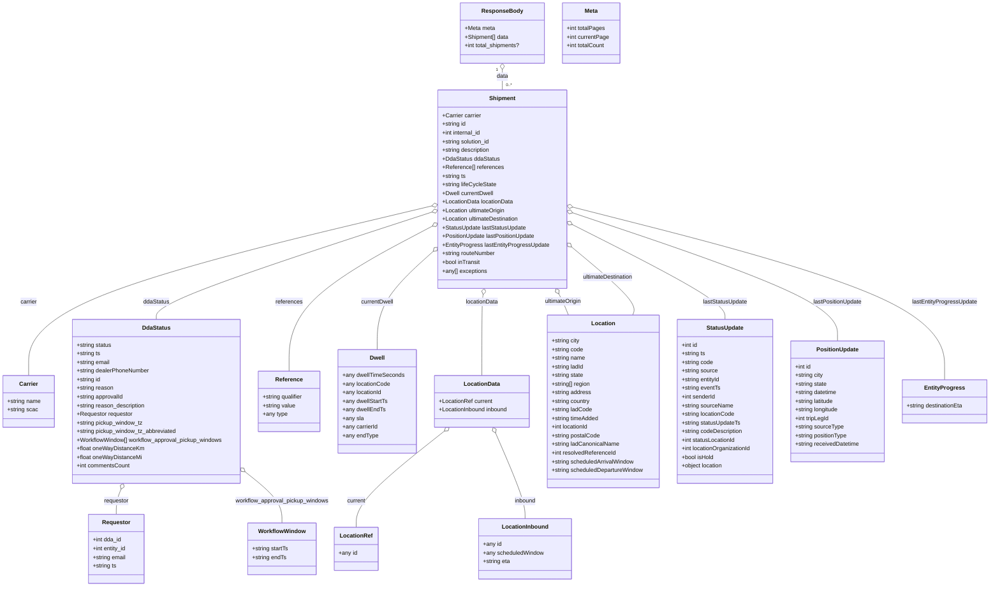
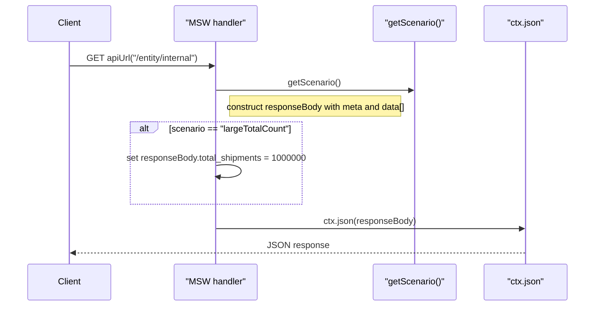

# Diagram: web/portal/src/mocks/handlers/dealer-drive-away/searchResults.js

> Auto-generated by Obscura crawlers

## Diagram 1

### SVG

<svg id="container" width="2777.6875" xmlns="http://www.w3.org/2000/svg" class="classDiagram" height="1630" viewBox="0 0 2777.6875 1630" role="graphics-document document" aria-roledescription="class"><g><defs><marker id="container_class-aggregationStart" class="marker aggregation class" refX="18" refY="7" markerWidth="190" markerHeight="240" orient="auto"><path d="M 18,7 L9,13 L1,7 L9,1 Z"></path></marker></defs><defs><marker id="container_class-aggregationEnd" class="marker aggregation class" refX="1" refY="7" markerWidth="20" markerHeight="28" orient="auto"><path d="M 18,7 L9,13 L1,7 L9,1 Z"></path></marker></defs><defs><marker id="container_class-extensionStart" class="marker extension class" refX="18" refY="7" markerWidth="190" markerHeight="240" orient="auto"><path d="M 1,7 L18,13 V 1 Z"></path></marker></defs><defs><marker id="container_class-extensionEnd" class="marker extension class" refX="1" refY="7" markerWidth="20" markerHeight="28" orient="auto"><path d="M 1,1 V 13 L18,7 Z"></path></marker></defs><defs><marker id="container_class-compositionStart" class="marker composition class" refX="18" refY="7" markerWidth="190" markerHeight="240" orient="auto"><path d="M 18,7 L9,13 L1,7 L9,1 Z"></path></marker></defs><defs><marker id="container_class-compositionEnd" class="marker composition class" refX="1" refY="7" markerWidth="20" markerHeight="28" orient="auto"><path d="M 18,7 L9,13 L1,7 L9,1 Z"></path></marker></defs><defs><marker id="container_class-dependencyStart" class="marker dependency class" refX="6" refY="7" markerWidth="190" markerHeight="240" orient="auto"><path d="M 5,7 L9,13 L1,7 L9,1 Z"></path></marker></defs><defs><marker id="container_class-dependencyEnd" class="marker dependency class" refX="13" refY="7" markerWidth="20" markerHeight="28" orient="auto"><path d="M 18,7 L9,13 L14,7 L9,1 Z"></path></marker></defs><defs><marker id="container_class-lollipopStart" class="marker lollipop class" refX="13" refY="7" markerWidth="190" markerHeight="240" orient="auto"><circle stroke="black" fill="transparent" cx="7" cy="7" r="6"></circle></marker></defs><defs><marker id="container_class-lollipopEnd" class="marker lollipop class" refX="1" refY="7" markerWidth="190" markerHeight="240" orient="auto"><circle stroke="black" fill="transparent" cx="7" cy="7" r="6"></circle></marker></defs><g class="root"><g class="clusters"></g><g class="edgePaths"><path d="M1410.734,193.25L1410.734,196.542C1410.734,199.833,1410.734,206.417,1410.734,215.875C1410.734,225.333,1410.734,237.667,1410.734,243.833L1410.734,250" id="id_ResponseBody_Shipment_1" class="edge-thickness-normal edge-pattern-solid relation" style=";;;" data-edge="true" data-et="edge" data-id="id_ResponseBody_Shipment_1" data-points="W3sieCI6MTQxMC43MzQzNzUsInkiOjE3Nn0seyJ4IjoxNDEwLjczNDM3NSwieSI6MjEzfSx7IngiOjE0MTAuNzM0Mzc1LCJ5IjoyNTB9XQ==" marker-start="url(#container_class-aggregationStart)"></path><path d="M1215.591,571.892L1026.291,616.41C836.99,660.928,458.39,749.964,269.089,828.649C79.789,907.333,79.789,975.667,79.789,1009.833L79.789,1044" id="id_Shipment_Carrier_2" class="edge-thickness-normal edge-pattern-solid relation" style=";;;" data-edge="true" data-et="edge" data-id="id_Shipment_Carrier_2" data-points="W3sieCI6MTIzMi4zODI4MTI1LCJ5Ijo1NjcuOTQzMTUwMTM0MTI3fSx7IngiOjc5Ljc4OTA2MjUsInkiOjgzOX0seyJ4Ijo3OS43ODkwNjI1LCJ5IjoxMDQ0fV0=" marker-start="url(#container_class-aggregationStart)"></path><path d="M1215.962,588.686L1086.337,630.405C956.712,672.124,697.461,755.562,567.836,805.448C438.211,855.333,438.211,871.667,438.211,879.833L438.211,888" id="id_Shipment_DdaStatus_3" class="edge-thickness-normal edge-pattern-solid relation" style=";;;" data-edge="true" data-et="edge" data-id="id_Shipment_DdaStatus_3" data-points="W3sieCI6MTIzMi4zODI4MTI1LCJ5Ijo1ODMuNDAxMjI3NDc2ODQ0M30seyJ4Ijo0MzguMjEwOTM3NSwieSI6ODM5fSx7IngiOjQzOC4yMTA5Mzc1LCJ5Ijo4ODh9XQ==" marker-start="url(#container_class-aggregationStart)"></path><path d="M1217.098,627.293L1149.646,662.577C1082.194,697.862,947.29,768.431,879.839,835.882C812.387,903.333,812.387,967.667,812.387,999.833L812.387,1032" id="id_Shipment_Reference_4" class="edge-thickness-normal edge-pattern-solid relation" style=";;;" data-edge="true" data-et="edge" data-id="id_Shipment_Reference_4" data-points="W3sieCI6MTIzMi4zODI4MTI1LCJ5Ijo2MTkuMjk2OTk2Mjg1MzQzMX0seyJ4Ijo4MTIuMzg2NzE4NzUsInkiOjgzOX0seyJ4Ijo4MTIuMzg2NzE4NzUsInkiOjEwMzJ9XQ==" marker-start="url(#container_class-aggregationStart)"></path><path d="M1219.488,695.933L1192.653,719.777C1165.817,743.622,1112.147,791.311,1085.312,837.322C1058.477,883.333,1058.477,927.667,1058.477,949.833L1058.477,972" id="id_Shipment_Dwell_5" class="edge-thickness-normal edge-pattern-solid relation" style=";;;" data-edge="true" data-et="edge" data-id="id_Shipment_Dwell_5" data-points="W3sieCI6MTIzMi4zODI4MTI1LCJ5Ijo2ODQuNDc0OTQ5NTQ0MjM0N30seyJ4IjoxMDU4LjQ3NjU2MjUsInkiOjgzOX0seyJ4IjoxMDU4LjQ3NjU2MjUsInkiOjk3Mn1d" marker-start="url(#container_class-aggregationStart)"></path><path d="M1355.207,818.948L1354.574,822.29C1353.94,825.632,1352.673,832.316,1352.04,869.825C1351.406,907.333,1351.406,975.667,1351.406,1009.833L1351.406,1044" id="id_Shipment_LocationData_6" class="edge-thickness-normal edge-pattern-solid relation" style=";;;" data-edge="true" data-et="edge" data-id="id_Shipment_LocationData_6" data-points="W3sieCI6MTM1OC40MTk0Nzg4MzM4NjYsInkiOjgwMn0seyJ4IjoxMzUxLjQwNjI1LCJ5Ijo4Mzl9LHsieCI6MTM1MS40MDYyNSwieSI6MTA0NH1d" marker-start="url(#container_class-aggregationStart)"></path><path d="M1245.76,1198.627L1204.339,1231.023C1162.919,1263.418,1080.078,1328.209,1038.657,1372.771C997.236,1417.333,997.236,1441.667,997.236,1453.833L997.236,1466" id="id_LocationData_LocationRef_7" class="edge-thickness-normal edge-pattern-solid relation" style=";;;" data-edge="true" data-et="edge" data-id="id_LocationData_LocationRef_7" data-points="W3sieCI6MTI1OS4zNDc2NDIxNDgwMTQ1LCJ5IjoxMTg4fSx7IngiOjk5Ny4yMzYzMjgxMjUsInkiOjEzOTN9LHsieCI6OTk3LjIzNjMyODEyNSwieSI6MTQ2Nn1d" marker-start="url(#container_class-aggregationStart)"></path><path d="M1389.1,1203.852L1402.626,1235.377C1416.152,1266.902,1443.204,1329.951,1456.73,1369.642C1470.256,1409.333,1470.256,1425.667,1470.256,1433.833L1470.256,1442" id="id_LocationData_LocationInbound_8" class="edge-thickness-normal edge-pattern-solid relation" style=";;;" data-edge="true" data-et="edge" data-id="id_LocationData_LocationInbound_8" data-points="W3sieCI6MTM4Mi4yOTg1NjcyMzgyNjcyLCJ5IjoxMTg4fSx7IngiOjE0NzAuMjU1ODU5Mzc1LCJ5IjoxMzkzfSx7IngiOjE0NzAuMjU1ODU5Mzc1LCJ5IjoxNDQyfV0=" marker-start="url(#container_class-aggregationStart)"></path><path d="M1569.609,817.142L1571.597,820.785C1573.585,824.428,1577.561,831.714,1582.031,841.524C1586.5,851.333,1591.464,863.667,1593.946,869.833L1596.427,876" id="id_Shipment_Location_9" class="edge-thickness-normal edge-pattern-solid relation" style=";;;" data-edge="true" data-et="edge" data-id="id_Shipment_Location_9" data-points="W3sieCI6MTU2MS4zNDYzNzA4MDY3MDkzLCJ5Ijo4MDJ9LHsieCI6MTU4MS41MzcxMDkzNzUsInkiOjgzOX0seyJ4IjoxNTk2LjQyNzIxOTY1MjUyNzEsInkiOjg3Nn1d" marker-start="url(#container_class-aggregationStart)"></path><path d="M1602.349,685.354L1633.141,710.962C1663.932,736.569,1725.516,787.785,1754.213,819.559C1782.91,851.333,1778.721,863.667,1776.627,869.833L1774.532,876" id="id_Shipment_Location_10" class="edge-thickness-normal edge-pattern-solid relation" style=";;;" data-edge="true" data-et="edge" data-id="id_Shipment_Location_10" data-points="W3sieCI6MTU4OS4wODU5Mzc1LCJ5Ijo2NzQuMzI0MTExNjk3NTE3OX0seyJ4IjoxNzg3LjA5OTYwOTM3NSwieSI6ODM5fSx7IngiOjE3NzQuNTMxOTEyNzkzMzIxMiwieSI6ODc2fV0=" marker-start="url(#container_class-aggregationStart)"></path><path d="M1604.511,623.009L1676.418,659.008C1748.325,695.006,1892.139,767.003,1964.046,811.168C2035.953,855.333,2035.953,871.667,2035.953,879.833L2035.953,888" id="id_Shipment_StatusUpdate_11" class="edge-thickness-normal edge-pattern-solid relation" style=";;;" data-edge="true" data-et="edge" data-id="id_Shipment_StatusUpdate_11" data-points="W3sieCI6MTU4OS4wODU5Mzc1LCJ5Ijo2MTUuMjg3MjExOTc1ODA4NH0seyJ4IjoyMDM1Ljk1MzEyNSwieSI6ODM5fSx7IngiOjIwMzUuOTUzMTI1LCJ5Ijo4ODh9XQ==" marker-start="url(#container_class-aggregationStart)"></path><path d="M1605.455,590.729L1729.931,632.108C1854.408,673.486,2103.36,756.243,2227.836,815.788C2352.313,875.333,2352.313,911.667,2352.313,929.833L2352.313,948" id="id_Shipment_PositionUpdate_12" class="edge-thickness-normal edge-pattern-solid relation" style=";;;" data-edge="true" data-et="edge" data-id="id_Shipment_PositionUpdate_12" data-points="W3sieCI6MTU4OS4wODU5Mzc1LCJ5Ijo1ODUuMjg3NzM5OTk3Njc2OH0seyJ4IjoyMzUyLjMxMjUsInkiOjgzOX0seyJ4IjoyMzUyLjMxMjUsInkiOjk0OH1d" marker-start="url(#container_class-aggregationStart)"></path><path d="M1605.812,575.218L1780.063,619.182C1954.315,663.145,2302.817,751.073,2477.069,831.203C2651.32,911.333,2651.32,983.667,2651.32,1019.833L2651.32,1056" id="id_Shipment_EntityProgress_13" class="edge-thickness-normal edge-pattern-solid relation" style=";;;" data-edge="true" data-et="edge" data-id="id_Shipment_EntityProgress_13" data-points="W3sieCI6MTU4OS4wODU5Mzc1LCJ5Ijo1NzAuOTk4MTIzMzY2NjA0OH0seyJ4IjoyNjUxLjMyMDMxMjUsInkiOjgzOX0seyJ4IjoyNjUxLjMyMDMxMjUsInkiOjEwNTZ9XQ==" marker-start="url(#container_class-aggregationStart)"></path><path d="M339.588,1359.993L337.364,1365.494C335.141,1370.995,330.693,1381.998,328.47,1393.665C326.246,1405.333,326.246,1417.667,326.246,1423.833L326.246,1430" id="id_DdaStatus_Requestor_14" class="edge-thickness-normal edge-pattern-solid relation" style=";;;" data-edge="true" data-et="edge" data-id="id_DdaStatus_Requestor_14" data-points="W3sieCI6MzQ2LjA1MjE0OTE0MjU5OTI2LCJ5IjoxMzQ0fSx7IngiOjMyNi4yNDYwOTM3NSwieSI6MTM5M30seyJ4IjozMjYuMjQ2MDkzNzUsInkiOjE0MzB9XQ==" marker-start="url(#container_class-aggregationStart)"></path><path d="M688.431,1311.7L705.756,1325.25C723.081,1338.8,757.731,1365.9,775.056,1389.617C792.381,1413.333,792.381,1433.667,792.381,1443.833L792.381,1454" id="id_DdaStatus_WorkflowWindow_15" class="edge-thickness-normal edge-pattern-solid relation" style=";;;" data-edge="true" data-et="edge" data-id="id_DdaStatus_WorkflowWindow_15" data-points="W3sieCI6Njc0Ljg0Mzc1LCJ5IjoxMzAxLjA3Mjk5NzQ5MDgzMTh9LHsieCI6NzkyLjM4MDg1OTM3NSwieSI6MTM5M30seyJ4Ijo3OTIuMzgwODU5Mzc1LCJ5IjoxNDU0fV0=" marker-start="url(#container_class-aggregationStart)"></path></g><g class="edgeLabels"><g class="edgeLabel" transform="translate(1410.734375, 213)"><g class="label" data-id="id_ResponseBody_Shipment_1" transform="translate(-16.3203125, -12)"><foreignObject width="32.640625" height="24">

data

</foreignObject></g></g><g class="edgeLabel" transform="translate(79.7890625, 839)"><g class="label" data-id="id_Shipment_Carrier_2" transform="translate(-23.9765625, -12)"><foreignObject width="47.953125" height="24">

carrier

</foreignObject></g></g><g class="edgeLabel" transform="translate(438.2109375, 839)"><g class="label" data-id="id_Shipment_DdaStatus_3" transform="translate(-36.75, -12)"><foreignObject width="73.5" height="24">

ddaStatus

</foreignObject></g></g><g class="edgeLabel" transform="translate(812.38671875, 839)"><g class="label" data-id="id_Shipment_Reference_4" transform="translate(-37.828125, -12)"><foreignObject width="75.65625" height="24">

references

</foreignObject></g></g><g class="edgeLabel" transform="translate(1058.4765625, 839)"><g class="label" data-id="id_Shipment_Dwell_5" transform="translate(-46.2109375, -12)"><foreignObject width="92.421875" height="24">

currentDwell

</foreignObject></g></g><g class="edgeLabel" transform="translate(1351.40625, 839)"><g class="label" data-id="id_Shipment_LocationData_6" transform="translate(-46.1875, -12)"><foreignObject width="92.375" height="24">

locationData

</foreignObject></g></g><g class="edgeLabel" transform="translate(997.236328125, 1393)"><g class="label" data-id="id_LocationData_LocationRef_7" transform="translate(-26.2734375, -12)"><foreignObject width="52.546875" height="24">

current

</foreignObject></g></g><g class="edgeLabel" transform="translate(1470.255859375, 1393)"><g class="label" data-id="id_LocationData_LocationInbound_8" transform="translate(-30.5, -12)"><foreignObject width="61" height="24">

inbound

</foreignObject></g></g><g class="edgeLabel" transform="translate(1581.537109375, 839)"><g class="label" data-id="id_Shipment_Location_9" transform="translate(-52.46875, -12)"><foreignObject width="104.9375" height="24">

ultimateOrigin

</foreignObject></g></g><g class="edgeLabel" transform="translate(1703.11486, 769.15501)"><g class="label" data-id="id_Shipment_Location_10" transform="translate(-72.421875, -12)"><foreignObject width="144.84375" height="24">

ultimateDestination

</foreignObject></g></g><g class="edgeLabel" transform="translate(2035.953125, 839)"><g class="label" data-id="id_Shipment_StatusUpdate_11" transform="translate(-62.34375, -12)"><foreignObject width="124.6875" height="24">

lastStatusUpdate

</foreignObject></g></g><g class="edgeLabel" transform="translate(2352.3125, 839)"><g class="label" data-id="id_Shipment_PositionUpdate_12" transform="translate(-69.09375, -12)"><foreignObject width="138.1875" height="24">

lastPositionUpdate

</foreignObject></g></g><g class="edgeLabel" transform="translate(2651.3203125, 839)"><g class="label" data-id="id_Shipment_EntityProgress_13" transform="translate(-91.1015625, -12)"><foreignObject width="182.203125" height="24">

lastEntityProgressUpdate

</foreignObject></g></g><g class="edgeLabel" transform="translate(326.24609375, 1393)"><g class="label" data-id="id_DdaStatus_Requestor_14" transform="translate(-35.2734375, -12)"><foreignObject width="70.546875" height="24">

requestor

</foreignObject></g></g><g class="edgeLabel" transform="translate(792.380859375, 1393)"><g class="label" data-id="id_DdaStatus_WorkflowWindow_15" transform="translate(-132.1953125, -12)"><foreignObject width="264.390625" height="24">

workflow_approval_pickup_windows

</foreignObject></g></g><g class="edgeTerminals" transform="translate(1395.7343775000002, 193.5000021428572)"><g class="inner" transform="translate(0, 0)"><foreignObject style="width: 9px; height: 12px;">
1
</foreignObject></g></g><g class="edgeTerminals" transform="translate(1420.7343774999997, 227.5000021428572)"><g class="inner" transform="translate(0, 0)"></g><foreignObject style="width: 36px; height: 12px;">
0..*
</foreignObject></g></g><g class="nodes"><g class="node default" id="classId-ResponseBody-0" transform="translate(1410.734375, 92)"><g class="basic label-container"><path d="M-117.38671875 -84 L117.38671875 -84 L117.38671875 84 L-117.38671875 84" stroke="none" stroke-width="0" fill="#ECECFF" style=""></path><path d="M-117.38671875 -84 C-56.17465890771789 -84, 5.037400934564218 -84, 117.38671875 -84 M-117.38671875 -84 C-33.44949551647399 -84, 50.487727717052024 -84, 117.38671875 -84 M117.38671875 -84 C117.38671875 -45.493023708909796, 117.38671875 -6.9860474178195915, 117.38671875 84 M117.38671875 -84 C117.38671875 -30.098843676529512, 117.38671875 23.802312646940976, 117.38671875 84 M117.38671875 84 C40.504899535762604 84, -36.37691967847479 84, -117.38671875 84 M117.38671875 84 C63.02886086553992 84, 8.671002981079837 84, -117.38671875 84 M-117.38671875 84 C-117.38671875 33.33631659661052, -117.38671875 -17.327366806778954, -117.38671875 -84 M-117.38671875 84 C-117.38671875 38.908207138358236, -117.38671875 -6.183585723283528, -117.38671875 -84" stroke="#9370DB" stroke-width="1.3" fill="none" stroke-dasharray="0 0" style=""></path></g><g class="annotation-group text" transform="translate(0, -60)"></g><g class="label-group text" transform="translate(-53.9921875, -60)"><g class="label" style="font-weight: bolder" transform="translate(0,-12)"><foreignObject width="107.984375" height="24">

ResponseBody

</foreignObject></g></g><g class="members-group text" transform="translate(-105.38671875, -12)"><g class="label" style="" transform="translate(0,-12)"><foreignObject width="84.5625" height="24">

+Meta meta

</foreignObject></g><g class="label" style="" transform="translate(0,12)"><foreignObject width="124.234375" height="24">

+Shipment[] data

</foreignObject></g><g class="label" style="" transform="translate(0,36)"><foreignObject width="156.78125" height="24">

+int total_shipments?

</foreignObject></g></g><g class="methods-group text" transform="translate(-105.38671875, 84)"></g><g class="divider" style=""><path d="M-117.38671875 -36 C-30.090423051843274 -36, 57.20587264631345 -36, 117.38671875 -36 M-117.38671875 -36 C-24.925760907683767 -36, 67.53519693463247 -36, 117.38671875 -36" stroke="#9370DB" stroke-width="1.3" fill="none" stroke-dasharray="0 0" style=""></path></g><g class="divider" style=""><path d="M-117.38671875 60 C-47.16035188802205 60, 23.0660149739559 60, 117.38671875 60 M-117.38671875 60 C-46.79766472122677 60, 23.791389307546467 60, 117.38671875 60" stroke="#9370DB" stroke-width="1.3" fill="none" stroke-dasharray="0 0" style=""></path></g></g><g class="node default" id="classId-Meta-1" transform="translate(1658.2578125, 92)"><g class="basic label-container"><path d="M-80.13671875 -84 L80.13671875 -84 L80.13671875 84 L-80.13671875 84" stroke="none" stroke-width="0" fill="#ECECFF" style=""></path><path d="M-80.13671875 -84 C-20.90671223063716 -84, 38.32329428872568 -84, 80.13671875 -84 M-80.13671875 -84 C-16.680819276255598 -84, 46.775080197488805 -84, 80.13671875 -84 M80.13671875 -84 C80.13671875 -36.63494624204715, 80.13671875 10.7301075159057, 80.13671875 84 M80.13671875 -84 C80.13671875 -46.85331179071243, 80.13671875 -9.706623581424864, 80.13671875 84 M80.13671875 84 C32.910532376038255 84, -14.31565399792349 84, -80.13671875 84 M80.13671875 84 C36.15027971356555 84, -7.836159322868895 84, -80.13671875 84 M-80.13671875 84 C-80.13671875 37.40365730037001, -80.13671875 -9.192685399259986, -80.13671875 -84 M-80.13671875 84 C-80.13671875 22.899437509957473, -80.13671875 -38.201124980085055, -80.13671875 -84" stroke="#9370DB" stroke-width="1.3" fill="none" stroke-dasharray="0 0" style=""></path></g><g class="annotation-group text" transform="translate(0, -60)"></g><g class="label-group text" transform="translate(-18.0859375, -60)"><g class="label" style="font-weight: bolder" transform="translate(0,-12)"><foreignObject width="36.171875" height="24">

Meta

</foreignObject></g></g><g class="members-group text" transform="translate(-68.13671875, -12)"><g class="label" style="" transform="translate(0,-12)"><foreignObject width="106.890625" height="24">

+int totalPages

</foreignObject></g><g class="label" style="" transform="translate(0,12)"><foreignObject width="118.1875" height="24">

+int currentPage

</foreignObject></g><g class="label" style="" transform="translate(0,36)"><foreignObject width="108.125" height="24">

+int totalCount

</foreignObject></g></g><g class="methods-group text" transform="translate(-68.13671875, 84)"></g><g class="divider" style=""><path d="M-80.13671875 -36 C-23.031645543937273 -36, 34.073427662125454 -36, 80.13671875 -36 M-80.13671875 -36 C-32.83994460519705 -36, 14.456829539605906 -36, 80.13671875 -36" stroke="#9370DB" stroke-width="1.3" fill="none" stroke-dasharray="0 0" style=""></path></g><g class="divider" style=""><path d="M-80.13671875 60 C-25.17923172009114 60, 29.778255309817723 60, 80.13671875 60 M-80.13671875 60 C-47.26881156806892 60, -14.400904386137839 60, 80.13671875 60" stroke="#9370DB" stroke-width="1.3" fill="none" stroke-dasharray="0 0" style=""></path></g></g><g class="node default" id="classId-Shipment-2" transform="translate(1410.734375, 526)"><g class="basic label-container"><path d="M-178.3515625 -276 L178.3515625 -276 L178.3515625 276 L-178.3515625 276" stroke="none" stroke-width="0" fill="#ECECFF" style=""></path><path d="M-178.3515625 -276 C-60.16669068360105 -276, 58.018181132797906 -276, 178.3515625 -276 M-178.3515625 -276 C-95.53863842711876 -276, -12.72571435423751 -276, 178.3515625 -276 M178.3515625 -276 C178.3515625 -106.42182531459963, 178.3515625 63.15634937080074, 178.3515625 276 M178.3515625 -276 C178.3515625 -105.96989267159182, 178.3515625 64.06021465681636, 178.3515625 276 M178.3515625 276 C64.53061672749931 276, -49.290329045001386 276, -178.3515625 276 M178.3515625 276 C35.97885750168322 276, -106.39384749663355 276, -178.3515625 276 M-178.3515625 276 C-178.3515625 102.10356112758024, -178.3515625 -71.79287774483953, -178.3515625 -276 M-178.3515625 276 C-178.3515625 132.1831354727518, -178.3515625 -11.633729054496428, -178.3515625 -276" stroke="#9370DB" stroke-width="1.3" fill="none" stroke-dasharray="0 0" style=""></path></g><g class="annotation-group text" transform="translate(0, -252)"></g><g class="label-group text" transform="translate(-35.109375, -252)"><g class="label" style="font-weight: bolder" transform="translate(0,-12)"><foreignObject width="70.21875" height="24">

Shipment

</foreignObject></g></g><g class="members-group text" transform="translate(-166.3515625, -204)"><g class="label" style="" transform="translate(0,-12)"><foreignObject width="109.453125" height="24">

+Carrier carrier

</foreignObject></g><g class="label" style="" transform="translate(0,12)"><foreignObject width="67.9375" height="24">

+string id

</foreignObject></g><g class="label" style="" transform="translate(0,36)"><foreignObject width="111.21875" height="24">

+int internal_id

</foreignObject></g><g class="label" style="" transform="translate(0,60)"><foreignObject width="136.09375" height="24">

+string solution_id

</foreignObject></g><g class="label" style="" transform="translate(0,84)"><foreignObject width="136.46875" height="24">

+string description

</foreignObject></g><g class="label" style="" transform="translate(0,108)"><foreignObject width="159.9375" height="24">

+DdaStatus ddaStatus

</foreignObject></g><g class="label" style="" transform="translate(0,132)"><foreignObject width="170.109375" height="24">

+Reference[] references

</foreignObject></g><g class="label" style="" transform="translate(0,156)"><foreignObject width="67.109375" height="24">

+string ts

</foreignObject></g><g class="label" style="" transform="translate(0,180)"><foreignObject width="151.265625" height="24">

+string lifeCycleState

</foreignObject></g><g class="label" style="" transform="translate(0,204)"><foreignObject width="144.515625" height="24">

+Dwell currentDwell

</foreignObject></g><g class="label" style="" transform="translate(0,228)"><foreignObject width="199.921875" height="24">

+LocationData locationData

</foreignObject></g><g class="label" style="" transform="translate(0,252)"><foreignObject width="179.265625" height="24">

+Location ultimateOrigin

</foreignObject></g><g class="label" style="" transform="translate(0,276)"><foreignObject width="219.171875" height="24">

+Location ultimateDestination

</foreignObject></g><g class="label" style="" transform="translate(0,300)"><foreignObject width="234.53125" height="24">

+StatusUpdate lastStatusUpdate

</foreignObject></g><g class="label" style="" transform="translate(0,324)"><foreignObject width="262.1875" height="24">

+PositionUpdate lastPositionUpdate

</foreignObject></g><g class="label" style="" transform="translate(0,348)"><foreignObject width="297.59375" height="24">

+EntityProgress lastEntityProgressUpdate

</foreignObject></g><g class="label" style="" transform="translate(0,372)"><foreignObject width="150.828125" height="24">

+string routeNumber

</foreignObject></g><g class="label" style="" transform="translate(0,396)"><foreignObject width="108.25" height="24">

+bool inTransit

</foreignObject></g><g class="label" style="" transform="translate(0,420)"><foreignObject width="126.359375" height="24">

+any[] exceptions

</foreignObject></g></g><g class="methods-group text" transform="translate(-166.3515625, 276)"></g><g class="divider" style=""><path d="M-178.3515625 -228 C-50.66710880146019 -228, 77.01734489707962 -228, 178.3515625 -228 M-178.3515625 -228 C-62.83575767377695 -228, 52.68004715244609 -228, 178.3515625 -228" stroke="#9370DB" stroke-width="1.3" fill="none" stroke-dasharray="0 0" style=""></path></g><g class="divider" style=""><path d="M-178.3515625 252 C-66.63325005396354 252, 45.08506239207293 252, 178.3515625 252 M-178.3515625 252 C-83.64735298128238 252, 11.056856537435237 252, 178.3515625 252" stroke="#9370DB" stroke-width="1.3" fill="none" stroke-dasharray="0 0" style=""></path></g></g><g class="node default" id="classId-Carrier-3" transform="translate(79.7890625, 1116)"><g class="basic label-container"><path d="M-71.7890625 -72 L71.7890625 -72 L71.7890625 72 L-71.7890625 72" stroke="none" stroke-width="0" fill="#ECECFF" style=""></path><path d="M-71.7890625 -72 C-39.56378649049386 -72, -7.338510480987722 -72, 71.7890625 -72 M-71.7890625 -72 C-27.495289682987142 -72, 16.798483134025716 -72, 71.7890625 -72 M71.7890625 -72 C71.7890625 -42.256115910923185, 71.7890625 -12.512231821846377, 71.7890625 72 M71.7890625 -72 C71.7890625 -34.41502475980303, 71.7890625 3.1699504803939362, 71.7890625 72 M71.7890625 72 C38.54486211238963 72, 5.3006617247792605 72, -71.7890625 72 M71.7890625 72 C29.942533269326205 72, -11.90399596134759 72, -71.7890625 72 M-71.7890625 72 C-71.7890625 15.808499026679613, -71.7890625 -40.383001946640775, -71.7890625 -72 M-71.7890625 72 C-71.7890625 20.60548669743156, -71.7890625 -30.789026605136883, -71.7890625 -72" stroke="#9370DB" stroke-width="1.3" fill="none" stroke-dasharray="0 0" style=""></path></g><g class="annotation-group text" transform="translate(0, -48)"></g><g class="label-group text" transform="translate(-25.203125, -48)"><g class="label" style="font-weight: bolder" transform="translate(0,-12)"><foreignObject width="50.40625" height="24">

Carrier

</foreignObject></g></g><g class="members-group text" transform="translate(-59.7890625, 0)"><g class="label" style="" transform="translate(0,-12)"><foreignObject width="94.375" height="24">

+string name

</foreignObject></g><g class="label" style="" transform="translate(0,12)"><foreignObject width="85.171875" height="24">

+string scac

</foreignObject></g></g><g class="methods-group text" transform="translate(-59.7890625, 72)"></g><g class="divider" style=""><path d="M-71.7890625 -24 C-25.40467436977248 -24, 20.97971376045504 -24, 71.7890625 -24 M-71.7890625 -24 C-26.080107251225776 -24, 19.628847997548448 -24, 71.7890625 -24" stroke="#9370DB" stroke-width="1.3" fill="none" stroke-dasharray="0 0" style=""></path></g><g class="divider" style=""><path d="M-71.7890625 48 C-37.485386896915585 48, -3.181711293831171 48, 71.7890625 48 M-71.7890625 48 C-42.5179887227941 48, -13.246914945588209 48, 71.7890625 48" stroke="#9370DB" stroke-width="1.3" fill="none" stroke-dasharray="0 0" style=""></path></g></g><g class="node default" id="classId-DdaStatus-4" transform="translate(438.2109375, 1116)"><g class="basic label-container"><path d="M-236.6328125 -228 L236.6328125 -228 L236.6328125 228 L-236.6328125 228" stroke="none" stroke-width="0" fill="#ECECFF" style=""></path><path d="M-236.6328125 -228 C-52.605247087530216 -228, 131.42231832493957 -228, 236.6328125 -228 M-236.6328125 -228 C-109.03487090072801 -228, 18.56307069854398 -228, 236.6328125 -228 M236.6328125 -228 C236.6328125 -66.50661468695301, 236.6328125 94.98677062609397, 236.6328125 228 M236.6328125 -228 C236.6328125 -112.17279185267851, 236.6328125 3.654416294642971, 236.6328125 228 M236.6328125 228 C83.60913512055853 228, -69.41454225888293 228, -236.6328125 228 M236.6328125 228 C87.96395515513879 228, -60.70490218972242 228, -236.6328125 228 M-236.6328125 228 C-236.6328125 119.38465820166859, -236.6328125 10.769316403337172, -236.6328125 -228 M-236.6328125 228 C-236.6328125 129.4716689386263, -236.6328125 30.943337877252617, -236.6328125 -228" stroke="#9370DB" stroke-width="1.3" fill="none" stroke-dasharray="0 0" style=""></path></g><g class="annotation-group text" transform="translate(0, -204)"></g><g class="label-group text" transform="translate(-37.875, -204)"><g class="label" style="font-weight: bolder" transform="translate(0,-12)"><foreignObject width="75.75" height="24">

DdaStatus

</foreignObject></g></g><g class="members-group text" transform="translate(-224.6328125, -156)"><g class="label" style="" transform="translate(0,-12)"><foreignObject width="98.265625" height="24">

+string status

</foreignObject></g><g class="label" style="" transform="translate(0,12)"><foreignObject width="67.109375" height="24">

+string ts

</foreignObject></g><g class="label" style="" transform="translate(0,36)"><foreignObject width="94.203125" height="24">

+string email

</foreignObject></g><g class="label" style="" transform="translate(0,60)"><foreignObject width="204.1875" height="24">

+string dealerPhoneNumber

</foreignObject></g><g class="label" style="" transform="translate(0,84)"><foreignObject width="67.9375" height="24">

+string id

</foreignObject></g><g class="label" style="" transform="translate(0,108)"><foreignObject width="102.859375" height="24">

+string reason

</foreignObject></g><g class="label" style="" transform="translate(0,132)"><foreignObject width="131.6875" height="24">

+string approvalId

</foreignObject></g><g class="label" style="" transform="translate(0,156)"><foreignObject width="193.46875" height="24">

+string reason_description

</foreignObject></g><g class="label" style="" transform="translate(0,180)"><foreignObject width="157.0625" height="24">

+Requestor requestor

</foreignObject></g><g class="label" style="" transform="translate(0,204)"><foreignObject width="186.296875" height="24">

+string pickup_window_tz

</foreignObject></g><g class="label" style="" transform="translate(0,228)"><foreignObject width="281.265625" height="24">

+string pickup_window_tz_abbreviated

</foreignObject></g><g class="label" style="" transform="translate(0,252)"><foreignObject width="411.390625" height="24">

+WorkflowWindow[] workflow_approval_pickup_windows

</foreignObject></g><g class="label" style="" transform="translate(0,276)"><foreignObject width="186.78125" height="24">

+float oneWayDistanceKm

</foreignObject></g><g class="label" style="" transform="translate(0,300)"><foreignObject width="180.59375" height="24">

+float oneWayDistanceMi

</foreignObject></g><g class="label" style="" transform="translate(0,324)"><foreignObject width="149.78125" height="24">

+int commentsCount

</foreignObject></g></g><g class="methods-group text" transform="translate(-224.6328125, 228)"></g><g class="divider" style=""><path d="M-236.6328125 -180 C-131.69268676256502 -180, -26.752561025130007 -180, 236.6328125 -180 M-236.6328125 -180 C-65.66119610771594 -180, 105.31042028456812 -180, 236.6328125 -180" stroke="#9370DB" stroke-width="1.3" fill="none" stroke-dasharray="0 0" style=""></path></g><g class="divider" style=""><path d="M-236.6328125 204 C-95.39024796125503 204, 45.852316577489944 204, 236.6328125 204 M-236.6328125 204 C-94.61546997701015 204, 47.4018725459797 204, 236.6328125 204" stroke="#9370DB" stroke-width="1.3" fill="none" stroke-dasharray="0 0" style=""></path></g></g><g class="node default" id="classId-Requestor-5" transform="translate(326.24609375, 1526)"><g class="basic label-container"><path d="M-78.7421875 -96 L78.7421875 -96 L78.7421875 96 L-78.7421875 96" stroke="none" stroke-width="0" fill="#ECECFF" style=""></path><path d="M-78.7421875 -96 C-28.931904700702837 -96, 20.878378098594325 -96, 78.7421875 -96 M-78.7421875 -96 C-34.11437571160556 -96, 10.513436076788878 -96, 78.7421875 -96 M78.7421875 -96 C78.7421875 -33.691371356243735, 78.7421875 28.61725728751253, 78.7421875 96 M78.7421875 -96 C78.7421875 -38.08584053117451, 78.7421875 19.828318937650977, 78.7421875 96 M78.7421875 96 C21.536289565258222 96, -35.669608369483555 96, -78.7421875 96 M78.7421875 96 C23.1312043798657 96, -32.4797787402686 96, -78.7421875 96 M-78.7421875 96 C-78.7421875 37.79713113247007, -78.7421875 -20.40573773505986, -78.7421875 -96 M-78.7421875 96 C-78.7421875 23.870301502407983, -78.7421875 -48.259396995184034, -78.7421875 -96" stroke="#9370DB" stroke-width="1.3" fill="none" stroke-dasharray="0 0" style=""></path></g><g class="annotation-group text" transform="translate(0, -72)"></g><g class="label-group text" transform="translate(-37.71875, -72)"><g class="label" style="font-weight: bolder" transform="translate(0,-12)"><foreignObject width="75.4375" height="24">

Requestor

</foreignObject></g></g><g class="members-group text" transform="translate(-66.7421875, -24)"><g class="label" style="" transform="translate(0,-12)"><foreignObject width="82.140625" height="24">

+int dda_id

</foreignObject></g><g class="label" style="" transform="translate(0,12)"><foreignObject width="95.765625" height="24">

+int entity_id

</foreignObject></g><g class="label" style="" transform="translate(0,36)"><foreignObject width="94.203125" height="24">

+string email

</foreignObject></g><g class="label" style="" transform="translate(0,60)"><foreignObject width="67.109375" height="24">

+string ts

</foreignObject></g></g><g class="methods-group text" transform="translate(-66.7421875, 96)"></g><g class="divider" style=""><path d="M-78.7421875 -48 C-28.247120306383877 -48, 22.247946887232246 -48, 78.7421875 -48 M-78.7421875 -48 C-32.406107939062565 -48, 13.92997162187487 -48, 78.7421875 -48" stroke="#9370DB" stroke-width="1.3" fill="none" stroke-dasharray="0 0" style=""></path></g><g class="divider" style=""><path d="M-78.7421875 72 C-29.83695234132508 72, 19.06828281734984 72, 78.7421875 72 M-78.7421875 72 C-43.309017123364555 72, -7.87584674672911 72, 78.7421875 72" stroke="#9370DB" stroke-width="1.3" fill="none" stroke-dasharray="0 0" style=""></path></g></g><g class="node default" id="classId-WorkflowWindow-6" transform="translate(792.380859375, 1526)"><g class="basic label-container"><path d="M-95.1875 -72 L95.1875 -72 L95.1875 72 L-95.1875 72" stroke="none" stroke-width="0" fill="#ECECFF" style=""></path><path d="M-95.1875 -72 C-40.299143444284894 -72, 14.589213111430212 -72, 95.1875 -72 M-95.1875 -72 C-37.97793562637882 -72, 19.231628747242354 -72, 95.1875 -72 M95.1875 -72 C95.1875 -42.95666149522964, 95.1875 -13.913322990459278, 95.1875 72 M95.1875 -72 C95.1875 -25.535623939528918, 95.1875 20.928752120942164, 95.1875 72 M95.1875 72 C48.775608333526186 72, 2.3637166670523726 72, -95.1875 72 M95.1875 72 C25.292090557854635 72, -44.60331888429073 72, -95.1875 72 M-95.1875 72 C-95.1875 19.209033601038627, -95.1875 -33.58193279792275, -95.1875 -72 M-95.1875 72 C-95.1875 23.166856832811135, -95.1875 -25.66628633437773, -95.1875 -72" stroke="#9370DB" stroke-width="1.3" fill="none" stroke-dasharray="0 0" style=""></path></g><g class="annotation-group text" transform="translate(0, -48)"></g><g class="label-group text" transform="translate(-63.78125, -48)"><g class="label" style="font-weight: bolder" transform="translate(0,-12)"><foreignObject width="127.5625" height="24">

WorkflowWindow

</foreignObject></g></g><g class="members-group text" transform="translate(-83.1875, 0)"><g class="label" style="" transform="translate(0,-12)"><foreignObject width="102.59375" height="24">

+string startTs

</foreignObject></g><g class="label" style="" transform="translate(0,12)"><foreignObject width="96.46875" height="24">

+string endTs

</foreignObject></g></g><g class="methods-group text" transform="translate(-83.1875, 72)"></g><g class="divider" style=""><path d="M-95.1875 -24 C-54.36129690244563 -24, -13.535093804891261 -24, 95.1875 -24 M-95.1875 -24 C-47.568945234742095 -24, 0.0496095305158093 -24, 95.1875 -24" stroke="#9370DB" stroke-width="1.3" fill="none" stroke-dasharray="0 0" style=""></path></g><g class="divider" style=""><path d="M-95.1875 48 C-49.20478850133547 48, -3.222077002670943 48, 95.1875 48 M-95.1875 48 C-36.68415197485009 48, 21.819196050299823 48, 95.1875 48" stroke="#9370DB" stroke-width="1.3" fill="none" stroke-dasharray="0 0" style=""></path></g></g><g class="node default" id="classId-Reference-7" transform="translate(812.38671875, 1116)"><g class="basic label-container"><path d="M-87.54296875 -84 L87.54296875 -84 L87.54296875 84 L-87.54296875 84" stroke="none" stroke-width="0" fill="#ECECFF" style=""></path><path d="M-87.54296875 -84 C-33.059478557242294 -84, 21.424011635515413 -84, 87.54296875 -84 M-87.54296875 -84 C-49.72597082968477 -84, -11.908972909369538 -84, 87.54296875 -84 M87.54296875 -84 C87.54296875 -40.76226731956433, 87.54296875 2.4754653608713397, 87.54296875 84 M87.54296875 -84 C87.54296875 -24.180553977823813, 87.54296875 35.638892044352374, 87.54296875 84 M87.54296875 84 C49.673426182477705 84, 11.80388361495541 84, -87.54296875 84 M87.54296875 84 C47.13822003925652 84, 6.733471328513033 84, -87.54296875 84 M-87.54296875 84 C-87.54296875 34.751462026727744, -87.54296875 -14.497075946544513, -87.54296875 -84 M-87.54296875 84 C-87.54296875 26.12915371107485, -87.54296875 -31.7416925778503, -87.54296875 -84" stroke="#9370DB" stroke-width="1.3" fill="none" stroke-dasharray="0 0" style=""></path></g><g class="annotation-group text" transform="translate(0, -60)"></g><g class="label-group text" transform="translate(-36.5078125, -60)"><g class="label" style="font-weight: bolder" transform="translate(0,-12)"><foreignObject width="73.015625" height="24">

Reference

</foreignObject></g></g><g class="members-group text" transform="translate(-75.54296875, -12)"><g class="label" style="" transform="translate(0,-12)"><foreignObject width="114.578125" height="24">

+string qualifier

</foreignObject></g><g class="label" style="" transform="translate(0,12)"><foreignObject width="92.75" height="24">

+string value

</foreignObject></g><g class="label" style="" transform="translate(0,36)"><foreignObject width="69.625" height="24">

+any type

</foreignObject></g></g><g class="methods-group text" transform="translate(-75.54296875, 84)"></g><g class="divider" style=""><path d="M-87.54296875 -36 C-41.20759581031776 -36, 5.127777129364475 -36, 87.54296875 -36 M-87.54296875 -36 C-36.53899271166531 -36, 14.464983326669383 -36, 87.54296875 -36" stroke="#9370DB" stroke-width="1.3" fill="none" stroke-dasharray="0 0" style=""></path></g><g class="divider" style=""><path d="M-87.54296875 60 C-45.0319456286777 60, -2.520922507355394 60, 87.54296875 60 M-87.54296875 60 C-19.781692003489837 60, 47.979584743020325 60, 87.54296875 60" stroke="#9370DB" stroke-width="1.3" fill="none" stroke-dasharray="0 0" style=""></path></g></g><g class="node default" id="classId-Dwell-8" transform="translate(1058.4765625, 1116)"><g class="basic label-container"><path d="M-108.546875 -144 L108.546875 -144 L108.546875 144 L-108.546875 144" stroke="none" stroke-width="0" fill="#ECECFF" style=""></path><path d="M-108.546875 -144 C-63.734030774560196 -144, -18.921186549120392 -144, 108.546875 -144 M-108.546875 -144 C-48.37276664721495 -144, 11.801341705570096 -144, 108.546875 -144 M108.546875 -144 C108.546875 -83.66234016719211, 108.546875 -23.324680334384226, 108.546875 144 M108.546875 -144 C108.546875 -69.71113305367342, 108.546875 4.577733892653157, 108.546875 144 M108.546875 144 C51.784485729111644 144, -4.977903541776712 144, -108.546875 144 M108.546875 144 C58.56495761961955 144, 8.583040239239097 144, -108.546875 144 M-108.546875 144 C-108.546875 30.274620586950746, -108.546875 -83.45075882609851, -108.546875 -144 M-108.546875 144 C-108.546875 52.377007566068215, -108.546875 -39.24598486786357, -108.546875 -144" stroke="#9370DB" stroke-width="1.3" fill="none" stroke-dasharray="0 0" style=""></path></g><g class="annotation-group text" transform="translate(0, -120)"></g><g class="label-group text" transform="translate(-20.375, -120)"><g class="label" style="font-weight: bolder" transform="translate(0,-12)"><foreignObject width="40.75" height="24">

Dwell

</foreignObject></g></g><g class="members-group text" transform="translate(-96.546875, -72)"><g class="label" style="" transform="translate(0,-12)"><foreignObject width="172.71875" height="24">

+any dwellTimeSeconds

</foreignObject></g><g class="label" style="" transform="translate(0,12)"><foreignObject width="133.25" height="24">

+any locationCode

</foreignObject></g><g class="label" style="" transform="translate(0,36)"><foreignObject width="111.265625" height="24">

+any locationId

</foreignObject></g><g class="label" style="" transform="translate(0,60)"><foreignObject width="126.953125" height="24">

+any dwellStartTs

</foreignObject></g><g class="label" style="" transform="translate(0,84)"><foreignObject width="119.25" height="24">

+any dwellEndTs

</foreignObject></g><g class="label" style="" transform="translate(0,108)"><foreignObject width="58.609375" height="24">

+any sla

</foreignObject></g><g class="label" style="" transform="translate(0,132)"><foreignObject width="100.078125" height="24">

+any carrierId

</foreignObject></g><g class="label" style="" transform="translate(0,156)"><foreignObject width="99.21875" height="24">

+any endType

</foreignObject></g></g><g class="methods-group text" transform="translate(-96.546875, 144)"></g><g class="divider" style=""><path d="M-108.546875 -96 C-46.87000154999877 -96, 14.806871900002463 -96, 108.546875 -96 M-108.546875 -96 C-25.26758034232202 -96, 58.01171431535596 -96, 108.546875 -96" stroke="#9370DB" stroke-width="1.3" fill="none" stroke-dasharray="0 0" style=""></path></g><g class="divider" style=""><path d="M-108.546875 120 C-23.27583623491887 120, 61.99520253016226 120, 108.546875 120 M-108.546875 120 C-44.325408807913306 120, 19.89605738417339 120, 108.546875 120" stroke="#9370DB" stroke-width="1.3" fill="none" stroke-dasharray="0 0" style=""></path></g></g><g class="node default" id="classId-LocationData-9" transform="translate(1351.40625, 1116)"><g class="basic label-container"><path d="M-134.3828125 -72 L134.3828125 -72 L134.3828125 72 L-134.3828125 72" stroke="none" stroke-width="0" fill="#ECECFF" style=""></path><path d="M-134.3828125 -72 C-40.66229991316054 -72, 53.05821267367892 -72, 134.3828125 -72 M-134.3828125 -72 C-59.35390973850963 -72, 15.674993022980743 -72, 134.3828125 -72 M134.3828125 -72 C134.3828125 -16.457688670894292, 134.3828125 39.084622658211416, 134.3828125 72 M134.3828125 -72 C134.3828125 -21.37598458663092, 134.3828125 29.24803082673816, 134.3828125 72 M134.3828125 72 C53.10484237443188 72, -28.173127751136235 72, -134.3828125 72 M134.3828125 72 C48.833075110333965 72, -36.71666227933207 72, -134.3828125 72 M-134.3828125 72 C-134.3828125 14.956253088730875, -134.3828125 -42.08749382253825, -134.3828125 -72 M-134.3828125 72 C-134.3828125 19.977852868892278, -134.3828125 -32.044294262215445, -134.3828125 -72" stroke="#9370DB" stroke-width="1.3" fill="none" stroke-dasharray="0 0" style=""></path></g><g class="annotation-group text" transform="translate(0, -48)"></g><g class="label-group text" transform="translate(-48.234375, -48)"><g class="label" style="font-weight: bolder" transform="translate(0,-12)"><foreignObject width="96.46875" height="24">

LocationData

</foreignObject></g></g><g class="members-group text" transform="translate(-122.3828125, 0)"><g class="label" style="" transform="translate(0,-12)"><foreignObject width="150.40625" height="24">

+LocationRef current

</foreignObject></g><g class="label" style="" transform="translate(0,12)"><foreignObject width="196.53125" height="24">

+LocationInbound inbound

</foreignObject></g></g><g class="methods-group text" transform="translate(-122.3828125, 72)"></g><g class="divider" style=""><path d="M-134.3828125 -24 C-68.84707216647291 -24, -3.3113318329458252 -24, 134.3828125 -24 M-134.3828125 -24 C-57.850642900356206 -24, 18.681526699287588 -24, 134.3828125 -24" stroke="#9370DB" stroke-width="1.3" fill="none" stroke-dasharray="0 0" style=""></path></g><g class="divider" style=""><path d="M-134.3828125 48 C-39.35720844909393 48, 55.668395601812136 48, 134.3828125 48 M-134.3828125 48 C-72.98969819270415 48, -11.596583885408307 48, 134.3828125 48" stroke="#9370DB" stroke-width="1.3" fill="none" stroke-dasharray="0 0" style=""></path></g></g><g class="node default" id="classId-LocationRef-10" transform="translate(997.236328125, 1526)"><g class="basic label-container"><path d="M-59.66796875 -60 L59.66796875 -60 L59.66796875 60 L-59.66796875 60" stroke="none" stroke-width="0" fill="#ECECFF" style=""></path><path d="M-59.66796875 -60 C-18.174319390653118 -60, 23.319329968693765 -60, 59.66796875 -60 M-59.66796875 -60 C-24.537422747629208 -60, 10.593123254741585 -60, 59.66796875 -60 M59.66796875 -60 C59.66796875 -31.501623230829225, 59.66796875 -3.003246461658449, 59.66796875 60 M59.66796875 -60 C59.66796875 -28.540856112684658, 59.66796875 2.9182877746306843, 59.66796875 60 M59.66796875 60 C28.0526017737795 60, -3.5627652024409997 60, -59.66796875 60 M59.66796875 60 C21.72048741297707 60, -16.226993924045857 60, -59.66796875 60 M-59.66796875 60 C-59.66796875 25.245845827461814, -59.66796875 -9.508308345076372, -59.66796875 -60 M-59.66796875 60 C-59.66796875 19.661594666263724, -59.66796875 -20.67681066747255, -59.66796875 -60" stroke="#9370DB" stroke-width="1.3" fill="none" stroke-dasharray="0 0" style=""></path></g><g class="annotation-group text" transform="translate(0, -36)"></g><g class="label-group text" transform="translate(-43.4296875, -36)"><g class="label" style="font-weight: bolder" transform="translate(0,-12)"><foreignObject width="86.859375" height="24">

LocationRef

</foreignObject></g></g><g class="members-group text" transform="translate(-47.66796875, 12)"><g class="label" style="" transform="translate(0,-12)"><foreignObject width="51.90625" height="24">

+any id

</foreignObject></g></g><g class="methods-group text" transform="translate(-47.66796875, 60)"></g><g class="divider" style=""><path d="M-59.66796875 -12 C-22.99801678542169 -12, 13.67193517915662 -12, 59.66796875 -12 M-59.66796875 -12 C-17.539851756815608 -12, 24.588265236368784 -12, 59.66796875 -12" stroke="#9370DB" stroke-width="1.3" fill="none" stroke-dasharray="0 0" style=""></path></g><g class="divider" style=""><path d="M-59.66796875 36 C-15.096566096685414 36, 29.47483655662917 36, 59.66796875 36 M-59.66796875 36 C-22.670300448597636 36, 14.327367852804727 36, 59.66796875 36" stroke="#9370DB" stroke-width="1.3" fill="none" stroke-dasharray="0 0" style=""></path></g></g><g class="node default" id="classId-LocationInbound-11" transform="translate(1470.255859375, 1526)"><g class="basic label-container"><path d="M-128.03125 -84 L128.03125 -84 L128.03125 84 L-128.03125 84" stroke="none" stroke-width="0" fill="#ECECFF" style=""></path><path d="M-128.03125 -84 C-75.11496136218933 -84, -22.198672724378667 -84, 128.03125 -84 M-128.03125 -84 C-72.85818602588353 -84, -17.68512205176704 -84, 128.03125 -84 M128.03125 -84 C128.03125 -18.311262323898717, 128.03125 47.377475352202566, 128.03125 84 M128.03125 -84 C128.03125 -34.214733192172815, 128.03125 15.57053361565437, 128.03125 84 M128.03125 84 C34.185884397766884 84, -59.65948120446623 84, -128.03125 84 M128.03125 84 C71.87262674507056 84, 15.714003490141138 84, -128.03125 84 M-128.03125 84 C-128.03125 46.04059539438978, -128.03125 8.081190788779566, -128.03125 -84 M-128.03125 84 C-128.03125 22.422027516771898, -128.03125 -39.155944966456204, -128.03125 -84" stroke="#9370DB" stroke-width="1.3" fill="none" stroke-dasharray="0 0" style=""></path></g><g class="annotation-group text" transform="translate(0, -60)"></g><g class="label-group text" transform="translate(-61.75, -60)"><g class="label" style="font-weight: bolder" transform="translate(0,-12)"><foreignObject width="123.5" height="24">

LocationInbound

</foreignObject></g></g><g class="members-group text" transform="translate(-116.03125, -12)"><g class="label" style="" transform="translate(0,-12)"><foreignObject width="51.90625" height="24">

+any id

</foreignObject></g><g class="label" style="" transform="translate(0,12)"><foreignObject width="170.3125" height="24">

+any scheduledWindow

</foreignObject></g><g class="label" style="" transform="translate(0,36)"><foreignObject width="76.953125" height="24">

+string eta

</foreignObject></g></g><g class="methods-group text" transform="translate(-116.03125, 84)"></g><g class="divider" style=""><path d="M-128.03125 -36 C-33.346717642709535 -36, 61.33781471458093 -36, 128.03125 -36 M-128.03125 -36 C-49.20940985392345 -36, 29.612430292153107 -36, 128.03125 -36" stroke="#9370DB" stroke-width="1.3" fill="none" stroke-dasharray="0 0" style=""></path></g><g class="divider" style=""><path d="M-128.03125 60 C-65.86342853701827 60, -3.6956070740365305 60, 128.03125 60 M-128.03125 60 C-75.71781900037722 60, -23.404388000754437 60, 128.03125 60" stroke="#9370DB" stroke-width="1.3" fill="none" stroke-dasharray="0 0" style=""></path></g></g><g class="node default" id="classId-Location-12" transform="translate(1693.01171875, 1116)"><g class="basic label-container"><path d="M-157.22265625 -240 L157.22265625 -240 L157.22265625 240 L-157.22265625 240" stroke="none" stroke-width="0" fill="#ECECFF" style=""></path><path d="M-157.22265625 -240 C-53.28110076714127 -240, 50.660454715717464 -240, 157.22265625 -240 M-157.22265625 -240 C-84.47194017901907 -240, -11.721224108038143 -240, 157.22265625 -240 M157.22265625 -240 C157.22265625 -135.8954696346599, 157.22265625 -31.79093926931975, 157.22265625 240 M157.22265625 -240 C157.22265625 -132.110643563174, 157.22265625 -24.221287126348017, 157.22265625 240 M157.22265625 240 C83.4956685917566 240, 9.768680933513195 240, -157.22265625 240 M157.22265625 240 C74.09932867109075 240, -9.023998907818509 240, -157.22265625 240 M-157.22265625 240 C-157.22265625 121.5062144562898, -157.22265625 3.012428912579594, -157.22265625 -240 M-157.22265625 240 C-157.22265625 60.09974322555624, -157.22265625 -119.80051354888752, -157.22265625 -240" stroke="#9370DB" stroke-width="1.3" fill="none" stroke-dasharray="0 0" style=""></path></g><g class="annotation-group text" transform="translate(0, -216)"></g><g class="label-group text" transform="translate(-31.3515625, -216)"><g class="label" style="font-weight: bolder" transform="translate(0,-12)"><foreignObject width="62.703125" height="24">

Location

</foreignObject></g></g><g class="members-group text" transform="translate(-145.22265625, -168)"><g class="label" style="" transform="translate(0,-12)"><foreignObject width="79.59375" height="24">

+string city

</foreignObject></g><g class="label" style="" transform="translate(0,12)"><foreignObject width="88.828125" height="24">

+string code

</foreignObject></g><g class="label" style="" transform="translate(0,36)"><foreignObject width="94.375" height="24">

+string name

</foreignObject></g><g class="label" style="" transform="translate(0,60)"><foreignObject width="91.03125" height="24">

+string ladId

</foreignObject></g><g class="label" style="" transform="translate(0,84)"><foreignObject width="89.953125" height="24">

+string state

</foreignObject></g><g class="label" style="" transform="translate(0,108)"><foreignObject width="110.140625" height="24">

+string[] region

</foreignObject></g><g class="label" style="" transform="translate(0,132)"><foreignObject width="110.90625" height="24">

+string address

</foreignObject></g><g class="label" style="" transform="translate(0,156)"><foreignObject width="109.046875" height="24">

+string country

</foreignObject></g><g class="label" style="" transform="translate(0,180)"><foreignObject width="113.015625" height="24">

+string ladCode

</foreignObject></g><g class="label" style="" transform="translate(0,204)"><foreignObject width="133.171875" height="24">

+string timeAdded

</foreignObject></g><g class="label" style="" transform="translate(0,228)"><foreignObject width="105.34375" height="24">

+int locationId

</foreignObject></g><g class="label" style="" transform="translate(0,252)"><foreignObject width="135.359375" height="24">

+string postalCode

</foreignObject></g><g class="label" style="" transform="translate(0,276)"><foreignObject width="189.640625" height="24">

+string ladCanonicalName

</foreignObject></g><g class="label" style="" transform="translate(0,300)"><foreignObject width="179.953125" height="24">

+int resolvedReferenceId

</foreignObject></g><g class="label" style="" transform="translate(0,324)"><foreignObject width="233.21875" height="24">

+string scheduledArrivalWindow

</foreignObject></g><g class="label" style="" transform="translate(0,348)"><foreignObject width="259.09375" height="24">

+string scheduledDepartureWindow

</foreignObject></g></g><g class="methods-group text" transform="translate(-145.22265625, 240)"></g><g class="divider" style=""><path d="M-157.22265625 -192 C-56.13868792426604 -192, 44.945280401467926 -192, 157.22265625 -192 M-157.22265625 -192 C-48.709498891981326 -192, 59.80365846603735 -192, 157.22265625 -192" stroke="#9370DB" stroke-width="1.3" fill="none" stroke-dasharray="0 0" style=""></path></g><g class="divider" style=""><path d="M-157.22265625 216 C-39.3153441480912 216, 78.5919679538176 216, 157.22265625 216 M-157.22265625 216 C-68.5357644364558 216, 20.151127377088386 216, 157.22265625 216" stroke="#9370DB" stroke-width="1.3" fill="none" stroke-dasharray="0 0" style=""></path></g></g><g class="node default" id="classId-StatusUpdate-13" transform="translate(2035.953125, 1116)"><g class="basic label-container"><path d="M-135.71875 -228 L135.71875 -228 L135.71875 228 L-135.71875 228" stroke="none" stroke-width="0" fill="#ECECFF" style=""></path><path d="M-135.71875 -228 C-29.27223334841098 -228, 77.17428330317804 -228, 135.71875 -228 M-135.71875 -228 C-28.779318644915662 -228, 78.16011271016868 -228, 135.71875 -228 M135.71875 -228 C135.71875 -132.8172881101762, 135.71875 -37.634576220352415, 135.71875 228 M135.71875 -228 C135.71875 -68.87608295733261, 135.71875 90.24783408533477, 135.71875 228 M135.71875 228 C37.315876036532075 228, -61.08699792693585 228, -135.71875 228 M135.71875 228 C55.53252056448491 228, -24.653708871030176 228, -135.71875 228 M-135.71875 228 C-135.71875 119.61130954026554, -135.71875 11.222619080531075, -135.71875 -228 M-135.71875 228 C-135.71875 132.70365300423532, -135.71875 37.40730600847061, -135.71875 -228" stroke="#9370DB" stroke-width="1.3" fill="none" stroke-dasharray="0 0" style=""></path></g><g class="annotation-group text" transform="translate(0, -204)"></g><g class="label-group text" transform="translate(-50.015625, -204)"><g class="label" style="font-weight: bolder" transform="translate(0,-12)"><foreignObject width="100.03125" height="24">

StatusUpdate

</foreignObject></g></g><g class="members-group text" transform="translate(-123.71875, -156)"><g class="label" style="" transform="translate(0,-12)"><foreignObject width="45.96875" height="24">

+int id

</foreignObject></g><g class="label" style="" transform="translate(0,12)"><foreignObject width="67.109375" height="24">

+string ts

</foreignObject></g><g class="label" style="" transform="translate(0,36)"><foreignObject width="88.828125" height="24">

+string code

</foreignObject></g><g class="label" style="" transform="translate(0,60)"><foreignObject width="101.734375" height="24">

+string source

</foreignObject></g><g class="label" style="" transform="translate(0,84)"><foreignObject width="110.109375" height="24">

+string entityId

</foreignObject></g><g class="label" style="" transform="translate(0,108)"><foreignObject width="109.140625" height="24">

+string eventTs

</foreignObject></g><g class="label" style="" transform="translate(0,132)"><foreignObject width="96.21875" height="24">

+int senderId

</foreignObject></g><g class="label" style="" transform="translate(0,156)"><foreignObject width="143.796875" height="24">

+string sourceName

</foreignObject></g><g class="label" style="" transform="translate(0,180)"><foreignObject width="149.28125" height="24">

+string locationCode

</foreignObject></g><g class="label" style="" transform="translate(0,204)"><foreignObject width="165.828125" height="24">

+string statusUpdateTs

</foreignObject></g><g class="label" style="" transform="translate(0,228)"><foreignObject width="172.171875" height="24">

+string codeDescription

</foreignObject></g><g class="label" style="" transform="translate(0,252)"><foreignObject width="152.703125" height="24">

+int statusLocationId

</foreignObject></g><g class="label" style="" transform="translate(0,276)"><foreignObject width="197.421875" height="24">

+int locationOrganizationId

</foreignObject></g><g class="label" style="" transform="translate(0,300)"><foreignObject width="91.5" height="24">

+bool isHold

</foreignObject></g><g class="label" style="" transform="translate(0,324)"><foreignObject width="116.859375" height="24">

+object location

</foreignObject></g></g><g class="methods-group text" transform="translate(-123.71875, 228)"></g><g class="divider" style=""><path d="M-135.71875 -180 C-45.858437907338825 -180, 44.00187418532235 -180, 135.71875 -180 M-135.71875 -180 C-34.68847550541629 -180, 66.34179898916742 -180, 135.71875 -180" stroke="#9370DB" stroke-width="1.3" fill="none" stroke-dasharray="0 0" style=""></path></g><g class="divider" style=""><path d="M-135.71875 204 C-36.60580965056752 204, 62.507130698864955 204, 135.71875 204 M-135.71875 204 C-40.3037551509053 204, 55.111239698189394 204, 135.71875 204" stroke="#9370DB" stroke-width="1.3" fill="none" stroke-dasharray="0 0" style=""></path></g></g><g class="node default" id="classId-PositionUpdate-14" transform="translate(2352.3125, 1116)"><g class="basic label-container"><path d="M-130.640625 -168 L130.640625 -168 L130.640625 168 L-130.640625 168" stroke="none" stroke-width="0" fill="#ECECFF" style=""></path><path d="M-130.640625 -168 C-48.23724444271669 -168, 34.166136114566626 -168, 130.640625 -168 M-130.640625 -168 C-51.88381881912974 -168, 26.872987361740513 -168, 130.640625 -168 M130.640625 -168 C130.640625 -91.42494924095146, 130.640625 -14.849898481902926, 130.640625 168 M130.640625 -168 C130.640625 -61.59092400952241, 130.640625 44.81815198095518, 130.640625 168 M130.640625 168 C76.03159620025991 168, 21.42256740051981 168, -130.640625 168 M130.640625 168 C77.59239320548869 168, 24.544161410977367 168, -130.640625 168 M-130.640625 168 C-130.640625 64.17173187449804, -130.640625 -39.65653625100393, -130.640625 -168 M-130.640625 168 C-130.640625 55.391192860153126, -130.640625 -57.21761427969375, -130.640625 -168" stroke="#9370DB" stroke-width="1.3" fill="none" stroke-dasharray="0 0" style=""></path></g><g class="annotation-group text" transform="translate(0, -144)"></g><g class="label-group text" transform="translate(-56.515625, -144)"><g class="label" style="font-weight: bolder" transform="translate(0,-12)"><foreignObject width="113.03125" height="24">

PositionUpdate

</foreignObject></g></g><g class="members-group text" transform="translate(-118.640625, -96)"><g class="label" style="" transform="translate(0,-12)"><foreignObject width="45.96875" height="24">

+int id

</foreignObject></g><g class="label" style="" transform="translate(0,12)"><foreignObject width="79.59375" height="24">

+string city

</foreignObject></g><g class="label" style="" transform="translate(0,36)"><foreignObject width="89.953125" height="24">

+string state

</foreignObject></g><g class="label" style="" transform="translate(0,60)"><foreignObject width="119.109375" height="24">

+string datetime

</foreignObject></g><g class="label" style="" transform="translate(0,84)"><foreignObject width="110.84375" height="24">

+string latitude

</foreignObject></g><g class="label" style="" transform="translate(0,108)"><foreignObject width="123.40625" height="24">

+string longitude

</foreignObject></g><g class="label" style="" transform="translate(0,132)"><foreignObject width="96.765625" height="24">

+int tripLegId

</foreignObject></g><g class="label" style="" transform="translate(0,156)"><foreignObject width="135.46875" height="24">

+string sourceType

</foreignObject></g><g class="label" style="" transform="translate(0,180)"><foreignObject width="147.4375" height="24">

+string positionType

</foreignObject></g><g class="label" style="" transform="translate(0,204)"><foreignObject width="180.765625" height="24">

+string receivedDatetime

</foreignObject></g></g><g class="methods-group text" transform="translate(-118.640625, 168)"></g><g class="divider" style=""><path d="M-130.640625 -120 C-56.76428534729234 -120, 17.112054305415313 -120, 130.640625 -120 M-130.640625 -120 C-59.38018431579802 -120, 11.880256368403963 -120, 130.640625 -120" stroke="#9370DB" stroke-width="1.3" fill="none" stroke-dasharray="0 0" style=""></path></g><g class="divider" style=""><path d="M-130.640625 144 C-47.226911160098254 144, 36.18680267980349 144, 130.640625 144 M-130.640625 144 C-55.69478343364068 144, 19.25105813271864 144, 130.640625 144" stroke="#9370DB" stroke-width="1.3" fill="none" stroke-dasharray="0 0" style=""></path></g></g><g class="node default" id="classId-EntityProgress-15" transform="translate(2651.3203125, 1116)"><g class="basic label-container"><path d="M-118.3671875 -60 L118.3671875 -60 L118.3671875 60 L-118.3671875 60" stroke="none" stroke-width="0" fill="#ECECFF" style=""></path><path d="M-118.3671875 -60 C-62.42503339933249 -60, -6.482879298664983 -60, 118.3671875 -60 M-118.3671875 -60 C-30.905975265088472 -60, 56.555236969823056 -60, 118.3671875 -60 M118.3671875 -60 C118.3671875 -21.924407841540372, 118.3671875 16.151184316919256, 118.3671875 60 M118.3671875 -60 C118.3671875 -30.730674087204097, 118.3671875 -1.4613481744081938, 118.3671875 60 M118.3671875 60 C47.28880483124226 60, -23.78957783751548 60, -118.3671875 60 M118.3671875 60 C41.486507545853385 60, -35.39417240829323 60, -118.3671875 60 M-118.3671875 60 C-118.3671875 23.799001336410093, -118.3671875 -12.401997327179814, -118.3671875 -60 M-118.3671875 60 C-118.3671875 27.337133933160466, -118.3671875 -5.325732133679068, -118.3671875 -60" stroke="#9370DB" stroke-width="1.3" fill="none" stroke-dasharray="0 0" style=""></path></g><g class="annotation-group text" transform="translate(0, -36)"></g><g class="label-group text" transform="translate(-53.03125, -36)"><g class="label" style="font-weight: bolder" transform="translate(0,-12)"><foreignObject width="106.0625" height="24">

EntityProgress

</foreignObject></g></g><g class="members-group text" transform="translate(-106.3671875, 12)"><g class="label" style="" transform="translate(0,-12)"><foreignObject width="159.703125" height="24">

+string destinationEta

</foreignObject></g></g><g class="methods-group text" transform="translate(-106.3671875, 60)"></g><g class="divider" style=""><path d="M-118.3671875 -12 C-39.156007960744944 -12, 40.05517157851011 -12, 118.3671875 -12 M-118.3671875 -12 C-42.70083058202897 -12, 32.96552633594206 -12, 118.3671875 -12" stroke="#9370DB" stroke-width="1.3" fill="none" stroke-dasharray="0 0" style=""></path></g><g class="divider" style=""><path d="M-118.3671875 36 C-33.284233266236484 36, 51.79872096752703 36, 118.3671875 36 M-118.3671875 36 C-32.84419062361053 36, 52.67880625277894 36, 118.3671875 36" stroke="#9370DB" stroke-width="1.3" fill="none" stroke-dasharray="0 0" style=""></path></g></g></g></g></g></svg>

## Diagram 2

### SVG

<svg id="container" width="1132" xmlns="http://www.w3.org/2000/svg" height="575" viewBox="-50 -10 1132 575" role="graphics-document document" aria-roledescription="sequence"><g><rect x="882" y="489" fill="#eaeaea" stroke="#666" width="150" height="65" name="Ctx" rx="3" ry="3" class="actor actor-bottom"></rect><text x="957" y="521.5" dominant-baseline="central" alignment-baseline="central" class="actor actor-box" style="text-anchor: middle; font-size: 16px; font-weight: 400;"><tspan x="957" dy="0">"ctx.json"</tspan></text></g><g><rect x="682" y="489" fill="#eaeaea" stroke="#666" width="150" height="65" name="Utils" rx="3" ry="3" class="actor actor-bottom"></rect><text x="757" y="521.5" dominant-baseline="central" alignment-baseline="central" class="actor actor-box" style="text-anchor: middle; font-size: 16px; font-weight: 400;"><tspan x="757" dy="0">"getScenario()"</tspan></text></g><g><rect x="281" y="489" fill="#eaeaea" stroke="#666" width="150" height="65" name="MSW" rx="3" ry="3" class="actor actor-bottom"></rect><text x="356" y="521.5" dominant-baseline="central" alignment-baseline="central" class="actor actor-box" style="text-anchor: middle; font-size: 16px; font-weight: 400;"><tspan x="356" dy="0">"MSW handler"</tspan></text></g><g><rect x="0" y="489" fill="#eaeaea" stroke="#666" width="150" height="65" name="Client" rx="3" ry="3" class="actor actor-bottom"></rect><text x="75" y="521.5" dominant-baseline="central" alignment-baseline="central" class="actor actor-box" style="text-anchor: middle; font-size: 16px; font-weight: 400;"><tspan x="75" dy="0">Client</tspan></text></g><g><line id="actor3" x1="957" y1="65" x2="957" y2="489" class="actor-line 200" stroke-width="0.5px" stroke="#999" name="Ctx"></line><g id="root-3"><rect x="882" y="0" fill="#eaeaea" stroke="#666" width="150" height="65" name="Ctx" rx="3" ry="3" class="actor actor-top"></rect><text x="957" y="32.5" dominant-baseline="central" alignment-baseline="central" class="actor actor-box" style="text-anchor: middle; font-size: 16px; font-weight: 400;"><tspan x="957" dy="0">"ctx.json"</tspan></text></g></g><g><line id="actor2" x1="757" y1="65" x2="757" y2="489" class="actor-line 200" stroke-width="0.5px" stroke="#999" name="Utils"></line><g id="root-2"><rect x="682" y="0" fill="#eaeaea" stroke="#666" width="150" height="65" name="Utils" rx="3" ry="3" class="actor actor-top"></rect><text x="757" y="32.5" dominant-baseline="central" alignment-baseline="central" class="actor actor-box" style="text-anchor: middle; font-size: 16px; font-weight: 400;"><tspan x="757" dy="0">"getScenario()"</tspan></text></g></g><g><line id="actor1" x1="356" y1="65" x2="356" y2="489" class="actor-line 200" stroke-width="0.5px" stroke="#999" name="MSW"></line><g id="root-1"><rect x="281" y="0" fill="#eaeaea" stroke="#666" width="150" height="65" name="MSW" rx="3" ry="3" class="actor actor-top"></rect><text x="356" y="32.5" dominant-baseline="central" alignment-baseline="central" class="actor actor-box" style="text-anchor: middle; font-size: 16px; font-weight: 400;"><tspan x="356" dy="0">"MSW handler"</tspan></text></g></g><g><line id="actor0" x1="75" y1="65" x2="75" y2="489" class="actor-line 200" stroke-width="0.5px" stroke="#999" name="Client"></line><g id="root-0"><rect x="0" y="0" fill="#eaeaea" stroke="#666" width="150" height="65" name="Client" rx="3" ry="3" class="actor actor-top"></rect><text x="75" y="32.5" dominant-baseline="central" alignment-baseline="central" class="actor actor-box" style="text-anchor: middle; font-size: 16px; font-weight: 400;"><tspan x="75" dy="0">Client</tspan></text></g></g><g></g><defs><symbol id="computer" width="24" height="24"><path transform="scale(.5)" d="M2 2v13h20v-13h-20zm18 11h-16v-9h16v9zm-10.228 6l.466-1h3.524l.467 1h-4.457zm14.228 3h-24l2-6h2.104l-1.33 4h18.45l-1.297-4h2.073l2 6zm-5-10h-14v-7h14v7z"></path></symbol></defs><defs><symbol id="database" fill-rule="evenodd" clip-rule="evenodd"><path transform="scale(.5)" d="M12.258.001l.256.004.255.005.253.008.251.01.249.012.247.015.246.016.242.019.241.02.239.023.236.024.233.027.231.028.229.031.225.032.223.034.22.036.217.038.214.04.211.041.208.043.205.045.201.046.198.048.194.05.191.051.187.053.183.054.18.056.175.057.172.059.168.06.163.061.16.063.155.064.15.066.074.033.073.033.071.034.07.034.069.035.068.035.067.035.066.035.064.036.064.036.062.036.06.036.06.037.058.037.058.037.055.038.055.038.053.038.052.038.051.039.05.039.048.039.047.039.045.04.044.04.043.04.041.04.04.041.039.041.037.041.036.041.034.041.033.042.032.042.03.042.029.042.027.042.026.043.024.043.023.043.021.043.02.043.018.044.017.043.015.044.013.044.012.044.011.045.009.044.007.045.006.045.004.045.002.045.001.045v17l-.001.045-.002.045-.004.045-.006.045-.007.045-.009.044-.011.045-.012.044-.013.044-.015.044-.017.043-.018.044-.02.043-.021.043-.023.043-.024.043-.026.043-.027.042-.029.042-.03.042-.032.042-.033.042-.034.041-.036.041-.037.041-.039.041-.04.041-.041.04-.043.04-.044.04-.045.04-.047.039-.048.039-.05.039-.051.039-.052.038-.053.038-.055.038-.055.038-.058.037-.058.037-.06.037-.06.036-.062.036-.064.036-.064.036-.066.035-.067.035-.068.035-.069.035-.07.034-.071.034-.073.033-.074.033-.15.066-.155.064-.16.063-.163.061-.168.06-.172.059-.175.057-.18.056-.183.054-.187.053-.191.051-.194.05-.198.048-.201.046-.205.045-.208.043-.211.041-.214.04-.217.038-.22.036-.223.034-.225.032-.229.031-.231.028-.233.027-.236.024-.239.023-.241.02-.242.019-.246.016-.247.015-.249.012-.251.01-.253.008-.255.005-.256.004-.258.001-.258-.001-.256-.004-.255-.005-.253-.008-.251-.01-.249-.012-.247-.015-.245-.016-.243-.019-.241-.02-.238-.023-.236-.024-.234-.027-.231-.028-.228-.031-.226-.032-.223-.034-.22-.036-.217-.038-.214-.04-.211-.041-.208-.043-.204-.045-.201-.046-.198-.048-.195-.05-.19-.051-.187-.053-.184-.054-.179-.056-.176-.057-.172-.059-.167-.06-.164-.061-.159-.063-.155-.064-.151-.066-.074-.033-.072-.033-.072-.034-.07-.034-.069-.035-.068-.035-.067-.035-.066-.035-.064-.036-.063-.036-.062-.036-.061-.036-.06-.037-.058-.037-.057-.037-.056-.038-.055-.038-.053-.038-.052-.038-.051-.039-.049-.039-.049-.039-.046-.039-.046-.04-.044-.04-.043-.04-.041-.04-.04-.041-.039-.041-.037-.041-.036-.041-.034-.041-.033-.042-.032-.042-.03-.042-.029-.042-.027-.042-.026-.043-.024-.043-.023-.043-.021-.043-.02-.043-.018-.044-.017-.043-.015-.044-.013-.044-.012-.044-.011-.045-.009-.044-.007-.045-.006-.045-.004-.045-.002-.045-.001-.045v-17l.001-.045.002-.045.004-.045.006-.045.007-.045.009-.044.011-.045.012-.044.013-.044.015-.044.017-.043.018-.044.02-.043.021-.043.023-.043.024-.043.026-.043.027-.042.029-.042.03-.042.032-.042.033-.042.034-.041.036-.041.037-.041.039-.041.04-.041.041-.04.043-.04.044-.04.046-.04.046-.039.049-.039.049-.039.051-.039.052-.038.053-.038.055-.038.056-.038.057-.037.058-.037.06-.037.061-.036.062-.036.063-.036.064-.036.066-.035.067-.035.068-.035.069-.035.07-.034.072-.034.072-.033.074-.033.151-.066.155-.064.159-.063.164-.061.167-.06.172-.059.176-.057.179-.056.184-.054.187-.053.19-.051.195-.05.198-.048.201-.046.204-.045.208-.043.211-.041.214-.04.217-.038.22-.036.223-.034.226-.032.228-.031.231-.028.234-.027.236-.024.238-.023.241-.02.243-.019.245-.016.247-.015.249-.012.251-.01.253-.008.255-.005.256-.004.258-.001.258.001zm-9.258 20.499v.01l.001.021.003.021.004.022.005.021.006.022.007.022.009.023.01.022.011.023.012.023.013.023.015.023.016.024.017.023.018.024.019.024.021.024.022.025.023.024.024.025.052.049.056.05.061.051.066.051.07.051.075.051.079.052.084.052.088.052.092.052.097.052.102.051.105.052.11.052.114.051.119.051.123.051.127.05.131.05.135.05.139.048.144.049.147.047.152.047.155.047.16.045.163.045.167.043.171.043.176.041.178.041.183.039.187.039.19.037.194.035.197.035.202.033.204.031.209.03.212.029.216.027.219.025.222.024.226.021.23.02.233.018.236.016.24.015.243.012.246.01.249.008.253.005.256.004.259.001.26-.001.257-.004.254-.005.25-.008.247-.011.244-.012.241-.014.237-.016.233-.018.231-.021.226-.021.224-.024.22-.026.216-.027.212-.028.21-.031.205-.031.202-.034.198-.034.194-.036.191-.037.187-.039.183-.04.179-.04.175-.042.172-.043.168-.044.163-.045.16-.046.155-.046.152-.047.148-.048.143-.049.139-.049.136-.05.131-.05.126-.05.123-.051.118-.052.114-.051.11-.052.106-.052.101-.052.096-.052.092-.052.088-.053.083-.051.079-.052.074-.052.07-.051.065-.051.06-.051.056-.05.051-.05.023-.024.023-.025.021-.024.02-.024.019-.024.018-.024.017-.024.015-.023.014-.024.013-.023.012-.023.01-.023.01-.022.008-.022.006-.022.006-.022.004-.022.004-.021.001-.021.001-.021v-4.127l-.077.055-.08.053-.083.054-.085.053-.087.052-.09.052-.093.051-.095.05-.097.05-.1.049-.102.049-.105.048-.106.047-.109.047-.111.046-.114.045-.115.045-.118.044-.12.043-.122.042-.124.042-.126.041-.128.04-.13.04-.132.038-.134.038-.135.037-.138.037-.139.035-.142.035-.143.034-.144.033-.147.032-.148.031-.15.03-.151.03-.153.029-.154.027-.156.027-.158.026-.159.025-.161.024-.162.023-.163.022-.165.021-.166.02-.167.019-.169.018-.169.017-.171.016-.173.015-.173.014-.175.013-.175.012-.177.011-.178.01-.179.008-.179.008-.181.006-.182.005-.182.004-.184.003-.184.002h-.37l-.184-.002-.184-.003-.182-.004-.182-.005-.181-.006-.179-.008-.179-.008-.178-.01-.176-.011-.176-.012-.175-.013-.173-.014-.172-.015-.171-.016-.17-.017-.169-.018-.167-.019-.166-.02-.165-.021-.163-.022-.162-.023-.161-.024-.159-.025-.157-.026-.156-.027-.155-.027-.153-.029-.151-.03-.15-.03-.148-.031-.146-.032-.145-.033-.143-.034-.141-.035-.14-.035-.137-.037-.136-.037-.134-.038-.132-.038-.13-.04-.128-.04-.126-.041-.124-.042-.122-.042-.12-.044-.117-.043-.116-.045-.113-.045-.112-.046-.109-.047-.106-.047-.105-.048-.102-.049-.1-.049-.097-.05-.095-.05-.093-.052-.09-.051-.087-.052-.085-.053-.083-.054-.08-.054-.077-.054v4.127zm0-5.654v.011l.001.021.003.021.004.021.005.022.006.022.007.022.009.022.01.022.011.023.012.023.013.023.015.024.016.023.017.024.018.024.019.024.021.024.022.024.023.025.024.024.052.05.056.05.061.05.066.051.07.051.075.052.079.051.084.052.088.052.092.052.097.052.102.052.105.052.11.051.114.051.119.052.123.05.127.051.131.05.135.049.139.049.144.048.147.048.152.047.155.046.16.045.163.045.167.044.171.042.176.042.178.04.183.04.187.038.19.037.194.036.197.034.202.033.204.032.209.03.212.028.216.027.219.025.222.024.226.022.23.02.233.018.236.016.24.014.243.012.246.01.249.008.253.006.256.003.259.001.26-.001.257-.003.254-.006.25-.008.247-.01.244-.012.241-.015.237-.016.233-.018.231-.02.226-.022.224-.024.22-.025.216-.027.212-.029.21-.03.205-.032.202-.033.198-.035.194-.036.191-.037.187-.039.183-.039.179-.041.175-.042.172-.043.168-.044.163-.045.16-.045.155-.047.152-.047.148-.048.143-.048.139-.05.136-.049.131-.05.126-.051.123-.051.118-.051.114-.052.11-.052.106-.052.101-.052.096-.052.092-.052.088-.052.083-.052.079-.052.074-.051.07-.052.065-.051.06-.05.056-.051.051-.049.023-.025.023-.024.021-.025.02-.024.019-.024.018-.024.017-.024.015-.023.014-.023.013-.024.012-.022.01-.023.01-.023.008-.022.006-.022.006-.022.004-.021.004-.022.001-.021.001-.021v-4.139l-.077.054-.08.054-.083.054-.085.052-.087.053-.09.051-.093.051-.095.051-.097.05-.1.049-.102.049-.105.048-.106.047-.109.047-.111.046-.114.045-.115.044-.118.044-.12.044-.122.042-.124.042-.126.041-.128.04-.13.039-.132.039-.134.038-.135.037-.138.036-.139.036-.142.035-.143.033-.144.033-.147.033-.148.031-.15.03-.151.03-.153.028-.154.028-.156.027-.158.026-.159.025-.161.024-.162.023-.163.022-.165.021-.166.02-.167.019-.169.018-.169.017-.171.016-.173.015-.173.014-.175.013-.175.012-.177.011-.178.009-.179.009-.179.007-.181.007-.182.005-.182.004-.184.003-.184.002h-.37l-.184-.002-.184-.003-.182-.004-.182-.005-.181-.007-.179-.007-.179-.009-.178-.009-.176-.011-.176-.012-.175-.013-.173-.014-.172-.015-.171-.016-.17-.017-.169-.018-.167-.019-.166-.02-.165-.021-.163-.022-.162-.023-.161-.024-.159-.025-.157-.026-.156-.027-.155-.028-.153-.028-.151-.03-.15-.03-.148-.031-.146-.033-.145-.033-.143-.033-.141-.035-.14-.036-.137-.036-.136-.037-.134-.038-.132-.039-.13-.039-.128-.04-.126-.041-.124-.042-.122-.043-.12-.043-.117-.044-.116-.044-.113-.046-.112-.046-.109-.046-.106-.047-.105-.048-.102-.049-.1-.049-.097-.05-.095-.051-.093-.051-.09-.051-.087-.053-.085-.052-.083-.054-.08-.054-.077-.054v4.139zm0-5.666v.011l.001.02.003.022.004.021.005.022.006.021.007.022.009.023.01.022.011.023.012.023.013.023.015.023.016.024.017.024.018.023.019.024.021.025.022.024.023.024.024.025.052.05.056.05.061.05.066.051.07.051.075.052.079.051.084.052.088.052.092.052.097.052.102.052.105.051.11.052.114.051.119.051.123.051.127.05.131.05.135.05.139.049.144.048.147.048.152.047.155.046.16.045.163.045.167.043.171.043.176.042.178.04.183.04.187.038.19.037.194.036.197.034.202.033.204.032.209.03.212.028.216.027.219.025.222.024.226.021.23.02.233.018.236.017.24.014.243.012.246.01.249.008.253.006.256.003.259.001.26-.001.257-.003.254-.006.25-.008.247-.01.244-.013.241-.014.237-.016.233-.018.231-.02.226-.022.224-.024.22-.025.216-.027.212-.029.21-.03.205-.032.202-.033.198-.035.194-.036.191-.037.187-.039.183-.039.179-.041.175-.042.172-.043.168-.044.163-.045.16-.045.155-.047.152-.047.148-.048.143-.049.139-.049.136-.049.131-.051.126-.05.123-.051.118-.052.114-.051.11-.052.106-.052.101-.052.096-.052.092-.052.088-.052.083-.052.079-.052.074-.052.07-.051.065-.051.06-.051.056-.05.051-.049.023-.025.023-.025.021-.024.02-.024.019-.024.018-.024.017-.024.015-.023.014-.024.013-.023.012-.023.01-.022.01-.023.008-.022.006-.022.006-.022.004-.022.004-.021.001-.021.001-.021v-4.153l-.077.054-.08.054-.083.053-.085.053-.087.053-.09.051-.093.051-.095.051-.097.05-.1.049-.102.048-.105.048-.106.048-.109.046-.111.046-.114.046-.115.044-.118.044-.12.043-.122.043-.124.042-.126.041-.128.04-.13.039-.132.039-.134.038-.135.037-.138.036-.139.036-.142.034-.143.034-.144.033-.147.032-.148.032-.15.03-.151.03-.153.028-.154.028-.156.027-.158.026-.159.024-.161.024-.162.023-.163.023-.165.021-.166.02-.167.019-.169.018-.169.017-.171.016-.173.015-.173.014-.175.013-.175.012-.177.01-.178.01-.179.009-.179.007-.181.006-.182.006-.182.004-.184.003-.184.001-.185.001-.185-.001-.184-.001-.184-.003-.182-.004-.182-.006-.181-.006-.179-.007-.179-.009-.178-.01-.176-.01-.176-.012-.175-.013-.173-.014-.172-.015-.171-.016-.17-.017-.169-.018-.167-.019-.166-.02-.165-.021-.163-.023-.162-.023-.161-.024-.159-.024-.157-.026-.156-.027-.155-.028-.153-.028-.151-.03-.15-.03-.148-.032-.146-.032-.145-.033-.143-.034-.141-.034-.14-.036-.137-.036-.136-.037-.134-.038-.132-.039-.13-.039-.128-.041-.126-.041-.124-.041-.122-.043-.12-.043-.117-.044-.116-.044-.113-.046-.112-.046-.109-.046-.106-.048-.105-.048-.102-.048-.1-.05-.097-.049-.095-.051-.093-.051-.09-.052-.087-.052-.085-.053-.083-.053-.08-.054-.077-.054v4.153zm8.74-8.179l-.257.004-.254.005-.25.008-.247.011-.244.012-.241.014-.237.016-.233.018-.231.021-.226.022-.224.023-.22.026-.216.027-.212.028-.21.031-.205.032-.202.033-.198.034-.194.036-.191.038-.187.038-.183.04-.179.041-.175.042-.172.043-.168.043-.163.045-.16.046-.155.046-.152.048-.148.048-.143.048-.139.049-.136.05-.131.05-.126.051-.123.051-.118.051-.114.052-.11.052-.106.052-.101.052-.096.052-.092.052-.088.052-.083.052-.079.052-.074.051-.07.052-.065.051-.06.05-.056.05-.051.05-.023.025-.023.024-.021.024-.02.025-.019.024-.018.024-.017.023-.015.024-.014.023-.013.023-.012.023-.01.023-.01.022-.008.022-.006.023-.006.021-.004.022-.004.021-.001.021-.001.021.001.021.001.021.004.021.004.022.006.021.006.023.008.022.01.022.01.023.012.023.013.023.014.023.015.024.017.023.018.024.019.024.02.025.021.024.023.024.023.025.051.05.056.05.06.05.065.051.07.052.074.051.079.052.083.052.088.052.092.052.096.052.101.052.106.052.11.052.114.052.118.051.123.051.126.051.131.05.136.05.139.049.143.048.148.048.152.048.155.046.16.046.163.045.168.043.172.043.175.042.179.041.183.04.187.038.191.038.194.036.198.034.202.033.205.032.21.031.212.028.216.027.22.026.224.023.226.022.231.021.233.018.237.016.241.014.244.012.247.011.25.008.254.005.257.004.26.001.26-.001.257-.004.254-.005.25-.008.247-.011.244-.012.241-.014.237-.016.233-.018.231-.021.226-.022.224-.023.22-.026.216-.027.212-.028.21-.031.205-.032.202-.033.198-.034.194-.036.191-.038.187-.038.183-.04.179-.041.175-.042.172-.043.168-.043.163-.045.16-.046.155-.046.152-.048.148-.048.143-.048.139-.049.136-.05.131-.05.126-.051.123-.051.118-.051.114-.052.11-.052.106-.052.101-.052.096-.052.092-.052.088-.052.083-.052.079-.052.074-.051.07-.052.065-.051.06-.05.056-.05.051-.05.023-.025.023-.024.021-.024.02-.025.019-.024.018-.024.017-.023.015-.024.014-.023.013-.023.012-.023.01-.023.01-.022.008-.022.006-.023.006-.021.004-.022.004-.021.001-.021.001-.021-.001-.021-.001-.021-.004-.021-.004-.022-.006-.021-.006-.023-.008-.022-.01-.022-.01-.023-.012-.023-.013-.023-.014-.023-.015-.024-.017-.023-.018-.024-.019-.024-.02-.025-.021-.024-.023-.024-.023-.025-.051-.05-.056-.05-.06-.05-.065-.051-.07-.052-.074-.051-.079-.052-.083-.052-.088-.052-.092-.052-.096-.052-.101-.052-.106-.052-.11-.052-.114-.052-.118-.051-.123-.051-.126-.051-.131-.05-.136-.05-.139-.049-.143-.048-.148-.048-.152-.048-.155-.046-.16-.046-.163-.045-.168-.043-.172-.043-.175-.042-.179-.041-.183-.04-.187-.038-.191-.038-.194-.036-.198-.034-.202-.033-.205-.032-.21-.031-.212-.028-.216-.027-.22-.026-.224-.023-.226-.022-.231-.021-.233-.018-.237-.016-.241-.014-.244-.012-.247-.011-.25-.008-.254-.005-.257-.004-.26-.001-.26.001z"></path></symbol></defs><defs><symbol id="clock" width="24" height="24"><path transform="scale(.5)" d="M12 2c5.514 0 10 4.486 10 10s-4.486 10-10 10-10-4.486-10-10 4.486-10 10-10zm0-2c-6.627 0-12 5.373-12 12s5.373 12 12 12 12-5.373 12-12-5.373-12-12-12zm5.848 12.459c.202.038.202.333.001.372-1.907.361-6.045 1.111-6.547 1.111-.719 0-1.301-.582-1.301-1.301 0-.512.77-5.447 1.125-7.445.034-.192.312-.181.343.014l.985 6.238 5.394 1.011z"></path></symbol></defs><defs><marker id="arrowhead" refX="7.9" refY="5" markerUnits="userSpaceOnUse" markerWidth="12" markerHeight="12" orient="auto-start-reverse"><path d="M -1 0 L 10 5 L 0 10 z"></path></marker></defs><defs><marker id="crosshead" markerWidth="15" markerHeight="8" orient="auto" refX="4" refY="4.5"><path fill="none" stroke="#000000" stroke-width="1pt" d="M 1,2 L 6,7 M 6,2 L 1,7" style="stroke-dasharray: 0, 0;"></path></marker></defs><defs><marker id="filled-head" refX="15.5" refY="7" markerWidth="20" markerHeight="28" orient="auto"><path d="M 18,7 L9,13 L14,7 L9,1 Z"></path></marker></defs><defs><marker id="sequencenumber" refX="15" refY="15" markerWidth="60" markerHeight="40" orient="auto"><circle cx="15" cy="15" r="6"></circle></marker></defs><g><rect x="381" y="171" fill="#EDF2AE" stroke="#666" width="351" height="39" class="note"></rect><text x="557" y="176" text-anchor="middle" dominant-baseline="middle" alignment-baseline="middle" class="noteText" dy="1em" style="font-size: 16px; font-weight: 400;"><tspan x="557">construct responseBody with meta and data[]</tspan></text></g><g><line x1="183.5" y1="220" x2="530.5" y2="220" class="loopLine"></line><line x1="530.5" y1="220" x2="530.5" y2="373" class="loopLine"></line><line x1="183.5" y1="373" x2="530.5" y2="373" class="loopLine"></line><line x1="183.5" y1="220" x2="183.5" y2="373" class="loopLine"></line><polygon points="183.5,220 233.5,220 233.5,233 225.1,240 183.5,240" class="labelBox"></polygon><text x="209" y="233" text-anchor="middle" dominant-baseline="middle" alignment-baseline="middle" class="labelText" style="font-size: 16px; font-weight: 400;">alt</text><text x="382" y="238" text-anchor="middle" class="loopText" style="font-size: 16px; font-weight: 400;"><tspan x="382">[scenario == "largeTotalCount"]</tspan></text></g><text x="214" y="80" text-anchor="middle" dominant-baseline="middle" alignment-baseline="middle" class="messageText" dy="1em" style="font-size: 16px; font-weight: 400;">GET apiUrl("/entity/internal")</text><line x1="76" y1="113" x2="352" y2="113" class="messageLine0" stroke-width="2" stroke="none" marker-end="url(#arrowhead)" style="fill: none;"></line><text x="555" y="128" text-anchor="middle" dominant-baseline="middle" alignment-baseline="middle" class="messageText" dy="1em" style="font-size: 16px; font-weight: 400;">getScenario()</text><line x1="357" y1="161" x2="753" y2="161" class="messageLine0" stroke-width="2" stroke="none" marker-end="url(#arrowhead)" style="fill: none;"></line><text x="357" y="270" text-anchor="middle" dominant-baseline="middle" alignment-baseline="middle" class="messageText" dy="1em" style="font-size: 16px; font-weight: 400;">set responseBody.total_shipments = 1000000</text><path d="M 357,303 C 417,293 417,333 357,323" class="messageLine0" stroke-width="2" stroke="none" marker-end="url(#arrowhead)" style="fill: none;"></path><text x="655" y="388" text-anchor="middle" dominant-baseline="middle" alignment-baseline="middle" class="messageText" dy="1em" style="font-size: 16px; font-weight: 400;">ctx.json(responseBody)</text><line x1="357" y1="421" x2="953" y2="421" class="messageLine0" stroke-width="2" stroke="none" marker-end="url(#arrowhead)" style="fill: none;"></line><text x="518" y="436" text-anchor="middle" dominant-baseline="middle" alignment-baseline="middle" class="messageText" dy="1em" style="font-size: 16px; font-weight: 400;">JSON response</text><line x1="956" y1="469" x2="79" y2="469" class="messageLine1" stroke-width="2" stroke="none" marker-end="url(#arrowhead)" style="stroke-dasharray: 3, 3; fill: none;"></line></svg>
