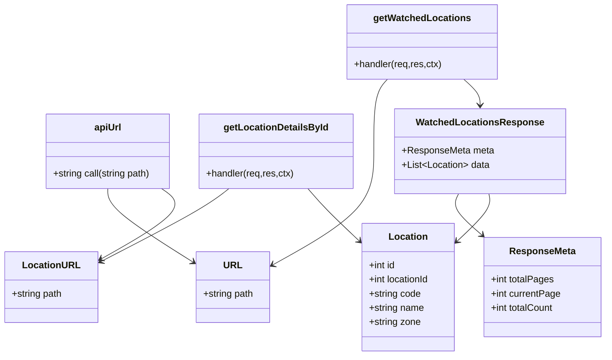
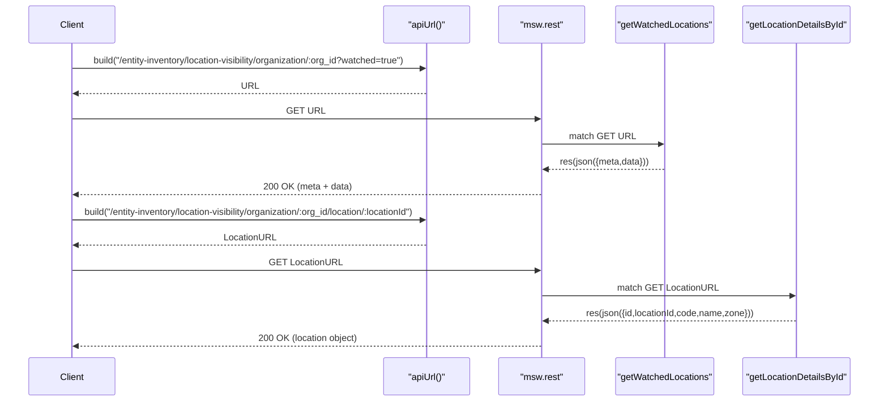

# Diagram: web/portal/src/mocks/handlers/entity-inventory/location-visibility/organization/data.js

> Auto-generated by Obscura crawlers

## Diagram 1

### SVG

<svg id="container" width="1019.30078125" xmlns="http://www.w3.org/2000/svg" class="classDiagram" height="602" viewBox="0 0 1019.30078125 602" role="graphics-document document" aria-roledescription="class"><g><defs><marker id="container_class-aggregationStart" class="marker aggregation class" refX="18" refY="7" markerWidth="190" markerHeight="240" orient="auto"><path d="M 18,7 L9,13 L1,7 L9,1 Z"></path></marker></defs><defs><marker id="container_class-aggregationEnd" class="marker aggregation class" refX="1" refY="7" markerWidth="20" markerHeight="28" orient="auto"><path d="M 18,7 L9,13 L1,7 L9,1 Z"></path></marker></defs><defs><marker id="container_class-extensionStart" class="marker extension class" refX="18" refY="7" markerWidth="190" markerHeight="240" orient="auto"><path d="M 1,7 L18,13 V 1 Z"></path></marker></defs><defs><marker id="container_class-extensionEnd" class="marker extension class" refX="1" refY="7" markerWidth="20" markerHeight="28" orient="auto"><path d="M 1,1 V 13 L18,7 Z"></path></marker></defs><defs><marker id="container_class-compositionStart" class="marker composition class" refX="18" refY="7" markerWidth="190" markerHeight="240" orient="auto"><path d="M 18,7 L9,13 L1,7 L9,1 Z"></path></marker></defs><defs><marker id="container_class-compositionEnd" class="marker composition class" refX="1" refY="7" markerWidth="20" markerHeight="28" orient="auto"><path d="M 18,7 L9,13 L1,7 L9,1 Z"></path></marker></defs><defs><marker id="container_class-dependencyStart" class="marker dependency class" refX="6" refY="7" markerWidth="190" markerHeight="240" orient="auto"><path d="M 5,7 L9,13 L1,7 L9,1 Z"></path></marker></defs><defs><marker id="container_class-dependencyEnd" class="marker dependency class" refX="13" refY="7" markerWidth="20" markerHeight="28" orient="auto"><path d="M 18,7 L9,13 L14,7 L9,1 Z"></path></marker></defs><defs><marker id="container_class-lollipopStart" class="marker lollipop class" refX="13" refY="7" markerWidth="190" markerHeight="240" orient="auto"><circle stroke="black" fill="transparent" cx="7" cy="7" r="6"></circle></marker></defs><defs><marker id="container_class-lollipopEnd" class="marker lollipop class" refX="1" refY="7" markerWidth="190" markerHeight="240" orient="auto"><circle stroke="black" fill="transparent" cx="7" cy="7" r="6"></circle></marker></defs><g class="root"><g class="clusters"></g><g class="edgePaths"><path d="M181.82,319L181.82,324.667C181.82,330.333,181.82,341.667,205.194,362.282C228.568,382.898,275.316,412.796,298.69,427.746L322.065,442.695" id="id_apiUrl_URL_1" class="edge-thickness-normal edge-pattern-solid relation" style=";;;" data-edge="true" data-et="edge" data-id="id_apiUrl_URL_1" data-points="W3sieCI6MTgxLjgyMDMxMjUsInkiOjMxOX0seyJ4IjoxODEuODIwMzEyNSwieSI6MzUzfSx7IngiOjMyNy4xMTkxNDA2MjUsInkiOjQ0NS45Mjc0OTMzNTUxMjI5fV0=" marker-end="url(#container_class-dependencyEnd)"></path><path d="M272.668,319L280.84,324.667C289.011,330.333,305.354,341.667,288.223,361.631C271.091,381.596,220.486,410.192,195.183,424.489L169.88,438.787" id="id_apiUrl_LocationURL_2" class="edge-thickness-normal edge-pattern-solid relation" style=";;;" data-edge="true" data-et="edge" data-id="id_apiUrl_LocationURL_2" data-points="W3sieCI6MjcyLjY2ODIzMDUwOTAyMDY1LCJ5IjozMTl9LHsieCI6MzIxLjY5NzI2NTYyNSwieSI6MzUzfSx7IngiOjE2NC42NTYyNSwieSI6NDQxLjczOTEzOTgxNTI4MzV9XQ==" marker-end="url(#container_class-dependencyEnd)"></path><path d="M655.027,134L651.282,138.167C647.537,142.333,640.048,150.667,636.303,171C632.559,191.333,632.559,223.667,632.559,256C632.559,288.333,632.559,320.667,603.414,352.799C574.27,384.931,515.982,416.862,486.838,432.828L457.694,448.793" id="id_getWatchedLocations_URL_3" class="edge-thickness-normal edge-pattern-solid relation" style=";;;" data-edge="true" data-et="edge" data-id="id_getWatchedLocations_URL_3" data-points="W3sieCI6NjU1LjAyNjc0NDQ5NTczODYsInkiOjEzNH0seyJ4Ijo2MzIuNTU4NTkzNzUsInkiOjE1OX0seyJ4Ijo2MzIuNTU4NTkzNzUsInkiOjI1Nn0seyJ4Ijo2MzIuNTU4NTkzNzUsInkiOjM1M30seyJ4Ijo0NTIuNDMxNjQwNjI1LCJ5Ijo0NTEuNjc2MDM4Nzc1NTkyM31d" marker-end="url(#container_class-dependencyEnd)"></path><path d="M780.593,134L785.153,138.167C789.713,142.333,798.833,150.667,803.393,158C807.953,165.333,807.953,171.667,807.953,174.833L807.953,178" id="id_getWatchedLocations_WatchedLocationsResponse_4" class="edge-thickness-normal edge-pattern-solid relation" style=";;;" data-edge="true" data-et="edge" data-id="id_getWatchedLocations_WatchedLocationsResponse_4" data-points="W3sieCI6NzgwLjU5MzI4MzkxMzM1MjMsInkiOjEzNH0seyJ4Ijo4MDcuOTUzMTI1LCJ5IjoxNTl9LHsieCI6ODA3Ljk1MzEyNSwieSI6MTg0fV0=" marker-end="url(#container_class-dependencyEnd)"></path><path d="M388.34,319L381.137,324.667C373.934,330.333,359.527,341.667,323.136,362.334C286.745,383.001,228.369,413.002,199.181,428.002L169.993,443.003" id="id_getLocationDetailsById_LocationURL_5" class="edge-thickness-normal edge-pattern-solid relation" style=";;;" data-edge="true" data-et="edge" data-id="id_getLocationDetailsById_LocationURL_5" data-points="W3sieCI6Mzg4LjMzOTkyNDI5MTIzNzE0LCJ5IjozMTl9LHsieCI6MzQ1LjEyMTA5Mzc1LCJ5IjozNTN9LHsieCI6MTY0LjY1NjI1LCJ5Ijo0NDUuNzQ1MjcxNzY5NDgyN31d" marker-end="url(#container_class-dependencyEnd)"></path><path d="M521.724,319L526.518,324.667C531.313,330.333,540.901,341.667,554.052,355.58C567.202,369.494,583.913,385.988,592.269,394.235L600.624,402.482" id="id_getLocationDetailsById_Location_6" class="edge-thickness-normal edge-pattern-solid relation" style=";;;" data-edge="true" data-et="edge" data-id="id_getLocationDetailsById_Location_6" data-points="W3sieCI6NTIxLjcyNDAwNTMxNTcyMTcsInkiOjMxOX0seyJ4Ijo1NTAuNDkwMjM0Mzc1LCJ5IjozNTN9LHsieCI6NjA0Ljg5NDUzMTI1LCJ5Ijo0MDYuNjk2OTY5MjU3NzUwNzd9XQ==" marker-end="url(#container_class-dependencyEnd)"></path><path d="M774.058,328L772.097,332.167C770.135,336.333,766.212,344.667,772.781,356.339C779.351,368.012,796.412,383.024,804.943,390.53L813.474,398.037" id="id_WatchedLocationsResponse_ResponseMeta_7" class="edge-thickness-normal edge-pattern-solid relation" style=";;;" data-edge="true" data-et="edge" data-id="id_WatchedLocationsResponse_ResponseMeta_7" data-points="W3sieCI6Nzc0LjA1ODE1MDc3MzE5NTgsInkiOjMyOH0seyJ4Ijo3NjIuMjg5MDYyNSwieSI6MzUzfSx7IngiOjgxNy45NzgyMDcyMzY4NDIxLCJ5Ijo0MDJ9XQ==" marker-end="url(#container_class-dependencyEnd)"></path><path d="M822.798,328L823.658,332.167C824.517,336.333,826.235,344.667,817.432,357.838C808.628,371.01,789.304,389.019,779.642,398.024L769.979,407.029" id="id_WatchedLocationsResponse_Location_8" class="edge-thickness-normal edge-pattern-solid relation" style=";;;" data-edge="true" data-et="edge" data-id="id_WatchedLocationsResponse_Location_8" data-points="W3sieCI6ODIyLjc5ODQ4NTgyNDc0MjIsInkiOjMyOH0seyJ4Ijo4MjcuOTUzMTI1LCJ5IjozNTN9LHsieCI6NzY1LjU4OTg0Mzc1LCJ5Ijo0MTEuMTE5Njk2NzIwODYyNzV9XQ==" marker-end="url(#container_class-dependencyEnd)"></path></g><g class="edgeLabels"><g class="edgeLabel"><g class="label" data-id="id_apiUrl_URL_1" transform="translate(0, 0)"><foreignObject width="0" height="0">

</foreignObject></g></g><g class="edgeLabel"><g class="label" data-id="id_apiUrl_LocationURL_2" transform="translate(0, 0)"><foreignObject width="0" height="0">

</foreignObject></g></g><g class="edgeLabel"><g class="label" data-id="id_getWatchedLocations_URL_3" transform="translate(0, 0)"><foreignObject width="0" height="0">

</foreignObject></g></g><g class="edgeLabel"><g class="label" data-id="id_getWatchedLocations_WatchedLocationsResponse_4" transform="translate(0, 0)"><foreignObject width="0" height="0">

</foreignObject></g></g><g class="edgeLabel"><g class="label" data-id="id_getLocationDetailsById_LocationURL_5" transform="translate(0, 0)"><foreignObject width="0" height="0">

</foreignObject></g></g><g class="edgeLabel"><g class="label" data-id="id_getLocationDetailsById_Location_6" transform="translate(0, 0)"><foreignObject width="0" height="0">

</foreignObject></g></g><g class="edgeLabel"><g class="label" data-id="id_WatchedLocationsResponse_ResponseMeta_7" transform="translate(0, 0)"><foreignObject width="0" height="0">

</foreignObject></g></g><g class="edgeLabel"><g class="label" data-id="id_WatchedLocationsResponse_Location_8" transform="translate(0, 0)"><foreignObject width="0" height="0">

</foreignObject></g></g></g><g class="nodes"><g class="node default" id="classId-apiUrl-0" transform="translate(181.8203125, 256)"><g class="basic label-container"><path d="M-107.46484375 -63 L107.46484375 -63 L107.46484375 63 L-107.46484375 63" stroke="none" stroke-width="0" fill="#ECECFF" style=""></path><path d="M-107.46484375 -63 C-60.730003280484205 -63, -13.99516281096841 -63, 107.46484375 -63 M-107.46484375 -63 C-43.891865574679635 -63, 19.68111260064073 -63, 107.46484375 -63 M107.46484375 -63 C107.46484375 -35.76494573366347, 107.46484375 -8.52989146732694, 107.46484375 63 M107.46484375 -63 C107.46484375 -20.509441896046795, 107.46484375 21.98111620790641, 107.46484375 63 M107.46484375 63 C62.5379452106941 63, 17.611046671388195 63, -107.46484375 63 M107.46484375 63 C35.688979047947356 63, -36.08688565410529 63, -107.46484375 63 M-107.46484375 63 C-107.46484375 34.234754530965326, -107.46484375 5.469509061930651, -107.46484375 -63 M-107.46484375 63 C-107.46484375 32.79120374490259, -107.46484375 2.5824074898051705, -107.46484375 -63" stroke="#9370DB" stroke-width="1.3" fill="none" stroke-dasharray="0 0" style=""></path></g><g class="annotation-group text" transform="translate(0, -39)"></g><g class="label-group text" transform="translate(-22.2109375, -39)"><g class="label" style="font-weight: bolder" transform="translate(0,-12)"><foreignObject width="44.421875" height="24">

apiUrl

</foreignObject></g></g><g class="members-group text" transform="translate(-95.46484375, 9)"></g><g class="methods-group text" transform="translate(-95.46484375, 39)"><g class="label" style="" transform="translate(0,-12)"><foreignObject width="168.71875" height="24">

+string call(string path)

</foreignObject></g></g><g class="divider" style=""><path d="M-107.46484375 -15 C-56.4844146806222 -15, -5.503985611244403 -15, 107.46484375 -15 M-107.46484375 -15 C-56.04131711817703 -15, -4.617790486354053 -15, 107.46484375 -15" stroke="#9370DB" stroke-width="1.3" fill="none" stroke-dasharray="0 0" style=""></path></g><g class="divider" style=""><path d="M-107.46484375 9 C-63.21807182256562 9, -18.97129989513124 9, 107.46484375 9 M-107.46484375 9 C-46.479711679483444 9, 14.505420391033113 9, 107.46484375 9" stroke="#9370DB" stroke-width="1.3" fill="none" stroke-dasharray="0 0" style=""></path></g></g><g class="node default" id="classId-URL-1" transform="translate(389.775390625, 486)"><g class="basic label-container"><path d="M-62.65625 -60 L62.65625 -60 L62.65625 60 L-62.65625 60" stroke="none" stroke-width="0" fill="#ECECFF" style=""></path><path d="M-62.65625 -60 C-36.33143773530983 -60, -10.006625470619653 -60, 62.65625 -60 M-62.65625 -60 C-17.197893076543046 -60, 28.260463846913908 -60, 62.65625 -60 M62.65625 -60 C62.65625 -23.569467961507577, 62.65625 12.861064076984846, 62.65625 60 M62.65625 -60 C62.65625 -30.93353343075099, 62.65625 -1.867066861501982, 62.65625 60 M62.65625 60 C33.15168984342937 60, 3.64712968685874 60, -62.65625 60 M62.65625 60 C37.17206352009974 60, 11.687877040199474 60, -62.65625 60 M-62.65625 60 C-62.65625 13.234009194181162, -62.65625 -33.531981611637676, -62.65625 -60 M-62.65625 60 C-62.65625 25.1417371371719, -62.65625 -9.716525725656197, -62.65625 -60" stroke="#9370DB" stroke-width="1.3" fill="none" stroke-dasharray="0 0" style=""></path></g><g class="annotation-group text" transform="translate(0, -36)"></g><g class="label-group text" transform="translate(-14.25, -36)"><g class="label" style="font-weight: bolder" transform="translate(0,-12)"><foreignObject width="28.5" height="24">

URL

</foreignObject></g></g><g class="members-group text" transform="translate(-50.65625, 12)"><g class="label" style="" transform="translate(0,-12)"><foreignObject width="87.0625" height="24">

+string path

</foreignObject></g></g><g class="methods-group text" transform="translate(-50.65625, 60)"></g><g class="divider" style=""><path d="M-62.65625 -12 C-19.10347573351956 -12, 24.44929853296088 -12, 62.65625 -12 M-62.65625 -12 C-28.85901561364893 -12, 4.938218772702143 -12, 62.65625 -12" stroke="#9370DB" stroke-width="1.3" fill="none" stroke-dasharray="0 0" style=""></path></g><g class="divider" style=""><path d="M-62.65625 36 C-23.125815786104276 36, 16.404618427791448 36, 62.65625 36 M-62.65625 36 C-21.39447803146055 36, 19.867293937078898 36, 62.65625 36" stroke="#9370DB" stroke-width="1.3" fill="none" stroke-dasharray="0 0" style=""></path></g></g><g class="node default" id="classId-LocationURL-2" transform="translate(86.328125, 486)"><g class="basic label-container"><path d="M-78.328125 -60 L78.328125 -60 L78.328125 60 L-78.328125 60" stroke="none" stroke-width="0" fill="#ECECFF" style=""></path><path d="M-78.328125 -60 C-29.3218899554469 -60, 19.684345089106202 -60, 78.328125 -60 M-78.328125 -60 C-46.71054886455012 -60, -15.092972729100232 -60, 78.328125 -60 M78.328125 -60 C78.328125 -31.938355220570262, 78.328125 -3.876710441140524, 78.328125 60 M78.328125 -60 C78.328125 -28.859808696703148, 78.328125 2.2803826065937045, 78.328125 60 M78.328125 60 C37.04555720894209 60, -4.237010582115815 60, -78.328125 60 M78.328125 60 C46.04417859038585 60, 13.760232180771695 60, -78.328125 60 M-78.328125 60 C-78.328125 14.982975629345873, -78.328125 -30.034048741308254, -78.328125 -60 M-78.328125 60 C-78.328125 35.70116037333803, -78.328125 11.402320746676061, -78.328125 -60" stroke="#9370DB" stroke-width="1.3" fill="none" stroke-dasharray="0 0" style=""></path></g><g class="annotation-group text" transform="translate(0, -36)"></g><g class="label-group text" transform="translate(-45.59375, -36)"><g class="label" style="font-weight: bolder" transform="translate(0,-12)"><foreignObject width="91.1875" height="24">

LocationURL

</foreignObject></g></g><g class="members-group text" transform="translate(-66.328125, 12)"><g class="label" style="" transform="translate(0,-12)"><foreignObject width="87.0625" height="24">

+string path

</foreignObject></g></g><g class="methods-group text" transform="translate(-66.328125, 60)"></g><g class="divider" style=""><path d="M-78.328125 -12 C-24.014615491491277 -12, 30.298894017017446 -12, 78.328125 -12 M-78.328125 -12 C-34.861447967898776 -12, 8.605229064202447 -12, 78.328125 -12" stroke="#9370DB" stroke-width="1.3" fill="none" stroke-dasharray="0 0" style=""></path></g><g class="divider" style=""><path d="M-78.328125 36 C-20.55559962196314 36, 37.21692575607372 36, 78.328125 36 M-78.328125 36 C-32.88215846858698 36, 12.563808062826041 36, 78.328125 36" stroke="#9370DB" stroke-width="1.3" fill="none" stroke-dasharray="0 0" style=""></path></g></g><g class="node default" id="classId-getWatchedLocations-3" transform="translate(711.646484375, 71)"><g class="basic label-container"><path d="M-125.97265625 -63 L125.97265625 -63 L125.97265625 63 L-125.97265625 63" stroke="none" stroke-width="0" fill="#ECECFF" style=""></path><path d="M-125.97265625 -63 C-44.9266651655245 -63, 36.119325918951006 -63, 125.97265625 -63 M-125.97265625 -63 C-48.788005458295075 -63, 28.39664533340985 -63, 125.97265625 -63 M125.97265625 -63 C125.97265625 -28.46865262111543, 125.97265625 6.062694757769137, 125.97265625 63 M125.97265625 -63 C125.97265625 -18.858429608553813, 125.97265625 25.283140782892374, 125.97265625 63 M125.97265625 63 C68.93462386928196 63, 11.896591488563928 63, -125.97265625 63 M125.97265625 63 C58.47697761641953 63, -9.018701017160936 63, -125.97265625 63 M-125.97265625 63 C-125.97265625 29.604941861212346, -125.97265625 -3.790116277575308, -125.97265625 -63 M-125.97265625 63 C-125.97265625 22.58990918438095, -125.97265625 -17.8201816312381, -125.97265625 -63" stroke="#9370DB" stroke-width="1.3" fill="none" stroke-dasharray="0 0" style=""></path></g><g class="annotation-group text" transform="translate(0, -39)"></g><g class="label-group text" transform="translate(-78.4765625, -39)"><g class="label" style="font-weight: bolder" transform="translate(0,-12)"><foreignObject width="156.953125" height="24">

getWatchedLocations

</foreignObject></g></g><g class="members-group text" transform="translate(-113.97265625, 9)"></g><g class="methods-group text" transform="translate(-113.97265625, 39)"><g class="label" style="" transform="translate(0,-12)"><foreignObject width="149.46875" height="24">

+handler(req,res,ctx)

</foreignObject></g></g><g class="divider" style=""><path d="M-125.97265625 -15 C-73.28743726424383 -15, -20.602218278487655 -15, 125.97265625 -15 M-125.97265625 -15 C-35.80158798519123 -15, 54.369480279617534 -15, 125.97265625 -15" stroke="#9370DB" stroke-width="1.3" fill="none" stroke-dasharray="0 0" style=""></path></g><g class="divider" style=""><path d="M-125.97265625 9 C-69.17197509098293 9, -12.371293931965866 9, 125.97265625 9 M-125.97265625 9 C-58.20939120096588 9, 9.553873848068235 9, 125.97265625 9" stroke="#9370DB" stroke-width="1.3" fill="none" stroke-dasharray="0 0" style=""></path></g></g><g class="node default" id="classId-getLocationDetailsById-4" transform="translate(468.421875, 256)"><g class="basic label-container"><path d="M-129.13671875 -63 L129.13671875 -63 L129.13671875 63 L-129.13671875 63" stroke="none" stroke-width="0" fill="#ECECFF" style=""></path><path d="M-129.13671875 -63 C-76.22799237393477 -63, -23.31926599786955 -63, 129.13671875 -63 M-129.13671875 -63 C-48.13586034312482 -63, 32.86499806375036 -63, 129.13671875 -63 M129.13671875 -63 C129.13671875 -31.015313607760174, 129.13671875 0.9693727844796527, 129.13671875 63 M129.13671875 -63 C129.13671875 -19.293798723690266, 129.13671875 24.41240255261947, 129.13671875 63 M129.13671875 63 C35.7785314088088 63, -57.579655932382394 63, -129.13671875 63 M129.13671875 63 C75.99231950834725 63, 22.8479202666945 63, -129.13671875 63 M-129.13671875 63 C-129.13671875 33.9827132270023, -129.13671875 4.9654264540046, -129.13671875 -63 M-129.13671875 63 C-129.13671875 15.584277806163215, -129.13671875 -31.83144438767357, -129.13671875 -63" stroke="#9370DB" stroke-width="1.3" fill="none" stroke-dasharray="0 0" style=""></path></g><g class="annotation-group text" transform="translate(0, -39)"></g><g class="label-group text" transform="translate(-84.8046875, -39)"><g class="label" style="font-weight: bolder" transform="translate(0,-12)"><foreignObject width="169.609375" height="24">

getLocationDetailsById

</foreignObject></g></g><g class="members-group text" transform="translate(-117.13671875, 9)"></g><g class="methods-group text" transform="translate(-117.13671875, 39)"><g class="label" style="" transform="translate(0,-12)"><foreignObject width="149.46875" height="24">

+handler(req,res,ctx)

</foreignObject></g></g><g class="divider" style=""><path d="M-129.13671875 -15 C-36.630037689954676 -15, 55.87664337009065 -15, 129.13671875 -15 M-129.13671875 -15 C-29.816990544607137 -15, 69.50273766078573 -15, 129.13671875 -15" stroke="#9370DB" stroke-width="1.3" fill="none" stroke-dasharray="0 0" style=""></path></g><g class="divider" style=""><path d="M-129.13671875 9 C-52.80437973085846 9, 23.527959288283085 9, 129.13671875 9 M-129.13671875 9 C-43.97051156746005 9, 41.1956956150799 9, 129.13671875 9" stroke="#9370DB" stroke-width="1.3" fill="none" stroke-dasharray="0 0" style=""></path></g></g><g class="node default" id="classId-WatchedLocationsResponse-5" transform="translate(807.953125, 256)"><g class="basic label-container"><path d="M-140.39453125 -72 L140.39453125 -72 L140.39453125 72 L-140.39453125 72" stroke="none" stroke-width="0" fill="#ECECFF" style=""></path><path d="M-140.39453125 -72 C-72.57201958867579 -72, -4.749507927351573 -72, 140.39453125 -72 M-140.39453125 -72 C-43.54275876645859 -72, 53.30901371708282 -72, 140.39453125 -72 M140.39453125 -72 C140.39453125 -26.46689139889895, 140.39453125 19.066217202202097, 140.39453125 72 M140.39453125 -72 C140.39453125 -29.17543192549826, 140.39453125 13.649136149003482, 140.39453125 72 M140.39453125 72 C82.3610611668562 72, 24.327591083712406 72, -140.39453125 72 M140.39453125 72 C70.94232067840731 72, 1.490110106814626 72, -140.39453125 72 M-140.39453125 72 C-140.39453125 39.686096838073325, -140.39453125 7.372193676146651, -140.39453125 -72 M-140.39453125 72 C-140.39453125 30.85070211329377, -140.39453125 -10.298595773412458, -140.39453125 -72" stroke="#9370DB" stroke-width="1.3" fill="none" stroke-dasharray="0 0" style=""></path></g><g class="annotation-group text" transform="translate(0, -48)"></g><g class="label-group text" transform="translate(-102.1796875, -48)"><g class="label" style="font-weight: bolder" transform="translate(0,-12)"><foreignObject width="204.359375" height="24">

WatchedLocationsResponse

</foreignObject></g></g><g class="members-group text" transform="translate(-128.39453125, 0)"><g class="label" style="" transform="translate(0,-12)"><foreignObject width="154.609375" height="24">

+ResponseMeta meta

</foreignObject></g><g class="label" style="" transform="translate(0,12)"><foreignObject width="148.71875" height="24">

+List&lt;Location&gt; data

</foreignObject></g></g><g class="methods-group text" transform="translate(-128.39453125, 72)"></g><g class="divider" style=""><path d="M-140.39453125 -24 C-75.28242767720445 -24, -10.170324104408905 -24, 140.39453125 -24 M-140.39453125 -24 C-66.63847735884455 -24, 7.117576532310892 -24, 140.39453125 -24" stroke="#9370DB" stroke-width="1.3" fill="none" stroke-dasharray="0 0" style=""></path></g><g class="divider" style=""><path d="M-140.39453125 48 C-75.32292764036593 48, -10.251324030731865 48, 140.39453125 48 M-140.39453125 48 C-59.74632335068266 48, 20.901884548634683 48, 140.39453125 48" stroke="#9370DB" stroke-width="1.3" fill="none" stroke-dasharray="0 0" style=""></path></g></g><g class="node default" id="classId-ResponseMeta-6" transform="translate(913.4453125, 486)"><g class="basic label-container"><path d="M-97.85546875 -84 L97.85546875 -84 L97.85546875 84 L-97.85546875 84" stroke="none" stroke-width="0" fill="#ECECFF" style=""></path><path d="M-97.85546875 -84 C-31.245925815489514 -84, 35.36361711902097 -84, 97.85546875 -84 M-97.85546875 -84 C-39.220881493375664 -84, 19.41370576324867 -84, 97.85546875 -84 M97.85546875 -84 C97.85546875 -18.915601424824402, 97.85546875 46.168797150351196, 97.85546875 84 M97.85546875 -84 C97.85546875 -35.21781631761029, 97.85546875 13.564367364779415, 97.85546875 84 M97.85546875 84 C57.89083691350223 84, 17.926205077004454 84, -97.85546875 84 M97.85546875 84 C39.23437506002902 84, -19.386718629941953 84, -97.85546875 84 M-97.85546875 84 C-97.85546875 38.73515194885306, -97.85546875 -6.529696102293883, -97.85546875 -84 M-97.85546875 84 C-97.85546875 39.602465040892156, -97.85546875 -4.795069918215688, -97.85546875 -84" stroke="#9370DB" stroke-width="1.3" fill="none" stroke-dasharray="0 0" style=""></path></g><g class="annotation-group text" transform="translate(0, -60)"></g><g class="label-group text" transform="translate(-53.5234375, -60)"><g class="label" style="font-weight: bolder" transform="translate(0,-12)"><foreignObject width="107.046875" height="24">

ResponseMeta

</foreignObject></g></g><g class="members-group text" transform="translate(-85.85546875, -12)"><g class="label" style="" transform="translate(0,-12)"><foreignObject width="106.890625" height="24">

+int totalPages

</foreignObject></g><g class="label" style="" transform="translate(0,12)"><foreignObject width="118.1875" height="24">

+int currentPage

</foreignObject></g><g class="label" style="" transform="translate(0,36)"><foreignObject width="108.125" height="24">

+int totalCount

</foreignObject></g></g><g class="methods-group text" transform="translate(-85.85546875, 84)"></g><g class="divider" style=""><path d="M-97.85546875 -36 C-22.575778365907752 -36, 52.703912018184496 -36, 97.85546875 -36 M-97.85546875 -36 C-19.802634891371298 -36, 58.250198967257404 -36, 97.85546875 -36" stroke="#9370DB" stroke-width="1.3" fill="none" stroke-dasharray="0 0" style=""></path></g><g class="divider" style=""><path d="M-97.85546875 60 C-22.02926650724774 60, 53.79693573550452 60, 97.85546875 60 M-97.85546875 60 C-47.82490635062823 60, 2.205656048743535 60, 97.85546875 60" stroke="#9370DB" stroke-width="1.3" fill="none" stroke-dasharray="0 0" style=""></path></g></g><g class="node default" id="classId-Location-7" transform="translate(685.2421875, 486)"><g class="basic label-container"><path d="M-80.34765625 -108 L80.34765625 -108 L80.34765625 108 L-80.34765625 108" stroke="none" stroke-width="0" fill="#ECECFF" style=""></path><path d="M-80.34765625 -108 C-40.229982706521795 -108, -0.11230916304359084 -108, 80.34765625 -108 M-80.34765625 -108 C-21.207948691268307 -108, 37.93175886746339 -108, 80.34765625 -108 M80.34765625 -108 C80.34765625 -59.44920129669463, 80.34765625 -10.898402593389264, 80.34765625 108 M80.34765625 -108 C80.34765625 -61.79417651506536, 80.34765625 -15.588353030130719, 80.34765625 108 M80.34765625 108 C35.11321872521388 108, -10.121218799572233 108, -80.34765625 108 M80.34765625 108 C20.661385001715267 108, -39.024886246569466 108, -80.34765625 108 M-80.34765625 108 C-80.34765625 36.5880665313541, -80.34765625 -34.8238669372918, -80.34765625 -108 M-80.34765625 108 C-80.34765625 48.90488557782204, -80.34765625 -10.190228844355914, -80.34765625 -108" stroke="#9370DB" stroke-width="1.3" fill="none" stroke-dasharray="0 0" style=""></path></g><g class="annotation-group text" transform="translate(0, -84)"></g><g class="label-group text" transform="translate(-31.3515625, -84)"><g class="label" style="font-weight: bolder" transform="translate(0,-12)"><foreignObject width="62.703125" height="24">

Location

</foreignObject></g></g><g class="members-group text" transform="translate(-68.34765625, -36)"><g class="label" style="" transform="translate(0,-12)"><foreignObject width="45.96875" height="24">

+int id

</foreignObject></g><g class="label" style="" transform="translate(0,12)"><foreignObject width="105.34375" height="24">

+int locationId

</foreignObject></g><g class="label" style="" transform="translate(0,36)"><foreignObject width="88.828125" height="24">

+string code

</foreignObject></g><g class="label" style="" transform="translate(0,60)"><foreignObject width="94.375" height="24">

+string name

</foreignObject></g><g class="label" style="" transform="translate(0,84)"><foreignObject width="88.1875" height="24">

+string zone

</foreignObject></g></g><g class="methods-group text" transform="translate(-68.34765625, 108)"></g><g class="divider" style=""><path d="M-80.34765625 -60 C-19.542576348440946 -60, 41.26250355311811 -60, 80.34765625 -60 M-80.34765625 -60 C-19.336143295991953 -60, 41.675369658016095 -60, 80.34765625 -60" stroke="#9370DB" stroke-width="1.3" fill="none" stroke-dasharray="0 0" style=""></path></g><g class="divider" style=""><path d="M-80.34765625 84 C-17.121429384910357 84, 46.104797480179286 84, 80.34765625 84 M-80.34765625 84 C-20.04034156936053 84, 40.26697311127894 84, 80.34765625 84" stroke="#9370DB" stroke-width="1.3" fill="none" stroke-dasharray="0 0" style=""></path></g></g></g></g></g></svg>

## Diagram 2

### SVG

<svg id="container" width="1640.5" xmlns="http://www.w3.org/2000/svg" height="747" viewBox="-50 -10 1640.5 747" role="graphics-document document" aria-roledescription="sequence"><g><rect x="1341.5" y="661" fill="#eaeaea" stroke="#666" width="199" height="65" name="getLocationDetailsById" rx="3" ry="3" class="actor actor-bottom"></rect><text x="1441" y="693.5" dominant-baseline="central" alignment-baseline="central" class="actor actor-box" style="text-anchor: middle; font-size: 16px; font-weight: 400;"><tspan x="1441" dy="0">"getLocationDetailsById"</tspan></text></g><g><rect x="1104.5" y="661" fill="#eaeaea" stroke="#666" width="187" height="65" name="getWatchedLocations" rx="3" ry="3" class="actor actor-bottom"></rect><text x="1198" y="693.5" dominant-baseline="central" alignment-baseline="central" class="actor actor-box" style="text-anchor: middle; font-size: 16px; font-weight: 400;"><tspan x="1198" dy="0">"getWatchedLocations"</tspan></text></g><g><rect x="896" y="661" fill="#eaeaea" stroke="#666" width="150" height="65" name="MSW" rx="3" ry="3" class="actor actor-bottom"></rect><text x="971" y="693.5" dominant-baseline="central" alignment-baseline="central" class="actor actor-box" style="text-anchor: middle; font-size: 16px; font-weight: 400;"><tspan x="971" dy="0">"msw.rest"</tspan></text></g><g><rect x="696" y="661" fill="#eaeaea" stroke="#666" width="150" height="65" name="apiUrl" rx="3" ry="3" class="actor actor-bottom"></rect><text x="771" y="693.5" dominant-baseline="central" alignment-baseline="central" class="actor actor-box" style="text-anchor: middle; font-size: 16px; font-weight: 400;"><tspan x="771" dy="0">"apiUrl()"</tspan></text></g><g><rect x="0" y="661" fill="#eaeaea" stroke="#666" width="150" height="65" name="Client" rx="3" ry="3" class="actor actor-bottom"></rect><text x="75" y="693.5" dominant-baseline="central" alignment-baseline="central" class="actor actor-box" style="text-anchor: middle; font-size: 16px; font-weight: 400;"><tspan x="75" dy="0">Client</tspan></text></g><g><line id="actor4" x1="1441" y1="65" x2="1441" y2="661" class="actor-line 200" stroke-width="0.5px" stroke="#999" name="getLocationDetailsById"></line><g id="root-4"><rect x="1341.5" y="0" fill="#eaeaea" stroke="#666" width="199" height="65" name="getLocationDetailsById" rx="3" ry="3" class="actor actor-top"></rect><text x="1441" y="32.5" dominant-baseline="central" alignment-baseline="central" class="actor actor-box" style="text-anchor: middle; font-size: 16px; font-weight: 400;"><tspan x="1441" dy="0">"getLocationDetailsById"</tspan></text></g></g><g><line id="actor3" x1="1198" y1="65" x2="1198" y2="661" class="actor-line 200" stroke-width="0.5px" stroke="#999" name="getWatchedLocations"></line><g id="root-3"><rect x="1104.5" y="0" fill="#eaeaea" stroke="#666" width="187" height="65" name="getWatchedLocations" rx="3" ry="3" class="actor actor-top"></rect><text x="1198" y="32.5" dominant-baseline="central" alignment-baseline="central" class="actor actor-box" style="text-anchor: middle; font-size: 16px; font-weight: 400;"><tspan x="1198" dy="0">"getWatchedLocations"</tspan></text></g></g><g><line id="actor2" x1="971" y1="65" x2="971" y2="661" class="actor-line 200" stroke-width="0.5px" stroke="#999" name="MSW"></line><g id="root-2"><rect x="896" y="0" fill="#eaeaea" stroke="#666" width="150" height="65" name="MSW" rx="3" ry="3" class="actor actor-top"></rect><text x="971" y="32.5" dominant-baseline="central" alignment-baseline="central" class="actor actor-box" style="text-anchor: middle; font-size: 16px; font-weight: 400;"><tspan x="971" dy="0">"msw.rest"</tspan></text></g></g><g><line id="actor1" x1="771" y1="65" x2="771" y2="661" class="actor-line 200" stroke-width="0.5px" stroke="#999" name="apiUrl"></line><g id="root-1"><rect x="696" y="0" fill="#eaeaea" stroke="#666" width="150" height="65" name="apiUrl" rx="3" ry="3" class="actor actor-top"></rect><text x="771" y="32.5" dominant-baseline="central" alignment-baseline="central" class="actor actor-box" style="text-anchor: middle; font-size: 16px; font-weight: 400;"><tspan x="771" dy="0">"apiUrl()"</tspan></text></g></g><g><line id="actor0" x1="75" y1="65" x2="75" y2="661" class="actor-line 200" stroke-width="0.5px" stroke="#999" name="Client"></line><g id="root-0"><rect x="0" y="0" fill="#eaeaea" stroke="#666" width="150" height="65" name="Client" rx="3" ry="3" class="actor actor-top"></rect><text x="75" y="32.5" dominant-baseline="central" alignment-baseline="central" class="actor actor-box" style="text-anchor: middle; font-size: 16px; font-weight: 400;"><tspan x="75" dy="0">Client</tspan></text></g></g><g></g><defs><symbol id="computer" width="24" height="24"><path transform="scale(.5)" d="M2 2v13h20v-13h-20zm18 11h-16v-9h16v9zm-10.228 6l.466-1h3.524l.467 1h-4.457zm14.228 3h-24l2-6h2.104l-1.33 4h18.45l-1.297-4h2.073l2 6zm-5-10h-14v-7h14v7z"></path></symbol></defs><defs><symbol id="database" fill-rule="evenodd" clip-rule="evenodd"><path transform="scale(.5)" d="M12.258.001l.256.004.255.005.253.008.251.01.249.012.247.015.246.016.242.019.241.02.239.023.236.024.233.027.231.028.229.031.225.032.223.034.22.036.217.038.214.04.211.041.208.043.205.045.201.046.198.048.194.05.191.051.187.053.183.054.18.056.175.057.172.059.168.06.163.061.16.063.155.064.15.066.074.033.073.033.071.034.07.034.069.035.068.035.067.035.066.035.064.036.064.036.062.036.06.036.06.037.058.037.058.037.055.038.055.038.053.038.052.038.051.039.05.039.048.039.047.039.045.04.044.04.043.04.041.04.04.041.039.041.037.041.036.041.034.041.033.042.032.042.03.042.029.042.027.042.026.043.024.043.023.043.021.043.02.043.018.044.017.043.015.044.013.044.012.044.011.045.009.044.007.045.006.045.004.045.002.045.001.045v17l-.001.045-.002.045-.004.045-.006.045-.007.045-.009.044-.011.045-.012.044-.013.044-.015.044-.017.043-.018.044-.02.043-.021.043-.023.043-.024.043-.026.043-.027.042-.029.042-.03.042-.032.042-.033.042-.034.041-.036.041-.037.041-.039.041-.04.041-.041.04-.043.04-.044.04-.045.04-.047.039-.048.039-.05.039-.051.039-.052.038-.053.038-.055.038-.055.038-.058.037-.058.037-.06.037-.06.036-.062.036-.064.036-.064.036-.066.035-.067.035-.068.035-.069.035-.07.034-.071.034-.073.033-.074.033-.15.066-.155.064-.16.063-.163.061-.168.06-.172.059-.175.057-.18.056-.183.054-.187.053-.191.051-.194.05-.198.048-.201.046-.205.045-.208.043-.211.041-.214.04-.217.038-.22.036-.223.034-.225.032-.229.031-.231.028-.233.027-.236.024-.239.023-.241.02-.242.019-.246.016-.247.015-.249.012-.251.01-.253.008-.255.005-.256.004-.258.001-.258-.001-.256-.004-.255-.005-.253-.008-.251-.01-.249-.012-.247-.015-.245-.016-.243-.019-.241-.02-.238-.023-.236-.024-.234-.027-.231-.028-.228-.031-.226-.032-.223-.034-.22-.036-.217-.038-.214-.04-.211-.041-.208-.043-.204-.045-.201-.046-.198-.048-.195-.05-.19-.051-.187-.053-.184-.054-.179-.056-.176-.057-.172-.059-.167-.06-.164-.061-.159-.063-.155-.064-.151-.066-.074-.033-.072-.033-.072-.034-.07-.034-.069-.035-.068-.035-.067-.035-.066-.035-.064-.036-.063-.036-.062-.036-.061-.036-.06-.037-.058-.037-.057-.037-.056-.038-.055-.038-.053-.038-.052-.038-.051-.039-.049-.039-.049-.039-.046-.039-.046-.04-.044-.04-.043-.04-.041-.04-.04-.041-.039-.041-.037-.041-.036-.041-.034-.041-.033-.042-.032-.042-.03-.042-.029-.042-.027-.042-.026-.043-.024-.043-.023-.043-.021-.043-.02-.043-.018-.044-.017-.043-.015-.044-.013-.044-.012-.044-.011-.045-.009-.044-.007-.045-.006-.045-.004-.045-.002-.045-.001-.045v-17l.001-.045.002-.045.004-.045.006-.045.007-.045.009-.044.011-.045.012-.044.013-.044.015-.044.017-.043.018-.044.02-.043.021-.043.023-.043.024-.043.026-.043.027-.042.029-.042.03-.042.032-.042.033-.042.034-.041.036-.041.037-.041.039-.041.04-.041.041-.04.043-.04.044-.04.046-.04.046-.039.049-.039.049-.039.051-.039.052-.038.053-.038.055-.038.056-.038.057-.037.058-.037.06-.037.061-.036.062-.036.063-.036.064-.036.066-.035.067-.035.068-.035.069-.035.07-.034.072-.034.072-.033.074-.033.151-.066.155-.064.159-.063.164-.061.167-.06.172-.059.176-.057.179-.056.184-.054.187-.053.19-.051.195-.05.198-.048.201-.046.204-.045.208-.043.211-.041.214-.04.217-.038.22-.036.223-.034.226-.032.228-.031.231-.028.234-.027.236-.024.238-.023.241-.02.243-.019.245-.016.247-.015.249-.012.251-.01.253-.008.255-.005.256-.004.258-.001.258.001zm-9.258 20.499v.01l.001.021.003.021.004.022.005.021.006.022.007.022.009.023.01.022.011.023.012.023.013.023.015.023.016.024.017.023.018.024.019.024.021.024.022.025.023.024.024.025.052.049.056.05.061.051.066.051.07.051.075.051.079.052.084.052.088.052.092.052.097.052.102.051.105.052.11.052.114.051.119.051.123.051.127.05.131.05.135.05.139.048.144.049.147.047.152.047.155.047.16.045.163.045.167.043.171.043.176.041.178.041.183.039.187.039.19.037.194.035.197.035.202.033.204.031.209.03.212.029.216.027.219.025.222.024.226.021.23.02.233.018.236.016.24.015.243.012.246.01.249.008.253.005.256.004.259.001.26-.001.257-.004.254-.005.25-.008.247-.011.244-.012.241-.014.237-.016.233-.018.231-.021.226-.021.224-.024.22-.026.216-.027.212-.028.21-.031.205-.031.202-.034.198-.034.194-.036.191-.037.187-.039.183-.04.179-.04.175-.042.172-.043.168-.044.163-.045.16-.046.155-.046.152-.047.148-.048.143-.049.139-.049.136-.05.131-.05.126-.05.123-.051.118-.052.114-.051.11-.052.106-.052.101-.052.096-.052.092-.052.088-.053.083-.051.079-.052.074-.052.07-.051.065-.051.06-.051.056-.05.051-.05.023-.024.023-.025.021-.024.02-.024.019-.024.018-.024.017-.024.015-.023.014-.024.013-.023.012-.023.01-.023.01-.022.008-.022.006-.022.006-.022.004-.022.004-.021.001-.021.001-.021v-4.127l-.077.055-.08.053-.083.054-.085.053-.087.052-.09.052-.093.051-.095.05-.097.05-.1.049-.102.049-.105.048-.106.047-.109.047-.111.046-.114.045-.115.045-.118.044-.12.043-.122.042-.124.042-.126.041-.128.04-.13.04-.132.038-.134.038-.135.037-.138.037-.139.035-.142.035-.143.034-.144.033-.147.032-.148.031-.15.03-.151.03-.153.029-.154.027-.156.027-.158.026-.159.025-.161.024-.162.023-.163.022-.165.021-.166.02-.167.019-.169.018-.169.017-.171.016-.173.015-.173.014-.175.013-.175.012-.177.011-.178.01-.179.008-.179.008-.181.006-.182.005-.182.004-.184.003-.184.002h-.37l-.184-.002-.184-.003-.182-.004-.182-.005-.181-.006-.179-.008-.179-.008-.178-.01-.176-.011-.176-.012-.175-.013-.173-.014-.172-.015-.171-.016-.17-.017-.169-.018-.167-.019-.166-.02-.165-.021-.163-.022-.162-.023-.161-.024-.159-.025-.157-.026-.156-.027-.155-.027-.153-.029-.151-.03-.15-.03-.148-.031-.146-.032-.145-.033-.143-.034-.141-.035-.14-.035-.137-.037-.136-.037-.134-.038-.132-.038-.13-.04-.128-.04-.126-.041-.124-.042-.122-.042-.12-.044-.117-.043-.116-.045-.113-.045-.112-.046-.109-.047-.106-.047-.105-.048-.102-.049-.1-.049-.097-.05-.095-.05-.093-.052-.09-.051-.087-.052-.085-.053-.083-.054-.08-.054-.077-.054v4.127zm0-5.654v.011l.001.021.003.021.004.021.005.022.006.022.007.022.009.022.01.022.011.023.012.023.013.023.015.024.016.023.017.024.018.024.019.024.021.024.022.024.023.025.024.024.052.05.056.05.061.05.066.051.07.051.075.052.079.051.084.052.088.052.092.052.097.052.102.052.105.052.11.051.114.051.119.052.123.05.127.051.131.05.135.049.139.049.144.048.147.048.152.047.155.046.16.045.163.045.167.044.171.042.176.042.178.04.183.04.187.038.19.037.194.036.197.034.202.033.204.032.209.03.212.028.216.027.219.025.222.024.226.022.23.02.233.018.236.016.24.014.243.012.246.01.249.008.253.006.256.003.259.001.26-.001.257-.003.254-.006.25-.008.247-.01.244-.012.241-.015.237-.016.233-.018.231-.02.226-.022.224-.024.22-.025.216-.027.212-.029.21-.03.205-.032.202-.033.198-.035.194-.036.191-.037.187-.039.183-.039.179-.041.175-.042.172-.043.168-.044.163-.045.16-.045.155-.047.152-.047.148-.048.143-.048.139-.05.136-.049.131-.05.126-.051.123-.051.118-.051.114-.052.11-.052.106-.052.101-.052.096-.052.092-.052.088-.052.083-.052.079-.052.074-.051.07-.052.065-.051.06-.05.056-.051.051-.049.023-.025.023-.024.021-.025.02-.024.019-.024.018-.024.017-.024.015-.023.014-.023.013-.024.012-.022.01-.023.01-.023.008-.022.006-.022.006-.022.004-.021.004-.022.001-.021.001-.021v-4.139l-.077.054-.08.054-.083.054-.085.052-.087.053-.09.051-.093.051-.095.051-.097.05-.1.049-.102.049-.105.048-.106.047-.109.047-.111.046-.114.045-.115.044-.118.044-.12.044-.122.042-.124.042-.126.041-.128.04-.13.039-.132.039-.134.038-.135.037-.138.036-.139.036-.142.035-.143.033-.144.033-.147.033-.148.031-.15.03-.151.03-.153.028-.154.028-.156.027-.158.026-.159.025-.161.024-.162.023-.163.022-.165.021-.166.02-.167.019-.169.018-.169.017-.171.016-.173.015-.173.014-.175.013-.175.012-.177.011-.178.009-.179.009-.179.007-.181.007-.182.005-.182.004-.184.003-.184.002h-.37l-.184-.002-.184-.003-.182-.004-.182-.005-.181-.007-.179-.007-.179-.009-.178-.009-.176-.011-.176-.012-.175-.013-.173-.014-.172-.015-.171-.016-.17-.017-.169-.018-.167-.019-.166-.02-.165-.021-.163-.022-.162-.023-.161-.024-.159-.025-.157-.026-.156-.027-.155-.028-.153-.028-.151-.03-.15-.03-.148-.031-.146-.033-.145-.033-.143-.033-.141-.035-.14-.036-.137-.036-.136-.037-.134-.038-.132-.039-.13-.039-.128-.04-.126-.041-.124-.042-.122-.043-.12-.043-.117-.044-.116-.044-.113-.046-.112-.046-.109-.046-.106-.047-.105-.048-.102-.049-.1-.049-.097-.05-.095-.051-.093-.051-.09-.051-.087-.053-.085-.052-.083-.054-.08-.054-.077-.054v4.139zm0-5.666v.011l.001.02.003.022.004.021.005.022.006.021.007.022.009.023.01.022.011.023.012.023.013.023.015.023.016.024.017.024.018.023.019.024.021.025.022.024.023.024.024.025.052.05.056.05.061.05.066.051.07.051.075.052.079.051.084.052.088.052.092.052.097.052.102.052.105.051.11.052.114.051.119.051.123.051.127.05.131.05.135.05.139.049.144.048.147.048.152.047.155.046.16.045.163.045.167.043.171.043.176.042.178.04.183.04.187.038.19.037.194.036.197.034.202.033.204.032.209.03.212.028.216.027.219.025.222.024.226.021.23.02.233.018.236.017.24.014.243.012.246.01.249.008.253.006.256.003.259.001.26-.001.257-.003.254-.006.25-.008.247-.01.244-.013.241-.014.237-.016.233-.018.231-.02.226-.022.224-.024.22-.025.216-.027.212-.029.21-.03.205-.032.202-.033.198-.035.194-.036.191-.037.187-.039.183-.039.179-.041.175-.042.172-.043.168-.044.163-.045.16-.045.155-.047.152-.047.148-.048.143-.049.139-.049.136-.049.131-.051.126-.05.123-.051.118-.052.114-.051.11-.052.106-.052.101-.052.096-.052.092-.052.088-.052.083-.052.079-.052.074-.052.07-.051.065-.051.06-.051.056-.05.051-.049.023-.025.023-.025.021-.024.02-.024.019-.024.018-.024.017-.024.015-.023.014-.024.013-.023.012-.023.01-.022.01-.023.008-.022.006-.022.006-.022.004-.022.004-.021.001-.021.001-.021v-4.153l-.077.054-.08.054-.083.053-.085.053-.087.053-.09.051-.093.051-.095.051-.097.05-.1.049-.102.048-.105.048-.106.048-.109.046-.111.046-.114.046-.115.044-.118.044-.12.043-.122.043-.124.042-.126.041-.128.04-.13.039-.132.039-.134.038-.135.037-.138.036-.139.036-.142.034-.143.034-.144.033-.147.032-.148.032-.15.03-.151.03-.153.028-.154.028-.156.027-.158.026-.159.024-.161.024-.162.023-.163.023-.165.021-.166.02-.167.019-.169.018-.169.017-.171.016-.173.015-.173.014-.175.013-.175.012-.177.01-.178.01-.179.009-.179.007-.181.006-.182.006-.182.004-.184.003-.184.001-.185.001-.185-.001-.184-.001-.184-.003-.182-.004-.182-.006-.181-.006-.179-.007-.179-.009-.178-.01-.176-.01-.176-.012-.175-.013-.173-.014-.172-.015-.171-.016-.17-.017-.169-.018-.167-.019-.166-.02-.165-.021-.163-.023-.162-.023-.161-.024-.159-.024-.157-.026-.156-.027-.155-.028-.153-.028-.151-.03-.15-.03-.148-.032-.146-.032-.145-.033-.143-.034-.141-.034-.14-.036-.137-.036-.136-.037-.134-.038-.132-.039-.13-.039-.128-.041-.126-.041-.124-.041-.122-.043-.12-.043-.117-.044-.116-.044-.113-.046-.112-.046-.109-.046-.106-.048-.105-.048-.102-.048-.1-.05-.097-.049-.095-.051-.093-.051-.09-.052-.087-.052-.085-.053-.083-.053-.08-.054-.077-.054v4.153zm8.74-8.179l-.257.004-.254.005-.25.008-.247.011-.244.012-.241.014-.237.016-.233.018-.231.021-.226.022-.224.023-.22.026-.216.027-.212.028-.21.031-.205.032-.202.033-.198.034-.194.036-.191.038-.187.038-.183.04-.179.041-.175.042-.172.043-.168.043-.163.045-.16.046-.155.046-.152.048-.148.048-.143.048-.139.049-.136.05-.131.05-.126.051-.123.051-.118.051-.114.052-.11.052-.106.052-.101.052-.096.052-.092.052-.088.052-.083.052-.079.052-.074.051-.07.052-.065.051-.06.05-.056.05-.051.05-.023.025-.023.024-.021.024-.02.025-.019.024-.018.024-.017.023-.015.024-.014.023-.013.023-.012.023-.01.023-.01.022-.008.022-.006.023-.006.021-.004.022-.004.021-.001.021-.001.021.001.021.001.021.004.021.004.022.006.021.006.023.008.022.01.022.01.023.012.023.013.023.014.023.015.024.017.023.018.024.019.024.02.025.021.024.023.024.023.025.051.05.056.05.06.05.065.051.07.052.074.051.079.052.083.052.088.052.092.052.096.052.101.052.106.052.11.052.114.052.118.051.123.051.126.051.131.05.136.05.139.049.143.048.148.048.152.048.155.046.16.046.163.045.168.043.172.043.175.042.179.041.183.04.187.038.191.038.194.036.198.034.202.033.205.032.21.031.212.028.216.027.22.026.224.023.226.022.231.021.233.018.237.016.241.014.244.012.247.011.25.008.254.005.257.004.26.001.26-.001.257-.004.254-.005.25-.008.247-.011.244-.012.241-.014.237-.016.233-.018.231-.021.226-.022.224-.023.22-.026.216-.027.212-.028.21-.031.205-.032.202-.033.198-.034.194-.036.191-.038.187-.038.183-.04.179-.041.175-.042.172-.043.168-.043.163-.045.16-.046.155-.046.152-.048.148-.048.143-.048.139-.049.136-.05.131-.05.126-.051.123-.051.118-.051.114-.052.11-.052.106-.052.101-.052.096-.052.092-.052.088-.052.083-.052.079-.052.074-.051.07-.052.065-.051.06-.05.056-.05.051-.05.023-.025.023-.024.021-.024.02-.025.019-.024.018-.024.017-.023.015-.024.014-.023.013-.023.012-.023.01-.023.01-.022.008-.022.006-.023.006-.021.004-.022.004-.021.001-.021.001-.021-.001-.021-.001-.021-.004-.021-.004-.022-.006-.021-.006-.023-.008-.022-.01-.022-.01-.023-.012-.023-.013-.023-.014-.023-.015-.024-.017-.023-.018-.024-.019-.024-.02-.025-.021-.024-.023-.024-.023-.025-.051-.05-.056-.05-.06-.05-.065-.051-.07-.052-.074-.051-.079-.052-.083-.052-.088-.052-.092-.052-.096-.052-.101-.052-.106-.052-.11-.052-.114-.052-.118-.051-.123-.051-.126-.051-.131-.05-.136-.05-.139-.049-.143-.048-.148-.048-.152-.048-.155-.046-.16-.046-.163-.045-.168-.043-.172-.043-.175-.042-.179-.041-.183-.04-.187-.038-.191-.038-.194-.036-.198-.034-.202-.033-.205-.032-.21-.031-.212-.028-.216-.027-.22-.026-.224-.023-.226-.022-.231-.021-.233-.018-.237-.016-.241-.014-.244-.012-.247-.011-.25-.008-.254-.005-.257-.004-.26-.001-.26.001z"></path></symbol></defs><defs><symbol id="clock" width="24" height="24"><path transform="scale(.5)" d="M12 2c5.514 0 10 4.486 10 10s-4.486 10-10 10-10-4.486-10-10 4.486-10 10-10zm0-2c-6.627 0-12 5.373-12 12s5.373 12 12 12 12-5.373 12-12-5.373-12-12-12zm5.848 12.459c.202.038.202.333.001.372-1.907.361-6.045 1.111-6.547 1.111-.719 0-1.301-.582-1.301-1.301 0-.512.77-5.447 1.125-7.445.034-.192.312-.181.343.014l.985 6.238 5.394 1.011z"></path></symbol></defs><defs><marker id="arrowhead" refX="7.9" refY="5" markerUnits="userSpaceOnUse" markerWidth="12" markerHeight="12" orient="auto-start-reverse"><path d="M -1 0 L 10 5 L 0 10 z"></path></marker></defs><defs><marker id="crosshead" markerWidth="15" markerHeight="8" orient="auto" refX="4" refY="4.5"><path fill="none" stroke="#000000" stroke-width="1pt" d="M 1,2 L 6,7 M 6,2 L 1,7" style="stroke-dasharray: 0, 0;"></path></marker></defs><defs><marker id="filled-head" refX="15.5" refY="7" markerWidth="20" markerHeight="28" orient="auto"><path d="M 18,7 L9,13 L14,7 L9,1 Z"></path></marker></defs><defs><marker id="sequencenumber" refX="15" refY="15" markerWidth="60" markerHeight="40" orient="auto"><circle cx="15" cy="15" r="6"></circle></marker></defs><text x="422" y="80" text-anchor="middle" dominant-baseline="middle" alignment-baseline="middle" class="messageText" dy="1em" style="font-size: 16px; font-weight: 400;">build("/entity-inventory/location-visibility/organization/:org_id?watched=true")</text><line x1="76" y1="113" x2="767" y2="113" class="messageLine0" stroke-width="2" stroke="none" marker-end="url(#arrowhead)" style="fill: none;"></line><text x="425" y="128" text-anchor="middle" dominant-baseline="middle" alignment-baseline="middle" class="messageText" dy="1em" style="font-size: 16px; font-weight: 400;">URL</text><line x1="770" y1="161" x2="79" y2="161" class="messageLine1" stroke-width="2" stroke="none" marker-end="url(#arrowhead)" style="stroke-dasharray: 3, 3; fill: none;"></line><text x="522" y="176" text-anchor="middle" dominant-baseline="middle" alignment-baseline="middle" class="messageText" dy="1em" style="font-size: 16px; font-weight: 400;">GET URL</text><line x1="76" y1="209" x2="967" y2="209" class="messageLine0" stroke-width="2" stroke="none" marker-end="url(#arrowhead)" style="fill: none;"></line><text x="1083" y="224" text-anchor="middle" dominant-baseline="middle" alignment-baseline="middle" class="messageText" dy="1em" style="font-size: 16px; font-weight: 400;">match GET URL</text><line x1="972" y1="257" x2="1194" y2="257" class="messageLine0" stroke-width="2" stroke="none" marker-end="url(#arrowhead)" style="fill: none;"></line><text x="1086" y="272" text-anchor="middle" dominant-baseline="middle" alignment-baseline="middle" class="messageText" dy="1em" style="font-size: 16px; font-weight: 400;">res(json({meta,data}))</text><line x1="1197" y1="305" x2="975" y2="305" class="messageLine1" stroke-width="2" stroke="none" marker-end="url(#arrowhead)" style="stroke-dasharray: 3, 3; fill: none;"></line><text x="525" y="320" text-anchor="middle" dominant-baseline="middle" alignment-baseline="middle" class="messageText" dy="1em" style="font-size: 16px; font-weight: 400;">200 OK (meta + data)</text><line x1="970" y1="353" x2="79" y2="353" class="messageLine1" stroke-width="2" stroke="none" marker-end="url(#arrowhead)" style="stroke-dasharray: 3, 3; fill: none;"></line><text x="422" y="368" text-anchor="middle" dominant-baseline="middle" alignment-baseline="middle" class="messageText" dy="1em" style="font-size: 16px; font-weight: 400;">build("/entity-inventory/location-visibility/organization/:org_id/location/:locationId")</text><line x1="76" y1="401" x2="767" y2="401" class="messageLine0" stroke-width="2" stroke="none" marker-end="url(#arrowhead)" style="fill: none;"></line><text x="425" y="416" text-anchor="middle" dominant-baseline="middle" alignment-baseline="middle" class="messageText" dy="1em" style="font-size: 16px; font-weight: 400;">LocationURL</text><line x1="770" y1="449" x2="79" y2="449" class="messageLine1" stroke-width="2" stroke="none" marker-end="url(#arrowhead)" style="stroke-dasharray: 3, 3; fill: none;"></line><text x="522" y="464" text-anchor="middle" dominant-baseline="middle" alignment-baseline="middle" class="messageText" dy="1em" style="font-size: 16px; font-weight: 400;">GET LocationURL</text><line x1="76" y1="497" x2="967" y2="497" class="messageLine0" stroke-width="2" stroke="none" marker-end="url(#arrowhead)" style="fill: none;"></line><text x="1205" y="512" text-anchor="middle" dominant-baseline="middle" alignment-baseline="middle" class="messageText" dy="1em" style="font-size: 16px; font-weight: 400;">match GET LocationURL</text><line x1="972" y1="545" x2="1437" y2="545" class="messageLine0" stroke-width="2" stroke="none" marker-end="url(#arrowhead)" style="fill: none;"></line><text x="1208" y="560" text-anchor="middle" dominant-baseline="middle" alignment-baseline="middle" class="messageText" dy="1em" style="font-size: 16px; font-weight: 400;">res(json({id,locationId,code,name,zone}))</text><line x1="1440" y1="593" x2="975" y2="593" class="messageLine1" stroke-width="2" stroke="none" marker-end="url(#arrowhead)" style="stroke-dasharray: 3, 3; fill: none;"></line><text x="525" y="608" text-anchor="middle" dominant-baseline="middle" alignment-baseline="middle" class="messageText" dy="1em" style="font-size: 16px; font-weight: 400;">200 OK (location object)</text><line x1="970" y1="641" x2="79" y2="641" class="messageLine1" stroke-width="2" stroke="none" marker-end="url(#arrowhead)" style="stroke-dasharray: 3, 3; fill: none;"></line></svg>
