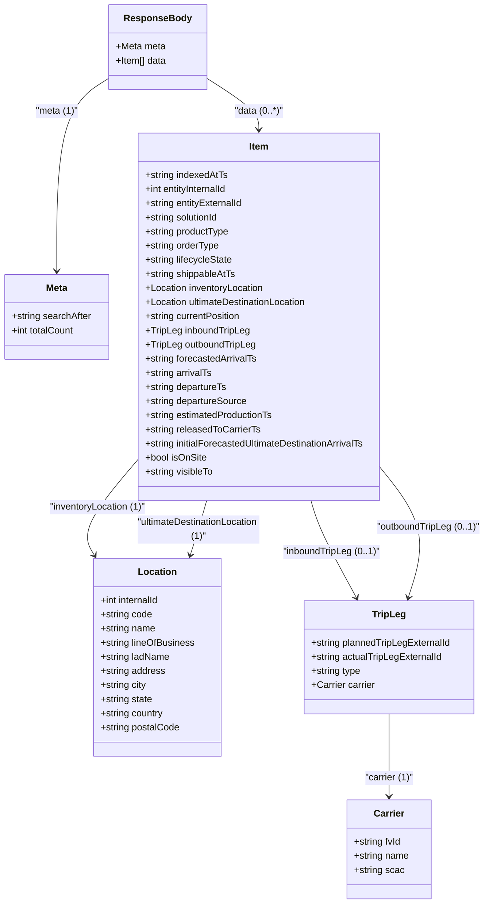
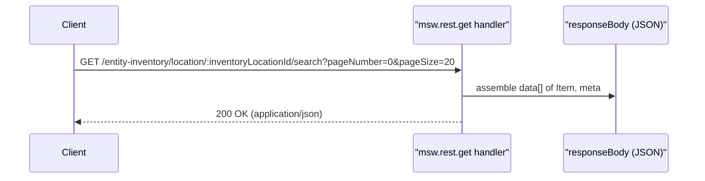

# Diagram: web/portal/src/mocks/handlers/entity-inventory/location/inventoryLocationId/search.js

> Auto-generated by Obscura crawlers

## Diagram 1

### SVG

<svg id="container" width="834.3790283203125" xmlns="http://www.w3.org/2000/svg" class="classDiagram" height="1534" viewBox="0 0 834.3790283203125 1534" role="graphics-document document" aria-roledescription="class"><g><defs><marker id="container_class-aggregationStart" class="marker aggregation class" refX="18" refY="7" markerWidth="190" markerHeight="240" orient="auto"><path d="M 18,7 L9,13 L1,7 L9,1 Z"></path></marker></defs><defs><marker id="container_class-aggregationEnd" class="marker aggregation class" refX="1" refY="7" markerWidth="20" markerHeight="28" orient="auto"><path d="M 18,7 L9,13 L1,7 L9,1 Z"></path></marker></defs><defs><marker id="container_class-extensionStart" class="marker extension class" refX="18" refY="7" markerWidth="190" markerHeight="240" orient="auto"><path d="M 1,7 L18,13 V 1 Z"></path></marker></defs><defs><marker id="container_class-extensionEnd" class="marker extension class" refX="1" refY="7" markerWidth="20" markerHeight="28" orient="auto"><path d="M 1,1 V 13 L18,7 Z"></path></marker></defs><defs><marker id="container_class-compositionStart" class="marker composition class" refX="18" refY="7" markerWidth="190" markerHeight="240" orient="auto"><path d="M 18,7 L9,13 L1,7 L9,1 Z"></path></marker></defs><defs><marker id="container_class-compositionEnd" class="marker composition class" refX="1" refY="7" markerWidth="20" markerHeight="28" orient="auto"><path d="M 18,7 L9,13 L1,7 L9,1 Z"></path></marker></defs><defs><marker id="container_class-dependencyStart" class="marker dependency class" refX="6" refY="7" markerWidth="190" markerHeight="240" orient="auto"><path d="M 5,7 L9,13 L1,7 L9,1 Z"></path></marker></defs><defs><marker id="container_class-dependencyEnd" class="marker dependency class" refX="13" refY="7" markerWidth="20" markerHeight="28" orient="auto"><path d="M 18,7 L9,13 L14,7 L9,1 Z"></path></marker></defs><defs><marker id="container_class-lollipopStart" class="marker lollipop class" refX="13" refY="7" markerWidth="190" markerHeight="240" orient="auto"><circle stroke="black" fill="transparent" cx="7" cy="7" r="6"></circle></marker></defs><defs><marker id="container_class-lollipopEnd" class="marker lollipop class" refX="1" refY="7" markerWidth="190" markerHeight="240" orient="auto"><circle stroke="black" fill="transparent" cx="7" cy="7" r="6"></circle></marker></defs><g class="root"><g class="clusters"></g><g class="edgePaths"><path d="M355.346,131.581L370.731,141.151C386.116,150.721,416.886,169.86,432.271,184.597C447.656,199.333,447.656,209.667,447.656,214.833L447.656,220" id="id_ResponseBody_Item_1" class="edge-thickness-normal edge-pattern-solid relation" style=";;;" data-edge="true" data-et="edge" data-id="id_ResponseBody_Item_1" data-points="W3sieCI6MzU1LjM0NTcwMzEyNSwieSI6MTMxLjU4MTI1NzQ1MzY2MTkyfSx7IngiOjQ0Ny42NTYyNSwieSI6MTg5fSx7IngiOjQ0Ny42NTYyNSwieSI6MjI2fV0=" marker-end="url(#container_class-dependencyEnd)"></path><path d="M189.494,131.581L174.109,141.151C158.724,150.721,127.954,169.86,112.569,224.597C97.184,279.333,97.184,369.667,97.184,414.833L97.184,460" id="id_ResponseBody_Meta_2" class="edge-thickness-normal edge-pattern-solid relation" style=";;;" data-edge="true" data-et="edge" data-id="id_ResponseBody_Meta_2" data-points="W3sieCI6MTg5LjQ5NDE0MDYyNSwieSI6MTMxLjU4MTI1NzQ1MzY2MTkyfSx7IngiOjk3LjE4MzU5Mzc1LCJ5IjoxODl9LHsieCI6OTcuMTgzNTkzNzUsInkiOjQ2Nn1d" marker-end="url(#container_class-dependencyEnd)"></path><path d="M236.367,779.208L218.878,799.173C201.389,819.138,166.411,859.069,153.886,886.648C141.361,914.226,151.289,929.453,156.253,937.066L161.217,944.679" id="id_Item_Location_3" class="edge-thickness-normal edge-pattern-solid relation" style=";;;" data-edge="true" data-et="edge" data-id="id_Item_Location_3" data-points="W3sieCI6MjM2LjM2NzE4NzUsInkiOjc3OS4yMDc3Mzc4MjMxODEzfSx7IngiOjEzMS40MzM1OTM3NSwieSI6ODk5fSx7IngiOjE2NC40OTQxNDA2MjUsInkiOjk0OS43MDU1MjU4NzYyMzA0fV0=" marker-end="url(#container_class-dependencyEnd)"></path><path d="M356.844,850L354.467,858.167C352.09,866.333,347.336,882.667,342.643,898.048C337.95,913.429,333.318,927.858,331.002,935.073L328.686,942.287" id="id_Item_Location_4" class="edge-thickness-normal edge-pattern-solid relation" style=";;;" data-edge="true" data-et="edge" data-id="id_Item_Location_4" data-points="W3sieCI6MzU2Ljg0NDE4MjgyNTQ4NDgsInkiOjg1MH0seyJ4IjozNDIuNTgyMDMxMjUsInkiOjg5OX0seyJ4IjozMjYuODUxODc3NTIwMTYxMywieSI6OTQ4fV0=" marker-end="url(#container_class-dependencyEnd)"></path><path d="M538.468,850L540.845,858.167C543.222,866.333,547.976,882.667,560.864,910.122C573.751,937.577,594.772,976.154,605.283,995.443L615.793,1014.731" id="id_Item_TripLeg_5" class="edge-thickness-normal edge-pattern-solid relation" style=";;;" data-edge="true" data-et="edge" data-id="id_Item_TripLeg_5" data-points="W3sieCI6NTM4LjQ2ODMxNzE3NDUxNTMsInkiOjg1MH0seyJ4Ijo1NTIuNzMwNDY4NzUsInkiOjg5OX0seyJ4Ijo2MTguNjYzODM3NDg1NTk5MSwieSI6MTAyMH1d" marker-end="url(#container_class-dependencyEnd)"></path><path d="M658.945,798.343L672.561,815.119C686.176,831.895,713.406,865.448,720.853,901.438C728.3,937.429,715.963,975.858,709.795,995.073L703.627,1014.287" id="id_Item_TripLeg_6" class="edge-thickness-normal edge-pattern-solid relation" style=";;;" data-edge="true" data-et="edge" data-id="id_Item_TripLeg_6" data-points="W3sieCI6NjU4Ljk0NTMxMjUsInkiOjc5OC4zNDI3ODYyODg1NDg1fSx7IngiOjc0MC42MzY3MTg3NSwieSI6ODk5fSx7IngiOjcwMS43OTI4Njk3NDM2NjM2LCJ5IjoxMDIwfV0=" marker-end="url(#container_class-dependencyEnd)"></path><path d="M670.975,1212L670.975,1230.167C670.975,1248.333,670.975,1284.667,670.975,1308C670.975,1331.333,670.975,1341.667,670.975,1346.833L670.975,1352" id="id_TripLeg_Carrier_7" class="edge-thickness-normal edge-pattern-solid relation" style=";;;" data-edge="true" data-et="edge" data-id="id_TripLeg_Carrier_7" data-points="W3sieCI6NjcwLjk3NDYwOTM3NSwieSI6MTIxMn0seyJ4Ijo2NzAuOTc0NjA5Mzc1LCJ5IjoxMzIxfSx7IngiOjY3MC45NzQ2MDkzNzUsInkiOjEzNTh9XQ==" marker-end="url(#container_class-dependencyEnd)"></path></g><g class="edgeLabels"><g class="edgeLabel" transform="translate(447.65625, 189)"><g class="label" data-id="id_ResponseBody_Item_1" transform="translate(-40.8515625, -12)"><foreignObject width="81.703125" height="24">

"data (0..*)"

</foreignObject></g></g><g class="edgeLabel" transform="translate(97.18359375, 189)"><g class="label" data-id="id_ResponseBody_Meta_2" transform="translate(-35.3984375, -12)"><foreignObject width="70.796875" height="24">

"meta (1)"

</foreignObject></g></g><g class="edgeLabel" transform="translate(163.95787, 861.87026)"><g class="label" data-id="id_Item_Location_3" transform="translate(-82.359375, -12)"><foreignObject width="164.71875" height="24">

"inventoryLocation (1)"

</foreignObject></g></g><g class="edgeLabel" transform="translate(342.58203125, 899)"><g class="label" data-id="id_Item_Location_4" transform="translate(-108.7890625, -24)"><foreignObject width="217.578125" height="48">

"ultimateDestinationLocation (1)"

</foreignObject></g></g><g class="edgeLabel" transform="translate(573.48793, 937.09381)"><g class="label" data-id="id_Item_TripLeg_5" transform="translate(-81.359375, -12)"><foreignObject width="162.71875" height="24">

"inboundTripLeg (0..1)"

</foreignObject></g></g><g class="edgeLabel" transform="translate(739.83217, 898.00867)"><g class="label" data-id="id_Item_TripLeg_6" transform="translate(-86.546875, -12)"><foreignObject width="173.09375" height="24">

"outboundTripLeg (0..1)"

</foreignObject></g></g><g class="edgeLabel" transform="translate(670.974609375, 1321)"><g class="label" data-id="id_TripLeg_Carrier_7" transform="translate(-40.890625, -12)"><foreignObject width="81.78125" height="24">

"carrier (1)"

</foreignObject></g></g></g><g class="nodes"><g class="node default" id="classId-ResponseBody-0" transform="translate(272.419921875, 80)"><g class="basic label-container"><path d="M-82.92578125 -72 L82.92578125 -72 L82.92578125 72 L-82.92578125 72" stroke="none" stroke-width="0" fill="#ECECFF" style=""></path><path d="M-82.92578125 -72 C-42.98192459732215 -72, -3.038067944644297 -72, 82.92578125 -72 M-82.92578125 -72 C-33.390174531553626 -72, 16.145432186892748 -72, 82.92578125 -72 M82.92578125 -72 C82.92578125 -29.299716379825313, 82.92578125 13.400567240349375, 82.92578125 72 M82.92578125 -72 C82.92578125 -21.910406499751815, 82.92578125 28.17918700049637, 82.92578125 72 M82.92578125 72 C18.86197123052419 72, -45.20183878895162 72, -82.92578125 72 M82.92578125 72 C28.30056248719957 72, -26.32465627560086 72, -82.92578125 72 M-82.92578125 72 C-82.92578125 23.167831909766505, -82.92578125 -25.66433618046699, -82.92578125 -72 M-82.92578125 72 C-82.92578125 37.0596685966383, -82.92578125 2.119337193276607, -82.92578125 -72" stroke="#9370DB" stroke-width="1.3" fill="none" stroke-dasharray="0 0" style=""></path></g><g class="annotation-group text" transform="translate(0, -48)"></g><g class="label-group text" transform="translate(-53.9921875, -48)"><g class="label" style="font-weight: bolder" transform="translate(0,-12)"><foreignObject width="107.984375" height="24">

ResponseBody

</foreignObject></g></g><g class="members-group text" transform="translate(-70.92578125, 0)"><g class="label" style="" transform="translate(0,-12)"><foreignObject width="84.5625" height="24">

+Meta meta

</foreignObject></g><g class="label" style="" transform="translate(0,12)"><foreignObject width="87.859375" height="24">

+Item[] data

</foreignObject></g></g><g class="methods-group text" transform="translate(-70.92578125, 72)"></g><g class="divider" style=""><path d="M-82.92578125 -24 C-21.944610109331755 -24, 39.03656103133649 -24, 82.92578125 -24 M-82.92578125 -24 C-27.415791599344757 -24, 28.094198051310485 -24, 82.92578125 -24" stroke="#9370DB" stroke-width="1.3" fill="none" stroke-dasharray="0 0" style=""></path></g><g class="divider" style=""><path d="M-82.92578125 48 C-48.80638580632042 48, -14.686990362640842 48, 82.92578125 48 M-82.92578125 48 C-27.60226744190225 48, 27.7212463661955 48, 82.92578125 48" stroke="#9370DB" stroke-width="1.3" fill="none" stroke-dasharray="0 0" style=""></path></g></g><g class="node default" id="classId-Meta-1" transform="translate(97.18359375, 538)"><g class="basic label-container"><path d="M-89.18359375 -72 L89.18359375 -72 L89.18359375 72 L-89.18359375 72" stroke="none" stroke-width="0" fill="#ECECFF" style=""></path><path d="M-89.18359375 -72 C-25.383815210717884 -72, 38.41596332856423 -72, 89.18359375 -72 M-89.18359375 -72 C-21.18569313885149 -72, 46.81220747229702 -72, 89.18359375 -72 M89.18359375 -72 C89.18359375 -42.376161637079264, 89.18359375 -12.752323274158528, 89.18359375 72 M89.18359375 -72 C89.18359375 -21.53250703388597, 89.18359375 28.93498593222806, 89.18359375 72 M89.18359375 72 C19.824087276633023 72, -49.535419196733955 72, -89.18359375 72 M89.18359375 72 C49.57580397205328 72, 9.968014194106559 72, -89.18359375 72 M-89.18359375 72 C-89.18359375 33.05605012076338, -89.18359375 -5.887899758473239, -89.18359375 -72 M-89.18359375 72 C-89.18359375 38.11556123497475, -89.18359375 4.231122469949497, -89.18359375 -72" stroke="#9370DB" stroke-width="1.3" fill="none" stroke-dasharray="0 0" style=""></path></g><g class="annotation-group text" transform="translate(0, -48)"></g><g class="label-group text" transform="translate(-18.0859375, -48)"><g class="label" style="font-weight: bolder" transform="translate(0,-12)"><foreignObject width="36.171875" height="24">

Meta

</foreignObject></g></g><g class="members-group text" transform="translate(-77.18359375, 0)"><g class="label" style="" transform="translate(0,-12)"><foreignObject width="136.28125" height="24">

+string searchAfter

</foreignObject></g><g class="label" style="" transform="translate(0,12)"><foreignObject width="108.125" height="24">

+int totalCount

</foreignObject></g></g><g class="methods-group text" transform="translate(-77.18359375, 72)"></g><g class="divider" style=""><path d="M-89.18359375 -24 C-21.07878875117646 -24, 47.02601624764708 -24, 89.18359375 -24 M-89.18359375 -24 C-36.83751951489121 -24, 15.508554720217575 -24, 89.18359375 -24" stroke="#9370DB" stroke-width="1.3" fill="none" stroke-dasharray="0 0" style=""></path></g><g class="divider" style=""><path d="M-89.18359375 48 C-35.43580819295231 48, 18.311977364095384 48, 89.18359375 48 M-89.18359375 48 C-38.081662032470156 48, 13.020269685059688 48, 89.18359375 48" stroke="#9370DB" stroke-width="1.3" fill="none" stroke-dasharray="0 0" style=""></path></g></g><g class="node default" id="classId-Item-2" transform="translate(447.65625, 538)"><g class="basic label-container"><path d="M-211.2890625 -312 L211.2890625 -312 L211.2890625 312 L-211.2890625 312" stroke="none" stroke-width="0" fill="#ECECFF" style=""></path><path d="M-211.2890625 -312 C-87.77261367454439 -312, 35.743835150911224 -312, 211.2890625 -312 M-211.2890625 -312 C-111.82127239925299 -312, -12.35348229850598 -312, 211.2890625 -312 M211.2890625 -312 C211.2890625 -134.15379649595832, 211.2890625 43.692407008083364, 211.2890625 312 M211.2890625 -312 C211.2890625 -186.96206138417185, 211.2890625 -61.92412276834369, 211.2890625 312 M211.2890625 312 C47.87735944908755 312, -115.5343436018249 312, -211.2890625 312 M211.2890625 312 C56.17505022212774 312, -98.93896205574453 312, -211.2890625 312 M-211.2890625 312 C-211.2890625 64.4956374033575, -211.2890625 -183.008725193285, -211.2890625 -312 M-211.2890625 312 C-211.2890625 106.0095200444184, -211.2890625 -99.98095991116321, -211.2890625 -312" stroke="#9370DB" stroke-width="1.3" fill="none" stroke-dasharray="0 0" style=""></path></g><g class="annotation-group text" transform="translate(0, -288)"></g><g class="label-group text" transform="translate(-16.46875, -288)"><g class="label" style="font-weight: bolder" transform="translate(0,-12)"><foreignObject width="32.9375" height="24">

Item

</foreignObject></g></g><g class="members-group text" transform="translate(-199.2890625, -240)"><g class="label" style="" transform="translate(0,-12)"><foreignObject width="141.6875" height="24">

+string indexedAtTs

</foreignObject></g><g class="label" style="" transform="translate(0,12)"><foreignObject width="145.265625" height="24">

+int entityInternalId

</foreignObject></g><g class="label" style="" transform="translate(0,36)"><foreignObject width="169.46875" height="24">

+string entityExternalId

</foreignObject></g><g class="label" style="" transform="translate(0,60)"><foreignObject width="127.96875" height="24">

+string solutionId

</foreignObject></g><g class="label" style="" transform="translate(0,84)"><foreignObject width="144.4375" height="24">

+string productType

</foreignObject></g><g class="label" style="" transform="translate(0,108)"><foreignObject width="127.09375" height="24">

+string orderType

</foreignObject></g><g class="label" style="" transform="translate(0,132)"><foreignObject width="150.765625" height="24">

+string lifecycleState

</foreignObject></g><g class="label" style="" transform="translate(0,156)"><foreignObject width="155.5" height="24">

+string shippableAtTs

</foreignObject></g><g class="label" style="" transform="translate(0,180)"><foreignObject width="205.0625" height="24">

+Location inventoryLocation

</foreignObject></g><g class="label" style="" transform="translate(0,204)"><foreignObject width="281.28125" height="24">

+Location ultimateDestinationLocation

</foreignObject></g><g class="label" style="" transform="translate(0,228)"><foreignObject width="165.5625" height="24">

+string currentPosition

</foreignObject></g><g class="label" style="" transform="translate(0,252)"><foreignObject width="177.609375" height="24">

+TripLeg inboundTripLeg

</foreignObject></g><g class="label" style="" transform="translate(0,276)"><foreignObject width="188.15625" height="24">

+TripLeg outboundTripLeg

</foreignObject></g><g class="label" style="" transform="translate(0,300)"><foreignObject width="191.96875" height="24">

+string forecastedArrivalTs

</foreignObject></g><g class="label" style="" transform="translate(0,324)"><foreignObject width="115.21875" height="24">

+string arrivalTs

</foreignObject></g><g class="label" style="" transform="translate(0,348)"><foreignObject width="140.828125" height="24">

+string departureTs

</foreignObject></g><g class="label" style="" transform="translate(0,372)"><foreignObject width="175" height="24">

+string departureSource

</foreignObject></g><g class="label" style="" transform="translate(0,396)"><foreignObject width="221.078125" height="24">

+string estimatedProductionTs

</foreignObject></g><g class="label" style="" transform="translate(0,420)"><foreignObject width="196.703125" height="24">

+string releasedToCarrierTs

</foreignObject></g><g class="label" style="" transform="translate(0,444)"><foreignObject width="382.109375" height="24">

+string initialForecastedUltimateDestinationArrivalTs

</foreignObject></g><g class="label" style="" transform="translate(0,468)"><foreignObject width="105.03125" height="24">

+bool isOnSite

</foreignObject></g><g class="label" style="" transform="translate(0,492)"><foreignObject width="117.796875" height="24">

+string visibleTo

</foreignObject></g></g><g class="methods-group text" transform="translate(-199.2890625, 312)"></g><g class="divider" style=""><path d="M-211.2890625 -264 C-74.06625483194927 -264, 63.15655283610147 -264, 211.2890625 -264 M-211.2890625 -264 C-46.65198870136402 -264, 117.98508509727196 -264, 211.2890625 -264" stroke="#9370DB" stroke-width="1.3" fill="none" stroke-dasharray="0 0" style=""></path></g><g class="divider" style=""><path d="M-211.2890625 288 C-71.7669636969411 288, 67.75513510611779 288, 211.2890625 288 M-211.2890625 288 C-98.76526621706311 288, 13.75853006587377 288, 211.2890625 288" stroke="#9370DB" stroke-width="1.3" fill="none" stroke-dasharray="0 0" style=""></path></g></g><g class="node default" id="classId-Location-3" transform="translate(272.919921875, 1116)"><g class="basic label-container"><path d="M-108.42578125 -168 L108.42578125 -168 L108.42578125 168 L-108.42578125 168" stroke="none" stroke-width="0" fill="#ECECFF" style=""></path><path d="M-108.42578125 -168 C-27.42408828764816 -168, 53.57760467470368 -168, 108.42578125 -168 M-108.42578125 -168 C-63.903390870089574 -168, -19.381000490179147 -168, 108.42578125 -168 M108.42578125 -168 C108.42578125 -81.30819341386861, 108.42578125 5.383613172262784, 108.42578125 168 M108.42578125 -168 C108.42578125 -78.94848575018453, 108.42578125 10.103028499630938, 108.42578125 168 M108.42578125 168 C27.630569821766287 168, -53.16464160646743 168, -108.42578125 168 M108.42578125 168 C32.78084090767122 168, -42.86409943465756 168, -108.42578125 168 M-108.42578125 168 C-108.42578125 46.92404036295105, -108.42578125 -74.1519192740979, -108.42578125 -168 M-108.42578125 168 C-108.42578125 75.64585255256021, -108.42578125 -16.70829489487957, -108.42578125 -168" stroke="#9370DB" stroke-width="1.3" fill="none" stroke-dasharray="0 0" style=""></path></g><g class="annotation-group text" transform="translate(0, -144)"></g><g class="label-group text" transform="translate(-31.3515625, -144)"><g class="label" style="font-weight: bolder" transform="translate(0,-12)"><foreignObject width="62.703125" height="24">

Location

</foreignObject></g></g><g class="members-group text" transform="translate(-96.42578125, -96)"><g class="label" style="" transform="translate(0,-12)"><foreignObject width="103.109375" height="24">

+int internalId

</foreignObject></g><g class="label" style="" transform="translate(0,12)"><foreignObject width="88.828125" height="24">

+string code

</foreignObject></g><g class="label" style="" transform="translate(0,36)"><foreignObject width="94.375" height="24">

+string name

</foreignObject></g><g class="label" style="" transform="translate(0,60)"><foreignObject width="161.5" height="24">

+string lineOfBusiness

</foreignObject></g><g class="label" style="" transform="translate(0,84)"><foreignObject width="118.8125" height="24">

+string ladName

</foreignObject></g><g class="label" style="" transform="translate(0,108)"><foreignObject width="110.90625" height="24">

+string address

</foreignObject></g><g class="label" style="" transform="translate(0,132)"><foreignObject width="79.59375" height="24">

+string city

</foreignObject></g><g class="label" style="" transform="translate(0,156)"><foreignObject width="89.953125" height="24">

+string state

</foreignObject></g><g class="label" style="" transform="translate(0,180)"><foreignObject width="109.046875" height="24">

+string country

</foreignObject></g><g class="label" style="" transform="translate(0,204)"><foreignObject width="135.359375" height="24">

+string postalCode

</foreignObject></g></g><g class="methods-group text" transform="translate(-96.42578125, 168)"></g><g class="divider" style=""><path d="M-108.42578125 -120 C-52.90674486881526 -120, 2.612291512369481 -120, 108.42578125 -120 M-108.42578125 -120 C-35.59540726676131 -120, 37.23496671647737 -120, 108.42578125 -120" stroke="#9370DB" stroke-width="1.3" fill="none" stroke-dasharray="0 0" style=""></path></g><g class="divider" style=""><path d="M-108.42578125 144 C-36.75184395016032 144, 34.92209334967936 144, 108.42578125 144 M-108.42578125 144 C-62.952043200549184 144, -17.47830515109837 144, 108.42578125 144" stroke="#9370DB" stroke-width="1.3" fill="none" stroke-dasharray="0 0" style=""></path></g></g><g class="node default" id="classId-TripLeg-4" transform="translate(670.974609375, 1116)"><g class="basic label-container"><path d="M-145.50390625 -96 L145.50390625 -96 L145.50390625 96 L-145.50390625 96" stroke="none" stroke-width="0" fill="#ECECFF" style=""></path><path d="M-145.50390625 -96 C-48.974211053095445 -96, 47.55548414380911 -96, 145.50390625 -96 M-145.50390625 -96 C-60.138736043664025 -96, 25.22643416267195 -96, 145.50390625 -96 M145.50390625 -96 C145.50390625 -53.86696263086236, 145.50390625 -11.733925261724721, 145.50390625 96 M145.50390625 -96 C145.50390625 -30.842935298700525, 145.50390625 34.31412940259895, 145.50390625 96 M145.50390625 96 C72.34251105827336 96, -0.818884133453281 96, -145.50390625 96 M145.50390625 96 C80.15351178738307 96, 14.803117324766134 96, -145.50390625 96 M-145.50390625 96 C-145.50390625 54.344383558525884, -145.50390625 12.688767117051768, -145.50390625 -96 M-145.50390625 96 C-145.50390625 45.789300702683995, -145.50390625 -4.421398594632009, -145.50390625 -96" stroke="#9370DB" stroke-width="1.3" fill="none" stroke-dasharray="0 0" style=""></path></g><g class="annotation-group text" transform="translate(0, -72)"></g><g class="label-group text" transform="translate(-27.0546875, -72)"><g class="label" style="font-weight: bolder" transform="translate(0,-12)"><foreignObject width="54.109375" height="24">

TripLeg

</foreignObject></g></g><g class="members-group text" transform="translate(-133.50390625, -24)"><g class="label" style="" transform="translate(0,-12)"><foreignObject width="239.953125" height="24">

+string plannedTripLegExternalId

</foreignObject></g><g class="label" style="" transform="translate(0,12)"><foreignObject width="224.78125" height="24">

+string actualTripLegExternalId

</foreignObject></g><g class="label" style="" transform="translate(0,36)"><foreignObject width="85.65625" height="24">

+string type

</foreignObject></g><g class="label" style="" transform="translate(0,60)"><foreignObject width="109.453125" height="24">

+Carrier carrier

</foreignObject></g></g><g class="methods-group text" transform="translate(-133.50390625, 96)"></g><g class="divider" style=""><path d="M-145.50390625 -48 C-50.44937939424828 -48, 44.605147461503435 -48, 145.50390625 -48 M-145.50390625 -48 C-41.18891220612774 -48, 63.12608183774452 -48, 145.50390625 -48" stroke="#9370DB" stroke-width="1.3" fill="none" stroke-dasharray="0 0" style=""></path></g><g class="divider" style=""><path d="M-145.50390625 72 C-29.43176261221778 72, 86.64038102556444 72, 145.50390625 72 M-145.50390625 72 C-69.40939879820763 72, 6.685108653584734 72, 145.50390625 72" stroke="#9370DB" stroke-width="1.3" fill="none" stroke-dasharray="0 0" style=""></path></g></g><g class="node default" id="classId-Carrier-5" transform="translate(670.974609375, 1442)"><g class="basic label-container"><path d="M-71.7890625 -84 L71.7890625 -84 L71.7890625 84 L-71.7890625 84" stroke="none" stroke-width="0" fill="#ECECFF" style=""></path><path d="M-71.7890625 -84 C-16.111117258289134 -84, 39.56682798342173 -84, 71.7890625 -84 M-71.7890625 -84 C-26.993123632729443 -84, 17.802815234541114 -84, 71.7890625 -84 M71.7890625 -84 C71.7890625 -20.044414387514365, 71.7890625 43.91117122497127, 71.7890625 84 M71.7890625 -84 C71.7890625 -26.297162056175267, 71.7890625 31.405675887649465, 71.7890625 84 M71.7890625 84 C37.955146065567064 84, 4.121229631134128 84, -71.7890625 84 M71.7890625 84 C34.76578978182809 84, -2.25748293634382 84, -71.7890625 84 M-71.7890625 84 C-71.7890625 27.179458979182407, -71.7890625 -29.641082041635187, -71.7890625 -84 M-71.7890625 84 C-71.7890625 46.09292968645521, -71.7890625 8.185859372910414, -71.7890625 -84" stroke="#9370DB" stroke-width="1.3" fill="none" stroke-dasharray="0 0" style=""></path></g><g class="annotation-group text" transform="translate(0, -60)"></g><g class="label-group text" transform="translate(-25.203125, -60)"><g class="label" style="font-weight: bolder" transform="translate(0,-12)"><foreignObject width="50.40625" height="24">

Carrier

</foreignObject></g></g><g class="members-group text" transform="translate(-59.7890625, -12)"><g class="label" style="" transform="translate(0,-12)"><foreignObject width="81.390625" height="24">

+string fvId

</foreignObject></g><g class="label" style="" transform="translate(0,12)"><foreignObject width="94.375" height="24">

+string name

</foreignObject></g><g class="label" style="" transform="translate(0,36)"><foreignObject width="85.171875" height="24">

+string scac

</foreignObject></g></g><g class="methods-group text" transform="translate(-59.7890625, 84)"></g><g class="divider" style=""><path d="M-71.7890625 -36 C-18.749541496766057 -36, 34.28997950646789 -36, 71.7890625 -36 M-71.7890625 -36 C-39.93543630566643 -36, -8.08181011133285 -36, 71.7890625 -36" stroke="#9370DB" stroke-width="1.3" fill="none" stroke-dasharray="0 0" style=""></path></g><g class="divider" style=""><path d="M-71.7890625 60 C-14.596580659476736 60, 42.59590118104653 60, 71.7890625 60 M-71.7890625 60 C-32.629340250360684 60, 6.530381999278632 60, 71.7890625 60" stroke="#9370DB" stroke-width="1.3" fill="none" stroke-dasharray="0 0" style=""></path></g></g></g></g></g></svg>

## Diagram 2

### SVG

<svg id="container" width="1277" xmlns="http://www.w3.org/2000/svg" height="315" viewBox="-50 -10 1277 315" role="graphics-document document" aria-roledescription="sequence"><g><rect x="991" y="229" fill="#eaeaea" stroke="#666" width="186" height="65" name="ResponseBodyObj" rx="3" ry="3" class="actor actor-bottom"></rect><text x="1084" y="261.5" dominant-baseline="central" alignment-baseline="central" class="actor actor-box" style="text-anchor: middle; font-size: 16px; font-weight: 400;"><tspan x="1084" dy="0">"responseBody (JSON)"</tspan></text></g><g><rect x="705" y="229" fill="#eaeaea" stroke="#666" width="184" height="65" name="MSW_Handler" rx="3" ry="3" class="actor actor-bottom"></rect><text x="797" y="261.5" dominant-baseline="central" alignment-baseline="central" class="actor actor-box" style="text-anchor: middle; font-size: 16px; font-weight: 400;"><tspan x="797" dy="0">"msw.rest.get handler"</tspan></text></g><g><rect x="0" y="229" fill="#eaeaea" stroke="#666" width="150" height="65" name="Client" rx="3" ry="3" class="actor actor-bottom"></rect><text x="75" y="261.5" dominant-baseline="central" alignment-baseline="central" class="actor actor-box" style="text-anchor: middle; font-size: 16px; font-weight: 400;"><tspan x="75" dy="0">Client</tspan></text></g><g><line id="actor2" x1="1084" y1="65" x2="1084" y2="229" class="actor-line 200" stroke-width="0.5px" stroke="#999" name="ResponseBodyObj"></line><g id="root-2"><rect x="991" y="0" fill="#eaeaea" stroke="#666" width="186" height="65" name="ResponseBodyObj" rx="3" ry="3" class="actor actor-top"></rect><text x="1084" y="32.5" dominant-baseline="central" alignment-baseline="central" class="actor actor-box" style="text-anchor: middle; font-size: 16px; font-weight: 400;"><tspan x="1084" dy="0">"responseBody (JSON)"</tspan></text></g></g><g><line id="actor1" x1="797" y1="65" x2="797" y2="229" class="actor-line 200" stroke-width="0.5px" stroke="#999" name="MSW_Handler"></line><g id="root-1"><rect x="705" y="0" fill="#eaeaea" stroke="#666" width="184" height="65" name="MSW_Handler" rx="3" ry="3" class="actor actor-top"></rect><text x="797" y="32.5" dominant-baseline="central" alignment-baseline="central" class="actor actor-box" style="text-anchor: middle; font-size: 16px; font-weight: 400;"><tspan x="797" dy="0">"msw.rest.get handler"</tspan></text></g></g><g><line id="actor0" x1="75" y1="65" x2="75" y2="229" class="actor-line 200" stroke-width="0.5px" stroke="#999" name="Client"></line><g id="root-0"><rect x="0" y="0" fill="#eaeaea" stroke="#666" width="150" height="65" name="Client" rx="3" ry="3" class="actor actor-top"></rect><text x="75" y="32.5" dominant-baseline="central" alignment-baseline="central" class="actor actor-box" style="text-anchor: middle; font-size: 16px; font-weight: 400;"><tspan x="75" dy="0">Client</tspan></text></g></g><g></g><defs><symbol id="computer" width="24" height="24"><path transform="scale(.5)" d="M2 2v13h20v-13h-20zm18 11h-16v-9h16v9zm-10.228 6l.466-1h3.524l.467 1h-4.457zm14.228 3h-24l2-6h2.104l-1.33 4h18.45l-1.297-4h2.073l2 6zm-5-10h-14v-7h14v7z"></path></symbol></defs><defs><symbol id="database" fill-rule="evenodd" clip-rule="evenodd"><path transform="scale(.5)" d="M12.258.001l.256.004.255.005.253.008.251.01.249.012.247.015.246.016.242.019.241.02.239.023.236.024.233.027.231.028.229.031.225.032.223.034.22.036.217.038.214.04.211.041.208.043.205.045.201.046.198.048.194.05.191.051.187.053.183.054.18.056.175.057.172.059.168.06.163.061.16.063.155.064.15.066.074.033.073.033.071.034.07.034.069.035.068.035.067.035.066.035.064.036.064.036.062.036.06.036.06.037.058.037.058.037.055.038.055.038.053.038.052.038.051.039.05.039.048.039.047.039.045.04.044.04.043.04.041.04.04.041.039.041.037.041.036.041.034.041.033.042.032.042.03.042.029.042.027.042.026.043.024.043.023.043.021.043.02.043.018.044.017.043.015.044.013.044.012.044.011.045.009.044.007.045.006.045.004.045.002.045.001.045v17l-.001.045-.002.045-.004.045-.006.045-.007.045-.009.044-.011.045-.012.044-.013.044-.015.044-.017.043-.018.044-.02.043-.021.043-.023.043-.024.043-.026.043-.027.042-.029.042-.03.042-.032.042-.033.042-.034.041-.036.041-.037.041-.039.041-.04.041-.041.04-.043.04-.044.04-.045.04-.047.039-.048.039-.05.039-.051.039-.052.038-.053.038-.055.038-.055.038-.058.037-.058.037-.06.037-.06.036-.062.036-.064.036-.064.036-.066.035-.067.035-.068.035-.069.035-.07.034-.071.034-.073.033-.074.033-.15.066-.155.064-.16.063-.163.061-.168.06-.172.059-.175.057-.18.056-.183.054-.187.053-.191.051-.194.05-.198.048-.201.046-.205.045-.208.043-.211.041-.214.04-.217.038-.22.036-.223.034-.225.032-.229.031-.231.028-.233.027-.236.024-.239.023-.241.02-.242.019-.246.016-.247.015-.249.012-.251.01-.253.008-.255.005-.256.004-.258.001-.258-.001-.256-.004-.255-.005-.253-.008-.251-.01-.249-.012-.247-.015-.245-.016-.243-.019-.241-.02-.238-.023-.236-.024-.234-.027-.231-.028-.228-.031-.226-.032-.223-.034-.22-.036-.217-.038-.214-.04-.211-.041-.208-.043-.204-.045-.201-.046-.198-.048-.195-.05-.19-.051-.187-.053-.184-.054-.179-.056-.176-.057-.172-.059-.167-.06-.164-.061-.159-.063-.155-.064-.151-.066-.074-.033-.072-.033-.072-.034-.07-.034-.069-.035-.068-.035-.067-.035-.066-.035-.064-.036-.063-.036-.062-.036-.061-.036-.06-.037-.058-.037-.057-.037-.056-.038-.055-.038-.053-.038-.052-.038-.051-.039-.049-.039-.049-.039-.046-.039-.046-.04-.044-.04-.043-.04-.041-.04-.04-.041-.039-.041-.037-.041-.036-.041-.034-.041-.033-.042-.032-.042-.03-.042-.029-.042-.027-.042-.026-.043-.024-.043-.023-.043-.021-.043-.02-.043-.018-.044-.017-.043-.015-.044-.013-.044-.012-.044-.011-.045-.009-.044-.007-.045-.006-.045-.004-.045-.002-.045-.001-.045v-17l.001-.045.002-.045.004-.045.006-.045.007-.045.009-.044.011-.045.012-.044.013-.044.015-.044.017-.043.018-.044.02-.043.021-.043.023-.043.024-.043.026-.043.027-.042.029-.042.03-.042.032-.042.033-.042.034-.041.036-.041.037-.041.039-.041.04-.041.041-.04.043-.04.044-.04.046-.04.046-.039.049-.039.049-.039.051-.039.052-.038.053-.038.055-.038.056-.038.057-.037.058-.037.06-.037.061-.036.062-.036.063-.036.064-.036.066-.035.067-.035.068-.035.069-.035.07-.034.072-.034.072-.033.074-.033.151-.066.155-.064.159-.063.164-.061.167-.06.172-.059.176-.057.179-.056.184-.054.187-.053.19-.051.195-.05.198-.048.201-.046.204-.045.208-.043.211-.041.214-.04.217-.038.22-.036.223-.034.226-.032.228-.031.231-.028.234-.027.236-.024.238-.023.241-.02.243-.019.245-.016.247-.015.249-.012.251-.01.253-.008.255-.005.256-.004.258-.001.258.001zm-9.258 20.499v.01l.001.021.003.021.004.022.005.021.006.022.007.022.009.023.01.022.011.023.012.023.013.023.015.023.016.024.017.023.018.024.019.024.021.024.022.025.023.024.024.025.052.049.056.05.061.051.066.051.07.051.075.051.079.052.084.052.088.052.092.052.097.052.102.051.105.052.11.052.114.051.119.051.123.051.127.05.131.05.135.05.139.048.144.049.147.047.152.047.155.047.16.045.163.045.167.043.171.043.176.041.178.041.183.039.187.039.19.037.194.035.197.035.202.033.204.031.209.03.212.029.216.027.219.025.222.024.226.021.23.02.233.018.236.016.24.015.243.012.246.01.249.008.253.005.256.004.259.001.26-.001.257-.004.254-.005.25-.008.247-.011.244-.012.241-.014.237-.016.233-.018.231-.021.226-.021.224-.024.22-.026.216-.027.212-.028.21-.031.205-.031.202-.034.198-.034.194-.036.191-.037.187-.039.183-.04.179-.04.175-.042.172-.043.168-.044.163-.045.16-.046.155-.046.152-.047.148-.048.143-.049.139-.049.136-.05.131-.05.126-.05.123-.051.118-.052.114-.051.11-.052.106-.052.101-.052.096-.052.092-.052.088-.053.083-.051.079-.052.074-.052.07-.051.065-.051.06-.051.056-.05.051-.05.023-.024.023-.025.021-.024.02-.024.019-.024.018-.024.017-.024.015-.023.014-.024.013-.023.012-.023.01-.023.01-.022.008-.022.006-.022.006-.022.004-.022.004-.021.001-.021.001-.021v-4.127l-.077.055-.08.053-.083.054-.085.053-.087.052-.09.052-.093.051-.095.05-.097.05-.1.049-.102.049-.105.048-.106.047-.109.047-.111.046-.114.045-.115.045-.118.044-.12.043-.122.042-.124.042-.126.041-.128.04-.13.04-.132.038-.134.038-.135.037-.138.037-.139.035-.142.035-.143.034-.144.033-.147.032-.148.031-.15.03-.151.03-.153.029-.154.027-.156.027-.158.026-.159.025-.161.024-.162.023-.163.022-.165.021-.166.02-.167.019-.169.018-.169.017-.171.016-.173.015-.173.014-.175.013-.175.012-.177.011-.178.01-.179.008-.179.008-.181.006-.182.005-.182.004-.184.003-.184.002h-.37l-.184-.002-.184-.003-.182-.004-.182-.005-.181-.006-.179-.008-.179-.008-.178-.01-.176-.011-.176-.012-.175-.013-.173-.014-.172-.015-.171-.016-.17-.017-.169-.018-.167-.019-.166-.02-.165-.021-.163-.022-.162-.023-.161-.024-.159-.025-.157-.026-.156-.027-.155-.027-.153-.029-.151-.03-.15-.03-.148-.031-.146-.032-.145-.033-.143-.034-.141-.035-.14-.035-.137-.037-.136-.037-.134-.038-.132-.038-.13-.04-.128-.04-.126-.041-.124-.042-.122-.042-.12-.044-.117-.043-.116-.045-.113-.045-.112-.046-.109-.047-.106-.047-.105-.048-.102-.049-.1-.049-.097-.05-.095-.05-.093-.052-.09-.051-.087-.052-.085-.053-.083-.054-.08-.054-.077-.054v4.127zm0-5.654v.011l.001.021.003.021.004.021.005.022.006.022.007.022.009.022.01.022.011.023.012.023.013.023.015.024.016.023.017.024.018.024.019.024.021.024.022.024.023.025.024.024.052.05.056.05.061.05.066.051.07.051.075.052.079.051.084.052.088.052.092.052.097.052.102.052.105.052.11.051.114.051.119.052.123.05.127.051.131.05.135.049.139.049.144.048.147.048.152.047.155.046.16.045.163.045.167.044.171.042.176.042.178.04.183.04.187.038.19.037.194.036.197.034.202.033.204.032.209.03.212.028.216.027.219.025.222.024.226.022.23.02.233.018.236.016.24.014.243.012.246.01.249.008.253.006.256.003.259.001.26-.001.257-.003.254-.006.25-.008.247-.01.244-.012.241-.015.237-.016.233-.018.231-.02.226-.022.224-.024.22-.025.216-.027.212-.029.21-.03.205-.032.202-.033.198-.035.194-.036.191-.037.187-.039.183-.039.179-.041.175-.042.172-.043.168-.044.163-.045.16-.045.155-.047.152-.047.148-.048.143-.048.139-.05.136-.049.131-.05.126-.051.123-.051.118-.051.114-.052.11-.052.106-.052.101-.052.096-.052.092-.052.088-.052.083-.052.079-.052.074-.051.07-.052.065-.051.06-.05.056-.051.051-.049.023-.025.023-.024.021-.025.02-.024.019-.024.018-.024.017-.024.015-.023.014-.023.013-.024.012-.022.01-.023.01-.023.008-.022.006-.022.006-.022.004-.021.004-.022.001-.021.001-.021v-4.139l-.077.054-.08.054-.083.054-.085.052-.087.053-.09.051-.093.051-.095.051-.097.05-.1.049-.102.049-.105.048-.106.047-.109.047-.111.046-.114.045-.115.044-.118.044-.12.044-.122.042-.124.042-.126.041-.128.04-.13.039-.132.039-.134.038-.135.037-.138.036-.139.036-.142.035-.143.033-.144.033-.147.033-.148.031-.15.03-.151.03-.153.028-.154.028-.156.027-.158.026-.159.025-.161.024-.162.023-.163.022-.165.021-.166.02-.167.019-.169.018-.169.017-.171.016-.173.015-.173.014-.175.013-.175.012-.177.011-.178.009-.179.009-.179.007-.181.007-.182.005-.182.004-.184.003-.184.002h-.37l-.184-.002-.184-.003-.182-.004-.182-.005-.181-.007-.179-.007-.179-.009-.178-.009-.176-.011-.176-.012-.175-.013-.173-.014-.172-.015-.171-.016-.17-.017-.169-.018-.167-.019-.166-.02-.165-.021-.163-.022-.162-.023-.161-.024-.159-.025-.157-.026-.156-.027-.155-.028-.153-.028-.151-.03-.15-.03-.148-.031-.146-.033-.145-.033-.143-.033-.141-.035-.14-.036-.137-.036-.136-.037-.134-.038-.132-.039-.13-.039-.128-.04-.126-.041-.124-.042-.122-.043-.12-.043-.117-.044-.116-.044-.113-.046-.112-.046-.109-.046-.106-.047-.105-.048-.102-.049-.1-.049-.097-.05-.095-.051-.093-.051-.09-.051-.087-.053-.085-.052-.083-.054-.08-.054-.077-.054v4.139zm0-5.666v.011l.001.02.003.022.004.021.005.022.006.021.007.022.009.023.01.022.011.023.012.023.013.023.015.023.016.024.017.024.018.023.019.024.021.025.022.024.023.024.024.025.052.05.056.05.061.05.066.051.07.051.075.052.079.051.084.052.088.052.092.052.097.052.102.052.105.051.11.052.114.051.119.051.123.051.127.05.131.05.135.05.139.049.144.048.147.048.152.047.155.046.16.045.163.045.167.043.171.043.176.042.178.04.183.04.187.038.19.037.194.036.197.034.202.033.204.032.209.03.212.028.216.027.219.025.222.024.226.021.23.02.233.018.236.017.24.014.243.012.246.01.249.008.253.006.256.003.259.001.26-.001.257-.003.254-.006.25-.008.247-.01.244-.013.241-.014.237-.016.233-.018.231-.02.226-.022.224-.024.22-.025.216-.027.212-.029.21-.03.205-.032.202-.033.198-.035.194-.036.191-.037.187-.039.183-.039.179-.041.175-.042.172-.043.168-.044.163-.045.16-.045.155-.047.152-.047.148-.048.143-.049.139-.049.136-.049.131-.051.126-.05.123-.051.118-.052.114-.051.11-.052.106-.052.101-.052.096-.052.092-.052.088-.052.083-.052.079-.052.074-.052.07-.051.065-.051.06-.051.056-.05.051-.049.023-.025.023-.025.021-.024.02-.024.019-.024.018-.024.017-.024.015-.023.014-.024.013-.023.012-.023.01-.022.01-.023.008-.022.006-.022.006-.022.004-.022.004-.021.001-.021.001-.021v-4.153l-.077.054-.08.054-.083.053-.085.053-.087.053-.09.051-.093.051-.095.051-.097.05-.1.049-.102.048-.105.048-.106.048-.109.046-.111.046-.114.046-.115.044-.118.044-.12.043-.122.043-.124.042-.126.041-.128.04-.13.039-.132.039-.134.038-.135.037-.138.036-.139.036-.142.034-.143.034-.144.033-.147.032-.148.032-.15.03-.151.03-.153.028-.154.028-.156.027-.158.026-.159.024-.161.024-.162.023-.163.023-.165.021-.166.02-.167.019-.169.018-.169.017-.171.016-.173.015-.173.014-.175.013-.175.012-.177.01-.178.01-.179.009-.179.007-.181.006-.182.006-.182.004-.184.003-.184.001-.185.001-.185-.001-.184-.001-.184-.003-.182-.004-.182-.006-.181-.006-.179-.007-.179-.009-.178-.01-.176-.01-.176-.012-.175-.013-.173-.014-.172-.015-.171-.016-.17-.017-.169-.018-.167-.019-.166-.02-.165-.021-.163-.023-.162-.023-.161-.024-.159-.024-.157-.026-.156-.027-.155-.028-.153-.028-.151-.03-.15-.03-.148-.032-.146-.032-.145-.033-.143-.034-.141-.034-.14-.036-.137-.036-.136-.037-.134-.038-.132-.039-.13-.039-.128-.041-.126-.041-.124-.041-.122-.043-.12-.043-.117-.044-.116-.044-.113-.046-.112-.046-.109-.046-.106-.048-.105-.048-.102-.048-.1-.05-.097-.049-.095-.051-.093-.051-.09-.052-.087-.052-.085-.053-.083-.053-.08-.054-.077-.054v4.153zm8.74-8.179l-.257.004-.254.005-.25.008-.247.011-.244.012-.241.014-.237.016-.233.018-.231.021-.226.022-.224.023-.22.026-.216.027-.212.028-.21.031-.205.032-.202.033-.198.034-.194.036-.191.038-.187.038-.183.04-.179.041-.175.042-.172.043-.168.043-.163.045-.16.046-.155.046-.152.048-.148.048-.143.048-.139.049-.136.05-.131.05-.126.051-.123.051-.118.051-.114.052-.11.052-.106.052-.101.052-.096.052-.092.052-.088.052-.083.052-.079.052-.074.051-.07.052-.065.051-.06.05-.056.05-.051.05-.023.025-.023.024-.021.024-.02.025-.019.024-.018.024-.017.023-.015.024-.014.023-.013.023-.012.023-.01.023-.01.022-.008.022-.006.023-.006.021-.004.022-.004.021-.001.021-.001.021.001.021.001.021.004.021.004.022.006.021.006.023.008.022.01.022.01.023.012.023.013.023.014.023.015.024.017.023.018.024.019.024.02.025.021.024.023.024.023.025.051.05.056.05.06.05.065.051.07.052.074.051.079.052.083.052.088.052.092.052.096.052.101.052.106.052.11.052.114.052.118.051.123.051.126.051.131.05.136.05.139.049.143.048.148.048.152.048.155.046.16.046.163.045.168.043.172.043.175.042.179.041.183.04.187.038.191.038.194.036.198.034.202.033.205.032.21.031.212.028.216.027.22.026.224.023.226.022.231.021.233.018.237.016.241.014.244.012.247.011.25.008.254.005.257.004.26.001.26-.001.257-.004.254-.005.25-.008.247-.011.244-.012.241-.014.237-.016.233-.018.231-.021.226-.022.224-.023.22-.026.216-.027.212-.028.21-.031.205-.032.202-.033.198-.034.194-.036.191-.038.187-.038.183-.04.179-.041.175-.042.172-.043.168-.043.163-.045.16-.046.155-.046.152-.048.148-.048.143-.048.139-.049.136-.05.131-.05.126-.051.123-.051.118-.051.114-.052.11-.052.106-.052.101-.052.096-.052.092-.052.088-.052.083-.052.079-.052.074-.051.07-.052.065-.051.06-.05.056-.05.051-.05.023-.025.023-.024.021-.024.02-.025.019-.024.018-.024.017-.023.015-.024.014-.023.013-.023.012-.023.01-.023.01-.022.008-.022.006-.023.006-.021.004-.022.004-.021.001-.021.001-.021-.001-.021-.001-.021-.004-.021-.004-.022-.006-.021-.006-.023-.008-.022-.01-.022-.01-.023-.012-.023-.013-.023-.014-.023-.015-.024-.017-.023-.018-.024-.019-.024-.02-.025-.021-.024-.023-.024-.023-.025-.051-.05-.056-.05-.06-.05-.065-.051-.07-.052-.074-.051-.079-.052-.083-.052-.088-.052-.092-.052-.096-.052-.101-.052-.106-.052-.11-.052-.114-.052-.118-.051-.123-.051-.126-.051-.131-.05-.136-.05-.139-.049-.143-.048-.148-.048-.152-.048-.155-.046-.16-.046-.163-.045-.168-.043-.172-.043-.175-.042-.179-.041-.183-.04-.187-.038-.191-.038-.194-.036-.198-.034-.202-.033-.205-.032-.21-.031-.212-.028-.216-.027-.22-.026-.224-.023-.226-.022-.231-.021-.233-.018-.237-.016-.241-.014-.244-.012-.247-.011-.25-.008-.254-.005-.257-.004-.26-.001-.26.001z"></path></symbol></defs><defs><symbol id="clock" width="24" height="24"><path transform="scale(.5)" d="M12 2c5.514 0 10 4.486 10 10s-4.486 10-10 10-10-4.486-10-10 4.486-10 10-10zm0-2c-6.627 0-12 5.373-12 12s5.373 12 12 12 12-5.373 12-12-5.373-12-12-12zm5.848 12.459c.202.038.202.333.001.372-1.907.361-6.045 1.111-6.547 1.111-.719 0-1.301-.582-1.301-1.301 0-.512.77-5.447 1.125-7.445.034-.192.312-.181.343.014l.985 6.238 5.394 1.011z"></path></symbol></defs><defs><marker id="arrowhead" refX="7.9" refY="5" markerUnits="userSpaceOnUse" markerWidth="12" markerHeight="12" orient="auto-start-reverse"><path d="M -1 0 L 10 5 L 0 10 z"></path></marker></defs><defs><marker id="crosshead" markerWidth="15" markerHeight="8" orient="auto" refX="4" refY="4.5"><path fill="none" stroke="#000000" stroke-width="1pt" d="M 1,2 L 6,7 M 6,2 L 1,7" style="stroke-dasharray: 0, 0;"></path></marker></defs><defs><marker id="filled-head" refX="15.5" refY="7" markerWidth="20" markerHeight="28" orient="auto"><path d="M 18,7 L9,13 L14,7 L9,1 Z"></path></marker></defs><defs><marker id="sequencenumber" refX="15" refY="15" markerWidth="60" markerHeight="40" orient="auto"><circle cx="15" cy="15" r="6"></circle></marker></defs><text x="435" y="80" text-anchor="middle" dominant-baseline="middle" alignment-baseline="middle" class="messageText" dy="1em" style="font-size: 16px; font-weight: 400;">GET /entity-inventory/location/:inventoryLocationId/search?pageNumber=0&amp;pageSize=20</text><line x1="76" y1="113" x2="793" y2="113" class="messageLine0" stroke-width="2" stroke="none" marker-end="url(#arrowhead)" style="fill: none;"></line><text x="939" y="128" text-anchor="middle" dominant-baseline="middle" alignment-baseline="middle" class="messageText" dy="1em" style="font-size: 16px; font-weight: 400;">assemble data[] of Item, meta</text><line x1="798" y1="161" x2="1080" y2="161" class="messageLine0" stroke-width="2" stroke="none" marker-end="url(#arrowhead)" style="fill: none;"></line><text x="438" y="176" text-anchor="middle" dominant-baseline="middle" alignment-baseline="middle" class="messageText" dy="1em" style="font-size: 16px; font-weight: 400;">200 OK (application/json)</text><line x1="796" y1="209" x2="79" y2="209" class="messageLine1" stroke-width="2" stroke="none" marker-end="url(#arrowhead)" style="stroke-dasharray: 3, 3; fill: none;"></line></svg>
