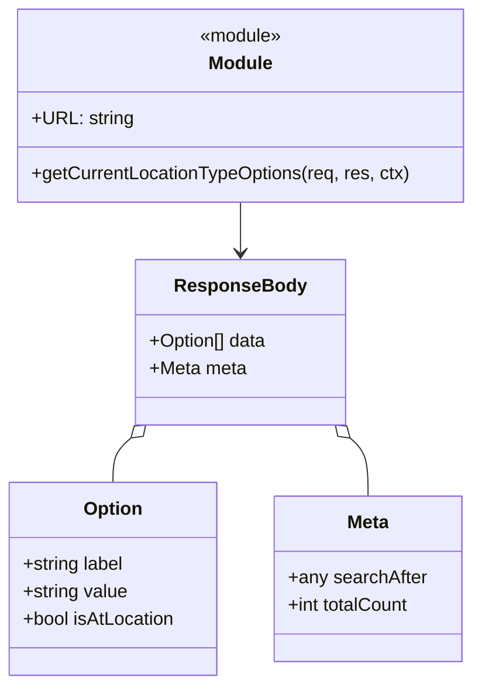
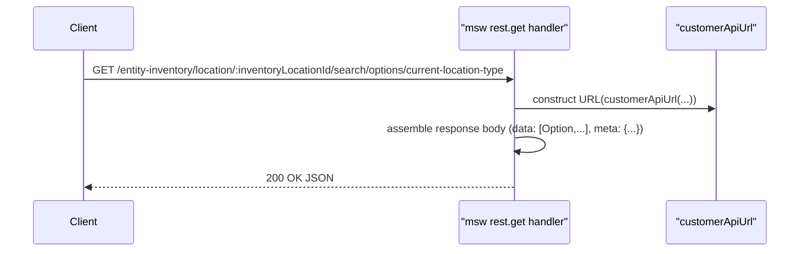
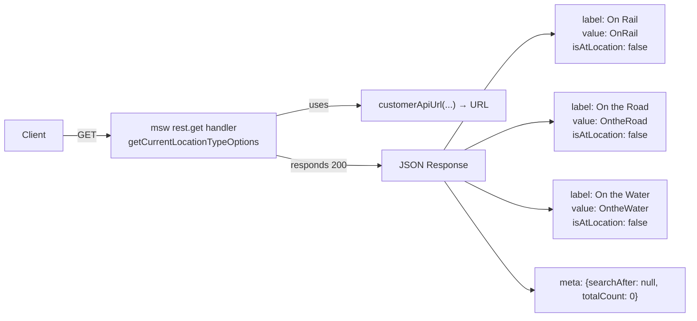

# Diagram: web/portal/src/mocks/handlers/entity-inventory/location/inventoryLocationId/search/options/currentLocationType.js

> Auto-generated by Obscura crawlers

## Diagram 1

### SVG

<svg id="container" width="414.595703125" xmlns="http://www.w3.org/2000/svg" class="classDiagram" height="596" viewBox="0 0 414.595703125 596" role="graphics-document document" aria-roledescription="class"><g><defs><marker id="container_class-aggregationStart" class="marker aggregation class" refX="18" refY="7" markerWidth="190" markerHeight="240" orient="auto"><path d="M 18,7 L9,13 L1,7 L9,1 Z"></path></marker></defs><defs><marker id="container_class-aggregationEnd" class="marker aggregation class" refX="1" refY="7" markerWidth="20" markerHeight="28" orient="auto"><path d="M 18,7 L9,13 L1,7 L9,1 Z"></path></marker></defs><defs><marker id="container_class-extensionStart" class="marker extension class" refX="18" refY="7" markerWidth="190" markerHeight="240" orient="auto"><path d="M 1,7 L18,13 V 1 Z"></path></marker></defs><defs><marker id="container_class-extensionEnd" class="marker extension class" refX="1" refY="7" markerWidth="20" markerHeight="28" orient="auto"><path d="M 1,1 V 13 L18,7 Z"></path></marker></defs><defs><marker id="container_class-compositionStart" class="marker composition class" refX="18" refY="7" markerWidth="190" markerHeight="240" orient="auto"><path d="M 18,7 L9,13 L1,7 L9,1 Z"></path></marker></defs><defs><marker id="container_class-compositionEnd" class="marker composition class" refX="1" refY="7" markerWidth="20" markerHeight="28" orient="auto"><path d="M 18,7 L9,13 L1,7 L9,1 Z"></path></marker></defs><defs><marker id="container_class-dependencyStart" class="marker dependency class" refX="6" refY="7" markerWidth="190" markerHeight="240" orient="auto"><path d="M 5,7 L9,13 L1,7 L9,1 Z"></path></marker></defs><defs><marker id="container_class-dependencyEnd" class="marker dependency class" refX="13" refY="7" markerWidth="20" markerHeight="28" orient="auto"><path d="M 18,7 L9,13 L14,7 L9,1 Z"></path></marker></defs><defs><marker id="container_class-lollipopStart" class="marker lollipop class" refX="13" refY="7" markerWidth="190" markerHeight="240" orient="auto"><circle stroke="black" fill="transparent" cx="7" cy="7" r="6"></circle></marker></defs><defs><marker id="container_class-lollipopEnd" class="marker lollipop class" refX="1" refY="7" markerWidth="190" markerHeight="240" orient="auto"><circle stroke="black" fill="transparent" cx="7" cy="7" r="6"></circle></marker></defs><g class="root"><g class="clusters"></g><g class="edgePaths"><path d="M210.904,176L210.904,180.167C210.904,184.333,210.904,192.667,210.904,200C210.904,207.333,210.904,213.667,210.904,216.833L210.904,220" id="id_Module_ResponseBody_1" class="edge-thickness-normal edge-pattern-solid relation" style=";;;" data-edge="true" data-et="edge" data-id="id_Module_ResponseBody_1" data-points="W3sieCI6MjEwLjkwNDI5Njg3NSwieSI6MTc2fSx7IngiOjIxMC45MDQyOTY4NzUsInkiOjIwMX0seyJ4IjoyMTAuOTA0Mjk2ODc1LCJ5IjoyMjZ9XQ==" marker-end="url(#container_class-dependencyEnd)"></path><path d="M115.24,381.33L112.624,383.609C110.009,385.887,104.778,390.443,102.162,396.888C99.547,403.333,99.547,411.667,99.547,415.833L99.547,420" id="id_ResponseBody_Option_2" class="edge-thickness-normal edge-pattern-solid relation" style=";;;" data-edge="true" data-et="edge" data-id="id_ResponseBody_Option_2" data-points="W3sieCI6MTI4LjI0NzI0MTQ2MjYyODg2LCJ5IjozNzB9LHsieCI6OTkuNTQ2ODc1LCJ5IjozOTV9LHsieCI6OTkuNTQ2ODc1LCJ5Ijo0MjB9XQ==" marker-start="url(#container_class-aggregationStart)"></path><path d="M306.569,381.33L309.184,383.609C311.8,385.887,317.031,390.443,319.646,398.888C322.262,407.333,322.262,419.667,322.262,425.833L322.262,432" id="id_ResponseBody_Meta_3" class="edge-thickness-normal edge-pattern-solid relation" style=";;;" data-edge="true" data-et="edge" data-id="id_ResponseBody_Meta_3" data-points="W3sieCI6MjkzLjU2MTM1MjI4NzM3MTE2LCJ5IjozNzB9LHsieCI6MzIyLjI2MTcxODc1LCJ5IjozOTV9LHsieCI6MzIyLjI2MTcxODc1LCJ5Ijo0MzJ9XQ==" marker-start="url(#container_class-aggregationStart)"></path></g><g class="edgeLabels"><g class="edgeLabel"><g class="label" data-id="id_Module_ResponseBody_1" transform="translate(0, 0)"><foreignObject width="0" height="0">

</foreignObject></g></g><g class="edgeLabel"><g class="label" data-id="id_ResponseBody_Option_2" transform="translate(0, 0)"><foreignObject width="0" height="0">

</foreignObject></g></g><g class="edgeLabel"><g class="label" data-id="id_ResponseBody_Meta_3" transform="translate(0, 0)"><foreignObject width="0" height="0">

</foreignObject></g></g></g><g class="nodes"><g class="node default" id="classId-Module-0" transform="translate(210.904296875, 92)"><g class="basic label-container"><path d="M-195.69140625 -84 L195.69140625 -84 L195.69140625 84 L-195.69140625 84" stroke="none" stroke-width="0" fill="#ECECFF" style=""></path><path d="M-195.69140625 -84 C-103.04865715084844 -84, -10.405908051696883 -84, 195.69140625 -84 M-195.69140625 -84 C-97.46746909037026 -84, 0.7564680692594834 -84, 195.69140625 -84 M195.69140625 -84 C195.69140625 -39.91328326163526, 195.69140625 4.173433476729485, 195.69140625 84 M195.69140625 -84 C195.69140625 -39.235445479576335, 195.69140625 5.529109040847331, 195.69140625 84 M195.69140625 84 C86.48786098092168 84, -22.715684288156638 84, -195.69140625 84 M195.69140625 84 C82.90765391020501 84, -29.876098429589973 84, -195.69140625 84 M-195.69140625 84 C-195.69140625 39.79071195490365, -195.69140625 -4.418576090192701, -195.69140625 -84 M-195.69140625 84 C-195.69140625 29.338969138181547, -195.69140625 -25.322061723636907, -195.69140625 -84" stroke="#9370DB" stroke-width="1.3" fill="none" stroke-dasharray="0 0" style=""></path></g><g class="annotation-group text" transform="translate(-36.6015625, -60)"><g class="label" style="" transform="translate(0,-12)"><foreignObject width="73.203125" height="24">

«module»

</foreignObject></g></g><g class="label-group text" transform="translate(-27.09375, -36)"><g class="label" style="font-weight: bolder" transform="translate(0,-12)"><foreignObject width="54.1875" height="24">

Module

</foreignObject></g></g><g class="members-group text" transform="translate(-183.69140625, 12)"><g class="label" style="" transform="translate(0,-12)"><foreignObject width="85.9375" height="24">

+URL: string

</foreignObject></g></g><g class="methods-group text" transform="translate(-183.69140625, 60)"><g class="label" style="" transform="translate(0,-12)"><foreignObject width="330.78125" height="24">

+getCurrentLocationTypeOptions(req, res, ctx)

</foreignObject></g></g><g class="divider" style=""><path d="M-195.69140625 -12 C-40.83372873106259 -12, 114.02394878787482 -12, 195.69140625 -12 M-195.69140625 -12 C-63.832851244592405 -12, 68.02570376081519 -12, 195.69140625 -12" stroke="#9370DB" stroke-width="1.3" fill="none" stroke-dasharray="0 0" style=""></path></g><g class="divider" style=""><path d="M-195.69140625 36 C-98.61162523058677 36, -1.531844211173535 36, 195.69140625 36 M-195.69140625 36 C-70.91585372105429 36, 53.85969880789142 36, 195.69140625 36" stroke="#9370DB" stroke-width="1.3" fill="none" stroke-dasharray="0 0" style=""></path></g></g><g class="node default" id="classId-ResponseBody-1" transform="translate(210.904296875, 298)"><g class="basic label-container"><path d="M-91.37890625 -72 L91.37890625 -72 L91.37890625 72 L-91.37890625 72" stroke="none" stroke-width="0" fill="#ECECFF" style=""></path><path d="M-91.37890625 -72 C-33.479045627650734 -72, 24.42081499469853 -72, 91.37890625 -72 M-91.37890625 -72 C-19.090346224579008 -72, 53.198213800841984 -72, 91.37890625 -72 M91.37890625 -72 C91.37890625 -34.8396359650536, 91.37890625 2.3207280698927946, 91.37890625 72 M91.37890625 -72 C91.37890625 -38.79698343517977, 91.37890625 -5.593966870359537, 91.37890625 72 M91.37890625 72 C52.77098605344047 72, 14.163065856880934 72, -91.37890625 72 M91.37890625 72 C52.46378962822908 72, 13.54867300645816 72, -91.37890625 72 M-91.37890625 72 C-91.37890625 28.429479497306957, -91.37890625 -15.141041005386086, -91.37890625 -72 M-91.37890625 72 C-91.37890625 24.015131958998367, -91.37890625 -23.969736082003266, -91.37890625 -72" stroke="#9370DB" stroke-width="1.3" fill="none" stroke-dasharray="0 0" style=""></path></g><g class="annotation-group text" transform="translate(0, -48)"></g><g class="label-group text" transform="translate(-53.9921875, -48)"><g class="label" style="font-weight: bolder" transform="translate(0,-12)"><foreignObject width="107.984375" height="24">

ResponseBody

</foreignObject></g></g><g class="members-group text" transform="translate(-79.37890625, 0)"><g class="label" style="" transform="translate(0,-12)"><foreignObject width="104.765625" height="24">

+Option[] data

</foreignObject></g><g class="label" style="" transform="translate(0,12)"><foreignObject width="84.5625" height="24">

+Meta meta

</foreignObject></g></g><g class="methods-group text" transform="translate(-79.37890625, 72)"></g><g class="divider" style=""><path d="M-91.37890625 -24 C-53.33184778235335 -24, -15.2847893147067 -24, 91.37890625 -24 M-91.37890625 -24 C-31.387498627199022 -24, 28.603908995601955 -24, 91.37890625 -24" stroke="#9370DB" stroke-width="1.3" fill="none" stroke-dasharray="0 0" style=""></path></g><g class="divider" style=""><path d="M-91.37890625 48 C-45.70298477366223 48, -0.027063297324460223 48, 91.37890625 48 M-91.37890625 48 C-37.66016485257121 48, 16.058576544857587 48, 91.37890625 48" stroke="#9370DB" stroke-width="1.3" fill="none" stroke-dasharray="0 0" style=""></path></g></g><g class="node default" id="classId-Option-2" transform="translate(99.546875, 504)"><g class="basic label-container"><path d="M-91.546875 -84 L91.546875 -84 L91.546875 84 L-91.546875 84" stroke="none" stroke-width="0" fill="#ECECFF" style=""></path><path d="M-91.546875 -84 C-38.42124149389525 -84, 14.704392012209496 -84, 91.546875 -84 M-91.546875 -84 C-22.666781349484197 -84, 46.21331230103161 -84, 91.546875 -84 M91.546875 -84 C91.546875 -29.91134473009624, 91.546875 24.17731053980752, 91.546875 84 M91.546875 -84 C91.546875 -39.05265146891696, 91.546875 5.894697062166074, 91.546875 84 M91.546875 84 C24.716457906417986 84, -42.11395918716403 84, -91.546875 84 M91.546875 84 C30.465741312990495 84, -30.61539237401901 84, -91.546875 84 M-91.546875 84 C-91.546875 24.59677856112355, -91.546875 -34.8064428777529, -91.546875 -84 M-91.546875 84 C-91.546875 18.814777711501804, -91.546875 -46.37044457699639, -91.546875 -84" stroke="#9370DB" stroke-width="1.3" fill="none" stroke-dasharray="0 0" style=""></path></g><g class="annotation-group text" transform="translate(0, -60)"></g><g class="label-group text" transform="translate(-24.9375, -60)"><g class="label" style="font-weight: bolder" transform="translate(0,-12)"><foreignObject width="49.875" height="24">

Option

</foreignObject></g></g><g class="members-group text" transform="translate(-79.546875, -12)"><g class="label" style="" transform="translate(0,-12)"><foreignObject width="90.09375" height="24">

+string label

</foreignObject></g><g class="label" style="" transform="translate(0,12)"><foreignObject width="92.75" height="24">

+string value

</foreignObject></g><g class="label" style="" transform="translate(0,36)"><foreignObject width="134.15625" height="24">

+bool isAtLocation

</foreignObject></g></g><g class="methods-group text" transform="translate(-79.546875, 84)"></g><g class="divider" style=""><path d="M-91.546875 -36 C-54.21567226907723 -36, -16.884469538154462 -36, 91.546875 -36 M-91.546875 -36 C-53.61392084595122 -36, -15.68096669190244 -36, 91.546875 -36" stroke="#9370DB" stroke-width="1.3" fill="none" stroke-dasharray="0 0" style=""></path></g><g class="divider" style=""><path d="M-91.546875 60 C-20.80656523005294 60, 49.93374453989412 60, 91.546875 60 M-91.546875 60 C-50.21070930312214 60, -8.874543606244274 60, 91.546875 60" stroke="#9370DB" stroke-width="1.3" fill="none" stroke-dasharray="0 0" style=""></path></g></g><g class="node default" id="classId-Meta-3" transform="translate(322.26171875, 504)"><g class="basic label-container"><path d="M-81.16796875 -72 L81.16796875 -72 L81.16796875 72 L-81.16796875 72" stroke="none" stroke-width="0" fill="#ECECFF" style=""></path><path d="M-81.16796875 -72 C-38.76428992838087 -72, 3.6393888932382623 -72, 81.16796875 -72 M-81.16796875 -72 C-29.80761038142674 -72, 21.552747987146518 -72, 81.16796875 -72 M81.16796875 -72 C81.16796875 -35.95605226303003, 81.16796875 0.08789547393993757, 81.16796875 72 M81.16796875 -72 C81.16796875 -29.105606065987764, 81.16796875 13.788787868024471, 81.16796875 72 M81.16796875 72 C29.829950125701252 72, -21.508068498597495 72, -81.16796875 72 M81.16796875 72 C30.43860352359672 72, -20.290761702806563 72, -81.16796875 72 M-81.16796875 72 C-81.16796875 34.37661604128634, -81.16796875 -3.24676791742732, -81.16796875 -72 M-81.16796875 72 C-81.16796875 23.978084622089526, -81.16796875 -24.04383075582095, -81.16796875 -72" stroke="#9370DB" stroke-width="1.3" fill="none" stroke-dasharray="0 0" style=""></path></g><g class="annotation-group text" transform="translate(0, -48)"></g><g class="label-group text" transform="translate(-18.0859375, -48)"><g class="label" style="font-weight: bolder" transform="translate(0,-12)"><foreignObject width="36.171875" height="24">

Meta

</foreignObject></g></g><g class="members-group text" transform="translate(-69.16796875, 0)"><g class="label" style="" transform="translate(0,-12)"><foreignObject width="120.25" height="24">

+any searchAfter

</foreignObject></g><g class="label" style="" transform="translate(0,12)"><foreignObject width="108.125" height="24">

+int totalCount

</foreignObject></g></g><g class="methods-group text" transform="translate(-69.16796875, 72)"></g><g class="divider" style=""><path d="M-81.16796875 -24 C-42.28251730329259 -24, -3.3970658565851863 -24, 81.16796875 -24 M-81.16796875 -24 C-48.41894326040825 -24, -15.669917770816497 -24, 81.16796875 -24" stroke="#9370DB" stroke-width="1.3" fill="none" stroke-dasharray="0 0" style=""></path></g><g class="divider" style=""><path d="M-81.16796875 48 C-33.63437239079156 48, 13.899223968416877 48, 81.16796875 48 M-81.16796875 48 C-42.61344300758061 48, -4.058917265161213 48, 81.16796875 48" stroke="#9370DB" stroke-width="1.3" fill="none" stroke-dasharray="0 0" style=""></path></g></g></g></g></g></svg>

## Diagram 2

### SVG

<svg id="container" width="1296" xmlns="http://www.w3.org/2000/svg" height="393" viewBox="-50 -10 1296 393" role="graphics-document document" aria-roledescription="sequence"><g><rect x="1046" y="307" fill="#eaeaea" stroke="#666" width="150" height="65" name="API" rx="3" ry="3" class="actor actor-bottom"></rect><text x="1121" y="339.5" dominant-baseline="central" alignment-baseline="central" class="actor actor-box" style="text-anchor: middle; font-size: 16px; font-weight: 400;"><tspan x="1121" dy="0">"customerApiUrl"</tspan></text></g><g><rect x="714" y="307" fill="#eaeaea" stroke="#666" width="184" height="65" name="MSW" rx="3" ry="3" class="actor actor-bottom"></rect><text x="806" y="339.5" dominant-baseline="central" alignment-baseline="central" class="actor actor-box" style="text-anchor: middle; font-size: 16px; font-weight: 400;"><tspan x="806" dy="0">"msw rest.get handler"</tspan></text></g><g><rect x="0" y="307" fill="#eaeaea" stroke="#666" width="150" height="65" name="Client" rx="3" ry="3" class="actor actor-bottom"></rect><text x="75" y="339.5" dominant-baseline="central" alignment-baseline="central" class="actor actor-box" style="text-anchor: middle; font-size: 16px; font-weight: 400;"><tspan x="75" dy="0">Client</tspan></text></g><g><line id="actor2" x1="1121" y1="65" x2="1121" y2="307" class="actor-line 200" stroke-width="0.5px" stroke="#999" name="API"></line><g id="root-2"><rect x="1046" y="0" fill="#eaeaea" stroke="#666" width="150" height="65" name="API" rx="3" ry="3" class="actor actor-top"></rect><text x="1121" y="32.5" dominant-baseline="central" alignment-baseline="central" class="actor actor-box" style="text-anchor: middle; font-size: 16px; font-weight: 400;"><tspan x="1121" dy="0">"customerApiUrl"</tspan></text></g></g><g><line id="actor1" x1="806" y1="65" x2="806" y2="307" class="actor-line 200" stroke-width="0.5px" stroke="#999" name="MSW"></line><g id="root-1"><rect x="714" y="0" fill="#eaeaea" stroke="#666" width="184" height="65" name="MSW" rx="3" ry="3" class="actor actor-top"></rect><text x="806" y="32.5" dominant-baseline="central" alignment-baseline="central" class="actor actor-box" style="text-anchor: middle; font-size: 16px; font-weight: 400;"><tspan x="806" dy="0">"msw rest.get handler"</tspan></text></g></g><g><line id="actor0" x1="75" y1="65" x2="75" y2="307" class="actor-line 200" stroke-width="0.5px" stroke="#999" name="Client"></line><g id="root-0"><rect x="0" y="0" fill="#eaeaea" stroke="#666" width="150" height="65" name="Client" rx="3" ry="3" class="actor actor-top"></rect><text x="75" y="32.5" dominant-baseline="central" alignment-baseline="central" class="actor actor-box" style="text-anchor: middle; font-size: 16px; font-weight: 400;"><tspan x="75" dy="0">Client</tspan></text></g></g><g></g><defs><symbol id="computer" width="24" height="24"><path transform="scale(.5)" d="M2 2v13h20v-13h-20zm18 11h-16v-9h16v9zm-10.228 6l.466-1h3.524l.467 1h-4.457zm14.228 3h-24l2-6h2.104l-1.33 4h18.45l-1.297-4h2.073l2 6zm-5-10h-14v-7h14v7z"></path></symbol></defs><defs><symbol id="database" fill-rule="evenodd" clip-rule="evenodd"><path transform="scale(.5)" d="M12.258.001l.256.004.255.005.253.008.251.01.249.012.247.015.246.016.242.019.241.02.239.023.236.024.233.027.231.028.229.031.225.032.223.034.22.036.217.038.214.04.211.041.208.043.205.045.201.046.198.048.194.05.191.051.187.053.183.054.18.056.175.057.172.059.168.06.163.061.16.063.155.064.15.066.074.033.073.033.071.034.07.034.069.035.068.035.067.035.066.035.064.036.064.036.062.036.06.036.06.037.058.037.058.037.055.038.055.038.053.038.052.038.051.039.05.039.048.039.047.039.045.04.044.04.043.04.041.04.04.041.039.041.037.041.036.041.034.041.033.042.032.042.03.042.029.042.027.042.026.043.024.043.023.043.021.043.02.043.018.044.017.043.015.044.013.044.012.044.011.045.009.044.007.045.006.045.004.045.002.045.001.045v17l-.001.045-.002.045-.004.045-.006.045-.007.045-.009.044-.011.045-.012.044-.013.044-.015.044-.017.043-.018.044-.02.043-.021.043-.023.043-.024.043-.026.043-.027.042-.029.042-.03.042-.032.042-.033.042-.034.041-.036.041-.037.041-.039.041-.04.041-.041.04-.043.04-.044.04-.045.04-.047.039-.048.039-.05.039-.051.039-.052.038-.053.038-.055.038-.055.038-.058.037-.058.037-.06.037-.06.036-.062.036-.064.036-.064.036-.066.035-.067.035-.068.035-.069.035-.07.034-.071.034-.073.033-.074.033-.15.066-.155.064-.16.063-.163.061-.168.06-.172.059-.175.057-.18.056-.183.054-.187.053-.191.051-.194.05-.198.048-.201.046-.205.045-.208.043-.211.041-.214.04-.217.038-.22.036-.223.034-.225.032-.229.031-.231.028-.233.027-.236.024-.239.023-.241.02-.242.019-.246.016-.247.015-.249.012-.251.01-.253.008-.255.005-.256.004-.258.001-.258-.001-.256-.004-.255-.005-.253-.008-.251-.01-.249-.012-.247-.015-.245-.016-.243-.019-.241-.02-.238-.023-.236-.024-.234-.027-.231-.028-.228-.031-.226-.032-.223-.034-.22-.036-.217-.038-.214-.04-.211-.041-.208-.043-.204-.045-.201-.046-.198-.048-.195-.05-.19-.051-.187-.053-.184-.054-.179-.056-.176-.057-.172-.059-.167-.06-.164-.061-.159-.063-.155-.064-.151-.066-.074-.033-.072-.033-.072-.034-.07-.034-.069-.035-.068-.035-.067-.035-.066-.035-.064-.036-.063-.036-.062-.036-.061-.036-.06-.037-.058-.037-.057-.037-.056-.038-.055-.038-.053-.038-.052-.038-.051-.039-.049-.039-.049-.039-.046-.039-.046-.04-.044-.04-.043-.04-.041-.04-.04-.041-.039-.041-.037-.041-.036-.041-.034-.041-.033-.042-.032-.042-.03-.042-.029-.042-.027-.042-.026-.043-.024-.043-.023-.043-.021-.043-.02-.043-.018-.044-.017-.043-.015-.044-.013-.044-.012-.044-.011-.045-.009-.044-.007-.045-.006-.045-.004-.045-.002-.045-.001-.045v-17l.001-.045.002-.045.004-.045.006-.045.007-.045.009-.044.011-.045.012-.044.013-.044.015-.044.017-.043.018-.044.02-.043.021-.043.023-.043.024-.043.026-.043.027-.042.029-.042.03-.042.032-.042.033-.042.034-.041.036-.041.037-.041.039-.041.04-.041.041-.04.043-.04.044-.04.046-.04.046-.039.049-.039.049-.039.051-.039.052-.038.053-.038.055-.038.056-.038.057-.037.058-.037.06-.037.061-.036.062-.036.063-.036.064-.036.066-.035.067-.035.068-.035.069-.035.07-.034.072-.034.072-.033.074-.033.151-.066.155-.064.159-.063.164-.061.167-.06.172-.059.176-.057.179-.056.184-.054.187-.053.19-.051.195-.05.198-.048.201-.046.204-.045.208-.043.211-.041.214-.04.217-.038.22-.036.223-.034.226-.032.228-.031.231-.028.234-.027.236-.024.238-.023.241-.02.243-.019.245-.016.247-.015.249-.012.251-.01.253-.008.255-.005.256-.004.258-.001.258.001zm-9.258 20.499v.01l.001.021.003.021.004.022.005.021.006.022.007.022.009.023.01.022.011.023.012.023.013.023.015.023.016.024.017.023.018.024.019.024.021.024.022.025.023.024.024.025.052.049.056.05.061.051.066.051.07.051.075.051.079.052.084.052.088.052.092.052.097.052.102.051.105.052.11.052.114.051.119.051.123.051.127.05.131.05.135.05.139.048.144.049.147.047.152.047.155.047.16.045.163.045.167.043.171.043.176.041.178.041.183.039.187.039.19.037.194.035.197.035.202.033.204.031.209.03.212.029.216.027.219.025.222.024.226.021.23.02.233.018.236.016.24.015.243.012.246.01.249.008.253.005.256.004.259.001.26-.001.257-.004.254-.005.25-.008.247-.011.244-.012.241-.014.237-.016.233-.018.231-.021.226-.021.224-.024.22-.026.216-.027.212-.028.21-.031.205-.031.202-.034.198-.034.194-.036.191-.037.187-.039.183-.04.179-.04.175-.042.172-.043.168-.044.163-.045.16-.046.155-.046.152-.047.148-.048.143-.049.139-.049.136-.05.131-.05.126-.05.123-.051.118-.052.114-.051.11-.052.106-.052.101-.052.096-.052.092-.052.088-.053.083-.051.079-.052.074-.052.07-.051.065-.051.06-.051.056-.05.051-.05.023-.024.023-.025.021-.024.02-.024.019-.024.018-.024.017-.024.015-.023.014-.024.013-.023.012-.023.01-.023.01-.022.008-.022.006-.022.006-.022.004-.022.004-.021.001-.021.001-.021v-4.127l-.077.055-.08.053-.083.054-.085.053-.087.052-.09.052-.093.051-.095.05-.097.05-.1.049-.102.049-.105.048-.106.047-.109.047-.111.046-.114.045-.115.045-.118.044-.12.043-.122.042-.124.042-.126.041-.128.04-.13.04-.132.038-.134.038-.135.037-.138.037-.139.035-.142.035-.143.034-.144.033-.147.032-.148.031-.15.03-.151.03-.153.029-.154.027-.156.027-.158.026-.159.025-.161.024-.162.023-.163.022-.165.021-.166.02-.167.019-.169.018-.169.017-.171.016-.173.015-.173.014-.175.013-.175.012-.177.011-.178.01-.179.008-.179.008-.181.006-.182.005-.182.004-.184.003-.184.002h-.37l-.184-.002-.184-.003-.182-.004-.182-.005-.181-.006-.179-.008-.179-.008-.178-.01-.176-.011-.176-.012-.175-.013-.173-.014-.172-.015-.171-.016-.17-.017-.169-.018-.167-.019-.166-.02-.165-.021-.163-.022-.162-.023-.161-.024-.159-.025-.157-.026-.156-.027-.155-.027-.153-.029-.151-.03-.15-.03-.148-.031-.146-.032-.145-.033-.143-.034-.141-.035-.14-.035-.137-.037-.136-.037-.134-.038-.132-.038-.13-.04-.128-.04-.126-.041-.124-.042-.122-.042-.12-.044-.117-.043-.116-.045-.113-.045-.112-.046-.109-.047-.106-.047-.105-.048-.102-.049-.1-.049-.097-.05-.095-.05-.093-.052-.09-.051-.087-.052-.085-.053-.083-.054-.08-.054-.077-.054v4.127zm0-5.654v.011l.001.021.003.021.004.021.005.022.006.022.007.022.009.022.01.022.011.023.012.023.013.023.015.024.016.023.017.024.018.024.019.024.021.024.022.024.023.025.024.024.052.05.056.05.061.05.066.051.07.051.075.052.079.051.084.052.088.052.092.052.097.052.102.052.105.052.11.051.114.051.119.052.123.05.127.051.131.05.135.049.139.049.144.048.147.048.152.047.155.046.16.045.163.045.167.044.171.042.176.042.178.04.183.04.187.038.19.037.194.036.197.034.202.033.204.032.209.03.212.028.216.027.219.025.222.024.226.022.23.02.233.018.236.016.24.014.243.012.246.01.249.008.253.006.256.003.259.001.26-.001.257-.003.254-.006.25-.008.247-.01.244-.012.241-.015.237-.016.233-.018.231-.02.226-.022.224-.024.22-.025.216-.027.212-.029.21-.03.205-.032.202-.033.198-.035.194-.036.191-.037.187-.039.183-.039.179-.041.175-.042.172-.043.168-.044.163-.045.16-.045.155-.047.152-.047.148-.048.143-.048.139-.05.136-.049.131-.05.126-.051.123-.051.118-.051.114-.052.11-.052.106-.052.101-.052.096-.052.092-.052.088-.052.083-.052.079-.052.074-.051.07-.052.065-.051.06-.05.056-.051.051-.049.023-.025.023-.024.021-.025.02-.024.019-.024.018-.024.017-.024.015-.023.014-.023.013-.024.012-.022.01-.023.01-.023.008-.022.006-.022.006-.022.004-.021.004-.022.001-.021.001-.021v-4.139l-.077.054-.08.054-.083.054-.085.052-.087.053-.09.051-.093.051-.095.051-.097.05-.1.049-.102.049-.105.048-.106.047-.109.047-.111.046-.114.045-.115.044-.118.044-.12.044-.122.042-.124.042-.126.041-.128.04-.13.039-.132.039-.134.038-.135.037-.138.036-.139.036-.142.035-.143.033-.144.033-.147.033-.148.031-.15.03-.151.03-.153.028-.154.028-.156.027-.158.026-.159.025-.161.024-.162.023-.163.022-.165.021-.166.02-.167.019-.169.018-.169.017-.171.016-.173.015-.173.014-.175.013-.175.012-.177.011-.178.009-.179.009-.179.007-.181.007-.182.005-.182.004-.184.003-.184.002h-.37l-.184-.002-.184-.003-.182-.004-.182-.005-.181-.007-.179-.007-.179-.009-.178-.009-.176-.011-.176-.012-.175-.013-.173-.014-.172-.015-.171-.016-.17-.017-.169-.018-.167-.019-.166-.02-.165-.021-.163-.022-.162-.023-.161-.024-.159-.025-.157-.026-.156-.027-.155-.028-.153-.028-.151-.03-.15-.03-.148-.031-.146-.033-.145-.033-.143-.033-.141-.035-.14-.036-.137-.036-.136-.037-.134-.038-.132-.039-.13-.039-.128-.04-.126-.041-.124-.042-.122-.043-.12-.043-.117-.044-.116-.044-.113-.046-.112-.046-.109-.046-.106-.047-.105-.048-.102-.049-.1-.049-.097-.05-.095-.051-.093-.051-.09-.051-.087-.053-.085-.052-.083-.054-.08-.054-.077-.054v4.139zm0-5.666v.011l.001.02.003.022.004.021.005.022.006.021.007.022.009.023.01.022.011.023.012.023.013.023.015.023.016.024.017.024.018.023.019.024.021.025.022.024.023.024.024.025.052.05.056.05.061.05.066.051.07.051.075.052.079.051.084.052.088.052.092.052.097.052.102.052.105.051.11.052.114.051.119.051.123.051.127.05.131.05.135.05.139.049.144.048.147.048.152.047.155.046.16.045.163.045.167.043.171.043.176.042.178.04.183.04.187.038.19.037.194.036.197.034.202.033.204.032.209.03.212.028.216.027.219.025.222.024.226.021.23.02.233.018.236.017.24.014.243.012.246.01.249.008.253.006.256.003.259.001.26-.001.257-.003.254-.006.25-.008.247-.01.244-.013.241-.014.237-.016.233-.018.231-.02.226-.022.224-.024.22-.025.216-.027.212-.029.21-.03.205-.032.202-.033.198-.035.194-.036.191-.037.187-.039.183-.039.179-.041.175-.042.172-.043.168-.044.163-.045.16-.045.155-.047.152-.047.148-.048.143-.049.139-.049.136-.049.131-.051.126-.05.123-.051.118-.052.114-.051.11-.052.106-.052.101-.052.096-.052.092-.052.088-.052.083-.052.079-.052.074-.052.07-.051.065-.051.06-.051.056-.05.051-.049.023-.025.023-.025.021-.024.02-.024.019-.024.018-.024.017-.024.015-.023.014-.024.013-.023.012-.023.01-.022.01-.023.008-.022.006-.022.006-.022.004-.022.004-.021.001-.021.001-.021v-4.153l-.077.054-.08.054-.083.053-.085.053-.087.053-.09.051-.093.051-.095.051-.097.05-.1.049-.102.048-.105.048-.106.048-.109.046-.111.046-.114.046-.115.044-.118.044-.12.043-.122.043-.124.042-.126.041-.128.04-.13.039-.132.039-.134.038-.135.037-.138.036-.139.036-.142.034-.143.034-.144.033-.147.032-.148.032-.15.03-.151.03-.153.028-.154.028-.156.027-.158.026-.159.024-.161.024-.162.023-.163.023-.165.021-.166.02-.167.019-.169.018-.169.017-.171.016-.173.015-.173.014-.175.013-.175.012-.177.01-.178.01-.179.009-.179.007-.181.006-.182.006-.182.004-.184.003-.184.001-.185.001-.185-.001-.184-.001-.184-.003-.182-.004-.182-.006-.181-.006-.179-.007-.179-.009-.178-.01-.176-.01-.176-.012-.175-.013-.173-.014-.172-.015-.171-.016-.17-.017-.169-.018-.167-.019-.166-.02-.165-.021-.163-.023-.162-.023-.161-.024-.159-.024-.157-.026-.156-.027-.155-.028-.153-.028-.151-.03-.15-.03-.148-.032-.146-.032-.145-.033-.143-.034-.141-.034-.14-.036-.137-.036-.136-.037-.134-.038-.132-.039-.13-.039-.128-.041-.126-.041-.124-.041-.122-.043-.12-.043-.117-.044-.116-.044-.113-.046-.112-.046-.109-.046-.106-.048-.105-.048-.102-.048-.1-.05-.097-.049-.095-.051-.093-.051-.09-.052-.087-.052-.085-.053-.083-.053-.08-.054-.077-.054v4.153zm8.74-8.179l-.257.004-.254.005-.25.008-.247.011-.244.012-.241.014-.237.016-.233.018-.231.021-.226.022-.224.023-.22.026-.216.027-.212.028-.21.031-.205.032-.202.033-.198.034-.194.036-.191.038-.187.038-.183.04-.179.041-.175.042-.172.043-.168.043-.163.045-.16.046-.155.046-.152.048-.148.048-.143.048-.139.049-.136.05-.131.05-.126.051-.123.051-.118.051-.114.052-.11.052-.106.052-.101.052-.096.052-.092.052-.088.052-.083.052-.079.052-.074.051-.07.052-.065.051-.06.05-.056.05-.051.05-.023.025-.023.024-.021.024-.02.025-.019.024-.018.024-.017.023-.015.024-.014.023-.013.023-.012.023-.01.023-.01.022-.008.022-.006.023-.006.021-.004.022-.004.021-.001.021-.001.021.001.021.001.021.004.021.004.022.006.021.006.023.008.022.01.022.01.023.012.023.013.023.014.023.015.024.017.023.018.024.019.024.02.025.021.024.023.024.023.025.051.05.056.05.06.05.065.051.07.052.074.051.079.052.083.052.088.052.092.052.096.052.101.052.106.052.11.052.114.052.118.051.123.051.126.051.131.05.136.05.139.049.143.048.148.048.152.048.155.046.16.046.163.045.168.043.172.043.175.042.179.041.183.04.187.038.191.038.194.036.198.034.202.033.205.032.21.031.212.028.216.027.22.026.224.023.226.022.231.021.233.018.237.016.241.014.244.012.247.011.25.008.254.005.257.004.26.001.26-.001.257-.004.254-.005.25-.008.247-.011.244-.012.241-.014.237-.016.233-.018.231-.021.226-.022.224-.023.22-.026.216-.027.212-.028.21-.031.205-.032.202-.033.198-.034.194-.036.191-.038.187-.038.183-.04.179-.041.175-.042.172-.043.168-.043.163-.045.16-.046.155-.046.152-.048.148-.048.143-.048.139-.049.136-.05.131-.05.126-.051.123-.051.118-.051.114-.052.11-.052.106-.052.101-.052.096-.052.092-.052.088-.052.083-.052.079-.052.074-.051.07-.052.065-.051.06-.05.056-.05.051-.05.023-.025.023-.024.021-.024.02-.025.019-.024.018-.024.017-.023.015-.024.014-.023.013-.023.012-.023.01-.023.01-.022.008-.022.006-.023.006-.021.004-.022.004-.021.001-.021.001-.021-.001-.021-.001-.021-.004-.021-.004-.022-.006-.021-.006-.023-.008-.022-.01-.022-.01-.023-.012-.023-.013-.023-.014-.023-.015-.024-.017-.023-.018-.024-.019-.024-.02-.025-.021-.024-.023-.024-.023-.025-.051-.05-.056-.05-.06-.05-.065-.051-.07-.052-.074-.051-.079-.052-.083-.052-.088-.052-.092-.052-.096-.052-.101-.052-.106-.052-.11-.052-.114-.052-.118-.051-.123-.051-.126-.051-.131-.05-.136-.05-.139-.049-.143-.048-.148-.048-.152-.048-.155-.046-.16-.046-.163-.045-.168-.043-.172-.043-.175-.042-.179-.041-.183-.04-.187-.038-.191-.038-.194-.036-.198-.034-.202-.033-.205-.032-.21-.031-.212-.028-.216-.027-.22-.026-.224-.023-.226-.022-.231-.021-.233-.018-.237-.016-.241-.014-.244-.012-.247-.011-.25-.008-.254-.005-.257-.004-.26-.001-.26.001z"></path></symbol></defs><defs><symbol id="clock" width="24" height="24"><path transform="scale(.5)" d="M12 2c5.514 0 10 4.486 10 10s-4.486 10-10 10-10-4.486-10-10 4.486-10 10-10zm0-2c-6.627 0-12 5.373-12 12s5.373 12 12 12 12-5.373 12-12-5.373-12-12-12zm5.848 12.459c.202.038.202.333.001.372-1.907.361-6.045 1.111-6.547 1.111-.719 0-1.301-.582-1.301-1.301 0-.512.77-5.447 1.125-7.445.034-.192.312-.181.343.014l.985 6.238 5.394 1.011z"></path></symbol></defs><defs><marker id="arrowhead" refX="7.9" refY="5" markerUnits="userSpaceOnUse" markerWidth="12" markerHeight="12" orient="auto-start-reverse"><path d="M -1 0 L 10 5 L 0 10 z"></path></marker></defs><defs><marker id="crosshead" markerWidth="15" markerHeight="8" orient="auto" refX="4" refY="4.5"><path fill="none" stroke="#000000" stroke-width="1pt" d="M 1,2 L 6,7 M 6,2 L 1,7" style="stroke-dasharray: 0, 0;"></path></marker></defs><defs><marker id="filled-head" refX="15.5" refY="7" markerWidth="20" markerHeight="28" orient="auto"><path d="M 18,7 L9,13 L14,7 L9,1 Z"></path></marker></defs><defs><marker id="sequencenumber" refX="15" refY="15" markerWidth="60" markerHeight="40" orient="auto"><circle cx="15" cy="15" r="6"></circle></marker></defs><text x="439" y="80" text-anchor="middle" dominant-baseline="middle" alignment-baseline="middle" class="messageText" dy="1em" style="font-size: 16px; font-weight: 400;">GET /entity-inventory/location/:inventoryLocationId/search/options/current-location-type</text><line x1="76" y1="113" x2="802" y2="113" class="messageLine0" stroke-width="2" stroke="none" marker-end="url(#arrowhead)" style="fill: none;"></line><text x="962" y="128" text-anchor="middle" dominant-baseline="middle" alignment-baseline="middle" class="messageText" dy="1em" style="font-size: 16px; font-weight: 400;">construct URL(customerApiUrl(...))</text><line x1="807" y1="161" x2="1117" y2="161" class="messageLine0" stroke-width="2" stroke="none" marker-end="url(#arrowhead)" style="fill: none;"></line><text x="807" y="176" text-anchor="middle" dominant-baseline="middle" alignment-baseline="middle" class="messageText" dy="1em" style="font-size: 16px; font-weight: 400;">assemble response body (data: [Option,...], meta: {...})</text><path d="M 807,209 C 867,199 867,239 807,229" class="messageLine0" stroke-width="2" stroke="none" marker-end="url(#arrowhead)" style="fill: none;"></path><text x="442" y="254" text-anchor="middle" dominant-baseline="middle" alignment-baseline="middle" class="messageText" dy="1em" style="font-size: 16px; font-weight: 400;">200 OK JSON</text><line x1="805" y1="287" x2="79" y2="287" class="messageLine1" stroke-width="2" stroke="none" marker-end="url(#arrowhead)" style="stroke-dasharray: 3, 3; fill: none;"></line></svg>

## Diagram 3

### SVG

<svg id="container" width="1186.609375" xmlns="http://www.w3.org/2000/svg" class="flowchart" height="550" viewBox="0 0 1186.609375 550" role="graphics-document document" aria-roledescription="flowchart-v2"><g><marker id="container_flowchart-v2-pointEnd" class="marker flowchart-v2" viewBox="0 0 10 10" refX="5" refY="5" markerUnits="userSpaceOnUse" markerWidth="8" markerHeight="8" orient="auto"><path d="M 0 0 L 10 5 L 0 10 z" class="arrowMarkerPath" style="stroke-width: 1; stroke-dasharray: 1, 0;"></path></marker><marker id="container_flowchart-v2-pointStart" class="marker flowchart-v2" viewBox="0 0 10 10" refX="4.5" refY="5" markerUnits="userSpaceOnUse" markerWidth="8" markerHeight="8" orient="auto"><path d="M 0 5 L 10 10 L 10 0 z" class="arrowMarkerPath" style="stroke-width: 1; stroke-dasharray: 1, 0;"></path></marker><marker id="container_flowchart-v2-circleEnd" class="marker flowchart-v2" viewBox="0 0 10 10" refX="11" refY="5" markerUnits="userSpaceOnUse" markerWidth="11" markerHeight="11" orient="auto"><circle cx="5" cy="5" r="5" class="arrowMarkerPath" style="stroke-width: 1; stroke-dasharray: 1, 0;"></circle></marker><marker id="container_flowchart-v2-circleStart" class="marker flowchart-v2" viewBox="0 0 10 10" refX="-1" refY="5" markerUnits="userSpaceOnUse" markerWidth="11" markerHeight="11" orient="auto"><circle cx="5" cy="5" r="5" class="arrowMarkerPath" style="stroke-width: 1; stroke-dasharray: 1, 0;"></circle></marker><marker id="container_flowchart-v2-crossEnd" class="marker cross flowchart-v2" viewBox="0 0 11 11" refX="12" refY="5.2" markerUnits="userSpaceOnUse" markerWidth="11" markerHeight="11" orient="auto"><path d="M 1,1 l 9,9 M 10,1 l -9,9" class="arrowMarkerPath" style="stroke-width: 2; stroke-dasharray: 1, 0;"></path></marker><marker id="container_flowchart-v2-crossStart" class="marker cross flowchart-v2" viewBox="0 0 11 11" refX="-1" refY="5.2" markerUnits="userSpaceOnUse" markerWidth="11" markerHeight="11" orient="auto"><path d="M 1,1 l 9,9 M 10,1 l -9,9" class="arrowMarkerPath" style="stroke-width: 2; stroke-dasharray: 1, 0;"></path></marker><g class="root"><g class="clusters"></g><g class="edgePaths"><path d="M109.875,235L116.286,235C122.698,235,135.521,235,147.677,235C159.833,235,171.323,235,177.068,235L182.813,235" id="L_Client_Handler_0" class="edge-thickness-normal edge-pattern-solid edge-thickness-normal edge-pattern-solid flowchart-link" style=";" data-edge="true" data-et="edge" data-id="L_Client_Handler_0" data-points="W3sieCI6MTA5Ljg3NSwieSI6MjM1fSx7IngiOjE0OC4zNDM3NSwieSI6MjM1fSx7IngiOjE4Ni44MTI1LCJ5IjoyMzV9XQ==" marker-end="url(#container_flowchart-v2-pointEnd)"></path><path d="M476.016,200.538L488.28,197.615C500.544,194.692,525.073,188.846,548.935,185.923C572.797,183,595.992,183,607.59,183L619.188,183" id="L_Handler_URL_0" class="edge-thickness-normal edge-pattern-solid edge-thickness-normal edge-pattern-solid flowchart-link" style=";" data-edge="true" data-et="edge" data-id="L_Handler_URL_0" data-points="W3sieCI6NDc2LjAxNTYyNSwieSI6MjAwLjUzNzUyNTA2NDQ1MTQ0fSx7IngiOjU0OS42MDE1NjI1LCJ5IjoxODN9LHsieCI6NjIzLjE4NzUsInkiOjE4M31d" marker-end="url(#container_flowchart-v2-pointEnd)"></path><path d="M476.016,269.462L488.28,272.385C500.544,275.308,525.073,281.154,555.229,284.077C585.385,287,621.169,287,639.061,287L656.953,287" id="L_Handler_Response_0" class="edge-thickness-normal edge-pattern-solid edge-thickness-normal edge-pattern-solid flowchart-link" style=";" data-edge="true" data-et="edge" data-id="L_Handler_Response_0" data-points="W3sieCI6NDc2LjAxNTYyNSwieSI6MjY5LjQ2MjQ3NDkzNTU0ODZ9LHsieCI6NTQ5LjYwMTU2MjUsInkiOjI4N30seyJ4Ijo2NjAuOTUzMTI1LCJ5IjoyODd9XQ==" marker-end="url(#container_flowchart-v2-pointEnd)"></path><path d="M763.391,260L785.094,226.5C806.797,193,850.203,126,881.109,92.5C912.016,59,930.422,59,939.625,59L948.828,59" id="L_Response_Option1_0" class="edge-thickness-normal edge-pattern-solid edge-thickness-normal edge-pattern-solid flowchart-link" style=";" data-edge="true" data-et="edge" data-id="L_Response_Option1_0" data-points="W3sieCI6NzYzLjM5MDUyMjIwMzk0NzQsInkiOjI2MH0seyJ4Ijo4OTMuNjA5Mzc1LCJ5Ijo1OX0seyJ4Ijo5NTIuODI4MTI1LCJ5Ijo1OX1d" marker-end="url(#container_flowchart-v2-pointEnd)"></path><path d="M798.375,260L814.247,251.833C830.12,243.667,861.864,227.333,886.723,219.167C911.581,211,929.552,211,938.538,211L947.523,211" id="L_Response_Option2_0" class="edge-thickness-normal edge-pattern-solid edge-thickness-normal edge-pattern-solid flowchart-link" style=";" data-edge="true" data-et="edge" data-id="L_Response_Option2_0" data-points="W3sieCI6Nzk4LjM3NDY5MTYxMTg0MjEsInkiOjI2MH0seyJ4Ijo4OTMuNjA5Mzc1LCJ5IjoyMTF9LHsieCI6OTUxLjUyMzQzNzUsInkiOjIxMX1d" marker-end="url(#container_flowchart-v2-pointEnd)"></path><path d="M798.375,314L814.247,322.167C830.12,330.333,861.864,346.667,886.309,354.833C910.753,363,927.896,363,936.467,363L945.039,363" id="L_Response_Option3_0" class="edge-thickness-normal edge-pattern-solid edge-thickness-normal edge-pattern-solid flowchart-link" style=";" data-edge="true" data-et="edge" data-id="L_Response_Option3_0" data-points="W3sieCI6Nzk4LjM3NDY5MTYxMTg0MjEsInkiOjMxNH0seyJ4Ijo4OTMuNjA5Mzc1LCJ5IjozNjN9LHsieCI6OTQ5LjAzOTA2MjUsInkiOjM2M31d" marker-end="url(#container_flowchart-v2-pointEnd)"></path><path d="M764.362,314L785.903,345.5C807.445,377,850.527,440,875.568,471.5C900.609,503,907.609,503,911.109,503L914.609,503" id="L_Response_Meta_0" class="edge-thickness-normal edge-pattern-solid edge-thickness-normal edge-pattern-solid flowchart-link" style=";" data-edge="true" data-et="edge" data-id="L_Response_Meta_0" data-points="W3sieCI6NzY0LjM2MjMwNDY4NzUsInkiOjMxNH0seyJ4Ijo4OTMuNjA5Mzc1LCJ5Ijo1MDN9LHsieCI6OTE4LjYwOTM3NSwieSI6NTAzfV0=" marker-end="url(#container_flowchart-v2-pointEnd)"></path></g><g class="edgeLabels"><g class="edgeLabel" transform="translate(148.34375, 235)"><g class="label" data-id="L_Client_Handler_0" transform="translate(-13.46875, -12)"><foreignObject width="26.9375" height="24">

GET

</foreignObject></g></g><g class="edgeLabel" transform="translate(549.6015625, 183)"><g class="label" data-id="L_Handler_URL_0" transform="translate(-16.4921875, -12)"><foreignObject width="32.984375" height="24">

uses

</foreignObject></g></g><g class="edgeLabel" transform="translate(549.6015625, 287)"><g class="label" data-id="L_Handler_Response_0" transform="translate(-48.5859375, -12)"><foreignObject width="97.171875" height="24">

responds 200

</foreignObject></g></g><g class="edgeLabel"><g class="label" data-id="L_Response_Option1_0" transform="translate(0, 0)"><foreignObject width="0" height="0">

</foreignObject></g></g><g class="edgeLabel"><g class="label" data-id="L_Response_Option2_0" transform="translate(0, 0)"><foreignObject width="0" height="0">

</foreignObject></g></g><g class="edgeLabel"><g class="label" data-id="L_Response_Option3_0" transform="translate(0, 0)"><foreignObject width="0" height="0">

</foreignObject></g></g><g class="edgeLabel"><g class="label" data-id="L_Response_Meta_0" transform="translate(0, 0)"><foreignObject width="0" height="0">

</foreignObject></g></g></g><g class="nodes"><g class="node default" id="flowchart-Client-0" transform="translate(58.9375, 235)"><rect class="basic label-container" style="" x="-50.9375" y="-27" width="101.875" height="54"></rect><g class="label" style="" transform="translate(-20.9375, -12)"><rect></rect><foreignObject width="41.875" height="24">

Client

</foreignObject></g></g><g class="node default" id="flowchart-Handler-1" transform="translate(331.4140625, 235)"><rect class="basic label-container" style="" x="-144.6015625" y="-39" width="289.203125" height="78"></rect><g class="label" style="" transform="translate(-114.6015625, -24)"><rect></rect><foreignObject width="229.203125" height="48">

msw rest.get handler getCurrentLocationTypeOptions

</foreignObject></g></g><g class="node default" id="flowchart-URL-3" transform="translate(745.8984375, 183)"><rect class="basic label-container" style="" x="-122.7109375" y="-27" width="245.421875" height="54"></rect><g class="label" style="" transform="translate(-92.7109375, -12)"><rect></rect><foreignObject width="185.421875" height="24">

customerApiUrl(...) → URL

</foreignObject></g></g><g class="node default" id="flowchart-Response-5" transform="translate(745.8984375, 287)"><rect class="basic label-container" style="" x="-84.9453125" y="-27" width="169.890625" height="54"></rect><g class="label" style="" transform="translate(-54.9453125, -12)"><rect></rect><foreignObject width="109.890625" height="24">

JSON Response

</foreignObject></g></g><g class="node default" id="flowchart-Option1-7" transform="translate(1048.609375, 59)"><rect class="basic label-container" style="" x="-95.78125" y="-51" width="191.5625" height="102"></rect><g class="label" style="" transform="translate(-65.78125, -36)"><rect></rect><foreignObject width="131.5625" height="72">

label: On Rail value: OnRail isAtLocation: false

</foreignObject></g></g><g class="node default" id="flowchart-Option2-9" transform="translate(1048.609375, 211)"><rect class="basic label-container" style="" x="-97.0859375" y="-51" width="194.171875" height="102"></rect><g class="label" style="" transform="translate(-67.0859375, -36)"><rect></rect><foreignObject width="134.171875" height="72">

label: On the Road value: OntheRoad isAtLocation: false

</foreignObject></g></g><g class="node default" id="flowchart-Option3-11" transform="translate(1048.609375, 363)"><rect class="basic label-container" style="" x="-99.5703125" y="-51" width="199.140625" height="102"></rect><g class="label" style="" transform="translate(-69.5703125, -36)"><rect></rect><foreignObject width="139.140625" height="72">

label: On the Water value: OntheWater isAtLocation: false

</foreignObject></g></g><g class="node default" id="flowchart-Meta-13" transform="translate(1048.609375, 503)"><rect class="basic label-container" style="" x="-130" y="-39" width="260" height="78"></rect><g class="label" style="" transform="translate(-100, -24)"><rect></rect><foreignObject width="200" height="48">

meta: {searchAfter: null, totalCount: 0}

</foreignObject></g></g></g></g></g></svg>
