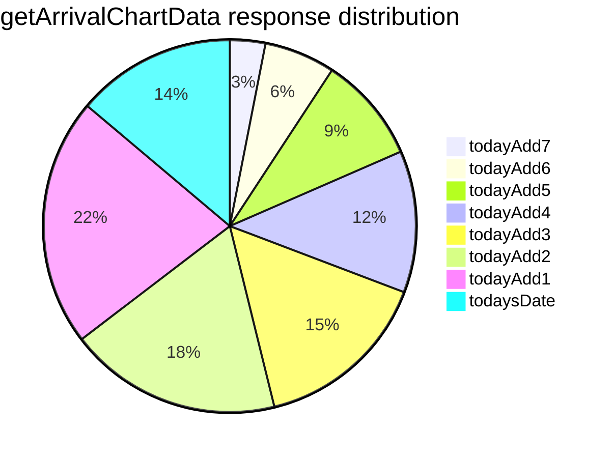

# Diagram: web/portal/src/mocks/handlers/entity-inventory/location/locationId/metrics/actual-arrival/data.js


> Auto-generated by Obscura crawlers

## Diagram 1

```mermaid
flowchart LR
imports[Imports: api-url, msw, moment] --> format[formatDateToYYYYMMDD(date) => format YYYY-MM-DD]
format --> dates[Compute todaysDate and todayAdd1..todayAdd7 using moment().utc() and subtract days]
dates --> url[Construct URL via customerApiUrl('/entity-inventory/location/:locationId/metrics/actual-arrival?startDate=2024-11-07&endDate=2024-11-14')]
url --> handler[Register MSW handler: getArrivalChartData = rest.get(URL, handler)]
handler --> build[Build responseBody mapping each date to counts (10,20,30,40,50,60,70,45)]
build --> respond[Return res(ctx.json(responseBody))]
respond --> end[End]
```

> SVG rendering failed for this diagram.

## Diagram 2



### SVG

<svg id="container" width="100%" xmlns="http://www.w3.org/2000/svg" viewBox="0 0 598.328125 450" style="max-width: 598.328125px;" role="graphics-document document" aria-roledescription="pie"><style>#container{font-family:"trebuchet ms",verdana,arial,sans-serif;font-size:16px;fill:#333;}@keyframes edge-animation-frame{from{stroke-dashoffset:0;}}@keyframes dash{to{stroke-dashoffset:0;}}#container .edge-animation-slow{stroke-dasharray:9,5!important;stroke-dashoffset:900;animation:dash 50s linear infinite;stroke-linecap:round;}#container .edge-animation-fast{stroke-dasharray:9,5!important;stroke-dashoffset:900;animation:dash 20s linear infinite;stroke-linecap:round;}#container .error-icon{fill:#552222;}#container .error-text{fill:#552222;stroke:#552222;}#container .edge-thickness-normal{stroke-width:1px;}#container .edge-thickness-thick{stroke-width:3.5px;}#container .edge-pattern-solid{stroke-dasharray:0;}#container .edge-thickness-invisible{stroke-width:0;fill:none;}#container .edge-pattern-dashed{stroke-dasharray:3;}#container .edge-pattern-dotted{stroke-dasharray:2;}#container .marker{fill:#333333;stroke:#333333;}#container .marker.cross{stroke:#333333;}#container svg{font-family:"trebuchet ms",verdana,arial,sans-serif;font-size:16px;}#container p{margin:0;}#container .pieCircle{stroke:black;stroke-width:2px;opacity:0.7;}#container .pieOuterCircle{stroke:black;stroke-width:2px;fill:none;}#container .pieTitleText{text-anchor:middle;font-size:25px;fill:black;font-family:"trebuchet ms",verdana,arial,sans-serif;}#container .slice{font-family:"trebuchet ms",verdana,arial,sans-serif;fill:#333;font-size:17px;}#container .legend text{fill:black;font-family:"trebuchet ms",verdana,arial,sans-serif;font-size:17px;}#container :root{--mermaid-font-family:"trebuchet ms",verdana,arial,sans-serif;}</style><g></g><g transform="translate(225,225)"><circle cx="0" cy="0" r="186" class="pieOuterCircle"></circle><path d="M0,-185A185,185,0,0,1,180.642,-39.92L0,0Z" fill="#ECECFF" class="pieCircle"></path><path d="M180.642,-39.92A185,185,0,0,1,108.74,149.668L0,0Z" fill="#ffffde" class="pieCircle"></path><path d="M108.74,149.668A185,185,0,0,1,-61.403,174.513L0,0Z" fill="hsl(80, 100%, 56.2745098039%)" class="pieCircle"></path><path d="M-61.403,174.513A185,185,0,0,1,-172.978,65.602L0,0Z" fill="hsl(240, 100%, 86.2745098039%)" class="pieCircle"></path><path d="M-172.978,65.602A185,185,0,0,1,-169.607,-73.882L0,0Z" fill="hsl(60, 100%, 63.5294117647%)" class="pieCircle"></path><path d="M-169.607,-73.882A185,185,0,0,1,-101.382,-154.747L0,0Z" fill="hsl(80, 100%, 76.2745098039%)" class="pieCircle"></path><path d="M-101.382,-154.747A185,185,0,0,1,-35.543,-181.553L0,0Z" fill="hsl(300, 100%, 76.2745098039%)" class="pieCircle"></path><path d="M-35.543,-181.553A185,185,0,0,1,0,-185L0,0Z" fill="hsl(180, 100%, 56.2745098039%)" class="pieCircle"></path><text transform="translate(86.88319615844102,-108.1798166262721)" class="slice" style="text-anchor: middle;">22%</text><text transform="translate(129.7335036726013,49.20142807715183)" class="slice" style="text-anchor: middle;">18%</text><text transform="translate(20.04785562772946,137.29401292383335)" class="slice" style="text-anchor: middle;">15%</text><text transform="translate(-96.91845192829,99.28935580324682)" class="slice" style="text-anchor: middle;">14%</text><text transform="translate(-138.70948695362677,-3.3527196515133473)" class="slice" style="text-anchor: middle;">12%</text><text transform="translate(-106.04880622573646,-89.47185701714369)" class="slice" style="text-anchor: middle;">9%</text><text transform="translate(-52.321909284254396,-128.5067325428915)" class="slice" style="text-anchor: middle;">6%</text><text transform="translate(-13.391306526889034,-138.10226431707375)" class="slice" style="text-anchor: middle;">3%</text><text x="0" y="-200" class="pieTitleText">getArrivalChartData response distribution</text><g class="legend" transform="translate(216,-88)"><rect width="18" height="18" style="fill: rgb(32, 255, 255); stroke: rgb(32, 255, 255);"></rect><text x="22" y="14">todayAdd7</text></g><g class="legend" transform="translate(216,-66)"><rect width="18" height="18" style="fill: rgb(255, 134, 255); stroke: rgb(255, 134, 255);"></rect><text x="22" y="14">todayAdd6</text></g><g class="legend" transform="translate(216,-44)"><rect width="18" height="18" style="fill: rgb(215, 255, 134); stroke: rgb(215, 255, 134);"></rect><text x="22" y="14">todayAdd5</text></g><g class="legend" transform="translate(216,-22)"><rect width="18" height="18" style="fill: rgb(255, 255, 69); stroke: rgb(255, 255, 69);"></rect><text x="22" y="14">todayAdd4</text></g><g class="legend" transform="translate(216,0)"><rect width="18" height="18" style="fill: rgb(181, 255, 32); stroke: rgb(181, 255, 32);"></rect><text x="22" y="14">todayAdd3</text></g><g class="legend" transform="translate(216,22)"><rect width="18" height="18" style="fill: rgb(255, 255, 222); stroke: rgb(255, 255, 222);"></rect><text x="22" y="14">todayAdd2</text></g><g class="legend" transform="translate(216,44)"><rect width="18" height="18" style="fill: rgb(236, 236, 255); stroke: rgb(236, 236, 255);"></rect><text x="22" y="14">todayAdd1</text></g><g class="legend" transform="translate(216,66)"><rect width="18" height="18" style="fill: rgb(185, 185, 255); stroke: rgb(185, 185, 255);"></rect><text x="22" y="14">todaysDate</text></g></g></svg>
