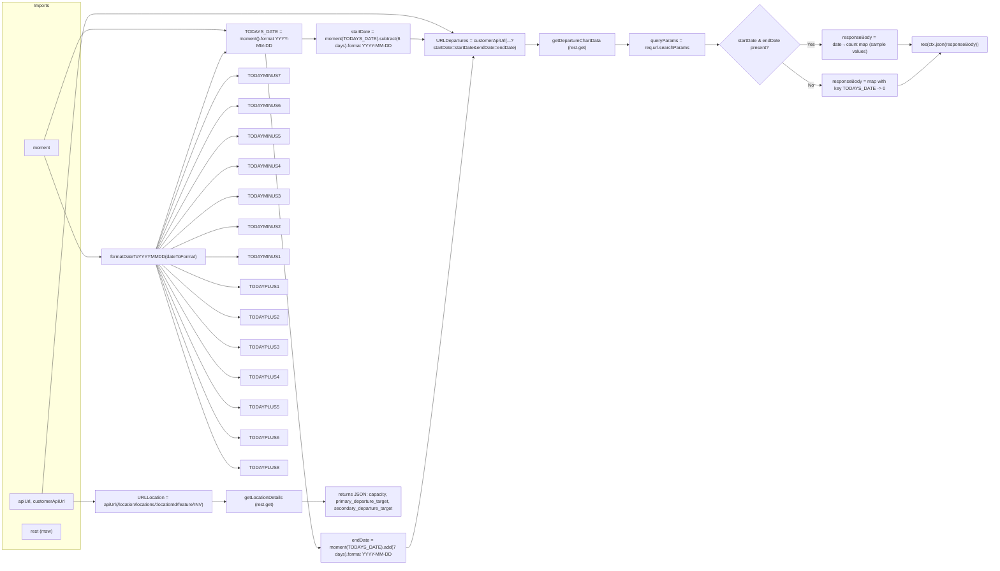
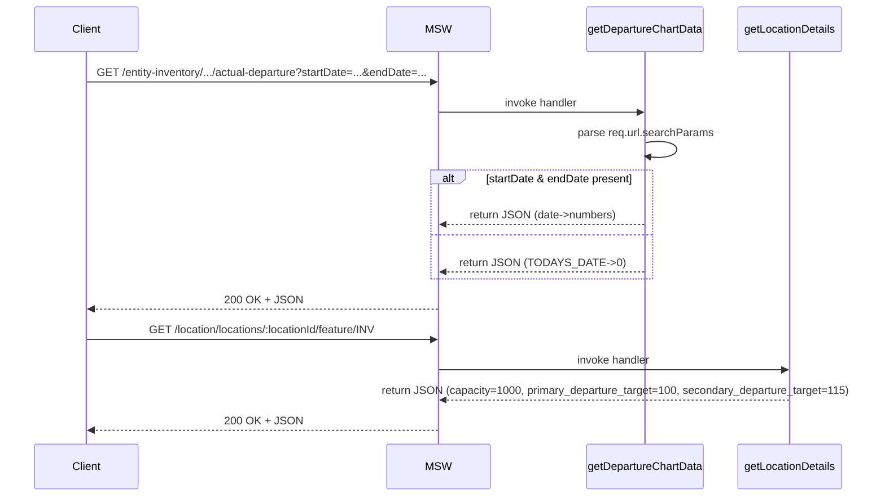

# Diagram: web/portal/src/mocks/handlers/entity-inventory/location/locationId/metrics/actual-departure/data.js

> Auto-generated by Obscura crawlers

## Diagram 1

### SVG

<svg id="container" width="3436.96875" xmlns="http://www.w3.org/2000/svg" class="flowchart" height="1948" viewBox="0 0 3436.96875 1948" role="graphics-document document" aria-roledescription="flowchart-v2"><g><marker id="container_flowchart-v2-pointEnd" class="marker flowchart-v2" viewBox="0 0 10 10" refX="5" refY="5" markerUnits="userSpaceOnUse" markerWidth="8" markerHeight="8" orient="auto"><path d="M 0 0 L 10 5 L 0 10 z" class="arrowMarkerPath" style="stroke-width: 1; stroke-dasharray: 1, 0;"></path></marker><marker id="container_flowchart-v2-pointStart" class="marker flowchart-v2" viewBox="0 0 10 10" refX="4.5" refY="5" markerUnits="userSpaceOnUse" markerWidth="8" markerHeight="8" orient="auto"><path d="M 0 5 L 10 10 L 10 0 z" class="arrowMarkerPath" style="stroke-width: 1; stroke-dasharray: 1, 0;"></path></marker><marker id="container_flowchart-v2-circleEnd" class="marker flowchart-v2" viewBox="0 0 10 10" refX="11" refY="5" markerUnits="userSpaceOnUse" markerWidth="11" markerHeight="11" orient="auto"><circle cx="5" cy="5" r="5" class="arrowMarkerPath" style="stroke-width: 1; stroke-dasharray: 1, 0;"></circle></marker><marker id="container_flowchart-v2-circleStart" class="marker flowchart-v2" viewBox="0 0 10 10" refX="-1" refY="5" markerUnits="userSpaceOnUse" markerWidth="11" markerHeight="11" orient="auto"><circle cx="5" cy="5" r="5" class="arrowMarkerPath" style="stroke-width: 1; stroke-dasharray: 1, 0;"></circle></marker><marker id="container_flowchart-v2-crossEnd" class="marker cross flowchart-v2" viewBox="0 0 11 11" refX="12" refY="5.2" markerUnits="userSpaceOnUse" markerWidth="11" markerHeight="11" orient="auto"><path d="M 1,1 l 9,9 M 10,1 l -9,9" class="arrowMarkerPath" style="stroke-width: 2; stroke-dasharray: 1, 0;"></path></marker><marker id="container_flowchart-v2-crossStart" class="marker cross flowchart-v2" viewBox="0 0 11 11" refX="-1" refY="5.2" markerUnits="userSpaceOnUse" markerWidth="11" markerHeight="11" orient="auto"><path d="M 1,1 l 9,9 M 10,1 l -9,9" class="arrowMarkerPath" style="stroke-width: 2; stroke-dasharray: 1, 0;"></path></marker><g class="root"><g class="clusters"><g class="cluster" id="Imports" data-look="classic"><rect style="" x="8" y="8" width="274.734375" height="1888"></rect><g class="cluster-label" transform="translate(117.0078125, 8)"><foreignObject width="56.71875" height="24">

Imports

</foreignObject></g></g></g><g class="edgePaths"><path d="M154.435,483L175.819,419.333C197.202,355.667,239.968,228.333,265.518,164.667C291.068,101,299.401,101,343.936,101C388.471,101,469.208,101,549.945,101C630.682,101,711.419,101,755.302,101.748C799.185,102.497,806.215,103.993,809.729,104.741L813.244,105.49" id="L_M_TODAYS_DATE_0" class="edge-thickness-normal edge-pattern-solid edge-thickness-normal edge-pattern-solid flowchart-link" style=";" data-edge="true" data-et="edge" data-id="L_M_TODAYS_DATE_0" data-points="W3sieCI6MTU0LjQzNTQzNzA0MTU2NDgsInkiOjQ4M30seyJ4IjoyODIuNzM0Mzc1LCJ5IjoxMDF9LHsieCI6MzA3LjczNDM3NSwieSI6MTAxfSx7IngiOjU0OS45NDUzMTI1LCJ5IjoxMDF9LHsieCI6NzkyLjE1NjI1LCJ5IjoxMDF9LHsieCI6ODE3LjE1NjI1LCJ5IjoxMDYuMzIyNTgwNjQ1MTYxM31d" marker-end="url(#container_flowchart-v2-pointEnd)"></path><path d="M1077.156,134L1081.323,134C1085.49,134,1093.823,134,1101.49,134C1109.156,134,1116.156,134,1119.656,134L1123.156,134" id="L_TODAYS_DATE_StartDate_0" class="edge-thickness-normal edge-pattern-solid edge-thickness-normal edge-pattern-solid flowchart-link" style=";" data-edge="true" data-et="edge" data-id="L_TODAYS_DATE_StartDate_0" data-points="W3sieCI6MTA3Ny4xNTYyNSwieSI6MTM0fSx7IngiOjExMDIuMTU2MjUsInkiOjEzNH0seyJ4IjoxMTI3LjE1NjI1LCJ5IjoxMzR9XQ==" marker-end="url(#container_flowchart-v2-pointEnd)"></path><path d="M951.661,185L976.743,469C1001.826,753,1051.991,1321,1083.36,1605C1114.729,1889,1127.302,1889,1133.589,1889L1139.875,1889" id="L_TODAYS_DATE_EndDate_0" class="edge-thickness-normal edge-pattern-solid edge-thickness-normal edge-pattern-solid flowchart-link" style=";" data-edge="true" data-et="edge" data-id="L_TODAYS_DATE_EndDate_0" data-points="W3sieCI6OTUxLjY2MDUyMzUwNDI3MzYsInkiOjE4NX0seyJ4IjoxMTAyLjE1NjI1LCJ5IjoxODg5fSx7IngiOjExNDMuODc1LCJ5IjoxODg5fV0=" marker-end="url(#container_flowchart-v2-pointEnd)"></path><path d="M147.572,1703L170.099,1427.167C192.626,1151.333,237.68,599.667,264.374,323.833C291.068,48,299.401,48,343.936,48C388.471,48,469.208,48,549.945,48C630.682,48,711.419,48,777.621,48C843.823,48,895.49,48,947.156,48C998.823,48,1050.49,48,1106.353,48C1162.216,48,1222.276,48,1282.336,48C1342.396,48,1402.456,48,1452.871,58.853C1503.286,69.707,1544.057,91.413,1564.442,102.267L1584.827,113.12" id="L_API_URLDepartures_0" class="edge-thickness-normal edge-pattern-solid edge-thickness-normal edge-pattern-solid flowchart-link" style=";" data-edge="true" data-et="edge" data-id="L_API_URLDepartures_0" data-points="W3sieCI6MTQ3LjU3MjI0OTM2ODMxMTUzLCJ5IjoxNzAzfSx7IngiOjI4Mi43MzQzNzUsInkiOjQ4fSx7IngiOjMwNy43MzQzNzUsInkiOjQ4fSx7IngiOjU0OS45NDUzMTI1LCJ5Ijo0OH0seyJ4Ijo3OTIuMTU2MjUsInkiOjQ4fSx7IngiOjk0Ny4xNTYyNSwieSI6NDh9LHsieCI6MTEwMi4xNTYyNSwieSI6NDh9LHsieCI6MTI4Mi4zMzU5Mzc1LCJ5Ijo0OH0seyJ4IjoxNDYyLjUxNTYyNSwieSI6NDh9LHsieCI6MTU4OC4zNTc5MDA5NDMzOTYzLCJ5IjoxMTV9XQ==" marker-end="url(#container_flowchart-v2-pointEnd)"></path><path d="M257.734,1730L261.901,1730C266.068,1730,274.401,1730,282.734,1730C291.068,1730,299.401,1730,307.068,1730C314.734,1730,321.734,1730,325.234,1730L328.734,1730" id="L_API_URLLocation_0" class="edge-thickness-normal edge-pattern-solid edge-thickness-normal edge-pattern-solid flowchart-link" style=";" data-edge="true" data-et="edge" data-id="L_API_URLLocation_0" data-points="W3sieCI6MjU3LjczNDM3NSwieSI6MTczMH0seyJ4IjoyODIuNzM0Mzc1LCJ5IjoxNzMwfSx7IngiOjMwNy43MzQzNzUsInkiOjE3MzB9LHsieCI6MzMyLjczNDM3NSwieSI6MTczMH1d" marker-end="url(#container_flowchart-v2-pointEnd)"></path><path d="M1437.516,134L1441.682,134C1445.849,134,1454.182,134,1461.852,134.352C1469.522,134.704,1476.529,135.408,1480.032,135.76L1483.536,136.112" id="L_StartDate_URLDepartures_0" class="edge-thickness-normal edge-pattern-solid edge-thickness-normal edge-pattern-solid flowchart-link" style=";" data-edge="true" data-et="edge" data-id="L_StartDate_URLDepartures_0" data-points="W3sieCI6MTQzNy41MTU2MjUsInkiOjEzNH0seyJ4IjoxNDYyLjUxNTYyNSwieSI6MTM0fSx7IngiOjE0ODcuNTE1NjI1LCJ5IjoxMzYuNTExMzc5Njg5MjE2Nzd9XQ==" marker-end="url(#container_flowchart-v2-pointEnd)"></path><path d="M1420.797,1889L1427.75,1889C1434.703,1889,1448.609,1889,1487.923,1606.996C1527.236,1324.991,1591.957,760.983,1624.318,478.978L1656.678,196.974" id="L_EndDate_URLDepartures_0" class="edge-thickness-normal edge-pattern-solid edge-thickness-normal edge-pattern-solid flowchart-link" style=";" data-edge="true" data-et="edge" data-id="L_EndDate_URLDepartures_0" data-points="W3sieCI6MTQyMC43OTY4NzUsInkiOjE4ODl9LHsieCI6MTQ2Mi41MTU2MjUsInkiOjE4ODl9LHsieCI6MTY1Ny4xMzQwNjg4MDQwMzQ1LCJ5IjoxOTN9XQ==" marker-end="url(#container_flowchart-v2-pointEnd)"></path><path d="M1835.703,154L1839.87,154C1844.036,154,1852.37,154,1860.036,154C1867.703,154,1874.703,154,1878.203,154L1881.703,154" id="L_URLDepartures_GD_0" class="edge-thickness-normal edge-pattern-solid edge-thickness-normal edge-pattern-solid flowchart-link" style=";" data-edge="true" data-et="edge" data-id="L_URLDepartures_GD_0" data-points="W3sieCI6MTgzNS43MDMxMjUsInkiOjE1NH0seyJ4IjoxODYwLjcwMzEyNSwieSI6MTU0fSx7IngiOjE4ODUuNzAzMTI1LCJ5IjoxNTR9XQ==" marker-end="url(#container_flowchart-v2-pointEnd)"></path><path d="M767.156,1730L771.323,1730C775.49,1730,783.823,1730,791.49,1730C799.156,1730,806.156,1730,809.656,1730L813.156,1730" id="L_URLLocation_GL_0" class="edge-thickness-normal edge-pattern-solid edge-thickness-normal edge-pattern-solid flowchart-link" style=";" data-edge="true" data-et="edge" data-id="L_URLLocation_GL_0" data-points="W3sieCI6NzY3LjE1NjI1LCJ5IjoxNzMwfSx7IngiOjc5Mi4xNTYyNSwieSI6MTczMH0seyJ4Ijo4MTcuMTU2MjUsInkiOjE3MzB9XQ==" marker-end="url(#container_flowchart-v2-pointEnd)"></path><path d="M155.231,537L176.482,595.167C197.732,653.333,240.233,769.667,265.651,827.833C291.068,886,299.401,886,314.116,886C328.831,886,349.927,886,360.475,886L371.023,886" id="L_M_Format_0" class="edge-thickness-normal edge-pattern-solid edge-thickness-normal edge-pattern-solid flowchart-link" style=";" data-edge="true" data-et="edge" data-id="L_M_Format_0" data-points="W3sieCI6MTU1LjIzMTMyMDY0NDk0NjgsInkiOjUzN30seyJ4IjoyODIuNzM0Mzc1LCJ5Ijo4ODZ9LHsieCI6MzA3LjczNDM3NSwieSI6ODg2fSx7IngiOjM3NS4wMjM0Mzc1LCJ5Ijo4ODZ9XQ==" marker-end="url(#container_flowchart-v2-pointEnd)"></path><path d="M560.426,859L599.047,759.5C637.669,660,714.913,461,765.373,361.5C815.833,262,839.51,262,851.349,262L863.188,262" id="L_Format_TODAYMINUS7_0" class="edge-thickness-normal edge-pattern-solid edge-thickness-normal edge-pattern-solid flowchart-link" style=";" data-edge="true" data-et="edge" data-id="L_Format_TODAYMINUS7_0" data-points="W3sieCI6NTYwLjQyNTU5MzQ0OTUxOTMsInkiOjg1OX0seyJ4Ijo3OTIuMTU2MjUsInkiOjI2Mn0seyJ4Ijo4NjcuMTg3NSwieSI6MjYyfV0=" marker-end="url(#container_flowchart-v2-pointEnd)"></path><path d="M562.522,859L600.794,776.833C639.067,694.667,715.611,530.333,765.577,448.167C815.542,366,838.927,366,850.62,366L862.313,366" id="L_Format_TODAYMINUS6_0" class="edge-thickness-normal edge-pattern-solid edge-thickness-normal edge-pattern-solid flowchart-link" style=";" data-edge="true" data-et="edge" data-id="L_Format_TODAYMINUS6_0" data-points="W3sieCI6NTYyLjUyMTY0OTYzOTQyMzEsInkiOjg1OX0seyJ4Ijo3OTIuMTU2MjUsInkiOjM2Nn0seyJ4Ijo4NjYuMzEyNSwieSI6MzY2fV0=" marker-end="url(#container_flowchart-v2-pointEnd)"></path><path d="M565.666,859L603.414,794.167C641.163,729.333,716.659,599.667,766.144,534.833C815.628,470,839.099,470,850.835,470L862.57,470" id="L_Format_TODAYMINUS5_0" class="edge-thickness-normal edge-pattern-solid edge-thickness-normal edge-pattern-solid flowchart-link" style=";" data-edge="true" data-et="edge" data-id="L_Format_TODAYMINUS5_0" data-points="W3sieCI6NTY1LjY2NTczMzkyNDI3ODgsInkiOjg1OX0seyJ4Ijo3OTIuMTU2MjUsInkiOjQ3MH0seyJ4Ijo4NjYuNTcwMzEyNSwieSI6NDcwfV0=" marker-end="url(#container_flowchart-v2-pointEnd)"></path><path d="M570.906,859L607.781,811.5C644.656,764,718.406,669,766.975,621.5C815.544,574,838.932,574,850.626,574L862.32,574" id="L_Format_TODAYMINUS4_0" class="edge-thickness-normal edge-pattern-solid edge-thickness-normal edge-pattern-solid flowchart-link" style=";" data-edge="true" data-et="edge" data-id="L_Format_TODAYMINUS4_0" data-points="W3sieCI6NTcwLjkwNTg3NDM5OTAzODUsInkiOjg1OX0seyJ4Ijo3OTIuMTU2MjUsInkiOjU3NH0seyJ4Ijo4NjYuMzIwMzEyNSwieSI6NTc0fV0=" marker-end="url(#container_flowchart-v2-pointEnd)"></path><path d="M581.386,859L616.515,828.833C651.643,798.667,721.9,738.333,768.766,708.167C815.633,678,839.109,678,850.848,678L862.586,678" id="L_Format_TODAYMINUS3_0" class="edge-thickness-normal edge-pattern-solid edge-thickness-normal edge-pattern-solid flowchart-link" style=";" data-edge="true" data-et="edge" data-id="L_Format_TODAYMINUS3_0" data-points="W3sieCI6NTgxLjM4NjE1NTM0ODU1NzcsInkiOjg1OX0seyJ4Ijo3OTIuMTU2MjUsInkiOjY3OH0seyJ4Ijo4NjYuNTg1OTM3NSwieSI6Njc4fV0=" marker-end="url(#container_flowchart-v2-pointEnd)"></path><path d="M612.827,859L642.715,846.167C672.603,833.333,732.38,807.667,774.025,794.833C815.669,782,839.182,782,850.939,782L862.695,782" id="L_Format_TODAYMINUS2_0" class="edge-thickness-normal edge-pattern-solid edge-thickness-normal edge-pattern-solid flowchart-link" style=";" data-edge="true" data-et="edge" data-id="L_Format_TODAYMINUS2_0" data-points="W3sieCI6NjEyLjgyNjk5ODE5NzExNTQsInkiOjg1OX0seyJ4Ijo3OTIuMTU2MjUsInkiOjc4Mn0seyJ4Ijo4NjYuNjk1MzEyNSwieSI6NzgyfV0=" marker-end="url(#container_flowchart-v2-pointEnd)"></path><path d="M724.867,886L736.082,886C747.297,886,769.727,886,792.806,886C815.885,886,839.615,886,851.479,886L863.344,886" id="L_Format_TODAYMINUS1_0" class="edge-thickness-normal edge-pattern-solid edge-thickness-normal edge-pattern-solid flowchart-link" style=";" data-edge="true" data-et="edge" data-id="L_Format_TODAYMINUS1_0" data-points="W3sieCI6NzI0Ljg2NzE4NzUsInkiOjg4Nn0seyJ4Ijo3OTIuMTU2MjUsInkiOjg4Nn0seyJ4Ijo4NjcuMzQzNzUsInkiOjg4Nn1d" marker-end="url(#container_flowchart-v2-pointEnd)"></path><path d="M559.315,859L598.121,747.167C636.928,635.333,714.542,411.667,756.886,298.601C799.23,185.535,806.305,183.071,809.842,181.839L813.379,180.606" id="L_Format_TODAYS_DATE_0" class="edge-thickness-normal edge-pattern-solid edge-thickness-normal edge-pattern-solid flowchart-link" style=";" data-edge="true" data-et="edge" data-id="L_Format_TODAYS_DATE_0" data-points="W3sieCI6NTU5LjMxNDUwMzQ5MjEyMDQsInkiOjg1OX0seyJ4Ijo3OTIuMTU2MjUsInkiOjE4OH0seyJ4Ijo4MTcuMTU2MjUsInkiOjE3OS4yOTAzMjI1ODA2NDUxNX1d" marker-end="url(#container_flowchart-v2-pointEnd)"></path><path d="M612.827,913L642.715,925.833C672.603,938.667,732.38,964.333,775.048,977.167C817.716,990,843.276,990,856.056,990L868.836,990" id="L_Format_TODAYPLUS1_0" class="edge-thickness-normal edge-pattern-solid edge-thickness-normal edge-pattern-solid flowchart-link" style=";" data-edge="true" data-et="edge" data-id="L_Format_TODAYPLUS1_0" data-points="W3sieCI6NjEyLjgyNjk5ODE5NzExNTQsInkiOjkxM30seyJ4Ijo3OTIuMTU2MjUsInkiOjk5MH0seyJ4Ijo4NzIuODM1OTM3NSwieSI6OTkwfV0=" marker-end="url(#container_flowchart-v2-pointEnd)"></path><path d="M581.386,913L616.515,943.167C651.643,973.333,721.9,1033.667,769.7,1063.833C817.5,1094,842.844,1094,855.516,1094L868.188,1094" id="L_Format_TODAYPLUS2_0" class="edge-thickness-normal edge-pattern-solid edge-thickness-normal edge-pattern-solid flowchart-link" style=";" data-edge="true" data-et="edge" data-id="L_Format_TODAYPLUS2_0" data-points="W3sieCI6NTgxLjM4NjE1NTM0ODU1NzcsInkiOjkxM30seyJ4Ijo3OTIuMTU2MjUsInkiOjEwOTR9LHsieCI6ODcyLjE4NzUsInkiOjEwOTR9XQ==" marker-end="url(#container_flowchart-v2-pointEnd)"></path><path d="M570.906,913L607.781,960.5C644.656,1008,718.406,1103,767.934,1150.5C817.461,1198,842.766,1198,855.418,1198L868.07,1198" id="L_Format_TODAYPLUS3_0" class="edge-thickness-normal edge-pattern-solid edge-thickness-normal edge-pattern-solid flowchart-link" style=";" data-edge="true" data-et="edge" data-id="L_Format_TODAYPLUS3_0" data-points="W3sieCI6NTcwLjkwNTg3NDM5OTAzODUsInkiOjkxM30seyJ4Ijo3OTIuMTU2MjUsInkiOjExOTh9LHsieCI6ODcyLjA3MDMxMjUsInkiOjExOTh9XQ==" marker-end="url(#container_flowchart-v2-pointEnd)"></path><path d="M565.666,913L603.414,977.833C641.163,1042.667,716.659,1172.333,767.016,1237.167C817.372,1302,842.589,1302,855.197,1302L867.805,1302" id="L_Format_TODAYPLUS4_0" class="edge-thickness-normal edge-pattern-solid edge-thickness-normal edge-pattern-solid flowchart-link" style=";" data-edge="true" data-et="edge" data-id="L_Format_TODAYPLUS4_0" data-points="W3sieCI6NTY1LjY2NTczMzkyNDI3ODgsInkiOjkxM30seyJ4Ijo3OTIuMTU2MjUsInkiOjEzMDJ9LHsieCI6ODcxLjgwNDY4NzUsInkiOjEzMDJ9XQ==" marker-end="url(#container_flowchart-v2-pointEnd)"></path><path d="M562.522,913L600.794,995.167C639.067,1077.333,715.611,1241.667,766.534,1323.833C817.456,1406,842.755,1406,855.405,1406L868.055,1406" id="L_Format_TODAYPLUS5_0" class="edge-thickness-normal edge-pattern-solid edge-thickness-normal edge-pattern-solid flowchart-link" style=";" data-edge="true" data-et="edge" data-id="L_Format_TODAYPLUS5_0" data-points="W3sieCI6NTYyLjUyMTY0OTYzOTQyMzEsInkiOjkxM30seyJ4Ijo3OTIuMTU2MjUsInkiOjE0MDZ9LHsieCI6ODcyLjA1NDY4NzUsInkiOjE0MDZ9XQ==" marker-end="url(#container_flowchart-v2-pointEnd)"></path><path d="M560.426,913L599.047,1012.5C637.669,1112,714.913,1311,766.141,1410.5C817.37,1510,842.583,1510,855.19,1510L867.797,1510" id="L_Format_TODAYPLUS6_0" class="edge-thickness-normal edge-pattern-solid edge-thickness-normal edge-pattern-solid flowchart-link" style=";" data-edge="true" data-et="edge" data-id="L_Format_TODAYPLUS6_0" data-points="W3sieCI6NTYwLjQyNTU5MzQ0OTUxOTMsInkiOjkxM30seyJ4Ijo3OTIuMTU2MjUsInkiOjE1MTB9LHsieCI6ODcxLjc5Njg3NSwieSI6MTUxMH1d" marker-end="url(#container_flowchart-v2-pointEnd)"></path><path d="M558.928,913L597.8,1029.833C636.671,1146.667,714.414,1380.333,765.868,1497.167C817.323,1614,842.49,1614,855.073,1614L867.656,1614" id="L_Format_TODAYPLUS8_0" class="edge-thickness-normal edge-pattern-solid edge-thickness-normal edge-pattern-solid flowchart-link" style=";" data-edge="true" data-et="edge" data-id="L_Format_TODAYPLUS8_0" data-points="W3sieCI6NTU4LjkyODQxMDQ1NjczMDcsInkiOjkxM30seyJ4Ijo3OTIuMTU2MjUsInkiOjE2MTR9LHsieCI6ODcxLjY1NjI1LCJ5IjoxNjE0fV0=" marker-end="url(#container_flowchart-v2-pointEnd)"></path><path d="M2145.703,154L2149.87,154C2154.036,154,2162.37,154,2170.036,154C2177.703,154,2184.703,154,2188.203,154L2191.703,154" id="L_GD_QP_0" class="edge-thickness-normal edge-pattern-solid edge-thickness-normal edge-pattern-solid flowchart-link" style=";" data-edge="true" data-et="edge" data-id="L_GD_QP_0" data-points="W3sieCI6MjE0NS43MDMxMjUsInkiOjE1NH0seyJ4IjoyMTcwLjcwMzEyNSwieSI6MTU0fSx7IngiOjIxOTUuNzAzMTI1LCJ5IjoxNTR9XQ==" marker-end="url(#container_flowchart-v2-pointEnd)"></path><path d="M2455.703,154L2459.87,154C2464.036,154,2472.37,154,2480.036,154C2487.703,154,2494.703,154,2498.203,154L2501.703,154" id="L_QP_Cond_0" class="edge-thickness-normal edge-pattern-solid edge-thickness-normal edge-pattern-solid flowchart-link" style=";" data-edge="true" data-et="edge" data-id="L_QP_Cond_0" data-points="W3sieCI6MjQ1NS43MDMxMjUsInkiOjE1NH0seyJ4IjoyNDgwLjcwMzEyNSwieSI6MTU0fSx7IngiOjI1MDUuNzAzMTI1LCJ5IjoxNTR9XQ==" marker-end="url(#container_flowchart-v2-pointEnd)"></path><path d="M2783.703,154L2789.875,154C2796.047,154,2808.391,154,2820.068,154C2831.745,154,2842.755,154,2848.26,154L2853.766,154" id="L_Cond_RB1_0" class="edge-thickness-normal edge-pattern-solid edge-thickness-normal edge-pattern-solid flowchart-link" style=";" data-edge="true" data-et="edge" data-id="L_Cond_RB1_0" data-points="W3sieCI6Mjc4My43MDMxMjUsInkiOjE1NH0seyJ4IjoyODIwLjczNDM3NSwieSI6MTU0fSx7IngiOjI4NTcuNzY1NjI1LCJ5IjoxNTR9XQ==" marker-end="url(#container_flowchart-v2-pointEnd)"></path><path d="M2722.127,215.576L2738.562,228.647C2754.996,241.717,2787.865,267.859,2809.805,280.929C2831.745,294,2842.755,294,2848.26,294L2853.766,294" id="L_Cond_RB2_0" class="edge-thickness-normal edge-pattern-solid edge-thickness-normal edge-pattern-solid flowchart-link" style=";" data-edge="true" data-et="edge" data-id="L_Cond_RB2_0" data-points="W3sieCI6MjcyMi4xMjY5MzU5MzY0MTgyLCJ5IjoyMTUuNTc2MTg5MDYzNTgxNTJ9LHsieCI6MjgyMC43MzQzNzUsInkiOjI5NH0seyJ4IjoyODU3Ljc2NTYyNSwieSI6Mjk0fV0=" marker-end="url(#container_flowchart-v2-pointEnd)"></path><path d="M3117.766,154L3121.932,154C3126.099,154,3134.432,154,3142.099,154C3149.766,154,3156.766,154,3160.266,154L3163.766,154" id="L_RB1_Res_0" class="edge-thickness-normal edge-pattern-solid edge-thickness-normal edge-pattern-solid flowchart-link" style=";" data-edge="true" data-et="edge" data-id="L_RB1_Res_0" data-points="W3sieCI6MzExNy43NjU2MjUsInkiOjE1NH0seyJ4IjozMTQyLjc2NTYyNSwieSI6MTU0fSx7IngiOjMxNjcuNzY1NjI1LCJ5IjoxNTR9XQ==" marker-end="url(#container_flowchart-v2-pointEnd)"></path><path d="M3117.766,294L3121.932,294C3126.099,294,3134.432,294,3159.035,275.613C3183.639,257.225,3224.512,220.45,3244.948,202.063L3265.385,183.675" id="L_RB2_Res_0" class="edge-thickness-normal edge-pattern-solid edge-thickness-normal edge-pattern-solid flowchart-link" style=";" data-edge="true" data-et="edge" data-id="L_RB2_Res_0" data-points="W3sieCI6MzExNy43NjU2MjUsInkiOjI5NH0seyJ4IjozMTQyLjc2NTYyNSwieSI6Mjk0fSx7IngiOjMyNjguMzU4MzE0NzMyMTQzLCJ5IjoxODF9XQ==" marker-end="url(#container_flowchart-v2-pointEnd)"></path><path d="M1077.156,1730L1081.323,1730C1085.49,1730,1093.823,1730,1105.299,1730C1116.776,1730,1131.396,1730,1138.706,1730L1146.016,1730" id="L_GL_GLRes_0" class="edge-thickness-normal edge-pattern-solid edge-thickness-normal edge-pattern-solid flowchart-link" style=";" data-edge="true" data-et="edge" data-id="L_GL_GLRes_0" data-points="W3sieCI6MTA3Ny4xNTYyNSwieSI6MTczMH0seyJ4IjoxMTAyLjE1NjI1LCJ5IjoxNzMwfSx7IngiOjExNTAuMDE1NjI1LCJ5IjoxNzMwfV0=" marker-end="url(#container_flowchart-v2-pointEnd)"></path></g><g class="edgeLabels"><g class="edgeLabel"><g class="label" data-id="L_M_TODAYS_DATE_0" transform="translate(0, 0)"><foreignObject width="0" height="0">

</foreignObject></g></g><g class="edgeLabel"><g class="label" data-id="L_TODAYS_DATE_StartDate_0" transform="translate(0, 0)"><foreignObject width="0" height="0">

</foreignObject></g></g><g class="edgeLabel"><g class="label" data-id="L_TODAYS_DATE_EndDate_0" transform="translate(0, 0)"><foreignObject width="0" height="0">

</foreignObject></g></g><g class="edgeLabel"><g class="label" data-id="L_API_URLDepartures_0" transform="translate(0, 0)"><foreignObject width="0" height="0">

</foreignObject></g></g><g class="edgeLabel"><g class="label" data-id="L_API_URLLocation_0" transform="translate(0, 0)"><foreignObject width="0" height="0">

</foreignObject></g></g><g class="edgeLabel"><g class="label" data-id="L_StartDate_URLDepartures_0" transform="translate(0, 0)"><foreignObject width="0" height="0">

</foreignObject></g></g><g class="edgeLabel"><g class="label" data-id="L_EndDate_URLDepartures_0" transform="translate(0, 0)"><foreignObject width="0" height="0">

</foreignObject></g></g><g class="edgeLabel"><g class="label" data-id="L_URLDepartures_GD_0" transform="translate(0, 0)"><foreignObject width="0" height="0">

</foreignObject></g></g><g class="edgeLabel"><g class="label" data-id="L_URLLocation_GL_0" transform="translate(0, 0)"><foreignObject width="0" height="0">

</foreignObject></g></g><g class="edgeLabel"><g class="label" data-id="L_M_Format_0" transform="translate(0, 0)"><foreignObject width="0" height="0">

</foreignObject></g></g><g class="edgeLabel"><g class="label" data-id="L_Format_TODAYMINUS7_0" transform="translate(0, 0)"><foreignObject width="0" height="0">

</foreignObject></g></g><g class="edgeLabel"><g class="label" data-id="L_Format_TODAYMINUS6_0" transform="translate(0, 0)"><foreignObject width="0" height="0">

</foreignObject></g></g><g class="edgeLabel"><g class="label" data-id="L_Format_TODAYMINUS5_0" transform="translate(0, 0)"><foreignObject width="0" height="0">

</foreignObject></g></g><g class="edgeLabel"><g class="label" data-id="L_Format_TODAYMINUS4_0" transform="translate(0, 0)"><foreignObject width="0" height="0">

</foreignObject></g></g><g class="edgeLabel"><g class="label" data-id="L_Format_TODAYMINUS3_0" transform="translate(0, 0)"><foreignObject width="0" height="0">

</foreignObject></g></g><g class="edgeLabel"><g class="label" data-id="L_Format_TODAYMINUS2_0" transform="translate(0, 0)"><foreignObject width="0" height="0">

</foreignObject></g></g><g class="edgeLabel"><g class="label" data-id="L_Format_TODAYMINUS1_0" transform="translate(0, 0)"><foreignObject width="0" height="0">

</foreignObject></g></g><g class="edgeLabel"><g class="label" data-id="L_Format_TODAYS_DATE_0" transform="translate(0, 0)"><foreignObject width="0" height="0">

</foreignObject></g></g><g class="edgeLabel"><g class="label" data-id="L_Format_TODAYPLUS1_0" transform="translate(0, 0)"><foreignObject width="0" height="0">

</foreignObject></g></g><g class="edgeLabel"><g class="label" data-id="L_Format_TODAYPLUS2_0" transform="translate(0, 0)"><foreignObject width="0" height="0">

</foreignObject></g></g><g class="edgeLabel"><g class="label" data-id="L_Format_TODAYPLUS3_0" transform="translate(0, 0)"><foreignObject width="0" height="0">

</foreignObject></g></g><g class="edgeLabel"><g class="label" data-id="L_Format_TODAYPLUS4_0" transform="translate(0, 0)"><foreignObject width="0" height="0">

</foreignObject></g></g><g class="edgeLabel"><g class="label" data-id="L_Format_TODAYPLUS5_0" transform="translate(0, 0)"><foreignObject width="0" height="0">

</foreignObject></g></g><g class="edgeLabel"><g class="label" data-id="L_Format_TODAYPLUS6_0" transform="translate(0, 0)"><foreignObject width="0" height="0">

</foreignObject></g></g><g class="edgeLabel"><g class="label" data-id="L_Format_TODAYPLUS8_0" transform="translate(0, 0)"><foreignObject width="0" height="0">

</foreignObject></g></g><g class="edgeLabel"><g class="label" data-id="L_GD_QP_0" transform="translate(0, 0)"><foreignObject width="0" height="0">

</foreignObject></g></g><g class="edgeLabel"><g class="label" data-id="L_QP_Cond_0" transform="translate(0, 0)"><foreignObject width="0" height="0">

</foreignObject></g></g><g class="edgeLabel" transform="translate(2820.734375, 154)"><g class="label" data-id="L_Cond_RB1_0" transform="translate(-12.03125, -12)"><foreignObject width="24.0625" height="24">

Yes

</foreignObject></g></g><g class="edgeLabel" transform="translate(2820.734375, 294)"><g class="label" data-id="L_Cond_RB2_0" transform="translate(-10.140625, -12)"><foreignObject width="20.28125" height="24">

No

</foreignObject></g></g><g class="edgeLabel"><g class="label" data-id="L_RB1_Res_0" transform="translate(0, 0)"><foreignObject width="0" height="0">

</foreignObject></g></g><g class="edgeLabel"><g class="label" data-id="L_RB2_Res_0" transform="translate(0, 0)"><foreignObject width="0" height="0">

</foreignObject></g></g><g class="edgeLabel"><g class="label" data-id="L_GL_GLRes_0" transform="translate(0, 0)"><foreignObject width="0" height="0">

</foreignObject></g></g></g><g class="nodes"><g class="node default" id="flowchart-M-0" transform="translate(145.3671875, 510)"><rect class="basic label-container" style="" x="-60.3203125" y="-27" width="120.640625" height="54"></rect><g class="label" style="" transform="translate(-30.3203125, -12)"><rect></rect><foreignObject width="60.640625" height="24">

moment

</foreignObject></g></g><g class="node default" id="flowchart-API-1" transform="translate(145.3671875, 1730)"><rect class="basic label-container" style="" x="-112.3671875" y="-27" width="224.734375" height="54"></rect><g class="label" style="" transform="translate(-82.3671875, -12)"><rect></rect><foreignObject width="164.734375" height="24">

apiUrl, customerApiUrl

</foreignObject></g></g><g class="node default" id="flowchart-MSW-2" transform="translate(145.3671875, 1834)"><rect class="basic label-container" style="" x="-67.4140625" y="-27" width="134.828125" height="54"></rect><g class="label" style="" transform="translate(-37.4140625, -12)"><rect></rect><foreignObject width="74.828125" height="24">

rest (msw)

</foreignObject></g></g><g class="node default" id="flowchart-TODAYS_DATE-4" transform="translate(947.15625, 134)"><rect class="basic label-container" style="" x="-130" y="-51" width="260" height="102"></rect><g class="label" style="" transform="translate(-100, -36)"><rect></rect><foreignObject width="200" height="72">

TODAYS_DATE = moment().format YYYY-MM-DD

</foreignObject></g></g><g class="node default" id="flowchart-StartDate-6" transform="translate(1282.3359375, 134)"><rect class="basic label-container" style="" x="-155.1796875" y="-51" width="310.359375" height="102"></rect><g class="label" style="" transform="translate(-125.1796875, -36)"><rect></rect><foreignObject width="250.359375" height="72">

startDate = moment(TODAYS_DATE).subtract(6 days).format YYYY-MM-DD

</foreignObject></g></g><g class="node default" id="flowchart-EndDate-8" transform="translate(1282.3359375, 1889)"><rect class="basic label-container" style="" x="-138.4609375" y="-51" width="276.921875" height="102"></rect><g class="label" style="" transform="translate(-108.4609375, -36)"><rect></rect><foreignObject width="216.921875" height="72">

endDate = moment(TODAYS_DATE).add(7 days).format YYYY-MM-DD

</foreignObject></g></g><g class="node default" id="flowchart-URLDepartures-10" transform="translate(1661.609375, 154)"><rect class="basic label-container" style="" x="-174.09375" y="-39" width="348.1875" height="78"></rect><g class="label" style="" transform="translate(-144.09375, -24)"><rect></rect><foreignObject width="288.1875" height="48">

URLDepartures = customerApiUrl(...?startDate=startDate&amp;endDate=endDate)

</foreignObject></g></g><g class="node default" id="flowchart-URLLocation-12" transform="translate(549.9453125, 1730)"><rect class="basic label-container" style="" x="-217.2109375" y="-39" width="434.421875" height="78"></rect><g class="label" style="" transform="translate(-187.2109375, -24)"><rect></rect><foreignObject width="374.421875" height="48">

URLLocation = apiUrl(/location/locations/:locationId/feature/INV)

</foreignObject></g></g><g class="node default" id="flowchart-GD-18" transform="translate(2015.703125, 154)"><rect class="basic label-container" style="" x="-130" y="-39" width="260" height="78"></rect><g class="label" style="" transform="translate(-100, -24)"><rect></rect><foreignObject width="200" height="48">

getDepartureChartData (rest.get)

</foreignObject></g></g><g class="node default" id="flowchart-GL-20" transform="translate(947.15625, 1730)"><rect class="basic label-container" style="" x="-130" y="-39" width="260" height="78"></rect><g class="label" style="" transform="translate(-100, -24)"><rect></rect><foreignObject width="200" height="48">

getLocationDetails (rest.get)

</foreignObject></g></g><g class="node default" id="flowchart-Format-22" transform="translate(549.9453125, 886)"><rect class="basic label-container" style="" x="-174.921875" y="-27" width="349.84375" height="54"></rect><g class="label" style="" transform="translate(-144.921875, -12)"><rect></rect><foreignObject width="289.84375" height="24">

formatDateToYYYYMMDD(dateToFormat)

</foreignObject></g></g><g class="node default" id="flowchart-TODAYMINUS7-24" transform="translate(947.15625, 262)"><rect class="basic label-container" style="" x="-79.96875" y="-27" width="159.9375" height="54"></rect><g class="label" style="" transform="translate(-49.96875, -12)"><rect></rect><foreignObject width="99.9375" height="24">

TODAYMINUS7

</foreignObject></g></g><g class="node default" id="flowchart-TODAYMINUS6-26" transform="translate(947.15625, 366)"><rect class="basic label-container" style="" x="-80.84375" y="-27" width="161.6875" height="54"></rect><g class="label" style="" transform="translate(-50.84375, -12)"><rect></rect><foreignObject width="101.6875" height="24">

TODAYMINUS6

</foreignObject></g></g><g class="node default" id="flowchart-TODAYMINUS5-28" transform="translate(947.15625, 470)"><rect class="basic label-container" style="" x="-80.5859375" y="-27" width="161.171875" height="54"></rect><g class="label" style="" transform="translate(-50.5859375, -12)"><rect></rect><foreignObject width="101.171875" height="24">

TODAYMINUS5

</foreignObject></g></g><g class="node default" id="flowchart-TODAYMINUS4-30" transform="translate(947.15625, 574)"><rect class="basic label-container" style="" x="-80.8359375" y="-27" width="161.671875" height="54"></rect><g class="label" style="" transform="translate(-50.8359375, -12)"><rect></rect><foreignObject width="101.671875" height="24">

TODAYMINUS4

</foreignObject></g></g><g class="node default" id="flowchart-TODAYMINUS3-32" transform="translate(947.15625, 678)"><rect class="basic label-container" style="" x="-80.5703125" y="-27" width="161.140625" height="54"></rect><g class="label" style="" transform="translate(-50.5703125, -12)"><rect></rect><foreignObject width="101.140625" height="24">

TODAYMINUS3

</foreignObject></g></g><g class="node default" id="flowchart-TODAYMINUS2-34" transform="translate(947.15625, 782)"><rect class="basic label-container" style="" x="-80.4609375" y="-27" width="160.921875" height="54"></rect><g class="label" style="" transform="translate(-50.4609375, -12)"><rect></rect><foreignObject width="100.921875" height="24">

TODAYMINUS2

</foreignObject></g></g><g class="node default" id="flowchart-TODAYMINUS1-36" transform="translate(947.15625, 886)"><rect class="basic label-container" style="" x="-79.8125" y="-27" width="159.625" height="54"></rect><g class="label" style="" transform="translate(-49.8125, -12)"><rect></rect><foreignObject width="99.625" height="24">

TODAYMINUS1

</foreignObject></g></g><g class="node default" id="flowchart-TODAYPLUS1-40" transform="translate(947.15625, 990)"><rect class="basic label-container" style="" x="-74.3203125" y="-27" width="148.640625" height="54"></rect><g class="label" style="" transform="translate(-44.3203125, -12)"><rect></rect><foreignObject width="88.640625" height="24">

TODAYPLUS1

</foreignObject></g></g><g class="node default" id="flowchart-TODAYPLUS2-42" transform="translate(947.15625, 1094)"><rect class="basic label-container" style="" x="-74.96875" y="-27" width="149.9375" height="54"></rect><g class="label" style="" transform="translate(-44.96875, -12)"><rect></rect><foreignObject width="89.9375" height="24">

TODAYPLUS2

</foreignObject></g></g><g class="node default" id="flowchart-TODAYPLUS3-44" transform="translate(947.15625, 1198)"><rect class="basic label-container" style="" x="-75.0859375" y="-27" width="150.171875" height="54"></rect><g class="label" style="" transform="translate(-45.0859375, -12)"><rect></rect><foreignObject width="90.171875" height="24">

TODAYPLUS3

</foreignObject></g></g><g class="node default" id="flowchart-TODAYPLUS4-46" transform="translate(947.15625, 1302)"><rect class="basic label-container" style="" x="-75.3515625" y="-27" width="150.703125" height="54"></rect><g class="label" style="" transform="translate(-45.3515625, -12)"><rect></rect><foreignObject width="90.703125" height="24">

TODAYPLUS4

</foreignObject></g></g><g class="node default" id="flowchart-TODAYPLUS5-48" transform="translate(947.15625, 1406)"><rect class="basic label-container" style="" x="-75.1015625" y="-27" width="150.203125" height="54"></rect><g class="label" style="" transform="translate(-45.1015625, -12)"><rect></rect><foreignObject width="90.203125" height="24">

TODAYPLUS5

</foreignObject></g></g><g class="node default" id="flowchart-TODAYPLUS6-50" transform="translate(947.15625, 1510)"><rect class="basic label-container" style="" x="-75.359375" y="-27" width="150.71875" height="54"></rect><g class="label" style="" transform="translate(-45.359375, -12)"><rect></rect><foreignObject width="90.71875" height="24">

TODAYPLUS6

</foreignObject></g></g><g class="node default" id="flowchart-TODAYPLUS8-52" transform="translate(947.15625, 1614)"><rect class="basic label-container" style="" x="-75.5" y="-27" width="151" height="54"></rect><g class="label" style="" transform="translate(-45.5, -12)"><rect></rect><foreignObject width="91" height="24">

TODAYPLUS8

</foreignObject></g></g><g class="node default" id="flowchart-QP-54" transform="translate(2325.703125, 154)"><rect class="basic label-container" style="" x="-130" y="-39" width="260" height="78"></rect><g class="label" style="" transform="translate(-100, -24)"><rect></rect><foreignObject width="200" height="48">

queryParams = req.url.searchParams

</foreignObject></g></g><g class="node default" id="flowchart-Cond-56" transform="translate(2644.703125, 154)"><polygon points="139,0 278,-139 139,-278 0,-139" class="label-container" transform="translate(-138.5, 139)"></polygon><g class="label" style="" transform="translate(-100, -24)"><rect></rect><foreignObject width="200" height="48">

startDate &amp; endDate present?

</foreignObject></g></g><g class="node default" id="flowchart-RB1-58" transform="translate(2987.765625, 154)"><rect class="basic label-container" style="" x="-130" y="-51" width="260" height="102"></rect><g class="label" style="" transform="translate(-100, -36)"><rect></rect><foreignObject width="200" height="72">

responseBody = date→count map (sample values)

</foreignObject></g></g><g class="node default" id="flowchart-RB2-60" transform="translate(2987.765625, 294)"><rect class="basic label-container" style="" x="-130" y="-39" width="260" height="78"></rect><g class="label" style="" transform="translate(-100, -24)"><rect></rect><foreignObject width="200" height="48">

responseBody = map with key TODAYS_DATE -&gt; 0

</foreignObject></g></g><g class="node default" id="flowchart-Res-62" transform="translate(3298.3671875, 154)"><rect class="basic label-container" style="" x="-130.6015625" y="-27" width="261.203125" height="54"></rect><g class="label" style="" transform="translate(-100.6015625, -12)"><rect></rect><foreignObject width="201.203125" height="24">

res(ctx.json(responseBody))

</foreignObject></g></g><g class="node default" id="flowchart-GLRes-66" transform="translate(1282.3359375, 1730)"><rect class="basic label-container" style="" x="-132.3203125" y="-51" width="264.640625" height="102"></rect><g class="label" style="" transform="translate(-102.3203125, -36)"><rect></rect><foreignObject width="204.640625" height="72">

returns JSON: capacity, primary_departure_target, secondary_departure_target

</foreignObject></g></g></g></g></g></svg>

## Diagram 2

### SVG

<svg id="container" width="1322.5" xmlns="http://www.w3.org/2000/svg" height="761" viewBox="-50 -10 1322.5 761" role="graphics-document document" aria-roledescription="sequence"><g><rect x="1067.5" y="675" fill="#eaeaea" stroke="#666" width="155" height="65" name="GL" rx="3" ry="3" class="actor actor-bottom"></rect><text x="1145" y="707.5" dominant-baseline="central" alignment-baseline="central" class="actor actor-box" style="text-anchor: middle; font-size: 16px; font-weight: 400;"><tspan x="1145" dy="0">getLocationDetails</tspan></text></g><g><rect x="830.5" y="675" fill="#eaeaea" stroke="#666" width="187" height="65" name="GD" rx="3" ry="3" class="actor actor-bottom"></rect><text x="924" y="707.5" dominant-baseline="central" alignment-baseline="central" class="actor actor-box" style="text-anchor: middle; font-size: 16px; font-weight: 400;"><tspan x="924" dy="0">getDepartureChartData</tspan></text></g><g><rect x="559" y="675" fill="#eaeaea" stroke="#666" width="150" height="65" name="MSW" rx="3" ry="3" class="actor actor-bottom"></rect><text x="634" y="707.5" dominant-baseline="central" alignment-baseline="central" class="actor actor-box" style="text-anchor: middle; font-size: 16px; font-weight: 400;"><tspan x="634" dy="0">MSW</tspan></text></g><g><rect x="0" y="675" fill="#eaeaea" stroke="#666" width="150" height="65" name="Client" rx="3" ry="3" class="actor actor-bottom"></rect><text x="75" y="707.5" dominant-baseline="central" alignment-baseline="central" class="actor actor-box" style="text-anchor: middle; font-size: 16px; font-weight: 400;"><tspan x="75" dy="0">Client</tspan></text></g><g><line id="actor3" x1="1145" y1="65" x2="1145" y2="675" class="actor-line 200" stroke-width="0.5px" stroke="#999" name="GL"></line><g id="root-3"><rect x="1067.5" y="0" fill="#eaeaea" stroke="#666" width="155" height="65" name="GL" rx="3" ry="3" class="actor actor-top"></rect><text x="1145" y="32.5" dominant-baseline="central" alignment-baseline="central" class="actor actor-box" style="text-anchor: middle; font-size: 16px; font-weight: 400;"><tspan x="1145" dy="0">getLocationDetails</tspan></text></g></g><g><line id="actor2" x1="924" y1="65" x2="924" y2="675" class="actor-line 200" stroke-width="0.5px" stroke="#999" name="GD"></line><g id="root-2"><rect x="830.5" y="0" fill="#eaeaea" stroke="#666" width="187" height="65" name="GD" rx="3" ry="3" class="actor actor-top"></rect><text x="924" y="32.5" dominant-baseline="central" alignment-baseline="central" class="actor actor-box" style="text-anchor: middle; font-size: 16px; font-weight: 400;"><tspan x="924" dy="0">getDepartureChartData</tspan></text></g></g><g><line id="actor1" x1="634" y1="65" x2="634" y2="675" class="actor-line 200" stroke-width="0.5px" stroke="#999" name="MSW"></line><g id="root-1"><rect x="559" y="0" fill="#eaeaea" stroke="#666" width="150" height="65" name="MSW" rx="3" ry="3" class="actor actor-top"></rect><text x="634" y="32.5" dominant-baseline="central" alignment-baseline="central" class="actor actor-box" style="text-anchor: middle; font-size: 16px; font-weight: 400;"><tspan x="634" dy="0">MSW</tspan></text></g></g><g><line id="actor0" x1="75" y1="65" x2="75" y2="675" class="actor-line 200" stroke-width="0.5px" stroke="#999" name="Client"></line><g id="root-0"><rect x="0" y="0" fill="#eaeaea" stroke="#666" width="150" height="65" name="Client" rx="3" ry="3" class="actor actor-top"></rect><text x="75" y="32.5" dominant-baseline="central" alignment-baseline="central" class="actor actor-box" style="text-anchor: middle; font-size: 16px; font-weight: 400;"><tspan x="75" dy="0">Client</tspan></text></g></g><g></g><defs><symbol id="computer" width="24" height="24"><path transform="scale(.5)" d="M2 2v13h20v-13h-20zm18 11h-16v-9h16v9zm-10.228 6l.466-1h3.524l.467 1h-4.457zm14.228 3h-24l2-6h2.104l-1.33 4h18.45l-1.297-4h2.073l2 6zm-5-10h-14v-7h14v7z"></path></symbol></defs><defs><symbol id="database" fill-rule="evenodd" clip-rule="evenodd"><path transform="scale(.5)" d="M12.258.001l.256.004.255.005.253.008.251.01.249.012.247.015.246.016.242.019.241.02.239.023.236.024.233.027.231.028.229.031.225.032.223.034.22.036.217.038.214.04.211.041.208.043.205.045.201.046.198.048.194.05.191.051.187.053.183.054.18.056.175.057.172.059.168.06.163.061.16.063.155.064.15.066.074.033.073.033.071.034.07.034.069.035.068.035.067.035.066.035.064.036.064.036.062.036.06.036.06.037.058.037.058.037.055.038.055.038.053.038.052.038.051.039.05.039.048.039.047.039.045.04.044.04.043.04.041.04.04.041.039.041.037.041.036.041.034.041.033.042.032.042.03.042.029.042.027.042.026.043.024.043.023.043.021.043.02.043.018.044.017.043.015.044.013.044.012.044.011.045.009.044.007.045.006.045.004.045.002.045.001.045v17l-.001.045-.002.045-.004.045-.006.045-.007.045-.009.044-.011.045-.012.044-.013.044-.015.044-.017.043-.018.044-.02.043-.021.043-.023.043-.024.043-.026.043-.027.042-.029.042-.03.042-.032.042-.033.042-.034.041-.036.041-.037.041-.039.041-.04.041-.041.04-.043.04-.044.04-.045.04-.047.039-.048.039-.05.039-.051.039-.052.038-.053.038-.055.038-.055.038-.058.037-.058.037-.06.037-.06.036-.062.036-.064.036-.064.036-.066.035-.067.035-.068.035-.069.035-.07.034-.071.034-.073.033-.074.033-.15.066-.155.064-.16.063-.163.061-.168.06-.172.059-.175.057-.18.056-.183.054-.187.053-.191.051-.194.05-.198.048-.201.046-.205.045-.208.043-.211.041-.214.04-.217.038-.22.036-.223.034-.225.032-.229.031-.231.028-.233.027-.236.024-.239.023-.241.02-.242.019-.246.016-.247.015-.249.012-.251.01-.253.008-.255.005-.256.004-.258.001-.258-.001-.256-.004-.255-.005-.253-.008-.251-.01-.249-.012-.247-.015-.245-.016-.243-.019-.241-.02-.238-.023-.236-.024-.234-.027-.231-.028-.228-.031-.226-.032-.223-.034-.22-.036-.217-.038-.214-.04-.211-.041-.208-.043-.204-.045-.201-.046-.198-.048-.195-.05-.19-.051-.187-.053-.184-.054-.179-.056-.176-.057-.172-.059-.167-.06-.164-.061-.159-.063-.155-.064-.151-.066-.074-.033-.072-.033-.072-.034-.07-.034-.069-.035-.068-.035-.067-.035-.066-.035-.064-.036-.063-.036-.062-.036-.061-.036-.06-.037-.058-.037-.057-.037-.056-.038-.055-.038-.053-.038-.052-.038-.051-.039-.049-.039-.049-.039-.046-.039-.046-.04-.044-.04-.043-.04-.041-.04-.04-.041-.039-.041-.037-.041-.036-.041-.034-.041-.033-.042-.032-.042-.03-.042-.029-.042-.027-.042-.026-.043-.024-.043-.023-.043-.021-.043-.02-.043-.018-.044-.017-.043-.015-.044-.013-.044-.012-.044-.011-.045-.009-.044-.007-.045-.006-.045-.004-.045-.002-.045-.001-.045v-17l.001-.045.002-.045.004-.045.006-.045.007-.045.009-.044.011-.045.012-.044.013-.044.015-.044.017-.043.018-.044.02-.043.021-.043.023-.043.024-.043.026-.043.027-.042.029-.042.03-.042.032-.042.033-.042.034-.041.036-.041.037-.041.039-.041.04-.041.041-.04.043-.04.044-.04.046-.04.046-.039.049-.039.049-.039.051-.039.052-.038.053-.038.055-.038.056-.038.057-.037.058-.037.06-.037.061-.036.062-.036.063-.036.064-.036.066-.035.067-.035.068-.035.069-.035.07-.034.072-.034.072-.033.074-.033.151-.066.155-.064.159-.063.164-.061.167-.06.172-.059.176-.057.179-.056.184-.054.187-.053.19-.051.195-.05.198-.048.201-.046.204-.045.208-.043.211-.041.214-.04.217-.038.22-.036.223-.034.226-.032.228-.031.231-.028.234-.027.236-.024.238-.023.241-.02.243-.019.245-.016.247-.015.249-.012.251-.01.253-.008.255-.005.256-.004.258-.001.258.001zm-9.258 20.499v.01l.001.021.003.021.004.022.005.021.006.022.007.022.009.023.01.022.011.023.012.023.013.023.015.023.016.024.017.023.018.024.019.024.021.024.022.025.023.024.024.025.052.049.056.05.061.051.066.051.07.051.075.051.079.052.084.052.088.052.092.052.097.052.102.051.105.052.11.052.114.051.119.051.123.051.127.05.131.05.135.05.139.048.144.049.147.047.152.047.155.047.16.045.163.045.167.043.171.043.176.041.178.041.183.039.187.039.19.037.194.035.197.035.202.033.204.031.209.03.212.029.216.027.219.025.222.024.226.021.23.02.233.018.236.016.24.015.243.012.246.01.249.008.253.005.256.004.259.001.26-.001.257-.004.254-.005.25-.008.247-.011.244-.012.241-.014.237-.016.233-.018.231-.021.226-.021.224-.024.22-.026.216-.027.212-.028.21-.031.205-.031.202-.034.198-.034.194-.036.191-.037.187-.039.183-.04.179-.04.175-.042.172-.043.168-.044.163-.045.16-.046.155-.046.152-.047.148-.048.143-.049.139-.049.136-.05.131-.05.126-.05.123-.051.118-.052.114-.051.11-.052.106-.052.101-.052.096-.052.092-.052.088-.053.083-.051.079-.052.074-.052.07-.051.065-.051.06-.051.056-.05.051-.05.023-.024.023-.025.021-.024.02-.024.019-.024.018-.024.017-.024.015-.023.014-.024.013-.023.012-.023.01-.023.01-.022.008-.022.006-.022.006-.022.004-.022.004-.021.001-.021.001-.021v-4.127l-.077.055-.08.053-.083.054-.085.053-.087.052-.09.052-.093.051-.095.05-.097.05-.1.049-.102.049-.105.048-.106.047-.109.047-.111.046-.114.045-.115.045-.118.044-.12.043-.122.042-.124.042-.126.041-.128.04-.13.04-.132.038-.134.038-.135.037-.138.037-.139.035-.142.035-.143.034-.144.033-.147.032-.148.031-.15.03-.151.03-.153.029-.154.027-.156.027-.158.026-.159.025-.161.024-.162.023-.163.022-.165.021-.166.02-.167.019-.169.018-.169.017-.171.016-.173.015-.173.014-.175.013-.175.012-.177.011-.178.01-.179.008-.179.008-.181.006-.182.005-.182.004-.184.003-.184.002h-.37l-.184-.002-.184-.003-.182-.004-.182-.005-.181-.006-.179-.008-.179-.008-.178-.01-.176-.011-.176-.012-.175-.013-.173-.014-.172-.015-.171-.016-.17-.017-.169-.018-.167-.019-.166-.02-.165-.021-.163-.022-.162-.023-.161-.024-.159-.025-.157-.026-.156-.027-.155-.027-.153-.029-.151-.03-.15-.03-.148-.031-.146-.032-.145-.033-.143-.034-.141-.035-.14-.035-.137-.037-.136-.037-.134-.038-.132-.038-.13-.04-.128-.04-.126-.041-.124-.042-.122-.042-.12-.044-.117-.043-.116-.045-.113-.045-.112-.046-.109-.047-.106-.047-.105-.048-.102-.049-.1-.049-.097-.05-.095-.05-.093-.052-.09-.051-.087-.052-.085-.053-.083-.054-.08-.054-.077-.054v4.127zm0-5.654v.011l.001.021.003.021.004.021.005.022.006.022.007.022.009.022.01.022.011.023.012.023.013.023.015.024.016.023.017.024.018.024.019.024.021.024.022.024.023.025.024.024.052.05.056.05.061.05.066.051.07.051.075.052.079.051.084.052.088.052.092.052.097.052.102.052.105.052.11.051.114.051.119.052.123.05.127.051.131.05.135.049.139.049.144.048.147.048.152.047.155.046.16.045.163.045.167.044.171.042.176.042.178.04.183.04.187.038.19.037.194.036.197.034.202.033.204.032.209.03.212.028.216.027.219.025.222.024.226.022.23.02.233.018.236.016.24.014.243.012.246.01.249.008.253.006.256.003.259.001.26-.001.257-.003.254-.006.25-.008.247-.01.244-.012.241-.015.237-.016.233-.018.231-.02.226-.022.224-.024.22-.025.216-.027.212-.029.21-.03.205-.032.202-.033.198-.035.194-.036.191-.037.187-.039.183-.039.179-.041.175-.042.172-.043.168-.044.163-.045.16-.045.155-.047.152-.047.148-.048.143-.048.139-.05.136-.049.131-.05.126-.051.123-.051.118-.051.114-.052.11-.052.106-.052.101-.052.096-.052.092-.052.088-.052.083-.052.079-.052.074-.051.07-.052.065-.051.06-.05.056-.051.051-.049.023-.025.023-.024.021-.025.02-.024.019-.024.018-.024.017-.024.015-.023.014-.023.013-.024.012-.022.01-.023.01-.023.008-.022.006-.022.006-.022.004-.021.004-.022.001-.021.001-.021v-4.139l-.077.054-.08.054-.083.054-.085.052-.087.053-.09.051-.093.051-.095.051-.097.05-.1.049-.102.049-.105.048-.106.047-.109.047-.111.046-.114.045-.115.044-.118.044-.12.044-.122.042-.124.042-.126.041-.128.04-.13.039-.132.039-.134.038-.135.037-.138.036-.139.036-.142.035-.143.033-.144.033-.147.033-.148.031-.15.03-.151.03-.153.028-.154.028-.156.027-.158.026-.159.025-.161.024-.162.023-.163.022-.165.021-.166.02-.167.019-.169.018-.169.017-.171.016-.173.015-.173.014-.175.013-.175.012-.177.011-.178.009-.179.009-.179.007-.181.007-.182.005-.182.004-.184.003-.184.002h-.37l-.184-.002-.184-.003-.182-.004-.182-.005-.181-.007-.179-.007-.179-.009-.178-.009-.176-.011-.176-.012-.175-.013-.173-.014-.172-.015-.171-.016-.17-.017-.169-.018-.167-.019-.166-.02-.165-.021-.163-.022-.162-.023-.161-.024-.159-.025-.157-.026-.156-.027-.155-.028-.153-.028-.151-.03-.15-.03-.148-.031-.146-.033-.145-.033-.143-.033-.141-.035-.14-.036-.137-.036-.136-.037-.134-.038-.132-.039-.13-.039-.128-.04-.126-.041-.124-.042-.122-.043-.12-.043-.117-.044-.116-.044-.113-.046-.112-.046-.109-.046-.106-.047-.105-.048-.102-.049-.1-.049-.097-.05-.095-.051-.093-.051-.09-.051-.087-.053-.085-.052-.083-.054-.08-.054-.077-.054v4.139zm0-5.666v.011l.001.02.003.022.004.021.005.022.006.021.007.022.009.023.01.022.011.023.012.023.013.023.015.023.016.024.017.024.018.023.019.024.021.025.022.024.023.024.024.025.052.05.056.05.061.05.066.051.07.051.075.052.079.051.084.052.088.052.092.052.097.052.102.052.105.051.11.052.114.051.119.051.123.051.127.05.131.05.135.05.139.049.144.048.147.048.152.047.155.046.16.045.163.045.167.043.171.043.176.042.178.04.183.04.187.038.19.037.194.036.197.034.202.033.204.032.209.03.212.028.216.027.219.025.222.024.226.021.23.02.233.018.236.017.24.014.243.012.246.01.249.008.253.006.256.003.259.001.26-.001.257-.003.254-.006.25-.008.247-.01.244-.013.241-.014.237-.016.233-.018.231-.02.226-.022.224-.024.22-.025.216-.027.212-.029.21-.03.205-.032.202-.033.198-.035.194-.036.191-.037.187-.039.183-.039.179-.041.175-.042.172-.043.168-.044.163-.045.16-.045.155-.047.152-.047.148-.048.143-.049.139-.049.136-.049.131-.051.126-.05.123-.051.118-.052.114-.051.11-.052.106-.052.101-.052.096-.052.092-.052.088-.052.083-.052.079-.052.074-.052.07-.051.065-.051.06-.051.056-.05.051-.049.023-.025.023-.025.021-.024.02-.024.019-.024.018-.024.017-.024.015-.023.014-.024.013-.023.012-.023.01-.022.01-.023.008-.022.006-.022.006-.022.004-.022.004-.021.001-.021.001-.021v-4.153l-.077.054-.08.054-.083.053-.085.053-.087.053-.09.051-.093.051-.095.051-.097.05-.1.049-.102.048-.105.048-.106.048-.109.046-.111.046-.114.046-.115.044-.118.044-.12.043-.122.043-.124.042-.126.041-.128.04-.13.039-.132.039-.134.038-.135.037-.138.036-.139.036-.142.034-.143.034-.144.033-.147.032-.148.032-.15.03-.151.03-.153.028-.154.028-.156.027-.158.026-.159.024-.161.024-.162.023-.163.023-.165.021-.166.02-.167.019-.169.018-.169.017-.171.016-.173.015-.173.014-.175.013-.175.012-.177.01-.178.01-.179.009-.179.007-.181.006-.182.006-.182.004-.184.003-.184.001-.185.001-.185-.001-.184-.001-.184-.003-.182-.004-.182-.006-.181-.006-.179-.007-.179-.009-.178-.01-.176-.01-.176-.012-.175-.013-.173-.014-.172-.015-.171-.016-.17-.017-.169-.018-.167-.019-.166-.02-.165-.021-.163-.023-.162-.023-.161-.024-.159-.024-.157-.026-.156-.027-.155-.028-.153-.028-.151-.03-.15-.03-.148-.032-.146-.032-.145-.033-.143-.034-.141-.034-.14-.036-.137-.036-.136-.037-.134-.038-.132-.039-.13-.039-.128-.041-.126-.041-.124-.041-.122-.043-.12-.043-.117-.044-.116-.044-.113-.046-.112-.046-.109-.046-.106-.048-.105-.048-.102-.048-.1-.05-.097-.049-.095-.051-.093-.051-.09-.052-.087-.052-.085-.053-.083-.053-.08-.054-.077-.054v4.153zm8.74-8.179l-.257.004-.254.005-.25.008-.247.011-.244.012-.241.014-.237.016-.233.018-.231.021-.226.022-.224.023-.22.026-.216.027-.212.028-.21.031-.205.032-.202.033-.198.034-.194.036-.191.038-.187.038-.183.04-.179.041-.175.042-.172.043-.168.043-.163.045-.16.046-.155.046-.152.048-.148.048-.143.048-.139.049-.136.05-.131.05-.126.051-.123.051-.118.051-.114.052-.11.052-.106.052-.101.052-.096.052-.092.052-.088.052-.083.052-.079.052-.074.051-.07.052-.065.051-.06.05-.056.05-.051.05-.023.025-.023.024-.021.024-.02.025-.019.024-.018.024-.017.023-.015.024-.014.023-.013.023-.012.023-.01.023-.01.022-.008.022-.006.023-.006.021-.004.022-.004.021-.001.021-.001.021.001.021.001.021.004.021.004.022.006.021.006.023.008.022.01.022.01.023.012.023.013.023.014.023.015.024.017.023.018.024.019.024.02.025.021.024.023.024.023.025.051.05.056.05.06.05.065.051.07.052.074.051.079.052.083.052.088.052.092.052.096.052.101.052.106.052.11.052.114.052.118.051.123.051.126.051.131.05.136.05.139.049.143.048.148.048.152.048.155.046.16.046.163.045.168.043.172.043.175.042.179.041.183.04.187.038.191.038.194.036.198.034.202.033.205.032.21.031.212.028.216.027.22.026.224.023.226.022.231.021.233.018.237.016.241.014.244.012.247.011.25.008.254.005.257.004.26.001.26-.001.257-.004.254-.005.25-.008.247-.011.244-.012.241-.014.237-.016.233-.018.231-.021.226-.022.224-.023.22-.026.216-.027.212-.028.21-.031.205-.032.202-.033.198-.034.194-.036.191-.038.187-.038.183-.04.179-.041.175-.042.172-.043.168-.043.163-.045.16-.046.155-.046.152-.048.148-.048.143-.048.139-.049.136-.05.131-.05.126-.051.123-.051.118-.051.114-.052.11-.052.106-.052.101-.052.096-.052.092-.052.088-.052.083-.052.079-.052.074-.051.07-.052.065-.051.06-.05.056-.05.051-.05.023-.025.023-.024.021-.024.02-.025.019-.024.018-.024.017-.023.015-.024.014-.023.013-.023.012-.023.01-.023.01-.022.008-.022.006-.023.006-.021.004-.022.004-.021.001-.021.001-.021-.001-.021-.001-.021-.004-.021-.004-.022-.006-.021-.006-.023-.008-.022-.01-.022-.01-.023-.012-.023-.013-.023-.014-.023-.015-.024-.017-.023-.018-.024-.019-.024-.02-.025-.021-.024-.023-.024-.023-.025-.051-.05-.056-.05-.06-.05-.065-.051-.07-.052-.074-.051-.079-.052-.083-.052-.088-.052-.092-.052-.096-.052-.101-.052-.106-.052-.11-.052-.114-.052-.118-.051-.123-.051-.126-.051-.131-.05-.136-.05-.139-.049-.143-.048-.148-.048-.152-.048-.155-.046-.16-.046-.163-.045-.168-.043-.172-.043-.175-.042-.179-.041-.183-.04-.187-.038-.191-.038-.194-.036-.198-.034-.202-.033-.205-.032-.21-.031-.212-.028-.216-.027-.22-.026-.224-.023-.226-.022-.231-.021-.233-.018-.237-.016-.241-.014-.244-.012-.247-.011-.25-.008-.254-.005-.257-.004-.26-.001-.26.001z"></path></symbol></defs><defs><symbol id="clock" width="24" height="24"><path transform="scale(.5)" d="M12 2c5.514 0 10 4.486 10 10s-4.486 10-10 10-10-4.486-10-10 4.486-10 10-10zm0-2c-6.627 0-12 5.373-12 12s5.373 12 12 12 12-5.373 12-12-5.373-12-12-12zm5.848 12.459c.202.038.202.333.001.372-1.907.361-6.045 1.111-6.547 1.111-.719 0-1.301-.582-1.301-1.301 0-.512.77-5.447 1.125-7.445.034-.192.312-.181.343.014l.985 6.238 5.394 1.011z"></path></symbol></defs><defs><marker id="arrowhead" refX="7.9" refY="5" markerUnits="userSpaceOnUse" markerWidth="12" markerHeight="12" orient="auto-start-reverse"><path d="M -1 0 L 10 5 L 0 10 z"></path></marker></defs><defs><marker id="crosshead" markerWidth="15" markerHeight="8" orient="auto" refX="4" refY="4.5"><path fill="none" stroke="#000000" stroke-width="1pt" d="M 1,2 L 6,7 M 6,2 L 1,7" style="stroke-dasharray: 0, 0;"></path></marker></defs><defs><marker id="filled-head" refX="15.5" refY="7" markerWidth="20" markerHeight="28" orient="auto"><path d="M 18,7 L9,13 L14,7 L9,1 Z"></path></marker></defs><defs><marker id="sequencenumber" refX="15" refY="15" markerWidth="60" markerHeight="40" orient="auto"><circle cx="15" cy="15" r="6"></circle></marker></defs><g><line x1="623" y1="249" x2="935" y2="249" class="loopLine"></line><line x1="935" y1="249" x2="935" y2="415" class="loopLine"></line><line x1="623" y1="415" x2="935" y2="415" class="loopLine"></line><line x1="623" y1="249" x2="623" y2="415" class="loopLine"></line><line x1="623" y1="347" x2="935" y2="347" class="loopLine" style="stroke-dasharray: 3, 3;"></line><polygon points="623,249 673,249 673,262 664.6,269 623,269" class="labelBox"></polygon><text x="648" y="262" text-anchor="middle" dominant-baseline="middle" alignment-baseline="middle" class="labelText" style="font-size: 16px; font-weight: 400;">alt</text><text x="804" y="267" text-anchor="middle" class="loopText" style="font-size: 16px; font-weight: 400;"><tspan x="804">[startDate &amp; endDate present]</tspan></text></g><text x="353" y="80" text-anchor="middle" dominant-baseline="middle" alignment-baseline="middle" class="messageText" dy="1em" style="font-size: 16px; font-weight: 400;">GET /entity-inventory/.../actual-departure?startDate=...&amp;endDate=...</text><line x1="76" y1="113" x2="630" y2="113" class="messageLine0" stroke-width="2" stroke="none" marker-end="url(#arrowhead)" style="fill: none;"></line><text x="778" y="128" text-anchor="middle" dominant-baseline="middle" alignment-baseline="middle" class="messageText" dy="1em" style="font-size: 16px; font-weight: 400;">invoke handler</text><line x1="635" y1="161" x2="920" y2="161" class="messageLine0" stroke-width="2" stroke="none" marker-end="url(#arrowhead)" style="fill: none;"></line><text x="925" y="176" text-anchor="middle" dominant-baseline="middle" alignment-baseline="middle" class="messageText" dy="1em" style="font-size: 16px; font-weight: 400;">parse req.url.searchParams</text><path d="M 925,209 C 985,199 985,239 925,229" class="messageLine0" stroke-width="2" stroke="none" marker-end="url(#arrowhead)" style="fill: none;"></path><text x="781" y="299" text-anchor="middle" dominant-baseline="middle" alignment-baseline="middle" class="messageText" dy="1em" style="font-size: 16px; font-weight: 400;">return JSON (date-&gt;numbers)</text><line x1="923" y1="332" x2="638" y2="332" class="messageLine1" stroke-width="2" stroke="none" marker-end="url(#arrowhead)" style="stroke-dasharray: 3, 3; fill: none;"></line><text x="781" y="372" text-anchor="middle" dominant-baseline="middle" alignment-baseline="middle" class="messageText" dy="1em" style="font-size: 16px; font-weight: 400;">return JSON (TODAYS_DATE-&gt;0)</text><line x1="923" y1="405" x2="638" y2="405" class="messageLine1" stroke-width="2" stroke="none" marker-end="url(#arrowhead)" style="stroke-dasharray: 3, 3; fill: none;"></line><text x="356" y="430" text-anchor="middle" dominant-baseline="middle" alignment-baseline="middle" class="messageText" dy="1em" style="font-size: 16px; font-weight: 400;">200 OK + JSON</text><line x1="633" y1="463" x2="79" y2="463" class="messageLine1" stroke-width="2" stroke="none" marker-end="url(#arrowhead)" style="stroke-dasharray: 3, 3; fill: none;"></line><text x="353" y="478" text-anchor="middle" dominant-baseline="middle" alignment-baseline="middle" class="messageText" dy="1em" style="font-size: 16px; font-weight: 400;">GET /location/locations/:locationId/feature/INV</text><line x1="76" y1="511" x2="630" y2="511" class="messageLine0" stroke-width="2" stroke="none" marker-end="url(#arrowhead)" style="fill: none;"></line><text x="888" y="526" text-anchor="middle" dominant-baseline="middle" alignment-baseline="middle" class="messageText" dy="1em" style="font-size: 16px; font-weight: 400;">invoke handler</text><line x1="635" y1="559" x2="1141" y2="559" class="messageLine0" stroke-width="2" stroke="none" marker-end="url(#arrowhead)" style="fill: none;"></line><text x="891" y="574" text-anchor="middle" dominant-baseline="middle" alignment-baseline="middle" class="messageText" dy="1em" style="font-size: 16px; font-weight: 400;">return JSON (capacity=1000, primary_departure_target=100, secondary_departure_target=115)</text><line x1="1144" y1="607" x2="638" y2="607" class="messageLine1" stroke-width="2" stroke="none" marker-end="url(#arrowhead)" style="stroke-dasharray: 3, 3; fill: none;"></line><text x="356" y="622" text-anchor="middle" dominant-baseline="middle" alignment-baseline="middle" class="messageText" dy="1em" style="font-size: 16px; font-weight: 400;">200 OK + JSON</text><line x1="633" y1="655" x2="79" y2="655" class="messageLine1" stroke-width="2" stroke="none" marker-end="url(#arrowhead)" style="stroke-dasharray: 3, 3; fill: none;"></line></svg>
