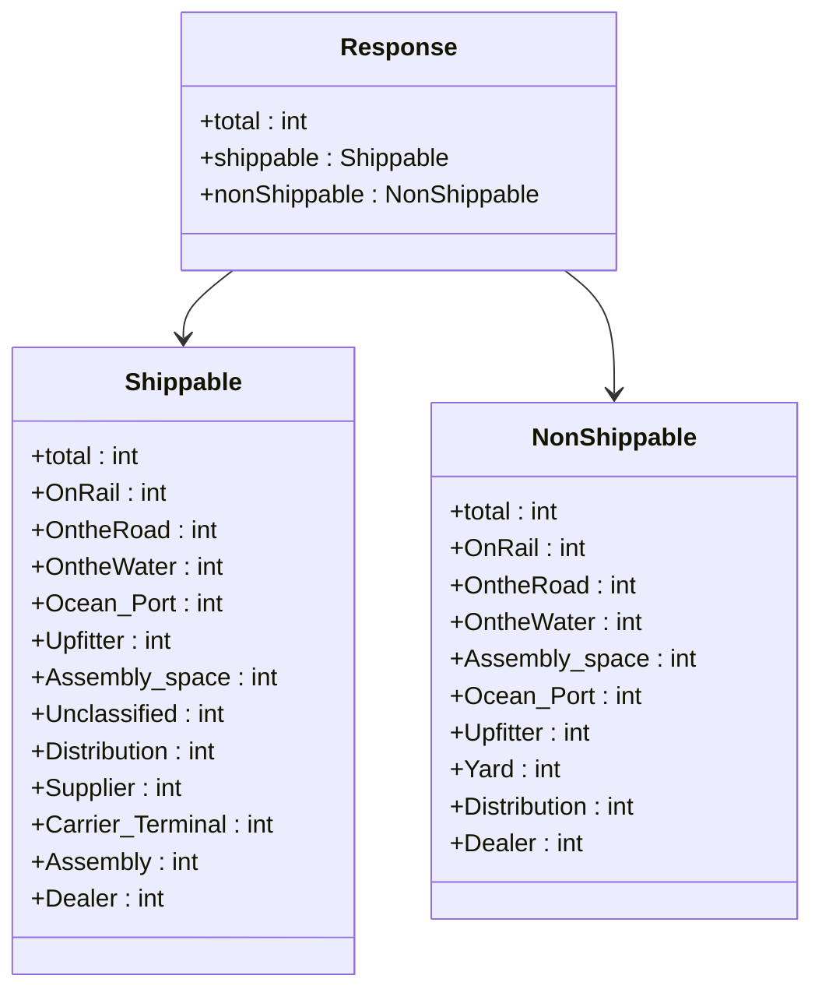
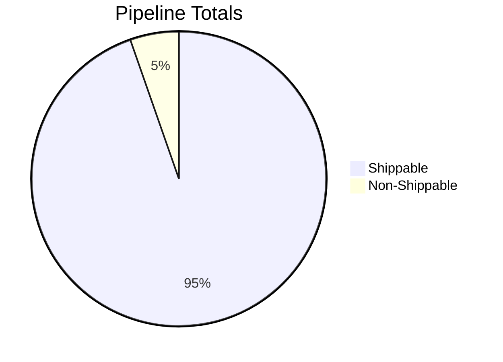
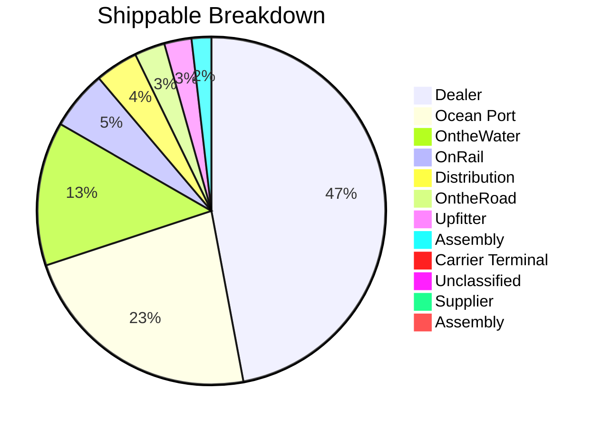
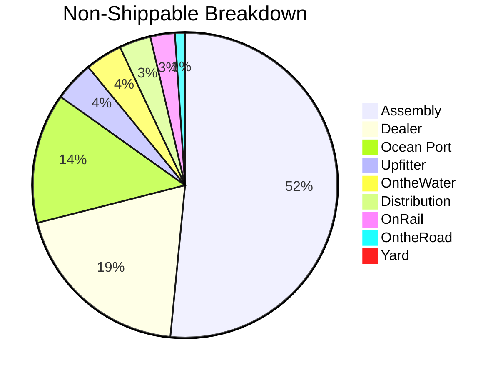

# Diagram: web/portal/src/mocks/handlers/entity-inventory/location/locationId/metrics/pipeline/data.js


> Auto-generated by Obscura crawlers

## Diagram 1

```mermaid
flowchart LR
  Client[Client] -->|GET /entity-inventory/location/:locationId/metrics/pipeline| URL[/entity-inventory/location/:locationId/metrics/pipeline]
  URL --> Handler[getPipelineChartData (rest.get)]
  Handler --> Response[responseBody JSON]
  Response --> Total[total: 29563]
  Response --> Shippable[shippable.total: 27981]
  Response --> NonShippable[nonShippable.total: 1582]
  Shippable --> S_Dealer["Dealer: 13069"]
  Shippable --> S_OceanPort["Ocean Port: 6353"]
  Shippable --> S_OnTheWater["OntheWater: 3723"]
  Shippable --> S_OnRail["OnRail: 1526"]
  Shippable --> S_Distribution["Distribution: 1107"]
  Shippable --> S_OntheRoad["OntheRoad: 787"]
  Shippable --> S_Upfitter["Upfitter: 702"]
  Shippable --> S_AssemblySpace["Assembly : 509"]
  Shippable --> S_Carrier["Carrier Terminal: 182"]
  Shippable --> S_Unclassified["Unclassified: 19"]
  Shippable --> S_Supplier["Supplier: 3"]
  Shippable --> S_Assembly["Assembly: 1"]
  NonShippable --> NS_AssemblySpace["Assembly : 815"]
  NonShippable --> NS_Dealer["Dealer: 308"]
  NonShippable --> NS_OceanPort["Ocean Port: 218"]
  NonShippable --> NS_Upfitter["Upfitter: 67"]
  NonShippable --> NS_OnTheWater["OntheWater: 62"]
  NonShippable --> NS_Distribution["Distribution: 53"]
  NonShippable --> NS_OnRail["OnRail: 41"]
  NonShippable --> NS_OntheRoad["OntheRoad: 17"]
  NonShippable --> NS_Yard["Yard: 1"]
```

> SVG rendering failed for this diagram.

## Diagram 2



### SVG

<svg id="container" width="518.375" xmlns="http://www.w3.org/2000/svg" class="classDiagram" height="642" viewBox="0 0 518.375 642" role="graphics-document document" aria-roledescription="class"><style>#container{font-family:"trebuchet ms",verdana,arial,sans-serif;font-size:16px;fill:#333;}@keyframes edge-animation-frame{from{stroke-dashoffset:0;}}@keyframes dash{to{stroke-dashoffset:0;}}#container .edge-animation-slow{stroke-dasharray:9,5!important;stroke-dashoffset:900;animation:dash 50s linear infinite;stroke-linecap:round;}#container .edge-animation-fast{stroke-dasharray:9,5!important;stroke-dashoffset:900;animation:dash 20s linear infinite;stroke-linecap:round;}#container .error-icon{fill:#552222;}#container .error-text{fill:#552222;stroke:#552222;}#container .edge-thickness-normal{stroke-width:1px;}#container .edge-thickness-thick{stroke-width:3.5px;}#container .edge-pattern-solid{stroke-dasharray:0;}#container .edge-thickness-invisible{stroke-width:0;fill:none;}#container .edge-pattern-dashed{stroke-dasharray:3;}#container .edge-pattern-dotted{stroke-dasharray:2;}#container .marker{fill:#333333;stroke:#333333;}#container .marker.cross{stroke:#333333;}#container svg{font-family:"trebuchet ms",verdana,arial,sans-serif;font-size:16px;}#container p{margin:0;}#container g.classGroup text{fill:#9370DB;stroke:none;font-family:"trebuchet ms",verdana,arial,sans-serif;font-size:10px;}#container g.classGroup text .title{font-weight:bolder;}#container .nodeLabel,#container .edgeLabel{color:#131300;}#container .edgeLabel .label rect{fill:#ECECFF;}#container .label text{fill:#131300;}#container .labelBkg{background:#ECECFF;}#container .edgeLabel .label span{background:#ECECFF;}#container .classTitle{font-weight:bolder;}#container .node rect,#container .node circle,#container .node ellipse,#container .node polygon,#container .node path{fill:#ECECFF;stroke:#9370DB;stroke-width:1px;}#container .divider{stroke:#9370DB;stroke-width:1;}#container g.clickable{cursor:pointer;}#container g.classGroup rect{fill:#ECECFF;stroke:#9370DB;}#container g.classGroup line{stroke:#9370DB;stroke-width:1;}#container .classLabel .box{stroke:none;stroke-width:0;fill:#ECECFF;opacity:0.5;}#container .classLabel .label{fill:#9370DB;font-size:10px;}#container .relation{stroke:#333333;stroke-width:1;fill:none;}#container .dashed-line{stroke-dasharray:3;}#container .dotted-line{stroke-dasharray:1 2;}#container #compositionStart,#container .composition{fill:#333333!important;stroke:#333333!important;stroke-width:1;}#container #compositionEnd,#container .composition{fill:#333333!important;stroke:#333333!important;stroke-width:1;}#container #dependencyStart,#container .dependency{fill:#333333!important;stroke:#333333!important;stroke-width:1;}#container #dependencyStart,#container .dependency{fill:#333333!important;stroke:#333333!important;stroke-width:1;}#container #extensionStart,#container .extension{fill:transparent!important;stroke:#333333!important;stroke-width:1;}#container #extensionEnd,#container .extension{fill:transparent!important;stroke:#333333!important;stroke-width:1;}#container #aggregationStart,#container .aggregation{fill:transparent!important;stroke:#333333!important;stroke-width:1;}#container #aggregationEnd,#container .aggregation{fill:transparent!important;stroke:#333333!important;stroke-width:1;}#container #lollipopStart,#container .lollipop{fill:#ECECFF!important;stroke:#333333!important;stroke-width:1;}#container #lollipopEnd,#container .lollipop{fill:#ECECFF!important;stroke:#333333!important;stroke-width:1;}#container .edgeTerminals{font-size:11px;line-height:initial;}#container .classTitleText{text-anchor:middle;font-size:18px;fill:#333;}#container .label-icon{display:inline-block;height:1em;overflow:visible;vertical-align:-0.125em;}#container .node .label-icon path{fill:currentColor;stroke:revert;stroke-width:revert;}#container :root{--mermaid-font-family:"trebuchet ms",verdana,arial,sans-serif;}</style><g><defs><marker id="container_class-aggregationStart" class="marker aggregation class" refX="18" refY="7" markerWidth="190" markerHeight="240" orient="auto"><path d="M 18,7 L9,13 L1,7 L9,1 Z"></path></marker></defs><defs><marker id="container_class-aggregationEnd" class="marker aggregation class" refX="1" refY="7" markerWidth="20" markerHeight="28" orient="auto"><path d="M 18,7 L9,13 L1,7 L9,1 Z"></path></marker></defs><defs><marker id="container_class-extensionStart" class="marker extension class" refX="18" refY="7" markerWidth="190" markerHeight="240" orient="auto"><path d="M 1,7 L18,13 V 1 Z"></path></marker></defs><defs><marker id="container_class-extensionEnd" class="marker extension class" refX="1" refY="7" markerWidth="20" markerHeight="28" orient="auto"><path d="M 1,1 V 13 L18,7 Z"></path></marker></defs><defs><marker id="container_class-compositionStart" class="marker composition class" refX="18" refY="7" markerWidth="190" markerHeight="240" orient="auto"><path d="M 18,7 L9,13 L1,7 L9,1 Z"></path></marker></defs><defs><marker id="container_class-compositionEnd" class="marker composition class" refX="1" refY="7" markerWidth="20" markerHeight="28" orient="auto"><path d="M 18,7 L9,13 L1,7 L9,1 Z"></path></marker></defs><defs><marker id="container_class-dependencyStart" class="marker dependency class" refX="6" refY="7" markerWidth="190" markerHeight="240" orient="auto"><path d="M 5,7 L9,13 L1,7 L9,1 Z"></path></marker></defs><defs><marker id="container_class-dependencyEnd" class="marker dependency class" refX="13" refY="7" markerWidth="20" markerHeight="28" orient="auto"><path d="M 18,7 L9,13 L14,7 L9,1 Z"></path></marker></defs><defs><marker id="container_class-lollipopStart" class="marker lollipop class" refX="13" refY="7" markerWidth="190" markerHeight="240" orient="auto"><circle stroke="black" fill="transparent" cx="7" cy="7" r="6"></circle></marker></defs><defs><marker id="container_class-lollipopEnd" class="marker lollipop class" refX="1" refY="7" markerWidth="190" markerHeight="240" orient="auto"><circle stroke="black" fill="transparent" cx="7" cy="7" r="6"></circle></marker></defs><g class="root"><g class="clusters"></g><g class="edgePaths"><path d="M149.388,176L144.109,180.167C138.83,184.333,128.272,192.667,122.994,200C117.715,207.333,117.715,213.667,117.715,216.833L117.715,220" id="id_Response_Shippable_1" class="edge-thickness-normal edge-pattern-solid relation" style=";;;" data-edge="true" data-et="edge" data-id="id_Response_Shippable_1" data-points="W3sieCI6MTQ5LjM4NzcyMjE5MDM2Njk2LCJ5IjoxNzZ9LHsieCI6MTE3LjcxNDg0Mzc1LCJ5IjoyMDF9LHsieCI6MTE3LjcxNDg0Mzc1LCJ5IjoyMjZ9XQ==" marker-end="url(#container_class-dependencyEnd)"></path><path d="M362.229,176L367.508,180.167C372.787,184.333,383.345,192.667,388.624,206C393.902,219.333,393.902,237.667,393.902,246.833L393.902,256" id="id_Response_NonShippable_2" class="edge-thickness-normal edge-pattern-solid relation" style=";;;" data-edge="true" data-et="edge" data-id="id_Response_NonShippable_2" data-points="W3sieCI6MzYyLjIyOTQ2NTMwOTYzMzA0LCJ5IjoxNzZ9LHsieCI6MzkzLjkwMjM0Mzc1LCJ5IjoyMDF9LHsieCI6MzkzLjkwMjM0Mzc1LCJ5IjoyNjJ9XQ==" marker-end="url(#container_class-dependencyEnd)"></path></g><g class="edgeLabels"><g class="edgeLabel"><g class="label" data-id="id_Response_Shippable_1" transform="translate(0, 0)"><foreignObject width="0" height="0"><div xmlns="http://www.w3.org/1999/xhtml" class="labelBkg" style="display: table-cell; white-space: nowrap; line-height: 1.5; max-width: 200px; text-align: center;"><span class="edgeLabel"></span></div></foreignObject></g></g><g class="edgeLabel"><g class="label" data-id="id_Response_NonShippable_2" transform="translate(0, 0)"><foreignObject width="0" height="0"><div xmlns="http://www.w3.org/1999/xhtml" class="labelBkg" style="display: table-cell; white-space: nowrap; line-height: 1.5; max-width: 200px; text-align: center;"><span class="edgeLabel"></span></div></foreignObject></g></g></g><g class="nodes"><g class="node default" id="classId-Response-0" transform="translate(255.80859375, 92)"><g class="basic label-container"><path d="M-141.74609375 -84 L141.74609375 -84 L141.74609375 84 L-141.74609375 84" stroke="none" stroke-width="0" fill="#ECECFF" style=""></path><path d="M-141.74609375 -84 C-51.08221258360422 -84, 39.581668582791565 -84, 141.74609375 -84 M-141.74609375 -84 C-48.19176995657496 -84, 45.36255383685008 -84, 141.74609375 -84 M141.74609375 -84 C141.74609375 -29.526214827018578, 141.74609375 24.947570345962845, 141.74609375 84 M141.74609375 -84 C141.74609375 -42.805951352329586, 141.74609375 -1.6119027046591725, 141.74609375 84 M141.74609375 84 C64.58151074689142 84, -12.58307225621715 84, -141.74609375 84 M141.74609375 84 C61.49757169101849 84, -18.750950367963014 84, -141.74609375 84 M-141.74609375 84 C-141.74609375 27.911372321372575, -141.74609375 -28.17725535725485, -141.74609375 -84 M-141.74609375 84 C-141.74609375 49.08920815112895, -141.74609375 14.1784163022579, -141.74609375 -84" stroke="#9370DB" stroke-width="1.3" fill="none" stroke-dasharray="0 0" style=""></path></g><g class="annotation-group text" transform="translate(0, -60)"></g><g class="label-group text" transform="translate(-35.4453125, -60)"><g class="label" style="font-weight: bolder" transform="translate(0,-12)"><foreignObject width="70.890625" height="24"><div xmlns="http://www.w3.org/1999/xhtml" style="display: table-cell; white-space: nowrap; line-height: 1.5; max-width: 120px; text-align: center;"><span class="nodeLabel markdown-node-label" style=""><p>Response</p></span></div></foreignObject></g></g><g class="members-group text" transform="translate(-129.74609375, -12)"><g class="label" style="" transform="translate(0,-12)"><foreignObject width="73.671875" height="24"><div xmlns="http://www.w3.org/1999/xhtml" style="display: table-cell; white-space: nowrap; line-height: 1.5; max-width: 131px; text-align: center;"><span class="nodeLabel markdown-node-label" style=""><p>+total : int</p></span></div></foreignObject></g><g class="label" style="" transform="translate(0,12)"><foreignObject width="165.046875" height="24"><div xmlns="http://www.w3.org/1999/xhtml" style="display: table-cell; white-space: nowrap; line-height: 1.5; max-width: 222px; text-align: center;"><span class="nodeLabel markdown-node-label" style=""><p>+shippable : Shippable</p></span></div></foreignObject></g><g class="label" style="" transform="translate(0,36)"><foreignObject width="224.046875" height="24"><div xmlns="http://www.w3.org/1999/xhtml" style="display: table-cell; white-space: nowrap; line-height: 1.5; max-width: 281px; text-align: center;"><span class="nodeLabel markdown-node-label" style=""><p>+nonShippable : NonShippable</p></span></div></foreignObject></g></g><g class="methods-group text" transform="translate(-129.74609375, 84)"></g><g class="divider" style=""><path d="M-141.74609375 -36 C-31.526884092222062 -36, 78.69232556555588 -36, 141.74609375 -36 M-141.74609375 -36 C-43.1917305784352 -36, 55.362632593129604 -36, 141.74609375 -36" stroke="#9370DB" stroke-width="1.3" fill="none" stroke-dasharray="0 0" style=""></path></g><g class="divider" style=""><path d="M-141.74609375 60 C-82.3011032052834 60, -22.856112660566808 60, 141.74609375 60 M-141.74609375 60 C-76.02136156459197 60, -10.29662937918394 60, 141.74609375 60" stroke="#9370DB" stroke-width="1.3" fill="none" stroke-dasharray="0 0" style=""></path></g></g><g class="node default" id="classId-Shippable-1" transform="translate(117.71484375, 430)"><g class="basic label-container"><path d="M-109.71484375 -204 L109.71484375 -204 L109.71484375 204 L-109.71484375 204" stroke="none" stroke-width="0" fill="#ECECFF" style=""></path><path d="M-109.71484375 -204 C-39.37339790845037 -204, 30.968047933099257 -204, 109.71484375 -204 M-109.71484375 -204 C-53.11213996562357 -204, 3.490563818752861 -204, 109.71484375 -204 M109.71484375 -204 C109.71484375 -78.17470783599829, 109.71484375 47.65058432800342, 109.71484375 204 M109.71484375 -204 C109.71484375 -78.57721261041581, 109.71484375 46.84557477916837, 109.71484375 204 M109.71484375 204 C46.31989633227804 204, -17.075051085443917 204, -109.71484375 204 M109.71484375 204 C37.51180115303697 204, -34.69124144392606 204, -109.71484375 204 M-109.71484375 204 C-109.71484375 87.81060527525662, -109.71484375 -28.37878944948676, -109.71484375 -204 M-109.71484375 204 C-109.71484375 97.1803011514999, -109.71484375 -9.639397697000192, -109.71484375 -204" stroke="#9370DB" stroke-width="1.3" fill="none" stroke-dasharray="0 0" style=""></path></g><g class="annotation-group text" transform="translate(0, -180)"></g><g class="label-group text" transform="translate(-36.8359375, -180)"><g class="label" style="font-weight: bolder" transform="translate(0,-12)"><foreignObject width="73.671875" height="24"><div xmlns="http://www.w3.org/1999/xhtml" style="display: table-cell; white-space: nowrap; line-height: 1.5; max-width: 123px; text-align: center;"><span class="nodeLabel markdown-node-label" style=""><p>Shippable</p></span></div></foreignObject></g></g><g class="members-group text" transform="translate(-97.71484375, -132)"><g class="label" style="" transform="translate(0,-12)"><foreignObject width="73.671875" height="24"><div xmlns="http://www.w3.org/1999/xhtml" style="display: table-cell; white-space: nowrap; line-height: 1.5; max-width: 131px; text-align: center;"><span class="nodeLabel markdown-node-label" style=""><p>+total : int</p></span></div></foreignObject></g><g class="label" style="" transform="translate(0,12)"><foreignObject width="87.84375" height="24"><div xmlns="http://www.w3.org/1999/xhtml" style="display: table-cell; white-space: nowrap; line-height: 1.5; max-width: 145px; text-align: center;"><span class="nodeLabel markdown-node-label" style=""><p>+OnRail : int</p></span></div></foreignObject></g><g class="label" style="" transform="translate(0,36)"><foreignObject width="121.1875" height="24"><div xmlns="http://www.w3.org/1999/xhtml" style="display: table-cell; white-space: nowrap; line-height: 1.5; max-width: 179px; text-align: center;"><span class="nodeLabel markdown-node-label" style=""><p>+OntheRoad : int</p></span></div></foreignObject></g><g class="label" style="" transform="translate(0,60)"><foreignObject width="126.171875" height="24"><div xmlns="http://www.w3.org/1999/xhtml" style="display: table-cell; white-space: nowrap; line-height: 1.5; max-width: 184px; text-align: center;"><span class="nodeLabel markdown-node-label" style=""><p>+OntheWater : int</p></span></div></foreignObject></g><g class="label" style="" transform="translate(0,84)"><foreignObject width="123.453125" height="24"><div xmlns="http://www.w3.org/1999/xhtml" style="display: table-cell; white-space: nowrap; line-height: 1.5; max-width: 181px; text-align: center;"><span class="nodeLabel markdown-node-label" style=""><p>+Ocean_Port : int</p></span></div></foreignObject></g><g class="label" style="" transform="translate(0,108)"><foreignObject width="95.484375" height="24"><div xmlns="http://www.w3.org/1999/xhtml" style="display: table-cell; white-space: nowrap; line-height: 1.5; max-width: 153px; text-align: center;"><span class="nodeLabel markdown-node-label" style=""><p>+Upfitter : int</p></span></div></foreignObject></g><g class="label" style="" transform="translate(0,132)"><foreignObject width="157.515625" height="24"><div xmlns="http://www.w3.org/1999/xhtml" style="display: table-cell; white-space: nowrap; line-height: 1.5; max-width: 215px; text-align: center;"><span class="nodeLabel markdown-node-label" style=""><p>+Assembly_space : int</p></span></div></foreignObject></g><g class="label" style="" transform="translate(0,156)"><foreignObject width="127.53125" height="24"><div xmlns="http://www.w3.org/1999/xhtml" style="display: table-cell; white-space: nowrap; line-height: 1.5; max-width: 185px; text-align: center;"><span class="nodeLabel markdown-node-label" style=""><p>+Unclassified : int</p></span></div></foreignObject></g><g class="label" style="" transform="translate(0,180)"><foreignObject width="126.546875" height="24"><div xmlns="http://www.w3.org/1999/xhtml" style="display: table-cell; white-space: nowrap; line-height: 1.5; max-width: 184px; text-align: center;"><span class="nodeLabel markdown-node-label" style=""><p>+Distribution : int</p></span></div></foreignObject></g><g class="label" style="" transform="translate(0,204)"><foreignObject width="100.46875" height="24"><div xmlns="http://www.w3.org/1999/xhtml" style="display: table-cell; white-space: nowrap; line-height: 1.5; max-width: 158px; text-align: center;"><span class="nodeLabel markdown-node-label" style=""><p>+Supplier : int</p></span></div></foreignObject></g><g class="label" style="" transform="translate(0,228)"><foreignObject width="158.59375" height="24"><div xmlns="http://www.w3.org/1999/xhtml" style="display: table-cell; white-space: nowrap; line-height: 1.5; max-width: 216px; text-align: center;"><span class="nodeLabel markdown-node-label" style=""><p>+Carrier_Terminal : int</p></span></div></foreignObject></g><g class="label" style="" transform="translate(0,252)"><foreignObject width="108.109375" height="24"><div xmlns="http://www.w3.org/1999/xhtml" style="display: table-cell; white-space: nowrap; line-height: 1.5; max-width: 166px; text-align: center;"><span class="nodeLabel markdown-node-label" style=""><p>+Assembly : int</p></span></div></foreignObject></g><g class="label" style="" transform="translate(0,276)"><foreignObject width="86.890625" height="24"><div xmlns="http://www.w3.org/1999/xhtml" style="display: table-cell; white-space: nowrap; line-height: 1.5; max-width: 144px; text-align: center;"><span class="nodeLabel markdown-node-label" style=""><p>+Dealer : int</p></span></div></foreignObject></g></g><g class="methods-group text" transform="translate(-97.71484375, 204)"></g><g class="divider" style=""><path d="M-109.71484375 -156 C-60.567557499095635 -156, -11.42027124819127 -156, 109.71484375 -156 M-109.71484375 -156 C-62.51019079792099 -156, -15.305537845841982 -156, 109.71484375 -156" stroke="#9370DB" stroke-width="1.3" fill="none" stroke-dasharray="0 0" style=""></path></g><g class="divider" style=""><path d="M-109.71484375 180 C-31.835495377250965 180, 46.04385299549807 180, 109.71484375 180 M-109.71484375 180 C-37.55819542018908 180, 34.59845290962184 180, 109.71484375 180" stroke="#9370DB" stroke-width="1.3" fill="none" stroke-dasharray="0 0" style=""></path></g></g><g class="node default" id="classId-NonShippable-2" transform="translate(393.90234375, 430)"><g class="basic label-container"><path d="M-116.47265625 -168 L116.47265625 -168 L116.47265625 168 L-116.47265625 168" stroke="none" stroke-width="0" fill="#ECECFF" style=""></path><path d="M-116.47265625 -168 C-35.23947905126519 -168, 45.993698147469615 -168, 116.47265625 -168 M-116.47265625 -168 C-38.101387681562414 -168, 40.26988088687517 -168, 116.47265625 -168 M116.47265625 -168 C116.47265625 -47.12648737760111, 116.47265625 73.74702524479778, 116.47265625 168 M116.47265625 -168 C116.47265625 -61.415040475242705, 116.47265625 45.16991904951459, 116.47265625 168 M116.47265625 168 C26.953229286258903 168, -62.566197677482194 168, -116.47265625 168 M116.47265625 168 C34.30484466223476 168, -47.862966925530486 168, -116.47265625 168 M-116.47265625 168 C-116.47265625 55.746291087531475, -116.47265625 -56.50741782493705, -116.47265625 -168 M-116.47265625 168 C-116.47265625 57.583665111149884, -116.47265625 -52.83266977770023, -116.47265625 -168" stroke="#9370DB" stroke-width="1.3" fill="none" stroke-dasharray="0 0" style=""></path></g><g class="annotation-group text" transform="translate(0, -144)"></g><g class="label-group text" transform="translate(-51.4296875, -144)"><g class="label" style="font-weight: bolder" transform="translate(0,-12)"><foreignObject width="102.859375" height="24"><div xmlns="http://www.w3.org/1999/xhtml" style="display: table-cell; white-space: nowrap; line-height: 1.5; max-width: 153px; text-align: center;"><span class="nodeLabel markdown-node-label" style=""><p>NonShippable</p></span></div></foreignObject></g></g><g class="members-group text" transform="translate(-104.47265625, -96)"><g class="label" style="" transform="translate(0,-12)"><foreignObject width="73.671875" height="24"><div xmlns="http://www.w3.org/1999/xhtml" style="display: table-cell; white-space: nowrap; line-height: 1.5; max-width: 131px; text-align: center;"><span class="nodeLabel markdown-node-label" style=""><p>+total : int</p></span></div></foreignObject></g><g class="label" style="" transform="translate(0,12)"><foreignObject width="87.84375" height="24"><div xmlns="http://www.w3.org/1999/xhtml" style="display: table-cell; white-space: nowrap; line-height: 1.5; max-width: 145px; text-align: center;"><span class="nodeLabel markdown-node-label" style=""><p>+OnRail : int</p></span></div></foreignObject></g><g class="label" style="" transform="translate(0,36)"><foreignObject width="121.1875" height="24"><div xmlns="http://www.w3.org/1999/xhtml" style="display: table-cell; white-space: nowrap; line-height: 1.5; max-width: 179px; text-align: center;"><span class="nodeLabel markdown-node-label" style=""><p>+OntheRoad : int</p></span></div></foreignObject></g><g class="label" style="" transform="translate(0,60)"><foreignObject width="126.171875" height="24"><div xmlns="http://www.w3.org/1999/xhtml" style="display: table-cell; white-space: nowrap; line-height: 1.5; max-width: 184px; text-align: center;"><span class="nodeLabel markdown-node-label" style=""><p>+OntheWater : int</p></span></div></foreignObject></g><g class="label" style="" transform="translate(0,84)"><foreignObject width="157.515625" height="24"><div xmlns="http://www.w3.org/1999/xhtml" style="display: table-cell; white-space: nowrap; line-height: 1.5; max-width: 215px; text-align: center;"><span class="nodeLabel markdown-node-label" style=""><p>+Assembly_space : int</p></span></div></foreignObject></g><g class="label" style="" transform="translate(0,108)"><foreignObject width="123.453125" height="24"><div xmlns="http://www.w3.org/1999/xhtml" style="display: table-cell; white-space: nowrap; line-height: 1.5; max-width: 181px; text-align: center;"><span class="nodeLabel markdown-node-label" style=""><p>+Ocean_Port : int</p></span></div></foreignObject></g><g class="label" style="" transform="translate(0,132)"><foreignObject width="95.484375" height="24"><div xmlns="http://www.w3.org/1999/xhtml" style="display: table-cell; white-space: nowrap; line-height: 1.5; max-width: 153px; text-align: center;"><span class="nodeLabel markdown-node-label" style=""><p>+Upfitter : int</p></span></div></foreignObject></g><g class="label" style="" transform="translate(0,156)"><foreignObject width="70.609375" height="24"><div xmlns="http://www.w3.org/1999/xhtml" style="display: table-cell; white-space: nowrap; line-height: 1.5; max-width: 128px; text-align: center;"><span class="nodeLabel markdown-node-label" style=""><p>+Yard : int</p></span></div></foreignObject></g><g class="label" style="" transform="translate(0,180)"><foreignObject width="126.546875" height="24"><div xmlns="http://www.w3.org/1999/xhtml" style="display: table-cell; white-space: nowrap; line-height: 1.5; max-width: 184px; text-align: center;"><span class="nodeLabel markdown-node-label" style=""><p>+Distribution : int</p></span></div></foreignObject></g><g class="label" style="" transform="translate(0,204)"><foreignObject width="86.890625" height="24"><div xmlns="http://www.w3.org/1999/xhtml" style="display: table-cell; white-space: nowrap; line-height: 1.5; max-width: 144px; text-align: center;"><span class="nodeLabel markdown-node-label" style=""><p>+Dealer : int</p></span></div></foreignObject></g></g><g class="methods-group text" transform="translate(-104.47265625, 168)"></g><g class="divider" style=""><path d="M-116.47265625 -120 C-59.33016070007843 -120, -2.1876651501568602 -120, 116.47265625 -120 M-116.47265625 -120 C-67.32168432607352 -120, -18.170712402147046 -120, 116.47265625 -120" stroke="#9370DB" stroke-width="1.3" fill="none" stroke-dasharray="0 0" style=""></path></g><g class="divider" style=""><path d="M-116.47265625 144 C-30.886965733722633 144, 54.698724782554734 144, 116.47265625 144 M-116.47265625 144 C-65.63787493073619 144, -14.803093611472363 144, 116.47265625 144" stroke="#9370DB" stroke-width="1.3" fill="none" stroke-dasharray="0 0" style=""></path></g></g></g></g></g></svg>

## Diagram 3



### SVG

<svg id="container" width="100%" xmlns="http://www.w3.org/2000/svg" viewBox="0 0 627.234375 450" style="max-width: 627.234375px;" role="graphics-document document" aria-roledescription="pie"><style>#container{font-family:"trebuchet ms",verdana,arial,sans-serif;font-size:16px;fill:#333;}@keyframes edge-animation-frame{from{stroke-dashoffset:0;}}@keyframes dash{to{stroke-dashoffset:0;}}#container .edge-animation-slow{stroke-dasharray:9,5!important;stroke-dashoffset:900;animation:dash 50s linear infinite;stroke-linecap:round;}#container .edge-animation-fast{stroke-dasharray:9,5!important;stroke-dashoffset:900;animation:dash 20s linear infinite;stroke-linecap:round;}#container .error-icon{fill:#552222;}#container .error-text{fill:#552222;stroke:#552222;}#container .edge-thickness-normal{stroke-width:1px;}#container .edge-thickness-thick{stroke-width:3.5px;}#container .edge-pattern-solid{stroke-dasharray:0;}#container .edge-thickness-invisible{stroke-width:0;fill:none;}#container .edge-pattern-dashed{stroke-dasharray:3;}#container .edge-pattern-dotted{stroke-dasharray:2;}#container .marker{fill:#333333;stroke:#333333;}#container .marker.cross{stroke:#333333;}#container svg{font-family:"trebuchet ms",verdana,arial,sans-serif;font-size:16px;}#container p{margin:0;}#container .pieCircle{stroke:black;stroke-width:2px;opacity:0.7;}#container .pieOuterCircle{stroke:black;stroke-width:2px;fill:none;}#container .pieTitleText{text-anchor:middle;font-size:25px;fill:black;font-family:"trebuchet ms",verdana,arial,sans-serif;}#container .slice{font-family:"trebuchet ms",verdana,arial,sans-serif;fill:#333;font-size:17px;}#container .legend text{fill:black;font-family:"trebuchet ms",verdana,arial,sans-serif;font-size:17px;}#container :root{--mermaid-font-family:"trebuchet ms",verdana,arial,sans-serif;}</style><g></g><g transform="translate(225,225)"><circle cx="0" cy="0" r="186" class="pieOuterCircle"></circle><path d="M0,-185A185,185,0,1,1,-61.037,-174.641L0,0Z" fill="#ECECFF" class="pieCircle"></path><path d="M-61.037,-174.641A185,185,0,0,1,0,-185L0,0Z" fill="#ffffde" class="pieCircle"></path><text transform="translate(23.21630910788569,136.7938795831418)" class="slice" style="text-anchor: middle;">95%</text><text transform="translate(-23.216309107885703,-136.7938795831418)" class="slice" style="text-anchor: middle;">5%</text><text x="0" y="-200" class="pieTitleText">Pipeline Totals</text><g class="legend" transform="translate(216,-22)"><rect width="18" height="18" style="fill: rgb(236, 236, 255); stroke: rgb(236, 236, 255);"></rect><text x="22" y="14">Shippable</text></g><g class="legend" transform="translate(216,0)"><rect width="18" height="18" style="fill: rgb(255, 255, 222); stroke: rgb(255, 255, 222);"></rect><text x="22" y="14">Non-Shippable</text></g></g></svg>

## Diagram 4



### SVG

<svg id="container" width="100%" xmlns="http://www.w3.org/2000/svg" viewBox="0 0 635.9317626953125 450" style="max-width: 635.9317626953125px;" role="graphics-document document" aria-roledescription="pie"><style>#container{font-family:"trebuchet ms",verdana,arial,sans-serif;font-size:16px;fill:#333;}@keyframes edge-animation-frame{from{stroke-dashoffset:0;}}@keyframes dash{to{stroke-dashoffset:0;}}#container .edge-animation-slow{stroke-dasharray:9,5!important;stroke-dashoffset:900;animation:dash 50s linear infinite;stroke-linecap:round;}#container .edge-animation-fast{stroke-dasharray:9,5!important;stroke-dashoffset:900;animation:dash 20s linear infinite;stroke-linecap:round;}#container .error-icon{fill:#552222;}#container .error-text{fill:#552222;stroke:#552222;}#container .edge-thickness-normal{stroke-width:1px;}#container .edge-thickness-thick{stroke-width:3.5px;}#container .edge-pattern-solid{stroke-dasharray:0;}#container .edge-thickness-invisible{stroke-width:0;fill:none;}#container .edge-pattern-dashed{stroke-dasharray:3;}#container .edge-pattern-dotted{stroke-dasharray:2;}#container .marker{fill:#333333;stroke:#333333;}#container .marker.cross{stroke:#333333;}#container svg{font-family:"trebuchet ms",verdana,arial,sans-serif;font-size:16px;}#container p{margin:0;}#container .pieCircle{stroke:black;stroke-width:2px;opacity:0.7;}#container .pieOuterCircle{stroke:black;stroke-width:2px;fill:none;}#container .pieTitleText{text-anchor:middle;font-size:25px;fill:black;font-family:"trebuchet ms",verdana,arial,sans-serif;}#container .slice{font-family:"trebuchet ms",verdana,arial,sans-serif;fill:#333;font-size:17px;}#container .legend text{fill:black;font-family:"trebuchet ms",verdana,arial,sans-serif;font-size:17px;}#container :root{--mermaid-font-family:"trebuchet ms",verdana,arial,sans-serif;}</style><g></g><g transform="translate(225,225)"><circle cx="0" cy="0" r="186" class="pieOuterCircle"></circle><path d="M0,-185A185,185,0,0,1,34.078,181.834L0,0Z" fill="#ECECFF" class="pieCircle"></path><path d="M34.078,181.834A185,185,0,0,1,-175.669,58.011L0,0Z" fill="#ffffde" class="pieCircle"></path><path d="M-175.669,58.011A185,185,0,0,1,-160.25,-92.44L0,0Z" fill="hsl(80, 100%, 56.2745098039%)" class="pieCircle"></path><path d="M-160.25,-92.44A185,185,0,0,1,-119.517,-141.212L0,0Z" fill="hsl(240, 100%, 86.2745098039%)" class="pieCircle"></path><path d="M-119.517,-141.212A185,185,0,0,1,-80.796,-166.424L0,0Z" fill="hsl(60, 100%, 63.5294117647%)" class="pieCircle"></path><path d="M-80.796,-166.424A185,185,0,0,1,-50.047,-178.102L0,0Z" fill="hsl(80, 100%, 76.2745098039%)" class="pieCircle"></path><path d="M-50.047,-178.102A185,185,0,0,1,-21.254,-183.775L0,0Z" fill="hsl(300, 100%, 76.2745098039%)" class="pieCircle"></path><path d="M-21.254,-183.775A185,185,0,0,1,0,-185L0,0Z" fill="hsl(180, 100%, 56.2745098039%)" class="pieCircle"></path><text transform="translate(138.15513205654983,-12.834406353130616)" class="slice" style="text-anchor: middle;">47%</text><text transform="translate(-70.53600050217727,119.48320021307114)" class="slice" style="text-anchor: middle;">23%</text><text transform="translate(-138.02696173267626,-14.146389463263132)" class="slice" style="text-anchor: middle;">13%</text><text transform="translate(-106.49461409680748,-88.94076494146009)" class="slice" style="text-anchor: middle;">5%</text><text transform="translate(-75.70987688661106,-116.27371604027368)" class="slice" style="text-anchor: middle;">4%</text><text transform="translate(-49.261245382083295,-129.71080218473008)" class="slice" style="text-anchor: middle;">3%</text><text transform="translate(-26.822470500733438,-136.13272044676577)" class="slice" style="text-anchor: middle;">3%</text><text transform="translate(-7.983457497544821,-138.52013177291198)" class="slice" style="text-anchor: middle;">2%</text><text x="0" y="-200" class="pieTitleText">Shippable Breakdown</text><g class="legend" transform="translate(216,-132)"><rect width="18" height="18" style="fill: rgb(236, 236, 255); stroke: rgb(236, 236, 255);"></rect><text x="22" y="14">Dealer</text></g><g class="legend" transform="translate(216,-110)"><rect width="18" height="18" style="fill: rgb(255, 255, 222); stroke: rgb(255, 255, 222);"></rect><text x="22" y="14">Ocean Port</text></g><g class="legend" transform="translate(216,-88)"><rect width="18" height="18" style="fill: rgb(181, 255, 32); stroke: rgb(181, 255, 32);"></rect><text x="22" y="14">OntheWater</text></g><g class="legend" transform="translate(216,-66)"><rect width="18" height="18" style="fill: rgb(185, 185, 255); stroke: rgb(185, 185, 255);"></rect><text x="22" y="14">OnRail</text></g><g class="legend" transform="translate(216,-44)"><rect width="18" height="18" style="fill: rgb(255, 255, 69); stroke: rgb(255, 255, 69);"></rect><text x="22" y="14">Distribution</text></g><g class="legend" transform="translate(216,-22)"><rect width="18" height="18" style="fill: rgb(215, 255, 134); stroke: rgb(215, 255, 134);"></rect><text x="22" y="14">OntheRoad</text></g><g class="legend" transform="translate(216,0)"><rect width="18" height="18" style="fill: rgb(255, 134, 255); stroke: rgb(255, 134, 255);"></rect><text x="22" y="14">Upfitter</text></g><g class="legend" transform="translate(216,22)"><rect width="18" height="18" style="fill: rgb(32, 255, 255); stroke: rgb(32, 255, 255);"></rect><text x="22" y="14">Assembly </text></g><g class="legend" transform="translate(216,44)"><rect width="18" height="18" style="fill: rgb(255, 32, 32); stroke: rgb(255, 32, 32);"></rect><text x="22" y="14">Carrier Terminal</text></g><g class="legend" transform="translate(216,66)"><rect width="18" height="18" style="fill: rgb(255, 32, 255); stroke: rgb(255, 32, 255);"></rect><text x="22" y="14">Unclassified</text></g><g class="legend" transform="translate(216,88)"><rect width="18" height="18" style="fill: rgb(32, 255, 144); stroke: rgb(32, 255, 144);"></rect><text x="22" y="14">Supplier</text></g><g class="legend" transform="translate(216,110)"><rect width="18" height="18" style="fill: rgb(255, 83, 83); stroke: rgb(255, 83, 83);"></rect><text x="22" y="14">Assembly</text></g></g></svg>

## Diagram 5



### SVG

<svg id="container" width="100%" xmlns="http://www.w3.org/2000/svg" viewBox="0 0 604.0167846679688 450" style="max-width: 604.0167846679688px;" role="graphics-document document" aria-roledescription="pie"><style>#container{font-family:"trebuchet ms",verdana,arial,sans-serif;font-size:16px;fill:#333;}@keyframes edge-animation-frame{from{stroke-dashoffset:0;}}@keyframes dash{to{stroke-dashoffset:0;}}#container .edge-animation-slow{stroke-dasharray:9,5!important;stroke-dashoffset:900;animation:dash 50s linear infinite;stroke-linecap:round;}#container .edge-animation-fast{stroke-dasharray:9,5!important;stroke-dashoffset:900;animation:dash 20s linear infinite;stroke-linecap:round;}#container .error-icon{fill:#552222;}#container .error-text{fill:#552222;stroke:#552222;}#container .edge-thickness-normal{stroke-width:1px;}#container .edge-thickness-thick{stroke-width:3.5px;}#container .edge-pattern-solid{stroke-dasharray:0;}#container .edge-thickness-invisible{stroke-width:0;fill:none;}#container .edge-pattern-dashed{stroke-dasharray:3;}#container .edge-pattern-dotted{stroke-dasharray:2;}#container .marker{fill:#333333;stroke:#333333;}#container .marker.cross{stroke:#333333;}#container svg{font-family:"trebuchet ms",verdana,arial,sans-serif;font-size:16px;}#container p{margin:0;}#container .pieCircle{stroke:black;stroke-width:2px;opacity:0.7;}#container .pieOuterCircle{stroke:black;stroke-width:2px;fill:none;}#container .pieTitleText{text-anchor:middle;font-size:25px;fill:black;font-family:"trebuchet ms",verdana,arial,sans-serif;}#container .slice{font-family:"trebuchet ms",verdana,arial,sans-serif;fill:#333;font-size:17px;}#container .legend text{fill:black;font-family:"trebuchet ms",verdana,arial,sans-serif;font-size:17px;}#container :root{--mermaid-font-family:"trebuchet ms",verdana,arial,sans-serif;}</style><g></g><g transform="translate(225,225)"><circle cx="0" cy="0" r="186" class="pieOuterCircle"></circle><path d="M0,-185A185,185,0,1,1,-17.985,184.124L0,0Z" fill="#ECECFF" class="pieCircle"></path><path d="M-17.985,184.124A185,185,0,0,1,-179.277,45.659L0,0Z" fill="#ffffde" class="pieCircle"></path><path d="M-179.277,45.659A185,185,0,0,1,-150.89,-107.038L0,0Z" fill="hsl(80, 100%, 56.2745098039%)" class="pieCircle"></path><path d="M-150.89,-107.038A185,185,0,0,1,-117.407,-142.97L0,0Z" fill="hsl(240, 100%, 86.2745098039%)" class="pieCircle"></path><path d="M-117.407,-142.97A185,185,0,0,1,-78.989,-167.29L0,0Z" fill="hsl(60, 100%, 63.5294117647%)" class="pieCircle"></path><path d="M-78.989,-167.29A185,185,0,0,1,-42.266,-180.107L0,0Z" fill="hsl(80, 100%, 76.2745098039%)" class="pieCircle"></path><path d="M-42.266,-180.107A185,185,0,0,1,-12.489,-184.578L0,0Z" fill="hsl(300, 100%, 76.2745098039%)" class="pieCircle"></path><path d="M-12.489,-184.578A185,185,0,0,1,0,-185L0,0Z" fill="hsl(180, 100%, 56.2745098039%)" class="pieCircle"></path><text transform="translate(138.58560621619344,6.752203321151015)" class="slice" style="text-anchor: middle;">52%</text><text transform="translate(-90.3779319777083,105.27768952362474)" class="slice" style="text-anchor: middle;">19%</text><text transform="translate(-136.4127809615239,-25.359725754497095)" class="slice" style="text-anchor: middle;">14%</text><text transform="translate(-101.50979210176037,-94.59029869631128)" class="slice" style="text-anchor: middle;">4%</text><text transform="translate(-74.21090093217585,-117.23610656634237)" class="slice" style="text-anchor: middle;">4%</text><text transform="translate(-45.72396986619045,-130.99954610484613)" class="slice" style="text-anchor: middle;">3%</text><text transform="translate(-20.6017169345639,-137.21199568313298)" class="slice" style="text-anchor: middle;">3%</text><text transform="translate(-4.686162186331211,-138.67084186649836)" class="slice" style="text-anchor: middle;">1%</text><text x="0" y="-200" class="pieTitleText">Non-Shippable Breakdown</text><g class="legend" transform="translate(216,-99)"><rect width="18" height="18" style="fill: rgb(236, 236, 255); stroke: rgb(236, 236, 255);"></rect><text x="22" y="14">Assembly </text></g><g class="legend" transform="translate(216,-77)"><rect width="18" height="18" style="fill: rgb(255, 255, 222); stroke: rgb(255, 255, 222);"></rect><text x="22" y="14">Dealer</text></g><g class="legend" transform="translate(216,-55)"><rect width="18" height="18" style="fill: rgb(181, 255, 32); stroke: rgb(181, 255, 32);"></rect><text x="22" y="14">Ocean Port</text></g><g class="legend" transform="translate(216,-33)"><rect width="18" height="18" style="fill: rgb(185, 185, 255); stroke: rgb(185, 185, 255);"></rect><text x="22" y="14">Upfitter</text></g><g class="legend" transform="translate(216,-11)"><rect width="18" height="18" style="fill: rgb(255, 255, 69); stroke: rgb(255, 255, 69);"></rect><text x="22" y="14">OntheWater</text></g><g class="legend" transform="translate(216,11)"><rect width="18" height="18" style="fill: rgb(215, 255, 134); stroke: rgb(215, 255, 134);"></rect><text x="22" y="14">Distribution</text></g><g class="legend" transform="translate(216,33)"><rect width="18" height="18" style="fill: rgb(255, 134, 255); stroke: rgb(255, 134, 255);"></rect><text x="22" y="14">OnRail</text></g><g class="legend" transform="translate(216,55)"><rect width="18" height="18" style="fill: rgb(32, 255, 255); stroke: rgb(32, 255, 255);"></rect><text x="22" y="14">OntheRoad</text></g><g class="legend" transform="translate(216,77)"><rect width="18" height="18" style="fill: rgb(255, 32, 32); stroke: rgb(255, 32, 32);"></rect><text x="22" y="14">Yard</text></g></g></svg>
