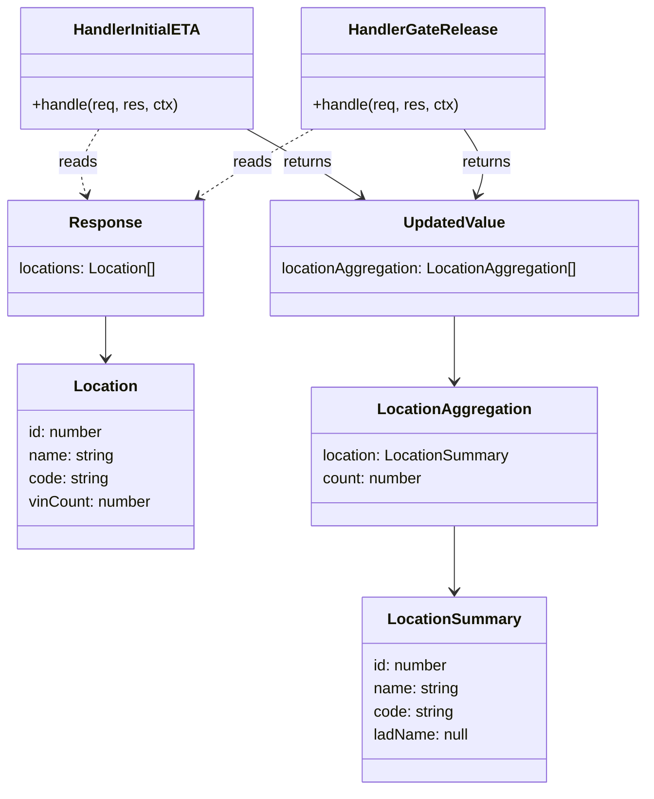
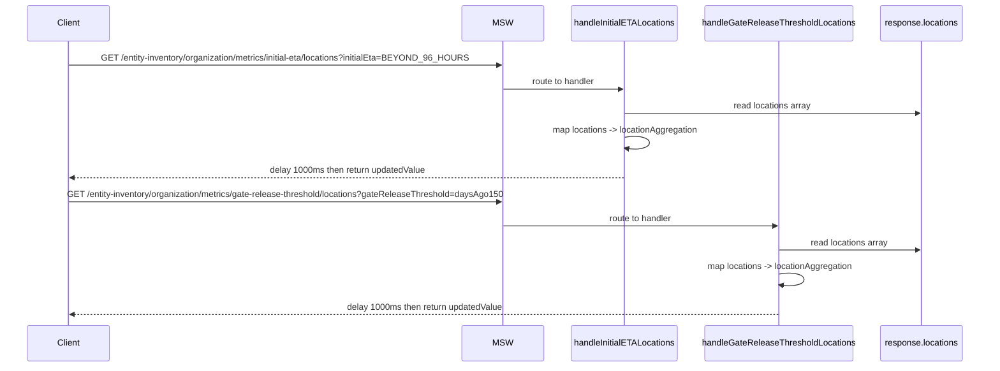

# Diagram: web/portal/src/mocks/handlers/entity-inventory/organization/metrics/initial-eta/locations/data.js


> Auto-generated by Obscura crawlers

## Diagram 1

```mermaid
flowchart LR
  Client[Client]
  subgraph MSW_HANDLERS
    HandlerInitial["handleInitialETALocations\nGET /entity-inventory/organization/metrics/initial-eta/locations?initialEta=BEYOND_96_HOURS"]
    HandlerGate["handleGateReleaseThresholdLocations\nGET /entity-inventory/organization/metrics/gate-release-threshold/locations?gateReleaseThreshold=daysAgo150"]
  end
  ResponseFixture[response.locations\n(array of Location objects)]
  MapOp[map(loc -> { location: { id, name, code, ladName: null }, count: loc.vinCount })]
  UpdatedValue[updatedValue\n{ locationAggregation: [...] }]
  Delay[ctx.delay(1000)]
  Json[ctx.json(updatedValue)]
  Client -->|GET initial-eta| HandlerInitial
  Client -->|GET gate-release| HandlerGate
  HandlerInitial --> ResponseFixture
  HandlerGate --> ResponseFixture
  ResponseFixture --> MapOp
  MapOp --> UpdatedValue
  UpdatedValue --> Delay
  Delay --> Json
  Json --> Client
```

> SVG rendering failed for this diagram.

## Diagram 2



### SVG

<svg id="container" width="673.71484375" xmlns="http://www.w3.org/2000/svg" class="classDiagram" height="820" viewBox="0 0 673.71484375 820" role="graphics-document document" aria-roledescription="class"><style>#container{font-family:"trebuchet ms",verdana,arial,sans-serif;font-size:16px;fill:#333;}@keyframes edge-animation-frame{from{stroke-dashoffset:0;}}@keyframes dash{to{stroke-dashoffset:0;}}#container .edge-animation-slow{stroke-dasharray:9,5!important;stroke-dashoffset:900;animation:dash 50s linear infinite;stroke-linecap:round;}#container .edge-animation-fast{stroke-dasharray:9,5!important;stroke-dashoffset:900;animation:dash 20s linear infinite;stroke-linecap:round;}#container .error-icon{fill:#552222;}#container .error-text{fill:#552222;stroke:#552222;}#container .edge-thickness-normal{stroke-width:1px;}#container .edge-thickness-thick{stroke-width:3.5px;}#container .edge-pattern-solid{stroke-dasharray:0;}#container .edge-thickness-invisible{stroke-width:0;fill:none;}#container .edge-pattern-dashed{stroke-dasharray:3;}#container .edge-pattern-dotted{stroke-dasharray:2;}#container .marker{fill:#333333;stroke:#333333;}#container .marker.cross{stroke:#333333;}#container svg{font-family:"trebuchet ms",verdana,arial,sans-serif;font-size:16px;}#container p{margin:0;}#container g.classGroup text{fill:#9370DB;stroke:none;font-family:"trebuchet ms",verdana,arial,sans-serif;font-size:10px;}#container g.classGroup text .title{font-weight:bolder;}#container .nodeLabel,#container .edgeLabel{color:#131300;}#container .edgeLabel .label rect{fill:#ECECFF;}#container .label text{fill:#131300;}#container .labelBkg{background:#ECECFF;}#container .edgeLabel .label span{background:#ECECFF;}#container .classTitle{font-weight:bolder;}#container .node rect,#container .node circle,#container .node ellipse,#container .node polygon,#container .node path{fill:#ECECFF;stroke:#9370DB;stroke-width:1px;}#container .divider{stroke:#9370DB;stroke-width:1;}#container g.clickable{cursor:pointer;}#container g.classGroup rect{fill:#ECECFF;stroke:#9370DB;}#container g.classGroup line{stroke:#9370DB;stroke-width:1;}#container .classLabel .box{stroke:none;stroke-width:0;fill:#ECECFF;opacity:0.5;}#container .classLabel .label{fill:#9370DB;font-size:10px;}#container .relation{stroke:#333333;stroke-width:1;fill:none;}#container .dashed-line{stroke-dasharray:3;}#container .dotted-line{stroke-dasharray:1 2;}#container #compositionStart,#container .composition{fill:#333333!important;stroke:#333333!important;stroke-width:1;}#container #compositionEnd,#container .composition{fill:#333333!important;stroke:#333333!important;stroke-width:1;}#container #dependencyStart,#container .dependency{fill:#333333!important;stroke:#333333!important;stroke-width:1;}#container #dependencyStart,#container .dependency{fill:#333333!important;stroke:#333333!important;stroke-width:1;}#container #extensionStart,#container .extension{fill:transparent!important;stroke:#333333!important;stroke-width:1;}#container #extensionEnd,#container .extension{fill:transparent!important;stroke:#333333!important;stroke-width:1;}#container #aggregationStart,#container .aggregation{fill:transparent!important;stroke:#333333!important;stroke-width:1;}#container #aggregationEnd,#container .aggregation{fill:transparent!important;stroke:#333333!important;stroke-width:1;}#container #lollipopStart,#container .lollipop{fill:#ECECFF!important;stroke:#333333!important;stroke-width:1;}#container #lollipopEnd,#container .lollipop{fill:#ECECFF!important;stroke:#333333!important;stroke-width:1;}#container .edgeTerminals{font-size:11px;line-height:initial;}#container .classTitleText{text-anchor:middle;font-size:18px;fill:#333;}#container .label-icon{display:inline-block;height:1em;overflow:visible;vertical-align:-0.125em;}#container .node .label-icon path{fill:currentColor;stroke:revert;stroke-width:revert;}#container :root{--mermaid-font-family:"trebuchet ms",verdana,arial,sans-serif;}</style><g><defs><marker id="container_class-aggregationStart" class="marker aggregation class" refX="18" refY="7" markerWidth="190" markerHeight="240" orient="auto"><path d="M 18,7 L9,13 L1,7 L9,1 Z"></path></marker></defs><defs><marker id="container_class-aggregationEnd" class="marker aggregation class" refX="1" refY="7" markerWidth="20" markerHeight="28" orient="auto"><path d="M 18,7 L9,13 L1,7 L9,1 Z"></path></marker></defs><defs><marker id="container_class-extensionStart" class="marker extension class" refX="18" refY="7" markerWidth="190" markerHeight="240" orient="auto"><path d="M 1,7 L18,13 V 1 Z"></path></marker></defs><defs><marker id="container_class-extensionEnd" class="marker extension class" refX="1" refY="7" markerWidth="20" markerHeight="28" orient="auto"><path d="M 1,1 V 13 L18,7 Z"></path></marker></defs><defs><marker id="container_class-compositionStart" class="marker composition class" refX="18" refY="7" markerWidth="190" markerHeight="240" orient="auto"><path d="M 18,7 L9,13 L1,7 L9,1 Z"></path></marker></defs><defs><marker id="container_class-compositionEnd" class="marker composition class" refX="1" refY="7" markerWidth="20" markerHeight="28" orient="auto"><path d="M 18,7 L9,13 L1,7 L9,1 Z"></path></marker></defs><defs><marker id="container_class-dependencyStart" class="marker dependency class" refX="6" refY="7" markerWidth="190" markerHeight="240" orient="auto"><path d="M 5,7 L9,13 L1,7 L9,1 Z"></path></marker></defs><defs><marker id="container_class-dependencyEnd" class="marker dependency class" refX="13" refY="7" markerWidth="20" markerHeight="28" orient="auto"><path d="M 18,7 L9,13 L14,7 L9,1 Z"></path></marker></defs><defs><marker id="container_class-lollipopStart" class="marker lollipop class" refX="13" refY="7" markerWidth="190" markerHeight="240" orient="auto"><circle stroke="black" fill="transparent" cx="7" cy="7" r="6"></circle></marker></defs><defs><marker id="container_class-lollipopEnd" class="marker lollipop class" refX="1" refY="7" markerWidth="190" markerHeight="240" orient="auto"><circle stroke="black" fill="transparent" cx="7" cy="7" r="6"></circle></marker></defs><g class="root"><g class="clusters"></g><g class="edgePaths"><path d="M111.285,328L111.285,332.167C111.285,336.333,111.285,344.667,111.285,352C111.285,359.333,111.285,365.667,111.285,368.833L111.285,372" id="id_Response_Location_1" class="edge-thickness-normal edge-pattern-solid relation" style=";;;" data-edge="true" data-et="edge" data-id="id_Response_Location_1" data-points="W3sieCI6MTExLjI4NTE1NjI1LCJ5IjozMjh9LHsieCI6MTExLjI4NTE1NjI1LCJ5IjozNTN9LHsieCI6MTExLjI4NTE1NjI1LCJ5IjozNzh9XQ==" marker-end="url(#container_class-dependencyEnd)"></path><path d="M472.313,328L472.313,332.167C472.313,336.333,472.313,344.667,472.313,356C472.313,367.333,472.313,381.667,472.313,388.833L472.313,396" id="id_UpdatedValue_LocationAggregation_2" class="edge-thickness-normal edge-pattern-solid relation" style=";;;" data-edge="true" data-et="edge" data-id="id_UpdatedValue_LocationAggregation_2" data-points="W3sieCI6NDcyLjMxMjUsInkiOjMyOH0seyJ4Ijo0NzIuMzEyNSwieSI6MzUzfSx7IngiOjQ3Mi4zMTI1LCJ5Ijo0MDJ9XQ==" marker-end="url(#container_class-dependencyEnd)"></path><path d="M472.313,546L472.313,554.167C472.313,562.333,472.313,578.667,472.313,590C472.313,601.333,472.313,607.667,472.313,610.833L472.313,614" id="id_LocationAggregation_LocationSummary_3" class="edge-thickness-normal edge-pattern-solid relation" style=";;;" data-edge="true" data-et="edge" data-id="id_LocationAggregation_LocationSummary_3" data-points="W3sieCI6NDcyLjMxMjUsInkiOjU0Nn0seyJ4Ijo0NzIuMzEyNSwieSI6NTk1fSx7IngiOjQ3Mi4zMTI1LCJ5Ijo2MjB9XQ==" marker-end="url(#container_class-dependencyEnd)"></path><path d="M104.641,134L100.747,140.167C96.853,146.333,89.065,158.667,86.783,170.045C84.502,181.423,87.726,191.845,89.338,197.057L90.95,202.268" id="id_HandlerInitialETA_Response_4" class="edge-thickness-normal edge-pattern-dashed relation" style=";;;" data-edge="true" data-et="edge" data-id="id_HandlerInitialETA_Response_4" data-points="W3sieCI6MTA0LjY0MDgyMDMxMjUsInkiOjEzNH0seyJ4Ijo4MS4yNzczNDM3NSwieSI6MTcxfSx7IngiOjkyLjcyMzYyMjc0NDg0NTM2LCJ5IjoyMDh9XQ==" marker-end="url(#container_class-dependencyEnd)"></path><path d="M258.145,134L269.277,140.167C280.409,146.333,302.672,158.667,322.338,170.45C342.004,182.234,359.072,193.468,367.606,199.084L376.14,204.701" id="id_HandlerInitialETA_UpdatedValue_5" class="edge-thickness-normal edge-pattern-solid relation" style=";;;" data-edge="true" data-et="edge" data-id="id_HandlerInitialETA_UpdatedValue_5" data-points="W3sieCI6MjU4LjE0NTQ4ODI4MTI1LCJ5IjoxMzR9LHsieCI6MzI0LjkzNTU0Njg3NSwieSI6MTcxfSx7IngiOjM4MS4xNTE0OTgwNjcwMTAzLCJ5IjoyMDh9XQ==" marker-end="url(#container_class-dependencyEnd)"></path><path d="M325.452,134L314.32,140.167C303.189,146.333,280.925,158.667,261.26,170.45C241.594,182.234,224.526,193.468,215.992,199.084L207.458,204.701" id="id_HandlerGateRelease_Response_6" class="edge-thickness-normal edge-pattern-dashed relation" style=";;;" data-edge="true" data-et="edge" data-id="id_HandlerGateRelease_Response_6" data-points="W3sieCI6MzI1LjQ1MjE2Nzk2ODc1LCJ5IjoxMzR9LHsieCI6MjU4LjY2MjEwOTM3NSwieSI6MTcxfSx7IngiOjIwMi40NDYxNTgxODI5ODk2OCwieSI6MjA4fV0=" marker-end="url(#container_class-dependencyEnd)"></path><path d="M482.899,134L487.179,140.167C491.459,146.333,500.019,158.667,502.343,170.063C504.667,181.46,500.757,191.92,498.801,197.15L496.846,202.38" id="id_HandlerGateRelease_UpdatedValue_7" class="edge-thickness-normal edge-pattern-solid relation" style=";;;" data-edge="true" data-et="edge" data-id="id_HandlerGateRelease_UpdatedValue_7" data-points="W3sieCI6NDgyLjg5OTI1NzgxMjQ5OTk3LCJ5IjoxMzR9LHsieCI6NTA4LjU3ODEyNSwieSI6MTcxfSx7IngiOjQ5NC43NDQ4NDUzNjA4MjQ3NCwieSI6MjA4fV0=" marker-end="url(#container_class-dependencyEnd)"></path></g><g class="edgeLabels"><g class="edgeLabel"><g class="label" data-id="id_Response_Location_1" transform="translate(0, 0)"><foreignObject width="0" height="0"><div xmlns="http://www.w3.org/1999/xhtml" class="labelBkg" style="display: table-cell; white-space: nowrap; line-height: 1.5; max-width: 200px; text-align: center;"><span class="edgeLabel"></span></div></foreignObject></g></g><g class="edgeLabel"><g class="label" data-id="id_UpdatedValue_LocationAggregation_2" transform="translate(0, 0)"><foreignObject width="0" height="0"><div xmlns="http://www.w3.org/1999/xhtml" class="labelBkg" style="display: table-cell; white-space: nowrap; line-height: 1.5; max-width: 200px; text-align: center;"><span class="edgeLabel"></span></div></foreignObject></g></g><g class="edgeLabel"><g class="label" data-id="id_LocationAggregation_LocationSummary_3" transform="translate(0, 0)"><foreignObject width="0" height="0"><div xmlns="http://www.w3.org/1999/xhtml" class="labelBkg" style="display: table-cell; white-space: nowrap; line-height: 1.5; max-width: 200px; text-align: center;"><span class="edgeLabel"></span></div></foreignObject></g></g><g class="edgeLabel" transform="translate(81.27734375, 171)"><g class="label" data-id="id_HandlerInitialETA_Response_4" transform="translate(-20.0078125, -12)"><foreignObject width="40.015625" height="24"><div xmlns="http://www.w3.org/1999/xhtml" class="labelBkg" style="display: table-cell; white-space: nowrap; line-height: 1.5; max-width: 200px; text-align: center;"><span class="edgeLabel"><p>reads</p></span></div></foreignObject></g></g><g class="edgeLabel" transform="translate(320.97546, 168.80621)"><g class="label" data-id="id_HandlerInitialETA_UpdatedValue_5" transform="translate(-26.265625, -12)"><foreignObject width="52.53125" height="24"><div xmlns="http://www.w3.org/1999/xhtml" class="labelBkg" style="display: table-cell; white-space: nowrap; line-height: 1.5; max-width: 200px; text-align: center;"><span class="edgeLabel"><p>returns</p></span></div></foreignObject></g></g><g class="edgeLabel" transform="translate(262.6222, 168.80621)"><g class="label" data-id="id_HandlerGateRelease_Response_6" transform="translate(-20.0078125, -12)"><foreignObject width="40.015625" height="24"><div xmlns="http://www.w3.org/1999/xhtml" class="labelBkg" style="display: table-cell; white-space: nowrap; line-height: 1.5; max-width: 200px; text-align: center;"><span class="edgeLabel"><p>reads</p></span></div></foreignObject></g></g><g class="edgeLabel" transform="translate(506.9998, 168.72583)"><g class="label" data-id="id_HandlerGateRelease_UpdatedValue_7" transform="translate(-26.265625, -12)"><foreignObject width="52.53125" height="24"><div xmlns="http://www.w3.org/1999/xhtml" class="labelBkg" style="display: table-cell; white-space: nowrap; line-height: 1.5; max-width: 200px; text-align: center;"><span class="edgeLabel"><p>returns</p></span></div></foreignObject></g></g></g><g class="nodes"><g class="node default" id="classId-Response-0" transform="translate(111.28515625, 268)"><g class="basic label-container"><path d="M-103.28515625 -60 L103.28515625 -60 L103.28515625 60 L-103.28515625 60" stroke="none" stroke-width="0" fill="#ECECFF" style=""></path><path d="M-103.28515625 -60 C-40.557851627890706 -60, 22.169452994218588 -60, 103.28515625 -60 M-103.28515625 -60 C-59.940047531214574 -60, -16.59493881242915 -60, 103.28515625 -60 M103.28515625 -60 C103.28515625 -25.637872797310713, 103.28515625 8.724254405378574, 103.28515625 60 M103.28515625 -60 C103.28515625 -33.047110942244004, 103.28515625 -6.094221884488007, 103.28515625 60 M103.28515625 60 C34.24019152223934 60, -34.804773205521315 60, -103.28515625 60 M103.28515625 60 C28.34780369430547 60, -46.58954886138906 60, -103.28515625 60 M-103.28515625 60 C-103.28515625 22.332217182031364, -103.28515625 -15.335565635937272, -103.28515625 -60 M-103.28515625 60 C-103.28515625 27.122835231559954, -103.28515625 -5.754329536880093, -103.28515625 -60" stroke="#9370DB" stroke-width="1.3" fill="none" stroke-dasharray="0 0" style=""></path></g><g class="annotation-group text" transform="translate(0, -36)"></g><g class="label-group text" transform="translate(-35.4453125, -36)"><g class="label" style="font-weight: bolder" transform="translate(0,-12)"><foreignObject width="70.890625" height="24"><div xmlns="http://www.w3.org/1999/xhtml" style="display: table-cell; white-space: nowrap; line-height: 1.5; max-width: 120px; text-align: center;"><span class="nodeLabel markdown-node-label" style=""><p>Response</p></span></div></foreignObject></g></g><g class="members-group text" transform="translate(-91.28515625, 12)"><g class="label" style="" transform="translate(0,-12)"><foreignObject width="147.125" height="24"><div xmlns="http://www.w3.org/1999/xhtml" style="display: table-cell; white-space: nowrap; line-height: 1.5; max-width: 197px; text-align: center;"><span class="nodeLabel markdown-node-label" style=""><p>locations: Location[]</p></span></div></foreignObject></g></g><g class="methods-group text" transform="translate(-91.28515625, 60)"></g><g class="divider" style=""><path d="M-103.28515625 -12 C-26.304701366874355 -12, 50.67575351625129 -12, 103.28515625 -12 M-103.28515625 -12 C-56.07871001746558 -12, -8.872263784931164 -12, 103.28515625 -12" stroke="#9370DB" stroke-width="1.3" fill="none" stroke-dasharray="0 0" style=""></path></g><g class="divider" style=""><path d="M-103.28515625 36 C-21.597989640762492 36, 60.089176968475016 36, 103.28515625 36 M-103.28515625 36 C-36.773137252125636 36, 29.738881745748728 36, 103.28515625 36" stroke="#9370DB" stroke-width="1.3" fill="none" stroke-dasharray="0 0" style=""></path></g></g><g class="node default" id="classId-Location-1" transform="translate(111.28515625, 474)"><g class="basic label-container"><path d="M-92.25390625 -96 L92.25390625 -96 L92.25390625 96 L-92.25390625 96" stroke="none" stroke-width="0" fill="#ECECFF" style=""></path><path d="M-92.25390625 -96 C-40.45969466385653 -96, 11.334516922286937 -96, 92.25390625 -96 M-92.25390625 -96 C-48.49491779372085 -96, -4.7359293374417035 -96, 92.25390625 -96 M92.25390625 -96 C92.25390625 -49.86447644893409, 92.25390625 -3.728952897868183, 92.25390625 96 M92.25390625 -96 C92.25390625 -44.790862101538956, 92.25390625 6.418275796922089, 92.25390625 96 M92.25390625 96 C27.72276821199165 96, -36.8083698260167 96, -92.25390625 96 M92.25390625 96 C37.64806933691344 96, -16.957767576173126 96, -92.25390625 96 M-92.25390625 96 C-92.25390625 35.762111020642664, -92.25390625 -24.475777958714673, -92.25390625 -96 M-92.25390625 96 C-92.25390625 43.755369403339, -92.25390625 -8.489261193321994, -92.25390625 -96" stroke="#9370DB" stroke-width="1.3" fill="none" stroke-dasharray="0 0" style=""></path></g><g class="annotation-group text" transform="translate(0, -72)"></g><g class="label-group text" transform="translate(-31.3515625, -72)"><g class="label" style="font-weight: bolder" transform="translate(0,-12)"><foreignObject width="62.703125" height="24"><div xmlns="http://www.w3.org/1999/xhtml" style="display: table-cell; white-space: nowrap; line-height: 1.5; max-width: 112px; text-align: center;"><span class="nodeLabel markdown-node-label" style=""><p>Location</p></span></div></foreignObject></g></g><g class="members-group text" transform="translate(-80.25390625, -24)"><g class="label" style="" transform="translate(0,-12)"><foreignObject width="78.96875" height="24"><div xmlns="http://www.w3.org/1999/xhtml" style="display: table-cell; white-space: nowrap; line-height: 1.5; max-width: 130px; text-align: center;"><span class="nodeLabel markdown-node-label" style=""><p>id: number</p></span></div></foreignObject></g><g class="label" style="" transform="translate(0,12)"><foreignObject width="90.234375" height="24"><div xmlns="http://www.w3.org/1999/xhtml" style="display: table-cell; white-space: nowrap; line-height: 1.5; max-width: 141px; text-align: center;"><span class="nodeLabel markdown-node-label" style=""><p>name: string</p></span></div></foreignObject></g><g class="label" style="" transform="translate(0,36)"><foreignObject width="84.6875" height="24"><div xmlns="http://www.w3.org/1999/xhtml" style="display: table-cell; white-space: nowrap; line-height: 1.5; max-width: 135px; text-align: center;"><span class="nodeLabel markdown-node-label" style=""><p>code: string</p></span></div></foreignObject></g><g class="label" style="" transform="translate(0,60)"><foreignObject width="129.15625" height="24"><div xmlns="http://www.w3.org/1999/xhtml" style="display: table-cell; white-space: nowrap; line-height: 1.5; max-width: 180px; text-align: center;"><span class="nodeLabel markdown-node-label" style=""><p>vinCount: number</p></span></div></foreignObject></g></g><g class="methods-group text" transform="translate(-80.25390625, 96)"></g><g class="divider" style=""><path d="M-92.25390625 -48 C-30.610812131186492 -48, 31.032281987627016 -48, 92.25390625 -48 M-92.25390625 -48 C-24.728435175207323 -48, 42.79703589958535 -48, 92.25390625 -48" stroke="#9370DB" stroke-width="1.3" fill="none" stroke-dasharray="0 0" style=""></path></g><g class="divider" style=""><path d="M-92.25390625 72 C-26.511254318458143 72, 39.231397613083715 72, 92.25390625 72 M-92.25390625 72 C-31.093637456839048 72, 30.066631336321905 72, 92.25390625 72" stroke="#9370DB" stroke-width="1.3" fill="none" stroke-dasharray="0 0" style=""></path></g></g><g class="node default" id="classId-UpdatedValue-2" transform="translate(472.3125, 268)"><g class="basic label-container"><path d="M-193.40234375 -60 L193.40234375 -60 L193.40234375 60 L-193.40234375 60" stroke="none" stroke-width="0" fill="#ECECFF" style=""></path><path d="M-193.40234375 -60 C-69.50352134470427 -60, 54.395301060591464 -60, 193.40234375 -60 M-193.40234375 -60 C-49.7910096219685 -60, 93.820324506063 -60, 193.40234375 -60 M193.40234375 -60 C193.40234375 -31.758637881042286, 193.40234375 -3.517275762084573, 193.40234375 60 M193.40234375 -60 C193.40234375 -27.22684085584624, 193.40234375 5.546318288307518, 193.40234375 60 M193.40234375 60 C115.19059457257194 60, 36.97884539514388 60, -193.40234375 60 M193.40234375 60 C43.85851705941195 60, -105.6853096311761 60, -193.40234375 60 M-193.40234375 60 C-193.40234375 30.856246727440244, -193.40234375 1.7124934548804873, -193.40234375 -60 M-193.40234375 60 C-193.40234375 31.874334176704835, -193.40234375 3.74866835340967, -193.40234375 -60" stroke="#9370DB" stroke-width="1.3" fill="none" stroke-dasharray="0 0" style=""></path></g><g class="annotation-group text" transform="translate(0, -36)"></g><g class="label-group text" transform="translate(-51.2421875, -36)"><g class="label" style="font-weight: bolder" transform="translate(0,-12)"><foreignObject width="102.484375" height="24"><div xmlns="http://www.w3.org/1999/xhtml" style="display: table-cell; white-space: nowrap; line-height: 1.5; max-width: 152px; text-align: center;"><span class="nodeLabel markdown-node-label" style=""><p>UpdatedValue</p></span></div></foreignObject></g></g><g class="members-group text" transform="translate(-181.40234375, 12)"><g class="label" style="" transform="translate(0,-12)"><foreignObject width="311.5625" height="24"><div xmlns="http://www.w3.org/1999/xhtml" style="display: table-cell; white-space: nowrap; line-height: 1.5; max-width: 362px; text-align: center;"><span class="nodeLabel markdown-node-label" style=""><p>locationAggregation: LocationAggregation[]</p></span></div></foreignObject></g></g><g class="methods-group text" transform="translate(-181.40234375, 60)"></g><g class="divider" style=""><path d="M-193.40234375 -12 C-99.63029408821592 -12, -5.858244426431838 -12, 193.40234375 -12 M-193.40234375 -12 C-83.00478002910705 -12, 27.392783691785894 -12, 193.40234375 -12" stroke="#9370DB" stroke-width="1.3" fill="none" stroke-dasharray="0 0" style=""></path></g><g class="divider" style=""><path d="M-193.40234375 36 C-90.87914883749795 36, 11.644046075004098 36, 193.40234375 36 M-193.40234375 36 C-58.31585888993078 36, 76.77062597013844 36, 193.40234375 36" stroke="#9370DB" stroke-width="1.3" fill="none" stroke-dasharray="0 0" style=""></path></g></g><g class="node default" id="classId-LocationAggregation-3" transform="translate(472.3125, 474)"><g class="basic label-container"><path d="M-148.53515625 -72 L148.53515625 -72 L148.53515625 72 L-148.53515625 72" stroke="none" stroke-width="0" fill="#ECECFF" style=""></path><path d="M-148.53515625 -72 C-33.734996160611814 -72, 81.06516392877637 -72, 148.53515625 -72 M-148.53515625 -72 C-32.64408063974568 -72, 83.24699497050864 -72, 148.53515625 -72 M148.53515625 -72 C148.53515625 -41.56640439139697, 148.53515625 -11.132808782793937, 148.53515625 72 M148.53515625 -72 C148.53515625 -18.175095140378453, 148.53515625 35.649809719243095, 148.53515625 72 M148.53515625 72 C38.69931955367535 72, -71.1365171426493 72, -148.53515625 72 M148.53515625 72 C52.811399718518416 72, -42.91235681296317 72, -148.53515625 72 M-148.53515625 72 C-148.53515625 26.770795531052485, -148.53515625 -18.45840893789503, -148.53515625 -72 M-148.53515625 72 C-148.53515625 23.607439705611228, -148.53515625 -24.785120588777545, -148.53515625 -72" stroke="#9370DB" stroke-width="1.3" fill="none" stroke-dasharray="0 0" style=""></path></g><g class="annotation-group text" transform="translate(0, -48)"></g><g class="label-group text" transform="translate(-75.5078125, -48)"><g class="label" style="font-weight: bolder" transform="translate(0,-12)"><foreignObject width="151.015625" height="24"><div xmlns="http://www.w3.org/1999/xhtml" style="display: table-cell; white-space: nowrap; line-height: 1.5; max-width: 198px; text-align: center;"><span class="nodeLabel markdown-node-label" style=""><p>LocationAggregation</p></span></div></foreignObject></g></g><g class="members-group text" transform="translate(-136.53515625, 0)"><g class="label" style="" transform="translate(0,-12)"><foreignObject width="197.5625" height="24"><div xmlns="http://www.w3.org/1999/xhtml" style="display: table-cell; white-space: nowrap; line-height: 1.5; max-width: 248px; text-align: center;"><span class="nodeLabel markdown-node-label" style=""><p>location: LocationSummary</p></span></div></foreignObject></g><g class="label" style="" transform="translate(0,12)"><foreignObject width="106.09375" height="24"><div xmlns="http://www.w3.org/1999/xhtml" style="display: table-cell; white-space: nowrap; line-height: 1.5; max-width: 157px; text-align: center;"><span class="nodeLabel markdown-node-label" style=""><p>count: number</p></span></div></foreignObject></g></g><g class="methods-group text" transform="translate(-136.53515625, 72)"></g><g class="divider" style=""><path d="M-148.53515625 -24 C-85.21059299805015 -24, -21.886029746100306 -24, 148.53515625 -24 M-148.53515625 -24 C-32.50542524073454 -24, 83.52430576853092 -24, 148.53515625 -24" stroke="#9370DB" stroke-width="1.3" fill="none" stroke-dasharray="0 0" style=""></path></g><g class="divider" style=""><path d="M-148.53515625 48 C-60.84812936350778 48, 26.83889752298444 48, 148.53515625 48 M-148.53515625 48 C-39.484501906050525 48, 69.56615243789895 48, 148.53515625 48" stroke="#9370DB" stroke-width="1.3" fill="none" stroke-dasharray="0 0" style=""></path></g></g><g class="node default" id="classId-LocationSummary-4" transform="translate(472.3125, 716)"><g class="basic label-container"><path d="M-95.42578125 -96 L95.42578125 -96 L95.42578125 96 L-95.42578125 96" stroke="none" stroke-width="0" fill="#ECECFF" style=""></path><path d="M-95.42578125 -96 C-19.438110630229744 -96, 56.54955998954051 -96, 95.42578125 -96 M-95.42578125 -96 C-27.24402582866253 -96, 40.93772959267494 -96, 95.42578125 -96 M95.42578125 -96 C95.42578125 -26.781981857521984, 95.42578125 42.43603628495603, 95.42578125 96 M95.42578125 -96 C95.42578125 -38.47385725954561, 95.42578125 19.05228548090878, 95.42578125 96 M95.42578125 96 C28.504067894502228 96, -38.417645460995544 96, -95.42578125 96 M95.42578125 96 C52.247282081877195 96, 9.06878291375439 96, -95.42578125 96 M-95.42578125 96 C-95.42578125 31.5733852987687, -95.42578125 -32.8532294024626, -95.42578125 -96 M-95.42578125 96 C-95.42578125 53.85957818947666, -95.42578125 11.719156378953315, -95.42578125 -96" stroke="#9370DB" stroke-width="1.3" fill="none" stroke-dasharray="0 0" style=""></path></g><g class="annotation-group text" transform="translate(0, -72)"></g><g class="label-group text" transform="translate(-65.7578125, -72)"><g class="label" style="font-weight: bolder" transform="translate(0,-12)"><foreignObject width="131.515625" height="24"><div xmlns="http://www.w3.org/1999/xhtml" style="display: table-cell; white-space: nowrap; line-height: 1.5; max-width: 180px; text-align: center;"><span class="nodeLabel markdown-node-label" style=""><p>LocationSummary</p></span></div></foreignObject></g></g><g class="members-group text" transform="translate(-83.42578125, -24)"><g class="label" style="" transform="translate(0,-12)"><foreignObject width="78.96875" height="24"><div xmlns="http://www.w3.org/1999/xhtml" style="display: table-cell; white-space: nowrap; line-height: 1.5; max-width: 130px; text-align: center;"><span class="nodeLabel markdown-node-label" style=""><p>id: number</p></span></div></foreignObject></g><g class="label" style="" transform="translate(0,12)"><foreignObject width="90.234375" height="24"><div xmlns="http://www.w3.org/1999/xhtml" style="display: table-cell; white-space: nowrap; line-height: 1.5; max-width: 141px; text-align: center;"><span class="nodeLabel markdown-node-label" style=""><p>name: string</p></span></div></foreignObject></g><g class="label" style="" transform="translate(0,36)"><foreignObject width="84.6875" height="24"><div xmlns="http://www.w3.org/1999/xhtml" style="display: table-cell; white-space: nowrap; line-height: 1.5; max-width: 135px; text-align: center;"><span class="nodeLabel markdown-node-label" style=""><p>code: string</p></span></div></foreignObject></g><g class="label" style="" transform="translate(0,60)"><foreignObject width="101.09375" height="24"><div xmlns="http://www.w3.org/1999/xhtml" style="display: table-cell; white-space: nowrap; line-height: 1.5; max-width: 151px; text-align: center;"><span class="nodeLabel markdown-node-label" style=""><p>ladName: null</p></span></div></foreignObject></g></g><g class="methods-group text" transform="translate(-83.42578125, 96)"></g><g class="divider" style=""><path d="M-95.42578125 -48 C-30.981910046033207 -48, 33.46196115793359 -48, 95.42578125 -48 M-95.42578125 -48 C-48.525663809389954 -48, -1.6255463687799079 -48, 95.42578125 -48" stroke="#9370DB" stroke-width="1.3" fill="none" stroke-dasharray="0 0" style=""></path></g><g class="divider" style=""><path d="M-95.42578125 72 C-31.6996092868148 72, 32.0265626763704 72, 95.42578125 72 M-95.42578125 72 C-27.211910260626468 72, 41.001960728747065 72, 95.42578125 72" stroke="#9370DB" stroke-width="1.3" fill="none" stroke-dasharray="0 0" style=""></path></g></g><g class="node default" id="classId-HandlerInitialETA-5" transform="translate(144.421875, 71)"><g class="basic label-container"><path d="M-119.55078125 -63 L119.55078125 -63 L119.55078125 63 L-119.55078125 63" stroke="none" stroke-width="0" fill="#ECECFF" style=""></path><path d="M-119.55078125 -63 C-63.64776592396301 -63, -7.744750597926014 -63, 119.55078125 -63 M-119.55078125 -63 C-62.97618212473259 -63, -6.401582999465177 -63, 119.55078125 -63 M119.55078125 -63 C119.55078125 -36.44671192369746, 119.55078125 -9.893423847394914, 119.55078125 63 M119.55078125 -63 C119.55078125 -20.77172161362966, 119.55078125 21.456556772740683, 119.55078125 63 M119.55078125 63 C71.24343142861696 63, 22.936081607233916 63, -119.55078125 63 M119.55078125 63 C34.64660913207665 63, -50.257562985846704 63, -119.55078125 63 M-119.55078125 63 C-119.55078125 17.031607529009044, -119.55078125 -28.936784941981912, -119.55078125 -63 M-119.55078125 63 C-119.55078125 28.738844079285606, -119.55078125 -5.522311841428788, -119.55078125 -63" stroke="#9370DB" stroke-width="1.3" fill="none" stroke-dasharray="0 0" style=""></path></g><g class="annotation-group text" transform="translate(0, -39)"></g><g class="label-group text" transform="translate(-63.1796875, -39)"><g class="label" style="font-weight: bolder" transform="translate(0,-12)"><foreignObject width="126.359375" height="24"><div xmlns="http://www.w3.org/1999/xhtml" style="display: table-cell; white-space: nowrap; line-height: 1.5; max-width: 176px; text-align: center;"><span class="nodeLabel markdown-node-label" style=""><p>HandlerInitialETA</p></span></div></foreignObject></g></g><g class="members-group text" transform="translate(-107.55078125, 9)"></g><g class="methods-group text" transform="translate(-107.55078125, 39)"><g class="label" style="" transform="translate(0,-12)"><foreignObject width="151.921875" height="24"><div xmlns="http://www.w3.org/1999/xhtml" style="display: table-cell; white-space: nowrap; line-height: 1.5; max-width: 209px; text-align: center;"><span class="nodeLabel markdown-node-label" style=""><p>+handle(req, res, ctx)</p></span></div></foreignObject></g></g><g class="divider" style=""><path d="M-119.55078125 -15 C-42.18824886811366 -15, 35.17428351377268 -15, 119.55078125 -15 M-119.55078125 -15 C-42.80620709778208 -15, 33.938367054435844 -15, 119.55078125 -15" stroke="#9370DB" stroke-width="1.3" fill="none" stroke-dasharray="0 0" style=""></path></g><g class="divider" style=""><path d="M-119.55078125 9 C-30.072682850593395 9, 59.40541554881321 9, 119.55078125 9 M-119.55078125 9 C-33.54192950693164 9, 52.466922236136725 9, 119.55078125 9" stroke="#9370DB" stroke-width="1.3" fill="none" stroke-dasharray="0 0" style=""></path></g></g><g class="node default" id="classId-HandlerGateRelease-6" transform="translate(439.17578125, 71)"><g class="basic label-container"><path d="M-125.203125 -63 L125.203125 -63 L125.203125 63 L-125.203125 63" stroke="none" stroke-width="0" fill="#ECECFF" style=""></path><path d="M-125.203125 -63 C-25.22212792702109 -63, 74.75886914595782 -63, 125.203125 -63 M-125.203125 -63 C-43.34500985525966 -63, 38.51310528948068 -63, 125.203125 -63 M125.203125 -63 C125.203125 -24.086116032520884, 125.203125 14.827767934958231, 125.203125 63 M125.203125 -63 C125.203125 -23.76049394756444, 125.203125 15.479012104871117, 125.203125 63 M125.203125 63 C52.569346869005 63, -20.064431261989995 63, -125.203125 63 M125.203125 63 C57.10185059905852 63, -10.999423801882955 63, -125.203125 63 M-125.203125 63 C-125.203125 20.65407649837325, -125.203125 -21.6918470032535, -125.203125 -63 M-125.203125 63 C-125.203125 36.779441840112824, -125.203125 10.558883680225655, -125.203125 -63" stroke="#9370DB" stroke-width="1.3" fill="none" stroke-dasharray="0 0" style=""></path></g><g class="annotation-group text" transform="translate(0, -39)"></g><g class="label-group text" transform="translate(-74.484375, -39)"><g class="label" style="font-weight: bolder" transform="translate(0,-12)"><foreignObject width="148.96875" height="24"><div xmlns="http://www.w3.org/1999/xhtml" style="display: table-cell; white-space: nowrap; line-height: 1.5; max-width: 197px; text-align: center;"><span class="nodeLabel markdown-node-label" style=""><p>HandlerGateRelease</p></span></div></foreignObject></g></g><g class="members-group text" transform="translate(-113.203125, 9)"></g><g class="methods-group text" transform="translate(-113.203125, 39)"><g class="label" style="" transform="translate(0,-12)"><foreignObject width="151.921875" height="24"><div xmlns="http://www.w3.org/1999/xhtml" style="display: table-cell; white-space: nowrap; line-height: 1.5; max-width: 209px; text-align: center;"><span class="nodeLabel markdown-node-label" style=""><p>+handle(req, res, ctx)</p></span></div></foreignObject></g></g><g class="divider" style=""><path d="M-125.203125 -15 C-72.00353568219597 -15, -18.803946364391948 -15, 125.203125 -15 M-125.203125 -15 C-62.07590511560873 -15, 1.0513147687825466 -15, 125.203125 -15" stroke="#9370DB" stroke-width="1.3" fill="none" stroke-dasharray="0 0" style=""></path></g><g class="divider" style=""><path d="M-125.203125 9 C-66.1269856609501 9, -7.050846321900195 9, 125.203125 9 M-125.203125 9 C-71.9744657718754 9, -18.745806543750803 9, 125.203125 9" stroke="#9370DB" stroke-width="1.3" fill="none" stroke-dasharray="0 0" style=""></path></g></g></g></g></g></svg>

## Diagram 3



### SVG

<svg id="container" width="1957" xmlns="http://www.w3.org/2000/svg" height="711" viewBox="-50 -10 1957 711" role="graphics-document document" aria-roledescription="sequence"><g><rect x="1700" y="625" fill="#eaeaea" stroke="#666" width="157" height="65" name="Fixture" rx="3" ry="3" class="actor actor-bottom"></rect><text x="1778.5" y="657.5" dominant-baseline="central" alignment-baseline="central" class="actor actor-box" style="text-anchor: middle; font-size: 16px; font-weight: 400;"><tspan x="1778.5" dy="0">response.locations</tspan></text></g><g><rect x="1348" y="625" fill="#eaeaea" stroke="#666" width="302" height="65" name="HandlerGate" rx="3" ry="3" class="actor actor-bottom"></rect><text x="1499" y="657.5" dominant-baseline="central" alignment-baseline="central" class="actor actor-box" style="text-anchor: middle; font-size: 16px; font-weight: 400;"><tspan x="1499" dy="0">handleGateReleaseThresholdLocations</tspan></text></g><g><rect x="1091" y="625" fill="#eaeaea" stroke="#666" width="207" height="65" name="HandlerInitial" rx="3" ry="3" class="actor actor-bottom"></rect><text x="1194.5" y="657.5" dominant-baseline="central" alignment-baseline="central" class="actor actor-box" style="text-anchor: middle; font-size: 16px; font-weight: 400;"><tspan x="1194.5" dy="0">handleInitialETALocations</tspan></text></g><g><rect x="891" y="625" fill="#eaeaea" stroke="#666" width="150" height="65" name="MSW" rx="3" ry="3" class="actor actor-bottom"></rect><text x="966" y="657.5" dominant-baseline="central" alignment-baseline="central" class="actor actor-box" style="text-anchor: middle; font-size: 16px; font-weight: 400;"><tspan x="966" dy="0">MSW</tspan></text></g><g><rect x="0" y="625" fill="#eaeaea" stroke="#666" width="150" height="65" name="Client" rx="3" ry="3" class="actor actor-bottom"></rect><text x="75" y="657.5" dominant-baseline="central" alignment-baseline="central" class="actor actor-box" style="text-anchor: middle; font-size: 16px; font-weight: 400;"><tspan x="75" dy="0">Client</tspan></text></g><g><line id="actor4" x1="1778.5" y1="65" x2="1778.5" y2="625" class="actor-line 200" stroke-width="0.5px" stroke="#999" name="Fixture"></line><g id="root-4"><rect x="1700" y="0" fill="#eaeaea" stroke="#666" width="157" height="65" name="Fixture" rx="3" ry="3" class="actor actor-top"></rect><text x="1778.5" y="32.5" dominant-baseline="central" alignment-baseline="central" class="actor actor-box" style="text-anchor: middle; font-size: 16px; font-weight: 400;"><tspan x="1778.5" dy="0">response.locations</tspan></text></g></g><g><line id="actor3" x1="1499" y1="65" x2="1499" y2="625" class="actor-line 200" stroke-width="0.5px" stroke="#999" name="HandlerGate"></line><g id="root-3"><rect x="1348" y="0" fill="#eaeaea" stroke="#666" width="302" height="65" name="HandlerGate" rx="3" ry="3" class="actor actor-top"></rect><text x="1499" y="32.5" dominant-baseline="central" alignment-baseline="central" class="actor actor-box" style="text-anchor: middle; font-size: 16px; font-weight: 400;"><tspan x="1499" dy="0">handleGateReleaseThresholdLocations</tspan></text></g></g><g><line id="actor2" x1="1194.5" y1="65" x2="1194.5" y2="625" class="actor-line 200" stroke-width="0.5px" stroke="#999" name="HandlerInitial"></line><g id="root-2"><rect x="1091" y="0" fill="#eaeaea" stroke="#666" width="207" height="65" name="HandlerInitial" rx="3" ry="3" class="actor actor-top"></rect><text x="1194.5" y="32.5" dominant-baseline="central" alignment-baseline="central" class="actor actor-box" style="text-anchor: middle; font-size: 16px; font-weight: 400;"><tspan x="1194.5" dy="0">handleInitialETALocations</tspan></text></g></g><g><line id="actor1" x1="966" y1="65" x2="966" y2="625" class="actor-line 200" stroke-width="0.5px" stroke="#999" name="MSW"></line><g id="root-1"><rect x="891" y="0" fill="#eaeaea" stroke="#666" width="150" height="65" name="MSW" rx="3" ry="3" class="actor actor-top"></rect><text x="966" y="32.5" dominant-baseline="central" alignment-baseline="central" class="actor actor-box" style="text-anchor: middle; font-size: 16px; font-weight: 400;"><tspan x="966" dy="0">MSW</tspan></text></g></g><g><line id="actor0" x1="75" y1="65" x2="75" y2="625" class="actor-line 200" stroke-width="0.5px" stroke="#999" name="Client"></line><g id="root-0"><rect x="0" y="0" fill="#eaeaea" stroke="#666" width="150" height="65" name="Client" rx="3" ry="3" class="actor actor-top"></rect><text x="75" y="32.5" dominant-baseline="central" alignment-baseline="central" class="actor actor-box" style="text-anchor: middle; font-size: 16px; font-weight: 400;"><tspan x="75" dy="0">Client</tspan></text></g></g><style>#container{font-family:"trebuchet ms",verdana,arial,sans-serif;font-size:16px;fill:#333;}@keyframes edge-animation-frame{from{stroke-dashoffset:0;}}@keyframes dash{to{stroke-dashoffset:0;}}#container .edge-animation-slow{stroke-dasharray:9,5!important;stroke-dashoffset:900;animation:dash 50s linear infinite;stroke-linecap:round;}#container .edge-animation-fast{stroke-dasharray:9,5!important;stroke-dashoffset:900;animation:dash 20s linear infinite;stroke-linecap:round;}#container .error-icon{fill:#552222;}#container .error-text{fill:#552222;stroke:#552222;}#container .edge-thickness-normal{stroke-width:1px;}#container .edge-thickness-thick{stroke-width:3.5px;}#container .edge-pattern-solid{stroke-dasharray:0;}#container .edge-thickness-invisible{stroke-width:0;fill:none;}#container .edge-pattern-dashed{stroke-dasharray:3;}#container .edge-pattern-dotted{stroke-dasharray:2;}#container .marker{fill:#333333;stroke:#333333;}#container .marker.cross{stroke:#333333;}#container svg{font-family:"trebuchet ms",verdana,arial,sans-serif;font-size:16px;}#container p{margin:0;}#container .actor{stroke:hsl(259.6261682243, 59.7765363128%, 87.9019607843%);fill:#ECECFF;}#container text.actor&gt;tspan{fill:black;stroke:none;}#container .actor-line{stroke:hsl(259.6261682243, 59.7765363128%, 87.9019607843%);}#container .innerArc{stroke-width:1.5;stroke-dasharray:none;}#container .messageLine0{stroke-width:1.5;stroke-dasharray:none;stroke:#333;}#container .messageLine1{stroke-width:1.5;stroke-dasharray:2,2;stroke:#333;}#container #arrowhead path{fill:#333;stroke:#333;}#container .sequenceNumber{fill:white;}#container #sequencenumber{fill:#333;}#container #crosshead path{fill:#333;stroke:#333;}#container .messageText{fill:#333;stroke:none;}#container .labelBox{stroke:hsl(259.6261682243, 59.7765363128%, 87.9019607843%);fill:#ECECFF;}#container .labelText,#container .labelText&gt;tspan{fill:black;stroke:none;}#container .loopText,#container .loopText&gt;tspan{fill:black;stroke:none;}#container .loopLine{stroke-width:2px;stroke-dasharray:2,2;stroke:hsl(259.6261682243, 59.7765363128%, 87.9019607843%);fill:hsl(259.6261682243, 59.7765363128%, 87.9019607843%);}#container .note{stroke:#aaaa33;fill:#fff5ad;}#container .noteText,#container .noteText&gt;tspan{fill:black;stroke:none;}#container .activation0{fill:#f4f4f4;stroke:#666;}#container .activation1{fill:#f4f4f4;stroke:#666;}#container .activation2{fill:#f4f4f4;stroke:#666;}#container .actorPopupMenu{position:absolute;}#container .actorPopupMenuPanel{position:absolute;fill:#ECECFF;box-shadow:0px 8px 16px 0px rgba(0,0,0,0.2);filter:drop-shadow(3px 5px 2px rgb(0 0 0 / 0.4));}#container .actor-man line{stroke:hsl(259.6261682243, 59.7765363128%, 87.9019607843%);fill:#ECECFF;}#container .actor-man circle,#container line{stroke:hsl(259.6261682243, 59.7765363128%, 87.9019607843%);fill:#ECECFF;stroke-width:2px;}#container :root{--mermaid-font-family:"trebuchet ms",verdana,arial,sans-serif;}</style><g></g><defs><symbol id="computer" width="24" height="24"><path transform="scale(.5)" d="M2 2v13h20v-13h-20zm18 11h-16v-9h16v9zm-10.228 6l.466-1h3.524l.467 1h-4.457zm14.228 3h-24l2-6h2.104l-1.33 4h18.45l-1.297-4h2.073l2 6zm-5-10h-14v-7h14v7z"></path></symbol></defs><defs><symbol id="database" fill-rule="evenodd" clip-rule="evenodd"><path transform="scale(.5)" d="M12.258.001l.256.004.255.005.253.008.251.01.249.012.247.015.246.016.242.019.241.02.239.023.236.024.233.027.231.028.229.031.225.032.223.034.22.036.217.038.214.04.211.041.208.043.205.045.201.046.198.048.194.05.191.051.187.053.183.054.18.056.175.057.172.059.168.06.163.061.16.063.155.064.15.066.074.033.073.033.071.034.07.034.069.035.068.035.067.035.066.035.064.036.064.036.062.036.06.036.06.037.058.037.058.037.055.038.055.038.053.038.052.038.051.039.05.039.048.039.047.039.045.04.044.04.043.04.041.04.04.041.039.041.037.041.036.041.034.041.033.042.032.042.03.042.029.042.027.042.026.043.024.043.023.043.021.043.02.043.018.044.017.043.015.044.013.044.012.044.011.045.009.044.007.045.006.045.004.045.002.045.001.045v17l-.001.045-.002.045-.004.045-.006.045-.007.045-.009.044-.011.045-.012.044-.013.044-.015.044-.017.043-.018.044-.02.043-.021.043-.023.043-.024.043-.026.043-.027.042-.029.042-.03.042-.032.042-.033.042-.034.041-.036.041-.037.041-.039.041-.04.041-.041.04-.043.04-.044.04-.045.04-.047.039-.048.039-.05.039-.051.039-.052.038-.053.038-.055.038-.055.038-.058.037-.058.037-.06.037-.06.036-.062.036-.064.036-.064.036-.066.035-.067.035-.068.035-.069.035-.07.034-.071.034-.073.033-.074.033-.15.066-.155.064-.16.063-.163.061-.168.06-.172.059-.175.057-.18.056-.183.054-.187.053-.191.051-.194.05-.198.048-.201.046-.205.045-.208.043-.211.041-.214.04-.217.038-.22.036-.223.034-.225.032-.229.031-.231.028-.233.027-.236.024-.239.023-.241.02-.242.019-.246.016-.247.015-.249.012-.251.01-.253.008-.255.005-.256.004-.258.001-.258-.001-.256-.004-.255-.005-.253-.008-.251-.01-.249-.012-.247-.015-.245-.016-.243-.019-.241-.02-.238-.023-.236-.024-.234-.027-.231-.028-.228-.031-.226-.032-.223-.034-.22-.036-.217-.038-.214-.04-.211-.041-.208-.043-.204-.045-.201-.046-.198-.048-.195-.05-.19-.051-.187-.053-.184-.054-.179-.056-.176-.057-.172-.059-.167-.06-.164-.061-.159-.063-.155-.064-.151-.066-.074-.033-.072-.033-.072-.034-.07-.034-.069-.035-.068-.035-.067-.035-.066-.035-.064-.036-.063-.036-.062-.036-.061-.036-.06-.037-.058-.037-.057-.037-.056-.038-.055-.038-.053-.038-.052-.038-.051-.039-.049-.039-.049-.039-.046-.039-.046-.04-.044-.04-.043-.04-.041-.04-.04-.041-.039-.041-.037-.041-.036-.041-.034-.041-.033-.042-.032-.042-.03-.042-.029-.042-.027-.042-.026-.043-.024-.043-.023-.043-.021-.043-.02-.043-.018-.044-.017-.043-.015-.044-.013-.044-.012-.044-.011-.045-.009-.044-.007-.045-.006-.045-.004-.045-.002-.045-.001-.045v-17l.001-.045.002-.045.004-.045.006-.045.007-.045.009-.044.011-.045.012-.044.013-.044.015-.044.017-.043.018-.044.02-.043.021-.043.023-.043.024-.043.026-.043.027-.042.029-.042.03-.042.032-.042.033-.042.034-.041.036-.041.037-.041.039-.041.04-.041.041-.04.043-.04.044-.04.046-.04.046-.039.049-.039.049-.039.051-.039.052-.038.053-.038.055-.038.056-.038.057-.037.058-.037.06-.037.061-.036.062-.036.063-.036.064-.036.066-.035.067-.035.068-.035.069-.035.07-.034.072-.034.072-.033.074-.033.151-.066.155-.064.159-.063.164-.061.167-.06.172-.059.176-.057.179-.056.184-.054.187-.053.19-.051.195-.05.198-.048.201-.046.204-.045.208-.043.211-.041.214-.04.217-.038.22-.036.223-.034.226-.032.228-.031.231-.028.234-.027.236-.024.238-.023.241-.02.243-.019.245-.016.247-.015.249-.012.251-.01.253-.008.255-.005.256-.004.258-.001.258.001zm-9.258 20.499v.01l.001.021.003.021.004.022.005.021.006.022.007.022.009.023.01.022.011.023.012.023.013.023.015.023.016.024.017.023.018.024.019.024.021.024.022.025.023.024.024.025.052.049.056.05.061.051.066.051.07.051.075.051.079.052.084.052.088.052.092.052.097.052.102.051.105.052.11.052.114.051.119.051.123.051.127.05.131.05.135.05.139.048.144.049.147.047.152.047.155.047.16.045.163.045.167.043.171.043.176.041.178.041.183.039.187.039.19.037.194.035.197.035.202.033.204.031.209.03.212.029.216.027.219.025.222.024.226.021.23.02.233.018.236.016.24.015.243.012.246.01.249.008.253.005.256.004.259.001.26-.001.257-.004.254-.005.25-.008.247-.011.244-.012.241-.014.237-.016.233-.018.231-.021.226-.021.224-.024.22-.026.216-.027.212-.028.21-.031.205-.031.202-.034.198-.034.194-.036.191-.037.187-.039.183-.04.179-.04.175-.042.172-.043.168-.044.163-.045.16-.046.155-.046.152-.047.148-.048.143-.049.139-.049.136-.05.131-.05.126-.05.123-.051.118-.052.114-.051.11-.052.106-.052.101-.052.096-.052.092-.052.088-.053.083-.051.079-.052.074-.052.07-.051.065-.051.06-.051.056-.05.051-.05.023-.024.023-.025.021-.024.02-.024.019-.024.018-.024.017-.024.015-.023.014-.024.013-.023.012-.023.01-.023.01-.022.008-.022.006-.022.006-.022.004-.022.004-.021.001-.021.001-.021v-4.127l-.077.055-.08.053-.083.054-.085.053-.087.052-.09.052-.093.051-.095.05-.097.05-.1.049-.102.049-.105.048-.106.047-.109.047-.111.046-.114.045-.115.045-.118.044-.12.043-.122.042-.124.042-.126.041-.128.04-.13.04-.132.038-.134.038-.135.037-.138.037-.139.035-.142.035-.143.034-.144.033-.147.032-.148.031-.15.03-.151.03-.153.029-.154.027-.156.027-.158.026-.159.025-.161.024-.162.023-.163.022-.165.021-.166.02-.167.019-.169.018-.169.017-.171.016-.173.015-.173.014-.175.013-.175.012-.177.011-.178.01-.179.008-.179.008-.181.006-.182.005-.182.004-.184.003-.184.002h-.37l-.184-.002-.184-.003-.182-.004-.182-.005-.181-.006-.179-.008-.179-.008-.178-.01-.176-.011-.176-.012-.175-.013-.173-.014-.172-.015-.171-.016-.17-.017-.169-.018-.167-.019-.166-.02-.165-.021-.163-.022-.162-.023-.161-.024-.159-.025-.157-.026-.156-.027-.155-.027-.153-.029-.151-.03-.15-.03-.148-.031-.146-.032-.145-.033-.143-.034-.141-.035-.14-.035-.137-.037-.136-.037-.134-.038-.132-.038-.13-.04-.128-.04-.126-.041-.124-.042-.122-.042-.12-.044-.117-.043-.116-.045-.113-.045-.112-.046-.109-.047-.106-.047-.105-.048-.102-.049-.1-.049-.097-.05-.095-.05-.093-.052-.09-.051-.087-.052-.085-.053-.083-.054-.08-.054-.077-.054v4.127zm0-5.654v.011l.001.021.003.021.004.021.005.022.006.022.007.022.009.022.01.022.011.023.012.023.013.023.015.024.016.023.017.024.018.024.019.024.021.024.022.024.023.025.024.024.052.05.056.05.061.05.066.051.07.051.075.052.079.051.084.052.088.052.092.052.097.052.102.052.105.052.11.051.114.051.119.052.123.05.127.051.131.05.135.049.139.049.144.048.147.048.152.047.155.046.16.045.163.045.167.044.171.042.176.042.178.04.183.04.187.038.19.037.194.036.197.034.202.033.204.032.209.03.212.028.216.027.219.025.222.024.226.022.23.02.233.018.236.016.24.014.243.012.246.01.249.008.253.006.256.003.259.001.26-.001.257-.003.254-.006.25-.008.247-.01.244-.012.241-.015.237-.016.233-.018.231-.02.226-.022.224-.024.22-.025.216-.027.212-.029.21-.03.205-.032.202-.033.198-.035.194-.036.191-.037.187-.039.183-.039.179-.041.175-.042.172-.043.168-.044.163-.045.16-.045.155-.047.152-.047.148-.048.143-.048.139-.05.136-.049.131-.05.126-.051.123-.051.118-.051.114-.052.11-.052.106-.052.101-.052.096-.052.092-.052.088-.052.083-.052.079-.052.074-.051.07-.052.065-.051.06-.05.056-.051.051-.049.023-.025.023-.024.021-.025.02-.024.019-.024.018-.024.017-.024.015-.023.014-.023.013-.024.012-.022.01-.023.01-.023.008-.022.006-.022.006-.022.004-.021.004-.022.001-.021.001-.021v-4.139l-.077.054-.08.054-.083.054-.085.052-.087.053-.09.051-.093.051-.095.051-.097.05-.1.049-.102.049-.105.048-.106.047-.109.047-.111.046-.114.045-.115.044-.118.044-.12.044-.122.042-.124.042-.126.041-.128.04-.13.039-.132.039-.134.038-.135.037-.138.036-.139.036-.142.035-.143.033-.144.033-.147.033-.148.031-.15.03-.151.03-.153.028-.154.028-.156.027-.158.026-.159.025-.161.024-.162.023-.163.022-.165.021-.166.02-.167.019-.169.018-.169.017-.171.016-.173.015-.173.014-.175.013-.175.012-.177.011-.178.009-.179.009-.179.007-.181.007-.182.005-.182.004-.184.003-.184.002h-.37l-.184-.002-.184-.003-.182-.004-.182-.005-.181-.007-.179-.007-.179-.009-.178-.009-.176-.011-.176-.012-.175-.013-.173-.014-.172-.015-.171-.016-.17-.017-.169-.018-.167-.019-.166-.02-.165-.021-.163-.022-.162-.023-.161-.024-.159-.025-.157-.026-.156-.027-.155-.028-.153-.028-.151-.03-.15-.03-.148-.031-.146-.033-.145-.033-.143-.033-.141-.035-.14-.036-.137-.036-.136-.037-.134-.038-.132-.039-.13-.039-.128-.04-.126-.041-.124-.042-.122-.043-.12-.043-.117-.044-.116-.044-.113-.046-.112-.046-.109-.046-.106-.047-.105-.048-.102-.049-.1-.049-.097-.05-.095-.051-.093-.051-.09-.051-.087-.053-.085-.052-.083-.054-.08-.054-.077-.054v4.139zm0-5.666v.011l.001.02.003.022.004.021.005.022.006.021.007.022.009.023.01.022.011.023.012.023.013.023.015.023.016.024.017.024.018.023.019.024.021.025.022.024.023.024.024.025.052.05.056.05.061.05.066.051.07.051.075.052.079.051.084.052.088.052.092.052.097.052.102.052.105.051.11.052.114.051.119.051.123.051.127.05.131.05.135.05.139.049.144.048.147.048.152.047.155.046.16.045.163.045.167.043.171.043.176.042.178.04.183.04.187.038.19.037.194.036.197.034.202.033.204.032.209.03.212.028.216.027.219.025.222.024.226.021.23.02.233.018.236.017.24.014.243.012.246.01.249.008.253.006.256.003.259.001.26-.001.257-.003.254-.006.25-.008.247-.01.244-.013.241-.014.237-.016.233-.018.231-.02.226-.022.224-.024.22-.025.216-.027.212-.029.21-.03.205-.032.202-.033.198-.035.194-.036.191-.037.187-.039.183-.039.179-.041.175-.042.172-.043.168-.044.163-.045.16-.045.155-.047.152-.047.148-.048.143-.049.139-.049.136-.049.131-.051.126-.05.123-.051.118-.052.114-.051.11-.052.106-.052.101-.052.096-.052.092-.052.088-.052.083-.052.079-.052.074-.052.07-.051.065-.051.06-.051.056-.05.051-.049.023-.025.023-.025.021-.024.02-.024.019-.024.018-.024.017-.024.015-.023.014-.024.013-.023.012-.023.01-.022.01-.023.008-.022.006-.022.006-.022.004-.022.004-.021.001-.021.001-.021v-4.153l-.077.054-.08.054-.083.053-.085.053-.087.053-.09.051-.093.051-.095.051-.097.05-.1.049-.102.048-.105.048-.106.048-.109.046-.111.046-.114.046-.115.044-.118.044-.12.043-.122.043-.124.042-.126.041-.128.04-.13.039-.132.039-.134.038-.135.037-.138.036-.139.036-.142.034-.143.034-.144.033-.147.032-.148.032-.15.03-.151.03-.153.028-.154.028-.156.027-.158.026-.159.024-.161.024-.162.023-.163.023-.165.021-.166.02-.167.019-.169.018-.169.017-.171.016-.173.015-.173.014-.175.013-.175.012-.177.01-.178.01-.179.009-.179.007-.181.006-.182.006-.182.004-.184.003-.184.001-.185.001-.185-.001-.184-.001-.184-.003-.182-.004-.182-.006-.181-.006-.179-.007-.179-.009-.178-.01-.176-.01-.176-.012-.175-.013-.173-.014-.172-.015-.171-.016-.17-.017-.169-.018-.167-.019-.166-.02-.165-.021-.163-.023-.162-.023-.161-.024-.159-.024-.157-.026-.156-.027-.155-.028-.153-.028-.151-.03-.15-.03-.148-.032-.146-.032-.145-.033-.143-.034-.141-.034-.14-.036-.137-.036-.136-.037-.134-.038-.132-.039-.13-.039-.128-.041-.126-.041-.124-.041-.122-.043-.12-.043-.117-.044-.116-.044-.113-.046-.112-.046-.109-.046-.106-.048-.105-.048-.102-.048-.1-.05-.097-.049-.095-.051-.093-.051-.09-.052-.087-.052-.085-.053-.083-.053-.08-.054-.077-.054v4.153zm8.74-8.179l-.257.004-.254.005-.25.008-.247.011-.244.012-.241.014-.237.016-.233.018-.231.021-.226.022-.224.023-.22.026-.216.027-.212.028-.21.031-.205.032-.202.033-.198.034-.194.036-.191.038-.187.038-.183.04-.179.041-.175.042-.172.043-.168.043-.163.045-.16.046-.155.046-.152.048-.148.048-.143.048-.139.049-.136.05-.131.05-.126.051-.123.051-.118.051-.114.052-.11.052-.106.052-.101.052-.096.052-.092.052-.088.052-.083.052-.079.052-.074.051-.07.052-.065.051-.06.05-.056.05-.051.05-.023.025-.023.024-.021.024-.02.025-.019.024-.018.024-.017.023-.015.024-.014.023-.013.023-.012.023-.01.023-.01.022-.008.022-.006.023-.006.021-.004.022-.004.021-.001.021-.001.021.001.021.001.021.004.021.004.022.006.021.006.023.008.022.01.022.01.023.012.023.013.023.014.023.015.024.017.023.018.024.019.024.02.025.021.024.023.024.023.025.051.05.056.05.06.05.065.051.07.052.074.051.079.052.083.052.088.052.092.052.096.052.101.052.106.052.11.052.114.052.118.051.123.051.126.051.131.05.136.05.139.049.143.048.148.048.152.048.155.046.16.046.163.045.168.043.172.043.175.042.179.041.183.04.187.038.191.038.194.036.198.034.202.033.205.032.21.031.212.028.216.027.22.026.224.023.226.022.231.021.233.018.237.016.241.014.244.012.247.011.25.008.254.005.257.004.26.001.26-.001.257-.004.254-.005.25-.008.247-.011.244-.012.241-.014.237-.016.233-.018.231-.021.226-.022.224-.023.22-.026.216-.027.212-.028.21-.031.205-.032.202-.033.198-.034.194-.036.191-.038.187-.038.183-.04.179-.041.175-.042.172-.043.168-.043.163-.045.16-.046.155-.046.152-.048.148-.048.143-.048.139-.049.136-.05.131-.05.126-.051.123-.051.118-.051.114-.052.11-.052.106-.052.101-.052.096-.052.092-.052.088-.052.083-.052.079-.052.074-.051.07-.052.065-.051.06-.05.056-.05.051-.05.023-.025.023-.024.021-.024.02-.025.019-.024.018-.024.017-.023.015-.024.014-.023.013-.023.012-.023.01-.023.01-.022.008-.022.006-.023.006-.021.004-.022.004-.021.001-.021.001-.021-.001-.021-.001-.021-.004-.021-.004-.022-.006-.021-.006-.023-.008-.022-.01-.022-.01-.023-.012-.023-.013-.023-.014-.023-.015-.024-.017-.023-.018-.024-.019-.024-.02-.025-.021-.024-.023-.024-.023-.025-.051-.05-.056-.05-.06-.05-.065-.051-.07-.052-.074-.051-.079-.052-.083-.052-.088-.052-.092-.052-.096-.052-.101-.052-.106-.052-.11-.052-.114-.052-.118-.051-.123-.051-.126-.051-.131-.05-.136-.05-.139-.049-.143-.048-.148-.048-.152-.048-.155-.046-.16-.046-.163-.045-.168-.043-.172-.043-.175-.042-.179-.041-.183-.04-.187-.038-.191-.038-.194-.036-.198-.034-.202-.033-.205-.032-.21-.031-.212-.028-.216-.027-.22-.026-.224-.023-.226-.022-.231-.021-.233-.018-.237-.016-.241-.014-.244-.012-.247-.011-.25-.008-.254-.005-.257-.004-.26-.001-.26.001z"></path></symbol></defs><defs><symbol id="clock" width="24" height="24"><path transform="scale(.5)" d="M12 2c5.514 0 10 4.486 10 10s-4.486 10-10 10-10-4.486-10-10 4.486-10 10-10zm0-2c-6.627 0-12 5.373-12 12s5.373 12 12 12 12-5.373 12-12-5.373-12-12-12zm5.848 12.459c.202.038.202.333.001.372-1.907.361-6.045 1.111-6.547 1.111-.719 0-1.301-.582-1.301-1.301 0-.512.77-5.447 1.125-7.445.034-.192.312-.181.343.014l.985 6.238 5.394 1.011z"></path></symbol></defs><defs><marker id="arrowhead" refX="7.9" refY="5" markerUnits="userSpaceOnUse" markerWidth="12" markerHeight="12" orient="auto-start-reverse"><path d="M -1 0 L 10 5 L 0 10 z"></path></marker></defs><defs><marker id="crosshead" markerWidth="15" markerHeight="8" orient="auto" refX="4" refY="4.5"><path fill="none" stroke="#000000" stroke-width="1pt" d="M 1,2 L 6,7 M 6,2 L 1,7" style="stroke-dasharray: 0, 0;"></path></marker></defs><defs><marker id="filled-head" refX="15.5" refY="7" markerWidth="20" markerHeight="28" orient="auto"><path d="M 18,7 L9,13 L14,7 L9,1 Z"></path></marker></defs><defs><marker id="sequencenumber" refX="15" refY="15" markerWidth="60" markerHeight="40" orient="auto"><circle cx="15" cy="15" r="6"></circle></marker></defs><text x="519" y="80" text-anchor="middle" dominant-baseline="middle" alignment-baseline="middle" class="messageText" dy="1em" style="font-size: 16px; font-weight: 400;">GET /entity-inventory/organization/metrics/initial-eta/locations?initialEta=BEYOND_96_HOURS</text><line x1="76" y1="113" x2="962" y2="113" class="messageLine0" stroke-width="2" stroke="none" marker-end="url(#arrowhead)" style="fill: none;"></line><text x="1079" y="128" text-anchor="middle" dominant-baseline="middle" alignment-baseline="middle" class="messageText" dy="1em" style="font-size: 16px; font-weight: 400;">route to handler</text><line x1="967" y1="161" x2="1190.5" y2="161" class="messageLine0" stroke-width="2" stroke="none" marker-end="url(#arrowhead)" style="fill: none;"></line><text x="1485" y="176" text-anchor="middle" dominant-baseline="middle" alignment-baseline="middle" class="messageText" dy="1em" style="font-size: 16px; font-weight: 400;">read locations array</text><line x1="1195.5" y1="209" x2="1774.5" y2="209" class="messageLine0" stroke-width="2" stroke="none" marker-end="url(#arrowhead)" style="fill: none;"></line><text x="1196" y="224" text-anchor="middle" dominant-baseline="middle" alignment-baseline="middle" class="messageText" dy="1em" style="font-size: 16px; font-weight: 400;">map locations -&gt; locationAggregation</text><path d="M 1195.5,257 C 1255.5,247 1255.5,287 1195.5,277" class="messageLine0" stroke-width="2" stroke="none" marker-end="url(#arrowhead)" style="fill: none;"></path><text x="636" y="302" text-anchor="middle" dominant-baseline="middle" alignment-baseline="middle" class="messageText" dy="1em" style="font-size: 16px; font-weight: 400;">delay 1000ms then return updatedValue</text><line x1="1193.5" y1="335" x2="79" y2="335" class="messageLine1" stroke-width="2" stroke="none" marker-end="url(#arrowhead)" style="stroke-dasharray: 3, 3; fill: none;"></line><text x="519" y="350" text-anchor="middle" dominant-baseline="middle" alignment-baseline="middle" class="messageText" dy="1em" style="font-size: 16px; font-weight: 400;">GET /entity-inventory/organization/metrics/gate-release-threshold/locations?gateReleaseThreshold=daysAgo150</text><line x1="76" y1="383" x2="962" y2="383" class="messageLine0" stroke-width="2" stroke="none" marker-end="url(#arrowhead)" style="fill: none;"></line><text x="1231" y="398" text-anchor="middle" dominant-baseline="middle" alignment-baseline="middle" class="messageText" dy="1em" style="font-size: 16px; font-weight: 400;">route to handler</text><line x1="967" y1="431" x2="1495" y2="431" class="messageLine0" stroke-width="2" stroke="none" marker-end="url(#arrowhead)" style="fill: none;"></line><text x="1637" y="446" text-anchor="middle" dominant-baseline="middle" alignment-baseline="middle" class="messageText" dy="1em" style="font-size: 16px; font-weight: 400;">read locations array</text><line x1="1500" y1="479" x2="1774.5" y2="479" class="messageLine0" stroke-width="2" stroke="none" marker-end="url(#arrowhead)" style="fill: none;"></line><text x="1500" y="494" text-anchor="middle" dominant-baseline="middle" alignment-baseline="middle" class="messageText" dy="1em" style="font-size: 16px; font-weight: 400;">map locations -&gt; locationAggregation</text><path d="M 1500,527 C 1560,517 1560,557 1500,547" class="messageLine0" stroke-width="2" stroke="none" marker-end="url(#arrowhead)" style="fill: none;"></path><text x="789" y="572" text-anchor="middle" dominant-baseline="middle" alignment-baseline="middle" class="messageText" dy="1em" style="font-size: 16px; font-weight: 400;">delay 1000ms then return updatedValue</text><line x1="1498" y1="605" x2="79" y2="605" class="messageLine1" stroke-width="2" stroke="none" marker-end="url(#arrowhead)" style="stroke-dasharray: 3, 3; fill: none;"></line></svg>
