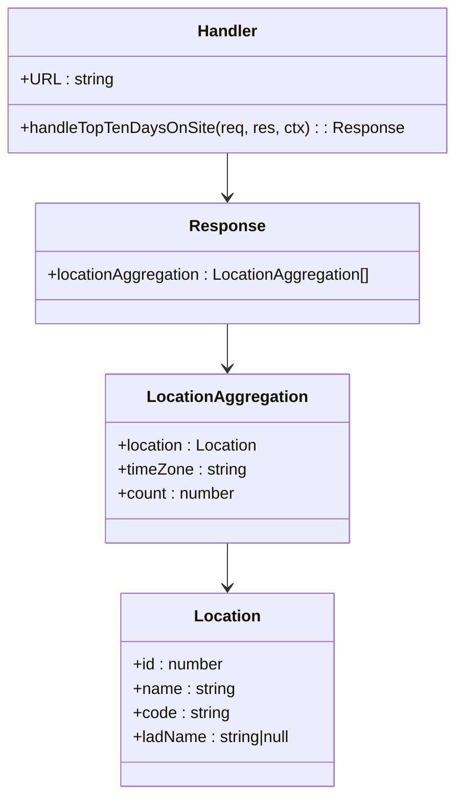
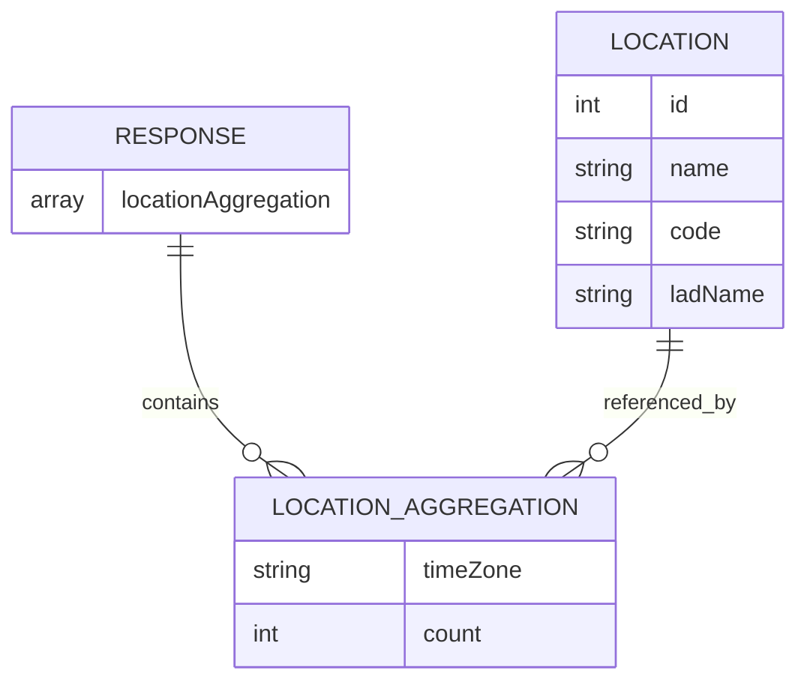

# Diagram: web/portal/src/mocks/handlers/entity-inventory/organization/metrics/overstay/data.js


> Auto-generated by Obscura crawlers

## Diagram 1

```mermaid
flowchart LR
  Client[Client] -->|GET| URL["/entity-inventory/organization/metrics/overstay"]
  URL --> Handler[msw rest.get handler: handleTopTenDaysOnSite]
  Handler --> Builder[Create response object]
  Builder --> Response[response: locationAggregation[]]
  Response -->|returns JSON| JSON[/res(ctx.json(response))/]
  Handler -.->|optional error| Error[res(ctx.status(500))]
```

> SVG rendering failed for this diagram.

## Diagram 2



### SVG

<svg id="container" width="444.96875" xmlns="http://www.w3.org/2000/svg" class="classDiagram" height="790" viewBox="0 0 444.96875 790" role="graphics-document document" aria-roledescription="class"><style>#container{font-family:"trebuchet ms",verdana,arial,sans-serif;font-size:16px;fill:#333;}@keyframes edge-animation-frame{from{stroke-dashoffset:0;}}@keyframes dash{to{stroke-dashoffset:0;}}#container .edge-animation-slow{stroke-dasharray:9,5!important;stroke-dashoffset:900;animation:dash 50s linear infinite;stroke-linecap:round;}#container .edge-animation-fast{stroke-dasharray:9,5!important;stroke-dashoffset:900;animation:dash 20s linear infinite;stroke-linecap:round;}#container .error-icon{fill:#552222;}#container .error-text{fill:#552222;stroke:#552222;}#container .edge-thickness-normal{stroke-width:1px;}#container .edge-thickness-thick{stroke-width:3.5px;}#container .edge-pattern-solid{stroke-dasharray:0;}#container .edge-thickness-invisible{stroke-width:0;fill:none;}#container .edge-pattern-dashed{stroke-dasharray:3;}#container .edge-pattern-dotted{stroke-dasharray:2;}#container .marker{fill:#333333;stroke:#333333;}#container .marker.cross{stroke:#333333;}#container svg{font-family:"trebuchet ms",verdana,arial,sans-serif;font-size:16px;}#container p{margin:0;}#container g.classGroup text{fill:#9370DB;stroke:none;font-family:"trebuchet ms",verdana,arial,sans-serif;font-size:10px;}#container g.classGroup text .title{font-weight:bolder;}#container .nodeLabel,#container .edgeLabel{color:#131300;}#container .edgeLabel .label rect{fill:#ECECFF;}#container .label text{fill:#131300;}#container .labelBkg{background:#ECECFF;}#container .edgeLabel .label span{background:#ECECFF;}#container .classTitle{font-weight:bolder;}#container .node rect,#container .node circle,#container .node ellipse,#container .node polygon,#container .node path{fill:#ECECFF;stroke:#9370DB;stroke-width:1px;}#container .divider{stroke:#9370DB;stroke-width:1;}#container g.clickable{cursor:pointer;}#container g.classGroup rect{fill:#ECECFF;stroke:#9370DB;}#container g.classGroup line{stroke:#9370DB;stroke-width:1;}#container .classLabel .box{stroke:none;stroke-width:0;fill:#ECECFF;opacity:0.5;}#container .classLabel .label{fill:#9370DB;font-size:10px;}#container .relation{stroke:#333333;stroke-width:1;fill:none;}#container .dashed-line{stroke-dasharray:3;}#container .dotted-line{stroke-dasharray:1 2;}#container #compositionStart,#container .composition{fill:#333333!important;stroke:#333333!important;stroke-width:1;}#container #compositionEnd,#container .composition{fill:#333333!important;stroke:#333333!important;stroke-width:1;}#container #dependencyStart,#container .dependency{fill:#333333!important;stroke:#333333!important;stroke-width:1;}#container #dependencyStart,#container .dependency{fill:#333333!important;stroke:#333333!important;stroke-width:1;}#container #extensionStart,#container .extension{fill:transparent!important;stroke:#333333!important;stroke-width:1;}#container #extensionEnd,#container .extension{fill:transparent!important;stroke:#333333!important;stroke-width:1;}#container #aggregationStart,#container .aggregation{fill:transparent!important;stroke:#333333!important;stroke-width:1;}#container #aggregationEnd,#container .aggregation{fill:transparent!important;stroke:#333333!important;stroke-width:1;}#container #lollipopStart,#container .lollipop{fill:#ECECFF!important;stroke:#333333!important;stroke-width:1;}#container #lollipopEnd,#container .lollipop{fill:#ECECFF!important;stroke:#333333!important;stroke-width:1;}#container .edgeTerminals{font-size:11px;line-height:initial;}#container .classTitleText{text-anchor:middle;font-size:18px;fill:#333;}#container .label-icon{display:inline-block;height:1em;overflow:visible;vertical-align:-0.125em;}#container .node .label-icon path{fill:currentColor;stroke:revert;stroke-width:revert;}#container :root{--mermaid-font-family:"trebuchet ms",verdana,arial,sans-serif;}</style><g><defs><marker id="container_class-aggregationStart" class="marker aggregation class" refX="18" refY="7" markerWidth="190" markerHeight="240" orient="auto"><path d="M 18,7 L9,13 L1,7 L9,1 Z"></path></marker></defs><defs><marker id="container_class-aggregationEnd" class="marker aggregation class" refX="1" refY="7" markerWidth="20" markerHeight="28" orient="auto"><path d="M 18,7 L9,13 L1,7 L9,1 Z"></path></marker></defs><defs><marker id="container_class-extensionStart" class="marker extension class" refX="18" refY="7" markerWidth="190" markerHeight="240" orient="auto"><path d="M 1,7 L18,13 V 1 Z"></path></marker></defs><defs><marker id="container_class-extensionEnd" class="marker extension class" refX="1" refY="7" markerWidth="20" markerHeight="28" orient="auto"><path d="M 1,1 V 13 L18,7 Z"></path></marker></defs><defs><marker id="container_class-compositionStart" class="marker composition class" refX="18" refY="7" markerWidth="190" markerHeight="240" orient="auto"><path d="M 18,7 L9,13 L1,7 L9,1 Z"></path></marker></defs><defs><marker id="container_class-compositionEnd" class="marker composition class" refX="1" refY="7" markerWidth="20" markerHeight="28" orient="auto"><path d="M 18,7 L9,13 L1,7 L9,1 Z"></path></marker></defs><defs><marker id="container_class-dependencyStart" class="marker dependency class" refX="6" refY="7" markerWidth="190" markerHeight="240" orient="auto"><path d="M 5,7 L9,13 L1,7 L9,1 Z"></path></marker></defs><defs><marker id="container_class-dependencyEnd" class="marker dependency class" refX="13" refY="7" markerWidth="20" markerHeight="28" orient="auto"><path d="M 18,7 L9,13 L14,7 L9,1 Z"></path></marker></defs><defs><marker id="container_class-lollipopStart" class="marker lollipop class" refX="13" refY="7" markerWidth="190" markerHeight="240" orient="auto"><circle stroke="black" fill="transparent" cx="7" cy="7" r="6"></circle></marker></defs><defs><marker id="container_class-lollipopEnd" class="marker lollipop class" refX="1" refY="7" markerWidth="190" markerHeight="240" orient="auto"><circle stroke="black" fill="transparent" cx="7" cy="7" r="6"></circle></marker></defs><g class="root"><g class="clusters"></g><g class="edgePaths"><path d="M222.484,152L222.484,156.167C222.484,160.333,222.484,168.667,222.484,176C222.484,183.333,222.484,189.667,222.484,192.833L222.484,196" id="id_Handler_Response_1" class="edge-thickness-normal edge-pattern-solid relation" style=";;;" data-edge="true" data-et="edge" data-id="id_Handler_Response_1" data-points="W3sieCI6MjIyLjQ4NDM3NSwieSI6MTUyfSx7IngiOjIyMi40ODQzNzUsInkiOjE3N30seyJ4IjoyMjIuNDg0Mzc1LCJ5IjoyMDJ9XQ==" marker-end="url(#container_class-dependencyEnd)"></path><path d="M222.484,322L222.484,326.167C222.484,330.333,222.484,338.667,222.484,346C222.484,353.333,222.484,359.667,222.484,362.833L222.484,366" id="id_Response_LocationAggregation_2" class="edge-thickness-normal edge-pattern-solid relation" style=";;;" data-edge="true" data-et="edge" data-id="id_Response_LocationAggregation_2" data-points="W3sieCI6MjIyLjQ4NDM3NSwieSI6MzIyfSx7IngiOjIyMi40ODQzNzUsInkiOjM0N30seyJ4IjoyMjIuNDg0Mzc1LCJ5IjozNzJ9XQ==" marker-end="url(#container_class-dependencyEnd)"></path><path d="M222.484,540L222.484,544.167C222.484,548.333,222.484,556.667,222.484,564C222.484,571.333,222.484,577.667,222.484,580.833L222.484,584" id="id_LocationAggregation_Location_3" class="edge-thickness-normal edge-pattern-solid relation" style=";;;" data-edge="true" data-et="edge" data-id="id_LocationAggregation_Location_3" data-points="W3sieCI6MjIyLjQ4NDM3NSwieSI6NTQwfSx7IngiOjIyMi40ODQzNzUsInkiOjU2NX0seyJ4IjoyMjIuNDg0Mzc1LCJ5Ijo1OTB9XQ==" marker-end="url(#container_class-dependencyEnd)"></path></g><g class="edgeLabels"><g class="edgeLabel"><g class="label" data-id="id_Handler_Response_1" transform="translate(0, 0)"><foreignObject width="0" height="0"><div xmlns="http://www.w3.org/1999/xhtml" class="labelBkg" style="display: table-cell; white-space: nowrap; line-height: 1.5; max-width: 200px; text-align: center;"><span class="edgeLabel"></span></div></foreignObject></g></g><g class="edgeLabel"><g class="label" data-id="id_Response_LocationAggregation_2" transform="translate(0, 0)"><foreignObject width="0" height="0"><div xmlns="http://www.w3.org/1999/xhtml" class="labelBkg" style="display: table-cell; white-space: nowrap; line-height: 1.5; max-width: 200px; text-align: center;"><span class="edgeLabel"></span></div></foreignObject></g></g><g class="edgeLabel"><g class="label" data-id="id_LocationAggregation_Location_3" transform="translate(0, 0)"><foreignObject width="0" height="0"><div xmlns="http://www.w3.org/1999/xhtml" class="labelBkg" style="display: table-cell; white-space: nowrap; line-height: 1.5; max-width: 200px; text-align: center;"><span class="edgeLabel"></span></div></foreignObject></g></g></g><g class="nodes"><g class="node default" id="classId-Handler-0" transform="translate(222.484375, 80)"><g class="basic label-container"><path d="M-214.484375 -72 L214.484375 -72 L214.484375 72 L-214.484375 72" stroke="none" stroke-width="0" fill="#ECECFF" style=""></path><path d="M-214.484375 -72 C-58.57012302220042 -72, 97.34412895559916 -72, 214.484375 -72 M-214.484375 -72 C-58.868644288373275 -72, 96.74708642325345 -72, 214.484375 -72 M214.484375 -72 C214.484375 -40.215454971164874, 214.484375 -8.430909942329748, 214.484375 72 M214.484375 -72 C214.484375 -26.45735502658406, 214.484375 19.085289946831878, 214.484375 72 M214.484375 72 C62.603161219855 72, -89.27805256029 72, -214.484375 72 M214.484375 72 C113.49661715050449 72, 12.508859301008982 72, -214.484375 72 M-214.484375 72 C-214.484375 35.67320637046007, -214.484375 -0.6535872590798562, -214.484375 -72 M-214.484375 72 C-214.484375 37.65935761269974, -214.484375 3.3187152253994867, -214.484375 -72" stroke="#9370DB" stroke-width="1.3" fill="none" stroke-dasharray="0 0" style=""></path></g><g class="annotation-group text" transform="translate(0, -48)"></g><g class="label-group text" transform="translate(-29.09375, -48)"><g class="label" style="font-weight: bolder" transform="translate(0,-12)"><foreignObject width="58.1875" height="24"><div xmlns="http://www.w3.org/1999/xhtml" style="display: table-cell; white-space: nowrap; line-height: 1.5; max-width: 109px; text-align: center;"><span class="nodeLabel markdown-node-label" style=""><p>Handler</p></span></div></foreignObject></g></g><g class="members-group text" transform="translate(-202.484375, 0)"><g class="label" style="" transform="translate(0,-12)"><foreignObject width="90.1875" height="24"><div xmlns="http://www.w3.org/1999/xhtml" style="display: table-cell; white-space: nowrap; line-height: 1.5; max-width: 148px; text-align: center;"><span class="nodeLabel markdown-node-label" style=""><p>+URL : string</p></span></div></foreignObject></g></g><g class="methods-group text" transform="translate(-202.484375, 48)"><g class="label" style="" transform="translate(0,-12)"><foreignObject width="375.875" height="24"><div xmlns="http://www.w3.org/1999/xhtml" style="display: table-cell; white-space: nowrap; line-height: 1.5; max-width: 433px; text-align: center;"><span class="nodeLabel markdown-node-label" style=""><p>+handleTopTenDaysOnSite(req, res, ctx) : : Response</p></span></div></foreignObject></g></g><g class="divider" style=""><path d="M-214.484375 -24 C-88.33705913757186 -24, 37.81025672485629 -24, 214.484375 -24 M-214.484375 -24 C-56.86095538817639 -24, 100.76246422364721 -24, 214.484375 -24" stroke="#9370DB" stroke-width="1.3" fill="none" stroke-dasharray="0 0" style=""></path></g><g class="divider" style=""><path d="M-214.484375 24 C-65.92865471645416 24, 82.62706556709168 24, 214.484375 24 M-214.484375 24 C-94.36428109379551 24, 25.755812812408976 24, 214.484375 24" stroke="#9370DB" stroke-width="1.3" fill="none" stroke-dasharray="0 0" style=""></path></g></g><g class="node default" id="classId-Response-1" transform="translate(222.484375, 262)"><g class="basic label-container"><path d="M-191.61328125 -60 L191.61328125 -60 L191.61328125 60 L-191.61328125 60" stroke="none" stroke-width="0" fill="#ECECFF" style=""></path><path d="M-191.61328125 -60 C-49.76990332957138 -60, 92.07347459085724 -60, 191.61328125 -60 M-191.61328125 -60 C-98.69342320705657 -60, -5.773565164113137 -60, 191.61328125 -60 M191.61328125 -60 C191.61328125 -12.609848838541474, 191.61328125 34.78030232291705, 191.61328125 60 M191.61328125 -60 C191.61328125 -22.35879720883559, 191.61328125 15.28240558232882, 191.61328125 60 M191.61328125 60 C64.96814694739157 60, -61.67698735521685 60, -191.61328125 60 M191.61328125 60 C89.61342321353415 60, -12.386434822931705 60, -191.61328125 60 M-191.61328125 60 C-191.61328125 12.565938927102728, -191.61328125 -34.868122145794544, -191.61328125 -60 M-191.61328125 60 C-191.61328125 30.68197919560414, -191.61328125 1.3639583912082784, -191.61328125 -60" stroke="#9370DB" stroke-width="1.3" fill="none" stroke-dasharray="0 0" style=""></path></g><g class="annotation-group text" transform="translate(0, -36)"></g><g class="label-group text" transform="translate(-35.4453125, -36)"><g class="label" style="font-weight: bolder" transform="translate(0,-12)"><foreignObject width="70.890625" height="24"><div xmlns="http://www.w3.org/1999/xhtml" style="display: table-cell; white-space: nowrap; line-height: 1.5; max-width: 120px; text-align: center;"><span class="nodeLabel markdown-node-label" style=""><p>Response</p></span></div></foreignObject></g></g><g class="members-group text" transform="translate(-179.61328125, 12)"><g class="label" style="" transform="translate(0,-12)"><foreignObject width="323.78125" height="24"><div xmlns="http://www.w3.org/1999/xhtml" style="display: table-cell; white-space: nowrap; line-height: 1.5; max-width: 381px; text-align: center;"><span class="nodeLabel markdown-node-label" style=""><p>+locationAggregation : LocationAggregation[]</p></span></div></foreignObject></g></g><g class="methods-group text" transform="translate(-179.61328125, 60)"></g><g class="divider" style=""><path d="M-191.61328125 -12 C-50.658478305559726 -12, 90.29632463888055 -12, 191.61328125 -12 M-191.61328125 -12 C-74.81023196278512 -12, 41.99281732442975 -12, 191.61328125 -12" stroke="#9370DB" stroke-width="1.3" fill="none" stroke-dasharray="0 0" style=""></path></g><g class="divider" style=""><path d="M-191.61328125 36 C-63.2835698260792 36, 65.0461415978416 36, 191.61328125 36 M-191.61328125 36 C-102.4255216139176 36, -13.237761977835191 36, 191.61328125 36" stroke="#9370DB" stroke-width="1.3" fill="none" stroke-dasharray="0 0" style=""></path></g></g><g class="node default" id="classId-LocationAggregation-2" transform="translate(222.484375, 456)"><g class="basic label-container"><path d="M-120.54296875 -84 L120.54296875 -84 L120.54296875 84 L-120.54296875 84" stroke="none" stroke-width="0" fill="#ECECFF" style=""></path><path d="M-120.54296875 -84 C-62.965723079244405 -84, -5.388477408488811 -84, 120.54296875 -84 M-120.54296875 -84 C-64.26606471792189 -84, -7.9891606858438 -84, 120.54296875 -84 M120.54296875 -84 C120.54296875 -36.452793862653905, 120.54296875 11.09441227469219, 120.54296875 84 M120.54296875 -84 C120.54296875 -48.957222951199995, 120.54296875 -13.91444590239999, 120.54296875 84 M120.54296875 84 C32.30163744657612 84, -55.939693856847754 84, -120.54296875 84 M120.54296875 84 C30.94939719192236 84, -58.64417436615528 84, -120.54296875 84 M-120.54296875 84 C-120.54296875 35.61185774140895, -120.54296875 -12.776284517182106, -120.54296875 -84 M-120.54296875 84 C-120.54296875 42.38160347424118, -120.54296875 0.7632069484823631, -120.54296875 -84" stroke="#9370DB" stroke-width="1.3" fill="none" stroke-dasharray="0 0" style=""></path></g><g class="annotation-group text" transform="translate(0, -60)"></g><g class="label-group text" transform="translate(-75.5078125, -60)"><g class="label" style="font-weight: bolder" transform="translate(0,-12)"><foreignObject width="151.015625" height="24"><div xmlns="http://www.w3.org/1999/xhtml" style="display: table-cell; white-space: nowrap; line-height: 1.5; max-width: 198px; text-align: center;"><span class="nodeLabel markdown-node-label" style=""><p>LocationAggregation</p></span></div></foreignObject></g></g><g class="members-group text" transform="translate(-108.54296875, -12)"><g class="label" style="" transform="translate(0,-12)"><foreignObject width="141.578125" height="24"><div xmlns="http://www.w3.org/1999/xhtml" style="display: table-cell; white-space: nowrap; line-height: 1.5; max-width: 199px; text-align: center;"><span class="nodeLabel markdown-node-label" style=""><p>+location : Location</p></span></div></foreignObject></g><g class="label" style="" transform="translate(0,12)"><foreignObject width="130.03125" height="24"><div xmlns="http://www.w3.org/1999/xhtml" style="display: table-cell; white-space: nowrap; line-height: 1.5; max-width: 188px; text-align: center;"><span class="nodeLabel markdown-node-label" style=""><p>+timeZone : string</p></span></div></foreignObject></g><g class="label" style="" transform="translate(0,36)"><foreignObject width="118.25" height="24"><div xmlns="http://www.w3.org/1999/xhtml" style="display: table-cell; white-space: nowrap; line-height: 1.5; max-width: 176px; text-align: center;"><span class="nodeLabel markdown-node-label" style=""><p>+count : number</p></span></div></foreignObject></g></g><g class="methods-group text" transform="translate(-108.54296875, 84)"></g><g class="divider" style=""><path d="M-120.54296875 -36 C-57.43603705215093 -36, 5.670894645698141 -36, 120.54296875 -36 M-120.54296875 -36 C-70.98261355710937 -36, -21.422258364218735 -36, 120.54296875 -36" stroke="#9370DB" stroke-width="1.3" fill="none" stroke-dasharray="0 0" style=""></path></g><g class="divider" style=""><path d="M-120.54296875 60 C-51.06953193370619 60, 18.403904882587625 60, 120.54296875 60 M-120.54296875 60 C-46.08694821680952 60, 28.369072316380965 60, 120.54296875 60" stroke="#9370DB" stroke-width="1.3" fill="none" stroke-dasharray="0 0" style=""></path></g></g><g class="node default" id="classId-Location-3" transform="translate(222.484375, 686)"><g class="basic label-container"><path d="M-108.37890625 -96 L108.37890625 -96 L108.37890625 96 L-108.37890625 96" stroke="none" stroke-width="0" fill="#ECECFF" style=""></path><path d="M-108.37890625 -96 C-41.272499176261405 -96, 25.83390789747719 -96, 108.37890625 -96 M-108.37890625 -96 C-44.42748676451507 -96, 19.523932720969853 -96, 108.37890625 -96 M108.37890625 -96 C108.37890625 -36.34536679907641, 108.37890625 23.309266401847182, 108.37890625 96 M108.37890625 -96 C108.37890625 -27.021431381241, 108.37890625 41.957137237518, 108.37890625 96 M108.37890625 96 C33.566725818808465 96, -41.24545461238307 96, -108.37890625 96 M108.37890625 96 C53.30303821208704 96, -1.772829825825923 96, -108.37890625 96 M-108.37890625 96 C-108.37890625 38.10140754382761, -108.37890625 -19.797184912344775, -108.37890625 -96 M-108.37890625 96 C-108.37890625 28.229890302119003, -108.37890625 -39.540219395761994, -108.37890625 -96" stroke="#9370DB" stroke-width="1.3" fill="none" stroke-dasharray="0 0" style=""></path></g><g class="annotation-group text" transform="translate(0, -72)"></g><g class="label-group text" transform="translate(-31.3515625, -72)"><g class="label" style="font-weight: bolder" transform="translate(0,-12)"><foreignObject width="62.703125" height="24"><div xmlns="http://www.w3.org/1999/xhtml" style="display: table-cell; white-space: nowrap; line-height: 1.5; max-width: 112px; text-align: center;"><span class="nodeLabel markdown-node-label" style=""><p>Location</p></span></div></foreignObject></g></g><g class="members-group text" transform="translate(-96.37890625, -24)"><g class="label" style="" transform="translate(0,-12)"><foreignObject width="91.1875" height="24"><div xmlns="http://www.w3.org/1999/xhtml" style="display: table-cell; white-space: nowrap; line-height: 1.5; max-width: 149px; text-align: center;"><span class="nodeLabel markdown-node-label" style=""><p>+id : number</p></span></div></foreignObject></g><g class="label" style="" transform="translate(0,12)"><foreignObject width="102.453125" height="24"><div xmlns="http://www.w3.org/1999/xhtml" style="display: table-cell; white-space: nowrap; line-height: 1.5; max-width: 160px; text-align: center;"><span class="nodeLabel markdown-node-label" style=""><p>+name : string</p></span></div></foreignObject></g><g class="label" style="" transform="translate(0,36)"><foreignObject width="96.90625" height="24"><div xmlns="http://www.w3.org/1999/xhtml" style="display: table-cell; white-space: nowrap; line-height: 1.5; max-width: 155px; text-align: center;"><span class="nodeLabel markdown-node-label" style=""><p>+code : string</p></span></div></foreignObject></g><g class="label" style="" transform="translate(0,60)"><foreignObject width="161.40625" height="24"><div xmlns="http://www.w3.org/1999/xhtml" style="display: table-cell; white-space: nowrap; line-height: 1.5; max-width: 219px; text-align: center;"><span class="nodeLabel markdown-node-label" style=""><p>+ladName : string|null</p></span></div></foreignObject></g></g><g class="methods-group text" transform="translate(-96.37890625, 96)"></g><g class="divider" style=""><path d="M-108.37890625 -48 C-41.57503036245231 -48, 25.22884552509538 -48, 108.37890625 -48 M-108.37890625 -48 C-22.96214611708146 -48, 62.45461401583708 -48, 108.37890625 -48" stroke="#9370DB" stroke-width="1.3" fill="none" stroke-dasharray="0 0" style=""></path></g><g class="divider" style=""><path d="M-108.37890625 72 C-22.735831736031074 72, 62.90724277793785 72, 108.37890625 72 M-108.37890625 72 C-25.889746391951007 72, 56.599413466097985 72, 108.37890625 72" stroke="#9370DB" stroke-width="1.3" fill="none" stroke-dasharray="0 0" style=""></path></g></g></g></g></g></svg>

## Diagram 3



### SVG

<svg id="container" width="544.546875" xmlns="http://www.w3.org/2000/svg" class="erDiagram" height="459" viewBox="0 0 544.546875 459" role="graphics-document document" aria-roledescription="er"><style>#container{font-family:"trebuchet ms",verdana,arial,sans-serif;font-size:16px;fill:#333;}@keyframes edge-animation-frame{from{stroke-dashoffset:0;}}@keyframes dash{to{stroke-dashoffset:0;}}#container .edge-animation-slow{stroke-dasharray:9,5!important;stroke-dashoffset:900;animation:dash 50s linear infinite;stroke-linecap:round;}#container .edge-animation-fast{stroke-dasharray:9,5!important;stroke-dashoffset:900;animation:dash 20s linear infinite;stroke-linecap:round;}#container .error-icon{fill:#552222;}#container .error-text{fill:#552222;stroke:#552222;}#container .edge-thickness-normal{stroke-width:1px;}#container .edge-thickness-thick{stroke-width:3.5px;}#container .edge-pattern-solid{stroke-dasharray:0;}#container .edge-thickness-invisible{stroke-width:0;fill:none;}#container .edge-pattern-dashed{stroke-dasharray:3;}#container .edge-pattern-dotted{stroke-dasharray:2;}#container .marker{fill:#333333;stroke:#333333;}#container .marker.cross{stroke:#333333;}#container svg{font-family:"trebuchet ms",verdana,arial,sans-serif;font-size:16px;}#container p{margin:0;}#container .entityBox{fill:#ECECFF;stroke:#9370DB;}#container .relationshipLabelBox{fill:hsl(80, 100%, 96.2745098039%);opacity:0.7;background-color:hsl(80, 100%, 96.2745098039%);}#container .relationshipLabelBox rect{opacity:0.5;}#container .labelBkg{background-color:rgba(248.6666666666, 255, 235.9999999999, 0.5);}#container .edgeLabel .label{fill:#9370DB;font-size:14px;}#container .label{font-family:"trebuchet ms",verdana,arial,sans-serif;color:#333;}#container .edge-pattern-dashed{stroke-dasharray:8,8;}#container .node rect,#container .node circle,#container .node ellipse,#container .node polygon{fill:#ECECFF;stroke:#9370DB;stroke-width:1px;}#container .relationshipLine{stroke:#333333;stroke-width:1;fill:none;}#container .marker{fill:none!important;stroke:#333333!important;stroke-width:1;}#container :root{--mermaid-font-family:"trebuchet ms",verdana,arial,sans-serif;}</style><g><defs><marker id="container_er-onlyOneStart" class="marker onlyOne er" refX="0" refY="9" markerWidth="18" markerHeight="18" orient="auto"><path d="M9,0 L9,18 M15,0 L15,18"></path></marker></defs><defs><marker id="container_er-onlyOneEnd" class="marker onlyOne er" refX="18" refY="9" markerWidth="18" markerHeight="18" orient="auto"><path d="M3,0 L3,18 M9,0 L9,18"></path></marker></defs><defs><marker id="container_er-zeroOrOneStart" class="marker zeroOrOne er" refX="0" refY="9" markerWidth="30" markerHeight="18" orient="auto"><circle fill="white" cx="21" cy="9" r="6"></circle><path d="M9,0 L9,18"></path></marker></defs><defs><marker id="container_er-zeroOrOneEnd" class="marker zeroOrOne er" refX="30" refY="9" markerWidth="30" markerHeight="18" orient="auto"><circle fill="white" cx="9" cy="9" r="6"></circle><path d="M21,0 L21,18"></path></marker></defs><defs><marker id="container_er-oneOrMoreStart" class="marker oneOrMore er" refX="18" refY="18" markerWidth="45" markerHeight="36" orient="auto"><path d="M0,18 Q 18,0 36,18 Q 18,36 0,18 M42,9 L42,27"></path></marker></defs><defs><marker id="container_er-oneOrMoreEnd" class="marker oneOrMore er" refX="27" refY="18" markerWidth="45" markerHeight="36" orient="auto"><path d="M3,9 L3,27 M9,18 Q27,0 45,18 Q27,36 9,18"></path></marker></defs><defs><marker id="container_er-zeroOrMoreStart" class="marker zeroOrMore er" refX="18" refY="18" markerWidth="57" markerHeight="36" orient="auto"><circle fill="white" cx="48" cy="18" r="6"></circle><path d="M0,18 Q18,0 36,18 Q18,36 0,18"></path></marker></defs><defs><marker id="container_er-zeroOrMoreEnd" class="marker zeroOrMore er" refX="39" refY="18" markerWidth="57" markerHeight="36" orient="auto"><circle fill="white" cx="9" cy="18" r="6"></circle><path d="M21,18 Q39,0 57,18 Q39,36 21,18"></path></marker></defs><g class="root"><g class="clusters"></g><g class="edgePaths"><path d="M123.977,157.625L123.977,176.729C123.977,195.833,123.977,234.042,136.249,261.563C148.522,289.083,173.067,305.917,185.339,314.333L197.611,322.75" id="id_entity-RESPONSE-0_entity-LOCATION_AGGREGATION-1_0" class="edge-thickness-normal edge-pattern-solid relationshipLine" style="undefined;;;undefined" data-edge="true" data-et="edge" data-id="id_entity-RESPONSE-0_entity-LOCATION_AGGREGATION-1_0" data-points="W3sieCI6MTIzLjk3NjU2MjUsInkiOjE1Ny42MjV9LHsieCI6MTIzLjk3NjU2MjUsInkiOjI3Mi4yNX0seyJ4IjoxOTcuNjExNDk2Mzg3Njc3MjIsInkiOjMyMi43NX1d" marker-start="url(#container_er-onlyOneStart)" marker-end="url(#container_er-zeroOrMoreEnd)"></path><path d="M458.25,221.75L458.25,230.167C458.25,238.583,458.25,255.417,445.978,272.25C433.705,289.083,409.16,305.917,396.888,314.333L384.615,322.75" id="id_entity-LOCATION-2_entity-LOCATION_AGGREGATION-1_1" class="edge-thickness-normal edge-pattern-solid relationshipLine" style="undefined;;;undefined" data-edge="true" data-et="edge" data-id="id_entity-LOCATION-2_entity-LOCATION_AGGREGATION-1_1" data-points="W3sieCI6NDU4LjI1LCJ5IjoyMjEuNzV9LHsieCI6NDU4LjI1LCJ5IjoyNzIuMjV9LHsieCI6Mzg0LjYxNTA2NjExMjMyMjgsInkiOjMyMi43NX1d" marker-start="url(#container_er-onlyOneStart)" marker-end="url(#container_er-zeroOrMoreEnd)"></path></g><g class="edgeLabels"><g class="edgeLabel" transform="translate(123.9765625, 272.25)"><g class="label" data-id="id_entity-RESPONSE-0_entity-LOCATION_AGGREGATION-1_0" transform="translate(-27.03125, -10.5)"><foreignObject width="54.0625" height="21"><div xmlns="http://www.w3.org/1999/xhtml" class="labelBkg" style="display: table-cell; white-space: nowrap; line-height: 1.5; max-width: 200px; text-align: center;"><span class="edgeLabel"><p>contains</p></span></div></foreignObject></g></g><g class="edgeLabel" transform="translate(458.25, 272.25)"><g class="label" data-id="id_entity-LOCATION-2_entity-LOCATION_AGGREGATION-1_1" transform="translate(-45.234375, -10.5)"><foreignObject width="90.46875" height="21"><div xmlns="http://www.w3.org/1999/xhtml" class="labelBkg" style="display: table-cell; white-space: nowrap; line-height: 1.5; max-width: 200px; text-align: center;"><span class="edgeLabel"><p>referenced_by</p></span></div></foreignObject></g></g></g><g class="nodes"><g class="node default" id="entity-RESPONSE-0" transform="translate(123.9765625, 114.875)"><g style=""><path d="M-115.9765625 -42.75 L115.9765625 -42.75 L115.9765625 42.75 L-115.9765625 42.75" stroke="none" stroke-width="0" fill="#ECECFF"></path><path d="M-115.9765625 -42.75 C-41.57838387858476 -42.75, 32.81979474283048 -42.75, 115.9765625 -42.75 M-115.9765625 -42.75 C-44.560131276533724 -42.75, 26.856299946932552 -42.75, 115.9765625 -42.75 M115.9765625 -42.75 C115.9765625 -8.99013481044986, 115.9765625 24.76973037910028, 115.9765625 42.75 M115.9765625 -42.75 C115.9765625 -20.444070060479767, 115.9765625 1.8618598790404661, 115.9765625 42.75 M115.9765625 42.75 C53.78390768581062 42.75, -8.408747128378764 42.75, -115.9765625 42.75 M115.9765625 42.75 C28.256587324062124 42.75, -59.46338785187575 42.75, -115.9765625 42.75 M-115.9765625 42.75 C-115.9765625 20.242039247381555, -115.9765625 -2.2659215052368893, -115.9765625 -42.75 M-115.9765625 42.75 C-115.9765625 20.518877415560592, -115.9765625 -1.712245168878816, -115.9765625 -42.75" stroke="#9370DB" stroke-width="1.3" fill="none" stroke-dasharray="0 0"></path></g><g style="" class="row-rect-odd"><path d="M-115.9765625 0 L115.9765625 0 L115.9765625 42.75 L-115.9765625 42.75" stroke="none" stroke-width="0" fill="hsl(240, 100%, 100%)"></path><path d="M-115.9765625 0 C-67.17763242375987 0, -18.37870234751975 0, 115.9765625 0 M-115.9765625 0 C-51.835193911109045 0, 12.306174677781911 0, 115.9765625 0 M115.9765625 0 C115.9765625 14.266214517606729, 115.9765625 28.532429035213458, 115.9765625 42.75 M115.9765625 0 C115.9765625 11.201843361186238, 115.9765625 22.403686722372477, 115.9765625 42.75 M115.9765625 42.75 C60.94466472045137 42.75, 5.912766940902742 42.75, -115.9765625 42.75 M115.9765625 42.75 C46.93085273127356 42.75, -22.11485703745288 42.75, -115.9765625 42.75 M-115.9765625 42.75 C-115.9765625 28.31067660339208, -115.9765625 13.871353206784157, -115.9765625 0 M-115.9765625 42.75 C-115.9765625 32.99487561034286, -115.9765625 23.23975122068571, -115.9765625 0" stroke="#9370DB" stroke-width="1.3" fill="none" stroke-dasharray="0 0"></path></g><g class="label name" transform="translate(-37.6953125, -33.375)" style=""><foreignObject width="75.390625" height="24"><div xmlns="http://www.w3.org/1999/xhtml" style="display: table-cell; white-space: nowrap; line-height: 1.5; max-width: 175px; text-align: start;"><span class="nodeLabel"><p>RESPONSE</p></span></div></foreignObject></g><g class="label attribute-type" transform="translate(-103.4765625, 9.375)" style=""><foreignObject width="36.84375" height="24"><div xmlns="http://www.w3.org/1999/xhtml" style="display: table-cell; white-space: nowrap; line-height: 1.5; max-width: 137px; text-align: start;"><span class="nodeLabel"><p>array</p></span></div></foreignObject></g><g class="label attribute-name" transform="translate(-41.6328125, 9.375)" style=""><foreignObject width="145.109375" height="24"><div xmlns="http://www.w3.org/1999/xhtml" style="display: table-cell; white-space: nowrap; line-height: 1.5; max-width: 245px; text-align: start;"><span class="nodeLabel"><p>locationAggregation</p></span></div></foreignObject></g><g class="label attribute-keys" transform="translate(128.4765625, 9.375)" style=""><foreignObject width="0" height="0"><div xmlns="http://www.w3.org/1999/xhtml" style="display: table-cell; white-space: nowrap; line-height: 1.5; max-width: 100px; text-align: start;"><span class="nodeLabel"></span></div></foreignObject></g><g class="label attribute-comment" transform="translate(128.4765625, 9.375)" style=""><foreignObject width="0" height="0"><div xmlns="http://www.w3.org/1999/xhtml" style="display: table-cell; white-space: nowrap; line-height: 1.5; max-width: 100px; text-align: start;"><span class="nodeLabel"></span></div></foreignObject></g><g class="divider"><path d="M-115.9765625 0 C-24.80250700272751 0, 66.37154849454498 0, 115.9765625 0 M-115.9765625 0 C-63.535906500372 0, -11.095250500744001 0, 115.9765625 0" stroke="#9370DB" stroke-width="1.3" fill="none" stroke-dasharray="0 0"></path></g><g class="divider"><path d="M-54.1328125 0 C-54.1328125 13.475717086855395, -54.1328125 26.95143417371079, -54.1328125 42.75 M-54.1328125 0 C-54.1328125 16.363603796347995, -54.1328125 32.72720759269599, -54.1328125 42.75" stroke="#9370DB" stroke-width="1.3" fill="none" stroke-dasharray="0 0"></path></g><g class="divider"><path d="M-115.9765625 0 C-35.0508283108075 0, 45.87490587838499 0, 115.9765625 0 M-115.9765625 0 C-42.977717401960874 0, 30.021127696078253 0, 115.9765625 0" stroke="#9370DB" stroke-width="1.3" fill="none" stroke-dasharray="0 0"></path></g></g><g class="node default" id="entity-LOCATION_AGGREGATION-1" transform="translate(291.11328125, 386.875)"><g style=""><path d="M-114.8359375 -64.125 L114.8359375 -64.125 L114.8359375 64.125 L-114.8359375 64.125" stroke="none" stroke-width="0" fill="#ECECFF"></path><path d="M-114.8359375 -64.125 C-58.90669455888964 -64.125, -2.9774516177792805 -64.125, 114.8359375 -64.125 M-114.8359375 -64.125 C-38.62764779780872 -64.125, 37.58064190438256 -64.125, 114.8359375 -64.125 M114.8359375 -64.125 C114.8359375 -31.042858486947722, 114.8359375 2.039283026104556, 114.8359375 64.125 M114.8359375 -64.125 C114.8359375 -24.83192889589884, 114.8359375 14.461142208202318, 114.8359375 64.125 M114.8359375 64.125 C65.63083748018467 64.125, 16.425737460369334 64.125, -114.8359375 64.125 M114.8359375 64.125 C55.42759053622247 64.125, -3.9807564275550646 64.125, -114.8359375 64.125 M-114.8359375 64.125 C-114.8359375 28.313340960832775, -114.8359375 -7.498318078334449, -114.8359375 -64.125 M-114.8359375 64.125 C-114.8359375 15.538149275641544, -114.8359375 -33.04870144871691, -114.8359375 -64.125" stroke="#9370DB" stroke-width="1.3" fill="none" stroke-dasharray="0 0"></path></g><g style="" class="row-rect-odd"><path d="M-114.8359375 -21.375 L114.8359375 -21.375 L114.8359375 21.375 L-114.8359375 21.375" stroke="none" stroke-width="0" fill="hsl(240, 100%, 100%)"></path><path d="M-114.8359375 -21.375 C-58.0244986445941 -21.375, -1.2130597891881933 -21.375, 114.8359375 -21.375 M-114.8359375 -21.375 C-66.38138391574611 -21.375, -17.926830331492212 -21.375, 114.8359375 -21.375 M114.8359375 -21.375 C114.8359375 -6.146375178377685, 114.8359375 9.08224964324463, 114.8359375 21.375 M114.8359375 -21.375 C114.8359375 -8.811850201004262, 114.8359375 3.7512995979914763, 114.8359375 21.375 M114.8359375 21.375 C28.9102716312873 21.375, -57.0153942374254 21.375, -114.8359375 21.375 M114.8359375 21.375 C24.318418867361657 21.375, -66.19909976527669 21.375, -114.8359375 21.375 M-114.8359375 21.375 C-114.8359375 4.815291583589534, -114.8359375 -11.744416832820932, -114.8359375 -21.375 M-114.8359375 21.375 C-114.8359375 8.109988077443589, -114.8359375 -5.155023845112822, -114.8359375 -21.375" stroke="#9370DB" stroke-width="1.3" fill="none" stroke-dasharray="0 0"></path></g><g style="" class="row-rect-even"><path d="M-114.8359375 21.375 L114.8359375 21.375 L114.8359375 64.125 L-114.8359375 64.125" stroke="none" stroke-width="0" fill="hsl(240, 100%, 97.2745098039%)"></path><path d="M-114.8359375 21.375 C-34.60248673266064 21.375, 45.630964034678726 21.375, 114.8359375 21.375 M-114.8359375 21.375 C-57.01063758972171 21.375, 0.8146623205565788 21.375, 114.8359375 21.375 M114.8359375 21.375 C114.8359375 31.38539469263359, 114.8359375 41.39578938526718, 114.8359375 64.125 M114.8359375 21.375 C114.8359375 30.465409841467796, 114.8359375 39.55581968293559, 114.8359375 64.125 M114.8359375 64.125 C34.93924560947168 64.125, -44.95744628105663 64.125, -114.8359375 64.125 M114.8359375 64.125 C47.23513101043187 64.125, -20.365675479136257 64.125, -114.8359375 64.125 M-114.8359375 64.125 C-114.8359375 54.29698078068408, -114.8359375 44.46896156136816, -114.8359375 21.375 M-114.8359375 64.125 C-114.8359375 50.314045390066156, -114.8359375 36.50309078013231, -114.8359375 21.375" stroke="#9370DB" stroke-width="1.3" fill="none" stroke-dasharray="0 0"></path></g><g class="label name" transform="translate(-89.8359375, -54.75)" style=""><foreignObject width="179.671875" height="24"><div xmlns="http://www.w3.org/1999/xhtml" style="display: table-cell; white-space: nowrap; line-height: 1.5; max-width: 280px; text-align: start;"><span class="nodeLabel"><p>LOCATION_AGGREGATION</p></span></div></foreignObject></g><g class="label attribute-type" transform="translate(-102.3359375, -12)" style=""><foreignObject width="41.640625" height="24"><div xmlns="http://www.w3.org/1999/xhtml" style="display: table-cell; white-space: nowrap; line-height: 1.5; max-width: 142px; text-align: start;"><span class="nodeLabel"><p>string</p></span></div></foreignObject></g><g class="label attribute-name" transform="translate(-0.765625, -12)" style=""><foreignObject width="68.171875" height="24"><div xmlns="http://www.w3.org/1999/xhtml" style="display: table-cell; white-space: nowrap; line-height: 1.5; max-width: 168px; text-align: start;"><span class="nodeLabel"><p>timeZone</p></span></div></foreignObject></g><g class="label attribute-keys" transform="translate(127.3359375, -12)" style=""><foreignObject width="0" height="0"><div xmlns="http://www.w3.org/1999/xhtml" style="display: table-cell; white-space: nowrap; line-height: 1.5; max-width: 100px; text-align: start;"><span class="nodeLabel"></span></div></foreignObject></g><g class="label attribute-comment" transform="translate(127.3359375, -12)" style=""><foreignObject width="0" height="0"><div xmlns="http://www.w3.org/1999/xhtml" style="display: table-cell; white-space: nowrap; line-height: 1.5; max-width: 100px; text-align: start;"><span class="nodeLabel"></span></div></foreignObject></g><g class="label attribute-type" transform="translate(-102.3359375, 30.75)" style=""><foreignObject width="19.671875" height="24"><div xmlns="http://www.w3.org/1999/xhtml" style="display: table-cell; white-space: nowrap; line-height: 1.5; max-width: 120px; text-align: start;"><span class="nodeLabel"><p>int</p></span></div></foreignObject></g><g class="label attribute-name" transform="translate(-0.765625, 30.75)" style=""><foreignObject width="41.140625" height="24"><div xmlns="http://www.w3.org/1999/xhtml" style="display: table-cell; white-space: nowrap; line-height: 1.5; max-width: 141px; text-align: start;"><span class="nodeLabel"><p>count</p></span></div></foreignObject></g><g class="label attribute-keys" transform="translate(127.3359375, 30.75)" style=""><foreignObject width="0" height="0"><div xmlns="http://www.w3.org/1999/xhtml" style="display: table-cell; white-space: nowrap; line-height: 1.5; max-width: 100px; text-align: start;"><span class="nodeLabel"></span></div></foreignObject></g><g class="label attribute-comment" transform="translate(127.3359375, 30.75)" style=""><foreignObject width="0" height="0"><div xmlns="http://www.w3.org/1999/xhtml" style="display: table-cell; white-space: nowrap; line-height: 1.5; max-width: 100px; text-align: start;"><span class="nodeLabel"></span></div></foreignObject></g><g class="divider"><path d="M-114.8359375 -21.375 C-52.156470502515326 -21.375, 10.522996494969348 -21.375, 114.8359375 -21.375 M-114.8359375 -21.375 C-39.704569925891406 -21.375, 35.42679764821719 -21.375, 114.8359375 -21.375" stroke="#9370DB" stroke-width="1.3" fill="none" stroke-dasharray="0 0"></path></g><g class="divider"><path d="M-13.265625 -21.375 C-13.265625 3.9446139117951695, -13.265625 29.26422782359034, -13.265625 64.125 M-13.265625 -21.375 C-13.265625 0.06137124895537838, -13.265625 21.497742497910757, -13.265625 64.125" stroke="#9370DB" stroke-width="1.3" fill="none" stroke-dasharray="0 0"></path></g><g class="divider"><path d="M-114.8359375 -21.375 C-52.32220901900734 -21.375, 10.191519461985322 -21.375, 114.8359375 -21.375 M-114.8359375 -21.375 C-54.76776491349515 -21.375, 5.300407673009701 -21.375, 114.8359375 -21.375" stroke="#9370DB" stroke-width="1.3" fill="none" stroke-dasharray="0 0"></path></g></g><g class="node default" id="entity-LOCATION-2" transform="translate(458.25, 114.875)"><g style=""><path d="M-78.296875 -106.875 L78.296875 -106.875 L78.296875 106.875 L-78.296875 106.875" stroke="none" stroke-width="0" fill="#ECECFF"></path><path d="M-78.296875 -106.875 C-23.70315471894991 -106.875, 30.89056556210018 -106.875, 78.296875 -106.875 M-78.296875 -106.875 C-22.624069728109262 -106.875, 33.048735543781476 -106.875, 78.296875 -106.875 M78.296875 -106.875 C78.296875 -42.60840172174461, 78.296875 21.658196556510774, 78.296875 106.875 M78.296875 -106.875 C78.296875 -62.38189327968155, 78.296875 -17.888786559363098, 78.296875 106.875 M78.296875 106.875 C29.083439716247838 106.875, -20.129995567504324 106.875, -78.296875 106.875 M78.296875 106.875 C43.606912915866296 106.875, 8.916950831732592 106.875, -78.296875 106.875 M-78.296875 106.875 C-78.296875 46.04863119828385, -78.296875 -14.7777376034323, -78.296875 -106.875 M-78.296875 106.875 C-78.296875 50.28636506189574, -78.296875 -6.302269876208527, -78.296875 -106.875" stroke="#9370DB" stroke-width="1.3" fill="none" stroke-dasharray="0 0"></path></g><g style="" class="row-rect-odd"><path d="M-78.296875 -64.125 L78.296875 -64.125 L78.296875 -21.375 L-78.296875 -21.375" stroke="none" stroke-width="0" fill="hsl(240, 100%, 100%)"></path><path d="M-78.296875 -64.125 C-34.97543176283687 -64.125, 8.34601147432626 -64.125, 78.296875 -64.125 M-78.296875 -64.125 C-38.33227805260199 -64.125, 1.6323188947960148 -64.125, 78.296875 -64.125 M78.296875 -64.125 C78.296875 -49.446312804900955, 78.296875 -34.76762560980191, 78.296875 -21.375 M78.296875 -64.125 C78.296875 -53.6134118530676, 78.296875 -43.10182370613521, 78.296875 -21.375 M78.296875 -21.375 C46.36475584006499 -21.375, 14.432636680129981 -21.375, -78.296875 -21.375 M78.296875 -21.375 C17.54533130741502 -21.375, -43.20621238516996 -21.375, -78.296875 -21.375 M-78.296875 -21.375 C-78.296875 -32.35140320211504, -78.296875 -43.327806404230074, -78.296875 -64.125 M-78.296875 -21.375 C-78.296875 -37.184221842957264, -78.296875 -52.99344368591453, -78.296875 -64.125" stroke="#9370DB" stroke-width="1.3" fill="none" stroke-dasharray="0 0"></path></g><g style="" class="row-rect-even"><path d="M-78.296875 -21.375 L78.296875 -21.375 L78.296875 21.375 L-78.296875 21.375" stroke="none" stroke-width="0" fill="hsl(240, 100%, 97.2745098039%)"></path><path d="M-78.296875 -21.375 C-22.13523613278266 -21.375, 34.02640273443468 -21.375, 78.296875 -21.375 M-78.296875 -21.375 C-37.43664468959717 -21.375, 3.423585620805653 -21.375, 78.296875 -21.375 M78.296875 -21.375 C78.296875 -7.63907544141586, 78.296875 6.096849117168279, 78.296875 21.375 M78.296875 -21.375 C78.296875 -6.707688697934536, 78.296875 7.959622604130928, 78.296875 21.375 M78.296875 21.375 C17.78131768154283 21.375, -42.73423963691434 21.375, -78.296875 21.375 M78.296875 21.375 C32.806850873130735 21.375, -12.68317325373853 21.375, -78.296875 21.375 M-78.296875 21.375 C-78.296875 4.862799413122801, -78.296875 -11.649401173754399, -78.296875 -21.375 M-78.296875 21.375 C-78.296875 4.968286253793636, -78.296875 -11.438427492412728, -78.296875 -21.375" stroke="#9370DB" stroke-width="1.3" fill="none" stroke-dasharray="0 0"></path></g><g style="" class="row-rect-odd"><path d="M-78.296875 21.375 L78.296875 21.375 L78.296875 64.125 L-78.296875 64.125" stroke="none" stroke-width="0" fill="hsl(240, 100%, 100%)"></path><path d="M-78.296875 21.375 C-18.478776747704785 21.375, 41.33932150459043 21.375, 78.296875 21.375 M-78.296875 21.375 C-39.35711930982681 21.375, -0.4173636196536137 21.375, 78.296875 21.375 M78.296875 21.375 C78.296875 33.71242432201777, 78.296875 46.049848644035535, 78.296875 64.125 M78.296875 21.375 C78.296875 35.78820515581157, 78.296875 50.20141031162313, 78.296875 64.125 M78.296875 64.125 C16.328993897591545 64.125, -45.63888720481691 64.125, -78.296875 64.125 M78.296875 64.125 C18.567129754706684 64.125, -41.16261549058663 64.125, -78.296875 64.125 M-78.296875 64.125 C-78.296875 47.509634274858, -78.296875 30.894268549715996, -78.296875 21.375 M-78.296875 64.125 C-78.296875 50.90045419919366, -78.296875 37.67590839838732, -78.296875 21.375" stroke="#9370DB" stroke-width="1.3" fill="none" stroke-dasharray="0 0"></path></g><g style="" class="row-rect-even"><path d="M-78.296875 64.125 L78.296875 64.125 L78.296875 106.875 L-78.296875 106.875" stroke="none" stroke-width="0" fill="hsl(240, 100%, 97.2745098039%)"></path><path d="M-78.296875 64.125 C-32.29777914765457 64.125, 13.701316704690853 64.125, 78.296875 64.125 M-78.296875 64.125 C-28.674384916982795 64.125, 20.94810516603441 64.125, 78.296875 64.125 M78.296875 64.125 C78.296875 73.39644001713096, 78.296875 82.66788003426191, 78.296875 106.875 M78.296875 64.125 C78.296875 73.63625779754462, 78.296875 83.14751559508923, 78.296875 106.875 M78.296875 106.875 C21.044554954046227 106.875, -36.20776509190755 106.875, -78.296875 106.875 M78.296875 106.875 C21.938823511212746 106.875, -34.41922797757451 106.875, -78.296875 106.875 M-78.296875 106.875 C-78.296875 96.23594151379774, -78.296875 85.59688302759547, -78.296875 64.125 M-78.296875 106.875 C-78.296875 97.25194436565432, -78.296875 87.62888873130865, -78.296875 64.125" stroke="#9370DB" stroke-width="1.3" fill="none" stroke-dasharray="0 0"></path></g><g class="label name" transform="translate(-35.3203125, -97.5)" style=""><foreignObject width="70.640625" height="24"><div xmlns="http://www.w3.org/1999/xhtml" style="display: table-cell; white-space: nowrap; line-height: 1.5; max-width: 171px; text-align: start;"><span class="nodeLabel"><p>LOCATION</p></span></div></foreignObject></g><g class="label attribute-type" transform="translate(-65.796875, -54.75)" style=""><foreignObject width="19.671875" height="24"><div xmlns="http://www.w3.org/1999/xhtml" style="display: table-cell; white-space: nowrap; line-height: 1.5; max-width: 120px; text-align: start;"><span class="nodeLabel"><p>int</p></span></div></foreignObject></g><g class="label attribute-name" transform="translate(0.84375, -54.75)" style=""><foreignObject width="14.09375" height="24"><div xmlns="http://www.w3.org/1999/xhtml" style="display: table-cell; white-space: nowrap; line-height: 1.5; max-width: 114px; text-align: start;"><span class="nodeLabel"><p>id</p></span></div></foreignObject></g><g class="label attribute-keys" transform="translate(90.796875, -54.75)" style=""><foreignObject width="0" height="0"><div xmlns="http://www.w3.org/1999/xhtml" style="display: table-cell; white-space: nowrap; line-height: 1.5; max-width: 100px; text-align: start;"><span class="nodeLabel"></span></div></foreignObject></g><g class="label attribute-comment" transform="translate(90.796875, -54.75)" style=""><foreignObject width="0" height="0"><div xmlns="http://www.w3.org/1999/xhtml" style="display: table-cell; white-space: nowrap; line-height: 1.5; max-width: 100px; text-align: start;"><span class="nodeLabel"></span></div></foreignObject></g><g class="label attribute-type" transform="translate(-65.796875, -12)" style=""><foreignObject width="41.640625" height="24"><div xmlns="http://www.w3.org/1999/xhtml" style="display: table-cell; white-space: nowrap; line-height: 1.5; max-width: 142px; text-align: start;"><span class="nodeLabel"><p>string</p></span></div></foreignObject></g><g class="label attribute-name" transform="translate(0.84375, -12)" style=""><foreignObject width="40.515625" height="24"><div xmlns="http://www.w3.org/1999/xhtml" style="display: table-cell; white-space: nowrap; line-height: 1.5; max-width: 141px; text-align: start;"><span class="nodeLabel"><p>name</p></span></div></foreignObject></g><g class="label attribute-keys" transform="translate(90.796875, -12)" style=""><foreignObject width="0" height="0"><div xmlns="http://www.w3.org/1999/xhtml" style="display: table-cell; white-space: nowrap; line-height: 1.5; max-width: 100px; text-align: start;"><span class="nodeLabel"></span></div></foreignObject></g><g class="label attribute-comment" transform="translate(90.796875, -12)" style=""><foreignObject width="0" height="0"><div xmlns="http://www.w3.org/1999/xhtml" style="display: table-cell; white-space: nowrap; line-height: 1.5; max-width: 100px; text-align: start;"><span class="nodeLabel"></span></div></foreignObject></g><g class="label attribute-type" transform="translate(-65.796875, 30.75)" style=""><foreignObject width="41.640625" height="24"><div xmlns="http://www.w3.org/1999/xhtml" style="display: table-cell; white-space: nowrap; line-height: 1.5; max-width: 142px; text-align: start;"><span class="nodeLabel"><p>string</p></span></div></foreignObject></g><g class="label attribute-name" transform="translate(0.84375, 30.75)" style=""><foreignObject width="34.96875" height="24"><div xmlns="http://www.w3.org/1999/xhtml" style="display: table-cell; white-space: nowrap; line-height: 1.5; max-width: 135px; text-align: start;"><span class="nodeLabel"><p>code</p></span></div></foreignObject></g><g class="label attribute-keys" transform="translate(90.796875, 30.75)" style=""><foreignObject width="0" height="0"><div xmlns="http://www.w3.org/1999/xhtml" style="display: table-cell; white-space: nowrap; line-height: 1.5; max-width: 100px; text-align: start;"><span class="nodeLabel"></span></div></foreignObject></g><g class="label attribute-comment" transform="translate(90.796875, 30.75)" style=""><foreignObject width="0" height="0"><div xmlns="http://www.w3.org/1999/xhtml" style="display: table-cell; white-space: nowrap; line-height: 1.5; max-width: 100px; text-align: start;"><span class="nodeLabel"></span></div></foreignObject></g><g class="label attribute-type" transform="translate(-65.796875, 73.5)" style=""><foreignObject width="41.640625" height="24"><div xmlns="http://www.w3.org/1999/xhtml" style="display: table-cell; white-space: nowrap; line-height: 1.5; max-width: 142px; text-align: start;"><span class="nodeLabel"><p>string</p></span></div></foreignObject></g><g class="label attribute-name" transform="translate(0.84375, 73.5)" style=""><foreignObject width="64.953125" height="24"><div xmlns="http://www.w3.org/1999/xhtml" style="display: table-cell; white-space: nowrap; line-height: 1.5; max-width: 165px; text-align: start;"><span class="nodeLabel"><p>ladName</p></span></div></foreignObject></g><g class="label attribute-keys" transform="translate(90.796875, 73.5)" style=""><foreignObject width="0" height="0"><div xmlns="http://www.w3.org/1999/xhtml" style="display: table-cell; white-space: nowrap; line-height: 1.5; max-width: 100px; text-align: start;"><span class="nodeLabel"></span></div></foreignObject></g><g class="label attribute-comment" transform="translate(90.796875, 73.5)" style=""><foreignObject width="0" height="0"><div xmlns="http://www.w3.org/1999/xhtml" style="display: table-cell; white-space: nowrap; line-height: 1.5; max-width: 100px; text-align: start;"><span class="nodeLabel"></span></div></foreignObject></g><g class="divider"><path d="M-78.296875 -64.125 C-26.929240094503733 -64.125, 24.438394810992534 -64.125, 78.296875 -64.125 M-78.296875 -64.125 C-18.881183753875234 -64.125, 40.53450749224953 -64.125, 78.296875 -64.125" stroke="#9370DB" stroke-width="1.3" fill="none" stroke-dasharray="0 0"></path></g><g class="divider"><path d="M-11.65625 -64.125 C-11.65625 -6.236505097943386, -11.65625 51.65198980411323, -11.65625 106.875 M-11.65625 -64.125 C-11.65625 -28.543760340130994, -11.65625 7.037479319738011, -11.65625 106.875" stroke="#9370DB" stroke-width="1.3" fill="none" stroke-dasharray="0 0"></path></g><g class="divider"><path d="M-78.296875 -64.125 C-42.72370626867684 -64.125, -7.150537537353685 -64.125, 78.296875 -64.125 M-78.296875 -64.125 C-24.472293133147865 -64.125, 29.35228873370427 -64.125, 78.296875 -64.125" stroke="#9370DB" stroke-width="1.3" fill="none" stroke-dasharray="0 0"></path></g></g></g></g></g></svg>
