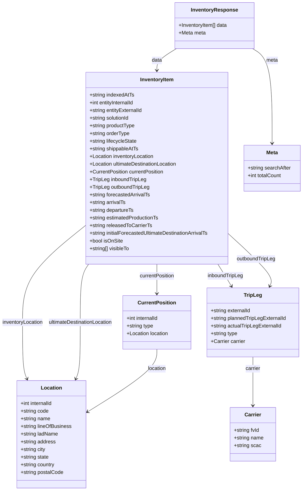

# Diagram: web/portal/src/mocks/handlers/entity-inventory/search/data.js


> Auto-generated by Obscura crawlers

## Diagram 1



### SVG

<svg id="container" width="973.23828125" xmlns="http://www.w3.org/2000/svg" class="classDiagram" height="1534" viewBox="0 0 973.23828125 1534" role="graphics-document document" aria-roledescription="class"><style>#container{font-family:"trebuchet ms",verdana,arial,sans-serif;font-size:16px;fill:#333;}@keyframes edge-animation-frame{from{stroke-dashoffset:0;}}@keyframes dash{to{stroke-dashoffset:0;}}#container .edge-animation-slow{stroke-dasharray:9,5!important;stroke-dashoffset:900;animation:dash 50s linear infinite;stroke-linecap:round;}#container .edge-animation-fast{stroke-dasharray:9,5!important;stroke-dashoffset:900;animation:dash 20s linear infinite;stroke-linecap:round;}#container .error-icon{fill:#552222;}#container .error-text{fill:#552222;stroke:#552222;}#container .edge-thickness-normal{stroke-width:1px;}#container .edge-thickness-thick{stroke-width:3.5px;}#container .edge-pattern-solid{stroke-dasharray:0;}#container .edge-thickness-invisible{stroke-width:0;fill:none;}#container .edge-pattern-dashed{stroke-dasharray:3;}#container .edge-pattern-dotted{stroke-dasharray:2;}#container .marker{fill:#333333;stroke:#333333;}#container .marker.cross{stroke:#333333;}#container svg{font-family:"trebuchet ms",verdana,arial,sans-serif;font-size:16px;}#container p{margin:0;}#container g.classGroup text{fill:#9370DB;stroke:none;font-family:"trebuchet ms",verdana,arial,sans-serif;font-size:10px;}#container g.classGroup text .title{font-weight:bolder;}#container .nodeLabel,#container .edgeLabel{color:#131300;}#container .edgeLabel .label rect{fill:#ECECFF;}#container .label text{fill:#131300;}#container .labelBkg{background:#ECECFF;}#container .edgeLabel .label span{background:#ECECFF;}#container .classTitle{font-weight:bolder;}#container .node rect,#container .node circle,#container .node ellipse,#container .node polygon,#container .node path{fill:#ECECFF;stroke:#9370DB;stroke-width:1px;}#container .divider{stroke:#9370DB;stroke-width:1;}#container g.clickable{cursor:pointer;}#container g.classGroup rect{fill:#ECECFF;stroke:#9370DB;}#container g.classGroup line{stroke:#9370DB;stroke-width:1;}#container .classLabel .box{stroke:none;stroke-width:0;fill:#ECECFF;opacity:0.5;}#container .classLabel .label{fill:#9370DB;font-size:10px;}#container .relation{stroke:#333333;stroke-width:1;fill:none;}#container .dashed-line{stroke-dasharray:3;}#container .dotted-line{stroke-dasharray:1 2;}#container #compositionStart,#container .composition{fill:#333333!important;stroke:#333333!important;stroke-width:1;}#container #compositionEnd,#container .composition{fill:#333333!important;stroke:#333333!important;stroke-width:1;}#container #dependencyStart,#container .dependency{fill:#333333!important;stroke:#333333!important;stroke-width:1;}#container #dependencyStart,#container .dependency{fill:#333333!important;stroke:#333333!important;stroke-width:1;}#container #extensionStart,#container .extension{fill:transparent!important;stroke:#333333!important;stroke-width:1;}#container #extensionEnd,#container .extension{fill:transparent!important;stroke:#333333!important;stroke-width:1;}#container #aggregationStart,#container .aggregation{fill:transparent!important;stroke:#333333!important;stroke-width:1;}#container #aggregationEnd,#container .aggregation{fill:transparent!important;stroke:#333333!important;stroke-width:1;}#container #lollipopStart,#container .lollipop{fill:#ECECFF!important;stroke:#333333!important;stroke-width:1;}#container #lollipopEnd,#container .lollipop{fill:#ECECFF!important;stroke:#333333!important;stroke-width:1;}#container .edgeTerminals{font-size:11px;line-height:initial;}#container .classTitleText{text-anchor:middle;font-size:18px;fill:#333;}#container .label-icon{display:inline-block;height:1em;overflow:visible;vertical-align:-0.125em;}#container .node .label-icon path{fill:currentColor;stroke:revert;stroke-width:revert;}#container :root{--mermaid-font-family:"trebuchet ms",verdana,arial,sans-serif;}</style><g><defs><marker id="container_class-aggregationStart" class="marker aggregation class" refX="18" refY="7" markerWidth="190" markerHeight="240" orient="auto"><path d="M 18,7 L9,13 L1,7 L9,1 Z"></path></marker></defs><defs><marker id="container_class-aggregationEnd" class="marker aggregation class" refX="1" refY="7" markerWidth="20" markerHeight="28" orient="auto"><path d="M 18,7 L9,13 L1,7 L9,1 Z"></path></marker></defs><defs><marker id="container_class-extensionStart" class="marker extension class" refX="18" refY="7" markerWidth="190" markerHeight="240" orient="auto"><path d="M 1,7 L18,13 V 1 Z"></path></marker></defs><defs><marker id="container_class-extensionEnd" class="marker extension class" refX="1" refY="7" markerWidth="20" markerHeight="28" orient="auto"><path d="M 1,1 V 13 L18,7 Z"></path></marker></defs><defs><marker id="container_class-compositionStart" class="marker composition class" refX="18" refY="7" markerWidth="190" markerHeight="240" orient="auto"><path d="M 18,7 L9,13 L1,7 L9,1 Z"></path></marker></defs><defs><marker id="container_class-compositionEnd" class="marker composition class" refX="1" refY="7" markerWidth="20" markerHeight="28" orient="auto"><path d="M 18,7 L9,13 L1,7 L9,1 Z"></path></marker></defs><defs><marker id="container_class-dependencyStart" class="marker dependency class" refX="6" refY="7" markerWidth="190" markerHeight="240" orient="auto"><path d="M 5,7 L9,13 L1,7 L9,1 Z"></path></marker></defs><defs><marker id="container_class-dependencyEnd" class="marker dependency class" refX="13" refY="7" markerWidth="20" markerHeight="28" orient="auto"><path d="M 18,7 L9,13 L14,7 L9,1 Z"></path></marker></defs><defs><marker id="container_class-lollipopStart" class="marker lollipop class" refX="13" refY="7" markerWidth="190" markerHeight="240" orient="auto"><circle stroke="black" fill="transparent" cx="7" cy="7" r="6"></circle></marker></defs><defs><marker id="container_class-lollipopEnd" class="marker lollipop class" refX="1" refY="7" markerWidth="190" markerHeight="240" orient="auto"><circle stroke="black" fill="transparent" cx="7" cy="7" r="6"></circle></marker></defs><g class="root"><g class="clusters"></g><g class="edgePaths"><path d="M570.556,152L560.147,158.167C549.739,164.333,528.922,176.667,518.514,188C508.105,199.333,508.105,209.667,508.105,214.833L508.105,220" id="id_InventoryResponse_InventoryItem_1" class="edge-thickness-normal edge-pattern-solid relation" style=";;;" data-edge="true" data-et="edge" data-id="id_InventoryResponse_InventoryItem_1" data-points="W3sieCI6NTcwLjU1NTU2NTUxMDMyMTEsInkiOjE1Mn0seyJ4Ijo1MDguMTA1NDY4NzUsInkiOjE4OX0seyJ4Ijo1MDguMTA1NDY4NzUsInkiOjIyNn1d" marker-end="url(#container_class-dependencyEnd)"></path><path d="M813.605,152L824.013,158.167C834.421,164.333,855.238,176.667,865.646,226C876.055,275.333,876.055,361.667,876.055,404.833L876.055,448" id="id_InventoryResponse_Meta_2" class="edge-thickness-normal edge-pattern-solid relation" style=";;;" data-edge="true" data-et="edge" data-id="id_InventoryResponse_Meta_2" data-points="W3sieCI6ODEzLjYwNDU5MDczOTY3ODksInkiOjE1Mn0seyJ4Ijo4NzYuMDU0Njg3NSwieSI6MTg5fSx7IngiOjg3Ni4wNTQ2ODc1LCJ5Ijo0NTR9XQ==" marker-end="url(#container_class-dependencyEnd)"></path><path d="M279.34,703.334L245.011,729.945C210.682,756.556,142.025,809.778,107.696,860.556C73.367,911.333,73.367,959.667,73.367,1008C73.367,1056.333,73.367,1104.667,75.789,1134.092C78.211,1163.517,83.055,1174.034,85.477,1179.292L87.899,1184.55" id="id_InventoryItem_Location_3" class="edge-thickness-normal edge-pattern-solid relation" style=";;;" data-edge="true" data-et="edge" data-id="id_InventoryItem_Location_3" data-points="W3sieCI6Mjc5LjMzOTg0Mzc1LCJ5Ijo3MDMuMzM0MzE1NzI1MTU3OX0seyJ4Ijo3My4zNjcxODc1LCJ5Ijo4NjN9LHsieCI6NzMuMzY3MTg3NSwieSI6MTAwOH0seyJ4Ijo3My4zNjcxODc1LCJ5IjoxMTUzfSx7IngiOjkwLjQwOTE4NDQ1MTIxOTUyLCJ5IjoxMTkwfV0=" marker-end="url(#container_class-dependencyEnd)"></path><path d="M289.208,826L284.709,832.167C280.209,838.333,271.21,850.667,266.71,881C262.211,911.333,262.211,959.667,262.211,1008C262.211,1056.333,262.211,1104.667,259.789,1134.092C257.367,1163.517,252.523,1174.034,250.101,1179.292L247.679,1184.55" id="id_InventoryItem_Location_4" class="edge-thickness-normal edge-pattern-solid relation" style=";;;" data-edge="true" data-et="edge" data-id="id_InventoryItem_Location_4" data-points="W3sieCI6Mjg5LjIwODI1OTkyMjEwNjgzLCJ5Ijo4MjZ9LHsieCI6MjYyLjIxMDkzNzUsInkiOjg2M30seyJ4IjoyNjIuMjEwOTM3NSwieSI6MTAwOH0seyJ4IjoyNjIuMjEwOTM3NSwieSI6MTE1M30seyJ4IjoyNDUuMTY4OTQwNTQ4NzgwNDgsInkiOjExOTB9XQ==" marker-end="url(#container_class-dependencyEnd)"></path><path d="M508.105,826L508.105,832.167C508.105,838.333,508.105,850.667,508.105,866C508.105,881.333,508.105,899.667,508.105,908.833L508.105,918" id="id_InventoryItem_CurrentPosition_5" class="edge-thickness-normal edge-pattern-solid relation" style=";;;" data-edge="true" data-et="edge" data-id="id_InventoryItem_CurrentPosition_5" data-points="W3sieCI6NTA4LjEwNTQ2ODc1LCJ5Ijo4MjZ9LHsieCI6NTA4LjEwNTQ2ODc1LCJ5Ijo4NjN9LHsieCI6NTA4LjEwNTQ2ODc1LCJ5Ijo5MjR9XQ==" marker-end="url(#container_class-dependencyEnd)"></path><path d="M508.105,1092L508.105,1102.167C508.105,1112.333,508.105,1132.667,470.314,1165.598C432.522,1198.53,356.938,1244.06,319.146,1266.825L281.354,1289.59" id="id_CurrentPosition_Location_6" class="edge-thickness-normal edge-pattern-solid relation" style=";;;" data-edge="true" data-et="edge" data-id="id_CurrentPosition_Location_6" data-points="W3sieCI6NTA4LjEwNTQ2ODc1LCJ5IjoxMDkyfSx7IngiOjUwOC4xMDU0Njg3NSwieSI6MTE1M30seyJ4IjoyNzYuMjE0ODQzNzUsInkiOjEyOTIuNjg2NDEzMTQ5NTI3N31d" marker-end="url(#container_class-dependencyEnd)"></path><path d="M701.979,826L705.965,832.167C709.95,838.333,717.92,850.667,725.02,862.138C732.119,873.609,738.348,884.217,741.463,889.522L744.577,894.826" id="id_InventoryItem_TripLeg_7" class="edge-thickness-normal edge-pattern-solid relation" style=";;;" data-edge="true" data-et="edge" data-id="id_InventoryItem_TripLeg_7" data-points="W3sieCI6NzAxLjk3OTQ5NTA4NTMxMTYsInkiOjgyNn0seyJ4Ijo3MjUuODkwNjI1LCJ5Ijo4NjN9LHsieCI6NzQ3LjYxNTE2NzAyNTg2MjEsInkiOjkwMH1d" marker-end="url(#container_class-dependencyEnd)"></path><path d="M736.871,733.044L760.803,754.703C784.734,776.363,832.598,819.681,854.008,846.605C875.419,873.529,870.377,884.059,867.856,889.324L865.335,894.588" id="id_InventoryItem_TripLeg_8" class="edge-thickness-normal edge-pattern-solid relation" style=";;;" data-edge="true" data-et="edge" data-id="id_InventoryItem_TripLeg_8" data-points="W3sieCI6NzM2Ljg3MTA5Mzc1LCJ5Ijo3MzMuMDQ0MTM0MTU0NDAxNH0seyJ4Ijo4ODAuNDYwOTM3NSwieSI6ODYzfSx7IngiOjg2Mi43NDMzOTk3ODQ0ODI4LCJ5Ijo5MDB9XQ==" marker-end="url(#container_class-dependencyEnd)"></path><path d="M811.027,1116L811.027,1122.167C811.027,1128.333,811.027,1140.667,811.027,1166C811.027,1191.333,811.027,1229.667,811.027,1248.833L811.027,1268" id="id_TripLeg_Carrier_9" class="edge-thickness-normal edge-pattern-solid relation" style=";;;" data-edge="true" data-et="edge" data-id="id_TripLeg_Carrier_9" data-points="W3sieCI6ODExLjAyNzM0Mzc1LCJ5IjoxMTE2fSx7IngiOjgxMS4wMjczNDM3NSwieSI6MTE1M30seyJ4Ijo4MTEuMDI3MzQzNzUsInkiOjEyNzR9XQ==" marker-end="url(#container_class-dependencyEnd)"></path></g><g class="edgeLabels"><g class="edgeLabel" transform="translate(508.10546875, 189)"><g class="label" data-id="id_InventoryResponse_InventoryItem_1" transform="translate(-16.3203125, -12)"><foreignObject width="32.640625" height="24"><div xmlns="http://www.w3.org/1999/xhtml" class="labelBkg" style="display: table-cell; white-space: nowrap; line-height: 1.5; max-width: 200px; text-align: center;"><span class="edgeLabel"><p>data</p></span></div></foreignObject></g></g><g class="edgeLabel" transform="translate(876.0546875, 189)"><g class="label" data-id="id_InventoryResponse_Meta_2" transform="translate(-18.40625, -12)"><foreignObject width="36.8125" height="24"><div xmlns="http://www.w3.org/1999/xhtml" class="labelBkg" style="display: table-cell; white-space: nowrap; line-height: 1.5; max-width: 200px; text-align: center;"><span class="edgeLabel"><p>meta</p></span></div></foreignObject></g></g><g class="edgeLabel" transform="translate(73.3671875, 1008)"><g class="label" data-id="id_InventoryItem_Location_3" transform="translate(-65.3671875, -12)"><foreignObject width="130.734375" height="24"><div xmlns="http://www.w3.org/1999/xhtml" class="labelBkg" style="display: table-cell; white-space: nowrap; line-height: 1.5; max-width: 200px; text-align: center;"><span class="edgeLabel"><p>inventoryLocation</p></span></div></foreignObject></g></g><g class="edgeLabel" transform="translate(262.2109375, 1008)"><g class="label" data-id="id_InventoryItem_Location_4" transform="translate(-103.4765625, -12)"><foreignObject width="206.953125" height="24"><div xmlns="http://www.w3.org/1999/xhtml" class="labelBkg" style="display: table; white-space: break-spaces; line-height: 1.5; max-width: 200px; text-align: center; width: 200px;"><span class="edgeLabel"><p>ultimateDestinationLocation</p></span></div></foreignObject></g></g><g class="edgeLabel" transform="translate(508.10546875, 863)"><g class="label" data-id="id_InventoryItem_CurrentPosition_5" transform="translate(-55.8515625, -12)"><foreignObject width="111.703125" height="24"><div xmlns="http://www.w3.org/1999/xhtml" class="labelBkg" style="display: table-cell; white-space: nowrap; line-height: 1.5; max-width: 200px; text-align: center;"><span class="edgeLabel"><p>currentPosition</p></span></div></foreignObject></g></g><g class="edgeLabel" transform="translate(508.10546875, 1153)"><g class="label" data-id="id_CurrentPosition_Location_6" transform="translate(-29.578125, -12)"><foreignObject width="59.15625" height="24"><div xmlns="http://www.w3.org/1999/xhtml" class="labelBkg" style="display: table-cell; white-space: nowrap; line-height: 1.5; max-width: 200px; text-align: center;"><span class="edgeLabel"><p>location</p></span></div></foreignObject></g></g><g class="edgeLabel" transform="translate(725.57921, 862.51812)"><g class="label" data-id="id_InventoryItem_TripLeg_7" transform="translate(-56.796875, -12)"><foreignObject width="113.59375" height="24"><div xmlns="http://www.w3.org/1999/xhtml" class="labelBkg" style="display: table-cell; white-space: nowrap; line-height: 1.5; max-width: 200px; text-align: center;"><span class="edgeLabel"><p>inboundTripLeg</p></span></div></foreignObject></g></g><g class="edgeLabel" transform="translate(823.87396, 811.78601)"><g class="label" data-id="id_InventoryItem_TripLeg_8" transform="translate(-62.0703125, -12)"><foreignObject width="124.140625" height="24"><div xmlns="http://www.w3.org/1999/xhtml" class="labelBkg" style="display: table-cell; white-space: nowrap; line-height: 1.5; max-width: 200px; text-align: center;"><span class="edgeLabel"><p>outboundTripLeg</p></span></div></foreignObject></g></g><g class="edgeLabel" transform="translate(811.02734375, 1153)"><g class="label" data-id="id_TripLeg_Carrier_9" transform="translate(-23.9765625, -12)"><foreignObject width="47.953125" height="24"><div xmlns="http://www.w3.org/1999/xhtml" class="labelBkg" style="display: table-cell; white-space: nowrap; line-height: 1.5; max-width: 200px; text-align: center;"><span class="edgeLabel"><p>carrier</p></span></div></foreignObject></g></g></g><g class="nodes"><g class="node default" id="classId-InventoryResponse-0" transform="translate(692.080078125, 80)"><g class="basic label-container"><path d="M-125.54296875 -72 L125.54296875 -72 L125.54296875 72 L-125.54296875 72" stroke="none" stroke-width="0" fill="#ECECFF" style=""></path><path d="M-125.54296875 -72 C-29.98709834018109 -72, 65.56877206963782 -72, 125.54296875 -72 M-125.54296875 -72 C-42.36036922543191 -72, 40.82223029913618 -72, 125.54296875 -72 M125.54296875 -72 C125.54296875 -28.309854208258294, 125.54296875 15.380291583483412, 125.54296875 72 M125.54296875 -72 C125.54296875 -29.66723828662296, 125.54296875 12.665523426754078, 125.54296875 72 M125.54296875 72 C62.25422630008634 72, -1.0345161498273256 72, -125.54296875 72 M125.54296875 72 C51.16042861904093 72, -23.222111511918143 72, -125.54296875 72 M-125.54296875 72 C-125.54296875 40.354644372372775, -125.54296875 8.709288744745542, -125.54296875 -72 M-125.54296875 72 C-125.54296875 31.754340047429288, -125.54296875 -8.491319905141424, -125.54296875 -72" stroke="#9370DB" stroke-width="1.3" fill="none" stroke-dasharray="0 0" style=""></path></g><g class="annotation-group text" transform="translate(0, -48)"></g><g class="label-group text" transform="translate(-70.3984375, -48)"><g class="label" style="font-weight: bolder" transform="translate(0,-12)"><foreignObject width="140.796875" height="24"><div xmlns="http://www.w3.org/1999/xhtml" style="display: table-cell; white-space: nowrap; line-height: 1.5; max-width: 189px; text-align: center;"><span class="nodeLabel markdown-node-label" style=""><p>InventoryResponse</p></span></div></foreignObject></g></g><g class="members-group text" transform="translate(-113.54296875, 0)"><g class="label" style="" transform="translate(0,-12)"><foreignObject width="156.6875" height="24"><div xmlns="http://www.w3.org/1999/xhtml" style="display: table-cell; white-space: nowrap; line-height: 1.5; max-width: 214px; text-align: center;"><span class="nodeLabel markdown-node-label" style=""><p>+InventoryItem[] data</p></span></div></foreignObject></g><g class="label" style="" transform="translate(0,12)"><foreignObject width="84.5625" height="24"><div xmlns="http://www.w3.org/1999/xhtml" style="display: table-cell; white-space: nowrap; line-height: 1.5; max-width: 142px; text-align: center;"><span class="nodeLabel markdown-node-label" style=""><p>+Meta meta</p></span></div></foreignObject></g></g><g class="methods-group text" transform="translate(-113.54296875, 72)"></g><g class="divider" style=""><path d="M-125.54296875 -24 C-48.42767692401863 -24, 28.687614901962746 -24, 125.54296875 -24 M-125.54296875 -24 C-29.36256081819765 -24, 66.8178471136047 -24, 125.54296875 -24" stroke="#9370DB" stroke-width="1.3" fill="none" stroke-dasharray="0 0" style=""></path></g><g class="divider" style=""><path d="M-125.54296875 48 C-25.854813500764294 48, 73.83334174847141 48, 125.54296875 48 M-125.54296875 48 C-61.027907872921546 48, 3.4871530041569088 48, 125.54296875 48" stroke="#9370DB" stroke-width="1.3" fill="none" stroke-dasharray="0 0" style=""></path></g></g><g class="node default" id="classId-InventoryItem-1" transform="translate(508.10546875, 526)"><g class="basic label-container"><path d="M-228.765625 -300 L228.765625 -300 L228.765625 300 L-228.765625 300" stroke="none" stroke-width="0" fill="#ECECFF" style=""></path><path d="M-228.765625 -300 C-112.08583639083741 -300, 4.593952218325171 -300, 228.765625 -300 M-228.765625 -300 C-106.2753297552244 -300, 16.21496548955119 -300, 228.765625 -300 M228.765625 -300 C228.765625 -109.77028665334808, 228.765625 80.45942669330384, 228.765625 300 M228.765625 -300 C228.765625 -159.5857441786728, 228.765625 -19.171488357345595, 228.765625 300 M228.765625 300 C106.04480824090297 300, -16.676008518194067 300, -228.765625 300 M228.765625 300 C52.53727155903874 300, -123.69108188192251 300, -228.765625 300 M-228.765625 300 C-228.765625 133.65353155378557, -228.765625 -32.69293689242886, -228.765625 -300 M-228.765625 300 C-228.765625 156.84624638961265, -228.765625 13.69249277922529, -228.765625 -300" stroke="#9370DB" stroke-width="1.3" fill="none" stroke-dasharray="0 0" style=""></path></g><g class="annotation-group text" transform="translate(0, -276)"></g><g class="label-group text" transform="translate(-51.421875, -276)"><g class="label" style="font-weight: bolder" transform="translate(0,-12)"><foreignObject width="102.84375" height="24"><div xmlns="http://www.w3.org/1999/xhtml" style="display: table-cell; white-space: nowrap; line-height: 1.5; max-width: 152px; text-align: center;"><span class="nodeLabel markdown-node-label" style=""><p>InventoryItem</p></span></div></foreignObject></g></g><g class="members-group text" transform="translate(-216.765625, -228)"><g class="label" style="" transform="translate(0,-12)"><foreignObject width="141.6875" height="24"><div xmlns="http://www.w3.org/1999/xhtml" style="display: table-cell; white-space: nowrap; line-height: 1.5; max-width: 199px; text-align: center;"><span class="nodeLabel markdown-node-label" style=""><p>+string indexedAtTs</p></span></div></foreignObject></g><g class="label" style="" transform="translate(0,12)"><foreignObject width="145.265625" height="24"><div xmlns="http://www.w3.org/1999/xhtml" style="display: table-cell; white-space: nowrap; line-height: 1.5; max-width: 203px; text-align: center;"><span class="nodeLabel markdown-node-label" style=""><p>+int entityInternalId</p></span></div></foreignObject></g><g class="label" style="" transform="translate(0,36)"><foreignObject width="169.46875" height="24"><div xmlns="http://www.w3.org/1999/xhtml" style="display: table-cell; white-space: nowrap; line-height: 1.5; max-width: 227px; text-align: center;"><span class="nodeLabel markdown-node-label" style=""><p>+string entityExternalId</p></span></div></foreignObject></g><g class="label" style="" transform="translate(0,60)"><foreignObject width="127.96875" height="24"><div xmlns="http://www.w3.org/1999/xhtml" style="display: table-cell; white-space: nowrap; line-height: 1.5; max-width: 185px; text-align: center;"><span class="nodeLabel markdown-node-label" style=""><p>+string solutionId</p></span></div></foreignObject></g><g class="label" style="" transform="translate(0,84)"><foreignObject width="144.4375" height="24"><div xmlns="http://www.w3.org/1999/xhtml" style="display: table-cell; white-space: nowrap; line-height: 1.5; max-width: 202px; text-align: center;"><span class="nodeLabel markdown-node-label" style=""><p>+string productType</p></span></div></foreignObject></g><g class="label" style="" transform="translate(0,108)"><foreignObject width="127.09375" height="24"><div xmlns="http://www.w3.org/1999/xhtml" style="display: table-cell; white-space: nowrap; line-height: 1.5; max-width: 184px; text-align: center;"><span class="nodeLabel markdown-node-label" style=""><p>+string orderType</p></span></div></foreignObject></g><g class="label" style="" transform="translate(0,132)"><foreignObject width="150.765625" height="24"><div xmlns="http://www.w3.org/1999/xhtml" style="display: table-cell; white-space: nowrap; line-height: 1.5; max-width: 208px; text-align: center;"><span class="nodeLabel markdown-node-label" style=""><p>+string lifecycleState</p></span></div></foreignObject></g><g class="label" style="" transform="translate(0,156)"><foreignObject width="155.5" height="24"><div xmlns="http://www.w3.org/1999/xhtml" style="display: table-cell; white-space: nowrap; line-height: 1.5; max-width: 213px; text-align: center;"><span class="nodeLabel markdown-node-label" style=""><p>+string shippableAtTs</p></span></div></foreignObject></g><g class="label" style="" transform="translate(0,180)"><foreignObject width="205.0625" height="24"><div xmlns="http://www.w3.org/1999/xhtml" style="display: table-cell; white-space: nowrap; line-height: 1.5; max-width: 262px; text-align: center;"><span class="nodeLabel markdown-node-label" style=""><p>+Location inventoryLocation</p></span></div></foreignObject></g><g class="label" style="" transform="translate(0,204)"><foreignObject width="281.28125" height="24"><div xmlns="http://www.w3.org/1999/xhtml" style="display: table-cell; white-space: nowrap; line-height: 1.5; max-width: 339px; text-align: center;"><span class="nodeLabel markdown-node-label" style=""><p>+Location ultimateDestinationLocation</p></span></div></foreignObject></g><g class="label" style="" transform="translate(0,228)"><foreignObject width="236.828125" height="24"><div xmlns="http://www.w3.org/1999/xhtml" style="display: table-cell; white-space: nowrap; line-height: 1.5; max-width: 294px; text-align: center;"><span class="nodeLabel markdown-node-label" style=""><p>+CurrentPosition currentPosition</p></span></div></foreignObject></g><g class="label" style="" transform="translate(0,252)"><foreignObject width="177.609375" height="24"><div xmlns="http://www.w3.org/1999/xhtml" style="display: table-cell; white-space: nowrap; line-height: 1.5; max-width: 236px; text-align: center;"><span class="nodeLabel markdown-node-label" style=""><p>+TripLeg inboundTripLeg</p></span></div></foreignObject></g><g class="label" style="" transform="translate(0,276)"><foreignObject width="188.15625" height="24"><div xmlns="http://www.w3.org/1999/xhtml" style="display: table-cell; white-space: nowrap; line-height: 1.5; max-width: 246px; text-align: center;"><span class="nodeLabel markdown-node-label" style=""><p>+TripLeg outboundTripLeg</p></span></div></foreignObject></g><g class="label" style="" transform="translate(0,300)"><foreignObject width="191.96875" height="24"><div xmlns="http://www.w3.org/1999/xhtml" style="display: table-cell; white-space: nowrap; line-height: 1.5; max-width: 249px; text-align: center;"><span class="nodeLabel markdown-node-label" style=""><p>+string forecastedArrivalTs</p></span></div></foreignObject></g><g class="label" style="" transform="translate(0,324)"><foreignObject width="115.21875" height="24"><div xmlns="http://www.w3.org/1999/xhtml" style="display: table-cell; white-space: nowrap; line-height: 1.5; max-width: 173px; text-align: center;"><span class="nodeLabel markdown-node-label" style=""><p>+string arrivalTs</p></span></div></foreignObject></g><g class="label" style="" transform="translate(0,348)"><foreignObject width="140.828125" height="24"><div xmlns="http://www.w3.org/1999/xhtml" style="display: table-cell; white-space: nowrap; line-height: 1.5; max-width: 198px; text-align: center;"><span class="nodeLabel markdown-node-label" style=""><p>+string departureTs</p></span></div></foreignObject></g><g class="label" style="" transform="translate(0,372)"><foreignObject width="221.078125" height="24"><div xmlns="http://www.w3.org/1999/xhtml" style="display: table-cell; white-space: nowrap; line-height: 1.5; max-width: 278px; text-align: center;"><span class="nodeLabel markdown-node-label" style=""><p>+string estimatedProductionTs</p></span></div></foreignObject></g><g class="label" style="" transform="translate(0,396)"><foreignObject width="196.703125" height="24"><div xmlns="http://www.w3.org/1999/xhtml" style="display: table-cell; white-space: nowrap; line-height: 1.5; max-width: 254px; text-align: center;"><span class="nodeLabel markdown-node-label" style=""><p>+string releasedToCarrierTs</p></span></div></foreignObject></g><g class="label" style="" transform="translate(0,420)"><foreignObject width="382.109375" height="24"><div xmlns="http://www.w3.org/1999/xhtml" style="display: table-cell; white-space: nowrap; line-height: 1.5; max-width: 439px; text-align: center;"><span class="nodeLabel markdown-node-label" style=""><p>+string initialForecastedUltimateDestinationArrivalTs</p></span></div></foreignObject></g><g class="label" style="" transform="translate(0,444)"><foreignObject width="105.03125" height="24"><div xmlns="http://www.w3.org/1999/xhtml" style="display: table-cell; white-space: nowrap; line-height: 1.5; max-width: 162px; text-align: center;"><span class="nodeLabel markdown-node-label" style=""><p>+bool isOnSite</p></span></div></foreignObject></g><g class="label" style="" transform="translate(0,468)"><foreignObject width="128.109375" height="24"><div xmlns="http://www.w3.org/1999/xhtml" style="display: table-cell; white-space: nowrap; line-height: 1.5; max-width: 185px; text-align: center;"><span class="nodeLabel markdown-node-label" style=""><p>+string[] visibleTo</p></span></div></foreignObject></g></g><g class="methods-group text" transform="translate(-216.765625, 300)"></g><g class="divider" style=""><path d="M-228.765625 -252 C-125.45079240774854 -252, -22.135959815497074 -252, 228.765625 -252 M-228.765625 -252 C-123.35837074376256 -252, -17.951116487525127 -252, 228.765625 -252" stroke="#9370DB" stroke-width="1.3" fill="none" stroke-dasharray="0 0" style=""></path></g><g class="divider" style=""><path d="M-228.765625 276 C-102.33625999374809 276, 24.093105012503827 276, 228.765625 276 M-228.765625 276 C-112.24936902353544 276, 4.266886952929127 276, 228.765625 276" stroke="#9370DB" stroke-width="1.3" fill="none" stroke-dasharray="0 0" style=""></path></g></g><g class="node default" id="classId-Location-2" transform="translate(167.7890625, 1358)"><g class="basic label-container"><path d="M-108.42578125 -168 L108.42578125 -168 L108.42578125 168 L-108.42578125 168" stroke="none" stroke-width="0" fill="#ECECFF" style=""></path><path d="M-108.42578125 -168 C-63.77738191194012 -168, -19.128982573880236 -168, 108.42578125 -168 M-108.42578125 -168 C-44.423423076167 -168, 19.578935097666005 -168, 108.42578125 -168 M108.42578125 -168 C108.42578125 -42.81505773686392, 108.42578125 82.36988452627216, 108.42578125 168 M108.42578125 -168 C108.42578125 -78.6014531222134, 108.42578125 10.7970937555732, 108.42578125 168 M108.42578125 168 C44.91246771099203 168, -18.600845828015935 168, -108.42578125 168 M108.42578125 168 C46.46389805075102 168, -15.49798514849796 168, -108.42578125 168 M-108.42578125 168 C-108.42578125 63.31769977930912, -108.42578125 -41.364600441381754, -108.42578125 -168 M-108.42578125 168 C-108.42578125 93.48652582955617, -108.42578125 18.973051659112343, -108.42578125 -168" stroke="#9370DB" stroke-width="1.3" fill="none" stroke-dasharray="0 0" style=""></path></g><g class="annotation-group text" transform="translate(0, -144)"></g><g class="label-group text" transform="translate(-31.3515625, -144)"><g class="label" style="font-weight: bolder" transform="translate(0,-12)"><foreignObject width="62.703125" height="24"><div xmlns="http://www.w3.org/1999/xhtml" style="display: table-cell; white-space: nowrap; line-height: 1.5; max-width: 112px; text-align: center;"><span class="nodeLabel markdown-node-label" style=""><p>Location</p></span></div></foreignObject></g></g><g class="members-group text" transform="translate(-96.42578125, -96)"><g class="label" style="" transform="translate(0,-12)"><foreignObject width="103.109375" height="24"><div xmlns="http://www.w3.org/1999/xhtml" style="display: table-cell; white-space: nowrap; line-height: 1.5; max-width: 160px; text-align: center;"><span class="nodeLabel markdown-node-label" style=""><p>+int internalId</p></span></div></foreignObject></g><g class="label" style="" transform="translate(0,12)"><foreignObject width="88.828125" height="24"><div xmlns="http://www.w3.org/1999/xhtml" style="display: table-cell; white-space: nowrap; line-height: 1.5; max-width: 146px; text-align: center;"><span class="nodeLabel markdown-node-label" style=""><p>+string code</p></span></div></foreignObject></g><g class="label" style="" transform="translate(0,36)"><foreignObject width="94.375" height="24"><div xmlns="http://www.w3.org/1999/xhtml" style="display: table-cell; white-space: nowrap; line-height: 1.5; max-width: 152px; text-align: center;"><span class="nodeLabel markdown-node-label" style=""><p>+string name</p></span></div></foreignObject></g><g class="label" style="" transform="translate(0,60)"><foreignObject width="161.5" height="24"><div xmlns="http://www.w3.org/1999/xhtml" style="display: table-cell; white-space: nowrap; line-height: 1.5; max-width: 219px; text-align: center;"><span class="nodeLabel markdown-node-label" style=""><p>+string lineOfBusiness</p></span></div></foreignObject></g><g class="label" style="" transform="translate(0,84)"><foreignObject width="118.8125" height="24"><div xmlns="http://www.w3.org/1999/xhtml" style="display: table-cell; white-space: nowrap; line-height: 1.5; max-width: 176px; text-align: center;"><span class="nodeLabel markdown-node-label" style=""><p>+string ladName</p></span></div></foreignObject></g><g class="label" style="" transform="translate(0,108)"><foreignObject width="110.90625" height="24"><div xmlns="http://www.w3.org/1999/xhtml" style="display: table-cell; white-space: nowrap; line-height: 1.5; max-width: 168px; text-align: center;"><span class="nodeLabel markdown-node-label" style=""><p>+string address</p></span></div></foreignObject></g><g class="label" style="" transform="translate(0,132)"><foreignObject width="79.59375" height="24"><div xmlns="http://www.w3.org/1999/xhtml" style="display: table-cell; white-space: nowrap; line-height: 1.5; max-width: 137px; text-align: center;"><span class="nodeLabel markdown-node-label" style=""><p>+string city</p></span></div></foreignObject></g><g class="label" style="" transform="translate(0,156)"><foreignObject width="89.953125" height="24"><div xmlns="http://www.w3.org/1999/xhtml" style="display: table-cell; white-space: nowrap; line-height: 1.5; max-width: 147px; text-align: center;"><span class="nodeLabel markdown-node-label" style=""><p>+string state</p></span></div></foreignObject></g><g class="label" style="" transform="translate(0,180)"><foreignObject width="109.046875" height="24"><div xmlns="http://www.w3.org/1999/xhtml" style="display: table-cell; white-space: nowrap; line-height: 1.5; max-width: 167px; text-align: center;"><span class="nodeLabel markdown-node-label" style=""><p>+string country</p></span></div></foreignObject></g><g class="label" style="" transform="translate(0,204)"><foreignObject width="135.359375" height="24"><div xmlns="http://www.w3.org/1999/xhtml" style="display: table-cell; white-space: nowrap; line-height: 1.5; max-width: 193px; text-align: center;"><span class="nodeLabel markdown-node-label" style=""><p>+string postalCode</p></span></div></foreignObject></g></g><g class="methods-group text" transform="translate(-96.42578125, 168)"></g><g class="divider" style=""><path d="M-108.42578125 -120 C-65.04373896123542 -120, -21.661696672470825 -120, 108.42578125 -120 M-108.42578125 -120 C-35.6002837055931 -120, 37.2252138388138 -120, 108.42578125 -120" stroke="#9370DB" stroke-width="1.3" fill="none" stroke-dasharray="0 0" style=""></path></g><g class="divider" style=""><path d="M-108.42578125 144 C-22.774257893612628 144, 62.877265462774744 144, 108.42578125 144 M-108.42578125 144 C-34.636446316154135 144, 39.15288861769173 144, 108.42578125 144" stroke="#9370DB" stroke-width="1.3" fill="none" stroke-dasharray="0 0" style=""></path></g></g><g class="node default" id="classId-CurrentPosition-3" transform="translate(508.10546875, 1008)"><g class="basic label-container"><path d="M-107.41796875 -84 L107.41796875 -84 L107.41796875 84 L-107.41796875 84" stroke="none" stroke-width="0" fill="#ECECFF" style=""></path><path d="M-107.41796875 -84 C-25.326070319324273 -84, 56.76582811135145 -84, 107.41796875 -84 M-107.41796875 -84 C-62.89578987619357 -84, -18.373611002387136 -84, 107.41796875 -84 M107.41796875 -84 C107.41796875 -42.10378908783054, 107.41796875 -0.20757817566108372, 107.41796875 84 M107.41796875 -84 C107.41796875 -43.66357121308663, 107.41796875 -3.3271424261732534, 107.41796875 84 M107.41796875 84 C49.65151346744225 84, -8.1149418151155 84, -107.41796875 84 M107.41796875 84 C43.71527830910493 84, -19.987412131790137 84, -107.41796875 84 M-107.41796875 84 C-107.41796875 27.274005614259195, -107.41796875 -29.45198877148161, -107.41796875 -84 M-107.41796875 84 C-107.41796875 17.463165421913175, -107.41796875 -49.07366915617365, -107.41796875 -84" stroke="#9370DB" stroke-width="1.3" fill="none" stroke-dasharray="0 0" style=""></path></g><g class="annotation-group text" transform="translate(0, -60)"></g><g class="label-group text" transform="translate(-57.3359375, -60)"><g class="label" style="font-weight: bolder" transform="translate(0,-12)"><foreignObject width="114.671875" height="24"><div xmlns="http://www.w3.org/1999/xhtml" style="display: table-cell; white-space: nowrap; line-height: 1.5; max-width: 163px; text-align: center;"><span class="nodeLabel markdown-node-label" style=""><p>CurrentPosition</p></span></div></foreignObject></g></g><g class="members-group text" transform="translate(-95.41796875, -12)"><g class="label" style="" transform="translate(0,-12)"><foreignObject width="103.109375" height="24"><div xmlns="http://www.w3.org/1999/xhtml" style="display: table-cell; white-space: nowrap; line-height: 1.5; max-width: 160px; text-align: center;"><span class="nodeLabel markdown-node-label" style=""><p>+int internalId</p></span></div></foreignObject></g><g class="label" style="" transform="translate(0,12)"><foreignObject width="85.65625" height="24"><div xmlns="http://www.w3.org/1999/xhtml" style="display: table-cell; white-space: nowrap; line-height: 1.5; max-width: 143px; text-align: center;"><span class="nodeLabel markdown-node-label" style=""><p>+string type</p></span></div></foreignObject></g><g class="label" style="" transform="translate(0,36)"><foreignObject width="133.5" height="24"><div xmlns="http://www.w3.org/1999/xhtml" style="display: table-cell; white-space: nowrap; line-height: 1.5; max-width: 191px; text-align: center;"><span class="nodeLabel markdown-node-label" style=""><p>+Location location</p></span></div></foreignObject></g></g><g class="methods-group text" transform="translate(-95.41796875, 84)"></g><g class="divider" style=""><path d="M-107.41796875 -36 C-49.80476580739314 -36, 7.8084371352137225 -36, 107.41796875 -36 M-107.41796875 -36 C-29.87041582371569 -36, 47.67713710256862 -36, 107.41796875 -36" stroke="#9370DB" stroke-width="1.3" fill="none" stroke-dasharray="0 0" style=""></path></g><g class="divider" style=""><path d="M-107.41796875 60 C-38.47850696496866 60, 30.460954820062682 60, 107.41796875 60 M-107.41796875 60 C-29.656287761809452 60, 48.105393226381096 60, 107.41796875 60" stroke="#9370DB" stroke-width="1.3" fill="none" stroke-dasharray="0 0" style=""></path></g></g><g class="node default" id="classId-TripLeg-4" transform="translate(811.02734375, 1008)"><g class="basic label-container"><path d="M-145.50390625 -108 L145.50390625 -108 L145.50390625 108 L-145.50390625 108" stroke="none" stroke-width="0" fill="#ECECFF" style=""></path><path d="M-145.50390625 -108 C-43.04872245783962 -108, 59.40646133432077 -108, 145.50390625 -108 M-145.50390625 -108 C-31.701599000134905 -108, 82.10070824973019 -108, 145.50390625 -108 M145.50390625 -108 C145.50390625 -52.94240519123777, 145.50390625 2.1151896175244644, 145.50390625 108 M145.50390625 -108 C145.50390625 -38.69731469231263, 145.50390625 30.60537061537474, 145.50390625 108 M145.50390625 108 C85.45544334601362 108, 25.406980442027262 108, -145.50390625 108 M145.50390625 108 C36.21536595864201 108, -73.07317433271598 108, -145.50390625 108 M-145.50390625 108 C-145.50390625 35.84095153819921, -145.50390625 -36.31809692360159, -145.50390625 -108 M-145.50390625 108 C-145.50390625 59.08669738208648, -145.50390625 10.173394764172954, -145.50390625 -108" stroke="#9370DB" stroke-width="1.3" fill="none" stroke-dasharray="0 0" style=""></path></g><g class="annotation-group text" transform="translate(0, -84)"></g><g class="label-group text" transform="translate(-27.0546875, -84)"><g class="label" style="font-weight: bolder" transform="translate(0,-12)"><foreignObject width="54.109375" height="24"><div xmlns="http://www.w3.org/1999/xhtml" style="display: table-cell; white-space: nowrap; line-height: 1.5; max-width: 103px; text-align: center;"><span class="nodeLabel markdown-node-label" style=""><p>TripLeg</p></span></div></foreignObject></g></g><g class="members-group text" transform="translate(-133.50390625, -36)"><g class="label" style="" transform="translate(0,-12)"><foreignObject width="127.53125" height="24"><div xmlns="http://www.w3.org/1999/xhtml" style="display: table-cell; white-space: nowrap; line-height: 1.5; max-width: 185px; text-align: center;"><span class="nodeLabel markdown-node-label" style=""><p>+string externalId</p></span></div></foreignObject></g><g class="label" style="" transform="translate(0,12)"><foreignObject width="239.953125" height="24"><div xmlns="http://www.w3.org/1999/xhtml" style="display: table-cell; white-space: nowrap; line-height: 1.5; max-width: 297px; text-align: center;"><span class="nodeLabel markdown-node-label" style=""><p>+string plannedTripLegExternalId</p></span></div></foreignObject></g><g class="label" style="" transform="translate(0,36)"><foreignObject width="224.78125" height="24"><div xmlns="http://www.w3.org/1999/xhtml" style="display: table-cell; white-space: nowrap; line-height: 1.5; max-width: 282px; text-align: center;"><span class="nodeLabel markdown-node-label" style=""><p>+string actualTripLegExternalId</p></span></div></foreignObject></g><g class="label" style="" transform="translate(0,60)"><foreignObject width="85.65625" height="24"><div xmlns="http://www.w3.org/1999/xhtml" style="display: table-cell; white-space: nowrap; line-height: 1.5; max-width: 143px; text-align: center;"><span class="nodeLabel markdown-node-label" style=""><p>+string type</p></span></div></foreignObject></g><g class="label" style="" transform="translate(0,84)"><foreignObject width="109.453125" height="24"><div xmlns="http://www.w3.org/1999/xhtml" style="display: table-cell; white-space: nowrap; line-height: 1.5; max-width: 168px; text-align: center;"><span class="nodeLabel markdown-node-label" style=""><p>+Carrier carrier</p></span></div></foreignObject></g></g><g class="methods-group text" transform="translate(-133.50390625, 108)"></g><g class="divider" style=""><path d="M-145.50390625 -60 C-54.75210927798726 -60, 35.99968769402548 -60, 145.50390625 -60 M-145.50390625 -60 C-60.79218940394421 -60, 23.919527442111587 -60, 145.50390625 -60" stroke="#9370DB" stroke-width="1.3" fill="none" stroke-dasharray="0 0" style=""></path></g><g class="divider" style=""><path d="M-145.50390625 84 C-67.3798295185045 84, 10.744247212991013 84, 145.50390625 84 M-145.50390625 84 C-54.32089023162136 84, 36.862125786757275 84, 145.50390625 84" stroke="#9370DB" stroke-width="1.3" fill="none" stroke-dasharray="0 0" style=""></path></g></g><g class="node default" id="classId-Carrier-5" transform="translate(811.02734375, 1358)"><g class="basic label-container"><path d="M-71.7890625 -84 L71.7890625 -84 L71.7890625 84 L-71.7890625 84" stroke="none" stroke-width="0" fill="#ECECFF" style=""></path><path d="M-71.7890625 -84 C-24.374649781863937 -84, 23.039762936272126 -84, 71.7890625 -84 M-71.7890625 -84 C-28.52774953973345 -84, 14.733563420533102 -84, 71.7890625 -84 M71.7890625 -84 C71.7890625 -17.85400437566149, 71.7890625 48.29199124867702, 71.7890625 84 M71.7890625 -84 C71.7890625 -21.54559301412681, 71.7890625 40.90881397174638, 71.7890625 84 M71.7890625 84 C34.89787271554223 84, -1.9933170689155446 84, -71.7890625 84 M71.7890625 84 C41.31908801703456 84, 10.849113534069126 84, -71.7890625 84 M-71.7890625 84 C-71.7890625 26.320239220009427, -71.7890625 -31.359521559981147, -71.7890625 -84 M-71.7890625 84 C-71.7890625 40.578517461206175, -71.7890625 -2.8429650775876496, -71.7890625 -84" stroke="#9370DB" stroke-width="1.3" fill="none" stroke-dasharray="0 0" style=""></path></g><g class="annotation-group text" transform="translate(0, -60)"></g><g class="label-group text" transform="translate(-25.203125, -60)"><g class="label" style="font-weight: bolder" transform="translate(0,-12)"><foreignObject width="50.40625" height="24"><div xmlns="http://www.w3.org/1999/xhtml" style="display: table-cell; white-space: nowrap; line-height: 1.5; max-width: 100px; text-align: center;"><span class="nodeLabel markdown-node-label" style=""><p>Carrier</p></span></div></foreignObject></g></g><g class="members-group text" transform="translate(-59.7890625, -12)"><g class="label" style="" transform="translate(0,-12)"><foreignObject width="81.390625" height="24"><div xmlns="http://www.w3.org/1999/xhtml" style="display: table-cell; white-space: nowrap; line-height: 1.5; max-width: 139px; text-align: center;"><span class="nodeLabel markdown-node-label" style=""><p>+string fvId</p></span></div></foreignObject></g><g class="label" style="" transform="translate(0,12)"><foreignObject width="94.375" height="24"><div xmlns="http://www.w3.org/1999/xhtml" style="display: table-cell; white-space: nowrap; line-height: 1.5; max-width: 152px; text-align: center;"><span class="nodeLabel markdown-node-label" style=""><p>+string name</p></span></div></foreignObject></g><g class="label" style="" transform="translate(0,36)"><foreignObject width="85.171875" height="24"><div xmlns="http://www.w3.org/1999/xhtml" style="display: table-cell; white-space: nowrap; line-height: 1.5; max-width: 143px; text-align: center;"><span class="nodeLabel markdown-node-label" style=""><p>+string scac</p></span></div></foreignObject></g></g><g class="methods-group text" transform="translate(-59.7890625, 84)"></g><g class="divider" style=""><path d="M-71.7890625 -36 C-38.09343760262161 -36, -4.397812705243226 -36, 71.7890625 -36 M-71.7890625 -36 C-36.938333368137634 -36, -2.0876042362752685 -36, 71.7890625 -36" stroke="#9370DB" stroke-width="1.3" fill="none" stroke-dasharray="0 0" style=""></path></g><g class="divider" style=""><path d="M-71.7890625 60 C-29.208920346629867 60, 13.371221806740266 60, 71.7890625 60 M-71.7890625 60 C-24.90458163999682 60, 21.97989922000636 60, 71.7890625 60" stroke="#9370DB" stroke-width="1.3" fill="none" stroke-dasharray="0 0" style=""></path></g></g><g class="node default" id="classId-Meta-6" transform="translate(876.0546875, 526)"><g class="basic label-container"><path d="M-89.18359375 -72 L89.18359375 -72 L89.18359375 72 L-89.18359375 72" stroke="none" stroke-width="0" fill="#ECECFF" style=""></path><path d="M-89.18359375 -72 C-27.799454084742365 -72, 33.58468558051527 -72, 89.18359375 -72 M-89.18359375 -72 C-41.83554195924486 -72, 5.512509831510286 -72, 89.18359375 -72 M89.18359375 -72 C89.18359375 -33.96688545180767, 89.18359375 4.06622909638466, 89.18359375 72 M89.18359375 -72 C89.18359375 -27.303602194907043, 89.18359375 17.392795610185914, 89.18359375 72 M89.18359375 72 C18.77819272752693 72, -51.62720829494614 72, -89.18359375 72 M89.18359375 72 C40.5439689133364 72, -8.0956559233272 72, -89.18359375 72 M-89.18359375 72 C-89.18359375 33.71485132484244, -89.18359375 -4.570297350315116, -89.18359375 -72 M-89.18359375 72 C-89.18359375 34.10903309812647, -89.18359375 -3.781933803747066, -89.18359375 -72" stroke="#9370DB" stroke-width="1.3" fill="none" stroke-dasharray="0 0" style=""></path></g><g class="annotation-group text" transform="translate(0, -48)"></g><g class="label-group text" transform="translate(-18.0859375, -48)"><g class="label" style="font-weight: bolder" transform="translate(0,-12)"><foreignObject width="36.171875" height="24"><div xmlns="http://www.w3.org/1999/xhtml" style="display: table-cell; white-space: nowrap; line-height: 1.5; max-width: 86px; text-align: center;"><span class="nodeLabel markdown-node-label" style=""><p>Meta</p></span></div></foreignObject></g></g><g class="members-group text" transform="translate(-77.18359375, 0)"><g class="label" style="" transform="translate(0,-12)"><foreignObject width="136.28125" height="24"><div xmlns="http://www.w3.org/1999/xhtml" style="display: table-cell; white-space: nowrap; line-height: 1.5; max-width: 194px; text-align: center;"><span class="nodeLabel markdown-node-label" style=""><p>+string searchAfter</p></span></div></foreignObject></g><g class="label" style="" transform="translate(0,12)"><foreignObject width="108.125" height="24"><div xmlns="http://www.w3.org/1999/xhtml" style="display: table-cell; white-space: nowrap; line-height: 1.5; max-width: 166px; text-align: center;"><span class="nodeLabel markdown-node-label" style=""><p>+int totalCount</p></span></div></foreignObject></g></g><g class="methods-group text" transform="translate(-77.18359375, 72)"></g><g class="divider" style=""><path d="M-89.18359375 -24 C-31.945990261307813 -24, 25.291613227384374 -24, 89.18359375 -24 M-89.18359375 -24 C-26.239586582351095 -24, 36.70442058529781 -24, 89.18359375 -24" stroke="#9370DB" stroke-width="1.3" fill="none" stroke-dasharray="0 0" style=""></path></g><g class="divider" style=""><path d="M-89.18359375 48 C-23.182812779912226 48, 42.81796819017555 48, 89.18359375 48 M-89.18359375 48 C-39.134137267791665 48, 10.91531921441667 48, 89.18359375 48" stroke="#9370DB" stroke-width="1.3" fill="none" stroke-dasharray="0 0" style=""></path></g></g></g></g></g></svg>

## Diagram 2

```mermaid
flowchart LR
Client[Client] --> REQ[/GET /entity-inventory/location/:locationId/search]
REQ --> HANDLER[rest.get(URL, handler)]
HANDLER --> BUILD_BODY[Construct responseBody (sample dataset)]
HANDLER --> BUILD_TEST[Construct responseTest (test dataset)]
BUILD_TEST --> RESP[res(ctx.json(responseTest))]
RESP --> Client
```

> SVG rendering failed for this diagram.
