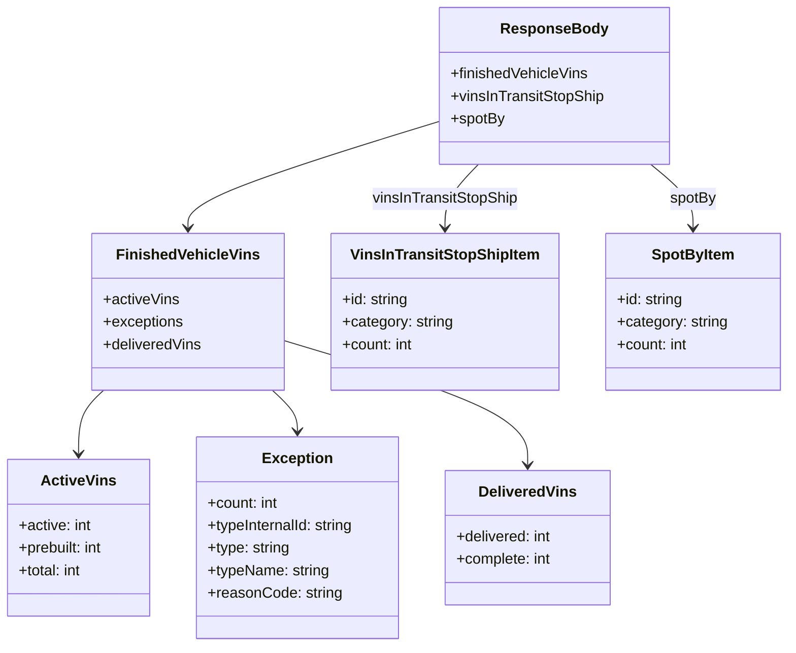

# Diagram: web/portal/src/mocks/handlers/entity/finview/solutionId/dashboard.js


> Auto-generated by Obscura crawlers

## Diagram 1

```mermaid
flowchart LR
  Client[Client] -->|POST /finished-product/finished-product/:solutionId/dashboard| MSW[msw.rest.post handler]
  MSW --> Build[Construct responseBody]
  Build --> FV[finishedVehicleVins]
  Build --> VITS[vinsInTransitStopShip]
  Build --> SP[spotBy]
  FV --> AV[activeVins\nactive: 800\nprebuilt: 200\ntotal: 1000]
  FV --> EX[exceptions[]\n(count, typeInternalId, type, typeName, reasonCode)]
  FV --> DV[deliveredVins\ndelivered: 242\ncomplete: 0]
  VITS --> V1[id: 1\ncategory: 2020 Corvette Campaign 3\ncount: 33]
  VITS --> V2[id: 2\ncategory: 2020 LS6 Campaign 5\ncount: 59]
  SP --> S1[id: 1\ncategory: SP1\ncount: 2]
  SP --> S2[id: 2\ncategory: SP2\ncount: 3]
  MSW -->|res(ctx.json(responseBody))| Client
```

> SVG rendering failed for this diagram.

## Diagram 2



### SVG

<svg id="container" width="840.779296875" xmlns="http://www.w3.org/2000/svg" class="classDiagram" height="692" viewBox="0 0 840.779296875 692" role="graphics-document document" aria-roledescription="class"><style>#container{font-family:"trebuchet ms",verdana,arial,sans-serif;font-size:16px;fill:#333;}@keyframes edge-animation-frame{from{stroke-dashoffset:0;}}@keyframes dash{to{stroke-dashoffset:0;}}#container .edge-animation-slow{stroke-dasharray:9,5!important;stroke-dashoffset:900;animation:dash 50s linear infinite;stroke-linecap:round;}#container .edge-animation-fast{stroke-dasharray:9,5!important;stroke-dashoffset:900;animation:dash 20s linear infinite;stroke-linecap:round;}#container .error-icon{fill:#552222;}#container .error-text{fill:#552222;stroke:#552222;}#container .edge-thickness-normal{stroke-width:1px;}#container .edge-thickness-thick{stroke-width:3.5px;}#container .edge-pattern-solid{stroke-dasharray:0;}#container .edge-thickness-invisible{stroke-width:0;fill:none;}#container .edge-pattern-dashed{stroke-dasharray:3;}#container .edge-pattern-dotted{stroke-dasharray:2;}#container .marker{fill:#333333;stroke:#333333;}#container .marker.cross{stroke:#333333;}#container svg{font-family:"trebuchet ms",verdana,arial,sans-serif;font-size:16px;}#container p{margin:0;}#container g.classGroup text{fill:#9370DB;stroke:none;font-family:"trebuchet ms",verdana,arial,sans-serif;font-size:10px;}#container g.classGroup text .title{font-weight:bolder;}#container .nodeLabel,#container .edgeLabel{color:#131300;}#container .edgeLabel .label rect{fill:#ECECFF;}#container .label text{fill:#131300;}#container .labelBkg{background:#ECECFF;}#container .edgeLabel .label span{background:#ECECFF;}#container .classTitle{font-weight:bolder;}#container .node rect,#container .node circle,#container .node ellipse,#container .node polygon,#container .node path{fill:#ECECFF;stroke:#9370DB;stroke-width:1px;}#container .divider{stroke:#9370DB;stroke-width:1;}#container g.clickable{cursor:pointer;}#container g.classGroup rect{fill:#ECECFF;stroke:#9370DB;}#container g.classGroup line{stroke:#9370DB;stroke-width:1;}#container .classLabel .box{stroke:none;stroke-width:0;fill:#ECECFF;opacity:0.5;}#container .classLabel .label{fill:#9370DB;font-size:10px;}#container .relation{stroke:#333333;stroke-width:1;fill:none;}#container .dashed-line{stroke-dasharray:3;}#container .dotted-line{stroke-dasharray:1 2;}#container #compositionStart,#container .composition{fill:#333333!important;stroke:#333333!important;stroke-width:1;}#container #compositionEnd,#container .composition{fill:#333333!important;stroke:#333333!important;stroke-width:1;}#container #dependencyStart,#container .dependency{fill:#333333!important;stroke:#333333!important;stroke-width:1;}#container #dependencyStart,#container .dependency{fill:#333333!important;stroke:#333333!important;stroke-width:1;}#container #extensionStart,#container .extension{fill:transparent!important;stroke:#333333!important;stroke-width:1;}#container #extensionEnd,#container .extension{fill:transparent!important;stroke:#333333!important;stroke-width:1;}#container #aggregationStart,#container .aggregation{fill:transparent!important;stroke:#333333!important;stroke-width:1;}#container #aggregationEnd,#container .aggregation{fill:transparent!important;stroke:#333333!important;stroke-width:1;}#container #lollipopStart,#container .lollipop{fill:#ECECFF!important;stroke:#333333!important;stroke-width:1;}#container #lollipopEnd,#container .lollipop{fill:#ECECFF!important;stroke:#333333!important;stroke-width:1;}#container .edgeTerminals{font-size:11px;line-height:initial;}#container .classTitleText{text-anchor:middle;font-size:18px;fill:#333;}#container .label-icon{display:inline-block;height:1em;overflow:visible;vertical-align:-0.125em;}#container .node .label-icon path{fill:currentColor;stroke:revert;stroke-width:revert;}#container :root{--mermaid-font-family:"trebuchet ms",verdana,arial,sans-serif;}</style><g><defs><marker id="container_class-aggregationStart" class="marker aggregation class" refX="18" refY="7" markerWidth="190" markerHeight="240" orient="auto"><path d="M 18,7 L9,13 L1,7 L9,1 Z"></path></marker></defs><defs><marker id="container_class-aggregationEnd" class="marker aggregation class" refX="1" refY="7" markerWidth="20" markerHeight="28" orient="auto"><path d="M 18,7 L9,13 L1,7 L9,1 Z"></path></marker></defs><defs><marker id="container_class-extensionStart" class="marker extension class" refX="18" refY="7" markerWidth="190" markerHeight="240" orient="auto"><path d="M 1,7 L18,13 V 1 Z"></path></marker></defs><defs><marker id="container_class-extensionEnd" class="marker extension class" refX="1" refY="7" markerWidth="20" markerHeight="28" orient="auto"><path d="M 1,1 V 13 L18,7 Z"></path></marker></defs><defs><marker id="container_class-compositionStart" class="marker composition class" refX="18" refY="7" markerWidth="190" markerHeight="240" orient="auto"><path d="M 18,7 L9,13 L1,7 L9,1 Z"></path></marker></defs><defs><marker id="container_class-compositionEnd" class="marker composition class" refX="1" refY="7" markerWidth="20" markerHeight="28" orient="auto"><path d="M 18,7 L9,13 L1,7 L9,1 Z"></path></marker></defs><defs><marker id="container_class-dependencyStart" class="marker dependency class" refX="6" refY="7" markerWidth="190" markerHeight="240" orient="auto"><path d="M 5,7 L9,13 L1,7 L9,1 Z"></path></marker></defs><defs><marker id="container_class-dependencyEnd" class="marker dependency class" refX="13" refY="7" markerWidth="20" markerHeight="28" orient="auto"><path d="M 18,7 L9,13 L14,7 L9,1 Z"></path></marker></defs><defs><marker id="container_class-lollipopStart" class="marker lollipop class" refX="13" refY="7" markerWidth="190" markerHeight="240" orient="auto"><circle stroke="black" fill="transparent" cx="7" cy="7" r="6"></circle></marker></defs><defs><marker id="container_class-lollipopEnd" class="marker lollipop class" refX="1" refY="7" markerWidth="190" markerHeight="240" orient="auto"><circle stroke="black" fill="transparent" cx="7" cy="7" r="6"></circle></marker></defs><g class="root"><g class="clusters"></g><g class="edgePaths"><path d="M473.168,129.747L428.392,143.622C383.615,157.498,294.063,185.249,249.286,204.291C204.51,223.333,204.51,233.667,204.51,238.833L204.51,244" id="id_ResponseBody_FinishedVehicleVins_1" class="edge-thickness-normal edge-pattern-solid relation" style=";;;" data-edge="true" data-et="edge" data-id="id_ResponseBody_FinishedVehicleVins_1" data-points="W3sieCI6NDczLjE2Nzk2ODc1LCJ5IjoxMjkuNzQ2NzE3NDIwNTU1MzR9LHsieCI6MjA0LjUwOTc2NTYyNSwieSI6MjEzfSx7IngiOjIwNC41MDk3NjU2MjUsInkiOjI1MH1d" marker-end="url(#container_class-dependencyEnd)"></path><path d="M512.415,176L506.354,182.167C500.293,188.333,488.171,200.667,482.11,212C476.049,223.333,476.049,233.667,476.049,238.833L476.049,244" id="id_ResponseBody_VinsInTransitStopShipItem_2" class="edge-thickness-normal edge-pattern-solid relation" style=";;;" data-edge="true" data-et="edge" data-id="id_ResponseBody_VinsInTransitStopShipItem_2" data-points="W3sieCI6NTEyLjQxNTE2MDEyMzk2NywieSI6MTc2fSx7IngiOjQ3Ni4wNDg4MjgxMjUsInkiOjIxM30seyJ4Ijo0NzYuMDQ4ODI4MTI1LCJ5IjoyNTB9XQ==" marker-end="url(#container_class-dependencyEnd)"></path><path d="M695.387,176L702.758,182.167C710.13,188.333,724.872,200.667,732.244,212C739.615,223.333,739.615,233.667,739.615,238.833L739.615,244" id="id_ResponseBody_SpotByItem_3" class="edge-thickness-normal edge-pattern-solid relation" style=";;;" data-edge="true" data-et="edge" data-id="id_ResponseBody_SpotByItem_3" data-points="W3sieCI6Njk1LjM4Njg4MDE2NTI4OTMsInkiOjE3Nn0seyJ4Ijo3MzkuNjE1MjM0Mzc1LCJ5IjoyMTN9LHsieCI6NzM5LjYxNTIzNDM3NSwieSI6MjUwfV0=" marker-end="url(#container_class-dependencyEnd)"></path><path d="M112.859,418L108.313,422.167C103.767,426.333,94.674,434.667,90.128,446C85.582,457.333,85.582,471.667,85.582,478.833L85.582,486" id="id_FinishedVehicleVins_ActiveVins_4" class="edge-thickness-normal edge-pattern-solid relation" style=";;;" data-edge="true" data-et="edge" data-id="id_FinishedVehicleVins_ActiveVins_4" data-points="W3sieCI6MTEyLjg1OTAzNDU0NzAxODM1LCJ5Ijo0MTh9LHsieCI6ODUuNTgyMDMxMjUsInkiOjQ0M30seyJ4Ijo4NS41ODIwMzEyNSwieSI6NDkyfV0=" marker-end="url(#container_class-dependencyEnd)"></path><path d="M296.16,418L300.707,422.167C305.253,426.333,314.345,434.667,318.891,442C323.438,449.333,323.438,455.667,323.438,458.833L323.438,462" id="id_FinishedVehicleVins_Exception_5" class="edge-thickness-normal edge-pattern-solid relation" style=";;;" data-edge="true" data-et="edge" data-id="id_FinishedVehicleVins_Exception_5" data-points="W3sieCI6Mjk2LjE2MDQ5NjcwMjk4MTYsInkiOjQxOH0seyJ4IjozMjMuNDM3NSwieSI6NDQzfSx7IngiOjMyMy40Mzc1LCJ5Ijo0Njh9XQ==" marker-end="url(#container_class-dependencyEnd)"></path><path d="M305.646,363.943L350.151,377.119C394.656,390.295,483.666,416.648,528.171,438.99C572.676,461.333,572.676,479.667,572.676,488.833L572.676,498" id="id_FinishedVehicleVins_DeliveredVins_6" class="edge-thickness-normal edge-pattern-solid relation" style=";;;" data-edge="true" data-et="edge" data-id="id_FinishedVehicleVins_DeliveredVins_6" data-points="W3sieCI6MzA1LjY0NjQ4NDM3NSwieSI6MzYzLjk0Mjc0ODMxNDMzMjU2fSx7IngiOjU3Mi42NzU3ODEyNSwieSI6NDQzfSx7IngiOjU3Mi42NzU3ODEyNSwieSI6NTA0fV0=" marker-end="url(#container_class-dependencyEnd)"></path></g><g class="edgeLabels"><g class="edgeLabel"><g class="label" data-id="id_ResponseBody_FinishedVehicleVins_1" transform="translate(0, 0)"><foreignObject width="0" height="0"><div xmlns="http://www.w3.org/1999/xhtml" class="labelBkg" style="display: table-cell; white-space: nowrap; line-height: 1.5; max-width: 200px; text-align: center;"><span class="edgeLabel"></span></div></foreignObject></g></g><g class="edgeLabel" transform="translate(476.048828125, 213)"><g class="label" data-id="id_ResponseBody_VinsInTransitStopShipItem_2" transform="translate(-78.8984375, -12)"><foreignObject width="157.796875" height="24"><div xmlns="http://www.w3.org/1999/xhtml" class="labelBkg" style="display: table-cell; white-space: nowrap; line-height: 1.5; max-width: 200px; text-align: center;"><span class="edgeLabel"><p>vinsInTransitStopShip</p></span></div></foreignObject></g></g><g class="edgeLabel" transform="translate(739.615234375, 213)"><g class="label" data-id="id_ResponseBody_SpotByItem_3" transform="translate(-24.8515625, -12)"><foreignObject width="49.703125" height="24"><div xmlns="http://www.w3.org/1999/xhtml" class="labelBkg" style="display: table-cell; white-space: nowrap; line-height: 1.5; max-width: 200px; text-align: center;"><span class="edgeLabel"><p>spotBy</p></span></div></foreignObject></g></g><g class="edgeLabel"><g class="label" data-id="id_FinishedVehicleVins_ActiveVins_4" transform="translate(0, 0)"><foreignObject width="0" height="0"><div xmlns="http://www.w3.org/1999/xhtml" class="labelBkg" style="display: table-cell; white-space: nowrap; line-height: 1.5; max-width: 200px; text-align: center;"><span class="edgeLabel"></span></div></foreignObject></g></g><g class="edgeLabel"><g class="label" data-id="id_FinishedVehicleVins_Exception_5" transform="translate(0, 0)"><foreignObject width="0" height="0"><div xmlns="http://www.w3.org/1999/xhtml" class="labelBkg" style="display: table-cell; white-space: nowrap; line-height: 1.5; max-width: 200px; text-align: center;"><span class="edgeLabel"></span></div></foreignObject></g></g><g class="edgeLabel"><g class="label" data-id="id_FinishedVehicleVins_DeliveredVins_6" transform="translate(0, 0)"><foreignObject width="0" height="0"><div xmlns="http://www.w3.org/1999/xhtml" class="labelBkg" style="display: table-cell; white-space: nowrap; line-height: 1.5; max-width: 200px; text-align: center;"><span class="edgeLabel"></span></div></foreignObject></g></g></g><g class="nodes"><g class="node default" id="classId-ResponseBody-0" transform="translate(594.9765625, 92)"><g class="basic label-container"><path d="M-121.80859375 -84 L121.80859375 -84 L121.80859375 84 L-121.80859375 84" stroke="none" stroke-width="0" fill="#ECECFF" style=""></path><path d="M-121.80859375 -84 C-29.330149359345697 -84, 63.148295031308606 -84, 121.80859375 -84 M-121.80859375 -84 C-67.36302428346534 -84, -12.917454816930672 -84, 121.80859375 -84 M121.80859375 -84 C121.80859375 -43.09915624501345, 121.80859375 -2.1983124900268933, 121.80859375 84 M121.80859375 -84 C121.80859375 -29.58162330169077, 121.80859375 24.836753396618462, 121.80859375 84 M121.80859375 84 C66.61831179004383 84, 11.428029830087667 84, -121.80859375 84 M121.80859375 84 C33.102818040801154 84, -55.60295766839769 84, -121.80859375 84 M-121.80859375 84 C-121.80859375 26.88658165103203, -121.80859375 -30.226836697935937, -121.80859375 -84 M-121.80859375 84 C-121.80859375 19.17712566907086, -121.80859375 -45.64574866185828, -121.80859375 -84" stroke="#9370DB" stroke-width="1.3" fill="none" stroke-dasharray="0 0" style=""></path></g><g class="annotation-group text" transform="translate(0, -60)"></g><g class="label-group text" transform="translate(-53.9921875, -60)"><g class="label" style="font-weight: bolder" transform="translate(0,-12)"><foreignObject width="107.984375" height="24"><div xmlns="http://www.w3.org/1999/xhtml" style="display: table-cell; white-space: nowrap; line-height: 1.5; max-width: 157px; text-align: center;"><span class="nodeLabel markdown-node-label" style=""><p>ResponseBody</p></span></div></foreignObject></g></g><g class="members-group text" transform="translate(-109.80859375, -12)"><g class="label" style="" transform="translate(0,-12)"><foreignObject width="148.3125" height="24"><div xmlns="http://www.w3.org/1999/xhtml" style="display: table-cell; white-space: nowrap; line-height: 1.5; max-width: 206px; text-align: center;"><span class="nodeLabel markdown-node-label" style=""><p>+finishedVehicleVins</p></span></div></foreignObject></g><g class="label" style="" transform="translate(0,12)"><foreignObject width="165.625" height="24"><div xmlns="http://www.w3.org/1999/xhtml" style="display: table-cell; white-space: nowrap; line-height: 1.5; max-width: 223px; text-align: center;"><span class="nodeLabel markdown-node-label" style=""><p>+vinsInTransitStopShip</p></span></div></foreignObject></g><g class="label" style="" transform="translate(0,36)"><foreignObject width="57.6875" height="24"><div xmlns="http://www.w3.org/1999/xhtml" style="display: table-cell; white-space: nowrap; line-height: 1.5; max-width: 115px; text-align: center;"><span class="nodeLabel markdown-node-label" style=""><p>+spotBy</p></span></div></foreignObject></g></g><g class="methods-group text" transform="translate(-109.80859375, 84)"></g><g class="divider" style=""><path d="M-121.80859375 -36 C-54.73962686802584 -36, 12.329340013948325 -36, 121.80859375 -36 M-121.80859375 -36 C-70.96934141736298 -36, -20.13008908472598 -36, 121.80859375 -36" stroke="#9370DB" stroke-width="1.3" fill="none" stroke-dasharray="0 0" style=""></path></g><g class="divider" style=""><path d="M-121.80859375 60 C-38.52843217079743 60, 44.75172940840514 60, 121.80859375 60 M-121.80859375 60 C-60.00078841392497 60, 1.807016922150055 60, 121.80859375 60" stroke="#9370DB" stroke-width="1.3" fill="none" stroke-dasharray="0 0" style=""></path></g></g><g class="node default" id="classId-FinishedVehicleVins-1" transform="translate(204.509765625, 334)"><g class="basic label-container"><path d="M-101.13671875 -84 L101.13671875 -84 L101.13671875 84 L-101.13671875 84" stroke="none" stroke-width="0" fill="#ECECFF" style=""></path><path d="M-101.13671875 -84 C-54.69138791071199 -84, -8.246057071423976 -84, 101.13671875 -84 M-101.13671875 -84 C-50.36870527473502 -84, 0.3993082005299584 -84, 101.13671875 -84 M101.13671875 -84 C101.13671875 -39.73554426970939, 101.13671875 4.528911460581213, 101.13671875 84 M101.13671875 -84 C101.13671875 -28.273311646925535, 101.13671875 27.45337670614893, 101.13671875 84 M101.13671875 84 C30.05290284517102 84, -41.03091305965796 84, -101.13671875 84 M101.13671875 84 C57.539404904347776 84, 13.942091058695553 84, -101.13671875 84 M-101.13671875 84 C-101.13671875 20.2059692317387, -101.13671875 -43.5880615365226, -101.13671875 -84 M-101.13671875 84 C-101.13671875 30.29748418762246, -101.13671875 -23.405031624755082, -101.13671875 -84" stroke="#9370DB" stroke-width="1.3" fill="none" stroke-dasharray="0 0" style=""></path></g><g class="annotation-group text" transform="translate(0, -60)"></g><g class="label-group text" transform="translate(-72.0234375, -60)"><g class="label" style="font-weight: bolder" transform="translate(0,-12)"><foreignObject width="144.046875" height="24"><div xmlns="http://www.w3.org/1999/xhtml" style="display: table-cell; white-space: nowrap; line-height: 1.5; max-width: 193px; text-align: center;"><span class="nodeLabel markdown-node-label" style=""><p>FinishedVehicleVins</p></span></div></foreignObject></g></g><g class="members-group text" transform="translate(-89.13671875, -12)"><g class="label" style="" transform="translate(0,-12)"><foreignObject width="81.171875" height="24"><div xmlns="http://www.w3.org/1999/xhtml" style="display: table-cell; white-space: nowrap; line-height: 1.5; max-width: 139px; text-align: center;"><span class="nodeLabel markdown-node-label" style=""><p>+activeVins</p></span></div></foreignObject></g><g class="label" style="" transform="translate(0,12)"><foreignObject width="86.21875" height="24"><div xmlns="http://www.w3.org/1999/xhtml" style="display: table-cell; white-space: nowrap; line-height: 1.5; max-width: 144px; text-align: center;"><span class="nodeLabel markdown-node-label" style=""><p>+exceptions</p></span></div></foreignObject></g><g class="label" style="" transform="translate(0,36)"><foreignObject width="106.25" height="24"><div xmlns="http://www.w3.org/1999/xhtml" style="display: table-cell; white-space: nowrap; line-height: 1.5; max-width: 164px; text-align: center;"><span class="nodeLabel markdown-node-label" style=""><p>+deliveredVins</p></span></div></foreignObject></g></g><g class="methods-group text" transform="translate(-89.13671875, 84)"></g><g class="divider" style=""><path d="M-101.13671875 -36 C-23.603025460477795 -36, 53.93066782904441 -36, 101.13671875 -36 M-101.13671875 -36 C-28.12859739603907 -36, 44.87952395792186 -36, 101.13671875 -36" stroke="#9370DB" stroke-width="1.3" fill="none" stroke-dasharray="0 0" style=""></path></g><g class="divider" style=""><path d="M-101.13671875 60 C-28.79518365544476 60, 43.54635143911048 60, 101.13671875 60 M-101.13671875 60 C-47.952787986251664 60, 5.231142777496672 60, 101.13671875 60" stroke="#9370DB" stroke-width="1.3" fill="none" stroke-dasharray="0 0" style=""></path></g></g><g class="node default" id="classId-ActiveVins-2" transform="translate(85.58203125, 576)"><g class="basic label-container"><path d="M-77.58203125 -84 L77.58203125 -84 L77.58203125 84 L-77.58203125 84" stroke="none" stroke-width="0" fill="#ECECFF" style=""></path><path d="M-77.58203125 -84 C-15.72373353252766 -84, 46.13456418494468 -84, 77.58203125 -84 M-77.58203125 -84 C-27.05231627270551 -84, 23.47739870458898 -84, 77.58203125 -84 M77.58203125 -84 C77.58203125 -49.626761254290905, 77.58203125 -15.25352250858181, 77.58203125 84 M77.58203125 -84 C77.58203125 -22.42402628459689, 77.58203125 39.15194743080622, 77.58203125 84 M77.58203125 84 C36.34631974207942 84, -4.889391765841154 84, -77.58203125 84 M77.58203125 84 C32.4751934358232 84, -12.631644378353599 84, -77.58203125 84 M-77.58203125 84 C-77.58203125 33.9672072388354, -77.58203125 -16.0655855223292, -77.58203125 -84 M-77.58203125 84 C-77.58203125 38.128244836828735, -77.58203125 -7.7435103263425304, -77.58203125 -84" stroke="#9370DB" stroke-width="1.3" fill="none" stroke-dasharray="0 0" style=""></path></g><g class="annotation-group text" transform="translate(0, -60)"></g><g class="label-group text" transform="translate(-37.6484375, -60)"><g class="label" style="font-weight: bolder" transform="translate(0,-12)"><foreignObject width="75.296875" height="24"><div xmlns="http://www.w3.org/1999/xhtml" style="display: table-cell; white-space: nowrap; line-height: 1.5; max-width: 124px; text-align: center;"><span class="nodeLabel markdown-node-label" style=""><p>ActiveVins</p></span></div></foreignObject></g></g><g class="members-group text" transform="translate(-65.58203125, -12)"><g class="label" style="" transform="translate(0,-12)"><foreignObject width="78.65625" height="24"><div xmlns="http://www.w3.org/1999/xhtml" style="display: table-cell; white-space: nowrap; line-height: 1.5; max-width: 136px; text-align: center;"><span class="nodeLabel markdown-node-label" style=""><p>+active: int</p></span></div></foreignObject></g><g class="label" style="" transform="translate(0,12)"><foreignObject width="93.515625" height="24"><div xmlns="http://www.w3.org/1999/xhtml" style="display: table-cell; white-space: nowrap; line-height: 1.5; max-width: 151px; text-align: center;"><span class="nodeLabel markdown-node-label" style=""><p>+prebuilt: int</p></span></div></foreignObject></g><g class="label" style="" transform="translate(0,36)"><foreignObject width="69.59375" height="24"><div xmlns="http://www.w3.org/1999/xhtml" style="display: table-cell; white-space: nowrap; line-height: 1.5; max-width: 127px; text-align: center;"><span class="nodeLabel markdown-node-label" style=""><p>+total: int</p></span></div></foreignObject></g></g><g class="methods-group text" transform="translate(-65.58203125, 84)"></g><g class="divider" style=""><path d="M-77.58203125 -36 C-30.45494657112831 -36, 16.67213810774338 -36, 77.58203125 -36 M-77.58203125 -36 C-22.693284316006526 -36, 32.19546261798695 -36, 77.58203125 -36" stroke="#9370DB" stroke-width="1.3" fill="none" stroke-dasharray="0 0" style=""></path></g><g class="divider" style=""><path d="M-77.58203125 60 C-41.89683261467855 60, -6.211633979357103 60, 77.58203125 60 M-77.58203125 60 C-23.868655676501888 60, 29.844719896996224 60, 77.58203125 60" stroke="#9370DB" stroke-width="1.3" fill="none" stroke-dasharray="0 0" style=""></path></g></g><g class="node default" id="classId-Exception-3" transform="translate(323.4375, 576)"><g class="basic label-container"><path d="M-110.2734375 -108 L110.2734375 -108 L110.2734375 108 L-110.2734375 108" stroke="none" stroke-width="0" fill="#ECECFF" style=""></path><path d="M-110.2734375 -108 C-41.99365143188517 -108, 26.28613463622966 -108, 110.2734375 -108 M-110.2734375 -108 C-23.298906558351618 -108, 63.675624383296764 -108, 110.2734375 -108 M110.2734375 -108 C110.2734375 -51.294393039664925, 110.2734375 5.41121392067015, 110.2734375 108 M110.2734375 -108 C110.2734375 -35.801976422187536, 110.2734375 36.39604715562493, 110.2734375 108 M110.2734375 108 C37.382474439850725 108, -35.50848862029855 108, -110.2734375 108 M110.2734375 108 C28.050241039857852 108, -54.172955420284296 108, -110.2734375 108 M-110.2734375 108 C-110.2734375 22.285159676552055, -110.2734375 -63.42968064689589, -110.2734375 -108 M-110.2734375 108 C-110.2734375 54.62895949467041, -110.2734375 1.2579189893408227, -110.2734375 -108" stroke="#9370DB" stroke-width="1.3" fill="none" stroke-dasharray="0 0" style=""></path></g><g class="annotation-group text" transform="translate(0, -84)"></g><g class="label-group text" transform="translate(-35.703125, -84)"><g class="label" style="font-weight: bolder" transform="translate(0,-12)"><foreignObject width="71.40625" height="24"><div xmlns="http://www.w3.org/1999/xhtml" style="display: table-cell; white-space: nowrap; line-height: 1.5; max-width: 121px; text-align: center;"><span class="nodeLabel markdown-node-label" style=""><p>Exception</p></span></div></foreignObject></g></g><g class="members-group text" transform="translate(-98.2734375, -36)"><g class="label" style="" transform="translate(0,-12)"><foreignObject width="76.9375" height="24"><div xmlns="http://www.w3.org/1999/xhtml" style="display: table-cell; white-space: nowrap; line-height: 1.5; max-width: 135px; text-align: center;"><span class="nodeLabel markdown-node-label" style=""><p>+count: int</p></span></div></foreignObject></g><g class="label" style="" transform="translate(0,12)"><foreignObject width="160.84375" height="24"><div xmlns="http://www.w3.org/1999/xhtml" style="display: table-cell; white-space: nowrap; line-height: 1.5; max-width: 219px; text-align: center;"><span class="nodeLabel markdown-node-label" style=""><p>+typeInternalId: string</p></span></div></foreignObject></g><g class="label" style="" transform="translate(0,36)"><foreignObject width="89.421875" height="24"><div xmlns="http://www.w3.org/1999/xhtml" style="display: table-cell; white-space: nowrap; line-height: 1.5; max-width: 147px; text-align: center;"><span class="nodeLabel markdown-node-label" style=""><p>+type: string</p></span></div></foreignObject></g><g class="label" style="" transform="translate(0,60)"><foreignObject width="131.484375" height="24"><div xmlns="http://www.w3.org/1999/xhtml" style="display: table-cell; white-space: nowrap; line-height: 1.5; max-width: 190px; text-align: center;"><span class="nodeLabel markdown-node-label" style=""><p>+typeName: string</p></span></div></foreignObject></g><g class="label" style="" transform="translate(0,84)"><foreignObject width="142.96875" height="24"><div xmlns="http://www.w3.org/1999/xhtml" style="display: table-cell; white-space: nowrap; line-height: 1.5; max-width: 201px; text-align: center;"><span class="nodeLabel markdown-node-label" style=""><p>+reasonCode: string</p></span></div></foreignObject></g></g><g class="methods-group text" transform="translate(-98.2734375, 108)"></g><g class="divider" style=""><path d="M-110.2734375 -60 C-46.24926669907822 -60, 17.77490410184356 -60, 110.2734375 -60 M-110.2734375 -60 C-47.37948439960714 -60, 15.514468700785713 -60, 110.2734375 -60" stroke="#9370DB" stroke-width="1.3" fill="none" stroke-dasharray="0 0" style=""></path></g><g class="divider" style=""><path d="M-110.2734375 84 C-26.581082666205077 84, 57.111272167589846 84, 110.2734375 84 M-110.2734375 84 C-36.31516197279761 84, 37.64311355440478 84, 110.2734375 84" stroke="#9370DB" stroke-width="1.3" fill="none" stroke-dasharray="0 0" style=""></path></g></g><g class="node default" id="classId-DeliveredVins-4" transform="translate(572.67578125, 576)"><g class="basic label-container"><path d="M-88.96484375 -72 L88.96484375 -72 L88.96484375 72 L-88.96484375 72" stroke="none" stroke-width="0" fill="#ECECFF" style=""></path><path d="M-88.96484375 -72 C-21.79488022784939 -72, 45.37508329430122 -72, 88.96484375 -72 M-88.96484375 -72 C-18.581655220696078 -72, 51.801533308607844 -72, 88.96484375 -72 M88.96484375 -72 C88.96484375 -21.507972395999808, 88.96484375 28.984055208000385, 88.96484375 72 M88.96484375 -72 C88.96484375 -33.43147045599961, 88.96484375 5.1370590880007825, 88.96484375 72 M88.96484375 72 C50.36748776094597 72, 11.77013177189194 72, -88.96484375 72 M88.96484375 72 C24.846920274875572 72, -39.271003200248856 72, -88.96484375 72 M-88.96484375 72 C-88.96484375 19.277729314153532, -88.96484375 -33.444541371692935, -88.96484375 -72 M-88.96484375 72 C-88.96484375 39.104800234083704, -88.96484375 6.209600468167409, -88.96484375 -72" stroke="#9370DB" stroke-width="1.3" fill="none" stroke-dasharray="0 0" style=""></path></g><g class="annotation-group text" transform="translate(0, -48)"></g><g class="label-group text" transform="translate(-50.1953125, -48)"><g class="label" style="font-weight: bolder" transform="translate(0,-12)"><foreignObject width="100.390625" height="24"><div xmlns="http://www.w3.org/1999/xhtml" style="display: table-cell; white-space: nowrap; line-height: 1.5; max-width: 149px; text-align: center;"><span class="nodeLabel markdown-node-label" style=""><p>DeliveredVins</p></span></div></foreignObject></g></g><g class="members-group text" transform="translate(-76.96484375, 0)"><g class="label" style="" transform="translate(0,-12)"><foreignObject width="103.734375" height="24"><div xmlns="http://www.w3.org/1999/xhtml" style="display: table-cell; white-space: nowrap; line-height: 1.5; max-width: 161px; text-align: center;"><span class="nodeLabel markdown-node-label" style=""><p>+delivered: int</p></span></div></foreignObject></g><g class="label" style="" transform="translate(0,12)"><foreignObject width="103.203125" height="24"><div xmlns="http://www.w3.org/1999/xhtml" style="display: table-cell; white-space: nowrap; line-height: 1.5; max-width: 161px; text-align: center;"><span class="nodeLabel markdown-node-label" style=""><p>+complete: int</p></span></div></foreignObject></g></g><g class="methods-group text" transform="translate(-76.96484375, 72)"></g><g class="divider" style=""><path d="M-88.96484375 -24 C-51.129279266817875 -24, -13.29371478363575 -24, 88.96484375 -24 M-88.96484375 -24 C-32.86586306707286 -24, 23.233117615854283 -24, 88.96484375 -24" stroke="#9370DB" stroke-width="1.3" fill="none" stroke-dasharray="0 0" style=""></path></g><g class="divider" style=""><path d="M-88.96484375 48 C-26.347143705746014 48, 36.27055633850797 48, 88.96484375 48 M-88.96484375 48 C-21.505216463414385 48, 45.95441082317123 48, 88.96484375 48" stroke="#9370DB" stroke-width="1.3" fill="none" stroke-dasharray="0 0" style=""></path></g></g><g class="node default" id="classId-VinsInTransitStopShipItem-5" transform="translate(476.048828125, 334)"><g class="basic label-container"><path d="M-120.40234375 -84 L120.40234375 -84 L120.40234375 84 L-120.40234375 84" stroke="none" stroke-width="0" fill="#ECECFF" style=""></path><path d="M-120.40234375 -84 C-56.550225910021304 -84, 7.301891929957392 -84, 120.40234375 -84 M-120.40234375 -84 C-67.69331233174486 -84, -14.984280913489712 -84, 120.40234375 -84 M120.40234375 -84 C120.40234375 -20.703680149393783, 120.40234375 42.592639701212434, 120.40234375 84 M120.40234375 -84 C120.40234375 -49.8826815950455, 120.40234375 -15.765363190090994, 120.40234375 84 M120.40234375 84 C61.09549461634077 84, 1.7886454826815452 84, -120.40234375 84 M120.40234375 84 C68.1788594597127 84, 15.955375169425409 84, -120.40234375 84 M-120.40234375 84 C-120.40234375 47.91330405035564, -120.40234375 11.826608100711283, -120.40234375 -84 M-120.40234375 84 C-120.40234375 34.646348552873334, -120.40234375 -14.707302894253331, -120.40234375 -84" stroke="#9370DB" stroke-width="1.3" fill="none" stroke-dasharray="0 0" style=""></path></g><g class="annotation-group text" transform="translate(0, -60)"></g><g class="label-group text" transform="translate(-97.1328125, -60)"><g class="label" style="font-weight: bolder" transform="translate(0,-12)"><foreignObject width="194.265625" height="24"><div xmlns="http://www.w3.org/1999/xhtml" style="display: table-cell; white-space: nowrap; line-height: 1.5; max-width: 242px; text-align: center;"><span class="nodeLabel markdown-node-label" style=""><p>VinsInTransitStopShipItem</p></span></div></foreignObject></g></g><g class="members-group text" transform="translate(-108.40234375, -12)"><g class="label" style="" transform="translate(0,-12)"><foreignObject width="71.78125" height="24"><div xmlns="http://www.w3.org/1999/xhtml" style="display: table-cell; white-space: nowrap; line-height: 1.5; max-width: 130px; text-align: center;"><span class="nodeLabel markdown-node-label" style=""><p>+id: string</p></span></div></foreignObject></g><g class="label" style="" transform="translate(0,12)"><foreignObject width="119.671875" height="24"><div xmlns="http://www.w3.org/1999/xhtml" style="display: table-cell; white-space: nowrap; line-height: 1.5; max-width: 178px; text-align: center;"><span class="nodeLabel markdown-node-label" style=""><p>+category: string</p></span></div></foreignObject></g><g class="label" style="" transform="translate(0,36)"><foreignObject width="76.9375" height="24"><div xmlns="http://www.w3.org/1999/xhtml" style="display: table-cell; white-space: nowrap; line-height: 1.5; max-width: 135px; text-align: center;"><span class="nodeLabel markdown-node-label" style=""><p>+count: int</p></span></div></foreignObject></g></g><g class="methods-group text" transform="translate(-108.40234375, 84)"></g><g class="divider" style=""><path d="M-120.40234375 -36 C-24.93441098004753 -36, 70.53352178990494 -36, 120.40234375 -36 M-120.40234375 -36 C-59.92061751393793 -36, 0.5611087221241462 -36, 120.40234375 -36" stroke="#9370DB" stroke-width="1.3" fill="none" stroke-dasharray="0 0" style=""></path></g><g class="divider" style=""><path d="M-120.40234375 60 C-67.7665033742995 60, -15.130662998599007 60, 120.40234375 60 M-120.40234375 60 C-50.601079101716934 60, 19.200185546566132 60, 120.40234375 60" stroke="#9370DB" stroke-width="1.3" fill="none" stroke-dasharray="0 0" style=""></path></g></g><g class="node default" id="classId-SpotByItem-6" transform="translate(739.615234375, 334)"><g class="basic label-container"><path d="M-93.1640625 -84 L93.1640625 -84 L93.1640625 84 L-93.1640625 84" stroke="none" stroke-width="0" fill="#ECECFF" style=""></path><path d="M-93.1640625 -84 C-34.88623713547241 -84, 23.391588229055174 -84, 93.1640625 -84 M-93.1640625 -84 C-39.932425966913776 -84, 13.299210566172448 -84, 93.1640625 -84 M93.1640625 -84 C93.1640625 -36.44847652179893, 93.1640625 11.103046956402139, 93.1640625 84 M93.1640625 -84 C93.1640625 -25.408505426169356, 93.1640625 33.18298914766129, 93.1640625 84 M93.1640625 84 C20.94865326363724 84, -51.26675597272552 84, -93.1640625 84 M93.1640625 84 C27.437924992037978 84, -38.288212515924045 84, -93.1640625 84 M-93.1640625 84 C-93.1640625 23.074392627866402, -93.1640625 -37.851214744267196, -93.1640625 -84 M-93.1640625 84 C-93.1640625 17.380374304431868, -93.1640625 -49.239251391136264, -93.1640625 -84" stroke="#9370DB" stroke-width="1.3" fill="none" stroke-dasharray="0 0" style=""></path></g><g class="annotation-group text" transform="translate(0, -60)"></g><g class="label-group text" transform="translate(-42.65625, -60)"><g class="label" style="font-weight: bolder" transform="translate(0,-12)"><foreignObject width="85.3125" height="24"><div xmlns="http://www.w3.org/1999/xhtml" style="display: table-cell; white-space: nowrap; line-height: 1.5; max-width: 134px; text-align: center;"><span class="nodeLabel markdown-node-label" style=""><p>SpotByItem</p></span></div></foreignObject></g></g><g class="members-group text" transform="translate(-81.1640625, -12)"><g class="label" style="" transform="translate(0,-12)"><foreignObject width="71.78125" height="24"><div xmlns="http://www.w3.org/1999/xhtml" style="display: table-cell; white-space: nowrap; line-height: 1.5; max-width: 130px; text-align: center;"><span class="nodeLabel markdown-node-label" style=""><p>+id: string</p></span></div></foreignObject></g><g class="label" style="" transform="translate(0,12)"><foreignObject width="119.671875" height="24"><div xmlns="http://www.w3.org/1999/xhtml" style="display: table-cell; white-space: nowrap; line-height: 1.5; max-width: 178px; text-align: center;"><span class="nodeLabel markdown-node-label" style=""><p>+category: string</p></span></div></foreignObject></g><g class="label" style="" transform="translate(0,36)"><foreignObject width="76.9375" height="24"><div xmlns="http://www.w3.org/1999/xhtml" style="display: table-cell; white-space: nowrap; line-height: 1.5; max-width: 135px; text-align: center;"><span class="nodeLabel markdown-node-label" style=""><p>+count: int</p></span></div></foreignObject></g></g><g class="methods-group text" transform="translate(-81.1640625, 84)"></g><g class="divider" style=""><path d="M-93.1640625 -36 C-34.84493405622609 -36, 23.474194387547826 -36, 93.1640625 -36 M-93.1640625 -36 C-29.560722971871712 -36, 34.042616556256576 -36, 93.1640625 -36" stroke="#9370DB" stroke-width="1.3" fill="none" stroke-dasharray="0 0" style=""></path></g><g class="divider" style=""><path d="M-93.1640625 60 C-28.010548054980916 60, 37.14296639003817 60, 93.1640625 60 M-93.1640625 60 C-44.10821735641808 60, 4.947627787163839 60, 93.1640625 60" stroke="#9370DB" stroke-width="1.3" fill="none" stroke-dasharray="0 0" style=""></path></g></g></g></g></g></svg>
