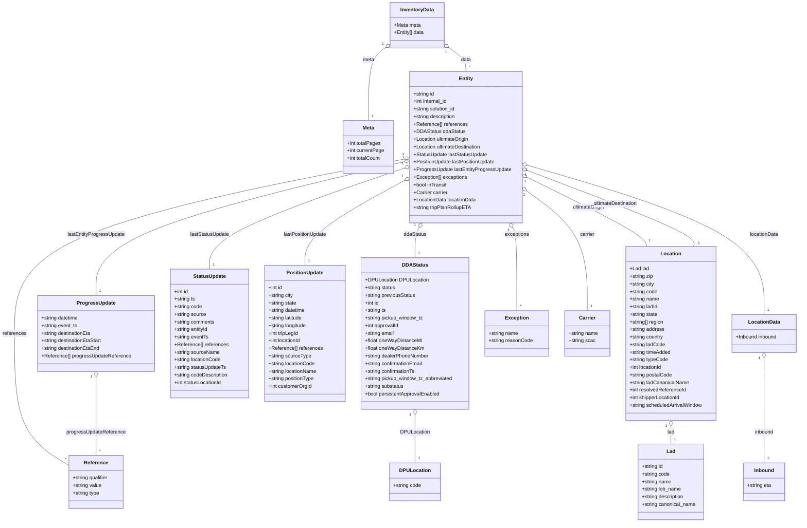

# Diagram: web/portal/src/mocks/handlers/entity/internal/includeConfigurations/data.js


> Auto-generated by Obscura crawlers

## Diagram 1

```mermaid
flowchart LR
  Client[Client] -->|GET| API["/entity/internal?includeConfigurations=true&pageNumber=0&pageSize=20&ddaFilter=1"]
  API -->|resolved by| URL[apiUrl(...)]
  URL --> Handler[getDPUEntities\n(msw.rest.get)]
  Handler -->|constructs| Inventory[inventoryData]
  Inventory --> Meta[meta]
  Inventory --> DataList[data[]]
  DataList -->|contains| EntityObj[Entity]
  EntityObj --> DDAStatus[DDAStatus]
  EntityObj --> UltimateOrigin[ultimateOrigin]
  EntityObj --> UltimateDestination[ultimateDestination]
  EntityObj --> LastStatus[lastStatusUpdate]
  EntityObj --> LastPosition[lastPositionUpdate]
  EntityObj --> Progress[lastEntityProgressUpdate]
  EntityObj --> Exceptions[exceptions]
  Handler -->|responds with| Response[res(ctx.json(inventoryData))]
  Response -->|200 JSON| Client
```

> SVG rendering failed for this diagram.

## Diagram 2



### SVG

<svg id="container" width="2518.2421875" xmlns="http://www.w3.org/2000/svg" class="classDiagram" height="1654" viewBox="0 0 2518.2421875 1654" role="graphics-document document" aria-roledescription="class"><style>#container{font-family:"trebuchet ms",verdana,arial,sans-serif;font-size:16px;fill:#333;}@keyframes edge-animation-frame{from{stroke-dashoffset:0;}}@keyframes dash{to{stroke-dashoffset:0;}}#container .edge-animation-slow{stroke-dasharray:9,5!important;stroke-dashoffset:900;animation:dash 50s linear infinite;stroke-linecap:round;}#container .edge-animation-fast{stroke-dasharray:9,5!important;stroke-dashoffset:900;animation:dash 20s linear infinite;stroke-linecap:round;}#container .error-icon{fill:#552222;}#container .error-text{fill:#552222;stroke:#552222;}#container .edge-thickness-normal{stroke-width:1px;}#container .edge-thickness-thick{stroke-width:3.5px;}#container .edge-pattern-solid{stroke-dasharray:0;}#container .edge-thickness-invisible{stroke-width:0;fill:none;}#container .edge-pattern-dashed{stroke-dasharray:3;}#container .edge-pattern-dotted{stroke-dasharray:2;}#container .marker{fill:#333333;stroke:#333333;}#container .marker.cross{stroke:#333333;}#container svg{font-family:"trebuchet ms",verdana,arial,sans-serif;font-size:16px;}#container p{margin:0;}#container g.classGroup text{fill:#9370DB;stroke:none;font-family:"trebuchet ms",verdana,arial,sans-serif;font-size:10px;}#container g.classGroup text .title{font-weight:bolder;}#container .nodeLabel,#container .edgeLabel{color:#131300;}#container .edgeLabel .label rect{fill:#ECECFF;}#container .label text{fill:#131300;}#container .labelBkg{background:#ECECFF;}#container .edgeLabel .label span{background:#ECECFF;}#container .classTitle{font-weight:bolder;}#container .node rect,#container .node circle,#container .node ellipse,#container .node polygon,#container .node path{fill:#ECECFF;stroke:#9370DB;stroke-width:1px;}#container .divider{stroke:#9370DB;stroke-width:1;}#container g.clickable{cursor:pointer;}#container g.classGroup rect{fill:#ECECFF;stroke:#9370DB;}#container g.classGroup line{stroke:#9370DB;stroke-width:1;}#container .classLabel .box{stroke:none;stroke-width:0;fill:#ECECFF;opacity:0.5;}#container .classLabel .label{fill:#9370DB;font-size:10px;}#container .relation{stroke:#333333;stroke-width:1;fill:none;}#container .dashed-line{stroke-dasharray:3;}#container .dotted-line{stroke-dasharray:1 2;}#container #compositionStart,#container .composition{fill:#333333!important;stroke:#333333!important;stroke-width:1;}#container #compositionEnd,#container .composition{fill:#333333!important;stroke:#333333!important;stroke-width:1;}#container #dependencyStart,#container .dependency{fill:#333333!important;stroke:#333333!important;stroke-width:1;}#container #dependencyStart,#container .dependency{fill:#333333!important;stroke:#333333!important;stroke-width:1;}#container #extensionStart,#container .extension{fill:transparent!important;stroke:#333333!important;stroke-width:1;}#container #extensionEnd,#container .extension{fill:transparent!important;stroke:#333333!important;stroke-width:1;}#container #aggregationStart,#container .aggregation{fill:transparent!important;stroke:#333333!important;stroke-width:1;}#container #aggregationEnd,#container .aggregation{fill:transparent!important;stroke:#333333!important;stroke-width:1;}#container #lollipopStart,#container .lollipop{fill:#ECECFF!important;stroke:#333333!important;stroke-width:1;}#container #lollipopEnd,#container .lollipop{fill:#ECECFF!important;stroke:#333333!important;stroke-width:1;}#container .edgeTerminals{font-size:11px;line-height:initial;}#container .classTitleText{text-anchor:middle;font-size:18px;fill:#333;}#container .label-icon{display:inline-block;height:1em;overflow:visible;vertical-align:-0.125em;}#container .node .label-icon path{fill:currentColor;stroke:revert;stroke-width:revert;}#container :root{--mermaid-font-family:"trebuchet ms",verdana,arial,sans-serif;}</style><g><defs><marker id="container_class-aggregationStart" class="marker aggregation class" refX="18" refY="7" markerWidth="190" markerHeight="240" orient="auto"><path d="M 18,7 L9,13 L1,7 L9,1 Z"></path></marker></defs><defs><marker id="container_class-aggregationEnd" class="marker aggregation class" refX="1" refY="7" markerWidth="20" markerHeight="28" orient="auto"><path d="M 18,7 L9,13 L1,7 L9,1 Z"></path></marker></defs><defs><marker id="container_class-extensionStart" class="marker extension class" refX="18" refY="7" markerWidth="190" markerHeight="240" orient="auto"><path d="M 1,7 L18,13 V 1 Z"></path></marker></defs><defs><marker id="container_class-extensionEnd" class="marker extension class" refX="1" refY="7" markerWidth="20" markerHeight="28" orient="auto"><path d="M 1,1 V 13 L18,7 Z"></path></marker></defs><defs><marker id="container_class-compositionStart" class="marker composition class" refX="18" refY="7" markerWidth="190" markerHeight="240" orient="auto"><path d="M 18,7 L9,13 L1,7 L9,1 Z"></path></marker></defs><defs><marker id="container_class-compositionEnd" class="marker composition class" refX="1" refY="7" markerWidth="20" markerHeight="28" orient="auto"><path d="M 18,7 L9,13 L1,7 L9,1 Z"></path></marker></defs><defs><marker id="container_class-dependencyStart" class="marker dependency class" refX="6" refY="7" markerWidth="190" markerHeight="240" orient="auto"><path d="M 5,7 L9,13 L1,7 L9,1 Z"></path></marker></defs><defs><marker id="container_class-dependencyEnd" class="marker dependency class" refX="13" refY="7" markerWidth="20" markerHeight="28" orient="auto"><path d="M 18,7 L9,13 L14,7 L9,1 Z"></path></marker></defs><defs><marker id="container_class-lollipopStart" class="marker lollipop class" refX="13" refY="7" markerWidth="190" markerHeight="240" orient="auto"><circle stroke="black" fill="transparent" cx="7" cy="7" r="6"></circle></marker></defs><defs><marker id="container_class-lollipopEnd" class="marker lollipop class" refX="1" refY="7" markerWidth="190" markerHeight="240" orient="auto"><circle stroke="black" fill="transparent" cx="7" cy="7" r="6"></circle></marker></defs><g class="root"><g class="clusters"></g><g class="edgePaths"><path d="M1207.438,151.274L1198.582,157.562C1189.725,163.849,1172.012,176.425,1163.155,214.879C1154.299,253.333,1154.299,317.667,1154.299,349.833L1154.299,382" id="id_InventoryData_Meta_1" class="edge-thickness-normal edge-pattern-solid relation" style=";;;" data-edge="true" data-et="edge" data-id="id_InventoryData_Meta_1" data-points="W3sieCI6MTIyMS41MDM5MDYyNSwieSI6MTQxLjI4ODE0NzY2NzU2OTl9LHsieCI6MTE1NC4yOTg4MjgxMjUsInkiOjE4OX0seyJ4IjoxMTU0LjI5ODgyODEyNSwieSI6MzgyfV0=" marker-start="url(#container_class-aggregationStart)"></path><path d="M1408.226,151.274L1417.082,157.562C1425.939,163.849,1443.652,176.425,1452.509,188.879C1461.365,201.333,1461.365,213.667,1461.365,219.833L1461.365,226" id="id_InventoryData_Entity_2" class="edge-thickness-normal edge-pattern-solid relation" style=";;;" data-edge="true" data-et="edge" data-id="id_InventoryData_Entity_2" data-points="W3sieCI6MTM5NC4xNjAxNTYyNSwieSI6MTQxLjI4ODE0NzY2NzU2OTl9LHsieCI6MTQ2MS4zNjUyMzQzNzUsInkiOjE4OX0seyJ4IjoxNDYxLjM2NTIzNDM3NSwieSI6MjI2fV0=" marker-start="url(#container_class-aggregationStart)"></path><path d="M1267.507,503.935L1063.894,543.779C860.28,583.624,453.054,663.312,249.441,755.323C45.828,847.333,45.828,951.667,45.828,1056C45.828,1160.333,45.828,1264.667,73.654,1333.999C101.479,1403.331,157.13,1437.663,184.956,1454.829L212.781,1471.994" id="id_Entity_Reference_3" class="edge-thickness-normal edge-pattern-solid relation" style=";;;" data-edge="true" data-et="edge" data-id="id_Entity_Reference_3" data-points="W3sieCI6MTI4NC40MzU1NDY4NzUsInkiOjUwMC42MjI1NjM0ODY5NzE0NH0seyJ4Ijo0NS44MjgxMjUsInkiOjc0M30seyJ4Ijo0NS44MjgxMjUsInkiOjEwNTZ9LHsieCI6NDUuODI4MTI1LCJ5IjoxMzY5fSx7IngiOjIxMi43ODEyNSwieSI6MTQ3MS45OTQyNzQ4Mzg0NTIyfV0=" marker-start="url(#container_class-aggregationStart)"></path><path d="M1313.512,720.922L1311.378,724.602C1309.244,728.281,1304.975,735.641,1302.841,751.487C1300.707,767.333,1300.707,791.667,1300.707,803.833L1300.707,816" id="id_Entity_DDAStatus_4" class="edge-thickness-normal edge-pattern-solid relation" style=";;;" data-edge="true" data-et="edge" data-id="id_Entity_DDAStatus_4" data-points="W3sieCI6MTMyMi4xNjY3OTEyMzQyMDYsInkiOjcwNn0seyJ4IjoxMzAwLjcwNzAzMTI1LCJ5Ijo3NDN9LHsieCI6MTMwMC43MDcwMzEyNSwieSI6ODE2fV0=" marker-start="url(#container_class-aggregationStart)"></path><path d="M1300.707,1313.25L1300.707,1322.542C1300.707,1331.833,1300.707,1350.417,1300.707,1375.875C1300.707,1401.333,1300.707,1433.667,1300.707,1449.833L1300.707,1466" id="id_DDAStatus_DPULocation_5" class="edge-thickness-normal edge-pattern-solid relation" style=";;;" data-edge="true" data-et="edge" data-id="id_DDAStatus_DPULocation_5" data-points="W3sieCI6MTMwMC43MDcwMzEyNSwieSI6MTI5Nn0seyJ4IjoxMzAwLjcwNzAzMTI1LCJ5IjoxMzY5fSx7IngiOjEzMDAuNzA3MDMxMjUsInkiOjE0NjZ9XQ==" marker-start="url(#container_class-aggregationStart)"></path><path d="M1653.774,560.646L1715.559,591.038C1777.345,621.431,1900.915,682.215,1964.372,718.774C2027.828,755.333,2031.17,767.667,2032.841,773.833L2034.512,780" id="id_Entity_Location_6" class="edge-thickness-normal edge-pattern-solid relation" style=";;;" data-edge="true" data-et="edge" data-id="id_Entity_Location_6" data-points="W3sieCI6MTYzOC4yOTQ5MjE4NzUsInkiOjU1My4wMzE5NDM4OTUyODIzfSx7IngiOjIwMjQuNDg2MzI4MTI1LCJ5Ijo3NDN9LHsieCI6MjAzNC41MTIzMTc3OTE1MzM2LCJ5Ijo3ODB9XQ==" marker-start="url(#container_class-aggregationStart)"></path><path d="M1654.416,539.511L1743.48,573.426C1832.545,607.341,2010.674,675.17,2098.172,715.252C2185.67,755.333,2182.537,767.667,2180.971,773.833L2179.405,780" id="id_Entity_Location_7" class="edge-thickness-normal edge-pattern-solid relation" style=";;;" data-edge="true" data-et="edge" data-id="id_Entity_Location_7" data-points="W3sieCI6MTYzOC4yOTQ5MjE4NzUsInkiOjUzMy4zNzI4MzA1Njk2MzY2fSx7IngiOjIxODguODAyNzM0Mzc1LCJ5Ijo3NDN9LHsieCI6MjE3OS40MDQ3Mzk5MTYxMzQsInkiOjc4MH1d" marker-start="url(#container_class-aggregationStart)"></path><path d="M2109.301,1349.25L2109.301,1352.542C2109.301,1355.833,2109.301,1362.417,2109.301,1371.875C2109.301,1381.333,2109.301,1393.667,2109.301,1399.833L2109.301,1406" id="id_Location_Lad_8" class="edge-thickness-normal edge-pattern-solid relation" style=";;;" data-edge="true" data-et="edge" data-id="id_Location_Lad_8" data-points="W3sieCI6MjEwOS4zMDA3ODEyNSwieSI6MTMzMn0seyJ4IjoyMTA5LjMwMDc4MTI1LCJ5IjoxMzY5fSx7IngiOjIxMDkuMzAwNzgxMjUsInkiOjE0MDZ9XQ==" marker-start="url(#container_class-aggregationStart)"></path><path d="M1268.121,532.39L1165.949,567.491C1063.776,602.593,859.431,672.797,757.259,726.065C655.086,779.333,655.086,815.667,655.086,833.833L655.086,852" id="id_Entity_StatusUpdate_9" class="edge-thickness-normal edge-pattern-solid relation" style=";;;" data-edge="true" data-et="edge" data-id="id_Entity_StatusUpdate_9" data-points="W3sieCI6MTI4NC40MzU1NDY4NzUsInkiOjUyNi43ODQ3OTcwNjQwNjAyfSx7IngiOjY1NS4wODU5Mzc1LCJ5Ijo3NDN9LHsieCI6NjU1LjA4NTkzNzUsInkiOjg1Mn1d" marker-start="url(#container_class-aggregationStart)"></path><path d="M1269.292,570.759L1216.658,599.466C1164.025,628.173,1058.759,685.586,1006.125,730.46C953.492,775.333,953.492,807.667,953.492,823.833L953.492,840" id="id_Entity_PositionUpdate_10" class="edge-thickness-normal edge-pattern-solid relation" style=";;;" data-edge="true" data-et="edge" data-id="id_Entity_PositionUpdate_10" data-points="W3sieCI6MTI4NC40MzU1NDY4NzUsInkiOjU2Mi40OTk1NTU4MjIxOTA1fSx7IngiOjk1My40OTIxODc1LCJ5Ijo3NDN9LHsieCI6OTUzLjQ5MjE4NzUsInkiOjg0MH1d" marker-start="url(#container_class-aggregationStart)"></path><path d="M1267.656,512.215L1106.434,550.679C945.212,589.143,622.768,666.072,461.546,736.702C300.324,807.333,300.324,871.667,300.324,903.833L300.324,936" id="id_Entity_ProgressUpdate_11" class="edge-thickness-normal edge-pattern-solid relation" style=";;;" data-edge="true" data-et="edge" data-id="id_Entity_ProgressUpdate_11" data-points="W3sieCI6MTI4NC40MzU1NDY4NzUsInkiOjUwOC4yMTE3MDcyMzMzNzI1fSx7IngiOjMwMC4zMjQyMTg3NSwieSI6NzQzfSx7IngiOjMwMC4zMjQyMTg3NSwieSI6OTM2fV0=" marker-start="url(#container_class-aggregationStart)"></path><path d="M300.324,1193.25L300.324,1222.542C300.324,1251.833,300.324,1310.417,300.324,1351.875C300.324,1393.333,300.324,1417.667,300.324,1429.833L300.324,1442" id="id_ProgressUpdate_Reference_12" class="edge-thickness-normal edge-pattern-solid relation" style=";;;" data-edge="true" data-et="edge" data-id="id_ProgressUpdate_Reference_12" data-points="W3sieCI6MzAwLjMyNDIxODc1LCJ5IjoxMTc2fSx7IngiOjMwMC4zMjQyMTg3NSwieSI6MTM2OX0seyJ4IjozMDAuMzI0MjE4NzUsInkiOjE0NDJ9XQ==" marker-start="url(#container_class-aggregationStart)"></path><path d="M1609.218,720.922L1611.352,724.602C1613.487,728.281,1617.755,735.641,1619.889,779.487C1622.023,823.333,1622.023,903.667,1622.023,943.833L1622.023,984" id="id_Entity_Exception_13" class="edge-thickness-normal edge-pattern-solid relation" style=";;;" data-edge="true" data-et="edge" data-id="id_Entity_Exception_13" data-points="W3sieCI6MTYwMC41NjM2Nzc1MTU3OTQsInkiOjcwNn0seyJ4IjoxNjIyLjAyMzQzNzUsInkiOjc0M30seyJ4IjoxNjIyLjAyMzQzNzUsInkiOjk4NH1d" marker-start="url(#container_class-aggregationStart)"></path><path d="M1652.258,604.473L1684.086,627.56C1715.914,650.648,1779.57,696.824,1811.398,760.079C1843.227,823.333,1843.227,903.667,1843.227,943.833L1843.227,984" id="id_Entity_Carrier_14" class="edge-thickness-normal edge-pattern-solid relation" style=";;;" data-edge="true" data-et="edge" data-id="id_Entity_Carrier_14" data-points="W3sieCI6MTYzOC4yOTQ5MjE4NzUsInkiOjU5NC4zNDM3NzI1MzY4NjQ1fSx7IngiOjE4NDMuMjI2NTYyNSwieSI6NzQzfSx7IngiOjE4NDMuMjI2NTYyNSwieSI6OTg0fV0=" marker-start="url(#container_class-aggregationStart)"></path><path d="M1654.849,522.681L1780.193,559.401C1905.537,596.121,2156.226,669.56,2281.57,748.447C2406.914,827.333,2406.914,911.667,2406.914,953.833L2406.914,996" id="id_Entity_LocationData_15" class="edge-thickness-normal edge-pattern-solid relation" style=";;;" data-edge="true" data-et="edge" data-id="id_Entity_LocationData_15" data-points="W3sieCI6MTYzOC4yOTQ5MjE4NzUsInkiOjUxNy44MzE4MjcxNjcxNzUxfSx7IngiOjI0MDYuOTE0MDYyNSwieSI6NzQzfSx7IngiOjI0MDYuOTE0MDYyNSwieSI6OTk2fV0=" marker-start="url(#container_class-aggregationStart)"></path><path d="M2406.914,1133.25L2406.914,1172.542C2406.914,1211.833,2406.914,1290.417,2406.914,1345.875C2406.914,1401.333,2406.914,1433.667,2406.914,1449.833L2406.914,1466" id="id_LocationData_Inbound_16" class="edge-thickness-normal edge-pattern-solid relation" style=";;;" data-edge="true" data-et="edge" data-id="id_LocationData_Inbound_16" data-points="W3sieCI6MjQwNi45MTQwNjI1LCJ5IjoxMTE2fSx7IngiOjI0MDYuOTE0MDYyNSwieSI6MTM2OX0seyJ4IjoyNDA2LjkxNDA2MjUsInkiOjE0NjZ9XQ==" marker-start="url(#container_class-aggregationStart)"></path></g><g class="edgeLabels"><g class="edgeLabel" transform="translate(1154.298828125, 189)"><g class="label" data-id="id_InventoryData_Meta_1" transform="translate(-18.40625, -12)"><foreignObject width="36.8125" height="24"><div xmlns="http://www.w3.org/1999/xhtml" class="labelBkg" style="display: table-cell; white-space: nowrap; line-height: 1.5; max-width: 200px; text-align: center;"><span class="edgeLabel"><p>meta</p></span></div></foreignObject></g></g><g class="edgeLabel" transform="translate(1461.365234375, 189)"><g class="label" data-id="id_InventoryData_Entity_2" transform="translate(-16.3203125, -12)"><foreignObject width="32.640625" height="24"><div xmlns="http://www.w3.org/1999/xhtml" class="labelBkg" style="display: table-cell; white-space: nowrap; line-height: 1.5; max-width: 200px; text-align: center;"><span class="edgeLabel"><p>data</p></span></div></foreignObject></g></g><g class="edgeLabel" transform="translate(45.828125, 1056)"><g class="label" data-id="id_Entity_Reference_3" transform="translate(-37.828125, -12)"><foreignObject width="75.65625" height="24"><div xmlns="http://www.w3.org/1999/xhtml" class="labelBkg" style="display: table-cell; white-space: nowrap; line-height: 1.5; max-width: 200px; text-align: center;"><span class="edgeLabel"><p>references</p></span></div></foreignObject></g></g><g class="edgeLabel" transform="translate(1300.70703125, 743)"><g class="label" data-id="id_Entity_DDAStatus_4" transform="translate(-36.75, -12)"><foreignObject width="73.5" height="24"><div xmlns="http://www.w3.org/1999/xhtml" class="labelBkg" style="display: table-cell; white-space: nowrap; line-height: 1.5; max-width: 200px; text-align: center;"><span class="edgeLabel"><p>ddaStatus</p></span></div></foreignObject></g></g><g class="edgeLabel" transform="translate(1300.70703125, 1369)"><g class="label" data-id="id_DDAStatus_DPULocation_5" transform="translate(-46.15625, -12)"><foreignObject width="92.3125" height="24"><div xmlns="http://www.w3.org/1999/xhtml" class="labelBkg" style="display: table-cell; white-space: nowrap; line-height: 1.5; max-width: 200px; text-align: center;"><span class="edgeLabel"><p>DPULocation</p></span></div></foreignObject></g></g><g class="edgeLabel" transform="translate(1848.58961, 656.47618)"><g class="label" data-id="id_Entity_Location_6" transform="translate(-52.46875, -12)"><foreignObject width="104.9375" height="24"><div xmlns="http://www.w3.org/1999/xhtml" class="labelBkg" style="display: table-cell; white-space: nowrap; line-height: 1.5; max-width: 200px; text-align: center;"><span class="edgeLabel"><p>ultimateOrigin</p></span></div></foreignObject></g></g><g class="edgeLabel" transform="translate(2188.802734375, 743)"><g class="label" data-id="id_Entity_Location_7" transform="translate(-72.421875, -12)"><foreignObject width="144.84375" height="24"><div xmlns="http://www.w3.org/1999/xhtml" class="labelBkg" style="display: table-cell; white-space: nowrap; line-height: 1.5; max-width: 200px; text-align: center;"><span class="edgeLabel"><p>ultimateDestination</p></span></div></foreignObject></g></g><g class="edgeLabel" transform="translate(2109.30078125, 1369)"><g class="label" data-id="id_Location_Lad_8" transform="translate(-11.4453125, -12)"><foreignObject width="22.890625" height="24"><div xmlns="http://www.w3.org/1999/xhtml" class="labelBkg" style="display: table-cell; white-space: nowrap; line-height: 1.5; max-width: 200px; text-align: center;"><span class="edgeLabel"><p>lad</p></span></div></foreignObject></g></g><g class="edgeLabel" transform="translate(655.0859375, 743)"><g class="label" data-id="id_Entity_StatusUpdate_9" transform="translate(-62.34375, -12)"><foreignObject width="124.6875" height="24"><div xmlns="http://www.w3.org/1999/xhtml" class="labelBkg" style="display: table-cell; white-space: nowrap; line-height: 1.5; max-width: 200px; text-align: center;"><span class="edgeLabel"><p>lastStatusUpdate</p></span></div></foreignObject></g></g><g class="edgeLabel" transform="translate(953.4921875, 743)"><g class="label" data-id="id_Entity_PositionUpdate_10" transform="translate(-69.09375, -12)"><foreignObject width="138.1875" height="24"><div xmlns="http://www.w3.org/1999/xhtml" class="labelBkg" style="display: table-cell; white-space: nowrap; line-height: 1.5; max-width: 200px; text-align: center;"><span class="edgeLabel"><p>lastPositionUpdate</p></span></div></foreignObject></g></g><g class="edgeLabel" transform="translate(300.32421875, 743)"><g class="label" data-id="id_Entity_ProgressUpdate_11" transform="translate(-91.1015625, -12)"><foreignObject width="182.203125" height="24"><div xmlns="http://www.w3.org/1999/xhtml" class="labelBkg" style="display: table-cell; white-space: nowrap; line-height: 1.5; max-width: 200px; text-align: center;"><span class="edgeLabel"><p>lastEntityProgressUpdate</p></span></div></foreignObject></g></g><g class="edgeLabel" transform="translate(300.32421875, 1369)"><g class="label" data-id="id_ProgressUpdate_Reference_12" transform="translate(-93.3046875, -12)"><foreignObject width="186.609375" height="24"><div xmlns="http://www.w3.org/1999/xhtml" class="labelBkg" style="display: table-cell; white-space: nowrap; line-height: 1.5; max-width: 200px; text-align: center;"><span class="edgeLabel"><p>progressUpdateReference</p></span></div></foreignObject></g></g><g class="edgeLabel" transform="translate(1622.0234375, 743)"><g class="label" data-id="id_Entity_Exception_13" transform="translate(-39.1171875, -12)"><foreignObject width="78.234375" height="24"><div xmlns="http://www.w3.org/1999/xhtml" class="labelBkg" style="display: table-cell; white-space: nowrap; line-height: 1.5; max-width: 200px; text-align: center;"><span class="edgeLabel"><p>exceptions</p></span></div></foreignObject></g></g><g class="edgeLabel" transform="translate(1843.2265625, 743)"><g class="label" data-id="id_Entity_Carrier_14" transform="translate(-23.9765625, -12)"><foreignObject width="47.953125" height="24"><div xmlns="http://www.w3.org/1999/xhtml" class="labelBkg" style="display: table-cell; white-space: nowrap; line-height: 1.5; max-width: 200px; text-align: center;"><span class="edgeLabel"><p>carrier</p></span></div></foreignObject></g></g><g class="edgeLabel" transform="translate(2406.9140625, 743)"><g class="label" data-id="id_Entity_LocationData_15" transform="translate(-46.1875, -12)"><foreignObject width="92.375" height="24"><div xmlns="http://www.w3.org/1999/xhtml" class="labelBkg" style="display: table-cell; white-space: nowrap; line-height: 1.5; max-width: 200px; text-align: center;"><span class="edgeLabel"><p>locationData</p></span></div></foreignObject></g></g><g class="edgeLabel" transform="translate(2406.9140625, 1369)"><g class="label" data-id="id_LocationData_Inbound_16" transform="translate(-30.5, -12)"><foreignObject width="61" height="24"><div xmlns="http://www.w3.org/1999/xhtml" class="labelBkg" style="display: table-cell; white-space: nowrap; line-height: 1.5; max-width: 200px; text-align: center;"><span class="edgeLabel"><p>inbound</p></span></div></foreignObject></g></g><g class="edgeTerminals" transform="translate(1198.5509519946304, 139.18768769143549)"><g class="inner" transform="translate(0, 0)"><foreignObject style="width: 9px; height: 12px;"><div xmlns="http://www.w3.org/1999/xhtml" style="display: inline-block; padding-right: 1px; white-space: nowrap;"><span class="edgeLabel">1</span></div></foreignObject></g></g><g class="edgeTerminals" transform="translate(1399.746356488883, 163.6498196170819)"><g class="inner" transform="translate(0, 0)"><foreignObject style="width: 9px; height: 12px;"><div xmlns="http://www.w3.org/1999/xhtml" style="display: inline-block; padding-right: 1px; white-space: nowrap;"><span class="edgeLabel">1</span></div></foreignObject></g></g><g class="edgeTerminals" transform="translate(1264.3806377282567, 489.2625192006276)"><g class="inner" transform="translate(0, 0)"><foreignObject style="width: 9px; height: 12px;"><div xmlns="http://www.w3.org/1999/xhtml" style="display: inline-block; padding-right: 1px; white-space: nowrap;"><span class="edgeLabel">1</span></div></foreignObject></g></g><g class="edgeTerminals" transform="translate(1300.4112949893456, 713.6123838069548)"><g class="inner" transform="translate(0, 0)"><foreignObject style="width: 9px; height: 12px;"><div xmlns="http://www.w3.org/1999/xhtml" style="display: inline-block; padding-right: 1px; white-space: nowrap;"><span class="edgeLabel">1</span></div></foreignObject></g></g><g class="edgeTerminals" transform="translate(1285.707030625, 1313.4999994642858)"><g class="inner" transform="translate(0, 0)"><foreignObject style="width: 9px; height: 12px;"><div xmlns="http://www.w3.org/1999/xhtml" style="display: inline-block; padding-right: 1px; white-space: nowrap;"><span class="edgeLabel">1</span></div></foreignObject></g></g><g class="edgeTerminals" transform="translate(1647.377078730117, 574.216003907704)"><g class="inner" transform="translate(0, 0)"><foreignObject style="width: 9px; height: 12px;"><div xmlns="http://www.w3.org/1999/xhtml" style="display: inline-block; padding-right: 1px; white-space: nowrap;"><span class="edgeLabel">1</span></div></foreignObject></g></g><g class="edgeTerminals" transform="translate(1649.3114199054462, 553.6184895282925)"><g class="inner" transform="translate(0, 0)"><foreignObject style="width: 9px; height: 12px;"><div xmlns="http://www.w3.org/1999/xhtml" style="display: inline-block; padding-right: 1px; white-space: nowrap;"><span class="edgeLabel">1</span></div></foreignObject></g></g><g class="edgeTerminals" transform="translate(2094.300780625, 1349.4999994642858)"><g class="inner" transform="translate(0, 0)"><foreignObject style="width: 9px; height: 12px;"><div xmlns="http://www.w3.org/1999/xhtml" style="display: inline-block; padding-right: 1px; white-space: nowrap;"><span class="edgeLabel">1</span></div></foreignObject></g></g><g class="edgeTerminals" transform="translate(1263.0113302506372, 518.2846277015607)"><g class="inner" transform="translate(0, 0)"><foreignObject style="width: 9px; height: 12px;"><div xmlns="http://www.w3.org/1999/xhtml" style="display: inline-block; padding-right: 1px; white-space: nowrap;"><span class="edgeLabel">1</span></div></foreignObject></g></g><g class="edgeTerminals" transform="translate(1261.8897496337672, 557.7102930594542)"><g class="inner" transform="translate(0, 0)"><foreignObject style="width: 9px; height: 12px;"><div xmlns="http://www.w3.org/1999/xhtml" style="display: inline-block; padding-right: 1px; white-space: nowrap;"><span class="edgeLabel">1</span></div></foreignObject></g></g><g class="edgeTerminals" transform="translate(1263.9323068935644, 497.6823571626259)"><g class="inner" transform="translate(0, 0)"><foreignObject style="width: 9px; height: 12px;"><div xmlns="http://www.w3.org/1999/xhtml" style="display: inline-block; padding-right: 1px; white-space: nowrap;"><span class="edgeLabel">1</span></div></foreignObject></g></g><g class="edgeTerminals" transform="translate(285.324219375, 1193.5000005357142)"><g class="inner" transform="translate(0, 0)"><foreignObject style="width: 9px; height: 12px;"><div xmlns="http://www.w3.org/1999/xhtml" style="display: inline-block; padding-right: 1px; white-space: nowrap;"><span class="edgeLabel">1</span></div></foreignObject></g></g><g class="edgeTerminals" transform="translate(1596.3681633626393, 728.6637965939111)"><g class="inner" transform="translate(0, 0)"><foreignObject style="width: 9px; height: 12px;"><div xmlns="http://www.w3.org/1999/xhtml" style="display: inline-block; padding-right: 1px; white-space: nowrap;"><span class="edgeLabel">1</span></div></foreignObject></g></g><g class="edgeTerminals" transform="translate(1643.6527997450326, 616.7612475259568)"><g class="inner" transform="translate(0, 0)"><foreignObject style="width: 9px; height: 12px;"><div xmlns="http://www.w3.org/1999/xhtml" style="display: inline-block; padding-right: 1px; white-space: nowrap;"><span class="edgeLabel">1</span></div></foreignObject></g></g><g class="edgeTerminals" transform="translate(1650.8720698571283, 537.1467273236398)"><g class="inner" transform="translate(0, 0)"><foreignObject style="width: 9px; height: 12px;"><div xmlns="http://www.w3.org/1999/xhtml" style="display: inline-block; padding-right: 1px; white-space: nowrap;"><span class="edgeLabel">1</span></div></foreignObject></g></g><g class="edgeTerminals" transform="translate(2391.91406125, 1133.4999989285714)"><g class="inner" transform="translate(0, 0)"><foreignObject style="width: 9px; height: 12px;"><div xmlns="http://www.w3.org/1999/xhtml" style="display: inline-block; padding-right: 1px; white-space: nowrap;"><span class="edgeLabel">1</span></div></foreignObject></g></g><g class="edgeTerminals" transform="translate(1164.2988290624999, 359.5000008035714)"><g class="inner" transform="translate(0, 0)"></g><foreignObject style="width: 9px; height: 12px;"><div xmlns="http://www.w3.org/1999/xhtml" style="display: inline-block; padding-right: 1px; white-space: nowrap;"><span class="edgeLabel">1</span></div></foreignObject></g><g class="edgeTerminals" transform="translate(1471.3652321875, 203.49999812500005)"><g class="inner" transform="translate(0, 0)"></g><foreignObject style="width: 9px; height: 12px;"><div xmlns="http://www.w3.org/1999/xhtml" style="display: inline-block; padding-right: 1px; white-space: nowrap;"><span class="edgeLabel">*</span></div></foreignObject></g><g class="edgeTerminals" transform="translate(200.7628885249051, 1445.0399462245582)"><g class="inner" transform="translate(0, 0)"></g><foreignObject style="width: 9px; height: 12px;"><div xmlns="http://www.w3.org/1999/xhtml" style="display: inline-block; padding-right: 1px; white-space: nowrap;"><span class="edgeLabel">*</span></div></foreignObject></g><g class="edgeTerminals" transform="translate(1310.707030625, 793.4999994642857)"><g class="inner" transform="translate(0, 0)"></g><foreignObject style="width: 9px; height: 12px;"><div xmlns="http://www.w3.org/1999/xhtml" style="display: inline-block; padding-right: 1px; white-space: nowrap;"><span class="edgeLabel">1</span></div></foreignObject></g><g class="edgeTerminals" transform="translate(1310.707030625, 1443.4999994642858)"><g class="inner" transform="translate(0, 0)"></g><foreignObject style="width: 9px; height: 12px;"><div xmlns="http://www.w3.org/1999/xhtml" style="display: inline-block; padding-right: 1px; white-space: nowrap;"><span class="edgeLabel">1</span></div></foreignObject></g><g class="edgeTerminals" transform="translate(2039.4132400972571, 754.1860225702196)"><g class="inner" transform="translate(0, 0)"></g><foreignObject style="width: 9px; height: 12px;"><div xmlns="http://www.w3.org/1999/xhtml" style="display: inline-block; padding-right: 1px; white-space: nowrap;"><span class="edgeLabel">1</span></div></foreignObject></g><g class="edgeTerminals" transform="translate(2193.251287010721, 761.731328765888)"><g class="inner" transform="translate(0, 0)"></g><foreignObject style="width: 9px; height: 12px;"><div xmlns="http://www.w3.org/1999/xhtml" style="display: inline-block; padding-right: 1px; white-space: nowrap;"><span class="edgeLabel">1</span></div></foreignObject></g><g class="edgeTerminals" transform="translate(2119.300780625, 1383.4999994642858)"><g class="inner" transform="translate(0, 0)"></g><foreignObject style="width: 9px; height: 12px;"><div xmlns="http://www.w3.org/1999/xhtml" style="display: inline-block; padding-right: 1px; white-space: nowrap;"><span class="edgeLabel">1</span></div></foreignObject></g><g class="edgeTerminals" transform="translate(665.08593875, 829.5000010714286)"><g class="inner" transform="translate(0, 0)"></g><foreignObject style="width: 9px; height: 12px;"><div xmlns="http://www.w3.org/1999/xhtml" style="display: inline-block; padding-right: 1px; white-space: nowrap;"><span class="edgeLabel">1</span></div></foreignObject></g><g class="edgeTerminals" transform="translate(963.49218875, 817.5000010714286)"><g class="inner" transform="translate(0, 0)"></g><foreignObject style="width: 9px; height: 12px;"><div xmlns="http://www.w3.org/1999/xhtml" style="display: inline-block; padding-right: 1px; white-space: nowrap;"><span class="edgeLabel">1</span></div></foreignObject></g><g class="edgeTerminals" transform="translate(310.324219375, 913.5000005357143)"><g class="inner" transform="translate(0, 0)"></g><foreignObject style="width: 9px; height: 12px;"><div xmlns="http://www.w3.org/1999/xhtml" style="display: inline-block; padding-right: 1px; white-space: nowrap;"><span class="edgeLabel">1</span></div></foreignObject></g><g class="edgeTerminals" transform="translate(310.324219375, 1419.5000005357142)"><g class="inner" transform="translate(0, 0)"></g><foreignObject style="width: 9px; height: 12px;"><div xmlns="http://www.w3.org/1999/xhtml" style="display: inline-block; padding-right: 1px; white-space: nowrap;"><span class="edgeLabel">*</span></div></foreignObject></g><g class="edgeTerminals" transform="translate(1632.02343875, 961.5000010714285)"><g class="inner" transform="translate(0, 0)"></g><foreignObject style="width: 9px; height: 12px;"><div xmlns="http://www.w3.org/1999/xhtml" style="display: inline-block; padding-right: 1px; white-space: nowrap;"><span class="edgeLabel">*</span></div></foreignObject></g><g class="edgeTerminals" transform="translate(1853.22656125, 961.4999989285715)"><g class="inner" transform="translate(0, 0)"></g><foreignObject style="width: 9px; height: 12px;"><div xmlns="http://www.w3.org/1999/xhtml" style="display: inline-block; padding-right: 1px; white-space: nowrap;"><span class="edgeLabel">1</span></div></foreignObject></g><g class="edgeTerminals" transform="translate(2416.91406125, 973.4999989285715)"><g class="inner" transform="translate(0, 0)"></g><foreignObject style="width: 9px; height: 12px;"><div xmlns="http://www.w3.org/1999/xhtml" style="display: inline-block; padding-right: 1px; white-space: nowrap;"><span class="edgeLabel">1</span></div></foreignObject></g><g class="edgeTerminals" transform="translate(2416.91406125, 1443.4999989285714)"><g class="inner" transform="translate(0, 0)"></g><foreignObject style="width: 9px; height: 12px;"><div xmlns="http://www.w3.org/1999/xhtml" style="display: inline-block; padding-right: 1px; white-space: nowrap;"><span class="edgeLabel">1</span></div></foreignObject></g></g><g class="nodes"><g class="node default" id="classId-InventoryData-0" transform="translate(1307.83203125, 80)"><g class="basic label-container"><path d="M-86.328125 -72 L86.328125 -72 L86.328125 72 L-86.328125 72" stroke="none" stroke-width="0" fill="#ECECFF" style=""></path><path d="M-86.328125 -72 C-35.2497100907038 -72, 15.8287048185924 -72, 86.328125 -72 M-86.328125 -72 C-36.71647510788518 -72, 12.895174784229638 -72, 86.328125 -72 M86.328125 -72 C86.328125 -34.37648445886227, 86.328125 3.2470310822754556, 86.328125 72 M86.328125 -72 C86.328125 -22.00975648337043, 86.328125 27.980487033259138, 86.328125 72 M86.328125 72 C49.04197078283373 72, 11.755816565667459 72, -86.328125 72 M86.328125 72 C20.380753820604653 72, -45.566617358790694 72, -86.328125 72 M-86.328125 72 C-86.328125 36.16794891369675, -86.328125 0.33589782739349516, -86.328125 -72 M-86.328125 72 C-86.328125 37.40858470404525, -86.328125 2.817169408090507, -86.328125 -72" stroke="#9370DB" stroke-width="1.3" fill="none" stroke-dasharray="0 0" style=""></path></g><g class="annotation-group text" transform="translate(0, -48)"></g><g class="label-group text" transform="translate(-51.84375, -48)"><g class="label" style="font-weight: bolder" transform="translate(0,-12)"><foreignObject width="103.6875" height="24"><div xmlns="http://www.w3.org/1999/xhtml" style="display: table-cell; white-space: nowrap; line-height: 1.5; max-width: 152px; text-align: center;"><span class="nodeLabel markdown-node-label" style=""><p>InventoryData</p></span></div></foreignObject></g></g><g class="members-group text" transform="translate(-74.328125, 0)"><g class="label" style="" transform="translate(0,-12)"><foreignObject width="84.5625" height="24"><div xmlns="http://www.w3.org/1999/xhtml" style="display: table-cell; white-space: nowrap; line-height: 1.5; max-width: 142px; text-align: center;"><span class="nodeLabel markdown-node-label" style=""><p>+Meta meta</p></span></div></foreignObject></g><g class="label" style="" transform="translate(0,12)"><foreignObject width="96.8125" height="24"><div xmlns="http://www.w3.org/1999/xhtml" style="display: table-cell; white-space: nowrap; line-height: 1.5; max-width: 154px; text-align: center;"><span class="nodeLabel markdown-node-label" style=""><p>+Entity[] data</p></span></div></foreignObject></g></g><g class="methods-group text" transform="translate(-74.328125, 72)"></g><g class="divider" style=""><path d="M-86.328125 -24 C-35.48538539283888 -24, 15.357354214322243 -24, 86.328125 -24 M-86.328125 -24 C-38.03795118601139 -24, 10.252222627977218 -24, 86.328125 -24" stroke="#9370DB" stroke-width="1.3" fill="none" stroke-dasharray="0 0" style=""></path></g><g class="divider" style=""><path d="M-86.328125 48 C-23.829106561668766 48, 38.66991187666247 48, 86.328125 48 M-86.328125 48 C-45.064654598572126 48, -3.801184197144252 48, 86.328125 48" stroke="#9370DB" stroke-width="1.3" fill="none" stroke-dasharray="0 0" style=""></path></g></g><g class="node default" id="classId-Meta-1" transform="translate(1154.298828125, 466)"><g class="basic label-container"><path d="M-80.13671875 -84 L80.13671875 -84 L80.13671875 84 L-80.13671875 84" stroke="none" stroke-width="0" fill="#ECECFF" style=""></path><path d="M-80.13671875 -84 C-33.31535713601503 -84, 13.506004477969938 -84, 80.13671875 -84 M-80.13671875 -84 C-34.982007308283386 -84, 10.172704133433228 -84, 80.13671875 -84 M80.13671875 -84 C80.13671875 -30.168918299112697, 80.13671875 23.662163401774606, 80.13671875 84 M80.13671875 -84 C80.13671875 -24.442782269445466, 80.13671875 35.11443546110907, 80.13671875 84 M80.13671875 84 C47.88558570173993 84, 15.634452653479855 84, -80.13671875 84 M80.13671875 84 C27.030823286511797 84, -26.075072176976406 84, -80.13671875 84 M-80.13671875 84 C-80.13671875 41.67977438918366, -80.13671875 -0.6404512216326737, -80.13671875 -84 M-80.13671875 84 C-80.13671875 29.88133264628769, -80.13671875 -24.237334707424623, -80.13671875 -84" stroke="#9370DB" stroke-width="1.3" fill="none" stroke-dasharray="0 0" style=""></path></g><g class="annotation-group text" transform="translate(0, -60)"></g><g class="label-group text" transform="translate(-18.0859375, -60)"><g class="label" style="font-weight: bolder" transform="translate(0,-12)"><foreignObject width="36.171875" height="24"><div xmlns="http://www.w3.org/1999/xhtml" style="display: table-cell; white-space: nowrap; line-height: 1.5; max-width: 86px; text-align: center;"><span class="nodeLabel markdown-node-label" style=""><p>Meta</p></span></div></foreignObject></g></g><g class="members-group text" transform="translate(-68.13671875, -12)"><g class="label" style="" transform="translate(0,-12)"><foreignObject width="106.890625" height="24"><div xmlns="http://www.w3.org/1999/xhtml" style="display: table-cell; white-space: nowrap; line-height: 1.5; max-width: 164px; text-align: center;"><span class="nodeLabel markdown-node-label" style=""><p>+int totalPages</p></span></div></foreignObject></g><g class="label" style="" transform="translate(0,12)"><foreignObject width="118.1875" height="24"><div xmlns="http://www.w3.org/1999/xhtml" style="display: table-cell; white-space: nowrap; line-height: 1.5; max-width: 176px; text-align: center;"><span class="nodeLabel markdown-node-label" style=""><p>+int currentPage</p></span></div></foreignObject></g><g class="label" style="" transform="translate(0,36)"><foreignObject width="108.125" height="24"><div xmlns="http://www.w3.org/1999/xhtml" style="display: table-cell; white-space: nowrap; line-height: 1.5; max-width: 166px; text-align: center;"><span class="nodeLabel markdown-node-label" style=""><p>+int totalCount</p></span></div></foreignObject></g></g><g class="methods-group text" transform="translate(-68.13671875, 84)"></g><g class="divider" style=""><path d="M-80.13671875 -36 C-46.396578518820554 -36, -12.656438287641109 -36, 80.13671875 -36 M-80.13671875 -36 C-28.362341805571248 -36, 23.412035138857505 -36, 80.13671875 -36" stroke="#9370DB" stroke-width="1.3" fill="none" stroke-dasharray="0 0" style=""></path></g><g class="divider" style=""><path d="M-80.13671875 60 C-36.474681068620775 60, 7.18735661275845 60, 80.13671875 60 M-80.13671875 60 C-47.90761144504169 60, -15.678504140083376 60, 80.13671875 60" stroke="#9370DB" stroke-width="1.3" fill="none" stroke-dasharray="0 0" style=""></path></g></g><g class="node default" id="classId-Entity-2" transform="translate(1461.365234375, 466)"><g class="basic label-container"><path d="M-176.9296875 -240 L176.9296875 -240 L176.9296875 240 L-176.9296875 240" stroke="none" stroke-width="0" fill="#ECECFF" style=""></path><path d="M-176.9296875 -240 C-86.83508744036078 -240, 3.259512619278439 -240, 176.9296875 -240 M-176.9296875 -240 C-46.3221974529894 -240, 84.2852925940212 -240, 176.9296875 -240 M176.9296875 -240 C176.9296875 -111.36679027809708, 176.9296875 17.26641944380583, 176.9296875 240 M176.9296875 -240 C176.9296875 -118.59217442378709, 176.9296875 2.815651152425829, 176.9296875 240 M176.9296875 240 C62.68543313688927 240, -51.558821226221454 240, -176.9296875 240 M176.9296875 240 C65.85026970056444 240, -45.22914809887112 240, -176.9296875 240 M-176.9296875 240 C-176.9296875 86.52532353735467, -176.9296875 -66.94935292529067, -176.9296875 -240 M-176.9296875 240 C-176.9296875 97.76056282374401, -176.9296875 -44.47887435251198, -176.9296875 -240" stroke="#9370DB" stroke-width="1.3" fill="none" stroke-dasharray="0 0" style=""></path></g><g class="annotation-group text" transform="translate(0, -216)"></g><g class="label-group text" transform="translate(-21.28125, -216)"><g class="label" style="font-weight: bolder" transform="translate(0,-12)"><foreignObject width="42.5625" height="24"><div xmlns="http://www.w3.org/1999/xhtml" style="display: table-cell; white-space: nowrap; line-height: 1.5; max-width: 92px; text-align: center;"><span class="nodeLabel markdown-node-label" style=""><p>Entity</p></span></div></foreignObject></g></g><g class="members-group text" transform="translate(-164.9296875, -168)"><g class="label" style="" transform="translate(0,-12)"><foreignObject width="67.9375" height="24"><div xmlns="http://www.w3.org/1999/xhtml" style="display: table-cell; white-space: nowrap; line-height: 1.5; max-width: 125px; text-align: center;"><span class="nodeLabel markdown-node-label" style=""><p>+string id</p></span></div></foreignObject></g><g class="label" style="" transform="translate(0,12)"><foreignObject width="111.21875" height="24"><div xmlns="http://www.w3.org/1999/xhtml" style="display: table-cell; white-space: nowrap; line-height: 1.5; max-width: 169px; text-align: center;"><span class="nodeLabel markdown-node-label" style=""><p>+int internal_id</p></span></div></foreignObject></g><g class="label" style="" transform="translate(0,36)"><foreignObject width="136.09375" height="24"><div xmlns="http://www.w3.org/1999/xhtml" style="display: table-cell; white-space: nowrap; line-height: 1.5; max-width: 193px; text-align: center;"><span class="nodeLabel markdown-node-label" style=""><p>+string solution_id</p></span></div></foreignObject></g><g class="label" style="" transform="translate(0,60)"><foreignObject width="136.46875" height="24"><div xmlns="http://www.w3.org/1999/xhtml" style="display: table-cell; white-space: nowrap; line-height: 1.5; max-width: 194px; text-align: center;"><span class="nodeLabel markdown-node-label" style=""><p>+string description</p></span></div></foreignObject></g><g class="label" style="" transform="translate(0,84)"><foreignObject width="170.109375" height="24"><div xmlns="http://www.w3.org/1999/xhtml" style="display: table-cell; white-space: nowrap; line-height: 1.5; max-width: 227px; text-align: center;"><span class="nodeLabel markdown-node-label" style=""><p>+Reference[] references</p></span></div></foreignObject></g><g class="label" style="" transform="translate(0,108)"><foreignObject width="160.984375" height="24"><div xmlns="http://www.w3.org/1999/xhtml" style="display: table-cell; white-space: nowrap; line-height: 1.5; max-width: 218px; text-align: center;"><span class="nodeLabel markdown-node-label" style=""><p>+DDAStatus ddaStatus</p></span></div></foreignObject></g><g class="label" style="" transform="translate(0,132)"><foreignObject width="179.265625" height="24"><div xmlns="http://www.w3.org/1999/xhtml" style="display: table-cell; white-space: nowrap; line-height: 1.5; max-width: 237px; text-align: center;"><span class="nodeLabel markdown-node-label" style=""><p>+Location ultimateOrigin</p></span></div></foreignObject></g><g class="label" style="" transform="translate(0,156)"><foreignObject width="219.171875" height="24"><div xmlns="http://www.w3.org/1999/xhtml" style="display: table-cell; white-space: nowrap; line-height: 1.5; max-width: 277px; text-align: center;"><span class="nodeLabel markdown-node-label" style=""><p>+Location ultimateDestination</p></span></div></foreignObject></g><g class="label" style="" transform="translate(0,180)"><foreignObject width="234.53125" height="24"><div xmlns="http://www.w3.org/1999/xhtml" style="display: table-cell; white-space: nowrap; line-height: 1.5; max-width: 292px; text-align: center;"><span class="nodeLabel markdown-node-label" style=""><p>+StatusUpdate lastStatusUpdate</p></span></div></foreignObject></g><g class="label" style="" transform="translate(0,204)"><foreignObject width="262.1875" height="24"><div xmlns="http://www.w3.org/1999/xhtml" style="display: table-cell; white-space: nowrap; line-height: 1.5; max-width: 320px; text-align: center;"><span class="nodeLabel markdown-node-label" style=""><p>+PositionUpdate lastPositionUpdate</p></span></div></foreignObject></g><g class="label" style="" transform="translate(0,228)"><foreignObject width="308.578125" height="24"><div xmlns="http://www.w3.org/1999/xhtml" style="display: table-cell; white-space: nowrap; line-height: 1.5; max-width: 366px; text-align: center;"><span class="nodeLabel markdown-node-label" style=""><p>+ProgressUpdate lastEntityProgressUpdate</p></span></div></foreignObject></g><g class="label" style="" transform="translate(0,252)"><foreignObject width="171.5" height="24"><div xmlns="http://www.w3.org/1999/xhtml" style="display: table-cell; white-space: nowrap; line-height: 1.5; max-width: 229px; text-align: center;"><span class="nodeLabel markdown-node-label" style=""><p>+Exception[] exceptions</p></span></div></foreignObject></g><g class="label" style="" transform="translate(0,276)"><foreignObject width="108.25" height="24"><div xmlns="http://www.w3.org/1999/xhtml" style="display: table-cell; white-space: nowrap; line-height: 1.5; max-width: 166px; text-align: center;"><span class="nodeLabel markdown-node-label" style=""><p>+bool inTransit</p></span></div></foreignObject></g><g class="label" style="" transform="translate(0,300)"><foreignObject width="109.453125" height="24"><div xmlns="http://www.w3.org/1999/xhtml" style="display: table-cell; white-space: nowrap; line-height: 1.5; max-width: 168px; text-align: center;"><span class="nodeLabel markdown-node-label" style=""><p>+Carrier carrier</p></span></div></foreignObject></g><g class="label" style="" transform="translate(0,324)"><foreignObject width="199.921875" height="24"><div xmlns="http://www.w3.org/1999/xhtml" style="display: table-cell; white-space: nowrap; line-height: 1.5; max-width: 257px; text-align: center;"><span class="nodeLabel markdown-node-label" style=""><p>+LocationData locationData</p></span></div></foreignObject></g><g class="label" style="" transform="translate(0,348)"><foreignObject width="183.828125" height="24"><div xmlns="http://www.w3.org/1999/xhtml" style="display: table-cell; white-space: nowrap; line-height: 1.5; max-width: 242px; text-align: center;"><span class="nodeLabel markdown-node-label" style=""><p>+string tripPlanRollupETA</p></span></div></foreignObject></g></g><g class="methods-group text" transform="translate(-164.9296875, 240)"></g><g class="divider" style=""><path d="M-176.9296875 -192 C-86.45439842963798 -192, 4.020890640724048 -192, 176.9296875 -192 M-176.9296875 -192 C-79.12087615756717 -192, 18.687935184865665 -192, 176.9296875 -192" stroke="#9370DB" stroke-width="1.3" fill="none" stroke-dasharray="0 0" style=""></path></g><g class="divider" style=""><path d="M-176.9296875 216 C-56.25004382651282 216, 64.42959984697436 216, 176.9296875 216 M-176.9296875 216 C-86.60487454255275 216, 3.7199384148945 216, 176.9296875 216" stroke="#9370DB" stroke-width="1.3" fill="none" stroke-dasharray="0 0" style=""></path></g></g><g class="node default" id="classId-Reference-3" transform="translate(300.32421875, 1526)"><g class="basic label-container"><path d="M-87.54296875 -84 L87.54296875 -84 L87.54296875 84 L-87.54296875 84" stroke="none" stroke-width="0" fill="#ECECFF" style=""></path><path d="M-87.54296875 -84 C-21.89907801747131 -84, 43.74481271505738 -84, 87.54296875 -84 M-87.54296875 -84 C-33.58802523450294 -84, 20.366918280994113 -84, 87.54296875 -84 M87.54296875 -84 C87.54296875 -25.908189247792123, 87.54296875 32.183621504415754, 87.54296875 84 M87.54296875 -84 C87.54296875 -37.451307763106456, 87.54296875 9.097384473787088, 87.54296875 84 M87.54296875 84 C43.66084881106629 84, -0.22127112786742487 84, -87.54296875 84 M87.54296875 84 C41.46877739833094 84, -4.605413953338115 84, -87.54296875 84 M-87.54296875 84 C-87.54296875 26.058181708878458, -87.54296875 -31.883636582243085, -87.54296875 -84 M-87.54296875 84 C-87.54296875 44.44521949181239, -87.54296875 4.890438983624776, -87.54296875 -84" stroke="#9370DB" stroke-width="1.3" fill="none" stroke-dasharray="0 0" style=""></path></g><g class="annotation-group text" transform="translate(0, -60)"></g><g class="label-group text" transform="translate(-36.5078125, -60)"><g class="label" style="font-weight: bolder" transform="translate(0,-12)"><foreignObject width="73.015625" height="24"><div xmlns="http://www.w3.org/1999/xhtml" style="display: table-cell; white-space: nowrap; line-height: 1.5; max-width: 122px; text-align: center;"><span class="nodeLabel markdown-node-label" style=""><p>Reference</p></span></div></foreignObject></g></g><g class="members-group text" transform="translate(-75.54296875, -12)"><g class="label" style="" transform="translate(0,-12)"><foreignObject width="114.578125" height="24"><div xmlns="http://www.w3.org/1999/xhtml" style="display: table-cell; white-space: nowrap; line-height: 1.5; max-width: 173px; text-align: center;"><span class="nodeLabel markdown-node-label" style=""><p>+string qualifier</p></span></div></foreignObject></g><g class="label" style="" transform="translate(0,12)"><foreignObject width="92.75" height="24"><div xmlns="http://www.w3.org/1999/xhtml" style="display: table-cell; white-space: nowrap; line-height: 1.5; max-width: 150px; text-align: center;"><span class="nodeLabel markdown-node-label" style=""><p>+string value</p></span></div></foreignObject></g><g class="label" style="" transform="translate(0,36)"><foreignObject width="85.65625" height="24"><div xmlns="http://www.w3.org/1999/xhtml" style="display: table-cell; white-space: nowrap; line-height: 1.5; max-width: 143px; text-align: center;"><span class="nodeLabel markdown-node-label" style=""><p>+string type</p></span></div></foreignObject></g></g><g class="methods-group text" transform="translate(-75.54296875, 84)"></g><g class="divider" style=""><path d="M-87.54296875 -36 C-22.694686876073703 -36, 42.15359499785259 -36, 87.54296875 -36 M-87.54296875 -36 C-33.4735620083318 -36, 20.595844733336406 -36, 87.54296875 -36" stroke="#9370DB" stroke-width="1.3" fill="none" stroke-dasharray="0 0" style=""></path></g><g class="divider" style=""><path d="M-87.54296875 60 C-28.146453668375045 60, 31.25006141324991 60, 87.54296875 60 M-87.54296875 60 C-52.28441506374176 60, -17.025861377483523 60, 87.54296875 60" stroke="#9370DB" stroke-width="1.3" fill="none" stroke-dasharray="0 0" style=""></path></g></g><g class="node default" id="classId-DDAStatus-4" transform="translate(1300.70703125, 1056)"><g class="basic label-container"><path d="M-171.90234375 -240 L171.90234375 -240 L171.90234375 240 L-171.90234375 240" stroke="none" stroke-width="0" fill="#ECECFF" style=""></path><path d="M-171.90234375 -240 C-89.17345391695882 -240, -6.444564083917641 -240, 171.90234375 -240 M-171.90234375 -240 C-68.39198613306876 -240, 35.11837148386249 -240, 171.90234375 -240 M171.90234375 -240 C171.90234375 -94.96857681085837, 171.90234375 50.06284637828327, 171.90234375 240 M171.90234375 -240 C171.90234375 -130.65249011625832, 171.90234375 -21.30498023251667, 171.90234375 240 M171.90234375 240 C102.94596734019434 240, 33.98959093038869 240, -171.90234375 240 M171.90234375 240 C54.93089859658056 240, -62.040546556838876 240, -171.90234375 240 M-171.90234375 240 C-171.90234375 101.73910129323727, -171.90234375 -36.52179741352546, -171.90234375 -240 M-171.90234375 240 C-171.90234375 68.03872190598713, -171.90234375 -103.92255618802574, -171.90234375 -240" stroke="#9370DB" stroke-width="1.3" fill="none" stroke-dasharray="0 0" style=""></path></g><g class="annotation-group text" transform="translate(0, -216)"></g><g class="label-group text" transform="translate(-38.5390625, -216)"><g class="label" style="font-weight: bolder" transform="translate(0,-12)"><foreignObject width="77.078125" height="24"><div xmlns="http://www.w3.org/1999/xhtml" style="display: table-cell; white-space: nowrap; line-height: 1.5; max-width: 125px; text-align: center;"><span class="nodeLabel markdown-node-label" style=""><p>DDAStatus</p></span></div></foreignObject></g></g><g class="members-group text" transform="translate(-159.90234375, -168)"><g class="label" style="" transform="translate(0,-12)"><foreignObject width="196.84375" height="24"><div xmlns="http://www.w3.org/1999/xhtml" style="display: table-cell; white-space: nowrap; line-height: 1.5; max-width: 254px; text-align: center;"><span class="nodeLabel markdown-node-label" style=""><p>+DPULocation DPULocation</p></span></div></foreignObject></g><g class="label" style="" transform="translate(0,12)"><foreignObject width="98.265625" height="24"><div xmlns="http://www.w3.org/1999/xhtml" style="display: table-cell; white-space: nowrap; line-height: 1.5; max-width: 156px; text-align: center;"><span class="nodeLabel markdown-node-label" style=""><p>+string status</p></span></div></foreignObject></g><g class="label" style="" transform="translate(0,36)"><foreignObject width="161.875" height="24"><div xmlns="http://www.w3.org/1999/xhtml" style="display: table-cell; white-space: nowrap; line-height: 1.5; max-width: 219px; text-align: center;"><span class="nodeLabel markdown-node-label" style=""><p>+string previousStatus</p></span></div></foreignObject></g><g class="label" style="" transform="translate(0,60)"><foreignObject width="45.96875" height="24"><div xmlns="http://www.w3.org/1999/xhtml" style="display: table-cell; white-space: nowrap; line-height: 1.5; max-width: 103px; text-align: center;"><span class="nodeLabel markdown-node-label" style=""><p>+int id</p></span></div></foreignObject></g><g class="label" style="" transform="translate(0,84)"><foreignObject width="67.109375" height="24"><div xmlns="http://www.w3.org/1999/xhtml" style="display: table-cell; white-space: nowrap; line-height: 1.5; max-width: 124px; text-align: center;"><span class="nodeLabel markdown-node-label" style=""><p>+string ts</p></span></div></foreignObject></g><g class="label" style="" transform="translate(0,108)"><foreignObject width="186.296875" height="24"><div xmlns="http://www.w3.org/1999/xhtml" style="display: table-cell; white-space: nowrap; line-height: 1.5; max-width: 244px; text-align: center;"><span class="nodeLabel markdown-node-label" style=""><p>+string pickup_window_tz</p></span></div></foreignObject></g><g class="label" style="" transform="translate(0,132)"><foreignObject width="109.71875" height="24"><div xmlns="http://www.w3.org/1999/xhtml" style="display: table-cell; white-space: nowrap; line-height: 1.5; max-width: 167px; text-align: center;"><span class="nodeLabel markdown-node-label" style=""><p>+int approvalId</p></span></div></foreignObject></g><g class="label" style="" transform="translate(0,156)"><foreignObject width="94.203125" height="24"><div xmlns="http://www.w3.org/1999/xhtml" style="display: table-cell; white-space: nowrap; line-height: 1.5; max-width: 152px; text-align: center;"><span class="nodeLabel markdown-node-label" style=""><p>+string email</p></span></div></foreignObject></g><g class="label" style="" transform="translate(0,180)"><foreignObject width="180.59375" height="24"><div xmlns="http://www.w3.org/1999/xhtml" style="display: table-cell; white-space: nowrap; line-height: 1.5; max-width: 238px; text-align: center;"><span class="nodeLabel markdown-node-label" style=""><p>+float oneWayDistanceMi</p></span></div></foreignObject></g><g class="label" style="" transform="translate(0,204)"><foreignObject width="186.78125" height="24"><div xmlns="http://www.w3.org/1999/xhtml" style="display: table-cell; white-space: nowrap; line-height: 1.5; max-width: 244px; text-align: center;"><span class="nodeLabel markdown-node-label" style=""><p>+float oneWayDistanceKm</p></span></div></foreignObject></g><g class="label" style="" transform="translate(0,228)"><foreignObject width="204.1875" height="24"><div xmlns="http://www.w3.org/1999/xhtml" style="display: table-cell; white-space: nowrap; line-height: 1.5; max-width: 262px; text-align: center;"><span class="nodeLabel markdown-node-label" style=""><p>+string dealerPhoneNumber</p></span></div></foreignObject></g><g class="label" style="" transform="translate(0,252)"><foreignObject width="186.734375" height="24"><div xmlns="http://www.w3.org/1999/xhtml" style="display: table-cell; white-space: nowrap; line-height: 1.5; max-width: 244px; text-align: center;"><span class="nodeLabel markdown-node-label" style=""><p>+string confirmationEmail</p></span></div></foreignObject></g><g class="label" style="" transform="translate(0,276)"><foreignObject width="161.65625" height="24"><div xmlns="http://www.w3.org/1999/xhtml" style="display: table-cell; white-space: nowrap; line-height: 1.5; max-width: 219px; text-align: center;"><span class="nodeLabel markdown-node-label" style=""><p>+string confirmationTs</p></span></div></foreignObject></g><g class="label" style="" transform="translate(0,300)"><foreignObject width="281.265625" height="24"><div xmlns="http://www.w3.org/1999/xhtml" style="display: table-cell; white-space: nowrap; line-height: 1.5; max-width: 339px; text-align: center;"><span class="nodeLabel markdown-node-label" style=""><p>+string pickup_window_tz_abbreviated</p></span></div></foreignObject></g><g class="label" style="" transform="translate(0,324)"><foreignObject width="124.546875" height="24"><div xmlns="http://www.w3.org/1999/xhtml" style="display: table-cell; white-space: nowrap; line-height: 1.5; max-width: 182px; text-align: center;"><span class="nodeLabel markdown-node-label" style=""><p>+string substatus</p></span></div></foreignObject></g><g class="label" style="" transform="translate(0,348)"><foreignObject width="241.015625" height="24"><div xmlns="http://www.w3.org/1999/xhtml" style="display: table-cell; white-space: nowrap; line-height: 1.5; max-width: 298px; text-align: center;"><span class="nodeLabel markdown-node-label" style=""><p>+bool persistentApprovalEnabled</p></span></div></foreignObject></g></g><g class="methods-group text" transform="translate(-159.90234375, 240)"></g><g class="divider" style=""><path d="M-171.90234375 -192 C-91.93761343579713 -192, -11.972883121594265 -192, 171.90234375 -192 M-171.90234375 -192 C-100.5377700553238 -192, -29.17319636064761 -192, 171.90234375 -192" stroke="#9370DB" stroke-width="1.3" fill="none" stroke-dasharray="0 0" style=""></path></g><g class="divider" style=""><path d="M-171.90234375 216 C-56.22482729517448 216, 59.452689159651044 216, 171.90234375 216 M-171.90234375 216 C-34.550845056005926 216, 102.80065363798815 216, 171.90234375 216" stroke="#9370DB" stroke-width="1.3" fill="none" stroke-dasharray="0 0" style=""></path></g></g><g class="node default" id="classId-DPULocation-5" transform="translate(1300.70703125, 1526)"><g class="basic label-container"><path d="M-79.6953125 -60 L79.6953125 -60 L79.6953125 60 L-79.6953125 60" stroke="none" stroke-width="0" fill="#ECECFF" style=""></path><path d="M-79.6953125 -60 C-40.72689524386416 -60, -1.7584779877283268 -60, 79.6953125 -60 M-79.6953125 -60 C-34.11181452002505 -60, 11.471683459949901 -60, 79.6953125 -60 M79.6953125 -60 C79.6953125 -17.840433673354894, 79.6953125 24.31913265329021, 79.6953125 60 M79.6953125 -60 C79.6953125 -27.418888742336634, 79.6953125 5.162222515326732, 79.6953125 60 M79.6953125 60 C45.32388782157545 60, 10.952463143150894 60, -79.6953125 60 M79.6953125 60 C26.028821242267085 60, -27.63767001546583 60, -79.6953125 60 M-79.6953125 60 C-79.6953125 33.43057558657922, -79.6953125 6.861151173158433, -79.6953125 -60 M-79.6953125 60 C-79.6953125 27.670768129012373, -79.6953125 -4.658463741975254, -79.6953125 -60" stroke="#9370DB" stroke-width="1.3" fill="none" stroke-dasharray="0 0" style=""></path></g><g class="annotation-group text" transform="translate(0, -36)"></g><g class="label-group text" transform="translate(-46.5625, -36)"><g class="label" style="font-weight: bolder" transform="translate(0,-12)"><foreignObject width="93.125" height="24"><div xmlns="http://www.w3.org/1999/xhtml" style="display: table-cell; white-space: nowrap; line-height: 1.5; max-width: 142px; text-align: center;"><span class="nodeLabel markdown-node-label" style=""><p>DPULocation</p></span></div></foreignObject></g></g><g class="members-group text" transform="translate(-67.6953125, 12)"><g class="label" style="" transform="translate(0,-12)"><foreignObject width="88.828125" height="24"><div xmlns="http://www.w3.org/1999/xhtml" style="display: table-cell; white-space: nowrap; line-height: 1.5; max-width: 146px; text-align: center;"><span class="nodeLabel markdown-node-label" style=""><p>+string code</p></span></div></foreignObject></g></g><g class="methods-group text" transform="translate(-67.6953125, 60)"></g><g class="divider" style=""><path d="M-79.6953125 -12 C-22.52924480462763 -12, 34.63682289074474 -12, 79.6953125 -12 M-79.6953125 -12 C-30.627008581560737 -12, 18.441295336878525 -12, 79.6953125 -12" stroke="#9370DB" stroke-width="1.3" fill="none" stroke-dasharray="0 0" style=""></path></g><g class="divider" style=""><path d="M-79.6953125 36 C-47.00327744693965 36, -14.311242393879297 36, 79.6953125 36 M-79.6953125 36 C-41.13331389557442 36, -2.571315291148835 36, 79.6953125 36" stroke="#9370DB" stroke-width="1.3" fill="none" stroke-dasharray="0 0" style=""></path></g></g><g class="node default" id="classId-Location-6" transform="translate(2109.30078125, 1056)"><g class="basic label-container"><path d="M-144.28515625 -276 L144.28515625 -276 L144.28515625 276 L-144.28515625 276" stroke="none" stroke-width="0" fill="#ECECFF" style=""></path><path d="M-144.28515625 -276 C-59.93862991030191 -276, 24.407896429396175 -276, 144.28515625 -276 M-144.28515625 -276 C-56.71628979015402 -276, 30.852576669691956 -276, 144.28515625 -276 M144.28515625 -276 C144.28515625 -125.89109294066137, 144.28515625 24.217814118677268, 144.28515625 276 M144.28515625 -276 C144.28515625 -73.52619637329653, 144.28515625 128.94760725340694, 144.28515625 276 M144.28515625 276 C40.62188314438481 276, -63.04138996123038 276, -144.28515625 276 M144.28515625 276 C29.505174011937058 276, -85.27480822612588 276, -144.28515625 276 M-144.28515625 276 C-144.28515625 78.84813926887207, -144.28515625 -118.30372146225585, -144.28515625 -276 M-144.28515625 276 C-144.28515625 88.60669928914297, -144.28515625 -98.78660142171407, -144.28515625 -276" stroke="#9370DB" stroke-width="1.3" fill="none" stroke-dasharray="0 0" style=""></path></g><g class="annotation-group text" transform="translate(0, -252)"></g><g class="label-group text" transform="translate(-31.3515625, -252)"><g class="label" style="font-weight: bolder" transform="translate(0,-12)"><foreignObject width="62.703125" height="24"><div xmlns="http://www.w3.org/1999/xhtml" style="display: table-cell; white-space: nowrap; line-height: 1.5; max-width: 112px; text-align: center;"><span class="nodeLabel markdown-node-label" style=""><p>Location</p></span></div></foreignObject></g></g><g class="members-group text" transform="translate(-132.28515625, -204)"><g class="label" style="" transform="translate(0,-12)"><foreignObject width="61.1875" height="24"><div xmlns="http://www.w3.org/1999/xhtml" style="display: table-cell; white-space: nowrap; line-height: 1.5; max-width: 119px; text-align: center;"><span class="nodeLabel markdown-node-label" style=""><p>+Lad lad</p></span></div></foreignObject></g><g class="label" style="" transform="translate(0,12)"><foreignObject width="74.875" height="24"><div xmlns="http://www.w3.org/1999/xhtml" style="display: table-cell; white-space: nowrap; line-height: 1.5; max-width: 132px; text-align: center;"><span class="nodeLabel markdown-node-label" style=""><p>+string zip</p></span></div></foreignObject></g><g class="label" style="" transform="translate(0,36)"><foreignObject width="79.59375" height="24"><div xmlns="http://www.w3.org/1999/xhtml" style="display: table-cell; white-space: nowrap; line-height: 1.5; max-width: 137px; text-align: center;"><span class="nodeLabel markdown-node-label" style=""><p>+string city</p></span></div></foreignObject></g><g class="label" style="" transform="translate(0,60)"><foreignObject width="88.828125" height="24"><div xmlns="http://www.w3.org/1999/xhtml" style="display: table-cell; white-space: nowrap; line-height: 1.5; max-width: 146px; text-align: center;"><span class="nodeLabel markdown-node-label" style=""><p>+string code</p></span></div></foreignObject></g><g class="label" style="" transform="translate(0,84)"><foreignObject width="94.375" height="24"><div xmlns="http://www.w3.org/1999/xhtml" style="display: table-cell; white-space: nowrap; line-height: 1.5; max-width: 152px; text-align: center;"><span class="nodeLabel markdown-node-label" style=""><p>+string name</p></span></div></foreignObject></g><g class="label" style="" transform="translate(0,108)"><foreignObject width="91.03125" height="24"><div xmlns="http://www.w3.org/1999/xhtml" style="display: table-cell; white-space: nowrap; line-height: 1.5; max-width: 148px; text-align: center;"><span class="nodeLabel markdown-node-label" style=""><p>+string ladId</p></span></div></foreignObject></g><g class="label" style="" transform="translate(0,132)"><foreignObject width="89.953125" height="24"><div xmlns="http://www.w3.org/1999/xhtml" style="display: table-cell; white-space: nowrap; line-height: 1.5; max-width: 147px; text-align: center;"><span class="nodeLabel markdown-node-label" style=""><p>+string state</p></span></div></foreignObject></g><g class="label" style="" transform="translate(0,156)"><foreignObject width="110.140625" height="24"><div xmlns="http://www.w3.org/1999/xhtml" style="display: table-cell; white-space: nowrap; line-height: 1.5; max-width: 168px; text-align: center;"><span class="nodeLabel markdown-node-label" style=""><p>+string[] region</p></span></div></foreignObject></g><g class="label" style="" transform="translate(0,180)"><foreignObject width="110.90625" height="24"><div xmlns="http://www.w3.org/1999/xhtml" style="display: table-cell; white-space: nowrap; line-height: 1.5; max-width: 168px; text-align: center;"><span class="nodeLabel markdown-node-label" style=""><p>+string address</p></span></div></foreignObject></g><g class="label" style="" transform="translate(0,204)"><foreignObject width="109.046875" height="24"><div xmlns="http://www.w3.org/1999/xhtml" style="display: table-cell; white-space: nowrap; line-height: 1.5; max-width: 167px; text-align: center;"><span class="nodeLabel markdown-node-label" style=""><p>+string country</p></span></div></foreignObject></g><g class="label" style="" transform="translate(0,228)"><foreignObject width="113.015625" height="24"><div xmlns="http://www.w3.org/1999/xhtml" style="display: table-cell; white-space: nowrap; line-height: 1.5; max-width: 170px; text-align: center;"><span class="nodeLabel markdown-node-label" style=""><p>+string ladCode</p></span></div></foreignObject></g><g class="label" style="" transform="translate(0,252)"><foreignObject width="133.171875" height="24"><div xmlns="http://www.w3.org/1999/xhtml" style="display: table-cell; white-space: nowrap; line-height: 1.5; max-width: 191px; text-align: center;"><span class="nodeLabel markdown-node-label" style=""><p>+string timeAdded</p></span></div></foreignObject></g><g class="label" style="" transform="translate(0,276)"><foreignObject width="121.921875" height="24"><div xmlns="http://www.w3.org/1999/xhtml" style="display: table-cell; white-space: nowrap; line-height: 1.5; max-width: 179px; text-align: center;"><span class="nodeLabel markdown-node-label" style=""><p>+string typeCode</p></span></div></foreignObject></g><g class="label" style="" transform="translate(0,300)"><foreignObject width="105.34375" height="24"><div xmlns="http://www.w3.org/1999/xhtml" style="display: table-cell; white-space: nowrap; line-height: 1.5; max-width: 163px; text-align: center;"><span class="nodeLabel markdown-node-label" style=""><p>+int locationId</p></span></div></foreignObject></g><g class="label" style="" transform="translate(0,324)"><foreignObject width="135.359375" height="24"><div xmlns="http://www.w3.org/1999/xhtml" style="display: table-cell; white-space: nowrap; line-height: 1.5; max-width: 193px; text-align: center;"><span class="nodeLabel markdown-node-label" style=""><p>+string postalCode</p></span></div></foreignObject></g><g class="label" style="" transform="translate(0,348)"><foreignObject width="189.640625" height="24"><div xmlns="http://www.w3.org/1999/xhtml" style="display: table-cell; white-space: nowrap; line-height: 1.5; max-width: 247px; text-align: center;"><span class="nodeLabel markdown-node-label" style=""><p>+string ladCanonicalName</p></span></div></foreignObject></g><g class="label" style="" transform="translate(0,372)"><foreignObject width="179.953125" height="24"><div xmlns="http://www.w3.org/1999/xhtml" style="display: table-cell; white-space: nowrap; line-height: 1.5; max-width: 237px; text-align: center;"><span class="nodeLabel markdown-node-label" style=""><p>+int resolvedReferenceId</p></span></div></foreignObject></g><g class="label" style="" transform="translate(0,396)"><foreignObject width="163.5625" height="24"><div xmlns="http://www.w3.org/1999/xhtml" style="display: table-cell; white-space: nowrap; line-height: 1.5; max-width: 221px; text-align: center;"><span class="nodeLabel markdown-node-label" style=""><p>+int shipperLocationId</p></span></div></foreignObject></g><g class="label" style="" transform="translate(0,420)"><foreignObject width="233.21875" height="24"><div xmlns="http://www.w3.org/1999/xhtml" style="display: table-cell; white-space: nowrap; line-height: 1.5; max-width: 291px; text-align: center;"><span class="nodeLabel markdown-node-label" style=""><p>+string scheduledArrivalWindow</p></span></div></foreignObject></g></g><g class="methods-group text" transform="translate(-132.28515625, 276)"></g><g class="divider" style=""><path d="M-144.28515625 -228 C-53.91131763935596 -228, 36.462520971288086 -228, 144.28515625 -228 M-144.28515625 -228 C-78.01836386919891 -228, -11.751571488397815 -228, 144.28515625 -228" stroke="#9370DB" stroke-width="1.3" fill="none" stroke-dasharray="0 0" style=""></path></g><g class="divider" style=""><path d="M-144.28515625 252 C-43.4051635260645 252, 57.474829197871 252, 144.28515625 252 M-144.28515625 252 C-61.524586335031685 252, 21.23598357993663 252, 144.28515625 252" stroke="#9370DB" stroke-width="1.3" fill="none" stroke-dasharray="0 0" style=""></path></g></g><g class="node default" id="classId-Lad-7" transform="translate(2109.30078125, 1526)"><g class="basic label-container"><path d="M-104.71484375 -120 L104.71484375 -120 L104.71484375 120 L-104.71484375 120" stroke="none" stroke-width="0" fill="#ECECFF" style=""></path><path d="M-104.71484375 -120 C-40.350892446141344 -120, 24.01305885771731 -120, 104.71484375 -120 M-104.71484375 -120 C-46.202684681143566 -120, 12.309474387712868 -120, 104.71484375 -120 M104.71484375 -120 C104.71484375 -53.56692969820273, 104.71484375 12.866140603594545, 104.71484375 120 M104.71484375 -120 C104.71484375 -50.13825869855934, 104.71484375 19.72348260288132, 104.71484375 120 M104.71484375 120 C55.08249249967864 120, 5.450141249357273 120, -104.71484375 120 M104.71484375 120 C53.23936973229329 120, 1.7638957145865817 120, -104.71484375 120 M-104.71484375 120 C-104.71484375 25.69262564177562, -104.71484375 -68.61474871644876, -104.71484375 -120 M-104.71484375 120 C-104.71484375 52.236892539688895, -104.71484375 -15.526214920622209, -104.71484375 -120" stroke="#9370DB" stroke-width="1.3" fill="none" stroke-dasharray="0 0" style=""></path></g><g class="annotation-group text" transform="translate(0, -96)"></g><g class="label-group text" transform="translate(-13.2109375, -96)"><g class="label" style="font-weight: bolder" transform="translate(0,-12)"><foreignObject width="26.421875" height="24"><div xmlns="http://www.w3.org/1999/xhtml" style="display: table-cell; white-space: nowrap; line-height: 1.5; max-width: 76px; text-align: center;"><span class="nodeLabel markdown-node-label" style=""><p>Lad</p></span></div></foreignObject></g></g><g class="members-group text" transform="translate(-92.71484375, -48)"><g class="label" style="" transform="translate(0,-12)"><foreignObject width="67.9375" height="24"><div xmlns="http://www.w3.org/1999/xhtml" style="display: table-cell; white-space: nowrap; line-height: 1.5; max-width: 125px; text-align: center;"><span class="nodeLabel markdown-node-label" style=""><p>+string id</p></span></div></foreignObject></g><g class="label" style="" transform="translate(0,12)"><foreignObject width="88.828125" height="24"><div xmlns="http://www.w3.org/1999/xhtml" style="display: table-cell; white-space: nowrap; line-height: 1.5; max-width: 146px; text-align: center;"><span class="nodeLabel markdown-node-label" style=""><p>+string code</p></span></div></foreignObject></g><g class="label" style="" transform="translate(0,36)"><foreignObject width="94.375" height="24"><div xmlns="http://www.w3.org/1999/xhtml" style="display: table-cell; white-space: nowrap; line-height: 1.5; max-width: 152px; text-align: center;"><span class="nodeLabel markdown-node-label" style=""><p>+string name</p></span></div></foreignObject></g><g class="label" style="" transform="translate(0,60)"><foreignObject width="125.828125" height="24"><div xmlns="http://www.w3.org/1999/xhtml" style="display: table-cell; white-space: nowrap; line-height: 1.5; max-width: 183px; text-align: center;"><span class="nodeLabel markdown-node-label" style=""><p>+string lob_name</p></span></div></foreignObject></g><g class="label" style="" transform="translate(0,84)"><foreignObject width="136.46875" height="24"><div xmlns="http://www.w3.org/1999/xhtml" style="display: table-cell; white-space: nowrap; line-height: 1.5; max-width: 194px; text-align: center;"><span class="nodeLabel markdown-node-label" style=""><p>+string description</p></span></div></foreignObject></g><g class="label" style="" transform="translate(0,108)"><foreignObject width="172.21875" height="24"><div xmlns="http://www.w3.org/1999/xhtml" style="display: table-cell; white-space: nowrap; line-height: 1.5; max-width: 230px; text-align: center;"><span class="nodeLabel markdown-node-label" style=""><p>+string canonical_name</p></span></div></foreignObject></g></g><g class="methods-group text" transform="translate(-92.71484375, 120)"></g><g class="divider" style=""><path d="M-104.71484375 -72 C-49.19201960569401 -72, 6.330804538611986 -72, 104.71484375 -72 M-104.71484375 -72 C-57.85553401355755 -72, -10.996224277115104 -72, 104.71484375 -72" stroke="#9370DB" stroke-width="1.3" fill="none" stroke-dasharray="0 0" style=""></path></g><g class="divider" style=""><path d="M-104.71484375 96 C-27.08279053566794 96, 50.54926267866412 96, 104.71484375 96 M-104.71484375 96 C-60.813207552120375 96, -16.91157135424075 96, 104.71484375 96" stroke="#9370DB" stroke-width="1.3" fill="none" stroke-dasharray="0 0" style=""></path></g></g><g class="node default" id="classId-StatusUpdate-8" transform="translate(655.0859375, 1056)"><g class="basic label-container"><path d="M-123.09375 -204 L123.09375 -204 L123.09375 204 L-123.09375 204" stroke="none" stroke-width="0" fill="#ECECFF" style=""></path><path d="M-123.09375 -204 C-44.28316749564604 -204, 34.52741500870792 -204, 123.09375 -204 M-123.09375 -204 C-47.614472393395715 -204, 27.86480521320857 -204, 123.09375 -204 M123.09375 -204 C123.09375 -106.03131778855288, 123.09375 -8.062635577105766, 123.09375 204 M123.09375 -204 C123.09375 -106.3301526684739, 123.09375 -8.6603053369478, 123.09375 204 M123.09375 204 C44.5449258413624 204, -34.0038983172752 204, -123.09375 204 M123.09375 204 C66.68063645157562 204, 10.267522903151232 204, -123.09375 204 M-123.09375 204 C-123.09375 64.8514905034917, -123.09375 -74.2970189930166, -123.09375 -204 M-123.09375 204 C-123.09375 108.37726831193704, -123.09375 12.754536623874088, -123.09375 -204" stroke="#9370DB" stroke-width="1.3" fill="none" stroke-dasharray="0 0" style=""></path></g><g class="annotation-group text" transform="translate(0, -180)"></g><g class="label-group text" transform="translate(-50.015625, -180)"><g class="label" style="font-weight: bolder" transform="translate(0,-12)"><foreignObject width="100.03125" height="24"><div xmlns="http://www.w3.org/1999/xhtml" style="display: table-cell; white-space: nowrap; line-height: 1.5; max-width: 148px; text-align: center;"><span class="nodeLabel markdown-node-label" style=""><p>StatusUpdate</p></span></div></foreignObject></g></g><g class="members-group text" transform="translate(-111.09375, -132)"><g class="label" style="" transform="translate(0,-12)"><foreignObject width="45.96875" height="24"><div xmlns="http://www.w3.org/1999/xhtml" style="display: table-cell; white-space: nowrap; line-height: 1.5; max-width: 103px; text-align: center;"><span class="nodeLabel markdown-node-label" style=""><p>+int id</p></span></div></foreignObject></g><g class="label" style="" transform="translate(0,12)"><foreignObject width="67.109375" height="24"><div xmlns="http://www.w3.org/1999/xhtml" style="display: table-cell; white-space: nowrap; line-height: 1.5; max-width: 124px; text-align: center;"><span class="nodeLabel markdown-node-label" style=""><p>+string ts</p></span></div></foreignObject></g><g class="label" style="" transform="translate(0,36)"><foreignObject width="88.828125" height="24"><div xmlns="http://www.w3.org/1999/xhtml" style="display: table-cell; white-space: nowrap; line-height: 1.5; max-width: 146px; text-align: center;"><span class="nodeLabel markdown-node-label" style=""><p>+string code</p></span></div></foreignObject></g><g class="label" style="" transform="translate(0,60)"><foreignObject width="101.734375" height="24"><div xmlns="http://www.w3.org/1999/xhtml" style="display: table-cell; white-space: nowrap; line-height: 1.5; max-width: 159px; text-align: center;"><span class="nodeLabel markdown-node-label" style=""><p>+string source</p></span></div></foreignObject></g><g class="label" style="" transform="translate(0,84)"><foreignObject width="129.296875" height="24"><div xmlns="http://www.w3.org/1999/xhtml" style="display: table-cell; white-space: nowrap; line-height: 1.5; max-width: 187px; text-align: center;"><span class="nodeLabel markdown-node-label" style=""><p>+string comments</p></span></div></foreignObject></g><g class="label" style="" transform="translate(0,108)"><foreignObject width="110.109375" height="24"><div xmlns="http://www.w3.org/1999/xhtml" style="display: table-cell; white-space: nowrap; line-height: 1.5; max-width: 167px; text-align: center;"><span class="nodeLabel markdown-node-label" style=""><p>+string entityId</p></span></div></foreignObject></g><g class="label" style="" transform="translate(0,132)"><foreignObject width="109.140625" height="24"><div xmlns="http://www.w3.org/1999/xhtml" style="display: table-cell; white-space: nowrap; line-height: 1.5; max-width: 167px; text-align: center;"><span class="nodeLabel markdown-node-label" style=""><p>+string eventTs</p></span></div></foreignObject></g><g class="label" style="" transform="translate(0,156)"><foreignObject width="170.109375" height="24"><div xmlns="http://www.w3.org/1999/xhtml" style="display: table-cell; white-space: nowrap; line-height: 1.5; max-width: 227px; text-align: center;"><span class="nodeLabel markdown-node-label" style=""><p>+Reference[] references</p></span></div></foreignObject></g><g class="label" style="" transform="translate(0,180)"><foreignObject width="143.796875" height="24"><div xmlns="http://www.w3.org/1999/xhtml" style="display: table-cell; white-space: nowrap; line-height: 1.5; max-width: 201px; text-align: center;"><span class="nodeLabel markdown-node-label" style=""><p>+string sourceName</p></span></div></foreignObject></g><g class="label" style="" transform="translate(0,204)"><foreignObject width="149.28125" height="24"><div xmlns="http://www.w3.org/1999/xhtml" style="display: table-cell; white-space: nowrap; line-height: 1.5; max-width: 207px; text-align: center;"><span class="nodeLabel markdown-node-label" style=""><p>+string locationCode</p></span></div></foreignObject></g><g class="label" style="" transform="translate(0,228)"><foreignObject width="165.828125" height="24"><div xmlns="http://www.w3.org/1999/xhtml" style="display: table-cell; white-space: nowrap; line-height: 1.5; max-width: 223px; text-align: center;"><span class="nodeLabel markdown-node-label" style=""><p>+string statusUpdateTs</p></span></div></foreignObject></g><g class="label" style="" transform="translate(0,252)"><foreignObject width="172.171875" height="24"><div xmlns="http://www.w3.org/1999/xhtml" style="display: table-cell; white-space: nowrap; line-height: 1.5; max-width: 230px; text-align: center;"><span class="nodeLabel markdown-node-label" style=""><p>+string codeDescription</p></span></div></foreignObject></g><g class="label" style="" transform="translate(0,276)"><foreignObject width="152.703125" height="24"><div xmlns="http://www.w3.org/1999/xhtml" style="display: table-cell; white-space: nowrap; line-height: 1.5; max-width: 210px; text-align: center;"><span class="nodeLabel markdown-node-label" style=""><p>+int statusLocationId</p></span></div></foreignObject></g></g><g class="methods-group text" transform="translate(-111.09375, 204)"></g><g class="divider" style=""><path d="M-123.09375 -156 C-69.16679757318397 -156, -15.239845146367955 -156, 123.09375 -156 M-123.09375 -156 C-45.68760832492191 -156, 31.71853335015618 -156, 123.09375 -156" stroke="#9370DB" stroke-width="1.3" fill="none" stroke-dasharray="0 0" style=""></path></g><g class="divider" style=""><path d="M-123.09375 180 C-45.312569035332004 180, 32.46861192933599 180, 123.09375 180 M-123.09375 180 C-34.255943239717084 180, 54.58186352056583 180, 123.09375 180" stroke="#9370DB" stroke-width="1.3" fill="none" stroke-dasharray="0 0" style=""></path></g></g><g class="node default" id="classId-PositionUpdate-9" transform="translate(953.4921875, 1056)"><g class="basic label-container"><path d="M-125.3125 -216 L125.3125 -216 L125.3125 216 L-125.3125 216" stroke="none" stroke-width="0" fill="#ECECFF" style=""></path><path d="M-125.3125 -216 C-59.30865216884477 -216, 6.695195662310454 -216, 125.3125 -216 M-125.3125 -216 C-32.644851848879085 -216, 60.02279630224183 -216, 125.3125 -216 M125.3125 -216 C125.3125 -86.94096990816837, 125.3125 42.11806018366326, 125.3125 216 M125.3125 -216 C125.3125 -81.1185350277425, 125.3125 53.76292994451501, 125.3125 216 M125.3125 216 C25.198401378492804 216, -74.91569724301439 216, -125.3125 216 M125.3125 216 C61.57252875661381 216, -2.167442486772373 216, -125.3125 216 M-125.3125 216 C-125.3125 76.45698886706774, -125.3125 -63.08602226586453, -125.3125 -216 M-125.3125 216 C-125.3125 65.3547597360276, -125.3125 -85.2904805279448, -125.3125 -216" stroke="#9370DB" stroke-width="1.3" fill="none" stroke-dasharray="0 0" style=""></path></g><g class="annotation-group text" transform="translate(0, -192)"></g><g class="label-group text" transform="translate(-56.515625, -192)"><g class="label" style="font-weight: bolder" transform="translate(0,-12)"><foreignObject width="113.03125" height="24"><div xmlns="http://www.w3.org/1999/xhtml" style="display: table-cell; white-space: nowrap; line-height: 1.5; max-width: 162px; text-align: center;"><span class="nodeLabel markdown-node-label" style=""><p>PositionUpdate</p></span></div></foreignObject></g></g><g class="members-group text" transform="translate(-113.3125, -144)"><g class="label" style="" transform="translate(0,-12)"><foreignObject width="45.96875" height="24"><div xmlns="http://www.w3.org/1999/xhtml" style="display: table-cell; white-space: nowrap; line-height: 1.5; max-width: 103px; text-align: center;"><span class="nodeLabel markdown-node-label" style=""><p>+int id</p></span></div></foreignObject></g><g class="label" style="" transform="translate(0,12)"><foreignObject width="79.59375" height="24"><div xmlns="http://www.w3.org/1999/xhtml" style="display: table-cell; white-space: nowrap; line-height: 1.5; max-width: 137px; text-align: center;"><span class="nodeLabel markdown-node-label" style=""><p>+string city</p></span></div></foreignObject></g><g class="label" style="" transform="translate(0,36)"><foreignObject width="89.953125" height="24"><div xmlns="http://www.w3.org/1999/xhtml" style="display: table-cell; white-space: nowrap; line-height: 1.5; max-width: 147px; text-align: center;"><span class="nodeLabel markdown-node-label" style=""><p>+string state</p></span></div></foreignObject></g><g class="label" style="" transform="translate(0,60)"><foreignObject width="119.109375" height="24"><div xmlns="http://www.w3.org/1999/xhtml" style="display: table-cell; white-space: nowrap; line-height: 1.5; max-width: 176px; text-align: center;"><span class="nodeLabel markdown-node-label" style=""><p>+string datetime</p></span></div></foreignObject></g><g class="label" style="" transform="translate(0,84)"><foreignObject width="110.84375" height="24"><div xmlns="http://www.w3.org/1999/xhtml" style="display: table-cell; white-space: nowrap; line-height: 1.5; max-width: 168px; text-align: center;"><span class="nodeLabel markdown-node-label" style=""><p>+string latitude</p></span></div></foreignObject></g><g class="label" style="" transform="translate(0,108)"><foreignObject width="123.40625" height="24"><div xmlns="http://www.w3.org/1999/xhtml" style="display: table-cell; white-space: nowrap; line-height: 1.5; max-width: 181px; text-align: center;"><span class="nodeLabel markdown-node-label" style=""><p>+string longitude</p></span></div></foreignObject></g><g class="label" style="" transform="translate(0,132)"><foreignObject width="96.765625" height="24"><div xmlns="http://www.w3.org/1999/xhtml" style="display: table-cell; white-space: nowrap; line-height: 1.5; max-width: 154px; text-align: center;"><span class="nodeLabel markdown-node-label" style=""><p>+int tripLegId</p></span></div></foreignObject></g><g class="label" style="" transform="translate(0,156)"><foreignObject width="105.34375" height="24"><div xmlns="http://www.w3.org/1999/xhtml" style="display: table-cell; white-space: nowrap; line-height: 1.5; max-width: 163px; text-align: center;"><span class="nodeLabel markdown-node-label" style=""><p>+int locationId</p></span></div></foreignObject></g><g class="label" style="" transform="translate(0,180)"><foreignObject width="170.109375" height="24"><div xmlns="http://www.w3.org/1999/xhtml" style="display: table-cell; white-space: nowrap; line-height: 1.5; max-width: 227px; text-align: center;"><span class="nodeLabel markdown-node-label" style=""><p>+Reference[] references</p></span></div></foreignObject></g><g class="label" style="" transform="translate(0,204)"><foreignObject width="135.46875" height="24"><div xmlns="http://www.w3.org/1999/xhtml" style="display: table-cell; white-space: nowrap; line-height: 1.5; max-width: 193px; text-align: center;"><span class="nodeLabel markdown-node-label" style=""><p>+string sourceType</p></span></div></foreignObject></g><g class="label" style="" transform="translate(0,228)"><foreignObject width="149.28125" height="24"><div xmlns="http://www.w3.org/1999/xhtml" style="display: table-cell; white-space: nowrap; line-height: 1.5; max-width: 207px; text-align: center;"><span class="nodeLabel markdown-node-label" style=""><p>+string locationCode</p></span></div></foreignObject></g><g class="label" style="" transform="translate(0,252)"><foreignObject width="155.078125" height="24"><div xmlns="http://www.w3.org/1999/xhtml" style="display: table-cell; white-space: nowrap; line-height: 1.5; max-width: 212px; text-align: center;"><span class="nodeLabel markdown-node-label" style=""><p>+string locationName</p></span></div></foreignObject></g><g class="label" style="" transform="translate(0,276)"><foreignObject width="147.4375" height="24"><div xmlns="http://www.w3.org/1999/xhtml" style="display: table-cell; white-space: nowrap; line-height: 1.5; max-width: 205px; text-align: center;"><span class="nodeLabel markdown-node-label" style=""><p>+string positionType</p></span></div></foreignObject></g><g class="label" style="" transform="translate(0,300)"><foreignObject width="139.265625" height="24"><div xmlns="http://www.w3.org/1999/xhtml" style="display: table-cell; white-space: nowrap; line-height: 1.5; max-width: 197px; text-align: center;"><span class="nodeLabel markdown-node-label" style=""><p>+int customerOrgId</p></span></div></foreignObject></g></g><g class="methods-group text" transform="translate(-113.3125, 216)"></g><g class="divider" style=""><path d="M-125.3125 -168 C-54.19687445209878 -168, 16.918751095802435 -168, 125.3125 -168 M-125.3125 -168 C-27.724467955019875 -168, 69.86356408996025 -168, 125.3125 -168" stroke="#9370DB" stroke-width="1.3" fill="none" stroke-dasharray="0 0" style=""></path></g><g class="divider" style=""><path d="M-125.3125 192 C-68.2784551791187 192, -11.244410358237388 192, 125.3125 192 M-125.3125 192 C-54.71840983098437 192, 15.875680338031259 192, 125.3125 192" stroke="#9370DB" stroke-width="1.3" fill="none" stroke-dasharray="0 0" style=""></path></g></g><g class="node default" id="classId-ProgressUpdate-10" transform="translate(300.32421875, 1056)"><g class="basic label-container"><path d="M-181.66796875 -120 L181.66796875 -120 L181.66796875 120 L-181.66796875 120" stroke="none" stroke-width="0" fill="#ECECFF" style=""></path><path d="M-181.66796875 -120 C-41.991777705654926 -120, 97.68441333869015 -120, 181.66796875 -120 M-181.66796875 -120 C-70.2325763286565 -120, 41.20281609268699 -120, 181.66796875 -120 M181.66796875 -120 C181.66796875 -63.8251932561712, 181.66796875 -7.6503865123423935, 181.66796875 120 M181.66796875 -120 C181.66796875 -63.05610830642994, 181.66796875 -6.112216612859882, 181.66796875 120 M181.66796875 120 C102.5274124075892 120, 23.386856065178392 120, -181.66796875 120 M181.66796875 120 C92.80941672167799 120, 3.9508646933559817 120, -181.66796875 120 M-181.66796875 120 C-181.66796875 45.52522251470165, -181.66796875 -28.949554970596694, -181.66796875 -120 M-181.66796875 120 C-181.66796875 47.27914151029408, -181.66796875 -25.441716979411837, -181.66796875 -120" stroke="#9370DB" stroke-width="1.3" fill="none" stroke-dasharray="0 0" style=""></path></g><g class="annotation-group text" transform="translate(0, -96)"></g><g class="label-group text" transform="translate(-58.2734375, -96)"><g class="label" style="font-weight: bolder" transform="translate(0,-12)"><foreignObject width="116.546875" height="24"><div xmlns="http://www.w3.org/1999/xhtml" style="display: table-cell; white-space: nowrap; line-height: 1.5; max-width: 164px; text-align: center;"><span class="nodeLabel markdown-node-label" style=""><p>ProgressUpdate</p></span></div></foreignObject></g></g><g class="members-group text" transform="translate(-169.66796875, -48)"><g class="label" style="" transform="translate(0,-12)"><foreignObject width="119.109375" height="24"><div xmlns="http://www.w3.org/1999/xhtml" style="display: table-cell; white-space: nowrap; line-height: 1.5; max-width: 176px; text-align: center;"><span class="nodeLabel markdown-node-label" style=""><p>+string datetime</p></span></div></foreignObject></g><g class="label" style="" transform="translate(0,12)"><foreignObject width="115.453125" height="24"><div xmlns="http://www.w3.org/1999/xhtml" style="display: table-cell; white-space: nowrap; line-height: 1.5; max-width: 173px; text-align: center;"><span class="nodeLabel markdown-node-label" style=""><p>+string event_ts</p></span></div></foreignObject></g><g class="label" style="" transform="translate(0,36)"><foreignObject width="159.703125" height="24"><div xmlns="http://www.w3.org/1999/xhtml" style="display: table-cell; white-space: nowrap; line-height: 1.5; max-width: 217px; text-align: center;"><span class="nodeLabel markdown-node-label" style=""><p>+string destinationEta</p></span></div></foreignObject></g><g class="label" style="" transform="translate(0,60)"><foreignObject width="194.75" height="24"><div xmlns="http://www.w3.org/1999/xhtml" style="display: table-cell; white-space: nowrap; line-height: 1.5; max-width: 252px; text-align: center;"><span class="nodeLabel markdown-node-label" style=""><p>+string destinationEtaStart</p></span></div></foreignObject></g><g class="label" style="" transform="translate(0,84)"><foreignObject width="187.046875" height="24"><div xmlns="http://www.w3.org/1999/xhtml" style="display: table-cell; white-space: nowrap; line-height: 1.5; max-width: 244px; text-align: center;"><span class="nodeLabel markdown-node-label" style=""><p>+string destinationEtaEnd</p></span></div></foreignObject></g><g class="label" style="" transform="translate(0,108)"><foreignObject width="281.0625" height="24"><div xmlns="http://www.w3.org/1999/xhtml" style="display: table-cell; white-space: nowrap; line-height: 1.5; max-width: 338px; text-align: center;"><span class="nodeLabel markdown-node-label" style=""><p>+Reference[] progressUpdateReference</p></span></div></foreignObject></g></g><g class="methods-group text" transform="translate(-169.66796875, 120)"></g><g class="divider" style=""><path d="M-181.66796875 -72 C-91.82600873951844 -72, -1.9840487290368856 -72, 181.66796875 -72 M-181.66796875 -72 C-60.91608049670643 -72, 59.835807756587144 -72, 181.66796875 -72" stroke="#9370DB" stroke-width="1.3" fill="none" stroke-dasharray="0 0" style=""></path></g><g class="divider" style=""><path d="M-181.66796875 96 C-66.90892238243832 96, 47.85012398512336 96, 181.66796875 96 M-181.66796875 96 C-63.47359039656378 96, 54.72078795687244 96, 181.66796875 96" stroke="#9370DB" stroke-width="1.3" fill="none" stroke-dasharray="0 0" style=""></path></g></g><g class="node default" id="classId-Exception-11" transform="translate(1622.0234375, 1056)"><g class="basic label-container"><path d="M-99.4140625 -72 L99.4140625 -72 L99.4140625 72 L-99.4140625 72" stroke="none" stroke-width="0" fill="#ECECFF" style=""></path><path d="M-99.4140625 -72 C-58.377730798078225 -72, -17.34139909615645 -72, 99.4140625 -72 M-99.4140625 -72 C-55.96755386352416 -72, -12.521045227048319 -72, 99.4140625 -72 M99.4140625 -72 C99.4140625 -26.310038652272524, 99.4140625 19.37992269545495, 99.4140625 72 M99.4140625 -72 C99.4140625 -36.1549117618104, 99.4140625 -0.3098235236208069, 99.4140625 72 M99.4140625 72 C47.11087602011236 72, -5.192310459775285 72, -99.4140625 72 M99.4140625 72 C23.110436575844147 72, -53.193189348311705 72, -99.4140625 72 M-99.4140625 72 C-99.4140625 16.606431022139276, -99.4140625 -38.78713795572145, -99.4140625 -72 M-99.4140625 72 C-99.4140625 33.07007677593269, -99.4140625 -5.859846448134618, -99.4140625 -72" stroke="#9370DB" stroke-width="1.3" fill="none" stroke-dasharray="0 0" style=""></path></g><g class="annotation-group text" transform="translate(0, -48)"></g><g class="label-group text" transform="translate(-35.703125, -48)"><g class="label" style="font-weight: bolder" transform="translate(0,-12)"><foreignObject width="71.40625" height="24"><div xmlns="http://www.w3.org/1999/xhtml" style="display: table-cell; white-space: nowrap; line-height: 1.5; max-width: 121px; text-align: center;"><span class="nodeLabel markdown-node-label" style=""><p>Exception</p></span></div></foreignObject></g></g><g class="members-group text" transform="translate(-87.4140625, 0)"><g class="label" style="" transform="translate(0,-12)"><foreignObject width="94.375" height="24"><div xmlns="http://www.w3.org/1999/xhtml" style="display: table-cell; white-space: nowrap; line-height: 1.5; max-width: 152px; text-align: center;"><span class="nodeLabel markdown-node-label" style=""><p>+string name</p></span></div></foreignObject></g><g class="label" style="" transform="translate(0,12)"><foreignObject width="139.125" height="24"><div xmlns="http://www.w3.org/1999/xhtml" style="display: table-cell; white-space: nowrap; line-height: 1.5; max-width: 196px; text-align: center;"><span class="nodeLabel markdown-node-label" style=""><p>+string reasonCode</p></span></div></foreignObject></g></g><g class="methods-group text" transform="translate(-87.4140625, 72)"></g><g class="divider" style=""><path d="M-99.4140625 -24 C-48.5019631350943 -24, 2.4101362298113997 -24, 99.4140625 -24 M-99.4140625 -24 C-47.95713669989978 -24, 3.499789100200445 -24, 99.4140625 -24" stroke="#9370DB" stroke-width="1.3" fill="none" stroke-dasharray="0 0" style=""></path></g><g class="divider" style=""><path d="M-99.4140625 48 C-36.18230665516747 48, 27.049449189665054 48, 99.4140625 48 M-99.4140625 48 C-59.55336366845677 48, -19.692664836913536 48, 99.4140625 48" stroke="#9370DB" stroke-width="1.3" fill="none" stroke-dasharray="0 0" style=""></path></g></g><g class="node default" id="classId-Carrier-12" transform="translate(1843.2265625, 1056)"><g class="basic label-container"><path d="M-71.7890625 -72 L71.7890625 -72 L71.7890625 72 L-71.7890625 72" stroke="none" stroke-width="0" fill="#ECECFF" style=""></path><path d="M-71.7890625 -72 C-23.123675617870973 -72, 25.541711264258055 -72, 71.7890625 -72 M-71.7890625 -72 C-35.28634678097214 -72, 1.216368938055723 -72, 71.7890625 -72 M71.7890625 -72 C71.7890625 -33.27357948000704, 71.7890625 5.452841039985927, 71.7890625 72 M71.7890625 -72 C71.7890625 -35.943723330577136, 71.7890625 0.11255333884572849, 71.7890625 72 M71.7890625 72 C15.302512558451824 72, -41.18403738309635 72, -71.7890625 72 M71.7890625 72 C35.95033913115164 72, 0.11161576230327341 72, -71.7890625 72 M-71.7890625 72 C-71.7890625 14.76885913486862, -71.7890625 -42.46228173026276, -71.7890625 -72 M-71.7890625 72 C-71.7890625 27.164226113788366, -71.7890625 -17.671547772423267, -71.7890625 -72" stroke="#9370DB" stroke-width="1.3" fill="none" stroke-dasharray="0 0" style=""></path></g><g class="annotation-group text" transform="translate(0, -48)"></g><g class="label-group text" transform="translate(-25.203125, -48)"><g class="label" style="font-weight: bolder" transform="translate(0,-12)"><foreignObject width="50.40625" height="24"><div xmlns="http://www.w3.org/1999/xhtml" style="display: table-cell; white-space: nowrap; line-height: 1.5; max-width: 100px; text-align: center;"><span class="nodeLabel markdown-node-label" style=""><p>Carrier</p></span></div></foreignObject></g></g><g class="members-group text" transform="translate(-59.7890625, 0)"><g class="label" style="" transform="translate(0,-12)"><foreignObject width="94.375" height="24"><div xmlns="http://www.w3.org/1999/xhtml" style="display: table-cell; white-space: nowrap; line-height: 1.5; max-width: 152px; text-align: center;"><span class="nodeLabel markdown-node-label" style=""><p>+string name</p></span></div></foreignObject></g><g class="label" style="" transform="translate(0,12)"><foreignObject width="85.171875" height="24"><div xmlns="http://www.w3.org/1999/xhtml" style="display: table-cell; white-space: nowrap; line-height: 1.5; max-width: 143px; text-align: center;"><span class="nodeLabel markdown-node-label" style=""><p>+string scac</p></span></div></foreignObject></g></g><g class="methods-group text" transform="translate(-59.7890625, 72)"></g><g class="divider" style=""><path d="M-71.7890625 -24 C-22.68302406847439 -24, 26.423014363051223 -24, 71.7890625 -24 M-71.7890625 -24 C-19.929333006059558 -24, 31.930396487880884 -24, 71.7890625 -24" stroke="#9370DB" stroke-width="1.3" fill="none" stroke-dasharray="0 0" style=""></path></g><g class="divider" style=""><path d="M-71.7890625 48 C-18.794100415620164 48, 34.20086166875967 48, 71.7890625 48 M-71.7890625 48 C-41.28246781286068 48, -10.775873125721361 48, 71.7890625 48" stroke="#9370DB" stroke-width="1.3" fill="none" stroke-dasharray="0 0" style=""></path></g></g><g class="node default" id="classId-LocationData-13" transform="translate(2406.9140625, 1056)"><g class="basic label-container"><path d="M-103.328125 -60 L103.328125 -60 L103.328125 60 L-103.328125 60" stroke="none" stroke-width="0" fill="#ECECFF" style=""></path><path d="M-103.328125 -60 C-46.70369449737208 -60, 9.920736005255847 -60, 103.328125 -60 M-103.328125 -60 C-40.376024788096444 -60, 22.57607542380711 -60, 103.328125 -60 M103.328125 -60 C103.328125 -20.03284141406933, 103.328125 19.934317171861338, 103.328125 60 M103.328125 -60 C103.328125 -18.413133755365337, 103.328125 23.173732489269327, 103.328125 60 M103.328125 60 C30.786014669563883 60, -41.756095660872234 60, -103.328125 60 M103.328125 60 C55.63748137168519 60, 7.946837743370381 60, -103.328125 60 M-103.328125 60 C-103.328125 24.3833856457223, -103.328125 -11.233228708555401, -103.328125 -60 M-103.328125 60 C-103.328125 12.338039690978007, -103.328125 -35.323920618043985, -103.328125 -60" stroke="#9370DB" stroke-width="1.3" fill="none" stroke-dasharray="0 0" style=""></path></g><g class="annotation-group text" transform="translate(0, -36)"></g><g class="label-group text" transform="translate(-48.234375, -36)"><g class="label" style="font-weight: bolder" transform="translate(0,-12)"><foreignObject width="96.46875" height="24"><div xmlns="http://www.w3.org/1999/xhtml" style="display: table-cell; white-space: nowrap; line-height: 1.5; max-width: 145px; text-align: center;"><span class="nodeLabel markdown-node-label" style=""><p>LocationData</p></span></div></foreignObject></g></g><g class="members-group text" transform="translate(-91.328125, 12)"><g class="label" style="" transform="translate(0,-12)"><foreignObject width="134.421875" height="24"><div xmlns="http://www.w3.org/1999/xhtml" style="display: table-cell; white-space: nowrap; line-height: 1.5; max-width: 192px; text-align: center;"><span class="nodeLabel markdown-node-label" style=""><p>+Inbound inbound</p></span></div></foreignObject></g></g><g class="methods-group text" transform="translate(-91.328125, 60)"></g><g class="divider" style=""><path d="M-103.328125 -12 C-37.344159802465654 -12, 28.63980539506869 -12, 103.328125 -12 M-103.328125 -12 C-61.50635781437665 -12, -19.6845906287533 -12, 103.328125 -12" stroke="#9370DB" stroke-width="1.3" fill="none" stroke-dasharray="0 0" style=""></path></g><g class="divider" style=""><path d="M-103.328125 36 C-38.58514206410905 36, 26.1578408717819 36, 103.328125 36 M-103.328125 36 C-57.659895305355626 36, -11.991665610711252 36, 103.328125 36" stroke="#9370DB" stroke-width="1.3" fill="none" stroke-dasharray="0 0" style=""></path></g></g><g class="node default" id="classId-Inbound-14" transform="translate(2406.9140625, 1526)"><g class="basic label-container"><path d="M-65.6796875 -60 L65.6796875 -60 L65.6796875 60 L-65.6796875 60" stroke="none" stroke-width="0" fill="#ECECFF" style=""></path><path d="M-65.6796875 -60 C-29.03648068602284 -60, 7.6067261279543175 -60, 65.6796875 -60 M-65.6796875 -60 C-36.029635365660724 -60, -6.379583231321455 -60, 65.6796875 -60 M65.6796875 -60 C65.6796875 -20.13469886427731, 65.6796875 19.730602271445377, 65.6796875 60 M65.6796875 -60 C65.6796875 -20.712958347511602, 65.6796875 18.574083304976796, 65.6796875 60 M65.6796875 60 C30.704126549665403 60, -4.271434400669193 60, -65.6796875 60 M65.6796875 60 C17.786137711925974 60, -30.10741207614805 60, -65.6796875 60 M-65.6796875 60 C-65.6796875 23.33220103503605, -65.6796875 -13.3355979299279, -65.6796875 -60 M-65.6796875 60 C-65.6796875 30.919933065958812, -65.6796875 1.8398661319176242, -65.6796875 -60" stroke="#9370DB" stroke-width="1.3" fill="none" stroke-dasharray="0 0" style=""></path></g><g class="annotation-group text" transform="translate(0, -36)"></g><g class="label-group text" transform="translate(-30.40625, -36)"><g class="label" style="font-weight: bolder" transform="translate(0,-12)"><foreignObject width="60.8125" height="24"><div xmlns="http://www.w3.org/1999/xhtml" style="display: table-cell; white-space: nowrap; line-height: 1.5; max-width: 111px; text-align: center;"><span class="nodeLabel markdown-node-label" style=""><p>Inbound</p></span></div></foreignObject></g></g><g class="members-group text" transform="translate(-53.6796875, 12)"><g class="label" style="" transform="translate(0,-12)"><foreignObject width="76.953125" height="24"><div xmlns="http://www.w3.org/1999/xhtml" style="display: table-cell; white-space: nowrap; line-height: 1.5; max-width: 134px; text-align: center;"><span class="nodeLabel markdown-node-label" style=""><p>+string eta</p></span></div></foreignObject></g></g><g class="methods-group text" transform="translate(-53.6796875, 60)"></g><g class="divider" style=""><path d="M-65.6796875 -12 C-29.9394110223746 -12, 5.8008654552508006 -12, 65.6796875 -12 M-65.6796875 -12 C-18.744080225737186 -12, 28.19152704852563 -12, 65.6796875 -12" stroke="#9370DB" stroke-width="1.3" fill="none" stroke-dasharray="0 0" style=""></path></g><g class="divider" style=""><path d="M-65.6796875 36 C-22.89558455290736 36, 19.888518394185283 36, 65.6796875 36 M-65.6796875 36 C-30.076722373573396 36, 5.526242752853207 36, 65.6796875 36" stroke="#9370DB" stroke-width="1.3" fill="none" stroke-dasharray="0 0" style=""></path></g></g></g></g></g></svg>
