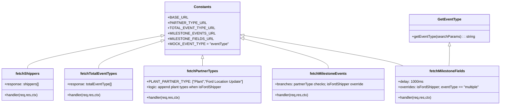

# Diagram: web/portal/src/mocks/handlers/entity/status-update-config.js


> Auto-generated by Obscura crawlers

## Diagram 1

```mermaid
flowchart TD
  Client[Client] -->|GET| E1[GET /entity/status-upload-config/shippers]
  E1 --> H1[fetchShippers(req,res,ctx)]
  H1 --> R1[res(ctx.json(shippers[]))]

  Client -->|GET| E2[GET /entity/status-upload-config/total-event-type?solutionId=FV_TEST]
  E2 --> H2[fetchTotalEventTypes(req,res,ctx)]
  H2 --> R2[res(ctx.json(totalEventType:[Single,Multiple]))]

  Client -->|GET| E3[GET /entity/status-upload-config/partner-types?solutionId=FV_TEST]
  E3 --> H3[fetchPartnerTypes(req,res,ctx)]
  H3 --> D3{req.url.pathname includes "FORD_FV"?}
  D3 -->|yes| R3F[partnerTypes = base + ["Plant","Ford Location Update"]]
  D3 -->|no| R3B[partnerTypes = base list]
  R3F --> RespPartner[res(ctx.json(partnerTypes))]
  R3B --> RespPartner

  Client -->|GET| E4[GET /entity/status-upload-config/milestones]
  E4 --> H4[fetchMilestoneEvents(req,res,ctx)]
  H4 --> PT{partnerType = req.url.searchParams.get("partnerType")}
  PT -->|Mod Center| M_Mod[Milestones: CLR_886, CLR_883, CLR_884, CLR_833]
  PT -->|Ocean Port| M_Ocean[Milestones: VMUP_846, VMUP_632, AI_872, PR, XB_810, VMUP_849]
  PT -->|other| M_Default[Milestones: VMUP_625, VMUP_632, J1_805]
  H4 --> IFordMilestones{req.url.pathname includes "FORD_FV"?}
  IFordMilestones -->|yes| M_Ford[Milestones: Vehicle Received (R1)]
  IFordMilestones -->|no| M_Default
  M_Mod --> RespMilestones[res(ctx.json(milestones))]
  M_Ocean --> RespMilestones
  M_Default --> RespMilestones
  M_Ford --> RespMilestones

  Client -->|GET| E5[GET /entity/status-upload-config/fields]
  E5 --> H5[fetchMilestoneFields(req,res,ctx)]
  H5 --> IFordFields{req.url.pathname includes "FORD_FV"?}
  IFordFields -->|yes| F_Ford[fields: MS1_LOCATION_CODE, VIN, MILESTONE_STATUS_CODE, VMACS_CODE]
  IFordFields -->|no| G_GetEvent[getEventType(req.url.searchParams)]
  G_GetEvent -->|returns "multiple"| F_Multiple[fields: SCAC, VIN, STATUS_LOCATION, COMPOUND_CODE, SHIP_TRIP_ID, ... VMACS_CODE]
  G_GetEvent -->|returns other| F_Default[fields: VIN, MILESTONE_STATUS_CODE, VMACS_CODE, STATUS_DATE_TIME, STATUS_LOCATION, COMPOUND_CODE, COMMENTS, SENDER_ID]
  F_Ford --> RespFields[res(ctx.delay(1000), ctx.json(fields))]
  F_Multiple --> RespFields
  F_Default --> RespFields
```

> SVG rendering failed for this diagram.

## Diagram 2



### SVG

<svg id="container" width="2209.34375" xmlns="http://www.w3.org/2000/svg" class="classDiagram" height="474" viewBox="0 0 2209.34375 474" role="graphics-document document" aria-roledescription="class"><style>#container{font-family:"trebuchet ms",verdana,arial,sans-serif;font-size:16px;fill:#333;}@keyframes edge-animation-frame{from{stroke-dashoffset:0;}}@keyframes dash{to{stroke-dashoffset:0;}}#container .edge-animation-slow{stroke-dasharray:9,5!important;stroke-dashoffset:900;animation:dash 50s linear infinite;stroke-linecap:round;}#container .edge-animation-fast{stroke-dasharray:9,5!important;stroke-dashoffset:900;animation:dash 20s linear infinite;stroke-linecap:round;}#container .error-icon{fill:#552222;}#container .error-text{fill:#552222;stroke:#552222;}#container .edge-thickness-normal{stroke-width:1px;}#container .edge-thickness-thick{stroke-width:3.5px;}#container .edge-pattern-solid{stroke-dasharray:0;}#container .edge-thickness-invisible{stroke-width:0;fill:none;}#container .edge-pattern-dashed{stroke-dasharray:3;}#container .edge-pattern-dotted{stroke-dasharray:2;}#container .marker{fill:#333333;stroke:#333333;}#container .marker.cross{stroke:#333333;}#container svg{font-family:"trebuchet ms",verdana,arial,sans-serif;font-size:16px;}#container p{margin:0;}#container g.classGroup text{fill:#9370DB;stroke:none;font-family:"trebuchet ms",verdana,arial,sans-serif;font-size:10px;}#container g.classGroup text .title{font-weight:bolder;}#container .nodeLabel,#container .edgeLabel{color:#131300;}#container .edgeLabel .label rect{fill:#ECECFF;}#container .label text{fill:#131300;}#container .labelBkg{background:#ECECFF;}#container .edgeLabel .label span{background:#ECECFF;}#container .classTitle{font-weight:bolder;}#container .node rect,#container .node circle,#container .node ellipse,#container .node polygon,#container .node path{fill:#ECECFF;stroke:#9370DB;stroke-width:1px;}#container .divider{stroke:#9370DB;stroke-width:1;}#container g.clickable{cursor:pointer;}#container g.classGroup rect{fill:#ECECFF;stroke:#9370DB;}#container g.classGroup line{stroke:#9370DB;stroke-width:1;}#container .classLabel .box{stroke:none;stroke-width:0;fill:#ECECFF;opacity:0.5;}#container .classLabel .label{fill:#9370DB;font-size:10px;}#container .relation{stroke:#333333;stroke-width:1;fill:none;}#container .dashed-line{stroke-dasharray:3;}#container .dotted-line{stroke-dasharray:1 2;}#container #compositionStart,#container .composition{fill:#333333!important;stroke:#333333!important;stroke-width:1;}#container #compositionEnd,#container .composition{fill:#333333!important;stroke:#333333!important;stroke-width:1;}#container #dependencyStart,#container .dependency{fill:#333333!important;stroke:#333333!important;stroke-width:1;}#container #dependencyStart,#container .dependency{fill:#333333!important;stroke:#333333!important;stroke-width:1;}#container #extensionStart,#container .extension{fill:transparent!important;stroke:#333333!important;stroke-width:1;}#container #extensionEnd,#container .extension{fill:transparent!important;stroke:#333333!important;stroke-width:1;}#container #aggregationStart,#container .aggregation{fill:transparent!important;stroke:#333333!important;stroke-width:1;}#container #aggregationEnd,#container .aggregation{fill:transparent!important;stroke:#333333!important;stroke-width:1;}#container #lollipopStart,#container .lollipop{fill:#ECECFF!important;stroke:#333333!important;stroke-width:1;}#container #lollipopEnd,#container .lollipop{fill:#ECECFF!important;stroke:#333333!important;stroke-width:1;}#container .edgeTerminals{font-size:11px;line-height:initial;}#container .classTitleText{text-anchor:middle;font-size:18px;fill:#333;}#container .label-icon{display:inline-block;height:1em;overflow:visible;vertical-align:-0.125em;}#container .node .label-icon path{fill:currentColor;stroke:revert;stroke-width:revert;}#container :root{--mermaid-font-family:"trebuchet ms",verdana,arial,sans-serif;}</style><g><defs><marker id="container_class-aggregationStart" class="marker aggregation class" refX="18" refY="7" markerWidth="190" markerHeight="240" orient="auto"><path d="M 18,7 L9,13 L1,7 L9,1 Z"></path></marker></defs><defs><marker id="container_class-aggregationEnd" class="marker aggregation class" refX="1" refY="7" markerWidth="20" markerHeight="28" orient="auto"><path d="M 18,7 L9,13 L1,7 L9,1 Z"></path></marker></defs><defs><marker id="container_class-extensionStart" class="marker extension class" refX="18" refY="7" markerWidth="190" markerHeight="240" orient="auto"><path d="M 1,7 L18,13 V 1 Z"></path></marker></defs><defs><marker id="container_class-extensionEnd" class="marker extension class" refX="1" refY="7" markerWidth="20" markerHeight="28" orient="auto"><path d="M 1,1 V 13 L18,7 Z"></path></marker></defs><defs><marker id="container_class-compositionStart" class="marker composition class" refX="18" refY="7" markerWidth="190" markerHeight="240" orient="auto"><path d="M 18,7 L9,13 L1,7 L9,1 Z"></path></marker></defs><defs><marker id="container_class-compositionEnd" class="marker composition class" refX="1" refY="7" markerWidth="20" markerHeight="28" orient="auto"><path d="M 18,7 L9,13 L1,7 L9,1 Z"></path></marker></defs><defs><marker id="container_class-dependencyStart" class="marker dependency class" refX="6" refY="7" markerWidth="190" markerHeight="240" orient="auto"><path d="M 5,7 L9,13 L1,7 L9,1 Z"></path></marker></defs><defs><marker id="container_class-dependencyEnd" class="marker dependency class" refX="13" refY="7" markerWidth="20" markerHeight="28" orient="auto"><path d="M 18,7 L9,13 L14,7 L9,1 Z"></path></marker></defs><defs><marker id="container_class-lollipopStart" class="marker lollipop class" refX="13" refY="7" markerWidth="190" markerHeight="240" orient="auto"><circle stroke="black" fill="transparent" cx="7" cy="7" r="6"></circle></marker></defs><defs><marker id="container_class-lollipopEnd" class="marker lollipop class" refX="1" refY="7" markerWidth="190" markerHeight="240" orient="auto"><circle stroke="black" fill="transparent" cx="7" cy="7" r="6"></circle></marker></defs><g class="root"><g class="clusters"></g><g class="edgePaths"><path d="M717.38,160.424L618.328,179.187C519.276,197.949,321.173,235.475,222.122,260.404C123.07,285.333,123.07,297.667,123.07,303.833L123.07,310" id="id_Constants_fetchShippers_1" class="edge-thickness-normal edge-pattern-solid relation" style=";;;" data-edge="true" data-et="edge" data-id="id_Constants_fetchShippers_1" data-points="W3sieCI6NzM0LjMyODEyNSwieSI6MTU3LjIxMzM5NzQyNzA2NTN9LHsieCI6MTIzLjA3MDMxMjUsInkiOjI3M30seyJ4IjoxMjMuMDcwMzEyNSwieSI6MzEwfV0=" marker-start="url(#container_class-extensionStart)"></path><path d="M717.912,183.075L671.477,198.063C625.042,213.05,532.171,243.025,485.736,264.179C439.301,285.333,439.301,297.667,439.301,303.833L439.301,310" id="id_Constants_fetchTotalEventTypes_2" class="edge-thickness-normal edge-pattern-solid relation" style=";;;" data-edge="true" data-et="edge" data-id="id_Constants_fetchTotalEventTypes_2" data-points="W3sieCI6NzM0LjMyODEyNSwieSI6MTc3Ljc3NjkyODU2MTQ5MTR9LHsieCI6NDM5LjMwMDc4MTI1LCJ5IjoyNzN9LHsieCI6NDM5LjMwMDc4MTI1LCJ5IjozMTB9XQ==" marker-start="url(#container_class-extensionStart)"></path><path d="M888.551,265.25L888.551,266.542C888.551,267.833,888.551,270.417,888.551,275.875C888.551,281.333,888.551,289.667,888.551,293.833L888.551,298" id="id_Constants_fetchPartnerTypes_3" class="edge-thickness-normal edge-pattern-solid relation" style=";;;" data-edge="true" data-et="edge" data-id="id_Constants_fetchPartnerTypes_3" data-points="W3sieCI6ODg4LjU1MDc4MTI1LCJ5IjoyNDh9LHsieCI6ODg4LjU1MDc4MTI1LCJ5IjoyNzN9LHsieCI6ODg4LjU1MDc4MTI1LCJ5IjoyOTh9XQ==" marker-start="url(#container_class-extensionStart)"></path><path d="M1059.45,173.218L1122.302,189.849C1185.155,206.479,1310.861,239.739,1373.714,262.536C1436.566,285.333,1436.566,297.667,1436.566,303.833L1436.566,310" id="id_Constants_fetchMilestoneEvents_4" class="edge-thickness-normal edge-pattern-solid relation" style=";;;" data-edge="true" data-et="edge" data-id="id_Constants_fetchMilestoneEvents_4" data-points="W3sieCI6MTA0Mi43NzM0Mzc1LCJ5IjoxNjguODA1OTI2MjExMDQ1NTJ9LHsieCI6MTQzNi41NjY0MDYyNSwieSI6MjczfSx7IngiOjE0MzYuNTY2NDA2MjUsInkiOjMxMH1d" marker-start="url(#container_class-extensionStart)"></path><path d="M1059.763,158.121L1168.592,177.268C1277.422,196.414,1495.082,234.707,1613.705,258.02C1732.327,281.333,1751.913,289.667,1761.705,293.833L1771.498,298" id="id_Constants_fetchMilestoneFields_5" class="edge-thickness-normal edge-pattern-solid relation" style=";;;" data-edge="true" data-et="edge" data-id="id_Constants_fetchMilestoneFields_5" data-points="W3sieCI6MTA0Mi43NzM0Mzc1LCJ5IjoxNTUuMTMyMzkzMDE3Nzc3ODR9LHsieCI6MTcxMi43NDIxODc1LCJ5IjoyNzN9LHsieCI6MTc3MS40OTgxMDA2MzA3MzQsInkiOjI5OH1d" marker-start="url(#container_class-extensionStart)"></path><path d="M1978.918,208.25L1978.918,219.042C1978.918,229.833,1978.918,251.417,1978.536,266.375C1978.153,281.333,1977.389,289.667,1977.007,293.833L1976.624,298" id="id_GetEventType_fetchMilestoneFields_6" class="edge-thickness-normal edge-pattern-solid relation" style=";;;" data-edge="true" data-et="edge" data-id="id_GetEventType_fetchMilestoneFields_6" data-points="W3sieCI6MTk3OC45MTc5Njg3NSwieSI6MTkxfSx7IngiOjE5NzguOTE3OTY4NzUsInkiOjI3M30seyJ4IjoxOTc2LjYyNDM5MDc2ODM0ODYsInkiOjI5OH1d" marker-start="url(#container_class-extensionStart)"></path></g><g class="edgeLabels"><g class="edgeLabel"><g class="label" data-id="id_Constants_fetchShippers_1" transform="translate(0, 0)"><foreignObject width="0" height="0"><div xmlns="http://www.w3.org/1999/xhtml" class="labelBkg" style="display: table-cell; white-space: nowrap; line-height: 1.5; max-width: 200px; text-align: center;"><span class="edgeLabel"></span></div></foreignObject></g></g><g class="edgeLabel"><g class="label" data-id="id_Constants_fetchTotalEventTypes_2" transform="translate(0, 0)"><foreignObject width="0" height="0"><div xmlns="http://www.w3.org/1999/xhtml" class="labelBkg" style="display: table-cell; white-space: nowrap; line-height: 1.5; max-width: 200px; text-align: center;"><span class="edgeLabel"></span></div></foreignObject></g></g><g class="edgeLabel"><g class="label" data-id="id_Constants_fetchPartnerTypes_3" transform="translate(0, 0)"><foreignObject width="0" height="0"><div xmlns="http://www.w3.org/1999/xhtml" class="labelBkg" style="display: table-cell; white-space: nowrap; line-height: 1.5; max-width: 200px; text-align: center;"><span class="edgeLabel"></span></div></foreignObject></g></g><g class="edgeLabel"><g class="label" data-id="id_Constants_fetchMilestoneEvents_4" transform="translate(0, 0)"><foreignObject width="0" height="0"><div xmlns="http://www.w3.org/1999/xhtml" class="labelBkg" style="display: table-cell; white-space: nowrap; line-height: 1.5; max-width: 200px; text-align: center;"><span class="edgeLabel"></span></div></foreignObject></g></g><g class="edgeLabel"><g class="label" data-id="id_Constants_fetchMilestoneFields_5" transform="translate(0, 0)"><foreignObject width="0" height="0"><div xmlns="http://www.w3.org/1999/xhtml" class="labelBkg" style="display: table-cell; white-space: nowrap; line-height: 1.5; max-width: 200px; text-align: center;"><span class="edgeLabel"></span></div></foreignObject></g></g><g class="edgeLabel"><g class="label" data-id="id_GetEventType_fetchMilestoneFields_6" transform="translate(0, 0)"><foreignObject width="0" height="0"><div xmlns="http://www.w3.org/1999/xhtml" class="labelBkg" style="display: table-cell; white-space: nowrap; line-height: 1.5; max-width: 200px; text-align: center;"><span class="edgeLabel"></span></div></foreignObject></g></g></g><g class="nodes"><g class="node default" id="classId-Constants-0" transform="translate(888.55078125, 128)"><g class="basic label-container"><path d="M-154.22265625 -120 L154.22265625 -120 L154.22265625 120 L-154.22265625 120" stroke="none" stroke-width="0" fill="#ECECFF" style=""></path><path d="M-154.22265625 -120 C-54.3319459451383 -120, 45.5587643597234 -120, 154.22265625 -120 M-154.22265625 -120 C-33.71730160034963 -120, 86.78805304930074 -120, 154.22265625 -120 M154.22265625 -120 C154.22265625 -62.23912098313472, 154.22265625 -4.478241966269437, 154.22265625 120 M154.22265625 -120 C154.22265625 -51.92488857476481, 154.22265625 16.150222850470385, 154.22265625 120 M154.22265625 120 C77.69969480909764 120, 1.176733368195272 120, -154.22265625 120 M154.22265625 120 C85.69442325308515 120, 17.166190256170296 120, -154.22265625 120 M-154.22265625 120 C-154.22265625 35.168996250915455, -154.22265625 -49.66200749816909, -154.22265625 -120 M-154.22265625 120 C-154.22265625 35.66305241509859, -154.22265625 -48.67389516980282, -154.22265625 -120" stroke="#9370DB" stroke-width="1.3" fill="none" stroke-dasharray="0 0" style=""></path></g><g class="annotation-group text" transform="translate(0, -96)"></g><g class="label-group text" transform="translate(-36.5390625, -96)"><g class="label" style="font-weight: bolder" transform="translate(0,-12)"><foreignObject width="73.078125" height="24"><div xmlns="http://www.w3.org/1999/xhtml" style="display: table-cell; white-space: nowrap; line-height: 1.5; max-width: 122px; text-align: center;"><span class="nodeLabel markdown-node-label" style=""><p>Constants</p></span></div></foreignObject></g></g><g class="members-group text" transform="translate(-142.22265625, -48)"><g class="label" style="" transform="translate(0,-12)"><foreignObject width="80.171875" height="24"><div xmlns="http://www.w3.org/1999/xhtml" style="display: table-cell; white-space: nowrap; line-height: 1.5; max-width: 138px; text-align: center;"><span class="nodeLabel markdown-node-label" style=""><p>+BASE_URL</p></span></div></foreignObject></g><g class="label" style="" transform="translate(0,12)"><foreignObject width="150.828125" height="24"><div xmlns="http://www.w3.org/1999/xhtml" style="display: table-cell; white-space: nowrap; line-height: 1.5; max-width: 208px; text-align: center;"><span class="nodeLabel markdown-node-label" style=""><p>+PARTNER_TYPE_URL</p></span></div></foreignObject></g><g class="label" style="" transform="translate(0,36)"><foreignObject width="181.28125" height="24"><div xmlns="http://www.w3.org/1999/xhtml" style="display: table-cell; white-space: nowrap; line-height: 1.5; max-width: 239px; text-align: center;"><span class="nodeLabel markdown-node-label" style=""><p>+TOTAL_EVENT_TYPE_URL</p></span></div></foreignObject></g><g class="label" style="" transform="translate(0,60)"><foreignObject width="185.703125" height="24"><div xmlns="http://www.w3.org/1999/xhtml" style="display: table-cell; white-space: nowrap; line-height: 1.5; max-width: 243px; text-align: center;"><span class="nodeLabel markdown-node-label" style=""><p>+MILESTONE_EVENTS_URL</p></span></div></foreignObject></g><g class="label" style="" transform="translate(0,84)"><foreignObject width="180.21875" height="24"><div xmlns="http://www.w3.org/1999/xhtml" style="display: table-cell; white-space: nowrap; line-height: 1.5; max-width: 238px; text-align: center;"><span class="nodeLabel markdown-node-label" style=""><p>+MILESTONE_FIELDS_URL</p></span></div></foreignObject></g><g class="label" style="" transform="translate(0,108)"><foreignObject width="247.90625" height="24"><div xmlns="http://www.w3.org/1999/xhtml" style="display: table-cell; white-space: nowrap; line-height: 1.5; max-width: 305px; text-align: center;"><span class="nodeLabel markdown-node-label" style=""><p>+MOCK_EVENT_TYPE = "eventType"</p></span></div></foreignObject></g></g><g class="methods-group text" transform="translate(-142.22265625, 120)"></g><g class="divider" style=""><path d="M-154.22265625 -72 C-56.80538680074193 -72, 40.61188264851614 -72, 154.22265625 -72 M-154.22265625 -72 C-36.28980115170705 -72, 81.6430539465859 -72, 154.22265625 -72" stroke="#9370DB" stroke-width="1.3" fill="none" stroke-dasharray="0 0" style=""></path></g><g class="divider" style=""><path d="M-154.22265625 96 C-80.63652063907085 96, -7.050385028141704 96, 154.22265625 96 M-154.22265625 96 C-92.30862508091057 96, -30.394593911821147 96, 154.22265625 96" stroke="#9370DB" stroke-width="1.3" fill="none" stroke-dasharray="0 0" style=""></path></g></g><g class="node default" id="classId-GetEventType-1" transform="translate(1978.91796875, 128)"><g class="basic label-container"><path d="M-175.44921875 -63 L175.44921875 -63 L175.44921875 63 L-175.44921875 63" stroke="none" stroke-width="0" fill="#ECECFF" style=""></path><path d="M-175.44921875 -63 C-72.98439752411103 -63, 29.480423701777937 -63, 175.44921875 -63 M-175.44921875 -63 C-68.22371611174492 -63, 39.00178652651016 -63, 175.44921875 -63 M175.44921875 -63 C175.44921875 -13.018319229788872, 175.44921875 36.963361540422255, 175.44921875 63 M175.44921875 -63 C175.44921875 -17.904965491785234, 175.44921875 27.190069016429533, 175.44921875 63 M175.44921875 63 C102.74875229792009 63, 30.048285845840184 63, -175.44921875 63 M175.44921875 63 C54.781533067908214 63, -65.88615261418357 63, -175.44921875 63 M-175.44921875 63 C-175.44921875 31.721739358074277, -175.44921875 0.4434787161485545, -175.44921875 -63 M-175.44921875 63 C-175.44921875 16.66875363963787, -175.44921875 -29.66249272072426, -175.44921875 -63" stroke="#9370DB" stroke-width="1.3" fill="none" stroke-dasharray="0 0" style=""></path></g><g class="annotation-group text" transform="translate(0, -39)"></g><g class="label-group text" transform="translate(-50.2109375, -39)"><g class="label" style="font-weight: bolder" transform="translate(0,-12)"><foreignObject width="100.421875" height="24"><div xmlns="http://www.w3.org/1999/xhtml" style="display: table-cell; white-space: nowrap; line-height: 1.5; max-width: 148px; text-align: center;"><span class="nodeLabel markdown-node-label" style=""><p>GetEventType</p></span></div></foreignObject></g></g><g class="members-group text" transform="translate(-163.44921875, 9)"></g><g class="methods-group text" transform="translate(-163.44921875, 39)"><g class="label" style="" transform="translate(0,-12)"><foreignObject width="276.6875" height="24"><div xmlns="http://www.w3.org/1999/xhtml" style="display: table-cell; white-space: nowrap; line-height: 1.5; max-width: 335px; text-align: center;"><span class="nodeLabel markdown-node-label" style=""><p>+getEventType(searchParams) : : string</p></span></div></foreignObject></g></g><g class="divider" style=""><path d="M-175.44921875 -15 C-82.64638886006607 -15, 10.156441029867864 -15, 175.44921875 -15 M-175.44921875 -15 C-83.59913246619165 -15, 8.250953817616704 -15, 175.44921875 -15" stroke="#9370DB" stroke-width="1.3" fill="none" stroke-dasharray="0 0" style=""></path></g><g class="divider" style=""><path d="M-175.44921875 9 C-46.51073968313062 9, 82.42773938373875 9, 175.44921875 9 M-175.44921875 9 C-88.86468480841218 9, -2.280150866824357 9, 175.44921875 9" stroke="#9370DB" stroke-width="1.3" fill="none" stroke-dasharray="0 0" style=""></path></g></g><g class="node default" id="classId-fetchShippers-2" transform="translate(123.0703125, 382)"><g class="basic label-container"><path d="M-115.0703125 -72 L115.0703125 -72 L115.0703125 72 L-115.0703125 72" stroke="none" stroke-width="0" fill="#ECECFF" style=""></path><path d="M-115.0703125 -72 C-44.82444606541483 -72, 25.421420369170335 -72, 115.0703125 -72 M-115.0703125 -72 C-36.04303305001133 -72, 42.98424639997734 -72, 115.0703125 -72 M115.0703125 -72 C115.0703125 -28.711791466204446, 115.0703125 14.576417067591109, 115.0703125 72 M115.0703125 -72 C115.0703125 -32.83839703970685, 115.0703125 6.323205920586304, 115.0703125 72 M115.0703125 72 C24.424192639961745 72, -66.22192722007651 72, -115.0703125 72 M115.0703125 72 C27.634002577460194 72, -59.80230734507961 72, -115.0703125 72 M-115.0703125 72 C-115.0703125 26.749730899424478, -115.0703125 -18.500538201151045, -115.0703125 -72 M-115.0703125 72 C-115.0703125 18.603328480843935, -115.0703125 -34.79334303831213, -115.0703125 -72" stroke="#9370DB" stroke-width="1.3" fill="none" stroke-dasharray="0 0" style=""></path></g><g class="annotation-group text" transform="translate(0, -48)"></g><g class="label-group text" transform="translate(-50.96875, -48)"><g class="label" style="font-weight: bolder" transform="translate(0,-12)"><foreignObject width="101.9375" height="24"><div xmlns="http://www.w3.org/1999/xhtml" style="display: table-cell; white-space: nowrap; line-height: 1.5; max-width: 150px; text-align: center;"><span class="nodeLabel markdown-node-label" style=""><p>fetchShippers</p></span></div></foreignObject></g></g><g class="members-group text" transform="translate(-103.0703125, 0)"><g class="label" style="" transform="translate(0,-12)"><foreignObject width="155.171875" height="24"><div xmlns="http://www.w3.org/1999/xhtml" style="display: table-cell; white-space: nowrap; line-height: 1.5; max-width: 213px; text-align: center;"><span class="nodeLabel markdown-node-label" style=""><p>+response: shippers[]</p></span></div></foreignObject></g></g><g class="methods-group text" transform="translate(-103.0703125, 48)"><g class="label" style="" transform="translate(0,-12)"><foreignObject width="149.46875" height="24"><div xmlns="http://www.w3.org/1999/xhtml" style="display: table-cell; white-space: nowrap; line-height: 1.5; max-width: 207px; text-align: center;"><span class="nodeLabel markdown-node-label" style=""><p>+handler(req,res,ctx)</p></span></div></foreignObject></g></g><g class="divider" style=""><path d="M-115.0703125 -24 C-68.01909305908816 -24, -20.967873618176313 -24, 115.0703125 -24 M-115.0703125 -24 C-52.38858326374184 -24, 10.293145972516314 -24, 115.0703125 -24" stroke="#9370DB" stroke-width="1.3" fill="none" stroke-dasharray="0 0" style=""></path></g><g class="divider" style=""><path d="M-115.0703125 24 C-38.90453702315688 24, 37.261238453686246 24, 115.0703125 24 M-115.0703125 24 C-39.5448559815393 24, 35.9806005369214 24, 115.0703125 24" stroke="#9370DB" stroke-width="1.3" fill="none" stroke-dasharray="0 0" style=""></path></g></g><g class="node default" id="classId-fetchTotalEventTypes-3" transform="translate(439.30078125, 382)"><g class="basic label-container"><path d="M-151.16015625 -72 L151.16015625 -72 L151.16015625 72 L-151.16015625 72" stroke="none" stroke-width="0" fill="#ECECFF" style=""></path><path d="M-151.16015625 -72 C-80.64215894192957 -72, -10.124161633859131 -72, 151.16015625 -72 M-151.16015625 -72 C-60.83279444740617 -72, 29.494567355187655 -72, 151.16015625 -72 M151.16015625 -72 C151.16015625 -17.758332934428495, 151.16015625 36.48333413114301, 151.16015625 72 M151.16015625 -72 C151.16015625 -39.31524027079585, 151.16015625 -6.6304805415916945, 151.16015625 72 M151.16015625 72 C83.47925697330261 72, 15.798357696605223 72, -151.16015625 72 M151.16015625 72 C62.04467585992708 72, -27.070804530145836 72, -151.16015625 72 M-151.16015625 72 C-151.16015625 25.613208972417638, -151.16015625 -20.773582055164724, -151.16015625 -72 M-151.16015625 72 C-151.16015625 26.315481849863367, -151.16015625 -19.369036300273265, -151.16015625 -72" stroke="#9370DB" stroke-width="1.3" fill="none" stroke-dasharray="0 0" style=""></path></g><g class="annotation-group text" transform="translate(0, -48)"></g><g class="label-group text" transform="translate(-78.2109375, -48)"><g class="label" style="font-weight: bolder" transform="translate(0,-12)"><foreignObject width="156.421875" height="24"><div xmlns="http://www.w3.org/1999/xhtml" style="display: table-cell; white-space: nowrap; line-height: 1.5; max-width: 203px; text-align: center;"><span class="nodeLabel markdown-node-label" style=""><p>fetchTotalEventTypes</p></span></div></foreignObject></g></g><g class="members-group text" transform="translate(-139.16015625, 0)"><g class="label" style="" transform="translate(0,-12)"><foreignObject width="200.109375" height="24"><div xmlns="http://www.w3.org/1999/xhtml" style="display: table-cell; white-space: nowrap; line-height: 1.5; max-width: 257px; text-align: center;"><span class="nodeLabel markdown-node-label" style=""><p>+response: totalEventType[]</p></span></div></foreignObject></g></g><g class="methods-group text" transform="translate(-139.16015625, 48)"><g class="label" style="" transform="translate(0,-12)"><foreignObject width="149.46875" height="24"><div xmlns="http://www.w3.org/1999/xhtml" style="display: table-cell; white-space: nowrap; line-height: 1.5; max-width: 207px; text-align: center;"><span class="nodeLabel markdown-node-label" style=""><p>+handler(req,res,ctx)</p></span></div></foreignObject></g></g><g class="divider" style=""><path d="M-151.16015625 -24 C-82.07309880748922 -24, -12.986041364978433 -24, 151.16015625 -24 M-151.16015625 -24 C-49.10073360587761 -24, 52.958689038244785 -24, 151.16015625 -24" stroke="#9370DB" stroke-width="1.3" fill="none" stroke-dasharray="0 0" style=""></path></g><g class="divider" style=""><path d="M-151.16015625 24 C-39.74444948860511 24, 71.67125727278977 24, 151.16015625 24 M-151.16015625 24 C-62.439242328060445 24, 26.28167159387911 24, 151.16015625 24" stroke="#9370DB" stroke-width="1.3" fill="none" stroke-dasharray="0 0" style=""></path></g></g><g class="node default" id="classId-fetchPartnerTypes-4" transform="translate(888.55078125, 382)"><g class="basic label-container"><path d="M-248.08984375 -84 L248.08984375 -84 L248.08984375 84 L-248.08984375 84" stroke="none" stroke-width="0" fill="#ECECFF" style=""></path><path d="M-248.08984375 -84 C-60.5162693183739 -84, 127.0573051132522 -84, 248.08984375 -84 M-248.08984375 -84 C-119.42781864394942 -84, 9.234206462101156 -84, 248.08984375 -84 M248.08984375 -84 C248.08984375 -34.48349034893327, 248.08984375 15.033019302133454, 248.08984375 84 M248.08984375 -84 C248.08984375 -19.17860339157629, 248.08984375 45.64279321684742, 248.08984375 84 M248.08984375 84 C118.89295518872197 84, -10.30393337255606 84, -248.08984375 84 M248.08984375 84 C92.46153611868073 84, -63.16677151263855 84, -248.08984375 84 M-248.08984375 84 C-248.08984375 22.04327197797732, -248.08984375 -39.91345604404536, -248.08984375 -84 M-248.08984375 84 C-248.08984375 19.130538996462136, -248.08984375 -45.73892200707573, -248.08984375 -84" stroke="#9370DB" stroke-width="1.3" fill="none" stroke-dasharray="0 0" style=""></path></g><g class="annotation-group text" transform="translate(0, -60)"></g><g class="label-group text" transform="translate(-67.0859375, -60)"><g class="label" style="font-weight: bolder" transform="translate(0,-12)"><foreignObject width="134.171875" height="24"><div xmlns="http://www.w3.org/1999/xhtml" style="display: table-cell; white-space: nowrap; line-height: 1.5; max-width: 181px; text-align: center;"><span class="nodeLabel markdown-node-label" style=""><p>fetchPartnerTypes</p></span></div></foreignObject></g></g><g class="members-group text" transform="translate(-236.08984375, -12)"><g class="label" style="" transform="translate(0,-12)"><foreignObject width="405.09375" height="24"><div xmlns="http://www.w3.org/1999/xhtml" style="display: table-cell; white-space: nowrap; line-height: 1.5; max-width: 462px; text-align: center;"><span class="nodeLabel markdown-node-label" style=""><p>+PLANT_PARTNER_TYPE: ["Plant","Ford Location Update"]</p></span></div></foreignObject></g><g class="label" style="" transform="translate(0,12)"><foreignObject width="339.484375" height="24"><div xmlns="http://www.w3.org/1999/xhtml" style="display: table-cell; white-space: nowrap; line-height: 1.5; max-width: 398px; text-align: center;"><span class="nodeLabel markdown-node-label" style=""><p>+logic: append plant types when isFordShipper</p></span></div></foreignObject></g></g><g class="methods-group text" transform="translate(-236.08984375, 60)"><g class="label" style="" transform="translate(0,-12)"><foreignObject width="149.46875" height="24"><div xmlns="http://www.w3.org/1999/xhtml" style="display: table-cell; white-space: nowrap; line-height: 1.5; max-width: 207px; text-align: center;"><span class="nodeLabel markdown-node-label" style=""><p>+handler(req,res,ctx)</p></span></div></foreignObject></g></g><g class="divider" style=""><path d="M-248.08984375 -36 C-130.63532925321533 -36, -13.180814756430692 -36, 248.08984375 -36 M-248.08984375 -36 C-104.32630938074686 -36, 39.43722498850627 -36, 248.08984375 -36" stroke="#9370DB" stroke-width="1.3" fill="none" stroke-dasharray="0 0" style=""></path></g><g class="divider" style=""><path d="M-248.08984375 36 C-96.17197617327449 36, 55.745891403451026 36, 248.08984375 36 M-248.08984375 36 C-141.02131800343608 36, -33.95279225687213 36, 248.08984375 36" stroke="#9370DB" stroke-width="1.3" fill="none" stroke-dasharray="0 0" style=""></path></g></g><g class="node default" id="classId-fetchMilestoneEvents-5" transform="translate(1436.56640625, 382)"><g class="basic label-container"><path d="M-249.92578125 -72 L249.92578125 -72 L249.92578125 72 L-249.92578125 72" stroke="none" stroke-width="0" fill="#ECECFF" style=""></path><path d="M-249.92578125 -72 C-121.90060720566262 -72, 6.1245668386747525 -72, 249.92578125 -72 M-249.92578125 -72 C-59.14952290522649 -72, 131.62673543954702 -72, 249.92578125 -72 M249.92578125 -72 C249.92578125 -24.271126811858863, 249.92578125 23.457746376282273, 249.92578125 72 M249.92578125 -72 C249.92578125 -21.635713376436946, 249.92578125 28.728573247126107, 249.92578125 72 M249.92578125 72 C68.87802909089734 72, -112.16972306820531 72, -249.92578125 72 M249.92578125 72 C115.99756461640823 72, -17.930652017183547 72, -249.92578125 72 M-249.92578125 72 C-249.92578125 39.615398053889734, -249.92578125 7.230796107779469, -249.92578125 -72 M-249.92578125 72 C-249.92578125 30.253245066290177, -249.92578125 -11.493509867419647, -249.92578125 -72" stroke="#9370DB" stroke-width="1.3" fill="none" stroke-dasharray="0 0" style=""></path></g><g class="annotation-group text" transform="translate(0, -48)"></g><g class="label-group text" transform="translate(-78.4609375, -48)"><g class="label" style="font-weight: bolder" transform="translate(0,-12)"><foreignObject width="156.921875" height="24"><div xmlns="http://www.w3.org/1999/xhtml" style="display: table-cell; white-space: nowrap; line-height: 1.5; max-width: 205px; text-align: center;"><span class="nodeLabel markdown-node-label" style=""><p>fetchMilestoneEvents</p></span></div></foreignObject></g></g><g class="members-group text" transform="translate(-237.92578125, 0)"><g class="label" style="" transform="translate(0,-12)"><foreignObject width="397.390625" height="24"><div xmlns="http://www.w3.org/1999/xhtml" style="display: table-cell; white-space: nowrap; line-height: 1.5; max-width: 455px; text-align: center;"><span class="nodeLabel markdown-node-label" style=""><p>+branches: partnerType checks; isFordShipper override</p></span></div></foreignObject></g></g><g class="methods-group text" transform="translate(-237.92578125, 48)"><g class="label" style="" transform="translate(0,-12)"><foreignObject width="149.46875" height="24"><div xmlns="http://www.w3.org/1999/xhtml" style="display: table-cell; white-space: nowrap; line-height: 1.5; max-width: 207px; text-align: center;"><span class="nodeLabel markdown-node-label" style=""><p>+handler(req,res,ctx)</p></span></div></foreignObject></g></g><g class="divider" style=""><path d="M-249.92578125 -24 C-137.126245739416 -24, -24.326710228832013 -24, 249.92578125 -24 M-249.92578125 -24 C-91.57649231728502 -24, 66.77279661542997 -24, 249.92578125 -24" stroke="#9370DB" stroke-width="1.3" fill="none" stroke-dasharray="0 0" style=""></path></g><g class="divider" style=""><path d="M-249.92578125 24 C-112.03820877837688 24, 25.849363693246232 24, 249.92578125 24 M-249.92578125 24 C-146.27394255725687 24, -42.62210386451375 24, 249.92578125 24" stroke="#9370DB" stroke-width="1.3" fill="none" stroke-dasharray="0 0" style=""></path></g></g><g class="node default" id="classId-fetchMilestoneFields-6" transform="translate(1968.91796875, 382)"><g class="basic label-container"><path d="M-232.42578125 -84 L232.42578125 -84 L232.42578125 84 L-232.42578125 84" stroke="none" stroke-width="0" fill="#ECECFF" style=""></path><path d="M-232.42578125 -84 C-86.0533766893549 -84, 60.31902787129019 -84, 232.42578125 -84 M-232.42578125 -84 C-55.4149003469785 -84, 121.595980556043 -84, 232.42578125 -84 M232.42578125 -84 C232.42578125 -31.947805979079497, 232.42578125 20.104388041841005, 232.42578125 84 M232.42578125 -84 C232.42578125 -42.945667803419205, 232.42578125 -1.8913356068384104, 232.42578125 84 M232.42578125 84 C106.8550553029114 84, -18.71567064417721 84, -232.42578125 84 M232.42578125 84 C51.65265387563733 84, -129.12047349872535 84, -232.42578125 84 M-232.42578125 84 C-232.42578125 27.357400839979086, -232.42578125 -29.28519832004183, -232.42578125 -84 M-232.42578125 84 C-232.42578125 49.5436920631451, -232.42578125 15.087384126290203, -232.42578125 -84" stroke="#9370DB" stroke-width="1.3" fill="none" stroke-dasharray="0 0" style=""></path></g><g class="annotation-group text" transform="translate(0, -60)"></g><g class="label-group text" transform="translate(-75.7265625, -60)"><g class="label" style="font-weight: bolder" transform="translate(0,-12)"><foreignObject width="151.453125" height="24"><div xmlns="http://www.w3.org/1999/xhtml" style="display: table-cell; white-space: nowrap; line-height: 1.5; max-width: 199px; text-align: center;"><span class="nodeLabel markdown-node-label" style=""><p>fetchMilestoneFields</p></span></div></foreignObject></g></g><g class="members-group text" transform="translate(-220.42578125, -12)"><g class="label" style="" transform="translate(0,-12)"><foreignObject width="110.265625" height="24"><div xmlns="http://www.w3.org/1999/xhtml" style="display: table-cell; white-space: nowrap; line-height: 1.5; max-width: 168px; text-align: center;"><span class="nodeLabel markdown-node-label" style=""><p>+delay: 1000ms</p></span></div></foreignObject></g><g class="label" style="" transform="translate(0,12)"><foreignObject width="365.125" height="24"><div xmlns="http://www.w3.org/1999/xhtml" style="display: table-cell; white-space: nowrap; line-height: 1.5; max-width: 422px; text-align: center;"><span class="nodeLabel markdown-node-label" style=""><p>+overrides: isFordShipper; eventType == "multiple"</p></span></div></foreignObject></g></g><g class="methods-group text" transform="translate(-220.42578125, 60)"><g class="label" style="" transform="translate(0,-12)"><foreignObject width="149.46875" height="24"><div xmlns="http://www.w3.org/1999/xhtml" style="display: table-cell; white-space: nowrap; line-height: 1.5; max-width: 207px; text-align: center;"><span class="nodeLabel markdown-node-label" style=""><p>+handler(req,res,ctx)</p></span></div></foreignObject></g></g><g class="divider" style=""><path d="M-232.42578125 -36 C-95.68318015047862 -36, 41.05942094904276 -36, 232.42578125 -36 M-232.42578125 -36 C-76.21495672716546 -36, 79.99586779566908 -36, 232.42578125 -36" stroke="#9370DB" stroke-width="1.3" fill="none" stroke-dasharray="0 0" style=""></path></g><g class="divider" style=""><path d="M-232.42578125 36 C-107.9922317529468 36, 16.441317744106414 36, 232.42578125 36 M-232.42578125 36 C-119.39601011970018 36, -6.366238989400358 36, 232.42578125 36" stroke="#9370DB" stroke-width="1.3" fill="none" stroke-dasharray="0 0" style=""></path></g></g></g></g></g></svg>
