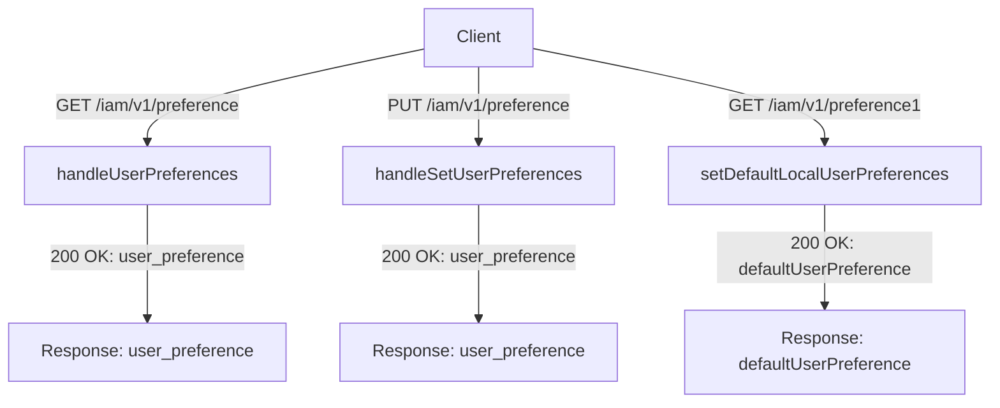
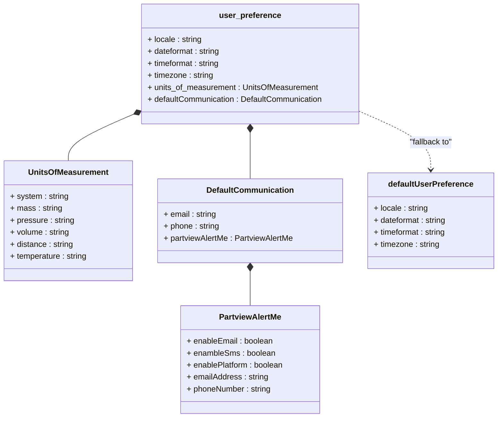

# Diagram: web/portal/src/mocks/handlers/iam/v1/preferences.js

> Auto-generated by Obscura crawlers

## Diagram 1

### SVG

<svg id="container" width="912.9609375" xmlns="http://www.w3.org/2000/svg" class="flowchart" height="374" viewBox="0 0 912.9609375 374" role="graphics-document document" aria-roledescription="flowchart-v2"><g><marker id="container_flowchart-v2-pointEnd" class="marker flowchart-v2" viewBox="0 0 10 10" refX="5" refY="5" markerUnits="userSpaceOnUse" markerWidth="8" markerHeight="8" orient="auto"><path d="M 0 0 L 10 5 L 0 10 z" class="arrowMarkerPath" style="stroke-width: 1; stroke-dasharray: 1, 0;"></path></marker><marker id="container_flowchart-v2-pointStart" class="marker flowchart-v2" viewBox="0 0 10 10" refX="4.5" refY="5" markerUnits="userSpaceOnUse" markerWidth="8" markerHeight="8" orient="auto"><path d="M 0 5 L 10 10 L 10 0 z" class="arrowMarkerPath" style="stroke-width: 1; stroke-dasharray: 1, 0;"></path></marker><marker id="container_flowchart-v2-circleEnd" class="marker flowchart-v2" viewBox="0 0 10 10" refX="11" refY="5" markerUnits="userSpaceOnUse" markerWidth="11" markerHeight="11" orient="auto"><circle cx="5" cy="5" r="5" class="arrowMarkerPath" style="stroke-width: 1; stroke-dasharray: 1, 0;"></circle></marker><marker id="container_flowchart-v2-circleStart" class="marker flowchart-v2" viewBox="0 0 10 10" refX="-1" refY="5" markerUnits="userSpaceOnUse" markerWidth="11" markerHeight="11" orient="auto"><circle cx="5" cy="5" r="5" class="arrowMarkerPath" style="stroke-width: 1; stroke-dasharray: 1, 0;"></circle></marker><marker id="container_flowchart-v2-crossEnd" class="marker cross flowchart-v2" viewBox="0 0 11 11" refX="12" refY="5.2" markerUnits="userSpaceOnUse" markerWidth="11" markerHeight="11" orient="auto"><path d="M 1,1 l 9,9 M 10,1 l -9,9" class="arrowMarkerPath" style="stroke-width: 2; stroke-dasharray: 1, 0;"></path></marker><marker id="container_flowchart-v2-crossStart" class="marker cross flowchart-v2" viewBox="0 0 11 11" refX="-1" refY="5.2" markerUnits="userSpaceOnUse" markerWidth="11" markerHeight="11" orient="auto"><path d="M 1,1 l 9,9 M 10,1 l -9,9" class="arrowMarkerPath" style="stroke-width: 2; stroke-dasharray: 1, 0;"></path></marker><g class="root"><g class="clusters"></g><g class="edgePaths"><path d="M388.859,45.705L346.594,54.587C304.328,63.47,219.797,81.235,177.531,95.617C135.266,110,135.266,121,135.266,126.5L135.266,132" id="L_Client_H1_0" class="edge-thickness-normal edge-pattern-solid edge-thickness-normal edge-pattern-solid flowchart-link" style=";" data-edge="true" data-et="edge" data-id="L_Client_H1_0" data-points="W3sieCI6Mzg4Ljg1OTM3NSwieSI6NDUuNzA0OTc2OTExMjM2NTN9LHsieCI6MTM1LjI2NTYyNSwieSI6OTl9LHsieCI6MTM1LjI2NTYyNSwieSI6MTM2fV0=" marker-end="url(#container_flowchart-v2-pointEnd)"></path><path d="M135.266,190L135.266,198.167C135.266,206.333,135.266,222.667,135.266,240.333C135.266,258,135.266,277,135.266,286.5L135.266,296" id="L_H1_R1_0" class="edge-thickness-normal edge-pattern-solid edge-thickness-normal edge-pattern-solid flowchart-link" style=";" data-edge="true" data-et="edge" data-id="L_H1_R1_0" data-points="W3sieCI6MTM1LjI2NTYyNSwieSI6MTkwfSx7IngiOjEzNS4yNjU2MjUsInkiOjIzOX0seyJ4IjoxMzUuMjY1NjI1LCJ5IjozMDB9XQ==" marker-end="url(#container_flowchart-v2-pointEnd)"></path><path d="M439.797,62L439.797,68.167C439.797,74.333,439.797,86.667,439.797,98.333C439.797,110,439.797,121,439.797,126.5L439.797,132" id="L_Client_H2_0" class="edge-thickness-normal edge-pattern-solid edge-thickness-normal edge-pattern-solid flowchart-link" style=";" data-edge="true" data-et="edge" data-id="L_Client_H2_0" data-points="W3sieCI6NDM5Ljc5Njg3NSwieSI6NjJ9LHsieCI6NDM5Ljc5Njg3NSwieSI6OTl9LHsieCI6NDM5Ljc5Njg3NSwieSI6MTM2fV0=" marker-end="url(#container_flowchart-v2-pointEnd)"></path><path d="M439.797,190L439.797,198.167C439.797,206.333,439.797,222.667,439.797,240.333C439.797,258,439.797,277,439.797,286.5L439.797,296" id="L_H2_R2_0" class="edge-thickness-normal edge-pattern-solid edge-thickness-normal edge-pattern-solid flowchart-link" style=";" data-edge="true" data-et="edge" data-id="L_H2_R2_0" data-points="W3sieCI6NDM5Ljc5Njg3NSwieSI6MTkwfSx7IngiOjQzOS43OTY4NzUsInkiOjIzOX0seyJ4Ijo0MzkuNzk2ODc1LCJ5IjozMDB9XQ==" marker-end="url(#container_flowchart-v2-pointEnd)"></path><path d="M490.734,45.176L535.637,54.147C580.539,63.118,670.344,81.059,715.246,95.529C760.148,110,760.148,121,760.148,126.5L760.148,132" id="L_Client_H3_0" class="edge-thickness-normal edge-pattern-solid edge-thickness-normal edge-pattern-solid flowchart-link" style=";" data-edge="true" data-et="edge" data-id="L_Client_H3_0" data-points="W3sieCI6NDkwLjczNDM3NSwieSI6NDUuMTc2MzE5OTYwOTgwMzY1fSx7IngiOjc2MC4xNDg0Mzc1LCJ5Ijo5OX0seyJ4Ijo3NjAuMTQ4NDM3NSwieSI6MTM2fV0=" marker-end="url(#container_flowchart-v2-pointEnd)"></path><path d="M760.148,190L760.148,198.167C760.148,206.333,760.148,222.667,760.148,238.333C760.148,254,760.148,269,760.148,276.5L760.148,284" id="L_H3_R3_0" class="edge-thickness-normal edge-pattern-solid edge-thickness-normal edge-pattern-solid flowchart-link" style=";" data-edge="true" data-et="edge" data-id="L_H3_R3_0" data-points="W3sieCI6NzYwLjE0ODQzNzUsInkiOjE5MH0seyJ4Ijo3NjAuMTQ4NDM3NSwieSI6MjM5fSx7IngiOjc2MC4xNDg0Mzc1LCJ5IjoyODh9XQ==" marker-end="url(#container_flowchart-v2-pointEnd)"></path></g><g class="edgeLabels"><g class="edgeLabel" transform="translate(135.265625, 99)"><g class="label" data-id="L_Client_H1_0" transform="translate(-87.375, -12)"><foreignObject width="174.75" height="24">

GET /iam/v1/preference

</foreignObject></g></g><g class="edgeLabel" transform="translate(135.265625, 239)"><g class="label" data-id="L_H1_R1_0" transform="translate(-87.5, -12)"><foreignObject width="175" height="24">

200 OK: user_preference

</foreignObject></g></g><g class="edgeLabel" transform="translate(439.796875, 99)"><g class="label" data-id="L_Client_H2_0" transform="translate(-87.984375, -12)"><foreignObject width="175.96875" height="24">

PUT /iam/v1/preference

</foreignObject></g></g><g class="edgeLabel" transform="translate(439.796875, 239)"><g class="label" data-id="L_H2_R2_0" transform="translate(-87.5, -12)"><foreignObject width="175" height="24">

200 OK: user_preference

</foreignObject></g></g><g class="edgeLabel" transform="translate(760.1484375, 99)"><g class="label" data-id="L_Client_H3_0" transform="translate(-90.4375, -12)"><foreignObject width="180.875" height="24">

GET /iam/v1/preference1

</foreignObject></g></g><g class="edgeLabel" transform="translate(760.1484375, 239)"><g class="label" data-id="L_H3_R3_0" transform="translate(-100, -24)"><foreignObject width="200" height="48">

200 OK: defaultUserPreference

</foreignObject></g></g></g><g class="nodes"><g class="node default" id="flowchart-Client-0" transform="translate(439.796875, 35)"><rect class="basic label-container" style="" x="-50.9375" y="-27" width="101.875" height="54"></rect><g class="label" style="" transform="translate(-20.9375, -12)"><rect></rect><foreignObject width="41.875" height="24">

Client

</foreignObject></g></g><g class="node default" id="flowchart-H1-1" transform="translate(135.265625, 163)"><rect class="basic label-container" style="" x="-113.9296875" y="-27" width="227.859375" height="54"></rect><g class="label" style="" transform="translate(-83.9296875, -12)"><rect></rect><foreignObject width="167.859375" height="24">

handleUserPreferences

</foreignObject></g></g><g class="node default" id="flowchart-R1-3" transform="translate(135.265625, 327)"><rect class="basic label-container" style="" x="-127.265625" y="-27" width="254.53125" height="54"></rect><g class="label" style="" transform="translate(-97.265625, -12)"><rect></rect><foreignObject width="194.53125" height="24">

Response: user_preference

</foreignObject></g></g><g class="node default" id="flowchart-H2-5" transform="translate(439.796875, 163)"><rect class="basic label-container" style="" x="-125.5390625" y="-27" width="251.078125" height="54"></rect><g class="label" style="" transform="translate(-95.5390625, -12)"><rect></rect><foreignObject width="191.078125" height="24">

handleSetUserPreferences

</foreignObject></g></g><g class="node default" id="flowchart-R2-7" transform="translate(439.796875, 327)"><rect class="basic label-container" style="" x="-127.265625" y="-27" width="254.53125" height="54"></rect><g class="label" style="" transform="translate(-97.265625, -12)"><rect></rect><foreignObject width="194.53125" height="24">

Response: user_preference

</foreignObject></g></g><g class="node default" id="flowchart-H3-9" transform="translate(760.1484375, 163)"><rect class="basic label-container" style="" x="-144.8125" y="-27" width="289.625" height="54"></rect><g class="label" style="" transform="translate(-114.8125, -12)"><rect></rect><foreignObject width="229.625" height="24">

setDefaultLocalUserPreferences

</foreignObject></g></g><g class="node default" id="flowchart-R3-11" transform="translate(760.1484375, 327)"><rect class="basic label-container" style="" x="-130" y="-39" width="260" height="78"></rect><g class="label" style="" transform="translate(-100, -24)"><rect></rect><foreignObject width="200" height="48">

Response: defaultUserPreference

</foreignObject></g></g></g></g></g></svg>

## Diagram 2

### SVG

<svg id="container" width="994.7109375" xmlns="http://www.w3.org/2000/svg" class="classDiagram" height="836" viewBox="0 0 994.7109375 836" role="graphics-document document" aria-roledescription="class"><g><defs><marker id="container_class-aggregationStart" class="marker aggregation class" refX="18" refY="7" markerWidth="190" markerHeight="240" orient="auto"><path d="M 18,7 L9,13 L1,7 L9,1 Z"></path></marker></defs><defs><marker id="container_class-aggregationEnd" class="marker aggregation class" refX="1" refY="7" markerWidth="20" markerHeight="28" orient="auto"><path d="M 18,7 L9,13 L1,7 L9,1 Z"></path></marker></defs><defs><marker id="container_class-extensionStart" class="marker extension class" refX="18" refY="7" markerWidth="190" markerHeight="240" orient="auto"><path d="M 1,7 L18,13 V 1 Z"></path></marker></defs><defs><marker id="container_class-extensionEnd" class="marker extension class" refX="1" refY="7" markerWidth="20" markerHeight="28" orient="auto"><path d="M 1,1 V 13 L18,7 Z"></path></marker></defs><defs><marker id="container_class-compositionStart" class="marker composition class" refX="18" refY="7" markerWidth="190" markerHeight="240" orient="auto"><path d="M 18,7 L9,13 L1,7 L9,1 Z"></path></marker></defs><defs><marker id="container_class-compositionEnd" class="marker composition class" refX="1" refY="7" markerWidth="20" markerHeight="28" orient="auto"><path d="M 18,7 L9,13 L1,7 L9,1 Z"></path></marker></defs><defs><marker id="container_class-dependencyStart" class="marker dependency class" refX="6" refY="7" markerWidth="190" markerHeight="240" orient="auto"><path d="M 5,7 L9,13 L1,7 L9,1 Z"></path></marker></defs><defs><marker id="container_class-dependencyEnd" class="marker dependency class" refX="13" refY="7" markerWidth="20" markerHeight="28" orient="auto"><path d="M 18,7 L9,13 L14,7 L9,1 Z"></path></marker></defs><defs><marker id="container_class-lollipopStart" class="marker lollipop class" refX="13" refY="7" markerWidth="190" markerHeight="240" orient="auto"><circle stroke="black" fill="transparent" cx="7" cy="7" r="6"></circle></marker></defs><defs><marker id="container_class-lollipopEnd" class="marker lollipop class" refX="1" refY="7" markerWidth="190" markerHeight="240" orient="auto"><circle stroke="black" fill="transparent" cx="7" cy="7" r="6"></circle></marker></defs><g class="root"><g class="clusters"></g><g class="edgePaths"><path d="M263.383,230.074L242.257,239.228C221.13,248.383,178.878,266.691,157.751,282.012C136.625,297.333,136.625,309.667,136.625,315.833L136.625,322" id="id_user_preference_UnitsOfMeasurement_1" class="edge-thickness-normal edge-pattern-solid relation" style=";;;" data-edge="true" data-et="edge" data-id="id_user_preference_UnitsOfMeasurement_1" data-points="W3sieCI6Mjc5LjIxMDkzNzUsInkiOjIyMy4yMTU1Nzg2NzUwMDQwNX0seyJ4IjoxMzYuNjI1LCJ5IjoyODV9LHsieCI6MTM2LjYyNSwieSI6MzIyfV0=" marker-start="url(#container_class-compositionStart)"></path><path d="M498.949,265.25L498.949,268.542C498.949,271.833,498.949,278.417,498.949,293.875C498.949,309.333,498.949,333.667,498.949,345.833L498.949,358" id="id_user_preference_DefaultCommunication_2" class="edge-thickness-normal edge-pattern-solid relation" style=";;;" data-edge="true" data-et="edge" data-id="id_user_preference_DefaultCommunication_2" data-points="W3sieCI6NDk4Ljk0OTIxODc1LCJ5IjoyNDh9LHsieCI6NDk4Ljk0OTIxODc1LCJ5IjoyODV9LHsieCI6NDk4Ljk0OTIxODc1LCJ5IjozNTh9XQ==" marker-start="url(#container_class-compositionStart)"></path><path d="M498.949,543.25L498.949,550.542C498.949,557.833,498.949,572.417,498.949,583.875C498.949,595.333,498.949,603.667,498.949,607.833L498.949,612" id="id_DefaultCommunication_PartviewAlertMe_3" class="edge-thickness-normal edge-pattern-solid relation" style=";;;" data-edge="true" data-et="edge" data-id="id_DefaultCommunication_PartviewAlertMe_3" data-points="W3sieCI6NDk4Ljk0OTIxODc1LCJ5Ijo1MjZ9LHsieCI6NDk4Ljk0OTIxODc1LCJ5Ijo1ODd9LHsieCI6NDk4Ljk0OTIxODc1LCJ5Ijo2MTJ9XQ==" marker-start="url(#container_class-compositionStart)"></path><path d="M718.688,223.636L742.186,233.864C765.685,244.091,812.682,264.545,836.181,283.939C859.68,303.333,859.68,321.667,859.68,330.833L859.68,340" id="id_user_preference_defaultUserPreference_4" class="edge-thickness-normal edge-pattern-dashed relation" style=";;;" data-edge="true" data-et="edge" data-id="id_user_preference_defaultUserPreference_4" data-points="W3sieCI6NzE4LjY4NzUsInkiOjIyMy42MzYyNTIzOTU4NTQ3N30seyJ4Ijo4NTkuNjc5Njg3NSwieSI6Mjg1fSx7IngiOjg1OS42Nzk2ODc1LCJ5IjozNDZ9XQ==" marker-end="url(#container_class-dependencyEnd)"></path></g><g class="edgeLabels"><g class="edgeLabel"><g class="label" data-id="id_user_preference_UnitsOfMeasurement_1" transform="translate(0, 0)"><foreignObject width="0" height="0">

</foreignObject></g></g><g class="edgeLabel"><g class="label" data-id="id_user_preference_DefaultCommunication_2" transform="translate(0, 0)"><foreignObject width="0" height="0">

</foreignObject></g></g><g class="edgeLabel"><g class="label" data-id="id_DefaultCommunication_PartviewAlertMe_3" transform="translate(0, 0)"><foreignObject width="0" height="0">

</foreignObject></g></g><g class="edgeLabel" transform="translate(859.6796875, 285)"><g class="label" data-id="id_user_preference_defaultUserPreference_4" transform="translate(-44.2734375, -12)"><foreignObject width="88.546875" height="24">

"fallback to"

</foreignObject></g></g></g><g class="nodes"><g class="node default" id="classId-user_preference-0" transform="translate(498.94921875, 128)"><g class="basic label-container"><path d="M-219.73828125 -120 L219.73828125 -120 L219.73828125 120 L-219.73828125 120" stroke="none" stroke-width="0" fill="#ECECFF" style=""></path><path d="M-219.73828125 -120 C-77.88031234318748 -120, 63.97765656362503 -120, 219.73828125 -120 M-219.73828125 -120 C-99.12532791414809 -120, 21.487625421703825 -120, 219.73828125 -120 M219.73828125 -120 C219.73828125 -60.325465254582085, 219.73828125 -0.6509305091641693, 219.73828125 120 M219.73828125 -120 C219.73828125 -31.757908360237906, 219.73828125 56.48418327952419, 219.73828125 120 M219.73828125 120 C98.93252710878552 120, -21.873227032428957 120, -219.73828125 120 M219.73828125 120 C61.92149870501845 120, -95.8952838399631 120, -219.73828125 120 M-219.73828125 120 C-219.73828125 45.1751501452822, -219.73828125 -29.649699709435595, -219.73828125 -120 M-219.73828125 120 C-219.73828125 58.576799119998796, -219.73828125 -2.846401760002408, -219.73828125 -120" stroke="#9370DB" stroke-width="1.3" fill="none" stroke-dasharray="0 0" style=""></path></g><g class="annotation-group text" transform="translate(0, -96)"></g><g class="label-group text" transform="translate(-59.0234375, -96)"><g class="label" style="font-weight: bolder" transform="translate(0,-12)"><foreignObject width="118.046875" height="24">

user_preference

</foreignObject></g></g><g class="members-group text" transform="translate(-207.73828125, -48)"><g class="label" style="" transform="translate(0,-12)"><foreignObject width="109.5" height="24">

+ locale : string

</foreignObject></g><g class="label" style="" transform="translate(0,12)"><foreignObject width="147.625" height="24">

+ dateformat : string

</foreignObject></g><g class="label" style="" transform="translate(0,36)"><foreignObject width="147.8125" height="24">

+ timeformat : string

</foreignObject></g><g class="label" style="" transform="translate(0,60)"><foreignObject width="133.109375" height="24">

+ timezone : string

</foreignObject></g><g class="label" style="" transform="translate(0,84)"><foreignObject width="343.328125" height="24">

+ units_of_measurement : UnitsOfMeasurement

</foreignObject></g><g class="label" style="" transform="translate(0,108)"><foreignObject width="356.453125" height="24">

+ defaultCommunication : DefaultCommunication

</foreignObject></g></g><g class="methods-group text" transform="translate(-207.73828125, 120)"></g><g class="divider" style=""><path d="M-219.73828125 -72 C-81.40955924175674 -72, 56.91916276648652 -72, 219.73828125 -72 M-219.73828125 -72 C-60.457279333323925 -72, 98.82372258335215 -72, 219.73828125 -72" stroke="#9370DB" stroke-width="1.3" fill="none" stroke-dasharray="0 0" style=""></path></g><g class="divider" style=""><path d="M-219.73828125 96 C-122.79067722356145 96, -25.84307319712289 96, 219.73828125 96 M-219.73828125 96 C-124.87617895738046 96, -30.01407666476092 96, 219.73828125 96" stroke="#9370DB" stroke-width="1.3" fill="none" stroke-dasharray="0 0" style=""></path></g></g><g class="node default" id="classId-UnitsOfMeasurement-1" transform="translate(136.625, 442)"><g class="basic label-container"><path d="M-128.625 -120 L128.625 -120 L128.625 120 L-128.625 120" stroke="none" stroke-width="0" fill="#ECECFF" style=""></path><path d="M-128.625 -120 C-29.05209005089999 -120, 70.52081989820002 -120, 128.625 -120 M-128.625 -120 C-48.90226796336064 -120, 30.820464073278714 -120, 128.625 -120 M128.625 -120 C128.625 -44.19403282278941, 128.625 31.61193435442118, 128.625 120 M128.625 -120 C128.625 -38.729821936184536, 128.625 42.54035612763093, 128.625 120 M128.625 120 C33.8814771342863 120, -60.8620457314274 120, -128.625 120 M128.625 120 C26.88965347513073 120, -74.84569304973854 120, -128.625 120 M-128.625 120 C-128.625 41.283789382426846, -128.625 -37.43242123514631, -128.625 -120 M-128.625 120 C-128.625 62.698483258796706, -128.625 5.3969665175934125, -128.625 -120" stroke="#9370DB" stroke-width="1.3" fill="none" stroke-dasharray="0 0" style=""></path></g><g class="annotation-group text" transform="translate(0, -96)"></g><g class="label-group text" transform="translate(-77.046875, -96)"><g class="label" style="font-weight: bolder" transform="translate(0,-12)"><foreignObject width="154.09375" height="24">

UnitsOfMeasurement

</foreignObject></g></g><g class="members-group text" transform="translate(-116.625, -48)"><g class="label" style="" transform="translate(0,-12)"><foreignObject width="116.578125" height="24">

+ system : string

</foreignObject></g><g class="label" style="" transform="translate(0,12)"><foreignObject width="103.21875" height="24">

+ mass : string

</foreignObject></g><g class="label" style="" transform="translate(0,36)"><foreignObject width="128.609375" height="24">

+ pressure : string

</foreignObject></g><g class="label" style="" transform="translate(0,60)"><foreignObject width="119.765625" height="24">

+ volume : string

</foreignObject></g><g class="label" style="" transform="translate(0,84)"><foreignObject width="127.53125" height="24">

+ distance : string

</foreignObject></g><g class="label" style="" transform="translate(0,108)"><foreignObject width="156.203125" height="24">

+ temperature : string

</foreignObject></g></g><g class="methods-group text" transform="translate(-116.625, 120)"></g><g class="divider" style=""><path d="M-128.625 -72 C-68.78143262165366 -72, -8.937865243307314 -72, 128.625 -72 M-128.625 -72 C-39.00433292399141 -72, 50.616334152017174 -72, 128.625 -72" stroke="#9370DB" stroke-width="1.3" fill="none" stroke-dasharray="0 0" style=""></path></g><g class="divider" style=""><path d="M-128.625 96 C-66.33887207027499 96, -4.052744140549976 96, 128.625 96 M-128.625 96 C-48.582492107342134 96, 31.460015785315733 96, 128.625 96" stroke="#9370DB" stroke-width="1.3" fill="none" stroke-dasharray="0 0" style=""></path></g></g><g class="node default" id="classId-DefaultCommunication-2" transform="translate(498.94921875, 442)"><g class="basic label-container"><path d="M-183.69921875 -84 L183.69921875 -84 L183.69921875 84 L-183.69921875 84" stroke="none" stroke-width="0" fill="#ECECFF" style=""></path><path d="M-183.69921875 -84 C-81.15114838290638 -84, 21.39692198418723 -84, 183.69921875 -84 M-183.69921875 -84 C-41.55757770271242 -84, 100.58406334457516 -84, 183.69921875 -84 M183.69921875 -84 C183.69921875 -40.883235435595516, 183.69921875 2.233529128808968, 183.69921875 84 M183.69921875 -84 C183.69921875 -36.644837935244894, 183.69921875 10.710324129510212, 183.69921875 84 M183.69921875 84 C74.37339393261159 84, -34.95243088477682 84, -183.69921875 84 M183.69921875 84 C69.3693434133026 84, -44.9605319233948 84, -183.69921875 84 M-183.69921875 84 C-183.69921875 16.901890534484053, -183.69921875 -50.19621893103189, -183.69921875 -84 M-183.69921875 84 C-183.69921875 19.31247719127967, -183.69921875 -45.37504561744066, -183.69921875 -84" stroke="#9370DB" stroke-width="1.3" fill="none" stroke-dasharray="0 0" style=""></path></g><g class="annotation-group text" transform="translate(0, -60)"></g><g class="label-group text" transform="translate(-83.5546875, -60)"><g class="label" style="font-weight: bolder" transform="translate(0,-12)"><foreignObject width="167.109375" height="24">

DefaultCommunication

</foreignObject></g></g><g class="members-group text" transform="translate(-171.69921875, -12)"><g class="label" style="" transform="translate(0,-12)"><foreignObject width="106.515625" height="24">

+ email : string

</foreignObject></g><g class="label" style="" transform="translate(0,12)"><foreignObject width="112.5" height="24">

+ phone : string

</foreignObject></g><g class="label" style="" transform="translate(0,36)"><foreignObject width="259.84375" height="24">

+ partviewAlertMe : PartviewAlertMe

</foreignObject></g></g><g class="methods-group text" transform="translate(-171.69921875, 84)"></g><g class="divider" style=""><path d="M-183.69921875 -36 C-101.61457679342794 -36, -19.529934836855887 -36, 183.69921875 -36 M-183.69921875 -36 C-60.64942554681363 -36, 62.40036765637274 -36, 183.69921875 -36" stroke="#9370DB" stroke-width="1.3" fill="none" stroke-dasharray="0 0" style=""></path></g><g class="divider" style=""><path d="M-183.69921875 60 C-79.89705191730968 60, 23.905114915380636 60, 183.69921875 60 M-183.69921875 60 C-75.95182967925727 60, 31.795559391485455 60, 183.69921875 60" stroke="#9370DB" stroke-width="1.3" fill="none" stroke-dasharray="0 0" style=""></path></g></g><g class="node default" id="classId-PartviewAlertMe-3" transform="translate(498.94921875, 720)"><g class="basic label-container"><path d="M-140.2734375 -108 L140.2734375 -108 L140.2734375 108 L-140.2734375 108" stroke="none" stroke-width="0" fill="#ECECFF" style=""></path><path d="M-140.2734375 -108 C-33.36904215032473 -108, 73.53535319935054 -108, 140.2734375 -108 M-140.2734375 -108 C-75.06756240879162 -108, -9.861687317583232 -108, 140.2734375 -108 M140.2734375 -108 C140.2734375 -49.45728966237014, 140.2734375 9.085420675259726, 140.2734375 108 M140.2734375 -108 C140.2734375 -27.4122952825727, 140.2734375 53.1754094348546, 140.2734375 108 M140.2734375 108 C30.255680289276967 108, -79.76207692144607 108, -140.2734375 108 M140.2734375 108 C66.5396380678613 108, -7.194161364277392 108, -140.2734375 108 M-140.2734375 108 C-140.2734375 43.92960709523307, -140.2734375 -20.140785809533867, -140.2734375 -108 M-140.2734375 108 C-140.2734375 23.678660614086695, -140.2734375 -60.64267877182661, -140.2734375 -108" stroke="#9370DB" stroke-width="1.3" fill="none" stroke-dasharray="0 0" style=""></path></g><g class="annotation-group text" transform="translate(0, -84)"></g><g class="label-group text" transform="translate(-60.265625, -84)"><g class="label" style="font-weight: bolder" transform="translate(0,-12)"><foreignObject width="120.53125" height="24">

PartviewAlertMe

</foreignObject></g></g><g class="members-group text" transform="translate(-128.2734375, -36)"><g class="label" style="" transform="translate(0,-12)"><foreignObject width="173.640625" height="24">

+ enableEmail : boolean

</foreignObject></g><g class="label" style="" transform="translate(0,12)"><foreignObject width="177.234375" height="24">

+ enambleSms : boolean

</foreignObject></g><g class="label" style="" transform="translate(0,36)"><foreignObject width="196.28125" height="24">

+ enablePlatform : boolean

</foreignObject></g><g class="label" style="" transform="translate(0,60)"><foreignObject width="164.03125" height="24">

+ emailAddress : string

</foreignObject></g><g class="label" style="" transform="translate(0,84)"><foreignObject width="170.859375" height="24">

+ phoneNumber : string

</foreignObject></g></g><g class="methods-group text" transform="translate(-128.2734375, 108)"></g><g class="divider" style=""><path d="M-140.2734375 -60 C-61.308057450321954 -60, 17.657322599356092 -60, 140.2734375 -60 M-140.2734375 -60 C-63.394350963744174 -60, 13.484735572511653 -60, 140.2734375 -60" stroke="#9370DB" stroke-width="1.3" fill="none" stroke-dasharray="0 0" style=""></path></g><g class="divider" style=""><path d="M-140.2734375 84 C-29.658074856619407 84, 80.95728778676119 84, 140.2734375 84 M-140.2734375 84 C-83.85835915080025 84, -27.44328080160051 84, 140.2734375 84" stroke="#9370DB" stroke-width="1.3" fill="none" stroke-dasharray="0 0" style=""></path></g></g><g class="node default" id="classId-defaultUserPreference-4" transform="translate(859.6796875, 442)"><g class="basic label-container"><path d="M-127.03125 -96 L127.03125 -96 L127.03125 96 L-127.03125 96" stroke="none" stroke-width="0" fill="#ECECFF" style=""></path><path d="M-127.03125 -96 C-57.22730291486573 -96, 12.576644170268537 -96, 127.03125 -96 M-127.03125 -96 C-27.146016340812167 -96, 72.73921731837567 -96, 127.03125 -96 M127.03125 -96 C127.03125 -19.703413117802143, 127.03125 56.593173764395715, 127.03125 96 M127.03125 -96 C127.03125 -23.405666421801385, 127.03125 49.18866715639723, 127.03125 96 M127.03125 96 C56.14367775037793 96, -14.743894499244135 96, -127.03125 96 M127.03125 96 C49.636672353608375 96, -27.75790529278325 96, -127.03125 96 M-127.03125 96 C-127.03125 30.6102815738805, -127.03125 -34.779436852239, -127.03125 -96 M-127.03125 96 C-127.03125 29.03660554321553, -127.03125 -37.92678891356894, -127.03125 -96" stroke="#9370DB" stroke-width="1.3" fill="none" stroke-dasharray="0 0" style=""></path></g><g class="annotation-group text" transform="translate(0, -72)"></g><g class="label-group text" transform="translate(-82.25, -72)"><g class="label" style="font-weight: bolder" transform="translate(0,-12)"><foreignObject width="164.5" height="24">

defaultUserPreference

</foreignObject></g></g><g class="members-group text" transform="translate(-115.03125, -24)"><g class="label" style="" transform="translate(0,-12)"><foreignObject width="109.5" height="24">

+ locale : string

</foreignObject></g><g class="label" style="" transform="translate(0,12)"><foreignObject width="147.625" height="24">

+ dateformat : string

</foreignObject></g><g class="label" style="" transform="translate(0,36)"><foreignObject width="147.8125" height="24">

+ timeformat : string

</foreignObject></g><g class="label" style="" transform="translate(0,60)"><foreignObject width="133.109375" height="24">

+ timezone : string

</foreignObject></g></g><g class="methods-group text" transform="translate(-115.03125, 96)"></g><g class="divider" style=""><path d="M-127.03125 -48 C-65.76799114371988 -48, -4.504732287439779 -48, 127.03125 -48 M-127.03125 -48 C-47.4200054835801 -48, 32.1912390328398 -48, 127.03125 -48" stroke="#9370DB" stroke-width="1.3" fill="none" stroke-dasharray="0 0" style=""></path></g><g class="divider" style=""><path d="M-127.03125 72 C-42.35558014592178 72, 42.320089708156445 72, 127.03125 72 M-127.03125 72 C-66.37136683185159 72, -5.711483663703163 72, 127.03125 72" stroke="#9370DB" stroke-width="1.3" fill="none" stroke-dasharray="0 0" style=""></path></g></g></g></g></g></svg>
