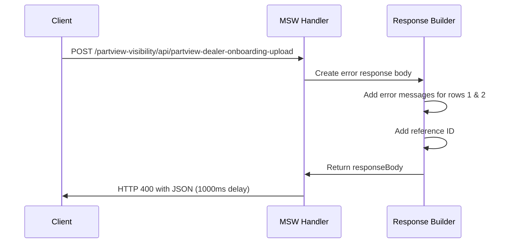
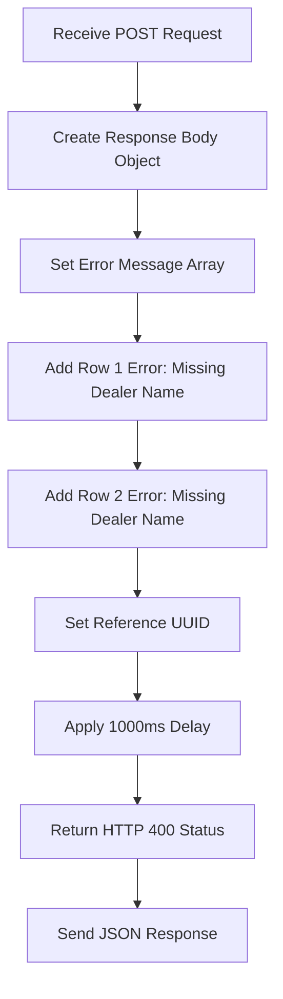
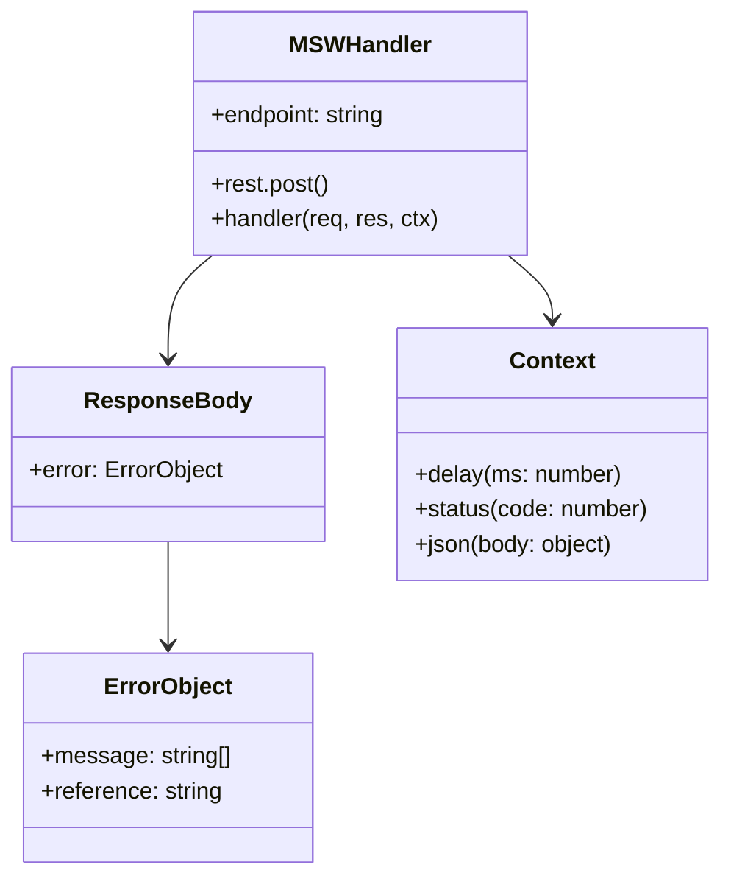

# Diagram: web/portal/src/mocks/handlers/internal-tools/partViewDealerOnboardingTool.js

> Auto-generated by Obscura crawlers

## Diagram 1

### SVG

<svg id="container" width="1114.5" xmlns="http://www.w3.org/2000/svg" height="519" viewBox="-50 -10 1114.5 519" role="graphics-document document" aria-roledescription="sequence"><g><rect x="816" y="433" fill="#eaeaea" stroke="#666" width="150" height="65" name="Response Builder" rx="3" ry="3" class="actor actor-bottom"></rect><text x="891" y="465.5" dominant-baseline="central" alignment-baseline="central" class="actor actor-box" style="text-anchor: middle; font-size: 16px; font-weight: 400;"><tspan x="891" dy="0">Response Builder</tspan></text></g><g><rect x="549" y="433" fill="#eaeaea" stroke="#666" width="150" height="65" name="MSW Handler" rx="3" ry="3" class="actor actor-bottom"></rect><text x="624" y="465.5" dominant-baseline="central" alignment-baseline="central" class="actor actor-box" style="text-anchor: middle; font-size: 16px; font-weight: 400;"><tspan x="624" dy="0">MSW Handler</tspan></text></g><g><rect x="0" y="433" fill="#eaeaea" stroke="#666" width="150" height="65" name="Client" rx="3" ry="3" class="actor actor-bottom"></rect><text x="75" y="465.5" dominant-baseline="central" alignment-baseline="central" class="actor actor-box" style="text-anchor: middle; font-size: 16px; font-weight: 400;"><tspan x="75" dy="0">Client</tspan></text></g><g><line id="actor2" x1="891" y1="65" x2="891" y2="433" class="actor-line 200" stroke-width="0.5px" stroke="#999" name="Response Builder"></line><g id="root-2"><rect x="816" y="0" fill="#eaeaea" stroke="#666" width="150" height="65" name="Response Builder" rx="3" ry="3" class="actor actor-top"></rect><text x="891" y="32.5" dominant-baseline="central" alignment-baseline="central" class="actor actor-box" style="text-anchor: middle; font-size: 16px; font-weight: 400;"><tspan x="891" dy="0">Response Builder</tspan></text></g></g><g><line id="actor1" x1="624" y1="65" x2="624" y2="433" class="actor-line 200" stroke-width="0.5px" stroke="#999" name="MSW Handler"></line><g id="root-1"><rect x="549" y="0" fill="#eaeaea" stroke="#666" width="150" height="65" name="MSW Handler" rx="3" ry="3" class="actor actor-top"></rect><text x="624" y="32.5" dominant-baseline="central" alignment-baseline="central" class="actor actor-box" style="text-anchor: middle; font-size: 16px; font-weight: 400;"><tspan x="624" dy="0">MSW Handler</tspan></text></g></g><g><line id="actor0" x1="75" y1="65" x2="75" y2="433" class="actor-line 200" stroke-width="0.5px" stroke="#999" name="Client"></line><g id="root-0"><rect x="0" y="0" fill="#eaeaea" stroke="#666" width="150" height="65" name="Client" rx="3" ry="3" class="actor actor-top"></rect><text x="75" y="32.5" dominant-baseline="central" alignment-baseline="central" class="actor actor-box" style="text-anchor: middle; font-size: 16px; font-weight: 400;"><tspan x="75" dy="0">Client</tspan></text></g></g><g></g><defs><symbol id="computer" width="24" height="24"><path transform="scale(.5)" d="M2 2v13h20v-13h-20zm18 11h-16v-9h16v9zm-10.228 6l.466-1h3.524l.467 1h-4.457zm14.228 3h-24l2-6h2.104l-1.33 4h18.45l-1.297-4h2.073l2 6zm-5-10h-14v-7h14v7z"></path></symbol></defs><defs><symbol id="database" fill-rule="evenodd" clip-rule="evenodd"><path transform="scale(.5)" d="M12.258.001l.256.004.255.005.253.008.251.01.249.012.247.015.246.016.242.019.241.02.239.023.236.024.233.027.231.028.229.031.225.032.223.034.22.036.217.038.214.04.211.041.208.043.205.045.201.046.198.048.194.05.191.051.187.053.183.054.18.056.175.057.172.059.168.06.163.061.16.063.155.064.15.066.074.033.073.033.071.034.07.034.069.035.068.035.067.035.066.035.064.036.064.036.062.036.06.036.06.037.058.037.058.037.055.038.055.038.053.038.052.038.051.039.05.039.048.039.047.039.045.04.044.04.043.04.041.04.04.041.039.041.037.041.036.041.034.041.033.042.032.042.03.042.029.042.027.042.026.043.024.043.023.043.021.043.02.043.018.044.017.043.015.044.013.044.012.044.011.045.009.044.007.045.006.045.004.045.002.045.001.045v17l-.001.045-.002.045-.004.045-.006.045-.007.045-.009.044-.011.045-.012.044-.013.044-.015.044-.017.043-.018.044-.02.043-.021.043-.023.043-.024.043-.026.043-.027.042-.029.042-.03.042-.032.042-.033.042-.034.041-.036.041-.037.041-.039.041-.04.041-.041.04-.043.04-.044.04-.045.04-.047.039-.048.039-.05.039-.051.039-.052.038-.053.038-.055.038-.055.038-.058.037-.058.037-.06.037-.06.036-.062.036-.064.036-.064.036-.066.035-.067.035-.068.035-.069.035-.07.034-.071.034-.073.033-.074.033-.15.066-.155.064-.16.063-.163.061-.168.06-.172.059-.175.057-.18.056-.183.054-.187.053-.191.051-.194.05-.198.048-.201.046-.205.045-.208.043-.211.041-.214.04-.217.038-.22.036-.223.034-.225.032-.229.031-.231.028-.233.027-.236.024-.239.023-.241.02-.242.019-.246.016-.247.015-.249.012-.251.01-.253.008-.255.005-.256.004-.258.001-.258-.001-.256-.004-.255-.005-.253-.008-.251-.01-.249-.012-.247-.015-.245-.016-.243-.019-.241-.02-.238-.023-.236-.024-.234-.027-.231-.028-.228-.031-.226-.032-.223-.034-.22-.036-.217-.038-.214-.04-.211-.041-.208-.043-.204-.045-.201-.046-.198-.048-.195-.05-.19-.051-.187-.053-.184-.054-.179-.056-.176-.057-.172-.059-.167-.06-.164-.061-.159-.063-.155-.064-.151-.066-.074-.033-.072-.033-.072-.034-.07-.034-.069-.035-.068-.035-.067-.035-.066-.035-.064-.036-.063-.036-.062-.036-.061-.036-.06-.037-.058-.037-.057-.037-.056-.038-.055-.038-.053-.038-.052-.038-.051-.039-.049-.039-.049-.039-.046-.039-.046-.04-.044-.04-.043-.04-.041-.04-.04-.041-.039-.041-.037-.041-.036-.041-.034-.041-.033-.042-.032-.042-.03-.042-.029-.042-.027-.042-.026-.043-.024-.043-.023-.043-.021-.043-.02-.043-.018-.044-.017-.043-.015-.044-.013-.044-.012-.044-.011-.045-.009-.044-.007-.045-.006-.045-.004-.045-.002-.045-.001-.045v-17l.001-.045.002-.045.004-.045.006-.045.007-.045.009-.044.011-.045.012-.044.013-.044.015-.044.017-.043.018-.044.02-.043.021-.043.023-.043.024-.043.026-.043.027-.042.029-.042.03-.042.032-.042.033-.042.034-.041.036-.041.037-.041.039-.041.04-.041.041-.04.043-.04.044-.04.046-.04.046-.039.049-.039.049-.039.051-.039.052-.038.053-.038.055-.038.056-.038.057-.037.058-.037.06-.037.061-.036.062-.036.063-.036.064-.036.066-.035.067-.035.068-.035.069-.035.07-.034.072-.034.072-.033.074-.033.151-.066.155-.064.159-.063.164-.061.167-.06.172-.059.176-.057.179-.056.184-.054.187-.053.19-.051.195-.05.198-.048.201-.046.204-.045.208-.043.211-.041.214-.04.217-.038.22-.036.223-.034.226-.032.228-.031.231-.028.234-.027.236-.024.238-.023.241-.02.243-.019.245-.016.247-.015.249-.012.251-.01.253-.008.255-.005.256-.004.258-.001.258.001zm-9.258 20.499v.01l.001.021.003.021.004.022.005.021.006.022.007.022.009.023.01.022.011.023.012.023.013.023.015.023.016.024.017.023.018.024.019.024.021.024.022.025.023.024.024.025.052.049.056.05.061.051.066.051.07.051.075.051.079.052.084.052.088.052.092.052.097.052.102.051.105.052.11.052.114.051.119.051.123.051.127.05.131.05.135.05.139.048.144.049.147.047.152.047.155.047.16.045.163.045.167.043.171.043.176.041.178.041.183.039.187.039.19.037.194.035.197.035.202.033.204.031.209.03.212.029.216.027.219.025.222.024.226.021.23.02.233.018.236.016.24.015.243.012.246.01.249.008.253.005.256.004.259.001.26-.001.257-.004.254-.005.25-.008.247-.011.244-.012.241-.014.237-.016.233-.018.231-.021.226-.021.224-.024.22-.026.216-.027.212-.028.21-.031.205-.031.202-.034.198-.034.194-.036.191-.037.187-.039.183-.04.179-.04.175-.042.172-.043.168-.044.163-.045.16-.046.155-.046.152-.047.148-.048.143-.049.139-.049.136-.05.131-.05.126-.05.123-.051.118-.052.114-.051.11-.052.106-.052.101-.052.096-.052.092-.052.088-.053.083-.051.079-.052.074-.052.07-.051.065-.051.06-.051.056-.05.051-.05.023-.024.023-.025.021-.024.02-.024.019-.024.018-.024.017-.024.015-.023.014-.024.013-.023.012-.023.01-.023.01-.022.008-.022.006-.022.006-.022.004-.022.004-.021.001-.021.001-.021v-4.127l-.077.055-.08.053-.083.054-.085.053-.087.052-.09.052-.093.051-.095.05-.097.05-.1.049-.102.049-.105.048-.106.047-.109.047-.111.046-.114.045-.115.045-.118.044-.12.043-.122.042-.124.042-.126.041-.128.04-.13.04-.132.038-.134.038-.135.037-.138.037-.139.035-.142.035-.143.034-.144.033-.147.032-.148.031-.15.03-.151.03-.153.029-.154.027-.156.027-.158.026-.159.025-.161.024-.162.023-.163.022-.165.021-.166.02-.167.019-.169.018-.169.017-.171.016-.173.015-.173.014-.175.013-.175.012-.177.011-.178.01-.179.008-.179.008-.181.006-.182.005-.182.004-.184.003-.184.002h-.37l-.184-.002-.184-.003-.182-.004-.182-.005-.181-.006-.179-.008-.179-.008-.178-.01-.176-.011-.176-.012-.175-.013-.173-.014-.172-.015-.171-.016-.17-.017-.169-.018-.167-.019-.166-.02-.165-.021-.163-.022-.162-.023-.161-.024-.159-.025-.157-.026-.156-.027-.155-.027-.153-.029-.151-.03-.15-.03-.148-.031-.146-.032-.145-.033-.143-.034-.141-.035-.14-.035-.137-.037-.136-.037-.134-.038-.132-.038-.13-.04-.128-.04-.126-.041-.124-.042-.122-.042-.12-.044-.117-.043-.116-.045-.113-.045-.112-.046-.109-.047-.106-.047-.105-.048-.102-.049-.1-.049-.097-.05-.095-.05-.093-.052-.09-.051-.087-.052-.085-.053-.083-.054-.08-.054-.077-.054v4.127zm0-5.654v.011l.001.021.003.021.004.021.005.022.006.022.007.022.009.022.01.022.011.023.012.023.013.023.015.024.016.023.017.024.018.024.019.024.021.024.022.024.023.025.024.024.052.05.056.05.061.05.066.051.07.051.075.052.079.051.084.052.088.052.092.052.097.052.102.052.105.052.11.051.114.051.119.052.123.05.127.051.131.05.135.049.139.049.144.048.147.048.152.047.155.046.16.045.163.045.167.044.171.042.176.042.178.04.183.04.187.038.19.037.194.036.197.034.202.033.204.032.209.03.212.028.216.027.219.025.222.024.226.022.23.02.233.018.236.016.24.014.243.012.246.01.249.008.253.006.256.003.259.001.26-.001.257-.003.254-.006.25-.008.247-.01.244-.012.241-.015.237-.016.233-.018.231-.02.226-.022.224-.024.22-.025.216-.027.212-.029.21-.03.205-.032.202-.033.198-.035.194-.036.191-.037.187-.039.183-.039.179-.041.175-.042.172-.043.168-.044.163-.045.16-.045.155-.047.152-.047.148-.048.143-.048.139-.05.136-.049.131-.05.126-.051.123-.051.118-.051.114-.052.11-.052.106-.052.101-.052.096-.052.092-.052.088-.052.083-.052.079-.052.074-.051.07-.052.065-.051.06-.05.056-.051.051-.049.023-.025.023-.024.021-.025.02-.024.019-.024.018-.024.017-.024.015-.023.014-.023.013-.024.012-.022.01-.023.01-.023.008-.022.006-.022.006-.022.004-.021.004-.022.001-.021.001-.021v-4.139l-.077.054-.08.054-.083.054-.085.052-.087.053-.09.051-.093.051-.095.051-.097.05-.1.049-.102.049-.105.048-.106.047-.109.047-.111.046-.114.045-.115.044-.118.044-.12.044-.122.042-.124.042-.126.041-.128.04-.13.039-.132.039-.134.038-.135.037-.138.036-.139.036-.142.035-.143.033-.144.033-.147.033-.148.031-.15.03-.151.03-.153.028-.154.028-.156.027-.158.026-.159.025-.161.024-.162.023-.163.022-.165.021-.166.02-.167.019-.169.018-.169.017-.171.016-.173.015-.173.014-.175.013-.175.012-.177.011-.178.009-.179.009-.179.007-.181.007-.182.005-.182.004-.184.003-.184.002h-.37l-.184-.002-.184-.003-.182-.004-.182-.005-.181-.007-.179-.007-.179-.009-.178-.009-.176-.011-.176-.012-.175-.013-.173-.014-.172-.015-.171-.016-.17-.017-.169-.018-.167-.019-.166-.02-.165-.021-.163-.022-.162-.023-.161-.024-.159-.025-.157-.026-.156-.027-.155-.028-.153-.028-.151-.03-.15-.03-.148-.031-.146-.033-.145-.033-.143-.033-.141-.035-.14-.036-.137-.036-.136-.037-.134-.038-.132-.039-.13-.039-.128-.04-.126-.041-.124-.042-.122-.043-.12-.043-.117-.044-.116-.044-.113-.046-.112-.046-.109-.046-.106-.047-.105-.048-.102-.049-.1-.049-.097-.05-.095-.051-.093-.051-.09-.051-.087-.053-.085-.052-.083-.054-.08-.054-.077-.054v4.139zm0-5.666v.011l.001.02.003.022.004.021.005.022.006.021.007.022.009.023.01.022.011.023.012.023.013.023.015.023.016.024.017.024.018.023.019.024.021.025.022.024.023.024.024.025.052.05.056.05.061.05.066.051.07.051.075.052.079.051.084.052.088.052.092.052.097.052.102.052.105.051.11.052.114.051.119.051.123.051.127.05.131.05.135.05.139.049.144.048.147.048.152.047.155.046.16.045.163.045.167.043.171.043.176.042.178.04.183.04.187.038.19.037.194.036.197.034.202.033.204.032.209.03.212.028.216.027.219.025.222.024.226.021.23.02.233.018.236.017.24.014.243.012.246.01.249.008.253.006.256.003.259.001.26-.001.257-.003.254-.006.25-.008.247-.01.244-.013.241-.014.237-.016.233-.018.231-.02.226-.022.224-.024.22-.025.216-.027.212-.029.21-.03.205-.032.202-.033.198-.035.194-.036.191-.037.187-.039.183-.039.179-.041.175-.042.172-.043.168-.044.163-.045.16-.045.155-.047.152-.047.148-.048.143-.049.139-.049.136-.049.131-.051.126-.05.123-.051.118-.052.114-.051.11-.052.106-.052.101-.052.096-.052.092-.052.088-.052.083-.052.079-.052.074-.052.07-.051.065-.051.06-.051.056-.05.051-.049.023-.025.023-.025.021-.024.02-.024.019-.024.018-.024.017-.024.015-.023.014-.024.013-.023.012-.023.01-.022.01-.023.008-.022.006-.022.006-.022.004-.022.004-.021.001-.021.001-.021v-4.153l-.077.054-.08.054-.083.053-.085.053-.087.053-.09.051-.093.051-.095.051-.097.05-.1.049-.102.048-.105.048-.106.048-.109.046-.111.046-.114.046-.115.044-.118.044-.12.043-.122.043-.124.042-.126.041-.128.04-.13.039-.132.039-.134.038-.135.037-.138.036-.139.036-.142.034-.143.034-.144.033-.147.032-.148.032-.15.03-.151.03-.153.028-.154.028-.156.027-.158.026-.159.024-.161.024-.162.023-.163.023-.165.021-.166.02-.167.019-.169.018-.169.017-.171.016-.173.015-.173.014-.175.013-.175.012-.177.01-.178.01-.179.009-.179.007-.181.006-.182.006-.182.004-.184.003-.184.001-.185.001-.185-.001-.184-.001-.184-.003-.182-.004-.182-.006-.181-.006-.179-.007-.179-.009-.178-.01-.176-.01-.176-.012-.175-.013-.173-.014-.172-.015-.171-.016-.17-.017-.169-.018-.167-.019-.166-.02-.165-.021-.163-.023-.162-.023-.161-.024-.159-.024-.157-.026-.156-.027-.155-.028-.153-.028-.151-.03-.15-.03-.148-.032-.146-.032-.145-.033-.143-.034-.141-.034-.14-.036-.137-.036-.136-.037-.134-.038-.132-.039-.13-.039-.128-.041-.126-.041-.124-.041-.122-.043-.12-.043-.117-.044-.116-.044-.113-.046-.112-.046-.109-.046-.106-.048-.105-.048-.102-.048-.1-.05-.097-.049-.095-.051-.093-.051-.09-.052-.087-.052-.085-.053-.083-.053-.08-.054-.077-.054v4.153zm8.74-8.179l-.257.004-.254.005-.25.008-.247.011-.244.012-.241.014-.237.016-.233.018-.231.021-.226.022-.224.023-.22.026-.216.027-.212.028-.21.031-.205.032-.202.033-.198.034-.194.036-.191.038-.187.038-.183.04-.179.041-.175.042-.172.043-.168.043-.163.045-.16.046-.155.046-.152.048-.148.048-.143.048-.139.049-.136.05-.131.05-.126.051-.123.051-.118.051-.114.052-.11.052-.106.052-.101.052-.096.052-.092.052-.088.052-.083.052-.079.052-.074.051-.07.052-.065.051-.06.05-.056.05-.051.05-.023.025-.023.024-.021.024-.02.025-.019.024-.018.024-.017.023-.015.024-.014.023-.013.023-.012.023-.01.023-.01.022-.008.022-.006.023-.006.021-.004.022-.004.021-.001.021-.001.021.001.021.001.021.004.021.004.022.006.021.006.023.008.022.01.022.01.023.012.023.013.023.014.023.015.024.017.023.018.024.019.024.02.025.021.024.023.024.023.025.051.05.056.05.06.05.065.051.07.052.074.051.079.052.083.052.088.052.092.052.096.052.101.052.106.052.11.052.114.052.118.051.123.051.126.051.131.05.136.05.139.049.143.048.148.048.152.048.155.046.16.046.163.045.168.043.172.043.175.042.179.041.183.04.187.038.191.038.194.036.198.034.202.033.205.032.21.031.212.028.216.027.22.026.224.023.226.022.231.021.233.018.237.016.241.014.244.012.247.011.25.008.254.005.257.004.26.001.26-.001.257-.004.254-.005.25-.008.247-.011.244-.012.241-.014.237-.016.233-.018.231-.021.226-.022.224-.023.22-.026.216-.027.212-.028.21-.031.205-.032.202-.033.198-.034.194-.036.191-.038.187-.038.183-.04.179-.041.175-.042.172-.043.168-.043.163-.045.16-.046.155-.046.152-.048.148-.048.143-.048.139-.049.136-.05.131-.05.126-.051.123-.051.118-.051.114-.052.11-.052.106-.052.101-.052.096-.052.092-.052.088-.052.083-.052.079-.052.074-.051.07-.052.065-.051.06-.05.056-.05.051-.05.023-.025.023-.024.021-.024.02-.025.019-.024.018-.024.017-.023.015-.024.014-.023.013-.023.012-.023.01-.023.01-.022.008-.022.006-.023.006-.021.004-.022.004-.021.001-.021.001-.021-.001-.021-.001-.021-.004-.021-.004-.022-.006-.021-.006-.023-.008-.022-.01-.022-.01-.023-.012-.023-.013-.023-.014-.023-.015-.024-.017-.023-.018-.024-.019-.024-.02-.025-.021-.024-.023-.024-.023-.025-.051-.05-.056-.05-.06-.05-.065-.051-.07-.052-.074-.051-.079-.052-.083-.052-.088-.052-.092-.052-.096-.052-.101-.052-.106-.052-.11-.052-.114-.052-.118-.051-.123-.051-.126-.051-.131-.05-.136-.05-.139-.049-.143-.048-.148-.048-.152-.048-.155-.046-.16-.046-.163-.045-.168-.043-.172-.043-.175-.042-.179-.041-.183-.04-.187-.038-.191-.038-.194-.036-.198-.034-.202-.033-.205-.032-.21-.031-.212-.028-.216-.027-.22-.026-.224-.023-.226-.022-.231-.021-.233-.018-.237-.016-.241-.014-.244-.012-.247-.011-.25-.008-.254-.005-.257-.004-.26-.001-.26.001z"></path></symbol></defs><defs><symbol id="clock" width="24" height="24"><path transform="scale(.5)" d="M12 2c5.514 0 10 4.486 10 10s-4.486 10-10 10-10-4.486-10-10 4.486-10 10-10zm0-2c-6.627 0-12 5.373-12 12s5.373 12 12 12 12-5.373 12-12-5.373-12-12-12zm5.848 12.459c.202.038.202.333.001.372-1.907.361-6.045 1.111-6.547 1.111-.719 0-1.301-.582-1.301-1.301 0-.512.77-5.447 1.125-7.445.034-.192.312-.181.343.014l.985 6.238 5.394 1.011z"></path></symbol></defs><defs><marker id="arrowhead" refX="7.9" refY="5" markerUnits="userSpaceOnUse" markerWidth="12" markerHeight="12" orient="auto-start-reverse"><path d="M -1 0 L 10 5 L 0 10 z"></path></marker></defs><defs><marker id="crosshead" markerWidth="15" markerHeight="8" orient="auto" refX="4" refY="4.5"><path fill="none" stroke="#000000" stroke-width="1pt" d="M 1,2 L 6,7 M 6,2 L 1,7" style="stroke-dasharray: 0, 0;"></path></marker></defs><defs><marker id="filled-head" refX="15.5" refY="7" markerWidth="20" markerHeight="28" orient="auto"><path d="M 18,7 L9,13 L14,7 L9,1 Z"></path></marker></defs><defs><marker id="sequencenumber" refX="15" refY="15" markerWidth="60" markerHeight="40" orient="auto"><circle cx="15" cy="15" r="6"></circle></marker></defs><text x="348" y="80" text-anchor="middle" dominant-baseline="middle" alignment-baseline="middle" class="messageText" dy="1em" style="font-size: 16px; font-weight: 400;">POST /partview-visibility/api/partview-dealer-onboarding-upload</text><line x1="76" y1="113" x2="620" y2="113" class="messageLine0" stroke-width="2" stroke="none" marker-end="url(#arrowhead)" style="fill: none;"></line><text x="756" y="128" text-anchor="middle" dominant-baseline="middle" alignment-baseline="middle" class="messageText" dy="1em" style="font-size: 16px; font-weight: 400;">Create error response body</text><line x1="625" y1="161" x2="887" y2="161" class="messageLine0" stroke-width="2" stroke="none" marker-end="url(#arrowhead)" style="fill: none;"></line><text x="892" y="176" text-anchor="middle" dominant-baseline="middle" alignment-baseline="middle" class="messageText" dy="1em" style="font-size: 16px; font-weight: 400;">Add error messages for rows 1 &amp; 2</text><path d="M 892,209 C 952,199 952,239 892,229" class="messageLine0" stroke-width="2" stroke="none" marker-end="url(#arrowhead)" style="fill: none;"></path><text x="892" y="254" text-anchor="middle" dominant-baseline="middle" alignment-baseline="middle" class="messageText" dy="1em" style="font-size: 16px; font-weight: 400;">Add reference ID</text><path d="M 892,287 C 952,277 952,317 892,307" class="messageLine0" stroke-width="2" stroke="none" marker-end="url(#arrowhead)" style="fill: none;"></path><text x="759" y="332" text-anchor="middle" dominant-baseline="middle" alignment-baseline="middle" class="messageText" dy="1em" style="font-size: 16px; font-weight: 400;">Return responseBody</text><line x1="890" y1="365" x2="628" y2="365" class="messageLine0" stroke-width="2" stroke="none" marker-end="url(#arrowhead)" style="fill: none;"></line><text x="351" y="380" text-anchor="middle" dominant-baseline="middle" alignment-baseline="middle" class="messageText" dy="1em" style="font-size: 16px; font-weight: 400;">HTTP 400 with JSON (1000ms delay)</text><line x1="623" y1="413" x2="79" y2="413" class="messageLine0" stroke-width="2" stroke="none" marker-end="url(#arrowhead)" style="fill: none;"></line></svg>

## Diagram 2

### SVG

<svg id="container" width="276" xmlns="http://www.w3.org/2000/svg" class="flowchart" height="974" viewBox="0 0 276 974" role="graphics-document document" aria-roledescription="flowchart-v2"><g><marker id="container_flowchart-v2-pointEnd" class="marker flowchart-v2" viewBox="0 0 10 10" refX="5" refY="5" markerUnits="userSpaceOnUse" markerWidth="8" markerHeight="8" orient="auto"><path d="M 0 0 L 10 5 L 0 10 z" class="arrowMarkerPath" style="stroke-width: 1; stroke-dasharray: 1, 0;"></path></marker><marker id="container_flowchart-v2-pointStart" class="marker flowchart-v2" viewBox="0 0 10 10" refX="4.5" refY="5" markerUnits="userSpaceOnUse" markerWidth="8" markerHeight="8" orient="auto"><path d="M 0 5 L 10 10 L 10 0 z" class="arrowMarkerPath" style="stroke-width: 1; stroke-dasharray: 1, 0;"></path></marker><marker id="container_flowchart-v2-circleEnd" class="marker flowchart-v2" viewBox="0 0 10 10" refX="11" refY="5" markerUnits="userSpaceOnUse" markerWidth="11" markerHeight="11" orient="auto"><circle cx="5" cy="5" r="5" class="arrowMarkerPath" style="stroke-width: 1; stroke-dasharray: 1, 0;"></circle></marker><marker id="container_flowchart-v2-circleStart" class="marker flowchart-v2" viewBox="0 0 10 10" refX="-1" refY="5" markerUnits="userSpaceOnUse" markerWidth="11" markerHeight="11" orient="auto"><circle cx="5" cy="5" r="5" class="arrowMarkerPath" style="stroke-width: 1; stroke-dasharray: 1, 0;"></circle></marker><marker id="container_flowchart-v2-crossEnd" class="marker cross flowchart-v2" viewBox="0 0 11 11" refX="12" refY="5.2" markerUnits="userSpaceOnUse" markerWidth="11" markerHeight="11" orient="auto"><path d="M 1,1 l 9,9 M 10,1 l -9,9" class="arrowMarkerPath" style="stroke-width: 2; stroke-dasharray: 1, 0;"></path></marker><marker id="container_flowchart-v2-crossStart" class="marker cross flowchart-v2" viewBox="0 0 11 11" refX="-1" refY="5.2" markerUnits="userSpaceOnUse" markerWidth="11" markerHeight="11" orient="auto"><path d="M 1,1 l 9,9 M 10,1 l -9,9" class="arrowMarkerPath" style="stroke-width: 2; stroke-dasharray: 1, 0;"></path></marker><g class="root"><g class="clusters"></g><g class="edgePaths"><path d="M138,62L138,66.167C138,70.333,138,78.667,138,86.333C138,94,138,101,138,104.5L138,108" id="L_A_B_0" class="edge-thickness-normal edge-pattern-solid edge-thickness-normal edge-pattern-solid flowchart-link" style=";" data-edge="true" data-et="edge" data-id="L_A_B_0" data-points="W3sieCI6MTM4LCJ5Ijo2Mn0seyJ4IjoxMzgsInkiOjg3fSx7IngiOjEzOCwieSI6MTEyfV0=" marker-end="url(#container_flowchart-v2-pointEnd)"></path><path d="M138,190L138,194.167C138,198.333,138,206.667,138,214.333C138,222,138,229,138,232.5L138,236" id="L_B_C_0" class="edge-thickness-normal edge-pattern-solid edge-thickness-normal edge-pattern-solid flowchart-link" style=";" data-edge="true" data-et="edge" data-id="L_B_C_0" data-points="W3sieCI6MTM4LCJ5IjoxOTB9LHsieCI6MTM4LCJ5IjoyMTV9LHsieCI6MTM4LCJ5IjoyNDB9XQ==" marker-end="url(#container_flowchart-v2-pointEnd)"></path><path d="M138,294L138,298.167C138,302.333,138,310.667,138,318.333C138,326,138,333,138,336.5L138,340" id="L_C_D_0" class="edge-thickness-normal edge-pattern-solid edge-thickness-normal edge-pattern-solid flowchart-link" style=";" data-edge="true" data-et="edge" data-id="L_C_D_0" data-points="W3sieCI6MTM4LCJ5IjoyOTR9LHsieCI6MTM4LCJ5IjozMTl9LHsieCI6MTM4LCJ5IjozNDR9XQ==" marker-end="url(#container_flowchart-v2-pointEnd)"></path><path d="M138,422L138,426.167C138,430.333,138,438.667,138,446.333C138,454,138,461,138,464.5L138,468" id="L_D_E_0" class="edge-thickness-normal edge-pattern-solid edge-thickness-normal edge-pattern-solid flowchart-link" style=";" data-edge="true" data-et="edge" data-id="L_D_E_0" data-points="W3sieCI6MTM4LCJ5Ijo0MjJ9LHsieCI6MTM4LCJ5Ijo0NDd9LHsieCI6MTM4LCJ5Ijo0NzJ9XQ==" marker-end="url(#container_flowchart-v2-pointEnd)"></path><path d="M138,550L138,554.167C138,558.333,138,566.667,138,574.333C138,582,138,589,138,592.5L138,596" id="L_E_F_0" class="edge-thickness-normal edge-pattern-solid edge-thickness-normal edge-pattern-solid flowchart-link" style=";" data-edge="true" data-et="edge" data-id="L_E_F_0" data-points="W3sieCI6MTM4LCJ5Ijo1NTB9LHsieCI6MTM4LCJ5Ijo1NzV9LHsieCI6MTM4LCJ5Ijo2MDB9XQ==" marker-end="url(#container_flowchart-v2-pointEnd)"></path><path d="M138,654L138,658.167C138,662.333,138,670.667,138,678.333C138,686,138,693,138,696.5L138,700" id="L_F_G_0" class="edge-thickness-normal edge-pattern-solid edge-thickness-normal edge-pattern-solid flowchart-link" style=";" data-edge="true" data-et="edge" data-id="L_F_G_0" data-points="W3sieCI6MTM4LCJ5Ijo2NTR9LHsieCI6MTM4LCJ5Ijo2Nzl9LHsieCI6MTM4LCJ5Ijo3MDR9XQ==" marker-end="url(#container_flowchart-v2-pointEnd)"></path><path d="M138,758L138,762.167C138,766.333,138,774.667,138,782.333C138,790,138,797,138,800.5L138,804" id="L_G_H_0" class="edge-thickness-normal edge-pattern-solid edge-thickness-normal edge-pattern-solid flowchart-link" style=";" data-edge="true" data-et="edge" data-id="L_G_H_0" data-points="W3sieCI6MTM4LCJ5Ijo3NTh9LHsieCI6MTM4LCJ5Ijo3ODN9LHsieCI6MTM4LCJ5Ijo4MDh9XQ==" marker-end="url(#container_flowchart-v2-pointEnd)"></path><path d="M138,862L138,866.167C138,870.333,138,878.667,138,886.333C138,894,138,901,138,904.5L138,908" id="L_H_I_0" class="edge-thickness-normal edge-pattern-solid edge-thickness-normal edge-pattern-solid flowchart-link" style=";" data-edge="true" data-et="edge" data-id="L_H_I_0" data-points="W3sieCI6MTM4LCJ5Ijo4NjJ9LHsieCI6MTM4LCJ5Ijo4ODd9LHsieCI6MTM4LCJ5Ijo5MTJ9XQ==" marker-end="url(#container_flowchart-v2-pointEnd)"></path></g><g class="edgeLabels"><g class="edgeLabel"><g class="label" data-id="L_A_B_0" transform="translate(0, 0)"><foreignObject width="0" height="0">

</foreignObject></g></g><g class="edgeLabel"><g class="label" data-id="L_B_C_0" transform="translate(0, 0)"><foreignObject width="0" height="0">

</foreignObject></g></g><g class="edgeLabel"><g class="label" data-id="L_C_D_0" transform="translate(0, 0)"><foreignObject width="0" height="0">

</foreignObject></g></g><g class="edgeLabel"><g class="label" data-id="L_D_E_0" transform="translate(0, 0)"><foreignObject width="0" height="0">

</foreignObject></g></g><g class="edgeLabel"><g class="label" data-id="L_E_F_0" transform="translate(0, 0)"><foreignObject width="0" height="0">

</foreignObject></g></g><g class="edgeLabel"><g class="label" data-id="L_F_G_0" transform="translate(0, 0)"><foreignObject width="0" height="0">

</foreignObject></g></g><g class="edgeLabel"><g class="label" data-id="L_G_H_0" transform="translate(0, 0)"><foreignObject width="0" height="0">

</foreignObject></g></g><g class="edgeLabel"><g class="label" data-id="L_H_I_0" transform="translate(0, 0)"><foreignObject width="0" height="0">

</foreignObject></g></g></g><g class="nodes"><g class="node default" id="flowchart-A-0" transform="translate(138, 35)"><rect class="basic label-container" style="" x="-109.875" y="-27" width="219.75" height="54"></rect><g class="label" style="" transform="translate(-79.875, -12)"><rect></rect><foreignObject width="159.75" height="24">

Receive POST Request

</foreignObject></g></g><g class="node default" id="flowchart-B-1" transform="translate(138, 151)"><rect class="basic label-container" style="" x="-130" y="-39" width="260" height="78"></rect><g class="label" style="" transform="translate(-100, -24)"><rect></rect><foreignObject width="200" height="48">

Create Response Body Object

</foreignObject></g></g><g class="node default" id="flowchart-C-3" transform="translate(138, 267)"><rect class="basic label-container" style="" x="-115.078125" y="-27" width="230.15625" height="54"></rect><g class="label" style="" transform="translate(-85.078125, -12)"><rect></rect><foreignObject width="170.15625" height="24">

Set Error Message Array

</foreignObject></g></g><g class="node default" id="flowchart-D-5" transform="translate(138, 383)"><rect class="basic label-container" style="" x="-130" y="-39" width="260" height="78"></rect><g class="label" style="" transform="translate(-100, -24)"><rect></rect><foreignObject width="200" height="48">

Add Row 1 Error: Missing Dealer Name

</foreignObject></g></g><g class="node default" id="flowchart-E-7" transform="translate(138, 511)"><rect class="basic label-container" style="" x="-130" y="-39" width="260" height="78"></rect><g class="label" style="" transform="translate(-100, -24)"><rect></rect><foreignObject width="200" height="48">

Add Row 2 Error: Missing Dealer Name

</foreignObject></g></g><g class="node default" id="flowchart-F-9" transform="translate(138, 627)"><rect class="basic label-container" style="" x="-99.9140625" y="-27" width="199.828125" height="54"></rect><g class="label" style="" transform="translate(-69.9140625, -12)"><rect></rect><foreignObject width="139.828125" height="24">

Set Reference UUID

</foreignObject></g></g><g class="node default" id="flowchart-G-11" transform="translate(138, 731)"><rect class="basic label-container" style="" x="-101.9609375" y="-27" width="203.921875" height="54"></rect><g class="label" style="" transform="translate(-71.9609375, -12)"><rect></rect><foreignObject width="143.921875" height="24">

Apply 1000ms Delay

</foreignObject></g></g><g class="node default" id="flowchart-H-13" transform="translate(138, 835)"><rect class="basic label-container" style="" x="-115.1328125" y="-27" width="230.265625" height="54"></rect><g class="label" style="" transform="translate(-85.1328125, -12)"><rect></rect><foreignObject width="170.265625" height="24">

Return HTTP 400 Status

</foreignObject></g></g><g class="node default" id="flowchart-I-15" transform="translate(138, 939)"><rect class="basic label-container" style="" x="-105.2578125" y="-27" width="210.515625" height="54"></rect><g class="label" style="" transform="translate(-75.2578125, -12)"><rect></rect><foreignObject width="150.515625" height="24">

Send JSON Response

</foreignObject></g></g></g></g></g></svg>

## Diagram 3

### SVG

<svg id="container" width="494.1015625" xmlns="http://www.w3.org/2000/svg" class="classDiagram" height="602" viewBox="0 0 494.1015625 602" role="graphics-document document" aria-roledescription="class"><g><defs><marker id="container_class-aggregationStart" class="marker aggregation class" refX="18" refY="7" markerWidth="190" markerHeight="240" orient="auto"><path d="M 18,7 L9,13 L1,7 L9,1 Z"></path></marker></defs><defs><marker id="container_class-aggregationEnd" class="marker aggregation class" refX="1" refY="7" markerWidth="20" markerHeight="28" orient="auto"><path d="M 18,7 L9,13 L1,7 L9,1 Z"></path></marker></defs><defs><marker id="container_class-extensionStart" class="marker extension class" refX="18" refY="7" markerWidth="190" markerHeight="240" orient="auto"><path d="M 1,7 L18,13 V 1 Z"></path></marker></defs><defs><marker id="container_class-extensionEnd" class="marker extension class" refX="1" refY="7" markerWidth="20" markerHeight="28" orient="auto"><path d="M 1,1 V 13 L18,7 Z"></path></marker></defs><defs><marker id="container_class-compositionStart" class="marker composition class" refX="18" refY="7" markerWidth="190" markerHeight="240" orient="auto"><path d="M 18,7 L9,13 L1,7 L9,1 Z"></path></marker></defs><defs><marker id="container_class-compositionEnd" class="marker composition class" refX="1" refY="7" markerWidth="20" markerHeight="28" orient="auto"><path d="M 18,7 L9,13 L1,7 L9,1 Z"></path></marker></defs><defs><marker id="container_class-dependencyStart" class="marker dependency class" refX="6" refY="7" markerWidth="190" markerHeight="240" orient="auto"><path d="M 5,7 L9,13 L1,7 L9,1 Z"></path></marker></defs><defs><marker id="container_class-dependencyEnd" class="marker dependency class" refX="13" refY="7" markerWidth="20" markerHeight="28" orient="auto"><path d="M 18,7 L9,13 L14,7 L9,1 Z"></path></marker></defs><defs><marker id="container_class-lollipopStart" class="marker lollipop class" refX="13" refY="7" markerWidth="190" markerHeight="240" orient="auto"><circle stroke="black" fill="transparent" cx="7" cy="7" r="6"></circle></marker></defs><defs><marker id="container_class-lollipopEnd" class="marker lollipop class" refX="1" refY="7" markerWidth="190" markerHeight="240" orient="auto"><circle stroke="black" fill="transparent" cx="7" cy="7" r="6"></circle></marker></defs><g class="root"><g class="clusters"></g><g class="edgePaths"><path d="M144.949,176L139.902,180.167C134.855,184.333,124.762,192.667,119.715,204.5C114.668,216.333,114.668,231.667,114.668,239.333L114.668,247" id="id_MSWHandler_ResponseBody_1" class="edge-thickness-normal edge-pattern-solid relation" style=";;;" data-edge="true" data-et="edge" data-id="id_MSWHandler_ResponseBody_1" data-points="W3sieCI6MTQ0Ljk0OTAyMTY0NTY0MjIsInkiOjE3Nn0seyJ4IjoxMTQuNjY3OTY4NzUsInkiOjIwMX0seyJ4IjoxMTQuNjY3OTY4NzUsInkiOjI1M31d" marker-end="url(#container_class-dependencyEnd)"></path><path d="M114.668,373L114.668,381.667C114.668,390.333,114.668,407.667,114.668,419.5C114.668,431.333,114.668,437.667,114.668,440.833L114.668,444" id="id_ResponseBody_ErrorObject_2" class="edge-thickness-normal edge-pattern-solid relation" style=";;;" data-edge="true" data-et="edge" data-id="id_ResponseBody_ErrorObject_2" data-points="W3sieCI6MTE0LjY2Nzk2ODc1LCJ5IjozNzN9LHsieCI6MTE0LjY2Nzk2ODc1LCJ5Ijo0MjV9LHsieCI6MTE0LjY2Nzk2ODc1LCJ5Ijo0NTB9XQ==" marker-end="url(#container_class-dependencyEnd)"></path><path d="M348.438,176L353.485,180.167C358.531,184.333,368.625,192.667,373.672,200C378.719,207.333,378.719,213.667,378.719,216.833L378.719,220" id="id_MSWHandler_Context_3" class="edge-thickness-normal edge-pattern-solid relation" style=";;;" data-edge="true" data-et="edge" data-id="id_MSWHandler_Context_3" data-points="W3sieCI6MzQ4LjQzNzY5NzEwNDM1Nzc3LCJ5IjoxNzZ9LHsieCI6Mzc4LjcxODc1LCJ5IjoyMDF9LHsieCI6Mzc4LjcxODc1LCJ5IjoyMjZ9XQ==" marker-end="url(#container_class-dependencyEnd)"></path></g><g class="edgeLabels"><g class="edgeLabel"><g class="label" data-id="id_MSWHandler_ResponseBody_1" transform="translate(0, 0)"><foreignObject width="0" height="0">

</foreignObject></g></g><g class="edgeLabel"><g class="label" data-id="id_ResponseBody_ErrorObject_2" transform="translate(0, 0)"><foreignObject width="0" height="0">

</foreignObject></g></g><g class="edgeLabel"><g class="label" data-id="id_MSWHandler_Context_3" transform="translate(0, 0)"><foreignObject width="0" height="0">

</foreignObject></g></g></g><g class="nodes"><g class="node default" id="classId-MSWHandler-0" transform="translate(246.693359375, 92)"><g class="basic label-container"><path d="M-114.3203125 -84 L114.3203125 -84 L114.3203125 84 L-114.3203125 84" stroke="none" stroke-width="0" fill="#ECECFF" style=""></path><path d="M-114.3203125 -84 C-32.43841145424696 -84, 49.44348959150608 -84, 114.3203125 -84 M-114.3203125 -84 C-52.9139946753557 -84, 8.492323149288595 -84, 114.3203125 -84 M114.3203125 -84 C114.3203125 -32.172316862707014, 114.3203125 19.655366274585973, 114.3203125 84 M114.3203125 -84 C114.3203125 -31.958347411073582, 114.3203125 20.083305177852836, 114.3203125 84 M114.3203125 84 C34.101415623640065 84, -46.11748125271987 84, -114.3203125 84 M114.3203125 84 C58.715357874754304 84, 3.1104032495086074 84, -114.3203125 84 M-114.3203125 84 C-114.3203125 40.61284921217138, -114.3203125 -2.7743015756572333, -114.3203125 -84 M-114.3203125 84 C-114.3203125 48.6256093725805, -114.3203125 13.251218745160998, -114.3203125 -84" stroke="#9370DB" stroke-width="1.3" fill="none" stroke-dasharray="0 0" style=""></path></g><g class="annotation-group text" transform="translate(0, -60)"></g><g class="label-group text" transform="translate(-46.53125, -60)"><g class="label" style="font-weight: bolder" transform="translate(0,-12)"><foreignObject width="93.0625" height="24">

MSWHandler

</foreignObject></g></g><g class="members-group text" transform="translate(-102.3203125, -12)"><g class="label" style="" transform="translate(0,-12)"><foreignObject width="123.9375" height="24">

+endpoint: string

</foreignObject></g></g><g class="methods-group text" transform="translate(-102.3203125, 36)"><g class="label" style="" transform="translate(0,-12)"><foreignObject width="82.03125" height="24">

+rest.post()

</foreignObject></g><g class="label" style="" transform="translate(0,12)"><foreignObject width="158.109375" height="24">

+handler(req, res, ctx)

</foreignObject></g></g><g class="divider" style=""><path d="M-114.3203125 -36 C-30.649433717567476 -36, 53.02144506486505 -36, 114.3203125 -36 M-114.3203125 -36 C-42.55774965292612 -36, 29.20481319414776 -36, 114.3203125 -36" stroke="#9370DB" stroke-width="1.3" fill="none" stroke-dasharray="0 0" style=""></path></g><g class="divider" style=""><path d="M-114.3203125 12 C-62.53090370700901 12, -10.74149491401802 12, 114.3203125 12 M-114.3203125 12 C-67.38045669177228 12, -20.440600883544562 12, 114.3203125 12" stroke="#9370DB" stroke-width="1.3" fill="none" stroke-dasharray="0 0" style=""></path></g></g><g class="node default" id="classId-ResponseBody-1" transform="translate(114.66796875, 313)"><g class="basic label-container"><path d="M-106.66796875 -60 L106.66796875 -60 L106.66796875 60 L-106.66796875 60" stroke="none" stroke-width="0" fill="#ECECFF" style=""></path><path d="M-106.66796875 -60 C-63.81540166101452 -60, -20.96283457202904 -60, 106.66796875 -60 M-106.66796875 -60 C-23.24932113467807 -60, 60.16932648064386 -60, 106.66796875 -60 M106.66796875 -60 C106.66796875 -27.589265557444882, 106.66796875 4.821468885110235, 106.66796875 60 M106.66796875 -60 C106.66796875 -34.462882088132424, 106.66796875 -8.925764176264849, 106.66796875 60 M106.66796875 60 C61.23899520590504 60, 15.810021661810083 60, -106.66796875 60 M106.66796875 60 C28.385262340222752 60, -49.897444069554496 60, -106.66796875 60 M-106.66796875 60 C-106.66796875 25.942300450231663, -106.66796875 -8.115399099536674, -106.66796875 -60 M-106.66796875 60 C-106.66796875 17.500897048223678, -106.66796875 -24.998205903552645, -106.66796875 -60" stroke="#9370DB" stroke-width="1.3" fill="none" stroke-dasharray="0 0" style=""></path></g><g class="annotation-group text" transform="translate(0, -36)"></g><g class="label-group text" transform="translate(-53.9921875, -36)"><g class="label" style="font-weight: bolder" transform="translate(0,-12)"><foreignObject width="107.984375" height="24">

ResponseBody

</foreignObject></g></g><g class="members-group text" transform="translate(-94.66796875, 12)"><g class="label" style="" transform="translate(0,-12)"><foreignObject width="135.34375" height="24">

+error: ErrorObject

</foreignObject></g></g><g class="methods-group text" transform="translate(-94.66796875, 60)"></g><g class="divider" style=""><path d="M-106.66796875 -12 C-57.78313030053538 -12, -8.898291851070766 -12, 106.66796875 -12 M-106.66796875 -12 C-40.61959485582729 -12, 25.428779038345425 -12, 106.66796875 -12" stroke="#9370DB" stroke-width="1.3" fill="none" stroke-dasharray="0 0" style=""></path></g><g class="divider" style=""><path d="M-106.66796875 36 C-44.54395231427154 36, 17.580064121456914 36, 106.66796875 36 M-106.66796875 36 C-26.401324928408783 36, 53.86531889318243 36, 106.66796875 36" stroke="#9370DB" stroke-width="1.3" fill="none" stroke-dasharray="0 0" style=""></path></g></g><g class="node default" id="classId-ErrorObject-2" transform="translate(114.66796875, 522)"><g class="basic label-container"><path d="M-98.234375 -72 L98.234375 -72 L98.234375 72 L-98.234375 72" stroke="none" stroke-width="0" fill="#ECECFF" style=""></path><path d="M-98.234375 -72 C-50.95207321747454 -72, -3.6697714349490838 -72, 98.234375 -72 M-98.234375 -72 C-58.1478092506536 -72, -18.061243501307203 -72, 98.234375 -72 M98.234375 -72 C98.234375 -21.20672136791525, 98.234375 29.5865572641695, 98.234375 72 M98.234375 -72 C98.234375 -39.7138501940639, 98.234375 -7.427700388127803, 98.234375 72 M98.234375 72 C57.367301298636846 72, 16.500227597273692 72, -98.234375 72 M98.234375 72 C41.79947305326973 72, -14.635428893460542 72, -98.234375 72 M-98.234375 72 C-98.234375 43.05943602340435, -98.234375 14.118872046808704, -98.234375 -72 M-98.234375 72 C-98.234375 39.15830435559098, -98.234375 6.316608711181956, -98.234375 -72" stroke="#9370DB" stroke-width="1.3" fill="none" stroke-dasharray="0 0" style=""></path></g><g class="annotation-group text" transform="translate(0, -48)"></g><g class="label-group text" transform="translate(-42.078125, -48)"><g class="label" style="font-weight: bolder" transform="translate(0,-12)"><foreignObject width="84.15625" height="24">

ErrorObject

</foreignObject></g></g><g class="members-group text" transform="translate(-86.234375, 0)"><g class="label" style="" transform="translate(0,-12)"><foreignObject width="130.390625" height="24">

+message: string[]

</foreignObject></g><g class="label" style="" transform="translate(0,12)"><foreignObject width="125.875" height="24">

+reference: string

</foreignObject></g></g><g class="methods-group text" transform="translate(-86.234375, 72)"></g><g class="divider" style=""><path d="M-98.234375 -24 C-24.354836507088848 -24, 49.524701985822304 -24, 98.234375 -24 M-98.234375 -24 C-31.55214556009534 -24, 35.13008387980932 -24, 98.234375 -24" stroke="#9370DB" stroke-width="1.3" fill="none" stroke-dasharray="0 0" style=""></path></g><g class="divider" style=""><path d="M-98.234375 48 C-58.90120554810388 48, -19.568036096207763 48, 98.234375 48 M-98.234375 48 C-43.293866818681344 48, 11.646641362637311 48, 98.234375 48" stroke="#9370DB" stroke-width="1.3" fill="none" stroke-dasharray="0 0" style=""></path></g></g><g class="node default" id="classId-Context-3" transform="translate(378.71875, 313)"><g class="basic label-container"><path d="M-107.3828125 -87 L107.3828125 -87 L107.3828125 87 L-107.3828125 87" stroke="none" stroke-width="0" fill="#ECECFF" style=""></path><path d="M-107.3828125 -87 C-42.05632878962736 -87, 23.270154920745284 -87, 107.3828125 -87 M-107.3828125 -87 C-33.852365868262396 -87, 39.67808076347521 -87, 107.3828125 -87 M107.3828125 -87 C107.3828125 -36.81135138582728, 107.3828125 13.37729722834544, 107.3828125 87 M107.3828125 -87 C107.3828125 -44.06643795012519, 107.3828125 -1.132875900250383, 107.3828125 87 M107.3828125 87 C22.843487066343585 87, -61.69583836731283 87, -107.3828125 87 M107.3828125 87 C22.79122646642891 87, -61.80035956714218 87, -107.3828125 87 M-107.3828125 87 C-107.3828125 39.980702626198436, -107.3828125 -7.038594747603128, -107.3828125 -87 M-107.3828125 87 C-107.3828125 22.47349796356154, -107.3828125 -42.05300407287692, -107.3828125 -87" stroke="#9370DB" stroke-width="1.3" fill="none" stroke-dasharray="0 0" style=""></path></g><g class="annotation-group text" transform="translate(0, -63)"></g><g class="label-group text" transform="translate(-28.171875, -63)"><g class="label" style="font-weight: bolder" transform="translate(0,-12)"><foreignObject width="56.34375" height="24">

Context

</foreignObject></g></g><g class="members-group text" transform="translate(-95.3828125, -15)"></g><g class="methods-group text" transform="translate(-95.3828125, 15)"><g class="label" style="" transform="translate(0,-12)"><foreignObject width="143.65625" height="24">

+delay(ms: number)

</foreignObject></g><g class="label" style="" transform="translate(0,12)"><foreignObject width="162.59375" height="24">

+status(code: number)

</foreignObject></g><g class="label" style="" transform="translate(0,36)"><foreignObject width="138.78125" height="24">

+json(body: object)

</foreignObject></g></g><g class="divider" style=""><path d="M-107.3828125 -39 C-23.327445155620836 -39, 60.72792218875833 -39, 107.3828125 -39 M-107.3828125 -39 C-26.355777273959916 -39, 54.67125795208017 -39, 107.3828125 -39" stroke="#9370DB" stroke-width="1.3" fill="none" stroke-dasharray="0 0" style=""></path></g><g class="divider" style=""><path d="M-107.3828125 -15 C-33.903386526110225 -15, 39.57603944777955 -15, 107.3828125 -15 M-107.3828125 -15 C-50.37764081612397 -15, 6.627530867752057 -15, 107.3828125 -15" stroke="#9370DB" stroke-width="1.3" fill="none" stroke-dasharray="0 0" style=""></path></g></g></g></g></g></svg>
