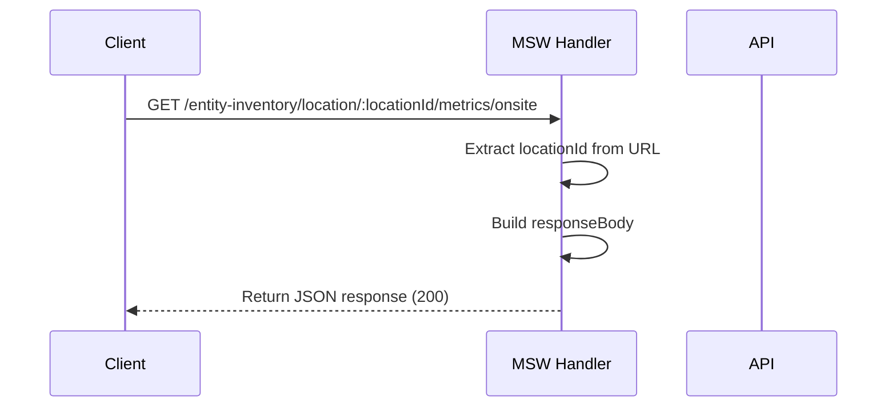
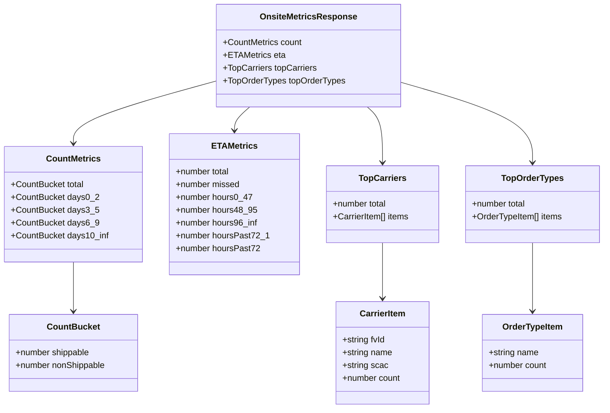
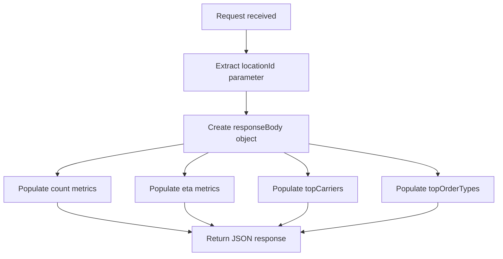

# Diagram: web/portal/src/mocks/handlers/inventory-view/location/locationId/metrics/onsite/data.js

> Auto-generated by Obscura crawlers

## Diagram 1

### SVG

<svg id="container" width="942" xmlns="http://www.w3.org/2000/svg" height="423" viewBox="-50 -10 942 423" role="graphics-document document" aria-roledescription="sequence"><g><rect x="692" y="337" fill="#eaeaea" stroke="#666" width="150" height="65" name="API" rx="3" ry="3" class="actor actor-bottom"></rect><text x="767" y="369.5" dominant-baseline="central" alignment-baseline="central" class="actor actor-box" style="text-anchor: middle; font-size: 16px; font-weight: 400;"><tspan x="767" dy="0">API</tspan></text></g><g><rect x="492" y="337" fill="#eaeaea" stroke="#666" width="150" height="65" name="MSW Handler" rx="3" ry="3" class="actor actor-bottom"></rect><text x="567" y="369.5" dominant-baseline="central" alignment-baseline="central" class="actor actor-box" style="text-anchor: middle; font-size: 16px; font-weight: 400;"><tspan x="567" dy="0">MSW Handler</tspan></text></g><g><rect x="0" y="337" fill="#eaeaea" stroke="#666" width="150" height="65" name="Client" rx="3" ry="3" class="actor actor-bottom"></rect><text x="75" y="369.5" dominant-baseline="central" alignment-baseline="central" class="actor actor-box" style="text-anchor: middle; font-size: 16px; font-weight: 400;"><tspan x="75" dy="0">Client</tspan></text></g><g><line id="actor2" x1="767" y1="65" x2="767" y2="337" class="actor-line 200" stroke-width="0.5px" stroke="#999" name="API"></line><g id="root-2"><rect x="692" y="0" fill="#eaeaea" stroke="#666" width="150" height="65" name="API" rx="3" ry="3" class="actor actor-top"></rect><text x="767" y="32.5" dominant-baseline="central" alignment-baseline="central" class="actor actor-box" style="text-anchor: middle; font-size: 16px; font-weight: 400;"><tspan x="767" dy="0">API</tspan></text></g></g><g><line id="actor1" x1="567" y1="65" x2="567" y2="337" class="actor-line 200" stroke-width="0.5px" stroke="#999" name="MSW Handler"></line><g id="root-1"><rect x="492" y="0" fill="#eaeaea" stroke="#666" width="150" height="65" name="MSW Handler" rx="3" ry="3" class="actor actor-top"></rect><text x="567" y="32.5" dominant-baseline="central" alignment-baseline="central" class="actor actor-box" style="text-anchor: middle; font-size: 16px; font-weight: 400;"><tspan x="567" dy="0">MSW Handler</tspan></text></g></g><g><line id="actor0" x1="75" y1="65" x2="75" y2="337" class="actor-line 200" stroke-width="0.5px" stroke="#999" name="Client"></line><g id="root-0"><rect x="0" y="0" fill="#eaeaea" stroke="#666" width="150" height="65" name="Client" rx="3" ry="3" class="actor actor-top"></rect><text x="75" y="32.5" dominant-baseline="central" alignment-baseline="central" class="actor actor-box" style="text-anchor: middle; font-size: 16px; font-weight: 400;"><tspan x="75" dy="0">Client</tspan></text></g></g><g></g><defs><symbol id="computer" width="24" height="24"><path transform="scale(.5)" d="M2 2v13h20v-13h-20zm18 11h-16v-9h16v9zm-10.228 6l.466-1h3.524l.467 1h-4.457zm14.228 3h-24l2-6h2.104l-1.33 4h18.45l-1.297-4h2.073l2 6zm-5-10h-14v-7h14v7z"></path></symbol></defs><defs><symbol id="database" fill-rule="evenodd" clip-rule="evenodd"><path transform="scale(.5)" d="M12.258.001l.256.004.255.005.253.008.251.01.249.012.247.015.246.016.242.019.241.02.239.023.236.024.233.027.231.028.229.031.225.032.223.034.22.036.217.038.214.04.211.041.208.043.205.045.201.046.198.048.194.05.191.051.187.053.183.054.18.056.175.057.172.059.168.06.163.061.16.063.155.064.15.066.074.033.073.033.071.034.07.034.069.035.068.035.067.035.066.035.064.036.064.036.062.036.06.036.06.037.058.037.058.037.055.038.055.038.053.038.052.038.051.039.05.039.048.039.047.039.045.04.044.04.043.04.041.04.04.041.039.041.037.041.036.041.034.041.033.042.032.042.03.042.029.042.027.042.026.043.024.043.023.043.021.043.02.043.018.044.017.043.015.044.013.044.012.044.011.045.009.044.007.045.006.045.004.045.002.045.001.045v17l-.001.045-.002.045-.004.045-.006.045-.007.045-.009.044-.011.045-.012.044-.013.044-.015.044-.017.043-.018.044-.02.043-.021.043-.023.043-.024.043-.026.043-.027.042-.029.042-.03.042-.032.042-.033.042-.034.041-.036.041-.037.041-.039.041-.04.041-.041.04-.043.04-.044.04-.045.04-.047.039-.048.039-.05.039-.051.039-.052.038-.053.038-.055.038-.055.038-.058.037-.058.037-.06.037-.06.036-.062.036-.064.036-.064.036-.066.035-.067.035-.068.035-.069.035-.07.034-.071.034-.073.033-.074.033-.15.066-.155.064-.16.063-.163.061-.168.06-.172.059-.175.057-.18.056-.183.054-.187.053-.191.051-.194.05-.198.048-.201.046-.205.045-.208.043-.211.041-.214.04-.217.038-.22.036-.223.034-.225.032-.229.031-.231.028-.233.027-.236.024-.239.023-.241.02-.242.019-.246.016-.247.015-.249.012-.251.01-.253.008-.255.005-.256.004-.258.001-.258-.001-.256-.004-.255-.005-.253-.008-.251-.01-.249-.012-.247-.015-.245-.016-.243-.019-.241-.02-.238-.023-.236-.024-.234-.027-.231-.028-.228-.031-.226-.032-.223-.034-.22-.036-.217-.038-.214-.04-.211-.041-.208-.043-.204-.045-.201-.046-.198-.048-.195-.05-.19-.051-.187-.053-.184-.054-.179-.056-.176-.057-.172-.059-.167-.06-.164-.061-.159-.063-.155-.064-.151-.066-.074-.033-.072-.033-.072-.034-.07-.034-.069-.035-.068-.035-.067-.035-.066-.035-.064-.036-.063-.036-.062-.036-.061-.036-.06-.037-.058-.037-.057-.037-.056-.038-.055-.038-.053-.038-.052-.038-.051-.039-.049-.039-.049-.039-.046-.039-.046-.04-.044-.04-.043-.04-.041-.04-.04-.041-.039-.041-.037-.041-.036-.041-.034-.041-.033-.042-.032-.042-.03-.042-.029-.042-.027-.042-.026-.043-.024-.043-.023-.043-.021-.043-.02-.043-.018-.044-.017-.043-.015-.044-.013-.044-.012-.044-.011-.045-.009-.044-.007-.045-.006-.045-.004-.045-.002-.045-.001-.045v-17l.001-.045.002-.045.004-.045.006-.045.007-.045.009-.044.011-.045.012-.044.013-.044.015-.044.017-.043.018-.044.02-.043.021-.043.023-.043.024-.043.026-.043.027-.042.029-.042.03-.042.032-.042.033-.042.034-.041.036-.041.037-.041.039-.041.04-.041.041-.04.043-.04.044-.04.046-.04.046-.039.049-.039.049-.039.051-.039.052-.038.053-.038.055-.038.056-.038.057-.037.058-.037.06-.037.061-.036.062-.036.063-.036.064-.036.066-.035.067-.035.068-.035.069-.035.07-.034.072-.034.072-.033.074-.033.151-.066.155-.064.159-.063.164-.061.167-.06.172-.059.176-.057.179-.056.184-.054.187-.053.19-.051.195-.05.198-.048.201-.046.204-.045.208-.043.211-.041.214-.04.217-.038.22-.036.223-.034.226-.032.228-.031.231-.028.234-.027.236-.024.238-.023.241-.02.243-.019.245-.016.247-.015.249-.012.251-.01.253-.008.255-.005.256-.004.258-.001.258.001zm-9.258 20.499v.01l.001.021.003.021.004.022.005.021.006.022.007.022.009.023.01.022.011.023.012.023.013.023.015.023.016.024.017.023.018.024.019.024.021.024.022.025.023.024.024.025.052.049.056.05.061.051.066.051.07.051.075.051.079.052.084.052.088.052.092.052.097.052.102.051.105.052.11.052.114.051.119.051.123.051.127.05.131.05.135.05.139.048.144.049.147.047.152.047.155.047.16.045.163.045.167.043.171.043.176.041.178.041.183.039.187.039.19.037.194.035.197.035.202.033.204.031.209.03.212.029.216.027.219.025.222.024.226.021.23.02.233.018.236.016.24.015.243.012.246.01.249.008.253.005.256.004.259.001.26-.001.257-.004.254-.005.25-.008.247-.011.244-.012.241-.014.237-.016.233-.018.231-.021.226-.021.224-.024.22-.026.216-.027.212-.028.21-.031.205-.031.202-.034.198-.034.194-.036.191-.037.187-.039.183-.04.179-.04.175-.042.172-.043.168-.044.163-.045.16-.046.155-.046.152-.047.148-.048.143-.049.139-.049.136-.05.131-.05.126-.05.123-.051.118-.052.114-.051.11-.052.106-.052.101-.052.096-.052.092-.052.088-.053.083-.051.079-.052.074-.052.07-.051.065-.051.06-.051.056-.05.051-.05.023-.024.023-.025.021-.024.02-.024.019-.024.018-.024.017-.024.015-.023.014-.024.013-.023.012-.023.01-.023.01-.022.008-.022.006-.022.006-.022.004-.022.004-.021.001-.021.001-.021v-4.127l-.077.055-.08.053-.083.054-.085.053-.087.052-.09.052-.093.051-.095.05-.097.05-.1.049-.102.049-.105.048-.106.047-.109.047-.111.046-.114.045-.115.045-.118.044-.12.043-.122.042-.124.042-.126.041-.128.04-.13.04-.132.038-.134.038-.135.037-.138.037-.139.035-.142.035-.143.034-.144.033-.147.032-.148.031-.15.03-.151.03-.153.029-.154.027-.156.027-.158.026-.159.025-.161.024-.162.023-.163.022-.165.021-.166.02-.167.019-.169.018-.169.017-.171.016-.173.015-.173.014-.175.013-.175.012-.177.011-.178.01-.179.008-.179.008-.181.006-.182.005-.182.004-.184.003-.184.002h-.37l-.184-.002-.184-.003-.182-.004-.182-.005-.181-.006-.179-.008-.179-.008-.178-.01-.176-.011-.176-.012-.175-.013-.173-.014-.172-.015-.171-.016-.17-.017-.169-.018-.167-.019-.166-.02-.165-.021-.163-.022-.162-.023-.161-.024-.159-.025-.157-.026-.156-.027-.155-.027-.153-.029-.151-.03-.15-.03-.148-.031-.146-.032-.145-.033-.143-.034-.141-.035-.14-.035-.137-.037-.136-.037-.134-.038-.132-.038-.13-.04-.128-.04-.126-.041-.124-.042-.122-.042-.12-.044-.117-.043-.116-.045-.113-.045-.112-.046-.109-.047-.106-.047-.105-.048-.102-.049-.1-.049-.097-.05-.095-.05-.093-.052-.09-.051-.087-.052-.085-.053-.083-.054-.08-.054-.077-.054v4.127zm0-5.654v.011l.001.021.003.021.004.021.005.022.006.022.007.022.009.022.01.022.011.023.012.023.013.023.015.024.016.023.017.024.018.024.019.024.021.024.022.024.023.025.024.024.052.05.056.05.061.05.066.051.07.051.075.052.079.051.084.052.088.052.092.052.097.052.102.052.105.052.11.051.114.051.119.052.123.05.127.051.131.05.135.049.139.049.144.048.147.048.152.047.155.046.16.045.163.045.167.044.171.042.176.042.178.04.183.04.187.038.19.037.194.036.197.034.202.033.204.032.209.03.212.028.216.027.219.025.222.024.226.022.23.02.233.018.236.016.24.014.243.012.246.01.249.008.253.006.256.003.259.001.26-.001.257-.003.254-.006.25-.008.247-.01.244-.012.241-.015.237-.016.233-.018.231-.02.226-.022.224-.024.22-.025.216-.027.212-.029.21-.03.205-.032.202-.033.198-.035.194-.036.191-.037.187-.039.183-.039.179-.041.175-.042.172-.043.168-.044.163-.045.16-.045.155-.047.152-.047.148-.048.143-.048.139-.05.136-.049.131-.05.126-.051.123-.051.118-.051.114-.052.11-.052.106-.052.101-.052.096-.052.092-.052.088-.052.083-.052.079-.052.074-.051.07-.052.065-.051.06-.05.056-.051.051-.049.023-.025.023-.024.021-.025.02-.024.019-.024.018-.024.017-.024.015-.023.014-.023.013-.024.012-.022.01-.023.01-.023.008-.022.006-.022.006-.022.004-.021.004-.022.001-.021.001-.021v-4.139l-.077.054-.08.054-.083.054-.085.052-.087.053-.09.051-.093.051-.095.051-.097.05-.1.049-.102.049-.105.048-.106.047-.109.047-.111.046-.114.045-.115.044-.118.044-.12.044-.122.042-.124.042-.126.041-.128.04-.13.039-.132.039-.134.038-.135.037-.138.036-.139.036-.142.035-.143.033-.144.033-.147.033-.148.031-.15.03-.151.03-.153.028-.154.028-.156.027-.158.026-.159.025-.161.024-.162.023-.163.022-.165.021-.166.02-.167.019-.169.018-.169.017-.171.016-.173.015-.173.014-.175.013-.175.012-.177.011-.178.009-.179.009-.179.007-.181.007-.182.005-.182.004-.184.003-.184.002h-.37l-.184-.002-.184-.003-.182-.004-.182-.005-.181-.007-.179-.007-.179-.009-.178-.009-.176-.011-.176-.012-.175-.013-.173-.014-.172-.015-.171-.016-.17-.017-.169-.018-.167-.019-.166-.02-.165-.021-.163-.022-.162-.023-.161-.024-.159-.025-.157-.026-.156-.027-.155-.028-.153-.028-.151-.03-.15-.03-.148-.031-.146-.033-.145-.033-.143-.033-.141-.035-.14-.036-.137-.036-.136-.037-.134-.038-.132-.039-.13-.039-.128-.04-.126-.041-.124-.042-.122-.043-.12-.043-.117-.044-.116-.044-.113-.046-.112-.046-.109-.046-.106-.047-.105-.048-.102-.049-.1-.049-.097-.05-.095-.051-.093-.051-.09-.051-.087-.053-.085-.052-.083-.054-.08-.054-.077-.054v4.139zm0-5.666v.011l.001.02.003.022.004.021.005.022.006.021.007.022.009.023.01.022.011.023.012.023.013.023.015.023.016.024.017.024.018.023.019.024.021.025.022.024.023.024.024.025.052.05.056.05.061.05.066.051.07.051.075.052.079.051.084.052.088.052.092.052.097.052.102.052.105.051.11.052.114.051.119.051.123.051.127.05.131.05.135.05.139.049.144.048.147.048.152.047.155.046.16.045.163.045.167.043.171.043.176.042.178.04.183.04.187.038.19.037.194.036.197.034.202.033.204.032.209.03.212.028.216.027.219.025.222.024.226.021.23.02.233.018.236.017.24.014.243.012.246.01.249.008.253.006.256.003.259.001.26-.001.257-.003.254-.006.25-.008.247-.01.244-.013.241-.014.237-.016.233-.018.231-.02.226-.022.224-.024.22-.025.216-.027.212-.029.21-.03.205-.032.202-.033.198-.035.194-.036.191-.037.187-.039.183-.039.179-.041.175-.042.172-.043.168-.044.163-.045.16-.045.155-.047.152-.047.148-.048.143-.049.139-.049.136-.049.131-.051.126-.05.123-.051.118-.052.114-.051.11-.052.106-.052.101-.052.096-.052.092-.052.088-.052.083-.052.079-.052.074-.052.07-.051.065-.051.06-.051.056-.05.051-.049.023-.025.023-.025.021-.024.02-.024.019-.024.018-.024.017-.024.015-.023.014-.024.013-.023.012-.023.01-.022.01-.023.008-.022.006-.022.006-.022.004-.022.004-.021.001-.021.001-.021v-4.153l-.077.054-.08.054-.083.053-.085.053-.087.053-.09.051-.093.051-.095.051-.097.05-.1.049-.102.048-.105.048-.106.048-.109.046-.111.046-.114.046-.115.044-.118.044-.12.043-.122.043-.124.042-.126.041-.128.04-.13.039-.132.039-.134.038-.135.037-.138.036-.139.036-.142.034-.143.034-.144.033-.147.032-.148.032-.15.03-.151.03-.153.028-.154.028-.156.027-.158.026-.159.024-.161.024-.162.023-.163.023-.165.021-.166.02-.167.019-.169.018-.169.017-.171.016-.173.015-.173.014-.175.013-.175.012-.177.01-.178.01-.179.009-.179.007-.181.006-.182.006-.182.004-.184.003-.184.001-.185.001-.185-.001-.184-.001-.184-.003-.182-.004-.182-.006-.181-.006-.179-.007-.179-.009-.178-.01-.176-.01-.176-.012-.175-.013-.173-.014-.172-.015-.171-.016-.17-.017-.169-.018-.167-.019-.166-.02-.165-.021-.163-.023-.162-.023-.161-.024-.159-.024-.157-.026-.156-.027-.155-.028-.153-.028-.151-.03-.15-.03-.148-.032-.146-.032-.145-.033-.143-.034-.141-.034-.14-.036-.137-.036-.136-.037-.134-.038-.132-.039-.13-.039-.128-.041-.126-.041-.124-.041-.122-.043-.12-.043-.117-.044-.116-.044-.113-.046-.112-.046-.109-.046-.106-.048-.105-.048-.102-.048-.1-.05-.097-.049-.095-.051-.093-.051-.09-.052-.087-.052-.085-.053-.083-.053-.08-.054-.077-.054v4.153zm8.74-8.179l-.257.004-.254.005-.25.008-.247.011-.244.012-.241.014-.237.016-.233.018-.231.021-.226.022-.224.023-.22.026-.216.027-.212.028-.21.031-.205.032-.202.033-.198.034-.194.036-.191.038-.187.038-.183.04-.179.041-.175.042-.172.043-.168.043-.163.045-.16.046-.155.046-.152.048-.148.048-.143.048-.139.049-.136.05-.131.05-.126.051-.123.051-.118.051-.114.052-.11.052-.106.052-.101.052-.096.052-.092.052-.088.052-.083.052-.079.052-.074.051-.07.052-.065.051-.06.05-.056.05-.051.05-.023.025-.023.024-.021.024-.02.025-.019.024-.018.024-.017.023-.015.024-.014.023-.013.023-.012.023-.01.023-.01.022-.008.022-.006.023-.006.021-.004.022-.004.021-.001.021-.001.021.001.021.001.021.004.021.004.022.006.021.006.023.008.022.01.022.01.023.012.023.013.023.014.023.015.024.017.023.018.024.019.024.02.025.021.024.023.024.023.025.051.05.056.05.06.05.065.051.07.052.074.051.079.052.083.052.088.052.092.052.096.052.101.052.106.052.11.052.114.052.118.051.123.051.126.051.131.05.136.05.139.049.143.048.148.048.152.048.155.046.16.046.163.045.168.043.172.043.175.042.179.041.183.04.187.038.191.038.194.036.198.034.202.033.205.032.21.031.212.028.216.027.22.026.224.023.226.022.231.021.233.018.237.016.241.014.244.012.247.011.25.008.254.005.257.004.26.001.26-.001.257-.004.254-.005.25-.008.247-.011.244-.012.241-.014.237-.016.233-.018.231-.021.226-.022.224-.023.22-.026.216-.027.212-.028.21-.031.205-.032.202-.033.198-.034.194-.036.191-.038.187-.038.183-.04.179-.041.175-.042.172-.043.168-.043.163-.045.16-.046.155-.046.152-.048.148-.048.143-.048.139-.049.136-.05.131-.05.126-.051.123-.051.118-.051.114-.052.11-.052.106-.052.101-.052.096-.052.092-.052.088-.052.083-.052.079-.052.074-.051.07-.052.065-.051.06-.05.056-.05.051-.05.023-.025.023-.024.021-.024.02-.025.019-.024.018-.024.017-.023.015-.024.014-.023.013-.023.012-.023.01-.023.01-.022.008-.022.006-.023.006-.021.004-.022.004-.021.001-.021.001-.021-.001-.021-.001-.021-.004-.021-.004-.022-.006-.021-.006-.023-.008-.022-.01-.022-.01-.023-.012-.023-.013-.023-.014-.023-.015-.024-.017-.023-.018-.024-.019-.024-.02-.025-.021-.024-.023-.024-.023-.025-.051-.05-.056-.05-.06-.05-.065-.051-.07-.052-.074-.051-.079-.052-.083-.052-.088-.052-.092-.052-.096-.052-.101-.052-.106-.052-.11-.052-.114-.052-.118-.051-.123-.051-.126-.051-.131-.05-.136-.05-.139-.049-.143-.048-.148-.048-.152-.048-.155-.046-.16-.046-.163-.045-.168-.043-.172-.043-.175-.042-.179-.041-.183-.04-.187-.038-.191-.038-.194-.036-.198-.034-.202-.033-.205-.032-.21-.031-.212-.028-.216-.027-.22-.026-.224-.023-.226-.022-.231-.021-.233-.018-.237-.016-.241-.014-.244-.012-.247-.011-.25-.008-.254-.005-.257-.004-.26-.001-.26.001z"></path></symbol></defs><defs><symbol id="clock" width="24" height="24"><path transform="scale(.5)" d="M12 2c5.514 0 10 4.486 10 10s-4.486 10-10 10-10-4.486-10-10 4.486-10 10-10zm0-2c-6.627 0-12 5.373-12 12s5.373 12 12 12 12-5.373 12-12-5.373-12-12-12zm5.848 12.459c.202.038.202.333.001.372-1.907.361-6.045 1.111-6.547 1.111-.719 0-1.301-.582-1.301-1.301 0-.512.77-5.447 1.125-7.445.034-.192.312-.181.343.014l.985 6.238 5.394 1.011z"></path></symbol></defs><defs><marker id="arrowhead" refX="7.9" refY="5" markerUnits="userSpaceOnUse" markerWidth="12" markerHeight="12" orient="auto-start-reverse"><path d="M -1 0 L 10 5 L 0 10 z"></path></marker></defs><defs><marker id="crosshead" markerWidth="15" markerHeight="8" orient="auto" refX="4" refY="4.5"><path fill="none" stroke="#000000" stroke-width="1pt" d="M 1,2 L 6,7 M 6,2 L 1,7" style="stroke-dasharray: 0, 0;"></path></marker></defs><defs><marker id="filled-head" refX="15.5" refY="7" markerWidth="20" markerHeight="28" orient="auto"><path d="M 18,7 L9,13 L14,7 L9,1 Z"></path></marker></defs><defs><marker id="sequencenumber" refX="15" refY="15" markerWidth="60" markerHeight="40" orient="auto"><circle cx="15" cy="15" r="6"></circle></marker></defs><text x="320" y="80" text-anchor="middle" dominant-baseline="middle" alignment-baseline="middle" class="messageText" dy="1em" style="font-size: 16px; font-weight: 400;">GET /entity-inventory/location/:locationId/metrics/onsite</text><line x1="76" y1="113" x2="563" y2="113" class="messageLine0" stroke-width="2" stroke="none" marker-end="url(#arrowhead)" style="fill: none;"></line><text x="568" y="128" text-anchor="middle" dominant-baseline="middle" alignment-baseline="middle" class="messageText" dy="1em" style="font-size: 16px; font-weight: 400;">Extract locationId from URL</text><path d="M 568,161 C 628,151 628,191 568,181" class="messageLine0" stroke-width="2" stroke="none" marker-end="url(#arrowhead)" style="fill: none;"></path><text x="568" y="206" text-anchor="middle" dominant-baseline="middle" alignment-baseline="middle" class="messageText" dy="1em" style="font-size: 16px; font-weight: 400;">Build responseBody</text><path d="M 568,239 C 628,229 628,269 568,259" class="messageLine0" stroke-width="2" stroke="none" marker-end="url(#arrowhead)" style="fill: none;"></path><text x="323" y="284" text-anchor="middle" dominant-baseline="middle" alignment-baseline="middle" class="messageText" dy="1em" style="font-size: 16px; font-weight: 400;">Return JSON response (200)</text><line x1="566" y1="317" x2="79" y2="317" class="messageLine1" stroke-width="2" stroke="none" marker-end="url(#arrowhead)" style="stroke-dasharray: 3, 3; fill: none;"></line></svg>

## Diagram 2

### SVG

<svg id="container" width="1110.921875" xmlns="http://www.w3.org/2000/svg" class="classDiagram" height="764" viewBox="0 0 1110.921875 764" role="graphics-document document" aria-roledescription="class"><g><defs><marker id="container_class-aggregationStart" class="marker aggregation class" refX="18" refY="7" markerWidth="190" markerHeight="240" orient="auto"><path d="M 18,7 L9,13 L1,7 L9,1 Z"></path></marker></defs><defs><marker id="container_class-aggregationEnd" class="marker aggregation class" refX="1" refY="7" markerWidth="20" markerHeight="28" orient="auto"><path d="M 18,7 L9,13 L1,7 L9,1 Z"></path></marker></defs><defs><marker id="container_class-extensionStart" class="marker extension class" refX="18" refY="7" markerWidth="190" markerHeight="240" orient="auto"><path d="M 1,7 L18,13 V 1 Z"></path></marker></defs><defs><marker id="container_class-extensionEnd" class="marker extension class" refX="1" refY="7" markerWidth="20" markerHeight="28" orient="auto"><path d="M 1,1 V 13 L18,7 Z"></path></marker></defs><defs><marker id="container_class-compositionStart" class="marker composition class" refX="18" refY="7" markerWidth="190" markerHeight="240" orient="auto"><path d="M 18,7 L9,13 L1,7 L9,1 Z"></path></marker></defs><defs><marker id="container_class-compositionEnd" class="marker composition class" refX="1" refY="7" markerWidth="20" markerHeight="28" orient="auto"><path d="M 18,7 L9,13 L1,7 L9,1 Z"></path></marker></defs><defs><marker id="container_class-dependencyStart" class="marker dependency class" refX="6" refY="7" markerWidth="190" markerHeight="240" orient="auto"><path d="M 5,7 L9,13 L1,7 L9,1 Z"></path></marker></defs><defs><marker id="container_class-dependencyEnd" class="marker dependency class" refX="13" refY="7" markerWidth="20" markerHeight="28" orient="auto"><path d="M 18,7 L9,13 L14,7 L9,1 Z"></path></marker></defs><defs><marker id="container_class-lollipopStart" class="marker lollipop class" refX="13" refY="7" markerWidth="190" markerHeight="240" orient="auto"><circle stroke="black" fill="transparent" cx="7" cy="7" r="6"></circle></marker></defs><defs><marker id="container_class-lollipopEnd" class="marker lollipop class" refX="1" refY="7" markerWidth="190" markerHeight="240" orient="auto"><circle stroke="black" fill="transparent" cx="7" cy="7" r="6"></circle></marker></defs><g class="root"><g class="clusters"></g><g class="edgePaths"><path d="M393.654,151.614L350.378,163.845C307.102,176.076,220.549,200.538,177.272,219.936C133.996,239.333,133.996,253.667,133.996,260.833L133.996,268" id="id_OnsiteMetricsResponse_CountMetrics_1" class="edge-thickness-normal edge-pattern-solid relation" style=";;;" data-edge="true" data-et="edge" data-id="id_OnsiteMetricsResponse_CountMetrics_1" data-points="W3sieCI6MzkzLjY1NDI5Njg3NSwieSI6MTUxLjYxNDM5Mzk2MzU4NjI4fSx7IngiOjEzMy45OTYwOTM3NSwieSI6MjI1fSx7IngiOjEzMy45OTYwOTM3NSwieSI6Mjc0fV0=" marker-end="url(#container_class-dependencyEnd)"></path><path d="M454.358,200L449.68,204.167C445.003,208.333,435.648,216.667,430.97,224C426.293,231.333,426.293,237.667,426.293,240.833L426.293,244" id="id_OnsiteMetricsResponse_ETAMetrics_2" class="edge-thickness-normal edge-pattern-solid relation" style=";;;" data-edge="true" data-et="edge" data-id="id_OnsiteMetricsResponse_ETAMetrics_2" data-points="W3sieCI6NDU0LjM1Nzg0MTU1NDc1MjEsInkiOjIwMH0seyJ4Ijo0MjYuMjkyOTY4NzUsInkiOjIyNX0seyJ4Ijo0MjYuMjkyOTY4NzUsInkiOjI1MH1d" marker-end="url(#container_class-dependencyEnd)"></path><path d="M669.896,200L674.574,204.167C679.251,208.333,688.606,216.667,693.283,234C697.961,251.333,697.961,277.667,697.961,290.833L697.961,304" id="id_OnsiteMetricsResponse_TopCarriers_3" class="edge-thickness-normal edge-pattern-solid relation" style=";;;" data-edge="true" data-et="edge" data-id="id_OnsiteMetricsResponse_TopCarriers_3" data-points="W3sieCI6NjY5Ljg5NjA2NDY5NTI0NzksInkiOjIwMH0seyJ4Ijo2OTcuOTYwOTM3NSwieSI6MjI1fSx7IngiOjY5Ny45NjA5Mzc1LCJ5IjozMTB9XQ==" marker-end="url(#container_class-dependencyEnd)"></path><path d="M730.6,153.003L771.854,165.003C813.108,177.002,895.617,201.001,936.871,226.167C978.125,251.333,978.125,277.667,978.125,290.833L978.125,304" id="id_OnsiteMetricsResponse_TopOrderTypes_4" class="edge-thickness-normal edge-pattern-solid relation" style=";;;" data-edge="true" data-et="edge" data-id="id_OnsiteMetricsResponse_TopOrderTypes_4" data-points="W3sieCI6NzMwLjU5OTYwOTM3NSwieSI6MTUzLjAwMzA5NDAyNzQ0NzE2fSx7IngiOjk3OC4xMjUsInkiOjIyNX0seyJ4Ijo5NzguMTI1LCJ5IjozMTB9XQ==" marker-end="url(#container_class-dependencyEnd)"></path><path d="M133.996,490L133.996,498.167C133.996,506.333,133.996,522.667,133.996,538C133.996,553.333,133.996,567.667,133.996,574.833L133.996,582" id="id_CountMetrics_CountBucket_5" class="edge-thickness-normal edge-pattern-solid relation" style=";;;" data-edge="true" data-et="edge" data-id="id_CountMetrics_CountBucket_5" data-points="W3sieCI6MTMzLjk5NjA5Mzc1LCJ5Ijo0OTB9LHsieCI6MTMzLjk5NjA5Mzc1LCJ5Ijo1Mzl9LHsieCI6MTMzLjk5NjA5Mzc1LCJ5Ijo1ODh9XQ==" marker-end="url(#container_class-dependencyEnd)"></path><path d="M697.961,454L697.961,468.167C697.961,482.333,697.961,510.667,697.961,528C697.961,545.333,697.961,551.667,697.961,554.833L697.961,558" id="id_TopCarriers_CarrierItem_6" class="edge-thickness-normal edge-pattern-solid relation" style=";;;" data-edge="true" data-et="edge" data-id="id_TopCarriers_CarrierItem_6" data-points="W3sieCI6Njk3Ljk2MDkzNzUsInkiOjQ1NH0seyJ4Ijo2OTcuOTYwOTM3NSwieSI6NTM5fSx7IngiOjY5Ny45NjA5Mzc1LCJ5Ijo1NjR9XQ==" marker-end="url(#container_class-dependencyEnd)"></path><path d="M978.125,454L978.125,468.167C978.125,482.333,978.125,510.667,978.125,532C978.125,553.333,978.125,567.667,978.125,574.833L978.125,582" id="id_TopOrderTypes_OrderTypeItem_7" class="edge-thickness-normal edge-pattern-solid relation" style=";;;" data-edge="true" data-et="edge" data-id="id_TopOrderTypes_OrderTypeItem_7" data-points="W3sieCI6OTc4LjEyNSwieSI6NDU0fSx7IngiOjk3OC4xMjUsInkiOjUzOX0seyJ4Ijo5NzguMTI1LCJ5Ijo1ODh9XQ==" marker-end="url(#container_class-dependencyEnd)"></path></g><g class="edgeLabels"><g class="edgeLabel"><g class="label" data-id="id_OnsiteMetricsResponse_CountMetrics_1" transform="translate(0, 0)"><foreignObject width="0" height="0">

</foreignObject></g></g><g class="edgeLabel"><g class="label" data-id="id_OnsiteMetricsResponse_ETAMetrics_2" transform="translate(0, 0)"><foreignObject width="0" height="0">

</foreignObject></g></g><g class="edgeLabel"><g class="label" data-id="id_OnsiteMetricsResponse_TopCarriers_3" transform="translate(0, 0)"><foreignObject width="0" height="0">

</foreignObject></g></g><g class="edgeLabel"><g class="label" data-id="id_OnsiteMetricsResponse_TopOrderTypes_4" transform="translate(0, 0)"><foreignObject width="0" height="0">

</foreignObject></g></g><g class="edgeLabel"><g class="label" data-id="id_CountMetrics_CountBucket_5" transform="translate(0, 0)"><foreignObject width="0" height="0">

</foreignObject></g></g><g class="edgeLabel"><g class="label" data-id="id_TopCarriers_CarrierItem_6" transform="translate(0, 0)"><foreignObject width="0" height="0">

</foreignObject></g></g><g class="edgeLabel"><g class="label" data-id="id_TopOrderTypes_OrderTypeItem_7" transform="translate(0, 0)"><foreignObject width="0" height="0">

</foreignObject></g></g></g><g class="nodes"><g class="node default" id="classId-OnsiteMetricsResponse-0" transform="translate(562.126953125, 104)"><g class="basic label-container"><path d="M-168.47265625 -96 L168.47265625 -96 L168.47265625 96 L-168.47265625 96" stroke="none" stroke-width="0" fill="#ECECFF" style=""></path><path d="M-168.47265625 -96 C-92.76989201387795 -96, -17.0671277777559 -96, 168.47265625 -96 M-168.47265625 -96 C-94.78568993270112 -96, -21.098723615402236 -96, 168.47265625 -96 M168.47265625 -96 C168.47265625 -31.50809594301157, 168.47265625 32.98380811397686, 168.47265625 96 M168.47265625 -96 C168.47265625 -27.222400876223418, 168.47265625 41.555198247553164, 168.47265625 96 M168.47265625 96 C56.55629978709099 96, -55.360056675818015 96, -168.47265625 96 M168.47265625 96 C99.35834467493882 96, 30.24403309987764 96, -168.47265625 96 M-168.47265625 96 C-168.47265625 19.920978080504185, -168.47265625 -56.15804383899163, -168.47265625 -96 M-168.47265625 96 C-168.47265625 40.026675627977646, -168.47265625 -15.946648744044708, -168.47265625 -96" stroke="#9370DB" stroke-width="1.3" fill="none" stroke-dasharray="0 0" style=""></path></g><g class="annotation-group text" transform="translate(0, -72)"></g><g class="label-group text" transform="translate(-86.0234375, -72)"><g class="label" style="font-weight: bolder" transform="translate(0,-12)"><foreignObject width="172.046875" height="24">

OnsiteMetricsResponse

</foreignObject></g></g><g class="members-group text" transform="translate(-156.47265625, -24)"><g class="label" style="" transform="translate(0,-12)"><foreignObject width="148.5625" height="24">

+CountMetrics count

</foreignObject></g><g class="label" style="" transform="translate(0,12)"><foreignObject width="113.265625" height="24">

+ETAMetrics eta

</foreignObject></g><g class="label" style="" transform="translate(0,36)"><foreignObject width="175.046875" height="24">

+TopCarriers topCarriers

</foreignObject></g><g class="label" style="" transform="translate(0,60)"><foreignObject width="226.921875" height="24">

+TopOrderTypes topOrderTypes

</foreignObject></g></g><g class="methods-group text" transform="translate(-156.47265625, 96)"></g><g class="divider" style=""><path d="M-168.47265625 -48 C-57.143530837215934 -48, 54.18559457556813 -48, 168.47265625 -48 M-168.47265625 -48 C-41.5687115459945 -48, 85.335233158011 -48, 168.47265625 -48" stroke="#9370DB" stroke-width="1.3" fill="none" stroke-dasharray="0 0" style=""></path></g><g class="divider" style=""><path d="M-168.47265625 72 C-74.53921408972832 72, 19.394228070543363 72, 168.47265625 72 M-168.47265625 72 C-88.91782857021781 72, -9.363000890435615 72, 168.47265625 72" stroke="#9370DB" stroke-width="1.3" fill="none" stroke-dasharray="0 0" style=""></path></g></g><g class="node default" id="classId-CountMetrics-1" transform="translate(133.99609375, 382)"><g class="basic label-container"><path d="M-125.99609375 -108 L125.99609375 -108 L125.99609375 108 L-125.99609375 108" stroke="none" stroke-width="0" fill="#ECECFF" style=""></path><path d="M-125.99609375 -108 C-34.36561091249531 -108, 57.26487192500937 -108, 125.99609375 -108 M-125.99609375 -108 C-71.79230241388831 -108, -17.588511077776616 -108, 125.99609375 -108 M125.99609375 -108 C125.99609375 -58.31275461199375, 125.99609375 -8.625509223987507, 125.99609375 108 M125.99609375 -108 C125.99609375 -21.996794948595493, 125.99609375 64.00641010280901, 125.99609375 108 M125.99609375 108 C35.9578479610863 108, -54.0803978278274 108, -125.99609375 108 M125.99609375 108 C74.4269002069 108, 22.857706663799988 108, -125.99609375 108 M-125.99609375 108 C-125.99609375 26.001593879155394, -125.99609375 -55.99681224168921, -125.99609375 -108 M-125.99609375 108 C-125.99609375 30.78403822142269, -125.99609375 -46.43192355715462, -125.99609375 -108" stroke="#9370DB" stroke-width="1.3" fill="none" stroke-dasharray="0 0" style=""></path></g><g class="annotation-group text" transform="translate(0, -84)"></g><g class="label-group text" transform="translate(-48.3515625, -84)"><g class="label" style="font-weight: bolder" transform="translate(0,-12)"><foreignObject width="96.703125" height="24">

CountMetrics

</foreignObject></g></g><g class="members-group text" transform="translate(-113.99609375, -36)"><g class="label" style="" transform="translate(0,-12)"><foreignObject width="137.6875" height="24">

+CountBucket total

</foreignObject></g><g class="label" style="" transform="translate(0,12)"><foreignObject width="161.859375" height="24">

+CountBucket days0_2

</foreignObject></g><g class="label" style="" transform="translate(0,36)"><foreignObject width="161.171875" height="24">

+CountBucket days3_5

</foreignObject></g><g class="label" style="" transform="translate(0,60)"><foreignObject width="162.109375" height="24">

+CountBucket days6_9

</foreignObject></g><g class="label" style="" transform="translate(0,84)"><foreignObject width="179.640625" height="24">

+CountBucket days10_inf

</foreignObject></g></g><g class="methods-group text" transform="translate(-113.99609375, 108)"></g><g class="divider" style=""><path d="M-125.99609375 -60 C-68.88751332684969 -60, -11.77893290369937 -60, 125.99609375 -60 M-125.99609375 -60 C-64.68478567464774 -60, -3.373477599295498 -60, 125.99609375 -60" stroke="#9370DB" stroke-width="1.3" fill="none" stroke-dasharray="0 0" style=""></path></g><g class="divider" style=""><path d="M-125.99609375 84 C-39.371993340127986 84, 47.25210706974403 84, 125.99609375 84 M-125.99609375 84 C-33.03491868026789 84, 59.926256389464214 84, 125.99609375 84" stroke="#9370DB" stroke-width="1.3" fill="none" stroke-dasharray="0 0" style=""></path></g></g><g class="node default" id="classId-CountBucket-2" transform="translate(133.99609375, 660)"><g class="basic label-container"><path d="M-120.33984375 -72 L120.33984375 -72 L120.33984375 72 L-120.33984375 72" stroke="none" stroke-width="0" fill="#ECECFF" style=""></path><path d="M-120.33984375 -72 C-54.09278177934367 -72, 12.154280191312665 -72, 120.33984375 -72 M-120.33984375 -72 C-43.10963900387617 -72, 34.12056574224766 -72, 120.33984375 -72 M120.33984375 -72 C120.33984375 -38.61238230699027, 120.33984375 -5.22476461398054, 120.33984375 72 M120.33984375 -72 C120.33984375 -37.13280801543863, 120.33984375 -2.265616030877254, 120.33984375 72 M120.33984375 72 C36.09648047613051 72, -48.14688279773898 72, -120.33984375 72 M120.33984375 72 C45.001572525599144 72, -30.33669869880171 72, -120.33984375 72 M-120.33984375 72 C-120.33984375 36.593934170265, -120.33984375 1.1878683405300023, -120.33984375 -72 M-120.33984375 72 C-120.33984375 37.951730949872854, -120.33984375 3.9034618997457073, -120.33984375 -72" stroke="#9370DB" stroke-width="1.3" fill="none" stroke-dasharray="0 0" style=""></path></g><g class="annotation-group text" transform="translate(0, -48)"></g><g class="label-group text" transform="translate(-46.5546875, -48)"><g class="label" style="font-weight: bolder" transform="translate(0,-12)"><foreignObject width="93.109375" height="24">

CountBucket

</foreignObject></g></g><g class="members-group text" transform="translate(-108.33984375, 0)"><g class="label" style="" transform="translate(0,-12)"><foreignObject width="140.78125" height="24">

+number shippable

</foreignObject></g><g class="label" style="" transform="translate(0,12)"><foreignObject width="170.125" height="24">

+number nonShippable

</foreignObject></g></g><g class="methods-group text" transform="translate(-108.33984375, 72)"></g><g class="divider" style=""><path d="M-120.33984375 -24 C-40.42959119930879 -24, 39.48066135138242 -24, 120.33984375 -24 M-120.33984375 -24 C-38.42593014350878 -24, 43.48798346298244 -24, 120.33984375 -24" stroke="#9370DB" stroke-width="1.3" fill="none" stroke-dasharray="0 0" style=""></path></g><g class="divider" style=""><path d="M-120.33984375 48 C-39.39847934643244 48, 41.54288505713512 48, 120.33984375 48 M-120.33984375 48 C-57.946980508133166 48, 4.445882733733669 48, 120.33984375 48" stroke="#9370DB" stroke-width="1.3" fill="none" stroke-dasharray="0 0" style=""></path></g></g><g class="node default" id="classId-ETAMetrics-3" transform="translate(426.29296875, 382)"><g class="basic label-container"><path d="M-116.30078125 -132 L116.30078125 -132 L116.30078125 132 L-116.30078125 132" stroke="none" stroke-width="0" fill="#ECECFF" style=""></path><path d="M-116.30078125 -132 C-61.97419092020129 -132, -7.6476005904025754 -132, 116.30078125 -132 M-116.30078125 -132 C-61.413156276663564 -132, -6.525531303327128 -132, 116.30078125 -132 M116.30078125 -132 C116.30078125 -71.65805128511116, 116.30078125 -11.316102570222313, 116.30078125 132 M116.30078125 -132 C116.30078125 -72.92552947171187, 116.30078125 -13.851058943423737, 116.30078125 132 M116.30078125 132 C58.1392828855489 132, -0.022215478902197106 132, -116.30078125 132 M116.30078125 132 C47.46134234341709 132, -21.378096563165826 132, -116.30078125 132 M-116.30078125 132 C-116.30078125 65.1923951659604, -116.30078125 -1.6152096680791885, -116.30078125 -132 M-116.30078125 132 C-116.30078125 27.617604157342996, -116.30078125 -76.76479168531401, -116.30078125 -132" stroke="#9370DB" stroke-width="1.3" fill="none" stroke-dasharray="0 0" style=""></path></g><g class="annotation-group text" transform="translate(0, -108)"></g><g class="label-group text" transform="translate(-39.8046875, -108)"><g class="label" style="font-weight: bolder" transform="translate(0,-12)"><foreignObject width="79.609375" height="24">

ETAMetrics

</foreignObject></g></g><g class="members-group text" transform="translate(-104.30078125, -60)"><g class="label" style="" transform="translate(0,-12)"><foreignObject width="102.8125" height="24">

+number total

</foreignObject></g><g class="label" style="" transform="translate(0,12)"><foreignObject width="120.328125" height="24">

+number missed

</foreignObject></g><g class="label" style="" transform="translate(0,36)"><foreignObject width="140.546875" height="24">

+number hours0_47

</foreignObject></g><g class="label" style="" transform="translate(0,60)"><foreignObject width="152.21875" height="24">

+number hours48_95

</foreignObject></g><g class="label" style="" transform="translate(0,84)"><foreignObject width="154.484375" height="24">

+number hours96_inf

</foreignObject></g><g class="label" style="" transform="translate(0,108)"><foreignObject width="168.796875" height="24">

+number hoursPast72_1

</foreignObject></g><g class="label" style="" transform="translate(0,132)"><foreignObject width="155.140625" height="24">

+number hoursPast72

</foreignObject></g></g><g class="methods-group text" transform="translate(-104.30078125, 132)"></g><g class="divider" style=""><path d="M-116.30078125 -84 C-57.31600073850471 -84, 1.6687797729905753 -84, 116.30078125 -84 M-116.30078125 -84 C-26.868114116531572 -84, 62.564553016936856 -84, 116.30078125 -84" stroke="#9370DB" stroke-width="1.3" fill="none" stroke-dasharray="0 0" style=""></path></g><g class="divider" style=""><path d="M-116.30078125 108 C-37.91629957887139 108, 40.46818209225722 108, 116.30078125 108 M-116.30078125 108 C-50.791775180818135 108, 14.71723088836373 108, 116.30078125 108" stroke="#9370DB" stroke-width="1.3" fill="none" stroke-dasharray="0 0" style=""></path></g></g><g class="node default" id="classId-TopCarriers-4" transform="translate(697.9609375, 382)"><g class="basic label-container"><path d="M-105.3671875 -72 L105.3671875 -72 L105.3671875 72 L-105.3671875 72" stroke="none" stroke-width="0" fill="#ECECFF" style=""></path><path d="M-105.3671875 -72 C-36.74380048959364 -72, 31.879586520812722 -72, 105.3671875 -72 M-105.3671875 -72 C-27.56820791962741 -72, 50.23077166074518 -72, 105.3671875 -72 M105.3671875 -72 C105.3671875 -36.32095551010824, 105.3671875 -0.641911020216483, 105.3671875 72 M105.3671875 -72 C105.3671875 -20.46847588320145, 105.3671875 31.0630482335971, 105.3671875 72 M105.3671875 72 C58.852650811683944 72, 12.338114123367887 72, -105.3671875 72 M105.3671875 72 C43.16710755976971 72, -19.032972380460578 72, -105.3671875 72 M-105.3671875 72 C-105.3671875 42.2280127538736, -105.3671875 12.456025507747206, -105.3671875 -72 M-105.3671875 72 C-105.3671875 28.402360550226312, -105.3671875 -15.195278899547375, -105.3671875 -72" stroke="#9370DB" stroke-width="1.3" fill="none" stroke-dasharray="0 0" style=""></path></g><g class="annotation-group text" transform="translate(0, -48)"></g><g class="label-group text" transform="translate(-42.296875, -48)"><g class="label" style="font-weight: bolder" transform="translate(0,-12)"><foreignObject width="84.59375" height="24">

TopCarriers

</foreignObject></g></g><g class="members-group text" transform="translate(-93.3671875, 0)"><g class="label" style="" transform="translate(0,-12)"><foreignObject width="102.8125" height="24">

+number total

</foreignObject></g><g class="label" style="" transform="translate(0,12)"><foreignObject width="144.4375" height="24">

+CarrierItem[] items

</foreignObject></g></g><g class="methods-group text" transform="translate(-93.3671875, 72)"></g><g class="divider" style=""><path d="M-105.3671875 -24 C-47.04961290710806 -24, 11.267961685783874 -24, 105.3671875 -24 M-105.3671875 -24 C-61.04950932877449 -24, -16.73183115754898 -24, 105.3671875 -24" stroke="#9370DB" stroke-width="1.3" fill="none" stroke-dasharray="0 0" style=""></path></g><g class="divider" style=""><path d="M-105.3671875 48 C-62.33796410314146 48, -19.30874070628292 48, 105.3671875 48 M-105.3671875 48 C-29.868648845725005 48, 45.62988980854999 48, 105.3671875 48" stroke="#9370DB" stroke-width="1.3" fill="none" stroke-dasharray="0 0" style=""></path></g></g><g class="node default" id="classId-CarrierItem-5" transform="translate(697.9609375, 660)"><g class="basic label-container"><path d="M-87.921875 -96 L87.921875 -96 L87.921875 96 L-87.921875 96" stroke="none" stroke-width="0" fill="#ECECFF" style=""></path><path d="M-87.921875 -96 C-33.09784453175998 -96, 21.726185936480036 -96, 87.921875 -96 M-87.921875 -96 C-26.03562018051381 -96, 35.85063463897238 -96, 87.921875 -96 M87.921875 -96 C87.921875 -35.39659820096455, 87.921875 25.206803598070906, 87.921875 96 M87.921875 -96 C87.921875 -34.366169621991446, 87.921875 27.267660756017108, 87.921875 96 M87.921875 96 C33.24769770415789 96, -21.426479591684213 96, -87.921875 96 M87.921875 96 C36.1965572249653 96, -15.528760550069407 96, -87.921875 96 M-87.921875 96 C-87.921875 34.60645917860346, -87.921875 -26.787081642793083, -87.921875 -96 M-87.921875 96 C-87.921875 44.883214305766366, -87.921875 -6.2335713884672685, -87.921875 -96" stroke="#9370DB" stroke-width="1.3" fill="none" stroke-dasharray="0 0" style=""></path></g><g class="annotation-group text" transform="translate(0, -72)"></g><g class="label-group text" transform="translate(-41.671875, -72)"><g class="label" style="font-weight: bolder" transform="translate(0,-12)"><foreignObject width="83.34375" height="24">

CarrierItem

</foreignObject></g></g><g class="members-group text" transform="translate(-75.921875, -24)"><g class="label" style="" transform="translate(0,-12)"><foreignObject width="81.390625" height="24">

+string fvId

</foreignObject></g><g class="label" style="" transform="translate(0,12)"><foreignObject width="94.375" height="24">

+string name

</foreignObject></g><g class="label" style="" transform="translate(0,36)"><foreignObject width="85.171875" height="24">

+string scac

</foreignObject></g><g class="label" style="" transform="translate(0,60)"><foreignObject width="110.171875" height="24">

+number count

</foreignObject></g></g><g class="methods-group text" transform="translate(-75.921875, 96)"></g><g class="divider" style=""><path d="M-87.921875 -48 C-25.636456263350162 -48, 36.648962473299676 -48, 87.921875 -48 M-87.921875 -48 C-48.45456862021072 -48, -8.987262240421444 -48, 87.921875 -48" stroke="#9370DB" stroke-width="1.3" fill="none" stroke-dasharray="0 0" style=""></path></g><g class="divider" style=""><path d="M-87.921875 72 C-43.06756285852554 72, 1.786749282948918 72, 87.921875 72 M-87.921875 72 C-31.935817213845617 72, 24.050240572308766 72, 87.921875 72" stroke="#9370DB" stroke-width="1.3" fill="none" stroke-dasharray="0 0" style=""></path></g></g><g class="node default" id="classId-TopOrderTypes-6" transform="translate(978.125, 382)"><g class="basic label-container"><path d="M-124.796875 -72 L124.796875 -72 L124.796875 72 L-124.796875 72" stroke="none" stroke-width="0" fill="#ECECFF" style=""></path><path d="M-124.796875 -72 C-25.959654629462463 -72, 72.87756574107507 -72, 124.796875 -72 M-124.796875 -72 C-37.753769901074946 -72, 49.28933519785011 -72, 124.796875 -72 M124.796875 -72 C124.796875 -31.834746346553743, 124.796875 8.330507306892514, 124.796875 72 M124.796875 -72 C124.796875 -42.3177515693436, 124.796875 -12.635503138687199, 124.796875 72 M124.796875 72 C34.11232092415635 72, -56.5722331516873 72, -124.796875 72 M124.796875 72 C69.89800575529115 72, 14.999136510582304 72, -124.796875 72 M-124.796875 72 C-124.796875 41.5803631829115, -124.796875 11.160726365822988, -124.796875 -72 M-124.796875 72 C-124.796875 21.335733372901792, -124.796875 -29.328533254196415, -124.796875 -72" stroke="#9370DB" stroke-width="1.3" fill="none" stroke-dasharray="0 0" style=""></path></g><g class="annotation-group text" transform="translate(0, -48)"></g><g class="label-group text" transform="translate(-55.453125, -48)"><g class="label" style="font-weight: bolder" transform="translate(0,-12)"><foreignObject width="110.90625" height="24">

TopOrderTypes

</foreignObject></g></g><g class="members-group text" transform="translate(-112.796875, 0)"><g class="label" style="" transform="translate(0,-12)"><foreignObject width="102.8125" height="24">

+number total

</foreignObject></g><g class="label" style="" transform="translate(0,12)"><foreignObject width="170.140625" height="24">

+OrderTypeItem[] items

</foreignObject></g></g><g class="methods-group text" transform="translate(-112.796875, 72)"></g><g class="divider" style=""><path d="M-124.796875 -24 C-53.13494255796843 -24, 18.52698988406314 -24, 124.796875 -24 M-124.796875 -24 C-35.18024382516904 -24, 54.43638734966191 -24, 124.796875 -24" stroke="#9370DB" stroke-width="1.3" fill="none" stroke-dasharray="0 0" style=""></path></g><g class="divider" style=""><path d="M-124.796875 48 C-51.3781987683229 48, 22.040477463354193 48, 124.796875 48 M-124.796875 48 C-57.1414437340258 48, 10.513987531948402 48, 124.796875 48" stroke="#9370DB" stroke-width="1.3" fill="none" stroke-dasharray="0 0" style=""></path></g></g><g class="node default" id="classId-OrderTypeItem-7" transform="translate(978.125, 660)"><g class="basic label-container"><path d="M-94.44921875 -72 L94.44921875 -72 L94.44921875 72 L-94.44921875 72" stroke="none" stroke-width="0" fill="#ECECFF" style=""></path><path d="M-94.44921875 -72 C-40.52031958821118 -72, 13.40857957357764 -72, 94.44921875 -72 M-94.44921875 -72 C-25.32411450020396 -72, 43.80098974959208 -72, 94.44921875 -72 M94.44921875 -72 C94.44921875 -34.956018256362725, 94.44921875 2.08796348727455, 94.44921875 72 M94.44921875 -72 C94.44921875 -25.331019577976058, 94.44921875 21.337960844047885, 94.44921875 72 M94.44921875 72 C24.888827155052 72, -44.671564439896 72, -94.44921875 72 M94.44921875 72 C28.0731762313046 72, -38.3028662873908 72, -94.44921875 72 M-94.44921875 72 C-94.44921875 25.946341607743832, -94.44921875 -20.107316784512335, -94.44921875 -72 M-94.44921875 72 C-94.44921875 41.921960116459374, -94.44921875 11.843920232918748, -94.44921875 -72" stroke="#9370DB" stroke-width="1.3" fill="none" stroke-dasharray="0 0" style=""></path></g><g class="annotation-group text" transform="translate(0, -48)"></g><g class="label-group text" transform="translate(-54.7265625, -48)"><g class="label" style="font-weight: bolder" transform="translate(0,-12)"><foreignObject width="109.453125" height="24">

OrderTypeItem

</foreignObject></g></g><g class="members-group text" transform="translate(-82.44921875, 0)"><g class="label" style="" transform="translate(0,-12)"><foreignObject width="94.375" height="24">

+string name

</foreignObject></g><g class="label" style="" transform="translate(0,12)"><foreignObject width="110.171875" height="24">

+number count

</foreignObject></g></g><g class="methods-group text" transform="translate(-82.44921875, 72)"></g><g class="divider" style=""><path d="M-94.44921875 -24 C-20.965249277796346 -24, 52.51872019440731 -24, 94.44921875 -24 M-94.44921875 -24 C-38.38443192320222 -24, 17.680354903595557 -24, 94.44921875 -24" stroke="#9370DB" stroke-width="1.3" fill="none" stroke-dasharray="0 0" style=""></path></g><g class="divider" style=""><path d="M-94.44921875 48 C-39.453857932325796 48, 15.541502885348407 48, 94.44921875 48 M-94.44921875 48 C-25.855603620602594 48, 42.73801150879481 48, 94.44921875 48" stroke="#9370DB" stroke-width="1.3" fill="none" stroke-dasharray="0 0" style=""></path></g></g></g></g></g></svg>

## Diagram 3

### SVG

<svg id="container" width="1049.609375" xmlns="http://www.w3.org/2000/svg" class="flowchart" height="534" viewBox="0 0 1049.609375 534" role="graphics-document document" aria-roledescription="flowchart-v2"><g><marker id="container_flowchart-v2-pointEnd" class="marker flowchart-v2" viewBox="0 0 10 10" refX="5" refY="5" markerUnits="userSpaceOnUse" markerWidth="8" markerHeight="8" orient="auto"><path d="M 0 0 L 10 5 L 0 10 z" class="arrowMarkerPath" style="stroke-width: 1; stroke-dasharray: 1, 0;"></path></marker><marker id="container_flowchart-v2-pointStart" class="marker flowchart-v2" viewBox="0 0 10 10" refX="4.5" refY="5" markerUnits="userSpaceOnUse" markerWidth="8" markerHeight="8" orient="auto"><path d="M 0 5 L 10 10 L 10 0 z" class="arrowMarkerPath" style="stroke-width: 1; stroke-dasharray: 1, 0;"></path></marker><marker id="container_flowchart-v2-circleEnd" class="marker flowchart-v2" viewBox="0 0 10 10" refX="11" refY="5" markerUnits="userSpaceOnUse" markerWidth="11" markerHeight="11" orient="auto"><circle cx="5" cy="5" r="5" class="arrowMarkerPath" style="stroke-width: 1; stroke-dasharray: 1, 0;"></circle></marker><marker id="container_flowchart-v2-circleStart" class="marker flowchart-v2" viewBox="0 0 10 10" refX="-1" refY="5" markerUnits="userSpaceOnUse" markerWidth="11" markerHeight="11" orient="auto"><circle cx="5" cy="5" r="5" class="arrowMarkerPath" style="stroke-width: 1; stroke-dasharray: 1, 0;"></circle></marker><marker id="container_flowchart-v2-crossEnd" class="marker cross flowchart-v2" viewBox="0 0 11 11" refX="12" refY="5.2" markerUnits="userSpaceOnUse" markerWidth="11" markerHeight="11" orient="auto"><path d="M 1,1 l 9,9 M 10,1 l -9,9" class="arrowMarkerPath" style="stroke-width: 2; stroke-dasharray: 1, 0;"></path></marker><marker id="container_flowchart-v2-crossStart" class="marker cross flowchart-v2" viewBox="0 0 11 11" refX="-1" refY="5.2" markerUnits="userSpaceOnUse" markerWidth="11" markerHeight="11" orient="auto"><path d="M 1,1 l 9,9 M 10,1 l -9,9" class="arrowMarkerPath" style="stroke-width: 2; stroke-dasharray: 1, 0;"></path></marker><g class="root"><g class="clusters"></g><g class="edgePaths"><path d="M521.211,62L521.211,66.167C521.211,70.333,521.211,78.667,521.211,86.333C521.211,94,521.211,101,521.211,104.5L521.211,108" id="L_A_B_0" class="edge-thickness-normal edge-pattern-solid edge-thickness-normal edge-pattern-solid flowchart-link" style=";" data-edge="true" data-et="edge" data-id="L_A_B_0" data-points="W3sieCI6NTIxLjIxMDkzNzUsInkiOjYyfSx7IngiOjUyMS4yMTA5Mzc1LCJ5Ijo4N30seyJ4Ijo1MjEuMjEwOTM3NSwieSI6MTEyfV0=" marker-end="url(#container_flowchart-v2-pointEnd)"></path><path d="M521.211,190L521.211,194.167C521.211,198.333,521.211,206.667,521.211,214.333C521.211,222,521.211,229,521.211,232.5L521.211,236" id="L_B_C_0" class="edge-thickness-normal edge-pattern-solid edge-thickness-normal edge-pattern-solid flowchart-link" style=";" data-edge="true" data-et="edge" data-id="L_B_C_0" data-points="W3sieCI6NTIxLjIxMDkzNzUsInkiOjE5MH0seyJ4Ijo1MjEuMjEwOTM3NSwieSI6MjE1fSx7IngiOjUyMS4yMTA5Mzc1LCJ5IjoyNDB9XQ==" marker-end="url(#container_flowchart-v2-pointEnd)"></path><path d="M391.211,299.846L346.358,307.038C301.505,314.231,211.799,328.615,166.947,339.308C122.094,350,122.094,357,122.094,360.5L122.094,364" id="L_C_D_0" class="edge-thickness-normal edge-pattern-solid edge-thickness-normal edge-pattern-solid flowchart-link" style=";" data-edge="true" data-et="edge" data-id="L_C_D_0" data-points="W3sieCI6MzkxLjIxMDkzNzUsInkiOjI5OS44NDYwMDc3OTA2MzE3fSx7IngiOjEyMi4wOTM3NSwieSI6MzQzfSx7IngiOjEyMi4wOTM3NSwieSI6MzY4fV0=" marker-end="url(#container_flowchart-v2-pointEnd)"></path><path d="M442.021,318L433.56,322.167C425.1,326.333,408.179,334.667,399.718,342.333C391.258,350,391.258,357,391.258,360.5L391.258,364" id="L_C_E_0" class="edge-thickness-normal edge-pattern-solid edge-thickness-normal edge-pattern-solid flowchart-link" style=";" data-edge="true" data-et="edge" data-id="L_C_E_0" data-points="W3sieCI6NDQyLjAyMDc1MTk1MzEyNSwieSI6MzE4fSx7IngiOjM5MS4yNTc4MTI1LCJ5IjozNDN9LHsieCI6MzkxLjI1NzgxMjUsInkiOjM2OH1d" marker-end="url(#container_flowchart-v2-pointEnd)"></path><path d="M600.401,318L608.862,322.167C617.322,326.333,634.243,334.667,642.704,342.333C651.164,350,651.164,357,651.164,360.5L651.164,364" id="L_C_F_0" class="edge-thickness-normal edge-pattern-solid edge-thickness-normal edge-pattern-solid flowchart-link" style=";" data-edge="true" data-et="edge" data-id="L_C_F_0" data-points="W3sieCI6NjAwLjQwMTEyMzA0Njg3NSwieSI6MzE4fSx7IngiOjY1MS4xNjQwNjI1LCJ5IjozNDN9LHsieCI6NjUxLjE2NDA2MjUsInkiOjM2OH1d" marker-end="url(#container_flowchart-v2-pointEnd)"></path><path d="M651.211,299.666L696.643,306.888C742.076,314.111,832.94,328.555,878.372,339.278C923.805,350,923.805,357,923.805,360.5L923.805,364" id="L_C_G_0" class="edge-thickness-normal edge-pattern-solid edge-thickness-normal edge-pattern-solid flowchart-link" style=";" data-edge="true" data-et="edge" data-id="L_C_G_0" data-points="W3sieCI6NjUxLjIxMDkzNzUsInkiOjI5OS42NjU5OTM5NDU1MDk1N30seyJ4Ijo5MjMuODA0Njg3NSwieSI6MzQzfSx7IngiOjkyMy44MDQ2ODc1LCJ5IjozNjh9XQ==" marker-end="url(#container_flowchart-v2-pointEnd)"></path><path d="M122.094,422L122.094,426.167C122.094,430.333,122.094,438.667,169.687,449.034C217.279,459.402,312.465,471.803,360.058,478.004L407.651,484.205" id="L_D_H_0" class="edge-thickness-normal edge-pattern-solid edge-thickness-normal edge-pattern-solid flowchart-link" style=";" data-edge="true" data-et="edge" data-id="L_D_H_0" data-points="W3sieCI6MTIyLjA5Mzc1LCJ5Ijo0MjJ9LHsieCI6MTIyLjA5Mzc1LCJ5Ijo0NDd9LHsieCI6NDExLjYxNzE4NzUsInkiOjQ4NC43MjEyOTg5NjA1OTY2NH1d" marker-end="url(#container_flowchart-v2-pointEnd)"></path><path d="M391.258,422L391.258,426.167C391.258,430.333,391.258,438.667,401.052,446.752C410.846,454.838,430.434,462.676,440.228,466.595L450.022,470.514" id="L_E_H_0" class="edge-thickness-normal edge-pattern-solid edge-thickness-normal edge-pattern-solid flowchart-link" style=";" data-edge="true" data-et="edge" data-id="L_E_H_0" data-points="W3sieCI6MzkxLjI1NzgxMjUsInkiOjQyMn0seyJ4IjozOTEuMjU3ODEyNSwieSI6NDQ3fSx7IngiOjQ1My43MzUyNzY0NDIzMDc3LCJ5Ijo0NzJ9XQ==" marker-end="url(#container_flowchart-v2-pointEnd)"></path><path d="M651.164,422L651.164,426.167C651.164,430.333,651.164,438.667,641.37,446.752C631.576,454.838,611.988,462.676,602.194,466.595L592.4,470.514" id="L_F_H_0" class="edge-thickness-normal edge-pattern-solid edge-thickness-normal edge-pattern-solid flowchart-link" style=";" data-edge="true" data-et="edge" data-id="L_F_H_0" data-points="W3sieCI6NjUxLjE2NDA2MjUsInkiOjQyMn0seyJ4Ijo2NTEuMTY0MDYyNSwieSI6NDQ3fSx7IngiOjU4OC42ODY1OTg1NTc2OTIzLCJ5Ijo0NzJ9XQ==" marker-end="url(#container_flowchart-v2-pointEnd)"></path><path d="M923.805,422L923.805,426.167C923.805,430.333,923.805,438.667,875.633,449.055C827.46,459.444,731.116,471.888,682.944,478.11L634.772,484.332" id="L_G_H_0" class="edge-thickness-normal edge-pattern-solid edge-thickness-normal edge-pattern-solid flowchart-link" style=";" data-edge="true" data-et="edge" data-id="L_G_H_0" data-points="W3sieCI6OTIzLjgwNDY4NzUsInkiOjQyMn0seyJ4Ijo5MjMuODA0Njg3NSwieSI6NDQ3fSx7IngiOjYzMC44MDQ2ODc1LCJ5Ijo0ODQuODQ0NjAxNDEyNzE0NDR9XQ==" marker-end="url(#container_flowchart-v2-pointEnd)"></path></g><g class="edgeLabels"><g class="edgeLabel"><g class="label" data-id="L_A_B_0" transform="translate(0, 0)"><foreignObject width="0" height="0">

</foreignObject></g></g><g class="edgeLabel"><g class="label" data-id="L_B_C_0" transform="translate(0, 0)"><foreignObject width="0" height="0">

</foreignObject></g></g><g class="edgeLabel"><g class="label" data-id="L_C_D_0" transform="translate(0, 0)"><foreignObject width="0" height="0">

</foreignObject></g></g><g class="edgeLabel"><g class="label" data-id="L_C_E_0" transform="translate(0, 0)"><foreignObject width="0" height="0">

</foreignObject></g></g><g class="edgeLabel"><g class="label" data-id="L_C_F_0" transform="translate(0, 0)"><foreignObject width="0" height="0">

</foreignObject></g></g><g class="edgeLabel"><g class="label" data-id="L_C_G_0" transform="translate(0, 0)"><foreignObject width="0" height="0">

</foreignObject></g></g><g class="edgeLabel"><g class="label" data-id="L_D_H_0" transform="translate(0, 0)"><foreignObject width="0" height="0">

</foreignObject></g></g><g class="edgeLabel"><g class="label" data-id="L_E_H_0" transform="translate(0, 0)"><foreignObject width="0" height="0">

</foreignObject></g></g><g class="edgeLabel"><g class="label" data-id="L_F_H_0" transform="translate(0, 0)"><foreignObject width="0" height="0">

</foreignObject></g></g><g class="edgeLabel"><g class="label" data-id="L_G_H_0" transform="translate(0, 0)"><foreignObject width="0" height="0">

</foreignObject></g></g></g><g class="nodes"><g class="node default" id="flowchart-A-0" transform="translate(521.2109375, 35)"><rect class="basic label-container" style="" x="-92.1640625" y="-27" width="184.328125" height="54"></rect><g class="label" style="" transform="translate(-62.1640625, -12)"><rect></rect><foreignObject width="124.328125" height="24">

Request received

</foreignObject></g></g><g class="node default" id="flowchart-B-1" transform="translate(521.2109375, 151)"><rect class="basic label-container" style="" x="-130" y="-39" width="260" height="78"></rect><g class="label" style="" transform="translate(-100, -24)"><rect></rect><foreignObject width="200" height="48">

Extract locationId parameter

</foreignObject></g></g><g class="node default" id="flowchart-C-3" transform="translate(521.2109375, 279)"><rect class="basic label-container" style="" x="-130" y="-39" width="260" height="78"></rect><g class="label" style="" transform="translate(-100, -24)"><rect></rect><foreignObject width="200" height="48">

Create responseBody object

</foreignObject></g></g><g class="node default" id="flowchart-D-5" transform="translate(122.09375, 395)"><rect class="basic label-container" style="" x="-114.09375" y="-27" width="228.1875" height="54"></rect><g class="label" style="" transform="translate(-84.09375, -12)"><rect></rect><foreignObject width="168.1875" height="24">

Populate count metrics

</foreignObject></g></g><g class="node default" id="flowchart-E-7" transform="translate(391.2578125, 395)"><rect class="basic label-container" style="" x="-105.0703125" y="-27" width="210.140625" height="54"></rect><g class="label" style="" transform="translate(-75.0703125, -12)"><rect></rect><foreignObject width="150.140625" height="24">

Populate eta metrics

</foreignObject></g></g><g class="node default" id="flowchart-F-9" transform="translate(651.1640625, 395)"><rect class="basic label-container" style="" x="-104.8359375" y="-27" width="209.671875" height="54"></rect><g class="label" style="" transform="translate(-74.8359375, -12)"><rect></rect><foreignObject width="149.671875" height="24">

Populate topCarriers

</foreignObject></g></g><g class="node default" id="flowchart-G-11" transform="translate(923.8046875, 395)"><rect class="basic label-container" style="" x="-117.8046875" y="-27" width="235.609375" height="54"></rect><g class="label" style="" transform="translate(-87.8046875, -12)"><rect></rect><foreignObject width="175.609375" height="24">

Populate topOrderTypes

</foreignObject></g></g><g class="node default" id="flowchart-H-13" transform="translate(521.2109375, 499)"><rect class="basic label-container" style="" x="-109.59375" y="-27" width="219.1875" height="54"></rect><g class="label" style="" transform="translate(-79.59375, -12)"><rect></rect><foreignObject width="159.1875" height="24">

Return JSON response

</foreignObject></g></g></g></g></g></svg>
