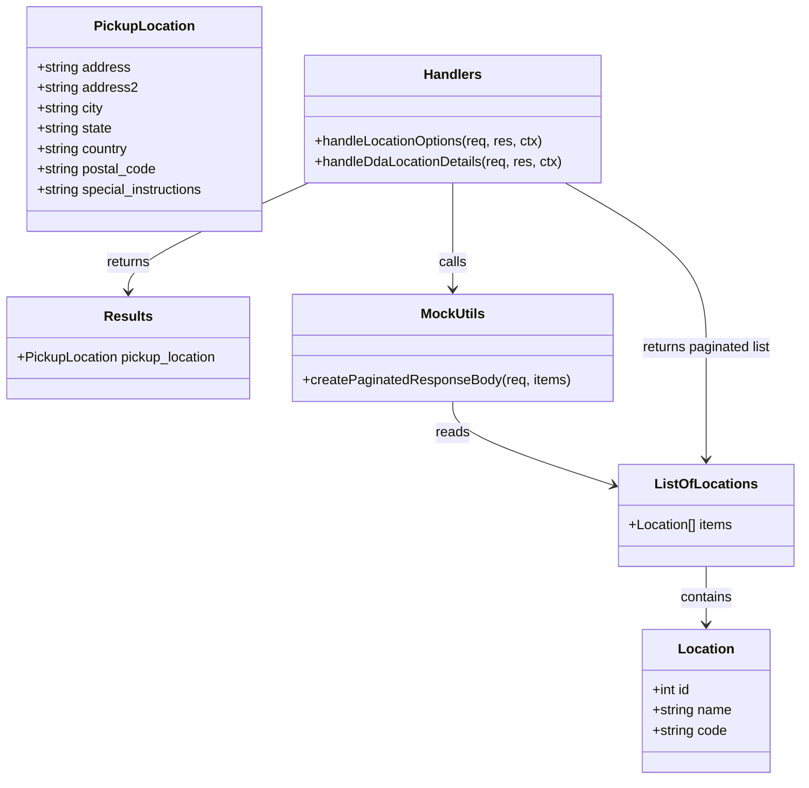

# Diagram: web/portal/src/mocks/handlers/location/location.js


> Auto-generated by Obscura crawlers

## Diagram 1

```mermaid
flowchart LR
  Client[Client] -->|GET /location/locations| HLOC[handleLocationOptions\n(rest.get → /location/locations)]
  HLOC --> CPB[createPaginatedResponseBody(req, listOfLocations)]
  LIST[listOfLocations\n(array of Location)] --> CPB
  CPB --> RESP1[ctx.status(200) / ctx.json(paginatedBody)]
  RESP1 --> Client

  Client -->|GET /dda/dda/get-dpu-pickup-location| DDAH[handleDdaLocationDetails\n(rest.get → /dda/dda/get-dpu-pickup-location)]
  RESULTS[results.pickup_location\n(PickupLocation object)] --> DDAH
  DDAH --> RESP2[ctx.status(200) / ctx.json(results)]
  RESP2 --> Client
```

> SVG rendering failed for this diagram.

## Diagram 2



### SVG

<svg id="container" width="944.55859375" xmlns="http://www.w3.org/2000/svg" class="classDiagram" height="916" viewBox="0 0 944.55859375 916" role="graphics-document document" aria-roledescription="class"><style>#container{font-family:"trebuchet ms",verdana,arial,sans-serif;font-size:16px;fill:#333;}@keyframes edge-animation-frame{from{stroke-dashoffset:0;}}@keyframes dash{to{stroke-dashoffset:0;}}#container .edge-animation-slow{stroke-dasharray:9,5!important;stroke-dashoffset:900;animation:dash 50s linear infinite;stroke-linecap:round;}#container .edge-animation-fast{stroke-dasharray:9,5!important;stroke-dashoffset:900;animation:dash 20s linear infinite;stroke-linecap:round;}#container .error-icon{fill:#552222;}#container .error-text{fill:#552222;stroke:#552222;}#container .edge-thickness-normal{stroke-width:1px;}#container .edge-thickness-thick{stroke-width:3.5px;}#container .edge-pattern-solid{stroke-dasharray:0;}#container .edge-thickness-invisible{stroke-width:0;fill:none;}#container .edge-pattern-dashed{stroke-dasharray:3;}#container .edge-pattern-dotted{stroke-dasharray:2;}#container .marker{fill:#333333;stroke:#333333;}#container .marker.cross{stroke:#333333;}#container svg{font-family:"trebuchet ms",verdana,arial,sans-serif;font-size:16px;}#container p{margin:0;}#container g.classGroup text{fill:#9370DB;stroke:none;font-family:"trebuchet ms",verdana,arial,sans-serif;font-size:10px;}#container g.classGroup text .title{font-weight:bolder;}#container .nodeLabel,#container .edgeLabel{color:#131300;}#container .edgeLabel .label rect{fill:#ECECFF;}#container .label text{fill:#131300;}#container .labelBkg{background:#ECECFF;}#container .edgeLabel .label span{background:#ECECFF;}#container .classTitle{font-weight:bolder;}#container .node rect,#container .node circle,#container .node ellipse,#container .node polygon,#container .node path{fill:#ECECFF;stroke:#9370DB;stroke-width:1px;}#container .divider{stroke:#9370DB;stroke-width:1;}#container g.clickable{cursor:pointer;}#container g.classGroup rect{fill:#ECECFF;stroke:#9370DB;}#container g.classGroup line{stroke:#9370DB;stroke-width:1;}#container .classLabel .box{stroke:none;stroke-width:0;fill:#ECECFF;opacity:0.5;}#container .classLabel .label{fill:#9370DB;font-size:10px;}#container .relation{stroke:#333333;stroke-width:1;fill:none;}#container .dashed-line{stroke-dasharray:3;}#container .dotted-line{stroke-dasharray:1 2;}#container #compositionStart,#container .composition{fill:#333333!important;stroke:#333333!important;stroke-width:1;}#container #compositionEnd,#container .composition{fill:#333333!important;stroke:#333333!important;stroke-width:1;}#container #dependencyStart,#container .dependency{fill:#333333!important;stroke:#333333!important;stroke-width:1;}#container #dependencyStart,#container .dependency{fill:#333333!important;stroke:#333333!important;stroke-width:1;}#container #extensionStart,#container .extension{fill:transparent!important;stroke:#333333!important;stroke-width:1;}#container #extensionEnd,#container .extension{fill:transparent!important;stroke:#333333!important;stroke-width:1;}#container #aggregationStart,#container .aggregation{fill:transparent!important;stroke:#333333!important;stroke-width:1;}#container #aggregationEnd,#container .aggregation{fill:transparent!important;stroke:#333333!important;stroke-width:1;}#container #lollipopStart,#container .lollipop{fill:#ECECFF!important;stroke:#333333!important;stroke-width:1;}#container #lollipopEnd,#container .lollipop{fill:#ECECFF!important;stroke:#333333!important;stroke-width:1;}#container .edgeTerminals{font-size:11px;line-height:initial;}#container .classTitleText{text-anchor:middle;font-size:18px;fill:#333;}#container .label-icon{display:inline-block;height:1em;overflow:visible;vertical-align:-0.125em;}#container .node .label-icon path{fill:currentColor;stroke:revert;stroke-width:revert;}#container :root{--mermaid-font-family:"trebuchet ms",verdana,arial,sans-serif;}</style><g><defs><marker id="container_class-aggregationStart" class="marker aggregation class" refX="18" refY="7" markerWidth="190" markerHeight="240" orient="auto"><path d="M 18,7 L9,13 L1,7 L9,1 Z"></path></marker></defs><defs><marker id="container_class-aggregationEnd" class="marker aggregation class" refX="1" refY="7" markerWidth="20" markerHeight="28" orient="auto"><path d="M 18,7 L9,13 L1,7 L9,1 Z"></path></marker></defs><defs><marker id="container_class-extensionStart" class="marker extension class" refX="18" refY="7" markerWidth="190" markerHeight="240" orient="auto"><path d="M 1,7 L18,13 V 1 Z"></path></marker></defs><defs><marker id="container_class-extensionEnd" class="marker extension class" refX="1" refY="7" markerWidth="20" markerHeight="28" orient="auto"><path d="M 1,1 V 13 L18,7 Z"></path></marker></defs><defs><marker id="container_class-compositionStart" class="marker composition class" refX="18" refY="7" markerWidth="190" markerHeight="240" orient="auto"><path d="M 18,7 L9,13 L1,7 L9,1 Z"></path></marker></defs><defs><marker id="container_class-compositionEnd" class="marker composition class" refX="1" refY="7" markerWidth="20" markerHeight="28" orient="auto"><path d="M 18,7 L9,13 L1,7 L9,1 Z"></path></marker></defs><defs><marker id="container_class-dependencyStart" class="marker dependency class" refX="6" refY="7" markerWidth="190" markerHeight="240" orient="auto"><path d="M 5,7 L9,13 L1,7 L9,1 Z"></path></marker></defs><defs><marker id="container_class-dependencyEnd" class="marker dependency class" refX="13" refY="7" markerWidth="20" markerHeight="28" orient="auto"><path d="M 18,7 L9,13 L14,7 L9,1 Z"></path></marker></defs><defs><marker id="container_class-lollipopStart" class="marker lollipop class" refX="13" refY="7" markerWidth="190" markerHeight="240" orient="auto"><circle stroke="black" fill="transparent" cx="7" cy="7" r="6"></circle></marker></defs><defs><marker id="container_class-lollipopEnd" class="marker lollipop class" refX="1" refY="7" markerWidth="190" markerHeight="240" orient="auto"><circle stroke="black" fill="transparent" cx="7" cy="7" r="6"></circle></marker></defs><g class="root"><g class="clusters"></g><g class="edgePaths"><path d="M833.813,666L833.813,672.167C833.813,678.333,833.813,690.667,833.813,702C833.813,713.333,833.813,723.667,833.813,728.833L833.813,734" id="id_ListOfLocations_Location_1" class="edge-thickness-normal edge-pattern-solid relation" style=";;;" data-edge="true" data-et="edge" data-id="id_ListOfLocations_Location_1" data-points="W3sieCI6ODMzLjgxMjUsInkiOjY2Nn0seyJ4Ijo4MzMuODEyNSwieSI6NzAzfSx7IngiOjgzMy44MTI1LCJ5Ijo3NDB9XQ==" marker-end="url(#container_class-dependencyEnd)"></path><path d="M534.012,472L534.012,478.167C534.012,484.333,534.012,496.667,565.903,513.152C597.794,529.637,661.576,550.273,693.467,560.591L725.358,570.91" id="id_MockUtils_ListOfLocations_2" class="edge-thickness-normal edge-pattern-solid relation" style=";;;" data-edge="true" data-et="edge" data-id="id_MockUtils_ListOfLocations_2" data-points="W3sieCI6NTM0LjAxMTcxODc1LCJ5Ijo0NzJ9LHsieCI6NTM0LjAxMTcxODc1LCJ5Ijo1MDl9LHsieCI6NzMxLjA2NjQwNjI1LCJ5Ijo1NzIuNzU2Njg3MzgzNTQ5fV0=" marker-end="url(#container_class-dependencyEnd)"></path><path d="M534.012,215L534.012,230.667C534.012,246.333,534.012,277.667,534.012,298.5C534.012,319.333,534.012,329.667,534.012,334.833L534.012,340" id="id_Handlers_MockUtils_3" class="edge-thickness-normal edge-pattern-solid relation" style=";;;" data-edge="true" data-et="edge" data-id="id_Handlers_MockUtils_3" data-points="W3sieCI6NTM0LjAxMTcxODc1LCJ5IjoyMTV9LHsieCI6NTM0LjAxMTcxODc1LCJ5IjozMDl9LHsieCI6NTM0LjAxMTcxODc1LCJ5IjozNDZ9XQ==" marker-end="url(#container_class-dependencyEnd)"></path><path d="M364.759,215L329.404,230.667C294.049,246.333,223.339,277.667,187.984,299C152.629,320.333,152.629,331.667,152.629,337.333L152.629,343" id="id_Handlers_Results_4" class="edge-thickness-normal edge-pattern-solid relation" style=";;;" data-edge="true" data-et="edge" data-id="id_Handlers_Results_4" data-points="W3sieCI6MzY0Ljc1ODk5MTMwOTE3MTYsInkiOjIxNX0seyJ4IjoxNTIuNjI4OTA2MjUsInkiOjMwOX0seyJ4IjoxNTIuNjI4OTA2MjUsInkiOjM0OX1d" marker-end="url(#container_class-dependencyEnd)"></path><path d="M667.059,215L694.852,230.667C722.644,246.333,778.228,277.667,806.02,310C833.813,342.333,833.813,375.667,833.813,409C833.813,442.333,833.813,475.667,833.813,497.5C833.813,519.333,833.813,529.667,833.813,534.833L833.813,540" id="id_Handlers_ListOfLocations_5" class="edge-thickness-normal edge-pattern-solid relation" style=";;;" data-edge="true" data-et="edge" data-id="id_Handlers_ListOfLocations_5" data-points="W3sieCI6NjY3LjA1OTQwMjczNjY4NjQsInkiOjIxNX0seyJ4Ijo4MzMuODEyNSwieSI6MzA5fSx7IngiOjgzMy44MTI1LCJ5Ijo0MDl9LHsieCI6ODMzLjgxMjUsInkiOjUwOX0seyJ4Ijo4MzMuODEyNSwieSI6NTQ2fV0=" marker-end="url(#container_class-dependencyEnd)"></path></g><g class="edgeLabels"><g class="edgeLabel" transform="translate(833.8125, 703)"><g class="label" data-id="id_ListOfLocations_Location_1" transform="translate(-30.890625, -12)"><foreignObject width="61.78125" height="24"><div xmlns="http://www.w3.org/1999/xhtml" class="labelBkg" style="display: table-cell; white-space: nowrap; line-height: 1.5; max-width: 200px; text-align: center;"><span class="edgeLabel"><p>contains</p></span></div></foreignObject></g></g><g class="edgeLabel" transform="translate(534.01171875, 509)"><g class="label" data-id="id_MockUtils_ListOfLocations_2" transform="translate(-20.0078125, -12)"><foreignObject width="40.015625" height="24"><div xmlns="http://www.w3.org/1999/xhtml" class="labelBkg" style="display: table-cell; white-space: nowrap; line-height: 1.5; max-width: 200px; text-align: center;"><span class="edgeLabel"><p>reads</p></span></div></foreignObject></g></g><g class="edgeLabel" transform="translate(534.01171875, 309)"><g class="label" data-id="id_Handlers_MockUtils_3" transform="translate(-16.4453125, -12)"><foreignObject width="32.890625" height="24"><div xmlns="http://www.w3.org/1999/xhtml" class="labelBkg" style="display: table-cell; white-space: nowrap; line-height: 1.5; max-width: 200px; text-align: center;"><span class="edgeLabel"><p>calls</p></span></div></foreignObject></g></g><g class="edgeLabel" transform="translate(152.62890625, 309)"><g class="label" data-id="id_Handlers_Results_4" transform="translate(-26.265625, -12)"><foreignObject width="52.53125" height="24"><div xmlns="http://www.w3.org/1999/xhtml" class="labelBkg" style="display: table-cell; white-space: nowrap; line-height: 1.5; max-width: 200px; text-align: center;"><span class="edgeLabel"><p>returns</p></span></div></foreignObject></g></g><g class="edgeLabel" transform="translate(833.8125, 409)"><g class="label" data-id="id_Handlers_ListOfLocations_5" transform="translate(-78.046875, -12)"><foreignObject width="156.09375" height="24"><div xmlns="http://www.w3.org/1999/xhtml" class="labelBkg" style="display: table-cell; white-space: nowrap; line-height: 1.5; max-width: 200px; text-align: center;"><span class="edgeLabel"><p>returns paginated list</p></span></div></foreignObject></g></g></g><g class="nodes"><g class="node default" id="classId-Location-0" transform="translate(833.8125, 824)"><g class="basic label-container"><path d="M-74.86328125 -84 L74.86328125 -84 L74.86328125 84 L-74.86328125 84" stroke="none" stroke-width="0" fill="#ECECFF" style=""></path><path d="M-74.86328125 -84 C-36.48094815747419 -84, 1.9013849350516239 -84, 74.86328125 -84 M-74.86328125 -84 C-39.76782882657892 -84, -4.672376403157841 -84, 74.86328125 -84 M74.86328125 -84 C74.86328125 -38.3906059554907, 74.86328125 7.218788089018602, 74.86328125 84 M74.86328125 -84 C74.86328125 -20.43972076026241, 74.86328125 43.12055847947518, 74.86328125 84 M74.86328125 84 C17.9375542432672 84, -38.9881727634656 84, -74.86328125 84 M74.86328125 84 C25.024761571962678 84, -24.813758106074644 84, -74.86328125 84 M-74.86328125 84 C-74.86328125 17.9038009891745, -74.86328125 -48.192398021651, -74.86328125 -84 M-74.86328125 84 C-74.86328125 35.54169792383853, -74.86328125 -12.916604152322947, -74.86328125 -84" stroke="#9370DB" stroke-width="1.3" fill="none" stroke-dasharray="0 0" style=""></path></g><g class="annotation-group text" transform="translate(0, -60)"></g><g class="label-group text" transform="translate(-31.3515625, -60)"><g class="label" style="font-weight: bolder" transform="translate(0,-12)"><foreignObject width="62.703125" height="24"><div xmlns="http://www.w3.org/1999/xhtml" style="display: table-cell; white-space: nowrap; line-height: 1.5; max-width: 112px; text-align: center;"><span class="nodeLabel markdown-node-label" style=""><p>Location</p></span></div></foreignObject></g></g><g class="members-group text" transform="translate(-62.86328125, -12)"><g class="label" style="" transform="translate(0,-12)"><foreignObject width="45.96875" height="24"><div xmlns="http://www.w3.org/1999/xhtml" style="display: table-cell; white-space: nowrap; line-height: 1.5; max-width: 103px; text-align: center;"><span class="nodeLabel markdown-node-label" style=""><p>+int id</p></span></div></foreignObject></g><g class="label" style="" transform="translate(0,12)"><foreignObject width="94.375" height="24"><div xmlns="http://www.w3.org/1999/xhtml" style="display: table-cell; white-space: nowrap; line-height: 1.5; max-width: 152px; text-align: center;"><span class="nodeLabel markdown-node-label" style=""><p>+string name</p></span></div></foreignObject></g><g class="label" style="" transform="translate(0,36)"><foreignObject width="88.828125" height="24"><div xmlns="http://www.w3.org/1999/xhtml" style="display: table-cell; white-space: nowrap; line-height: 1.5; max-width: 146px; text-align: center;"><span class="nodeLabel markdown-node-label" style=""><p>+string code</p></span></div></foreignObject></g></g><g class="methods-group text" transform="translate(-62.86328125, 84)"></g><g class="divider" style=""><path d="M-74.86328125 -36 C-41.785751139067635 -36, -8.70822102813527 -36, 74.86328125 -36 M-74.86328125 -36 C-30.0332686684349 -36, 14.7967439131302 -36, 74.86328125 -36" stroke="#9370DB" stroke-width="1.3" fill="none" stroke-dasharray="0 0" style=""></path></g><g class="divider" style=""><path d="M-74.86328125 60 C-32.942384772711996 60, 8.978511704576007 60, 74.86328125 60 M-74.86328125 60 C-23.809035952074048 60, 27.245209345851904 60, 74.86328125 60" stroke="#9370DB" stroke-width="1.3" fill="none" stroke-dasharray="0 0" style=""></path></g></g><g class="node default" id="classId-PickupLocation-1" transform="translate(169.2578125, 140)"><g class="basic label-container"><path d="M-139.98046875 -132 L139.98046875 -132 L139.98046875 132 L-139.98046875 132" stroke="none" stroke-width="0" fill="#ECECFF" style=""></path><path d="M-139.98046875 -132 C-56.007294202204505 -132, 27.96588034559099 -132, 139.98046875 -132 M-139.98046875 -132 C-48.68602865549961 -132, 42.608411439000776 -132, 139.98046875 -132 M139.98046875 -132 C139.98046875 -41.834252485919194, 139.98046875 48.33149502816161, 139.98046875 132 M139.98046875 -132 C139.98046875 -77.46834176584076, 139.98046875 -22.93668353168154, 139.98046875 132 M139.98046875 132 C52.150089207174545 132, -35.68029033565091 132, -139.98046875 132 M139.98046875 132 C81.62196943740875 132, 23.263470124817488 132, -139.98046875 132 M-139.98046875 132 C-139.98046875 26.909253781617167, -139.98046875 -78.18149243676567, -139.98046875 -132 M-139.98046875 132 C-139.98046875 46.69923177528965, -139.98046875 -38.601536449420706, -139.98046875 -132" stroke="#9370DB" stroke-width="1.3" fill="none" stroke-dasharray="0 0" style=""></path></g><g class="annotation-group text" transform="translate(0, -108)"></g><g class="label-group text" transform="translate(-55.9296875, -108)"><g class="label" style="font-weight: bolder" transform="translate(0,-12)"><foreignObject width="111.859375" height="24"><div xmlns="http://www.w3.org/1999/xhtml" style="display: table-cell; white-space: nowrap; line-height: 1.5; max-width: 160px; text-align: center;"><span class="nodeLabel markdown-node-label" style=""><p>PickupLocation</p></span></div></foreignObject></g></g><g class="members-group text" transform="translate(-127.98046875, -60)"><g class="label" style="" transform="translate(0,-12)"><foreignObject width="110.90625" height="24"><div xmlns="http://www.w3.org/1999/xhtml" style="display: table-cell; white-space: nowrap; line-height: 1.5; max-width: 168px; text-align: center;"><span class="nodeLabel markdown-node-label" style=""><p>+string address</p></span></div></foreignObject></g><g class="label" style="" transform="translate(0,12)"><foreignObject width="118.65625" height="24"><div xmlns="http://www.w3.org/1999/xhtml" style="display: table-cell; white-space: nowrap; line-height: 1.5; max-width: 176px; text-align: center;"><span class="nodeLabel markdown-node-label" style=""><p>+string address2</p></span></div></foreignObject></g><g class="label" style="" transform="translate(0,36)"><foreignObject width="79.59375" height="24"><div xmlns="http://www.w3.org/1999/xhtml" style="display: table-cell; white-space: nowrap; line-height: 1.5; max-width: 137px; text-align: center;"><span class="nodeLabel markdown-node-label" style=""><p>+string city</p></span></div></foreignObject></g><g class="label" style="" transform="translate(0,60)"><foreignObject width="89.953125" height="24"><div xmlns="http://www.w3.org/1999/xhtml" style="display: table-cell; white-space: nowrap; line-height: 1.5; max-width: 147px; text-align: center;"><span class="nodeLabel markdown-node-label" style=""><p>+string state</p></span></div></foreignObject></g><g class="label" style="" transform="translate(0,84)"><foreignObject width="109.046875" height="24"><div xmlns="http://www.w3.org/1999/xhtml" style="display: table-cell; white-space: nowrap; line-height: 1.5; max-width: 167px; text-align: center;"><span class="nodeLabel markdown-node-label" style=""><p>+string country</p></span></div></foreignObject></g><g class="label" style="" transform="translate(0,108)"><foreignObject width="142.046875" height="24"><div xmlns="http://www.w3.org/1999/xhtml" style="display: table-cell; white-space: nowrap; line-height: 1.5; max-width: 199px; text-align: center;"><span class="nodeLabel markdown-node-label" style=""><p>+string postal_code</p></span></div></foreignObject></g><g class="label" style="" transform="translate(0,132)"><foreignObject width="200.03125" height="24"><div xmlns="http://www.w3.org/1999/xhtml" style="display: table-cell; white-space: nowrap; line-height: 1.5; max-width: 257px; text-align: center;"><span class="nodeLabel markdown-node-label" style=""><p>+string special_instructions</p></span></div></foreignObject></g></g><g class="methods-group text" transform="translate(-127.98046875, 132)"></g><g class="divider" style=""><path d="M-139.98046875 -84 C-37.63117024059822 -84, 64.71812826880355 -84, 139.98046875 -84 M-139.98046875 -84 C-61.74248485459621 -84, 16.495499040807573 -84, 139.98046875 -84" stroke="#9370DB" stroke-width="1.3" fill="none" stroke-dasharray="0 0" style=""></path></g><g class="divider" style=""><path d="M-139.98046875 108 C-66.03406596382744 108, 7.912336822345111 108, 139.98046875 108 M-139.98046875 108 C-74.89250192888947 108, -9.804535107778946 108, 139.98046875 108" stroke="#9370DB" stroke-width="1.3" fill="none" stroke-dasharray="0 0" style=""></path></g></g><g class="node default" id="classId-Results-2" transform="translate(152.62890625, 409)"><g class="basic label-container"><path d="M-144.62890625 -60 L144.62890625 -60 L144.62890625 60 L-144.62890625 60" stroke="none" stroke-width="0" fill="#ECECFF" style=""></path><path d="M-144.62890625 -60 C-66.7997459920238 -60, 11.029414265952397 -60, 144.62890625 -60 M-144.62890625 -60 C-47.93337326382968 -60, 48.76215972234064 -60, 144.62890625 -60 M144.62890625 -60 C144.62890625 -21.803553099332383, 144.62890625 16.392893801335234, 144.62890625 60 M144.62890625 -60 C144.62890625 -33.773234807766336, 144.62890625 -7.546469615532672, 144.62890625 60 M144.62890625 60 C58.125462302411435 60, -28.37798164517713 60, -144.62890625 60 M144.62890625 60 C76.28167390201155 60, 7.9344415540230955 60, -144.62890625 60 M-144.62890625 60 C-144.62890625 23.599348920742635, -144.62890625 -12.80130215851473, -144.62890625 -60 M-144.62890625 60 C-144.62890625 25.362748130286924, -144.62890625 -9.274503739426152, -144.62890625 -60" stroke="#9370DB" stroke-width="1.3" fill="none" stroke-dasharray="0 0" style=""></path></g><g class="annotation-group text" transform="translate(0, -36)"></g><g class="label-group text" transform="translate(-27.0078125, -36)"><g class="label" style="font-weight: bolder" transform="translate(0,-12)"><foreignObject width="54.015625" height="24"><div xmlns="http://www.w3.org/1999/xhtml" style="display: table-cell; white-space: nowrap; line-height: 1.5; max-width: 103px; text-align: center;"><span class="nodeLabel markdown-node-label" style=""><p>Results</p></span></div></foreignObject></g></g><g class="members-group text" transform="translate(-132.62890625, 12)"><g class="label" style="" transform="translate(0,-12)"><foreignObject width="238.25" height="24"><div xmlns="http://www.w3.org/1999/xhtml" style="display: table-cell; white-space: nowrap; line-height: 1.5; max-width: 296px; text-align: center;"><span class="nodeLabel markdown-node-label" style=""><p>+PickupLocation pickup_location</p></span></div></foreignObject></g></g><g class="methods-group text" transform="translate(-132.62890625, 60)"></g><g class="divider" style=""><path d="M-144.62890625 -12 C-84.6493692291817 -12, -24.669832208363417 -12, 144.62890625 -12 M-144.62890625 -12 C-46.381639192442776 -12, 51.86562786511445 -12, 144.62890625 -12" stroke="#9370DB" stroke-width="1.3" fill="none" stroke-dasharray="0 0" style=""></path></g><g class="divider" style=""><path d="M-144.62890625 36 C-63.09116531441225 36, 18.446575621175498 36, 144.62890625 36 M-144.62890625 36 C-40.30782949003691 36, 64.01324726992618 36, 144.62890625 36" stroke="#9370DB" stroke-width="1.3" fill="none" stroke-dasharray="0 0" style=""></path></g></g><g class="node default" id="classId-MockUtils-3" transform="translate(534.01171875, 409)"><g class="basic label-container"><path d="M-186.75390625 -63 L186.75390625 -63 L186.75390625 63 L-186.75390625 63" stroke="none" stroke-width="0" fill="#ECECFF" style=""></path><path d="M-186.75390625 -63 C-90.53750191920912 -63, 5.67890241158176 -63, 186.75390625 -63 M-186.75390625 -63 C-43.76077778082666 -63, 99.23235068834668 -63, 186.75390625 -63 M186.75390625 -63 C186.75390625 -26.303403051645432, 186.75390625 10.393193896709136, 186.75390625 63 M186.75390625 -63 C186.75390625 -24.090107598430443, 186.75390625 14.819784803139115, 186.75390625 63 M186.75390625 63 C41.764096877426624 63, -103.22571249514675 63, -186.75390625 63 M186.75390625 63 C94.38915279986477 63, 2.024399349729549 63, -186.75390625 63 M-186.75390625 63 C-186.75390625 15.914166137227305, -186.75390625 -31.17166772554539, -186.75390625 -63 M-186.75390625 63 C-186.75390625 28.496748922602613, -186.75390625 -6.006502154794774, -186.75390625 -63" stroke="#9370DB" stroke-width="1.3" fill="none" stroke-dasharray="0 0" style=""></path></g><g class="annotation-group text" transform="translate(0, -39)"></g><g class="label-group text" transform="translate(-36.0078125, -39)"><g class="label" style="font-weight: bolder" transform="translate(0,-12)"><foreignObject width="72.015625" height="24"><div xmlns="http://www.w3.org/1999/xhtml" style="display: table-cell; white-space: nowrap; line-height: 1.5; max-width: 121px; text-align: center;"><span class="nodeLabel markdown-node-label" style=""><p>MockUtils</p></span></div></foreignObject></g></g><g class="members-group text" transform="translate(-174.75390625, 9)"></g><g class="methods-group text" transform="translate(-174.75390625, 39)"><g class="label" style="" transform="translate(0,-12)"><foreignObject width="313.5" height="24"><div xmlns="http://www.w3.org/1999/xhtml" style="display: table-cell; white-space: nowrap; line-height: 1.5; max-width: 371px; text-align: center;"><span class="nodeLabel markdown-node-label" style=""><p>+createPaginatedResponseBody(req, items)</p></span></div></foreignObject></g></g><g class="divider" style=""><path d="M-186.75390625 -15 C-56.869349036252004 -15, 73.01520817749599 -15, 186.75390625 -15 M-186.75390625 -15 C-100.03076778137817 -15, -13.307629312756347 -15, 186.75390625 -15" stroke="#9370DB" stroke-width="1.3" fill="none" stroke-dasharray="0 0" style=""></path></g><g class="divider" style=""><path d="M-186.75390625 9 C-52.27648395071864 9, 82.20093834856272 9, 186.75390625 9 M-186.75390625 9 C-83.37849132792587 9, 19.996923594148257 9, 186.75390625 9" stroke="#9370DB" stroke-width="1.3" fill="none" stroke-dasharray="0 0" style=""></path></g></g><g class="node default" id="classId-ListOfLocations-4" transform="translate(833.8125, 606)"><g class="basic label-container"><path d="M-102.74609375 -60 L102.74609375 -60 L102.74609375 60 L-102.74609375 60" stroke="none" stroke-width="0" fill="#ECECFF" style=""></path><path d="M-102.74609375 -60 C-52.08251373444237 -60, -1.4189337188847446 -60, 102.74609375 -60 M-102.74609375 -60 C-24.26392461788059 -60, 54.21824451423882 -60, 102.74609375 -60 M102.74609375 -60 C102.74609375 -16.661218061757822, 102.74609375 26.677563876484356, 102.74609375 60 M102.74609375 -60 C102.74609375 -31.94991454989719, 102.74609375 -3.899829099794381, 102.74609375 60 M102.74609375 60 C33.378368113520324 60, -35.98935752295935 60, -102.74609375 60 M102.74609375 60 C55.40783187089945 60, 8.0695699917989 60, -102.74609375 60 M-102.74609375 60 C-102.74609375 13.377770713792565, -102.74609375 -33.24445857241487, -102.74609375 -60 M-102.74609375 60 C-102.74609375 15.917971584698869, -102.74609375 -28.164056830602263, -102.74609375 -60" stroke="#9370DB" stroke-width="1.3" fill="none" stroke-dasharray="0 0" style=""></path></g><g class="annotation-group text" transform="translate(0, -36)"></g><g class="label-group text" transform="translate(-56.8984375, -36)"><g class="label" style="font-weight: bolder" transform="translate(0,-12)"><foreignObject width="113.796875" height="24"><div xmlns="http://www.w3.org/1999/xhtml" style="display: table-cell; white-space: nowrap; line-height: 1.5; max-width: 162px; text-align: center;"><span class="nodeLabel markdown-node-label" style=""><p>ListOfLocations</p></span></div></foreignObject></g></g><g class="members-group text" transform="translate(-90.74609375, 12)"><g class="label" style="" transform="translate(0,-12)"><foreignObject width="124.59375" height="24"><div xmlns="http://www.w3.org/1999/xhtml" style="display: table-cell; white-space: nowrap; line-height: 1.5; max-width: 182px; text-align: center;"><span class="nodeLabel markdown-node-label" style=""><p>+Location[] items</p></span></div></foreignObject></g></g><g class="methods-group text" transform="translate(-90.74609375, 60)"></g><g class="divider" style=""><path d="M-102.74609375 -12 C-59.81416675283222 -12, -16.882239755664443 -12, 102.74609375 -12 M-102.74609375 -12 C-40.0771564462723 -12, 22.591780857455404 -12, 102.74609375 -12" stroke="#9370DB" stroke-width="1.3" fill="none" stroke-dasharray="0 0" style=""></path></g><g class="divider" style=""><path d="M-102.74609375 36 C-48.44552132184193 36, 5.8550511063161395 36, 102.74609375 36 M-102.74609375 36 C-45.65057930697365 36, 11.444935136052706 36, 102.74609375 36" stroke="#9370DB" stroke-width="1.3" fill="none" stroke-dasharray="0 0" style=""></path></g></g><g class="node default" id="classId-Handlers-5" transform="translate(534.01171875, 140)"><g class="basic label-container"><path d="M-174.7734375 -75 L174.7734375 -75 L174.7734375 75 L-174.7734375 75" stroke="none" stroke-width="0" fill="#ECECFF" style=""></path><path d="M-174.7734375 -75 C-60.425953233065854 -75, 53.92153103386829 -75, 174.7734375 -75 M-174.7734375 -75 C-49.441483580626965 -75, 75.89047033874607 -75, 174.7734375 -75 M174.7734375 -75 C174.7734375 -39.437995124868685, 174.7734375 -3.87599024973737, 174.7734375 75 M174.7734375 -75 C174.7734375 -18.695709962324116, 174.7734375 37.60858007535177, 174.7734375 75 M174.7734375 75 C35.04941606493935 75, -104.6746053701213 75, -174.7734375 75 M174.7734375 75 C99.30549985375661 75, 23.83756220751323 75, -174.7734375 75 M-174.7734375 75 C-174.7734375 31.661745935044465, -174.7734375 -11.67650812991107, -174.7734375 -75 M-174.7734375 75 C-174.7734375 39.50440815967421, -174.7734375 4.008816319348426, -174.7734375 -75" stroke="#9370DB" stroke-width="1.3" fill="none" stroke-dasharray="0 0" style=""></path></g><g class="annotation-group text" transform="translate(0, -51)"></g><g class="label-group text" transform="translate(-32.859375, -51)"><g class="label" style="font-weight: bolder" transform="translate(0,-12)"><foreignObject width="65.71875" height="24"><div xmlns="http://www.w3.org/1999/xhtml" style="display: table-cell; white-space: nowrap; line-height: 1.5; max-width: 115px; text-align: center;"><span class="nodeLabel markdown-node-label" style=""><p>Handlers</p></span></div></foreignObject></g></g><g class="members-group text" transform="translate(-162.7734375, -3)"></g><g class="methods-group text" transform="translate(-162.7734375, 27)"><g class="label" style="" transform="translate(0,-12)"><foreignObject width="271.09375" height="24"><div xmlns="http://www.w3.org/1999/xhtml" style="display: table-cell; white-space: nowrap; line-height: 1.5; max-width: 328px; text-align: center;"><span class="nodeLabel markdown-node-label" style=""><p>+handleLocationOptions(req, res, ctx)</p></span></div></foreignObject></g><g class="label" style="" transform="translate(0,12)"><foreignObject width="292.6875" height="24"><div xmlns="http://www.w3.org/1999/xhtml" style="display: table-cell; white-space: nowrap; line-height: 1.5; max-width: 350px; text-align: center;"><span class="nodeLabel markdown-node-label" style=""><p>+handleDdaLocationDetails(req, res, ctx)</p></span></div></foreignObject></g></g><g class="divider" style=""><path d="M-174.7734375 -27 C-84.74245978172071 -27, 5.288517936558577 -27, 174.7734375 -27 M-174.7734375 -27 C-90.56824555993221 -27, -6.3630536198644165 -27, 174.7734375 -27" stroke="#9370DB" stroke-width="1.3" fill="none" stroke-dasharray="0 0" style=""></path></g><g class="divider" style=""><path d="M-174.7734375 -3 C-77.3600681386242 -3, 20.0533012227516 -3, 174.7734375 -3 M-174.7734375 -3 C-61.39824190853594 -3, 51.97695368292813 -3, 174.7734375 -3" stroke="#9370DB" stroke-width="1.3" fill="none" stroke-dasharray="0 0" style=""></path></g></g></g></g></g></svg>
