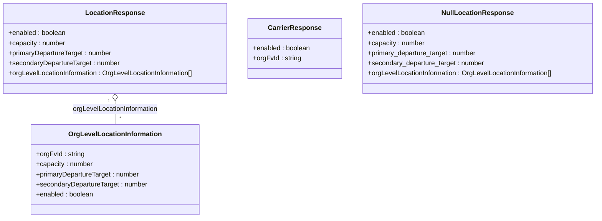

# Diagram: web/portal/src/mocks/handlers/location/locations/locationId/feature/INV/data.js


> Auto-generated by Obscura crawlers

## Diagram 1

```mermaid
flowchart LR
  Client[Client] -->|GET /entity-inventory/location-information/:locationId| H1((handleInventoryLocation))
  H1 -->|200 JSON| S1[responseBody]
  H1 -->|200 JSON| N1[nullResponse]
  H1 -->|403 / Timeout| E1[error (403)]
  H1 -->|delay 1s| D1[delayed 200]
  Client -->|GET /entity-inventory/location-information/:locationId/organization/:orgFvId| H2((handleInventoryLocationForCarriers))
  H2 -->|200 JSON| S2[responseBody (carrier)]
  H2 -->|200 JSON| N2[nullResponse]
  H2 -->|403 / Timeout| E2[error (403)]
  H2 -->|delay 1s| D2[delayed 200]
```

> SVG rendering failed for this diagram.

## Diagram 2



### SVG

<svg id="container" width="1438.0546875" xmlns="http://www.w3.org/2000/svg" class="classDiagram" height="522" viewBox="0 0 1438.0546875 522" role="graphics-document document" aria-roledescription="class"><style>#container{font-family:"trebuchet ms",verdana,arial,sans-serif;font-size:16px;fill:#333;}@keyframes edge-animation-frame{from{stroke-dashoffset:0;}}@keyframes dash{to{stroke-dashoffset:0;}}#container .edge-animation-slow{stroke-dasharray:9,5!important;stroke-dashoffset:900;animation:dash 50s linear infinite;stroke-linecap:round;}#container .edge-animation-fast{stroke-dasharray:9,5!important;stroke-dashoffset:900;animation:dash 20s linear infinite;stroke-linecap:round;}#container .error-icon{fill:#552222;}#container .error-text{fill:#552222;stroke:#552222;}#container .edge-thickness-normal{stroke-width:1px;}#container .edge-thickness-thick{stroke-width:3.5px;}#container .edge-pattern-solid{stroke-dasharray:0;}#container .edge-thickness-invisible{stroke-width:0;fill:none;}#container .edge-pattern-dashed{stroke-dasharray:3;}#container .edge-pattern-dotted{stroke-dasharray:2;}#container .marker{fill:#333333;stroke:#333333;}#container .marker.cross{stroke:#333333;}#container svg{font-family:"trebuchet ms",verdana,arial,sans-serif;font-size:16px;}#container p{margin:0;}#container g.classGroup text{fill:#9370DB;stroke:none;font-family:"trebuchet ms",verdana,arial,sans-serif;font-size:10px;}#container g.classGroup text .title{font-weight:bolder;}#container .nodeLabel,#container .edgeLabel{color:#131300;}#container .edgeLabel .label rect{fill:#ECECFF;}#container .label text{fill:#131300;}#container .labelBkg{background:#ECECFF;}#container .edgeLabel .label span{background:#ECECFF;}#container .classTitle{font-weight:bolder;}#container .node rect,#container .node circle,#container .node ellipse,#container .node polygon,#container .node path{fill:#ECECFF;stroke:#9370DB;stroke-width:1px;}#container .divider{stroke:#9370DB;stroke-width:1;}#container g.clickable{cursor:pointer;}#container g.classGroup rect{fill:#ECECFF;stroke:#9370DB;}#container g.classGroup line{stroke:#9370DB;stroke-width:1;}#container .classLabel .box{stroke:none;stroke-width:0;fill:#ECECFF;opacity:0.5;}#container .classLabel .label{fill:#9370DB;font-size:10px;}#container .relation{stroke:#333333;stroke-width:1;fill:none;}#container .dashed-line{stroke-dasharray:3;}#container .dotted-line{stroke-dasharray:1 2;}#container #compositionStart,#container .composition{fill:#333333!important;stroke:#333333!important;stroke-width:1;}#container #compositionEnd,#container .composition{fill:#333333!important;stroke:#333333!important;stroke-width:1;}#container #dependencyStart,#container .dependency{fill:#333333!important;stroke:#333333!important;stroke-width:1;}#container #dependencyStart,#container .dependency{fill:#333333!important;stroke:#333333!important;stroke-width:1;}#container #extensionStart,#container .extension{fill:transparent!important;stroke:#333333!important;stroke-width:1;}#container #extensionEnd,#container .extension{fill:transparent!important;stroke:#333333!important;stroke-width:1;}#container #aggregationStart,#container .aggregation{fill:transparent!important;stroke:#333333!important;stroke-width:1;}#container #aggregationEnd,#container .aggregation{fill:transparent!important;stroke:#333333!important;stroke-width:1;}#container #lollipopStart,#container .lollipop{fill:#ECECFF!important;stroke:#333333!important;stroke-width:1;}#container #lollipopEnd,#container .lollipop{fill:#ECECFF!important;stroke:#333333!important;stroke-width:1;}#container .edgeTerminals{font-size:11px;line-height:initial;}#container .classTitleText{text-anchor:middle;font-size:18px;fill:#333;}#container .label-icon{display:inline-block;height:1em;overflow:visible;vertical-align:-0.125em;}#container .node .label-icon path{fill:currentColor;stroke:revert;stroke-width:revert;}#container :root{--mermaid-font-family:"trebuchet ms",verdana,arial,sans-serif;}</style><g><defs><marker id="container_class-aggregationStart" class="marker aggregation class" refX="18" refY="7" markerWidth="190" markerHeight="240" orient="auto"><path d="M 18,7 L9,13 L1,7 L9,1 Z"></path></marker></defs><defs><marker id="container_class-aggregationEnd" class="marker aggregation class" refX="1" refY="7" markerWidth="20" markerHeight="28" orient="auto"><path d="M 18,7 L9,13 L1,7 L9,1 Z"></path></marker></defs><defs><marker id="container_class-extensionStart" class="marker extension class" refX="18" refY="7" markerWidth="190" markerHeight="240" orient="auto"><path d="M 1,7 L18,13 V 1 Z"></path></marker></defs><defs><marker id="container_class-extensionEnd" class="marker extension class" refX="1" refY="7" markerWidth="20" markerHeight="28" orient="auto"><path d="M 1,1 V 13 L18,7 Z"></path></marker></defs><defs><marker id="container_class-compositionStart" class="marker composition class" refX="18" refY="7" markerWidth="190" markerHeight="240" orient="auto"><path d="M 18,7 L9,13 L1,7 L9,1 Z"></path></marker></defs><defs><marker id="container_class-compositionEnd" class="marker composition class" refX="1" refY="7" markerWidth="20" markerHeight="28" orient="auto"><path d="M 18,7 L9,13 L1,7 L9,1 Z"></path></marker></defs><defs><marker id="container_class-dependencyStart" class="marker dependency class" refX="6" refY="7" markerWidth="190" markerHeight="240" orient="auto"><path d="M 5,7 L9,13 L1,7 L9,1 Z"></path></marker></defs><defs><marker id="container_class-dependencyEnd" class="marker dependency class" refX="13" refY="7" markerWidth="20" markerHeight="28" orient="auto"><path d="M 18,7 L9,13 L14,7 L9,1 Z"></path></marker></defs><defs><marker id="container_class-lollipopStart" class="marker lollipop class" refX="13" refY="7" markerWidth="190" markerHeight="240" orient="auto"><circle stroke="black" fill="transparent" cx="7" cy="7" r="6"></circle></marker></defs><defs><marker id="container_class-lollipopEnd" class="marker lollipop class" refX="1" refY="7" markerWidth="190" markerHeight="240" orient="auto"><circle stroke="black" fill="transparent" cx="7" cy="7" r="6"></circle></marker></defs><g class="root"><g class="clusters"></g><g class="edgePaths"><path d="M278.957,241.25L278.957,244.542C278.957,247.833,278.957,254.417,278.957,263.875C278.957,273.333,278.957,285.667,278.957,291.833L278.957,298" id="id_LocationResponse_OrgLevelLocationInformation_1" class="edge-thickness-normal edge-pattern-solid relation" style=";;;" data-edge="true" data-et="edge" data-id="id_LocationResponse_OrgLevelLocationInformation_1" data-points="W3sieCI6Mjc4Ljk1NzAzMTI1LCJ5IjoyMjR9LHsieCI6Mjc4Ljk1NzAzMTI1LCJ5IjoyNjF9LHsieCI6Mjc4Ljk1NzAzMTI1LCJ5IjoyOTh9XQ==" marker-start="url(#container_class-aggregationStart)"></path></g><g class="edgeLabels"><g class="edgeLabel" transform="translate(278.95703125, 261)"><g class="label" data-id="id_LocationResponse_OrgLevelLocationInformation_1" transform="translate(-104.703125, -12)"><foreignObject width="209.40625" height="24"><div xmlns="http://www.w3.org/1999/xhtml" class="labelBkg" style="display: table; white-space: break-spaces; line-height: 1.5; max-width: 200px; text-align: center; width: 200px;"><span class="edgeLabel"><p>orgLevelLocationInformation</p></span></div></foreignObject></g></g><g class="edgeTerminals" transform="translate(263.957030625, 241.4999994642857)"><g class="inner" transform="translate(0, 0)"><foreignObject style="width: 9px; height: 12px;"><div xmlns="http://www.w3.org/1999/xhtml" style="display: inline-block; padding-right: 1px; white-space: nowrap;"><span class="edgeLabel">1</span></div></foreignObject></g></g><g class="edgeTerminals" transform="translate(288.957030625, 275.4999994642857)"><g class="inner" transform="translate(0, 0)"></g><foreignObject style="width: 9px; height: 12px;"><div xmlns="http://www.w3.org/1999/xhtml" style="display: inline-block; padding-right: 1px; white-space: nowrap;"><span class="edgeLabel">*</span></div></foreignObject></g></g><g class="nodes"><g class="node default" id="classId-LocationResponse-0" transform="translate(278.95703125, 116)"><g class="basic label-container"><path d="M-270.95703125 -108 L270.95703125 -108 L270.95703125 108 L-270.95703125 108" stroke="none" stroke-width="0" fill="#ECECFF" style=""></path><path d="M-270.95703125 -108 C-119.73861027364481 -108, 31.47981070271038 -108, 270.95703125 -108 M-270.95703125 -108 C-67.40672610214983 -108, 136.14357904570033 -108, 270.95703125 -108 M270.95703125 -108 C270.95703125 -28.23446562592204, 270.95703125 51.53106874815592, 270.95703125 108 M270.95703125 -108 C270.95703125 -45.90788026863034, 270.95703125 16.184239462739313, 270.95703125 108 M270.95703125 108 C146.40188941904694 108, 21.846747588093876 108, -270.95703125 108 M270.95703125 108 C141.38024971788894 108, 11.803468185777888 108, -270.95703125 108 M-270.95703125 108 C-270.95703125 53.1473213309535, -270.95703125 -1.7053573380929947, -270.95703125 -108 M-270.95703125 108 C-270.95703125 50.54551030858084, -270.95703125 -6.908979382838325, -270.95703125 -108" stroke="#9370DB" stroke-width="1.3" fill="none" stroke-dasharray="0 0" style=""></path></g><g class="annotation-group text" transform="translate(0, -84)"></g><g class="label-group text" transform="translate(-66.7890625, -84)"><g class="label" style="font-weight: bolder" transform="translate(0,-12)"><foreignObject width="133.578125" height="24"><div xmlns="http://www.w3.org/1999/xhtml" style="display: table-cell; white-space: nowrap; line-height: 1.5; max-width: 182px; text-align: center;"><span class="nodeLabel markdown-node-label" style=""><p>LocationResponse</p></span></div></foreignObject></g></g><g class="members-group text" transform="translate(-258.95703125, -36)"><g class="label" style="" transform="translate(0,-12)"><foreignObject width="138.953125" height="24"><div xmlns="http://www.w3.org/1999/xhtml" style="display: table-cell; white-space: nowrap; line-height: 1.5; max-width: 196px; text-align: center;"><span class="nodeLabel markdown-node-label" style=""><p>+enabled : boolean</p></span></div></foreignObject></g><g class="label" style="" transform="translate(0,12)"><foreignObject width="137.078125" height="24"><div xmlns="http://www.w3.org/1999/xhtml" style="display: table-cell; white-space: nowrap; line-height: 1.5; max-width: 195px; text-align: center;"><span class="nodeLabel markdown-node-label" style=""><p>+capacity : number</p></span></div></foreignObject></g><g class="label" style="" transform="translate(0,36)"><foreignObject width="251.1875" height="24"><div xmlns="http://www.w3.org/1999/xhtml" style="display: table-cell; white-space: nowrap; line-height: 1.5; max-width: 309px; text-align: center;"><span class="nodeLabel markdown-node-label" style=""><p>+primaryDepartureTarget : number</p></span></div></foreignObject></g><g class="label" style="" transform="translate(0,60)"><foreignObject width="269.09375" height="24"><div xmlns="http://www.w3.org/1999/xhtml" style="display: table-cell; white-space: nowrap; line-height: 1.5; max-width: 327px; text-align: center;"><span class="nodeLabel markdown-node-label" style=""><p>+secondaryDepartureTarget : number</p></span></div></foreignObject></g><g class="label" style="" transform="translate(0,84)"><foreignObject width="451.125" height="24"><div xmlns="http://www.w3.org/1999/xhtml" style="display: table-cell; white-space: nowrap; line-height: 1.5; max-width: 508px; text-align: center;"><span class="nodeLabel markdown-node-label" style=""><p>+orgLevelLocationInformation : OrgLevelLocationInformation[]</p></span></div></foreignObject></g></g><g class="methods-group text" transform="translate(-258.95703125, 108)"></g><g class="divider" style=""><path d="M-270.95703125 -60 C-160.1405850916775 -60, -49.32413893335499 -60, 270.95703125 -60 M-270.95703125 -60 C-83.2373518921089 -60, 104.48232746578219 -60, 270.95703125 -60" stroke="#9370DB" stroke-width="1.3" fill="none" stroke-dasharray="0 0" style=""></path></g><g class="divider" style=""><path d="M-270.95703125 84 C-75.36723531736709 84, 120.22256061526582 84, 270.95703125 84 M-270.95703125 84 C-85.06001004395753 84, 100.83701116208493 84, 270.95703125 84" stroke="#9370DB" stroke-width="1.3" fill="none" stroke-dasharray="0 0" style=""></path></g></g><g class="node default" id="classId-OrgLevelLocationInformation-1" transform="translate(278.95703125, 406)"><g class="basic label-container"><path d="M-199.98046875 -108 L199.98046875 -108 L199.98046875 108 L-199.98046875 108" stroke="none" stroke-width="0" fill="#ECECFF" style=""></path><path d="M-199.98046875 -108 C-102.82847100741733 -108, -5.676473264834669 -108, 199.98046875 -108 M-199.98046875 -108 C-72.06435185319488 -108, 55.85176504361024 -108, 199.98046875 -108 M199.98046875 -108 C199.98046875 -53.604593214463804, 199.98046875 0.7908135710723911, 199.98046875 108 M199.98046875 -108 C199.98046875 -32.96103723642338, 199.98046875 42.07792552715324, 199.98046875 108 M199.98046875 108 C71.3100039364472 108, -57.360460877105595 108, -199.98046875 108 M199.98046875 108 C60.694872885432346 108, -78.59072297913531 108, -199.98046875 108 M-199.98046875 108 C-199.98046875 38.55060777815831, -199.98046875 -30.898784443683383, -199.98046875 -108 M-199.98046875 108 C-199.98046875 39.47385744268347, -199.98046875 -29.052285114633065, -199.98046875 -108" stroke="#9370DB" stroke-width="1.3" fill="none" stroke-dasharray="0 0" style=""></path></g><g class="annotation-group text" transform="translate(0, -84)"></g><g class="label-group text" transform="translate(-106.8671875, -84)"><g class="label" style="font-weight: bolder" transform="translate(0,-12)"><foreignObject width="213.734375" height="24"><div xmlns="http://www.w3.org/1999/xhtml" style="display: table-cell; white-space: nowrap; line-height: 1.5; max-width: 261px; text-align: center;"><span class="nodeLabel markdown-node-label" style=""><p>OrgLevelLocationInformation</p></span></div></foreignObject></g></g><g class="members-group text" transform="translate(-187.98046875, -36)"><g class="label" style="" transform="translate(0,-12)"><foreignObject width="115" height="24"><div xmlns="http://www.w3.org/1999/xhtml" style="display: table-cell; white-space: nowrap; line-height: 1.5; max-width: 173px; text-align: center;"><span class="nodeLabel markdown-node-label" style=""><p>+orgFvId : string</p></span></div></foreignObject></g><g class="label" style="" transform="translate(0,12)"><foreignObject width="137.078125" height="24"><div xmlns="http://www.w3.org/1999/xhtml" style="display: table-cell; white-space: nowrap; line-height: 1.5; max-width: 195px; text-align: center;"><span class="nodeLabel markdown-node-label" style=""><p>+capacity : number</p></span></div></foreignObject></g><g class="label" style="" transform="translate(0,36)"><foreignObject width="251.1875" height="24"><div xmlns="http://www.w3.org/1999/xhtml" style="display: table-cell; white-space: nowrap; line-height: 1.5; max-width: 309px; text-align: center;"><span class="nodeLabel markdown-node-label" style=""><p>+primaryDepartureTarget : number</p></span></div></foreignObject></g><g class="label" style="" transform="translate(0,60)"><foreignObject width="269.09375" height="24"><div xmlns="http://www.w3.org/1999/xhtml" style="display: table-cell; white-space: nowrap; line-height: 1.5; max-width: 327px; text-align: center;"><span class="nodeLabel markdown-node-label" style=""><p>+secondaryDepartureTarget : number</p></span></div></foreignObject></g><g class="label" style="" transform="translate(0,84)"><foreignObject width="138.953125" height="24"><div xmlns="http://www.w3.org/1999/xhtml" style="display: table-cell; white-space: nowrap; line-height: 1.5; max-width: 196px; text-align: center;"><span class="nodeLabel markdown-node-label" style=""><p>+enabled : boolean</p></span></div></foreignObject></g></g><g class="methods-group text" transform="translate(-187.98046875, 108)"></g><g class="divider" style=""><path d="M-199.98046875 -60 C-88.35490153355425 -60, 23.27066568289149 -60, 199.98046875 -60 M-199.98046875 -60 C-94.55658225259504 -60, 10.86730424480993 -60, 199.98046875 -60" stroke="#9370DB" stroke-width="1.3" fill="none" stroke-dasharray="0 0" style=""></path></g><g class="divider" style=""><path d="M-199.98046875 84 C-84.76222459937884 84, 30.45601955124232 84, 199.98046875 84 M-199.98046875 84 C-56.99320061638059 84, 85.99406751723882 84, 199.98046875 84" stroke="#9370DB" stroke-width="1.3" fill="none" stroke-dasharray="0 0" style=""></path></g></g><g class="node default" id="classId-CarrierResponse-2" transform="translate(711.7109375, 116)"><g class="basic label-container"><path d="M-111.796875 -72 L111.796875 -72 L111.796875 72 L-111.796875 72" stroke="none" stroke-width="0" fill="#ECECFF" style=""></path><path d="M-111.796875 -72 C-53.2601617571496 -72, 5.276551485700793 -72, 111.796875 -72 M-111.796875 -72 C-58.40357666002502 -72, -5.010278320050034 -72, 111.796875 -72 M111.796875 -72 C111.796875 -40.04155236077895, 111.796875 -8.083104721557909, 111.796875 72 M111.796875 -72 C111.796875 -15.893748561945813, 111.796875 40.212502876108374, 111.796875 72 M111.796875 72 C57.99223665519972 72, 4.187598310399437 72, -111.796875 72 M111.796875 72 C54.98640332418878 72, -1.8240683516224436 72, -111.796875 72 M-111.796875 72 C-111.796875 31.295607617837398, -111.796875 -9.408784764325205, -111.796875 -72 M-111.796875 72 C-111.796875 22.795511950304515, -111.796875 -26.40897609939097, -111.796875 -72" stroke="#9370DB" stroke-width="1.3" fill="none" stroke-dasharray="0 0" style=""></path></g><g class="annotation-group text" transform="translate(0, -48)"></g><g class="label-group text" transform="translate(-60.640625, -48)"><g class="label" style="font-weight: bolder" transform="translate(0,-12)"><foreignObject width="121.28125" height="24"><div xmlns="http://www.w3.org/1999/xhtml" style="display: table-cell; white-space: nowrap; line-height: 1.5; max-width: 169px; text-align: center;"><span class="nodeLabel markdown-node-label" style=""><p>CarrierResponse</p></span></div></foreignObject></g></g><g class="members-group text" transform="translate(-99.796875, 0)"><g class="label" style="" transform="translate(0,-12)"><foreignObject width="138.953125" height="24"><div xmlns="http://www.w3.org/1999/xhtml" style="display: table-cell; white-space: nowrap; line-height: 1.5; max-width: 196px; text-align: center;"><span class="nodeLabel markdown-node-label" style=""><p>+enabled : boolean</p></span></div></foreignObject></g><g class="label" style="" transform="translate(0,12)"><foreignObject width="115" height="24"><div xmlns="http://www.w3.org/1999/xhtml" style="display: table-cell; white-space: nowrap; line-height: 1.5; max-width: 173px; text-align: center;"><span class="nodeLabel markdown-node-label" style=""><p>+orgFvId : string</p></span></div></foreignObject></g></g><g class="methods-group text" transform="translate(-99.796875, 72)"></g><g class="divider" style=""><path d="M-111.796875 -24 C-51.89509943011875 -24, 8.006676139762504 -24, 111.796875 -24 M-111.796875 -24 C-26.579903218072943 -24, 58.637068563854115 -24, 111.796875 -24" stroke="#9370DB" stroke-width="1.3" fill="none" stroke-dasharray="0 0" style=""></path></g><g class="divider" style=""><path d="M-111.796875 48 C-45.00399396016131 48, 21.78888707967738 48, 111.796875 48 M-111.796875 48 C-38.32384338388978 48, 35.14918823222044 48, 111.796875 48" stroke="#9370DB" stroke-width="1.3" fill="none" stroke-dasharray="0 0" style=""></path></g></g><g class="node default" id="classId-NullLocationResponse-3" transform="translate(1151.78125, 116)"><g class="basic label-container"><path d="M-278.2734375 -108 L278.2734375 -108 L278.2734375 108 L-278.2734375 108" stroke="none" stroke-width="0" fill="#ECECFF" style=""></path><path d="M-278.2734375 -108 C-131.42828178171192 -108, 15.416873936576167 -108, 278.2734375 -108 M-278.2734375 -108 C-121.09561229721996 -108, 36.082212905560084 -108, 278.2734375 -108 M278.2734375 -108 C278.2734375 -53.93706107293445, 278.2734375 0.12587785413110453, 278.2734375 108 M278.2734375 -108 C278.2734375 -29.87600266679624, 278.2734375 48.24799466640752, 278.2734375 108 M278.2734375 108 C79.83358159555891 108, -118.60627430888218 108, -278.2734375 108 M278.2734375 108 C66.07638133445636 108, -146.12067483108729 108, -278.2734375 108 M-278.2734375 108 C-278.2734375 55.25516637724493, -278.2734375 2.510332754489866, -278.2734375 -108 M-278.2734375 108 C-278.2734375 24.923434194879107, -278.2734375 -58.153131610241786, -278.2734375 -108" stroke="#9370DB" stroke-width="1.3" fill="none" stroke-dasharray="0 0" style=""></path></g><g class="annotation-group text" transform="translate(0, -84)"></g><g class="label-group text" transform="translate(-81.421875, -84)"><g class="label" style="font-weight: bolder" transform="translate(0,-12)"><foreignObject width="162.84375" height="24"><div xmlns="http://www.w3.org/1999/xhtml" style="display: table-cell; white-space: nowrap; line-height: 1.5; max-width: 212px; text-align: center;"><span class="nodeLabel markdown-node-label" style=""><p>NullLocationResponse</p></span></div></foreignObject></g></g><g class="members-group text" transform="translate(-266.2734375, -36)"><g class="label" style="" transform="translate(0,-12)"><foreignObject width="138.953125" height="24"><div xmlns="http://www.w3.org/1999/xhtml" style="display: table-cell; white-space: nowrap; line-height: 1.5; max-width: 196px; text-align: center;"><span class="nodeLabel markdown-node-label" style=""><p>+enabled : boolean</p></span></div></foreignObject></g><g class="label" style="" transform="translate(0,12)"><foreignObject width="137.078125" height="24"><div xmlns="http://www.w3.org/1999/xhtml" style="display: table-cell; white-space: nowrap; line-height: 1.5; max-width: 195px; text-align: center;"><span class="nodeLabel markdown-node-label" style=""><p>+capacity : number</p></span></div></foreignObject></g><g class="label" style="" transform="translate(0,36)"><foreignObject width="263.84375" height="24"><div xmlns="http://www.w3.org/1999/xhtml" style="display: table-cell; white-space: nowrap; line-height: 1.5; max-width: 322px; text-align: center;"><span class="nodeLabel markdown-node-label" style=""><p>+primary_departure_target : number</p></span></div></foreignObject></g><g class="label" style="" transform="translate(0,60)"><foreignObject width="281.75" height="24"><div xmlns="http://www.w3.org/1999/xhtml" style="display: table-cell; white-space: nowrap; line-height: 1.5; max-width: 340px; text-align: center;"><span class="nodeLabel markdown-node-label" style=""><p>+secondary_departure_target : number</p></span></div></foreignObject></g><g class="label" style="" transform="translate(0,84)"><foreignObject width="451.125" height="24"><div xmlns="http://www.w3.org/1999/xhtml" style="display: table-cell; white-space: nowrap; line-height: 1.5; max-width: 508px; text-align: center;"><span class="nodeLabel markdown-node-label" style=""><p>+orgLevelLocationInformation : OrgLevelLocationInformation[]</p></span></div></foreignObject></g></g><g class="methods-group text" transform="translate(-266.2734375, 108)"></g><g class="divider" style=""><path d="M-278.2734375 -60 C-95.83323206198867 -60, 86.60697337602267 -60, 278.2734375 -60 M-278.2734375 -60 C-147.33871676427836 -60, -16.40399602855672 -60, 278.2734375 -60" stroke="#9370DB" stroke-width="1.3" fill="none" stroke-dasharray="0 0" style=""></path></g><g class="divider" style=""><path d="M-278.2734375 84 C-150.9614823081544 84, -23.649527116308775 84, 278.2734375 84 M-278.2734375 84 C-103.41108503982841 84, 71.45126742034319 84, 278.2734375 84" stroke="#9370DB" stroke-width="1.3" fill="none" stroke-dasharray="0 0" style=""></path></g></g></g></g></g></svg>
