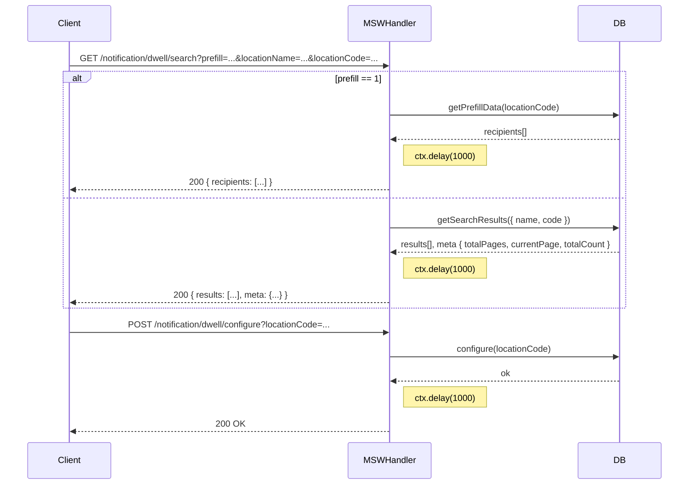
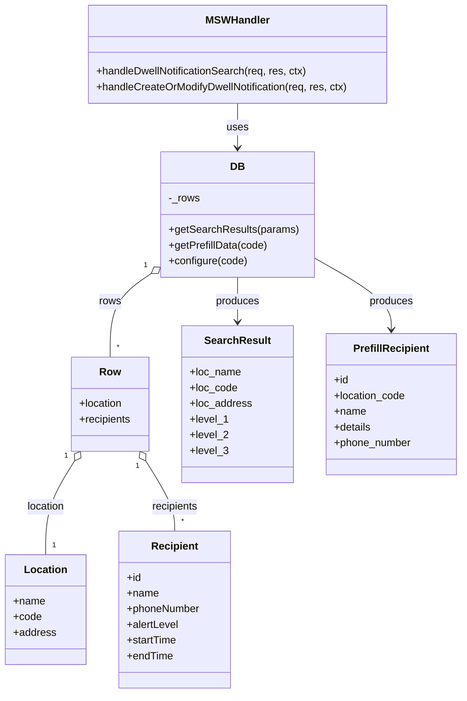

# Diagram: web/portal/src/mocks/handlers/notification/dwell.js

> Auto-generated by Obscura crawlers

## Diagram 1

### SVG

<svg id="container" width="1323" xmlns="http://www.w3.org/2000/svg" height="926" viewBox="-50 -10 1323 926" role="graphics-document document" aria-roledescription="sequence"><g><rect x="1073" y="840" fill="#eaeaea" stroke="#666" width="150" height="65" name="DB" rx="3" ry="3" class="actor actor-bottom"></rect><text x="1148" y="872.5" dominant-baseline="central" alignment-baseline="central" class="actor actor-box" style="text-anchor: middle; font-size: 16px; font-weight: 400;"><tspan x="1148" dy="0">DB</tspan></text></g><g><rect x="622" y="840" fill="#eaeaea" stroke="#666" width="150" height="65" name="MSWHandler" rx="3" ry="3" class="actor actor-bottom"></rect><text x="697" y="872.5" dominant-baseline="central" alignment-baseline="central" class="actor actor-box" style="text-anchor: middle; font-size: 16px; font-weight: 400;"><tspan x="697" dy="0">MSWHandler</tspan></text></g><g><rect x="0" y="840" fill="#eaeaea" stroke="#666" width="150" height="65" name="Client" rx="3" ry="3" class="actor actor-bottom"></rect><text x="75" y="872.5" dominant-baseline="central" alignment-baseline="central" class="actor actor-box" style="text-anchor: middle; font-size: 16px; font-weight: 400;"><tspan x="75" dy="0">Client</tspan></text></g><g><line id="actor2" x1="1148" y1="65" x2="1148" y2="840" class="actor-line 200" stroke-width="0.5px" stroke="#999" name="DB"></line><g id="root-2"><rect x="1073" y="0" fill="#eaeaea" stroke="#666" width="150" height="65" name="DB" rx="3" ry="3" class="actor actor-top"></rect><text x="1148" y="32.5" dominant-baseline="central" alignment-baseline="central" class="actor actor-box" style="text-anchor: middle; font-size: 16px; font-weight: 400;"><tspan x="1148" dy="0">DB</tspan></text></g></g><g><line id="actor1" x1="697" y1="65" x2="697" y2="840" class="actor-line 200" stroke-width="0.5px" stroke="#999" name="MSWHandler"></line><g id="root-1"><rect x="622" y="0" fill="#eaeaea" stroke="#666" width="150" height="65" name="MSWHandler" rx="3" ry="3" class="actor actor-top"></rect><text x="697" y="32.5" dominant-baseline="central" alignment-baseline="central" class="actor actor-box" style="text-anchor: middle; font-size: 16px; font-weight: 400;"><tspan x="697" dy="0">MSWHandler</tspan></text></g></g><g><line id="actor0" x1="75" y1="65" x2="75" y2="840" class="actor-line 200" stroke-width="0.5px" stroke="#999" name="Client"></line><g id="root-0"><rect x="0" y="0" fill="#eaeaea" stroke="#666" width="150" height="65" name="Client" rx="3" ry="3" class="actor actor-top"></rect><text x="75" y="32.5" dominant-baseline="central" alignment-baseline="central" class="actor actor-box" style="text-anchor: middle; font-size: 16px; font-weight: 400;"><tspan x="75" dy="0">Client</tspan></text></g></g><g></g><defs><symbol id="computer" width="24" height="24"><path transform="scale(.5)" d="M2 2v13h20v-13h-20zm18 11h-16v-9h16v9zm-10.228 6l.466-1h3.524l.467 1h-4.457zm14.228 3h-24l2-6h2.104l-1.33 4h18.45l-1.297-4h2.073l2 6zm-5-10h-14v-7h14v7z"></path></symbol></defs><defs><symbol id="database" fill-rule="evenodd" clip-rule="evenodd"><path transform="scale(.5)" d="M12.258.001l.256.004.255.005.253.008.251.01.249.012.247.015.246.016.242.019.241.02.239.023.236.024.233.027.231.028.229.031.225.032.223.034.22.036.217.038.214.04.211.041.208.043.205.045.201.046.198.048.194.05.191.051.187.053.183.054.18.056.175.057.172.059.168.06.163.061.16.063.155.064.15.066.074.033.073.033.071.034.07.034.069.035.068.035.067.035.066.035.064.036.064.036.062.036.06.036.06.037.058.037.058.037.055.038.055.038.053.038.052.038.051.039.05.039.048.039.047.039.045.04.044.04.043.04.041.04.04.041.039.041.037.041.036.041.034.041.033.042.032.042.03.042.029.042.027.042.026.043.024.043.023.043.021.043.02.043.018.044.017.043.015.044.013.044.012.044.011.045.009.044.007.045.006.045.004.045.002.045.001.045v17l-.001.045-.002.045-.004.045-.006.045-.007.045-.009.044-.011.045-.012.044-.013.044-.015.044-.017.043-.018.044-.02.043-.021.043-.023.043-.024.043-.026.043-.027.042-.029.042-.03.042-.032.042-.033.042-.034.041-.036.041-.037.041-.039.041-.04.041-.041.04-.043.04-.044.04-.045.04-.047.039-.048.039-.05.039-.051.039-.052.038-.053.038-.055.038-.055.038-.058.037-.058.037-.06.037-.06.036-.062.036-.064.036-.064.036-.066.035-.067.035-.068.035-.069.035-.07.034-.071.034-.073.033-.074.033-.15.066-.155.064-.16.063-.163.061-.168.06-.172.059-.175.057-.18.056-.183.054-.187.053-.191.051-.194.05-.198.048-.201.046-.205.045-.208.043-.211.041-.214.04-.217.038-.22.036-.223.034-.225.032-.229.031-.231.028-.233.027-.236.024-.239.023-.241.02-.242.019-.246.016-.247.015-.249.012-.251.01-.253.008-.255.005-.256.004-.258.001-.258-.001-.256-.004-.255-.005-.253-.008-.251-.01-.249-.012-.247-.015-.245-.016-.243-.019-.241-.02-.238-.023-.236-.024-.234-.027-.231-.028-.228-.031-.226-.032-.223-.034-.22-.036-.217-.038-.214-.04-.211-.041-.208-.043-.204-.045-.201-.046-.198-.048-.195-.05-.19-.051-.187-.053-.184-.054-.179-.056-.176-.057-.172-.059-.167-.06-.164-.061-.159-.063-.155-.064-.151-.066-.074-.033-.072-.033-.072-.034-.07-.034-.069-.035-.068-.035-.067-.035-.066-.035-.064-.036-.063-.036-.062-.036-.061-.036-.06-.037-.058-.037-.057-.037-.056-.038-.055-.038-.053-.038-.052-.038-.051-.039-.049-.039-.049-.039-.046-.039-.046-.04-.044-.04-.043-.04-.041-.04-.04-.041-.039-.041-.037-.041-.036-.041-.034-.041-.033-.042-.032-.042-.03-.042-.029-.042-.027-.042-.026-.043-.024-.043-.023-.043-.021-.043-.02-.043-.018-.044-.017-.043-.015-.044-.013-.044-.012-.044-.011-.045-.009-.044-.007-.045-.006-.045-.004-.045-.002-.045-.001-.045v-17l.001-.045.002-.045.004-.045.006-.045.007-.045.009-.044.011-.045.012-.044.013-.044.015-.044.017-.043.018-.044.02-.043.021-.043.023-.043.024-.043.026-.043.027-.042.029-.042.03-.042.032-.042.033-.042.034-.041.036-.041.037-.041.039-.041.04-.041.041-.04.043-.04.044-.04.046-.04.046-.039.049-.039.049-.039.051-.039.052-.038.053-.038.055-.038.056-.038.057-.037.058-.037.06-.037.061-.036.062-.036.063-.036.064-.036.066-.035.067-.035.068-.035.069-.035.07-.034.072-.034.072-.033.074-.033.151-.066.155-.064.159-.063.164-.061.167-.06.172-.059.176-.057.179-.056.184-.054.187-.053.19-.051.195-.05.198-.048.201-.046.204-.045.208-.043.211-.041.214-.04.217-.038.22-.036.223-.034.226-.032.228-.031.231-.028.234-.027.236-.024.238-.023.241-.02.243-.019.245-.016.247-.015.249-.012.251-.01.253-.008.255-.005.256-.004.258-.001.258.001zm-9.258 20.499v.01l.001.021.003.021.004.022.005.021.006.022.007.022.009.023.01.022.011.023.012.023.013.023.015.023.016.024.017.023.018.024.019.024.021.024.022.025.023.024.024.025.052.049.056.05.061.051.066.051.07.051.075.051.079.052.084.052.088.052.092.052.097.052.102.051.105.052.11.052.114.051.119.051.123.051.127.05.131.05.135.05.139.048.144.049.147.047.152.047.155.047.16.045.163.045.167.043.171.043.176.041.178.041.183.039.187.039.19.037.194.035.197.035.202.033.204.031.209.03.212.029.216.027.219.025.222.024.226.021.23.02.233.018.236.016.24.015.243.012.246.01.249.008.253.005.256.004.259.001.26-.001.257-.004.254-.005.25-.008.247-.011.244-.012.241-.014.237-.016.233-.018.231-.021.226-.021.224-.024.22-.026.216-.027.212-.028.21-.031.205-.031.202-.034.198-.034.194-.036.191-.037.187-.039.183-.04.179-.04.175-.042.172-.043.168-.044.163-.045.16-.046.155-.046.152-.047.148-.048.143-.049.139-.049.136-.05.131-.05.126-.05.123-.051.118-.052.114-.051.11-.052.106-.052.101-.052.096-.052.092-.052.088-.053.083-.051.079-.052.074-.052.07-.051.065-.051.06-.051.056-.05.051-.05.023-.024.023-.025.021-.024.02-.024.019-.024.018-.024.017-.024.015-.023.014-.024.013-.023.012-.023.01-.023.01-.022.008-.022.006-.022.006-.022.004-.022.004-.021.001-.021.001-.021v-4.127l-.077.055-.08.053-.083.054-.085.053-.087.052-.09.052-.093.051-.095.05-.097.05-.1.049-.102.049-.105.048-.106.047-.109.047-.111.046-.114.045-.115.045-.118.044-.12.043-.122.042-.124.042-.126.041-.128.04-.13.04-.132.038-.134.038-.135.037-.138.037-.139.035-.142.035-.143.034-.144.033-.147.032-.148.031-.15.03-.151.03-.153.029-.154.027-.156.027-.158.026-.159.025-.161.024-.162.023-.163.022-.165.021-.166.02-.167.019-.169.018-.169.017-.171.016-.173.015-.173.014-.175.013-.175.012-.177.011-.178.01-.179.008-.179.008-.181.006-.182.005-.182.004-.184.003-.184.002h-.37l-.184-.002-.184-.003-.182-.004-.182-.005-.181-.006-.179-.008-.179-.008-.178-.01-.176-.011-.176-.012-.175-.013-.173-.014-.172-.015-.171-.016-.17-.017-.169-.018-.167-.019-.166-.02-.165-.021-.163-.022-.162-.023-.161-.024-.159-.025-.157-.026-.156-.027-.155-.027-.153-.029-.151-.03-.15-.03-.148-.031-.146-.032-.145-.033-.143-.034-.141-.035-.14-.035-.137-.037-.136-.037-.134-.038-.132-.038-.13-.04-.128-.04-.126-.041-.124-.042-.122-.042-.12-.044-.117-.043-.116-.045-.113-.045-.112-.046-.109-.047-.106-.047-.105-.048-.102-.049-.1-.049-.097-.05-.095-.05-.093-.052-.09-.051-.087-.052-.085-.053-.083-.054-.08-.054-.077-.054v4.127zm0-5.654v.011l.001.021.003.021.004.021.005.022.006.022.007.022.009.022.01.022.011.023.012.023.013.023.015.024.016.023.017.024.018.024.019.024.021.024.022.024.023.025.024.024.052.05.056.05.061.05.066.051.07.051.075.052.079.051.084.052.088.052.092.052.097.052.102.052.105.052.11.051.114.051.119.052.123.05.127.051.131.05.135.049.139.049.144.048.147.048.152.047.155.046.16.045.163.045.167.044.171.042.176.042.178.04.183.04.187.038.19.037.194.036.197.034.202.033.204.032.209.03.212.028.216.027.219.025.222.024.226.022.23.02.233.018.236.016.24.014.243.012.246.01.249.008.253.006.256.003.259.001.26-.001.257-.003.254-.006.25-.008.247-.01.244-.012.241-.015.237-.016.233-.018.231-.02.226-.022.224-.024.22-.025.216-.027.212-.029.21-.03.205-.032.202-.033.198-.035.194-.036.191-.037.187-.039.183-.039.179-.041.175-.042.172-.043.168-.044.163-.045.16-.045.155-.047.152-.047.148-.048.143-.048.139-.05.136-.049.131-.05.126-.051.123-.051.118-.051.114-.052.11-.052.106-.052.101-.052.096-.052.092-.052.088-.052.083-.052.079-.052.074-.051.07-.052.065-.051.06-.05.056-.051.051-.049.023-.025.023-.024.021-.025.02-.024.019-.024.018-.024.017-.024.015-.023.014-.023.013-.024.012-.022.01-.023.01-.023.008-.022.006-.022.006-.022.004-.021.004-.022.001-.021.001-.021v-4.139l-.077.054-.08.054-.083.054-.085.052-.087.053-.09.051-.093.051-.095.051-.097.05-.1.049-.102.049-.105.048-.106.047-.109.047-.111.046-.114.045-.115.044-.118.044-.12.044-.122.042-.124.042-.126.041-.128.04-.13.039-.132.039-.134.038-.135.037-.138.036-.139.036-.142.035-.143.033-.144.033-.147.033-.148.031-.15.03-.151.03-.153.028-.154.028-.156.027-.158.026-.159.025-.161.024-.162.023-.163.022-.165.021-.166.02-.167.019-.169.018-.169.017-.171.016-.173.015-.173.014-.175.013-.175.012-.177.011-.178.009-.179.009-.179.007-.181.007-.182.005-.182.004-.184.003-.184.002h-.37l-.184-.002-.184-.003-.182-.004-.182-.005-.181-.007-.179-.007-.179-.009-.178-.009-.176-.011-.176-.012-.175-.013-.173-.014-.172-.015-.171-.016-.17-.017-.169-.018-.167-.019-.166-.02-.165-.021-.163-.022-.162-.023-.161-.024-.159-.025-.157-.026-.156-.027-.155-.028-.153-.028-.151-.03-.15-.03-.148-.031-.146-.033-.145-.033-.143-.033-.141-.035-.14-.036-.137-.036-.136-.037-.134-.038-.132-.039-.13-.039-.128-.04-.126-.041-.124-.042-.122-.043-.12-.043-.117-.044-.116-.044-.113-.046-.112-.046-.109-.046-.106-.047-.105-.048-.102-.049-.1-.049-.097-.05-.095-.051-.093-.051-.09-.051-.087-.053-.085-.052-.083-.054-.08-.054-.077-.054v4.139zm0-5.666v.011l.001.02.003.022.004.021.005.022.006.021.007.022.009.023.01.022.011.023.012.023.013.023.015.023.016.024.017.024.018.023.019.024.021.025.022.024.023.024.024.025.052.05.056.05.061.05.066.051.07.051.075.052.079.051.084.052.088.052.092.052.097.052.102.052.105.051.11.052.114.051.119.051.123.051.127.05.131.05.135.05.139.049.144.048.147.048.152.047.155.046.16.045.163.045.167.043.171.043.176.042.178.04.183.04.187.038.19.037.194.036.197.034.202.033.204.032.209.03.212.028.216.027.219.025.222.024.226.021.23.02.233.018.236.017.24.014.243.012.246.01.249.008.253.006.256.003.259.001.26-.001.257-.003.254-.006.25-.008.247-.01.244-.013.241-.014.237-.016.233-.018.231-.02.226-.022.224-.024.22-.025.216-.027.212-.029.21-.03.205-.032.202-.033.198-.035.194-.036.191-.037.187-.039.183-.039.179-.041.175-.042.172-.043.168-.044.163-.045.16-.045.155-.047.152-.047.148-.048.143-.049.139-.049.136-.049.131-.051.126-.05.123-.051.118-.052.114-.051.11-.052.106-.052.101-.052.096-.052.092-.052.088-.052.083-.052.079-.052.074-.052.07-.051.065-.051.06-.051.056-.05.051-.049.023-.025.023-.025.021-.024.02-.024.019-.024.018-.024.017-.024.015-.023.014-.024.013-.023.012-.023.01-.022.01-.023.008-.022.006-.022.006-.022.004-.022.004-.021.001-.021.001-.021v-4.153l-.077.054-.08.054-.083.053-.085.053-.087.053-.09.051-.093.051-.095.051-.097.05-.1.049-.102.048-.105.048-.106.048-.109.046-.111.046-.114.046-.115.044-.118.044-.12.043-.122.043-.124.042-.126.041-.128.04-.13.039-.132.039-.134.038-.135.037-.138.036-.139.036-.142.034-.143.034-.144.033-.147.032-.148.032-.15.03-.151.03-.153.028-.154.028-.156.027-.158.026-.159.024-.161.024-.162.023-.163.023-.165.021-.166.02-.167.019-.169.018-.169.017-.171.016-.173.015-.173.014-.175.013-.175.012-.177.01-.178.01-.179.009-.179.007-.181.006-.182.006-.182.004-.184.003-.184.001-.185.001-.185-.001-.184-.001-.184-.003-.182-.004-.182-.006-.181-.006-.179-.007-.179-.009-.178-.01-.176-.01-.176-.012-.175-.013-.173-.014-.172-.015-.171-.016-.17-.017-.169-.018-.167-.019-.166-.02-.165-.021-.163-.023-.162-.023-.161-.024-.159-.024-.157-.026-.156-.027-.155-.028-.153-.028-.151-.03-.15-.03-.148-.032-.146-.032-.145-.033-.143-.034-.141-.034-.14-.036-.137-.036-.136-.037-.134-.038-.132-.039-.13-.039-.128-.041-.126-.041-.124-.041-.122-.043-.12-.043-.117-.044-.116-.044-.113-.046-.112-.046-.109-.046-.106-.048-.105-.048-.102-.048-.1-.05-.097-.049-.095-.051-.093-.051-.09-.052-.087-.052-.085-.053-.083-.053-.08-.054-.077-.054v4.153zm8.74-8.179l-.257.004-.254.005-.25.008-.247.011-.244.012-.241.014-.237.016-.233.018-.231.021-.226.022-.224.023-.22.026-.216.027-.212.028-.21.031-.205.032-.202.033-.198.034-.194.036-.191.038-.187.038-.183.04-.179.041-.175.042-.172.043-.168.043-.163.045-.16.046-.155.046-.152.048-.148.048-.143.048-.139.049-.136.05-.131.05-.126.051-.123.051-.118.051-.114.052-.11.052-.106.052-.101.052-.096.052-.092.052-.088.052-.083.052-.079.052-.074.051-.07.052-.065.051-.06.05-.056.05-.051.05-.023.025-.023.024-.021.024-.02.025-.019.024-.018.024-.017.023-.015.024-.014.023-.013.023-.012.023-.01.023-.01.022-.008.022-.006.023-.006.021-.004.022-.004.021-.001.021-.001.021.001.021.001.021.004.021.004.022.006.021.006.023.008.022.01.022.01.023.012.023.013.023.014.023.015.024.017.023.018.024.019.024.02.025.021.024.023.024.023.025.051.05.056.05.06.05.065.051.07.052.074.051.079.052.083.052.088.052.092.052.096.052.101.052.106.052.11.052.114.052.118.051.123.051.126.051.131.05.136.05.139.049.143.048.148.048.152.048.155.046.16.046.163.045.168.043.172.043.175.042.179.041.183.04.187.038.191.038.194.036.198.034.202.033.205.032.21.031.212.028.216.027.22.026.224.023.226.022.231.021.233.018.237.016.241.014.244.012.247.011.25.008.254.005.257.004.26.001.26-.001.257-.004.254-.005.25-.008.247-.011.244-.012.241-.014.237-.016.233-.018.231-.021.226-.022.224-.023.22-.026.216-.027.212-.028.21-.031.205-.032.202-.033.198-.034.194-.036.191-.038.187-.038.183-.04.179-.041.175-.042.172-.043.168-.043.163-.045.16-.046.155-.046.152-.048.148-.048.143-.048.139-.049.136-.05.131-.05.126-.051.123-.051.118-.051.114-.052.11-.052.106-.052.101-.052.096-.052.092-.052.088-.052.083-.052.079-.052.074-.051.07-.052.065-.051.06-.05.056-.05.051-.05.023-.025.023-.024.021-.024.02-.025.019-.024.018-.024.017-.023.015-.024.014-.023.013-.023.012-.023.01-.023.01-.022.008-.022.006-.023.006-.021.004-.022.004-.021.001-.021.001-.021-.001-.021-.001-.021-.004-.021-.004-.022-.006-.021-.006-.023-.008-.022-.01-.022-.01-.023-.012-.023-.013-.023-.014-.023-.015-.024-.017-.023-.018-.024-.019-.024-.02-.025-.021-.024-.023-.024-.023-.025-.051-.05-.056-.05-.06-.05-.065-.051-.07-.052-.074-.051-.079-.052-.083-.052-.088-.052-.092-.052-.096-.052-.101-.052-.106-.052-.11-.052-.114-.052-.118-.051-.123-.051-.126-.051-.131-.05-.136-.05-.139-.049-.143-.048-.148-.048-.152-.048-.155-.046-.16-.046-.163-.045-.168-.043-.172-.043-.175-.042-.179-.041-.183-.04-.187-.038-.191-.038-.194-.036-.198-.034-.202-.033-.205-.032-.21-.031-.212-.028-.216-.027-.22-.026-.224-.023-.226-.022-.231-.021-.233-.018-.237-.016-.241-.014-.244-.012-.247-.011-.25-.008-.254-.005-.257-.004-.26-.001-.26.001z"></path></symbol></defs><defs><symbol id="clock" width="24" height="24"><path transform="scale(.5)" d="M12 2c5.514 0 10 4.486 10 10s-4.486 10-10 10-10-4.486-10-10 4.486-10 10-10zm0-2c-6.627 0-12 5.373-12 12s5.373 12 12 12 12-5.373 12-12-5.373-12-12-12zm5.848 12.459c.202.038.202.333.001.372-1.907.361-6.045 1.111-6.547 1.111-.719 0-1.301-.582-1.301-1.301 0-.512.77-5.447 1.125-7.445.034-.192.312-.181.343.014l.985 6.238 5.394 1.011z"></path></symbol></defs><defs><marker id="arrowhead" refX="7.9" refY="5" markerUnits="userSpaceOnUse" markerWidth="12" markerHeight="12" orient="auto-start-reverse"><path d="M -1 0 L 10 5 L 0 10 z"></path></marker></defs><defs><marker id="crosshead" markerWidth="15" markerHeight="8" orient="auto" refX="4" refY="4.5"><path fill="none" stroke="#000000" stroke-width="1pt" d="M 1,2 L 6,7 M 6,2 L 1,7" style="stroke-dasharray: 0, 0;"></path></marker></defs><defs><marker id="filled-head" refX="15.5" refY="7" markerWidth="20" markerHeight="28" orient="auto"><path d="M 18,7 L9,13 L14,7 L9,1 Z"></path></marker></defs><defs><marker id="sequencenumber" refX="15" refY="15" markerWidth="60" markerHeight="40" orient="auto"><circle cx="15" cy="15" r="6"></circle></marker></defs><g><rect x="722" y="264" fill="#EDF2AE" stroke="#666" width="150" height="39" class="note"></rect><text x="797" y="269" text-anchor="middle" dominant-baseline="middle" alignment-baseline="middle" class="noteText" dy="1em" style="font-size: 16px; font-weight: 400;"><tspan x="797">ctx.delay(1000)</tspan></text></g><g><rect x="722" y="482" fill="#EDF2AE" stroke="#666" width="150" height="39" class="note"></rect><text x="797" y="487" text-anchor="middle" dominant-baseline="middle" alignment-baseline="middle" class="noteText" dy="1em" style="font-size: 16px; font-weight: 400;"><tspan x="797">ctx.delay(1000)</tspan></text></g><g><line x1="64" y1="123" x2="1159" y2="123" class="loopLine"></line><line x1="1159" y1="123" x2="1159" y2="579" class="loopLine"></line><line x1="64" y1="579" x2="1159" y2="579" class="loopLine"></line><line x1="64" y1="123" x2="64" y2="579" class="loopLine"></line><line x1="64" y1="366" x2="1159" y2="366" class="loopLine" style="stroke-dasharray: 3, 3;"></line><polygon points="64,123 114,123 114,136 105.6,143 64,143" class="labelBox"></polygon><text x="89" y="136" text-anchor="middle" dominant-baseline="middle" alignment-baseline="middle" class="labelText" style="font-size: 16px; font-weight: 400;">alt</text><text x="636.5" y="141" text-anchor="middle" class="loopText" style="font-size: 16px; font-weight: 400;"><tspan x="636.5">[prefill == 1]</tspan></text></g><g><rect x="722" y="733" fill="#EDF2AE" stroke="#666" width="150" height="39" class="note"></rect><text x="797" y="738" text-anchor="middle" dominant-baseline="middle" alignment-baseline="middle" class="noteText" dy="1em" style="font-size: 16px; font-weight: 400;"><tspan x="797">ctx.delay(1000)</tspan></text></g><text x="385" y="80" text-anchor="middle" dominant-baseline="middle" alignment-baseline="middle" class="messageText" dy="1em" style="font-size: 16px; font-weight: 400;">GET /notification/dwell/search?prefill=...&amp;locationName=...&amp;locationCode=...</text><line x1="76" y1="113" x2="693" y2="113" class="messageLine0" stroke-width="2" stroke="none" marker-end="url(#arrowhead)" style="fill: none;"></line><text x="921" y="173" text-anchor="middle" dominant-baseline="middle" alignment-baseline="middle" class="messageText" dy="1em" style="font-size: 16px; font-weight: 400;">getPrefillData(locationCode)</text><line x1="698" y1="206" x2="1144" y2="206" class="messageLine0" stroke-width="2" stroke="none" marker-end="url(#arrowhead)" style="fill: none;"></line><text x="924" y="221" text-anchor="middle" dominant-baseline="middle" alignment-baseline="middle" class="messageText" dy="1em" style="font-size: 16px; font-weight: 400;">recipients[]</text><line x1="1147" y1="254" x2="701" y2="254" class="messageLine1" stroke-width="2" stroke="none" marker-end="url(#arrowhead)" style="stroke-dasharray: 3, 3; fill: none;"></line><text x="388" y="318" text-anchor="middle" dominant-baseline="middle" alignment-baseline="middle" class="messageText" dy="1em" style="font-size: 16px; font-weight: 400;">200 { recipients: [...] }</text><line x1="696" y1="351" x2="79" y2="351" class="messageLine1" stroke-width="2" stroke="none" marker-end="url(#arrowhead)" style="stroke-dasharray: 3, 3; fill: none;"></line><text x="921" y="391" text-anchor="middle" dominant-baseline="middle" alignment-baseline="middle" class="messageText" dy="1em" style="font-size: 16px; font-weight: 400;">getSearchResults({ name, code })</text><line x1="698" y1="424" x2="1144" y2="424" class="messageLine0" stroke-width="2" stroke="none" marker-end="url(#arrowhead)" style="fill: none;"></line><text x="924" y="439" text-anchor="middle" dominant-baseline="middle" alignment-baseline="middle" class="messageText" dy="1em" style="font-size: 16px; font-weight: 400;">results[], meta { totalPages, currentPage, totalCount }</text><line x1="1147" y1="472" x2="701" y2="472" class="messageLine1" stroke-width="2" stroke="none" marker-end="url(#arrowhead)" style="stroke-dasharray: 3, 3; fill: none;"></line><text x="388" y="536" text-anchor="middle" dominant-baseline="middle" alignment-baseline="middle" class="messageText" dy="1em" style="font-size: 16px; font-weight: 400;">200 { results: [...], meta: {...} }</text><line x1="696" y1="569" x2="79" y2="569" class="messageLine1" stroke-width="2" stroke="none" marker-end="url(#arrowhead)" style="stroke-dasharray: 3, 3; fill: none;"></line><text x="385" y="594" text-anchor="middle" dominant-baseline="middle" alignment-baseline="middle" class="messageText" dy="1em" style="font-size: 16px; font-weight: 400;">POST /notification/dwell/configure?locationCode=...</text><line x1="76" y1="627" x2="693" y2="627" class="messageLine0" stroke-width="2" stroke="none" marker-end="url(#arrowhead)" style="fill: none;"></line><text x="921" y="642" text-anchor="middle" dominant-baseline="middle" alignment-baseline="middle" class="messageText" dy="1em" style="font-size: 16px; font-weight: 400;">configure(locationCode)</text><line x1="698" y1="675" x2="1144" y2="675" class="messageLine0" stroke-width="2" stroke="none" marker-end="url(#arrowhead)" style="fill: none;"></line><text x="924" y="690" text-anchor="middle" dominant-baseline="middle" alignment-baseline="middle" class="messageText" dy="1em" style="font-size: 16px; font-weight: 400;">ok</text><line x1="1147" y1="723" x2="701" y2="723" class="messageLine1" stroke-width="2" stroke="none" marker-end="url(#arrowhead)" style="stroke-dasharray: 3, 3; fill: none;"></line><text x="388" y="787" text-anchor="middle" dominant-baseline="middle" alignment-baseline="middle" class="messageText" dy="1em" style="font-size: 16px; font-weight: 400;">200 OK</text><line x1="696" y1="820" x2="79" y2="820" class="messageLine1" stroke-width="2" stroke="none" marker-end="url(#arrowhead)" style="stroke-dasharray: 3, 3; fill: none;"></line></svg>

## Diagram 2

### SVG

<svg id="container" width="699.23046875" xmlns="http://www.w3.org/2000/svg" class="classDiagram" height="1060" viewBox="0 0 699.23046875 1060" role="graphics-document document" aria-roledescription="class"><g><defs><marker id="container_class-aggregationStart" class="marker aggregation class" refX="18" refY="7" markerWidth="190" markerHeight="240" orient="auto"><path d="M 18,7 L9,13 L1,7 L9,1 Z"></path></marker></defs><defs><marker id="container_class-aggregationEnd" class="marker aggregation class" refX="1" refY="7" markerWidth="20" markerHeight="28" orient="auto"><path d="M 18,7 L9,13 L1,7 L9,1 Z"></path></marker></defs><defs><marker id="container_class-extensionStart" class="marker extension class" refX="18" refY="7" markerWidth="190" markerHeight="240" orient="auto"><path d="M 1,7 L18,13 V 1 Z"></path></marker></defs><defs><marker id="container_class-extensionEnd" class="marker extension class" refX="1" refY="7" markerWidth="20" markerHeight="28" orient="auto"><path d="M 1,1 V 13 L18,7 Z"></path></marker></defs><defs><marker id="container_class-compositionStart" class="marker composition class" refX="18" refY="7" markerWidth="190" markerHeight="240" orient="auto"><path d="M 18,7 L9,13 L1,7 L9,1 Z"></path></marker></defs><defs><marker id="container_class-compositionEnd" class="marker composition class" refX="1" refY="7" markerWidth="20" markerHeight="28" orient="auto"><path d="M 18,7 L9,13 L1,7 L9,1 Z"></path></marker></defs><defs><marker id="container_class-dependencyStart" class="marker dependency class" refX="6" refY="7" markerWidth="190" markerHeight="240" orient="auto"><path d="M 5,7 L9,13 L1,7 L9,1 Z"></path></marker></defs><defs><marker id="container_class-dependencyEnd" class="marker dependency class" refX="13" refY="7" markerWidth="20" markerHeight="28" orient="auto"><path d="M 18,7 L9,13 L14,7 L9,1 Z"></path></marker></defs><defs><marker id="container_class-lollipopStart" class="marker lollipop class" refX="13" refY="7" markerWidth="190" markerHeight="240" orient="auto"><circle stroke="black" fill="transparent" cx="7" cy="7" r="6"></circle></marker></defs><defs><marker id="container_class-lollipopEnd" class="marker lollipop class" refX="1" refY="7" markerWidth="190" markerHeight="240" orient="auto"><circle stroke="black" fill="transparent" cx="7" cy="7" r="6"></circle></marker></defs><g class="root"><g class="clusters"></g><g class="edgePaths"><path d="M358.836,158L358.836,164.167C358.836,170.333,358.836,182.667,358.836,194C358.836,205.333,358.836,215.667,358.836,220.833L358.836,226" id="id_MSWHandler_DB_1" class="edge-thickness-normal edge-pattern-solid relation" style=";;;" data-edge="true" data-et="edge" data-id="id_MSWHandler_DB_1" data-points="W3sieCI6MzU4LjgzNTkzNzUsInkiOjE1OH0seyJ4IjozNTguODM1OTM3NSwieSI6MTk1fSx7IngiOjM1OC44MzU5Mzc1LCJ5IjoyMzJ9XQ==" marker-end="url(#container_class-dependencyEnd)"></path><path d="M229.528,417.136L218.922,424.446C208.317,431.757,187.106,446.379,176.5,467.856C165.895,489.333,165.895,517.667,165.895,531.833L165.895,546" id="id_DB_Row_2" class="edge-thickness-normal edge-pattern-solid relation" style=";;;" data-edge="true" data-et="edge" data-id="id_DB_Row_2" data-points="W3sieCI6MjQzLjczMDQ2ODc1LCJ5Ijo0MDcuMzQ1NDc0MDU1MDI4MDN9LHsieCI6MTY1Ljg5NDUzMTI1LCJ5Ijo0NjF9LHsieCI6MTY1Ljg5NDUzMTI1LCJ5Ijo1NDZ9XQ==" marker-start="url(#container_class-aggregationStart)"></path><path d="M111.912,704.641L104.606,716.367C97.3,728.094,82.687,751.547,75.381,775.44C68.074,799.333,68.074,823.667,68.074,835.833L68.074,848" id="id_Row_Location_3" class="edge-thickness-normal edge-pattern-solid relation" style=";;;" data-edge="true" data-et="edge" data-id="id_Row_Location_3" data-points="W3sieCI6MTIxLjAzNDI2MDU0OTM2MzA1LCJ5Ijo2OTB9LHsieCI6NjguMDc0MjE4NzUsInkiOjc3NX0seyJ4Ijo2OC4wNzQyMTg3NSwieSI6ODQ4fV0=" marker-start="url(#container_class-aggregationStart)"></path><path d="M219.877,704.641L227.183,716.367C234.49,728.094,249.102,751.547,256.409,769.44C263.715,787.333,263.715,799.667,263.715,805.833L263.715,812" id="id_Row_Recipient_4" class="edge-thickness-normal edge-pattern-solid relation" style=";;;" data-edge="true" data-et="edge" data-id="id_Row_Recipient_4" data-points="W3sieCI6MjEwLjc1NDgwMTk1MDYzNjkzLCJ5Ijo2OTB9LHsieCI6MjYzLjcxNDg0Mzc1LCJ5Ijo3NzV9LHsieCI6MjYzLjcxNDg0Mzc1LCJ5Ijo4MTJ9XQ==" marker-start="url(#container_class-aggregationStart)"></path><path d="M358.836,424L358.836,430.167C358.836,436.333,358.836,448.667,358.836,460C358.836,471.333,358.836,481.667,358.836,486.833L358.836,492" id="id_DB_SearchResult_5" class="edge-thickness-normal edge-pattern-solid relation" style=";;;" data-edge="true" data-et="edge" data-id="id_DB_SearchResult_5" data-points="W3sieCI6MzU4LjgzNTkzNzUsInkiOjQyNH0seyJ4IjozNTguODM1OTM3NSwieSI6NDYxfSx7IngiOjM1OC44MzU5Mzc1LCJ5Ijo0OTh9XQ==" marker-end="url(#container_class-dependencyEnd)"></path><path d="M473.941,393.756L493.56,404.963C513.178,416.171,552.415,438.585,572.034,456.959C591.652,475.333,591.652,489.667,591.652,496.833L591.652,504" id="id_DB_PrefillRecipient_6" class="edge-thickness-normal edge-pattern-solid relation" style=";;;" data-edge="true" data-et="edge" data-id="id_DB_PrefillRecipient_6" data-points="W3sieCI6NDczLjk0MTQwNjI1LCJ5IjozOTMuNzU1NzkyNjg4MDQyMTZ9LHsieCI6NTkxLjY1MjM0Mzc1LCJ5Ijo0NjF9LHsieCI6NTkxLjY1MjM0Mzc1LCJ5Ijo1MTB9XQ==" marker-end="url(#container_class-dependencyEnd)"></path></g><g class="edgeLabels"><g class="edgeLabel" transform="translate(358.8359375, 195)"><g class="label" data-id="id_MSWHandler_DB_1" transform="translate(-16.4921875, -12)"><foreignObject width="32.984375" height="24">

uses

</foreignObject></g></g><g class="edgeLabel" transform="translate(165.89453125, 461)"><g class="label" data-id="id_DB_Row_2" transform="translate(-16.9921875, -12)"><foreignObject width="33.984375" height="24">

rows

</foreignObject></g></g><g class="edgeLabel" transform="translate(68.07421875, 775)"><g class="label" data-id="id_Row_Location_3" transform="translate(-29.578125, -12)"><foreignObject width="59.15625" height="24">

location

</foreignObject></g></g><g class="edgeLabel" transform="translate(263.71484375, 775)"><g class="label" data-id="id_Row_Recipient_4" transform="translate(-35.96875, -12)"><foreignObject width="71.9375" height="24">

recipients

</foreignObject></g></g><g class="edgeLabel" transform="translate(358.8359375, 461)"><g class="label" data-id="id_DB_SearchResult_5" transform="translate(-33.4765625, -12)"><foreignObject width="66.953125" height="24">

produces

</foreignObject></g></g><g class="edgeLabel" transform="translate(591.65234375, 461)"><g class="label" data-id="id_DB_PrefillRecipient_6" transform="translate(-33.4765625, -12)"><foreignObject width="66.953125" height="24">

produces

</foreignObject></g></g><g class="edgeTerminals" transform="translate(220.808784057357, 404.92753515471503)"><g class="inner" transform="translate(0, 0)"><foreignObject style="width: 9px; height: 12px;">
1
</foreignObject></g></g><g class="edgeTerminals" transform="translate(99.04894937482499, 696.9206996489371)"><g class="inner" transform="translate(0, 0)"><foreignObject style="width: 9px; height: 12px;">
1
</foreignObject></g></g><g class="edgeTerminals" transform="translate(207.27797959457865, 712.7851195792532)"><g class="inner" transform="translate(0, 0)"><foreignObject style="width: 9px; height: 12px;">
1
</foreignObject></g></g><g class="edgeTerminals" transform="translate(175.89453062500002, 523.4999994642857)"><g class="inner" transform="translate(0, 0)"></g><foreignObject style="width: 9px; height: 12px;">
*
</foreignObject></g><g class="edgeTerminals" transform="translate(78.07421937499998, 825.5000005357143)"><g class="inner" transform="translate(0, 0)"></g><foreignObject style="width: 9px; height: 12px;">
1
</foreignObject></g><g class="edgeTerminals" transform="translate(273.7148418749999, 789.4999983928572)"><g class="inner" transform="translate(0, 0)"></g><foreignObject style="width: 9px; height: 12px;">
*
</foreignObject></g></g><g class="nodes"><g class="node default" id="classId-MSWHandler-0" transform="translate(358.8359375, 83)"><g class="basic label-container"><path d="M-229.7890625 -75 L229.7890625 -75 L229.7890625 75 L-229.7890625 75" stroke="none" stroke-width="0" fill="#ECECFF" style=""></path><path d="M-229.7890625 -75 C-136.58081726406246 -75, -43.37257202812492 -75, 229.7890625 -75 M-229.7890625 -75 C-129.2611358954386 -75, -28.733209290877227 -75, 229.7890625 -75 M229.7890625 -75 C229.7890625 -26.263944833048093, 229.7890625 22.472110333903814, 229.7890625 75 M229.7890625 -75 C229.7890625 -38.89227580410779, 229.7890625 -2.7845516082155797, 229.7890625 75 M229.7890625 75 C135.29433555417648 75, 40.79960860835297 75, -229.7890625 75 M229.7890625 75 C120.52862183213082 75, 11.268181164261648 75, -229.7890625 75 M-229.7890625 75 C-229.7890625 16.973949879427636, -229.7890625 -41.05210024114473, -229.7890625 -75 M-229.7890625 75 C-229.7890625 32.68934859320056, -229.7890625 -9.621302813598874, -229.7890625 -75" stroke="#9370DB" stroke-width="1.3" fill="none" stroke-dasharray="0 0" style=""></path></g><g class="annotation-group text" transform="translate(0, -51)"></g><g class="label-group text" transform="translate(-46.53125, -51)"><g class="label" style="font-weight: bolder" transform="translate(0,-12)"><foreignObject width="93.0625" height="24">

MSWHandler

</foreignObject></g></g><g class="members-group text" transform="translate(-217.7890625, -3)"></g><g class="methods-group text" transform="translate(-217.7890625, 27)"><g class="label" style="" transform="translate(0,-12)"><foreignObject width="325.46875" height="24">

+handleDwellNotificationSearch(req, res, ctx)

</foreignObject></g><g class="label" style="" transform="translate(0,12)"><foreignObject width="389.046875" height="24">

+handleCreateOrModifyDwellNotification(req, res, ctx)

</foreignObject></g></g><g class="divider" style=""><path d="M-229.7890625 -27 C-132.6065548402931 -27, -35.4240471805862 -27, 229.7890625 -27 M-229.7890625 -27 C-114.22655572316292 -27, 1.3359510536741652 -27, 229.7890625 -27" stroke="#9370DB" stroke-width="1.3" fill="none" stroke-dasharray="0 0" style=""></path></g><g class="divider" style=""><path d="M-229.7890625 -3 C-113.32212617608512 -3, 3.1448101478297588 -3, 229.7890625 -3 M-229.7890625 -3 C-131.28405311201587 -3, -32.77904372403174 -3, 229.7890625 -3" stroke="#9370DB" stroke-width="1.3" fill="none" stroke-dasharray="0 0" style=""></path></g></g><g class="node default" id="classId-DB-1" transform="translate(358.8359375, 328)"><g class="basic label-container"><path d="M-115.10546875 -96 L115.10546875 -96 L115.10546875 96 L-115.10546875 96" stroke="none" stroke-width="0" fill="#ECECFF" style=""></path><path d="M-115.10546875 -96 C-59.96212432959574 -96, -4.818779909191477 -96, 115.10546875 -96 M-115.10546875 -96 C-30.71574356636279 -96, 53.67398161727442 -96, 115.10546875 -96 M115.10546875 -96 C115.10546875 -40.1241379517736, 115.10546875 15.751724096452804, 115.10546875 96 M115.10546875 -96 C115.10546875 -51.5265731685118, 115.10546875 -7.053146337023605, 115.10546875 96 M115.10546875 96 C33.353653652960986 96, -48.39816144407803 96, -115.10546875 96 M115.10546875 96 C34.47636647345624 96, -46.15273580308752 96, -115.10546875 96 M-115.10546875 96 C-115.10546875 34.9038437911876, -115.10546875 -26.192312417624805, -115.10546875 -96 M-115.10546875 96 C-115.10546875 41.8061713152185, -115.10546875 -12.387657369563001, -115.10546875 -96" stroke="#9370DB" stroke-width="1.3" fill="none" stroke-dasharray="0 0" style=""></path></g><g class="annotation-group text" transform="translate(0, -72)"></g><g class="label-group text" transform="translate(-10.1484375, -72)"><g class="label" style="font-weight: bolder" transform="translate(0,-12)"><foreignObject width="20.296875" height="24">

DB

</foreignObject></g></g><g class="members-group text" transform="translate(-103.10546875, -24)"><g class="label" style="" transform="translate(0,-12)"><foreignObject width="47.484375" height="24">

-_rows

</foreignObject></g></g><g class="methods-group text" transform="translate(-103.10546875, 24)"><g class="label" style="" transform="translate(0,-12)"><foreignObject width="196.0625" height="24">

+getSearchResults(params)

</foreignObject></g><g class="label" style="" transform="translate(0,12)"><foreignObject width="151.0625" height="24">

+getPrefillData(code)

</foreignObject></g><g class="label" style="" transform="translate(0,36)"><foreignObject width="120.453125" height="24">

+configure(code)

</foreignObject></g></g><g class="divider" style=""><path d="M-115.10546875 -48 C-46.85238622897728 -48, 21.40069629204544 -48, 115.10546875 -48 M-115.10546875 -48 C-34.88850722151527 -48, 45.32845430696946 -48, 115.10546875 -48" stroke="#9370DB" stroke-width="1.3" fill="none" stroke-dasharray="0 0" style=""></path></g><g class="divider" style=""><path d="M-115.10546875 0 C-66.47684633165235 0, -17.848223913304707 0, 115.10546875 0 M-115.10546875 0 C-30.434239753438618 0, 54.236989243122764 0, 115.10546875 0" stroke="#9370DB" stroke-width="1.3" fill="none" stroke-dasharray="0 0" style=""></path></g></g><g class="node default" id="classId-Row-2" transform="translate(165.89453125, 618)"><g class="basic label-container"><path d="M-59.703125 -72 L59.703125 -72 L59.703125 72 L-59.703125 72" stroke="none" stroke-width="0" fill="#ECECFF" style=""></path><path d="M-59.703125 -72 C-12.888659629029604 -72, 33.92580574194079 -72, 59.703125 -72 M-59.703125 -72 C-31.06181710281291 -72, -2.4205092056258195 -72, 59.703125 -72 M59.703125 -72 C59.703125 -26.475511992735214, 59.703125 19.048976014529572, 59.703125 72 M59.703125 -72 C59.703125 -19.389224740591985, 59.703125 33.22155051881603, 59.703125 72 M59.703125 72 C35.42095617376741 72, 11.138787347534809 72, -59.703125 72 M59.703125 72 C12.773602706437273 72, -34.15591958712545 72, -59.703125 72 M-59.703125 72 C-59.703125 39.304349468026565, -59.703125 6.6086989360531305, -59.703125 -72 M-59.703125 72 C-59.703125 26.21652542890414, -59.703125 -19.566949142191717, -59.703125 -72" stroke="#9370DB" stroke-width="1.3" fill="none" stroke-dasharray="0 0" style=""></path></g><g class="annotation-group text" transform="translate(0, -48)"></g><g class="label-group text" transform="translate(-15.484375, -48)"><g class="label" style="font-weight: bolder" transform="translate(0,-12)"><foreignObject width="30.96875" height="24">

Row

</foreignObject></g></g><g class="members-group text" transform="translate(-47.703125, 0)"><g class="label" style="" transform="translate(0,-12)"><foreignObject width="67.140625" height="24">

+location

</foreignObject></g><g class="label" style="" transform="translate(0,12)"><foreignObject width="79.921875" height="24">

+recipients

</foreignObject></g></g><g class="methods-group text" transform="translate(-47.703125, 72)"></g><g class="divider" style=""><path d="M-59.703125 -24 C-35.25401889430199 -24, -10.804912788603986 -24, 59.703125 -24 M-59.703125 -24 C-19.35096883059397 -24, 21.00118733881206 -24, 59.703125 -24" stroke="#9370DB" stroke-width="1.3" fill="none" stroke-dasharray="0 0" style=""></path></g><g class="divider" style=""><path d="M-59.703125 48 C-21.728262558800317 48, 16.246599882399366 48, 59.703125 48 M-59.703125 48 C-28.26141385220599 48, 3.1802972955880193 48, 59.703125 48" stroke="#9370DB" stroke-width="1.3" fill="none" stroke-dasharray="0 0" style=""></path></g></g><g class="node default" id="classId-Location-3" transform="translate(68.07421875, 932)"><g class="basic label-container"><path d="M-60.07421875 -84 L60.07421875 -84 L60.07421875 84 L-60.07421875 84" stroke="none" stroke-width="0" fill="#ECECFF" style=""></path><path d="M-60.07421875 -84 C-33.200880515366656 -84, -6.3275422807333115 -84, 60.07421875 -84 M-60.07421875 -84 C-17.975510103479913 -84, 24.123198543040175 -84, 60.07421875 -84 M60.07421875 -84 C60.07421875 -17.4693052802333, 60.07421875 49.0613894395334, 60.07421875 84 M60.07421875 -84 C60.07421875 -40.205758439887255, 60.07421875 3.58848312022549, 60.07421875 84 M60.07421875 84 C30.173913357878696 84, 0.27360796575739244 84, -60.07421875 84 M60.07421875 84 C13.658699337235134 84, -32.75682007552973 84, -60.07421875 84 M-60.07421875 84 C-60.07421875 37.481662605964694, -60.07421875 -9.036674788070613, -60.07421875 -84 M-60.07421875 84 C-60.07421875 31.564790636555735, -60.07421875 -20.87041872688853, -60.07421875 -84" stroke="#9370DB" stroke-width="1.3" fill="none" stroke-dasharray="0 0" style=""></path></g><g class="annotation-group text" transform="translate(0, -60)"></g><g class="label-group text" transform="translate(-31.3515625, -60)"><g class="label" style="font-weight: bolder" transform="translate(0,-12)"><foreignObject width="62.703125" height="24">

Location

</foreignObject></g></g><g class="members-group text" transform="translate(-48.07421875, -12)"><g class="label" style="" transform="translate(0,-12)"><foreignObject width="48.5" height="24">

+name

</foreignObject></g><g class="label" style="" transform="translate(0,12)"><foreignObject width="42.953125" height="24">

+code

</foreignObject></g><g class="label" style="" transform="translate(0,36)"><foreignObject width="64.796875" height="24">

+address

</foreignObject></g></g><g class="methods-group text" transform="translate(-48.07421875, 84)"></g><g class="divider" style=""><path d="M-60.07421875 -36 C-25.420956054876783 -36, 9.232306640246435 -36, 60.07421875 -36 M-60.07421875 -36 C-13.092326512288643 -36, 33.88956572542271 -36, 60.07421875 -36" stroke="#9370DB" stroke-width="1.3" fill="none" stroke-dasharray="0 0" style=""></path></g><g class="divider" style=""><path d="M-60.07421875 60 C-23.785686344610987 60, 12.502846060778026 60, 60.07421875 60 M-60.07421875 60 C-21.30643473517725 60, 17.461349279645503 60, 60.07421875 60" stroke="#9370DB" stroke-width="1.3" fill="none" stroke-dasharray="0 0" style=""></path></g></g><g class="node default" id="classId-Recipient-4" transform="translate(263.71484375, 932)"><g class="basic label-container"><path d="M-85.56640625 -120 L85.56640625 -120 L85.56640625 120 L-85.56640625 120" stroke="none" stroke-width="0" fill="#ECECFF" style=""></path><path d="M-85.56640625 -120 C-32.59570208829623 -120, 20.375002073407543 -120, 85.56640625 -120 M-85.56640625 -120 C-46.12688827828928 -120, -6.687370306578558 -120, 85.56640625 -120 M85.56640625 -120 C85.56640625 -26.58334786254828, 85.56640625 66.83330427490344, 85.56640625 120 M85.56640625 -120 C85.56640625 -57.99021388857041, 85.56640625 4.019572222859182, 85.56640625 120 M85.56640625 120 C24.397872866787424 120, -36.77066051642515 120, -85.56640625 120 M85.56640625 120 C37.068519698447915 120, -11.42936685310417 120, -85.56640625 120 M-85.56640625 120 C-85.56640625 27.548306847070265, -85.56640625 -64.90338630585947, -85.56640625 -120 M-85.56640625 120 C-85.56640625 54.509997670870575, -85.56640625 -10.98000465825885, -85.56640625 -120" stroke="#9370DB" stroke-width="1.3" fill="none" stroke-dasharray="0 0" style=""></path></g><g class="annotation-group text" transform="translate(0, -96)"></g><g class="label-group text" transform="translate(-34.4765625, -96)"><g class="label" style="font-weight: bolder" transform="translate(0,-12)"><foreignObject width="68.953125" height="24">

Recipient

</foreignObject></g></g><g class="members-group text" transform="translate(-73.56640625, -48)"><g class="label" style="" transform="translate(0,-12)"><foreignObject width="22.078125" height="24">

+id

</foreignObject></g><g class="label" style="" transform="translate(0,12)"><foreignObject width="48.5" height="24">

+name

</foreignObject></g><g class="label" style="" transform="translate(0,36)"><foreignObject width="112.65625" height="24">

+phoneNumber

</foreignObject></g><g class="label" style="" transform="translate(0,60)"><foreignObject width="79.015625" height="24">

+alertLevel

</foreignObject></g><g class="label" style="" transform="translate(0,84)"><foreignObject width="77" height="24">

+startTime

</foreignObject></g><g class="label" style="" transform="translate(0,108)"><foreignObject width="70.875" height="24">

+endTime

</foreignObject></g></g><g class="methods-group text" transform="translate(-73.56640625, 120)"></g><g class="divider" style=""><path d="M-85.56640625 -72 C-20.720554674492448 -72, 44.125296901015105 -72, 85.56640625 -72 M-85.56640625 -72 C-24.094218027921357 -72, 37.377970194157285 -72, 85.56640625 -72" stroke="#9370DB" stroke-width="1.3" fill="none" stroke-dasharray="0 0" style=""></path></g><g class="divider" style=""><path d="M-85.56640625 96 C-27.615186496054122 96, 30.336033257891756 96, 85.56640625 96 M-85.56640625 96 C-19.896147040615915 96, 45.77411216876817 96, 85.56640625 96" stroke="#9370DB" stroke-width="1.3" fill="none" stroke-dasharray="0 0" style=""></path></g></g><g class="node default" id="classId-SearchResult-5" transform="translate(358.8359375, 618)"><g class="basic label-container"><path d="M-83.23828125 -120 L83.23828125 -120 L83.23828125 120 L-83.23828125 120" stroke="none" stroke-width="0" fill="#ECECFF" style=""></path><path d="M-83.23828125 -120 C-23.249003462555613 -120, 36.74027432488877 -120, 83.23828125 -120 M-83.23828125 -120 C-18.084183517565336 -120, 47.06991421486933 -120, 83.23828125 -120 M83.23828125 -120 C83.23828125 -57.14218948879416, 83.23828125 5.715621022411682, 83.23828125 120 M83.23828125 -120 C83.23828125 -25.740878833582855, 83.23828125 68.51824233283429, 83.23828125 120 M83.23828125 120 C19.564497146888648 120, -44.109286956222704 120, -83.23828125 120 M83.23828125 120 C27.94305921199122 120, -27.35216282601756 120, -83.23828125 120 M-83.23828125 120 C-83.23828125 33.050859232054336, -83.23828125 -53.89828153589133, -83.23828125 -120 M-83.23828125 120 C-83.23828125 40.30478459684694, -83.23828125 -39.390430806306114, -83.23828125 -120" stroke="#9370DB" stroke-width="1.3" fill="none" stroke-dasharray="0 0" style=""></path></g><g class="annotation-group text" transform="translate(0, -96)"></g><g class="label-group text" transform="translate(-47.8515625, -96)"><g class="label" style="font-weight: bolder" transform="translate(0,-12)"><foreignObject width="95.703125" height="24">

SearchResult

</foreignObject></g></g><g class="members-group text" transform="translate(-71.23828125, -48)"><g class="label" style="" transform="translate(0,-12)"><foreignObject width="78.421875" height="24">

+loc_name

</foreignObject></g><g class="label" style="" transform="translate(0,12)"><foreignObject width="72.546875" height="24">

+loc_code

</foreignObject></g><g class="label" style="" transform="translate(0,36)"><foreignObject width="94.625" height="24">

+loc_address

</foreignObject></g><g class="label" style="" transform="translate(0,60)"><foreignObject width="56.125" height="24">

+level_1

</foreignObject></g><g class="label" style="" transform="translate(0,84)"><foreignObject width="58.71875" height="24">

+level_2

</foreignObject></g><g class="label" style="" transform="translate(0,108)"><foreignObject width="58.78125" height="24">

+level_3

</foreignObject></g></g><g class="methods-group text" transform="translate(-71.23828125, 120)"></g><g class="divider" style=""><path d="M-83.23828125 -72 C-48.441680634356636 -72, -13.645080018713273 -72, 83.23828125 -72 M-83.23828125 -72 C-34.049881115481014 -72, 15.138519019037972 -72, 83.23828125 -72" stroke="#9370DB" stroke-width="1.3" fill="none" stroke-dasharray="0 0" style=""></path></g><g class="divider" style=""><path d="M-83.23828125 96 C-29.333726157557216 96, 24.57082893488557 96, 83.23828125 96 M-83.23828125 96 C-20.294524470447875 96, 42.64923230910425 96, 83.23828125 96" stroke="#9370DB" stroke-width="1.3" fill="none" stroke-dasharray="0 0" style=""></path></g></g><g class="node default" id="classId-PrefillRecipient-6" transform="translate(591.65234375, 618)"><g class="basic label-container"><path d="M-99.578125 -108 L99.578125 -108 L99.578125 108 L-99.578125 108" stroke="none" stroke-width="0" fill="#ECECFF" style=""></path><path d="M-99.578125 -108 C-51.33568740009184 -108, -3.093249800183685 -108, 99.578125 -108 M-99.578125 -108 C-23.89382646988237 -108, 51.79047206023526 -108, 99.578125 -108 M99.578125 -108 C99.578125 -24.283109666429738, 99.578125 59.433780667140525, 99.578125 108 M99.578125 -108 C99.578125 -25.247143370356326, 99.578125 57.50571325928735, 99.578125 108 M99.578125 108 C43.74851444025513 108, -12.081096119489743 108, -99.578125 108 M99.578125 108 C44.836712268982936 108, -9.904700462034128 108, -99.578125 108 M-99.578125 108 C-99.578125 34.66549087367392, -99.578125 -38.669018252652165, -99.578125 -108 M-99.578125 108 C-99.578125 26.930996616814298, -99.578125 -54.138006766371404, -99.578125 -108" stroke="#9370DB" stroke-width="1.3" fill="none" stroke-dasharray="0 0" style=""></path></g><g class="annotation-group text" transform="translate(0, -84)"></g><g class="label-group text" transform="translate(-56.046875, -84)"><g class="label" style="font-weight: bolder" transform="translate(0,-12)"><foreignObject width="112.09375" height="24">

PrefillRecipient

</foreignObject></g></g><g class="members-group text" transform="translate(-87.578125, -36)"><g class="label" style="" transform="translate(0,-12)"><foreignObject width="22.078125" height="24">

+id

</foreignObject></g><g class="label" style="" transform="translate(0,12)"><foreignObject width="110.109375" height="24">

+location_code

</foreignObject></g><g class="label" style="" transform="translate(0,36)"><foreignObject width="48.5" height="24">

+name

</foreignObject></g><g class="label" style="" transform="translate(0,60)"><foreignObject width="57.3125" height="24">

+details

</foreignObject></g><g class="label" style="" transform="translate(0,84)"><foreignObject width="119.109375" height="24">

+phone_number

</foreignObject></g></g><g class="methods-group text" transform="translate(-87.578125, 108)"></g><g class="divider" style=""><path d="M-99.578125 -60 C-51.470710906178915 -60, -3.363296812357831 -60, 99.578125 -60 M-99.578125 -60 C-41.03602269253084 -60, 17.506079614938315 -60, 99.578125 -60" stroke="#9370DB" stroke-width="1.3" fill="none" stroke-dasharray="0 0" style=""></path></g><g class="divider" style=""><path d="M-99.578125 84 C-26.008985875028927 84, 47.56015324994215 84, 99.578125 84 M-99.578125 84 C-55.671541981515176 84, -11.764958963030352 84, 99.578125 84" stroke="#9370DB" stroke-width="1.3" fill="none" stroke-dasharray="0 0" style=""></path></g></g></g></g></g></svg>
