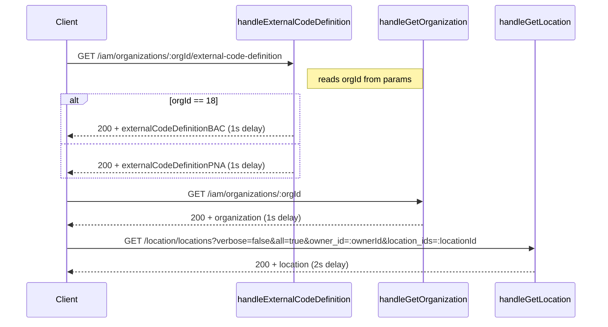
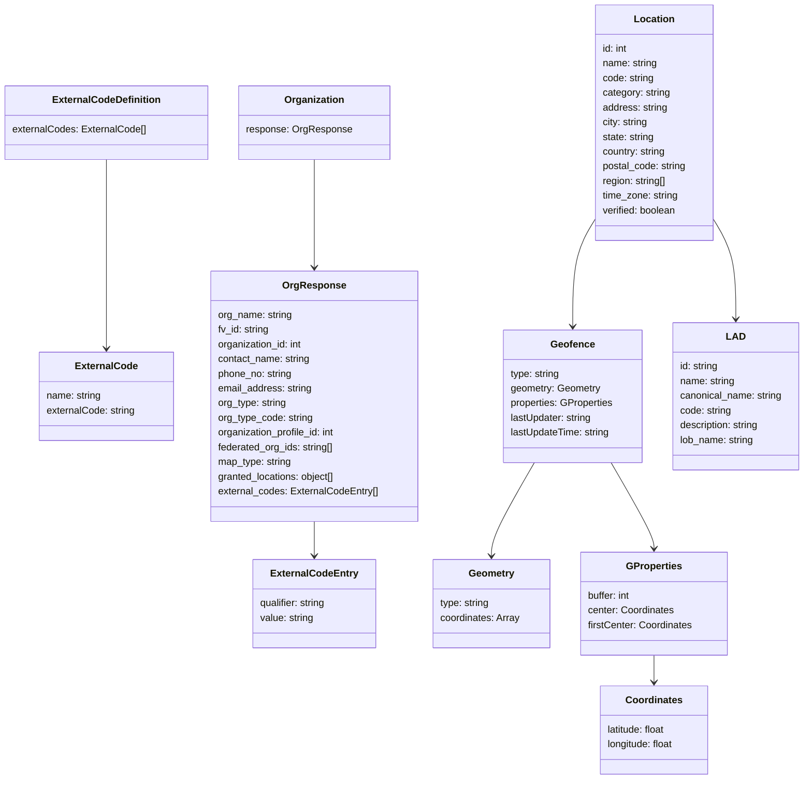

# Diagram: web/portal/src/mocks/handlers/organization-management/externalCodeDefinition.js


> Auto-generated by Obscura crawlers

## Diagram 1

```mermaid
flowchart LR
  Client[Client] -->|GET /iam/organizations/:orgId/external-code-definition| H_ECD[handleExternalCodeDefinition]
  H_ECD -->|orgId == 18| ECD_BAC[externalCodeDefinitionBAC]
  H_ECD -->|else| ECD_PNA[externalCodeDefinitionPNA]
  H_ECD -->|respond 200 (delay 1s)| Client
  Client -->|GET /iam/organizations/:orgId| H_Org[handleGetOrganization]
  H_Org -->|respond 200 (delay 1s)| Client
  Client -->|GET /location/locations?verbose=false&all=true&owner_id=:ownerId&location_ids=:locationId| H_Loc[handleGetLocation]
  H_Loc -->|respond 200 (delay 2s)| Client
  H_Org -->|returns| Org[organization]
  H_Loc -->|returns| Loc[location]
```

> SVG rendering failed for this diagram.

## Diagram 2



### SVG

<svg id="container" width="1213.5" xmlns="http://www.w3.org/2000/svg" height="636" viewBox="-50 -10 1213.5 636" role="graphics-document document" aria-roledescription="sequence"><g><rect x="956.5" y="550" fill="#eaeaea" stroke="#666" width="157" height="65" name="LocH" rx="3" ry="3" class="actor actor-bottom"></rect><text x="1035" y="582.5" dominant-baseline="central" alignment-baseline="central" class="actor actor-box" style="text-anchor: middle; font-size: 16px; font-weight: 400;"><tspan x="1035" dy="0">handleGetLocation</tspan></text></g><g><rect x="719.5" y="550" fill="#eaeaea" stroke="#666" width="187" height="65" name="OrgH" rx="3" ry="3" class="actor actor-bottom"></rect><text x="813" y="582.5" dominant-baseline="central" alignment-baseline="central" class="actor actor-box" style="text-anchor: middle; font-size: 16px; font-weight: 400;"><tspan x="813" dy="0">handleGetOrganization</tspan></text></g><g><rect x="432.5" y="550" fill="#eaeaea" stroke="#666" width="237" height="65" name="ECD" rx="3" ry="3" class="actor actor-bottom"></rect><text x="551" y="582.5" dominant-baseline="central" alignment-baseline="central" class="actor actor-box" style="text-anchor: middle; font-size: 16px; font-weight: 400;"><tspan x="551" dy="0">handleExternalCodeDefinition</tspan></text></g><g><rect x="0" y="550" fill="#eaeaea" stroke="#666" width="150" height="65" name="Client" rx="3" ry="3" class="actor actor-bottom"></rect><text x="75" y="582.5" dominant-baseline="central" alignment-baseline="central" class="actor actor-box" style="text-anchor: middle; font-size: 16px; font-weight: 400;"><tspan x="75" dy="0">Client</tspan></text></g><g><line id="actor3" x1="1035" y1="65" x2="1035" y2="550" class="actor-line 200" stroke-width="0.5px" stroke="#999" name="LocH"></line><g id="root-3"><rect x="956.5" y="0" fill="#eaeaea" stroke="#666" width="157" height="65" name="LocH" rx="3" ry="3" class="actor actor-top"></rect><text x="1035" y="32.5" dominant-baseline="central" alignment-baseline="central" class="actor actor-box" style="text-anchor: middle; font-size: 16px; font-weight: 400;"><tspan x="1035" dy="0">handleGetLocation</tspan></text></g></g><g><line id="actor2" x1="813" y1="65" x2="813" y2="550" class="actor-line 200" stroke-width="0.5px" stroke="#999" name="OrgH"></line><g id="root-2"><rect x="719.5" y="0" fill="#eaeaea" stroke="#666" width="187" height="65" name="OrgH" rx="3" ry="3" class="actor actor-top"></rect><text x="813" y="32.5" dominant-baseline="central" alignment-baseline="central" class="actor actor-box" style="text-anchor: middle; font-size: 16px; font-weight: 400;"><tspan x="813" dy="0">handleGetOrganization</tspan></text></g></g><g><line id="actor1" x1="551" y1="65" x2="551" y2="550" class="actor-line 200" stroke-width="0.5px" stroke="#999" name="ECD"></line><g id="root-1"><rect x="432.5" y="0" fill="#eaeaea" stroke="#666" width="237" height="65" name="ECD" rx="3" ry="3" class="actor actor-top"></rect><text x="551" y="32.5" dominant-baseline="central" alignment-baseline="central" class="actor actor-box" style="text-anchor: middle; font-size: 16px; font-weight: 400;"><tspan x="551" dy="0">handleExternalCodeDefinition</tspan></text></g></g><g><line id="actor0" x1="75" y1="65" x2="75" y2="550" class="actor-line 200" stroke-width="0.5px" stroke="#999" name="Client"></line><g id="root-0"><rect x="0" y="0" fill="#eaeaea" stroke="#666" width="150" height="65" name="Client" rx="3" ry="3" class="actor actor-top"></rect><text x="75" y="32.5" dominant-baseline="central" alignment-baseline="central" class="actor actor-box" style="text-anchor: middle; font-size: 16px; font-weight: 400;"><tspan x="75" dy="0">Client</tspan></text></g></g><style>#container{font-family:"trebuchet ms",verdana,arial,sans-serif;font-size:16px;fill:#333;}@keyframes edge-animation-frame{from{stroke-dashoffset:0;}}@keyframes dash{to{stroke-dashoffset:0;}}#container .edge-animation-slow{stroke-dasharray:9,5!important;stroke-dashoffset:900;animation:dash 50s linear infinite;stroke-linecap:round;}#container .edge-animation-fast{stroke-dasharray:9,5!important;stroke-dashoffset:900;animation:dash 20s linear infinite;stroke-linecap:round;}#container .error-icon{fill:#552222;}#container .error-text{fill:#552222;stroke:#552222;}#container .edge-thickness-normal{stroke-width:1px;}#container .edge-thickness-thick{stroke-width:3.5px;}#container .edge-pattern-solid{stroke-dasharray:0;}#container .edge-thickness-invisible{stroke-width:0;fill:none;}#container .edge-pattern-dashed{stroke-dasharray:3;}#container .edge-pattern-dotted{stroke-dasharray:2;}#container .marker{fill:#333333;stroke:#333333;}#container .marker.cross{stroke:#333333;}#container svg{font-family:"trebuchet ms",verdana,arial,sans-serif;font-size:16px;}#container p{margin:0;}#container .actor{stroke:hsl(259.6261682243, 59.7765363128%, 87.9019607843%);fill:#ECECFF;}#container text.actor&gt;tspan{fill:black;stroke:none;}#container .actor-line{stroke:hsl(259.6261682243, 59.7765363128%, 87.9019607843%);}#container .innerArc{stroke-width:1.5;stroke-dasharray:none;}#container .messageLine0{stroke-width:1.5;stroke-dasharray:none;stroke:#333;}#container .messageLine1{stroke-width:1.5;stroke-dasharray:2,2;stroke:#333;}#container #arrowhead path{fill:#333;stroke:#333;}#container .sequenceNumber{fill:white;}#container #sequencenumber{fill:#333;}#container #crosshead path{fill:#333;stroke:#333;}#container .messageText{fill:#333;stroke:none;}#container .labelBox{stroke:hsl(259.6261682243, 59.7765363128%, 87.9019607843%);fill:#ECECFF;}#container .labelText,#container .labelText&gt;tspan{fill:black;stroke:none;}#container .loopText,#container .loopText&gt;tspan{fill:black;stroke:none;}#container .loopLine{stroke-width:2px;stroke-dasharray:2,2;stroke:hsl(259.6261682243, 59.7765363128%, 87.9019607843%);fill:hsl(259.6261682243, 59.7765363128%, 87.9019607843%);}#container .note{stroke:#aaaa33;fill:#fff5ad;}#container .noteText,#container .noteText&gt;tspan{fill:black;stroke:none;}#container .activation0{fill:#f4f4f4;stroke:#666;}#container .activation1{fill:#f4f4f4;stroke:#666;}#container .activation2{fill:#f4f4f4;stroke:#666;}#container .actorPopupMenu{position:absolute;}#container .actorPopupMenuPanel{position:absolute;fill:#ECECFF;box-shadow:0px 8px 16px 0px rgba(0,0,0,0.2);filter:drop-shadow(3px 5px 2px rgb(0 0 0 / 0.4));}#container .actor-man line{stroke:hsl(259.6261682243, 59.7765363128%, 87.9019607843%);fill:#ECECFF;}#container .actor-man circle,#container line{stroke:hsl(259.6261682243, 59.7765363128%, 87.9019607843%);fill:#ECECFF;stroke-width:2px;}#container :root{--mermaid-font-family:"trebuchet ms",verdana,arial,sans-serif;}</style><g></g><defs><symbol id="computer" width="24" height="24"><path transform="scale(.5)" d="M2 2v13h20v-13h-20zm18 11h-16v-9h16v9zm-10.228 6l.466-1h3.524l.467 1h-4.457zm14.228 3h-24l2-6h2.104l-1.33 4h18.45l-1.297-4h2.073l2 6zm-5-10h-14v-7h14v7z"></path></symbol></defs><defs><symbol id="database" fill-rule="evenodd" clip-rule="evenodd"><path transform="scale(.5)" d="M12.258.001l.256.004.255.005.253.008.251.01.249.012.247.015.246.016.242.019.241.02.239.023.236.024.233.027.231.028.229.031.225.032.223.034.22.036.217.038.214.04.211.041.208.043.205.045.201.046.198.048.194.05.191.051.187.053.183.054.18.056.175.057.172.059.168.06.163.061.16.063.155.064.15.066.074.033.073.033.071.034.07.034.069.035.068.035.067.035.066.035.064.036.064.036.062.036.06.036.06.037.058.037.058.037.055.038.055.038.053.038.052.038.051.039.05.039.048.039.047.039.045.04.044.04.043.04.041.04.04.041.039.041.037.041.036.041.034.041.033.042.032.042.03.042.029.042.027.042.026.043.024.043.023.043.021.043.02.043.018.044.017.043.015.044.013.044.012.044.011.045.009.044.007.045.006.045.004.045.002.045.001.045v17l-.001.045-.002.045-.004.045-.006.045-.007.045-.009.044-.011.045-.012.044-.013.044-.015.044-.017.043-.018.044-.02.043-.021.043-.023.043-.024.043-.026.043-.027.042-.029.042-.03.042-.032.042-.033.042-.034.041-.036.041-.037.041-.039.041-.04.041-.041.04-.043.04-.044.04-.045.04-.047.039-.048.039-.05.039-.051.039-.052.038-.053.038-.055.038-.055.038-.058.037-.058.037-.06.037-.06.036-.062.036-.064.036-.064.036-.066.035-.067.035-.068.035-.069.035-.07.034-.071.034-.073.033-.074.033-.15.066-.155.064-.16.063-.163.061-.168.06-.172.059-.175.057-.18.056-.183.054-.187.053-.191.051-.194.05-.198.048-.201.046-.205.045-.208.043-.211.041-.214.04-.217.038-.22.036-.223.034-.225.032-.229.031-.231.028-.233.027-.236.024-.239.023-.241.02-.242.019-.246.016-.247.015-.249.012-.251.01-.253.008-.255.005-.256.004-.258.001-.258-.001-.256-.004-.255-.005-.253-.008-.251-.01-.249-.012-.247-.015-.245-.016-.243-.019-.241-.02-.238-.023-.236-.024-.234-.027-.231-.028-.228-.031-.226-.032-.223-.034-.22-.036-.217-.038-.214-.04-.211-.041-.208-.043-.204-.045-.201-.046-.198-.048-.195-.05-.19-.051-.187-.053-.184-.054-.179-.056-.176-.057-.172-.059-.167-.06-.164-.061-.159-.063-.155-.064-.151-.066-.074-.033-.072-.033-.072-.034-.07-.034-.069-.035-.068-.035-.067-.035-.066-.035-.064-.036-.063-.036-.062-.036-.061-.036-.06-.037-.058-.037-.057-.037-.056-.038-.055-.038-.053-.038-.052-.038-.051-.039-.049-.039-.049-.039-.046-.039-.046-.04-.044-.04-.043-.04-.041-.04-.04-.041-.039-.041-.037-.041-.036-.041-.034-.041-.033-.042-.032-.042-.03-.042-.029-.042-.027-.042-.026-.043-.024-.043-.023-.043-.021-.043-.02-.043-.018-.044-.017-.043-.015-.044-.013-.044-.012-.044-.011-.045-.009-.044-.007-.045-.006-.045-.004-.045-.002-.045-.001-.045v-17l.001-.045.002-.045.004-.045.006-.045.007-.045.009-.044.011-.045.012-.044.013-.044.015-.044.017-.043.018-.044.02-.043.021-.043.023-.043.024-.043.026-.043.027-.042.029-.042.03-.042.032-.042.033-.042.034-.041.036-.041.037-.041.039-.041.04-.041.041-.04.043-.04.044-.04.046-.04.046-.039.049-.039.049-.039.051-.039.052-.038.053-.038.055-.038.056-.038.057-.037.058-.037.06-.037.061-.036.062-.036.063-.036.064-.036.066-.035.067-.035.068-.035.069-.035.07-.034.072-.034.072-.033.074-.033.151-.066.155-.064.159-.063.164-.061.167-.06.172-.059.176-.057.179-.056.184-.054.187-.053.19-.051.195-.05.198-.048.201-.046.204-.045.208-.043.211-.041.214-.04.217-.038.22-.036.223-.034.226-.032.228-.031.231-.028.234-.027.236-.024.238-.023.241-.02.243-.019.245-.016.247-.015.249-.012.251-.01.253-.008.255-.005.256-.004.258-.001.258.001zm-9.258 20.499v.01l.001.021.003.021.004.022.005.021.006.022.007.022.009.023.01.022.011.023.012.023.013.023.015.023.016.024.017.023.018.024.019.024.021.024.022.025.023.024.024.025.052.049.056.05.061.051.066.051.07.051.075.051.079.052.084.052.088.052.092.052.097.052.102.051.105.052.11.052.114.051.119.051.123.051.127.05.131.05.135.05.139.048.144.049.147.047.152.047.155.047.16.045.163.045.167.043.171.043.176.041.178.041.183.039.187.039.19.037.194.035.197.035.202.033.204.031.209.03.212.029.216.027.219.025.222.024.226.021.23.02.233.018.236.016.24.015.243.012.246.01.249.008.253.005.256.004.259.001.26-.001.257-.004.254-.005.25-.008.247-.011.244-.012.241-.014.237-.016.233-.018.231-.021.226-.021.224-.024.22-.026.216-.027.212-.028.21-.031.205-.031.202-.034.198-.034.194-.036.191-.037.187-.039.183-.04.179-.04.175-.042.172-.043.168-.044.163-.045.16-.046.155-.046.152-.047.148-.048.143-.049.139-.049.136-.05.131-.05.126-.05.123-.051.118-.052.114-.051.11-.052.106-.052.101-.052.096-.052.092-.052.088-.053.083-.051.079-.052.074-.052.07-.051.065-.051.06-.051.056-.05.051-.05.023-.024.023-.025.021-.024.02-.024.019-.024.018-.024.017-.024.015-.023.014-.024.013-.023.012-.023.01-.023.01-.022.008-.022.006-.022.006-.022.004-.022.004-.021.001-.021.001-.021v-4.127l-.077.055-.08.053-.083.054-.085.053-.087.052-.09.052-.093.051-.095.05-.097.05-.1.049-.102.049-.105.048-.106.047-.109.047-.111.046-.114.045-.115.045-.118.044-.12.043-.122.042-.124.042-.126.041-.128.04-.13.04-.132.038-.134.038-.135.037-.138.037-.139.035-.142.035-.143.034-.144.033-.147.032-.148.031-.15.03-.151.03-.153.029-.154.027-.156.027-.158.026-.159.025-.161.024-.162.023-.163.022-.165.021-.166.02-.167.019-.169.018-.169.017-.171.016-.173.015-.173.014-.175.013-.175.012-.177.011-.178.01-.179.008-.179.008-.181.006-.182.005-.182.004-.184.003-.184.002h-.37l-.184-.002-.184-.003-.182-.004-.182-.005-.181-.006-.179-.008-.179-.008-.178-.01-.176-.011-.176-.012-.175-.013-.173-.014-.172-.015-.171-.016-.17-.017-.169-.018-.167-.019-.166-.02-.165-.021-.163-.022-.162-.023-.161-.024-.159-.025-.157-.026-.156-.027-.155-.027-.153-.029-.151-.03-.15-.03-.148-.031-.146-.032-.145-.033-.143-.034-.141-.035-.14-.035-.137-.037-.136-.037-.134-.038-.132-.038-.13-.04-.128-.04-.126-.041-.124-.042-.122-.042-.12-.044-.117-.043-.116-.045-.113-.045-.112-.046-.109-.047-.106-.047-.105-.048-.102-.049-.1-.049-.097-.05-.095-.05-.093-.052-.09-.051-.087-.052-.085-.053-.083-.054-.08-.054-.077-.054v4.127zm0-5.654v.011l.001.021.003.021.004.021.005.022.006.022.007.022.009.022.01.022.011.023.012.023.013.023.015.024.016.023.017.024.018.024.019.024.021.024.022.024.023.025.024.024.052.05.056.05.061.05.066.051.07.051.075.052.079.051.084.052.088.052.092.052.097.052.102.052.105.052.11.051.114.051.119.052.123.05.127.051.131.05.135.049.139.049.144.048.147.048.152.047.155.046.16.045.163.045.167.044.171.042.176.042.178.04.183.04.187.038.19.037.194.036.197.034.202.033.204.032.209.03.212.028.216.027.219.025.222.024.226.022.23.02.233.018.236.016.24.014.243.012.246.01.249.008.253.006.256.003.259.001.26-.001.257-.003.254-.006.25-.008.247-.01.244-.012.241-.015.237-.016.233-.018.231-.02.226-.022.224-.024.22-.025.216-.027.212-.029.21-.03.205-.032.202-.033.198-.035.194-.036.191-.037.187-.039.183-.039.179-.041.175-.042.172-.043.168-.044.163-.045.16-.045.155-.047.152-.047.148-.048.143-.048.139-.05.136-.049.131-.05.126-.051.123-.051.118-.051.114-.052.11-.052.106-.052.101-.052.096-.052.092-.052.088-.052.083-.052.079-.052.074-.051.07-.052.065-.051.06-.05.056-.051.051-.049.023-.025.023-.024.021-.025.02-.024.019-.024.018-.024.017-.024.015-.023.014-.023.013-.024.012-.022.01-.023.01-.023.008-.022.006-.022.006-.022.004-.021.004-.022.001-.021.001-.021v-4.139l-.077.054-.08.054-.083.054-.085.052-.087.053-.09.051-.093.051-.095.051-.097.05-.1.049-.102.049-.105.048-.106.047-.109.047-.111.046-.114.045-.115.044-.118.044-.12.044-.122.042-.124.042-.126.041-.128.04-.13.039-.132.039-.134.038-.135.037-.138.036-.139.036-.142.035-.143.033-.144.033-.147.033-.148.031-.15.03-.151.03-.153.028-.154.028-.156.027-.158.026-.159.025-.161.024-.162.023-.163.022-.165.021-.166.02-.167.019-.169.018-.169.017-.171.016-.173.015-.173.014-.175.013-.175.012-.177.011-.178.009-.179.009-.179.007-.181.007-.182.005-.182.004-.184.003-.184.002h-.37l-.184-.002-.184-.003-.182-.004-.182-.005-.181-.007-.179-.007-.179-.009-.178-.009-.176-.011-.176-.012-.175-.013-.173-.014-.172-.015-.171-.016-.17-.017-.169-.018-.167-.019-.166-.02-.165-.021-.163-.022-.162-.023-.161-.024-.159-.025-.157-.026-.156-.027-.155-.028-.153-.028-.151-.03-.15-.03-.148-.031-.146-.033-.145-.033-.143-.033-.141-.035-.14-.036-.137-.036-.136-.037-.134-.038-.132-.039-.13-.039-.128-.04-.126-.041-.124-.042-.122-.043-.12-.043-.117-.044-.116-.044-.113-.046-.112-.046-.109-.046-.106-.047-.105-.048-.102-.049-.1-.049-.097-.05-.095-.051-.093-.051-.09-.051-.087-.053-.085-.052-.083-.054-.08-.054-.077-.054v4.139zm0-5.666v.011l.001.02.003.022.004.021.005.022.006.021.007.022.009.023.01.022.011.023.012.023.013.023.015.023.016.024.017.024.018.023.019.024.021.025.022.024.023.024.024.025.052.05.056.05.061.05.066.051.07.051.075.052.079.051.084.052.088.052.092.052.097.052.102.052.105.051.11.052.114.051.119.051.123.051.127.05.131.05.135.05.139.049.144.048.147.048.152.047.155.046.16.045.163.045.167.043.171.043.176.042.178.04.183.04.187.038.19.037.194.036.197.034.202.033.204.032.209.03.212.028.216.027.219.025.222.024.226.021.23.02.233.018.236.017.24.014.243.012.246.01.249.008.253.006.256.003.259.001.26-.001.257-.003.254-.006.25-.008.247-.01.244-.013.241-.014.237-.016.233-.018.231-.02.226-.022.224-.024.22-.025.216-.027.212-.029.21-.03.205-.032.202-.033.198-.035.194-.036.191-.037.187-.039.183-.039.179-.041.175-.042.172-.043.168-.044.163-.045.16-.045.155-.047.152-.047.148-.048.143-.049.139-.049.136-.049.131-.051.126-.05.123-.051.118-.052.114-.051.11-.052.106-.052.101-.052.096-.052.092-.052.088-.052.083-.052.079-.052.074-.052.07-.051.065-.051.06-.051.056-.05.051-.049.023-.025.023-.025.021-.024.02-.024.019-.024.018-.024.017-.024.015-.023.014-.024.013-.023.012-.023.01-.022.01-.023.008-.022.006-.022.006-.022.004-.022.004-.021.001-.021.001-.021v-4.153l-.077.054-.08.054-.083.053-.085.053-.087.053-.09.051-.093.051-.095.051-.097.05-.1.049-.102.048-.105.048-.106.048-.109.046-.111.046-.114.046-.115.044-.118.044-.12.043-.122.043-.124.042-.126.041-.128.04-.13.039-.132.039-.134.038-.135.037-.138.036-.139.036-.142.034-.143.034-.144.033-.147.032-.148.032-.15.03-.151.03-.153.028-.154.028-.156.027-.158.026-.159.024-.161.024-.162.023-.163.023-.165.021-.166.02-.167.019-.169.018-.169.017-.171.016-.173.015-.173.014-.175.013-.175.012-.177.01-.178.01-.179.009-.179.007-.181.006-.182.006-.182.004-.184.003-.184.001-.185.001-.185-.001-.184-.001-.184-.003-.182-.004-.182-.006-.181-.006-.179-.007-.179-.009-.178-.01-.176-.01-.176-.012-.175-.013-.173-.014-.172-.015-.171-.016-.17-.017-.169-.018-.167-.019-.166-.02-.165-.021-.163-.023-.162-.023-.161-.024-.159-.024-.157-.026-.156-.027-.155-.028-.153-.028-.151-.03-.15-.03-.148-.032-.146-.032-.145-.033-.143-.034-.141-.034-.14-.036-.137-.036-.136-.037-.134-.038-.132-.039-.13-.039-.128-.041-.126-.041-.124-.041-.122-.043-.12-.043-.117-.044-.116-.044-.113-.046-.112-.046-.109-.046-.106-.048-.105-.048-.102-.048-.1-.05-.097-.049-.095-.051-.093-.051-.09-.052-.087-.052-.085-.053-.083-.053-.08-.054-.077-.054v4.153zm8.74-8.179l-.257.004-.254.005-.25.008-.247.011-.244.012-.241.014-.237.016-.233.018-.231.021-.226.022-.224.023-.22.026-.216.027-.212.028-.21.031-.205.032-.202.033-.198.034-.194.036-.191.038-.187.038-.183.04-.179.041-.175.042-.172.043-.168.043-.163.045-.16.046-.155.046-.152.048-.148.048-.143.048-.139.049-.136.05-.131.05-.126.051-.123.051-.118.051-.114.052-.11.052-.106.052-.101.052-.096.052-.092.052-.088.052-.083.052-.079.052-.074.051-.07.052-.065.051-.06.05-.056.05-.051.05-.023.025-.023.024-.021.024-.02.025-.019.024-.018.024-.017.023-.015.024-.014.023-.013.023-.012.023-.01.023-.01.022-.008.022-.006.023-.006.021-.004.022-.004.021-.001.021-.001.021.001.021.001.021.004.021.004.022.006.021.006.023.008.022.01.022.01.023.012.023.013.023.014.023.015.024.017.023.018.024.019.024.02.025.021.024.023.024.023.025.051.05.056.05.06.05.065.051.07.052.074.051.079.052.083.052.088.052.092.052.096.052.101.052.106.052.11.052.114.052.118.051.123.051.126.051.131.05.136.05.139.049.143.048.148.048.152.048.155.046.16.046.163.045.168.043.172.043.175.042.179.041.183.04.187.038.191.038.194.036.198.034.202.033.205.032.21.031.212.028.216.027.22.026.224.023.226.022.231.021.233.018.237.016.241.014.244.012.247.011.25.008.254.005.257.004.26.001.26-.001.257-.004.254-.005.25-.008.247-.011.244-.012.241-.014.237-.016.233-.018.231-.021.226-.022.224-.023.22-.026.216-.027.212-.028.21-.031.205-.032.202-.033.198-.034.194-.036.191-.038.187-.038.183-.04.179-.041.175-.042.172-.043.168-.043.163-.045.16-.046.155-.046.152-.048.148-.048.143-.048.139-.049.136-.05.131-.05.126-.051.123-.051.118-.051.114-.052.11-.052.106-.052.101-.052.096-.052.092-.052.088-.052.083-.052.079-.052.074-.051.07-.052.065-.051.06-.05.056-.05.051-.05.023-.025.023-.024.021-.024.02-.025.019-.024.018-.024.017-.023.015-.024.014-.023.013-.023.012-.023.01-.023.01-.022.008-.022.006-.023.006-.021.004-.022.004-.021.001-.021.001-.021-.001-.021-.001-.021-.004-.021-.004-.022-.006-.021-.006-.023-.008-.022-.01-.022-.01-.023-.012-.023-.013-.023-.014-.023-.015-.024-.017-.023-.018-.024-.019-.024-.02-.025-.021-.024-.023-.024-.023-.025-.051-.05-.056-.05-.06-.05-.065-.051-.07-.052-.074-.051-.079-.052-.083-.052-.088-.052-.092-.052-.096-.052-.101-.052-.106-.052-.11-.052-.114-.052-.118-.051-.123-.051-.126-.051-.131-.05-.136-.05-.139-.049-.143-.048-.148-.048-.152-.048-.155-.046-.16-.046-.163-.045-.168-.043-.172-.043-.175-.042-.179-.041-.183-.04-.187-.038-.191-.038-.194-.036-.198-.034-.202-.033-.205-.032-.21-.031-.212-.028-.216-.027-.22-.026-.224-.023-.226-.022-.231-.021-.233-.018-.237-.016-.241-.014-.244-.012-.247-.011-.25-.008-.254-.005-.257-.004-.26-.001-.26.001z"></path></symbol></defs><defs><symbol id="clock" width="24" height="24"><path transform="scale(.5)" d="M12 2c5.514 0 10 4.486 10 10s-4.486 10-10 10-10-4.486-10-10 4.486-10 10-10zm0-2c-6.627 0-12 5.373-12 12s5.373 12 12 12 12-5.373 12-12-5.373-12-12-12zm5.848 12.459c.202.038.202.333.001.372-1.907.361-6.045 1.111-6.547 1.111-.719 0-1.301-.582-1.301-1.301 0-.512.77-5.447 1.125-7.445.034-.192.312-.181.343.014l.985 6.238 5.394 1.011z"></path></symbol></defs><defs><marker id="arrowhead" refX="7.9" refY="5" markerUnits="userSpaceOnUse" markerWidth="12" markerHeight="12" orient="auto-start-reverse"><path d="M -1 0 L 10 5 L 0 10 z"></path></marker></defs><defs><marker id="crosshead" markerWidth="15" markerHeight="8" orient="auto" refX="4" refY="4.5"><path fill="none" stroke="#000000" stroke-width="1pt" d="M 1,2 L 6,7 M 6,2 L 1,7" style="stroke-dasharray: 0, 0;"></path></marker></defs><defs><marker id="filled-head" refX="15.5" refY="7" markerWidth="20" markerHeight="28" orient="auto"><path d="M 18,7 L9,13 L14,7 L9,1 Z"></path></marker></defs><defs><marker id="sequencenumber" refX="15" refY="15" markerWidth="60" markerHeight="40" orient="auto"><circle cx="15" cy="15" r="6"></circle></marker></defs><g><rect x="576" y="123" fill="#EDF2AE" stroke="#666" width="237" height="39" class="note"></rect><text x="695" y="128" text-anchor="middle" dominant-baseline="middle" alignment-baseline="middle" class="noteText" dy="1em" style="font-size: 16px; font-weight: 400;"><tspan x="695">reads orgId from params</tspan></text></g><g><line x1="64" y1="172" x2="562" y2="172" class="loopLine"></line><line x1="562" y1="172" x2="562" y2="338" class="loopLine"></line><line x1="64" y1="338" x2="562" y2="338" class="loopLine"></line><line x1="64" y1="172" x2="64" y2="338" class="loopLine"></line><line x1="64" y1="270" x2="562" y2="270" class="loopLine" style="stroke-dasharray: 3, 3;"></line><polygon points="64,172 114,172 114,185 105.6,192 64,192" class="labelBox"></polygon><text x="89" y="185" text-anchor="middle" dominant-baseline="middle" alignment-baseline="middle" class="labelText" style="font-size: 16px; font-weight: 400;">alt</text><text x="338" y="190" text-anchor="middle" class="loopText" style="font-size: 16px; font-weight: 400;"><tspan x="338">[orgId == 18]</tspan></text></g><text x="312" y="80" text-anchor="middle" dominant-baseline="middle" alignment-baseline="middle" class="messageText" dy="1em" style="font-size: 16px; font-weight: 400;">GET /iam/organizations/:orgId/external-code-definition</text><line x1="76" y1="113" x2="547" y2="113" class="messageLine0" stroke-width="2" stroke="none" marker-end="url(#arrowhead)" style="fill: none;"></line><text x="315" y="222" text-anchor="middle" dominant-baseline="middle" alignment-baseline="middle" class="messageText" dy="1em" style="font-size: 16px; font-weight: 400;">200 + externalCodeDefinitionBAC (1s delay)</text><line x1="550" y1="255" x2="79" y2="255" class="messageLine1" stroke-width="2" stroke="none" marker-end="url(#arrowhead)" style="stroke-dasharray: 3, 3; fill: none;"></line><text x="315" y="295" text-anchor="middle" dominant-baseline="middle" alignment-baseline="middle" class="messageText" dy="1em" style="font-size: 16px; font-weight: 400;">200 + externalCodeDefinitionPNA (1s delay)</text><line x1="550" y1="328" x2="79" y2="328" class="messageLine1" stroke-width="2" stroke="none" marker-end="url(#arrowhead)" style="stroke-dasharray: 3, 3; fill: none;"></line><text x="443" y="353" text-anchor="middle" dominant-baseline="middle" alignment-baseline="middle" class="messageText" dy="1em" style="font-size: 16px; font-weight: 400;">GET /iam/organizations/:orgId</text><line x1="76" y1="386" x2="809" y2="386" class="messageLine0" stroke-width="2" stroke="none" marker-end="url(#arrowhead)" style="fill: none;"></line><text x="446" y="401" text-anchor="middle" dominant-baseline="middle" alignment-baseline="middle" class="messageText" dy="1em" style="font-size: 16px; font-weight: 400;">200 + organization (1s delay)</text><line x1="812" y1="434" x2="79" y2="434" class="messageLine1" stroke-width="2" stroke="none" marker-end="url(#arrowhead)" style="stroke-dasharray: 3, 3; fill: none;"></line><text x="554" y="449" text-anchor="middle" dominant-baseline="middle" alignment-baseline="middle" class="messageText" dy="1em" style="font-size: 16px; font-weight: 400;">GET /location/locations?verbose=false&amp;all=true&amp;owner_id=:ownerId&amp;location_ids=:locationId</text><line x1="76" y1="482" x2="1031" y2="482" class="messageLine0" stroke-width="2" stroke="none" marker-end="url(#arrowhead)" style="fill: none;"></line><text x="557" y="497" text-anchor="middle" dominant-baseline="middle" alignment-baseline="middle" class="messageText" dy="1em" style="font-size: 16px; font-weight: 400;">200 + location (2s delay)</text><line x1="1034" y1="530" x2="79" y2="530" class="messageLine1" stroke-width="2" stroke="none" marker-end="url(#arrowhead)" style="stroke-dasharray: 3, 3; fill: none;"></line></svg>

## Diagram 3



### SVG

<svg id="container" width="1301.916015625" xmlns="http://www.w3.org/2000/svg" class="classDiagram" height="1270" viewBox="0 0 1301.916015625 1270" role="graphics-document document" aria-roledescription="class"><style>#container{font-family:"trebuchet ms",verdana,arial,sans-serif;font-size:16px;fill:#333;}@keyframes edge-animation-frame{from{stroke-dashoffset:0;}}@keyframes dash{to{stroke-dashoffset:0;}}#container .edge-animation-slow{stroke-dasharray:9,5!important;stroke-dashoffset:900;animation:dash 50s linear infinite;stroke-linecap:round;}#container .edge-animation-fast{stroke-dasharray:9,5!important;stroke-dashoffset:900;animation:dash 20s linear infinite;stroke-linecap:round;}#container .error-icon{fill:#552222;}#container .error-text{fill:#552222;stroke:#552222;}#container .edge-thickness-normal{stroke-width:1px;}#container .edge-thickness-thick{stroke-width:3.5px;}#container .edge-pattern-solid{stroke-dasharray:0;}#container .edge-thickness-invisible{stroke-width:0;fill:none;}#container .edge-pattern-dashed{stroke-dasharray:3;}#container .edge-pattern-dotted{stroke-dasharray:2;}#container .marker{fill:#333333;stroke:#333333;}#container .marker.cross{stroke:#333333;}#container svg{font-family:"trebuchet ms",verdana,arial,sans-serif;font-size:16px;}#container p{margin:0;}#container g.classGroup text{fill:#9370DB;stroke:none;font-family:"trebuchet ms",verdana,arial,sans-serif;font-size:10px;}#container g.classGroup text .title{font-weight:bolder;}#container .nodeLabel,#container .edgeLabel{color:#131300;}#container .edgeLabel .label rect{fill:#ECECFF;}#container .label text{fill:#131300;}#container .labelBkg{background:#ECECFF;}#container .edgeLabel .label span{background:#ECECFF;}#container .classTitle{font-weight:bolder;}#container .node rect,#container .node circle,#container .node ellipse,#container .node polygon,#container .node path{fill:#ECECFF;stroke:#9370DB;stroke-width:1px;}#container .divider{stroke:#9370DB;stroke-width:1;}#container g.clickable{cursor:pointer;}#container g.classGroup rect{fill:#ECECFF;stroke:#9370DB;}#container g.classGroup line{stroke:#9370DB;stroke-width:1;}#container .classLabel .box{stroke:none;stroke-width:0;fill:#ECECFF;opacity:0.5;}#container .classLabel .label{fill:#9370DB;font-size:10px;}#container .relation{stroke:#333333;stroke-width:1;fill:none;}#container .dashed-line{stroke-dasharray:3;}#container .dotted-line{stroke-dasharray:1 2;}#container #compositionStart,#container .composition{fill:#333333!important;stroke:#333333!important;stroke-width:1;}#container #compositionEnd,#container .composition{fill:#333333!important;stroke:#333333!important;stroke-width:1;}#container #dependencyStart,#container .dependency{fill:#333333!important;stroke:#333333!important;stroke-width:1;}#container #dependencyStart,#container .dependency{fill:#333333!important;stroke:#333333!important;stroke-width:1;}#container #extensionStart,#container .extension{fill:transparent!important;stroke:#333333!important;stroke-width:1;}#container #extensionEnd,#container .extension{fill:transparent!important;stroke:#333333!important;stroke-width:1;}#container #aggregationStart,#container .aggregation{fill:transparent!important;stroke:#333333!important;stroke-width:1;}#container #aggregationEnd,#container .aggregation{fill:transparent!important;stroke:#333333!important;stroke-width:1;}#container #lollipopStart,#container .lollipop{fill:#ECECFF!important;stroke:#333333!important;stroke-width:1;}#container #lollipopEnd,#container .lollipop{fill:#ECECFF!important;stroke:#333333!important;stroke-width:1;}#container .edgeTerminals{font-size:11px;line-height:initial;}#container .classTitleText{text-anchor:middle;font-size:18px;fill:#333;}#container .label-icon{display:inline-block;height:1em;overflow:visible;vertical-align:-0.125em;}#container .node .label-icon path{fill:currentColor;stroke:revert;stroke-width:revert;}#container :root{--mermaid-font-family:"trebuchet ms",verdana,arial,sans-serif;}</style><g><defs><marker id="container_class-aggregationStart" class="marker aggregation class" refX="18" refY="7" markerWidth="190" markerHeight="240" orient="auto"><path d="M 18,7 L9,13 L1,7 L9,1 Z"></path></marker></defs><defs><marker id="container_class-aggregationEnd" class="marker aggregation class" refX="1" refY="7" markerWidth="20" markerHeight="28" orient="auto"><path d="M 18,7 L9,13 L1,7 L9,1 Z"></path></marker></defs><defs><marker id="container_class-extensionStart" class="marker extension class" refX="18" refY="7" markerWidth="190" markerHeight="240" orient="auto"><path d="M 1,7 L18,13 V 1 Z"></path></marker></defs><defs><marker id="container_class-extensionEnd" class="marker extension class" refX="1" refY="7" markerWidth="20" markerHeight="28" orient="auto"><path d="M 1,1 V 13 L18,7 Z"></path></marker></defs><defs><marker id="container_class-compositionStart" class="marker composition class" refX="18" refY="7" markerWidth="190" markerHeight="240" orient="auto"><path d="M 18,7 L9,13 L1,7 L9,1 Z"></path></marker></defs><defs><marker id="container_class-compositionEnd" class="marker composition class" refX="1" refY="7" markerWidth="20" markerHeight="28" orient="auto"><path d="M 18,7 L9,13 L1,7 L9,1 Z"></path></marker></defs><defs><marker id="container_class-dependencyStart" class="marker dependency class" refX="6" refY="7" markerWidth="190" markerHeight="240" orient="auto"><path d="M 5,7 L9,13 L1,7 L9,1 Z"></path></marker></defs><defs><marker id="container_class-dependencyEnd" class="marker dependency class" refX="13" refY="7" markerWidth="20" markerHeight="28" orient="auto"><path d="M 18,7 L9,13 L14,7 L9,1 Z"></path></marker></defs><defs><marker id="container_class-lollipopStart" class="marker lollipop class" refX="13" refY="7" markerWidth="190" markerHeight="240" orient="auto"><circle stroke="black" fill="transparent" cx="7" cy="7" r="6"></circle></marker></defs><defs><marker id="container_class-lollipopEnd" class="marker lollipop class" refX="1" refY="7" markerWidth="190" markerHeight="240" orient="auto"><circle stroke="black" fill="transparent" cx="7" cy="7" r="6"></circle></marker></defs><g class="root"><g class="clusters"></g><g class="edgePaths"><path d="M170.781,260L170.781,286.167C170.781,312.333,170.781,364.667,170.781,416C170.781,467.333,170.781,517.667,170.781,542.833L170.781,568" id="id_ExternalCodeDefinition_ExternalCode_1" class="edge-thickness-normal edge-pattern-solid relation" style=";;;" data-edge="true" data-et="edge" data-id="id_ExternalCodeDefinition_ExternalCode_1" data-points="W3sieCI6MTcwLjc4MTI1LCJ5IjoyNjB9LHsieCI6MTcwLjc4MTI1LCJ5Ijo0MTd9LHsieCI6MTcwLjc4MTI1LCJ5Ijo1NzR9XQ==" marker-end="url(#container_class-dependencyEnd)"></path><path d="M503.793,850L503.793,854.167C503.793,858.333,503.793,866.667,503.793,876C503.793,885.333,503.793,895.667,503.793,900.833L503.793,906" id="id_OrgResponse_ExternalCodeEntry_2" class="edge-thickness-normal edge-pattern-solid relation" style=";;;" data-edge="true" data-et="edge" data-id="id_OrgResponse_ExternalCodeEntry_2" data-points="W3sieCI6NTAzLjc5Mjk2ODc1LCJ5Ijo4NTB9LHsieCI6NTAzLjc5Mjk2ODc1LCJ5Ijo4NzV9LHsieCI6NTAzLjc5Mjk2ODc1LCJ5Ijo5MTJ9XQ==" marker-end="url(#container_class-dependencyEnd)"></path><path d="M503.793,260L503.793,286.167C503.793,312.333,503.793,364.667,503.793,394C503.793,423.333,503.793,429.667,503.793,432.833L503.793,436" id="id_Organization_OrgResponse_3" class="edge-thickness-normal edge-pattern-solid relation" style=";;;" data-edge="true" data-et="edge" data-id="id_Organization_OrgResponse_3" data-points="W3sieCI6NTAzLjc5Mjk2ODc1LCJ5IjoyNjB9LHsieCI6NTAzLjc5Mjk2ODc1LCJ5Ijo0MTd9LHsieCI6NTAzLjc5Mjk2ODc1LCJ5Ijo0NDJ9XQ==" marker-end="url(#container_class-dependencyEnd)"></path><path d="M961.047,357.421L954.952,367.351C948.857,377.28,936.668,397.14,930.573,426.237C924.479,455.333,924.479,493.667,924.479,512.833L924.479,532" id="id_Location_Geofence_4" class="edge-thickness-normal edge-pattern-solid relation" style=";;;" data-edge="true" data-et="edge" data-id="id_Location_Geofence_4" data-points="W3sieCI6OTYxLjA0Njg3NSwieSI6MzU3LjQyMDcwMzAwNDcwNzJ9LHsieCI6OTI0LjQ3ODUxNTYyNSwieSI6NDE3fSx7IngiOjkyNC40Nzg1MTU2MjUsInkiOjUzOH1d" marker-end="url(#container_class-dependencyEnd)"></path><path d="M862.103,754L850.455,774.167C838.808,794.333,815.513,834.667,803.866,860C792.219,885.333,792.219,895.667,792.219,900.833L792.219,906" id="id_Geofence_Geometry_5" class="edge-thickness-normal edge-pattern-solid relation" style=";;;" data-edge="true" data-et="edge" data-id="id_Geofence_Geometry_5" data-points="W3sieCI6ODYyLjEwMjczMDk2MzQyNzksInkiOjc1NH0seyJ4Ijo3OTIuMjE4NzUsInkiOjg3NX0seyJ4Ijo3OTIuMjE4NzUsInkiOjkxMn1d" marker-end="url(#container_class-dependencyEnd)"></path><path d="M986.854,754L998.502,774.167C1010.149,794.333,1033.444,834.667,1045.091,858C1056.738,881.333,1056.738,887.667,1056.738,890.833L1056.738,894" id="id_Geofence_GProperties_6" class="edge-thickness-normal edge-pattern-solid relation" style=";;;" data-edge="true" data-et="edge" data-id="id_Geofence_GProperties_6" data-points="W3sieCI6OTg2Ljg1NDMwMDI4NjU3MjEsInkiOjc1NH0seyJ4IjoxMDU2LjczODI4MTI1LCJ5Ijo4NzV9LHsieCI6MTA1Ni43MzgyODEyNSwieSI6OTAwfV0=" marker-end="url(#container_class-dependencyEnd)"></path><path d="M1056.738,1068L1056.738,1072.167C1056.738,1076.333,1056.738,1084.667,1056.738,1092C1056.738,1099.333,1056.738,1105.667,1056.738,1108.833L1056.738,1112" id="id_GProperties_Coordinates_7" class="edge-thickness-normal edge-pattern-solid relation" style=";;;" data-edge="true" data-et="edge" data-id="id_GProperties_Coordinates_7" data-points="W3sieCI6MTA1Ni43MzgyODEyNSwieSI6MTA2OH0seyJ4IjoxMDU2LjczODI4MTI1LCJ5IjoxMDkzfSx7IngiOjEwNTYuNzM4MjgxMjUsInkiOjExMTh9XQ==" marker-end="url(#container_class-dependencyEnd)"></path><path d="M1154.289,357.421L1160.384,367.351C1166.479,377.28,1178.668,397.14,1184.763,424.237C1190.857,451.333,1190.857,485.667,1190.857,502.833L1190.857,520" id="id_Location_LAD_8" class="edge-thickness-normal edge-pattern-solid relation" style=";;;" data-edge="true" data-et="edge" data-id="id_Location_LAD_8" data-points="W3sieCI6MTE1NC4yODkwNjI1LCJ5IjozNTcuNDIwNzAzMDA0NzA3Mn0seyJ4IjoxMTkwLjg1NzQyMTg3NSwieSI6NDE3fSx7IngiOjExOTAuODU3NDIxODc1LCJ5Ijo1MjZ9XQ==" marker-end="url(#container_class-dependencyEnd)"></path></g><g class="edgeLabels"><g class="edgeLabel"><g class="label" data-id="id_ExternalCodeDefinition_ExternalCode_1" transform="translate(0, 0)"><foreignObject width="0" height="0"><div xmlns="http://www.w3.org/1999/xhtml" class="labelBkg" style="display: table-cell; white-space: nowrap; line-height: 1.5; max-width: 200px; text-align: center;"><span class="edgeLabel"></span></div></foreignObject></g></g><g class="edgeLabel"><g class="label" data-id="id_OrgResponse_ExternalCodeEntry_2" transform="translate(0, 0)"><foreignObject width="0" height="0"><div xmlns="http://www.w3.org/1999/xhtml" class="labelBkg" style="display: table-cell; white-space: nowrap; line-height: 1.5; max-width: 200px; text-align: center;"><span class="edgeLabel"></span></div></foreignObject></g></g><g class="edgeLabel"><g class="label" data-id="id_Organization_OrgResponse_3" transform="translate(0, 0)"><foreignObject width="0" height="0"><div xmlns="http://www.w3.org/1999/xhtml" class="labelBkg" style="display: table-cell; white-space: nowrap; line-height: 1.5; max-width: 200px; text-align: center;"><span class="edgeLabel"></span></div></foreignObject></g></g><g class="edgeLabel"><g class="label" data-id="id_Location_Geofence_4" transform="translate(0, 0)"><foreignObject width="0" height="0"><div xmlns="http://www.w3.org/1999/xhtml" class="labelBkg" style="display: table-cell; white-space: nowrap; line-height: 1.5; max-width: 200px; text-align: center;"><span class="edgeLabel"></span></div></foreignObject></g></g><g class="edgeLabel"><g class="label" data-id="id_Geofence_Geometry_5" transform="translate(0, 0)"><foreignObject width="0" height="0"><div xmlns="http://www.w3.org/1999/xhtml" class="labelBkg" style="display: table-cell; white-space: nowrap; line-height: 1.5; max-width: 200px; text-align: center;"><span class="edgeLabel"></span></div></foreignObject></g></g><g class="edgeLabel"><g class="label" data-id="id_Geofence_GProperties_6" transform="translate(0, 0)"><foreignObject width="0" height="0"><div xmlns="http://www.w3.org/1999/xhtml" class="labelBkg" style="display: table-cell; white-space: nowrap; line-height: 1.5; max-width: 200px; text-align: center;"><span class="edgeLabel"></span></div></foreignObject></g></g><g class="edgeLabel"><g class="label" data-id="id_GProperties_Coordinates_7" transform="translate(0, 0)"><foreignObject width="0" height="0"><div xmlns="http://www.w3.org/1999/xhtml" class="labelBkg" style="display: table-cell; white-space: nowrap; line-height: 1.5; max-width: 200px; text-align: center;"><span class="edgeLabel"></span></div></foreignObject></g></g><g class="edgeLabel"><g class="label" data-id="id_Location_LAD_8" transform="translate(0, 0)"><foreignObject width="0" height="0"><div xmlns="http://www.w3.org/1999/xhtml" class="labelBkg" style="display: table-cell; white-space: nowrap; line-height: 1.5; max-width: 200px; text-align: center;"><span class="edgeLabel"></span></div></foreignObject></g></g></g><g class="nodes"><g class="node default" id="classId-ExternalCodeDefinition-0" transform="translate(170.78125, 200)"><g class="basic label-container"><path d="M-162.78125 -60 L162.78125 -60 L162.78125 60 L-162.78125 60" stroke="none" stroke-width="0" fill="#ECECFF" style=""></path><path d="M-162.78125 -60 C-77.38343984596877 -60, 8.014370308062468 -60, 162.78125 -60 M-162.78125 -60 C-44.517393984259115 -60, 73.74646203148177 -60, 162.78125 -60 M162.78125 -60 C162.78125 -33.10146294905766, 162.78125 -6.202925898115325, 162.78125 60 M162.78125 -60 C162.78125 -13.04055735617274, 162.78125 33.91888528765452, 162.78125 60 M162.78125 60 C60.404210280905716 60, -41.97282943818857 60, -162.78125 60 M162.78125 60 C65.99416740481985 60, -30.792915190360304 60, -162.78125 60 M-162.78125 60 C-162.78125 33.82299052597742, -162.78125 7.645981051954834, -162.78125 -60 M-162.78125 60 C-162.78125 28.782833408129747, -162.78125 -2.434333183740506, -162.78125 -60" stroke="#9370DB" stroke-width="1.3" fill="none" stroke-dasharray="0 0" style=""></path></g><g class="annotation-group text" transform="translate(0, -36)"></g><g class="label-group text" transform="translate(-84.421875, -36)"><g class="label" style="font-weight: bolder" transform="translate(0,-12)"><foreignObject width="168.84375" height="24"><div xmlns="http://www.w3.org/1999/xhtml" style="display: table-cell; white-space: nowrap; line-height: 1.5; max-width: 217px; text-align: center;"><span class="nodeLabel markdown-node-label" style=""><p>ExternalCodeDefinition</p></span></div></foreignObject></g></g><g class="members-group text" transform="translate(-150.78125, 12)"><g class="label" style="" transform="translate(0,-12)"><foreignObject width="217.140625" height="24"><div xmlns="http://www.w3.org/1999/xhtml" style="display: table-cell; white-space: nowrap; line-height: 1.5; max-width: 267px; text-align: center;"><span class="nodeLabel markdown-node-label" style=""><p>externalCodes: ExternalCode[]</p></span></div></foreignObject></g></g><g class="methods-group text" transform="translate(-150.78125, 60)"></g><g class="divider" style=""><path d="M-162.78125 -12 C-93.50227924331836 -12, -24.22330848663671 -12, 162.78125 -12 M-162.78125 -12 C-33.27755626375156 -12, 96.22613747249687 -12, 162.78125 -12" stroke="#9370DB" stroke-width="1.3" fill="none" stroke-dasharray="0 0" style=""></path></g><g class="divider" style=""><path d="M-162.78125 36 C-80.11379814013739 36, 2.5536537197252187 36, 162.78125 36 M-162.78125 36 C-65.60102945789245 36, 31.579191084215097 36, 162.78125 36" stroke="#9370DB" stroke-width="1.3" fill="none" stroke-dasharray="0 0" style=""></path></g></g><g class="node default" id="classId-ExternalCode-1" transform="translate(170.78125, 646)"><g class="basic label-container"><path d="M-108.9375 -72 L108.9375 -72 L108.9375 72 L-108.9375 72" stroke="none" stroke-width="0" fill="#ECECFF" style=""></path><path d="M-108.9375 -72 C-21.98764690406496 -72, 64.96220619187008 -72, 108.9375 -72 M-108.9375 -72 C-23.230499374868742 -72, 62.476501250262515 -72, 108.9375 -72 M108.9375 -72 C108.9375 -27.58817224832987, 108.9375 16.823655503340262, 108.9375 72 M108.9375 -72 C108.9375 -16.723877886577398, 108.9375 38.552244226845204, 108.9375 72 M108.9375 72 C52.37966159452548 72, -4.17817681094904 72, -108.9375 72 M108.9375 72 C23.482641951854035 72, -61.97221609629193 72, -108.9375 72 M-108.9375 72 C-108.9375 43.094035838238234, -108.9375 14.188071676476468, -108.9375 -72 M-108.9375 72 C-108.9375 18.20783046202611, -108.9375 -35.58433907594778, -108.9375 -72" stroke="#9370DB" stroke-width="1.3" fill="none" stroke-dasharray="0 0" style=""></path></g><g class="annotation-group text" transform="translate(0, -48)"></g><g class="label-group text" transform="translate(-48.5, -48)"><g class="label" style="font-weight: bolder" transform="translate(0,-12)"><foreignObject width="97" height="24"><div xmlns="http://www.w3.org/1999/xhtml" style="display: table-cell; white-space: nowrap; line-height: 1.5; max-width: 146px; text-align: center;"><span class="nodeLabel markdown-node-label" style=""><p>ExternalCode</p></span></div></foreignObject></g></g><g class="members-group text" transform="translate(-96.9375, 0)"><g class="label" style="" transform="translate(0,-12)"><foreignObject width="90.234375" height="24"><div xmlns="http://www.w3.org/1999/xhtml" style="display: table-cell; white-space: nowrap; line-height: 1.5; max-width: 141px; text-align: center;"><span class="nodeLabel markdown-node-label" style=""><p>name: string</p></span></div></foreignObject></g><g class="label" style="" transform="translate(0,12)"><foreignObject width="145.375" height="24"><div xmlns="http://www.w3.org/1999/xhtml" style="display: table-cell; white-space: nowrap; line-height: 1.5; max-width: 196px; text-align: center;"><span class="nodeLabel markdown-node-label" style=""><p>externalCode: string</p></span></div></foreignObject></g></g><g class="methods-group text" transform="translate(-96.9375, 72)"></g><g class="divider" style=""><path d="M-108.9375 -24 C-65.13993258831067 -24, -21.342365176621357 -24, 108.9375 -24 M-108.9375 -24 C-25.10345061954898 -24, 58.73059876090204 -24, 108.9375 -24" stroke="#9370DB" stroke-width="1.3" fill="none" stroke-dasharray="0 0" style=""></path></g><g class="divider" style=""><path d="M-108.9375 48 C-63.93017693317279 48, -18.922853866345577 48, 108.9375 48 M-108.9375 48 C-47.53559588498206 48, 13.866308230035884 48, 108.9375 48" stroke="#9370DB" stroke-width="1.3" fill="none" stroke-dasharray="0 0" style=""></path></g></g><g class="node default" id="classId-ExternalCodeEntry-2" transform="translate(503.79296875, 984)"><g class="basic label-container"><path d="M-101.140625 -72 L101.140625 -72 L101.140625 72 L-101.140625 72" stroke="none" stroke-width="0" fill="#ECECFF" style=""></path><path d="M-101.140625 -72 C-32.54781829327902 -72, 36.044988413441956 -72, 101.140625 -72 M-101.140625 -72 C-47.8226839320311 -72, 5.4952571359378055 -72, 101.140625 -72 M101.140625 -72 C101.140625 -22.598172991258217, 101.140625 26.803654017483566, 101.140625 72 M101.140625 -72 C101.140625 -30.815630843961053, 101.140625 10.368738312077895, 101.140625 72 M101.140625 72 C30.220325596491563 72, -40.699973807016875 72, -101.140625 72 M101.140625 72 C51.3391898826869 72, 1.5377547653738048 72, -101.140625 72 M-101.140625 72 C-101.140625 40.4360331977107, -101.140625 8.872066395421392, -101.140625 -72 M-101.140625 72 C-101.140625 30.129375928007796, -101.140625 -11.741248143984407, -101.140625 -72" stroke="#9370DB" stroke-width="1.3" fill="none" stroke-dasharray="0 0" style=""></path></g><g class="annotation-group text" transform="translate(0, -48)"></g><g class="label-group text" transform="translate(-67.6875, -48)"><g class="label" style="font-weight: bolder" transform="translate(0,-12)"><foreignObject width="135.375" height="24"><div xmlns="http://www.w3.org/1999/xhtml" style="display: table-cell; white-space: nowrap; line-height: 1.5; max-width: 183px; text-align: center;"><span class="nodeLabel markdown-node-label" style=""><p>ExternalCodeEntry</p></span></div></foreignObject></g></g><g class="members-group text" transform="translate(-89.140625, 0)"><g class="label" style="" transform="translate(0,-12)"><foreignObject width="110.59375" height="24"><div xmlns="http://www.w3.org/1999/xhtml" style="display: table-cell; white-space: nowrap; line-height: 1.5; max-width: 161px; text-align: center;"><span class="nodeLabel markdown-node-label" style=""><p>qualifier: string</p></span></div></foreignObject></g><g class="label" style="" transform="translate(0,12)"><foreignObject width="88.59375" height="24"><div xmlns="http://www.w3.org/1999/xhtml" style="display: table-cell; white-space: nowrap; line-height: 1.5; max-width: 139px; text-align: center;"><span class="nodeLabel markdown-node-label" style=""><p>value: string</p></span></div></foreignObject></g></g><g class="methods-group text" transform="translate(-89.140625, 72)"></g><g class="divider" style=""><path d="M-101.140625 -24 C-28.50063523164711 -24, 44.13935453670578 -24, 101.140625 -24 M-101.140625 -24 C-26.047272795047547 -24, 49.046079409904905 -24, 101.140625 -24" stroke="#9370DB" stroke-width="1.3" fill="none" stroke-dasharray="0 0" style=""></path></g><g class="divider" style=""><path d="M-101.140625 48 C-46.051370309977514 48, 9.037884380044972 48, 101.140625 48 M-101.140625 48 C-34.7802639277041 48, 31.580097144591804 48, 101.140625 48" stroke="#9370DB" stroke-width="1.3" fill="none" stroke-dasharray="0 0" style=""></path></g></g><g class="node default" id="classId-OrgResponse-3" transform="translate(503.79296875, 646)"><g class="basic label-container"><path d="M-166.96484375 -204 L166.96484375 -204 L166.96484375 204 L-166.96484375 204" stroke="none" stroke-width="0" fill="#ECECFF" style=""></path><path d="M-166.96484375 -204 C-63.35469599357309 -204, 40.25545176285382 -204, 166.96484375 -204 M-166.96484375 -204 C-54.844687832751134 -204, 57.27546808449773 -204, 166.96484375 -204 M166.96484375 -204 C166.96484375 -102.14982110731279, 166.96484375 -0.29964221462557816, 166.96484375 204 M166.96484375 -204 C166.96484375 -99.37477756621709, 166.96484375 5.250444867565818, 166.96484375 204 M166.96484375 204 C65.7248388359079 204, -35.515166078184194 204, -166.96484375 204 M166.96484375 204 C66.33299103603936 204, -34.29886167792128 204, -166.96484375 204 M-166.96484375 204 C-166.96484375 107.60376688321772, -166.96484375 11.207533766435432, -166.96484375 -204 M-166.96484375 204 C-166.96484375 41.48021950318952, -166.96484375 -121.03956099362097, -166.96484375 -204" stroke="#9370DB" stroke-width="1.3" fill="none" stroke-dasharray="0 0" style=""></path></g><g class="annotation-group text" transform="translate(0, -180)"></g><g class="label-group text" transform="translate(-48.4921875, -180)"><g class="label" style="font-weight: bolder" transform="translate(0,-12)"><foreignObject width="96.984375" height="24"><div xmlns="http://www.w3.org/1999/xhtml" style="display: table-cell; white-space: nowrap; line-height: 1.5; max-width: 145px; text-align: center;"><span class="nodeLabel markdown-node-label" style=""><p>OrgResponse</p></span></div></foreignObject></g></g><g class="members-group text" transform="translate(-154.96484375, -132)"><g class="label" style="" transform="translate(0,-12)"><foreignObject width="122.21875" height="24"><div xmlns="http://www.w3.org/1999/xhtml" style="display: table-cell; white-space: nowrap; line-height: 1.5; max-width: 173px; text-align: center;"><span class="nodeLabel markdown-node-label" style=""><p>org_name: string</p></span></div></foreignObject></g><g class="label" style="" transform="translate(0,12)"><foreignObject width="84.875" height="24"><div xmlns="http://www.w3.org/1999/xhtml" style="display: table-cell; white-space: nowrap; line-height: 1.5; max-width: 136px; text-align: center;"><span class="nodeLabel markdown-node-label" style=""><p>fv_id: string</p></span></div></foreignObject></g><g class="label" style="" transform="translate(0,36)"><foreignObject width="140.5" height="24"><div xmlns="http://www.w3.org/1999/xhtml" style="display: table-cell; white-space: nowrap; line-height: 1.5; max-width: 191px; text-align: center;"><span class="nodeLabel markdown-node-label" style=""><p>organization_id: int</p></span></div></foreignObject></g><g class="label" style="" transform="translate(0,60)"><foreignObject width="152.390625" height="24"><div xmlns="http://www.w3.org/1999/xhtml" style="display: table-cell; white-space: nowrap; line-height: 1.5; max-width: 203px; text-align: center;"><span class="nodeLabel markdown-node-label" style=""><p>contact_name: string</p></span></div></foreignObject></g><g class="label" style="" transform="translate(0,84)"><foreignObject width="122.765625" height="24"><div xmlns="http://www.w3.org/1999/xhtml" style="display: table-cell; white-space: nowrap; line-height: 1.5; max-width: 173px; text-align: center;"><span class="nodeLabel markdown-node-label" style=""><p>phone_no: string</p></span></div></foreignObject></g><g class="label" style="" transform="translate(0,108)"><foreignObject width="155.09375" height="24"><div xmlns="http://www.w3.org/1999/xhtml" style="display: table-cell; white-space: nowrap; line-height: 1.5; max-width: 206px; text-align: center;"><span class="nodeLabel markdown-node-label" style=""><p>email_address: string</p></span></div></foreignObject></g><g class="label" style="" transform="translate(0,132)"><foreignObject width="113.171875" height="24"><div xmlns="http://www.w3.org/1999/xhtml" style="display: table-cell; white-space: nowrap; line-height: 1.5; max-width: 164px; text-align: center;"><span class="nodeLabel markdown-node-label" style=""><p>org_type: string</p></span></div></foreignObject></g><g class="label" style="" transform="translate(0,156)"><foreignObject width="155.8125" height="24"><div xmlns="http://www.w3.org/1999/xhtml" style="display: table-cell; white-space: nowrap; line-height: 1.5; max-width: 206px; text-align: center;"><span class="nodeLabel markdown-node-label" style=""><p>org_type_code: string</p></span></div></foreignObject></g><g class="label" style="" transform="translate(0,180)"><foreignObject width="195.578125" height="24"><div xmlns="http://www.w3.org/1999/xhtml" style="display: table-cell; white-space: nowrap; line-height: 1.5; max-width: 246px; text-align: center;"><span class="nodeLabel markdown-node-label" style=""><p>organization_profile_id: int</p></span></div></foreignObject></g><g class="label" style="" transform="translate(0,204)"><foreignObject width="191.90625" height="24"><div xmlns="http://www.w3.org/1999/xhtml" style="display: table-cell; white-space: nowrap; line-height: 1.5; max-width: 242px; text-align: center;"><span class="nodeLabel markdown-node-label" style=""><p>federated_org_ids: string[]</p></span></div></foreignObject></g><g class="label" style="" transform="translate(0,228)"><foreignObject width="121.109375" height="24"><div xmlns="http://www.w3.org/1999/xhtml" style="display: table-cell; white-space: nowrap; line-height: 1.5; max-width: 172px; text-align: center;"><span class="nodeLabel markdown-node-label" style=""><p>map_type: string</p></span></div></foreignObject></g><g class="label" style="" transform="translate(0,252)"><foreignObject width="194.484375" height="24"><div xmlns="http://www.w3.org/1999/xhtml" style="display: table-cell; white-space: nowrap; line-height: 1.5; max-width: 244px; text-align: center;"><span class="nodeLabel markdown-node-label" style=""><p>granted_locations: object[]</p></span></div></foreignObject></g><g class="label" style="" transform="translate(0,276)"><foreignObject width="261.4375" height="24"><div xmlns="http://www.w3.org/1999/xhtml" style="display: table-cell; white-space: nowrap; line-height: 1.5; max-width: 311px; text-align: center;"><span class="nodeLabel markdown-node-label" style=""><p>external_codes: ExternalCodeEntry[]</p></span></div></foreignObject></g></g><g class="methods-group text" transform="translate(-154.96484375, 204)"></g><g class="divider" style=""><path d="M-166.96484375 -156 C-81.9133013376672 -156, 3.1382410746655864 -156, 166.96484375 -156 M-166.96484375 -156 C-45.753466189506085 -156, 75.45791137098783 -156, 166.96484375 -156" stroke="#9370DB" stroke-width="1.3" fill="none" stroke-dasharray="0 0" style=""></path></g><g class="divider" style=""><path d="M-166.96484375 180 C-85.82019634547524 180, -4.675548940950478 180, 166.96484375 180 M-166.96484375 180 C-68.32093663056789 180, 30.32297048886423 180, 166.96484375 180" stroke="#9370DB" stroke-width="1.3" fill="none" stroke-dasharray="0 0" style=""></path></g></g><g class="node default" id="classId-Organization-4" transform="translate(503.79296875, 200)"><g class="basic label-container"><path d="M-120.23046875 -60 L120.23046875 -60 L120.23046875 60 L-120.23046875 60" stroke="none" stroke-width="0" fill="#ECECFF" style=""></path><path d="M-120.23046875 -60 C-35.14517659580174 -60, 49.94011555839651 -60, 120.23046875 -60 M-120.23046875 -60 C-47.602735322222216 -60, 25.024998105555568 -60, 120.23046875 -60 M120.23046875 -60 C120.23046875 -34.575024403229186, 120.23046875 -9.150048806458372, 120.23046875 60 M120.23046875 -60 C120.23046875 -22.682473237745015, 120.23046875 14.63505352450997, 120.23046875 60 M120.23046875 60 C62.88854084700153 60, 5.5466129440030585 60, -120.23046875 60 M120.23046875 60 C25.67213247470029 60, -68.88620380059942 60, -120.23046875 60 M-120.23046875 60 C-120.23046875 19.090243885897173, -120.23046875 -21.819512228205653, -120.23046875 -60 M-120.23046875 60 C-120.23046875 12.517533840980342, -120.23046875 -34.96493231803932, -120.23046875 -60" stroke="#9370DB" stroke-width="1.3" fill="none" stroke-dasharray="0 0" style=""></path></g><g class="annotation-group text" transform="translate(0, -36)"></g><g class="label-group text" transform="translate(-46.6953125, -36)"><g class="label" style="font-weight: bolder" transform="translate(0,-12)"><foreignObject width="93.390625" height="24"><div xmlns="http://www.w3.org/1999/xhtml" style="display: table-cell; white-space: nowrap; line-height: 1.5; max-width: 142px; text-align: center;"><span class="nodeLabel markdown-node-label" style=""><p>Organization</p></span></div></foreignObject></g></g><g class="members-group text" transform="translate(-108.23046875, 12)"><g class="label" style="" transform="translate(0,-12)"><foreignObject width="169.765625" height="24"><div xmlns="http://www.w3.org/1999/xhtml" style="display: table-cell; white-space: nowrap; line-height: 1.5; max-width: 220px; text-align: center;"><span class="nodeLabel markdown-node-label" style=""><p>response: OrgResponse</p></span></div></foreignObject></g></g><g class="methods-group text" transform="translate(-108.23046875, 60)"></g><g class="divider" style=""><path d="M-120.23046875 -12 C-39.61960294494307 -12, 40.991262860113864 -12, 120.23046875 -12 M-120.23046875 -12 C-33.855778120615554 -12, 52.51891250876889 -12, 120.23046875 -12" stroke="#9370DB" stroke-width="1.3" fill="none" stroke-dasharray="0 0" style=""></path></g><g class="divider" style=""><path d="M-120.23046875 36 C-41.40456237451377 36, 37.421344000972454 36, 120.23046875 36 M-120.23046875 36 C-50.48071786200833 36, 19.269033025983333 36, 120.23046875 36" stroke="#9370DB" stroke-width="1.3" fill="none" stroke-dasharray="0 0" style=""></path></g></g><g class="node default" id="classId-Location-5" transform="translate(1057.66796875, 200)"><g class="basic label-container"><path d="M-96.62109375 -192 L96.62109375 -192 L96.62109375 192 L-96.62109375 192" stroke="none" stroke-width="0" fill="#ECECFF" style=""></path><path d="M-96.62109375 -192 C-39.45317625303965 -192, 17.7147412439207 -192, 96.62109375 -192 M-96.62109375 -192 C-38.09473170426369 -192, 20.431630341472626 -192, 96.62109375 -192 M96.62109375 -192 C96.62109375 -61.138459059809065, 96.62109375 69.72308188038187, 96.62109375 192 M96.62109375 -192 C96.62109375 -66.41659449643237, 96.62109375 59.166811007135266, 96.62109375 192 M96.62109375 192 C41.01633916533088 192, -14.588415419338233 192, -96.62109375 192 M96.62109375 192 C49.70004253882044 192, 2.778991327640881 192, -96.62109375 192 M-96.62109375 192 C-96.62109375 88.91539552238771, -96.62109375 -14.169208955224576, -96.62109375 -192 M-96.62109375 192 C-96.62109375 91.87357651709911, -96.62109375 -8.25284696580178, -96.62109375 -192" stroke="#9370DB" stroke-width="1.3" fill="none" stroke-dasharray="0 0" style=""></path></g><g class="annotation-group text" transform="translate(0, -168)"></g><g class="label-group text" transform="translate(-31.3515625, -168)"><g class="label" style="font-weight: bolder" transform="translate(0,-12)"><foreignObject width="62.703125" height="24"><div xmlns="http://www.w3.org/1999/xhtml" style="display: table-cell; white-space: nowrap; line-height: 1.5; max-width: 112px; text-align: center;"><span class="nodeLabel markdown-node-label" style=""><p>Location</p></span></div></foreignObject></g></g><g class="members-group text" transform="translate(-84.62109375, -120)"><g class="label" style="" transform="translate(0,-12)"><foreignObject width="41.828125" height="24"><div xmlns="http://www.w3.org/1999/xhtml" style="display: table-cell; white-space: nowrap; line-height: 1.5; max-width: 92px; text-align: center;"><span class="nodeLabel markdown-node-label" style=""><p>id: int</p></span></div></foreignObject></g><g class="label" style="" transform="translate(0,12)"><foreignObject width="90.234375" height="24"><div xmlns="http://www.w3.org/1999/xhtml" style="display: table-cell; white-space: nowrap; line-height: 1.5; max-width: 141px; text-align: center;"><span class="nodeLabel markdown-node-label" style=""><p>name: string</p></span></div></foreignObject></g><g class="label" style="" transform="translate(0,36)"><foreignObject width="84.6875" height="24"><div xmlns="http://www.w3.org/1999/xhtml" style="display: table-cell; white-space: nowrap; line-height: 1.5; max-width: 135px; text-align: center;"><span class="nodeLabel markdown-node-label" style=""><p>code: string</p></span></div></foreignObject></g><g class="label" style="" transform="translate(0,60)"><foreignObject width="111.6875" height="24"><div xmlns="http://www.w3.org/1999/xhtml" style="display: table-cell; white-space: nowrap; line-height: 1.5; max-width: 162px; text-align: center;"><span class="nodeLabel markdown-node-label" style=""><p>category: string</p></span></div></foreignObject></g><g class="label" style="" transform="translate(0,84)"><foreignObject width="106.765625" height="24"><div xmlns="http://www.w3.org/1999/xhtml" style="display: table-cell; white-space: nowrap; line-height: 1.5; max-width: 157px; text-align: center;"><span class="nodeLabel markdown-node-label" style=""><p>address: string</p></span></div></foreignObject></g><g class="label" style="" transform="translate(0,108)"><foreignObject width="75.515625" height="24"><div xmlns="http://www.w3.org/1999/xhtml" style="display: table-cell; white-space: nowrap; line-height: 1.5; max-width: 126px; text-align: center;"><span class="nodeLabel markdown-node-label" style=""><p>city: string</p></span></div></foreignObject></g><g class="label" style="" transform="translate(0,132)"><foreignObject width="85.8125" height="24"><div xmlns="http://www.w3.org/1999/xhtml" style="display: table-cell; white-space: nowrap; line-height: 1.5; max-width: 136px; text-align: center;"><span class="nodeLabel markdown-node-label" style=""><p>state: string</p></span></div></foreignObject></g><g class="label" style="" transform="translate(0,156)"><foreignObject width="104.96875" height="24"><div xmlns="http://www.w3.org/1999/xhtml" style="display: table-cell; white-space: nowrap; line-height: 1.5; max-width: 156px; text-align: center;"><span class="nodeLabel markdown-node-label" style=""><p>country: string</p></span></div></foreignObject></g><g class="label" style="" transform="translate(0,180)"><foreignObject width="137.890625" height="24"><div xmlns="http://www.w3.org/1999/xhtml" style="display: table-cell; white-space: nowrap; line-height: 1.5; max-width: 189px; text-align: center;"><span class="nodeLabel markdown-node-label" style=""><p>postal_code: string</p></span></div></foreignObject></g><g class="label" style="" transform="translate(0,204)"><foreignObject width="105.984375" height="24"><div xmlns="http://www.w3.org/1999/xhtml" style="display: table-cell; white-space: nowrap; line-height: 1.5; max-width: 156px; text-align: center;"><span class="nodeLabel markdown-node-label" style=""><p>region: string[]</p></span></div></foreignObject></g><g class="label" style="" transform="translate(0,228)"><foreignObject width="124.765625" height="24"><div xmlns="http://www.w3.org/1999/xhtml" style="display: table-cell; white-space: nowrap; line-height: 1.5; max-width: 175px; text-align: center;"><span class="nodeLabel markdown-node-label" style=""><p>time_zone: string</p></span></div></foreignObject></g><g class="label" style="" transform="translate(0,252)"><foreignObject width="122.234375" height="24"><div xmlns="http://www.w3.org/1999/xhtml" style="display: table-cell; white-space: nowrap; line-height: 1.5; max-width: 172px; text-align: center;"><span class="nodeLabel markdown-node-label" style=""><p>verified: boolean</p></span></div></foreignObject></g></g><g class="methods-group text" transform="translate(-84.62109375, 192)"></g><g class="divider" style=""><path d="M-96.62109375 -144 C-33.464542919218694 -144, 29.692007911562612 -144, 96.62109375 -144 M-96.62109375 -144 C-39.057893000634714 -144, 18.505307748730573 -144, 96.62109375 -144" stroke="#9370DB" stroke-width="1.3" fill="none" stroke-dasharray="0 0" style=""></path></g><g class="divider" style=""><path d="M-96.62109375 168 C-32.978926178308875 168, 30.66324139338225 168, 96.62109375 168 M-96.62109375 168 C-20.63166189679154 168, 55.35776995641692 168, 96.62109375 168" stroke="#9370DB" stroke-width="1.3" fill="none" stroke-dasharray="0 0" style=""></path></g></g><g class="node default" id="classId-Geofence-6" transform="translate(924.478515625, 646)"><g class="basic label-container"><path d="M-113.3203125 -108 L113.3203125 -108 L113.3203125 108 L-113.3203125 108" stroke="none" stroke-width="0" fill="#ECECFF" style=""></path><path d="M-113.3203125 -108 C-66.2590743863274 -108, -19.197836272654783 -108, 113.3203125 -108 M-113.3203125 -108 C-59.31163686741163 -108, -5.3029612348232575 -108, 113.3203125 -108 M113.3203125 -108 C113.3203125 -60.604448977704116, 113.3203125 -13.208897955408233, 113.3203125 108 M113.3203125 -108 C113.3203125 -61.75428510270951, 113.3203125 -15.50857020541902, 113.3203125 108 M113.3203125 108 C36.73523109948603 108, -39.84985030102794 108, -113.3203125 108 M113.3203125 108 C50.16701044153956 108, -12.98629161692088 108, -113.3203125 108 M-113.3203125 108 C-113.3203125 62.18587591962406, -113.3203125 16.37175183924812, -113.3203125 -108 M-113.3203125 108 C-113.3203125 29.00592628767589, -113.3203125 -49.98814742464822, -113.3203125 -108" stroke="#9370DB" stroke-width="1.3" fill="none" stroke-dasharray="0 0" style=""></path></g><g class="annotation-group text" transform="translate(0, -84)"></g><g class="label-group text" transform="translate(-34.140625, -84)"><g class="label" style="font-weight: bolder" transform="translate(0,-12)"><foreignObject width="68.28125" height="24"><div xmlns="http://www.w3.org/1999/xhtml" style="display: table-cell; white-space: nowrap; line-height: 1.5; max-width: 118px; text-align: center;"><span class="nodeLabel markdown-node-label" style=""><p>Geofence</p></span></div></foreignObject></g></g><g class="members-group text" transform="translate(-101.3203125, -36)"><g class="label" style="" transform="translate(0,-12)"><foreignObject width="81.515625" height="24"><div xmlns="http://www.w3.org/1999/xhtml" style="display: table-cell; white-space: nowrap; line-height: 1.5; max-width: 132px; text-align: center;"><span class="nodeLabel markdown-node-label" style=""><p>type: string</p></span></div></foreignObject></g><g class="label" style="" transform="translate(0,12)"><foreignObject width="146.953125" height="24"><div xmlns="http://www.w3.org/1999/xhtml" style="display: table-cell; white-space: nowrap; line-height: 1.5; max-width: 197px; text-align: center;"><span class="nodeLabel markdown-node-label" style=""><p>geometry: Geometry</p></span></div></foreignObject></g><g class="label" style="" transform="translate(0,36)"><foreignObject width="168.5" height="24"><div xmlns="http://www.w3.org/1999/xhtml" style="display: table-cell; white-space: nowrap; line-height: 1.5; max-width: 219px; text-align: center;"><span class="nodeLabel markdown-node-label" style=""><p>properties: GProperties</p></span></div></foreignObject></g><g class="label" style="" transform="translate(0,60)"><foreignObject width="135.078125" height="24"><div xmlns="http://www.w3.org/1999/xhtml" style="display: table-cell; white-space: nowrap; line-height: 1.5; max-width: 186px; text-align: center;"><span class="nodeLabel markdown-node-label" style=""><p>lastUpdater: string</p></span></div></foreignObject></g><g class="label" style="" transform="translate(0,84)"><foreignObject width="163.953125" height="24"><div xmlns="http://www.w3.org/1999/xhtml" style="display: table-cell; white-space: nowrap; line-height: 1.5; max-width: 215px; text-align: center;"><span class="nodeLabel markdown-node-label" style=""><p>lastUpdateTime: string</p></span></div></foreignObject></g></g><g class="methods-group text" transform="translate(-101.3203125, 108)"></g><g class="divider" style=""><path d="M-113.3203125 -60 C-55.6879204088127 -60, 1.9444716823745978 -60, 113.3203125 -60 M-113.3203125 -60 C-58.18897917845136 -60, -3.057645856902724 -60, 113.3203125 -60" stroke="#9370DB" stroke-width="1.3" fill="none" stroke-dasharray="0 0" style=""></path></g><g class="divider" style=""><path d="M-113.3203125 84 C-40.352135812176485 84, 32.61604087564703 84, 113.3203125 84 M-113.3203125 84 C-43.2965109471873 84, 26.7272906056254 84, 113.3203125 84" stroke="#9370DB" stroke-width="1.3" fill="none" stroke-dasharray="0 0" style=""></path></g></g><g class="node default" id="classId-Geometry-7" transform="translate(792.21875, 984)"><g class="basic label-container"><path d="M-95.42578125 -72 L95.42578125 -72 L95.42578125 72 L-95.42578125 72" stroke="none" stroke-width="0" fill="#ECECFF" style=""></path><path d="M-95.42578125 -72 C-46.101242240501065 -72, 3.2232967689978693 -72, 95.42578125 -72 M-95.42578125 -72 C-56.06144332413727 -72, -16.697105398274545 -72, 95.42578125 -72 M95.42578125 -72 C95.42578125 -36.436329626823266, 95.42578125 -0.8726592536465319, 95.42578125 72 M95.42578125 -72 C95.42578125 -24.43320712141385, 95.42578125 23.1335857571723, 95.42578125 72 M95.42578125 72 C32.65945107714341 72, -30.106879095713182 72, -95.42578125 72 M95.42578125 72 C39.57379373718749 72, -16.278193775625013 72, -95.42578125 72 M-95.42578125 72 C-95.42578125 23.815041127860013, -95.42578125 -24.369917744279974, -95.42578125 -72 M-95.42578125 72 C-95.42578125 22.03577006788749, -95.42578125 -27.92845986422502, -95.42578125 -72" stroke="#9370DB" stroke-width="1.3" fill="none" stroke-dasharray="0 0" style=""></path></g><g class="annotation-group text" transform="translate(0, -48)"></g><g class="label-group text" transform="translate(-35.8671875, -48)"><g class="label" style="font-weight: bolder" transform="translate(0,-12)"><foreignObject width="71.734375" height="24"><div xmlns="http://www.w3.org/1999/xhtml" style="display: table-cell; white-space: nowrap; line-height: 1.5; max-width: 121px; text-align: center;"><span class="nodeLabel markdown-node-label" style=""><p>Geometry</p></span></div></foreignObject></g></g><g class="members-group text" transform="translate(-83.42578125, 0)"><g class="label" style="" transform="translate(0,-12)"><foreignObject width="81.515625" height="24"><div xmlns="http://www.w3.org/1999/xhtml" style="display: table-cell; white-space: nowrap; line-height: 1.5; max-width: 132px; text-align: center;"><span class="nodeLabel markdown-node-label" style=""><p>type: string</p></span></div></foreignObject></g><g class="label" style="" transform="translate(0,12)"><foreignObject width="130.984375" height="24"><div xmlns="http://www.w3.org/1999/xhtml" style="display: table-cell; white-space: nowrap; line-height: 1.5; max-width: 181px; text-align: center;"><span class="nodeLabel markdown-node-label" style=""><p>coordinates: Array</p></span></div></foreignObject></g></g><g class="methods-group text" transform="translate(-83.42578125, 72)"></g><g class="divider" style=""><path d="M-95.42578125 -24 C-55.64343185970904 -24, -15.86108246941808 -24, 95.42578125 -24 M-95.42578125 -24 C-50.521121342751556 -24, -5.616461435503112 -24, 95.42578125 -24" stroke="#9370DB" stroke-width="1.3" fill="none" stroke-dasharray="0 0" style=""></path></g><g class="divider" style=""><path d="M-95.42578125 48 C-20.218391367657432 48, 54.988998514685136 48, 95.42578125 48 M-95.42578125 48 C-37.19132058836359 48, 21.043140073272824 48, 95.42578125 48" stroke="#9370DB" stroke-width="1.3" fill="none" stroke-dasharray="0 0" style=""></path></g></g><g class="node default" id="classId-GProperties-8" transform="translate(1056.73828125, 984)"><g class="basic label-container"><path d="M-119.09375 -84 L119.09375 -84 L119.09375 84 L-119.09375 84" stroke="none" stroke-width="0" fill="#ECECFF" style=""></path><path d="M-119.09375 -84 C-54.405302268757154 -84, 10.283145462485692 -84, 119.09375 -84 M-119.09375 -84 C-53.361701110871664 -84, 12.370347778256672 -84, 119.09375 -84 M119.09375 -84 C119.09375 -30.0508336141188, 119.09375 23.898332771762398, 119.09375 84 M119.09375 -84 C119.09375 -36.94010143215925, 119.09375 10.119797135681495, 119.09375 84 M119.09375 84 C41.039928876061126 84, -37.01389224787775 84, -119.09375 84 M119.09375 84 C43.53206219469439 84, -32.02962561061122 84, -119.09375 84 M-119.09375 84 C-119.09375 49.476655935790816, -119.09375 14.953311871581633, -119.09375 -84 M-119.09375 84 C-119.09375 34.963480347635134, -119.09375 -14.073039304729733, -119.09375 -84" stroke="#9370DB" stroke-width="1.3" fill="none" stroke-dasharray="0 0" style=""></path></g><g class="annotation-group text" transform="translate(0, -60)"></g><g class="label-group text" transform="translate(-43.46875, -60)"><g class="label" style="font-weight: bolder" transform="translate(0,-12)"><foreignObject width="86.9375" height="24"><div xmlns="http://www.w3.org/1999/xhtml" style="display: table-cell; white-space: nowrap; line-height: 1.5; max-width: 135px; text-align: center;"><span class="nodeLabel markdown-node-label" style=""><p>GProperties</p></span></div></foreignObject></g></g><g class="members-group text" transform="translate(-107.09375, -12)"><g class="label" style="" transform="translate(0,-12)"><foreignObject width="72.1875" height="24"><div xmlns="http://www.w3.org/1999/xhtml" style="display: table-cell; white-space: nowrap; line-height: 1.5; max-width: 122px; text-align: center;"><span class="nodeLabel markdown-node-label" style=""><p>buffer: int</p></span></div></foreignObject></g><g class="label" style="" transform="translate(0,12)"><foreignObject width="141.015625" height="24"><div xmlns="http://www.w3.org/1999/xhtml" style="display: table-cell; white-space: nowrap; line-height: 1.5; max-width: 191px; text-align: center;"><span class="nodeLabel markdown-node-label" style=""><p>center: Coordinates</p></span></div></foreignObject></g><g class="label" style="" transform="translate(0,36)"><foreignObject width="170.71875" height="24"><div xmlns="http://www.w3.org/1999/xhtml" style="display: table-cell; white-space: nowrap; line-height: 1.5; max-width: 221px; text-align: center;"><span class="nodeLabel markdown-node-label" style=""><p>firstCenter: Coordinates</p></span></div></foreignObject></g></g><g class="methods-group text" transform="translate(-107.09375, 84)"></g><g class="divider" style=""><path d="M-119.09375 -36 C-39.473872338899795 -36, 40.14600532220041 -36, 119.09375 -36 M-119.09375 -36 C-62.20489239601228 -36, -5.316034792024567 -36, 119.09375 -36" stroke="#9370DB" stroke-width="1.3" fill="none" stroke-dasharray="0 0" style=""></path></g><g class="divider" style=""><path d="M-119.09375 60 C-28.850340191613583 60, 61.393069616772834 60, 119.09375 60 M-119.09375 60 C-70.42837932158413 60, -21.763008643168263 60, 119.09375 60" stroke="#9370DB" stroke-width="1.3" fill="none" stroke-dasharray="0 0" style=""></path></g></g><g class="node default" id="classId-Coordinates-9" transform="translate(1056.73828125, 1190)"><g class="basic label-container"><path d="M-89.36328125 -72 L89.36328125 -72 L89.36328125 72 L-89.36328125 72" stroke="none" stroke-width="0" fill="#ECECFF" style=""></path><path d="M-89.36328125 -72 C-31.856206048646854 -72, 25.650869152706292 -72, 89.36328125 -72 M-89.36328125 -72 C-20.72617608478791 -72, 47.91092908042418 -72, 89.36328125 -72 M89.36328125 -72 C89.36328125 -24.90383639861266, 89.36328125 22.192327202774678, 89.36328125 72 M89.36328125 -72 C89.36328125 -18.1639352693229, 89.36328125 35.6721294613542, 89.36328125 72 M89.36328125 72 C18.590482526823635 72, -52.18231619635273 72, -89.36328125 72 M89.36328125 72 C27.304706673868438 72, -34.753867902263124 72, -89.36328125 72 M-89.36328125 72 C-89.36328125 21.14397656470304, -89.36328125 -29.712046870593923, -89.36328125 -72 M-89.36328125 72 C-89.36328125 39.85323573732302, -89.36328125 7.706471474646037, -89.36328125 -72" stroke="#9370DB" stroke-width="1.3" fill="none" stroke-dasharray="0 0" style=""></path></g><g class="annotation-group text" transform="translate(0, -48)"></g><g class="label-group text" transform="translate(-44.0390625, -48)"><g class="label" style="font-weight: bolder" transform="translate(0,-12)"><foreignObject width="88.078125" height="24"><div xmlns="http://www.w3.org/1999/xhtml" style="display: table-cell; white-space: nowrap; line-height: 1.5; max-width: 137px; text-align: center;"><span class="nodeLabel markdown-node-label" style=""><p>Coordinates</p></span></div></foreignObject></g></g><g class="members-group text" transform="translate(-77.36328125, 0)"><g class="label" style="" transform="translate(0,-12)"><foreignObject width="98.125" height="24"><div xmlns="http://www.w3.org/1999/xhtml" style="display: table-cell; white-space: nowrap; line-height: 1.5; max-width: 148px; text-align: center;"><span class="nodeLabel markdown-node-label" style=""><p>latitude: float</p></span></div></foreignObject></g><g class="label" style="" transform="translate(0,12)"><foreignObject width="110.6875" height="24"><div xmlns="http://www.w3.org/1999/xhtml" style="display: table-cell; white-space: nowrap; line-height: 1.5; max-width: 161px; text-align: center;"><span class="nodeLabel markdown-node-label" style=""><p>longitude: float</p></span></div></foreignObject></g></g><g class="methods-group text" transform="translate(-77.36328125, 72)"></g><g class="divider" style=""><path d="M-89.36328125 -24 C-26.286232454616993 -24, 36.790816340766014 -24, 89.36328125 -24 M-89.36328125 -24 C-28.496034055441285 -24, 32.37121313911743 -24, 89.36328125 -24" stroke="#9370DB" stroke-width="1.3" fill="none" stroke-dasharray="0 0" style=""></path></g><g class="divider" style=""><path d="M-89.36328125 48 C-45.32214875383312 48, -1.2810162576662378 48, 89.36328125 48 M-89.36328125 48 C-36.59591791695397 48, 16.171445416092055 48, 89.36328125 48" stroke="#9370DB" stroke-width="1.3" fill="none" stroke-dasharray="0 0" style=""></path></g></g><g class="node default" id="classId-LAD-10" transform="translate(1190.857421875, 646)"><g class="basic label-container"><path d="M-103.05859375 -120 L103.05859375 -120 L103.05859375 120 L-103.05859375 120" stroke="none" stroke-width="0" fill="#ECECFF" style=""></path><path d="M-103.05859375 -120 C-32.571517758163594 -120, 37.91555823367281 -120, 103.05859375 -120 M-103.05859375 -120 C-41.58485051738837 -120, 19.888892715223264 -120, 103.05859375 -120 M103.05859375 -120 C103.05859375 -64.69381772644039, 103.05859375 -9.387635452880758, 103.05859375 120 M103.05859375 -120 C103.05859375 -39.1571660226743, 103.05859375 41.68566795465139, 103.05859375 120 M103.05859375 120 C57.04981507322643 120, 11.041036396452867 120, -103.05859375 120 M103.05859375 120 C35.446935699131274 120, -32.16472235173745 120, -103.05859375 120 M-103.05859375 120 C-103.05859375 55.33447592137148, -103.05859375 -9.331048157257044, -103.05859375 -120 M-103.05859375 120 C-103.05859375 42.40090559559901, -103.05859375 -35.19818880880197, -103.05859375 -120" stroke="#9370DB" stroke-width="1.3" fill="none" stroke-dasharray="0 0" style=""></path></g><g class="annotation-group text" transform="translate(0, -96)"></g><g class="label-group text" transform="translate(-14.0390625, -96)"><g class="label" style="font-weight: bolder" transform="translate(0,-12)"><foreignObject width="28.078125" height="24"><div xmlns="http://www.w3.org/1999/xhtml" style="display: table-cell; white-space: nowrap; line-height: 1.5; max-width: 77px; text-align: center;"><span class="nodeLabel markdown-node-label" style=""><p>LAD</p></span></div></foreignObject></g></g><g class="members-group text" transform="translate(-91.05859375, -48)"><g class="label" style="" transform="translate(0,-12)"><foreignObject width="63.796875" height="24"><div xmlns="http://www.w3.org/1999/xhtml" style="display: table-cell; white-space: nowrap; line-height: 1.5; max-width: 114px; text-align: center;"><span class="nodeLabel markdown-node-label" style=""><p>id: string</p></span></div></foreignObject></g><g class="label" style="" transform="translate(0,12)"><foreignObject width="90.234375" height="24"><div xmlns="http://www.w3.org/1999/xhtml" style="display: table-cell; white-space: nowrap; line-height: 1.5; max-width: 141px; text-align: center;"><span class="nodeLabel markdown-node-label" style=""><p>name: string</p></span></div></foreignObject></g><g class="label" style="" transform="translate(0,36)"><foreignObject width="168.078125" height="24"><div xmlns="http://www.w3.org/1999/xhtml" style="display: table-cell; white-space: nowrap; line-height: 1.5; max-width: 219px; text-align: center;"><span class="nodeLabel markdown-node-label" style=""><p>canonical_name: string</p></span></div></foreignObject></g><g class="label" style="" transform="translate(0,60)"><foreignObject width="84.6875" height="24"><div xmlns="http://www.w3.org/1999/xhtml" style="display: table-cell; white-space: nowrap; line-height: 1.5; max-width: 135px; text-align: center;"><span class="nodeLabel markdown-node-label" style=""><p>code: string</p></span></div></foreignObject></g><g class="label" style="" transform="translate(0,84)"><foreignObject width="132.328125" height="24"><div xmlns="http://www.w3.org/1999/xhtml" style="display: table-cell; white-space: nowrap; line-height: 1.5; max-width: 183px; text-align: center;"><span class="nodeLabel markdown-node-label" style=""><p>description: string</p></span></div></foreignObject></g><g class="label" style="" transform="translate(0,108)"><foreignObject width="121.6875" height="24"><div xmlns="http://www.w3.org/1999/xhtml" style="display: table-cell; white-space: nowrap; line-height: 1.5; max-width: 172px; text-align: center;"><span class="nodeLabel markdown-node-label" style=""><p>lob_name: string</p></span></div></foreignObject></g></g><g class="methods-group text" transform="translate(-91.05859375, 120)"></g><g class="divider" style=""><path d="M-103.05859375 -72 C-39.49222357107756 -72, 24.07414660784488 -72, 103.05859375 -72 M-103.05859375 -72 C-36.225974230984875 -72, 30.60664528803025 -72, 103.05859375 -72" stroke="#9370DB" stroke-width="1.3" fill="none" stroke-dasharray="0 0" style=""></path></g><g class="divider" style=""><path d="M-103.05859375 96 C-52.81814136781716 96, -2.5776889856343246 96, 103.05859375 96 M-103.05859375 96 C-32.44103956248651 96, 38.17651462502698 96, 103.05859375 96" stroke="#9370DB" stroke-width="1.3" fill="none" stroke-dasharray="0 0" style=""></path></g></g></g></g></g></svg>
