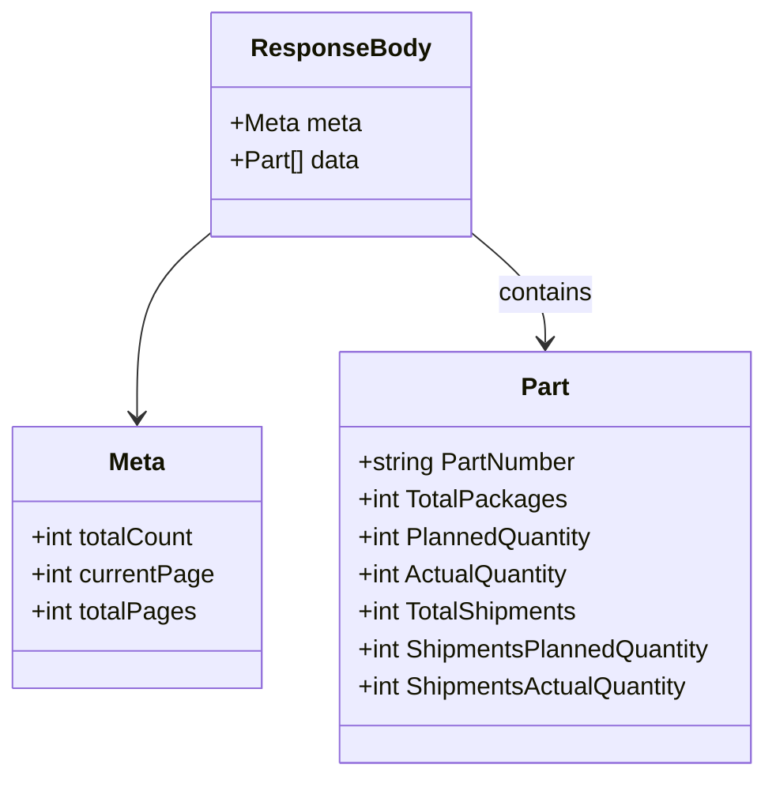

# Diagram: web/portal/src/mocks/handlers/partview/app/backorderParts.js


> Auto-generated by Obscura crawlers

## Diagram 1

```mermaid
flowchart LR
  Client[Client] -->|GET /partview/app/backorder-parts| MSW[MSW (rest.get)]
  MSW --> Handler[handleBackOrderParts(req, res, ctx)]
  Handler --> Response[HTTP 200 JSON]
  Response --> ResponseBody[responseBody]
  ResponseBody --> Meta[meta: totalCount, currentPage, totalPages]
  ResponseBody --> Data[data (array of Part)]
  Data --> Part1[Part 84469556 — Packages:14; Planned:0; Actual:14; Shipments:2; ShipmentsPlanned:1; ShipmentsActual:3]
  Data --> Part2[Part 11516078 — Packages:608; Planned:0; Actual:3040; Shipments:117; ShipmentsPlanned:5850; ShipmentsActual:4095]
```

> SVG rendering failed for this diagram.

## Diagram 2



### SVG

<svg id="container" width="496.203125" xmlns="http://www.w3.org/2000/svg" class="classDiagram" height="498" viewBox="0 0 496.203125 498" role="graphics-document document" aria-roledescription="class"><style>#container{font-family:"trebuchet ms",verdana,arial,sans-serif;font-size:16px;fill:#333;}@keyframes edge-animation-frame{from{stroke-dashoffset:0;}}@keyframes dash{to{stroke-dashoffset:0;}}#container .edge-animation-slow{stroke-dasharray:9,5!important;stroke-dashoffset:900;animation:dash 50s linear infinite;stroke-linecap:round;}#container .edge-animation-fast{stroke-dasharray:9,5!important;stroke-dashoffset:900;animation:dash 20s linear infinite;stroke-linecap:round;}#container .error-icon{fill:#552222;}#container .error-text{fill:#552222;stroke:#552222;}#container .edge-thickness-normal{stroke-width:1px;}#container .edge-thickness-thick{stroke-width:3.5px;}#container .edge-pattern-solid{stroke-dasharray:0;}#container .edge-thickness-invisible{stroke-width:0;fill:none;}#container .edge-pattern-dashed{stroke-dasharray:3;}#container .edge-pattern-dotted{stroke-dasharray:2;}#container .marker{fill:#333333;stroke:#333333;}#container .marker.cross{stroke:#333333;}#container svg{font-family:"trebuchet ms",verdana,arial,sans-serif;font-size:16px;}#container p{margin:0;}#container g.classGroup text{fill:#9370DB;stroke:none;font-family:"trebuchet ms",verdana,arial,sans-serif;font-size:10px;}#container g.classGroup text .title{font-weight:bolder;}#container .nodeLabel,#container .edgeLabel{color:#131300;}#container .edgeLabel .label rect{fill:#ECECFF;}#container .label text{fill:#131300;}#container .labelBkg{background:#ECECFF;}#container .edgeLabel .label span{background:#ECECFF;}#container .classTitle{font-weight:bolder;}#container .node rect,#container .node circle,#container .node ellipse,#container .node polygon,#container .node path{fill:#ECECFF;stroke:#9370DB;stroke-width:1px;}#container .divider{stroke:#9370DB;stroke-width:1;}#container g.clickable{cursor:pointer;}#container g.classGroup rect{fill:#ECECFF;stroke:#9370DB;}#container g.classGroup line{stroke:#9370DB;stroke-width:1;}#container .classLabel .box{stroke:none;stroke-width:0;fill:#ECECFF;opacity:0.5;}#container .classLabel .label{fill:#9370DB;font-size:10px;}#container .relation{stroke:#333333;stroke-width:1;fill:none;}#container .dashed-line{stroke-dasharray:3;}#container .dotted-line{stroke-dasharray:1 2;}#container #compositionStart,#container .composition{fill:#333333!important;stroke:#333333!important;stroke-width:1;}#container #compositionEnd,#container .composition{fill:#333333!important;stroke:#333333!important;stroke-width:1;}#container #dependencyStart,#container .dependency{fill:#333333!important;stroke:#333333!important;stroke-width:1;}#container #dependencyStart,#container .dependency{fill:#333333!important;stroke:#333333!important;stroke-width:1;}#container #extensionStart,#container .extension{fill:transparent!important;stroke:#333333!important;stroke-width:1;}#container #extensionEnd,#container .extension{fill:transparent!important;stroke:#333333!important;stroke-width:1;}#container #aggregationStart,#container .aggregation{fill:transparent!important;stroke:#333333!important;stroke-width:1;}#container #aggregationEnd,#container .aggregation{fill:transparent!important;stroke:#333333!important;stroke-width:1;}#container #lollipopStart,#container .lollipop{fill:#ECECFF!important;stroke:#333333!important;stroke-width:1;}#container #lollipopEnd,#container .lollipop{fill:#ECECFF!important;stroke:#333333!important;stroke-width:1;}#container .edgeTerminals{font-size:11px;line-height:initial;}#container .classTitleText{text-anchor:middle;font-size:18px;fill:#333;}#container .label-icon{display:inline-block;height:1em;overflow:visible;vertical-align:-0.125em;}#container .node .label-icon path{fill:currentColor;stroke:revert;stroke-width:revert;}#container :root{--mermaid-font-family:"trebuchet ms",verdana,arial,sans-serif;}</style><g><defs><marker id="container_class-aggregationStart" class="marker aggregation class" refX="18" refY="7" markerWidth="190" markerHeight="240" orient="auto"><path d="M 18,7 L9,13 L1,7 L9,1 Z"></path></marker></defs><defs><marker id="container_class-aggregationEnd" class="marker aggregation class" refX="1" refY="7" markerWidth="20" markerHeight="28" orient="auto"><path d="M 18,7 L9,13 L1,7 L9,1 Z"></path></marker></defs><defs><marker id="container_class-extensionStart" class="marker extension class" refX="18" refY="7" markerWidth="190" markerHeight="240" orient="auto"><path d="M 1,7 L18,13 V 1 Z"></path></marker></defs><defs><marker id="container_class-extensionEnd" class="marker extension class" refX="1" refY="7" markerWidth="20" markerHeight="28" orient="auto"><path d="M 1,1 V 13 L18,7 Z"></path></marker></defs><defs><marker id="container_class-compositionStart" class="marker composition class" refX="18" refY="7" markerWidth="190" markerHeight="240" orient="auto"><path d="M 18,7 L9,13 L1,7 L9,1 Z"></path></marker></defs><defs><marker id="container_class-compositionEnd" class="marker composition class" refX="1" refY="7" markerWidth="20" markerHeight="28" orient="auto"><path d="M 18,7 L9,13 L1,7 L9,1 Z"></path></marker></defs><defs><marker id="container_class-dependencyStart" class="marker dependency class" refX="6" refY="7" markerWidth="190" markerHeight="240" orient="auto"><path d="M 5,7 L9,13 L1,7 L9,1 Z"></path></marker></defs><defs><marker id="container_class-dependencyEnd" class="marker dependency class" refX="13" refY="7" markerWidth="20" markerHeight="28" orient="auto"><path d="M 18,7 L9,13 L14,7 L9,1 Z"></path></marker></defs><defs><marker id="container_class-lollipopStart" class="marker lollipop class" refX="13" refY="7" markerWidth="190" markerHeight="240" orient="auto"><circle stroke="black" fill="transparent" cx="7" cy="7" r="6"></circle></marker></defs><defs><marker id="container_class-lollipopEnd" class="marker lollipop class" refX="1" refY="7" markerWidth="190" markerHeight="240" orient="auto"><circle stroke="black" fill="transparent" cx="7" cy="7" r="6"></circle></marker></defs><g class="root"><g class="clusters"></g><g class="edgePaths"><path d="M139.41,146.837L130.865,153.864C122.319,160.891,105.228,174.946,96.682,195.139C88.137,215.333,88.137,241.667,88.137,254.833L88.137,268" id="id_ResponseBody_Meta_1" class="edge-thickness-normal edge-pattern-solid relation" style=";;;" data-edge="true" data-et="edge" data-id="id_ResponseBody_Meta_1" data-points="W3sieCI6MTM5LjQxMDE1NjI1LCJ5IjoxNDYuODM2NTAxMzQwODc3NjJ9LHsieCI6ODguMTM2NzE4NzUsInkiOjE4OX0seyJ4Ijo4OC4xMzY3MTg3NSwieSI6Mjc0fV0=" marker-end="url(#container_class-dependencyEnd)"></path><path d="M301.965,146.837L310.51,153.864C319.056,160.891,336.147,174.946,344.693,187.139C353.238,199.333,353.238,209.667,353.238,214.833L353.238,220" id="id_ResponseBody_Part_2" class="edge-thickness-normal edge-pattern-solid relation" style=";;;" data-edge="true" data-et="edge" data-id="id_ResponseBody_Part_2" data-points="W3sieCI6MzAxLjk2NDg0Mzc1LCJ5IjoxNDYuODM2NTAxMzQwODc3NjJ9LHsieCI6MzUzLjIzODI4MTI1LCJ5IjoxODl9LHsieCI6MzUzLjIzODI4MTI1LCJ5IjoyMjZ9XQ==" marker-end="url(#container_class-dependencyEnd)"></path></g><g class="edgeLabels"><g class="edgeLabel"><g class="label" data-id="id_ResponseBody_Meta_1" transform="translate(0, 0)"><foreignObject width="0" height="0"><div xmlns="http://www.w3.org/1999/xhtml" class="labelBkg" style="display: table-cell; white-space: nowrap; line-height: 1.5; max-width: 200px; text-align: center;"><span class="edgeLabel"></span></div></foreignObject></g></g><g class="edgeLabel" transform="translate(353.23828125, 189)"><g class="label" data-id="id_ResponseBody_Part_2" transform="translate(-30.890625, -12)"><foreignObject width="61.78125" height="24"><div xmlns="http://www.w3.org/1999/xhtml" class="labelBkg" style="display: table-cell; white-space: nowrap; line-height: 1.5; max-width: 200px; text-align: center;"><span class="edgeLabel"><p>contains</p></span></div></foreignObject></g></g></g><g class="nodes"><g class="node default" id="classId-ResponseBody-0" transform="translate(220.6875, 80)"><g class="basic label-container"><path d="M-81.27734375 -72 L81.27734375 -72 L81.27734375 72 L-81.27734375 72" stroke="none" stroke-width="0" fill="#ECECFF" style=""></path><path d="M-81.27734375 -72 C-29.914140647618368 -72, 21.449062454763265 -72, 81.27734375 -72 M-81.27734375 -72 C-26.895573556883924 -72, 27.48619663623215 -72, 81.27734375 -72 M81.27734375 -72 C81.27734375 -41.13630862014989, 81.27734375 -10.272617240299773, 81.27734375 72 M81.27734375 -72 C81.27734375 -31.930589524849026, 81.27734375 8.138820950301948, 81.27734375 72 M81.27734375 72 C27.71326545474433 72, -25.850812840511338 72, -81.27734375 72 M81.27734375 72 C30.96136899866316 72, -19.354605752673677 72, -81.27734375 72 M-81.27734375 72 C-81.27734375 30.83546153999778, -81.27734375 -10.32907692000444, -81.27734375 -72 M-81.27734375 72 C-81.27734375 19.303236533900247, -81.27734375 -33.39352693219951, -81.27734375 -72" stroke="#9370DB" stroke-width="1.3" fill="none" stroke-dasharray="0 0" style=""></path></g><g class="annotation-group text" transform="translate(0, -48)"></g><g class="label-group text" transform="translate(-53.9921875, -48)"><g class="label" style="font-weight: bolder" transform="translate(0,-12)"><foreignObject width="107.984375" height="24"><div xmlns="http://www.w3.org/1999/xhtml" style="display: table-cell; white-space: nowrap; line-height: 1.5; max-width: 157px; text-align: center;"><span class="nodeLabel markdown-node-label" style=""><p>ResponseBody</p></span></div></foreignObject></g></g><g class="members-group text" transform="translate(-69.27734375, 0)"><g class="label" style="" transform="translate(0,-12)"><foreignObject width="84.5625" height="24"><div xmlns="http://www.w3.org/1999/xhtml" style="display: table-cell; white-space: nowrap; line-height: 1.5; max-width: 142px; text-align: center;"><span class="nodeLabel markdown-node-label" style=""><p>+Meta meta</p></span></div></foreignObject></g><g class="label" style="" transform="translate(0,12)"><foreignObject width="84.25" height="24"><div xmlns="http://www.w3.org/1999/xhtml" style="display: table-cell; white-space: nowrap; line-height: 1.5; max-width: 142px; text-align: center;"><span class="nodeLabel markdown-node-label" style=""><p>+Part[] data</p></span></div></foreignObject></g></g><g class="methods-group text" transform="translate(-69.27734375, 72)"></g><g class="divider" style=""><path d="M-81.27734375 -24 C-44.48896239039772 -24, -7.700581030795433 -24, 81.27734375 -24 M-81.27734375 -24 C-48.00057073118723 -24, -14.723797712374463 -24, 81.27734375 -24" stroke="#9370DB" stroke-width="1.3" fill="none" stroke-dasharray="0 0" style=""></path></g><g class="divider" style=""><path d="M-81.27734375 48 C-38.986839440145516 48, 3.3036648697089674 48, 81.27734375 48 M-81.27734375 48 C-35.6163202219465 48, 10.044703306106996 48, 81.27734375 48" stroke="#9370DB" stroke-width="1.3" fill="none" stroke-dasharray="0 0" style=""></path></g></g><g class="node default" id="classId-Meta-1" transform="translate(88.13671875, 358)"><g class="basic label-container"><path d="M-80.13671875 -84 L80.13671875 -84 L80.13671875 84 L-80.13671875 84" stroke="none" stroke-width="0" fill="#ECECFF" style=""></path><path d="M-80.13671875 -84 C-27.967629561720308 -84, 24.201459626559384 -84, 80.13671875 -84 M-80.13671875 -84 C-41.803579997483105 -84, -3.47044124496621 -84, 80.13671875 -84 M80.13671875 -84 C80.13671875 -47.666932239145545, 80.13671875 -11.33386447829109, 80.13671875 84 M80.13671875 -84 C80.13671875 -41.55701652416566, 80.13671875 0.8859669516686779, 80.13671875 84 M80.13671875 84 C25.54407023747344 84, -29.048578275053117 84, -80.13671875 84 M80.13671875 84 C26.470725443106673 84, -27.195267863786654 84, -80.13671875 84 M-80.13671875 84 C-80.13671875 39.977231647378716, -80.13671875 -4.045536705242569, -80.13671875 -84 M-80.13671875 84 C-80.13671875 22.269200941521696, -80.13671875 -39.46159811695661, -80.13671875 -84" stroke="#9370DB" stroke-width="1.3" fill="none" stroke-dasharray="0 0" style=""></path></g><g class="annotation-group text" transform="translate(0, -60)"></g><g class="label-group text" transform="translate(-18.0859375, -60)"><g class="label" style="font-weight: bolder" transform="translate(0,-12)"><foreignObject width="36.171875" height="24"><div xmlns="http://www.w3.org/1999/xhtml" style="display: table-cell; white-space: nowrap; line-height: 1.5; max-width: 86px; text-align: center;"><span class="nodeLabel markdown-node-label" style=""><p>Meta</p></span></div></foreignObject></g></g><g class="members-group text" transform="translate(-68.13671875, -12)"><g class="label" style="" transform="translate(0,-12)"><foreignObject width="108.125" height="24"><div xmlns="http://www.w3.org/1999/xhtml" style="display: table-cell; white-space: nowrap; line-height: 1.5; max-width: 166px; text-align: center;"><span class="nodeLabel markdown-node-label" style=""><p>+int totalCount</p></span></div></foreignObject></g><g class="label" style="" transform="translate(0,12)"><foreignObject width="118.1875" height="24"><div xmlns="http://www.w3.org/1999/xhtml" style="display: table-cell; white-space: nowrap; line-height: 1.5; max-width: 176px; text-align: center;"><span class="nodeLabel markdown-node-label" style=""><p>+int currentPage</p></span></div></foreignObject></g><g class="label" style="" transform="translate(0,36)"><foreignObject width="106.890625" height="24"><div xmlns="http://www.w3.org/1999/xhtml" style="display: table-cell; white-space: nowrap; line-height: 1.5; max-width: 164px; text-align: center;"><span class="nodeLabel markdown-node-label" style=""><p>+int totalPages</p></span></div></foreignObject></g></g><g class="methods-group text" transform="translate(-68.13671875, 84)"></g><g class="divider" style=""><path d="M-80.13671875 -36 C-20.841994850419653 -36, 38.452729049160695 -36, 80.13671875 -36 M-80.13671875 -36 C-47.4357751512749 -36, -14.734831552549807 -36, 80.13671875 -36" stroke="#9370DB" stroke-width="1.3" fill="none" stroke-dasharray="0 0" style=""></path></g><g class="divider" style=""><path d="M-80.13671875 60 C-31.74477472524739 60, 16.647169299505222 60, 80.13671875 60 M-80.13671875 60 C-46.423631778226 60, -12.710544806452006 60, 80.13671875 60" stroke="#9370DB" stroke-width="1.3" fill="none" stroke-dasharray="0 0" style=""></path></g></g><g class="node default" id="classId-Part-2" transform="translate(353.23828125, 358)"><g class="basic label-container"><path d="M-134.96484375 -132 L134.96484375 -132 L134.96484375 132 L-134.96484375 132" stroke="none" stroke-width="0" fill="#ECECFF" style=""></path><path d="M-134.96484375 -132 C-60.13145792893994 -132, 14.701927892120125 -132, 134.96484375 -132 M-134.96484375 -132 C-50.84339462405045 -132, 33.278054501899106 -132, 134.96484375 -132 M134.96484375 -132 C134.96484375 -29.42264415202095, 134.96484375 73.1547116959581, 134.96484375 132 M134.96484375 -132 C134.96484375 -37.903313162793395, 134.96484375 56.19337367441321, 134.96484375 132 M134.96484375 132 C69.70126480145797 132, 4.4376858529159335 132, -134.96484375 132 M134.96484375 132 C37.82949124699792 132, -59.305861256004164 132, -134.96484375 132 M-134.96484375 132 C-134.96484375 54.63025856566334, -134.96484375 -22.73948286867332, -134.96484375 -132 M-134.96484375 132 C-134.96484375 62.8611967930545, -134.96484375 -6.277606413890993, -134.96484375 -132" stroke="#9370DB" stroke-width="1.3" fill="none" stroke-dasharray="0 0" style=""></path></g><g class="annotation-group text" transform="translate(0, -108)"></g><g class="label-group text" transform="translate(-15.0703125, -108)"><g class="label" style="font-weight: bolder" transform="translate(0,-12)"><foreignObject width="30.140625" height="24"><div xmlns="http://www.w3.org/1999/xhtml" style="display: table-cell; white-space: nowrap; line-height: 1.5; max-width: 79px; text-align: center;"><span class="nodeLabel markdown-node-label" style=""><p>Part</p></span></div></foreignObject></g></g><g class="members-group text" transform="translate(-122.96484375, -60)"><g class="label" style="" transform="translate(0,-12)"><foreignObject width="141.28125" height="24"><div xmlns="http://www.w3.org/1999/xhtml" style="display: table-cell; white-space: nowrap; line-height: 1.5; max-width: 199px; text-align: center;"><span class="nodeLabel markdown-node-label" style=""><p>+string PartNumber</p></span></div></foreignObject></g><g class="label" style="" transform="translate(0,12)"><foreignObject width="133.046875" height="24"><div xmlns="http://www.w3.org/1999/xhtml" style="display: table-cell; white-space: nowrap; line-height: 1.5; max-width: 190px; text-align: center;"><span class="nodeLabel markdown-node-label" style=""><p>+int TotalPackages</p></span></div></foreignObject></g><g class="label" style="" transform="translate(0,36)"><foreignObject width="153.6875" height="24"><div xmlns="http://www.w3.org/1999/xhtml" style="display: table-cell; white-space: nowrap; line-height: 1.5; max-width: 211px; text-align: center;"><span class="nodeLabel markdown-node-label" style=""><p>+int PlannedQuantity</p></span></div></foreignObject></g><g class="label" style="" transform="translate(0,60)"><foreignObject width="139.34375" height="24"><div xmlns="http://www.w3.org/1999/xhtml" style="display: table-cell; white-space: nowrap; line-height: 1.5; max-width: 197px; text-align: center;"><span class="nodeLabel markdown-node-label" style=""><p>+int ActualQuantity</p></span></div></foreignObject></g><g class="label" style="" transform="translate(0,84)"><foreignObject width="144.703125" height="24"><div xmlns="http://www.w3.org/1999/xhtml" style="display: table-cell; white-space: nowrap; line-height: 1.5; max-width: 202px; text-align: center;"><span class="nodeLabel markdown-node-label" style=""><p>+int TotalShipments</p></span></div></foreignObject></g><g class="label" style="" transform="translate(0,108)"><foreignObject width="230.859375" height="24"><div xmlns="http://www.w3.org/1999/xhtml" style="display: table-cell; white-space: nowrap; line-height: 1.5; max-width: 288px; text-align: center;"><span class="nodeLabel markdown-node-label" style=""><p>+int ShipmentsPlannedQuantity</p></span></div></foreignObject></g><g class="label" style="" transform="translate(0,132)"><foreignObject width="216.5" height="24"><div xmlns="http://www.w3.org/1999/xhtml" style="display: table-cell; white-space: nowrap; line-height: 1.5; max-width: 274px; text-align: center;"><span class="nodeLabel markdown-node-label" style=""><p>+int ShipmentsActualQuantity</p></span></div></foreignObject></g></g><g class="methods-group text" transform="translate(-122.96484375, 132)"></g><g class="divider" style=""><path d="M-134.96484375 -84 C-67.2983307198627 -84, 0.3681823102745909 -84, 134.96484375 -84 M-134.96484375 -84 C-45.77304113493743 -84, 43.41876148012514 -84, 134.96484375 -84" stroke="#9370DB" stroke-width="1.3" fill="none" stroke-dasharray="0 0" style=""></path></g><g class="divider" style=""><path d="M-134.96484375 108 C-30.5928437615959 108, 73.7791562268082 108, 134.96484375 108 M-134.96484375 108 C-35.187379659973715 108, 64.59008443005257 108, 134.96484375 108" stroke="#9370DB" stroke-width="1.3" fill="none" stroke-dasharray="0 0" style=""></path></g></g></g></g></g></svg>
