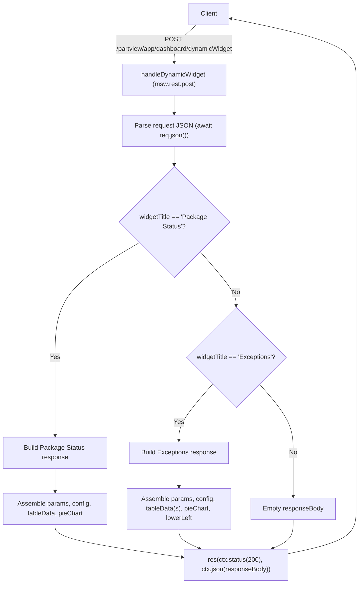
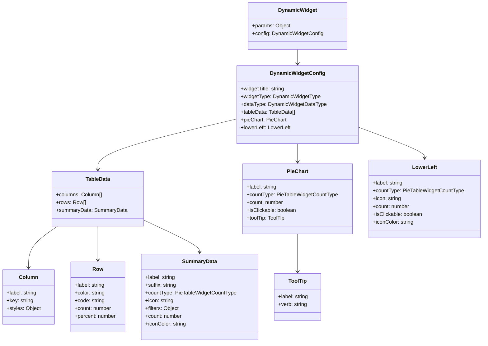
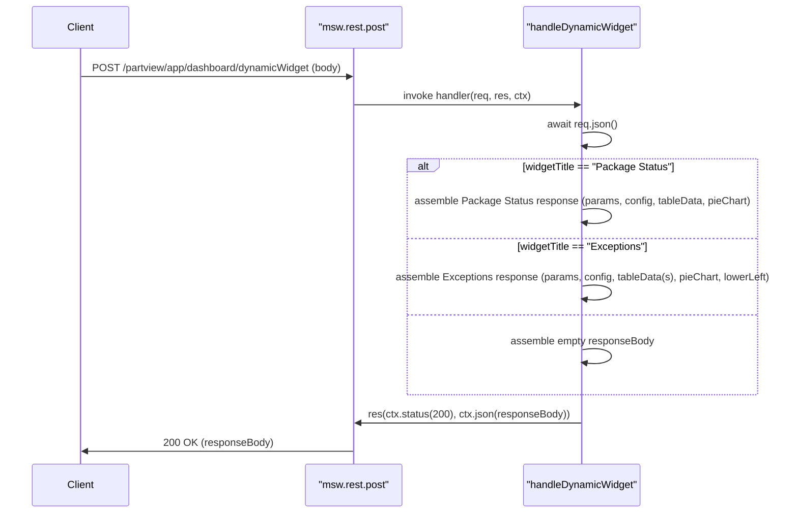

# Diagram: web/portal/src/mocks/handlers/partview/app/dashboard/dynamicWidget.ts

> Auto-generated by Obscura crawlers

## Diagram 1

### SVG

<svg id="container" width="900.0590209960938" xmlns="http://www.w3.org/2000/svg" class="flowchart" height="1458.640625" viewBox="0 0 900.0590209960938 1458.640625" role="graphics-document document" aria-roledescription="flowchart-v2"><g><marker id="container_flowchart-v2-pointEnd" class="marker flowchart-v2" viewBox="0 0 10 10" refX="5" refY="5" markerUnits="userSpaceOnUse" markerWidth="8" markerHeight="8" orient="auto"><path d="M 0 0 L 10 5 L 0 10 z" class="arrowMarkerPath" style="stroke-width: 1; stroke-dasharray: 1, 0;"></path></marker><marker id="container_flowchart-v2-pointStart" class="marker flowchart-v2" viewBox="0 0 10 10" refX="4.5" refY="5" markerUnits="userSpaceOnUse" markerWidth="8" markerHeight="8" orient="auto"><path d="M 0 5 L 10 10 L 10 0 z" class="arrowMarkerPath" style="stroke-width: 1; stroke-dasharray: 1, 0;"></path></marker><marker id="container_flowchart-v2-circleEnd" class="marker flowchart-v2" viewBox="0 0 10 10" refX="11" refY="5" markerUnits="userSpaceOnUse" markerWidth="11" markerHeight="11" orient="auto"><circle cx="5" cy="5" r="5" class="arrowMarkerPath" style="stroke-width: 1; stroke-dasharray: 1, 0;"></circle></marker><marker id="container_flowchart-v2-circleStart" class="marker flowchart-v2" viewBox="0 0 10 10" refX="-1" refY="5" markerUnits="userSpaceOnUse" markerWidth="11" markerHeight="11" orient="auto"><circle cx="5" cy="5" r="5" class="arrowMarkerPath" style="stroke-width: 1; stroke-dasharray: 1, 0;"></circle></marker><marker id="container_flowchart-v2-crossEnd" class="marker cross flowchart-v2" viewBox="0 0 11 11" refX="12" refY="5.2" markerUnits="userSpaceOnUse" markerWidth="11" markerHeight="11" orient="auto"><path d="M 1,1 l 9,9 M 10,1 l -9,9" class="arrowMarkerPath" style="stroke-width: 2; stroke-dasharray: 1, 0;"></path></marker><marker id="container_flowchart-v2-crossStart" class="marker cross flowchart-v2" viewBox="0 0 11 11" refX="-1" refY="5.2" markerUnits="userSpaceOnUse" markerWidth="11" markerHeight="11" orient="auto"><path d="M 1,1 l 9,9 M 10,1 l -9,9" class="arrowMarkerPath" style="stroke-width: 2; stroke-dasharray: 1, 0;"></path></marker><g class="root"><g class="clusters"></g><g class="edgePaths"><path d="M492.394,62L483.005,70.167C473.617,78.333,454.84,94.667,445.451,110.333C436.063,126,436.063,141,436.063,148.5L436.063,156" id="L_Client_Handler_0" class="edge-thickness-normal edge-pattern-solid edge-thickness-normal edge-pattern-solid flowchart-link" style=";" data-edge="true" data-et="edge" data-id="L_Client_Handler_0" data-points="W3sieCI6NDkyLjM5Mzg2MzA3NTY1NzksInkiOjYyfSx7IngiOjQzNi4wNjI1LCJ5IjoxMTF9LHsieCI6NDM2LjA2MjUsInkiOjE2MH1d" marker-end="url(#container_flowchart-v2-pointEnd)"></path><path d="M436.063,238L436.063,242.167C436.063,246.333,436.063,254.667,436.063,262.333C436.063,270,436.063,277,436.063,280.5L436.063,284" id="L_Handler_Parse_0" class="edge-thickness-normal edge-pattern-solid edge-thickness-normal edge-pattern-solid flowchart-link" style=";" data-edge="true" data-et="edge" data-id="L_Handler_Parse_0" data-points="W3sieCI6NDM2LjA2MjUsInkiOjIzOH0seyJ4Ijo0MzYuMDYyNSwieSI6MjYzfSx7IngiOjQzNi4wNjI1LCJ5IjoyODh9XQ==" marker-end="url(#container_flowchart-v2-pointEnd)"></path><path d="M436.063,366L436.063,370.167C436.063,374.333,436.063,382.667,436.063,390.333C436.063,398,436.063,405,436.063,408.5L436.063,412" id="L_Parse_Decision1_0" class="edge-thickness-normal edge-pattern-solid edge-thickness-normal edge-pattern-solid flowchart-link" style=";" data-edge="true" data-et="edge" data-id="L_Parse_Decision1_0" data-points="W3sieCI6NDM2LjA2MjUsInkiOjM2Nn0seyJ4Ijo0MzYuMDYyNSwieSI6MzkxfSx7IngiOjQzNi4wNjI1LCJ5Ijo0MTZ9XQ==" marker-end="url(#container_flowchart-v2-pointEnd)"></path><path d="M348.668,606.605L313.556,627.338C278.445,648.07,208.223,689.535,173.111,737.321C138,785.107,138,839.214,138,893.32C138,947.427,138,1001.534,138,1034.087C138,1066.641,138,1077.641,138,1083.141L138,1088.641" id="L_Decision1_PackageStatus_0" class="edge-thickness-normal edge-pattern-solid edge-thickness-normal edge-pattern-solid flowchart-link" style=";" data-edge="true" data-et="edge" data-id="L_Decision1_PackageStatus_0" data-points="W3sieCI6MzQ4LjY2NzUwOTg4NzkzNjcsInkiOjYwNi42MDUwMDk4ODc5MzY3fSx7IngiOjEzOCwieSI6NzMxfSx7IngiOjEzOCwieSI6ODkzLjMyMDMxMjV9LHsieCI6MTM4LCJ5IjoxMDU1LjY0MDYyNX0seyJ4IjoxMzgsInkiOjEwOTIuNjQwNjI1fV0=" marker-end="url(#container_flowchart-v2-pointEnd)"></path><path d="M501.153,628.909L516.138,645.924C531.123,662.94,561.093,696.97,576.078,719.485C591.063,742,591.063,753,591.063,758.5L591.063,764" id="L_Decision1_Decision2_0" class="edge-thickness-normal edge-pattern-solid edge-thickness-normal edge-pattern-solid flowchart-link" style=";" data-edge="true" data-et="edge" data-id="L_Decision1_Decision2_0" data-points="W3sieCI6NTAxLjE1MzEzNDQ0MTA4NzYsInkiOjYyOC45MDkzNjU1NTg5MTI0fSx7IngiOjU5MS4wNjI1LCJ5Ijo3MzF9LHsieCI6NTkxLjA2MjUsInkiOjc2OH1d" marker-end="url(#container_flowchart-v2-pointEnd)"></path><path d="M532.354,959.932L518.295,975.883C504.236,991.835,476.118,1023.738,462.059,1047.189C448,1070.641,448,1085.641,448,1093.141L448,1100.641" id="L_Decision2_Exceptions_0" class="edge-thickness-normal edge-pattern-solid edge-thickness-normal edge-pattern-solid flowchart-link" style=";" data-edge="true" data-et="edge" data-id="L_Decision2_Exceptions_0" data-points="W3sieCI6NTMyLjM1Mzc2OTYwMjcwMTUsInkiOjk1OS45MzE4OTQ2MDI3MDE1fSx7IngiOjQ0OCwieSI6MTA1NS42NDA2MjV9LHsieCI6NDQ4LCJ5IjoxMTA0LjY0MDYyNX1d" marker-end="url(#container_flowchart-v2-pointEnd)"></path><path d="M649.771,959.932L663.83,975.883C677.889,991.835,706.007,1023.738,720.066,1052.356C734.125,1080.974,734.125,1106.307,734.125,1129.641C734.125,1152.974,734.125,1174.307,734.125,1192.474C734.125,1210.641,734.125,1225.641,734.125,1233.141L734.125,1240.641" id="L_Decision2_Empty_0" class="edge-thickness-normal edge-pattern-solid edge-thickness-normal edge-pattern-solid flowchart-link" style=";" data-edge="true" data-et="edge" data-id="L_Decision2_Empty_0" data-points="W3sieCI6NjQ5Ljc3MTIzMDM5NzI5ODUsInkiOjk1OS45MzE4OTQ2MDI3MDE1fSx7IngiOjczNC4xMjUsInkiOjEwNTUuNjQwNjI1fSx7IngiOjczNC4xMjUsInkiOjExMzEuNjQwNjI1fSx7IngiOjczNC4xMjUsInkiOjExOTUuNjQwNjI1fSx7IngiOjczNC4xMjUsInkiOjEyNDQuNjQwNjI1fV0=" marker-end="url(#container_flowchart-v2-pointEnd)"></path><path d="M138,1170.641L138,1174.807C138,1178.974,138,1187.307,138,1196.974C138,1206.641,138,1217.641,138,1223.141L138,1228.641" id="L_PackageStatus_BuildPS_0" class="edge-thickness-normal edge-pattern-solid edge-thickness-normal edge-pattern-solid flowchart-link" style=";" data-edge="true" data-et="edge" data-id="L_PackageStatus_BuildPS_0" data-points="W3sieCI6MTM4LCJ5IjoxMTcwLjY0MDYyNX0seyJ4IjoxMzgsInkiOjExOTUuNjQwNjI1fSx7IngiOjEzOCwieSI6MTIzMi42NDA2MjV9XQ==" marker-end="url(#container_flowchart-v2-pointEnd)"></path><path d="M448,1158.641L448,1164.807C448,1170.974,448,1183.307,448,1192.974C448,1202.641,448,1209.641,448,1213.141L448,1216.641" id="L_Exceptions_BuildEx_0" class="edge-thickness-normal edge-pattern-solid edge-thickness-normal edge-pattern-solid flowchart-link" style=";" data-edge="true" data-et="edge" data-id="L_Exceptions_BuildEx_0" data-points="W3sieCI6NDQ4LCJ5IjoxMTU4LjY0MDYyNX0seyJ4Ijo0NDgsInkiOjExOTUuNjQwNjI1fSx7IngiOjQ0OCwieSI6MTIyMC42NDA2MjV9XQ==" marker-end="url(#container_flowchart-v2-pointEnd)"></path><path d="M138,1310.641L138,1316.807C138,1322.974,138,1335.307,191.184,1348.987C244.367,1362.666,350.735,1377.692,403.918,1385.204L457.102,1392.717" id="L_BuildPS_Respond_0" class="edge-thickness-normal edge-pattern-solid edge-thickness-normal edge-pattern-solid flowchart-link" style=";" data-edge="true" data-et="edge" data-id="L_BuildPS_Respond_0" data-points="W3sieCI6MTM4LCJ5IjoxMzEwLjY0MDYyNX0seyJ4IjoxMzgsInkiOjEzNDcuNjQwNjI1fSx7IngiOjQ2MS4wNjI1LCJ5IjoxMzkzLjI3NjcxMjczNjIzOTV9XQ==" marker-end="url(#container_flowchart-v2-pointEnd)"></path><path d="M448,1322.641L448,1326.807C448,1330.974,448,1339.307,456.705,1347.368C465.411,1355.429,482.822,1363.218,491.527,1367.113L500.233,1371.007" id="L_BuildEx_Respond_0" class="edge-thickness-normal edge-pattern-solid edge-thickness-normal edge-pattern-solid flowchart-link" style=";" data-edge="true" data-et="edge" data-id="L_BuildEx_Respond_0" data-points="W3sieCI6NDQ4LCJ5IjoxMzIyLjY0MDYyNX0seyJ4Ijo0NDgsInkiOjEzNDcuNjQwNjI1fSx7IngiOjUwMy44ODM3ODkwNjI1LCJ5IjoxMzcyLjY0MDYyNX1d" marker-end="url(#container_flowchart-v2-pointEnd)"></path><path d="M734.125,1298.641L734.125,1306.807C734.125,1314.974,734.125,1331.307,725.42,1343.368C716.714,1355.429,699.303,1363.218,690.598,1367.113L681.892,1371.007" id="L_Empty_Respond_0" class="edge-thickness-normal edge-pattern-solid edge-thickness-normal edge-pattern-solid flowchart-link" style=";" data-edge="true" data-et="edge" data-id="L_Empty_Respond_0" data-points="W3sieCI6NzM0LjEyNSwieSI6MTI5OC42NDA2MjV9LHsieCI6NzM0LjEyNSwieSI6MTM0Ny42NDA2MjV9LHsieCI6Njc4LjI0MTIxMDkzNzUsInkiOjEzNzIuNjQwNjI1fV0=" marker-end="url(#container_flowchart-v2-pointEnd)"></path><path d="M721.063,1383.999L749.562,1377.939C778.061,1371.88,835.06,1359.76,863.559,1341.034C892.059,1322.307,892.059,1296.974,892.059,1271.641C892.059,1246.307,892.059,1220.974,892.059,1197.641C892.059,1174.307,892.059,1152.974,892.059,1129.641C892.059,1106.307,892.059,1080.974,892.059,1041.254C892.059,1001.534,892.059,947.427,892.059,893.32C892.059,839.214,892.059,785.107,892.059,728.72C892.059,672.333,892.059,613.667,892.059,557C892.059,500.333,892.059,445.667,892.059,407.667C892.059,369.667,892.059,348.333,892.059,327C892.059,305.667,892.059,284.333,892.059,263C892.059,241.667,892.059,220.333,892.059,195C892.059,169.667,892.059,140.333,839.764,114.885C787.469,89.437,682.879,67.873,630.584,57.091L578.289,46.31" id="L_Respond_Client_0" class="edge-thickness-normal edge-pattern-solid edge-thickness-normal edge-pattern-solid flowchart-link" style=";" data-edge="true" data-et="edge" data-id="L_Respond_Client_0" data-points="W3sieCI6NzIxLjA2MjUsInkiOjEzODMuOTk5MDcwMjY2MzY4fSx7IngiOjg5Mi4wNTg1OTM3NSwieSI6MTM0Ny42NDA2MjV9LHsieCI6ODkyLjA1ODU5Mzc1LCJ5IjoxMjcxLjY0MDYyNX0seyJ4Ijo4OTIuMDU4NTkzNzUsInkiOjExOTUuNjQwNjI1fSx7IngiOjg5Mi4wNTg1OTM3NSwieSI6MTEzMS42NDA2MjV9LHsieCI6ODkyLjA1ODU5Mzc1LCJ5IjoxMDU1LjY0MDYyNX0seyJ4Ijo4OTIuMDU4NTkzNzUsInkiOjg5My4zMjAzMTI1fSx7IngiOjg5Mi4wNTg1OTM3NSwieSI6NzMxfSx7IngiOjg5Mi4wNTg1OTM3NSwieSI6NTU1fSx7IngiOjg5Mi4wNTg1OTM3NSwieSI6MzkxfSx7IngiOjg5Mi4wNTg1OTM3NSwieSI6MzI3fSx7IngiOjg5Mi4wNTg1OTM3NSwieSI6MjYzfSx7IngiOjg5Mi4wNTg1OTM3NSwieSI6MTk5fSx7IngiOjg5Mi4wNTg1OTM3NSwieSI6MTExfSx7IngiOjU3NC4zNzEwOTM3NSwieSI6NDUuNTAxODY1MDM4OTk2Mjd9XQ==" marker-end="url(#container_flowchart-v2-pointEnd)"></path></g><g class="edgeLabels"><g class="edgeLabel" transform="translate(436.0625, 111)"><g class="label" data-id="L_Client_Handler_0" transform="translate(-154.7421875, -24)"><foreignObject width="309.484375" height="48">

POST /partview/app/dashboard/dynamicWidget

</foreignObject></g></g><g class="edgeLabel"><g class="label" data-id="L_Handler_Parse_0" transform="translate(0, 0)"><foreignObject width="0" height="0">

</foreignObject></g></g><g class="edgeLabel"><g class="label" data-id="L_Parse_Decision1_0" transform="translate(0, 0)"><foreignObject width="0" height="0">

</foreignObject></g></g><g class="edgeLabel" transform="translate(138, 893.3203125)"><g class="label" data-id="L_Decision1_PackageStatus_0" transform="translate(-12.03125, -12)"><foreignObject width="24.0625" height="24">

Yes

</foreignObject></g></g><g class="edgeLabel" transform="translate(591.0625, 731)"><g class="label" data-id="L_Decision1_Decision2_0" transform="translate(-10.140625, -12)"><foreignObject width="20.28125" height="24">

No

</foreignObject></g></g><g class="edgeLabel" transform="translate(448, 1055.640625)"><g class="label" data-id="L_Decision2_Exceptions_0" transform="translate(-12.03125, -12)"><foreignObject width="24.0625" height="24">

Yes

</foreignObject></g></g><g class="edgeLabel" transform="translate(734.125, 1131.640625)"><g class="label" data-id="L_Decision2_Empty_0" transform="translate(-10.140625, -12)"><foreignObject width="20.28125" height="24">

No

</foreignObject></g></g><g class="edgeLabel"><g class="label" data-id="L_PackageStatus_BuildPS_0" transform="translate(0, 0)"><foreignObject width="0" height="0">

</foreignObject></g></g><g class="edgeLabel"><g class="label" data-id="L_Exceptions_BuildEx_0" transform="translate(0, 0)"><foreignObject width="0" height="0">

</foreignObject></g></g><g class="edgeLabel"><g class="label" data-id="L_BuildPS_Respond_0" transform="translate(0, 0)"><foreignObject width="0" height="0">

</foreignObject></g></g><g class="edgeLabel"><g class="label" data-id="L_BuildEx_Respond_0" transform="translate(0, 0)"><foreignObject width="0" height="0">

</foreignObject></g></g><g class="edgeLabel"><g class="label" data-id="L_Empty_Respond_0" transform="translate(0, 0)"><foreignObject width="0" height="0">

</foreignObject></g></g><g class="edgeLabel"><g class="label" data-id="L_Respond_Client_0" transform="translate(0, 0)"><foreignObject width="0" height="0">

</foreignObject></g></g></g><g class="nodes"><g class="node default" id="flowchart-Client-0" transform="translate(523.43359375, 35)"><rect class="basic label-container" style="" x="-50.9375" y="-27" width="101.875" height="54"></rect><g class="label" style="" transform="translate(-20.9375, -12)"><rect></rect><foreignObject width="41.875" height="24">

Client

</foreignObject></g></g><g class="node default" id="flowchart-Handler-1" transform="translate(436.0625, 199)"><rect class="basic label-container" style="" x="-130" y="-39" width="260" height="78"></rect><g class="label" style="" transform="translate(-100, -24)"><rect></rect><foreignObject width="200" height="48">

handleDynamicWidget (msw.rest.post)

</foreignObject></g></g><g class="node default" id="flowchart-Parse-3" transform="translate(436.0625, 327)"><rect class="basic label-container" style="" x="-130" y="-39" width="260" height="78"></rect><g class="label" style="" transform="translate(-100, -24)"><rect></rect><foreignObject width="200" height="48">

Parse request JSON (await req.json())

</foreignObject></g></g><g class="node default" id="flowchart-Decision1-5" transform="translate(436.0625, 555)"><polygon points="139,0 278,-139 139,-278 0,-139" class="label-container" transform="translate(-138.5, 139)"></polygon><g class="label" style="" transform="translate(-100, -24)"><rect></rect><foreignObject width="200" height="48">

widgetTitle == 'Package Status'?

</foreignObject></g></g><g class="node default" id="flowchart-PackageStatus-7" transform="translate(138, 1131.640625)"><rect class="basic label-container" style="" x="-130" y="-39" width="260" height="78"></rect><g class="label" style="" transform="translate(-100, -24)"><rect></rect><foreignObject width="200" height="48">

Build Package Status response

</foreignObject></g></g><g class="node default" id="flowchart-Decision2-9" transform="translate(591.0625, 893.3203125)"><polygon points="125.3203125,0 250.640625,-125.3203125 125.3203125,-250.640625 0,-125.3203125" class="label-container" transform="translate(-124.8203125, 125.3203125)"></polygon><g class="label" style="" transform="translate(-98.3203125, -12)"><rect></rect><foreignObject width="196.640625" height="24">

widgetTitle == 'Exceptions'?

</foreignObject></g></g><g class="node default" id="flowchart-Exceptions-11" transform="translate(448, 1131.640625)"><rect class="basic label-container" style="" x="-125.3671875" y="-27" width="250.734375" height="54"></rect><g class="label" style="" transform="translate(-95.3671875, -12)"><rect></rect><foreignObject width="190.734375" height="24">

Build Exceptions response

</foreignObject></g></g><g class="node default" id="flowchart-Empty-13" transform="translate(734.125, 1271.640625)"><rect class="basic label-container" style="" x="-106.125" y="-27" width="212.25" height="54"></rect><g class="label" style="" transform="translate(-76.125, -12)"><rect></rect><foreignObject width="152.25" height="24">

Empty responseBody

</foreignObject></g></g><g class="node default" id="flowchart-BuildPS-15" transform="translate(138, 1271.640625)"><rect class="basic label-container" style="" x="-130" y="-39" width="260" height="78"></rect><g class="label" style="" transform="translate(-100, -24)"><rect></rect><foreignObject width="200" height="48">

Assemble params, config, tableData, pieChart

</foreignObject></g></g><g class="node default" id="flowchart-BuildEx-17" transform="translate(448, 1271.640625)"><rect class="basic label-container" style="" x="-130" y="-51" width="260" height="102"></rect><g class="label" style="" transform="translate(-100, -36)"><rect></rect><foreignObject width="200" height="72">

Assemble params, config, tableData(s), pieChart, lowerLeft

</foreignObject></g></g><g class="node default" id="flowchart-Respond-19" transform="translate(591.0625, 1411.640625)"><rect class="basic label-container" style="" x="-130" y="-39" width="260" height="78"></rect><g class="label" style="" transform="translate(-100, -24)"><rect></rect><foreignObject width="200" height="48">

res(ctx.status(200), ctx.json(responseBody))

</foreignObject></g></g></g></g></g></svg>

## Diagram 2

### SVG

<svg id="container" width="1472.26953125" xmlns="http://www.w3.org/2000/svg" class="classDiagram" height="1054" viewBox="0 0 1472.26953125 1054" role="graphics-document document" aria-roledescription="class"><g><defs><marker id="container_class-aggregationStart" class="marker aggregation class" refX="18" refY="7" markerWidth="190" markerHeight="240" orient="auto"><path d="M 18,7 L9,13 L1,7 L9,1 Z"></path></marker></defs><defs><marker id="container_class-aggregationEnd" class="marker aggregation class" refX="1" refY="7" markerWidth="20" markerHeight="28" orient="auto"><path d="M 18,7 L9,13 L1,7 L9,1 Z"></path></marker></defs><defs><marker id="container_class-extensionStart" class="marker extension class" refX="18" refY="7" markerWidth="190" markerHeight="240" orient="auto"><path d="M 1,7 L18,13 V 1 Z"></path></marker></defs><defs><marker id="container_class-extensionEnd" class="marker extension class" refX="1" refY="7" markerWidth="20" markerHeight="28" orient="auto"><path d="M 1,1 V 13 L18,7 Z"></path></marker></defs><defs><marker id="container_class-compositionStart" class="marker composition class" refX="18" refY="7" markerWidth="190" markerHeight="240" orient="auto"><path d="M 18,7 L9,13 L1,7 L9,1 Z"></path></marker></defs><defs><marker id="container_class-compositionEnd" class="marker composition class" refX="1" refY="7" markerWidth="20" markerHeight="28" orient="auto"><path d="M 18,7 L9,13 L1,7 L9,1 Z"></path></marker></defs><defs><marker id="container_class-dependencyStart" class="marker dependency class" refX="6" refY="7" markerWidth="190" markerHeight="240" orient="auto"><path d="M 5,7 L9,13 L1,7 L9,1 Z"></path></marker></defs><defs><marker id="container_class-dependencyEnd" class="marker dependency class" refX="13" refY="7" markerWidth="20" markerHeight="28" orient="auto"><path d="M 18,7 L9,13 L14,7 L9,1 Z"></path></marker></defs><defs><marker id="container_class-lollipopStart" class="marker lollipop class" refX="13" refY="7" markerWidth="190" markerHeight="240" orient="auto"><circle stroke="black" fill="transparent" cx="7" cy="7" r="6"></circle></marker></defs><defs><marker id="container_class-lollipopEnd" class="marker lollipop class" refX="1" refY="7" markerWidth="190" markerHeight="240" orient="auto"><circle stroke="black" fill="transparent" cx="7" cy="7" r="6"></circle></marker></defs><g class="root"><g class="clusters"></g><g class="edgePaths"><path d="M908.422,152L908.422,156.167C908.422,160.333,908.422,168.667,908.422,176C908.422,183.333,908.422,189.667,908.422,192.833L908.422,196" id="id_DynamicWidget_DynamicWidgetConfig_1" class="edge-thickness-normal edge-pattern-solid relation" style=";;;" data-edge="true" data-et="edge" data-id="id_DynamicWidget_DynamicWidgetConfig_1" data-points="W3sieCI6OTA4LjQyMTg3NSwieSI6MTUyfSx7IngiOjkwOC40MjE4NzUsInkiOjE3N30seyJ4Ijo5MDguNDIxODc1LCJ5IjoyMDJ9XQ==" marker-end="url(#container_class-dependencyEnd)"></path><path d="M725.883,365.384L654.624,382.32C583.365,399.256,440.846,433.128,369.587,459.231C298.328,485.333,298.328,503.667,298.328,512.833L298.328,522" id="id_DynamicWidgetConfig_TableData_2" class="edge-thickness-normal edge-pattern-solid relation" style=";;;" data-edge="true" data-et="edge" data-id="id_DynamicWidgetConfig_TableData_2" data-points="W3sieCI6NzI1Ljg4MjgxMjUsInkiOjM2NS4zODM3NjUzMDI0NjM3Nn0seyJ4IjoyOTguMzI4MTI1LCJ5Ijo0Njd9LHsieCI6Mjk4LjMyODEyNSwieSI6NTI4fV0=" marker-end="url(#container_class-dependencyEnd)"></path><path d="M175.485,696L160.617,706.167C145.749,716.333,116.013,736.667,101.145,758C86.277,779.333,86.277,801.667,86.277,812.833L86.277,824" id="id_TableData_Column_3" class="edge-thickness-normal edge-pattern-solid relation" style=";;;" data-edge="true" data-et="edge" data-id="id_TableData_Column_3" data-points="W3sieCI6MTc1LjQ4NDkxMzc5MzEwMzQzLCJ5Ijo2OTZ9LHsieCI6ODYuMjc3MzQzNzUsInkiOjc1N30seyJ4Ijo4Ni4yNzczNDM3NSwieSI6ODMwfV0=" marker-end="url(#container_class-dependencyEnd)"></path><path d="M298.328,696L298.328,706.167C298.328,716.333,298.328,736.667,298.328,754C298.328,771.333,298.328,785.667,298.328,792.833L298.328,800" id="id_TableData_Row_4" class="edge-thickness-normal edge-pattern-solid relation" style=";;;" data-edge="true" data-et="edge" data-id="id_TableData_Row_4" data-points="W3sieCI6Mjk4LjMyODEyNSwieSI6Njk2fSx7IngiOjI5OC4zMjgxMjUsInkiOjc1N30seyJ4IjoyOTguMzI4MTI1LCJ5Ijo4MDZ9XQ==" marker-end="url(#container_class-dependencyEnd)"></path><path d="M437.527,676.969L466.106,690.307C494.685,703.646,551.842,730.323,580.421,746.828C609,763.333,609,769.667,609,772.833L609,776" id="id_TableData_SummaryData_5" class="edge-thickness-normal edge-pattern-solid relation" style=";;;" data-edge="true" data-et="edge" data-id="id_TableData_SummaryData_5" data-points="W3sieCI6NDM3LjUyNzM0Mzc1LCJ5Ijo2NzYuOTY4NTAzMjQzOTc3Mn0seyJ4Ijo2MDksInkiOjc1N30seyJ4Ijo2MDksInkiOjc4Mn1d" marker-end="url(#container_class-dependencyEnd)"></path><path d="M908.422,442L908.422,446.167C908.422,450.333,908.422,458.667,908.422,468C908.422,477.333,908.422,487.667,908.422,492.833L908.422,498" id="id_DynamicWidgetConfig_PieChart_6" class="edge-thickness-normal edge-pattern-solid relation" style=";;;" data-edge="true" data-et="edge" data-id="id_DynamicWidgetConfig_PieChart_6" data-points="W3sieCI6OTA4LjQyMTg3NSwieSI6NDQyfSx7IngiOjkwOC40MjE4NzUsInkiOjQ2N30seyJ4Ijo5MDguNDIxODc1LCJ5Ijo1MDR9XQ==" marker-end="url(#container_class-dependencyEnd)"></path><path d="M908.422,720L908.422,726.167C908.422,732.333,908.422,744.667,908.422,764C908.422,783.333,908.422,809.667,908.422,822.833L908.422,836" id="id_PieChart_ToolTip_7" class="edge-thickness-normal edge-pattern-solid relation" style=";;;" data-edge="true" data-et="edge" data-id="id_PieChart_ToolTip_7" data-points="W3sieCI6OTA4LjQyMTg3NSwieSI6NzIwfSx7IngiOjkwOC40MjE4NzUsInkiOjc1N30seyJ4Ijo5MDguNDIxODc1LCJ5Ijo4NDJ9XQ==" marker-end="url(#container_class-dependencyEnd)"></path><path d="M1090.961,390.505L1124.933,403.254C1158.905,416.003,1226.849,441.502,1260.821,457.417C1294.793,473.333,1294.793,479.667,1294.793,482.833L1294.793,486" id="id_DynamicWidgetConfig_LowerLeft_8" class="edge-thickness-normal edge-pattern-solid relation" style=";;;" data-edge="true" data-et="edge" data-id="id_DynamicWidgetConfig_LowerLeft_8" data-points="W3sieCI6MTA5MC45NjA5Mzc1LCJ5IjozOTAuNTA0NTE0MTU5MTkzNn0seyJ4IjoxMjk0Ljc5Mjk2ODc1LCJ5Ijo0Njd9LHsieCI6MTI5NC43OTI5Njg3NSwieSI6NDkyfV0=" marker-end="url(#container_class-dependencyEnd)"></path></g><g class="edgeLabels"><g class="edgeLabel"><g class="label" data-id="id_DynamicWidget_DynamicWidgetConfig_1" transform="translate(0, 0)"><foreignObject width="0" height="0">

</foreignObject></g></g><g class="edgeLabel"><g class="label" data-id="id_DynamicWidgetConfig_TableData_2" transform="translate(0, 0)"><foreignObject width="0" height="0">

</foreignObject></g></g><g class="edgeLabel"><g class="label" data-id="id_TableData_Column_3" transform="translate(0, 0)"><foreignObject width="0" height="0">

</foreignObject></g></g><g class="edgeLabel"><g class="label" data-id="id_TableData_Row_4" transform="translate(0, 0)"><foreignObject width="0" height="0">

</foreignObject></g></g><g class="edgeLabel"><g class="label" data-id="id_TableData_SummaryData_5" transform="translate(0, 0)"><foreignObject width="0" height="0">

</foreignObject></g></g><g class="edgeLabel"><g class="label" data-id="id_DynamicWidgetConfig_PieChart_6" transform="translate(0, 0)"><foreignObject width="0" height="0">

</foreignObject></g></g><g class="edgeLabel"><g class="label" data-id="id_PieChart_ToolTip_7" transform="translate(0, 0)"><foreignObject width="0" height="0">

</foreignObject></g></g><g class="edgeLabel"><g class="label" data-id="id_DynamicWidgetConfig_LowerLeft_8" transform="translate(0, 0)"><foreignObject width="0" height="0">

</foreignObject></g></g></g><g class="nodes"><g class="node default" id="classId-DynamicWidget-0" transform="translate(908.421875, 80)"><g class="basic label-container"><path d="M-148.63671875 -72 L148.63671875 -72 L148.63671875 72 L-148.63671875 72" stroke="none" stroke-width="0" fill="#ECECFF" style=""></path><path d="M-148.63671875 -72 C-31.474893069643628 -72, 85.68693261071274 -72, 148.63671875 -72 M-148.63671875 -72 C-51.31526801215857 -72, 46.00618272568286 -72, 148.63671875 -72 M148.63671875 -72 C148.63671875 -30.607856465049338, 148.63671875 10.784287069901325, 148.63671875 72 M148.63671875 -72 C148.63671875 -28.248982904723057, 148.63671875 15.502034190553886, 148.63671875 72 M148.63671875 72 C34.792664770939055 72, -79.05138920812189 72, -148.63671875 72 M148.63671875 72 C51.7188439092065 72, -45.199030931587004 72, -148.63671875 72 M-148.63671875 72 C-148.63671875 40.62032376485185, -148.63671875 9.240647529703686, -148.63671875 -72 M-148.63671875 72 C-148.63671875 24.540901884838462, -148.63671875 -22.918196230323076, -148.63671875 -72" stroke="#9370DB" stroke-width="1.3" fill="none" stroke-dasharray="0 0" style=""></path></g><g class="annotation-group text" transform="translate(0, -48)"></g><g class="label-group text" transform="translate(-56.7734375, -48)"><g class="label" style="font-weight: bolder" transform="translate(0,-12)"><foreignObject width="113.546875" height="24">

DynamicWidget

</foreignObject></g></g><g class="members-group text" transform="translate(-136.63671875, 0)"><g class="label" style="" transform="translate(0,-12)"><foreignObject width="116.828125" height="24">

+params: Object

</foreignObject></g><g class="label" style="" transform="translate(0,12)"><foreignObject width="216.5" height="24">

+config: DynamicWidgetConfig

</foreignObject></g></g><g class="methods-group text" transform="translate(-136.63671875, 72)"></g><g class="divider" style=""><path d="M-148.63671875 -24 C-69.04669816051417 -24, 10.543322428971663 -24, 148.63671875 -24 M-148.63671875 -24 C-85.82055407608887 -24, -23.004389402177736 -24, 148.63671875 -24" stroke="#9370DB" stroke-width="1.3" fill="none" stroke-dasharray="0 0" style=""></path></g><g class="divider" style=""><path d="M-148.63671875 48 C-52.29360763773431 48, 44.04950347453138 48, 148.63671875 48 M-148.63671875 48 C-69.71226894838776 48, 9.212180853224481 48, 148.63671875 48" stroke="#9370DB" stroke-width="1.3" fill="none" stroke-dasharray="0 0" style=""></path></g></g><g class="node default" id="classId-DynamicWidgetConfig-1" transform="translate(908.421875, 322)"><g class="basic label-container"><path d="M-182.5390625 -120 L182.5390625 -120 L182.5390625 120 L-182.5390625 120" stroke="none" stroke-width="0" fill="#ECECFF" style=""></path><path d="M-182.5390625 -120 C-74.67308048180645 -120, 33.1929015363871 -120, 182.5390625 -120 M-182.5390625 -120 C-88.5763456253997 -120, 5.386371249200607 -120, 182.5390625 -120 M182.5390625 -120 C182.5390625 -60.693890900061994, 182.5390625 -1.3877818001239888, 182.5390625 120 M182.5390625 -120 C182.5390625 -49.13112415110919, 182.5390625 21.73775169778162, 182.5390625 120 M182.5390625 120 C95.37932516664905 120, 8.219587833298107 120, -182.5390625 120 M182.5390625 120 C103.58942990265541 120, 24.63979730531082 120, -182.5390625 120 M-182.5390625 120 C-182.5390625 59.466325841363975, -182.5390625 -1.0673483172720495, -182.5390625 -120 M-182.5390625 120 C-182.5390625 57.92913553665758, -182.5390625 -4.141728926684834, -182.5390625 -120" stroke="#9370DB" stroke-width="1.3" fill="none" stroke-dasharray="0 0" style=""></path></g><g class="annotation-group text" transform="translate(0, -96)"></g><g class="label-group text" transform="translate(-79.703125, -96)"><g class="label" style="font-weight: bolder" transform="translate(0,-12)"><foreignObject width="159.40625" height="24">

DynamicWidgetConfig

</foreignObject></g></g><g class="members-group text" transform="translate(-170.5390625, -48)"><g class="label" style="" transform="translate(0,-12)"><foreignObject width="137.546875" height="24">

+widgetTitle: string

</foreignObject></g><g class="label" style="" transform="translate(0,12)"><foreignObject width="243.625" height="24">

+widgetType: DynamicWidgetType

</foreignObject></g><g class="label" style="" transform="translate(0,36)"><foreignObject width="261.375" height="24">

+dataType: DynamicWidgetDataType

</foreignObject></g><g class="label" style="" transform="translate(0,60)"><foreignObject width="168.9375" height="24">

+tableData: TableData[]

</foreignObject></g><g class="label" style="" transform="translate(0,84)"><foreignObject width="139.0625" height="24">

+pieChart: PieChart

</foreignObject></g><g class="label" style="" transform="translate(0,108)"><foreignObject width="154.578125" height="24">

+lowerLeft: LowerLeft

</foreignObject></g></g><g class="methods-group text" transform="translate(-170.5390625, 120)"></g><g class="divider" style=""><path d="M-182.5390625 -72 C-103.59853544016727 -72, -24.658008380334536 -72, 182.5390625 -72 M-182.5390625 -72 C-86.54355762543472 -72, 9.45194724913057 -72, 182.5390625 -72" stroke="#9370DB" stroke-width="1.3" fill="none" stroke-dasharray="0 0" style=""></path></g><g class="divider" style=""><path d="M-182.5390625 96 C-50.37791399230318 96, 81.78323451539364 96, 182.5390625 96 M-182.5390625 96 C-56.79138234032722 96, 68.95629781934556 96, 182.5390625 96" stroke="#9370DB" stroke-width="1.3" fill="none" stroke-dasharray="0 0" style=""></path></g></g><g class="node default" id="classId-TableData-2" transform="translate(298.328125, 612)"><g class="basic label-container"><path d="M-139.19921875 -84 L139.19921875 -84 L139.19921875 84 L-139.19921875 84" stroke="none" stroke-width="0" fill="#ECECFF" style=""></path><path d="M-139.19921875 -84 C-77.23268557054294 -84, -15.266152391085868 -84, 139.19921875 -84 M-139.19921875 -84 C-68.01336092422638 -84, 3.172496901547248 -84, 139.19921875 -84 M139.19921875 -84 C139.19921875 -36.58502526746845, 139.19921875 10.829949465063095, 139.19921875 84 M139.19921875 -84 C139.19921875 -28.6144679603279, 139.19921875 26.7710640793442, 139.19921875 84 M139.19921875 84 C41.74743224181263 84, -55.704354266374736 84, -139.19921875 84 M139.19921875 84 C64.3791073801484 84, -10.441003989703205 84, -139.19921875 84 M-139.19921875 84 C-139.19921875 50.21033249782372, -139.19921875 16.420664995647442, -139.19921875 -84 M-139.19921875 84 C-139.19921875 39.606813494784205, -139.19921875 -4.786373010431589, -139.19921875 -84" stroke="#9370DB" stroke-width="1.3" fill="none" stroke-dasharray="0 0" style=""></path></g><g class="annotation-group text" transform="translate(0, -60)"></g><g class="label-group text" transform="translate(-36.7265625, -60)"><g class="label" style="font-weight: bolder" transform="translate(0,-12)"><foreignObject width="73.453125" height="24">

TableData

</foreignObject></g></g><g class="members-group text" transform="translate(-127.19921875, -12)"><g class="label" style="" transform="translate(0,-12)"><foreignObject width="142.6875" height="24">

+columns: Column[]

</foreignObject></g><g class="label" style="" transform="translate(0,12)"><foreignObject width="90.609375" height="24">

+rows: Row[]

</foreignObject></g><g class="label" style="" transform="translate(0,36)"><foreignObject width="217.671875" height="24">

+summaryData: SummaryData

</foreignObject></g></g><g class="methods-group text" transform="translate(-127.19921875, 84)"></g><g class="divider" style=""><path d="M-139.19921875 -36 C-37.02596053225736 -36, 65.14729768548528 -36, 139.19921875 -36 M-139.19921875 -36 C-38.47879462058256 -36, 62.241629508834876 -36, 139.19921875 -36" stroke="#9370DB" stroke-width="1.3" fill="none" stroke-dasharray="0 0" style=""></path></g><g class="divider" style=""><path d="M-139.19921875 60 C-53.58229041265544 60, 32.03463792468912 60, 139.19921875 60 M-139.19921875 60 C-44.99355036682107 60, 49.21211801635786 60, 139.19921875 60" stroke="#9370DB" stroke-width="1.3" fill="none" stroke-dasharray="0 0" style=""></path></g></g><g class="node default" id="classId-Column-3" transform="translate(86.27734375, 914)"><g class="basic label-container"><path d="M-78.27734375 -84 L78.27734375 -84 L78.27734375 84 L-78.27734375 84" stroke="none" stroke-width="0" fill="#ECECFF" style=""></path><path d="M-78.27734375 -84 C-29.352751045935726 -84, 19.571841658128548 -84, 78.27734375 -84 M-78.27734375 -84 C-17.548826998988716 -84, 43.17968975202257 -84, 78.27734375 -84 M78.27734375 -84 C78.27734375 -41.65706927573574, 78.27734375 0.685861448528513, 78.27734375 84 M78.27734375 -84 C78.27734375 -27.179151270899823, 78.27734375 29.641697458200355, 78.27734375 84 M78.27734375 84 C26.751093827753813 84, -24.775156094492374 84, -78.27734375 84 M78.27734375 84 C40.785595145000535 84, 3.29384654000107 84, -78.27734375 84 M-78.27734375 84 C-78.27734375 38.222967437727405, -78.27734375 -7.55406512454519, -78.27734375 -84 M-78.27734375 84 C-78.27734375 25.902678124335424, -78.27734375 -32.19464375132915, -78.27734375 -84" stroke="#9370DB" stroke-width="1.3" fill="none" stroke-dasharray="0 0" style=""></path></g><g class="annotation-group text" transform="translate(0, -60)"></g><g class="label-group text" transform="translate(-27.4453125, -60)"><g class="label" style="font-weight: bolder" transform="translate(0,-12)"><foreignObject width="54.890625" height="24">

Column

</foreignObject></g></g><g class="members-group text" transform="translate(-66.27734375, -12)"><g class="label" style="" transform="translate(0,-12)"><foreignObject width="94.09375" height="24">

+label: string

</foreignObject></g><g class="label" style="" transform="translate(0,12)"><foreignObject width="82.34375" height="24">

+key: string

</foreignObject></g><g class="label" style="" transform="translate(0,36)"><foreignObject width="105.109375" height="24">

+styles: Object

</foreignObject></g></g><g class="methods-group text" transform="translate(-66.27734375, 84)"></g><g class="divider" style=""><path d="M-78.27734375 -36 C-33.28314816109787 -36, 11.71104742780426 -36, 78.27734375 -36 M-78.27734375 -36 C-27.227371509013082 -36, 23.822600731973836 -36, 78.27734375 -36" stroke="#9370DB" stroke-width="1.3" fill="none" stroke-dasharray="0 0" style=""></path></g><g class="divider" style=""><path d="M-78.27734375 60 C-31.71858568006339 60, 14.840172389873217 60, 78.27734375 60 M-78.27734375 60 C-22.63013464332176 60, 33.01707446335648 60, 78.27734375 60" stroke="#9370DB" stroke-width="1.3" fill="none" stroke-dasharray="0 0" style=""></path></g></g><g class="node default" id="classId-Row-4" transform="translate(298.328125, 914)"><g class="basic label-container"><path d="M-83.7734375 -108 L83.7734375 -108 L83.7734375 108 L-83.7734375 108" stroke="none" stroke-width="0" fill="#ECECFF" style=""></path><path d="M-83.7734375 -108 C-30.52494971588313 -108, 22.723538068233736 -108, 83.7734375 -108 M-83.7734375 -108 C-16.89110894849763 -108, 49.99121960300474 -108, 83.7734375 -108 M83.7734375 -108 C83.7734375 -52.83209074759482, 83.7734375 2.335818504810362, 83.7734375 108 M83.7734375 -108 C83.7734375 -42.385985685137115, 83.7734375 23.22802862972577, 83.7734375 108 M83.7734375 108 C25.25218647301326 108, -33.26906455397348 108, -83.7734375 108 M83.7734375 108 C29.678151856461824 108, -24.417133787076352 108, -83.7734375 108 M-83.7734375 108 C-83.7734375 59.98354698986612, -83.7734375 11.96709397973224, -83.7734375 -108 M-83.7734375 108 C-83.7734375 36.22139192527899, -83.7734375 -35.55721614944201, -83.7734375 -108" stroke="#9370DB" stroke-width="1.3" fill="none" stroke-dasharray="0 0" style=""></path></g><g class="annotation-group text" transform="translate(0, -84)"></g><g class="label-group text" transform="translate(-15.484375, -84)"><g class="label" style="font-weight: bolder" transform="translate(0,-12)"><foreignObject width="30.96875" height="24">

Row

</foreignObject></g></g><g class="members-group text" transform="translate(-71.7734375, -36)"><g class="label" style="" transform="translate(0,-12)"><foreignObject width="94.09375" height="24">

+label: string

</foreignObject></g><g class="label" style="" transform="translate(0,12)"><foreignObject width="94.65625" height="24">

+color: string

</foreignObject></g><g class="label" style="" transform="translate(0,36)"><foreignObject width="92.65625" height="24">

+code: string

</foreignObject></g><g class="label" style="" transform="translate(0,60)"><foreignObject width="114.078125" height="24">

+count: number

</foreignObject></g><g class="label" style="" transform="translate(0,84)"><foreignObject width="128.0625" height="24">

+percent: number

</foreignObject></g></g><g class="methods-group text" transform="translate(-71.7734375, 108)"></g><g class="divider" style=""><path d="M-83.7734375 -60 C-32.94013051796334 -60, 17.89317646407332 -60, 83.7734375 -60 M-83.7734375 -60 C-18.51331889836233 -60, 46.74679970327534 -60, 83.7734375 -60" stroke="#9370DB" stroke-width="1.3" fill="none" stroke-dasharray="0 0" style=""></path></g><g class="divider" style=""><path d="M-83.7734375 84 C-32.62393096042747 84, 18.525575579145055 84, 83.7734375 84 M-83.7734375 84 C-38.46626080189761 84, 6.840915896204777 84, 83.7734375 84" stroke="#9370DB" stroke-width="1.3" fill="none" stroke-dasharray="0 0" style=""></path></g></g><g class="node default" id="classId-SummaryData-5" transform="translate(609, 914)"><g class="basic label-container"><path d="M-176.8984375 -132 L176.8984375 -132 L176.8984375 132 L-176.8984375 132" stroke="none" stroke-width="0" fill="#ECECFF" style=""></path><path d="M-176.8984375 -132 C-78.37079290647696 -132, 20.15685168704607 -132, 176.8984375 -132 M-176.8984375 -132 C-71.6680881413445 -132, 33.562261217311004 -132, 176.8984375 -132 M176.8984375 -132 C176.8984375 -38.17247252792785, 176.8984375 55.6550549441443, 176.8984375 132 M176.8984375 -132 C176.8984375 -78.58940302047904, 176.8984375 -25.17880604095808, 176.8984375 132 M176.8984375 132 C85.90894872270053 132, -5.080540054598941 132, -176.8984375 132 M176.8984375 132 C88.33381380203112 132, -0.23080989593776735 132, -176.8984375 132 M-176.8984375 132 C-176.8984375 36.038455967348014, -176.8984375 -59.92308806530397, -176.8984375 -132 M-176.8984375 132 C-176.8984375 61.105808061059776, -176.8984375 -9.788383877880449, -176.8984375 -132" stroke="#9370DB" stroke-width="1.3" fill="none" stroke-dasharray="0 0" style=""></path></g><g class="annotation-group text" transform="translate(0, -108)"></g><g class="label-group text" transform="translate(-51.296875, -108)"><g class="label" style="font-weight: bolder" transform="translate(0,-12)"><foreignObject width="102.59375" height="24">

SummaryData

</foreignObject></g></g><g class="members-group text" transform="translate(-164.8984375, -60)"><g class="label" style="" transform="translate(0,-12)"><foreignObject width="94.09375" height="24">

+label: string

</foreignObject></g><g class="label" style="" transform="translate(0,12)"><foreignObject width="96.875" height="24">

+suffix: string

</foreignObject></g><g class="label" style="" transform="translate(0,36)"><foreignObject width="278.5" height="24">

+countType: PieTableWidgetCountType

</foreignObject></g><g class="label" style="" transform="translate(0,60)"><foreignObject width="88.265625" height="24">

+icon: string

</foreignObject></g><g class="label" style="" transform="translate(0,84)"><foreignObject width="104.578125" height="24">

+filters: Object

</foreignObject></g><g class="label" style="" transform="translate(0,108)"><foreignObject width="114.078125" height="24">

+count: number

</foreignObject></g><g class="label" style="" transform="translate(0,132)"><foreignObject width="126.53125" height="24">

+iconColor: string

</foreignObject></g></g><g class="methods-group text" transform="translate(-164.8984375, 132)"></g><g class="divider" style=""><path d="M-176.8984375 -84 C-71.2230652045631 -84, 34.4523070908738 -84, 176.8984375 -84 M-176.8984375 -84 C-80.09454890665286 -84, 16.70933968669428 -84, 176.8984375 -84" stroke="#9370DB" stroke-width="1.3" fill="none" stroke-dasharray="0 0" style=""></path></g><g class="divider" style=""><path d="M-176.8984375 108 C-53.759857116454 108, 69.378723267092 108, 176.8984375 108 M-176.8984375 108 C-66.47821418352682 108, 43.94200913294637 108, 176.8984375 108" stroke="#9370DB" stroke-width="1.3" fill="none" stroke-dasharray="0 0" style=""></path></g></g><g class="node default" id="classId-PieChart-6" transform="translate(908.421875, 612)"><g class="basic label-container"><path d="M-166.89453125 -108 L166.89453125 -108 L166.89453125 108 L-166.89453125 108" stroke="none" stroke-width="0" fill="#ECECFF" style=""></path><path d="M-166.89453125 -108 C-95.38540113036437 -108, -23.876271010728743 -108, 166.89453125 -108 M-166.89453125 -108 C-38.68972173591811 -108, 89.51508777816377 -108, 166.89453125 -108 M166.89453125 -108 C166.89453125 -27.084593564454536, 166.89453125 53.83081287109093, 166.89453125 108 M166.89453125 -108 C166.89453125 -58.45341992055456, 166.89453125 -8.906839841109118, 166.89453125 108 M166.89453125 108 C50.56479664618283 108, -65.76493795763434 108, -166.89453125 108 M166.89453125 108 C61.17969776355379 108, -44.53513572289242 108, -166.89453125 108 M-166.89453125 108 C-166.89453125 42.14114839427893, -166.89453125 -23.717703211442142, -166.89453125 -108 M-166.89453125 108 C-166.89453125 47.23382072142754, -166.89453125 -13.532358557144917, -166.89453125 -108" stroke="#9370DB" stroke-width="1.3" fill="none" stroke-dasharray="0 0" style=""></path></g><g class="annotation-group text" transform="translate(0, -84)"></g><g class="label-group text" transform="translate(-31.2890625, -84)"><g class="label" style="font-weight: bolder" transform="translate(0,-12)"><foreignObject width="62.578125" height="24">

PieChart

</foreignObject></g></g><g class="members-group text" transform="translate(-154.89453125, -36)"><g class="label" style="" transform="translate(0,-12)"><foreignObject width="94.09375" height="24">

+label: string

</foreignObject></g><g class="label" style="" transform="translate(0,12)"><foreignObject width="278.5" height="24">

+countType: PieTableWidgetCountType

</foreignObject></g><g class="label" style="" transform="translate(0,36)"><foreignObject width="114.078125" height="24">

+count: number

</foreignObject></g><g class="label" style="" transform="translate(0,60)"><foreignObject width="152.625" height="24">

+isClickable: boolean

</foreignObject></g><g class="label" style="" transform="translate(0,84)"><foreignObject width="120.25" height="24">

+toolTip: ToolTip

</foreignObject></g></g><g class="methods-group text" transform="translate(-154.89453125, 108)"></g><g class="divider" style=""><path d="M-166.89453125 -60 C-75.08571012220027 -60, 16.723111005599463 -60, 166.89453125 -60 M-166.89453125 -60 C-53.64532018690356 -60, 59.60389087619288 -60, 166.89453125 -60" stroke="#9370DB" stroke-width="1.3" fill="none" stroke-dasharray="0 0" style=""></path></g><g class="divider" style=""><path d="M-166.89453125 84 C-39.45677826728338 84, 87.98097471543323 84, 166.89453125 84 M-166.89453125 84 C-37.68846217143252 84, 91.51760690713496 84, 166.89453125 84" stroke="#9370DB" stroke-width="1.3" fill="none" stroke-dasharray="0 0" style=""></path></g></g><g class="node default" id="classId-ToolTip-7" transform="translate(908.421875, 914)"><g class="basic label-container"><path d="M-72.5234375 -72 L72.5234375 -72 L72.5234375 72 L-72.5234375 72" stroke="none" stroke-width="0" fill="#ECECFF" style=""></path><path d="M-72.5234375 -72 C-17.040322797125228 -72, 38.442791905749544 -72, 72.5234375 -72 M-72.5234375 -72 C-31.738554156014757 -72, 9.046329187970485 -72, 72.5234375 -72 M72.5234375 -72 C72.5234375 -14.469600647325542, 72.5234375 43.060798705348915, 72.5234375 72 M72.5234375 -72 C72.5234375 -36.952695123275454, 72.5234375 -1.9053902465509083, 72.5234375 72 M72.5234375 72 C24.090829386338676 72, -24.341778727322648 72, -72.5234375 72 M72.5234375 72 C15.193657747334143 72, -42.136122005331714 72, -72.5234375 72 M-72.5234375 72 C-72.5234375 17.585812890187867, -72.5234375 -36.828374219624266, -72.5234375 -72 M-72.5234375 72 C-72.5234375 30.291980709144042, -72.5234375 -11.416038581711916, -72.5234375 -72" stroke="#9370DB" stroke-width="1.3" fill="none" stroke-dasharray="0 0" style=""></path></g><g class="annotation-group text" transform="translate(0, -48)"></g><g class="label-group text" transform="translate(-26.953125, -48)"><g class="label" style="font-weight: bolder" transform="translate(0,-12)"><foreignObject width="53.90625" height="24">

ToolTip

</foreignObject></g></g><g class="members-group text" transform="translate(-60.5234375, 0)"><g class="label" style="" transform="translate(0,-12)"><foreignObject width="94.09375" height="24">

+label: string

</foreignObject></g><g class="label" style="" transform="translate(0,12)"><foreignObject width="89.75" height="24">

+verb: string

</foreignObject></g></g><g class="methods-group text" transform="translate(-60.5234375, 72)"></g><g class="divider" style=""><path d="M-72.5234375 -24 C-41.94290614266744 -24, -11.362374785334872 -24, 72.5234375 -24 M-72.5234375 -24 C-27.694771760712023 -24, 17.133893978575955 -24, 72.5234375 -24" stroke="#9370DB" stroke-width="1.3" fill="none" stroke-dasharray="0 0" style=""></path></g><g class="divider" style=""><path d="M-72.5234375 48 C-36.12756697058471 48, 0.2683035588305813 48, 72.5234375 48 M-72.5234375 48 C-40.987992869521705 48, -9.45254823904341 48, 72.5234375 48" stroke="#9370DB" stroke-width="1.3" fill="none" stroke-dasharray="0 0" style=""></path></g></g><g class="node default" id="classId-LowerLeft-8" transform="translate(1294.79296875, 612)"><g class="basic label-container"><path d="M-169.4765625 -120 L169.4765625 -120 L169.4765625 120 L-169.4765625 120" stroke="none" stroke-width="0" fill="#ECECFF" style=""></path><path d="M-169.4765625 -120 C-93.1122022911703 -120, -16.74784208234061 -120, 169.4765625 -120 M-169.4765625 -120 C-62.04087436942106 -120, 45.39481376115788 -120, 169.4765625 -120 M169.4765625 -120 C169.4765625 -32.60537499289204, 169.4765625 54.789250014215924, 169.4765625 120 M169.4765625 -120 C169.4765625 -63.997588997916935, 169.4765625 -7.9951779958338705, 169.4765625 120 M169.4765625 120 C40.417675266844185 120, -88.64121196631163 120, -169.4765625 120 M169.4765625 120 C34.90946987732784 120, -99.65762274534433 120, -169.4765625 120 M-169.4765625 120 C-169.4765625 57.66252790388994, -169.4765625 -4.674944192220124, -169.4765625 -120 M-169.4765625 120 C-169.4765625 64.34544120378888, -169.4765625 8.690882407577774, -169.4765625 -120" stroke="#9370DB" stroke-width="1.3" fill="none" stroke-dasharray="0 0" style=""></path></g><g class="annotation-group text" transform="translate(0, -96)"></g><g class="label-group text" transform="translate(-36.453125, -96)"><g class="label" style="font-weight: bolder" transform="translate(0,-12)"><foreignObject width="72.90625" height="24">

LowerLeft

</foreignObject></g></g><g class="members-group text" transform="translate(-157.4765625, -48)"><g class="label" style="" transform="translate(0,-12)"><foreignObject width="94.09375" height="24">

+label: string

</foreignObject></g><g class="label" style="" transform="translate(0,12)"><foreignObject width="278.5" height="24">

+countType: PieTableWidgetCountType

</foreignObject></g><g class="label" style="" transform="translate(0,36)"><foreignObject width="88.265625" height="24">

+icon: string

</foreignObject></g><g class="label" style="" transform="translate(0,60)"><foreignObject width="114.078125" height="24">

+count: number

</foreignObject></g><g class="label" style="" transform="translate(0,84)"><foreignObject width="152.625" height="24">

+isClickable: boolean

</foreignObject></g><g class="label" style="" transform="translate(0,108)"><foreignObject width="126.53125" height="24">

+iconColor: string

</foreignObject></g></g><g class="methods-group text" transform="translate(-157.4765625, 120)"></g><g class="divider" style=""><path d="M-169.4765625 -72 C-95.14519067103659 -72, -20.813818842073175 -72, 169.4765625 -72 M-169.4765625 -72 C-42.751878100452316 -72, 83.97280629909537 -72, 169.4765625 -72" stroke="#9370DB" stroke-width="1.3" fill="none" stroke-dasharray="0 0" style=""></path></g><g class="divider" style=""><path d="M-169.4765625 96 C-75.99981884903657 96, 17.476924801926856 96, 169.4765625 96 M-169.4765625 96 C-81.80868544237312 96, 5.8591916152537635 96, 169.4765625 96" stroke="#9370DB" stroke-width="1.3" fill="none" stroke-dasharray="0 0" style=""></path></g></g></g></g></g></svg>

## Diagram 3

### SVG

<svg id="container" width="1334.5" xmlns="http://www.w3.org/2000/svg" height="830" viewBox="-50 -10 1334.5 830" role="graphics-document document" aria-roledescription="sequence"><g><rect x="834.5" y="744" fill="#eaeaea" stroke="#666" width="195" height="65" name="Handler" rx="3" ry="3" class="actor actor-bottom"></rect><text x="932" y="776.5" dominant-baseline="central" alignment-baseline="central" class="actor actor-box" style="text-anchor: middle; font-size: 16px; font-weight: 400;"><tspan x="932" dy="0">"handleDynamicWidget"</tspan></text></g><g><rect x="472" y="744" fill="#eaeaea" stroke="#666" width="150" height="65" name="MSW" rx="3" ry="3" class="actor actor-bottom"></rect><text x="547" y="776.5" dominant-baseline="central" alignment-baseline="central" class="actor actor-box" style="text-anchor: middle; font-size: 16px; font-weight: 400;"><tspan x="547" dy="0">"msw.rest.post"</tspan></text></g><g><rect x="0" y="744" fill="#eaeaea" stroke="#666" width="150" height="65" name="Client" rx="3" ry="3" class="actor actor-bottom"></rect><text x="75" y="776.5" dominant-baseline="central" alignment-baseline="central" class="actor actor-box" style="text-anchor: middle; font-size: 16px; font-weight: 400;"><tspan x="75" dy="0">Client</tspan></text></g><g><line id="actor2" x1="932" y1="65" x2="932" y2="744" class="actor-line 200" stroke-width="0.5px" stroke="#999" name="Handler"></line><g id="root-2"><rect x="834.5" y="0" fill="#eaeaea" stroke="#666" width="195" height="65" name="Handler" rx="3" ry="3" class="actor actor-top"></rect><text x="932" y="32.5" dominant-baseline="central" alignment-baseline="central" class="actor actor-box" style="text-anchor: middle; font-size: 16px; font-weight: 400;"><tspan x="932" dy="0">"handleDynamicWidget"</tspan></text></g></g><g><line id="actor1" x1="547" y1="65" x2="547" y2="744" class="actor-line 200" stroke-width="0.5px" stroke="#999" name="MSW"></line><g id="root-1"><rect x="472" y="0" fill="#eaeaea" stroke="#666" width="150" height="65" name="MSW" rx="3" ry="3" class="actor actor-top"></rect><text x="547" y="32.5" dominant-baseline="central" alignment-baseline="central" class="actor actor-box" style="text-anchor: middle; font-size: 16px; font-weight: 400;"><tspan x="547" dy="0">"msw.rest.post"</tspan></text></g></g><g><line id="actor0" x1="75" y1="65" x2="75" y2="744" class="actor-line 200" stroke-width="0.5px" stroke="#999" name="Client"></line><g id="root-0"><rect x="0" y="0" fill="#eaeaea" stroke="#666" width="150" height="65" name="Client" rx="3" ry="3" class="actor actor-top"></rect><text x="75" y="32.5" dominant-baseline="central" alignment-baseline="central" class="actor actor-box" style="text-anchor: middle; font-size: 16px; font-weight: 400;"><tspan x="75" dy="0">Client</tspan></text></g></g><g></g><defs><symbol id="computer" width="24" height="24"><path transform="scale(.5)" d="M2 2v13h20v-13h-20zm18 11h-16v-9h16v9zm-10.228 6l.466-1h3.524l.467 1h-4.457zm14.228 3h-24l2-6h2.104l-1.33 4h18.45l-1.297-4h2.073l2 6zm-5-10h-14v-7h14v7z"></path></symbol></defs><defs><symbol id="database" fill-rule="evenodd" clip-rule="evenodd"><path transform="scale(.5)" d="M12.258.001l.256.004.255.005.253.008.251.01.249.012.247.015.246.016.242.019.241.02.239.023.236.024.233.027.231.028.229.031.225.032.223.034.22.036.217.038.214.04.211.041.208.043.205.045.201.046.198.048.194.05.191.051.187.053.183.054.18.056.175.057.172.059.168.06.163.061.16.063.155.064.15.066.074.033.073.033.071.034.07.034.069.035.068.035.067.035.066.035.064.036.064.036.062.036.06.036.06.037.058.037.058.037.055.038.055.038.053.038.052.038.051.039.05.039.048.039.047.039.045.04.044.04.043.04.041.04.04.041.039.041.037.041.036.041.034.041.033.042.032.042.03.042.029.042.027.042.026.043.024.043.023.043.021.043.02.043.018.044.017.043.015.044.013.044.012.044.011.045.009.044.007.045.006.045.004.045.002.045.001.045v17l-.001.045-.002.045-.004.045-.006.045-.007.045-.009.044-.011.045-.012.044-.013.044-.015.044-.017.043-.018.044-.02.043-.021.043-.023.043-.024.043-.026.043-.027.042-.029.042-.03.042-.032.042-.033.042-.034.041-.036.041-.037.041-.039.041-.04.041-.041.04-.043.04-.044.04-.045.04-.047.039-.048.039-.05.039-.051.039-.052.038-.053.038-.055.038-.055.038-.058.037-.058.037-.06.037-.06.036-.062.036-.064.036-.064.036-.066.035-.067.035-.068.035-.069.035-.07.034-.071.034-.073.033-.074.033-.15.066-.155.064-.16.063-.163.061-.168.06-.172.059-.175.057-.18.056-.183.054-.187.053-.191.051-.194.05-.198.048-.201.046-.205.045-.208.043-.211.041-.214.04-.217.038-.22.036-.223.034-.225.032-.229.031-.231.028-.233.027-.236.024-.239.023-.241.02-.242.019-.246.016-.247.015-.249.012-.251.01-.253.008-.255.005-.256.004-.258.001-.258-.001-.256-.004-.255-.005-.253-.008-.251-.01-.249-.012-.247-.015-.245-.016-.243-.019-.241-.02-.238-.023-.236-.024-.234-.027-.231-.028-.228-.031-.226-.032-.223-.034-.22-.036-.217-.038-.214-.04-.211-.041-.208-.043-.204-.045-.201-.046-.198-.048-.195-.05-.19-.051-.187-.053-.184-.054-.179-.056-.176-.057-.172-.059-.167-.06-.164-.061-.159-.063-.155-.064-.151-.066-.074-.033-.072-.033-.072-.034-.07-.034-.069-.035-.068-.035-.067-.035-.066-.035-.064-.036-.063-.036-.062-.036-.061-.036-.06-.037-.058-.037-.057-.037-.056-.038-.055-.038-.053-.038-.052-.038-.051-.039-.049-.039-.049-.039-.046-.039-.046-.04-.044-.04-.043-.04-.041-.04-.04-.041-.039-.041-.037-.041-.036-.041-.034-.041-.033-.042-.032-.042-.03-.042-.029-.042-.027-.042-.026-.043-.024-.043-.023-.043-.021-.043-.02-.043-.018-.044-.017-.043-.015-.044-.013-.044-.012-.044-.011-.045-.009-.044-.007-.045-.006-.045-.004-.045-.002-.045-.001-.045v-17l.001-.045.002-.045.004-.045.006-.045.007-.045.009-.044.011-.045.012-.044.013-.044.015-.044.017-.043.018-.044.02-.043.021-.043.023-.043.024-.043.026-.043.027-.042.029-.042.03-.042.032-.042.033-.042.034-.041.036-.041.037-.041.039-.041.04-.041.041-.04.043-.04.044-.04.046-.04.046-.039.049-.039.049-.039.051-.039.052-.038.053-.038.055-.038.056-.038.057-.037.058-.037.06-.037.061-.036.062-.036.063-.036.064-.036.066-.035.067-.035.068-.035.069-.035.07-.034.072-.034.072-.033.074-.033.151-.066.155-.064.159-.063.164-.061.167-.06.172-.059.176-.057.179-.056.184-.054.187-.053.19-.051.195-.05.198-.048.201-.046.204-.045.208-.043.211-.041.214-.04.217-.038.22-.036.223-.034.226-.032.228-.031.231-.028.234-.027.236-.024.238-.023.241-.02.243-.019.245-.016.247-.015.249-.012.251-.01.253-.008.255-.005.256-.004.258-.001.258.001zm-9.258 20.499v.01l.001.021.003.021.004.022.005.021.006.022.007.022.009.023.01.022.011.023.012.023.013.023.015.023.016.024.017.023.018.024.019.024.021.024.022.025.023.024.024.025.052.049.056.05.061.051.066.051.07.051.075.051.079.052.084.052.088.052.092.052.097.052.102.051.105.052.11.052.114.051.119.051.123.051.127.05.131.05.135.05.139.048.144.049.147.047.152.047.155.047.16.045.163.045.167.043.171.043.176.041.178.041.183.039.187.039.19.037.194.035.197.035.202.033.204.031.209.03.212.029.216.027.219.025.222.024.226.021.23.02.233.018.236.016.24.015.243.012.246.01.249.008.253.005.256.004.259.001.26-.001.257-.004.254-.005.25-.008.247-.011.244-.012.241-.014.237-.016.233-.018.231-.021.226-.021.224-.024.22-.026.216-.027.212-.028.21-.031.205-.031.202-.034.198-.034.194-.036.191-.037.187-.039.183-.04.179-.04.175-.042.172-.043.168-.044.163-.045.16-.046.155-.046.152-.047.148-.048.143-.049.139-.049.136-.05.131-.05.126-.05.123-.051.118-.052.114-.051.11-.052.106-.052.101-.052.096-.052.092-.052.088-.053.083-.051.079-.052.074-.052.07-.051.065-.051.06-.051.056-.05.051-.05.023-.024.023-.025.021-.024.02-.024.019-.024.018-.024.017-.024.015-.023.014-.024.013-.023.012-.023.01-.023.01-.022.008-.022.006-.022.006-.022.004-.022.004-.021.001-.021.001-.021v-4.127l-.077.055-.08.053-.083.054-.085.053-.087.052-.09.052-.093.051-.095.05-.097.05-.1.049-.102.049-.105.048-.106.047-.109.047-.111.046-.114.045-.115.045-.118.044-.12.043-.122.042-.124.042-.126.041-.128.04-.13.04-.132.038-.134.038-.135.037-.138.037-.139.035-.142.035-.143.034-.144.033-.147.032-.148.031-.15.03-.151.03-.153.029-.154.027-.156.027-.158.026-.159.025-.161.024-.162.023-.163.022-.165.021-.166.02-.167.019-.169.018-.169.017-.171.016-.173.015-.173.014-.175.013-.175.012-.177.011-.178.01-.179.008-.179.008-.181.006-.182.005-.182.004-.184.003-.184.002h-.37l-.184-.002-.184-.003-.182-.004-.182-.005-.181-.006-.179-.008-.179-.008-.178-.01-.176-.011-.176-.012-.175-.013-.173-.014-.172-.015-.171-.016-.17-.017-.169-.018-.167-.019-.166-.02-.165-.021-.163-.022-.162-.023-.161-.024-.159-.025-.157-.026-.156-.027-.155-.027-.153-.029-.151-.03-.15-.03-.148-.031-.146-.032-.145-.033-.143-.034-.141-.035-.14-.035-.137-.037-.136-.037-.134-.038-.132-.038-.13-.04-.128-.04-.126-.041-.124-.042-.122-.042-.12-.044-.117-.043-.116-.045-.113-.045-.112-.046-.109-.047-.106-.047-.105-.048-.102-.049-.1-.049-.097-.05-.095-.05-.093-.052-.09-.051-.087-.052-.085-.053-.083-.054-.08-.054-.077-.054v4.127zm0-5.654v.011l.001.021.003.021.004.021.005.022.006.022.007.022.009.022.01.022.011.023.012.023.013.023.015.024.016.023.017.024.018.024.019.024.021.024.022.024.023.025.024.024.052.05.056.05.061.05.066.051.07.051.075.052.079.051.084.052.088.052.092.052.097.052.102.052.105.052.11.051.114.051.119.052.123.05.127.051.131.05.135.049.139.049.144.048.147.048.152.047.155.046.16.045.163.045.167.044.171.042.176.042.178.04.183.04.187.038.19.037.194.036.197.034.202.033.204.032.209.03.212.028.216.027.219.025.222.024.226.022.23.02.233.018.236.016.24.014.243.012.246.01.249.008.253.006.256.003.259.001.26-.001.257-.003.254-.006.25-.008.247-.01.244-.012.241-.015.237-.016.233-.018.231-.02.226-.022.224-.024.22-.025.216-.027.212-.029.21-.03.205-.032.202-.033.198-.035.194-.036.191-.037.187-.039.183-.039.179-.041.175-.042.172-.043.168-.044.163-.045.16-.045.155-.047.152-.047.148-.048.143-.048.139-.05.136-.049.131-.05.126-.051.123-.051.118-.051.114-.052.11-.052.106-.052.101-.052.096-.052.092-.052.088-.052.083-.052.079-.052.074-.051.07-.052.065-.051.06-.05.056-.051.051-.049.023-.025.023-.024.021-.025.02-.024.019-.024.018-.024.017-.024.015-.023.014-.023.013-.024.012-.022.01-.023.01-.023.008-.022.006-.022.006-.022.004-.021.004-.022.001-.021.001-.021v-4.139l-.077.054-.08.054-.083.054-.085.052-.087.053-.09.051-.093.051-.095.051-.097.05-.1.049-.102.049-.105.048-.106.047-.109.047-.111.046-.114.045-.115.044-.118.044-.12.044-.122.042-.124.042-.126.041-.128.04-.13.039-.132.039-.134.038-.135.037-.138.036-.139.036-.142.035-.143.033-.144.033-.147.033-.148.031-.15.03-.151.03-.153.028-.154.028-.156.027-.158.026-.159.025-.161.024-.162.023-.163.022-.165.021-.166.02-.167.019-.169.018-.169.017-.171.016-.173.015-.173.014-.175.013-.175.012-.177.011-.178.009-.179.009-.179.007-.181.007-.182.005-.182.004-.184.003-.184.002h-.37l-.184-.002-.184-.003-.182-.004-.182-.005-.181-.007-.179-.007-.179-.009-.178-.009-.176-.011-.176-.012-.175-.013-.173-.014-.172-.015-.171-.016-.17-.017-.169-.018-.167-.019-.166-.02-.165-.021-.163-.022-.162-.023-.161-.024-.159-.025-.157-.026-.156-.027-.155-.028-.153-.028-.151-.03-.15-.03-.148-.031-.146-.033-.145-.033-.143-.033-.141-.035-.14-.036-.137-.036-.136-.037-.134-.038-.132-.039-.13-.039-.128-.04-.126-.041-.124-.042-.122-.043-.12-.043-.117-.044-.116-.044-.113-.046-.112-.046-.109-.046-.106-.047-.105-.048-.102-.049-.1-.049-.097-.05-.095-.051-.093-.051-.09-.051-.087-.053-.085-.052-.083-.054-.08-.054-.077-.054v4.139zm0-5.666v.011l.001.02.003.022.004.021.005.022.006.021.007.022.009.023.01.022.011.023.012.023.013.023.015.023.016.024.017.024.018.023.019.024.021.025.022.024.023.024.024.025.052.05.056.05.061.05.066.051.07.051.075.052.079.051.084.052.088.052.092.052.097.052.102.052.105.051.11.052.114.051.119.051.123.051.127.05.131.05.135.05.139.049.144.048.147.048.152.047.155.046.16.045.163.045.167.043.171.043.176.042.178.04.183.04.187.038.19.037.194.036.197.034.202.033.204.032.209.03.212.028.216.027.219.025.222.024.226.021.23.02.233.018.236.017.24.014.243.012.246.01.249.008.253.006.256.003.259.001.26-.001.257-.003.254-.006.25-.008.247-.01.244-.013.241-.014.237-.016.233-.018.231-.02.226-.022.224-.024.22-.025.216-.027.212-.029.21-.03.205-.032.202-.033.198-.035.194-.036.191-.037.187-.039.183-.039.179-.041.175-.042.172-.043.168-.044.163-.045.16-.045.155-.047.152-.047.148-.048.143-.049.139-.049.136-.049.131-.051.126-.05.123-.051.118-.052.114-.051.11-.052.106-.052.101-.052.096-.052.092-.052.088-.052.083-.052.079-.052.074-.052.07-.051.065-.051.06-.051.056-.05.051-.049.023-.025.023-.025.021-.024.02-.024.019-.024.018-.024.017-.024.015-.023.014-.024.013-.023.012-.023.01-.022.01-.023.008-.022.006-.022.006-.022.004-.022.004-.021.001-.021.001-.021v-4.153l-.077.054-.08.054-.083.053-.085.053-.087.053-.09.051-.093.051-.095.051-.097.05-.1.049-.102.048-.105.048-.106.048-.109.046-.111.046-.114.046-.115.044-.118.044-.12.043-.122.043-.124.042-.126.041-.128.04-.13.039-.132.039-.134.038-.135.037-.138.036-.139.036-.142.034-.143.034-.144.033-.147.032-.148.032-.15.03-.151.03-.153.028-.154.028-.156.027-.158.026-.159.024-.161.024-.162.023-.163.023-.165.021-.166.02-.167.019-.169.018-.169.017-.171.016-.173.015-.173.014-.175.013-.175.012-.177.01-.178.01-.179.009-.179.007-.181.006-.182.006-.182.004-.184.003-.184.001-.185.001-.185-.001-.184-.001-.184-.003-.182-.004-.182-.006-.181-.006-.179-.007-.179-.009-.178-.01-.176-.01-.176-.012-.175-.013-.173-.014-.172-.015-.171-.016-.17-.017-.169-.018-.167-.019-.166-.02-.165-.021-.163-.023-.162-.023-.161-.024-.159-.024-.157-.026-.156-.027-.155-.028-.153-.028-.151-.03-.15-.03-.148-.032-.146-.032-.145-.033-.143-.034-.141-.034-.14-.036-.137-.036-.136-.037-.134-.038-.132-.039-.13-.039-.128-.041-.126-.041-.124-.041-.122-.043-.12-.043-.117-.044-.116-.044-.113-.046-.112-.046-.109-.046-.106-.048-.105-.048-.102-.048-.1-.05-.097-.049-.095-.051-.093-.051-.09-.052-.087-.052-.085-.053-.083-.053-.08-.054-.077-.054v4.153zm8.74-8.179l-.257.004-.254.005-.25.008-.247.011-.244.012-.241.014-.237.016-.233.018-.231.021-.226.022-.224.023-.22.026-.216.027-.212.028-.21.031-.205.032-.202.033-.198.034-.194.036-.191.038-.187.038-.183.04-.179.041-.175.042-.172.043-.168.043-.163.045-.16.046-.155.046-.152.048-.148.048-.143.048-.139.049-.136.05-.131.05-.126.051-.123.051-.118.051-.114.052-.11.052-.106.052-.101.052-.096.052-.092.052-.088.052-.083.052-.079.052-.074.051-.07.052-.065.051-.06.05-.056.05-.051.05-.023.025-.023.024-.021.024-.02.025-.019.024-.018.024-.017.023-.015.024-.014.023-.013.023-.012.023-.01.023-.01.022-.008.022-.006.023-.006.021-.004.022-.004.021-.001.021-.001.021.001.021.001.021.004.021.004.022.006.021.006.023.008.022.01.022.01.023.012.023.013.023.014.023.015.024.017.023.018.024.019.024.02.025.021.024.023.024.023.025.051.05.056.05.06.05.065.051.07.052.074.051.079.052.083.052.088.052.092.052.096.052.101.052.106.052.11.052.114.052.118.051.123.051.126.051.131.05.136.05.139.049.143.048.148.048.152.048.155.046.16.046.163.045.168.043.172.043.175.042.179.041.183.04.187.038.191.038.194.036.198.034.202.033.205.032.21.031.212.028.216.027.22.026.224.023.226.022.231.021.233.018.237.016.241.014.244.012.247.011.25.008.254.005.257.004.26.001.26-.001.257-.004.254-.005.25-.008.247-.011.244-.012.241-.014.237-.016.233-.018.231-.021.226-.022.224-.023.22-.026.216-.027.212-.028.21-.031.205-.032.202-.033.198-.034.194-.036.191-.038.187-.038.183-.04.179-.041.175-.042.172-.043.168-.043.163-.045.16-.046.155-.046.152-.048.148-.048.143-.048.139-.049.136-.05.131-.05.126-.051.123-.051.118-.051.114-.052.11-.052.106-.052.101-.052.096-.052.092-.052.088-.052.083-.052.079-.052.074-.051.07-.052.065-.051.06-.05.056-.05.051-.05.023-.025.023-.024.021-.024.02-.025.019-.024.018-.024.017-.023.015-.024.014-.023.013-.023.012-.023.01-.023.01-.022.008-.022.006-.023.006-.021.004-.022.004-.021.001-.021.001-.021-.001-.021-.001-.021-.004-.021-.004-.022-.006-.021-.006-.023-.008-.022-.01-.022-.01-.023-.012-.023-.013-.023-.014-.023-.015-.024-.017-.023-.018-.024-.019-.024-.02-.025-.021-.024-.023-.024-.023-.025-.051-.05-.056-.05-.06-.05-.065-.051-.07-.052-.074-.051-.079-.052-.083-.052-.088-.052-.092-.052-.096-.052-.101-.052-.106-.052-.11-.052-.114-.052-.118-.051-.123-.051-.126-.051-.131-.05-.136-.05-.139-.049-.143-.048-.148-.048-.152-.048-.155-.046-.16-.046-.163-.045-.168-.043-.172-.043-.175-.042-.179-.041-.183-.04-.187-.038-.191-.038-.194-.036-.198-.034-.202-.033-.205-.032-.21-.031-.212-.028-.216-.027-.22-.026-.224-.023-.226-.022-.231-.021-.233-.018-.237-.016-.241-.014-.244-.012-.247-.011-.25-.008-.254-.005-.257-.004-.26-.001-.26.001z"></path></symbol></defs><defs><symbol id="clock" width="24" height="24"><path transform="scale(.5)" d="M12 2c5.514 0 10 4.486 10 10s-4.486 10-10 10-10-4.486-10-10 4.486-10 10-10zm0-2c-6.627 0-12 5.373-12 12s5.373 12 12 12 12-5.373 12-12-5.373-12-12-12zm5.848 12.459c.202.038.202.333.001.372-1.907.361-6.045 1.111-6.547 1.111-.719 0-1.301-.582-1.301-1.301 0-.512.77-5.447 1.125-7.445.034-.192.312-.181.343.014l.985 6.238 5.394 1.011z"></path></symbol></defs><defs><marker id="arrowhead" refX="7.9" refY="5" markerUnits="userSpaceOnUse" markerWidth="12" markerHeight="12" orient="auto-start-reverse"><path d="M -1 0 L 10 5 L 0 10 z"></path></marker></defs><defs><marker id="crosshead" markerWidth="15" markerHeight="8" orient="auto" refX="4" refY="4.5"><path fill="none" stroke="#000000" stroke-width="1pt" d="M 1,2 L 6,7 M 6,2 L 1,7" style="stroke-dasharray: 0, 0;"></path></marker></defs><defs><marker id="filled-head" refX="15.5" refY="7" markerWidth="20" markerHeight="28" orient="auto"><path d="M 18,7 L9,13 L14,7 L9,1 Z"></path></marker></defs><defs><marker id="sequencenumber" refX="15" refY="15" markerWidth="60" markerHeight="40" orient="auto"><circle cx="15" cy="15" r="6"></circle></marker></defs><g><line x1="631.5" y1="249" x2="1234.5" y2="249" class="loopLine"></line><line x1="1234.5" y1="249" x2="1234.5" y2="628" class="loopLine"></line><line x1="631.5" y1="628" x2="1234.5" y2="628" class="loopLine"></line><line x1="631.5" y1="249" x2="631.5" y2="628" class="loopLine"></line><line x1="631.5" y1="377" x2="1234.5" y2="377" class="loopLine" style="stroke-dasharray: 3, 3;"></line><line x1="631.5" y1="500" x2="1234.5" y2="500" class="loopLine" style="stroke-dasharray: 3, 3;"></line><polygon points="631.5,249 681.5,249 681.5,262 673.1,269 631.5,269" class="labelBox"></polygon><text x="657" y="262" text-anchor="middle" dominant-baseline="middle" alignment-baseline="middle" class="labelText" style="font-size: 16px; font-weight: 400;">alt</text><text x="958" y="267" text-anchor="middle" class="loopText" style="font-size: 16px; font-weight: 400;"><tspan x="958">[widgetTitle == "Package Status"]</tspan></text><text x="933" y="395" text-anchor="middle" class="loopText" style="font-size: 16px; font-weight: 400;">[widgetTitle == "Exceptions"]</text></g><text x="310" y="80" text-anchor="middle" dominant-baseline="middle" alignment-baseline="middle" class="messageText" dy="1em" style="font-size: 16px; font-weight: 400;">POST /partview/app/dashboard/dynamicWidget (body)</text><line x1="76" y1="113" x2="543" y2="113" class="messageLine0" stroke-width="2" stroke="none" marker-end="url(#arrowhead)" style="fill: none;"></line><text x="738" y="128" text-anchor="middle" dominant-baseline="middle" alignment-baseline="middle" class="messageText" dy="1em" style="font-size: 16px; font-weight: 400;">invoke handler(req, res, ctx)</text><line x1="548" y1="161" x2="928" y2="161" class="messageLine0" stroke-width="2" stroke="none" marker-end="url(#arrowhead)" style="fill: none;"></line><text x="933" y="176" text-anchor="middle" dominant-baseline="middle" alignment-baseline="middle" class="messageText" dy="1em" style="font-size: 16px; font-weight: 400;">await req.json()</text><path d="M 933,209 C 993,199 993,239 933,229" class="messageLine0" stroke-width="2" stroke="none" marker-end="url(#arrowhead)" style="fill: none;"></path><text x="933" y="299" text-anchor="middle" dominant-baseline="middle" alignment-baseline="middle" class="messageText" dy="1em" style="font-size: 16px; font-weight: 400;">assemble Package Status response (params, config, tableData, pieChart)</text><path d="M 933,332 C 993,322 993,362 933,352" class="messageLine0" stroke-width="2" stroke="none" marker-end="url(#arrowhead)" style="fill: none;"></path><text x="933" y="422" text-anchor="middle" dominant-baseline="middle" alignment-baseline="middle" class="messageText" dy="1em" style="font-size: 16px; font-weight: 400;">assemble Exceptions response (params, config, tableData(s), pieChart, lowerLeft)</text><path d="M 933,455 C 993,445 993,485 933,475" class="messageLine0" stroke-width="2" stroke="none" marker-end="url(#arrowhead)" style="fill: none;"></path><text x="933" y="525" text-anchor="middle" dominant-baseline="middle" alignment-baseline="middle" class="messageText" dy="1em" style="font-size: 16px; font-weight: 400;">assemble empty responseBody</text><path d="M 933,558 C 993,548 993,588 933,578" class="messageLine0" stroke-width="2" stroke="none" marker-end="url(#arrowhead)" style="fill: none;"></path><text x="741" y="643" text-anchor="middle" dominant-baseline="middle" alignment-baseline="middle" class="messageText" dy="1em" style="font-size: 16px; font-weight: 400;">res(ctx.status(200), ctx.json(responseBody))</text><line x1="931" y1="676" x2="551" y2="676" class="messageLine0" stroke-width="2" stroke="none" marker-end="url(#arrowhead)" style="fill: none;"></line><text x="313" y="691" text-anchor="middle" dominant-baseline="middle" alignment-baseline="middle" class="messageText" dy="1em" style="font-size: 16px; font-weight: 400;">200 OK (responseBody)</text><line x1="546" y1="724" x2="79" y2="724" class="messageLine0" stroke-width="2" stroke="none" marker-end="url(#arrowhead)" style="fill: none;"></line></svg>
