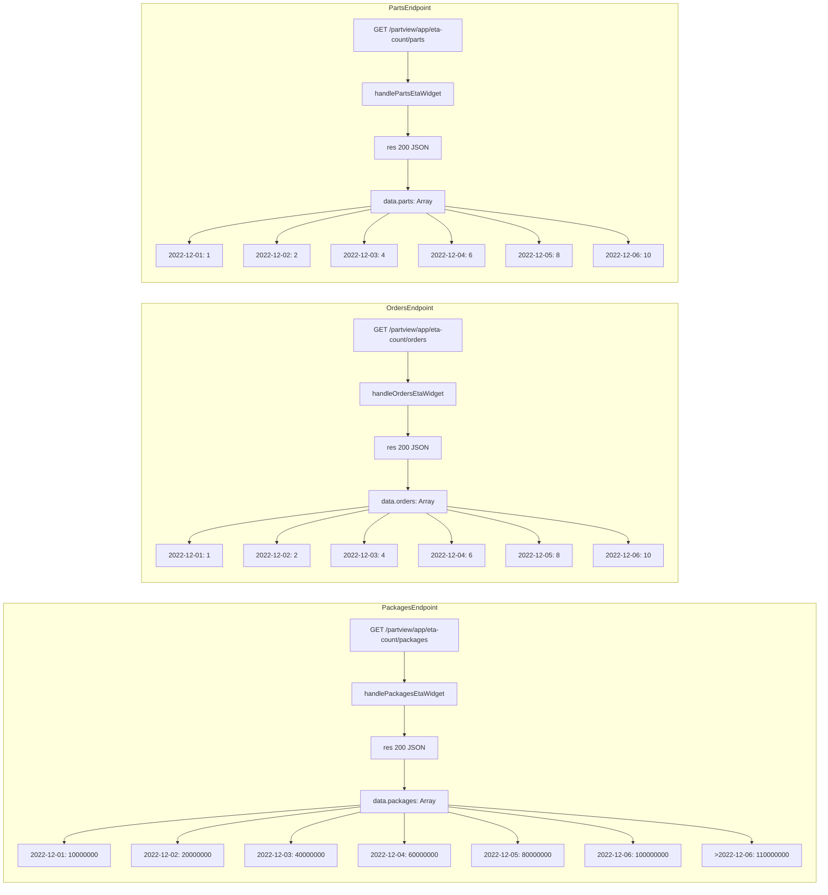
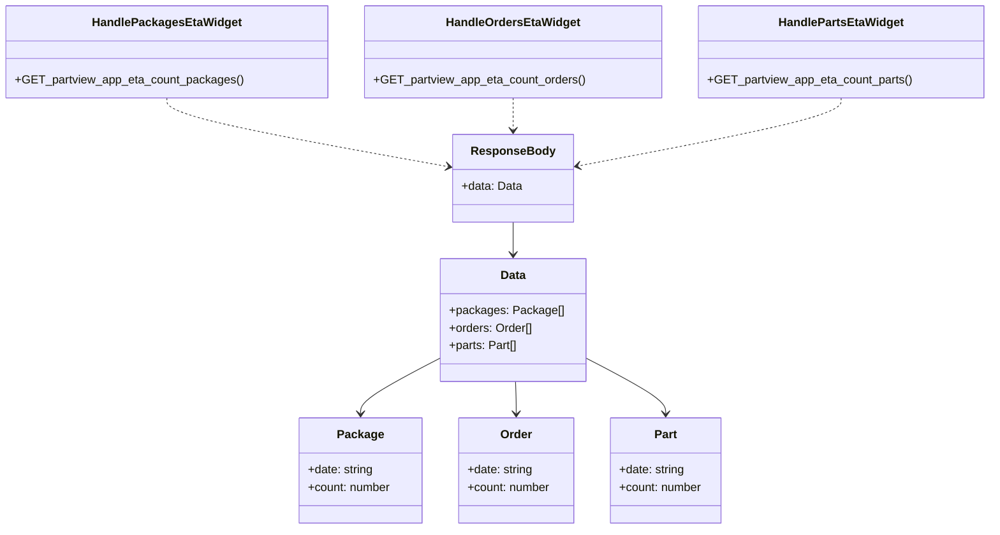

# Diagram: web/portal/src/mocks/handlers/partview/app/eta-count.js

> Auto-generated by Obscura crawlers

## Diagram 1

### SVG

<svg id="container" width="1904.453125" xmlns="http://www.w3.org/2000/svg" class="flowchart" height="2123" viewBox="0 0 1904.453125 2123" role="graphics-document document" aria-roledescription="flowchart-v2"><g><marker id="container_flowchart-v2-pointEnd" class="marker flowchart-v2" viewBox="0 0 10 10" refX="5" refY="5" markerUnits="userSpaceOnUse" markerWidth="8" markerHeight="8" orient="auto"><path d="M 0 0 L 10 5 L 0 10 z" class="arrowMarkerPath" style="stroke-width: 1; stroke-dasharray: 1, 0;"></path></marker><marker id="container_flowchart-v2-pointStart" class="marker flowchart-v2" viewBox="0 0 10 10" refX="4.5" refY="5" markerUnits="userSpaceOnUse" markerWidth="8" markerHeight="8" orient="auto"><path d="M 0 5 L 10 10 L 10 0 z" class="arrowMarkerPath" style="stroke-width: 1; stroke-dasharray: 1, 0;"></path></marker><marker id="container_flowchart-v2-circleEnd" class="marker flowchart-v2" viewBox="0 0 10 10" refX="11" refY="5" markerUnits="userSpaceOnUse" markerWidth="11" markerHeight="11" orient="auto"><circle cx="5" cy="5" r="5" class="arrowMarkerPath" style="stroke-width: 1; stroke-dasharray: 1, 0;"></circle></marker><marker id="container_flowchart-v2-circleStart" class="marker flowchart-v2" viewBox="0 0 10 10" refX="-1" refY="5" markerUnits="userSpaceOnUse" markerWidth="11" markerHeight="11" orient="auto"><circle cx="5" cy="5" r="5" class="arrowMarkerPath" style="stroke-width: 1; stroke-dasharray: 1, 0;"></circle></marker><marker id="container_flowchart-v2-crossEnd" class="marker cross flowchart-v2" viewBox="0 0 11 11" refX="12" refY="5.2" markerUnits="userSpaceOnUse" markerWidth="11" markerHeight="11" orient="auto"><path d="M 1,1 l 9,9 M 10,1 l -9,9" class="arrowMarkerPath" style="stroke-width: 2; stroke-dasharray: 1, 0;"></path></marker><marker id="container_flowchart-v2-crossStart" class="marker cross flowchart-v2" viewBox="0 0 11 11" refX="-1" refY="5.2" markerUnits="userSpaceOnUse" markerWidth="11" markerHeight="11" orient="auto"><path d="M 1,1 l 9,9 M 10,1 l -9,9" class="arrowMarkerPath" style="stroke-width: 2; stroke-dasharray: 1, 0;"></path></marker><g class="root"><g class="clusters"></g><g class="edgePaths"></g><g class="edgeLabels"></g><g class="nodes"><g class="root" transform="translate(326.4609375, 0)"><g class="clusters"><g class="cluster" id="PartsEndpoint" data-look="classic"><rect style="" x="8" y="8" width="1235.53125" height="669"></rect><g class="cluster-label" transform="translate(574.5625, 8)"><foreignObject width="102.40625" height="24">

PartsEndpoint

</foreignObject></g></g></g><g class="edgePaths"><path d="M619.535,123.5L619.535,129.75C619.535,136,619.535,148.5,619.535,160.333C619.535,172.167,619.535,183.333,619.535,188.917L619.535,194.5" id="L_EP_PART_H_PART_0" class="edge-thickness-normal edge-pattern-solid edge-thickness-normal edge-pattern-solid flowchart-link" style=";" data-edge="true" data-et="edge" data-id="L_EP_PART_H_PART_0" data-points="W3sieCI6NjE5LjUzNTE1NjI1LCJ5IjoxMjMuNX0seyJ4Ijo2MTkuNTM1MTU2MjUsInkiOjE2MX0seyJ4Ijo2MTkuNTM1MTU2MjUsInkiOjE5OC41fV0=" marker-end="url(#container_flowchart-v2-pointEnd)"></path><path d="M619.535,252.5L619.535,258.75C619.535,265,619.535,277.5,619.535,289.333C619.535,301.167,619.535,312.333,619.535,317.917L619.535,323.5" id="L_H_PART_R_PART_0" class="edge-thickness-normal edge-pattern-solid edge-thickness-normal edge-pattern-solid flowchart-link" style=";" data-edge="true" data-et="edge" data-id="L_H_PART_R_PART_0" data-points="W3sieCI6NjE5LjUzNTE1NjI1LCJ5IjoyNTIuNX0seyJ4Ijo2MTkuNTM1MTU2MjUsInkiOjI5MH0seyJ4Ijo2MTkuNTM1MTU2MjUsInkiOjMyNy41fV0=" marker-end="url(#container_flowchart-v2-pointEnd)"></path><path d="M619.535,381.5L619.535,387.75C619.535,394,619.535,406.5,619.535,418.333C619.535,430.167,619.535,441.333,619.535,446.917L619.535,452.5" id="L_R_PART_DB_PART_0" class="edge-thickness-normal edge-pattern-solid edge-thickness-normal edge-pattern-solid flowchart-link" style=";" data-edge="true" data-et="edge" data-id="L_R_PART_DB_PART_0" data-points="W3sieCI6NjE5LjUzNTE1NjI1LCJ5IjozODEuNX0seyJ4Ijo2MTkuNTM1MTU2MjUsInkiOjQxOX0seyJ4Ijo2MTkuNTM1MTU2MjUsInkiOjQ1Ni41fV0=" marker-end="url(#container_flowchart-v2-pointEnd)"></path><path d="M529.863,495.018L461.117,503.848C392.37,512.679,254.876,530.339,186.13,544.753C117.383,559.167,117.383,570.333,117.383,575.917L117.383,581.5" id="L_DB_PART_T1_0" class="edge-thickness-normal edge-pattern-solid edge-thickness-normal edge-pattern-solid flowchart-link" style=";" data-edge="true" data-et="edge" data-id="L_DB_PART_T1_0" data-points="W3sieCI6NTI5Ljg2MzI4MTI1LCJ5Ijo0OTUuMDE4MDkwMDk2NTM3NTV9LHsieCI6MTE3LjM4MjgxMjUsInkiOjU0OH0seyJ4IjoxMTcuMzgyODEyNSwieSI6NTg1LjV9XQ==" marker-end="url(#container_flowchart-v2-pointEnd)"></path><path d="M529.863,502.633L494.426,510.194C458.99,517.755,388.116,532.878,352.679,546.022C317.242,559.167,317.242,570.333,317.242,575.917L317.242,581.5" id="L_DB_PART_T2_0" class="edge-thickness-normal edge-pattern-solid edge-thickness-normal edge-pattern-solid flowchart-link" style=";" data-edge="true" data-et="edge" data-id="L_DB_PART_T2_0" data-points="W3sieCI6NTI5Ljg2MzI4MTI1LCJ5Ijo1MDIuNjMzMjEzNTg4ODQ1NjV9LHsieCI6MzE3LjI0MjE4NzUsInkiOjU0OH0seyJ4IjozMTcuMjQyMTg3NSwieSI6NTg1LjV9XQ==" marker-end="url(#container_flowchart-v2-pointEnd)"></path><path d="M577.258,510.5L567.471,516.75C557.685,523,538.112,535.5,528.326,547.333C518.539,559.167,518.539,570.333,518.539,575.917L518.539,581.5" id="L_DB_PART_T3_0" class="edge-thickness-normal edge-pattern-solid edge-thickness-normal edge-pattern-solid flowchart-link" style=";" data-edge="true" data-et="edge" data-id="L_DB_PART_T3_0" data-points="W3sieCI6NTc3LjI1NzcyMTY1Njk3NjcsInkiOjUxMC41fSx7IngiOjUxOC41MzkwNjI1LCJ5Ijo1NDh9LHsieCI6NTE4LjUzOTA2MjUsInkiOjU4NS41fV0=" marker-end="url(#container_flowchart-v2-pointEnd)"></path><path d="M661.813,510.5L671.599,516.75C681.385,523,700.958,535.5,710.745,547.333C720.531,559.167,720.531,570.333,720.531,575.917L720.531,581.5" id="L_DB_PART_T4_0" class="edge-thickness-normal edge-pattern-solid edge-thickness-normal edge-pattern-solid flowchart-link" style=";" data-edge="true" data-et="edge" data-id="L_DB_PART_T4_0" data-points="W3sieCI6NjYxLjgxMjU5MDg0MzAyMzMsInkiOjUxMC41fSx7IngiOjcyMC41MzEyNSwieSI6NTQ4fSx7IngiOjcyMC41MzEyNSwieSI6NTg1LjV9XQ==" marker-end="url(#container_flowchart-v2-pointEnd)"></path><path d="M709.207,502.574L744.801,510.145C780.396,517.716,851.585,532.858,887.179,546.012C922.773,559.167,922.773,570.333,922.773,575.917L922.773,581.5" id="L_DB_PART_T5_0" class="edge-thickness-normal edge-pattern-solid edge-thickness-normal edge-pattern-solid flowchart-link" style=";" data-edge="true" data-et="edge" data-id="L_DB_PART_T5_0" data-points="W3sieCI6NzA5LjIwNzAzMTI1LCJ5Ijo1MDIuNTczNTY3ODY3Njc4M30seyJ4Ijo5MjIuNzczNDM3NSwieSI6NTQ4fSx7IngiOjkyMi43NzM0Mzc1LCJ5Ijo1ODUuNX1d" marker-end="url(#container_flowchart-v2-pointEnd)"></path><path d="M709.207,494.86L779.12,503.716C849.034,512.573,988.861,530.287,1058.774,544.727C1128.688,559.167,1128.688,570.333,1128.688,575.917L1128.688,581.5" id="L_DB_PART_T6_0" class="edge-thickness-normal edge-pattern-solid edge-thickness-normal edge-pattern-solid flowchart-link" style=";" data-edge="true" data-et="edge" data-id="L_DB_PART_T6_0" data-points="W3sieCI6NzA5LjIwNzAzMTI1LCJ5Ijo0OTQuODU5NzM1NDY3MTkwNDN9LHsieCI6MTEyOC42ODc1LCJ5Ijo1NDh9LHsieCI6MTEyOC42ODc1LCJ5Ijo1ODUuNX1d" marker-end="url(#container_flowchart-v2-pointEnd)"></path></g><g class="edgeLabels"><g class="edgeLabel"><g class="label" data-id="L_EP_PART_H_PART_0" transform="translate(0, 0)"><foreignObject width="0" height="0">

</foreignObject></g></g><g class="edgeLabel"><g class="label" data-id="L_H_PART_R_PART_0" transform="translate(0, 0)"><foreignObject width="0" height="0">

</foreignObject></g></g><g class="edgeLabel"><g class="label" data-id="L_R_PART_DB_PART_0" transform="translate(0, 0)"><foreignObject width="0" height="0">

</foreignObject></g></g><g class="edgeLabel"><g class="label" data-id="L_DB_PART_T1_0" transform="translate(0, 0)"><foreignObject width="0" height="0">

</foreignObject></g></g><g class="edgeLabel"><g class="label" data-id="L_DB_PART_T2_0" transform="translate(0, 0)"><foreignObject width="0" height="0">

</foreignObject></g></g><g class="edgeLabel"><g class="label" data-id="L_DB_PART_T3_0" transform="translate(0, 0)"><foreignObject width="0" height="0">

</foreignObject></g></g><g class="edgeLabel"><g class="label" data-id="L_DB_PART_T4_0" transform="translate(0, 0)"><foreignObject width="0" height="0">

</foreignObject></g></g><g class="edgeLabel"><g class="label" data-id="L_DB_PART_T5_0" transform="translate(0, 0)"><foreignObject width="0" height="0">

</foreignObject></g></g><g class="edgeLabel"><g class="label" data-id="L_DB_PART_T6_0" transform="translate(0, 0)"><foreignObject width="0" height="0">

</foreignObject></g></g></g><g class="nodes"><g class="node default" id="flowchart-EP_PART-42" transform="translate(619.53515625, 84.5)"><rect class="basic label-container" style="" x="-130" y="-39" width="260" height="78"></rect><g class="label" style="" transform="translate(-100, -24)"><rect></rect><foreignObject width="200" height="48">

GET /partview/app/eta-count/parts

</foreignObject></g></g><g class="node default" id="flowchart-H_PART-43" transform="translate(619.53515625, 225.5)"><rect class="basic label-container" style="" x="-109.734375" y="-27" width="219.46875" height="54"></rect><g class="label" style="" transform="translate(-79.734375, -12)"><rect></rect><foreignObject width="159.46875" height="24">

handlePartsEtaWidget

</foreignObject></g></g><g class="node default" id="flowchart-R_PART-47" transform="translate(619.53515625, 354.5)"><rect class="basic label-container" style="" x="-75.875" y="-27" width="151.75" height="54"></rect><g class="label" style="" transform="translate(-45.875, -12)"><rect></rect><foreignObject width="91.75" height="24">

res 200 JSON

</foreignObject></g></g><g class="node default" id="flowchart-DB_PART-49" transform="translate(619.53515625, 483.5)"><rect class="basic label-container" style="" x="-89.671875" y="-27" width="179.34375" height="54"></rect><g class="label" style="" transform="translate(-59.671875, -12)"><rect></rect><foreignObject width="119.34375" height="24">

data.parts: Array

</foreignObject></g></g><g class="node default" id="flowchart-T1-51" transform="translate(117.3828125, 612.5)"><rect class="basic label-container" style="" x="-74.3828125" y="-27" width="148.765625" height="54"></rect><g class="label" style="" transform="translate(-44.3828125, -12)"><rect></rect><foreignObject width="88.765625" height="24">

2022-12-01: 1

</foreignObject></g></g><g class="node default" id="flowchart-T2-53" transform="translate(317.2421875, 612.5)"><rect class="basic label-container" style="" x="-75.4765625" y="-27" width="150.953125" height="54"></rect><g class="label" style="" transform="translate(-45.4765625, -12)"><rect></rect><foreignObject width="90.953125" height="24">

2022-12-02: 2

</foreignObject></g></g><g class="node default" id="flowchart-T3-55" transform="translate(518.5390625, 612.5)"><rect class="basic label-container" style="" x="-75.8203125" y="-27" width="151.640625" height="54"></rect><g class="label" style="" transform="translate(-45.8203125, -12)"><rect></rect><foreignObject width="91.640625" height="24">

2022-12-03: 4

</foreignObject></g></g><g class="node default" id="flowchart-T4-57" transform="translate(720.53125, 612.5)"><rect class="basic label-container" style="" x="-76.171875" y="-27" width="152.34375" height="54"></rect><g class="label" style="" transform="translate(-46.171875, -12)"><rect></rect><foreignObject width="92.34375" height="24">

2022-12-04: 6

</foreignObject></g></g><g class="node default" id="flowchart-T5-59" transform="translate(922.7734375, 612.5)"><rect class="basic label-container" style="" x="-76.0703125" y="-27" width="152.140625" height="54"></rect><g class="label" style="" transform="translate(-46.0703125, -12)"><rect></rect><foreignObject width="92.140625" height="24">

2022-12-05: 8

</foreignObject></g></g><g class="node default" id="flowchart-T6-61" transform="translate(1128.6875, 612.5)"><rect class="basic label-container" style="" x="-79.84375" y="-27" width="159.6875" height="54"></rect><g class="label" style="" transform="translate(-49.84375, -12)"><rect></rect><foreignObject width="99.6875" height="24">

2022-12-06: 10

</foreignObject></g></g></g></g><g class="root" transform="translate(326.4609375, 719)"><g class="clusters"><g class="cluster" id="OrdersEndpoint" data-look="classic"><rect style="" x="8" y="8" width="1235.53125" height="669"></rect><g class="cluster-label" transform="translate(568.6015625, 8)"><foreignObject width="114.328125" height="24">

OrdersEndpoint

</foreignObject></g></g></g><g class="edgePaths"><path d="M619.535,123.5L619.535,129.75C619.535,136,619.535,148.5,619.535,160.333C619.535,172.167,619.535,183.333,619.535,188.917L619.535,194.5" id="L_EP_ORD_H_ORD_0" class="edge-thickness-normal edge-pattern-solid edge-thickness-normal edge-pattern-solid flowchart-link" style=";" data-edge="true" data-et="edge" data-id="L_EP_ORD_H_ORD_0" data-points="W3sieCI6NjE5LjUzNTE1NjI1LCJ5IjoxMjMuNX0seyJ4Ijo2MTkuNTM1MTU2MjUsInkiOjE2MX0seyJ4Ijo2MTkuNTM1MTU2MjUsInkiOjE5OC41fV0=" marker-end="url(#container_flowchart-v2-pointEnd)"></path><path d="M619.535,252.5L619.535,258.75C619.535,265,619.535,277.5,619.535,289.333C619.535,301.167,619.535,312.333,619.535,317.917L619.535,323.5" id="L_H_ORD_R_ORD_0" class="edge-thickness-normal edge-pattern-solid edge-thickness-normal edge-pattern-solid flowchart-link" style=";" data-edge="true" data-et="edge" data-id="L_H_ORD_R_ORD_0" data-points="W3sieCI6NjE5LjUzNTE1NjI1LCJ5IjoyNTIuNX0seyJ4Ijo2MTkuNTM1MTU2MjUsInkiOjI5MH0seyJ4Ijo2MTkuNTM1MTU2MjUsInkiOjMyNy41fV0=" marker-end="url(#container_flowchart-v2-pointEnd)"></path><path d="M619.535,381.5L619.535,387.75C619.535,394,619.535,406.5,619.535,418.333C619.535,430.167,619.535,441.333,619.535,446.917L619.535,452.5" id="L_R_ORD_DB_ORD_0" class="edge-thickness-normal edge-pattern-solid edge-thickness-normal edge-pattern-solid flowchart-link" style=";" data-edge="true" data-et="edge" data-id="L_R_ORD_DB_ORD_0" data-points="W3sieCI6NjE5LjUzNTE1NjI1LCJ5IjozODEuNX0seyJ4Ijo2MTkuNTM1MTU2MjUsInkiOjQxOX0seyJ4Ijo2MTkuNTM1MTU2MjUsInkiOjQ1Ni41fV0=" marker-end="url(#container_flowchart-v2-pointEnd)"></path><path d="M525.316,495.602L457.327,504.335C389.339,513.068,253.361,530.534,185.372,544.85C117.383,559.167,117.383,570.333,117.383,575.917L117.383,581.5" id="L_DB_ORD_O1_0" class="edge-thickness-normal edge-pattern-solid edge-thickness-normal edge-pattern-solid flowchart-link" style=";" data-edge="true" data-et="edge" data-id="L_DB_ORD_O1_0" data-points="W3sieCI6NTI1LjMxNjQwNjI1LCJ5Ijo0OTUuNjAyMTIyODkyODU5NjV9LHsieCI6MTE3LjM4MjgxMjUsInkiOjU0OH0seyJ4IjoxMTcuMzgyODEyNSwieSI6NTg1LjV9XQ==" marker-end="url(#container_flowchart-v2-pointEnd)"></path><path d="M525.316,503.603L490.637,511.003C455.958,518.402,386.6,533.201,351.921,546.184C317.242,559.167,317.242,570.333,317.242,575.917L317.242,581.5" id="L_DB_ORD_O2_0" class="edge-thickness-normal edge-pattern-solid edge-thickness-normal edge-pattern-solid flowchart-link" style=";" data-edge="true" data-et="edge" data-id="L_DB_ORD_O2_0" data-points="W3sieCI6NTI1LjMxNjQwNjI1LCJ5Ijo1MDMuNjAzMzc2NTM2MTEwN30seyJ4IjozMTcuMjQyMTg3NSwieSI6NTQ4fSx7IngiOjMxNy4yNDIxODc1LCJ5Ijo1ODUuNX1d" marker-end="url(#container_flowchart-v2-pointEnd)"></path><path d="M577.258,510.5L567.471,516.75C557.685,523,538.112,535.5,528.326,547.333C518.539,559.167,518.539,570.333,518.539,575.917L518.539,581.5" id="L_DB_ORD_O3_0" class="edge-thickness-normal edge-pattern-solid edge-thickness-normal edge-pattern-solid flowchart-link" style=";" data-edge="true" data-et="edge" data-id="L_DB_ORD_O3_0" data-points="W3sieCI6NTc3LjI1NzcyMTY1Njk3NjcsInkiOjUxMC41fSx7IngiOjUxOC41MzkwNjI1LCJ5Ijo1NDh9LHsieCI6NTE4LjUzOTA2MjUsInkiOjU4NS41fV0=" marker-end="url(#container_flowchart-v2-pointEnd)"></path><path d="M661.813,510.5L671.599,516.75C681.385,523,700.958,535.5,710.745,547.333C720.531,559.167,720.531,570.333,720.531,575.917L720.531,581.5" id="L_DB_ORD_O4_0" class="edge-thickness-normal edge-pattern-solid edge-thickness-normal edge-pattern-solid flowchart-link" style=";" data-edge="true" data-et="edge" data-id="L_DB_ORD_O4_0" data-points="W3sieCI6NjYxLjgxMjU5MDg0MzAyMzMsInkiOjUxMC41fSx7IngiOjcyMC41MzEyNSwieSI6NTQ4fSx7IngiOjcyMC41MzEyNSwieSI6NTg1LjV9XQ==" marker-end="url(#container_flowchart-v2-pointEnd)"></path><path d="M713.754,503.541L748.59,510.951C783.427,518.36,853.1,533.18,887.937,546.173C922.773,559.167,922.773,570.333,922.773,575.917L922.773,581.5" id="L_DB_ORD_O5_0" class="edge-thickness-normal edge-pattern-solid edge-thickness-normal edge-pattern-solid flowchart-link" style=";" data-edge="true" data-et="edge" data-id="L_DB_ORD_O5_0" data-points="W3sieCI6NzEzLjc1MzkwNjI1LCJ5Ijo1MDMuNTQwNzA2NDM3MDI3NH0seyJ4Ijo5MjIuNzczNDM3NSwieSI6NTQ4fSx7IngiOjkyMi43NzM0Mzc1LCJ5Ijo1ODUuNX1d" marker-end="url(#container_flowchart-v2-pointEnd)"></path><path d="M713.754,495.436L782.91,504.196C852.065,512.957,990.376,530.479,1059.532,544.823C1128.688,559.167,1128.688,570.333,1128.688,575.917L1128.688,581.5" id="L_DB_ORD_O6_0" class="edge-thickness-normal edge-pattern-solid edge-thickness-normal edge-pattern-solid flowchart-link" style=";" data-edge="true" data-et="edge" data-id="L_DB_ORD_O6_0" data-points="W3sieCI6NzEzLjc1MzkwNjI1LCJ5Ijo0OTUuNDM1NzM4NzgxNTIyNn0seyJ4IjoxMTI4LjY4NzUsInkiOjU0OH0seyJ4IjoxMTI4LjY4NzUsInkiOjU4NS41fV0=" marker-end="url(#container_flowchart-v2-pointEnd)"></path></g><g class="edgeLabels"><g class="edgeLabel"><g class="label" data-id="L_EP_ORD_H_ORD_0" transform="translate(0, 0)"><foreignObject width="0" height="0">

</foreignObject></g></g><g class="edgeLabel"><g class="label" data-id="L_H_ORD_R_ORD_0" transform="translate(0, 0)"><foreignObject width="0" height="0">

</foreignObject></g></g><g class="edgeLabel"><g class="label" data-id="L_R_ORD_DB_ORD_0" transform="translate(0, 0)"><foreignObject width="0" height="0">

</foreignObject></g></g><g class="edgeLabel"><g class="label" data-id="L_DB_ORD_O1_0" transform="translate(0, 0)"><foreignObject width="0" height="0">

</foreignObject></g></g><g class="edgeLabel"><g class="label" data-id="L_DB_ORD_O2_0" transform="translate(0, 0)"><foreignObject width="0" height="0">

</foreignObject></g></g><g class="edgeLabel"><g class="label" data-id="L_DB_ORD_O3_0" transform="translate(0, 0)"><foreignObject width="0" height="0">

</foreignObject></g></g><g class="edgeLabel"><g class="label" data-id="L_DB_ORD_O4_0" transform="translate(0, 0)"><foreignObject width="0" height="0">

</foreignObject></g></g><g class="edgeLabel"><g class="label" data-id="L_DB_ORD_O5_0" transform="translate(0, 0)"><foreignObject width="0" height="0">

</foreignObject></g></g><g class="edgeLabel"><g class="label" data-id="L_DB_ORD_O6_0" transform="translate(0, 0)"><foreignObject width="0" height="0">

</foreignObject></g></g></g><g class="nodes"><g class="node default" id="flowchart-EP_ORD-22" transform="translate(619.53515625, 84.5)"><rect class="basic label-container" style="" x="-130" y="-39" width="260" height="78"></rect><g class="label" style="" transform="translate(-100, -24)"><rect></rect><foreignObject width="200" height="48">

GET /partview/app/eta-count/orders

</foreignObject></g></g><g class="node default" id="flowchart-H_ORD-23" transform="translate(619.53515625, 225.5)"><rect class="basic label-container" style="" x="-115.6953125" y="-27" width="231.390625" height="54"></rect><g class="label" style="" transform="translate(-85.6953125, -12)"><rect></rect><foreignObject width="171.390625" height="24">

handleOrdersEtaWidget

</foreignObject></g></g><g class="node default" id="flowchart-R_ORD-27" transform="translate(619.53515625, 354.5)"><rect class="basic label-container" style="" x="-75.875" y="-27" width="151.75" height="54"></rect><g class="label" style="" transform="translate(-45.875, -12)"><rect></rect><foreignObject width="91.75" height="24">

res 200 JSON

</foreignObject></g></g><g class="node default" id="flowchart-DB_ORD-29" transform="translate(619.53515625, 483.5)"><rect class="basic label-container" style="" x="-94.21875" y="-27" width="188.4375" height="54"></rect><g class="label" style="" transform="translate(-64.21875, -12)"><rect></rect><foreignObject width="128.4375" height="24">

data.orders: Array

</foreignObject></g></g><g class="node default" id="flowchart-O1-31" transform="translate(117.3828125, 612.5)"><rect class="basic label-container" style="" x="-74.3828125" y="-27" width="148.765625" height="54"></rect><g class="label" style="" transform="translate(-44.3828125, -12)"><rect></rect><foreignObject width="88.765625" height="24">

2022-12-01: 1

</foreignObject></g></g><g class="node default" id="flowchart-O2-33" transform="translate(317.2421875, 612.5)"><rect class="basic label-container" style="" x="-75.4765625" y="-27" width="150.953125" height="54"></rect><g class="label" style="" transform="translate(-45.4765625, -12)"><rect></rect><foreignObject width="90.953125" height="24">

2022-12-02: 2

</foreignObject></g></g><g class="node default" id="flowchart-O3-35" transform="translate(518.5390625, 612.5)"><rect class="basic label-container" style="" x="-75.8203125" y="-27" width="151.640625" height="54"></rect><g class="label" style="" transform="translate(-45.8203125, -12)"><rect></rect><foreignObject width="91.640625" height="24">

2022-12-03: 4

</foreignObject></g></g><g class="node default" id="flowchart-O4-37" transform="translate(720.53125, 612.5)"><rect class="basic label-container" style="" x="-76.171875" y="-27" width="152.34375" height="54"></rect><g class="label" style="" transform="translate(-46.171875, -12)"><rect></rect><foreignObject width="92.34375" height="24">

2022-12-04: 6

</foreignObject></g></g><g class="node default" id="flowchart-O5-39" transform="translate(922.7734375, 612.5)"><rect class="basic label-container" style="" x="-76.0703125" y="-27" width="152.140625" height="54"></rect><g class="label" style="" transform="translate(-46.0703125, -12)"><rect></rect><foreignObject width="92.140625" height="24">

2022-12-05: 8

</foreignObject></g></g><g class="node default" id="flowchart-O6-41" transform="translate(1128.6875, 612.5)"><rect class="basic label-container" style="" x="-79.84375" y="-27" width="159.6875" height="54"></rect><g class="label" style="" transform="translate(-49.84375, -12)"><rect></rect><foreignObject width="99.6875" height="24">

2022-12-06: 10

</foreignObject></g></g></g></g><g class="root" transform="translate(0, 1438)"><g class="clusters"><g class="cluster" id="PackagesEndpoint" data-look="classic"><rect style="" x="8" y="8" width="1888.453125" height="669"></rect><g class="cluster-label" transform="translate(886.53125, 8)"><foreignObject width="131.390625" height="24">

PackagesEndpoint

</foreignObject></g></g></g><g class="edgePaths"><path d="M939.266,123.5L939.266,129.75C939.266,136,939.266,148.5,939.266,160.333C939.266,172.167,939.266,183.333,939.266,188.917L939.266,194.5" id="L_EP_PACK_H_PACK_0" class="edge-thickness-normal edge-pattern-solid edge-thickness-normal edge-pattern-solid flowchart-link" style=";" data-edge="true" data-et="edge" data-id="L_EP_PACK_H_PACK_0" data-points="W3sieCI6OTM5LjI2NTYyNSwieSI6MTIzLjV9LHsieCI6OTM5LjI2NTYyNSwieSI6MTYxfSx7IngiOjkzOS4yNjU2MjUsInkiOjE5OC41fV0=" marker-end="url(#container_flowchart-v2-pointEnd)"></path><path d="M939.266,252.5L939.266,258.75C939.266,265,939.266,277.5,939.266,289.333C939.266,301.167,939.266,312.333,939.266,317.917L939.266,323.5" id="L_H_PACK_R_PACK_0" class="edge-thickness-normal edge-pattern-solid edge-thickness-normal edge-pattern-solid flowchart-link" style=";" data-edge="true" data-et="edge" data-id="L_H_PACK_R_PACK_0" data-points="W3sieCI6OTM5LjI2NTYyNSwieSI6MjUyLjV9LHsieCI6OTM5LjI2NTYyNSwieSI6MjkwfSx7IngiOjkzOS4yNjU2MjUsInkiOjMyNy41fV0=" marker-end="url(#container_flowchart-v2-pointEnd)"></path><path d="M939.266,381.5L939.266,387.75C939.266,394,939.266,406.5,939.266,418.333C939.266,430.167,939.266,441.333,939.266,446.917L939.266,452.5" id="L_R_PACK_DB_PACK_0" class="edge-thickness-normal edge-pattern-solid edge-thickness-normal edge-pattern-solid flowchart-link" style=";" data-edge="true" data-et="edge" data-id="L_R_PACK_DB_PACK_0" data-points="W3sieCI6OTM5LjI2NTYyNSwieSI6MzgxLjV9LHsieCI6OTM5LjI2NTYyNSwieSI6NDE5fSx7IngiOjkzOS4yNjU2MjUsInkiOjQ1Ni41fV0=" marker-end="url(#container_flowchart-v2-pointEnd)"></path><path d="M835.109,491.997L720.695,501.331C606.281,510.665,377.453,529.332,263.039,544.25C148.625,559.167,148.625,570.333,148.625,575.917L148.625,581.5" id="L_DB_PACK_P1_0" class="edge-thickness-normal edge-pattern-solid edge-thickness-normal edge-pattern-solid flowchart-link" style=";" data-edge="true" data-et="edge" data-id="L_DB_PACK_P1_0" data-points="W3sieCI6ODM1LjEwOTM3NSwieSI6NDkxLjk5NzAwNTk4ODAyMzk0fSx7IngiOjE0OC42MjUsInkiOjU0OH0seyJ4IjoxNDguNjI1LCJ5Ijo1ODUuNX1d" marker-end="url(#container_flowchart-v2-pointEnd)"></path><path d="M835.109,496.217L764.421,504.847C693.732,513.478,552.354,530.739,481.665,544.953C410.977,559.167,410.977,570.333,410.977,575.917L410.977,581.5" id="L_DB_PACK_P2_0" class="edge-thickness-normal edge-pattern-solid edge-thickness-normal edge-pattern-solid flowchart-link" style=";" data-edge="true" data-et="edge" data-id="L_DB_PACK_P2_0" data-points="W3sieCI6ODM1LjEwOTM3NSwieSI6NDk2LjIxNjY3MDg1NjY4NjV9LHsieCI6NDEwLjk3NjU2MjUsInkiOjU0OH0seyJ4Ijo0MTAuOTc2NTYyNSwieSI6NTg1LjV9XQ==" marker-end="url(#container_flowchart-v2-pointEnd)"></path><path d="M835.109,508.9L808.387,515.417C781.664,521.933,728.219,534.967,701.496,547.067C674.773,559.167,674.773,570.333,674.773,575.917L674.773,581.5" id="L_DB_PACK_P3_0" class="edge-thickness-normal edge-pattern-solid edge-thickness-normal edge-pattern-solid flowchart-link" style=";" data-edge="true" data-et="edge" data-id="L_DB_PACK_P3_0" data-points="W3sieCI6ODM1LjEwOTM3NSwieSI6NTA4Ljg5OTkxMTM4Njc5NjY1fSx7IngiOjY3NC43NzM0Mzc1LCJ5Ijo1NDh9LHsieCI6Njc0Ljc3MzQzNzUsInkiOjU4NS41fV0=" marker-end="url(#container_flowchart-v2-pointEnd)"></path><path d="M939.266,510.5L939.266,516.75C939.266,523,939.266,535.5,939.266,547.333C939.266,559.167,939.266,570.333,939.266,575.917L939.266,581.5" id="L_DB_PACK_P4_0" class="edge-thickness-normal edge-pattern-solid edge-thickness-normal edge-pattern-solid flowchart-link" style=";" data-edge="true" data-et="edge" data-id="L_DB_PACK_P4_0" data-points="W3sieCI6OTM5LjI2NTYyNSwieSI6NTEwLjV9LHsieCI6OTM5LjI2NTYyNSwieSI6NTQ4fSx7IngiOjkzOS4yNjU2MjUsInkiOjU4NS41fV0=" marker-end="url(#container_flowchart-v2-pointEnd)"></path><path d="M1043.422,508.877L1070.185,515.397C1096.948,521.918,1150.474,534.959,1177.237,547.063C1204,559.167,1204,570.333,1204,575.917L1204,581.5" id="L_DB_PACK_P5_0" class="edge-thickness-normal edge-pattern-solid edge-thickness-normal edge-pattern-solid flowchart-link" style=";" data-edge="true" data-et="edge" data-id="L_DB_PACK_P5_0" data-points="W3sieCI6MTA0My40MjE4NzUsInkiOjUwOC44NzY2NzQ3MzI5MjgwNX0seyJ4IjoxMjA0LCJ5Ijo1NDh9LHsieCI6MTIwNCwieSI6NTg1LjV9XQ==" marker-end="url(#container_flowchart-v2-pointEnd)"></path><path d="M1043.422,496.101L1114.919,504.751C1186.417,513.401,1329.411,530.7,1400.909,544.933C1472.406,559.167,1472.406,570.333,1472.406,575.917L1472.406,581.5" id="L_DB_PACK_P6_0" class="edge-thickness-normal edge-pattern-solid edge-thickness-normal edge-pattern-solid flowchart-link" style=";" data-edge="true" data-et="edge" data-id="L_DB_PACK_P6_0" data-points="W3sieCI6MTA0My40MjE4NzUsInkiOjQ5Ni4xMDA5NDk1NjE4NTM0fSx7IngiOjE0NzIuNDA2MjUsInkiOjU0OH0seyJ4IjoxNDcyLjQwNjI1LCJ5Ijo1ODUuNX1d" marker-end="url(#container_flowchart-v2-pointEnd)"></path><path d="M1043.422,491.812L1160.764,501.177C1278.107,510.542,1512.792,529.271,1630.134,544.219C1747.477,559.167,1747.477,570.333,1747.477,575.917L1747.477,581.5" id="L_DB_PACK_P7_0" class="edge-thickness-normal edge-pattern-solid edge-thickness-normal edge-pattern-solid flowchart-link" style=";" data-edge="true" data-et="edge" data-id="L_DB_PACK_P7_0" data-points="W3sieCI6MTA0My40MjE4NzUsInkiOjQ5MS44MTIyODMxMDk4NzgxfSx7IngiOjE3NDcuNDc2NTYyNSwieSI6NTQ4fSx7IngiOjE3NDcuNDc2NTYyNSwieSI6NTg1LjV9XQ==" marker-end="url(#container_flowchart-v2-pointEnd)"></path></g><g class="edgeLabels"><g class="edgeLabel"><g class="label" data-id="L_EP_PACK_H_PACK_0" transform="translate(0, 0)"><foreignObject width="0" height="0">

</foreignObject></g></g><g class="edgeLabel"><g class="label" data-id="L_H_PACK_R_PACK_0" transform="translate(0, 0)"><foreignObject width="0" height="0">

</foreignObject></g></g><g class="edgeLabel"><g class="label" data-id="L_R_PACK_DB_PACK_0" transform="translate(0, 0)"><foreignObject width="0" height="0">

</foreignObject></g></g><g class="edgeLabel"><g class="label" data-id="L_DB_PACK_P1_0" transform="translate(0, 0)"><foreignObject width="0" height="0">

</foreignObject></g></g><g class="edgeLabel"><g class="label" data-id="L_DB_PACK_P2_0" transform="translate(0, 0)"><foreignObject width="0" height="0">

</foreignObject></g></g><g class="edgeLabel"><g class="label" data-id="L_DB_PACK_P3_0" transform="translate(0, 0)"><foreignObject width="0" height="0">

</foreignObject></g></g><g class="edgeLabel"><g class="label" data-id="L_DB_PACK_P4_0" transform="translate(0, 0)"><foreignObject width="0" height="0">

</foreignObject></g></g><g class="edgeLabel"><g class="label" data-id="L_DB_PACK_P5_0" transform="translate(0, 0)"><foreignObject width="0" height="0">

</foreignObject></g></g><g class="edgeLabel"><g class="label" data-id="L_DB_PACK_P6_0" transform="translate(0, 0)"><foreignObject width="0" height="0">

</foreignObject></g></g><g class="edgeLabel"><g class="label" data-id="L_DB_PACK_P7_0" transform="translate(0, 0)"><foreignObject width="0" height="0">

</foreignObject></g></g></g><g class="nodes"><g class="node default" id="flowchart-EP_PACK-0" transform="translate(939.265625, 84.5)"><rect class="basic label-container" style="" x="-130" y="-39" width="260" height="78"></rect><g class="label" style="" transform="translate(-100, -24)"><rect></rect><foreignObject width="200" height="48">

GET /partview/app/eta-count/packages

</foreignObject></g></g><g class="node default" id="flowchart-H_PACK-1" transform="translate(939.265625, 225.5)"><rect class="basic label-container" style="" x="-124.21875" y="-27" width="248.4375" height="54"></rect><g class="label" style="" transform="translate(-94.21875, -12)"><rect></rect><foreignObject width="188.4375" height="24">

handlePackagesEtaWidget

</foreignObject></g></g><g class="node default" id="flowchart-R_PACK-5" transform="translate(939.265625, 354.5)"><rect class="basic label-container" style="" x="-75.875" y="-27" width="151.75" height="54"></rect><g class="label" style="" transform="translate(-45.875, -12)"><rect></rect><foreignObject width="91.75" height="24">

res 200 JSON

</foreignObject></g></g><g class="node default" id="flowchart-DB_PACK-7" transform="translate(939.265625, 483.5)"><rect class="basic label-container" style="" x="-104.15625" y="-27" width="208.3125" height="54"></rect><g class="label" style="" transform="translate(-74.15625, -12)"><rect></rect><foreignObject width="148.3125" height="24">

data.packages: Array

</foreignObject></g></g><g class="node default" id="flowchart-P1-9" transform="translate(148.625, 612.5)"><rect class="basic label-container" style="" x="-105.625" y="-27" width="211.25" height="54"></rect><g class="label" style="" transform="translate(-75.625, -12)"><rect></rect><foreignObject width="151.25" height="24">

2022-12-01: 10000000

</foreignObject></g></g><g class="node default" id="flowchart-P2-11" transform="translate(410.9765625, 612.5)"><rect class="basic label-container" style="" x="-106.7265625" y="-27" width="213.453125" height="54"></rect><g class="label" style="" transform="translate(-76.7265625, -12)"><rect></rect><foreignObject width="153.453125" height="24">

2022-12-02: 20000000

</foreignObject></g></g><g class="node default" id="flowchart-P3-13" transform="translate(674.7734375, 612.5)"><rect class="basic label-container" style="" x="-107.0703125" y="-27" width="214.140625" height="54"></rect><g class="label" style="" transform="translate(-77.0703125, -12)"><rect></rect><foreignObject width="154.140625" height="24">

2022-12-03: 40000000

</foreignObject></g></g><g class="node default" id="flowchart-P4-15" transform="translate(939.265625, 612.5)"><rect class="basic label-container" style="" x="-107.421875" y="-27" width="214.84375" height="54"></rect><g class="label" style="" transform="translate(-77.421875, -12)"><rect></rect><foreignObject width="154.84375" height="24">

2022-12-04: 60000000

</foreignObject></g></g><g class="node default" id="flowchart-P5-17" transform="translate(1204, 612.5)"><rect class="basic label-container" style="" x="-107.3125" y="-27" width="214.625" height="54"></rect><g class="label" style="" transform="translate(-77.3125, -12)"><rect></rect><foreignObject width="154.625" height="24">

2022-12-05: 80000000

</foreignObject></g></g><g class="node default" id="flowchart-P6-19" transform="translate(1472.40625, 612.5)"><rect class="basic label-container" style="" x="-111.09375" y="-27" width="222.1875" height="54"></rect><g class="label" style="" transform="translate(-81.09375, -12)"><rect></rect><foreignObject width="162.1875" height="24">

2022-12-06: 100000000

</foreignObject></g></g><g class="node default" id="flowchart-P7-21" transform="translate(1747.4765625, 612.5)"><rect class="basic label-container" style="" x="-113.9765625" y="-27" width="227.953125" height="54"></rect><g class="label" style="" transform="translate(-83.9765625, -12)"><rect></rect><foreignObject width="167.953125" height="24">
&gt;2022-12-06: 110000000
</foreignObject></g></g></g></g></g></g></g></svg>

## Diagram 2

### SVG

<svg id="container" width="1321.109375" xmlns="http://www.w3.org/2000/svg" class="classDiagram" height="724" viewBox="0 0 1321.109375 724" role="graphics-document document" aria-roledescription="class"><g><defs><marker id="container_class-aggregationStart" class="marker aggregation class" refX="18" refY="7" markerWidth="190" markerHeight="240" orient="auto"><path d="M 18,7 L9,13 L1,7 L9,1 Z"></path></marker></defs><defs><marker id="container_class-aggregationEnd" class="marker aggregation class" refX="1" refY="7" markerWidth="20" markerHeight="28" orient="auto"><path d="M 18,7 L9,13 L1,7 L9,1 Z"></path></marker></defs><defs><marker id="container_class-extensionStart" class="marker extension class" refX="18" refY="7" markerWidth="190" markerHeight="240" orient="auto"><path d="M 1,7 L18,13 V 1 Z"></path></marker></defs><defs><marker id="container_class-extensionEnd" class="marker extension class" refX="1" refY="7" markerWidth="20" markerHeight="28" orient="auto"><path d="M 1,1 V 13 L18,7 Z"></path></marker></defs><defs><marker id="container_class-compositionStart" class="marker composition class" refX="18" refY="7" markerWidth="190" markerHeight="240" orient="auto"><path d="M 18,7 L9,13 L1,7 L9,1 Z"></path></marker></defs><defs><marker id="container_class-compositionEnd" class="marker composition class" refX="1" refY="7" markerWidth="20" markerHeight="28" orient="auto"><path d="M 18,7 L9,13 L1,7 L9,1 Z"></path></marker></defs><defs><marker id="container_class-dependencyStart" class="marker dependency class" refX="6" refY="7" markerWidth="190" markerHeight="240" orient="auto"><path d="M 5,7 L9,13 L1,7 L9,1 Z"></path></marker></defs><defs><marker id="container_class-dependencyEnd" class="marker dependency class" refX="13" refY="7" markerWidth="20" markerHeight="28" orient="auto"><path d="M 18,7 L9,13 L14,7 L9,1 Z"></path></marker></defs><defs><marker id="container_class-lollipopStart" class="marker lollipop class" refX="13" refY="7" markerWidth="190" markerHeight="240" orient="auto"><circle stroke="black" fill="transparent" cx="7" cy="7" r="6"></circle></marker></defs><defs><marker id="container_class-lollipopEnd" class="marker lollipop class" refX="1" refY="7" markerWidth="190" markerHeight="240" orient="auto"><circle stroke="black" fill="transparent" cx="7" cy="7" r="6"></circle></marker></defs><g class="root"><g class="clusters"></g><g class="edgePaths"><path d="M682.438,304L682.438,308.167C682.438,312.333,682.438,320.667,682.438,328C682.438,335.333,682.438,341.667,682.438,344.833L682.438,348" id="id_ResponseBody_Data_1" class="edge-thickness-normal edge-pattern-solid relation" style=";;;" data-edge="true" data-et="edge" data-id="id_ResponseBody_Data_1" data-points="W3sieCI6NjgyLjQzNzUsInkiOjMwNH0seyJ4Ijo2ODIuNDM3NSwieSI6MzI5fSx7IngiOjY4Mi40Mzc1LCJ5IjozNTR9XQ==" marker-end="url(#container_class-dependencyEnd)"></path><path d="M586.555,487.822L567.574,497.685C548.592,507.548,510.63,527.274,491.649,540.304C472.668,553.333,472.668,559.667,472.668,562.833L472.668,566" id="id_Data_Package_2" class="edge-thickness-normal edge-pattern-solid relation" style=";;;" data-edge="true" data-et="edge" data-id="id_Data_Package_2" data-points="W3sieCI6NTg2LjU1NDY4NzUsInkiOjQ4Ny44MjI0MjQxNjM0MjM0fSx7IngiOjQ3Mi42Njc5Njg3NSwieSI6NTQ3fSx7IngiOjQ3Mi42Njc5Njg3NSwieSI6NTcyfV0=" marker-end="url(#container_class-dependencyEnd)"></path><path d="M685.285,522L685.427,526.167C685.568,530.333,685.85,538.667,685.992,546C686.133,553.333,686.133,559.667,686.133,562.833L686.133,566" id="id_Data_Order_3" class="edge-thickness-normal edge-pattern-solid relation" style=";;;" data-edge="true" data-et="edge" data-id="id_Data_Order_3" data-points="W3sieCI6Njg1LjI4NTI2Mzc2MTQ2OCwieSI6NTIyfSx7IngiOjY4Ni4xMzI4MTI1LCJ5Ijo1NDd9LHsieCI6Njg2LjEzMjgxMjUsInkiOjU3Mn1d" marker-end="url(#container_class-dependencyEnd)"></path><path d="M778.32,487.822L797.301,497.685C816.283,507.548,854.245,527.274,873.226,540.304C892.207,553.333,892.207,559.667,892.207,562.833L892.207,566" id="id_Data_Part_4" class="edge-thickness-normal edge-pattern-solid relation" style=";;;" data-edge="true" data-et="edge" data-id="id_Data_Part_4" data-points="W3sieCI6Nzc4LjMyMDMxMjUsInkiOjQ4Ny44MjI0MjQxNjM0MjM0fSx7IngiOjg5Mi4yMDcwMzEyNSwieSI6NTQ3fSx7IngiOjg5Mi4yMDcwMzEyNSwieSI6NTcyfV0=" marker-end="url(#container_class-dependencyEnd)"></path><path d="M220.988,134L220.988,138.167C220.988,142.333,220.988,150.667,283.587,166.364C346.185,182.062,471.383,205.123,533.981,216.654L596.58,228.185" id="id_HandlePackagesEtaWidget_ResponseBody_5" class="edge-thickness-normal edge-pattern-dashed relation" style=";;;" data-edge="true" data-et="edge" data-id="id_HandlePackagesEtaWidget_ResponseBody_5" data-points="W3sieCI6MjIwLjk4ODI4MTI1LCJ5IjoxMzR9LHsieCI6MjIwLjk4ODI4MTI1LCJ5IjoxNTl9LHsieCI6NjAyLjQ4MDQ2ODc1LCJ5IjoyMjkuMjcxNzMyMjI5NDc0MDV9XQ==" marker-end="url(#container_class-dependencyEnd)"></path><path d="M682.438,134L682.438,138.167C682.438,142.333,682.438,150.667,682.438,158C682.438,165.333,682.438,171.667,682.438,174.833L682.438,178" id="id_HandleOrdersEtaWidget_ResponseBody_6" class="edge-thickness-normal edge-pattern-dashed relation" style=";;;" data-edge="true" data-et="edge" data-id="id_HandleOrdersEtaWidget_ResponseBody_6" data-points="W3sieCI6NjgyLjQzNzUsInkiOjEzNH0seyJ4Ijo2ODIuNDM3NSwieSI6MTU5fSx7IngiOjY4Mi40Mzc1LCJ5IjoxODR9XQ==" marker-end="url(#container_class-dependencyEnd)"></path><path d="M1122.004,134L1122.004,138.167C1122.004,142.333,1122.004,150.667,1063.051,166.233C1004.098,181.8,886.192,204.6,827.238,215.999L768.285,227.399" id="id_HandlePartsEtaWidget_ResponseBody_7" class="edge-thickness-normal edge-pattern-dashed relation" style=";;;" data-edge="true" data-et="edge" data-id="id_HandlePartsEtaWidget_ResponseBody_7" data-points="W3sieCI6MTEyMi4wMDM5MDYyNSwieSI6MTM0fSx7IngiOjExMjIuMDAzOTA2MjUsInkiOjE1OX0seyJ4Ijo3NjIuMzk0NTMxMjUsInkiOjIyOC41Mzg1MTg5NTk1NTcwOH1d" marker-end="url(#container_class-dependencyEnd)"></path></g><g class="edgeLabels"><g class="edgeLabel"><g class="label" data-id="id_ResponseBody_Data_1" transform="translate(0, 0)"><foreignObject width="0" height="0">

</foreignObject></g></g><g class="edgeLabel"><g class="label" data-id="id_Data_Package_2" transform="translate(0, 0)"><foreignObject width="0" height="0">

</foreignObject></g></g><g class="edgeLabel"><g class="label" data-id="id_Data_Order_3" transform="translate(0, 0)"><foreignObject width="0" height="0">

</foreignObject></g></g><g class="edgeLabel"><g class="label" data-id="id_Data_Part_4" transform="translate(0, 0)"><foreignObject width="0" height="0">

</foreignObject></g></g><g class="edgeLabel"><g class="label" data-id="id_HandlePackagesEtaWidget_ResponseBody_5" transform="translate(0, 0)"><foreignObject width="0" height="0">

</foreignObject></g></g><g class="edgeLabel"><g class="label" data-id="id_HandleOrdersEtaWidget_ResponseBody_6" transform="translate(0, 0)"><foreignObject width="0" height="0">

</foreignObject></g></g><g class="edgeLabel"><g class="label" data-id="id_HandlePartsEtaWidget_ResponseBody_7" transform="translate(0, 0)"><foreignObject width="0" height="0">

</foreignObject></g></g></g><g class="nodes"><g class="node default" id="classId-ResponseBody-0" transform="translate(682.4375, 244)"><g class="basic label-container"><path d="M-79.95703125 -60 L79.95703125 -60 L79.95703125 60 L-79.95703125 60" stroke="none" stroke-width="0" fill="#ECECFF" style=""></path><path d="M-79.95703125 -60 C-44.78794441319084 -60, -9.618857576381686 -60, 79.95703125 -60 M-79.95703125 -60 C-43.73440006995496 -60, -7.511768889909916 -60, 79.95703125 -60 M79.95703125 -60 C79.95703125 -35.20930007015994, 79.95703125 -10.418600140319882, 79.95703125 60 M79.95703125 -60 C79.95703125 -18.9857493261769, 79.95703125 22.0285013476462, 79.95703125 60 M79.95703125 60 C43.114970635214746 60, 6.272910020429492 60, -79.95703125 60 M79.95703125 60 C37.832086127115865 60, -4.29285899576827 60, -79.95703125 60 M-79.95703125 60 C-79.95703125 12.782795733111953, -79.95703125 -34.43440853377609, -79.95703125 -60 M-79.95703125 60 C-79.95703125 34.61106155141281, -79.95703125 9.22212310282562, -79.95703125 -60" stroke="#9370DB" stroke-width="1.3" fill="none" stroke-dasharray="0 0" style=""></path></g><g class="annotation-group text" transform="translate(0, -36)"></g><g class="label-group text" transform="translate(-53.9921875, -36)"><g class="label" style="font-weight: bolder" transform="translate(0,-12)"><foreignObject width="107.984375" height="24">

ResponseBody

</foreignObject></g></g><g class="members-group text" transform="translate(-67.95703125, 12)"><g class="label" style="" transform="translate(0,-12)"><foreignObject width="81.921875" height="24">

+data: Data

</foreignObject></g></g><g class="methods-group text" transform="translate(-67.95703125, 60)"></g><g class="divider" style=""><path d="M-79.95703125 -12 C-30.50723745172671 -12, 18.94255634654658 -12, 79.95703125 -12 M-79.95703125 -12 C-34.30492391378779 -12, 11.347183422424422 -12, 79.95703125 -12" stroke="#9370DB" stroke-width="1.3" fill="none" stroke-dasharray="0 0" style=""></path></g><g class="divider" style=""><path d="M-79.95703125 36 C-26.922704368012575 36, 26.11162251397485 36, 79.95703125 36 M-79.95703125 36 C-20.30404676165105 36, 39.3489377266979 36, 79.95703125 36" stroke="#9370DB" stroke-width="1.3" fill="none" stroke-dasharray="0 0" style=""></path></g></g><g class="node default" id="classId-Data-1" transform="translate(682.4375, 438)"><g class="basic label-container"><path d="M-95.8828125 -84 L95.8828125 -84 L95.8828125 84 L-95.8828125 84" stroke="none" stroke-width="0" fill="#ECECFF" style=""></path><path d="M-95.8828125 -84 C-32.72966484353991 -84, 30.423482812920184 -84, 95.8828125 -84 M-95.8828125 -84 C-30.236345071858537 -84, 35.410122356282926 -84, 95.8828125 -84 M95.8828125 -84 C95.8828125 -50.19281063773519, 95.8828125 -16.385621275470385, 95.8828125 84 M95.8828125 -84 C95.8828125 -38.661759447824764, 95.8828125 6.676481104350472, 95.8828125 84 M95.8828125 84 C36.704208163817626 84, -22.47439617236475 84, -95.8828125 84 M95.8828125 84 C30.36197076482894 84, -35.15887097034212 84, -95.8828125 84 M-95.8828125 84 C-95.8828125 17.52840304610062, -95.8828125 -48.94319390779876, -95.8828125 -84 M-95.8828125 84 C-95.8828125 21.314627681054233, -95.8828125 -41.370744637891534, -95.8828125 -84" stroke="#9370DB" stroke-width="1.3" fill="none" stroke-dasharray="0 0" style=""></path></g><g class="annotation-group text" transform="translate(0, -60)"></g><g class="label-group text" transform="translate(-16.890625, -60)"><g class="label" style="font-weight: bolder" transform="translate(0,-12)"><foreignObject width="33.78125" height="24">

Data

</foreignObject></g></g><g class="members-group text" transform="translate(-83.8828125, -12)"><g class="label" style="" transform="translate(0,-12)"><foreignObject width="150.875" height="24">

+packages: Package[]

</foreignObject></g><g class="label" style="" transform="translate(0,12)"><foreignObject width="114.34375" height="24">

+orders: Order[]

</foreignObject></g><g class="label" style="" transform="translate(0,36)"><foreignObject width="92.921875" height="24">

+parts: Part[]

</foreignObject></g></g><g class="methods-group text" transform="translate(-83.8828125, 84)"></g><g class="divider" style=""><path d="M-95.8828125 -36 C-52.70857340102971 -36, -9.53433430205942 -36, 95.8828125 -36 M-95.8828125 -36 C-39.77680269032265 -36, 16.329207119354706 -36, 95.8828125 -36" stroke="#9370DB" stroke-width="1.3" fill="none" stroke-dasharray="0 0" style=""></path></g><g class="divider" style=""><path d="M-95.8828125 60 C-22.290185773665854 60, 51.30244095266829 60, 95.8828125 60 M-95.8828125 60 C-44.63300322605176 60, 6.616806047896475 60, 95.8828125 60" stroke="#9370DB" stroke-width="1.3" fill="none" stroke-dasharray="0 0" style=""></path></g></g><g class="node default" id="classId-Package-2" transform="translate(472.66796875, 644)"><g class="basic label-container"><path d="M-83.96484375 -72 L83.96484375 -72 L83.96484375 72 L-83.96484375 72" stroke="none" stroke-width="0" fill="#ECECFF" style=""></path><path d="M-83.96484375 -72 C-35.38556983915939 -72, 13.193704071681225 -72, 83.96484375 -72 M-83.96484375 -72 C-17.31531332295468 -72, 49.33421710409064 -72, 83.96484375 -72 M83.96484375 -72 C83.96484375 -31.45547376220741, 83.96484375 9.089052475585177, 83.96484375 72 M83.96484375 -72 C83.96484375 -29.458527153457304, 83.96484375 13.082945693085392, 83.96484375 72 M83.96484375 72 C27.688853286658556 72, -28.587137176682887 72, -83.96484375 72 M83.96484375 72 C33.520152007873826 72, -16.92453973425235 72, -83.96484375 72 M-83.96484375 72 C-83.96484375 38.56547438420175, -83.96484375 5.130948768403499, -83.96484375 -72 M-83.96484375 72 C-83.96484375 26.298839119312397, -83.96484375 -19.402321761375205, -83.96484375 -72" stroke="#9370DB" stroke-width="1.3" fill="none" stroke-dasharray="0 0" style=""></path></g><g class="annotation-group text" transform="translate(0, -48)"></g><g class="label-group text" transform="translate(-29.8515625, -48)"><g class="label" style="font-weight: bolder" transform="translate(0,-12)"><foreignObject width="59.703125" height="24">

Package

</foreignObject></g></g><g class="members-group text" transform="translate(-71.96484375, 0)"><g class="label" style="" transform="translate(0,-12)"><foreignObject width="90.234375" height="24">

+date: string

</foreignObject></g><g class="label" style="" transform="translate(0,12)"><foreignObject width="114.078125" height="24">

+count: number

</foreignObject></g></g><g class="methods-group text" transform="translate(-71.96484375, 72)"></g><g class="divider" style=""><path d="M-83.96484375 -24 C-32.707635056133235 -24, 18.54957363773353 -24, 83.96484375 -24 M-83.96484375 -24 C-43.639785103843586 -24, -3.314726457687172 -24, 83.96484375 -24" stroke="#9370DB" stroke-width="1.3" fill="none" stroke-dasharray="0 0" style=""></path></g><g class="divider" style=""><path d="M-83.96484375 48 C-18.43354828841315 48, 47.0977471731737 48, 83.96484375 48 M-83.96484375 48 C-50.24650409249155 48, -16.528164434983097 48, 83.96484375 48" stroke="#9370DB" stroke-width="1.3" fill="none" stroke-dasharray="0 0" style=""></path></g></g><g class="node default" id="classId-Order-3" transform="translate(686.1328125, 644)"><g class="basic label-container"><path d="M-79.5 -72 L79.5 -72 L79.5 72 L-79.5 72" stroke="none" stroke-width="0" fill="#ECECFF" style=""></path><path d="M-79.5 -72 C-18.554025313649852 -72, 42.391949372700296 -72, 79.5 -72 M-79.5 -72 C-46.18892870779435 -72, -12.877857415588693 -72, 79.5 -72 M79.5 -72 C79.5 -23.562185209127783, 79.5 24.875629581744434, 79.5 72 M79.5 -72 C79.5 -26.297203603101337, 79.5 19.405592793797325, 79.5 72 M79.5 72 C43.226226223011736 72, 6.952452446023472 72, -79.5 72 M79.5 72 C36.20438748322358 72, -7.0912250335528455 72, -79.5 72 M-79.5 72 C-79.5 19.484622209487625, -79.5 -33.03075558102475, -79.5 -72 M-79.5 72 C-79.5 41.839468524164076, -79.5 11.678937048328152, -79.5 -72" stroke="#9370DB" stroke-width="1.3" fill="none" stroke-dasharray="0 0" style=""></path></g><g class="annotation-group text" transform="translate(0, -48)"></g><g class="label-group text" transform="translate(-20.921875, -48)"><g class="label" style="font-weight: bolder" transform="translate(0,-12)"><foreignObject width="41.84375" height="24">

Order

</foreignObject></g></g><g class="members-group text" transform="translate(-67.5, 0)"><g class="label" style="" transform="translate(0,-12)"><foreignObject width="90.234375" height="24">

+date: string

</foreignObject></g><g class="label" style="" transform="translate(0,12)"><foreignObject width="114.078125" height="24">

+count: number

</foreignObject></g></g><g class="methods-group text" transform="translate(-67.5, 72)"></g><g class="divider" style=""><path d="M-79.5 -24 C-27.94626907275827 -24, 23.60746185448346 -24, 79.5 -24 M-79.5 -24 C-41.456214510986705 -24, -3.4124290219734092 -24, 79.5 -24" stroke="#9370DB" stroke-width="1.3" fill="none" stroke-dasharray="0 0" style=""></path></g><g class="divider" style=""><path d="M-79.5 48 C-44.24582812150897 48, -8.991656243017943 48, 79.5 48 M-79.5 48 C-34.993031083914794 48, 9.513937832170413 48, 79.5 48" stroke="#9370DB" stroke-width="1.3" fill="none" stroke-dasharray="0 0" style=""></path></g></g><g class="node default" id="classId-Part-4" transform="translate(892.20703125, 644)"><g class="basic label-container"><path d="M-76.57421875 -72 L76.57421875 -72 L76.57421875 72 L-76.57421875 72" stroke="none" stroke-width="0" fill="#ECECFF" style=""></path><path d="M-76.57421875 -72 C-32.66201653918706 -72, 11.250185671625886 -72, 76.57421875 -72 M-76.57421875 -72 C-20.861419587211735 -72, 34.85137957557653 -72, 76.57421875 -72 M76.57421875 -72 C76.57421875 -28.712974797175995, 76.57421875 14.57405040564801, 76.57421875 72 M76.57421875 -72 C76.57421875 -35.916639760999935, 76.57421875 0.1667204780001299, 76.57421875 72 M76.57421875 72 C15.942661240918902 72, -44.688896268162196 72, -76.57421875 72 M76.57421875 72 C42.96244968958249 72, 9.350680629164984 72, -76.57421875 72 M-76.57421875 72 C-76.57421875 24.91027372720697, -76.57421875 -22.17945254558606, -76.57421875 -72 M-76.57421875 72 C-76.57421875 39.51997586025574, -76.57421875 7.039951720511482, -76.57421875 -72" stroke="#9370DB" stroke-width="1.3" fill="none" stroke-dasharray="0 0" style=""></path></g><g class="annotation-group text" transform="translate(0, -48)"></g><g class="label-group text" transform="translate(-15.0703125, -48)"><g class="label" style="font-weight: bolder" transform="translate(0,-12)"><foreignObject width="30.140625" height="24">

Part

</foreignObject></g></g><g class="members-group text" transform="translate(-64.57421875, 0)"><g class="label" style="" transform="translate(0,-12)"><foreignObject width="90.234375" height="24">

+date: string

</foreignObject></g><g class="label" style="" transform="translate(0,12)"><foreignObject width="114.078125" height="24">

+count: number

</foreignObject></g></g><g class="methods-group text" transform="translate(-64.57421875, 72)"></g><g class="divider" style=""><path d="M-76.57421875 -24 C-43.36947718379988 -24, -10.16473561759976 -24, 76.57421875 -24 M-76.57421875 -24 C-21.92429644263673 -24, 32.72562586472654 -24, 76.57421875 -24" stroke="#9370DB" stroke-width="1.3" fill="none" stroke-dasharray="0 0" style=""></path></g><g class="divider" style=""><path d="M-76.57421875 48 C-31.101759800381345 48, 14.37069914923731 48, 76.57421875 48 M-76.57421875 48 C-45.21036990291297 48, -13.846521055825946 48, 76.57421875 48" stroke="#9370DB" stroke-width="1.3" fill="none" stroke-dasharray="0 0" style=""></path></g></g><g class="node default" id="classId-HandlePackagesEtaWidget-5" transform="translate(220.98828125, 71)"><g class="basic label-container"><path d="M-212.98828125 -63 L212.98828125 -63 L212.98828125 63 L-212.98828125 63" stroke="none" stroke-width="0" fill="#ECECFF" style=""></path><path d="M-212.98828125 -63 C-52.56767403694488 -63, 107.85293317611024 -63, 212.98828125 -63 M-212.98828125 -63 C-80.28757762903962 -63, 52.413125991920765 -63, 212.98828125 -63 M212.98828125 -63 C212.98828125 -32.657301974293254, 212.98828125 -2.314603948586509, 212.98828125 63 M212.98828125 -63 C212.98828125 -23.55995676779152, 212.98828125 15.880086464416962, 212.98828125 63 M212.98828125 63 C123.3030286112582 63, 33.6177759725164 63, -212.98828125 63 M212.98828125 63 C73.0377087771011 63, -66.9128636957978 63, -212.98828125 63 M-212.98828125 63 C-212.98828125 37.45036213471425, -212.98828125 11.900724269428494, -212.98828125 -63 M-212.98828125 63 C-212.98828125 37.1131895834407, -212.98828125 11.226379166881408, -212.98828125 -63" stroke="#9370DB" stroke-width="1.3" fill="none" stroke-dasharray="0 0" style=""></path></g><g class="annotation-group text" transform="translate(0, -39)"></g><g class="label-group text" transform="translate(-96.6015625, -39)"><g class="label" style="font-weight: bolder" transform="translate(0,-12)"><foreignObject width="193.203125" height="24">

HandlePackagesEtaWidget

</foreignObject></g></g><g class="members-group text" transform="translate(-200.98828125, 9)"></g><g class="methods-group text" transform="translate(-200.98828125, 39)"><g class="label" style="" transform="translate(0,-12)"><foreignObject width="305.375" height="24">

+GET_partview_app_eta_count_packages()

</foreignObject></g></g><g class="divider" style=""><path d="M-212.98828125 -15 C-56.07115741468593 -15, 100.84596642062814 -15, 212.98828125 -15 M-212.98828125 -15 C-63.28068620491803 -15, 86.42690884016395 -15, 212.98828125 -15" stroke="#9370DB" stroke-width="1.3" fill="none" stroke-dasharray="0 0" style=""></path></g><g class="divider" style=""><path d="M-212.98828125 9 C-122.73613872612204 9, -32.48399620224407 9, 212.98828125 9 M-212.98828125 9 C-83.7349952536367 9, 45.518290742726606 9, 212.98828125 9" stroke="#9370DB" stroke-width="1.3" fill="none" stroke-dasharray="0 0" style=""></path></g></g><g class="node default" id="classId-HandleOrdersEtaWidget-6" transform="translate(682.4375, 71)"><g class="basic label-container"><path d="M-198.4609375 -63 L198.4609375 -63 L198.4609375 63 L-198.4609375 63" stroke="none" stroke-width="0" fill="#ECECFF" style=""></path><path d="M-198.4609375 -63 C-48.571413403143765 -63, 101.31811069371247 -63, 198.4609375 -63 M-198.4609375 -63 C-68.19265110680013 -63, 62.075635286399745 -63, 198.4609375 -63 M198.4609375 -63 C198.4609375 -37.55938771379395, 198.4609375 -12.118775427587906, 198.4609375 63 M198.4609375 -63 C198.4609375 -37.55983436235802, 198.4609375 -12.119668724716043, 198.4609375 63 M198.4609375 63 C69.71540691382523 63, -59.03012367234953 63, -198.4609375 63 M198.4609375 63 C51.37888713422896 63, -95.70316323154208 63, -198.4609375 63 M-198.4609375 63 C-198.4609375 16.55435847407451, -198.4609375 -29.891283051850976, -198.4609375 -63 M-198.4609375 63 C-198.4609375 15.97701843630179, -198.4609375 -31.04596312739642, -198.4609375 -63" stroke="#9370DB" stroke-width="1.3" fill="none" stroke-dasharray="0 0" style=""></path></g><g class="annotation-group text" transform="translate(0, -39)"></g><g class="label-group text" transform="translate(-87.578125, -39)"><g class="label" style="font-weight: bolder" transform="translate(0,-12)"><foreignObject width="175.15625" height="24">

HandleOrdersEtaWidget

</foreignObject></g></g><g class="members-group text" transform="translate(-186.4609375, 9)"></g><g class="methods-group text" transform="translate(-186.4609375, 39)"><g class="label" style="" transform="translate(0,-12)"><foreignObject width="285.34375" height="24">

+GET_partview_app_eta_count_orders()

</foreignObject></g></g><g class="divider" style=""><path d="M-198.4609375 -15 C-84.18347040987241 -15, 30.093996680255174 -15, 198.4609375 -15 M-198.4609375 -15 C-92.49061634512982 -15, 13.479704809740355 -15, 198.4609375 -15" stroke="#9370DB" stroke-width="1.3" fill="none" stroke-dasharray="0 0" style=""></path></g><g class="divider" style=""><path d="M-198.4609375 9 C-100.23100022024391 9, -2.0010629404878273 9, 198.4609375 9 M-198.4609375 9 C-87.16220176092718 9, 24.13653397814565 9, 198.4609375 9" stroke="#9370DB" stroke-width="1.3" fill="none" stroke-dasharray="0 0" style=""></path></g></g><g class="node default" id="classId-HandlePartsEtaWidget-7" transform="translate(1122.00390625, 71)"><g class="basic label-container"><path d="M-191.10546875 -63 L191.10546875 -63 L191.10546875 63 L-191.10546875 63" stroke="none" stroke-width="0" fill="#ECECFF" style=""></path><path d="M-191.10546875 -63 C-56.43459353991645 -63, 78.2362816701671 -63, 191.10546875 -63 M-191.10546875 -63 C-54.02414429043239 -63, 83.05718016913522 -63, 191.10546875 -63 M191.10546875 -63 C191.10546875 -34.3674902439222, 191.10546875 -5.734980487844396, 191.10546875 63 M191.10546875 -63 C191.10546875 -27.635079573336085, 191.10546875 7.729840853327829, 191.10546875 63 M191.10546875 63 C57.250380431419956 63, -76.60470788716009 63, -191.10546875 63 M191.10546875 63 C105.26416643566132 63, 19.422864121322647 63, -191.10546875 63 M-191.10546875 63 C-191.10546875 34.95891849142316, -191.10546875 6.917836982846332, -191.10546875 -63 M-191.10546875 63 C-191.10546875 23.44837023116144, -191.10546875 -16.10325953767712, -191.10546875 -63" stroke="#9370DB" stroke-width="1.3" fill="none" stroke-dasharray="0 0" style=""></path></g><g class="annotation-group text" transform="translate(0, -39)"></g><g class="label-group text" transform="translate(-81.8203125, -39)"><g class="label" style="font-weight: bolder" transform="translate(0,-12)"><foreignObject width="163.640625" height="24">

HandlePartsEtaWidget

</foreignObject></g></g><g class="members-group text" transform="translate(-179.10546875, 9)"></g><g class="methods-group text" transform="translate(-179.10546875, 39)"><g class="label" style="" transform="translate(0,-12)"><foreignObject width="276.390625" height="24">

+GET_partview_app_eta_count_parts()

</foreignObject></g></g><g class="divider" style=""><path d="M-191.10546875 -15 C-66.13792804619813 -15, 58.82961265760375 -15, 191.10546875 -15 M-191.10546875 -15 C-48.29042530622175 -15, 94.5246181375565 -15, 191.10546875 -15" stroke="#9370DB" stroke-width="1.3" fill="none" stroke-dasharray="0 0" style=""></path></g><g class="divider" style=""><path d="M-191.10546875 9 C-81.07272890820948 9, 28.96001093358103 9, 191.10546875 9 M-191.10546875 9 C-59.72480423616929 9, 71.65586027766142 9, 191.10546875 9" stroke="#9370DB" stroke-width="1.3" fill="none" stroke-dasharray="0 0" style=""></path></g></g></g></g></g></svg>
