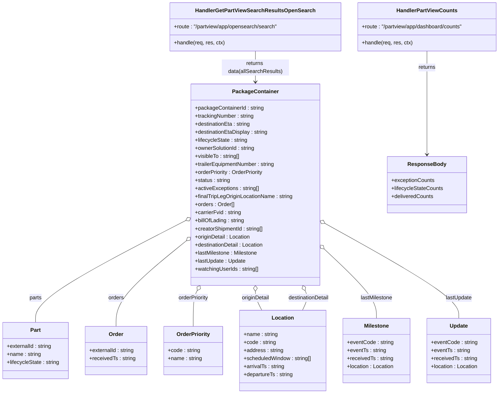

# Diagram: web/portal/src/mocks/handlers/partview/app/opensearch/search.js


> Auto-generated by Obscura crawlers

## Diagram 1

```mermaid
flowchart LR
  Client[Client]
  GET_SEARCH[/GET /partview/app/opensearch/search]
  CHECK_HEADER{Accept == SAVED_SEARCH?}
  SAVED_RESPONSE[Summary JSON: data { active, delivered, exceptions }]
  DEFAULT_RESPONSE[Full JSON: data (allSearchResults) + meta { searchAfter, totalCount }]
  GET_COUNTS[/GET /partview/app/dashboard/counts]
  COUNTS_RESPONSE[Counts JSON: exceptionCounts, lifecycleStateCounts, deliveredCounts]
  Client --> GET_SEARCH
  GET_SEARCH --> CHECK_HEADER
  CHECK_HEADER -- yes --> SAVED_RESPONSE
  CHECK_HEADER -- no --> DEFAULT_RESPONSE
  Client --> GET_COUNTS
  GET_COUNTS --> COUNTS_RESPONSE
```

> SVG rendering failed for this diagram.

## Diagram 2



### SVG

<svg id="container" width="1507.908203125" xmlns="http://www.w3.org/2000/svg" class="classDiagram" height="1172" viewBox="0 0 1507.908203125 1172" role="graphics-document document" aria-roledescription="class"><style>#container{font-family:"trebuchet ms",verdana,arial,sans-serif;font-size:16px;fill:#333;}@keyframes edge-animation-frame{from{stroke-dashoffset:0;}}@keyframes dash{to{stroke-dashoffset:0;}}#container .edge-animation-slow{stroke-dasharray:9,5!important;stroke-dashoffset:900;animation:dash 50s linear infinite;stroke-linecap:round;}#container .edge-animation-fast{stroke-dasharray:9,5!important;stroke-dashoffset:900;animation:dash 20s linear infinite;stroke-linecap:round;}#container .error-icon{fill:#552222;}#container .error-text{fill:#552222;stroke:#552222;}#container .edge-thickness-normal{stroke-width:1px;}#container .edge-thickness-thick{stroke-width:3.5px;}#container .edge-pattern-solid{stroke-dasharray:0;}#container .edge-thickness-invisible{stroke-width:0;fill:none;}#container .edge-pattern-dashed{stroke-dasharray:3;}#container .edge-pattern-dotted{stroke-dasharray:2;}#container .marker{fill:#333333;stroke:#333333;}#container .marker.cross{stroke:#333333;}#container svg{font-family:"trebuchet ms",verdana,arial,sans-serif;font-size:16px;}#container p{margin:0;}#container g.classGroup text{fill:#9370DB;stroke:none;font-family:"trebuchet ms",verdana,arial,sans-serif;font-size:10px;}#container g.classGroup text .title{font-weight:bolder;}#container .nodeLabel,#container .edgeLabel{color:#131300;}#container .edgeLabel .label rect{fill:#ECECFF;}#container .label text{fill:#131300;}#container .labelBkg{background:#ECECFF;}#container .edgeLabel .label span{background:#ECECFF;}#container .classTitle{font-weight:bolder;}#container .node rect,#container .node circle,#container .node ellipse,#container .node polygon,#container .node path{fill:#ECECFF;stroke:#9370DB;stroke-width:1px;}#container .divider{stroke:#9370DB;stroke-width:1;}#container g.clickable{cursor:pointer;}#container g.classGroup rect{fill:#ECECFF;stroke:#9370DB;}#container g.classGroup line{stroke:#9370DB;stroke-width:1;}#container .classLabel .box{stroke:none;stroke-width:0;fill:#ECECFF;opacity:0.5;}#container .classLabel .label{fill:#9370DB;font-size:10px;}#container .relation{stroke:#333333;stroke-width:1;fill:none;}#container .dashed-line{stroke-dasharray:3;}#container .dotted-line{stroke-dasharray:1 2;}#container #compositionStart,#container .composition{fill:#333333!important;stroke:#333333!important;stroke-width:1;}#container #compositionEnd,#container .composition{fill:#333333!important;stroke:#333333!important;stroke-width:1;}#container #dependencyStart,#container .dependency{fill:#333333!important;stroke:#333333!important;stroke-width:1;}#container #dependencyStart,#container .dependency{fill:#333333!important;stroke:#333333!important;stroke-width:1;}#container #extensionStart,#container .extension{fill:transparent!important;stroke:#333333!important;stroke-width:1;}#container #extensionEnd,#container .extension{fill:transparent!important;stroke:#333333!important;stroke-width:1;}#container #aggregationStart,#container .aggregation{fill:transparent!important;stroke:#333333!important;stroke-width:1;}#container #aggregationEnd,#container .aggregation{fill:transparent!important;stroke:#333333!important;stroke-width:1;}#container #lollipopStart,#container .lollipop{fill:#ECECFF!important;stroke:#333333!important;stroke-width:1;}#container #lollipopEnd,#container .lollipop{fill:#ECECFF!important;stroke:#333333!important;stroke-width:1;}#container .edgeTerminals{font-size:11px;line-height:initial;}#container .classTitleText{text-anchor:middle;font-size:18px;fill:#333;}#container .label-icon{display:inline-block;height:1em;overflow:visible;vertical-align:-0.125em;}#container .node .label-icon path{fill:currentColor;stroke:revert;stroke-width:revert;}#container :root{--mermaid-font-family:"trebuchet ms",verdana,arial,sans-serif;}</style><g><defs><marker id="container_class-aggregationStart" class="marker aggregation class" refX="18" refY="7" markerWidth="190" markerHeight="240" orient="auto"><path d="M 18,7 L9,13 L1,7 L9,1 Z"></path></marker></defs><defs><marker id="container_class-aggregationEnd" class="marker aggregation class" refX="1" refY="7" markerWidth="20" markerHeight="28" orient="auto"><path d="M 18,7 L9,13 L1,7 L9,1 Z"></path></marker></defs><defs><marker id="container_class-extensionStart" class="marker extension class" refX="18" refY="7" markerWidth="190" markerHeight="240" orient="auto"><path d="M 1,7 L18,13 V 1 Z"></path></marker></defs><defs><marker id="container_class-extensionEnd" class="marker extension class" refX="1" refY="7" markerWidth="20" markerHeight="28" orient="auto"><path d="M 1,1 V 13 L18,7 Z"></path></marker></defs><defs><marker id="container_class-compositionStart" class="marker composition class" refX="18" refY="7" markerWidth="190" markerHeight="240" orient="auto"><path d="M 18,7 L9,13 L1,7 L9,1 Z"></path></marker></defs><defs><marker id="container_class-compositionEnd" class="marker composition class" refX="1" refY="7" markerWidth="20" markerHeight="28" orient="auto"><path d="M 18,7 L9,13 L1,7 L9,1 Z"></path></marker></defs><defs><marker id="container_class-dependencyStart" class="marker dependency class" refX="6" refY="7" markerWidth="190" markerHeight="240" orient="auto"><path d="M 5,7 L9,13 L1,7 L9,1 Z"></path></marker></defs><defs><marker id="container_class-dependencyEnd" class="marker dependency class" refX="13" refY="7" markerWidth="20" markerHeight="28" orient="auto"><path d="M 18,7 L9,13 L14,7 L9,1 Z"></path></marker></defs><defs><marker id="container_class-lollipopStart" class="marker lollipop class" refX="13" refY="7" markerWidth="190" markerHeight="240" orient="auto"><circle stroke="black" fill="transparent" cx="7" cy="7" r="6"></circle></marker></defs><defs><marker id="container_class-lollipopEnd" class="marker lollipop class" refX="1" refY="7" markerWidth="190" markerHeight="240" orient="auto"><circle stroke="black" fill="transparent" cx="7" cy="7" r="6"></circle></marker></defs><g class="root"><g class="clusters"></g><g class="edgePaths"><path d="M557.124,656.222L482.096,694.685C407.068,733.148,257.013,810.074,181.985,860.704C106.957,911.333,106.957,935.667,106.957,947.833L106.957,960" id="id_PackageContainer_Part_1" class="edge-thickness-normal edge-pattern-solid relation" style=";;;" data-edge="true" data-et="edge" data-id="id_PackageContainer_Part_1" data-points="W3sieCI6NTcyLjQ3NDYwOTM3NSwieSI6NjQ4LjM1MjYxODg5Njk0MDZ9LHsieCI6MTA2Ljk1NzAzMTI1LCJ5Ijo4ODd9LHsieCI6MTA2Ljk1NzAzMTI1LCJ5Ijo5NjB9XQ==" marker-start="url(#container_class-aggregationStart)"></path><path d="M559.058,715.898L523.774,744.415C488.49,772.932,417.921,829.966,382.636,872.65C347.352,915.333,347.352,943.667,347.352,957.833L347.352,972" id="id_PackageContainer_Order_2" class="edge-thickness-normal edge-pattern-solid relation" style=";;;" data-edge="true" data-et="edge" data-id="id_PackageContainer_Order_2" data-points="W3sieCI6NTcyLjQ3NDYwOTM3NSwieSI6NzA1LjA1NDk0ODQ1MjE1OTZ9LHsieCI6MzQ3LjM1MTU2MjUsInkiOjg4N30seyJ4IjozNDcuMzUxNTYyNSwieSI6OTcyfV0=" marker-start="url(#container_class-aggregationStart)"></path><path d="M588.442,865.062L586.401,868.718C584.36,872.375,580.278,879.687,578.236,897.51C576.195,915.333,576.195,943.667,576.195,957.833L576.195,972" id="id_PackageContainer_OrderPriority_3" class="edge-thickness-normal edge-pattern-solid relation" style=";;;" data-edge="true" data-et="edge" data-id="id_PackageContainer_OrderPriority_3" data-points="W3sieCI6NTk2Ljg1MDYyOTQwNDY3MzYsInkiOjg1MH0seyJ4Ijo1NzYuMTk1MzEyNSwieSI6ODg3fSx7IngiOjU3Ni4xOTUzMTI1LCJ5Ijo5NzJ9XQ==" marker-start="url(#container_class-aggregationStart)"></path><path d="M764.326,867.25L764.326,870.542C764.326,873.833,764.326,880.417,767.442,889.875C770.557,899.333,776.788,911.667,779.904,917.833L783.019,924" id="id_PackageContainer_Location_4" class="edge-thickness-normal edge-pattern-solid relation" style=";;;" data-edge="true" data-et="edge" data-id="id_PackageContainer_Location_4" data-points="W3sieCI6NzY0LjMyNjE3MTg3NSwieSI6ODUwfSx7IngiOjc2NC4zMjYxNzE4NzUsInkiOjg4N30seyJ4Ijo3ODMuMDE5MDMzNjM4NTM1LCJ5Ijo5MjR9XQ==" marker-start="url(#container_class-aggregationStart)"></path><path d="M908.559,865.69L910.181,869.242C911.804,872.793,915.05,879.897,913.74,889.615C912.431,899.333,906.566,911.667,903.634,917.833L900.702,924" id="id_PackageContainer_Location_5" class="edge-thickness-normal edge-pattern-solid relation" style=";;;" data-edge="true" data-et="edge" data-id="id_PackageContainer_Location_5" data-points="W3sieCI6OTAxLjM5MDM0MTAxNDQ2NTksInkiOjg1MH0seyJ4Ijo5MTguMjk0OTIxODc1LCJ5Ijo4ODd9LHsieCI6OTAwLjcwMjE1NDY1NzY0MzMsInkiOjkyNH1d" marker-start="url(#container_class-aggregationStart)"></path><path d="M968.772,741.354L994.707,765.628C1020.642,789.903,1072.513,838.451,1098.448,872.892C1124.383,907.333,1124.383,927.667,1124.383,937.833L1124.383,948" id="id_PackageContainer_Milestone_6" class="edge-thickness-normal edge-pattern-solid relation" style=";;;" data-edge="true" data-et="edge" data-id="id_PackageContainer_Milestone_6" data-points="W3sieCI6OTU2LjE3NzczNDM3NSwieSI6NzI5LjU2NjEyNzI5MTE3MDZ9LHsieCI6MTEyNC4zODI4MTI1LCJ5Ijo4ODd9LHsieCI6MTEyNC4zODI4MTI1LCJ5Ijo5NDh9XQ==" marker-start="url(#container_class-aggregationStart)"></path><path d="M971.258,664.923L1037.904,701.936C1104.55,738.949,1237.841,812.974,1304.487,860.154C1371.133,907.333,1371.133,927.667,1371.133,937.833L1371.133,948" id="id_PackageContainer_Update_7" class="edge-thickness-normal edge-pattern-solid relation" style=";;;" data-edge="true" data-et="edge" data-id="id_PackageContainer_Update_7" data-points="W3sieCI6OTU2LjE3NzczNDM3NSwieSI6NjU2LjU0NzkwNTQzNDc2NTF9LHsieCI6MTM3MS4xMzI4MTI1LCJ5Ijo4ODd9LHsieCI6MTM3MS4xMzI4MTI1LCJ5Ijo5NDh9XQ==" marker-start="url(#container_class-aggregationStart)"></path><path d="M764.326,152L764.326,160.167C764.326,168.333,764.326,184.667,764.326,200C764.326,215.333,764.326,229.667,764.326,236.833L764.326,244" id="id_HandlerGetPartViewSearchResultsOpenSearch_PackageContainer_8" class="edge-thickness-normal edge-pattern-solid relation" style=";;;" data-edge="true" data-et="edge" data-id="id_HandlerGetPartViewSearchResultsOpenSearch_PackageContainer_8" data-points="W3sieCI6NzY0LjMyNjE3MTg3NSwieSI6MTUyfSx7IngiOjc2NC4zMjYxNzE4NzUsInkiOjIwMX0seyJ4Ijo3NjQuMzI2MTcxODc1LCJ5IjoyNTB9XQ==" marker-end="url(#container_class-dependencyEnd)"></path><path d="M1286.248,152L1286.248,160.167C1286.248,168.333,1286.248,184.667,1286.248,236C1286.248,287.333,1286.248,373.667,1286.248,416.833L1286.248,460" id="id_HandlerPartViewCounts_ResponseBody_9" class="edge-thickness-normal edge-pattern-solid relation" style=";;;" data-edge="true" data-et="edge" data-id="id_HandlerPartViewCounts_ResponseBody_9" data-points="W3sieCI6MTI4Ni4yNDgwNDY4NzUsInkiOjE1Mn0seyJ4IjoxMjg2LjI0ODA0Njg3NSwieSI6MjAxfSx7IngiOjEyODYuMjQ4MDQ2ODc1LCJ5Ijo0NjZ9XQ==" marker-end="url(#container_class-dependencyEnd)"></path></g><g class="edgeLabels"><g class="edgeLabel" transform="translate(106.95703125, 887)"><g class="label" data-id="id_PackageContainer_Part_1" transform="translate(-18.7421875, -12)"><foreignObject width="37.484375" height="24"><div xmlns="http://www.w3.org/1999/xhtml" class="labelBkg" style="display: table-cell; white-space: nowrap; line-height: 1.5; max-width: 200px; text-align: center;"><span class="edgeLabel"><p>parts</p></span></div></foreignObject></g></g><g class="edgeLabel" transform="translate(347.3515625, 887)"><g class="label" data-id="id_PackageContainer_Order_2" transform="translate(-23.375, -12)"><foreignObject width="46.75" height="24"><div xmlns="http://www.w3.org/1999/xhtml" class="labelBkg" style="display: table-cell; white-space: nowrap; line-height: 1.5; max-width: 200px; text-align: center;"><span class="edgeLabel"><p>orders</p></span></div></foreignObject></g></g><g class="edgeLabel" transform="translate(576.1953125, 887)"><g class="label" data-id="id_PackageContainer_OrderPriority_3" transform="translate(-46.390625, -12)"><foreignObject width="92.78125" height="24"><div xmlns="http://www.w3.org/1999/xhtml" class="labelBkg" style="display: table-cell; white-space: nowrap; line-height: 1.5; max-width: 200px; text-align: center;"><span class="edgeLabel"><p>orderPriority</p></span></div></foreignObject></g></g><g class="edgeLabel" transform="translate(764.326171875, 887)"><g class="label" data-id="id_PackageContainer_Location_4" transform="translate(-42.421875, -12)"><foreignObject width="84.84375" height="24"><div xmlns="http://www.w3.org/1999/xhtml" class="labelBkg" style="display: table-cell; white-space: nowrap; line-height: 1.5; max-width: 200px; text-align: center;"><span class="edgeLabel"><p>originDetail</p></span></div></foreignObject></g></g><g class="edgeLabel" transform="translate(918.294921875, 887)"><g class="label" data-id="id_PackageContainer_Location_5" transform="translate(-62.8671875, -12)"><foreignObject width="125.734375" height="24"><div xmlns="http://www.w3.org/1999/xhtml" class="labelBkg" style="display: table-cell; white-space: nowrap; line-height: 1.5; max-width: 200px; text-align: center;"><span class="edgeLabel"><p>destinationDetail</p></span></div></foreignObject></g></g><g class="edgeLabel" transform="translate(1124.3828125, 887)"><g class="label" data-id="id_PackageContainer_Milestone_6" transform="translate(-48.5703125, -12)"><foreignObject width="97.140625" height="24"><div xmlns="http://www.w3.org/1999/xhtml" class="labelBkg" style="display: table-cell; white-space: nowrap; line-height: 1.5; max-width: 200px; text-align: center;"><span class="edgeLabel"><p>lastMilestone</p></span></div></foreignObject></g></g><g class="edgeLabel" transform="translate(1371.1328125, 887)"><g class="label" data-id="id_PackageContainer_Update_7" transform="translate(-39.515625, -12)"><foreignObject width="79.03125" height="24"><div xmlns="http://www.w3.org/1999/xhtml" class="labelBkg" style="display: table-cell; white-space: nowrap; line-height: 1.5; max-width: 200px; text-align: center;"><span class="edgeLabel"><p>lastUpdate</p></span></div></foreignObject></g></g><g class="edgeLabel" transform="translate(764.326171875, 201)"><g class="label" data-id="id_HandlerGetPartViewSearchResultsOpenSearch_PackageContainer_8" transform="translate(-100, -24)"><foreignObject width="200" height="48"><div xmlns="http://www.w3.org/1999/xhtml" class="labelBkg" style="display: table; white-space: break-spaces; line-height: 1.5; max-width: 200px; text-align: center; width: 200px;"><span class="edgeLabel"><p>returns data(allSearchResults)</p></span></div></foreignObject></g></g><g class="edgeLabel" transform="translate(1286.248046875, 201)"><g class="label" data-id="id_HandlerPartViewCounts_ResponseBody_9" transform="translate(-26.265625, -12)"><foreignObject width="52.53125" height="24"><div xmlns="http://www.w3.org/1999/xhtml" class="labelBkg" style="display: table-cell; white-space: nowrap; line-height: 1.5; max-width: 200px; text-align: center;"><span class="edgeLabel"><p>returns</p></span></div></foreignObject></g></g></g><g class="nodes"><g class="node default" id="classId-HandlerGetPartViewSearchResultsOpenSearch-0" transform="translate(764.326171875, 80)"><g class="basic label-container"><path d="M-258.26171875 -72 L258.26171875 -72 L258.26171875 72 L-258.26171875 72" stroke="none" stroke-width="0" fill="#ECECFF" style=""></path><path d="M-258.26171875 -72 C-58.202109030086405 -72, 141.8575006898272 -72, 258.26171875 -72 M-258.26171875 -72 C-125.53159242455578 -72, 7.198533900888435 -72, 258.26171875 -72 M258.26171875 -72 C258.26171875 -33.39881662670642, 258.26171875 5.20236674658716, 258.26171875 72 M258.26171875 -72 C258.26171875 -18.738985371623954, 258.26171875 34.52202925675209, 258.26171875 72 M258.26171875 72 C144.97677227866896 72, 31.69182580733792 72, -258.26171875 72 M258.26171875 72 C53.80609569373652 72, -150.64952736252695 72, -258.26171875 72 M-258.26171875 72 C-258.26171875 19.629129104435336, -258.26171875 -32.74174179112933, -258.26171875 -72 M-258.26171875 72 C-258.26171875 31.080454092631797, -258.26171875 -9.839091814736406, -258.26171875 -72" stroke="#9370DB" stroke-width="1.3" fill="none" stroke-dasharray="0 0" style=""></path></g><g class="annotation-group text" transform="translate(0, -48)"></g><g class="label-group text" transform="translate(-169.8046875, -48)"><g class="label" style="font-weight: bolder" transform="translate(0,-12)"><foreignObject width="339.609375" height="24"><div xmlns="http://www.w3.org/1999/xhtml" style="display: table-cell; white-space: nowrap; line-height: 1.5; max-width: 384px; text-align: center;"><span class="nodeLabel markdown-node-label" style=""><p>HandlerGetPartViewSearchResultsOpenSearch</p></span></div></foreignObject></g></g><g class="members-group text" transform="translate(-246.26171875, 0)"><g class="label" style="" transform="translate(0,-12)"><foreignObject width="322.71875" height="24"><div xmlns="http://www.w3.org/1999/xhtml" style="display: table-cell; white-space: nowrap; line-height: 1.5; max-width: 380px; text-align: center;"><span class="nodeLabel markdown-node-label" style=""><p>+route : "/partview/app/opensearch/search"</p></span></div></foreignObject></g></g><g class="methods-group text" transform="translate(-246.26171875, 48)"><g class="label" style="" transform="translate(0,-12)"><foreignObject width="151.921875" height="24"><div xmlns="http://www.w3.org/1999/xhtml" style="display: table-cell; white-space: nowrap; line-height: 1.5; max-width: 209px; text-align: center;"><span class="nodeLabel markdown-node-label" style=""><p>+handle(req, res, ctx)</p></span></div></foreignObject></g></g><g class="divider" style=""><path d="M-258.26171875 -24 C-69.6441874666697 -24, 118.97334381666059 -24, 258.26171875 -24 M-258.26171875 -24 C-69.10596425685716 -24, 120.04979023628567 -24, 258.26171875 -24" stroke="#9370DB" stroke-width="1.3" fill="none" stroke-dasharray="0 0" style=""></path></g><g class="divider" style=""><path d="M-258.26171875 24 C-133.28104176870846 24, -8.300364787416896 24, 258.26171875 24 M-258.26171875 24 C-62.131655592839365 24, 133.99840756432127 24, 258.26171875 24" stroke="#9370DB" stroke-width="1.3" fill="none" stroke-dasharray="0 0" style=""></path></g></g><g class="node default" id="classId-HandlerPartViewCounts-1" transform="translate(1286.248046875, 80)"><g class="basic label-container"><path d="M-213.66015625 -72 L213.66015625 -72 L213.66015625 72 L-213.66015625 72" stroke="none" stroke-width="0" fill="#ECECFF" style=""></path><path d="M-213.66015625 -72 C-127.52008392761192 -72, -41.38001160522384 -72, 213.66015625 -72 M-213.66015625 -72 C-55.51995544124114 -72, 102.62024536751773 -72, 213.66015625 -72 M213.66015625 -72 C213.66015625 -42.778576408268094, 213.66015625 -13.557152816536181, 213.66015625 72 M213.66015625 -72 C213.66015625 -41.89309009807288, 213.66015625 -11.786180196145764, 213.66015625 72 M213.66015625 72 C58.07095522209528 72, -97.51824580580944 72, -213.66015625 72 M213.66015625 72 C110.98617136063397 72, 8.31218647126795 72, -213.66015625 72 M-213.66015625 72 C-213.66015625 33.36799754542841, -213.66015625 -5.264004909143182, -213.66015625 -72 M-213.66015625 72 C-213.66015625 30.273075916342158, -213.66015625 -11.453848167315684, -213.66015625 -72" stroke="#9370DB" stroke-width="1.3" fill="none" stroke-dasharray="0 0" style=""></path></g><g class="annotation-group text" transform="translate(0, -48)"></g><g class="label-group text" transform="translate(-86.6328125, -48)"><g class="label" style="font-weight: bolder" transform="translate(0,-12)"><foreignObject width="173.265625" height="24"><div xmlns="http://www.w3.org/1999/xhtml" style="display: table-cell; white-space: nowrap; line-height: 1.5; max-width: 221px; text-align: center;"><span class="nodeLabel markdown-node-label" style=""><p>HandlerPartViewCounts</p></span></div></foreignObject></g></g><g class="members-group text" transform="translate(-201.66015625, 0)"><g class="label" style="" transform="translate(0,-12)"><foreignObject width="316.6875" height="24"><div xmlns="http://www.w3.org/1999/xhtml" style="display: table-cell; white-space: nowrap; line-height: 1.5; max-width: 374px; text-align: center;"><span class="nodeLabel markdown-node-label" style=""><p>+route : "/partview/app/dashboard/counts"</p></span></div></foreignObject></g></g><g class="methods-group text" transform="translate(-201.66015625, 48)"><g class="label" style="" transform="translate(0,-12)"><foreignObject width="151.921875" height="24"><div xmlns="http://www.w3.org/1999/xhtml" style="display: table-cell; white-space: nowrap; line-height: 1.5; max-width: 209px; text-align: center;"><span class="nodeLabel markdown-node-label" style=""><p>+handle(req, res, ctx)</p></span></div></foreignObject></g></g><g class="divider" style=""><path d="M-213.66015625 -24 C-96.51194778930731 -24, 20.636260671385372 -24, 213.66015625 -24 M-213.66015625 -24 C-106.8319513233489 -24, -0.003746396697806631 -24, 213.66015625 -24" stroke="#9370DB" stroke-width="1.3" fill="none" stroke-dasharray="0 0" style=""></path></g><g class="divider" style=""><path d="M-213.66015625 24 C-58.263957018362674 24, 97.13224221327465 24, 213.66015625 24 M-213.66015625 24 C-72.5154521735065 24, 68.629251902987 24, 213.66015625 24" stroke="#9370DB" stroke-width="1.3" fill="none" stroke-dasharray="0 0" style=""></path></g></g><g class="node default" id="classId-PackageContainer-2" transform="translate(764.326171875, 550)"><g class="basic label-container"><path d="M-191.8515625 -300 L191.8515625 -300 L191.8515625 300 L-191.8515625 300" stroke="none" stroke-width="0" fill="#ECECFF" style=""></path><path d="M-191.8515625 -300 C-101.12798083912233 -300, -10.40439917824466 -300, 191.8515625 -300 M-191.8515625 -300 C-46.49774343621141 -300, 98.85607562757718 -300, 191.8515625 -300 M191.8515625 -300 C191.8515625 -179.38920230636978, 191.8515625 -58.778404612739564, 191.8515625 300 M191.8515625 -300 C191.8515625 -119.10842337081283, 191.8515625 61.78315325837434, 191.8515625 300 M191.8515625 300 C97.38767018011534 300, 2.923777860230672 300, -191.8515625 300 M191.8515625 300 C62.233544249622014 300, -67.38447400075597 300, -191.8515625 300 M-191.8515625 300 C-191.8515625 84.83732576556355, -191.8515625 -130.3253484688729, -191.8515625 -300 M-191.8515625 300 C-191.8515625 116.37854810397101, -191.8515625 -67.24290379205797, -191.8515625 -300" stroke="#9370DB" stroke-width="1.3" fill="none" stroke-dasharray="0 0" style=""></path></g><g class="annotation-group text" transform="translate(0, -276)"></g><g class="label-group text" transform="translate(-65.453125, -276)"><g class="label" style="font-weight: bolder" transform="translate(0,-12)"><foreignObject width="130.90625" height="24"><div xmlns="http://www.w3.org/1999/xhtml" style="display: table-cell; white-space: nowrap; line-height: 1.5; max-width: 179px; text-align: center;"><span class="nodeLabel markdown-node-label" style=""><p>PackageContainer</p></span></div></foreignObject></g></g><g class="members-group text" transform="translate(-179.8515625, -228)"><g class="label" style="" transform="translate(0,-12)"><foreignObject width="205.71875" height="24"><div xmlns="http://www.w3.org/1999/xhtml" style="display: table-cell; white-space: nowrap; line-height: 1.5; max-width: 264px; text-align: center;"><span class="nodeLabel markdown-node-label" style=""><p>+packageContainerId : string</p></span></div></foreignObject></g><g class="label" style="" transform="translate(0,12)"><foreignObject width="178.359375" height="24"><div xmlns="http://www.w3.org/1999/xhtml" style="display: table-cell; white-space: nowrap; line-height: 1.5; max-width: 236px; text-align: center;"><span class="nodeLabel markdown-node-label" style=""><p>+trackingNumber : string</p></span></div></foreignObject></g><g class="label" style="" transform="translate(0,36)"><foreignObject width="167.78125" height="24"><div xmlns="http://www.w3.org/1999/xhtml" style="display: table-cell; white-space: nowrap; line-height: 1.5; max-width: 226px; text-align: center;"><span class="nodeLabel markdown-node-label" style=""><p>+destinationEta : string</p></span></div></foreignObject></g><g class="label" style="" transform="translate(0,60)"><foreignObject width="220.515625" height="24"><div xmlns="http://www.w3.org/1999/xhtml" style="display: table-cell; white-space: nowrap; line-height: 1.5; max-width: 279px; text-align: center;"><span class="nodeLabel markdown-node-label" style=""><p>+destinationEtaDisplay : string</p></span></div></foreignObject></g><g class="label" style="" transform="translate(0,84)"><foreignObject width="158.84375" height="24"><div xmlns="http://www.w3.org/1999/xhtml" style="display: table-cell; white-space: nowrap; line-height: 1.5; max-width: 217px; text-align: center;"><span class="nodeLabel markdown-node-label" style=""><p>+lifecycleState : string</p></span></div></foreignObject></g><g class="label" style="" transform="translate(0,108)"><foreignObject width="182.390625" height="24"><div xmlns="http://www.w3.org/1999/xhtml" style="display: table-cell; white-space: nowrap; line-height: 1.5; max-width: 240px; text-align: center;"><span class="nodeLabel markdown-node-label" style=""><p>+ownerSolutionId : string</p></span></div></foreignObject></g><g class="label" style="" transform="translate(0,132)"><foreignObject width="136.03125" height="24"><div xmlns="http://www.w3.org/1999/xhtml" style="display: table-cell; white-space: nowrap; line-height: 1.5; max-width: 193px; text-align: center;"><span class="nodeLabel markdown-node-label" style=""><p>+visibleTo : string[]</p></span></div></foreignObject></g><g class="label" style="" transform="translate(0,156)"><foreignObject width="243.046875" height="24"><div xmlns="http://www.w3.org/1999/xhtml" style="display: table-cell; white-space: nowrap; line-height: 1.5; max-width: 301px; text-align: center;"><span class="nodeLabel markdown-node-label" style=""><p>+trailerEquipmentNumber : string</p></span></div></foreignObject></g><g class="label" style="" transform="translate(0,180)"><foreignObject width="207.578125" height="24"><div xmlns="http://www.w3.org/1999/xhtml" style="display: table-cell; white-space: nowrap; line-height: 1.5; max-width: 265px; text-align: center;"><span class="nodeLabel markdown-node-label" style=""><p>+orderPriority : OrderPriority</p></span></div></foreignObject></g><g class="label" style="" transform="translate(0,204)"><foreignObject width="106.34375" height="24"><div xmlns="http://www.w3.org/1999/xhtml" style="display: table-cell; white-space: nowrap; line-height: 1.5; max-width: 164px; text-align: center;"><span class="nodeLabel markdown-node-label" style=""><p>+status : string</p></span></div></foreignObject></g><g class="label" style="" transform="translate(0,228)"><foreignObject width="193.390625" height="24"><div xmlns="http://www.w3.org/1999/xhtml" style="display: table-cell; white-space: nowrap; line-height: 1.5; max-width: 251px; text-align: center;"><span class="nodeLabel markdown-node-label" style=""><p>+activeExceptions : string[]</p></span></div></foreignObject></g><g class="label" style="" transform="translate(0,252)"><foreignObject width="294.25" height="24"><div xmlns="http://www.w3.org/1999/xhtml" style="display: table-cell; white-space: nowrap; line-height: 1.5; max-width: 352px; text-align: center;"><span class="nodeLabel markdown-node-label" style=""><p>+finalTripLegOriginLocationName : string</p></span></div></foreignObject></g><g class="label" style="" transform="translate(0,276)"><foreignObject width="118.578125" height="24"><div xmlns="http://www.w3.org/1999/xhtml" style="display: table-cell; white-space: nowrap; line-height: 1.5; max-width: 176px; text-align: center;"><span class="nodeLabel markdown-node-label" style=""><p>+orders : Order[]</p></span></div></foreignObject></g><g class="label" style="" transform="translate(0,300)"><foreignObject width="139.140625" height="24"><div xmlns="http://www.w3.org/1999/xhtml" style="display: table-cell; white-space: nowrap; line-height: 1.5; max-width: 197px; text-align: center;"><span class="nodeLabel markdown-node-label" style=""><p>+carrierFvid : string</p></span></div></foreignObject></g><g class="label" style="" transform="translate(0,324)"><foreignObject width="150.0625" height="24"><div xmlns="http://www.w3.org/1999/xhtml" style="display: table-cell; white-space: nowrap; line-height: 1.5; max-width: 208px; text-align: center;"><span class="nodeLabel markdown-node-label" style=""><p>+billOfLading : string</p></span></div></foreignObject></g><g class="label" style="" transform="translate(0,348)"><foreignObject width="207.890625" height="24"><div xmlns="http://www.w3.org/1999/xhtml" style="display: table-cell; white-space: nowrap; line-height: 1.5; max-width: 265px; text-align: center;"><span class="nodeLabel markdown-node-label" style=""><p>+creatorShipmentId : string[]</p></span></div></foreignObject></g><g class="label" style="" transform="translate(0,372)"><foreignObject width="167.25" height="24"><div xmlns="http://www.w3.org/1999/xhtml" style="display: table-cell; white-space: nowrap; line-height: 1.5; max-width: 225px; text-align: center;"><span class="nodeLabel markdown-node-label" style=""><p>+originDetail : Location</p></span></div></foreignObject></g><g class="label" style="" transform="translate(0,396)"><foreignObject width="208.15625" height="24"><div xmlns="http://www.w3.org/1999/xhtml" style="display: table-cell; white-space: nowrap; line-height: 1.5; max-width: 266px; text-align: center;"><span class="nodeLabel markdown-node-label" style=""><p>+destinationDetail : Location</p></span></div></foreignObject></g><g class="label" style="" transform="translate(0,420)"><foreignObject width="188.1875" height="24"><div xmlns="http://www.w3.org/1999/xhtml" style="display: table-cell; white-space: nowrap; line-height: 1.5; max-width: 246px; text-align: center;"><span class="nodeLabel markdown-node-label" style=""><p>+lastMilestone : Milestone</p></span></div></foreignObject></g><g class="label" style="" transform="translate(0,444)"><foreignObject width="151.953125" height="24"><div xmlns="http://www.w3.org/1999/xhtml" style="display: table-cell; white-space: nowrap; line-height: 1.5; max-width: 209px; text-align: center;"><span class="nodeLabel markdown-node-label" style=""><p>+lastUpdate : Update</p></span></div></foreignObject></g><g class="label" style="" transform="translate(0,468)"><foreignObject width="191.640625" height="24"><div xmlns="http://www.w3.org/1999/xhtml" style="display: table-cell; white-space: nowrap; line-height: 1.5; max-width: 249px; text-align: center;"><span class="nodeLabel markdown-node-label" style=""><p>+watchingUserIds : string[]</p></span></div></foreignObject></g></g><g class="methods-group text" transform="translate(-179.8515625, 300)"></g><g class="divider" style=""><path d="M-191.8515625 -252 C-44.19199546155781 -252, 103.46757157688438 -252, 191.8515625 -252 M-191.8515625 -252 C-74.46985821207745 -252, 42.91184607584509 -252, 191.8515625 -252" stroke="#9370DB" stroke-width="1.3" fill="none" stroke-dasharray="0 0" style=""></path></g><g class="divider" style=""><path d="M-191.8515625 276 C-110.1263152675154 276, -28.40106803503079 276, 191.8515625 276 M-191.8515625 276 C-53.352979979010854 276, 85.14560254197829 276, 191.8515625 276" stroke="#9370DB" stroke-width="1.3" fill="none" stroke-dasharray="0 0" style=""></path></g></g><g class="node default" id="classId-Part-3" transform="translate(106.95703125, 1044)"><g class="basic label-container"><path d="M-98.95703125 -84 L98.95703125 -84 L98.95703125 84 L-98.95703125 84" stroke="none" stroke-width="0" fill="#ECECFF" style=""></path><path d="M-98.95703125 -84 C-45.2116959636427 -84, 8.533639322714606 -84, 98.95703125 -84 M-98.95703125 -84 C-58.36272602345072 -84, -17.768420796901438 -84, 98.95703125 -84 M98.95703125 -84 C98.95703125 -38.56542913520033, 98.95703125 6.869141729599335, 98.95703125 84 M98.95703125 -84 C98.95703125 -47.36150706102037, 98.95703125 -10.723014122040738, 98.95703125 84 M98.95703125 84 C36.666417250654106 84, -25.624196748691787 84, -98.95703125 84 M98.95703125 84 C42.292770427354974 84, -14.371490395290053 84, -98.95703125 84 M-98.95703125 84 C-98.95703125 29.643240800434903, -98.95703125 -24.713518399130194, -98.95703125 -84 M-98.95703125 84 C-98.95703125 30.81419955332531, -98.95703125 -22.37160089334938, -98.95703125 -84" stroke="#9370DB" stroke-width="1.3" fill="none" stroke-dasharray="0 0" style=""></path></g><g class="annotation-group text" transform="translate(0, -60)"></g><g class="label-group text" transform="translate(-15.0703125, -60)"><g class="label" style="font-weight: bolder" transform="translate(0,-12)"><foreignObject width="30.140625" height="24"><div xmlns="http://www.w3.org/1999/xhtml" style="display: table-cell; white-space: nowrap; line-height: 1.5; max-width: 79px; text-align: center;"><span class="nodeLabel markdown-node-label" style=""><p>Part</p></span></div></foreignObject></g></g><g class="members-group text" transform="translate(-86.95703125, -12)"><g class="label" style="" transform="translate(0,-12)"><foreignObject width="135.609375" height="24"><div xmlns="http://www.w3.org/1999/xhtml" style="display: table-cell; white-space: nowrap; line-height: 1.5; max-width: 194px; text-align: center;"><span class="nodeLabel markdown-node-label" style=""><p>+externalId : string</p></span></div></foreignObject></g><g class="label" style="" transform="translate(0,12)"><foreignObject width="102.453125" height="24"><div xmlns="http://www.w3.org/1999/xhtml" style="display: table-cell; white-space: nowrap; line-height: 1.5; max-width: 160px; text-align: center;"><span class="nodeLabel markdown-node-label" style=""><p>+name : string</p></span></div></foreignObject></g><g class="label" style="" transform="translate(0,36)"><foreignObject width="158.84375" height="24"><div xmlns="http://www.w3.org/1999/xhtml" style="display: table-cell; white-space: nowrap; line-height: 1.5; max-width: 217px; text-align: center;"><span class="nodeLabel markdown-node-label" style=""><p>+lifecycleState : string</p></span></div></foreignObject></g></g><g class="methods-group text" transform="translate(-86.95703125, 84)"></g><g class="divider" style=""><path d="M-98.95703125 -36 C-52.883838760357506 -36, -6.8106462707150115 -36, 98.95703125 -36 M-98.95703125 -36 C-53.89806813731106 -36, -8.839105024622114 -36, 98.95703125 -36" stroke="#9370DB" stroke-width="1.3" fill="none" stroke-dasharray="0 0" style=""></path></g><g class="divider" style=""><path d="M-98.95703125 60 C-51.6554413548827 60, -4.353851459765394 60, 98.95703125 60 M-98.95703125 60 C-24.270345078138476 60, 50.41634109372305 60, 98.95703125 60" stroke="#9370DB" stroke-width="1.3" fill="none" stroke-dasharray="0 0" style=""></path></g></g><g class="node default" id="classId-OrderPriority-4" transform="translate(576.1953125, 1044)"><g class="basic label-container"><path d="M-87.40625 -72 L87.40625 -72 L87.40625 72 L-87.40625 72" stroke="none" stroke-width="0" fill="#ECECFF" style=""></path><path d="M-87.40625 -72 C-47.409207756455864 -72, -7.412165512911727 -72, 87.40625 -72 M-87.40625 -72 C-26.36001414171502 -72, 34.68622171656996 -72, 87.40625 -72 M87.40625 -72 C87.40625 -28.157004748248035, 87.40625 15.68599050350393, 87.40625 72 M87.40625 -72 C87.40625 -28.662283368611597, 87.40625 14.675433262776806, 87.40625 72 M87.40625 72 C22.140136182243396 72, -43.12597763551321 72, -87.40625 72 M87.40625 72 C40.46450523524122 72, -6.477239529517561 72, -87.40625 72 M-87.40625 72 C-87.40625 23.825715090385998, -87.40625 -24.348569819228004, -87.40625 -72 M-87.40625 72 C-87.40625 37.00925209103054, -87.40625 2.018504182061079, -87.40625 -72" stroke="#9370DB" stroke-width="1.3" fill="none" stroke-dasharray="0 0" style=""></path></g><g class="annotation-group text" transform="translate(0, -48)"></g><g class="label-group text" transform="translate(-48.359375, -48)"><g class="label" style="font-weight: bolder" transform="translate(0,-12)"><foreignObject width="96.71875" height="24"><div xmlns="http://www.w3.org/1999/xhtml" style="display: table-cell; white-space: nowrap; line-height: 1.5; max-width: 145px; text-align: center;"><span class="nodeLabel markdown-node-label" style=""><p>OrderPriority</p></span></div></foreignObject></g></g><g class="members-group text" transform="translate(-75.40625, 0)"><g class="label" style="" transform="translate(0,-12)"><foreignObject width="96.90625" height="24"><div xmlns="http://www.w3.org/1999/xhtml" style="display: table-cell; white-space: nowrap; line-height: 1.5; max-width: 155px; text-align: center;"><span class="nodeLabel markdown-node-label" style=""><p>+code : string</p></span></div></foreignObject></g><g class="label" style="" transform="translate(0,12)"><foreignObject width="102.453125" height="24"><div xmlns="http://www.w3.org/1999/xhtml" style="display: table-cell; white-space: nowrap; line-height: 1.5; max-width: 160px; text-align: center;"><span class="nodeLabel markdown-node-label" style=""><p>+name : string</p></span></div></foreignObject></g></g><g class="methods-group text" transform="translate(-75.40625, 72)"></g><g class="divider" style=""><path d="M-87.40625 -24 C-23.466152197541724 -24, 40.47394560491655 -24, 87.40625 -24 M-87.40625 -24 C-50.47574086067773 -24, -13.545231721355464 -24, 87.40625 -24" stroke="#9370DB" stroke-width="1.3" fill="none" stroke-dasharray="0 0" style=""></path></g><g class="divider" style=""><path d="M-87.40625 48 C-40.062579287941304 48, 7.281091424117392 48, 87.40625 48 M-87.40625 48 C-40.067514302728895 48, 7.271221394542209 48, 87.40625 48" stroke="#9370DB" stroke-width="1.3" fill="none" stroke-dasharray="0 0" style=""></path></g></g><g class="node default" id="classId-Order-5" transform="translate(347.3515625, 1044)"><g class="basic label-container"><path d="M-91.4375 -72 L91.4375 -72 L91.4375 72 L-91.4375 72" stroke="none" stroke-width="0" fill="#ECECFF" style=""></path><path d="M-91.4375 -72 C-36.383050060978476 -72, 18.671399878043047 -72, 91.4375 -72 M-91.4375 -72 C-32.26514241923149 -72, 26.907215161537025 -72, 91.4375 -72 M91.4375 -72 C91.4375 -34.50513367757508, 91.4375 2.9897326448498376, 91.4375 72 M91.4375 -72 C91.4375 -39.83577460916602, 91.4375 -7.671549218332046, 91.4375 72 M91.4375 72 C53.87141722313614 72, 16.305334446272283 72, -91.4375 72 M91.4375 72 C18.638430383200813 72, -54.160639233598374 72, -91.4375 72 M-91.4375 72 C-91.4375 33.3223223298398, -91.4375 -5.355355340320401, -91.4375 -72 M-91.4375 72 C-91.4375 25.074099860428227, -91.4375 -21.851800279143546, -91.4375 -72" stroke="#9370DB" stroke-width="1.3" fill="none" stroke-dasharray="0 0" style=""></path></g><g class="annotation-group text" transform="translate(0, -48)"></g><g class="label-group text" transform="translate(-20.921875, -48)"><g class="label" style="font-weight: bolder" transform="translate(0,-12)"><foreignObject width="41.84375" height="24"><div xmlns="http://www.w3.org/1999/xhtml" style="display: table-cell; white-space: nowrap; line-height: 1.5; max-width: 92px; text-align: center;"><span class="nodeLabel markdown-node-label" style=""><p>Order</p></span></div></foreignObject></g></g><g class="members-group text" transform="translate(-79.4375, 0)"><g class="label" style="" transform="translate(0,-12)"><foreignObject width="135.609375" height="24"><div xmlns="http://www.w3.org/1999/xhtml" style="display: table-cell; white-space: nowrap; line-height: 1.5; max-width: 194px; text-align: center;"><span class="nodeLabel markdown-node-label" style=""><p>+externalId : string</p></span></div></foreignObject></g><g class="label" style="" transform="translate(0,12)"><foreignObject width="137.953125" height="24"><div xmlns="http://www.w3.org/1999/xhtml" style="display: table-cell; white-space: nowrap; line-height: 1.5; max-width: 196px; text-align: center;"><span class="nodeLabel markdown-node-label" style=""><p>+receivedTs : string</p></span></div></foreignObject></g></g><g class="methods-group text" transform="translate(-79.4375, 72)"></g><g class="divider" style=""><path d="M-91.4375 -24 C-34.00722797863966 -24, 23.423044042720676 -24, 91.4375 -24 M-91.4375 -24 C-21.627978236404985 -24, 48.18154352719003 -24, 91.4375 -24" stroke="#9370DB" stroke-width="1.3" fill="none" stroke-dasharray="0 0" style=""></path></g><g class="divider" style=""><path d="M-91.4375 48 C-22.045331330059838 48, 47.346837339880324 48, 91.4375 48 M-91.4375 48 C-50.00658785816061 48, -8.575675716321214 48, 91.4375 48" stroke="#9370DB" stroke-width="1.3" fill="none" stroke-dasharray="0 0" style=""></path></g></g><g class="node default" id="classId-Location-6" transform="translate(843.64453125, 1044)"><g class="basic label-container"><path d="M-130.04296875 -120 L130.04296875 -120 L130.04296875 120 L-130.04296875 120" stroke="none" stroke-width="0" fill="#ECECFF" style=""></path><path d="M-130.04296875 -120 C-76.14311884499782 -120, -22.243268939995644 -120, 130.04296875 -120 M-130.04296875 -120 C-61.974171451478284 -120, 6.094625847043432 -120, 130.04296875 -120 M130.04296875 -120 C130.04296875 -62.3529215605095, 130.04296875 -4.705843121019001, 130.04296875 120 M130.04296875 -120 C130.04296875 -39.99286610824541, 130.04296875 40.01426778350918, 130.04296875 120 M130.04296875 120 C44.49085043919035 120, -41.06126787161929 120, -130.04296875 120 M130.04296875 120 C41.30466093581845 120, -47.433646878363106 120, -130.04296875 120 M-130.04296875 120 C-130.04296875 43.260792826456964, -130.04296875 -33.47841434708607, -130.04296875 -120 M-130.04296875 120 C-130.04296875 31.7349872464589, -130.04296875 -56.5300255070822, -130.04296875 -120" stroke="#9370DB" stroke-width="1.3" fill="none" stroke-dasharray="0 0" style=""></path></g><g class="annotation-group text" transform="translate(0, -96)"></g><g class="label-group text" transform="translate(-31.3515625, -96)"><g class="label" style="font-weight: bolder" transform="translate(0,-12)"><foreignObject width="62.703125" height="24"><div xmlns="http://www.w3.org/1999/xhtml" style="display: table-cell; white-space: nowrap; line-height: 1.5; max-width: 112px; text-align: center;"><span class="nodeLabel markdown-node-label" style=""><p>Location</p></span></div></foreignObject></g></g><g class="members-group text" transform="translate(-118.04296875, -48)"><g class="label" style="" transform="translate(0,-12)"><foreignObject width="102.453125" height="24"><div xmlns="http://www.w3.org/1999/xhtml" style="display: table-cell; white-space: nowrap; line-height: 1.5; max-width: 160px; text-align: center;"><span class="nodeLabel markdown-node-label" style=""><p>+name : string</p></span></div></foreignObject></g><g class="label" style="" transform="translate(0,12)"><foreignObject width="96.90625" height="24"><div xmlns="http://www.w3.org/1999/xhtml" style="display: table-cell; white-space: nowrap; line-height: 1.5; max-width: 155px; text-align: center;"><span class="nodeLabel markdown-node-label" style=""><p>+code : string</p></span></div></foreignObject></g><g class="label" style="" transform="translate(0,36)"><foreignObject width="118.75" height="24"><div xmlns="http://www.w3.org/1999/xhtml" style="display: table-cell; white-space: nowrap; line-height: 1.5; max-width: 177px; text-align: center;"><span class="nodeLabel markdown-node-label" style=""><p>+address : string</p></span></div></foreignObject></g><g class="label" style="" transform="translate(0,60)"><foreignObject width="204.734375" height="24"><div xmlns="http://www.w3.org/1999/xhtml" style="display: table-cell; white-space: nowrap; line-height: 1.5; max-width: 262px; text-align: center;"><span class="nodeLabel markdown-node-label" style=""><p>+scheduledWindow : string[]</p></span></div></foreignObject></g><g class="label" style="" transform="translate(0,84)"><foreignObject width="123.0625" height="24"><div xmlns="http://www.w3.org/1999/xhtml" style="display: table-cell; white-space: nowrap; line-height: 1.5; max-width: 181px; text-align: center;"><span class="nodeLabel markdown-node-label" style=""><p>+arrivalTs : string</p></span></div></foreignObject></g><g class="label" style="" transform="translate(0,108)"><foreignObject width="148.90625" height="24"><div xmlns="http://www.w3.org/1999/xhtml" style="display: table-cell; white-space: nowrap; line-height: 1.5; max-width: 207px; text-align: center;"><span class="nodeLabel markdown-node-label" style=""><p>+departureTs : string</p></span></div></foreignObject></g></g><g class="methods-group text" transform="translate(-118.04296875, 120)"></g><g class="divider" style=""><path d="M-130.04296875 -72 C-40.658238414728174 -72, 48.72649192054365 -72, 130.04296875 -72 M-130.04296875 -72 C-49.81555820836242 -72, 30.411852333275164 -72, 130.04296875 -72" stroke="#9370DB" stroke-width="1.3" fill="none" stroke-dasharray="0 0" style=""></path></g><g class="divider" style=""><path d="M-130.04296875 96 C-54.89122789512898 96, 20.260512959742044 96, 130.04296875 96 M-130.04296875 96 C-53.37371346225632 96, 23.295541825487362 96, 130.04296875 96" stroke="#9370DB" stroke-width="1.3" fill="none" stroke-dasharray="0 0" style=""></path></g></g><g class="node default" id="classId-Milestone-7" transform="translate(1124.3828125, 1044)"><g class="basic label-container"><path d="M-100.6953125 -96 L100.6953125 -96 L100.6953125 96 L-100.6953125 96" stroke="none" stroke-width="0" fill="#ECECFF" style=""></path><path d="M-100.6953125 -96 C-41.04532069259835 -96, 18.604671114803295 -96, 100.6953125 -96 M-100.6953125 -96 C-47.34717164915108 -96, 6.000969201697842 -96, 100.6953125 -96 M100.6953125 -96 C100.6953125 -26.52706210066323, 100.6953125 42.94587579867354, 100.6953125 96 M100.6953125 -96 C100.6953125 -48.863160990368165, 100.6953125 -1.72632198073633, 100.6953125 96 M100.6953125 96 C37.95215860913085 96, -24.790995281738304 96, -100.6953125 96 M100.6953125 96 C29.754809737407996 96, -41.18569302518401 96, -100.6953125 96 M-100.6953125 96 C-100.6953125 54.87576472525791, -100.6953125 13.751529450515818, -100.6953125 -96 M-100.6953125 96 C-100.6953125 52.72700631522482, -100.6953125 9.45401263044964, -100.6953125 -96" stroke="#9370DB" stroke-width="1.3" fill="none" stroke-dasharray="0 0" style=""></path></g><g class="annotation-group text" transform="translate(0, -72)"></g><g class="label-group text" transform="translate(-35.8125, -72)"><g class="label" style="font-weight: bolder" transform="translate(0,-12)"><foreignObject width="71.625" height="24"><div xmlns="http://www.w3.org/1999/xhtml" style="display: table-cell; white-space: nowrap; line-height: 1.5; max-width: 121px; text-align: center;"><span class="nodeLabel markdown-node-label" style=""><p>Milestone</p></span></div></foreignObject></g></g><g class="members-group text" transform="translate(-88.6953125, -24)"><g class="label" style="" transform="translate(0,-12)"><foreignObject width="138.546875" height="24"><div xmlns="http://www.w3.org/1999/xhtml" style="display: table-cell; white-space: nowrap; line-height: 1.5; max-width: 197px; text-align: center;"><span class="nodeLabel markdown-node-label" style=""><p>+eventCode : string</p></span></div></foreignObject></g><g class="label" style="" transform="translate(0,12)"><foreignObject width="117.21875" height="24"><div xmlns="http://www.w3.org/1999/xhtml" style="display: table-cell; white-space: nowrap; line-height: 1.5; max-width: 175px; text-align: center;"><span class="nodeLabel markdown-node-label" style=""><p>+eventTs : string</p></span></div></foreignObject></g><g class="label" style="" transform="translate(0,36)"><foreignObject width="137.953125" height="24"><div xmlns="http://www.w3.org/1999/xhtml" style="display: table-cell; white-space: nowrap; line-height: 1.5; max-width: 196px; text-align: center;"><span class="nodeLabel markdown-node-label" style=""><p>+receivedTs : string</p></span></div></foreignObject></g><g class="label" style="" transform="translate(0,60)"><foreignObject width="141.578125" height="24"><div xmlns="http://www.w3.org/1999/xhtml" style="display: table-cell; white-space: nowrap; line-height: 1.5; max-width: 199px; text-align: center;"><span class="nodeLabel markdown-node-label" style=""><p>+location : Location</p></span></div></foreignObject></g></g><g class="methods-group text" transform="translate(-88.6953125, 96)"></g><g class="divider" style=""><path d="M-100.6953125 -48 C-26.99154088827045 -48, 46.7122307234591 -48, 100.6953125 -48 M-100.6953125 -48 C-42.766200165015206 -48, 15.162912169969587 -48, 100.6953125 -48" stroke="#9370DB" stroke-width="1.3" fill="none" stroke-dasharray="0 0" style=""></path></g><g class="divider" style=""><path d="M-100.6953125 72 C-48.565081417115266 72, 3.565149665769468 72, 100.6953125 72 M-100.6953125 72 C-45.85245946787701 72, 8.990393564245977 72, 100.6953125 72" stroke="#9370DB" stroke-width="1.3" fill="none" stroke-dasharray="0 0" style=""></path></g></g><g class="node default" id="classId-Update-8" transform="translate(1371.1328125, 1044)"><g class="basic label-container"><path d="M-96.0546875 -96 L96.0546875 -96 L96.0546875 96 L-96.0546875 96" stroke="none" stroke-width="0" fill="#ECECFF" style=""></path><path d="M-96.0546875 -96 C-40.73225857298611 -96, 14.590170354027777 -96, 96.0546875 -96 M-96.0546875 -96 C-49.110126947906835 -96, -2.16556639581367 -96, 96.0546875 -96 M96.0546875 -96 C96.0546875 -46.020234601402805, 96.0546875 3.9595307971943896, 96.0546875 96 M96.0546875 -96 C96.0546875 -50.39901233360699, 96.0546875 -4.79802466721398, 96.0546875 96 M96.0546875 96 C40.997878530568066 96, -14.058930438863868 96, -96.0546875 96 M96.0546875 96 C56.545974101278155 96, 17.03726070255631 96, -96.0546875 96 M-96.0546875 96 C-96.0546875 27.792492040794386, -96.0546875 -40.41501591841123, -96.0546875 -96 M-96.0546875 96 C-96.0546875 22.584840294624712, -96.0546875 -50.830319410750576, -96.0546875 -96" stroke="#9370DB" stroke-width="1.3" fill="none" stroke-dasharray="0 0" style=""></path></g><g class="annotation-group text" transform="translate(0, -72)"></g><g class="label-group text" transform="translate(-26.53125, -72)"><g class="label" style="font-weight: bolder" transform="translate(0,-12)"><foreignObject width="53.0625" height="24"><div xmlns="http://www.w3.org/1999/xhtml" style="display: table-cell; white-space: nowrap; line-height: 1.5; max-width: 103px; text-align: center;"><span class="nodeLabel markdown-node-label" style=""><p>Update</p></span></div></foreignObject></g></g><g class="members-group text" transform="translate(-84.0546875, -24)"><g class="label" style="" transform="translate(0,-12)"><foreignObject width="138.546875" height="24"><div xmlns="http://www.w3.org/1999/xhtml" style="display: table-cell; white-space: nowrap; line-height: 1.5; max-width: 197px; text-align: center;"><span class="nodeLabel markdown-node-label" style=""><p>+eventCode : string</p></span></div></foreignObject></g><g class="label" style="" transform="translate(0,12)"><foreignObject width="117.21875" height="24"><div xmlns="http://www.w3.org/1999/xhtml" style="display: table-cell; white-space: nowrap; line-height: 1.5; max-width: 175px; text-align: center;"><span class="nodeLabel markdown-node-label" style=""><p>+eventTs : string</p></span></div></foreignObject></g><g class="label" style="" transform="translate(0,36)"><foreignObject width="137.953125" height="24"><div xmlns="http://www.w3.org/1999/xhtml" style="display: table-cell; white-space: nowrap; line-height: 1.5; max-width: 196px; text-align: center;"><span class="nodeLabel markdown-node-label" style=""><p>+receivedTs : string</p></span></div></foreignObject></g><g class="label" style="" transform="translate(0,60)"><foreignObject width="141.578125" height="24"><div xmlns="http://www.w3.org/1999/xhtml" style="display: table-cell; white-space: nowrap; line-height: 1.5; max-width: 199px; text-align: center;"><span class="nodeLabel markdown-node-label" style=""><p>+location : Location</p></span></div></foreignObject></g></g><g class="methods-group text" transform="translate(-84.0546875, 96)"></g><g class="divider" style=""><path d="M-96.0546875 -48 C-53.93031147042737 -48, -11.80593544085474 -48, 96.0546875 -48 M-96.0546875 -48 C-32.638329217679654 -48, 30.77802906464069 -48, 96.0546875 -48" stroke="#9370DB" stroke-width="1.3" fill="none" stroke-dasharray="0 0" style=""></path></g><g class="divider" style=""><path d="M-96.0546875 72 C-41.57958473644087 72, 12.895518027118257 72, 96.0546875 72 M-96.0546875 72 C-26.29913152553806 72, 43.45642444892388 72, 96.0546875 72" stroke="#9370DB" stroke-width="1.3" fill="none" stroke-dasharray="0 0" style=""></path></g></g><g class="node default" id="classId-ResponseBody-9" transform="translate(1286.248046875, 550)"><g class="basic label-container"><path d="M-116.40234375 -84 L116.40234375 -84 L116.40234375 84 L-116.40234375 84" stroke="none" stroke-width="0" fill="#ECECFF" style=""></path><path d="M-116.40234375 -84 C-26.261299743417425 -84, 63.87974426316515 -84, 116.40234375 -84 M-116.40234375 -84 C-61.28509164709097 -84, -6.167839544181945 -84, 116.40234375 -84 M116.40234375 -84 C116.40234375 -33.44413284973165, 116.40234375 17.111734300536696, 116.40234375 84 M116.40234375 -84 C116.40234375 -27.01731602113908, 116.40234375 29.96536795772184, 116.40234375 84 M116.40234375 84 C28.39829728527286 84, -59.60574917945428 84, -116.40234375 84 M116.40234375 84 C58.580458010529235 84, 0.758572271058469 84, -116.40234375 84 M-116.40234375 84 C-116.40234375 45.74907736241626, -116.40234375 7.498154724832517, -116.40234375 -84 M-116.40234375 84 C-116.40234375 33.25299831358901, -116.40234375 -17.49400337282198, -116.40234375 -84" stroke="#9370DB" stroke-width="1.3" fill="none" stroke-dasharray="0 0" style=""></path></g><g class="annotation-group text" transform="translate(0, -60)"></g><g class="label-group text" transform="translate(-53.9921875, -60)"><g class="label" style="font-weight: bolder" transform="translate(0,-12)"><foreignObject width="107.984375" height="24"><div xmlns="http://www.w3.org/1999/xhtml" style="display: table-cell; white-space: nowrap; line-height: 1.5; max-width: 157px; text-align: center;"><span class="nodeLabel markdown-node-label" style=""><p>ResponseBody</p></span></div></foreignObject></g></g><g class="members-group text" transform="translate(-104.40234375, -12)"><g class="label" style="" transform="translate(0,-12)"><foreignObject width="128.65625" height="24"><div xmlns="http://www.w3.org/1999/xhtml" style="display: table-cell; white-space: nowrap; line-height: 1.5; max-width: 186px; text-align: center;"><span class="nodeLabel markdown-node-label" style=""><p>+exceptionCounts</p></span></div></foreignObject></g><g class="label" style="" transform="translate(0,12)"><foreignObject width="154.8125" height="24"><div xmlns="http://www.w3.org/1999/xhtml" style="display: table-cell; white-space: nowrap; line-height: 1.5; max-width: 212px; text-align: center;"><span class="nodeLabel markdown-node-label" style=""><p>+lifecycleStateCounts</p></span></div></foreignObject></g><g class="label" style="" transform="translate(0,36)"><foreignObject width="125.90625" height="24"><div xmlns="http://www.w3.org/1999/xhtml" style="display: table-cell; white-space: nowrap; line-height: 1.5; max-width: 183px; text-align: center;"><span class="nodeLabel markdown-node-label" style=""><p>+deliveredCounts</p></span></div></foreignObject></g></g><g class="methods-group text" transform="translate(-104.40234375, 84)"></g><g class="divider" style=""><path d="M-116.40234375 -36 C-55.96878059928301 -36, 4.464782551433984 -36, 116.40234375 -36 M-116.40234375 -36 C-46.8589412283508 -36, 22.684461293298398 -36, 116.40234375 -36" stroke="#9370DB" stroke-width="1.3" fill="none" stroke-dasharray="0 0" style=""></path></g><g class="divider" style=""><path d="M-116.40234375 60 C-25.53767323069053 60, 65.32699728861894 60, 116.40234375 60 M-116.40234375 60 C-26.777629444571943 60, 62.847084860856114 60, 116.40234375 60" stroke="#9370DB" stroke-width="1.3" fill="none" stroke-dasharray="0 0" style=""></path></g></g></g></g></g></svg>
