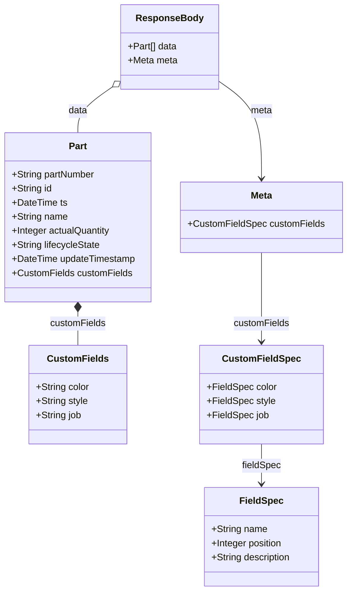
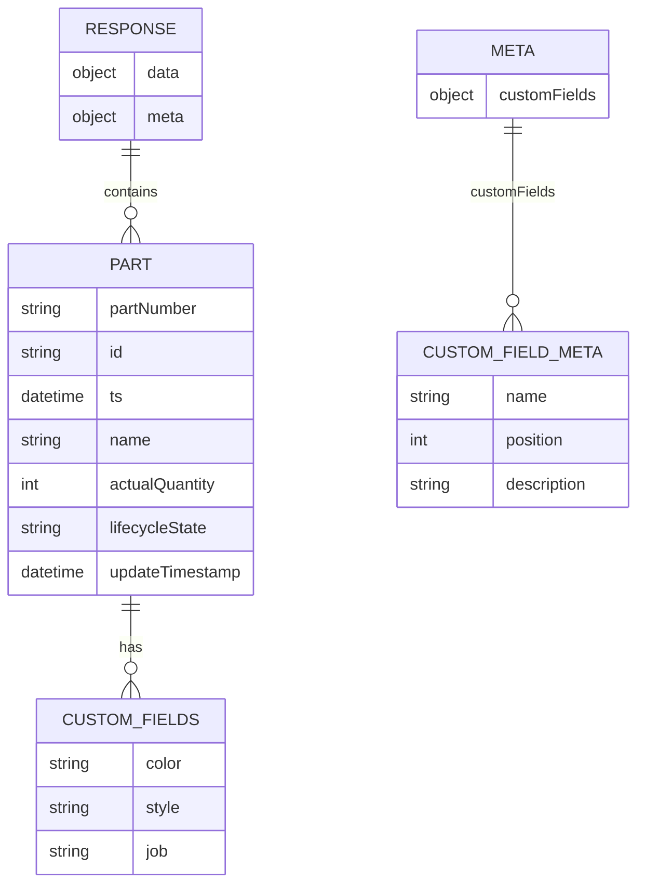

# Diagram: web/portal/src/mocks/handlers/partview/app/package-container/trackingNumber.js


> Auto-generated by Obscura crawlers

## Diagram 1



### SVG

<svg id="container" width="589.953125" xmlns="http://www.w3.org/2000/svg" class="classDiagram" height="1006" viewBox="0 0 589.953125 1006" role="graphics-document document" aria-roledescription="class"><style>#container{font-family:"trebuchet ms",verdana,arial,sans-serif;font-size:16px;fill:#333;}@keyframes edge-animation-frame{from{stroke-dashoffset:0;}}@keyframes dash{to{stroke-dashoffset:0;}}#container .edge-animation-slow{stroke-dasharray:9,5!important;stroke-dashoffset:900;animation:dash 50s linear infinite;stroke-linecap:round;}#container .edge-animation-fast{stroke-dasharray:9,5!important;stroke-dashoffset:900;animation:dash 20s linear infinite;stroke-linecap:round;}#container .error-icon{fill:#552222;}#container .error-text{fill:#552222;stroke:#552222;}#container .edge-thickness-normal{stroke-width:1px;}#container .edge-thickness-thick{stroke-width:3.5px;}#container .edge-pattern-solid{stroke-dasharray:0;}#container .edge-thickness-invisible{stroke-width:0;fill:none;}#container .edge-pattern-dashed{stroke-dasharray:3;}#container .edge-pattern-dotted{stroke-dasharray:2;}#container .marker{fill:#333333;stroke:#333333;}#container .marker.cross{stroke:#333333;}#container svg{font-family:"trebuchet ms",verdana,arial,sans-serif;font-size:16px;}#container p{margin:0;}#container g.classGroup text{fill:#9370DB;stroke:none;font-family:"trebuchet ms",verdana,arial,sans-serif;font-size:10px;}#container g.classGroup text .title{font-weight:bolder;}#container .nodeLabel,#container .edgeLabel{color:#131300;}#container .edgeLabel .label rect{fill:#ECECFF;}#container .label text{fill:#131300;}#container .labelBkg{background:#ECECFF;}#container .edgeLabel .label span{background:#ECECFF;}#container .classTitle{font-weight:bolder;}#container .node rect,#container .node circle,#container .node ellipse,#container .node polygon,#container .node path{fill:#ECECFF;stroke:#9370DB;stroke-width:1px;}#container .divider{stroke:#9370DB;stroke-width:1;}#container g.clickable{cursor:pointer;}#container g.classGroup rect{fill:#ECECFF;stroke:#9370DB;}#container g.classGroup line{stroke:#9370DB;stroke-width:1;}#container .classLabel .box{stroke:none;stroke-width:0;fill:#ECECFF;opacity:0.5;}#container .classLabel .label{fill:#9370DB;font-size:10px;}#container .relation{stroke:#333333;stroke-width:1;fill:none;}#container .dashed-line{stroke-dasharray:3;}#container .dotted-line{stroke-dasharray:1 2;}#container #compositionStart,#container .composition{fill:#333333!important;stroke:#333333!important;stroke-width:1;}#container #compositionEnd,#container .composition{fill:#333333!important;stroke:#333333!important;stroke-width:1;}#container #dependencyStart,#container .dependency{fill:#333333!important;stroke:#333333!important;stroke-width:1;}#container #dependencyStart,#container .dependency{fill:#333333!important;stroke:#333333!important;stroke-width:1;}#container #extensionStart,#container .extension{fill:transparent!important;stroke:#333333!important;stroke-width:1;}#container #extensionEnd,#container .extension{fill:transparent!important;stroke:#333333!important;stroke-width:1;}#container #aggregationStart,#container .aggregation{fill:transparent!important;stroke:#333333!important;stroke-width:1;}#container #aggregationEnd,#container .aggregation{fill:transparent!important;stroke:#333333!important;stroke-width:1;}#container #lollipopStart,#container .lollipop{fill:#ECECFF!important;stroke:#333333!important;stroke-width:1;}#container #lollipopEnd,#container .lollipop{fill:#ECECFF!important;stroke:#333333!important;stroke-width:1;}#container .edgeTerminals{font-size:11px;line-height:initial;}#container .classTitleText{text-anchor:middle;font-size:18px;fill:#333;}#container .label-icon{display:inline-block;height:1em;overflow:visible;vertical-align:-0.125em;}#container .node .label-icon path{fill:currentColor;stroke:revert;stroke-width:revert;}#container :root{--mermaid-font-family:"trebuchet ms",verdana,arial,sans-serif;}</style><g><defs><marker id="container_class-aggregationStart" class="marker aggregation class" refX="18" refY="7" markerWidth="190" markerHeight="240" orient="auto"><path d="M 18,7 L9,13 L1,7 L9,1 Z"></path></marker></defs><defs><marker id="container_class-aggregationEnd" class="marker aggregation class" refX="1" refY="7" markerWidth="20" markerHeight="28" orient="auto"><path d="M 18,7 L9,13 L1,7 L9,1 Z"></path></marker></defs><defs><marker id="container_class-extensionStart" class="marker extension class" refX="18" refY="7" markerWidth="190" markerHeight="240" orient="auto"><path d="M 1,7 L18,13 V 1 Z"></path></marker></defs><defs><marker id="container_class-extensionEnd" class="marker extension class" refX="1" refY="7" markerWidth="20" markerHeight="28" orient="auto"><path d="M 1,1 V 13 L18,7 Z"></path></marker></defs><defs><marker id="container_class-compositionStart" class="marker composition class" refX="18" refY="7" markerWidth="190" markerHeight="240" orient="auto"><path d="M 18,7 L9,13 L1,7 L9,1 Z"></path></marker></defs><defs><marker id="container_class-compositionEnd" class="marker composition class" refX="1" refY="7" markerWidth="20" markerHeight="28" orient="auto"><path d="M 18,7 L9,13 L1,7 L9,1 Z"></path></marker></defs><defs><marker id="container_class-dependencyStart" class="marker dependency class" refX="6" refY="7" markerWidth="190" markerHeight="240" orient="auto"><path d="M 5,7 L9,13 L1,7 L9,1 Z"></path></marker></defs><defs><marker id="container_class-dependencyEnd" class="marker dependency class" refX="13" refY="7" markerWidth="20" markerHeight="28" orient="auto"><path d="M 18,7 L9,13 L14,7 L9,1 Z"></path></marker></defs><defs><marker id="container_class-lollipopStart" class="marker lollipop class" refX="13" refY="7" markerWidth="190" markerHeight="240" orient="auto"><circle stroke="black" fill="transparent" cx="7" cy="7" r="6"></circle></marker></defs><defs><marker id="container_class-lollipopEnd" class="marker lollipop class" refX="1" refY="7" markerWidth="190" markerHeight="240" orient="auto"><circle stroke="black" fill="transparent" cx="7" cy="7" r="6"></circle></marker></defs><g class="root"><g class="clusters"></g><g class="edgePaths"><path d="M194.192,146.675L184.097,153.729C174.002,160.783,153.811,174.892,143.716,188.112C133.621,201.333,133.621,213.667,133.621,219.833L133.621,226" id="id_ResponseBody_Part_1" class="edge-thickness-normal edge-pattern-solid relation" style=";;;" data-edge="true" data-et="edge" data-id="id_ResponseBody_Part_1" data-points="W3sieCI6MjA4LjMzMjAzMTI1LCJ5IjoxMzYuNzk0MjA1MjkzODY3MjR9LHsieCI6MTMzLjYyMTA5Mzc1LCJ5IjoxODl9LHsieCI6MTMzLjYyMTA5Mzc1LCJ5IjoyMjZ9XQ==" marker-start="url(#container_class-aggregationStart)"></path><path d="M133.621,531.25L133.621,534.542C133.621,537.833,133.621,544.417,133.621,553.875C133.621,563.333,133.621,575.667,133.621,581.833L133.621,588" id="id_Part_CustomFields_2" class="edge-thickness-normal edge-pattern-solid relation" style=";;;" data-edge="true" data-et="edge" data-id="id_Part_CustomFields_2" data-points="W3sieCI6MTMzLjYyMTA5Mzc1LCJ5Ijo1MTR9LHsieCI6MTMzLjYyMTA5Mzc1LCJ5Ijo1NTF9LHsieCI6MTMzLjYyMTA5Mzc1LCJ5Ijo1ODh9XQ==" marker-start="url(#container_class-compositionStart)"></path><path d="M370.887,136.794L383.339,145.495C395.79,154.196,420.694,171.598,433.146,199.466C445.598,227.333,445.598,265.667,445.598,284.833L445.598,304" id="id_ResponseBody_Meta_3" class="edge-thickness-normal edge-pattern-solid relation" style=";;;" data-edge="true" data-et="edge" data-id="id_ResponseBody_Meta_3" data-points="W3sieCI6MzcwLjg4NjcxODc1LCJ5IjoxMzYuNzk0MjA1MjkzODY3MjR9LHsieCI6NDQ1LjU5NzY1NjI1LCJ5IjoxODl9LHsieCI6NDQ1LjU5NzY1NjI1LCJ5IjozMTB9XQ==" marker-end="url(#container_class-dependencyEnd)"></path><path d="M445.598,430L445.598,450.167C445.598,470.333,445.598,510.667,445.598,536C445.598,561.333,445.598,571.667,445.598,576.833L445.598,582" id="id_Meta_CustomFieldSpec_4" class="edge-thickness-normal edge-pattern-solid relation" style=";;;" data-edge="true" data-et="edge" data-id="id_Meta_CustomFieldSpec_4" data-points="W3sieCI6NDQ1LjU5NzY1NjI1LCJ5Ijo0MzB9LHsieCI6NDQ1LjU5NzY1NjI1LCJ5Ijo1NTF9LHsieCI6NDQ1LjU5NzY1NjI1LCJ5Ijo1ODh9XQ==" marker-end="url(#container_class-dependencyEnd)"></path><path d="M445.598,756L445.598,762.167C445.598,768.333,445.598,780.667,445.598,792C445.598,803.333,445.598,813.667,445.598,818.833L445.598,824" id="id_CustomFieldSpec_FieldSpec_5" class="edge-thickness-normal edge-pattern-solid relation" style=";;;" data-edge="true" data-et="edge" data-id="id_CustomFieldSpec_FieldSpec_5" data-points="W3sieCI6NDQ1LjU5NzY1NjI1LCJ5Ijo3NTZ9LHsieCI6NDQ1LjU5NzY1NjI1LCJ5Ijo3OTN9LHsieCI6NDQ1LjU5NzY1NjI1LCJ5Ijo4MzB9XQ==" marker-end="url(#container_class-dependencyEnd)"></path></g><g class="edgeLabels"><g class="edgeLabel" transform="translate(133.62109375, 189)"><g class="label" data-id="id_ResponseBody_Part_1" transform="translate(-16.3203125, -12)"><foreignObject width="32.640625" height="24"><div xmlns="http://www.w3.org/1999/xhtml" class="labelBkg" style="display: table-cell; white-space: nowrap; line-height: 1.5; max-width: 200px; text-align: center;"><span class="edgeLabel"><p>data</p></span></div></foreignObject></g></g><g class="edgeLabel" transform="translate(133.62109375, 551)"><g class="label" data-id="id_Part_CustomFields_2" transform="translate(-47.5234375, -12)"><foreignObject width="95.046875" height="24"><div xmlns="http://www.w3.org/1999/xhtml" class="labelBkg" style="display: table-cell; white-space: nowrap; line-height: 1.5; max-width: 200px; text-align: center;"><span class="edgeLabel"><p>customFields</p></span></div></foreignObject></g></g><g class="edgeLabel" transform="translate(445.59765625, 189)"><g class="label" data-id="id_ResponseBody_Meta_3" transform="translate(-18.40625, -12)"><foreignObject width="36.8125" height="24"><div xmlns="http://www.w3.org/1999/xhtml" class="labelBkg" style="display: table-cell; white-space: nowrap; line-height: 1.5; max-width: 200px; text-align: center;"><span class="edgeLabel"><p>meta</p></span></div></foreignObject></g></g><g class="edgeLabel" transform="translate(445.59765625, 551)"><g class="label" data-id="id_Meta_CustomFieldSpec_4" transform="translate(-47.5234375, -12)"><foreignObject width="95.046875" height="24"><div xmlns="http://www.w3.org/1999/xhtml" class="labelBkg" style="display: table-cell; white-space: nowrap; line-height: 1.5; max-width: 200px; text-align: center;"><span class="edgeLabel"><p>customFields</p></span></div></foreignObject></g></g><g class="edgeLabel" transform="translate(445.59765625, 793)"><g class="label" data-id="id_CustomFieldSpec_FieldSpec_5" transform="translate(-33.3515625, -12)"><foreignObject width="66.703125" height="24"><div xmlns="http://www.w3.org/1999/xhtml" class="labelBkg" style="display: table-cell; white-space: nowrap; line-height: 1.5; max-width: 200px; text-align: center;"><span class="edgeLabel"><p>fieldSpec</p></span></div></foreignObject></g></g></g><g class="nodes"><g class="node default" id="classId-ResponseBody-0" transform="translate(289.609375, 80)"><g class="basic label-container"><path d="M-81.27734375 -72 L81.27734375 -72 L81.27734375 72 L-81.27734375 72" stroke="none" stroke-width="0" fill="#ECECFF" style=""></path><path d="M-81.27734375 -72 C-25.670788396791203 -72, 29.935766956417595 -72, 81.27734375 -72 M-81.27734375 -72 C-23.937276659707344 -72, 33.40279043058531 -72, 81.27734375 -72 M81.27734375 -72 C81.27734375 -38.45789243554553, 81.27734375 -4.915784871091063, 81.27734375 72 M81.27734375 -72 C81.27734375 -40.56922882102536, 81.27734375 -9.138457642050724, 81.27734375 72 M81.27734375 72 C34.770367169143555 72, -11.736609411712891 72, -81.27734375 72 M81.27734375 72 C26.79311860947037 72, -27.691106531059262 72, -81.27734375 72 M-81.27734375 72 C-81.27734375 43.13258501823212, -81.27734375 14.265170036464234, -81.27734375 -72 M-81.27734375 72 C-81.27734375 17.105369130653443, -81.27734375 -37.789261738693114, -81.27734375 -72" stroke="#9370DB" stroke-width="1.3" fill="none" stroke-dasharray="0 0" style=""></path></g><g class="annotation-group text" transform="translate(0, -48)"></g><g class="label-group text" transform="translate(-53.9921875, -48)"><g class="label" style="font-weight: bolder" transform="translate(0,-12)"><foreignObject width="107.984375" height="24"><div xmlns="http://www.w3.org/1999/xhtml" style="display: table-cell; white-space: nowrap; line-height: 1.5; max-width: 157px; text-align: center;"><span class="nodeLabel markdown-node-label" style=""><p>ResponseBody</p></span></div></foreignObject></g></g><g class="members-group text" transform="translate(-69.27734375, 0)"><g class="label" style="" transform="translate(0,-12)"><foreignObject width="84.25" height="24"><div xmlns="http://www.w3.org/1999/xhtml" style="display: table-cell; white-space: nowrap; line-height: 1.5; max-width: 142px; text-align: center;"><span class="nodeLabel markdown-node-label" style=""><p>+Part[] data</p></span></div></foreignObject></g><g class="label" style="" transform="translate(0,12)"><foreignObject width="84.5625" height="24"><div xmlns="http://www.w3.org/1999/xhtml" style="display: table-cell; white-space: nowrap; line-height: 1.5; max-width: 142px; text-align: center;"><span class="nodeLabel markdown-node-label" style=""><p>+Meta meta</p></span></div></foreignObject></g></g><g class="methods-group text" transform="translate(-69.27734375, 72)"></g><g class="divider" style=""><path d="M-81.27734375 -24 C-26.734102378568338 -24, 27.809138992863325 -24, 81.27734375 -24 M-81.27734375 -24 C-35.400278224661555 -24, 10.47678730067689 -24, 81.27734375 -24" stroke="#9370DB" stroke-width="1.3" fill="none" stroke-dasharray="0 0" style=""></path></g><g class="divider" style=""><path d="M-81.27734375 48 C-18.03346843693744 48, 45.21040687612512 48, 81.27734375 48 M-81.27734375 48 C-47.83493622583497 48, -14.392528701669946 48, 81.27734375 48" stroke="#9370DB" stroke-width="1.3" fill="none" stroke-dasharray="0 0" style=""></path></g></g><g class="node default" id="classId-Part-1" transform="translate(133.62109375, 370)"><g class="basic label-container"><path d="M-125.62109375 -144 L125.62109375 -144 L125.62109375 144 L-125.62109375 144" stroke="none" stroke-width="0" fill="#ECECFF" style=""></path><path d="M-125.62109375 -144 C-48.968294251062645 -144, 27.68450524787471 -144, 125.62109375 -144 M-125.62109375 -144 C-55.86159961251337 -144, 13.897894524973253 -144, 125.62109375 -144 M125.62109375 -144 C125.62109375 -49.149393575157475, 125.62109375 45.70121284968505, 125.62109375 144 M125.62109375 -144 C125.62109375 -45.56698951803406, 125.62109375 52.866020963931874, 125.62109375 144 M125.62109375 144 C49.19485545753781 144, -27.231382834924375 144, -125.62109375 144 M125.62109375 144 C32.77753932799192 144, -60.066015094016166 144, -125.62109375 144 M-125.62109375 144 C-125.62109375 33.00300728224535, -125.62109375 -77.9939854355093, -125.62109375 -144 M-125.62109375 144 C-125.62109375 77.81047664087156, -125.62109375 11.620953281743112, -125.62109375 -144" stroke="#9370DB" stroke-width="1.3" fill="none" stroke-dasharray="0 0" style=""></path></g><g class="annotation-group text" transform="translate(0, -120)"></g><g class="label-group text" transform="translate(-15.0703125, -120)"><g class="label" style="font-weight: bolder" transform="translate(0,-12)"><foreignObject width="30.140625" height="24"><div xmlns="http://www.w3.org/1999/xhtml" style="display: table-cell; white-space: nowrap; line-height: 1.5; max-width: 79px; text-align: center;"><span class="nodeLabel markdown-node-label" style=""><p>Part</p></span></div></foreignObject></g></g><g class="members-group text" transform="translate(-113.62109375, -72)"><g class="label" style="" transform="translate(0,-12)"><foreignObject width="142.828125" height="24"><div xmlns="http://www.w3.org/1999/xhtml" style="display: table-cell; white-space: nowrap; line-height: 1.5; max-width: 201px; text-align: center;"><span class="nodeLabel markdown-node-label" style=""><p>+String partNumber</p></span></div></foreignObject></g><g class="label" style="" transform="translate(0,12)"><foreignObject width="68.546875" height="24"><div xmlns="http://www.w3.org/1999/xhtml" style="display: table-cell; white-space: nowrap; line-height: 1.5; max-width: 126px; text-align: center;"><span class="nodeLabel markdown-node-label" style=""><p>+String id</p></span></div></foreignObject></g><g class="label" style="" transform="translate(0,36)"><foreignObject width="93.796875" height="24"><div xmlns="http://www.w3.org/1999/xhtml" style="display: table-cell; white-space: nowrap; line-height: 1.5; max-width: 151px; text-align: center;"><span class="nodeLabel markdown-node-label" style=""><p>+DateTime ts</p></span></div></foreignObject></g><g class="label" style="" transform="translate(0,60)"><foreignObject width="94.984375" height="24"><div xmlns="http://www.w3.org/1999/xhtml" style="display: table-cell; white-space: nowrap; line-height: 1.5; max-width: 152px; text-align: center;"><span class="nodeLabel markdown-node-label" style=""><p>+String name</p></span></div></foreignObject></g><g class="label" style="" transform="translate(0,84)"><foreignObject width="170.515625" height="24"><div xmlns="http://www.w3.org/1999/xhtml" style="display: table-cell; white-space: nowrap; line-height: 1.5; max-width: 228px; text-align: center;"><span class="nodeLabel markdown-node-label" style=""><p>+Integer actualQuantity</p></span></div></foreignObject></g><g class="label" style="" transform="translate(0,108)"><foreignObject width="151.375" height="24"><div xmlns="http://www.w3.org/1999/xhtml" style="display: table-cell; white-space: nowrap; line-height: 1.5; max-width: 209px; text-align: center;"><span class="nodeLabel markdown-node-label" style=""><p>+String lifecycleState</p></span></div></foreignObject></g><g class="label" style="" transform="translate(0,132)"><foreignObject width="212.171875" height="24"><div xmlns="http://www.w3.org/1999/xhtml" style="display: table-cell; white-space: nowrap; line-height: 1.5; max-width: 270px; text-align: center;"><span class="nodeLabel markdown-node-label" style=""><p>+DateTime updateTimestamp</p></span></div></foreignObject></g><g class="label" style="" transform="translate(0,156)"><foreignObject width="203.515625" height="24"><div xmlns="http://www.w3.org/1999/xhtml" style="display: table-cell; white-space: nowrap; line-height: 1.5; max-width: 261px; text-align: center;"><span class="nodeLabel markdown-node-label" style=""><p>+CustomFields customFields</p></span></div></foreignObject></g></g><g class="methods-group text" transform="translate(-113.62109375, 144)"></g><g class="divider" style=""><path d="M-125.62109375 -96 C-50.619163277938895 -96, 24.38276719412221 -96, 125.62109375 -96 M-125.62109375 -96 C-41.36227156979474 -96, 42.896550610410515 -96, 125.62109375 -96" stroke="#9370DB" stroke-width="1.3" fill="none" stroke-dasharray="0 0" style=""></path></g><g class="divider" style=""><path d="M-125.62109375 120 C-68.2371838828806 120, -10.853274015761201 120, 125.62109375 120 M-125.62109375 120 C-52.37716741338129 120, 20.866758923237427 120, 125.62109375 120" stroke="#9370DB" stroke-width="1.3" fill="none" stroke-dasharray="0 0" style=""></path></g></g><g class="node default" id="classId-CustomFields-2" transform="translate(133.62109375, 672)"><g class="basic label-container"><path d="M-81.9453125 -84 L81.9453125 -84 L81.9453125 84 L-81.9453125 84" stroke="none" stroke-width="0" fill="#ECECFF" style=""></path><path d="M-81.9453125 -84 C-40.36722400872241 -84, 1.2108644825551806 -84, 81.9453125 -84 M-81.9453125 -84 C-23.169463432274775 -84, 35.60638563545045 -84, 81.9453125 -84 M81.9453125 -84 C81.9453125 -48.45994929466401, 81.9453125 -12.919898589328014, 81.9453125 84 M81.9453125 -84 C81.9453125 -36.03406099619476, 81.9453125 11.931878007610479, 81.9453125 84 M81.9453125 84 C38.40731193419112 84, -5.130688631617758 84, -81.9453125 84 M81.9453125 84 C46.93771379642695 84, 11.930115092853896 84, -81.9453125 84 M-81.9453125 84 C-81.9453125 42.234262509139086, -81.9453125 0.4685250182781715, -81.9453125 -84 M-81.9453125 84 C-81.9453125 22.783483053506842, -81.9453125 -38.433033892986316, -81.9453125 -84" stroke="#9370DB" stroke-width="1.3" fill="none" stroke-dasharray="0 0" style=""></path></g><g class="annotation-group text" transform="translate(0, -60)"></g><g class="label-group text" transform="translate(-48.625, -60)"><g class="label" style="font-weight: bolder" transform="translate(0,-12)"><foreignObject width="97.25" height="24"><div xmlns="http://www.w3.org/1999/xhtml" style="display: table-cell; white-space: nowrap; line-height: 1.5; max-width: 146px; text-align: center;"><span class="nodeLabel markdown-node-label" style=""><p>CustomFields</p></span></div></foreignObject></g></g><g class="members-group text" transform="translate(-69.9453125, -12)"><g class="label" style="" transform="translate(0,-12)"><foreignObject width="91.265625" height="24"><div xmlns="http://www.w3.org/1999/xhtml" style="display: table-cell; white-space: nowrap; line-height: 1.5; max-width: 149px; text-align: center;"><span class="nodeLabel markdown-node-label" style=""><p>+String color</p></span></div></foreignObject></g><g class="label" style="" transform="translate(0,12)"><foreignObject width="88.84375" height="24"><div xmlns="http://www.w3.org/1999/xhtml" style="display: table-cell; white-space: nowrap; line-height: 1.5; max-width: 146px; text-align: center;"><span class="nodeLabel markdown-node-label" style=""><p>+String style</p></span></div></foreignObject></g><g class="label" style="" transform="translate(0,36)"><foreignObject width="77.796875" height="24"><div xmlns="http://www.w3.org/1999/xhtml" style="display: table-cell; white-space: nowrap; line-height: 1.5; max-width: 135px; text-align: center;"><span class="nodeLabel markdown-node-label" style=""><p>+String job</p></span></div></foreignObject></g></g><g class="methods-group text" transform="translate(-69.9453125, 84)"></g><g class="divider" style=""><path d="M-81.9453125 -36 C-37.17837305040913 -36, 7.588566399181744 -36, 81.9453125 -36 M-81.9453125 -36 C-28.469741598262708 -36, 25.005829303474584 -36, 81.9453125 -36" stroke="#9370DB" stroke-width="1.3" fill="none" stroke-dasharray="0 0" style=""></path></g><g class="divider" style=""><path d="M-81.9453125 60 C-37.380133334213845 60, 7.18504583157231 60, 81.9453125 60 M-81.9453125 60 C-24.81171817020458 60, 32.32187615959084 60, 81.9453125 60" stroke="#9370DB" stroke-width="1.3" fill="none" stroke-dasharray="0 0" style=""></path></g></g><g class="node default" id="classId-Meta-3" transform="translate(445.59765625, 370)"><g class="basic label-container"><path d="M-136.35546875 -60 L136.35546875 -60 L136.35546875 60 L-136.35546875 60" stroke="none" stroke-width="0" fill="#ECECFF" style=""></path><path d="M-136.35546875 -60 C-31.83537252010366 -60, 72.68472370979268 -60, 136.35546875 -60 M-136.35546875 -60 C-69.13247887842961 -60, -1.9094890068592179 -60, 136.35546875 -60 M136.35546875 -60 C136.35546875 -32.371783138367256, 136.35546875 -4.743566276734512, 136.35546875 60 M136.35546875 -60 C136.35546875 -22.81081624317607, 136.35546875 14.37836751364786, 136.35546875 60 M136.35546875 60 C71.81047768563145 60, 7.265486621262909 60, -136.35546875 60 M136.35546875 60 C57.42639619933699 60, -21.502676351326016 60, -136.35546875 60 M-136.35546875 60 C-136.35546875 30.9423941297522, -136.35546875 1.884788259504397, -136.35546875 -60 M-136.35546875 60 C-136.35546875 12.009979248364985, -136.35546875 -35.98004150327003, -136.35546875 -60" stroke="#9370DB" stroke-width="1.3" fill="none" stroke-dasharray="0 0" style=""></path></g><g class="annotation-group text" transform="translate(0, -36)"></g><g class="label-group text" transform="translate(-18.0859375, -36)"><g class="label" style="font-weight: bolder" transform="translate(0,-12)"><foreignObject width="36.171875" height="24"><div xmlns="http://www.w3.org/1999/xhtml" style="display: table-cell; white-space: nowrap; line-height: 1.5; max-width: 86px; text-align: center;"><span class="nodeLabel markdown-node-label" style=""><p>Meta</p></span></div></foreignObject></g></g><g class="members-group text" transform="translate(-124.35546875, 12)"><g class="label" style="" transform="translate(0,-12)"><foreignObject width="230.625" height="24"><div xmlns="http://www.w3.org/1999/xhtml" style="display: table-cell; white-space: nowrap; line-height: 1.5; max-width: 288px; text-align: center;"><span class="nodeLabel markdown-node-label" style=""><p>+CustomFieldSpec customFields</p></span></div></foreignObject></g></g><g class="methods-group text" transform="translate(-124.35546875, 60)"></g><g class="divider" style=""><path d="M-136.35546875 -12 C-80.2709615943472 -12, -24.186454438694412 -12, 136.35546875 -12 M-136.35546875 -12 C-62.58590729820013 -12, 11.183654153599747 -12, 136.35546875 -12" stroke="#9370DB" stroke-width="1.3" fill="none" stroke-dasharray="0 0" style=""></path></g><g class="divider" style=""><path d="M-136.35546875 36 C-67.00656951959766 36, 2.342329710804677 36, 136.35546875 36 M-136.35546875 36 C-67.97671901773005 36, 0.40203071453990447 36, 136.35546875 36" stroke="#9370DB" stroke-width="1.3" fill="none" stroke-dasharray="0 0" style=""></path></g></g><g class="node default" id="classId-CustomFieldSpec-4" transform="translate(445.59765625, 672)"><g class="basic label-container"><path d="M-102.34765625 -84 L102.34765625 -84 L102.34765625 84 L-102.34765625 84" stroke="none" stroke-width="0" fill="#ECECFF" style=""></path><path d="M-102.34765625 -84 C-56.95851214045806 -84, -11.569368030916124 -84, 102.34765625 -84 M-102.34765625 -84 C-45.349151828303896 -84, 11.649352593392209 -84, 102.34765625 -84 M102.34765625 -84 C102.34765625 -18.2595166069038, 102.34765625 47.4809667861924, 102.34765625 84 M102.34765625 -84 C102.34765625 -40.067432823699214, 102.34765625 3.8651343526015722, 102.34765625 84 M102.34765625 84 C58.817563452681085 84, 15.28747065536217 84, -102.34765625 84 M102.34765625 84 C43.9134914178306 84, -14.520673414338802 84, -102.34765625 84 M-102.34765625 84 C-102.34765625 42.079489562777404, -102.34765625 0.15897912555480787, -102.34765625 -84 M-102.34765625 84 C-102.34765625 39.8475948875347, -102.34765625 -4.3048102249306055, -102.34765625 -84" stroke="#9370DB" stroke-width="1.3" fill="none" stroke-dasharray="0 0" style=""></path></g><g class="annotation-group text" transform="translate(0, -60)"></g><g class="label-group text" transform="translate(-62.3671875, -60)"><g class="label" style="font-weight: bolder" transform="translate(0,-12)"><foreignObject width="124.734375" height="24"><div xmlns="http://www.w3.org/1999/xhtml" style="display: table-cell; white-space: nowrap; line-height: 1.5; max-width: 174px; text-align: center;"><span class="nodeLabel markdown-node-label" style=""><p>CustomFieldSpec</p></span></div></foreignObject></g></g><g class="members-group text" transform="translate(-90.34765625, -12)"><g class="label" style="" transform="translate(0,-12)"><foreignObject width="118.328125" height="24"><div xmlns="http://www.w3.org/1999/xhtml" style="display: table-cell; white-space: nowrap; line-height: 1.5; max-width: 177px; text-align: center;"><span class="nodeLabel markdown-node-label" style=""><p>+FieldSpec color</p></span></div></foreignObject></g><g class="label" style="" transform="translate(0,12)"><foreignObject width="115.890625" height="24"><div xmlns="http://www.w3.org/1999/xhtml" style="display: table-cell; white-space: nowrap; line-height: 1.5; max-width: 173px; text-align: center;"><span class="nodeLabel markdown-node-label" style=""><p>+FieldSpec style</p></span></div></foreignObject></g><g class="label" style="" transform="translate(0,36)"><foreignObject width="104.859375" height="24"><div xmlns="http://www.w3.org/1999/xhtml" style="display: table-cell; white-space: nowrap; line-height: 1.5; max-width: 162px; text-align: center;"><span class="nodeLabel markdown-node-label" style=""><p>+FieldSpec job</p></span></div></foreignObject></g></g><g class="methods-group text" transform="translate(-90.34765625, 84)"></g><g class="divider" style=""><path d="M-102.34765625 -36 C-60.19749308521165 -36, -18.047329920423294 -36, 102.34765625 -36 M-102.34765625 -36 C-46.51438196308018 -36, 9.318892323839634 -36, 102.34765625 -36" stroke="#9370DB" stroke-width="1.3" fill="none" stroke-dasharray="0 0" style=""></path></g><g class="divider" style=""><path d="M-102.34765625 60 C-56.23658174888651 60, -10.125507247773015 60, 102.34765625 60 M-102.34765625 60 C-25.808782891772836 60, 50.73009046645433 60, 102.34765625 60" stroke="#9370DB" stroke-width="1.3" fill="none" stroke-dasharray="0 0" style=""></path></g></g><g class="node default" id="classId-FieldSpec-5" transform="translate(445.59765625, 914)"><g class="basic label-container"><path d="M-98.078125 -84 L98.078125 -84 L98.078125 84 L-98.078125 84" stroke="none" stroke-width="0" fill="#ECECFF" style=""></path><path d="M-98.078125 -84 C-32.06758879352094 -84, 33.94294741295812 -84, 98.078125 -84 M-98.078125 -84 C-48.49895789165078 -84, 1.0802092166984352 -84, 98.078125 -84 M98.078125 -84 C98.078125 -29.77737067434888, 98.078125 24.44525865130224, 98.078125 84 M98.078125 -84 C98.078125 -30.412932461034842, 98.078125 23.174135077930316, 98.078125 84 M98.078125 84 C28.436690430667028 84, -41.204744138665944 84, -98.078125 84 M98.078125 84 C49.995331026373876 84, 1.9125370527477514 84, -98.078125 84 M-98.078125 84 C-98.078125 37.896466366494366, -98.078125 -8.207067267011269, -98.078125 -84 M-98.078125 84 C-98.078125 25.782501776637822, -98.078125 -32.434996446724355, -98.078125 -84" stroke="#9370DB" stroke-width="1.3" fill="none" stroke-dasharray="0 0" style=""></path></g><g class="annotation-group text" transform="translate(0, -60)"></g><g class="label-group text" transform="translate(-35.078125, -60)"><g class="label" style="font-weight: bolder" transform="translate(0,-12)"><foreignObject width="70.15625" height="24"><div xmlns="http://www.w3.org/1999/xhtml" style="display: table-cell; white-space: nowrap; line-height: 1.5; max-width: 120px; text-align: center;"><span class="nodeLabel markdown-node-label" style=""><p>FieldSpec</p></span></div></foreignObject></g></g><g class="members-group text" transform="translate(-86.078125, -12)"><g class="label" style="" transform="translate(0,-12)"><foreignObject width="94.984375" height="24"><div xmlns="http://www.w3.org/1999/xhtml" style="display: table-cell; white-space: nowrap; line-height: 1.5; max-width: 152px; text-align: center;"><span class="nodeLabel markdown-node-label" style=""><p>+String name</p></span></div></foreignObject></g><g class="label" style="" transform="translate(0,12)"><foreignObject width="123.390625" height="24"><div xmlns="http://www.w3.org/1999/xhtml" style="display: table-cell; white-space: nowrap; line-height: 1.5; max-width: 181px; text-align: center;"><span class="nodeLabel markdown-node-label" style=""><p>+Integer position</p></span></div></foreignObject></g><g class="label" style="" transform="translate(0,36)"><foreignObject width="137.078125" height="24"><div xmlns="http://www.w3.org/1999/xhtml" style="display: table-cell; white-space: nowrap; line-height: 1.5; max-width: 194px; text-align: center;"><span class="nodeLabel markdown-node-label" style=""><p>+String description</p></span></div></foreignObject></g></g><g class="methods-group text" transform="translate(-86.078125, 84)"></g><g class="divider" style=""><path d="M-98.078125 -36 C-29.893445448258674 -36, 38.29123410348265 -36, 98.078125 -36 M-98.078125 -36 C-52.88860270048157 -36, -7.69908040096314 -36, 98.078125 -36" stroke="#9370DB" stroke-width="1.3" fill="none" stroke-dasharray="0 0" style=""></path></g><g class="divider" style=""><path d="M-98.078125 60 C-20.11643514946799 60, 57.84525470106402 60, 98.078125 60 M-98.078125 60 C-55.90833667334757 60, -13.73854834669514 60, 98.078125 60" stroke="#9370DB" stroke-width="1.3" fill="none" stroke-dasharray="0 0" style=""></path></g></g></g></g></g></svg>

## Diagram 2

```mermaid
flowchart TD
    Client[Client] -->|GET /partview/app/package-container/:trackingNumber/part| MSW[MSW handler: handleFetchPartDetails]
    MSW --> Build[Construct responseBody object]
    Build --> UpdateTs[[updateTimestamp = moment().format(DATETIME_FORMAT)]]
    Build --> Return[Return 200 JSON]
    Return --> Client
```

> SVG rendering failed for this diagram.

## Diagram 3



### SVG

<svg id="container" width="604.703125" xmlns="http://www.w3.org/2000/svg" class="erDiagram" height="859.25" viewBox="0 0 604.703125 859.25" role="graphics-document document" aria-roledescription="er"><style>#container{font-family:"trebuchet ms",verdana,arial,sans-serif;font-size:16px;fill:#333;}@keyframes edge-animation-frame{from{stroke-dashoffset:0;}}@keyframes dash{to{stroke-dashoffset:0;}}#container .edge-animation-slow{stroke-dasharray:9,5!important;stroke-dashoffset:900;animation:dash 50s linear infinite;stroke-linecap:round;}#container .edge-animation-fast{stroke-dasharray:9,5!important;stroke-dashoffset:900;animation:dash 20s linear infinite;stroke-linecap:round;}#container .error-icon{fill:#552222;}#container .error-text{fill:#552222;stroke:#552222;}#container .edge-thickness-normal{stroke-width:1px;}#container .edge-thickness-thick{stroke-width:3.5px;}#container .edge-pattern-solid{stroke-dasharray:0;}#container .edge-thickness-invisible{stroke-width:0;fill:none;}#container .edge-pattern-dashed{stroke-dasharray:3;}#container .edge-pattern-dotted{stroke-dasharray:2;}#container .marker{fill:#333333;stroke:#333333;}#container .marker.cross{stroke:#333333;}#container svg{font-family:"trebuchet ms",verdana,arial,sans-serif;font-size:16px;}#container p{margin:0;}#container .entityBox{fill:#ECECFF;stroke:#9370DB;}#container .relationshipLabelBox{fill:hsl(80, 100%, 96.2745098039%);opacity:0.7;background-color:hsl(80, 100%, 96.2745098039%);}#container .relationshipLabelBox rect{opacity:0.5;}#container .labelBkg{background-color:rgba(248.6666666666, 255, 235.9999999999, 0.5);}#container .edgeLabel .label{fill:#9370DB;font-size:14px;}#container .label{font-family:"trebuchet ms",verdana,arial,sans-serif;color:#333;}#container .edge-pattern-dashed{stroke-dasharray:8,8;}#container .node rect,#container .node circle,#container .node ellipse,#container .node polygon{fill:#ECECFF;stroke:#9370DB;stroke-width:1px;}#container .relationshipLine{stroke:#333333;stroke-width:1;fill:none;}#container .marker{fill:none!important;stroke:#333333!important;stroke-width:1;}#container :root{--mermaid-font-family:"trebuchet ms",verdana,arial,sans-serif;}</style><g><defs><marker id="container_er-onlyOneStart" class="marker onlyOne er" refX="0" refY="9" markerWidth="18" markerHeight="18" orient="auto"><path d="M9,0 L9,18 M15,0 L15,18"></path></marker></defs><defs><marker id="container_er-onlyOneEnd" class="marker onlyOne er" refX="18" refY="9" markerWidth="18" markerHeight="18" orient="auto"><path d="M3,0 L3,18 M9,0 L9,18"></path></marker></defs><defs><marker id="container_er-zeroOrOneStart" class="marker zeroOrOne er" refX="0" refY="9" markerWidth="30" markerHeight="18" orient="auto"><circle fill="white" cx="21" cy="9" r="6"></circle><path d="M9,0 L9,18"></path></marker></defs><defs><marker id="container_er-zeroOrOneEnd" class="marker zeroOrOne er" refX="30" refY="9" markerWidth="30" markerHeight="18" orient="auto"><circle fill="white" cx="9" cy="9" r="6"></circle><path d="M21,0 L21,18"></path></marker></defs><defs><marker id="container_er-oneOrMoreStart" class="marker oneOrMore er" refX="18" refY="18" markerWidth="45" markerHeight="36" orient="auto"><path d="M0,18 Q 18,0 36,18 Q 18,36 0,18 M42,9 L42,27"></path></marker></defs><defs><marker id="container_er-oneOrMoreEnd" class="marker oneOrMore er" refX="27" refY="18" markerWidth="45" markerHeight="36" orient="auto"><path d="M3,9 L3,27 M9,18 Q27,0 45,18 Q27,36 9,18"></path></marker></defs><defs><marker id="container_er-zeroOrMoreStart" class="marker zeroOrMore er" refX="18" refY="18" markerWidth="57" markerHeight="36" orient="auto"><circle fill="white" cx="48" cy="18" r="6"></circle><path d="M0,18 Q18,0 36,18 Q18,36 0,18"></path></marker></defs><defs><marker id="container_er-zeroOrMoreEnd" class="marker zeroOrMore er" refX="39" refY="18" markerWidth="57" markerHeight="36" orient="auto"><circle fill="white" cx="9" cy="18" r="6"></circle><path d="M21,18 Q39,0 57,18 Q39,36 21,18"></path></marker></defs><g class="root"><g class="clusters"></g><g class="edgePaths"><path d="M131.438,136.25L131.438,144.667C131.438,153.083,131.438,169.917,131.438,186.75C131.438,203.583,131.438,220.417,131.438,228.833L131.438,237.25" id="id_entity-RESPONSE-0_entity-PART-1_0" class="edge-thickness-normal edge-pattern-solid relationshipLine" style="undefined;;;undefined" data-edge="true" data-et="edge" data-id="id_entity-RESPONSE-0_entity-PART-1_0" data-points="W3sieCI6MTMxLjQzNzUsInkiOjEzNi4yNX0seyJ4IjoxMzEuNDM3NSwieSI6MTg2Ljc1fSx7IngiOjEzMS40Mzc1LCJ5IjoyMzcuMjV9XQ==" marker-start="url(#container_er-onlyOneStart)" marker-end="url(#container_er-zeroOrMoreEnd)"></path><path d="M131.438,579.25L131.438,587.667C131.438,596.083,131.438,612.917,131.438,629.75C131.438,646.583,131.438,663.417,131.438,671.833L131.438,680.25" id="id_entity-PART-1_entity-CUSTOM_FIELDS-2_1" class="edge-thickness-normal edge-pattern-solid relationshipLine" style="undefined;;;undefined" data-edge="true" data-et="edge" data-id="id_entity-PART-1_entity-CUSTOM_FIELDS-2_1" data-points="W3sieCI6MTMxLjQzNzUsInkiOjU3OS4yNX0seyJ4IjoxMzEuNDM3NSwieSI6NjI5Ljc1fSx7IngiOjEzMS40Mzc1LCJ5Ijo2ODAuMjV9XQ==" marker-start="url(#container_er-onlyOneStart)" marker-end="url(#container_er-zeroOrMoreEnd)"></path><path d="M495.789,114.875L495.789,126.854C495.789,138.833,495.789,162.792,495.789,197.438C495.789,232.083,495.789,277.417,495.789,300.083L495.789,322.75" id="id_entity-META-3_entity-CUSTOM_FIELD_META-4_2" class="edge-thickness-normal edge-pattern-solid relationshipLine" style="undefined;;;undefined" data-edge="true" data-et="edge" data-id="id_entity-META-3_entity-CUSTOM_FIELD_META-4_2" data-points="W3sieCI6NDk1Ljc4OTA2MjUsInkiOjExNC44NzV9LHsieCI6NDk1Ljc4OTA2MjUsInkiOjE4Ni43NX0seyJ4Ijo0OTUuNzg5MDYyNSwieSI6MzIyLjc1fV0=" marker-start="url(#container_er-onlyOneStart)" marker-end="url(#container_er-zeroOrMoreEnd)"></path></g><g class="edgeLabels"><g class="edgeLabel" transform="translate(131.4375, 186.75)"><g class="label" data-id="id_entity-RESPONSE-0_entity-PART-1_0" transform="translate(-27.03125, -10.5)"><foreignObject width="54.0625" height="21"><div xmlns="http://www.w3.org/1999/xhtml" class="labelBkg" style="display: table-cell; white-space: nowrap; line-height: 1.5; max-width: 200px; text-align: center;"><span class="edgeLabel"><p>contains</p></span></div></foreignObject></g></g><g class="edgeLabel" transform="translate(131.4375, 629.75)"><g class="label" data-id="id_entity-PART-1_entity-CUSTOM_FIELDS-2_1" transform="translate(-11.109375, -10.5)"><foreignObject width="22.21875" height="21"><div xmlns="http://www.w3.org/1999/xhtml" class="labelBkg" style="display: table-cell; white-space: nowrap; line-height: 1.5; max-width: 200px; text-align: center;"><span class="edgeLabel"><p>has</p></span></div></foreignObject></g></g><g class="edgeLabel" transform="translate(495.7890625, 186.75)"><g class="label" data-id="id_entity-META-3_entity-CUSTOM_FIELD_META-4_2" transform="translate(-41.5859375, -10.5)"><foreignObject width="83.171875" height="21"><div xmlns="http://www.w3.org/1999/xhtml" class="labelBkg" style="display: table-cell; white-space: nowrap; line-height: 1.5; max-width: 200px; text-align: center;"><span class="edgeLabel"><p>customFields</p></span></div></foreignObject></g></g></g><g class="nodes"><g class="node default" id="entity-RESPONSE-0" transform="translate(131.4375, 72.125)"><g style=""><path d="M-66.1484375 -64.125 L66.1484375 -64.125 L66.1484375 64.125 L-66.1484375 64.125" stroke="none" stroke-width="0" fill="#ECECFF"></path><path d="M-66.1484375 -64.125 C-24.46494844536266 -64.125, 17.218540609274683 -64.125, 66.1484375 -64.125 M-66.1484375 -64.125 C-37.80403124935586 -64.125, -9.45962499871171 -64.125, 66.1484375 -64.125 M66.1484375 -64.125 C66.1484375 -34.09967617949077, 66.1484375 -4.074352358981535, 66.1484375 64.125 M66.1484375 -64.125 C66.1484375 -35.039486906718004, 66.1484375 -5.953973813436008, 66.1484375 64.125 M66.1484375 64.125 C21.489091125603956 64.125, -23.17025524879209 64.125, -66.1484375 64.125 M66.1484375 64.125 C15.816598328642854 64.125, -34.51524084271429 64.125, -66.1484375 64.125 M-66.1484375 64.125 C-66.1484375 34.61736727360973, -66.1484375 5.10973454721946, -66.1484375 -64.125 M-66.1484375 64.125 C-66.1484375 23.888588764366517, -66.1484375 -16.347822471266966, -66.1484375 -64.125" stroke="#9370DB" stroke-width="1.3" fill="none" stroke-dasharray="0 0"></path></g><g style="" class="row-rect-odd"><path d="M-66.1484375 -21.375 L66.1484375 -21.375 L66.1484375 21.375 L-66.1484375 21.375" stroke="none" stroke-width="0" fill="hsl(240, 100%, 100%)"></path><path d="M-66.1484375 -21.375 C-14.033196683963403 -21.375, 38.08204413207319 -21.375, 66.1484375 -21.375 M-66.1484375 -21.375 C-33.8471465451301 -21.375, -1.545855590260203 -21.375, 66.1484375 -21.375 M66.1484375 -21.375 C66.1484375 -6.759121721957252, 66.1484375 7.856756556085497, 66.1484375 21.375 M66.1484375 -21.375 C66.1484375 -8.518962287601765, 66.1484375 4.3370754247964705, 66.1484375 21.375 M66.1484375 21.375 C21.415942952812998 21.375, -23.316551594374005 21.375, -66.1484375 21.375 M66.1484375 21.375 C30.708469501609287 21.375, -4.731498496781427 21.375, -66.1484375 21.375 M-66.1484375 21.375 C-66.1484375 11.7909508562031, -66.1484375 2.2069017124062, -66.1484375 -21.375 M-66.1484375 21.375 C-66.1484375 11.829531872592025, -66.1484375 2.2840637451840493, -66.1484375 -21.375" stroke="#9370DB" stroke-width="1.3" fill="none" stroke-dasharray="0 0"></path></g><g style="" class="row-rect-even"><path d="M-66.1484375 21.375 L66.1484375 21.375 L66.1484375 64.125 L-66.1484375 64.125" stroke="none" stroke-width="0" fill="hsl(240, 100%, 97.2745098039%)"></path><path d="M-66.1484375 21.375 C-16.513597782129942 21.375, 33.121241935740116 21.375, 66.1484375 21.375 M-66.1484375 21.375 C-27.268242865682318 21.375, 11.611951768635365 21.375, 66.1484375 21.375 M66.1484375 21.375 C66.1484375 30.39505959719024, 66.1484375 39.41511919438048, 66.1484375 64.125 M66.1484375 21.375 C66.1484375 34.53294620313727, 66.1484375 47.69089240627454, 66.1484375 64.125 M66.1484375 64.125 C37.88858348807135 64.125, 9.628729476142695 64.125, -66.1484375 64.125 M66.1484375 64.125 C33.759861693571104 64.125, 1.3712858871422071 64.125, -66.1484375 64.125 M-66.1484375 64.125 C-66.1484375 47.976148836965706, -66.1484375 31.82729767393141, -66.1484375 21.375 M-66.1484375 64.125 C-66.1484375 52.34631234456848, -66.1484375 40.56762468913696, -66.1484375 21.375" stroke="#9370DB" stroke-width="1.3" fill="none" stroke-dasharray="0 0"></path></g><g class="label name" transform="translate(-37.6953125, -54.75)" style=""><foreignObject width="75.390625" height="24"><div xmlns="http://www.w3.org/1999/xhtml" style="display: table-cell; white-space: nowrap; line-height: 1.5; max-width: 175px; text-align: start;"><span class="nodeLabel"><p>RESPONSE</p></span></div></foreignObject></g><g class="label attribute-type" transform="translate(-53.6484375, -12)" style=""><foreignObject width="45.484375" height="24"><div xmlns="http://www.w3.org/1999/xhtml" style="display: table-cell; white-space: nowrap; line-height: 1.5; max-width: 146px; text-align: start;"><span class="nodeLabel"><p>object</p></span></div></foreignObject></g><g class="label attribute-name" transform="translate(16.8359375, -12)" style=""><foreignObject width="32.640625" height="24"><div xmlns="http://www.w3.org/1999/xhtml" style="display: table-cell; white-space: nowrap; line-height: 1.5; max-width: 133px; text-align: start;"><span class="nodeLabel"><p>data</p></span></div></foreignObject></g><g class="label attribute-keys" transform="translate(78.6484375, -12)" style=""><foreignObject width="0" height="0"><div xmlns="http://www.w3.org/1999/xhtml" style="display: table-cell; white-space: nowrap; line-height: 1.5; max-width: 100px; text-align: start;"><span class="nodeLabel"></span></div></foreignObject></g><g class="label attribute-comment" transform="translate(78.6484375, -12)" style=""><foreignObject width="0" height="0"><div xmlns="http://www.w3.org/1999/xhtml" style="display: table-cell; white-space: nowrap; line-height: 1.5; max-width: 100px; text-align: start;"><span class="nodeLabel"></span></div></foreignObject></g><g class="label attribute-type" transform="translate(-53.6484375, 30.75)" style=""><foreignObject width="45.484375" height="24"><div xmlns="http://www.w3.org/1999/xhtml" style="display: table-cell; white-space: nowrap; line-height: 1.5; max-width: 146px; text-align: start;"><span class="nodeLabel"><p>object</p></span></div></foreignObject></g><g class="label attribute-name" transform="translate(16.8359375, 30.75)" style=""><foreignObject width="36.8125" height="24"><div xmlns="http://www.w3.org/1999/xhtml" style="display: table-cell; white-space: nowrap; line-height: 1.5; max-width: 137px; text-align: start;"><span class="nodeLabel"><p>meta</p></span></div></foreignObject></g><g class="label attribute-keys" transform="translate(78.6484375, 30.75)" style=""><foreignObject width="0" height="0"><div xmlns="http://www.w3.org/1999/xhtml" style="display: table-cell; white-space: nowrap; line-height: 1.5; max-width: 100px; text-align: start;"><span class="nodeLabel"></span></div></foreignObject></g><g class="label attribute-comment" transform="translate(78.6484375, 30.75)" style=""><foreignObject width="0" height="0"><div xmlns="http://www.w3.org/1999/xhtml" style="display: table-cell; white-space: nowrap; line-height: 1.5; max-width: 100px; text-align: start;"><span class="nodeLabel"></span></div></foreignObject></g><g class="divider"><path d="M-66.1484375 -21.375 C-17.68403697707774 -21.375, 30.780363545844523 -21.375, 66.1484375 -21.375 M-66.1484375 -21.375 C-39.551495855896974 -21.375, -12.954554211793948 -21.375, 66.1484375 -21.375" stroke="#9370DB" stroke-width="1.3" fill="none" stroke-dasharray="0 0"></path></g><g class="divider"><path d="M4.3359375 -21.375 C4.3359375 2.941763933957791, 4.3359375 27.258527867915582, 4.3359375 64.125 M4.3359375 -21.375 C4.3359375 1.6543861817305228, 4.3359375 24.683772363461046, 4.3359375 64.125" stroke="#9370DB" stroke-width="1.3" fill="none" stroke-dasharray="0 0"></path></g><g class="divider"><path d="M-66.1484375 -21.375 C-37.36818376949004 -21.375, -8.587930038980076 -21.375, 66.1484375 -21.375 M-66.1484375 -21.375 C-13.403551992714483 -21.375, 39.34133351457103 -21.375, 66.1484375 -21.375" stroke="#9370DB" stroke-width="1.3" fill="none" stroke-dasharray="0 0"></path></g></g><g class="node default" id="entity-PART-1" transform="translate(131.4375, 408.25)"><g style=""><path d="M-123.4375 -171 L123.4375 -171 L123.4375 171 L-123.4375 171" stroke="none" stroke-width="0" fill="#ECECFF"></path><path d="M-123.4375 -171 C-28.860942006981503 -171, 65.715615986037 -171, 123.4375 -171 M-123.4375 -171 C-63.362811598215806 -171, -3.288123196431613 -171, 123.4375 -171 M123.4375 -171 C123.4375 -68.09508955509402, 123.4375 34.80982088981196, 123.4375 171 M123.4375 -171 C123.4375 -96.08328245218671, 123.4375 -21.166564904373416, 123.4375 171 M123.4375 171 C67.17389859413973 171, 10.910297188279458 171, -123.4375 171 M123.4375 171 C61.34175663273518 171, -0.7539867345296329 171, -123.4375 171 M-123.4375 171 C-123.4375 95.13893258032655, -123.4375 19.277865160653107, -123.4375 -171 M-123.4375 171 C-123.4375 78.64893608793787, -123.4375 -13.702127824124261, -123.4375 -171" stroke="#9370DB" stroke-width="1.3" fill="none" stroke-dasharray="0 0"></path></g><g style="" class="row-rect-odd"><path d="M-123.4375 -128.25 L123.4375 -128.25 L123.4375 -85.5 L-123.4375 -85.5" stroke="none" stroke-width="0" fill="hsl(240, 100%, 100%)"></path><path d="M-123.4375 -128.25 C-37.36282740709537 -128.25, 48.71184518580927 -128.25, 123.4375 -128.25 M-123.4375 -128.25 C-31.674439347950354 -128.25, 60.08862130409929 -128.25, 123.4375 -128.25 M123.4375 -128.25 C123.4375 -118.97355772138413, 123.4375 -109.69711544276825, 123.4375 -85.5 M123.4375 -128.25 C123.4375 -114.94370310899293, 123.4375 -101.63740621798586, 123.4375 -85.5 M123.4375 -85.5 C59.40836496388569 -85.5, -4.620770072228623 -85.5, -123.4375 -85.5 M123.4375 -85.5 C45.93934136065886 -85.5, -31.558817278682284 -85.5, -123.4375 -85.5 M-123.4375 -85.5 C-123.4375 -97.5154888059095, -123.4375 -109.530977611819, -123.4375 -128.25 M-123.4375 -85.5 C-123.4375 -97.43843483919167, -123.4375 -109.37686967838334, -123.4375 -128.25" stroke="#9370DB" stroke-width="1.3" fill="none" stroke-dasharray="0 0"></path></g><g style="" class="row-rect-even"><path d="M-123.4375 -85.5 L123.4375 -85.5 L123.4375 -42.75 L-123.4375 -42.75" stroke="none" stroke-width="0" fill="hsl(240, 100%, 97.2745098039%)"></path><path d="M-123.4375 -85.5 C-56.056045213741854 -85.5, 11.325409572516293 -85.5, 123.4375 -85.5 M-123.4375 -85.5 C-31.38356492726477 -85.5, 60.67037014547046 -85.5, 123.4375 -85.5 M123.4375 -85.5 C123.4375 -68.60531142251696, 123.4375 -51.71062284503394, 123.4375 -42.75 M123.4375 -85.5 C123.4375 -74.78236344798208, 123.4375 -64.06472689596417, 123.4375 -42.75 M123.4375 -42.75 C65.41401355660389 -42.75, 7.390527113207781 -42.75, -123.4375 -42.75 M123.4375 -42.75 C42.362318818608685 -42.75, -38.71286236278263 -42.75, -123.4375 -42.75 M-123.4375 -42.75 C-123.4375 -51.69028106274711, -123.4375 -60.63056212549422, -123.4375 -85.5 M-123.4375 -42.75 C-123.4375 -53.20497216061921, -123.4375 -63.659944321238406, -123.4375 -85.5" stroke="#9370DB" stroke-width="1.3" fill="none" stroke-dasharray="0 0"></path></g><g style="" class="row-rect-odd"><path d="M-123.4375 -42.75 L123.4375 -42.75 L123.4375 0 L-123.4375 0" stroke="none" stroke-width="0" fill="hsl(240, 100%, 100%)"></path><path d="M-123.4375 -42.75 C-63.868937787467566 -42.75, -4.300375574935131 -42.75, 123.4375 -42.75 M-123.4375 -42.75 C-63.675198362471384 -42.75, -3.912896724942769 -42.75, 123.4375 -42.75 M123.4375 -42.75 C123.4375 -30.196681117066078, 123.4375 -17.643362234132155, 123.4375 0 M123.4375 -42.75 C123.4375 -28.83959127767207, 123.4375 -14.929182555344145, 123.4375 0 M123.4375 0 C70.45019553071307 0, 17.462891061426163 0, -123.4375 0 M123.4375 0 C30.095773677673307 0, -63.245952644653386 0, -123.4375 0 M-123.4375 0 C-123.4375 -11.630737376945575, -123.4375 -23.26147475389115, -123.4375 -42.75 M-123.4375 0 C-123.4375 -12.275908097442322, -123.4375 -24.551816194884644, -123.4375 -42.75" stroke="#9370DB" stroke-width="1.3" fill="none" stroke-dasharray="0 0"></path></g><g style="" class="row-rect-even"><path d="M-123.4375 0 L123.4375 0 L123.4375 42.75 L-123.4375 42.75" stroke="none" stroke-width="0" fill="hsl(240, 100%, 97.2745098039%)"></path><path d="M-123.4375 0 C-44.98709845076425 0, 33.4633030984715 0, 123.4375 0 M-123.4375 0 C-24.853995176299506 0, 73.72950964740099 0, 123.4375 0 M123.4375 0 C123.4375 10.693570027452497, 123.4375 21.387140054904993, 123.4375 42.75 M123.4375 0 C123.4375 11.44841898179137, 123.4375 22.89683796358274, 123.4375 42.75 M123.4375 42.75 C71.54002894760146 42.75, 19.642557895202927 42.75, -123.4375 42.75 M123.4375 42.75 C31.19248727087745 42.75, -61.0525254582451 42.75, -123.4375 42.75 M-123.4375 42.75 C-123.4375 27.724737424869097, -123.4375 12.699474849738195, -123.4375 0 M-123.4375 42.75 C-123.4375 33.70280263629223, -123.4375 24.65560527258446, -123.4375 0" stroke="#9370DB" stroke-width="1.3" fill="none" stroke-dasharray="0 0"></path></g><g style="" class="row-rect-odd"><path d="M-123.4375 42.75 L123.4375 42.75 L123.4375 85.5 L-123.4375 85.5" stroke="none" stroke-width="0" fill="hsl(240, 100%, 100%)"></path><path d="M-123.4375 42.75 C-29.722772482018783 42.75, 63.991955035962434 42.75, 123.4375 42.75 M-123.4375 42.75 C-59.3585891978917 42.75, 4.720321604216593 42.75, 123.4375 42.75 M123.4375 42.75 C123.4375 55.25771888991744, 123.4375 67.76543777983488, 123.4375 85.5 M123.4375 42.75 C123.4375 58.29800859470667, 123.4375 73.84601718941335, 123.4375 85.5 M123.4375 85.5 C27.001650088546427 85.5, -69.43419982290715 85.5, -123.4375 85.5 M123.4375 85.5 C60.31968471203781 85.5, -2.7981305759243753 85.5, -123.4375 85.5 M-123.4375 85.5 C-123.4375 75.84525174945593, -123.4375 66.19050349891187, -123.4375 42.75 M-123.4375 85.5 C-123.4375 72.57958771557423, -123.4375 59.65917543114847, -123.4375 42.75" stroke="#9370DB" stroke-width="1.3" fill="none" stroke-dasharray="0 0"></path></g><g style="" class="row-rect-even"><path d="M-123.4375 85.5 L123.4375 85.5 L123.4375 128.25 L-123.4375 128.25" stroke="none" stroke-width="0" fill="hsl(240, 100%, 97.2745098039%)"></path><path d="M-123.4375 85.5 C-56.687593147122215 85.5, 10.062313705755571 85.5, 123.4375 85.5 M-123.4375 85.5 C-50.980891377115356 85.5, 21.47571724576929 85.5, 123.4375 85.5 M123.4375 85.5 C123.4375 97.70703117684343, 123.4375 109.91406235368684, 123.4375 128.25 M123.4375 85.5 C123.4375 98.84283261943136, 123.4375 112.18566523886273, 123.4375 128.25 M123.4375 128.25 C41.18569708173604 128.25, -41.066105836527925 128.25, -123.4375 128.25 M123.4375 128.25 C64.89535919056868 128.25, 6.353218381137353 128.25, -123.4375 128.25 M-123.4375 128.25 C-123.4375 112.7946610677512, -123.4375 97.33932213550243, -123.4375 85.5 M-123.4375 128.25 C-123.4375 117.84714374885093, -123.4375 107.44428749770185, -123.4375 85.5" stroke="#9370DB" stroke-width="1.3" fill="none" stroke-dasharray="0 0"></path></g><g style="" class="row-rect-odd"><path d="M-123.4375 128.25 L123.4375 128.25 L123.4375 171 L-123.4375 171" stroke="none" stroke-width="0" fill="hsl(240, 100%, 100%)"></path><path d="M-123.4375 128.25 C-50.518751549881586 128.25, 22.39999690023683 128.25, 123.4375 128.25 M-123.4375 128.25 C-61.55117784944336 128.25, 0.3351443011132744 128.25, 123.4375 128.25 M123.4375 128.25 C123.4375 141.3715205636611, 123.4375 154.49304112732224, 123.4375 171 M123.4375 128.25 C123.4375 142.61775331695105, 123.4375 156.98550663390208, 123.4375 171 M123.4375 171 C57.62071366935662 171, -8.196072661286763 171, -123.4375 171 M123.4375 171 C26.677934058660895 171, -70.08163188267821 171, -123.4375 171 M-123.4375 171 C-123.4375 154.47041672810138, -123.4375 137.94083345620277, -123.4375 128.25 M-123.4375 171 C-123.4375 160.49242845676338, -123.4375 149.98485691352676, -123.4375 128.25" stroke="#9370DB" stroke-width="1.3" fill="none" stroke-dasharray="0 0"></path></g><g class="label name" transform="translate(-17.5703125, -161.625)" style=""><foreignObject width="35.140625" height="24"><div xmlns="http://www.w3.org/1999/xhtml" style="display: table-cell; white-space: nowrap; line-height: 1.5; max-width: 136px; text-align: start;"><span class="nodeLabel"><p>PART</p></span></div></foreignObject></g><g class="label attribute-type" transform="translate(-110.9375, -118.875)" style=""><foreignObject width="41.640625" height="24"><div xmlns="http://www.w3.org/1999/xhtml" style="display: table-cell; white-space: nowrap; line-height: 1.5; max-width: 142px; text-align: start;"><span class="nodeLabel"><p>string</p></span></div></foreignObject></g><g class="label attribute-name" transform="translate(-20.6875, -118.875)" style=""><foreignObject width="88.359375" height="24"><div xmlns="http://www.w3.org/1999/xhtml" style="display: table-cell; white-space: nowrap; line-height: 1.5; max-width: 189px; text-align: start;"><span class="nodeLabel"><p>partNumber</p></span></div></foreignObject></g><g class="label attribute-keys" transform="translate(135.9375, -118.875)" style=""><foreignObject width="0" height="0"><div xmlns="http://www.w3.org/1999/xhtml" style="display: table-cell; white-space: nowrap; line-height: 1.5; max-width: 100px; text-align: start;"><span class="nodeLabel"></span></div></foreignObject></g><g class="label attribute-comment" transform="translate(135.9375, -118.875)" style=""><foreignObject width="0" height="0"><div xmlns="http://www.w3.org/1999/xhtml" style="display: table-cell; white-space: nowrap; line-height: 1.5; max-width: 100px; text-align: start;"><span class="nodeLabel"></span></div></foreignObject></g><g class="label attribute-type" transform="translate(-110.9375, -76.125)" style=""><foreignObject width="41.640625" height="24"><div xmlns="http://www.w3.org/1999/xhtml" style="display: table-cell; white-space: nowrap; line-height: 1.5; max-width: 142px; text-align: start;"><span class="nodeLabel"><p>string</p></span></div></foreignObject></g><g class="label attribute-name" transform="translate(-20.6875, -76.125)" style=""><foreignObject width="14.09375" height="24"><div xmlns="http://www.w3.org/1999/xhtml" style="display: table-cell; white-space: nowrap; line-height: 1.5; max-width: 114px; text-align: start;"><span class="nodeLabel"><p>id</p></span></div></foreignObject></g><g class="label attribute-keys" transform="translate(135.9375, -76.125)" style=""><foreignObject width="0" height="0"><div xmlns="http://www.w3.org/1999/xhtml" style="display: table-cell; white-space: nowrap; line-height: 1.5; max-width: 100px; text-align: start;"><span class="nodeLabel"></span></div></foreignObject></g><g class="label attribute-comment" transform="translate(135.9375, -76.125)" style=""><foreignObject width="0" height="0"><div xmlns="http://www.w3.org/1999/xhtml" style="display: table-cell; white-space: nowrap; line-height: 1.5; max-width: 100px; text-align: start;"><span class="nodeLabel"></span></div></foreignObject></g><g class="label attribute-type" transform="translate(-110.9375, -33.375)" style=""><foreignObject width="65.25" height="24"><div xmlns="http://www.w3.org/1999/xhtml" style="display: table-cell; white-space: nowrap; line-height: 1.5; max-width: 165px; text-align: start;"><span class="nodeLabel"><p>datetime</p></span></div></foreignObject></g><g class="label attribute-name" transform="translate(-20.6875, -33.375)" style=""><foreignObject width="13.25" height="24"><div xmlns="http://www.w3.org/1999/xhtml" style="display: table-cell; white-space: nowrap; line-height: 1.5; max-width: 113px; text-align: start;"><span class="nodeLabel"><p>ts</p></span></div></foreignObject></g><g class="label attribute-keys" transform="translate(135.9375, -33.375)" style=""><foreignObject width="0" height="0"><div xmlns="http://www.w3.org/1999/xhtml" style="display: table-cell; white-space: nowrap; line-height: 1.5; max-width: 100px; text-align: start;"><span class="nodeLabel"></span></div></foreignObject></g><g class="label attribute-comment" transform="translate(135.9375, -33.375)" style=""><foreignObject width="0" height="0"><div xmlns="http://www.w3.org/1999/xhtml" style="display: table-cell; white-space: nowrap; line-height: 1.5; max-width: 100px; text-align: start;"><span class="nodeLabel"></span></div></foreignObject></g><g class="label attribute-type" transform="translate(-110.9375, 9.375)" style=""><foreignObject width="41.640625" height="24"><div xmlns="http://www.w3.org/1999/xhtml" style="display: table-cell; white-space: nowrap; line-height: 1.5; max-width: 142px; text-align: start;"><span class="nodeLabel"><p>string</p></span></div></foreignObject></g><g class="label attribute-name" transform="translate(-20.6875, 9.375)" style=""><foreignObject width="40.515625" height="24"><div xmlns="http://www.w3.org/1999/xhtml" style="display: table-cell; white-space: nowrap; line-height: 1.5; max-width: 141px; text-align: start;"><span class="nodeLabel"><p>name</p></span></div></foreignObject></g><g class="label attribute-keys" transform="translate(135.9375, 9.375)" style=""><foreignObject width="0" height="0"><div xmlns="http://www.w3.org/1999/xhtml" style="display: table-cell; white-space: nowrap; line-height: 1.5; max-width: 100px; text-align: start;"><span class="nodeLabel"></span></div></foreignObject></g><g class="label attribute-comment" transform="translate(135.9375, 9.375)" style=""><foreignObject width="0" height="0"><div xmlns="http://www.w3.org/1999/xhtml" style="display: table-cell; white-space: nowrap; line-height: 1.5; max-width: 100px; text-align: start;"><span class="nodeLabel"></span></div></foreignObject></g><g class="label attribute-type" transform="translate(-110.9375, 52.125)" style=""><foreignObject width="19.671875" height="24"><div xmlns="http://www.w3.org/1999/xhtml" style="display: table-cell; white-space: nowrap; line-height: 1.5; max-width: 120px; text-align: start;"><span class="nodeLabel"><p>int</p></span></div></foreignObject></g><g class="label attribute-name" transform="translate(-20.6875, 52.125)" style=""><foreignObject width="106.984375" height="24"><div xmlns="http://www.w3.org/1999/xhtml" style="display: table-cell; white-space: nowrap; line-height: 1.5; max-width: 207px; text-align: start;"><span class="nodeLabel"><p>actualQuantity</p></span></div></foreignObject></g><g class="label attribute-keys" transform="translate(135.9375, 52.125)" style=""><foreignObject width="0" height="0"><div xmlns="http://www.w3.org/1999/xhtml" style="display: table-cell; white-space: nowrap; line-height: 1.5; max-width: 100px; text-align: start;"><span class="nodeLabel"></span></div></foreignObject></g><g class="label attribute-comment" transform="translate(135.9375, 52.125)" style=""><foreignObject width="0" height="0"><div xmlns="http://www.w3.org/1999/xhtml" style="display: table-cell; white-space: nowrap; line-height: 1.5; max-width: 100px; text-align: start;"><span class="nodeLabel"></span></div></foreignObject></g><g class="label attribute-type" transform="translate(-110.9375, 94.875)" style=""><foreignObject width="41.640625" height="24"><div xmlns="http://www.w3.org/1999/xhtml" style="display: table-cell; white-space: nowrap; line-height: 1.5; max-width: 142px; text-align: start;"><span class="nodeLabel"><p>string</p></span></div></foreignObject></g><g class="label attribute-name" transform="translate(-20.6875, 94.875)" style=""><foreignObject width="96.90625" height="24"><div xmlns="http://www.w3.org/1999/xhtml" style="display: table-cell; white-space: nowrap; line-height: 1.5; max-width: 197px; text-align: start;"><span class="nodeLabel"><p>lifecycleState</p></span></div></foreignObject></g><g class="label attribute-keys" transform="translate(135.9375, 94.875)" style=""><foreignObject width="0" height="0"><div xmlns="http://www.w3.org/1999/xhtml" style="display: table-cell; white-space: nowrap; line-height: 1.5; max-width: 100px; text-align: start;"><span class="nodeLabel"></span></div></foreignObject></g><g class="label attribute-comment" transform="translate(135.9375, 94.875)" style=""><foreignObject width="0" height="0"><div xmlns="http://www.w3.org/1999/xhtml" style="display: table-cell; white-space: nowrap; line-height: 1.5; max-width: 100px; text-align: start;"><span class="nodeLabel"></span></div></foreignObject></g><g class="label attribute-type" transform="translate(-110.9375, 137.625)" style=""><foreignObject width="65.25" height="24"><div xmlns="http://www.w3.org/1999/xhtml" style="display: table-cell; white-space: nowrap; line-height: 1.5; max-width: 165px; text-align: start;"><span class="nodeLabel"><p>datetime</p></span></div></foreignObject></g><g class="label attribute-name" transform="translate(-20.6875, 137.625)" style=""><foreignObject width="131.625" height="24"><div xmlns="http://www.w3.org/1999/xhtml" style="display: table-cell; white-space: nowrap; line-height: 1.5; max-width: 232px; text-align: start;"><span class="nodeLabel"><p>updateTimestamp</p></span></div></foreignObject></g><g class="label attribute-keys" transform="translate(135.9375, 137.625)" style=""><foreignObject width="0" height="0"><div xmlns="http://www.w3.org/1999/xhtml" style="display: table-cell; white-space: nowrap; line-height: 1.5; max-width: 100px; text-align: start;"><span class="nodeLabel"></span></div></foreignObject></g><g class="label attribute-comment" transform="translate(135.9375, 137.625)" style=""><foreignObject width="0" height="0"><div xmlns="http://www.w3.org/1999/xhtml" style="display: table-cell; white-space: nowrap; line-height: 1.5; max-width: 100px; text-align: start;"><span class="nodeLabel"></span></div></foreignObject></g><g class="divider"><path d="M-123.4375 -128.25 C-58.24689929987464 -128.25, 6.943701400250717 -128.25, 123.4375 -128.25 M-123.4375 -128.25 C-39.97452683687466 -128.25, 43.48844632625068 -128.25, 123.4375 -128.25" stroke="#9370DB" stroke-width="1.3" fill="none" stroke-dasharray="0 0"></path></g><g class="divider"><path d="M-33.1875 -128.25 C-33.1875 -65.32102827816342, -33.1875 -2.392056556326864, -33.1875 171 M-33.1875 -128.25 C-33.1875 -14.578597316436174, -33.1875 99.09280536712765, -33.1875 171" stroke="#9370DB" stroke-width="1.3" fill="none" stroke-dasharray="0 0"></path></g><g class="divider"><path d="M-123.4375 -128.25 C-67.34546108808146 -128.25, -11.253422176162914 -128.25, 123.4375 -128.25 M-123.4375 -128.25 C-53.13046818941402 -128.25, 17.176563621171965 -128.25, 123.4375 -128.25" stroke="#9370DB" stroke-width="1.3" fill="none" stroke-dasharray="0 0"></path></g></g><g class="node default" id="entity-CUSTOM_FIELDS-2" transform="translate(131.4375, 765.75)"><g style=""><path d="M-82.609375 -85.5 L82.609375 -85.5 L82.609375 85.5 L-82.609375 85.5" stroke="none" stroke-width="0" fill="#ECECFF"></path><path d="M-82.609375 -85.5 C-48.68877927242095 -85.5, -14.768183544841904 -85.5, 82.609375 -85.5 M-82.609375 -85.5 C-24.192227465470616 -85.5, 34.22492006905877 -85.5, 82.609375 -85.5 M82.609375 -85.5 C82.609375 -21.200518900498665, 82.609375 43.09896219900267, 82.609375 85.5 M82.609375 -85.5 C82.609375 -28.943672728084046, 82.609375 27.61265454383191, 82.609375 85.5 M82.609375 85.5 C32.532283224204896 85.5, -17.544808551590208 85.5, -82.609375 85.5 M82.609375 85.5 C29.139534104542506 85.5, -24.33030679091499 85.5, -82.609375 85.5 M-82.609375 85.5 C-82.609375 30.20496467106475, -82.609375 -25.0900706578705, -82.609375 -85.5 M-82.609375 85.5 C-82.609375 43.710482590194594, -82.609375 1.9209651803891887, -82.609375 -85.5" stroke="#9370DB" stroke-width="1.3" fill="none" stroke-dasharray="0 0"></path></g><g style="" class="row-rect-odd"><path d="M-82.609375 -42.75 L82.609375 -42.75 L82.609375 0 L-82.609375 0" stroke="none" stroke-width="0" fill="hsl(240, 100%, 100%)"></path><path d="M-82.609375 -42.75 C-26.53523188444843 -42.75, 29.538911231103143 -42.75, 82.609375 -42.75 M-82.609375 -42.75 C-19.944348657851727 -42.75, 42.72067768429655 -42.75, 82.609375 -42.75 M82.609375 -42.75 C82.609375 -28.280406262924366, 82.609375 -13.810812525848732, 82.609375 0 M82.609375 -42.75 C82.609375 -27.77170113698432, 82.609375 -12.793402273968638, 82.609375 0 M82.609375 0 C22.536501489187366 0, -37.53637202162527 0, -82.609375 0 M82.609375 0 C29.698824924982958 0, -23.211725150034084 0, -82.609375 0 M-82.609375 0 C-82.609375 -12.967642409736538, -82.609375 -25.935284819473075, -82.609375 -42.75 M-82.609375 0 C-82.609375 -13.46033968864836, -82.609375 -26.92067937729672, -82.609375 -42.75" stroke="#9370DB" stroke-width="1.3" fill="none" stroke-dasharray="0 0"></path></g><g style="" class="row-rect-even"><path d="M-82.609375 0 L82.609375 0 L82.609375 42.75 L-82.609375 42.75" stroke="none" stroke-width="0" fill="hsl(240, 100%, 97.2745098039%)"></path><path d="M-82.609375 0 C-19.302336576616653 0, 44.00470184676669 0, 82.609375 0 M-82.609375 0 C-38.16940110454176 0, 6.270572790916475 0, 82.609375 0 M82.609375 0 C82.609375 14.704716280520287, 82.609375 29.409432561040575, 82.609375 42.75 M82.609375 0 C82.609375 15.402830996029692, 82.609375 30.805661992059385, 82.609375 42.75 M82.609375 42.75 C23.944334432100952 42.75, -34.720706135798096 42.75, -82.609375 42.75 M82.609375 42.75 C34.78306778947904 42.75, -13.043239421041918 42.75, -82.609375 42.75 M-82.609375 42.75 C-82.609375 26.951729156127968, -82.609375 11.153458312255939, -82.609375 0 M-82.609375 42.75 C-82.609375 33.68350756409774, -82.609375 24.617015128195483, -82.609375 0" stroke="#9370DB" stroke-width="1.3" fill="none" stroke-dasharray="0 0"></path></g><g style="" class="row-rect-odd"><path d="M-82.609375 42.75 L82.609375 42.75 L82.609375 85.5 L-82.609375 85.5" stroke="none" stroke-width="0" fill="hsl(240, 100%, 100%)"></path><path d="M-82.609375 42.75 C-36.96900240697175 42.75, 8.671370186056507 42.75, 82.609375 42.75 M-82.609375 42.75 C-48.060014392745494 42.75, -13.510653785490987 42.75, 82.609375 42.75 M82.609375 42.75 C82.609375 53.9741132014243, 82.609375 65.1982264028486, 82.609375 85.5 M82.609375 42.75 C82.609375 52.83312777666022, 82.609375 62.91625555332044, 82.609375 85.5 M82.609375 85.5 C42.5446833873753 85.5, 2.4799917747506015 85.5, -82.609375 85.5 M82.609375 85.5 C23.040533061765046 85.5, -36.52830887646991 85.5, -82.609375 85.5 M-82.609375 85.5 C-82.609375 71.38581554294008, -82.609375 57.27163108588016, -82.609375 42.75 M-82.609375 85.5 C-82.609375 72.42857646508153, -82.609375 59.35715293016307, -82.609375 42.75" stroke="#9370DB" stroke-width="1.3" fill="none" stroke-dasharray="0 0"></path></g><g class="label name" transform="translate(-57.609375, -76.125)" style=""><foreignObject width="115.21875" height="24"><div xmlns="http://www.w3.org/1999/xhtml" style="display: table-cell; white-space: nowrap; line-height: 1.5; max-width: 215px; text-align: start;"><span class="nodeLabel"><p>CUSTOM_FIELDS</p></span></div></foreignObject></g><g class="label attribute-type" transform="translate(-70.109375, -33.375)" style=""><foreignObject width="41.640625" height="24"><div xmlns="http://www.w3.org/1999/xhtml" style="display: table-cell; white-space: nowrap; line-height: 1.5; max-width: 142px; text-align: start;"><span class="nodeLabel"><p>string</p></span></div></foreignObject></g><g class="label attribute-name" transform="translate(14.9140625, -33.375)" style=""><foreignObject width="36.8125" height="24"><div xmlns="http://www.w3.org/1999/xhtml" style="display: table-cell; white-space: nowrap; line-height: 1.5; max-width: 138px; text-align: start;"><span class="nodeLabel"><p>color</p></span></div></foreignObject></g><g class="label attribute-keys" transform="translate(95.109375, -33.375)" style=""><foreignObject width="0" height="0"><div xmlns="http://www.w3.org/1999/xhtml" style="display: table-cell; white-space: nowrap; line-height: 1.5; max-width: 100px; text-align: start;"><span class="nodeLabel"></span></div></foreignObject></g><g class="label attribute-comment" transform="translate(95.109375, -33.375)" style=""><foreignObject width="0" height="0"><div xmlns="http://www.w3.org/1999/xhtml" style="display: table-cell; white-space: nowrap; line-height: 1.5; max-width: 100px; text-align: start;"><span class="nodeLabel"></span></div></foreignObject></g><g class="label attribute-type" transform="translate(-70.109375, 9.375)" style=""><foreignObject width="41.640625" height="24"><div xmlns="http://www.w3.org/1999/xhtml" style="display: table-cell; white-space: nowrap; line-height: 1.5; max-width: 142px; text-align: start;"><span class="nodeLabel"><p>string</p></span></div></foreignObject></g><g class="label attribute-name" transform="translate(14.9140625, 9.375)" style=""><foreignObject width="34.375" height="24"><div xmlns="http://www.w3.org/1999/xhtml" style="display: table-cell; white-space: nowrap; line-height: 1.5; max-width: 134px; text-align: start;"><span class="nodeLabel"><p>style</p></span></div></foreignObject></g><g class="label attribute-keys" transform="translate(95.109375, 9.375)" style=""><foreignObject width="0" height="0"><div xmlns="http://www.w3.org/1999/xhtml" style="display: table-cell; white-space: nowrap; line-height: 1.5; max-width: 100px; text-align: start;"><span class="nodeLabel"></span></div></foreignObject></g><g class="label attribute-comment" transform="translate(95.109375, 9.375)" style=""><foreignObject width="0" height="0"><div xmlns="http://www.w3.org/1999/xhtml" style="display: table-cell; white-space: nowrap; line-height: 1.5; max-width: 100px; text-align: start;"><span class="nodeLabel"></span></div></foreignObject></g><g class="label attribute-type" transform="translate(-70.109375, 52.125)" style=""><foreignObject width="41.640625" height="24"><div xmlns="http://www.w3.org/1999/xhtml" style="display: table-cell; white-space: nowrap; line-height: 1.5; max-width: 142px; text-align: start;"><span class="nodeLabel"><p>string</p></span></div></foreignObject></g><g class="label attribute-name" transform="translate(14.9140625, 52.125)" style=""><foreignObject width="23.328125" height="24"><div xmlns="http://www.w3.org/1999/xhtml" style="display: table-cell; white-space: nowrap; line-height: 1.5; max-width: 124px; text-align: start;"><span class="nodeLabel"><p>job</p></span></div></foreignObject></g><g class="label attribute-keys" transform="translate(95.109375, 52.125)" style=""><foreignObject width="0" height="0"><div xmlns="http://www.w3.org/1999/xhtml" style="display: table-cell; white-space: nowrap; line-height: 1.5; max-width: 100px; text-align: start;"><span class="nodeLabel"></span></div></foreignObject></g><g class="label attribute-comment" transform="translate(95.109375, 52.125)" style=""><foreignObject width="0" height="0"><div xmlns="http://www.w3.org/1999/xhtml" style="display: table-cell; white-space: nowrap; line-height: 1.5; max-width: 100px; text-align: start;"><span class="nodeLabel"></span></div></foreignObject></g><g class="divider"><path d="M-82.609375 -42.75 C-20.884670096417018 -42.75, 40.840034807165964 -42.75, 82.609375 -42.75 M-82.609375 -42.75 C-19.94206261269749 -42.75, 42.72524977460502 -42.75, 82.609375 -42.75" stroke="#9370DB" stroke-width="1.3" fill="none" stroke-dasharray="0 0"></path></g><g class="divider"><path d="M2.4140625 -42.75 C2.4140625 -8.370904271684537, 2.4140625 26.008191456630925, 2.4140625 85.5 M2.4140625 -42.75 C2.4140625 5.928768666991736, 2.4140625 54.60753733398347, 2.4140625 85.5" stroke="#9370DB" stroke-width="1.3" fill="none" stroke-dasharray="0 0"></path></g><g class="divider"><path d="M-82.609375 -42.75 C-34.24281221856496 -42.75, 14.123750562870086 -42.75, 82.609375 -42.75 M-82.609375 -42.75 C-35.63754131690948 -42.75, 11.334292366181046 -42.75, 82.609375 -42.75" stroke="#9370DB" stroke-width="1.3" fill="none" stroke-dasharray="0 0"></path></g></g><g class="node default" id="entity-META-3" transform="translate(495.7890625, 72.125)"><g style=""><path d="M-95.265625 -42.75 L95.265625 -42.75 L95.265625 42.75 L-95.265625 42.75" stroke="none" stroke-width="0" fill="#ECECFF"></path><path d="M-95.265625 -42.75 C-28.6869462534074 -42.75, 37.8917324931852 -42.75, 95.265625 -42.75 M-95.265625 -42.75 C-23.2529972494808 -42.75, 48.7596305010384 -42.75, 95.265625 -42.75 M95.265625 -42.75 C95.265625 -25.336247146443192, 95.265625 -7.922494292886384, 95.265625 42.75 M95.265625 -42.75 C95.265625 -14.47387128173051, 95.265625 13.80225743653898, 95.265625 42.75 M95.265625 42.75 C23.63166618003619 42.75, -48.00229263992762 42.75, -95.265625 42.75 M95.265625 42.75 C34.88352003692163 42.75, -25.498584926156738 42.75, -95.265625 42.75 M-95.265625 42.75 C-95.265625 17.162940851204258, -95.265625 -8.424118297591484, -95.265625 -42.75 M-95.265625 42.75 C-95.265625 16.318870246099873, -95.265625 -10.112259507800253, -95.265625 -42.75" stroke="#9370DB" stroke-width="1.3" fill="none" stroke-dasharray="0 0"></path></g><g style="" class="row-rect-odd"><path d="M-95.265625 0 L95.265625 0 L95.265625 42.75 L-95.265625 42.75" stroke="none" stroke-width="0" fill="hsl(240, 100%, 100%)"></path><path d="M-95.265625 0 C-39.74262082321569 0, 15.780383353568624 0, 95.265625 0 M-95.265625 0 C-34.15821732838593 0, 26.94919034322814 0, 95.265625 0 M95.265625 0 C95.265625 16.30121722485882, 95.265625 32.60243444971764, 95.265625 42.75 M95.265625 0 C95.265625 16.745984259230628, 95.265625 33.491968518461256, 95.265625 42.75 M95.265625 42.75 C47.083090684372976 42.75, -1.0994436312540472 42.75, -95.265625 42.75 M95.265625 42.75 C29.289084223097305 42.75, -36.68745655380539 42.75, -95.265625 42.75 M-95.265625 42.75 C-95.265625 33.77617212474032, -95.265625 24.802344249480637, -95.265625 0 M-95.265625 42.75 C-95.265625 33.340591526278494, -95.265625 23.931183052556985, -95.265625 0" stroke="#9370DB" stroke-width="1.3" fill="none" stroke-dasharray="0 0"></path></g><g class="label name" transform="translate(-18.828125, -33.375)" style=""><foreignObject width="37.65625" height="24"><div xmlns="http://www.w3.org/1999/xhtml" style="display: table-cell; white-space: nowrap; line-height: 1.5; max-width: 138px; text-align: start;"><span class="nodeLabel"><p>META</p></span></div></foreignObject></g><g class="label attribute-type" transform="translate(-82.765625, 9.375)" style=""><foreignObject width="45.484375" height="24"><div xmlns="http://www.w3.org/1999/xhtml" style="display: table-cell; white-space: nowrap; line-height: 1.5; max-width: 146px; text-align: start;"><span class="nodeLabel"><p>object</p></span></div></foreignObject></g><g class="label attribute-name" transform="translate(-12.28125, 9.375)" style=""><foreignObject width="95.046875" height="24"><div xmlns="http://www.w3.org/1999/xhtml" style="display: table-cell; white-space: nowrap; line-height: 1.5; max-width: 195px; text-align: start;"><span class="nodeLabel"><p>customFields</p></span></div></foreignObject></g><g class="label attribute-keys" transform="translate(107.765625, 9.375)" style=""><foreignObject width="0" height="0"><div xmlns="http://www.w3.org/1999/xhtml" style="display: table-cell; white-space: nowrap; line-height: 1.5; max-width: 100px; text-align: start;"><span class="nodeLabel"></span></div></foreignObject></g><g class="label attribute-comment" transform="translate(107.765625, 9.375)" style=""><foreignObject width="0" height="0"><div xmlns="http://www.w3.org/1999/xhtml" style="display: table-cell; white-space: nowrap; line-height: 1.5; max-width: 100px; text-align: start;"><span class="nodeLabel"></span></div></foreignObject></g><g class="divider"><path d="M-95.265625 0 C-39.09416903665446 0, 17.077286926691073 0, 95.265625 0 M-95.265625 0 C-28.37303557275429 0, 38.51955385449142 0, 95.265625 0" stroke="#9370DB" stroke-width="1.3" fill="none" stroke-dasharray="0 0"></path></g><g class="divider"><path d="M-24.78125 0 C-24.78125 16.379298646506204, -24.78125 32.75859729301241, -24.78125 42.75 M-24.78125 0 C-24.78125 9.12346139042193, -24.78125 18.24692278084386, -24.78125 42.75" stroke="#9370DB" stroke-width="1.3" fill="none" stroke-dasharray="0 0"></path></g><g class="divider"><path d="M-95.265625 0 C-46.53974469160215 0, 2.1861356167956956 0, 95.265625 0 M-95.265625 0 C-31.64510266406645 0, 31.9754196718671 0, 95.265625 0" stroke="#9370DB" stroke-width="1.3" fill="none" stroke-dasharray="0 0"></path></g></g><g class="node default" id="entity-CUSTOM_FIELD_META-4" transform="translate(495.7890625, 408.25)"><g style=""><path d="M-100.9140625 -85.5 L100.9140625 -85.5 L100.9140625 85.5 L-100.9140625 85.5" stroke="none" stroke-width="0" fill="#ECECFF"></path><path d="M-100.9140625 -85.5 C-26.29898900940063 -85.5, 48.31608448119874 -85.5, 100.9140625 -85.5 M-100.9140625 -85.5 C-30.010835124842785 -85.5, 40.89239225031443 -85.5, 100.9140625 -85.5 M100.9140625 -85.5 C100.9140625 -31.060908502674486, 100.9140625 23.378182994651027, 100.9140625 85.5 M100.9140625 -85.5 C100.9140625 -17.23926906847501, 100.9140625 51.02146186304998, 100.9140625 85.5 M100.9140625 85.5 C58.177969780391095 85.5, 15.44187706078219 85.5, -100.9140625 85.5 M100.9140625 85.5 C53.663935543097956 85.5, 6.413808586195913 85.5, -100.9140625 85.5 M-100.9140625 85.5 C-100.9140625 50.60873973271829, -100.9140625 15.717479465436583, -100.9140625 -85.5 M-100.9140625 85.5 C-100.9140625 28.506187332397047, -100.9140625 -28.487625335205905, -100.9140625 -85.5" stroke="#9370DB" stroke-width="1.3" fill="none" stroke-dasharray="0 0"></path></g><g style="" class="row-rect-odd"><path d="M-100.9140625 -42.75 L100.9140625 -42.75 L100.9140625 0 L-100.9140625 0" stroke="none" stroke-width="0" fill="hsl(240, 100%, 100%)"></path><path d="M-100.9140625 -42.75 C-40.33489853077808 -42.75, 20.244265438443847 -42.75, 100.9140625 -42.75 M-100.9140625 -42.75 C-45.41023268486063 -42.75, 10.093597130278738 -42.75, 100.9140625 -42.75 M100.9140625 -42.75 C100.9140625 -31.383419950159567, 100.9140625 -20.016839900319134, 100.9140625 0 M100.9140625 -42.75 C100.9140625 -29.22752346266025, 100.9140625 -15.705046925320499, 100.9140625 0 M100.9140625 0 C23.88475283059873 0, -53.14455683880254 0, -100.9140625 0 M100.9140625 0 C33.56864387865258 0, -33.77677474269484 0, -100.9140625 0 M-100.9140625 0 C-100.9140625 -10.095233547154287, -100.9140625 -20.190467094308573, -100.9140625 -42.75 M-100.9140625 0 C-100.9140625 -13.412983055791162, -100.9140625 -26.825966111582325, -100.9140625 -42.75" stroke="#9370DB" stroke-width="1.3" fill="none" stroke-dasharray="0 0"></path></g><g style="" class="row-rect-even"><path d="M-100.9140625 0 L100.9140625 0 L100.9140625 42.75 L-100.9140625 42.75" stroke="none" stroke-width="0" fill="hsl(240, 100%, 97.2745098039%)"></path><path d="M-100.9140625 0 C-56.97425249501615 0, -13.034442490032305 0, 100.9140625 0 M-100.9140625 0 C-37.152052413750155 0, 26.60995767249969 0, 100.9140625 0 M100.9140625 0 C100.9140625 9.031728679737032, 100.9140625 18.063457359474064, 100.9140625 42.75 M100.9140625 0 C100.9140625 10.36335058402206, 100.9140625 20.72670116804412, 100.9140625 42.75 M100.9140625 42.75 C24.930381621665987 42.75, -51.053299256668026 42.75, -100.9140625 42.75 M100.9140625 42.75 C51.94266880000851 42.75, 2.9712751000170243 42.75, -100.9140625 42.75 M-100.9140625 42.75 C-100.9140625 32.7183396906253, -100.9140625 22.686679381250592, -100.9140625 0 M-100.9140625 42.75 C-100.9140625 27.316046824487636, -100.9140625 11.882093648975275, -100.9140625 0" stroke="#9370DB" stroke-width="1.3" fill="none" stroke-dasharray="0 0"></path></g><g style="" class="row-rect-odd"><path d="M-100.9140625 42.75 L100.9140625 42.75 L100.9140625 85.5 L-100.9140625 85.5" stroke="none" stroke-width="0" fill="hsl(240, 100%, 100%)"></path><path d="M-100.9140625 42.75 C-31.757768103950312 42.75, 37.398526292099376 42.75, 100.9140625 42.75 M-100.9140625 42.75 C-48.46621610863527 42.75, 3.981630282729455 42.75, 100.9140625 42.75 M100.9140625 42.75 C100.9140625 53.41795864531207, 100.9140625 64.08591729062414, 100.9140625 85.5 M100.9140625 42.75 C100.9140625 58.7979933459896, 100.9140625 74.8459866919792, 100.9140625 85.5 M100.9140625 85.5 C42.94581190584542 85.5, -15.022438688309165 85.5, -100.9140625 85.5 M100.9140625 85.5 C24.066474495335683 85.5, -52.781113509328634 85.5, -100.9140625 85.5 M-100.9140625 85.5 C-100.9140625 72.97280748461775, -100.9140625 60.44561496923551, -100.9140625 42.75 M-100.9140625 85.5 C-100.9140625 73.33880608493948, -100.9140625 61.17761216987897, -100.9140625 42.75" stroke="#9370DB" stroke-width="1.3" fill="none" stroke-dasharray="0 0"></path></g><g class="label name" transform="translate(-75.9140625, -76.125)" style=""><foreignObject width="151.828125" height="24"><div xmlns="http://www.w3.org/1999/xhtml" style="display: table-cell; white-space: nowrap; line-height: 1.5; max-width: 253px; text-align: start;"><span class="nodeLabel"><p>CUSTOM_FIELD_META</p></span></div></foreignObject></g><g class="label attribute-type" transform="translate(-88.4140625, -33.375)" style=""><foreignObject width="41.640625" height="24"><div xmlns="http://www.w3.org/1999/xhtml" style="display: table-cell; white-space: nowrap; line-height: 1.5; max-width: 142px; text-align: start;"><span class="nodeLabel"><p>string</p></span></div></foreignObject></g><g class="label attribute-name" transform="translate(-7.984375, -33.375)" style=""><foreignObject width="40.515625" height="24"><div xmlns="http://www.w3.org/1999/xhtml" style="display: table-cell; white-space: nowrap; line-height: 1.5; max-width: 141px; text-align: start;"><span class="nodeLabel"><p>name</p></span></div></foreignObject></g><g class="label attribute-keys" transform="translate(113.4140625, -33.375)" style=""><foreignObject width="0" height="0"><div xmlns="http://www.w3.org/1999/xhtml" style="display: table-cell; white-space: nowrap; line-height: 1.5; max-width: 100px; text-align: start;"><span class="nodeLabel"></span></div></foreignObject></g><g class="label attribute-comment" transform="translate(113.4140625, -33.375)" style=""><foreignObject width="0" height="0"><div xmlns="http://www.w3.org/1999/xhtml" style="display: table-cell; white-space: nowrap; line-height: 1.5; max-width: 100px; text-align: start;"><span class="nodeLabel"></span></div></foreignObject></g><g class="label attribute-type" transform="translate(-88.4140625, 9.375)" style=""><foreignObject width="19.671875" height="24"><div xmlns="http://www.w3.org/1999/xhtml" style="display: table-cell; white-space: nowrap; line-height: 1.5; max-width: 120px; text-align: start;"><span class="nodeLabel"><p>int</p></span></div></foreignObject></g><g class="label attribute-name" transform="translate(-7.984375, 9.375)" style=""><foreignObject width="59.84375" height="24"><div xmlns="http://www.w3.org/1999/xhtml" style="display: table-cell; white-space: nowrap; line-height: 1.5; max-width: 160px; text-align: start;"><span class="nodeLabel"><p>position</p></span></div></foreignObject></g><g class="label attribute-keys" transform="translate(113.4140625, 9.375)" style=""><foreignObject width="0" height="0"><div xmlns="http://www.w3.org/1999/xhtml" style="display: table-cell; white-space: nowrap; line-height: 1.5; max-width: 100px; text-align: start;"><span class="nodeLabel"></span></div></foreignObject></g><g class="label attribute-comment" transform="translate(113.4140625, 9.375)" style=""><foreignObject width="0" height="0"><div xmlns="http://www.w3.org/1999/xhtml" style="display: table-cell; white-space: nowrap; line-height: 1.5; max-width: 100px; text-align: start;"><span class="nodeLabel"></span></div></foreignObject></g><g class="label attribute-type" transform="translate(-88.4140625, 52.125)" style=""><foreignObject width="41.640625" height="24"><div xmlns="http://www.w3.org/1999/xhtml" style="display: table-cell; white-space: nowrap; line-height: 1.5; max-width: 142px; text-align: start;"><span class="nodeLabel"><p>string</p></span></div></foreignObject></g><g class="label attribute-name" transform="translate(-7.984375, 52.125)" style=""><foreignObject width="82.609375" height="24"><div xmlns="http://www.w3.org/1999/xhtml" style="display: table-cell; white-space: nowrap; line-height: 1.5; max-width: 183px; text-align: start;"><span class="nodeLabel"><p>description</p></span></div></foreignObject></g><g class="label attribute-keys" transform="translate(113.4140625, 52.125)" style=""><foreignObject width="0" height="0"><div xmlns="http://www.w3.org/1999/xhtml" style="display: table-cell; white-space: nowrap; line-height: 1.5; max-width: 100px; text-align: start;"><span class="nodeLabel"></span></div></foreignObject></g><g class="label attribute-comment" transform="translate(113.4140625, 52.125)" style=""><foreignObject width="0" height="0"><div xmlns="http://www.w3.org/1999/xhtml" style="display: table-cell; white-space: nowrap; line-height: 1.5; max-width: 100px; text-align: start;"><span class="nodeLabel"></span></div></foreignObject></g><g class="divider"><path d="M-100.9140625 -42.75 C-39.172918389336864 -42.75, 22.56822572132627 -42.75, 100.9140625 -42.75 M-100.9140625 -42.75 C-32.612700782872224 -42.75, 35.68866093425555 -42.75, 100.9140625 -42.75" stroke="#9370DB" stroke-width="1.3" fill="none" stroke-dasharray="0 0"></path></g><g class="divider"><path d="M-20.484375 -42.75 C-20.484375 -10.787115699443323, -20.484375 21.175768601113354, -20.484375 85.5 M-20.484375 -42.75 C-20.484375 3.330599134871541, -20.484375 49.41119826974308, -20.484375 85.5" stroke="#9370DB" stroke-width="1.3" fill="none" stroke-dasharray="0 0"></path></g><g class="divider"><path d="M-100.9140625 -42.75 C-42.33758096075236 -42.75, 16.238900578495276 -42.75, 100.9140625 -42.75 M-100.9140625 -42.75 C-48.855684764936235 -42.75, 3.2026929701275293 -42.75, 100.9140625 -42.75" stroke="#9370DB" stroke-width="1.3" fill="none" stroke-dasharray="0 0"></path></g></g></g></g></g></svg>
