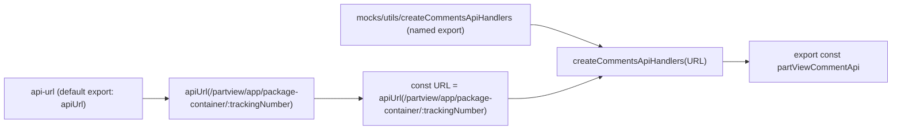

# Diagram: web/portal/src/mocks/handlers/partview/app/package-container/trackingNumber/comment.js

> Auto-generated by Obscura crawlers

## Mermaid

### SVG

<svg id="container" width="1700.609375" xmlns="http://www.w3.org/2000/svg" class="flowchart" height="246" viewBox="0 0 1700.609375 246" role="graphics-document document" aria-roledescription="flowchart-v2"><g><marker id="container_flowchart-v2-pointEnd" class="marker flowchart-v2" viewBox="0 0 10 10" refX="5" refY="5" markerUnits="userSpaceOnUse" markerWidth="8" markerHeight="8" orient="auto"><path d="M 0 0 L 10 5 L 0 10 z" class="arrowMarkerPath" style="stroke-width: 1; stroke-dasharray: 1, 0;"></path></marker><marker id="container_flowchart-v2-pointStart" class="marker flowchart-v2" viewBox="0 0 10 10" refX="4.5" refY="5" markerUnits="userSpaceOnUse" markerWidth="8" markerHeight="8" orient="auto"><path d="M 0 5 L 10 10 L 10 0 z" class="arrowMarkerPath" style="stroke-width: 1; stroke-dasharray: 1, 0;"></path></marker><marker id="container_flowchart-v2-circleEnd" class="marker flowchart-v2" viewBox="0 0 10 10" refX="11" refY="5" markerUnits="userSpaceOnUse" markerWidth="11" markerHeight="11" orient="auto"><circle cx="5" cy="5" r="5" class="arrowMarkerPath" style="stroke-width: 1; stroke-dasharray: 1, 0;"></circle></marker><marker id="container_flowchart-v2-circleStart" class="marker flowchart-v2" viewBox="0 0 10 10" refX="-1" refY="5" markerUnits="userSpaceOnUse" markerWidth="11" markerHeight="11" orient="auto"><circle cx="5" cy="5" r="5" class="arrowMarkerPath" style="stroke-width: 1; stroke-dasharray: 1, 0;"></circle></marker><marker id="container_flowchart-v2-crossEnd" class="marker cross flowchart-v2" viewBox="0 0 11 11" refX="12" refY="5.2" markerUnits="userSpaceOnUse" markerWidth="11" markerHeight="11" orient="auto"><path d="M 1,1 l 9,9 M 10,1 l -9,9" class="arrowMarkerPath" style="stroke-width: 2; stroke-dasharray: 1, 0;"></path></marker><marker id="container_flowchart-v2-crossStart" class="marker cross flowchart-v2" viewBox="0 0 11 11" refX="-1" refY="5.2" markerUnits="userSpaceOnUse" markerWidth="11" markerHeight="11" orient="auto"><path d="M 1,1 l 9,9 M 10,1 l -9,9" class="arrowMarkerPath" style="stroke-width: 2; stroke-dasharray: 1, 0;"></path></marker><g class="root"><g class="clusters"></g><g class="edgePaths"><path d="M268,187L272.167,187C276.333,187,284.667,187,292.333,187C300,187,307,187,310.5,187L314,187" id="L_apiUrlModule_callApiUrl_0" class="edge-thickness-normal edge-pattern-solid edge-thickness-normal edge-pattern-solid flowchart-link" style=";" data-edge="true" data-et="edge" data-id="L_apiUrlModule_callApiUrl_0" data-points="W3sieCI6MjY4LCJ5IjoxODd9LHsieCI6MjkzLCJ5IjoxODd9LHsieCI6MzE4LCJ5IjoxODd9XQ==" marker-end="url(#container_flowchart-v2-pointEnd)"></path><path d="M606.203,187L610.37,187C614.536,187,622.87,187,637.164,187C651.458,187,671.714,187,681.841,187L691.969,187" id="L_callApiUrl_urlConst_0" class="edge-thickness-normal edge-pattern-solid edge-thickness-normal edge-pattern-solid flowchart-link" style=";" data-edge="true" data-et="edge" data-id="L_callApiUrl_urlConst_0" data-points="W3sieCI6NjA2LjIwMzEyNSwieSI6MTg3fSx7IngiOjYzMS4yMDMxMjUsInkiOjE4N30seyJ4Ijo2OTUuOTY4NzUsInkiOjE4N31d" marker-end="url(#container_flowchart-v2-pointEnd)"></path><path d="M1023.922,47L1028.089,47C1032.255,47,1040.589,47,1062.496,53.924C1084.403,60.849,1119.883,74.697,1137.624,81.621L1155.364,88.546" id="L_createCommentsModule_createCommentsCall_0" class="edge-thickness-normal edge-pattern-solid edge-thickness-normal edge-pattern-solid flowchart-link" style=";" data-edge="true" data-et="edge" data-id="L_createCommentsModule_createCommentsCall_0" data-points="W3sieCI6MTAyMy45MjE4NzUsInkiOjQ3fSx7IngiOjEwNDguOTIxODc1LCJ5Ijo0N30seyJ4IjoxMTU5LjA5MDE3ODU3MTQyODYsInkiOjkwfV0=" marker-end="url(#container_flowchart-v2-pointEnd)"></path><path d="M984.156,187L994.951,187C1005.745,187,1027.333,187,1055.868,180.076C1084.403,173.151,1119.883,159.303,1137.624,152.379L1155.364,145.454" id="L_urlConst_createCommentsCall_0" class="edge-thickness-normal edge-pattern-solid edge-thickness-normal edge-pattern-solid flowchart-link" style=";" data-edge="true" data-et="edge" data-id="L_urlConst_createCommentsCall_0" data-points="W3sieCI6OTg0LjE1NjI1LCJ5IjoxODd9LHsieCI6MTA0OC45MjE4NzUsInkiOjE4N30seyJ4IjoxMTU5LjA5MDE3ODU3MTQyODYsInkiOjE0NH1d" marker-end="url(#container_flowchart-v2-pointEnd)"></path><path d="M1382.609,117L1386.776,117C1390.943,117,1399.276,117,1406.943,117C1414.609,117,1421.609,117,1425.109,117L1428.609,117" id="L_createCommentsCall_exported_0" class="edge-thickness-normal edge-pattern-solid edge-thickness-normal edge-pattern-solid flowchart-link" style=";" data-edge="true" data-et="edge" data-id="L_createCommentsCall_exported_0" data-points="W3sieCI6MTM4Mi42MDkzNzUsInkiOjExN30seyJ4IjoxNDA3LjYwOTM3NSwieSI6MTE3fSx7IngiOjE0MzIuNjA5Mzc1LCJ5IjoxMTd9XQ==" marker-end="url(#container_flowchart-v2-pointEnd)"></path></g><g class="edgeLabels"><g class="edgeLabel"><g class="label" data-id="L_apiUrlModule_callApiUrl_0" transform="translate(0, 0)"><foreignObject width="0" height="0">

</foreignObject></g></g><g class="edgeLabel"><g class="label" data-id="L_callApiUrl_urlConst_0" transform="translate(0, 0)"><foreignObject width="0" height="0">

</foreignObject></g></g><g class="edgeLabel"><g class="label" data-id="L_createCommentsModule_createCommentsCall_0" transform="translate(0, 0)"><foreignObject width="0" height="0">

</foreignObject></g></g><g class="edgeLabel"><g class="label" data-id="L_urlConst_createCommentsCall_0" transform="translate(0, 0)"><foreignObject width="0" height="0">

</foreignObject></g></g><g class="edgeLabel"><g class="label" data-id="L_createCommentsCall_exported_0" transform="translate(0, 0)"><foreignObject width="0" height="0">

</foreignObject></g></g></g><g class="nodes"><g class="node default" id="flowchart-apiUrlModule-0" transform="translate(138, 187)"><rect class="basic label-container" style="" x="-130" y="-39" width="260" height="78"></rect><g class="label" style="" transform="translate(-100, -24)"><rect></rect><foreignObject width="200" height="48">

api-url (default export: apiUrl)

</foreignObject></g></g><g class="node default" id="flowchart-createCommentsModule-1" transform="translate(840.0625, 47)"><rect class="basic label-container" style="" x="-183.859375" y="-39" width="367.71875" height="78"></rect><g class="label" style="" transform="translate(-153.859375, -24)"><rect></rect><foreignObject width="307.71875" height="48">

mocks/utils/createCommentsApiHandlers (named export)

</foreignObject></g></g><g class="node default" id="flowchart-callApiUrl-2" transform="translate(462.1015625, 187)"><rect class="basic label-container" style="" x="-144.1015625" y="-39" width="288.203125" height="78"></rect><g class="label" style="" transform="translate(-114.1015625, -24)"><rect></rect><foreignObject width="228.203125" height="48">

apiUrl(/partview/app/package-container/:trackingNumber)

</foreignObject></g></g><g class="node default" id="flowchart-urlConst-3" transform="translate(840.0625, 187)"><rect class="basic label-container" style="" x="-144.09375" y="-51" width="288.1875" height="102"></rect><g class="label" style="" transform="translate(-114.09375, -36)"><rect></rect><foreignObject width="228.1875" height="72">

const URL = apiUrl(/partview/app/package-container/:trackingNumber)

</foreignObject></g></g><g class="node default" id="flowchart-createCommentsCall-4" transform="translate(1228.265625, 117)"><rect class="basic label-container" style="" x="-154.34375" y="-27" width="308.6875" height="54"></rect><g class="label" style="" transform="translate(-124.34375, -12)"><rect></rect><foreignObject width="248.6875" height="24">

createCommentsApiHandlers(URL)

</foreignObject></g></g><g class="node default" id="flowchart-exported-5" transform="translate(1562.609375, 117)"><rect class="basic label-container" style="" x="-130" y="-39" width="260" height="78"></rect><g class="label" style="" transform="translate(-100, -24)"><rect></rect><foreignObject width="200" height="48">

export const partViewCommentApi

</foreignObject></g></g></g></g></g></svg>
