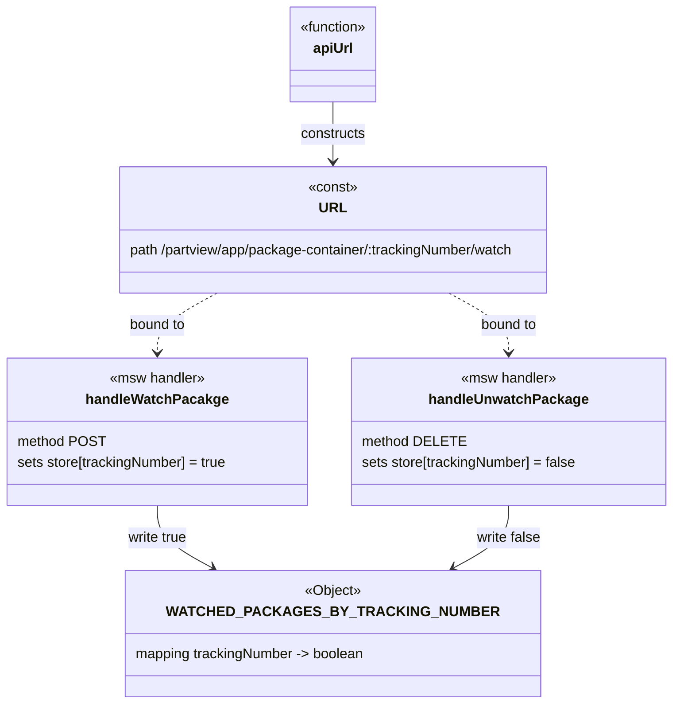
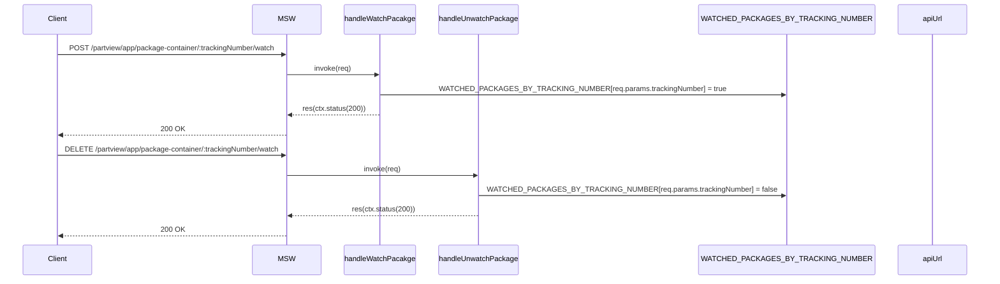

# Diagram: web/portal/src/mocks/handlers/partview/app/package-container/trackingNumber/watch.js

> Auto-generated by Obscura crawlers

## Diagram 1

### SVG

<svg id="container" width="769.7734375" xmlns="http://www.w3.org/2000/svg" class="classDiagram" height="802" viewBox="0 0 769.7734375 802" role="graphics-document document" aria-roledescription="class"><g><defs><marker id="container_class-aggregationStart" class="marker aggregation class" refX="18" refY="7" markerWidth="190" markerHeight="240" orient="auto"><path d="M 18,7 L9,13 L1,7 L9,1 Z"></path></marker></defs><defs><marker id="container_class-aggregationEnd" class="marker aggregation class" refX="1" refY="7" markerWidth="20" markerHeight="28" orient="auto"><path d="M 18,7 L9,13 L1,7 L9,1 Z"></path></marker></defs><defs><marker id="container_class-extensionStart" class="marker extension class" refX="18" refY="7" markerWidth="190" markerHeight="240" orient="auto"><path d="M 1,7 L18,13 V 1 Z"></path></marker></defs><defs><marker id="container_class-extensionEnd" class="marker extension class" refX="1" refY="7" markerWidth="20" markerHeight="28" orient="auto"><path d="M 1,1 V 13 L18,7 Z"></path></marker></defs><defs><marker id="container_class-compositionStart" class="marker composition class" refX="18" refY="7" markerWidth="190" markerHeight="240" orient="auto"><path d="M 18,7 L9,13 L1,7 L9,1 Z"></path></marker></defs><defs><marker id="container_class-compositionEnd" class="marker composition class" refX="1" refY="7" markerWidth="20" markerHeight="28" orient="auto"><path d="M 18,7 L9,13 L1,7 L9,1 Z"></path></marker></defs><defs><marker id="container_class-dependencyStart" class="marker dependency class" refX="6" refY="7" markerWidth="190" markerHeight="240" orient="auto"><path d="M 5,7 L9,13 L1,7 L9,1 Z"></path></marker></defs><defs><marker id="container_class-dependencyEnd" class="marker dependency class" refX="13" refY="7" markerWidth="20" markerHeight="28" orient="auto"><path d="M 18,7 L9,13 L14,7 L9,1 Z"></path></marker></defs><defs><marker id="container_class-lollipopStart" class="marker lollipop class" refX="13" refY="7" markerWidth="190" markerHeight="240" orient="auto"><circle stroke="black" fill="transparent" cx="7" cy="7" r="6"></circle></marker></defs><defs><marker id="container_class-lollipopEnd" class="marker lollipop class" refX="1" refY="7" markerWidth="190" markerHeight="240" orient="auto"><circle stroke="black" fill="transparent" cx="7" cy="7" r="6"></circle></marker></defs><g class="root"><g class="clusters"></g><g class="edgePaths"><path d="M381.494,116L381.494,122.167C381.494,128.333,381.494,140.667,381.494,152C381.494,163.333,381.494,173.667,381.494,178.833L381.494,184" id="id_apiUrl_URL_1" class="edge-thickness-normal edge-pattern-solid relation" style=";;;" data-edge="true" data-et="edge" data-id="id_apiUrl_URL_1" data-points="W3sieCI6MzgxLjQ5NDE0MDYyNSwieSI6MTE2fSx7IngiOjM4MS40OTQxNDA2MjUsInkiOjE1M30seyJ4IjozODEuNDk0MTQwNjI1LCJ5IjoxOTB9XQ==" marker-end="url(#container_class-dependencyEnd)"></path><path d="M248.761,334L237.393,340.167C226.024,346.333,203.287,358.667,191.919,370C180.551,381.333,180.551,391.667,180.551,396.833L180.551,402" id="id_URL_handleWatchPacakge_2" class="edge-thickness-normal edge-pattern-dashed relation" style=";;;" data-edge="true" data-et="edge" data-id="id_URL_handleWatchPacakge_2" data-points="W3sieCI6MjQ4Ljc2MDkxMjQxMzk5MDg0LCJ5IjozMzR9LHsieCI6MTgwLjU1MDc4MTI1LCJ5IjozNzF9LHsieCI6MTgwLjU1MDc4MTI1LCJ5Ijo0MDh9XQ==" marker-end="url(#container_class-dependencyEnd)"></path><path d="M514.227,334L525.596,340.167C536.964,346.333,559.701,358.667,571.069,370C582.438,381.333,582.438,391.667,582.438,396.833L582.438,402" id="id_URL_handleUnwatchPackage_3" class="edge-thickness-normal edge-pattern-dashed relation" style=";;;" data-edge="true" data-et="edge" data-id="id_URL_handleUnwatchPackage_3" data-points="W3sieCI6NTE0LjIyNzM2ODgzNjAwOTIsInkiOjMzNH0seyJ4Ijo1ODIuNDM3NSwieSI6MzcxfSx7IngiOjU4Mi40Mzc1LCJ5Ijo0MDh9XQ==" marker-end="url(#container_class-dependencyEnd)"></path><path d="M180.551,576L180.551,582.167C180.551,588.333,180.551,600.667,191.04,612.523C201.529,624.38,222.508,635.759,232.998,641.449L243.487,647.139" id="id_handleWatchPacakge_WATCHED_PACKAGES_BY_TRACKING_NUMBER_4" class="edge-thickness-normal edge-pattern-solid relation" style=";;;" data-edge="true" data-et="edge" data-id="id_handleWatchPacakge_WATCHED_PACKAGES_BY_TRACKING_NUMBER_4" data-points="W3sieCI6MTgwLjU1MDc4MTI1LCJ5Ijo1NzZ9LHsieCI6MTgwLjU1MDc4MTI1LCJ5Ijo2MTN9LHsieCI6MjQ4Ljc2MDkxMjQxMzk5MDg0LCJ5Ijo2NTB9XQ==" marker-end="url(#container_class-dependencyEnd)"></path><path d="M582.438,576L582.438,582.167C582.438,588.333,582.438,600.667,571.948,612.523C561.459,624.38,540.48,635.759,529.991,641.449L519.501,647.139" id="id_handleUnwatchPackage_WATCHED_PACKAGES_BY_TRACKING_NUMBER_5" class="edge-thickness-normal edge-pattern-solid relation" style=";;;" data-edge="true" data-et="edge" data-id="id_handleUnwatchPackage_WATCHED_PACKAGES_BY_TRACKING_NUMBER_5" data-points="W3sieCI6NTgyLjQzNzUsInkiOjU3Nn0seyJ4Ijo1ODIuNDM3NSwieSI6NjEzfSx7IngiOjUxNC4yMjczNjg4MzYwMDkyLCJ5Ijo2NTB9XQ==" marker-end="url(#container_class-dependencyEnd)"></path></g><g class="edgeLabels"><g class="edgeLabel" transform="translate(381.494140625, 153)"><g class="label" data-id="id_apiUrl_URL_1" transform="translate(-37.84375, -12)"><foreignObject width="75.6875" height="24">

constructs

</foreignObject></g></g><g class="edgeLabel" transform="translate(180.55078125, 371)"><g class="label" data-id="id_URL_handleWatchPacakge_2" transform="translate(-33.1171875, -12)"><foreignObject width="66.234375" height="24">

bound to

</foreignObject></g></g><g class="edgeLabel" transform="translate(582.4375, 371)"><g class="label" data-id="id_URL_handleUnwatchPackage_3" transform="translate(-33.1171875, -12)"><foreignObject width="66.234375" height="24">

bound to

</foreignObject></g></g><g class="edgeLabel" transform="translate(180.55078125, 613)"><g class="label" data-id="id_handleWatchPacakge_WATCHED_PACKAGES_BY_TRACKING_NUMBER_4" transform="translate(-35.3203125, -12)"><foreignObject width="70.640625" height="24">

write true

</foreignObject></g></g><g class="edgeLabel" transform="translate(582.4375, 613)"><g class="label" data-id="id_handleUnwatchPackage_WATCHED_PACKAGES_BY_TRACKING_NUMBER_5" transform="translate(-37.546875, -12)"><foreignObject width="75.09375" height="24">

write false

</foreignObject></g></g></g><g class="nodes"><g class="node default" id="classId-WATCHED_PACKAGES_BY_TRACKING_NUMBER-0" transform="translate(381.494140625, 722)"><g class="basic label-container"><path d="M-227.05859375 -72 L227.05859375 -72 L227.05859375 72 L-227.05859375 72" stroke="none" stroke-width="0" fill="#ECECFF" style=""></path><path d="M-227.05859375 -72 C-136.17427866699518 -72, -45.28996358399036 -72, 227.05859375 -72 M-227.05859375 -72 C-92.10314521750834 -72, 42.85230331498332 -72, 227.05859375 -72 M227.05859375 -72 C227.05859375 -33.019903660629076, 227.05859375 5.960192678741848, 227.05859375 72 M227.05859375 -72 C227.05859375 -24.912529996500467, 227.05859375 22.174940006999066, 227.05859375 72 M227.05859375 72 C50.140193176272845 72, -126.77820739745431 72, -227.05859375 72 M227.05859375 72 C107.58777449634847 72, -11.883044757303054 72, -227.05859375 72 M-227.05859375 72 C-227.05859375 22.678617138809656, -227.05859375 -26.642765722380688, -227.05859375 -72 M-227.05859375 72 C-227.05859375 19.09933401118559, -227.05859375 -33.80133197762882, -227.05859375 -72" stroke="#9370DB" stroke-width="1.3" fill="none" stroke-dasharray="0 0" style=""></path></g><g class="annotation-group text" transform="translate(-32.734375, -48)"><g class="label" style="" transform="translate(0,-12)"><foreignObject width="65.46875" height="24">

«Object»

</foreignObject></g></g><g class="label-group text" transform="translate(-163.3671875, -24)"><g class="label" style="font-weight: bolder" transform="translate(0,-12)"><foreignObject width="326.734375" height="24">

WATCHED_PACKAGES_BY_TRACKING_NUMBER

</foreignObject></g></g><g class="members-group text" transform="translate(-215.05859375, 24)"><g class="label" style="" transform="translate(0,-12)"><foreignObject width="266.75" height="24">

mapping trackingNumber -&gt; boolean

</foreignObject></g></g><g class="methods-group text" transform="translate(-215.05859375, 72)"></g><g class="divider" style=""><path d="M-227.05859375 0 C-63.0848563682365 0, 100.888881013527 0, 227.05859375 0 M-227.05859375 0 C-52.58294389937183 0, 121.89270595125635 0, 227.05859375 0" stroke="#9370DB" stroke-width="1.3" fill="none" stroke-dasharray="0 0" style=""></path></g><g class="divider" style=""><path d="M-227.05859375 48 C-86.08705636239046 48, 54.88448102521909 48, 227.05859375 48 M-227.05859375 48 C-51.87078427071131 48, 123.31702520857738 48, 227.05859375 48" stroke="#9370DB" stroke-width="1.3" fill="none" stroke-dasharray="0 0" style=""></path></g></g><g class="node default" id="classId-URL-1" transform="translate(381.494140625, 262)"><g class="basic label-container"><path d="M-257.32421875 -72 L257.32421875 -72 L257.32421875 72 L-257.32421875 72" stroke="none" stroke-width="0" fill="#ECECFF" style=""></path><path d="M-257.32421875 -72 C-96.27747956379156 -72, 64.76925962241688 -72, 257.32421875 -72 M-257.32421875 -72 C-115.47086520630512 -72, 26.38248833738976 -72, 257.32421875 -72 M257.32421875 -72 C257.32421875 -30.84750623254962, 257.32421875 10.30498753490076, 257.32421875 72 M257.32421875 -72 C257.32421875 -28.567307878612525, 257.32421875 14.865384242774951, 257.32421875 72 M257.32421875 72 C105.24227905685208 72, -46.83966063629583 72, -257.32421875 72 M257.32421875 72 C146.53840924904296 72, 35.75259974808591 72, -257.32421875 72 M-257.32421875 72 C-257.32421875 41.30764512675066, -257.32421875 10.615290253501321, -257.32421875 -72 M-257.32421875 72 C-257.32421875 33.56368423869297, -257.32421875 -4.872631522614057, -257.32421875 -72" stroke="#9370DB" stroke-width="1.3" fill="none" stroke-dasharray="0 0" style=""></path></g><g class="annotation-group text" transform="translate(-28.6171875, -48)"><g class="label" style="" transform="translate(0,-12)"><foreignObject width="57.234375" height="24">

«const»

</foreignObject></g></g><g class="label-group text" transform="translate(-14.25, -24)"><g class="label" style="font-weight: bolder" transform="translate(0,-12)"><foreignObject width="28.5" height="24">

URL

</foreignObject></g></g><g class="members-group text" transform="translate(-245.32421875, 24)"><g class="label" style="" transform="translate(0,-12)"><foreignObject width="462.03125" height="24">

path /partview/app/package-container/:trackingNumber/watch

</foreignObject></g></g><g class="methods-group text" transform="translate(-245.32421875, 72)"></g><g class="divider" style=""><path d="M-257.32421875 0 C-72.52073904319508 0, 112.28274066360984 0, 257.32421875 0 M-257.32421875 0 C-105.36591911959513 0, 46.59238051080973 0, 257.32421875 0" stroke="#9370DB" stroke-width="1.3" fill="none" stroke-dasharray="0 0" style=""></path></g><g class="divider" style=""><path d="M-257.32421875 48 C-86.54622717805421 48, 84.23176439389158 48, 257.32421875 48 M-257.32421875 48 C-60.102870420208006 48, 137.118477909584 48, 257.32421875 48" stroke="#9370DB" stroke-width="1.3" fill="none" stroke-dasharray="0 0" style=""></path></g></g><g class="node default" id="classId-apiUrl-2" transform="translate(381.494140625, 62)"><g class="basic label-container"><path d="M-51.484375 -54 L51.484375 -54 L51.484375 54 L-51.484375 54" stroke="none" stroke-width="0" fill="#ECECFF" style=""></path><path d="M-51.484375 -54 C-16.366485908736962 -54, 18.751403182526076 -54, 51.484375 -54 M-51.484375 -54 C-17.337758070069995 -54, 16.80885885986001 -54, 51.484375 -54 M51.484375 -54 C51.484375 -27.911115982845914, 51.484375 -1.8222319656918273, 51.484375 54 M51.484375 -54 C51.484375 -25.5759040742612, 51.484375 2.8481918514776012, 51.484375 54 M51.484375 54 C10.97899019962184 54, -29.52639460075632 54, -51.484375 54 M51.484375 54 C27.435901514671 54, 3.387428029341997 54, -51.484375 54 M-51.484375 54 C-51.484375 13.498144208625646, -51.484375 -27.003711582748707, -51.484375 -54 M-51.484375 54 C-51.484375 20.78750370561184, -51.484375 -12.42499258877632, -51.484375 -54" stroke="#9370DB" stroke-width="1.3" fill="none" stroke-dasharray="0 0" style=""></path></g><g class="annotation-group text" transform="translate(-39.484375, -30)"><g class="label" style="" transform="translate(0,-12)"><foreignObject width="78.96875" height="24">

«function»

</foreignObject></g></g><g class="label-group text" transform="translate(-22.2109375, -6)"><g class="label" style="font-weight: bolder" transform="translate(0,-12)"><foreignObject width="44.421875" height="24">

apiUrl

</foreignObject></g></g><g class="members-group text" transform="translate(-39.484375, 42)"></g><g class="methods-group text" transform="translate(-39.484375, 72)"></g><g class="divider" style=""><path d="M-51.484375 18 C-13.222064046268976 18, 25.04024690746205 18, 51.484375 18 M-51.484375 18 C-26.81443294210382 18, -2.1444908842076416 18, 51.484375 18" stroke="#9370DB" stroke-width="1.3" fill="none" stroke-dasharray="0 0" style=""></path></g><g class="divider" style=""><path d="M-51.484375 36 C-22.76956161757437 36, 5.945251764851257 36, 51.484375 36 M-51.484375 36 C-12.616696108165655 36, 26.25098278366869 36, 51.484375 36" stroke="#9370DB" stroke-width="1.3" fill="none" stroke-dasharray="0 0" style=""></path></g></g><g class="node default" id="classId-handleWatchPacakge-3" transform="translate(180.55078125, 492)"><g class="basic label-container"><path d="M-172.55078125 -84 L172.55078125 -84 L172.55078125 84 L-172.55078125 84" stroke="none" stroke-width="0" fill="#ECECFF" style=""></path><path d="M-172.55078125 -84 C-75.87583559578735 -84, 20.7991100584253 -84, 172.55078125 -84 M-172.55078125 -84 C-76.47058769025922 -84, 19.609605869481555 -84, 172.55078125 -84 M172.55078125 -84 C172.55078125 -39.7611316883739, 172.55078125 4.4777366232521985, 172.55078125 84 M172.55078125 -84 C172.55078125 -45.69441442501486, 172.55078125 -7.388828850029725, 172.55078125 84 M172.55078125 84 C67.38985272360269 84, -37.77107580279463 84, -172.55078125 84 M172.55078125 84 C39.58881057161574 84, -93.37316010676852 84, -172.55078125 84 M-172.55078125 84 C-172.55078125 40.90141298554386, -172.55078125 -2.1971740289122863, -172.55078125 -84 M-172.55078125 84 C-172.55078125 27.832002528876714, -172.55078125 -28.335994942246572, -172.55078125 -84" stroke="#9370DB" stroke-width="1.3" fill="none" stroke-dasharray="0 0" style=""></path></g><g class="annotation-group text" transform="translate(-55.7109375, -60)"><g class="label" style="" transform="translate(0,-12)"><foreignObject width="111.421875" height="24">

«msw handler»

</foreignObject></g></g><g class="label-group text" transform="translate(-77.3828125, -36)"><g class="label" style="font-weight: bolder" transform="translate(0,-12)"><foreignObject width="154.765625" height="24">

handleWatchPacakge

</foreignObject></g></g><g class="members-group text" transform="translate(-160.55078125, 12)"><g class="label" style="" transform="translate(0,-12)"><foreignObject width="97.75" height="24">

method POST

</foreignObject></g><g class="label" style="" transform="translate(0,12)"><foreignObject width="243.71875" height="24">

sets store[trackingNumber] = true

</foreignObject></g></g><g class="methods-group text" transform="translate(-160.55078125, 84)"></g><g class="divider" style=""><path d="M-172.55078125 -12 C-43.71585583513047 -12, 85.11906957973906 -12, 172.55078125 -12 M-172.55078125 -12 C-92.04707178251361 -12, -11.543362315027224 -12, 172.55078125 -12" stroke="#9370DB" stroke-width="1.3" fill="none" stroke-dasharray="0 0" style=""></path></g><g class="divider" style=""><path d="M-172.55078125 60 C-52.013417605983506 60, 68.52394603803299 60, 172.55078125 60 M-172.55078125 60 C-42.39888784268348 60, 87.75300556463304 60, 172.55078125 60" stroke="#9370DB" stroke-width="1.3" fill="none" stroke-dasharray="0 0" style=""></path></g></g><g class="node default" id="classId-handleUnwatchPackage-4" transform="translate(582.4375, 492)"><g class="basic label-container"><path d="M-179.3359375 -84 L179.3359375 -84 L179.3359375 84 L-179.3359375 84" stroke="none" stroke-width="0" fill="#ECECFF" style=""></path><path d="M-179.3359375 -84 C-71.07497004192196 -84, 37.185997416156084 -84, 179.3359375 -84 M-179.3359375 -84 C-59.889136619138455 -84, 59.55766426172309 -84, 179.3359375 -84 M179.3359375 -84 C179.3359375 -33.60589856209177, 179.3359375 16.788202875816467, 179.3359375 84 M179.3359375 -84 C179.3359375 -46.80785577856257, 179.3359375 -9.615711557125138, 179.3359375 84 M179.3359375 84 C39.053369693937015 84, -101.22919811212597 84, -179.3359375 84 M179.3359375 84 C81.0431833747033 84, -17.249570750593392 84, -179.3359375 84 M-179.3359375 84 C-179.3359375 46.2003975634274, -179.3359375 8.400795126854803, -179.3359375 -84 M-179.3359375 84 C-179.3359375 47.075138395321716, -179.3359375 10.150276790643431, -179.3359375 -84" stroke="#9370DB" stroke-width="1.3" fill="none" stroke-dasharray="0 0" style=""></path></g><g class="annotation-group text" transform="translate(-55.7109375, -60)"><g class="label" style="" transform="translate(0,-12)"><foreignObject width="111.421875" height="24">

«msw handler»

</foreignObject></g></g><g class="label-group text" transform="translate(-86.5, -36)"><g class="label" style="font-weight: bolder" transform="translate(0,-12)"><foreignObject width="173" height="24">

handleUnwatchPackage

</foreignObject></g></g><g class="members-group text" transform="translate(-167.3359375, 12)"><g class="label" style="" transform="translate(0,-12)"><foreignObject width="112.96875" height="24">

method DELETE

</foreignObject></g><g class="label" style="" transform="translate(0,12)"><foreignObject width="248.171875" height="24">

sets store[trackingNumber] = false

</foreignObject></g></g><g class="methods-group text" transform="translate(-167.3359375, 84)"></g><g class="divider" style=""><path d="M-179.3359375 -12 C-56.95065042291478 -12, 65.43463665417045 -12, 179.3359375 -12 M-179.3359375 -12 C-76.46672224852709 -12, 26.402493002945818 -12, 179.3359375 -12" stroke="#9370DB" stroke-width="1.3" fill="none" stroke-dasharray="0 0" style=""></path></g><g class="divider" style=""><path d="M-179.3359375 60 C-74.50529105254313 60, 30.325355394913743 60, 179.3359375 60 M-179.3359375 60 C-69.3590848704212 60, 40.6177677591576 60, 179.3359375 60" stroke="#9370DB" stroke-width="1.3" fill="none" stroke-dasharray="0 0" style=""></path></g></g></g></g></g></svg>

## Diagram 2

### SVG

<svg id="container" width="2194.5" xmlns="http://www.w3.org/2000/svg" height="651" viewBox="-50 -10 2194.5 651" role="graphics-document document" aria-roledescription="sequence"><g><rect x="1944.5" y="565" fill="#eaeaea" stroke="#666" width="150" height="65" name="API" rx="3" ry="3" class="actor actor-bottom"></rect><text x="2019.5" y="597.5" dominant-baseline="central" alignment-baseline="central" class="actor actor-box" style="text-anchor: middle; font-size: 16px; font-weight: 400;"><tspan x="2019.5" dy="0">apiUrl</tspan></text></g><g><rect x="1552.5" y="565" fill="#eaeaea" stroke="#666" width="342" height="65" name="Store" rx="3" ry="3" class="actor actor-bottom"></rect><text x="1723.5" y="597.5" dominant-baseline="central" alignment-baseline="central" class="actor actor-box" style="text-anchor: middle; font-size: 16px; font-weight: 400;"><tspan x="1723.5" dy="0">WATCHED_PACKAGES_BY_TRACKING_NUMBER</tspan></text></g><g><rect x="974" y="565" fill="#eaeaea" stroke="#666" width="191" height="65" name="handleUnwatchPackage" rx="3" ry="3" class="actor actor-bottom"></rect><text x="1069.5" y="597.5" dominant-baseline="central" alignment-baseline="central" class="actor actor-box" style="text-anchor: middle; font-size: 16px; font-weight: 400;"><tspan x="1069.5" dy="0">handleUnwatchPackage</tspan></text></g><g><rect x="751" y="565" fill="#eaeaea" stroke="#666" width="173" height="65" name="handleWatchPacakge" rx="3" ry="3" class="actor actor-bottom"></rect><text x="837.5" y="597.5" dominant-baseline="central" alignment-baseline="central" class="actor actor-box" style="text-anchor: middle; font-size: 16px; font-weight: 400;"><tspan x="837.5" dy="0">handleWatchPacakge</tspan></text></g><g><rect x="551" y="565" fill="#eaeaea" stroke="#666" width="150" height="65" name="MSW" rx="3" ry="3" class="actor actor-bottom"></rect><text x="626" y="597.5" dominant-baseline="central" alignment-baseline="central" class="actor actor-box" style="text-anchor: middle; font-size: 16px; font-weight: 400;"><tspan x="626" dy="0">MSW</tspan></text></g><g><rect x="0" y="565" fill="#eaeaea" stroke="#666" width="150" height="65" name="Client" rx="3" ry="3" class="actor actor-bottom"></rect><text x="75" y="597.5" dominant-baseline="central" alignment-baseline="central" class="actor actor-box" style="text-anchor: middle; font-size: 16px; font-weight: 400;"><tspan x="75" dy="0">Client</tspan></text></g><g><line id="actor5" x1="2019.5" y1="65" x2="2019.5" y2="565" class="actor-line 200" stroke-width="0.5px" stroke="#999" name="API"></line><g id="root-5"><rect x="1944.5" y="0" fill="#eaeaea" stroke="#666" width="150" height="65" name="API" rx="3" ry="3" class="actor actor-top"></rect><text x="2019.5" y="32.5" dominant-baseline="central" alignment-baseline="central" class="actor actor-box" style="text-anchor: middle; font-size: 16px; font-weight: 400;"><tspan x="2019.5" dy="0">apiUrl</tspan></text></g></g><g><line id="actor4" x1="1723.5" y1="65" x2="1723.5" y2="565" class="actor-line 200" stroke-width="0.5px" stroke="#999" name="Store"></line><g id="root-4"><rect x="1552.5" y="0" fill="#eaeaea" stroke="#666" width="342" height="65" name="Store" rx="3" ry="3" class="actor actor-top"></rect><text x="1723.5" y="32.5" dominant-baseline="central" alignment-baseline="central" class="actor actor-box" style="text-anchor: middle; font-size: 16px; font-weight: 400;"><tspan x="1723.5" dy="0">WATCHED_PACKAGES_BY_TRACKING_NUMBER</tspan></text></g></g><g><line id="actor3" x1="1069.5" y1="65" x2="1069.5" y2="565" class="actor-line 200" stroke-width="0.5px" stroke="#999" name="handleUnwatchPackage"></line><g id="root-3"><rect x="974" y="0" fill="#eaeaea" stroke="#666" width="191" height="65" name="handleUnwatchPackage" rx="3" ry="3" class="actor actor-top"></rect><text x="1069.5" y="32.5" dominant-baseline="central" alignment-baseline="central" class="actor actor-box" style="text-anchor: middle; font-size: 16px; font-weight: 400;"><tspan x="1069.5" dy="0">handleUnwatchPackage</tspan></text></g></g><g><line id="actor2" x1="837.5" y1="65" x2="837.5" y2="565" class="actor-line 200" stroke-width="0.5px" stroke="#999" name="handleWatchPacakge"></line><g id="root-2"><rect x="751" y="0" fill="#eaeaea" stroke="#666" width="173" height="65" name="handleWatchPacakge" rx="3" ry="3" class="actor actor-top"></rect><text x="837.5" y="32.5" dominant-baseline="central" alignment-baseline="central" class="actor actor-box" style="text-anchor: middle; font-size: 16px; font-weight: 400;"><tspan x="837.5" dy="0">handleWatchPacakge</tspan></text></g></g><g><line id="actor1" x1="626" y1="65" x2="626" y2="565" class="actor-line 200" stroke-width="0.5px" stroke="#999" name="MSW"></line><g id="root-1"><rect x="551" y="0" fill="#eaeaea" stroke="#666" width="150" height="65" name="MSW" rx="3" ry="3" class="actor actor-top"></rect><text x="626" y="32.5" dominant-baseline="central" alignment-baseline="central" class="actor actor-box" style="text-anchor: middle; font-size: 16px; font-weight: 400;"><tspan x="626" dy="0">MSW</tspan></text></g></g><g><line id="actor0" x1="75" y1="65" x2="75" y2="565" class="actor-line 200" stroke-width="0.5px" stroke="#999" name="Client"></line><g id="root-0"><rect x="0" y="0" fill="#eaeaea" stroke="#666" width="150" height="65" name="Client" rx="3" ry="3" class="actor actor-top"></rect><text x="75" y="32.5" dominant-baseline="central" alignment-baseline="central" class="actor actor-box" style="text-anchor: middle; font-size: 16px; font-weight: 400;"><tspan x="75" dy="0">Client</tspan></text></g></g><g></g><defs><symbol id="computer" width="24" height="24"><path transform="scale(.5)" d="M2 2v13h20v-13h-20zm18 11h-16v-9h16v9zm-10.228 6l.466-1h3.524l.467 1h-4.457zm14.228 3h-24l2-6h2.104l-1.33 4h18.45l-1.297-4h2.073l2 6zm-5-10h-14v-7h14v7z"></path></symbol></defs><defs><symbol id="database" fill-rule="evenodd" clip-rule="evenodd"><path transform="scale(.5)" d="M12.258.001l.256.004.255.005.253.008.251.01.249.012.247.015.246.016.242.019.241.02.239.023.236.024.233.027.231.028.229.031.225.032.223.034.22.036.217.038.214.04.211.041.208.043.205.045.201.046.198.048.194.05.191.051.187.053.183.054.18.056.175.057.172.059.168.06.163.061.16.063.155.064.15.066.074.033.073.033.071.034.07.034.069.035.068.035.067.035.066.035.064.036.064.036.062.036.06.036.06.037.058.037.058.037.055.038.055.038.053.038.052.038.051.039.05.039.048.039.047.039.045.04.044.04.043.04.041.04.04.041.039.041.037.041.036.041.034.041.033.042.032.042.03.042.029.042.027.042.026.043.024.043.023.043.021.043.02.043.018.044.017.043.015.044.013.044.012.044.011.045.009.044.007.045.006.045.004.045.002.045.001.045v17l-.001.045-.002.045-.004.045-.006.045-.007.045-.009.044-.011.045-.012.044-.013.044-.015.044-.017.043-.018.044-.02.043-.021.043-.023.043-.024.043-.026.043-.027.042-.029.042-.03.042-.032.042-.033.042-.034.041-.036.041-.037.041-.039.041-.04.041-.041.04-.043.04-.044.04-.045.04-.047.039-.048.039-.05.039-.051.039-.052.038-.053.038-.055.038-.055.038-.058.037-.058.037-.06.037-.06.036-.062.036-.064.036-.064.036-.066.035-.067.035-.068.035-.069.035-.07.034-.071.034-.073.033-.074.033-.15.066-.155.064-.16.063-.163.061-.168.06-.172.059-.175.057-.18.056-.183.054-.187.053-.191.051-.194.05-.198.048-.201.046-.205.045-.208.043-.211.041-.214.04-.217.038-.22.036-.223.034-.225.032-.229.031-.231.028-.233.027-.236.024-.239.023-.241.02-.242.019-.246.016-.247.015-.249.012-.251.01-.253.008-.255.005-.256.004-.258.001-.258-.001-.256-.004-.255-.005-.253-.008-.251-.01-.249-.012-.247-.015-.245-.016-.243-.019-.241-.02-.238-.023-.236-.024-.234-.027-.231-.028-.228-.031-.226-.032-.223-.034-.22-.036-.217-.038-.214-.04-.211-.041-.208-.043-.204-.045-.201-.046-.198-.048-.195-.05-.19-.051-.187-.053-.184-.054-.179-.056-.176-.057-.172-.059-.167-.06-.164-.061-.159-.063-.155-.064-.151-.066-.074-.033-.072-.033-.072-.034-.07-.034-.069-.035-.068-.035-.067-.035-.066-.035-.064-.036-.063-.036-.062-.036-.061-.036-.06-.037-.058-.037-.057-.037-.056-.038-.055-.038-.053-.038-.052-.038-.051-.039-.049-.039-.049-.039-.046-.039-.046-.04-.044-.04-.043-.04-.041-.04-.04-.041-.039-.041-.037-.041-.036-.041-.034-.041-.033-.042-.032-.042-.03-.042-.029-.042-.027-.042-.026-.043-.024-.043-.023-.043-.021-.043-.02-.043-.018-.044-.017-.043-.015-.044-.013-.044-.012-.044-.011-.045-.009-.044-.007-.045-.006-.045-.004-.045-.002-.045-.001-.045v-17l.001-.045.002-.045.004-.045.006-.045.007-.045.009-.044.011-.045.012-.044.013-.044.015-.044.017-.043.018-.044.02-.043.021-.043.023-.043.024-.043.026-.043.027-.042.029-.042.03-.042.032-.042.033-.042.034-.041.036-.041.037-.041.039-.041.04-.041.041-.04.043-.04.044-.04.046-.04.046-.039.049-.039.049-.039.051-.039.052-.038.053-.038.055-.038.056-.038.057-.037.058-.037.06-.037.061-.036.062-.036.063-.036.064-.036.066-.035.067-.035.068-.035.069-.035.07-.034.072-.034.072-.033.074-.033.151-.066.155-.064.159-.063.164-.061.167-.06.172-.059.176-.057.179-.056.184-.054.187-.053.19-.051.195-.05.198-.048.201-.046.204-.045.208-.043.211-.041.214-.04.217-.038.22-.036.223-.034.226-.032.228-.031.231-.028.234-.027.236-.024.238-.023.241-.02.243-.019.245-.016.247-.015.249-.012.251-.01.253-.008.255-.005.256-.004.258-.001.258.001zm-9.258 20.499v.01l.001.021.003.021.004.022.005.021.006.022.007.022.009.023.01.022.011.023.012.023.013.023.015.023.016.024.017.023.018.024.019.024.021.024.022.025.023.024.024.025.052.049.056.05.061.051.066.051.07.051.075.051.079.052.084.052.088.052.092.052.097.052.102.051.105.052.11.052.114.051.119.051.123.051.127.05.131.05.135.05.139.048.144.049.147.047.152.047.155.047.16.045.163.045.167.043.171.043.176.041.178.041.183.039.187.039.19.037.194.035.197.035.202.033.204.031.209.03.212.029.216.027.219.025.222.024.226.021.23.02.233.018.236.016.24.015.243.012.246.01.249.008.253.005.256.004.259.001.26-.001.257-.004.254-.005.25-.008.247-.011.244-.012.241-.014.237-.016.233-.018.231-.021.226-.021.224-.024.22-.026.216-.027.212-.028.21-.031.205-.031.202-.034.198-.034.194-.036.191-.037.187-.039.183-.04.179-.04.175-.042.172-.043.168-.044.163-.045.16-.046.155-.046.152-.047.148-.048.143-.049.139-.049.136-.05.131-.05.126-.05.123-.051.118-.052.114-.051.11-.052.106-.052.101-.052.096-.052.092-.052.088-.053.083-.051.079-.052.074-.052.07-.051.065-.051.06-.051.056-.05.051-.05.023-.024.023-.025.021-.024.02-.024.019-.024.018-.024.017-.024.015-.023.014-.024.013-.023.012-.023.01-.023.01-.022.008-.022.006-.022.006-.022.004-.022.004-.021.001-.021.001-.021v-4.127l-.077.055-.08.053-.083.054-.085.053-.087.052-.09.052-.093.051-.095.05-.097.05-.1.049-.102.049-.105.048-.106.047-.109.047-.111.046-.114.045-.115.045-.118.044-.12.043-.122.042-.124.042-.126.041-.128.04-.13.04-.132.038-.134.038-.135.037-.138.037-.139.035-.142.035-.143.034-.144.033-.147.032-.148.031-.15.03-.151.03-.153.029-.154.027-.156.027-.158.026-.159.025-.161.024-.162.023-.163.022-.165.021-.166.02-.167.019-.169.018-.169.017-.171.016-.173.015-.173.014-.175.013-.175.012-.177.011-.178.01-.179.008-.179.008-.181.006-.182.005-.182.004-.184.003-.184.002h-.37l-.184-.002-.184-.003-.182-.004-.182-.005-.181-.006-.179-.008-.179-.008-.178-.01-.176-.011-.176-.012-.175-.013-.173-.014-.172-.015-.171-.016-.17-.017-.169-.018-.167-.019-.166-.02-.165-.021-.163-.022-.162-.023-.161-.024-.159-.025-.157-.026-.156-.027-.155-.027-.153-.029-.151-.03-.15-.03-.148-.031-.146-.032-.145-.033-.143-.034-.141-.035-.14-.035-.137-.037-.136-.037-.134-.038-.132-.038-.13-.04-.128-.04-.126-.041-.124-.042-.122-.042-.12-.044-.117-.043-.116-.045-.113-.045-.112-.046-.109-.047-.106-.047-.105-.048-.102-.049-.1-.049-.097-.05-.095-.05-.093-.052-.09-.051-.087-.052-.085-.053-.083-.054-.08-.054-.077-.054v4.127zm0-5.654v.011l.001.021.003.021.004.021.005.022.006.022.007.022.009.022.01.022.011.023.012.023.013.023.015.024.016.023.017.024.018.024.019.024.021.024.022.024.023.025.024.024.052.05.056.05.061.05.066.051.07.051.075.052.079.051.084.052.088.052.092.052.097.052.102.052.105.052.11.051.114.051.119.052.123.05.127.051.131.05.135.049.139.049.144.048.147.048.152.047.155.046.16.045.163.045.167.044.171.042.176.042.178.04.183.04.187.038.19.037.194.036.197.034.202.033.204.032.209.03.212.028.216.027.219.025.222.024.226.022.23.02.233.018.236.016.24.014.243.012.246.01.249.008.253.006.256.003.259.001.26-.001.257-.003.254-.006.25-.008.247-.01.244-.012.241-.015.237-.016.233-.018.231-.02.226-.022.224-.024.22-.025.216-.027.212-.029.21-.03.205-.032.202-.033.198-.035.194-.036.191-.037.187-.039.183-.039.179-.041.175-.042.172-.043.168-.044.163-.045.16-.045.155-.047.152-.047.148-.048.143-.048.139-.05.136-.049.131-.05.126-.051.123-.051.118-.051.114-.052.11-.052.106-.052.101-.052.096-.052.092-.052.088-.052.083-.052.079-.052.074-.051.07-.052.065-.051.06-.05.056-.051.051-.049.023-.025.023-.024.021-.025.02-.024.019-.024.018-.024.017-.024.015-.023.014-.023.013-.024.012-.022.01-.023.01-.023.008-.022.006-.022.006-.022.004-.021.004-.022.001-.021.001-.021v-4.139l-.077.054-.08.054-.083.054-.085.052-.087.053-.09.051-.093.051-.095.051-.097.05-.1.049-.102.049-.105.048-.106.047-.109.047-.111.046-.114.045-.115.044-.118.044-.12.044-.122.042-.124.042-.126.041-.128.04-.13.039-.132.039-.134.038-.135.037-.138.036-.139.036-.142.035-.143.033-.144.033-.147.033-.148.031-.15.03-.151.03-.153.028-.154.028-.156.027-.158.026-.159.025-.161.024-.162.023-.163.022-.165.021-.166.02-.167.019-.169.018-.169.017-.171.016-.173.015-.173.014-.175.013-.175.012-.177.011-.178.009-.179.009-.179.007-.181.007-.182.005-.182.004-.184.003-.184.002h-.37l-.184-.002-.184-.003-.182-.004-.182-.005-.181-.007-.179-.007-.179-.009-.178-.009-.176-.011-.176-.012-.175-.013-.173-.014-.172-.015-.171-.016-.17-.017-.169-.018-.167-.019-.166-.02-.165-.021-.163-.022-.162-.023-.161-.024-.159-.025-.157-.026-.156-.027-.155-.028-.153-.028-.151-.03-.15-.03-.148-.031-.146-.033-.145-.033-.143-.033-.141-.035-.14-.036-.137-.036-.136-.037-.134-.038-.132-.039-.13-.039-.128-.04-.126-.041-.124-.042-.122-.043-.12-.043-.117-.044-.116-.044-.113-.046-.112-.046-.109-.046-.106-.047-.105-.048-.102-.049-.1-.049-.097-.05-.095-.051-.093-.051-.09-.051-.087-.053-.085-.052-.083-.054-.08-.054-.077-.054v4.139zm0-5.666v.011l.001.02.003.022.004.021.005.022.006.021.007.022.009.023.01.022.011.023.012.023.013.023.015.023.016.024.017.024.018.023.019.024.021.025.022.024.023.024.024.025.052.05.056.05.061.05.066.051.07.051.075.052.079.051.084.052.088.052.092.052.097.052.102.052.105.051.11.052.114.051.119.051.123.051.127.05.131.05.135.05.139.049.144.048.147.048.152.047.155.046.16.045.163.045.167.043.171.043.176.042.178.04.183.04.187.038.19.037.194.036.197.034.202.033.204.032.209.03.212.028.216.027.219.025.222.024.226.021.23.02.233.018.236.017.24.014.243.012.246.01.249.008.253.006.256.003.259.001.26-.001.257-.003.254-.006.25-.008.247-.01.244-.013.241-.014.237-.016.233-.018.231-.02.226-.022.224-.024.22-.025.216-.027.212-.029.21-.03.205-.032.202-.033.198-.035.194-.036.191-.037.187-.039.183-.039.179-.041.175-.042.172-.043.168-.044.163-.045.16-.045.155-.047.152-.047.148-.048.143-.049.139-.049.136-.049.131-.051.126-.05.123-.051.118-.052.114-.051.11-.052.106-.052.101-.052.096-.052.092-.052.088-.052.083-.052.079-.052.074-.052.07-.051.065-.051.06-.051.056-.05.051-.049.023-.025.023-.025.021-.024.02-.024.019-.024.018-.024.017-.024.015-.023.014-.024.013-.023.012-.023.01-.022.01-.023.008-.022.006-.022.006-.022.004-.022.004-.021.001-.021.001-.021v-4.153l-.077.054-.08.054-.083.053-.085.053-.087.053-.09.051-.093.051-.095.051-.097.05-.1.049-.102.048-.105.048-.106.048-.109.046-.111.046-.114.046-.115.044-.118.044-.12.043-.122.043-.124.042-.126.041-.128.04-.13.039-.132.039-.134.038-.135.037-.138.036-.139.036-.142.034-.143.034-.144.033-.147.032-.148.032-.15.03-.151.03-.153.028-.154.028-.156.027-.158.026-.159.024-.161.024-.162.023-.163.023-.165.021-.166.02-.167.019-.169.018-.169.017-.171.016-.173.015-.173.014-.175.013-.175.012-.177.01-.178.01-.179.009-.179.007-.181.006-.182.006-.182.004-.184.003-.184.001-.185.001-.185-.001-.184-.001-.184-.003-.182-.004-.182-.006-.181-.006-.179-.007-.179-.009-.178-.01-.176-.01-.176-.012-.175-.013-.173-.014-.172-.015-.171-.016-.17-.017-.169-.018-.167-.019-.166-.02-.165-.021-.163-.023-.162-.023-.161-.024-.159-.024-.157-.026-.156-.027-.155-.028-.153-.028-.151-.03-.15-.03-.148-.032-.146-.032-.145-.033-.143-.034-.141-.034-.14-.036-.137-.036-.136-.037-.134-.038-.132-.039-.13-.039-.128-.041-.126-.041-.124-.041-.122-.043-.12-.043-.117-.044-.116-.044-.113-.046-.112-.046-.109-.046-.106-.048-.105-.048-.102-.048-.1-.05-.097-.049-.095-.051-.093-.051-.09-.052-.087-.052-.085-.053-.083-.053-.08-.054-.077-.054v4.153zm8.74-8.179l-.257.004-.254.005-.25.008-.247.011-.244.012-.241.014-.237.016-.233.018-.231.021-.226.022-.224.023-.22.026-.216.027-.212.028-.21.031-.205.032-.202.033-.198.034-.194.036-.191.038-.187.038-.183.04-.179.041-.175.042-.172.043-.168.043-.163.045-.16.046-.155.046-.152.048-.148.048-.143.048-.139.049-.136.05-.131.05-.126.051-.123.051-.118.051-.114.052-.11.052-.106.052-.101.052-.096.052-.092.052-.088.052-.083.052-.079.052-.074.051-.07.052-.065.051-.06.05-.056.05-.051.05-.023.025-.023.024-.021.024-.02.025-.019.024-.018.024-.017.023-.015.024-.014.023-.013.023-.012.023-.01.023-.01.022-.008.022-.006.023-.006.021-.004.022-.004.021-.001.021-.001.021.001.021.001.021.004.021.004.022.006.021.006.023.008.022.01.022.01.023.012.023.013.023.014.023.015.024.017.023.018.024.019.024.02.025.021.024.023.024.023.025.051.05.056.05.06.05.065.051.07.052.074.051.079.052.083.052.088.052.092.052.096.052.101.052.106.052.11.052.114.052.118.051.123.051.126.051.131.05.136.05.139.049.143.048.148.048.152.048.155.046.16.046.163.045.168.043.172.043.175.042.179.041.183.04.187.038.191.038.194.036.198.034.202.033.205.032.21.031.212.028.216.027.22.026.224.023.226.022.231.021.233.018.237.016.241.014.244.012.247.011.25.008.254.005.257.004.26.001.26-.001.257-.004.254-.005.25-.008.247-.011.244-.012.241-.014.237-.016.233-.018.231-.021.226-.022.224-.023.22-.026.216-.027.212-.028.21-.031.205-.032.202-.033.198-.034.194-.036.191-.038.187-.038.183-.04.179-.041.175-.042.172-.043.168-.043.163-.045.16-.046.155-.046.152-.048.148-.048.143-.048.139-.049.136-.05.131-.05.126-.051.123-.051.118-.051.114-.052.11-.052.106-.052.101-.052.096-.052.092-.052.088-.052.083-.052.079-.052.074-.051.07-.052.065-.051.06-.05.056-.05.051-.05.023-.025.023-.024.021-.024.02-.025.019-.024.018-.024.017-.023.015-.024.014-.023.013-.023.012-.023.01-.023.01-.022.008-.022.006-.023.006-.021.004-.022.004-.021.001-.021.001-.021-.001-.021-.001-.021-.004-.021-.004-.022-.006-.021-.006-.023-.008-.022-.01-.022-.01-.023-.012-.023-.013-.023-.014-.023-.015-.024-.017-.023-.018-.024-.019-.024-.02-.025-.021-.024-.023-.024-.023-.025-.051-.05-.056-.05-.06-.05-.065-.051-.07-.052-.074-.051-.079-.052-.083-.052-.088-.052-.092-.052-.096-.052-.101-.052-.106-.052-.11-.052-.114-.052-.118-.051-.123-.051-.126-.051-.131-.05-.136-.05-.139-.049-.143-.048-.148-.048-.152-.048-.155-.046-.16-.046-.163-.045-.168-.043-.172-.043-.175-.042-.179-.041-.183-.04-.187-.038-.191-.038-.194-.036-.198-.034-.202-.033-.205-.032-.21-.031-.212-.028-.216-.027-.22-.026-.224-.023-.226-.022-.231-.021-.233-.018-.237-.016-.241-.014-.244-.012-.247-.011-.25-.008-.254-.005-.257-.004-.26-.001-.26.001z"></path></symbol></defs><defs><symbol id="clock" width="24" height="24"><path transform="scale(.5)" d="M12 2c5.514 0 10 4.486 10 10s-4.486 10-10 10-10-4.486-10-10 4.486-10 10-10zm0-2c-6.627 0-12 5.373-12 12s5.373 12 12 12 12-5.373 12-12-5.373-12-12-12zm5.848 12.459c.202.038.202.333.001.372-1.907.361-6.045 1.111-6.547 1.111-.719 0-1.301-.582-1.301-1.301 0-.512.77-5.447 1.125-7.445.034-.192.312-.181.343.014l.985 6.238 5.394 1.011z"></path></symbol></defs><defs><marker id="arrowhead" refX="7.9" refY="5" markerUnits="userSpaceOnUse" markerWidth="12" markerHeight="12" orient="auto-start-reverse"><path d="M -1 0 L 10 5 L 0 10 z"></path></marker></defs><defs><marker id="crosshead" markerWidth="15" markerHeight="8" orient="auto" refX="4" refY="4.5"><path fill="none" stroke="#000000" stroke-width="1pt" d="M 1,2 L 6,7 M 6,2 L 1,7" style="stroke-dasharray: 0, 0;"></path></marker></defs><defs><marker id="filled-head" refX="15.5" refY="7" markerWidth="20" markerHeight="28" orient="auto"><path d="M 18,7 L9,13 L14,7 L9,1 Z"></path></marker></defs><defs><marker id="sequencenumber" refX="15" refY="15" markerWidth="60" markerHeight="40" orient="auto"><circle cx="15" cy="15" r="6"></circle></marker></defs><text x="349" y="80" text-anchor="middle" dominant-baseline="middle" alignment-baseline="middle" class="messageText" dy="1em" style="font-size: 16px; font-weight: 400;">POST /partview/app/package-container/:trackingNumber/watch</text><line x1="76" y1="113" x2="622" y2="113" class="messageLine0" stroke-width="2" stroke="none" marker-end="url(#arrowhead)" style="fill: none;"></line><text x="730" y="128" text-anchor="middle" dominant-baseline="middle" alignment-baseline="middle" class="messageText" dy="1em" style="font-size: 16px; font-weight: 400;">invoke(req)</text><line x1="627" y1="161" x2="833.5" y2="161" class="messageLine0" stroke-width="2" stroke="none" marker-end="url(#arrowhead)" style="fill: none;"></line><text x="1279" y="176" text-anchor="middle" dominant-baseline="middle" alignment-baseline="middle" class="messageText" dy="1em" style="font-size: 16px; font-weight: 400;">WATCHED_PACKAGES_BY_TRACKING_NUMBER[req.params.trackingNumber] = true</text><line x1="838.5" y1="209" x2="1719.5" y2="209" class="messageLine0" stroke-width="2" stroke="none" marker-end="url(#arrowhead)" style="fill: none;"></line><text x="733" y="224" text-anchor="middle" dominant-baseline="middle" alignment-baseline="middle" class="messageText" dy="1em" style="font-size: 16px; font-weight: 400;">res(ctx.status(200))</text><line x1="836.5" y1="257" x2="630" y2="257" class="messageLine1" stroke-width="2" stroke="none" marker-end="url(#arrowhead)" style="stroke-dasharray: 3, 3; fill: none;"></line><text x="352" y="272" text-anchor="middle" dominant-baseline="middle" alignment-baseline="middle" class="messageText" dy="1em" style="font-size: 16px; font-weight: 400;">200 OK</text><line x1="625" y1="305" x2="79" y2="305" class="messageLine1" stroke-width="2" stroke="none" marker-end="url(#arrowhead)" style="stroke-dasharray: 3, 3; fill: none;"></line><text x="349" y="320" text-anchor="middle" dominant-baseline="middle" alignment-baseline="middle" class="messageText" dy="1em" style="font-size: 16px; font-weight: 400;">DELETE /partview/app/package-container/:trackingNumber/watch</text><line x1="76" y1="353" x2="622" y2="353" class="messageLine0" stroke-width="2" stroke="none" marker-end="url(#arrowhead)" style="fill: none;"></line><text x="846" y="368" text-anchor="middle" dominant-baseline="middle" alignment-baseline="middle" class="messageText" dy="1em" style="font-size: 16px; font-weight: 400;">invoke(req)</text><line x1="627" y1="401" x2="1065.5" y2="401" class="messageLine0" stroke-width="2" stroke="none" marker-end="url(#arrowhead)" style="fill: none;"></line><text x="1395" y="416" text-anchor="middle" dominant-baseline="middle" alignment-baseline="middle" class="messageText" dy="1em" style="font-size: 16px; font-weight: 400;">WATCHED_PACKAGES_BY_TRACKING_NUMBER[req.params.trackingNumber] = false</text><line x1="1070.5" y1="449" x2="1719.5" y2="449" class="messageLine0" stroke-width="2" stroke="none" marker-end="url(#arrowhead)" style="fill: none;"></line><text x="849" y="464" text-anchor="middle" dominant-baseline="middle" alignment-baseline="middle" class="messageText" dy="1em" style="font-size: 16px; font-weight: 400;">res(ctx.status(200))</text><line x1="1068.5" y1="497" x2="630" y2="497" class="messageLine1" stroke-width="2" stroke="none" marker-end="url(#arrowhead)" style="stroke-dasharray: 3, 3; fill: none;"></line><text x="352" y="512" text-anchor="middle" dominant-baseline="middle" alignment-baseline="middle" class="messageText" dy="1em" style="font-size: 16px; font-weight: 400;">200 OK</text><line x1="625" y1="545" x2="79" y2="545" class="messageLine1" stroke-width="2" stroke="none" marker-end="url(#arrowhead)" style="stroke-dasharray: 3, 3; fill: none;"></line></svg>
